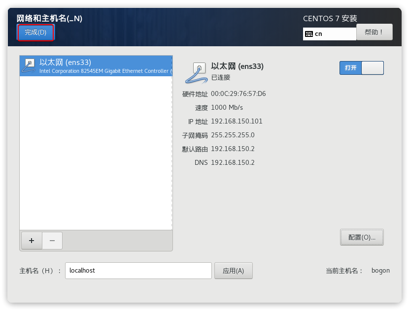
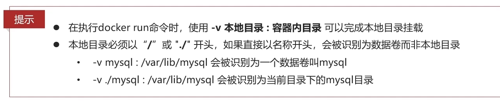
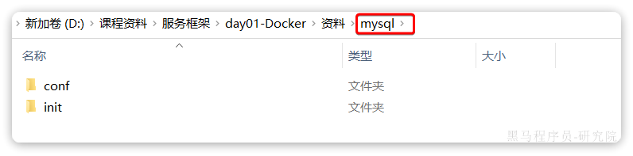
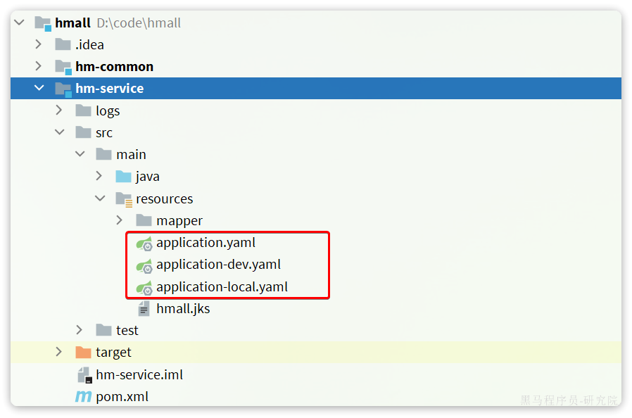
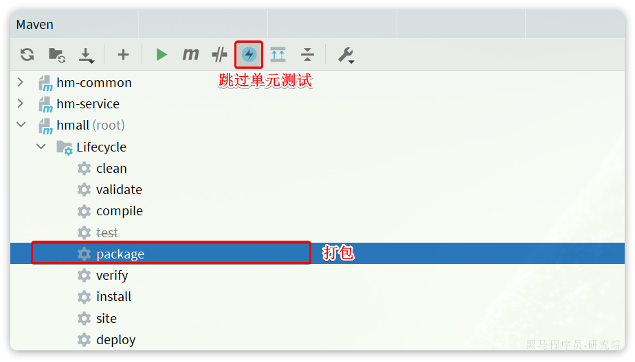

大家学习中如果碰到困难，可以加入**[黑马智学伴侣](https://b11et3un53m.feishu.cn/wiki/M9LKwYAlHiZoyhkB5iKcgOh1nmc)**寻求帮助，有学习交流群，老师、同学在线答疑。还有独享的企业级项目，避免与人撞车。


同学们，在前两天我们学习了Linux操作系统的常见命令以及如何在Linux上部署一个单体项目。大家想一想自己最大的感受是什么？

我相信，除了个别天赋异禀的同学以外，大多数同学都会有相同的感受，那就是麻烦。核心体现在三点：

- 命令太多了，记不住
- 软件安装包名字复杂，不知道去哪里找
- 安装和部署步骤复杂，容易出错

其实上述问题不仅仅是新手，即便是运维在安装、部署的时候一样会觉得麻烦、容易出错。

特别是我们即将进入微服务阶段学习，微服务项目动辄就是几十台、上百台服务需要部署，有些大型项目甚至达到数万台服务。而**由于每台服务器的运行环境不同，你写好的安装流程、部署脚本并不一定在每个服务器都能正常运行**，经常会出错。这就给系统的部署运维带来了很多困难。

那么，有没有一种技术能够避免部署对服务器环境的依赖，减少复杂的部署流程呢？

答案是肯定的，这就是我们今天要学习的**Docker**技术。你会发现，有了Docker以后项目的部署如丝般顺滑，大大减少了运维工作量。

即便你对Linux不熟悉，你也能**轻松部署各种常见软件、Java项目**。

通过今天的学习，希望大家能达成下面的学习目标：

- 能利用Docker部署常见软件
- 能利用Docker打包并部署Java应用
- 理解Docker数据卷的基本作用
- 能看懂DockerCompose文件


# 镜像和容器的区别


在Docker中，**镜像**和**容器**是两个核心概念，它们相互关联但有不同的用途和特性。可以从以下几个方面来理解这两个概念：

### 1. **Docker镜像 (Image)**
- **定义**：镜像是一个**静态的**、**只读的**模板，包含了运行应用所需的所有依赖、库文件、配置以及文件系统等。它是用于创建Docker容器的基础。
- **作用**：镜像类似于虚拟机的快照或ISO文件，它封装了操作系统环境和应用程序的运行环境，可以跨平台运行。镜像包含了启动容器时所需要的所有信息。
- **不可变性**：镜像一旦创建就无法更改，除非通过创建新的镜像层进行修改。因此，每次修改会生成一个新的镜像版本。
- **层次结构**：Docker镜像由多个层（layer）构成，这些层是文件系统的增量变化，每一层都可以复用，优化了存储空间和加载速度。

### 2. **Docker容器 (Container)**
- **定义**：容器是镜像的一个**运行实例**。它是一个轻量级的、独立的执行环境，可以看作是运行时的Docker镜像。容器运行时会有一个可读写的层，允许在其中进行操作。
- **作用**：容器提供了一个隔离的运行环境，里面运行着应用程序和所有依赖。通过容器，可以确保应用程序在不同的环境（如开发、测试、生产）下的行为一致性。
- **动态性**：容器是动态的，可以创建、启动、停止、销毁。当一个容器运行时，它可以进行修改和操作，但这些修改不会影响到镜像本身。容器停止后，所有对容器的更改可以保存为新的镜像，也可以丢弃。
- **隔离性**：容器与宿主系统以及其他容器之间相互隔离，这种隔离不仅体现在文件系统上，还包括网络、进程等资源。

### 3. **镜像与容器的关系**
- **静态 vs. 动态**：镜像是静态的，只读的，作为创建容器的模板；容器是动态的，可以在其中运行应用，读写数据。
- **创建关系**：容器是从镜像创建出来的。你可以将镜像看作是蓝图，而容器是根据蓝图构建出的实例。一个镜像可以创建多个容器。
- **持久化 vs. 临时运行**：镜像是长期保存的，而容器可以是短暂的（比如运行某个任务后被销毁），也可以运行很长时间。

### 4. **实例化过程**
- 创建一个容器时，Docker会：
  1. 从镜像中复制所有文件层。
  2. 为该容器创建一个新的可写层，允许对容器内的文件进行修改。
  3. 启动该容器并开始执行镜像中的应用。

### 举例说明
- **镜像**可以类比为应用程序的安装包（如ISO文件），它包含了操作系统、应用以及其依赖项。
- **容器**则类似于从该安装包安装并运行的应用程序实例，它是镜像的实际运行体。你可以同时运行多个容器，而每个容器都是相互独立的，基于同一个镜像构建。

### 总结 
- **镜像**是应用的静态模板，提供容器运行所需的环境和依赖。
- **容器**是镜像的运行实例，动态地运行应用程序并提供隔离环境。


# 准备Linux环境

首先，我们要准备一个Linux的系统，成本最低的方式就是在本地安装一台虚拟机。为了统一学习环境，不管是使用MacOS还是Windows系统的同学，都建议安装一台虚拟机。

windows采用VMware，Mac则采用Fusion

## 1.1.安装VMware

VMware是业界最好用的虚拟机软件之一。

windows版本的网站如下：

https://www.vmware.com/cn/products/workstation-pro/workstation-pro-evaluation.html

Mac下也有对应版本，叫做VMware Fusion：

https://www.vmware.com/cn/products/fusion.html

特别注意，Windows10以上版本操作系统需要下载安装VMware Workstation Pro16及以上版本，安装方式此处略。

如果自己电脑上已经有了低版本的VMware，则需要先卸载，再重新安装。卸载过程比较麻烦。

### 1.1.1.卸载旧版VMware（可选）

首先，在控制面板找到程序和功能选项，找到VMware，进行卸载操作：


弹出确认框, 点击"下一步":


下一步之后, 选择删除:


接下来，按照提示完成卸载操作即可。

卸载完成后，还需要看看VMware的安装目录是否有旧数据，一并清理掉。

比如安装在**C盘的****Program Files****(****x86****)**：


则需要直接删除整个VMware目录：


接下来要清理注册表：

首先，按住Windows + R , 在弹出框中输入 "regedit" 调出注册表：


进入注册表编辑器，如图：


打开**`HKEY_CURRENT_USER`**文件夹，找到**`Software`**文件夹并打开


找到“VMware.Inc”，右键删除：


### 1.1.2.安装VMware

安装步骤略。。

安装以后可以免费试用，大家可以去官网购买正版许可证，或者去网上看看有没有好心人赠送你一个许可证。启动后的界面如图所示：


### 1.1.3.常见错误

如果VMware虚拟机运行报错，例如：


这个是由于英特尔的虚拟化技术, 没有开启, 需要进入系统的BIOS界面 , 开启英特尔的虚拟化技术 ; 不同的电脑型号 , 进入BIOS界面的方式不同, 需要百度查询一下自己电脑的型号 , 如何进BIOS ;

windows10系统可以参考: https://blog.csdn.net/biu_code/article/details/107504627

以ThinkPad为例，如图：


## 1.2.创建虚拟机

Centos7是比较常用的一个Linux发行版本，在国内的使用比例还是比较高的。

大家首先要下载一个Centos7的iso文件，我在资料中给大家准备了一个mini的版本，体积不到1G，推荐大家使用：


我们在VMware《主页》界面中点击《创建新的虚拟机》按钮：


然后会弹出一个窗口，我们直接点击下一步：


然后页面中选择你准备好的ISO文件，继续点击下一步：


然后填写`虚拟机的名称`以及虚拟机将来`保存的位置`：


再次下一步，填写虚拟机磁盘大小。这里建议给大一点，否则将来不够用调整起来麻烦。而且这里设置大小并不是立刻占用这么多，而是设置一个上限：


继续下一步，然后选择虚拟机硬件设置：


在弹出的窗口中设置虚拟机硬件，建议CPU给到4核，内存给到8G：


配置完成后，点击`关闭`，回到上一页面，继续点击`完成`：


虚拟机就创建完毕了：


## 1.3.安装Centos7

接下来，我们启动刚刚创建的虚拟机，开始安装Centos7系统：


启动后需要选择安装菜单，将鼠标移入黑窗口中后，将无法再使用鼠标，需要按上下键选择菜单。选中Install Centos 7 后按下回车：


然后会提示我们按下enter键继续：


过一会儿后，会进入语言选择菜单，这里可以使用鼠标选择。选择中文-简体中文，然后继续：


接下来，会进入安装配置页面：


鼠标向下滚动后，找到系统-安装位置配置，点击：


选择刚刚添加的磁盘，并点击完成：


然后回到配置页面，这次点击《网络和主机名》：


在网络页面做下面的几件事情：

1. 修改主机名为自己喜欢的主机名，不要出现中文和特殊字符，建议用localhost
2. 点击应用
3. 将网络连接打开
4. 点击配置，设置详细网络信息


最好用一个截图软件，记住上图中的网络详细信息，接下来的配置要参考：


点击配置按钮后，我们需要把网卡地址改为静态IP，这样可以避免每次启动虚拟机IP都变化。所有配置照搬你自己截图的网络信息填写，不要照抄我的：


上图中的四个信息参考之前的**以太网****(ens33)****网卡**的截图，不要照搬我的来写。

最后，点击完成按钮：



回到配置界面后，点击`开始安装`：


接下来需要设置root密码：


填写你要使用的root密码，然后点击完成：


接下来，耐心等待安装即可。


等待安装完成后，点击**重启**：


耐心等待一段时间，不要做任何操作，虚拟机即可启动完毕：


输入用户名root，然后点击回车，会要求你输入密码：


此时你要输入密码，不过需要注意的是密码是**隐藏**的，输入了也看不见。所以放心输入，完成后回车即可：


只要密码输入正确，就可以正常登录。此时可以用命令测试虚拟机网络是否畅通：

```Bash
ping www.baidu.com
```

如果看到这样的结果代表网络畅通：


默认ping命令会持续执行，按下`CTRL `+ `C`后命令即可停止。

## 1.4.设置虚拟机快照

在虚拟机安装完成后，最好立刻设置一个快照，这样一旦将来虚拟机出现问题，可以快速恢复。

我们先停止虚拟机，点击VMware顶部菜单中的`暂停`**`下拉选框`**，选择`关闭客户机`：


接着，点击VMware菜单中的🔧按钮:


然后在弹出的快照管理窗口中，点击**拍摄快照**，填写新的快照信息：


快照拍摄完成了！而且我们可以在不同阶段拍摄多个不同快照作为备份，方便后期恢复数据。

假如以后虚拟机文件受损，需要恢复到初始状态的话，可以选中要恢复的快照，点击转到即可：


# SSH客户端-MobarXterm

在VMware界面中操作虚拟机非常不友好，所以一般推荐使用专门的SSH客户端。市面上常见的有：

- Xshell：个人免费，商业收费，之前爆出过有隐藏后门。不推荐
- Finshell：基础功能免费，高级功能收费，基于Java，内存占用较高（在1个G左右）。不推荐
- MobarXterm：基础功能免费、高级功能收费。开源、功能强大、内存占用低（只有10m左右），但是界面不太漂亮。推荐使用

## 2.1.安装MobarXterm

这里我们会选择内存占用较低的MobarXterm作为SSH客户端，其官网地址：

https://mobaxterm.mobatek.net/

安装完成后界面如图所示：


点击session按钮，进入会话管理：


在弹出的session管理页面中，按照下图填写信息并保存：


点击OK后会提示你是第一次连接，询问你是信任连接的服务：


选择accept之后，会询问你是否要记住密码，选择yes：


紧接着需要你设置一个MobarXterm的全局密码用于做密码管理，建议设置一个与虚拟机密码不同的：

输入密码：


输入成功后，就会连接成功，并进入操作界面了：


这里需要做一些基础的配置：


## 2.2.配置默认编辑器

首先建议设置一下默认编辑器，这样我们通过MobarXterm的FTP工具打开文件时会以指定的编辑器打开，方便修改。我这里配置的是vscode：


## 2.3.配置右键粘贴

复制粘贴是很常用的配置，MobarXterm默认左键选中即**复制**，但是需要配置右键点击为**粘贴：**


这样，复制和粘贴可以全部通过鼠标操作，无需按键。

## 2.4.SSH配置

接下来还有几个ssh配置：


分别是：

- 默认的登录用户
- ssh保持连接
- 取消连接成功后的欢迎banner

## 2.5.关闭X-Server服务

大多数情况下，我们没有x-server的需求，因此可以选择不要自启动：


# 安装Docker

本安装教程参考Docker官方文档，地址如下：

https://docs.docker.com/engine/install/centos/

## 1.卸载旧版

首先如果系统中已经存在旧的Docker，则先卸载：

```Shell
yum remove docker \
    docker-client \
    docker-client-latest \
    docker-common \
    docker-latest \
    docker-latest-logrotate \
    docker-logrotate \
    docker-engine \
    docker-selinux 
```

## 2.配置Docker的yum库

首先要安装一个yum工具

```Bash
sudo yum install -y yum-utils device-mapper-persistent-data lvm2
```

#### 	注意：==yum命令错误==

##### **CentOS7执行yum命令遇到“Could not resolve host: mirrorlist.centos.org； 未知的错误”如何解决**

**原因是国内网络不能访问外网。所以需要将mirrorlist.centos.org替换为国内可以访问的镜像源。**

```shell
 curl -o /etc/yum.repos.d/CentOS-Base.repo http://mirrors.aliyun.com/repo/Centos-7.repo
```

**然后再清除yum缓存**

```shell
yum clean all
```

**然后重新生成缓存**

```shell
yum makecache
```


------

**安装成功后，执行命令**，**配置Docker的yum源**（已更新为阿里云源）：

```Bash
sudo yum-config-manager --add-repo https://mirrors.aliyun.com/docker-ce/linux/centos/docker-ce.repo

sudo sed -i 's+download.docker.com+mirrors.aliyun.com/docker-ce+' /etc/yum.repos.d/docker-ce.repo
```

**第一条命令**：添加阿里云的 Docker Yum 源配置。

**第二条命令**（可不执行）：将添加的 Yum 源中的默认地址替换为更快的阿里云地址，从而进一步优化下载和安装体验。

更新yum，建立缓存


```Bash
sudo yum makecache fast
```


## 3.安装Docker

最后，执行命令，安装Docker

```Bash
yum install -y docker-ce docker-ce-cli containerd.io docker-buildx-plugin docker-compose-plugin
```

## 4.启动和校验

```Bash
# 启动Docker
systemctl start docker

# 停止Docker
systemctl stop docker

# 重启
systemctl restart docker

# 设置开机自启
systemctl enable docker

# 执行docker ps命令，如果不报错，说明安装启动成功
docker ps
```

## 5.==配置镜像加速==

如果**未配置镜像加速**,在录取镜像时则会**==报错==**：

```bash
 Unable to find image 'mysql:latest' locally docker: Error response from daemon: Get "https://registry-1.docker.io/v2/": net/http: request canceled while waiting for connection (Client.Timeout exceeded while awaiting headers). See 'docker run --help'.
```

镜像地址可能会变更，如果失效可以百度找最新的docker镜像。

#### **注意**：**配置镜像**步骤如下：

```Bash
# 创建目录
mkdir -p /etc/docker

# 复制内容
tee /etc/docker/daemon.json <<-'EOF'
{
    "registry-mirrors": [
        "http://hub-mirror.c.163.com",
        "https://mirrors.tuna.tsinghua.edu.cn",
        "http://mirrors.sohu.com",
        "https://ustc-edu-cn.mirror.aliyuncs.com",
        "https://ccr.ccs.tencentyun.com",
        "https://docker.m.daocloud.io",
        "https://docker.awsl9527.cn"
    ]
}
EOF

# 重新加载配置
systemctl daemon-reload

# 重启Docker
systemctl restart docker
```


## 6.配置镜像加速(阿里云已停用）

这里以阿里云镜像加速为例。

### 5.1.注册阿里云账号

首先访问阿里云网站:

https://www.aliyun.com/

注册一个账号。

### 5.2.开通镜像服务

在首页的产品中，找到阿里云的**容器镜像服务**：


点击后进入控制台：


首次可能需要选择立刻开通，然后进入控制台。

### 5.3.配置镜像加速

找到**镜像工具**下的**镜像****加速器**：


页面向下滚动，即可找到配置的文档说明：


具体命令如下：

```Bash
# 创建目录
mkdir -p /etc/docker

# 复制内容，注意把其中的镜像加速地址改成你自己的
tee /etc/docker/daemon.json <<-'EOF'
{
  "registry-mirrors": ["https://xxxx.mirror.aliyuncs.com"]
}
EOF

# 重新加载配置
systemctl daemon-reload

# 重启Docker
systemctl restart docker
```


# 一、快速入门

要想让Docker帮我们安装和部署软件，肯定要保证你的机器上有Docker. 由于大家的操作系统各不相同，安装方式也不同。为了便于大家学习，我们统一在CentOS的虚拟机中安装Docker，统一学习环境。

注意：使用MacBook的同学也请利用 VMwareFusion来安装虚拟机，并在虚拟机中学习Docker使用。

安装方式参考文档：《安装Docker》

## 1.1.部署MySQL

首先，我们利用Docker来安装一个MySQL软件，大家可以对比一下之前传统的安装方式，看看哪个效率更高一些。

如果是利用传统方式部署MySQL，大概的步骤有：

- 搜索并下载MySQL安装包
- 上传至Linux环境
- 编译和配置环境
- 安装

而使用Docker安装，仅仅需要一步即可，在命令行输入下面的命令（建议采用CV大法）：

```PowerShell
docker run -d \
  --name mysql \
  -p 3306:3306 \
  -e TZ=Asia/Shanghai \
  -e MYSQL_ROOT_PASSWORD=123 \
  mysql
```

如果**未配置镜像加速**,在录取镜像时则会**报错**：

```bash
 Unable to find image 'mysql:latest' locally docker: Error response from daemon: Get "https://registry-1.docker.io/v2/": net/http: request canceled while waiting for connection (Client.Timeout exceeded while awaiting headers). See 'docker run --help'.
```

运行效果如图：ip


MySQL安装完毕！通过任意客户端工具即可连接到MySQL.

大家可以发现，当我们执行命令后，Docker做的第一件事情，是去自动搜索并下载了MySQL，然后会自动运行MySQL，我们完全不用插手，是不是非常方便。

而且，这种安装方式你完全不用考虑运行的操作系统环境，它不仅仅在CentOS系统是这样，在Ubuntu系统、macOS系统、甚至是装了WSL的Windows下，都可以使用这条命令来安装MySQL。

要知道，**不同操作系统下其安装包、运行环境是都不相同的**！如果是**手动安装，必须手动解决安装包不同、环境不同的、配置不同的问题**！

而使用Docker，这些完全不用考虑。就是因为Docker会自动搜索并下载MySQL。注意：这里下载的不是安装包，而是**镜像。**镜像中不仅包含了MySQL本身，还包含了其运行所需要的环境、配置、系统级函数库。因此它在运行时就有自己独立的环境，就可以跨系统运行，也不需要手动再次配置环境了。这套独立运行的隔离环境我们称为**容器**。

说明：

- 镜像：英文是image
- 容器：英文是container

> 因此，Docker安装软件的过程，就是==自动搜索下载镜像，然后创建并运行容器的过程==。

Docker会根据命令中的镜像名称自动搜索并下载镜像，那么问题来了，它是去哪里搜索和下载镜像的呢？这些镜像又是谁制作的呢？

Docker官方提供了一个专门管理、存储镜像的网站，并对外开放了镜像上传、下载的权利。Docker官方提供了一些基础镜像，然后各大软件公司又在基础镜像基础上，制作了自家软件的镜像，全部都存放在这个网站。这个网站就成了Docker镜像交流的社区：

https://hub.docker.com/

基本上我们常用的各种软件都能在这个网站上找到，我们甚至可以自己制作镜像上传上去。

像这种提供存储、管理Docker镜像的服务器，被称为DockerRegistry，可以翻译为镜像仓库。DockerHub网站是官方仓库，阿里云、华为云会提供一些第三方仓库，我们也可以自己搭建私有的镜像仓库。

官方仓库在国外，下载速度较慢，一般我们都会使用第三方仓库提供的镜像加速功能，提高下载速度。而企业内部的机密项目，往往会采用私有镜像仓库。

总之，镜像的来源有两种：

- 基于官方基础镜像自己制作
- 直接去DockerRegistry下载

**总结一下**：

Docker本身包含一个后台服务，我们可以利用Docker命令告诉Docker服务，帮助我们快速部署指定的应用。Docker服务部署应用时，首先要去搜索并下载应用对应的镜像，然后根据镜像创建并允许容器，应用就部署完成了。

用一幅图标示如下：

暂时无法在飞书文档外展示此内容

## 1.2.命令解读

利用Docker快速的安装了MySQL，非常的方便，不过我们执行的命令到底是什么意思呢？

```PowerShell
docker run -d \
  --name mysql \
  -p 3306:3306 \
  -e TZ=Asia/Shanghai \
  -e MYSQL_ROOT_PASSWORD=123 \
  mysql
  
 #其中 \ 只是用来换行的
```

> 
>
> 解读：
>
> - `docker run -d` ：创建并运行一个容器，==`-d`==则是让容器以==后台进程运行==
> - `--name`` mysql ` : 给容器起个==名字==叫`mysql`，你可以叫别的
> - `-p 3306:3306` : 设置==端口映射==。
>   - **容器是隔离环境**，外界不可访问。但是可以**将宿主机端口映射容器内到端口**，当访问宿主机指定端口时，就是在访问容器内的端口了。
>   - 容器内端口往往是由容器内的进程决定，例如MySQL进程默认端口是3306，因此容器内端口一定是3306；而宿主机端口则可以任意指定，一般与容器内保持一致。
>   - 格式： `-p 宿主机端口:容器内端口`，示例中就是将宿主机的3306映射到容器内的3306端口
> - `-``e`` TZ=Asia/Shanghai` : 配置容器内进程运行时的一些参数
>   - 格式：`-e KEY=VALUE`，KEY和VALUE都由==容器内进程决定==
>   - 案例中，`TZ``=Asia/Shanghai`是设置时区；`MYSQL_ROOT_PASSWORD=123`是==设置MySQL默认密码==
> - `mysql` : 设置**镜像**名称，Docker会根据这个名字搜索并下载镜像
>   - 格式：`REPOSITORY:TAG`，例如`mysql:8.0`，其中`REPOSITORY`可以理解为镜像名，`TAG`是版本号
>   - 在未指定`TAG`的情况下，==默认是最新版本==，也就是`mysql:latest`

镜像的名称不是随意的，而是要到DockerRegistry中寻找，镜像运行时的配置也不是随意的，要参考镜像的帮助文档，这些在DockerHub网站或者软件的官方网站中都能找到。

如果我们要安装其它软件，也可以到DockerRegistry中寻找对应的镜像名称和版本，阅读相关配置即可。


# 二、Docker基础

接下来，我们一起来学习Docker使用的一些基础知识，为将来部署项目打下基础。具体用法可以参考Docker官方文档：

https://docs.docker.com/

## 2.1.常见命令


首先我们来学习Docker中的常见命令，可以参考官方文档：

https://docs.docker.com/engine/reference/commandline/cli/

### 2.1.1.常用命令介绍

其中，比较常见的命令有：

| **命令**       | **说明**                       | **文档地址**                                                 |
| :------------- | :----------------------------- | :----------------------------------------------------------- |
| docker build   | 从Dockerfile构建镜像           | [docker build](https://docs.docker.com/reference/cli/docker/build-legacy/) |
| docker pull    | 拉取镜像                       | [docker pull](https://docs.docker.com/engine/reference/commandline/pull/) |
| docker push    | 推送镜像到DockerRegistry       | [docker push](https://docs.docker.com/engine/reference/commandline/push/) |
| docker images  | 查看本地镜像                   | [docker images](https://docs.docker.com/engine/reference/commandline/images/) |
| docker rmi     | 删除本地镜像                   | [docker rmi](https://docs.docker.com/engine/reference/commandline/rmi/) |
| docker run     | 创建并运行容器（不能重复创建） | [docker run](https://docs.docker.com/engine/reference/commandline/run/) |
| docker stop    | 停止指定容器                   | [docker stop](https://docs.docker.com/engine/reference/commandline/stop/) |
| docker start   | 启动指定容器                   | [docker start](https://docs.docker.com/engine/reference/commandline/start/) |
| docker restart | 重新启动容器                   | [docker restart](https://docs.docker.com/engine/reference/commandline/restart/) |
| docker rm      | 删除指定容器                   | [docs.docker.com](https://docs.docker.com/engine/reference/commandline/rm/) |
| docker ps      | 查看容器                       | [docker ps](https://docs.docker.com/engine/reference/commandline/ps/) |
| docker logs    | 查看容器运行日志               | [docker logs](https://docs.docker.com/engine/reference/commandline/logs/) |
| docker exec    | 进入容器                       | [docker exec](https://docs.docker.com/engine/reference/commandline/exec/) |
| docker save    | 保存镜像到本地压缩文件         | [docker save](https://docs.docker.com/engine/reference/commandline/save/) |
| docker load    | 加载本地压缩文件到镜像         | [docker load](https://docs.docker.com/engine/reference/commandline/load/) |
| docker inspect | 查看容器详细信息               | [docker inspect](https://docs.docker.com/engine/reference/commandline/inspect/) |

用一副图来表示这些命令的关系：


补充：

默认情况下，每次重启虚拟机我们都需要手动启动Docker和Docker中的容器。通过命令可以实现开机自启：

```PowerShell
# Docker开机自启
systemctl enable docker

# Docker容器开机自启
docker update --restart=always [容器名/容器id]
```

#### （1）==docker build==-从Dockerfile构建镜像


#### （2）==docker pull==-  拉取镜像

  [docker pull](https://docs.docker.com/engine/reference/commandline/pull/)

**docker pull 容器名**

```powershell
#拉取Nginx镜像
docker pull nginx
```


#### （3）==docker push==-  推送镜像到DockerRegistry

  [docker push](https://docs.docker.com/engine/reference/commandline/push/)


#### （4）==docker images==-查看本地镜像

  [docker images](https://docs.docker.com/engine/reference/commandline/images/)

```powershell
# 查看镜像
docker images

# 结果如下：
REPOSITORY   TAG       IMAGE ID       CREATED         SIZE
nginx        latest    605c77e624dd   16 months ago   141MB
mysql        latest    3218b38490ce   17 months ago   516MB
```


#### （5）==docker rmi==-删除本地镜像  

[docker rmi](https://docs.docker.com/engine/reference/commandline/rmi/)


#### （6）==docker run==创建并运行容器（不能重复创建）  

[docker run](https://docs.docker.com/engine/reference/commandline/run/)

```powershell
#部署MySQL
docker run -d \
  --name mysql \
  -p 3306:3306 \
  -e TZ=Asia/Shanghai \
  -e MYSQL_ROOT_PASSWORD=123 \
  mysql

# 建并允许Nginx容器
docker run -d --name nginx -p 80:80 nginx
```

> 解读：
>
> - `docker run -d` ：创建并运行一个容器，==`-d`==则是让容器以==后台进程运行==
> - `--name`` mysql ` : 给容器起个==名字==叫`mysql`，你可以叫别的
> - `-p 3306:3306` : 设置==端口映射==。
>   - **容器是隔离环境**，外界不可访问。但是可以**将宿主机端口映射容器内到端口**，当访问宿主机指定端口时，就是在访问容器内的端口了。
>   - 容器内端口往往是由容器内的进程决定，例如MySQL进程默认端口是3306，因此容器内端口一定是3306；而宿主机端口则可以任意指定，一般与容器内保持一致。
>   - 格式： `-p 宿主机端口:容器内端口`，示例中就是将宿主机的3306映射到容器内的3306端口
> - `-``e`` TZ=Asia/Shanghai` : 配置容器内进程运行时的一些参数
>   - 格式：`-e KEY=VALUE`，KEY和VALUE都由==容器内进程决定==
>   - 案例中，`TZ``=Asia/Shanghai`是设置时区；`MYSQL_ROOT_PASSWORD=123`是==设置MySQL默认密码==
> - `mysql` : 设置**镜像**名称，Docker会根据这个名字搜索并下载镜像
>   - 格式：`REPOSITORY:TAG`，例如`mysql:8.0`，其中`REPOSITORY`可以理解为镜像名，`TAG`是版本号
>   - 在未指定`TAG`的情况下，==默认是最新版本==，也就是`mysql`

镜像的名称不是随意的，而是要到DockerRegistry中寻找，镜像运行时的配置也不是随意的，要参考镜像的帮助文档，这些在DockerHub网站或者软件的官方网站中都能找到。

如果我们要安装其它软件，也可以到DockerRegistry中寻找对应的镜像名称和版本，阅读相关配置即可。


#### （7）==docker stop== -停止指定容器 

 [docker stop](https://docs.docker.com/engine/reference/commandline/stop/)

**docker stop 容器名**

```powershell
# 第7步，停止容器
docker stop nginx
```


#### （8）==docker start== -启动指定容器  

[docker start](https://docs.docker.com/engine/reference/commandline/start/)

**docker start 容器名**

```powershell
# 第9步，再次启动nginx容器
docker start nginx
```


#### （9）==docker restart)== -重新启动容器 

 [docker restart](https://docs.docker.com/engine/reference/commandline/restart/)


#### （10） ==docker rm== -删除指定容器  

[docs.docker.com](https://docs.docker.com/engine/reference/commandline/rm/)

**docker rm [-f] 容器名**

```powershell
# 第13步，删除容器
docker rm nginx

# 发现无法删除，因为容器运行中
#1、强制删除容器
docker rm -f nginx

#2、先暂停容器，再删除
docker stop nginx
docker rm nginx
```


#### （11）==docker ps== -查看运行中的容器  

[docker ps](https://docs.docker.com/engine/reference/commandline/ps/)

**docker ps [-a] [--format]**

```powershell
# 第5步，查看运行中容器
docker ps

# 也可以加格式化方式访问，格式会更加清爽
docker ps --format "table {{.ID}}\t{{.Image}}\t{{.Ports}}\t{{.Status}}\t{{.Names}}"

# 1、查看运行中的容器
docker ps --format "table {{.ID}}\t{{.Image}}\t{{.Ports}}\t{{.Status}}\t{{.Names}}"
# 2、查看所有容器
docker ps -a --format "table {{.ID}}\t{{.Image}}\t{{.Ports}}\t{{.Status}}\t{{.Names}}"
```


#### （12）==docker logs== -查看容器运行日志  

[docker logs](https://docs.docker.com/engine/reference/commandline/logs/)

**docker logs [-f] 容器名**

```powershell
#查看日志
docker logs nginx

#实时跟踪日志文件信息
docker logs nginx -f 
```


#### （13）==docker exec== -进入容器  

[docker exec](https://docs.docker.com/engine/reference/commandline/exec/)

**docker exec -it 容器名 bash**

```powershell
# 第12步，进入容器,查看容器内目录
# -it，表示添加一个可交互的终端
docker exec -it nginx bash

# 或者，可以进入MySQL
docker exec -it mysql mysql -uroot -p

#退出
exit
```


#### （14）==docker save== -保存镜像到本地压缩文件  

[docker save](https://docs.docker.com/engine/reference/commandline/save/)


#### （15）==docker  load== -加载本地压缩文件到镜像  

[docker load](https://docs.docker.com/engine/reference/commandline/load/)


#### （16）==docker inspect== -查看容器详细信息  

[docker inspect](https://docs.docker.com/engine/reference/commandline/inspect/)

**docker inspect 容器名**

```powershell
# 第11步，查看容器详细信息
docker inspect nginx
```

https://docs.docker.com/engine/reference/commandline/inspect/)


#### （17）==systemctl restart docker== -重启Docker服务 

```powershell
#重启Docker服务 
systemctl restart docker
```


### 2.1.2.命令

#### （1）==save==保存镜像到本地压缩文件

**docker save -o 文件名 容器名:版本**

```powershell
docker save -o nginx.tar nginx:latest
```


#### （2）==load==加载本地压缩文件到镜像

**docker load -i 文件名**

```powershell
docker load -i nginx.tar
```


### 2.1.3.演示案例


教学环节说明：我们以Nginx为例给大家演示上述命令。

```PowerShell
# 第1步，去DockerHub查看nginx镜像仓库及相关信息

# 第2步，拉取Nginx镜像
docker pull nginx

# 第3步，查看镜像
docker images
# 结果如下：
REPOSITORY   TAG       IMAGE ID       CREATED         SIZE
nginx        latest    605c77e624dd   16 months ago   141MB
mysql        latest    3218b38490ce   17 months ago   516MB

# 第4步，创建并允许Nginx容器
docker run -d --name nginx -p 80:80 nginx
#等价于
docker run -d --name nginx -p 80:80 nginx:latest

# 第5步，查看运行中容器
docker ps
# 也可以加格式化方式访问，格式会更加清爽
docker ps --format "table {{.ID}}\t{{.Image}}\t{{.Ports}}\t{{.Status}}\t{{.Names}}"

# 第6步，访问网页，地址：http://虚拟机地址

# 第7步，停止容器
docker stop nginx

# 第8步，
# 1、查看运行中的容器
docker ps --format "table {{.ID}}\t{{.Image}}\t{{.Ports}}\t{{.Status}}\t{{.Names}}"
# 2、查看所有容器
docker ps -a --format "table {{.ID}}\t{{.Image}}\t{{.Ports}}\t{{.Status}}\t{{.Names}}"

#查看日志
docker logs nginx
#-f 表示follow，持续监听日志信息变化
docker logs -f nginx 


# 第9步，再次启动nginx容器
docker start nginx

# 第10步，再次查看容器
docker ps --format "table {{.ID}}\t{{.Image}}\t{{.Ports}}\t{{.Status}}\t{{.Names}}"

# 第11步，查看容器详细信息
docker inspect nginx

# 第12步，进入容器,查看容器内目录
docker exec -it nginx bash
# 或者，可以进入MySQL
docker exec -it mysql bash
docker exec -it mysql mysql -uroot -p

# 第13步，删除容器
docker rm nginx
# 发现无法删除，因为容器运行中，强制删除容器
docker rm -f nginx
```


### 2.1.4.==命令别名==

给常用Docker命令起别名，方便我们访问：

```PowerShell
# 修改/root/.bashrc文件
vi /root/.bashrc
内容如下：
# .bashrc

# User specific aliases and functions

alias rm='rm -i'
alias cp='cp -i'
alias mv='mv -i'
alias dps='docker ps --format "table {{.ID}}\t{{.Image}}\t{{.Ports}}\t{{.Status}}\t{{.Names}}"'
alias dis='docker images'

# Source global definitions
if [ -f /etc/bashrc ]; then
        . /etc/bashrc
fi
```

然后，**执行命令使别名生效**

```PowerShell
source /root/.bashrc
```

接下来，试试看新的命令吧。


## 2.2.数据卷

容器是隔离环境，容器内程序的文件、配置、运行时产生的容器都在容器内部，我们要读写容器内的文件非常不方便。大家思考几个问题：

- 如果要升级MySQL版本，需要销毁旧容器，那么数据岂不是跟着被销毁了？
- MySQL、Nginx容器运行后，如果我要修改其中的某些配置该怎么办？
- 我想要让Nginx代理我的静态资源怎么办？

因此，容器提供程序的运行环境，但是**程序运行产生的数据、程序运行依赖的配置都应该==与容器解耦==**。


### 2.2.1.什么是数据卷

**数据卷（volume）**是一个虚拟目录，是**容器内目录**与**宿主机**目录之间**==映射==**的桥梁。

以Nginx为例，我们知道Nginx中有两个关键的目录：

- `html`：放置一些静态资源
- `conf`：放置配置文件

如果我们要让Nginx代理我们的静态资源，最好是放到`html`目录；如果我们要修改Nginx的配置，最好是找到`conf`下的`nginx.conf`文件。

但遗憾的是，容器运行的Nginx所有的文件都在容器内部。所以我们必须利用数据卷将两个目录与宿主机目录关联，方便我们操作。如图：


在上图中：

- 我们创建了两个数据卷：`conf`、`html`
- Nginx容器内部的`conf`目录和`html`目录分别与**两个数据卷关联**。
- 而数据卷conf和html分别指向了宿主机的`/var/lib/docker/volumes/conf/_data`目录和`/var/lib/docker/volumes/html/_data`目录

这样以来，容器内的`conf`和`html`目录就 与宿主机的`conf`和`html`目录关联起来，我们称为**==挂载==**。此时，我们操作宿主机的`/var/lib/docker/volumes/html/_data`就是在操作容器内的`/usr/share/nginx/html/_data`目录。只要我们**将静态资源放入宿主机对应目录，就可以被Nginx代理了**。

**小提示**：

`/var/lib/docker/volumes`这个目录就是==默认的存放**所有容器数据卷的目录**==，其下再根据数据卷名称创建新目录，格式为`/数据卷名/_data`。

**为什么不让容器目录直接指向**宿主机目录呢？

- 因为直接指向宿主机目录就与宿主机**强耦合**了，如果切换了环境，宿主机目录就可能发生改变了。由于容器一旦创建，目录挂载就无法修改，这样容器就无法正常工作了。
- 但是容器指向数据卷，一个**逻辑名称**，而数据卷再指向宿主机目录，就不存在强耦合。如果宿主机目录发生改变，只要改变数据卷与宿主机目录之间的**映射关系**即可。

**不过**，我们通过由于数据卷目录比较深，不好寻找，通常我们也**允许让容器==直接==与宿主机目录==挂载==而不使用数据卷**，具体参考2.2.3小节。

### 2.2.2.数据卷==命令==

数据卷的相关命令有：

| **命令**                | **说明**                             | **文档地址**                                                 |
| :---------------------- | :----------------------------------- | :----------------------------------------------------------- |
| docker volume create    | 创建数据卷                           | [docker volume create](https://docs.docker.com/engine/reference/commandline/volume_create/) |
| docker volume ls        | 查看所有数据卷                       | [docs.docker.com](https://docs.docker.com/engine/reference/commandline/volume_ls/) |
| docker volume rm        | 删除指定数据卷                       | [docs.docker.com](https://docs.docker.com/engine/reference/commandline/volume_prune/) |
| docker volume inspect   | 查看某个数据卷的详情                 | [docs.docker.com](https://docs.docker.com/engine/reference/commandline/volume_inspect/) |
| docker volume ==prune== | **清除所有==未运行==的容器的数据卷** | [docker volume prune](https://docs.docker.com/engine/reference/commandline/volume_prune/) |

注意：容器与数据卷的**==挂载==**要在创建容器时配置，**对于创建好的容器，是==不能设置数据卷==的**。而且**创建容器的过程中，数据卷会自动创建**。


教学**演示环节**：演示一下nginx的html目录挂载

#### （1）==docker volume create== -创建数据卷  

[docker volume create](https://docs.docker.com/engine/reference/commandline/volume_create/)


#### （2）==docker volume ls==  -查看所有数据卷  

[docs.docker.com](https://docs.docker.com/engine/reference/commandline/volume_ls/)


#### （3）==docker volume rm==  -删除指定数据卷  

[docs.docker.com](https://docs.docker.com/engine/reference/commandline/volume_prune/)


#### （4）==docker volume inspect==  -查看某个数据卷的详情  

**主要是为了找挂载的宿主机的位置**

[docs.docker.com](https://docs.docker.com/engine/reference/commandline/volume_inspect/)

```powershell
# 3、查看数据卷详情
docker volume inspect html
# 结果
[
    {
        "CreatedAt": "2024-05-17T19:57:08+08:00",
        "Driver": "local",
        "Labels": null,
        "Mountpoint": "/var/lib/docker/volumes/html/_data", #挂载的宿主机的位置
        "Name": "html",
        "Options": null,
        "Scope": "local"
    }
]
```


#### （5）==docker volume prune==  -清除数据卷  

[docker volume prune](https://docs.docker.com/engine/reference/commandline/volume_prune/)

**清除所有==未运行==的容器的数据卷**


#### （6）==run-目录挂载==

```powershell
#对于创建好的容器，是不能设置数据卷的，需要先删除该容器
docker rm -f nginx

# 1、首先创建容器并指定数据卷，注意通过 -v 参数来指定数据卷
#/usr/share/nginx/html nginx为容器内的目录；html为宿主机中数据卷的名称
docker run -d --name nginx -p 80:80 -v html:/usr/share/nginx/html nginx


# 2、然后查看数据卷
docker volume ls

# 3、查看数据卷详情
docker volume inspect html
# 结果
[
    {
        "CreatedAt": "2024-05-17T19:57:08+08:00",
        "Driver": "local",
        "Labels": null,
        "Mountpoint": "/var/lib/docker/volumes/html/_data", #挂载的宿主机的位置
        "Name": "html",
        "Options": null,
        "Scope": "local"
    }
]

# 4.查看/var/lib/docker/volumes/html/_data目录
ll /var/lib/docker/volumes/html/_data
# 可以看到与nginx的html目录内容一样，结果如下：
总用量 8
-rw-r--r--. 1 root root 497 12月 28 2021 50x.html
-rw-r--r--. 1 root root 615 12月 28 2021 index.html

# 5.进入该目录，并随意修改index.html内容
cd /var/lib/docker/volumes/html/_data
vi index.html

# 6.打开页面，查看效果

# 7.进入容器内部，查看/usr/share/nginx/html目录内的文件是否变化
docker exec -it nginx bash
```


### 2.2.3.匿名数据卷

**创建容器时，没有通过-v的方式指定数据卷的名称，容器会自动生成对应的匿名卷**

**==匿名卷==：**若该容器，**需要挂载数据卷**，但是**数据卷未定义**。容器会自动生成对应的**匿名卷**。


教学**演示环节**：演示一下MySQL的==匿名数据卷==

```PowerShell
# 1.查看MySQL容器详细信息
docker inspect mysql
# 关注其中.Config.Volumes部分和.Mounts部分
```

我们关注两部分内容，第一是`.Config.Volumes`部分：

```JSON
{
  "Config": {
    // ... 略
    "Volumes": {
      "/var/lib/mysql": {}
    }
    // ... 略
  }
}
```

可以发现这个mysql容器声明了一个自己的本地目录，**需要挂载数据卷**，但是**数据卷未定义**。这就是==匿名卷==。

然后，我们再看结果中的`.Mounts`部分：

```JSON
{
  "Mounts": [
    {
      "Type": "volume",
      "Name": "29524ff09715d3688eae3f99803a2796558dbd00ca584a25a4bbc193ca82459f", //数据卷名字
      "Source": "/var/lib/docker/volumes/29524ff09715d3688eae3f99803a2796558dbd00ca584a25a4bbc193ca82459f/_data", 
        //数据卷所在目录
        
      "Destination": "/var/lib/mysql", //对应在容器内的目录
      "Driver": "local",
    }
  ]
}
```

可以发现，其中有几个关键属性：

- Name：数据卷名称。**由于定义容器未设置容器名，这里的就是匿名卷自动生成的名字，==一串hash==值**。
- Source：**宿主机目录**
- Destination : **容器内的目录**，==也就是数据库的数据目录==

上述配置是将容器内的`/var/lib/mysql`这个目录，与数据卷`29524ff09715d3688eae3f99803a2796558dbd00ca584a25a4bbc193ca82459f`**挂载**。于是在宿主机中就有了`/var/lib/docker/volumes/29524ff09715d3688eae3f99803a2796558dbd00ca584a25a4bbc193ca82459f/_data`这个目录。这就是**匿名数据卷对应的目录**，其使用方式与普通数据卷没有差别。

接下来，可以查看该目录下的MySQL的data文件：

```Bash
ls -l /var/lib/docker/volumes/29524ff09715d3688eae3f99803a2796558dbd00ca584a25a4bbc193ca82459f/_data
```

注意：每一个不同的镜像，将来**创建容器后内部有哪些目录可以挂载**，可以参考**[DockerHub](https://hub.docker.com/)**对应的页面


### 2.2.4.==挂载本地==目录或文件


可以发现，**数据卷的目录结构较深**，如果我们去操作数据卷目录会不太方便。在很多情况下，我们会**直接将容器目录与==宿主机指定目录==挂载**。挂载语法与数据卷类似：

```Bash
# 挂载本地目录
-v 本地目录:容器内目录
# 挂载本地文件
-v 本地文件:容器内文件
```

**注意**：本地目录或文件==必须以 `/` 或 `./`开头==，如果直接以名字开头，**==会被识别为数据卷名==而非本地目录名**。



例如：

```Bash
-v mysql:/var/lib/mysql # 会被识别为一个数据卷叫mysql，运行时会自动创建这个数据卷
-v ./mysql:/var/lib/mysql # 会被识别为当前目录下的mysql目录，运行时如果不存在会创建目录
```

**==查看DockerHub网站，查询MySQL容器可以挂载那些目录==**

**教学演示**，删除并重新创建mysql容器，并完成本地目录挂载：

- 挂载`/root/mysql/data`到容器内的`/var/lib/mysql`目录 （保存各个数据库的目录）
- 挂载`/root/mysql/init`到容器内的`/docker-entrypoint-initdb.d`目录（**初始化的SQL脚本目录**）
- 挂载`/root/mysql/conf`到容器内的`/etc/mysql/conf.d`目录（这个是**MySQL配置文件目录**）

在课前资料中已经准备好了mysql的`init`目录和`conf`目录：



以及对应的初始化SQL脚本和配置文件：


```shell
#hm.cnf 配置文件主要是配置了MySQL的默认编码，改为 utf8mb4
[client]
default_character_set=utf8mb4
[mysql]
default_character_set=utf8mb4
[mysqld]
character_set_server=utf8mb4
collation_server=utf8mb4_unicode_ci
init_connect='SET NAMES utf8mb4'
```


```sql
# xxx.sql则是后面我们要创建数据库，用到的项目的初始化SQL脚本。
...
```

其中，hm.cnf主要是配置了MySQL的默认编码，改为**utf8mb4**；而hmall.sql则是后面我们要用到的黑马商城项目的**初始化SQL脚本。**

我们直接将整个mysql目录上传至虚拟机的`/root`目录下：


接下来，我们演示**==本地目录挂载==**：

```Bash
# 1.删除原来的MySQL容器
docker rm -f mysql

# 2.进入root目录
cd ~

# 在宿主机上创建待挂载的目录；
#也可以不创建，创建容器时：-v ./mysql/data:/var/lib/mysql 
#会被识别为当前目录下的mysql目录，运行时如果不存在会创建目录
mkdir /mysql
cd mysql/
mkdir data
mkdir conf
mkdir init

#将hm.cnf配置文件和初始化SQL脚本xx.sql放入对应目录
#	hm.cnf配置文件 --> conf
#	xx.sql --> init

# 3.创建并运行新mysql容器，挂载本地目录
 #会被识别为当前目录下的mysql目录，运行时如果不存在会创建目录
docker run -d \
  --name mysql \
  -p 3306:3306 \
  -e TZ=Asia/Shanghai \
  -e MYSQL_ROOT_PASSWORD=123 \
  -v /root/mysql/data:/var/lib/mysql \ 
  -v /root/mysql/conf:/etc/mysql/conf.d \
  -v /root/mysql/init:/docker-entrypoint-initdb.d \
  mysql
  
 即
  
  docker run -d --name mysql -p 3306:3306 -e TZ=Asia/Shanghai -e MYSQL_ROOT_PASSWORD=123 -v /root/mysql/data:/var/lib/mysql -v /root/mysql/conf:/etc/mysql/conf.d -v /root/mysql/init:/docker-entrypoint-initdb.d mysql
  

# 4.查看root目录，可以发现~/mysql/data目录已经自动创建好了
ls -l mysql
# 结果：
总用量 4
drwxr-xr-x. 2 root    root   20 5月  19 15:11 conf
drwxr-xr-x. 7 polkitd root 4096 5月  19 15:11 data
drwxr-xr-x. 2 root    root   23 5月  19 15:11 init

# 查看data目录，会发现里面有大量数据库数据，说明数据库完成了初始化
ls -l data

# 5.查看MySQL容器内数据
# 5.1.进入MySQL
docker exec -it mysql mysql -uroot -p123
# 5.2.查看编码表
show variables like "%char%";
# 5.3.结果，发现编码是utf8mb4没有问题
+--------------------------+--------------------------------+
| Variable_name            | Value                          |
+--------------------------+--------------------------------+
| character_set_client     | utf8mb4                        |
| character_set_connection | utf8mb4                        |
| character_set_database   | utf8mb4                        |
| character_set_filesystem | binary                         |
| character_set_results    | utf8mb4                        |
| character_set_server     | utf8mb4                        |
| character_set_system     | utf8mb3                        |
| character_sets_dir       | /usr/share/mysql-8.0/charsets/ |
+--------------------------+--------------------------------+

# 6.查看数据
# 6.1.查看数据库
show databases;
# 结果，hmall是黑马商城数据库
+--------------------+
| Database           |
+--------------------+
| hmall              |
| information_schema |
| mysql              |
| performance_schema |
| sys                |
+--------------------+
5 rows in set (0.00 sec)
# 6.2.切换到hmall数据库
use hmall;
# 6.3.查看表
show tables;
# 结果：
+-----------------+
| Tables_in_hmall |
+-----------------+
| address         |
| cart            |
| item            |
| order           |
| order_detail    |
| order_logistics |
| pay_order       |
| user            |
+-----------------+
# 6.4.查看address表数据
+----+---------+----------+--------+----------+-------------+---------------+-----------+------------+-------+
| id | user_id | province | city   | town     | mobile      | street        | contact   | is_default | notes |
+----+---------+----------+--------+----------+-------------+---------------+-----------+------------+-------+
| 59 |       1 | 北京     | 北京   | 朝阳区    | 13900112222 | 金燕龙办公楼   | 李佳诚    | 0          | NULL  |
| 60 |       1 | 北京     | 北京   | 朝阳区    | 13700221122 | 修正大厦       | 李佳红    | 0          | NULL  |
| 61 |       1 | 上海     | 上海   | 浦东新区  | 13301212233 | 航头镇航头路   | 李佳星    | 1          | NULL  |
| 63 |       1 | 广东     | 佛山   | 永春      | 13301212233 | 永春武馆       | 李晓龙    | 0          | NULL  |
+----+---------+----------+--------+----------+-------------+---------------+-----------+------------+-------+
4 rows in set (0.00 sec)
```


## 2.3.==自定义镜像==

前面我们一直在使用别人准备好的镜像，那如果我要部署一个Java项目，把它打包为一个镜像该怎么做呢？


### 2.3.1.镜像结构

要想自己构建镜像，必须先了解镜像的结构。

之前我们说过，镜像之所以能让我们快速跨操作系统部署应用而**忽略其运行环境、配置**，就是因为**镜像中包含了程序运行需要的系统函数库、环境、配置、依赖。**

因此，**==自定义镜像本质==**就是**依次准备好程序运行的基础环境、依赖、应用本身、运行配置等文件，并且打包而成**。

举个例子，我们要从0部署一个Java应用，大概流程是这样：

- 准备一个linux服务（CentOS或者Ubuntu均可）
- 安装并配置JDK
- 上传Jar包
- 运行jar包

那因此，我们打包镜像也是分成这么几步：

- 准备Linux运行环境（java项目并不需要完整的操作系统，仅仅是基础运行环境即可）
- 安装并配置JDK
- 拷 贝jar包
- **配置启动脚本**

上述步骤中的每一次操作其实都是在生产一些文件（系统运行环境、函数库、配置最终都是磁盘文件），所以**镜像就是==一堆文件的集合==**。

但需要注意的是，镜像文件不是随意堆放的，而是按照操作的步骤分层叠加而成，每一层形成的文件都会单独打包并标记一个唯一id，称为**Layer**（**层**）。这样，**如果我们构建时用到的某些层其他人已经制作过，就可以直接拷贝使用这些层，而不用重复制作**。

例如，第一步中需要的Linux运行环境，通用性就很强，所以Docker官方就制作了这样的**只包含Linux运行环境的镜像**。我们在制作java镜像时，就无需重复制作，直接使用Docker官方提供的CentOS或Ubuntu镜像作为**基础镜像**。然后**再搭建其它层**即可，这样逐层搭建，最终整个Java项目的镜像结构如图所示：


### 2.3.2.==Dockerfile==

由于制作镜像的过程中，需要逐层处理和打包，比较复杂，所以Docker就提供了**自动打包镜像的功能**。我们只需要将打包的过程，每一层要做的事情**用固定的语法写下来，交给Docker去执行即可**。


而这种记录镜像结构的文件就称为**Dockerfile**，其对应的**语法**可以参考官方文档：

https://docs.docker.com/engine/reference/builder/

其中的语法比较多，比较常用的有：

| **指令**       | **说明**                                                     | **示例**                     |
| :------------- | :----------------------------------------------------------- | :--------------------------- |
| **FROM**       | 指定==基础镜像==                                             | `FROM centos:6`              |
| **ENV**        | 设置==环境变量==，可在后面指令使用                           | `ENV key value`              |
| **COPY**       | ==拷贝==本地文件到==镜像==的指定目录                         | `COPY ./xx.jar /tmp/app.jar` |
| **RUN**        | 执行Linux的shell命令，一般是==安装==过程的命令               | `RUN yum install gcc`        |
| **EXPOSE**     | 指定==容器运行时监听的端口==，是给==镜像使用者看的==(只是一个说明) | EXPOSE 8080                  |
| **ENTRYPOINT** | 镜像中应用的启动命令，容器运行时调用                         | ENTRYPOINT java -jar xx.jar  |

例如，要基于Ubuntu镜像来构建一个Java应用，其Dockerfile内容如下：


```Dockerfile
 # 指定基础镜像
FROM ubuntu:16.04
# 配置环境变量，JDK的安装目录、容器内时区
ENV JAVA_DIR=/usr/local
ENV TZ=Asia/Shanghai
# 拷贝jdk和java项目的包
COPY ./jdk8.tar.gz $JAVA_DIR/
COPY ./docker-demo.jar /tmp/app.jar
# 设定时区
RUN ln -snf /usr/share/zoneinfo/$TZ /etc/localtime && echo $TZ > /etc/timezone
# 安装JDK
RUN cd $JAVA_DIR \
 && tar -xf ./jdk8.tar.gz \
 && mv ./jdk1.8.0_144 ./java8
# 配置环境变量
ENV JAVA_HOME=$JAVA_DIR/java8
ENV PATH=$PATH:$JAVA_HOME/bin
# 指定项目监听的端口 
EXPOSE 8080
# 入口，java项目的启动命令
ENTRYPOINT ["java", "-jar", "/app.jar"]
```

同学们思考一下：以后我们会有很多很多java项目需要打包为镜像，他们**都需要Linux系统环境、JDK环境这两层**，只有上面的3层不同（因为jar包不同）。如果每次制作java镜像都重复制作前两层镜像，是不是很麻烦。

所以，就有人提供了**基础的系统加JDK环境**，我们在此基础上制作java镜像，就可以**省去JDK**的配置了：

**==DockerFile==文件，其中的docker-demo需要按照自己的项目jar包去修改**

```Dockerfile
# 基础镜像
FROM openjdk:11.0-jre-buster
# 设定时区
ENV TZ=Asia/Shanghai
RUN ln -snf /usr/share/zoneinfo/$TZ /etc/localtime && echo $TZ > /etc/timezone
# 拷贝jar包
COPY docker-demo.jar /app.jar
# 入口
ENTRYPOINT ["java", "-jar", "/app.jar"]
```

是不是简单多了。 

### 2.3.3.构建镜像


当Dockerfile文件写好以后，就可以利用命令来构建镜像了。

在课前资料中，我们准备好了一个demo项目及对应的Dockerfile：


首先，我们将课前资料提供的`docker-demo.jar`包以及`Dockerfile`拷贝到虚拟机的`/root/demo`目录：


然后，执行命令，构建镜像：

```Bash
# 进入镜像目录
cd /root/demo
# 开始构建
docker build -t docker-demo:1.0 .
```

命令说明：

- `docker build `: 就是**构建一个docker镜像**
- `-t docker-demo:1.0` ：`-t`参数是指定镜像的名称（`repository`和`tag`）
- `.` : 最后的点是指**构建时Dockerfile所在路径**，由于我们进入了demo目录，所以指定的是`.`代表当前目录，也可以直接指定Dockerfile目录：
  
  - ```Bash
    # 直接指定Dockerfile目录
    docker build -t docker-demo:1.0 /root/demo
    ```

结果：


查看镜像列表：

```Bash
# 查看镜像列表：
docker images
# 结果
REPOSITORY    TAG       IMAGE ID       CREATED          SIZE
docker-demo   1.0       d6ab0b9e64b9   27 minutes ago   327MB
nginx         latest    605c77e624dd   16 months ago    141MB
mysql         latest    3218b38490ce   17 months ago    516MB
```

然后尝试运行该镜像：

```Bash
# 1.创建并运行容器
docker run -d --name dd -p 8080:8080 docker-demo:1.0
# 2.查看容器
dps
# 结果
CONTAINER ID   IMAGE             PORTS                                                  STATUS         NAMES
78a000447b49   docker-demo:1.0   0.0.0.0:8080->8080/tcp, :::8090->8090/tcp              Up 2 seconds   dd
f63cfead8502   mysql             0.0.0.0:3306->3306/tcp, :::3306->3306/tcp, 33060/tcp   Up 2 hours     mysql

# 3.访问
curl localhost:8080/hello/count
# 结果：
<h5>>欢迎访问黑马商城, 这是您第1次访问<h5>>
```


## 2.4.网络

上节课我们创建了一个Java项目的容器，而Java项目往往需要访问其它各种**中间件**，例如**MySQL、Redis**等。现在，我们的**容器之间能否互相访问**呢？我们来测试一下

首先，我们查看下MySQL容器的详细信息，重点关注其中的网络IP地址：

```Bash
# 1.用基本命令，寻找Networks.bridge.IPAddress属性
docker inspect mysql
# 也可以使用format过滤结果
docker inspect --format='{{range .NetworkSettings.Networks}}{{println .IPAddress}}{{end}}' mysql
# 得到IP地址如下：
172.17.0.2

# 2.然后通过命令进入dd容器
docker exec -it dd bash

# 3.在容器内，通过ping命令测试网络
ping 172.17.0.2
# 结果
PING 172.17.0.2 (172.17.0.2) 56(84) bytes of data.
64 bytes from 172.17.0.2: icmp_seq=1 ttl=64 time=0.053 ms
64 bytes from 172.17.0.2: icmp_seq=2 ttl=64 time=0.059 ms
64 bytes from 172.17.0.2: icmp_seq=3 ttl=64 time=0.058 ms
```

发现可以互联，没有问题。

但是，容器的网络IP其实是一个**虚拟的IP**，**其值并不固定与某一个容器绑定**，如果我们在**开发时写死某个IP**，而在部署时很可能**MySQL容器的==IP会发生变化==**，连接会失败。


- **1.若docker容器构建时，不通过 ''==--network 网桥名=='' 的方式来指定需要加入的网桥,会默认将新构建的容器加入默认的网关(网桥)。**

  - ```shell
    # 也可以在通过镜像构建容器时，直接加入新的网桥,而不加入默认的网桥
    docker run -d --name dd -p 8080:8080 --network hmall docker-demo:1.0 #直接将该容器加入到自己创建的网络(网桥)hmall
    ```

- **2.当构建时指定了自定义的网桥，该容器只会有自定义的网桥，**默认的会被替代

- **3.不同的虚拟网桥之间，不能进行通信。**

- **4.容器的网络IP**其实是一个**虚拟的IP**，**其值并不固定==与某一个容器绑定==**，如果我们在**开发时写死某个IP**，而在部署时很可能**MySQL容器的==IP会发生变化==**，连接会失败。

  


所以，我们必须借助于**docker的网络功能**来解决这个问题，官方文档：

https://docs.docker.com/engine/reference/commandline/network/

常见命令 有：

| **命令**                  | **说明**                             | **文档地址**                                                 |
| :------------------------ | :----------------------------------- | :----------------------------------------------------------- |
| docker network create     | 创建一个网络，(创建一个**==网桥==**) | [docker network create](https://docs.docker.com/engine/reference/commandline/network_create/) |
| docker network ls         | 查看所有网络                         | [docs.docker.com](https://docs.docker.com/engine/reference/commandline/network_ls/) |
| docker network rm         | 删除指定网络                         | [docs.docker.com](https://docs.docker.com/engine/reference/commandline/network_rm/) |
| docker network prune      | **清除未使用**的网络                 | [docs.docker.com](https://docs.docker.com/engine/reference/commandline/network_prune/) |
| docker network connect    | **使指定容器连接加入某网络**         | [docs.docker.com](https://docs.docker.com/engine/reference/commandline/network_connect/) |
| docker network disconnect | **使指定容器连接离开某网络**         | [docker network disconnect](https://docs.docker.com/engine/reference/commandline/network_disconnect/) |
| docker network inspect    | 查看网络详细信息                     | [docker network inspect](https://docs.docker.com/engine/reference/commandline/network_inspect/) |

### **自定义网络(==网桥==)**

教学演示：

```Bash
# 1.首先通过命令创建一个网络
docker network create hmall

# 2.然后查看网络
docker network ls
# 结果：
NETWORK ID     NAME      DRIVER    SCOPE
639bc44d0a87   bridge    bridge    local
403f16ec62a2   hmall     bridge    local
0dc0f72a0fbb   host      host      local
cd8d3e8df47b   none      null      local
# 其中，除了hmall以外，其它都是默认的网络

# 3.让dd和mysql都加入该网络，注意，在加入网络时可以通过--alias给容器起别名
# 这样该网络内的其它容器可以用别名互相访问！
# 3.1.mysql容器，指定别名为db，另外每一个容器都有一个别名是容器名
docker network connect hmall mysql --alias db
# 3.2.dd容器，也就是我们的java项目
docker network connect hmall dd

# 也可以在通过镜像构建容器时，直接加入新的网桥,而不加入默认的网桥
docker run -d --name dd -p 8080:8080 --network hmall docker-demo:1.0 #直接将该容器加入到自己创建的网络(网桥)hmall

# 4.进入dd容器，尝试利用别名访问db
# 4.1.进入容器
docker exec -it dd bash
# 4.2.用db别名访问
ping db
# 结果
PING db (172.18.0.2) 56(84) bytes of data.
64 bytes from mysql.hmall (172.18.0.2): icmp_seq=1 ttl=64 time=0.070 ms
64 bytes from mysql.hmall (172.18.0.2): icmp_seq=2 ttl=64 time=0.056 ms
# 4.3.用容器名访问
ping mysql
# 结果：
PING mysql (172.18.0.2) 56(84) bytes of data.
64 bytes from mysql.hmall (172.18.0.2): icmp_seq=1 ttl=64 time=0.044 ms
64 bytes from mysql.hmall (172.18.0.2): icmp_seq=2 ttl=64 time=0.054 ms
```

OK，现在无需记住IP地址也可以实现容器互联了。

**总结**：

- 在自定义网络中，可以**给容器起多个别名**，默认的别名是容器名本身
- **在同一个自定义网络中的容器，可以通过别名互相访问**


# 三、项目部署

好了，我们已经熟悉了Docker的基本用法，接下来可以尝试部署项目了。

在课前资料中已经提供了一个黑马商城项目给大家，如图：

项目说明：

- hmall：商城的后端代码
- hmall-portal：商城用户端的前端代码
- hmall-admin：商城管理端的前端代码

部署的容器及端口说明：

| **项目**     | **容器名** | **端口**           | **备注**            |
| :----------- | :--------- | :----------------- | :------------------ |
| hmall        | hmall      | 8080               | 黑马商城后端API入口 |
| hmall-portal | nginx      | 18080              | 黑马商城用户端入口  |
| hmall-admin  | 18081      | 黑马商城管理端入口 |                     |
| mysql        | mysql      | 3306               | 数据库              |

在正式部署前，我们先删除之前的nginx、dd两个容器：

```Bash
docker rm -f nginx dd
```

mysql容器中已经准备好了商城的数据，所以就不再删除了。

## 3.1.部署==Java项目==

`hmall`项目是一个maven聚合项目，使用IDEA打开`hmall`项目，查看项目结构如图：


我们要部署的就是其中的`hm-service`，其中的配置文件采用了多环境的方式：



其中的`application-dev.yaml`是**部署到开发环境的配置**，`application-local.yaml`是**本地运行时**的配置。

查看application.yaml，你会发现其中的JDBC地址并未写死，而是读取变量：


这两个变量在`application-dev.yaml`和`application-local.yaml`中并不相同：


在dev开发环境（也就是**==Docker部署==**时）采用了mysql作为地址，刚好是我们的**mysql容器名**，只要**两者在一个网络，就一定能互相访问。**

我们将项目打包：



结果：


将`hm-service`目录下的`Dockerfile`和`hm-service/target`目录下的`hm-service.jar`一起上传到**虚拟机的`root`目录**：


```dockerfile
# 基础镜像
FROM openjdk:11.0-jre-buster
# 设定时区
ENV TZ=Asia/Shanghai
RUN ln -snf /usr/share/zoneinfo/$TZ /etc/localtime && echo $TZ > /etc/timezone
# 拷贝jar包
COPY sky-take-out.jar /app.jar
# 入口
ENTRYPOINT ["java", "-jar", "/app.jar"]
```


**==部署项目==**：

```Bash
# 1.构建项目镜像，不指定tag，则默认为latest
docker build -t hmall . 

# 2.查看镜像
docker images
# 结果
REPOSITORY    TAG       IMAGE ID       CREATED          SIZE
hmall         latest    0bb07b2c34b9   43 seconds ago   362MB
docker-demo   1.0       49743484da68   24 hours ago     327MB
nginx         latest    605c77e624dd   16 months ago    141MB
mysql         latest    3218b38490ce   17 months ago    516MB

# 3.创建并运行容器，并通过--network将其加入hmall网络，这样才能通过容器名访问mysql

docker run -d --name hmall --network hmall -p 8080:8080 hmall
```

命令说明：

- `docker build `: 就是**构建一个docker镜像**

- `-t docker-demo:1.0` ：`-t`参数是指定镜像的名称（`repository`和`tag`）

- `.` : 最后的点是指**构建时Dockerfile所在路径**，由于我们进入了demo目录，所以指定的是`.`代表当前目录，也可以直接指定Dockerfile目录：

  - ```Bash
    # 直接指定Dockerfile目录
    docker build -t docker-demo:1.0 /root/dem
    ```

- `docker run -d --name 容器名 --network 网络名 -p 8080:8080 镜像名 `

  

测试，通过浏览器访问：http://你的虚拟机地址:8080/search/list

## 3.2.部署==前端==

`hmall-portal`和`hmall-admin`是前端代码，需要基于nginx部署。在课前资料中已经给大家提供了nginx的部署目录：


其中：

- `html`是静态资源目录，我们需要把`hmall-portal`以及`hmall-admin`都复制进去
- `nginx.conf`是**nginx的==配置文件==**，主要是完成对`html`下的**两个静态资源目录做代理**

我们现在要做的就是把整个nginx目录上传到虚拟机的`/root`目录下：


然后创建nginx容器并**完成两个挂载**：

- 把`/root/nginx/nginx.conf`挂载到`/etc/nginx/ng``inx.conf`
- 把`/root/nginx/html`挂载到`/usr/share/nginx/html`

由于需要让**nginx同时代理hmall-portal和hmall-admin==两套前端资源==**，因此我们需要**暴露两个端口**：

- 18080：对应hmall-portal
- 18081：对应hmall-admin

命令如下：

```Bash
docker run -d \
  --name nginx \
  -p 18080:18080 \
  -p 18081:18081 \
  -v /root/nginx/html:/usr/share/nginx/html \
  -v /root/nginx/nginx.conf:/etc/nginx/nginx.conf \
  --network hmall \
  nginx
```

测试，通过浏览器访问：http://你的虚拟机ip:18080


## 3.3.==DockerCompose==

`<a>` id="DockerCompose">`</a>`

大家可以看到，我们部署一个简单的java项目，其中包含3个容器：

- MySQL
- Nginx
- Java项目

而稍微复杂的项目，其中还会有各种各样的其它中间件，需要部署的东西远不止3个。如果还像之前那样手动的逐一部署，就太麻烦了。

而Docker Compose就可以帮助我们实现**==多个相互关联==的Docker容器的==快速部署==**。它允许用户通过一个单独的 docker-compose.yml **==模板文件==**（YAML 格式）来定义一组相关联的应用容器。

### 3.3.1.基本语法


**docker-compose.yml**文件的基本语法可以参考官方文档：

https://docs.docker.com/compose/compose-file/compose-file-v3/

docker-compose文件中**可以定义多个相互关联的应用容器**，每一个应用容器被称为一个**服务（service）**。由于service就是在**定义某个应用的运行时参数**，因此与`docker run`参数非常相似。

举例来说，用docker run部署MySQL的命令如下：

```Bash
docker run -d \
  --name mysql \
  -p 3306:3306 \
  -e TZ=Asia/Shanghai \
  -e MYSQL_ROOT_PASSWORD=123 \
  -v ./mysql/data:/var/lib/mysql \
  -v ./mysql/conf:/etc/mysql/conf.d \
  -v ./mysql/init:/docker-entrypoint-initdb.d \
  --network hmall
  mysql
```

如果用`docker-compose.yml`文件来定义，就是这样：

```YAML
version: "3.8"

services:
  mysql:
    image: mysql
    container_name: mysql
    ports:
      - "3306:3306"
    environment:
      TZ: Asia/Shanghai
      MYSQL_ROOT_PASSWORD: 123
    volumes:
      - "./mysql/conf:/etc/mysql/conf.d"
      - "./mysql/data:/var/lib/mysql"
    networks:
      - new
networks:
  new:
    name: hmall
```

对比如下：

| **docker run 参数** | **docker compose 指令** | **说明**   |
| :------------------ | :---------------------- | :--------- |
| --name              | container_name          | 容器名称   |
| -p                  | ports                   | 端口映射   |
| -e                  | environment             | 环境变量   |
| -v                  | volumes                 | 数据卷配置 |
| --network           | networks                | 网络       |

明白了其中的对应关系，相信编写`docker-compose`文件应该难不倒大家。

黑马商城部署文件：

```YAML
version: "3.8"

services:
  mysql:
    image: mysql
    container_name: mysql
    ports:
      - "3306:3306"
    environment:
      TZ: Asia/Shanghai
      MYSQL_ROOT_PASSWORD: 123
    volumes:
      - "/root/mysql/conf:/etc/mysql/conf.d"
      - "/root/mysql/data:/var/lib/mysql"
      - "/root/mysql/init:/docker-entrypoint-initdb.d"
    networks:
      - hm-net
  hmall:
    build: #通过build构建自定义的镜像
      context: .
      dockerfile: Dockerfile
    container_name: hmall
    ports:
      - "8080:8080"
    networks:
      - hm-net
    depends_on: #依赖与mysql容器，创建时会先创建mysq容器
      - mysql
  nginx:
    image: nginx
    container_name: nginx
    ports:
      - "18080:18080"
      - "18081:18081"
    volumes:
      - "/root/nginx/nginx.conf:/etc/nginx/nginx.conf"
      - "/root/nginx/html:/usr/share/nginx/html"
    depends_on:
      - hmall
    networks: #网段
      - hm-net
      
networks: #创建自定义网络
  hm-net:
    name: hmall
```

### 3.3.2.基础命令

编写好docker-compose.yml文件，就可以**部署项目**了。常见的命令：

https://docs.docker.com/compose/reference/

基本语法如下：

```Bash
docker compose [OPTIONS] [COMMAND]
```

其中，OPTIONS和COMMAND都是可选参数，比较常见的有：

| **类型** | **参数或指令**                                               | **说明**                    |
| :------- | :----------------------------------------------------------- | :-------------------------- |
| Options  | -f                                                           | 指定compose文件的路径和名称 |
| -p       | 指定project名称。project就是当前compose文件中设置的多个service的集合，是逻辑概念 |                             |
| Commands | **up**                                                       | 创建并启动所有service容器   |
| down     | 停止并移除所有容器、网络                                     |                             |
| ps       | 列出所有启动的容器                                           |                             |
| logs     | 查看指定容器的日志                                           |                             |
| stop     | 停止容器                                                     |                             |
| start    | 启动容器                                                     |                             |
| restart  | 重启容器                                                     |                             |
| top      | 查看运行的进程                                               |                             |
| exec     | 在指定的运行中容器中执行命令                                 |                             |

教学演示：

```Bash
# 1.进入root目录
cd /root

# 2.删除旧容器
docker rm -f $(docker ps -qa)

# 3.删除hmall镜像
docker rmi hmall

# 4.清空MySQL数据
rm -rf mysql/data

# 5.启动所有, -d 参数是后台启动
docker compose up -d
# 结果：
[+] Building 15.5s (8/8) FINISHED
 => [internal] load build definition from Dockerfile                                    0.0s
 => => transferring dockerfile: 358B                                                    0.0s
 => [internal] load .dockerignore                                                       0.0s
 => => transferring context: 2B                                                         0.0s
 => [internal] load metadata for docker.io/library/openjdk:11.0-jre-buster             15.4s
 => [1/3] FROM docker.io/library/openjdk:11.0-jre-buster@sha256:3546a17e6fb4ff4fa681c3  0.0s
 => [internal] load build context                                                       0.0s
 => => transferring context: 98B                                                        0.0s
 => CACHED [2/3] RUN ln -snf /usr/share/zoneinfo/Asia/Shanghai /etc/localtime && echo   0.0s
 => CACHED [3/3] COPY hm-service.jar /app.jar                                           0.0s
 => exporting to image                                                                  0.0s
 => => exporting layers                                                                 0.0s
 => => writing image sha256:32eebee16acde22550232f2eb80c69d2ce813ed099640e4cfed2193f71  0.0s
 => => naming to docker.io/library/root-hmall                                           0.0s
[+] Running 4/4
 ✔ Network hmall    Created                                                             0.2s
 ✔ Container mysql  Started                                                             0.5s
 ✔ Container hmall  Started                                                             0.9s
 ✔ Container nginx  Started                                                             1.5s

# 6.查看镜像
docker compose images
# 结果
CONTAINER           REPOSITORY          TAG                 IMAGE ID            SIZE
hmall               root-hmall          latest              32eebee16acd        362MB
mysql               mysql               latest              3218b38490ce        516MB
nginx               nginx               latest              605c77e624dd        141MB

# 7.查看容器
docker compose ps
# 结果
NAME                IMAGE               COMMAND                  SERVICE             CREATED             STATUS              PORTS
hmall               root-hmall          "java -jar /app.jar"     hmall               54 seconds ago      Up 52 seconds       0.0.0.0:8080->8080/tcp, :::8080->8080/tcp
mysql               mysql               "docker-entrypoint.s…"   mysql               54 seconds ago      Up 53 seconds       0.0.0.0:3306->3306/tcp, :::3306->3306/tcp, 33060/tcp
nginx               nginx               "/docker-entrypoint.…"   nginx               54 seconds ago      Up 52 seconds       80/tcp, 0.0.0.0:18080-18081->18080-18081/tcp, :::18080-18081->18080-18081/tcp
```

打开浏览器，访问：http://yourIp:8080


### 3.3.3 常见错误

#### ① docker compose启动容器时报错：==iptables==: No chain/target/match by that name


##### 根本原因：

docker 服务启动的时候，docker服务会向iptables注册一个链，以便让docker服务管理的容器所暴露的端口之间进行通信

通过命令 ``iptables -L` 可以查看iptables 链。查看链路，发现并没有相关端口的iptables 链


在开发环境中，如果你删除了iptables中的docker链，或者iptables的规则被丢失了（例如**重启防火墙，笔者就是重启防火墙导致**），docker就会报iptables error例如：**iptables: No chain/target/match by that name**


##### 解决方案

**重启docker服务**，之后，正确的iptables规则就会被创建出来。再次查看iptables 链，相关链路已经出现，服务也正常启动。


```powershell
#重启docker服务
systemctl restart docker
```


# 四、Docker ==部署流程==

## 1、网络部署-自定义网络(==网桥==)

**容器的网络IP**其实是一个**虚拟的IP**，**其值并不固定==与某一个容器绑定==**，如果我们在**开发时写死某个IP**，而在部署时很可能**MySQL容器的==IP会发生变化==**，连接会失败。

为了让Mysql和Redis等中间件能和项目相互通讯，可以==**自定义网桥**==，**让这些需要通信的容器加入到一个网络中**。

```bash
# 1.首先通过命令创建一个网络
docker network create sky-take-out
```

上节课我们创建了一个Java项目的容器，而Java项目往往需要访问其它各种**中间件**，例如**MySQL、Redis**等。现在，我们的**容器之间能否互相访问**呢？我们来测试一下

首先，我们查看下MySQL容器的详细信息，重点关注其中的网络IP地址：

```Bash
# 1.用基本命令，寻找Networks.bridge.IPAddress属性
docker inspect mysql
# 也可以使用format过滤结果
docker inspect --format='{{range .NetworkSettings.Networks}}{{println .IPAddress}}{{end}}' mysql
# 得到IP地址如下：
172.17.0.2

# 2.然后通过命令进入dd容器
docker exec -it dd bash

# 3.在容器内，通过ping命令测试网络
ping 172.17.0.2
# 结果
PING 172.17.0.2 (172.17.0.2) 56(84) bytes of data.
64 bytes from 172.17.0.2: icmp_seq=1 ttl=64 time=0.053 ms
64 bytes from 172.17.0.2: icmp_seq=2 ttl=64 time=0.059 ms
64 bytes from 172.17.0.2: icmp_seq=3 ttl=64 time=0.058 ms
```

发现可以互联，没有问题。

但是，容器的网络IP其实是一个**虚拟的IP**，**其值并不固定与某一个容器绑定**，如果我们在**开发时写死某个IP**，而在部署时很可能**MySQL容器的==IP会发生变化==**，连接会失败。


- **1.若docker容器构建时，不通过 ''==--network 网桥名=='' 的方式来指定需要加入的网桥,会默认将新构建的容器加入默认的网关(网桥)。**

  - ```shell
    # 也可以在通过镜像构建容器时，直接加入新的网桥,而不加入默认的网桥
    docker run -d --name dd -p 8080:8080 --network hmall docker-demo:1.0 #直接将该容器加入到自己创建的网络(网桥)hmall
    ```

- **2.当构建时指定了自定义的网桥，该容器只会有自定义的网桥，**默认的会被替代

- **3.不同的虚拟网桥之间，不能进行通信。**

- **4.容器的网络IP**其实是一个**虚拟的IP**，**其值并不固定==与某一个容器绑定==**，如果我们在**开发时写死某个IP**，而在部署时很可能**MySQL容器的==IP会发生变化==**，连接会失败。

  


所以，我们必须借助于**docker的网络功能**来解决这个问题，官方文档：

https://docs.docker.com/engine/reference/commandline/network/

常见命令 有：

| **命令**                  | **说明**                             | **文档地址**                                                 |
| :------------------------ | :----------------------------------- | :----------------------------------------------------------- |
| docker network create     | 创建一个网络，(创建一个**==网桥==**) | [docker network create](https://docs.docker.com/engine/reference/commandline/network_create/) |
| docker network ls         | 查看所有网络                         | [docs.docker.com](https://docs.docker.com/engine/reference/commandline/network_ls/) |
| docker network rm         | 删除指定网络                         | [docs.docker.com](https://docs.docker.com/engine/reference/commandline/network_rm/) |
| docker network prune      | **清除未使用**的网络                 | [docs.docker.com](https://docs.docker.com/engine/reference/commandline/network_prune/) |
| docker network connect    | **使指定容器连接加入某网络**         | [docs.docker.com](https://docs.docker.com/engine/reference/commandline/network_connect/) |
| docker network disconnect | **使指定容器连接离开某网络**         | [docker network disconnect](https://docs.docker.com/engine/reference/commandline/network_disconnect/) |
| docker network inspect    | 查看网络详细信息                     | [docker network inspect](https://docs.docker.com/engine/reference/commandline/network_inspect/) |

教学演示：**自定义网络(==网桥==)**

```Bash
# 1.首先通过命令创建一个网络
docker network create hmall

# 2.然后查看网络
docker network ls
# 结果：
NETWORK ID     NAME      DRIVER    SCOPE
639bc44d0a87   bridge    bridge    local
403f16ec62a2   hmall     bridge    local
0dc0f72a0fbb   host      host      local
cd8d3e8df47b   none      null      local
# 其中，除了hmall以外，其它都是默认的网络

# 3.让dd和mysql都加入该网络，注意，在加入网络时可以通过--alias给容器起别名
# 这样该网络内的其它容器可以用别名互相访问！
# 3.1.mysql容器，指定别名为db，另外每一个容器都有一个别名是容器名
docker network connect hmall mysql --alias db
# 3.2.db容器，也就是我们的java项目
docker network connect hmall dd

# 也可以在通过镜像构建容器时，直接加入新的网桥,而不加入默认的网桥
docker run -d --name dd -p 8080:8080 --network hmall docker-demo:1.0 #直接将该容器加入到自己创建的网络(网桥)hmall

# 4.进入dd容器，尝试利用别名访问db
# 4.1.进入容器
docker exec -it dd bash
# 4.2.用db别名访问
ping db
# 结果
PING db (172.18.0.2) 56(84) bytes of data.
64 bytes from mysql.hmall (172.18.0.2): icmp_seq=1 ttl=64 time=0.070 ms
64 bytes from mysql.hmall (172.18.0.2): icmp_seq=2 ttl=64 time=0.056 ms
# 4.3.用容器名访问
ping mysql
# 结果：
PING mysql (172.18.0.2) 56(84) bytes of data.
64 bytes from mysql.hmall (172.18.0.2): icmp_seq=1 ttl=64 time=0.044 ms
64 bytes from mysql.hmall (172.18.0.2): icmp_seq=2 ttl=64 time=0.054 ms
```

OK，现在无需记住IP地址也可以实现容器互联了。

- **总结**：
  - 在自定义网络中，可以**给容器起多个别名**，**默认的别名是容器名本身**
  - **在同一个自定义网络中的容器，可以==通过别名互相访问==**


## 2、 Dokcer容器-部署中间件

### （1）案例-MySQL部署

**创建容器时进行==挂载本地目录==、==网络部署==**

#### ① 正常部署

```powershell
docker run -d \
  --name mysql \
  -p 3306:3306 \
  -e TZ=Asia/Shanghai \
  -e MYSQL_ROOT_PASSWORD=123 \
  mysql
```


#### ② ==挂载==本地目录

```powershell
  #创建并运行新mysql容器，挂载本地目录
docker run -d \
  --name mysql \
  -p 3306:3306 \
  -e TZ=Asia/Shanghai \
  -e MYSQL_ROOT_PASSWORD=123 \
  -v ./mysql/data:/var/lib/mysql \  #会被识别为当前目录下的mysql目录，运行时如果不存在会创建目录
  -v ./mysql/conf:/etc/mysql/conf.d \
  -v ./mysql/init:/docker-entrypoint-initdb.d \
  mysql
  
 即 #有时候上面的命令可能会因为格式而报错，请使用下面的命令
  docker run -d --name mysql -p 3306:3306 -e TZ=Asia/Shanghai -e MYSQL_ROOT_PASSWORD=123 -v ./mysql/data:/var/lib/mysql -v ./mysql/conf:/etc/mysql/conf.d -v ./mysql/init:/docker-entrypoint-initdb.d mysql
```


#### Mysql部署-初始化待挂载目录

**==查看DockerHub网站，查询MySQL容器可以挂载那些目录==**

**教学演示**，删除并重新创建mysql容器，并完成本地目录挂载：

- 挂载`/root/mysql/data`到容器内的`/var/lib/mysql`目录 （保存==各个数据库的目录==）
- 挂载`/root/mysql/init`到容器内的`/docker-entrypoint-initdb.d`目录（**==初始化的SQL脚本目录==**）
- 挂载`/root/mysql/conf`到容器内的`/etc/mysql/conf.d`目录（这个是**==MySQL配置文件目录==**）

在课前资料中已经准备好了mysql的`init`目录和`conf`目录：


以及对应的初始化SQL脚本和配置文件：


```shell
#hm.cnf 配置文件主要是配置了MySQL的默认编码，改为 utf8mb4
[client]
default_character_set=utf8mb4
[mysql]
default_character_set=utf8mb4
[mysqld]
character_set_server=utf8mb4
collation_server=utf8mb4_unicode_ci
init_connect='SET NAMES utf8mb4'
```


```sql
# xxx.sql则是后面我们要创建数据库，用到的项目的初始化SQL脚本。
...
```

其中，hm.cnf主要是配置了MySQL的默认编码，改为**utf8mb4**；而hmall.sql则是后面我们要用到的黑马商城项目的**初始化SQL脚本。**

我们直接将整个mysql目录上传至虚拟机的`/root`目录下：


#### ③ ==网络部署==

```powershell
  #创建并运行新mysql容器，挂载本地目录
docker run -d \
  --name mysql \
  -p 3306:3306 \
  -e TZ=Asia/Shanghai \
  -e MYSQL_ROOT_PASSWORD=123 \
  -v ./mysql/data:/var/lib/mysql \  #会被识别为当前目录下的mysql目录，运行时如果不存在会创建目录
  -v ./mysql/conf:/etc/mysql/conf.d \
  -v ./mysql/init:/docker-entrypoint-initdb.d \
  --network sky-take-out #将该容器部署到自定义的网络中
  mysql
  
 即 #有时候上面的命令可能会因为格式而报错，请使用下面的命令
  docker run -d --name mysql -p 3306:3306 -e TZ=Asia/Shanghai -e MYSQL_ROOT_PASSWORD=123 -v ./mysql/data:/var/lib/mysql -v ./mysql/conf:/etc/mysql/conf.d -v ./mysql/init:/docker-entrypoint-initdb.d --network sky-take-out mysql
```


#### ==④ 汇总部署==

```powershell
  #创建并运行新mysql容器，挂载本地目录
docker run -d \
  --name mysql \
  -p 3306:3306 \
  -e TZ=Asia/Shanghai \
  -e MYSQL_ROOT_PASSWORD=123 \
  -v ./mysql/data:/var/lib/mysql \  #会被识别为当前目录下的mysql目录，运行时如果不存在会创建目录
  -v ./mysql/conf:/etc/mysql/conf.d \
  -v ./mysql/init:/docker-entrypoint-initdb.d \
  --network sky-take-out #将该容器部署到自定义的网络中
  mysql
  
 即 #有时候上面的命令可能会因为格式而报错，请使用下面的命令
  docker run -d --name mysql -p 3306:3306 -e TZ=Asia/Shanghai -e MYSQL_ROOT_PASSWORD=123 -v ./mysql/data:/var/lib/mysql -v ./mysql/conf:/etc/mysql/conf.d -v ./mysql/init:/docker-entrypoint-initdb.d --network sky-take-out mysql
```

> 解读：
>
> - `docker run -d` ：创建并运行一个容器，==`-d`==则是让容器以==后台进程运行==
> - `--name`` mysql ` : 给容器起个==名字==叫`mysql`，你可以叫别的
> - `-p 3306:3306` : 设置==端口映射==。
>   - **容器是隔离环境**，外界不可访问。但是可以**将宿主机端口映射容器内到端口**，当访问宿主机指定端口时，就是在访问容器内的端口了。
>   - 容器内端口往往是由容器内的进程决定，例如MySQL进程默认端口是3306，因此容器内端口一定是3306；而宿主机端口则可以任意指定，一般与容器内保持一致。
>   - 格式： `-p 宿主机端口:容器内端口`，示例中就是将宿主机的3306映射到容器内的3306端口
> - `-``e`` TZ=Asia/Shanghai` : 配置容器内进程运行时的一些参数
>   - 格式：`-e KEY=VALUE`，KEY和VALUE都由==容器内进程决定==
>   - 案例中，`TZ``=Asia/Shanghai`是设置时区；`MYSQL_ROOT_PASSWORD=123`是==设置MySQL默认密码==
> - `-v` : 挂载本地目录/文件
>   - -v 本地目录:容器内目录
>   - -v 本地文件:容器内文件
> - `--network`: 将该容器加入自定义的网络中，与该网络中的其他容器进行通信
> - `mysql` : 设置**镜像**名称，Docker会根据这个名字搜索并下载镜像
>   - 格式：`REPOSITORY:TAG`，例如`mysql:8.0`，其中`REPOSITORY`可以理解为镜像名，`TAG`是版本号
>   - 在未指定`TAG`的情况下，==默认是最新版本==，也就是`mysql:latest`


## 3、Docker容器-部署java项目

### （1）自动打包==.jar==镜像-Dockerfile

例如，要基于Ubuntu镜像来构建一个Java应用，其Dockerfile内容如下：

```Dockerfile
# 指定基础镜像
FROM ubuntu:16.04
# 配置环境变量，JDK的安装目录、容器内时区
ENV JAVA_DIR=/usr/local
ENV TZ=Asia/Shanghai
# 拷贝jdk和java项目的包
COPY ./jdk8.tar.gz $JAVA_DIR/
COPY ./docker-demo.jar /tmp/app.jar
# 设定时区
RUN ln -snf /usr/share/zoneinfo/$TZ /etc/localtime && echo $TZ > /etc/timezone
# 安装JDK
RUN cd $JAVA_DIR \
 && tar -xf ./jdk8.tar.gz \
 && mv ./jdk1.8.0_144 ./java8
# 配置环境变量
ENV JAVA_HOME=$JAVA_DIR/java8
ENV PATH=$PATH:$JAVA_HOME/bin
# 指定项目监听的端口 
EXPOSE 8080
# 入口，java项目的启动命令
ENTRYPOINT ["java", "-jar", "/app.jar"]
```

同学们思考一下：以后我们会有很多很多java项目需要打包为镜像，他们**都需要Linux系统环境、JDK环境这两层**，只有上面的3层不同（因为jar包不同）。如果每次制作java镜像都重复制作前两层镜像，是不是很麻烦。

所以，就有人提供了基础的系统加JDK环境，我们在此基础上制作java镜像，就可以**省去JDK**的配置了：

**==DockerFile==文件，其中的docker-demo需要按照自己的项目jar包去修改**

```Dockerfile
# 基础镜像
FROM openjdk:11.0-jre-buster
# 设定时区
ENV TZ=Asia/Shanghai
RUN ln -snf /usr/share/zoneinfo/$TZ /etc/localtime && echo $TZ > /etc/timezone
# 拷贝jar包
COPY docker-demo.jar /app.jar
# 入口
ENTRYPOINT ["java", "-jar", "/app.jar"]
```

是不是简单多了。


### （2）构建镜像

当**Dockerfile文件写好以后**，就可以**利用命令来构建镜像**了。

在课前资料中，我们准备好了一个demo项目及对应的Dockerfile：


首先，我们将课前资料提供的`docker-demo.jar`包以及`Dockerfile`拷贝到虚拟机的`/root/demo`目录：


然后，执行命令，**==构建镜像==**：

```Bash
# 进入镜像目录
cd /root/demo
# 开始构建
docker build -t docker-demo:1.0 .
```

命令说明：

- `docker build `: 就是**构建一个docker镜像**

- `-t docker-demo:1.0` ：`-t`参数是指定镜像的名称（`repository`和`tag`）

- `.` : 最后的点是指**构建时Dockerfile所在路径**，由于我们进入了demo目录，所以指定的是`.`代表当前目录，也可以直接指定Dockerfile目录：

  - ```Bash
    # 直接指定Dockerfile目录
    docker build -t docker-demo:1.0 /root/demo
    ```

结果：


查看镜像列表：

```Bash
# 查看镜像列表：
docker images
# 结果
REPOSITORY    TAG       IMAGE ID       CREATED          SIZE
docker-demo   1.0       d6ab0b9e64b9   27 minutes ago   327MB
nginx         latest    605c77e624dd   16 months ago    141MB
mysql         latest    3218b38490ce   17 months ago    516MB
```

然后尝试**==运行该镜像==**：

```Bash
# 1.创建并运行容器
docker run -d --name dd -p 8080:8080 --network sky-take-out docker-demo:1.0
# 2.查看容器
dps
# 结果
CONTAINER ID   IMAGE             PORTS                                                  STATUS         NAMES
78a000447b49   docker-demo:1.0   0.0.0.0:8080->8080/tcp, :::8090->8090/tcp              Up 2 seconds   dd
f63cfead8502   mysql             0.0.0.0:3306->3306/tcp, :::3306->3306/tcp, 33060/tcp   Up 2 hours     mysql

# 3.访问
curl localhost:8080/hello/count
# 结果：
<h5>>欢迎访问黑马商城, 这是您第1次访问<h5>>
```


## 4、==使用DockerCompose统一部署与管理==

[跳转到DockerCompose](#DockerCompose)

```yaml
version: "3.8"

services:
  mysql:
    image: mysql
    container_name: mysql
    ports:
      - "3306:3306"
    environment:
      TZ: Asia/Shanghai
      MYSQL_ROOT_PASSWORD: 123
    volumes:
      - "/root/mysql/conf:/etc/mysql/conf.d"
      - "/root/mysql/data:/var/lib/mysql"
      - "/root/mysql/init:/docker-entrypoint-initdb.d"
    networks:
      - hm-net
  hmall:
    build: #通过build构建自定义的镜像
      context: .
      dockerfile: Dockerfile
    container_name: hmall
    ports:
      - "8080:8080"
    networks:
      - hm-net
    depends_on: #依赖与mysql容器，创建时会先创建mysq容器
      - mysql
  nginx:
    image: nginx
    container_name: nginx
    ports:
      - "18080:18080"
      - "18081:18081"
    volumes:
      - "/root/nginx/nginx.conf:/etc/nginx/nginx.conf"
      - "/root/nginx/html:/usr/share/nginx/html"
    depends_on:
      - hmall
    networks: #网段
      - hm-net
      
networks: #创建自定义网络
  hm-net:
    name: hmall
```


# 五、Docker部署主从数据库

## **==声明==**

​	下面针对的是在**一台服务器中**进行的**主从数据库的配置**；


以下都是以苍穹外卖为例：

 参考：[Mysql主从集群搭建——基于docker-compose一键部署_docker-compose mysql8主从-CSDN博客](https://blog.csdn.net/taotaojs/article/details/134835384)

## 1、目录结构


### ==注意==

- 主从数据库的需要通过数据卷映射的本地路径，应该**和docker-compose.yaml文件中声明的一致**
- docker-compose.yaml和Dockerfile、sky-server.jar项目jar包，以及主从数据库的相对根目录init_db**最好在一个目录下**(避免出现报错问题)，该案例中，是同在一个root目录下。
- docker compose down 和 docker compose up -d 两个一键部署和一键删除的命令**应该在有docker-compose.yaml目录下进行**。
- 如果==对java项目修改后==：
  - 执行docker compose down后，通过dpsa命令(自定义命令)查看存在的容器，正常情况会删除所以通过docker compose up -d 一键部署的容器。
    - ```sh
      dps='docker ps --format "table {{.ID}}\t{{.Image}}\t{{.Ports}}\t{{.Status}}\t{{.Names}}"'
      ```
    
    - dis='docker images'
  - 如果你直接重新上传你的修改后的jar包，执行docker compose up -d，那么**仍然使用的是你之前的jar包**。
  - **你需要通过命令dis(docker images) 查看java项目的镜像，==通过docker rmi xxx 删除原来的java镜像，重新加载后新的jar包才会生效。==**


## 2、主从数据库目录配置

其他目录在使用docker compose进行统一部署时，会根据**==docker-compoe.yaml==**进行**统一创建并映射**。

在初始创建主从数据库的目录结构式，**只需创建好conf/my.cnf文件**。


### （1）主数据库配置文件

```shell
[mysqld]
# 开放ip连接地址
bind-address = 0.0.0.0
# 主数据库端ID号
server_id = 101
# 开启GTID模式
gtid_mode = ON
enforce-gtid-consistency = ON
# 开启二进制日志
log-bin = mysql-bin
# 不需要复制的数据库名（mysql库一般不同步）
binlog-ignore-db = mysql
# 为每个session 分配的内存，在事务过程中用来存储二进制日志的缓存
binlog_cache_size = 1M
# 二进制日志自动删除的天数，默认值为0,表示“没有自动删除”，启动时和二进制日志循环时可能删除
expire_logs_days = 7
# 将函数复制到slave
log_bin_trust_function_creators = 1
# 主从复制的格式（mixed,statement,row，默认格式是statement）
binlog_format = mixed
# 跳过主从复制中遇到的所有错误或指定类型的错误，避免slave端复制中断。
# 如：1062错误是指一些主键重复，1032错误是因为主从数据库数据不一致
slave_skip_errors = 1062
# log_slave_updates表示slave将复制事件写进自己的二进制日志
log_slave_updates = ON

# MySQL 8.x，需要如下配置
default_authentication_plugin=mysql_native_password
character-set-server=utf8mb4
collation-server=utf8mb4_unicode_ci
```


### （2）从数据库配置文件

```shell
[mysqld]
# 开放ip连接地址
bind-address = 0.0.0.0
# 从数据库端ID号
server_id = 102
# 开启GTID模式
gtid_mode = ON
enforce-gtid-consistency = ON
# 开启二进制日志
log-bin = mysql-slave1-bin
# 不需要复制的数据库名（mysql库一般不同步）
binlog-ignore-db = mysql
# 为每个session 分配的内存，在事务过程中用来存储二进制日志的缓存
binlog_cache_size = 1M
# 二进制日志自动删除的天数，默认值为0,表示“没有自动删除”，启动时和二进制日志循环时可能删除
expire_logs_days = 7
# 主从复制的格式（mixed,statement,row，默认格式是statement）
binlog_format = mixed
# 跳过主从复制中遇到的所有错误或指定类型的错误，避免slave端复制中断。
# 如：1062错误是指一些主键重复，1032错误是因为主从数据库数据不一致
slave_skip_errors = 1062
# log_slave_updates表示slave将复制事件写进自己的二进制日志
log_slave_updates = ON
relay_log = mysql-relay-bin
read_only=1
```


## 3、Java项目==sharding-jdbc==配置主从数据库


虽然在docker-compose.yaml文件中，配置了两个主从数据库容器的**端口映射**：

- ​	mysql-master: 3306:3306
- ​	mysql-slave-1:3307:3306

但是，**==mysql容器内的端口永远都是3306==**; msater和slave前面的**3306和3307**指的是**外部访问的端口**。


由于部署后，**java项目也部署到容器中且和主从数据库三者==都在一个虚拟网桥中==，可以通过==容器名+端口相互访问==。**


```yaml
spring:
  profiles:
    active: dev #需要使用的配置文件的后缀，配置环境 dev:开发; prod:产品; test:测试

  #使用sharding-jdbc框架实现读写分离
  shardingsphere:
    datasource:
      names:
        master,slave
      #主数据库(主库)
      master:
        type: com.alibaba.druid.pool.DruidDataSource
        driver-class-name: com.mysql.cj.jdbc.Driver
        url: jdbc:mysql://${sky.datasource.docker-host.master}/sky-take-out?serverTimezone=Asia/Shanghai&useUnicode=true&characterEncoding=utf-8&zeroDateTimeBehavior=convertToNull&useSSL=false&allowPublicKeyRetrieval=true
        username: root
        password: root
      #从数据库(从库)
      slave:
        type: com.alibaba.druid.pool.DruidDataSource
        driver-class-name: com.mysql.cj.jdbc.Driver
        url: jdbc:mysql://${sky.datasource.docker-host.slave1}/sky-take-out?serverTimezone=Asia/Shanghai&useUnicode=true&characterEncoding=utf-8&zeroDateTimeBehavior=convertToNull&useSSL=false&allowPublicKeyRetrieval=true
        username: root
        password: root
    #读写分离规则
    masterslave:
      #读写分离配置
      load-balance-algorithm-type: round_robin #轮询方式，多个从库依次轮询
      #最终的数据源名称
      name: dataSource
      #主库数据源名称
      master-data-source-name: master
      #从库数据源名称列表，多个逗号分隔
      slave-data-source-names: slave
    props:
      sql:
        show: true #开启SQL显示，默认false，控制台可以输出sql语句

  main:
    allow-bean-definition-overriding: true   #运行Bean对象覆盖
    allow-circular-references: true
   
```


## 4、Java项目打包配置

通过Dockerfile文件，可以快速对java运行所需的jdk等环境进行配置，以及快速启动项目并运行

```dockerfile
# 基础镜像
FROM openjdk:11.0-jre-buster
# 设定时区
ENV TZ=Asia/Shanghai
RUN ln -snf /usr/share/zoneinfo/$TZ /etc/localtime && echo $TZ > /etc/timezone
# 拷贝jar包
COPY sky-server.jar /app.jar
# 入口
ENTRYPOINT ["java", "-jar", "/app.jar"]
```


## 5、==docker-compose.yml==

Docker Compose可以帮助我们实现**==多个相互关联==的Docker容器的==快速部署==**。它允许用户通过一个单独的 docker-compose.yml **==模板文件==**（YAML 格式）来定义一组相关联的应用容器。

**使用docker compose up -d**

```yaml
version: "3"

services:
  mysql-master:  # 主库服务配置
    container_name: mysql-master  # 容器名称
    hostname: mysql-master  # 容器主机名
    image: "mysql:8.0"  # 使用的 MySQL 镜像版本
    ports: 
      - 3306:3306  # 暴露容器内部的 3306 端口到主机上的 3306 端口
    volumes:
      - ./init_db/master/etc:/etc/mysql  # 映射本地目录到容器内的 MySQL 配置文件目录
      - ./init_db/master/var/lib:/var/lib/mysql  # 映射本地目录到容器内的 MySQL 数据库文件目录
      - ./init_db/master/conf:/etc/mysql/conf.d  # 映射本地 MySQL 配置文件到容器的 conf.d 目录
      - ./init_db/master/init/:/docker-entrypoint-initdb.d/  # 初始化脚本目录
    environment:  # 配置 MySQL 环境变量
      MYSQL_ROOT_PASSWORD: root  # 设置 MySQL root 用户的密码
      MYSQL_DATABASE: rule_platform  # 初始化的数据库名称
      MYSQL_USER: lp  # 创建的普通用户
      MYSQL_PASSWORD: 123  # 普通用户的密码
      TZ: Asia/Shanghai  # 设置时区为上海
    command: --character-set-server=utf8mb4 --collation-server=utf8mb4_unicode_ci  # 设置字符集和排序规则
    restart: always  # 容器意外退出时自动重启
    networks:
      - sky  # 使用定义的 sky 网络
    tty: true  # 为容器分配伪终端

  mysql-slave-1:  # 从库1服务配置
    container_name: mysql-slave-1  # 容器名称
    hostname: mysql-slave-1  # 容器主机名
    image: "mysql:8.0"  # 使用的 MySQL 镜像版本
    ports:
      - 3307:3306  # 暴露容器内部的 3306 端口到主机上的 3307 端口
    volumes:
      - ./init_db/slave01/etc:/etc/mysql  # 映射本地目录到容器内的 MySQL 配置文件目录
      - ./init_db/slave01/var/lib:/var/lib/mysql  # 映射本地目录到容器内的 MySQL 数据库文件目录
      - ./init_db/slave01/conf:/etc/mysql/conf.d  # 映射本地 MySQL 配置文件到容器的 conf.d 目录
      - ./init_db/slave01/init/:/docker-entrypoint-initdb.d/  # 初始化脚本目录
    environment:  # 配置 MySQL 环境变量
      MYSQL_ROOT_PASSWORD: root  # 设置 MySQL root 用户的密码
      MYSQL_DATABASE: rule_platform  # 初始化的数据库名称
      MYSQL_USER: lp  # 创建的普通用户
      MYSQL_PASSWORD: 123  # 普通用户的密码
      TZ: Asia/Shanghai  # 设置时区为上海
    command: --character-set-server=utf8mb4 --collation-server=utf8mb4_unicode_ci  # 设置字符集和排序规则
    restart: always  # 容器意外退出时自动重启
    networks:
      - sky  # 使用定义的 sky 网络
    tty: true  # 为容器分配伪终端

  sky-take-out:  # 应用服务
    build: 
      context: .  # Docker 构建上下文
      dockerfile: Dockerfile  # 使用的 Dockerfile 文件
    container_name: sky-take-out  # 容器名称
    ports:
      - "9090:9090"  # 暴露容器内部的 9090 端口到主机上的 9090 端口
    networks:
      - sky  # 使用定义的 sky 网络
    depends_on:
      - mysql-master  # 设置依赖的服务
      - mysql-slave-1  # 设置依赖的服务
    tty: true  # 为容器分配伪终端

networks:
  sky:  # 定义的网络配置
    name: sky-net  # 网络名称
```


## 6、一键启动容器后-==配置主从同步==

填入好docker-compose.yml文件中那些需要手动填入的内容，创建好所有文件文件夹之后，就可以启动容器了。在docker-compose.yml目录下，运行`sudo docker-compose up -d`即可

在服务器（宿主机）上运行以下sh命令即可

```shell
# master
docker exec -it zz-base-mysql-master bash
mysql -uroot -p填入root用户密码
create user 'xiaopeng'@'%' identified by '123456';
grant replication client,replication slave on *.* to 'xiaopeng'@'%';

# slave
docker exec -it zz-base-mysql-slave bash
mysql -uroot -p填入root用户密码
reset master;

CHANGE MASTER TO MASTER_HOST='mysqlmaster',MASTER_USER='xiaopeng',MASTER_PASSWORD='123456',MASTER_PORT=3306,MASTER_AUTO_POSITION=1;

start slave;
```


## 7、==更新java项目==(jar包)：

如果==对java项目修改后==：

- 执行docker compose down后，通过dpsa命令(自定义命令)查看存在的容器，正常情况会删除所以通过docker compose up -d 一键部署的容器。
  - ```shell
    dps='docker ps --format "table {{.ID}}\t{{.Image}}\t{{.Ports}}\t{{.Status}}\t{{.Names}}"'
    ```
  
  - dis='docker images'
- 如果你直接重新上传你的修改后的jar包，执行docker compose up -d，那么**仍然使用的是你之前的jar包**。
- **你需要通过命令dis(docker images) 查看java项目的镜像，==通过docker rmi xxx 删除原来的java镜像，重新加载后新的jar包才会生效。==**


## 8、常见错误

### **（1）RETURN: iptables: No chain/target/match by that name.**

```shell
#重启docker服务即可解决
systemctl restart docker
```


### （2）数据库用户权限问题


### （3）数据库端口映射不匹配


```shell
2024-09-12 23:26:43.548 ERROR 1 --- [eate-1747721875] com.alibaba.druid.pool.DruidDataSource   : create connection SQLException, url: jdbc:mysql://mysql-slave-1:3307/sky-take-out?serverTimezone=Asia/Shanghai&useUnicode=true&characterEncoding=utf-8&zeroDateTimeBehavior=convertToNull&useSSL=false&allowPublicKeyRetrieval=true, errorCode 0, state 08S01

com.mysql.cj.jdbc.exceptions.CommunicationsException: Communications link failure

The last packet sent successfully to the server was 0 milliseconds ago. The driver has not received any packets from the server.
        at com.mysql.cj.jdbc.exceptions.SQLError.createCommunicationsException(SQLError.java:174) ~
        .
        .
        .
The last packet sent successfully to the server was 0 milliseconds ago. The driver has not received any packets from the server.
        at java.base/jdk.internal.reflect.NativeConstructorAccessorImpl.newInstance0(Native Method) ~[na:na]
        .
        .
        .
Caused by: java.net.ConnectException: Connection refused (Connection refused)
        at java.base/java.net.PlainSocketImpl.socketConnect(Native Method) ~[na:na]
		.
		.
		.
[mysql-connector-java-8.0.30.jar!/:8.0.30]
        ... 9 common frames omitted
```


虽然在docker-compose.yaml文件中，配置了两个主从数据库容器的**端口映射**：

- ​	mysql-master: 3306:3306
- ​	mysql-slave-1:3307:3306

但是，**==mysql容器内的端口永远都是3306==**; msater和slave前面的**3306和3307**指的是**外部访问的端口**。


由于部署后，**java项目也部署到容器中且和主从数据库三者==都在一个虚拟网桥中==，可以通过==容器名+端口相互访问==。**


## 9、根据日志查看错误信息

```shell
#查看java项目的日志信息
docker logs -f sky-take-out

#查看主从数据库的日志信息
docker logs -f mysql-master
docker logs -f mysql-slave-1
```


