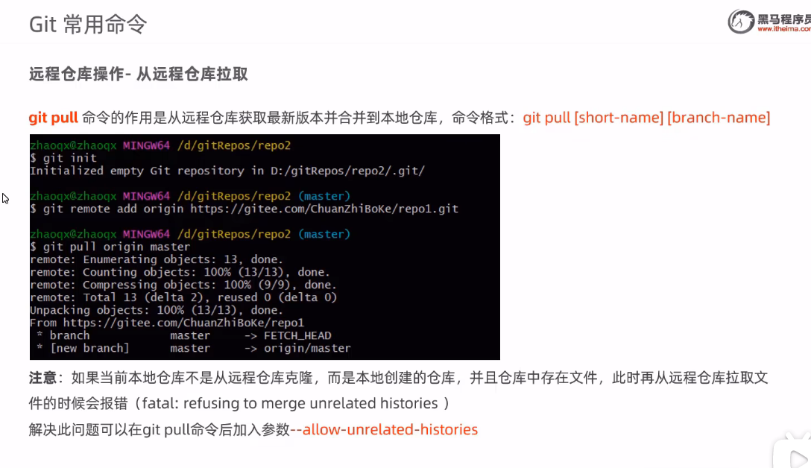
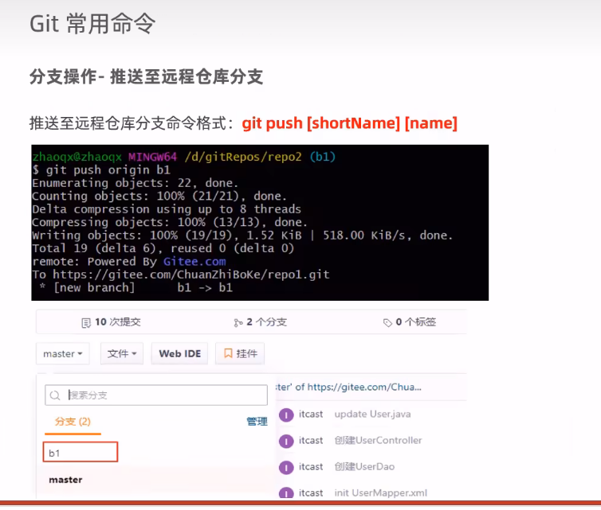
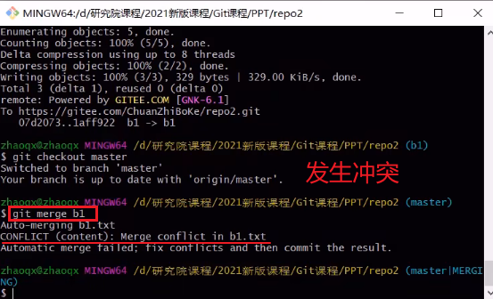
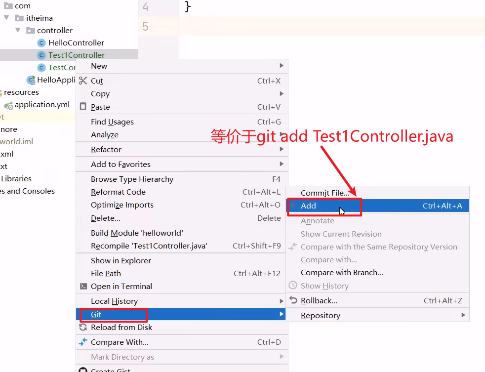
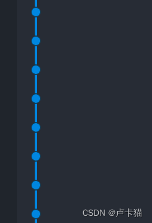

# Git-Learning

## 一、基本概念

### 1、Git全局设置-配置用户信息


### 2、获取Git仓库-本地初始化


### 3、获取Git仓库-从远程仓库克隆


### 4、==工作区、暂存区、版本库==的概念


### 5、Git工作区中文件的==状态==


## 二、本地仓库操作


### 1、git reset-取消暂存或切换版本


### 2、git commit-提交


==**注意**==：**git commit -m ''test'' b1.txt ==-i==**


### 3、git log-查看日志


## 三、==远程仓库操作==命令


### 1、git remote-查看远程仓库


### 2、git ==remote add== `< shortname>` `< url>`


### 3、git clone [url]


### 4、 git ==push== [remote-name] [branch-name]

**==remote-name==为使用git remote add `<shortname>` `<url>`添加远程仓库时指定的==仓库别名==shortname；当该项目是从远程仓库直接clone过来时，==默认==的remote-name为==origin==**


### 5、git ==pull== [short-name] [branch-name]




## 四、==分支操作==

 

### 1、git branch-查看分支


### 2、git branch [branch-name]-创建分支


### 3、git checkout [branch-name]-切换分支


### 4、git push [short-name] [branch-name]-推送值远程仓库分支



 

### 5、git ==merge== [name] -合并分支


**①出现该窗口：**


**②按下 ==i== 输入备注信息：**


**③按下==esc==，再输入==:wq==(保存退出)：**


### 6、==合并分支常见错误==-同时对同一个文件都修改





## 五、标签操作

- **标签是静态的，可以理解为当前分支的一个特定状态，一旦确定了该标签就不可修改了**，
- **而分支是动态的，分支可以不断更新并保存**


### 1、git tag-查看标签


### 2、git tag [tag-name] -创建标签


### 3、git push [short-name] [tag-name]-==推送标签==


### 4、git checkout -b [newbranch-name] [tag-name] -==检出标签==


## 六、==IDEA中使用Git==


### 1、配置Git


### 2、获取Git仓库


### 3、本地仓库操作

#### ①将文件加入到缓存区



#### ②将暂存区的文件提交到本地版本库


#### ③查看日志


### 4、远程仓库操作


### 5、==分支操作==

#### ①查看分支


#### ②创建分支


#### ③切换分支


#### ④将分支推送到远程仓库


#### ⑤合并分支


## 七、git==克隆==远程仓库的==指定分支==方法

原文链接：https://blog.csdn.net/yujia_666/article/details/115362190

### 1、普通克隆方式

- git clone `<远程仓库地址>`
- 这种克隆方式默认是克隆master主分支，
- 而且通过命令 git branch --list 能看到克隆后在本地也只有这一个分支，
- 如果再通过新建分支再拉取指定分支，甚至可能还需要解决冲突，太繁琐。


### 2、克隆远程指定分支

那么，如何快速有效的直接克隆远程指定分支？

只需要一条命令：

**git clone -b `<指定分支名>` `<远程仓库地址>`**

 git clone -b eeat/ssion https://gitxxx.com/orm/mmm.git
会自动在克隆该分支在本地，同样克隆后本地只有这一个分支。


### 3、==常用git配置命令==

Git基础使用教程 - 老_张 - 博客园

首先，我们创建dev分支，然后切换到dev分支：

```shell
$ git checkout -b dev
Switched to a new branch 'dev'
```

git checkout命令加上-b参数表示创建并切换，相当于以下两条命令：

```shell
$ git branch dev
$ git checkout dev
Switched to branch 'dev'
```

然后，用git branch命令查看当前分支：

```shell
$ git branch
* dev
  master
```

git branch命令会列出所有分支，当前分支前面会标一个*号。

然后，我们就可以在dev分支上正常提交，比如对readme.txt做个修改，加上一行：

```shell
Creating a new branch is quick.
```

然后提交：

```shell
$ git add readme.txt 
$ git commit -m "branch test"
[dev b17d20e] branch test
 1 file changed, 1 insertion(+)
$ git push
```

现在，dev分支的工作完成，我们就可以切换回master分支：

```shell
$ git checkout master
Switched to branch 'master'
```

切换回master分支后，再查看一个readme.txt文件，刚才添加的内容不见了！因为那个提交是在dev分支上，而master分支此刻的提交点并没有变：


现在，我们把dev分支的工作成果**合并到master分支**上：

```shell
$ git merge dev
Updating d46f35e..b17d20e
Fast-forward
 readme.txt | 1 +
 1 file changed, 1 insertion(+)
```

git merge命令用于合并指定分支到当前分支。合并后，再查看readme.txt的内容，就可以看到，和dev分支的最新提交是完全一样的。

注意到上面的**Fast-forward**信息，Git告诉我们，**这次合并是“快进模式”**，也就是直接把master指向dev的当前提交，所以合并速度非常快。

当然，也不是每次合并都能Fast-forward，我们后面会讲其他方式的合并。

合并完成后，就可以放心地删除dev分支了：

```shell
$ git branch -d dev
Deleted branch dev (was b17d20e).
```

删除后，查看branch，就只剩下master分支了：

```shell
$ git branch
* master
```

因为创建、合并和删除分支非常快，所以Git鼓励你使用分支完成某个任务，合并后再删掉分支，这和直接在master分支上工作效果是一样的，但过程更安全。

switch
我们注意到切换分支使用git checkout `<branch>`，而前面讲过的撤销修改则是git checkout -- `<file>`，同一个命令，有两种作用，确实有点令人迷惑。

实际上，切换分支这个动作，用switch更科学。因此，最新版本的Git提供了新的git switch命令来切换分支：

创建并切换到新的dev分支，可以使用：

```shell
$ git switch -c dev
```

直接切换到已有的master分支，可以使用：

```shell
$ git switch master
```

使用新的git switch命令，比git checkout要更容易理解。

#### 小结

Git鼓励大量使用分支：

- 查看分支：git branch

- 创建分支：git branch `<name>`

- 切换分支：git checkout `<name>`或者git switch `<name>`

- 创建+切换分支：git checkout -b `<name>`或者git switch -c `<name>`

- 合并某分支到当前分支：git merge `<name>`

- 删除分支：git branch -d `<name>`
  


## 八、Git提示“warning: ==LF will be replaced by CRLF==”最详细解释+解决方案

文章地址：[Git提示“warning: LF will be replaced by CRLF”最详细解释+解决方案 - 知乎 (zhihu.com)](https://zhuanlan.zhihu.com/p/586324681)

### 1、解决办法

如果只是在window上

```bash
以下任选其一
关闭自动转换（当前仓库）
git config core.autocrlf false
关闭自动转换（全局仓库）
git config --global core.autocrlf false
```

如果需要转换，设置为true也可以 只是警告 看起来难看

```bash
关闭自动转换（当前仓库）
git config core.autocrlf true
关闭自动转换（全局仓库）
git config --global core.autocrlf true
```

检查git的设置结果

```bash
git config core.autocrlf
```

### 2、warning: ==LF== will be replaced by ==CRLF==

##### 1.问题描述：

windows平台下使用git add，git deploy 文件时经常出现“warning: LF will be replaced by CRLF” 的提示


##### 2.注解：

(1)[换行符](https://zhida.zhihu.com/search?q=换行符&zhida_source=entity&is_preview=1)‘\n’和回车符‘\r’

在计算机还没有出现之前，有一种叫做[电传打字机](https://zhida.zhihu.com/search?q=电传打字机&zhida_source=entity&is_preview=1)（Teletype Model 33）的玩意，每秒钟可以打10个字符。但是它有一个问题，就是打完一行换行的时候，要用去0.2秒，正好可以打两个字符。要是在这0.2秒里面，又有新的字符传过来，那么这个字符将丢失。

于是，研制人员想了个办法解决这个问题，就是在每行后面加两个表示结束的字符。一个叫做“回车”，告诉打字机把打印头定位在左边界；另一个叫做“换行”，告诉打字机把纸向下移一行。

**(A)回车符就是回到一行的开头，用符号r表示，十进制ASCII代码是13，[十六进制](https://zhida.zhihu.com/search?q=十六进制&zhida_source=entity&is_preview=1)代码为0x0D，回车（return）；**

**(B)换行符就是另起一行，用n符号表示，ASCII代码是10，十六制为0x0A， 换行（newline）。**


##### (2)LF和CRLF区别

**LF: Line Feed换行**

**feed v.喂养,供给;将(信息)输入 line feed直译是”将行输入”,再意译”换行”**

**CRLF: Carriage Return Line Feed 回车换行**

Carriage n.马车,火车车厢;运输费用 在carriage return中,carriage译为“车”,return译为“回”

在过去的机械打字机上有个部件叫「字车」（Typewriter carriage），每打一个字符，字车前进一格，打完一行后，我们需要让字车回到起始位置，而“Carriage Return”键最早就是这个作用，因此被直接翻译为「回车」。尽管后来回车键的作用已经不止” 倒回字车”那么简单，但这个译名一直被保留下来。

##### 3.分析问题

这句警告出现的原因：我们在Windows平台下git add任意**Windows平台编辑过的代码文本的换行默认都是CRLF**，所以一般git add不会出错。但是如果如下的(i)或者(ii)发生了，那我们再进行git add这个LF换行的文件时，会出现这个警告" LF will be replaced by CRLF in …"。

- **(i)我们的团队成员是Linux/Mac平台并参与了项目的git提交**
- **(ii)我们Windows平台的某些软件会生成换行是LF的代码文本(如[李俊德](https://zhida.zhihu.com/search?q=李俊德&zhida_source=entity&is_preview=1)git add的是Webstorm生成的HTML项目中隐藏文件夹.idea中的workspace.xml,这个xml文件换行是LF**


(1)不同操作系统下，处理行尾结束符的方法是不同的：

- **(A)Windows和Dos下：使用回车（CR）和换行（LF）两个字符来结束一行，回车+换行(CR+LF)，即“\r\n”；**

- **(B)Unix和mc下：只使用换行（LF）一个字符来结束一行，即“\n”；**

- **(最早Mac每行结尾是回车CR 即'\r'，后mac os x 也投奔了 unix)**

  

(2)Git下处理“换行”（line ending）

​	**core.autocrlf是git中负责处理line ending的变量，可以设置3个值：true，false，input。**

- (A)设置为true【config --global core.autocrlf true】

  ​	**当设置成true时，这意味着你在任何时候添加(add)文件到git仓库时，git都会视为它是一个[文本文件](https://zhida.zhihu.com/search?q=文本文件&zhida_source=entity&is_preview=1)(text file)。**它将把crlf变成LF。

- (B)设置为false【config --global core.autocrlf false】

  ​	当设置成false时，line endings将不做转换操作。文本文件保持原来的样子。

- (C)设置为input时，添加文件git仓库时，git把crlf编程lf。当有人Check代码时还是lf方式。因此在window操作系统下，不要使用这个设置。

  

##### 4.此问题的负面影响

格式化与多余的空白字符，特别是在跨平台情况下，有时候是一个令人发指的问题。由于[编辑器](https://zhida.zhihu.com/search?q=编辑器&zhida_source=entity&is_preview=1)的不同或者文件行尾的换行符在 Windows 下被替换了，一些细微的空格变化会不经意地混入提交，造成麻烦。虽然这是小问题，但会极大地扰乱跨平台协作。

假如你正在Windows上写程序;又或者你正在和其他人合作，他们在Windows上编程，而你却在其他系统上，在这些情况下，你可能会遇到行尾结束符问题。此问题的全部负面影响如下：

**(1)一个直接后果是，Unix/Mac系统下的一个“多行文本”文件在Windows里打开的话，“多行文本”会变成“一行”。（原因：Unix/Mac换行只用了换行符‘\n’，而Windows的换行要求是回车换行符’\r\n’，因此Unix/Mac中的“多行文本”的换行不符合Windows的规则，所以Windows对这些不符合换行规则的“多行文本”全部按照“没有换行”处理，所以导致“多行文本”会变成“一行”）**

**(2)而Windows里的文件在Unix/Mac下打开的话，在每行的结尾可能会多出一个^M符号。**

**(3)Linux保存的文件在windows上用记事本看的话会出现黑点。**

5.解决此问题的方案

(1)如果我们目前是Window平台并出现该警告，啥也别做就行，虽然这个警告难看，但这个警告能保证我们项目团队正常跨系统git操作代码

因为git的Windows [客户端](https://zhida.zhihu.com/search?q=客户端&zhida_source=entity&is_preview=1)基本都会默认设置 core.autocrlf=true（我们可通过git config core.autocrlf命令查询我们的Windows上该属性是否默认true。如不是true,通过config --global core.autocrlf true命令设置该属性为true），而“**core.autocrlf=true**”有以下3个功能来避免我们出错：


- (A)在“把 modified修改过的文件git add到暂存区stage”时，Git自动把LF转换成CRLF,并给出那条警告”LF will be replaced by CRLF”

- (B)在把modified修改过的文件由暂存区(stage) 提交(commit)到版本库/仓库(repository)”时，Git自动把CRLF转换成LF

- (C)在“用 检出/git checkout切换到指定分支 或 git clone克隆远程版本库”来加载代码时，Git自动把LF转换成CRLF

  

提到的那句警告：“IF will be replaced by CRLF in `<file-name>`”

这句警告的下面其实还有一句很重要的话：The file will have its original line endings in your working directory.

(翻译："在工作区里，这个文件会保留它原本的换行符")

(2)如果我们是Linux 或 Mac平台,我们不需要5(1)(C)的功能“在检出或克隆远程版本库时，Git自动把LF转换成CRLF”。然而当一个CRLF作为行结束符的文件在我们的Linux 或 Mac平台不小心被引入时，你肯定想让 Git 修正。 所以，你可以通过config --global core.autocrlf input命令把 core.autocrlf 设置成 input 来告诉 Git 在提交(commit)时把CRLF转换成LF，检出(git checkout)时不转换

(1)+(2):这样在 Windows 上的检出(checkout)文件中会保留CRLF，而在 Mac 和 Linux 上，以及版本库中会保留LF，从而保证我们项目团队正常跨系统git操作代码


# 🚀常用例子-Push本地项目

你的错误 `fatal: your current branch 'main' does not have any commits yet` 说明当前 `main` 分支是空的，没有任何提交，因此无法推送。你可以按照以下步骤解决：

------

### **解决方案**

#### **1. 添加文件并提交**（如果还没有提交过）

执行：

```bash
git add .
git commit -m "Initial commit"
```

这样你的 `main` 分支就会有第一个提交。

------

#### **2. 重新推送到远程仓库**

```bash
git push -u origin main
```

如果仍然有问题，尝试：

```bash
git push origin main --force
```

⚠ **注意**：`--force` 可能会覆盖远程仓库的内容，所以请谨慎使用。

------

### **==完整步骤==（如果从零开始）**

如果你还没有初始化 Git 仓库，完整步骤如下：

```bash
cd /path/to/your-project  # 进入你的项目目录
git init                  # 初始化 Git 仓库
git add .                 # 添加所有文件
git commit -m "Initial commit"  # 提交代码
git branch -M main        # 确保分支名是 main
git remote add origin https://github.com/XiaoPeng03182/Auto_Backup_Tools.git  # 关联远程仓库
git push -u origin main   # 推送代码
```

这样你的代码就成功推送到 GitHub 了！🚀


# 🚀常用命令的区别

Git 中的 `merge`、`rebase`、`push`、`pull` 和 `fetch` 都是 Git 的核心命令，它们的作用和适用场景如下：

------

## **1. `git merge`（合并分支）**

### **作用**

- `merge` 用于合并不同的分支，将某个分支的更改合并到当前分支。
- 默认采用 **三方合并（3-way merge）**，会保留历史提交记录，并可能生成 **一个新的合并提交**。

### **适用场景**

✅ **多人协作**：当你在本地开发完一个功能后，希望合并到 `main` 或 `develop` 分支。
 ✅ **保持历史完整**：`merge` 方式不会修改提交历史，只会新增一个合并提交（merge commit）。

### **使用示例**

```bash
# 切换到主分支
git checkout main  

# 合并 feature 分支到 main
git merge feature_branch  
```

------

## **2. `git rebase`（变基）**

### **作用**

- `rebase` 也是用于合并不同的分支，但它通过 **修改提交历史**，将当前分支的提交 **“重演”** 在目标分支的最新提交之上。
- 这样能让提交历史更加 **线性**，避免 `merge` 带来的额外合并提交。

### **适用场景**

✅ **清理提交历史**：保持主分支的提交历史整洁，避免过多的 `merge commit`。
 ✅ **避免分叉**：`rebase` 会让你的提交紧跟目标分支，而不会产生合并提交。
 ❌ **不要在已推送的公共分支上 `rebase`**，否则会导致团队成员的分支冲突！

### **使用示例**

```bash
# 切换到 feature 分支
git checkout feature_branch  

# 将 feature_branch 变基到 main
git rebase main  
```

如果发生冲突：

```bash
# 手动解决冲突后，继续 rebase
git add .
git rebase --continue
```

------

## **3. `git push`（推送代码）**

### **作用**

- `push` 用于 **将本地的提交上传到远程仓库**，使团队成员能够看到你的更改。

### **适用场景**

✅ **提交代码到远程仓库**
 ✅ **分享你的修改给团队**

### **使用示例**

```bash
# 推送当前分支到远程仓库
git push origin branch_name  
```

⚠ **如果远程分支有更新，push 可能会失败**，需要先 `pull` 远程最新代码。

------

## **4. ==`git pull`==（拉取最新代码）**

### **作用**

- ==`pull` = `fetch` + `merge`==
- `git pull` 从远程仓库拉取最新代码，**并自动合并到本地分支**。

### **适用场景**

 ✅ **获取最新代码**，确保本地分支与远程同步。
 	    ✅ **适用于多人协作**，确保你的代码基于最新的远程版本。

### **使用示例**

```bash
# 拉取并合并远程 main 分支的最新代码
git pull origin main
```

⚠ **如果远程代码和本地代码有冲突，可能需要手动解决冲突。**

------

## **5. `git fetch`（获取远程最新代码）**

### **作用**

- `fetch` ==只下载远程仓库的最新代码==，但==**不会自动合并**到本地分支==。
- 适用于想 **先查看远程更新**，再决定是否合并。

### **适用场景**

 ✅ **想查看远程更新但不影响当前分支**。
 		✅ **在本地代码还没准备好合并时**，可以先 `fetch` 再手动合并。

### **使用示例**

```bash
# 获取远程仓库的最新数据，但不合并
git fetch origin
```

然后可以用 `git diff` 查看有哪些变化：

```bash
git diff origin/main
```

如果确定要合并，再执行：

```bash
git merge origin/main
```

------

## **总结对比**

| 命令     | 作用                 | 是否改变提交历史 | 是否自动合并      | 适用场景               |
| -------- | -------------------- | ---------------- | ----------------- | ---------------------- |
| `merge`  | 合并分支             | ❌（保留历史）    | ✅（产生合并提交） | 多人协作，合并新功能   |
| `rebase` | 变基                 | ✅（重写历史）    | ❌（修改提交顺序） | 保持提交记录整洁       |
| `push`   | 推送代码到远程       | ❌                | ❌                 | 上传本地代码           |
| `pull`   | 拉取远程代码并合并   | ❌                | ✅                 | 获取最新代码并自动合并 |
| `fetch`  | 获取远程代码但不合并 | ❌                | ❌                 | 查看远程更新           |

------

## ==**最佳实践**==

1️⃣ **开发新功能时**

```bash
# 创建新分支
git checkout -b feature_branch  

# 开发完成后，提交代码
git commit -m "Add new feature"  

# 拉取最新代码，避免冲突
git pull --rebase origin main  

# 推送到远程仓库
git push origin feature_branch  
```

2️⃣ **合并分支**

- 如果你想保留历史记录：使用 `merge`
- 如果你想保持提交记录整洁：使用 `rebase`

```bash
git checkout main
git merge feature_branch  # 或 git rebase feature_branch
```

3️⃣ **保持代码最新**

```bash
git fetch origin  
git diff origin/main  # 查看差异
git pull origin main  # 拉取最新代码
```

🚀 **推荐：`fetch` + `merge`/`rebase`** 代替 `pull`，可以更灵活地管理更新。


# 🚀如何使用 Git 进行==多人协作开发==（全流程图解）

原文链接：https://blog.csdn.net/whc18858/article/details/133209975

在软件开发中，多人协作是一项必不可少的任务。而 Git 作为目前最受欢迎的分布式版本控制工具，提供了强大的功能和灵活的工作流程，使得多人协作开发变得更加高效。本篇博客将带你实践如何正确使用 Git 进行多人协作开发

 在本篇博客中，你将学到以下内容：

- Feature Branching 分支管理策略
- 多人单分支开发与多人多分支开发的差别
- 如何安全的解决合并冲突


## 1、分支管理策略

Git分支策略允许开发人员在一个项目上进行协作，同时跟踪更改并维护多个版本的代码库。主流的分支管理策略有 Trunk-Based Development、Feature Branching、Git Flow等等，本文将基于较为简单的 Feature Branching 分支管理策略展开。虽然分支管理策略多种多样，但最好的策略一定是与你的团队特征和项目需求相匹配的。

### 1.什么是Feature Branching？

在实际开发中，master 分支非常强调环境的稳定性。因此当我们要开发新的功能或者特性时，需要从 master 分支上拉取 feature 分支，这样开发者就能在 feature 分支上独立开发而不影响主分支。当完成开发后，需要提交 pull request 将 feature 分支合并回 master 分支中。 通过 pull request ，仓库中的其他成员能对即将 merge 的代码进行审核并提出建议，从而保证了安全可靠性。


### 2.Feature Branching如何工作？

- 创建 feature 分支：feature分支一定是从 master 分支上拉取的

- 在 feature 分支上完成开发：通常一个分支就对应着一个特定的功能
- 提交 pull request：请求将分支合并回 master 分支
- 审查批准：其他开发人员如果对你的代码满意的话，就会同意将你的分支合并到 master 分支。通过代码审查，我们通常能在分支 merge 回主分支前发现错误
- 清理：完成开发后，应该及时将没用的 feature 分支删除，保持代码仓库的整洁


 下面将结合具体的例子为大家逐步骤实践上面的流程，同时带大家体会多人在单分支上开发和在多分支上开发的区别

## 多人协作一：==单分支==

- 任务：开发者A和开发者B在同一分支 feature 下开发。开发者A在 README 中增加一行 aaa，开发者B在 README 中增加一行 bbb

### 1.准备工作

**场景**：开发者A在创建分支前就克隆过远程仓库，而开发者B则在创建分支后才克隆远程仓库


在实际开发中，如果要进行多人协作开发，首先需要将其他成员添加进来


### 2.创建分支

创建分支的方式有两种：

- 在远程仓库直接创建

- 在本地创建分支 xxx 后使用指令 git push origin xxx 在远端创建一个与本地 xxx 分支对应的 xxx 分支

  

#### 1）在单分支场景中，我们首先采用方法一创建分支


#### 2）使用指令 git branch -r 指令可以查看远程仓库中的所有分支，但是对于开发者A而言只能看到 master 分支


#### 3）原因也不难理解，开发者A是在创建 feature 分支前克隆远程仓库的，因此当前是落后于远程仓库的最新版本。我们需要使用 git pull 指令来更新分支信息：


> 🎯[说明]：
>
> git pull 指令具有以下两个作用：
>
> 拉取远程分支中的最新提交，并自动合并 （需要建立追踪关系）
>
> 更新远程仓库的分支信息（不需要建立追踪关系）


 如何理解建立追踪关系呢？git pull 指令的完整用法是 **git pull `<远程主机名>` `<远程分支名>`:`<本地分支名>`**，当我们完整使用 git pull 指令时，不需要考虑建立追踪关系的问题，而当我们简写为 git pull 时，本地分支默认为当前的工作分支，远程分支为与之建立链接的远程分支。当我们 clone 远程仓库时其实自动建立了本地master分支与远程master分支的追踪关系——即链接，因此我们可以采用简写的方式。


📌[建议]: 在开发前首先使用 git pull 指令，确保从最新版本开始开发


**在windows上模拟开发者B：**


### 3.在分支上开发

#### **开发者A:**

1、**在本地创建 feature 分支，并与远端的 origin/feature 分支建立连接**


- git checkout -b featureorigin/feature 指令创建一个 feature 分支并切换到 feature 分支上，并建立远端 feature分支的追踪关系
- git branch -a 指令用于显示本地和远端的所有分支
- git branch -vv 指令显示本地分支与远端分支的追踪关系。可以看到此时本地的 feature 分支已经与远端的 origin/feature 分支建立了连接


2、**在 feature 分支上完成开发，并提交到远端的 origin/feature 分支上**


#### 开发者B:

1、在本地创建 feature 分支，并与远端的 origin/feature 分支建立连接


2、当我们尝试push到远端仓库时发生了冲突，原因是远端仓库的版本比我们当前的版本高（因为开发者A完成了push操作），我们首先需要 pull 远端仓库的分支内容，解决完冲突后才能再次 add + commit + push
📌[建议]: 在开发前首先使用 git pull 指令，确保从最新版本开始开发


3、因为我们已经建立了本地 feature 分支与远端 feature 分支的链接，所以可以直接使用 git pull 指令拉取


4、手动解决冲突，从当前版本和远程仓库中的版本选择一个


5、重新 add + commit + push。此时我们就可以顺利推送到远程仓库了


### 4.分支合并

合并分支也有两种方式：

- 提交 pull request，通过代码审验后合并到 master 分支

- 在本地 master 分支上合并后再 push 到远端的 master 分支

  

事先声明，方法一是更被推荐的。出于教学的考虑，在单分支的版本中，先带大家用用方法二。

1、前面提到，我们要保证主分支的稳定性，因此我们不能直接将 feature 分支合并到 master 分支上，因为在解决合并冲突的过程中，我们就有可能在无意中改出了更大的 BUG。正确的做法是先将 master 分支合并到 feature 分支上，解决冲突后并且确认没有 bug 后再合并到 master 分支上。先前有过master和 feature 分支的合并记录，再合并时就不会出现冲突（都是本地操作）


2、将本地的 master 分支提交到远端


### 5.清理

完成合并后，就可以将没用的 feature 分支删除。删除分支也有两种方式：

- 在远端和本地分别删除 feature 分支
- 在本地删除 feature 分支后推送到远端

这里先为大家呈现第一种删除方式：

1、远端删除 feature 分支


2、本地删除 feature 分支


3、此时我们使用 git branch -r 指令仍然能看到 origin/feature，此时我们需要使用 git pull --prune 指令进行修剪


## 多人协作二：==多分支==

多人在单分支上协作开发时，经常需要解决冲突的问题；而使用多分支，各个开发者在各自的分支上独立开发，只需要在最后合并分支时解决冲突即可

**任务**：开发者A在 feature-1 分支下编写文件file1。开发者B在 feature-2 分支下编写文件file1、file2

### 1.创建分支

前面提到，创建分支的方式有两种：

- 在远程仓库直接创建
- 在本地创建分支 xxx 后使用指令 git push origin xxx 在远端创建一个与本地 xxx 分支对应的 xxx 分支

我们现在采用第二种方式创建分支：

#### **开发者A：**

1、在本地创建 feature-1 分支。此时在创建本地分支时，我们不能再指定与远程分支 orgin/feature-1 建立连接，因此此时远程仓库中并没有这个分支


2、执行 git push origin feature-1 ，Git 会将本地的 feature-1 分支推送到 origin 远程仓库中的相应分支。如果远程仓库不存在名为 feature-1 的分支，则 git 会创建之；如果存在，则将修改合并到该分支上


3、使用 git branch -vv 指令就可以发现，本地的 feature-1 分支并没有与远端的 feature-1 分支建立追踪关系。

4、因此我们不能直接使用 git pull、git push 等缩写指令。解决方法 git 也已经提示我们了①使用完整的命令 ②建立远端分支与本地分支的追踪关系

		5、采用方法②来解决问题


#### 开发者B同理

此时远端已经多了两个分支：


### 2.在分支上开发

开发者A与开发者B各自在分支上完成开发，并提交到远程分支 feature-1 与 feature-2

### 3.pull request

我们前面提到，合并分支也有两种方式：

- 提交 pull request，通过代码审验后合并到 master 分支
- 在本地 master 分支上合并后再 push 到远端的 master 分支

这里我们就是采用 pull request 的方式合并分支

#### 开发者A

1、提交 pull request。可自动合并说明没有遇到冲突


2、仓库的管理人员完成对你的审核通过、测试通过后，就可以合并到 master 分支中。在“文件”一栏中可以看到你的修改


#### 开发者B：

1、提交 pull request。不可自动合并说明遇到了冲突


2、我们不能在 master 分支上处理冲突。解决方式与之前类似，先将 master 分支合并到 feature-2 分支上，解决完冲突后再将 feature-2 分支合并到 master 分支上


3、切换到 master 分支上，首先 git pull 拉取最新版本的 master 分支代码！！


4、切换到 feature-2 分支上，合并 master 分支。遇到冲突，冲动解决冲突


5、冲突解决，并推送到远端仓库


6、此时再次发起 pull request 请求就不会遇到问题了


### 4.清理

前面提到，删除分支也有两种方式：

- 在远端和本地各自删除 feature 分支
- 在本地删除 feature 分支后推送到远端


现在我们演示第二种删除方式

1、删除远端分支：git push origin --delete xxx 。


2、删除本地分支：git branch -D xxx


# 🚀Git常用命令汇总

## 一、以下是 Git 命令及其作用的表格整理：

| **命令**                               | **作用**                                  |
| -------------------------------------- | ----------------------------------------- |
| `git config --global user.name 用户名` | 设置用户签名（用户名）                    |
| `git config --global user.email 邮箱`  | 设置用户签名（邮箱）                      |
| `git init`                             | 初始化本地库                              |
| `git status`                           | 查看本地库状态                            |
| `git add 文件名`                       | 添加指定文件到暂存区                      |
| `git add .`                            | 将修改的所有内容添加到暂存区              |
| `git commit -m "日志信息"`             | 提交到本地库，并附加提交信息              |
| `git reflog`                           | 查看历史记录（包括被删除的 commit）       |
| `git reset --hard 版本号`              | 版本回退到指定 commit                     |
| `git branch 分支名`                    | 创建新分支                                |
| `git branch -v`                        | 查看本地分支及其最新提交信息              |
| `git branch -a`                        | 查看所有分支（包括本地和远程）            |
| `git branch -r`                        | 查看远程分支                              |
| `git checkout 分支名`                  | 切换分支                                  |
| `git merge 分支名`                     | 把指定分支合并到当前分支                  |
| `git remote -v`                        | 查看当前所有远程地址别名                  |
| `git remote add 别名 远程地址`         | 添加远程仓库并起别名                      |
| `git push 别名 分支`                   | 推送本地分支上的内容到远程仓库            |
| `git clone 远程地址`                   | 克隆远程仓库到本地                        |
| `git fetch 远程地址`                   | 下载远程仓库的最新内容，但不合并          |
| `git pull 远程库地址别名 远程分支名`   | 拉取远程仓库最新内容并合并到本地          |
| `git checkout .`                       | 撤销未提交的代码改动（恢复工作区）        |
| `git reset HEAD~`                      | 回退到上一次提交（撤销最近的一次 commit） |
| `git diff HEAD HEAD^`                  | 比较当前版本与上一个版本的不同            |


## 二、git clone 和 git pull 的区别

1、git clone是将整个工程复制下来所以，不需要本地是仓库（没有.git文件夹），第一次拉取项目不需要使用git init 初始化本地仓库

2、git pull需要使用git init初始化本地仓库，

3、git clone 可以直接切换远程分支，git pull需要切换到当前分支

4、git clone 可以直接指定远程分支推送，git pull需要关联远程仓库（git add origin 远程仓库地址）才能push


## 三、git pull 和 git fetch的区别

1、git pull：从远程获取最新版本并merge到本地，会自动合并或修改当前的工作。相当于git fetch与git merge两条命令

2、**git fetch ：会将数据拉取到本地仓库 ，它并不会自动合并或修改当前的工作**

3、在实际使用中，git fetch更安全一些，因为在merge前，我们可以查看更新情况，然后再决定是否合并


# 🚀git pull 和git ==fetch== & git ==rebase==区别


使用git上传时，一般直接使用git pull来拉数据, 但老大建议使用git fetch & git rebase，所以需要了解一下它们的不同


- git pull: 作用是将远程分支拉回本地，做了拉取和合并两件事，其中 git pull只拉取合并本地当前所在分支
- git fetch：拉取当前项目的所有分支的的提交，但不合并。在实际使用中，git fetch更安全一些因为在merge前，我们可以查看更新情况，然后再决定是否合并
- git rebase ：与git merge功能相似，不同的是它将节点接到主分支的末端，最后呈现出来就是一条长长的主分支，干净明了。但要注意， rebase 是会隐藏你真实的修改记录的，所以最后呈现出来的 git 历史并不能表现你的真实操作。


## git merge效果：


## git rebase效果：


