# Web-Learing

## 一、Mybatis-Learning

### 1、mybatis介绍

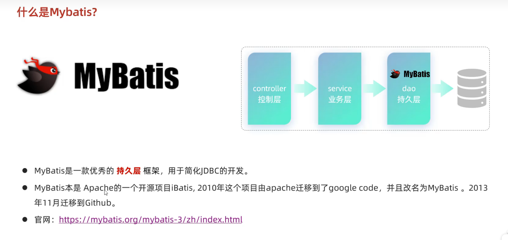


### 2、lombok-简化Data数据类

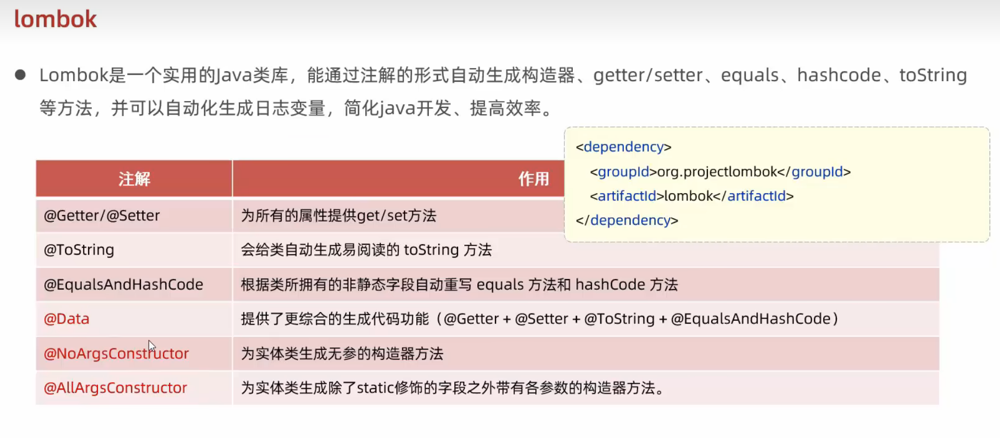


### 3、数据库连接池（Connection）

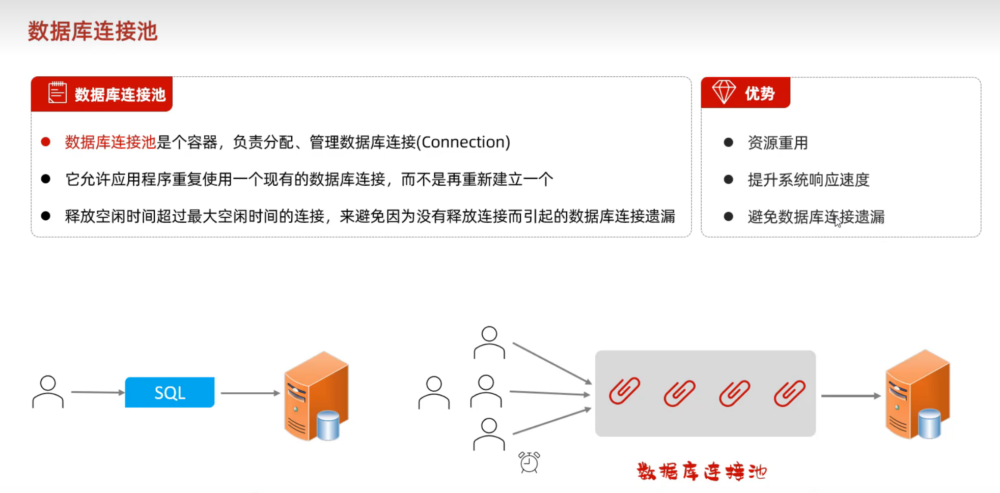

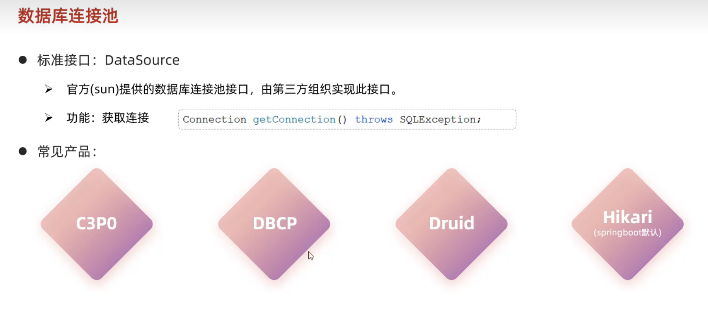


### 4、==mybatis使用基本流程==

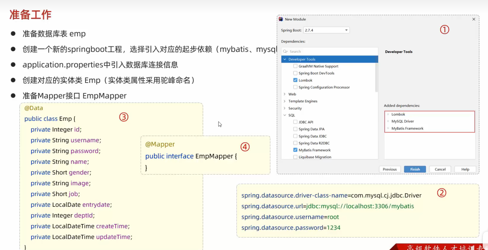


### 5、预编译SQL与SQL注入

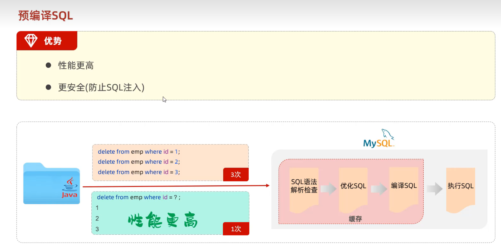

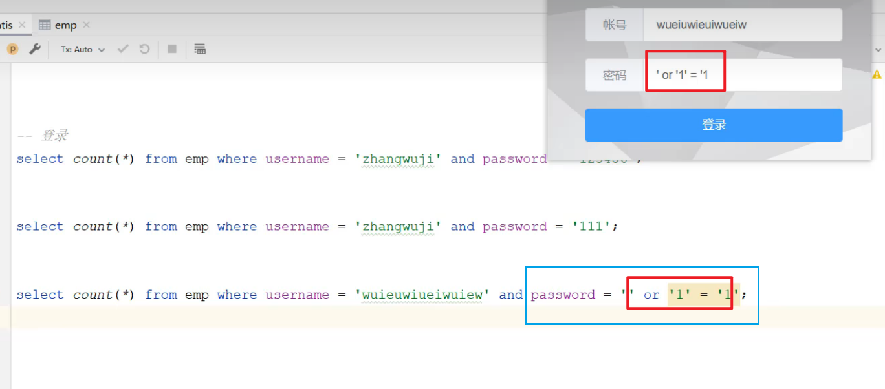


### 6、参数占位符

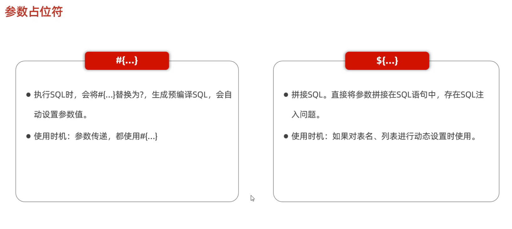


### 7、Delete删除数据

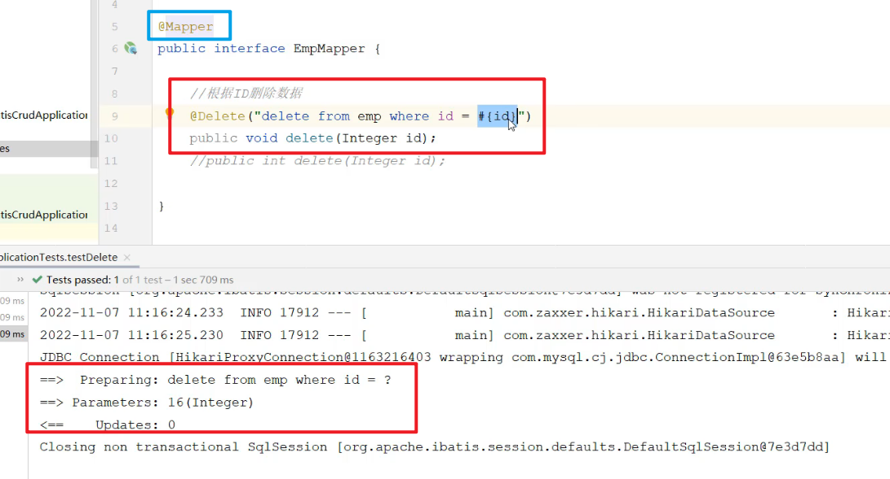


### 8、Insert增加数据

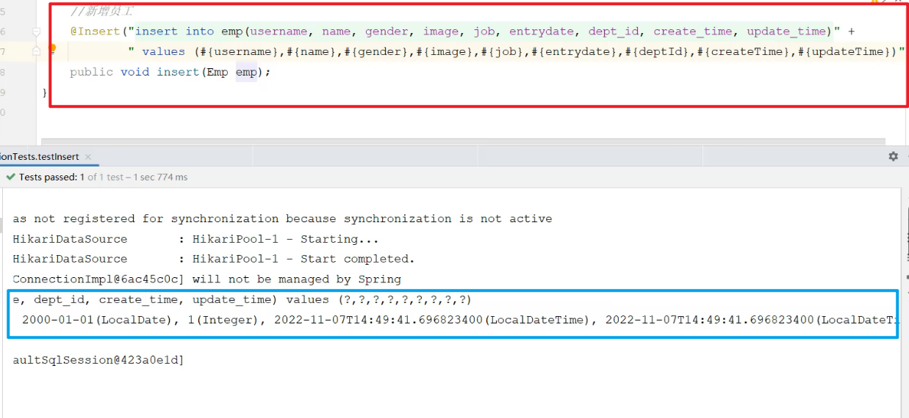

#### （1）主键返回

```java
//获取返回的主键，keyProperty的值表示返回到的位置，这里返回到Emp对象的id属性中。
@Options(useGeneratedKeys = true, keyProperty = "id")
```

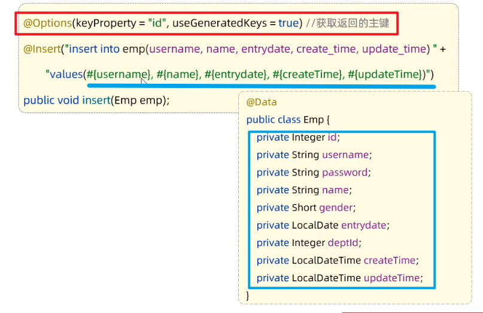

### 9、Update更新数据

```java
    //更新员工
    @Update("update emp set username = #{username}, name = #{name}, gender = #{gender}, image = #{image}," +
            " job = #{job}, entrydate = #{entrydate}, dept_id = #{deptId},update_time = #{updateTime} where id = #{id}")
    public void update(Emp emp);
```

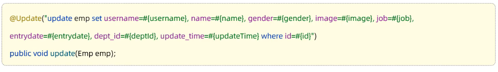


### 10、Select查询数据

#### (1)==mybatis驼峰命名自动映射开关==

**即从数据库字段名a_column映射到Java属性名aColumn。**

```properties
#开启mybatis的驼峰命名自动映射开关 a_column ------> aCloumn,即从数据库字段名a_column 映射到 Java属性名aColumn。
mybatis.configuration.map-underscore-to-camel-case=true
```

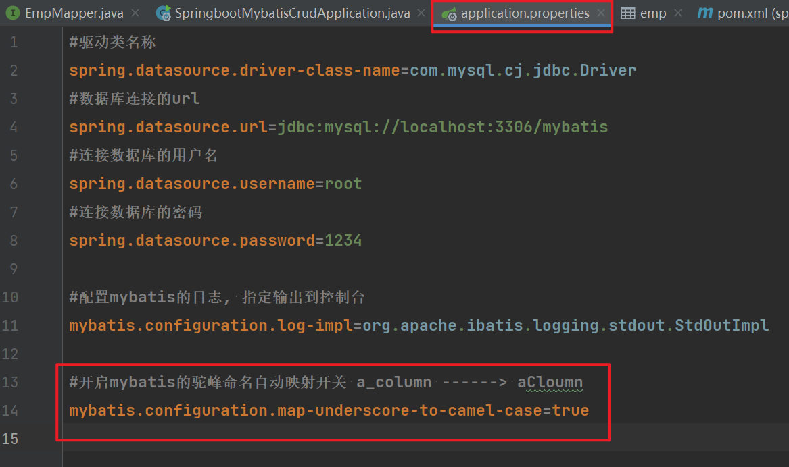


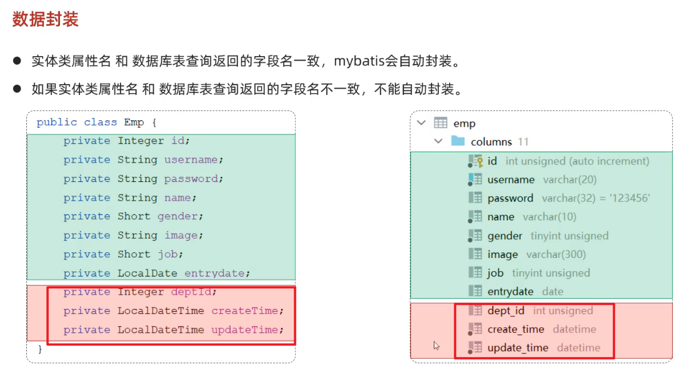


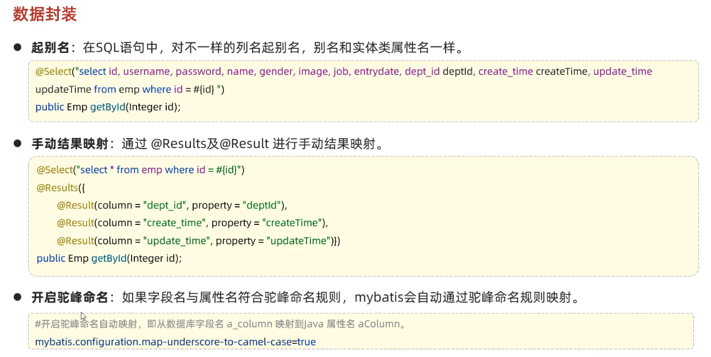

```java
//方案三: 开启mybatis的驼峰命名自动映射开关 
// --- a_cloumn ------> aColumn

    //根据ID查询员工
    @Select("select * from emp where id = #{id}")
    public Emp getById(Integer id);

//方案一: 给字段起别名, 让别名与实体类属性一致
@Select("select id, username, password, name, gender, image, job, entrydate, dept_id deptId, create_time createTime, update_time updateTime from emp where id = #{id}")
	public Emp getById(Integer id);

//方案二: 通过@Results, @Result注解手动映射封装
    @Results({
           @Result(column = "dept_id", property = "deptId"),
           @Result(column = "create_time", property = "createTime"),
           @Result(column = "update_time", property = "updateTime")
    })
    @Select("select * from emp where id = #{id}")
    public Emp getById(Integer id);
```


#### (2)条件查询


不使用%${name}%,而使用java提供的==**字符拼接函数concat('%',#{name},'%')**==，来避免==SQL注入==的风险。

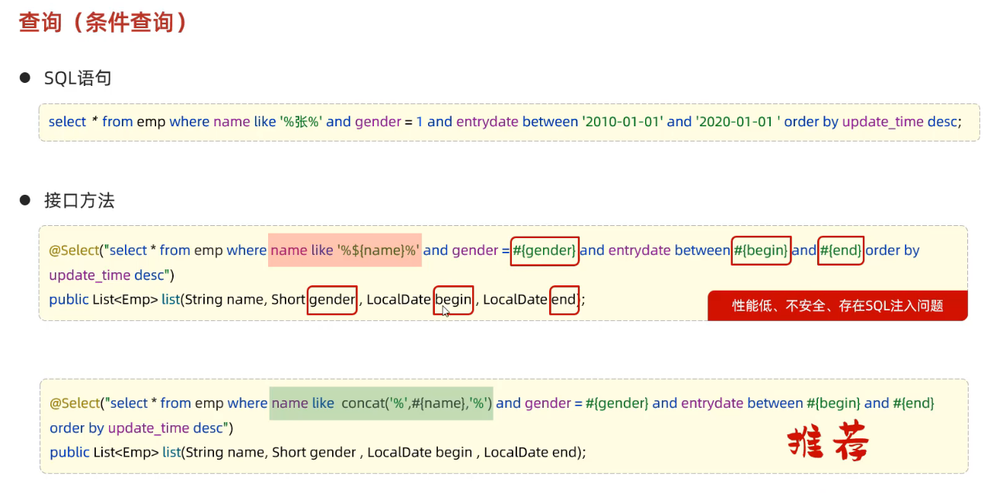

==**版本差异**==

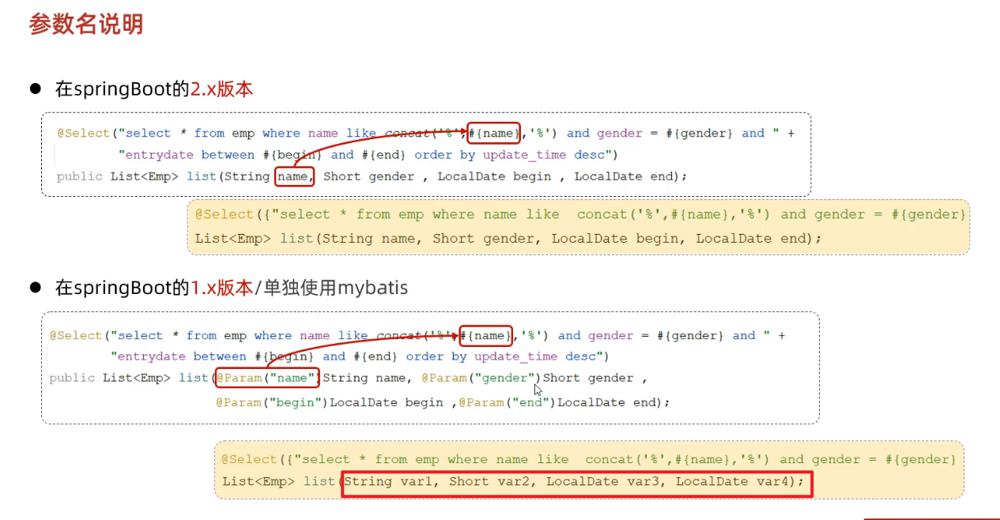


### 11、XML映射文件

#### （1）==规范==

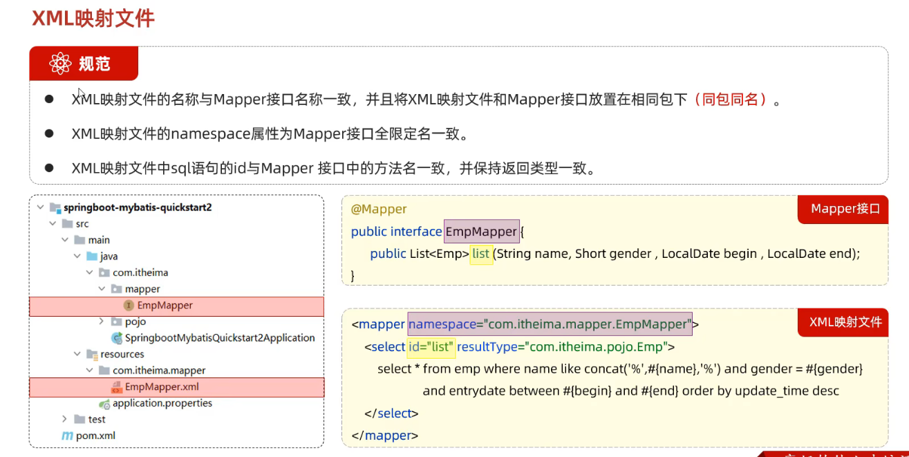


#### （2）xml格式

```xml
<?xml version="1.0" encoding="UTF-8" ?>
<!DOCTYPE mapper
        PUBLIC "-//mybatis.org//DTD Mapper 3.0//EN"
        "http://mybatis.org/dtd/mybatis-3-mapper.dtd">

<mapper namespace="com.itheima.mapper.EmpMapper">
     <sql id="commonSelect">
        select id, username, password, name, gender, image, job, entrydate, dept_id, create_time, 					update_time
        from emp
    </sql>

   <!-- 动态更新员工-->
    <update id="update2">
        update emp
        <set>
            <if test="username != null">username = #{username},</if>
            <if test="name != null">name = #{name},</if>
            <if test="gender != null">gender = #{gender},</if>
            <if test="image != null">image = #{image},</if>
            <if test="job != null">job = #{job},</if>
            <if test="entrydate != null">entrydate = #{entrydate},</if>
            <if test="deptId != null">dept_id = #{deptId},</if>
            <if test="updateTime != null">update_time = #{updateTime}</if>
        </set>
        where id = #{id}
    </update>
    
</mapper>
            
```

mybatis-3-mapper.dtd 文件后缀名为dtd, 英文为Document Type Definition，中文翻译为文档类型定义；

mapper表示根节点，mybatis-3-mapper.dtd被定义出来的意义，用来**验证`<mapper>`*`</mapper>`中使用的节点的是不是符合规范用的。**


### 12、==Mybatis-动态SQL==

#### （1）`< if >` ,`< where >`,`< set >`标签

##### ①概述

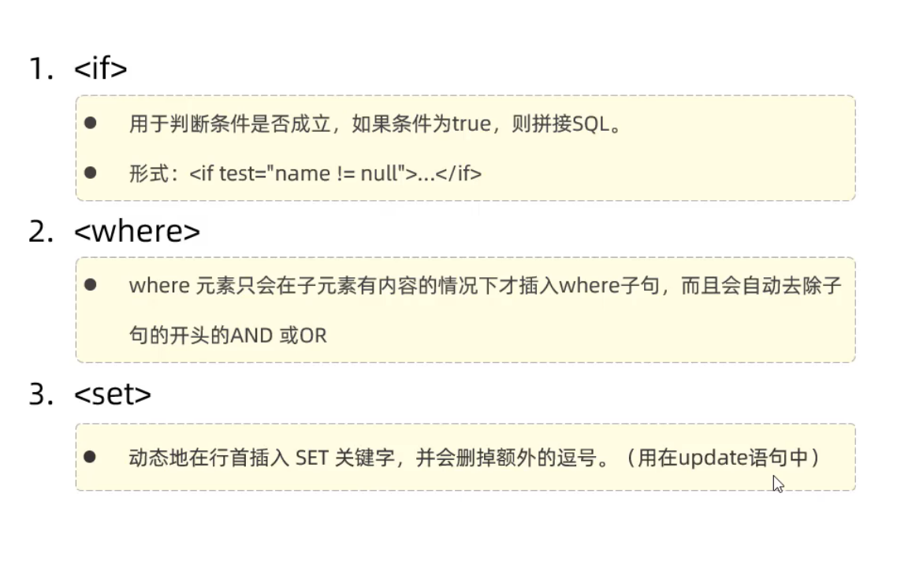

##### ②案例-==动态更新==

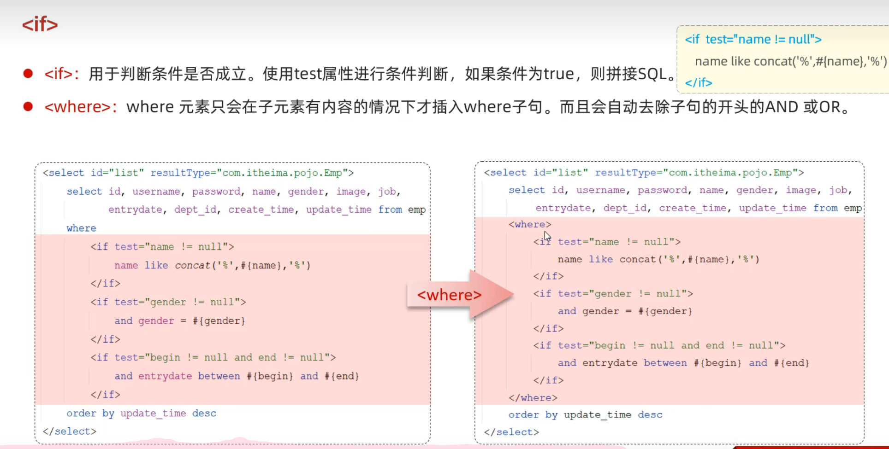

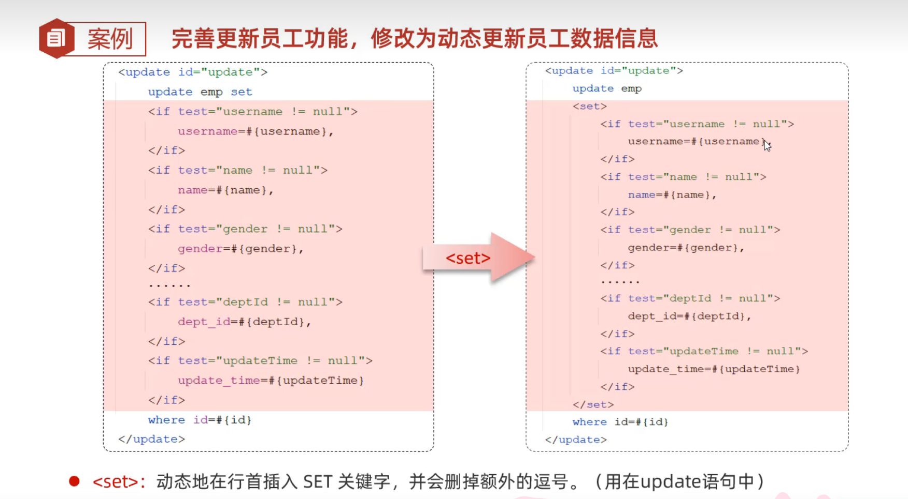

```xml
<?xml version="1.0" encoding="UTF-8" ?>
<!DOCTYPE mapper
        PUBLIC "-//mybatis.org//DTD Mapper 3.0//EN"
        "http://mybatis.org/dtd/mybatis-3-mapper.dtd">

<mapper namespace="com.itheima.mapper.EmpMapper">

   <!-- 动态更新员工-->
    <update id="update2">
        update emp
        <set>
            <if test="username != null">username = #{username},</if>
            <if test="name != null">name = #{name},</if>
            <if test="gender != null">gender = #{gender},</if>
            <if test="image != null">image = #{image},</if>
            <if test="job != null">job = #{job},</if>
            <if test="entrydate != null">entrydate = #{entrydate},</if>
            <if test="deptId != null">dept_id = #{deptId},</if>
            <if test="updateTime != null">update_time = #{updateTime}</if>
        </set>
        where id = #{id}
    </update>

</mapper>
```


#### （2）`< foreach >`标签-批量操作

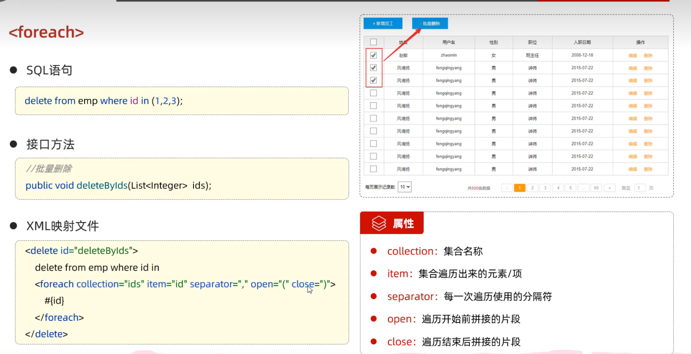

```xml
<?xml version="1.0" encoding="UTF-8" ?>
<!DOCTYPE mapper
        PUBLIC "-//mybatis.org//DTD Mapper 3.0//EN"
        "http://mybatis.org/dtd/mybatis-3-mapper.dtd">

<mapper namespace="com.itheima.mapper.EmpMapper">
    <!--批量删除员工 (18,19,20)-->
    <!--
        collection: 遍历的集合
        item: 遍历出来的元素
        separator: 分隔符
        open: 遍历开始前拼接的SQL片段
        close: 遍历结束后拼接的SQL片段
    -->
    <delete id="deleteByIds">
        delete  from emp where id in
        <foreach collection="ids" item="id" separator="," open="(" close=")">
            #{id}
        </foreach>
    </delete>

</mapper>

```


#### （3）`< sql >`,`< include >`标签

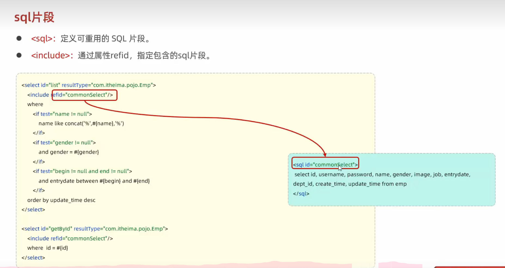

```xml
<?xml version="1.0" encoding="UTF-8" ?>
<!DOCTYPE mapper
        PUBLIC "-//mybatis.org//DTD Mapper 3.0//EN"
        "http://mybatis.org/dtd/mybatis-3-mapper.dtd">

<mapper namespace="com.itheima.mapper.EmpMapper">

    <sql id="commonSelect">
        select id, username, password, name, gender, image, job, entrydate, dept_id, create_time, update_time
        from emp
    </sql>

    <!--resultType: 单条记录封装的类型-->
    <select id="list" resultType="com.itheima.pojo.Emp">
        <include refid="commonSelect"/>
        <where>
            <if test="name != null">
                name like concat('%', #{name}, '%')
            </if>
            <if test="gender != null">
                and gender = #{gender}
            </if>
            <if test="begin != null and end != null">
                and entrydate between #{begin} and #{end}
            </if>
        </where>
        order by update_time desc
    </select>

</mapper>

```


## 二、JavaWeb-Learning

### 1、SpringBootWeb请求响应和分层解耦

#### 前言

在上一次的课程中，我们开发了springbootweb的入门程序。 基于SpringBoot的方式开发一个web应用，浏览器发起请求 /hello 后 ，给浏览器返回字符串 “Hello World ~”。

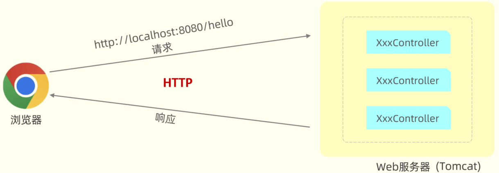

其实呢，是我们在浏览器发起请求，请求了我们的后端web服务器(也就是内置的Tomcat)。而我们在开发web程序时呢，定义了一个控制器类Controller，请求会被部署在Tomcat中的Controller接收，然后Controller再给浏览器一个响应，响应一个字符串 “Hello World”。 而在请求响应的过程中是遵循HTTP协议的。

但是呢，这里要告诉大家的时，其实在Tomcat这类Web服务器中，是不识别我们自己定义的Controller的。但是我们前面讲到过Tomcat是一个Servlet容器，是支持Serlvet规范的，所以呢，在tomcat中是可以识别 Servlet程序的。 那我们所编写的XxxController 是如何处理请求的，又与Servlet之间有什么联系呢？

其实呢，在SpringBoot进行web程序开发时，它内置了一个核心的Servlet程序 DispatcherServlet，称之为 核心控制器。 DispatcherServlet 负责接收页面发送的请求，然后根据执行的规则，将请求再转发给后面的请求处理器Controller，请求处理器处理完请求之后，最终再由DispatcherServlet给浏览器响应数据。


那将来浏览器发送请求，会携带请求数据，包括：请求行、请求头；请求到达tomcat之后，tomcat会负责解析这些请求数据，然后呢将解析后的请求数据会传递给Servlet程序的HttpServletRequest对象，那也就意味着 HttpServletRequest 对象就可以获取到请求数据。 而Tomcat，还给Servlet程序传递了一个参数 HttpServletResponse，通过这个对象，我们就可以给浏览器设置响应数据 。

 

那上述所描述的这种浏览器/服务器的架构模式呢，我们称之为：BS架构。

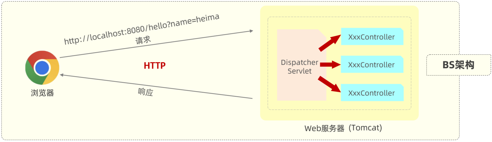 

• BS架构：Browser/Server，浏览器/服务器架构模式。客户端只需要浏览器，应用程序的逻辑和数据都存储在服务端。

那今天呢，我们的课程内容主要就围绕着：请求、响应进行。 今天课程内容，主要包含三个部分：

> - 请求
> - 响应
> - 分层解耦


#### 1. 请求

在本章节呢，我们主要讲解，如何接收页面传递过来的请求数据。

##### 1.1 Postman

之前我们课程中有提到当前最为主流的开发模式：前后端分离


在这种模式下，前端技术人员基于"接口文档"，开发前端程序；后端技术人员也基于"接口文档"，开发后端程序。

由于前后端分离，对我们后端技术人员来讲，在开发过程中，是没有前端页面的，那我们怎么测试自己所开发的程序呢？

方式1：像之前SpringBoot入门案例中一样，直接使用浏览器。在浏览器中输入地址，测试后端程序。

- 弊端：在浏览器地址栏中输入地址这种方式都是GET请求，如何我们要用到POST请求怎么办呢？
  - 要解决POST请求，需要程序员自己编写前端代码（比较麻烦）

方式2：使用专业的接口测试工具（课程中我们使用Postman工具）

###### 1.1.1 介绍

 

- Postman是一款功能强大的网页调试与发送网页HTTP请求的Chrome插件。

  > Postman原是Chrome浏览器的插件，可以模拟浏览器向后端服务器发起任何形式(如:get、post)的HTTP请求
  >
  > 使用Postman还可以在发起请求时，携带一些请求参数、请求头等信息

- 作用：常用于进行接口测试

- 特征

  - 简单
  - 实用
  - 美观
  - 大方


###### 1.1.2 安装

 

双击资料中提供的`Postman-win64-8.3.1-Setup.exe`即可自动安装。

 

安装完成之后，进入页面中会提示有新版本可以升级（无需升级）


界面介绍:

 


**如果我们需要将测试的请求信息保存下来，就需要创建一个postman的账号，然后登录之后才可以。**

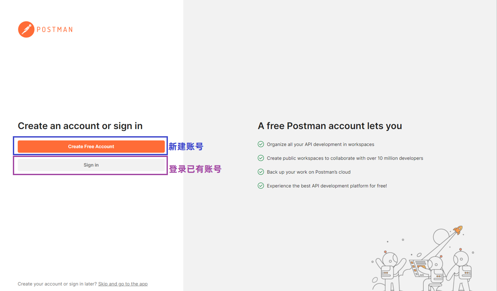

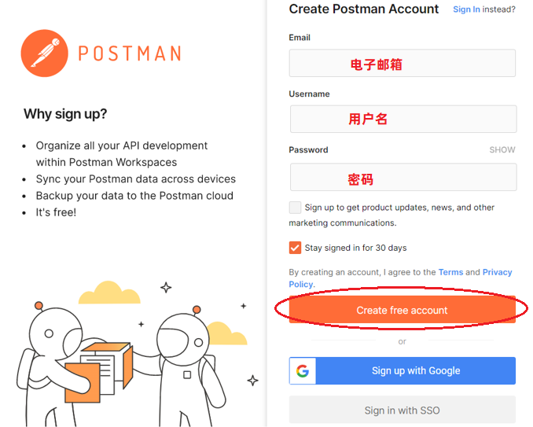 

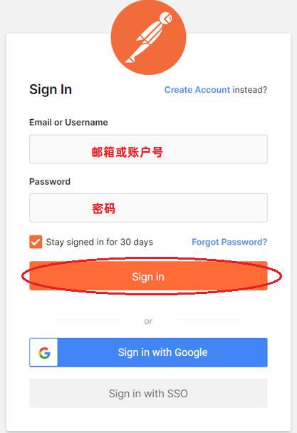 

登录完成之后，可以创建工作空间：

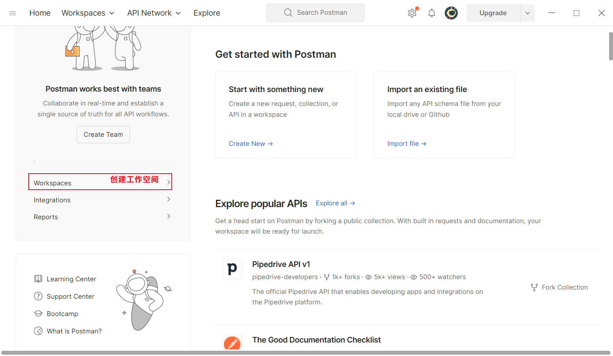

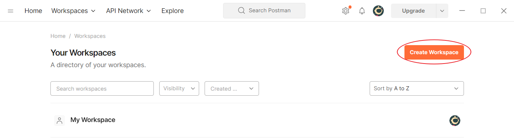


创建请求：


点击"Save"，保存当前请求


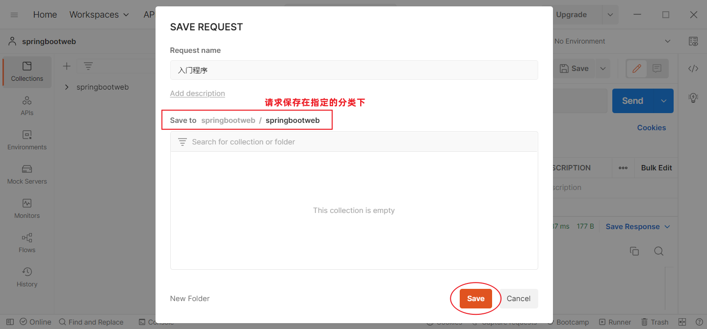


##### 1.2 简单参数

简单参数：在向服务器发起请求时，向服务器传递的是一些普通的请求数据。


那么在后端程序中，如何接收传递过来的普通参数数据呢？

我们在这里讲解两种方式：

1. 原始方式   
2. SpringBoot方式

###### 1.2.1 原始方式

在原始的Web程序当中，需要通过Servlet中提供的API：HttpServletRequest（请求对象），获取请求的相关信息。比如获取请求参数：

> Tomcat接收到http请求时：把请求的相关信息封装到HttpServletRequest对象中

在Controller中，我们要想获取Request对象，可以直接在方法的形参中声明 HttpServletRequest 对象。然后就可以通过该对象来获取请求信息：

```json
//根据指定的参数名获取请求参数的数据值
String  request.getParameter("参数名")
```

```java
@RestController
public class RequestController {
    //原始方式
    @RequestMapping("/simpleParam")
    public String simpleParam(HttpServletRequest request){
        // http://localhost:8080/simpleParam?name=Tom&age=10
        // 请求参数： name=Tom&age=10   （有2个请求参数）
        // 第1个请求参数： name=Tom   参数名:name，参数值:Tom
        // 第2个请求参数： age=10     参数名:age , 参数值:10

        String name = request.getParameter("name");//name就是请求参数名
        String ageStr = request.getParameter("age");//age就是请求参数名

        int age = Integer.parseInt(ageStr);//需要手动进行类型转换
        System.out.println(name+"  :  "+age);
        return "OK";
    }
}
```

> 以上这种方式，我们仅做了解。（在以后的开发中不会使用到）


###### 1.2.2 SpringBoot方式

在Springboot的环境中，对原始的API进行了封装，接收参数的形式更加简单。 如果是简单参数，参数名与形参变量名相同，定义同名的形参即可接收参数。

~~~java
@RestController
public class RequestController {
    // http://localhost:8080/simpleParam?name=Tom&age=10
    // 第1个请求参数： name=Tom   参数名:name，参数值:Tom
    // 第2个请求参数： age=10     参数名:age , 参数值:10
    
    //springboot方式
    @RequestMapping("/simpleParam")
    public String simpleParam(String name , Integer age ){//形参名和请求参数名保持一致
        System.out.println(name+"  :  "+age);
        return "OK";
    }
}
~~~

**postman测试( GET 请求)：**

 

**postman测试( POST请求 )：**

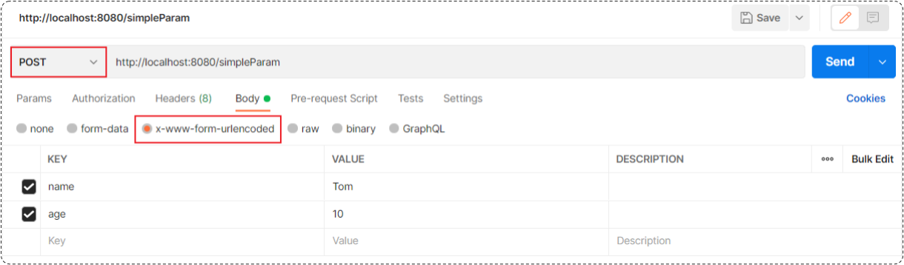

> **结论：不论是GET请求还是POST请求，对于简单参数来讲，只要保证==请求参数名和Controller方法中的形参名保持一致==，就可以获取到请求参数中的数据值。**


###### 1.2.3 参数名不一致

如果方法形参名称与请求参数名称不一致，controller方法中的形参还能接收到请求参数值吗？

~~~java
@RestController
public class RequestController {
    // http://localhost:8080/simpleParam?name=Tom&age=20
    // 请求参数名：name

    //springboot方式
    @RequestMapping("/simpleParam")
    public String simpleParam(String username , Integer age ){//请求参数名和形参名不相同
        System.out.println(username+"  :  "+age);
        return "OK";
    }
}
~~~

答案：运行没有报错。 controller方法中的username值为：null，age值为20

- 结论：对于简单参数来讲，请求参数名和controller方法中的形参名不一致时，无法接收到请求数据

那么如果我们开发中，遇到了这种请求参数名和controller方法中的形参名不相同，怎么办？

解决方案：可以使用Spring提供的@RequestParam注解完成映射

在方法形参前面加上 @RequestParam 然后通过value属性执行请求参数名，从而完成映射。代码如下：

```java
@RestController
public class RequestController {
    // http://localhost:8080/simpleParam?name=Tom&age=20
    // 请求参数名：name

    //springboot方式
    @RequestMapping("/simpleParam")
    public String simpleParam(@RequestParam("name") String username , Integer age ){
        System.out.println(username+"  :  "+age);
        return "OK";
    }
}
```

> **注意事项：**
>
> @RequestParam中的required属性默认为true（默认值也是true），代表该请求参数必须传递，如果不传递将报错
>
> 
>
> 如果该参数是可选的，可以将required属性设置为false
>
> ~~~java
> @RequestMapping("/simpleParam")
> public String simpleParam(@RequestParam(name = "name", required = false) String username, Integer age){
> System.out.println(username+ ":" + age);
> return "OK";
> }
> ~~~


##### 1.3 实体参数

在使用简单参数做为数据传递方式时，前端传递了多少个请求参数，后端controller方法中的形参就要书写多少个。如果请求参数比较多，通过上述的方式一个参数一个参数的接收，会比较繁琐。 

此时，我们可以考虑将请求参数封装到一个实体类对象中。 要想完成数据封装，需要遵守如下规则：**请求参数名与实体类的属性名相同**


###### 1.3.1 简单实体对象

定义POJO实体类：

```java
public class User {
    private String name;
    private Integer age;

    public String getName() {
        return name;
    }

    public void setName(String name) {
        this.name = name;
    }

    public Integer getAge() {
        return age;
    }

    public void setAge(Integer age) {
        this.age = age;
    }

    @Override
    public String toString() {
        return "User{" +
                "name='" + name + '\'' +
                ", age=" + age +
                '}';
    }
}

```

Controller方法：

```java
@RestController
public class RequestController {
    //实体参数：简单实体对象
    @RequestMapping("/simplePojo")
    public String simplePojo(User user){
        System.out.println(user);
        return "OK";
    }
}
```

Postman测试：

- 参数名和实体类属性名一致时

 

- 参数名和实体类属性名不一致时


###### 1.3.2 复杂实体对象

上面我们讲的呢是简单的实体对象，下面我们在来学习下复杂的实体对象。

复杂实体对象指的是，在实体类中有一个或多个属性，也是实体对象类型的。如下：

- User类中有一个Address类型的属性（Address是一个实体类）

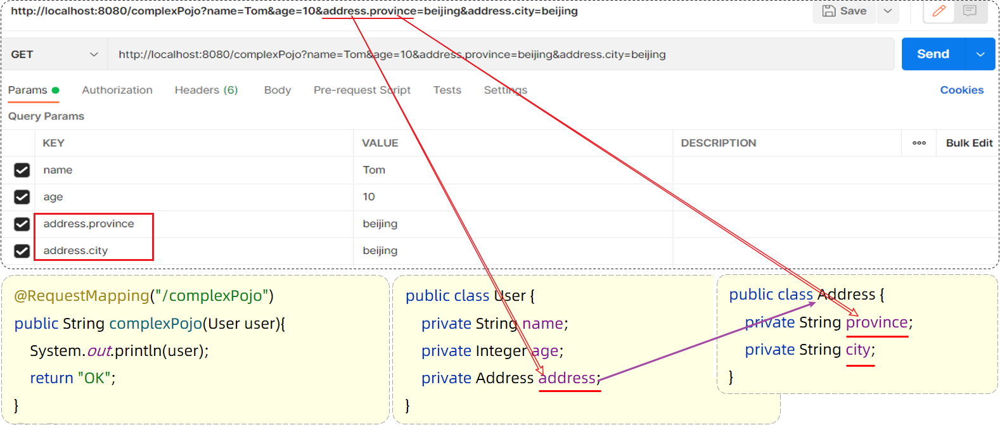

复杂实体对象的封装，需要遵守如下规则：

- **请求参数名与形参对象属性名相同，按照对象层次结构关系即可接收嵌套实体类属性参数。**

定义POJO实体类：

- Address实体类

```java
public class Address {
    private String province;
    private String city;

    public String getProvince() {
        return province;
    }

    public void setProvince(String province) {
        this.province = province;
    }

    public String getCity() {
        return city;
    }

    public void setCity(String city) {
        this.city = city;
    }

    @Override
    public String toString() {
        return "Address{" +
                "province='" + province + '\'' +
                ", city='" + city + '\'' +
                '}';
    }
}
```

- User实体类

```java
public class User {
    private String name;
    private Integer age;
    private Address address; //地址对象

    public String getName() {
        return name;
    }

    public void setName(String name) {
        this.name = name;
    }

    public Integer getAge() {
        return age;
    }

    public void setAge(Integer age) {
        this.age = age;
    }

    public Address getAddress() {
        return address;
    }

    public void setAddress(Address address) {
        this.address = address;
    }

    @Override
    public String toString() {
        return "User{" +
                "name='" + name + '\'' +
                ", age=" + age +
                ", address=" + address +
                '}';
    }
}
```

Controller方法：

```java
@RestController
public class RequestController {
    //实体参数：复杂实体对象
    @RequestMapping("/complexPojo")
    public String complexPojo(User user){
        System.out.println(user);
        return "OK";
    }
}
```

Postman测试：

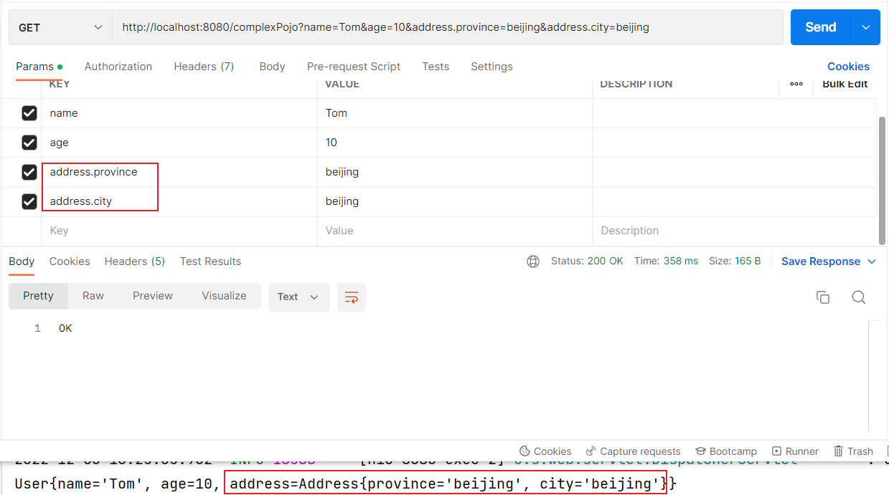 


##### 1.4 数组集合参数

数组集合参数的使用场景：在HTML的表单中，有一个表单项是支持多选的(复选框)，可以提交选择的多个值。

 

多个值是怎么提交的呢？其实多个值也是一个一个的提交。

 

后端程序接收上述多个值的方式有两种：

1. 数组
2. 集合


###### 1.4.1 数组

数组参数：**请求参数名与形参数组名称相同且请求参数为多个，定义数组类型形参即可接收参数**


Controller方法：

```java
@RestController
public class RequestController {
    //数组集合参数
    @RequestMapping("/arrayParam")
    public String arrayParam(String[] hobby){
        System.out.println(Arrays.toString(hobby));
        return "OK";
    }
}
```

Postman测试：

在前端请求时，有两种传递形式：

方式一： xxxxxxxxxx?hobby=game&hobby=java

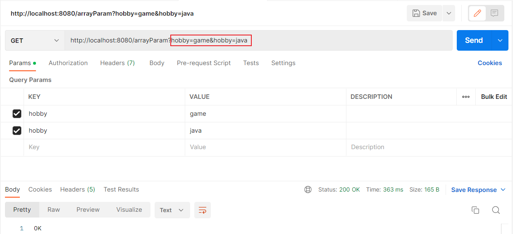 

方式二：xxxxxxxxxxxxx?hobby=game,java

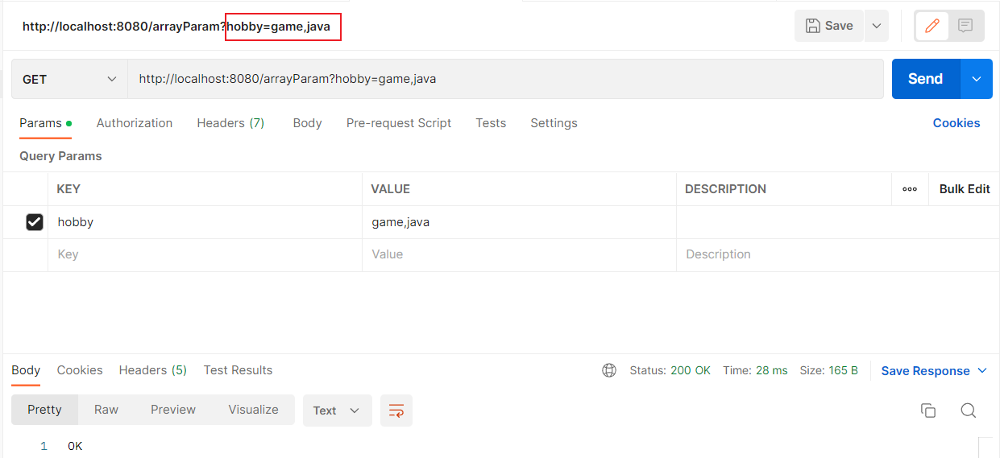


 

###### 1.4.2 集合

集合参数：**请求参数名与形参集合对象名相同且请求参数为多个，@RequestParam 绑定参数关系**

> 默认情况下，请求中参数名相同的多个值，是封装到数组。如果要封装到集合，要使用@RequestParam绑定参数关系

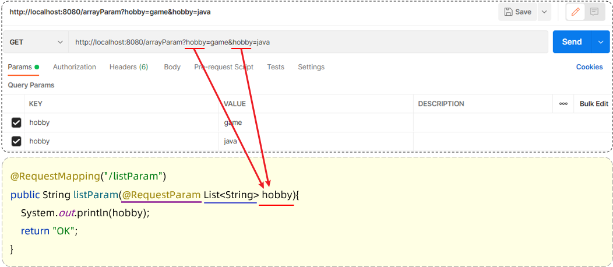

Controller方法：

```java
@RestController
public class RequestController {
    //数组集合参数
    @RequestMapping("/listParam")
    public String listParam(@RequestParam List<String> hobby){
        System.out.println(hobby);
        return "OK";
    }
}
```

Postman测试：

方式一： xxxxxxxxxx?hobby=game&hobby=java

 

方式二：xxxxxxxxxxxxx?hobby=game,java


##### 1.5 日期参数

上述演示的都是一些普通的参数，在一些特殊的需求中，可能会涉及到日期类型数据的封装。比如，如下需求：

 

因为日期的格式多种多样（如：2022-12-12 10:05:45 、2022/12/12 10:05:45），那么对于日期类型的参数在进行封装的时候，需要通过@DateTimeFormat注解，以及其pattern属性来设置日期的格式。

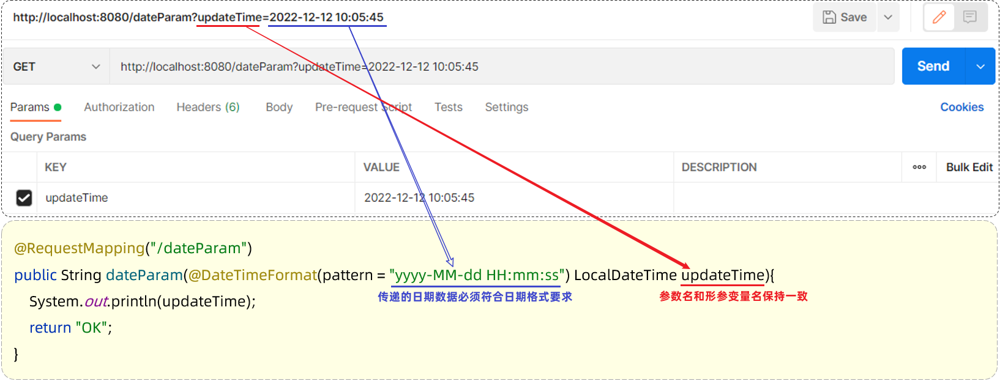

- @DateTimeFormat注解的pattern属性中指定了哪种日期格式，前端的日期参数就必须按照指定的格式传递。
- 后端controller方法中，需要使用Date类型或LocalDateTime类型，来封装传递的参数。

Controller方法：

```java
@RestController
public class RequestController {
    //日期时间参数
   @RequestMapping("/dateParam")
    public String dateParam(@DateTimeFormat(pattern = "yyyy-MM-dd HH:mm:ss") LocalDateTime updateTime){
        System.out.println(updateTime);
        return "OK";
    }
}
```

Postman测试：

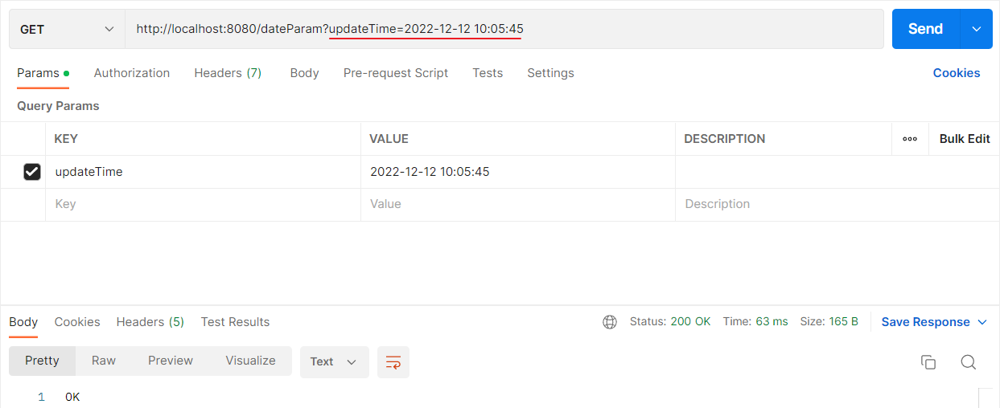


##### 1.6 JSON参数

在学习前端技术时，我们有讲到过JSON，而在前后端进行交互时，如果是比较复杂的参数，前后端通过会使用JSON格式的数据进行传输。 （JSON是开发中最常用的前后端数据交互方式）

我们学习JSON格式参数，主要从以下两个方面着手：

1. Postman在发送请求时，如何传递json格式的请求参数
2. 在服务端的controller方法中，如何接收json格式的请求参数

Postman发送JSON格式数据：


服务端Controller方法接收JSON格式数据：

- 传递json格式的参数，在Controller中会使用实体类进行封装。 
- 封装规则：**JSON数据键名与形参对象属性名相同，定义POJO类型形参即可接收参数。需要使用 @RequestBody标识。**


- @RequestBody注解：将JSON数据映射到形参的实体类对象中（JSON中的key和实体类中的属性名保持一致）

实体类：Address

```java
public class Address {
    private String province;
    private String city;
    
	//省略GET , SET 方法
}
```

实体类：User

```java
public class User {
    private String name;
    private Integer age;
    private Address address;
    
    //省略GET , SET 方法
}    
```

Controller方法：

```java
@RestController
public class RequestController {
    //JSON参数
    @RequestMapping("/jsonParam")
    public String jsonParam(@RequestBody User user){
        System.out.println(user);
        return "OK";
    }
}
```

Postman测试：

 


##### 1.7 路径参数

传统的开发中请求参数是放在请求体(POST请求)传递或跟在URL后面通过?key=value的形式传递(GET请求)。

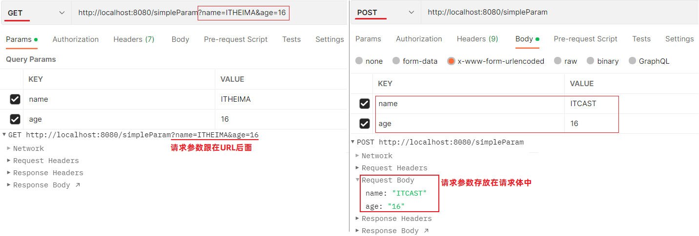

在现在的开发中，经常还会直接在请求的URL中传递参数。例如：

~~~
http://localhost:8080/user/1		
http://localhost:880/user/1/0
~~~

上述的这种传递请求参数的形式呢，我们称之为：路径参数。

学习路径参数呢，主要掌握在后端的controller方法中，如何接收路径参数。

**路径参数：**

- 前端：通过请求URL直接传递参数
- 后端：使用{…}来标识该路径参数，需要使用@PathVariable获取路径参数


Controller方法：

```java
@RestController
public class RequestController {
    //路径参数
    @RequestMapping("/path/{id}")
    public String pathParam(@PathVariable Integer id){
        System.out.println(id);
        return "OK";
    }
}
```

Postman测试：

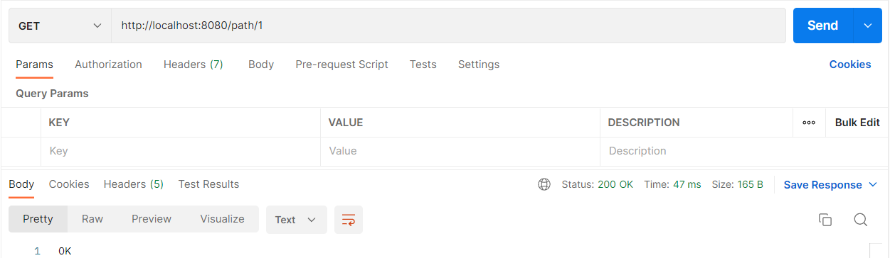

 

**传递多个路径参数：**

Postman：

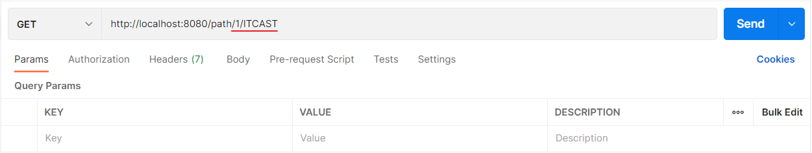

Controller方法：

~~~java
@RestController
public class RequestController {
    //路径参数
    @RequestMapping("/path/{id}/{name}")
    public String pathParam2(@PathVariable Integer id, @PathVariable String name){
        System.out.println(id+ " : " +name);
        return "OK";
    }
}
~~~


#### 2. 响应

前面我们学习过HTTL协议的交互方式：请求响应模式（有请求就有响应）

那么Controller程序呢，除了接收请求外，还可以进行响应。

##### 2.1 @ResponseBody

在我们前面所编写的controller方法中，都已经设置了响应数据。


controller方法中的return的结果，怎么就可以响应给浏览器呢？

答案：使用@ResponseBody注解

**@ResponseBody注解：**

- 类型：方法注解、类注解
- 位置：书写在Controller方法上或类上
- 作用：将方法返回值直接响应给浏览器
  - 如果返回值类型是实体对象/集合，将会转换为JSON格式后在响应给浏览器

但是在我们所书写的Controller中，只在类上添加了@RestController注解、方法添加了@RequestMapping注解，并没有使用@ResponseBody注解，怎么给浏览器响应呢？

~~~java
@RestController
public class HelloController {
    @RequestMapping("/hello")
    public String hello(){
        System.out.println("Hello World ~");
        return "Hello World ~";
    }
}
~~~

原因：在类上添加的@RestController注解，是一个组合注解。

- @RestController = @Controller + @ResponseBody 

@RestController源码：

~~~java
@Target({ElementType.TYPE})   //元注解（修饰注解的注解）
@Retention(RetentionPolicy.RUNTIME)  //元注解
@Documented    //元注解
@Controller   
@ResponseBody 
public @interface RestController {
    @AliasFor(
        annotation = Controller.class
    )
    String value() default "";
}
~~~

结论：在类上添加@RestController就相当于添加了@ResponseBody注解。

- 类上有@RestController注解或@ResponseBody注解时：表示当前类下所有的方法返回值做为响应数据
  - 方法的返回值，如果是一个POJO对象或集合时，会先转换为JSON格式，在响应给浏览器


下面我们来测试下响应数据：

~~~java
@RestController
public class ResponseController {
    //响应字符串
    @RequestMapping("/hello")
    public String hello(){
        System.out.println("Hello World ~");
        return "Hello World ~";
    }
    //响应实体对象
    @RequestMapping("/getAddr")
    public Address getAddr(){
        Address addr = new Address();//创建实体类对象
        addr.setProvince("广东");
        addr.setCity("深圳");
        return addr;
    }
    //响应集合数据
    @RequestMapping("/listAddr")
    public List`<Address>` listAddr(){
        List`<Address>` list = new ArrayList<>();//集合对象
        
        Address addr = new Address();
        addr.setProvince("广东");
        addr.setCity("深圳");

        Address addr2 = new Address();
        addr2.setProvince("陕西");
        addr2.setCity("西安");

        list.add(addr);
        list.add(addr2);
        return list;
    }
}
~~~

在服务端响应了一个对象或者集合，那私前端获取到的数据是什么样子的呢？我们使用postman发送请求来测试下。测试效果如下：

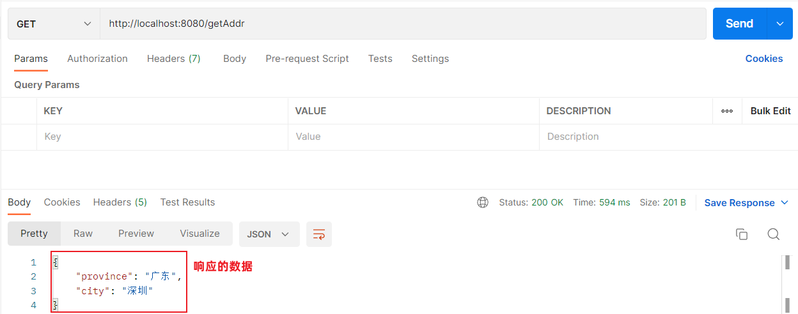


##### 2.2 统一响应结果

大家有没有发现一个问题，我们在前面所编写的这些Controller方法中，返回值各种各样，没有任何的规范。

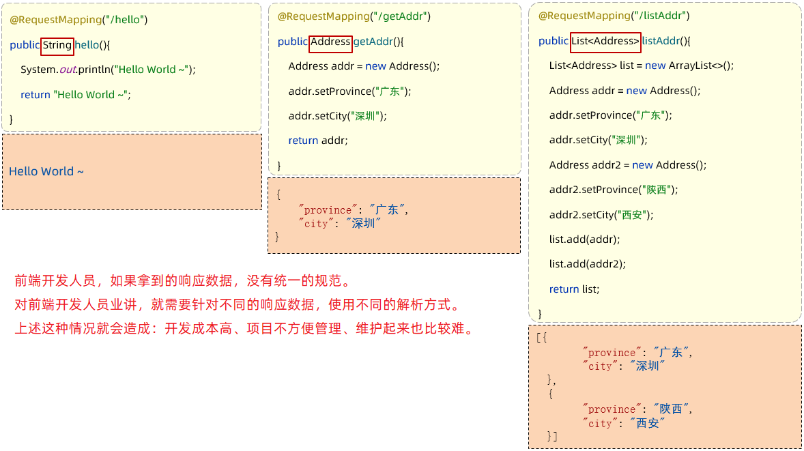

如果我们开发一个大型项目，项目中controller方法将成千上万，使用上述方式将造成整个项目难以维护。那在真实的项目开发中是什么样子的呢？

在真实的项目开发中，无论是哪种方法，我们都会定义一个统一的返回结果。方案如下：

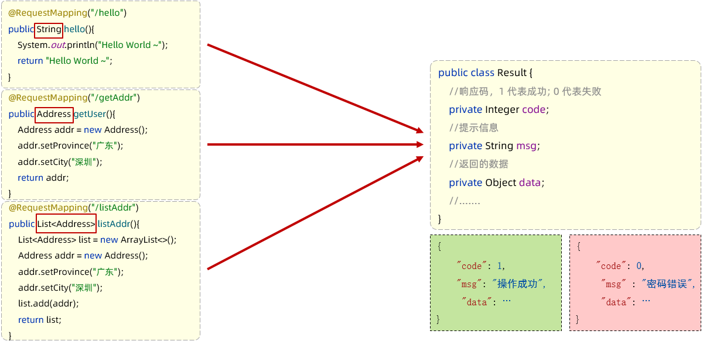

> 前端：只需要按照统一格式的返回结果进行解析(仅一种解析方案)，就可以拿到数据。

统一的返回结果使用类来描述，在这个结果中包含：

- 响应状态码：当前请求是成功，还是失败

- 状态码信息：给页面的提示信息

- 返回的数据：给前端响应的数据（字符串、对象、集合）

定义在一个实体类Result来包含以上信息。代码如下：

```java
public class Result {
    private Integer code;//响应码，1 代表成功; 0 代表失败
    private String msg;  //响应码 描述字符串
    private Object data; //返回的数据

    public Result() { }
    public Result(Integer code, String msg, Object data) {
        this.code = code;
        this.msg = msg;
        this.data = data;
    }

    public Integer getCode() {
        return code;
    }

    public void setCode(Integer code) {
        this.code = code;
    }

    public String getMsg() {
        return msg;
    }

    public void setMsg(String msg) {
        this.msg = msg;
    }

    public Object getData() {
        return data;
    }

    public void setData(Object data) {
        this.data = data;
    }

    //增删改 成功响应(不需要给前端返回数据)
    public static Result success(){
        return new Result(1,"success",null);
    }
    //查询 成功响应(把查询结果做为返回数据响应给前端)
    public static Result success(Object data){
        return new Result(1,"success",data);
    }
    //失败响应
    public static Result error(String msg){
        return new Result(0,msg,null);
    }
}
```

改造Controller：

~~~java
@RestController
public class ResponseController { 
    //响应统一格式的结果
    @RequestMapping("/hello")
    public Result hello(){
        System.out.println("Hello World ~");
        //return new Result(1,"success","Hello World ~");
        return Result.success("Hello World ~");
    }

    //响应统一格式的结果
    @RequestMapping("/getAddr")
    public Result getAddr(){
        Address addr = new Address();
        addr.setProvince("广东");
        addr.setCity("深圳");
        return Result.success(addr);
    }

    //响应统一格式的结果
    @RequestMapping("/listAddr")
    public Result listAddr(){
        List`<Address>` list = new ArrayList<>();

        Address addr = new Address();
        addr.setProvince("广东");
        addr.setCity("深圳");

        Address addr2 = new Address();
        addr2.setProvince("陕西");
        addr2.setCity("西安");

        list.add(addr);
        list.add(addr2);
        return Result.success(list);
    }
}
~~~

使用Postman测试：


##### 2.3 案例

下面我们通过一个案例，来加强对请求响应的学习。

###### 2.3.1 需求说明

需求：加载并解析xml文件中的数据，完成数据处理，并在页面展示

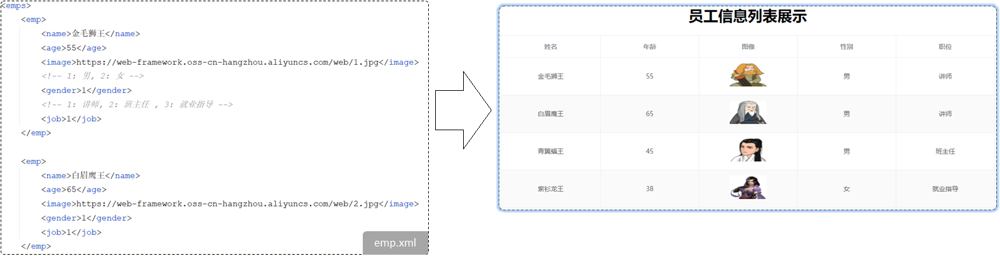  

- 获取员工数据，返回统一响应结果，在页面渲染展示


###### 2.3.2 准备工作

案例准备：

1. XML文件
   - 已经准备好(emp.xml)，直接导入进来，放在 src/main/resources目录下
2. 工具类
   - 已经准备好解析XML文件的工具类，无需自己实现
   - 直接在创建一个包 com.itheima.utils ，然后将工具类拷贝进来

3. 前端页面资源
   - 已经准备好，直接拷贝进来，放在src/main/resources下的static目录下

Springboot项目的静态资源(html，css，js等前端资源)默认存放目录为：classpath:/static 、 classpath:/public、 classpath:/resources

> 在SpringBoot项目中，静态资源默认可以存放的目录：
>
> - classpath:/static/
> - classpath:/public/
> - classpath:/resources/
> - classpath:/META-INF/resources/
>
> classpath：
>
> - 代表的是类路径，在maven的项目中，其实指的就是 src/main/resources 或者 src/main/java，但是java目录是存放java代码的，所以相关的配置文件及静态资源文档，就放在 src/main/resources下。


###### 2.3.3 实现步骤

1. 在pom.xml文件中引入dom4j的依赖，用于解析XML文件

   ~~~xml
   `<dependency>`
       `<groupId>`org.dom4j`</groupId>`
       `<artifactId>`dom4j`</artifactId>`
       `<version>`2.1.3`</version>`
   `</dependency>`
   ~~~

2. 引入资料中提供的：解析XML的工具类XMLParserUtils、实体类Emp、XML文件emp.xml

    

3. 引入资料中提供的静态页面文件，放在resources下的static目录下

    

4. 创建EmpController类，编写Controller程序，处理请求，响应数据

    


###### 2.3.4 代码实现

Contriller代码：

```java
@RestController
public class EmpController {
    @RequestMapping("/listEmp")
    public Result list(){
        //1. 加载并解析emp.xml
        String file = this.getClass().getClassLoader().getResource("emp.xml").getFile();
        //System.out.println(file);
        List<Emp> empList = XmlParserUtils.parse(file, Emp.class);

        //2. 对数据进行转换处理 - gender, job
        empList.stream().forEach(emp -> {
            //处理 gender 1: 男, 2: 女
            String gender = emp.getGender();
            if("1".equals(gender)){
                emp.setGender("男");
            }else if("2".equals(gender)){
                emp.setGender("女");
            }

            //处理job - 1: 讲师, 2: 班主任 , 3: 就业指导
            String job = emp.getJob();
            if("1".equals(job)){
                emp.setJob("讲师");
            }else if("2".equals(job)){
                emp.setJob("班主任");
            }else if("3".equals(job)){
                emp.setJob("就业指导");
            }
        });
        //3. 响应数据
        return Result.success(empList);
    }
}
```

统一返回结果实体类：

~~~java
public class Result {
    private Integer code ;//1 成功 , 0 失败
    private String msg; //提示信息
    private Object data; //数据 date

    public Result() {
    }
    public Result(Integer code, String msg, Object data) {
        this.code = code;
        this.msg = msg;
        this.data = data;
    }
    public Integer getCode() {
        return code;
    }
    public void setCode(Integer code) {
        this.code = code;
    }
    public String getMsg() {
        return msg;
    }
    public void setMsg(String msg) {
        this.msg = msg;
    }
    public Object getData() {
        return data;
    }
    public void setData(Object data) {
        this.data = data;
    }
    public static Result success(Object data){
        return new Result(1, "success", data);
    }
    public static Result success(){
        return new Result(1, "success", null);
    }
    public static Result error(String msg){
        return new Result(0, msg, null);
    }
}
~~~


###### 2.3.5 测试

代码编写完毕之后，我们就可以运行引导类，启动服务进行测试了。 

使用Postman测试：


打开浏览器，在浏览器地址栏输入： `http://localhost:8080/emp`.html`

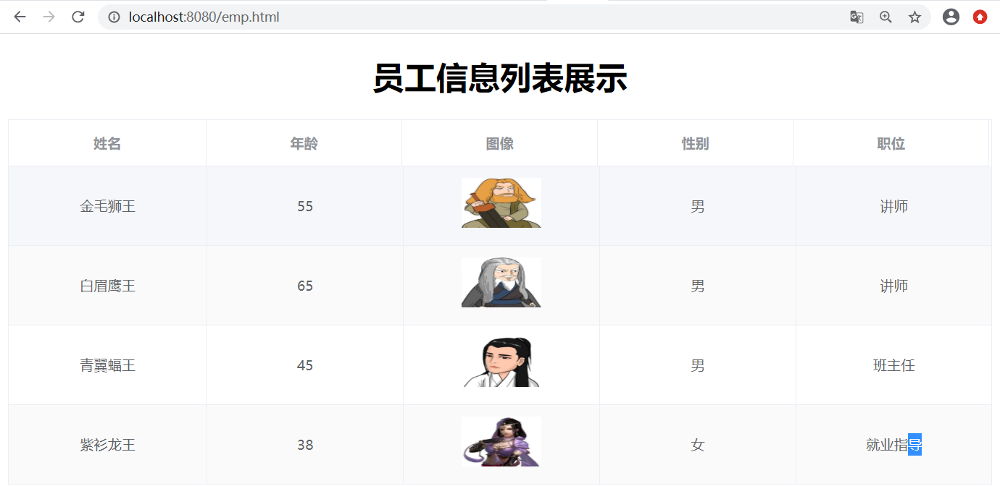 


###### 2.3.6 问题分析

上述案例的功能，我们虽然已经实现，但是呢，我们会发现案例中：解析XML数据，获取数据的代码，处理数据的逻辑的代码，给页面响应的代码全部都堆积在一起了，全部都写在controller方法中了。

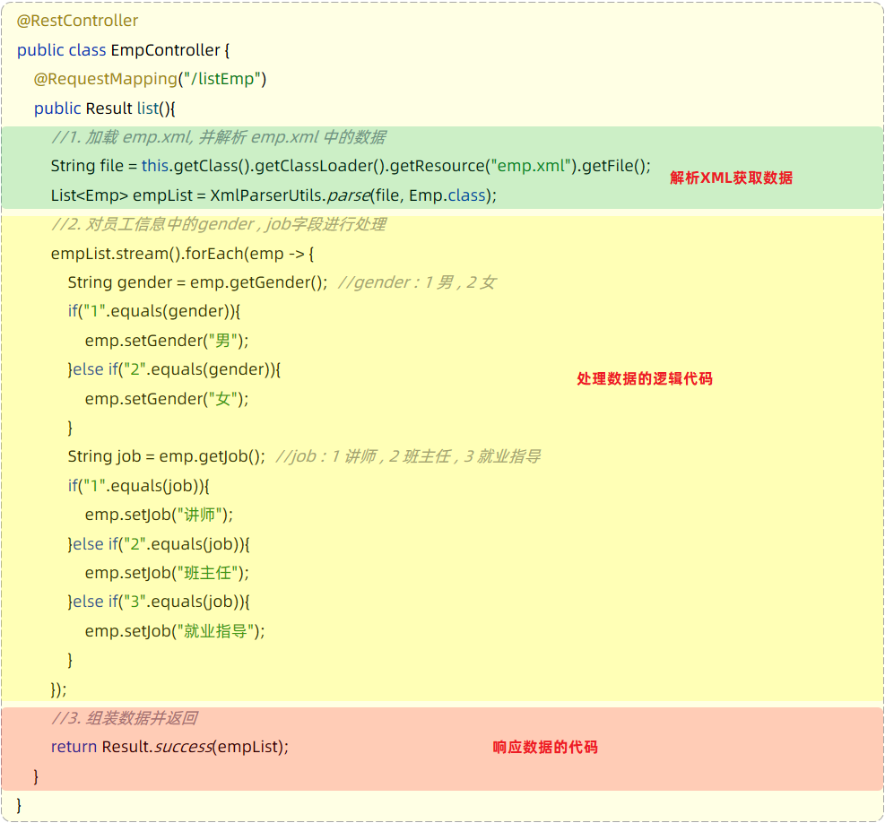

当前程序的这个业务逻辑还是比较简单的，如果业务逻辑再稍微复杂一点，我们会看到Controller方法的代码量就很大了。

- 当我们要修改操作数据部分的代码，需要改动Controller

- 当我们要完善逻辑处理部分的代码，需要改动Controller

- 当我们需要修改数据响应的代码，还是需要改动Controller

这样呢，就会造成我们整个工程代码的复用性比较差，而且代码难以维护。 那如何解决这个问题呢？其实在现在的开发中，有非常成熟的解决思路，那就是分层开发。


#### 3. 分层解耦

##### 3.1 三层架构

###### 3.1.1 介绍

在我们进行程序设计以及程序开发时，尽可能让每一个接口、类、方法的职责更单一些（单一职责原则）。

> 单一职责原则：一个类或一个方法，就只做一件事情，只管一块功能。
>
> 这样就可以让类、接口、方法的复杂度更低，可读性更强，扩展性更好，也更利用后期的维护。

我们之前开发的程序呢，并不满足单一职责原则。下面我们来分析下之前的程序：

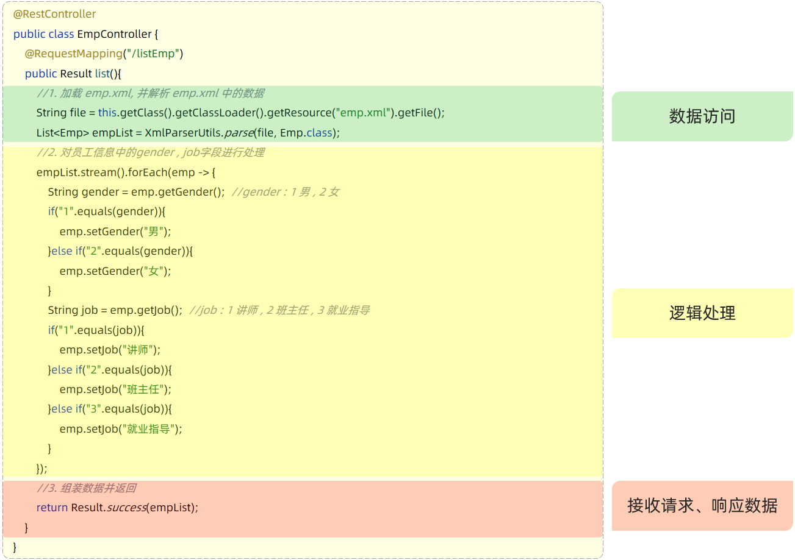 

那其实我们上述案例的处理逻辑呢，从组成上看可以分为三个部分：

- 数据访问：负责业务数据的维护操作，包括增、删、改、查等操作。
- 逻辑处理：负责业务逻辑处理的代码。
- 请求处理、响应数据：负责，接收页面的请求，给页面响应数据。

按照上述的三个组成部分，在我们项目开发中呢，可以将代码分为三层：


- Controller：控制层。接收前端发送的请求，对请求进行处理，并响应数据。
- Service：业务逻辑层。处理具体的业务逻辑。
- Dao：数据访问层(Data Access Object)，也称为持久层。负责数据访问操作，包括数据的增、删、改、查。


基于三层架构的程序执行流程：

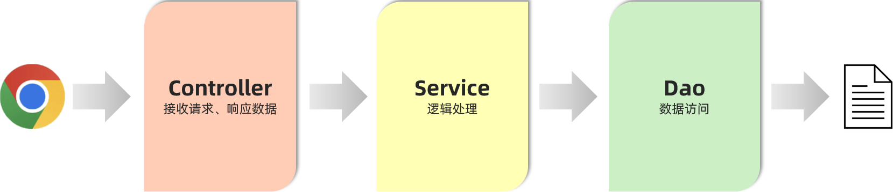

- 前端发起的请求，由Controller层接收（Controller响应数据给前端）
- Controller层调用Service层来进行逻辑处理（Service层处理完后，把处理结果返回给Controller层）
- Serivce层调用Dao层（逻辑处理过程中需要用到的一些数据要从Dao层获取）
- Dao层操作文件中的数据（Dao拿到的数据会返回给Service层）

> 思考：按照三层架构的思想，如何要对业务逻辑(Service层)进行变更，会影响到Controller层和Dao层吗？ 
>
> 答案：不会影响。 （程序的扩展性、维护性变得更好了）


###### 3.1.2 代码拆分

我们使用三层架构思想，来改造下之前的程序：

- 控制层包名：xxxx.controller
- 业务逻辑层包名：xxxx.service
- 数据访问层包名：xxxx.dao


**控制层：**接收前端发送的请求，对请求进行处理，并响应数据

```java
@RestController
public class EmpController {
    //业务层对象
    private EmpService empService = new EmpServiceA();

    @RequestMapping("/listEmp")
    public Result list(){
        //1. 调用service层, 获取数据
        List<Emp> empList = empService.listEmp();

        //3. 响应数据
        return Result.success(empList);
    }
}
```

**业务逻辑层：**处理具体的业务逻辑

- 业务接口

~~~java
//业务逻辑接口（制定业务标准）
public interface EmpService {
    //获取员工列表
    public List`<Emp>` listEmp();
}
~~~

- 业务实现类

```java
//业务逻辑实现类（按照业务标准实现）
public class EmpServiceA implements EmpService {
    //dao层对象
    private EmpDao empDao = new EmpDaoA();

    @Override
    public List<Emp> listEmp() {
        //1. 调用dao, 获取数据
        List<Emp> empList = empDao.listEmp();

        //2. 对数据进行转换处理 - gender, job
        empList.stream().forEach(emp -> {
            //处理 gender 1: 男, 2: 女
            String gender = emp.getGender();
            if("1".equals(gender)){
                emp.setGender("男");
            }else if("2".equals(gender)){
                emp.setGender("女");
            }

            //处理job - 1: 讲师, 2: 班主任 , 3: 就业指导
            String job = emp.getJob();
            if("1".equals(job)){
                emp.setJob("讲师");
            }else if("2".equals(job)){
                emp.setJob("班主任");
            }else if("3".equals(job)){
                emp.setJob("就业指导");
            }
        });
        return empList;
    }
}
```

**数据访问层：**负责数据的访问操作，包含数据的增、删、改、查

- 数据访问接口

~~~java
//数据访问层接口（制定标准）
public interface EmpDao {
    //获取员工列表数据
    public List`<Emp>` listEmp();
}
~~~

- 数据访问实现类

```java
//数据访问实现类
public class EmpDaoA implements EmpDao {
    @Override
    public List<Emp> listEmp() {
        //1. 加载并解析emp.xml
        String file = this.getClass().getClassLoader().getResource("emp.xml").getFile();
        System.out.println(file);
        List<Emp> empList = XmlParserUtils.parse(file, Emp.class);
        return empList;
    }
}
```


三层架构的好处：

1. 复用性强
2. 便于维护
3. 利用扩展


##### 3.2 分层==解耦==

刚才我们学习过程序分层思想了，接下来呢，我们来学习下程序的解耦思想。

解耦：解除耦合。

###### 3.2.1 耦合问题

首先需要了解软件开发涉及到的两个概念：内聚和耦合。

- 内聚：软件中各个功能模块内部的功能联系。

- 耦合：衡量软件中各个层/模块之间的依赖、关联的程度。

**软件设计原则：==高内聚低耦合==。**

> 高内聚指的是：一个模块中各个元素之间的联系的紧密程度，如果各个元素(语句、程序段)之间的联系程度越高，则内聚性越高，即 "高内聚"。
>
> 低耦合指的是：软件中各个层、模块之间的依赖关联程序越低越好。

程序中高内聚的体现：

- EmpServiceA类中只编写了和员工相关的逻辑处理代码

 

程序中耦合代码的体现：

- 把业务类变为EmpServiceB时，需要修改controller层中的代码


高内聚、低耦合的目的是使程序模块的可重用性、移植性大大增强。


###### 3.2.2 ==解耦思路==

之前我们在编写代码时，需要什么对象，就直接new一个就可以了。 这种做法呢，层与层之间代码就耦合了，当service层的实现变了之后， 我们还需要修改controller层的代码。


 那应该怎么解耦呢？

- 首先不能在EmpController中使用new对象。代码如下：


- 此时，就存在另一个问题了，不能new，就意味着没有业务层对象（程序运行就报错），怎么办呢？
  - 我们的解决思路是：
    - 提供一个容器，容器中存储一些对象(例：EmpService对象)
    - controller程序从容器中获取EmpService类型的对象

我们想要实现上述解耦操作，就涉及到Spring中的两个核心概念：

- **==控制反转==：** Inversion Of Control，简称IOC。==对象的创建控制权由程序自身转移到外部（容器）==，这种思想称为==控制反转==。

  > 对象的创建权由程序员主动创建转移到容器(由容器创建、管理对象)。这个容器称为：IOC容器或Spring容器

- **==依赖注入==：** Dependency Injection，简称DI。==容器为应用程序提供运行时所依赖的资源，称之为依赖注入==。

  > 程序运行时需要某个资源，此时容器就为其提供这个资源。
  >
  > 例：EmpController程序运行时需要EmpService对象，Spring容器就为其提供并注入EmpService对象

==IOC容器中创建、管理的对象，称之为：bean对象==


##### 3.3 ==IOC&DI==

上面我们引出了Spring中IOC和DI的基本概念，下面我们就来具体学习下IOC和DI的代码实现。

###### 3.3.1 ==IOC&DI入门==

任务：完成Controller层、Service层、Dao层的代码解耦

- 思路：
  1. 删除Controller层、Service层中new对象的代码
  2. Service层及Dao层的实现类，交给IOC容器管理
  3. 为Controller及Service注入运行时依赖的对象
     - Controller程序中注入依赖的Service层对象
     - Service程序中注入依赖的Dao层对象


第1步：删除Controller层、Service层中new对象的代码


第2步：Service层及Dao层的实现类，交给IOC容器管理

- 使用Spring提供的注解：@Component ，就可以实现类交给IOC容器管理


第3步：为Controller及Service注入运行时依赖的对象

- 使用Spring提供的注解：@Autowired ，就可以实现程序运行时IOC容器自动注入需要的依赖对象


完整的三层代码：

- **Controller层：**

~~~java
@RestController
public class EmpController {

    @Autowired //运行时,从IOC容器中获取该类型对象,赋值给该变量
    private EmpService empService ;

    @RequestMapping("/listEmp")
    public Result list(){
        //1. 调用service, 获取数据
        List`<Emp>` empList = empService.listEmp();

        //3. 响应数据
        return Result.success(empList);
    }
}
~~~

- **Service层：**

~~~java
@Component //将当前对象交给IOC容器管理,成为IOC容器的bean
public class EmpServiceA implements EmpService {

    @Autowired //运行时,从IOC容器中获取该类型对象,赋值给该变量
    private EmpDao empDao ;

    @Override
    public List`<Emp>` listEmp() {
        //1. 调用dao, 获取数据
        List`<Emp>` empList = empDao.listEmp();

        //2. 对数据进行转换处理 - gender, job
        empList.stream().forEach(emp -> {
            //处理 gender 1: 男, 2: 女
            String gender = emp.getGender();
            if("1".equals(gender)){
                emp.setGender("男");
            }else if("2".equals(gender)){
                emp.setGender("女");
            }

            //处理job - 1: 讲师, 2: 班主任 , 3: 就业指导
            String job = emp.getJob();
            if("1".equals(job)){
                emp.setJob("讲师");
            }else if("2".equals(job)){
                emp.setJob("班主任");
            }else if("3".equals(job)){
                emp.setJob("就业指导");
            }
        });
        return empList;
    }
}
~~~

**Dao层：**

~~~java
@Component //将当前对象交给IOC容器管理,成为IOC容器的bean
public class EmpDaoA implements EmpDao {
    @Override
    public List`<Emp>` listEmp() {
        //1. 加载并解析emp.xml
        String file = this.getClass().getClassLoader().getResource("emp.xml").getFile();
        System.out.println(file);
        List`<Emp>` empList = XmlParserUtils.parse(file, Emp.class);
        return empList;
    }
}
~~~


运行测试：

- 启动SpringBoot引导类，打开浏览器，输入：`http://localhost:8080/emp.html`


 


###### 3.3.2 IOC详解

通过IOC和DI的入门程序呢，我们已经基本了解了IOC和DI的基础操作。接下来呢，我们学习下IOC控制反转和DI依赖注入的细节。

###### 3.3.2.1 bean的声明

前面我们提到IOC控制反转，就是将对象的控制权交给Spring的IOC容器，由IOC容器创建及管理对象。IOC容器创建的对象称为bean对象。

在之前的入门案例中，要把某个对象交给IOC容器管理，需要在类上添加一个注解：@Component 

而Spring框架为了更好的标识web应用程序开发当中，bean对象到底归属于哪一层，又提供了@Component的衍生注解：

- @Controller    （标注在控制层类上）
- @Service          （标注在业务层类上）
- @Repository    （标注在数据访问层类上）


修改入门案例代码：

- **Controller层：**

~~~java
@RestController  //@RestController = @Controller + @ResponseBody
public class EmpController {

    @Autowired //运行时,从IOC容器中获取该类型对象,赋值给该变量
    private EmpService empService ;

    @RequestMapping("/listEmp")
    public Result list(){
        //1. 调用service, 获取数据
        List`<Emp>` empList = empService.listEmp();

        //3. 响应数据
        return Result.success(empList);
    }
}
~~~

- **Service层：**

~~~java
@Service
public class EmpServiceA implements EmpService {

    @Autowired //运行时,从IOC容器中获取该类型对象,赋值给该变量
    private EmpDao empDao ;

    @Override
    public List`<Emp>` listEmp() {
        //1. 调用dao, 获取数据
        List`<Emp>` empList = empDao.listEmp();

        //2. 对数据进行转换处理 - gender, job
        empList.stream().forEach(emp -> {
            //处理 gender 1: 男, 2: 女
            String gender = emp.getGender();
            if("1".equals(gender)){
                emp.setGender("男");
            }else if("2".equals(gender)){
                emp.setGender("女");
            }

            //处理job - 1: 讲师, 2: 班主任 , 3: 就业指导
            String job = emp.getJob();
            if("1".equals(job)){
                emp.setJob("讲师");
            }else if("2".equals(job)){
                emp.setJob("班主任");
            }else if("3".equals(job)){
                emp.setJob("就业指导");
            }
        });
        return empList;
    }
}
~~~

**Dao层：**

~~~java
@Repository
public class EmpDaoA implements EmpDao {
    @Override
    public List`<Emp>` listEmp() {
        //1. 加载并解析emp.xml
        String file = this.getClass().getClassLoader().getResource("emp.xml").getFile();
        System.out.println(file);
        List`<Emp>` empList = XmlParserUtils.parse(file, Emp.class);
        return empList;
    }
}
~~~


要把某个对象交给IOC容器管理，需要在对应的类上加上如下注解之一：

| 注解        | 说明                 | 位置                                            |
| :---------- | -------------------- | ----------------------------------------------- |
| @Controller | @Component的衍生注解 | 标注在控制器类上                                |
| @Service    | @Component的衍生注解 | 标注在业务类上                                  |
| @Repository | @Component的衍生注解 | 标注在数据访问类上（由于与mybatis整合，用的少） |
| @Component  | 声明bean的基础注解   | 不属于以上三类时，用此注解                      |

> 查看源码：

在IOC容器中，每一个Bean都有一个属于自己的名字，可以通过注解的value属性指定bean的名字。如果没有指定，默认为类名首字母小写。


> 注意事项: 
>
> - 声明bean的时候，可以通过value属性指定bean的名字，如果没有指定，默认为类名首字母小写。
> - 使用以上四个注解都可以声明bean，但是在springboot集成web开发中，声明控制器bean只能用@Controller。


###### 3.3.2.2 组件扫描

问题：使用前面学习的四个注解声明的bean，一定会生效吗？

答案：不一定。（原因：bean想要生效，还需要被组件扫描）


 下面我们通过修改项目工程的目录结构，来测试bean对象是否生效：


运行程序后，报错：


为什么没有找到bean对象呢？

- 使用四大注解声明的bean，要想生效，还需要被组件扫描注解@ComponentScan扫描

> @ComponentScan注解虽然没有显式配置，但是实际上已经包含在了引导类声明注解 @SpringBootApplication 中，==**默认扫描的范围是SpringBoot启动类所在包及其子包**==。
>
>  

- 解决方案：手动添加@ComponentScan注解，指定要扫描的包   （==仅做了解，不推荐==）


推荐做法（如下图）：

- 将我们定义的controller，service，dao这些包呢，都放在引导类所在包com.itheima的子包下，这样我们定义的bean就会被自动的扫描到


###### 3.3.3 DI详解

上一小节我们讲解了控制反转IOC的细节，接下来呢，我们学习依赖注解DI的细节。

依赖注入，是指IOC容器要为应用程序去提供运行时所依赖的资源，而资源指的就是对象。

在入门程序案例中，我们使用了@Autowired这个注解，完成了依赖注入的操作，而这个Autowired翻译过来叫：自动装配。

@Autowired注解，默认是按照**类型**进行自动装配的（去IOC容器中找某个类型的对象，然后完成注入操作）

> 入门程序举例：在EmpController运行的时候，就要到IOC容器当中去查找EmpService这个类型的对象，而我们的IOC容器中刚好有一个EmpService这个类型的对象，所以就找到了这个类型的对象完成注入操作。


那如果在IOC容器中，存在多个相同类型的bean对象，会出现什么情况呢？


- 程序运行会报错


如何解决上述问题呢？Spring提供了以下几种解决方案：

- @Primary

- @Qualifier

- @Resource


使用@Primary注解：当存在多个相同类型的Bean注入时，加上@Primary注解，来确定默认的实现。

 


使用@Qualifier注解：指定当前要注入的bean对象。 在@Qualifier的value属性中，指定注入的bean的名称。

- @Qualifier注解不能单独使用，必须配合@Autowired使用


使用@Resource注解：是按照bean的名称进行注入。通过name属性指定要注入的bean的名称。


> 面试题 ： @Autowird 与 @Resource的区别
>
> - @Autowired 是spring框架提供的注解，而@Resource是JDK提供的注解
> - @Autowired 默认是按照类型注入，而@Resource是按照名称注入


在现在的开发中，经常还会直接在请求的URL中传递参数。例如：

~~~
http://localhost:8080/user/1		
http://localhost:880/user/1/0
~~~

上述的这种传递请求参数的形式呢，我们称之为：路径参数。

学习路径参数呢，主要掌握在后端的controller方法中，如何接收路径参数。

路径参数：

- 前端：通过请求URL直接传递参数
- 后端：使用{…}来标识该路径参数，需要使用@PathVariable获取路径参数


Controller方法：

```java
@RestController
public class RequestController {
    //路径参数
    @RequestMapping("/path/{id}")
    public String pathParam(@PathVariable Integer id){
        System.out.println(id);
        return "OK";
    }
}
```

Postman测试：


 

**传递多个路径参数：**

Postman：


Controller方法：

~~~java
@RestController
public class RequestController {
    //路径参数
    @RequestMapping("/path/{id}/{name}")
    public String pathParam2(@PathVariable Integer id, @PathVariable String name){
        System.out.println(id+ " : " +name);
        return "OK";
    }
}
~~~


## 


## 三、前后端分离开发


### 1、案例项目==环境搭建==


### 2、前后端分离开发规范

#### （1）前后端开发框架示意图


#### （2）==Restful开发规范==


#### （3）==Result类统一响应结果==

```java
@Data
@NoArgsConstructor
@AllArgsConstructor
public class Result {
    private Integer code;//响应码，1 代表成功; 0 代表失败
    private String msg;  //响应信息 描述字符串
    private Object data; //返回的数据

    //增删改 成功响应
    public static Result success() {
        return new Result(1, "success", null);
    }

    //查询 成功响应
    public static Result success(Object data) {
        return new Result(1, "success", data);
    }

    //失败响应
    public static Result error(String msg) {
        return new Result(0, msg, null);
    }
}

```


#### （4）开发流程


### 3、业务流程


#### （1）查询部门


#### （2）删除部门


#### （3）新增部门


#### （4）RequestMapping-简化路径名


#### （5）==分页查询==

##### ①语法


###### **代码**

```java
//mapper层
    /**
     * 查询总记录数
     * @return
     */
    @Select("select count(*) from emp")
    public Long count();

    /**
     * 分页查询,获取列表数据
     * @param startIndex
     * @param pageSize
     */

    @Select("select * from emp limit #{startIndex},#{pageSize}")
    public List<Emp> page(Integer startIndex, Integer pageSize);


//service层
    @Override
    public PageBean page(Integer page, Integer pageSize) {
        //1. 获取总记录数
        Long count = empMapper.count();

        //2. 获取分页查询结果列表
        Integer startIndex = (page - 1) * pageSize;
        List<Emp> empList = empMapper.page(startIndex,pageSize);

        //3. 封装PageBean对象
        return new PageBean(count,empList);
    }


//controller层
    @GetMapping
    public Result page(@RequestParam(defaultValue = "1") Integer page,
                       @RequestParam(defaultValue = "10") Integer pageSize) {
        log.info("分页查询, 参数: {},{}", page, pageSize);
        PageBean pageBean = empService.page(page, pageSize);
        return Result.success(pageBean);
    }
```


##### ②分页查询简化插件-PageHelper

###### 引入插件

```xml
<!--PageHelper分页插件-->
        <dependency>
            <groupId>com.github.pagehelper</groupId>
            <artifactId>pagehelper-spring-boot-starter</artifactId>
            <version>1.4.2</version>
        </dependency>
```


###### **代码**

```java
//mapper层
    /**
     * 员工信息查询
     * @return
     */
    @Select("select * from emp")
    public List<Emp> list(String name, Short gender,LocalDate begin,LocalDate end);


//service层
    @Override
    public PageBean page(Integer page, Integer pageSize, String name, Short gender, LocalDate begin, LocalDate end) {
        //1. 设置分页参数
        PageHelper.startPage(page, pageSize);

        //2. 执行查询
        List<Emp> empList = empMapper.list(name, gender, begin, end);
        Page<Emp> p = (Page<Emp>) empList;

        //3. 封装PageBean对象
        PageBean pageBean = new PageBean(p.getTotal(), p.getResult());
        return pageBean;
    }

//controller层
@GetMapping
    public Result page(@RequestParam(defaultValue = "1") Integer page,
                       @RequestParam(defaultValue = "10") Integer pageSize,
                       String name, Short gender,
                       @DateTimeFormat(pattern = "yyyy-MM-dd") LocalDate begin,
                       @DateTimeFormat(pattern = "yyyy-MM-dd") LocalDate end){
        log.info("分页查询, 参数: {},{},{},{},{},{}",page,pageSize,name,gender,begin,end);
        //调用service分页查询
        PageBean pageBean = empService.page(page,pageSize,name,gender,begin,end);
        return Result.success(pageBean);
    }
```

###### PageHelper实现原理-ThreadLocal


**利用PageHelp插件实现分页查询，会==自动拼接limit==**


**==2、基于Mybatis的拦截器，进行动态拼接==**

**介绍：**

- ThreadLocal 并不是一个Thread，而是**Thread的局部变量**。
- ThreadLocal为**每个线程提供单独一份存储空间**，具有==**线程隔离**==的效果，只有**在线程内才能获取到对应的值，线程外则不能访问。**
- ThreadLocal为**每个线程提供单独一份存储空间**，表示==**每次请求都对应着不同的线程**==，可利用ThreadLocal作为**一次请求的共享空间**

**常用方法：**

- public void set(T value) 	设置当前线程的线程局部变量的值
- public T get() 		返回当前线程所对应的线程局部变量的值
- public void remove()        移除当前线程的线程局部变量


##### ③案例分析


#### （6）删除和修改员工


#### （7）==代码Code==

##### ①Controller层

```java
/**
 * 部门管理Controller
 */
@Slf4j //用于输出日志的注解
@RequestMapping("/depts") //设置统一的请求、响应路径
@RestController
public class DeptController {

    //private static Logger log = LoggerFactory.getLogger(DeptController.class);
    @Autowired //注入依赖，获取Service层的
    private DeptService deptService;

    /**
     * 查询部门数据
     * @return Result
     */
    //@RequestMapping(value = "/depts",method = RequestMethod.GET) //指定请求方式为GET
    @GetMapping
    public Result list(){
        log.info("查询全部部门数据");
        //调用service查询部门数据
        List<Dept> deptList =  deptService.list();
        return Result.success(deptList);
    }


    /**
     * 删除部门
     * @return
     */
    @DeleteMapping("/{id}")
    public Result delete(@PathVariable Integer id){
        log.info("根据id删除部门:{}",id);
        //调用service删除部门
        deptService.delete(id);
        return Result.success();
    }


    /**
     * 新增部门
     * @return
     */
    @PostMapping
    public Result add(@RequestBody Dept dept){
        log.info("新增部门: {}" , dept);
        //调用service新增部门
        deptService.add(dept);
        return Result.success();
    }
}
```

##### ②service层

```java
@Service //IOC 控制反转：对象的创建控制权由程序自身转移到外部（容器），这种思想称为控制反转
public class DeptServiceImpl implements DeptService {

    @Autowired
    private DeptMapper deptMapper;

    @Override
    public List<Dept> list() {
        return deptMapper.list();
    }

    @Override
    public void delete(Integer id) {
        deptMapper.deleteById(id);
    }

    @Override
    public void add(Dept dept) {
        dept.setCreateTime(LocalDateTime.now());
        dept.setUpdateTime(LocalDateTime.now());

        deptMapper.insert(dept);
    }
}
```


##### ③mapper层

```java
/**
 * 部门管理
 */
@Mapper
public interface DeptMapper {
    /**
     * 查询全部部门
     * @return
     */
    @Select("select * from dept")
    List<Dept> list();

    /**
     * 根据ID删除部门
     * @param id
     */
    @Delete("delete from dept where id = #{id}")
    void deleteById(Integer id);

    /**
     * 新增部门
     * @param dept
     */
    @Insert("insert into dept(name, create_time, update_time) values(#{name},#{createTime},#{updateTime})")
    void insert(Dept dept);
}
```


##### ④pojo层(Plain Old Java Object)-实例层

```java
/**
 * 部门实体类
 */
//pojo: Plain Old Java Object
@Data
@NoArgsConstructor
@AllArgsConstructor
public class Dept {
    private Integer id; //ID
    private String name; //部门名称
    private LocalDateTime createTime; //创建时间
    private LocalDateTime updateTime; //修改时间
}
```


#### （8）==文件上传==

##### ①前端页面三要素

**method="post"**

**enctype="multipart/form-data"**

**input type="file"**

```html
<!DOCTYPE html>
<html lang="en">
<head>
    <meta charset="UTF-8">
    <title>上传文件</title>
</head>
<body>

    <form action="/upload" method="post" enctype="multipart/form-data">
        姓名: <input type="text" name="username"><br>
        年龄: <input type="text" name="age"><br>
        头像: <input type="file" name="image"><br>
        <input type="submit" value="提交">
    </form>

</body>
</html>

```


##### ②服务端接受文件


##### ③服务端保存文件（本地）

###### MultipartFile常用方法


###### 构建唯一文件名UUID


```java
@PostMapping("/upload")
    public Result upload(String username , Integer age , MultipartFile image) throws Exception {
        log.info("文件上传: {}, {}, {}", username, age, image);
        //获取原始文件名 - 1.jpg  123.0.0.jpg
        String originalFilename = image.getOriginalFilename();

        //构造唯一的文件名 (不能重复) - uuid(通用唯一识别码) de49685b-61c0-4b11-80fa-c71e95924018
        int index = originalFilename.lastIndexOf(".");
        String extname = originalFilename.substring(index);
        String newFileName = UUID.randomUUID().toString() + extname;
        log.info("新的文件名: {}", newFileName);

        //将文件存储在服务器的磁盘目录中 E:\images
        image.transferTo(new File("E:\\images\\"+newFileName));

        return Result.success();
    }
```


###### 文件上传大小限制


```properties
#配置单个文件最大上传大小
spring.servlet.multipart.max-file-size=10MB
#配置单个请求最大上传大小（一次请求可以上传多个文件）
spring.servlet.multipart.max-request-size=100MB
```


##### ④云服务（阿里云OSS）

```xml
        <!--阿里云OSS-->
        <dependency>
            <groupId>com.aliyun.oss</groupId>
            <artifactId>aliyun-sdk-oss</artifactId>
            <version>3.15.1</version>
        </dependency>
```


**阿里云工具类**

```java
package com.itheima.utils;

import com.aliyun.oss.OSS;
import com.aliyun.oss.OSSClientBuilder;
import org.springframework.beans.factory.annotation.Autowired;
import org.springframework.stereotype.Component;
import org.springframework.web.multipart.MultipartFile;

import java.io.IOException;
import java.io.InputStream;
import java.util.UUID;

/**
 * 阿里云 OSS 工具类
 */
@Component
public class AliOSSUtils {

    // Endpoint以华东1（杭州）为例，其它Region请按实际情况填写。
    String endpoint = "https://oss-cn-chengdu.aliyuncs.com";
    // 阿里云账号AccessKey拥有所有API的访问权限，风险很高。强烈建议您创建并使用RAM用户进行API访问或日常运维，请登录RAM控制台创建RAM用户。
    String accessKeyId = "xxx";
    String accessKeySecret = "xxx";
    // 填写Bucket名称，例如examplebucket。
    String bucketName = "springboot-web-tlias-test1";

    /**
     * 实现上传图片到OSS
     */
    public String upload(MultipartFile file) throws IOException {


        // 获取上传的文件的输入流
        InputStream inputStream = file.getInputStream();

        // 避免文件覆盖,使用UUID重新命名文件
        String originalFilename = file.getOriginalFilename();
        String fileName = UUID.randomUUID().toString() + originalFilename.substring(originalFilename.lastIndexOf("."));

        //上传文件到 OSS
        OSS ossClient = new OSSClientBuilder().build(endpoint, accessKeyId, accessKeySecret);
        ossClient.putObject(bucketName, fileName, inputStream);

        //获取文件访问路径
        //https://oss-cn-chengdu.aliyuncs.com
        //-> https://springboot-web-tlias-test1.oss-cn-chengdu.aliyuncs.com/test.jpg
        String url = endpoint.split("//")[0] + "//" + bucketName + "." + endpoint.split("//")[1] + "/" + fileName;
        // 关闭ossClient
        ossClient.shutdown();
        return url;// 把上传到oss的路径返回
    }

}

```


##### ==添加员工信息==

```java
@Slf4j
@RestController
public class UploadController {

    @Autowired
    private AliOSSUtils aliOSSUtils;
/*    @PostMapping("/upload")
    public Result upload(String username, Integer age, MultipartFile image){
        log.info("文件上传信息：{}",username,age,image);
        return Result.success();
    }*/

    @PostMapping("/upload")
    public Result upload(MultipartFile image) throws IOException {
        log.info("文件上传, 文件名: {}", image.getOriginalFilename());
        //调用阿里云OSS工具类进行文件上传
        String url = aliOSSUtils.upload(image);
        log.info("文件上传完成,文件访问的url: {}", url);
        return Result.success(url);
    }
}
```


## 四、配置文件

### 1、参数配置化（properties文件）

#### （1）application.properties文件配置（配置阿里云oss配置）

```properties
#驱动类名称
spring.datasource.driver-class-name=com.mysql.cj.jdbc.Driver
#数据库连接的url
spring.datasource.url=jdbc:mysql://localhost:3306/tlias
#连接数据库的用户名
spring.datasource.username=root
#连接数据库的密码
spring.datasource.password=1234

#配置mybatis的日志, 指定输出到控制台
mybatis.configuration.log-impl=org.apache.ibatis.logging.stdout.StdOutImpl
#开启mybatis的驼峰命名自动映射开关 a_column ------> aCloumn
mybatis.configuration.map-underscore-to-camel-case=true

#配置单个文件最大上传大小
spring.servlet.multipart.max-file-size=10MB
#配置单个请求最大上传大小（一次请求可以上传多个文件）
spring.servlet.multipart.max-request-size=100MB

#阿里云OSS配置
aliyun.oss.endpoint = https://oss-cn-chengdu.aliyuncs.com
aliyun.oss.accessKeyId = xxx
aliyun.oss.accessKeySecret = 4kr7BLZBAopplxYS4lnXux6Kt6surm
aliyun.oss.bucketName = springboot-web-tlias-test1

```


#### （2）阿里云工具类参数映射（@Value("${xxx}")）

```java
package com.itheima.utils;

import com.aliyun.oss.OSS;
import com.aliyun.oss.OSSClientBuilder;
import org.springframework.beans.factory.annotation.Autowired;
import org.springframework.beans.factory.annotation.Value;
import org.springframework.stereotype.Component;
import org.springframework.web.multipart.MultipartFile;

import java.io.IOException;
import java.io.InputStream;
import java.util.UUID;

/**
 * 阿里云 OSS 工具类
 */
@Component
public class AliOSSUtils {

/*    // Endpoint以华东1（杭州）为例，其它Region请按实际情况填写。
    String endpoint = "https://oss-cn-chengdu.aliyuncs.com";
    // 阿里云账号AccessKey拥有所有API的访问权限，风险很高。强烈建议您创建并使用RAM用户进行API访问或日常运维，请登录RAM控制台创建RAM用户。
    String accessKeyId = "xx";
    String accessKeySecret = "4kr7BLZBAopplxYS4lnXux6Kt6surm";
    // 填写Bucket名称，例如examplebucket。
    String bucketName = "springboot-web-tlias-test1";*/

    // Endpoint以华东1（杭州）为例，其它Region请按实际情况填写。
    @Value("${aliyun.oss.endpoint}")
    String endpoint ;

    // 阿里云账号AccessKey拥有所有API的访问权限，风险很高。强烈建议您创建并使用RAM用户进行API访问或日常运维，请登录RAM控制台创建RAM用户。
    @Value("${aliyun.oss.accessKeyId}")
    String accessKeyId ;

    @Value("${aliyun.oss.accessKeySecret}")
    String accessKeySecret ;

    // 填写Bucket名称，例如examplebucket。
    @Value("${aliyun.oss.bucketName}")
    String bucketName;

    /**
     * 实现上传图片到OSS
     */
    public String upload(MultipartFile file) throws IOException {


        // 获取上传的文件的输入流
        InputStream inputStream = file.getInputStream();

        // 避免文件覆盖,使用UUID重新命名文件
        String originalFilename = file.getOriginalFilename();
        String fileName = UUID.randomUUID().toString() + originalFilename.substring(originalFilename.lastIndexOf("."));

        //上传文件到 OSS
        OSS ossClient = new OSSClientBuilder().build(endpoint, accessKeyId, accessKeySecret);
        ossClient.putObject(bucketName, fileName, inputStream);

        //获取文件访问路径
        //https://oss-cn-chengdu.aliyuncs.com
        //-> https://springboot-web-tlias-test1.oss-cn-chengdu.aliyuncs.com/test.jpg
        String url = endpoint.split("//")[0] + "//" + bucketName + "." + endpoint.split("//")[1] + "/" + fileName;
        // 关闭ossClient
        ossClient.shutdown();
        return url;// 把上传到oss的路径返回
    }

}

```


### 2、配置格式分类与比较(properties/yaml)


#### （1）yml/yaml文件基本语法与数据格式


```yaml
user:
  name: zhangsan
  age: 18
  password: 123456
  
hobby:
  - java
  - game
  - sport
```


#### （2）==properties配置文件->yaml配置文件==


```properties
#驱动类名称
spring.datasource.driver-class-name=com.mysql.cj.jdbc.Driver
#数据库连接的url
spring.datasource.url=jdbc:mysql://localhost:3306/tlias
#连接数据库的用户名
spring.datasource.username=root
#连接数据库的密码
spring.datasource.password=1234

#配置mybatis的日志, 指定输出到控制台
mybatis.configuration.log-impl=org.apache.ibatis.logging.stdout.StdOutImpl
#开启mybatis的驼峰命名自动映射开关 a_column ------> aCloumn
mybatis.configuration.map-underscore-to-camel-case=true

#配置单个文件最大上传大小
spring.servlet.multipart.max-file-size=10MB
#配置单个请求最大上传大小（一次请求可以上传多个文件）
spring.servlet.multipart.max-request-size=100MB

#阿里云OSS配置
aliyun.oss.endpoint = https://oss-cn-chengdu.aliyuncs.com
aliyun.oss.accessKeyId = xxx
aliyun.oss.accessKeySecret = xxx
aliyun.oss.bucketName = springboot-web-tlias-test1

```


```yaml
spring:
  #数据库连接信息
  datasource:
  	#驱动类名称
    driver-class-name: com.mysql.cj.jdbc.Driver
    #数据库连接的url
    url: jdbc:mysql://localhost:3306/tlias
    #连接数据库的用户名
    username: root
    #连接数据库的密码
    password: 1234
    
  #文件上传的配置
  servlet:
    multipart:
      #配置单个文件最大上传大小
      max-file-size: 10MB
      #配置单个请求最大上传大小（一次请求可以上传多个文件）
      max-request-size: 100MB
      
#Mybatis配置
mybatis:
  configuration:
    #配置mybatis的日志, 指定输出到控制台
    log-impl: org.apache.ibatis.logging.stdout.StdOutImpl
    #开启mybatis的驼峰命名自动映射开关 a_column ------> aCloumn
    map-underscore-to-camel-case: true

#阿里云OSS配置
aliyun:
  oss:
    endpoint: https://oss-cn-hangzhou.aliyuncs.com
    accessKeyId: LTAI4GCH1vX6DKqJWxd6nEuW
    accessKeySecret: yBshYweHOpqDuhCArrVHwIiBKpyqSL
    bucketName: web-tlias

```


#### （3）参数化配置的简化

**不使用==@Value("${xxx}")==**，而使用==**@ConfigurationProperties(prefix = "aliyun.oss")**==的方式，配合使用**@Component注解**实现**IOC控制反转和依赖注入**。


#### （4）yaml配置具有提示的依赖

```xml
        <dependency>
            <groupId>org.springframework.boot</groupId>
            <artifactId>spring-boot-configuration-processor</artifactId>
        </dependency>
```


#### （5）@Vaule方式和@ConfigurationProperties的区别


#### （6）阿里云使用@ConfigurationProperties后的工具类

```java
package com.itheima.utils;

import com.aliyun.oss.OSS;
import com.aliyun.oss.OSSClientBuilder;
import org.springframework.beans.factory.annotation.Autowired;
import org.springframework.beans.factory.annotation.Value;
import org.springframework.stereotype.Component;
import org.springframework.web.multipart.MultipartFile;

import java.io.IOException;
import java.io.InputStream;
import java.util.UUID;

/**
 * 阿里云 OSS 工具类
 */
@Component
public class AliOSSUtils {

/*    // Endpoint以华东1（杭州）为例，其它Region请按实际情况填写。
    String endpoint = "https://oss-cn-chengdu.aliyuncs.com";
    // 阿里云账号AccessKey拥有所有API的访问权限，风险很高。强烈建议您创建并使用RAM用户进行API访问或日常运维，请登录RAM控制台创建RAM用户。
    String accessKeyId = "xxx";
    String accessKeySecret = "4kr7BLZBAopplxYS4lnXux6Kt6surm";
    // 填写Bucket名称，例如examplebucket。
    String bucketName = "springboot-web-tlias-test1";*/

/*
    // Endpoint以华东1（杭州）为例，其它Region请按实际情况填写。
    @Value("${aliyun.oss.endpoint}")
    String endpoint ;

    // 阿里云账号AccessKey拥有所有API的访问权限，风险很高。强烈建议您创建并使用RAM用户进行API访问或日常运维，请登录RAM控制台创建RAM用户。
    @Value("${aliyun.oss.accessKeyId}")
    String accessKeyId ;

    @Value("${aliyun.oss.accessKeySecret}")
    String accessKeySecret ;

    // 填写Bucket名称，例如examplebucket。
    @Value("${aliyun.oss.bucketName}")
    String bucketName;
*/

    //依赖注入
    @Autowired
    private AliOSSProperties aliOSSProperties;

    /**
     * 实现上传图片到OSS
     */
    public String upload(MultipartFile file) throws IOException {

        //获取阿里云OSS参数
        String endpoint = aliOSSProperties.getEndpoint();
        String accessKeyId = aliOSSProperties.getAccessKeyId();
        String accessKeySecret = aliOSSProperties.getAccessKeySecret();
        String bucketName = aliOSSProperties.getBucketName();

        // 获取上传的文件的输入流
        InputStream inputStream = file.getInputStream();

        // 避免文件覆盖,使用UUID重新命名文件
        String originalFilename = file.getOriginalFilename();
        String fileName = UUID.randomUUID().toString() + originalFilename.substring(originalFilename.lastIndexOf("."));

        //上传文件到 OSS
        OSS ossClient = new OSSClientBuilder().build(endpoint, accessKeyId, accessKeySecret);
        ossClient.putObject(bucketName, fileName, inputStream);

        //获取文件访问路径
        //https://oss-cn-chengdu.aliyuncs.com
        //-> https://springboot-web-tlias-test1.oss-cn-chengdu.aliyuncs.com/test.jpg
        String url = endpoint.split("//")[0] + "//" + bucketName + "." + endpoint.split("//")[1] + "/" + fileName;
        // 关闭ossClient
        ossClient.shutdown();
        return url;// 把上传到oss的路径返回
    }

}

```


## 五、登录校验

### 1、四种请求get、post、put、delete

在Spring Boot和许多Web开发框架中，使用不同的HTTP方法（如GET、POST、PUT、DELETE）来处理不同类型的操作是一种常见的实践。这种做法不仅符合RESTful架构的设计原则，还使得API的设计更加直观和易于理解。具体来说：

#### **GET**

用于查询操作。==GET请求通常用于获取资源数据==。因为GET请求是幂等的（即多次调用同一请求，结果不变），非常适合用于读取数据。例如，==查询==一条记录或获取一个列表。

#### **POST**

用于创建资源。==POST请求通常用于向服务器提交数据以创建新资源==。POST请求不是幂等的（每次调用都会创建一个新资源），所以适合用于提交表单数据或==新增记录==。

#### **PUT**

用于更新资源。PUT请求用于更新现有资源的全部内容。PUT请求也是幂等的，即无论请求调用多少次，结果都是一样的。例如，==更新用户的全部信息==。

#### **DELETE**

用于==删除资源==。DELETE请求用于删除指定资源。DELETE请求也是幂等的，多次调用同一请求将删除相同的资源。


这种方法之所以被广泛采用，是因为它符合REST（Representational State Transfer）的设计理念。REST是一种架构风格，强调资源的表现形式，并使用标准的HTTP方法来进行操作。这样做的好处包括：

- **清晰性**：开发者可以通过HTTP方法直观地理解API的意图和功能。
- **一致性**：通过遵循统一的规则，API更容易维护和扩展。
- **可扩展性**：由于RESTful设计风格是无状态的，每个请求都包含了所需的所有信息，这使得系统更容易水平扩展。

因此，在Spring Boot框架中遵循这些规则不仅是一种最佳实践，也使得API设计更加规范化和标准化。


### 2、登录时，使用POST请求而不是GET请求

在用户登录时，虽然看似只是查询用户的身份和验证凭据，但使用POST请求而不是GET请求主要有以下几个原因：

#### 1. **安全性**：

   - **==避免敏感数据暴露==**：在登录过程中，用户通常会提交用户名和密码等敏感信息。如果使用GET请求，这些数据会被包含在URL中（例如，`/login?username=xxx&password=yyy`），这可能会导致敏感信息暴露在浏览器历史记录、日志文件或中间网络设备中。而POST请求会将数据放在请求体中，而不是URL中，这样敏感信息就不会直接暴露在URL中。

#### 2. **数据提交的语义**：

   - **数据修改的语义**：POST请求通常用于提交数据，这与登录请求的语义一致。登录不仅仅是查询数据，还可能涉及服务器端会话的创建或更新，这种操作符合POST请求的使用场景。
   - **状态变更**：虽然登录本质上是一种验证操作，但它通常会导致服务器状态的变化，例如创建会话（session）或设置身份验证令牌。这些操作都是对服务器状态的改变，符合POST请求的语义。

#### 3. **幂等性**：

   - **避免幂等性的问题**：GET请求是幂等的，意味着无论请求多少次，结果都应该是相同的。然而，登录操作通常不是幂等的，因为每次登录可能会创建一个新的会话或更新会话状态。POST请求本身不要求幂等性，因此更适合处理登录操作。

#### 4. **避免URL长度限制**：

   - **URL长度限制**：GET请求的URL有长度限制，而POST请求的请求体几乎没有长度限制。因此，使用POST可以更安全地传递大量数据，特别是在需要传递复杂或多段数据时。

#### 5. **遵循行业惯例**：

   - **标准实践**：在Web开发中，使用POST请求来处理登录是一个通用的最佳实践。这种做法不仅在Spring Boot中广泛使用，也在其他框架和平台中得到了普遍的采纳。

总的来说，使用POST而不是GET来处理登录请求是为了更好地保障安全性、符合HTTP方法的语义、避免幂等性问题以及遵循标准的Web开发惯例。


### 3、登录基础功能实现


### 4、==客户端三种存储方式==

客户端存储 JWT（JSON Web Token）令牌时，不同存储方式（`localStorage`、`sessionStorage`、`cookies`）各有优缺点和适用场景，以下是它们的区别和实现方法。

------

#### **1. 存储方式的区别**

| **存储方式**     | **特性**                                                     | **优点**                                                     | **缺点**                                                     | **适用场景**                                                 |
| ---------------- | ------------------------------------------------------------ | ------------------------------------------------------------ | ------------------------------------------------------------ | ------------------------------------------------------------ |
| `localStorage`   | 本地存储，数据持久化，页面关闭后数据仍然存在                 | - 数据持久性强- 容量较大（通常 5~10MB）- 易于操作，适合长期保存数据 | - 不适合存储敏感数据，容易被 XSS 攻击获取- 数据不能自动随请求发送 | - 存储非敏感、长期需要的数据（如主题设置）- 单页面应用需要频繁使用令牌 |
| `sessionStorage` | 数据仅在浏览器会话（Tab）生命周期内有效，页面关闭后数据即丢失 | - 安全性稍高于 `localStorage`（会话结束后清除）- 容量较大（通常 5~10MB）- 操作简单 | - 容易被 XSS 攻击获取- 不适合多标签页共享数据                | - 数据仅需在会话期间有效（如登录状态）                       |
| `cookies`        | 数据以键值对形式存储在客户端，通常自动随请求发送到服务器     | - 可通过 `HttpOnly` 属性防止 XSS 攻击- 自动随请求发送（简化请求处理）- 有效期可控（`expires`/`max-age` 设置） | - 容量限制（4KB 左右）- 不适合存储大量数据- 如果未设置 `HttpOnly`，同样易被 XSS 攻击获取- 不安全的 HTTP 请求可能会导致令牌泄漏（可通过 HTTPS 防御） | - 推荐存储敏感数据，如 JWT，用于服务端验证- 自动化简化的场景（如身份验证时需要自动携带令牌） |

------

#### **2. 如何在三种方式中实现 JWT 的存储和使用**

##### **(1) 使用 `localStorage`**

###### **优点**

- 简单易用，适合保存长期需要的数据。
- 浏览器不会自动附加到请求，需要手动操作（减少 CSRF 风险）。

###### **代码实现**

**存储 JWT**

```javascript
// 将 JWT 保存到 localStorage
localStorage.setItem('token', jwtToken);
```

**读取 JWT**

```javascript
// 从 localStorage 获取 JWT
const token = localStorage.getItem('token');
```

**删除 JWT**

```javascript
// 从 localStorage 删除 JWT
localStorage.removeItem('token');
```

**将 JWT 添加到请求头**

```javascript
// 使用 JWT 发起请求
fetch('/protected', {
    method: 'GET',
    headers: {
        'Authorization': `Bearer ${localStorage.getItem('token')}`
    }
});
```

------

##### **(2) 使用 `sessionStorage`**

###### **优点**

- 数据仅在浏览器会话期间有效，安全性较高。
- 易于清理，不会长期占用存储空间。

###### **代码实现**

**存储 JWT**

```javascript
// 将 JWT 保存到 sessionStorage
sessionStorage.setItem('token', jwtToken);
```

**读取 JWT**

```javascript
// 从 sessionStorage 获取 JWT
const token = sessionStorage.getItem('token');
```

**删除 JWT**

```javascript
// 从 sessionStorage 删除 JWT
sessionStorage.removeItem('token');
```

**将 JWT 添加到请求头**

```javascript
// 使用 JWT 发起请求
fetch('/protected', {
    method: 'GET',
    headers: {
        'Authorization': `Bearer ${sessionStorage.getItem('token')}`
    }
});
```

------

##### **(3) 使用 `cookies`**

###### **优点**

- 可通过 `HttpOnly` 和 `Secure` 属性提高安全性，防止 XSS 和非 HTTPS 请求导致的泄漏。
- 自动随请求发送，适合与服务器端验证结合。

###### **代码实现**

**存储 JWT**

```javascript
// 设置 JWT 到 Cookie 中
document.cookie = `token=${jwtToken}; path=/; secure; httpOnly; max-age=3600`; // max-age: 有效期 (秒)
```

**读取 JWT**

- 由于 `HttpOnly` 属性不可从前端访问，仅在无 `HttpOnly` 时可手动解析：

```javascript
// 解析 Cookie 获取 JWT
const getCookie = (name) => {
    const cookieArr = document.cookie.split(';');
    for (let cookie of cookieArr) {
        const [key, value] = cookie.trim().split('=');
        if (key === name) {
            return value;
        }
    }
    return null;
};
const token = getCookie('token');
```

**删除 JWT**

```javascript
// 通过设置过期时间删除 Cookie
document.cookie = `token=; path=/; max-age=0`;
```

**服务端读取**

在后端，通过 `HttpServletRequest` 解析：

```java
Cookie[] cookies = request.getCookies();
if (cookies != null) {
    for (Cookie cookie : cookies) {
        if ("token".equals(cookie.getName())) {
            String jwt = cookie.getValue();
            // 验证 JWT
        }
    }
}
```

------

#### **3. 安全性比较与建议**

##### **XSS 攻击**

- **`localStorage` 和 `sessionStorage` 易受 XSS 攻击**：攻击者可通过脚本窃取存储的 JWT。
- **`cookies` 可通过 `HttpOnly` 防御**：设置 `HttpOnly` 后，客户端脚本无法读取 Cookie。

##### **CSRF 攻击**

- **`localStorage` 和 `sessionStorage` 安全性更高**：不会自动随请求发送，需手动附加到请求头。
- **`cookies` 易受 CSRF 攻击**：解决办法是使用 CSRF 令牌验证请求。

##### **存储建议**

1. 如果安全性要求高（如需要保护 JWT），

   推荐使用 `cookies`

   ，并设置：

   - `HttpOnly`：防止脚本访问。
   - `Secure`：确保仅通过 HTTPS 传输。
   - `SameSite`：限制跨站请求发送。

2. 如果前端需要频繁访问令牌，且安全性要求中等，可使用 

   ```
   localStorage
   ```

    或 

   ```
   sessionStorage
   ```

   ，但应：

   - 通过 CSP（内容安全策略）防御 XSS。
   - 定期清理过期数据。

------

#### **4. 总结与应用场景**

- **`localStorage`**：适合长期保存非敏感数据（如用户主题、偏好设置等）。
- **`sessionStorage`**：适合存储会话期的非敏感数据（如短期登录状态）。
- **`cookies`**：适合存储敏感数据（如 JWT），用于服务端验证，配合 `HttpOnly`、`Secure` 属性提升安全性。


### 5、==登录校验==

#### （1）登录校验概念


#### （2）会话技术与会话跟踪技术（Cookie、Session、令牌）


#### （3）会话跟踪方案-==Cookie和Session==

**==Cookie存储在客户端（浏览器），Session存储在服务端。==**

**跨域**

##### 0、方案的对比


在Spring Boot进行Web后端开发时，使用Cookie技术进行会话跟踪是非常常见的做法。以下是一个典型的==流程==：

##### 1. **用户请求登录**
   - 用户通过登录表单提交用户名和密码。
   - 前端使用 **POST** 请求将用户名和密码发送到Spring Boot后端的登录接口。

##### 2. **服务器验证用户凭证**
   - 后端接收到请求后，从请求体中提取用户名和密码。
   - 服务器验证这些凭证是否正确，通常会查询数据库以匹配用户名和密码。
   - ==如果验证成功，服务器会创建一个新的会话==。

##### 3. **==创建Session和Cookie==**
   - **会话创建**：服务器生成一个唯一的Session ID，并将其与用户信息绑定（如用户ID、权限等）。这通常==存储在服务器端==的内存、数据库或分布式缓存中（如Redis）。
   - **设置Cookie**：服务器==将生成的Session ID存储在一个Cookie中==，然后==通过响应将这个Cookie发送给客户端==。

   ```java
   HttpSession session = request.getSession();
   session.setAttribute("user", user);  // 存储用户信息到Session中
   ```

   在Spring Boot中，默认情况下，`JSESSIONID` 是用来保存Session ID的Cookie的名称。

##### 4. **==客户端存储Cookie==**
   - ==客户端浏览器接收到响应后，会将包含Session ID的Cookie保存下来==。
   - ==默认情况下，Cookie将与域名绑定，并在后续请求时自动附加到同一域名的请求中==。

##### 5. ==**后续请求自动携带Cookie**==
   - 客户端在后续的请求中会==自动将这个Cookie附加到HTTP请求头中发送给服务器==。
   - 服务器接收到请求后，会从请求头中的Cookie中==提取Session ID==，并使用这个==ID从服务器端的会话存储中检索与之相关联的会话数据==。

##### 6. **验证Session并处理请求**
   - 服务器检索Session信息，并根据会话中的用户信息验证请求的合法性。
   - 如果Session有效且用户有权限，服务器将处理请求并返回相应的数据。
   - ==如果Session无效（如超时或已删除），服务器可能会返回401未授权或重定向到登录页面==。

是的，当用户主动登出时，理想的行为是服务器和客户端都处理会话清理工作。具体的操作步骤如下：

##### 7. **会话失效**

   - 会话通常会设置一个超时时间，在此时间内未收到新的请求，Session将自动失效。
   - 当用户主动登出时，服务器会删除该Session，并可能通过设置Cookie的过期时间来删除客户端的Cookie。

   ```java
session.invalidate();  // 销毁会话
   ```

1. **服务器端删除 Session**

在用户注销时，服务器应主动销毁该用户的 `Session`，从而清除存储在服务器上的用户会话数据。可以通过调用 `HttpSession` 的 `invalidate()` 方法实现。例如：

```java
@GetMapping("/logout")
public Result logout(HttpServletRequest request, HttpServletResponse response) {
    // 清除服务器端的 Session
    HttpSession session = request.getSession(false);
    if (session != null) {
        session.invalidate(); // 销毁服务器端的 Session
    }
    
    // 可选：清除 Cookie 中的 JSESSIONID
    Cookie cookie = new Cookie("JSESSIONID", null);
    cookie.setPath("/"); // 确保路径正确
    cookie.setMaxAge(0); // 设置过期时间为 0，表示删除该 Cookie
    response.addCookie(cookie);

    return ResultUtils.success("注销成功");
}
```

2. **客户端清除 Cookie**

`JSESSIONID` 通常存储在浏览器的 Cookie 中，用于维护客户端与服务器之间的会话。如果服务器仅删除了 Session 而未清除客户端的 Cookie，浏览器仍可能发送过期的 `JSESSIONID`，导致服务器重新创建一个新会话。因此，建议在注销时清除 `JSESSIONID` Cookie。

在 Java 中，可以通过 `HttpServletResponse` 的 `addCookie` 方法将 `JSESSIONID` 的过期时间设置为 `0` 来删除客户端 Cookie：

```java
Cookie cookie = new Cookie("JSESSIONID", null);
cookie.setPath("/"); // 设置路径以覆盖原有的 JSESSIONID
cookie.setMaxAge(0); // 设置过期时间为 0，表示删除该 Cookie
response.addCookie(cookie);
```

3. **前端配合处理**

在注销请求成功后，前端可以根据服务器的响应，清理本地的相关状态并跳转到登录页面。例如：

```javascript
admin.logout(function () {
    popup.success("注销成功", function () {
        // 清除本地缓存（如 Token 或其他用户信息）
        document.cookie = "JSESSIONID=; path=/; expires=Thu, 01 Jan 1970 00:00:00 GMT"; // 删除 JSESSIONID Cookie
        location.href = "login.html"; // 跳转到登录页面
    });

    return new Promise((resolve) => {
        resolve(true); // 清理完成后返回
    });
});
```

4. **完整的注销流程总结**

- **服务器端**：销毁 `Session` 和删除 `JSESSIONID` Cookie。
- **客户端**：清除浏览器缓存的用户信息（如 Token）和 Cookie，并跳转到登录页面。

**示例整体流程：**

前端注销逻辑：

```javascript
function logout() {
    fetch('/logout', { method: 'GET', credentials: 'include' })
        .then(response => response.json())
        .then(data => {
            if (data.success) {
                // 删除 JSESSIONID 的 Cookie
                document.cookie = "JSESSIONID=; path=/; expires=Thu, 01 Jan 1970 00:00:00 GMT";
                // 跳转到登录页面
                location.href = "login.html";
            } else {
                alert('注销失败，请重试');
            }
        });
}
```

后端注销接口：

```java
@GetMapping("/logout")
public Result logout(HttpServletRequest request, HttpServletResponse response) {
    // 销毁服务器端 Session
    HttpSession session = request.getSession(false);
    if (session != null) {
        session.invalidate();
    }

    // 删除客户端的 JSESSIONID Cookie
    Cookie cookie = new Cookie("JSESSIONID", null);
    cookie.setPath("/");
    cookie.setMaxAge(0);
    response.addCookie(cookie);

    return ResultUtils.success("注销成功");
}
```

注意点

1. **路径匹配问题**：确保 `Cookie` 的路径设置与原有的 `JSESSIONID` 路径一致，否则可能会导致删除失败。
2. **跨域问题**：如果你的前后端分离，记得处理跨域的 `credentials` 和 `Cookie` 问题。
3. **安全性**：在生产环境中，建议使用 HTTPS 传输，确保注销操作安全。


##### 8. **安全考虑**

   - **Cookie安全标志**：通过设置 `HttpOnly` 和 `Secure` 标志，防止客户端脚本访问Cookie以及确保Cookie仅通过HTTPS传输。
   - **防止跨站请求伪造 (CSRF)**：通常会配合使用CSRF令牌，以防止恶意网站伪造用户请求。

   ```java
   Cookie cookie = new Cookie("JSESSIONID", session.getId());
   cookie.setHttpOnly(true);  // 防止脚本访问
   cookie.setSecure(true);    // 仅通过HTTPS发送
   response.addCookie(cookie);
   ```

##### 9. **扩展：使用JWT替代Session**
   - 有时会使用JWT（JSON Web Token）替代传统的Session和Cookie机制。JWT是无状态的，通常将其作为一个Bearer Token**存储在客户端**，并在每次请求时**通过Authorization头发送给服务器**。服务器通过验证JWT的签名和内容来认证用户，而**无需在服务器端存储会话信息**。

通过这个流程，Spring Boot应用能够**使用Cookie技术有效地进行会话跟踪**，确保用户在多个请求之间保持登录状态，并且对用户的身份进行验证。

##### 10.==代码Code==

```java
@Slf4j
@RestController
public class SessionController {
    //设置Cookie
    @GetMapping("/c1")
    public Result cookie1(HttpServletResponse response) {
        //创建Cookie对象,并设置值
        //同一会话中，如果客户端是第一次请求服务器(登录)，服务器会将Cookie对象添加到响应中，返回给客户端
        response.addCookie(new Cookie("login_username", "itheima")); //设置Cookie/响应Cookie
        return Result.success();
    }

    //获取Cookie
    @GetMapping("/c2")
    public Result cookie2(HttpServletRequest request) {
        Cookie[] cookies = request.getCookies();
        //同一会话中，客户端已经获取到了服务器通过响应头发送过来的Cookie，
        //并且该Cookie已经被保存到客户端本地，后续当客户端向服务器端发送请求时，会将本地已存储的Cookie自动携带请求头中，
        //服务器端通过请求头获取到该Cookie，从而获取到该Cookie中的数据
        for (Cookie cookie : cookies) {
            if (cookie.getName().equals("login_username")) {
                System.out.println("login_username: " + cookie.getValue()); //输出name为login_username的cookie
            }
        }
        return Result.success();
    }
```


#### （4）JWT令牌

##### ①简介


##### ②JWT详细流程与优缺点

JSON Web Token (JWT) 是一种基于JSON的开放标准（RFC 7519），用于在各方之间作为JSON对象传输信息。JWT的主要特点是信息经过数字签名，因此可以验证信息的真实性和完整性。JWT通常用于身份验证和授权场景中。以下是JWT令牌的详细流程：

###### 1. **用户登录请求**
   - 用户通过前端应用（如Web或移动应用）提交用户名和密码。
   - 前端使用 **POST** 请求将这些凭证发送到后端的认证接口（如 `/login`）。

###### 2. **服务器验证用户凭证**
   - 后端服务器接收到请求后，从请求体中提取用户名和密码。
   - 服务器验证这些凭证是否正确，通常会查询数据库以匹配用户名和密码。
   - 如果验证成功，服务器会**生成一个JWT令牌**。

###### 3. **生成JWT令牌**
   - JWT令牌由三部分组成：**Header**、**Payload** 和 **Signature**，每部分之间用点 (`.`) 分隔。

   ###### **Header（头部）**
   - 包含两部分信息：令牌的类型（即JWT）和使用的签名算法（如HMAC SHA256）。
   ```json
   {
     "alg": "HS256",
     "typ": "JWT"
   }
   ```
   - 该部分会被Base64Url编码。

   ###### **Payload（负载）**
   - 包含声明（claims），即你希望**传输和验证的信息**。声明可以是预定义的标准声明（如`sub`、`iat`等），也可以是**自定义的声明**。
   ```json
   {
     "sub": "1234567890",    // 用户ID
     "name": "John Doe",     // 用户名
     "admin": true,          // 是否为管理员
     "iat": 1516239022       // 签发时间
   }
   ```
   - 该部分也会被**Base64Url编码**。

   ###### **Signature（签名）**
   - 签名是通过将Header和Payload与一个密钥一起进行哈希运算生成的，用来验证令牌的完整性和来源。
   ```plaintext
   HMACSHA256(
     base64UrlEncode(header) + "." +
     base64UrlEncode(payload),
     secret)
   ```
   - 最终生成的JWT令牌如下所示：
   ```plaintext
   eyJhbGciOiJIUzI1NiIsInR5cCI6IkpXVCJ9
   .eyJzdWIiOiIxMjM0NTY3ODkwIiwibmFtZSI6IkpvaG4gRG9lIiwiYWRtaW4iOnRydWUsImlhdCI6MTUxNjIzOTAyMn0
   .SflKxwRJSMeKKF2QT4fwpMeJf36POk6yJV_adQssw5c
   ```

###### 4. **返回JWT令牌**
   - 服务器将生成的JWT令牌返回给客户端，**通常会将其包含在响应的请求体中或作为HTTP头的值**。
   ```json
   {
     "token": "eyJhbGciOiJIUzI1NiIsInR5cCI6IkpXVCJ9..."
   }
   ```

###### 5. ==**客户端存储JWT**==
   - 客户端接收到JWT令牌后，通常会将其存储在浏览器的**==localStorage、 `sessionStorage` 或 `cookies`==** 中，具体存储位置取决于应用需求和安全性考虑。


###### 6. ==**客户端在后续请求中发送JWT**==
   - ==客户端在每次发送请求（如访问受保护的资源）时，将JWT令牌包含在HTTP请求头的token项中==。
###### 7. **服务器验证JWT**
   - 服务器接收到请求后，从 请求头中提取JWT令牌。
   - 服务器通过验证JWT的签名来确保令牌的完整性和真实性（使用之前生成令牌时的密钥）。同时，服务器会检查JWT的有效期（如 `exp` 声明）和其他声明，以确保令牌仍然有效。
   - 如果验证成功，服务器会信任JWT中的声明并根据其中的信息进行相应的操作，如授权用户访问受保护的资源。

###### 8. **处理请求并返回响应**
   - 如果JWT验证通过，服务器会根据请求内容处理业务逻辑，并将结果返回给客户端。
   - 如果JWT验证失败（如签名不正确、令牌过期等），服务器通常会返回401未授权错误，==提示客户端重新登录==或获取新令牌。

###### 9. **令牌续期（可选）**
   - 为了提高安全性和用户体验，系统通常会**设置JWT令牌的有效期相对较短**，并提供刷新令牌（Refresh Token）的机制。
   - 当JWT接近过期时，客户端可以**使用刷新令牌向服务器请求一个新的JWT令牌**，而无需用户重新登录。
   - 服务器验证刷新令牌的有效性后，生成并返回一个新的JWT令牌。

###### 10. **安全考虑**
   - **密钥管理**：确保签名密钥的安全，避免泄露。
   - **令牌过期时间**：设置合理的令牌有效期，减少令牌被滥用的风险。
   - **传输安全**：通过HTTPS加密JWT令牌的传输，防止中间人攻击。
   - **防止重放攻击**：使用 `jti` 声明或其他机制，确保令牌不会被重复使用。

###### JWT的优点
- **无状态**：JWT是无状态的，服务器不需要保存会话信息，减少了服务器的负担。
- **可扩展性强**：由于JWT自包含所有信息，系统易于水平扩展。
- **灵活性高**：可以在不同的服务之间共享令牌，用于跨服务认证和授权。

###### ==JWT的缺点==
- **无状态**：因为不存储在服务器上，==一旦签发，无法立即使其失效==（如在用户登出或被盗用时）。
- **长度较长**：JWT包含了较多信息，相比Session ID可能更大，这会增加带宽消耗。

通过JWT，Web应用可以高效、安全地实现用户认证和授权，特别适合微服务架构和跨平台应用。


##### ③JWT的==依赖导入和工具类==

###### 依赖

```xml
        <!--JWT令牌-->
        <dependency>
            <groupId>io.jsonwebtoken</groupId>
            <artifactId>jjwt</artifactId>
            <version>0.9.1</version>
        </dependency>
```


###### 工具类

```java
package com.itheima.utils;

import io.jsonwebtoken.Claims;
import io.jsonwebtoken.Jwts;
import io.jsonwebtoken.SignatureAlgorithm;

import java.util.Date;
import java.util.Map;

public class JwtUtils {

    private static String signKey = "XiaoPeng"; //设置签名密钥
    private static Long expire = 43200000L; //设置令牌过期时间为12h

    /**
     * 生成JWT令牌
     * @param claims JWT第二部分负载 payload 中存储的内容
     * @return
     */
    public static String generateJwt(Map<String, Object> claims){
        String jwt = Jwts.builder()
                .addClaims(claims)
                .signWith(SignatureAlgorithm.HS256, signKey)
                .setExpiration(new Date(System.currentTimeMillis() + expire))
                .compact();
        return jwt;
    }

    /**
     * 解析JWT令牌
     * @param jwt JWT令牌
     * @return JWT第二部分负载 payload 中存储的内容
     */
    public static Claims parseJWT(String jwt){
        Claims claims = Jwts.parser()
                .setSigningKey(signKey)
                .parseClaimsJws(jwt)
                .getBody();
        return claims;
    }
}

```


##### ④JWT的校验与生成


###### **前端（客户端**、浏览器）成功登录后获取到对应的jwt令牌并存储到==Application下的Local Storage目录中==，  ==之后向服务器发出的请求都会自动将该jwt令牌携带到请求头中的的token中==。之后再进行校验jwt令牌的有效性。


```java
    /**
     * 登录-使用JWT令牌
     */
    @PostMapping("/login")
    public Result login(@RequestBody Emp emp){
        log.info("员工登录: {}", emp);
        Emp e = empService.login(emp);

        //登录成功,生成令牌,下发令牌
        if (e != null){
            Map<String, Object> claims = new HashMap<>();
            claims.put("id", e.getId());
            claims.put("name", e.getName());
            claims.put("username", e.getUsername());

            String jwt = JwtUtils.generateJwt(claims); //jwt包含了当前登录的员工信息
            //前端（客户端、浏览器）成功登录后获取到对应的jwt令牌并存储到Application下的Local Storage目录中，
            //之后向服务器发出的请求都会自动将该jwt令牌携带到请求头中的的token中。之后再进行校验jwt令牌的有效性。
            return Result.success(jwt);
        }

        //登录失败, 返回错误信息
        return Result.error("用户名或密码错误");
    }
```


#### （5）单独使用和协调使用

**Session** 和 **Cookie** 都可以**单独用于登录校验**，也可以**协同工作**以实现更安全、灵活的登录机制。以下分别介绍 **单独实现登录校验** 和 **协同实现登录校验** 的方法。

------

##### **一、单独实现登录校验**

###### **1. 使用 Session 实现登录校验**

Session 是基于服务器存储的，会在服务器端创建会话数据，客户端通过 `JSESSIONID` 标识对应的 Session。

**工作流程**

1. 用户登录成功后，服务器将用户的登录信息（如用户名、用户ID等）存储在服务器端的 `Session` 中。
2. 服务器将生成的 `Session ID` 返回给客户端，并通过 `Set-Cookie` 将其存储在客户端的 Cookie 中。
3. 每次请求时，客户端自动将 `Session ID` 附加到请求中，服务器通过 `Session ID` 查找对应的会话数据进行校验。

**实现代码**

**后端代码**

- 登录时，将用户信息存入 Session：

```java
@PostMapping("/login")
public Result login(HttpServletRequest request, @RequestParam String username, @RequestParam String password) {
    // 校验用户名和密码
    User user = userService.validate(username, password);
    if (user != null) {
        // 登录成功，将用户信息存入 Session
        request.getSession().setAttribute("user", user);
        return Result.success("登录成功");
    }
    return Result.failure("用户名或密码错误");
}
```

- 登录校验拦截器：

```java
public class LoginInterceptor implements HandlerInterceptor {
    @Override
    public boolean preHandle(HttpServletRequest request, HttpServletResponse response, Object handler) throws Exception {
        // 从 Session 获取用户信息
        Object user = request.getSession().getAttribute("user");
        if (user != null) {
            return true; // 已登录，放行
        }
        // 未登录，重定向到登录页面
        response.sendRedirect("/login.html");
        return false;
    }
}
```

**前端表现**

- 登录成功后，客户端自动保存 `JSESSIONID`。
- 请求时，无需手动处理，浏览器会自动附带 `JSESSIONID`。

------

###### **2. 使用 Cookie 实现登录校验**

Cookie 是基于客户端存储的，服务器端无需保存用户会话状态，用户信息（如登录令牌）直接存储在 Cookie 中。

**工作流程**

1. 用户登录成功后，服务器生成一个加密的令牌（如 JWT）并返回给客户端。
2. 客户端将令牌存储在 Cookie 中。
3. 每次请求时，客户端自动将 Cookie 附带到请求中，服务器通过解析令牌校验用户身份。

**实现代码**

**后端代码**

- 登录时，生成并设置 Cookie：

```java
@PostMapping("/login")
public Result login(HttpServletResponse response, @RequestParam String username, @RequestParam String password) {
    // 校验用户名和密码
    User user = userService.validate(username, password);
    if (user != null) {
        // 生成令牌 (可以是 JWT 或自定义加密方式)
        String token = jwtService.generateToken(user);
        // 将令牌存入 Cookie
        Cookie cookie = new Cookie("token", token);
        cookie.setHttpOnly(true);  // 防止 XSS 攻击
        cookie.setPath("/");
        cookie.setMaxAge(3600);   // 设置过期时间（1小时）
        response.addCookie(cookie);
        return Result.success("登录成功");
    }
    return Result.failure("用户名或密码错误");
}
```

- 校验令牌的过滤器：

```java
public class TokenFilter implements Filter {
    @Override
    public void doFilter(ServletRequest request, ServletResponse response, FilterChain chain) throws IOException, ServletException {
        HttpServletRequest httpRequest = (HttpServletRequest) request;
        Cookie[] cookies = httpRequest.getCookies();
        if (cookies != null) {
            for (Cookie cookie : cookies) {
                if ("token".equals(cookie.getName())) {
                    String token = cookie.getValue();
                    if (jwtService.validateToken(token)) { // 校验令牌
                        chain.doFilter(request, response); // 校验通过，放行
                        return;
                    }
                }
            }
        }
        ((HttpServletResponse) response).sendRedirect("/login.html"); // 校验失败，重定向
    }
}
```

**前端表现**

- 登录成功后，服务器返回 `Set-Cookie`，浏览器自动保存令牌。
- 请求时，浏览器会自动附带 Cookie。

------

##### **二、协同实现登录校验**

Session 和 Cookie 可以协同使用来实现更安全的登录校验。具体方法是：

- 在服务器端通过 Session 管理用户会话。
- 使用 Cookie 存储 Session 的 `JSESSIONID`，将会话标识发送给客户端。

这种方式结合了 Session 的安全性和 Cookie 的便捷性，既避免了客户端直接存储敏感信息，又能让浏览器自动携带身份信息。

------

**工作流程**

1. 用户登录成功后，服务器创建 Session，并生成 `JSESSIONID`。
2. 将 `JSESSIONID` 设置到 Cookie 中返回给客户端。
3. 每次请求时，客户端自动携带 `JSESSIONID`，服务器通过 Session 校验用户登录状态。

------

**实现代码**

**后端代码**

**登录接口**

```java
@PostMapping("/login")
public Result login(HttpServletRequest request, HttpServletResponse response, @RequestParam String username, @RequestParam String password) {
    // 校验用户名和密码
    User user = userService.validate(username, password);
    if (user != null) {
        // 登录成功，将用户信息存入 Session
        request.getSession().setAttribute("user", user);
        return Result.success("登录成功");
    }
    return Result.failure("用户名或密码错误");
}
```

**拦截器校验 Session**

```java
public class LoginInterceptor implements HandlerInterceptor {
    @Override
    public boolean preHandle(HttpServletRequest request, HttpServletResponse response, Object handler) throws Exception {
        // 获取 Session 中的用户信息
        Object user = request.getSession().getAttribute("user");
        if (user != null) {
            return true; // 已登录，放行
        }
        // 未登录，重定向到登录页面
        response.sendRedirect("/login.html");
        return false;
    }
}
```

------

**前端表现**

- 浏览器自动处理 `JSESSIONID` 的存储与发送，无需开发者干预。

------

##### **三、总结**

| **实现方式**         | **优点**                                                     | **缺点**                                                     | **适用场景**                                   |
| -------------------- | ------------------------------------------------------------ | ------------------------------------------------------------ | ---------------------------------------------- |
| **仅使用 Session**   | - 数据存储在服务端，安全性高- 简单易用                       | - 需要服务器资源存储会话数据- 分布式环境下需要额外配置（如 Redis） | - 小型应用或单节点服务器                       |
| **仅使用 Cookie**    | - 无需服务器存储会话- 客户端自动携带令牌，方便分布式环境     | - 容易受 XSS 或 CSRF 攻击（需配置 `HttpOnly` 和 `Secure`）   | - 前后端分离应用- 客户端需要频繁验证令牌的场景 |
| **Session + Cookie** | - 综合两者优点：Session 安全性高，Cookie 提供便捷标识- 无需显式管理客户端的认证信息 | - 分布式环境下需要 Session 共享                              | - 需要兼顾安全性与便利性的场景                 |

协同方式推荐作为默认方案，能平衡安全性和实现难度。


------

#### **（6）Session 和 Cookie 的协同机制区别**

提到的 **“协同实现登录校验和单独使用 Session 为什么没区别”** 的问题，确实有一定的道理。因为==单独使用 **Session** 本身就会借助浏览器的 **Cookie** 自动实现身份标识的传递（通过 `JSESSIONID`）==，所以两者看起来行为类似。但协同实现的方案存在一些 **本质区别和优化的场景**，下面进行详细分析。

##### 一、Session 和 Cookie 的协同机制区别

###### **1. 单独使用 Session 的原理**

- 当用户登录成功，服务器端会创建一个 Session，并将用户的信息存储在这个 Session 中（例如 `userInfo`）。
- **服务器**会生成一个唯一的 `Session ID`（如 `JSESSIONID`），并通过 HTTP 响应头的 `Set-Cookie` 返回给客户端。
- 浏览器会自动将 `JSESSIONID` 存储在 Cookie 中，每次请求时，浏览器会自动携带这个 `Cookie` 给服务器。
- 服务器根据 `JSESSIONID` 找到对应的 Session，从而识别用户身份。

**总结：** 单独使用 Session 时，**浏览器的 Cookie 只是一个传递工具**，客户端无需关心，也无法直接操作 `JSESSIONID`。

------

###### **2. 协同实现登录校验的场景**

协同实现指的是：

- 仍然使用 **Session** 存储用户会话，但引入一个额外的 **自定义 Cookie** 或 **JWT Token** 来辅助或增强登录校验。

这与单独使用 Session 的区别在于，协同方案对 **客户端的 Cookie 控制权更高**，可以实现以下优化场景：

1. **增强安全性**：可以通过自定义的 Cookie 属性（如 **`HttpOnly`、`Secure`）实现更高的安全性**，防止 `JSESSIONID` 被滥用。
2. **跨域场景支持**：单独使用 Session 时，`JSESSIONID` 默认只适用于同域请求；而协同方案可以使用自定义的 **Token（JWT）来支持跨域**。 -
3. 
4. **分布式支持**：在**分布式环境**下，==**Session 存储的管理复杂度较高（需要共享**==），**而协同方案可以==将认证逻辑下放到客户端，减少对服务端的依赖。==**

------

##### **二、两种实现方式的对比分析**

###### **1. 单独使用 Session**

**特点：**

- 简单易用，只需在服务器端存储用户数据，客户端无需关心认证细节。
- 基于 `JSESSIONID` 的机制，服务器端会自动处理会话校验。

**适用场景：**

- 单节点服务（无分布式需求）。
- 应用只在同域内通信，无需跨域支持。
- 对安全性要求不高（仅需简单校验的业务）。

------

###### **2. Session + 自定义 Cookie 协同实现**

**特点：**

- 在服务器端存储用户会话数据，同时通过自定义的 Cookie（如存储 JWT 或其他标识）增强控制能力。
- 自定义 Cookie 可用于：
  - 替代默认的 `JSESSIONID`。
  - 提供跨域支持（通过 `Access-Control-Allow-Credentials` 等）。
  - 增强安全性（控制有效期、HttpOnly、SameSite 等属性）。

**适用场景：**

- 分布式服务，需要通过 JWT 或自定义的 Token 跨节点校验。
- 需要跨域支持的前后端分离场景。
- 对 Cookie 有更细粒度的控制需求（如用户在特定设备上长期登录）。

------

##### **三、核心区别与优化点**

| **功能/特点**    | **单独使用 Session**                                         | **Session + Cookie 协同实现**                                |
| ---------------- | ------------------------------------------------------------ | ------------------------------------------------------------ |
| **认证标识传递** | 使用浏览器自动附带的 `JSESSIONID` 作为认证标识，客户端无法直接控制 | 使用自定义的 Token 或增强的 Cookie（例如 JWT），客户端可以手动设置或清理 |
| **跨域支持**     | 默认不支持跨域                                               | 可以通过自定义 Cookie 或将 Token 放在 `Authorization` 头中实现跨域支持 |
| **分布式支持**   | 需要在多个服务器之间共享 Session 数据（如通过 Redis）        | 自定义 Cookie（如 JWT）可在分布式场景下直接解耦 Session，不依赖服务端状态 |
| **安全性**       | 默认基于 Session 的安全性，JSESSIONID 可能被劫持             | 可以通过自定义 Cookie 属性（如 `HttpOnly`、`Secure`）或 JWT 签名来增强安全性 |
| **控制灵活性**   | 由服务器完全控制，客户端无法干预                             | 客户端可以手动操作 Cookie 或 Token（如手动清理登录状态）     |

------

##### **四、代码实现（协同模式）**

###### **1. 登录时生成自定义 Token**

在登录成功后，除了创建 Session 外，服务器还生成一个自定义 Token（如 JWT），并通过 Cookie 或响应头返回给客户端。

```java
@PostMapping("/login")
public Result login(HttpServletRequest request, HttpServletResponse response, @RequestParam String username, @RequestParam String password) {
    // 校验用户名和密码
    User user = userService.validate(username, password);
    if (user != null) {
        // 将用户信息存入 Session
        request.getSession().setAttribute("user", user);

        // 生成自定义的 JWT Token
        String token = jwtService.generateToken(user);

        // 将 JWT 存入 Cookie
        Cookie jwtCookie = new Cookie("jwtToken", token);
        jwtCookie.setHttpOnly(true);
        jwtCookie.setPath("/");
        jwtCookie.setMaxAge(3600);  // 1小时有效期
        response.addCookie(jwtCookie);

        return Result.success("登录成功");
    }
    return Result.failure("用户名或密码错误");
}
```

###### **2. 校验时结合 Session 和 JWT**

使用拦截器或过滤器同时校验 Session 和 Cookie。

```java
public class AuthInterceptor implements HandlerInterceptor {
    @Override
    public boolean preHandle(HttpServletRequest request, HttpServletResponse response, Object handler) throws Exception {
        // 从 Session 校验用户信息
        Object user = request.getSession().getAttribute("user");
        if (user != null) {
            return true; // Session 校验通过
        }

        // 从 Cookie 校验 JWT Token
        Cookie[] cookies = request.getCookies();
        if (cookies != null) {
            for (Cookie cookie : cookies) {
                if ("jwtToken".equals(cookie.getName())) {
                    String token = cookie.getValue();
                    if (jwtService.validateToken(token)) { // 校验 JWT
                        return true; // JWT 校验通过
                    }
                }
            }
        }

        // 未登录，重定向到登录页面
        response.sendRedirect("/login.html");
        return false;
    }
}
```

------

##### **五、总结：协同实现的优势**

1. 在不修改现有 Session 机制的前提下，增加灵活性（如支持分布式、跨域）。
2. 提高安全性（如通过自定义的加密令牌代替默认的 `JSESSIONID`）。
3. 兼容旧系统（仍然保留 Session 校验），逐步过渡到新的认证机制。

如果你的场景需求比较简单（如单节点部署、无跨域），单独使用 Session 就足够；而如果需要更强的扩展性和安全性，协同实现是更优的选择。


#### （7）==Filter过滤器==(对JWT令牌实现统一检验与拦截）

##### ①概述


##### ②快速入门


###### Filter类

```java
package com.itheima.filter;

import javax.servlet.*;
import javax.servlet.annotation.WebFilter;
import java.io.IOException;

/**
 * @author xiaopeng
 * @version 1.0
 */
@WebFilter(urlPatterns = "/*") // /* 表示拦截所有请求
public class DemoFilter implements Filter {
    /**
     * 初始化方法，Web服务器启动，创建Filter时调用，只调用一次
     * @param filterConfig
     * @throws ServletException
     */
    @Override
    public void init(FilterConfig filterConfig) throws ServletException {
        Filter.super.init(filterConfig);
        System.out.println("init 初始化方法执行了");
    }

    /**
     * 拦截到请求时，调用该方法，可调用多次
     * @param servletRequest
     * @param servletResponse
     * @param filterChain
     * @throws IOException
     * @throws ServletException
     */
    @Override
    public void doFilter(ServletRequest servletRequest, ServletResponse servletResponse, FilterChain filterChain) throws IOException, ServletException {
        System.out.println("Demo 拦截到了请求...放行前逻辑");
        //放行
        filterChain.doFilter(servletRequest,servletResponse);

        System.out.println("Demo 拦截到了请求...放行后逻辑");
    }

    /**
     * 销毁方法，服务器关闭时调用，只调用一次
     */
    @Override
    public void destroy() {
        Filter.super.destroy();
        System.out.println("destroy 销毁方法执行了");
    }
}

```

###### 启动类

```java
@ServletComponentScan //由于Filter是JavaWeb中的三大组件之一，并不是springboot的功能
@SpringBootApplication
public class TliasWebManagementApplication {

    public static void main(String[] args) {
        SpringApplication.run(TliasWebManagementApplication.class, args);
    }

}
```

##### ③Filter的执行流程


##### ④Filter的拦截路径


##### ⑤Filter的过滤器链


##### ⑥==Filter登录校验==JWT令牌有效性


###### 返回固定错误信息


###### Filter登录校验流程


###### 阿里对象快速转JSON的依赖

```xml
        <!--fastJSON-->
        <dependency>
            <groupId>com.alibaba</groupId>
            <artifactId>fastjson</artifactId>
            <version>1.2.76</version>
        </dependency>
```


```java
/**
 * @author xiaopeng
 * @version 1.0
 */
@Slf4j
@WebFilter(urlPatterns = "/*")
public class LoginCheckFilter implements Filter {
    @Override
    public void init(FilterConfig filterConfig) throws ServletException {
        Filter.super.init(filterConfig);
    }

    @Override
    public void doFilter(ServletRequest servletRequest, ServletResponse servletResponse, FilterChain filterChain) throws IOException, ServletException {
        //类型强转，向下转型
        HttpServletRequest req = (HttpServletRequest) servletRequest;
        HttpServletResponse resp = (HttpServletResponse) servletResponse;

        //1.获取请求url。
        String url = req.getRequestURL().toString();
        log.info("请求的url: {}",url);

        //2.判断请求url中是否包含login，如果包含，说明是登录操作，放行。
        if(url.contains("login")){
            log.info("登录操作, 放行...");
            filterChain.doFilter(servletRequest,servletResponse); //放行
            return;
        }

        //3.获取请求头中的令牌（token）。
        String jwt = req.getHeader("token");

        //4.判断令牌是否存在，如果不存在，返回错误结果（未登录）。
        if(!StringUtils.hasLength(jwt)){ //为null或""
            log.info("请求头token为空,返回未登录的信息");
            Result error = Result.error("NOT_LOGIN");
            //手动转换 对象--json --------> 阿里巴巴fastJSON
            String notLoginJson = JSONObject.toJSONString(error);
            resp.getWriter().write(notLoginJson); //将登录的错误信息响应给前端
            return;
        }

        //5.解析token，如果解析失败，返回错误结果（未登录）。
        try {
            JwtUtils.parseJWT(jwt);
        } catch (Exception e) {//报错则表示，jwt解析失败，jwt令牌被篡改或过期等
            e.printStackTrace();
            log.info("解析令牌失败, 返回未登录错误信息");
            Result error = Result.error("NOT_LOGIN");
            //手动转换 对象--json --------> 阿里巴巴fastJSON
            String notLoginJson = JSONObject.toJSONString(error);
            resp.getWriter().write(notLoginJson); //将登录的错误信息响应给前端
            return;
        }

        //6.放行。
        log.info("令牌合法, 放行");
        filterChain.doFilter(servletRequest,servletResponse);
    }

    @Override
    public void destroy() {
        Filter.super.destroy();
    }
}
```


#### （8）拦截器Interceptor

##### ①概述


##### ②快速入门


###### 连接器LoginCheckInterceptor类

```java
/**
 * @author xiaopeng
 * @version 1.0
 */
@Slf4j
@Component //IOC控制反转，将该bean对象的控制权交给spring（放到容器中）
public class LoginCheckInterceptor implements HandlerInterceptor { //该拦截器需要再WebConfig中进行添加（注册）。
    /**
     * 目标资源方法(Controller中的方法)运行前运行, 返回true: 放行, 放回false, 不放行
     * @param request
     * @param response
     * @param handler
     * @return
     * @throws Exception
     */
    @Override
    public boolean preHandle(HttpServletRequest request, HttpServletResponse response, Object handler) throws Exception {
        //6.放行。
        log.info("令牌合法, 放行");
        return true;
    }

    /**
     * 目标资源方法(Controller中的方法)运行后运行
     * @param request
     * @param response
     * @param handler
     * @param modelAndView
     * @throws Exception
     */
    @Override
    public void postHandle(HttpServletRequest request, HttpServletResponse response, Object handler, ModelAndView modelAndView) throws Exception {
        System.out.println("postHandle ...");
    }

    /**
     * 视图渲染完毕后运行, 最后运行
     * @param request
     * @param response
     * @param handler
     * @param ex
     * @throws Exception
     */
    @Override
    public void afterCompletion(HttpServletRequest request, HttpServletResponse response, Object handler, Exception ex) throws Exception {
        System.out.println("afterCompletion...");
    }
}
```

###### 配置类WebConfig

```java
/**
 * @author xiaopeng
 * @version 1.0
 */
@Configuration //声明这是spring中的配置类
public class WebConfig implements WebMvcConfigurer {

    @Autowired //将LoginCheckInterceptor拦截器的bean对象注入，以便于使用
    private LoginCheckInterceptor loginCheckInterceptor;

    /**
     * 添加拦截器，并配置拦截器要拦截的请求路径
     * @param registry
     */
    @Override
    public void addInterceptors(InterceptorRegistry registry) {
        //  /** 表示拦截所有的请求路径
        registry.addInterceptor(loginCheckInterceptor).addPathPatterns("/**");
    }
}
```


##### ③拦截器的拦截路径


##### ④拦截器的执行流程

###### ==Tomcat是一个Servlet容器，只能识别Servlet程序，无法识别Controller程序==，

###### 所以spring提供了一个==前端控制器DispatcherServlet==，接受前端的请求，再将这些请求转给Controller，访问对应的接口。


##### ⑤==拦截器登录校验==jWT令牌有效性

```java
package com.itheima.interceptor;

import com.alibaba.fastjson.JSONObject;
import com.itheima.pojo.Result;
import com.itheima.utils.JwtUtils;
import lombok.extern.slf4j.Slf4j;
import org.springframework.stereotype.Component;
import org.springframework.util.StringUtils;
import org.springframework.web.servlet.HandlerInterceptor;
import org.springframework.web.servlet.ModelAndView;

import javax.servlet.http.HttpServletRequest;
import javax.servlet.http.HttpServletResponse;

/**
 * @author xiaopeng
 * @version 1.0
 */
@Slf4j
@Component //IOC控制反转，将该对象的控制权交给spring（放到IOC容器中进行管理，成为IOC容器中的bean对象）
public class LoginCheckInterceptor implements HandlerInterceptor { //该拦截器需要再WebConfig中进行添加（注册）。
    /**
     * 目标资源方法(Controller中的方法)运行前运行, 返回true: 放行, 放回false, 不放行
     * @param request
     * @param response
     * @param handler
     * @return
     * @throws Exception
     */
    @Override
    public boolean preHandle(HttpServletRequest request, HttpServletResponse response, Object handler) throws Exception {
        //1.获取请求url。
        String url = request.getRequestURL().toString();
        log.info("请求的url: {}",url);

        //2.判断请求url中是否包含login，如果包含，说明是登录操作，放行。
        if(url.contains("login")){
            log.info("登录操作, 放行...");
            return true;
        }

        //3.获取请求头中的令牌（token）。
        String jwt = request.getHeader("token");

        //4.判断令牌是否存在，如果不存在，返回错误结果（未登录）。
        if(!StringUtils.hasLength(jwt)){ //为null或""
            log.info("请求头token为空,返回未登录的信息");
            Result error = Result.error("NOT_LOGIN");
            //手动转换 对象--json --------> 阿里巴巴fastJSON
            String notLoginJson = JSONObject.toJSONString(error);
            response.getWriter().write(notLoginJson); //将登录的错误信息响应给前端
            return false;
        }

        //5.解析token，如果解析失败，返回错误结果（未登录）。
        try {
            JwtUtils.parseJWT(jwt);
        } catch (Exception e) {//报错则表示，jwt解析失败，jwt令牌被篡改或过期等
            e.printStackTrace();
            log.info("解析令牌失败, 返回未登录错误信息");
            Result error = Result.error("NOT_LOGIN");
            //手动转换 对象--json --------> 阿里巴巴fastJSON
            String notLoginJson = JSONObject.toJSONString(error);
            response.getWriter().write(notLoginJson); //将登录的错误信息响应给前端
            return false;
        }

        //6.放行。
        log.info("令牌合法, 放行");
        return true;
    }

    /**
     * 目标资源方法(Controller中的方法)运行后运行
     * @param request
     * @param response
     * @param handler
     * @param modelAndView
     * @throws Exception
     */
    @Override
    public void postHandle(HttpServletRequest request, HttpServletResponse response, Object handler, ModelAndView modelAndView) throws Exception {
        System.out.println("postHandle ...");
    }

    /**
     * 视图渲染完毕后运行, 最后运行
     * @param request
     * @param response
     * @param handler
     * @param ex
     * @throws Exception
     */
    @Override
    public void afterCompletion(HttpServletRequest request, HttpServletResponse response, Object handler, Exception ex) throws Exception {
        System.out.println("afterCompletion...");
    }
}

```


在基于 Spring 的应用中，使用 **JWT（JSON Web Token）** 进行登录校验时，可以选择 **过滤器** 或 **拦截器** 来实现。以下是两种方式的对比和建议：

------

#### **（9）过滤器和拦截器的对比**

| **维度**       | **过滤器（Filter）**                                         | **拦截器（Interceptor）**                                    |
| -------------- | ------------------------------------------------------------ | ------------------------------------------------------------ |
| **层次**       | 位于 Servlet 层，属于 Web 容器层，处理较早，主要作用于请求和响应的流转。 | 属于 Spring MVC 层，作用于 Controller 的前后，依赖 Spring 框架。 |
| **关注点**     | 处理 HTTP 请求的底层细节（如请求头、权限验证、编码、跨域等）。 | 专注于 Spring MVC 的业务流程（如方法参数校验、权限控制等）。 |
| **适用场景**   | 通常用于全局的、与业务逻辑无关的过滤需求，例如安全校验、跨域、日志等。 | 用于与业务逻辑相关的请求拦截，例如身份校验、权限校验等。     |
| **使用复杂度** | 需要手动处理请求/响应细节，灵活性较高，但开发相对复杂。      | 集成 Spring MVC，开发更方便，但局限于 MVC 的控制器范围。     |
| **执行顺序**   | 在拦截器之前执行，作用于整个请求生命周期（包括静态资源）。   | 仅作用于进入 Controller 的请求，不会拦截静态资源。           |
| **适用对象**   | 适用于需要全局拦截的任何请求。                               | 仅对映射到 Controller 的请求有效（无法处理静态资源或非 MVC 请求）。 |

------

##### **1. 使用场景分析**

###### **适合使用过滤器的场景：**

- **纯 JWT 校验逻辑**：如果 JWT 校验仅涉及提取令牌、解析、验证签名，无需与业务代码耦合，建议使用过滤器。
- **全局应用**：需要对所有请求（包括静态资源）进行拦截。
- **跨框架支持**：如果项目需要支持非 Spring 框架的请求。

###### **适合使用拦截器的场景：**

- **与业务逻辑相关**：如果 JWT 校验逻辑依赖于 Spring MVC 的特性（如获取注入的服务、返回 `ModelAndView`），建议使用拦截器。
- **仅限业务请求**：需要拦截的请求仅限于进入 Controller 的业务逻辑处理（忽略静态资源）。

------

##### 2.哪种更适合？

###### **优先选择过滤器**

- 如果你的应用是基于微服务架构或前后端分离，过滤器更适合，因为它可以处理所有 HTTP 请求，包括静态资源和非 Spring MVC 请求。
- 更接近 HTTP 协议层，适合通用校验逻辑。

###### **选择拦截器**

- 如果你的校验逻辑强依赖于 Spring 的上下文（例如注入服务或处理特定 Controller 请求）。
- 适合业务请求场景（忽略静态资源）。

###### **综合使用**

- 可以组合使用过滤器和拦截器：过滤器处理全局请求（如解析 JWT），拦截器处理与业务逻辑相关的权限校验。

------

##### **3. 总结**

如果仅需要校验 JWT 并验证请求是否通过，可以使用 **过滤器**。如果校验与特定业务逻辑（如角色权限）相关，则 **拦截器** 更适合。在复杂项目中，可以结合两者：过滤器用于全局过滤，拦截器用于细化业务逻辑。


## 六、Tomcat服务器

### 1、概述

#### （1）Tomcat是一个Servlet容器，只能识别Servlet程序，无法识别Controller程序，所以spring提供了一个前端控制器DispatcherServlet，接受前端的请求，再将这些请求转给Controller，访问对应的接口。

##### **==SpringBoot项目是在内嵌的tomcat服务器上运行的==**


## 七、异常处理

### 1、思考


### 2、全局异常处理器

###### @RestControllerAdvice注解，表示该类为全局异常处理器

###### @ExceptionHandler(Exception.class)注解，表示设置需要捕获的异常，其中==Exception.class表示捕获所有异常==。


```java
/**
 * 全局异常处理器
 * @author xiaopeng
 * @version 1.0
 */
@RestControllerAdvice
public class GlobalExceptionHandler {
    
    @ExceptionHandler(Exception.class)
    public Result ex(Exception exception){
        exception.printStackTrace();
        return Result.error("对不起,操作失败,请联系管理员");
    }
}
```

#### 案例

在Spring MVC中的拦截器（`HandlerInterceptor`）中，`preHandle`方法的返回值决定了请求是否继续执行。如果你返回`false`，请求就会被终止，不会继续执行后续的拦截器或处理器（即控制器方法）。如果返回`true`，则请求继续执行。

==当你选择抛出异常而不返回`false`时==，有几个关键点可以解释为什么这是一种可行的做法：

1. **抛出异常会中断执行流：**
   - 当`preHandle`方法抛出异常时，当前的执行流会被中断，Spring框架不会继续处理后续的拦截器或控制器方法。**这与返回`false`的效果相同，即请求处理被终止**。

2. **全局异常处理器介入：**
   - 抛出的异常会被Spring的全局异常处理器（`@ControllerAdvice`中的`@ExceptionHandler`方法）捕获，并进行相应的处理。全局异常处理器会根据异常类型生成合适的HTTP响应（如设置状态码和返回错误信息），然后返回给客户端。这种方式比在拦截器中返回`false`直接终止请求处理更加灵活和可控。

3. **避免冗余的控制流：**
   - 如果你在抛出异常后还返回`false`，这实际上是多余的，因为抛出异常已经有效地中断了正常的请求处理流程。返回`false`在这种情况下不会执行，因为控制权已经被异常处理逻辑接管。

4. **代码简洁性和可维护性：**
   - 抛出异常让你可以利用Spring的全局异常处理机制，集中管理错误处理逻辑。这使得代码更加简洁，并且减少了在不同地方重复处理错误的情况。通过全局异常处理，你可以统一地处理各种异常情况，从而提高代码的可维护性。

综上所述，抛出异常并让全局异常处理器处理，使得拦截器中的代码更加简洁，同时利用Spring框架提供的功能，更好地处理异常并生成一致的响应。

```java
/**
 * jwt令牌校验的拦截器
 */
@Component
@Slf4j
public class JwtTokenAdminInterceptor implements HandlerInterceptor {

    @Autowired
    private JwtProperties jwtProperties;
    public boolean preHandle(HttpServletRequest request, HttpServletResponse response, Object handler) throws Exception {
        //判断当前拦截到的是Controller的方法还是其他资源
        if (!(handler instanceof HandlerMethod)) {
            //当前拦截到的不是动态方法，直接放行
            return true;
        }

        //1、从请求头中获取令牌
        String token = request.getHeader(jwtProperties.getAdminTokenName());

        //2、校验令牌
        try {
            log.info("jwt校验:{}", token);
            //如果jwt解析报错说明token有误，解析失败
            Claims claims = JwtUtil.parseJWT(jwtProperties.getAdminSecretKey(), token);
            Long empId = Long.valueOf(claims.get(JwtClaimsConstant.EMP_ID).toString());
            log.info("当前员工id：", empId);
            //3、通过，放行
            return true;
        } catch (Exception ex) {
            //4、不通过，响应401状态码
            response.setStatus(401);
            throw new BaseException("jwt校验错误"); 
            //没有直接使用return false而是直接抛出异常，让全局异常处理器将异常信息返回给前端
//            return false;
        }
    }
}
```


## 八、事务管理

### 1、事务的概念


### 2、案例分析


### 3、Spring事务管理-==@Transactional注解==

==事务管理日志开关配置-application.yaml文件中配置==

```yaml
#spring事务管理日志
logging:
  level:
    org.springframework.jdbc.support.JdbcTransactionManager: debug
```


```java
@Service //IOC 控制反转：对象的创建控制权由程序自身转移到外部（容器），这种思想称为控制反转
public class DeptServiceImpl implements DeptService {

    @Autowired
    private DeptMapper deptMapper;

    @Autowired
    private EmpMapper empMapper;
    /**
     * 没有事务
     * @param id
     */
/*    @Override
    public void delete(Integer id) {
        deptMapper.deleteById(id);
    }*/

    /**
     * 有事务
     * @param id
     */
    @Transactional //spring事务管理注解
    @Override
    public void delete(Integer id) {
        deptMapper.deleteById(id); //根据ID删除部门数据

        int i = 1/0; //报异常，有事务会自动回滚rollback

        empMapper.deleteByDeptId(id); //根据部门ID删除该部门下的员工
    }
}
```

#### （1）事务属性-==rollbackFor==


###### spring事务管理注解,该注解==默认只会对运行时异常RunTimeException进行回滚==。

###### 设置rollbackFor为后Exception.class可以==对报出的所有异常都可进行回滚==。

```java
    /**
     * 有事务
     * @param id
     */
    //@Transactional //spring事务管理注解,该注解默认只会对运行时异常RunTimeException进行回滚。
    @Transactional(rollbackFor = Exception.class) //设置rollbackFor为后Exception.class可以对报出的所有异常都可进行回滚。
    @Override
    public void delete(Integer id) throws Exception {
        deptMapper.deleteById(id); //根据ID删除部门数据

        //int i = 1/0; //报异常，有事务会自动回滚rollback,该异常属于运行时异常RunTimeException。

        if(true){
            //该异常不属于运行时异常RunTimeException,
            //如果注解@Transactional未设置rollbackFor = Exception.class，事务不会对其进行回滚。
            throw new Exception("出错了！！！！！"); 
        }

        empMapper.deleteByDeptId(id); //根据部门ID删除该部门下的员工
    }
```


#### （2）事务属性-==传播行为==


``


###### 传播行为的两大使用场景-==REQUIRES==和==REQUIRES_NEW==


#### （3）解散部门并==添加日志信息==

```java
    /**
     * 有事务
     * @param id
     */
    //@Transactional //spring事务管理注解,该注解默认只会对运行时异常RunTimeException进行回滚。
    @Transactional(rollbackFor = Exception.class) //设置rollbackFor为后Exception.class可以对报出的所有异常都可进行回滚。
    @Override
    public void delete(Integer id) throws Exception {
        boolean deleteSuccessMark = false;
        String exceptionMsg = "";
        try{
            deptMapper.deleteById(id); //根据ID删除部门数据

            int i = 1/0; //报异常，有事务会自动回滚rollback,该异常属于运行时异常RunTimeException。

/*        if(true){
            //该异常不属于运行时异常RunTimeException,
            //如果注解@Transactional未设置rollbackFor = Exception.class，事务不会对其进行回滚。
            throw new Exception("出错了！！！！！");
        }*/

            empMapper.deleteByDeptId(id); //根据部门ID删除该部门下的员工

            deleteSuccessMark = true; // 如果代码执行到这里，表示操作成功

        } catch (Exception e) {
            deleteSuccessMark = false; // 捕获到异常，表示操作失败
            exceptionMsg = e.getMessage(); //保存异常信息
            throw e; // 继续抛出异常，以便事务管理器处理回滚
        }
        finally{
            //将对部门表的操作日志添加到部门的日志表中，
            //需要考虑事务的传播行为：
            //@Transactional()默认是@Transactional(propagation = Propagation.REQUIRED)
            //表示需要事务，有则加入(会加入到外层事务，如果外层事务出现异常进行了回滚则该操作也会一同回滚)，无则创建新事务
            //@Transactional(propagation = Propagation.REQUIRES_NEW) //挂起外层事务，创建一个新的事物并提交，提交完后再执行外层事务
            DeptLog deptLog = new DeptLog();
            deptLog.setCreateTime(LocalDateTime.now());
            if (deleteSuccessMark) {
                deptLog.setDescription("成功执行了解散部门的操作,此次解散的是"+id+"号部门");
            } else {
                deptLog.setDescription("解散" + id + "号部门的操作失败\n"+"失败原因："+exceptionMsg);
            }
            deptLogService.insert(deptLog);
        }
```


###### ==设置@Transactional的propagation属性值，进行事务传播管理==

```java
@Service
public class DeptLogServiceImpl implements DeptLogService {

    @Autowired
    private DeptLogMapper deptLogMapper;

    //@Transactional()默认是@Transactional(propagation = Propagation.REQUIRED) 
    //表示需要事务，有则加入(会加入到外层事务，如果外层事务出现异常进行了回滚则该操作也会一同回滚)，无则创建新事务
    @Transactional(propagation = Propagation.REQUIRES_NEW) //挂起外层事务，创建一个新的事物并提交，提交完后再执行外层事务
    @Override
    public void insert(DeptLog deptLog) {
        deptLogMapper.insert(deptLog);
    }
}
```


## 九、AOP

### 1、AOP快速入门

#### （1）AOP的使用场景


#### （2）AOP的概述


这段话的核心是在解释AOP技术（面向切面编程）以及Spring框架中AOP的实现方式，主要通过动态代理机制对特定的方法进行增强。让我们逐步解析这段话：

##### ①**AOP技术（面向切面编程）**
   - **概念**：AOP（Aspect-Oriented Programming）是一种编程范式，旨在将关注点（如日志记录、安全、事务管理等）与业务逻辑分离开来。这些关注点通常是横切关注点（cross-cutting concerns），因为它们贯穿于应用程序的多个模块。
   - ==**目的**==：通过AOP，可以将这些横切关注点集中管理，避免在业务代码中重复编写相同的代码，从而提高代码的可维护性和可重用性。

##### ②==**动态代理是AOP的主流实现**==
   - ==**动态代理**==：在Java中，动态代理是一种设计模式，它==允许在运行时创建代理类对象==，而==不需要在编译时明确指定代理类==。动态代理可以拦截对目标对象的方法调用，并在调用前后进行增强处理（如添加日志、进行权限检查等）。
   - ==**AOP实现**==：AOP技术通常通过动态代理来实现。也就是说，==AOP框架会在运行时为目标对象创建一个代理对象==，并在代理对象中加入==切面逻辑==（即横切关注点）。当客户端调用目标对象的方法时，==实际上是调用了代理对象的方法==，==切面逻辑会在调用前后执行。==

##### ③**Spring AOP是Spring框架中的高级技术**
   - **Spring AOP**：Spring AOP是Spring框架中的一个子模块，专门用于实现AOP功能。它通过在Spring容器中管理的Bean对象上应用动态代理，来实现对特定方法的增强。
   - **Bean对象管理**：在Spring中，Bean对象是通过Spring容器来管理的。Spring AOP通过对这些Bean对象的生命周期进行干预（主要是通过代理机制），来对特定方法进行拦截和增强。
   - **动态代理机制**：Spring AOP的底层实现主要依赖Java的动态代理（适用于接口）和CGLIB代理（适用于没有实现接口的类）。通过动态代理，Spring AOP能够在不修改原始业务逻辑代码的情况下，为Bean对象的某些方法添加切面逻辑。

##### ④ **对特定方法进行编程**
   - **方法增强**：所谓对特定方法进行编程，指的是在某些特定的方法执行前、执行后，或者抛出异常时，添加额外的逻辑。这种增强是通过AOP切面来实现的，常见的增强操作包括日志记录、权限校验、事务处理等。

##### ⑤总结
这段话的意思是，AOP（面向切面编程）是一种编程技术，它通过动态代理的方式，对对象的方法进行增强。Spring AOP是Spring框架中的一种高级技术，它利用动态代理机制，在管理Spring Bean对象的过程中，对特定方法进行编程，从而实现诸如日志、事务等横切关注点的集中管理。


#### （3）AOP的依赖导入和编写步骤

```xml
        <!--AOP-->
        <dependency>
            <groupId>org.springframework.boot</groupId>
            <artifactId>spring-boot-starter-aop</artifactId>
        </dependency>
```


##### ==案例代码==

```java
/**
 * 记录各个方法的执行耗时时间
 * @author xiaopeng
 * @version 1.0
 */
@Slf4j
@Component //将该类交给IOC容器管理
@Aspect //将该类表示为AOP类，（切面类）
public class TimeAspect {
    @Around("execution(* com.itheima.service.*.*(..))") 
    //注解@Around用于设置针对的范围，后面的表达式称为切入点表达式
    //com.itheima.service，表示包名
    //第一个*表示任意类型的返回值，第二个*表示任意类名，第三个*表示任意方法名
    public Object recordTime(ProceedingJoinPoint proceedingJoinPoint) throws Throwable {
        //1.记录开始时间
        long beginTime = System.currentTimeMillis();
        //2.调用原始方法运行
        Object object = proceedingJoinPoint.proceed(); //执行原始方法并获取返回值
        //3.记录结束时间，计算方法执行耗时
        long endTime = System.currentTimeMillis();
        log.info(proceedingJoinPoint.getSignature()+"执行耗时：{}ms",endTime-beginTime);
        return object; //返回原始方法的返回值
    }
}
```


#### （4）AOP的使用场景和优势


### 2、AOP的核心概念


### 3、AOP的执行流程


### 4、AOP的进阶

#### （1）通知类型


```java
/**
 * @author xiaopeng
 * @version 1.0
 */
@Slf4j
@Component
@Aspect //切面类
public class MyAspect {
    @Pointcut("execution(* com.itheima.service.DeptService.*(..))") //提取相同的切入点表达式
    private void pt() {
    }

    /**
     * "@Before：前置通知，此注解标注的通知方法在目标方法前被执行"
     */
    @Before("pt()")
    public void before() {
        log.info("AOP MyAspect Before ...");
    }

    /**
     * "@Around：环绕通知，此注解标注的通知方法在目标方法前、后都被执行"
     * " 注意事项:
     *  1.@Around环绕通知需要自己调用ProceedingJoinPoint.proceed()来让原始方法执行,其他通知不需要考虑目标方法执行
     *  2.@Around环绕通知方法的返回值,必须指定为object，来接收原始方法的返回值。"
     */
    @Around("pt()")
    public Object around(ProceedingJoinPoint proceedingJoinPoint) throws Throwable {
        log.info("AOP MyAspect Around before ... ");
        //调用目标对象的原始方法执行
        Object object = proceedingJoinPoint.proceed();
        log.info("AOP MyAspect Around after ... ");
        return object;
    }


    /**
     * "@After：后置通知，此注解标注的通知方法在目标方法后被执行，无论是否有异常都会执行"
     */
    @After("pt()")
    public void after(){
        log.info("AOP MyAspect After ...");
    }

    /**
     * "@AfterReturning：返回后通知，此注解标注的通知方法在目标方法后被执行，有异常不会执行"
     */
    @AfterReturning("pt()")
    public void afterReturning(){
        log.info("AOP MyAspect AfterReturning ...");
    }

    /**
     * "@AfterThrowing：异常后通知，此注解标注的通知方法发生异常后执行"
     */
    @AfterThrowing("pt()")
    public void afterThrowing(){
        log.info("AOP MyAspect AfterThrowing ...");
    }

}
```

##### ①五种通知类型的==内部执行顺序==

###### 前提：对同一个方法同时加入了五种不同的通知类型


#### （2）通知顺序-==@Order(数字)注解==


#### （3）切入点表达式-==Execution==


##### ①切入点表达式-==execution==


##### ②通配符==*和..==


##### ③书写建议


##### ④例子

```java
/**
 * 测试切入点表达式-execution的写法
 *
 * @author xiaopeng
 * @version 1.0
 */
@Slf4j
@Component
@Aspect
@Order(1) //利用Order注解更改默认(依据类名)的顺序
public class ExecutionTestAspect {
    //完整的切入点表达式,切入service包中的DeptService接口中的delete方法:
     /*
       void delete(Integer id) throws Exception;
     */
    @Pointcut("execution(public void com.itheima.service.DeptService.delete(java.lang.Integer) throws Exception)")
    private void pt_complete() {
    }

    //利用或(||)，且(&&)，非(!)来组合比较复杂的切入点表达式
    @Pointcut("execution(* com.itheima.service.DeptService.list()) ||" +
            "execution(* com.itheima.service.DeptService.delete(java.lang.Integer)) ")
    private void pt_combination() {
    }

    @Before("pt_complete()")
    public void Test01(){
        log.info("完整的切入点表达式(切入service包中的DeptService接口中的delete方法)");
    }

    @Before("pt_combination()")
    public void test02(){
        log.info("利用或(||)，且(&&)，非(!)来组合比较复杂的切入点表达式");
    }


}

```


#### （4）切入点表达式-==@annotation==(利用==注解标识==)


##### ①==编写注解==@Test_Annotation

```java
/**
 * 利用注解标识的方式，进行描述切入点表达式
 * @author xiaopeng
 * @version 1.0
 */
@Retention(RetentionPolicy.RUNTIME) //让该Test_Annotation注解,仅在运行时生效
@Target(ElementType.METHOD) //表示该注解作用在方法上
public @interface Test_Annotation {

}
```


##### ②给项目中的==方法标识注解==@Test_Annotation

###### ==注意==：==自定义注解==@Test_Annotation，==必须添加到service的实现类的方法上，不能添加到service的接口方法上==。

```java
@Service //IOC 控制反转：对象的创建控制权由程序自身转移到外部（容器），这种思想称为控制反转
public class DeptServiceImpl implements DeptService {

    @Autowired
    private DeptMapper deptMapper;

    @Autowired
    private EmpMapper empMapper;

    @Autowired //注入DeptLogService的Bean对象
    private DeptLogService deptLogService;

    @Test_Annotation //添加注解Test_Annotation进行标识
    @Override
    public List<Dept> list() {
        return deptMapper.list();
    }

}


```


##### ③==编写切面表达式==

```java
/**
 * @author xiaopeng
 * @version 1.0
 */
@Slf4j
@Component
@Aspect
@Order(0) //利用Order注解更改默认(依据类名)的顺序
public class AnnotationTestAspect {
    @Pointcut("@annotation(com.itheima.anno.Test_Annotation)") //利用@annotation注解去项目中寻找有被@Test_Annotation注解修饰的方法
    public void pt(){}
    
    @Before("pt()")
    public void before(){
        log.info("AnnotationTestAspect ... before...");
    }
}
```


##### ④测试类-测试


```java
/**
 * @author xiaopeng
 * @version 1.0
 */

@SpringBootTest
public class AspectTest {
    @Autowired
    private DeptService deptService;

    @Test
    public void testAnnotationAspect() throws Exception {
        deptService.list();
        System.out.println("正在运行testAnnotationAspect...");
    }
}
```

##### ⑤结果


#### （5）连接点-==JoinPoint==

##### ①==@Around通知==


##### ②其他四种通知


##### ③Code

```java
@Slf4j
@Aspect //切面类
@Component
public class JoinPointTestAspect {

    @Pointcut("execution(* com.itheima.service.DeptService.*(..))")
    private void pt(){}

    @Before("pt()")
    public void before(JoinPoint joinPoint){
        log.info("JoinPointTestAspect ... before ...");
    }

    @Around("pt()")
    public Object around(ProceedingJoinPoint joinPoint) throws Throwable {
        log.info("JoinPointTestAspect around before ...");

        //1. 获取 目标对象的类名 .
        String className = joinPoint.getTarget().getClass().getName();
        log.info("目标对象的类名:{}", className);

        //2. 获取 目标方法的方法名 .
        String methodName = joinPoint.getSignature().getName();
        log.info("目标方法的方法名: {}",methodName);

        //3. 获取 目标方法运行时传入的参数 .
        Object[] args = joinPoint.getArgs();
        log.info("目标方法运行时传入的参数: {}", Arrays.toString(args));

        //4. 放行 目标方法执行 .
        Object result = joinPoint.proceed();

        //5. 获取 目标方法运行的返回值 .
        log.info("目标方法运行的返回值: {}",result);

        log.info("MyAspect8 around after ...");
        return result;
    }
}

```


#### （6）案例-==操作日志==

##### ①案例背景


##### ②思路分析


##### ③实现步骤


##### ④Code

```java
/**
 * @author xiaopeng
 * @version 1.0
 */
@Slf4j
@Component
@Aspect
public class LogAspect {

    @Pointcut("@annotation(com.itheima.anno.Log)") //提取切面表达式
    private void pt() {
    }

    @Autowired
    private HttpServletRequest request; //注入请求对象

    @Autowired
    private OperateLogMapper operateLogMapper; //注入OperateLogMapper

    /**
     * 要求：将项目中的增、删、改相关接口的操作日志记录到数据库表中。
     * 日志信息包含：操作人、操作时间、执行方法的全类名、执行方法名、方法运行时参数、返回值、方法执行时长
     * @param proceedingJoinPoint
     * @return
     * @throws Throwable
     */
    @Around("pt()") //设置通知的类型为Around
    public Object recordLogMsg(ProceedingJoinPoint proceedingJoinPoint) throws Throwable {
        //1.操作人ID - 当前登录员工ID
        //获取请求头中携带的jwt令牌, 解析令牌，获取员工ID
        String jwt = request.getHeader("token");
        Claims claims = JwtUtils.parseJWT(jwt);
        Integer operateUserId = (Integer) claims.get("id");

        //2.获取操作时间
        LocalDateTime operateTime = LocalDateTime.now();

        //3.操作类名
        String className = proceedingJoinPoint.getTarget().getClass().getName();

        //4.操作方法名
        String methodName = proceedingJoinPoint.getSignature().getName();

        //5.操作方法参数
        Object[] args = proceedingJoinPoint.getArgs();
        String methodParams = Arrays.toString(args);

        //6.记录方法的开始执行时间
        long begin = System.currentTimeMillis();

        //调用原始目标方法运行
        Object result = proceedingJoinPoint.proceed();

        //6.记录方法的结束时间
        long end = System.currentTimeMillis();

        //7.记录方法返回值，把将要响应的JSON数据转为字符串
        String returnValue = JSONObject.toJSONString(result);

        //6.统计操作耗时
        Long costTime = end - begin;

        //记录操作日志
        OperateLog operateLog = new OperateLog(null, operateUserId, operateTime,
                className, methodName, methodParams, returnValue, costTime);
        operateLogMapper.insert(operateLog); //添加进日志表操作中

        log.info("AOP记录操作日志: {}", operateLog);

        return result; //返回方法执行的结果
    }
}

```


## 十、SpringBoot原理篇

### 1、配置优先级

#### （1）properties，yml，yaml三种配置文件优先级


#### （2）==Java系统属性==和==命令行参数==的优先级


#### （3）项目打包后如何配置项目属性(java属性和命令行参数)

###### spring-boot-maven-plugin插件


##### ①打包-jar


##### ②==target目录==寻找打包好的jar包


##### ③进入cmd-配置java系统属性(==options==)和命令行参数(==args==)


##### ④默认端口8080


##### ⑤命令行参数(==args==)的优先级高于java系统属性(==options==)


### 2、Bean对象的管理

#### （1）从IOC容器中==获取bean对象==


###### 手动利用==IOC容器对象(ApplicationContext)==,获取其中指定的bean对象

```java
/**
 * 手动利用IOC容器对象(ApplicationContext),获取其中指定的bean对象
 *
 * @author xiaopeng
 * @version 1.0
 */
@SpringBootTest
public class GetBeanTest {

    @Autowired
    private ApplicationContext applicationContext; //获取IOC容器对象

    @Test
    public void testGetBean() {
        //根据IOC容器中bean的名称获取
        DeptController deptController01 = (DeptController) applicationContext.getBean("deptController");
        System.out.println(deptController01);

        //根据IOC容器中bean的类型获取
        DeptController deptController02 = (DeptController) applicationContext.getBean(DeptController.class);
        System.out.println(deptController02);

        //根据IOC容器中bean的 名称 及 类型 获取
        DeptController deptController03 = (DeptController) applicationContext.getBean("deptController",DeptController.class);
        System.out.println(deptController03);
    }
}

```


#### （2）Bean的作用域

##### ①五种作用域


##### ②==@Scope==和==@Lazy==注解

###### 1）@Scope注解可用来配置IOC容器中Bean的作用域


######  2）由于默认的==singleton==的bean，是在==spring启动时(IOC容器启动时)被创建的==，可使用==@Lazy注解来延迟初始化(延迟到第一次使用时才被创建)==


###### 3）==prototype==的bean，每一次使用该bean的时候都会创建一个新的实例。


###### 4）实际开发当中，==绝大部分的Bean是单例==的，也就是说绝大部分Bean不需要配置scope属性。


###### 5）测试


#### （3）第三方Bean

###### 适用场景


##### ①四种==声明IOC控制反转的注解==

###### @Controller,@Service,@Repository注解，都是==基于@Component注解衍生而来==；其目的都是为了IOC控制反转，将该对象变成IOC容器中的bean对象便于之后直接注入使用该bean对象，避免了重复创建对象。


##### ②让==第三方的包中的对象==给IOC管理==成为Bean对象==


###### 1、测试案例-第三方依赖(==XML文件解析==)


###### 2、==不使用依赖注入==-多次调用，需要重复创建多个对象


###### 3.，如果第三方bean==需要依赖其它bean对象==，直接在bean定义方法中设置形参即可，容器会根据类型自动装配。

###### 该==对象DeptService已经在Service层中声明为IOC容器中的bean对象可直接作为参数==，spring会==自动装配==对应的bean


###### 4、在==spring启动类==声明为第三方bean-@Bean

**该==对象DeptService已经在Service层中声明为IOC容器中的bean对象可直接作为参数==，spring会==自动装配==对应的bean**


```java
@ServletComponentScan //由于Filter是JavaWeb中的三大组件之一，并不是springboot的功能
@SpringBootApplication
public class TliasWebManagementApplication {

    public static void main(String[] args) {
        SpringApplication.run(TliasWebManagementApplication.class, args);
    }

    /**
     * 声明第三方bean,不在spring的启动类中声明，而使用@Configuration注解声明配置类,集中分类配置更好
     * @param deptService
     * @return
     */
    @Bean //将当前方法的返回值对象交给IOC容器管理，成为IOC容器中的bean对象
    //通过@Bean注解的name/value属性指定bean名称，如果未指定，默认是方法名
    public SAXReader saxReader(DeptService deptService) {
        //该对象DeptService已经在Service层中声明为IOC容器中的bean对象，可直接作为参数，spring会自动装配对应的bean
        deptService.list();
        return new SAXReader();
    }
}
```


###### 5、使用==@Configuration注解==声明配置类

###### *声明第三方bean,==不在spring的启动类中声明==，而使用==@Configuration==注解声明==配置类,==集中分类配置更好


```java
/**
 * 配置类：将导入的第三方中的对象，交给IOC容器管理，成为bean对象
 * @author xiaopeng
 * @version 1.0
 */
@Configuration //配置类
public class CommonConfig {

    /**
     * 声明第三方bean,不在spring的启动类中声明，而使用@Configuration注解声明配置类,集中分类配置更好
     * @param deptService
     * @return
     */
    @Bean //将当前方法的返回值对象交给IOC容器管理，成为IOC容器中的bean对象
    //通过@Bean注解的name/value属性指定bean名称，如果未指定，默认是方法名
    public SAXReader saxReader(DeptService deptService) {
        //该对象DeptService已经在Service层中声明为IOC容器中的bean对象，
        // 可直接作为参数，spring会自动装配对应的bean
        deptService.list();
        return new SAXReader();
    }

}
```


###### 6、将第三方bean注入

```java
/**
 * 第三方bean的管理测试
 * @author xiaopeng
 * @version 1.0
 */
@SpringBootTest
public class OutSourceBeanTest {

    @Autowired
    private SAXReader saxReader; //将第三方bean注入

    /**
     * 第三方bean的管理测试
     * @throws DocumentException
     */
    @Test
    public void testThirdBean() throws DocumentException {
        for (int i = 0; i < 10; i++) {
            //SAXReader saxReader = new SAXReader(); //不使用依赖注入，多次调用，需要重复创建多个对象

            Document document = saxReader.read(this.getClass().getClassLoader().getResource("BeanTest.xml"));
            Element rootElement = document.getRootElement();
            String name = rootElement.element("name").getText();
            String age = rootElement.element("age").getText();

            System.out.println("第"+(i+1)+"次解析："+name+":"+age);
            System.out.println("SAXReader对象的地址："+saxReader);

        }
    }
}
```


### 3、SpringBoot原理-==起步依赖==

#### （1）Spring Framework与Spring Boot区别


#### （2）SpringBoot的起步依赖原理-==Maven的依赖传递==

###### 1、如果不使用SpringBoot的起步依赖需要逐个导入进行web开发所需的依赖包，并且各个包直接还需要满足不同==版本之间的匹配和兼容的问题==


###### 2、springBoot的起步依赖集成了web开发常见的依赖

###### 3、通过Maven的==依赖传递==实现只需导入springboot的起步依赖即可


### 4、SpringBoot原理-==自动配置==

#### （1）自动配置（自动装配）的概述和测试案例

**配置类@Configuration作用：**

配置类，通过该类，**可以 集中声明 需要添加到IOC容器成为Bean对象的类。**


##### ①概述


##### ②测试案例

###### 1、查看spring项目启动后IOC容器中的Bean对象

###### ==Gson包==SpringBoot项目中==默认已经导入==，并已经成为了IOC容器的Bean对象


###### 2、测试Code

```java
/**
 * SpringBoot自动配置的测试类
 * @author xiaopeng
 * @version 1.0
 */
@SpringBootTest
public class AutoConfigurationTest {

    @Autowired
    private Gson gson; //依赖注入

    @Test
    public void testGson(){
        String gsonJson = gson.toJson(Result.success());
        System.out.println(gsonJson);
    }
}
```


###### 3.==配置类最终也是SpringIOC容器当中的一个bean对象==

**1、运行SpringBoot启动类，会看到有两个CommonConfig，在第一个CommonConfig类中定义了一个bean对象，bean对象的名字叫reader。**


**2、在第二个CommonConfig中它的bean名字叫commonConfig，为什么还会有这样一个bean对象呢？原因是在CommonConfig配置类上添加了一个注解@Configuration，而@Configuration底层就是@Component**


**3、所以配置类最终也是SpringIOC容器当中的一个bean对象。**


#### （2）自动配置（自动装配）的==原理==

##### ①在SpringBoot项目 spring-boot-web-config2 工程中，通过坐标引入itheima-utils依赖


```java
@Component
public class TokenParser {
public void parse(){
System.out.println("TokenParser ... parse ...");
 }
}
```


##### ②在测试类中，添加测试方法

```java
@SpringBootTest
public class AutoConfigurationTests {
    @Autowired
    private ApplicationContext applicationContext;
    
    @Test
    public void testTokenParse(){
    System.out.println(applicationContext.getBean(TokenParser.class));
 }
```


##### ③执行测试方法


##### ④@SpringBootApplication注解具有包扫描的作用


###### 1、思考：引入进来的第三方依赖当中的bean以及配置类为什么没有生效？

原因在我们之前讲解IOC的时候有提到过，**在类上添加@Component注解来声明bean对象时，还需要==保证@Component注解能被Spring的组件扫描到==。**SpringBoot项目中的==@SpringBootApplication注解==，==具有包扫描的作用==，但是它只会扫描启动类所在的==当前包以及子包==。当前包：com.itheima， 第三方依赖中提供的包：com.example（扫描不到）那么如何解决以上问题的呢？

**方案1：==@ComponentScan 组件扫描==**

**方案2：==@Import 导入（使用@Import导入的类会被Spring加载到IOC容器中）==**

**方法3：修改META-INF下的文件：**


##### ⑤**方案1：==@ComponentScan 组件扫描==**


大家可以想象一下，如果采用以上这种方式来完成自动配置，那我们进行项目开发时，当需要引入大量的第三方的依赖，就需要在启动类上配置N多要扫描的包，这种方式会很繁琐。而且这种大面积的扫描性能也比较低。

==缺点==：

1.使用繁琐

2.性能低

**结论：**SpringBoot中并没有采用以上这种方案。


##### ⑥**方案2：==@Import 导入==**

###### **使用@Import导入的类会被Spring加载到IOC容器中**


###### 1、第三方(待导入的依赖项目)-项目结构


###### 2、启动类上使用@Import注解进行导入(==繁琐==)

**1、HeaderParser普通类 (将要添加到IOC容器的Bean对象)。**

**2、配置类HeaderConfig，通过该类，可以 集中声明 需要添加到IOC容器成为Bean对象的类。**

**3、==使用@Import导入ImportSelector接口实现类(MyImportSelector)==，通过实现selectImports()方法即可，以数组的方式，==指定多个==要 添加到IOC容器Bean对象的==全类名==**=

```java
@ServletComponentScan //由于Filter是JavaWeb中的三大组件之一，并不是springboot的功能

//@ComponentScan({"com.example","com.itheima"}) //使用包扫描的方法，将依赖中声明的bean对象导入到IOC容器中

//@Import({TokenParser.class}) //导入普通类，交给Ioc容器管理，需逐一声明，繁琐
//@Import({HeaderConfig.class}) //导入配置类，交给Ioc容器管理，包含多个普通类
//@Import({MyImportSelector.class}) //导入ImportSelector接口实现类，利用数组指定多个全类名
@SpringBootApplication
public class TliasWebManagementApplication {

    public static void main(String[] args) {
        SpringApplication.run(TliasWebManagementApplication.class, args);
    }
/*    *//**
     * 声明第三方bean,不在spring的启动类中声明，而使用@Configuration注解声明配置类,集中分类配置更好
     * @param deptService
     * @return
     *//*
    @Bean //将当前方法的返回值对象交给IOC容器管理，成为IOC容器中的bean对象
    //通过@Bean注解的name/value属性指定bean名称，如果未指定，默认是方法名
    public SAXReader saxReader(DeptService deptService) {
        //该对象DeptService已经在Service层中声明为IOC容器中的bean对象，可直接作为参数，spring会自动装配对应的bean
        deptService.list();
        return new SAXReader();
    }*/
}

```


###### 3、启动类上使用==@EnableXXX注解==进行导入(==快捷-使用第三方依赖封装好的@Import==-)

**当其他开发者==使用该依赖时==，可以通过==在启动类上添加EnableHeaderConfig注解==，指定该依赖(也就是本项目)要导入哪些bean对象或配置类**

```java
/**
 * 当其他开发者使用该依赖时，可以通过在启动类上添加EnableHeaderConfig注解，
 * 指定该依赖(也就是本项目)要导入哪些bean对象或配置类
 * @author xiaopeng
 * @version 1.0
 */
@Retention(RetentionPolicy.RUNTIME)
@Target(ElementType.TYPE)
@Import(MyImportSelector.class)//使用@Import注解，指定要导入哪些bean对象或配置类
public @interface EnableHeaderConfig {
}
```

```java
@ServletComponentScan //由于Filter是JavaWeb中的三大组件之一，并不是springboot的功能
//@ComponentScan({"com.example","com.itheima"}) //使用包扫描的方法，将依赖中声明的bean对象导入到IOC容器中

//@Import({TokenParser.class}) //导入普通类，交给Ioc容器管理
//@Import({HeaderConfig.class}) //导入配置类，交给Ioc容器管理
//@Import({MyImportSelector.class}) //导入ImportSelector接口实现类

@EnableHeaderConfig //使用第三方依赖封装好的@Import

@SpringBootApplication
public class TliasWebManagementApplication {

    public static void main(String[] args) {
        SpringApplication.run(TliasWebManagementApplication.class, args);
    }
}

```


###### 4、案例代码-EnableHeaderConfig类(==注解类==)

```java
/**
 * 使用@Import导入ImportSelector接口实现类，
 * 通过实现selectImports()方法即可，以数组的方式，指定多个要 添加到IOC容器Bean对象的全类名
 * @author xiaopeng
 * @version 1.0
 */
public class MyImportSelector implements ImportSelector {
    public String[] selectImports(AnnotationMetadata importingClassMetadata) {
        //返回值字符串数组（数组中封装了全限定名称的类）
        return new String[]{"com.example.HeaderConfig"};
    }
}
```

###### 5、案例代码-HeaderConfig(==配置类==)

```java
/**
 * 配置类，通过该类，可以 集中声明 需要添加到IOC容器成为Bean对象的类。
 * @author xiaopeng
 * @version 1.0
 */
@Configuration
public class HeaderConfig {
    @Bean
    public HeaderParser headerParser(){
        return new HeaderParser();
    }
    @Bean
    public HeaderGenerator headerGenerator(){
        return new HeaderGenerator();
    }
}
```

###### 6、案例代码-MyImportSelector(==封装多个全类名==)

```java
/**
 * 使用@Import导入ImportSelector接口实现类，
 * 通过实现selectImports()方法即可，以数组的方式，指定多个要 添加到IOC容器Bean对象的全类名
 * @author xiaopeng
 * @version 1.0
 */
public class MyImportSelector implements ImportSelector {
    public String[] selectImports(AnnotationMetadata importingClassMetadata) {
        //返回值字符串数组（数组中封装了全限定名称的类）
        return new String[]{"com.example.HeaderConfig"};
    }
}
```

###### 7、案例代码-待添加的Bean类

(HeaderGenerator,HeaderParser,TokenParser)

```java
/**
 * @author xiaopeng
 * @version 1.0
 */
@Component
public class HeaderGenerator {
    public void generator(){
        System.out.println("HeaderGenerator ... generator ...");
    }
}

@Component
public class HeaderParser {
    public void parse(){
        System.out.println("HeaderParser ... parse ...");
    }
}

@Component
public class TokenParser {
    public void parse(){
        System.out.println("TokenParser ... parse ...");
    }
}
```


#### （3）自动配置-==源码跟踪==


##### ①启动类-==注解@SpringBootApplication拆分==

在@SpringBootApplication注解中包含了：

###### 1、元注解（不再解释）

###### 2、@SpringBootConfiguration(表示启动类是配置类)

###### 3、@EnableAutoConfiguration(Enable开头的注解)

###### 4、@ComponentScan(组件扫描的注解)


##### ②拆分1-注解==@SpringBootConfiguration==

###### 1、@SpringBootConfiguration注解上使用了@Configuration，表明springBoot启动类就是一个配置类。

###### 2、@Indexed注解，是用来加速应用启动的（不用关心）。


##### ③拆分2-注解==@ComponentScan==

###### @ComponentScan注解是用来进行组件扫描的，==扫描启动类所在的包及其子包==下所有被==@Component及其衍生注解声明的类==。SpringBoot启动类，之所以==具备扫描包功能==，就是因为包含了@ComponentScan注解。


##### ④拆分3-==自动配置核心注解@EnableAutoConfiguration==

###### 0、==@EnableXXX开头==的注解，一般都==封装了@Import注解==


###### 1、使用(封装)==@Import注解==，==导入了实现ImportSelector接口的实现类==。==AutoConfigurationImportSelector类==是ImportSelector接口的实现类。


###### 2、AutoConfigurationImportSelector类中重写了ImportSelector接口的==selectImports()方法==：


###### 3、selectImports()方法底层调用==getAutoConfigurationEntry()方法==，==获取==可自动配置的==配置类信息集合==


###### 4、调用==getCandidateConfigurations==(annotationMetadata, attributes)方法==获取==在配置文件中配置的==所有自动配置类的集合==


**META-INF/spring/==org.springframework.boot.autoconfigure.AutoConfiguration.imports文件==和META-INF/==spring.factories文件==这两个文件在哪里呢？**


**Spring Boot 2.7.x** 和 **Spring Boot 3.x** 在 **自动配置类注册方式** 上 **有变化**。具体来说，**Spring Boot 3.x** **废弃了 `spring.factories` 机制**，改用 `META-INF/spring/org.springframework.boot.autoconfigure.AutoConfiguration.imports` 进行注册。

------

**1. Spring Boot 2.7.x：使用 `spring.factories`**

在 **Spring Boot 2.7.x 及之前版本**，自动配置类是通过 `spring.factories` 机制注册的，文件路径是：

```
src/main/resources/META-INF/spring.factories
```

**示例：**

```properties
org.springframework.boot.autoconfigure.EnableAutoConfiguration=\
  com.example.config.MyAutoConfiguration
```

**特点：**

- **Spring Boot 会自动加载 `spring.factories`** 并解析 `EnableAutoConfiguration` 相关配置。
- **缺点：** `spring.factories` **加载所有类**，即使 `@Conditional` 条件不满足，也会初始化类，从而可能导致 **性能损耗**。

------

**2. Spring Boot 3.x：使用 `AutoConfiguration.imports`**

在 **Spring Boot 3.x**，`spring.factories` **已被废弃**，取而代之的是 `AutoConfiguration.imports` 机制，文件路径变为：

```
src/main/resources/META-INF/spring/org.springframework.boot.autoconfigure.AutoConfiguration.imports
```

**示例：**

```properties
com.example.config.MyAutoConfiguration
```

**特点：**

- **更高效**：仅当 `@EnableAutoConfiguration` 需要时，才会加载 `AutoConfiguration.imports` 里的类。
- **`spring.factories` 方式在 3.x 版本已经被移除**，如果升级项目需要迁移到新的方式。

------

**3. 兼容性**

- **Spring Boot 2.7.x** 仍然支持 `spring.factories`，但 **也支持 `AutoConfiguration.imports`**，用于过渡到 Spring Boot 3.x。
- **Spring Boot 3.x 彻底移除了 `spring.factories`**，必须使用 `AutoConfiguration.imports` 方式。

------

**4. 如何兼容 Spring Boot 2.7.x 和 3.x**

如果你需要兼容 **Spring Boot 2.7.x 和 3.x**，可以在 `META-INF/spring/` 下 **同时提供 `spring.factories` 和 `AutoConfiguration.imports`**：

```
META-INF/spring.factories
META-INF/spring/org.springframework.boot.autoconfigure.AutoConfiguration.imports
```

这样：

- **Spring Boot 2.7.x** 会读取 `spring.factories`。
- **Spring Boot 3.x** 会读取 `AutoConfiguration.imports`。

------

**5. 迁移建议**

如果你要从 Spring Boot 2.7.x **迁移到 3.x**，建议：

1. **删除 `spring.factories`**，改用 `AutoConfiguration.imports`。
2. **检查自动配置类**，确保 `@AutoConfiguration`（`@Configuration` 也适用）依然有效。
3. **如果需要兼容 2.7.x，保留 `spring.factories`**，但建议逐步迁移。

------

**6. 总结**

| 版本                              | 自动配置注册方式            | 说明                                              |
| --------------------------------- | --------------------------- | ------------------------------------------------- |
| **Spring Boot 2.7.x 及之前**      | `spring.factories`          | 依赖 `META-INF/spring.factories` 进行自动配置注册 |
| **Spring Boot 2.7.x（兼容模式）** | `AutoConfiguration.imports` | 2.7.x 支持新方式，建议逐步迁移                    |
| **Spring Boot 3.x 及之后**        | `AutoConfiguration.imports` | `spring.factories` **已废弃，必须使用新的方式**   |

**在前面在给大家演示自动配置的时候，我们==直接==在测试类当中==注入==了一个叫gson的bean对象，进行JSON格式转换。虽然我们没有配置bean对象，但是我们是可以直接注入使用的。原因就是因为==在自动配置类当中做了自动配置==。到底是在哪个自动配置类当中做的自动配置呢？我们通过搜索来查询一下。**

**在META-INF/spring/org.springframework.boot.autoconfigure.AutoConfiguration.imports配置文件中指定了==第三方依赖Gson的配置类==：==GsonAutoConfiguration==**


**在GsonAutoConfiguration类上，添加了注解==@AutoConfiguration==，通过查看源码，可以明确：GsonAutoConfiguration类是一个==配置类==。**

**原理就是在==配置类中定义一个@Bean标识的方法==，而==Spring会自动调用配置类中使用@Bean标识的方法==，==并把方法的返回值注册到IOC容器中。==**


##### ⑤自动配置-==源码小结==

**自动配置原理源码入口就是@SpringBootApplication注解，在这个注解中封装了3个注解，分别是：**

###### 1、@SpringBootConfiguration-声明当前类是一个配置类

###### 2、@ComponentScan-进行组件扫描（SpringBoot中默认扫描的是启动类所在的当前包及其子包）

###### 3、@EnableAutoConfiguration

- 封装了@Import注解（Import注解中指定了一个ImportSelector接口的实现类）

- 在实现类重写的selectImports()方法，读取当前项目下所有依赖jar包中==META-INF/spring.factories==**或者**==META-INF/spring/org.springframework.boot.autoconfigure.AutoConfiguration.imports==两个文件里面定义的配置类（配置类中定义了@Bean注解标识的方法）。

  

###### 4、流程

当SpringBoot程序启动时，就会加载==配置文件当中所定义的配置类==，并将这些配置类信息(类的全限定

名)==封装到String类型的数组中==，最终通过@Import注解将这些配置类全部加载到Spring的IOC容器

中，交给IOC容器管理。


###### 5、思考

最后呢给大家抛出一个问题：在META-INF/spring/org.springframework.boot.autoconfigure.AutoConfiguration.imports文件中==定义的配置类非常多==，而且==每个配置类中又可以定义很多的bean==，那这些bean都会注册到Spring的IOC容器中吗？


答案：并不是。 在==声明bean对象时==，上面有加一个以==@Conditional开头的注解==，这种注解的

作用就是==按照条件进行装配==，只有满足条件之后，才会将bean注册到Spring的IOC容器中（下面

会详细来讲解）


#### （4）自动配置-注解==@Conditional(Bean的条件装配)==

 


##### ①==@ConditionalOnClass注解==

###### 1、配置类

**==环境中存在指定的这个类，才会将该bean加入IOC容器==**

```java
@Configuration
public class HeaderConfig {
    @Bean
    @ConditionalOnClass(name="io.jsonwebtoken.Jwts")//环境中存在指定的这个类，才会将该bean加入IOC容器
    public HeaderParser headerParser(){
    return new HeaderParser();
     }
//省略其他代码...
}
```


###### 2、查看pom.xml文件是否存在对应类的依赖


###### 3、测试类

```java
@SpringBootTest
public class AutoConfigurationTests {
    @Autowired
    private ApplicationContext applicationContext;
    @Test
    public void testHeaderParser(){
    System.out.println(applicationContext.getBean(HeaderParser.class));
     }
	//省略其他代码...
}
```


###### 4、结果


##### ②==@ConditionalOnMissingBean注解==

###### 1、ConditionalOnMissingBean

**==不存在该类型的bean，才会将该bean加入IOC容器==**

###### 使用场景

通常用来==实现默认的Bean==,如果你没有自己注册HeaderParser类的Bean到lOC容器中那么spring才会自动配置该类型的Bean到IOC容器中。如果你自己已经注册了HeaderParser类的Bean，那就用你注册的Bean。


```java
@Configuration
public class HeaderConfig {
    @Bean
    @ConditionalOnMissingBean //不存在该类型的bean，才会将该bean加入IOC容器
    public HeaderParser headerParser(){
    return new HeaderParser();
     }
    //省略其他代码...
}
```

###### 测试结果

**SpringBoot==在调用@Bean标识的headerParser()前==，IOC容器中是==没有HeaderParser类型的bean==，所以HeaderParser对象正常创建，并注册到IOC容器中。**


###### 2、@ConditionalOnMissingBean==(name="deptController2")==

**==不存在指定名称的bean，才会将该bean加入IOC容器==**

```java
@Configuration
public class HeaderConfig {
    @Bean
    @ConditionalOnMissingBean(name="deptController2")//不存在指定名称的bean，才会将该bean加入IOC容器
    public HeaderParser headerParser(){
    return new HeaderParser();
     }
    //省略其他代码...
}
```

###### 测试结果


###### 3、@ConditionalOnMissingBean==(HeaderConfig.class)==

**==不存在指定类型的bean，才会将bean加入IOC容器==**

```java
@Configuration
public class HeaderConfig {
    @Bean
    @ConditionalOnMissingBean(HeaderConfig.class)//不存在指定类型的bean，才会将bean加入IOC容器
    public HeaderParser headerParser(){
    return new HeaderParser();
     }
    //省略其他代码...
}
```

**测试**


###### 测试结果


##### ③==@ConditionalOnProperty注解==

###### 1、@ConditionalOnProperty这个注解和==配置文件当中配置的属性==有关系

###### 2、先在application.yml配置文件中添加如下的键值对：


```yml
name:itheima
```

###### 3、在声明bean的时候就可以指定一个条件==@ConditionalOnProperty==

###### 4、配置文件中存在指定属性名与值，才会将bean加入IOC容器

```java
@Configuration
public class HeaderConfig {
    @Bean
    @ConditionalOnProperty(name ="name",havingValue = "itheima")//配置文件中存在指定属性名与值，才会将bean加入IOC容器
    public HeaderParser headerParser(){
    return new HeaderParser();
     }
    @Bean
    public HeaderGenerator headerGenerator(){
    return new HeaderGenerator();
     }
}
```


##### ④==案例==-GsonAutoConfiguration


#### （5）小结

**自动配置的核心就在@SpringBootApplication注解上，SpringBootApplication这个注解底层包含了3个注解，分别是：**

**@SpringBootConfiguration**

**@ComponentScan**

**@EnableAutoConfiguration**


**==@EnableAutoConfiguration==**这个注解才是自动配置的核心。

- 它==封装了一个@Import注解==，Import注解里面指定了一个==ImportSelector接口的实现类==。
- 在这个实现类中，重写了ImportSelector接口中的selectImports()方法。
- 而selectImports()方法中会去读取两份配置文件，并将配置文件中定义的配置类做为selectImports()方法的返回值返回，返回值代表的就是需要将哪些类交给Spring的IOC容器进行管理。
- 那么所有自动配置类的中声明的bean都会加载到Spring的IOC容器中吗? 其实并不会，因为这些配置类中在声明bean时，通常都会==添加@Conditional开头的注解==，这个注解就是==进行条件装配==。而Spring会根据Conditional注解有选择性的进行bean的创建。
- @Enable 开头的注解底层，它就封装了一个注解 import 注解，它里面指定了一个类，是ImportSelector 接口的实现类。在实现类当中，我们需要去实现 ImportSelector 接口当中的一个方法 selectImports 这个方法。这个方法的返回值代表的就是我需要将哪些类交给 spring 的 IOC容器进行管理。
- 此时它会去读取两份配置文件，一份儿是 ==spring.factories==，另外一份儿是==autoConfiguration.imports==。而在 autoConfiguration.imports 这份儿文件当中，它就会去==配置大量的自动配置的类==。
- 而前面我们也提到过这些所有的自动配置类当中，所有的 bean都会加载到 spring 的IOC 容器当中吗？其实并不会，因为这些配置类当中，在声明 bean 的时候，通常会加上这么一类@Conditional 开头的注解。这个注解就是进行条件装配。所以SpringBoot非常的智能，它会根据 @Conditional 注解来进行条件装配。只有条件成立，它才会声明这个bean，才会将这个 bean 交给 IOC 容器管理。


#### （6）案例-自定义Starter

##### ①场景

###### 1、spring官方命名规范一般是：spring-boot-starter-xxx:2.7.x

###### 2、其他依赖则是：mybatis-spring-boot-starter:2.2.x


###### 3、由于有依赖传递并且依赖管理功能包含了自动配置管理所以==只需导入==具有依赖管理功能的==依赖包xxx-starter==即可

###### 4、==业务场景==：

- 我们前面案例当中所使用的阿里云OSS对象存储服务，现在阿里云的官方是没有给我们提供

  对应的起步依赖的，这个时候使用起来就会比较繁琐，我们需要引入对应的依赖。

  我们还需要在配置文件当中进行配置，还需要基于官方SDK示例来改造对应的工具类，

  我们在项目当中才可以进行使用。

- 大家想在我们当前项目当中使用了阿里云OSS，我们需要进行这么多步的操作。在别的项目组当中

  要想使用阿里云OSS，是不是也需要进行这么多步的操作，所以这个时候我们就可以自定义一些公共组件，

  在这些公共组件当中，我就可以提前把需要配置的bean都提前配置好。将来在项目当中，我要想使用这个技术，

  我直接将组件对应的坐标直接引入进来，就已经自动配置好了，就可以直接使用了。

  我们也可以把公共组件提供给别的项目组进行使用，这样就可以大大的简化我们的开发。

  

在SpringBoot项目中，一般都会将这些公共组件封装为SpringBoot当中的starter，也就是我们所

说的起步依赖。

###### 5、==自定义starter==


###### 6、定义配置文件

**Mybatis提供了配置类，并且也提供了springboot会自动读取的配置文件。当SpringBoot项目启动时，会==读取到spring.factories配置文件中的配置类并加载配置类==，生成相关bean对象注册到IOC容器中。**

**结果：我们可以直接在SpringBoot程序中使用Mybatis自动配置的bean对象。**


###### 7、定义两个模块

**在自定义一个起步依赖starter的时候，按照规范需要定义两个模块：**

1. **starter模块（进行依赖管理[把程序开发所需要的依赖都定义在starter起步依赖中]）**
2. **autoconfigure模块（自动配置）**


##### ②需求

###### 1、==自定义aliyun-oss-spring-boot-starter==，完成阿里云OSS操作工具类AliyunOSSUtils的==自动配置==。

###### 2、==目标==：引入起步依赖引入之后，要想使用阿里云OSS，==注入AliyunOSSUtils直接使用即可==


##### ③阿里云OSS具体使用(正常使用未配置)

###### 1、配置文件

```yml
#阿里云OSS配置
aliyun:
  oss:
    endpoint: https://oss-cn-hangzhou.aliyuncs.com
    accessKeyId: LTAI4GCH1vX6DKqJWxd6nEuW
    accessKeySecret: yBshYweHOpqDuhCArrVHwIiBKpyqSL
    bucketName: web-tlias
```


###### 2、AliOSSProperties类

```java
@Data
@Component
@ConfigurationProperties(prefix = "aliyun.oss")
public class AliOSSProperties {
    private String endpoint;
    private String accessKeyId;
    private String accessKeySecret;
    private String bucketName;
}
```


###### 3、AliOSSUtils工具类

```java
/**
 * 阿里云 OSS 工具类
 */
@Component
public class AliOSSUtils {

/*    // Endpoint以华东1（杭州）为例，其它Region请按实际情况填写。
    String endpoint = "https://oss-cn-chengdu.aliyuncs.com";
    // 阿里云账号AccessKey拥有所有API的访问权限，风险很高。强烈建议您创建并使用RAM用户进行API访问或日常运维，请登录RAM控制台创建RAM用户。
    String accessKeyId = "xxx";
    String accessKeySecret = "4kr7BLZBAopplxYS4lnXux6Kt6surm";
    // 填写Bucket名称，例如examplebucket。
    String bucketName = "springboot-web-tlias-test1";*/

/*
    // Endpoint以华东1（杭州）为例，其它Region请按实际情况填写。
    @Value("${aliyun.oss.endpoint}")
    String endpoint ;

    // 阿里云账号AccessKey拥有所有API的访问权限，风险很高。强烈建议您创建并使用RAM用户进行API访问或日常运维，请登录RAM控制台创建RAM用户。
    @Value("${aliyun.oss.accessKeyId}")
    String accessKeyId ;

    @Value("${aliyun.oss.accessKeySecret}")
    String accessKeySecret ;

    // 填写Bucket名称，例如examplebucket。
    @Value("${aliyun.oss.bucketName}")
    String bucketName;
*/

    //依赖注入
    @Autowired
    private AliOSSProperties aliOSSProperties;

    /**
     * 实现上传图片到OSS
     */
    public String upload(MultipartFile file) throws IOException {

        //获取阿里云OSS参数
        String endpoint = aliOSSProperties.getEndpoint();
        String accessKeyId = aliOSSProperties.getAccessKeyId();
        String accessKeySecret = aliOSSProperties.getAccessKeySecret();
        String bucketName = aliOSSProperties.getBucketName();

        // 获取上传的文件的输入流
        InputStream inputStream = file.getInputStream();

        // 避免文件覆盖,使用UUID重新命名文件
        String originalFilename = file.getOriginalFilename();
        String fileName = UUID.randomUUID().toString() + originalFilename.substring(originalFilename.lastIndexOf("."));

        //上传文件到 OSS
        OSS ossClient = new OSSClientBuilder().build(endpoint, accessKeyId, accessKeySecret);
        ossClient.putObject(bucketName, fileName, inputStream);

        //获取文件访问路径
        //https://oss-cn-chengdu.aliyuncs.com
        //-> https://springboot-web-tlias-test1.oss-cn-chengdu.aliyuncs.com/test.jpg
        String url = endpoint.split("//")[0] + "//" + bucketName + "." + endpoint.split("//")[1] + "/" + fileName;
        // 关闭ossClient
        ossClient.shutdown();
        return url;// 把上传到oss的路径返回
    }

}

```


##### ④实现步骤

**需求明确了，接下来我们再来分析一下具体的实现步骤：**

- **第1步：==创建自定义starter模块==（进行依赖管理）**

  **把阿里云OSS==所有的依赖统一管理起来==**

  

- **第2步：==创建autoconfigure模块==**

  **在starter中引入autoconfigure （我们使用时只需要引入starter起步依赖即可）**

  

- **第3步：==在autoconfigure中完成自动配置==**

   **1、定义一个==自动配置类==，在自动配置类中将==所要配置的bean==都提前配置好**

   **2、定义==配置文件==，把自动配置类的全类名定义在配置文件中**


##### ⑤自定义starter-==具体实现==

###### 1.、aliyun-oss-spring-boot-starter模块


###### 2、创建完starter模块后，删除多余的文件，最终保留内容如下：


###### 3、删除pom.xml文件中多余的内容后：

```xml
<?xml version="1.0" encoding="UTF-8"?>
<project xmlns="http://maven.apache.org/POM/4.0.0" xmlns:xsi="http://www.w3.org/2001/XMLSchema-instance"
         xsi:schemaLocation="http://maven.apache.org/POM/4.0.0 https://maven.apache.org/xsd/maven-4.0.0.xsd">
    <modelVersion>4.0.0</modelVersion>
    <parent>
        <groupId>org.springframework.boot</groupId>
        <artifactId>spring-boot-starter-parent</artifactId>
        <version>3.3.2</version>
        <relativePath/> <!-- lookup parent from repository -->
    </parent>

    <groupId>com.aliyun.oss</groupId>
    <artifactId>aliyun-oss-spring-boot-starter</artifactId>
    <version>0.0.1-SNAPSHOT</version>

    <url/>
    <licenses>
        <license/>
    </licenses>
    <developers>
        <developer/>
    </developers>
    <scm>
        <connection/>
        <developerConnection/>
        <tag/>
        <url/>
    </scm>
    <properties>
        <java.version>17</java.version>
    </properties>

    <dependencies>
        <dependency>
            <groupId>org.springframework.boot</groupId>
            <artifactId>spring-boot-starter</artifactId>
        </dependency>
    </dependencies>


</project>

```


###### 4、aliyun-oss-spring-boot-autoconfigure模块


###### 5、创建完autoconfigure模块后，删除多余的文件，最终保留内容如下：


###### 6、删除pom.xml文件中多余的内容后：

```xml
<?xml version="1.0" encoding="UTF-8"?>
<project xmlns="http://maven.apache.org/POM/4.0.0" xmlns:xsi="http://www.w3.org/2001/XMLSchema-instance"
         xsi:schemaLocation="http://maven.apache.org/POM/4.0.0 https://maven.apache.org/xsd/maven-4.0.0.xsd">
    <modelVersion>4.0.0</modelVersion>
    <parent>
        <groupId>org.springframework.boot</groupId>
        <artifactId>spring-boot-starter-parent</artifactId>
        <version>3.3.2</version>
        <relativePath/> <!-- lookup parent from repository -->
    </parent>
    <groupId>com.aliyun.oss</groupId>
    <artifactId>aliyun-oss-spring-boot-autoconfigure</artifactId>
    <version>0.0.1-SNAPSHOT</version>

    <url/>
    <licenses>
        <license/>
    </licenses>
    <developers>
        <developer/>
    </developers>
    <scm>
        <connection/>
        <developerConnection/>
        <tag/>
        <url/>
    </scm>
    <properties>
        <java.version>17</java.version>
    </properties>
    <dependencies>
        <dependency>
            <groupId>org.springframework.boot</groupId>
            <artifactId>spring-boot-starter</artifactId>
        </dependency>

        <!--springBoot web 开发起步依赖-->
        <dependency>
            <groupId>org.springframework.boot</groupId>
            <artifactId>spring-boot-starter-web</artifactId>
        </dependency>

        <!--阿里云OSS-->
        <dependency>
            <groupId>com.aliyun.oss</groupId>
            <artifactId>aliyun-sdk-oss</artifactId>
            <version>3.15.1</version>
        </dependency>

    </dependencies>

</project>

```


###### 7、按照我们之前的分析，是需要在starter模块中来引入autoconfigure这个模块的。打开starter模块中的pom文件：

```java
<?xml version="1.0" encoding="UTF-8"?>
<project xmlns="http://maven.apache.org/POM/4.0.0" xmlns:xsi="http://www.w3.org/2001/XMLSchema-instance"
         xsi:schemaLocation="http://maven.apache.org/POM/4.0.0 https://maven.apache.org/xsd/maven-4.0.0.xsd">
    <modelVersion>4.0.0</modelVersion>
    <parent>
        <groupId>org.springframework.boot</groupId>
        <artifactId>spring-boot-starter-parent</artifactId>
        <version>3.3.2</version>
        <relativePath/> <!-- lookup parent from repository -->
    </parent>

    <groupId>com.aliyun.oss</groupId>
    <artifactId>aliyun-oss-spring-boot-starter</artifactId>
    <version>0.0.1-SNAPSHOT</version>

    <url/>
    <licenses>
        <license/>
    </licenses>
    <developers>
        <developer/>
    </developers>
    <scm>
        <connection/>
        <developerConnection/>
        <tag/>
        <url/>
    </scm>
    <properties>
        <java.version>17</java.version>
    </properties>

    <dependencies>
        <dependency>
            <groupId>org.springframework.boot</groupId>
            <artifactId>spring-boot-starter</artifactId>
        </dependency>

        <!--引入autoconfigure模块-->
        <dependency>
            <groupId>com.aliyun.oss</groupId>
            <artifactId>aliyun-oss-spring-boot-autoconfigure</artifactId>
            <version>0.0.1-SNAPSHOT</version>
        </dependency>

    </dependencies>

</project>

```


###### 8、在autoconfigure模块当中来完成自动配置操作。


**拷贝阿里云OSS依赖**

```xml
 <!--阿里云OSS-->
 <dependency>
     <groupId>com.aliyun.oss</groupId>
     <artifactId>aliyun-sdk-oss</artifactId>
     <version>3.15.1</version>
 </dependency>
```

**现在大家思考下，在类上添加的@Component注解还有用吗？**


**答案：没用了。 在SpringBoot项目中，并不会去扫描com.aliyun.oss这个包，不扫描这个包那类上的注解也就失去了作用**。


**下面我们就要定义一个自动配置类了，在自动配置类当中来声明AliOSSUtils的bean对象。**


###### 8、AliOSSAutoConfiguration类-==@EnableConfigurationProperties==

```java
/**
 * @author xiaopeng
 * @version 1.0
 */
@Configuration //配置类
//由于需要设置阿里云相关的配置信息，所以需要将AliOSSProperties类声明到IOC容器中
@EnableConfigurationProperties(AliOSSProperties.class)//内部使用@Import注解将AliOSSProperties类导入到IOC容器中
public class AliOSSAutoConfiguration {

    
    @Bean
    //只有将AliOSSProperties类声明为Bean对象后，就能直接使用IOC容器中的所有bean对象
    public AliOSSUtils aliOSSUtils(AliOSSProperties aliOSSProperties){
        //创建AliOSSUtils对象，并交给SpringIOC容器
        AliOSSUtils aliOSSUtils = new AliOSSUtils(); 
        //由于需要设置阿里云相关的配置信息，所以需要将AliOSSProperties类声明到IOC容器中
        aliOSSUtils.setAliOSSProperties(aliOSSProperties);
        return aliOSSUtils;
    }
}
```

###### 9、AliOSSProperties类

```java
@ConfigurationProperties(prefix = "aliyun.oss") //这个注解的对象必须是Bean对象
public class AliOSSProperties {
    private String endpoint;
    private String accessKeyId;
    private String accessKeySecret;
    private String bucketName;

    public String getEndpoint() {
        return endpoint;
    }

    public void setEndpoint(String endpoint) {
        this.endpoint = endpoint;
    }

    public String getAccessKeyId() {
        return accessKeyId;
    }

    public void setAccessKeyId(String accessKeyId) {
        this.accessKeyId = accessKeyId;
    }

    public String getAccessKeySecret() {
        return accessKeySecret;
    }

    public void setAccessKeySecret(String accessKeySecret) {
        this.accessKeySecret = accessKeySecret;
    }

    public String getBucketName() {
        return bucketName;
    }

    public void setBucketName(String bucketName) {
        this.bucketName = bucketName;
    }
}

```

###### 10、AliOSSUtils类

```java
/**
 * 阿里云 OSS 工具类
 */

public class AliOSSUtils {

    //依赖注入
    private AliOSSProperties aliOSSProperties;

    public AliOSSProperties getAliOSSProperties() {
        return aliOSSProperties;
    }

    public void setAliOSSProperties(AliOSSProperties aliOSSProperties) {
        this.aliOSSProperties = aliOSSProperties;
    }

    /**
     * 实现上传图片到OSS
     */
    public String upload(MultipartFile file) throws IOException {

        //获取阿里云OSS参数
        String endpoint = aliOSSProperties.getEndpoint();
        String accessKeyId = aliOSSProperties.getAccessKeyId();
        String accessKeySecret = aliOSSProperties.getAccessKeySecret();
        String bucketName = aliOSSProperties.getBucketName();

        // 获取上传的文件的输入流
        InputStream inputStream = file.getInputStream();

        // 避免文件覆盖,使用UUID重新命名文件
        String originalFilename = file.getOriginalFilename();
        String fileName = UUID.randomUUID().toString() + originalFilename.substring(originalFilename.lastIndexOf("."));

        //上传文件到 OSS
        OSS ossClient = new OSSClientBuilder().build(endpoint, accessKeyId, accessKeySecret);
        ossClient.putObject(bucketName, fileName, inputStream);

        //获取文件访问路径
        //https://oss-cn-chengdu.aliyuncs.com
        //-> https://springboot-web-tlias-test1.oss-cn-chengdu.aliyuncs.com/test.jpg
        String url = endpoint.split("//")[0] + "//" + bucketName + "." + endpoint.split("//")[1] + "/" + fileName;
        // 关闭ossClient
        ossClient.shutdown();
        return url;// 把上传到oss的路径返回
    }

}
```


###### 11、在aliyun-oss-spring-boot-autoconfigure模块中的resources下，新建自动配置文件

**文件目录:==META-INF/spring==**

**文件名称：==org.springframework.boot.autoconfigure.AutoConfiguration.imports==**

**文件内容：==配置类全类名==**（**com.aliyun.oss.AliOSSAutoConfiguration**）


##### ⑥自定义starter-测试


###### 1、测试前准备：

1. **在test工程中引入阿里云starter依赖通过依赖传递，会把autoconfigure依赖也引入了**

```xml
<!--引入阿里云OSS起步依赖-->
<dependency>
    <groupId>com.aliyun.oss</groupId>
    <artifactId>aliyun-oss-spring-boot-starter</artifactId>
    <version>0.0.1-SNAPSHOT</version>
</dependency>
```

2. **在test工程中的application.yml文件中，配置阿里云OSS配置参数信息（从以前的工程中拷贝即可）**

```yml
#阿里云OSS配置
aliyun:
  oss:
    endpoint: https://oss-cn-chengdu.aliyuncs.com
    accessKeyId: xxxx
    accessKeySecret: xxx
    bucketName: springboot-web-tlias-test1
```

   3.**在test工程中的UploadController类编写代码**

```java
@RestController
public class UploadController {

    @Autowired
    private AliOSSUtils aliOSSUtils;

    @PostMapping("/upload")
    public String upload(MultipartFile image) throws Exception {
        //上传文件到阿里云 OSS
        String url = aliOSSUtils.upload(image);
        return url;
    }

}
```


**编写完代码后，我们启动当前的SpringBoot测试工程：**

**随着SpringBoot项目启动，自动配置会把AliOSSUtils的bean对象装配到IOC容器中**


###### 2、用postman工具进行文件上传


###### 3、通过断点可以看到自动注入AliOSSUtils的bean对象


## 十一、Web后端开发总结

到此基于SpringBoot进行web后端开发的相关知识我们已经学习完毕了。下面我们一起针对这段web课

程做一个总结。

我们来回顾一下关于web后端开发，我们都学习了哪些内容，以及每一块知识，具体是属于哪个框架

的。

### 1、三层架构

web后端开发现在基本上都是**基于标准的三层架构**进行开发的，在三层架构当中，**==Controller控制器==**

**层负责==接收请求响应数据==，==Service业务层==负责具体的==业务逻辑处理==，而==Dao数据访问层==也叫持久层，**

**就是用来==处理数据访问操作==的，来完成数据库当中数据的增删改查操作。**


### 2、过滤器Filter和拦截器Interceptor

如果我们在==**执行具体的业务处理之前**==，需要去做一些通用的业务处理，比如：

我们要进行==**统一的登录校验**==，我们要进行==**统一的字符编码**==等这些操作时，

我们就可以借助于==**Javaweb当中三大组件之一的过滤器Filter**==或者是==**Spring当中提供的拦截器Interceptor**==来实现。


### 3、架构解耦-IOC和DI

而为了实现三层架构层与层之间的解耦，我们学习了Spring框架当中的第一大核心：**==IOC控制反转与DI依赖注入==。**

- 所谓**IOC控制反转**，指的是**将对象创建的控制权由应用程序自身交给外部容器**，这个容器就是我们常说的**IOC容器或Spring容器**。
- 而**DI依赖注入**指的是**容器为程序提供运行时所需要的资源**。


### 4、AOP面向切面编程、JWT、Mybatis...

除了IOC与DI我们还讲到了**AOP面向切面编程**，还有**Spring中的事务管理**、**全局异常处理器**，以及**传递**

**会话技术Cookie、Session**以及新的会话跟踪解决方案**JWT令牌**，**阿里云OSS对象存储服务**，以及通过

**Mybatis持久层架构**操作数据库等技术。


### 5、框架功能分类

我们在学习这些web后端开发技术的时候，我们都是基于主流的SpringBoot进行整合使用的。而

**SpringBoot又是用来简化开发**，提高开发效率的。像**过滤器、拦截器、IOC、DI、AOP、事务管理**等

这些技术到底是哪个框架提供的核心功能？


- **Filter过滤器、Cookie、 Session**这些都是传统的**==JavaWeb==**提供的技术。
- **JWT令牌、阿里云OSS对象存储服务**，是现在企业项目中常见的一些==**解决方案**==。
- **IOC控制反转、DI依赖注入、AOP面向切面编程、事务管理、全局异常处理、拦截器等**，这些技术都是 ==**Spring Framework框架**==当中提供的核心功能。
- **Mybatis**就是一个==**持久层的框架**==，是用来操作数据库的。


### 6、==SpringMVC==

**Spring MVC**（Model-View-Controller）是 Spring 框架的一部分，用于构建基于 Java 的 Web 应用程序。它采用了 MVC 模式，将应用程序分为三个主要组件：

1. **Model（模型）**：负责处理数据和**业务逻辑**。
2. **View（视图）**：负责**显示数据**，通常是 HTML、JSP 或其他模板引擎生成的内容。
3. **Controller（控制器）**：负责处理用户请求，将请求转发给合适的服务并返回视图。

**核心特点：**

- **基于注解**：例如 `@Controller` 和 `@RequestMapping`，用来处理请求。
- **前端控制器（DispatcherServlet）**：用来协调请求的分发和响应。
- **视图解析器**：用于将逻辑视图名称映射到具体的视图文件（如 JSP）。
- **松耦合架构**：通过依赖注入（DI）实现模块之间的松散耦合。

------


- 在Spring框架的生态中，对web程序开发提供了很好的支持，如：全局异常处理器、拦截器这些都是Spring框架中web开发模块所提供的功能，而==**Spring框架的web开发模块**==，我们也称为：==**SpringMVC**==
- SpringMVC不是一个单独的框架，它是**Spring框架的一部分**，**是Spring框架中的web开发模块，是用来==简化原始的Servlet程序开发的==。**


### 7、==SSM==


**SSM** 是 Spring、Spring MVC 和 MyBatis 的组合。这是一个常见的 Java Web 开发技术栈，分别负责：

1. **Spring**：**管理 Bean 和依赖注入，提供事务支持。**
2. **Spring MVC**：处理 Web 请求和响应，负责 Controller 层。
3. **MyBatis**：负责与数据库的交互，执行 SQL 操作。

**优势：**

- **分层清晰**：开发任务可以按层次划分（Controller、Service、DAO）。
- **简化开发**：Spring 提供 IOC 和 AOP，MyBatis 提供 SQL 映射功能。
- **高扩展性**：各部分模块可以独立替换或优化。

- 外界俗称的**SSM**，就是由：**SpringMVC、Spring Framework、Mybatis三块组成**。
- 基于传统的SSM框架进行整合开发项目**会比较繁琐，而且效率也比较低**。
- 所以在现在的企业项目开发当中，基本上都是==**直接基于SpringBoot整合SSM进行项目开发**==的。到此我们web后端开发的内容就已经全部讲解结束了


### 8、调度器==DispatcherServlet==

**DispatcherServlet** 是 Spring MVC 的前端控制器（Front Controller）。
 它是整个 Spring MVC 应用的核心，负责处理所有进入的 HTTP 请求，执行以下任务：

1. **接收请求**：拦截来自用户的请求。
2. **请求分发**：将请求分发给具体的控制器（`@Controller`）。
3. **处理逻辑**：通过 HandlerMapping 找到相应的 Controller 方法。
4. **视图渲染**：调用视图解析器，将逻辑视图名转换为物理视图（如 JSP 文件）。
5. **返回响应**：将渲染后的视图返回给用户。

**工作流程：**

1. 用户向服务器发送请求。
2. DispatcherServlet 拦截请求。
3. 查找对应的处理器（Handler）。
4. 执行处理器中的业务逻辑。
5. 将结果交给视图解析器生成视图。
6. DispatcherServlet 将视图返回给用户。

------

#### **DispatcherServlet 的配置**

在传统的 XML 配置中，`DispatcherServlet` 通常在 `web.xml` 文件中声明，例如：

```xml
<servlet>
    <servlet-name>dispatcher</servlet-name>
    <servlet-class>org.springframework.web.servlet.DispatcherServlet</servlet-class>
    <load-on-startup>1</load-on-startup>
</servlet>
<servlet-mapping>
    <servlet-name>dispatcher</servlet-name>
    <url-pattern>/</url-pattern>
</servlet-mapping>
```

在 Spring Boot 中，这一过程通常被自动化了，你只需要在 `application.properties` 中配置相关内容即可。


### 9、视图的概念

在 Spring MVC 中，**视图**（View）是指用来生成最终用户界面（UI）的部分。
 它是从服务器返回的 HTML 页面或其他内容（如 JSON、XML、PDF 等）的逻辑名称，经由**视图解析器**解析为具体的物理文件或响应格式。

#### **视图的例子**

##### **例子 1：返回一个 HTML 页面**

如果你的应用使用 JSP 作为视图技术：

1. **控制器方法：**

```java
@Controller
public class MyController {

    @RequestMapping("/hello")
    public String sayHello(Model model) {
        model.addAttribute("message", "Hello, Spring MVC!");
        return "hello"; // 逻辑视图名
    }
}
```

1. **视图解析器配置：** 在 `application.properties` 中，配置视图解析器的前缀和后缀：

```properties
spring.mvc.view.prefix=/WEB-INF/views/
spring.mvc.view.suffix=.jsp
```

1. **物理视图文件：** `/WEB-INF/views/hello.jsp`：

```jsp
<!DOCTYPE html>
<html>
<head>
    <title>Spring MVC Example</title>
</head>
<body>
    <h1>${message}</h1>
</body>
</html>
```

1. **运行结果：** 用户访问 `/hello` 后，`DispatcherServlet` 会通过视图解析器将逻辑视图名 `hello` 映射到物理文件 `/WEB-INF/views/hello.jsp`，返回给用户一个 HTML 页面，浏览器显示如下内容：

```
Hello, Spring MVC!
```

------

##### **例子 2：返回 JSON 数据**

如果你的应用是一个 API，视图可能不是 HTML 页面，而是 JSON 数据。

1. **控制器方法：**

```java
@RestController // 或者 @Controller + @ResponseBody
public class MyController {

    @RequestMapping("/data")
    public Map<String, String> getData() {
        Map<String, String> data = new HashMap<>();
        data.put("message", "Hello, JSON!");
        return data;
    }
}
```

1. **视图解析器：** 无需额外配置，Spring Boot 默认使用 `MappingJackson2HttpMessageConverter` 将返回的对象序列化为 JSON。
2. **运行结果：** 用户访问 `/data` 后，浏览器或客户端会收到如下 JSON 响应：

```json
{
  "message": "Hello, JSON!"
}
```

------

#### **视图类型总结**

1. **HTML 或 JSP 页面**：适用于传统的 Web 应用。
2. **JSON / XML**：适用于前后端分离的应用，返回结构化数据。
3. **PDF / Excel**：适用于需要生成复杂报表的应用。
4. **纯文本**：适用于返回简单字符串的场景。

视图的具体形式取决于项目需求和控制器的返回值类型，Spring MVC 会根据配置和方法的返回值选择合适的视图解析器处理这些内容。


### 10、==JSP==(Java 服务器页面)

#### **JSP 页面是什么？**

**JSP**（全称：Java Server Pages，**Java 服务器页面**）是基于 Java 的一种动态网页技术，允许开发者在 HTML 中嵌入 Java 代码来生成动态内容。JSP 是 Java EE 规范的一部分，主要用于构建动态 Web 应用程序的前端页面。

------

#### **JSP 的特点**

1. **动态内容生成**：可以通过嵌入 Java 代码，动态生成 HTML、XML 等内容。
2. **与 Java 集成紧密**：支持调用 Java 类和对象，适合基于 Java 技术栈的应用。
3. **支持表达式语言（EL）**：简化了访问 Java 对象属性的方式。
4. **与 Servlets 配合使用**：JSP 在后台会被编译为一个 Servlet，最终由 Java 服务器执行。
5. **简化前端开发**：使用 JSP 标签库（如 JSTL）和自定义标签，可以减少代码复杂度。

------

#### **JSP 页面示例**

##### **1. 一个简单的 JSP 页面**

以下是一个简单的 JSP 页面示例：

```jsp
<%@ page language="java" contentType="text/html; charset=UTF-8" pageEncoding="UTF-8" %>
<!DOCTYPE html>
<html>
<head>
    <title>欢迎页面</title>
</head>
<body>
    <h1>欢迎来到 JSP 示例页面</h1>
    <p>当前时间是：<%= new java.util.Date() %></p>
</body>
</html>
```

##### **解释：**

1. `<%@ ... %>`：指令，用于配置页面属性，如语言、编码等。
2. `<%= ... %>`：表达式，用于输出内容到页面，`new java.util.Date()` 会动态生成当前时间。
3. HTML 部分用于静态内容显示。

**运行结果：** 浏览器看到的页面内容类似于：

```html
<!DOCTYPE html>
<html>
<head>
    <title>欢迎页面</title>
</head>
<body>
    <h1>欢迎来到 JSP 示例页面</h1>
    <p>当前时间是：Mon Dec 10 15:30:00 CST 2024</p>
</body>
</html>
```

------

#### **2. 使用 JSTL 和 EL 的 JSP 页面**

可以通过表达式语言（EL）和 JSTL（JSP 标准标签库）进一步简化 JSP 的开发。

**示例：**

```jsp
<%@ taglib uri="http://java.sun.com/jsp/jstl/core" prefix="c" %>
<!DOCTYPE html>
<html>
<head>
    <title>用户信息</title>
</head>
<body>
    <h1>欢迎，${user.name}</h1>
    <p>年龄：${user.age}</p>
</body>
</html>
```

**解释：**

1. `${user.name}`：通过表达式语言直接访问 Java 对象的属性。
2. `<%@ taglib ... %>`：声明 JSTL 标签库。

**前提：** 需要在后台设置一个 `user` 对象：

```java
request.setAttribute("user", new User("张三", 25));
```

------

#### **JSP 的用途**

1. **动态内容生成**：根据用户输入生成个性化的页面。
2. **数据展示**：配合数据库或后台逻辑展示表格、图表等。
3. **传统 Web 开发**：适用于不需要前后端分离的项目。

------

#### **JSP 的优缺点**

##### **优点：**

1. **易于上手**：熟悉 HTML 和 Java 即可。
2. **强大的动态能力**：通过嵌入 Java 代码实现复杂的逻辑。
3. **与 Java 技术栈无缝集成**：适合 Java EE 项目。

##### **缺点：**

1. **混杂性**：HTML 和 Java 代码混杂在一起，导致代码难以维护。
2. **性能瓶颈**：页面首次请求时需要编译成 Servlet，复杂页面性能不如前后端分离的框架。
3. **逐渐被淘汰**：现代开发更倾向于前后端分离（如 React、Vue）或模板引擎（如 Thymeleaf、Freemarker）。

------

#### **JSP 的替代技术**

1. **==Thymeleaf==**：基于模板的现代 HTML 页面生成技术。
2. **前后端分离框架**：如 React、Vue.js（前端负责渲染，后端返回 JSON 数据）。

JSP 在较老的 Java Web 项目中仍然广泛使用，但新项目中可能会更多地采用现代替代方案。


## 十二、Maven高级

### 1、分模块设计与开发

#### （1）介绍

所谓分模块设计，顾名思义指的就是我们在设计一个 Java 项目的时候，**将一个 Java 项目拆分成多个模块进行开发**。

##### ①未分模块设计的问题

**总结起来，主要两点问题：==不方便项目的维护和管理、项目中的通用组件难以复用==。**


- 如果项目不分模块，也就意味着所有的业务代码是不是都写在这一个 Java 项目当中。随着这个项目的业务扩张，项目当中的业务功能可能会越来越多。
- 假如我们开发的是一个大型的电商项目，里面可能就包括了商品模块的功能、搜索模块的功能、购物车模块、订单模块、用户中心等等。这些所有的业务代码我们都在一个 Java 项目当中编写。
- 此时大家可以试想一下，假如我们开发的是一个大型的电商网站，这个项目组至少几十号甚至几百号开发人员，这些开发人员全部操作这一个 Java 项目。此时大家就会发现我们项目**管理和维护起来将会非常的困难**。
- 而且大家再来看，假如在我们的项目当中，我们**自己定义了一些通用的工具类以及通用的组件**，而公司还有其他的项目组，其他项目组也想使用我们所封装的这些组件和工具类，其实是非常不方便的。因为 Java 项目当中包含了当前项目的所有业务代码，所以就造成了这里面所封装的一些组件会**难以复用**。


##### ②分模块设计

分模块设计我们在进行项目设计阶段，就可以**将一个大的项目拆分成若干个模块，每一个模块都是独立的**。

**分模块设计就是将项目按照==功能==或者==结构==拆分成==若干个子模块==，**

**方便项目的管理维护、拓展，也方便模块之间的==相互调用==、==资源共享==。**


- 比如我们可以将商品的相关功能放在商品模块当中，搜索的相关业务功能我都封装在搜索模块当中，还有像购物车模块、订单模块。而为了组件的复用，我们也可以**将项目当中的实体类、工具类以及我们定义的通用的组件都单独的抽取到一个模块当中**。
- 如果当前这个模块，比如订单模块需要用到这些实体类以及工具类或者这些通用组件，此时直接在订单模块当中**引入工具类的坐标就可以了**。这样我们就将一个项目拆分成了若干个模块儿，这就是**分模块儿设计**。
- 分模块儿设计之后，大家再来看。我们在进行项目管理的时候，我就可以几个人一组，几个人来负责订单模块儿，另外几个人来负责购物车模块儿，这样更加**便于项目的管理以及项目的后期维护**。
- 而且分模块设计之后，如果我们需要用到另外一个模块的功能，我们**直接依赖模块**就可以了。比如商品模块、搜索模块、购物车订单模块都需要依赖于通用组件当中封装的一些工具类，我只需要引入通用组件的坐标就可以了。


#### （2）实践

##### ①分析

好，我们明白了什么是分模块设计以及分模块设计的优势之后，接下来我们就来看一下我们之前所开发的案例工程。

我们可以看到在这个项目当中，除了我们所开发的部门管理以及员工管理、登录认证等相关业务功能以外，我们是不是也定义了一些实体类，也就是**pojo包**下存放的一些类，像分页结果的封装类PageBean、 **统一响应结果Result**，我们还定义了一些**通用的工具类，像Jwts、阿里云OSS操作的工具类**等等。如果在当前公司的其他项目组当中，也想使用我们所封装的这些公共的组件，该怎么办？大家可以思考一下。


- **方案一**：直接依赖我们当前项目 tlias-web-management ，但是存在两大缺点：这个项目当中包含所有的业务功能代码，而想共享的资源，仅仅是pojo下的实体类，以及utils 下的工具类。如果全部都依赖进来，项目在启动时将会把所有的类都加载进来，会**影响性能**。如果直接把这个项目都依赖进来了，那也就意味着我们所有的业务代码都对外公开了，这个是非常**不安全**的。

  

- **方案二：**分模块设计**将pojo包下的实体类**，**抽取到**一个**maven模块中** tlias-pojo将utils包下的工具类，抽取到一个maven模块中 tlias-utils其他的业务代码，放在tlias-web-management这个模块中，在该模块中需要用到实体类pojo、工具类utils，**直接引入对应的依赖**即可。


**==注意==：分模块开发需要先针对模块功能进行设计，再进行编码。不会先将工程开发完毕，然后进行拆分。**PS：当前我们是为了演示分模块开发，所以是基于我们前面开发的案例项目进行拆分的，**==实际中都是分模块设计，然后再开发的==**。


##### ②实现

思路我们分析完毕，接下来，我们就根据我们分析的思路，按照如下模块进行拆分：

###### **1.** 创建==maven模块==tlias-pojo，存放实体类

**1、创建一个正常的Maven模块，模块名tlias-pojo**


**2、然后在tlias-pojo中创建一个包 com.itheima.pojo (和原来案例项目中的pojo包名一致)**


**3、将原来案例项目 tlias-web-management 中的pojo包下的实体类，复制到tlias-pojo模块中**


**4、在 tlias-pojo 模块的pom.xml文件中引入依赖**

```xml
<dependencies>
    <dependency>
        <groupId>org.projectlombok</groupId>
        <artifactId>lombok</artifactId>
        <version>1.18.24</version>
    </dependency>
</dependencies>
```


**5、删除原有案例项目tlias-web-management的pojo包【直接删除不要犹豫，我们已经将该模块拆分出去了】，然后在pom.xml中引入 tlias-pojo的依赖**

```xml
<dependency>
    <groupId>com.itheima</groupId>
    <artifactId>tlias-pojo</artifactId>
    <version>1.0-SNAPSHOT</version>
</dependency>
```


###### 2、 创建Maven模块tlias-utils，存放相关工具类

**1、创建一个正常的Maven模块，模块名tlias-utils**


**2、 然后在 tlias-utils 中创建一个包 com.itheima.utils (和原来案例项目中的utils包名一致)**


**3、 将原来案例项目 tlias-web-management 中的utils包下的实体类，复制到tlias-utils模块中**


**4、 在 tlias-utils 模块的pom.xml文件中引入依赖**

```xml
<dependencies>
	<!--JWT令牌-->
    <dependency>
        <groupId>io.jsonwebtoken</groupId>
        <artifactId>jjwt</artifactId>
        <version>0.9.1</version>
    </dependency>
	<!--阿里云OSS-->
    <dependency>
        <groupId>com.aliyun.oss</groupId>
        <artifactId>aliyun-sdk-oss</artifactId>
        <version>3.15.1</version>
    </dependency>
    
    <!--WEB开发-->
	<dependency>
        <groupId>org.springframework.boot</groupId>
        <artifactId>spring-boot-starter-web</artifactId>
        <version>2.7.5</version>
    </dependency>
    <!--lombok-->
    <dependency>
        <groupId>org.projectlombok</groupId>
        <artifactId>lombok</artifactId>
        <version>1.18.24</version>
    </dependency>
 </dependencies>
```

 5、**删除原有案例项目tlias-web-management的utils包【直接删除不要犹豫，我们已经将该模块拆分出去了】，然后在pom.xml中引入 tlias-utils的依赖**

```xml
<dependency>
    <groupId>com.itheima</groupId>
    <artifactId>tlias-utils</artifactId>
    <version>1.0-SNAPSHOT</version>
</dependency>
```

#### （3）总结


### 2、继承-继承关系

#### （1）继承关系-引入


在案例项目分模块开发之后啊，我们会看到tlias-pojo、tlias-utils、tlias-web-management中**都引入了一个依赖 lombok 的依赖**。我们在三个模块中**分别配置了一次**。

如果是做一个大型的项目，这三个模块当中**重复的依赖可能会很多很多**。如果每一个 Maven 模块里面，我们都来单独的配置一次，功能虽然能实现，但是配置是比较**==繁琐==**的。而接下来我们要讲解的 Maven 的继承用来解决这问题的。


#### （2）继承关系


我们可以再创建一个父工程 tlias-parent ，然后让上述的三个模块 tlias-pojo、tliasutils、tlias-web-management 都来**继承这个父工程** 。 然后再**将各个模块中都共有的依赖，==都提取到父工程 tlias-parent中进行配置==**，只要子工程继承了父工程，依赖它也会继承下来，这样就无需在各个子工程中进行配置了。

```xml
    <parent>
        <groupId>...</groupId>
        <artifactId>...</artifactId>
        <version>...</version>
        <relativePath>....</relativePath>
    </parent>
```


#### （3）思路分析

- 我们当前的**项目 tlias-web-management**，还稍微有一点**特殊**，因为是一个**springboot项目**，而所有的springboot项目都有一个**==统一的父工程==**，就是**spring-boot-starter-parent**。
- 与java语言类似，**Maven不支持多继承**，**==一个maven项目只能继承一个父工程==**，如果继承了spring-bootstarter-parent，就没法继承我们自己定义的父工程 tlias-parent了。那我们怎么来解决这个问题呢？
- 那此时，大家可以想一下，Java虽然不支持多继承，但是可以支持**多重继承**，比如：A 继承 B， B继承C。 那在Maven中也是支持多重继承的，所以呢，我们就可以让 我们自己创建的三个模块，都继承tlias-parent，而tlias-parent 再继承 spring-boot-starter-parent，就可以了。 具体结构如下：


#### （4）实现

##### ①设置打包方式pom

**创建maven模块tlias-parent，该工程为父工程，==设置打包方式pom(默认jar)==**


###### 1、工程结构如下：


###### 2、父工程tlias-parent的pom.xml文件配置如下

```xml
<parent>
    <groupId>org.springframework.boot</groupId>
    <artifactId>spring-boot-starter-parent</artifactId>
    <version>2.7.5</version>
    <relativePath/> <!-- lookup parent from repository -->
</parent>

    <groupId>com.itheima</groupId>
    <artifactId>tlias-parent</artifactId>
    <version>1.0-SNAPSHOT</version>
    <packaging>pom</packaging>
```

###### 3、==Maven打包方式==

- **jar：普通模块打包，springboot项目基本都是jar包（内嵌tomcat运行）**
- **war：普通web程序打包，需要部署在外部的tomcat服务器中运行**
- **pom：父工程或聚合工程，该模块不写代码，仅进行依赖管理**


##### ②在子工程的pom.xml文件中，==配置继承关系==


```xml
<parent>
    <groupId>com.itheima</groupId>
    <artifactId>tlias-parent</artifactId>
    <version>1.0-SNAPSHOT</version>
    <relativePath>../tlias-parent/pom.xml</relativePath>
</parent>

<artifactId>tlias-utils</artifactId>
<version>1.0-SNAPSHOT</version>
```

这里是以 tlias-utils 为例，**指定了其父工程**。其他的模块，都是相同的配置方式。

==注意==：

- 在子工程中，配置了继承关系之后，**坐标中的groupId是可以省略的**，因为会自动继承父工程的 。
- **relativePath指定父工程的pom文件的相对位置**（如果不指定，将从本地仓库/远程仓库查找该工程）。
- **../** 代表的上一级目录


##### ③在==父工程==中配置==各个工程共有的依赖==（子工程会自动继承父工程的依赖）


```xml
<dependencies>
    <dependency>
        <groupId>org.projectlombok</groupId>
        <artifactId>lombok</artifactId>
        <version>1.18.24</version>
    </dependency>
</dependencies>
```

此时，我们已经将各个子工程中共有的依赖（lombok），都定义在了父工程中，**子工程中**的这一项依赖，**就可以直接删除了。**删除之后，我们会看到父工程中配置的依赖 lombok，**子工程直接继承下来**了。


#### （5）工程结构说明


### 3、继承-版本锁定

#### （1）引入

如果项目中各个模块中都公共的这部分依赖，我们可以直接定义在父工程中，从而简化子工程的配置。然而在项目开发中，还有一部分依赖，并不是各个模块都共有的，可能只是其中的一小部分模块中使用到了这个依赖。

- 比如：在tlias-web-management、tlias-web-system、tlias-web-report这三个子工程中，都使用到了jwt的依赖。
-  但是 tlias-pojo、tlias-utils中并不需要这个依赖，那此时，这个依赖，我们不会直接配置在父工程 tlias-parent中，而是哪个模块需要，就在哪个模块中配置。
- 而由于是**一个项目中的多个模块**，那多个模块中，我们要使用的**同一个依赖的版本要一致**，这样便于项目依赖的统一管理。比如：这个jwt依赖，我们都使用的是 0.9.1 这个版本。


那假如说，我们项目要升级，要使用到jwt最新版本 0.9.2 中的一个新功能，那此时需要将依赖的版本升级到0.9.2，那此时该怎么做呢 ？

- 第一步：去找当前项目中所有的模块的pom.xml配置文件，看哪些模块用到了jwt的依赖。

- 第二步：找到这个依赖之后，将其版本version，更换为 0.9.2。

  

**问题：如果项目拆分的模块比较多，每一次更换版本，我们都得找到这个项目中的每一个模块，一个一**

**个的更改。 很容易就会出现，遗漏掉一个模块，忘记更换版本的情况。**

那我们又该如何来解决这个问题，如何来统一管理各个依赖的版本呢？

答案：**==Maven的版本锁定功能==**。


#### （2）==dependencyManagement==统一管理依赖版本


子工程引入依赖时，无需指定`<version>`版本号，**父工程统一管理**。**变更依赖版本，只需在父工程中统一变更。**


在maven中，可以在**父工程的pom文件中**通过 ==`< dependencyManagement >`== 来统一管理依赖版本。


##### ①使用介绍

###### 父工程

```xml
<!--统一管理依赖版本-->
<dependencyManagement>
    <dependencies>
        <!--JWT令牌-->
        <dependency>
            <groupId>io.jsonwebtoken</groupId>
            <artifactId>jjwt</artifactId>
            <version>0.9.1</version>
        </dependency>
    </dependencies>
</dependencyManagement>
```

###### 子工程

```xml
<dependencies>
    <!--JWT令牌-->
    <dependency>
        <groupId>io.jsonwebtoken</groupId>
        <artifactId>jjwt</artifactId>
    </dependency>
</dependencies>
```

###### ==注意==

- **在父工程中所配置的 `<dependencyManagement>` ==只能统一管理依赖版本==，并==不会将这个依赖直接引入==进来。 这点和 `<dependencies>` 是不同的。**
- **==子工程==要使用这个依赖，还是==需要引入==的，只是此时就==无需指定 `<version>` 版本号==了，==父工程统一管理==。变更依赖版本，只需在父工程中统一变更。**


#### （3）属性配置-`< properties>`


我们也可以通过**自定义属性及属性引用的形**式，在父工程中将**依赖的版本号进行==集中管理维护==**。 具体语法为：

##### ① 自定义属性

```xml
<properties>
    <lombok.version>1.18.24</lombok.version>
</properties>
```

##### ②引用属性

```xml
<dependency>
    <groupId>org.projectlombok</groupId>
    <artifactId>lombok</artifactId>
    <version>${lombok.version}</version>
</dependency>
```

##### ③在父工程中，将所有的版本号，都集中管理维护起来。

```xml
<properties>
    <maven.compiler.source>11</maven.compiler.source>
    <maven.compiler.target>11</maven.compiler.target>
    <!--自定义依赖版本属性-集中管理-->
    <lombok.version>1.18.24</lombok.version>
    <jjwt.version>0.9.1</jjwt.version>
    <aliyun.oss.version>3.15.1</aliyun.oss.version>
    <jaxb.version>2.3.1</jaxb.version>
    <activation.version>1.1.1</activation.version>
    <jaxb.runtime.version>2.3.3</jaxb.runtime.version>
</properties>

<!--依赖导入-->
<dependencies>
    <dependency>
        <groupId>org.projectlombok</groupId>
        <artifactId>lombok</artifactId>
        <version>${lombok.version}</version>
    </dependency>
</dependencies>

<!--统一管理依赖版本-->
<dependencyManagement>
    <dependencies>
        <!--JWT令牌-->
        <dependency>
            <groupId>io.jsonwebtoken</groupId>
            <artifactId>jjwt</artifactId>
            <version>${jjwt.version}</version>
        </dependency>
        <!--阿里云OSS-->
        <dependency>
            <groupId>com.aliyun.oss</groupId>
            <artifactId>aliyun-sdk-oss</artifactId>
            <version>${aliyun.oss.version}</version>
        </dependency>
        <dependency>
            <groupId>javax.xml.bind</groupId>
            <artifactId>jaxb-api</artifactId>
            <version>${jaxb.version}</version>
        </dependency>
        <dependency>
            <groupId>javax.activation</groupId>
            <artifactId>activation</artifactId>
            <version>${activation.version}</version>
        </dependency>
        <!-- no more than 2.3.3-->
        <dependency>
            <groupId>org.glassfish.jaxb</groupId>
            <artifactId>jaxb-runtime</artifactId>
            <version>${jaxb.runtime.version}</version>
        </dependency>
    </dependencies>
</dependencyManagement>
```


#### （4）dependencyManagement与dependencies的==区别==

**面试题：** 

- **`<dependencyManagement>` 与 `<dependencies>` 的区别是什么==`<dependencies>` 是直接依赖==，在父工程配置了依赖，子工程会==直接继承==下来。**

  

- **==`<dependencyManagement>` 是统一管理依赖版本==，==不会直接依赖==，还==需要在子工程==中==引入所需依赖==(==无需指定版本==)**


### 4、聚合

#### （1）引入

分模块设计与开发之后啊，我们的**项目被拆分为多个模块**，而**模块之间的关系，可能错综复杂**。 那就比如我们当前的案例项目，结构如下（相对还是比较简单的）：


此时，tlias-web-management 模块的**父工程是 tlias-parent**，该模块又依赖了tlias-pojo、tlias-utils模块。 

- 那此时，我们**要想将 tlias-web-management 模块打包**，是比较**繁琐**的。
- 因为在**进行项目打包时**，maven会从**本地仓库中来查找tlias-parent父工程**，以及它所依赖的模块tlias-pojo、tlias-utils，而**本地仓库目前是没有这几个依赖的**。
- 所以，我们再**打包**tlias-web-management **模块前**，**需要将 tlias-parent、tlias-pojo、tlias-utils分别执行==install生命周期安装到maven的本地仓库==**，
- 然后再**针对于 tlias-webmanagement 模块**执行**==package==进行打包操作**。


那此时，大家试想一下，如果开发一个大型项目，**拆分的模块很多**，模块之间的**依赖关系错综复杂**，那此时要进行项目的打包、安装操作，是非常繁琐的。 而我们接下来，要讲解的**==maven的聚合==**就是来解决这个问题的，通过maven的聚合就可以轻松实现项目的**一键构建（==清理、编译、测试、打包、安装==等**）。


#### （2）介绍

##### ①父工程和聚合工程


- **聚合：将多个模块组织成一个==整体==，==同时进行项目的构建==**。
- **聚合工程：**一个**不具有业务功能**的**“空”工程**（**有且仅有一个pom文件**） 【PS：一般来说，继承关系中的==**父工程**==与聚合关系中的==**聚合工程**==是==**同一个**==】
- **作用：快速构建项目（无需根据依赖关系手动构建，直接在聚合工程上构建即可）**


#### （3）实现


##### ①聚合其他模块-`< moudules >`

在maven中，我们可以在**聚合工程**中通过 **`< moudules >`** 设置当前聚合工程**所包含的子模块的名称**。我们可以在 tlias-parent中，添加如下配置，来指定当前聚合工程，需要聚合的模块：

```xml
<!--聚合其他模块-->
<modules>
    <module>../tlias-pojo</module>
    <module>../tlias-utils</module>
    <module>../tlias-web-management</module>
</modules>
```

那此时，我们要进行编译、打包、安装操作，就无需在每一个模块上操作了。**只需要在聚合工程上，统一进行操作**就可以了。

##### ②测试

执行在**聚合工程 tlias-parent 中**执行 **package 打包指令**


- 那 tlias-parent 中所聚合的**其他模块全部都会执行 package 指令**，这就是通过聚合实现项目的**==一键构建==**（**一键清理clean、一键编译compile、一键测试test、一键打包package、一键安装install**等）。


### 5、继承和聚合对比


#### **1、作用**

- **聚合用于==快速构建项目==**

- **继承用于==简化依赖配置==、==统一管理依赖==**

  

#### **2、相同点：**

- **聚合与继承的pom.xml文件打包方式==均为pom==，通常将两种关系制作到同一个pom文件中**

- **聚合与继承均属于==设计型模块==，并==无实际的模块内容==**

  

#### **3、不同点：**

- **聚合是在==聚合工程==中配置关系，聚合==可以感知==到==参与聚合的模块==有哪些**
- **继承是在==子模块==中配置关系，父模块==无法感知==哪些子模块==继承==了自己**


### 6、Maven私服

#### 1、场景

在介绍什么是私服之前，我们先来分析一下同一个公司，两个项目组之间如何**基于私服进行资源的共享**。


假设现在有两个团队，A 和 B。 A 开发了一个模块 tlias-utils，模块开发完毕之后，**将模块打成jar包**，并安装到了A的本地仓库。


那此时，该公司的B团队开发项目时，要想使用 tlias-utils 中提供的工具类，该怎么办呢？ 对于

maven项目来说，是不是在pom.xml文件中引入 tlias-utils的坐标就可以了呢？

 


大家可以思考一下，当B团队在maven项目的pom.xml配置文件中引入了依赖的坐标之后，maven是如何查找这个依赖的？ 查找顺序为：

- **1). 本地仓库：本地仓库中是没有这个依赖jar包的。**

- **2). 远程中央仓库：由于该模块时自己公司开发的，远程仓库中也没有这个依赖**。

  

因为目前tlias-utils这个依赖，还在A的本地仓库中的。 B电脑上的maven项目，是不可能找得到A电脑上maven本地仓库的jar包的。 那此时，大家可能会有一个**想法**：**因为A和B都会连接中央仓库**，我们可以将A本地仓库的jar包，直接上传到中央仓库，然后B从中央仓库中下载tlias-utils这个依赖。


这个想法很美好，但是现实很残酷。这个方案是**行不通**的，因为**中央仓库全球只有一个**，不是什么人都可以往中央仓库中来上传jar包的，我们是**没有权限操作**的。


那此时，**maven的私服**就出场了，**私服其实就是架设在公司局域网内部的一台服务器**，就是**一种特殊的远程仓库**。


- 有了私服之后，各个团队就可以直接来连接私服了。
-  A 连接上私服之后，他就可以把jar包直接上传到私服当中。
- 我公司自己内部搭建的服务器，我是不是有权限操作呀，把jar包上传到私服之后，我让B 团队的所有开发人员也连接同一台私服。
- 连接上这一台私服之后，他就会根据坐标的信息，直接从私服当中将对应的jar包下载到自己的本地仓库，这样就可以使用到依赖当中所提供的一些工具类了。这样我们就可以通过私服来完成资源的共享。


而如果我们在项目中需要使用其他第三方提供的依赖，如果**本地仓库没有**，也会**自动连接私服下载**，如果**私服没有**，**私服此时会自动连接中央仓库**，去中央仓库中下载依赖，然后将下载的依赖存储在私服仓库及本地仓库中。


#### 2、介绍


##### ①私服

**是一种特殊的远程仓库，它是架设在局域网内的仓库服务，用来代理位于外部的中央仓库，用于解决团队内部的资源共享与资源同步问题。**


##### ②依赖查找顺序

​	①本地仓库

​	②私服仓库

​	③中央仓库


##### **③注意事项**

私服在企业项目开发中，**一个项目/公司，只需要一台即可**（无需我们自己搭建，会使用即可）。


#### 3、资源上传与下载

##### ①步骤分析


资源上传与下载，我们需要做**三步配置，执行一条指令**。

- **第一步配置：在maven的配置文件中配置访问私服的==用户名、密码==。**
- **第二步配置：在maven的==配置文件==中配置连接==私服的地址(url地址)==。**
- **第三步配置：在项目的==pom.xml==文件中配置==上传资源的位置==(url地址)。**
- **配置好了上述三步之后，要上传资源到私服仓库，就执行执行==maven生命周期：deploy==。**


##### ②私服仓库说明

- **RELEASE：存储自己开发的==RELEASE==发布版本的资源。**
- **SNAPSHOT：存储自己开发的==SNAPSHOT==发布版本的资源。**
- **Central：存储的是从==中央仓库==下载下来的依赖。**

##### ③项目版本说明

- **RELEASE(发布版本)：==功能趋于稳定==、当前更新停止，可以用于发行的版本，存储在私服中的RELEASE仓库中。**
- **SNAPSHOT(快照版本)：功能不稳定、尚处于开发中的版本，即==快照版本==，存储在私服的SNAPSHOT仓库中。**


#### 4、实现

为了模拟企业开发，这里我准备好了一台服务器（192.168.150.101），私服已经搭建好了，我们可

以访问（**局域网访问不了**）私服测试：**http://192.168.150.101:8081**


**私服准备好了之后，我们要做如下几步配置：**


##### ①设置==私服==的访问==用户名/密码==（在自己==maven==安装目录下的==conf/settings.xml==中的==servers==中配置）

```xml
<server>
    <id>maven-releases</id>
    <username>admin</username>
    <password>admin</password>
</server>
<server>
    <id>maven-snapshots</id>
    <username>admin</username>
    <password>admin</password>
</server>
```


##### ②设置==私服依赖下载==的==仓库组==地址（在自己maven安装目录下的conf/settings.xml中的==mirrors==、==profiles==中配置）

```xml
<mirror>
    <id>maven-public</id>
    <mirrorOf>*</mirrorOf>
    <url>http://192.168.150.101:8081/repository/maven-public/</url>
</mirror>
```


```xml
<profile>
    <id>allow-snapshots</id>
    <activation>
        <activeByDefault>true</activeByDefault>
    </activation>
    <repositories>
        <repository>
            <id>maven-public</id>
            <url>http://192.168.150.101:8081/repository/mavenpublic/</url>
            <releases>
                <enabled>true</enabled>
            </releases>
            <snapshots>
                <enabled>true</enabled>
            </snapshots>
        </repository>
    </repositories>
</profile>
```


##### ③IDEA的maven工程的==pom文件==中配置上传（发布）地址(直接在tlias-parent(==父工程==)中配置==发布地址==)

```xml
<distributionManagement>
    <!-- release版本的发布地址 -->
    <repository>
        <id>maven-releases</id>
        <url>http://192.168.150.101:8081/repository/mavenreleases/</url>
    </repository>
    <!-- snapshot版本的发布地址 -->
    <snapshotRepository>
        <id>maven-snapshots</id>
        <url>http://192.168.150.101:8081/repository/mavensnapshots/</url>
    </snapshotRepository>
</distributionManagement>
```


##### ④配置完成之后，我们就可以在tlias-parent中执行==**deploy**生命周期==，将项目==发布到私服仓库中==。


**通过日志，我们可以看到，这几个模块打的==jar包==确实已经上传到了私服仓库中（由于当前我们的项目是SNAPSHOT版本，所以jar包是上传到了snapshot仓库中）。**

那接下来，我们再来打开私服来看一下：


**我们看到，我们项目中的这几个模块，在私服中都有了。 那接下来，当其他项目组的开发人员在项目中，就可以直接通过依赖的坐标，就可以完成引入对应的依赖，此时本地仓库没有，就会自动从私服仓库中下载。**


##### ⑤备注说明

- 课上演示的时候，为了模拟真实的线上环境，老师使用了一台服务器192.168.150.101，并在服务器上安装了maven的私服。 而这台服务器大家并**不能直接访问。**

- 同学们如果要测试使用私服进行资源的上传和下载。可以参照如下步骤，启动给大家准备的本地私服操作：

  - **解压： 资料中提供的压缩包 apache-maven-nexus.zip**

  - **进入目录： apache-maven-nexus\nexus-3.39.0-01\bin**

  - **启动服务：双击 start.bat**

  - **访问服务：localhost:8081**

  - **私服配置说明：将上述配置私服信息的 192.168.150.101 改为 localhost**

  


## 十二、Web开发总结


## 十三、开发小技巧

### 1、TODO标签

**TODO标签对代码进行标记用来==快速定位==到后续需要改进的地方**


## 十四、Spring Cache

### 2.1 Spring Cache

#### 2.1.1 介绍

Spring Cache 是一个框架，实现了基于注解的缓存功能，只需要简单地加一个注解，就能实现缓存功能。

Spring Cache 提供了一层抽象，底层可以切换不同的缓存实现，例如：

- EHCache
- Caffeine
- Redis(常用)

**起步依赖：**

```xml
<dependency>
	<groupId>org.springframework.boot</groupId>
	<artifactId>spring-boot-starter-cache</artifactId>  		            		       	 <version>2.7.3</version> 
</dependency>
```


#### 2.1.2 ==常用注解==

在SpringCache中提供了很多缓存操作的注解，常见的是以下的几个：

| **注解**           | **说明**                                                     |
| ------------------ | ------------------------------------------------------------ |
| **@EnableCaching** | 开启缓存注解功能，通常加在启动类上                           |
| **@Cacheable**     | **在方法执行前**先查询缓存中是否有数据，如果有数据，则直接返回缓存数据；如果没有缓存数据，调用方法并将方法返回值放到缓存中 |
| **@CachePut**      | **在方法执行后**，将方法的返回值放到缓存中                   |
| **@CacheEvict**    | ==**方法执行后**==，将一条或多条数据从缓存中删除             |

在spring boot项目中，使用缓存技术只需在项目中导入相关缓存技术的依赖包，并在启动类上使用@EnableCaching开启缓存支持即可。

例如，使用Redis作为缓存技术，只需要导入Spring data Redis的maven坐标即可。


#### 2.1.3 入门案例

**1). 环境准备**

**导入基础工程:**底层已使用Redis缓存实现

基础环境的代码，在我们今天的资料中已经准备好了， 大家只需要将这个工程导入进来就可以了。导入进来的工程结构如下： 

 

**数据库准备:**

创建名为spring_cache_demo数据库，将springcachedemo.sql脚本直接导入数据库中。

 


##### **①引导类上加==@EnableCaching==**

```java
package com.itheima;

import lombok.extern.slf4j.Slf4j;
import org.springframework.boot.SpringApplication;
import org.springframework.boot.autoconfigure.SpringBootApplication;
import org.springframework.cache.annotation.EnableCaching;

@Slf4j
@SpringBootApplication
@EnableCaching//开启缓存注解功能
public class CacheDemoApplication {
    public static void main(String[] args) {
        SpringApplication.run(CacheDemoApplication.class,args);
        log.info("项目启动成功...");
    }
}
```


##### **② ==@CachePut注解==**

**@CachePut 说明：** 

- ​	**作用: 在==方法执行后==，==将方法返回值==，放入缓存**
- ​	**value: 缓存的名称, 每个缓存名称下面可以有很多key**
- ​	**key: 缓存的key  ----------> 支持Spring的表达式语言SPEL语法**


**在save方法上加注解@CachePut**

当前UserController的save方法是用来保存用户信息的，我们希望在该用户信息保存到数据库的同时，也往缓存中缓存一份数据，我们可以在save方法上加上注解 @CachePut，用法如下：

```java
	/**
	* CachePut：将方法返回值放入缓存
	* value：缓存的名称，每个缓存名称下面可以有多个key
	* key：缓存的key
	*/
	@PostMapping
    @CachePut(value = "userCache", key = "#user.id")//key的生成：userCache::1
    public User save(@RequestBody User user){
        userMapper.insert(user);
        return user;
    }
```

**说明：**key的写法如下

**#user.id : #user指的是方法形参的名称, id指的是user的id属性 , 也就是使用user的id属性作为key ;**

#result.id : #result代表方法返回值，该表达式 代表以返回对象的id属性作为key ；

#p0.id：#p0指的是方法中的第一个参数，id指的是第一个参数的id属性,也就是使用第一个参数的id属性作为key ;

#a0.id：#a0指的是方法中的第一个参数，id指的是第一个参数的id属性,也就是使用第一个参数的id属性作为key ;

#root.args[0].id:#root.args[0]指的是方法中的第一个参数，id指的是第一个参数的id属性,也就是使用第一个参数

的id属性作为key ;

**启动服务,通过swagger接口文档测试，访问UserController的save()方法**

因为id是自增，所以不需要设置id属性

  

**查看user表中的数据**

 

**查看Redis中的数据**

 


##### **③==@Cacheable注解==**

**@Cacheable 说明:**

- ​	**作用: ==在方法执行前==，spring先查看缓存中是否有数据，如果有数据，则直接返回缓存数据；若没有数据，调用方法并将方法返回值放到缓存中**

- ​	**value: 缓存的名称，每个缓存名称下面可以有多个key**

- ​	**key: 缓存的key  ----------> 支持Spring的表达式语言SPEL语法**

  ###### 原理

- **这里的注解**@Cacheable 其实底层使用了**==动态代理==**的技术，在方法执行前就对缓存(Redis)进行查询，若有则直接返回缓存中的，若没有，则通过**==反射==**的方式去**调用方法**，并将**该方法的返回值**放到指定的缓存中

  

 **在getById上加注解@Cacheable**

```java
	/**
	* Cacheable：在方法执行前spring先查看缓存中是否有数据，如果有数据，则直接返回缓存数据；若没有数据，	  *调用方法并将方法返回值放到缓存中
	* value：缓存的名称，每个缓存名称下面可以有多个key
	* key：缓存的key
	*/
	@GetMapping
    @Cacheable(cacheNames = "userCache",key="#id")
    public User getById(Long id){
        User user = userMapper.getById(id);
        return user;
    }
```

**重启服务,通过swagger接口文档测试，访问UserController的getById()方法**

第一次访问，会请求我们controller的方法，查询数据库。后面再查询相同的id，就直接从Redis中查询数据，不用再查询数据库了，就说明缓存生效了。

提前在redis中手动删除掉id=1的用户数据

 

**查看控制台sql语句：**说明从数据库查询的用户数据

 

**查看Redis中的缓存数据：**说明已成功缓存

 

再次查询相同id的数据时，直接从redis中直接获取，不再查询数据库。


##### ④==@CacheEvict注解==

**@CacheEvict 说明：** 

- ​	**作用: ==方法执行后==，清理指定缓存**
- ​	**value: 缓存的名称，每个缓存名称下面可以有多个key**
- ​	**key: 缓存的key  ----------> 支持Spring的表达式语言SPEL语法**
- @CacheEvict(cacheNames = "userCache",key = "#id")//删除某个key对应的缓存数据
- @CacheEvict(cacheNames = "userCache",**==allEntries = true==**)//删除userCache下**所有的缓存数据**


**在 delete 方法上加注解@CacheEvict**

```java
	@DeleteMapping
    @CacheEvict(cacheNames = "userCache",key = "#id")//删除某个key对应的缓存数据
    public void deleteById(Long id){
        userMapper.deleteById(id);
    }

	@DeleteMapping("/delAll")
    @CacheEvict(cacheNames = "userCache",allEntries = true)//删除userCache下所有的缓存数据
    public void deleteAll(){
        userMapper.deleteAll();
    }
```

**重启服务,通过swagger接口文档测试，访问UserController的deleteAll()方法**

 

**查看user表：**数据清空

 

**查询Redis缓存数据**

 


## 十五、HttpServletRequest/Response和==XMLHttpRequset==

在 Spring Boot 架构中，`HttpServletRequest` 和 `HttpServletResponse` 是用于处理 HTTP 请求和响应的关键组件，源自 Java Servlet API。这些类在处理 web 请求时扮演着重要角色。让我们详细了解它们的作用以及 Tomcat 如何处理前端发出的 XMLHttpRequest。

### 1、`HttpServletRequest` 和 `HttpServletResponse` 的作用

1. **`HttpServletRequest`**：
   - **请求数据**：封装客户端（如浏览器）发出的 HTTP 请求信息。包括请求的 URL、HTTP 方法（如 GET、POST）、请求头、请求参数、请求体等。
   - **获取请求参数**：可以通过 `getParameter` 方法获取 URL 参数或表单数据。
   - **获取请求头**：可以通过 `getHeader` 方法获取请求中的头部信息。
   - **获取请求体**：用于读取请求体中的数据，尤其是在 POST 请求中。

   示例：
   ```java
   @GetMapping("/example")
   public String example(HttpServletRequest request) {
       String param = request.getParameter("param");
       String header = request.getHeader("User-Agent");
       // 处理请求
       return "response";
   }
   ```

2. **`HttpServletResponse`**：
   - **响应数据**：用于构建和发送 HTTP 响应给客户端。可以设置响应状态码、响应头和响应体。
   - **设置响应头**：使用 `setHeader` 方法设置响应的头信息。
   - **设置响应体**：通过 `PrintWriter` 或 `ServletOutputStream` 将数据写入响应体。
   - **设置状态码**：可以设置 HTTP 状态码，例如 `200 OK` 或 `404 Not Found`。

   示例：
   ```java
   @PostMapping("/submit")
   public void submitForm(HttpServletResponse response) throws IOException {
       response.setContentType("application/json");
       response.setCharacterEncoding("UTF-8");
       response.setStatus(HttpServletResponse.SC_OK);
       
       PrintWriter out = response.getWriter();
       out.println("{\"message\": \"Form submitted successfully\"}");
   }
   ```


### 2、Tomcat 如何处理 XMLHttpRequest

当 Tomcat 收到一个来自前端的 XMLHttpRequest 时，处理流程如下：

1. **接收请求**：
   - Tomcat 作为 Servlet 容器，监听并接收 HTTP 请求。

2. **请求解析**：
   - Tomcat 解析请求的 HTTP 报文，包括请求行、请求头、请求体等。基于请求的 URL 和 HTTP 方法，Tomcat 确定哪个 Servlet 或 Controller 处理此请求。

3. **创建 `HttpServletRequest` 和 `HttpServletResponse` 对象**：
   - Tomcat 为每个请求创建一个 `HttpServletRequest` 对象，用于封装请求信息。
   - Tomcat 还创建一个 `HttpServletResponse` 对象，用于构建和发送响应。

4. **请求分发**：
   - Tomcat 将 `HttpServletRequest` 和 `HttpServletResponse` 对象传递给相应的 Servlet 或 Spring Controller。
   - 在 Spring Boot 中，Spring 的 DispatcherServlet 负责进一步处理请求，将其分发到合适的 Controller 方法。

5. **执行请求处理逻辑**：
   - 在 Spring Boot Controller 中，处理请求逻辑并使用 `HttpServletRequest` 读取请求数据。
   - 根据处理结果，使用 `HttpServletResponse` 设置响应数据和状态码。

6. **发送响应**：
   - Tomcat 将 Servlet 或 Controller 生成的响应内容发送回客户端，响应包括 HTTP 状态码、响应头和响应体。

7. **关闭连接**：
   - 响应发送完毕后，Tomcat 关闭与客户端的连接（如果是长连接，则保持连接以待未来的请求）。


### 3、示例：处理 XMLHttpRequest 的 Spring Boot Controller

假设前端发出一个 XMLHttpRequest 请求到 `/api/data`，你的 Spring Boot Controller 可能如下：

```java
@RestController
@RequestMapping("/api")
public class ApiController {

    @GetMapping("/data")
    public ResponseEntity<String> getData(HttpServletRequest request, HttpServletResponse response) {
        // 处理请求
        String clientHeader = request.getHeader("X-Custom-Header");

        // 构建响应
        HttpHeaders headers = new HttpHeaders();
        headers.set("X-Response-Header", "HeaderValue");
        String responseBody = "{\"message\": \"Data received\"}";

        return ResponseEntity
                .ok()
                .headers(headers)
                .body(responseBody);
    }
}
```

在这个例子中，Spring Boot 自动处理 `HttpServletRequest` 和 `HttpServletResponse`，并返回一个 JSON 响应。


### 4、HttpServletResponse简介

在 Spring Boot 架构中，`HttpServletResponse` 是 Java Servlet API 的一部分，负责处理 HTTP 响应。它用于将响应数据从服务器发送到客户端，通常是浏览器。具体来说，`HttpServletResponse` 允许你执行以下操作：

1. **设置响应状态码**：你可以设置 HTTP 响应的状态码，例如 `200 OK`、`404 Not Found`、`500 Internal Server Error` 等。
   ```java
   response.setStatus(HttpServletResponse.SC_OK);
   ```

2. **设置响应头**：你可以设置或修改响应的头信息，例如 `Content-Type`、`Content-Length`、`Cache-Control` 等。
   ```java
   response.setHeader("Content-Type", "application/json");
   ```

3. **写入响应体**：你可以通过 `PrintWriter` 或 `ServletOutputStream` 将数据写入响应体。这是最常用的功能，用于发送 HTML、JSON、XML 等内容。
   ```java
   PrintWriter out = response.getWriter();
   out.println("{\"message\": \"Hello, World!\"}");
   ```

4. **设置响应内容的类型和编码**：你可以设置响应的内容类型（如 `text/html`、`application/json`）和字符编码（如 `UTF-8`）。
   ```java
   response.setContentType("application/json");
   response.setCharacterEncoding("UTF-8");
   ```

在 Spring Boot 中，虽然你可以直接使用 `HttpServletResponse`，但通常不需要手动操作，因为 Spring Boot 的 MVC 框架会为你处理大部分的响应生成。你通常通过返回一个 `@RestController` 方法中的对象，Spring Boot 会自动将对象序列化为 JSON 或其他格式，并设置正确的响应头和状态码。

然而，在某些特殊情况下，你可能需要直接操作 `HttpServletResponse`，例如：

- **控制响应头**：在一些自定义的处理逻辑中，你可能需要动态设置响应头。
- **文件下载**：当你需要响应一个文件下载请求时，可以设置适当的头部信息（如 `Content-Disposition`）和写入文件内容。
  

例如，一个文件下载的例子可能如下：
```java
@GetMapping("/download")
public void downloadFile(HttpServletResponse response) throws IOException {
    response.setContentType("application/octet-stream");
    response.setHeader("Content-Disposition", "attachment; filename=\"file.txt\"");
    
    try (InputStream inputStream = new FileInputStream("path/to/file.txt");
         OutputStream outputStream = response.getOutputStream()) {
        byte[] buffer = new byte[1024];
        int bytesRead;
        while ((bytesRead = inputStream.read(buffer)) != -1) {
            outputStream.write(buffer, 0, bytesRead);
        }
    }
}
```

总之，`HttpServletResponse` 在 Spring Boot 应用中主要用于设置和发送 HTTP 响应。


## 十六、Git的使用

### 1、Git全局设置


### 2、获取Git仓库-本地初始化


### 3、获取Git仓库-从远程仓库克隆


### 4、工作区、暂存区、版本库的概念


### 5、Git工作区中文件的状态


### 6、本地仓库操作


#### （1）git reset-取消暂存或切换版本


#### （2）git commit-提交


==**注意**==：**git commit -m ''test'' b1.txt ==-i==**


#### （3）git log-查看日志


### 7、远程仓库操作命令


#### （1）git remote-查看远程仓库


#### （2）git remote add `< shortname>` `< url>`


#### （3）git clone [url]


#### （4） git push [remote-name] [branch-name]

**==remote-name==为使用git remote add `<shortname>` `<url>`添加远程仓库时指定的==仓库别名==shortname；当该项目是从远程仓库直接clone过来时，==默认==的remote-name为==origin==**


#### （5）git pull [short-name] [branch-name]


### 8、分支操作

 

#### （1）git branch-查看分支


#### （2）git branch [branch-name]-创建分支


#### （3）git checkout [branch-name]-切换分支


#### （4）git push [short-name] [branch-name]-推送值远程仓库分支


 

#### （5）git merge [name] -合并分支


**①出现该窗口：**


**②按下 ==i== 输入备注信息：**


**③按下==esc==，再输入==:wq==(保存退出)：**


#### （6）合并分支常见错误-同时对同一个文件都修改


### 9、标签操作

- **标签是静态的，可以理解为当前分支的一个特定状态，一旦确定了该标签就不可修改了**，
- **而分支是动态的，分支可以不断更新并保存**


#### （1）git tag-参看标签


#### （2）git tag [tag-name] -创建标签


#### （3）git push [short-name] [tag-name]-推送标签


#### （4）git checkout -b [newbranch-name] [tag-name] -检出标签


### 10、IDEA中使用Git


#### （1）配置Git


#### （2）获取Git仓库


#### （3）本地仓库操作

##### ①将文件加入到缓存区


##### ②将暂存区的文件提交到本地版本库


##### ③查看日志


#### （4）远程仓库操作


#### （5）分支操作

##### ①查看分支


##### ②创建分支


##### ③切换分支


##### ④将分支推送到远程仓库


##### ⑤合并分支


### 11、git克隆远程仓库的指定分支方法（附常用git配置命令）

原文链接：https://blog.csdn.net/yujia_666/article/details/115362190

#### （1）普通克隆方式

- git clone `<远程仓库地址>`
- 这种克隆方式默认是克隆master主分支，
- 而且通过命令 git branch --list 能看到克隆后在本地也只有这一个分支，
- 如果再通过新建分支再拉取指定分支，甚至可能还需要解决冲突，太繁琐。

#### （2）克隆远程指定分支

那么，如何快速有效的直接克隆远程指定分支？

只需要一条命令：

git clone -b `<指定分支名>` `<远程仓库地址>`

 git clone -b eeat/ssion https://gitxxx.com/orm/mmm.git
会自动在克隆该分支在本地，同样克隆后本地只有这一个分支。

#### （3）常用git配置命令

Git基础使用教程 - 老_张 - 博客园

首先，我们创建dev分支，然后切换到dev分支：

```shell
$ git checkout -b dev
Switched to a new branch 'dev'
```

git checkout命令加上-b参数表示创建并切换，相当于以下两条命令：

```shell
$ git branch dev
$ git checkout dev
Switched to branch 'dev'
```

然后，用git branch命令查看当前分支：

```shell
$ git branch
* dev
  master
```

git branch命令会列出所有分支，当前分支前面会标一个*号。

然后，我们就可以在dev分支上正常提交，比如对readme.txt做个修改，加上一行：

```shell
Creating a new branch is quick.
```

然后提交：

```shell
$ git add readme.txt 
$ git commit -m "branch test"
[dev b17d20e] branch test
 1 file changed, 1 insertion(+)
$ git push
```

现在，dev分支的工作完成，我们就可以切换回master分支：

```shell
$ git checkout master
Switched to branch 'master'
```

切换回master分支后，再查看一个readme.txt文件，刚才添加的内容不见了！因为那个提交是在dev分支上，而master分支此刻的提交点并没有变：


现在，我们把dev分支的工作成果**合并到master分支**上：

```shell
$ git merge dev
Updating d46f35e..b17d20e
Fast-forward
 readme.txt | 1 +
 1 file changed, 1 insertion(+)
```

git merge命令用于合并指定分支到当前分支。合并后，再查看readme.txt的内容，就可以看到，和dev分支的最新提交是完全一样的。

注意到上面的Fast-forward信息，Git告诉我们，这次合并是“快进模式”，也就是直接把master指向dev的当前提交，所以合并速度非常快。

当然，也不是每次合并都能Fast-forward，我们后面会讲其他方式的合并。

合并完成后，就可以放心地删除dev分支了：

```shell
$ git branch -d dev
Deleted branch dev (was b17d20e).
```

删除后，查看branch，就只剩下master分支了：

```shell
$ git branch
* master
```

因为创建、合并和删除分支非常快，所以Git鼓励你使用分支完成某个任务，合并后再删掉分支，这和直接在master分支上工作效果是一样的，但过程更安全。

switch
我们注意到切换分支使用git checkout `<branch>`，而前面讲过的撤销修改则是git checkout -- `<file>`，同一个命令，有两种作用，确实有点令人迷惑。

实际上，切换分支这个动作，用switch更科学。因此，最新版本的Git提供了新的git switch命令来切换分支：

创建并切换到新的dev分支，可以使用：

```shell
$ git switch -c dev
```

直接切换到已有的master分支，可以使用：

```shell
$ git switch master
```

使用新的git switch命令，比git checkout要更容易理解。

小结
Git鼓励大量使用分支：

- 查看分支：git branch
- 创建分支：git branch `<name>`
- 切换分支：git checkout `<name>`或者git switch `<name>`
- 创建+切换分支：git checkout -b `<name>`或者git switch -c `<name>`
- 合并某分支到当前分支：git merge `<name>`
- 删除分支：git branch -d `<name>`


### 12、Git提示“warning: ==LF will be replaced by CRLF==”最详细解释+解决方案

文章地址：[Git提示“warning: LF will be replaced by CRLF”最详细解释+解决方案 - 知乎 (zhihu.com)](https://zhuanlan.zhihu.com/p/586324681)

#### 解决办法：

如果只是在window上

```text
以下任选其一
关闭自动转换（当前仓库）
git config core.autocrlf false
关闭自动转换（全局仓库）
git config --global core.autocrlf false
```

如果需要转换设置为true也可以 只是警告 看起来难看

```text
关闭自动转换（当前仓库）
git config core.autocrlf true
关闭自动转换（全局仓库）
git config --global core.autocrlf true
```

检查git的设置结果

```text
git config core.autocrlf
```

#### 接下来看文章：

##### 1.问题描述：

windows平台下使用git add，git deploy 文件时经常出现“warning: LF will be replaced by CRLF” 的提示


##### 2.注解：

(1)[换行符](https://zhida.zhihu.com/search?q=换行符&zhida_source=entity&is_preview=1)‘\n’和回车符‘\r’

在计算机还没有出现之前，有一种叫做[电传打字机](https://zhida.zhihu.com/search?q=电传打字机&zhida_source=entity&is_preview=1)（Teletype Model 33）的玩意，每秒钟可以打10个字符。但是它有一个问题，就是打完一行换行的时候，要用去0.2秒，正好可以打两个字符。要是在这0.2秒里面，又有新的字符传过来，那么这个字符将丢失。

于是，研制人员想了个办法解决这个问题，就是在每行后面加两个表示结束的字符。一个叫做“回车”，告诉打字机把打印头定位在左边界；另一个叫做“换行”，告诉打字机把纸向下移一行。

**(A)回车符就是回到一行的开头，用符号r表示，十进制ASCII代码是13，[十六进制](https://zhida.zhihu.com/search?q=十六进制&zhida_source=entity&is_preview=1)代码为0x0D，回车（return）；**

**(B)换行符就是另起一行，用n符号表示，ASCII代码是10，十六制为0x0A， 换行（newline）。**


##### (2)LF和CRLF区别

**LF: Line Feed换行**

**feed v.喂养,供给;将(信息)输入 line feed直译是”将行输入”,再意译”换行”**

**CRLF: Carriage Return Line Feed 回车换行**

Carriage n.马车,火车车厢;运输费用 在carriage return中,carriage译为“车”,return译为“回”

在过去的机械打字机上有个部件叫「字车」（Typewriter carriage），每打一个字符，字车前进一格，打完一行后，我们需要让字车回到起始位置，而“Carriage Return”键最早就是这个作用，因此被直接翻译为「回车」。尽管后来回车键的作用已经不止” 倒回字车”那么简单，但这个译名一直被保留下来。

##### 3.分析问题

这句警告出现的原因：我们在Windows平台下git add任意**Windows平台编辑过的代码文本的换行默认都是CRLF**，所以一般git add不会出错。但是如果如下的(i)或者(ii)发生了，那我们再进行git add这个LF换行的文件时，会出现这个警告" LF will be replaced by CRLF in …"。

- **(i)我们的团队成员是Linux/Mac平台并参与了项目的git提交**
- **(ii)我们Windows平台的某些软件会生成换行是LF的代码文本(如[李俊德](https://zhida.zhihu.com/search?q=李俊德&zhida_source=entity&is_preview=1)git add的是Webstorm生成的HTML项目中隐藏文件夹.idea中的workspace.xml,这个xml文件换行是LF**


(1)不同操作系统下，处理行尾结束符的方法是不同的：

- **(A)Windows和Dos下：使用回车（CR）和换行（LF）两个字符来结束一行，回车+换行(CR+LF)，即“\r\n”；**

- **(B)Unix和mc下：只使用换行（LF）一个字符来结束一行，即“\n”；**

- **(最早Mac每行结尾是回车CR 即'\r'，后mac os x 也投奔了 unix)**

  

(2)Git下处理“换行”（line ending）

​	**core.autocrlf是git中负责处理line ending的变量，可以设置3个值：true，false，input。**

- (A)设置为true【config --global core.autocrlf true】

  ​	**当设置成true时，这意味着你在任何时候添加(add)文件到git仓库时，git都会视为它是一个[文本文件](https://zhida.zhihu.com/search?q=文本文件&zhida_source=entity&is_preview=1)(text file)。**它将把crlf变成LF。

- (B)设置为false【config --global core.autocrlf false】

  ​	当设置成false时，line endings将不做转换操作。文本文件保持原来的样子。

- (C)设置为input时，添加文件git仓库时，git把crlf编程lf。当有人Check代码时还是lf方式。因此在window操作系统下，不要使用这个设置。

  

##### 4.此问题的负面影响

格式化与多余的空白字符，特别是在跨平台情况下，有时候是一个令人发指的问题。由于[编辑器](https://zhida.zhihu.com/search?q=编辑器&zhida_source=entity&is_preview=1)的不同或者文件行尾的换行符在 Windows 下被替换了，一些细微的空格变化会不经意地混入提交，造成麻烦。虽然这是小问题，但会极大地扰乱跨平台协作。

假如你正在Windows上写程序;又或者你正在和其他人合作，他们在Windows上编程，而你却在其他系统上，在这些情况下，你可能会遇到行尾结束符问题。此问题的全部负面影响如下：

**(1)一个直接后果是，Unix/Mac系统下的一个“多行文本”文件在Windows里打开的话，“多行文本”会变成“一行”。（原因：Unix/Mac换行只用了换行符‘\n’，而Windows的换行要求是回车换行符’\r\n’，因此Unix/Mac中的“多行文本”的换行不符合Windows的规则，所以Windows对这些不符合换行规则的“多行文本”全部按照“没有换行”处理，所以导致“多行文本”会变成“一行”）**

**(2)而Windows里的文件在Unix/Mac下打开的话，在每行的结尾可能会多出一个^M符号。**

**(3)Linux保存的文件在windows上用记事本看的话会出现黑点。**

5.解决此问题的方案

(1)如果我们目前是Window平台并出现该警告，啥也别做就行，虽然这个警告难看，但这个警告能保证我们项目团队正常跨系统git操作代码

因为git的Windows [客户端](https://zhida.zhihu.com/search?q=客户端&zhida_source=entity&is_preview=1)基本都会默认设置 core.autocrlf=true（我们可通过git config core.autocrlf命令查询我们的Windows上该属性是否默认true。如不是true,通过config --global core.autocrlf true命令设置该属性为true），而“**core.autocrlf=true**”有以下3个功能来避免我们出错：


- (A)在“把 modified修改过的文件git add到暂存区stage”时，Git自动把LF转换成CRLF,并给出那条警告”LF will be replaced by CRLF”

- (B)在把modified修改过的文件由暂存区(stage) 提交(commit)到版本库/仓库(repository)”时，Git自动把CRLF转换成LF

- (C)在“用 检出/git checkout切换到指定分支 或 git clone克隆远程版本库”来加载代码时，Git自动把LF转换成CRLF

  

提到的那句警告：“IF will be replaced by CRLF in `<file-name>`”

这句警告的下面其实还有一句很重要的话：The file will have its original line endings in your working directory.

(翻译："在工作区里，这个文件会保留它原本的换行符")

(2)如果我们是Linux 或 Mac平台,我们不需要5(1)(C)的功能“在检出或克隆远程版本库时，Git自动把LF转换成CRLF”。然而当一个CRLF作为行结束符的文件在我们的Linux 或 Mac平台不小心被引入时，你肯定想让 Git 修正。 所以，你可以通过config --global core.autocrlf input命令把 core.autocrlf 设置成 input 来告诉 Git 在提交(commit)时把CRLF转换成LF，检出(git checkout)时不转换

(1)+(2):这样在 Windows 上的检出(checkout)文件中会保留CRLF，而在 Mac 和 Linux 上，以及版本库中会保留LF，从而保证我们项目团队正常跨系统git操作代码


## 十七、Spring中函数请求参数

### 0. 参数的自动绑定

在 Spring MVC 中，参数绑定是通过 Spring 框架的自动数据绑定机制完成的，这解释了为何在第二个方法 `queryUsers(UserQuery query)` 中可以不需要显式使用注解。

#### （1） **自动参数绑定：**
   当控制器方法的参数是一个自定义对象（如 `UserQuery`），Spring 会自动尝试将请求中的参数绑定到该对象的属性上。这种绑定基于请求参数的名称与对象属性名称的匹配。

   ```java
   public List<UserVO> queryUsers(UserQuery query) {
       // Spring 会自动将请求中的参数绑定到 UserQuery 对象上
   }
   ```

   例如，假设 `UserQuery` 类如下：
   ```java
   public class UserQuery {
       private String name;
       private int age;
       // getters and setters
   }
   ```

   如果请求 URL 是 `/list?name=John&age=25`，Spring 会自动将 `name` 和 `age` 的值赋给 `UserQuery` 对象中的对应字段，无需手动添加 `@RequestParam` 注解。

#### （2） **单个参数需要注解：**
   在第一个方法中，由于 `name` 是一个简单类型的参数（`String`），Spring 需要知道它来自于请求的哪一部分。为了明确这一点，通常使用 `@RequestParam` 注解将请求参数绑定到该方法的参数上。

   ```java
   public List<UserVO> QueryUserByCondition(@RequestParam(required = false) String name) {
       // 需要通过 @RequestParam 注解来指定请求参数
   }
   ```

#### 总结：
- 自定义对象可以利用 Spring 的自动数据绑定机制，不需要显式的注解。
- 对于简单类型参数（如 `String`、`int` 等），需要使用注解（如 `@RequestParam`）来确保正确的参数绑定。


在 Spring 中，函数参数常用的注解有多种，主要用于从 HTTP 请求中获取数据并绑定到控制器方法的参数上。以下是一些常见的注解及其作用：

### 1. **@RequestParam**
   - **作用**: 从请求的查询参数或表单参数中获取值，绑定到方法参数上。
   - **适用场景**: 适用于简单类型的参数（如 `String`、`int`、`boolean` 等），即来自 `GET` 或 `POST` 请求中的参数。
   - **示例**:
     ```java
     @GetMapping("/user")
     public String getUser(@RequestParam("name") String name, @RequestParam(value = "age", required = false) Integer age) {
         // 从请求 URL 中获取 name 和 age 参数
     }
     ```

在 Spring 的 `@RequestParam` 注解中，`required = false` 的作用是**指定该请求参数是否是必需的**。当 `required = false` 时，意味着这个参数是**可选的**，如果请求中没有提供该参数，Spring 不会抛出异常。

#### required = false 具体作用：
- **`required = true`（默认值）**：该参数是必需的。如果客户端没有提供该参数，Spring 会抛出 `MissingServletRequestParameterException`，返回错误响应。
  
- **`required = false`**：该参数是可选的。如果请求中没有提供该参数，Spring 会将方法参数的值设为 `null`（对于对象类型）或使用基本数据类型的默认值（例如 `int` 为 `0`）。

#### 示例解释：
```java
@GetMapping("/user")
public String getUser(@RequestParam("name") String name, 
                      @RequestParam(value = "age", required = false) Integer age) {
    // name 是必需的，age 是可选的
}
```
在这个例子中：
- **`name`** 是必需的，客户端必须在请求中提供 `name` 参数，否则请求会失败。
  - 请求示例：`/user?name=John`
  
- **`age`** 是可选的，客户端可以选择不提供该参数。如果没有提供 `age`，Spring 会将 `age` 的值设为 `null`。
  - 请求示例：`/user?name=John&age=25` 或 `/user?name=John`（都有效）

#### 使用场景：
- 当某些请求参数是非必需的，并且你希望请求可以灵活地选择传递这些参数时，使用 `required = false` 非常有用。

### 2. **@PathVariable**

   - **作用**: 从请求的 URL 路径中获取值，并将其绑定到方法参数上。
   - **适用场景**: 用于 REST 风格的 API，获取 URL 路径中的动态部分。
   - **示例**:
     ```java
     @GetMapping("/user/{id}")
     public String getUserById(@PathVariable("id") Long id) {
         // 从 URL 路径 /user/{id} 中获取 id 参数
     }
     ```

### 3. **@RequestBody**
   - **作用**: 从 HTTP 请求的 `body` 中获取 JSON、XML 等格式的数据，并将其反序列化为 Java 对象。
   - **适用场景**: 主要用于接收 `POST`、`PUT` 请求中的 JSON 或 XML 数据。
   - **示例**:
     ```java
     @PostMapping("/user")
     public String createUser(@RequestBody User user) {
         // 从请求体中获取 JSON 数据并绑定到 User 对象上
     }
     ```

### 4. **@ModelAttribute**
   - **作用**: 从请求参数中获取数据，填充到对象中，或用于从 `Model` 中获取数据。
   - **适用场景**: 适合处理表单提交，自动将表单数据绑定到 Java 对象。
   - **示例**:
     ```java
     @PostMapping("/user")
     public String updateUser(@ModelAttribute User user) {
         // 将请求参数绑定到 User 对象的属性中
     }
     ```

### 5. **@RequestHeader**
   - **作用**: 从请求头中获取指定的头信息并绑定到方法参数上。
   - **适用场景**: 获取 HTTP 请求的头信息，如 `User-Agent`、`Authorization` 等。
   - **示例**:
     ```java
     @GetMapping("/user")
     public String getUser(@RequestHeader("User-Agent") String userAgent) {
         // 获取请求头中的 User-Agent 信息
     }
     ```

### 6. **@CookieValue**
   - **作用**: 从请求的 Cookie 中获取指定的 Cookie 值并绑定到方法参数上。
   - **适用场景**: 用于获取 HTTP 请求中的 Cookie 值。
   - **示例**:
     ```java
     @GetMapping("/user")
     public String getUser(@CookieValue("sessionId") String sessionId) {
         // 获取请求中的 sessionId Cookie
     }
     ```

### 7. **@RequestPart**
   - **作用**: 处理 `multipart/form-data` 请求中的文件上传。
   - **适用场景**: 用于文件上传或其他 `multipart` 请求中的字段。
   - **示例**:
     ```java
     @PostMapping("/upload")
     public String handleFileUpload(@RequestPart("file") MultipartFile file) {
         // 处理文件上传
     }
     ```

### 8. **@SessionAttribute**
   - **作用**: 从 HTTP 会话（`Session`）中获取属性并绑定到方法参数上。
   - **适用场景**: 处理与用户会话相关的数据。
   - **示例**:
     ```java
     @GetMapping("/profile")
     public String getUserProfile(@SessionAttribute("user") User user) {
         // 从 Session 中获取用户信息
     }
     ```

### 9. **@RequestAttribute**
   - **作用**: 从 `request` 范围内的属性获取值并绑定到方法参数上。
   - **适用场景**: 在请求处理的过程中设置的属性。
   - **示例**:
     ```java
     @GetMapping("/data")
     public String getData(@RequestAttribute("requestData") String data) {
         // 获取请求属性中的数据
     }
     ```

### 10. **@Valid / @Validated**
   - **作用**: 用于参数的校验，配合 Java Bean Validation（如 `@NotNull`、`@Size`）对方法参数进行校验。
   - **适用场景**: 用于校验 `@RequestBody` 或 `@ModelAttribute` 中绑定的 Java 对象。
   - **示例**:
     ```java
     @PostMapping("/user")
     public String createUser(@Valid @RequestBody User user, BindingResult result) {
         // 校验 User 对象是否符合约束条件
     }
     ```

### 总结：
- **@RequestParam**: 绑定查询参数或表单数据。
- **@PathVariable**: 绑定 URL 路径中的参数。
- **@RequestBody**: 绑定请求体中的 JSON 或 XML 数据。
- **@ModelAttribute**: 用于表单数据绑定。
- **@RequestHeader**: 获取请求头中的数据。
- **@CookieValue**: 获取请求中的 Cookie 值。
- **@RequestPart**: 处理 `multipart/form-data` 请求（如文件上传）。
- **@SessionAttribute**: 获取会话中的属性。
- **@RequestAttribute**: 获取请求范围内的属性。
- **@Valid / @Validated**: 校验方法参数。


## 十八、Spring注入时 循环依赖问题


在 Java 开发中，**循环依赖**（Circular Dependency）指的是多个 `service` 或 `bean` 之间相互依赖，导致它们无法正常初始化。这种情况在 Spring 等依赖注入框架中尤为常见，因为 Spring 会尝试自动注入所有依赖，但循环依赖会使它无法完成所有 `bean` 的初始化。

### 1. **什么是循环依赖？**

循环依赖的场景通常是这样的：

- **ServiceA** 依赖于 **ServiceB**。
- **ServiceB** 又依赖于 **ServiceA**。

这会导致 `Spring` 框架在初始化 `ServiceA` 时，发现需要先初始化 `ServiceB`，而 `ServiceB` 的初始化又依赖于 `ServiceA`，从而进入一个死循环，最终导致 `BeanCurrentlyInCreationException` 或类似的异常。

#### 代码示例：
```java
@Service
public class ServiceA {

    @Autowired
    private ServiceB serviceB;

    public void doSomething() {
        System.out.println("ServiceA is doing something");
    }
}

@Service
public class ServiceB {

    @Autowired
    private ServiceA serviceA;

    public void doSomething() {
        System.out.println("ServiceB is doing something");
    }
}
```

在上面的代码中，`ServiceA` 依赖 `ServiceB`，`ServiceB` 又依赖 `ServiceA`，这就形成了一个循环依赖。

### 2. **Spring 如何处理循环依赖？**

Spring 容器内部通过 **三级缓存** 来处理大多数情况下的循环依赖问题：

- **一级缓存**：存储完全初始化完毕的单例 `bean`。
- **二级缓存**：存储实例化但尚未完全初始化的 `bean`。
- **三级缓存**：存储提前曝光的 `bean`，通过 `ObjectFactory` 暴露 `bean` 的早期引用。

当一个 `bean` 正在创建时，Spring 会将它放入三级缓存中，允许其他 `bean` 在注入时访问它的早期引用，从而解决简单的循环依赖问题。但这种机制只能处理 **setter 注入** 的循环依赖，无法处理 **构造器注入** 的循环依赖。

#### 三级缓存流程：
1. Spring 创建 `bean` A。
2. A 依赖于 B，于是开始创建 `bean` B。
3. 在创建 B 时，发现 B 依赖于 A，但 A 尚未完全创建。Spring 这时会将 A 的引用放入三级缓存，并返回一个未完全初始化的 A 供 B 使用。
4. B 继续创建完成，然后回到 A，继续完成 A 的初始化。

### 3. **构造器注入导致的循环依赖**

如果你使用 **构造器注入** 而不是 **setter 注入**，Spring 无法解决循环依赖。因为在构造方法中，`bean` 必须完全初始化才能进行注入，而此时 Spring 无法提前暴露部分构造的 `bean`。

#### 代码示例（构造器注入导致循环依赖）：
```java
@Service
public class ServiceA {

    private final ServiceB serviceB;

    // 构造器注入
    @Autowired
    public ServiceA(ServiceB serviceB) {
        this.serviceB = serviceB;
    }
}

@Service
public class ServiceB {

    private final ServiceA serviceA;

    // 构造器注入
    @Autowired
    public ServiceB(ServiceA serviceA) {
        this.serviceA = serviceA;
    }
}
```

在上面的代码中，由于 `ServiceA` 和 `ServiceB` 都通过构造器注入彼此依赖，Spring 无法解决这个循环依赖，运行时会报错。

### 4. **解决循环依赖的常见方法**

#### 1. **使用 `@Lazy` 注解**

`@Lazy` 注解告诉 Spring 延迟加载 `bean`，即当真正需要时再去初始化这个 `bean`。这可以打破依赖链条，避免循环依赖。

```java
@Service
public class ServiceA {

    private final ServiceB serviceB;

    @Autowired
    public ServiceA(@Lazy ServiceB serviceB) {
        this.serviceB = serviceB;
    }
}
```

在这里，`ServiceB` 会在 `ServiceA` 需要时才进行实例化，从而避免了循环依赖。

#### 2. **使用 `setter` 注入**

使用 **setter 注入** 可以让 Spring 的三级缓存机制处理循环依赖，因为 `bean` 的实例化和依赖注入分开进行，Spring 可以在注入前暴露 `bean` 的早期引用。

```java
@Service
public class ServiceA {

    private ServiceB serviceB;

    @Autowired
    public void setServiceB(ServiceB serviceB) {
        this.serviceB = serviceB;
    }
}

@Service
public class ServiceB {

    private ServiceA serviceA;

    @Autowired
    public void setServiceA(ServiceA serviceA) {
        this.serviceA = serviceA;
    }
}
```

#### 3. **重构代码，消除循环依赖**

在某些情况下，循环依赖是架构设计不合理的表现。通过重构代码将依赖关系解耦可能是最根本的解决办法。

例如，可以引入第三方的服务 `ServiceC`，将 `ServiceA` 和 `ServiceB` 的交互逻辑转移到 `ServiceC` 中，从而打破循环依赖。

```java
@Service
public class ServiceC {
    @Autowired
    private ServiceA serviceA;

    @Autowired
    private ServiceB serviceB;

    public void handleLogic() {
        serviceA.doSomething();
        serviceB.doSomething();
    }
}
```

### 5. **使用接口和事件机制**

有时，依赖关系可以通过使用接口或者事件机制解耦。例如，`ServiceA` 和 `ServiceB` 可以互相依赖接口，而不是具体的实现类，或者通过事件驱动的方式实现解耦。

### 总结：
- **Spring** 通过三级缓存可以解决 **setter 注入** 引起的循环依赖。
- 对于 **构造器注入** 的循环依赖，Spring 无法自动处理，常见的解决方案有：
  - 使用 `@Lazy` 延迟加载。
  - 改用 **setter 注入**。
  - 重构代码，消除循环依赖。


## 十九、构造函数进行依赖注入

```java
/**
 * @author xiaopeng
 * @version 1.0
 */
@RestController
@RequestMapping("/users")
@Api(tags = "用户接口")
//@AllArgsConstructor // 表示对所有的变量都进行初始化构造函数，lombok注解，自动生成有参构造器
//@RequiredArgsConstructor
// 表示对必要的变量进行初始化构造函数，lombok注解，自动生成有参构造器
public class UserController {
    //注入service
    private final IUserService userService; //final表示常量，在类的初始化过程中必须对其初始化构造

    //利用构造函数进行依赖注入
    @Autowired
    public UserController(IUserService userService) {
        this.userService = userService;
    }
}
			
```

