# File文件

# 一、File的概述和构造方法

## 1、路径

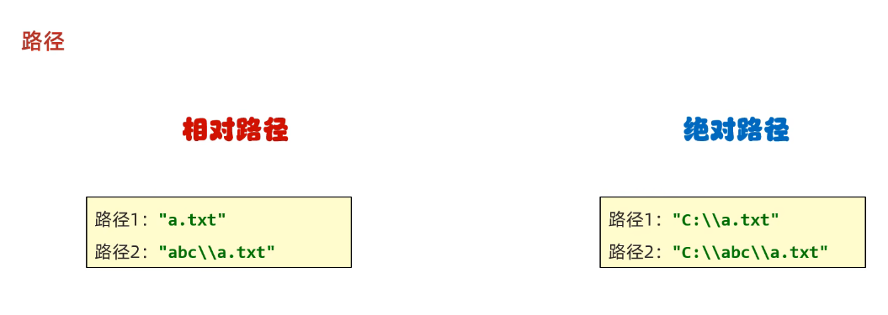

- **windows路径：\ **
- **linux路径: /**

- **\: 转义字符**,  "C:\\\Users\\\PYW\\Desktop\\\a.txt"


## 2、File对象


## 3、File对象的==*构造方法*==

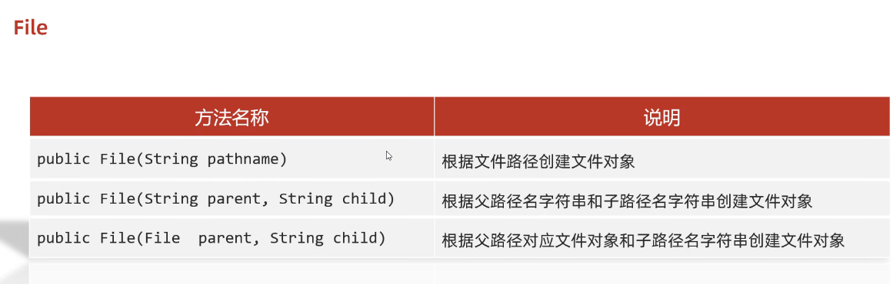


## 4、示例代码

```java
package com.pyw.a49file;

import java.io.File;
import java.io.IOException;

public class FileDemo {

    public static void main(String[] args) throws IOException {
        /*
        public File(String pathname)                根据文件路径创建文件对象
        public File(String parent, String child)    根据父路径名字符串和子路径名字符串创建文件对象
        public File(File  parent, String child)     根据父路径对应文件对象和子路径名字符串创建文件对象

        C:\Users\alienware\Desktop

        windows路径：\
        linux路径:/

        \:转义字符
    */
        //1.根据字符串表示的路径，变成File对象
        String str = "C:\\Users\\PYW\\Desktop\\a.txt";
        File file1 = new File(str);
        System.out.println(file1);//C:\Users\PYW\Desktop\a.txt

        //2.父级路径：C:\Users\PYW\Desktop
        //子级路径：a.txt
        String parent = "C:\\Users\\PYW\\Desktop";
        String child = "a.txt";
        File file2 = new File(parent,child);
        System.out.println(file2);

        //3.把一个File表示的路径和String表示的路径进行拼接
        File file3 = new File("C:\\Users\\PYW\\Desktop");
        File file4 = new File(file3,"a.txt");
        System.out.println(file4);
    }
}
```


# 二、File的常见==*成员方法*==

## 1、判断和获取信息

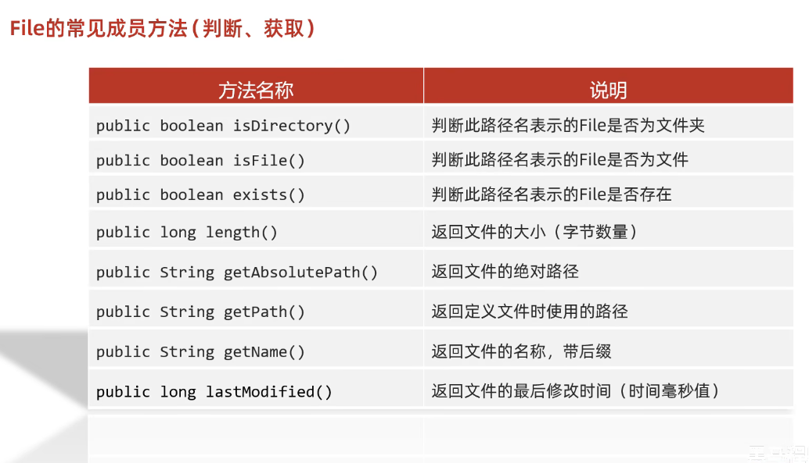

### （1）判断

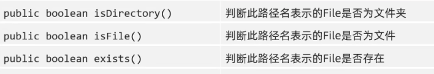

#### ①成员方法

- public boolean **isDirectory()**        判断此路径名表示的File**是否为文件夹**
- public boolean **isFile()**             判断此路径名表示的File**是否为文件**
- public boolean **exists()**             判断此路径名表示的File**是否存在**


#### ②示例代码

```java
package com.pyw.a49file;

import java.io.File;

public class FileDemo2 {
    public static void main(String[] args) {
        /*
        public boolean isDirectory()        判断此路径名表示的File是否为文件夹
        public boolean isFile()             判断此路径名表示的File是否为文件
        public boolean exists()             判断此路径名表示的File是否存在
     */
        //1.对一个文件的路径进行判断
        File f1 = new File("D:\\Software\\java\\Project\\javaSE\\JavaSECodeDemo\\src\\com\\pyw\\a49file\\aaa\\a.txt");
        //是否是文件夹
        System.out.println(f1.isDirectory());//false
        //是否是文件
        System.out.println(f1.isFile());//true
        //路径是否存在
        System.out.println(f1.exists());//true

        System.out.println("================");
        //2.对一个文件夹的路径进行判断
        File f2 = new File("D:\\Software\\java\\Project\\javaSE\\JavaSECodeDemo\\src\\com\\pyw\\a49file\\aaa");
        //是否是文件夹
        System.out.println(f2.isDirectory());//true
        //是否是文件
        System.out.println(f2.isFile());//false
        //路径是否存在
        System.out.println(f2.exists());//true

        System.out.println("================");
        //3.对一个不存在的路径进行判断
        File f3 = new File("D:\\aaa\\c.txt");
        System.out.println(f3.isDirectory());//false
        System.out.println(f3.isFile());//false
        System.out.println(f3.exists());//false
    }
}
```


### （2）==获取==

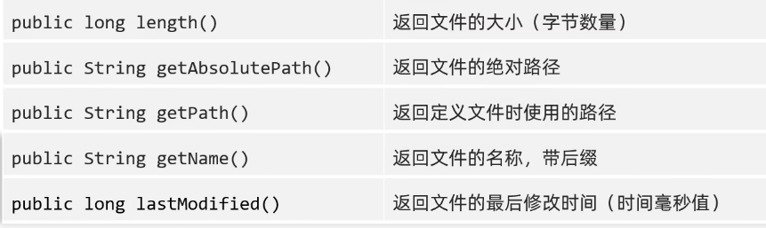

#### ①==成员方法和细节==

- public long length()                返回文件的大小（字节数量）
  - **==细节1==：**这个方法只能获取**文件的大小，单位是字节**
  - 如果单位我们要是KB，MB，GB，可以==不断的除以1024==
    - len/1024  KB 
    - len/1024/1024  MB 
    - len/1024/1024/1024 GB
  - 细节2：这个方法**无法获取文件夹的大小**
  - 如果我们要获取一个文件夹的大小，需要把这个**文件夹里面所有的文件大小都累加在一起**。
- public String getAbsolutePath()     返回文件的绝对路径
- public String getPath()             返回**==定义文件时==使用的路径**
- public String getName()             **返回文件的名称，==带后缀==**
  - 细节1：
    - a.txt:  a 文件名  txt 后缀名、扩展名
  - 细节2：
    - 文件夹：返回的就是**文件夹的名字**
- public long lastModified()          返回文件的最后修改时间（时间毫秒值）

#### ②示例代码

```java
package com.pyw.a49file;

import java.io.File;
import java.time.Instant;
import java.time.LocalDateTime;
import java.time.ZoneId;
import java.time.format.DateTimeFormatter;

public class FileDemo3 {
    public static void main(String[] args) {
        /*
        public long length()                返回文件的大小（字节数量）
        public String getAbsolutePath()     返回文件的绝对路径
        public String getPath()             返回定义文件时使用的路径
        public String getName()             返回文件的名称，带后缀
        public long lastModified()          返回文件的最后修改时间（时间毫秒值）
     */
        //1.length  返回文件的大小（字节数量）
        //细节1：这个方法只能获取文件的大小，单位是字节
        //如果单位我们要是M，G，可以不断的除以1024 len/1024 kb len/1024/1024 MB len/1024/1024/1024 GB
        //细节2：这个方法无法获取文件夹的大小
        //如果我们要获取一个文件夹的大小，需要把这个文件夹里面所有的文件大小都累加在一起。
        File f1 = new File("D:\\Software\\java\\Project\\javaSE\\JavaSECodeDemo\\src\\com\\pyw\\a49file\\aaa\\a.txt");
        long len = f1.length();
        System.out.println(len);//18

        File f2 = new File("D:\\Software\\java\\Project\\javaSE\\JavaSECodeDemo\\src\\com\\pyw\\a49file\\aaa");
        long len2 = f2.length();
        System.out.println(len2);//0

        System.out.println("====================================");

        //2.getAbsolutePath 返回文件的绝对路径
        File f3 = new File("D:\\aaa\\a.txt");
        String path1 = f3.getAbsolutePath();
        System.out.println(path1);

        File f4 = new File("JavaSECodeDemo\\src\\com\\pyw\\a49file\\aaa\\a.txt");
        String path2 = f4.getAbsolutePath();
        System.out.println(path2);

        System.out.println("====================================");

        //3.getPath 返回定义文件时使用的路径
        File f5 = new File("D:\\aaa\\a.txt");
        String path3 = f5.getPath();
        System.out.println(path3);//D:\aaa\a.txt

        //3.getPath 返回定义文件时使用的路径
        File f6 = new File("JavaSECodeDemo\\src\\com\\pyw\\a49file\\aaa\\a.txt");
        String path4 = f6.getPath();
        System.out.println(path4);//JavaSECodeDemo\src\com\pyw\a49file\aaa\a.txt

        System.out.println("====================================");


        //4.getName 获取名字
        //细节1：
        //a.txt:
        //      a 文件名
        //      txt 后缀名、扩展名
        //细节2：
        //文件夹：返回的就是文件夹的名字
        File f7 = new File("D:\\aaa\\a.txt");
        String name1 = f7.getName();
        System.out.println(name1);


        File f8 = new File("D:\\aaa\\bbb");
        String name2 = f8.getName();
        System.out.println(name2);//bbb

        System.out.println("====================================");

        //5.lastModified  返回文件的最后修改时间（时间毫秒值）
        File f9 = new File("D:\\Software\\java\\Project\\javaSE\\JavaSECodeDemo\\src\\com\\pyw\\a49file\\aaa\\a.txt");
        long time = f9.lastModified();
        System.out.println(time / 1000);//1667380952425

        //如何把时间的毫秒值变成字符串表示的时间呢？
        //课堂练习：
        //yyyy年MM月dd日 HH：mm：ss
        LocalDateTime dlt = LocalDateTime.ofInstant(Instant.ofEpochMilli(time), ZoneId.systemDefault());
        //格式转换
        DateTimeFormatter dtf = DateTimeFormatter.ofPattern("yyyy-MM-dd HH:mm:ss");

        String format = dlt.format(dtf);

        System.out.println(format);
    }
}
```


## 2、创建和删除

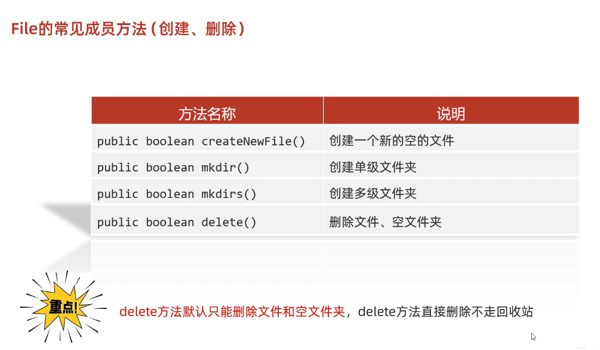


### （1）创建

#### ①==成员方法和细节==

- public boolean **createNewFile()**      创建一个新的空的文件
  - **细节1：**
    - 如果当前路径表示的**文件是不存在的，则创建成功**，方法返回true
    - 如果当前路径表示的**文件是存在的，则创建失败**，方法返回false
  - **细节2**：如果**父级路径是不存在的**，那么方法会有**异常IOException**
  - **细节3**：createNewFile方法**创建的一定是文件**，如果路径中**不包含后缀名，则==创建一个没有后缀的文件==**
- public boolean mkdir()              创建单级文件夹
  - **细节1**：windows当中**路径是唯一的**，如果**当前路径已经存在，则创建失败**(***==如果有文件和要创建的文件夹重名也会创建失败==***)，返回false
  - **细节2**：mkdir方法**只能创建单级文件夹**，无法创建多级文件夹。
- public boolean **mkdirs()**             创建多级文件夹
  - **细节：既可以创建单级的，又可以创建多级的文件夹**
- public boolean delete()             删除文件、空文件夹

#### ②示例代码

```java
package com.pyw.a49file;

import java.io.File;
import java.io.IOException;

public class FileDemo4 {
    public static void main(String[] args) throws IOException {
      /*
        public boolean createNewFile()      创建一个新的空的文件
        public boolean mkdir()              创建单级文件夹
        public boolean mkdirs()             创建多级文件夹
        public boolean delete()             删除文件、空文件夹
      */


        //1.createNewFile 创建一个新的空的文件
        //细节1：如果当前路径表示的文件是不存在的，则创建成功，方法返回true
        //      如果当前路径表示的文件是存在的，则创建失败，方法返回false
        //细节2：如果父级路径是不存在的，那么方法会有异常IOException
        //细节3：createNewFile方法创建的一定是文件，如果路径中不包含后缀名，则创建一个没有后缀的文件
        File f1 = new File("D:\\Software\\java\\Project\\javaSE\\JavaSECodeDemo\\src\\com\\pyw\\a49file\\aaa\\a.txt");
        boolean b = f1.createNewFile();
        System.out.println(b);//true


        //2.mkdir   make Directory，文件夹（目录）
        //细节1：windows当中路径是唯一的，如果当前路径已经存在，则创建失败，返回false
        //细节2：mkdir方法只能创建单级文件夹，无法创建多级文件夹。
      /*  File f2 = new File("D:\\aaa\\aaa\\bbb\\ccc");
        boolean b = f2.mkdir();
        System.out.println(b);*/

        //3.mkdirs   创建多级文件夹
        //细节：既可以创建单级的，又可以创建多级的文件夹
        File f3 = new File("D:\\Software\\java\\Project\\javaSE\\JavaSECodeDemo\\src\\com\\pyw\\a49file\\aaa\\bbbb");
        boolean b3 = f3.mkdirs();
        System.out.println(b3);//true

    }
}
```


### （2）删除-delete


#### ①==成员方法和细节==

- public boolean delete()             删除文件、空文件夹
  - 细节：
    - 如果删除的是**文件，则直接删除，不走回收站。**
    - 如果删除的是**空文件夹，则直接删除，不走回收站**
    - 如果删除的**==是有内容的文件夹，则删除失败==**

#### ②示例代码

```java
package com.pyw.a49file;

import java.io.File;

public class FileDemo5 {
    public static void main(String[] args) {
      /*
        public boolean delete()             删除文件、空文件夹
        细节：
            如果删除的是文件，则直接删除，不走回收站。
            如果删除的是空文件夹，则直接删除，不走回收站
            如果删除的是有内容的文件夹，则删除失败
      */


        //1.创建File对象
        File f1 = new File("D:\\aaa\\eee");
        //2.删除
        boolean b = f1.delete();
        System.out.println(b);


    }
}

```


## 3、获取并遍历

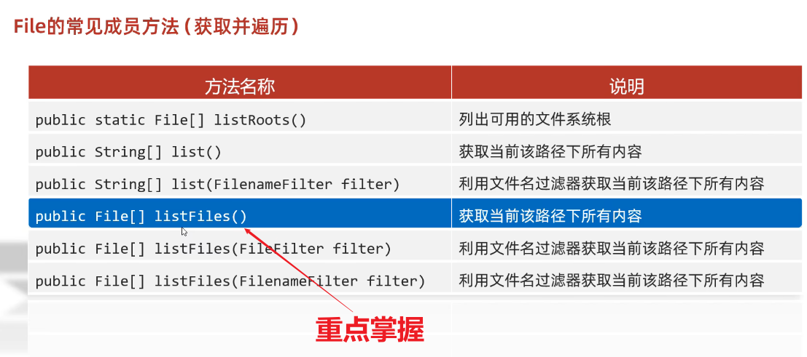

### （1）*==listFiles方法==*


### （2）==细节==

- 当调用者File表示的路径不存在时，返回null
- 当调用者File表示的**路径是文件时，返回null**
- 当调用者File表示的路径是**需要权限才能访问的文件夹时，返回null**
- **当调用者File表示的路径是一个==空文件夹时，返回一个长度为0的数组==**
- **当调用者File表示的路径是一个==有内容==的文件夹时，==将里面所有文件和文件夹的路径放在File数组中返回==**
- **当调用者File表示的路径是一个==有隐藏文件的文件夹==时，将里面所有文件和文件夹的路径放在File数组中返回，==包含隐藏文件==**


### （3）示例代码

```java
package com.pyw.a49file;

import java.io.File;

public class FileDemo6 {
    public static void main(String[] args) {

        //public File[] listFiles()       获取当前该路径下所有内容


        //1.创建File对象
        File f = new File("D:\\Software\\java\\Project\\javaSE\\JavaSECodeDemo\\src\\com\\pyw\\a49file");
        //2.listFiles方法
        //作用：获取aaa文件夹里面的所有内容，把所有的内容放到数组中返回
        File[] files = f.listFiles();
        for (File file : files) {
            //file依次表示aaa文件夹里面的每一个文件或者文件夹
            System.out.println(file);
        }

    }
}
```


### （4）其他方法

#### ①方法概述

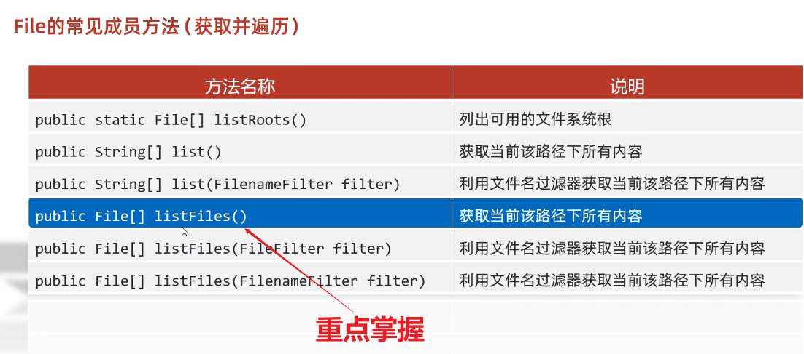


#### ②==细节==

- public static File[] listRoots()                列出可用的文件系统根

- public String[] list()                          获取当前该路径下所有内容(**仅仅能获取名字**)

- public String[] list(**FilenameFilter** filter)     利用文件名过滤器获取当前该路径下所有内容

  - 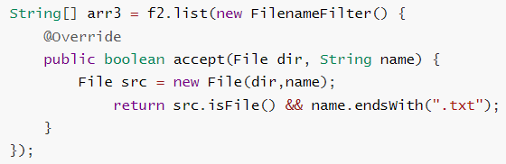

  - **accept方法的形参**，依次表示aaa文件夹里面每一个文件或者文件夹的路径

    - 参数一：**父级路径**

    - 参数二：**子级路径**

    - 返回值：如果返回值为true，就**表示当前路径保留**

      - 如果返回值为false，就**表示当前路径舍弃不要**

      

- （掌握）public File[] listFiles()                获取当前该路径下所有内容

- public File[] listFiles(FileFilter filter)      利用文件名过滤器获取当前该路径下所有内容

  - 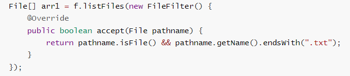
  - 参数表示每一个文件或文件夹的File对象

-  public File[] listFiles(FilenameFilter filter)  利用文件名过滤器获取当前该路径下所有内容

  - 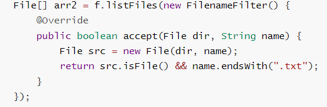

#### ②示例代码

```java
package com.pyw.a49file;


import java.io.File;
import java.io.FilenameFilter;
import java.util.Arrays;

public class FileDemo7 {
    public static void main(String[] args) {

      /*
        public static File[] listRoots()                列出可用的文件系统根
        public String[] list()                          获取当前该路径下所有内容
        public String[] list(FilenameFilter filter)     利用文件名过滤器获取当前该路径下所有内容
        （掌握）public File[] listFiles()                获取当前该路径下所有内容
        public File[] listFiles(FileFilter filter)      利用文件名过滤器获取当前该路径下所有内容
        public File[] listFiles(FilenameFilter filter)  利用文件名过滤器获取当前该路径下所有内容
      */


        //1.listRoots  获取系统中所有的盘符
        File[] arr = File.listRoots();
        System.out.println(Arrays.toString(arr));

        //2.list()    获取当前该路径下所有内容(仅仅能获取名字)
        File f1 = new File("D:\\software");
        String[] arr2 = f1.list();
        for (String s : arr2) {
            System.out.println(s);
        }

        //3.list(FilenameFilter filter)  利用文件名过滤器获取当前该路径下所有内容
        //需求：我现在要获取D：\\aaa文件夹里面所有的txt文件
        File f2 = new File("D:\\software");
        //accept方法的形参，依次表示aaa文件夹里面每一个文件或者文件夹的路径
        //参数一：父级路径
        //参数二：子级路径
        //返回值：如果返回值为true，就表示当前路径保留
        //        如果返回值为false，就表示当前路径舍弃不要
        String[] arr3 = f2.list(new FilenameFilter() {
            @Override
            public boolean accept(File dir, String name) {
                File src = new File(dir,name);
                    return src.isFile() && name.endsWith(".txt");
            }
        });
        System.out.println("========");
        System.out.println(Arrays.toString(arr3));
    }
}
```

------

```java
package com.pyw.a49file;

import java.io.File;

public class FileDemo8 {
    public static void main(String[] args) {
      /*
        （掌握）public File[] listFiles()                获取当前该路径下所有内容
        public File[] listFiles(FileFilter filter)      利用文件名过滤器获取当前该路径下所有内容
        public File[] listFiles(FilenameFilter filter)  利用文件名过滤器获取当前该路径下所有内容
      */

        //1.创建File对象
        File f = new File("D:\\software");
        //2.需求：打印里面所有的txt文件
        File[] arr = f.listFiles();
        for (File file : arr) {
            //file依次表示aaa文件夹里面每一个文件或者文件夹的路径
            if(file.isFile() && file.getName().endsWith(".txt")){
                System.out.println(file);
            }
        }
    }
}
```

------

```java
package com.pyw.a49file;

import java.io.File;
import java.io.FileFilter;
import java.io.FilenameFilter;
import java.util.Arrays;

public class FileDemo9 {
    public static void main(String[] args) {
         /*
        public File[] listFiles(FileFilter filter)      利用文件名过滤器获取当前该路径下所有内容
        public File[] listFiles(FilenameFilter filter)  利用文件名过滤器获取当前该路径下所有内容
      */

        //创建File对象
        File f = new File("D:\\software");
        //调用listFiles(FileFilter filter)
        File[] arr1 = f.listFiles(new FileFilter() {
            @Override
            public boolean accept(File pathname) {
                return pathname.isFile() && pathname.getName().endsWith(".txt");
            }
        });

        File[] files = f.listFiles(pathname -> pathname.isFile() && pathname.getName().endsWith(".txt"));
        System.out.println(Arrays.toString(files));

        //调用listFiles(FilenameFilter filter)
        File[] arr2 = f.listFiles(new FilenameFilter() {
            @Override
            public boolean accept(File dir, String name) {
                File src = new File(dir, name);
                return src.isFile() && name.endsWith(".txt");
            }
        });
        System.out.println(Arrays.toString(arr2));


    }
}
```


# 三、综合练习

## 1、创建文件


```java
package com.pyw.a49file;

import java.io.File;
import java.io.IOException;

public class FileTest1 {
    public static void main(String[] args) throws IOException {
        /*
            在当前模块下的aaa文件中创建一个a.txt
         */
        //1.创建a.txt的父级路径
        File file = new File("myfile\\aaa");
        //2.创建父级路径
        //如果aaa是存在的，那么此时创建失败的。
        //如果aaa是不存在的，那么此时创建成功的。
        file.mkdirs();
        //3.拼接父级路径和子级路径
        File src = new File(file, "a.txt");
        boolean b = src.createNewFile();
        if (b) {
            System.out.println("创建成功");
        } else {
            System.out.println("创建失败");
        }
        
    }
}
```


## 2、查找文件(不考虑子文件夹)

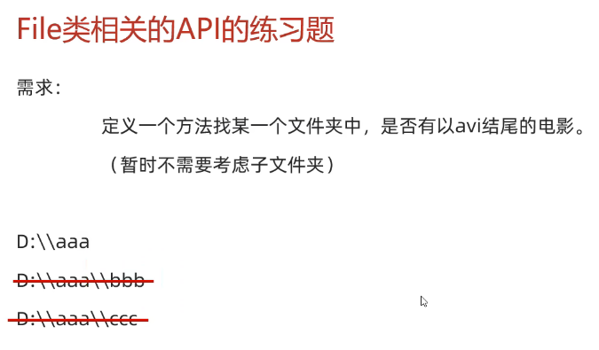


```java
package com.pyw.a49file;

import java.io.File;
import java.util.Arrays;

public class FileTest2 {
    public static void main(String[] args) {
        /*
            定义一个方法找某一个文件夹中，是否有以avi结尾的电影
            （暂时不需要考虑子文件夹）
         */
        File f1 = new File("src/com/pyw/a49file/aaa");
        
        //使用文件过滤器
        File[] list = f1.listFiles(file -> file.getName().endsWith(".avi") && file.isFile());
        System.out.println(Arrays.toString(list));

        //判断是否有avi文件
        File file = new File("D:\\aaa");
        boolean b = haveAVI(file);
        System.out.println(b);
    }

    /**
     * 作用：用来找某一个文件夹中，是否有以avi结尾的电影
     * 形参：要查找的文件夹
     * 返回值：查找的结果
     * 存在true不存在false
     *
     * @param file
     * @return
     */
    public static boolean haveAVI(File file) {// D:\\aaa
        //1.进入aaa文件夹，而且要获取里面所有的内容
        File[] files = file.listFiles();
        //2.遍历数组获取里面的每一个元素
        for (File f : files) {
            //f：依次表示aaa文件夹里面每一个文件或者文件夹的路径
            if (f.isFile() && f.getName().endsWith(".avi")) {
                return true;
            }
        }
        //3.如果循环结束之后还没有找到，直接返回false
        return false;
    }
}
```


## 3、查找文件-*==递归查找==*

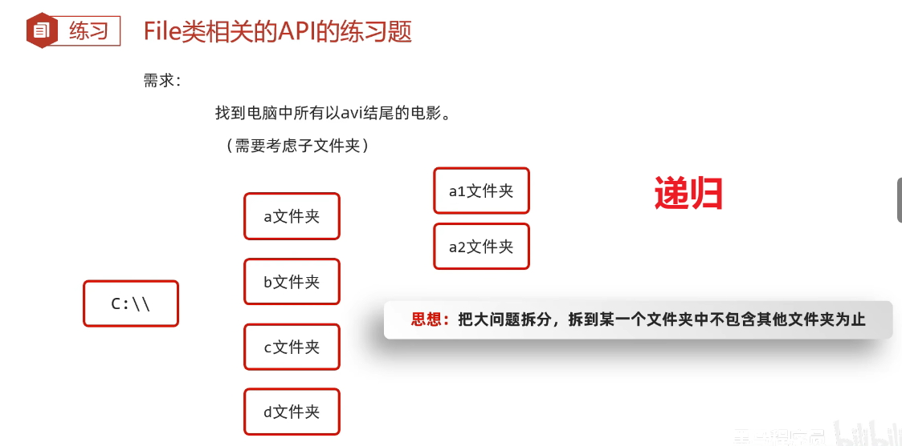

```java
package com.pyw.a49file;

import java.io.File;

/**
 * @author xiaopeng
 * @version 1.0
 */
public class FileTest3_pro {
    public static void main(String[] args) {
        /*需求：
            找到电脑中所有以avi结尾的电影。（需要考虑子文件夹）

            套路：
            1，进入文件夹
            2，遍历数组
            3，判断
            4，判断
*/
        File src = new File("E:\\");
        findAVI(src);
        findAVI(); //获取本地所有盘符
    }

    private static void findAVI() {
        //获取本地所有盘符
        File[] roots = File.listRoots();
        for (File root : roots) {
            findAVI(root);
        }
    }
    
    public static void findAVI(File src) {//"c:\\
        //1.进入文件夹src
        File[] files = src.listFiles();
        if (files == null) { //判断=空文件夹，有些文件没有权限访问，会返回null
            System.out.println("空文件夹" + src.getAbsolutePath());
            return;
        }
        //2.遍历数组，依次得到src里面每一个文件或者文件夹
        for (File file : files) {
            if (file.isFile()) {
                //3，判断，如果是文件，就可以执行题目的业务逻辑
                String name = file.getName();
                if (name.endsWith(".avi")) {
                    System.out.println(file);
                }
            } else {
                //4，判断，如果是文件夹，就可以递归
                //细节：再次调用本方法的时候，参数一定要是src的次一级路径
                findAVI(file);
            }
        }
    }
}
```

 


## 4、==删除多级文件夹==-递归


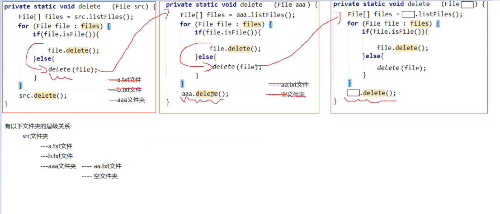

```java
package com.pyw.a49file;

import java.io.File;

/**
 * @author xiaopeng
 * @version 1.0
 */
public class FileTest4_pro {
    public static void main(String[] args) {
/*      删除一个多级文件夹
        如果我们要删除一个有内容的文件夹
        1.先删除文件夹里面所有的内容
        2.再删除自己*/

        File file = new File("D:\\aaa\\src");

        deleteDir(file);
    }

    /**
     * 作用：删除src文件夹
     * 参数：要删除的文件夹
     **/
    public static void deleteDir(File src) {
        //1.先刚除文件夹里面所有的内容
        //进入src
        File[] files = src.listFiles();
        //遍历
        for (File file : files) {
            //判断，如果是文件，删除
            if (file.isFile()) {
                file.delete();
            } else {
                //判断，如果是文件夹，就递归
                deleteDir(file);
            }
        }
        //2.再删除自己
        src.delete();
    }
}
```


## 5、统计一个文件夹的总大小-==递归==

```java
package com.itheima.a02test;

import java.io.File;

public class Test5 {
    public static void main(String[] args) {
       /*需求：
            统计一个文件夹的总大小
      */

        File file = new File("D:\\aaa\\src");

        long len = getLen(file);
        System.out.println(len);//4919189
    }

    /*
    * 作用：
    *       统计一个文件夹的总大小
    * 参数：
    *       表示要统计的那个文件夹
    * 返回值：
    *       统计之后的结果
    *
    * 文件夹的总大小：
    *       说白了，文件夹里面所有文件的大小
    * */
    public static long getLen(File src){
        //1.定义变量进行累加
        long len = 0;
        //2.进入src文件夹
        File[] files = src.listFiles();
        //3.遍历数组
        for (File file : files) {
            //4.判断
            if(file.isFile()){
                //我们就把当前文件的大小累加到len当中
                len = len + file.length();
            }else{
                //判断，如果是文件夹就递归
                len = len + getLen(file);
            }
        }
        return len;
    }
}
```


## 6、统计文件夹中==各种文件的个数==-递归、==Map==

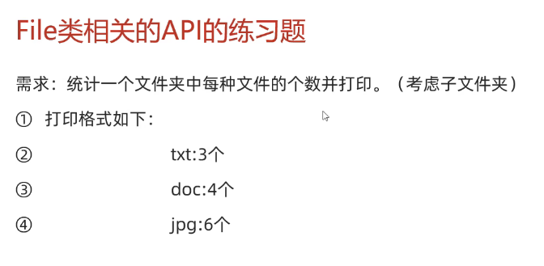

```java
package com.pyw.a49file;

import java.io.File;
import java.io.IOException;
import java.util.Arrays;
import java.util.HashMap;
import java.util.Map;
import java.util.Set;

import static com.pyw.a49file.test.fileCount;

public class FileTest6 {

    public static void main(String[] args) throws IOException {
       /*
            需求：统计一个文件夹中每种文件的个数并打印。（考虑子文件夹）
            打印格式如下：
            txt:3个
            doc:4个
            jpg:6个
        */

        File file = new File("D:\\aaa\\src");
        HashMap<String, Integer> hm = getCount(file);
        System.out.println(hm);
    }

    /*
     * 作用：
     *       统计一个文件夹中每种文件的个数
     * 参数：
     *       要统计的那个文件夹
     * 返回值：
     *       用来统计map集合
     *       键：后缀名 值：次数
     *
     *       a.txt
     *       a.a.txt
     *       aaa（不需要统计的）
     *
     *
     * */
    public static HashMap<String,Integer> getCount(File src){
        //1.定义集合用来统计
        HashMap<String,Integer> hm = new HashMap<>();
        //2.进入src文件夹
        File[] files = src.listFiles();
        //3.遍历数组
        for (File file : files) {
            //4.判断，如果是文件，统计
            if(file.isFile()){
                //a.txt
                String name = file.getName();
                String[] arr = name.split("\\.");//   \\. 表示转义字符,具体为.
                if(arr.length >= 2){
                    String endName = arr[arr.length - 1];
                    if(hm.containsKey(endName)){
                        //存在
                        int count = hm.get(endName);
                        count++;
                        hm.put(endName,count);
                    }else{
                        //不存在
                        hm.put(endName,1);
                    }
                }
            }else{
                //5.判断，如果是文件夹，递归
                //sonMap里面是子文件中每一种文件的个数
                HashMap<String, Integer> sonMap = getCount(file);
                //hm:  txt=1  jpg=2  doc=3
                //sonMap: txt=3 jpg=1
                //遍历sonMap把里面的值累加到hm当中
                Set<Map.Entry<String, Integer>> entries = sonMap.entrySet();
                for (Map.Entry<String, Integer> entry : entries) {
                    String key = entry.getKey();
                    int value = entry.getValue();
                    if(hm.containsKey(key)){
                        //存在
                        int count = hm.get(key);
                        count = count + value;
                        hm.put(key,count);
                    }else{
                        //不存在
                        hm.put(key,value);
                    }
                }
            }
        }
        return hm;
    }
}
```


