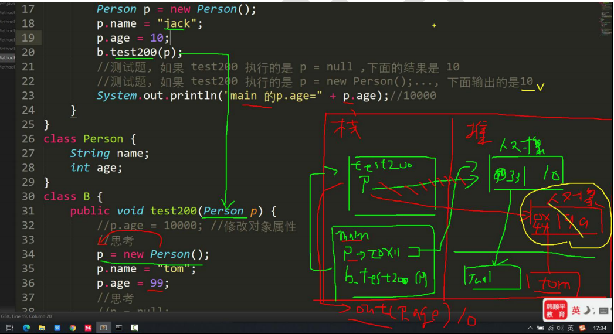
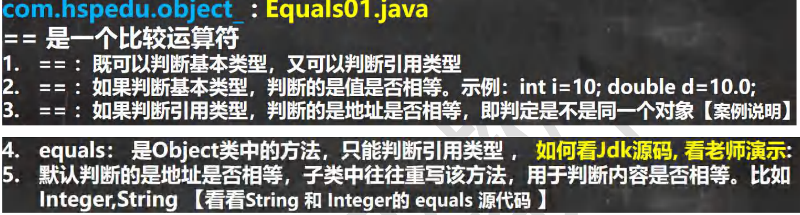
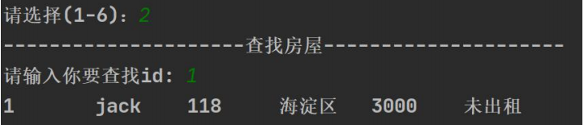
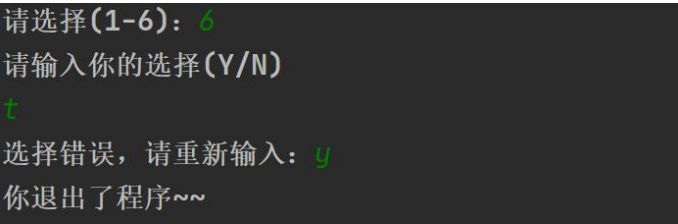
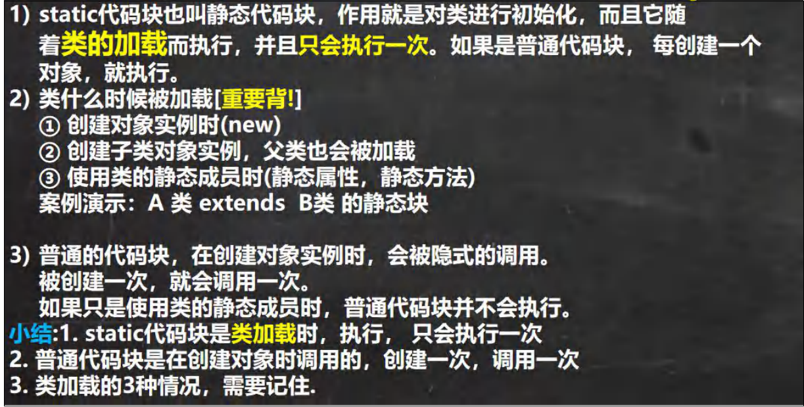
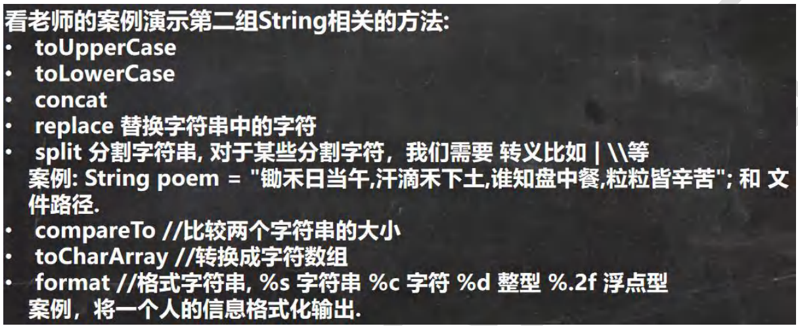
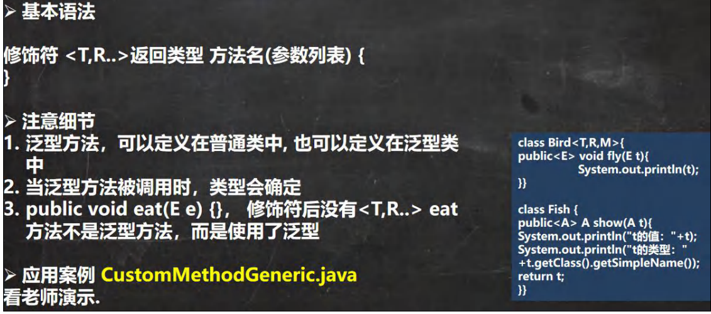

# Java学习笔记：

<!-- [TOC] -->

# 一、Java的基础知识

- ### **java编译基础及java环境配置**

- ### **变量**

- ### **==二进制中的原码==，补码，反码 和 运算符**

- ### **程序控制结构**

- ### **数组，排序（冒号排序），查找，多维数组**

## 1.1 java编译基础及java环境配置

### 1.1.1 java中的javac和java；.java和.class文件区别：


**先javac编译java文件生成class文件。**


### 1.1.2 java执行流程分析：


### 1.1.3 什么是JVM,JDK和JRE

**JVM**：
    1.JVM 是一个虚拟的计算机，具有指令集并使用不同的存储区域。负责执行指令，管理数据、内存、寄存器，包含在JDK 中。
    2.对于不同的平台，有不同的虚拟机。
    3.Java 虚拟机机制屏蔽了底层运行平台的差别，实现了“一次编译，到处运行”。


**JDK，JRE**：


**JDK，JRE，JVM的包含关系**：

​    


### 1.1.4 环境变量path的配置：

​    1.为什么要配置path：


    2.配置步骤：

​    


### 1.1.5 java基础知识：


    


**文档注释**
    1.概念：
    

​    

2.效果（生成一个html网页）：

   


## 1.2 变量

### 1.2.1 变量三要素：

变量=变量名+值+数据类型；

### 1.2.2 数据类型：


**1.整型**：
	                
**2.浮点类型：**


**3.字符类型：**


**4.布尔类型：**


### 1.2.3 类型转换：

**1.自动类型转换：**


**2.强制类型转化：**

​	概念：自动类型转换的逆过程，**将容量大的数据类型转换为容量小的数据类型**。使用时要加上强制转换符 ( )，但可能造成**精度降低或溢出**,格外要注意。


### 1.2.4 ASCII，Unicode，UTF-8编码简单介绍：


### 1.2.5 Java API 文档：

​	1.作用：寻找类的具体方法功能介绍。


​	2.Java类的组织形式：

​				


## 1.3 运算符

### ==**1.3.1 二进制中的原码、反码、补码：**==

**1.二进制：**


==**2.原码、反码、补码的解释:**==


### 1.3.2 运算符的介绍：

运算符是一种特殊的符号，用以表示数据的运算、赋值和比较等。

1. 算术运算符
2. 赋值运算符
3. 关系运算符 （比较运算符）
4. 逻辑运算符
5. 位运算符 （需要二进制基础）
6. 三元运算符

#### **1.算术运算符：**


​		**细节：**

​				

#### **3.关系运算符：**


#### **4.逻辑运算符：**

- a&b : & 叫逻辑与：规则：当 a 和 b 同时为 true ,则结果为 true, 否则为 false
- a&&b : && 叫**短路与**：规则：当 a 和 b 同时为 true ,则结果为 true,否则为 false
- a|b : | 叫逻辑或，规则：当 a 和 b ，有一个为 true ,则结果为 true,否则为 false
- a||b : || 叫**短路或**，规则：当 a 和 b ，有一个为 true ,则结果为 true,否则为 false
- !a : 叫取反，或者非运算。当 a 为 true, 则结果为 false, 当 a 为 false 是，结果为 true
- a^b: 叫**逻辑异或**，当 a 和 b 不同时，则结果为 true, 否则为 false


**1.&& 和 & 使用区别**

- &&短路与：如果第一个条件为 false，则第二个条件不会判断，最终结果为 false，效率高
- & 逻辑与：不管第一个条件是否为 false，第二个条件都要判断，效率低

**2.|| 和 | 使用区别**

- ||短路或：如果第一个条件为 true，则第二个条件不会判断，最终结果为 true，效率高
- | 逻辑或：不管第一个条件是否为 true，第二个条件都要判断，效率低

#### ==**5.位运算符**：==

**1.介绍:**


**2.==三 个位运算符 >>、`<< 和 >`>> , 运算规则:==**

- ​	算术右移 >>：低位溢出,符号位不变,并用符号位补溢出的高位
- ​    算术左移 <<: 符号位不变,低位补 0
- " >>> "逻辑右移也叫无符号右移,运算规则是: 低位溢出，高位补 0
- 特别说明：没有 " <<< " 符号


## 1.4 程序控制结构

在程序中，程序运行的流程控制决定程序是如何执行的，是我们必须掌握的，主要有三大流程控制语句。

- 顺序控制    **（程序从上到下逐行地执行，中间没有任何判断和跳转；）**
- 分支控制    **（if-else的单分支，双分支，多分支以及嵌套使用；==switch的使用==）**
- 循环控制    **（for，while，do-while循环使用；break和continue的使用，==多重循环的使用==）**


### **1.4.1 switch语句的==穿越==：**

**1.switch的解读：**


**2.switch流程图：**


**3.switch的==穿越==：**

1.概念：就是如果case执行语句块里面没有break；会接着执行下一个case语句直到遇到break或者跳出switch语句。

2.例子：（**==四季的月份分配==**）


### **1.4.2 for的==多重循环==：**

1.典型例子

- （**冒号排序**）具体实现看下一节排序
- 九九乘法表：

```java
//九九乘法表
public class multiplication {
		public static void main(String[] args) {
			int i = 1;
			int j = 1;
			int product;
			for (i = 1; i <= 9; i++) {
				for (j = 1; j <= i; j++) {
					product = i * j;
					System.out.print(j + "*" + i + "=" + product + "\t");
					if (i == j) {
						System.out.print("\n");
					}
				}
			}
		}
}
```

- 空心金字塔：

```java
public class Stars { 

	//编写一个main方法
	public static void main(String[] args) {

		/*
		
			    *
			  *  *
			 *    *
			********

		思路分析
		化繁为简
		1. 先打印一个矩形
		*****
		*****
		*****
		*****
		*****
		2. 打印半个金字塔

		*    	//第1层 有 1个*
		**   	//第2层 有 2个*
		***		//第3层 有 3个*
		****    //第4层 有 4个*
		*****   //第5层 有 5个*
		
		3. 打印整个金字塔
		*       //第1层 有 1个*   2 * 1 -1   有4=(总层数-1)个空格
	   ***      //第2层 有 3个*   2 * 2 -1   有3=(总层数-2)个空格
	  *****     //第3层 有 5个*   2 * 3 -1   有2=(总层数-3)个空格
	 *******    //第4层 有 7个*   2 * 4 -1   有1=(总层数-4)个空格
	*********   //第5层 有 9个*   2 * 5 -1   有0=(总层数-5)个空格

		4. 打印空心的金字塔 [最难的]
	    *       //第1层 有 1个*   当前行的第一个位置是*,最后一个位置也是*
	   * *      //第2层 有 2个*   当前行的第一个位置是*,最后一个位置也是*
	  *   *     //第3层 有 2个*   当前行的第一个位置是*,最后一个位置也是*
	 *     *    //第4层 有 2个*   当前行的第一个位置是*,最后一个位置也是*
	*********   //第5层 有 9个*   全部输出*
	
		先死后活
		5 层数做成变量 int totalLevel = 5;
	
	//小伙伴 技术到位，就可以很快的把代码写出
		 */
		int totalLevel = 20; //层数
		for(int i = 1; i <= totalLevel; i++) { //i 表示层数

			//在输出*之前，还有输出 对应空格 = 总层数-当前层
			for(int k = 1; k <= totalLevel - i; k++ ) {
				System.out.print(" ");
			}

			//控制打印每层的*个数
			for(int j = 1;j <= 2 * i - 1;j++) {
				//当前行的第一个位置是*,最后一个位置也是*, 最后一层全部 *
				if(j == 1 || j == 2 * i - 1 || i == totalLevel) {
					System.out.print("*");
				} else { //其他情况输出空格
					System.out.print(" ");
				}
			}
			//每打印完一层的*后，就换行 println本身会换行
			System.out.println("");
		}
	}
}
```

空心菱形：

```java
//空心菱形变量版
public class exercise { 

	//编写一个main方法
	public static void main(String[] args) {
	int totallevel = 40;
	for(int i = 1; i <= (int)(totallevel/2) + 1; i++) { //i 表示层数

		//在输出*之前，还有输出 对应空格 = 总层数-当前层
		for(int k = 1; k <= (int)(totallevel/2) + 1 - i; k++ ) {
			System.out.print(" ");
		}

		//控制打印每层的*个数
		for(int j = 1;j <= 2 * i - 1;j++) {
			//当前行的第一个位置是*,最后一个位置也是*, 最后一层全部 *
			if(j == 1 || j == 2 * i - 1) {
				System.out.print("*");
			} else { //其他情况输出空格
				System.out.print(" ");
			}
		}
		System.out.print("\n");
	}
	for (int m = (int)(totallevel/2); m >= 1; m--) {
		for (int p = m; p <= (int)(totallevel/2); p++) {
		//for (int p = 1; p <= (int)(totallevel/2)+1 - m; p++) {
			System.out.print(" ");
		}
		for (int n = 1; n <= 2*m - 1 ; n++) {
			if(n == 1 || n == 2*m - 1) {
				System.out.print("*");
			} else { //其他情况输出空格
				System.out.print(" ");
			}
		}
		System.out.print("\n");
	}
		//每打印完一层的*后，就换行 println本身会换行	
}
}
```


## **1.5 数组，排序（冒号排序），查找，多维数组：**

### **1.5.1 数组**

#### 	1.5.1.1 初始化数值：

​			**1.动态分配方式（动态初始化）：**

​			

​			**2.静态初始化：**

​			

#### **1.5.1.2 数组默认值**

		数组创建后，如果没有赋值，有默认值
		int 	0，short 0, byte 0, long 0, 
		float 0.0,double 0.0，char \u0000(\u 表示十进制)，
		boolean false，String null

### **1.5.2 排序（冒号排序）**

```java
public class BubbleSort { 
    //编写一个main方法
	public static void main(String[] args) {
	/*
		数组 [24,69,80,57,13]
		第1轮排序: 目标把最大数放在最后
		第1次比较[24,69,80,57,13]
		第2次比较[24,69,80,57,13]
		第3次比较[24,69,57,80,13]
		第4次比较[24,69,57,13,80]

	 */
	int[] arr = {24,69,80,57,13};
	int temp = 0; //用于辅助交换的变量

	//将多轮排序使用外层循环包括起来即可
	//先死后活 =》 4就是 arr.length - 1
	for( int i = 0; i < arr.length - 1; i++) {//外层循环是4次

		for( int j = 0; j < arr.length - 1 - i; j++) {//4次比较-3次-2次-1次
			//如果前面的数>后面的数，就交换
			if(arr[j] > arr[j + 1]) {
				temp = arr[j];
				arr[j] = arr[j+1];
				arr[j+1] = temp;  
			}
		}
		System.out.println("\n==第"+(i+1)+"轮==");
		for(int j = 0; j < arr.length; j++) {
			System.out.print(arr[j] + "\t");
		}

	}
}
}
```


### **1.5.3 查找**

```java
import java.util.Scanner;
public class SeqSearch { 

	//编写一个main方法
	public static void main(String[] args) {
		/*
		有一个数列：白眉鹰王、金毛狮王、紫衫龙王、青翼蝠王猜数游戏：
		从键盘中任意输入一个名称，判断数列中是否包含此名称【顺序查找】 
		要求: 如果找到了，就提示找到，并给出下标值

		思路分析
		1. 定义一个字符串数组
		2. 接收用户输入, 遍历数组，逐一比较，如果有，则提示信息，并退出
		 */
		
		//定义一个字符串数组
		String[] names = {"白眉鹰王", "金毛狮王", "紫衫龙王", "青翼蝠王"};
		Scanner myScanner = new Scanner(System.in); 

		System.out.println("请输入名字");
		String findName = myScanner.next();

		//遍历数组，逐一比较，如果有，则提示信息，并退出
		//这里老师给大家一个编程思想/技巧, 一个经典的方法
		int index = -1;
		for(int i = 0; i < names.length; i++) {
			//比较 字符串比较 equals, 如果要找到名字就是当前元素
			if(findName.equals(names[i])) {
				System.out.println("恭喜你找到 " + findName);
				System.out.println("下标为= " + i);
				//把i 保存到 index
				index = i;
				break;//退出 
			} 
		}

		if(index == -1) { //没有找到
			System.out.println("sorry ,没有找到 " + findName);
		}

	}
}
```


### **1.5.4 多维数组**

#### 		1.5.4.1 初始化：

​		**1.动态初始化：**

```java
public class TwoDimensionalArray02 { 

	//编写一个main方法
	public static void main(String[] args) {

		//int arr[][] = new int[2][3];
		
		int arr[][]; //声明二维数组
		//int[][] arr;
		arr = new int[2][3];//再开空间 
		
		arr[1][1] = 8;
		//遍历arr数组
		for(int i = 0; i < arr.length; i++) {
			for(int j = 0; j < arr[i].length; j++) {//对每个一维数组遍历
				System.out.print(arr[i][j] +" ");
			}
			System.out.println();//换行
		}
	}
}
```

​		

```java
public class TwoDimensionalArray03 { 

	//编写一个main方法
	public static void main(String[] args) {

		/*
		看一个需求：动态创建下面二维数组，并输出
		
		 i = 0:	1		
		 i = 1:	2	2	
		 i = 2:	3	3	3

		 一个有三个一维数组, 每个一维数组的元素是不一样的
		 */
		
		//创建 二维数组，一个有3个一维数组，但是每个一维数组还没有开数据空间
		int[][] arr = new int[3][]; 
		
		for(int i = 0; i < arr.length; i++) {//遍历arr每个一维数组
			//给每个一维数组开空间 new
			//如果没有给一维数组 new ,那么 arr[i]就是null
			arr[i] = new int[i + 1]; 

			//遍历一维数组，并给一维数组的每个元素赋值
			for(int j = 0;  j < arr[i].length; j++) {
				arr[i][j] = i + 1;//赋值
			}

		}
}
}
```

​		**2.静态初始化：**

```java
			int[][] arr = {{1,1,1}, {8,8,9}, {100}};
```

​			

#### 	**1.5.4.2 例子**：

- **杨辉三角：**

```java
public class YangHui { 

	//编写一个main方法
	public static void main(String[] args) {
		/*
		使用二维数组打印一个 10 行杨辉三角
		1
		1 1
		1 2 1
		1 3 3  1
		1 4 6  4  1
		1 5 10 10 5 1

		规律
		 1.第一行有 1 个元素, 第 n 行有 n 个元素
		 2. 每一行的第一个元素和最后一个元素都是 1
		 3. 从第三行开始, 对于非第一个元素和最后一个元素的元素的值. arr[i][j] 
		  arr[i][j]  =  arr[i-1][j] + arr[i-1][j-1]; //必须找到这个规律

		 */
		int[][] yangHui = new int[12][];
		for(int i = 0; i < yangHui.length; i++) {//遍历yangHui的每个元素

			//给每个一维数组(行) 开空间
			yangHui[i] = new int[i+1];
			//给每个一维数组(行) 赋值
			for(int j = 0; j < yangHui[i].length; j++){
				//每一行的第一个元素和最后一个元素都是1
				if(j == 0 || j == yangHui[i].length - 1) {
					yangHui[i][j] = 1;
				} else {//中间的元素
					yangHui[i][j]  =  yangHui[i-1][j] + yangHui[i-1][j-1];
				}
			}
		}
		//输出杨辉三角
		for(int i = 0; i < yangHui.length; i++) {
			for(int j = 0; j < yangHui[i].length; j++) {//遍历输出该行
				System.out.print(yangHui[i][j] + "\t");
			}
			System.out.println();//换行.
		}
		
	}
}
```


# 二、面向对象编程==基础部分==

## 2.1类和对象的区别：

1. 类是抽象的，概念的，代表一类事物,比如人类,猫类.., 即它是数据类型. 
2. 对象是具体的，实际的，代表一个具体事物, 即 是实例. 
3. 类是对象的模板，对象是类的一个个体，对应一个实例

## 2.2 对象在内存中存在形式：


## 	2.3 如何创建对象，访问属性：

### **一、创建对象：**

**1.先声明再创建**

​	Cat cat ; //声明对象 cat

​	cat = new Cat(); //创建

**2.直接创建**

​	Cat cat = new Cat();


### **二、访问属性：**

**1.基本语法：**

对象名.属性名;cat.name ;	cat.age;	cat.color;

**2.类和对象的内存分配机制**：


### 							==Java 内存的结构分析==

#### **1.概念：**

**栈： 一般存放基本数据类型(局部变量)，还有对象的引用；**

**堆： 存放对象(Cat cat , 数组等)**；

**方法区：常量池(常量，比如字符串)， 类加载信息；**

#### **2.流程：**

1. **先加载 Person 类信息(属性和方法信息, 只会加载一次)；**
2. **在堆中分配空间, 进行默认初始化(看规则)**；
3. **把地址赋给 p1 , p1 就指向对象，把p1赋给了p2，p2也指向了对象；**


## 2.4 属性/成员变量/字段：

### **1.概念：**

- 从概念或叫法上看： 成员变量 = 属性 = field(字段)。
- 属性是类的一个组成部分，一般是基本数据类型,也可是引用类型(对象，数组)。

### **2.细节：**

属性的定义语法同变量，示例：访问修饰符 属性类型 属性名。

修饰符： 控制属性的访问范围有四种访问修饰符 public, protected, 默认, private ,具体中级部分详细介绍。

属性的定义类型可以为任意类型，包含基本类型或引用类型；属性如果不赋值，有默认值，规则和数组一致。具体说: int 0，short 0, byte 0, long 0, float 0.0,double 0.0，char \u0000，

boolean false，String null；

## 2.5 成员方法：

### 1.成员方法的定义：

**（1）格式：**

访问修饰符 返回数据类型 方法名（形参列表..） {

​					//方法体语句；

​					return 返回值;

}

**（2）概念：**

- 形参列表：表示成员方法输入 cal(int n) ， getSum(int num1, int num2)；
- 返回数据类型：表示成员方法输出, void 表示没有返回值
- 方法主体：表示为了实现某一功能代码块
- return 语句不是必须的。

**（3）细节：**

1. **调用带参数的方法时，一定对应着参数列表传入相同类型或兼容类型 的参数；**
2. **实参和形参的类型要一致或兼容、个数、顺序必须一致；**
3. **方法不能嵌套定义；**
4. **一个方法最多有一个返回值 [思考：如何返回多个结果 ==返回数组== ]；**
5. **返回类型可以为任意类型，包含基本类型或引用类型(数组，对象)；**
6. **如果方法要求有返回数据类型，则方法体中最后的执行语句必须为 return 值；**
7. **/如果方法是 void，则方法体中可以没有 return 语句，或者 只写 return ;**

### 2.方法的调用：


### 3.方法的==调用机制原理==：（jvm内存示意图）


### 4.成员方法传参机制：

**（1）基本数据类型的传参机制：**


​	**例题：**


**（2）引用数据类型的传参机制：**

**总结：引用类型传递的是地址（传递也是值，但是值是地址），可以通过形参影响实参！**

**例题：**





## 2.6方法的==递归调用==：

**1.JVM内存示意图：**


**2.经典阶乘问题：**


**3.递归重要规则：**


**4.例题：**


**（1）斐波那契数列：**

```java
public class RecursionExercise01 {
//编写一个 main 方法
public static void main(String[] args) {
T t1 = new T();
int n = 7;
int res = t1.fibonacci(n);
if(res != -1) {
System.out.println("当 n="+ n +" 对应的斐波那契数=" + res);
}
    
class T {
/*
请使用递归的方式求出斐波那契数 1,1,2,3,5,8,13...给你一个整数 n，求出它的值是多
思路分析
1. 当 n = 1 斐波那契数 是 1
2. 当 n = 2 斐波那契数 是 1
3. 当 n >= 3 斐波那契数 是前两个数的和
4. 这里就是一个递归的思路
*/
public int fibonacci(int n) {
if( n >= 1) {
	if( n == 1 || n == 2) {
	return 1;
} else {
return fibonacci(n-1) + fibonacci(n-2);
}
} else {
System.out.println("要求输入的 n>=1 的整数");
return -1;
}
}
```


**（2）猴子吃桃问题**：

```java
public class RecursionExercise01 {
//编写一个 main 方法
public static void main(String[] args) {
T t1 = new T();
//桃子问题
int day = 0;
int peachNum = t1.peach(day);
if(peachNum != -1) {
System.out.println("第 " + day + "天有" + peachNum + "个桃子");
}
    }
}
class T {
    /*
猴子吃桃子问题：有一堆桃子，猴子第一天吃了其中的一半，并再多吃了一个！
以后每天猴子都吃其中的一半，然后再多吃一个。当到第 10 天时，
想再吃时（即还没吃），发现只有 1 个桃子了。问题：最初共多少个桃子？
思路分析 逆推
1. day = 10 时 有 1 个桃子
2. day = 9 时 有 (day10 + 1) * 2 = 4
3. day = 8 时 有 (day9 + 1) * 2 = 10
4. 规律就是 前一天的桃子 = (后一天的桃子 + 1) *2//找规律
5. 递归
*/
public int peach(int day) {
if(day == 10) {//第 10 天，只有 1 个桃
return 1;
} else if ( day >= 1 && day <=9 ) {
return (peach(day + 1) + 1) * 2;//规则，自己要想
} else {
System.out.println("day 在 1-10");
return -1;
}
}
}
```

**5.递归调用应用实例-==迷宫问题==** **（==回溯法==）**


**重要思路：**

**设计查找==路线的优先级==， 先确定老鼠找路策略 ==下->右->上->左==；根据优先级实现代码**；

```java
public class MiGong { 

	//编写一个main方法
	public static void main(String[] args) {

		//思路
		//1. 先创建迷宫，用二维数组表示 int[][] map = new int[8][7];
		//2. 先规定 map 数组的元素值: 0 表示可以走 1 表示障碍物 
		
		int[][] map = new int[8][7];
		//3. 将最上面的一行和最下面的一行，全部设置为1
		for(int i = 0; i < 7; i++) {
			map[0][i] = 1;
			map[7][i] = 1;
		}
		//4.将最右面的一列和最左面的一列，全部设置为1
		for(int i = 0; i < 8; i++) {
			map[i][0] = 1;
			map[i][6] = 1;
		}
		map[3][1] = 1;
		map[3][2] = 1;
		map[2][2] = 1; //测试回溯 
		// map[2][1] = 1;
		// map[2][2] = 1;
		// map[1][2] = 1;

		//输出当前的地图
		System.out.println("=====当前地图情况======");
		for(int i = 0; i < map.length; i++) {
			for(int j = 0; j < map[i].length; j++) {
				System.out.print(map[i][j] + " ");//输出一行
			}
			System.out.println();
		}

		//使用findWay给老鼠找路
		T t1 = new T();
		//下右上左
		t1.findWay(map, 1, 1);

		System.out.println("\n====找路的情况如下=====");

		for(int i = 0; i < map.length; i++) {
			for(int j = 0; j < map[i].length; j++) {
				System.out.print(map[i][j] + " ");//输出一行
			}
			System.out.println();
		}

	}
}

class T  {

	//使用递归回溯的思想来解决老鼠出迷宫
	
	//老韩解读
	//1. findWay方法就是专门来找出迷宫的路径
	//2. 如果找到，就返回 true ,否则返回false
	//3. map 就是二维数组，即表示迷宫
	//4. i,j 就是老鼠的位置，初始化的位置为(1,1)
	//5. 因为我们是递归的找路，所以我先规定 map数组的各个值的含义
	//0 表示可以走 1 表示障碍物 2 表示已经走过了（并且可以走） 3 表示走过，但是走不通是死路
	//6. 当map[6][5] =2 就说明找到通路,就可以结束，否则就继续找.
	//7. 先确定老鼠找路策略 下->右->上->左
	
	public boolean findWay(int[][] map , int i, int j) {
		if(map[6][5] == 2) {//说明已经找到
			return true;
		} else {
			if(map[i][j] == 0) {//当前这个位置0,说明表示可以走
				//我们假定可以走通
				map[i][j] = 2;
				//使用找路策略，来确定该位置是否真的可以走通
				//下->右->上->左
				if(findWay(map, i + 1, j)) {//先走下	 //递归思想：从这个第一个if中的findway开始进入递归，
					return true;						//后面的每一个else-if都是对从第一个findway开始之后的递归调用  做的"预判";
				} else if(findWay(map, i, j + 1)){//右	//由于 这几个if，else-if语句顺序已经规定好了，所以
					return true;						//优先走的顺序为下-右-上-左；
				} else if(findWay(map, i-1, j)) {//上   //(相当于是从第一个if语句的findway作为递归的入口)
					return true;
				} else if(findWay(map, i, j-1)){//左
					return true;	//这里几个if，else-if返回true对应的是boolean类型是为了跳出当前的findway方法；
				} else {
					map[i][j] = 3;
					return false; //如果下一步的"下右上左"都走不通就返回false，回溯（返回到之前的下一步）
				}
			} else { //map[i][j] = 1 , 2, 3
				return false; 
			}
		}
	}

	//修改找路策略，看看路径是否有变化
	//下->右->上->左 ==> 上->右->下->左
	public boolean findWay2(int[][] map , int i, int j) {
		if(map[6][5] == 2) {//说明已经找到
			return true;
		} else {
			if(map[i][j] == 0) {//当前这个位置0,说明表示可以走
				//我们假定可以走通
				map[i][j] = 2;
				//使用找路策略，来确定该位置是否真的可以走通
				//上->右->下->左
				if(findWay2(map, i - 1, j)) {//先走上
					return true;
				} else if(findWay2(map, i, j + 1)){//右
					return true;
				} else if(findWay2(map, i+1, j)) {//下
					return true;
				} else if(findWay2(map, i, j-1)){//左
					return true;
				} else {
					map[i][j] = 3;
					return false;
				}
			} else { //map[i][j] = 1 , 2, 3
				return false; 
			}
		}
	}
}
```


**6.递归调用应用实例-==汉诺塔==：**


```java
public class HanoiTower { 

	//编写一个main方法
	public static void main(String[] args) {

		Tower tower = new Tower();
		tower.move(64, 'A', 'B', 'C');
	}
}

class Tower {

	//方法
	//num 表示要移动的个数, a, b, c 分别表示A塔，B 塔, C 塔
	public void move(int num , char a, char b ,char c) {
		//如果只有一个盘 num = 1
		if(num == 1) {
			System.out.println(a + "->" + c);
		} else {
			//如果有多个盘，可以看成两个 , 最下面的和上面的所有盘(num-1)
			//(1)先移动上面所有的盘到 b, 借助 c
			move(num - 1 , a, c, b);
			//(2)把最下面的这个盘，移动到 c
			System.out.println(a + "->" + c);
			//(3)再把 b塔的所有盘，移动到c ,借助a
			move(num - 1, b, a, c);
		}
	}
}
/*4.接下来是考虑中间这个整体了,中间的整体看做一个全新的汉诺塔模型,比最初的就少了底下一层
1.思想就是,先写一个只有一个盘的时候的情况"a->c"
5.然后中间的整体模型可以看做初始位置在b,最终位置要到c,中间柱子为a的模型
6.那么中间的模型怎么移动呢,同样调用我们写的move方法,就这样一层层递归,最终递归到num==1
*/
```

**7.递归调用应用实例-==八皇后问题==**

单击下面超链接使用百度网盘查看（提取码：ak47）：

[八皇后问题代码](https://pan.baidu.com/s/1lGhSKdTnXaKLQzxuEkL2sA?pwd=ak47)


## 2.7 方法==重载==

**1.注意事项和使用细节：**


**2.例题：**


## 2.8 可变参数

**1.概念**：java 允许将同一个类中多个同名同功能但参数个数不同的方法，封装成一个方法。

就可以通过可变参数实现

**2**.**基本语法**：

访问修饰符 返回类型 方法名(**数据类型... 形参名**) {

}

**3.注意事项和使用细节：**


**4.例题：**

```java
public class VarParameterExercise {
//编写一个 main 方法
public static void main(String[] args) {
HspMethod hm = new HspMethod();
System.out.println(hm.showScore("milan" , 90.1, 80.0 ));
System.out.println(hm.showScore("terry" , 90.1, 80.0,10,30.5,70 ));
}
}
class HspMethod {
/*
有三个方法，分别实现返回姓名和两门课成绩(总分)，
返回姓名和三门课成绩(总分)，返回姓名和五门课成绩（总分）。
封装成一个可变参数的方法
*/
//分析 1. 方法名 showScore 2. 形参(String ,double... ) 3. 返回 String
//听课小伙伴，老师要求必须自己动手写
public String showScore(String name ,double... scores ) {
    double totalScore = 0;
for(int i = 0; i < scores.length; i++) {
totalScore += scores[i];
}
return name + " 有 " +scores.length + "门课的成绩总分为=" + totalScore;
}
}
```


## 2.9 作用域

**1.基本使用：**


**2.注意事项和使用细节：**


## 2.10 构造方法/构造器

**1.基本介绍：**

构造方法又叫构造器(constructor)，是类的一种特殊的方法，它的主要作用是**完成对新对象的初始化**。它有几个特点：

-  方法名和类名相同
-  没有返回值
-  在创建对象时，系统会自动的调用该类的构造器完成对象的初始化。

**2.基本语法：**

[修饰符] 方法名(形参列表){

方法体;

}

**3.说明**：

1.  **构造器的修饰符可以默认， 也可以是 public protected private；**
2.  构造器没有返回值；
3.  方法名 和类名字必须一样；
4.  参数列表 和 成员方法一样的规则；
5.  构造器的调用, 由系统完成；

**4.注意事项和使用细节：**


## 2.11 对象创建的流程分析

**1.案例：**


**2.流程分析：**


## 2.12 this关键字

**1.概念：**

​	java虚拟机会给每个对象分配this，表示当前对象；	this.name;就表示当前对象的属性，**可以和局部变量进行区分**；

**2.案例：**


**3.this的注意事项和使用细节：**

1.  this 关键字可以用来访问本类的属性、方法、构造器
2.  this 用于区分当前类的属性和局部变量
3.  访问成员方法的语法：this.方法名(参数列表);
4.  **访问构造器语法：this(参数列表); 注意只能在构造器中使用(即只能在构造器中访问另外一个构造器, 必须放在第一条语句)**
5.  this 不能在类定义的外部使用，只能在类定义的方法中使用。


# 三、**面向对象编程==中级部分==**

## 3.1 IDE（集成开发环境）-IDEA

**1.导出文件：**


**2.IDEA常用快捷键：**

1. **删除当前行**, 默认是 ctrl + Y 自己配置 **ctrl + d**
2. **复制当前行**, 自己配置 **ctrl + alt + 向下光标**
3. 补全代码 alt + /
4. **添加注释和取消注释 ctrl + /** 【第一次是添加注释，第二次是取消注释】


**3.模版/自定义模版：**


## 3.2 包

**1.包的本质分析：**


**2.包的基本语法：**


**3.包的作用：**


**4.命名规则：**


**5.引入包：**


**6.注意事项和使用细节：**


## 3.3 访问修饰符

**1.基本介绍：**

java 提供四种访问控制修饰符号，**用于控制方法和属性(成员变量)的访问权限（范围）**:

1. 公开级别:用 public 修饰,对外公开
2. 受保护级别:用 protected 修饰,对子类和同一个包中的类公开
3. 默认级别:没有修饰符号,向同一个包的类公开. 
4. 私有级别:用 private 修饰,只有类本身可以访问,不对外公开

**2.访问范围：**


**3.使用的注意事项：**


## ==面向对象编程的三大特征：封装、继承、多态==

## 3.4 封装

**1.介绍：**


**2.封装的理解和好处：**


**3.==封装的实现步骤==：**


## 3.5 继承

**1.继承的作用：**

**继承可以解决代码复用,**让我们的编程更加靠近人类思维.

**当多个类存在相同的属性(变量)和方法时,可以从这些类中抽象出父类**,在父类中定义这些相同的属性和方法，所有的子类不需要重新定义这些属性和方法，只需要通过 **extends** 来声明继承父类即可。

**2.继承示意图：**


**3.继承的语法：**


**==4.细节：==**

1. 子类继承了所有的属性和方法，非私有的属性和方法可以在子类直接访问, 但是**私有属性和方法不能在子类直接访问，要通过父类提供公共的方法去访问**；(set和get方法，体现了封装的作用)
2. **子类必须调用父类的构造器， 完成父类的初始化**；
3. 当创建子类对象时，不管使用子类的哪个构造器，默认情况下总会去调用父类的无参构造器（**默认有super()在第一行隐式被调用了**），如果父类没有提供无参构造器，则必须在子类的构造器中**==用 super 去指定使用父类的哪个构造器完成对父类的初始化工作==**，否则，编译不会通过；
4. 如果希望指定去调用父类的某个构造器，则显式的调用一下 : **super(参数列表)**
5. super 在使用时，必须**放在构造器第一行(super 只能在构造器中使用)**
6. ==**super() 和 this() 都只能放在构造器第一行，因此这两个方法不能共存在一个构造器**==
7. java 所有类都是 Object 类的子类, **Object 是所有类的基类.** 
8. 父类构造器的调用不限于直接父类！将一直往上追溯直到 Object 类**(顶级父类)**
9. 子类最多只能继承一个父类(指直接继承)，即 java 中是**单继承机制。**
10. 思考：如何让 A 类继承 B 类和 C 类？ 【A 继承 B， B 继承 C】
11. 不能滥用继承，**子类和父类之间必须满足 is-a 的逻辑关系**

**5.继承的本质：**

==按照查找关系来返回信息==

(1) 首先看子类是否有该属性

(2) 如果子类有这个属性，并且可以访问，则返回信息

(3) 如果子类没有这个属性，就看父类有没有这个属性(如果父类有该属性，并且可以访问，就返回信息..)

(4) 如果父类没有就按照(3)的规则，继续找上级父类，直到 Object...

**继承内存布局：**


## 3.6 ==super关键字==

**1.基本介绍：**

==super 代表父类的引用==，用于**访问父类的属性、方法、构造器**

**2.基本语法：**


**3.super 给编程带来的便利/细节：**


**4.super和this的比较：**


## 3.7 方法重写/覆盖（override）

**1.概念：**


**2.注意事项和使用细节：**


****

**3.重载和重写的比较：**


## 3.8 多态

### **1.基本介绍：**

**方法**或**对象**具有**多种形态**。是面向对象的第三大特征，**多态是建立在封装和继承基础之上的。**

### **2.==方法的多态：==（重写和重载就体现多态）**

```java
package com.hspedu.poly_;
public class PloyMethod {
public static void main(String[] args) {
//方法重载体现多态
A a = new A();
//这里我们传入不同的参数，就会调用不同 sum 方法，就体现多态
System.out.println(a.sum(10, 20));
System.out.println(a.sum(10, 20, 30));
//方法重写体现多态
B b = new B();
a.say();
b.say();
}
}
class B { //父类
public void say() {
System.out.println("B say() 方法被调用...");
}
}
class A extends B {//子类
public int sum(int n1, int n2){//和下面 sum 构成重载
return n1 + n2;
}
public int sum(int n1, int n2, int n3){
return n1 + n2 + n3;
}
public void say() {
System.out.println("A say() 方法被调用...");
}
}
```

### 3.==对象的多态：==


### **4.==多态注意事项和细节讨论（向上/下转型）：==**

- #### 多态的前提是：**两个对象(类)存在继承关系**；

- #### ==多态的向上转型：==


总结：

​	**1.语法：**父类类型引用名 = new 子类类型();

​	**2.向上转型调用方法的规则如下**:

​	(1)可以调用父类中的所有成员(需遵守访问权限)；

​	(2)但是不能调用子类的特有的成员；

​	(3)因为在**编译阶段（写代码阶段）**，能调用哪些成员,是由**编译类型来决定的**；

​	(4)**最终运行效果看子类(运行类型)的具体实现,** 即调用方法时，按照**从子类(运行类型)开始查找方法**，然后调用，规则我前面我们讲的方法调用规则（==**由下至上**==）一致；

​	**3**.**属性没有重写之说！==属性的值看编译类型；==**


- #### ==多态向下转型：==


- ### ==多态参数==：

  #### **方法定义的形参类型为父类类型，实参类型允许为子类类型；**


### 5.==编译时类型和运行时类型具体区别：==

#### 编译时类型和运行时类型：

Java的引用变量有两个类型，一个是编译时类型，一个是运行时类型，编译时类型由声明该变量时使用的类型决定，运行时类型由实际赋给该变量的对象决定。**如果编译时类型和运行时类型不一致，会出现所谓的多态**。因为子类其实是一种特殊的父类，因此java允许把一个子类对象直接赋值给一个父类引用变量，无须任何类型转换或者被称为**向上转型，由系统自动完成**。


> 引用变量在**编译阶段只能调用其编译时类型所具有的方法**，但**运行时则执行它运行时类型所具有的方法**（意思是说：**编写代码时，只能调用父类中具有的方法，如果子类重写了该方法，运行时实际调用的是运行时类型的该方法。程序在编译时，会在编译类型中检查是否具有所调用的方法，如果编写代码时，使用引用变量调用子类中的特有方法，或者调用重载了父类中的方法，而父类中找不到该方法，则会报编译错误**），因此，编写Java代码时，引用变量只能调用声明该变量所用类里包含的方法。与方法不同的是，**对象的属性则不具备多态性。通过引用变量来访问其包含的实例属性时，系统总是试图访问它编译时类所定义的属性**，而不是它运行时所定义的属性。
>
> ——==要访问子类中特有的方法和属性==，在编写代码时，则必须进行类型转换。（向下转型）


### 6.==要访问子类中特有的方法和属性==，在编写代码时，则必须进行类型转换（向下转型）：

#### **1.原因：**

​	**编写**Java代码时，引用变量只能调用声明该变量所用类里包含的方法。

如果**想要在编写代码时**，想要访问子类中特有的方法和属性，则必须进行类型转换（向下转型）

#### **2.向下转型：**

**(1)语法：子类类型 引用名 =（子类类型）父类引用;**

**(2)==要求父类的引用必须指向的是当前目标类型的对象==**


### 7.==Java的动态绑定机制：==


### 8.多态的应用：

#### **1.多态数组：**

数组的定义类型为父类类型，里面保存的实际元素类型为子类类型

#### 2.==实例==：

```java
package com.hspedu.poly_.polyarr_;
public class PloyArray {
public static void main(String[] args) {
//应用实例:现有一个继承结构如下：要求创建 1 个 Person 对象、
// 2 个 Student 对象和 2 个 Teacher 对象, 统一放在数组中，并调用每个对象 say 方法
Person[] persons = new Person[5];
persons[0] = new Person("jack", 20);
persons[1] = new Student("mary", 18, 100);
persons[2] = new Student("smith", 19, 30.1);
persons[3] = new Teacher("scott", 30, 20000);
persons[4] = new Teacher("king", 50, 25000);
//循环遍历多态数组，调用 say
for (int i = 0; i < persons.length; i++) {
//提示: person[i] 编译类型是 Person ,运行类型是是根据实际情况有 JVM 来判断
System.out.println(persons[i].say());//动态绑定机制
//使用 类型判断 + 向下转型. if(persons[i] instanceof Student) {//判断 person[i] 的运行类型是不是 Student
Student student = (Student)persons[i];//向下转型
student.study();
//也可以使用一条语句 ((Student)persons[i]).study();
} else if(persons[i] instanceof Teacher) {
Teacher teacher = (Teacher)persons[i];
teacher.teach();
```


### 9.instanceof 比较操作符

#### 作用：instanceof 比较操作符，用于判断对象的运行类型是否为 XX 类型或 XX 类型的子类型；


## 3.9 Object类详解

### 3.9.1 equals方法：

**1.==和 equals 的对比**：



**2.equals方法重写：**

-  Object 类的 equals 是默认的：

​	即 Object 的 equals 方法默认就是比较对象地址是否相同

​	也就是判断两个对象是不是同一个对象.

- 看看 Jdk 的源码 String 类的 equals 方法：

​	把 Object 的 equals 方法**重写**了,变成了比较两个字符串值是否相同

- 从源码可以看到 Integer 也重写了 Object 的 equals 方法,：

​	变成了判断两个值是否相同

**3.如何重写equals方法：**

```java
package com.hspedu.object_;
public class EqualsExercise01 {
public static void main(String[] args) {
Person person1 = new Person("jack", 10, '男');
Person person2 = new Person("jack", 20, '男');
System.out.println(person1.equals(person2));//假
}
}
//判断两个 Person 对象的内容是否相等，
//如果两个 Person 对象的各个属性值都一样，则返回 true，反之 false
class Person{ //extends Object
    private String name;
    private int age;
    private char gender;
    //重写 Object 的 equals 方法
    public boolean equals(Object obj) {
        //判断如果比较的两个对象是同一个对象，则直接返回 true
        if(this == obj) {
            return true;
        }
        //类型判断
        if(obj instanceof Person) {//是 Person，我们才比较
            //进行 向下转型, 因为我需要得到 obj 的 各个属性
            Person p = (Person)obj;
            return this.name.equals(p.name) && this.age == p.age && this.gender == p.gender;
        }
        //如果不是 Person ，则直接返回 false
        return false;
    }
    public Person(String name, int age, char gender) {
        this.name = name;
        this.age = age;
        this.gender = gender;
    }
    public String getName() {
        return name;
    }
    public void setName(String name) {
        this.name = name;
    }
    public int getAge() {
        return age;
    }
    public void setAge(int age) {
        this.age = age;
    }
    public char getGender() {
        return gender;
    }
    public void setGender(char gender) {
        this.gender = gender;
    }
}
```


### 3.9.2 hashCode 方法：


#### 1.小结：

1. 提高具有哈希结构的容器的效率！
2. 两个引用，如果指向的是同一个对象，则哈希值肯定是一样的！
3. 两个引用，如果指向的是不同对象，则哈希值是不一样的
4. 哈希值主要根据地址号来的！， 不能完全将哈希值等价于地址。

​	5.后面在集合，中 hashCode 如果需要的话，也会重写, 在集合时，具体说如何重写 hashCode()；


### 3.9.3 ==toString 方法==

#### **1.基本介绍：**

**默认返回**：全类名+@+哈希值的十六进制，【查看 Object 的 toString 方法】

子类往往重写 toString 方法，用于返回对象的属性信息；

#### **2.重写 toString 方法：**

**==打印对象或拼接对象时，都会自动调用该对象的 toString 形式==**

#### 3.toString方法是默认调用的：

==**当直接输出一个对象时==，toString 方法会被默认的调用**, 比如System.out.println(monster)； 就会默认调用monster.toString()；


### 3.9.4 finalize 方法

- 当对象被回收时，系统自动调用该对象的 finalize 方法。子类可以重写该方法，做一些释放资源的操作；
- 什么时候被回收：当某个对象没有任何引用时，则 jvm 就认为这个对象是一个垃圾对象，就会使用垃圾回收机制来销毁该对象，在销毁该对象前，会先调用 finalize 方法；
- 垃圾回收机制的调用，是由系统来决定(即有自己的 GC 算法), 也可以通过 System.gc() 主动触发垃圾回收机制；


## 3.10 断点调试（debug）

**1.需求：**


**2.断点调试介绍：**


**3.IDEA断点调试快捷键：**

F7(跳入)  F8(跳过)  shift+F8(跳出) F9(resume,执行到下一个断点)

F7：跳入方法内.

F8: 逐行执行代码. 

shift+F8: 跳出方法


## 3.11 项目-零钱通

**1.需求说明：**使用 Java 开发 零钱通项目 , 可以完成收益入账，消费，查看明细，退出系统等功能.

**2.界面要求：**


**3.细节要求：**


**4.代码具体实现：**

单击下面链接使用百度网盘下载观看，提取码：ak47

[零钱通](https://pan.baidu.com/s/1p-57ZMp-kpIKxChUBGJwUQ?pwd=ak47 )


## 3.12 项目-房屋出租系统

### **1.需求说明：**实现基于文本界面的《房屋出租软件》，

能够实现对房屋信息的添加、修改和删除（用数组实现），并能够打印房屋明细表

### **2.界面要求：**

（1）项目界面 - 主菜单


（2）项目界面- 新增房源


（3）项目界面- 查找房源



（4）项目界面- 删除房源


（5）项目界面- 修改房源


（6）项目界面- 房屋列表


（7）项目界面- 退出系统




### 3.项目设计-程序框架图（分成模式）：


### 4.准备工具类Utility，提高开发效率：

在实际开发中，公司都会提供相应的工具类和开发库，可以提高开发效率，程序员也需要能够看懂别人写的代码，并能够正确的调用。

**单击下面链接使用百度网盘下载观看，提取码：ak47**

[工具类Utility](https://pan.baidu.com/s/17hVtNRzergF_XRNEHTKTtg?pwd=ak47)


### 5.代码具体实现：

**单击下面链接使用百度网盘下载观看，提取码：ak47**

[项目-房屋出租系统代码](https://pan.baidu.com/s/1HrORUpvJp57sn-7vcAsDow?pwd=ak47 )


# 四、面向对象编程==高级==部分

## 4.1 类变量和类方法：

### **一.类变量：**

（1）定义：


（2）定义语法：


（3）访问类变量：


（4）类变量使用注意事项和细节讨论：


### 二.类方法：

（1）定义语法：


（2）类方法的调用：


（3）类方法经典的使用场景：


（4）类方法使用注意事项和细节讨论：


==小结==：**静态方法，只能访问静态的成员，非静态的方法，可以访问静态成员和非静态成员；**

## 4.2 main方法语法：

### （1）形式：


### （2）如何在执行java命令的时候传递参数：


### （3）特别提示：

 **1.在 main()方法中，我们可以直接调用 main 方法所在类的静态方法或静态属性。**

 **2.但是，不能直接访问该类中的非静态成员，必须创建该类的一个实例对象后，才能通过这个对象去访问类中的非静态成员，**

**3.案例：**

```java
public class Main01 {
//静态的变量/属性
private static String name = "韩顺平教育";
//非静态的变量/属性
private int n1 = 10000;
//静态方法
public static void hi() {
System.out.println("Main01 的 hi 方法");
}
//非静态方法
public void cry() {
System.out.println("Main01 的 cry 方法");
}
public static void main(String[] args) {
//可以直接使用 name
//1. 静态方法 main 可以访问本类的静态成员
System.out.println("name=" + name);
hi();
//2. 静态方法 main 不可以访问本类的非静态成员
//System.out.println("n1=" + n1);//错误
//cry();
//3. 静态方法 main 要访问本类的非静态成员，需要先创建对象 , 再调用即可
Main01 main01 = new Main01();
System.out.println(main01.n1);//ok
main01.cry();
}
}
```


## 4.3 代码块：

### （1）基本介绍：


### （2）基本语法：


### （3）好处：


### （4）代码块使用注意事项和细节讨论：



### （5） ==类什么时候被加载==：

**1.创建对象实例时（new）；**

**2.创建子类对象实例，父类也会被加载**

**3.使用类的静态成员时（静态属性，静态方法）**

###   （6）==创建一个对象时，在一个类中调用顺序==


### （7）==构造器的最前面隐含了super()和调用普通代码块==：


代码演示：

```java
public class CodeBlockDetail03 {
public static void main(String[] args) {
new BBB();//(1)AAA 的普通代码块(2)AAA() 构造器被调用(3)BBB 的普通代码块(4)BBB() 构造器被调用
}
}
class AAA { //父类 Object
{
System.out.println("AAA 的普通代码块");
}
public AAA() {
//(1)super()
//(2)调用本类的普通代码块
System.out.println("AAA() 构造器被调用....");
}
}
class BBB extends AAA {
{
System.out.println("BBB 的普通代码块...");
}
public BBB() {
//(1)super()
//(2)调用本类的普通代码块
System.out.println("BBB() 构造器被调用....");
}
}
```

### （8）==创建一个子类对象时(继承关系)类中的调用顺序==：


### **总结：**

​	 **第3点**到**第6点**可以根据**（7）**==构造器的**最前面隐含了super()和调用普通代码块**==推得；


## 4.4 单例模式设计（饿汉式、懒汉式）：

### （1）什么是单例模式：


### （2）单例模式步骤：


### （3）==饿汉式实例==：

步骤[单例模式-饿汉式]

#### 步骤

- **1. 将构造器私有化** 
- **2. 在类的内部直接创建对象(该对象是 static)**
- **3. 提供一个公共的 static 方法，返回对象**

```java
public class SingleTon01 {
    public static void main(String[] args) {
// GirlFriend xh = new GirlFriend("小红");
// GirlFriend xb = new GirlFriend("小白");
//通过方法可以获取对象
GirlFriend instance = GirlFriend.getInstance();
System.out.println(instance);
GirlFriend instance2 = GirlFriend.getInstance();
System.out.println(instance2);
System.out.println(instance == instance2);//T
//System.out.println(GirlFriend.n1);
//... }
}
//有一个类， GirlFriend
//只能有一个女朋友
class GirlFriend {
private String name;
    //public static int n1 = 100;
//为了能够在静态方法中，返回 gf 对象，需要将其修饰为 static
//对象，通常是重量级的对象，饿汉式可能造成创建了对象，但是没有使用，    
private static GirlFriend gf = new GirlFriend("小红红");
//如何保障我们只能创建一个 GirlFriend 对象
//步骤[单例模式-饿汉式]
//1. 将构造器私有化 
//2. 在类的内部直接创建对象(该对象是 static)
//3. 提供一个公共的 static 方法，返回 gf 对象
private GirlFriend(String name) {
System.out.println("构造器被调用.");
this.name = name;
}
public static GirlFriend getInstance() {
return gf;
}
@Override
public String toString() {
return "GirlFriend{" +
"name='" + name + '\'' +
'}';
}
}
```

### （4）==懒汉式实例==：

#### 步驟

- **1.仍然构造器私有化**
- **2.定义一个 static 静态属性对象**
- **3.提供一个 public 的 static 方法，可以返回一個 Cat 对象**
- **4.懒汉式，只有当用户使用 getInstance 时，才返回 cat对象, 后面再次调用时，会返回上次创建的 cat 对象**

```java
/**
* 演示懒汉式的单例模式
*/
public class SingleTon02 {
public static void main(String[] args) {
//new Cat("大黃");
//System.out.println(Cat.n1);
Cat instance = Cat.getInstance();
System.out.println(instance);
//再次调用 getInstance
Cat instance2 = Cat.getInstance();
System.out.println(instance2);
System.out.println(instance == instance2);//T
}
}
//希望在程序执行过程中，只能创建一个Cat对象
//使用单例模式
class Cat {
private String name;
public static int n1 = 999;
private static Cat cat ; //默认是 null
//步驟
//1.仍然构造器私有化
//2.定义一个 static 静态属性对象
//3.提供一个 public 的 static 方法，可以返回一個 Cat 對象
//4.懒汉式，只有当用戶使用 getInstance 時，才返回 cat 對象, 后面再次调用时，会返回上次创建的 cat 對象
// 从而保证了单例
private Cat(String name) {
System.out.println("構造器調用...");
this.name = name;
}
public static Cat getInstance() {
if(cat == null) {//如果还沒有创建 cat 對象
cat = new Cat("小可愛");
}
return cat;
}
@Override
public String toString() {
    return "Cat{" +
"name='" + name + '\'' +
'}';
}
}
```

### （5）饿汉式与懒汉式的比较：


## 4.5 final关键字

### （1）基本介绍：


### （2）final使用注意事项和细节讨论：


## 4.6 ==抽象类==

### （1）概念：


### （2）抽象类会被继承，有其子类来实现抽象方法：

```java
public class Abstract01 {
public static void main(String[] args) {
}
}
abstract class Animal {
private String name;
public Animal(String name) {
this.name = name;
}
//思考：这里 eat 这里你实现了，其实没有什么意义
//即： 父类方法不确定性的问题
//===> 考虑将该方法设计为抽象(abstract)方法
//===> 所谓抽象方法就是没有实现的方法
//===> 所谓没有实现就是指，没有方法体
//===> 当一个类中存在抽象方法时，需要将该类声明为 abstract 类
//===> 一般来说，抽象类会被继承，有其子类来实现抽象方法. 
// public void eat() {
// System.out.println("这是一个动物，但是不知道吃什么..");
// }
    public abstract void eat() ;
}
```

### （3）抽象类的介绍：


### （4）抽象类使用的注意事项和细节讨论：

##### 细节一：


```java
public class AbstractDetail01 {
public static void main(String[] args) {
//抽象类，不能被实例化
//new A();
}
}
//抽象类不一定要包含 abstract 方法。也就是说,抽象类可以没有 abstract 方法
//，还可以有实现的方法。
abstract class A {
public void hi() {
System.out.println("hi");
}
}
//一旦类包含了 abstract 方法,则这个类必须声明为 abstract
abstract class B {
public abstract void hi();
}
//abstract 只能修饰类和方法，不能修饰属性和其它的
class C {
// public abstract int n1 = 1;
}
```

##### 细节二：


```java
public class AbstractDetail02 {
public static void main(String[] args) {
System.out.println("hello");
}
}
//抽象方法不能使用 private、final 和 static 来修饰，因为这些关键字都是和重写相违背的
abstract class H {
public abstract void hi();//抽象方法
}
//如果一个类继承了抽象类，则它必须实现抽象类的所有抽象方法，除非它自己也声明为 abstract 类
abstract class E {
public abstract void hi();
}
abstract class F extends E {
}
class G extends E {
@Override
public void hi() { //这里相等于 G 子类实现了父类 E 的抽象方法，所谓实现方法，就是有方法体
    }
}
//抽象类的本质还是类，所以可以有类的各种成员
abstract class D {
public int n1 = 10;
public static String name = "韩顺平教育";
public void hi() {
System.out.println("hi");
}
public abstract void hello();
public static void ok() {
System.out.println("ok");
}
}
```

### （5）抽象类最佳实践-模版设计模式

**1.基本介绍：**


**2.模版设计模式能解决的问题：**


## 4.7 接口：

### （1）基本介绍：


### （2）案例：


```java
public class text {
public static void main(String[] args) {
    MysqlDB mysqlDB = new MysqlDB();
	t(mysqlDB);
	OracleDB oracleDB = new OracleDB();
	t(oracleDB);
}
}
public static void t(DBInterface db) {
	db.connect();
	db.close();
}

public interface DBInterface { //项目经理
public void connect();//连接方法
public void close();//关闭连接
}

//A 程序
public class MysqlDB implements DBInterface {
@Override
public void connect() {
System.out.println("连接 mysql");
    }
@Override
public void close() {
System.out.println("关闭 mysql");
}
}
//B 程序员连接 Oracle
public class OracleDB implements DBInterface{
@Override
public void connect() {
System.out.println("连接 oracle");
}
@Override
public void close() {
System.out.println("关闭 oracle");
}
}
```

### （3）注意事项和细节：


```java
public class InterfaceDetail02 {
public static void main(String[] args) {
//接口中的属性,是 public static final
System.out.println(IB.n1);//说明 n1 就是 static
//IB.n1 = 30; 说明 n1 是 final
}
}
interface IB {
//接口中的属性,只能是 final 的，而且是 public static final 修饰符
int n1 = 10; //等价 public static final int n1 = 10;
void hi();
}
interface IC {
void say();
}//接口不能继承其它的类,但是可以继承多个别的接口
interface ID extends IB,IC {
}
//接口的修饰符 只能是 public 和默认，这点和类的修饰符是一样的
interface IE{}
//一个类同时可以实现多个接口
class Pig implements IB,IC {
@Override
public void hi() {
}
@Override
public void say() {
}
}

```

### （4）小结：

1. **当子类继承了父类，就自动的拥有父类的功能**
2. **如果子类需要扩展功能，可以通过实现接口的方式扩展.** 
3. **可以理解 实现接口 是 对 java 单继承机制的一种补充.**

### （5）接口和继承解决的问题不同：


### （6）==接口的多态特性==：


**1.多态参数：**

```java
public class Interface01 {
public static void main(String[] args) {
//Phone 实现了 UsbInterface
	Phone phone = new Phone();
    computer.work(phone);//把手机接入到计算机
}
}
//Phone 类 实现 UsbInterface
//解读 1. 即 Phone 类需要实现 UsbInterface 接口 规定/声明的方法
public interface UsbInterface { //接口
    public void start();
	public void stop();
}
public class Phone implements UsbInterface {
@Override
public void start() {
System.out.println("手机开始工作...");
}
@Override
public void stop() {
System.out.println("手机停止工作.....");
}
}
class computer {
    public static void work(interface UsbInterface) { //体现了多态参数
        UsbInterface.start(); //动态绑定,运行类型是Phone；
        UsbInterface.stop()；
    }
}
```

**2.多态数组：**

```java
public class InterfacePolyArr {
public static void main(String[] args) {
//多态数组 -> 接口类型数组
Usb[] usbs = new Usb[2];
usbs[0] = new Phone_();
usbs[1] = new Camera_();
/*
需求：
给 Usb 数组中，存放 Phone 和 相机对象，Phone 类还有一个特有的方法 call（），
请遍历 Usb 数组，如果是 Phone 对象，除了调用 Usb 接口定义的方法外，
还需要调用 Phone 特有方法 call
*/
for(int i = 0; i < usbs.length; i++) {
    usbs[i].work();//动态绑定 调用对应的运行类型的work方法；
if(usbs[i] instanceof Phone_) {//判断他的运行类型是 Phone_
((Phone_) usbs[i]).call(); //需要进行类型的向下转型
	}
	}
}
}
interface Usb{
void work();
}
class Phone_ implements Usb {
public void call() {
System.out.println("手机可以打电话...");
}
@Override
public void work() {
System.out.println("手机工作中...");
}
}
class Camera_ implements Usb {
@Override
    public void work() {
System.out.println("相机工作中...");
}
}
```

**3.多态传递现象：**

```java
/**
* 演示多态传递现象
*/
public class InterfacePolyPass {
public static void main(String[] args) {
//接口类型的变量可以指向，实现了该接口的类的对象实例
	IG ig = new Teacher();
    IH ih = new Teacher();
//如果 IG 继承了 IH 接口，而 Teacher 类实现了 IG 接口
//那么，实际上就相当于 Teacher 类也实现了 IH 接口. 
//这就是所谓的 接口多态传递现象. IH ih = new Teacher();
}
}
interface IH {
void hi();
}
interface IG extends IH{ }
class Teacher implements IG {
    @Override
public void hi() {
}
}
```


## 4.8 ==内部类==：

### （1）概要：

1. 如果定义类在局部位置(**方法中/代码块)** 

   (1) 局部内部类 (2) **==匿名内部类==**

2. 定义在**成员位置** 

   (1) 成员内部类（没用static修饰） (2) 静态内部类（使用static修饰）

### （2）基本介绍：


### （3）局部内部类的使用细节：


```java
/**
* 演示局部内部类的使用
*/
public class LocalInnerClass {//
public static void main(String[] args) {
//演示一遍
	Outer02 outer02 = new Outer02();
	outer02.m1();
	System.out.println("outer02 的 hashcode=" + outer02);
}
}
class Outer02 {//外部类
	private int n1 = 100;
	private void m2() {
	System.out.println("Outer02 m2()");
					}//私有方法
public void m1() {//方法
//1.局部内部类是定义在外部类的局部位置,通常在方法
//3.不能添加访问修饰符,但是可以使用 final 修饰
//4.作用域 : 仅仅在定义它的方法或代码块中
	final class Inner02 {//局部内部类(本质仍然是一个类)
//2.可以直接访问外部类的所有成员，包含私有的
	private int n1 = 800;
	public void f1() {
//5. 局部内部类可以直接访问外部类的成员，比如下面 外部类 n1 和 m2()
//7. 如果外部类和局部内部类的成员重名时，默认遵循就近原则，如果想访问外部类的成员，
// 使用 外部类名.this.成员）去访问
// 老韩解读 Outer02.this 本质就是外部类的对象, 即哪个对象调用了 m1, Outer02.this 就是哪个对象
	System.out.println("n1=" + n1 + " 外部类的 n1=" + Outer02.this.n1);
	System.out.println("Outer02.this hashcode=" + Outer02.this);
	m2();
	}
	}
//6. 外部类在方法中，可以创建 Inner02 对象，然后调用方法即可
Inner02 inner02 = new Inner02();
inner02.f1();
}
}
```

### （4）==匿名内部类的使用==：


**1.基于==接口==的匿名内部类：**

​		**jdk底层实现了接口IA**

```java
/**
* 演示匿名内部类的使用
*/
public class AnonymousInnerClass {
public static void main(String[] args) {
	Outer04 outer04 = new Outer04();
	outer04.method();
    Outer04 outer05 = new Outer04();
   	outer05.method();
}
}
interface IA {
    public void cry();
}
class Outer04 { //外部类
	private int n1 = 10;//属性
	public void method() {//方法
//基于接口的匿名内部类
//解读
//1.需求： 想使用 IA 接口,并创建对象
//2.传统方式，是写一个类，实现该接口，并创建对象
//3.老韩需求是 Tiger/Dog 类只是使用一次，后面再不使用
//4. 可以使用匿名内部类来简化开发
//5. tiger 的编译类型 ? IA
//6. tiger 的运行类型 ? 就是匿名内部类 Outer04$1
/*
                        我们看jdk底层会自动实现分配： 即产生一个类名为Outer04$1的类去实现IA接口;
                        class Outer04$1 implements IA {  jdk底层实现了接口IA
                        @Override
                        public void cry() {
                        System.out.println("老虎叫唤...");
                        }
                        }
*/

IA tiger = new IA() {	//7.jdk 底层在创建匿名内部类 Outer04$1,立即马上就创建了 Outer04$1 实例，并且把地址返回给 tiger
@Override
public void cry() {
System.out.println("老虎叫唤...");
}
};8. 匿名内部类使用一次，就不能再使用
System.out.println("tiger 的运行类型=" + tiger.getClass()); //运行类型就是匿名内部类Outer04$1;编译类型为IA；
System.out.println("tiger 的运行类型=" + tiger);//8. 匿名内部类使用一次，就不能再使用：
/*其含义是匿名内部类的多次底层创建的类名相同，都为Outer04$1，但是每次hashCode都发生了变化，在Java中，hashCode能一定程度上反应出地址信息。之前创建的Outer04$1已经在返回地址给对象之后消失，但对象可以多次使用。
*/
tiger.cry();
tiger.cry();	
tiger.cry();
 }
}
```

**2.基于==类==的匿名内部类:**

​		**jdk底层继承了类Father**

```java
//演示基于类的匿名内部类
//分析
//1. father 编译类型 Father
//2. father 运行类型 Outer04$2
                //3. jdk底层会创建匿名内部类
                /*
                class Outer04$2 extends Father{   //jdk底层继承了类Father
                @Override
                public void test() {
                System.out.println("匿名内部类重写了 test 方法");
                }
                }
                */
//4. 同时也直接返回了 匿名内部类 Outer04$2 的对象
//5. 注意("jack") 参数列表会传递给 构造器
Father father = new Father("jack"){
            @Override
            public void test() {
            System.out.println("匿名内部类重写了 test 方法");
            }
};
System.out.println("father 对象的运行类型=" + father.getClass());//Outer04$2
father.test();
class Father {//类
    public Father(String name) {//构造器
	System.out.println("接收到 name=" + name);
}
    public void test() {//方法
    }
}
```

**3.基于==抽象类==的匿名内部类：**

```java
//基于抽象类的匿名内部类
                //1.jdk底层会创建匿名内部类
                /*
                class Outer04$3 extends Animal{   //jdk底层继承了类Animal
                @Override
                public void eat() {
                System.out.println("匿名内部类重写了 eat 方法");
                }
                }
                */
//2. 同时也直接返回了 匿名内部类 Outer04$3 的对象
Animal animal = new Animal(){
	@Override
    void eat() {
	System.out.println("小狗吃骨头...");
	}
};
animal.eat();
}
}
abstract class Animal { //抽象类
	abstract void eat();
}
```

### （5）匿名内部类的使用细节：


```java
public class AnonymousInnerClassDetail {
    public static void main(String[] args) {
    Outer05 outer05 = new Outer05();
    outer05.f1();
//外部其他类---不能访问----->匿名内部类
    System.out.println("main outer05 hashcode=" + outer05);
}
}
class Outer05 {
    private int n1 = 99;
    public void f1() {
//创建一个基于类的匿名内部类
//不能添加访问修饰符,因为它的地位就是一个局部变量
//作用域 : 仅仅在定义它的方法或代码块中
    Person p = new Person(){
    private int n1 = 88;
    @Override
    public void hi() {
//可以直接访问外部类的所有成员，包含私有的
//如果外部类和匿名内部类的成员重名时，匿名内部类访问的话，
//默认遵循就近原则，如果想访问外部类的成员，则可以使用 （外部类名.this.成员）去访问
    System.out.println("匿名内部类重写了 hi 方法 n1=" + n1 +
" 外部内的 n1=" + Outer05.this.n1 );
//Outer05.this 就是调用 f1 的 对象
    System.out.println("Outer05.this hashcode=" + Outer05.this);
    }
};
    p.hi();//动态绑定, 运行类型是 Outer05$1
//也可以直接调用, 匿名内部类本身也是返回对象
        //jdk底层实现：
        // class 匿名内部类 extends Person {}
        // new Person(){
        // @Override
        // public void hi() {
        // System.out.println("匿名内部类重写了 hi 方法,哈哈...");
        // }
        // @Override
        // public void ok(String str) {
        // super.ok(str);
        // }
        // }.ok("jack");  //给ok函数传递参数；
}
}
class Person {//类
    public void hi() {
    System.out.println("Person hi()");
    }
public void ok(String str) {
    System.out.println("Person ok() " + str);
}
}
```

### （6）匿名内部类的最佳实践(==当做实参直接传递==)：

```java
public class InnerClassExercise01 {
public static void main(String[] args) {
//当做实参直接传递，简洁高效
    f1( new IL() {//匿名内部类当做实参直接传递对象，再用定义一个方法(接口做参数)去接受匿名内部类对象；从而调用show方法；
    @Override
    public void show() {
    System.out.println("这是一副名画~~...");
    }
    } );
//传统方法 f1(new Picture());
	}
//静态方法,形参是接口类型
public static void f1(IL il) {
    il.show();
	}
}
//接口
interface IL {
	void show();
}
//类->实现 IL => 编程领域 (硬编码)
/*
class Picture implements IL {
    @Override
    public void show() {
    System.out.println("这是一副名画 XX...");
}
}
*/
```


# 五、枚举和注解

## 1.枚举

### （1）枚举的概念：

1. 枚举对应英文(enumeration, 简写 enum)
2. 枚举是一组**常量的集合**。
3. 可以这里理解：枚举属于一种特殊的类，里面只**包含一组有限的特定的对象**。

### （2）枚举的两种实现方法：

1. 自定义类实现枚举
2. 使用 **enum 关键字实现**枚举

### （3）自定义类实现枚举-应用案例：


```java
public class Enumeration02 {
public static void main(String[] args) {
    System.out.println(Season.AUTUMN);
    System.out.println(Season.SPRING);
}
}
//演示字定义枚举实现
class Season {//类
    private String name;
    private String desc;//描述
//定义了四个对象, 固定. 
    public static final Season SPRING = new Season("春天", "温暖");
    public static final Season WINTER = new Season("冬天", "寒冷");
    public static final Season AUTUMN = new Season("秋天", "凉爽");
    public static final Season SUMMER = new Season("夏天", "炎热");
//1. 将构造器私有化,目的防止 直接 new
//2. 去掉 setXxx 方法, 防止属性被修改
//3. 在 Season 内部，直接创建固定的对象
//4. 优化，可以加入 final 修饰符
private Season(String name, String desc) {
    this.name = name;
    this.desc = desc;
}
public String getName() {
    return name;
}
public String getDesc() {
    return desc;
}
@Override
public String toString() {
    return "Season{" +
    "name='" + name + '\'' +
    ", desc='" + desc + '\'' +
    '}';
}
}
```

**小结：**

1.  **构造器私有化**
2.  **本类内部创建**一组对象[四个 春夏秋冬]
3.  **对外暴露对象**（通过为对象添加 public final static 修饰符）
4.  可以**提供 get 方法**，但是**不要提供 set**

#### （4）enum关键字实现枚举

```java
public class Enumeration03 {
public static void main(String[] args) {
    System.out.println(Season2.AUTUMN);
    System.out.println(Season2.SUMMER);
}
}
//演示使用 enum 关键字来实现枚举类
enum Season2 {//类
    //定义了四个对象, 固定. 
 // public static final Season SPRING = new Season("春天", "温暖");
// public static final Season WINTER = new Season("冬天", "寒冷");
// public static final Season AUTUMN = new Season("秋天", "凉爽");
// public static final Season SUMMER = new Season("夏天", "炎热");
//如果使用了 enum 来实现枚举类
//1. 使用关键字 enum 替代 class
//2. public static final Season SPRING = new Season("春天", "温暖") 直接使用
// SPRING("春天", "温暖") 解读 常量名(实参列表)
//3. 如果有多个常量(对象)， 使用 ,号间隔即可
//4. 如果使用 enum 来实现枚举，要求将定义常量对象，写在前面
//5. 如果我们使用的是无参构造器，创建常量对象，则可以省略 ()
SPRING("春天", "温暖"), WINTER("冬天", "寒冷"), AUTUMN("秋天", "凉爽"), SUMMER("夏天", "炎热")/*, What()*/;
    private String name;
    private String desc;//描述
private Season2() {//无参构造器
	}
private Season2(String name, String desc) {
    this.name = name;
    this.desc = desc;
	}
    public String getName() {
    return name;
	}
public String getDesc() {
    return desc;
	}
@Override
public String toString() {
    return "Season{" +
    "name='" + name + '\'' +
    ", desc='" + desc + '\'' +
    '}';
	}
}
```

#### （5）enum关键字实现枚举注意事项：

1. 当我们使用 enum 关键字开发一个**枚举类**时，**默认会继承 Enum 类, 而且是一个 final 类**，使用 **javap** 工具来演示（**反编译**）；

   

2. 传统的 public static final Season2 SPRING = new Season2("春天", "温暖"); 简化成 SPRING("春天", "温暖")， 这里必须知道，它**调用的是哪个构造器**；

3. 如果使用**无参构造器** 创建 枚举对象，则**实参列表和小括号都可以省略；**

4. 当有**多个枚举对象**时，使用  **,** 间隔，最后有一个 **分号** 结尾；

5. **枚举对象**必须放在**枚举类的行首**；

#### （6）Enum 类的常用方法：

1. toString:Enum 类已经重写过了，返回的是当前**对象名**,子类可以重写该方法，用于返回对象的属性信息
2. name：返回当前**对象名（常量名**），子类中不能重写
3. ordinal：返回当前**对象的位置号，默认从 0 开始**
4. values：返回当前枚举类中**所有的常量**
5. valueOf：将**字符串转换成枚举对象**，要求字符串必须**为已有的常量名**，否则报异常！
6. compareTo：比较两个**枚举常量**，**比较**的就是**编号**！

#### （7）enum实现接口：

1.  使用 enum 关键字后，就**不能再继承其它类**了，因为 enum 会**隐式继承 Enum**，而 Java 是**单继承机制**。
2.  枚举类和普通类一样，可以**实现接口**，如下形式。

​		**enum 类名 implements 接口 1，接口 2 {**

​		**}**


## 2.注解

### （1）注解的理解：

1. **注解(Annotation)**也被称为元数据(Metadata)，用于修饰解释 包、类、方法、属性、构造器、局部变量等**数据信息**。
2. 和注释一样，注解不影响程序逻辑，但**注解可以被编译或运行**，相当于**嵌入在代码中的补充信息**。
3. 在 **JavaSE** 中，注解的使用目的比较简单，例如**标记过时的功能，忽略警告**等。在 **JavaEE** 中注解占据了更重要的角色，例如用来配置应用程序的任何切面，**代替 java EE 旧版中所遗留的繁冗代码和 XML 配置等**。

### （2）基本的Annotation介绍：

使用 Annotation 时要在其前面增加 **@ 符号**, 并把**该 Annotation 当成一个修饰符使用**。用于修饰它支持的程序元素；

​	三个基本的 Annotation:

**@Override**: 限定某个方法，是**重写父类方法**, 该注解**只能用于方法**；

**@Deprecated**: 用于表示某个程序元素(类, 方法等)**已过时；**

**@SuppressWarnings**: **抑制编译器警告** （常用**@SuppressWarnings({"all"})**,来抑制**所有类型的警告**；）

### （3）**@Override**:


### （4）@Deprecated：


```java
public class Deprecated_ {
public static void main(String[] args) {
A a = new A();
a.hi();
System.out.println(a.n1);
}
}
//老韩解读
//1. @Deprecated 修饰某个元素, 表示该元素已经过时
//2. 即不在推荐使用，但是仍然可以使用
//3. 查看 @Deprecated 注解类的源码
//4. 可以修饰方法，类，字段, 包, 参数 等等
//5. @Deprecated 可以做版本升级过渡使用
/*
        @Documented
        @Retention(RetentionPolicy.RUNTIME)
        @Target(value={CONSTRUCTOR, FIELD, LOCAL_VARIABLE, METHOD, PACKAGE, PARAMETER, 					TYPE})
        public @interface Deprecated {
        }
*/
@Deprecated
class A {
@Deprecated
public int n1 = 10;
@Deprecated
public void hi(){
}
}
```

### （5）@SuppressWarnings：

1. 当我们不希望看到这些警告的时候，可以使用 SuppressWarnings 注解来抑制警告信息

2. 在 {" "}  中，可以写入你希望抑制(不显示)警告信息

   3.常用**@SuppressWarnings({"all"})**,来抑制**所有类型的警告**；


### （6）JDK的元Annotation(元注解) ：

​	JDK 的元 Annotation 用于**修饰**其他 Annotation**元注解**： 本身作用不大，看源码时，可以知道他是干什么. 

1. **@Retention** //指定注解的作用范围，三种 SOURCE,CLASS,RUNTIME
2. **@Target** // 指定注解可以在哪些地方使用
3. **@Documented** //指定该注解是否会在 javadoc 体现
4. **@Inherited** //子类会继承父类注解


# 六、异常-Exception

[异常-Exception](E:\AAWeb-Learing\Java-Learning\笔记\异常.md)

## （1）引入案例：

​		**快捷键**：**ctrl + alt + t -> 选中 try-catch**

```java
public class Exception01 {
public static void main(String[] args) {
int num1 = 10;
int num2 = 0;//Scanner();
//解读
//1. num1 / num2 => 10 / 0
//2. 当执行到 num1 / num2 因为 num2 = 0, 程序就会出现(抛出)异常 ArithmeticException(算术异常)
//3. 当抛出异常后，程序就退出，崩溃了 , 下面的代码就不在执行
//4. 大家想想这样的程序好吗? 不好，不应该出现了一个不算致命的问题，就导致整个系统崩溃
//5. java 设计者，提供了一个叫 异常处理机制来解决该问题
// int res = num1 / num2;
//如果程序员，认为一段代码可能出现异常/问题，可以使用 try-catch 异常处理机制来解决
//从而保证程序的健壮性
//将该代码块->选中->快捷键 ctrl + alt + t -> 选中 try-catch
//6. 如果进行异常处理，那么即使出现了异常，程序可以继续执行
try {
    int res = num1 / num2;
} catch (Exception e) {
//e.printStackTrace();
    System.out.println("出现异常的原因=" + e.getMessage());//输出异常信息
}
    System.out.println("程序继续运行....");
}
}
```

## （2）异常介绍：

**1.概念：**


**2.异常体系图：**


**3.Exception 小结：**


## （3）常见的运行时异常：

**1.NullPointerException 空指针异常**：

​				当应用程序试图在需要对象的地方使用 **null** 时，抛出该异常


```java
public class NullPointerException_ {
public static void main(String[] args) {
    String name = null;
    System.out.println(name.length());
}
}
```

**2.ArithmeticException 数学运算异常**：

当出现异常的运算条件时，抛出此异常。例如，一个整数“除以零”时，抛出此类的一个实例。


```java
public class NumberFormatException_ {
public static void main(String[] args) {
	String name = "韩顺平教育";
//将 String 转成 int
    int num = Integer.parseInt(name);//抛出 NumberFormatException
	System.out.println(num);//1234
}
}
```

**3.ArrayIndexOutOfBoundsException 数组下标越界异常**：

用非法索引访问数组时抛出的异常。如果索引为负或大于等于数组大小，则该索引为非法索引。


```java
public class ArrayIndexOutOfBoundsException_ {
public static void main(String[] args) {
	int[] arr = {1,2,4};
for (int i = 0; i <= arr.length; i++) {
	System.out.println(arr[i]);
	}
}
}
```

**4.ClassCastException 类型转换异常**：

当试图将对象强制转换为不是实例的子类时，抛出该异常。


```java
public class ClassCastException_ {
public static void main(String[] args) {
A b = new B(); //向上转型
B b2 = (B)b;//向下转型，这里是 OK
C c2 = (C)b;//这里抛出 ClassCastException
}
}
class A {}
class B extends A {}
class C extends A {}
```

**5.NumberFormatException 数字格式不正确异常[]**：

当应用程序试图将字符串转换成一种数值类型，但该字符串不能转换为适当格式时，抛出该异常 => 使用异常我们可以确保输入是满足条件数字；

```java
public class NumberFormatException_ {
public static void main(String[] args) {
	String name = "韩顺平教育";
//将 String 转成 int
	int num = Integer.parseInt(name);//抛出 NumberFormatException
	System.out.println(num);//1234
}
}
```

## （4）编译异常：

**1.介绍：**


**2.常见的编译异常：**


**3.案例：**

```java
import java.io.FileInputStream;
import java.io.IOException;
public class Exception02 {
public static void main(String[] args) {
try {
    FileInputStream fis;
	fis = new FileInputStream("d:\\aa.jpg");
	int len;
while ((len = fis.read()) != -1) {
	System.out.println(len);
}
	fis.close();
} catch (IOException e) {
	e.printStackTrace();
}
}
}
```

## （5）异常处理：

**1.基本介绍：**


**2.两种异常处理方式：**


**3.两种方式示意图：**


## （6）==try-catch-finally==异常处理：

**1.基本语法：**


**2.try-catch 方式处理异常-注意事项**：


**3.try-catch-finally 执行顺序小结：**


## （7）throws异常处理：

**1.基本介绍：**


**2.注意事项和异常处理：**


## （8）==自定义异常==：

**1.基本概念：**


**2.步骤：**


**3.案例：**

```java
public class CustomException {
public static void main(String[] args) /*throws AgeException*/ {
	int age = 180;
//要求范围在 18 – 120 之间，否则抛出一个自定义异常
	if(!(age >= 18 && age <= 120)) {
//这里我们可以通过构造器，设置信息
	throw new AgeException("年龄需要在 18~120 之间");
	}
	System.out.println("你的年龄范围正确.");
}
}
//自定义一个异常
//解读
//1. 一般情况下，我们自定义异常是继承 RuntimeException
//2. 即把自定义异常做成 运行时异常，好处时，我们可以使用默认的处理机制
//3. 即比较方便
class AgeException extends RuntimeException {
    public AgeException(String message) {//构造器
    super(message);
	}
}
```

## （9）==throw和throws的区别==：


# 七、常用类

## 1、包装类

### （1）包装类的分类：


### （2）类的体系图：


### （3）包装类和基本数据的转换：


```java
public class Integer01 {
public static void main(String[] args) {
//演示 int <--> Integer 的装箱和拆箱
//jdk5 前是手动装箱和拆箱
//手动装箱 int->Integer
    int n1 = 100;
    Integer integer = new Integer(n1);
    Integer integer1 = Integer.valueOf(n1);
//手动拆箱
//Integer -> int
    int i = integer.intValue();
//jdk5 后，就可以自动装箱和自动拆箱
    int n2 = 200;
//自动装箱 int->Integer
    Integer integer2 = n2; //底层使用的是 Integer.valueOf(n2)
//自动拆箱 Integer->int
    int n3 = integer2; //底层仍然使用的是 intValue()方法
}
}
```

### （4）包装类型和 String 类型的相互转换：

案例演示, 以 **Integer** 和 String **转换为例**，其它类似；

```java
public class WrapperVSString {
public static void main(String[] args) {
//包装类(Integer)->String
    Integer i = 100;//自动装箱
//方式 1
    String str1 = i + "";
//方式 2
    String str2 = i.toString();
//方式 3
    String str3 = String.valueOf(i);
//String -> 包装类(Integer)
    String str4 = "12345";
    Integer i2 = Integer.parseInt(str4);//使用到自动装箱
    Integer i3 = new Integer(str4);//构造器
    System.out.println("ok~~");
}
}
```

### （5）Integer 类和 Character 类的常用方法：

```java
public class WrapperMethod {
public static void main(String[] args) {
    System.out.println(Integer.MIN_VALUE); //返回最小值
    System.out.println(Integer.MAX_VALUE);//返回最大值
    System.out.println(Character.isDigit('a'));//判断是不是数字
    System.out.println(Character.isLetter('a'));//判断是不是字母
    System.out.println(Character.isUpperCase('a'));//判断是不是大写
    System.out.println(Character.isLowerCase('a'));//判断是不是小写
    System.out.println(Character.isWhitespace('a'));//判断是不是空格
    System.out.println(Character.toUpperCase('a'));//转成大写
    System.out.println(Character.toLowerCase('A'));//转成小写
}
}
```

## 2、String类

### （1）String类图：


1. String 类实现了接口 Serializable（**String 可以串行化:可以在网络传输**）
2. 接口 Comparable （**String 对象可以比较大小**）

### （2）String 类的理解：


```java
public class String01 {
public static void main(String[] args) {
//1.String 对象用于保存字符串，也就是一组字符序列
//2. "jack" 字符串常量, 双引号括起的字符序列
//3. 字符串的字符使用 Unicode 字符编码，一个字符(不区分字母还是汉字)占两个字节
//4. String 类有很多构造器，构造器的重载
// 常用的有 String s1 = new String();
//String s2 = new String(String original);
//String s3 = new String(char[] a);
//String s4 = new String(char[] a,int startIndex,int count)
//String s5 = new String(byte[] b)
//5. String 类实现了接口 Serializable【String 可以串行化:可以在网络传输】
// 接口 Comparable [String 对象可以比较大小]
//6. String 是 final 类，不能被其他的类继承
//7. String 有属性 private final char value[]; 用于存放字符串内容
//8. 一定要注意：value 是一个 final 类型， 不可以修改(需要功力)：即 value 不能指向
// 新的地址，但是单个字符内容是可以变化
    String name = "jack";
    name = "tom";
    final char[] value = {'a','b','c'};
    char[] v2 = {'t','o','m'};
    value[0] = 'H';
    //value = v2; 不可以修改 value 地址
}
}
```

### （3）创建String对象的两种方式：


### （4）两种==创建 String 对象的区别==：


### （5）String类的常用方法：

**第一组：**


```java
public class StringMethod01 {
public static void main(String[] args) {
//1. equals 前面已经讲过了. 比较内容是否相同，区分大小写
    String str1 = "hello";
    String str2 = "Hello";
    System.out.println(str1.equals(str2));//
// 2.equalsIgnoreCase 忽略大小写的判断内容是否相等
    String username = "johN";
if ("john".equalsIgnoreCase(username)) {
    System.out.println("Success!");
} else {
    System.out.println("Failure!");
}
// 3.length 获取字符的个数，字符串的长度
    System.out.println("韩顺平".length());
// 4.indexOf 获取字符在字符串对象中第一次出现的索引，索引从 0 开始，如果找不到，返回-1
    String s1 = "wer@terwe@g";
    int index = s1.indexOf('@');
    System.out.println(index);// 3
    System.out.println("weIndex=" + s1.indexOf("we"));//0
// 5.lastIndexOf 获取字符在字符串中最后一次出现的索引，索引从 0 开始，如果找不到，返回-1
    s1 = "wer@terwe@g@";
    index = s1.lastIndexOf('@');
    System.out.println(index);//11
    System.out.println("ter 的位置=" + s1.lastIndexOf("ter"));//4
// 6.substring 截取指定范围的子串
    String name = "hello,张三";
//下面 name.substring(6) 从索引 6 开始截取后面所有的内容
System.out.println(name.substring(6));//截取后面的字符
    //name.substring(0,5)表示从索引 0 开始截取，截取到索引 5-1=4 位置
System.out.println(name.substring(2,5));//llo
}
}
```

**第二组：**



```java
public class StringMethod02 {
public static void main(String[] args) {
// 1.toUpperCase 转换成大写
    String s = "heLLo";
    System.out.println(s.toUpperCase());//HELLO
// 2.toLowerCase
    System.out.println(s.toLowerCase());//hello
// 3.concat 拼接字符串
    String s1 = "宝玉";
    s1 = s1.concat("林黛玉").concat("薛宝钗").concat("together");
    System.out.println(s1);//宝玉林黛玉薛宝钗 together
// 4.replace 替换字符串中的字符
    s1 = "宝玉 and 林黛玉 林黛玉 林黛玉";
//在 s1 中，将 所有的 林黛玉 替换成薛宝钗
// 老韩解读: s1.replace() 方法执行后，返回的结果才是替换过的. // 注意对 s1 没有任何影响
    String s11 = s1.replace("宝玉", "jack");
    System.out.println(s1);//宝玉 and 林黛玉 林黛玉 林黛玉
    System.out.println(s11);//jack and 林黛玉 林黛玉 林黛玉
// 5.split 分割字符串, 对于某些分割字符，我们需要 转义比如 | \\等
    String poem = "锄禾日当午,汗滴禾下土,谁知盘中餐,粒粒皆辛苦";
//老韩解读：
// 1. 以 , 为标准对 poem 进行分割 , 返回一个数组
// 2. 在对字符串进行分割时，如果有特殊字符，需要加入 转义符 \
    String[] split = poem.split(",");
    poem = "E:\\aaa\\bbb";
    split = poem.split("\\\\"); //一个转义符\ 管一个 "\" 符号；
    System.out.println("==分割后内容===");
for (int i = 0; i < split.length; i++) {
    System.out.println(split[i]);
}
// 6.toCharArray 转换成字符数组
    s = "happy";
    char[] chs = s.toCharArray();
for (int i = 0; i < chs.length; i++) {
    System.out.println(chs[i]);
}
// 7.compareTo 比较两个字符串的大小，如果前者大，
// 则返回正数，后者大，则返回负数，如果相等，返回 0
// 老韩解读
// (1) 如果长度相同，并且每个字符也相同，就返回 0
// (2) 如果长度相同或者不相同，但是在进行比较时，可以区分大小
// 就返回 if (c1 != c2) {
// return c1 - c2;
// }
// (3) 如果前面的部分都相同，就返回 str1.len - str2.len
    String a = "jcck";// len = 4
    String b = "jack";// len = 4
    System.out.println(a.compareTo(b)); // 返回值是 'c' - 'a' = 2 的值
// 8.format 格式字符串
/* 占位符有:
* %s 字符串 %c 字符 %d 整型 %.2f 浮点型
*
*/
    String name = "john";
    int age = 10;
    double score = 56.857;
    char gender = '男';
    //将所有的信息都拼接在一个字符串. String info =
"我的姓名是" + name + "年龄是" + age + ",成绩是" + score + "性别是" + gender + "。希望大家喜欢我！
";
System.out.println(info);
//老韩解读
//1. %s , %d , %.2f %c 称为占位符
//2. 这些占位符由后面变量来替换
//3. %s 表示后面由 字符串来替换
//4. %d 是整数来替换
//5. %.2f 表示使用小数来替换，替换后，只会保留小数点两位, 并且进行四舍五入的处理
//6. %c 使用 char 类型来替换
String formatStr = "我的姓名是%s 年龄是%d，成绩是%.2f 性别是%c.希望大家喜欢我！";
String info2 = String.format(formatStr, name, age, score, gender);
System.out.println("info2=" + info2);
}
}
```


## 3、 StringBuffer类

### （1）基本介绍：


```java
public class StringBuffer01 {
public static void main(String[] args) {
//老韩解读
//1. StringBuffer 的直接父类 是 AbstractStringBuilder
//2. StringBuffer 实现了 Serializable, 即 StringBuffer 的对象可以串行化 (在网络上传输)
//3. 在父类中 AbstractStringBuilder 有属性 char[] value,不是 final
// 该 value 数组存放 字符串内容，引出存放在堆中的
//4. StringBuffer 是一个 final 类，不能被继承
//5. 因为 StringBuffer 字符内容是存在 char[] value, 所以在变化(增加/删除)
// 不用每次都更换地址(即不是每次创建新对象)， 所以效率高于 String
StringBuffer stringBuffer = new StringBuffer("hello");
}
}
```

### （2）String VS StringBuffer：


### （3）String 和 StringBuffer 相互转换：

```java
public class StringAndStringBuffer {
public static void main(String[] args) {
//看 String——>StringBuffer
    String str = "hello tom";
//方式 1 使用构造器
//注意： 返回的才是 StringBuffer 对象，对 str 本身没有影响
StringBuffer stringBuffer = new StringBuffer(str);
//方式 2 使用的是 append 方法
StringBuffer stringBuffer1 = new StringBuffer();
stringBuffer1 = stringBuffer1.append(str);
//看看 StringBuffer ->String
StringBuffer stringBuffer3 = new StringBuffer("韩顺平教育");
//方式 1 使用 StringBuffer 提供的 toString 方法
	String s = stringBuffer3.toString();
//方式 2: 使用构造器来搞定
	String s1 = new String(stringBuffer3);
}
}
```

### （4）StringBuffer 类常见方法：

```java
public class StringBufferMethod {
public static void main(String[] args) {
StringBuffer s = new StringBuffer("hello");
//增
s.append(',');// "hello,"
s.append("张三丰");//"hello,张三丰"
s.append("赵敏").append(100).append(true).append(10.5);//"hello,张三丰赵敏 100true10.5" System.out.println(s);//"hello,张三丰赵敏 100true10.5"
//删
/*
* 删除索引为>=start && <end 处的字符
* 解读: 删除 11~14 的字符 [11, 14) 左闭右开
*/
s.delete(11, 14);
System.out.println(s);//"hello,张三丰赵敏 true10.5"
//改
//解读，使用 周芷若 替换 索引 9-11 的字符 [9,11)
s.replace(9, 11, "周芷若");
System.out.println(s);//"hello,张三丰周芷若 true10.5"
//查找指定的子串在字符串第一次出现的索引，如果找不到返回-1
int indexOf = s.indexOf("张三丰");
System.out.println(indexOf);//6
//插
//解读，在索引为 9 的位置插入 "赵敏",原来索引为 9 的内容自动后移
s.insert(9, "赵敏");
System.out.println(s);//"hello,张三丰赵敏周芷若 true10.5"
//长度
System.out.println(s.length());//22
System.out.println(s);
}
}
```


## 4、 StringBuilder 类

### （1）基本介绍：


### （2）StringBuilder 常用方法：


```java
public class StringBuilder01 {
public static void main(String[] args) {
//解读
//1. StringBuilder 继承 AbstractStringBuilder 类
//2. 实现了 Serializable ,说明 StringBuilder 对象是可以串行化(对象可以网络传输,可以保存到文件)
//3. StringBuilder 是 final 类, 不能被继承
//4. StringBuilder 对象字符序列仍然是存放在其父类 AbstractStringBuilder 的 char[] value;
// 因此，字符序列是堆中
//5. StringBuilder 的方法，没有做互斥的处理,即没有 synchronized 关键字,因此在单线程的情况下使用
// StringBuilder
StringBuilder stringBuilder = new StringBuilder();
}
}
```


## 5、String、StringBuffer 和 StringBuilder 的比较与选择

### （1）String、StringBuffer 和 StringBuilder 的比较：


### （2）String、StringBuffer 和 StringBuilder 的选择：


## 6、Math类

### （1）基本介绍：

​	Math 类包含用于执行基本数学运算的方法，如初等指数、对数、平方根和三角函数。

### （2）Math类常见方法：

```java
public class MathMethod {
public static void main(String[] args) {
//看看 Math 常用的方法(静态方法)
//1.abs 绝对值
    int abs = Math.abs(-9);
    System.out.println(abs);//9
//2.pow 求幂
	double pow = Math.pow(2, 4);//2 的 4 次方
	System.out.println(pow);//16
//3.ceil 向上取整,返回>=该参数的最小整数(转成 double);
	double ceil = Math.ceil(3.9);
	System.out.println(ceil);//4.0
//4.floor 向下取整，返回<=该参数的最大整数(转成 double)
	double floor = Math.floor(4.001);
	System.out.println(floor);//4.0
//5.round 四舍五入 Math.floor(该参数+0.5)
	long round = Math.round(5.51);
	System.out.println(round);//6
//6.sqrt 求开方
	double sqrt = Math.sqrt(9.0);
	System.out.println(sqrt);//3.0
//7.random 求随机数
// random 返回的是 0 <= x < 1 之间的一个随机小数
// 思考：请写出获取 a-b 之间的一个随机整数,a,b 均为整数 ，比如 a = 2, b=7
// 即返回一个数 x 2 <= x <= 7
// 老韩解读 Math.random() * (b-a) 返回的就是 0 <= 数 <= b-a
// (1) (int)(a) <= x <= (int)(a + Math.random() * (b-a +1) )
// (2) 使用具体的数给小伙伴介绍 a = 2 b = 7
// (int)(a + Math.random() * (b-a +1) ) = (int)( 2 + Math.random()*6)
// Math.random()*6 返回的是 0 <= x < 6 小数
// 2 + Math.random()*6 返回的就是 2<= x < 8 小数
// (int)(2 + Math.random()*6) = 2 <= x <= 7
// (3) 公式就是 (int)(a + Math.random() * (b-a +1) )
for(int i = 0; i < 100; i++) {
	System.out.println((int)(2 + Math.random() * (7 - 2 + 1)));
}
//max , min 返回最大值和最小值
    int min = Math.min(1, 9);
    int max = Math.max(45, 90);
    System.out.println("min=" + min);
    System.out.println("max=" + max);
}
}
```


## 7、 Arrays类

### （1）Arrays类常用方法：


### （2）案例：

```java
import java.util.Arrays;
import java.util.Comparator;
public class ArraysMethod01 {
public static void main(String[] args) {
    Integer[] integers = {1, 20, 90};
//遍历数组
// for(int i = 0; i < integers.length; i++) {
// System.out.println(integers[i]);
// }
//直接使用 Arrays.toString 方法，显示数组
// System.out.println(Arrays.toString(integers));//
//演示 sort 方法的使用
    Integer arr[] = {1, -1, 7, 0, 89};
//进行排序
//老韩解读
//1. 可以直接使用冒泡排序 , 也可以直接使用 Arrays 提供的 sort 方法排序
//2. 因为数组是引用类型，所以通过 sort 排序后，会直接影响到 实参 arr
//3. sort 重载的，也可以通过传入一个接口 Comparator 实现定制排序
//4. 调用 定制排序 时，传入两个参数 (1) 排序的数组 arr
// (2) 实现了 Comparator 接口的匿名内部类 , 要求实现 compare 方法
//5. 先演示效果，再解释
//6. 这里体现了接口编程的方式 , 看看源码，就明白
    // 源码分析
//(1) Arrays.sort(arr, new Comparator()
//(2) 最终到 TimSort 类的 private static <T> void binarySort(T[] a, int lo, int hi, int start, // Comparator<? super T> c)()
//(3) 执行到 binarySort 方法的代码, 会根据动态绑定机制 c.compare()执行我们传入的
// 匿名内部类的 compare ()
// while (left < right) {
// int mid = (left + right) >>> 1;
// if (c.compare(pivot, a[mid]) < 0)
// right = mid;
// else
// left = mid + 1;
// }
//(4) new Comparator() {
// @Override
// public int compare(Object o1, Object o2) {
// Integer i1 = (Integer) o1;
// Integer i2 = (Integer) o2;
// return i2 - i1;
// }
// }
//(5) public int compare(Object o1, Object o2) 返回的值>0 还是 <0
// 会影响整个排序结果, 这就充分体现了 接口编程+动态绑定+匿名内部类的综合使用
// 将来的底层框架和源码的使用方式，会非常常见
//Arrays.sort(arr); // 默认排序方法
//定制排序
    Arrays.sort(arr, new Comparator() {
@Override
public int compare(Object o1, Object o2) {
    Integer i1 = (Integer) o1;
    Integer i2 = (Integer) o2;
    return i2 - i1;
}
});
    System.out.println("===排序后===");
    System.out.println(Arrays.toString(arr));//
}
}
```


## 8、 System类

### （1）常见方法：


### （2）案例：

```java
public class System_ {
public static void main(String[] args) {
//exit 退出当前程序
// System.out.println("ok1");
// 解读
// //1. exit(0) 表示程序退出
// //2. 0 表示一个状态 , 正常的状态
// System.exit(0);//
// System.out.println("ok2");
//arraycopy ：复制数组元素，比较适合底层调用，
// 一般使用 Arrays.copyOf 完成复制数组
    int[] src={1,2,3};
    int[] dest = new int[3];// dest 当前是 {0,0,0}
//解读
//1. 主要是搞清楚这五个参数的含义
//2. // 源数组
// * @param src the source array. // srcPos： 从源数组的哪个索引位置开始拷贝
// * @param srcPos starting position in the source array. // dest : 目标数组，即把源数组的数据拷贝到哪个数组
// * @param dest the destination array. // destPos: 把源数组的数据拷贝到 目标数组的哪个索引
// * @param destPos starting position in the destination data. // length: 从源数组拷贝多少个数据到目标数组
// * @param length the number of array elements to be copied. System.arraycopy(src, 0, dest, 0, src.length);
// int[] src={1,2,3};
	System.out.println("dest=" + Arrays.toString(dest));//[1, 2, 3]
//currentTimeMillens:返回当前时间距离 1970-1-1 的毫秒数
// 解读:
	System.out.println(System.currentTimeMillis());
}
}
```


## 9 、BigInteger 和 BigDecimal 类

### （1）介绍：


### （2）常用方法：


### （3）案例：

```java
import java.math.BigInteger;
public class BigInteger_ {
public static void main(String[] args) {
//当我们编程中，需要处理很大的整数，long 不够用
//可以使用 BigInteger 的类来搞定
// long l = 23788888899999999999999999999l;
// System.out.println("l=" + l);
BigInteger bigInteger = new BigInteger("23788888899999999999999999999");
BigInteger bigInteger2 =new BigInteger("10099999999999999999999999999999999999999999999999999999999999999999999999999999999");
System.out.println(bigInteger);
//解读
//1. 在对 BigInteger 进行加减乘除的时候，需要使用对应的方法，不能直接进行 + - * /
//2. 可以创建一个 要操作的 BigInteger 然后进行相应操作
BigInteger add = bigInteger.add(bigInteger2);
System.out.println(add);//加
BigInteger subtract = bigInteger.subtract(bigInteger2);
System.out.println(subtract);//减
BigInteger multiply = bigInteger.multiply(bigInteger2);
System.out.println(multiply);//乘
BigInteger divide = bigInteger.divide(bigInteger2);
System.out.println(divide);//除
}
}
```


```java
import java.math.BigDecimal;
public class BigDecimal_ {
public static void main(String[] args) {
//当我们需要保存一个精度很高的数时，double 不够用
//可以是 BigDecimal
// double d = 1999.11111111111999999999999977788d;
// System.out.println(d);
BigDecimal bigDecimal = new BigDecimal("1999.11");
BigDecimal bigDecimal2 = new BigDecimal("3");
System.out.println(bigDecimal);
//解读
//1. 如果对 BigDecimal 进行运算，比如加减乘除，需要使用对应的方法
//2. 创建一个需要操作的 BigDecimal 然后调用相应的方法即可
System.out.println(bigDecimal.add(bigDecimal2));
System.out.println(bigDecimal.subtract(bigDecimal2));
System.out.println(bigDecimal.multiply(bigDecimal2));
//System.out.println(bigDecimal.divide(bigDecimal2));//可能抛出异常 ArithmeticException
//在调用 divide 方法时，指定精度即可. BigDecimal.ROUND_CEILING
//如果有无限循环小数，就会保留 分子 的精度
System.out.println(bigDecimal.divide(bigDecimal2, BigDecimal.ROUND_CEILING));
}
}
```


## 10 、日期类

### （1）第一代日期类：


### （2）第二代日期类：


### （3）第三代日期类（常用）：


### （4）DateTimeFormatter 格式日期类：


### （5）Instant 时间戳


### （6）案例：

```java
import java.time.Instant;
import java.time.LocalDate;
import java.time.LocalDateTime;
import java.time.LocalTime;
import java.time.format.DateTimeFormatter;
import java.util.ArrayList;
import java.util.Collection;
public class LocalDate_ {
public static void main(String[] args) {
//第三代日期
//解读
//1. 使用 now() 返回表示当前日期时间的 对象
LocalDateTime ldt = LocalDateTime.now(); //LocalDate.now();//LocalTime.now()
System.out.println(ldt);
//2. 使用 DateTimeFormatter 对象来进行格式化
// 创建 DateTimeFormatter 对象
DateTimeFormatter dateTimeFormatter = DateTimeFormatter.ofPattern("yyyy-MM-dd HH:mm:ss");
String format = dateTimeFormatter.format(ldt);
System.out.println("格式化的日期=" + format);
System.out.println("年=" + ldt.getYear());
System.out.println("月=" + ldt.getMonth());
System.out.println("月=" + ldt.getMonthValue());
System.out.println("日=" + ldt.getDayOfMonth());
System.out.println("时=" + ldt.getHour());
System.out.println("分=" + ldt.getMinute());
System.out.println("秒=" + ldt.getSecond());
LocalDate now = LocalDate.now(); //可以获取年月日
LocalTime now2 = LocalTime.now();//获取到时分秒
//提供 plus 和 minus 方法可以对当前时间进行加或者减
//看看 890 天后，是什么时候 把 年月日-时分秒
LocalDateTime localDateTime = ldt.plusDays(890);
System.out.println("890 天后=" + dateTimeFormatter.format(localDateTime));
//看看在 3456 分钟前是什么时候，把 年月日-时分秒输出
LocalDateTime localDateTime2 = ldt.minusMinutes(3456);
System.out.println("3456 分钟前 日期=" + dateTimeFormatter.format(localDateTime2));
}
}
```


# 八、==集合==

[集合](E:\AAWeb-Learing\Java-Learning\笔记\集合-Local.md)


# 九、泛型

[泛型](E:\AAWeb-Learing\Java-Learning\笔记\集合-Local.md#泛型)

## 9.1 泛型

### （1）泛型的概念：

​	泛型的本质是**类型参数化或参数化类型**，在不创建新的类型的情况下，通过泛型指定的不同类型来控制形参具体限制的类型。

### （2）泛型的意义：


一般的类和方法，只能使用具体的类型：要么是基本类型，要么是自定义的类。如果要编写可以应用于多种类型的代码，这种刻板的限制对代码的束缚就会很大。

Java 在引入泛型之前，为了表示可变对象，通常使用 Object 来实现，但是在进行类型强制转换时存在安全风险。有了泛型后：

- 编译期间确定类型，保证类型安全，放的是什么，取的也是什么，不用担心抛出 ClassCastException 异常。
- 提升可读性，从编码阶段就显式地知道泛型集合、泛型方法等处理的对象类型是什么。
- 泛型合并了同类型的处理代码提高代码的重用率，增加程序的通用灵活性。


### （3）泛型的语法：

​	**1.泛型的声明**：


​	**2.泛型的实例化：**


### （4）泛型使用的注意事项和细节：


### （5）自定义泛型类：

**1.基本语法：**


**2.应用：**


### （6）自定义泛型接口：


### （7）自定义泛型方法：

**1.基本语法：**



**2.案例：**

```java
import java.util.ArrayList;
@SuppressWarnings({"all"})
public class CustomMethodGeneric {
public static void main(String[] args) {
    Car car = new Car();
    car.fly("宝马", 100);//当调用方法时，传入参数，编译器，就会确定类型
    System.out.println("=======");
    car.fly(300, 100.1);//当调用方法时，传入参数，编译器，就会确定类型
    //测试
    //T->String, R-> ArrayList
    Fish<String, ArrayList> fish = new Fish<>();
    fish.hello(new ArrayList(), 11.3f);
    }
}
//泛型方法，可以定义在普通类中, 也可以定义在泛型类中
class Car {//普通类
    public void run() {//普通方法
    }
//说明 泛型方法
//1. <T,R> 就是泛型
//2. 是提供给 fly 使用的
    public <T, R> void fly(T t, R r) {//泛型方法
        System.out.println(t.getClass());//String
        System.out.println(r.getClass());//Integer
        }
}

class Fish<T, R> {//泛型类
    public void run() {//普通方法
    }
    public<U,M> void eat(U u, M m) {//泛型方法
    }
//说明
//1. 下面 hi 方法不是泛型方法
//2. 是 hi 方法使用了类声明的 泛型
    public void hi(T t) {
    }
//泛型方法，可以使用类声明的泛型，也可以使用自己声明泛型
    public<K> void hello(R r, K k) {
    System.out.println(r.getClass());//ArrayList
    System.out.println(k.getClass());//Float
    }
}
```

### （8）泛型的继承和通配符：


一般泛型有约定的符号：E 代表 Element，`<E>` 通常在集合中使用；T 代表 Type，`<T>`通常用于表示类；K 代表 Key，V 代表 Value，`<K, V>` 通常用于键值对的表示；? 代表泛型通配符。

泛型的表达式有如下几种：

- 普通符号 `<T>`
- 无边界通配符 `<?>`
- 上界通配符 `<? extends E>`  父类是 E
- 下界通配符 `<? super E>` 是 E 的父类


# 十、多线程

[多线程](E:\AAWeb-Learing\Java-Learning\笔记\多线程-Local.md)


# 十一、Stream流

[Stream流](E:\AAWeb-Learing\Java-Learning\笔记\Stream流-Local.md)


# 十二、方法引用

[方法引用](E:\AAWeb-Learing\Java-Learning\笔记\方法引用-Local.md)


# 十三、文件File

[文件File](E:/\AAWeb-Learing\Java-Learning\笔记\File-Local.md)


# 十四、IO流

[IO流](E:/\AAWeb-Learing\Java-Learning\笔记\IO流-Local.md)


# 十五、网络编程

[网络编程](E:/\AAWeb-Learing\Java-Learning\笔记\网络编程-Local.md)


# 十六、反射和动态代理

[反射和动态代理-Local](E:/\AAWeb-Learing\Java-Learning\笔记\反射和动态代理-Local.md)


# 十七、log日志

[Log日志-Locall](E:/\AAWeb-Learing\Java-Learning\笔记\Log日志-Local.md)


# 十八、类加载器

[类加载器-Local](E:/\AAWeb-Learing\Java-Learning\笔记\类加载器-Local.md)


# 十九、XML

[XML-Local](E:/\AAWeb-Learing\Java-Learning\笔记\XML-Local.md)


# 二十、单元测试

[单元测试-Local](E:/\AAWeb-Learing\Java-Learning\笔记\单元测试-Local.md)


# 二十一、注解

[注解-Local](E:/\AAWeb-Learing\Java-Learning\笔记\注解-Local.md)


