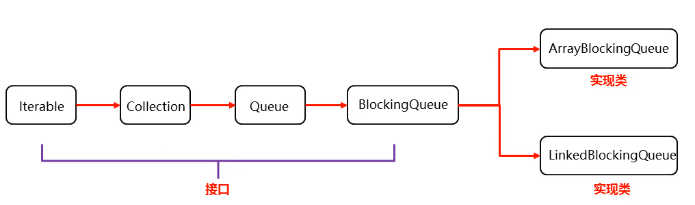
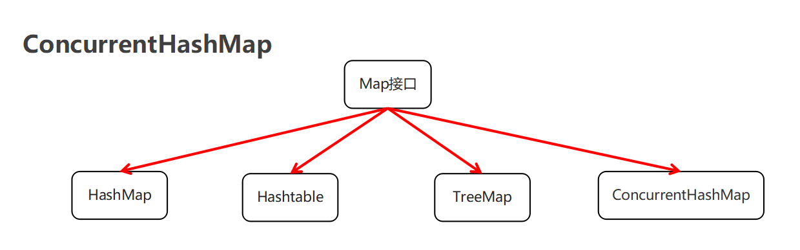

# 十、多线程

## 1、多线程的基础知识

### 1.1简单了解多线程

是指从软件或者硬件上实现多个线程并发执行的技术。
具有多线程能力的计算机因有硬件支持而能够**在同一时间执行多个线程，提升性能。**


### 1.2并发和并行


- **并发：在同一时刻，有多个指令在单个CPU上==交替执行==。**


+ **并行：在同一时刻，有多个指令在多个CPU上==同时执行==。**

  

  

  

  


### 1.3进程和线程

#### （1）**进程：是正在运行的程序**

- 独立性：进程是一个能独立运行的基本单位，同时也是系统分配资源和调度的独立单位
- 动态性：进程的实质是程序的一次执行过程，进程是动态产生，动态消亡的
- 并发性：任何进程都可以同其他进程一起并发执行


#### （2）线程：是进程中的单个顺序控制流，是一条执行路径

- ​	单线程：一个进程如果只有一条执行路径，则称为单线程程序

- ​	多线程：一个进程如果有多条执行路径，则称为多线程程序


#### （3）多线程的应用场景


### 1.4多线程的==实现方式==

#### （1）实现多线程方式一：==继承Thread类==

- 方法介绍

  | 方法名       | 说明                                        |
  | ------------ | ------------------------------------------- |
  | void run()   | 在线程开启后，此方法将被调用执行            |
  | void start() | 使此线程开始执行，Java虚拟机会调用run方法() |

- 实现步骤

  - 定义一个类MyThread继承Thread类
  - 在MyThread类中重写run()方法
  - 创建MyThread类的对象
  - 启动线程

- 代码演示

  ```java
  public class MyThread extends Thread {
      @Override
      public void run() {
          for(int i=0; i<100; i++) {
              System.out.println(i);
          }
      }
  }
  public class MyThreadDemo {
      public static void main(String[] args) {
          MyThread my1 = new MyThread();
          MyThread my2 = new MyThread();
  
  //        my1.run();
  //        my2.run();
  
          //void start() 导致此线程开始执行; Java虚拟机调用此线程的run方法
          my1.start();
          my2.start();
      }
  }
  ```

- 两个小问题

  - 为什么要重写run()方法？

    因为run()是用来封装被线程执行的代码

  - run()方法和start()方法的区别？

    **run()**：**封装线程执行的代码**，直接调用，相当于普通方法的调用

    **start()**：启动线程；然后**==由JVM调用此线程的run()方法==**

    

#### （2）实现多线程方式二：实现==Runnable接口==

- Thread构造方法

  | 方法名                               | 说明                   |
  | ------------------------------------ | ---------------------- |
  | Thread(Runnable target)              | 分配一个新的Thread对象 |
  | Thread(Runnable target, String name) | 分配一个新的Thread对象 |

- 实现步骤

  - 定义一个类MyRunnable实现Runnable接口
  - 在MyRunnable类中重写run()方法
  - 创建MyRunnable类的对象
  - 创建Thread类的对象，把MyRunnable对象作为构造方法的参数
  - 启动线程

- 代码演示

  ```java
  public class MyRunnable implements Runnable {
      @Override
      public void run() {
          for(int i=0; i<100; i++) {
              System.out.println(Thread.currentThread().getName()+":"+i);
          }
      }
  }
  public class MyRunnableDemo {
      public static void main(String[] args) {
          //创建MyRunnable类的对象
          MyRunnable my = new MyRunnable();
  
          //创建Thread类的对象，把MyRunnable对象作为构造方法的参数
          //Thread(Runnable target)
  //        Thread t1 = new Thread(my);
  //        Thread t2 = new Thread(my);
          //Thread(Runnable target, String name)
          Thread t1 = new Thread(my,"坦克");
          Thread t2 = new Thread(my,"飞机");
  
          //启动线程
          t1.start();
          t2.start();
      }
  }
  ```

#### （3）实现多线程方式三: ==实现Callable接口==

**特点：==可获取到多线程运行的结果==**

+ 方法介绍

  | 方法名                           | 说明                                               |
  | -------------------------------- | -------------------------------------------------- |
  | V call()                         | 计算结果，如果无法计算结果，则抛出一个异常         |
  | FutureTask(Callable`<V>` callable) | 创建一个 FutureTask，一旦运行就执行给定的 Callable |
  | V get()                          | 如有必要，等待计算完成，然后获取其结果             |

+ 实现步骤

  

  + 定义一个类MyCallable实现Callable接口
  + 在MyCallable类中**重写call()方法**（有返回值，表示多线程运行的结果）
  + 创建MyCallable类的对象（表示多线程要执行的任务）
  + 创建Future的实现类**FutureTask对象**（作用：管理多线程运行的结果），把MyCallable对象作为构造方法的参数
  + 创建Thread类的对象，把FutureTask对象作为构造方法的参数
  + 启动线程
  + 再**调用get方法**，就可以**获取**线程结束之后的**结果**。

+ 代码演示

  ```java
  public class MyCallable implements Callable<String> {
      @Override
      public String call() throws Exception {
          for (int i = 0; i < 100; i++) {
              System.out.println("跟女孩表白" + i);
          }
          //返回值就表示线程运行完毕之后的结果
          return "答应";
      }
  }
  public class Demo {
      public static void main(String[] args) throws ExecutionException, InterruptedException {
          //线程开启之后需要执行里面的call方法
          MyCallable mc = new MyCallable();
  
          //Thread t1 = new Thread(mc);
  
          //可以获取线程执行完毕之后的结果.也可以作为参数传递给Thread对象
          FutureTask<String> ft = new FutureTask<>(mc);
  
          //创建线程对象
          Thread t1 = new Thread(ft);
  
          String s = ft.get();
          //开启线程
          t1.start();
  
          //String s = ft.get();
          System.out.println(s);
      }
  }
  ```


#### （4）三种实现方式的对比


+ 实现Runnable、Callable接口
  + 好处: **扩展性强**，**实现该接口的同时还可以继承其他的类**
  + 缺点: 编程相对复杂，不能直接使用Thread类中的方法
+ 继承Thread类
  + 好处: 编程比较简单，可以直接使用Thread类中的方法
  + 缺点: 可以扩展性较差，不能再继承其他的类（原因**Java的单继承**）


### 1.5 常见的==成员方法==


#### （1）设置和获取线程名称-setName()

方法介绍

| 方法名                     | 说明                               |
| -------------------------- | ---------------------------------- |
| void  setName(String name) | 将此线程的名称更改为等于参数name   |
| String  getName()          | 返回此线程的名称                   |
| Thread  currentThread()    | 返回对当前正在执行的线程对象的引用 |

**细节：**

- 如果我们没有给线程设置名字，线程也是有**默认**的名字的，格式：**Thread-X（X序号，从0开始的)**
- 如果我们要给线程设置名字，可以用set方法进行设置，也**可以构造方法设置**（MyThread需要**实现父类的构造方法**）
- 如果不是直接==**继承Thread类**==创建线程，而是采用==**实现Runnable和Callable的方式**==，那么需要使用**Thread.currentThread().getName()**，获取线程名


代码演示

```java
public class MyThread extends Thread {
    //实现父类构造方法
    public MyThread() {}
    public MyThread(String name) {
        super(name);
    }

    @Override
    public void run() {
        for (int i = 0; i < 100; i++) {
            System.out.println(getName()+":"+i);
        }
    }
}
public class MyThreadDemo {
    public static void main(String[] args) {
        MyThread my1 = new MyThread();
        MyThread my2 = new MyThread();

        //void setName(String name)：将此线程的名称更改为等于参数 name
        my1.setName("高铁");
        my2.setName("飞机");

        //Thread(String name)
        MyThread my1 = new MyThread("高铁");
        MyThread my2 = new MyThread("飞机");

        my1.start();
        my2.start();

        //static Thread currentThread() 返回对当前正在执行的线程对象的引用
        System.out.println(Thread.currentThread().getName());
    }
}
```

#### （2）线程休眠-sleep()

相关方法

| 方法名                         | 说明                                                     |
| ------------------------------ | -------------------------------------------------------- |
| static void sleep(long millis) | 使**==当前正在执行的线程==**停留（暂停执行）指定的毫秒数 |

**细节：**

- 哪条线程执行到这个方法，那么哪条线程就会在这里停留对应的时间
- 方法的参数：就表示睡眠的时间，单位毫秒,1秒=1000毫秒
- 当时间到了之后，线程**会自动的醒来**，继续执行下面的其他代码


代码演示

```java
public class MyRunnable implements Runnable {
    @Override
    public void run() {
        for (int i = 0; i < 100; i++) {
            try {
                Thread.sleep(100);
            } catch (InterruptedException e) {
                e.printStackTrace();
            }

            System.out.println(Thread.currentThread().getName() + "---" + i);
        }
    }
}
public class Demo {
    public static void main(String[] args) throws InterruptedException {
        /*System.out.println("睡觉前");
        Thread.sleep(3000);
        System.out.println("睡醒了");*/

        MyRunnable mr = new MyRunnable();

        Thread t1 = new Thread(mr);
        Thread t2 = new Thread(mr);

        t1.start();
        t2.start();
    }
}
```

#### （3）线程优先级-setPriority()

**==注意：==虽然设置了线程优先级，但是并不是优先级高的线程==不一定==会比优先级低的线程先执行完。**

- **线程调度**

  - 两种调度方式

    - **==分时==**调度模型：所有线程轮流使用 CPU 的使用权，平均分配每个线程占用 CPU 的时间片
    - **==抢占式==**调度模型：优先**让优先级高的线程使用 CPU**，如果线程的优先级**相同**，那么会**随机选择**一个，优先级高的线程获取的 CPU 时间片相对多一些

  - **Java使用的是抢占式调度模型**

  - **随机性**

    假如计算机只有一个 CPU，那么 CPU 在某一个时刻只能执行一条指令，线程只有得到CPU时间片，也就是使用权，才可以执行指令。所以说多线程程序的执行是有随机性，因为谁抢到CPU的使用权是不一定的

    

- 优先级相关方法

  | 方法名                                  | 说明                                                         |
  | --------------------------------------- | ------------------------------------------------------------ |
  | final int getPriority()                 | 返回此线程的优先级                                           |
  | final void setPriority(int newPriority) | 更改此线程的优先级线程**默认优先级是5**；线程优先级的**==范围是：1-10==** |

  

- 代码演示

  ```java
  public class MyCallable implements Callable<String> {
      @Override
      public String call() throws Exception {
          for (int i = 0; i < 100; i++) {
              System.out.println(Thread.currentThread().getName() + "---" + i);
          }
          return "线程执行完毕了";
      }
  }
  public class Demo {
      public static void main(String[] args) {
          //优先级: 1 - 10 默认值:5
          MyCallable mc = new MyCallable();
  
          FutureTask<String> ft = new FutureTask<>(mc);
  
          Thread t1 = new Thread(ft);
          t1.setName("飞机");
          t1.setPriority(10);
          //System.out.println(t1.getPriority());//5
          t1.start();
  
          MyCallable mc2 = new MyCallable();
  
          FutureTask<String> ft2 = new FutureTask<>(mc2);
  
          Thread t2 = new Thread(ft2);
          t2.setName("坦克");
          t2.setPriority(1);
          //System.out.println(t2.getPriority());//5
          t2.start();
      }
  }
  ```


#### （4）守护线程-setDaemon()

**==特点：==当==普通线程执行完之后==,那么守护线程也没有继续运行下去的必要了（并不是立马结束，会有通知上的延迟，该守护线程可执行部分**

- 相关方法

  | 方法名                     | 说明                                                         |
  | -------------------------- | ------------------------------------------------------------ |
  | void setDaemon(boolean on) | **当其他的非守护线程执行完毕之后，守扩线程会==陆续结束==**，将此线程标记为守护线程，当运行的线程都是守护线程时，Java虚拟机将退出 |

- 代码演示

  ```java
  public class MyThread1 extends Thread {
      @Override
      public void run() {
          for (int i = 0; i < 10; i++) {
              System.out.println(getName() + "---" + i);
          }
      }
  }
  public class MyThread2 extends Thread {
      @Override
      public void run() {
          for (int i = 0; i < 100; i++) {
              System.out.println(getName() + "---" + i);
          }
      }
  }
  public class Demo {
      public static void main(String[] args) {
          MyThread1 t1 = new MyThread1();
          MyThread2 t2 = new MyThread2();
  
          t1.setName("女神");
          t2.setName("备胎");
  
          //把第二个线程设置为守护线程
          //当普通线程执行完之后,那么守护线程也没有继续运行下去的必要了.（并不是立马结束，会有通知上的延迟，该守护线程可执行部分）
          t2.setDaemon(true);
  
          t1.start();
          t2.start();
      }
  }
  ```

#####  应用场景


#### （5） **出让线程(Thread.yield)**

`Thread.yield()` 方法用于**让出 CPU 执行权**，表示**当前线程愿意让出 CPU 资源，使其他线程有机会运行。**但它并不保证一定会让出，也不保证让出后不会再次被调度到。

##### **使用场景**

- 用于优化多线程程序的性能，**减少不必要的 CPU 竞争**
- 在某些情况下，让高优先级线程先执行，提高响应速度
- 适用于希望当前线程主动让步但不影响后续执行的情况
- 让线程的执行偏向于**更均衡**

##### **示例**

```java
class YieldExample extends Thread {
    public void run() {
        for (int i = 0; i < 5; i++) {
            System.out.println(Thread.currentThread().getName() + " 正在执行");
            Thread.yield(); // 让出 CPU，尝试让其他线程执行
        }
    }
}

public class YieldTest {
    public static void main(String[] args) {
        YieldExample t1 = new YieldExample();
        YieldExample t2 = new YieldExample();
        
        t1.start();
        t2.start();
    }
}
```

##### **执行结果（可能）**

```
Thread-0 正在执行
Thread-1 正在执行
Thread-0 正在执行
Thread-1 正在执行
...
```

> ==**注意**==：`yield()` 只是一个提示，最终 CPU 是否真正让出由操作系统调度器决定。

------

#### （6）**插入线程(Thread.==join==)**

`Thread.join()` 方法用于等待一个线程执行完毕后再继续执行当前线程。它会阻塞调用该方法的线程，直到被调用的线程执行完毕。

##### **使用场景**

- 需要确保某个线程的任务完成后再执行后续代码
- 适用于主线程等待子线程执行完毕再继续运行的情况
- 线程同步，保证某些依赖于其他线程执行结果的代码不会过早执行

##### **示例**

```java
class JoinExample extends Thread {
    private String name;
    
    public JoinExample(String name) {
        this.name = name;
    }

    public void run() {
        for (int i = 0; i < 3; i++) {
            System.out.println(name + " 执行 " + i);
            try {
                Thread.sleep(500); // 模拟耗时操作
            } catch (InterruptedException e) {
                e.printStackTrace();
            }
        }
    }
}

public class JoinTest {
    public static void main(String[] args) {
        JoinExample t1 = new JoinExample("线程1");
        JoinExample t2 = new JoinExample("线程2");
        
        t1.start();
        try {
            t1.join(); // 等待 t1 完成后再执行 t2
        } catch (InterruptedException e) {
            e.printStackTrace();
        }
        
        t2.start();
        try {
            t2.join(); // 等待 t2 完成后再执行主线程
        } catch (InterruptedException e) {
            e.printStackTrace();
        }
        
        System.out.println("所有线程执行完毕");
    }
}
```

##### **执行结果（可能）**

```
线程1 执行 0
线程1 执行 1
线程1 执行 2
线程2 执行 0
线程2 执行 1
线程2 执行 2
所有线程执行完毕
```

> **说明**：
>
> - `t1.join()`：主线程会等待 `t1` 执行完毕后才会继续执行 `t2.start();`
> - `t2.join()`：主线程会等待 `t2` 执行完毕后才会执行 `System.out.println("所有线程执行完毕");`

------

##### **总结**

| 方法             | 作用                 | 影响                             | 适用场景                |
| ---------------- | -------------------- | -------------------------------- | ----------------------- |
| `Thread.yield()` | 让出 CPU 但不阻塞    | 可能使其他线程执行，但不保证     | 线程优化，降低 CPU 竞争 |
| `Thread.join()`  | 等待目标线程执行完毕 | 调用方线程阻塞，直到目标线程结束 | 线程同步，保证执行顺序  |

两者的主要区别是：

- `yield()` 是一种**让步**机制，线程可能会继续执行
- `join()` 是一种**同步**机制，**确保某个线程执行完再执行后续代码**


## 2、线程的生命周期和状态

### 2.1.线程的状态


在 Java 线程的生命周期中，官方并没有 **“运行”**（Running）这个状态，而是用 **RUNNABLE**（可运行）状态来表示。这是因为 Java 线程的执行是由操作系统的 CPU 调度决定的，JVM 无法保证某个线程一定在某一时刻运行。因此，Java 线程模型只区分了“可运行”（RUNNABLE）和“阻塞/等待”等状态，而没有单独的“运行”（Running）状态。

#### （1）线程的主要状态

1. **NEW（新建）**：线程被创建但尚未启动 (`new Thread()` 之后，还没调用 `start()`）。
2. **RUNNABLE（可运行）**：调用了 `start()`，线程被调度器认为可以运行，但不一定正在执行，可能在等待 CPU 时间片。
3. **BLOCKED（阻塞）**：线程等待进入同步代码块，正在等待获取锁。
4. **WAITING（等待）**：调用 `wait()`、`join()` 或 `park()`，需要显式唤醒。
5. **TIMED_WAITING（超时等待）**：调用 `sleep()`、`join(long time)`、`wait(long time)`，会在超时后自动苏醒。
6. **TERMINATED（终止）**：线程执行完毕或异常终止。


#### （2）为什么==没有 Running 状态==？

- **CPU 调度的不可预测性**：==**Java 线程由 JVM 交给操作系统管理**==，J**VM 无法精确控制某个线程是否在某一时刻被 CPU 执行。**
- **RUNNABLE 已包含 Running**：从 Java 角度看，**RUNNABLE** 状态的线程可能正在运行，也可能等待 CPU 调度，但 JVM 无法进一步细分。
- **跨平台兼容性**：不同操作系统的线程调度策略不同，不设置 Running 状态有助于保持 Java 的跨平台特性。


状态被定义在了**java.lang.Thread.State枚举类**中，State枚举类的源码如下：

```java
public class Thread {
    
    public enum State {
    
        /* 新建 */
        NEW , 

        /* 可运行状态 */
        RUNNABLE , 

        /* 阻塞状态 */
        BLOCKED , 

        /* 无限等待状态 */
        WAITING , 

        /* 计时等待 */
        TIMED_WAITING , 

        /* 终止 */
        TERMINATED;
    
	}
    
    // 获取当前线程的状态
    public State getState() {
        return jdk.internal.misc.VM.toThreadState(threadStatus);
    }
    
}
```

通过源码我们可以看到Java中的线程存在6种状态，每种线程状态的**含义**如下

| 线程状态      | 具体含义                                                     |
| ------------- | ------------------------------------------------------------ |
| NEW           | 一个尚未启动的线程的状态。也称之为初始状态、开始状态。线程刚被创建，但是并未启动。还没调用start方法。MyThread t = new MyThread()只有线程对象，没有线程特征。 |
| RUNNABLE      | 当我们调用线程对象的start方法，那么此时线程对象进入了RUNNABLE状态。那么此时才是真正的在**JVM进程中创建了一个线程**，线程一经启动并不是立即得到执行，线程的运行与否要听令与CPU的调度，那么我们把这个中间状态称之为可执行状态(RUNNABLE)也就是说它具备执行的资格，但是并没有真正的执行起来而是在等待CPU的调度。 |
| BLOCKED       | 当一个线程试图获取一个对象锁，而该对象锁被其他的线程持有，则该线程进入Blocked状态；当该线程持有锁时，该线程将变成Runnable状态。 |
| WAITING       | 一个正在等待的线程的状态。也称之为等待状态。造成线程等待的原因有两种，分别是调用Object.wait()、join()方法。处于等待状态的线程，正在等待其他线程去执行一个特定的操作。**例如：因为wait()而等待的线程正在等待另一个线程去调用notify()或notifyAll()；一个因为join()而等待的线程正在等待另一个线程结束。** |
| TIMED_WAITING | 一个在限定时间内等待的线程的状态。也称之为限时等待状态。造成线程限时等待状态的原因有三种，分别是：Thread.sleep(long)，Object.wait(long)、join(long)。 |
| TERMINATED    | 一个完全运行完成的线程的状态。也称之为终止状态、结束状态     |

各个状态的转换，如下图所示：


### 2.2.线程的生命周期


  

## 3、线程的安全问题

#### **电影院卖票模拟及线程安全问题**

#### **1.1线程安全问题概述**

在多线程环境下，多个线程同时访问共享资源（如票数），可能会发生**数据不一致、超卖、线程安全问题**等情况。例如：

1. **超卖问题**：多个线程同时读取剩余票数，判断后执行卖票操作，导致卖出负数票。
2. **数据不一致**：一个线程读取到票数，还没完成售出操作时，另一个线程也读取到了相同票数并修改了它，导致最终结果不正确。线程执行的随机性导致的,可能在卖票过程中**丢失cpu的执行权**,导致出现问题。

#### **1.2电影院卖票模拟**

```java
class TicketSeller implements Runnable {
    private int tickets = 100; // 共享资源：票数

    @Override
    public void run() {
        while (true) {
            synchronized (this) { // 确保多个线程安全访问
                if (tickets > 0) {
                    try {
                        Thread.sleep(50); // 模拟出票延迟，增加并发问题概率
                    } catch (InterruptedException e) {
                        e.printStackTrace();
                    }
                    System.out.println(Thread.currentThread().getName() + " 卖出了一张票，剩余：" + (--tickets));
                } else {
                    System.out.println(Thread.currentThread().getName() + " 发现票已售罄");
                    break;
                }
            }
        }
    }
}

public class Cinema {
    public static void main(String[] args) {
        TicketSeller seller = new TicketSeller();

        // 三个窗口（线程）卖票
        Thread window1 = new Thread(seller, "窗口1");
        Thread window2 = new Thread(seller, "窗口2");
        Thread window3 = new Thread(seller, "窗口3");

        window1.start();
        window2.start();
        window3.start();
    }
}
```

------

#### 1.3**线程安全问题分析**

1. **多个线程同时访问共享变量 `tickets`**

   - `tickets` 是多个线程共享的变量，多个线程可能会同时读取和修改它，导致**数据不一致**。

2. **可能发生的竞态条件**

   - 线程 A 和 线程 B 读取到相同的 `tickets` 值（例如 1），两者都判断可以卖票，最终 `tickets` 变成 -1（超卖）。

   

#### 1.4改进：使用同步机制-synchronized

- 使用 `synchronized` 关键字**锁定代码块**，确保同一时刻只有一个线程可以访问 `tickets`。

- ```
  synchronized (this)
  ```

   作用：

  - 锁住当前 `TicketSeller` 实例，保证多个线程不能同时执行 `sell ticket` 代码块，防止数据不一致。

------


#### 1.5**改进：使用 `ReentrantLock`**

除了 `synchronized`，还可以使用 `ReentrantLock` 进行==**显式加锁**==，提供更灵活的锁机制。

```java
import java.util.concurrent.locks.Lock;
import java.util.concurrent.locks.ReentrantLock;

class TicketSellerLock implements Runnable {
    private int tickets = 100;
    private final Lock lock = new ReentrantLock(); // 显式锁

    @Override
    public void run() {
        while (true) {
            lock.lock(); // 加锁
            try {
                if (tickets > 0) {
                    Thread.sleep(50);
                    System.out.println(Thread.currentThread().getName() + " 卖出了一张票，剩余：" + (--tickets));
                } else {
                    System.out.println(Thread.currentThread().getName() + " 发现票已售罄");
                    break;
                }
            } catch (InterruptedException e) {
                e.printStackTrace();
            } finally {
                lock.unlock(); // 释放锁
            }
        }
    }
}

public class CinemaLock {
    public static void main(String[] args) {
        TicketSellerLock seller = new TicketSellerLock();

        Thread window1 = new Thread(seller, "窗口1");
        Thread window2 = new Thread(seller, "窗口2");
        Thread window3 = new Thread(seller, "窗口3");

        window1.start();
        window2.start();
        window3.start();
    }
}
```

**优点：**

- `ReentrantLock` 提供手动加锁和释放锁的能力，避免 `synchronized` 的隐式锁定。
- 可以尝试 `lock.tryLock()` 来尝试获取锁，而不会导致死锁。

------

#### **总结**

| 方案            | 线程安全   | 可读性           | 性能           |
| --------------- | ---------- | ---------------- | -------------- |
| 无同步          | ❌ 可能超卖 | ✅ 简单           | ✅ 快，但不安全 |
| `synchronized`  | ✅ 线程安全 | ✅ 易读           | ⏳ 可能导致等待 |
| `ReentrantLock` | ✅ 线程安全 | ⏳ 需手动加锁解锁 | ✅ 灵活控制     |

> 结论：
>
> - 如果是简单场景，`synchronized` 足够。
> - 如果需要更灵活的锁控制（如超时等待），`ReentrantLock` 更合适。

这样就能解决电影院卖票的**线程安全问题**，确保不会出现超卖或数据不一致的问题！🚀


## 4、线程同步

### 4.1.卖票

- 案例需求

  某电影院目前正在上映国产大片，共有100张票，而它有3个窗口卖票，请设计一个程序模拟该电影院卖票

- 实现步骤

  - 定义一个类SellTicket**实现Runnable接口**(==如果使用Thread创建线程，可使用类变量static修饰变量tickets，实现数据共享==)，里面定义一个成员变量：private int tickets = 100;

  - 在SellTicket类中重写run()方法实现卖票，代码步骤如下

  - 判断票数大于0，就卖票，并告知是哪个窗口卖的
  - 卖了票之后，总票数要减1
  - 票卖没了，线程停止
  - 定义一个测试类SellTicketDemo，里面有main方法，代码步骤如下
  - 创建SellTicket类的对象
  - 创建三个Thread类的对象，把SellTicket对象作为构造方法的参数，并给出对应的窗口名称
  - 启动线程

- 代码实现

  ```java
  public class SellTicket implements Runnable {
      private int tickets = 100;
      //在SellTicket类中重写run()方法实现卖票，代码步骤如下
      @Override
      public void run() {
          while (true) {
              if(ticket <= 0){
                      //卖完了
                      break;
                  }else{
                      try {
                          Thread.sleep(100);
                      } catch (InterruptedException e) {
                          e.printStackTrace();
                      }
                      ticket--;
                      System.out.println(Thread.currentThread().getName() + "在卖票,还剩下" + ticket + "张票");
                  }
          }
      }
  }
  public class SellTicketDemo {
      public static void main(String[] args) {
          //创建SellTicket类的对象
          SellTicket st = new SellTicket();
  
          //创建三个Thread类的对象，把SellTicket对象作为构造方法的参数，并给出对应的窗口名称
          Thread t1 = new Thread(st,"窗口1");
          Thread t2 = new Thread(st,"窗口2");
          Thread t3 = new Thread(st,"窗口3");
  
          //启动线程
          t1.start();
          t2.start();
          t3.start();
      }
  }
  ```


### 4.2.卖票案例的问题

- 卖票出现了问题

  - 相同的票**出现了多次**

  - 出现了**负数**的票

- 问题产生原因

  - 线程执行的随机性导致的,可能在卖票过程中**丢失cpu的执行权**,导致出现问题

  


### 4.3.==同步代码块==解决数据安全问题


- 安全问题出现的条件

  - 是多线程环境

  - 有共享数据

  - 有多条语句操作共享数据

- 如何解决多线程安全问题呢?

  - 基本思想：让程序没有安全问题的环境

- 怎么实现呢?

  - **把多条语句操作共享数据的代码给锁起来**，**让任意时刻只能有一个线程执行**即可

  - Java提供了同步代码块的方式来解决

  


#### （1）==基本概念==

**概念：**

- `synchronized(锁对象) { // 临界区代码 }`
- 把==操作共享数据的代码==锁起来。
- 只锁住**代码块**，而不是整个方法，提高了程序的**并发效率**。
- 适用于需要**保护部分代码**（如共享资源访问）而不影响其他无关代码的情况。


#### （2）同步代码块格式

```java
synchronized(任意对象) {  // 对可能有安全问题的代码加锁,多个线程必须使用同一把锁
	多条语句操作共享数据的代码 
}
```

**synchronized(任意对象)：就相当于给代码加锁了，==锁对象==(任意对象就可以看成是一把锁)**


#### （3）同步的好处和弊端  

- **好处**：解决了多线程的数据安全问题

- **弊端**：当线程很多时，因为每个线程都会去判断同步上的锁，这是很耗费资源的，无形中会**降低程序的运行效率**


#### （4）==特点==

- 特点1：**锁默认打开**，有一个线程进去了，**锁自动关闭**
- 特点2：里面的代码**全部执行完毕**，线程出来，**锁自动打开**


#### （5）==注意事项==：

- private Object obj = new Object(); //==锁对象,一定要是唯一的==，也可以使用**当前线程类的==字节码文件对象==**

  - 

  

- 这里的**synchronized的要在while里面**，不然只有等到线程一执行完成后(退出while循环，此时**票已卖完**)，线程二、三才能抢占到CPU。

  - ```java
    while (true) {
                synchronized (obj) { // 对可能有安全问题的代码加锁,多个线程必须使用同一把锁
                    //t1进来后，就会把这段代码给锁起来
                    if (tickets > 0) {
                        try {
                            Thread.sleep(100);
                            //t1休息100毫秒
                        } catch (InterruptedException e) {
                            e.printStackTrace();
                        }
                        //窗口1正在出售第100张票
                        System.out.println(Thread.currentThread().getName() + "正在出售第" + tickets + "张票");
                        tickets--; //tickets = 99;
                    }
                }
                //t1出来了，这段代码的锁就被释放了
    }
    ```

  


#### （6）代码演示

```java
public class SellTicket implements Runnable {
    private int tickets = 100;
    
    private Object obj = new Object(); //锁对象,一定要是唯一的

    @Override
    public void run() {
        while (true) {
            synchronized (obj) { // 对可能有安全问题的代码加锁,多个线程必须使用同一把锁
                //t1进来后，就会把这段代码给锁起来
                if (tickets > 0) {
                    try {
                        Thread.sleep(100);
                        //t1休息100毫秒
                    } catch (InterruptedException e) {
                        e.printStackTrace();
                    }
                    //窗口1正在出售第100张票
                    System.out.println(Thread.currentThread().getName() + "正在出售第" + tickets + "张票");
                    tickets--; //tickets = 99;
                }
            }
            //t1出来了，这段代码的锁就被释放了
        }
    }
}

public class SellTicketDemo {
    public static void main(String[] args) {
        SellTicket st = new SellTicket();

        Thread t1 = new Thread(st, "窗口1");
        Thread t2 = new Thread(st, "窗口2");
        Thread t3 = new Thread(st, "窗口3");

        t1.start();
        t2.start();
        t3.start();
    }
}
```


### 4.4.==同步方法==解决数据安全问题


#### （1）**概念：**

- `synchronized` 直接作用在**方法声明**上，表示**整个方法都被锁定**。
- 适用于整个方法都需要同步的情况，保证线程安全。


#### （2）同步方法的格式

同步方法：就是把synchronized关键字加到**方法**上

```java
修饰符 synchronized 返回值类型 方法名(方法参数) { 
	方法体；
}
```


#### （3）特点

- 特点1：同步方法是**锁住方法里面所有的代码**

- 特点2：锁对象**不能自己指定**

  - **非静态：this**

  - **静态：当前类的字节码文件对象**，类名.class

    - 同步静态方法：就是把synchronized关键字加到**静态方法**上

    - ```java
      修饰符 static synchronized 返回值类型 方法名(方法参数) { 
      	方法体；
      }
      ```

      

#### （4）代码演示

```java
public class MyRunnable implements Runnable {
    private static int ticketCount = 100;

    @Override
    public void run() {
        while(true){
            if("窗口一".equals(Thread.currentThread().getName())){
                //同步方法
                boolean result = synchronizedMthod();
                if(result){
                    break;
                }
            }

            if("窗口二".equals(Thread.currentThread().getName())){
                //同步代码块
                synchronized (MyRunnable.class){
                    if(ticketCount == 0){
                       break;
                    }else{
                        try {
                            Thread.sleep(10);
                        } catch (InterruptedException e) {
                            e.printStackTrace();
                        }
                        ticketCount--;
                        System.out.println(Thread.currentThread().getName() + "在卖票,还剩下" + ticketCount + "张票");
                    }
                }
            }

        }
    }

    // 静态同步方法
    private static synchronized boolean synchronizedMthod() {
        if(ticketCount == 0){
            return true;
        }else{
            try {
                Thread.sleep(10);
            } catch (InterruptedException e) {
                e.printStackTrace();
            }
            ticketCount--;
            System.out.println(Thread.currentThread().getName() + "在卖票,还剩下" + ticketCount + "张票");
            return false;
        }
    }
}

 public class Demo {
      public static void main(String[] args) {
          MyRunnable mr = new MyRunnable();

          Thread t1 = new Thread(mr);
          Thread t2 = new Thread(mr);
    
          t1.setName("窗口一");
          t2.setName("窗口二");
    
          t1.start();
          t2.start();
      }

  }
```


#### （5）应用

##### `StringBuilder` 和 `StringBuffer` 的区别

`StringBuilder` 和 `StringBuffer` 都是可变字符串类，它们提供了类似 `String` 的操作方式，但**不同点主要在于线程安全**和**性能**。

------

##### **1. 主要区别**

| 特性         | `StringBuilder`            | `StringBuffer`           |
| ------------ | -------------------------- | ------------------------ |
| **线程安全** | ❌ **非线程安全**（不加锁） | ✅ **线程安全**（加锁）   |
| **性能**     | 🚀 **快**（无同步开销）     | 🐢 **慢**（同步影响性能） |
| **适用场景** | **单线程**操作字符串       | **多线程**操作字符串     |

------

##### **2. 线程安全性**

- `StringBuffer` 通过**同步（synchronized）**保证线程安全，多个线程访问同一个 `StringBuffer` 对象时不会发生数据不一致问题。
- `StringBuilder` **不加锁**，适用于**单线程环境**，因此执行效率更高。

**示例：StringBuilder-多线程并发操作**

```java
public class StringBuilderDemo {
    public static void main(String[] args) throws InterruptedException {
        StringBuilder sb = new StringBuilder();

        Runnable task = () -> {
            for (int i = 0; i < 100; i++) {
                sb.append("A"); // 非线程安全操作
            }
        };

        Thread t1 = new Thread(task);
        Thread t2 = new Thread(task);
        t1.start();
        t2.start();

        // 等待两个线程执行完
        t1.join();
        t2.join();

        // 可能会发生数据不一致， 预期值 200，但可能输出小于 200
        // 确保所有线程执行完后再获取长度
        System.out.println("最终长度：" + sb.length());
    }
}
```

✅ `StringBuffer` **保证了数据安全**，但加锁降低了性能。
 		❌ `StringBuilder` **在多线程环境下可能导致数据错误**。

------

##### **3. 性能对比**

`StringBuilder` 性能更优，因为它**不需要加锁**。以下代码比较两者的执行速度：

```java
public class PerformanceTest {
    public static void main(String[] args) {
        long start, end;
        
        // StringBuffer
        StringBuffer sb = new StringBuffer();
        start = System.nanoTime();
        for (int i = 0; i < 100000; i++) {
            sb.append("A");
        }
        end = System.nanoTime();
        System.out.println("StringBuffer 耗时: " + (end - start) + "ns");
        
        // StringBuilder
        StringBuilder sb2 = new StringBuilder();
        start = System.nanoTime();
        for (int i = 0; i < 100000; i++) {
            sb2.append("A");
        }
        end = System.nanoTime();
        System.out.println("StringBuilder 耗时: " + (end - start) + "ns");
    }
}
```

**一般情况下：**

- `StringBuilder` **更快**
- `StringBuffer` **更安全**

------

##### **4. 适用场景**

| 场景                 | 推荐使用           |
| -------------------- | ------------------ |
| **单线程操作字符串** | `StringBuilder`    |
| **多线程操作字符串** | `StringBuffer`     |
| **少量字符串操作**   | `String`（不可变） |

如果你**确定**字符串操作在**单线程环境**中，**建议使用 `StringBuilder`，因为它更快**。
 如果在**多线程环境**下共享一个字符串对象，**建议使用 `StringBuffer`** 以确保线程安全。

------

##### **5. 代码示例**

**使用 `StringBuilder`（单线程）**

```java
public class StringBuilderExample {
    public static void main(String[] args) {
        StringBuilder sb = new StringBuilder("Hello");
        sb.append(" World");
        System.out.println(sb); // Hello World
    }
}
```

**使用 `StringBuffer`（多线程）**

```java
public class StringBufferExample {
    public static void main(String[] args) {
        StringBuffer sb = new StringBuffer("Hello");
        sb.append(" World");
        System.out.println(sb); // Hello World
    }
}
```

------

##### **6. 额外补充**

如果你需要**线程安全**但**性能更优**，可以使用 `ThreadLocal` 或 `synchronized` 关键字只锁定关键代码，而不是整个 `StringBuffer` 对象。

------

##### **7. 总结**

1. **`StringBuilder` 更快但不安全**，适用于**单线程**。
2. **`StringBuffer` 线程安全但性能较低**，适用于**多线程**。
3. **如果字符串不会变（少量操作），`String` 更适合**。

如果你不确定用哪个，默认用 `StringBuilder`，除非明确需要线程安全！🚀


 ### 4.5.==Lock锁==

虽然我们可以理解同步代码块和同步方法的锁对象问题，但是我们并没有直接看到在哪里加上了锁，在哪里释放了锁，为了更清晰的表达如何**加锁和释放锁**，JDK5以后提供了一个新的**锁对象Lock**

Lock是接口不能直接实例化，这里采用**它的实现类ReentrantLock来实例化**

#### （1）ReentrantLock构造方法

| 方法名          | 说明                        |
| --------------- | --------------------------- |
| ReentrantLock() | 创建一个ReentrantLock的实例 |

#### （2）加锁解锁方法

| 方法名        | 说明   |
| ------------- | ------ |
| void lock()   | 获得锁 |
| void unlock() | 释放锁 |

#### （3）代码演示

  ```java
  public class Ticket implements Runnable {
      //票的数量
      private int ticket = 100;
      private Object obj = new Object();
      private ReentrantLock lock = new ReentrantLock();

      @Override
      public void run() {
          while (true) {
              //synchronized (obj){//多个线程必须使用同一把锁.
              try {
                  lock.lock(); // 加锁
                  if (ticket <= 0) {
                      //卖完了
                      break;
                  } else {
                      Thread.sleep(100);
                      ticket--;
                      System.out.println(Thread.currentThread().getName() + "在卖票,还剩下" + ticket + "张票");
                  }
              } catch (InterruptedException e) {
                  e.printStackTrace();
              } finally { //使用finally，保证锁一定会被释放
                  lock.unlock(); //释放锁
              }
              // }
          }
      }
  }

  public class Demo {
      public static void main(String[] args) {
          Ticket ticket = new Ticket();

          Thread t1 = new Thread(ticket);
          Thread t2 = new Thread(ticket);
          Thread t3 = new Thread(ticket);

          t1.setName("窗口一");
          t2.setName("窗口二");
          t3.setName("窗口三");

          t1.start();
          t2.start();
          t3.start();
      }
  }
  ```


### 4.6.==死锁==


#### （1）概述

**线程死锁是指由于两个或者多个线程==互相持有对方所需要的资源==，导致这些线程==处于等待状态==，无法前往执行**


#### （2）产生死锁的情况

- 资源有限
- 同步嵌套


#### （3）代码演示

```java
public class Demo {
    public static void main(String[] args) {
        Object objA = new Object();
        Object objB = new Object();

        new Thread(() -> {
            while (true) {
                synchronized (objA) {
                    System.out.println("线程 A 拿到了 A 锁，准备拿 B 锁");
                    synchronized (objB) {
                        System.out.println("线程 A 拿到了 B 锁，顺利执行完一轮！");
                    }
                }
            }
        }, "线程 A").start();

        new Thread(() -> {
            while (true) {
                synchronized (objB) {
                    System.out.println("线程 B 拿到了 B 锁，准备拿 A 锁");
                    synchronized (objA) {
                        System.out.println("线程 B 拿到了 A 锁，顺利执行完一轮！");
                    }
                }
            }
        }, "线程 B").start();
    }
}

```


## 5、生产者消费者(==等待唤醒机制==)


### 5.1.生产者和消费者模式概述

#### （1）概述

生产者消费者模式是一个十分经典的多线程协作的模式，弄懂生产者消费者问题能够让我们对多线程编程的理解更加深刻。

所谓生产者消费者问题，实际上主要是包含了两类线程：

- 一类是生产者线程用于生产数据

- 一类是消费者线程用于消费数据


为了**解耦**生产者和消费者的关系，通常会采用**共享的数据区域**，就像是一个仓库

- 生产者生产数据之后直接放置在共享数据区中，并不需要关心消费者的行为

- 消费者只需要从共享数据区中去获取数据，并不需要关心生产者的行为


#### （2）Object类的等待和唤醒方法


| 方法名               | 说明                                                         |
| -------------------- | ------------------------------------------------------------ |
| void **wait()**      | 导致**当前线程等待**，直到另一个线程调用该对象的 notify()方法或 notifyAll()方法 |
| void **notify()**    | 唤醒正在等待对象监视器的单个线程                             |
| void **notifyAll()** | 唤醒正在等待对象监视器的所有线程                             |


### 5.2.生产者和消费者案例

#### （1）案例需求

- 桌子类(Desk)：定义表示包子数量的变量,定义锁对象变量,**定义标记桌子上有无包子的变量**

- 生产者类(Cooker)：实现Runnable接口，重写run()方法，设置线程任务

  - 判断是否有包子,决定当前线程是否执行

  - 如果有包子,就进入等待状态,如果没有包子,继续执行,生产包子

  - 生产包子之后,更新桌子上包子状态,唤醒消费者消费包子

- 消费者类(Foodie)：实现Runnable接口，重写run()方法，设置线程任务
  - 判断是否有包子,决定当前线程是否执行
  - 如果没有包子,就进入等待状态,如果有包子,就消费包子
  - 消费包子后,更新桌子上包子状态,唤醒生产者生产包子
- 测试类(Demo)：里面有main方法，main方法中的代码步骤如下
  - 创建生产者线程和消费者线程对象
  - 分别开启两个线程


#### （2）代码实现

##### ①Desk

```java
public class Desk {

    //定义一个标记
    //true 就表示桌子上有汉堡包的,此时允许吃货执行
    //false 就表示桌子上没有汉堡包的,此时允许厨师执行
    public static boolean flag = false; //boolean只有两种情况，可以考虑使用int类型表示多种线程

    //汉堡包的总数量
    public static int count = 10;

    //锁对象
    public static final Object lock = new Object();
}

```


##### ②消费者

**==让当前线程跟锁进行绑定，使用什么对象当做锁,那么就必须用这个对象去调用等待和唤醒的方法.==**

步骤

- 判断桌子上是否有汉堡包。
  - 如果没有就等待。
  - 如果有就开吃
- 吃完之后，桌子上的汉堡包就没有了
- 叫醒等待的生产者继续生产

```java
public class Foodie extends Thread {
    @Override
    public void run() {
//        1，判断桌子上是否有汉堡包。
//        2，如果没有就等待。
//        3，如果有就开吃
//        4，吃完之后，桌子上的汉堡包就没有了
//                叫醒等待的生产者继续生产
//        汉堡包的总数量减一

        //套路:
            //1. while(true)死循环
            //2. synchronized 锁,锁对象要唯一
            //3. 判断,共享数据是否结束. 结束
            //4. 判断,共享数据是否结束. 没有结束
        while(true){
            synchronized (Desk.lock){
                if(Desk.count == 0){
                    break;
                }else{
                    if(Desk.flag){
                        //有
                        System.out.println("吃货在吃汉堡包");
                        Desk.flag = false;
                        Desk.lock.notifyAll(); //唤醒跟这把锁绑定的所有线程
                        Desk.count--;
                    }else{
                        //没有就等待
                        try {
                            Desk.lock.wait(); //让当前线程跟锁进行绑定，使用什么对象当做锁,那么就必须用这个对象去调用等待和唤醒的方法.
                        } catch (InterruptedException e) {
                            e.printStackTrace();
                        }
                    }
                }
            }
        }

    }
}
```


##### ③消费者

 **生产者步骤：**

- 判断桌子上是否有汉堡包
  -  如果有就等待，如果没有才生产。
- 把汉堡包放在桌子上。
- 叫醒等待的消费者开吃。

```java

public class Cooker extends Thread {
//    生产者步骤：
//            1，判断桌子上是否有汉堡包
//   			 如果有就等待，如果没有才生产。
//            2，把汉堡包放在桌子上。
//            3，叫醒等待的消费者开吃。
    @Override
    public void run() {
        while(true){
            synchronized (Desk.lock){
                if(Desk.count == 0){
                    break;
                }else{
                    if(!Desk.flag){
                        //生产
                        System.out.println("厨师正在生产汉堡包");
                        Desk.flag = true;
                        Desk.lock.notifyAll();
                    }else{
                        try {
                            Desk.lock.wait();
                        } catch (InterruptedException e) {
                            e.printStackTrace();
                        }
                    }
                }
            }
        }
    }
}

```


##### ④测试

```java
public class Demo {
    public static void main(String[] args) {
        /*消费者步骤：
        1，判断桌子上是否有汉堡包。
        2，如果没有就等待。
        3，如果有就开吃
        4，吃完之后，桌子上的汉堡包就没有了
                叫醒等待的生产者继续生产
        汉堡包的总数量减一*/

        /*生产者步骤：
        1，判断桌子上是否有汉堡包
        如果有就等待，如果没有才生产。
        2，把汉堡包放在桌子上。
        3，叫醒等待的消费者开吃。*/

        Foodie f = new Foodie();
        Cooker c = new Cooker();

        f.start();
        c.start();

    }
}
```


#### （3）生产者和消费者案例==优化==

##### ①需求

+ 将Desk类中的变量,**采用面向对象的方式封装起来**
+ 生产者和消费者类中构造方法接收Desk类对象,之后在run方法中进行使用
+ 创建生产者和消费者线程对象,构造方法中传入Desk类对象
+ 开启两个线程


##### ②代码实现

```java
public class Desk {

    //定义一个标记
    //true 就表示桌子上有汉堡包的,此时允许吃货执行
    //false 就表示桌子上没有汉堡包的,此时允许厨师执行
    //public static boolean flag = false;
    private boolean flag;

    //汉堡包的总数量
    //public static int count = 10;
    //以后我们在使用这种必须有默认值的变量
   // private int count = 10;
    private int count;

    //锁对象
    //public static final Object lock = new Object();
    private final Object lock = new Object();

    public Desk() {
        this(false,10); // 在空参内部调用带参,对成员变量进行赋值,之后就可以直接使用成员变量了
    }

    public Desk(boolean flag, int count) {
        this.flag = flag;
        this.count = count;
    }

    public boolean isFlag() {
        return flag;
    }

    public void setFlag(boolean flag) {
        this.flag = flag;
    }

    public int getCount() {
        return count;
    }

    public void setCount(int count) {
        this.count = count;
    }

    public Object getLock() {
        return lock;
    }

    @Override
    public String toString() {
        return "Desk{" +
                "flag=" + flag +
                ", count=" + count +
                ", lock=" + lock +
                '}';
    }
}

public class Cooker extends Thread {

    private Desk desk;

    public Cooker(Desk desk) {
        this.desk = desk;
    }
//    生产者步骤：
//            1，判断桌子上是否有汉堡包
//    如果有就等待，如果没有才生产。
//            2，把汉堡包放在桌子上。
//            3，叫醒等待的消费者开吃。

    @Override
    public void run() {
        while(true){
            synchronized (desk.getLock()){
                if(desk.getCount() == 0){
                    break;
                }else{
                    //System.out.println("验证一下是否执行了");
                    if(!desk.isFlag()){
                        //生产
                        System.out.println("厨师正在生产汉堡包");
                        desk.setFlag(true);
                        desk.getLock().notifyAll();
                    }else{
                        try {
                            desk.getLock().wait();
                        } catch (InterruptedException e) {
                            e.printStackTrace();
                        }
                    }
                }
            }
        }
    }
}

public class Foodie extends Thread {
    private Desk desk;

    public Foodie(Desk desk) {
        this.desk = desk;
    }

    @Override
    public void run() {
//        1，判断桌子上是否有汉堡包。
//        2，如果没有就等待。
//        3，如果有就开吃
//        4，吃完之后，桌子上的汉堡包就没有了
//                叫醒等待的生产者继续生产
//        汉堡包的总数量减一

        //套路:
            //1. while(true)死循环
            //2. synchronized 锁,锁对象要唯一
            //3. 判断,共享数据是否结束. 结束
            //4. 判断,共享数据是否结束. 没有结束
        while(true){
            synchronized (desk.getLock()){
                if(desk.getCount() == 0){
                    break;
                }else{
                    //System.out.println("验证一下是否执行了");
                    if(desk.isFlag()){
                        //有
                        System.out.println("吃货在吃汉堡包");
                        desk.setFlag(false);
                        desk.getLock().notifyAll();
                        desk.setCount(desk.getCount() - 1);
                    }else{
                        //没有就等待
                        //使用什么对象当做锁,那么就必须用这个对象去调用等待和唤醒的方法.
                        try {
                            desk.getLock().wait();
                        } catch (InterruptedException e) {
                            e.printStackTrace();
                        }
                    }
                }
            }
        }

    }
}

public class Demo {
    public static void main(String[] args) {
        /*消费者步骤：
        1，判断桌子上是否有汉堡包。
        2，如果没有就等待。
        3，如果有就开吃
        4，吃完之后，桌子上的汉堡包就没有了
                叫醒等待的生产者继续生产
        汉堡包的总数量减一*/

        /*生产者步骤：
        1，判断桌子上是否有汉堡包
        如果有就等待，如果没有才生产。
        2，把汉堡包放在桌子上。
        3，叫醒等待的消费者开吃。*/

        Desk desk = new Desk();

        Foodie f = new Foodie(desk);
        Cooker c = new Cooker(desk);

        f.start();
        c.start();

    }
}
```


### 5.3.阻塞队列


- **put数据时：放不进去，会等着，也叫做阻塞**
- **take数据时：取出第一个数据，取不到会等着，也叫做阻塞**


#### （1）阻塞队列基本使用

##### ① 阻塞队列继承结构




- 常见**BlockingQueue**:

  - ArrayBlockingQueue: 底层是**数组,有界**

  - LinkedBlockingQueue: 底层是**链表,无界**.但不是真正的无界,最大为int的最大值
- BlockingQueue的核心方法:

  - put(anObject): 将参数放入队列,如果**放不进去会阻塞**

  - take(): 取出第一个数据**,取不到会阻塞**

##### ② 代码示例

```java
public class Demo02 {
    public static void main(String[] args) throws Exception {
        // 创建阻塞队列的对象,容量为 1
        ArrayBlockingQueue<String> arrayBlockingQueue = new ArrayBlockingQueue<>(1);

        // 存储元素
        arrayBlockingQueue.put("汉堡包");

        // 取元素
        System.out.println(arrayBlockingQueue.take());
        System.out.println(arrayBlockingQueue.take()); // 取不到会阻塞

        System.out.println("程序结束了");
    }
}
```

##### ③ ==阻塞队列==实现==等待唤醒机制==

**案例需求**

- 生产者类(Cooker)：实现Runnable接口，重写run()方法，设置线程任务

  - **构造方法中接收一个阻塞队列对象**
  - 在run方法中循环向阻塞队列中添加包子

  - 打印添加结果

- 消费者类(Foodie)：实现Runnable接口，重写run()方法，设置线程任务

  - **构造方法中接收一个阻塞队列对象**
  - 在run方法中循环获取阻塞队列中的包子

  - 打印获取结果

- 测试类(Demo)：里面有main方法，main方法中的代码步骤如下

  - 创建阻塞队列对象

  - 创建生产者线程和消费者线程对象,构造方法中传入阻塞队列对象

  - 分别开启两个线程

  

**代码实现**

```java
public class Cooker extends Thread {

    private ArrayBlockingQueue<String> bd;

    public Cooker(ArrayBlockingQueue<String> bd) {
        this.bd = bd;
    }
//    生产者步骤：
//            1，判断桌子上是否有汉堡包
//    如果有就等待，如果没有才生产。
//            2，把汉堡包放在桌子上。
//            3，叫醒等待的消费者开吃。

    @Override
    public void run() {
        while (true) {
            try {
                bd.put("汉堡包");
                System.out.println("厨师放入一个汉堡包");
            } catch (InterruptedException e) {
                e.printStackTrace();
            }
        }
    }
}

public class Foodie extends Thread {
    private ArrayBlockingQueue<String> bd;

    public Foodie(ArrayBlockingQueue<String> bd) {
        this.bd = bd;
    }

    @Override
    public void run() {
//        1，判断桌子上是否有汉堡包。
//        2，如果没有就等待。
//        3，如果有就开吃
//        4，吃完之后，桌子上的汉堡包就没有了
//                叫醒等待的生产者继续生产
//        汉堡包的总数量减一

        //套路:
        //1. while(true)死循环
        //2. synchronized 锁,锁对象要唯一
        //3. 判断,共享数据是否结束. 结束
        //4. 判断,共享数据是否结束. 没有结束
        while (true) {
            try {
                String take = bd.take();
                System.out.println("吃货将" + take + "拿出来吃了");
            } catch (InterruptedException e) {
                e.printStackTrace();
            }
        }

    }
}

public class Demo {
    public static void main(String[] args) {
        ArrayBlockingQueue<String> bd = new ArrayBlockingQueue<>(1);

        Foodie f = new Foodie(bd);
        Cooker c = new Cooker(bd);

        f.start();
        c.start();
    }
}
```


## 6、多线程综合练习题

### 练习一：售票

需求：

​	一共有1000张电影票,可以在两个窗口领取,假设每次领取的时间为3000毫秒,

​	请用多线程模拟卖票过程并打印剩余电影票的数量

代码示例：

```java
public class MyThread extends Thread {

    //第一种方式实现多线程，测试类中MyThread会创建多次，所以需要加static
    static int ticket = 1000;

    @Override
    public void run() {
        //1.循环
        while (true) {
            //2.同步代码块
            synchronized (MyThread.class) {
                //3.判断共享数据（已经到末尾）
                if (ticket == 0) {
                    break;
                } else {
                    //4.判断共享数据（没有到末尾）
                    try {
                        Thread.sleep(3000);
                    } catch (InterruptedException e) {
                        e.printStackTrace();
                    }
                    ticket--;
                    System.out.println(getName() + "在卖票，还剩下" + ticket + "张票!!!");
                }
            }
        }
    }
}

public class Test {
    public static void main(String[] args) {
       /*
            一共有1000张电影票,可以在两个窗口领取,假设每次领取的时间为3000毫秒,
            要求:请用多线程模拟卖票过程并打印剩余电影票的数量
        */

        //创建线程对象
        MyThread t1 = new MyThread();
        MyThread t2 = new MyThread();

        //给线程设置名字
        t1.setName("窗口1");
        t2.setName("窗口2");

        //开启线程
        t1.start();
        t2.start();

    }
}

```


### 练习二：赠送礼物

需求：

​	有100份礼品,两人同时发送，当剩下的礼品小于10份的时候则不再送出。

​	利用多线程模拟该过程并将线程的名字和礼物的剩余数量打印出来.

```java
public class MyRunable implements Runnable {

    //第二种方式实现多线程，测试类中MyRunable只创建一次，所以不需要加static
    int count = 100;

    @Override
    public void run() {
        //1.循环
        while (true) {
            //2.同步代码块
            synchronized (MyThread.class) {
                //3.判断共享数据（已经到末尾）
                if (count < 10) {
                    System.out.println("礼物还剩下" + count + "不再赠送");
                    break;
                } else {
                    //4.判断共享数据（没有到末尾）
                    count--;
                    System.out.println(Thread.currentThread().getName() + "在赠送礼物，还剩下" + count + "个礼物!!!");
                }
            }
        }
    }
}


public class Test {
    public static void main(String[] args) {
        /*
            有100份礼品,两人同时发送，当剩下的礼品小于10份的时候则不再送出，
            利用多线程模拟该过程并将线程的名字和礼物的剩余数量打印出来.
        */

        //创建参数对象
        MyRunable mr = new MyRunable();

        //创建线程对象
        Thread t1 = new Thread(mr,"窗口1");
        Thread t2 = new Thread(mr,"窗口2");

        //启动线程
        t1.start();
        t2.start();
    }
}

```


### 练习三：打印数字

需求：

​	同时**开启两个线程**，共同获取1-100之间的所有数字。

​	将输出所有的奇数。

```java
public class MyRunable implements Runnable {

    //第二种方式实现多线程，测试类中MyRunable只创建一次，所以不需要加static
    int number = 1;

    @Override
    public void run() {
        //1.循环
        while (true) {
            //2.同步代码块
            synchronized (MyThread.class) {
                //3.判断共享数据（已经到末尾）
                if (number > 100) {
                    break;
                } else {
                    //4.判断共享数据（没有到末尾）
                    if(number % 2 == 1){
                        System.out.println(Thread.currentThread().getName() + "打印数字" + number);
                    }
                    number++;
                }
            }
        }
    }
}


public class Test {
    public static void main(String[] args) {
        /*
           同时开启两个线程，共同获取1-100之间的所有数字。
           要求：将输出所有的奇数。
        */


        //创建参数对象
        MyRunable mr = new MyRunable();

        //创建线程对象
        Thread t1 = new Thread(mr,"线程A");
        Thread t2 = new Thread(mr,"线程B");

        //启动线程
        t1.start();
        t2.start();
    }
}
```


### 练习四：==抢红包==


需求：

​	抢红包也用到了多线程。

​	假设：100块，分成了3个包，现在有5个人去抢。

​	其中，红包是共享数据。

​	5个人是5条线程。

​	打印结果如下：

​		  XXX抢到了XXX元

​		  XXX抢到了XXX元

 		XXX抢到了XXX元

​		XXX没抢到

​		XXX没抢到


#### 解决方案一

```java
public class MyThread extends Thread{

    //共享数据
    //100块，分成了3个包
    static double money = 100;
    static int count = 3;

    //最小的中奖金额
    static final double MIN = 0.01;

    @Override
    public void run() {
        //while(ture) 循环，但是每个人(线程)只抢一次，不需要循环
        //同步代码块
        //判断，共享数据是否到了末尾（已经到末尾)
        //判断，共亨数据是否到了末尾（没有到末尾）
        
        //同步代码块
        synchronized (MyThread.class){
            if(count == 0){
                //判断，共享数据是否到了末尾（已经到末尾）
                System.out.println(getName() + "没有抢到红包！");
            }else{
                //判断，共享数据是否到了末尾（没有到末尾）
                //定义一个变量，表示中奖的金额
                double prize = 0;
                if(count == 1){
                    //表示此时是最后一个红包
                    //就无需随机，剩余所有的钱都是中奖金额
                    prize = money;
                }else{
                    //表示第一次和第二次（随机）
                    Random r = new Random();
                    //100 元   3个包
                    //第一个红包：99.98
                    //100 - (3-1) * 0.01
                    double bounds = money - (count - 1) * MIN; //为了保证其他红包至少满足最小值
                    prize = r.nextDouble(bounds); // JDK17，取随机值（0，bounds）
                    if(prize < MIN){ // 保证中间值不小于MIN
                        prize = MIN; 
                    }
                }
                //从money当中，去掉当前中奖的金额
                money = money - prize;
                //红包的个数-1
                count--;
                //本次红包的信息进行打印
                System.out.println(getName() + "抢到了" + prize + "元");
            }
        }
    }
}
public class Test {
    public static void main(String[] args) {
        /*
            微信中的抢红包也用到了多线程。
            假设：100块，分成了3个包，现在有5个人去抢。
            其中，红包是共享数据。
            5个人是5条线程。
            打印结果如下：
            	XXX抢到了XXX元
            	XXX抢到了XXX元
            	XXX抢到了XXX元
            	XXX没抢到
            	XXX没抢到
        */

        //创建线程的对象
        MyThread t1 = new MyThread();
        MyThread t2 = new MyThread();
        MyThread t3 = new MyThread();
        MyThread t4 = new MyThread();
        MyThread t5 = new MyThread();

        //给线程设置名字
        t1.setName("小A");
        t2.setName("小QQ");
        t3.setName("小哈哈");
        t4.setName("小诗诗");
        t5.setName("小丹丹");

        //启动线程
        t1.start();
        t2.start();
        t3.start();
        t4.start();
        t5.start();
    }
}
```


#### 解决方案二-改进成精确计算-BigDecimal

```java
public class MyThread extends Thread{

    //总金额
    static BigDecimal money = BigDecimal.valueOf(100.0);
    //个数
    static int count = 3;
    //最小抽奖金额
    static final BigDecimal MIN = BigDecimal.valueOf(0.01);

    @Override
    public void run() {
        synchronized (MyThread.class){
            if(count == 0){
                System.out.println(getName() + "没有抢到红包！");
            }else{
                //中奖金额
                BigDecimal prize;
                if(count == 1){
                    prize = money;
                }else{
                    //获取抽奖范围
                    double bounds = money.subtract(BigDecimal.valueOf(count-1).multiply(MIN)).doubleValue();
                    Random r = new Random();
                    //抽奖金额
                    prize = BigDecimal.valueOf(r.nextDouble(bounds));
                }
                //设置抽中红包，小数点保留两位，四舍五入
                prize = prize.setScale(2,RoundingMode.HALF_UP);
                //在总金额中去掉对应的钱
                money = money.subtract(prize);
                //红包少了一个
                count--;
                //输出红包信息
                System.out.println(getName() + "抽中了" + prize + "元");
            }
        }
    }
}

public class Test {
    public static void main(String[] args) {
        /*
            微信中的抢红包也用到了多线程。
            假设：100块，分成了3个包，现在有5个人去抢。
            其中，红包是共享数据。
            5个人是5条线程。
            打印结果如下：
            	XXX抢到了XXX元
            	XXX抢到了XXX元
            	XXX抢到了XXX元
            	XXX没抢到
            	XXX没抢到
        */


        MyThread t1 = new MyThread();
        MyThread t2 = new MyThread();
        MyThread t3 = new MyThread();
        MyThread t4 = new MyThread();
        MyThread t5 = new MyThread();

        t1.setName("小A");
        t2.setName("小QQ");
        t3.setName("小哈哈");
        t4.setName("小诗诗");
        t5.setName("小丹丹");

        t1.start();
        t2.start();
        t3.start();
        t4.start();
        t5.start();
    }
}
```


### 练习五：抽奖箱


需求：

​	有一个抽奖池,该抽奖池中存放了奖励的金额,该抽奖池中的奖项为 {10,5,20,50,100,200,500,800,2,80,300,700}; 

创建两个抽奖箱(线程)设置线程名称分别为“抽奖箱1”，“抽奖箱2” 

随机从抽奖池中获取奖项元素并打印在控制台上,格式如下:

​               每次抽出一个奖项就打印一个(随机)

​		抽奖箱1 又产生了一个 10 元大奖

​		抽奖箱1 又产生了一个 100 元大奖

​		抽奖箱1 又产生了一个 200 元大奖

​		抽奖箱1 又产生了一个 800 元大奖  

​		抽奖箱2 又产生了一个 700 元大奖  


```java
public class MyThread extends Thread {

    ArrayList<Integer> list;

    public MyThread(ArrayList<Integer> list) {
        this.list = list;
    }

    @Override
    public void run() {
        //1.循环
        //2.同步代码块
        //3.判断
        //4.判断

        while (true) {
            synchronized (MyThread.class) {
                if (list.size() == 0) {
                    break;
                } else {
                    //继续抽奖
                    Collections.shuffle(list);
                    int prize = list.remove(0); //返回被删除的元素
                    System.out.println(getName() + "又产生了一个" + prize + "元大奖");
                }
            }
            try {
                Thread.sleep(10); //让抽奖箱1、2 分布均匀些
            } catch (InterruptedException e) {
                e.printStackTrace();
            }

        }
    }
}


public class Test {
    public static void main(String[] args) {
        /*
            有一个抽奖池,该抽奖池中存放了奖励的金额,该抽奖池中的奖项为 {10,5,20,50,100,200,500,800,2,80,300,700};
            创建两个抽奖箱(线程)设置线程名称分别为“抽奖箱1”，“抽奖箱2”
            随机从抽奖池中获取奖项元素并打印在控制台上,格式如下:
                             每次抽出一个奖项就打印一个(随机)
            	抽奖箱1 又产生了一个 10 元大奖
            	抽奖箱1 又产生了一个 100 元大奖
            	抽奖箱1 又产生了一个 200 元大奖
            	抽奖箱1 又产生了一个 800 元大奖
            	抽奖箱2 又产生了一个 700 元大奖
            	.....
        */

        //创建奖池
        ArrayList<Integer> list = new ArrayList<>();
        Collections.addAll(list,10,5,20,50,100,200,500,800,2,80,300,700);

        //创建线程
        MyThread t1 = new MyThread(list);
        MyThread t2 = new MyThread(list);

        //设置名字
        t1.setName("抽奖箱1");
        t2.setName("抽奖箱2");

        //启动线程
        t1.start();
        t2.start();
    }
}
```


### 练习六：多线程统计并求最大值


需求：

​	在上一题基础上继续完成如下需求：

​     每次抽的过程中，不打印，抽完时一次性打印(随机)

​     在此次抽奖过程中，抽奖箱1总共产生了6个奖项。

​              分别为：10,20,100,500,2,300最高奖项为300元，总计额为932元

​     在此次抽奖过程中，抽奖箱2总共产生了6个奖项。

​              分别为：5,50,200,800,80,700最高奖项为800元，总计额为1835元

#### 解决方案一：

```java
public class MyThread extends Thread {

    ArrayList<Integer> list;

    public MyThread(ArrayList<Integer> list) {
        this.list = list;
    }

    //线程一
    static ArrayList<Integer> list1 = new ArrayList<>();
    //线程二
    static ArrayList<Integer> list2 = new ArrayList<>();

    @Override
    public void run() {
        while (true) {
            synchronized (MyThread.class) {
                if (list.size() == 0) { // 抽奖完毕，答应结果
                    if("抽奖箱1".equals(getName())){
                        System.out.println("抽奖箱1" + list1);
                    }else {
                        System.out.println("抽奖箱2" + list2);
                    }
                    break;
                } else {
                    //继续抽奖
                    Collections.shuffle(list);
                    int prize = list.remove(0);
                    if("抽奖箱1".equals(getName())){
                        list1.add(prize);
                    }else {
                        list2.add(prize);
                    }
                }
            }
            try {
                Thread.sleep(10);
            } catch (InterruptedException e) {
                e.printStackTrace();
            }

        }
    }
}

public class Test {
    public static void main(String[] args) {
        /*
            有一个抽奖池,该抽奖池中存放了奖励的金额,该抽奖池中的奖项为 {10,5,20,50,100,200,500,800,2,80,300,700};
            创建两个抽奖箱(线程)设置线程名称分别为“抽奖箱1”，“抽奖箱2”
            随机从抽奖池中获取奖项元素并打印在控制台上,格式如下:
            每次抽的过程中，不打印，抽完时一次性打印(随机)    在此次抽奖过程中，抽奖箱1总共产生了6个奖项。
                分别为：10,20,100,500,2,300最高奖项为300元，总计额为932元
            在此次抽奖过程中，抽奖箱2总共产生了6个奖项。
                分别为：5,50,200,800,80,700最高奖项为800元，总计额为1835元
        */

        //创建奖池
        ArrayList<Integer> list = new ArrayList<>();
        Collections.addAll(list,10,5,20,50,100,200,500,800,2,80,300,700);

        //创建线程
        MyThread t1 = new MyThread(list);
        MyThread t2 = new MyThread(list);

        //设置名字
        t1.setName("抽奖箱1");
        t2.setName("抽奖箱2");

        //启动线程
        t1.start();
        t2.start();
    }
}

```


#### 解决方案二：==改进-线程的堆栈概念==

##### 线程的堆栈概念


```java
public class MyThread extends Thread {

    ArrayList<Integer> list;

    public MyThread(ArrayList<Integer> list) {
        this.list = list;
    }

    //线程一
    static ArrayList<Integer> list1 = new ArrayList<>();
    //线程二
    static ArrayList<Integer> list2 = new ArrayList<>();

    @Override
    public void run() {
        while (true) {
        	...
        }
    }
}
```

**==避免了重复创建不同线程对应的ArrayList==**

```java
@Override
public void run() {
    ArrayList<Integer> boxList = new ArrayList<>();//避免了重复创建不同线程对应的ArrayList
}
```

**代码改进**

```java
public class MyThread extends Thread {

    ArrayList<Integer> list;

    public MyThread(ArrayList<Integer> list) {
        this.list = list;
    }

    @Override
    public void run() {
        ArrayList<Integer> boxList = new ArrayList<>();//避免了重复创建不同线程对应的ArrayList
        while (true) {
            synchronized (MyThread.class) {
                if (list.size() == 0) {
                    System.out.println(getName() + boxList);
                    break;
                } else {
                    //继续抽奖
                    Collections.shuffle(list);
                    int prize = list.remove(0);
                    boxList.add(prize);
                }
            }
            try {
                Thread.sleep(10);
            } catch (InterruptedException e) {
                e.printStackTrace();
            }

        }
    }
}

public class Test {
    public static void main(String[] args) {
        /*
            有一个抽奖池,该抽奖池中存放了奖励的金额,该抽奖池中的奖项为 {10,5,20,50,100,200,500,800,2,80,300,700};
            创建两个抽奖箱(线程)设置线程名称分别为“抽奖箱1”，“抽奖箱2”
            随机从抽奖池中获取奖项元素并打印在控制台上,格式如下:
            每次抽的过程中，不打印，抽完时一次性打印(随机)    在此次抽奖过程中，抽奖箱1总共产生了6个奖项。
                分别为：10,20,100,500,2,300最高奖项为300元，总计额为932元
            在此次抽奖过程中，抽奖箱2总共产生了6个奖项。
                分别为：5,50,200,800,80,700最高奖项为800元，总计额为1835元
        */

        //创建奖池
        ArrayList<Integer> list = new ArrayList<>();
        Collections.addAll(list,10,5,20,50,100,200,500,800,2,80,300,700);

        //创建线程
        MyThread t1 = new MyThread(list);
        MyThread t2 = new MyThread(list);


        //设置名字
        t1.setName("抽奖箱1");
        t2.setName("抽奖箱2");


        //启动线程
        t1.start();
        t2.start();

    }
}
```


### 练习七：多线程之间的比较 


需求：

​	在上一题基础上继续完成如下需求：

​	在此次抽奖过程中，抽奖箱1总共产生了6个奖项，分别为：10,20,100,500,2,300

​	最高奖项为300元，总计额为932元

​	在此次抽奖过程中，抽奖箱2总共产生了6个奖项，分别为：5,50,200,800,80,700

​	最高奖项为800元，总计额为1835元

​	在此次抽奖过程中,抽奖箱2中产生了最大奖项,该奖项金额为800元

​	以上打印效果只是数据模拟,实际代码运行的效果会有差异


```java
public class MyCallable implements Callable<Integer> {

    ArrayList<Integer> list;

    public MyCallable(ArrayList<Integer> list) {
        this.list = list;
    }

    @Override
    public Integer call() throws Exception {
        ArrayList<Integer> boxList = new ArrayList<>();//1 //2
        while (true) {
            synchronized (MyCallable.class) {
                if (list.size() == 0) {
                    System.out.println(Thread.currentThread().getName() + boxList);
                    break;
                } else {
                    //继续抽奖
                    Collections.shuffle(list);
                    int prize = list.remove(0);
                    boxList.add(prize);
                }
            }
            Thread.sleep(10);
        }
        
        //把集合中的最大值返回，需要在while循环外，因为一个循环完毕后，才表示抽奖完毕
        if(boxList.size() == 0){ //当前线程没有抽到一个奖时
            return null;
        }else{
            return Collections.max(boxList);
        }
    }
}

package com.itheima.test7;

import java.util.ArrayList;
import java.util.Collections;
import java.util.concurrent.ExecutionException;
import java.util.concurrent.FutureTask;

public class Test {
    public static void main(String[] args) throws ExecutionException, InterruptedException {
        /*
            有一个抽奖池,该抽奖池中存放了奖励的金额,该抽奖池中的奖项为 {10,5,20,50,100,200,500,800,2,80,300,700};
            创建两个抽奖箱(线程)设置线程名称分别为    "抽奖箱1", "抽奖箱2"
            随机从抽奖池中获取奖项元素并打印在控制台上,格式如下:

            在此次抽奖过程中，抽奖箱1总共产生了6个奖项，分别为：10,20,100,500,2,300
        	    最高奖项为300元，总计额为932元

            在此次抽奖过程中，抽奖箱2总共产生了6个奖项，分别为：5,50,200,800,80,700
            	最高奖项为800元，总计额为1835元

            在此次抽奖过程中,抽奖箱2中产生了最大奖项,该奖项金额为800元
            核心逻辑：获取线程抽奖的最大值（看成是线程运行的结果）


            以上打印效果只是数据模拟,实际代码运行的效果会有差异
        */

        //创建奖池
        ArrayList<Integer> list = new ArrayList<>();
        Collections.addAll(list,10,5,20,50,100,200,500,800,2,80,300,700);

        //创建多线程要运行的参数对象
        MyCallable mc = new MyCallable(list);

        //创建多线程运行结果的管理者对象
        //线程一
        FutureTask<Integer> ft1 = new FutureTask<>(mc);
        //线程二
        FutureTask<Integer> ft2 = new FutureTask<>(mc);

        //创建线程对象
        Thread t1 = new Thread(ft1);
        Thread t2 = new Thread(ft2);

        //设置名字
        t1.setName("抽奖箱1");
        t2.setName("抽奖箱2");

        //开启线程
        t1.start();
        t2.start();


        Integer max1 = ft1.get();
        Integer max2 = ft2.get();

        System.out.println(max1);
        System.out.println(max2);

        //在此次抽奖过程中,抽奖箱2中产生了最大奖项,该奖项金额为800元
        if(max1 == null){
            System.out.println("在此次抽奖过程中,抽奖箱2中产生了最大奖项,该奖项金额为"+max2+"元");
        }else if(max2 == null){
            System.out.println("在此次抽奖过程中,抽奖箱1中产生了最大奖项,该奖项金额为"+max1+"元");
        }else if(max1 > max2){
            System.out.println("在此次抽奖过程中,抽奖箱1中产生了最大奖项,该奖项金额为"+max1+"元");
        }else if(max1 < max2){
            System.out.println("在此次抽奖过程中,抽奖箱2中产生了最大奖项,该奖项金额为"+max2+"元");
        }else{
            System.out.println("两者的最大奖项是一样的");
        }
    }
}
```


## 7、==线程池==

### 7.1. 线程状态介绍

当线程被创建并启动以后，它既不是一启动就进入了执行状态，也不是一直处于执行状态。线程对象在不同的时期有不同的状态。那么Java中的线程存在哪几种状态呢？Java中的线程

状态被定义在了**java.lang.Thread.State枚举类**中，State枚举类的源码如下：

```java
public class Thread {
    
    public enum State {
    
        /* 新建 */
        NEW , 

        /* 可运行状态 */
        RUNNABLE , 

        /* 阻塞状态 */
        BLOCKED , 

        /* 无限等待状态 */
        WAITING , 

        /* 计时等待 */
        TIMED_WAITING , 

        /* 终止 */
        TERMINATED;
    
	}
    
    // 获取当前线程的状态
    public State getState() {
        return jdk.internal.misc.VM.toThreadState(threadStatus);
    }
    
}
```

通过源码我们可以看到Java中的线程存在6种状态，每种线程状态的**含义**如下

| 线程状态      | 具体含义                                                     |
| ------------- | ------------------------------------------------------------ |
| NEW           | 一个尚未启动的线程的状态。也称之为初始状态、开始状态。线程刚被创建，但是并未启动。还没调用start方法。MyThread t = new MyThread()只有线程对象，没有线程特征。 |
| RUNNABLE      | 当我们调用线程对象的start方法，那么此时线程对象进入了RUNNABLE状态。那么此时才是真正的在**JVM进程中创建了一个线程**，线程一经启动并不是立即得到执行，线程的运行与否要听令与CPU的调度，那么我们把这个中间状态称之为可执行状态(RUNNABLE)也就是说它具备执行的资格，但是并没有真正的执行起来而是在等待CPU的调度。 |
| BLOCKED       | 当一个线程试图获取一个对象锁，而该对象锁被其他的线程持有，则该线程进入Blocked状态；当该线程持有锁时，该线程将变成Runnable状态。 |
| WAITING       | 一个正在等待的线程的状态。也称之为等待状态。造成线程等待的原因有两种，分别是调用Object.wait()、join()方法。处于等待状态的线程，正在等待其他线程去执行一个特定的操作。**例如：因为wait()而等待的线程正在等待另一个线程去调用notify()或notifyAll()；一个因为join()而等待的线程正在等待另一个线程结束。** |
| TIMED_WAITING | 一个在限定时间内等待的线程的状态。也称之为限时等待状态。造成线程限时等待状态的原因有三种，分别是：Thread.sleep(long)，Object.wait(long)、join(long)。 |
| TERMINATED    | 一个完全运行完成的线程的状态。也称之为终止状态、结束状态     |

各个状态的转换，如下图所示：


### 7.2 线程池-==基本原理==

#### （1）**概述 :** 


​	提到池，大家应该能想到的就是水池。水池就是一个容器，在该容器中存储了很多的水。那么什么是线程池呢？线程池也是可以看做成一个池子，在该池子中存储很多个线程。


#### （2）**线程池存在的==意义==：**

​	系统创建一个线程的**成本是比较高**的，因为它涉及到与操作系统交互，当程序中需要创建大量生存期很短暂的线程时，**频繁的创建和销毁线程对系统的资源消耗**有可能**大于业务处理是对系统资源的消耗**，这样就有点"舍本逐末"了。

针对这一种情况，为了提高性能，我们就可以采用线程池。线程池在启动的时，会创建大量空闲线程，当我们向线程池提交任务的时，线程池就会启动一个线程来执行该任务。==**等待任务执行完毕以后，线程并不会死亡**，而是**再次返回到线程池中称为空闲状态。等待下一次任务的执行**。==


#### （3）**线程池的==设计思路== :**


1. 准备一个任务容器
2. 一次性启动多个(2个)消费者线程
3. 刚开始任务容器是空的，所以线程都在wait
4. 直到一个外部线程向这个任务容器中扔了一个"任务"，**就会有一个消费者线程被唤醒**
5. 这个消费者线程取出"任务"，并且执行这个任务，执行完毕后，继续等待下一次任务的到来


### 7.3.线程池的创建-==Executoers==

#### （1）线程池-Executors==默认==线程池


**Executors**：**==线程池的工具类==**通过调用方法**返回不同类型的线程池对象。**

概述 : JDK对线程池也进行了相关的实现，在真实企业开发中我们也很少去自定义线程池，而是使用JDK中自带的线程池。

我们可以使用Executors中所提供的**静态**方法来**创建线程池**

- static ExecutorService **newCachedThreadPool**()   创建一个默认的线程池

- static **newFixedThreadPool**(int nThreads)	    创建一个**指定最多线程数量**的线程池


**代码实现 :**

```java
package com.itheima.mythreadpool;


//static ExecutorService newCachedThreadPool()   创建一个默认的线程池
//static newFixedThreadPool(int nThreads)	    创建一个指定最多线程数量的线程池

import java.util.concurrent.ExecutorService;
import java.util.concurrent.Executors;

public class MyThreadPoolDemo {
    public static void main(String[] args) throws InterruptedException {

        //1,创建一个默认的线程池对象.池子中默认是空的.默认最多可以容纳int类型的最大值.
        ExecutorService executorService = Executors.newCachedThreadPool();
        //Executors --- 可以帮助我们创建线程池对象
        //ExecutorService --- 可以帮助我们控制线程池

        //2.提交任务
        executorService.submit(()->{
            System.out.println(Thread.currentThread().getName() + "在执行了");
        });

        //Thread.sleep(2000);

        executorService.submit(()->{
            System.out.println(Thread.currentThread().getName() + "在执行了");
        });
	
        //3.销毁线程池
        //executorService.shutdown(); 一般不销毁
    }
}

```


#### （2） 线程池-Executors创建==指定上限==的线程池

**使用Executors中所提供的静态方法来创建线程池**

​	static ExecutorService **newFixedThreadPool**(int nThreads) : 创建一个指定最多线程数量的线程池

**代码实现 :** 

```java
package com.itheima.mythreadpool;

//static ExecutorService newFixedThreadPool(int nThreads)
//创建一个指定最多线程数量的线程池

import java.util.concurrent.ExecutorService;
import java.util.concurrent.Executors;
import java.util.concurrent.ThreadPoolExecutor;

public class MyThreadPoolDemo2 {
    public static void main(String[] args) {
        //参数不是初始值而是最大值
        ExecutorService executorService = Executors.newFixedThreadPool(10);

        ThreadPoolExecutor pool = (ThreadPoolExecutor) executorService;
        System.out.println(pool.getPoolSize());//刚开始创建时，线程池是空的

        executorService.submit(()->{
            System.out.println(Thread.currentThread().getName() + "在执行了");
        });

        executorService.submit(()->{
            System.out.println(Thread.currentThread().getName() + "在执行了");
        });

        System.out.println(pool.getPoolSize());//2
//        executorService.shutdown();
    }
}

```


### 7.4. ==自定义==创建线程池对象-==ThreadPoolExecutor==

#### （1）快速了解


自定义**创建线程池对象 :** 

ThreadPoolExecutor threadPoolExecutor = new ThreadPoolExecutor(核心线程数量,最大线程数量,空闲线程最大存活时间,任务队列,创建线程工厂,任务的拒绝策略);

**代码实现 :** 


```java
package com.itheima.mythreadpool;

import java.util.concurrent.ArrayBlockingQueue;
import java.util.concurrent.Executors;
import java.util.concurrent.ThreadPoolExecutor;
import java.util.concurrent.TimeUnit;

public class MyThreadPoolDemo3 {
//    参数一：核心线程数量
//    参数二：最大线程数
//    参数三：空闲线程最大存活时间
//    参数四：时间单位
//    参数五：任务队列
//    参数六：创建线程工厂
//    参数七：任务的拒绝策略
    public static void main(String[] args) {
        ThreadPoolExecutor pool = new ThreadPoolExecutor(
            2,5,2,
            TimeUnit.SECONDS,
            new ArrayBlockingQueue<>(10), 
            Executors.defaultThreadFactory(),
            new ThreadPoolExecutor.AbortPolicy());
        
        pool.submit(new MyRunnable());
        pool.submit(new MyRunnable());

        pool.shutdown();
    }
}
```


#### （2）==参数详解==

```java
public ThreadPoolExecutor(int corePoolSize,
                              int maximumPoolSize,
                              long keepAliveTime,
                              TimeUnit unit,
                              BlockingQueue<Runnable> workQueue,
                              ThreadFactory threadFactory,
                              RejectedExecutionHandler handler)
```

- corePoolSize：   核心线程的最大值，不能小于0
- maximumPoolSize：最大线程数，不能小于等于0，maximumPoolSize >= corePoolSize
- keepAliveTime：  空闲线程最大存活时间,不能小于0
- unit：时间单位
- workQueue：任务队列，不能为null
- threadFactory：  创建线程工厂,不能为null  
- handler：任务的拒绝策略,不能为null  


### 7.5.线程池的==工作原理==


#### （1）当核心线程满时，再提交任务就会==排队==


#### （2）**当核心线程满，队伍满时，会==创建临时线程==**


**==注意==**：**先提交的线程未必会先执行，比如这里的任务7,8由于新创建的临时线程，所以可能会比任务4更先执行**


#### （3）**当核心线程满，队伍满，临时线程满时，会触发==任务拒绝策略==**


### 7.6. 线程池-非默认==任务拒绝策略==

#### （1）概述


**AbortPolicy是ThreadPoolExecutor的内部类，之所以要定义为内部类，是因为前者是依赖于后者，且AbortPolicy是个独立的个体。**


RejectedExecutionHandler是jdk提供的一个任务拒绝策略接口，它下面存在4个子类。

- ThreadPoolExecutor.AbortPolicy: 		    **丢弃任务并抛出RejectedExecutionException异常。是默认的策略。**
- ThreadPoolExecutor.DiscardPolicy： 		   丢弃任务，但是不抛出异常 这是不推荐的做法。
- ThreadPoolExecutor.DiscardOldestPolicy：    抛弃队列中等待最久的任务 然后把当前任务加入队列中。
- ThreadPoolExecutor.CallerRunsPolicy:        调用任务的run()方法绕过线程池直接执行。


注：明确**线程池对多可执行的任务数 = ==队列容量 + 最大线程数==**


#### （2）案例演示

##### **案例演示1**：演示ThreadPoolExecutor.==AbortPolicy==任务处理策略

```java
public class ThreadPoolExecutorDemo01 {

    public static void main(String[] args) {

        /**
         * 核心线程数量为1 ， 最大线程池数量为3, 任务容器的容量为1 ,空闲线程的最大存在时间为20s
         */
        ThreadPoolExecutor threadPoolExecutor = new ThreadPoolExecutor(1 , 3 , 20 , TimeUnit.SECONDS ,
                new ArrayBlockingQueue<>(1) , Executors.defaultThreadFactory() , new ThreadPoolExecutor.AbortPolicy()) ;

        // 提交5个任务，而该线程池最多可以处理4个任务，当我们使用AbortPolicy这个任务处理策略的时候，就会抛出异常
        for(int x = 0 ; x < 5 ; x++) {
            threadPoolExecutor.submit(() -> {
                System.out.println(Thread.currentThread().getName() + "---->> 执行了任务");
            });
        }
    }
}
```

**控制台输出结果**

```java
pool-1-thread-1---->> 执行了任务
pool-1-thread-3---->> 执行了任务
pool-1-thread-2---->> 执行了任务
pool-1-thread-3---->> 执行了任务
```

控制台报错，仅仅执行了4个任务，有一个任务被丢弃了


##### **案例演示2**：演示ThreadPoolExecutor.==DiscardPolicy==任务处理策略

```java
public class ThreadPoolExecutorDemo02 {
    public static void main(String[] args) {
        /**
         * 核心线程数量为1 ， 最大线程池数量为3, 任务容器的容量为1 ,空闲线程的最大存在时间为20s
         */
        ThreadPoolExecutor threadPoolExecutor = new ThreadPoolExecutor(1 , 3 , 20 , TimeUnit.SECONDS ,
                new ArrayBlockingQueue<>(1) , Executors.defaultThreadFactory() , new ThreadPoolExecutor.DiscardPolicy()) ;

        // 提交5个任务，而该线程池最多可以处理4个任务，当我们使用DiscardPolicy这个任务处理策略的时候，控制台不会报错
        for(int x = 0 ; x < 5 ; x++) {
            threadPoolExecutor.submit(() -> {
                System.out.println(Thread.currentThread().getName() + "---->> 执行了任务");
            });
        }
    }
}
```

**控制台输出结果**

```java
pool-1-thread-1---->> 执行了任务
pool-1-thread-1---->> 执行了任务
pool-1-thread-3---->> 执行了任务
pool-1-thread-2---->> 执行了任务
```

控制台没有报错，仅仅执行了4个任务，有一个任务被丢弃了


##### **案例演示3**：演示ThreadPoolExecutor.DiscardOldestPolicy任务处理策略

```java
public class ThreadPoolExecutorDemo02 {
    public static void main(String[] args) {
        /**
         * 核心线程数量为1 ， 最大线程池数量为3, 任务容器的容量为1 ,空闲线程的最大存在时间为20s
         */
        ThreadPoolExecutor threadPoolExecutor;
        threadPoolExecutor = new ThreadPoolExecutor(1 , 3 , 20 , TimeUnit.SECONDS ,
                new ArrayBlockingQueue<>(1) , Executors.defaultThreadFactory() , new ThreadPoolExecutor.DiscardOldestPolicy());
        // 提交5个任务
        for(int x = 0 ; x < 5 ; x++) {
            // 定义一个变量，来指定指定当前执行的任务;这个变量需要被final修饰
            final int y = x ;
            threadPoolExecutor.submit(() -> {
                System.out.println(Thread.currentThread().getName() + "---->> 执行了任务" + y);
            });     
        }
    }
}
```

**控制台输出结果**

```java
pool-1-thread-2---->> 执行了任务2
pool-1-thread-1---->> 执行了任务0
pool-1-thread-3---->> 执行了任务3
pool-1-thread-1---->> 执行了任务4
```

由于**任务1在线程池中等待时间最长，因此任务1被丢弃**。


##### **案例演示4**：演示ThreadPoolExecutor.CallerRunsPolicy任务处理策略

```java
public class ThreadPoolExecutorDemo04 {
    public static void main(String[] args) {

        /**
         * 核心线程数量为1 ， 最大线程池数量为3, 任务容器的容量为1 ,空闲线程的最大存在时间为20s
         */
        ThreadPoolExecutor threadPoolExecutor;
        threadPoolExecutor = new ThreadPoolExecutor(1 , 3 , 20 , TimeUnit.SECONDS ,
                new ArrayBlockingQueue<>(1) , Executors.defaultThreadFactory() , new ThreadPoolExecutor.CallerRunsPolicy());

        // 提交5个任务
        for(int x = 0 ; x < 5 ; x++) {
            threadPoolExecutor.submit(() -> {
                System.out.println(Thread.currentThread().getName() + "---->> 执行了任务");
            });
        }
    }
}
```

**控制台输出结果**

```java
pool-1-thread-1---->> 执行了任务
pool-1-thread-3---->> 执行了任务
pool-1-thread-2---->> 执行了任务
pool-1-thread-1---->> 执行了任务
main---->> 执行了任务
```

通过控制台的输出，我们可以看到次策略没有通过线程池中的线程执行任务，而是**直接调用任务的run()方法绕过线程池直接执行。**


### 7.7.==最大并行数==


#### **（1）概念**

最大并行数指的是系统在同一时间能够执行的最大任务数量。它通常取决于计算机的**CPU核心数、线程数**以及**任务调度策略**。在多核 CPU 体系中，最大并行数通常等于物理核心数或者逻辑核心数，取决于是否启用了超线程（Hyper-Threading）等技术。


------

#### （2）举例

##### **CPU的4核心8线程**

**4核心8线程**意味着：

- CPU 物理上有 **4 个核心（Core）**，每个核心独立执行计算任务。
- 由于支持**超线程技术（Hyper-Threading, HT）**，每个核心可以模拟成 **2 个逻辑核心（Logical Core）**，因此总共 **8 线程（Thread）**。

换句话说，**4 核 8 线程的 CPU 运行时，操作系统会看到 8 个“逻辑处理单元”**，但实际上的物理核心仍然是 4 个。

------

#### （3）**超线程技术（Hyper-Threading, HT）**

超线程技术是一种**提升 CPU 并行处理能力**的技术，由 Intel 提出。其核心思想是：

1. **每个物理核心分为两个逻辑核心**，分别处理不同的线程（任务）。
2. **线程间共享物理核心的计算资源（如 ALU、FPU 等）**，当一个线程等待数据（如缓存未命中、IO 操作）时，另一个线程可以继续执行，提高 CPU 的利用率。

超线程的优势：

- **提高 CPU 资源利用率**，减少因单线程等待数据而造成的空闲时间。
- **提升多任务处理能力**，适用于并行计算、服务器、高性能计算等场景。

但也有**局限性**：

- 超线程并不能提高单线程性能，甚至在某些情况下，两个线程争夺资源可能导致性能下降。
- 对于 CPU 密集型任务（如科学计算、加密运算），超线程的提升较小，因为物理核心资源已经被充分利用。

------

#### （4）**总结**

- **最大并行数**是指 CPU 在某一时刻可以执行的最大任务数，与物理核心、逻辑核心以及任务调度策略相关。
- **4 核 8 线程**表示 CPU 物理上有 4 个核心，但通过超线程技术，每个核心能处理 2 个线程，总共有 8 个逻辑线程。
- **超线程技术（HT）**通过在一个物理核心上运行两个线程，提高 CPU 资源利用率，但对单线程性能影响有限。


### 7.8.线程池设置多大合适


线程池的大小设置需要根据**CPU核心数、任务类型、系统负载**等因素综合考虑，通常采用以下几种方法来确定合理的线程池大小。

------

#### **（1）CPU 密集型任务**

如果任务主要依赖 CPU 计算（如加密解密、数据处理、科学计算等），则线程数应接近 **CPU 的核心数**，避免过多线程导致频繁的上下文切换开销。

##### **推荐公式**

线程池大小=CPU核心数+1\text{线程池大小} = \text{CPU核心数} + 1

- 例如，对于 **4 核 8 线程**的 CPU，可以设置 **4~5** 个线程。
- 额外的 1 个线程用于应对可能的 I/O 阻塞或任务调度延迟。

------

#### **（2）I/O 密集型任务**

如果任务涉及大量 I/O 操作（如数据库查询、文件读写、网络请求等），CPU 并不是主要瓶颈，因此可以增加线程数，让更多任务并发执行，提高吞吐量。

##### **推荐公式**

线程池大小=CPU核心数×(1+I/O等待时间计算时间)\text{线程池大小} = \text{CPU核心数} \times (1 + \frac{\text{I/O等待时间}}{\text{计算时间}})

- 例如，如果 **计算时间占 20%，I/O 等待时间占 80%**： 线程池大小=4×(1+8020)=4×5=20线程池大小 = 4 \times (1 + \frac{80}{20}) = 4 \times 5 = 20
- 对于 **4 核 8 线程**的 CPU，通常可以设置线程数在 **2 × CPU核心数 ~ 4 × CPU核心数** 范围。

------

#### **（3） 混合任务**

如果既有 CPU 计算任务，又有 I/O 操作，建议拆分不同的线程池：

- **计算任务池（固定大小）**：适用于 CPU 密集型任务，如 4~5 个线程。
- **I/O 任务池（较大大小）**：适用于网络、数据库等 I/O 任务，如 16~32 个线程（根据任务情况调整）。

------

#### **（4） 其他优化建议**

- 使用合理的任务队列
  - **无界队列**（`LinkedBlockingQueue`）：适用于任务量未知但不希望丢任务的场景。
  - **有界队列**（`ArrayBlockingQueue`）：适用于任务量可控，防止过载的场景。
- 使用动态调整策略
  - 采用 **`ThreadPoolExecutor`**，根据负载动态调整线程数量，避免资源浪费或过载。
- 监控线程池状态
  - 观察 `ActiveCount`、`QueueSize` 等指标，调整线程池大小。

------

#### **（5）总结**

| 任务类型   | 推荐线程池大小                     |
| ---------- | ---------------------------------- |
| CPU 密集型 | 核心数 + 1                         |
| I/O 密集型 | 核心数 × (1 + I/O时间/计算时间)    |
| 混合型     | 计算任务池（小）、I/O 任务池（大） |

对于 **4 核 8 线程的 CPU**：

- **CPU 密集型**：`4~5` 线程
- **I/O 密集型**：`16~32` 线程
- **混合型**：单独创建 CPU 任务池和 I/O 任务池

你可以根据具体场景调整线程池大小，以达到**性能最优**的效果。


## 8、原子性

### 8.1.volatile-问题

**代码分析 :** 

```java
package com.itheima.myvolatile;

public class Money {
    public static int money = 100000;
}
```

```java
package com.itheima.myvolatile;

public class MyThread1 extends  Thread {
    @Override
    public void run() {
        while(Money.money == 100000){

        }

        System.out.println("结婚基金已经不是十万了");
    }
}

```

```java
package com.itheima.myvolatile;

public class MyThread2 extends Thread {
    @Override
    public void run() {
        try {
            Thread.sleep(10);
        } catch (InterruptedException e) {
            e.printStackTrace();
        }

        Money.money = 90000;
    }
}

```

**程序问题 :**  女孩虽然知道结婚基金是十万，但是当基金的余额发生变化的时候，女孩无法知道最新的余额。

```java
package com.itheima.myvolatile;

public class Demo {
    public static void main(String[] args) {
        MyThread1 t1 = new MyThread1();
        t1.setName("小路同学");
        t1.start();

        MyThread2 t2 = new MyThread2();
        t2.setName("小皮同学");
        t2.start();
    }
}
```

#### **（1） 线程的执行**

1. **主线程** 启动 `MyThread1`（女孩线程），它不断检查 `Money.money` 是否仍然是 `100000`。
2. **主线程** 启动 `MyThread2`（修改余额的线程），让它在 10 毫秒后把 `Money.money` 设为 `90000`。

#### **（2） 线程可见性问题**

- `MyThread1`==**会一直在 CPU 缓存中读取 `money` 变量的值**==，可能不会去主内存获取最新值。
- `MyThread2` 修改 `money` 的值后，如果 `MyThread1` **未能及时感知**，它会进入**死循环**，即==**女孩线程不知道余额已变**。==


### 8.2.可见性问题分析

**以上案例出现的问题 :**

​	当A线程修改了共享数据时，B线程没有及时获取到最新的值，如果还在使用原先的值，就会出现问题 

- 堆内存是唯一的，每一个线程都有自己的线程栈。
- 每一个线程在使用堆里面变量的时候，都会先拷贝一份到变量的副本中。
- 在线程中，每一次使用是从变量的副本中获取的。

#### 1. **堆内存是唯一的，每一个线程都有自己的线程栈**

- **堆内存**（Heap）是所有线程共享的内存区域。**任何对象和实例变量都存储在堆内存中**。
- **线程栈**（Stack）是每个线程独立拥有的内存区域，用于存储线程的局部变量和方法调用信息。当一个线程执行方法时，它会**在栈中创建局部变量**。

#### 2. **每一个线程在使用堆里面变量的时候，都会先拷贝一份到变量的副本中**

- 当多个线程访问共享变量时，线程会先将共享变量从堆内存加载到各自的线程栈中。这意味着，每个线程有自己对共享变量的副本，线程之间的副本可能不同步。
- 线程的**本地缓存**（即线程栈中的副本）不一定反映主内存中的最新值。

#### 3. **在线程中，每一次使用是从变量的副本中获取的**

- 由于每个线程都有自己独立的副本，当线程需要访问共享变量时，它将从自己的副本中读取数据，而不是直接访问主内存中的共享数据。这就是为什么修改共享变量的线程可能不会立即影响其他线程，因为其他线程可能依然在访问旧的副本。

#### **问题和解决**

这种机制导致了一个潜在的问题——**可见性问题**，即一个线程更新共享变量的值后，其他线程可能不会及时看到该更新。解决这个问题有两种常见方法：

1. ==**`volatile` 关键字**==：使用 `volatile` 修饰的变量**保证每次访问都从主内存中读取，并且更新时也直接写入主内存。这避免了缓存不一致的问题。**
2. ==**`synchronized`**==：通过**加锁来保证同一时刻只有一个线程可以访问共享变量**，并且在执行结束后，锁会确保**主内存中的数据被更新到线程栈**中。


### 8.3.==volatile==解决

**==Volatile关键字==:** **强制线程**每次在使用的时候，都会看一下**共享区域最新的值**

**代码实现 :** **使用volatile关键字解决**

```java
package com.itheima.myvolatile;

public class Money {
    public static volatile int money = 100000;
}
```

```java
package com.itheima.myvolatile;

public class MyThread1 extends  Thread {
    @Override
    public void run() {
        while(Money.money == 100000){

        }

        System.out.println("结婚基金已经不是十万了");
    }
}

```

```java
package com.itheima.myvolatile;

public class MyThread2 extends Thread {
    @Override
    public void run() {
        try {
            Thread.sleep(10);
        } catch (InterruptedException e) {
            e.printStackTrace();
        }

        Money.money = 90000;
    }
}

```

```java
package com.itheima.myvolatile;

public class Demo {
    public static void main(String[] args) {
        MyThread1 t1 = new MyThread1();
        t1.setName("小路同学");
        t1.start();

        MyThread2 t2 = new MyThread2();
        t2.setName("小皮同学");
        t2.start();
    }
}
```


### 8.4.==synchronized==解决

#### （1）步骤

##### 1. 线程获得锁

每个线程在进入被 `synchronized` 修饰的代码块或方法时，首先需要获取一个锁。这个锁通常是**对象锁或者类锁**，具体取决于同步代码是如何定义的。

- 如果是实例方法上加锁，锁是对象实例本身。
- 如果是静态方法上加锁，锁是类的 `Class` 对象。

**示例：**

```java
public synchronized void increment() {
    count++;
}
```

在上面的代码中，`increment()` 方法被 `synchronized` 修饰，表示每次只有一个线程能够进入该方法，其他线程必须等待直到锁被释放。

##### 2. ==清空变量副本==

每个线程在操作共享数据时，都有自己线程栈中的副本。**同步块开始时，==线程会清空这个副本==，确保它从主内存中重新获取共享变量的最新值。**

##### 3. 拷贝共享变量最新的值到变量副本中

线程在获取锁后，会**从主内存中获取==共享变量的最新值==，并将其加载到线程栈中**。这样，线程在操作时使用的是最新的数据，而非先前线程栈中的副本。

##### 4. 执行代码

此时，线程可以执行代码块中的任务。由于 `synchronized` 保证了线程之间的互斥执行，因此同一时间只有一个线程能够进入代码块。

##### 5. 将修改后变量副本中的值赋值给共享数据

线程在执行完同步代码后，会将线程栈中的**变量副本的最新值写回到主内存中**。这样，其他线程访问该共享数据时可以看到最新的更新。

##### 6. 释放锁

最后，线程释放锁，允许其他线程继续执行。锁的释放通常是在同步代码块执行完毕后自动完成。


#### **（2）代码实现 :**

```java
package com.itheima.myvolatile2;

public class Demo {
    public static void main(String[] args) {
        MyThread1 t1 = new MyThread1();
        t1.setName("小路同学");
        t1.start();

        MyThread2 t2 = new MyThread2();
        t2.setName("小皮同学");
        t2.start();
    }
}
```

```java
package com.itheima.myvolatile2;

public class Money {
    public static Object lock = new Object();
    public static volatile int money = 100000;
}
```

```java
package com.itheima.myvolatile2;

public class MyThread1 extends  Thread {
    @Override
    public void run() {
        while(true){
            synchronized (Money.lock){
                if(Money.money != 100000){
                    System.out.println("结婚基金已经不是十万了");
                    break;
                }
            }
        }
    }
}
```

```java
package com.itheima.myvolatile2;

public class MyThread2 extends Thread {
    @Override
    public void run() {
        synchronized (Money.lock) {
            try {
                Thread.sleep(10);
            } catch (InterruptedException e) {
                e.printStackTrace();
            }

            Money.money = 90000;
        }
    }
}
```

#### **（3）解释：**

1. **锁机制：** `synchronized` 关键字保证了在同一时刻，只有一个线程可以进入同步代码块。`Money.lock` 用作同步锁对象，确保线程安全。
2. **内存可见性：** 通过 `synchronized`，每次进入同步代码块之前，会先清空线程中的副本，确保线程从主内存读取到共享变量的最新值。同时，线程退出同步代码块后，会将更新后的值写回主内存，保证其他线程能看到最新的共享数据。
3. **互斥性：** 由于每个线程在执行同步代码时都必须获取锁，其他线程必须等待锁释放，这就避免了多个线程同时修改共享变量的竞态问题。

#### （4）**总结：**

- `synchronized` 解决了多线程操作共享数据时的**原子性**和**可见性**问题。

- 通过**锁机制**和**内存屏障**，`synchronized` **确保同一时刻只有一个线程执行修改共享变量的代码，并且修改后的值会被及时刷新到主内存中，供其他线程使用**。

  

### 8.5. 原子性

**概述 :** 所谓的原子性是指在一次操作或者多次操作中，要么所有的操作全部都得到了执行并且不会受到任何因素的干扰而中断，要么所有的操作都不执行，多个操作是一个不可以分割的整体。

#### （1）**原子性概述：**

原子性（Atomicity）**是指某个操作或者多个操作要么全部成功执行，要么完全不执行，并且在执行过程中不会受到其他线程干扰。**如果一个操作是原子性的，那么在该操作完成之前，不会被其他线程插入中断，保证了操作的完整性。

在多线程环境中，若多个线程同时访问共享变量并进行操作时，若该操作不是原子性的，那么就可能**出现数据竞争、状态不一致等问题**。

#### **（2）代码示例：**

```java
package com.itheima.threadatom;

public class AtomDemo {
    public static void main(String[] args) {
        MyAtomThread atom = new MyAtomThread();

        for (int i = 0; i < 100; i++) {
            new Thread(atom).start();
        }
    }
}

class MyAtomThread implements Runnable {
    private volatile int count = 0; // 送冰淇淋的数量

    @Override
    public void run() {
        for (int i = 0; i < 100; i++) {
            // 1, 从共享数据中读取数据到本线程栈中.
            // 2, 修改本线程栈中变量副本的值
            // 3, 会把本线程栈中变量副本的值赋值给共享数据.
            count++;  // 不是一个原子性操作
            System.out.println("已经送了" + count + "个冰淇淋");
        }
    }
}
```

#### （3）**代码分析：**

- `count++` 不是原子性操作：

  - 在**多线程环境**中，

    ```java
    count++
    ```

     实际上是分解成了**三个操作**：

    1. 从共享变量 `count` 中读取值。
    2. 将读取的值加一。
    3. 将新的值写回共享变量 `count`。

  - 这三个步骤并不是原子性的，意味着在多线程的情况下，一个线程可能在其他线程执行 `count++` 的过程中被打断。例如，两个线程可能同时读取相同的 `count` 值，并分别加一，然后**再写回相同的值，导致丢失更新**。

#### **（4）问题所在：**

由于 `count++` 操作不是原子性的，多个线程同时执行时，可能出现以下情况：

- **线程A** 读取了 `count` 的值为 0。
- **线程B** 也读取了 `count` 的值为 0。
- 然后，**线程A** 和 **线程B** 分别将 `count` 加 1，写回 `count`，最终 `count` 只有 1，而不是预期的 2。

这种情况称为**数据竞争**，会导致共享数据的值不一致，影响程序的正确性。


#### **（5）如何解决：**

为了解决这个问题，可以通过以下方式使 `count++` 操作变成原子性的：

##### 1. 使用 ==`synchronized` 锁定共享资源==：

```java
class MyAtomThread implements Runnable {
    private int count = 0;

    @Override
    public void run() {
        for (int i = 0; i < 100; i++) {
            synchronized (this) {  // 同步代码块，确保原子性
                count++;
            }
            System.out.println("已经送了" + count + "个冰淇淋");
        }
    }
}
```

通过 `synchronized` 关键字，**确保每次只有一个线程能够访问 `count++`，从而避免多个线程同时访问共享变量 `count`。**

##### 2. 使用 ==`AtomicInteger` 类==（推荐）

`AtomicInteger` 是 Java 提供的一个**线程安全的类，可以对整数值进行原子性的操作，==无需使用锁==。**

```java
import java.util.concurrent.atomic.AtomicInteger;

class MyAtomThread implements Runnable {
    private AtomicInteger count = new AtomicInteger(0);  // 使用原子类

    @Override
    public void run() {
        for (int i = 0; i < 100; i++) {
            count.incrementAndGet();  // 原子性递增操作
            System.out.println("已经送了" + count.get() + "个冰淇淋");
        }
    }
}
```

`AtomicInteger` 内部使用了 **CAS（比较并交换）算法来保证原子性**，从而避免了线程间的干扰和数据竞争问题。

#### **（6）总结：**

- **原子性** 确保多个操作要么全部执行，要么完全不执行，不会被其他操作中断。
- 在多线程环境中，像 `count++` 这样的复合操作并不是原子性的，可能导致数据竞争。
- 可以通过 `synchronized` 或 `AtomicInteger` 等方式来确保操作的原子性，避免竞态条件。


### 8.6.原子性-==AtomicInteger==

#### （1）概述

java从JDK1.5开始提供了java.util.concurrent.atomic包(简称Atomic包)，这个包中的**原子操作类**提供了一种用法简单，性能高效，**线程安全地更新一个变量的方式**。因为变量的类型有很多种，所以在Atomic包里一共提供了13个类，属于4种类型的原子更新方式，分别是**原子更新基本类型、原子更新数组、原子更新引用和原子更新属性(字段)**。本次我们只讲解使用原子的方式更新基本类型，使用原子的方式**更新基本类型**Atomic包提供了以下3个类：

- AtomicBoolean： 原子更新布尔类型

- AtomicInteger：   原子更新整型

- AtomicLong：	原子更新长整型


以上3个类提供的方法几乎一模一样，所以本节仅以AtomicInteger为例进行讲解，AtomicInteger的常用方法如下：

#### **（2）AtomicInteger 类常用方法：**

1. **构造方法：**
   - `public AtomicInteger()`: 初始化一个默认值为 `0` 的原子型 `Integer`。
   - `public AtomicInteger(int initialValue)`: 初始化一个指定值的原子型 `Integer`。
2. **方法：**
   - `int get()`: 获取当前值。
   - `int getAndIncrement()`: 以原子方式将当前值加 1，返回**自增前的值**。
   - `int incrementAndGet()`: 以原子方式将当前值加 1，返回**自增后的值**。
   - `int addAndGet(int data)`: 以原子方式将输入的数值与实例中的值相加，并**返回结果**。
   - `int getAndSet(int value)`: 以原子方式设置为 `newValue`，并**返回旧值**。


#### **（3）代码实现 :**

```java
package com.itheima.threadatom3;

import java.util.concurrent.atomic.AtomicInteger;

public class MyAtomIntergerDemo1 {
//    public AtomicInteger()：	               初始化一个默认值为0的原子型Integer
//    public AtomicInteger(int initialValue)： 初始化一个指定值的原子型Integer
    public static void main(String[] args) {
 		AtomicInteger ac = new AtomicInteger();
        System.out.println(ac);  // 输出 AtomicInteger 值：0

        AtomicInteger ac2 = new AtomicInteger(10);
        System.out.println(ac2); // 输出 AtomicInteger 值：10
    }
}
```

```java
package com.itheima.threadatom3;

import java.lang.reflect.Field;
import java.util.concurrent.atomic.AtomicInteger;

public class MyAtomIntergerDemo2 {
//    int get():   		 		获取值
//    int getAndIncrement():     以原子方式将当前值加1，注意，这里返回的是自增前的值。
//    int incrementAndGet():     以原子方式将当前值加1，注意，这里返回的是自增后的值。
//    int addAndGet(int data):	 以原子方式将参数与对象中的值相加，并返回结果。
//    int getAndSet(int value):  以原子方式设置为newValue的值，并返回旧值。
    public static void main(String[] args) {
		AtomicInteger ac1 = new AtomicInteger(10);
        System.out.println(ac1.get());  // 输出：10

        AtomicInteger ac2 = new AtomicInteger(10);
        int andIncrement = ac2.getAndIncrement();  // 先返回值后自增
        System.out.println(andIncrement);  // 输出：10（自增前的值）
        System.out.println(ac2.get());  // 输出：11（自增后的值）

        AtomicInteger ac3 = new AtomicInteger(10);
        int i = ac3.incrementAndGet();  // 先自增后返回值
        System.out.println(i);  // 输出：11
        System.out.println(ac3.get());  // 输出：11

        AtomicInteger ac4 = new AtomicInteger(10);
        int i1 = ac4.addAndGet(20);  // 自增 20
        System.out.println(i1);  // 输出：30
        System.out.println(ac4.get());  // 输出：30

        AtomicInteger ac5 = new AtomicInteger(100);
        int andSet = ac5.getAndSet(20);  // 先返回旧值后设置新值
        System.out.println(andSet);  // 输出：100（旧值）
        System.out.println(ac5.get());  // 输出：20（新值）
    }
}
```


### 8.7.AtomicInteger-内存解析和源码分析

`AtomicInteger` 的底层实现依赖于 ==**CAS (Compare-And-Swap)**==算法，并结合了 **自旋锁** 的机制来保证原子性。

#### （1）原理分析(内存解析)

##### **①CAS 算法原理**

**AtomicInteger原理 :** 自旋锁  + CAS 算法

**CAS算法：**

- 有3个操作数（内存值V， 旧的预期值A，要修改的值B）

- 当旧的预期值A == 内存值   此时修改成功，将V改为B                 

- 当旧的预期值A！=内存值   此时修改失败，不做任何操作                 

- 并重新获取现在的最新值（这个==重新获取的动作就是自旋==）


CAS 算法的基本原理是利用以下三个操作数来进行原子更新：

- **V**：内存中的当前值。
- **A**：旧的预期值（当前线程希望内存中的值是这个）。
- **B**：要修改的新值。

CAS 算法执行的操作是：

1. **成功条件**：如果内存中的值 `V` 和预期值 `A` 相等，那么将内存中的值 `V` 更新为新值 `B`。此时修改成功。
2. **失败条件**：如果内存中的值 `V` 和预期值 `A` 不相等，那么更新失败，什么都不做。
3. 如果失败，线程会重新获取当前内存值，并进行下一轮比较和交换，这个过程叫做**自旋**。


##### **②CAS 算法工作流程**

1. **读操作**：线程读取内存中的值 `V`。

2. **计算操作**：线程执行一些计算，得出希望更新的新值 `B`。

3. 比较操作：线程将当前值 `V` 和预期值 `A` 进行比较：

   - 如果 `V == A`，说明值没有被其他线程修改过，线程可以成功将内存中的值更新为新值 `B`。
   - 如果 `V != A`，说明在这段时间内值已经被其他线程修改过，线程无法成功更新内存中的值，这时CAS操作会失败，线程会重新读取内存中的当前值，继续尝试更新。这个过程就是**自旋**。

   

##### **③自旋的作用**

自旋是指线程在执行 CAS 操作时，如果操作失败（即内存中的值不等于预期值），线程不会直接阻塞，而是重新尝试执行 CAS 操作，直到成功。这是为了避免使用传统的锁机制带来的性能开销，尤其是在高并发的环境下。

自旋锁的好处：

- **避免阻塞**：在某些情况下，自旋可以比传统的锁机制更高效，因为它不需要进入内核模式来进行上下文切换。
- **高并发情况下**：当锁竞争较少时，自旋能够避免锁带来的延迟和上下文切换的开销。

不过，自旋的缺点是如果线程长时间无法成功获取锁（比如 CAS 操作频繁失败），则会浪费 CPU 时间，因此在高竞争的情况下自旋可能并不理想。


##### ④**CAS 算法的关键实现步骤**

1. **获取当前值**：
   - 线程会首先读取内存中的值 `V`，这个值被称为 `旧值`。
2. **执行比较和交换**：
   - CAS 会将内存中的值 `V` 与预期的值 `A` 比较，如果它们相等，就把 `V` 替换为新的值 `B`。
   - 如果它们不相等，表示值在操作期间被其他线程修改过了，那么当前线程会失败，并再次尝试获取最新的内存值进行下一次比较。
3. **失败时自旋**：
   - 如果 CAS 操作失败（`V != A`），线程会继续自旋，即重新获取当前的内存值并再次尝试执行 CAS 操作，直到操作成功。


#### （2) AtomicInteger-源码解析

##### **①代码实现 :**

```java
package com.itheima.threadatom4;

public class AtomDemo {
    public static void main(String[] args) {
        MyAtomThread atom = new MyAtomThread();

        for (int i = 0; i < 100; i++) {
            new Thread(atom).start();
        }
    }
}
```

```java
package com.itheima.threadatom4;

import java.util.concurrent.atomic.AtomicInteger;

public class MyAtomThread implements Runnable {
    //private volatile int count = 0; //送冰淇淋的数量
    //private Object lock = new Object();
    AtomicInteger ac = new AtomicInteger(0);

    @Override
    public void run() {
        for (int i = 0; i < 100; i++) {
            //1,从共享数据中读取数据到本线程栈中.
            //2,修改本线程栈中变量副本的值
            //3,会把本线程栈中变量副本的值赋值给共享数据.
            //synchronized (lock) {
//                count++;
//                ac++;
            int count = ac.incrementAndGet();
            System.out.println("已经送了" + count + "个冰淇淋");
           // }
        }
    }
}

```

##### ②**==源码解析== :** 

```java
//先自增，然后获取自增后的结果
public final int incrementAndGet() {
        //+ 1 自增后的结果
        //this 就表示当前的atomicInteger（值）
        //1    自增一次
        return U.getAndAddInt(this, VALUE, 1) + 1;
}

public final int getAndAddInt(Object o, long offset, int delta) {
        //v 旧值
        int v;
        //自旋的过程
        do {
            //不断的获取旧值
            v = getIntVolatile(o, offset);
            //如果这个方法的返回值为false，那么继续自旋
            //如果这个方法的返回值为true，那么自旋结束
            //o 表示的就是内存值
            //v 旧值
            //v + delta 修改后的值
        } while (!weakCompareAndSetInt(o, offset, v, v + delta));
            //作用：比较内存中的值，旧值是否相等，如果相等就把修改后的值写到内存中，返回true。表示修改成功。
            //如果不相等，无法把修改后的值写到内存中，返回false。表示修改失败。
            //如果修改失败，那么继续自旋。
        return v;
}
```


### 8.8.==悲观锁和乐观锁==

**synchronized和CAS的区别 :** 

**相同点：**在多线程情况下，都可以保证共享数据的安全性。

**不同点：**synchronized总是从最坏的角度出发，认为每次获取数据的时候，别人都有可能修改。所以在每                       次操作共享数据之前，都会上锁。（悲观锁）

​	CAS是从**乐观**的角度出发，假设每次获取数据别人都不会修改，所以不会上锁。只不过在修改共享数据的时候，会检查一下，别人有没有修改过这个数据。

- 如果别人修改过，那么我再次获取现在最新的值。            

- 如果别人没有修改过，那么我现在直接修改共享数据的值.(乐观锁）


#### **（1）悲观锁（Pessimistic Lock）**

- **定义：**

  - 悲观锁的思想是：每次操作共享资源时，都认为其他线程可能会修改数据，因此要对数据加锁以保证安全。
  - 在 **Java** 中，`synchronized` 就是悲观锁的一种实现方式。它会在访问共享资源时进行加锁，直到操作完成，才释放锁。

- **工作方式：**

  - 每次获取共享资源之前，线程都会上锁，并且其他线程不能并发访问。
  - 这种锁定方式考虑到了并发冲突的情况，所以相对来说，性能较差，尤其在竞争激烈的环境下，因为它会导致线程阻塞。

- **应用场景：**

  - 适用于 **高并发下，资源竞争激烈** 的场景，确保资源的独占性。

- **示例：**

  ```java
  public synchronized void someMethod() {
      // 操作共享资源
  }
  ```

  - 在这段代码中，`someMethod` 方法上使用了 `synchronized` 关键字，确保在同一时刻只有一个线程可以执行该方法。

  

#### **（2） 乐观锁（Optimistic Lock）**

- **定义：**

  - 乐观锁的思想是：每次获取数据时，假设没有线程会修改数据，因此在操作数据之前不会加锁。
  - 在 **Java** 中，CAS（Compare and Swap）是乐观锁的一种实现。它不会对数据加锁，而是**在修改数据之前，先进行比较，检查数据是否被修改过**。如果数据未被修改，则直接更新；如果数据已被修改，则需要重新获取数据并再次尝试修改。

- **工作方式：**

  - 通过 CAS来进行数据更新。CAS 有三个操作数：当前值、预期值、新值。
    - 如果当前值与预期值一致，就将数据更新为新值。
    - 如果当前值与预期值不一致，表示数据已被其他线程修改，此时更新失败，线程会重新获取最新的数据并再次尝试更新。

- **应用场景：**

  - 适用于 **冲突概率较低** 的场景，尤其在多线程读多写少的环境下，能够有效提高并发性能。

- **示例：**

  ```java
  // 假设有一个 AtomicInteger 类型的共享数据
  AtomicInteger atomicInt = new AtomicInteger(0);
  
  // CAS 操作
  atomicInt.compareAndSet(0, 1);  // 如果当前值是0，则更新为1
  ```


#### **（3）悲观锁和乐观锁的对比**

| 特性         | 悲观锁（synchronized）         | 乐观锁（CAS）                  |
| ------------ | ------------------------------ | ------------------------------ |
| **锁的方式** | 每次操作共享资源时都加锁       | 只在数据发生变化时检测并修改   |
| **锁的粒度** | 狭窄，线程之间互相排斥         | 宽松，不阻塞其他线程           |
| **性能**     | 高竞争环境下性能较差           | 低竞争环境下性能优越           |
| **适用场景** | 高并发下资源竞争激烈的场景     | 低竞争环境中，冲突较少的场景   |
| **操作方式** | 强制加锁，直到操作完成才释放锁 | 通过比较并交换，修改失败则重试 |

#### **（4） 总结**

- **悲观锁** 更加保守，适用于 **竞争激烈的场景**，其优势在于保证了安全性，但由于线程阻塞，可能会导致性能下降。
- **乐观锁** 假设竞争较少，只在有冲突时才进行检查，适合 **冲突少的场景**，其优点在于减少了线程间的阻塞，提高了并发性能，但在高冲突时可能会增加重试的次数。


## 9、并发工具类

### 9.1.==Hashtable==

​	**Hashtable出现的原因 :** 在集合类中HashMap是比较常用的集合对象，但是HashMap是线程不安全的(多线程环境下可能会存在问题)。为了保证数据的安全性我们可以使用Hashtable，但是Hashtable的效率低下。

#### **（1）概述：**

- `Hashtable` 是 Java 提供的一个线程安全的哈希表实现，它实现了 `Map` 接口，基于哈希算法存储键值对。
- 它是早期提供的一种线程安全的集合类，可以保证多线程环境下的并发访问是安全的。
- `Hashtable` 在**每个操作（如插入、删除、查询）时都通过==加锁保证线程安全==**，但是由于**对整个数据结构加锁，性能较差。**


#### **（2）特点：**

- `Hashtable` 采用的是 **同步锁机制**，即每个方法都由 `synchronized` 关键字修饰，保证线程安全。
- **不允许使用 `null` 作为键或值**。
- 性能较差，因为每次访问或修改数据都需要加锁，可能造成线程阻塞。


#### **（3）代码实现 :** 

```java
package com.itheima.mymap;

import java.util.HashMap;
import java.util.Hashtable;

public class MyHashtableDemo {
    public static void main(String[] args) throws InterruptedException {
        Hashtable<String, String> hm = new Hashtable<>();

        Thread t1 = new Thread(() -> {
            for (int i = 0; i < 25; i++) {
                hm.put(i + "", i + "");
            }
        });


        Thread t2 = new Thread(() -> {
            for (int i = 25; i < 51; i++) {
                hm.put(i + "", i + "");
            }
        });

        t1.start();
        t2.start();

        System.out.println("----------------------------");
        //为了t1和t2能把数据全部添加完毕
        Thread.sleep(1000);

        //0-0 1-1 ..... 50- 50

        for (int i = 0; i < 51; i++) {
            System.out.println(hm.get(i + ""));
        }//0 1 2 3 .... 50


    }
}
```

##### 若使用线程不安全的HashMap：

- **`HashMap`** 是 **非线程安全的**，这意味着多个线程并发操作同一个 `HashMap` 时，可能会引发数据竞争（data race）和不一致的结果。
- 在你的程序中，两个线程（`t1` 和 `t2`）都在并发修改同一个 `HashMap`，并且没有任何同步措施来保证它们对 `HashMap` 的访问是线程安全的。
- 由于 `HashMap` 不提供自动的同步机制，可能发生 **并发修改异常（ConcurrentModificationException）** 或 **数据丢失、覆盖** 等问题。

##### **可能出现的问题：**

- **数据丢失**：由于多个线程可能在同时尝试插入数据时没有适当的同步机制，某些插入操作可能会被覆盖或丢失。
- **`ConcurrentModificationException`**：如果 `HashMap` 在被修改的同时被另一个线程访问或修改，可能会引发并发修改异常。
- **输出不一致**：由于并发的插入操作没有同步保障，最终打印的结果可能不包含所有插入的数据，或者某些数据可能被重复打印。


### 9.2.==ConcurrentHashMap==基本使用

​	**ConcurrentHashMap出现的原因 :** 在集合类中HashMap是比较常用的集合对象，但是HashMap是线程不安全的(多线程环境下可能会存在问题)。为了保证数据的安全性我们可以使用Hashtable，但是Hashtable的效率低下。

基于以上两个原因我们可以使用JDK1.5以后所提供的ConcurrentHashMap。

#### （1）**体系结构 :** 



**总结 :** 

- HashMap是线程不安全的。多线程环境下会有数据安全问题

- Hashtable是线程安全的，但是**会将整张表锁起来，效率低下**

- ConcurrentHashMap也是线程安全的，效率较高。     **在JDK7和JDK8中，底层原理不一样。**

#### **（2）概述：**

- `ConcurrentHashMap` 是 Java 提供的一个线程安全的哈希表，它是 `java.util.concurrent` 包的一部分，用于解决 `Hashtable` 的性能瓶颈问题。
- 与 `Hashtable` 不同，`ConcurrentHashMap` 采用了 **分段锁（Segment Locking）** 或 **桶锁** 的方式，使得多个线程可以并发地访问不同的段，而不需要在每次访问时都加锁整个数据结构，从而提高了并发性能。

#### （3）**特点：**

- **线程安全**：`ConcurrentHashMap` 通过细粒度的锁控制实现了线程安全，而不是对整个数据结构加锁。
- **高性能**：由于采用了分段锁策略，多个线程可以并发访问不同的段，减少了锁竞争，性能较 `Hashtable` 更好。
- **支持 null 值**：与 `Hashtable` 不同，`ConcurrentHashMap` 允许使用 `null` 键，但不允许使用 `null` 值。

#### （4）**代码实现 :** 

```java
package com.itheima.mymap;

import java.util.Hashtable;
import java.util.concurrent.ConcurrentHashMap;

public class MyConcurrentHashMapDemo {
    public static void main(String[] args) throws InterruptedException {
        ConcurrentHashMap<String, String> hm = new ConcurrentHashMap<>(100);

        Thread t1 = new Thread(() -> {
            for (int i = 0; i < 25; i++) {
                hm.put(i + "", i + "");
            }
        });


        Thread t2 = new Thread(() -> {
            for (int i = 25; i < 51; i++) {
                hm.put(i + "", i + "");
            }
        });

        t1.start();
        t2.start();

        System.out.println("----------------------------");
        //为了t1和t2能把数据全部添加完毕
        Thread.sleep(1000);

        //0-0 1-1 ..... 50- 50

        for (int i = 0; i < 51; i++) {
            System.out.println(hm.get(i + ""));
        }//0 1 2 3 .... 50
    }
}
```


### 9.3. ConcurrentHashMap1.7原理

[详细可参考CSDN-Blog](https://blog.csdn.net/Mind_programmonkey/article/details/111035733)


在 Java 1.7 版本中，`ConcurrentHashMap` 采用了 **分段锁**（Segment Locking）的策略来实现高效的并发控制。具体原理如下：

#### **（1）分段锁（Segment Locking）**

- `ConcurrentHashMap` 在 Java 1.7 中将数据结构划分为多个 **段（Segment）**，每个段是一个独立的哈希表。
- **每个段维护自己的锁**，这意味着多个线程可以同时访问不同段的内容，**减少了锁的竞争**，从而提高并发性能。
- 默认情况下，`ConcurrentHashMap` 有 16 个段，因此 `Segment` 数量通常是 `16`（可以通过 `initialCapacity` 参数设置）。
- 每个段锁是一个 **`ReentrantLock`**，对某个段加锁时，只会阻止对该段的访问，而不会影响其他段。

#### **（2）数据结构**

- `ConcurrentHashMap` 在 1.7 版本中基于 **数组+链表** 实现，每个段内是一个独立的 `HashMap`（即数组+链表实现的哈希表）。
- 如果哈希冲突发生，则使用链表（或红黑树）来处理冲突。
- 每个段都使用 **`ReentrantLock`** 锁来保护自己的数据。

#### **（3）操作过程**

- **读取操作**：读取操作一般不会加锁。只要不发生结构修改（如插入），读取操作可以在没有锁的情况下进行。
- **写入操作**：写入操作会锁定相应的段，确保多个线程不会同时修改同一段的数据。
- **扩容操作**：当某个段的元素超过了阈值时，该段会扩容。扩容过程会通过锁来保证线程安全。

#### （4）**优缺点**

- **优点**：通过分段锁提高了并发性能，多个线程可以同时对不同段进行操作。
- **缺点**：分段锁的方式复杂且性能在一些高并发场景下可能不如期望。


### 9.4.ConcurrentHashMap1.8原理


**总结 :** 

​	1，如果使用空参构造创建ConcurrentHashMap对象，则什么事情都不做。     在第一次添加元素的时候创建哈希表

​	2，计算当前元素应存入的索引。

​	3，如果该索引位置为null，则利用cas算法，将本结点添加到数组中。

​	4，如果该索引位置不为null，则利用volatile关键字获得当前位置最新的结点地址，挂在他下面，变成链表。		

​	5，当链表的长度大于等于8时，自动转换成红黑树6，以链表或者红黑树头结点为锁对象，配合悲观锁保证多线程操作集合时数据的安全性


Java 1.8 中，`ConcurrentHashMap` 做了较大的改进，尤其是数据结构和锁机制的变化。主要采用了 **CAS + 分段锁 + Bucket 扩展**，取代了 1.7 中的分段锁机制。具体原理如下：

#### **（1）CAS（Compare-And-Swap）操作**

- Java 1.8 采用了 **CAS**（原子比较并交换）操作来替代传统的加锁方式。在进行数据操作时，`ConcurrentHashMap` 会使用 **`Unsafe`** 类的 `compareAndSwapInt` 方法来保证线程安全。
- CAS 操作通过在操作之前先获取当前值与期望值对比，如果一致就进行更新，如果不一致则重新获取当前值，直到修改成功。

#### **（2）使用桶（Bucket）替代 Segment**

- Java 1.8 的 `ConcurrentHashMap` 取消了 1.7 版本中的 **Segment** 数据结构，改用了 **桶（Bucket）**（即单个链表或树结构）的方式，每个桶存储多个键值对。
- 每个桶采用 **链表或红黑树** 存储数据（取决于数据量）。当桶内元素较多时，链表会转换为红黑树，从而提高查找效率。

#### **（3）锁分离和锁粗化**

- 在 Java 1.8 中，操作的粒度更细化，**每个桶（桶内的链表）会进行局部锁操作**，但整个 `ConcurrentHashMap` 并不加锁。这样，多个线程可以同时对不同桶进行操作。
- **写操作**：对于每个桶内的数据结构，使用 **`synchronized`** 锁来确保数据的一致性，避免多个线程同时修改同一桶中的数据。
- **读取操作**：读取操作尽量采用无锁操作，读取过程中使用 CAS 保证数据的一致性。

#### **（4）迭代器的弱一致性**

- `ConcurrentHashMap` 在 1.8 版本中的迭代器具有 **弱一致性**。这意味着在迭代时，其他线程可以修改数据，可能会导致 `next()` 方法返回过期的元素。
- 但是，迭代器内部会通过优化和内部同步机制，避免出现诸如 `ConcurrentModificationException` 的错误。

#### **（5）扩容**

- 在 1.8 版本中，扩容过程变得更加高效。扩容时，通过 **CAS 操作** 来判断是否可以扩容，而不需要对整个 `ConcurrentHashMap` 上锁。

#### （6）**优缺点**

- **优点**：由于采用了 CAS 和桶机制，读操作更加高效，整体性能提升。桶内的链表长度得到优化，并且可以使用红黑树来提高查询性能。
- **缺点**：由于去掉了 Segment 和锁分离，导致在一些高并发的写操作场景下性能下降，尤其是当多线程操作同一桶时可能会出现锁竞争。


#### **==对比总结==**

| 特性/版本    | Java 1.7（分段锁）                             | Java 1.8（CAS + 桶）                                         |
| ------------ | ---------------------------------------------- | ------------------------------------------------------------ |
| **数据结构** | 分段锁，每个段是一个独立的哈希表（`Segment`）  | 每个桶是一个独立的链表或红黑树（`Bucket`）                   |
| **锁机制**   | 每个段有一个锁（`ReentrantLock`）              | 桶内使用细粒度锁（局部锁 + CAS）                             |
| **扩容机制** | 扩容时锁住整个段并进行数据迁移                 | 扩容时使用 CAS 操作，并且不会锁住整个 `ConcurrentHashMap`    |
| **操作性能** | 在高并发时，通过分段锁提升性能，但锁的粒度较粗 | 通过 CAS 和桶机制优化，读操作效率更高，写操作在某些情况下较差 |
| **线程安全** | 通过分段锁保证线程安全                         | 通过 CAS 和局部锁来保证线程安全                              |
| **红黑树**   | 不支持红黑树                                   | 当链表过长时，转换为红黑树                                   |

#### **总结：**

- 在 Java 1.7 中，`ConcurrentHashMap` 使用分段锁来提高并发性能，但操作复杂且在某些高并发场景下可能不如预期。
- Java 1.8 中的 `ConcurrentHashMap` 优化了锁的粒度，通过 CAS 操作和桶机制改进了性能，减少了锁竞争，但在高并发写操作下可能会出现性能瓶颈。


### 9.5.同步辅助类-==CountDownLatch==

#### （1）概述

`CountDownLatch` 是 Java 并发包中的一个**同步辅助类**，属于 `java.util.concurrent` 包。它可以用来控制**多个线程之间的同步行为，尤其是当你需要等待多个线程完成某些任务时**。`CountDownLatch` 通过倒计时机制，允许一个或多个线程等待直到其他线程的某些操作完成。

`CountDownLatch` 具有以下特性：

- 它有一个**计数器（`count`）**，计数器初始化为线程数或其他自定义的值。
- 调用 `await()` 方法的**线程会被阻塞，直到计数器的值变为零。**
- 每当调用 `countDown()` 方法时，计数器会减 1。
- 一旦计数器的值变为零，**所有在 `await()` 上等待的线程会被唤醒。**


#### （2）基本使用

**CountDownLatch类 :** 		

| 方法                             | 解释                             |
| -------------------------------- | -------------------------------- |
| public CountDownLatch(int count) | 参数传递线程数，表示等待线程数量 |
| public void await()              | 让线程等待                       |
| public void countDown()          | 当前线程执行完毕                 |

**使用场景：** 让**某一条线程等待其他线程执行完毕之后再执行**

##### **1. 构造方法**

`CountDownLatch` 的构造方法如下：

```java
public CountDownLatch(int count)
```

- `count` 参数表示初始的计数值，一般是线程数或者任务数量。

##### **2. 主要方法**

- **`countDown()`**：使计数器的值减 1。当计数器的值为零时，调用 `await()` 方法的所有线程将被唤醒。
- **`await()`**：使当前线程阻塞，**直到计数器的值为零**。`await()` 方法可以抛出 `InterruptedException` 异常。

##### **3. 示例代码**1

```java
import java.util.concurrent.CountDownLatch;

public class CountDownLatchDemo {
    public static void main(String[] args) throws InterruptedException {
        // 设定计数器为3，表示需要等待3个线程完成
        CountDownLatch latch = new CountDownLatch(3);

        // 创建3个线程，模拟任务执行
        for (int i = 0; i < 3; i++) {
            new Thread(new Task(latch)).start();
        }

        // 等待直到计数器减为0
        latch.await(); // main线程被阻塞

        System.out.println("All tasks are completed!");
    }

    static class Task implements Runnable {
        private CountDownLatch latch;

        public Task(CountDownLatch latch) {
            this.latch = latch;
        }

        @Override
        public void run() {
            try {
                // 模拟任务执行
                Thread.sleep(1000);
                System.out.println(Thread.currentThread().getName() + " completed.");
            } catch (InterruptedException e) {
                Thread.currentThread().interrupt();
            } finally {
                // 每个线程完成时调用 countDown()，减少计数器的值
                latch.countDown();
            }
        }
    }
}

```

**输出示例**

```java
Thread-0 completed.
Thread-1 completed.
Thread-2 completed.
All tasks are completed!
```


##### 4.示例代码2：

```java
package com.itheima.mycountdownlatch;

import java.util.concurrent.CountDownLatch;

public class ChileThread1 extends Thread {

    private CountDownLatch countDownLatch;
    public ChileThread1(CountDownLatch countDownLatch) {
        this.countDownLatch = countDownLatch;
    }

    @Override
    public void run() {
        //1.吃饺子
        for (int i = 1; i <= 10; i++) {
            System.out.println(getName() + "在吃第" + i + "个饺子");
        }
        //2.吃完说一声
        //每一次countDown方法的时候，就让计数器-1
        countDownLatch.countDown();
    }
}

```

```java
package com.itheima.mycountdownlatch;

import java.util.concurrent.CountDownLatch;

public class ChileThread2 extends Thread {

    private CountDownLatch countDownLatch;
    public ChileThread2(CountDownLatch countDownLatch) {
        this.countDownLatch = countDownLatch;
    }
    @Override
    public void run() {
        //1.吃饺子
        for (int i = 1; i <= 15; i++) {
            System.out.println(getName() + "在吃第" + i + "个饺子");
        }
        //2.吃完说一声
        //每一次countDown方法的时候，就让计数器-1
        countDownLatch.countDown();
    }
}

```

```java
package com.itheima.mycountdownlatch;

import java.util.concurrent.CountDownLatch;

public class ChileThread3 extends Thread {

    private CountDownLatch countDownLatch;
    public ChileThread3(CountDownLatch countDownLatch) {
        this.countDownLatch = countDownLatch;
    }
    @Override
    public void run() {
        //1.吃饺子
        for (int i = 1; i <= 20; i++) {
            System.out.println(getName() + "在吃第" + i + "个饺子");
        }
        //2.吃完说一声
        //每一次countDown方法的时候，就让计数器-1
        countDownLatch.countDown();
    }
}

```

```java
package com.itheima.mycountdownlatch;

import java.util.concurrent.CountDownLatch;

public class MotherThread extends Thread {
    private CountDownLatch countDownLatch;
    public MotherThread(CountDownLatch countDownLatch) {
        this.countDownLatch = countDownLatch;
    }

    @Override
    public void run() {
        //1.等待
        try {
            //当计数器变成0的时候，会自动唤醒这里等待的线程。
            countDownLatch.await();
        } catch (InterruptedException e) {
            e.printStackTrace();
        }
        //2.收拾碗筷
        System.out.println("妈妈在收拾碗筷");
    }
}

```

```java
package com.itheima.mycountdownlatch;

import java.util.concurrent.CountDownLatch;

public class MyCountDownLatchDemo {
    public static void main(String[] args) {
        //1.创建CountDownLatch的对象，需要传递给四个线程。
        //在底层就定义了一个计数器，此时计数器的值就是3
        CountDownLatch countDownLatch = new CountDownLatch(3);
        //2.创建四个线程对象并开启他们。
        MotherThread motherThread = new MotherThread(countDownLatch);
        motherThread.start();

        ChileThread1 t1 = new ChileThread1(countDownLatch);
        t1.setName("小明");

        ChileThread2 t2 = new ChileThread2(countDownLatch);
        t2.setName("小红");

        ChileThread3 t3 = new ChileThread3(countDownLatch);
        t3.setName("小刚");

        t1.start();
        t2.start();
        t3.start();
    }
}
```

**总结 :** 

​	1. CountDownLatch(int count)：参数写等待线程的数量。并定义了一个计数器。

 	2. await()：让线程等待，当计数器为0时，会唤醒等待的线程
 	2. countDown()： 线程执行完毕时调用，会将计数器-1。


#### **（3）使用==场景==：** 

让**某一条线程等待其他线程执行完毕之后再执行**

##### **1. 并行任务完成后再执行其他操作**

当你有多个线程执行并行任务，并且你需要在所有任务完成后进行某些操作时，可以使用 `CountDownLatch`。例如，在并行处理多个文件或数据库操作后等待所有任务完成，再进行汇总操作。

##### **2. ==等待多个线程启动后再开始执行==**

当你需要等待多个线程准备好后再开始执行某个操作时，可以使用 `CountDownLatch`。例如，某个服务可能需要等待多个线程准备完毕，然后统一开始执行。

##### **3. 在==主线程中等待子线程==完成**

如果在主线程中你需要等待多个子线程完成工作后再进行处理（例如，主线程需要等待多个工作线程完成其任务），可以使用 `CountDownLatch` 来控制。

##### **4. 多个线程协调工作**

如果多个线程完成某个任务后==需要协调下一步==的工作，可以利用 `CountDownLatch` 来保证所有线程都完成后再进行下一步操作。例如，**在多个线程计算任务完成后，主线程汇总结果**。


#### （4）==注意事项==

- `CountDownLatch` **==不能重用==**。如果你需要重复使用类似的功能，可以**考虑使用 `CyclicBarrier`** 或者重新创建新的 `CountDownLatch` 实例。**==通过构造函数传递==**
- `await()` 方法可能会抛出 `InterruptedException` 异常，因此需要**处理该异常**。
- `countDown()` 方法被调用的次数需要和初始计数值一致，否则可能导致线程一直阻塞。
- `CountDownLatch` 适用于“**等待所有线程完成**”的场景，但不能进行“动态调整”的计数操作。如果需要**动态的控制线程的等待**，可以考虑使用 `CyclicBarrier` 或 `Semaphore`。

#### **（5）总结**

- **`CountDownLatch`** 是一种同步工具类，用于在多线程环境下控制多个线程的协作。
- 它可以实现多个线程完成任务后主线程再执行的功能，或者等待多个线程启动后再开始执行。
- 通过 `countDown()` 和 `await()` 方法，`CountDownLatch` 提供了简单而有效的线程间同步机制。


### 9.6.==CyclicBarrier==-分阶段同步(屏障点同步)

#### **（1）CyclicBarrier 概述**

`CyclicBarrier` 是 Java 并发包 (`java.util.concurrent`) 中的一个同步工具类，**它==允许一组线程互相等待，直到所有线程都达到一个共同的屏障点==（即同步点），==都到达屏障点后==再去执行后续操作。**一旦所有线程都到达屏障点，`CyclicBarrier` 会**释放所有线程继续执行**。与 `CountDownLatch` 不同的是，**`CyclicBarrier` 允许线程在达到屏障后重新使用**。


#### **（2）基本使用**

`CyclicBarrier` 的使用方式如下：

1. **构造方法：**

   - `CyclicBarrier(int parties)`：创建一个 `CyclicBarrier`，其**屏障==需要等待指定数量的线程到达。==**
   - `CyclicBarrier(int parties, Runnable barrierAction)`：创建一个 `CyclicBarrier`，在**屏障点被==触发时执行指定的 `Runnable` 动作==**，`parties` 参数**指定需要等待的线程数量**。

2. **常用方法：**

   - `await()`：线程调用此方法来**等待其他线程到达屏障点**。该方法会**阻塞直到所有参与线程都调用 `await()`。**
   - `reset()`：**重置 `CyclicBarrier`，将其状态恢复到初始状态。**这可以让它重新用于下一轮的等待。

3. **使用场景**：通常在需要多个线程**进行分步执行**的情况下使用。例如，可以将并发任务分成多个阶段，线程在每个阶段完成后，都会等待其他线程一起进行下一步操作。

   

#### **（3）示例代码：**

```java
import java.util.concurrent.CyclicBarrier;

public class CyclicBarrierExample {
    public static void main(String[] args) {
        // 创建一个 CyclicBarrier，等待3个线程到达屏障点
        CyclicBarrier barrier = new CyclicBarrier(3, () -> {
            System.out.println("所有线程到达屏障点，执行屏障后的任务...");
        });

        // 创建并启动3个线程
        Thread t1 = new Thread(new Task(barrier), "线程1");
        Thread t2 = new Thread(new Task(barrier), "线程2");
        Thread t3 = new Thread(new Task(barrier), "线程3");

        t1.start();
        t2.start();
        t3.start();
    }
}

class Task implements Runnable {
    private CyclicBarrier barrier;

    public Task(CyclicBarrier barrier) {
        this.barrier = barrier;
    }

    @Override
    public void run() {
        try {
            System.out.println(Thread.currentThread().getName() + " 正在执行任务...");
            // 模拟任务执行时间
            Thread.sleep((int)(Math.random() * 1000));
            // 等待其他线程到达屏障点
            barrier.await();
            System.out.println(Thread.currentThread().getName() + " 执行完毕，继续进行下一步操作...");
        } catch (Exception e) {
            e.printStackTrace();
        }
    }
}
```

##### **输出示例：**

```
线程1 正在执行任务...
线程2 正在执行任务...
线程3 正在执行任务...
所有线程到达屏障点，执行屏障后的任务...
线程1 执行完毕，继续进行下一步操作...
线程2 执行完毕，继续进行下一步操作...
线程3 执行完毕，继续进行下一步操作...
```

#### （4）**使用场景**

`CyclicBarrier` 在以下几种情况下非常有用：

1. ==**多个阶段的并发任务：**==

   - 在某些任务中，可能有多个步骤（或**阶段**），**每个线程在完成某个阶段时需要等待其他线程完成当前阶段后再一起进行下一阶段的任务。**例如，在并行计算中，将数据分割成不同的部分进行计算，计算完成后所有线程需要同步**在一起进行合并操作**。

2. **并行化多个子任务：**

   - 假设你有多个子任务，并且这些子任务需要同时开始或同时结束。`CyclicBarrier` 适用于这种场景，确保每个子任务完成后都能==同步继续下一个阶段==。

3. **分步计算和聚合：**

   - 如果一个计算任务需要分为多个步骤执行，`CyclicBarrier` 可以确保每个线程在每个步骤中同步进行。例如，在某些需要多个步骤的并行化计算中，每个线程都可以执行一个步骤，然后通过 `CyclicBarrier` 确保所有线程在每个步骤之后都能同步继续。

4. **并行的==多线程测试==：**

   - 在进行多线程的性能测试时，常常需要多个线程同时开始，**确保每个线程都在同一时刻启动**。`CyclicBarrier` 就可以帮助我们实现这种同步。

5. **模拟多线程协作：**

   - 在一些多线程协作的模拟场景中，`CyclicBarrier` 可以让多个线程在某个阶段完成时同步，以保证整体的协调进行。例如，在模拟多个线程的比赛过程中，**所有线程可能需要等待同一信号（==都到达屏障点==）然后一起开始。**

   

#### （5）**CyclicBarrier 与 CountDownLatch 对比**

| 特性             | `CyclicBarrier`                                              | `CountDownLatch`                                             |
| ---------------- | ------------------------------------------------------------ | ------------------------------------------------------------ |
| **作用**         | 允许一组线程在某个屏障点进行同步，**线程可以在==多个阶段==反复使用** | 使线程在等待另一个线程完成时进行阻塞，一旦计数为零，**所有线程被释放** |
| **复用性**       | 可以**复用**，每次**屏障点**达到后会**重置**以供下次使用     | 一旦计数为零，`CountDownLatch` **不可重用**                  |
| **用途**         | 适合用于**多阶段同步任务**                                   | 适合用于等待某些任务完成后**再执行后续操作**                 |
| **线程阻塞方式** | 线程调用 `await()` 直到指定数量的线程都到达屏障点            | 线程调用 `await()`，直到 `count` 为零                        |

#### **（6）总结**

- `CyclicBarrier` 适用于多线程需要协作完成多个阶段的任务，或者需要同步等待其他线程才能继续进行的场景。
- 它与 `CountDownLatch` 相似，但具有可复用性，允许在多个阶段间同步线程。


### 9.7. ==Semaphore==-信号量机制

#### （0）快速了解

**使用场景 :** 

​	可以控制访问特定资源的线程数量。

**实现步骤 :** 

- 需要有人管理这个通道
- 当有车进来了，发通行许可证
- 当车出去了，收回通行许可证
- 如果通行许可证发完了，那么其他车辆只能等着

**代码实现 :** 

```java
package com.itheima.mysemaphore;

import java.util.concurrent.Semaphore;

public class MyRunnable implements Runnable {
    //1.获得管理员对象，
    private Semaphore semaphore = new Semaphore(2);
    @Override
    public void run() {
        //2.获得通行证
        try {
            semaphore.acquire();
            //3.开始行驶
            System.out.println("获得了通行证开始行驶");
            Thread.sleep(2000);
            System.out.println("归还通行证");
            //4.归还通行证
            semaphore.release();
        } catch (InterruptedException e) {
            e.printStackTrace();
        }
    }
}

```

```java
package com.itheima.mysemaphore;

public class MySemaphoreDemo {
    public static void main(String[] args) {
        MyRunnable mr = new MyRunnable();

        for (int i = 0; i < 100; i++) {
            new Thread(mr).start();
        }
    }
}
```


#### **（1）概述**

`Semaphore` 是 Java 并发包 (`java.util.concurrent`) 中的一个同步工具类，用于**控制多个线程对==共享资源==的访问。**它通过维护一个许可的**计数器来限制对共享资源的访问数量**。每当线程希望访问资源时，它必须获得一个许可。若没有可用的许可，线程会被阻塞，直到其他线程释放许可。

`Semaphore` 的工作原理类似于**信号量**的概念，通常用于限制并发访问资源的数量，避免系统过载。它可以用来控制进入某些特定区域的线程数量，或者限制线程池中的并发线程数。


#### **（2）基本使用**

`Semaphore` 的常用方法有：

1. **构造方法：**
   - `Semaphore(int permits)`：创建一个信号量，初始化为指定数量的许可。
   - `Semaphore(int permits, boolean fair)`：创建一个信号量，**指定许可数量**，并且可以设置是否为公平模式（**公平模式**下，线程按照**先来先服务**的原则获取许可）。
2. **常用方法：**
   - `acquire()`：获取一个许可。**如果没有可用的许可，线程会被阻塞**，直到有许可可用。
   - `release()`：释放一个许可，允许其他线程获取该许可。
   - `availablePermits()`：返回当前信号量中**可用的许可数量**。
   - `tryAcquire()`：尝试获取一个许可，如果成功则返回 `true`，否则返回 `false`。
   - `acquireUninterruptibly()`：类似于 `acquire()`，但是**无法被中断**。
3. **公平模式**：信号量可以使用公平模式，这意味着获取许可的线程将遵循 **FIFO（先进先出）的原则**；而在非公平模式下，任何线程都可以先获取许可，不一定遵循顺序。

#### **（3）示例代码：**

```java
import java.util.concurrent.Semaphore;

public class SemaphoreExample {
    public static void main(String[] args) {
        // 创建一个信号量，允许3个线程同时访问
        Semaphore semaphore = new Semaphore(3);

        // 创建5个线程，模拟访问资源
        for (int i = 0; i < 5; i++) {
            new Thread(new Task(semaphore), "线程 " + i).start();
        }
    }
}

class Task implements Runnable {
    private Semaphore semaphore;

    public Task(Semaphore semaphore) {
        this.semaphore = semaphore;
    }

    @Override
    public void run() {
        try {
            // 获取一个许可，如果没有许可，线程会被阻塞
            semaphore.acquire();
            System.out.println(Thread.currentThread().getName() + " 获取了许可，正在访问资源...");
            // 模拟访问资源的操作
            Thread.sleep((int) (Math.random() * 1000));
            System.out.println(Thread.currentThread().getName() + " 完成访问，释放许可");
        } catch (InterruptedException e) {
            e.printStackTrace();
        } finally {
            // 释放许可
            semaphore.release();
        }
    }
}
```

##### **输出示例：**

```
线程 0 获取了许可，正在访问资源...
线程 1 获取了许可，正在访问资源...
线程 2 获取了许可，正在访问资源...
线程 0 完成访问，释放许可
线程 3 获取了许可，正在访问资源...
线程 1 完成访问，释放许可
线程 4 获取了许可，正在访问资源...
线程 2 完成访问，释放许可
线程 3 完成访问，释放许可
线程 4 完成访问，释放许可
```

#### **（4）==使用场景==**

`Semaphore` 在以下几种情况非常有用：

1. **控制并发==访问资源的数量==：**
   - 如果系统中有一个资源池（如数据库连接池、线程池等），我们希望限制并发访问的数量，可以使用 `Semaphore` 来控制。
   - 例如，在一个系统中只有有限数量的数据库连接，使用 `Semaphore` 来**控制每次只能有一定数量的线程访问数据库。**
2. **实现==限流控制==：**
   - 当系统需要限制一定时间内请求的数量时，`Semaphore` 可以作为流量控制的工具。例如，在一个高并发的网络应用中，使用 `Semaphore` 限制每秒钟可以处理的请求数量。
3. **控制线程的并发执行：**
   - 在某些场景下，我们可能希望**并发执行的线程数不超过一定的限制**。使用 `Semaphore` 可以确保同时执行的线程数不会超过限制。
4. **实现生产者-消费者模式：**
   - 在生产者消费者模式中，`Semaphore` 可以用来控制生产者与消费者之间的生产和消费速度，确保不会因为生产速度过快或消费速度过慢而造成资源浪费或过度拥堵。
5. **保护临界区：**
   - 如果一个临界区（例如共享资源）需要**在一定数量的线程之间共享**，但不允许超过一定数量的线程访问，可以使用 `Semaphore` 来限制线程数量，**避免竞争**。
6. **公平性控制：**
   - `Semaphore` 支持公平性控制，可以保证线程按照先后顺序获取许可，在一些要求公平性的场景中非常有用。例如，需要保证用户按顺序排队获取资源时，可以使用公平模式的 `Semaphore`。

#### **（5）Semaphore 与 CountDownLatch 和 CyclicBarrier 对比**

| 特性         | `Semaphore`                                           | `CountDownLatch`                                     | `CyclicBarrier`                                |
| ------------ | ----------------------------------------------------- | ---------------------------------------------------- | ---------------------------------------------- |
| **作用**     | 控制**并发访问资源的数量**，控制线程访问限制          | 用于**等待一组线程完成任务**，线程完成计数才释放     | 用于**等待一组线程在某个共同的==屏障点同步==** |
| **可复用性** | 可以复用，许可数可以重设                              | 不可重用，计数器为零后不能重置                       | 可以复用，屏障可以多次使用                     |
| **阻塞方式** | 线程调用 `acquire()` 获取许可，**如果没有许可则阻塞** | 线程调用 `await()`，直到计数为零                     | 线程调用 `await()`，直到所有线程都到达屏障点   |
| **常见场景** | 控制并发访问资源数量，流量控制，**生产者消费者模式**  | 用于等待多个线程结束，如多个任务完成后继续下一步操作 | 用于分阶段同步多个线程的执行                   |

#### **（6）总结**

- `Semaphore` 用于控制并发线程数，适合用来限制对共享资源的访问数量，或进行流量控制。
- 它可以在各种并发控制场景中发挥作用，例如实现线程池、数据库连接池等资源池的并发访问控制。
- 与 `CountDownLatch` 和 `CyclicBarrier` 不同，`Semaphore` 更加灵活，**可以控制线程的数量**，并且允许**在资源消耗后继续使用**。


### 9.8.==Exchanger==-交换线程数据

#### **（1）概述**

`Exchanger` 是 Java 并发包 (`java.util.concurrent`) 中的一个同步点，用于**在两个线程之间交换对象。**`Exchanger` 通过提供一个**共享的交换对象**，允许**两个线程==在某个时刻交换彼此的数据==**。

`Exchanger` 通过一个简单的 API 提供了交换的功能，两个线程通过 `exchange()` 方法交换数据。**线程会在调用 `exchange()` 时，等待另一个线程的到来，并交换各自的数据。**`Exchanger` 对象的设计适合用于处理两线程间的直接交换。

#### **（2）基本使用**

`Exchanger` 的核心方法是 `exchange(T item)`，它允许一个线程与另一个线程交换对象。**调用 `exchange()` 方法的线程会==被阻塞==，直到另一个线程==也调用该方法==并准备好交换。**

- `T exchange(T item)`：该方法接收一个对象作为参数，并在等待另一个线程也到达 `exchange()` 方法时交换对象。调用线程会被阻塞，直到另一个线程调用 `exchange()` 方法。
  - 如果第一个线程调用 `exchange(item)`，它会返回第二个线程交换的对象。
  - 第二个线程调用 `exchange()` 时，它会返回第一个线程交换的对象。
- **构造方法：**
  - `Exchanger()`：创建一个新的 `Exchanger` 对象。

#### **（3）示例代码：**

```java
// 引入并发包中的 Exchanger 类
import java.util.concurrent.Exchanger;

public class ExchangerExample {
    public static void main(String[] args) throws InterruptedException {
        // 创建一个 Exchanger 对象，类型为 String
        Exchanger<String> exchanger = new Exchanger<>();

        // 创建生产者线程，将 Exchanger 传递给生产者
        Thread t1 = new Thread(new Producer(exchanger));
        // 创建消费者线程，将 Exchanger 传递给消费者
        Thread t2 = new Thread(new Consumer(exchanger));

        // 启动生产者线程
        t1.start();
        // 启动消费者线程
        t2.start();

        // 等待生产者线程和消费者线程都执行完成
        t1.join();
        t2.join();
    }
}

// 生产者线程类，实现 Runnable 接口
class Producer implements Runnable {
    private Exchanger<String> exchanger; // 声明 Exchanger 对象，用于线程间交换数据

    // 构造方法，传入 Exchanger 对象
    public Producer(Exchanger<String> exchanger) {
        this.exchanger = exchanger;
    }

    @Override
    public void run() {
        try {
            // 生产者要发送的信息
            String message = "Hello from Producer!";
            // 打印生产者发送的信息
            System.out.println("Producer sending: " + message);
            // 调用 exchange 方法与消费者交换数据
            String receivedMessage = exchanger.exchange(message);
            // 打印生产者接收到的信息
            System.out.println("Producer received: " + receivedMessage);
        } catch (InterruptedException e) {
            e.printStackTrace(); // 如果发生中断异常，打印堆栈跟踪
        }
    }
}

// 消费者线程类，实现 Runnable 接口
class Consumer implements Runnable {
    private Exchanger<String> exchanger; // 声明 Exchanger 对象，用于线程间交换数据

    // 构造方法，传入 Exchanger 对象
    public Consumer(Exchanger<String> exchanger) {
        this.exchanger = exchanger;
    }

    @Override
    public void run() {
        try {
            // 消费者要发送的信息
            String message = "Hello from Consumer!";
            // 打印消费者发送的信息
            System.out.println("Consumer sending: " + message);
            // 调用 exchange 方法与生产者交换数据
            String receivedMessage = exchanger.exchange(message);
            // 打印消费者接收到的信息
            System.out.println("Consumer received: " + receivedMessage);
        } catch (InterruptedException e) {
            e.printStackTrace(); // 如果发生中断异常，打印堆栈跟踪
        }
    }
}

```

##### 代码说明：

1. **Exchanger 初始化：**
    在 `main` 方法中，创建了一个 `Exchanger` 实例，泛型类型为 `String`，用于线程间的数据交换。
2. **线程创建与启动：**
    创建了两个线程 `t1`（生产者）和 `t2`（消费者）。两个线程在构造时都会将 `Exchanger` 对象传递给自己，以便后续进行数据交换。
3. ==**交换过程：**==
   - 生产者线程将数据发送给消费者（调用 `exchanger.exchange(message)`）。
   - 消费者线程也执行 `exchange(message)` 来发送数据给生产者。
   - `exchange()` 方法**会在两个线程中进行阻塞，直到两个线程都调用了 `exchange()` 并准备好交换数据。**
4. **线程同步：**
    在 `main` 方法中，通过调用 `t1.join()` 和 `t2.join()`，确保主线程等待两个子线程都执行完毕后再继续执行。

##### **输出示例：**

```
Producer sending: Hello from Producer!
Consumer sending: Hello from Consumer!
Producer received: Hello from Consumer!
Consumer received: Hello from Producer!
```

#### **（4）使用场景**

`Exchanger` 适用于以下几种场景：

1. **线程间的数据交换：**
   - 在某些应用程序中，两个线程需要交换数据。`Exchanger` 是实现这种**线程间数据交换的理想工具。**例如，一个线程生产数据，另一个线程消费数据，使用 `Exchanger` 可以方便地将数据从生产者传递给消费者。
2. **多阶段处理：**
   - 在复杂的多阶段处理流程中，多个线程可能需要在每个阶段交换数据。在这种情况下，`Exchanger` 可以用于协调线程之间的同步。例如，**两个线程分别执行两个阶段的任务，完成后交换数据进行下一阶段的处理**。
3. **双向通信：**
   - 在某些双向通信的场景中，两个线程可能需要互相交换对象，`Exchanger` 是解决此类问题的有效工具。例如，两个线程需要交换信息以完成特定任务。
4. **数据转换：**
   - `Exchanger` 可以用于两个线程之间的数据转换。例如，一个线程从文件中读取数据，并将其转换为适当的格式，然后另一个线程使用转换后的数据进行进一步处理。
5. **协作计算：**
   - 在**并行计算**中，`Exchanger` 可以用来在两个计算线程之间交换部分计算结果。例如，一个线程计算任务的一部分，另一线程计算任务的另一部分，最后通过 `Exchanger` 交换结果来完成任务。


### 9.9.对比总结

| **特性**           | **Exchanger**                       | **CountDownLatch**                                 | **CyclicBarrier**                                            | **Semaphore**                                |
| :----------------- | :---------------------------------- | :------------------------------------------------- | :----------------------------------------------------------- | -------------------------------------------- |
| **基本功能**       | 线程间交换数据                      | 使线程等待其他线程完成                             | 使线程等待，直到所有线程到达屏障点                           | 控制同时访问某资源的线程数                   |
| **使用场景**       | 两个线程间的数据交换                | 等待一组线程执行完毕                               | 多线程协作，等待所有线程到达某个点                           | 控制资源的并发访问数量                       |
| **适用线程数**     | 仅限两个线程                        | 一次性等待多个线程                                 | 重用，适合多个线程                                           | 多线程，适合控制并发量                       |
| **阻塞行为**       | 阻塞等待交换                        | 阻塞等待计数器变为0                                | 阻塞直到所有线程都到达屏障点                                 | 阻塞直到获得许可                             |
| **是否可重用**     | 不可重用                            | 不可重用                                           | 可重用                                                       | 可重用                                       |
| **线程间通信方式** | 双向数据交换                        | 不提供数据交换，只是等待                           | 不提供数据交换，只是等待                                     | 不提供数据交换，只是限制并发数               |
| **常见应用**       | 双向数据交换，例如生产者-消费者场景 | 主线程等待所有子线程完成，例如启动多个线程进行任务 | 多线程协调工作并等待所有线程到达某个状态，例如分布式计算场景 | 控制并发线程数量，例如数据库连接池限制       |
| **等待条件**       | 等待另一个线程交换数据              | 等待所有线程完成任务                               | 等待所有线程到达屏障点后继续执行                             | 等待线程获得许可证才能访问资源               |
| **执行完后的行为** | 双方交换数据并继续执行              | 等待计数器为零，继续执行                           | 等待所有线程都到达后执行任务并继续                           | 等待许可并继续执行，释放许可后其它线程可执行 |

#### 选择使用

- **Exchanger**：适用于双向数据交换的场景，特别是当两个线程需要相互传递数据时，比如生产者与消费者之间的数据交换。
- **CountDownLatch**：适合一次性的等待多个线程完成操作，通常用于主线程等待一组子线程执行完毕后再继续执行。例如，等待所有子线程加载完数据。
- **CyclicBarrier**：适合需要等待多个线程达到某个屏障并且可以重用的场景。常用于多线程协作任务中，要求所有线程在某个点同步，执行某个操作后再次进行下一轮等待。
- **Semaphore**：适用于限制并发访问共享资源的场景，特别是在有限资源的情况下，例如限制线程访问数据库连接池、限制并发执行的任务数等。

