# ==XML==-Learning

# 一、配置文件

## 1、常见的配置文件

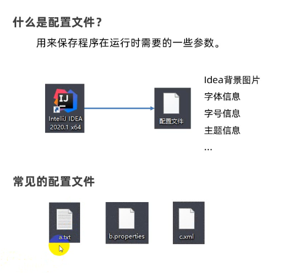

## 2、三种配置文件的优缺点

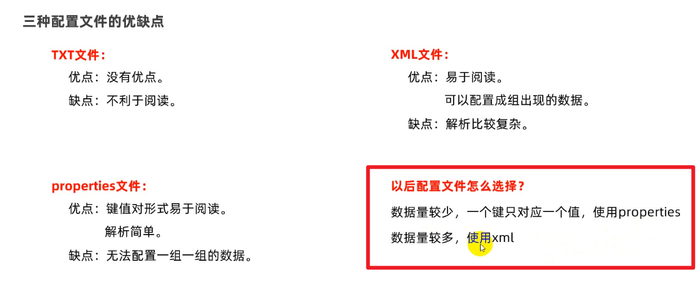

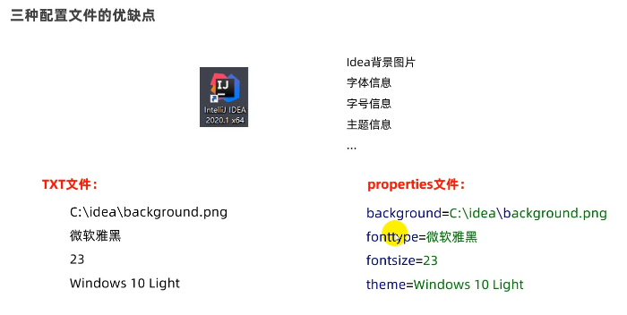

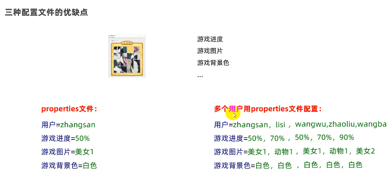

# 二、XML的概述

## 1、概述

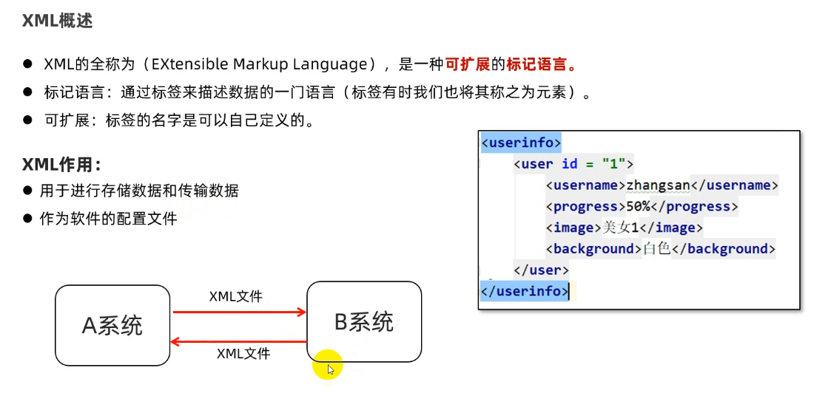

**xml概述**

- XML的全称为(EXtensible Markup Language)，是一种**可扩展的标记语言**
  - 标记语言: **通过标签来描述数据的一门语言**(标签有时我们也将其称之为元素)
  - 可扩展：**标签的名字是可以自定义的**,XML文件是由很多标签组成的,而标签名是可以自定义的


## 2、**作用**

+ **==用于进行存储数据和传输数据==**
+ 作为软件的==配置文件==


## 3、**作为配置文件的优势**

+ 可读性好
+ 可维护性高


## 4、小结

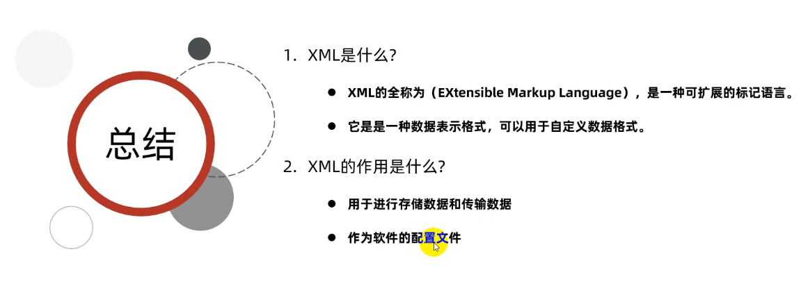

# 三、XML的创建和==规则==

## 1、XML文件的创建

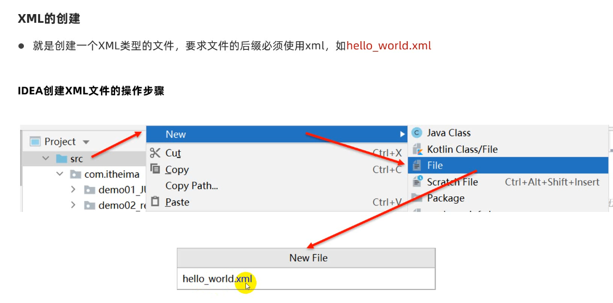


## 2、XML的==语法规则==

### （1）语法规则

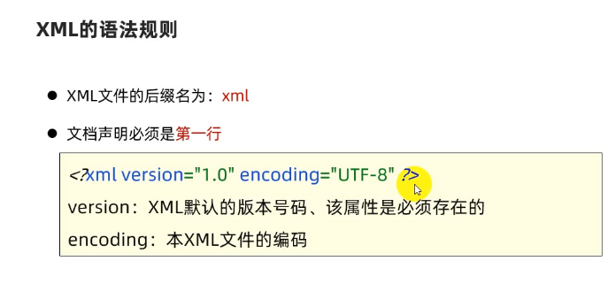

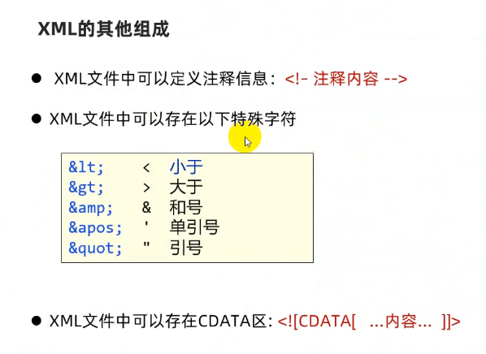

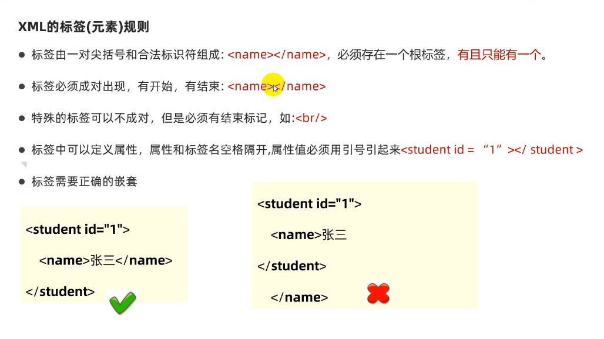


+ XML文件的后缀名为：xml

+ **文档声明必须是第一行第一列**`<?xml version="1.0" encoding="UTF-8" standalone="yes”?>`

  + version：该属性是必须存在的
  + encoding：该属性不是必须的
  + 打开当前xml文件的时候应该是使用什么字符编码表(一般取值都是UTF-8)
  + standalone: 该属性不是必须的，**描述XML文件是否依赖其他的xml文件**，取值为yes/no

+ 必须**存在一个根标签，有且只能有一个**

+ XML文件中可以**定义注释信息**

+ XML文件中可以存在以下**特殊字符**

  ```java
  &lt; < 小于
  &gt; > 大于
  &amp; & 和号
  &apos; ' 单引号
  &quot; " 引号
  ```

+ XML文件中可以**存在CDATA区**，里面的内容**当成文本处理**

  + `<![CDATA[ …内容… ]]>`


### （2）示例代码

```xml
<?xml version="1.0" encoding="UTF-8" ?>
<!--注释的内容-->
<!--本xml文件用来描述多个学生信息-->
`&lt;students&gt;`

    <!--第一个学生信息-->
    <student id="1">
        `&lt;name&gt;`张三</name>
        `&lt;age&gt;`23</age>
        `&lt;info&gt;`学生&lt; &gt;&gt;&gt;&gt;&gt;&gt;&gt;&gt;&gt;&gt;&gt;的信息</info>
        `&lt;message&gt;` <![CDATA[内容 <<<<<< >>>>>> ]]]></message>
    </student>

    <!--第二个学生信息-->
    <student id="2">
        `&lt;name&gt;`李四</name>
        `&lt;age&gt;`24</age>
    </student>

</students>
```


## 3、标签(元素)的规则


+ 标签由一对尖括号和合法标识符组成

  ```java
  `&lt;student&gt;`
  ```

+ 标签必须**成对出现**

  ```java
  `&lt;student&gt;` </student>
  前边的是开始标签，后边的是结束标签
  ```

+ 特殊的标签可以不成对,但是必须有结束标记

  ```java
  <address/>
  ```

+ 标签中可以定义属性,属性和标签名空格隔开,属性值必须用引号引起来

  ```java
  <student id="1"> </student>
  ```

+ 标签需要正确的嵌套

  ```java
  这是正确的: <student id="1"> `&lt;name&gt;`张三</name> </student>
  这是错误的: <student id="1">`&lt;name&gt;`张三</student></name>
  ```

- 必须**存在一个根标签，有且只能有一个**


## 4、小结

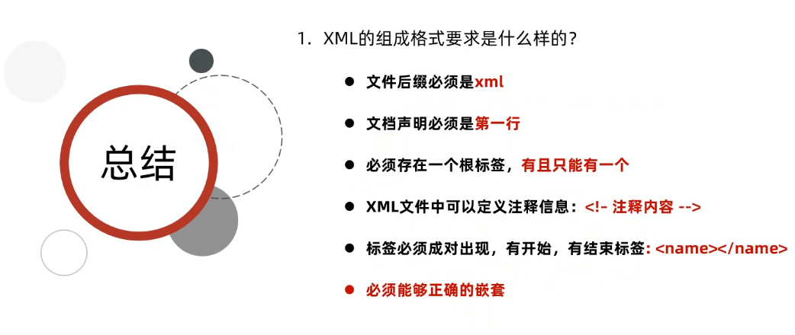


# 四、XML文档的==约束方式==

## 1、什么是文档约束

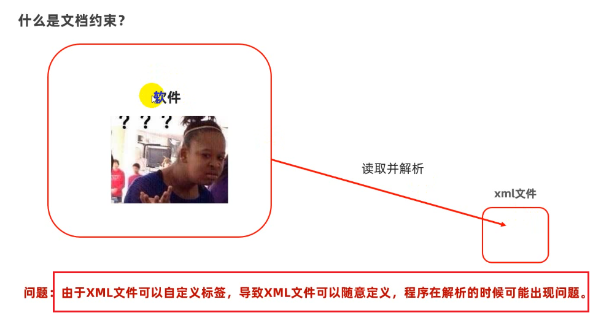

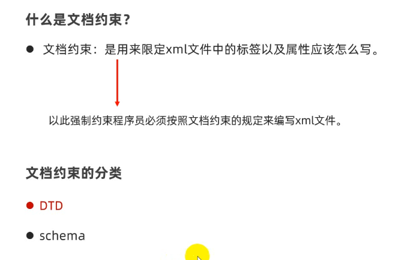


## 2、==DTO约束==

### （1）编写DTD约束

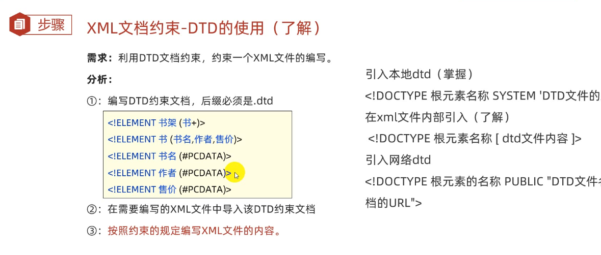

+ 编写DTD约束

  + 步骤

    1. 创建一个文件，这个文件的后缀名为.dtd

    2. 看xml文件中使用了哪些元素

       <!ELEMENT> 可以定义元素

    3. **判断元素是简单元素还是复杂元素**

       简单元素：没有子元素。
       复杂元素：有子元素的元素；

  + 代码实现

    ```java
    <!ELEMENT persons (person)>
    <!ELEMENT person (name,age)>
    <!ELEMENT name (#PCDATA)>
    <!ELEMENT age (#PCDATA)>
    ```


### （2）引入DTD约束

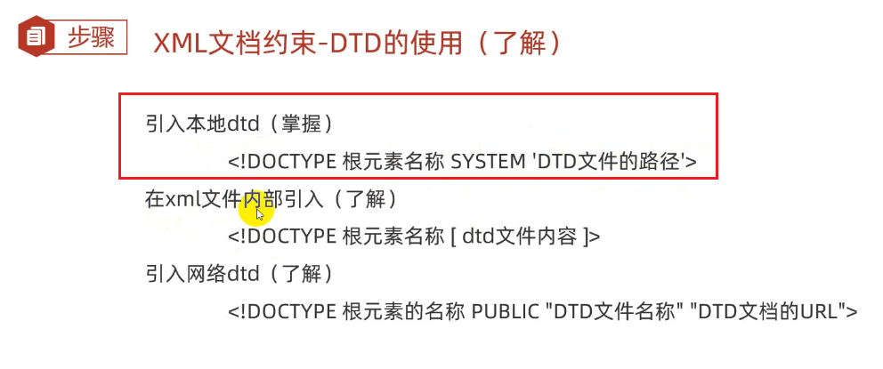

+ 引入DTD约束

  ​	引入DTD约束的三种方法

  + **引入本地dtd**

    `<!DOCTYPE 根元素名称 SYSTEM ‘DTD文件的路径'>`

  + 在xml文件内部引入

    `<!DOCTYPE 根元素名称 [ dtd文件内容 ]>`

  + 引入网络dtd

    `<!DOCTYPE 根元素的名称 PUBLIC "DTD文件名称" "DTD文档的URL">`

  + 代码实现

    + ==**引入本地DTD约束**==

      ```xml
      // 这是persondtd.dtd文件中的内容,已经提前写好
      <!ELEMENT persons (person)>
      <!ELEMENT person (name,age)>
      <!ELEMENT name (#PCDATA)>
      <!ELEMENT age (#PCDATA)>
      
      // 在person1.xml文件中引入persondtd.dtd约束
      <?xml version="1.0" encoding="UTF-8" ?>
      <!DOCTYPE persons SYSTEM 'persondtd.dtd'>
      
      `&lt;persons&gt;`
          `&lt;person&gt;`
              `&lt;name&gt;`张三</name>
              `&lt;age&gt;`23</age>
          </person>
      
      </persons>
      ```

    + **在xml文件内部引入**

      ```xml
      <?xml version="1.0" encoding="UTF-8" ?>
      <!DOCTYPE persons [
              <!ELEMENT persons (person)>
              <!ELEMENT person (name,age)>
              <!ELEMENT name (#PCDATA)>
              <!ELEMENT age (#PCDATA)>
              ]>
      
      `&lt;persons&gt;`
          `&lt;person&gt;`
              `&lt;name&gt;`张三</name>
              `&lt;age&gt;`23</age>
          </person>
      
      </persons>
      ```

    + 引入网络dtd

      ```xml
      <?xml version="1.0" encoding="UTF-8" ?>
      <!DOCTYPE persons PUBLIC "dtd文件的名称" "dtd文档的URL">
      
      `&lt;persons&gt;`
          `&lt;person&gt;`
              `&lt;name&gt;`张三</name>
              `&lt;age&gt;`23</age>
          </person>
      
      </persons>
      ```

### （3）DTD语法

#### ①**定义元素**

- **定义元素**
  - 定义一个元素的格式为：`<!ELEMENT 元素名 元素类型>`\
  - 简单元素：
    - **EMPTY: 表示标签体为空**
    - **ANY: 表示标签体可以为空也可以不为空**
    - **PCDATA: 表示该元素的==内容部分为字符串==**
  - 复杂元素：
    - 直接写子元素名称. 多个子元素可以使用","或者"|"隔开；
    - ","表示定义子元素的顺序 ; "|": 表示子元素只能出现任意一个
    - "?"零次或一次, "+"一次或多次, "*"零次或多次;如果不写则表示出现一次

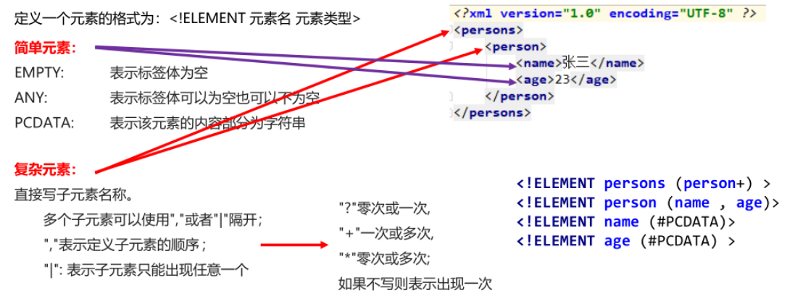

#### ②**定义属性**

  + 格式

  + 定义一个属性的格式为：`<!ATTLIST 元素名称 属性名称 属性的类型 属性的约束>`

    + 属性的类型：
      + CDATA类型：普通的字符串

    + 属性的约束:
      +  #REQUIRED： 必须的

      +  #IMPLIED： 属性不是必需的

      +  #FIXED value：属性值是固定的

  + 代码实现

    ```java
    <!ELEMENT persons (person+)>
    <!ELEMENT person (name,age)>
    <!ELEMENT name (#PCDATA)>
    <!ELEMENT age (#PCDATA)>
    <!ATTLIST person id CDATA #REQUIRED>
    
    <?xml version="1.0" encoding="UTF-8" ?>
    <!DOCTYPE persons SYSTEM 'persondtd.dtd'>
    
    `&lt;persons&gt;`
        <person id="001">
            `&lt;name&gt;`张三</name>
            `&lt;age&gt;`23</age>
        </person>
    
        <person id = "002">
            `&lt;name&gt;`张三</name>
            `&lt;age&gt;`23</age>
        </person>
    
    </persons>
    ```


### （4）小结

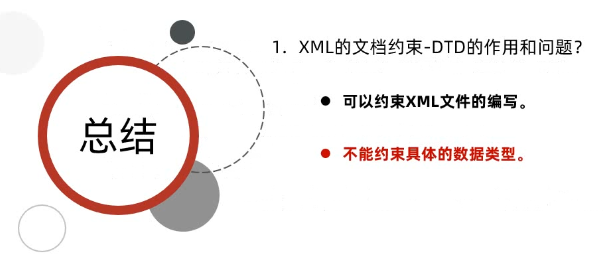


## 3、==schema约束==

### （1）概念

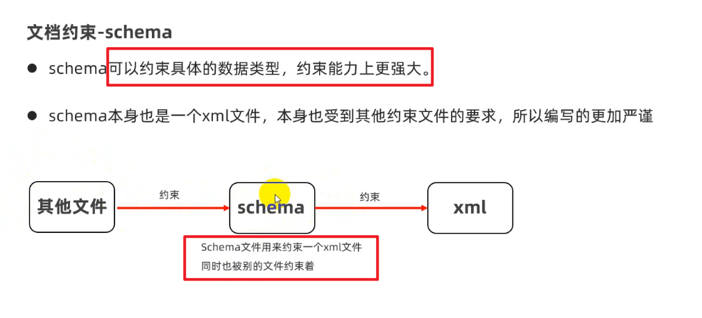


### （2）schema和dtd的区别

1. schema约束文件也是一个xml文件，符合xml的语法，这个文件的**后缀名.xsd**
2. 一个xml中**可以引用多个schema约束文件**，**多个schema使用名称空间区分（**名称空间类似于java包名）
3. dtd里面元素类型的取值比较**单一常见的是PCDATA类型**，但是在schema里面可以支持很多个数据类型
4. schema 语法更加的复杂


### （3）schema的==使用==

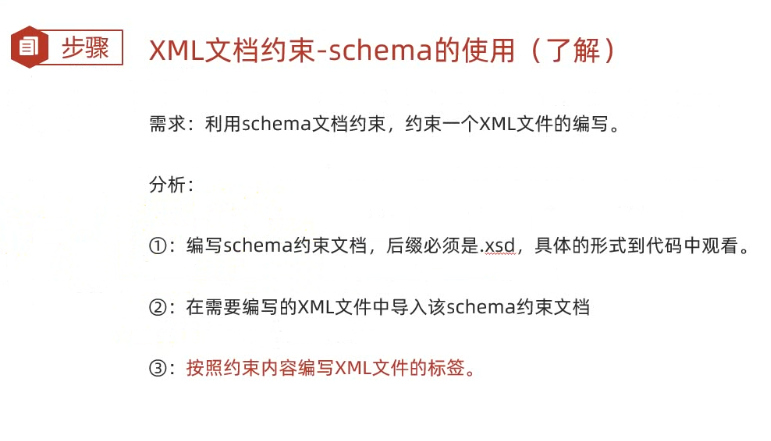

#### ①编写schema约束

- **步骤**
  - 创建一个文件，这个**文件的后缀名为.xsd。**
  - 定义文档声明
  - schema文件的根标签为： `&lt;schema&gt;`
  - 在`&lt;schema&gt;`中定义属性：	`xmlns=http://www.w3.org/2001/XMLSchema`
  - 在`&lt;schema&gt;`中定义属性 ：**targetNamespace** =唯一的url地址，指定当前这个schema文件的**名称空间**。
  - 在`&lt;schema&gt;`中定义属性 ：**elementFormDefault**="qualified“，表示当前schema文件是一个质量良好的文件。
  - 通过element定义元素
  - **判断当前元素是简单元素还是复杂元素**
    - ``&lt;complexType&gt;``

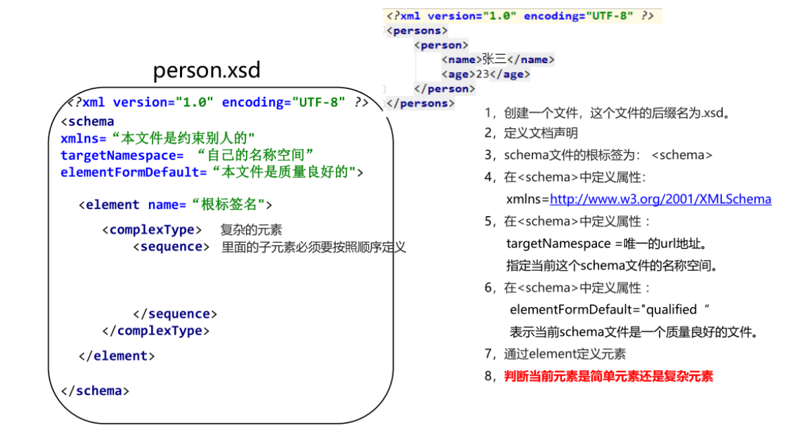

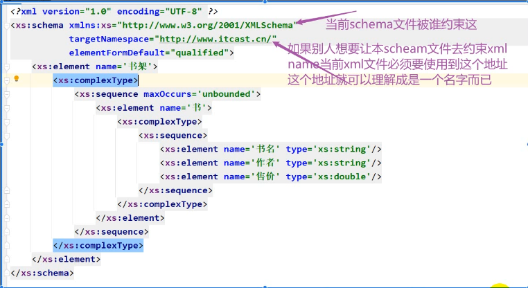

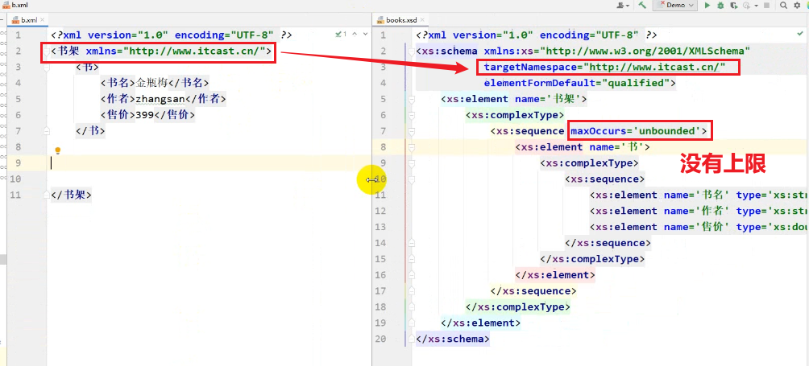

+ **代码实现**

  ```xml
  <?xml version="1.0" encoding="UTF-8" ?>
  <schema
      xmlns="http://www.w3.org/2001/XMLSchema"
      targetNamespace="http://www.itheima.cn/javase"
      elementFormDefault="qualified"
  >
  
      <!--定义persons复杂元素-->
      <element name="persons">
          `&lt;complexType&gt;`
              `&lt;sequence&gt;`
                  <!--定义person复杂元素-->
                  <element name = "person">
                      `&lt;complexType&gt;`
                          `&lt;sequence&gt;`
                              <!--定义name和age简单元素-->
                              <element name = "name" type = "string"></element>
                              <element name = "age" type = "string"></element>
                          </sequence>
                          
                      </complexType>
                  </element>
              </sequence>
          </complexType>
  
      </element>
  </schema>
  
  ```


#### ②==引入==schema约束

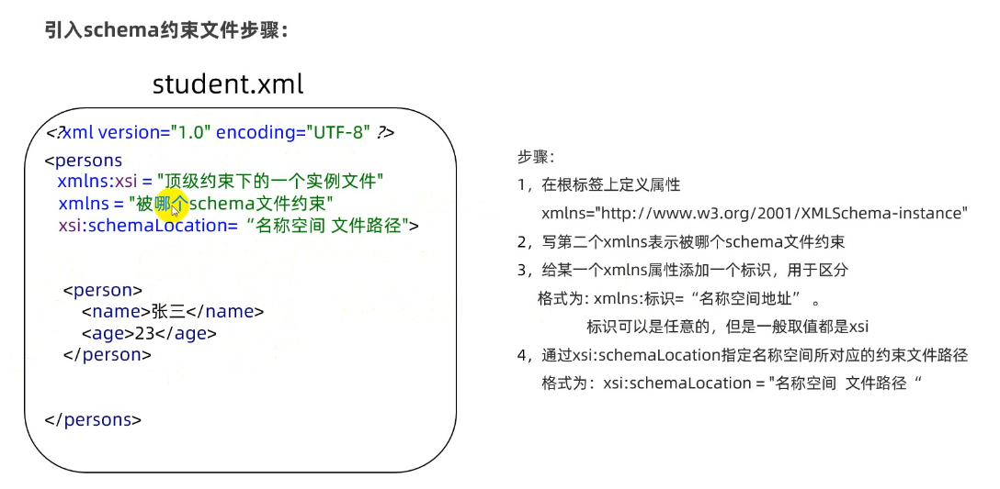

- 步骤

  - 在根标签上定义属性xmlns="http://www.w3.org/2001/XMLSchema-instance"
  - **通过xmlns引入约束文件的名称空间**
  - 给某一个xmlns属性添加一个标识，用于区分不同的名称空间
    - 格式为: xmlns:标识=“名称空间地址” ,标识可以是任意的，但是一般取值都是xsi
  - 通过**xsi:schemaLocation**指定名称空间所对应的**约束文件路径**
    - 格式为：xsi:schemaLocation = "名称空间url 文件路径“


+ 代码实现

```xml
<?xml version="1.0" encoding="UTF-8" ?>

<persons
    xmlns:xsi="http://www.w3.org/2001/XMLSchema-instance"
    xmlns="http://www.itheima.cn/javase"
    xsi:schemaLocation="http://www.itheima.cn/javase person.xsd"
>
    `&lt;person&gt;`
        `&lt;name&gt;`张三</name>
        `&lt;age&gt;`23</age>
    </person>

</persons>
```


#### ③schema约束定义属性

+ 代码示例

  ```xml
  <?xml version="1.0" encoding="UTF-8" ?>
  <schema
      xmlns="http://www.w3.org/2001/XMLSchema"
      targetNamespace="http://www.itheima.cn/javase"
      elementFormDefault="qualified"
  >
  
      <!--定义persons复杂元素-->
      <element name="persons">
          `&lt;complexType&gt;`
              `&lt;sequence&gt;`
                  <!--定义person复杂元素-->
                  <element name = "person">
                      `&lt;complexType&gt;`
                          `&lt;sequence&gt;`
                              <!--定义name和age简单元素-->
                              <element name = "name" type = "string"></element>
                              <element name = "age" type = "string"></element>
                          </sequence>
                          
                          <!--定义属性，required( 必须的)/optional( 可选的)-->
                          <attribute name="id" type="string" use="required"></attribute>
                      </complexType>
                      
                  </element>
              </sequence>
          </complexType>
      </element>
      
  </schema>
  
  <?xml version="1.0" encoding="UTF-8" ?>
  <persons
      xmlns:xsi="http://www.w3.org/2001/XMLSchema-instance"
      xmlns="http://www.itheima.cn/javase"
      xsi:schemaLocation="http://www.itheima.cn/javase person.xsd"
  >
      <person id="001">
          `&lt;name&gt;`张三</name>
          `&lt;age&gt;`23</age>
      </person>
  
  </persons>
  ```

  


# 五、XML==解析技术==

## 1、XML解析技术概述


### （1）概述

**概述**： **xml解析就是从xml中获取到数据**

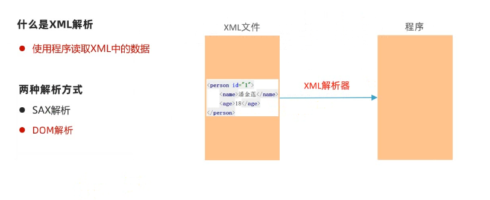

### （2）SAX和DOM的优缺点

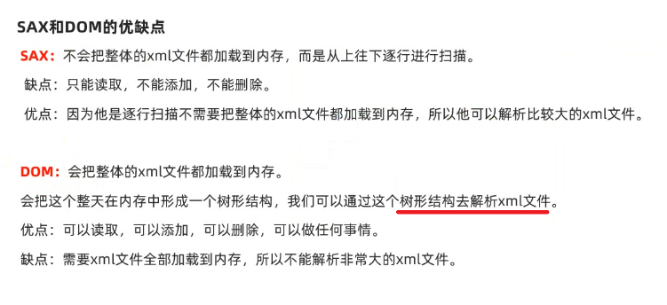

### （3）Dom常见的解析工具-==Dom4j==

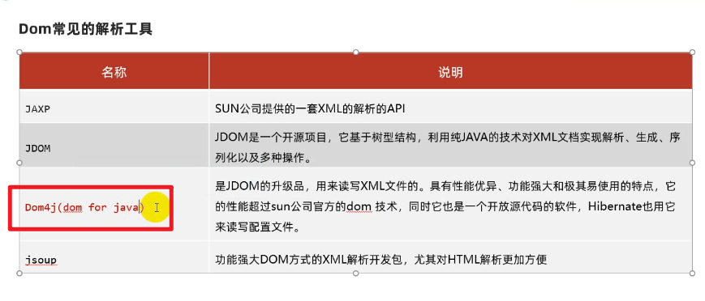

常见的解析工具

+ JAXP: SUN公司提供的一套XML的解析的API
+ JDOM: 开源组织提供了一套XML的解析的API-jdom
+ **DOM4J: 开源组织提供了一套XML的解析的API-dom4j,全称：Dom For Java**
+ pull: 主要应用在Android手机端解析XML


## 2、DOM解析文档对象模型

- **DOM(Document Object Model)文档对象模型**:
  - 就是把文档的各个组成部分看做成**对应的对象**。
  - 会**把xml文件==全部==加载到内存,在内存中形成一个==树形结构==**,再获取对应的值

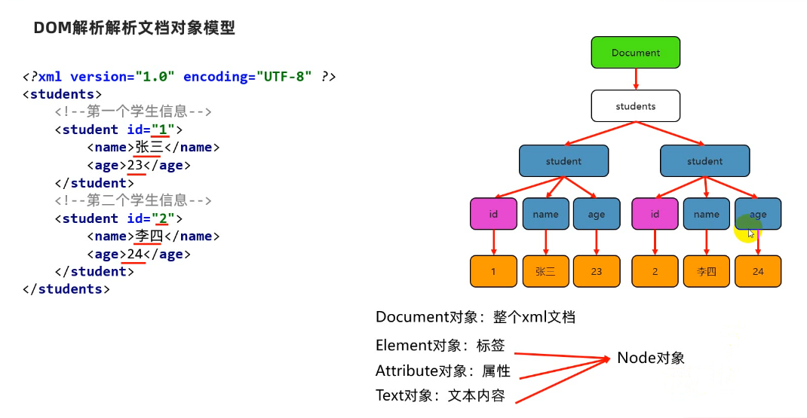

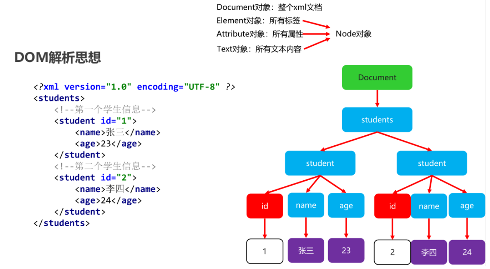


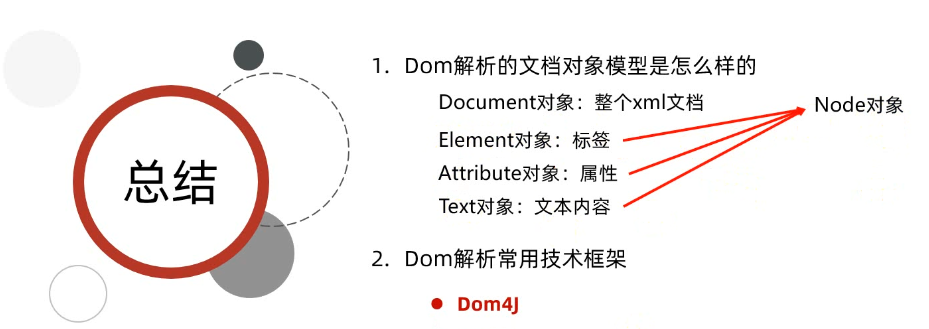


## 3、Dom4j解析XML文件

### （1）解析的准备工作

1. 我们可以通过网站：https://dom4j.github.io/ 去下载dom4j

   今天的资料中已经提供,我们不用再单独下载了,直接使用即可

2. 将提供好的dom4j-1.6.1.zip解压,找到里面的dom4j-1.6.1.jar

3. 在idea中当前模块下新建一个libs文件夹,将jar包复制到文件夹中

4. 选中jar包 -> 右键 -> 选择add as library即可


### （2）Dom4j解析XML

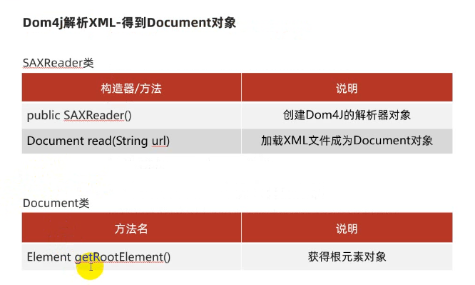

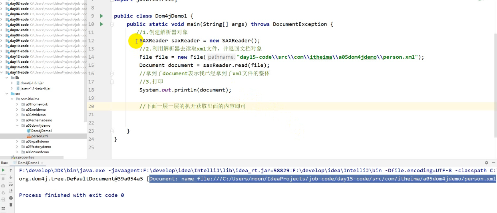


### （3）解析XML文件中的各种节点

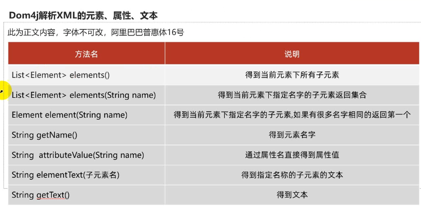


### （4）示例代码

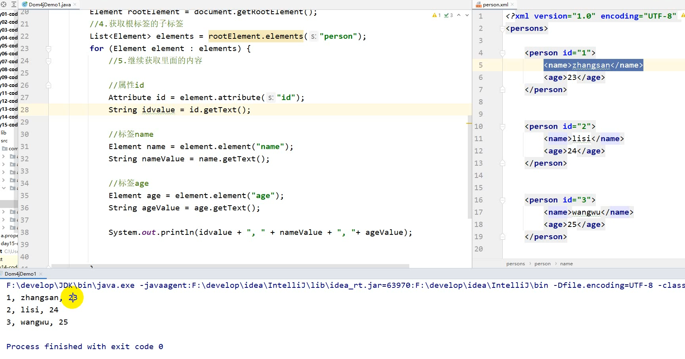


## 3、Dom4j解析XML文件-案例

+ 需求

  + 解析提供好的xml文件
  + 将解析到的数据封装到学生对象中
  + 并将学生对象存储到ArrayList集合中
  + 遍历集合

+ 代码实现

  ```java
  <?xml version="1.0" encoding="UTF-8" ?>
  <!--注释的内容-->
  <!--本xml文件用来描述多个学生信息-->
  `&lt;students&gt;`
  
      <!--第一个学生信息-->
      <student id="1">
          `&lt;name&gt;`张三</name>
          `&lt;age&gt;`23</age>
      </student>
  
      <!--第二个学生信息-->
      <student id="2">
          `&lt;name&gt;`李四</name>
          `&lt;age&gt;`24</age>
      </student>
  
  </students>
  
  // 上边是已经准备好的student.xml文件
  public class Student {
      private String id;
      private String name;
      private int age;
  
      public Student() {
      }
  
      public Student(String id, String name, int age) {
          this.id = id;
          this.name = name;
          this.age = age;
      }
  
      public String getId() {
          return id;
      }
  
      public void setId(String id) {
          this.id = id;
      }
  
      public String getName() {
          return name;
      }
  
      public void setName(String name) {
          this.name = name;
      }
  
      public int getAge() {
          return age;
      }
  
      public void setAge(int age) {
          this.age = age;
      }
  
      @Override
      public String toString() {
          return "Student{" +
                  "id='" + id + '\'' +
                  ", name='" + name + '\'' +
                  ", age=" + age +
                  '}';
      }
  }
  
  /**
   * 利用dom4j解析xml文件
   */
  public class XmlParse {
      public static void main(String[] args) throws DocumentException {
          //1.获取一个解析器对象
          SAXReader saxReader = new SAXReader();
          //2.利用解析器把xml文件加载到内存中,并返回一个文档对象
          Document document = saxReader.read(new File("myxml\\xml\\student.xml"));
          //3.获取到根标签
          Element rootElement = document.getRootElement();
          //4.通过根标签来获取student标签
          //elements():可以获取调用者所有的子标签.会把这些子标签放到一个集合中返回.
          //elements("标签名"):可以获取调用者所有的指定的子标签,会把这些子标签放到一个集合中并返回
          //List list = rootElement.elements();
          List`&lt;Element&gt;` studentElements = rootElement.elements("student");
          //System.out.println(list.size());
  
          //用来装学生对象
          ArrayList`&lt;Student&gt;` list = new ArrayList<>();
  
          //5.遍历集合,得到每一个student标签
          for (Element element : studentElements) {
              //element依次表示每一个student标签
    
              //获取id这个属性
              Attribute attribute = element.attribute("id");
              //获取id的属性值
              String id = attribute.getValue();
  
              //获取name标签
              //element("标签名"):获取调用者指定的子标签
              Element nameElement = element.element("name");
              //获取这个标签的标签体内容
              String name = nameElement.getText();
  
              //获取age标签
              Element ageElement = element.element("age");
              //获取age标签的标签体内容
              String age = ageElement.getText();
  
  //            System.out.println(id);
  //            System.out.println(name);
  //            System.out.println(age);
  
              Student s = new Student(id,name,Integer.parseInt(age));
              list.add(s);
          }
          //遍历操作
          for (Student student : list) {
              System.out.println(student);
          }
      }
  }
  ```


# 六、XML==检索==技术-==Xpath==

## 1、Xpath的介绍


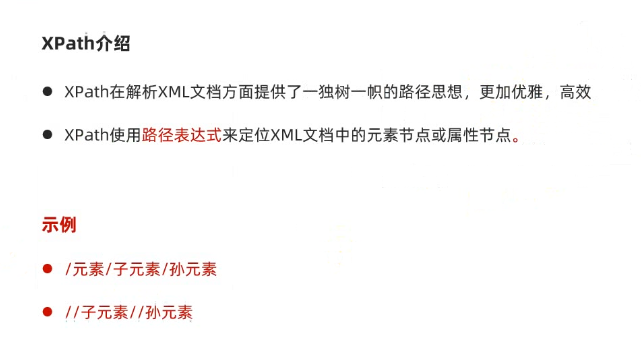


## 2、使用Xpath检索出XML文件

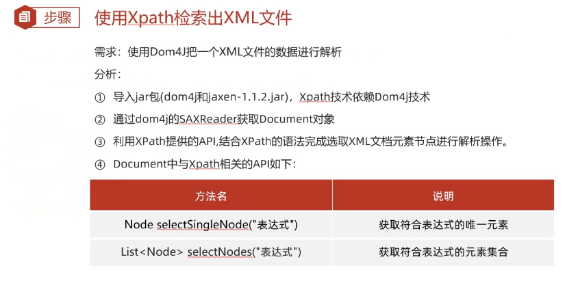


## 3、Xpath的四大==检索方案==

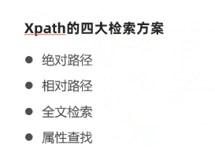

 

### （1）绝对路径

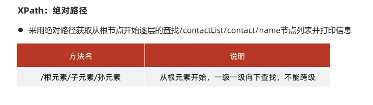

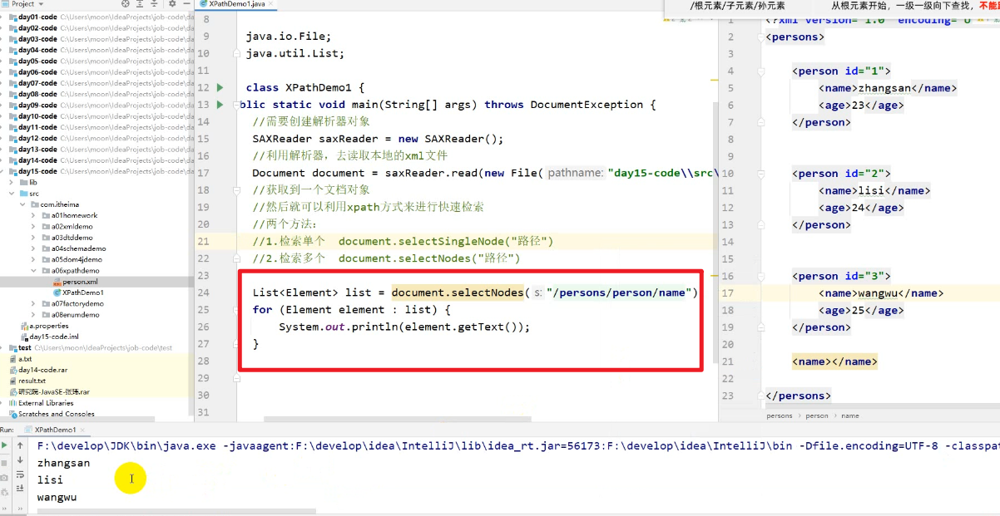


### （2）相对路径

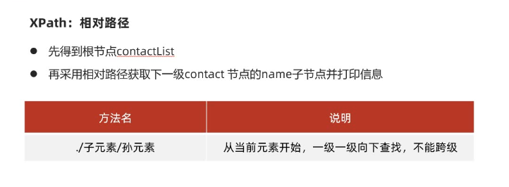

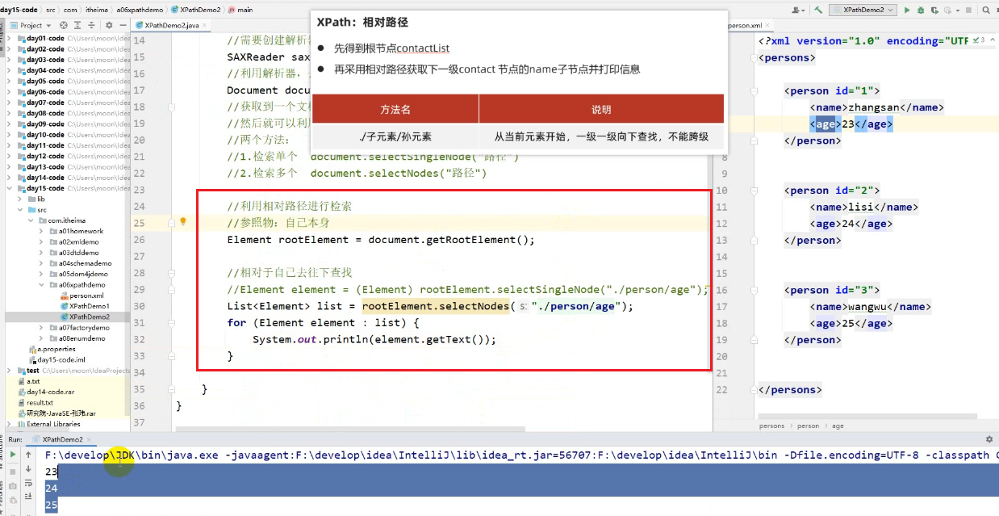


### （3）全文检索

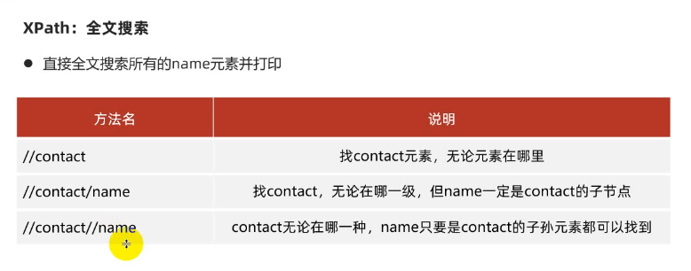

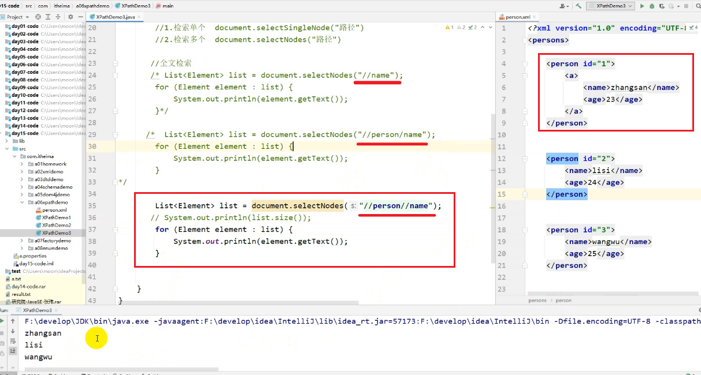

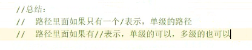


### （4）属性查找

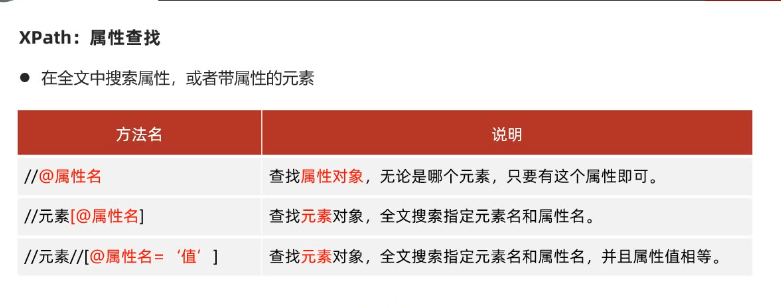

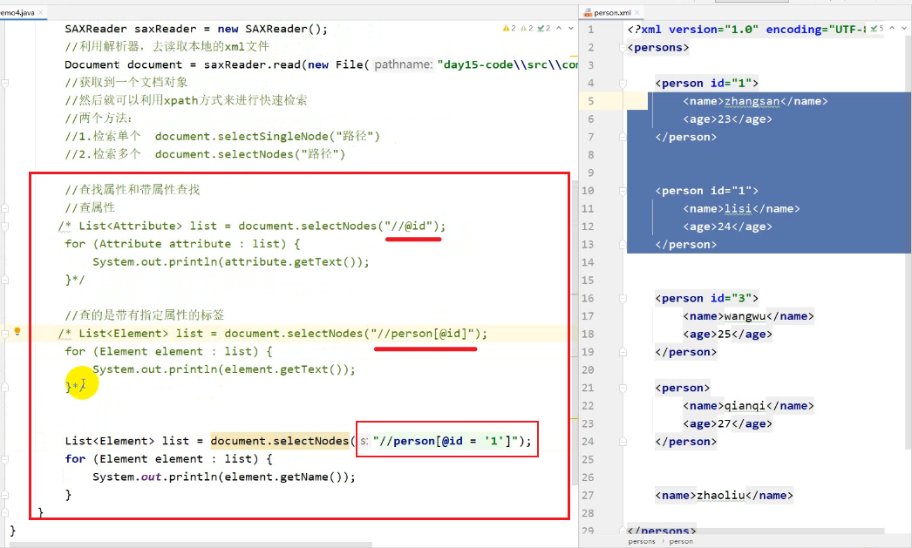


## 4、小结

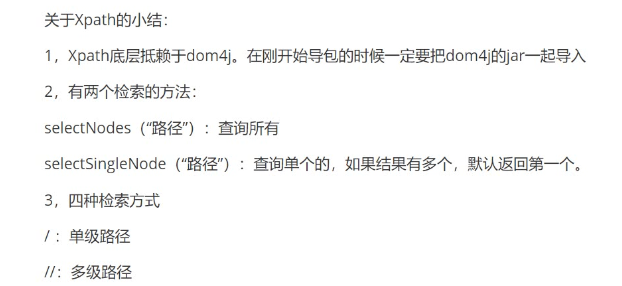

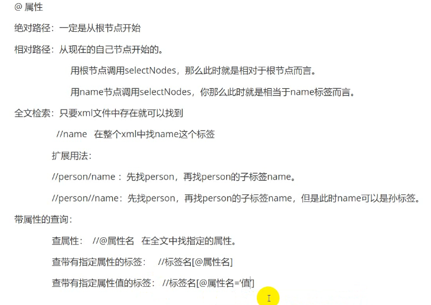


