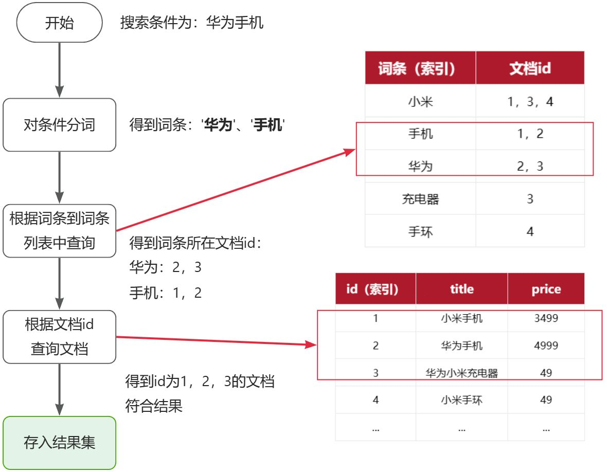
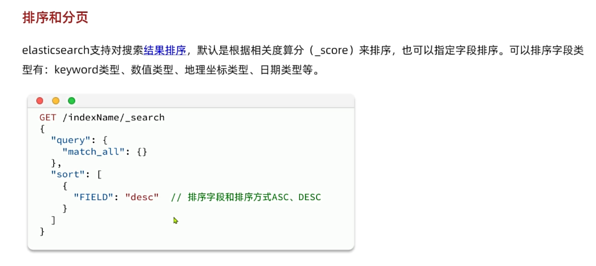

黑马商城作为一个电商项目，商品的搜索肯定是访问频率最高的页面之一。目前搜索功能是基于数据库的模糊搜索来实现的，存在很多问题。

**首先**，查询效率较低。

由于数据库模糊查询不走索引，在数据量较大的时候，查询性能很差。黑马商城的商品表中仅仅有不到9万条数据，基于数据库查询时，搜索接口的表现如图：


改为基于搜索引擎后，查询表现如下：


需要注意的是，数据库模糊查询随着表数据量的增多，查询性能的下降会非常明显，而搜索引擎的性能则不会随着数据增多而下降太多。目前仅10万不到的数据量差距就如此明显，如果数据量达到百万、千万、甚至上亿级别，这个性能差距会非常夸张。

**其次**，功能单一

数据库的模糊搜索功能单一，匹配条件非常苛刻，必须恰好包含用户搜索的关键字。而在搜索引擎中，用户输入出现个别错字，或者用拼音搜索、同义词搜索都能正确匹配到数据。

综上，在面临海量数据的搜索，或者有一些复杂搜索需求的时候，推荐使用专门的搜索引擎来实现搜索功能。

目前全球的搜索引擎技术排名如下：


排名第一的就是我们今天要学习的elasticsearch.

elasticsearch是一款非常强大的开源搜索引擎，支持的功能非常多，例如：


**代码搜索**

**商品搜索**


**解决方案搜索**

**地图搜索**

通过今天的学习大家要达成下列学习目标：

- 理解**倒排索引原理**
- 会使用**IK分词器**
- 理解**索引库Mapping映射的属性含义**
- 能创建索引库及映射
- 能实现文档的CRUD


# 一、初识elasticsearch


Elasticsearch的官方网站如下：

https://www.elastic.co/cn/elasticsearch/

本章我们一起来初步了解一下Elasticsearch的基本原理和一些基础概念。

## 1、认识和==安装==


Elasticsearch是由elastic公司开发的一套搜索引擎技术，它是elastic技术栈中的一部分。完整的技术栈包括：

- **Elasticsearch：用于数据存储、计算和搜索**
- Logstash/Beats：用于数据收集
- Kibana：用于数据可视化

整套技术栈被称为**ELK**，经常用来做日志收集、系统监控和状态分析等等：


整套技术栈的核心就是用来**存储**、**搜索**、**计算**的Elasticsearch，因此我们接下来学习的核心也是Elasticsearch。

我们要安装的内容包含2部分：

- **elasticsearch：存储、搜索和运算**
- **kibana：图形化展示**

首先Elasticsearch不用多说，是提供核心的数据存储、搜索、分析功能的。

然后是Kibana，Elasticsearch**对外提供的是==Restful风格的API==，任何操作都可以通过发送http请求来完成**。不过http请求的方式、路径、还有请求参数的格式都有严格的规范。这些规范我们肯定记不住，因此我们要借助于Kibana这个服务。

Kibana是elastic公司提供的用于操作Elasticsearch的可视化控制台。它的功能非常强大，包括：

- 对Elasticsearch数据的**搜索、展示**
- 对Elasticsearch数据的**统计、聚合，并形成图形化报表、图形**
- 对Elasticsearch的**集群状态监控**
- 它还提供了一个**开发控制台（DevTools）**，在其中对Elasticsearch的**Restful的API接口**提供了**语法提示**

### （1）==安装elasticsearch==

通过下面的Docker命令即可安装单机版本的elasticsearch：

```Bash
docker run -d \
  --name es \
  -e "ES_JAVA_OPTS=-Xms512m -Xmx512m" \
  -e "discovery.type=single-node" \
  -v es-data:/usr/share/elasticsearch/data \
  -v es-plugins:/usr/share/elasticsearch/plugins \
  --privileged \
  --network hmall \
  -p 9200:9200 \
  -p 9300:9300 \
  elasticsearch:7.12.1
```

注意，这里我们采用的是elasticsearch的7.12.1版本，由于8以上版本的JavaAPI变化很大，在企业中应用并不广泛，企业中应用较多的还是8以下的版本。

如果拉取镜像困难，可以直接导入课前资料提供的镜像tar包：


安装完成后，访问9200端口，即可看到响应的Elasticsearch服务的基本信息：


### （2）==安装Kibana==

通过下面的Docker命令，即可部署Kibana：

```Bash
docker run -d \
--name kibana \
-e ELASTICSEARCH_HOSTS=http://es:9200 \
--network=hmall \
-p 5601:5601  \
kibana:7.12.1
```

如果拉取镜像困难，可以直接导入课前资料提供的镜像tar包：


安装完成后，直接访问5601端口，即可看到控制台页面：


选择`Explore on my own`之后，进入主页面：


然后选中`Dev tools`，进入开发工具页面：


## 2、==倒排索引==

elasticsearch之所以有如此高性能的搜索表现，正是得益于底层的**倒排索引技术**。那么什么是倒排索引呢？

**倒排**索引的概念是基于MySQL这样的**正向**索引而言的。

### （1）正向索引

我们先来回顾一下正向索引。

例如有一张名为`tb_goods`的表：

| **id** | **title**      | **price** |
| :----- | :------------- | :-------- |
| 1      | 小米手机       | 3499      |
| 2      | 华为手机       | 4999      |
| 3      | 华为小米充电器 | 49        |
| 4      | 小米手环       | 49        |
| ...    | ...            | ...       |

其中的`id`字段已经创建了索引，由于索引底层采用了B+树结构，因此我们根据id搜索的速度会非常快。但是其他字段例如`title`，只在叶子节点上存在。

因此要根据`title`搜索的时候**只能遍历树中的每一个叶子节点**，判断title数据是否符合要求。

比如用户的SQL语句为：

```SQL
select * from tb_goods where title like '%手机%';
```

那搜索的大概流程如图：


说明：

- 1）检查到搜索条件为`like '%手机%'`，需要找到`title`中包含`手机`的数据
- 2）逐条遍历每行数据（每个叶子节点），比如第1次拿到`id`为1的数据
- 3）判断数据中的`title`字段值是否符合条件
- 4）如果符合则放入结果集，不符合则丢弃
- 5）回到步骤1

综上，根据id精确匹配时，可以走索引，查询效率较高。**而当搜索条件为模糊匹配时，由于索引无法生效，导致从索引查询退化为全表扫描，效率很差。**

因此，**==正向索引适合于根据索引字段的精确搜索，不适合基于部分词条的模糊匹配。==**

而**倒排索引恰好解决的就是==根据部分词条模糊匹配==的问题**。


### （2）==倒排索引==


倒排索引中有两个非常重要的概念：

- 文档（`Document`）：用来搜索的数据，**其中的每一条数据就是一个文档。**例如一个网页、一个商品信息
- 词条（`Term`）：对文档数据或用户搜索数据，利用某种算法分词，**得到的具备含义的词语就是词条**。例如：我是中国人，就可以分为：我、是、中国人、中国、国人这样的几个词条

**创建倒排索引**是对正向索引的一种特殊处理和应用，流程如下：

- 将每一个文档的数据利用**分词算法**根据语义拆分，得到一个个词条
- 创建表，每行数据包括词条、词条所在文档id、位置等信息
- **==因为词条唯一性，可以给词条创建正向索引==**

此时形成的这张以词条为索引的表，就是倒排索引表，两者对比如下：

**正向索引**

| **id（索引）** | **title**      | **price** |
| :------------- | :------------- | :-------- |
| 1              | 小米手机       | 3499      |
| 2              | 华为手机       | 4999      |
| 3              | 华为小米充电器 | 49        |
| 4              | 小米手环       | 49        |
| ...            | ...            | ...       |

==**倒排索引**==

| **词条（索引）** | **文档id** |
| :--------------- | :--------- |
| 小米             | 1，3，4    |
| 手机             | 1，2       |
| 华为             | 2，3       |
| 充电器           | 3          |
| 手环             | 4          |

 倒排索引的**搜索流程**如下（以搜索"华为手机"为例），如图：



流程描述：

1）用户输入条件`"华为手机"`进行搜索。

2）对用户输入条件**分词**，得到词条：`华为`、`手机`。

3）拿着词条在倒排索引中查找（**==由于词条有索引，查询效率很高==**），即可得到包含词条的文档id：`1、2、3`。

4）拿着文档`id`到正向索引中查找具体文档即可（由于`id`也有索引，查询效率也很高）。

虽然要先查询倒排索引，再查询倒排索引，但是无论是词条、还是文档id都建立了索引，查询速度非常快！无需全表扫描。


### （3）==*正向和倒排*==

那么为什么一个叫做正向索引，一个叫做倒排索引呢？

-  **正向索引**是最传统的，根据id索引的方式。但根据词条查询时，必须先逐条获取每个文档，然后判断文档中是否包含所需要的词条，是**==根据文档找词条的过程==**。 
-  而**倒排索引**则相反，是先找到用户要搜索的词条，根据词条得到保护词条的文档的id，然后根据id获取文档。是**==根据词条找文档的过程==**。 

是不是恰好反过来了？

那么两者方式的优缺点是什么呢？

**正向索引**：

- **优点**： 
  - 可以给多个字段创建索引
  - 根据索引字段搜索、排序速度非常快
- **缺点**： 
  - 根据非索引字段，或者索引字段中的部分词条查找时，只能全表扫描。

**倒排索引**：

- **优点**： 
  - 根据词条搜索、模糊搜索时，速度非常快
- **缺点**： 
  - 只能给词条创建索引，而不是字段
  - 无法根据字段做排序


### （4）小结


## 3、==基础概念==

elasticsearch中有很多独有的概念，与mysql中略有差别，但也有相似之处。

### （1）==*文档和字段*==

elasticsearch是面向**文档（Document）**存储的，可以是数据库中的一条商品数据，一个订单信息。**文档数据会==被序列化为`json`格式==后存储**在`elasticsearch`中：


```JSON
{
    "id": 1,
    "title": "小米手机",
    "price": 3499
}
{
    "id": 2,
    "title": "华为手机",
    "price": 4999
}
{
    "id": 3,
    "title": "华为小米充电器",
    "price": 49
}
{
    "id": 4,
    "title": "小米手环",
    "price": 299
}
```

因此，原本数据库中的**一==行==数据就是ES中的==一个JSON文档==**；而数据库中每行数据都包含**很多==列==**，这些列就转换为**JSON文档中的==字段==（Field）**。


### （2）==索引和映射==

随着业务发展，需要在es中存储的文档也会越来越多，比如有商品的文档、用户的文档、订单文档等等：


**所有文档都散乱存放显然非常混乱**，也不方便管理。

因此，我们==**要将类型相同的文档集中在一起管理**，称为**索引（Index）**==。例如：


**商品索引**

```JSON
{
    "id": 1,
    "title": "小米手机",
    "price": 3499
}

{
    "id": 2,
    "title": "华为手机",
    "price": 4999
}

{
    "id": 3,
    "title": "三星手机",
    "price": 3999
}
```

**用户索引**

```JSON
{
    "id": 101,
    "name": "张三",
    "age": 21
}

{
    "id": 102,
    "name": "李四",
    "age": 24
}

{
    "id": 103,
    "name": "麻子",
    "age": 18
}
```

**订单索引**

```JSON
{
    "id": 10,
    "userId": 101,
    "goodsId": 1,
    "totalFee": 294
}

{
    "id": 11,
    "userId": 102,
    "goodsId": 2,
    "totalFee": 328
}
```

- 所有用户文档，就可以组织在一起，称为用户的索引；
- 所有商品的文档，可以组织在一起，称为商品的索引；
- 所有订单的文档，可以组织在一起，称为订单的索引；

因此，我们可以把**索引当做是数据库中的表**。

数据库的表会有约束信息，用来定义表的结构、字段的名称、类型等信息。因此，索引库中就有**==映射（mapping）==**，**是索引中文档的==字段约束信息==，类似表的结构约束。**


### （3）mysql与elasticsearch的==对比==

我们统一的把mysql与elasticsearch的概念做一下对比：

| **MySQL** | **Elasticsearch** | **说明**                                                     |
| :-------- | :---------------- | :----------------------------------------------------------- |
| Table     | Index             | 索引(index)，就是**文档的集合**，类似数据库的表(table)       |
| Row       | Document          | 文档（Document），就是一条条的数据，类似数据库中的行（Row），文档都是JSON格式 |
| Column    | Field             | 字段（Field），就是JSON文档中的字段，类似数据库中的列（Column） |
| Schema    | Mapping           | Mapping（映射）是索引中文档的约束，例如**字段类型约束**。类似数据库的表结构（Schema） |
| SQL       | ==**DSL**==       | **DSL是elasticsearch提供的JSON风格的请求语句，用来操作elasticsearch，实现CRUD** |

如图：


那是不是说，我们学习了elasticsearch就不再需要mysql了呢？

并不是如此，两者各自有自己的擅长之处：

-  Mysql：**擅长事务类型操作，可以确保数据的安全和一致性** 
-  Elasticsearch：**擅长海量数据的搜索、分析、计算** 

因此在企业中，往往是两者结合使用：

- **对==安全性要求较高的写操作==，使用mysql实现**
- **对查询性能要求较高的搜索需求，使用elasticsearch实现**
- 两者再基于某种方式，实现数据的同步，保证一致性


## 4、==IK分词器==-中文分词算法

Elasticsearch的关键就是倒排索引，而倒排索引依赖于对文档内容的分词，而分词则需要**高效、精准的分词算法**，IK分词器就是这样一个**中文分词算法**。

### （1）安装IK分词器


**方案一**：在线安装

运行一个命令即可：

```Shell
docker exec -it es ./bin/elasticsearch-plugin  install https://github.com/medcl/elasticsearch-analysis-ik/releases/download/v7.12.1/elasticsearch-analysis-ik-7.12.1.zip
```

然后重启es容器：

```Shell
docker restart es
```

**方案二**：**==离线安装==**

如果网速较差，也可以选择离线安装。

首先，查看之前安装的Elasticsearch容器的plugins数据卷目录：

```Shell
docker volume inspect es-plugins
```

结果如下：

```JSON
[
    {
        "CreatedAt": "2024-11-06T10:06:34+08:00",
        "Driver": "local",
        "Labels": null,
        "Mountpoint": "/var/lib/docker/volumes/es-plugins/_data",
        "Name": "es-plugins",
        "Options": null,
        "Scope": "local"
    }
]
```

可以看到elasticsearch的插件挂载到了`/var/lib/docker/volumes/es-plugins/_data`这个目录。我们需要把IK分词器上传至这个目录。

找到课前资料提供的ik分词器插件，课前资料提供了`7.12.1`版本的ik分词器压缩文件，你需要对其解压：


然后上传至虚拟机的`/var/lib/docker/volumes/es-plugins/_data`这个目录：


最后，重启es容器：

```Shell
docker restart es
```


### （2）==使用IK分词器==

IK分词器包含两种模式：

-  **`ik_smart`：智能语义切分** 
-  **`ik_max_word`：==最细粒度切分==** 

我们在Kibana的DevTools上来**测试分词器**，首先测试Elasticsearch官方提供的标准分词器：


```JSON
POST /_analyze
{
  "analyzer": "standard",
  "text": "黑马程序员学习java太棒了"
}
```

结果如下：

```JSON
{
  "tokens" : [
    {
      "token" : "黑",
      "start_offset" : 0,
      "end_offset" : 1,
      "type" : "<IDEOGRAPHIC>",
      "position" : 0
    },
    {
      "token" : "马",
      "start_offset" : 1,
      "end_offset" : 2,
      "type" : "<IDEOGRAPHIC>",
      "position" : 1
    },
    {
      "token" : "程",
      "start_offset" : 2,
      "end_offset" : 3,
      "type" : "<IDEOGRAPHIC>",
      "position" : 2
    },
    {
      "token" : "序",
      "start_offset" : 3,
      "end_offset" : 4,
      "type" : "<IDEOGRAPHIC>",
      "position" : 3
    },
    {
      "token" : "员",
      "start_offset" : 4,
      "end_offset" : 5,
      "type" : "<IDEOGRAPHIC>",
      "position" : 4
    },
    {
      "token" : "学",
      "start_offset" : 5,
      "end_offset" : 6,
      "type" : "<IDEOGRAPHIC>",
      "position" : 5
    },
    {
      "token" : "习",
      "start_offset" : 6,
      "end_offset" : 7,
      "type" : "<IDEOGRAPHIC>",
      "position" : 6
    },
    {
      "token" : "java",
      "start_offset" : 7,
      "end_offset" : 11,
      "type" : "<ALPHANUM>",
      "position" : 7
    },
    {
      "token" : "太",
      "start_offset" : 11,
      "end_offset" : 12,
      "type" : "<IDEOGRAPHIC>",
      "position" : 8
    },
    {
      "token" : "棒",
      "start_offset" : 12,
      "end_offset" : 13,
      "type" : "<IDEOGRAPHIC>",
      "position" : 9
    },
    {
      "token" : "了",
      "start_offset" : 13,
      "end_offset" : 14,
      "type" : "<IDEOGRAPHIC>",
      "position" : 10
    }
  ]
}
```

可以看到，标准分词器智能1字1词条，无法正确对中文做分词。

我们再测试IK分词器：

```JSON
POST /_analyze
{
  "analyzer": "ik_smart",
  "text": "黑马程序员学习java太棒了"
}
```

执行结果如下：

```JSON
{
  "tokens" : [
    {
      "token" : "黑马",
      "start_offset" : 0,
      "end_offset" : 2,
      "type" : "CN_WORD",
      "position" : 0
    },
    {
      "token" : "程序员",
      "start_offset" : 2,
      "end_offset" : 5,
      "type" : "CN_WORD",
      "position" : 1
    },
    {
      "token" : "学习",
      "start_offset" : 5,
      "end_offset" : 7,
      "type" : "CN_WORD",
      "position" : 2
    },
    {
      "token" : "java",
      "start_offset" : 7,
      "end_offset" : 11,
      "type" : "ENGLISH",
      "position" : 3
    },
    {
      "token" : "太棒了",
      "start_offset" : 11,
      "end_offset" : 14,
      "type" : "CN_WORD",
      "position" : 4
    }
  ]
}
```

### （3）==*拓展词典*==

随着互联网的发展，“造词运动”也越发的频繁。出现了很多新的词语，在原有的词汇列表中并不存在。比如：“泰裤辣”，“传智播客” 等。

IK分词器无法对这些词汇分词，测试一下：

```JSON
POST /_analyze
{
  "analyzer": "ik_max_word",
  "text": "传智播客开设大学,真的泰裤辣！"
}
```

结果：

```JSON
{
  "tokens" : [
    {
      "token" : "传",
      "start_offset" : 0,
      "end_offset" : 1,
      "type" : "CN_CHAR",
      "position" : 0
    },
    {
      "token" : "智",
      "start_offset" : 1,
      "end_offset" : 2,
      "type" : "CN_CHAR",
      "position" : 1
    },
    {
      "token" : "播",
      "start_offset" : 2,
      "end_offset" : 3,
      "type" : "CN_CHAR",
      "position" : 2
    },
    {
      "token" : "客",
      "start_offset" : 3,
      "end_offset" : 4,
      "type" : "CN_CHAR",
      "position" : 3
    },
    {
      "token" : "开设",
      "start_offset" : 4,
      "end_offset" : 6,
      "type" : "CN_WORD",
      "position" : 4
    },
    {
      "token" : "大学",
      "start_offset" : 6,
      "end_offset" : 8,
      "type" : "CN_WORD",
      "position" : 5
    },
    {
      "token" : "真的",
      "start_offset" : 9,
      "end_offset" : 11,
      "type" : "CN_WORD",
      "position" : 6
    },
    {
      "token" : "泰",
      "start_offset" : 11,
      "end_offset" : 12,
      "type" : "CN_CHAR",
      "position" : 7
    },
    {
      "token" : "裤",
      "start_offset" : 12,
      "end_offset" : 13,
      "type" : "CN_CHAR",
      "position" : 8
    },
    {
      "token" : "辣",
      "start_offset" : 13,
      "end_offset" : 14,
      "type" : "CN_CHAR",
      "position" : 9
    }
  ]
}
```

可以看到，`传智播客`和`泰裤辣`都无法正确分词。

所以要想正确分词，IK分词器的词库也需要不断的更新，**IK分词器提供了扩展词汇的功能。**

##### 1）打开IK分词器config目录：


**注意**，如果采用**在线安装**的通过，**默认是没有config目录的**，需要把课前资料提供的ik下的config上传至对应目录。

##### 2）在IKAnalyzer.cfg.xml配置文件内容添加：

**文件目录：**

```bash
/var/lib/docker/volumes/es-plugins/_data/ik/config	
```

**文件内容：**

```xml
<?xml version="1.0" encoding="UTF-8"?>
<!DOCTYPE properties SYSTEM "http://java.sun.com/dtd/properties.dtd">
<properties>
	<comment>IK Analyzer 扩展配置</comment>
	<!--用户可以在这里配置自己的扩展字典 -->
	<entry key="ext_dict"></entry>
	 <!--用户可以在这里配置自己的扩展停止词字典-->
	<entry key="ext_stopwords"></entry>
	<!--用户可以在这里配置远程扩展字典 -->
	<!-- <entry key="remote_ext_dict">words_location</entry> -->
	<!--用户可以在这里配置远程扩展停止词字典-->
	<!-- <entry key="remote_ext_stopwords">words_location</entry> -->
</properties>

```

------


```XML
<?xml version="1.0" encoding="UTF-8"?>
<!DOCTYPE properties SYSTEM "http://java.sun.com/dtd/properties.dtd">
<properties>
	<comment>IK Analyzer 扩展配置</comment>
	<!--用户可以在这里配置自己的扩展字典 -->
	<entry key="ext_dict">ext.dic</entry>
	 <!--用户可以在这里配置自己的扩展停止词字典-->
	<entry key="ext_stopwords">stopword.dic</entry>
	<!--用户可以在这里配置远程扩展字典 -->
	<!-- <entry key="remote_ext_dict">words_location</entry> -->
	<!--用户可以在这里配置远程扩展停止词字典-->
	<!-- <entry key="remote_ext_stopwords">words_location</entry> -->
</properties>

```

##### 3）在IK分词器的config目录新建一个 `ext.dic`，可以参考config目录下复制一个配置文件进行修改

```Plain
传智播客
泰裤辣
```

##### 4）重启elasticsearch

```Shell
docker restart es

# 查看 日志
docker logs -f elasticsearch
```

再次测试，可以发现`传智播客`和`泰裤辣`都正确分词了：

```JSON
{
  "tokens" : [
    {
      "token" : "传智播客",
      "start_offset" : 0,
      "end_offset" : 4,
      "type" : "CN_WORD",
      "position" : 0
    },
    {
      "token" : "开设",
      "start_offset" : 4,
      "end_offset" : 6,
      "type" : "CN_WORD",
      "position" : 1
    },
    {
      "token" : "大学",
      "start_offset" : 6,
      "end_offset" : 8,
      "type" : "CN_WORD",
      "position" : 2
    },
    {
      "token" : "真的",
      "start_offset" : 9,
      "end_offset" : 11,
      "type" : "CN_WORD",
      "position" : 3
    },
    {
      "token" : "泰裤辣",
      "start_offset" : 11,
      "end_offset" : 14,
      "type" : "CN_WORD",
      "position" : 4
    }
  ]
}
```

### （3）总结


分词器的作用是什么？

- 创建倒排索引时，对文档分词
- 用户搜索时，对输入的内容分词

IK分词器有几种模式？

- `ik_smart`：智能切分，粗粒度
- `ik_max_word`：最细切分，细粒度

IK分词器如何**拓展词条**？如何停用词条？

- 利用config目录的`IkAnalyzer.cfg.xml`文件添加拓展词典和停用词典
- 在词典中添加拓展词条或者停用词条


# 二、==索引库操作==

Index就类似数据库表，Mapping映射就类似表的结构。我们要向es中存储数据，必须**先创建Index和Mapping**

## 1、==Mapping映射属性==


Mapping是对索引库中**文档的约束**，常见的Mapping属性包括：

- `type`：**==字段数据类型==**，常见的简单类型有： 
  - 字符串：
    - `text`（**可分词的文本**，**长文本**）
    - `keyword`（精确值，例如：品牌、国家、ip地址，==**这些分词后就没有意义了**==）
  - 数值：`long`、`integer`、`short`、`byte`、`double`、`float`、
  - 布尔：`boolean`
  - 日期：`date`
  - 对象：`object`，=》**json嵌套**
- `index`：**是否创建索引（倒排索引，后面才可以直接搜索）**，默认为`true`
- `analyzer`：使用哪种分词器，（**只需要对text类型指定使用那种分词器**）
- `properties`：该字段的子字段

例如下面的json文档：

```JSON
{
    "age": 21,
    "weight": 52.1,
    "isMarried": false,
    "info": "黑马程序员Java讲师",
    "email": "zy@itcast.cn",
    "score": [99.1, 99.5, 98.9], 
    "name": {
        "firstName": "云",
        "lastName": "赵"
    }
}
```

**注意：**数组进行排序时，为了让排序的时候排在前面，升序的是小的在大的前面，拿最小的去比较没问题，降序同理。具体解释可以看 [es中数据的排序规则和原理](#es中数据的排序规则和原理)

对应的每个字段映射（Mapping）：

| **字段名**     | **字段类型** | **类型说明**       | **是否**参与搜索(index) | **是否**参与分词(analyzer) | **分词器** |
| :------------- | :----------- | :----------------- | :---------------------- | :------------------------- | :--------- |
| age            | `integer`    | 整数               | √                       |                            | ——         |
| weight         | `float`      | 浮点数             | √                       |                            | ——         |
| isMarried      | `boolean`    | 布尔               | √                       |                            | ——         |
| info           | `text`       | 字符串，但需要分词 | √                       | √                          | IK         |
| email          | `keyword`    | 字符串，但是不分词 |                         |                            | ——         |
| score          | `float`      | 只看数组中元素类型 | √                       |                            | ——         |
| name-firstName | `keyword`    | 字符串，但是不分词 | √                       |                            | ——         |
| name-lastName  | `keyword`    | 字符串，但是不分词 | √                       |                            | ——         |


## 2、==索引库的CRUD==

由于Elasticsearch采用的是**Restful风格的API**，因此其请求方式和路径相对都比较规范，**而且请求参数也都采用JSON风格。**


我们直接基于Kibana的DevTools来编写请求做测试，由于有语法提示，会非常方便。

### （1）==创建==索引库和映射-==PUT==

**基本语法**：

- 请求方式：`PUT`
- 请求路径：==`/索引库名`==，可以自定义
- 请求参数：**`mapping`映射**

**格式**：

```JSON
PUT /索引库名称
{
  "mappings": {
    "properties": {
      "字段名":{
        "type": "text",
        "analyzer": "ik_smart"
      },
      "字段名2":{
        "type": "keyword",
        "index": "false"
      },
      "字段名3":{
        "properties": {
          "子字段": {
            "type": "keyword"
          }
        }
      },
      // ...略
    }
  }
}
```

**示例**：

```JSON
# PUT /heima
{
  "mappings": {
    "properties": {
      "info":{
        "type": "text",
        "analyzer": "ik_smart"
      },
       "age":{
        "type": "byte"
      },
      "email":{
        "type": "keyword",
        "index": "false"
      },
      "name":{
        "properties": {
          "firstName": {
            "type": "keyword"
          }
        }
      }
    }
  }
}
```

**结果：**

```json
PUT /heima
{
  "mappings": {
    "properties": {
      "info":{
        "type": "text",
        "analyzer": "ik_smart"
      },
      "email":{
        "type": "keyword",
        "index": "false"
      },
      "name":{
        "properties": {
          "firstName": {
            "type": "keyword"
          }
        }
      }
    }
  }
}

GET /heima

DELETE /heima

PUT /heima/_mapping
{
  "properties": {
    "age":{
      "type": "integer"
    }
  }
}
```


### （2）查询索引库-==GET==

**基本语法**：

-  请求方式：GET 
-  请求路径：/索引库名 
-  请求参数：无 

**格式**：

```Plain
GET /索引库名
```

**示例**：

```Plain
GET /heima
```

### （3）修改索引库-==PUT==

倒排索引结构虽然不复杂，但是一旦数据结构改变（比如改变了分词器），就需要重新创建倒排索引，这简直是灾难。因此索引库**一旦创建，无法修改mapping**。

虽然**==无法修改mapping中已有的字段==**，**但是却==允许添加新的字段到mapping中==**，因为不会对倒排索引产生影响。因此修改索引库能做的就是向索引库中添加新字段，或者更新索引库的基础属性。

**语法说明**：

```JSON
PUT /索引库名/_mapping
{
  "properties": {
    "新字段名":{
      "type": "integer"
    }
  }
}
```

**示例**：

```JSON
PUT /heima/_mapping
{
  "properties": {
    "age":{
      "type": "integer"
    }
  }
}
```

### （4）删除索引库-==DELETE==

**语法：**

-  请求方式：DELETE 
-  请求路径：/索引库名 
-  请求参数：无 

**格式：**

```Plain
DELETE /索引库名
```

示例：

```Plain
DELETE /heima
```

### （5）总结


索引库操作有哪些？

- 创建索引库：PUT /索引库名
- 查询索引库：GET /索引库名
- 删除索引库：DELETE /索引库名
- 修改索引库，添加字段：PUT /索引库名/_mapping

可以看到，对索引库的操作基本遵循的Restful的风格，因此API接口非常统一，方便记忆。


## 3、es中数据的排序规则和原理

`<h2 id="es中数据的排序规则和原理">`es中数据的排序规则和原理`</h2>`

### 1、Elasticsearch 中数组排序的原理与规则

在 Elasticsearch 中，当字段包含多个值(即数组)时，排序行为有一些特殊的规则。让我们深入探讨其原理和实际表现。

#### 基本概念

当字段在文档中是数组形式时(如你示例中的 `score: [99.1, 99.5, 98.9]`)，Elasticsearch 不会像传统关系型数据库那样将数组展开为多行，而是将整个数组作为字段的一个值存储。

#### 排序规则

对于数组字段的排序，Elasticsearch 遵循以下规则：

1. **默认排序行为**：
   - 升序排序(`asc`)：使用数组中的最小值
   - 降序排序(`desc`)：使用数组中的最大值

   例如，对于 `score: [99.1, 99.5, 98.9]`：
   - 升序将使用 98.9
   - 降序将使用 99.5

2. **可选的排序模式**：
   你可以通过 `mode` 参数指定不同的排序策略：
   - `min` - 使用最小值
   - `max` - 使用最大值
   - `sum` - 使用所有值的和(仅适用于数字)
   - `avg` - 使用平均值(仅适用于数字)
   - `median` - 使用中位数(仅适用于数字)

#### 底层原理

1. **Lucene 的多值字段处理**：
   - Elasticsearch 底层使用 Lucene，Lucene 将多值字段存储为多个独立的词条(term)
   - 排序时，根据指定的模式从这些词条中选择或计算一个代表值

2. **Doc Values**：
   - 排序操作依赖于 Doc Values(列式存储结构)
   - 对于多值字段，Doc Values 会存储所有值，排序时按需读取

3. **性能考虑**：
   - 使用 `min` 或 `max` 通常比 `avg` 或 `sum` 更高效
   - 排序不参与相关性评分，是完全独立的操作

#### 通俗解释

想象你有一堆卡片，每张卡片上写有几个数字。现在让你把这些卡片按数字大小排列：

- 默认方式(不指定mode)：
  - 从小到大排：你只看每张卡片上最小的那个数字
  - 从大到小排：你只看每张卡片上最大的那个数字

- 其他方式：
  - 你可以决定按卡片上数字的平均值排
  - 或者把所有数字加起来按总和排
  - 或者取中间大小的数字排

Elasticsearch 就是这样处理数组排序的，它需要从多个值中选出一个"代表值"来比较卡片(文档)的顺序。

#### 实际示例

对于你的数据，如果按 `score` 排序：

```json
{
  "sort": [
    {
      "score": {
        "order": "desc",
        "mode": "max" 
      }
    }
  ]
}
```

这将使用每个文档中 `score` 数组的最大值进行降序排列。

#### 注意事项

1. 如果字段是空的或不存在的，文档将被视为具有值 `-∞`(升序)或 `+∞`(降序)
2. 可以通过 `missing` 参数指定空值的处理方式
3. 多值字段排序可能比单值字段消耗更多资源

理解这些规则有助于你更好地设计数据模型和查询，特别是当文档中包含数组字段时。


你提出了一个很好的问题。Elasticsearch 对数组字段的这种默认排序行为（升序用最小值，降序用最大值）确实与传统数据库（如MySQL）处理方式不同，这种设计有其特定的用途和优势。


### 2、与传统数据库数组处理的对比

#### 传统关系型数据库（如MySQL）：
1. **数组存储**：通常需要将数组展开为关联表（一对多关系）
   ```sql
   -- 主表
   CREATE TABLE users (id INT, name VARCHAR(100));
   
   -- 分数数组展开为关联表
   CREATE TABLE scores (user_id INT, score FLOAT);
   ```

2. **排序方式**：
   - 必须明确指定排序逻辑：`MIN(score)`, `MAX(score)` 或 `AVG(score)`
   - 需要显式地使用聚合函数和GROUP BY

#### Elasticsearch的方式：
1. **数组作为原生字段类型**：直接存储`[99.1, 99.5, 98.9]`这样的结构
2. **隐式排序规则**：默认使用min/max，无需额外语法

#### 这种设计的实用场景

1. **范围筛选场景**：
   - 商品价格区间：`prices: [199, 299]`（不同规格的价格）
     - 按最低价排序：`"sort": {"prices": "asc"}`（展示最便宜的商品）
     - 按最高价排序：`"sort": {"prices": "desc"}`（展示最贵的商品）

2. **时间窗口场景**：
   - 会议时间段：`meeting_hours: [14:00, 16:00]`
     - 按最早开始时间排序
     - 按最晚结束时间排序

3. **多指标综合排序**：
   - 产品评分：`ratings: [4.2, 4.5, 4.0]`（来自不同维度的评分）
     - 按最差评分排序（发现潜在问题产品）
     - 按最佳评分排序（突出优质产品）

4. **地理边界场景**：
   - 地理围栏坐标：`polygon: [[lat1,lon1], [lat2,lon2],...]`
     - 按最西侧经度排序等

#### 为什么这样设计？

1. **符合直觉的默认行为**：
   - 当用户想要"升序排列"时，通常是想从"最小/最低"的开始查看
   - 当用户想要"降序排列"时，通常是想从"最大/最高"的开始查看

2. **搜索场景优化**：
   - 在搜索系统中，用户更关心极端值（最低价/最高分）而非平均值
   - 例如电商搜索"最便宜的iPhone"，应该基于最低规格的价格

3. **性能考虑**：
   - 计算min/max比计算avg/sum更高效（只需要比较，不需要算术运算）
   - DocValues结构天然适合快速获取极值

#### 与传统方式相比的优势

| 特性       | Elasticsearch方式 | 传统数据库方式   |
| ---------- | ----------------- | ---------------- |
| 存储结构   | 原生支持数组      | 需要关联表       |
| 查询复杂度 | 简单直观          | 需要JOIN或子查询 |
| 排序语法   | 隐式智能处理      | 必须显式指定聚合 |
| 适用场景   | 适合搜索/分析     | 适合事务处理     |

#### 何时不适合？

1. 需要精确控制排序逻辑时（如必须用平均值）
2. 需要复杂数组运算时（如加权平均）
3. 需要保持数组元素顺序时（ES不保留原始数组顺序）

#### 总结

Elasticsearch的这种设计：
- 为搜索/分析场景优化
- 提供符合直觉的默认行为
- 简化了数组字段的查询语法
- 在商品搜索、日志分析、时间序列数据处理等场景特别有用

如果需要其他排序方式（如平均值），仍然可以通过`mode`参数灵活指定，但80%的场景下默认行为正是用户想要的。


# 三、==文档操作==

有了索引库，接下来就可以向索引库中添加数据了。

Elasticsearch中的数据其实就是JSON风格的文档。操作文档自然保护`增`、`删`、`改`、`查`等几种常见操作，我们分别来学习。

## 1、新增文档-==POST==


**语法：**

```JSON
POST /索引库名/_doc/文档id
{
    "字段1": "值1",
    "字段2": "值2",
    "字段3": {
        "子属性1": "值3",
        "子属性2": "值4"
    },
}
```

**示例：**

```JSON
POST /heima/_doc/1
{
    "info": "黑马程序员Java讲师",
    "email": "zy@itcast.cn",
    "name": {
        "firstName": "云",
        "lastName": "赵"
    }
}
```

**响应：**


## 2、查询文档-==GET==

根据rest风格，新增是post，查询应该是get，不过查询一般都需要条件，这里我们把文档id带上。

**语法：**

```JSON
GET /{索引库名称}/_doc/{id}
```

**示例：**

```JavaScript
GET /heima/_doc/1
```

**查看结果：**


## 3、删除文档-==DELETE==

删除使用DELETE请求，同样，需要根据id进行删除：

**语法：**

```JavaScript
DELETE /{索引库名}/_doc/id值
```

**示例：**

```JSON
DELETE /heima/_doc/1
```

**结果：**


## 4、修改文档-==PUT==


修改有两种方式：

- **全量修改**：直接覆盖原来的文档
- **局部修改**：修改文档中的**部分字段**

### （1）全量修改-具备修改和新增

全量修改是覆盖原来的文档，其本质是两步操作：

- 根据指定的id**删除文档**
- **新增一个相同id的文档**

==**注意**==：如果根据id删除时，**id不存在**，第二步的新增也会执行，也就**从修改变成了新增操作**了。

**语法：**

```JSON
PUT /{索引库名}/_doc/文档id
{
    "字段1": "值1",
    "字段2": "值2",
    // ... 略
}
```

**示例：**

```JSON
PUT /heima/_doc/1
{
    "info": "黑马程序员高级Java讲师",
    "email": "zy@itcast.cn",
    "name": {
        "firstName": "云",
        "lastName": "赵"
    }
}
```

由于`id`为`1`的文档已经被删除，所以第一次执行时，得到的反馈是`created`：


所以如果执行第2次时，得到的反馈则是`updated`：


### （2）局部修改-==POST==

局部修改是**只修改指定id匹配的文档中的部分字段**。

**语法：**

```JSON
POST /{索引库名}/_update/文档id
{
    "doc": {
         "字段名": "新的值",
    }
}
```

**示例：**

```JSON
POST /heima/_update/1
{
  "doc": {
    "email": "ZhaoYun@itcast.cn"
  }
}
```

**执行结果**：


## 5、小结


## 总结

文档操作有哪些？

- 创建文档：`POST /{索引库名}/_doc/文档id   { json文档 }`

- 查询文档：`GET /{索引库名}/_doc/文档id`

- 删除文档：`DELETE /{索引库名}/_doc/文档id`

- 修改文档： 

  - 全量修改：`PUT /{索引库名}/_doc/文档id { json文档 }`
  - 局部修改：`POST /{索引库名}/_update/文档id { "doc": {字段}}`

  

## 6、批处理-==POST _bulk==

批处理采用POST请求，基本语法如下：

```Java
POST _bulk
{ "index" : { "_index" : "test", "_id" : "1" } }
{ "field1" : "value1" }
{ "delete" : { "_index" : "test", "_id" : "2" } }
{ "create" : { "_index" : "test", "_id" : "3" } }
{ "field1" : "value3" }
{ "update" : {"_id" : "1", "_index" : "test"} }
{ "doc" : {"field2" : "value2"} }
```

其中：

- `index`代表**新增操作**
  - `_index`：指定索引库名
  - `_id`指定要操作的文档id
  - `{ "field1" : "value1" }`：则是要**新增的文档内容**
- `delete`代表**删除操作**
  - `_index`：指定索引库名
  - `_id`指定要操作的文档id
- `update`代表**更新操作**
  - `_index`：指定索引库名
  - `_id`指定要操作的文档id
  - `{ "doc" : {"field2" : "value2"} }`：要更新的文档字段

#### **示例:**

批量新增：

```Java
POST /_bulk
{"index": {"_index":"heima", "_id": "3"}}
{"info": "黑马程序员C++讲师", "email": "ww@itcast.cn", "name":{"firstName": "五", "lastName":"王"}}
{"index": {"_index":"heima", "_id": "4"}}
{"info": "黑马程序员前端讲师", "email": "zhangsan@itcast.cn", "name":{"firstName": "三", "lastName":"张"}}
```

批量删除：

```Java
POST /_bulk
{"delete":{"_index":"heima", "_id": "3"}}
{"delete":{"_index":"heima", "_id": "4"}}
```


# 四、RestAPI-==*索引库*==

ES官方提供了各种不同语言的客户端，用来操作ES。这些客户端的本质就是组装DSL语句，通过http请求发送给ES。

官方文档地址：

https://www.elastic.co/guide/en/elasticsearch/client/index.html

由于ES目前最新版本是8.8，提供了全新版本的客户端，老版本的客户端已经被标记为过时。而我们采用的是7.12版本，因此只能**使用老版本客户端**：


然后选择7.12版本，HighLevelRestClient版本：


## 1、初始化RestClient


在elasticsearch提供的API中，与elasticsearch一切交互都封装在一个名为`RestHighLevelClient`的类中，必须先完成这个对象的初始化，建立与elasticsearch的连接。

分为三步：

1）在`item-service`模块中引入`es`的`RestHighLevelClient`依赖：

```XML
<dependency>
    <groupId>org.elasticsearch.client</groupId>
    <artifactId>elasticsearch-rest-high-level-client</artifactId>
</dependency>
```

2）因为SpringBoot默认的ES版本是`7.17.10`，所以我们需要覆盖默认的ES版本：

```XML
  <properties>
      <maven.compiler.source>11</maven.compiler.source>
      <maven.compiler.target>11</maven.compiler.target>
      <elasticsearch.version>7.12.1</elasticsearch.version>
  </properties>
```

3）初始化RestHighLevelClient：

初始化的代码如下：

```Java
RestHighLevelClient client = new RestHighLevelClient(RestClient.builder(
        HttpHost.create("http://192.168.150.101:9200")
));
```

这里为了单元测试方便，我们创建一个测试类`IndexTest`，然后将初始化的代码编写在`@BeforeEach`方法中：

```Java
package com.hmall.item.es;

import org.apache.http.HttpHost;
import org.elasticsearch.client.RestClient;
import org.elasticsearch.client.RestHighLevelClient;
import org.junit.jupiter.api.AfterEach;
import org.junit.jupiter.api.BeforeEach;
import org.junit.jupiter.api.Test;

import java.io.IOException;

public class IndexTest {

    private RestHighLevelClient client;

    @BeforeEach
    void setUp() {
        this.client = new RestHighLevelClient(RestClient.builder(
                HttpHost.create("http://192.168.150.101:9200")
        ));
    }

    @Test
    void testConnect() {
        System.out.println(client);
    }

    @AfterEach
    void tearDown() throws IOException {
        this.client.close();
    }
}
```


## 2、==创建索引库==

由于要实现对商品搜索，所以我们需要将商品添加到Elasticsearch中，不过需要**根据搜索业务的需求来设定索引库结构**，而不是一股脑的把MySQL数据写入Elasticsearch.

### （1）Mapping映射


搜索页面的效果如图所示：


实现搜索功能需要的字段包括三大部分：

- **搜索过滤字段**
  - 分类
  - 品牌
  - 价格
- **排序字段**
  - 默认：按照更新时间降序排序
  - 销量
  - 价格
- **展示字段**
  - 商品id：用于点击后跳转
  - 图片地址
  - 是否是广告推广商品
  - 名称
  - 价格
  - 评价数量
  - 销量

对应的商品表结构如下，索引库无关字段已经划掉：


==**注意：**==

这里对广告字段以及更新字段做个简单的解释：

**广告字段**放在这个位置是因为在日常生活中你可以发现在各大电商平台搜索手机的时候总有那么几家手机的排名总是靠前的，因为这些商家买了广告位，所以我们的管理方需要给这些品牌增加标记，在搜索逻辑内部需要给这些品牌排名往前挪，所以需要在es中需要标记是否为广告字段，并且参与搜索。

**默认搜索**有很多情况，比如说可以按照**搜索关键词的关联度越高排名越靠前**或者是**默认按照商品更新的时间排序**，这里就**选择商品更新的时间**。


结合数据库表结构，以上字段对应的mapping映射属性如下：

| **字段名**   | **字段类型** | **类型说明**           | **是否**参与搜索 | **是否**参与分词 | **分词器** |
| ------------ | ------------ | ---------------------- | ---------------- | ---------------- | ---------- |
| id           | `keyword`    | 字符串，但是不分词     | √                |                  | ——         |
| name         | `text`       | 字符串，参与分词搜索   | √                | √                | IK         |
| price        | `integer`    | 以分为单位，所以是整数 | √                |                  | ——         |
| stock        | `integer`    | 整数，不需要分词       | √                |                  | ——         |
| image        | `keyword`    | 字符串，但是不分词     |                  |                  | ——         |
| category     | `keyword`    | 字符串，但是不分词     | √                |                  | ——         |
| brand        | `keyword`    | 字符串，但是不分词     | √                |                  | ——         |
| sold         | `integer`    | 销量，整数             | √                |                  | ——         |
| commentCount | `integer`    | 评价，整数             |                  |                  | ——         |
| isAD         | `boolean`    | 布尔类型               | √                |                  | ——         |
| updateTime   | `Date`       | 更新时间               | √                |                  | ——         |

**注意：**

- **==es中一般使用keyword来表示ID==**

因此，最终我们的索引库文档结构应该是这样：

```JSON
PUT /items
{
  "mappings": {
    "properties": {
      "id": {
        "type": "keyword"
      },
      "name":{
        "type": "text",
        "analyzer": "ik_max_word"
      },
      "price":{
        "type": "integer"
      },
      "stock":{
        "type": "integer"
      },
      "image":{
        "type": "keyword",
        "index": false
      },
      "category":{
        "type": "keyword"
      },
      "brand":{
        "type": "keyword"
      },
      "sold":{
        "type": "integer"
      },
      "commentCount":{
        "type": "integer",
        "index": false
      },
      "isAD":{
        "type": "boolean"
      },
      "updateTime":{
        "type": "date"
      }
    }
  }
}
```

### （2）创建索引-==Create==IndexRequest

创建索引库的API如下：


代码分为三步：

- 1）创建Request对象。
  - 因为是创建索引库的操作，因此**Request是`CreateIndexRequest`**。
- 2）**添加请求参数**
  - 其实就是**Json格式的Mapping映射参数**。因为json字符串很长，这里是定义了静态字符串常量`MAPPING_TEMPLATE`，让代码看起来更加优雅。
- 3）发送请求
  - `client.indices`()方法的返回值是`IndicesClient`类型，**封装了所有与索引库操作有关的方法**。例如创建索引、删除索引、判断索引是否存在等

在`item-service`中的`IndexTest`测试类中，具体代码如下：

```Java
@Test
void testCreateIndex() throws IOException {
    // 1.创建Request对象
    CreateIndexRequest request = new CreateIndexRequest("items");
    // 2.准备请求参数
    request.source(MAPPING_TEMPLATE, XContentType.JSON);
    // 3.发送请求
    client.indices().create(request, RequestOptions.DEFAULT);
}

static final String MAPPING_TEMPLATE = "{\n" +
            "  \"mappings\": {\n" +
            "    \"properties\": {\n" +
            "      \"id\": {\n" +
            "        \"type\": \"keyword\"\n" +
            "      },\n" +
            "      \"name\":{\n" +
            "        \"type\": \"text\",\n" +
            "        \"analyzer\": \"ik_max_word\"\n" +
            "      },\n" +
            "      \"price\":{\n" +
            "        \"type\": \"integer\"\n" +
            "      },\n" +
            "      \"stock\":{\n" +
            "        \"type\": \"integer\"\n" +
            "      },\n" +
            "      \"image\":{\n" +
            "        \"type\": \"keyword\",\n" +
            "        \"index\": false\n" +
            "      },\n" +
            "      \"category\":{\n" +
            "        \"type\": \"keyword\"\n" +
            "      },\n" +
            "      \"brand\":{\n" +
            "        \"type\": \"keyword\"\n" +
            "      },\n" +
            "      \"sold\":{\n" +
            "        \"type\": \"integer\"\n" +
            "      },\n" +
            "      \"commentCount\":{\n" +
            "        \"type\": \"integer\"\n" +
            "      },\n" +
            "      \"isAD\":{\n" +
            "        \"type\": \"boolean\"\n" +
            "      },\n" +
            "      \"updateTime\":{\n" +
            "        \"type\": \"date\"\n" +
            "      }\n" +
            "    }\n" +
            "  }\n" +
            "}";
```

## 3、删除索引库-==Delete==IndexRequest


删除索引库的请求非常简单：

```JSON
DELETE /hotel
```

与创建索引库相比：

- 请求方式从PUT变为DELTE
- 请求路径不变
- 无请求参数

所以代码的差异，注意体现在Request对象上。流程如下：

- 1）创建Request对象。这次是DeleteIndexRequest对象
- 2）准备参数。这里是无参，因此省略
- 3）发送请求。改用delete方法

在`item-service`中的`IndexTest`测试类中，编写单元测试，**实现删除索引**：

```Java
@Test
void testDeleteIndex() throws IOException {
    // 1.创建Request对象
    DeleteIndexRequest request = new DeleteIndexRequest("items");
    // 2.发送请求
    client.indices().delete(request, RequestOptions.DEFAULT);
}
```

## 4、判断索引库是否存在-==Get==IndexRequest

判断索引库是否存在，本质就是查询，对应的请求语句是：

```JSON
GET /hotel
```

因此与删除的Java代码流程是类似的，流程如下：

- 1）创建Request对象。这次是GetIndexRequest对象
- 2）准备参数。这里是无参，直接省略
- 3）发送请求。改用exists方法

```Java
@Test
void testExistsIndex() throws IOException {
    // 1.创建Request对象
    GetIndexRequest request = new GetIndexRequest("items");
    // 2.发送请求
    boolean exists = client.indices().exists(request, RequestOptions.DEFAULT);
    // 3.输出
    System.err.println(exists ? "索引库已经存在！" : "索引库不存在！");
}
```


## 5、总结


JavaRestClient操作elasticsearch的流程基本类似。**核心是`client.indices()`方法来获取索引库的操作对象。**

索引库操作的基本步骤：

- 初始化`RestHighLevelClient`
- 创建XxxIndexRequest。XXX是`Create`、`Get`、`Delete`
- **准备请求参数**（ **`Create`时需要**，其它是无参，可以省略）
- 发送请求。调用`RestHighLevelClient#indices().xxx()`方法，xxx是`create`、`exists`、`delete`


# 五、RestClient操作-==*文档*==

索引库准备好以后，就可以操作文档了。为了与索引库操作分离，我们再次创建一个测试类，做两件事情：

- 初始化RestHighLevelClient
- 我们的商品数据在数据库，需要利用IHotelService去查询，所以注入这个接口

```Java
package com.hmall.item.es;

import com.hmall.item.service.IItemService;
import org.apache.http.HttpHost;
import org.elasticsearch.client.RestClient;
import org.elasticsearch.client.RestHighLevelClient;
import org.junit.jupiter.api.AfterEach;
import org.junit.jupiter.api.BeforeEach;
import org.springframework.beans.factory.annotation.Autowired;
import org.springframework.boot.test.context.SpringBootTest;

import java.io.IOException;

@SpringBootTest(properties = "spring.profiles.active=local")
public class DocumentTest {

    private RestHighLevelClient client;
    @Autowired
    private IItemService itemService;

    @BeforeEach
    void setUp() {
        this.client = new RestHighLevelClient(RestClient.builder(
                HttpHost.create("http://192.168.150.101:9200")
        ));
    }
    
    @AfterEach
    void tearDown() throws IOException {
        this.client.close();
    }
}
```

## 1、==新增==文档

我们需要将数据库中的商品信息导入elasticsearch中，而不是造假数据了。

### （1）实体类

索引库结构与数据库结构还存在一些差异，因此我们要定义一个索引库结构对应的实体。

在`hm-service`模块的`com.hmall.item.domain.dto`包中定义一个新的DTO：

```Java
package com.hmall.item.domain.po;

import io.swagger.annotations.ApiModel;
import io.swagger.annotations.ApiModelProperty;
import lombok.Data;

import java.time.LocalDateTime;

@Data
@ApiModel(description = "索引库实体")
public class ItemDoc{

    @ApiModelProperty("商品id")
    private String id;

    @ApiModelProperty("商品名称")
    private String name;

    @ApiModelProperty("价格（分）")
    private Integer price;

    @ApiModelProperty("商品图片")
    private String image;

    @ApiModelProperty("类目名称")
    private String category;

    @ApiModelProperty("品牌名称")
    private String brand;

    @ApiModelProperty("销量")
    private Integer sold;

    @ApiModelProperty("评论数")
    private Integer commentCount;

    @ApiModelProperty("是否是推广广告，true/false")
    private Boolean isAD;

    @ApiModelProperty("更新时间")
    private LocalDateTime updateTime;
}
```

### （2）==API语法==

新增文档的请求语法如下：

```JSON
POST /{索引库名}/_doc/1
{
    "name": "Jack",
    "age": 21
}
```

对应的JavaAPI如下：


可以看到与索引库操作的API非常类似，同样是三步走：

- 1）创建Request对象，这里是==`IndexRequest`==，因为**==添加文档就是创建倒排索引==的过程**
- 2）准备请求参数，本例中就是Json文档
- 3）发送请求

变化的地方在于，这里**==直接使用`client.xxx()`的API，不再需要`client.indices()`了。==**

### （3）完整代码

我们导入商品数据，除了参考API模板“三步走”以外，还需要做几点准备工作：

- 商品数据来自于数据库，我们需要先查询出来，得到`Item`对象
- `Item`对象需要转为`ItemDoc`对象
- `ItemDTO`需要序列化为`json`格式

因此，代码整体步骤如下：

- 1）根据id查询商品数据`Item`
- 2）将`Item`封装为`ItemDoc`
- 3）将`ItemDoc`序列化为JSON
- 4）创建IndexRequest，指定索引库名和id
- 5）准备请求参数，也就是JSON文档
- 6）发送请求

在`item-service`的`DocumentTest`测试类中，编写单元测试：

```Java
@Test
void testAddDocument() throws IOException {
    // 1.根据id查询商品数据
    Item item = itemService.getById(100002644680L);
    // 2.转换为文档类型
    ItemDoc itemDoc = BeanUtil.copyProperties(item, ItemDoc.class);
    // 3.将ItemDTO转json
    String doc = JSONUtil.toJsonStr(itemDoc);

    // 1.准备Request对象
    IndexRequest request = new IndexRequest("items").id(itemDoc.getId());
    // 2.准备Json文档
    request.source(doc, XContentType.JSON);
    // 3.发送请求
    client.index(request, RequestOptions.DEFAULT);
}
```


## 2、==查询==文档

我们以根据id查询文档为例

### （1）语法说明

查询的请求语句如下：

```JSON
GET /{索引库名}/_doc/{id}
```

与之前的流程类似，代码大概分2步：

- 创建Request对象
- 准备请求参数，这里是无参，直接省略
- 发送请求

不过查询的目的是得到结果，解析为ItemDTO，还要再**加一步对结果的解析**。示例代码如下：


可以看到，响应结果是一个JSON，其中文档放在一个`_source`属性中，因此解析就是**拿到`_source`，反序列化为Java对象**即可。

其它代码与之前类似，流程如下：

- 1）准备Request对象。这次是查询，所以是`GetRequest`
- 2）发送请求，得到结果。因为是查询，这里调用`client.get()`方法
- 3）**解析结果，就是对JSON做反序列化**

### （2）完整代码

在`item-service`的`DocumentTest`测试类中，编写单元测试：

```Java
@Test
void testGetDocumentById() throws IOException {
    // 1.准备Request对象
    GetRequest request = new GetRequest("items").id("100002644680");
    //GetRequest request = new GetRequest("items","100002644680");
    // 2.发送请求
    GetResponse response = client.get(request, RequestOptions.DEFAULT);
    // 3.获取响应结果中的source
    String json = response.getSourceAsString();
    
    ItemDoc itemDoc = JSONUtil.toBean(json, ItemDoc.class);
    System.out.println("itemDoc= " + itemDoc);
}
```

## 3、==删除==文档

删除的请求语句如下：

```JSON
DELETE /hotel/_doc/{id}
```

与查询相比，仅仅是请求方式从`DELETE`变成`GET`，可以想象Java代码应该依然是2步走：

- 1）准备Request对象，因为是删除，这次是`DeleteRequest`对象。要指定索引库名和id
- 2）准备参数，无参，直接省略
- 3）发送请求。因为是删除，所以是`client.delete()`方法

在`item-service`的`DocumentTest`测试类中，编写单元测试：

```Java
@Test
void testDeleteDocument() throws IOException {
    // 1.准备Request，两个参数，第一个是索引库名，第二个是文档id
    DeleteRequest request = new DeleteRequest("items", "100002644680");
    // 2.发送请求
    client.delete(request, RequestOptions.DEFAULT);
}
```


## 4、==修改==文档-全量/局部修改


修改我们讲过两种方式：

- **全量修改**：本质是先根据id删除，再新增
- **局部修改**：修改文档中的指定字段值

在RestClient的API中，**全量修改与新增的API完全一致，判断依据是ID**：

- 如果新增时，ID已经存在，则修改
- 如果新增时，ID不存在，则新增

这里不再赘述，我们主要关注局部修改的API即可。

### （1）语法说明

局部修改的请求语法如下：

```JSON
POST /{索引库名}/_update/{id}
{
  "doc": {
    "字段名": "字段值",
    "字段名": "字段值"
  }
}
```

代码示例如图：


与之前类似，也是三步走：

- 1）准备`Request`对象。这次是修改，所以是`UpdateRequest`
- 2）准备参数。也就是JSON文档，里面包含要修改的字段
- 3）更新文档。这里调用`client.update()`方法

### （2）完整代码-局部修改

在`item-service`的`DocumentTest`测试类中，编写单元测试：

```Java
@Test
void testUpdateDocument() throws IOException {
    // 1.准备Request
    UpdateRequest request = new UpdateRequest("items", "100002644680");
    // 2.准备请求参数
    request.doc(
            "price", 58800,
            "commentCount", 1
    );
    // 3.发送请求
    client.update(request, RequestOptions.DEFAULT);
}
```


## 5、小结


文档操作的基本步骤：

- 初始化`RestHighLevelClient`
- 创建XxxRequest。
  - XXX是`Index`、`Get`、`Update`、`Delete`、`Bulk`
- 准备参数（`Index`、`Update`、`Bulk`时需要）
- 发送请求。
  - 调用`RestHighLevelClient#.xxx()`方法，xxx是`index`、`get`、`update`、`delete`、`bulk`
- 解析结果（`Get`时需要）


## 6、批处理-批量导入文档

在之前的案例中，我们都是操作单个文档。而数据库中的商品数据实际会达到数十万条，某些项目中可能达到数百万条。

我们如果要将这些数据导入索引库，肯定不能逐条导入，而是采用批处理方案。常见的方案有：

- **利用Logstash批量导入**
  - 需要安装Logstash
  - 对数据的再加工能力较弱
  - 无需编码，但要学习编写Logstash导入配置
- **利用JavaAPI批量导入**
  - 需要编码，但基于JavaAPI，学习成本低
  - 更加灵活，可以任意对数据做再加工处理后写入索引库

接下来，我们就学习下如何利用JavaAPI实现批量文档导入。

### （1）语法说明

批处理与前面讲的文档的CRUD步骤基本一致：

- 创建Request，但这次用的是`BulkRequest`
- 准备请求参数
- 发送请求，这次要用到`client.bulk()`方法

`BulkRequest`本身其实并没有请求参数，其本质就是将多个普通的CRUD请求组合在一起发送。例如：

- 批量新增文档，就是给每个文档创建一个`IndexRequest`请求，然后封装到`BulkRequest`中，一起发出。
- 批量删除，就是创建N个`DeleteRequest`请求，然后封装到`BulkRequest`，一起发出

因此`BulkRequest`中提供了`add`方法，用以添加其它CRUD的请求：


可以看到，能添加的请求有：

- `IndexRequest`，也就是新增
- `UpdateRequest`，也就是修改
- `DeleteRequest`，也就是删除

因此Bulk中添加了多个`IndexRequest`，就是批量新增功能了。示例：

```Java
@Test
void testBulk() throws IOException {
    // 1.创建Request
    BulkRequest request = new BulkRequest();
    // 2.准备请求参数
    request.add(new IndexRequest("items").id("1").source("json doc1", XContentType.JSON));
    request.add(new IndexRequest("items").id("2").source("json doc2", XContentType.JSON));
    // 3.发送请求
    client.bulk(request, RequestOptions.DEFAULT);
}
```

### （2）完整代码

当我们要导入商品数据时，由于商品数量达到数十万，因此不可能一次性全部导入。建议采用循环遍历方式，每次导入1000条左右的数据。

`item-service`的`DocumentTest`测试类中，编写单元测试：

```Java
@Test
void testLoadItemDocs() throws IOException {
    // 分页查询商品数据
    int pageNo = 1;
    int size = 1000;
    while (true) {
        Page<Item> page = itemService.lambdaQuery().eq(Item::getStatus, 1).page(new Page<Item>(pageNo, size));
        // 非空校验
        List<Item> items = page.getRecords();
        if (CollUtils.isEmpty(items)) {
            return;
        }
        log.info("加载第{}页数据，共{}条", pageNo, items.size());
        // 1.创建Request
        BulkRequest request = new BulkRequest("items");
        // 2.准备参数，添加多个新增的Request
        for (Item item : items) {
            // 2.1.转换为文档类型ItemDTO
            ItemDoc itemDoc = BeanUtil.copyProperties(item, ItemDoc.class);
            // 2.2.创建新增文档的Request对象
            request.add(new IndexRequest()
                            .id(itemDoc.getId())
                            .source(JSONUtil.toJsonStr(itemDoc), XContentType.JSON));
        }
        // 3.发送请求
        client.bulk(request, RequestOptions.DEFAULT);

        // 翻页
        pageNo++;
    }
}
```


# 六、🚀==完整代码==-索引库&文档

## 1、ElasticIndexTest-操作索引

```java
/**
 * 测试Elasticsearch基本操作的测试类，包含索引的创建、删除、存在性检查等功能。
 * @author xiaopeng
 * @version 1.0
 */
public class ElasticIndexTest {
    private RestHighLevelClient client;

    /**
     * 初始化Elasticsearch客户端连接。
     * <p>
     * 在每个测试方法执行前建立与Elasticsearch节点的连接。
     * @param 无参数
     * @return void
     * @throws IOException 客户端初始化失败时抛出异常
     */
    @BeforeEach
    void setUp() {
        this.client = new RestHighLevelClient(RestClient.builder(
                HttpHost.create("http://192.168.88.133:9200")
        ));
    }

    /**
     * 测试Elasticsearch客户端连接是否建立成功。
     * <p>
     * 输出客户端实例信息以验证连接状态。
     * @param 无参数
     * @return void
     */
    @Test
    void testConnect() {
        System.out.println(client);
    }

    /**
     * 创建名为"items"的Elasticsearch索引并定义字段映射。
     * <p>
     * 1. 创建CreateIndexRequest请求对象
     * 2. 设置索引的映射模板（MAPPING_TEMPLATE）
     * 3. 发送请求到Elasticsearch集群执行创建操作
     * @param 无参数
     * @return void
     * @throws IOException 如果请求发送或索引创建失败则抛出异常
     */
    @Test
    void testCreateIndex() throws IOException {
        // 1.创建Request对象
        CreateIndexRequest request = new CreateIndexRequest("items");
        // 2.准备请求参数
        request.source(MAPPING_TEMPLATE, XContentType.JSON);
        // 3.发送请求
        client.indices().create(request, RequestOptions.DEFAULT);
    }

    /**
     * 删除名为"items"的Elasticsearch索引。
     * <p>
     * 1. 创建DeleteIndexRequest请求对象
     * 2. 发送删除请求到Elasticsearch集群执行操作
     * @param 无参数
     * @return void
     * @throws IOException 如果请求发送或索引删除失败则抛出异常
     */
    @Test
    void testDeleteIndex() throws IOException {
        // 1.创建Request对象
        DeleteIndexRequest request = new DeleteIndexRequest("items");
        // 2.发送请求
        client.indices().delete(request, RequestOptions.DEFAULT);
    }

    /**
     * 检查名为"items"的Elasticsearch索引是否存在。
     * <p>
     * 1. 创建GetIndexRequest请求对象
     * 2. 发送请求到Elasticsearch集群查询索引状态
     * 3. 输出索引存在性结果到标准错误流
     * @param 无参数
     * @return void
     * @throws IOException 如果请求发送失败则抛出异常
     */
    @Test
    void testExistsIndex() throws IOException {
        // 1.创建Request对象
        GetIndexRequest request = new GetIndexRequest("items");
        // 2.发送请求
        boolean exists = client.indices().exists(request, RequestOptions.DEFAULT);
        // 3.输出
        System.err.println(exists ? "索引库已经存在！" : "索引库不存在！");
    }

    /**
     * 关闭Elasticsearch客户端连接。
     * <p>
     * 在每个测试方法执行后关闭客户端资源，确保资源释放。
     * @param 无参数
     * @return void
     * @throws IOException 如果关闭客户端时发生I/O错误则抛出异常
     */
    @AfterEach
    void tearDown() throws IOException {
        this.client.close();
    }

    /**
     * Elasticsearch索引的字段映射模板。
     * <p>
     * 定义索引中各字段的数据类型和分词配置，包括：
     * - id字段为keyword类型
     * - name字段使用ik_max_word中文分词器
     * - price、stock、sold等字段为整数类型
     * - image字段不建立索引
     * - category、brand等字段为keyword类型
     * - updateTime为日期类型
     */
    static final String MAPPING_TEMPLATE = "{\n" +
            "  \"mappings\": {\n" +
            "    \"properties\": {\n" +
            "      \"id\": {\n" +
            "        \"type\": \"keyword\"\n" +
            "      },\n" +
            "      \"name\":{\n" +
            "        \"type\": \"text\",\n" +
            "        \"analyzer\": \"ik_max_word\"\n" +
            "      },\n" +
            "      \"price\":{\n" +
            "        \"type\": \"integer\"\n" +
            "      },\n" +
            "      \"stock\":{\n" +
            "        \"type\": \"integer\"\n" +
            "      },\n" +
            "      \"image\":{\n" +
            "        \"type\": \"keyword\",\n" +
            "        \"index\": false\n" +
            "      },\n" +
            "      \"category\":{\n" +
            "        \"type\": \"keyword\"\n" +
            "      },\n" +
            "      \"brand\":{\n" +
            "        \"type\": \"keyword\"\n" +
            "      },\n" +
            "      \"sold\":{\n" +
            "        \"type\": \"integer\"\n" +
            "      },\n" +
            "      \"commentCount\":{\n" +
            "        \"type\": \"integer\"\n" +
            "      },\n" +
            "      \"isAD\":{\n" +
            "        \"type\": \"boolean\"\n" +
            "      },\n" +
            "      \"updateTime\":{\n" +
            "        \"type\": \"date\"\n" +
            "      }\n" +
            "    }\n" +
            "  }\n" +
            "}";
}
```


## 2、ElasticDocumentTest-操作文档

`<a id="ElasticDocumentTest-操作文档">` `</a>`

```java
/**
 * Elasticsearch文档操作测试类
 * 该类用于测试Elasticsearch中文档的增删改查操作，以及批量导入和删除文档的功能。
 *
 * @author xiaopeng
 * @version 1.0
 */
@SpringBootTest(properties = "spring.profiles.active=local") // 指定配置文件地址，找到数据库地址
@Slf4j
public class ElasticDocumentTest {

    private RestHighLevelClient client;
    @Autowired
    private IItemService itemService;

    /**
     * 在每个测试方法执行前初始化Elasticsearch客户端
     */
    @BeforeEach
    void setUp() {
        this.client = new RestHighLevelClient(RestClient.builder(
                HttpHost.create("http://192.168.88.133:9200")
        ));
    }

    /**
     * 测试添加文档到Elasticsearch
     *
     * @throws IOException 如果发生I/O错误
     */
    @Test
    void testAddDocument() throws IOException {
        // 1.根据id查询商品数据
        Item item = itemService.getById(100002644680L);
        // 2.转换为文档类型
        ItemDoc itemDoc = BeanUtil.copyProperties(item, ItemDoc.class);
        // 3.将ItemDTO转json
        String doc = JSONUtil.toJsonStr(itemDoc);

        // 1.准备Request对象
        IndexRequest request = new IndexRequest("items").id(itemDoc.getId());
        // 2.准备Json文档
        request.source(doc, XContentType.JSON);
        // 3.发送请求
        client.index(request, RequestOptions.DEFAULT);
    }

    /**
     * 测试根据ID从Elasticsearch中获取文档
     *
     * @throws IOException 如果发生I/O错误
     */
    @Test
    void testGetDocumentById() throws IOException {
        // 1.准备Request对象
        GetRequest request = new GetRequest("items").id("100002644680");
        // 2.发送请求
        GetResponse response = client.get(request, RequestOptions.DEFAULT);
        // 3.获取响应结果中的source
        String json = response.getSourceAsString();

        ItemDoc itemDoc = JSONUtil.toBean(json, ItemDoc.class);
        System.out.println("itemDoc= " + itemDoc);
    }

    /**
     * 测试从Elasticsearch中删除文档
     *
     * @throws IOException 如果发生I/O错误
     */
    @Test
    void testDeleteDocument() throws IOException {
        // 1.准备Request，两个参数，第一个是索引库名，第二个是文档id
        DeleteRequest request = new DeleteRequest("items", "100002644680");
        // 2.发送请求
        client.delete(request, RequestOptions.DEFAULT);
    }

    /**
     * 测试更新Elasticsearch中的文档
     *
     * @throws IOException 如果发生I/O错误
     */
    @Test
    void testUpdateDocument() throws IOException {
        // 1.准备Request
        UpdateRequest request = new UpdateRequest("items", "100002644680");
        // 2.准备请求参数
        request.doc(
                "price", 58800,
                "commentCount", 1
        );
        // 3.发送请求
        client.update(request, RequestOptions.DEFAULT);
    }

    /**
     * 测试批量操作文档
     *
     * @throws IOException 如果发生I/O错误
     */
    @Test
    void testBulk() throws IOException {
        // 1.创建Request
        BulkRequest request = new BulkRequest();
        // 2.准备请求参数
        request.add(new IndexRequest("items").id("1").source("json doc1", XContentType.JSON));
        request.add(new IndexRequest("items").id("2").source("json doc2", XContentType.JSON));
        // 3.发送请求
        client.bulk(request, RequestOptions.DEFAULT);
    }

    /**
     * 批量导入商品数据到Elasticsearch
     *
     * @throws IOException 如果发生I/O错误
     */
    @Test
    void testLoadItemDocs() throws IOException {
        // 分页查询商品数据
        int pageNo = 1;
        int size = 1000;
        while (true) {
            Page<Item> page = itemService.lambdaQuery()
                    .eq(Item::getStatus, 1)
                    .page(new Page<Item>(pageNo, size));
            // 非空校验
            List<Item> items = page.getRecords();
            if (CollUtils.isEmpty(items)) {
                return;
            }
            log.info("加载第{}页数据，共{}条", pageNo, items.size());
            // 1.创建Request
            BulkRequest request = new BulkRequest("items");
            // 2.准备参数，添加多个新增的Request
            for (Item item : items) {
                // 2.1.转换为文档类型ItemDTO
                ItemDoc itemDoc = BeanUtil.copyProperties(item, ItemDoc.class);
                // 2.2.创建新增文档的Request对象
                request.add(new IndexRequest()
                        .id(itemDoc.getId())
                        .source(JSONUtil.toJsonStr(itemDoc), XContentType.JSON));
            }
            // 3.发送请求
            client.bulk(request, RequestOptions.DEFAULT);

            // 翻页
            pageNo++;
        }
    }

    /**
     * 删除Elasticsearch中的所有文档
     *
     * @throws IOException 如果发生I/O错误
     */
    @Test
    void testDeleteAllDocuments() throws IOException {
        // 1. 创建DeleteByQueryRequest对象
        DeleteByQueryRequest request = new DeleteByQueryRequest("items");
        // 2. 设置查询条件，匹配所有文档
        request.setQuery(QueryBuilders.matchAllQuery());
        // 3. 设置刷新策略，确保删除操作立即生效
        request.setRefresh(true);
        // 4. 发送请求
        client.deleteByQuery(request, RequestOptions.DEFAULT);
    }

    /**
     * 在每个测试方法执行后关闭Elasticsearch客户端
     *
     * @throws IOException 如果发生I/O错误
     */
    @AfterEach
    void tearDown() throws IOException {
        this.client.close();
    }
}
```


# 七、🚀==阶段一*作业*==

## 1、服务拆分

搜索业务并发压力可能会比较高，目前与商品服务在一起，不方便后期优化。

**需求**：创建一个新的微服务，命名为`search-service`，将搜索相关功能抽取到这个微服务中


### （1）SearchItemController

```java
@Api(tags = "搜索相关接口")
@RestController
@RequestMapping("/search")
@RequiredArgsConstructor
public class SearchItemController {

    private final ISearchItemService searchService;

    private final RestHighLevelClient client = new RestHighLevelClient(
            RestClient.builder(HttpHost.create("http://192.168.88.133:9200"))
    );

    @ApiOperation("根据id搜索商品")
    @GetMapping("/{id}")
    public ItemDTO searchById(@PathVariable("id") Long id) throws IOException {
        // 创建request对象
        GetRequest request = new GetRequest("items");
        // 搜索条件
        request.id(id.toString());
        // 发送请求
        GetResponse response = client.get(request, RequestOptions.DEFAULT);
        // 解析对象
        String source = response.getSourceAsString();
        // 反序列化对象
        ItemDoc bean = JSONUtil.toBean(source, ItemDoc.class);

        return BeanUtil.copyProperties(bean, ItemDTO.class);
    }

    @ApiOperation("分类聚合接口")
    @PostMapping("/filters")
    public CategoryAndBrandVo getFilters(@RequestBody ItemPageQuery query) {
        return searchService.getFilters(query);
    }
}
```

### （2）domain-索引库实体

```java
/**
 * 商品索引库实体
 */
@Data
@ApiModel(description = "索引库实体")
public class ItemDoc {

    @ApiModelProperty("商品id")
    private String id;

    @ApiModelProperty("商品名称")
    private String name;

    @ApiModelProperty("价格（分）")
    private Integer price;

    @ApiModelProperty("库存数量")
    private Integer stock;

    @ApiModelProperty("商品图片")
    private String image;

    @ApiModelProperty("类目名称")
    private String category;

    @ApiModelProperty("品牌名称")
    private String brand;

    @ApiModelProperty("销量")
    private Integer sold;

    @ApiModelProperty("评论数")
    private Integer commentCount;

    @ApiModelProperty("是否是推广广告，true/false")
    private Boolean isAD;

    @ApiModelProperty("更新时间")
    private LocalDateTime updateTime;
}
```


## 2、商品查询接口

在`item-service`服务中提供一个根据id查询商品的功能，并编写对应的FeignClient

### （1）ItemClient


```java
/**
 * 用于向item-service服务发起远程调用
 * @author xiaopeng
 * @version 1.0
 */
@FeignClient(name = "item-service",
        fallbackFactory = ItemClientFallbackFactory.class)
public interface ItemClient {

    @GetMapping("/items")
    List<ItemDTO> queryItemsByIds(@RequestParam("ids") Collection<Long> ids);

    @GetMapping("/items/{id}")
    ItemDTO queryItemById(@PathVariable("id") Long id);

    @PutMapping("/items/stock/deduct")
    void deductStock(@RequestBody List<OrderDetailDTO> items);

    @PutMapping("/items/stock/reply")
    void replyStock(@RequestBody List<OrderDetailDTO> items);
}
```


## 3、==数据同步==-MQ异步通知

每当商品服务对商品实现**增删改**时，**索引库的数据**也需要==**同步更新。**==

**提示**：可以考虑采用**MQ异步通知**实现。

### （1）商品服务-==发送消息==


#### ①新增商品

```java
@ApiOperation("新增商品")
@PostMapping
public void saveItem(@RequestBody ItemDTO item) {
    // 将ItemDTO转换为Item对象
    Item itemEntity = BeanUtils.copyBean(item, Item.class);
    log.info("表单-before：" + itemEntity);
    // 新增商品并获取生成的ID
    boolean flag = itemService.save(itemEntity);
    log.info("表单-after：" + itemEntity);  // save完成后 能够获取到生成的ID
    if (flag) {
        // 获取生成的商品ID
        Long itemId = itemEntity.getId();
        System.out.println("表单：" + itemEntity + "\n" + "结果：" + true);
        // 更新商品索引库 -items，传递生成的商品ID
        rabbitTemplate.convertAndSend("search.direct", "item.save_update", itemId);
    } else {
        // 处理保存失败的情况
        System.out.println("商品保存失败");
    }
}
```

#### ②更新商品

```java
@ApiOperation("更新商品")
@PutMapping
public void updateItem(@RequestBody ItemDTO item) {
    // 不允许修改商品状态，所以强制设置为null，更新时，就会忽略该字段
    item.setStatus(null);
    // 更新
    itemService.updateById(BeanUtils.copyBean(item, Item.class));
    // 更新商品索引库 -items
    rabbitTemplate.convertAndSend("search.direct", "item.save_update", item.getId());
}
```

#### ③根据id删除商品

```java
@ApiOperation("根据id删除商品")
@DeleteMapping("{id}")
public void deleteItemById(@PathVariable("id") Long id) {
    itemService.removeById(id);
    // 更新商品索引库 -items
    rabbitTemplate.convertAndSend("search.direct", "item.delete", id);
}
```

#### ④批量扣减/恢复库存

```java
@ApiOperation("批量扣减库存")
@PutMapping("/stock/deduct")
public void deductStock(@RequestBody List<OrderDetailDTO> items) {
    itemService.deductStock(items);
    // 获取ids集合
    List<Long> ids = items.stream().map(OrderDetailDTO::getItemId).collect(Collectors.toList());

    rabbitTemplate.convertAndSend("search.direct", "item.updateStock", ids);
}

@ApiOperation("批量恢复库存")
@PutMapping("/stock/reply")
public void replyStock(@RequestBody List<OrderDetailDTO> items) {
    itemService.replyStock(items);
    // 更新商品索引库 -items
    rabbitTemplate.convertAndSend("search.direct", "item.updateStock", items);
}
```


### （2）搜索服务-接收消息并同步数据

#### ①商品数据变更==监听器==

```java
/**
 * 商品数据变更监听器-监听MQ中的消息，同步数据到ES中
 *
 * @author xiaopeng
 * @version 1.0
 */
@Slf4j
@Component
@RequiredArgsConstructor
public class ItemChangeListener {

    private final SyncItemDataToES syncItemDataToES;

    // 处理商品新增/更新
    @RabbitListener(bindings = @QueueBinding(
            value = @Queue(name = "search.item.insert_update.queue"),
            exchange = @Exchange(name = "search.direct", type = ExchangeTypes.DIRECT),
            key = "item.save_update"
    ))
    public void listenItemInsertOrUpdate(Long id) throws IOException {
        // 实际项目中这里应该调用item-service的feign客户端获取最新商品数据
        syncItemDataToES.insertOrUpdateById(id);
    }

    // 处理商品删除
    @RabbitListener(bindings = @QueueBinding(
            value = @Queue(name = "search.item.delete.queue"),
            exchange = @Exchange(name = "search.direct", type = ExchangeTypes.DIRECT),
            key = "item.delete"
    ))
    public void listenItemDelete(Long id) throws IOException {
        syncItemDataToES.deleteById(id);
    }

    // 更新商品库存： 批量扣减库存,批量恢复库存
    @RabbitListener(bindings = @QueueBinding(
            value = @Queue(name = "search.item.deductStock.queue"),
            exchange = @Exchange(name = "search.direct", type = ExchangeTypes.DIRECT),
            key = "item.updateStock"
    ))
    public void listenStockChange(List<Long> ids) throws IOException {
        syncItemDataToES.updateStock(ids);
    }
}
```

#### ②SyncItemDataToES接口

```java
/**
 * 实现商品数据同步到ES的功能，包括新增、更新和删除商品，以及批量更新库存
 * @author xiaopeng
 * @version 1.0
 */
public interface SyncItemDataToES {

    void insertOrUpdateById(Long id) throws IOException;


    void deleteById(Long id) throws IOException;

    void updateStock(List<Long> ids) throws IOException;

}
```

#### ③SynItemDataToESImpl-实现类

```java
/**
 * 实现商品数据同步到ES的功能，包括新增、更新和删除商品，以及批量更新库存
 * @author xiaopeng
 * @version 1.0
 */
@Service
@RequiredArgsConstructor
@Slf4j
public class SynItemDataToESImpl implements SyncItemDataToES {

    // 用于调用商品服务的客户端
    private final ItemClient itemClient;

    // 与ES交互的客户端
    private final RestHighLevelClient client = new RestHighLevelClient(
        RestClient.builder(
            HttpHost.create("http://192.168.88.133:9200")
        )
    );

    /**
     * 同步数据到es：新增/更新商品
     *
     * @param id 商品ID
     * @throws IOException 当与ES通信发生错误时抛出
     */
    @Override
    public void insertOrUpdateById(Long id) throws IOException {
        // 1.根据id查询商品,获取最新的商品信息
        ItemDTO item = itemClient.queryItemById(id);
        if (item == null) {
            log.info("商品{}不存在，同步到ES失败", id);
            return;
        }
        // 2.转换为文档类型
        ItemDoc itemDoc = BeanUtil.copyProperties(item, ItemDoc.class);
        // 3.将ItemDTO转json
        String doc = JSONUtil.toJsonStr(itemDoc);

        // 4.准备Request对象
        IndexRequest request = new IndexRequest("items").id(itemDoc.getId());
        // 5.准备Json文档
        request.source(doc, XContentType.JSON);
        // 6.发送请求
        client.index(request, RequestOptions.DEFAULT);

        log.info("新增/更新：商品{}同步到ES成功,更新商品信息:{}", id, doc);
    }

    /**
     * 删除商品
     *
     * @param id 商品ID
     * @throws IOException 当与ES通信发生错误时抛出
     */
    @Override
    public void deleteById(Long id) throws IOException {
        // 1.准备Request，两个参数，第一个是索引库名，第二个是文档id
        DeleteRequest request = new DeleteRequest("items", String.valueOf(id));
        // 2.发送请求
        client.delete(request, RequestOptions.DEFAULT);
        log.info("删除：商品{}同步到ES成功", id);
    }

    /**
     * 批量更新库存
     *
     * @param ids 商品ID列表
     * @throws IOException 当与ES通信发生错误时抛出
     */
    @Override
    public void updateStock(List<Long> ids) throws IOException {
        for (Long id : ids) {
            // 1.根据id查询商品,获取最新的商品信息
            ItemDTO itemDTO = itemClient.queryItemById(id);
            ItemDoc itemDoc = BeanUtil.copyProperties(itemDTO, ItemDoc.class);
            Integer newStock = itemDoc.getStock();

            // 2.准备Request
            UpdateRequest request = new UpdateRequest("items", itemDoc.getId());
            // 3.准备请求参数
            request.doc(
                "stock", newStock
            );
            // 4.发送请求
            client.update(request, RequestOptions.DEFAULT);

            log.info("批量更新商品库存：商品{}同步到ES成功，结果：{}", id, newStock);
        }
    }
}
```


# 阶段二

已经导入了大量数据到elasticsearch中，实现了商品数据的存储。不过查询商品数据时依然采用的是根据id查询，而非模糊搜索。

所以今天，我们来研究下elasticsearch的数据搜索功能。Elasticsearch提供了基于**JSON的DSL**（[Domain Specific Language](https://www.elastic.co/guide/en/elasticsearch/reference/7.12/query-dsl.html)）语句来定义查询条件，其JavaAPI就是在组织DSL条件。

因此，我们先学习DSL的查询语法，然后再基于DSL来对照学习JavaAPI，就会事半功倍。

# 一、==*DSL查询*==


Elasticsearch的查询可以分为两大类：

- **叶子查询（Leaf** **query** **clauses）**：一般是**在特定的字段里查询特定值**，属于简单查询，很少单独使用。
- **复合查询（Compound** **query** **clauses）**：以逻辑方式组合多个叶子查询或者更改叶子查询的行为方式。

## 1、快速入门-match_all


我们依然在Kibana的DevTools中学习查询的DSL语法。首先来看查询的语法结构：

```JSON
GET /{索引库名}/_search
{
  "query": {
    "查询类型": {
      // .. 查询条件
    }
  }
}
```

说明：

- `GET /{索引库名}/_search`：其中的`_search`是固定路径，不能修改

例如，我们以最简单的无条件查询为例，无条件查询的类型是：match_all，因此其查询语句如下：

```JSON
GET /items/_search
{
  "query": {
    "match_all": {
      
    }
  }
}
```

由于match_all无条件，所以条件位置不写即可。

执行结果如下：


你会发现虽然是match_all，但是**响应结果中==并不会包含索引库中的所有文档==**，而是**仅有10条**。这是因为处于安全考虑，elasticsearch**设置了默认的查询页数**。


## 2、==叶子查询==


叶子查询的类型也可以做进一步细分，详情大家可以查看官方文档：

https://www.elastic.co/guide/en/elasticsearch/reference/7.12/query-dsl.html

如图：


这里列举一些常见的，例如：

- **全文检索查询（Full Text Queries）**：利用分词器对用户输入搜索条件先分词，得到词条，然后再利用倒排索引搜索词条。例如：
  - `match`：
  - `multi_match`
- **精确查询（Term-level queries）**：不对用户输入搜索条件分词，根据字段内容精确值匹配。但只能查找keyword、数值、日期、boolean类型的字段。例如：
  - `ids`
  - `term`
  - `range`
- **地理坐标查询：**用于搜索地理位置，搜索方式很多，例如：
  - `geo_bounding_box`：按矩形搜索
  - `geo_distance`：按点和半径搜索
- ...略

### （1）==全文检索查询==


全文检索的种类也很多，详情可以参考官方文档：

https://www.elastic.co/guide/en/elasticsearch/reference/7.12/full-text-queries.html

##### ①match-全文检索

以全文检索中的==`match`==为例，语法如下：

```JSON
GET /{索引库名}/_search
{
  "query": {
    "match": {
      "字段名": "搜索条件"
    }
  }
}

#示例
GET /items/_search
{
  "query":{
    "match": {
      "name": "行李箱"
    }
  }
}
```

示例：

[算分函数](#算分函数)


##### ②multi_match-多个字段检索

与`match`类似的还有==`multi_match`==，区别在于**可以==同时对多个字段搜索==**，而且多个字段都要满足，语法示例：

```JSON
GET /{索引库名}/_search
{
  "query": {
    "multi_match": {
      "query": "搜索条件",
      "fields": ["字段1", "字段2"]
    }
  }
}
```

示例：


### （2）==精确查询==


精确查询，英文是`Term-level query`，顾名思义，词条级别的查询。也就是说**不会**对用户输入的搜索条件**再分词**，而是作为一个词条，与**搜索的字段内容==精确值匹配==**。因此推荐查找`keyword`、数值、日期、`boolean`类型的字段。例如：

- id
- price
- 城市
- 地名
- 人名

等等，作为一个整体才有含义的字段。

详情可以查看官方文档：

https://www.elastic.co/guide/en/elasticsearch/reference/7.12/term-level-queries.html

##### ①term-词条精确匹配

以`term`查询为例，其语法如下：

```JSON
GET /{索引库名}/_search
{
  "query": {
    "term": {
      "字段名": {
        "value": "搜索条件"
      }
    }
  }
}
```

示例：


当你输入的搜索条件不是词条，而是短语时，由于不做分词，你反而搜索不到：


##### ②range-范围查询

再来看下==`range`==查询，语法如下：

```JSON
GET /{索引库名}/_search
{
  "query": {
    "range": {
      "字段名": {
        "gte": {最小值},
        "lte": {最大值}
      }
    }
  }
}
```

`range`是范围查询，对于**范围筛选的关键字**有：

- **`gte`：大于等于**
- **`gt`：大于**
- **`lte`：小于等于**
- **`lt`：小于**

示例：


## 3、🚀==复合==查询

复合查询大致可以分为两类：

- 第一类：基于**逻辑运算组合叶子查询**，实现组合条件，例如
  - bool
- 第二类：基于某种**算法修改查询时的文档==相关性算分==**，从而**改变文档排名**。例如：
  - function_score
  - dis_max

其它复合查询及相关语法可以参考官方文档：

https://www.elastic.co/guide/en/elasticsearch/reference/7.12/compound-queries.html

### （1）🚀==算分函数==查询-function_score

`<a id="算分函数" >` `</a>`

当我们利用match查询时，文档结果会根据与搜索词条的**==关联度打分==**（**_score**），**返回结果时按照分值降序排列。**

例如，我们搜索 "手机"，结果如下：


从elasticsearch5.1开始，采用的相关性打分算法是**BM25算法**，公式如下：


基于这套公式，就可以判断出某个文档与用户搜索的关键字之间的关联度，还是比较准确的。但是，在实际业务需求中，常常会有竞价排名的功能。不是相关度越高排名越靠前，而是掏的钱多的排名靠前。

例如在百度中搜索Java培训，排名靠前的就是广告推广：


要想认为控制相关性算分，就需要利用elasticsearch中的**==function score 查询==**了。

**基本语法**：

function score 查询中包含四部分内容：

- **原始查询**条件：**query部分**，基于这个条件搜索文档，并且基于BM25算法给文档打分，**原始算分**（query score)
- **过滤条件**：**filter部分**，符合该条件的文档才会重新算分
- **算分函数**：符合filter条件的文档要根据这个函数做运算，得到的**函数算分**（function score），有四种函数 
  - weight：函数结果是常量
  - field_value_factor：以文档中的某个字段值作为函数结果
  - random_score：以随机数作为函数结果
  - script_score：自定义算分函数算法
- **运算模式**：算分函数的结果、原始查询的相关性算分，两者之间的运算方式，包括： 
  - multiply：相乘
  - replace：用function score替换query score
  - 其它，例如：sum、avg、max、min

function score的运行流程如下：

- 1）根据**原始条件**查询搜索文档，并且计算相关性算分，称为**原始算分**（query score）
- 2）根据**过滤条件**，过滤文档
- 3）符合**过滤条件**的文档，基于**算分函数**运算，得到**函数算分**（function score）
- 4）将**原始算分**（query score）和**函数算分**（function score）基于**运算模式**做运算，得到最终结果，作为相关性算分。

因此，其中的**==关键点==**是：

- **过滤条件：决定哪些文档的算分被修改**
- **算分函数：决定函数算分的算法**
- **运算模式：决定最终算分结果**

示例：给IPhone这个品牌的手机算分提高十倍，分析如下：

- 过滤条件：品牌必须为IPhone
- 算分函数：常量weight，值为10
- 算分模式：相乘multiply

对应代码如下：

```JSON
GET /hotel/_search
{
  "query": {
    "function_score": {
      "query": {  .... }, // 原始查询，可以是任意条件
      "functions": [ // 算分函数
        {
          "filter": { // 满足的条件，品牌必须是Iphone
            "term": {
              "brand": "Iphone"
            }
          },
          "weight": 10 // 算分权重为2
        }
      ],
      "boost_mode": "multipy" // 加权模式，求乘积
    }
  }
}
```

**算分函数查询（Function Score Query）** 是 Elasticsearch 提供的一种高级查询方式，允许你**自定义文档的相关性评分（_score）**，从而影响最终的排序结果。它可以基于某些条件（如字段值、距离、时间衰减等）调整文档的得分，适用于个性化推荐、热门内容加权、地理位置排序等场景。

---

##### **1. 核心概念**
在 Elasticsearch 中，默认的评分机制（如 TF-IDF 或 BM25）计算文档与查询的相关性得分 `_score`。而 **Function Score Query** 允许你：
- **修改原始 `_score`**（如加权、替换、限制范围）
- **基于额外条件计算新得分**（如热门度、距离、时间衰减等）

---

##### **2. 核心组成部分**
一个 `function_score` 查询通常包含：
- **`query`**（必选）：基础查询（如 `match`、`term`），用于筛选文档并计算初始 `_score`。
- **`functions`**（可选）：一个或多个算分函数，用于调整得分。
- **`boost_mode`**（可选）：定义如何合并原始得分和函数得分。
- **`score_mode`**（可选）：定义多个函数得分的合并方式。

---

##### **3. 🚀==常用算分函数==**
###### **(1) `weight`（==权重==）**
- 对匹配的文档乘以固定权重值，不影响原始 `_score` 的计算逻辑。
- **适用场景**：品牌加权、促销商品提权。

```json
{
  "query": {
    "function_score": {
      "query": { "match": { "name": "脱脂牛奶" } },
      "functions": [
        {
          "filter": { "term": { "brand": "蒙牛" } }, // 仅对"蒙牛"品牌生效
          "weight": 2  // 原始得分乘以 2
        }
      ],
      "boost_mode": "multiply"  // 合并方式：相乘
    }
  }
}
```

###### **(2) `field_value_factor`（==字段值因子==）**
- 用文档的某个字段值（如销量、热度）计算新得分。
- **适用场景**：热门商品、点击量排序。

```json
{
  "query": {
    "function_score": {
      "query": { "match": { "name": "手机" } },
      "functions": [
        {
          "field_value_factor": {
            "field": "sales",  // 使用 sales 字段值
            "factor": 1.2,     // 乘以系数 1.2
            "modifier": "log1p" // 可选：对字段值做对数处理（防止极端值影响）
          }
        }
      ],
      "boost_mode": "multiply"
    }
  }
}
```

###### **(3) `random_score`（随机得分）**
- 为文档分配随机得分，可配合 `seed` 确保结果可复现。
- **适用场景**：AB测试、随机推荐。

```json
{
  "query": {
    "function_score": {
      "query": { "match_all": {} },
      "functions": [
        {
          "random_score": {
            "seed": 123  // 固定随机种子
          }
        }
      ],
      "boost_mode": "replace"  // 完全替换原始得分
    }
  }
}
```

###### **(4) 🚀decay functions`（==衰减函数==）**
- 基于数值字段（如时间、地理位置）计算衰减得分，越接近目标值得分越高。
- **类型**：`gauss`（高斯）、`exp`（指数）、`linear`（线性）。
- **适用场景**：附近店铺排序、时间衰减（如新闻时效性）。

```json
{
  "query": {
    "function_score": {
      "query": { "match": { "name": "咖啡" } },
      "functions": [
        {
          "gauss": {
            "location": {  // 按地理位置衰减
              "origin": "40.7, -74.0",  // 中心点（纽约坐标）
              "scale": "10km",          // 衰减范围
              "offset": "1km"           // 不衰减的范围
            }
          }
        }
      ],
      "boost_mode": "multiply"
    }
  }
}
```

---

##### **4. 关键参数**
| 参数         | 说明                       | 可选值                                                       |
| ------------ | -------------------------- | ------------------------------------------------------------ |
| `boost_mode` | 如何合并原始得分和函数得分 | `multiply`（默认，相乘）`<br>``replace`（替换）`<br>``sum`/`avg`/`max`/`min` |
| `score_mode` | 多个函数得分的合并方式     | `multiply`/`sum`/`avg`/`max`/`min`/`first`                   |
| `max_boost`  | 限制最终得分的上限         | 数值（如 `10`）                                              |

---

##### **5. 典型应用场景**
1. **商品搜索加权**：品牌、促销商品提权。
2. **个性化推荐**：结合用户历史行为调整得分。
3. **地理位置排序**：距离越近得分越高。
4. **时间衰减**：新内容优先展示。
5. **随机推荐**：避免结果固化。

---

##### **6. 完整示例**
```json
GET /products/_search
{
  "query": {
    "function_score": {
      "query": {
        "match": { "name": "牛奶" }
      },
      "functions": [
        {
          "filter": { "term": { "brand": "蒙牛" } },
          "weight": 2
        },
        {
          "field_value_factor": {
            "field": "sales",
            "factor": 0.1,
            "modifier": "log1p"
          }
        }
      ],
      "score_mode": "sum",
      "boost_mode": "multiply",
      "max_boost": 10
    }
  }
}
```

---

##### **总结**
Function Score Query 是 Elasticsearch 中强大的得分控制工具，通过灵活组合权重、字段值、随机性、衰减函数等，可以实现复杂的排序逻辑，满足业务个性化需求。使用时需注意性能开销，避免过多计算影响查询速度。


### （2）🚀==bool==查询-bool

bool查询，即**布尔查询**。就是**利用逻辑运算来组合一个或多个查询子句的组合**。bool查询支持的逻辑运算有：


- must：**必须匹配每个子查询**，类似“与”
- should：**选择性匹配子查询**，类似“或”
- must_not：必须不匹配，**不参与算分**，类似“非”
- filter：**必须匹配**，==**不参与算分**==

bool查询的语法如下：

```JSON
GET /items/_search
{
  "query": {
    "bool": {
      "must": [
        {"match": {"name": "手机"}}
      ],
      "should": [
        {"term": {"brand": { "value": "vivo" }}},
        {"term": {"brand": { "value": "小米" }}}
      ],
      "must_not": [
        {"range": {"price": {"gte": 2500}}}
      ],
      "filter": [
        {"range": {"price": {"lte": 1000}}}
      ]
    }
  }
}
```

出于性能考虑，**与搜索关键字无关的查询**尽量采用**must_not或filter逻辑运算**，避免参与相关性算分。

例如黑马商城的搜索页面：


🚀其中**输入框的==搜索条件==肯定要==参与相关性算分==，可以==采用match==**。但是**价格范围过滤、品牌过滤、分类过滤等尽量采用filter**，==**不要参与相关性算分**==。

比如，我们要搜索`手机`，但品牌必须是`华为`，价格必须是`900~1599`，那么可以这样写：

```JSON
GET /items/_search
{
  "query": {
    "bool": {
      "must": [
        {"match": {"name": "手机"}}
      ],
      "filter": [
        {"term": {"brand": { "value": "华为" }}},
        {"range": {"price": {"gte": 90000, "lt": 159900}}}
      ]
    }
  }
}
```


## 4、==排序==

elasticsearch默认是根据**相关度算分（`_score`）来排序**，但是也支持自定义方式对搜索结果排序。不过==**分词字段(Text)**无法排序==，能参与排序字段类型有：**`keyword`类型、数值类型、地理坐标类型、日期类型等。**



详细说明可以参考官方文档：

https://www.elastic.co/guide/en/elasticsearch/reference/7.12/sort-search-results.html

语法说明：

```JSON
GET /indexName/_search
{
  "query": {
    "match_all": {}
  },
  "sort": [
    {
      "排序字段": {
        "order": "排序方式asc和desc"
      }
    }
  ]
}
```

示例，我们按照商品价格排序：

```JSON
GET /items/_search
{
  "query": {
    "match_all": {}
  },
  "sort": [
    {
      "price": {
        "order": "desc"
      }
    }
  ]
}


GET /items/_search
{
  "query": {
    "match_all": {}
  },
  "sort": [
    {
      "price": {
        "order": "desc"
      }
    },
      {
       "stock": "asc"
    }
  ]
}
```

## 5、🚀==分页==

elasticsearch **默认情况下==只返回top10==**的数据。而如果要查询更多数据就需要修改分页参数了。

### （1）基础分页


elasticsearch中通过修改`from`、`size`参数来控制要返回的分页结果：

- ==`from`：从第几个文档开始==
- ==`size`：总共查询几个文档==

类似于mysql中的`limit ?, ?`

官方文档如下：

https://www.elastic.co/guide/en/elasticsearch/reference/7.12/paginate-search-results.html

语法如下：

```JSON
GET /items/_search
{
  "query": {
    "match_all": {}
  },
  "from": 0, // 分页开始的位置，默认为0
  "size": 10,  // 每页文档数量，默认10
  "sort": [
    {
      "price": {
        "order": "desc"
      }
    }
  ]
}
```


### （2）🚀==深度分页==

##### ①深度分页问题


elasticsearch的数据一般**会采用分片存储**，也就是**把一个索引中的数据分成N份，存储到不同节点上**。这种存储方式比较**有利于数据扩展**，但给分页带来了一些麻烦。

比如一个索引库中有100000条数据，分别存储到4个分片，每个分片25000条数据。现在**每页查询10条，查询第99页**。那么分页查询的条件如下：

```JSON
GET /items/_search
{
  "from": 990, // 从第990条开始查询
  "size": 10, // 每页查询10条
  "sort": [
    {
      "price": "asc"
    }
  ]
}
```

从语句来分析，要查询第990~1000名的数据。

从实现思路来分析，**肯定是将所有数据排序，找出前1000名，截取其中的990~1000的部分**。但问题来了，我们如何才能找到所有数据中的前1000名呢？

要知道每一片的数据都不一样，第1片上的第900~1000，在另1个节点上并不一定依然是900~1000名。所以**我们只能==在每一个分片上都找出排名前1000的数据==，然后==汇总到一起==，重新排序，才能找出整个索引库中真正的前1000名**，此时截取990~1000的数据即可。

如图：


试想一下，假如我们现在要查询的是第999页数据呢，是不是要找第9990~10000的数据，那岂不是需要把每个分片中的前10000名数据都查询出来，汇总在一起，在内存中排序？如果查询的分页深度更深呢，需要一次检索的数据岂不是更多？

由此可知，**==当查询分页深度较大时，汇总数据过多，对内存和CPU会产生非常大的压力==。**

因此elasticsearch会**禁止**`from + size `**超过10000的请求**。


##### ②解决方案

针对深度分页，elasticsearch提供了两种解决方案：


- ==`search after`==：分页时需要排序，原理是从上一次的排序值开始，查询下一页数据。官方推荐使用的方式。
- `scroll`：原理将排序后的文档id形成快照，保存下来，基于快照做分页。官方已经不推荐使用。

详情见文档：

https://www.elastic.co/guide/en/elasticsearch/reference/7.12/paginate-search-results.html


**总结：**

大多数情况下，我们采用普通分页就可以了。查看百度、京东等网站，会发现其**分页都有限制**。例如百度最多支持77页，每页不足20条。京东最多100页，每页最多60条。

因此，一般我们**采用限制分页深度的方式即可，无需实现深度分页**。


## 6、==高亮==

### （1）高亮原理

什么是高亮显示呢？

我们在百度，京东搜索时，关键字会变成红色，比较醒目，这叫高亮显示：


观察页面源码，你会发现两件事情：

- **高亮词条都被加了==`<em>`标签==**
- `<em>`标签都添加了红色样式

css样式肯定是前端实现页面的时候写好的，但是前端编写页面的时候是不知道页面要展示什么数据的，不可能给数据加标签。而服务端实现搜索功能，要是有`elasticsearch`做分词搜索，是知道哪些词条需要高亮的。

因此词条的**==高亮标签肯定是由服务端提供数据的时候已经加上的==**。

因此实现高亮的思路就是：

- 用户输入搜索关键字搜索数据
- 服务端根据搜索关键字到elasticsearch搜索，并给搜索结果中的关键字词条添加`html`标签
- 前端提前给约定好的`html`标签添加`CSS`样式


### （2）实现高亮

事实上elasticsearch已经提供了给搜索关键字加标签的语法，无需我们自己编码。

基本语法如下：

```JSON
GET /{索引库名}/_search
{
  "query": {
    "match": {
      "搜索字段": "搜索关键字"
    }
  },
  "highlight": {
    "fields": {
      "高亮字段名称": {
        "pre_tags": "<em>",
        "post_tags": "</em>"
      }
    }
  }
}
```

🚀**==注意==**：

- **搜索必须有查询条件，而且是==全文检索类型的查询条件==**，例如`match`
- **==参与高亮的字段必须是`text`类型的字段==**
- **默认情况下==参与高亮的字段要与搜索字段一致==**，**除非添加**：`required_field_match=false`

示例：

```json
GET /items/_search
{
  "query": {
    "match": {
      "name": "脱脂牛奶"
    }
  },
  "highlight": {
    "fields": {
      "name": {
        "pre_tags": "<em>",
        "post_tags": "</em>"
      }
    }
  }
}
```


## 7、总结

**查询的DSL是一个大的JSON对象**，包含下列属性：

- `query`：查询条件
- `from`和`size`：分页条件
- `sort`：排序条件
- `highlight`：高亮条件


示例：


# 二、==RestClient==查询

文档的查询依然使用昨天学习的 `RestHighLevelClient`对象，查询的基本步骤如下：

- 1）创建`request`对象，这次是搜索，所以是`SearchRequest`
- 2）准备请求参数，也就是查询DSL对应的JSON参数
- 3）发起请求
- 4）解析响应，响应结果相对复杂，**需要逐层解析**


## 1、快速入门

之前说过，由于Elasticsearch对外暴露的接口都是Restful风格的接口，因此JavaAPI调用就是在发送Http请求。而我们核心要做的就是利用**利用Java代码组织请求参数**，**解析响应结果**。

这个参数的格式完全参考DSL查询语句的JSON结构，因此我们在学习的过程中，会不断的把JavaAPI与DSL语句对比。大家在学习记忆的过程中，也应该这样对比学习。

### （1）发送请求

首先以`match_all`查询为例，其DSL和JavaAPI的对比如图：


代码解读：

-  第一步，创建`SearchRequest`对象，**指定索引库名** 
-  第二步，**利用`request.source()`构建DSL**，DSL中可以包含查询、分页、排序、高亮等 
  - `query()`：代表查询条件，利用`QueryBuilders.matchAllQuery()`构建一个`match_all`查询的DSL
-  第三步，利用**`client.search()`发送请求，得到响应** 

这里关键的API有两个，一个是`request.source()`，它构建的就是DSL中的完整JSON参数。其中包含了`query`、`sort`、`from`、`size`、`highlight`等所有功能：


另一个是==`QueryBuilders`==，其中包含了我们学习过的各种==**叶子查询**、**复合查询**==等：


### （2）==解析响应结果==

在发送请求以后，得到了响应结果`SearchResponse`，这个类的结构与我们在kibana中看到的响应结果JSON结构完全一致：

```JSON
{
    "took" : 0,
    "timed_out" : false,
    "hits" : {
        "total" : {
            "value" : 2,
            "relation" : "eq"
        },
        "max_score" : 1.0,
        "hits" : [
            {
                "_index" : "heima",
                "_type" : "_doc",
                "_id" : "1",
                "_score" : 1.0,
                "_source" : {
                "info" : "Java讲师",
                "name" : "赵云"
                }
            }
        ]
    }
}
```

因此，我们解析`SearchResponse`的代码就是在解析这个JSON结果，对比如下：


**代码解读**：

elasticsearch返回的结果是一个JSON字符串，结构包含：

- **`hits`：命中的结果** 
  - `total`：总条数，其中的value是具体的总条数值
  - `max_score`：所有结果中得分最高的文档的相关性算分
  - **`hits`：搜索结果的文档数组，其中的每个文档都是一个json对象** 
    - **`_source`：文档中的原始数据**，也是json对象

因此，我们解析响应结果，就是逐层解析JSON字符串，流程如下：

- `SearchHits`：通过`response.getHits()`获取，就是JSON中的最外层的`hits`，代表命中的结果 
  - `SearchHits#getTotalHits().value`：获取总条数信息
  - `SearchHits#getHits()`：获取`SearchHit`数组，也就是文档数组 
    - `SearchHit#getSourceAsString()`：获取文档结果中的`_source`，也就是原始的`json`文档数据

```java
//返回对象解析工具类
private void handleResponse(SearchResponse response) {
    SearchHits searchHits = response.getHits();
    // 1.获取总条数
    long total = searchHits.getTotalHits().value;
    System.out.println("共搜索到" + total + "条数据");
    // 2.遍历结果数组
    SearchHit[] hits = searchHits.getHits();
    for (SearchHit hit : hits) {
        // 3.得到_source，也就是原始json文档
        String source = hit.getSourceAsString();
        // 4.反序列化
        ItemDoc item = JSONUtil.toBean(source, ItemDoc.class);
        // 5.获取高亮结果
        Map<String, HighlightField> hfs = hit.getHighlightFields();
        if (CollUtils.isNotEmpty(hfs)) {
            // 5.1.有高亮结果，获取name的高亮结果
            HighlightField hf = hfs.get("name");
            if (hf != null) {
                // 5.2.获取第一个高亮结果片段，就是商品名称的高亮值
                String hfName = hf.getFragments()[0].string();
                item.setName(hfName);
            }
        }
        System.out.println(item);
    }
}
```


### （3）总结

文档搜索的基本步骤是：

1. 创建`SearchRequest`对象
2. 准备`request.source()`，也就是DSL。
   1. `QueryBuilders`来构建查询条件
   2. 传入`request.source()` 的` query() `方法
3. 发送请求，得到结果
4. 解析结果（参考JSON结果，从外到内，逐层解析）

完整代码如下：

```Java
@Test
void testMatchAll() throws IOException {
    // 1.创建Request
    SearchRequest request = new SearchRequest("items");
    // 2.组织请求参数
    request.source().query(QueryBuilders.matchAllQuery());
    // 3.发送请求
    SearchResponse response = client.search(request, RequestOptions.DEFAULT);
    // 4.解析响应
    handleResponse(response);
}

private void handleResponse(SearchResponse response) {
    SearchHits searchHits = response.getHits();
    // 1.获取总条数
    long total = searchHits.getTotalHits().value;
    System.out.println("共搜索到" + total + "条数据");
    // 2.遍历结果数组
    SearchHit[] hits = searchHits.getHits();
    for (SearchHit hit : hits) {
        // 3.得到_source，也就是原始json文档
        String source = hit.getSourceAsString();
        // 4.反序列化并打印
        ItemDoc item = JSONUtil.toBean(source, ItemDoc.class);
        System.out.println(item);
    }
}
```


## 2、==叶子==查询

**所有的查询条件都是由==QueryBuilders==来构建的**，叶子查询也不例外。因此整套代码中变化的部分仅仅是query条件构造的方式，其它不动。


### （1）全文检索查询


#### ①match

例如`match`查询：

```Java
@Test
void testMatch() throws IOException {
    // 1.创建Request
    SearchRequest request = new SearchRequest("items");
    // 2.组织请求参数
    request.source().query(QueryBuilders.matchQuery("name", "脱脂牛奶"));
    // 3.发送请求
    SearchResponse response = client.search(request, RequestOptions.DEFAULT);
    // 4.解析响应
    handleResponse(response);
}
```

#### ②multi_match


再比如`multi_match`查询：

```Java
@Test
void testMultiMatch() throws IOException {
    // 1.创建Request
    SearchRequest request = new SearchRequest("items");
    // 2.组织请求参数
    request.source().query(QueryBuilders.multiMatchQuery("脱脂牛奶", "name", "category"));
    // 3.发送请求
    SearchResponse response = client.search(request, RequestOptions.DEFAULT);
    // 4.解析响应
    handleResponse(response);
}
```

### （2）精确查询


#### ③range

还有`range`查询：

```Java
@Test
void testRange() throws IOException {
    // 1.创建Request
    SearchRequest request = new SearchRequest("items");
    // 2.组织请求参数
    request.source().query(QueryBuilders.rangeQuery("price").gte(10000).lte(30000));
    // 3.发送请求
    SearchResponse response = client.search(request, RequestOptions.DEFAULT);
    // 4.解析响应
    handleResponse(response);
}
```

#### ④term

还有`term`查询：

```Java
@Test
void testTerm() throws IOException {
    // 1.创建Request
    SearchRequest request = new SearchRequest("items");
    // 2.组织请求参数
    request.source().query(QueryBuilders.termQuery("brand", "华为"));
    // 3.发送请求
    SearchResponse response = client.search(request, RequestOptions.DEFAULT);
    // 4.解析响应
    handleResponse(response);
}
```


## 3、==复合==查询-bool


复合查询也是由`QueryBuilders`来构建，我们以`bool`查询为例，DSL和JavaAPI的对比如图：


完整代码如下：

```Java
@Test
void testBool() throws IOException {
    // 1.创建Request
    SearchRequest request = new SearchRequest("items");
    // 2.组织请求参数
    // 2.1.准备bool查询
    BoolQueryBuilder bool = QueryBuilders.boolQuery();
    // 2.2.关键字搜索
    bool.must(QueryBuilders.matchQuery("name", "脱脂牛奶"));
    // 2.3.品牌过滤
    bool.filter(QueryBuilders.termQuery("brand", "德亚"));
    // 2.4.价格过滤
    bool.filter(QueryBuilders.rangeQuery("price").lte(30000));
    request.source().query(bool);
    // 3.发送请求
    SearchResponse response = client.search(request, RequestOptions.DEFAULT);
    // 4.解析响应
    handleResponse(response);
}
```


## 4、排序和分页

之前说过，**`requeset.source()`就是整个请求JSON参数**，所以排序、分页都是基于这个来设置，其DSL和JavaAPI的对比如下：


完整示例代码：

```Java
@Test
void testPageAndSort() throws IOException {
    int pageNo = 1, pageSize = 5;

    // 1.创建Request
    SearchRequest request = new SearchRequest("items");
    // 2.组织请求参数
    // 2.1.搜索条件参数
    request.source().query(QueryBuilders.matchQuery("name", "脱脂牛奶"));
    // 2.2.排序参数
    request.source().sort("price", SortOrder.ASC);
    // 2.3.分页参数
    request.source().from((pageNo - 1) * pageSize).size(pageSize);
    // 3.发送请求
    SearchResponse response = client.search(request, RequestOptions.DEFAULT);
    // 4.解析响应
    handleResponse(response);
}
```


## 5、高亮-highlighter

高亮查询与前面的查询有两点不同：

- 条件同样是在`request.source()`中指定，只不过高亮条件要基于`HighlightBuilder`来构造
- 高亮响应结果与搜索的文档结果不在一起，**需要单独解析**

首先来看高亮条件构造，其DSL和JavaAPI的对比如图：


示例代码如下：

```Java
@Test
void testHighlight() throws IOException {
    // 1.创建Request
    SearchRequest request = new SearchRequest("items");
    // 2.组织请求参数
    // 2.1.query条件
    request.source().query(QueryBuilders.matchQuery("name", "脱脂牛奶"));
    // 2.2.高亮条件
    request.source().highlighter(
            SearchSourceBuilder.highlight()
                    .field("name")
                    .preTags("<em>")
                    .postTags("</em>")
    );
    // 3.发送请求
    SearchResponse response = client.search(request, RequestOptions.DEFAULT);
    // 4.解析响应
    handleResponse(response);
}
```

再来看结果解析，文档解析的部分不变，主要是高亮内容需要单独解析出来，其DSL和JavaAPI的对比如图：


代码解读：

- 第`3、4`步：**从结果中获取`_source`**。`hit.getSourceAsString()`，这部分是**非高亮结果**，json字符串。还需要反序列为`ItemDoc`对象
- 第`5`步：**获取高亮结果**。`hit.getHighlightFields()`，返回值是一个`Map`，key是高亮字段名称，值是`HighlightField`对象，代表高亮值
- 第`5.1`步：从`Map`中根据高亮字段名称，**获取高亮字段值对象`HighlightField`**
- 第`5.2`步：从`HighlightField`中获取`Fragments`，并且转为字符串。这部分就是真正的高亮字符串了
- 最后：**==用高亮的结果替换==`ItemDoc`中的非高亮结果**

完整代码如下：

```Java
private void handleResponse(SearchResponse response) {
    SearchHits searchHits = response.getHits();
    // 1.获取总条数
    long total = searchHits.getTotalHits().value;
    System.out.println("共搜索到" + total + "条数据");
    // 2.遍历结果数组
    SearchHit[] hits = searchHits.getHits();
    for (SearchHit hit : hits) {
        // 3.得到_source，也就是原始json文档
        String source = hit.getSourceAsString();
        // 4.反序列化
        ItemDoc item = JSONUtil.toBean(source, ItemDoc.class);
        // 5.获取高亮结果
        Map<String, HighlightField> hfs = hit.getHighlightFields();
        if (CollUtils.isNotEmpty(hfs)) {
            // 5.1.有高亮结果，获取name的高亮结果
            HighlightField hf = hfs.get("name");
            if (hf != null) {
                // 5.2.获取第一个高亮结果片段，就是商品名称的高亮值
                String hfName = hf.getFragments()[0].string();
                item.setName(hfName);
            }
        }
        System.out.println(item);
    }
}
```


# 三、数据==聚合==

## 1、聚合的分类


**聚合**（`aggregations`）可以让我们极其方便的**实现对数据的统计、分析、运算**。例如：

- 什么品牌的手机最受欢迎？
- 这些手机的平均价格、最高价格、最低价格？
- 这些手机每月的销售情况如何？

实现这些统计功能的比数据库的sql要方便的多，而且查询速度非常快，可以实现近实时搜索效果。

官方文档：

https://www.elastic.co/guide/en/elasticsearch/reference/7.12/search-aggregations.html

聚合常见的有三类：

-  **桶（**`Bucket`**）**聚合：**用来对文档做==分组==** 
  - `TermAggregation`：按照**文档字段值**分组，例如按照品牌值分组、按照国家分组
  - `Date Histogram`：按照**日期阶梯**分组，例如一周为一组，或者一月为一组
  - ...
-  **度量（**`Metric`**）**聚合：用以计算一些值，比如：**最大值、最小值、平均值**等 
  - `Avg`：求平均值
  - `Max`：求最大值
  - `Min`：求最小值
  - ==`Stats`==：同时求`max`、`min`、`avg`、`sum`等
-  **管道（**`pipeline`**）**聚合：**其它聚合的结果为基础做进一步运算** 

**注意：**参加聚合的字段必须是**==不分词的字段：==**==keyword、日期、数值、布尔类型==


## 2、DSL实现聚合

与之前的搜索功能类似，我们依然先学习DSL的语法，再学习JavaAPI.

### （1）==Bucket聚合==-分组

例如我们要统计所有商品中共有哪些商品分类，其实就是以**分类（category）字段对数据分组**。category值一样的放在同一组，属于`Bucket`聚合中的**`Term`聚合**。


基本语法如下：

```JSON
GET /items/_search
{
  "size": 0, 
  "aggs": {
    "category_agg": {
      "terms": {
        "field": "category",
        "size": 20
      }
    }
  }
}
```

语法说明：

- `size`：设置`size`为0，就是每页查0条，**则结果中就不包含文档，只包含聚合**
- `aggs`：定义聚合
  - `category_agg`：聚合名称，自定义，但不能重复
    - `terms`：聚合的类型，按分类聚合，所以用`term`
      - `field`：参与聚合的字段名称
      - `size`：希望返回的聚合结果的最大数量

来看下查询的结果：


### （2）带条件的Bucket聚合

默认情况下，Bucket聚合是**对索引库的所有文档做聚合**，例如我们统计商品中所有的品牌，结果如下：


可以看到统计出的品牌非常多。

但真实场景下，用户**会输入搜索条件**，因此**聚合必须是对搜索结果聚合。那么聚合必须添加限定条件**。

例如，我想知道价格高于3000元的手机品牌有哪些，该怎么统计呢？

我们需要从需求中分析出搜索查询的条件和聚合的目标：

- 搜索查询条件：
  - 价格高于3000
  - 必须是手机
- 聚合目标：统计的是品牌，肯定是对brand字段做term聚合

语法如下：

```JSON
GET /items/_search
{
  "query": {
    "bool": {
      "filter": [
        {
          "term": {
            "category": "手机"
          }
        },
        {
          "range": {
            "price": {
              "gte": 300000
            }
          }
        }
      ]
    }
  }, 
  "size": 0, 
  "aggs": {
    "brand_agg": {
      "terms": {
        "field": "brand",
        "size": 20
      }
    }
  }
}
```

**聚合结果如下：**

```JSON
{
  "took" : 2,
  "timed_out" : false,
  "hits" : {
    "total" : {
      "value" : 13,
      "relation" : "eq"
    },
    "max_score" : null,
    "hits" : [ ]
  },
  "aggregations" : {
    "brand_agg" : {
      "doc_count_error_upper_bound" : 0,
      "sum_other_doc_count" : 0,
      "buckets" : [
        {
          "key" : "华为",
          "doc_count" : 7
        },
        {
          "key" : "Apple",
          "doc_count" : 5
        },
        {
          "key" : "小米",
          "doc_count" : 1
        }
      ]
    }
  }
}
```

可以看到，结果中只剩下3个品牌了。

### （3）==Metric聚合==-度量

上节课，我们统计了价格高于3000的手机品牌，形成了一个个桶。现在我们需要对桶内的商品做运算，获取每个品牌价格的最小值、最大值、平均值。

这就要用到`Metric`聚合了，例如`stat`聚合，就可以同时获取`min`、`max`、`avg`等结果。

语法如下：

```JSON
GET /items/_search
{
  "query": {
    "bool": {
      "filter": [
        {
          "term": {
            "category": "手机"
          }
        },
        {
          "range": {
            "price": {
              "gte": 300000
            }
          }
        }
      ]
    }
  }, 
  "size": 0, 
  "aggs": {
    "brand_agg": {
      "terms": {
        "field": "brand",
        "size": 20
      },
      "aggs": {
        "stats_meric": {
          "stats": {
            "field": "price"
          }
        }
      }
    }
  }
}
```

`query`部分就不说了，我们重点解读聚合部分语法。

可以看到我们**在`brand_agg`聚合的内部，我们新加了一个`aggs`参数**。这个聚合就是**`brand_agg`的子聚合**，会对`brand_agg`形成的每个桶中的文档分别统计。

- `stats_meric`：聚合名称
  - `stats`：**聚合类型，stats是`metric`聚合的一种**
    - `field`：聚合字段，这里选择`price`，统计价格

由于stats是对brand_agg形成的每个品牌桶内文档分别做统计，因此每个品牌都会统计出自己的价格最小、最大、平均值。

**结果**如下：


另外，我们还可以让聚合按照每个品牌的**价格平均值排序**：


```json
GET /items/_search
{
  "query": {
    "bool": {
      "filter": [
        {
          "term": {
            "category": "手机"
          }
        },
        {
          "range": {
            "price": {
              "gte": 300000
            }
          }
        }
      ]
    }
  }, 
  "size": 0, 
  "aggs": {
    "brand_agg": {
      "terms": {
        "field": "brand",
        "size": 20,
        "order": {
          "stats_meric.avg": "asc"
        }
      },
      "aggs": {
        "stats_meric": {
          "stats": {
            "field": "price"
          }
        }
      }
    }
  }
}
```


### （4）==总结==

aggs代表聚合，与query同级，此时query的作用是？

- **限定聚合的的文档范围**

聚合必须的三要素：

- 聚合名称
- **聚合类型**
- 聚合字段

聚合==可配置==属性有：

- **size：指定聚合结果数量**
- **order：指定聚合结果排序方式**
- **field：指定聚合字段**


## 3、RestClient实现聚合

可以看到在DSL中，**`aggs`聚合条件与`query`条件是同一级别**，都属于查询JSON参数。因此依然是利用`request.source()`方法来设置。

不过聚合条件的要利用==`AggregationBuilders`==这个工具类来构造。DSL与JavaAPI的语法对比如下：


聚合结果与搜索文档同一级别，因此需要单独获取和解析。具体解析语法如下：


完整代码如下：

```Java
@Test
void testAgg() throws IOException {
    // 1.创建Request
    SearchRequest request = new SearchRequest("items");
    // 2.准备请求参数
    BoolQueryBuilder bool = QueryBuilders.boolQuery()
            .filter(QueryBuilders.termQuery("category", "手机"))
            .filter(QueryBuilders.rangeQuery("price").gte(300000));
    request.source().query(bool).size(0);
    // 3.聚合参数
    request.source().aggregation(
            AggregationBuilders.terms("brand_agg").field("brand").size(5)
    );
    // 4.发送请求
    SearchResponse response = client.search(request, RequestOptions.DEFAULT);
    // 5.解析聚合结果
    Aggregations aggregations = response.getAggregations();
    // 5.1.获取品牌聚合
    Terms brandTerms = aggregations.get("brand_agg");
    // 5.2.获取聚合中的桶
    List<? extends Terms.Bucket> buckets = brandTerms.getBuckets();
    // 5.3.遍历桶内数据
    for (Terms.Bucket bucket : buckets) {
        // 5.4.获取桶内key
        String brand = bucket.getKeyAsString();
        System.out.print("brand = " + brand);
        long count = bucket.getDocCount();
        System.out.println("; count = " + count);
    }
}
```


# 四、🚀==完整代码==-RestClient

## 1、ElasticSearchTest-DSL查询

```java
/**
 * @author xiaopeng
 * @version 1.0
 */
//@SpringBootTest(properties = "spring.profiles.active=local")
public class ElasticSearchTest {
    @Resource
    private RestHighLevelClient client;

    @BeforeEach
    void setUp() {
        this.client = new RestHighLevelClient(RestClient.builder(
                HttpHost.create("http://192.168.88.133:9200")
        ));
        System.out.println("成功连接");
    }

    //返回对象解析工具类
    private void handleResponse(SearchResponse response) {
        SearchHits searchHits = response.getHits();
        // 1.获取总条数
        long total = searchHits.getTotalHits().value;
        System.out.println("共搜索到" + total + "条数据");
        // 2.遍历命中的结果数组
        SearchHit[] hits = searchHits.getHits();
        for (SearchHit hit : hits) {
            // 3.得到_source，也就是原始json文档
            String source = hit.getSourceAsString();
            // 4.反序列化
            ItemDoc itemDoc = JSONUtil.toBean(source, ItemDoc.class);
            // 5.获取高亮结果
            Map<String, HighlightField> hfs = hit.getHighlightFields();
            if (CollUtils.isNotEmpty(hfs)) {
                // 5.1.有高亮结果，获取name的高亮结果
                HighlightField hf = hfs.get("name");
                if (hf != null) {
                    // 5.2.获取第一个高亮结果片段，就是商品名称的高亮值
                    String hfName = hf.getFragments()[0].string();
                    // 5.3.覆盖非高亮结果，设置高亮结果
                    itemDoc.setName(hfName);
                }
            }
            System.out.println(itemDoc);
        }
    }

    //查询全部 match_all
    @Test
    public void testMatchAll() throws IOException {
        //1.准备request对象
        SearchRequest searchRequest = new SearchRequest("items");
        //2.组织DSL参数
        searchRequest.source()
                .query(QueryBuilders.matchAllQuery());
        //3.发送请求，得到结果
        SearchResponse search = client.search(searchRequest, RequestOptions.DEFAULT);

        //4.对返回对象解析
        handleResponse(search);
    }


    //叶子查询 match 查询名字中有脱脂牛奶的
    @Test
    public void testMatch() throws IOException {
        SearchRequest searchRequest = new SearchRequest("items");
        searchRequest.source()
                .query(QueryBuilders.matchQuery("name", "脱脂牛奶"));
        SearchResponse search = client.search(searchRequest, RequestOptions.DEFAULT);
        handleResponse(search);
    }

    //multi_match查询
    @Test
    public void testMultiMatch() throws IOException {
        SearchRequest searchRequest = new SearchRequest("items");
        searchRequest.source()
                .query(QueryBuilders.multiMatchQuery("脱脂牛奶", "name", "category"));
        SearchResponse search = client.search(searchRequest, RequestOptions.DEFAULT);
        handleResponse(search);
    }

    //range查询
    @Test
    public void testRange() throws IOException {
        SearchRequest searchRequest = new SearchRequest("items");
        searchRequest.source()
                .query(QueryBuilders.rangeQuery("price").gte(10000).lte(30000));
        SearchResponse search = client.search(searchRequest, RequestOptions.DEFAULT);
        handleResponse(search);
    }

    //term测试
    @Test
    public void testTerm() throws IOException {
        SearchRequest searchRequest = new SearchRequest("items");
        searchRequest.source()
                .query(QueryBuilders.termQuery("brand", "华为"));
        SearchResponse search = client.search(searchRequest, RequestOptions.DEFAULT);
        handleResponse(search);
    }

    //复合查询 bool查询测试
    @Test
    public void testBool() throws IOException {
        SearchRequest searchRequest = new SearchRequest("items");
//        BoolQueryBuilder boolQueryBuilder = QueryBuilders.boolQuery();
//        boolQueryBuilder.must(QueryBuilders.matchQuery("name","脱脂牛奶"))
//                .filter(QueryBuilders.termQuery("brand","德亚"))
//                .filter(QueryBuilders.rangeQuery("price").lte(30000));
//        searchRequest.source().query(boolQueryBuilder);
        searchRequest.source().query(QueryBuilders.boolQuery()
                .must(QueryBuilders.matchQuery("name", "脱脂牛奶"))
                .filter(QueryBuilders.termQuery("brand", "德亚"))
                .filter(QueryBuilders.rangeQuery("price").lte(30000))
        );
        SearchResponse search = client.search(searchRequest, RequestOptions.DEFAULT);
        handleResponse(search);
    }

    //排序和分页
    @Test
    void testPageAndSort() throws IOException {
        // 模拟前端传递的分页参数
        int pageNo = 1, pageSize = 5;
        // 1.创建Request
        SearchRequest request = new SearchRequest("items");
        // 2.组织请求参数
        // 2.1.搜索条件参数
        request.source().query(QueryBuilders.matchQuery("name", "脱脂牛奶"));
        // 2.2.排序参数
        request.source().sort("price", SortOrder.ASC)
                .sort("sold", SortOrder.DESC);
        // 2.3.分页参数
        request.source().from((pageNo - 1) * pageSize).size(pageSize);
        // 3.发送请求
        SearchResponse response = client.search(request, RequestOptions.DEFAULT);
        // 4.解析响应
        handleResponse(response);
    }

    //高亮显示
    @Test
    void testHighlight() throws IOException {
        // 1.创建Request
        SearchRequest request = new SearchRequest("items");
        // 2.组织请求参数
        // 2.1.query条件
        request.source().query(QueryBuilders.matchQuery("name", "脱脂牛奶"));
        // 2.2.高亮条件
        request.source().highlighter(
                SearchSourceBuilder.highlight()
                        .field("name")
                        .preTags("<em>")
                        .postTags("</em>")
        );
        // 3.发送请求
        SearchResponse response = client.search(request, RequestOptions.DEFAULT);
        // 4.解析响应
        handleResponse(response);
    }

    //聚合
    //类别是手机，价格大于等于3000的数据 根据品牌做聚合
    @Test
    void testAgg() throws IOException {
        // 1.创建Request
        SearchRequest request = new SearchRequest("items");
        // 2.准备请求参数-文档条件筛选
        BoolQueryBuilder bool = QueryBuilders.boolQuery()
                .filter(QueryBuilders.termQuery("category", "手机"))
                .filter(QueryBuilders.rangeQuery("price").gte(300000));
        request.source().query(bool).size(0);
        // 3.聚合参数
        request.source().aggregation(
                AggregationBuilders.terms("brand_agg").field("brand").size(5)
        );
        // 4.发送请求
        SearchResponse response = client.search(request, RequestOptions.DEFAULT);
        // 5.解析聚合结果
        Aggregations aggregations = response.getAggregations();
        // 5.1.获取品牌聚合
        Terms brandTerms = aggregations.get("brand_agg");
        // 5.2.获取聚合中的桶
        List<? extends Terms.Bucket> buckets = brandTerms.getBuckets();
        // 5.3.遍历桶内数据
        for (Terms.Bucket bucket : buckets) {
            // 5.4.获取桶内key
            String brand = bucket.getKeyAsString();
            System.out.print("brand = " + brand);
            long count = bucket.getDocCount();
            System.out.println("; count = " + count);
        }
    }

    @AfterEach
    void tearDown() throws IOException {
        this.client.close();
    }
}
```


# 五、🚀==*作业*==

Elasticsearch的基本语法我们已经学完，足以应对大多数搜索业务需求了。接下来大家就可以基于学习的知识实现商品搜索的业务了。

在昨天的作业中要求大家拆分一个独立的微服务：`search-service`，在这个微服务中实现搜索数据的导入、商品数据库数据与elasticsearch索引库数据的同步。

接下来的搜索功能也要在`search-service`服务中实现。

## 1、实现==搜索==接口-list

在黑马商城的搜索页面，输入关键字，点击搜索时，会发现前端会发起查询商品的请求：


请求的接口信息如下：

- **请求方式**：`GET`
- **请求路径**：`/search/list`
- **请求参数**：
  - **key**：搜索关键字
  - **pageNo**：页码
  - **pageSize**：每页大小
  - **sortBy**：排序字段
  - **isAsc**：是否升序
  - **category**：分类
  - **brand**：品牌
  - **minPrice**：价格最小值
  - **maxPrice**：价格最大值

请求参数可以**参考原本**`item-service`中`com.hmall.item.controller.SearchController`类中的基于数据库查询的接口：


### （1）SearchItemController


```java
@ApiOperation("搜索商品")
@GetMapping("/list")
public PageDTO<ItemDoc> search(ItemPageQuery query) {
    // 封装并返回
    return searchService.EsSearch(query);
}
```

### （2）EsSearch==具体实现方法==

```java
/**
     * 根据查询条件在Elasticsearch中搜索商品文档，并返回分页结果。
     *
     * @param query 包含分页、排序、筛选等条件的查询对象
     * @return 包含搜索结果的分页对象，其中包含商品文档列表、总记录数和总页数
     */
@Override
public PageDTO<ItemDoc> EsSearch(ItemPageQuery query) {
    // 1. 初始化分页结果对象
    PageDTO<ItemDoc> result = new PageDTO<>();
    // 2. 建立与Elasticsearch的连接，使用try-with-resources确保客户端正确关闭
    try {
        restHighLevelClient = EsSearchUtils.createClient("http://192.168.88.133:9200");

        // 2.1 创建搜索请求对象，指定索引名称为"items"
        SearchRequest searchRequest = new SearchRequest("items");
        // 2.2 创建 搜索源 构建器，用于设置查询条件、分页、排序等
        SearchSourceBuilder sourceBuilder = new SearchSourceBuilder();
        // 2.3 设置排序规则，根据得分降序排序
        sourceBuilder.sort("_score", SortOrder.DESC);

        // 3. 构建查询条件
        // 3.1 根据查询对象生成布尔查询条件
        BoolQueryBuilder boolQuery = buildBoolQuery(query);
        // 3.2 使用function_score查询，优先展示广告商品，后续可扩展其他功能
        QueryBuilder finalQuery = QueryBuilders.functionScoreQuery(
            boolQuery,
            new FunctionScoreQueryBuilder.FilterFunctionBuilder[]{
                new FunctionScoreQueryBuilder.FilterFunctionBuilder(
                    QueryBuilders.termQuery("isAD", true),
                    ScoreFunctionBuilders.weightFactorFunction(100)
                )
            }
        ).boostMode(CombineFunction.MULTIPLY);
        // 重新设置查询条件
        sourceBuilder.query(finalQuery);

        // 3.3 设置高亮显示，针对商品名称字段进行高亮
        sourceBuilder.highlighter(buildHighlighter("name"));
        // 3.4 设置分页参数，从查询对象中获取起始位置和每页大小
        sourceBuilder.from(query.from()).size(query.getPageSize());
        // 3.5 设置排序字段和排序方式，默认按更新时间排序
        String sortBy = StringUtils.isNotBlank(query.getSortBy()) ? query.getSortBy() : "updateTime";
        sourceBuilder.sort(sortBy, query.getIsAsc() ? SortOrder.ASC : SortOrder.DESC);
        // 3.6 启用总记录数统计
        sourceBuilder.trackTotalHits(true);

        // 4. 将搜索源构建器设置到搜索请求中
        searchRequest.source(sourceBuilder);

        // 5. 向Elasticsearch发起搜索请求
        SearchResponse searchResponse = restHighLevelClient.search(searchRequest, RequestOptions.DEFAULT);
        // 6. 解析搜索结果
        // 6.1 设置总记录数
        result.setTotal(searchResponse.getHits().getTotalHits().value);
        // 6.2 计算并设置总页数
        result.setPages(EsSearchUtils.calculateTotalPages(searchResponse.getHits().getTotalHits().value, query.getPageSize()));

        // 7. 解析搜索结果中的每条记录
        List<ItemDoc> list = new ArrayList<>();
        for (SearchHit hit : searchResponse.getHits().getHits()) {
            // 7.1 将搜索结果转换为商品文档对象
            ItemDoc itemDoc = JSONUtil.toBean(hit.getSourceAsString(), ItemDoc.class);
            // 7.2 处理高亮字段, 重新设置对象itemDoc中商品的名称字段
            setHighlightFields(itemDoc, hit.getHighlightFields());
            list.add(itemDoc);
        }
        // 8. 将商品文档列表设置到分页结果中
        result.setList(list);

        log.info("查询ES成功,查询结果:{}", result);
    } catch (IOException e) {
        // 9. 捕获并记录异常
        log.error("查询ES失败,出现异常", e);
    } finally {
        try {
            // 10. 关闭Elasticsearch客户端连接
            restHighLevelClient.close();
        } catch (IOException e) {
            log.error("连接关闭异常", e);
            e.printStackTrace();
        }
    }
    // 10. 返回分页结果
    return result;
}
```

### （3）buildBoolQuery

`<a id="buildBoolQuery">` `</a>`

```java
/**
     * 构建查询条件
     *
     * @param query 搜索查询参数封装对象
     * @return BoolQueryBuilder 查询条件构造器
     */
public BoolQueryBuilder buildBoolQuery(ItemPageQuery query) {
    // 复合条件构造器-boolQuery
    BoolQueryBuilder boolQuery = QueryBuilders.boolQuery();
    // 搜索关键字
    if (StringUtils.isNotBlank(query.getKey())) {
        boolQuery.must(QueryBuilders.matchQuery("name", query.getKey()));
    }
    // 分类过滤
    if (StringUtils.isNotBlank(query.getCategory())) {
        boolQuery.filter(QueryBuilders.termQuery("category", query.getCategory()));
    }
    // 品牌过滤
    if (StringUtils.isNotBlank(query.getBrand())) {
        boolQuery.filter(QueryBuilders.termQuery("brand", query.getBrand()));
    }
    // 价格范围过滤（增强校验）
    if (isValidPriceRange(query.getMinPrice(), query.getMaxPrice())) {
        boolQuery.filter(QueryBuilders.rangeQuery("price")
                         .gte(query.getMinPrice())
                         .lte(query.getMaxPrice()));
    }
    return boolQuery;
}
```

### （4）isValidPriceRange

```java
/**
     * 判断价格范围是否有效
     * @param min
     * @param max
     * @return
     */
private boolean isValidPriceRange(Integer min, Integer max) {
    if (min == null || max == null) return false;
    return min >= 0 && max >= 0 && max >= min;
}
```


### （5）buildHighlighter

```java
/**
     * 构建高亮设置
     *
     * @param field 需要高亮显示的字段名
     * @return HighlightBuilder 高亮构造器
     */
public HighlightBuilder buildHighlighter(String field) {
    return new HighlightBuilder()
        .field(field)
        .preTags("<em>")
        .postTags("</em>");
}
```


### （6）setHighlightFields

```java
/**
     * 解析高亮字段并设置到文档对象中
     *
     * @param itemDoc         文档对象
     * @param highlightFields 高亮字段Map
     */
public void setHighlightFields(ItemDoc itemDoc, Map<String, HighlightField> highlightFields) {
    if (highlightFields != null && !highlightFields.isEmpty()) {
        HighlightField nameHighlight = highlightFields.get("name");
        if (nameHighlight != null && nameHighlight.getFragments() != null && nameHighlight.getFragments().length > 0) {
            itemDoc.setName(nameHighlight.getFragments()[0].string());
        }
    }
}
```

### （7）工具类-EsSearchUtils

```java
/**
 * ES 搜索工具类，封装了构造ES客户端、查询条件、高亮设置等工具方法
 * @author xiaopeng
 * @version 1.0
 */
@Slf4j
public class EsSearchUtils {

    /**
     * 创建RestHighLevelClient客户端
     *
     * @return RestHighLevelClient 客户端实例
     */
    public static RestHighLevelClient createClient(String httpHostStr) {
        if (httpHostStr == null || httpHostStr.trim().isEmpty()) {
            throw new IllegalArgumentException("Es httpHostStr cannot be null or empty");
        }

        try {
            return new RestHighLevelClient(RestClient.builder(HttpHost.create(httpHostStr)));
        } catch (IllegalArgumentException e) {
            throw new IllegalArgumentException("Es Invalid httpHostStr format: " + httpHostStr, e);
        }
    }

    /**
     * 关闭RestHighLevelClient客户端
     * @param client
     * @return
     */
    public static boolean closeClient(RestHighLevelClient client) {
        if (client != null) {
            try {
                client.close();
                return true;
            } catch (Exception e) {
                log.error("Failed to close client", e);
                e.printStackTrace();
            }
        }
        return false;
    }

    /**
     * 计算总页数
     *
     * @param totalHits 总命中数
     * @param pageSize  每页显示数量
     * @return long 总页数
     */
    public static long calculateTotalPages(long totalHits, int pageSize) {
        return totalHits % pageSize == 0 ? totalHits / pageSize : totalHits / pageSize + 1; // 向上取整
    }

}
```


## 2、🚀==*过滤条件聚合*==

### （1）问题引入

搜索页面的过滤项目前是写死的：


但是大家思考一下，随着搜索条件的变化，过滤条件展示的过滤项是不是应该跟着变化。

例如搜索`电视`，那么搜索结果中展示的肯定只有电视，而此时**过滤条件中的分类**就不能还出现手机、拉杆箱等内容。过滤条件的**品牌**中就不能出现与电视无关的品牌。而是**应该展示搜索结果中存在的分类和品牌**。


### （2）请求和响应格式

那么问题来，我们怎么知道搜索结果中存在哪些分类和品牌呢？

大家应该能想到，就是==**利用聚合**==，而且是带有限定条件的聚合。用户搜索的条件是什么，我们在对分类、品牌聚合时的条件也就是什么，这样就能统计出搜索结果中包含的分类、品牌了。

事实上，搜索时，前端已经发出了请求，尝试搜索栏中除价格以外的过滤项：


由于采用的是POST请求，所以参数在请求体中：


接口信息如下：

- **请求方式**：`POST`
- **请求路径**：`/search/filters`
- **请求参数**：
  - **key**：搜索关键字
  - **pageNo**：页码
  - **pageSize**：每页大小
  - **sortBy**：排序字段
  - **isAsc**：是否升序
  - **category**：分类
  - **brand**：品牌
  - **minPrice**：价格最小值
  - **maxPrice**：价格最大值

可见参数与搜索参数一致，不过这里大家可以忽略分页和排序参数。

返回值参考这个格式：

```JSON
{
  "category": ["手机", "曲面电视", "拉杆箱", "休闲鞋", "休闲鞋", "硬盘", "真皮包"],
  "brand": ["希捷", "小米", "华为", "oppo", "新秀丽", "Apple","锤子"]
}
```


### （3）前端代码修改-发送filters请求

找到nginx中search.html,**将isTest改成false**然后在`<head>`部分添加Element UI的

`<link rel="stylesheet" href="https://unpkg.com/element-ui/lib/theme-chalk/index.css">`

在**vue.js后面添加Element UI的JavaScript文件**:`<script src="https://unpkg.com/element-ui/lib/index.js"></script>`


### （4）SearchItemController


```java
@ApiOperation("分类聚合接口")
@PostMapping("/filters")
public CategoryAndBrandVo getFilters(@RequestBody ItemPageQuery query) {
    return searchService.getFilters(query);
}
```


### （5）getFilters具体实现方法

```java
/**
     * 获得分类和品牌的聚合值
     * 该方法通过Elasticsearch的聚合功能，获取商品分类和品牌的聚合结果。
     *
     * @param query 包含搜索条件的查询对象，用于过滤商品数据
     * @return CategoryAndBrandVo 包含分类和品牌聚合结果的对象
     */
@Override
public CategoryAndBrandVo getFilters(ItemPageQuery query) {
    try (RestHighLevelClient client = EsSearchUtils.createClient("http://192.168.88.133:9200")) {
        SearchRequest request = new SearchRequest("items");
        BoolQueryBuilder boolQueryBuilder = buildBoolQuery(query);

        /*
             * 构建聚合请求
             * 构建并配置一个Elasticsearch的搜索请求源（SearchSourceBuilder）。
             * 该请求源用于执行一个聚合查询，查询结果不返回文档（size=0），
             * 而是返回两个聚合结果：按类别（category）和品牌（brand）的聚合统计。
             */
        SearchSourceBuilder sourceBuilder = new SearchSourceBuilder()
            .query(boolQueryBuilder)  // 设置查询条件
            .size(0)  // 设置返回的文档数量为0，仅返回聚合结果
            .aggregation(AggregationBuilders.terms("category_agg").field("category").size(100))  // 按类别进行聚合，最多返回100个类别
            .aggregation(AggregationBuilders.terms("brand_agg").field("brand").size(100));  // 按品牌进行聚合，最多返回100个品牌
        request.source(sourceBuilder);  // 将配置好的搜索请求源应用到请求对象中

        // 执行查询
        SearchResponse response = client.search(request, RequestOptions.DEFAULT);
        log.info("查询结果:{}", response);
        return parseAggregationResponse(response);
    } catch (IOException e) {
        log.error("聚合查询失败", e);
        return new CategoryAndBrandVo();
    }
}
```


### （6）buildBoolQuery

[buildBoolQuery](#buildBoolQuery)


### （7）解析聚合结果-parseAggregationResponse

```java
/**
     * 解析聚合查询结果
     * 该方法从Elasticsearch的聚合查询响应中提取分类和品牌的聚合结果，并将其封装到CategoryAndBrandVo对象中。
     *
     * @param response Elasticsearch的聚合查询响应对象
     * @return CategoryAndBrandVo 包含分类和品牌聚合结果的对象
     */
private CategoryAndBrandVo parseAggregationResponse(SearchResponse response) {
    CategoryAndBrandVo vo = new CategoryAndBrandVo();
    Aggregations aggs = response.getAggregations();

    // 解析分类聚合
    Terms categoryTerms = aggs.get("category_agg");
    vo.setCategory(categoryTerms.getBuckets().stream()
                   .map(Terms.Bucket::getKeyAsString) // 获取分类名称
                   .collect(Collectors.toList()));

    // 解析品牌聚合
    Terms brandTerms = aggs.get("brand_agg");
    vo.setBrand(brandTerms.getBuckets().stream()
                .map(Terms.Bucket::getKeyAsString) // 获取品牌名称
                .collect(Collectors.toList()));

    return vo;
}
```


### （8）效果


## 3、🚀==*竞价排名*==-自定义优先级

elasticsearch的默认排序规则是**按照相关性打分排序**，而这个打分是可以通过API来控制的。详情可以参考复合查询中的算分函数查询（1.3.1小节）

对应的JavaAPI可以参考文档：

https://www.elastic.co/guide/en/elasticsearch/client/java-api/7.12/java-compound-queries.html

在商品的数据库表中，已经设计了`isAD`字段来标记广告商品，请利用`function_score`查询在原本搜索的结果基础上，让这些**`isAD`字段值为`true`的商品排名到最前面**。

### （1）EsSearch==具体实现方法==

```java
/**
     * 根据查询条件在Elasticsearch中搜索商品文档，并返回分页结果。
     *
     * @param query 包含分页、排序、筛选等条件的查询对象
     * @return 包含搜索结果的分页对象，其中包含商品文档列表、总记录数和总页数
     */
@Override
public PageDTO<ItemDoc> EsSearch(ItemPageQuery query) {
    // 1. 初始化分页结果对象
    PageDTO<ItemDoc> result = new PageDTO<>();
    // 2. 建立与Elasticsearch的连接，使用try-with-resources确保客户端正确关闭
    try {
        restHighLevelClient = EsSearchUtils.createClient("http://192.168.88.133:9200");

        // 2.1 创建搜索请求对象，指定索引名称为"items"
        SearchRequest searchRequest = new SearchRequest("items");
        // 2.2 创建 搜索源 构建器，用于设置查询条件、分页、排序等
        SearchSourceBuilder sourceBuilder = new SearchSourceBuilder();
        // 2.3 设置排序规则，根据得分降序排序
        sourceBuilder.sort("_score", SortOrder.DESC);

        // 3. 构建查询条件
        // 3.1 根据查询对象生成布尔查询条件
        BoolQueryBuilder boolQuery = buildBoolQuery(query);
        // 3.2 使用function_score查询，优先展示广告商品，后续可扩展其他功能
        QueryBuilder finalQuery = QueryBuilders.functionScoreQuery(
            boolQuery,
            new FunctionScoreQueryBuilder.FilterFunctionBuilder[]{
                new FunctionScoreQueryBuilder.FilterFunctionBuilder(
                    QueryBuilders.termQuery("isAD", true),
                    ScoreFunctionBuilders.weightFactorFunction(100)
                )
            }
        ).boostMode(CombineFunction.MULTIPLY);
        // 重新设置查询条件
        sourceBuilder.query(finalQuery);

        // 3.3 设置高亮显示，针对商品名称字段进行高亮
        sourceBuilder.highlighter(buildHighlighter("name"));
        // 3.4 设置分页参数，从查询对象中获取起始位置和每页大小
        sourceBuilder.from(query.from()).size(query.getPageSize());
        // 3.5 设置排序字段和排序方式，默认按更新时间排序
        String sortBy = StringUtils.isNotBlank(query.getSortBy()) ? query.getSortBy() : "updateTime";
        sourceBuilder.sort(sortBy, query.getIsAsc() ? SortOrder.ASC : SortOrder.DESC);
        // 3.6 启用总记录数统计
        sourceBuilder.trackTotalHits(true);

        // 4. 将搜索源构建器设置到搜索请求中
        searchRequest.source(sourceBuilder);

        // 5. 向Elasticsearch发起搜索请求
        SearchResponse searchResponse = restHighLevelClient.search(searchRequest, RequestOptions.DEFAULT);
        // 6. 解析搜索结果
        // 6.1 设置总记录数
        result.setTotal(searchResponse.getHits().getTotalHits().value);
        // 6.2 计算并设置总页数
        result.setPages(EsSearchUtils.calculateTotalPages(searchResponse.getHits().getTotalHits().value, query.getPageSize()));

        // 7. 解析搜索结果中的每条记录
        List<ItemDoc> list = new ArrayList<>();
        for (SearchHit hit : searchResponse.getHits().getHits()) {
            // 7.1 将搜索结果转换为商品文档对象
            ItemDoc itemDoc = JSONUtil.toBean(hit.getSourceAsString(), ItemDoc.class);
            // 7.2 处理高亮字段, 重新设置对象itemDoc中商品的名称字段
            setHighlightFields(itemDoc, hit.getHighlightFields());
            list.add(itemDoc);
        }
        // 8. 将商品文档列表设置到分页结果中
        result.setList(list);

        log.info("查询ES成功,查询结果:{}", result);
    } catch (IOException e) {
        // 9. 捕获并记录异常
        log.error("查询ES失败,出现异常", e);
    } finally {
        try {
            // 10. 关闭Elasticsearch客户端连接
            restHighLevelClient.close();
        } catch (IOException e) {
            log.error("连接关闭异常", e);
            e.printStackTrace();
        }
    }
    // 10. 返回分页结果
    return result;
}
```

### （2）设置优先级==细节解析==

这段代码是 Elasticsearch 查询构建的核心部分，主要用于实现 **加权搜索** 功能，让广告商品（`isAD=true`）在搜索结果中获得更高的排名。下面是对代码的逐层解析：

---

#### **1. 代码结构分解**
```java
// 3.1 构建基础布尔查询
BoolQueryBuilder boolQuery = buildBoolQuery(query);

// 3.2 构建函数得分查询
QueryBuilder finalQuery = QueryBuilders.functionScoreQuery(
        boolQuery, // 基础查询
        new FunctionScoreQueryBuilder.FilterFunctionBuilder[]{
            new FunctionScoreQueryBuilder.FilterFunctionBuilder(
                QueryBuilders.termQuery("isAD", true), // 过滤条件
                ScoreFunctionBuilders.weightFactorFunction(100) // 权重函数
            )
        }
).boostMode(CombineFunction.MULTIPLY); // 得分合并模式
```

---

#### **2. 核心组件详解**

##### **(1) `BoolQueryBuilder boolQuery`**
- **作用**：通过 `buildBoolQuery(query)` 方法**生成基础查询条件**（如关键词匹配、分类/品牌过滤、价格区间等）。
- **示例**：可能包含类似这样的逻辑：
  ```java
  boolQuery.must(QueryBuilders.matchQuery("name", "电视")) // 关键词搜索
          .filter(QueryBuilders.termQuery("category", "家电")); // 分类过滤
  ```

##### **(2) `functionScoreQuery`**
- **功能**：**==对基础查询的结果进行二次评分，动态调整文档的 `_score`==**。
- **参数**：
  - **基础查询**：`boolQuery` 的搜索结果。
  - **函数数组**：定义如何修改得分的规则（这里只有广告商品的权重提升）。

##### **(3) `FilterFunctionBuilder`**
- **组成**：
  - **过滤条件**：`QueryBuilders.termQuery("isAD", true)` 
    筛选出字段 `isAD` 为 `true` 的文档（广告商品）。
  - **权重函数**：`ScoreFunctionBuilders.weightFactorFunction(100)` 
    为匹配的文档设置权重因子 100。

##### **(4) `boostMode`**
- **作用**：指定**==基础得分 (`_score`) 和函数得分的合并方式==**。
- **`CombineFunction.MULTIPLY`**： 
  **最终得分 = 基础得分 × 函数得分** 
  （广告商品得分会放大 100 倍，非广告商品得分不变）

---

#### **3. 执行逻辑图示**
```plaintext
原始查询 (boolQuery)
  │
  ├─ 匹配文档 → 计算基础 _score
  │
  └─ 应用 function_score
      │
      ├─ 如果是广告商品 (isAD=true) → _score × 100
      │
      └─ 非广告商品 → _score 保持不变
```

---

#### **4. 业务场景示例**
假设搜索关键词 `"电视"`，返回以下商品：

| 商品  | isAD  | 基础 _score | 最终 _score     | 排名变化         |
| ----- | ----- | ----------- | --------------- | ---------------- |
| 电视A | true  | 1.2         | 1.2 × 100 = 120 | ==**↑↑↑ 置顶**== |
| 电视B | false | 1.5         | 1.5 × 1 = 1.5   | ↓↓↓ 靠后         |
| 电视C | true  | 0.8         | 0.8 × 100 = 80  | ↑↑ 中上部        |

---

#### **5. 扩展性设计**
当前代码预留了扩展点：
1. **添加更多加权规则**：  
   在 `FilterFunctionBuilder[]` 数组中追加新规则，例如：
   ```java
   new FunctionScoreQueryBuilder.FilterFunctionBuilder(
       QueryBuilders.rangeQuery("sales").gte(1000), // 销量>1000的商品
       ScoreFunctionBuilders.weightFactorFunction(50) // 权重50
   )
   ```
2. **修改得分合并策略**：  
   
   - `SUM`：基础得分 + 函数得分  
   - `REPLACE`：完全替换基础得分  
   - `AVG`：取平均值

---

#### **6. 注意事项**
1. **权重值（100）的合理性**：  
   - 值过大会导致广告商品**完全淹没自然结果**。  
   - 建议通过 A/B 测试调整数值。

2. **性能影响**：  
   - 函数得分计算会增加查询开销，复杂规则可能影响性能。

3. **广告商品的质量控制**：  
   - 需确保 `isAD=true` 的商品本身相关度高，**避免低质广告强行置顶**。

---

#### **总结**
这段代码实现了 **广告商品优先展示** 的核心逻辑，通过 Elasticsearch 的 `function_score` 机制动态调整排序。其设计优势在于：
- **灵活性**：可轻松扩展其他加权规则（如销量、好评率）。
- **可维护性**：分离基础查询和加权逻辑。
- **性能可控**：仅对广告商品触发得分计算。


### （3）开发过程中的==细节==

#### ①更新商品的isAD属性

**如果直接在数据库修改商品的isAD的属性**，对于**ES中的索引库`items`**而言**是没有进行同步的**，之前利用MQ消息队列处理商品信息变更通知的方法，**同步商品变更信息到索引库`items`中**，但是直接对数据库进行修改是起不到任何作用的。

**解决办法：**

**利用批量删除索引库中的文档，并重新批量加载所有文档。**

[ElasticDocumentTest-操作文档](#ElasticDocumentTest-操作文档)

```java
/**
     * 在每个测试方法执行前初始化Elasticsearch客户端
     */
@BeforeEach
void setUp() {
    this.client = new RestHighLevelClient(RestClient.builder(
        HttpHost.create("http://192.168.88.133:9200")
    ));
}

/**
     * 批量导入商品数据到Elasticsearch
     *
     * @throws IOException 如果发生I/O错误
     */
@Test
void testLoadItemDocs() throws IOException {
    // 分页查询商品数据
    int pageNo = 1;
    int size = 1000;
    while (true) {
        Page<Item> page = itemService.lambdaQuery()
            .eq(Item::getStatus, 1)
            .page(new Page<Item>(pageNo, size));
        // 非空校验
        List<Item> items = page.getRecords();
        if (CollUtils.isEmpty(items)) {
            return;
        }
        log.info("加载第{}页数据，共{}条", pageNo, items.size());
        // 1.创建Request
        BulkRequest request = new BulkRequest("items");
        // 2.准备参数，添加多个新增的Request
        for (Item item : items) {
            // 2.1.转换为文档类型ItemDTO
            ItemDoc itemDoc = BeanUtil.copyProperties(item, ItemDoc.class);
            // 2.2.创建新增文档的Request对象
            request.add(new IndexRequest()
                        .id(itemDoc.getId())
                        .source(JSONUtil.toJsonStr(itemDoc), XContentType.JSON));
        }
        // 3.发送请求
        client.bulk(request, RequestOptions.DEFAULT);

        // 翻页
        pageNo++;
    }
}

/**
     * 删除Elasticsearch中的所有文档
     *
     * @throws IOException 如果发生I/O错误
     */
@Test
void testDeleteAllDocuments() throws IOException {
    // 1. 创建DeleteByQueryRequest对象
    DeleteByQueryRequest request = new DeleteByQueryRequest("items");
    // 2. 设置查询条件，匹配所有文档
    request.setQuery(QueryBuilders.matchAllQuery());
    // 3. 设置刷新策略，确保删除操作立即生效
    request.setRefresh(true);
    // 4. 发送请求
    client.deleteByQuery(request, RequestOptions.DEFAULT);
}
```

#### ② **设置默认排序规则**

**只有文档是按照==相关性得分进行排序==的才能实现竞价排名**

```java
sourceBuilder.sort("_score", SortOrder.DESC);
```

- **作用**：按文档相关性得分**降序排序**

- **关键参数**：

  - `"_score"`：Elasticsearch 内置的文档匹配度评分字段
  - `SortOrder.DESC`：降序排列（得分高的在前）

- **注意**：

- ###  **设置默认排序规则**

  java

  复制

  ```
  sourceBuilder.sort("_score", SortOrder.DESC);
  ```

  - **作用**：按文档相关性得分降序排序
  - **关键参数**：
    - `"_score"`：Elasticsearch 内置的文档匹配度评分字段
    - `SortOrder.DESC`：降序排列（得分高的在前）
  - **注意**：**如果没有显式排序，ES 默认按 `_score` 降序排列，此处为显式声明**


### （4）效果


