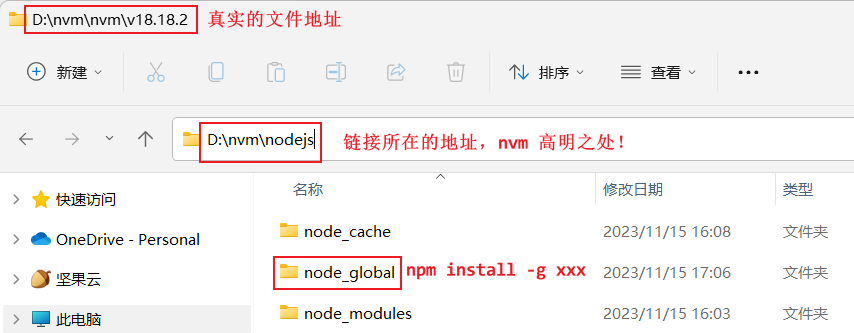

# 一、vue基础回顾+进阶

## 课程内容

- VUE 基础回顾
- 路由 Vue-Router
- 状态管理 vuex
- TypeScript


## 1. VUE 基础回顾

### 1.1 基于脚手架创建前端工程

#### 1.1.1 环境要求

要想基于脚手架创建前端工程，需要具备如下环境要求：

- ​	**node.js** 	前端项目的运行环境
- ​	**npm**          JavaScript的包管理工具
- ​	**Vue CLI**    基于Vue进行快速开发的完整系统，实现交互式的**项目脚手架**

安装完node.js后，可以通过命令行来查看版本号，如下：


安装 Vue CLI，命令如下：


#### 1.1.2 操作过程

使用 Vue CLI 创建前端工程的方式：

- ​	方式一：vue create 项目名称
- ​	方式二：vue ui

重点介绍使用 vue ui 命令创建前端工程的过程：

第一步：在命令行输入命令 vue ui,在浏览器ui界面中选择前端工程存放的位置


第二步：点击“在此创建新项目”按钮，跳转到创建新项目设置页面


第三步：填写项目名称、选择包管理器为npm，点击“下一步”按钮


第四步：选择 Default(Vue 2)，点击"创建项目"按钮，完成项目的创建


#### 1.1.3 ==工程结构==

工程目录结构：


==重点文件或目录介绍==：

- **node_modules：当前项目依赖的js包**
- **assets：静态资源存放目录**
- **components：公共组件存放目录**
- **App.vue：项目的主组件，页面的入口文件**
- **main.js：整个项目的入口文件**
- **package.json：项目的配置信息、依赖包管理**
- **vue.config.js：vue-cli配置文件**

#### 1.1.4 启动前端服务

使用VS Code打开创建的前端工程，启动前端工程：


访问前端工程：


注：要停止前端服务，可以在命令行终端使用 ctrl + C 

前端项目启动后，服务端口默认为8080，很容易和后端tomcat端口号冲突。如何修改前端服务的端口号？

可以在vue.config.js中配置前端服务端口号：

```javascript
const { defineConfig } = require('@vue/cli-service')
module.exports = defineConfig({
  transpileDependencies: true,
  devServer: {
    port: 7070  //指定前端服务端口号
  }
})
```

### 1.2 vue基本使用方式

本章节从如下几个方面进行vue回顾：

- vue 组件
- 文本插值
- 属性绑定
- 事件绑定
- 双向绑定
- 条件渲染
- axios

#### 1.2.1 vue 组件

Vue 的组件文件以 .vue 结尾，每个组件由三部分组成：

- 结构 `<template>`
- 样式 `<style>`
- 逻辑 `<script>`


#### 1.2.2 文本插值

作用：用来绑定 data 方法返回的对象属性

用法：{{插值表达式}}

示例：


#### 1.2.3 属性绑定

作用：**为标签的属性绑定 data 方法中返回的属性**

用法：v-bind:xxx，简写为 :xxx

示例：


#### 1.2.4 事件绑定

作用：为元素绑定对应的事件

用法：v-on:xxx，简写为 @xxx

示例：


#### 1.2.5 双向绑定

作用：**表单输入项和 data 方法中的属性进行绑定，任意一方改变都会同步给另一方**

用法：v-model

示例：


#### 1.2.6 条件渲染

作用：根据表达式的值来动态渲染页面元素

用法：v-if、v-else、v-else-if

示例：


#### 1.2.7 ==axios==

[Axios](https://www.axios-http.cn/) 是一个基于 promise 的 网络请求库，作用于浏览器和 node.js 中。使用Axios可以在前端项目中发送各种方式的HTTP请求。

==安装命令==：**npm install axios**

```bash
npm install axios
```


导入：import axios from 'axios'

axios 的 API 列表：


参数说明：

- url：请求路径
- data：请求体数据，最常见的是JSON格式数据
- config：配置对象，可以设置查询参数、请求头信息

注：在使用axios时，经常会遇到**跨域问题**。为了解决跨域问题，可以在 **vue.config.js 文件中配置代理**：

```javascript
const { defineConfig } = require('@vue/cli-service')
module.exports = defineConfig({
  transpileDependencies: true,
  devServer: {
    port: 7070,
    proxy: {
      '/api': {
        target: 'http://localhost:8080',
        pathRewrite: {
          '^/api': ''
        }
      }
    }
  }
})
```

axios的post请求示例：

```javascript
axios.post('/api/admin/employee/login',{
      username:'admin',
      password: '123456'
    }).then(res => {
      console.log(res.data)
    }).catch(error => {
      console.log(error.response)
    })
```

axios的get请求示例：

```javascript
axios.get('/api/admin/shop/status',{
        headers: {
          token: ‘xxx.yyy.zzz’
        }
      })
```

axios提供的统一使用方式示例一（可以发送各种方式的请求）：


axios提供的统一使用方式示例二（可以发送各种方式的请求）：

```javascript
axios({
      url: '/api/admin/employee/login',
      method:'post',
      data: {
        username:'admin',
        password: '123456'
      }
    }).then((res) => {
      console.log(res.data.data.token)
      axios({
        url: '/api/admin/shop/status',
        method: 'get',
        params: {id: 100},
        headers: {
          token: res.data.data.token
        }
      })
    }).catch((error) => {
      console.log(error)
    })
```

## 2. ==路由 Vue-Router==


### 2.0 NPM安装Router路由

```bash
npm install vue-router
```

如果在一个模块化工程中使用它，必须要通过 `Vue.use()` 明确地安装路由功能：

```js
import Vue from 'vue'
import VueRouter from 'vue-router'

Vue.use(VueRouter)
```

如果使用全局的 script 标签，则无须如此 (手动安装)。


### 2.1 Vue-Router 介绍

vue 属于单页面应用，所谓路由，就是根据浏览器路径不同，用不同的视图组件替换这个页面内容。


如上图所示：不同的访问路径，对应不同的页面展示。

在vue应用中使用路由功能，需要安装Vue-Router：


注：创建完带有路由功能的前端项目后，在工程中会生成一个路由文件，如下所示：


关于路由的配置，主要就是在这个路由文件中完成的。

为了能够使用路由功能，在前端项目的入口文件main.js中，创建Vue实例时需要指定路由对象：


### 2.2 路由配置

首先了解一下==路由组成==：

- VueRouter：路由器，根据路由请求在路由视图中动态渲染对应的视图组件
- `<router-link>`：路由链接组件，浏览器会解析成`<a>`
- `<router-view>`：路由视图组件，用来展示与路由路径匹配的视图组件


具体配置方式：

1) 在路由文件中配置路由路径和视图的对应关系：

```javascript
import Vue from 'vue'
import VueRouter from 'vue-router'
import HomeView from '../views/HomeView.vue'

Vue.use(VueRouter)

//维护路由表，某个路由路径对应哪个视图组件
const routes = [
  {
    path: '/',
    name: 'home',
    component: HomeView
  },
  {
    path: '/about',
    name: 'about',
    component: () => import(/* webpackChunkName: "about" */ '../views/AboutView.vue')
  }
  ,
  {
    path: '/404',
    component: () => import('../views/404View.vue')
  },
  {
    path: '*',
    redirect: '/404'
  }
]

const router = new VueRouter({
  routes
})

export default router
```

2) 在视图组件中配置 router-link标签，用于生成超链接

```html
`<router-link to="/">`Home`</router-link>` |
`<router-link to="/about">`About`</router-link>` |
`<router-link to="/test">`Test`</router-link>` |
```

3) 在视图组件汇总配置router-view标签

```html
`<!--视图组件展示的位置-->`
`<router-view/>`
```


要实现路由跳转，可以通过标签式和编程式两种：

- **==标签式==：`<router-link to="/about">`About`</router-link>`**
- **==编程式==：this.$router.push('/about')** ，
  - **this.$router用来获取路由对象**
  - **push方法是根据url进行跳转**


**问题思考：**如果用户访问的路由地址不存在，该如何处理？

可以通过配置一个404视图组件，当**访问的路由地址不存在**时，则**重定向到此视图组件**，具体配置如下：

```javascript
  {
    path: '/404',
    component: () => import('../views/404View.vue')
  },
  {
    path: '*',
    redirect: '/404' //重定向
  }
```

```vue
<template>
  <div id="app">
    <nav>
      <router-link to="/">Home</router-link> |
      <router-link to="/about">About</router-link> |
      <router-link to="/test">Test</router-link> |
      <input type="button" value="编程式路由跳转" @click="jump"/>
    </nav>

    <!--视图组件展示的位置-->
    <router-view/>

  </div>
</template>


<script>
export default {
  methods:{
    jump(){
      //使用编程式路由跳转
      this.$router.push('/about')
    }
  }
}
</script>


<style>
#app {
  font-family: Avenir, Helvetica, Arial, sans-serif;
  -webkit-font-smoothing: antialiased;
  -moz-osx-font-smoothing: grayscale;
  text-align: center;
  color: #2c3e50;
}

nav {
  padding: 30px;
}

nav a {
  font-weight: bold;
  color: #2c3e50;
}

nav a.router-link-exact-active {
  color: #42b983;
}
</style>

```


### 2.3 嵌套路由

嵌套路由：组件内要切换内容，就需要用到嵌套路由（子路由），效果如下：

在App.vue视图组件中有`<router-view>`标签，其他视图组件可以展示在此


**ContainerView.vue组件**可以展示在App.vue视图组件的`<router-view>`位置


ContainerView.vue组件进行了区域划分（分为上、左、右），在右边编写了`<router-view>`标签，点击左侧菜单时，可以将对应的子视图组件展示在此


实现步骤：

第一步：安装并导入 [elementui](https://element.eleme.io/)，实现页面布局（Container 布局容器）---ContainerView.vue

**mian.js文件中导入ElementUI**


```
npm i element-ui -s
```

```js
import Vue from 'vue'
import App from './App.vue'
import router from './router'
import ElementUI from 'element-ui';
import 'element-ui/lib/theme-chalk/index.css';

Vue.config.productionTip = false

//全局使用ElementUI
Vue.use(ElementUI);

new Vue({
  router,
  render: h => h(App)
}).$mount('#app')

```


```html
`<template>`
  `<el-container>`
    `<el-header>`Header`</el-header>`
    `<el-container>`
        `<el-aside width="200px">`
        `</el-aside>`
        `<el-main>`
        `</el-main>`
    `</el-container>`
  `</el-container>`
`</template>`

`<script>`
export default {

}
`</script>`

`<style>`
.el-header, .el-footer {
    background-color: #B3C0D1;
    color: #333;
    text-align: center;
    line-height: 60px;
  }
  
  .el-aside {
    background-color: #D3DCE6;
    color: #333;
    text-align: center;
    line-height: 200px;
  }
  
  .el-main {
    background-color: #E9EEF3;
    color: #333;
    text-align: center;
    line-height: 160px;
  }
  
  body > .el-container {
    margin-bottom: 40px;
  }
  
  .el-container:nth-child(5) .el-aside,
  .el-container:nth-child(6) .el-aside {
    line-height: 260px;
  }
  
  .el-container:nth-child(7) .el-aside {
    line-height: 320px;
  }
`</style>`
```

第二步：提供子视图组件，用于效果展示  ---P1View.vue、P2View.vue、P3View.vue

```html
`<template>`
  `<div>`
    这是P1 View
  `</div>`
`</template>`

`<script>`
export default {

}
`</script>`

`<style>`
.el-header, .el-footer {
    background-color: #B3C0D1;
    color: #333;
    text-align: center;
    line-height: 60px;
  }
  
  .el-aside {
    background-color: #D3DCE6;
    color: #333;
    text-align: center;
    line-height: 200px;
  }
  
  .el-main {
    background-color: #E9EEF3;
    color: #333;
    text-align: center;
    line-height: 160px;
  }
  
  body > .el-container {
    margin-bottom: 40px;
  }
  
  .el-container:nth-child(5) .el-aside,
  .el-container:nth-child(6) .el-aside {
    line-height: 260px;
  }
  
  .el-container:nth-child(7) .el-aside {
    line-height: 320px;
  }
`</style>`
```

第三步：在 src/router/index.js 中**配置路由映射规则**（嵌套路由配置）

```javascript
   {
    path: '/c',
    component: () => import('../views/container/ContainerView.vue'),
    //嵌套路由（子路由），对应的组件会展示在当前组件内部
    children: [//通过children属性指定子路由相关信息（path、component）
      {
        path: '/c/p1',
        component: () => import('../views/container/P1View.vue')
      },
      {
        path: '/c/p2',
        component: () => import('../views/container/P2View.vue')
      },
      {
        path: '/c/p3',
        component: () => import('../views/container/P3View.vue')
      }
    ]
  }
```

第四步：在ContainerView.vue 布局容器视图中添加`<router-view>`，实现子视图组件展示

```html
`<el-main>`
    `<router-view/>`
`</el-main>`
```

第五步：在ContainerView.vue 布局容器视图中添加`<router-link>`，实现路由请求

```html
`<el-aside width="200px">`
    `<router-link to="/c/p1">`P1`</router-link>``<br>`
    `<router-link to="/c/p2">`P2`</router-link>``<br>`
    `<router-link to="/c/p3">`P3`</router-link>``<br>`
`</el-aside>`
```

注意：子路由变化，切换的是【ContainerView 组件】中 `<router-view></router-view>` 部分的内容

问题思考：

1.对于前面的案例，如果用户访问的路由是 /c，会有什么效果呢？


2.如何实现在访问 /c 时，**默认就展示某个子视图组件**呢？

配置重定向，当访问/c时，直接**重定向到/c/p1**即可，如下配置：


## 3. 状态管理 vuex

### 3.1 vuex 介绍

- **vuex 是一个专为 Vue.js 应用程序开发的状态管理库**

- **vuex 可以在多个组件之间==共享数据==，并且共享的数据是==响应式==的，即数据的变更能及时渲染到模板**

- **vuex 采用==集中式存储管理==所有组件的状态**

  

每一个 Vuex 应用的核心就是 store（仓库）。“store”基本上就是一个容器，它包含着你的应用中大部分的**状态 (state)**。Vuex 和单纯的全局对象有以下两点不同：

1. Vuex 的状态存储是**响应式**的。当 Vue 组件从 store 中读取状态的时候，若 store 中的状态发生变化，那么相应的组件也会相应地得到**高效更新**。
2. 你不能直接改变 store 中的状态。改变 store 中的状态的**唯一途径**就是显式地**==提交 (commit) mutation==**。这样使得我们可以方便地跟踪每一个状态的变化，从而让我们能够实现一些工具帮助我们更好地了解我们的应用。

**安装vuex**：**npm install vuex@next --save**

```bash
npm install vuex@next --save
```

vuex中的几个核心概念：

- **state：状态对象，==集中定义各个组件共享==的数据**

- **mutations：类似于一个事件，用于==修改共享数据==，要求必须是==同步函数==**

- **actions：类似于mutation，可以包含==异步操作==(axios异步请求)，通过调用mutation来改变共享数据**

  

### 3.2 使用方式

本章节通过一个案例来学习vuex的使用方式，具体操作步骤如下：

第一步：创建带有vuex功能的前端项目


注：在创建的前端工程中，可以发现自动创建了vuex相关的文件(src/store/index.js)，并且在main.js中创建Vue实例时，需要将store对象传入，代码如下：

```javascript
import Vue from 'vue'
import App from './App.vue'
import store from './store'

Vue.config.productionTip = false

new Vue({
  store,//使用vuex功能
  render: h => h(App)
}).$mount('#app')
```

第二步：在src/store/index.js文件中集中定义和管理共享数据

```javascript
import Vue from 'vue'
import Vuex from 'vuex'
import axios from 'axios'

Vue.use(Vuex)

//集中管理多个组件共享的数据
export default new Vuex.Store({
  //集中定义共享数据
  state: {
    name: '未登录游客'
  },
  getters: {
  },
  //通过当前属性中定义的函数修改共享数据，必须都是同步操作
  mutations: {
  },
  //通过actions调用mutation，在actions中可以进行异步操作
  actions: {
  },
  modules: {
  }
})
```

第三步：在视图组件中展示共享数据

```html
`<template>`
  `<div class="hello">`
    `<h1>`欢迎你，{{$store.state.name}}`</h1>`
  `</div>`
`</template>`
```

注：**==$store.state==为固定写法，用于访问共享数据**

第四步：在mutations中定义函数，用于修改共享数据

```javascript
  //通过当前属性中定义的函数修改共享数据，必须都是同步操作
  mutations: {
    setName(state,newName) {
      state.name = newName
    }
  },
```

第五步：在视图组件中调用 mutations 中定义的函数


注：**mutations**中定义的函数**不能直接调用**，必须通过**状态对象的 commit 方法来调用**

第六步：如果在修改共享数据的过程中有异步操作，则需要将**异步操作**的代码编写在**actions的函数**中

```javascript
  //通过actions调用mutation，在actions中可以进行异步操作
  actions: {
    setNameByAxios(context){
      axios({ //异步请求
        url: '/api/admin/employee/login',
        method: 'post',
        data: {
          username: 'admin',
          password: '123456'
        }
      }).then(res => {
        if(res.data.code == 1){
          //异步请求后，需要修改共享数据
          //在actions中调用mutation中定义的setName函数
          context.commit('setName',res.data.data.name)
        }
      })
    }
  },
```

注：在actions中定义的函数可以声明context参数，通过此参数可以调用mutations中定义的函数

第七步：在视图组件中调用actions中定义的函数

```vue
<template>
  <div id="app">

    <h1>欢迎你，{{ $store.state.name }} -- App.vue</h1>

    <input type="button" value="通过mutations修改共享数据" @click="handleUpdate" />
    <input type="button" value="调用actions中的函数修改共享数据" @click="handleCallAction" />

    <HelloWorld msg="Welcome to Your Vue.js App" />
  </div>
</template>

<script>
import HelloWorld from './components/HelloWorld.vue'

export default {
  name: 'App',
  components: {
    HelloWorld
  },
  methods: {
    //mutations中定义的函数不能直接调用，必须通过commit这种方式间接调用
    //setName为mutations中定义的函数名称，joker为传递的参数
    handleUpdate() {
      this.$store.commit('setName', 'joker')
    },
    handleCallAction() {
      //调用actions中定义的函数，setNameByAxios为函数名称
      this.$store.dispatch('setNameByAxios')
    }
  }
}
</script>
```


注：在actions中定义的函数不能直接调用，必须通过 **this.$store.dispatch('函数名称')** 这种方式调用


## 4. TypeScript

### 4.1 TypeScript 介绍

- TypeScript（简称：TS） 是微软推出的开源语言
- TypeScript 是 JavaScript 的超集（JS 有的 TS 都有）


- TypeScript = Type + JavaScript（在 JS 基础上增加了类型支持）
- TypeScript 文件扩展名为 ts
- TypeScript 可编译成标准的 JavaScript，并且在编译时进行类型检查


在前端项目中使用TS，需要进行安装，命令为：npm install -g typescript

查看TS版本：


TS初体验：

1) 创建 hello.ts 文件，内容如下：

```typescript
//定义一个函数 hello，并且指定参数类型为string
function hello(msg:string) {
      console.log(msg)
}

//调用上面的函数，传递非string类型的参数
hello(123)
```

2) 使用 tsc 命令编译 hello.ts 文件


可以看到编译报错，提示参数类型不匹配。这说明在编译时TS会进行类型检查。需要注意的是**在编译为JS文件后，类型会被擦除**。


思考：TS 为什么要增加类型支持 ？

- **TS 属于静态类型编程语言，JS 属于动态类型编程语言**
- **静态类型在编译期做类型检查，动态类型在执行期做类型检查**
- **对于 JS 来说，需要等到代码执行的时候才能发现错误（晚）**
- **对于 TS 来说，在代码编译的时候就可以发现错误（早）**
- **配合 VSCode 开发工具，TS 可以提前到在编写代码的同时就发现代码中的错误，减少找 Bug、改 Bug 的时间**


在前端项目中使用TS，需要创建基于TS的前端工程：


### 4.2 TypeScript ==常用类型==

TS中的常用类型如下：

| **类型**   | **例**                                 | **备注**                     |
| ---------- | -------------------------------------- | ---------------------------- |
| 字符串类型 | string                                 |                              |
| 数字类型   | number                                 |                              |
| 布尔类型   | boolean                                |                              |
| 数组类型   | number[],string[],  boolean[] 依此类推 |                              |
| 任意类型   | any                                    | 相当于又回到了没有类型的时代 |
| 复杂类型   | type 与 interface                      |                              |
| 函数类型   | () =>  void                            | 对函数的参数和返回值进行说明 |
| 字面量类型 | "a"\|"b"\|"c"                          | 限制变量或参数的取值         |
| class 类   | class Animal                           |                              |

#### 4.2.1 类型标注的位置

基于TS进行前端开发时，类型标注的位置有如下3个：

- 标注变量
- 标注参数
- 标注返回值


#### 4.2.2 字符串、数字、布尔类型

字符串、数字、布尔类型是前端开发中常用的类型


#### 4.2.3 字面量类型

**字面量类型用于限定数据的取值范围**，类似于java中的**枚举**


#### 4.2.4 interface 类型

interface 类型是TS中的复杂类型，它让 TypeScript 具备了 JavaScript 所缺少的、描述较为复杂数据结构的能力。


可以通过在属性名后面加上？，表示当前属性为可选，如下：


#### 4.2.5 class 类型

使用 class 关键字来定义类，类中可以包含属性、构造方法、普通方法等


在定义类时，可以使用 implments 关键字实现接口，如下：


在定义类时，可以使用 extends 关键字 继承其他类，如下：


```typescript
//定义一个函数 print，打印到控制台，并且指定参数类型为string
function sout(msg: string) {
    console.log(msg)
}

//调用上面的函数，传递非string类型的参数
sout("123")

/* 1111111111111111111111111111111111111 */

//标注变量，指定变量 msg 的类型为string
let msg: string = 'hello ts!'
//标注参数和返回值，指定 m2 函数的参数类型 为string，并且返回值也为 string
const m2 = (name: string): string => {
    return name.toLowerCase() + msg
}
sout(m2('Abc '))


/* 1111111111111111111111111111111111111 */

//定义字符串类型的变量
let username: string = 'itcast'
//定义布尔类型的变量
let isTrue: boolean = false
//定义数字类型的变量
let age: number = 20
console.log(username)
console.log(isTrue)
console.log(age)

/* 1111111111111111111111111111111111111 */

//字面量类型，指定参数 alignment 的取值只能是 left、right、center
function printText(s: string, alignment: "left" | "right" | "center") {
    console.log(s, alignment)
}
printText('hello', 'left')
// printText('hello') //错误：取值只能是left丨right丨center


/* 1111111111111111111111111111111111111 */

//定义一个接口，名字为cat
interface Cat {
    name: string,
    age?: number //加上? 表示当前属性是可选的
}
//定义变量为cat类型
const c1: Cat = { name: 'xiaobai', age: 1 }
const c2: Cat = { name: 'xiaobai' } //错误：缺少 age 属性
//const c3: Cat = { name: 'xiaobai', age: 1, sex: '公' } //错误：多出 sex 属性

console.log(c1)


/* 1111111111111111111111111111111111111 */

//定义一个类，名称为User
class User {
    name: string //属性
    constructor(name: string) {//构造方法
        this.name = name
    }
    //方法
    study() {
        console.log(this.name + '正在学习...')
    }
}

const u = new User('张三')

console.log(u.name)
u.study()

/* 1111111111111111111111111111111111111 */

interface Animal {
    name: string
    eat(): void
}
//定义一个类Bird，实现上面的Animal接口
class Bird implements Animal {
    name: string
    constructor(name: string) {
        this.name = name
    }
    eat(): void {
        console.log(this.name + ' eat')
    }
}
//创建类型为Bird的对象
const b1 = new Bird('杜鹃')
console.log(b1.name)
b1.eat()


/* 1111111111111111111111111111111111111 */

//定义Parrot类，并且继承 Bird类
class Parrot extends Bird {
    parrotName:string
    constructor(parrotName:string){
        super(parrotName+'super')
        this.parrotName = parrotName
    }
    sayName(): void {
        console.log(this.name + ' say hello')
    }
    sayParrotName(): void {
        console.log(this.parrotName + ' say hello')
    }
}

const myParrot = new Parrot('Polly')
myParrot.sayName()
myParrot.sayParrotName()
myParrot.eat()
```


# 二、Vue知识点和工具类总结

## 1、vue.config.js代理配置-==跨域==

```js
    proxy: { //配置跨域,通常发生在前端应用和后端API服务器不在同一个域（域名、协议或端口不同）的情况下。
      '/api': { ///api是一个前缀，所有以/api开头的请求都会被代理到target指定的服务器。
        target: process.env.VUE_APP_URL,
        ws: false, // 是否启用WebSockets代理
        secure: false, //指定是否验证SSL证书,如果是https接口，需要配置这个参数
        changeOrigin: true, //是否改变源地址,用于指定是否更改请求的来源。默认为false
        pathRewrite:{ //重写路径,用于重写请求的路径
          '^/api':''
        }
      }
    }
```


## 2、箭头函数

箭头函数和普通函数在语法和行为上有一些重要的区别：

1. 语法：箭头函数的语法更简洁，它使用`=>`符号来定义函数。例如，下面是一个箭头函数：

   ```javascript
   const add = (a, b) => a + b;
   ```

   相比之下，这是一个普通的函数：

   ```javascript
   function add(a, b) {
     return a + b;
   }
   ```

2. **this绑定：箭头函数不绑定自己的`this`值，它会捕获其所在上下文的`this`值。**这意味着**==箭头函数的`this`值在定义时就已经确定，不会在调用时改变。==**例如：

   ```javascript
   const obj = {
     value: 42,
     getValue: function() {
       return () => this.value;
     }
   };

   const value = obj.getValue()();
   console.log(value); // 42
   ```

   在这个例子中，箭头函数`getValue`返回了一个箭头函数，这个箭头函数的`this`值是`getValue`函数的`this`值，也就是`obj`对象。所以，当箭头函数被调用时，它返回`obj`对象的`value`属性。

   相比之下，如果`getValue`是一个普通的函数，那么箭头函数的`this`值会是`getValue`函数被调用的上下文的`this`值，可能不是`obj`对象。

3. **构造函数：箭头函数不能用作构造函数，**也就是说，你不能使用`new`关键字来创建箭头函数的实例。例如：

   ```javascript
   const Animal = () => {};
   const animal = new Animal(); // TypeError: Animal is not a constructor
   ```

   在这个例子中，当你尝试使用`new`关键字来创建`Animal`函数的实例时，JavaScript会抛出一个错误，因为`Animal`是一个箭头函数，不能用作构造函数。

总的来说，箭头函数在语法上更简洁，**并且有特殊的`this`绑定行为，这使得它们在某些情况下比普通函数更合适。然而，箭头函数也有一些限制，比如不能用作构造函数，**所以在使用箭头函数时需要考虑这些


## 3、form表单案例-新增

```vue
<template>
  <div class="addBrand-container">
    <div class="container">
      <el-form :model="ruleForm" :rules="rules" ref="ruleForm" label-width="180px">
        <!-- ref 是一个特殊的属性，用于给 DOM 元素或组件实例设置引用,this.$refs.ruleForm-->
        <el-form-item label="账号" prop="username">
          <el-input v-model="ruleForm.username"></el-input>
        </el-form-item>
        <el-form-item label="员工姓名" prop="name">
          <el-input v-model="ruleForm.name"></el-input>
        </el-form-item>
        <el-form-item label="手机号" prop="phone">
          <el-input v-model="ruleForm.phone"></el-input>
        </el-form-item>
        <el-form-item label="性别" prop="sex">
          <el-radio v-model="ruleForm.sex" label="1">男</el-radio> <!-- label 属性指定了单选框的值。 -->
          <el-radio v-model="ruleForm.sex" label="2">女</el-radio>
        </el-form-item>
        <el-form-item label="身份证号" prop="idNumber">
          <el-input v-model="ruleForm.idNumber"></el-input>
        </el-form-item>

        <!-- 保存 -->
        <div class="subBox">
          <el-button type="primary" @click="submitForm('ruleForm', false)">保存</el-button>
          <!-- type="primary": 这是 Element UI 的按钮组件属性，表示按钮的样式类型为“主要”按钮，通常用来突出显示。 -->
          <el-button v-if="this.optType === 'add'" type="primary" @click="submitForm('ruleForm', true)">保存并继续添加员工
          </el-button>
          <el-button @click="() => this.$router.push('/employee')">返回</el-button>
        </div>

      </el-form>
    </div>
  </div>
</template>

<script lang="ts">
import { validate } from 'schema-utils';
import { addEmployee } from '@/api/employee';


export default {
  data() {
    return {
      optType: 'add', //操作类型，add表示新增，edit表示编辑

      ruleForm: {
        username: '',
        name: '',
        phone: '',
        sex: '1',
        idNumber: '',
      },
      rules: { //表单校验规则
        name: [
          { required: true, message: '请输入员工姓名', trigger: 'blur' }, /* trigger: 'blur' 表示失去焦点触发 */
          { min: 2, max: 10, message: '长度在 2 到 10 个字符', trigger: 'blur' }
        ],
        username: [
          { required: true, message: '请输入账号', trigger: 'blur' },
          { min: 2, max: 10, message: '长度在 2 到 10 个字符', trigger: 'blur' }
        ],
        phone: [
          { min: 11, max: 11, message: '手机号码必须是11位！', trigger: 'blur' },

          {
            required: true, trigger: 'blur', validator: (rule, value, callback) => { /* validator验证器 */
              if (value === '' || (/^1(3|4|5|6|7|8|9)\d{9}$/.test(value) === false)) { //利用正则表达式判断手机号格式
                callback(new Error('请输入正确的手机号'));
              } else {
                callback();
              }
            }
          }

        ],
        idNumber: [
          { min: 15, max: 18, message: '身份证号码位数不正确！', trigger: 'blur' },
          {
            required: true, trigger: 'blur', validator: (rule, value, callback) => { /* validator验证器 */
              if (value === '' || (/^\d{17}(X|x)$|(^\d{15}$)|(^\d{18}$)/.test(value) === false)) { //利用正则表达式判断身份证号格式
                callback(new Error('请输入正确的身份证号'));
              } else {
                callback();
              }
            }
          }
        ]
      }
    }
  },

  methods: {
    //提交表单数据
    submitForm(formName, isContinue) {
      //表单数据校验
      this.$refs[formName].validate((valid) => {
        if (valid) { //校验通过
          //添加员工
          addEmployee(this.ruleForm).then((res) => {
            if (res.data.code === 1) {
              this.$message.success('添加成功！')

              if (isContinue) { //如果isContinue为true，则继续添加
                this.$refs[formName].resetFields(); //重置表单
              } else { //如果isContinue为false，则返回员工列表
                this.$router.push('/employee')
              }

            } else { //添加失败，返回错误信息
              this.$message.error(res.data.msg)
            }
          })
        }
      })
    }
  }
}

</script>

<style lang="scss" scoped>
.addBrand {
  &-container {
    margin: 30px;
    margin-top: 30px;

    .HeadLable {
      background-color: transparent;
      margin-bottom: 0px;
      padding-left: 0px;
    }

    .container {
      position: relative;
      z-index: 1;
      background: #fff;
      padding: 30px;
      border-radius: 4px;

      // min-height: 500px;
      .subBox {
        padding-top: 30px;
        text-align: center;
        border-top: solid 1px $gray-5;
      }
    }

    .idNumber {
      margin-bottom: 39px;
    }

    .el-form-item {
      margin-bottom: 29px;
    }

    .el-input {
      width: 293px;
    }
  }
}
</style>

```


## 4、JavaScript的动态属性和Vue的响应式系统

```vue
<script lang="ts">
import { validate } from 'schema-utils';
import { addEmployee, getEmployeeById ,updateEmployee} from '@/api/employee';


export default {
  data() {
    return {
      optType: 'add', //操作类型，add表示新增，edit表示修改

      //表单数据结构
      ruleForm: {
        username: '',
        name: '',
        phone: '',
        sex: '1',
        idNumber: '',
      }
    }
  }


  created() { //在组件创建时，根据路由参数判断操作类型 add 或者 update
    this.optType = this.$route.query.id ? 'update' : 'add' //路径参数id存在，则为update，否则为add
    if (this.optType === 'update') { //如果是update，则根据id获取员工信息
      getEmployeeById(this.$route.query.id).then((res) => {
        if (res.data.code === 1) { //修改操作，需要根据id查询原始数据，用于回显
          this.ruleForm = res.data.data
        }
      })
    }
  },
```

在 Vue.js 中，当你在 `created` 钩子中通过 API 调用来赋值 `this.ruleForm` 时，你可能会发现 **`this.ruleForm` 可以访问到从服务器返回的数据中的字段，即使这些字段在组件的==初始数据定义中没有列出==**。这种情况的原因可以归结为以下几点：

### 1. **动态属性**

**JavaScript 对象是动态的，你可以随时向对象添加新的属性**。这意味着，**当你从服务器返回的数据中包含新的字段时，它们会被添加到 `this.ruleForm` 对象上，==即使这些字段没有在初始数据定义中声明==**。

例如，初始时 `ruleForm` 可能定义为：

```javascript
ruleForm: {
  username: '',
  name: '',
  phone: '',
  sex: '1',
  idNumber: ''
}
```

当你从 API 返回的数据中获取到 `id` 并赋值给 `this.ruleForm`：

```javascript
this.ruleForm = res.data.data
```

如果 `res.data.data` 中包含 `id` 字段，`this.ruleForm` 将会包含这个 `id` 字段，因为对象的属性是可以动态添加的。

### 2.**==Vue 的响应式系统==**

**Vue 的响应式系统会自动跟踪对象的变化**。当你将新的对象赋值给 `this.ruleForm` 时，**Vue 会将这个新对象添加到响应式系统中。原本定义在 `data` 中的 `ruleForm` 只是初始的结构定义，它不限制对象的实际使用情况**。

### 3. **数据结构和原型**

即使你在 `data` 中定义了一个初始结构，实际运行时 `ruleForm` 可能会包含来自 API 的额外字段。由于 JavaScript 对象的动态特性，这些字段会被添加到 `ruleForm` 对象上，而不影响对象的原型或定义的结构。你可以随时访问和使用这些字段。

### 4. **具体例子**

假设 API 返回的数据如下：

```javascript
{
  data: {
    code: 1,
    data: {
      username: 'john_doe',
      name: 'John Doe',
      phone: '1234567890',
      sex: '1',
      idNumber: '123456789012345678',
      id: 'abc123' // 新字段
    }
  }
}
```

当你执行：

```javascript
this.ruleForm = res.data.data
```

`this.ruleForm` 将变成：

```javascript
{
  username: 'john_doe',
  name: 'John Doe',
  phone: '1234567890',
  sex: '1',
  idNumber: '123456789012345678',
  id: 'abc123' // 额外的字段
}
```

因此，即使在初始定义中没有 `id` 字段，赋值后 `this.ruleForm.id` 依然是可访问的。

### 总结

- JavaScript 对象是动态的，你可以随时添加和访问新的属性。
- Vue 的响应式系统会处理所有对象的变化，包括动态添加的属性。
- `data` 中的初始结构仅用于定义初始状态，实际数据可以包含更多字段。

通过理解这些原理，你可以更好地管理和使用你的数据对象，确保你的应用在处理动态数据时能正确响应和显示信息。


# 三、苍穹外卖-前端环境搭建、员工管理

## 课程内容

- 前端环境搭建

- 员工分页查询
- 启用禁用员工账号
- 新增员工
- 修改员工


## 1. 前端环境搭建

### 1.1 技术选型

本项目使用到的前端技术如下：

- node.js
- vue
- ElementUI
- axios
- vuex
- vue-router
- typescript

### 1.2 熟悉前端代码结构

直接导入课程资料中提供的苍穹外卖项目前端初始工程，此工程中已经开发了部分功能，后续我们在此基础上开发新功能即可。

导入后的效果如下：


主要代码在src目录中，src目录结构如下：


下面重点介绍一下src中的重点文件和目录：

- api：存放封装了Ajax请求文件的目录
- components：公共组件存放目录
- views：存放视图组件的目录
- App.vue：项目的主组件，页面的入口文件
- main.ts：整个项目的入口文件
- router.ts：路由文件

注意：我们上面导入的初始工程中并没有前端项目运行所依赖的JS包，需要在终端通过 npm install 命令进行安装。安装完成后，可以看到生成了node_modules目录，目录中就是安装的JS包，效果如下：


接下来，我们通过初始工程中已经完成的登录功能来跟踪程序的执行过程，熟悉前端项目的代码结构。

首先需要启动前端项目，命令为：npm run serve，然后访问前端项目，效果如下：


注意：需要同时启动后端 java 服务，才能进行前后端交互。

具体操作的步骤如下：

① 获得登录页面路由地址

​	登录页面完整的访问地址为 http: //localhost:8888/#/login，其中登录页面的路由地址为 /login，我们需要通过此路由地址找到对应的登录视图组件

② 从main.ts中找到路由文件

​	main.ts是整个前端项目的入口文件，在此文件中会创建Vue实例，在创建Vue实例时需要传入路由对象，所以从此文件中可以找到对应的路由文件位置。如下所示：


③ 从路由文件中找到登录视图组件

​	在路由文件中会配置整个项目所有的路由映射规则，我们只需要找到 /login 这个路径对应的实体组件即可。如下所示：


④ 从登录视图组件中找到登录方法

​	从上面的路由文件可以确定登录视图组件就是src/views/login/index.vue，此时就可以打开这个文件，然后仔细阅读代码，找到登录方法，如下所示：


⑤ 跟踪登录方法的执行过程

​	找到登录方法后，就需要跟踪代码的执行过程，主要就是观察前后端的交互过程。例如前端如何发送的Ajax请求，后端返回的数据格式等等

## 2. 员工分页查询

### 2.1 需求分析和接口设计

根据产品原型来了解需求，员工分页查询的产品原型如下：


业务规则：

- 根据页码展示员工信息(员工姓名、账号、手机号、账号状态、最后操作时间等)
- 每页展示10条数据
- 分页查询时可以根据需要，输入员工姓名进行查询

要展示员工分页数据，就需要前后端进行数据交互，对应的接口如下：

**基本信息**

**Path：** /admin/employee/page

**Method：** GET

**请求参数**

**Query**

| 参数名称 | 是否必须 | 示例 | 备注       |
| -------- | -------- | ---- | ---------- |
| name     | 否       | 张三 | 员工姓名   |
| page     | 是       | 1    | 页码       |
| pageSize | 是       | 10   | 每页记录数 |

**返回数据**

| 名称          | 类型        | 是否必须 | 默认值 | 备注 | 其他信息          |
| ------------- | ----------- | -------- | ------ | ---- | ----------------- |
| code          | number      | 必须     |        |      |                   |
| msg           | null        | 非必须   |        |      |                   |
| data          | object      | 必须     |        |      |                   |
| ├─ total      | number      | 必须     |        |      |                   |
| ├─ records    | object []   | 必须     |        |      | item 类型: object |
| ├─ id         | number      | 必须     |        |      |                   |
| ├─ username   | string      | 必须     |        |      |                   |
| ├─ name       | string      | 必须     |        |      |                   |
| ├─ password   | string      | 必须     |        |      |                   |
| ├─ phone      | string      | 必须     |        |      |                   |
| ├─ sex        | string      | 必须     |        |      |                   |
| ├─ idNumber   | string      | 必须     |        |      |                   |
| ├─ status     | number      | 必须     |        |      |                   |
| ├─ createTime | string,null | 必须     |        |      |                   |
| ├─ updateTime | string      | 必须     |        |      |                   |
| ├─ createUser | number,null | 必须     |        |      |                   |
| ├─ updateUser | number      | 必须     |        |      |                   |

### 2.2 代码开发

要开发前端代码，首先需要找到对应的组件。从路由文件 router.ts 中找到员工管理页面（组件）。


可以看到，员工管理页面（组件）的位置为：src/views/employee/index.vue。我们只需要在此文件中开发员工分页查询相关的前端代码即可，整个开发过程大概可以分为以下几个关键步骤：

1. 根据产品原型，制作页面头部效果（输入框、查询按钮等）
2. 为查询按钮绑定单击事件，发送Ajax请求，查询员工分页数据，实现前后端交互
3. 提供 vue 的初始化方法，在页面加载后就查询分页数据
4. 使用ElementUI提供的表格组件展示分页数据
5. 使用ElementUI提供的分页条组件实现翻页效果

注意：开发过程中，并不是所有的代码都实现了再测试，而是开发一部分，就需要测试一下，看效果，如果有问题再调整。没有问题，再继续开发、测试。所以，这是一个逐渐完善的过程。下面我们就按照上面的几个关键步骤来开发，每开发完一个关键步骤，就需要测试一下，来验证我们的代码是否正确。

#### 2.2.1 制作页面头部效果

根据产品原型，制作页面头部效果（输入框、查询按钮等）。产品原型中的头部效果如下：


注意：输入框和按钮都是使用 ElementUI 提供的组件，对于前端的组件只需要参考 ElementUI 提供的文档，进行修改即可。实现代码如下：

```html
`<div class="tableBar">`
    `<label style="margin-right: 5px">`
        员工姓名: 
    `</label>`
    `<el-input placeholder="请输入员工姓名" style="width: 15%" />`
    `<el-button type="primary" style="margin-left: 20px">`查询`</el-button>`
    `<el-button type="primary" style="float: right">`+添加员工`</el-button>`
`</div>`
```

开发完上面代码后，就可以测试一下，页面效果如下：


#### 2.2.2 实现前后端数据交互

前面我们已经完成了页面头部效果开发，接下来就需要开发前后端数据交互的动态效果。

第一步：为查询按钮绑定单击事件


第二步：在methods中定义 pageQuery 方法，先验证当前方法能否正常执行


注意：按照开发规范，真正发送Ajax请求的代码需要封装到 api目录下的ts文件中（src/api/employee.ts）

第三步：在src/api/employee.ts 中定义 getEmployeeList 方法，实现发送Ajax请求获取分页数据


注意：发送 Ajax 请求的URL地址需要和前面我们设计的分页查询接口对应

第四步：在员工管理组件中导入 employee.ts 中定义的方法，并在data() 方法中定义分页相关的模型数据


注意：需要将name属性和上面的员工姓名输入框进行双向绑定，如下：


第五步：在pageQuery 方法中调用 getEmployeeList 方法


#### 2.2.3 自动发送Ajax请求

前面的代码我们已经实现了前后端数据交互，但是有一个问题，就是只有在点击查询按钮时才会发生Ajax请求，实现分页数据查询。我们通常需要的是在当前页面（组件）加载后，就需要发送Ajax请求，查询第一页的数据。要实现这个效果，我们可以通过vue的生命周期方法，即created方法来做到，代码如下：


#### 2.2.4 使用表格展示分页数据

前面我们已经实现了前后端数据交互，现在就需要将后端返回的数据通过表格展示出来，我们可以使用ElementUI提供的表格组件，具体使用方法可以参照官方提供的示例 https://element.eleme.io/#/zh-CN/component/table


#### 2.2.5 使用分页条实现翻页效果

使用 ElementUI 提供的分页条组件，并绑定事件处理函数，具体使用方法可以参照官方提供的示例 https://element.eleme.io/#/zh-CN/component/pagination


### 2.3 功能测试

可以通过下面两种方式来测试：

- 直接进行前后端联调，查看页面效果
- 通过浏览器F12查看数据交互过程

## 3. 启用禁用员工账号

### 3.1 需求分析和接口设计

根据产品原型来进行需求分析：


可以对状态为“启用” 的员工账号进行“禁用”操作

可以对状态为“禁用”的员工账号进行“启用”操作

状态为“禁用”的员工账号不能登录系统

接口设计如下：

 **基本信息**

**Path：** /admin/employee/status/{status}

**Method：** POST

**请求参数**

**Headers**

| 参数名称     | 参数值           | 是否必须 | 示例 | 备注 |
| ------------ | ---------------- | -------- | ---- | ---- |
| Content-Type | application/json | 是       |      |      |

**路径参数**

| 参数名称 | 示例 | 备注                  |
| -------- | ---- | --------------------- |
| status   | 1    | 状态，1为启用 0为禁用 |

**Query**

| 参数名称 | 是否必须 | 示例 | 备注   |
| -------- | -------- | ---- | ------ |
| id       | 是       |      | 员工id |

**返回数据**

| 名称 | 类型    | 是否必须 | 默认值 | 备注 | 其他信息      |
| ---- | ------- | -------- | ------ | ---- | ------------- |
| code | integer | 必须     |        |      | format: int32 |
| data | string  | 非必须   |        |      |               |
| msg  | string  | 非必须   |        |      |               |

### 3.2 代码开发

第一步：为启用、禁用按钮绑定单击事件


第二步：编写对应的处理函数handleStartOrStop


到此可以先测试一下，检查当前方法能否成功执行，页面效果如下：


第三步：在 employee.ts 中封装启用禁用员工账号方法，发送Ajax请求


注意：发送请求的方式和相关参数，必须和前面的接口设计保持一致

第四步：在员工管理组件中引入上面定义的enableOrDisableEmployee方法，并完善 handleStartOrStop 方法


第五步：代码优化，如果是管理员账号则不允许更改账号状态


### 3.3 功能测试

直接进行前后端联调，查看页面效果

通过浏览器F12查看数据交互过程


## 4. 新增员工

### 4.1 需求分析和接口设计

根据产品原型来进行需求分析，产品原型如下：


新增员工时需要录入 账号、员工姓名、手机号、性别、身份证号等信息。其中账号因为是登录凭证，所以必须是唯一的。手机号要求必须是合法的11位手机号码，身份证号为合法的18位身份证号码。

当新员工入职后，可以通过当前的新增员工功能来为新员工开通账号，新员工通过开通的账号来登录商家管理端系统。

接口设计如下：

 **基本信息**

**Path：** /admin/employee

**Method：** POST

**请求参数**

**Headers**

| 参数名称     | 参数值           | 是否必须 | 示例 | 备注 |
| ------------ | ---------------- | -------- | ---- | ---- |
| Content-Type | application/json | 是       |      |      |

**Body**

| 名称     | 类型    | 是否必须 | 默认值 | 备注   | 其他信息      |
| -------- | ------- | -------- | ------ | ------ | ------------- |
| id       | integer | 非必须   |        | 员工id | format: int64 |
| idNumber | string  | 必须     |        | 身份证 |               |
| name     | string  | 必须     |        | 姓名   |               |
| phone    | string  | 必须     |        | 手机号 |               |
| sex      | string  | 必须     |        | 性别   |               |
| username | string  | 必须     |        | 用户名 |               |

**返回数据**

| 名称 | 类型    | 是否必须 | 默认值 | 备注 | 其他信息      |
| ---- | ------- | -------- | ------ | ---- | ------------- |
| code | integer | 必须     |        |      | format: int32 |
| data | object  | 非必须   |        |      |               |
| msg  | string  | 非必须   |        |      |               |

### 4.2 代码开发

要开发新增员工前端代码，首先需要了解添加员工业务功能的操作步骤：

1. 在员工管理列表页面，点击 “添加员工”按钮，跳转到新增页面
2. 在新增员工页面录入员工相关信息
3. 点击“保存”按钮完成新增操作

接下来我们就可以按照上面的操作步骤来具体开发前端的代码。

第一步：为“添加员工”按钮绑定单击事件


第二步：编写 handleAddEmp 方法，进行路由跳转


注意：在路由文件中已经配置了如下路由规则


第三步：根据产品原型，开发页面元素


第四步：定义模型数据和表单校验规则


第五步：在 employee.ts 中封装新增员工方法，发送Ajax请求，实现前后端交互


注意：

- 发送请求的方式和相关参数，必须和前面的接口设计保持一致
- 使用此方法时，别忘了在组件中通过import导入

第六步：在 methods 中定义提交表单的方法 submitForm


### 4.3 功能测试

直接进行前后端联调，查看页面效果

通过浏览器F12查看数据交互过程

## 5. 修改员工

### 5.1 需求分析和接口设计

根据产品原型来进行需求分析，产品原型如下：


修改员工时需要回显 账号、员工姓名、手机号、性别、身份证号等信息。其中账号因为是登录凭证，所以必须是唯一的。手机号要求必须是合法的11位手机号码，身份证号为合法的18位身份证号码。根据需要对数据进行修改即可。

修改员工功能涉及到2个接口，分别是根据id查询员工信息和根据id修改员工信息。具体接口设计如下：

（1）根据id查询员工 接口

**基本信息**

**Path：** /admin/employee/{id}

**Method：** GET

**请求参数**

**路径参数**

| 参数名称 | 示例 | 备注   |
| -------- | ---- | ------ |
| id       | 100  | 员工id |

**返回数据**

| 名称          | 类型    | 是否必须 | 默认值 | 备注 | 其他信息          |
| ------------- | ------- | -------- | ------ | ---- | ----------------- |
| code          | integer | 必须     |        |      | format: int32     |
| data          | object  | 必须     |        |      |                   |
| ├─ createTime | string  | 非必须   |        |      | format: date-time |
| ├─ createUser | integer | 非必须   |        |      | format: int64     |
| ├─ id         | integer | 非必须   |        |      | format: int64     |
| ├─ idNumber   | string  | 非必须   |        |      |                   |
| ├─ name       | string  | 非必须   |        |      |                   |
| ├─ password   | string  | 非必须   |        |      |                   |
| ├─ phone      | string  | 非必须   |        |      |                   |
| ├─ sex        | string  | 非必须   |        |      |                   |
| ├─ status     | integer | 非必须   |        |      | format: int32     |
| ├─ updateTime | string  | 非必须   |        |      | format: date-time |
| ├─ updateUser | integer | 非必须   |        |      | format: int64     |
| ├─ username   | string  | 非必须   |        |      |                   |
| msg           | string  | 非必须   |        |      |                   |

（2）根据id修改员工信息 接口

**基本信息**

**Path：** /admin/employee

**Method：** PUT

**请求参数**

**Headers**

| 参数名称     | 参数值           | 是否必须 | 示例 | 备注 |
| ------------ | ---------------- | -------- | ---- | ---- |
| Content-Type | application/json | 是       |      |      |

**Body**

| 名称     | 类型    | 是否必须 | 默认值 | 备注 | 其他信息      |
| -------- | ------- | -------- | ------ | ---- | ------------- |
| id       | integer | 必须     |        |      | format: int64 |
| idNumber | string  | 必须     |        |      |               |
| name     | string  | 必须     |        |      |               |
| phone    | string  | 必须     |        |      |               |
| sex      | string  | 必须     |        |      |               |
| username | string  | 必须     |        |      |               |

**返回数据**

| 名称 | 类型    | 是否必须 | 默认值 | 备注 | 其他信息      |
| ---- | ------- | -------- | ------ | ---- | ------------- |
| code | integer | 必须     |        |      | format: int32 |
| data | string  | 非必须   |        |      |               |
| msg  | string  | 非必须   |        |      |               |

### 5.2 代码开发

要开发修改员工前端代码，首先需要了解修改员工业务功能的操作步骤：

1. 在员工管理列表页面点击 “修改”按钮，跳转到修改页面
2. 在修改员工页面录入员工相关信息
3. 点击“保存”按钮完成修改操作

注意：

- 由于添加员工和修改员工的表单项非常类似，所以添加和修改操作可以共用同一个页面（addEmployee.vue）
- 修改员工涉及到原始数据回显，所以页面跳转时需要传递员工id作为参数

接下来我们就可以按照上面的操作步骤来具体开发前端的代码。

第一步：在员工管理页面中，为“修改”按钮绑定单击事件，用于跳转到修改页面


第二步：在methods中编写 handleUpdateEmp 方法，实现路由跳转


注意：使用路由对象的push方法在进行路由跳转时，可以通过地址栏传递参数，具体语法为：

```javascript
this.$router.push({path: 路由路径, query:{参数名:参数值}})
```

第三步：在 addEmployee.vue 组件中定义模型数据optType，用于区分本次操作是新增还是修改


注意：区分当前操作是新增员工还是修改员工，只需要尝试获取路由参数id。如果能获取到则当前操作为修改，否则为新增。具体获取路由参数的语法为：

```javascript
this.$router.query.参数名
```

第四步：如果是修改操作，需要根据id查询员工原始信息用于页面回显，需要在 employee.ts 中创建queryEmployeeById方法


注意：

- 发送请求的方式和相关参数，必须和前面的接口设计保持一致
- 使用此方法时，别忘了在组件中通过import导入

第五步：在 addEmployee.vue 组件的 created 方法中查询员工原始信息用于页面数据回显 


到目前位置已经实现了员工信息的回显，可以进行简单的测试，如果回显没有问题再继续开发后面的代码

第六步：如果是修改操作，“保存并继续添加员工” 按钮则不需要显示，通过 v-if 指令进行判断


第七步：在 employee.ts 中创建方法，用于修改员工，发送Ajax请求


注意：

- 发送请求的方式和相关参数，必须和前面的接口设计保持一致
- 使用此方法时，别忘了在组件中通过import导入

第八步：修改 addEmployee.vue 组件中的 submitForm 方法，需要根据当前操作类型执行新增或者修改操作


### 5.3 功能测试

直接进行前后端联调，查看页面效果

通过浏览器F12查看数据交互过程


# 四、苍穹外卖-套餐管理

## 课程内容

- 套餐分页查询
- 启售停售套餐
- 删除套餐
- 新增套餐


## 1. 套餐分页查询

### 1.1 需求分析和接口设计

根据产品原型来了解需求，套餐分页查询的产品原型如下：


业务规则：

- 根据页码展示套餐信息(套餐名称、套餐图片、套餐分类、价格、售卖状态、最后操作时间等)
- 每页展示10条数据
- 分页查询时可以根据需要，输入套餐名、套餐分类、售卖状态 进行查询

要展示套餐分页数据，就需要前后端进行数据交互，对应的接口有两个：

- 分类查询接口（用于套餐分类下拉框中分类数据展示）
- 套餐分页查询接口

（1）分类查询接口

 **基本信息**

**Path：** /admin/category/list

**Method：** GET

**请求参数**

**Query**

| 参数名称 | 是否必须 | 示例 | 备注                               |
| -------- | -------- | ---- | ---------------------------------- |
| type     | 否       | 2    | 分类类型：1为菜品分类，2为套餐分类 |

**返回数据**

| 名称          | 类型      | 是否必须 | 默认值 | 备注 | 其他信息          |
| ------------- | --------- | -------- | ------ | ---- | ----------------- |
| code          | integer   | 必须     |        |      | format: int32     |
| data          | object [] | 非必须   |        |      | item 类型: object |
| ├─ createTime | string    | 非必须   |        |      | format: date-time |
| ├─ createUser | integer   | 非必须   |        |      | format: int64     |
| ├─ id         | integer   | 非必须   |        |      | format: int64     |
| ├─ name       | string    | 非必须   |        |      |                   |
| ├─ sort       | integer   | 非必须   |        |      | format: int32     |
| ├─ status     | integer   | 非必须   |        |      | format: int32     |
| ├─ type       | integer   | 非必须   |        |      | format: int32     |
| ├─ updateTime | string    | 非必须   |        |      | format: date-time |
| ├─ updateUser | integer   | 非必须   |        |      | format: int64     |
| msg           | string    | 非必须   |        |      |                   |

（2）套餐分页查询接口

 **基本信息**

**Path：** /admin/setmeal/page

**Method：** GET

**请求参数**

**Query**

| 参数名称   | 是否必须 | 示例 | 备注         |
| ---------- | -------- | ---- | ------------ |
| categoryId | 否       |      | 分类id       |
| name       | 否       |      | 套餐名称     |
| page       | 是       |      | 页码         |
| pageSize   | 是       |      | 每页记录数   |
| status     | 否       |      | 套餐起售状态 |

**返回数据**

| 名称            | 类型      | 是否必须 | 默认值 | 备注 | 其他信息          |
| --------------- | --------- | -------- | ------ | ---- | ----------------- |
| code            | number    | 必须     |        |      |                   |
| msg             | null      | 非必须   |        |      |                   |
| data            | object    | 非必须   |        |      |                   |
| ├─ total        | number    | 非必须   |        |      |                   |
| ├─ records      | object [] | 非必须   |        |      | item 类型: object |
| ├─ id           | number    | 必须     |        |      |                   |
| ├─ categoryId   | number    | 必须     |        |      |                   |
| ├─ name         | string    | 必须     |        |      |                   |
| ├─ price        | number    | 必须     |        |      |                   |
| ├─ status       | number    | 必须     |        |      |                   |
| ├─ description  | string    | 必须     |        |      |                   |
| ├─ image        | string    | 必须     |        |      |                   |
| ├─ updateTime   | string    | 必须     |        |      |                   |
| ├─ categoryName | string    | 必须     |        |      |                   |

### 1.2 代码开发

要开发前端代码，首先需要找到对应的组件。从路由文件 router.ts 中找到套餐管理页面（组件）。


可以看到，套餐管理页面（组件）的位置为：src/views/setmeal/index.vue。我们只需要在此文件中开发套餐分页查询相关的前端代码即可，整个开发过程大概可以分为以下几个关键步骤：

1. 根据产品原型，制作页面头部效果（输入框、下拉框、查询按钮等）
2. 动态填充套餐分类下拉框中的分类数据
3. 为查询按钮绑定单击事件，发送Ajax请求，查询套餐分页数据，实现前后端交互
4. 提供 vue 的初始化方法，在页面加载后就查询分页数据
5. 使用ElementUI提供的表格组件展示分页数据
6. 使用ElementUI提供的分页条组件实现翻页效果

注意：开发过程中，并不是所有的代码都实现了再测试，而是开发一部分，就需要测试一下，看效果，如果有问题再调整。没有问题，再继续开发、测试。所以，这是一个逐渐完善的过程。下面我们就按照上面的几个关键步骤来开发，每开发完一个关键步骤，就需要测试一下，来验证我们的代码是否正确。

#### 2.2.1 制作页面头部效果

根据产品原型，制作页面头部效果（输入框、查询按钮等）。产品原型中的头部效果如下：


注意：输入框和按钮都是使用 ElementUI 提供的组件，对于前端的组件只需要参考 ElementUI 提供的文档，进行修改即可。实现代码如下：


注意：当前套餐分类下拉框中的数据是直接在页面固定写死的，后续需要改为从后端动态获取。

#### 2.2.2 动态填充套餐分类下拉框数据

现在需要将套餐分类下拉框中的数据改为动态获取，即前端需要发送Ajax请求，调用后端的分类查询接口，然后将后端返回的套餐分类数据动态展示在下拉框中。因为本次前后端交互是需要查询分类数据，所以按照项目规范，发送Ajax请求的代码需要定义到 src/api/category.ts 文件中。其实在此文件中已经定义了此方法，如下：


所以，此处只需要将此方法(getCategoryByType)导入当前组件，然后在 created 方法中调用此方法，获取套餐分类数据，动态填充套餐分类下拉框即可。具体代码如下：


注意：因为此处我们要查询的是套餐分类，所以传递的参数type值为2。

前面我们已经初步实现了页面头部制作，并且可以填充下拉框中的数据了。但是命名上并不是特别规范，所以我们需要进行一个调整，具体修改后端的代码如下：


两个下拉框的测试效果如下：


#### 2.2.3 动态获取套餐分页数据

前面我们已经完成了页面头部效果开发，接下来就需要开发前后端数据交互的动态效果。

第一步：为查询按钮绑定单击事件


第二步：在methods中定义 pageQuery 方法，先验证当前方法能否正常执行


注意：按照开发规范，真正发送Ajax请求的代码需要封装到 api目录下的ts文件中（src/api/setMeal.ts）

第三步：在src/api/setMeal.ts 中定义 getSetmealPage 方法，实现发送Ajax请求获取分页数据


注意：发送 Ajax 请求的URL地址需要和前面我们设计的分页查询接口对应

第四步：在套餐管理组件中导入 setMeal.ts 中定义的方法，并在data() 方法中定义分页相关的模型数据


注意：需要将属性和上面的输入框、下拉框进行双向绑定。

第五步：在pageQuery 方法中调用 getSetmealPage方法，实现前后端数据交互


#### 2.2.4 自动发送Ajax请求

前面的代码我们已经实现了前后端数据交互，但是有一个问题，就是只有在点击查询按钮时才会发生Ajax请求，实现分页数据查询。我们通常需要的是在当前页面（组件）加载后，就需要发送Ajax请求，查询第一页的数据。要实现这个效果，我们可以通过vue的生命周期方法，即created方法来做到，代码如下：


#### 2.2.5 使用表格展示分页数据

前面我们已经实现了前后端数据交互，现在就需要将后端返回的数据通过表格展示出来，我们可以使用ElementUI提供的表格组件，具体使用方法可以参照官方提供的示例 https://element.eleme.io/#/zh-CN/component/table


#### 2.2.6 使用分页条实现翻页效果

使用 ElementUI 提供的分页条组件，并绑定事件处理函数，具体使用方法可以参照官方提供的示例 https://element.eleme.io/#/zh-CN/component/pagination


### 1.3 功能测试

可以通过下面两种方式来测试：

- 直接进行前后端联调，查看页面效果
- 通过浏览器F12查看数据交互过程


## 2. 启售停售套餐

### 2.1 需求分析和接口设计

根据产品原型来进行需求分析：


可以对状态为“启售” 的套餐进行“停售”操作

可以对状态为“停售”的套餐进行“启售”操作

状态为“停售”的套餐不展示在用户端小程序中，所以用户不能购买停售的套餐

接口设计如下：

**基本信息**

**Path：** /admin/setmeal/status/{status}

**Method：** POST

**请求参数**

**Headers**

| 参数名称     | 参数值           | 是否必须 | 示例 | 备注 |
| ------------ | ---------------- | -------- | ---- | ---- |
| Content-Type | application/json | 是       |      |      |

**路径参数**

| 参数名称 | 示例 | 备注                           |
| -------- | ---- | ------------------------------ |
| status   | 1    | 套餐状态，1表示起售，0表示停售 |

**Query**

| 参数名称 | 是否必须 | 示例 | 备注   |
| -------- | -------- | ---- | ------ |
| id       | 是       | 101  | 套餐id |

**返回数据**

| 名称 | 类型    | 是否必须 | 默认值 | 备注 | 其他信息      |
| ---- | ------- | -------- | ------ | ---- | ------------- |
| code | integer | 必须     |        |      | format: int32 |
| data | object  | 非必须   |        |      |               |
| msg  | string  | 非必须   |        |      |               |

### 2.2 代码开发

第一步：为启售停售按钮绑定单击事件


第二步：编写对应的处理函数handleStartOrStop


到此可以先测试一下，检查当前方法能否成功执行，页面效果如下：


第三步：在 setMeal.ts 中封装套餐起售停售方法，发送Ajax请求


注意：发送请求的方式和相关参数，必须和前面的接口设计保持一致

第四步：在套餐管理组件中引入上面定义的enableOrDisableSetmeal方法，并完善 handleStartOrStop 方法


注意：

- 在进行套餐启售停售操作时，建议先弹出确认框，用户点击确定按钮后再进行前后端交互
- 在传递套餐状态参数status时，需要进行简单的处理，即：如果当前套餐状态值为1，则传递过去的参数为0；如果当前套餐状态值为0，则传递过去的参数为1

### 2.3 功能测试

直接进行前后端联调，查看页面效果

通过浏览器F12查看数据交互过程


## 3. 删除套餐

### 3.1 需求分析和接口设计

根据产品原型来进行需求分析，产品原型如下：


- 点击 删除 按钮，删除指定的一个套餐
- 勾选需要删除的套餐，点击 批量删除 按钮，删除选中的一个或多个套餐
- 状态为 “启售” 的套餐不能删除，需要给出操作提示

可以看到，删除套餐功能在操作时有两种方式。一种是点击【删除】按钮，可以删除对应的一个套餐；一种是勾选需要删除的套餐，然后点击【批量删除】按钮，可以删除勾选的多个套餐。我们在设计接口时可以兼容这两种不同的操作方式，也就是只需要一个接口即可。

接口设计如下：

**基本信息**

**Path：** /admin/setmeal

**Method：** DELETE

**请求参数**

**Query**

| 参数名称 | 是否必须 | 示例  | 备注 |
| -------- | -------- | ----- | ---- |
| ids      | 是       | 1,2,3 | ids  |

**返回数据**

| 名称 | 类型    | 是否必须 | 默认值 | 备注 | 其他信息      |
| ---- | ------- | -------- | ------ | ---- | ------------- |
| code | integer | 非必须   |        |      | format: int32 |
| data | object  | 非必须   |        |      |               |
| msg  | string  | 非必须   |        |      |               |

### 3.2 代码开发

要开发删除套餐前端代码，首先需要了解删除套餐业务功能的操作步骤：

1. 在套餐管理列表页面，点击 【删除】按钮，或者勾选套餐然后点击【批量删除】按钮，弹出确认对话框
2. 点击确认对话框中的【确定】按钮，则执行删除操作。如果套餐状态为“启售”，则不能删除，弹出信息提示
3. 点击确认对话框中的【取消】按钮，则关闭对话框，不执行删除操作

接下来我们就可以按照上面的操作步骤来具体开发前端的代码。

第一步：在 setMeal.ts 中封装删除套餐方法，发送Ajax请求，用于实现前后端交互


注意：

- 发送请求的方式和相关参数，必须和前面的接口设计保持一致
- 使用此方法时，别忘了在组件中通过import导入

第二步：为【批量删除】按钮绑定单击事件，并在methods中编写对应的处理函数


到目前为止我们点击【批量删除】按钮，是可以执行handleDelete方法的。接下来我们需要解决一个问题，就是当前选中了哪些套餐呢？我们需要能够动态获取到，因为我们需要将这些套餐的id作为参数传递到后端。

第三步：参考 ElementUI 的官方文档，为表格组件添加 **selection-change** 事件和对应的处理函数，通过此事件我们就可以动态获取到当前勾选的套餐有哪些


注： **selection-change** 事件为 当选择项发生变化时触发的事件

第四步：完善 handleDelete 方法，获取当前被选中的行，并进行参数准备


注意：单个删除 和 批量删除，都是调用 handleDelete 方法，所以此方法还需要进一步调整

第五步：为【删除】按钮绑定单击事件，处理函数还是 handleDelete


注意：

- 在 handleDelete 方法中通过第一个参数来区分是单个删除还是批量删除
- S表示单个删除，B表示批量删除

第六步：调整 handleDelete 方法，使其兼容单个删除和批量删除


第七步：完善 handleDelete 方法，进行相应提示


注：

- 批量删除时，如果没有选中套餐，给出提示
- 删除之前需要弹出确认框，让用户确认

### 3.3 功能测试

直接进行前后端联调，查看页面效果

通过浏览器F12查看数据交互过程


## 4. 新增套餐

### 4.1 需求分析和接口设计

根据产品原型来进行需求分析，产品原型如下：


新增套餐时需要录入套餐名称、所属分类、套餐价格、套餐包含的菜品、套餐图片、描述等信息。其中套餐包含的菜品需要在弹出的添加菜品窗口中勾选。在弹出的添加菜品窗口中需要按照分类来展示菜品。

新增套餐功能涉及到4个接口，分别是：

- 根据类型查询分类 接口
- 根据分类查询菜品 接口
- 文件上传 接口
- 新增套餐 接口

(1) 根据类型查询分类 接口

 **基本信息**

**Path：** /admin/category/list

**Method：** GET

**请求参数**

**Query**

| 参数名称 | 是否必须 | 示例 | 备注                               |
| -------- | -------- | ---- | ---------------------------------- |
| type     | 否       | 2    | 分类类型：1为菜品分类，2为套餐分类 |

**返回数据**

| 名称          | 类型      | 是否必须 | 默认值 | 备注 | 其他信息          |
| ------------- | --------- | -------- | ------ | ---- | ----------------- |
| code          | integer   | 必须     |        |      | format: int32     |
| data          | object [] | 非必须   |        |      | item 类型: object |
| ├─ createTime | string    | 非必须   |        |      | format: date-time |
| ├─ createUser | integer   | 非必须   |        |      | format: int64     |
| ├─ id         | integer   | 非必须   |        |      | format: int64     |
| ├─ name       | string    | 非必须   |        |      |                   |
| ├─ sort       | integer   | 非必须   |        |      | format: int32     |
| ├─ status     | integer   | 非必须   |        |      | format: int32     |
| ├─ type       | integer   | 非必须   |        |      | format: int32     |
| ├─ updateTime | string    | 非必须   |        |      | format: date-time |
| ├─ updateUser | integer   | 非必须   |        |      | format: int64     |
| msg           | string    | 非必须   |        |      |                   |

(2) 根据分类查询菜品 接口

 **基本信息**

**Path：** /admin/dish/list

**Method：** GET

**请求参数**

**Query**

| 参数名称   | 是否必须 | 示例 | 备注   |
| ---------- | -------- | ---- | ------ |
| categoryId | 是       | 101  | 分类id |

**返回数据**

| 名称           | 类型      | 是否必须 | 默认值 | 备注 | 其他信息          |
| -------------- | --------- | -------- | ------ | ---- | ----------------- |
| code           | integer   | 必须     |        |      | format: int32     |
| data           | object [] | 非必须   |        |      | item 类型: object |
| ├─ categoryId  | integer   | 非必须   |        |      | format: int64     |
| ├─ createTime  | string    | 非必须   |        |      | format: date-time |
| ├─ createUser  | integer   | 非必须   |        |      | format: int64     |
| ├─ description | string    | 非必须   |        |      |                   |
| ├─ id          | integer   | 非必须   |        |      | format: int64     |
| ├─ image       | string    | 非必须   |        |      |                   |
| ├─ name        | string    | 非必须   |        |      |                   |
| ├─ price       | number    | 非必须   |        |      |                   |
| ├─ status      | integer   | 非必须   |        |      | format: int32     |
| ├─ updateTime  | string    | 非必须   |        |      | format: date-time |
| ├─ updateUser  | integer   | 非必须   |        |      | format: int64     |
| msg            | string    | 非必须   |        |      |                   |

(3) 文件上传 接口

**基本信息**

**Path：** /admin/common/upload

**Method：** POST

**请求参数**

**Headers**

| 参数名称     | 参数值              | 是否必须 | 示例 | 备注 |
| ------------ | ------------------- | -------- | ---- | ---- |
| Content-Type | multipart/form-data | 是       |      |      |

**Body**

| 参数名称 | 参数类型 | 是否必须 | 示例 | 备注 |
| -------- | -------- | -------- | ---- | ---- |
| file     | file     | 是       |      | 文件 |

**返回数据**

| 名称 | 类型    | 是否必须 | 默认值 | 备注         | 其他信息      |
| ---- | ------- | -------- | ------ | ------------ | ------------- |
| code | integer | 必须     |        |              | format: int32 |
| data | string  | 必须     |        | 文件上传路径 |               |
| msg  | string  | 非必须   |        |              |               |

(4) 新增套餐 接口

**基本信息**

**Path：** /admin/setmeal

**Method：** POST

**接口描述：**

**请求参数**

**Headers**

| 参数名称     | 参数值           | 是否必须 | 示例 | 备注 |
| ------------ | ---------------- | -------- | ---- | ---- |
| Content-Type | application/json | 是       |      |      |

**Body**

| 名称          | 类型      | 是否必须 | 默认值 | 备注                      | 其他信息          |
| ------------- | --------- | -------- | ------ | ------------------------- | ----------------- |
| categoryId    | integer   | 必须     |        | 分类id                    | format: int64     |
| description   | string    | 非必须   |        | 套餐描述                  |                   |
| id            | integer   | 非必须   |        | 套餐id                    | format: int64     |
| image         | string    | 必须     |        | 套餐图片                  |                   |
| name          | string    | 必须     |        | 套餐名称                  |                   |
| price         | number    | 必须     |        | 套餐价格                  |                   |
| setmealDishes | object [] | 必须     |        | 套餐包含的菜品            | item 类型: object |
| ├─ copies     | integer   | 必须     |        | 份数                      | format: int32     |
| ├─ dishId     | integer   | 必须     |        | 菜品id                    | format: int64     |
| ├─ id         | integer   | 非必须   |        | 套餐和菜品关系id          | format: int64     |
| ├─ name       | string    | 必须     |        | 菜品名称                  |                   |
| ├─ price      | number    | 必须     |        | 菜品价格                  |                   |
| ├─ setmealId  | integer   | 必须     |        | 套餐id                    | format: int64     |
| status        | integer   | 必须     |        | 套餐状态：1位起售 0为停售 | format: int32     |

**返回数据**

| 名称 | 类型    | 是否必须 | 默认值 | 备注 | 其他信息      |
| ---- | ------- | -------- | ------ | ---- | ------------- |
| code | integer | 必须     |        |      | format: int32 |
| data | object  | 非必须   |        |      |               |
| msg  | string  | 非必须   |        |      |               |

### 4.2 代码解读

新增套餐操作步骤：

①点击 “新建套餐”按钮，跳转到新增页面

②在新增套餐页面录入套餐相关信息

③点击“保存”按钮完成新增操作

首先需要找到新增套餐页面，可以通过操作过程来找：

第一步：在套餐管理列表页面中找到【新建套餐】按钮，查看按钮绑定的事件和对应的处理函数


第二步：在methods中找到handleAdd函数，查看跳转的路由路径


第三步：在路由文件中找到此路径对应的视图组件，可以看到是src/views/setmeal/addSetmeal.vue


第四步：解读src/views/setmeal/addSetmeal.vue这个文件即可

### 4.3 功能测试

直接进行前后端联调，查看页面效果

通过浏览器F12查看数据交互过程


# 五、【nvm】适合小白的 nvm 安装配置教程（Windows版）


## nvm 简介

`nvm` 全称为 `node.js version management`，顾名思义是用于管理多个 nodejs 的版本控制工具。通过 nvm 可以安装和切换不同版本的 nodejs。nvm 主要是为了解决 node.js 各种版本存在不兼容现象。


## 一、nvm 的安装与配置

### 1、install nvm

🔎 [nvm 官方下载地址](https://github.com/coreybutler/nvm-windows/releases).

🔎 [nvm1.1.12 百度网盘地址](https://pan.baidu.com/s/1JDkl82Y44QQvchSn1q2A-Q?pwd=rnny)【不保证最新版本哈】.

[](https://img2023.cnblogs.com/blog/2883139/202402/2883139-20240202224517457-1449501949.png).


[](https://img2023.cnblogs.com/blog/2883139/202402/2883139-20240202224518015-1696008038.png).

[](https://img2023.cnblogs.com/blog/2883139/202402/2883139-20240202224518442-811187715.png).


### 2、==base command【主要验证 nvm 是否安装成功】==

> architecture：架构


```shell
# 查看 nvm 版本，version 可简写成 小v
nvm version
nvm v
# 显示 node 是运行在 32 位还是 64 位
nvm arch
```

[](https://img2023.cnblogs.com/blog/2883139/202402/2883139-20240202224519111-1315815885.png).


> ==重头戏来啦==


```shell
# 显示已经安装的列表，list 可简化为 ls
nvm list
# 显示远程可安装的列表，list 也可简化为 ls
nvm list available
# 卸载指定版本 node
nvm uninstall [version]
# 使用指定版本 node
nvm use [version]
```

[](https://img2023.cnblogs.com/blog/2883139/202402/2883139-20240202224519481-1123754033.png).

[](https://img2023.cnblogs.com/blog/2883139/202402/2883139-20240202224519932-639034536.png).


> 玩玩就好了，基本不会用到


```shell
# 开启 node.js 版本管理
nvm on
# 关闭 node.js 版本管理
nvm off
```

[](https://img2023.cnblogs.com/blog/2883139/202402/2883139-20240202224520489-2101089879.png).


### 3、configure taobao mirror【配置下载镜像】

在 `nvm` 的安装路径下，找到 `settings.txt`，在后面加上这两行，设置国内淘宝镜像源：


```tex
node_mirror: https://npmmirror.com/mirrors/node/
npm_mirror: https://npmmirror.com/mirrors/npm/
```

**提醒**：
[阿里云开源镜像站](https://developer.aliyun.com/mirror/)：
https://npm.taobao.org/【该域名在 2022.06.30 号正式下线和停止 DNS 解析，新域名[npmmirror.com](https://developer.aliyun.com/mirror/NPM)】

[](https://img2023.cnblogs.com/blog/2883139/202402/2883139-20240202224520880-657070733.png).

[](https://img2024.cnblogs.com/blog/2883139/202403/2883139-20240326110949684-1417340981.png).

> 问题：为什么要配置镜像？
>
> 答：配置完国内的镜像后，npm install xxx 的下载速度会很快！


## 二、node 的安装与配置

### 1、install node


```shell
nvm list available
nvm install 16
nvm list
nvm use 16
```

> 小提示：不要安装 node 的奇数版本！LTS 一般就是偶数版本。

[](https://img2023.cnblogs.com/blog/2883139/202402/2883139-20240202224521734-2133276040.png).

[](https://img2023.cnblogs.com/blog/2883139/202402/2883139-20240202224522142-98357226.png).


### 2、修改 npm 默认镜像源【新增内容】

#### 方式一：手动修改

1. 修改 `npm` 镜像源为淘宝镜像源


```sh
npm config set registry http://registry.npmmirror.com
```

1. 检查是否成功


```sh
npm config get registry
```

[](https://img2023.cnblogs.com/blog/2883139/202402/2883139-20240202224521266-1240624336.png).

#### 方式二：安装 nrm

**前提**：需要先安装 `node`。
请参考下 [nrm 安装使用教程](https://www.cnblogs.com/rnny/p/18004162) 这篇文章.


### 3、配置 node 的 prefix（全局路径）和 cache（缓存路径）

#### 3.1、【非必须，可直接跳过】选择需要使用的 node 版本，新建两个文件夹

[](https://img2023.cnblogs.com/blog/2883139/202402/2883139-20240202224522486-1074673816.png).

[](https://img2023.cnblogs.com/blog/2883139/202402/2883139-20240202224522803-240960905.png).

> 每次使用 nvm 安装 node 都需要手动创建这两个文件夹吗？
>
> 答：并不是每次都需要自己手动创建，但是第一次推荐你手动创建，以后当你设置 prefix 和 cache 后，系统会自动创建。

`node_global`：npm install 下载的全局插件

`node_cache`：node 的缓存


#### 3.2、【关键】设置全局模板（prefix）和缓存文件（cache）的存放路径：


```shell
# npm config set cache "%NVM_SYMLINK%\node_cache"
npm config set cache "D:\nvm\nodejs\node_cache"
```


```shell
# npm config set prefix "%NVM_SYMLINK%\node_global"
npm config set prefix "D:\nvm\nodejs\node_global"
```


```shell
# 可编辑 .npmrc 配置文件
npm config edit
```


```shell
# 查看部分 .npmrc 配置信息
npm config ls
```

[](https://img2023.cnblogs.com/blog/2883139/202402/2883139-20240202224523131-155785595.png).

[](https://img2023.cnblogs.com/blog/2883139/202402/2883139-20240202224523480-819844066.png).

> 注意：

1. 引号里面换自己的路径
2. 引号里面的路径是软链接（`nodejs`）的路径

> 每次使用 nvm 安装 node 都需要配置 prefix 和 cache 吗？
>
> 答：并不需要每次都设置。配置的 prefix 和 cache 的信息都在 `C:\Users\zhuang\.npmrc` 文件里


### 4、配置 node 环境变量（通用配置，仅需一次配置）

#### 版本一：【推荐】简单

[](https://img2023.cnblogs.com/blog/2883139/202402/2883139-20240202224523823-251045790.png).


#### 版本二：【跳过就行】复杂

> 问题：每次使用 nvm 安装 node 都需要配置环境变量吗？
>
> 答：配置时多注意注意 NODE_PATH 值的配置就可以避免多次配置环境变量。不然每次更换 node 都需要配置环境变量。

`NVM_HOME`：nvm 地址目录

`NVM_SYMLINK`：nvm 配置 nodejs 的软链接，`nvm use 版本号` 时会自动创建

> 安装 nvm 时 `NVM_HOME` 和 `NVM_SYMLINK` 一般会自动配置上，不需要我们手动配置，非常舒心！

`NODE_PATH`：需要万分注意！！！，格式是：`NVM_SYMLINK` 路径 + `\node_global`。

这样配置的话你就只需要配置一次，以后切换其他版本的 node 时也不需要重新配置 `NODE_PATH` 环境变量，方便使用。

> 注意：下图中 NODE_PATH 的值需要手动配置，其中 %NVM_SYMLINK% 需要换上具体的值，然后加上 `\node_global`

eg. 我的 `NODE_PATH` 配置为


```tex
D:\nvm\nodejs\node_global
```

[](https://img2023.cnblogs.com/blog/2883139/202402/2883139-20240202224524190-743366549.png).

[](https://img2023.cnblogs.com/blog/2883139/202402/2883139-20240202224524559-856280039.png).


### 5、配置完成后，输入以下命令进行验证


```shell
# 查看 node 版本，若返回版本号，node 可用
node -v
```


```shell
# 查看 npm 版本，若返回版本号，npm 可用
npm -v
```

如果返回了相应的版本号，则证明成功。

[](https://img2023.cnblogs.com/blog/2883139/202402/2883139-20240202224524993-67991871.png).


## 三、【选学】扩展：nvm 如何实现 node 任意切换

[](https://img2023.cnblogs.com/blog/2883139/202402/2883139-20240202224525845-165962797.png).


[](https://img2023.cnblogs.com/blog/2883139/202402/2883139-20240202224526247-1334937302.png).


[](https://img2023.cnblogs.com/blog/2883139/202402/2883139-20240202224526680-1616470130.png)
