# 一、MQ基础

微服务一旦拆分，必然涉及到服务之间的相互调用，目前我们服务之间调用采用的都是**基于OpenFeign的调用**。这种调用中，调用者发起请求后需要**等待服务提供者执行业务返回结果后，才能继续执行后面的业务。**也就是说调用者在调用过程中处于**阻塞状态**，因此我们称这种调用方式为**同步调用**，也可以叫**同步通讯**。但在很多场景下，我们可能需要采用**异步通讯**的方式，为什么呢？


我们先来看看什么是同步通讯和异步通讯。如图：


解读：

- 同步通讯：就如同打视频电话，双方的交互都是**实时的**。因此同一时刻你只能跟一个人打视频电话。
- 异步通讯：就如同发微信聊天，双方的交互不是实时的，你不需要立刻给对方回应。因此你可以**多线操作**，同时跟多人聊天。

两种方式各有优劣，打电话可以立即得到响应，但是你却不能跟多个人同时通话。发微信可以同时与多个人收发微信，但是往往**响应会有延迟。**

所以，如果我们的业务需要**实时得到服务提供方的响应**，则应该选择**同步通讯（同步调用）**。而如果我们追求更高的效率，并且不需要实时响应，则应该选择异步通讯（异步调用）。 

**同步**调用的方式我们已经学过了，之前的**OpenFeign调用**就是。但是：

- 异步调用又该如何实现？
- 哪些业务适合用异步调用来实现呢？

通过今天的学习你就能明白这些问题了。

## 1.初识MQ

### 1.1.同步调用

之前说过，我们现在基于OpenFeign的调用都属于是同步调用，那么这种方式存在哪些问题呢？

举个例子，我们以昨天留给大家作为作业的**余额支付功能**为例来分析，首先看下整个流程：


目前我们采用的是基于OpenFeign的同步调用，也就是说业务执行流程是这样的：

- 支付服务需要先调用用户服务完成余额扣减
- 然后支付服务自己要更新支付流水单的状态
- 然后支付服务调用交易服务，更新业务订单状态为已支付

三个步骤依次执行。

这其中就存在3个问题：

**第一**，**==拓展性差==**

我们目前的业务相对简单，但是随着业务规模扩大，产品的功能也在不断完善。

在大多数电商业务中，用户支付成功后都会以短信或者其它方式**通知用户**，告知支付成功。假如后期产品经理提出这样新的需求，你怎么办？是不是要在上述业务中再加入通知用户的业务？

某些电商项目中，还会有积分或金币的概念。假如产品经理提出需求，用户支付成功后，给用户以积分奖励或者返还金币，你怎么办？是不是要在上述业务中再加入积分业务、返还金币业务？

.......

最终你的支付业务会越来越臃肿：


也就是说每次有新的需求，现有支付逻辑都要跟着变化，代码经常变动，不符合开闭原则，拓展性不好。

**第二**，**==性能下降==**

由于我们采用了同步调用，调用者需要等待服务提供者执行完返回结果后，才能继续向下执行，也就是说每次远程调用，调用者都是**阻塞等待状态**。最终**整个业务的响应时长**就是**每次远程调用的执行时长之和**：


假如每个微服务的执行时长都是50ms，则最终整个业务的耗时可能高达300ms，性能太差了。

**第三，==级联失败==**

由于我们是基于OpenFeign调用交易服务、通知服务。当交易服务、通知服务出现故障时，整个事务都会回滚，交易失败。

这其实就是同步调用的**级联**失败问题。

但是大家思考一下，我们假设用户余额充足，扣款已经成功，此时我们应该确保支付流水单更新为已支付，确保交易成功。毕竟收到手里的钱没道理再退回去吧。


因此，这里不能因为短信通知、更新订单状态失败而回滚整个事务。

综上，同步调用的方式存在下列问题：


-  扩展性差
- 性能下降
- 级联失败

而要解决这些问题，我们就必须用**异步调用**的方式来代替**同步调用**。


### 1.2.异步调用

异步调用方式其实就是基于消息通知的方式，一般包含三个角色：

- **消息发送者**：投递消息的人，就是原来的**调用方**
- **消息代理**（Broker）：管理、暂存、转发消息，你可以把它理解成微信服务器
- **消息接收者**：接收和处理消息的人，就是原来的**服务提供方**


在异步调用中，发送者**不再直接同步调用接收者的业务接口**，而是**发送一条==消息投递==给消息Broker**。然后**接收者**根据自己的需求**从消息Broker那里==订阅消息==**。每当发送方发送消息后，接受者都能**获取消息并处理**。

这样，发送消息的人和接收消息的人就完全解耦了。

还是以余额支付业务为例：


除了扣减余额、更新支付流水单状态以外，其它调用逻辑全部取消。而是改为发送一条消息到Broker。而相关的微服务都可以**订阅消息通知**，一旦消息到达Broker，则**会分发给每一个订阅了的微服务，处理各自的业务**。

假如产品经理提出了新的需求，比如要在支付成功后**更新用户积分**。支付代码完全不用变更，而仅仅是让积分服务也订阅消息即可：


不管后期增加了多少消息订阅者，作为支付服务来讲，执行问扣减余额、更新支付流水状态后，**发送消息即可。**业务耗时仅仅是这三部分业务耗时，仅仅100ms，大大提高了业务性能。

另外，不管是交易服务、通知服务，还是积分服务，他们的业务与支付关联度低。现在采用了异步调用，**解除了耦合**，他们即便执行过程中出现了故障，也不会影响到支付服务。

综上，异步调用的优势包括：

- 耦合度更低
- 性能更好
- 业务拓展性强
- 故障隔离，避免级联失败

当然，异步通信也并非完美无缺，它存在下列缺点：

- **完全依赖于Broker的可靠性、安全性和性能**
- **架构复杂，后期维护和调试麻烦**


### 1.3.技术选型

消息Broker(代理)，目前常见的实现方案就是消息队列（MessageQueue），简称为MQ.

目比较常见的MQ实现：

- ActiveMQ
- RabbitMQ
- RocketMQ
- Kafka

几种常见MQ的对比：


|            | RabbitMQ                                   | ActiveMQ                       | RocketMQ   | Kafka                              |
| ---------- | ------------------------------------------ | ------------------------------ | ---------- | ---------------------------------- |
| 公司/社区  | Rabbit                                     | Apache                         | 阿里       | Apache                             |
| 开发语言   | Erlang（面向并发的编程语言）               | Java                           | Java       | Scala&Java                         |
| 协议支持   | AMQP，XMPP，SMTP，STOMP                    | OpenWire,STOMP，REST,XMPP,AMQP | 自定义协议 | 自定义协议                         |
| 可用性     | 高（支持集群）                             | 一般                           | 高         | 高                                 |
| 单机吞吐量 | 一般（每秒十万左右的吞吐率。一般七八万。） | 差                             | 高         | **非常高（百万），适合大数据处理** |
| 消息延迟   | 微秒级（基于内存，很快）                   | 毫秒级                         | 毫秒级     | 毫秒以内                           |
| 消息可靠性 | 高                                         | 一般                           | 高         | 一般                               |

追求可用性：Kafka、 RocketMQ 、RabbitMQ

追求可靠性：RabbitMQ、RocketMQ

追求吞吐能力：RocketMQ、Kafka

追求消息低延迟：RabbitMQ、Kafka

据统计，目前国内消息队列使用最多的还是RabbitMQ，再加上其各方面都比较均衡，稳定性也好，因此我们课堂上选择RabbitMQ来学习。


## 2.RabbitMQ

RabbitMQ是基于Erlang语言开发的开源消息通信中间件，官网地址：

https://www.rabbitmq.com/

接下来，我们就学习它的基本概念和基础用法。

### 2.1.安装

我们同样基于Docker来安装RabbitMQ，使用下面的命令即可：

```Shell
docker run \
 -e RABBITMQ_DEFAULT_USER=itheima \
 -e RABBITMQ_DEFAULT_PASS=123321 \
 -v mq-plugins:/plugins \
 --name mq \
 --hostname mq \
 -p 15672:15672 \
 -p 5672:5672 \
 --network hmall\
 -d \
 rabbitmq:3.8-management
```


其中**15672**端口**为RabbitMQ的控制台端口**，**5672**端口为**各个微服务访问RabbitMQ的端口**


如果拉取镜像困难的话，可以使用课前资料给大家准备的镜像，利用docker load -i mq.tar命令加载：

```shell
docker load -i mq.tar
```

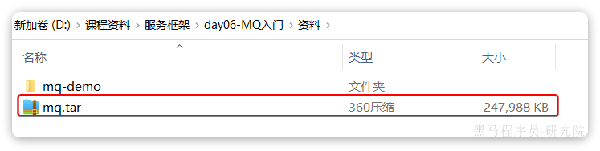

可以看到在安装命令中有两个映射的端口：

- 15672：RabbitMQ提供的管理控制台的端口
- 5672：RabbitMQ的消息发送处理接口

安装完成后，我们访问 http://192.168.88.133:15672即可看到管理控制台。首次访问需要登录，默认的用户名和密码在配置文件中已经指定了。

登录后即可看到管理控制台总览页面：

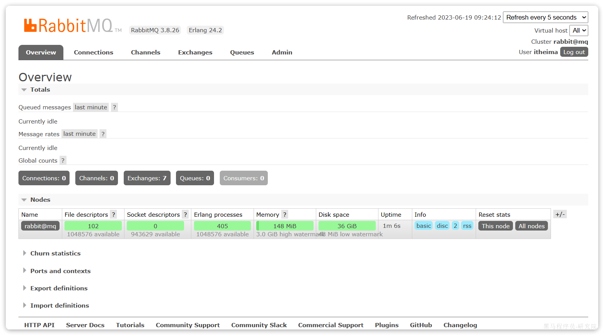

RabbitMQ对应的架构如图：


其中包含几个概念：

- **`publisher`**：生产者，也就是发送消息的一方
- **`consumer`**：消费者，也就是消费消息的一方
- **`queue`**：**队列，存储消息。**生产者投递的消息会暂存在消息队列中，等待消费者处理
- **`exchange`**：交换机，负责消息路由。生产者发送的消息由交换机决定投递到哪个队列。
- **`virtual host`**：**虚拟主机，起到数据隔离的作用。每个虚拟主机相互独立，有各自的exchange、queue**

上述这些东西都可以在RabbitMQ的管理控制台来管理，下一节我们就一起来学习控制台的使用。


### 2.2.收发消息

#### 2.2.1.交换机

我们打开Exchanges选项卡，可以看到已经存在很多交换机：

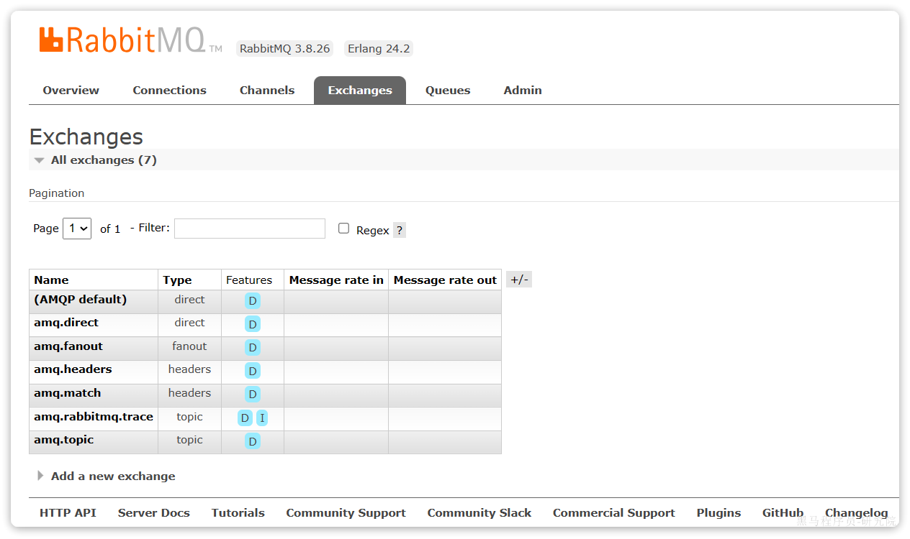

我们点击任意交换机，即可进入交换机详情页面。仍然会利用控制台中的**publish message 发送一条消息**：


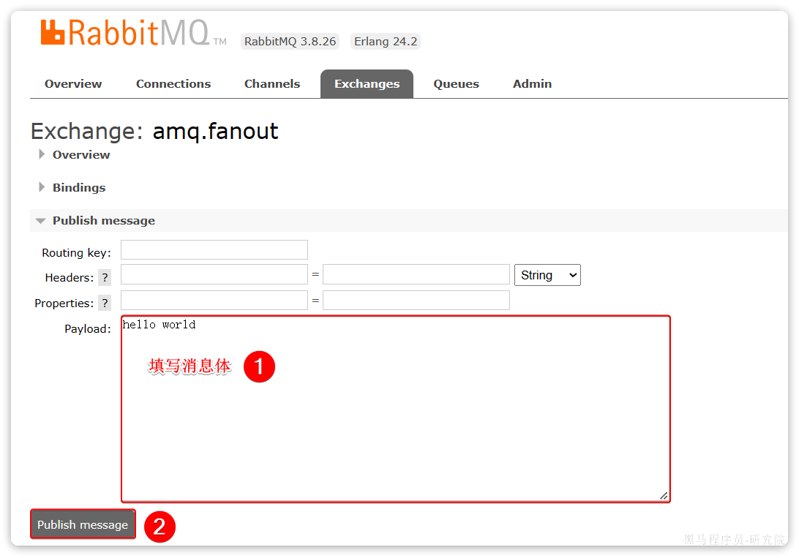

这里是由控制台模拟了生产者发送的消息。**由于没有消费者存在，最终消息丢失**了，这样说明**交换机没有存储消息的能力。**

#### 2.2.2.队列

我们打开`Queues`选项卡，新建一个队列：

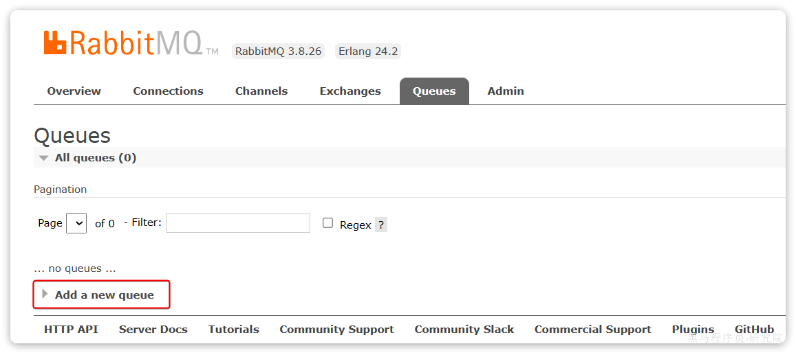

命名为`hello.queue1`：


再以相同的方式，创建一个队列，name为`hello.queue2`，最终队列列表如下：

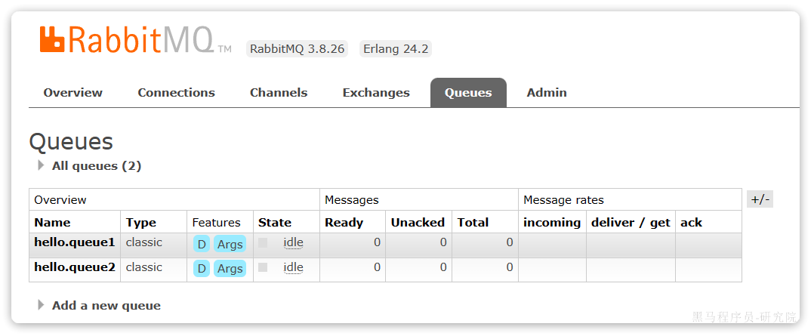

此时，我们再次向`amq.fanout`交换机发送一条消息。会发现**消息依然没有到达队列**！！

怎么回事呢？

发送到交换机的消息，**只会==路由到与其绑定的队列==**，因此仅仅创建队列是不够的，我们还需要**将其与交换机绑定。**

#### 2.2.3.==绑定关系==

点击`Exchanges`选项卡，点击`amq.fanout`交换机，进入交换机详情页，然后点击**`Bindings`菜单**，在表单中填写要绑定的队列名称：


相同的方式，将hello.queue2也绑定到改交换机。

最终，绑定结果如下：


从**队列**也可以看到**绑定了那些交换机**：


#### 2.2.4.发送消息

再次回到exchange页面，找到刚刚绑定的`amq.fanout`，点击进入详情页，再次发送一条消息：


回到`Queues`页面，可以发现`hello.queue`中已经有一条消息了：


**==点击队列名称，进入详情页，查看队列详情==**，这次我们点击**get message**：


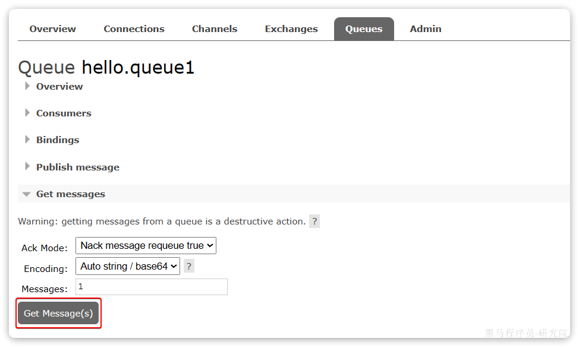

可以看到消息到达队列了：


这个时候如果有消费者监听了MQ的`hello.queue1`或`hello.queue2`队列，自然就能接收到消息了。


### 2.3.数据隔离


#### 2.3.1.用户管理

点击`Admin`选项卡，首先会看到RabbitMQ控制台的用户管理界面：


这里的用户都是**RabbitMQ的管理或运维人员**。目前只有安装RabbitMQ时添加的`itheima`这个用户。仔细观察用户表格中的字段，如下：

- `Name`：`itheima`，也就是用户名
- `Tags`：`administrator`，说明`itheima`用户是超级管理员，**拥有所有权限**
- `Can access virtual host`： `/`，可以访问的`virtual host`，这里的`/`是默认的`virtual host`

对于小型企业而言，出于成本考虑，我们通常**只会搭建一套MQ集群，公司内的多个不同项目同时使用。**这个时候为了避免互相干扰， 我们会利用`virtual host`的隔离特性，将不同项目隔离。一般会做两件事情：

- 给每个项目创建独立的运维账号，**将管理权限分离**。
- **给每个项目创建不同的`virtual host`，将每个项目的数据隔离。**

比如，我们给黑马商城创建一个新的用户，命名为`hmall`，密码：`123`：


你会发现此时hmall用户**没有任何`virtual host`的访问权限**：


别急，接下来我们就来授权。

#### 2.3.2.virtual host

我们先退出登录：


**切换到刚刚创建的hmall用户登录**，然后点击`Virtual Hosts`菜单，进入`virtual host`管理页：

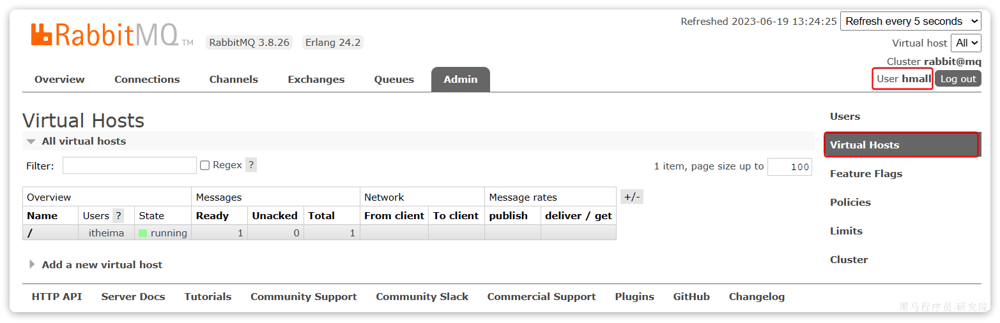

可以看到目前只有一个默认的`virtual host`，名字为 `/`。

 我们可以给黑马商城项目**创建一个单独的`virtual host`，而不是使用默认的`/`**。


创建完成后如图：


由于我们是登录`hmall`账户后创建的`virtual host`，因此回到`users`菜单，你会发现当前用户已经具备了**对`/hmall`这个`virtual host`的访问权限**了：


此时，点击页面右上角的`virtual host`下拉菜单，**切换`virtual host`为 `/hmall`：**


然后再次查看queues选项卡，会发现之前的队列已经看不到了：


这就是基于`virtual host `的隔离效果。


## 3.==Spring AMQP==

Advanced Message Queuing Protocol 高级信息队列协议


将来我们开发业务功能的时候，**肯定不会在控制台收发消息，而是应该基于编程的方式**。由于`RabbitMQ`采用了**AMQP协议**，因此它**具备跨语言的特性**。任何语言只要遵循AMQP协议收发消息，都可以与`RabbitMQ`交互。并且`RabbitMQ`官方也提供了各种不同语言的客户端。

但是，RabbitMQ官方提供的Java客户端编码相对复杂，一般生产环境下我们更多会结合Spring来使用。而Spring的官方刚好基于RabbitMQ提供了这样一套**消息收发的模板工具**：SpringAMQP。并且还基于SpringBoot对其实现了**自动装配**，使用起来非常方便。

SpringAmqp的官方地址：

https://spring.io/projects/spring-amqp

SpringAMQP提供了三个功能：

- **自动声明队列、交换机及其绑定关系**
- **基于注解的监听器模式，异步接收消息**
- 封装了**RabbitTemplate工具**，用于发送消息

这一章我们就一起学习一下，如何利用SpringAMQP实现对RabbitMQ的消息收发。

### 3.1.导入Demo工程

在课前资料给大家提供了一个Demo工程，方便我们学习SpringAMQP的使用：


将其复制到你的工作空间，然后用Idea打开，项目结构如图：


包括三部分：

- mq-demo：父工程，管理项目依赖
- publisher：消息的发送者
- consumer：消息的消费者

在mq-demo这个父工程中，已经配置好了SpringAMQP相关的依赖：

```XML
<?xml version="1.0" encoding="UTF-8"?>
<project xmlns="http://maven.apache.org/POM/4.0.0"
         xmlns:xsi="http://www.w3.org/2001/XMLSchema-instance"
         xsi:schemaLocation="http://maven.apache.org/POM/4.0.0 http://maven.apache.org/xsd/maven-4.0.0.xsd">
    <modelVersion>4.0.0</modelVersion>

    <groupId>cn.itcast.demo</groupId>
    <artifactId>mq-demo</artifactId>
    <version>1.0-SNAPSHOT</version>
    <modules>
        <module>publisher</module>
        <module>consumer</module>
    </modules>
    <packaging>pom</packaging>

    <parent>
        <groupId>org.springframework.boot</groupId>
        <artifactId>spring-boot-starter-parent</artifactId>
        <version>2.7.12</version>
        <relativePath/>
    </parent>

    <properties>
        <maven.compiler.source>8</maven.compiler.source>
        <maven.compiler.target>8</maven.compiler.target>
    </properties>

    <dependencies>
        <dependency>
            <groupId>org.projectlombok</groupId>
            <artifactId>lombok</artifactId>
        </dependency>
        <!--AMQP依赖，包含RabbitMQ-->
        <dependency>
            <groupId>org.springframework.boot</groupId>
            <artifactId>spring-boot-starter-amqp</artifactId>
        </dependency>
        <!--单元测试-->
        <dependency>
            <groupId>org.springframework.boot</groupId>
            <artifactId>spring-boot-starter-test</artifactId>
        </dependency>
    </dependencies>
</project>
```

因此，子工程中就可以直接使用SpringAMQP了。

### 3.2.快速入门


在之前的案例中，我们都是经过交换机发送消息到队列，不过有时候为了**测试方便**，我们也可以直接向队列发送消息，**暂时跳过交换机**。

在入门案例中，我们就演示这样的**简单模型**，如图：


也就是：

- publisher直接发送消息到队列
- 消费者监听并处理队列中的消息

**注意**：这种模式一般**测试使用**，很少在生产中使用。

为了方便测试，我们现在控制台**新建一个队列：simple.queue**


添加成功：

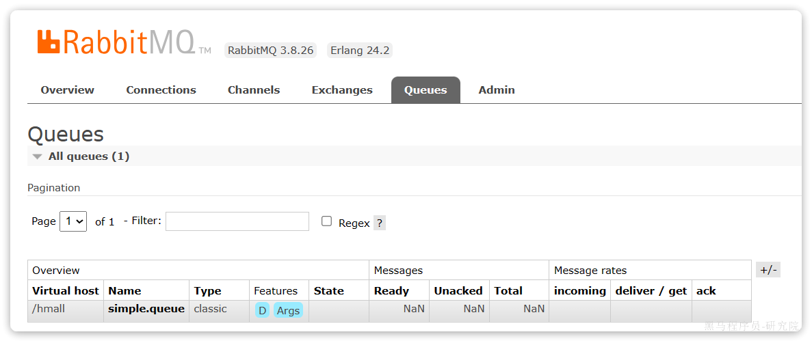

接下来，我们就可以利用Java代码收发消息了。


#### 3.2.0.==使用步骤==


```xml
<!--AMQP依赖，包含RabbitMQ-->
<dependency>
    <groupId>org.springframework.boot</groupId>
    <artifactId>spring-boot-starter-amqp</artifactId>
</dependency>
```


```yaml
spring:
  rabbitmq:
    host: 192.168.88.133 # 你的虚拟机IP
    port: 5672 # 端口
    virtual-host: /hmall # 虚拟主机
    username: hmall # 用户名
    password: 123 # 密码
```


#### 3.2.1.消息发送

首先配置MQ地址，在`publisher`服务的`application.yml`中添加配置：

```YAML
spring:
  rabbitmq:
    host: 192.168.88.133 # 你的虚拟机IP
    port: 5672 # 端口
    virtual-host: /hmall # 虚拟主机
    username: hmall # 用户名
    password: 123 # 密码
```


然后在`publisher`服务中编写测试类`SpringAmqpTest`，并利用`RabbitTemplate`实现消息发送：

```Java
package com.itheima.publisher.amqp;

import org.junit.jupiter.api.Test;
import org.springframework.amqp.rabbit.core.RabbitTemplate;
import org.springframework.beans.factory.annotation.Autowired;
import org.springframework.boot.test.context.SpringBootTest;

@SpringBootTest
public class SpringAmqpTest {

    @Autowired
    private RabbitTemplate rabbitTemplate;

    @Test
    public void testSimpleQueue() {
        // 队列名称
        String queueName = "simple.queue";
        // 消息
        String message = "hello, spring amqp!";
        // 发送消息
        rabbitTemplate.convertAndSend(queueName, message);
    }
}
```

打开控制台，可以看到消息已经发送到队列中：


接下来，我们再来实现消息接收。

#### 3.2.2.消息接收

首先配置MQ地址，在`consumer`服务的`application.yml`中添加配置：

```YAML
spring:
  rabbitmq:
    host: 192.168.150.101 # 你的虚拟机IP
    port: 5672 # 端口
    virtual-host: /hmall # 虚拟主机
    username: hmall # 用户名
    password: 123 # 密码
```

然后在`consumer`服务的`com.itheima.consumer.listener`包中新建一个类`SpringRabbitListener`，代码如下：

```Java
package com.itheima.consumer.listener;

import org.springframework.amqp.rabbit.annotation.RabbitListener;
import org.springframework.stereotype.Component;

@Component
public class SpringRabbitListener {
    // 利用RabbitListener来声明要监听的队列信息
    // 将来一旦监听的队列中有了消息，就会推送给当前服务，调用当前方法，处理消息。
    // 可以看到方法体中接收的就是消息体的内容
    @RabbitListener(queues = "simple.queue")
    public void listenSimpleQueueMessage(String msg) throws InterruptedException {
        System.out.println("spring 消费者接收到消息：【" + msg + "】");
    }
}
```

#### 3.2.3.测试

启动consumer服务，然后在publisher服务中运行测试代码，发送MQ消息。最终consumer收到消息：


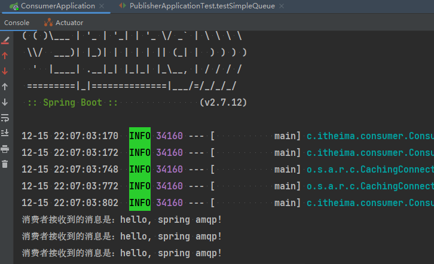


### 3.3.==WorkQueues模型==

Work queues，**任务模型**。简单来说就是**让==多个消费者绑定到一个队列==，==共同消费队列中的消息==**。


当**消息处理比较耗时**的时候，可能**生产消息的速度会远远大于消息的消费速度**。长此以往，**消息就会堆积越来越多，**无法及时处理。

此时就可以使用work 模型，**多个消费者共同处理消息处理，消息处理的速度就能大大提高**了。

接下来，我们就来模拟这样的场景。

首先，我们在控制台创建一个新的队列，命名为`work.queue`：


#### 3.3.1.消息发送

这次我们循环发送，模拟大量消息堆积现象。

在publisher服务中的SpringAmqpTest类中添加一个测试方法：

```Java
    /**
     * workQueue
     * 向队列中不停发送消息，模拟消息堆积。
     */
    @Test
    public void testWorkQueue() throws InterruptedException {
        // 队列名称
        String queueName = "work.queue";
        // 消息
        String message = "hello, message_";
        for (int i = 0; i < 50; i++) {
            // 发送消息，每20毫秒发送一次，相当于每秒发送50条消息
            rabbitTemplate.convertAndSend(queueName, message + i);
            Thread.sleep(20);
        }
    }
```

#### 3.3.2.消息接收

要模拟多个消费者绑定同一个队列，我们在consumer服务的SpringRabbitListener中添加2个新的方法：

```Java
@RabbitListener(queues = "work.queue")
public void listenWorkQueue1(String msg) throws InterruptedException {
    System.out.println("消费者1接收到消息：【" + msg + "】" + LocalTime.now());
    Thread.sleep(20);
}

@RabbitListener(queues = "work.queue")
public void listenWorkQueue2(String msg) throws InterruptedException {
    System.err.println("消费者2........接收到消息：【" + msg + "】" + LocalTime.now());
    Thread.sleep(200);
}
```

注意到这两消费者，都设置了`Thead.sleep`，**模拟任务耗时**：

- 消费者1 sleep了20毫秒，相当于**每秒钟处理50个消息**
- 消费者2 sleep了200毫秒，相当于**每秒处理5个消息**

#### 3.3.3.测试

启动ConsumerApplication后，在执行publisher服务中刚刚编写的发送测试方法testWorkQueue。


最终结果如下：

```Java
消费者1接收到消息：【hello, message_0】21:06:00.869555300
消费者2........接收到消息：【hello, message_1】21:06:00.884518
消费者1接收到消息：【hello, message_2】21:06:00.907454400
消费者1接收到消息：【hello, message_4】21:06:00.953332100
消费者1接收到消息：【hello, message_6】21:06:00.997867300
消费者1接收到消息：【hello, message_8】21:06:01.042178700
消费者2........接收到消息：【hello, message_3】21:06:01.086478800
消费者1接收到消息：【hello, message_10】21:06:01.087476600
消费者1接收到消息：【hello, message_12】21:06:01.132578300
消费者1接收到消息：【hello, message_14】21:06:01.175851200
消费者1接收到消息：【hello, message_16】21:06:01.218533400
消费者1接收到消息：【hello, message_18】21:06:01.261322900
消费者2........接收到消息：【hello, message_5】21:06:01.287003700
消费者1接收到消息：【hello, message_20】21:06:01.304412400
消费者1接收到消息：【hello, message_22】21:06:01.349950100
消费者1接收到消息：【hello, message_24】21:06:01.394533900
消费者1接收到消息：【hello, message_26】21:06:01.439876500
消费者1接收到消息：【hello, message_28】21:06:01.482937800
消费者2........接收到消息：【hello, message_7】21:06:01.488977100
消费者1接收到消息：【hello, message_30】21:06:01.526409300
消费者1接收到消息：【hello, message_32】21:06:01.572148
消费者1接收到消息：【hello, message_34】21:06:01.618264800
消费者1接收到消息：【hello, message_36】21:06:01.660780600
消费者2........接收到消息：【hello, message_9】21:06:01.689189300
消费者1接收到消息：【hello, message_38】21:06:01.705261
消费者1接收到消息：【hello, message_40】21:06:01.746927300
消费者1接收到消息：【hello, message_42】21:06:01.789835
消费者1接收到消息：【hello, message_44】21:06:01.834393100
消费者1接收到消息：【hello, message_46】21:06:01.875312100
消费者2........接收到消息：【hello, message_11】21:06:01.889969500
消费者1接收到消息：【hello, message_48】21:06:01.920702500
消费者2........接收到消息：【hello, message_13】21:06:02.090725900
消费者2........接收到消息：【hello, message_15】21:06:02.293060600
消费者2........接收到消息：【hello, message_17】21:06:02.493748
消费者2........接收到消息：【hello, message_19】21:06:02.696635100
消费者2........接收到消息：【hello, message_21】21:06:02.896809700
消费者2........接收到消息：【hello, message_23】21:06:03.099533400
消费者2........接收到消息：【hello, message_25】21:06:03.301446400
消费者2........接收到消息：【hello, message_27】21:06:03.504999100
消费者2........接收到消息：【hello, message_29】21:06:03.705702500
消费者2........接收到消息：【hello, message_31】21:06:03.906601200
消费者2........接收到消息：【hello, message_33】21:06:04.108118500
消费者2........接收到消息：【hello, message_35】21:06:04.308945400
消费者2........接收到消息：【hello, message_37】21:06:04.511547700
消费者2........接收到消息：【hello, message_39】21:06:04.714038400
消费者2........接收到消息：【hello, message_41】21:06:04.916192700
消费者2........接收到消息：【hello, message_43】21:06:05.116286400
消费者2........接收到消息：【hello, message_45】21:06:05.318055100
消费者2........接收到消息：【hello, message_47】21:06:05.520656400
消费者2........接收到消息：【hello, message_49】21:06:05.723106700
```

可以看到消费者1和消费者2**竟然每人消费了25条消息**：

- 消费者1很快完成了自己的25条消息
- 消费者2却在**缓慢的处理自己的25条消息**。

也就是说消息是**==平均分配==给每个消费者，==并没有考虑到消费者的处理能力==**。导致1个消费者空闲，另一个消费者忙的不可开交。没有充分利用每一个消费者的能力，最终消息处理的耗时远远超过了1秒。这样显然是有问题的。

#### 3.3.4.能者多劳

在spring中有一个简单的配置，可以解决这个问题。我们修改**consumer(==消费者==)服务**的application.yml文件，添加配置：

```YAML
spring:
  rabbitmq:
    listener:
      simple:
        prefetch: 1 # 每次只能获取一条消息，处理完成才能获取下一个消息
```

再次测试，发现结果如下：


```Java
消费者1接收到消息：【hello, message_0】21:12:51.659664200
消费者2........接收到消息：【hello, message_1】21:12:51.680610
消费者1接收到消息：【hello, message_2】21:12:51.703625
消费者1接收到消息：【hello, message_3】21:12:51.724330100
消费者1接收到消息：【hello, message_4】21:12:51.746651100
消费者1接收到消息：【hello, message_5】21:12:51.768401400
消费者1接收到消息：【hello, message_6】21:12:51.790511400
消费者1接收到消息：【hello, message_7】21:12:51.812559800
消费者1接收到消息：【hello, message_8】21:12:51.834500600
消费者1接收到消息：【hello, message_9】21:12:51.857438800
消费者1接收到消息：【hello, message_10】21:12:51.880379600
消费者2........接收到消息：【hello, message_11】21:12:51.899327100
消费者1接收到消息：【hello, message_12】21:12:51.922828400
消费者1接收到消息：【hello, message_13】21:12:51.945617400
消费者1接收到消息：【hello, message_14】21:12:51.968942500
消费者1接收到消息：【hello, message_15】21:12:51.992215400
消费者1接收到消息：【hello, message_16】21:12:52.013325600
消费者1接收到消息：【hello, message_17】21:12:52.035687100
消费者1接收到消息：【hello, message_18】21:12:52.058188
消费者1接收到消息：【hello, message_19】21:12:52.081208400
消费者2........接收到消息：【hello, message_20】21:12:52.103406200
消费者1接收到消息：【hello, message_21】21:12:52.123827300
消费者1接收到消息：【hello, message_22】21:12:52.146165100
消费者1接收到消息：【hello, message_23】21:12:52.168828300
消费者1接收到消息：【hello, message_24】21:12:52.191769500
消费者1接收到消息：【hello, message_25】21:12:52.214839100
消费者1接收到消息：【hello, message_26】21:12:52.238998700
消费者1接收到消息：【hello, message_27】21:12:52.259772600
消费者1接收到消息：【hello, message_28】21:12:52.284131800
消费者2........接收到消息：【hello, message_29】21:12:52.306190600
消费者1接收到消息：【hello, message_30】21:12:52.325315800
消费者1接收到消息：【hello, message_31】21:12:52.347012500
消费者1接收到消息：【hello, message_32】21:12:52.368508600
消费者1接收到消息：【hello, message_33】21:12:52.391785100
消费者1接收到消息：【hello, message_34】21:12:52.416383800
消费者1接收到消息：【hello, message_35】21:12:52.439019
消费者1接收到消息：【hello, message_36】21:12:52.461733900
消费者1接收到消息：【hello, message_37】21:12:52.485990
消费者1接收到消息：【hello, message_38】21:12:52.509219900
消费者2........接收到消息：【hello, message_39】21:12:52.523683400
消费者1接收到消息：【hello, message_40】21:12:52.547412100
消费者1接收到消息：【hello, message_41】21:12:52.571191800
消费者1接收到消息：【hello, message_42】21:12:52.593024600
消费者1接收到消息：【hello, message_43】21:12:52.616731800
消费者1接收到消息：【hello, message_44】21:12:52.640317
消费者1接收到消息：【hello, message_45】21:12:52.663111100
消费者1接收到消息：【hello, message_46】21:12:52.686727
消费者1接收到消息：【hello, message_47】21:12:52.709266500
消费者2........接收到消息：【hello, message_48】21:12:52.725884900
消费者1接收到消息：【hello, message_49】21:12:52.746299900
```

可以发现，**由于消费者1处理速度较快，所以处理了更多的消息**；消费者2处理**速度较慢**，**只处理了6条消息。**而最终总的执行耗时也在1秒左右，大大提升。

正所谓能者多劳，这样充分利用了每一个消费者的处理能力，可以**有效避免消息积压问题**。


#### 3.3.5.总结


Work模型的使用：

- 多个消费者绑定到一个队列，同一条消息只会被一个消费者处理
- 通过**设置prefetch**来控制消费者**预取的消息数量**


### 3.4.交换机类型

在之前的两个测试案例中，都没有交换机，生产者直接发送消息到队列。而一旦引入交换机，消息发送的模式会有很大变化：


可以看到，在订阅模型中，多了一个exchange角色，而且过程略有变化：

- **Publisher**：生产者，不再发送消息到队列中，而是发给交换机
- **Exchange**：**交换机**，一方面，**接收生产者发送的消息**。另一方面，知道如何处理消息，例如**递交给某个特别队列、递交给所有队列、或是将消息丢弃**。到底如何操作，取决于**Exchange的类型**。
- **Queue**：消息队列也与以前一样，接收消息、缓存消息。不过队列一定要与交换机绑定。
- **Consumer**：消费者，与以前一样，订阅队列，没有变化

**Exchange（交换机）==只负责转发消息，不具备存储消息的能力==**，因此如果没有任何队列与Exchange绑定，或者**没有符合路由规则的队列**，那么**==消息会丢失==**！

交换机的类型有四种：

- ==**Fanout**==：**广播，将消息交给所有绑定到交换机的队列。**我们最早在控制台使用的正是Fanout交换机
- ==**Direct**==：**订阅**，基于**RoutingKey（路由key）**发送给订阅了消息的队列
- ==**Topic**==：**通配符订阅**，与Direct类似，只不过RoutingKey可以使用**通配符**
- **Headers**：头匹配，基于MQ的**消息头**匹配，用的较少。

课堂中，我们讲解前面的三种交换机模式。


### 3.5.Fanout交换机-==广播==

Fanout，英文翻译是扇出，我觉得在MQ中叫**广播**更合适。

在广播模式下，消息发送流程是这样的：


- 1）  可以有多个队列
- 2）  **每个队列都要绑定到Exchange（交换机）**
- 3）  生产者发送的消息，只能发送到交换机
- 4）  交换机把消息发送给**绑定**过的所有队列
- 5）  订阅队列的消费者都能拿到消息

我们的计划是这样的：


- 创建一个名为` hmall.fanout`的交换机，类型是`Fanout`
- 创建两个队列`fanout.queue1`和`fanout.queue2`，绑定到交换机`hmall.fanout`


#### 3.5.1.声明队列和交换机

在控制台创建队列`fanout.queue1`:


在创建一个队列`fanout.queue2`：


然后再创建一个交换机：


然后绑定两个队列到交换机：


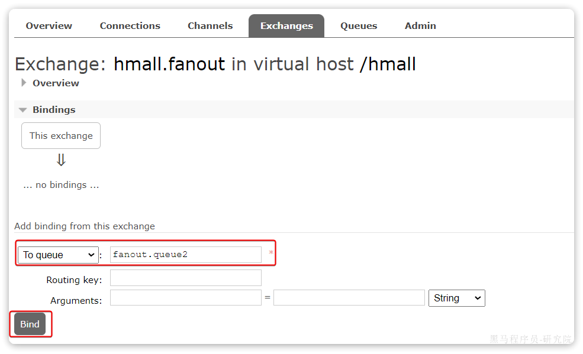

#### 3.5.2.消息发送

在publisher服务的SpringAmqpTest类中添加测试方法：

```Java
@Test
public void testFanoutExchange() {
    // 交换机名称
    String exchangeName = "hmall.fanout";
    // 消息
    String message = "hello, everyone!";
    rabbitTemplate.convertAndSend(exchangeName, "", message);
}
```

#### 3.5.3.消息接收

在consumer服务的SpringRabbitListener中添加两个方法，作为消费者：

```Java
@RabbitListener(queues = "fanout.queue1")
public void listenFanoutQueue1(String msg) {
    System.out.println("消费者1接收到Fanout消息：【" + msg + "】");
}

@RabbitListener(queues = "fanout.queue2")
public void listenFanoutQueue2(String msg) {
    System.out.println("消费者2接收到Fanout消息：【" + msg + "】");
}
```

#### 3.5.4.总结


交换机的作用是什么？

- 接收publisher发送的消息
- 将消息按照规则路由到与之绑定的队列
- 不能缓存消息，路由失败，消息丢失
- FanoutExchange的会将消息路由到每个绑定的队列


### 3.6.Direct交换机-==定向路由==

#### **==应用场景==**

​		用户下单支付后，后通知交易服务、短信服务、积分服务。但是如果**下单支付后又取消**了，此时就只需要通知给**交易服务**进行取消等操作就行，**无需进行其他的积分、通知等服务。**，此时就**==不需要使用Fanout广播类型的交换机，而应该使用Direct定向路由的交换机。==**


在Fanout模式中，**一条消息，会被所有订阅的队列都消费**。但是，在某些场景下，我们希望不同的消息被不同的队列消费。这时就要用到Direct类型的Exchange。


在Direct模型下：

- 队列与交换机的绑定，**不能是任意绑定了**，而是要指定一个`RoutingKey`（**路由key**）
- 消息的发送方在 向 Exchange发送消息时，也必须**指定消息的 `RoutingKey`**。
- Exchange不再把消息交给每一个绑定的队列，而是根据消息的`Routing Key`进行判断，**只有队列的`Routingkey`与消息的 `Routing key`完全一致**，才会接收到消息（**==但是若消息队列的每个bindingKey都有相同的，比如这里的red，此时若指定的RoutingKey为red，则也可以做到Fanout交换机广播的效果。==**）


**案例需求如图**：

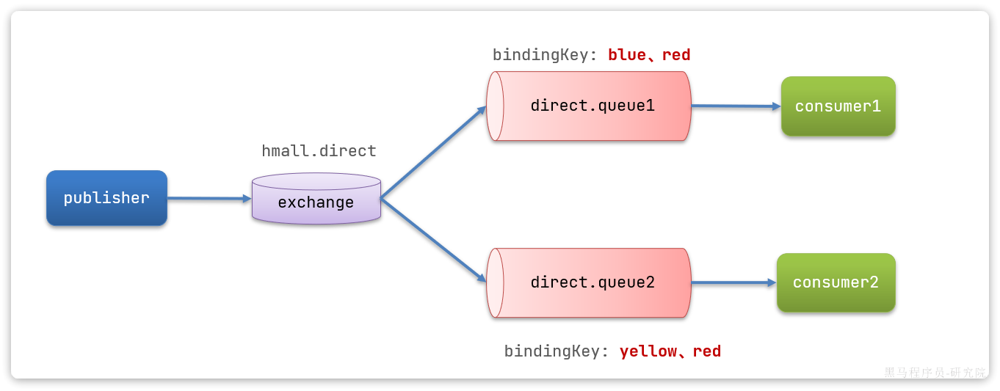

1.  声明一个名为`hmall.direct`的交换机
2. 声明队列`direct.queue1`，绑定`hmall.direct`，`bindingKey`为`blud`和`red`
3. 声明队列`direct.queue2`，绑定`hmall.direct`，`bindingKey`为`yellow`和`red`
4.  在`consumer`服务中，编写两个消费者方法，分别监听direct.queue1和direct.queue2 
5.  在publisher中编写测试方法，向`hmall.direct`发送消息 

#### 3.6.1.声明队列和交换机

首先在控制台声明两个队列`direct.queue1`和`direct.queue2`，这里不再展示过程：


然后**声明一个direct类型的交换机**，命名为`hmall.direct`:


然后使用`red`和`blue`作为key，绑定`direct.queue1`到`hmall.direct`：


同理，使用**`red`和`yellow`作为key**，绑定`direct.queue2`到`hmall.direct`，步骤略，最终结果：


#### 3.6.2.消息接收

在consumer服务的SpringRabbitListener中添加方法：

```Java
/**
 * 监听绑定Direct交换机的队列
 * @param msg
 */
@RabbitListener(queues = "direct.queue1")
public void listenDirectQueue1(String msg) {
    System.out.println("消费者1接收到direct.queue1的消息：【" + msg + "】");
}

@RabbitListener(queues = "direct.queue2")
public void listenDirectQueue2(String msg) {
    System.out.println("消费者2接收到direct.queue2的消息：【" + msg + "】");
}
```

#### 3.6.3.消息发送

在publisher服务的SpringAmqpTest类中添加测试方法：

```Java
@Test
public void testSendDirectExchange() {
    // 交换机名称
    String exchangeName = "hmall.direct";
    // 消息
    String message = "红色警报！日本乱排核废水，导致海洋生物变异，惊现哥斯拉！";
    // 发送消息
    rabbitTemplate.convertAndSend(exchangeName, "red", message);
}
```

由于使用的red这个key，所以**两个消费者都收到了消息**：


我们再**切换为blue这个key**：

```Java
@Test
public void testSendDirectExchange() {
    // 交换机名称
    String exchangeName = "hmall.direct";
    // 消息
    String message = "最新报道，哥斯拉是居民自治巨型气球，虚惊一场！";
    // 发送消息
    rabbitTemplate.convertAndSend(exchangeName, "blue", message);
}
```

你会发现，**只有消费者1收到了消息**：


#### 3.6.4.总结


描述下Direct交换机与Fanout交换机的差异？

- Fanout交换机将消息路由给每一个与之绑定的队列
- Direct交换机根据RoutingKey判断路由给哪个队列
- 如果多个队列具有相同的RoutingKey，则与Fanout功能类似


### 3.7.Topic交换机-==通配符==


#### 3.7.1.说明

`Topic`类型的`Exchange`与`Direct`相比，都是可以**根据`RoutingKey`把消息路由到不同的队列**。

只不过`Topic`类型`Exchange`可以让队列在绑定`BindingKey` 的时候**==使用通配符==**！

```
BindingKey` 一般都是有一个或多个单词组成，多个单词之间以`.`分割，例如： `item.insert
```

通配符规则：

- ==**`#`：匹配一个或多个词**==
- `*`：匹配不多不少恰好1个词

举例：

- `item.#`：能够匹配`item.spu.insert` 或者 `item.spu`
- `item.*`：只能匹配`item.spu`

图示：


假如此时publisher发送的消息使用的`RoutingKey`共有四种：

- `china.news `代表有中国的新闻消息；
- `china.weather` 代表中国的天气消息；
- `japan.news` 则代表日本新闻
- `japan.weather` 代表日本的天气消息；


解释：

- **`topic.queue1`：绑定的是`china.#` ，凡是以 `china.`==开头==的`routing key` 都会被匹配到**，包括：
  - `china.news`
  - `china.weather`
- **`topic.queue2`：绑定的是`#.news` ，凡是以 `.news`==结尾==的 `routing key` 都会被匹配。包括:**
  - `china.news`
  - `japan.news`

接下来，我们就按照上图所示，来演示一下Topic交换机的用法。

首先，在控制台按照图示例子创建队列、交换机，并**利用通配符绑定队列和交换机**。此处步骤略。最终结果如下：


#### 3.7.2.消息发送

在publisher服务的SpringAmqpTest类中添加测试方法：

```Java
/**
 * topicExchange
 */
@Test
public void testSendTopicExchange() {
    // 交换机名称
    String exchangeName = "hmall.topic";
    // 消息
    String message = "喜报！孙悟空大战哥斯拉，胜!";
    // 发送消息
    rabbitTemplate.convertAndSend(exchangeName, "china.news", message);
}
```

#### 3.7.3.消息接收

在consumer服务的SpringRabbitListener中添加方法：

```Java
@RabbitListener(queues = "topic.queue1")
public void listenTopicQueue1(String msg){
    System.out.println("消费者1接收到topic.queue1的消息：【" + msg + "】");
}

@RabbitListener(queues = "topic.queue2")
public void listenTopicQueue2(String msg){
    System.out.println("消费者2接收到topic.queue2的消息：【" + msg + "】");
}
```

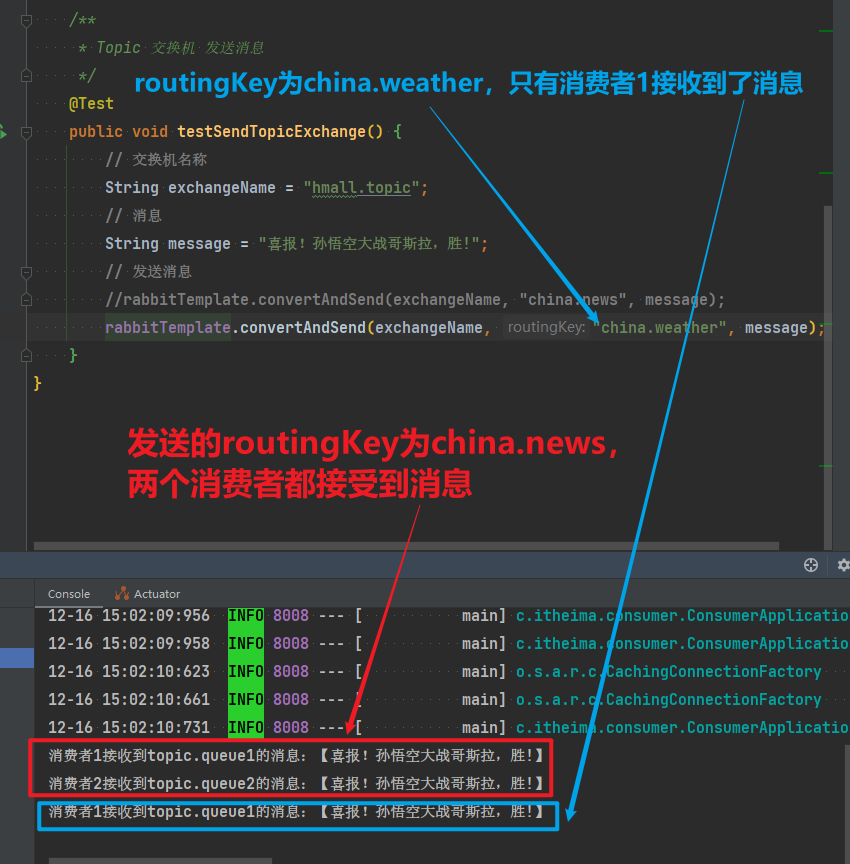

#### 3.7.4.总结


描述下Direct交换机与Topic交换机的差异？

- Topic交换机接收的消息RoutingKey必须是多个单词，以 **`.`** 分割
- Topic交换机与队列绑定时的bindingKey可以指定通配符
- `#`：代表0个或多个词
- `*`：代表1个词


### 3.8.==声明-队列和交换机==

在之前我们都是**基于RabbitMQ控制台**来**创建队列、交换机**。但是在实际开发时，队列和交换机是程序员定义的，将来项目上线，又要交给运维去创建。那么程序员就需要把程序中运行的所有队列和交换机都写下来，交给运维。在这个过程中是很容易出现错误的。

因此推荐的做法是由程序启动时检查队列和交换机是否存在，如果**不存在自动创建**。

#### **==声明队列和交换机，消费者中去配置==**


#### 3.8.1.基本API


SpringAMQP提供了一个**Queue类，用来创建队列**：


SpringAMQP还提供了一个**Exchange接口，来表示所有不同类型的交换机**：


我们可以自己创建队列和交换机，不过SpringAMQP还提供了**ExchangeBuilder**来简化这个过程：

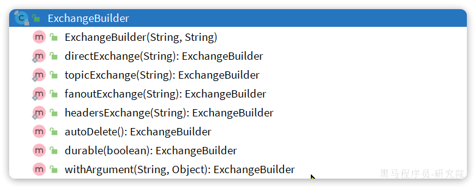

而在绑定队列和交换机时，则需要使用**BindingBuilder**来创建Binding对象：


#### 3.8.2.fanout示例

在consumer中创建一个类，声明队列和交换机：

```Java
@Configuration
public class FanoutConfig {
    /**
     * 声明交换机
     * @return Fanout类型交换机
     */
    @Bean
    public FanoutExchange fanoutExchange(){
        //return new FanoutExchange("hmall.fanout");
        return ExchangeBuilder.fanoutExchange("hmall.fanout").build();
    }

    /**
     * 第1个队列
     */
    @Bean
    public Queue fanoutQueue1(){
//        return new Queue("fanout.queue1");
        return QueueBuilder.durable("fanout.queue1").build();
    }

    /**
     * 绑定队列和交换机
     */
    @Bean
    public Binding bindingQueue1(Queue fanoutQueue1, FanoutExchange fanoutExchange){
        return BindingBuilder.bind(fanoutQueue1).to(fanoutExchange);
    }

    /**
     * 第2个队列
     */
    @Bean
    public Queue fanoutQueue2(){
        return new Queue("fanout.queue2");
    }

    /**
     * 绑定队列和交换机
     */
    @Bean
    public Binding bindingQueue2(Queue fanoutQueue2, FanoutExchange fanoutExchange){
        return BindingBuilder.bind(fanoutQueue2).to(fanoutExchange);
    }
}
```

#### 3.8.2.direct示例

direct模式由于要绑定多个KEY，会非常麻烦，每一个Key都要编写一个binding：

```Java
package com.itheima.consumer.config;

import org.springframework.amqp.core.*;
import org.springframework.context.annotation.Bean;
import org.springframework.context.annotation.Configuration;

@Configuration
public class DirectConfig {

    /**
     * 声明交换机
     * @return Direct类型交换机
     */
    @Bean
    public DirectExchange directExchange(){
        return ExchangeBuilder.directExchange("hmall.direct").build();
    }

    /**
     * 第1个队列
     */
    @Bean
    public Queue directQueue1(){
        return new Queue("direct.queue1");
    }

    /**
     * 绑定队列和交换机
     */
    @Bean
    public Binding bindingQueue1WithRed(Queue directQueue1, DirectExchange directExchange){
        return BindingBuilder.bind(directQueue1).to(directExchange).with("red");
    }
    /**
     * 绑定队列和交换机
     */
    @Bean
    public Binding bindingQueue1WithBlue(Queue directQueue1, DirectExchange directExchange){
        return BindingBuilder.bind(directQueue1).to(directExchange).with("blue");
    }

    /**
     * 第2个队列
     */
    @Bean
    public Queue directQueue2(){
        return new Queue("direct.queue2");
    }

    /**
     * 绑定队列和交换机
     */
    @Bean
    public Binding bindingQueue2WithRed(Queue directQueue2, DirectExchange directExchange){
        return BindingBuilder.bind(directQueue2).to(directExchange).with("red");
    }
    /**
     * 绑定队列和交换机
     */
    @Bean
    public Binding bindingQueue2WithYellow(Queue directQueue2, DirectExchange directExchange){
        return BindingBuilder.bind(directQueue2).to(directExchange).with("yellow");
    }
}
```

#### 3.8.4.==基于注解声明==  


基于@Bean的方式声明队列和交换机比较麻烦，Spring还提供了基于注解方式来声明。

例如，我们同样声明Direct模式的交换机和队列：

```Java
@RabbitListener(bindings = @QueueBinding(
    value = @Queue(name = "direct.queue1", durable = "true"),
    exchange = @Exchange(name = "hmall.direct", type = ExchangeTypes.DIRECT, durable 		= "true"),
    key = {"red", "bule"}
))
public void listenDirectQueue1(String msg){
    System.out.println("消费者1接收到direct.queue1的消息：【" + msg + "】");
}

@RabbitListener(bindings = @QueueBinding(
    value = @Queue(name = "direct.queue2", durable = "true"),
    exchange = @Exchange(name = "hmall.direct", type = ExchangeTypes.DIRECT, durable 		= "true"),
    key = {"red", "yellow"}
))
public void listenDirectQueue2(String msg){
    System.out.println("消费者2接收到direct.queue2的消息：【" + msg + "】");
}
```

是不是简单多了。

再试试Topic模式：

```Java
@RabbitListener(bindings = @QueueBinding(
    value = @Queue(name = "topic.queue1"),
    exchange = @Exchange(name = "hmall.topic", type = ExchangeTypes.TOPIC),
    key = "china.#"
))
public void listenTopicQueue1(String msg){
    System.out.println("消费者1接收到topic.queue1的消息：【" + msg + "】");
}

@RabbitListener(bindings = @QueueBinding(
    value = @Queue(name = "topic.queue2"),
    exchange = @Exchange(name = "hmall.topic", type = ExchangeTypes.TOPIC),
    key = "#.news"
))
public void listenTopicQueue2(String msg){
    System.out.println("消费者2接收到topic.queue2的消息：【" + msg + "】");
}
```

### 3.9.==消息转换器==

Spring的消息发送代码接收的消息体是一个**Object**：

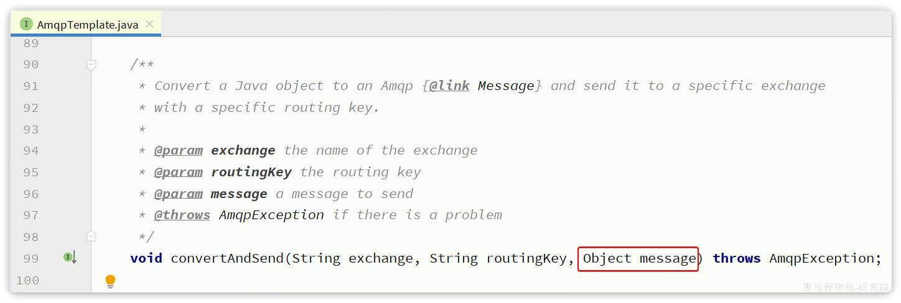

而在数据传输时，它会把你**发送的==消息序列化为字节==发送给MQ，接收消息的时候，还会把==字节反序列化为Java对象==。**

只不过，**默认**情况下Spring采用的序列化方式是**JDK序列化**。众所周知，JDK序列化存在下列问题：

- **数据体积过大**
- **有安全漏洞**
- **可读性差**

我们来测试一下。

#### 3.9.1.测试默认转换器

1）创建测试队列

首先，我们在consumer服务中声明一个新的配置类：


利用@Bean的方式创建一个队列，

具体代码：

```Java
package com.itheima.consumer.config;

import org.springframework.amqp.core.Queue;
import org.springframework.context.annotation.Bean;
import org.springframework.context.annotation.Configuration;

@Configuration
public class MessageConfig {

    @Bean
    public Queue objectQueue() {
        return new Queue("object.queue");
    }
}
```

注意，这里我们先不要给这个队列添加消费者，我们要**查看消息体的格式**。


**重启consumer服务以后，该队列就会被自动创建出来了**：


2）发送消息

我们在publisher模块的SpringAmqpTest中新增一个消息发送的代码，发送一个**Map对象**：

```Java
@Test
public void testSendMap() throws InterruptedException {
    // 准备消息
    Map<String,Object> msg = new HashMap<>();
    msg.put("name", "柳岩");
    msg.put("age", 21);
    // 发送消息
    rabbitTemplate.convertAndSend("object.queue", msg);
}
```

发送消息后查看控制台：


可以看到**消息格式非常不友好**：

- ==**数据体积过大**==需要181字节
- ==**可读性差**==，展示java对象序列化为字节码的格式
- **有安全漏洞**


#### 3.9.2.==配置JSON转换器==

显然，JDK序列化方式并不合适。我们希望消息体的**体积更小、可读性更高**，因此可以使用**JSON方式来做序列化和反序列化**。


在`publisher`和`consumer`两个服务中都引入依赖：

```XML
<!--Jackson消息转换器-->
<dependency>
    <groupId>com.fasterxml.jackson.core</groupId>
    <artifactId>jackson-databind</artifactId>
</dependency>

<!-- 或者 -->
<dependency>
    <groupId>com.fasterxml.jackson.dataformat</groupId>
    <artifactId>jackson-dataformat-xml</artifactId>
    <version>2.9.10</version>
</dependency>
```

注意，**如果项目中引入了`spring-boot-starter-web`依赖，则无需再次引入`Jackson`依赖。**

配置消息转换器，在`publisher`和`consumer`两个服务的启动类中添加一个Bean即可：

```Java
import org.springframework.amqp.support.converter.Jackson2JsonMessageConverter;
import org.springframework.amqp.support.converter.MessageConverter; //Amqp下的消息转换器
import org.springframework.context.annotation.Bean;
import org.springframework.context.annotation.Configuration;

/**
 * @author xiaopeng
 * @version 1.0
 */
@Configuration
public class MessageConvertConfiguration {
    /**
     * JSON消息转换器配置
     */
    @Bean
    public MessageConverter messageConverter() {
        // 1.定义消息转换器
        Jackson2JsonMessageConverter jackson2JsonMessageConverter = new Jackson2JsonMessageConverter();
        // 2.配置自动创建消息id，用于识别不同消息，也可以在业务中基于ID判断是否是重复消息
        jackson2JsonMessageConverter.setCreateMessageIds(true);
        return jackson2JsonMessageConverter;
    }
}
```

消息转换器中**添加的==messageId==可以便于我们将来做==幂等性判断==**。

此时，我们到MQ控制台**删除**`object.queue`中的旧的消息。然后再次执行刚才的消息发送的代码，到MQ的控制台查看消息结构：


#### 3.9.3.消费者接收Object

我们在consumer服务中定义一个新的消费者，publisher是**用Map发送**，那么消费者也一定要**用Map接收**，格式如下：

```Java
@RabbitListener(queues = "object.queue")
public void listenSimpleQueueMessage(Map<String, Object> msg) throws InterruptedException {
    System.out.println("消费者接收到object.queue消息：【" + msg + "】");
}
```


## 4.业务改造

案例需求：**改造余额支付功能**，将支付成功后**==基于OpenFeign==的交易服务的更新订单状态接口的==同步调用==**，**==改为基于RabbitMQ的异步通知==**。

如图：


说明：目前没有通知服务和积分服务，因此我们只关注交易服务，步骤如下：

- **定义`direct`类型交换机**，命名为`pay.direct`
- **定义消息队列**，命名为`trade.pay.success.queue`
- 将`trade.pay.success.queue`与`pay.direct`**绑定**，==**`BindingKey`为`pay.success`**==
- 支付成功时**不再调用交易服务更新订单状态**的接口，而是**发送一条消息到`pay.direct`**，发送消息的`RoutingKey`  为`pay.success`，**==消息内容是订单id==**
- 交易服务监听`trade.pay.success.queue`队列，**接收到消息后更新订单状态为已支付**


### 4.1.配置MQ

不管是生产者还是消费者，都需要配置MQ的基本信息。分为两步：

1）添加依赖：

```XML
<!--MQ消息发送-->
<dependency>
    <groupId>org.springframework.boot</groupId>
    <artifactId>spring-boot-starter-amqp</artifactId>
</dependency>
```

2）配置MQ地址：

```YAML
spring:
  rabbitmq:
    host: 192.168.150.101 # 你的虚拟机IP
    port: 5672 # 端口
    virtual-host: /hmall # 虚拟主机
    username: hmall # 用户名
    password: 123 # 密码
```

**利用nacos进行共享配置**


### 4.2.==配置==消息JSON==消息转换器==


### 4.3.自动配置原理

**由于==自动配置==的原理，启动类只能扫描，当前包及其子包：**


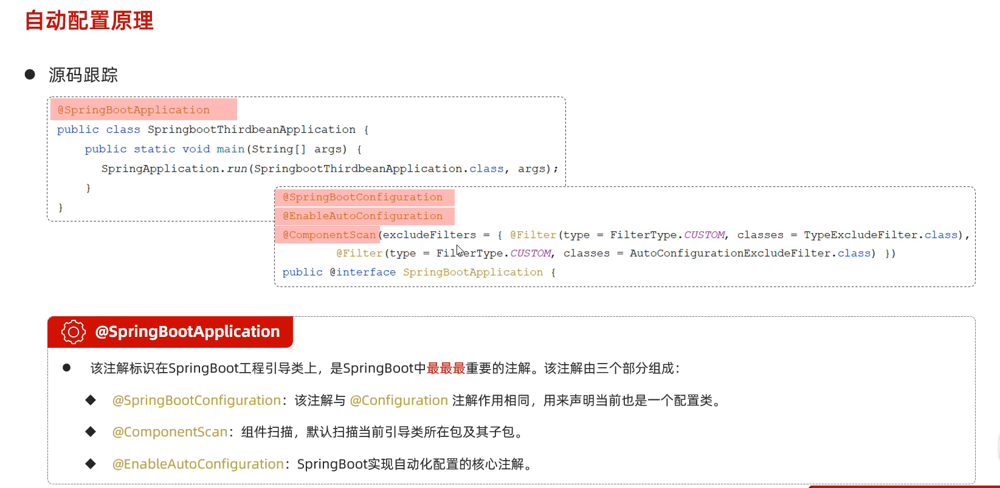

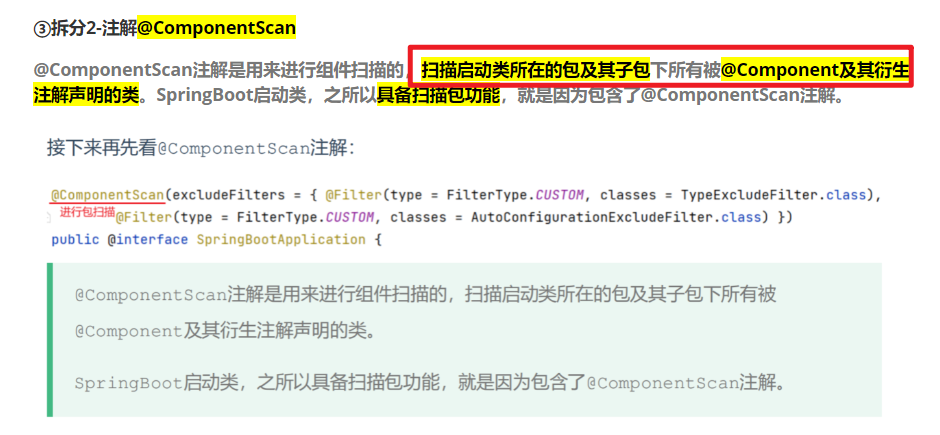


是的，**Spring Boot 2.7.x** 和 **Spring Boot 3.x** 在 **自动配置类注册方式** 上 **有变化**。具体来说，**Spring Boot 3.x** **废弃了 `spring.factories` 机制**，改用 `META-INF/spring/org.springframework.boot.autoconfigure.AutoConfiguration.imports` 进行注册。

------

##### **1. Spring Boot 2.7.x：使用 `spring.factories`**

在 **Spring Boot 2.7.x 及之前版本**，自动配置类是通过 `spring.factories` 机制注册的，文件路径是：

```
src/main/resources/META-INF/spring.factories
```

###### **示例：**

```properties
org.springframework.boot.autoconfigure.EnableAutoConfiguration=\
  com.example.config.MyAutoConfiguration
```

###### **特点：**

- **Spring Boot 会自动加载 `spring.factories`** 并解析 `EnableAutoConfiguration` 相关配置。
- **缺点：** `spring.factories` **加载所有类**，即使 `@Conditional` 条件不满足，也会初始化类，从而可能导致 **性能损耗**。

------

##### **2. Spring Boot 3.x：使用 `AutoConfiguration.imports`**

在 **Spring Boot 3.x**，`spring.factories` **已被废弃**，取而代之的是 `AutoConfiguration.imports` 机制，文件路径变为：

```
src/main/resources/META-INF/spring/org.springframework.boot.autoconfigure.AutoConfiguration.imports
```

###### **示例：**

```properties
com.example.config.MyAutoConfiguration
```

###### **特点：**

- **更高效**：仅当 `@EnableAutoConfiguration` 需要时，才会加载 `AutoConfiguration.imports` 里的类。
- **`spring.factories` 方式在 3.x 版本已经被移除**，如果升级项目需要迁移到新的方式。

------

##### **3. 兼容性**

- **Spring Boot 2.7.x** 仍然支持 `spring.factories`，但 **也支持 `AutoConfiguration.imports`**，用于过渡到 Spring Boot 3.x。
- **Spring Boot 3.x 彻底移除了 `spring.factories`**，必须使用 `AutoConfiguration.imports` 方式。

------

##### **4. 如何兼容 Spring Boot 2.7.x 和 3.x**

如果你需要兼容 **Spring Boot 2.7.x 和 3.x**，可以在 `META-INF/spring/` 下 **同时提供 `spring.factories` 和 `AutoConfiguration.imports`**：

```
META-INF/spring.factories
META-INF/spring/org.springframework.boot.autoconfigure.AutoConfiguration.imports
```

这样：

- **Spring Boot 2.7.x** 会读取 `spring.factories`。
- **Spring Boot 3.x** 会读取 `AutoConfiguration.imports`。

------

##### **5. 迁移建议**

如果你要从 Spring Boot 2.7.x **迁移到 3.x**，建议：

1. **删除 `spring.factories`**，改用 `AutoConfiguration.imports`。
2. **检查自动配置类**，确保 `@AutoConfiguration`（`@Configuration` 也适用）依然有效。
3. **如果需要兼容 2.7.x，保留 `spring.factories`**，但建议逐步迁移。

------

##### **6. 总结**

| 版本                              | 自动配置注册方式            | 说明                                              |
| --------------------------------- | --------------------------- | ------------------------------------------------- |
| **Spring Boot 2.7.x 及之前**      | `spring.factories`          | 依赖 `META-INF/spring.factories` 进行自动配置注册 |
| **Spring Boot 2.7.x（兼容模式）** | `AutoConfiguration.imports` | 2.7.x 支持新方式，建议逐步迁移                    |
| **Spring Boot 3.x 及之后**        | `AutoConfiguration.imports` | `spring.factories` **已废弃，必须使用新的方式**   |

------


### 4.2.接收消息

在trade-service服务中定义一个消息监听类：


其代码如下：

```Java
package com.hmall.trade.listener;

import com.hmall.trade.service.IOrderService;
import lombok.RequiredArgsConstructor;
import org.springframework.amqp.core.ExchangeTypes;
import org.springframework.amqp.rabbit.annotation.Exchange;
import org.springframework.amqp.rabbit.annotation.Queue;
import org.springframework.amqp.rabbit.annotation.QueueBinding;
import org.springframework.amqp.rabbit.annotation.RabbitListener;
import org.springframework.stereotype.Component;

@Component
@RequiredArgsConstructor
public class PayStatusListener {

    private final IOrderService orderService;

    @RabbitListener(bindings = @QueueBinding(
            value = @Queue(name = "trade.pay.success.queue", durable = "true"),
            exchange = @Exchange(name = "pay.topic"),
            key = "pay.success"
    ))
    public void listenPaySuccess(Long orderId){
        orderService.markOrderPaySuccess(orderId);
    }
}
```

### 4.3.发送消息

修改`pay-service`服务下的`com.hmall.pay.service.impl.PayOrderServiceImpl`类中的`tryPayOrderByBalance`方法：

```Java
private final RabbitTemplate rabbitTemplate;

@Override
@Transactional
public void tryPayOrderByBalance(PayOrderDTO payOrderDTO) {
    // 1.查询支付单
    PayOrder po = getById(payOrderDTO.getId());
    // 2.判断状态
    if(!PayStatus.WAIT_BUYER_PAY.equalsValue(po.getStatus())){
        // 订单不是未支付，状态异常
        throw new BizIllegalException("交易已支付或关闭！");
    }
    // 3.尝试扣减余额
    userClient.deductMoney(payOrderDTO.getPw(), po.getAmount());
    // 4.修改支付单状态
    boolean success = markPayOrderSuccess(payOrderDTO.getId(), LocalDateTime.now());
    if (!success) {
        throw new BizIllegalException("交易已支付或关闭！");
    }
    // 5.修改订单状态
    // tradeClient.markOrderPaySuccess(po.getBizOrderNo());
    try {
        rabbitTemplate.convertAndSend("pay.direct", "pay.success", po.getBizOrderNo());
    } catch (Exception e) {
        log.error("支付成功的消息发送失败，支付单id：{}， 交易单id：{}", po.getId(), po.getBizOrderNo(), e);
    }
}
```


## 5.==练习==

### 5.1.抽取共享的MQ配置

将MQ配置抽取到Nacos中管理，微服务中直接使用共享配置。

**利用nacos进行共享配置**


### 5.2.改造下单功能

**改造下单功能**，将基于OpenFeign的**清理购物车同步调用**，改为**基于RabbitMQ的异步通知**：

- 定义topic类型交换机，命名为`trade.topic`
- 定义消息队列，命名为`cart.clear.queue`
- 将`cart.clear.queue`与`trade.topic`绑定，`BindingKey`为`order.create`
- 下单成功时不再调用清理购物车接口，而是发送一条消息到`trade.topic`，发送消息的`RoutingKey`  为`order.create`，消息内容是下单的具体商品、当前登录用户信息
- 购物车服务监听`cart.clear.queue`队列，接收到消息后清理指定用户的购物车中的指定商品


#### 5.2.1.接收方(Map/Header)


```java
/**
 * @author xiaopeng
 * @version 1.0
 */
@Component
@RequiredArgsConstructor
@Slf4j
public class OrderCreateListener {
    private final CartServiceImpl cartService;

    
     /**
     * 法一：使用Map封装的方式传递用户ID
     *
     * 监听订单创建时，清空购物车
	 *
     */
        @RabbitListener(bindings = @QueueBinding(
            value = @Queue(name = "cart.clear.queue", durable = "true"),
            exchange = @Exchange(name = "trade.topic",type = ExchangeTypes.TOPIC),
            key = "order.create"
    ))
    public void listenerOrderClear(Map<String,Object> messageMap) {
        try {
            // 获取 userId 和 itemIds
            Object userIdObj = messageMap.get("userId");
            Object itemIdsObj = messageMap.get("itemIds");

            // 输出类型
            log.info("userId 类型: {}", userIdObj.getClass().getName());
            log.info("itemIds 类型: {}", itemIdsObj.getClass().getName());

            // 强制转换并处理
            // 将 userId 从 Integer 转换为 Long
            Long userId = null;
            if (userIdObj instanceof Integer) {
                userId = Long.valueOf((Integer) userIdObj);
            } else {
                userId = (Long) userIdObj; // 如果已经是 Long 类型，直接使用
            }

            Collection<Long> itemIds = (Collection<Long>) itemIdsObj;

            log.info("收到订单创建消息，清除购物车中商品，userId：{}，itemIds：{}", userId, itemIds);
            UserContext.setUser(userId);
            cartService.removeByItemIds(itemIds);
        } catch (Exception e) {
            log.error("消费订单消息失败", e);
        }
    }
}
    
    
    /**
     * 法二：使用请求头的方式接受传递用户ID
     *
     * 监听订单创建时，清空购物车
     * @param itemIds
     * @param message
     */
    @RabbitListener(bindings = @QueueBinding(
            value = @Queue(name = "cart.clear.queue",durable = "true"),
            exchange = @Exchange(name = "trade.topic",type = ExchangeTypes.TOPIC),
            key = "order.create"
    ))
    public void listenerOrderClear(Set<Long> itemIds, Message message) {
        try {
            Long userId = message.getMessageProperties().getHeader("userId");
            log.info("收到订单创建消息，清除购物车中商品，userId：{}，itemIds：{}", userId, itemIds);
            UserContext.setUser(userId);
            cartService.removeByItemIds(itemIds);
        } catch (Exception e) {
            log.error("消费订单消息失败", e);
        }
    }

    /**
     * 法三：使用静态代理的方式，MessageConverterProxy
     * 通过静态代理模式来增强 `Jackson2JsonMessageConverter` 的功能，
     * 从而在其核心方法 `toMessage` 和 `fromMessage` 上进行扩展。
     * 例如，可以增强它的功能，将 `userId` 自动注入到消息头中，
     * 或者从消息头中提取 `userId` 并存储到 `UserContext`。
     *
     * @param itemIds
     */
    @RabbitListener(bindings = @QueueBinding(
            value = @Queue(name = "cart.clear.queue", durable = "true"),
            exchange = @Exchange(name = "trade.topic",type = ExchangeTypes.TOPIC),
            key = "order.create"
    ))
    public void listenerOrderClear(Set<Long> itemIds) {
        try {
            // 静态代理MessageConverterProxy：
            // 1、增强逻辑：在消息头中注入 userId
            // 2、增强逻辑：从消息头中提取 userId 并注入到 UserContext

            // 可直接从 UserContext 中获取 userId
            Long userId = UserContext.getUser();
            log.info("收到订单创建消息，清除购物车中商品，userId：{}，itemIds：{}", userId, itemIds);
            UserContext.setUser(userId);
            cartService.removeByItemIds(itemIds);
        } catch (Exception e) {
            log.error("消费订单消息失败", e);
        } finally {
            // 清除 UserContext 中的用户信息
            // 消息消费结束后，确保清理 `UserContext`，避免线程污染=
            UserContext.removeUser();
        }
    }

}
```

### **5.3.法三-使用静态代理的方式-MessageConverterProxy**

[登录信息传递优化-静态代理模式](#登录信息传递优化-静态代理模式)


#### **==MessageConvertConfig==**

```java
/**
 * @author xiaopeng
 * @version 1.0
 */
@Configuration
@ConditionalOnClass(RabbitTemplate.class)
public class MessageConvertConfig {
    /**
     * JSON消息转换器配置
     */
/*    @Bean
    public MessageConverter messageConverter() {
        // 1.定义消息转换器
        Jackson2JsonMessageConverter jackson2JsonMessageConverter = new Jackson2JsonMessageConverter();
        // 2.配置自动创建消息id，用于识别不同消息，也可以在业务中基于ID判断是否是重复消息
        jackson2JsonMessageConverter.setCreateMessageIds(true);
        return jackson2JsonMessageConverter;
    }*/

    /**
     * 使用MessageConverterProxy代理类增强目标类
     * JSON消息转换器配置
     */
    @Bean
    public MessageConverter messageConverter() {
         // 创建 Jackson2JsonMessageConverter 作为目标类
        Jackson2JsonMessageConverter targetConverter = new Jackson2JsonMessageConverter();
        // 2.配置自动创建消息id，用于识别不同消息，也可以在业务中基于ID判断是否是重复消息
        targetConverter.setCreateMessageIds(true);

        // 使用代理类增强目标类
        return new MessageConverterProxy(targetConverter);
    }
}
```

#### **==MessageConverterProxy==**

```java
package com.hmall.common.proxy;

import com.hmall.common.utils.UserContext;
import org.springframework.amqp.core.Message;
import org.springframework.amqp.core.MessageProperties;
import org.springframework.amqp.support.converter.Jackson2JsonMessageConverter;
import org.springframework.amqp.support.converter.MessageConverter;

/**
 * @author xiaopeng
 * @version 1.0
 */
public class MessageConverterProxy implements MessageConverter {
    private final Jackson2JsonMessageConverter targetConverter;

    // 构造函数，传入目标转换器
    public MessageConverterProxy(Jackson2JsonMessageConverter targetConverter) {
        this.targetConverter = targetConverter;
    }

    /**
     * 将对象转换为消息
     * 在转换过程中，会尝试从上下文中获取 userId，并将其注入到消息头中
     *
     * @param object            要转换的对象
     * @param messageProperties 消息属性
     * @return 转换后的消息
     */
    @Override
    public Message toMessage(Object object, MessageProperties messageProperties) {
        // 增强逻辑：在消息头中注入 userId
        Long userId = UserContext.getUser(); // 从上下文获取 userId
        if (userId != null) {
            messageProperties.setHeader("userId", userId);
        }

        // 调用目标方法
        return targetConverter.toMessage(object, messageProperties);
    }

    /**
     * 从消息中转换出对象
     * 在转换过程中，会尝试从消息头中提取 userId，并将其注入到 UserContext 中
     *
     * @param message 消息对象
     * @return 转换后的对象
     */
    @Override
    public Object fromMessage(Message message) {
        // 增强逻辑：从消息头中提取 userId 并注入到 UserContext
        Long userId = (Long) message.getMessageProperties().getHeaders().get("userId");
        if (userId != null) {
            UserContext.setUser(userId);
        }

        // 调用目标方法
        return targetConverter.fromMessage(message);
    }
}

```

##### **1. 代码作用**

- `MessageConverterProxy` 代理 `Jackson2JsonMessageConverter`，增强其 `toMessage` 和 `fromMessage` 方法：
  - **`toMessage`**：将 `userId` 注入到消息头中。
  - **`fromMessage`**：从消息头获取 `userId`，并存入 `UserContext`，确保消费端能获取到该信息。
- `listenerOrderClear` 方法是 `RabbitListener` 监听 `cart.clear.queue` 队列的消费者：
  - 消费消息时，**先从 `UserContext` 获取 `userId`**（==在 `fromMessage` 时已自动注入==）。
  - **执行清除购物车操作**：调用 `cartService.removeByItemIds(itemIds)` 处理业务逻辑。
  - **清理 `UserContext`**，避免线程污染（重要！）。

------

##### **2. 线程安全 & UserContext 作用**

> **问题**：为什么要在 `finally` 里 `UserContext.removeUser();`？

**RabbitMQ 监听器 (`@RabbitListener`) 默认是多线程的**，所以：

- `UserContext.setUser(userId);` 绑定的 `userId` **可能会影响其他线程**。
- 处理完消息后，需要 **手动清理 `UserContext`**，否则会导致 **数据错乱或线程污染**。


##### 3.==执行流程==

`MessageConverterProxy` 作用是 **增强消息转换器**，在消息发送和接收时处理 `userId`，让 `userId` 在不同微服务之间透传，保证 **用户身份一致性**。

###### **执行流程（消息发送 & 消息消费）**

假设有**订单服务** (`order-service`) 和 **购物车服务** (`cart-service`)，流程如下：

------

###### **① 发送消息（订单创建）**

1. **用户在前端提交订单** → `order-service` 处理订单创建请求。

2. 订单服务准备消息：

   - ```
     MessageConverterProxy.toMessage()
     ```

     **==拦截转换==**：

     - ==**从 `UserContext` 获取 `userId`**==（用户身份）。
     - **把 `userId` 注入到 `messageProperties.headers`**，这样 `userId` 作为 **消息头** 传递到 RabbitMQ。

3. **RabbitMQ 发送消息**到 `trade.topic` 交换机，路由到 `cart.clear.queue`。

**代码示例（订单服务）**

```java
// userId 存入 UserContext
UserContext.setUser(1001L);

// 发送消息
rabbitTemplate.convertAndSend("trade.topic", "order.create", itemIds);
```

------

###### **② 消费消息（清除购物车）**

1. `cart-service` 监听 `cart.clear.queue`
   - `@RabbitListener` 触发 `listenerOrderClear` 方法。
2. RabbitMQ 传递消息，自动调用 `MessageConverterProxy.fromMessage()`：
   - **从消息头 `messageProperties.headers` ==取 `userId`==**。
   - ==**存入 `UserContext`**==，保证本线程可以获取 `userId`。
3. 执行业务逻辑：
   - **`cartService.removeByItemIds(itemIds);`** 清除购物车中的商品。
4. **最终清理 `UserContext`**（避免线程污染）。

**代码示例（购物车服务）**

```java
@RabbitListener(bindings = @QueueBinding(
        value = @Queue(name = "cart.clear.queue", durable = "true"),
        exchange = @Exchange(name = "trade.topic", type = ExchangeTypes.TOPIC),
        key = "order.create"
))
public void listenerOrderClear(Set<Long> itemIds) {
    try {
        Long userId = UserContext.getUser();  // 从 UserContext 获取 userId
        log.info("清除购物车商品，userId：{}，itemIds：{}", userId, itemIds);
        cartService.removeByItemIds(itemIds);
    } finally {
        UserContext.removeUser();  // 清理，防止线程污染
    }
}
```

------

###### **详细执行顺序**

###### **1️⃣ 订单服务 (`order-service`)**

| 步骤                                    | 处理内容                                                   |
| --------------------------------------- | ---------------------------------------------------------- |
| 用户提交订单                            | `order-service` 处理订单请求                               |
| `UserContext.setUser(userId)`           | 记录当前操作用户 `userId`                                  |
| `rabbitTemplate.convertAndSend(...)`    | 发送消息                                                   |
| **`MessageConverterProxy.toMessage()`** | 代理转换消息，**注入 `userId` 到消息头**                   |
| RabbitMQ 存储消息                       | 消息进入 `trade.topic` 交换机，并路由到 `cart.clear.queue` |

------

###### **2️⃣ 购物车服务 (`cart-service`)**

| 步骤                                      | 处理内容                                                     |
| ----------------------------------------- | ------------------------------------------------------------ |
| `@RabbitListener` 监听队列                | `cart.clear.queue` 触发 `listenerOrderClear()`               |
| **`MessageConverterProxy.fromMessage()`** | 代理转换消息，**从消息头提取 `userId` 并存入 `UserContext`** |
| `UserContext.getUser()`                   | 获取 `userId`，确保微服务间用户身份一致                      |
| `cartService.removeByItemIds(itemIds)`    | 清除购物车中的商品                                           |
| `finally { UserContext.removeUser(); }`   | **防止线程污染，清理 `UserContext`**                         |


#### 5.2.2.发布方(Map/Header)

```java
//基于RabbitMQ的异步通知

//使用Map封装的方式传递用户ID
Map<String,Object> messageMap = new HashMap<>();
messageMap.put("itemIds",itemIds);
messageMap.put("userId",UserContext.getUser());
//基于RabbitMQ的异步通知
try {
    rabbitTemplate.convertAndSend(
        "trade.topic",
        "order.create",
        messageMap
    );
} catch (Exception e) {
    log.error("清理购物车失败", e);
}


//使用请求头的方式传递用户ID
rabbitTemplate.convertAndSend(
    "trade.topic",
    "order.create",
    itemIds,
    new MessagePostProcessor() {
        @Override
        public Message postProcessMessage(Message message) throws AmqpException {
            Long userId = UserContext.getUser();  // 获取用户ID
            log.info("发送清理购物车消息，用户id:{}", userId);
            message.getMessageProperties().setHeader("userId", userId);  // 设置消息头部
            return message;  // 返回处理后的消息
        }
    }
);

/*
 * 法三：使用静态代理的方式，MessageConverterProxy
 * 通过静态代理模式来增强 `Jackson2JsonMessageConverter` 的功能，
 * 从而在其核心方法 `toMessage` 和 `fromMessage` 上进行扩展。
 * 例如，可以增强它的功能，将 `userId` 自动注入到消息头中，
 * 或者从消息头中提取 `userId` 并存储到 `UserContext`。
 *
*/
rabbitTemplate.convertAndSend(
    "trade.topic",
    "order.create",
    itemIds
);
```

`MessagePostProcessor` 是 Spring AMQP 提供的一个接口，用于对发送的消息进行额外处理，例如在消息发送到 RabbitMQ 之前修改消息属性或内容。

在你的代码中，它被用作 `rabbitTemplate.convertAndSend` 方法的第四个参数，用于对即将发送的消息进行定制化处理。

------

##### **`MessagePostProcessor` 的定义**

`MessagePostProcessor` 是 Spring AMQP 中的一个接口：

```java
@FunctionalInterface
public interface MessagePostProcessor {
    Message postProcessMessage(Message message) throws AmqpException;
}
```

##### 核心方法

- `postProcessMessage(Message message)`
  - 在**==消息发送之前执行==**。
  - 接收一个 `Message` 对象，**允许修改消息内容和属性（如头部信息、优先级等）**。
  - 返回修改后的消息对象。

------

##### **作用与用途**

`MessagePostProcessor` 常用于：

1. **==设置消息头部信息==（Headers）**
   用于添加或修改消息的自定义属性，这些属性在消费者端可以被读取。
2. **设置消息优先级、延迟时间等**
   可用于修改消息的元数据，例如设置优先级、过期时间（TTL）等。
3. **加密或处理消息内容**
   在消息发送之前对消息体进行处理，例如加密、压缩等。


### 5.3.==登录信息传递优化==

某些业务中，需要根据**登录用户信息**（也就是这里的**UserId**）处理业务，而**基于MQ的异步调用并不会传递登录用户信息。**前面我们的做法比较麻烦，至少要做两件事：

- **消息发送者在消息体中==传递登录用户==**
- **消费者==获取消息体中的登录用户==**，处理业务

这样做不仅麻烦，而且编程体验也不统一，毕竟我们之前都是使用UserContext来获取用户。

大家思考一下：有没有更优雅的办法传输登录用户信息，让使用MQ的人无感知，依然采用UserContext来随时获取用户。

参考资料：https://docs.spring.io/spring-amqp/docs/2.4.14/reference/html/#post-processing

#### 法一：==静态代理==模式（推荐）

`<a id="登录信息传递优化-静态代理模式">``</a>`

是的，你可以通过**静态代理模式**来**增强 `Jackson2JsonMessageConverter` 的功能**，从而**在其核心方法 `toMessage` 和 `fromMessage` 上==进行扩展==**。例如，可以增强它的功能，将 `userId` **自动注入到消息头**中，或者**从消息头中提取 `userId` 并存储到 `UserContext`**。

##### **静态代理是什么？**

**静态代理（Static Proxy）** 是**在编译期**就确定代理类，代理类和被代理类（目标对象）实现相同的接口，代理类在执行方法时可以**增强**被代理类的功能，比如**日志记录、权限控制、事务管理**等。

------

###### **静态代理的特点**

1. **代理类和被代理类都实现相同的接口**。
2. **代理类在编译期确定**（不像动态代理在运行时动态生成）。
3. **代理类在调用方法时，可以对目标对象的功能进行增强**。
4. **适用于结构固定、方法较少的场景**，但**每个类都要手动写代理类，代码冗余较多**。

------

###### **静态代理的实现**

假设我们要代理一个**支付业务**，在支付前后**打印日志**。

**1. 定义接口**

```java
public interface Payment {
    void pay(int amount);
}
```

**2. 被代理类（目标类）**

```java
public class AliPay implements Payment {
    @Override
    public void pay(int amount) {
        System.out.println("使用支付宝支付：" + amount + " 元");
    }
}
```

**3. 代理类**

```java
public class PaymentProxy implements Payment {
    private Payment target; // 目标对象

    public PaymentProxy(Payment target) {
        this.target = target;
    }

    @Override
    public void pay(int amount) {
        System.out.println("【代理】支付前记录日志...");
        target.pay(amount); // 调用目标对象的方法
        System.out.println("【代理】支付后记录日志...");
    }
}
```

**4. 测试静态代理**

```java
public class Main {
    public static void main(String[] args) {
        Payment aliPay = new AliPay();
        Payment proxy = new PaymentProxy(aliPay);
        
        proxy.pay(100);
    }
}
```

**5. 运行结果**

```shell
【代理】支付前记录日志...
使用支付宝支付：100 元
【代理】支付后记录日志...
```

------

###### **静态代理的优缺点**

**✅ 优点**

1. **增强功能**：代理可以在方法调用前后执行额外操作，如日志、事务。
2. **封装性强**：客户端不需要修改原有代码，就能增加新功能。

**❌ 缺点**

1. **代码冗余**：每个目标类都需要一个代理类，类爆炸（类多了不好维护）。
2. **不灵活**：如果 `Payment` 接口增加一个新方法，所有代理类都要改，影响维护。

------

###### **什么时候用静态代理？**

1. **目标类的方法不会频繁变动**（否则每次改动都要修改代理类）。
2. **有少量类需要代理**（太多类会导致代码膨胀，推荐用动态代理）。
3. **需要提前确定代理逻辑**（如日志、权限校验）。

------

###### **静态代理 vs. 动态代理**

|            | **静态代理**                     | **动态代理（JDK / CGLIB）**                    |
| ---------- | -------------------------------- | ---------------------------------------------- |
| 代理方式   | **编译时** 生成代理类            | **运行时** 生成代理类                          |
| 代理类数量 | 每个目标类**单独写代理类**       | **自动生成代理类**，不用手写                   |
| 代码维护   | **不灵活**，修改接口需要改代理类 | **更灵活**，改接口无需改代理类                 |
| 适用场景   | **少量类的固定增强**             | **大量类、方法较多、扩展性强**                 |
| 例子       | 手写 `PaymentProxy`              | JDK 动态代理 (`Proxy.newProxyInstance`)、CGLIB |

如果你想要更灵活的代理（比如拦截所有方法），可以用 **JDK 动态代理** 或 **CGLIB** 代替静态代理。🚀

以下是实现方式的详细步骤：

------

##### **1. 定义代理类**

通过**静态代理模式**，创建一个实现了 `MessageConverter` 接口的代理类，并将 `Jackson2JsonMessageConverter` 作为目标对象。


###### **代理类示例**

```java
import org.springframework.amqp.support.converter.Jackson2JsonMessageConverter;
import org.springframework.amqp.support.converter.MessageConverter;
import org.springframework.amqp.core.Message;
import org.springframework.amqp.core.MessageProperties;

public class MessageConverterProxy implements MessageConverter {
    private final Jackson2JsonMessageConverter targetConverter;

     // 构造函数，传入目标转换器
    public MessageConverterProxy(Jackson2JsonMessageConverter targetConverter) {
        this.targetConverter = targetConverter;
    }

    @Override
    public Message toMessage(Object object, MessageProperties messageProperties) {
        // 增强逻辑：在消息头中注入 userId
        Long userId = UserContext.getUser(); // 从上下文获取 userId
        if (userId != null) {
            messageProperties.setHeader("userId", userId);
        }

        // 调用目标方法
        return targetConverter.toMessage(object, messageProperties);
    }

    @Override
    public Object fromMessage(Message message) {
        // 增强逻辑：从消息头中提取 userId 并注入到 UserContext
        Long userId = (Long) message.getMessageProperties().getHeaders().get("userId");
        if (userId != null) {
            UserContext.setUser(userId);
        }

        // 调用目标方法
        return targetConverter.fromMessage(message);
    }
}
```

------

##### **2. 在配置类中使用代理类**

将自定义的 `MessageConverterProxy` 注入到 Spring 上下文中，以替代默认的消息转换器。


###### **配置类示例**


```java
import org.springframework.amqp.support.converter.MessageConverter;
import org.springframework.amqp.support.converter.Jackson2JsonMessageConverter;
import org.springframework.context.annotation.Bean;
import org.springframework.context.annotation.Configuration;

@Configuration
public class MessageConvertConfiguration {

    /**
     * 使用MessageConverterProxy代理类增强目标类
     * 自定义 JSON 消息转换器配置
     */
    @Bean
    public MessageConverter messageConverter() {
        // 创建 Jackson2JsonMessageConverter 作为目标类
        Jackson2JsonMessageConverter targetConverter = new Jackson2JsonMessageConverter();
        targetConverter.setCreateMessageIds(true);

        // 使用代理类增强目标类
        return new MessageConverterProxy(targetConverter);
    }
}
```

------

##### **3. 增强效果**

- 发送消息时 (`toMessage`)：
  - 自动将 `UserContext` 中的 `userId` 注入到消息的 `MessageProperties` 头部，**开发者无需手动添加。**
- 接收消息时 (`fromMessage`)：
  - 自动从消息头中提取 `userId` 并存储到 `UserContext` 中，**开发者无需手动解析。**

------


##### **4. 消息发送与消费的示例**

###### **消息发送**

```java
//基于RabbitMQ的异步通知
try {
    rabbitTemplate.convertAndSend(
        "trade.topic",
        "order.create",
        itemIds
    );
} catch (Exception e) {
    log.error("清理购物车失败", e);
}
```

------

###### **消息消费**

```java
    /**
     * 法三：使用静态代理的方式，MessageConverterProxy
     * 通过静态代理模式来增强 `Jackson2JsonMessageConverter` 的功能，
     * 从而在其核心方法 `toMessage` 和 `fromMessage` 上进行扩展。
     * 例如，可以增强它的功能，将 `userId` 自动注入到消息头中，
     * 或者从消息头中提取 `userId` 并存储到 `UserContext`。
     * @param itemIds
     */
    @RabbitListener(bindings = @QueueBinding(
            value = @Queue(name = "cart.clear.queue",durable = "true"),
            exchange = @Exchange(name = "trade.topic"),
            key = "order.create"
    ))
    public void listenerOrderClear(Set<Long> itemIds) {
        try {
            // 静态代理MessageConverterProxy：
            // 1、增强逻辑：在消息头中注入 userId
            // 2、增强逻辑：从消息头中提取 userId 并注入到 UserContext

            // 可直接从 UserContext 中获取 userId
            Long userId = UserContext.getUser();
            log.info("收到订单创建消息，清除购物车中商品，userId：{}，itemIds：{}", userId, itemIds);
            UserContext.setUser(userId);
            cartService.removeByItemIds(itemIds);
        } catch (Exception e) {
            log.error("消费订单消息失败", e);
        }finally {
            // 清除 UserContext 中的用户信息
            // 消息消费结束后，确保清理 `UserContext`，避免线程污染=
            UserContext.removeUser();
        }
    }
```

------

##### **5. 优点**

1. **代码清晰统一**：开发者无需在发送和接收逻辑中显式处理 `userId`。
2. **无侵入性增强**：通过代理类增强原有的 `Jackson2JsonMessageConverter` 功能，而不改变其原有逻辑。
3. **线程安全**：通过 `UserContext` 管理 `userId`，确保每个线程独立处理上下文。
4. **复用性强**：代理类可以适用于所有使用 `Jackson2JsonMessageConverter` 的场景。

------

##### **6. 注意事项**

1. **`UserContext` 的清理**： 在**消息消费结束后**，**确保==清理 `UserContext`，避免线程污染==**：

   ```java
   @RabbitListener(queues = "example.queue")
   public void handleMessage(Object message) {
       try {
           Long userId = UserContext.getUser();
           // 处理业务逻辑
       } finally {
           UserContext.clear(); // 清理上下文
       }
   }
   ```

2. **重复消费检查**：

   - 消息头中可能包含其他业务信息（如 `messageId`），可以**扩展代理类逻辑支持消息幂等性检查。**

------

通过这种方式，利用静态代理实现了**消息转换器的无侵入增强**，同时提升了代码的易用性和一致性。


#### 法二：==拦截器==

要实现更优雅的方式传递 **登录用户信息**，并让使用者无感知且统一使用 `UserContext` 获取用户信息，可以通过以下 **三步改造方案** 实现：

------

##### **1、改造目标**

1. 消息发送方无需显式传递用户信息。
2. 消息接收方可以透明地获取 `UserId`，并通过 `UserContext` 直接调用。
3. 保证代码风格一致，提高开发效率，降低错误风险。

------

##### **2、改造方案**

###### **1. ==消息发送端==：通过==拦截器==自动注入用户信息**

在消息发送时，通过 `MessagePostProcessor` 拦截并自动将用户信息（`UserId`）添加到消息的头部，而无需显式在消息体中传递 `UserId`。

**实现步骤：**

- 在 `RabbitTemplate` 中定义自定义的 `MessagePostProcessor`。
- 从当前线程上下文中提取 `UserId`（如通过 `UserContext` 获取），并将其作为消息头的一部分。

**代码示例：**

```java
@Bean
public RabbitTemplate rabbitTemplate(ConnectionFactory connectionFactory) {
    RabbitTemplate rabbitTemplate = new RabbitTemplate(connectionFactory);

    // 添加默认的 MessagePostProcessor，自动注入 UserId
    rabbitTemplate.addBeforePublishPostProcessors(message -> {
        Long userId = UserContext.getUser(); // 从上下文中获取 UserId
        if (userId != null) {
            message.getMessageProperties().setHeader("userId", userId);
        }
        return message;
    });

    return rabbitTemplate;
}
```

这样一来，每次通过 `rabbitTemplate.convertAndSend` 发送消息时，会自动将 `UserId` 注入到消息头中，无需发送者显式设置。

------

###### **2. ==消息接收端==：通过==拦截器==提取用户信息并注入 UserContext**

在消息消费者端，拦截消息的消费过程，提取消息头中的 `UserId` 并注入到 `UserContext` 中，使整个消费流程对开发者透明化。

**实现步骤：**

- 定义一个 `Advice` 或 `Interceptor`，拦截消息消费的处理逻辑。
- 从消息头中提取 `UserId` 并设置到 `UserContext` 中。
- 消费处理完成后，清理 `UserContext`，避免线程污染。

**代码示例：**

```java
@Bean
public SimpleRabbitListenerContainerFactory rabbitListenerContainerFactory(ConnectionFactory connectionFactory) {
    SimpleRabbitListenerContainerFactory factory = new SimpleRabbitListenerContainerFactory();
    factory.setConnectionFactory(connectionFactory);

    // 设置消息消费前的拦截逻辑
    factory.setAdviceChain(new MethodInterceptor() {
        @Override
        public Object invoke(MethodInvocation invocation) throws Throwable {
            // 从消息上下文中提取 userId
            Message message = (Message) invocation.getArguments()[1]; // 获取消息对象
            Long userId = (Long) message.getMessageProperties().getHeaders().get("userId");

            // 注入到 UserContext 中
            if (userId != null) {
                UserContext.setUser(userId);
            }

            try {
                return invocation.proceed(); // 执行业务逻辑
            } finally {
                UserContext.clear(); // 清理上下文，防止线程污染
            }
        }
    });

    return factory;
}
```

------

###### **3. 封装统一的 ==UserContext 工具类==**

确保在发送端和接收端可以统一地使用 `UserContext` 获取和设置用户信息。

**工具类实现：**

```java
public class UserContext {
    private static final ThreadLocal<Long> userContext = new ThreadLocal<>();

    // 设置用户信息
    public static void setUser(Long userId) {
        userContext.set(userId);
    }

    // 获取用户信息
    public static Long getUser() {
        return userContext.get();
    }

    // 清理用户信息
    public static void clear() {
        userContext.remove();
    }
}
```

------

##### **3、实现效果**

1. **消息发送端：无感知传递 `UserId`**

   - 开发者仅需使用 

     ```
     rabbitTemplate.convertAndSend()
     ```

      发送消息，无需关心用户信息如何传递：

     ```java
     rabbitTemplate.convertAndSend("trade.topic", "cart.clear.queue", itemIds);
     ```

   - `UserId` 自动从 `UserContext` 注入到消息头中。

2. **消息接收端：透明获取 `UserId`**

   - 开发者直接使用 

     ```
     UserContext.getUser()
     ```

      获取用户信息，无需手动解析消息头：

     ```java
     @RabbitListener(queues = "cart.clear.queue")
     public void processMessage(List<Long> itemIds) {
         Long userId = UserContext.getUser(); // 自动从消息头获取 UserId
         log.info("处理清理购物车，用户ID: {}", userId);
         // 处理业务逻辑
     }
     ```

3. **代码更加简洁统一**：

   - 消息头的注入和提取均由框架层完成，开发者无需手动操作。

------

##### **4、改造优点**

1. **无感知传递**：开发者不需要显式传递和解析用户信息，框架层自动完成。
2. **统一上下文管理**：在任何地方都可以通过 `UserContext` 获取用户信息。
3. **降低出错风险**：避免忘记传递用户信息或消费者端忘记解析用户信息。
4. **线程安全**：通过 `ThreadLocal` 隔离用户信息，防止不同线程污染。

------

##### **总结**

通过在 **RabbitTemplate** 和 **Listener 容器** 中拦截消息的发送和接收过程，可以实现用户信息的自动传递。使用 `UserContext` 工具类，开发者可以在发送端和接收端无感知地使用 `UserId`，从而简化了代码逻辑，提高了开发效率和可维护性。


### 5.4.改造项目一

思考一下，项目一中的哪些业务可以由同步方式改为异步方式调用？试着改造一下。

举例：短信发送


# 二、MQ高级

思考一下，项目一中的哪些业务可以由**同步方式改为异步方式调用**？试着改造一下。

举例：短信发送


在昨天的练习作业中，我们改造了余额支付功能，在支付成功后利用RabbitMQ通知交易服务，更新业务订单状态为已支付。

但是大家思考一下，**如果这里MQ通知失败**，支付服务中支付流水显示支付成功，而交易服务中的订单状态却显示未支付，**数据出现了不一致。**

此时前端发送请求查询支付状态时，肯定是查询交易服务状态，会发现业务订单未支付，而用户自己知道已经支付成功，这就导致**用户体验不一致**。

因此，这里我们必须**尽可能确保MQ消息的可靠性**，即：**消息应该==至少被消费者处理1次==**

那么问题来了：

- **我们该如何确保**MQ消息的可靠性？
- **如果真的发送失败，有没有其它的兜底方案？**

这些问题，在今天的学习中都会找到答案。


## 1.==发送者==的可靠性

首先，我们一起分析一下消息丢失的可能性有哪些。

消息从发送者发送消息，到消费者处理消息，需要经过的流程是这样的：


消息从生产者到消费者的每一步**都可能导致消息丢失**：

- **发送消息时丢失**：
  - 生产者发送消息时**连接MQ失败**
  - 生产者发送消息到达MQ后**未找到`Exchange`**
  - 生产者发送消息到达MQ的`Exchange`后，**未找到合适的`Queue`**
  - 消息到达MQ后，**处理消息的==进程发生异常==**
- **MQ导致消息丢失**：
  - 消息到达MQ，保存到队列后，**尚未消费就突然==宕机==**
- **消费者处理消息时**：
  - 消息**接收后尚==未处理突然宕机==**
  - 消息接收后处理过程中**抛出异常**

综上，我们要解决消息丢失问题，保证MQ的可靠性，就必须从3个方面入手：

- 确保生产者一定把消息发送到MQ
- 确保MQ不会将消息弄丢
- 确保消费者一定要处理消息

这一章我们先来看如何确保生产者一定能把消息发送到MQ。


### 1.1.生产者==重试==机制


首先第一种情况，就是生产者发送消息时，出现了**网络故障，导致与MQ的连接中断**。

为了解决这个问题，SpringAMQP提供的消息发送时的**重试机制**。即：**当`RabbitTemplate`与MQ连接超时后，==多次重试==。**

修改`publisher`模块的`application.yaml`文件，添加下面的内容：

```YAML
spring:
  rabbitmq:
    connection-timeout: 1s # 设置MQ的连接超时时间
    template:
      retry:
        enabled: true # 开启超时重试机制
        initial-interval: 1000ms # 初始等待间隔：败后的初始(第一次)等待时间
        multiplier: 1 # 失败后下次的等待时长倍数，下次等待时长 = (initial-interval) * multiplier
        max-attempts: 3 # 最大重试次数
```

我们利用命令停掉RabbitMQ服务：

```Shell
docker stop mq
```

然后测试发送一条消息，会发现会每隔1秒重试1次，总共重试了3次。**消息发送的超时重试机制配置成功**了！

**注意**：当**网络不稳定**的时候，利用**重试机制可以有效提高消息发送的成功率**。不过SpringAMQP提供的重试机制是==**阻塞式**==的重试，也就是说多次重试等待的过程中，**当前线程是被阻塞的**。

如果对于业务性能有要求，建议禁用重试机制。如果一定要使用，请合理配置等待时长和重试次数，当然也可以考虑**使用异步线程来执行发送消息的代码**。


### 1.2.生产者==确认==机制-消耗性能


一般情况下，只要生产者与MQ之间的网路连接顺畅，基本不会出现发送消息丢失的情况，因此大多数情况下我们无需考虑这种问题。

不过，在少数情况下，也会出现消息发送到MQ之后丢失的现象，比如：

- **MQ内部处理消息的进程发生了异常**
- 生产者发送消息**到达MQ后未找到`Exchange`**
- 生产者发送消息到达MQ的`Exchange`后，**未找到合适的`Queue`，因此无法路由**

针对上述情况，RabbitMQ提供了**生产者消息确认机制**，包括`Publisher Confirm`和`Publisher Return`两种。在开启确认机制的情况下，当生产者发送消息给MQ后，MQ会根据消息处理的情况返回不同的**回执**。

具体如图所示：

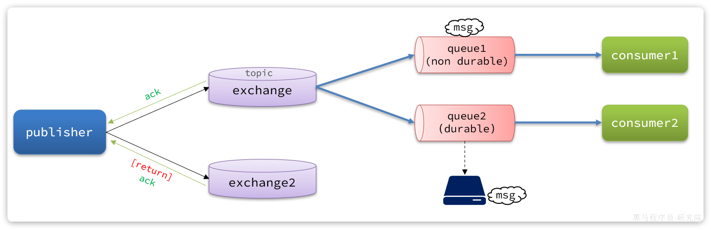

总结如下：

- 当消息投递到MQ，但是**路由失败**时，通过**Publisher Return返回异常信息**，同时**返回==ack的确认信息，代表投递成功==**
- **临时消息**投递到了MQ，并且**入队成功**，返回ACK，告知投递成功
- **持久消息**投递到了MQ，并且**入队完成持久化**，返回ACK ，告知投递成功
- 其它情况都会返回**==NACK==**，告知投递失败

其中`ack`和`nack`属于**Publisher Confirm**机制，`ack`是投递成功；`nack`是投递失败。而`return`则属于**Publisher Return**机制。

**==默认==两种机制都是==关闭状态==，需要通过配置文件来开启。**


### 1.3.实现==生产者确认==

#### 1.3.1.==开启==生产者确认


在publisher模块的`application.yaml`中添加配置：

```YAML
spring:
  rabbitmq:
    publisher-confirm-type: correlated # 开启publisher confirm机制，并设置confirm类型
    publisher-returns: true # 开启publisher return机制
```

这里`publisher-confirm-type`有三种模式可选：

- `none`：**关闭confirm机制**
- `simple`：**同步阻塞等待MQ的回执**
- ==`correlated`==：**MQ异步回调返回回执**

一般我们推荐使用`correlated`，==**回调机制**==。


#### 1.3.2.定义==ReturnCallback==

每个`RabbitTemplate`**只能配置一个`ReturnCallback`**，因此我们可以**在==配置类中统一设置==**。我们在**publisher模块**定义一个配置类：

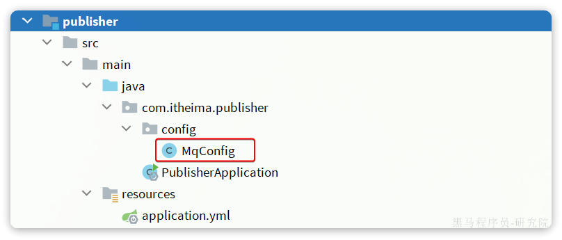

内容如下：

```Java
package com.itheima.publisher.config;

import lombok.AllArgsConstructor;
import lombok.extern.slf4j.Slf4j;
import org.springframework.amqp.core.ReturnedMessage;
import org.springframework.amqp.rabbit.core.RabbitTemplate;
import org.springframework.context.annotation.Configuration;

import javax.annotation.PostConstruct;

@Slf4j
@AllArgsConstructor
@Configuration
public class MqConfig {
    private final RabbitTemplate rabbitTemplate;

    @PostConstruct //它的执行时机是 Spring 容器完成 Bean 的初始化之后
    public void init(){
        rabbitTemplate.setReturnsCallback(new RabbitTemplate.ReturnsCallback() {
            @Override
            public void returnedMessage(ReturnedMessage returned) {
                log.error("触发return callback,");
                log.debug("exchange: {}", returned.getExchange());
                log.debug("routingKey: {}", returned.getRoutingKey());
                log.debug("message: {}", returned.getMessage());
                log.debug("replyCode: {}", returned.getReplyCode()); //异常信息代码
                log.debug("replyText: {}", returned.getReplyText()); //异常信息
            }
        });
    }
}
```

#### **==`@PostConstruct`==的特点与作用：**

1. **自动调用：**
   标注了 `@PostConstruct` 的方法，会在==**依赖注入完成后自动执行，而不需要手动调用**==。
2. **执行时机：**
   它的执行时机是== **Spring 容器完成 Bean 的初始化之后=**=，也就是说，**所有依赖都已经注入（`@Autowired`、构造器注入等已经完成）后执行。**
3. **常用于初始化操作：**
   - 设置初始值。
   - 配置 Bean 的依赖关系。
   - 注册回调逻辑。
   - 初始化连接池或加载缓存数据。
4. **只执行一次：**
   无论该方法调用多次，**`@PostConstruct` 注解的方法==只会==在 Bean 的生命周期内==被调用一次==**。


#### 1.3.3.定义==ConfirmCallback==


由于**每个消息发送时的处理逻辑不一定相同**，因此ConfirmCallback**需要在每次发消息时定义**。具体来说，是在调用RabbitTemplate中的**convertAndSend**方法时，**多传递一个参数**：


这里的**CorrelationData**中包含两个核心的东西：

- `id`：**==消息的唯一标示==**，**MQ对不同的消息的回执以此做判断**，避免混淆
- `SettableListenableFuture`：**==回执结果的Future对象==**

**将来MQ的回执就会通过这个`Future`来返回**，我们可以提前给`CorrelationData`中的`Future`**添加回调函数**来处理消息回执：

1. `CorrelationData` 是 Spring AMQP 提供的用于**关联消息**的对象。
2. 它包含**唯一标识符（通常为消息 ID）用于跟踪消息的发布和确认**。
3. 在发送消息时，将 `CorrelationData` 传递给 `rabbitTemplate`，使得可以接收对应消息的**回执**。


我们新建一个测试，向系统自带的交换机发送消息，并且添加`ConfirmCallback`：

```Java
@Test
void testPublisherConfirm() throws InterruptedException {
    // 1.创建CorrelationData
    CorrelationData cd = new CorrelationData(); //CorrelationData：用于关联消息和回执的对象。
    // 2.给Future添加ConfirmCallback
    cd.getFuture().addCallback(new ListenableFutureCallback<CorrelationData.Confirm>() {
        @Override
        public void onFailure(Throwable ex) {
            // 2.1.Spring AMQP内部处理Future发生异常时的处理逻辑，基本不会触发
            log.error("send message fail", ex);
        }
        //通知成功
        @Override
        public void onSuccess(CorrelationData.Confirm result) {
            // 2.2.Future接收到回执的处理逻辑，参数中的result就是回执内容
            if(result.isAck()){ // result.isAck()，boolean类型，true代表ack回执，false 代表 nack回执
                log.debug("发送消息成功，收到 ack!");
            }else{ // result.getReason()，String类型，返回nack时的异常描述
                log.error("发送消息失败，收到 nack, reason : {}", result.getReason());
            }
        }
    });
    // 3.发送消息
    rabbitTemplate.convertAndSend("hmall.direct", "q", "hello", cd);

    Thread.sleep(2000); //休眠2s,获取ack回执
}
```

执行结果如下：


可以看到，**由于传递的`RoutingKey`是错误的，路由失败后，触发了`return callback`，同时也收到了ack。**

当我们修改为正确的`RoutingKey`以后，就不会触发`return callback`了，只收到ack。

而如果连交换机都是错误的，则只会收到nack。

**注意**：

开启**==生产者确认==比较==消耗MQ性能==，一般不建议开启**。而且大家思考一下触发确认的几种情况：

- 路由失败：一般是因为RoutingKey错误导致，往往是编程导致
- 交换机名称错误：同样是编程错误导致
- **MQ内部故障**：这种需要处理，但概率往往较低。因此只有对消息可靠性要求非常高的业务才需要开启，而且仅仅需要**开启ConfirmCallback处理nack**就可以了。


## 2.==MQ的可靠性==


消息到达MQ以后，如果MQ不能及时保存，也会导致消息丢失，所以MQ的可靠性也非常重要。

### 2.1.数据持久化

为了提升性能，**默认情况下MQ的数据都是在==内存存储的临时数据，重启后就会消失==。**为了保证数据的可靠性，必须**配置数据持久化**，包括：

- 交换机持久化
- 队列持久化
- 消息持久化

我们以控制台界面为例来说明。

#### 2.1.1.交换机持久化

在控制台的`Exchanges`页面，添加交换机时可以配置交换机的`Durability`参数：


设置为`Durable`就是持久化模式，`Transient`就是临时模式。

#### 2.1.2.队列持久化

在控制台的Queues页面，添加队列时，同样可以配置队列的`Durability`参数：


除了持久化以外，你可以看到队列还有很多其它参数，有一些我们会在后期学习。

#### 2.1.3.==消息持久化==

在控制台发送消息的时候，可以添加很多参数，而消息的持久化是要配置一个`properties`：


**说明**：在开启持久化机制以后，如果**同时还开启了生产者确认**，那么**MQ会在消息==持久化以后才发送ACK回执==，进一步确保消息的可靠性。**

不过出于性能考虑，为了减少IO次数，发送到MQ的消息并**不是逐条持久化到数据库**的，而是==**每隔一段时间批量持久化**==。一般间隔在100毫秒左右，这就会导致**ACK有一定的延迟**，因此建议**==生产者确认全部采用异步方式==**。


#### 2.1.4.测试

##### （1）重启mq，非持久化消息消失


##### （2）消息持久化与非持久化==性能对比==


```java
/**
     * 消息持久化或非持久化性能测试
     */
@Test
public void testSendMessage(){
    //1.自定义构建消息
    Message message = MessageBuilder.withBody("hello SpringAMQP".getBytes(StandardCharsets.UTF_8))
        //.setDeliveryMode(MessageDeliveryMode.PERSISTENT) //持久化
        .setDeliveryMode(MessageDeliveryMode.NON_PERSISTENT) //非持久化
        .build();
    //2.发送100w消息
    for (int i = 0; i < 1000000; i++) {
        rabbitTemplate.convertAndSend("simple.queue", message);
    }
}
```


###### ①消息非持久化(纯内存)

一旦出现消息堆积问题，RabbitMQ的内存占用就会越来越高，**直到触发内存预警上限**。此时RabbitMQ会将**内存消息刷到磁盘上**，这个行为成为==`PageOut`==. `PageOut`会耗费一段时间，并且**会==阻塞队列进程==**。因此在这个过程中RabbitMQ不会再处理新的消息，生产者的**所有请求都会被阻塞**。

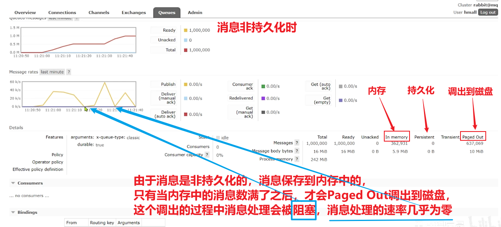


###### ②消息持久化

不过出于性能考虑，为了减少IO次数，发送到MQ的消息并**不是逐条持久化到数据库**的，而是==**每隔一段时间批量持久化**==。一般间隔在100毫秒左右，这就会导致**ACK有一定的延迟(==因为只有持久化完成后，才会返回axk回执==)**，因此建议**==生产者确认全部采用异步方式==**。


### 2.2.==LazyQueue==-惰性队列


在默认情况下，RabbitMQ会将接收到的信息**保存在内存中以降低消息收发的延迟**。但在某些特殊情况下，这会**导致==消息积压==**，比如：

- **消费者宕机或出现网络故障**
- **消息发送量激增，超过了消费者处理速度**
- **消费者处理业务发生==阻塞==**

一旦出现消息堆积问题，RabbitMQ的内存占用就会越来越高，**直到触发内存预警上限**。此时RabbitMQ会将**内存消息刷到磁盘上**，这个行为成为==`PageOut`==. `PageOut`会耗费一段时间，并且**会阻塞队列进**程。因此在这个过程中RabbitMQ不会再处理新的消息，生产者的**所有请求都会被阻塞**。

为了解决这个问题，从RabbitMQ的3.6.0版本开始，就增加了Lazy Queues的模式，也就是**惰性队列**。惰性队列的特征如下：

- 接收到消息后==**直接存入磁盘而非内存**==
- ==**消费者**要消费消息时才会**从磁盘中读取并加载到内存**==（也就是**懒加载**）
- 支持数百万条的消息存储

而在3.12版本之后，LazyQueue已经成为**所有队列的默认格式**。因此官方推荐升级MQ为3.12版本或者所有队列都设置为LazyQueue模式。


#### 2.2.1.控制台配置Lazy模式

在添加队列的时候，添加`x-queue-mod=lazy`参数即可设置队列为Lazy模式：


#### 2.2.2.代码配置Lazy模式


在利用SpringAMQP声明队列的时候，添加`x-queue-mod=lazy`参数也可设置队列为Lazy模式：

```Java
@Bean
public Queue lazyQueue(){
    return QueueBuilder
            .durable("lazy.queue")
            .lazy() // 开启Lazy模式
            .build();
}
```

这里是通过**`QueueBuilder`的`lazy()`函数配置Lazy模式**，底层源码如下：


当然，我们也可以基于**==注解来声明队列并设置为Lazy模式==**：

```Java
@RabbitListener(queuesToDeclare = @Queue(
        name = "lazy.queue",
        durable = "true",
        arguments = @Argument(name = "x-queue-mode", value = "lazy")
))
public void listenLazyQueue(String msg){
    log.info("接收到 lazy.queue的消息：{}", msg);
}
```


#### 2.2.3.测试


#### 2.2.4.==更新已有队列==为lazy模式

对于已经存在的队列，也可以配置为lazy模式，但是要通过**设置policy实现**。

可以基于命令行设置policy：

```Shell
rabbitmqctl set_policy Lazy "^lazy-queue$" '{"queue-mode":"lazy"}' --apply-to queues  
```

命令解读：

- `rabbitmqctl` ：RabbitMQ的命令行工具
- `set_policy` ：添加一个策略
- `Lazy` ：策略名称，可以自定义
- `"^lazy-queue$"` ：用**正则表达式匹配队列的名字**
- `'{"queue-mode":"lazy"}'` ：设置队列模式为lazy模式
- `--apply-to queues`：策略的作用对象，是所有的队列

当然，也可以在**控制台配置policy**，进入在控制台的`Admin`页面，点击`Policies`，即可添加配置：


## 3.==消费者的可靠性==


当RabbitMQ向消费者投递消息以后，**需要知道消费者的处理状态如何**。因为消息投递给消费者并不代表就一定被正确消费了，可能出现的故障有很多，比如：

- **消息投递的过程中出现了网络故障**
- **消费者接收到消息后突然宕机**
- **消费者接收到消息后，因处理不当导致异常**
- ...

一旦发生上述情况，消息也会丢失。因此，RabbitMQ必须知道消费者的处理状态，**一旦消息处理失败才能重新投递消息。**

但问题来了：RabbitMQ如何得知消费者的处理状态呢？

本章我们就一起研究一下消费者处理消息时的可靠性解决方案。


### 3.1.消费者==确认机制==


为了确认消费者是否成功处理消息，RabbitMQ提供了消费者确认机制（**Consumer Acknowledgement**）。即：当**消费者处理消息结束后**，应该**向RabbitMQ发送一个回执，告知RabbitMQ自己消息处理状态**。回执有三种可选值：

- **ack**：成功处理消息，RabbitMQ从队列中**删除该消息**
- **nack：**消息处理失败，RabbitMQ需要**再次投递消息**
- **reject：****消息处理失败并拒绝该消息，RabbitMQ从队列中删除该消息**

一般reject方式用的较少，**除非是消息格式有问题，那就是开发问题了**。因此大多数情况下我们**需要将消息处理的代码==通过`try catch`机制捕获==，消息处理成功时返回ack，处理失败时返回nack.**


由于消息回执的处理代码比较统一，因此SpringAMQP帮我们实现了消息确认。并允许我们通过配置文件设置ACK处理方式，有三种模式：

- **`none`**：不处理。即消息投递给消费者后立刻ack，消息会立刻从MQ删除。非常不安全，不建议使用
- **`manual`**：手动模式。需要自己在业务代码中调用api，发送`ack`或`reject`，存在业务入侵，但更灵活
- **`auto`**：**==自动模式==**。SpringAMQP利用==**AOP**==对我们的**消息处理逻辑做了==环绕增强==**，当业务正常执行时则自动返回`ack`.  当业务出现异常时，根据异常判断返回不同结果：
  
  - 如果是**业务异常**，会自动返回`nack`；
  - 如果是**消息处理或校验异常**，**自动返回`reject`**;
  
  

**返回Reject的常见异常**有：

> Starting with version 1.3.2, the default ErrorHandler is now a ConditionalRejectingErrorHandler that rejects (and does not requeue) messages that fail with an irrecoverable error. Specifically, it rejects messages that fail with the following errors:
>
> - o.s.amqp…**MessageConversionException**: Can be thrown when converting the incoming message payload using a MessageConverter.
> - o.s.messaging…MessageConversionException: Can be thrown by the conversion service if additional conversion is required when mapping to a @RabbitListener method.
> - o.s.messaging…**MethodArgumentNotValidException**: Can be thrown if validation (for example, @Valid) is used in the listener and the validation fails.
> - o.s.messaging…**MethodArgumentTypeMismatchException**: Can be thrown if the inbound message was converted to a type that is not correct for the target method. For example, the parameter is declared as Message`<Foo>` but Message`<Bar>` is received.
> - java.lang.NoSuchMethodException: Added in version 1.6.3.
> - java.lang.ClassCastException: Added in version 1.6.3.

#### 3.1.1.测试回执模式-none

通过下面的配置可以修改SpringAMQP的ACK处理方式：

```YAML
spring:
  rabbitmq:
    listener:
      simple:
        acknowledge-mode: none # 不做处理
```

修改consumer服务的SpringRabbitListener类中的方法，**模拟一个消息处理的异常（==给mq回执reject==）**：

```Java
@RabbitListener(queues = "simple.queue")
public void listenSimpleQueueMessage(String msg) throws InterruptedException {
    log.info("spring 消费者接收到消息：【" + msg + "】");
    if (true) {
        throw new MessageConversionException("故意的");
    }
    log.info("消息处理完成");
}
```

测试可以发现：**当消息处理发生异常时，消息依然被RabbitMQ删除了。**


#### 3.1.2.测试回执模式-==auto==

我们再次把确认机制修改为auto：

**由于是消费者的确认机制，需要在==消费者的yaml文件中去配置==**

```YAML
spring:
  rabbitmq:
    listener:
      simple:
        acknowledge-mode: auto #none，关闭ack；manual，手动ack；auto：自动ack
```


##### （1）==消息转换异常==-回执reject

修改consumer服务的SpringRabbitListener类中的方法，**模拟一个消息处理的异常（==给mq回执reject==）**：

```Java
@RabbitListener(queues = "simple.queue")
public void listenSimpleQueueMessage(String msg) throws InterruptedException {
    log.info("spring 消费者接收到消息：【" + msg + "】");
    if (true) {
        throw new MessageConversionException("故意的");
    }
    log.info("消息处理完成");
}
```

**打断点测试时，==先运行测试方法=>发送消息，再对消费者监听方法中打断点==，运行消费者程序**

在**异常位置打断点，再次发送消息**，程序卡在断点时，可以发现此时消息状态为**`unacked`（==未确定状态==**）：


放行以后，由于抛出的是**消息转换异常**，因此Spring会自动返回`reject`，所以消息依然会被删除：


##### （2）==业务异常==-回执nack

**打断点测试时，先运行测试方法=>发送消息，再对消费者监听方法中打断点，运行消费者程序，即可看到消息被==重复投递给消费者==**

我们将异常改为RuntimeException类型：

```Java
@RabbitListener(queues = "simple.queue")
public void listenSimpleQueueMessage(String msg) throws InterruptedException {
    log.info("spring 消费者接收到消息：【" + msg + "】");
    if (true) {
        throw new RuntimeException("故意的");
    }
    log.info("消息处理完成");
}
```

**在异常位置打断点，然后再次发送消息测试**，程序卡在断点时，可以发现此时消息状态为`unacked`（未确定状态）：


放行以后，由于抛出的是**业务异常**，所以**Spring返回`nack`**，**最终消息==恢复至`Ready`状态==，并且没有被RabbitMQ删除**：


当我们把配置改为`auto`时，**消息处理失败后，会回到RabbitMQ，并==重新投递==到消费者，若没有设计生产者的重新==投递次数上限==，会不断重复投递**。直到消费者返回ack或者reject或者关闭消费者服务。


### 3.2.失败重试机制-本地重试

#### 3.2.0.消息重入队

当消费者出现异常后，消息会不断**requeue（==重入队==）**到队列，再重新发送给消费者。如果消费者再次执行依然出错，消息会再次requeue到队列，再次投递，直到消息处理成功为止。

极端情况就是消费者一直无法执行成功，那么**消息requeue就会无限循环，导致mq的消息处理飙**升，带来不必要的压力：


当然，上述极端情况发生的概率还是非常低的，不过不怕一万就怕万一。为了应对上述情况Spring又提供了消费者失败重试机制：在消费者出现异常时**利用本地重试**，而不是无限制的requeue到mq队列。


**修改==consumer消费者服务==(需要和生产者的重试机制区分)**的application.yml文件，添加内容：

```YAML
spring:
  rabbitmq:
    listener:
      simple:
        retry:
          enabled: true # 开启消费者失败重试
          initial-interval: 1000ms # 初识的失败等待时长为1秒
          multiplier: 1 # 失败的等待时长倍数，下次等待时长 = multiplier * last-interval
          max-attempts: 3 # 最大重试次数
          stateless: true # true无状态(默认)；false有状态。如果业务中包含事务，这里改为false
```

重启consumer服务，重复之前的测试。可以发现：

- 消费者在失败后消息没有重新回到MQ无限重新投递，而是**在本地重试了3次**
- 本地重试3次以后，==抛出了**`AmqpRejectAndDontRequeueException`异常**==。查看RabbitMQ控制台，发现**消息被删除**了，说明最后SpringAMQP返回的是`reject`

==**结论：**==

- **开启本地重试时**，消息处理过程中抛出异常，不会requeue到队列，而是**在消费者本地重试**
- 重试达到最大次数后，Spring会==返回reject==，**消息会被丢弃**


### 3.3.失败处理策略-重试耗尽后


在之前的测试中，本地测试达到**最大重试次数后，消息会被丢弃**。这在某些对于**消息可靠性要求**较高的业务场景下，显然不太合适了。

因此Spring允许我们自定义重试次数耗尽后的消息处理策略，这个策略是由`MessageRecovery`接口来定义的，它有3个不同实现：

-  `RejectAndDontRequeueRecoverer`：重试耗尽后，**直接`reject`，丢弃消息。默认就是这种方式** 
-  `ImmediateRequeueMessageRecoverer`：重试耗尽后，**返回`nack`，消息重新入队** ，requeue重试频率相对降低
-  `RepublishMessageRecoverer`：重试耗尽后，**将失败消息投递到指定的交换机** 

比较优雅的一种处理方案是`RepublishMessageRecoverer`，失败后将消息投递到一个指定的，专门存放异常消息的队列，**后续==由人工集中处理==**。

1）在consumer**消费者**服务中**定义处理失败消息的交换机和队列**

由于这里的处理方案是`RepublishMessageRecoverer`，将未处理的消息**从该消费者**投递到**存放异常消息的队列**。

**==为啥不用注解==**来创建交换机和队列以及他们之间的绑定关系。这里是因为这是消费者没处理掉消息，重试几次后任然失败，**由该消费者发送给另一个消费者让其去尝试**。而**==注解是由生产者发送给消费者==，然后==在消费者端的listener==创建交换机和队列及绑定关系**

```Java
@Bean
public DirectExchange errorMessageExchange(){
    return new DirectExchange("error.direct");
}
@Bean
public Queue errorQueue(){
    return new Queue("error.queue", true);
}
@Bean
public Binding errorBinding(Queue errorQueue, DirectExchange errorMessageExchange){
    return BindingBuilder.bind(errorQueue).to(errorMessageExchange).with("error");
}
```

2）定义一个RepublishMessageRecoverer，**关联队列和交换机**

RepublishMessageRecoverer的主要作用是在**消息处理失败**时，将失败的消息**自动重新发布到指定的交换机和路由键**，这个过程是mq自动执行的

```Java
@Bean
public MessageRecoverer republishMessageRecoverer(RabbitTemplate rabbitTemplate){
    return new RepublishMessageRecoverer(rabbitTemplate, "error.direct", "error");
}
```

完整代码如下：

```Java
package com.itheima.consumer.config;

import org.springframework.amqp.core.Binding;
import org.springframework.amqp.core.BindingBuilder;
import org.springframework.amqp.core.DirectExchange;
import org.springframework.amqp.core.Queue;
import org.springframework.amqp.rabbit.core.RabbitTemplate;
import org.springframework.amqp.rabbit.retry.MessageRecoverer;
import org.springframework.amqp.rabbit.retry.RepublishMessageRecoverer;
import org.springframework.context.annotation.Bean;

/**
 * 配置消费者失败重试机制
 * @author xiaopeng
 * @version 1.0
 */
@Configuration
@ConditionalOnProperty(name = "spring.rabbitmq.listener.simple.retry.enabled", havingValue = "true")
//该注解表示：在开启消费者失败重试机制的模块才加载的以下的bean
public class ErrorMessageConfig {
    @Bean
    public DirectExchange errorMessageExchange(){
        return new DirectExchange("error.direct");
    }
    @Bean
    public Queue errorQueue(){
        return new Queue("error.queue", true);
    }
    @Bean
    public Binding errorBinding(Queue errorQueue, DirectExchange errorMessageExchange){
        return BindingBuilder.bind(errorQueue).to(errorMessageExchange).with("error");
    }

    @Bean
    public MessageRecoverer republishMessageRecoverer(RabbitTemplate rabbitTemplate){
        return new RepublishMessageRecoverer(rabbitTemplate, "error.direct", "error");
    }
}
```


### 3.4.业务幂等性-==避免重复消费==

**==场景：==** **消息被重复消费**

如果消费者已经处理完成自己的业务，在返回回执ack时，如果消费者和mq之间的**网络连接断开**，**==消费者的ack未能成功发送到mq==**,那么等到连接好了之后，mq又会重新发送消息，此时**消息重复被消费**。如果这个消息是用于扣减库存的类似业务，那么就会出现问题。

#### 3.4.0.幂等性


何为幂等性？

**幂等**是一个数学概念，用函数表达式来描述是这样的：`f(x) = f(f(x))`，例如求绝对值函数。

在程序开发中，则是指同一个业务，执行一次或多次对业务状态的影响是一致的。例如：

- 根据id删除数据
- 查询数据
- 新增数据

但**==数据的更新往往不是幂等的==，如果重复执行可能造成不一样的后果**。比如：

- 取消订单，恢复库存的业务。如果多次恢复就会出现库存重复增加的情况
- 退款业务。重复退款对商家而言会有经济损失。

所以，我们要**尽可能避免业务被重复执行**。

然而在实际业务场景中，由于意外经常会出现业务被重复执行的情况，例如：

- **页面卡顿时频繁刷新导致表单重复提交**
- **服务间调用的重试**
- **MQ消息的重复投递**

我们在用户支付成功后会发送MQ消息到交易服务，修改订单状态为已支付，就可能出现消息重复投递的情况。如果**消费者不做判断，很有可能导致==消息被消费多次==**，出现业务故障。

**举例：**

1. 假如用户刚刚支付完成，并且投递消息到交易服务，交易服务更改订单为**已支付**状态。
2. 由于某种原因，例如网络故障导致mq没有收到**消费者的返回的回执**，隔了一段时间后**重新投递**给交易服务。
3. 但是，在**新投递的消息被消费之前，用户选择了退款**，将订单状态改为了**已退款**状态。
4. **退款完成后，新投递的消息才被消费**，那么订单状态会被再次改为**已支付**。业务异常。

因此，我们必须想办法保证消息处理的幂等性。这里给出两种方案：

- **唯一消息ID**
- **业务状态判断**


#### 3.4.1.唯一消息ID

##### （1）实现


这个思路非常简单：

1. 每一条消息都生成一个唯一的id，与消息一起投递给消费者。
2. 消费者接收到消息后处理自己的业务，业务**处理成功后将消息ID保存到数据库**
   1. **redis存id方案**：生产者发消息时候给消息加个唯一id，消费者收到消息后先去redis查有没有这个id，有的话代表消费过不处理，没有则进行处理并将id存入redis
   2. 存入mysql数据库

3. 如果下次又收到相同消息，去数据库查询判断是否存在，存在则为重复消息放弃处理。

我们该如何给消息添加唯一ID呢？

其实很简单，SpringAMQP的MessageConverter自带了MessageID的功能，我们只要开启这个功能即可。

以Jackson的消息转换器为例：

```Java
@Bean
public MessageConverter messageConverter(){
    // 1.定义消息转换器
    Jackson2JsonMessageConverter jjmc = new Jackson2JsonMessageConverter();
    // 2.配置自动创建消息id，用于识别不同消息，也可以在业务中基于ID判断是否是重复消息
    jjmc.setCreateMessageIds(true);
    return jjmc;
}
```


##### （2）优缺点

**1.会添加一些与原本业务无关的健壮性判断(更新/查询数据库)----==业务侵入问题==;**          

 **2.这些==数据库的操作==也会影响业务原本的==性能==**

 **3.消息ID的方案==需要改造原有的数据库==**

 **4.对于某些无法通过`业务判断`解决的问题，只能通过`唯一id`解决**


#### 3.4.2.==业务判断==


**举例：**

1. 假如用户刚刚支付完成，并且投递消息到交易服务，交易服务更改订单为**已支付**状态。
2. 由于某种原因，例如网络故障导致mq没有收到**消费者的返回的回执**，隔了一段时间后**重新投递**给交易服务。
3. 但是，在**新投递的消息被消费之前，用户选择了退款**，将订单状态改为了**已退款**状态。
4. **退款完成后，新投递的消息才被消费**，那么订单状态会被再次改为**已支付**。业务异常。

**这里==涉及到的问题==：**

1. **如果**订单状态只有支付与**未支付(==用户申请退款订单也算未支付==)**的**两种状态**，这里使用`业务判断`就会出现问题，因为无法根据订单是否未支付进行区分，该消息是否已被消费过了。
2. 但是这里的**订单状态有多种**，**未支付**和**其他**(用户申请退款订单算**交易取消**)，所以这里使用`业务判断`就不会有问题。
3. 


业务判断就是**基于业务本身的逻辑或状态来判断是否是重复的请求或消息**，不同的业务场景判断的思路也不一样。

例如我们当前案例中，处理消息的业务逻辑是把订单状态从未支付修改为已支付。因此我们就可以在执行业务时**判断订单状态是否是未支付**，如果不是则证明订单已经被处理过，无需重复处理。

相比较而言，**消息ID的方案需要改造原有的数据库，所以我更==推荐使用业务判断的方案==**。

以支付修改订单的业务为例，我们需要修改`OrderServiceImpl`中的`markOrderPaySuccess`方法：

```Java
    @Override
    public void markOrderPaySuccess(Long orderId) {
        // 1.查询订单
        Order old = getById(orderId);
        // 2.判断订单状态
        if (old == null || old.getStatus() != 1) {
            // 订单不存在或者订单状态不是1，放弃处理
            return;
        }
        // 3.尝试更新订单
        Order order = new Order();
        order.setId(orderId);
        order.setStatus(2);
        order.setPayTime(LocalDateTime.now());
        updateById(order);
    }
```

上述代码逻辑上符合了幂等判断的需求，但是由于==判断和更新是两步动作==，因此在**极小概率下可能存在线程安全问题。**

我们可以**合并上述操作为**这样：

```Java
@Override
public void markOrderPaySuccess(Long orderId) {
    // UPDATE `order` SET status = ? , pay_time = ? WHERE id = ? AND status = 1
    lambdaUpdate()
            .set(Order::getStatus, 2)
            .set(Order::getPayTime, LocalDateTime.now())
            .eq(Order::getId, orderId)
            .eq(Order::getStatus, 1)
            .update();
}
```

注意看，上述代码等同于这样的SQL语句：

```SQL
UPDATE `order` SET status = ? , pay_time = ? WHERE id = ? AND status = 1
```

我们在where条件中除了判断id以外，还加上了**status必须为1的条件**。**如果条件不符（说明订单已支付），则==SQL匹配不到数据==，根本不会执行。**


### 3.5.兜底方案


虽然我们利用各种机制尽可能增加了消息的可靠性，但也不好说能保证消息100%的可靠。万一真的MQ通知失败该怎么办呢？

有没有其它**兜底方案**，能够确保订单的支付状态一致呢？

其实思想很简单：既然MQ通知不一定发送到交易服务，那么交易服务就必须自己**主动去查询**支付状态。这样即便**支付服务的MQ通知失败**，我们依然能通过主动查询来保证订单状态的一致。

流程如下：


图中黄色线圈起来的部分就是**MQ通知失败后的兜底处理方案**，==**由交易服务自己主动去查询支付状态。**==

不过需要注意的是，交易服务并不知道用户会在什么时候支付，**如果查询的时机不正确**（**比如查询的时候用户正在支付中**），**可能查询到的支付状态也不正确。**

那么问题来了，我们到底该在什么时间**主动查询支付状态**呢？

这个时间是无法确定的，因此，通常我们采取的措施就是==利用**定时任务**定期查询==，例如每隔20秒就查询一次，并判断支付状态。如果发现订单已经支付，则立刻更新订单状态为已支付即可。

**定时任务**大家之前学习过，具体的实现这里就不再赘述了。


**补充：**

1. 首先仅依赖 MQ 的生产者确认和消费者确认机制,确保消息的可靠投递。
2. 如果业务确实需要更高的可靠性,可以考虑引入**幂等性设计**,即允许重复处理同一条消息。
3. 如果担心 MQ 故障,可以考虑引入**消息补偿机制**,例如将关键信息持久化到数据库,定期检查和补偿。
4. 如果上述方案仍不满足需求,再考虑引入定时任务等机制作为补充。但要注意控制复杂度,减少对系统的干扰。


至此，消息可靠性的问题已经解决了。

综上，支付服务与交易服务之间的**订单状态一致性**是如何保证的？

- 首先，支付服务会在用户支付成功以后利用MQ消息通知交易服务，完成订单状态同步。
- 其次，为了保证MQ消息的可靠性，我们采用了生产者确认机制、消费者确认、消费者失败重试等策略，确保消息投递的可靠性
- 最后，我们**还在交易服务设置了定时任务，==定期查询订单支付状态==**。这样**即便==MQ通知失败==，还可以利用定时任务作为==兜底方案==，确保订单支付状态的最终一致性。**


## 4.延迟消息


在电商的支付业务中，**对于一些库存有限的商品**，为了更好的用户体验，通常都会在用户下单时**立刻扣减商品库存。**例如电影院购票、高铁购票，下单后就会锁定座位资源，**其他人无法重复购买。**

但是这样就存在一个问题，假如**用户下单后一直不付款，就会一直占有库存资源**，导致其他客户无法正常交易，最终导致商户利益受损！

因此，电商中通常的做法就是：==**对于超过一定时间未支付的订单，应该立刻取消订单并释放占用的库存**。==

例如，订单支付超时时间为30分钟，则我们应该在用户下单后的第30分钟检查订单支付状态，如果发现未支付，**应该立刻取消订单，释放库存**。

但问题来了：如何才能准确的实现在下单后第30分钟去检查支付状态呢？


像这种在一段时间以后才执行的任务，我们称之为**延迟任务**，而要实现延迟任务，最简单的方案就是**利用MQ的延迟消息**了。


在RabbitMQ中实现延迟消息也有两种方案：

- **死信交换机+TTL**
- **延迟消息插件**

这一章我们就一起研究下这两种方案的实现方式，以及优缺点。

### 4.1.死信交换机和延迟消息

首先我们来学习一下基于死信交换机的延迟消息方案。

#### 4.1.1.死信交换机


什么是死信？

当一个队列中的消息满足下列情况之一时，可以成为**死信（dead letter）**：

- 消费者使用**`basic.reject`或 `basic.nack`==声明消费失败==**，并且**消息的`requeue`参数设置为false**
- 消息是一个**过期消息，超时无人消费**
- **要投递的队列消息满了，无法投递**

如果一个队列中的消息已经成为死信，并且这个队列通过**`dead-letter-exchange`**属性指定了一个交换机，那么队列中的死信就会投递到这个交换机中，而这个交换机就称为**死信交换机**（Dead Letter Exchange）。而此时加入有队列与死信交换机绑定，则最终死信就会被投递到这个队列中。

死信交换机有什么作用呢？

1. **收集那些因处理失败而被拒绝的消息**
2. **收集那些因队列满了而被拒绝的消息**
3. **收集因==TTL（有效期）到期==的消息**


#### 4.1.2.延迟消息

前面两种作用场景可以看做是把**死信交换机当做一种消息处理的最终兜底方案，与消费者重试时讲的`RepublishMessageRecoverer`作用类似。**

而最后一种场景，大家设想一下这样的场景：

如图，有一组绑定的交换机（`ttl.fanout`）和队列（`ttl.queue`）。但是**`ttl.queue`没有消费者监听**，而是**设定了死信交换机`hmall.direct`**，而队列`direct.queue1`则与死信交换机绑定，**RoutingKey是blue**：


假如我们现在发送一条消息到`ttl.fanout`，**RoutingKey为blue**，并设置消息的**有效期**为5000毫秒：


==**注意**==：**尽管这里的`ttl.fanout`不需要RoutingKey**，但是当**消息变为死信并投递到死信交换机时**，==**会沿用之前的RoutingKey**==，这样`hmall.direct`**才能正确路由消息**。


消息肯定会被投递到`ttl.queue`之后，**由于没有消费者，因此消息无人消费。5秒之后，消息的有效期到期，成为死信：**


死信被再次投递到死信交换机`hmall.direct`，**并沿用之前的RoutingKey**，也就是`blue`：


由于`direct.queue1`与`hmall.direct`绑定的key是blue，因此最终消息**被成功路由到`direct.queue1`**，如果此时有消费者与`direct.queue1`绑定， 也就能成功消费消息了。但此时**已经是5秒钟以后了**：


也就是说，publisher发送了一条消息，但最终consumer在5秒后才收到消息。我们成功实现了**延迟消息**。


#### 4.1.3.案例实现


##### （1）默认沿用之前的RoutingKey

###### ①普通队列声明


由于**普通队列不需要消费者**，所以**不使用注解的方式**去声明队列、交换机及其绑定关系；而去**使用注入Bean的去声明。**

```java
/**
 * 用于延迟消息时的普通队列
 *
 * @author xiaopeng
 * @version 1.0
 */
@Configuration
public class NormalQueueConfig {
    @Bean
    public DirectExchange normalExchange() {
        return new DirectExchange("normal.direct");
    }

    @Bean
    public Queue normalQueue() {
        return QueueBuilder.durable("normal.queue")
                .deadLetterExchange("dlx.direct")  // 配置死信交换机
                //.deadLetterRoutingKey("dlx") // 自定义-死信转发时使用的 Routing Key
                .build();
    }

    @Bean
    public Binding normalExchangeAndQueueBinding(Queue normalQueue, DirectExchange normalExchange) {
        return BindingBuilder.bind(normalQueue).to(normalExchange).with("hi");
    }
}

```

###### ②消费者-死信队列


```java
/**
 * 消费死信队列里面的延迟消息
 * @param message
 */
@RabbitListener(bindings = @QueueBinding(
    value = @Queue(name = "dlx.queue", durable = "true"),
    exchange = @Exchange(name = "dlx.direct", type = ExchangeTypes.DIRECT, durable = "true"),
    key = "hi"
    //key = "dlx"
))
public void listenDlxQueue(String message) {
    log.info("消费者接收到死信队列dlx.queue的消息：【" + message + "】");
}
```


##### （2）使用==deadLetterRoutingKey指定路由==


##### （3）==设置消息过期时间==

**使用==MessagePostProcessor==消息后置处理器，对转换为Message后的消息做处理**

```java
    /**
     * 测试发送延迟消息
     */
    @Test
    void testSendDelayMessage(){
        rabbitTemplate.convertAndSend("normal.direct", "hi", "hello",
                new MessagePostProcessor() { //消息后置处理器，对转换为Message后的消息做处理
            @Override
            public Message postProcessMessage(Message message) throws AmqpException {
                message.getMessageProperties().setExpiration("5000"); //设置消息过期时间为5s
                return message;
            }
        });
    }
```

##### （4）测试


#### 4.1.4.总结

==**注意：**==

RabbitMQ的消息过期是**基于追溯方式**来实现的，也就是说**当一个消息的TTL到期以后不一定会被移除或投递到死信交换机**，而是在**消息恰好处于队首时才会被处理**。

**当队列中消息堆积很多的时候，过期消息可能不会被按时处理，因此你==设置的TTL时间不一定准确==。**


### 4.2.DelayExchange==插件==


基于死信队列虽然可以实现延迟消息，但是太麻烦了。因此RabbitMQ社区提供了一个延迟消息插件来实现相同的效果。

官方文档说明：

https://blog.rabbitmq.com/posts/2015/04/scheduling-messages-with-rabbitmq

#### 4.2.1.下载

插件下载地址：

https://github.com/rabbitmq/rabbitmq-delayed-message-exchange

由于我们安装的MQ是`3.8`版本，因此这里下载`3.8.17`版本：


当然，也可以直接使用课前资料提供好的插件：


#### 4.2.2.安装插件

因为我们是**基于Docker安装**，所以需要先**查看RabbitMQ的插件目录对应的数据卷**。


**查看docker中的数据卷目录**

```
docker volume ls
```

**查看mq插件挂载的数据卷位置**

```Shell
docker volume inspect mq-plugins
```

结果如下：

```JSON
[
    {
        "CreatedAt": "2024-06-19T09:22:59+08:00",
        "Driver": "local",
        "Labels": null,
        "Mountpoint": "/var/lib/docker/volumes/mq-plugins/_data",
        "Name": "mq-plugins",
        "Options": null,
        "Scope": "local"
    }
]
```

**插件目录被==挂载==到了`/var/lib/docker/volumes/mq-plugins/_data`这个目录**，我们上传插件到该目录下。

**切换到指定的路径**：

```
cd /var/lib/docker/volumes/mq-plugins/_data
```

**上传插件到该路径下：**


接下来**执行命令，安装插件**：

```Shell
docker exec -it mq rabbitmq-plugins enable rabbitmq_delayed_message_exchange
```

运行结果如下：

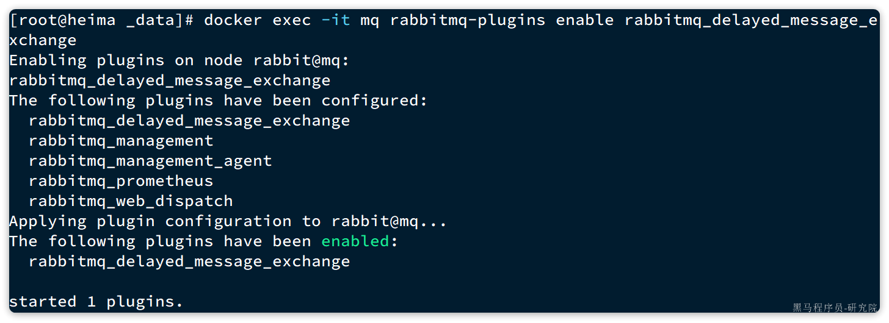

#### 4.2.3.==声明延迟交换机==

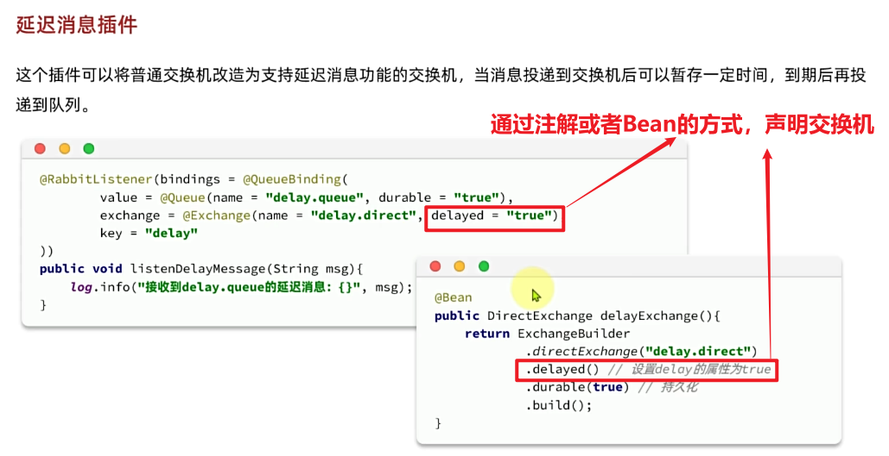

**基于注解方式**：

```Java
/**
  * 使用DelayExchange插件实现延迟消费
  * @param msg
  */
@RabbitListener(bindings = @QueueBinding(
    value = @Queue(value = "delay.queue", durable = "true"),
    exchange = @Exchange(value = "delay.direct", delayed = "true"),
    key = "delay"
))
public void listenDelayQueue(String msg) {
    log.info("消费者监听到delay.queue中的消息：" + msg);
}
```

**基于`@Bean`的方式**：

```Java
package com.itheima.consumer.config;

import lombok.extern.slf4j.Slf4j;
import org.springframework.amqp.core.*;
import org.springframework.context.annotation.Bean;
import org.springframework.context.annotation.Configuration;

@Slf4j
@Configuration
public class DelayExchangeConfig {

    @Bean
    public DirectExchange delayExchange(){
        return ExchangeBuilder
                .directExchange("delay.direct") // 指定交换机类型和名称
                .delayed() // 设置delay的属性为true
                .durable(true) // 持久化
                .build();
    }

    @Bean
    public Queue delayedQueue(){
        return new Queue("delay.queue");
    }
    
    @Bean
    public Binding delayQueueBinding(){
        return BindingBuilder.bind(delayedQueue()).to(delayExchange()).with("delay");
    }
}
```


#### 4.2.4.==发送延迟消息==


发送消息时，必须通过x-delay属性设定延迟时间：

```Java
/**
* 使用插件实现延迟消费
*/
@Test
void testPublisherDelayMessage() {
    // 1.创建消息
    String message = "hello, delayed message";
    // 2.发送消息，利用消息后置处理器添加消息头
    rabbitTemplate.convertAndSend("delay.direct", "delay", message, new MessagePostProcessor() {
        @Override
        public Message postProcessMessage(Message message) throws AmqpException {
            // 添加延迟消息属性
            message.getMessageProperties().setDelay(10000);
            return message;
        }
    });
}
```


#### 5.运行结果

publisher服务成功发送了一条消息，但consumer服务在10秒后才收到该消息，从而实现了**延迟消息**传递的目标：


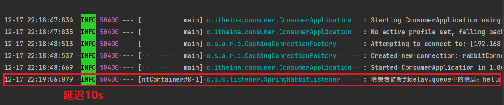

**注意：**

**延迟消息插件内部**会维护一个**本地数据库表**，同时使用**Elang Timers功能实现计时**。如果消息的**延迟时间设置较长**，可能会**导致堆积的延迟消息非常多**，**会带来较大的CPU开销**，同时延迟消息的时间**会存在误差。**

Erlang Timers（Erlang 计时器）是 **Erlang 语言** 内置的 **定时任务管理机制**，用于在 **指定时间后触发某个操作**。RabbitMQ 本身是基于 **Erlang/OTP** 开发的，因此它的**延迟消息机制依赖于 Erlang Timers 来管理时间调度**。

因此，**==不建议设置延迟时间过长的延迟消息==**。


### 4.3.==超时订单问题==


接下来，我们就在交易服务中利用**延迟消息实现订单超时取消功能**。其大概思路如下：


**==查询支付状态有两次==：**

1.**==查询本地订单状态==**，如果已经正常通知了，支付和交易服务的**通知正常**，订单状态已经修改为已支付了，此时直接结束即可。

2.**==查询支付流水状态==，如果本地查询到的订单状态不是已支付**，那么**有可能是没能通知到**，此时**需要去向支付服务查询支付流水状态**，如果是已支付，则修改，如果不是，那么就说明超时了，则**取消订单，并回复库存**。


假如订单超时支付时间为30分钟，理论上说我们应该在下单时发送一条延迟消息，延迟时间为30分钟。这样就可以在接收到**消息时检验订单支付状态，关闭未支付订单，回复库存**。


#### 4.3.1.定义常量

因为是订单超时问题，所以**==延迟消息的发送还是接收都是在交易服务完成==**，因此我们在`trade-service`中定义一个**常量类，用于记录交换机、队列、RoutingKey等常量**：


内容如下：

```Java
package com.hmall.trade.constants;

public interface MqConstants {
    String DELAY_EXCHANGE_NAME = "trade.delay.direct";
    String DELAY_ORDER_QUEUE_NAME = "trade.delay.order.queue";
    String DELAY_ORDER_KEY = "delay.order.query"; //延迟查询订单状态
}
```

#### 4.3.2.配置MQ

在`trade-service`模块的`pom.xml`中引入amqp的依赖：

```XML
  <!--amqp-->
  <dependency>
      <groupId>org.springframework.boot</groupId>
      <artifactId>spring-boot-starter-amqp</artifactId>
  </dependency>
```

在`trade-service`的`application.yaml`中添加MQ的配置：

```YAML
spring:
  rabbitmq:
    host: 192.168.88.133
    port: 5672
    virtual-host: /hmall
    username: hmall
    password: 123
```


#### 4.3.3.改造下单业务，发送延迟消息

接下来，我们改造下单业务，在下单完成后，发送延迟消息，查询支付状态。

修改`trade-service`模块的`com.hmall.trade.service.impl.OrderServiceImpl`类的`createOrder`方法，添加消息发送的代码：


```java
// 5.发送延迟消息，在设置的延迟时间后，自动检测订单支付状态
rabbitTemplate.convertAndSend(
    MqConstants.DELAY_EXCHANGE_NAME,
    MqConstants.DELAY_ORDER_KEY,
    order.getId(),
    new MessagePostProcessor() {
        @Override
        public Message postProcessMessage(Message message) throws AmqpException {
            message.getMessageProperties().setDelay(10000); //设置订单消息的延迟时间,即为订单超时的时间
            return message;
        }
    }
);
```

这里延迟消息的时间应该是15分钟，不过我们为了测试方便，改成10秒。

#### 4.3.4.编写==查询支付状态接口==


由于MQ消息处理时需要查询支付状态，因此我们要在`pay-service`模块定义一个这样的接口，并提供对应的`FeignClient`.

首先，在`hm-api`模块定义三个类：


说明：

- PayOrderDTO：支付单的数据传输实体
- PayClient：支付系统的Feign客户端
- PayClientFallback：支付系统的fallback逻辑

`PayOrderDTO`代码如下：

```Java
package com.hmall.api.dto;

import io.swagger.annotations.ApiModel;
import io.swagger.annotations.ApiModelProperty;
import lombok.Data;

import java.time.LocalDateTime;

/**
 * <p>
 * 支付订单
 * </p>
 */
@Data
@ApiModel(description = "支付单数据传输实体")
public class PayOrderDTO {
    @ApiModelProperty("id")
    private Long id;
    @ApiModelProperty("业务订单号")
    private Long bizOrderNo;
    @ApiModelProperty("支付单号")
    private Long payOrderNo;
    @ApiModelProperty("支付用户id")
    private Long bizUserId;
    @ApiModelProperty("支付渠道编码")
    private String payChannelCode;
    @ApiModelProperty("支付金额，单位分")
    private Integer amount;
    @ApiModelProperty("付类型，1：h5,2:小程序，3：公众号，4：扫码，5：余额支付")
    private Integer payType;
    @ApiModelProperty("付状态，0：待提交，1:待支付，2：支付超时或取消，3：支付成功")
    private Integer status;
    @ApiModelProperty("拓展字段，用于传递不同渠道单独处理的字段")
    private String expandJson;
    @ApiModelProperty("第三方返回业务码")
    private String resultCode;
    @ApiModelProperty("第三方返回提示信息")
    private String resultMsg;
    @ApiModelProperty("支付成功时间")
    private LocalDateTime paySuccessTime;
    @ApiModelProperty("支付超时时间")
    private LocalDateTime payOverTime;
    @ApiModelProperty("支付二维码链接")
    private String qrCodeUrl;
    @ApiModelProperty("创建时间")
    private LocalDateTime createTime;
    @ApiModelProperty("更新时间")
    private LocalDateTime updateTime;
}
```

`PayClient`代码如下：

```Java
package com.hmall.api.client;

import com.hmall.api.client.fallback.PayClientFallback;
import com.hmall.api.dto.PayOrderDTO;
import org.springframework.cloud.openfeign.FeignClient;
import org.springframework.web.bind.annotation.GetMapping;
import org.springframework.web.bind.annotation.PathVariable;

@FeignClient(value = "pay-service", fallbackFactory = PayClientFallback.class)
public interface PayClient {
    /**
     * 根据交易订单id查询支付单
     * @param id 业务订单id
     * @return 支付单信息
     */
    @GetMapping("/pay-orders/biz/{id}")
    PayOrderDTO queryPayOrderByBizOrderNo(@PathVariable("id") Long id);
}
```

`PayClientFallbackFactory`代码如下：

```Java
package com.hmall.api.client.fallback;

import com.hmall.api.client.PayClient;
import com.hmall.api.dto.PayOrderDTO;
import lombok.extern.slf4j.Slf4j;
import org.springframework.cloud.openfeign.FallbackFactory;

@Slf4j
public class PayClientFallbackFactory implements FallbackFactory<PayClient> {
    @Override
    public PayClient create(Throwable cause) {
        return new PayClient() {
            @Override
            public PayOrderDTO queryPayOrderByBizOrderNo(Long id) {
                return null;
            }
        };
    }
}
```

最后，在`pay-service`模块的`PayController`中实现该接口：


```Java
@ApiOperation("根据id查询支付单")
@GetMapping("/biz/{id}")
public PayOrderDTO queryPayOrderByBizOrderNo(@PathVariable("id") Long id){
    PayOrder payOrder = payOrderService.lambdaQuery().eq(PayOrder::getBizOrderNo, id).one();
    return BeanUtils.copyBean(payOrder, PayOrderDTO.class);
}
```

#### 4.3.5.监听消息，查询支付状态

接下来，我们在`trader-service`编写一个监听器，监听延迟消息，查询订单支付状态：


代码如下：

```Java
package com.hmall.trade.listener;

import com.hmall.api.client.PayClient;
import com.hmall.api.dto.PayOrderDTO;
import com.hmall.trade.constants.MQConstants;
import com.hmall.trade.domain.po.Order;
import com.hmall.trade.service.IOrderService;
import lombok.RequiredArgsConstructor;
import org.springframework.amqp.rabbit.annotation.Exchange;
import org.springframework.amqp.rabbit.annotation.Queue;
import org.springframework.amqp.rabbit.annotation.QueueBinding;
import org.springframework.amqp.rabbit.annotation.RabbitListener;
import org.springframework.stereotype.Component;

@Component
@RequiredArgsConstructor
public class OrderDelayMessageListener {

    private final IOrderService orderService;
    private final PayClient payClient;

    @RabbitListener(bindings = @QueueBinding(
            value = @Queue(name = MQConstants.DELAY_ORDER_QUEUE_NAME),
            exchange = @Exchange(name = MQConstants.DELAY_EXCHANGE_NAME, delayed = "true"),
            key = MQConstants.DELAY_ORDER_KEY
    ))
    public void listenOrderDelayMessage(Long orderId){
        // 1.查询订单
        Order order = orderService.getById(orderId);
        // 2.检测订单状态，判断是否已支付
        if(order == null || order.getStatus() != 1){
            // 订单不存在或者已经支付
            return;
        }
        // 3.未支付，需要查询支付流水状态
        PayOrderDTO payOrder = payClient.queryPayOrderByBizOrderNo(orderId);
        // 4.判断是否支付
        if(payOrder != null && payOrder.getStatus() == 3){
            // 4.1.已支付，标记订单状态为已支付
            orderService.markOrderPaySuccess(orderId);
        }else{
            // TODO 4.2.未支付，取消订单，回复库存
            orderService.cancelOrder(orderId);
        }
    }
}
```

注意，这里要在OrderServiceImpl中实现cancelOrder方法，留作作业大家自行实现。

```java
/**
     * 取消订单，并回复库存
     *
     * @param orderId
     */
@Override
public void cancelOrder(Long orderId) {
    //1.获取订单详情-商品id和对应的数量
    List<OrderDetail> details =
        detailService.list(
        new LambdaQueryWrapper<OrderDetail>().eq(OrderDetail::getOrderId, orderId)
    );

    List<OrderDetailDTO> detailDTOS = new ArrayList<>(details.size());
    //2.回复对应商品的库存
    for (OrderDetail detail : details) {
        OrderDetailDTO orderDetailDTO = new OrderDetailDTO();
        BeanUtil.copyProperties(detail, orderDetailDTO);
        detailDTOS.add(orderDetailDTO);
    }
    if (CollectionUtil.isEmpty(detailDTOS)) {
        log.warn("订单详情为空，不需要恢复库存, orderId={}", orderId);
        return;
    }
    itemClient.replyStock(detailDTOS);


    //0.删除订单和订单详情
    detailService.remove(
        new LambdaQueryWrapper<OrderDetail>().eq(OrderDetail::getOrderId, orderId)
    );
    removeById(orderId);
}
```


#### 4.3.6.修改消息转换器配置


#### 4.3.7.测试


## 5.作业

### 5.1.取消订单

在处理超时未支付订单时，如果发现订单确实超时未支付，最终需要关闭该订单。

关闭订单需要完成两件事情：

- 将订单状态修改为已关闭
- 恢复订单中已经扣除的库存

这部分功能尚未实现。

大家要在`IOrderService`接口中定义`cancelOrder`方法：

```Java
void cancelOrder(Long orderId);
```

并且在`OrderServiceImpl`中实现该方法。实现过程中要注意业务幂等性判断。

### 5.2.抽取MQ工具

MQ在企业开发中的常见应用我们就学习完毕了，除了收发消息以外，消息可靠性的处理、生产者确认、消费者确认、延迟消息等等编码还是相对比较复杂的。

因此，我们需要将这些常用的操作封装为工具，方便在项目中使用。要求如下：

- 将RabbitMQ的yaml配置抽取到nacos中，作为共享配置，替换所有微服务中的自定义MQ配置
- 在`hm-commom`模块下编写发送消息的工具类`RabbitMqHelper`
- 定义一个自动配置类`MqConsumeErrorAutoConfiguration`，内容包括：
  - 声明一个交换机，名为`error.direct`，类型为`direct`
  - 声明一个队列，名为：`微服务名 + error.queue`，也就是说要动态获取
  - 将队列与交换机绑定，绑定时的`RoutingKey`就是`微服务名`
  - 声明`RepublishMessageRecoverer`，消费失败消息投递到上述交换机
  - 给配置类添加条件，当`spring.rabbitmq.listener.simple.retry.enabled`为`true`时触发

RabbitMqHelper的结构如下：

```Java
public class RabbitMqHelper {

    private final RabbitTemplate rabbitTemplate;

    public void sendMessage(String exchange, String routingKey, Object msg){

    }

    public void sendDelayMessage(String exchange, String routingKey, Object msg, int delay){

    }

    public void sendMessageWithConfirm(String exchange, String routingKey, Object msg, int maxRetries){
        
    }
}
```


#### 1.抽取共享配置

首先，我们需要在nacos中抽取RabbitMQ的共享配置，命名为`shared-mq.yaml`：

! [image-20250322222530721](MQ.assets/image-20250322222530721.png)


其中只包含mq的基础共享配置，内容如下：

```YAML
spring:
  rabbitmq:
    host: ${hm.mq.host:192.168.150.101} # 主机名
    port: ${hm.mq.port:5672} # 端口
    virtual-host: ${hm.mq.vhost:/hmall} # 虚拟主机
    username: ${hm.mq.un:hmall} # 用户名
    password: ${hm.mq.pw:123} # 密码
```

#### 2.引入依赖

在`hm-common`模块引入要用到的一些依赖，主要包括`amqp、jackson`。但是不要引入starter，因为我们希望可以让用户按需引入。

依赖如下：

```XML
<!--AMQP依赖-->
<dependency>
    <groupId>org.springframework.amqp</groupId>
    <artifactId>spring-amqp</artifactId>
    <scope>provided</scope>
</dependency>
<!--Spring整合Rabbit依赖-->
<dependency>
    <groupId>org.springframework.amqp</groupId>
    <artifactId>spring-rabbit</artifactId>
    <scope>provided</scope>
</dependency>
<!--json处理-->
<dependency>
    <groupId>com.fasterxml.jackson.dataformat</groupId>
    <artifactId>jackson-dataformat-xml</artifactId>
    <scope>provided</scope>
</dependency>
```

注意：依赖的`scope`要选择`provided`，这样依赖仅仅是用作项目编译时不报错，真正运行时需要使用者自行引入依赖。

#### 3.封装工具

在hm-common模块的`com.hmall.common.utils`包下新建一个`RabbitMqHelper`类：


代码如下：

```Java
package com.hmall.common.utils;

import cn.hutool.core.lang.UUID;
import lombok.RequiredArgsConstructor;
import lombok.extern.slf4j.Slf4j;
import org.springframework.amqp.rabbit.connection.CorrelationData;
import org.springframework.amqp.rabbit.core.RabbitTemplate;
import org.springframework.util.concurrent.ListenableFutureCallback;

@Slf4j
@RequiredArgsConstructor
public class RabbitMqHelper {

    private final RabbitTemplate rabbitTemplate;

    public void sendMessage(String exchange, String routingKey, Object msg){
        log.debug("准备发送消息，exchange:{}, routingKey:{}, msg:{}", exchange, routingKey, msg);
        rabbitTemplate.convertAndSend(exchange, routingKey, msg);
    }

    public void sendDelayMessage(String exchange, String routingKey, Object msg, int delay){
        rabbitTemplate.convertAndSend(exchange, routingKey, msg, message -> {
            message.getMessageProperties().setDelay(delay);
            return message;
        });
    }

    public void sendMessageWithConfirm(String exchange, String routingKey, Object msg, int maxRetries){
        log.debug("准备发送消息，exchange:{}, routingKey:{}, msg:{}", exchange, routingKey, msg);
        CorrelationData cd = new CorrelationData(UUID.randomUUID().toString(true));
        cd.getFuture().addCallback(new ListenableFutureCallback<>() {
            int retryCount;
            @Override
            public void onFailure(Throwable ex) {
                log.error("处理ack回执失败", ex);
            }
            @Override
            public void onSuccess(CorrelationData.Confirm result) {
                if (result != null && !result.isAck()) {
                    log.debug("消息发送失败，收到nack，已重试次数：{}", retryCount);
                    if(retryCount >= maxRetries){
                        log.error("消息发送重试次数耗尽，发送失败");
                        return;
                    }
                    CorrelationData cd = new CorrelationData(UUID.randomUUID().toString(true));
                    cd.getFuture().addCallback(this);
                    rabbitTemplate.convertAndSend(exchange, routingKey, msg, cd);
                    retryCount++;
                }
            }
        });
        rabbitTemplate.convertAndSend(exchange, routingKey, msg, cd);
    }
}
```

#### 4.自动装配

最后，我们在hm-common模块的包下定义一个配置类：


将`RabbitMqHelper`注册为Bean：

```Java
package com.hmall.common.config;

import com.fasterxml.jackson.databind.ObjectMapper;
import com.hmall.common.utils.RabbitMqHelper;
import org.springframework.amqp.core.RabbitTemplate;
import org.springframework.amqp.rabbit.core.RabbitTemplate;
import org.springframework.amqp.support.converter.Jackson2JsonMessageConverter;
import org.springframework.amqp.support.converter.MessageConverter;
import org.springframework.boot.autoconfigure.condition.ConditionalOnBean;
import org.springframework.boot.autoconfigure.condition.ConditionalOnClass;
import org.springframework.context.annotation.Bean;
import org.springframework.context.annotation.Configuration;

@Configuration
@ConditionalOnClass(value = {MessageConverter.class, RabbitTemplate.class})
public class MqConfig {

    @Bean
    @ConditionalOnBean(ObjectMapper.class)
    public MessageConverter messageConverter(ObjectMapper mapper){
        // 1.定义消息转换器
        Jackson2JsonMessageConverter jackson2JsonMessageConverter = new Jackson2JsonMessageConverter(mapper);
        // 2.配置自动创建消息id，用于识别不同消息
        jackson2JsonMessageConverter.setCreateMessageIds(true);
        return jackson2JsonMessageConverter;
    }

    @Bean
    public RabbitMqHelper rabbitMqHelper(RabbitTemplate rabbitTemplate){
        return new RabbitMqHelper(rabbitTemplate);
    }
}
```

注意：

由于hm-common模块的包名为`com.hmall.common`，与其它微服务的包名不一致，因此无法通过扫描包使配置生效。

为了让我们的配置生效，我们需要在项目的classpath下的META-INF/spring.factories文件中声明这个配置类：


内容如下：

```Properties
org.springframework.boot.autoconfigure.EnableAutoConfiguration=\
  com.hmall.common.config.MyBatisConfig,\
  com.hmall.common.config.MqConfig,\
  com.hmall.common.config.MvcConfig
```

至此，RabbitMQ的工具类和自动装配就完成了。


### 5.3.改造业务

利用你编写的工具，改造支付服务、购物车服务、交易服务中消息发送功能，并且添加消息确认或消费者重试机制，确保消息的可靠性。


