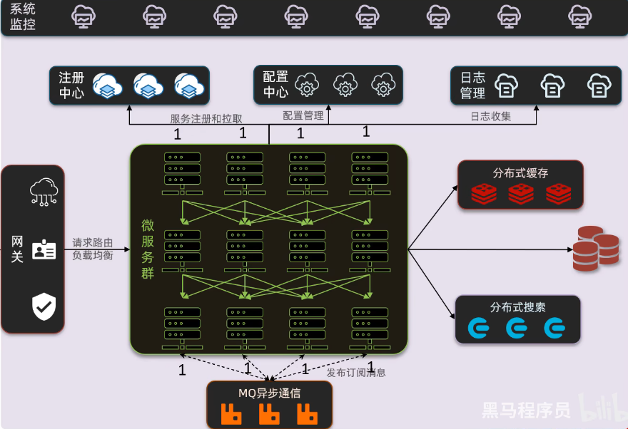

# 一、微服务-服务拆分

本篇文档对应B站视频：

【黑马程序员SpringCloud微服务技术栈实战教程，涵盖springcloud微服务架构+Nacos配置中心+分布式事务等】 

暂时无法在飞书文档外展示此内容

之前我们学习的项目一是单体项目，可以满足小型项目或传统项目的开发。而在互联网时代，越来越多的一线互联网公司都在使用微服务技术。

从谷歌搜索指数来看，国内从自2016年底开始，微服务热度突然暴涨：

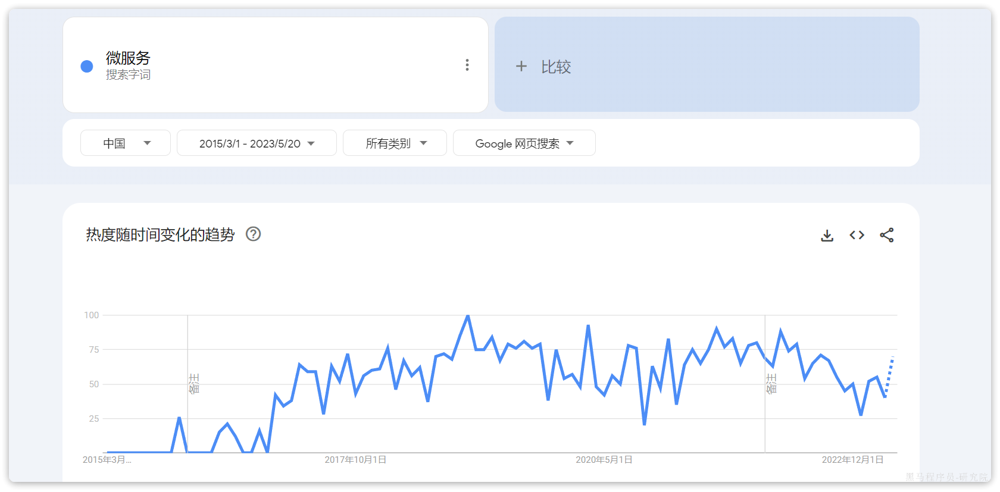

那么：

- 到底什么是微服务？
- 企业该不该引入微服务？
- 微服务技术该如何在企业落地？

接下来几天，我们就一起来揭开它的神秘面纱。

计划是这样的，课前资料中给大家准备了一个**单体**的电商小项目：黑马商城，我们会基于这个单体项目来演示从单体架构到微服务架构的演变过程、分析其中存在的问题，以及微服务技术是如何解决这些问题的。

你会发现每一个微服务技术都是在解决服务化过程中产生的问题，你对于每一个微服务技术具体的应用场景和使用方式都会有更深层次的理解。

今天作为课程的第一天，我们要完成下面的内容：

- 知道单体架构的特点
- 知道微服务架构的特点
- 学会拆分微服务
- 会使用Nacos实现服务治理
- 会使用OpenFeign实现远程调用

## 0.导入黑马商城项目

在课前资料中给大家提供了黑马商城项目的资料，我们需要先导入这个单体项目。不过需要注意的是，本篇及后续的微服务学习都是基于Centos7系统下的Docker部署，因此你必须做好一些准备：

- Centos7的环境及一个好用的SSH客户端
- 安装好Docker
- 会使用Docker

如果你没有这样的Linux环境，或者不是Centos7的话，那么这里有一篇参考文档：

- [Linux环境搭建](https://b11et3un53m.feishu.cn/wiki/FJAnwOhpIihMkLkOKQocdWZ7nUc) 

建议按照上面的文档来搭建虚拟机环境，使用其它版本会出现一些环境问题，比较痛苦。

如果已经有Linux环境，但是没有安装Docker的话，那么这里还有一篇参考文档：

- [安装Docker](https://b11et3un53m.feishu.cn/wiki/Rfocw7ctXij2RBkShcucLZbrn2d) 

如果不会使用Docker的话可以参考黑马的微服务前置Docker课程，B站地址如下：

https://www.bilibili.com/video/BV1HP4118797/?share_source=copy_web&vd_source=3362e6914fb759983690e6e0f1072453

注意：

如果是学习过上面Docker课程的同学，虚拟机中已经有了黑马商城项目及MySQL数据库了，不过为了跟其他同学保持一致，可以先将整个项目移除。使用下面的命令：

cd /root

docker compose down

### 0.1.安装MySQL

在课前资料提供好了MySQL的一个目录：

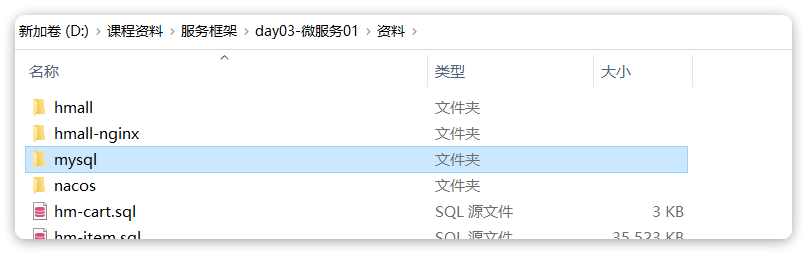

其中有MySQL的配置文件和初始化脚本：

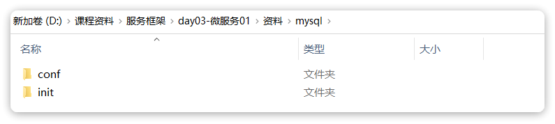

我们将其复制到虚拟机的`/root`目录。如果`/root`下已经存在`mysql`目录则删除旧的，如果不存在则直接复制本地的：

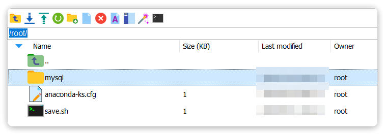

然后创建一个通用网络：

```Bash
docker network create hm-net
```

使用下面的命令来安装MySQL：

```Bash
docker run -d \
  --name mysql \
  -p 3306:3306 \
  -e TZ=Asia/Shanghai \
  -e MYSQL_ROOT_PASSWORD=123 \
  -v /root/mysql/data:/var/lib/mysql \
  -v /root/mysql/conf:/etc/mysql/conf.d \
  -v /root/mysql/init:/docker-entrypoint-initdb.d \
  --network hm-net\
  mysql
```

此时，通过命令查看mysql容器：

```Bash
docker ps
```

如图：

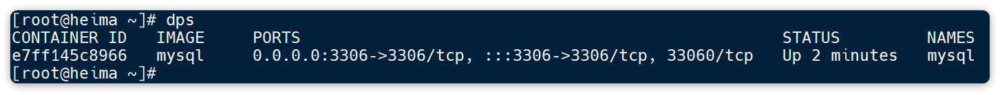

发现mysql容器正常运行。

> 注：图片中的dps命令是我设置的别名，等同于docker ps --format，可以简化命令格式。你可以参考黑马的[day02-Docker](https://b11et3un53m.feishu.cn/wiki/MWQIw4Zvhil0I5ktPHwcoqZdnec) 的2.1.3小节来配置。

此时，如果我们使用MySQL的客户端工具连接MySQL，应该能发现已经创建了黑马商城所需要的表：

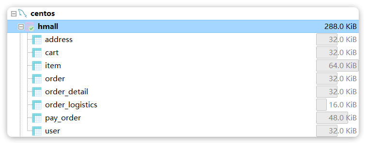

### 0.2.后端

然后是Java代码，在课前资料提供了一个hmall目录：

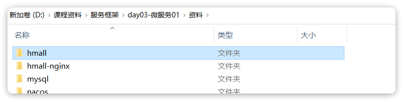

将其复制到你的工作空间，然后利用Idea打开。

项目结构如下：

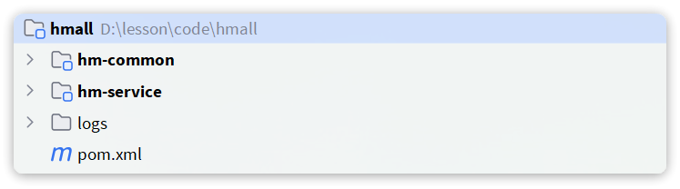

按下`ALT` + `8`键打开services窗口，新增一个启动项：

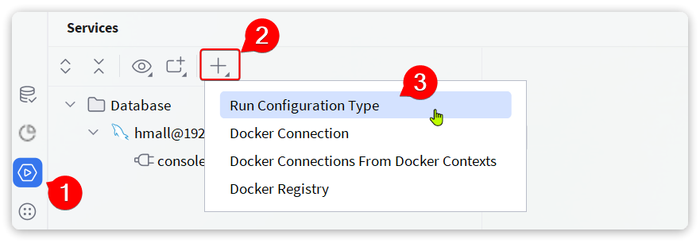

在弹出窗口中鼠标向下滚动，找到`Spring Boot`:

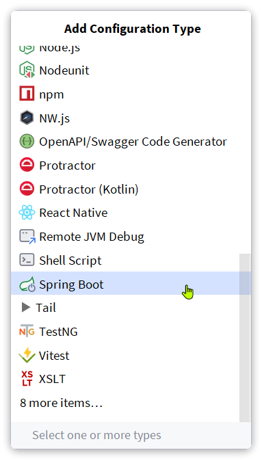

点击后应该会在services中出现hmall的启动项：

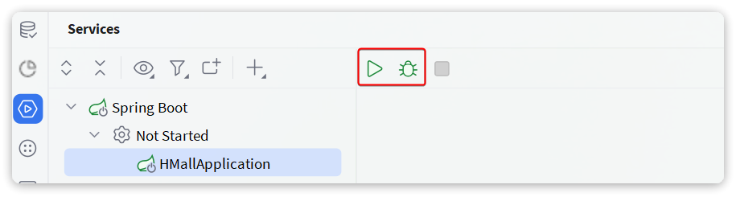

点击对应按钮，即可实现运行或DEBUG运行。

**不过别着急！！**

我们还需要对这个启动项做简单配置，在`HMallApplication`上点击鼠标右键，会弹出窗口，然后选择`Edit Configuration`：

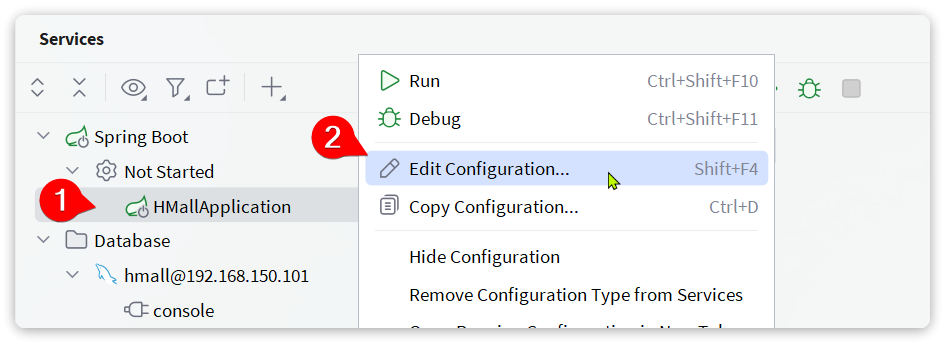

在弹出窗口中配置SpringBoot的启动环境为local：

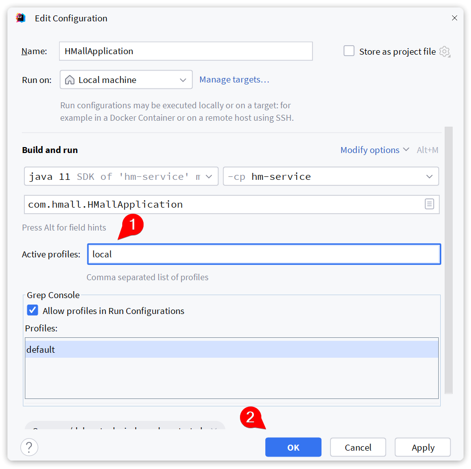

点击OK配置完成。接下来就可以运行了！

启动完成后，试试看访问下 `http://localhost:8080/hi` 吧！

### 0.3.前端

在课前资料中还提供了一个hmall-nginx的目录：

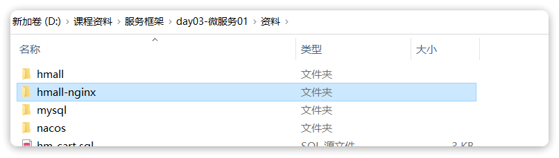

其中就是一个nginx程序以及我们的前端代码，直接在windows下将其复制到一个非中文、不包含特殊字符的目录下。然后进入hmall-nginx后，利用cmd启动即可：

```PowerShell
# 启动nginx
start nginx.exe
# 停止
nginx.exe -s stop
# 重新加载配置
nginx.exe -s reload
# 重启
nginx.exe -s restart
```

特别注意：

nginx.exe 不要双击启动，而是打开cmd窗口，通过命令行启动。停止的时候也一样要是用命令停止。如果启动失败不要重复启动，而是查看logs目录中的error.log日志，查看是否是端口冲突。如果是端口冲突则自行修改端口解决。

启动成功后，访问`http://localhost:18080`，应该能看到我们的门户页面：


## 1.认识微服务

这一章我们从单体架构的优缺点来分析，看看开发大型项目采用单体架构存在哪些问题，而微服务架构又是如何解决这些问题的。

### 1.1.单体架构

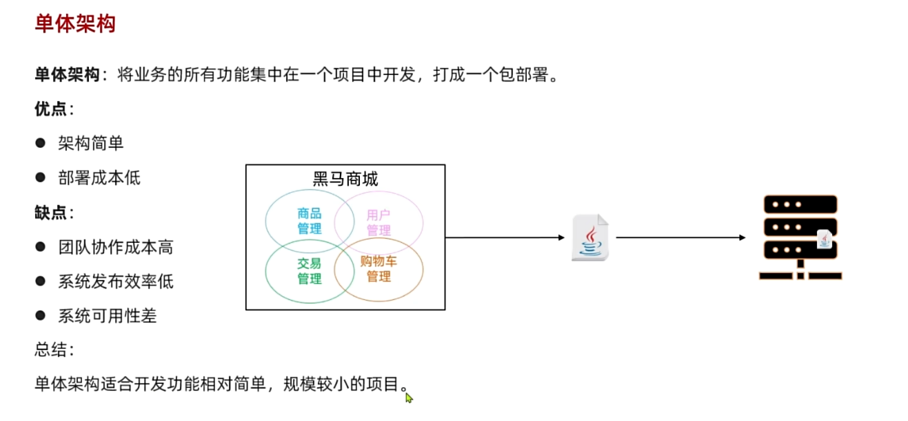

单体架构（monolithic structure）：顾名思义，整个项目中所有功能模块都在一个工程中开发；项目部署时需要对所有模块一起编译、打包；项目的架构设计、开发模式都非常简单。


当项目规模较小时，这种模式上手快，部署、运维也都很方便，因此早期很多小型项目都采用这种模式。

但随着项目的业务规模越来越大，团队开发人员也不断增加，单体架构就呈现出越来越多的问题：

- **团队协作成本高**：试想一下，你们团队数十个人同时协作开发同一个项目，由于所有模块都在一个项目中，不同模块的代码之间物理边界越来越模糊。最终要把功能合并到一个分支，你绝对会陷入到解决冲突的泥潭之中。
- **系统发布效率低**：任何模块变更都需要发布整个系统，而系统发布过程中需要多个模块之间制约较多，需要对比各种文件，任何一处出现问题都会导致发布失败，往往一次发布需要数十分钟甚至数小时。
- **系统可用性差**：单体架构各个功能模块是作为一个服务部署，相互之间会互相影响，一些热点功能会耗尽系统资源，导致其它服务低可用。

在上述问题中，前两点相信大家在实战过程中应该深有体会。对于第三点系统可用性问题，很多同学可能感触不深。接下来我们就通过黑马商城这个项目，给大家做一个简单演示。

首先，我们修改hm-service模块下的`com.hmall.controller.HelloController`中的`hello`方法，模拟方法执行时的耗时：

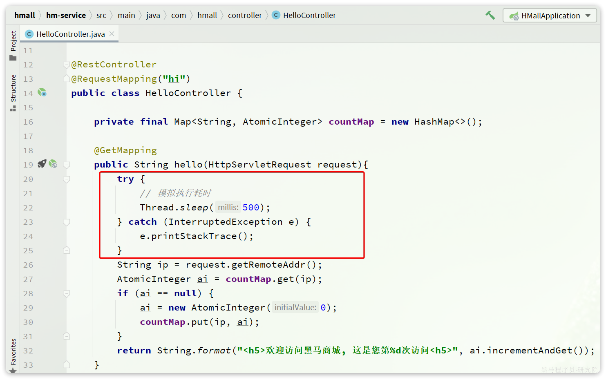

接下来，启动项目，目前有两个接口是无需登录即可访问的：

- `http://localhost:8080/hi`
- `http://localhost:8080/search/list`

经过测试，目前`/search/list` 是比较正常的，访问耗时在30毫秒左右。

接下来，我们假设`/hi`这个接口是一个并发较高的热点接口，我们通过Jemeter来模拟500个用户不停访问。在课前资料中已经提供了Jemeter的测试脚本：


导入Jemeter并测试：


这个脚本会开启500个线程并发请求`http://localhost/hi`这个接口。由于该接口存在执行耗时（500毫秒），这就服务端导致每秒能处理的请求数量有限，**最终会有越来越多请求积压，直至Tomcat资源耗尽**。这样，其它本来正常的接口（例如`/search/list`）也都会被拖慢，甚至因超时而无法访问了。

我们测试一下，启动测试脚本，然后在浏览器访问`http://localhost:8080/search/list`这个接口，会发现响应速度非常慢：

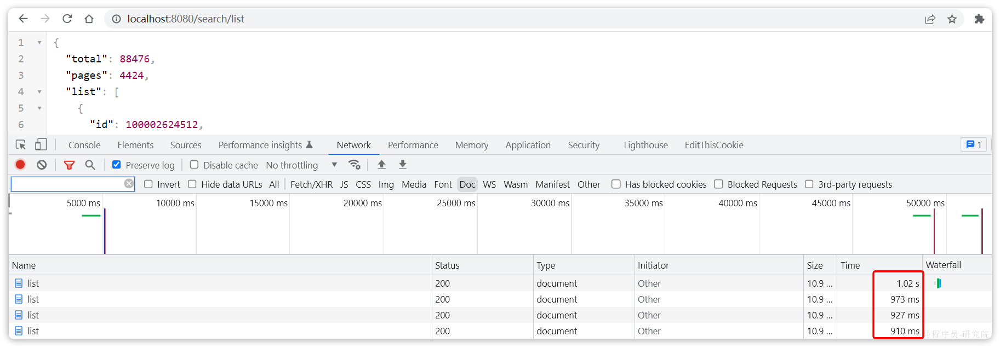

如果进一步提高`/hi`这个接口的并发，最终会发现`/search/list`接口的请求响应速度会越来越慢。

可见，单体架构的可用性是比较差的，功能之间相互影响比较大。

当然，有同学会说我们可以做水平扩展。

此时如果我们对系统做水平扩展，增加更多机器，资源还是会被这样的热点接口占用，从而影响到其它接口，并不能从根本上解决问题。这也就是单体架构的扩展性差的一个原因。

而要想解决这些问题，就需要使用微服务架构了。

### 1.2.微服务

微服务架构，首先是服务化，就是将单体架构中的功能模块从单体应用中拆分出来，独立部署为多个服务。同时要满足下面的一些特点：

- **单一职责**：一个微服务负责一部分业务功能，并且其核心数据不依赖于其它模块。
- **团队自治**：每个微服务都有自己独立的开发、测试、发布、运维人员，团队人员规模不超过10人（2张披萨能喂饱）
- **服务自治**：每个微服务都独立打包部署，访问自己独立的数据库。并且要做好服务隔离，避免对其它服务产生影响

例如，黑马商城项目，我们就可以把商品、用户、购物车、交易等模块拆分，交给不同的团队去开发，并独立部署：

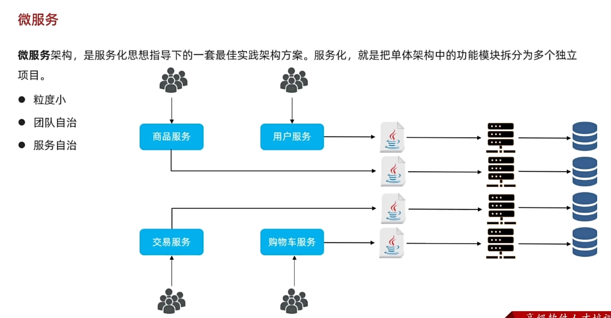

那么，单体架构存在的问题有没有解决呢？

- 团队协作成本高？
  - 由于服务拆分，每个服务代码量大大减少，参与开发的后台人员在1~3名，协作成本大大降低
- 系统发布效率低？
  - 每个服务都是独立部署，当有某个服务有代码变更时，只需要打包部署该服务即可
- 系统可用性差？
  - 每个服务独立部署，并且做好服务隔离，使用自己的服务器资源，不会影响到其它服务。

综上所述，微服务架构解决了单体架构存在的问题，特别适合大型互联网项目的开发，因此被各大互联网公司普遍采用。大家以前可能听说过分布式架构，**分布式就是服务拆分的过程**，其实微服务架构正式分布式架构的一种最佳实践的方案。

当然，微服务架构虽然能解决单体架构的各种问题，但在拆分的过程中，还会面临很多其它问题。比如：

- 如果出现跨服务的业务该如何处理？
- 页面请求到底该访问哪个服务？
- 如何实现各个服务之间的服务隔离？

这些问题，我们在后续的学习中会给大家逐一解答。

### 1.3.SpringCloud

微服务拆分以后碰到的各种问题都有对应的解决方案和微服务组件，而SpringCloud框架可以说是目前Java领域最全面的微服务组件的集合了。

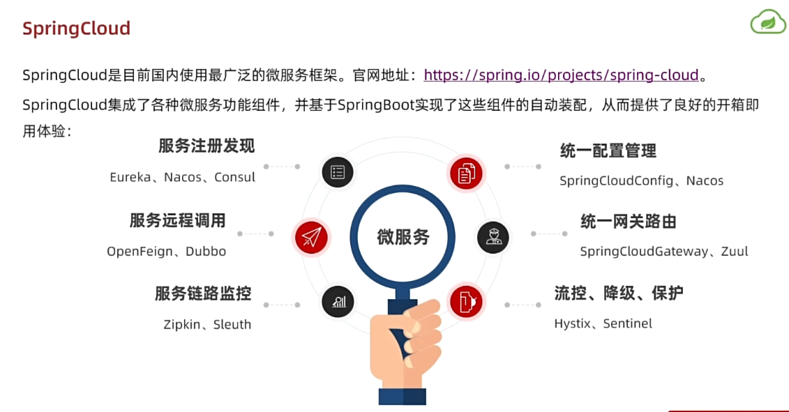

而且SpringCloud依托于SpringBoot的自动装配能力，大大降低了其项目搭建、组件使用的成本。对于没有自研微服务组件能力的中小型企业，使用SpringCloud全家桶来实现微服务开发可以说是最合适的选择了！

https://spring.io/projects/spring-cloud#overview

目前SpringCloud最新版本为`2022.0.x`版本，对应的SpringBoot版本为`3.x`版本，但它们全部依赖于JDK17，目前在企业中使用相对较少。

| **SpringCloud版本**                                          | **SpringBoot版本**                        |
| :----------------------------------------------------------- | :---------------------------------------- |
| [2022.0.x](https://github.com/spring-cloud/spring-cloud-release/wiki/Spring-Cloud-2022.0-Release-Notes) aka Kilburn | 3.0.x                                     |
| [2021.0.x](https://github.com/spring-cloud/spring-cloud-release/wiki/Spring-Cloud-2021.0-Release-Notes) aka Jubilee | 2.6.x, **2.7.x (Starting with 2021.0.3)** |
| [2020.0.x](https://github.com/spring-cloud/spring-cloud-release/wiki/Spring-Cloud-2020.0-Release-Notes) aka Ilford | 2.4.x, 2.5.x (Starting with 2020.0.3)     |
| [Hoxton](https://github.com/spring-cloud/spring-cloud-release/wiki/Spring-Cloud-Hoxton-Release-Notes) | 2.2.x, 2.3.x (Starting with SR5)          |
| [Greenwich](https://github.com/spring-projects/spring-cloud/wiki/Spring-Cloud-Greenwich-Release-Notes) | 2.1.x                                     |
| [Finchley](https://github.com/spring-projects/spring-cloud/wiki/Spring-Cloud-Finchley-Release-Notes) | 2.0.x                                     |
| [Edgware](https://github.com/spring-projects/spring-cloud/wiki/Spring-Cloud-Edgware-Release-Notes) | 1.5.x                                     |
| [Dalston](https://github.com/spring-projects/spring-cloud/wiki/Spring-Cloud-Dalston-Release-Notes) | 1.5.x                                     |

因此，我们推荐使用次新版本：**Spring Cloud 2021.0.x以及Spring Boot 2.7.x版本**。

另外，Alibaba的微服务产品SpringCloudAlibaba目前也成为了SpringCloud组件中的一员，我们课堂中也会使用其中的部分组件。

在我们的父工程hmall中已经配置了SpringCloud以及SpringCloudAlibaba的依赖：


对应的版本：


这样，我们在后续需要使用SpringCloud或者SpringCloudAlibaba组件时，就无需单独指定版本了。

### 1.4.导入SpringCloud依赖

```xml
  <!--spring cloud-->
    <dependency>
        <groupId>org.springframework.cloud</groupId>
        <artifactId>spring-cloud-dependencies</artifactId>
        <version>${spring-cloud.version}</version>
        <type>pom</type>
        <scope>import</scope>
    </dependency>
  <!--spring cloud alibaba-->
    <dependency>
        <groupId>com.alibaba.cloud</groupId>
        <artifactId>spring-cloud-alibaba-dependencies</artifactId>
        <version>${spring-cloud-alibaba.version}</version>
        <type>pom</type>
        <scope>import</scope>
    </dependency>
```


## 2.微服务拆分

接下来，我们就一起将黑马商城这个单体项目拆分为微服务项目，并解决其中出现的各种问题。

### 2.1.熟悉黑马商城

首先，我们需要熟悉黑马商城项目的基本结构：


大家可以直接启动该项目，测试效果。不过，需要修改数据库连接参数，在application-local.yaml中：

```YAML
hm:
  db:
    host: 192.168.150.101 # 修改为你自己的虚拟机IP地址
    pw: 123 # 修改为docker中的MySQL密码
```

同时配置启动项激活的是local环境：


#### 2.1.1.登录

首先来看一下登录业务流程：

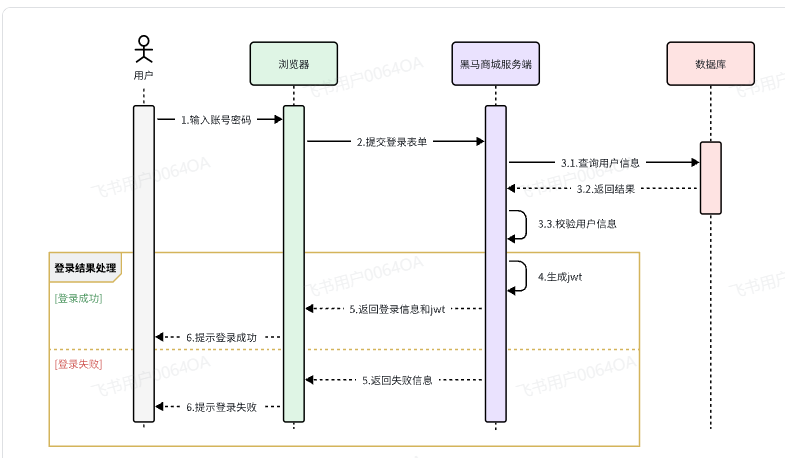

登录入口在`com.hmall.controller.UserController`中的`login`方法：


#### 2.2.2.搜索商品

在首页搜索框输入关键字，点击搜索即可进入搜索列表页面：


该页面会调用接口：`/search/list`，对应的服务端入口在`com.hmall.controller.SearchController`中的`search`方法：


这里目前是利用数据库实现了简单的分页查询。

#### 2.2.3.购物车

在搜索到的商品列表中，点击按钮`加入购物车`，即可将商品加入购物车：


加入成功后即可进入购物车列表页，查看自己购物车商品列表：

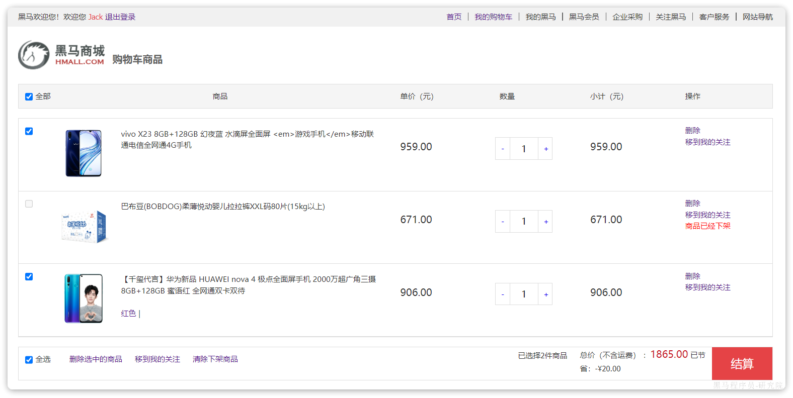

同时这里还可以对购物车实现修改、删除等操作。

相关功能全部在`com.hmall.controller.CartController`中：


其中，查询购物车列表时，由于要判断商品最新的价格和状态，所以还需要查询商品信息，业务流程如下：

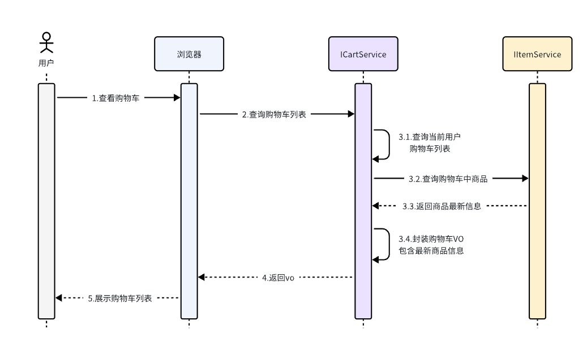

#### 2.2.4.下单

在购物车页面点击`结算`按钮，会进入订单结算页面：


点击提交订单，会提交请求到服务端，服务端做3件事情：

- 创建一个新的订单
- 扣减商品库存
- 清理购物车中商品

业务入口在`com.hmall.controller.OrderController`中的`createOrder`方法：

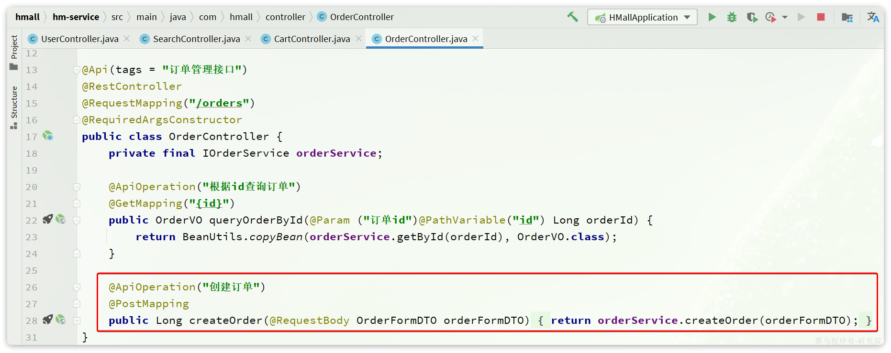

#### 2.2.5.支付

下单完成后会跳转到支付页面，目前只支持**余额支付**：

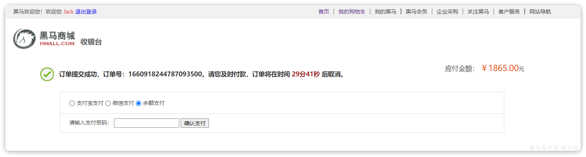

在选择**余额支付**这种方式后，会发起请求到服务端，服务端会立刻创建一个支付流水单，并返回支付流水单号到前端。

当用户输入用户密码，然后点击确认支付时，页面会发送请求到服务端，而服务端会做几件事情：

- 校验用户密码
- 扣减余额
- 修改支付流水状态
- 修改交易订单状态

请求入口在`com.hmall.controller.PayController`中：

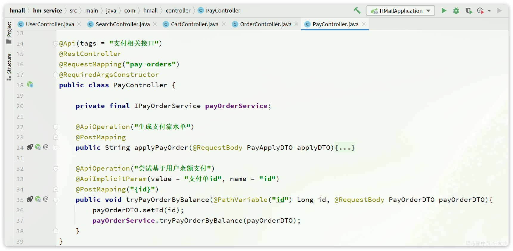

### 2.2.服务拆分原则

服务拆分一定要考虑几个问题：

- 什么时候拆？
- 如何拆？

#### 2.2.1.什么时候拆

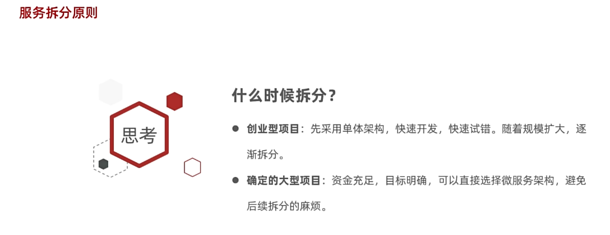

一般情况下，对于一个初创的项目，首先要做的是验证项目的可行性。因此这一阶段的首要任务是敏捷开发，快速产出生产可用的产品，投入市场做验证。为了达成这一目的，该阶段项目架构往往会比较简单，很多情况下会直接采用单体架构，这样开发成本比较低，可以快速产出结果，一旦发现项目不符合市场，损失较小。

如果这一阶段采用复杂的微服务架构，投入大量的人力和时间成本用于架构设计，最终发现产品不符合市场需求，等于全部做了无用功。

所以，对于**大多数小型项目来说，一般是先采用单体架构**，随着用户规模扩大、业务复杂后**再逐渐拆分为****微服务架构**。这样初期成本会比较低，可以快速试错。但是，这么做的问题就在于后期做服务拆分时，可能会遇到很多代码耦合带来的问题，拆分比较困难（**前易后难**）。

而对于一些大型项目，在立项之初目的就很明确，为了长远考虑，在架构设计时就直接选择微服务架构。虽然前期投入较多，但后期就少了拆分服务的烦恼（**前难后易**）。

#### 2.2.2.怎么拆

之前我们说过，微服务拆分时**粒度要小**，这其实是拆分的目标。具体可以从两个角度来分析：

- **高内聚**：每个微服务的职责要尽量单一，包含的业务相互关联度高、完整度高。
- **低耦合**：每个微服务的功能要相对独立，尽量减少对其它微服务的依赖，或者依赖接口的稳定性要强。

**高内聚**首先是**单一职责，**但不能说一个微服务就一个接口，而是要保证微服务内部业务的完整性为前提。目标是当我们要修改某个业务时，最好就只修改当前微服务，这样变更的成本更低。

一旦微服务做到了高内聚，那么服务之间的**耦合度**自然就降低了。

当然，微服务之间不可避免的会有或多或少的业务交互，比如下单时需要查询商品数据。这个时候我们不能在订单服务直接查询商品数据库，否则就导致了数据耦合。而应该由商品服务对应暴露接口，并且一定要保证微服务对外**接口的稳定性**（即：尽量保证接口外观不变）。虽然出现了服务间调用，但此时无论你如何在商品服务做内部修改，都不会影响到订单微服务，服务间的耦合度就降低了。

明确了拆分目标，接下来就是拆分方式了。我们在做服务拆分时一般有两种方式：

- **纵向**拆分
- **横向**拆分

所谓==**纵向拆分**==，就是按照项目的功能模块来拆分。例如黑马商城中，就有用户管理功能、订单管理功能、购物车功能、商品管理功能、支付功能等。那么按照功能模块将他们拆分为一个个服务，就属于纵向拆分。这种拆分模式可以尽可能提高服务的内聚性。

而==**横向拆分**==，是看各个功能模块之间有没有公共的业务部分，如果有将其抽取出来作为通用服务。例如用户登录是需要发送消息通知，记录风控数据，下单时也要发送短信，记录风控数据。因此**消息发送、风控数据记录就是通用的业务功能**，因此可以将他们分别抽取为公共服务：消息中心服务、风控管理服务。这样可以提高业务的复用性，避免重复开发。同时通用业务一般接口稳定性较强，也不会使服务之间过分耦合。

当然，由于黑马商城并不是一个完整的项目，其中的短信发送、风控管理并没有实现，这里就不再考虑了。而其它的业务按照纵向拆分，可以分为以下几个微服务：

- 用户服务
- 商品服务
- 订单服务
- 购物车服务
- 支付服务

### 2.3.拆分购物车、商品服务

接下来，我们先把商品管理功能、购物车功能抽取为两个独立服务。

一般微服务项目有两种不同的工程结构：

- 完全解耦：每一个微服务都创建为一个独立的工程，甚至可以使用不同的开发语言来开发，项目完全解耦。
  - 优点：服务之间耦合度低
  - 缺点：每个项目都有自己的独立仓库，管理起来比较麻烦
- Maven聚合：整个项目为一个Project，然后每个微服务是其中的一个Module
  - 优点：项目代码集中，管理和运维方便（授课也方便）
  - 缺点：服务之间耦合，编译时间较长

**注意**：

为了授课方便，我们会采用Maven聚合工程，大家以后到了企业，可以根据需求自由选择工程结构。

在hmall父工程之中，我已经提前定义了SpringBoot、SpringCloud的依赖版本，所以为了方便期间，我们直接在这个项目中创建微服务module.

#### 2.3.1.商品服务

在hmall中创建module：

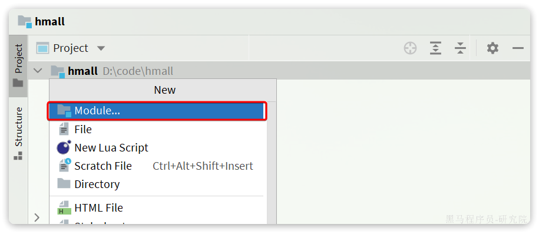

选择maven模块，并设定JDK版本为11：

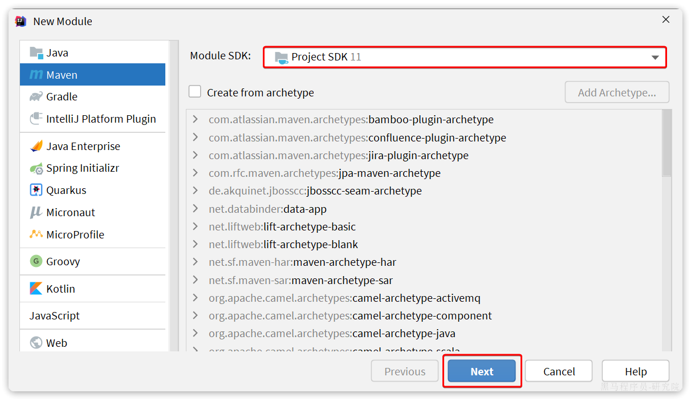

商品模块，我们起名为`item-service`：


引入依赖：

```XML
<?xml version="1.0" encoding="UTF-8"?>
<project xmlns="http://maven.apache.org/POM/4.0.0"
         xmlns:xsi="http://www.w3.org/2001/XMLSchema-instance"
         xsi:schemaLocation="http://maven.apache.org/POM/4.0.0 http://maven.apache.org/xsd/maven-4.0.0.xsd">
    <parent>
        <artifactId>hmall</artifactId>
        <groupId>com.heima</groupId>
        <version>1.0.0</version>
    </parent>
    <modelVersion>4.0.0</modelVersion>

    <artifactId>item-service</artifactId>

    <properties>
        <maven.compiler.source>11</maven.compiler.source>
        <maven.compiler.target>11</maven.compiler.target>
    </properties>
    <dependencies>
        <!--common-->
        <dependency>
            <groupId>com.heima</groupId>
            <artifactId>hm-common</artifactId>
            <version>1.0.0</version>
        </dependency>
        <!--web-->
        <dependency>
            <groupId>org.springframework.boot</groupId>
            <artifactId>spring-boot-starter-web</artifactId>
        </dependency>
        <!--数据库-->
        <dependency>
            <groupId>mysql</groupId>
            <artifactId>mysql-connector-java</artifactId>
        </dependency>
        <!--mybatis-->
        <dependency>
            <groupId>com.baomidou</groupId>
            <artifactId>mybatis-plus-boot-starter</artifactId>
        </dependency>
        <!--单元测试-->
        <dependency>
            <groupId>org.springframework.boot</groupId>
            <artifactId>spring-boot-starter-test</artifactId>
        </dependency>
    </dependencies>
    <build>
        <finalName>${project.artifactId}</finalName>
        <plugins>
            <plugin>
                <groupId>org.springframework.boot</groupId>
                <artifactId>spring-boot-maven-plugin</artifactId>
            </plugin>
        </plugins>
    </build>
</project>
```

编写启动类：

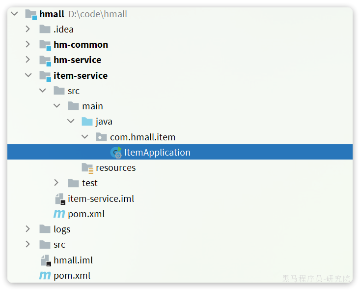

代码如下：

```Java
package com.hmall.item;

import org.mybatis.spring.annotation.MapperScan;
import org.springframework.boot.SpringApplication;
import org.springframework.boot.autoconfigure.SpringBootApplication;

@MapperScan("com.hmall.item.mapper")
@SpringBootApplication
public class ItemApplication {
    public static void main(String[] args) {
        SpringApplication.run(ItemApplication.class, args);
    }
}
```

接下来是配置文件，可以从`hm-service`中拷贝：


其中，`application.yaml`内容如下：

```YAML
server:
  port: 8081
spring:
  application:
    name: item-service
  profiles:
    active: dev
  datasource:
    url: jdbc:mysql://${hm.db.host}:3306/hm-item?useUnicode=true&characterEncoding=UTF-8&autoReconnect=true&serverTimezone=Asia/Shanghai
    driver-class-name: com.mysql.cj.jdbc.Driver
    username: root
    password: ${hm.db.pw}
mybatis-plus:
  configuration:
    default-enum-type-handler: com.baomidou.mybatisplus.core.handlers.MybatisEnumTypeHandler
  global-config:
    db-config:
      update-strategy: not_null
      id-type: auto
logging:
  level:
    com.hmall: debug
  pattern:
    dateformat: HH:mm:ss:SSS
  file:
    path: "logs/${spring.application.name}"
knife4j:
  enable: true
  openapi:
    title: 商品服务接口文档
    description: "信息"
    email: zhanghuyi@itcast.cn
    concat: 虎哥
    url: https://www.itcast.cn
    version: v1.0.0
    group:
      default:
        group-name: default
        api-rule: package
        api-rule-resources:
          - com.hmall.item.controller
```

剩下的`application-dev.yaml`和`application-local.yaml`直接从hm-service拷贝即可。

然后拷贝`hm-service`中与商品管理有关的代码到`item-service`，如图：

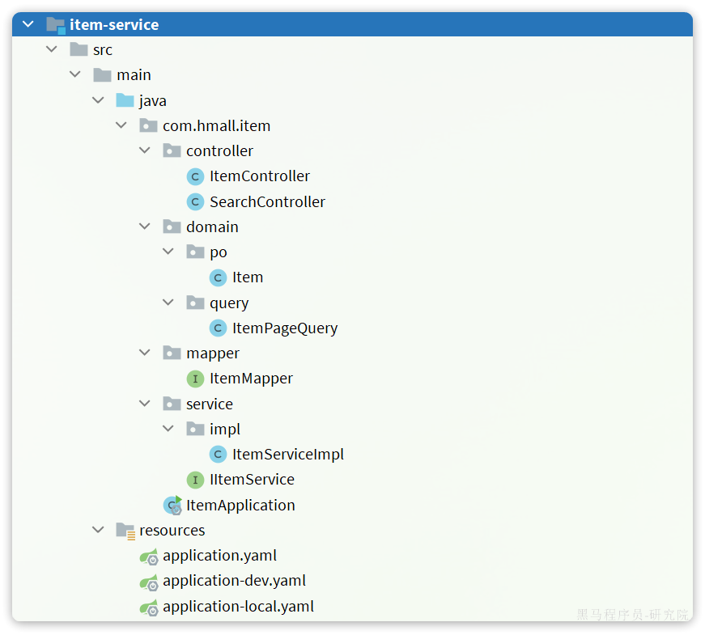

这里有一个地方的代码需要改动，就是`ItemServiceImpl`中的`deductStock`方法：

**改动前**

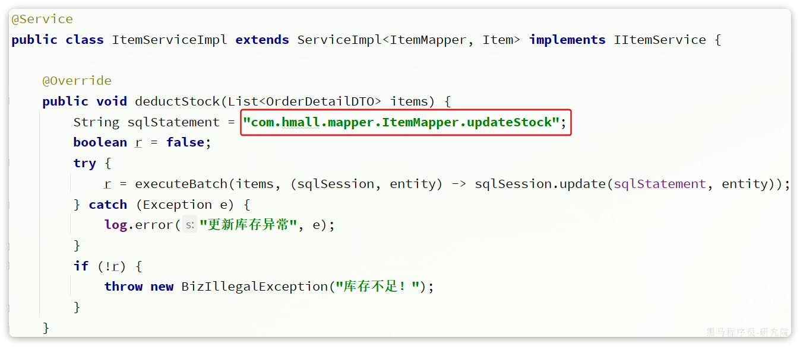

**改动后**

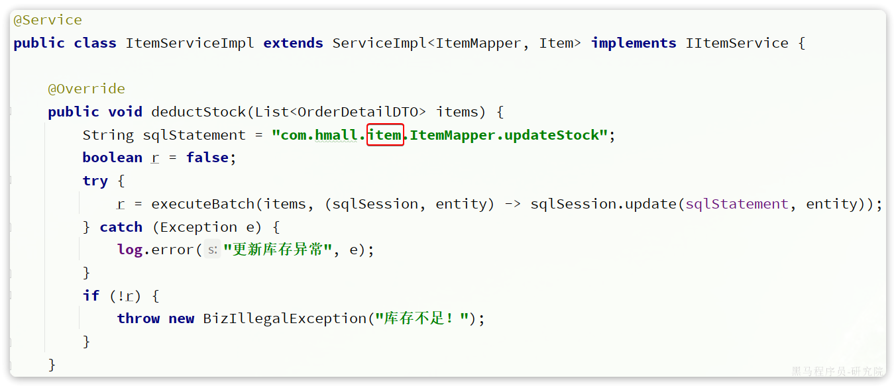


这也是因为ItemMapper的所在包发生了变化，因此这里代码必须修改包路径。

最后，还要导入数据库表。默认的数据库连接的是虚拟机，在你docker数据库执行课前资料提供的SQL文件：

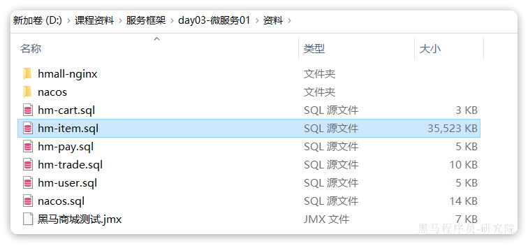

最终，会在数据库创建一个名为hm-item的database，将来的每一个微服务都会有自己的一个database：


**注意**：在企业开发的生产环境中，每一个微服务都应该有自己的**独立数据库服务**，而不仅仅是database，课堂我们用database来代替。

接下来，就可以启动测试了，在启动前我们要配置一下启动项，让默认激活的配置为`local`而不是`dev`：

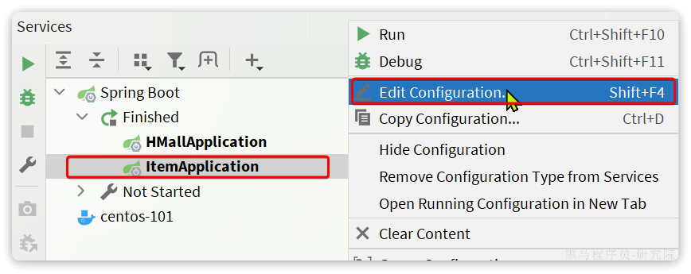

在打开的编辑框填写`active profiles`:

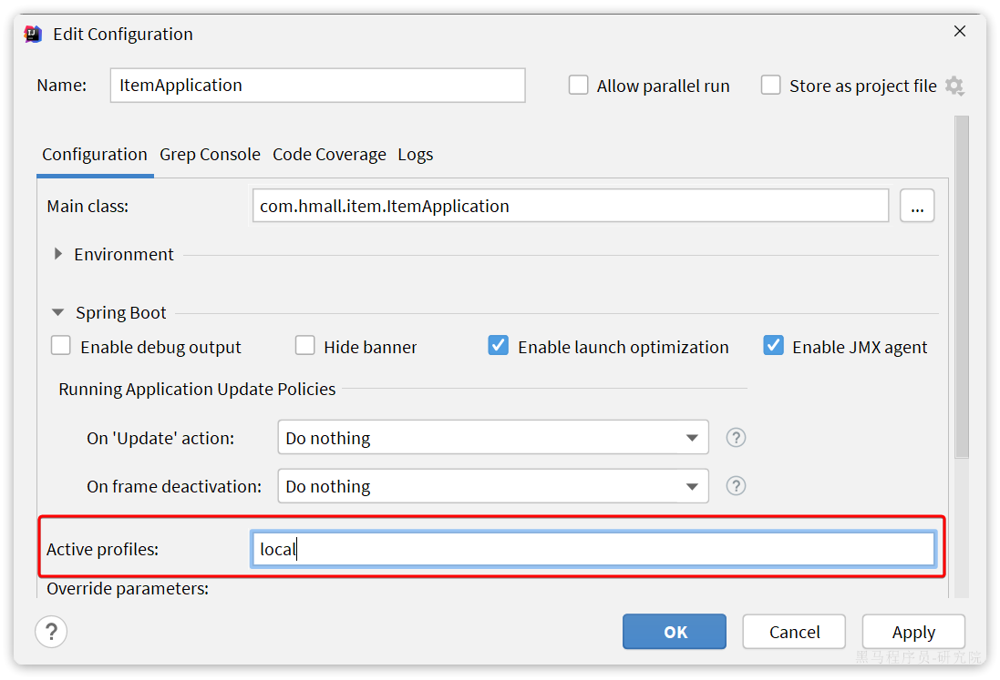

接着，启动`item-service`，访问商品微服务的swagger接口文档：`http://localhost:8081/doc.html`

然后测试其中的根据id批量查询商品这个接口：

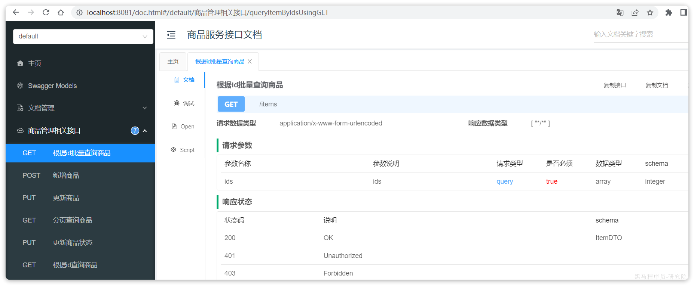

测试参数：100002672302,100002624500,100002533430，结果如下：

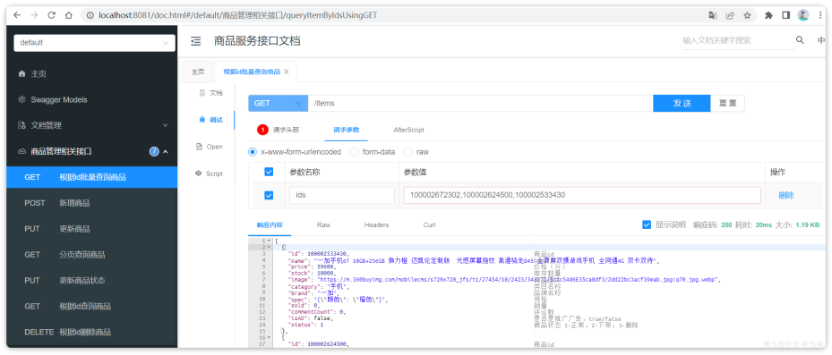

说明商品微服务抽取成功了。

#### 2.3.2.购物车服务

与商品服务类似，在hmall下创建一个新的`module`，起名为`cart-service`:

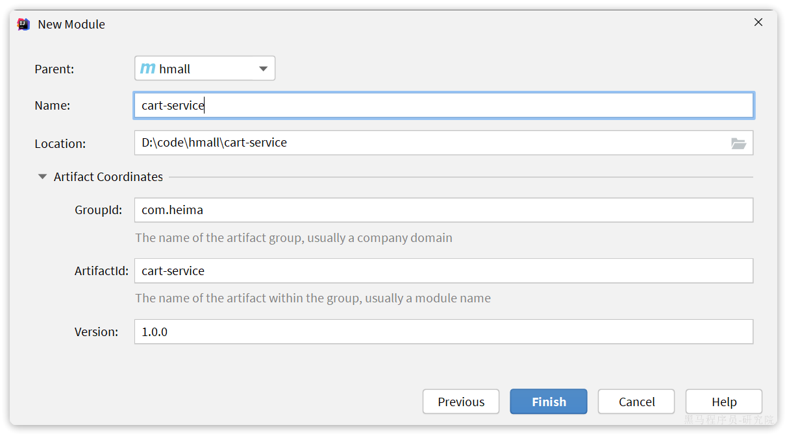

然后是依赖：

```XML
<?xml version="1.0" encoding="UTF-8"?>
<project xmlns="http://maven.apache.org/POM/4.0.0"
         xmlns:xsi="http://www.w3.org/2001/XMLSchema-instance"
         xsi:schemaLocation="http://maven.apache.org/POM/4.0.0 http://maven.apache.org/xsd/maven-4.0.0.xsd">
    <parent>
        <artifactId>hmall</artifactId>
        <groupId>com.heima</groupId>
        <version>1.0.0</version>
    </parent>
    <modelVersion>4.0.0</modelVersion>

    <artifactId>cart-service</artifactId>

    <properties>
        <maven.compiler.source>11</maven.compiler.source>
        <maven.compiler.target>11</maven.compiler.target>
    </properties>

    <dependencies>
        <!--common-->
        <dependency>
            <groupId>com.heima</groupId>
            <artifactId>hm-common</artifactId>
            <version>1.0.0</version>
        </dependency>
        <!--web-->
        <dependency>
            <groupId>org.springframework.boot</groupId>
            <artifactId>spring-boot-starter-web</artifactId>
        </dependency>
        <!--数据库-->
        <dependency>
            <groupId>mysql</groupId>
            <artifactId>mysql-connector-java</artifactId>
        </dependency>
        <!--mybatis-->
        <dependency>
            <groupId>com.baomidou</groupId>
            <artifactId>mybatis-plus-boot-starter</artifactId>
        </dependency>
        <!--单元测试-->
        <dependency>
            <groupId>org.springframework.boot</groupId>
            <artifactId>spring-boot-starter-test</artifactId>
        </dependency>
    </dependencies>
    <build>
        <finalName>${project.artifactId}</finalName>
        <plugins>
            <plugin>
                <groupId>org.springframework.boot</groupId>
                <artifactId>spring-boot-maven-plugin</artifactId>
            </plugin>
        </plugins>
    </build>
</project>
```

然后是启动类：

```Java
package com.hmall.cart;

import org.mybatis.spring.annotation.MapperScan;
import org.springframework.boot.SpringApplication;
import org.springframework.boot.autoconfigure.SpringBootApplication;

@MapperScan("com.hmall.cart.mapper")
@SpringBootApplication
public class CartApplication {
    public static void main(String[] args) {
        SpringApplication.run(CartApplication.class, args);
    }
}
```

然后是配置文件，同样可以拷贝自`item-service`，不过其中的`application.yaml`需要修改：

```YAML
server:
  port: 8082
spring:
  application:
    name: cart-service
  profiles:
    active: dev
  datasource:
    url: jdbc:mysql://${hm.db.host}:3306/hm-cart?useUnicode=true&characterEncoding=UTF-8&autoReconnect=true&serverTimezone=Asia/Shanghai
    driver-class-name: com.mysql.cj.jdbc.Driver
    username: root
    password: ${hm.db.pw}
mybatis-plus:
  configuration:
    default-enum-type-handler: com.baomidou.mybatisplus.core.handlers.MybatisEnumTypeHandler
  global-config:
    db-config:
      update-strategy: not_null
      id-type: auto
logging:
  level:
    com.hmall: debug
  pattern:
    dateformat: HH:mm:ss:SSS
  file:
    path: "logs/${spring.application.name}"
knife4j:
  enable: true
  openapi:
    title: 商品服务接口文档
    description: "信息"
    email: zhanghuyi@itcast.cn
    concat: 虎哥
    url: https://www.itcast.cn
    version: v1.0.0
    group:
      default:
        group-name: default
        api-rule: package
        api-rule-resources:
          - com.hmall.cart.controller
```

最后，把hm-service中的与购物车有关功能拷贝过来，最终的项目结构如下：


特别注意的是`com.hmall.cart.service.impl.CartServiceImpl`，其中有两个地方需要处理：

- 需要**获取登录用户信息**，但登录校验功能目前没有复制过来，先写死固定用户id
- 查询购物车时需要**查询商品信息**，而商品信息不在当前服务，需要先将这部分代码注释


我们对这部分代码做如下修改：

```Java
package com.hmall.cart.service.impl;

import cn.hutool.core.util.StrUtil;
import com.baomidou.mybatisplus.core.conditions.query.QueryWrapper;
import com.baomidou.mybatisplus.extension.service.impl.ServiceImpl;
import com.hmall.cart.domain.dto.CartFormDTO;
import com.hmall.cart.domain.po.Cart;
import com.hmall.cart.domain.vo.CartVO;
import com.hmall.cart.mapper.CartMapper;
import com.hmall.cart.service.ICartService;
import com.hmall.common.exception.BizIllegalException;
import com.hmall.common.utils.BeanUtils;
import com.hmall.common.utils.CollUtils;
import com.hmall.common.utils.UserContext;
import lombok.RequiredArgsConstructor;
import org.springframework.stereotype.Service;

import java.util.Collection;
import java.util.List;

/**
 * <p>
 * 订单详情表 服务实现类
 * </p>
 *
 * @author 虎哥
 * @since 2023-05-05
 */
@Service
@RequiredArgsConstructor
public class CartServiceImpl extends ServiceImpl<CartMapper, Cart> implements ICartService {

    // private final IItemService itemService;

    @Override
    public void addItem2Cart(CartFormDTO cartFormDTO) {
        // 1.获取登录用户
        Long userId = UserContext.getUser();

        // 2.判断是否已经存在
        if (checkItemExists(cartFormDTO.getItemId(), userId)) {
            // 2.1.存在，则更新数量
            baseMapper.updateNum(cartFormDTO.getItemId(), userId);
            return;
        }
        // 2.2.不存在，判断是否超过购物车数量
        checkCartsFull(userId);

        // 3.新增购物车条目
        // 3.1.转换PO
        Cart cart = BeanUtils.copyBean(cartFormDTO, Cart.class);
        // 3.2.保存当前用户
        cart.setUserId(userId);
        // 3.3.保存到数据库
        save(cart);
    }

    @Override
    public List<CartVO> queryMyCarts() {
        // 1.查询我的购物车列表
        List<Cart> carts = lambdaQuery().eq(Cart::getUserId, 1L /*TODO UserContext.getUser()*/).list();
        if (CollUtils.isEmpty(carts)) {
            return CollUtils.emptyList();
        }
        // 2.转换VO
        List<CartVO> vos = BeanUtils.copyList(carts, CartVO.class);
        // 3.处理VO中的商品信息
        handleCartItems(vos);
        // 4.返回
        return vos;
    }

    private void handleCartItems(List<CartVO> vos) {
        // 1.获取商品id TODO 处理商品信息
        /*Set<Long> itemIds = vos.stream().map(CartVO::getItemId).collect(Collectors.toSet());
        // 2.查询商品
        List<ItemDTO> items = itemService.queryItemByIds(itemIds);
        if (CollUtils.isEmpty(items)) {
            throw new BadRequestException("购物车中商品不存在！");
        }
        // 3.转为 id 到 item的map
        Map<Long, ItemDTO> itemMap = items.stream().collect(Collectors.toMap(ItemDTO::getId, Function.identity()));
        // 4.写入vo
        for (CartVO v : vos) {
            ItemDTO item = itemMap.get(v.getItemId());
            if (item == null) {
                continue;
            }
            v.setNewPrice(item.getPrice());
            v.setStatus(item.getStatus());
            v.setStock(item.getStock());
        }*/
    }

    @Override
    public void removeByItemIds(Collection<Long> itemIds) {
        // 1.构建删除条件，userId和itemId
        QueryWrapper<Cart> queryWrapper = new QueryWrapper<Cart>();
        queryWrapper.lambda()
                .eq(Cart::getUserId, UserContext.getUser())
                .in(Cart::getItemId, itemIds);
        // 2.删除
        remove(queryWrapper);
    }

    private void checkCartsFull(Long userId) {
        int count = lambdaQuery().eq(Cart::getUserId, userId).count();
        if (count >= 10) {
            throw new BizIllegalException(StrUtil.format("用户购物车课程不能超过{}", 10));
        }
    }

    private boolean checkItemExists(Long itemId, Long userId) {
        int count = lambdaQuery()
                .eq(Cart::getUserId, userId)
                .eq(Cart::getItemId, itemId)
                .count();
        return count > 0;
    }
}
```

最后，还是要导入数据库表，在本地数据库直接执行课前资料对应的SQL文件：


在数据库中会出现名为`hm-cart`的`database`，以及其中的`cart`表，代表购物车：

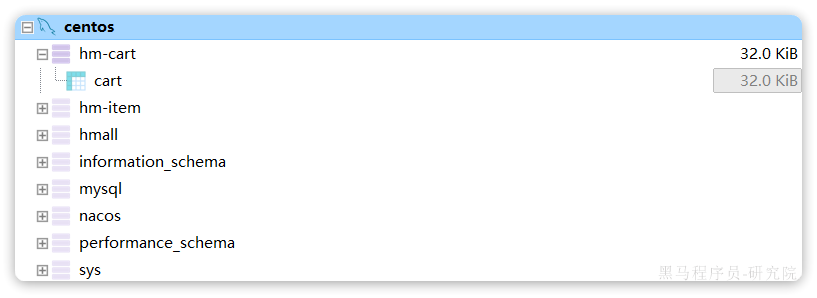

接下来，就可以测试了。不过在启动前，同样要配置启动项的`active profile`为`local`：

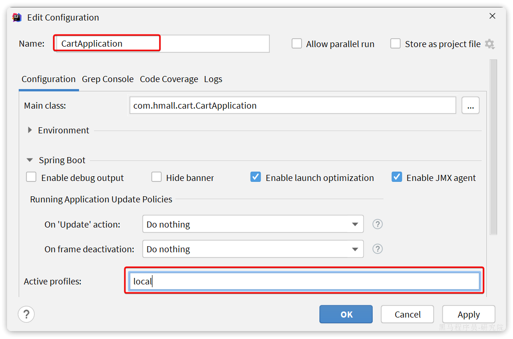

然后启动`CartApplication`，访问swagger文档页面：`http://localhost:8082/doc.html`

我们测试其中的`查询我的购物车列表`接口：

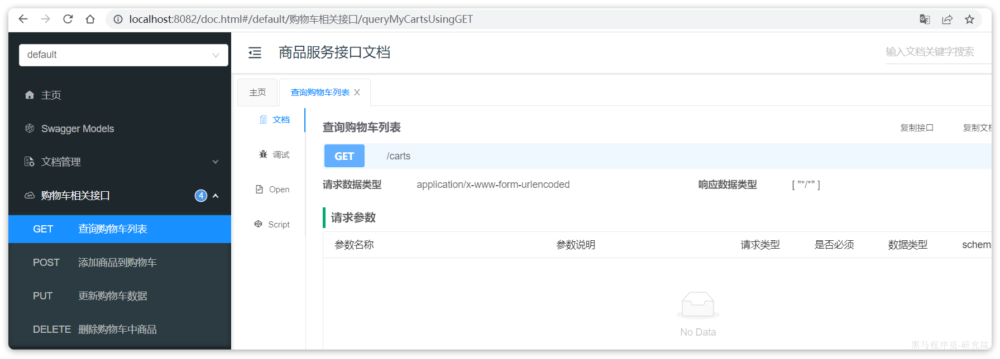

无需填写参数，直接访问：


我们注意到，其中与商品有关的几个字段值都为空！这就是因为刚才我们注释掉了查询购物车时，查询商品信息的相关代码。

那么，我们该如何在`cart-service`服务中实现对`item-service`服务的查询呢？

### 2.4.==服务调用==

在拆分的时候，我们发现一个问题：就是购物车业务中需要查询商品信息，但商品信息查询的逻辑全部迁移到了`item-service`服务，导致我们无法查询。

最终结果就是查询到的购物车数据不完整，因此要想解决这个问题，我们就必须改造其中的代码，把原本本地方法调用，改造成跨微服务的远程调用（RPC，即**R**emote **P**roduce **C**all）。

因此，现在查询购物车列表的流程变成了这样：

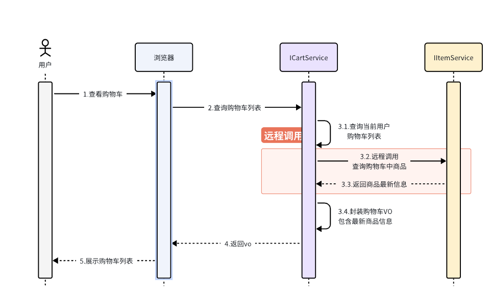

代码中需要变化的就是这一步：


那么问题来了：我们该如何跨服务调用，准确的说，如何在`cart-service`中获取`item-service`服务中的提供的商品数据呢？

大家思考一下，我们以前有没有实现过类似的远程查询的功能呢？

答案是肯定的，我们前端向服务端查询数据，其实就是从浏览器远程查询服务端数据。比如我们刚才通过Swagger测试商品查询接口，就是向`http://localhost:8081/items`这个接口发起的请求：


而这种查询就是通过http请求的方式来完成的，不仅仅可以实现远程查询，还可以实现新增、删除等各种远程请求。

假如我们在cart-service中能模拟浏览器，发送http请求到item-service，是不是就实现了跨微服务的**远程调用**了呢？

那么：我们该如何用Java代码发送Http的请求呢？

#### 2.4.1.==RestTemplate==

Spring给我们提供了一个RestTemplate的API，可以方便的实现Http请求的发送。

> org.springframework.web.client public class RestTemplate
>
> extends InterceptingHttpAccessor
>
> implements RestOperations
>
> \----------------------------------------------------------------------------------------------------------------
>
> 同步客户端执行HTTP请求，在底层HTTP客户端库(如JDK HttpURLConnection、Apache HttpComponents等)上公开一个简单的模板方法API。RestTemplate通过HTTP方法为常见场景提供了模板，此外还提供了支持不太常见情况的通用交换和执行方法。 RestTemplate通常用作共享组件。然而，它的配置不支持并发修改，因此它的配置通常是在启动时准备的。如果需要，您可以在启动时创建多个不同配置的RestTemplate实例。如果这些实例需要共享HTTP客户端资源，它们可以使用相同的底层ClientHttpRequestFactory。 注意:从5.0开始，这个类处于维护模式，只有对更改和错误的小请求才会被接受。请考虑使用org.springframework.web.react .client. webclient，它有更现代的API，支持同步、异步和流场景。  
>
> \----------------------------------------------------------------------------------------------------------------
>
> 自: 3.0 参见: HttpMessageConverter, RequestCallback, ResponseExtractor, ResponseErrorHandler

其中提供了大量的方法，方便我们发送Http请求，例如：

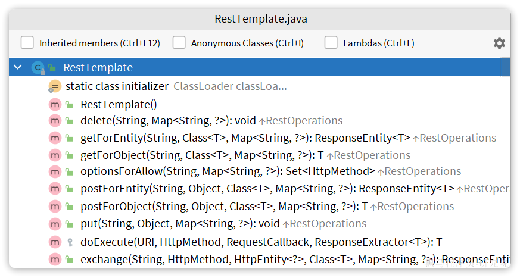

可以看到常见的Get、Post、Put、Delete请求都支持，如果请求参数比较复杂，还可以使用exchange方法来构造请求。

我们在`cart-service`服务中定义一个配置类：


先将RestTemplate注册为一个Bean：

```Java
package com.hmall.cart.config;

import org.springframework.context.annotation.Bean;
import org.springframework.context.annotation.Configuration;
import org.springframework.web.client.RestTemplate;

@Configuration
public class RemoteCallConfig {

    @Bean
    public RestTemplate restTemplate() {
        return new RestTemplate();
    }
}
```

#### 2.4.2.远程调用

接下来，我们修改`cart-service`中的`com.hmall.cart.service.impl.``CartServiceImpl`的`handleCartItems`方法，发送http请求到`item-service`：

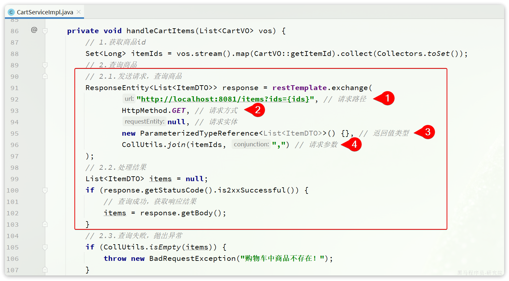

可以看到，利用RestTemplate发送http请求与前端ajax发送请求非常相似，都包含四部分信息：

- ① 请求方式
- ② 请求路径
- ③ 请求参数
- ④  返回值类型

`handleCartItems`方法的完整代码如下：

```Java
private void handleCartItems(List<CartVO> vos) {
    // TODO 1.获取商品id
    Set<Long> itemIds = vos.stream().map(CartVO::getItemId).collect(Collectors.toSet());
    // 2.查询商品
    // List<ItemDTO> items = itemService.queryItemByIds(itemIds);
    // 2.1.利用RestTemplate发起http请求，得到http的响应
    ResponseEntity<List<ItemDTO>> response = restTemplate.exchange(
            "http://localhost:8081/items?ids={ids}",
            HttpMethod.GET,
            null,
            new ParameterizedTypeReference<List<ItemDTO>>() {
            },
            Map.of("ids", CollUtil.join(itemIds, ","))
    );
    // 2.2.解析响应
    if(!response.getStatusCode().is2xxSuccessful()){
        // 查询失败，直接结束
        return;
    }
    List<ItemDTO> items = response.getBody();
    if (CollUtils.isEmpty(items)) {
        return;
    }
    // 3.转为 id 到 item的map
    Map<Long, ItemDTO> itemMap = items.stream().collect(Collectors.toMap(ItemDTO::getId, Function.identity()));
    // 4.写入vo
    for (CartVO v : vos) {
        ItemDTO item = itemMap.get(v.getItemId());
        if (item == null) {
            continue;
        }
        v.setNewPrice(item.getPrice());
        v.setStatus(item.getStatus());
        v.setStock(item.getStock());
    }
}
```

好了，现在重启`cart-service`，再次测试查询我的购物车列表接口：


可以发现，所有商品相关数据都已经查询到了。

在这个过程中，`item-service`提供了查询接口，`cart-service`利用Http请求调用该接口。因此`item-service`可以称为服务的提供者，而`cart-service`则称为服务的消费者或服务调用者。

### 2.5.总结

什么时候需要拆分微服务？

- 如果是创业型公司，最好先用单体架构快速迭代开发，验证市场运作模型，快速试错。当业务跑通以后，随着业务规模扩大、人员规模增加，再考虑拆分微服务。
- 如果是大型企业，有充足的资源，可以在项目开始之初就搭建微服务架构。

如何拆分？

- 首先要做到高内聚、低耦合
- 从拆分方式来说，有横向拆分和纵向拆分两种。纵向就是按照业务功能模块，横向则是拆分通用性业务，提高复用性

服务拆分之后，不可避免的会出现跨微服务的业务，此时微服务之间就需要进行远程调用。微服务之间的远程调用被称为RPC，即远程过程调用。RPC的实现方式有很多，比如：

- 基于Http协议
- 基于Dubbo协议

我们课堂中使用的是Http方式，这种方式不关心服务提供者的具体技术实现，只要对外暴露Http接口即可，更符合微服务的需要。

Java发送http请求可以使用Spring提供的RestTemplate，使用的基本步骤如下：

- 注册RestTemplate到Spring容器
- 调用RestTemplate的API发送请求，常见方法有：
  - getForObject：发送Get请求并返回指定类型对象
  - PostForObject：发送Post请求并返回指定类型对象
  - put：发送PUT请求
  - delete：发送Delete请求
  - exchange：发送任意类型请求，返回ResponseEntity

## 3.==服务注册和发现==

在上一章我们实现了微服务拆分，并且通过Http请求实现了跨微服务的远程调用。不过这种手动发送Http请求的方式存在一些问题。

试想一下，假如商品微服务被调用较多，为了应对更高的并发，我们进行了多实例部署，如图：

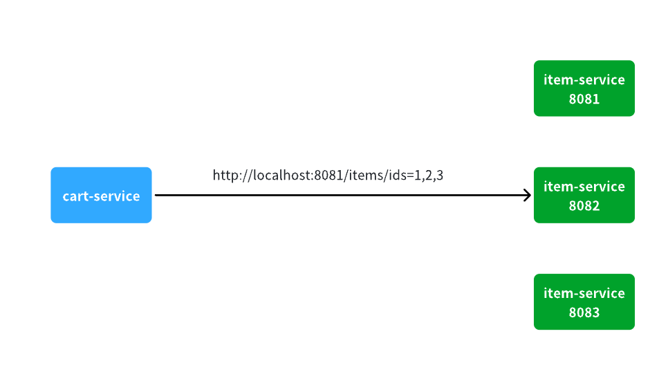

此时，每个`item-service`的实例其IP或端口不同，问题来了：

- item-service这么多实例，cart-service如何知道每一个实例的地址？
- http请求要写url地址，`cart-service`服务到底该调用哪个实例呢？
- 如果在运行过程中，某一个`item-service`实例宕机，`cart-service`依然在调用该怎么办？
- 如果并发太高，`item-service`临时多部署了N台实例，`cart-service`如何知道新实例的地址？

为了解决上述问题，就必须引入注册中心的概念了，接下来我们就一起来分析下注册中心的原理。


### 3.1.==注册中心原理==

在微服务远程调用的过程中，包括两个角色：

- 服务提供者：提供接口供其它微服务访问，比如`item-service`
- 服务消费者：调用其它微服务提供的接口，比如`cart-service`

在大型微服务项目中，服务提供者的数量会非常多，为了管理这些服务就引入了**注册中心**的概念。注册中心、服务提供者、服务消费者三者间关系如下：

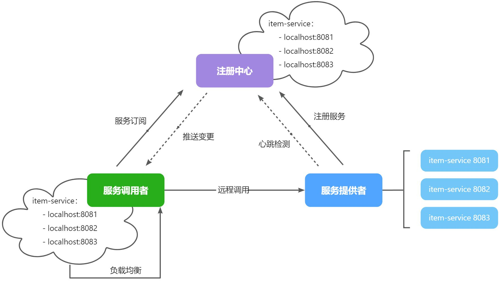

流程如下：

- 服务启动时就会注册自己的服务信息（服务名、IP、端口）到注册中心
- 调用者可以**从注册中心订阅想要的服务**，获取服务对应的实例列表（1个服务可能**多实例部署**）
- 调用者自己对实例列表**负载均衡**，挑选一个实例
- 调用者向该实例发起远程调用

当服务提供者的实例宕机或者启动新实例时，调用者如何得知呢？

- **服务提供者**会定期向注册中心发送请求，报告自己的健康状态**（==心跳请求==）**
- 当注册中心长时间收不到提供者的心跳时，会认为该实例宕机，将其从服务的实例列表中剔除
- 当服务有新实例启动时，会发送注册服务请求，其信息会被记录在注册中心的服务实例列表
- **当注册中心服务列表变更时，会主动通知微服务，更新本地服务列表**

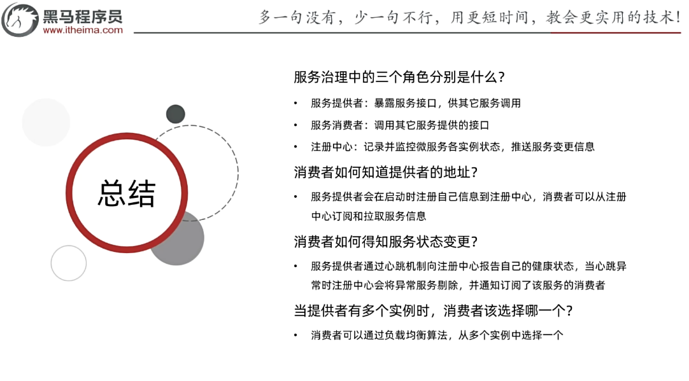

### 3.2.Nacos注册中心

目前开源的注册中心框架有很多，国内比较常见的有：

- Eureka：Netflix公司出品，目前被集成在SpringCloud当中，一般用于Java应用
- Nacos：Alibaba公司出品，目前被集成在SpringCloudAlibaba中，一般用于Java应用
- Consul：HashiCorp公司出品，目前集成在SpringCloud中，不限制微服务语言

以上几种注册中心都遵循SpringCloud中的API规范，因此在业务开发使用上没有太大差异。由于Nacos是国内产品，中文文档比较丰富，而且同时具备**配置管理**功能（后面会学习），因此在国内使用较多，课堂中我们会Nacos为例来学习。

官方网站如下：

https://nacos.io/zh-cn/

我们基于Docker来部署Nacos的注册中心，首先我们要准备MySQL数据库表，用来存储Nacos的数据。由于是Docker部署，所以大家需要将资料中的SQL文件导入到你**Docker中的MySQL容器**中：


最终表结构如下：


然后，找到课前资料下的nacos文件夹：

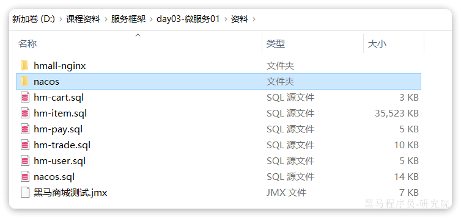

其中的`nacos/custom.env`文件中，有一个MYSQL_SERVICE_HOST也就是mysql地址，需要修改为你自己的虚拟机IP地址：


然后，将课前资料中的`nacos`目录上传至虚拟机的`/root`目录。

进入root目录，然后执行下面的docker命令：


`<h2 id="nacos-Docker部署">`nacos-Docker部署`</h2>`

```PowerShell
docker run -d \
--name nacos \
--env-file ./nacos/custom.env \
-p 8848:8848 \
-p 9848:9848 \
-p 9849:9849 \
--restart=always \
--privileged=true \
nacos/nacos-server:v2.1.0-slim
```

启动完成后，访问下面地址：http://192.168.150.101:8848/nacos/，注意将`192.168.150.101`替换为你自己的虚拟机IP地址。

**限制nacos的内存使用量：**

```bash
#限制nacos的内存使用量：

docker run -d \
  --name nacos \
  --env-file ./nacos/custom.env \
  -p 8848:8848 \
  -p 9848:9848 \
  -p 9849:9849 \
  --network charging-station \
  --memory="512m" \
  --cpus="1" \
  -e JAVA_OPTS="-Xms256m -Xmx512m" \
  --restart=always \
  --privileged=true \
  nacos/nacos-server:v2.1.0-slim
```


`<h2 id="nacos-Docker部署-2">`nacos-Docker部署-2`</h2>`

**另一种方法不使用custom.env**

https://blog.csdn.net/apple_74262176/article/details/141886769

```bash
#拉取 Nacos 镜像
docker pull nacos/nacos-server:v2.1.1

# 创建目录
mkdir -p /data/nacos/{conf,logs,data}

# 创建容器
docker run -p 8848:8848 --name nacos -d nacos/nacos-server:v2.1.1

# 拷贝文件
docker cp nacos:/home/nacos/conf /root/nacos
docker cp nacos:/home/nacos/data /root/nacos
docker cp nacos:/home/nacos/logs /root/nacos

# 授权文件
chmod 777 /root/nacos/{conf,logs,data}

# 删除容器
docker rm -f nacos

#执行sql，创建nacos的数据库

#启动nacos容器
#MYSQL_SERVICE_HOST=192.168.100.233: 修改为自己的MYSQL的IP
#MYSQL_SERVICE_PASSWORD=123456 : 修改为自己的MYSQL密码
#MYSQL_SERVICE_DB_NAME : 换成自己Nacos对应数据库名称

docker run -d \
-e MODE=standalone \
--privileged=true \
-e SPRING_DATASOURCE_PLATFORM=mysql \
-e MYSQL_SERVICE_HOST=47.109.155.207 \
-e MYSQL_SERVICE_PORT=3307 \
-e MYSQL_SERVICE_USER=root \
-e MYSQL_SERVICE_PASSWORD=123 \
-e MYSQL_SERVICE_DB_NAME=nacos \
-e TIME_ZONE='Asia/Shanghai' \
-e NACOS_AUTH_ENABLE=true \
-v /root/nacos/logs:/home/nacos/logs \
-v /root/nacos/data:/home/nacos/data \
-v /root/nacos/conf:/home/nacos/conf \
-p 8848:8848 -p 9848:9848 -p 9849:9849 \
--name nacos --restart=always nacos/nacos-server:v2.1.0-slim


```

**nacos的sql语句**

```sql
/*
 Navicat Premium Data Transfer

 Source Server         : 159.75.111.41
 Source Server Type    : MySQL
 Source Server Version : 80033
 Source Host           : 159.75.111.41:3306
 Source Schema         : nacos

 Target Server Type    : MySQL
 Target Server Version : 80033
 File Encoding         : 65001

 Date: 30/03/2024 21:32:58
*/

SET NAMES utf8mb4;
SET FOREIGN_KEY_CHECKS = 0;

-- ----------------------------
-- Table structure for config_info
-- ----------------------------
DROP TABLE IF EXISTS `config_info`;
CREATE TABLE `config_info`  (
  `id` bigint(0) NOT NULL AUTO_INCREMENT COMMENT 'id',
  `data_id` varchar(255) CHARACTER SET utf8mb3 COLLATE utf8mb3_bin NOT NULL COMMENT 'data_id',
  `group_id` varchar(128) CHARACTER SET utf8mb3 COLLATE utf8mb3_bin NULL DEFAULT NULL,
  `content` longtext CHARACTER SET utf8mb3 COLLATE utf8mb3_bin NOT NULL COMMENT 'content',
  `md5` varchar(32) CHARACTER SET utf8mb3 COLLATE utf8mb3_bin NULL DEFAULT NULL COMMENT 'md5',
  `gmt_create` datetime(0) NULL DEFAULT CURRENT_TIMESTAMP(0) COMMENT '创建时间',
  `gmt_modified` datetime(0) NULL DEFAULT CURRENT_TIMESTAMP(0) COMMENT '修改时间',
  `src_user` text CHARACTER SET utf8mb3 COLLATE utf8mb3_bin NULL COMMENT 'source user',
  `src_ip` varchar(50) CHARACTER SET utf8mb3 COLLATE utf8mb3_bin NULL DEFAULT NULL COMMENT 'source ip',
  `app_name` varchar(128) CHARACTER SET utf8mb3 COLLATE utf8mb3_bin NULL DEFAULT NULL,
  `tenant_id` varchar(128) CHARACTER SET utf8mb3 COLLATE utf8mb3_bin NULL DEFAULT '' COMMENT '租户字段',
  `c_desc` varchar(256) CHARACTER SET utf8mb3 COLLATE utf8mb3_bin NULL DEFAULT NULL,
  `c_use` varchar(64) CHARACTER SET utf8mb3 COLLATE utf8mb3_bin NULL DEFAULT NULL,
  `effect` varchar(64) CHARACTER SET utf8mb3 COLLATE utf8mb3_bin NULL DEFAULT NULL,
  `type` varchar(64) CHARACTER SET utf8mb3 COLLATE utf8mb3_bin NULL DEFAULT NULL,
  `c_schema` text CHARACTER SET utf8mb3 COLLATE utf8mb3_bin NULL,
  `encrypted_data_key` text CHARACTER SET utf8mb3 COLLATE utf8mb3_bin NULL COMMENT '秘钥',
  PRIMARY KEY (`id`) USING BTREE,
  UNIQUE INDEX `uk_configinfo_datagrouptenant`(`data_id`, `group_id`, `tenant_id`) USING BTREE
) ENGINE = InnoDB AUTO_INCREMENT = 1 CHARACTER SET = utf8mb3 COLLATE = utf8mb3_bin COMMENT = 'config_info' ROW_FORMAT = Dynamic;

-- ----------------------------
-- Records of config_info
-- ----------------------------

-- ----------------------------
-- Table structure for config_info_aggr
-- ----------------------------
DROP TABLE IF EXISTS `config_info_aggr`;
CREATE TABLE `config_info_aggr`  (
  `id` bigint(0) NOT NULL AUTO_INCREMENT COMMENT 'id',
  `data_id` varchar(255) CHARACTER SET utf8mb3 COLLATE utf8mb3_bin NOT NULL COMMENT 'data_id',
  `group_id` varchar(128) CHARACTER SET utf8mb3 COLLATE utf8mb3_bin NOT NULL COMMENT 'group_id',
  `datum_id` varchar(255) CHARACTER SET utf8mb3 COLLATE utf8mb3_bin NOT NULL COMMENT 'datum_id',
  `content` longtext CHARACTER SET utf8mb3 COLLATE utf8mb3_bin NOT NULL COMMENT '内容',
  `gmt_modified` datetime(0) NULL DEFAULT NULL COMMENT '修改时间',
  `app_name` varchar(128) CHARACTER SET utf8mb3 COLLATE utf8mb3_bin NULL DEFAULT NULL,
  `tenant_id` varchar(128) CHARACTER SET utf8mb3 COLLATE utf8mb3_bin NULL DEFAULT '' COMMENT '租户字段',
  PRIMARY KEY (`id`) USING BTREE,
  UNIQUE INDEX `uk_configinfoaggr_datagrouptenantdatum`(`data_id`, `group_id`, `tenant_id`, `datum_id`) USING BTREE
) ENGINE = InnoDB AUTO_INCREMENT = 1 CHARACTER SET = utf8mb3 COLLATE = utf8mb3_bin COMMENT = '增加租户字段' ROW_FORMAT = Dynamic;

-- ----------------------------
-- Records of config_info_aggr
-- ----------------------------

-- ----------------------------
-- Table structure for config_info_beta
-- ----------------------------
DROP TABLE IF EXISTS `config_info_beta`;
CREATE TABLE `config_info_beta`  (
  `id` bigint(0) NOT NULL AUTO_INCREMENT COMMENT 'id',
  `data_id` varchar(255) CHARACTER SET utf8mb3 COLLATE utf8mb3_bin NOT NULL COMMENT 'data_id',
  `group_id` varchar(128) CHARACTER SET utf8mb3 COLLATE utf8mb3_bin NOT NULL COMMENT 'group_id',
  `app_name` varchar(128) CHARACTER SET utf8mb3 COLLATE utf8mb3_bin NULL DEFAULT NULL COMMENT 'app_name',
  `content` longtext CHARACTER SET utf8mb3 COLLATE utf8mb3_bin NOT NULL COMMENT 'content',
  `beta_ips` varchar(1024) CHARACTER SET utf8mb3 COLLATE utf8mb3_bin NULL DEFAULT NULL COMMENT 'betaIps',
  `md5` varchar(32) CHARACTER SET utf8mb3 COLLATE utf8mb3_bin NULL DEFAULT NULL COMMENT 'md5',
  `gmt_create` datetime(0) NULL DEFAULT CURRENT_TIMESTAMP(0) COMMENT '创建时间',
  `gmt_modified` datetime(0) NULL DEFAULT CURRENT_TIMESTAMP(0) COMMENT '修改时间',
  `src_user` text CHARACTER SET utf8mb3 COLLATE utf8mb3_bin NULL COMMENT 'source user',
  `src_ip` varchar(50) CHARACTER SET utf8mb3 COLLATE utf8mb3_bin NULL DEFAULT NULL COMMENT 'source ip',
  `tenant_id` varchar(128) CHARACTER SET utf8mb3 COLLATE utf8mb3_bin NULL DEFAULT '' COMMENT '租户字段',
  `encrypted_data_key` text CHARACTER SET utf8mb3 COLLATE utf8mb3_bin NULL COMMENT '秘钥',
  PRIMARY KEY (`id`) USING BTREE,
  UNIQUE INDEX `uk_configinfobeta_datagrouptenant`(`data_id`, `group_id`, `tenant_id`) USING BTREE
) ENGINE = InnoDB AUTO_INCREMENT = 1 CHARACTER SET = utf8mb3 COLLATE = utf8mb3_bin COMMENT = 'config_info_beta' ROW_FORMAT = Dynamic;

-- ----------------------------
-- Records of config_info_beta
-- ----------------------------

-- ----------------------------
-- Table structure for config_info_tag
-- ----------------------------
DROP TABLE IF EXISTS `config_info_tag`;
CREATE TABLE `config_info_tag`  (
  `id` bigint(0) NOT NULL AUTO_INCREMENT COMMENT 'id',
  `data_id` varchar(255) CHARACTER SET utf8mb3 COLLATE utf8mb3_bin NOT NULL COMMENT 'data_id',
  `group_id` varchar(128) CHARACTER SET utf8mb3 COLLATE utf8mb3_bin NOT NULL COMMENT 'group_id',
  `tenant_id` varchar(128) CHARACTER SET utf8mb3 COLLATE utf8mb3_bin NULL DEFAULT '' COMMENT 'tenant_id',
  `tag_id` varchar(128) CHARACTER SET utf8mb3 COLLATE utf8mb3_bin NOT NULL COMMENT 'tag_id',
  `app_name` varchar(128) CHARACTER SET utf8mb3 COLLATE utf8mb3_bin NULL DEFAULT NULL COMMENT 'app_name',
  `content` longtext CHARACTER SET utf8mb3 COLLATE utf8mb3_bin NOT NULL COMMENT 'content',
  `md5` varchar(32) CHARACTER SET utf8mb3 COLLATE utf8mb3_bin NULL DEFAULT NULL COMMENT 'md5',
  `gmt_create` datetime(0) NULL DEFAULT CURRENT_TIMESTAMP(0) COMMENT '创建时间',
  `gmt_modified` datetime(0) NULL DEFAULT CURRENT_TIMESTAMP(0) COMMENT '修改时间',
  `src_user` text CHARACTER SET utf8mb3 COLLATE utf8mb3_bin NULL COMMENT 'source user',
  `src_ip` varchar(50) CHARACTER SET utf8mb3 COLLATE utf8mb3_bin NULL DEFAULT NULL COMMENT 'source ip',
  PRIMARY KEY (`id`) USING BTREE,
  UNIQUE INDEX `uk_configinfotag_datagrouptenanttag`(`data_id`, `group_id`, `tenant_id`, `tag_id`) USING BTREE
) ENGINE = InnoDB AUTO_INCREMENT = 1 CHARACTER SET = utf8mb3 COLLATE = utf8mb3_bin COMMENT = 'config_info_tag' ROW_FORMAT = Dynamic;

-- ----------------------------
-- Records of config_info_tag
-- ----------------------------

-- ----------------------------
-- Table structure for config_tags_relation
-- ----------------------------
DROP TABLE IF EXISTS `config_tags_relation`;
CREATE TABLE `config_tags_relation`  (
  `id` bigint(0) NOT NULL COMMENT 'id',
  `tag_name` varchar(128) CHARACTER SET utf8mb3 COLLATE utf8mb3_bin NOT NULL COMMENT 'tag_name',
  `tag_type` varchar(64) CHARACTER SET utf8mb3 COLLATE utf8mb3_bin NULL DEFAULT NULL COMMENT 'tag_type',
  `data_id` varchar(255) CHARACTER SET utf8mb3 COLLATE utf8mb3_bin NOT NULL COMMENT 'data_id',
  `group_id` varchar(128) CHARACTER SET utf8mb3 COLLATE utf8mb3_bin NOT NULL COMMENT 'group_id',
  `tenant_id` varchar(128) CHARACTER SET utf8mb3 COLLATE utf8mb3_bin NULL DEFAULT '' COMMENT 'tenant_id',
  `nid` bigint(0) NOT NULL AUTO_INCREMENT,
  PRIMARY KEY (`nid`) USING BTREE,
  UNIQUE INDEX `uk_configtagrelation_configidtag`(`id`, `tag_name`, `tag_type`) USING BTREE,
  INDEX `idx_tenant_id`(`tenant_id`) USING BTREE
) ENGINE = InnoDB AUTO_INCREMENT = 1 CHARACTER SET = utf8mb3 COLLATE = utf8mb3_bin COMMENT = 'config_tag_relation' ROW_FORMAT = Dynamic;

-- ----------------------------
-- Records of config_tags_relation
-- ----------------------------

-- ----------------------------
-- Table structure for group_capacity
-- ----------------------------
DROP TABLE IF EXISTS `group_capacity`;
CREATE TABLE `group_capacity`  (
  `id` bigint(0) UNSIGNED NOT NULL AUTO_INCREMENT COMMENT '主键ID',
  `group_id` varchar(128) CHARACTER SET utf8mb3 COLLATE utf8mb3_bin NOT NULL DEFAULT '' COMMENT 'Group ID，空字符表示整个集群',
  `quota` int(0) UNSIGNED NOT NULL DEFAULT 0 COMMENT '配额，0表示使用默认值',
  `usage` int(0) UNSIGNED NOT NULL DEFAULT 0 COMMENT '使用量',
  `max_size` int(0) UNSIGNED NOT NULL DEFAULT 0 COMMENT '单个配置大小上限，单位为字节，0表示使用默认值',
  `max_aggr_count` int(0) UNSIGNED NOT NULL DEFAULT 0 COMMENT '聚合子配置最大个数，，0表示使用默认值',
  `max_aggr_size` int(0) UNSIGNED NOT NULL DEFAULT 0 COMMENT '单个聚合数据的子配置大小上限，单位为字节，0表示使用默认值',
  `max_history_count` int(0) UNSIGNED NOT NULL DEFAULT 0 COMMENT '最大变更历史数量',
  `gmt_create` datetime(0) NULL DEFAULT CURRENT_TIMESTAMP(0) COMMENT '创建时间',
  `gmt_modified` datetime(0) NULL DEFAULT CURRENT_TIMESTAMP(0) COMMENT '修改时间',
  PRIMARY KEY (`id`) USING BTREE,
  UNIQUE INDEX `uk_group_id`(`group_id`) USING BTREE
) ENGINE = InnoDB AUTO_INCREMENT = 1 CHARACTER SET = utf8mb3 COLLATE = utf8mb3_bin COMMENT = '集群、各Group容量信息表' ROW_FORMAT = Dynamic;

-- ----------------------------
-- Records of group_capacity
-- ----------------------------

-- ----------------------------
-- Table structure for his_config_info
-- ----------------------------
DROP TABLE IF EXISTS `his_config_info`;
CREATE TABLE `his_config_info`  (
  `id` bigint(0) UNSIGNED NOT NULL,
  `nid` bigint(0) UNSIGNED NOT NULL AUTO_INCREMENT,
  `data_id` varchar(255) CHARACTER SET utf8mb3 COLLATE utf8mb3_bin NOT NULL,
  `group_id` varchar(128) CHARACTER SET utf8mb3 COLLATE utf8mb3_bin NOT NULL,
  `app_name` varchar(128) CHARACTER SET utf8mb3 COLLATE utf8mb3_bin NULL DEFAULT NULL COMMENT 'app_name',
  `content` longtext CHARACTER SET utf8mb3 COLLATE utf8mb3_bin NOT NULL,
  `md5` varchar(32) CHARACTER SET utf8mb3 COLLATE utf8mb3_bin NULL DEFAULT NULL,
  `gmt_create` datetime(0) NULL DEFAULT CURRENT_TIMESTAMP(0),
  `gmt_modified` datetime(0) NULL DEFAULT CURRENT_TIMESTAMP(0),
  `src_user` text CHARACTER SET utf8mb3 COLLATE utf8mb3_bin NULL,
  `src_ip` varchar(50) CHARACTER SET utf8mb3 COLLATE utf8mb3_bin NULL DEFAULT NULL,
  `op_type` char(10) CHARACTER SET utf8mb3 COLLATE utf8mb3_bin NULL DEFAULT NULL,
  `tenant_id` varchar(128) CHARACTER SET utf8mb3 COLLATE utf8mb3_bin NULL DEFAULT '' COMMENT '租户字段',
  `encrypted_data_key` text CHARACTER SET utf8mb3 COLLATE utf8mb3_bin NULL COMMENT '秘钥',
  PRIMARY KEY (`nid`) USING BTREE,
  INDEX `idx_gmt_create`(`gmt_create`) USING BTREE,
  INDEX `idx_gmt_modified`(`gmt_modified`) USING BTREE,
  INDEX `idx_did`(`data_id`) USING BTREE
) ENGINE = InnoDB AUTO_INCREMENT = 1 CHARACTER SET = utf8mb3 COLLATE = utf8mb3_bin COMMENT = '多租户改造' ROW_FORMAT = Dynamic;

-- ----------------------------
-- Records of his_config_info
-- ----------------------------
INSERT INTO `his_config_info` VALUES (0, 1, '132', 'DEFAULT_GROUP', '', '123', '202cb962ac59075b964b07152d234b70', '2024-03-30 21:32:28', '2024-03-30 21:32:28', NULL, '212.87.195.237', 'I', '', NULL);
INSERT INTO `his_config_info` VALUES (1, 2, '132', 'DEFAULT_GROUP', '', '123', '202cb962ac59075b964b07152d234b70', '2024-03-30 21:32:36', '2024-03-30 21:32:36', NULL, '212.87.195.237', 'D', '', NULL);

-- ----------------------------
-- Table structure for permissions
-- ----------------------------
DROP TABLE IF EXISTS `permissions`;
CREATE TABLE `permissions`  (
  `role` varchar(50) CHARACTER SET utf8mb4 COLLATE utf8mb4_general_ci NOT NULL,
  `resource` varchar(255) CHARACTER SET utf8mb4 COLLATE utf8mb4_general_ci NOT NULL,
  `action` varchar(8) CHARACTER SET utf8mb4 COLLATE utf8mb4_general_ci NOT NULL,
  UNIQUE INDEX `uk_role_permission`(`role`, `resource`, `action`) USING BTREE
) ENGINE = InnoDB CHARACTER SET = utf8mb4 COLLATE = utf8mb4_general_ci ROW_FORMAT = Dynamic;

-- ----------------------------
-- Records of permissions
-- ----------------------------

-- ----------------------------
-- Table structure for roles
-- ----------------------------
DROP TABLE IF EXISTS `roles`;
CREATE TABLE `roles`  (
  `username` varchar(50) CHARACTER SET utf8mb4 COLLATE utf8mb4_general_ci NOT NULL,
  `role` varchar(50) CHARACTER SET utf8mb4 COLLATE utf8mb4_general_ci NOT NULL,
  UNIQUE INDEX `idx_user_role`(`username`, `role`) USING BTREE
) ENGINE = InnoDB CHARACTER SET = utf8mb4 COLLATE = utf8mb4_general_ci ROW_FORMAT = Dynamic;

-- ----------------------------
-- Records of roles
-- ----------------------------
INSERT INTO `roles` VALUES ('nacos', 'ROLE_ADMIN');

-- ----------------------------
-- Table structure for tenant_capacity
-- ----------------------------
DROP TABLE IF EXISTS `tenant_capacity`;
CREATE TABLE `tenant_capacity`  (
  `id` bigint(0) UNSIGNED NOT NULL AUTO_INCREMENT COMMENT '主键ID',
  `tenant_id` varchar(128) CHARACTER SET utf8mb3 COLLATE utf8mb3_bin NOT NULL DEFAULT '' COMMENT 'Tenant ID',
  `quota` int(0) UNSIGNED NOT NULL DEFAULT 0 COMMENT '配额，0表示使用默认值',
  `usage` int(0) UNSIGNED NOT NULL DEFAULT 0 COMMENT '使用量',
  `max_size` int(0) UNSIGNED NOT NULL DEFAULT 0 COMMENT '单个配置大小上限，单位为字节，0表示使用默认值',
  `max_aggr_count` int(0) UNSIGNED NOT NULL DEFAULT 0 COMMENT '聚合子配置最大个数',
  `max_aggr_size` int(0) UNSIGNED NOT NULL DEFAULT 0 COMMENT '单个聚合数据的子配置大小上限，单位为字节，0表示使用默认值',
  `max_history_count` int(0) UNSIGNED NOT NULL DEFAULT 0 COMMENT '最大变更历史数量',
  `gmt_create` datetime(0) NULL DEFAULT CURRENT_TIMESTAMP(0) COMMENT '创建时间',
  `gmt_modified` datetime(0) NULL DEFAULT CURRENT_TIMESTAMP(0) COMMENT '修改时间',
  PRIMARY KEY (`id`) USING BTREE,
  UNIQUE INDEX `uk_tenant_id`(`tenant_id`) USING BTREE
) ENGINE = InnoDB AUTO_INCREMENT = 1 CHARACTER SET = utf8mb3 COLLATE = utf8mb3_bin COMMENT = '租户容量信息表' ROW_FORMAT = Dynamic;

-- ----------------------------
-- Records of tenant_capacity
-- ----------------------------

-- ----------------------------
-- Table structure for tenant_info
-- ----------------------------
DROP TABLE IF EXISTS `tenant_info`;
CREATE TABLE `tenant_info`  (
  `id` bigint(0) NOT NULL AUTO_INCREMENT COMMENT 'id',
  `kp` varchar(128) CHARACTER SET utf8mb3 COLLATE utf8mb3_bin NOT NULL COMMENT 'kp',
  `tenant_id` varchar(128) CHARACTER SET utf8mb3 COLLATE utf8mb3_bin NULL DEFAULT '' COMMENT 'tenant_id',
  `tenant_name` varchar(128) CHARACTER SET utf8mb3 COLLATE utf8mb3_bin NULL DEFAULT '' COMMENT 'tenant_name',
  `tenant_desc` varchar(256) CHARACTER SET utf8mb3 COLLATE utf8mb3_bin NULL DEFAULT NULL COMMENT 'tenant_desc',
  `create_source` varchar(32) CHARACTER SET utf8mb3 COLLATE utf8mb3_bin NULL DEFAULT NULL COMMENT 'create_source',
  `gmt_create` bigint(0) NULL DEFAULT NULL COMMENT '创建时间',
  `gmt_modified` bigint(0) NULL DEFAULT NULL COMMENT '修改时间',
  PRIMARY KEY (`id`) USING BTREE,
  UNIQUE INDEX `uk_tenant_info_kptenantid`(`kp`, `tenant_id`) USING BTREE,
  INDEX `idx_tenant_id`(`tenant_id`) USING BTREE
) ENGINE = InnoDB AUTO_INCREMENT = 1 CHARACTER SET = utf8mb3 COLLATE = utf8mb3_bin COMMENT = 'tenant_info' ROW_FORMAT = Dynamic;

-- ----------------------------
-- Records of tenant_info
-- ----------------------------

-- ----------------------------
-- Table structure for users
-- ----------------------------
DROP TABLE IF EXISTS `users`;
CREATE TABLE `users`  (
  `username` varchar(50) CHARACTER SET utf8mb4 COLLATE utf8mb4_general_ci NOT NULL,
  `password` varchar(500) CHARACTER SET utf8mb4 COLLATE utf8mb4_general_ci NOT NULL,
  `enabled` tinyint(1) NOT NULL,
  PRIMARY KEY (`username`) USING BTREE
) ENGINE = InnoDB CHARACTER SET = utf8mb4 COLLATE = utf8mb4_general_ci ROW_FORMAT = Dynamic;

-- ----------------------------
-- Records of users
-- ----------------------------
INSERT INTO `users` VALUES ('nacos', '$2a$10$EuWPZHzz32dJN7jexM34MOeYirDdFAZm2kuWj7VEOJhhZkDrxfvUu', 1);

SET FOREIGN_KEY_CHECKS = 1;
```


首次访问会跳转到登录页，**账号密码都是nacos**

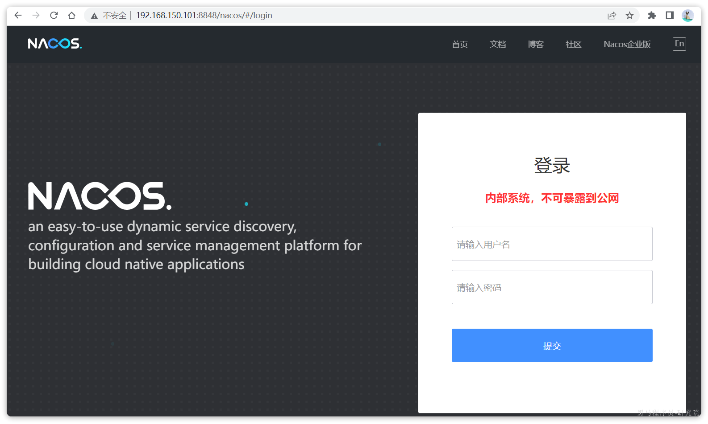

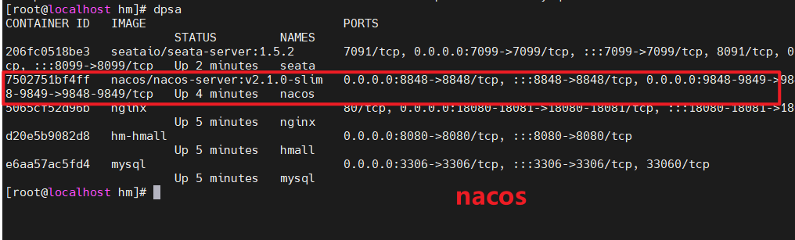


### 3.3.==服务注册==

接下来，我们把`item-service`注册到Nacos，步骤如下：

- 引入依赖
- 配置Nacos地址
- 重启

#### 3.3.1.添加依赖

在`item-service`的`pom.xml`中添加依赖：

```XML
<!--nacos 服务注册发现-->
<dependency>
    <groupId>com.alibaba.cloud</groupId>
    <artifactId>spring-cloud-starter-alibaba-nacos-discovery</artifactId>
</dependency>
```

#### 3.3.2.配置Nacos

在`item-service`的`application.yml`中添加nacos地址配置：

```YAML
spring:
  application:
    name: item-service # 服务名称
  cloud:
    nacos:
      server-addr: 192.168.150.101:8848 # nacos地址
```

#### 3.3.3.启动服务实例

为了测试一个服务多个实例的情况，我们再配置一个`item-service`的部署实例：

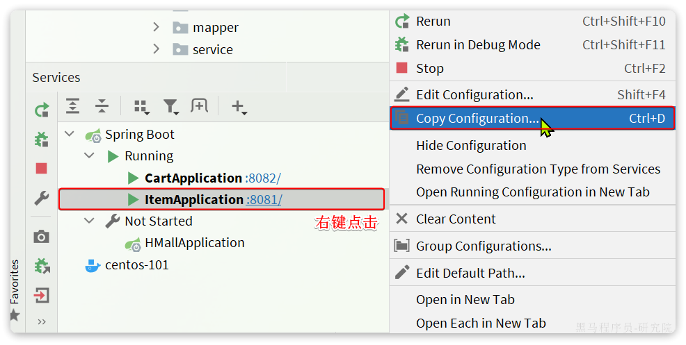

然后**配置多个启动项**，注意重命名并且配置新的端口，避免冲突：

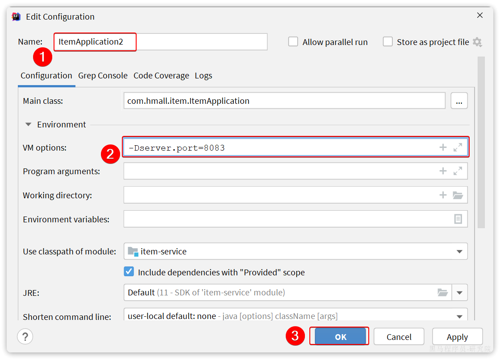

重启`item-service`的两个实例：

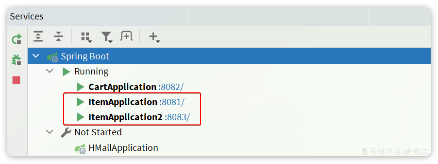

访问nacos控制台，可以发现服务注册成功：


点击详情，可以查看到`item-service`服务的两个实例信息：

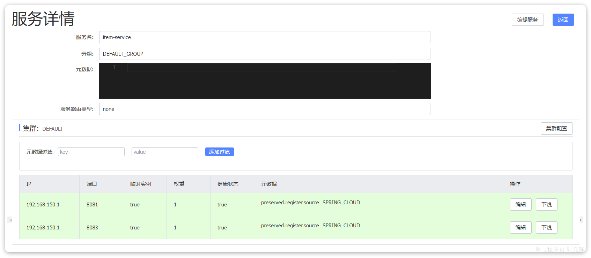

### 3.4.服务发现

服务的消费者要去nacos订阅服务，这个过程就是服务发现，步骤如下：

- 引入依赖
- 配置Nacos地址
- 发现并调用服务

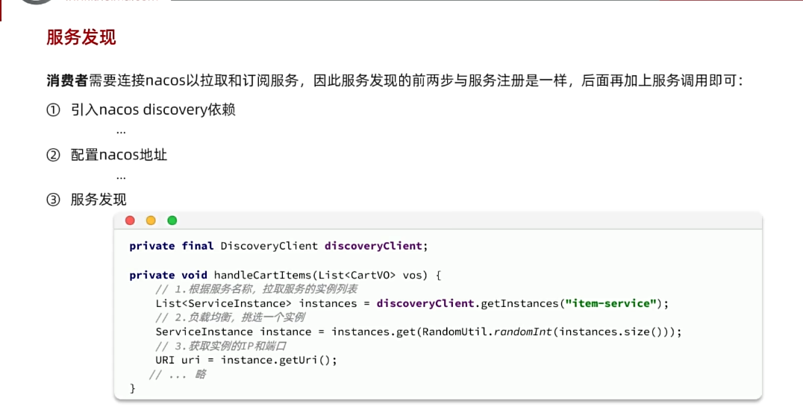

#### 3.4.1.引入依赖

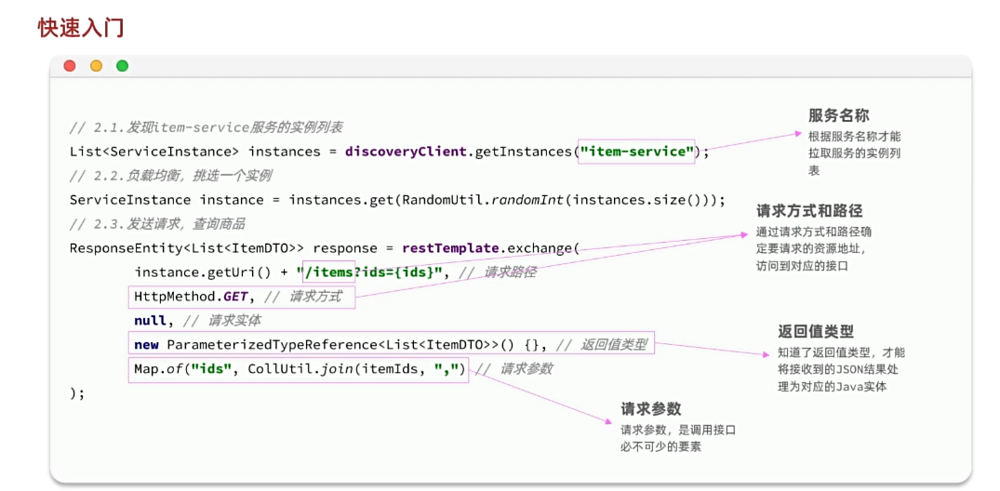

服务发现除了要引入nacos依赖以外，由于还需要**负载均衡**，因此要引入SpringCloud提供的LoadBalancer依赖。

我们在`cart-service`中的`pom.xml`中添加下面的依赖：

```XML
<!--nacos 服务注册发现-->
<dependency>
    <groupId>com.alibaba.cloud</groupId>
    <artifactId>spring-cloud-starter-alibaba-nacos-discovery</artifactId>
</dependency>
```

可以发现，这里Nacos的依赖于服务注册时一致，这个依赖中同时**包含了服务注册和发现**的功能。因为任何一个微服务都可以调用别人，也可以被别人调用，即可以是调用者，也可以是提供者。

因此，等一会儿`cart-service`启动，同样会注册到Nacos

#### 3.4.2.配置Nacos地址

在`cart-service`的`application.yml`中添加nacos地址配置：

```YAML
spring:
  cloud:
    nacos:
      server-addr: 192.168.150.101:8848
```

#### 3.4.3.发现并调用服务

接下来，服务调用者`cart-service`就可以去订阅`item-service`服务了。不过item-service有多个实例，而真正发起调用时只需要知道一个实例的地址。

因此，服务调用者必须利用负载均衡的算法，从多个实例中挑选一个去访问。常见的**负载均衡算法**有：

- 随机
- 轮询
- IP的hash:
- 通过对客户端的 IP 地址进行哈希计算，确保相同 IP 地址的请求总是被路由到同一台服务器，从而实现会话粘性（Session Stickiness），即同一个用户的请求始终访问同一台服务器。
- 最近最少访问
- ...

这里我们可以选择最简单的随机负载均衡。

另外，服务发现需要用到一个工具，DiscoveryClient，SpringCloud已经帮我们自动装配，我们可以直接注入使用：


接下来，我们就可以对原来的远程调用做修改了，之前调用时我们需要写死服务提供者的IP和端口：

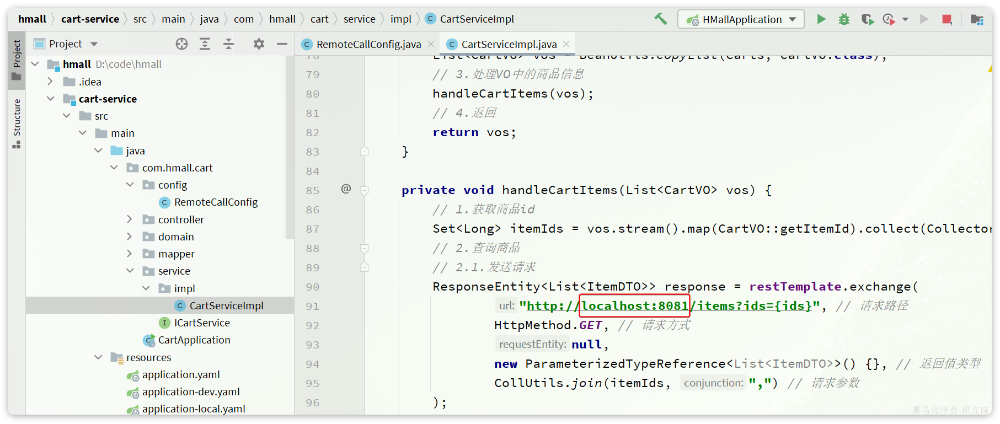

但现在不需要了，我们通过DiscoveryClient发现服务实例列表，然后通过负载均衡算法，选择一个实例去调用：

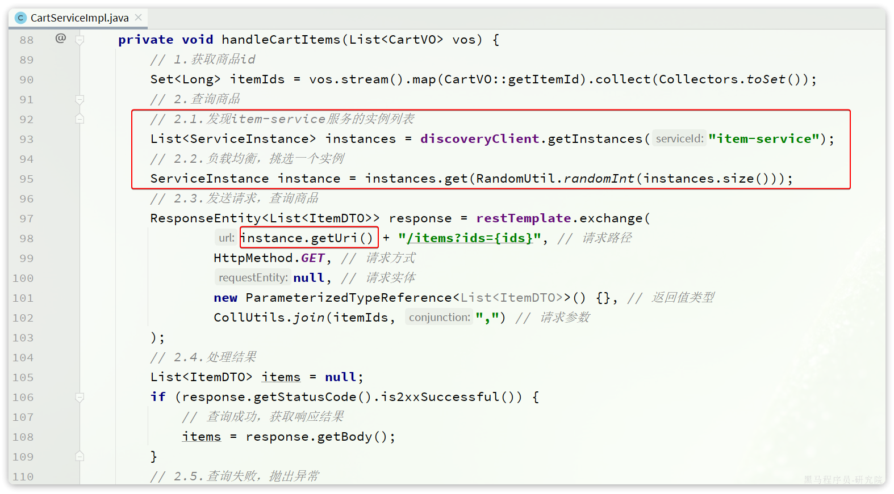

经过swagger测试，发现没有任何问题。


## 4.==OpenFeign==


在上一章，我们利用Nacos实现了服务的治理，利用RestTemplate实现了服务的远程调用。但是远程调用的代码太复杂了：

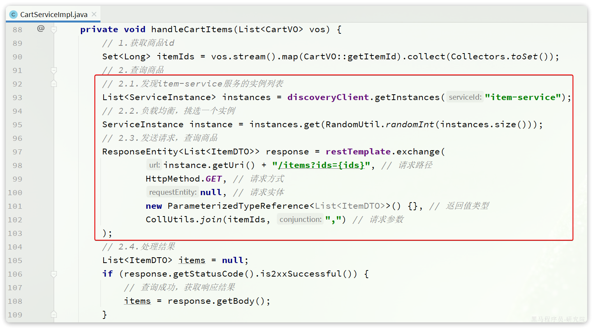

而且这种调用方式，与原本的本地方法调用差异太大，编程时的体验也不统一，一会儿远程调用，一会儿本地调用。

因此，我们必须想办法改变远程调用的开发模式，让**远程调用像本地方法调用一样简单**。而这就要用到OpenFeign组件了。

其实远程调用的关键点就在于四个：

- 请求方式
- 请求路径
- 请求参数
- 返回值类型

所以，OpenFeign就利用**SpringMVC的相关注解**来声明上述4个参数，然后基于**动态代理**帮我们生成远程调用的代码，而无需我们手动再编写，非常方便。

接下来，我们就通过一个快速入门的案例来体验一下OpenFeign的便捷吧。

### 4.1.==快速入门==

我们还是以cart-service中的查询我的购物车为例。因此下面的操作都是在cart-service中进行。

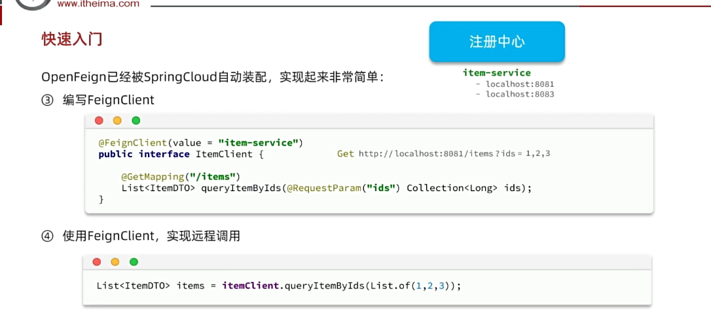

#### 4.1.1.引入依赖

在`cart-service`服务的pom.xml中引入`OpenFeign`的依赖和`loadBalancer`依赖：

```XML
  <!--openFeign-->
  <dependency>
      <groupId>org.springframework.cloud</groupId>
      <artifactId>spring-cloud-starter-openfeign</artifactId>
  </dependency>
  <!--负载均衡器-->
  <dependency>
      <groupId>org.springframework.cloud</groupId>
      <artifactId>spring-cloud-starter-loadbalancer</artifactId>
  </dependency>
```

#### 4.1.2.启用OpenFeign

接下来，我们在`cart-service`的`CartApplication`启动类上添加注解，启动OpenFeign功能：

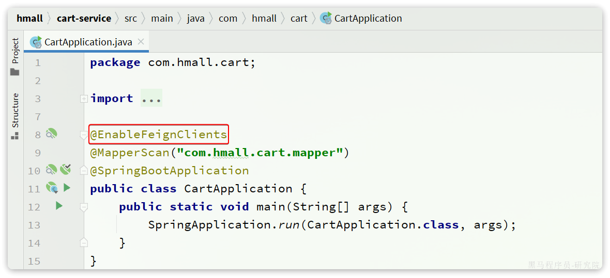

#### 4.1.3.编写OpenFeign客户端

在`cart-service`中，定义一个新的接口，编写Feign客户端：

其中代码如下：

```Java
package com.hmall.cart.client;

import com.hmall.cart.domain.dto.ItemDTO;
import org.springframework.cloud.openfeign.FeignClient;
import org.springframework.web.bind.annotation.GetMapping;
import org.springframework.web.bind.annotation.RequestParam;

import java.util.List;

@FeignClient("item-service")
public interface ItemClient {

    @GetMapping("/items")
    List<ItemDTO> queryItemByIds(@RequestParam("ids") Collection<Long> ids);
}
```

这里只需要声明接口，无需实现方法。接口中的几个关键信息：

- `@FeignClient("item-service")` ：声明服务名称
- `@GetMapping` ：声明请求方式
- `@GetMapping("/items")` ：声明请求路径
- `@RequestParam("ids") Collection<Long> ids` ：声明请求参数
- `List<ItemDTO>` ：返回值类型

有了上述信息，OpenFeign就可以利用**动态代理**帮我们实现这个方法，并且向`http://item-service/items`发送一个`GET`请求，携带ids为请求参数，并自动将返回值处理为`List<ItemDTO>`。

我们只需要直接调用这个方法，即可实现远程调用了。

#### 4.1.4.使用FeignClient

最后，我们在`cart-service`的`com.hmall.cart.service.impl.CartServiceImpl`中改造代码，直接调用`ItemClient`的方法：


feign替我们完成了**服务拉取、负载均衡、发送http请求**的所有工作，是不是看起来优雅多了。

而且，这里我们不再需要RestTemplate了，还省去了RestTemplate的注册。


### ==OpenFeign源码分析==

#### 1.==动态代理对象==

在 Spring 中，动态代理对象是 Spring AOP（面向切面编程）实现核心功能的一种机制。通过动态代理，Spring 可以在运行时动态地为目标对象创建代理对象，并将一些**横切逻辑**（如日志记录、权限验证、事务管理等）与业务逻辑进行无侵入式的集成。

##### 1.1.动态代理对象是什么

动态代理对象是一个在运行时生成的对象，它可以拦截对目标对象的方法调用并在调用前后插入额外的逻辑。Spring **使用动态代理实现 AO**P，将增强逻辑（`Advice`）与业务方法分离。

##### 1.2.动态代理的实现方式（Proxy和InvocationHandler）

Spring 动态代理的实现依赖于以下两种技术：

1. **JDK 动态代理（基于接口）**

   - ==**通过 Java 内置的 `java.lang.reflect.Proxy` 类和 `InvocationHandler` 接口实现**==。
   - 只能代理**实现了接口的类**。
   - 动态生成一个代理类，该代理类实现目标类的接口，并在调用方法时通过 `InvocationHandler` 处理。
   - **处理器：** `InvocationHandler` 接口中的 `invoke` 方法会在代理对象调用时执行，实际的增强逻辑（如日志、事务等）在 `invoke` 方法中完成。
2. **CGLIB 动态代理（基于继承）**

   1. **原理：**

      CGLIB（Code Generation Library）是一个功能强大的高性能代码生成库，它通过继承目标类并覆盖目标类的方法来生成代理对象。与 JDK 动态代理不同，CGLIB 不要求目标类实现接口，而是通过字节码技术动态生成目标类的子类。
   2. 通过使用第三方库 CGLIB（Code Generation Library）生成代理类。
   3. **工作流程：**

      1. **代理类：** CGLIB 通过继承目标类，生成目标类的子类，在子类中覆盖目标方法。
      2. **拦截器：** 在方法调用时，通过 `MethodInterceptor` 的 `intercept` 方法进行增强处理。

   4. 使用字节码生成技术，直接**为目标类创建子类**进行代理。
   5. 可以代理没有实现接口的类，但不能代理 `final` 类或 `final` 方法。


##### 1.3.JDK 动态代理示例

```java
import java.lang.reflect.InvocationHandler;
import java.lang.reflect.Method;
import java.lang.reflect.Proxy;

// 目标接口
public interface Service {
    void performTask();
}

// 目标实现类
public class ServiceImpl implements Service {
    @Override
    public void performTask() {
        System.out.println("Executing task...");
    }
}

// 动态代理实现
public class DynamicProxy implements InvocationHandler {
    private final Object target; // 目标对象

    public DynamicProxy(Object target) {
        this.target = target;
    }

    @Override
    public Object invoke(Object proxy, Method method, Object[] args) throws Throwable {
        System.out.println("Before method: " + method.getName());
        Object result = method.invoke(target, args);
        System.out.println("After method: " + method.getName());
        return result;
    }
    
    public static void main(String[] args) {
        Service target = new ServiceImpl();
        // 创建动态代理对象
        Service proxy = (Service) Proxy.newProxyInstance(
            target.getClass().getClassLoader(),
            target.getClass().getInterfaces(),
            new DynamicProxy(target)
        );
        proxy.performTask();
    }
}
```

**输出**:

```
Before method: performTask
Executing task...
After method: performTask
```

##### 1.4.CGLIB 动态代理示例

```java
import org.springframework.cglib.proxy.Enhancer;
import org.springframework.cglib.proxy.MethodInterceptor;
import org.springframework.cglib.proxy.MethodProxy;

import java.lang.reflect.Method;

// 目标类
public class Service {
    public void performTask() {
        System.out.println("Executing task...");
    }
}

// 动态代理实现
public class CglibProxy implements MethodInterceptor {
    private final Object target;

    public CglibProxy(Object target) {
        this.target = target;
    }

    @Override
    public Object intercept(Object obj, Method method, Object[] args, MethodProxy proxy) throws Throwable {
        System.out.println("Before method: " + method.getName());
        Object result = proxy.invoke(target, args);
        System.out.println("After method: " + method.getName());
        return result;
    }

    public static void main(String[] args) {
        Service target = new Service();
        Enhancer enhancer = new Enhancer();
        enhancer.setSuperclass(Service.class); // CGLIB 通过继承目标类，生成目标类的子类，在子类中覆盖目标方法。
        enhancer.setCallback(new CglibProxy(target));
        
        Service proxy = (Service) enhancer.create();
        proxy.performTask();
    }
}
```

**输出**:

```
Before method: performTask
Executing task...
After method: performTask
```

##### 1.5.在 Spring 中的应用

1. **JDK 动态代理**：

   - 默认情况下，Spring 使用 JDK 动态代理来为实现了接口的类创建代理对象。
   - 配置方式：确保**目标类实现了接口**，**Spring 自动选择 JDK 动态代理**。

2. **CGLIB 动态代理**：

   - **当目标类未实现接口时**，Spring 使用 CGLIB 动态代理。

   - 可通过显式配置强制使用 CGLIB：

     ```java
     @Configuration
     @EnableAspectJAutoProxy(proxyTargetClass = true) // 强制使用 CGLIB
     public class AppConfig {}
     ```

##### 1.6.两者的对比

| **特性** | **JDK 动态代理**       | **CGLIB 动态代理**        |
| -------- | ---------------------- | ------------------------- |
| 代理对象 | 必须实现接口           | 可以是具体类              |
| 性能     | 稍低（使用反射）       | 稍高（直接调用方法）      |
| 限制     | 无法代理未实现接口的类 | 无法代理 `final` 类或方法 |

##### **总结**

- Spring 的动态代理主要用于 AOP，能够在不修改目标类代码的情况下，动态增强功能。
- 如果目标类实现了接口，优先使用 JDK 动态代理；否则使用 CGLIB 动态代理。
- 配合 Spring 的 `@Aspect` 和 `@EnableAspectJAutoProxy` 注解，动态代理可以非常高效地实现横切关注点逻辑的注入。


#### 2.动态代理对象-itemClient

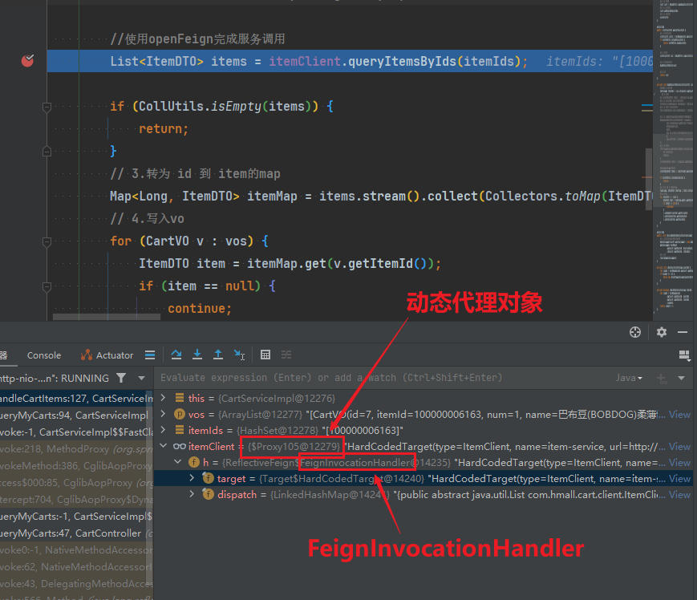

#### 3.delegate委托完成负载均衡和请求

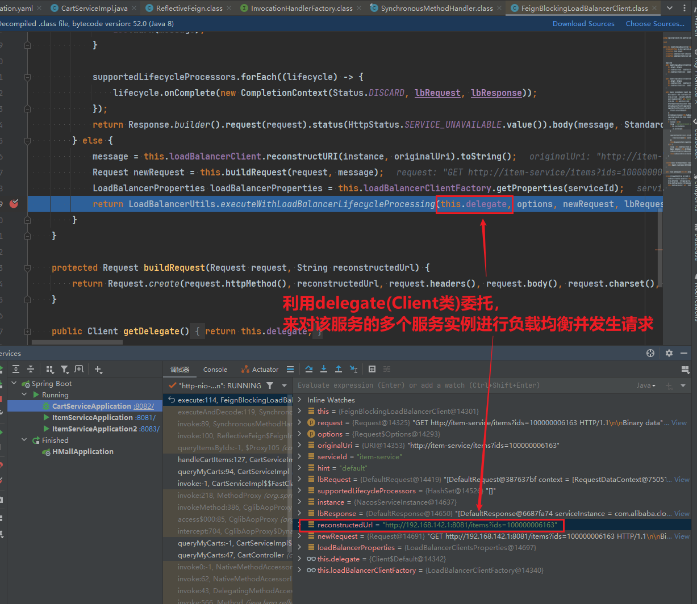


### 4.2.==优化==-使用okhttp连接池

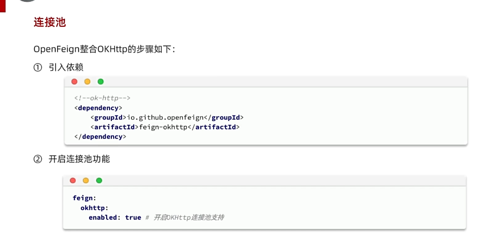

Feign底层发起http请求，依赖于其它的框架。其底层支持的http客户端实现包括：

- **HttpURLConnection：默认实现（性能较弱）**，不支持连接池
- Apache HttpClient ：支持连接池
- OKHttp：支持连接池

因此我们通常会使用带有连接池的客户端来代替默认的HttpURLConnection。比如，我们使用OK Http.


##### 1. **为什么 HttpURLConnection 的性能较低**

HttpURLConnection 是 Java 内置的 HTTP 客户端实现。性能较低的原因包括：

1. **不支持连接池**：
   
   - 每次发起 HTTP 请求时，都会**新建一个连接（TCP 三次握手）**。
   
     - 每次请求都需要进行三次握手，会增加连接建立的时间消耗。
   
     - 若客户端和服务器之间的连接不被复用（即没有连接池机制），每个 HTTP 请求都需要独立建立和断开连接，增加了额外的延迟和网络负载。
   
     - **三次握手过程：**
   
       1. **SYN（同步）：**
          客户端向服务器发送一个带有 SYN 标志的数据包，用于请求建立连接。这时客户端进入 **SYN_SENT** 状态，等待服务器的响应。
   
          **客户端 -> 服务器：**
   
          ```
          SYN
          ```
   
       2. **SYN-ACK（同步-确认）：**
          服务器收到客户端的 SYN 数据包后，确认收到并返回一个带有 SYN 和 ACK（确认）标志的数据包。这是服务器响应客户端的连接请求。服务器进入 **SYN_RECEIVED** 状态。
   
          **服务器 -> 客户端：**
   
          ```
          SYN + ACK
          ```
   
       3. **ACK（确认）：**
          客户端收到服务器的 SYN-ACK 数据包后，再发送一个 ACK（确认）数据包给服务器，表示连接已成功建立。客户端进入 **ESTABLISHED** 状态，表示可以开始数据传输。
   
          **客户端 -> 服务器：**
   
          ```
          ACK
          ```
   
   - 建立连接需要耗费时间和资源，尤其是在高并发场景下，这会显著降低性能。
   
2. **较旧的设计**：
   - HttpURLConnection 的设计相对过时，缺乏现代 HTTP 客户端的一些优化机制，如非阻塞 IO 支持、超时控制更灵活的配置等。
   
3. **线程安全问题**：
   
   - HttpURLConnection 不支持**多线程复用连接**，导致每个线程可能需要重新建立连接。

------

##### 2. **==连接池==是什么**

**连接池** 是一个用于复用和管理连接资源的机制，其主要特点是：

- **复用已建立的连接**：当一个连接被使用完后，它会被放回连接池，以供后续请求复用，而不是每次都新建连接。
- **减少资源消耗**：通过复用连接，可以避免重复的 TCP 握手和资源分配，从而降低 CPU 和内存的开销。
- **限制连接数量**：连接池会维护一个连接的最大数量，防止服务器被过多连接压垮。

------

##### 3. **连接池为什么提升性能**

1. **降低连接建立的开销**：
   - 每次建立一个新的 HTTP 连接需要进行 TCP 三次握手，并且可能涉及 **==SSL 握手==**（如果是 HTTPS）。连接池通过复用已有连接，避免了这些耗时操作。
     - **SSL/TLS 握手过程总结：**
       1. **客户端发送 Client Hello**：客户端发起请求，告诉服务器自己支持哪些协议、加密套件等。
       2. **服务器返回 Server Hello**：服务器选择协议和加密套件，并返回自己的公钥证书。
       3. **客户端验证服务器证书**：客户端检查证书的有效性并生成一个密钥。
       4. **双方交换密钥**：客户端用服务器的公钥加密生成的密钥，并发送给服务器。服务器用私钥解密获取密钥。
       5. **双方确认握手完成**：双方通过加密确认握手过程无误。
       6. **开始加密通信**：握手完成后，开始使用会话密钥加密数据进行通信
     - **SSL/TLS 握手的性能开销：**
       1. 虽然 SSL/TLS 握手是为了确保安全性，但它会带来一定的性能开销。每次建立新的 SSL 连接时，必须进行上述的握手过程，特别是涉及到 **公钥加密和解密**，这会消耗一定的计算资源。为了减少这种开销，常见的做法是：
       2. 使用 **Session 缓存** 或 **Session 重用** 来避免每次都进行完整的握手。
       3. 使用 **TLS 1.3** 协议，它减少了握手过程中的一些步骤，从而提升了性能。
2. **减少延迟**：
   - 复用连接后，请求的延迟主要集中在数据传输上，而非连接建立，大大缩短了响应时间。
3. **高并发优化**：
   - 在高并发场景下，复用连接可以减少操作系统的资源压力，比如文件描述符数量和线程数。
4. **降低资源消耗**：
   - 连接池可以有效减少线程频繁创建和销毁连接带来的 CPU 和内存开销。

------

##### 4. **为什么推荐 OKHttp 或 Apache HttpClient**

**OKHttp** 和 **Apache HttpClient** 都支持连接池机制，并且设计现代、性能优化显著，适合大多数应用场景。

- **OKHttp 优势**：
  - 轻量级且高性能，原生支持 HTTP/2。
  - 内建高效的连接复用和缓存机制。
  - 更友好的异步支持，适合现代 Web 应用。
- **Apache HttpClient 优势**：
  - 功能全面，支持更复杂的 HTTP 场景，比如高级的认证机制和代理配置。
  - 历史悠久，生态完善，适合对功能需求较高的应用。

------

##### 5. **总结**

选择 OKHttp 或 Apache HttpClient，主要是因为它们能充分利用连接池机制，提高 HTTP 请求的性能和资源利用率。对于高性能、高并发的应用场景，避免使用 HttpURLConnection，改用支持连接池的 HTTP 客户端是常见优化方案。


#### 4.2.1.引入依赖

在`cart-service`的`pom.xml`中引入依赖：

```XML
<!--OK http 的依赖 -->
<dependency>
  <groupId>io.github.openfeign</groupId>
  <artifactId>feign-okhttp</artifactId>
</dependency>
```

#### 4.2.2.==开启连接池==

在`cart-service`的`application.yml`配置文件中开启Feign的连接池功能：

```YAML
feign:
  okhttp:
    enabled: true #开启OKHttp功能
```

重启服务，连接池就生效了。

#### 4.2.3.验证

我们可以打断点验证连接池是否生效，在`org.springframework.cloud.openfeign.loadbalancer.FeignBlockingLoadBalancerClient`中的`execute`方法中打断点：


Debug方式启动cart-service，请求一次查询我的购物车方法，进入断点：


可以发现这里底层的实现已经改为`OkHttpClient`

### 4.3.最佳实践

将来我们要把与下单有关的业务抽取为一个独立微服务:`trade-service`，不过我们先来看一下`hm-service`中原本与下单有关的业务逻辑。

入口在`com.hmall.controller.OrderController`的`createOrder`方法，然后调用了`IOrderService`中的`createOrder`方法。

由于下单时前端提交了商品id，为了计算订单总价，需要查询商品信息：


也就是说，如果拆分了交易微服务（`trade-service`），它也需要远程调用`item-service`中的根据id批量查询商品功能。这个需求与`cart-service`中是一样的。

因此，我们就需要在`trade-service`中再次定义`ItemClient`接口，这不是重复编码吗？ 有什么办法能加**避免重复编码**呢？

#### 4.3.1.思路分析

相信大家都能想到，避免重复编码的办法就是**抽取**。不过这里有两种抽取思路：

- 思路1：抽取到微服务之外的公共module
- 思路2：每个微服务自己抽取一个module

如图：

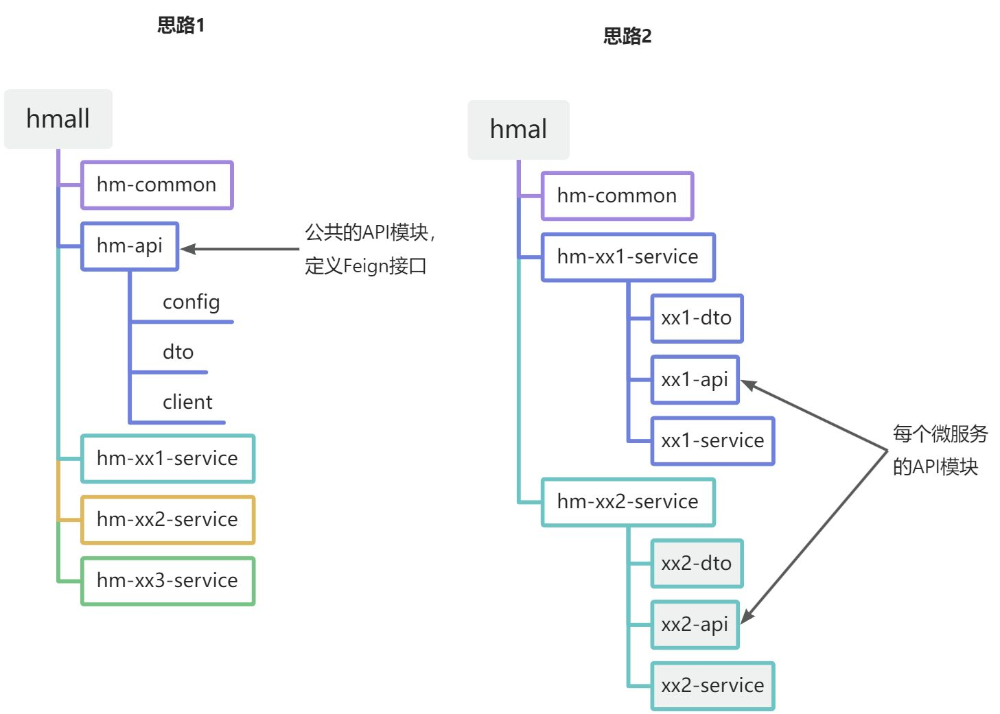

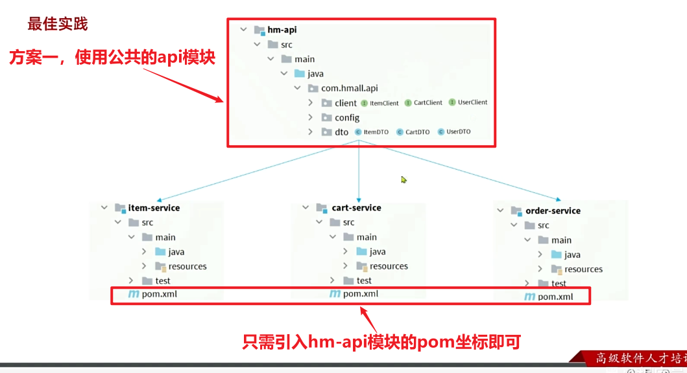

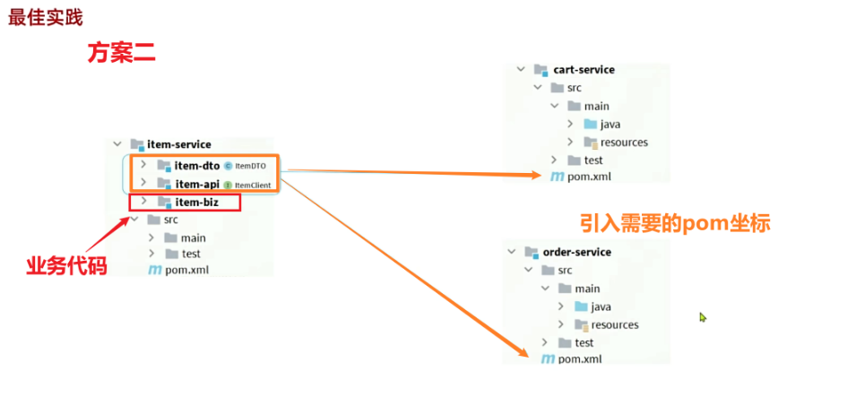

方案1抽取更加简单，工程结构也比较清晰，但缺点是整个项目**耦合度偏高**。

方案2抽取相对麻烦，工程结构相对更复杂，但服务之间**耦合度降低**。

由于item-service已经创建好，无法继续拆分，因此这里我们采用方案1.

#### 4.3.2.抽取Feign客户端

在`hmall`下定义一个新的module，命名为hm-api


其依赖如下：

```XML
<?xml version="1.0" encoding="UTF-8"?>
<project xmlns="http://maven.apache.org/POM/4.0.0"
         xmlns:xsi="http://www.w3.org/2001/XMLSchema-instance"
         xsi:schemaLocation="http://maven.apache.org/POM/4.0.0 http://maven.apache.org/xsd/maven-4.0.0.xsd">
    <parent>
        <artifactId>hmall</artifactId>
        <groupId>com.heima</groupId>
        <version>1.0.0</version>
    </parent>
    <modelVersion>4.0.0</modelVersion>

    <artifactId>hm-api</artifactId>

    <properties>
        <maven.compiler.source>11</maven.compiler.source>
        <maven.compiler.target>11</maven.compiler.target>
    </properties>

    <dependencies>
        <!--open feign-->
        <dependency>
            <groupId>org.springframework.cloud</groupId>
            <artifactId>spring-cloud-starter-openfeign</artifactId>
        </dependency>
        <!-- load balancer-->
        <dependency>
            <groupId>org.springframework.cloud</groupId>
            <artifactId>spring-cloud-starter-loadbalancer</artifactId>
        </dependency>
        <!-- swagger 注解依赖 -->
        <dependency>
            <groupId>io.swagger</groupId>
            <artifactId>swagger-annotations</artifactId>
            <version>1.6.6</version>
            <scope>compile</scope>
        </dependency>
    </dependencies>
</project>
```

然后把ItemDTO和ItemClient都拷贝过来，最终结构如下：

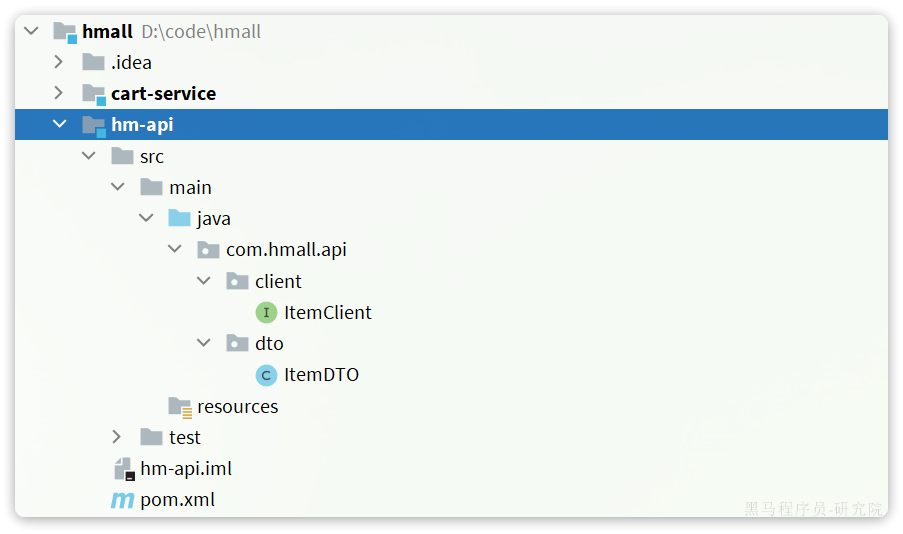

现在，任何微服务要调用`item-service`中的接口，只需要引入`hm-api`模块依赖即可，无需自己编写Feign客户端了。

#### 4.3.3.扫描包

接下来，我们在`cart-service`的`pom.xml`中引入`hm-api`模块：

```XML
<!--导入hm-api模块-->
  <dependency>
      <groupId>com.heima</groupId>
      <artifactId>hm-api</artifactId>
      <version>1.0.0</version>
  </dependency>
```

删除`cart-service`中原来的ItemDTO和ItemClient，重启项目，发现报错了：

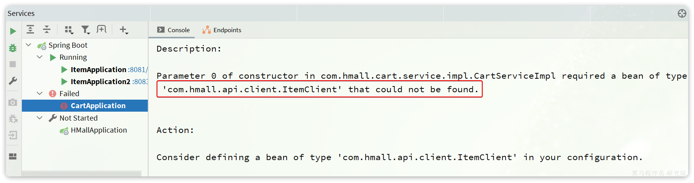

这里因为`ItemClient`现在定义到了`com.hmall.api.client`包下，而cart-service的启动类定义在`com.hmall.cart`包下，扫描不到`ItemClient`，所以报错了。

解决办法很简单，在cart-service的启动类上添加声明即可，两种方式：

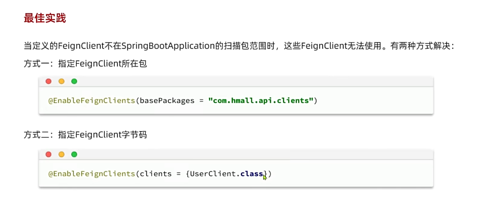

- 方式1：声明扫描包：

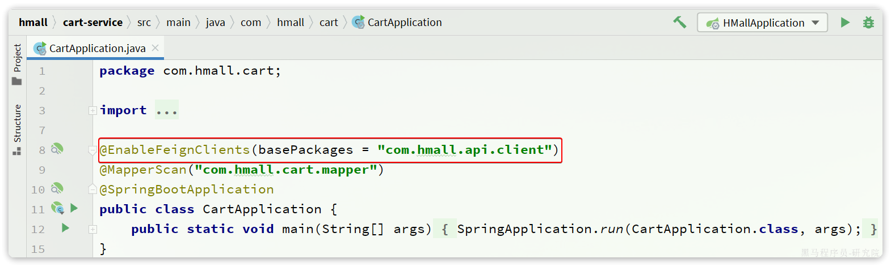

- 方式2：声明要用的FeignClient


### 4.4.日志配置

OpenFeign只会在FeignClient所在包的日志级别为**DEBUG**时，才会输出日志。而且其日志级别有4级：

- **NONE**：不记录任何日志信息，这是默认值。
- **BASIC**：仅记录请求的方法，URL以及响应状态码和执行时间
- **HEADERS**：在BASIC的基础上，额外记录了请求和响应的头信息
- **FULL**：记录所有请求和响应的明细，包括头信息、请求体、元数据。

Feign默认的日志级别就是NONE，所以默认我们看不到请求日志。

#### 4.4.1.定义日志级别

在hm-api模块下新建一个配置类，定义Feign的日志级别：


代码如下：

```Java
package com.hmall.api.config;

import feign.Logger;
import org.springframework.context.annotation.Bean;

public class DefaultFeignConfig {
    @Bean
    public Logger.Level feignLogLevel(){
        return Logger.Level.FULL;
    }
}
```

#### 4.4.2.配置

接下来，要让日志级别生效，还需要配置这个类。有两种方式：

- **局部**生效：在某个`FeignClient`中配置，只对当前`FeignClient`生效

```Java
@FeignClient(value = "item-service", configuration = DefaultFeignConfig.class)
```

- **全局**生效：在`@EnableFeignClients`中配置，针对所有`FeignClient`生效。

```Java
@EnableFeignClients(defaultConfiguration = DefaultFeignConfig.class)
```

日志格式：

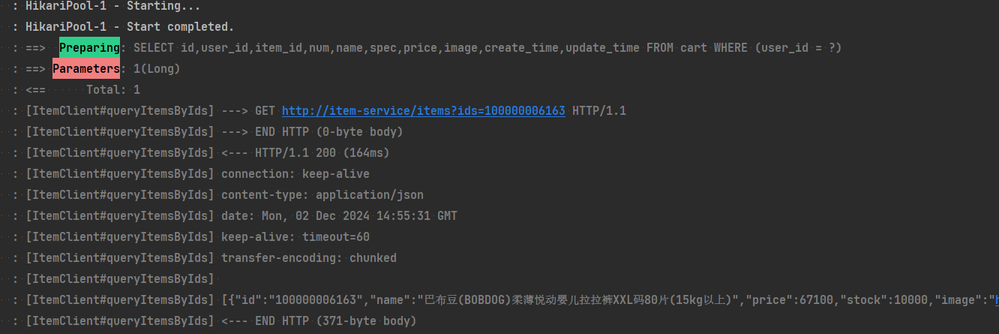

```Plain
17:35:32:148 DEBUG 18620 --- [nio-8082-exec-1] com.hmall.api.client.ItemClient          : [ItemClient#queryItemByIds] ---> GET http://item-service/items?ids=100000006163 HTTP/1.1
17:35:32:148 DEBUG 18620 --- [nio-8082-exec-1] com.hmall.api.client.ItemClient          : [ItemClient#queryItemByIds] ---> END HTTP (0-byte body)
17:35:32:278 DEBUG 18620 --- [nio-8082-exec-1] com.hmall.api.client.ItemClient          : [ItemClient#queryItemByIds] <--- HTTP/1.1 200  (127ms)
17:35:32:279 DEBUG 18620 --- [nio-8082-exec-1] com.hmall.api.client.ItemClient          : [ItemClient#queryItemByIds] connection: keep-alive
17:35:32:279 DEBUG 18620 --- [nio-8082-exec-1] com.hmall.api.client.ItemClient          : [ItemClient#queryItemByIds] content-type: application/json
17:35:32:279 DEBUG 18620 --- [nio-8082-exec-1] com.hmall.api.client.ItemClient          : [ItemClient#queryItemByIds] date: Fri, 26 May 2023 09:35:32 GMT
17:35:32:279 DEBUG 18620 --- [nio-8082-exec-1] com.hmall.api.client.ItemClient          : [ItemClient#queryItemByIds] keep-alive: timeout=60
17:35:32:279 DEBUG 18620 --- [nio-8082-exec-1] com.hmall.api.client.ItemClient          : [ItemClient#queryItemByIds] transfer-encoding: chunked
17:35:32:279 DEBUG 18620 --- [nio-8082-exec-1] com.hmall.api.client.ItemClient          : [ItemClient#queryItemByIds] 
17:35:32:280 DEBUG 18620 --- [nio-8082-exec-1] com.hmall.api.client.ItemClient          : [ItemClient#queryItemByIds] [{"id":100000006163,"name":"巴布豆(BOBDOG)柔薄悦动婴儿拉拉裤XXL码80片(15kg以上)","price":67100,"stock":10000,"image":"https://m.360buyimg.com/mobilecms/s720x720_jfs/t23998/350/2363990466/222391/a6e9581d/5b7cba5bN0c18fb4f.jpg!q70.jpg.webp","category":"拉拉裤","brand":"巴布豆","spec":"{}","sold":11,"commentCount":33343434,"isAD":false,"status":2}]
17:35:32:281 DEBUG 18620 --- [nio-8082-exec-1] com.hmall.api.client.ItemClient          : [ItemClient#queryItemByIds] <--- END HTTP (369-byte body)
```

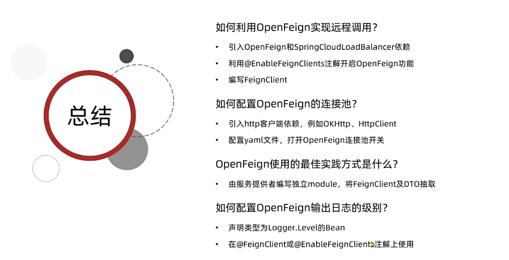


## 5.作业

### 5.1.拆分微服务

将hm-service中的其它业务也都拆分为微服务，包括：

- user-service：用户微服务，包含用户登录、管理等功能
- trade-service：交易微服务，包含订单相关功能
- pay-service：支付微服务，包含支付相关功能

其中交易服务、支付服务、用户服务中的业务都需要知道当前登录用户是谁，目前暂未实现，先将用户id写死。

**思考**：如何才能在每个微服务中都拿到用户信息？如何在微服务之间传递用户信息？

### 5.2.定义FeignClient

在上述业务中，包含大量的微服务调用，将被调用的接口全部定义为FeignClient，将其与对应的DTO放在hm-api模块

### 5.3.将微服务与前端联调

课前资料提供了一个`hmall-nginx`目录，其中包含了Nginx以及我们的前端代码：

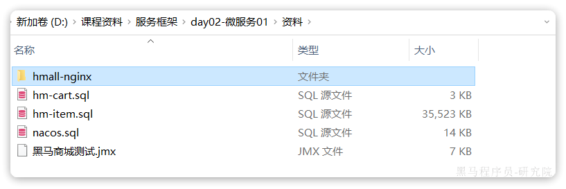

将其拷贝到一个不包含中文、空格、特殊字符的目录，启动后即可访问到页面：

- 18080是用户端页面
- 18081是管理端页面

之前`nginx`内部会将发向服务端请求全部代理到8080端口，但是现在拆分了N个微服务，8080不可用了。请通过`Nginx`配置，完成对不同微服务的反向代理。

**认真思考这种方式存在哪些问题**，**有什么好的解决方案**？


### 1.用户服务

#### 1.1.创建项目

在hmall下新建一个module，命名为user-service：

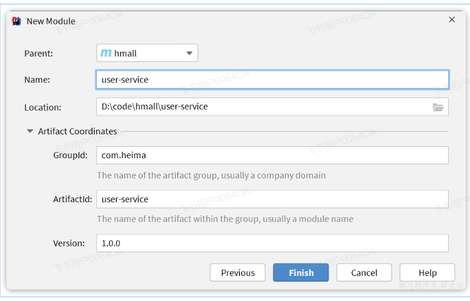

#### 1.2.依赖

user-service的pom.xml文件内容如下：

```XML
<?xml version="1.0" encoding="UTF-8"?>
<project xmlns="http://maven.apache.org/POM/4.0.0"
         xmlns:xsi="http://www.w3.org/2001/XMLSchema-instance"
         xsi:schemaLocation="http://maven.apache.org/POM/4.0.0 http://maven.apache.org/xsd/maven-4.0.0.xsd">
    <parent>
        <artifactId>hmall</artifactId>
        <groupId>com.heima</groupId>
        <version>1.0.0</version>
    </parent>
    <modelVersion>4.0.0</modelVersion>

    <artifactId>user-service</artifactId>

    <properties>
        <maven.compiler.source>11</maven.compiler.source>
        <maven.compiler.target>11</maven.compiler.target>
    </properties>

    <dependencies>
        <!--common-->
        <dependency>
            <groupId>com.heima</groupId>
            <artifactId>hm-common</artifactId>
            <version>1.0.0</version>
        </dependency>
        <!--api-->
        <dependency>
            <groupId>com.heima</groupId>
            <artifactId>hm-api</artifactId>
            <version>1.0.0</version>
        </dependency>
        <!--web-->
        <dependency>
            <groupId>org.springframework.boot</groupId>
            <artifactId>spring-boot-starter-web</artifactId>
        </dependency>
        <!--数据库-->
        <dependency>
            <groupId>mysql</groupId>
            <artifactId>mysql-connector-java</artifactId>
        </dependency>
        <!--mybatis-->
        <dependency>
            <groupId>com.baomidou</groupId>
            <artifactId>mybatis-plus-boot-starter</artifactId>
        </dependency>
        <!--nacos 服务注册发现-->
        <dependency>
            <groupId>com.alibaba.cloud</groupId>
            <artifactId>spring-cloud-starter-alibaba-nacos-discovery</artifactId>
        </dependency>
    </dependencies>
    <build>
        <finalName>${project.artifactId}</finalName>
        <plugins>
            <plugin>
                <groupId>org.springframework.boot</groupId>
                <artifactId>spring-boot-maven-plugin</artifactId>
            </plugin>
        </plugins>
    </build>
</project>
```

#### 1.3.启动类

在user-service中的`com.hmall.user`包下创建启动类：

```Java
package com.hmall.user;

import org.mybatis.spring.annotation.MapperScan;
import org.springframework.boot.SpringApplication;
import org.springframework.boot.autoconfigure.SpringBootApplication;

@MapperScan("com.hmall.user.mapper")
@SpringBootApplication
public class UserApplication {
    public static void main(String[] args) {
        SpringApplication.run(UserApplication.class, args);
    }
}
```

#### 1.4.配置文件

从`hm-service`项目中复制3个yaml配置文件到`user-service`的`resource`目录。

其中`application-dev.yaml`和`application-local.yaml`保持不变。`application.yaml`如下：

```YAML
server:
  port: 8084
spring:
  application:
    name: user-service # 服务名称
  profiles:
    active: dev
  datasource:
    url: jdbc:mysql://${hm.db.host}:3306/hm-user?useUnicode=true&characterEncoding=UTF-8&autoReconnect=true&serverTimezone=Asia/Shanghai
    driver-class-name: com.mysql.cj.jdbc.Driver
    username: root
    password: ${hm.db.pw}
  cloud:
    nacos:
      server-addr: 192.168.150.101 # nacos地址
mybatis-plus:
  configuration:
    default-enum-type-handler: com.baomidou.mybatisplus.core.handlers.MybatisEnumTypeHandler
  global-config:
    db-config:
      update-strategy: not_null
      id-type: auto
logging:
  level:
    com.hmall: debug
  pattern:
    dateformat: HH:mm:ss:SSS
  file:
    path: "logs/${spring.application.name}"
knife4j:
  enable: true
  openapi:
    title: 用户服务接口文档
    description: "信息"
    email: zhanghuyi@itcast.cn
    concat: 虎哥
    url: https://www.itcast.cn
    version: v1.0.0
    group:
      default:
        group-name: default
        api-rule: package
        api-rule-resources:
          - com.hmall.user.controller
hm:
  jwt:
    location: classpath:hmall.jks
    alias: hmall
    password: hmall123
    tokenTTL: 30m
```

将hm-service下的hmall.jks文件拷贝到user-service下的resources目录，这是JWT加密的秘钥文件：

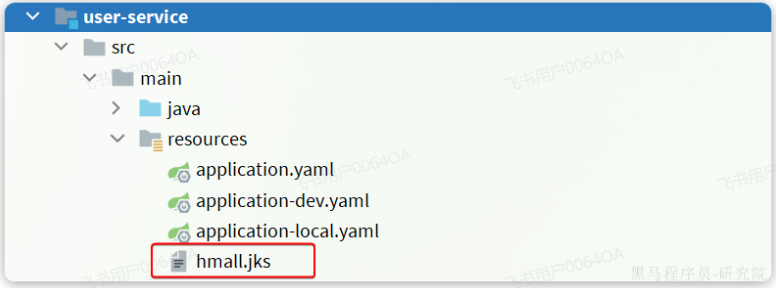

#### 1.5.代码

复制hm-service中所有与user、address、jwt有关的代码，最终项目结构如下：

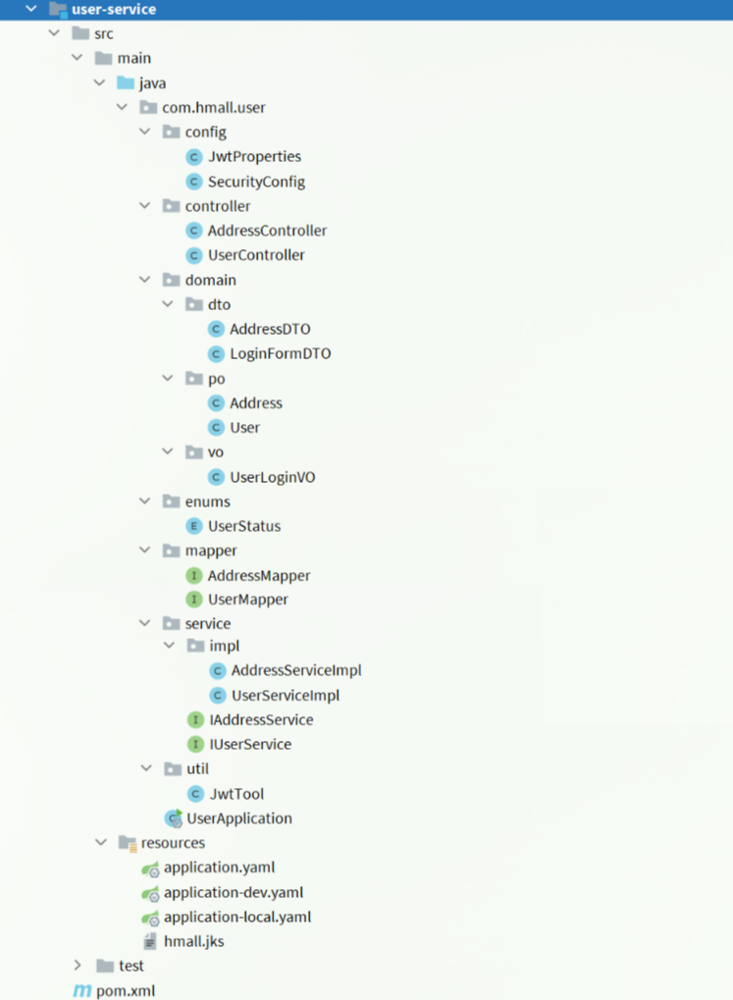

#### 1.6.数据库

user-service也需要自己的独立的database，向MySQL中导入课前资料提供的SQL：

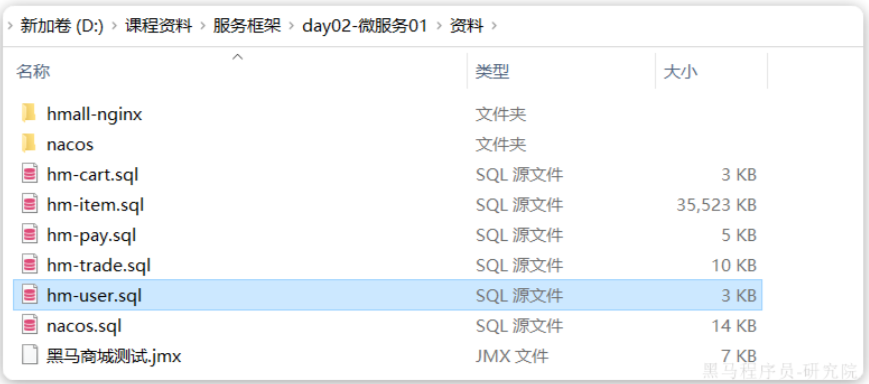

导入结果如下：

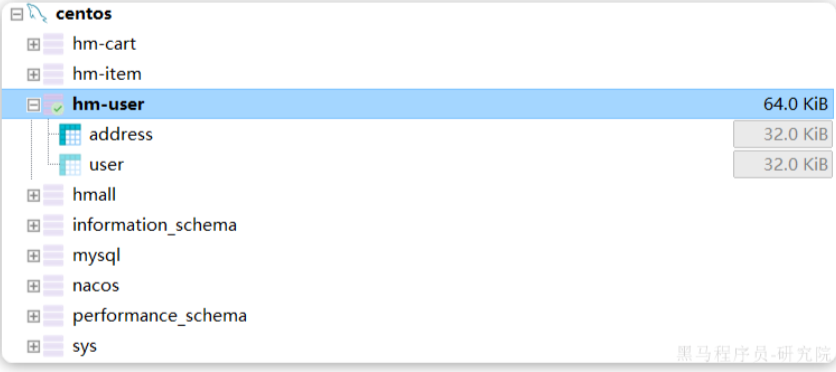

#### 1.7.配置启动项

给user-service配置启动项，设置profile为local：

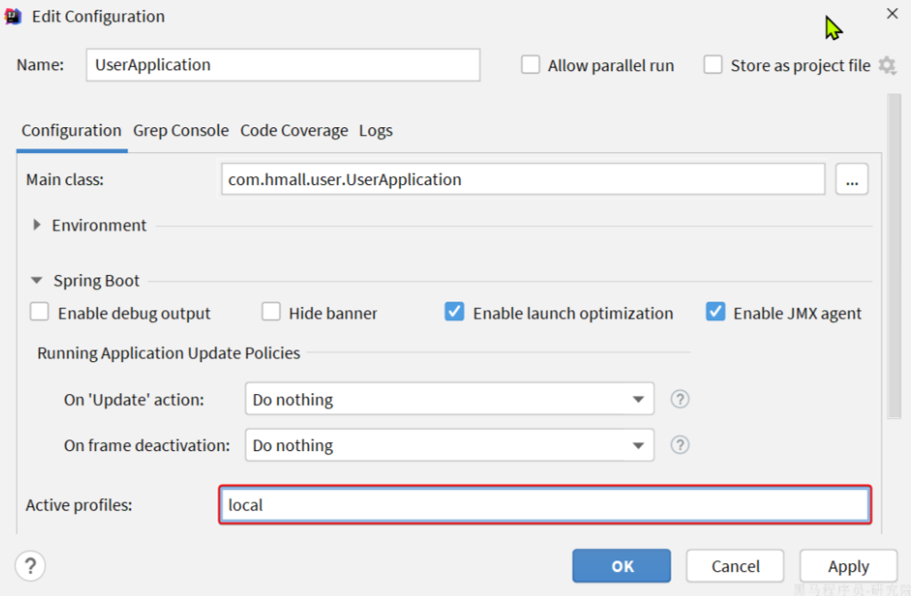

#### 1.8.测试

启动UserApplication，访问`http://localhost:8084/doc.html#/default/用户相关接口/loginUsingPOST`，测试登录接口：

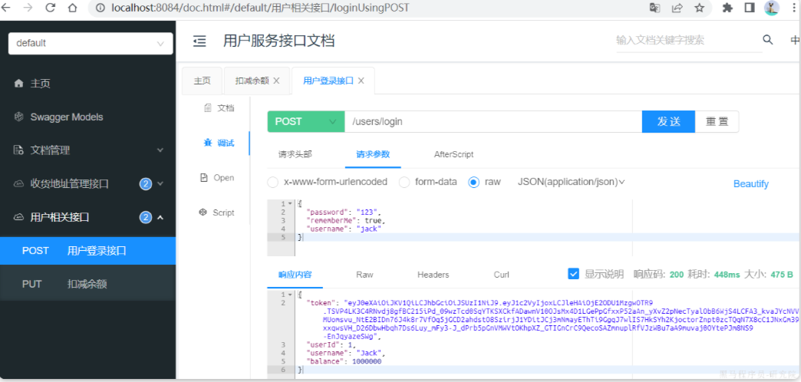

用户服务测试通过。

### 2.交易服务

#### 2.1.创建项目

在hmall下新建一个module，命名为trade-service：

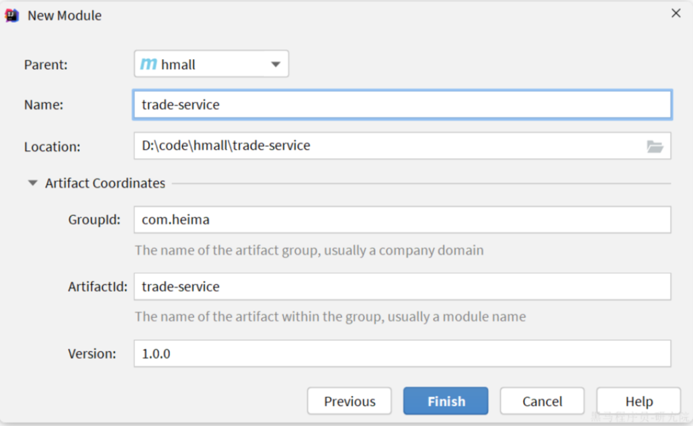

#### 2.2.依赖

trade-service的pom.xml文件内容如下：

```XML
<?xml version="1.0" encoding="UTF-8"?>
<project xmlns="http://maven.apache.org/POM/4.0.0"
         xmlns:xsi="http://www.w3.org/2001/XMLSchema-instance"
         xsi:schemaLocation="http://maven.apache.org/POM/4.0.0 http://maven.apache.org/xsd/maven-4.0.0.xsd">
    <parent>
        <artifactId>hmall</artifactId>
        <groupId>com.heima</groupId>
        <version>1.0.0</version>
    </parent>
    <modelVersion>4.0.0</modelVersion>

    <artifactId>trade-service</artifactId>

    <properties>
        <maven.compiler.source>11</maven.compiler.source>
        <maven.compiler.target>11</maven.compiler.target>
    </properties>

    <dependencies>
        <!--common-->
        <dependency>
            <groupId>com.heima</groupId>
            <artifactId>hm-common</artifactId>
            <version>1.0.0</version>
        </dependency>
        <!--api-->
        <dependency>
            <groupId>com.heima</groupId>
            <artifactId>hm-api</artifactId>
            <version>1.0.0</version>
        </dependency>
        <!--web-->
        <dependency>
            <groupId>org.springframework.boot</groupId>
            <artifactId>spring-boot-starter-web</artifactId>
        </dependency>
        <!--数据库-->
        <dependency>
            <groupId>mysql</groupId>
            <artifactId>mysql-connector-java</artifactId>
        </dependency>
        <!--mybatis-->
        <dependency>
            <groupId>com.baomidou</groupId>
            <artifactId>mybatis-plus-boot-starter</artifactId>
        </dependency>
        <!--nacos 服务注册发现-->
        <dependency>
            <groupId>com.alibaba.cloud</groupId>
            <artifactId>spring-cloud-starter-alibaba-nacos-discovery</artifactId>
        </dependency>
    </dependencies>
    <build>
        <finalName>${project.artifactId}</finalName>
        <plugins>
            <plugin>
                <groupId>org.springframework.boot</groupId>
                <artifactId>spring-boot-maven-plugin</artifactId>
            </plugin>
        </plugins>
    </build>
</project>
```

#### 2.3.启动类

在trade-service中的`com.hmall.trade`包下创建启动类：

```Java
package com.hmall.trade;

import org.mybatis.spring.annotation.MapperScan;
import org.springframework.boot.SpringApplication;
import org.springframework.boot.autoconfigure.SpringBootApplication;
import org.springframework.cloud.openfeign.EnableFeignClients;

@EnableFeignClients(basePackages = "com.hmall.api.client", defaultConfiguration = DefaultFeignConfig.class)
@MapperScan("com.hmall.trade.mapper")
@SpringBootApplication
public class TradeApplication {
    public static void main(String[] args) {
        SpringApplication.run(TradeApplication.class, args);
    }
}
```

#### 2.4.配置文件

从`hm-service`项目中复制3个yaml配置文件到`trade-service`的`resource`目录。

其中`application-dev.yaml`和`application-local.yaml`保持不变。`application.yaml`如下：

```YAML
server:
  port: 8085
spring:
  application:
    name: trade-service # 服务名称
  profiles:
    active: dev
  datasource:
    url: jdbc:mysql://${hm.db.host}:3306/hm-trade?useUnicode=true&characterEncoding=UTF-8&autoReconnect=true&serverTimezone=Asia/Shanghai
    driver-class-name: com.mysql.cj.jdbc.Driver
    username: root
    password: ${hm.db.pw}
  cloud:
    nacos:
      server-addr: 192.168.150.101 # nacos地址
mybatis-plus:
  configuration:
    default-enum-type-handler: com.baomidou.mybatisplus.core.handlers.MybatisEnumTypeHandler
  global-config:
    db-config:
      update-strategy: not_null
      id-type: auto
logging:
  level:
    com.hmall: debug
  pattern:
    dateformat: HH:mm:ss:SSS
  file:
    path: "logs/${spring.application.name}"
knife4j:
  enable: true
  openapi:
    title: 交易服务接口文档
    description: "信息"
    email: zhanghuyi@itcast.cn
    concat: 虎哥
    url: https://www.itcast.cn
    version: v1.0.0
    group:
      default:
        group-name: default
        api-rule: package
        api-rule-resources:
          - com.hmall.trade.controller
```

#### 2.5.代码

##### 2.5.1.基础代码

复制hm-service中所有与trade有关的代码，最终项目结构如下：

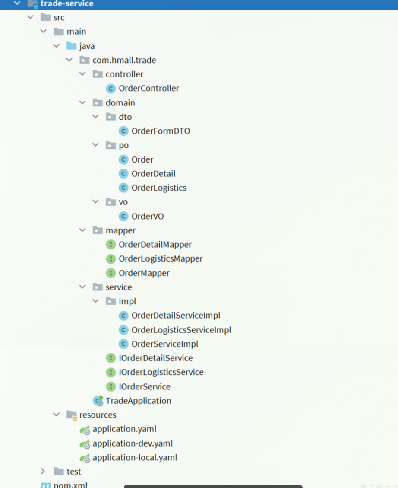

在交易服务中，用户下单时需要做下列事情：

- **根据id查询商品列表**
- 计算商品总价
- 保存订单
- **扣减库存**
- **清理购物车商品**

其中，查询商品、扣减库存都是与商品有关的业务，在item-service中有相关功能；清理购物车商品是购物车业务，在cart-service中有相关功能。

因此交易服务要调用他们，必须通过OpenFeign远程调用。我们需要将上述功能抽取为FeignClient.

##### 2.5.2.抽取ItemClient接口

首先是**扣减库存**，在`item-service`中的对应业务接口如下：

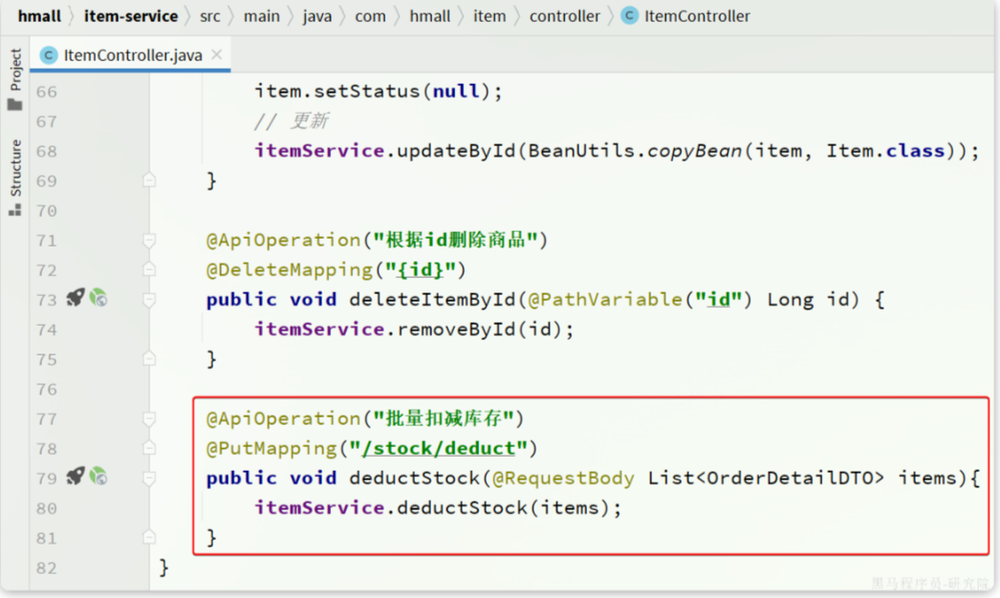

我们将这个接口抽取到`hm-api`模块的`com.hmall.api.client.ItemClient`中:

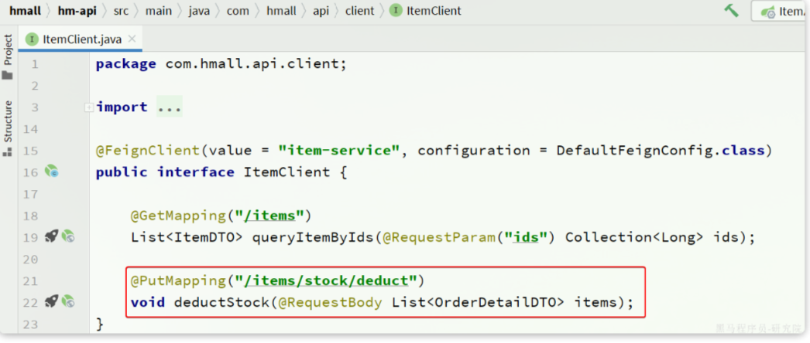

将接口参数的`OrderDetailDTO`抽取到`hm-api`模块的`com.hmall.api.dto`包下：

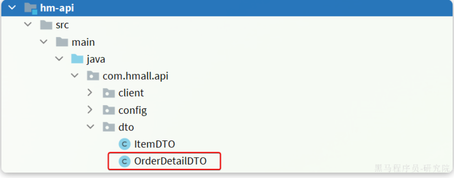

##### 2.5.3.抽取CartClient接口

接下来是**清理购物车商品**，在`cart-service`中的对应业务接口如下：

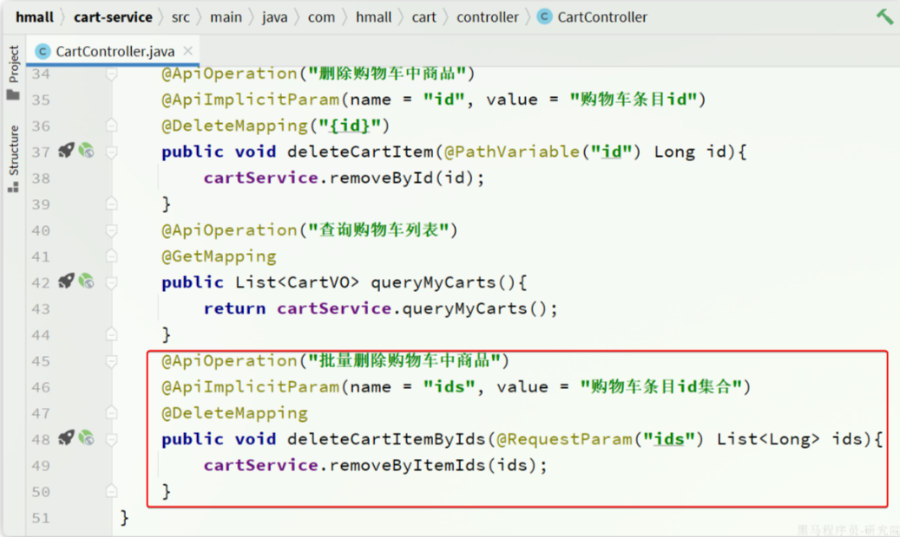

我们在`hm-api`模块的`com.hmall.api.client`包下定义一个`CartClient`接口：

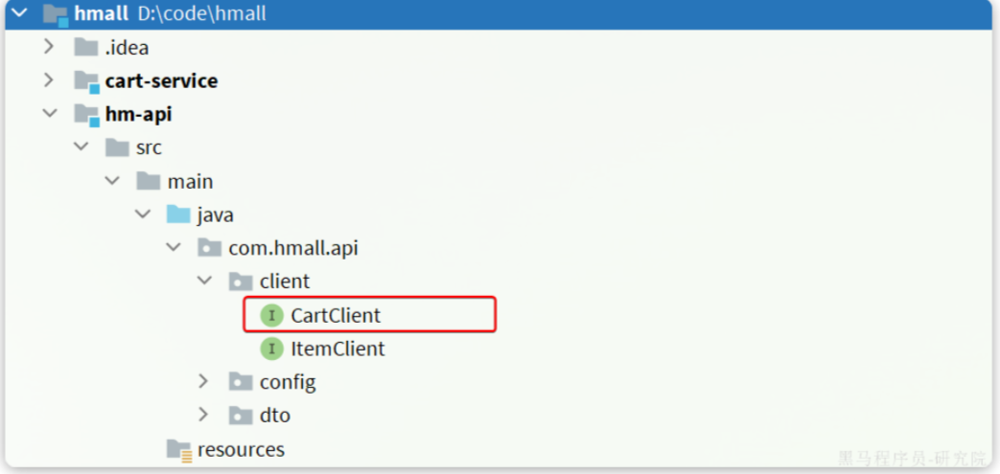

代码如下：

```Java
package com.hmall.api.client;

import org.springframework.cloud.openfeign.FeignClient;
import org.springframework.web.bind.annotation.DeleteMapping;
import org.springframework.web.bind.annotation.RequestParam;

import java.util.Collection;

@FeignClient("cart-service")
public interface CartClient {
    @DeleteMapping("/carts")
    void deleteCartItemByIds(@RequestParam("ids") Collection<Long> ids);
}
```

##### 2.5.4.改造OrderServiceImpl

接下来，就可以改造OrderServiceImpl中的逻辑，将本地方法调用改造为基于FeignClient的调用，完整代码如下：

```Java
package com.hmall.trade.service.impl;

import com.baomidou.mybatisplus.extension.service.impl.ServiceImpl;
import com.hmall.api.client.CartClient;
import com.hmall.api.client.ItemClient;
import com.hmall.api.dto.ItemDTO;
import com.hmall.api.dto.OrderDetailDTO;
import com.hmall.common.exception.BadRequestException;
import com.hmall.common.utils.UserContext;
import com.hmall.trade.domain.dto.OrderFormDTO;
import com.hmall.trade.domain.po.Order;
import com.hmall.trade.domain.po.OrderDetail;
import com.hmall.trade.mapper.OrderMapper;
import com.hmall.trade.service.IOrderDetailService;
import com.hmall.trade.service.IOrderService;
import lombok.RequiredArgsConstructor;
import org.springframework.stereotype.Service;
import org.springframework.transaction.annotation.Transactional;

import java.util.ArrayList;
import java.util.List;
import java.util.Map;
import java.util.Set;
import java.util.stream.Collectors;

/**
 * <p>
 * 服务实现类
 * </p>
 */
@Service
@RequiredArgsConstructor
public class OrderServiceImpl extends ServiceImpl<OrderMapper, Order> implements IOrderService {

    private final ItemClient itemClient;
    private final IOrderDetailService detailService;
    private final CartClient cartClient;

    @Override
    @Transactional
    public Long createOrder(OrderFormDTO orderFormDTO) {
        // 1.订单数据
        Order order = new Order();
        // 1.1.查询商品
        List<OrderDetailDTO> detailDTOS = orderFormDTO.getDetails();
        // 1.2.获取商品id和数量的Map
        Map<Long, Integer> itemNumMap = detailDTOS.stream()
                .collect(Collectors.toMap(OrderDetailDTO::getItemId, OrderDetailDTO::getNum));
        Set<Long> itemIds = itemNumMap.keySet();
        // 1.3.查询商品
        List<ItemDTO> items = itemClient.queryItemByIds(itemIds);
        if (items == null || items.size() < itemIds.size()) {
            throw new BadRequestException("商品不存在");
        }
        // 1.4.基于商品价格、购买数量计算商品总价：totalFee
        int total = 0;
        for (ItemDTO item : items) {
            total += item.getPrice()  itemNumMap.get(item.getId());
        }
        order.setTotalFee(total);
        // 1.5.其它属性
        order.setPaymentType(orderFormDTO.getPaymentType());
        order.setUserId(UserContext.getUser());
        order.setStatus(1);
        // 1.6.将Order写入数据库order表中
        save(order);

        // 2.保存订单详情
        List<OrderDetail> details = buildDetails(order.getId(), items, itemNumMap);
        detailService.saveBatch(details);

        // 3.扣减库存
        try {
            itemClient.deductStock(detailDTOS);
        } catch (Exception e) {
            throw new RuntimeException("库存不足！");
        }

        // 4.清理购物车商品
        cartClient.deleteCartItemByIds(itemIds);
        return order.getId();
    }

    private List<OrderDetail> buildDetails(Long orderId, List<ItemDTO> items, Map<Long, Integer> numMap) {
        List<OrderDetail> details = new ArrayList<>(items.size());
        for (ItemDTO item : items) {
            OrderDetail detail = new OrderDetail();
            detail.setName(item.getName());
            detail.setSpec(item.getSpec());
            detail.setPrice(item.getPrice());
            detail.setNum(numMap.get(item.getId()));
            detail.setItemId(item.getId());
            detail.setImage(item.getImage());
            detail.setOrderId(orderId);
            details.add(detail);
        }
        return details;
    }
}
```

#### 2.6.数据库

trade-service也需要自己的独立的database，向MySQL中导入课前资料提供的SQL：

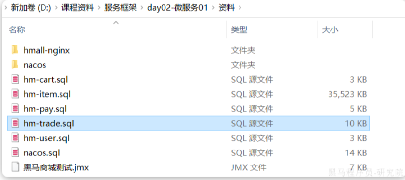

导入结果如下：

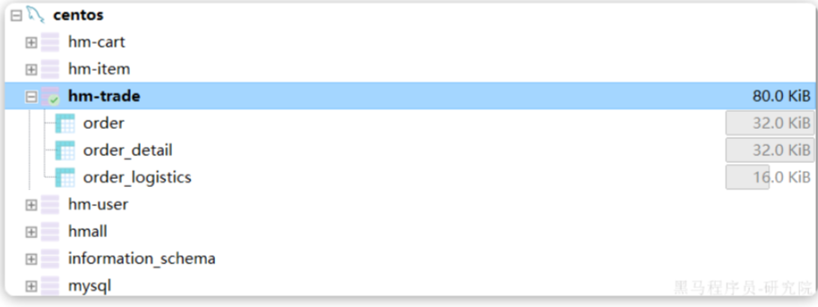

#### 2.7.配置启动项

给trade-service配置启动项，设置profile为local：

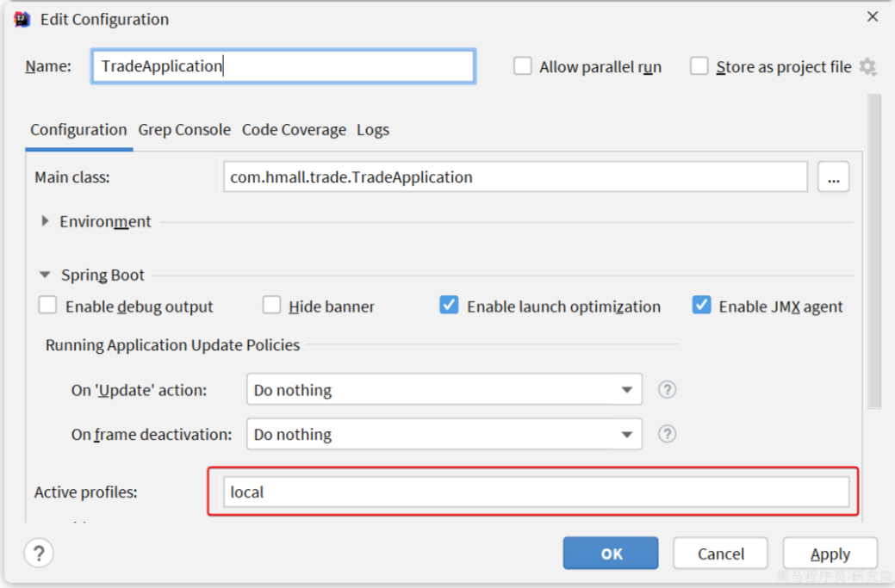

#### 2.8.测试

启动TradeApplication，访问`[http://localhost:8085/doc.html](http://localhost:8085/doc.html#/default/订单管理接口/queryOrderByIdUsingGET)`，测试查询订单接口：

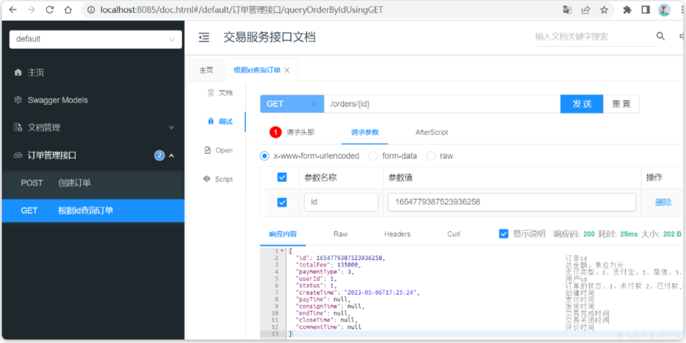

请求参数：1654779387523936258，交易服务测试通过。

注意，创建订单接口无法测试，因为无法获取登录用户信息。


### 3.支付服务

#### 3.1.创建项目

在`hmall`下新建一个module，命名为`pay-service`：

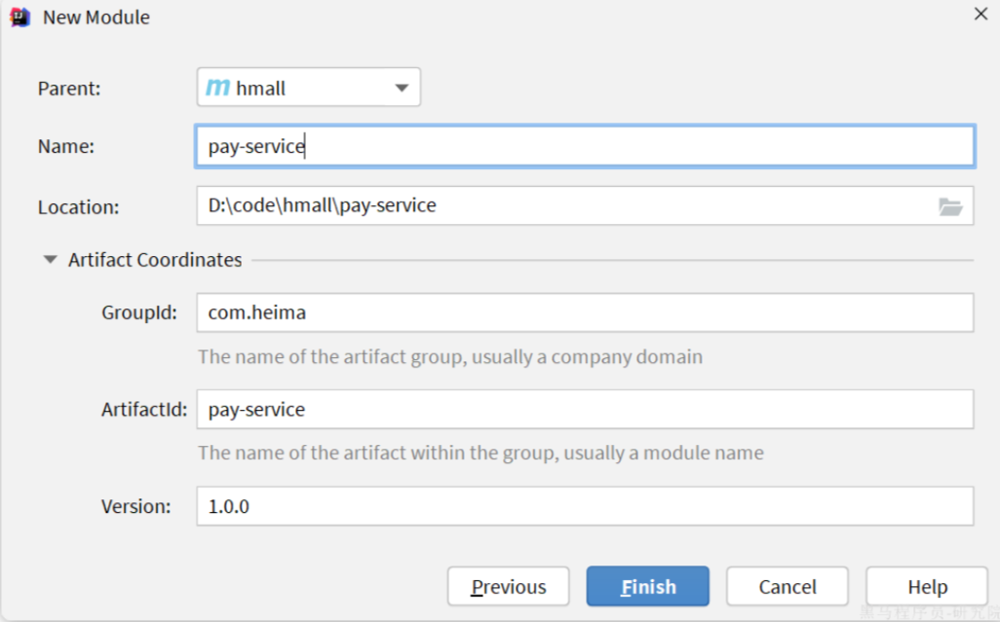

#### 3.2.依赖

`pay-service`的`pom.xml`文件内容如下：

```XML
<?xml version="1.0" encoding="UTF-8"?>
<project xmlns="http://maven.apache.org/POM/4.0.0"
         xmlns:xsi="http://www.w3.org/2001/XMLSchema-instance"
         xsi:schemaLocation="http://maven.apache.org/POM/4.0.0 http://maven.apache.org/xsd/maven-4.0.0.xsd">
    <parent>
        <artifactId>hmall</artifactId>
        <groupId>com.heima</groupId>
        <version>1.0.0</version>
    </parent>
    <modelVersion>4.0.0</modelVersion>

    <artifactId>pay-service</artifactId>

    <properties>
        <maven.compiler.source>11</maven.compiler.source>
        <maven.compiler.target>11</maven.compiler.target>
    </properties>

    <dependencies>
        <!--common-->
        <dependency>
            <groupId>com.heima</groupId>
            <artifactId>hm-common</artifactId>
            <version>1.0.0</version>
        </dependency>
        <!--api-->
        <dependency>
            <groupId>com.heima</groupId>
            <artifactId>hm-api</artifactId>
            <version>1.0.0</version>
        </dependency>
        <!--web-->
        <dependency>
            <groupId>org.springframework.boot</groupId>
            <artifactId>spring-boot-starter-web</artifactId>
        </dependency>
        <!--数据库-->
        <dependency>
            <groupId>mysql</groupId>
            <artifactId>mysql-connector-java</artifactId>
        </dependency>
        <!--mybatis-->
        <dependency>
            <groupId>com.baomidou</groupId>
            <artifactId>mybatis-plus-boot-starter</artifactId>
        </dependency>
        <!--nacos 服务注册发现-->
        <dependency>
            <groupId>com.alibaba.cloud</groupId>
            <artifactId>spring-cloud-starter-alibaba-nacos-discovery</artifactId>
        </dependency>
    </dependencies>
    <build>
        <finalName>${project.artifactId}</finalName>
        <plugins>
            <plugin>
                <groupId>org.springframework.boot</groupId>
                <artifactId>spring-boot-maven-plugin</artifactId>
            </plugin>
        </plugins>
    </build>
</project>
```

#### 3.3.启动类

在pay-service中的`com.hmall.pay`包下创建启动类：

```Java
package com.hmall.pay;

import org.mybatis.spring.annotation.MapperScan;
import org.springframework.boot.SpringApplication;
import org.springframework.boot.autoconfigure.SpringBootApplication;
import org.springframework.cloud.openfeign.EnableFeignClients;

@EnableFeignClients(basePackages = "com.hmall.api.client", defaultConfiguration = DefaultFeignConfig.class)
@MapperScan("com.hmall.pay.mapper")
@SpringBootApplication
public class PayApplication {
    public static void main(String[] args) {
        SpringApplication.run(PayApplication.class, args);
    }
}
```

#### 3.4.配置文件

从`hm-service`项目中复制3个yaml配置文件到`trade-service`的`resource`目录。

其中`application-dev.yaml`和`application-local.yaml`保持不变。`application.yaml`如下：

```YAML
server:
  port: 8086
spring:
  application:
    name: pay-service
  profiles:
    active: dev
  datasource:
    url: jdbc:mysql://${hm.db.host}:3306/hm-pay?useUnicode=true&characterEncoding=UTF-8&autoReconnect=true&serverTimezone=Asia/Shanghai
    driver-class-name: com.mysql.cj.jdbc.Driver
    username: root
    password: ${hm.db.pw}
  cloud:
    nacos:
      server-addr: 192.168.150.101
mybatis-plus:
  configuration:
    default-enum-type-handler: com.baomidou.mybatisplus.core.handlers.MybatisEnumTypeHandler
  global-config:
    db-config:
      update-strategy: not_null
      id-type: auto
logging:
  level:
    com.hmall: debug
  pattern:
    dateformat: HH:mm:ss:SSS
  file:
    path: "logs/${spring.application.name}"
knife4j:
  enable: true
  openapi:
    title: 支付服务接口文档
    description: "支付服务接口文档"
    email: zhanghuyi@itcast.cn
    concat: 虎哥
    url: https://www.itcast.cn
    version: v1.0.0
    group:
      default:
        group-name: default
        api-rule: package
        api-rule-resources:
          - com.hmall.pay.controller
```

#### 3.5.代码

##### 3.5.1.基础代码

复制hm-service中所有与支付有关的代码，最终项目结构如下：

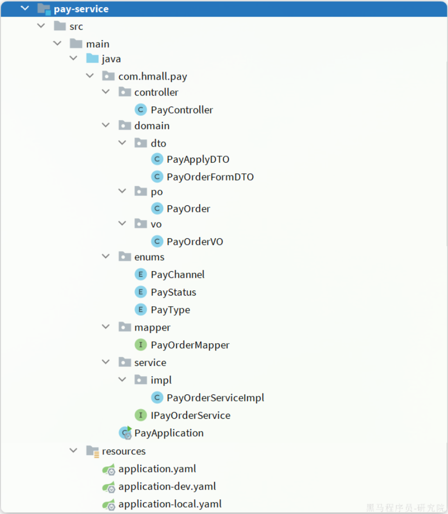

在支付服务中，基于用户余额支付时需要做下列事情：

- **扣减用户余额**
- 标记支付单状态为已支付
- **标记订单状态为已支付**

其中，**扣减用户余额**是在`user-service`中有相关功能；**标记订单状态**则是在`trade-service`中有相关功能。因此交易服务要调用他们，必须通过OpenFeign远程调用。我们需要将上述功能抽取为FeignClient.

##### 2.5.2.抽取UserClient接口

首先是**扣减用户余额**，在`user-service`中的对应业务接口如下：

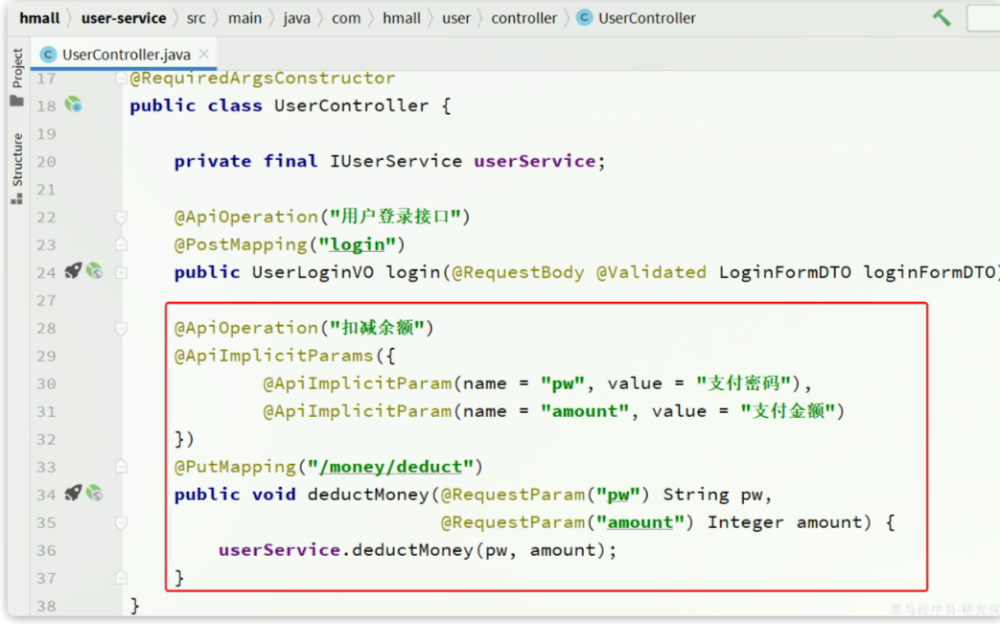

我们将这个接口抽取到`hm-api`模块的`com.hmall.api.client.UserClient`中:

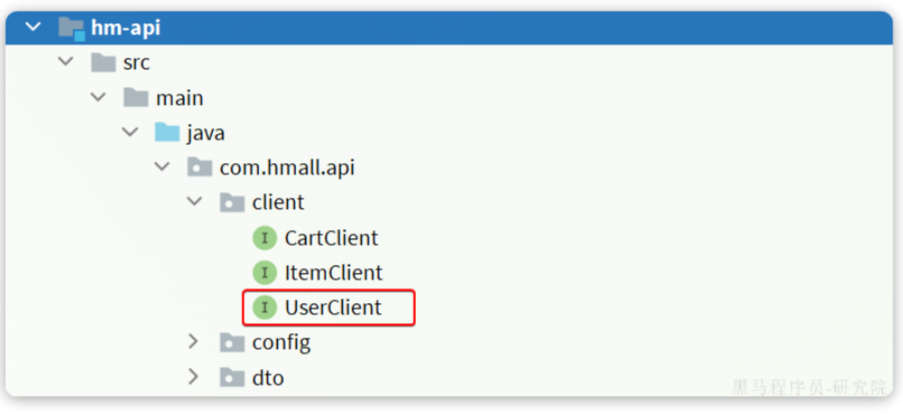

具体代码如下：

```Java
package com.hmall.api.client;

import org.springframework.cloud.openfeign.FeignClient;
import org.springframework.web.bind.annotation.PutMapping;
import org.springframework.web.bind.annotation.RequestParam;

@FeignClient("user-service")
public interface UserClient {
    @PutMapping("/users/money/deduct")
    void deductMoney(@RequestParam("pw") String pw,@RequestParam("amount") Integer amount);
}
```

##### 2.5.3.抽取TradeClient接口

接下来是**标记订单状态**，在`trade-service`中的对应业务接口如下：

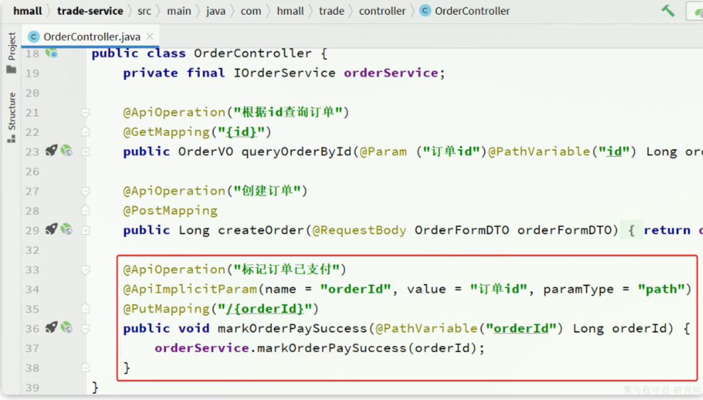

我们将这个接口抽取到`hm-api`模块的`com.hmall.api.client.TradeClient`中:

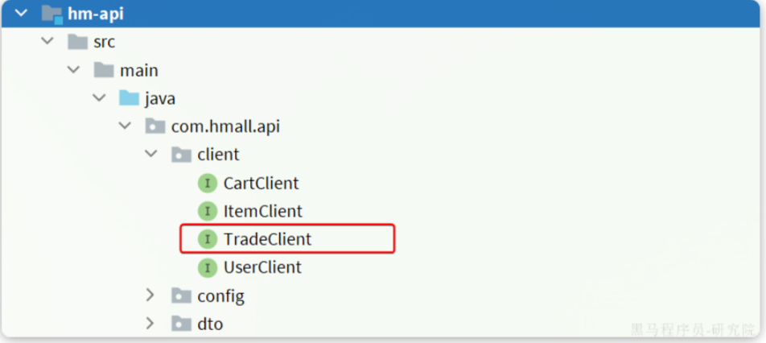

代码如下：

```Java
package com.hmall.api.client;

import org.springframework.cloud.openfeign.FeignClient;
import org.springframework.web.bind.annotation.PathVariable;
import org.springframework.web.bind.annotation.PutMapping;

@FeignClient("trade-service")
public interface TradeClient {
    @PutMapping("/orders/{orderId}")
    void markOrderPaySuccess(@PathVariable("orderId") Long orderId);
}
```

##### 2.5.4.改造PayOrderServiceImpl

接下来，就可以改造`PayOrderServiceImpl`中的逻辑，将本地方法调用改造为基于`FeignClient`的调用，完整代码如下：

```Java
package com.hmall.pay.service.impl;

import com.baomidou.mybatisplus.core.toolkit.IdWorker;
import com.baomidou.mybatisplus.core.toolkit.StringUtils;
import com.baomidou.mybatisplus.extension.service.impl.ServiceImpl;
import com.hmall.api.client.TradeClient;
import com.hmall.api.client.UserClient;
import com.hmall.common.exception.BizIllegalException;
import com.hmall.common.utils.BeanUtils;
import com.hmall.common.utils.UserContext;
import com.hmall.pay.domain.dto.PayApplyDTO;
import com.hmall.pay.domain.dto.PayOrderFormDTO;
import com.hmall.pay.domain.po.PayOrder;
import com.hmall.pay.enums.PayStatus;
import com.hmall.pay.mapper.PayOrderMapper;
import com.hmall.pay.service.IPayOrderService;
import lombok.RequiredArgsConstructor;
import org.springframework.stereotype.Service;
import org.springframework.transaction.annotation.Transactional;

import java.time.LocalDateTime;

/**
 * <p>
 * 支付订单 服务实现类
 * </p>
 *
 */
@Service
@RequiredArgsConstructor
public class PayOrderServiceImpl extends ServiceImpl<PayOrderMapper, PayOrder> implements IPayOrderService {

    private final UserClient userClient;

    private final TradeClient tradeClient;

    @Override
    public String applyPayOrder(PayApplyDTO applyDTO) {
        // 1.幂等性校验
        PayOrder payOrder = checkIdempotent(applyDTO);
        // 2.返回结果
        return payOrder.getId().toString();
    }

    @Override
    @Transactional
    public void tryPayOrderByBalance(PayOrderFormDTO payOrderDTO) {
        // 1.查询支付单
        PayOrder po = getById(payOrderDTO.getId());
        // 2.判断状态
        if(!PayStatus.WAIT_BUYER_PAY.equalsValue(po.getStatus())){
            // 订单不是未支付，状态异常
            throw new BizIllegalException("交易已支付或关闭！");
        }
        // 3.尝试扣减余额
        userClient.deductMoney(payOrderDTO.getPw(), po.getAmount());
        // 4.修改支付单状态
        boolean success = markPayOrderSuccess(payOrderDTO.getId(), LocalDateTime.now());
        if (!success) {
            throw new BizIllegalException("交易已支付或关闭！");
        }
        // 5.修改订单状态
        tradeClient.markOrderPaySuccess(po.getBizOrderNo());
    }

    public boolean markPayOrderSuccess(Long id, LocalDateTime successTime) {
        return lambdaUpdate()
                .set(PayOrder::getStatus, PayStatus.TRADE_SUCCESS.getValue())
                .set(PayOrder::getPaySuccessTime, successTime)
                .eq(PayOrder::getId, id)
                // 支付状态的乐观锁判断
                .in(PayOrder::getStatus, PayStatus.NOT_COMMIT.getValue(), PayStatus.WAIT_BUYER_PAY.getValue())
                .update();
    }


    private PayOrder checkIdempotent(PayApplyDTO applyDTO) {
        // 1.首先查询支付单
        PayOrder oldOrder = queryByBizOrderNo(applyDTO.getBizOrderNo());
        // 2.判断是否存在
        if (oldOrder == null) {
            // 不存在支付单，说明是第一次，写入新的支付单并返回
            PayOrder payOrder = buildPayOrder(applyDTO);
            payOrder.setPayOrderNo(IdWorker.getId());
            save(payOrder);
            return payOrder;
        }
        // 3.旧单已经存在，判断是否支付成功
        if (PayStatus.TRADE_SUCCESS.equalsValue(oldOrder.getStatus())) {
            // 已经支付成功，抛出异常
            throw new BizIllegalException("订单已经支付！");
        }
        // 4.旧单已经存在，判断是否已经关闭
        if (PayStatus.TRADE_CLOSED.equalsValue(oldOrder.getStatus())) {
            // 已经关闭，抛出异常
            throw new BizIllegalException("订单已关闭");
        }
        // 5.旧单已经存在，判断支付渠道是否一致
        if (!StringUtils.equals(oldOrder.getPayChannelCode(), applyDTO.getPayChannelCode())) {
            // 支付渠道不一致，需要重置数据，然后重新申请支付单
            PayOrder payOrder = buildPayOrder(applyDTO);
            payOrder.setId(oldOrder.getId());
            payOrder.setQrCodeUrl("");
            updateById(payOrder);
            payOrder.setPayOrderNo(oldOrder.getPayOrderNo());
            return payOrder;
        }
        // 6.旧单已经存在，且可能是未支付或未提交，且支付渠道一致，直接返回旧数据
        return oldOrder;
    }

    private PayOrder buildPayOrder(PayApplyDTO payApplyDTO) {
        // 1.数据转换
        PayOrder payOrder = BeanUtils.toBean(payApplyDTO, PayOrder.class);
        // 2.初始化数据
        payOrder.setPayOverTime(LocalDateTime.now().plusMinutes(120L));
        payOrder.setStatus(PayStatus.WAIT_BUYER_PAY.getValue());
        payOrder.setBizUserId(UserContext.getUser());
        return payOrder;
    }
    public PayOrder queryByBizOrderNo(Long bizOrderNo) {
        return lambdaQuery()
                .eq(PayOrder::getBizOrderNo, bizOrderNo)
                .one();
    }
}
```

#### 2.6.数据库

`pay-service`也需要自己的独立的database，向MySQL中导入课前资料提供的SQL：

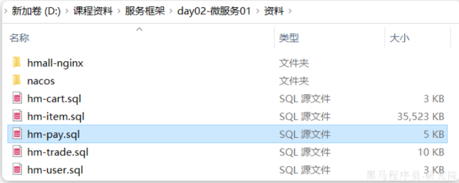

导入结果如下：

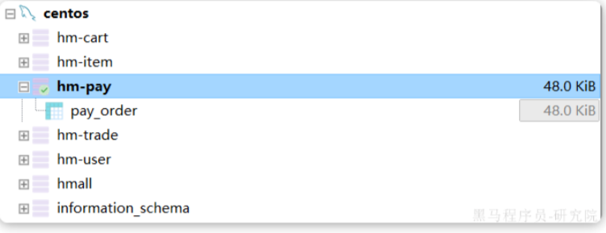

#### 2.7.配置启动项

给`pay-service`配置启动项，设置profile为`local`：

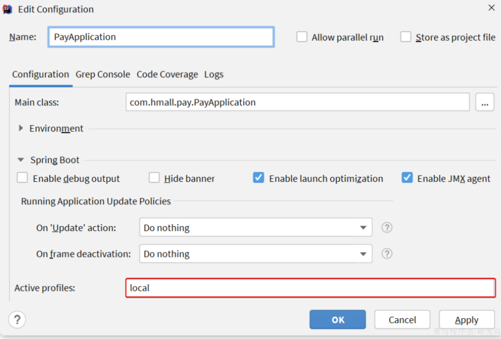

#### 2.8.测试

在支付服务的PayController中添加一个接口方便测试：

```Java
@ApiOperation("查询支付单")
@GetMapping
public List<PayOrderVO> queryPayOrders(){
    return BeanUtils.copyList(payOrderService.list(), PayOrderVO.class);
}
```

启动PayApplication，访问`[http://localhost:8086/doc.html](http://localhost:8086/doc.html#/default/支付相关接口/queryPayOrdersUsingGET)`，测试查询订单接口：

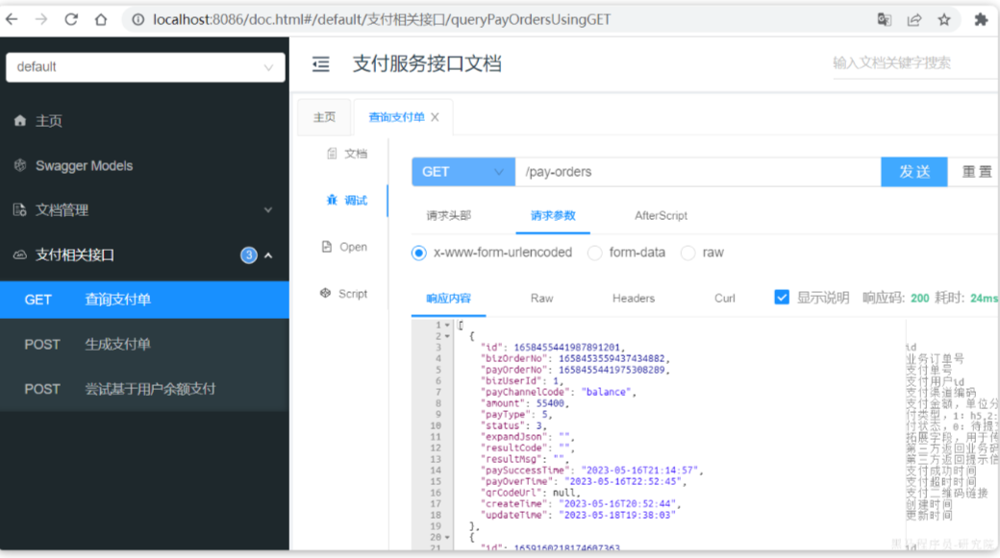

支付服务测试通过。


# 二、微服务-网关&配置管理

我们将黑马商城拆分为5个微服务：

- 用户服务
- 商品服务
- 购物车服务
- 交易服务
- 支付服务 

由于每个微服务都有不同的地址或端口，入口不同，相信大家在与前端联调的时候发现了一些问题：

- 请求不同数据时要访问不同的入口，需要维护多个入口地址，麻烦
- 前端无法调用nacos，无法实时更新服务列表

单体架构时我们只需要完成一次用户登录、身份校验，就可以在所有业务中获取到用户信息。而微服务拆分后，每个微服务都独立部署，这就存在一些问题：

- 每个微服务都需要编写登录校验、用户信息获取的功能吗？
- 当微服务之间调用时，该如何传递用户信息？

不要着急，这些问题都可以在今天的学习中找到答案，我们会通过**网关**技术解决上述问题。今天的内容会分为3章：

- 第一章：网关路由，解决前端请求入口的问题。
- 第二章：网关鉴权，解决统一登录校验和用户信息获取的问题。
- 第三章：统一配置管理，解决微服务的配置文件重复和配置热更新问题。

通过今天的学习你将掌握下列能力：

- 会利用微服务网关做请求路由
- 会利用微服务网关做登录身份校验
- 会利用Nacos实现统一配置管理
- 会利用Nacos实现配置热更新

好了，接下来我们就一起进入今天的学习吧。

## 1.网关路由

### 1.1.认识网关

什么是网关？

顾明思议，网关就是**网**络的**关**口。数据在网络间传输，从一个网络传输到另一网络时就需要经过网关来做**数据的路由和转发以及数据安全的校验**。

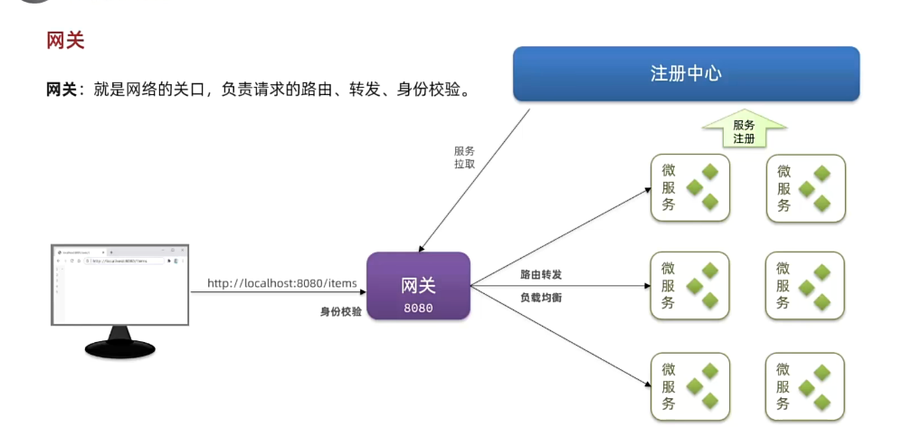

更通俗的来讲，网关就像是以前园区传达室的大爷。

- 外面的人要想进入园区，必须经过大爷的认可，如果你是不怀好意的人，肯定被直接拦截。
- 外面的人要传话或送信，要找大爷。大爷帮你带给目标人。

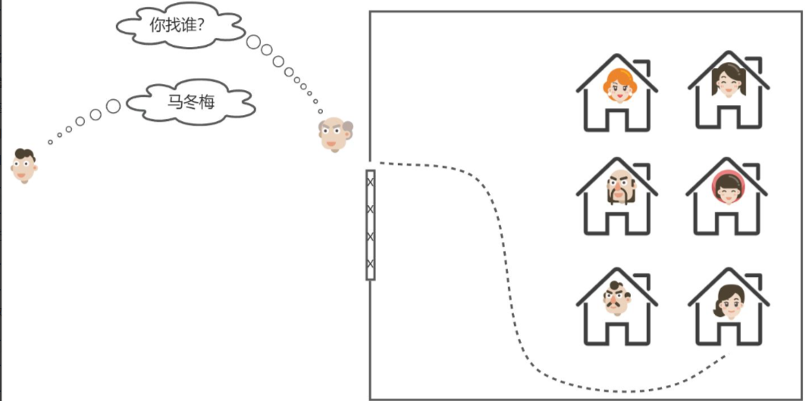

现在，微服务网关就起到同样的作用。**前端请求不能直接访问微服务，而是要请求网关**：

- 网关可以做安全控制，也就是**登录身份校验**，校验通过才放行
- 通过认证后，网关再根据请求判断应该访问哪个微服务，将**请求转发**过去

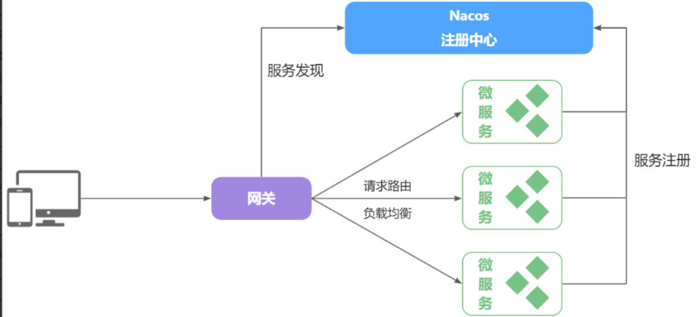

在SpringCloud当中，提供了两种网关实现方案：

- Netflix Zuul：早期实现，目前已经淘汰
- SpringCloudGateway：基于Spring的WebFlux技术，**完全支持响应式编程**，吞吐能力更强

课堂中我们以SpringCloudGateway为例来讲解，官方网站：

https://spring.io/projects/spring-cloud-gateway#learn


### 1.2.快速入门

接下来，我们先看下如何利用网关实现请求路由。由于网关本身也是一个独立的微服务，因此也**需要创建一个模块开发功能**。大概步骤如下：

- 创建网关微服务
- 引入SpringCloudGateway、NacosDiscovery依赖
- 编写启动类
- **配置网关路由**

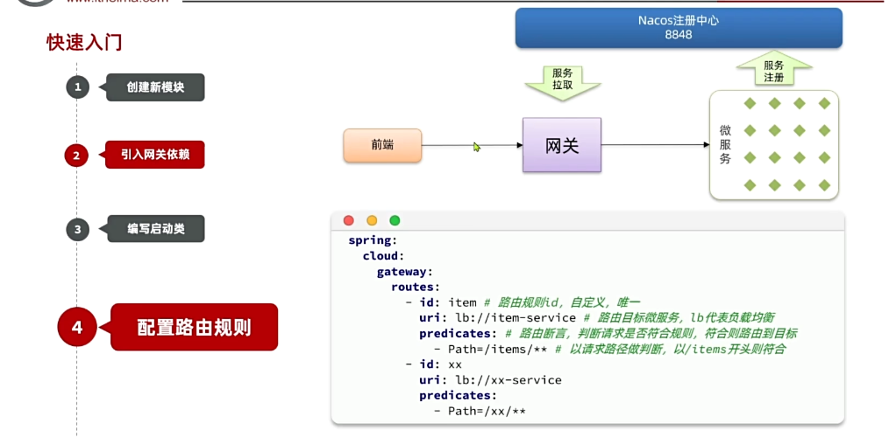

#### 1.2.1.创建项目

首先，我们要在hmall下创建一个新的module，命名为hm-gateway，作为网关微服务：

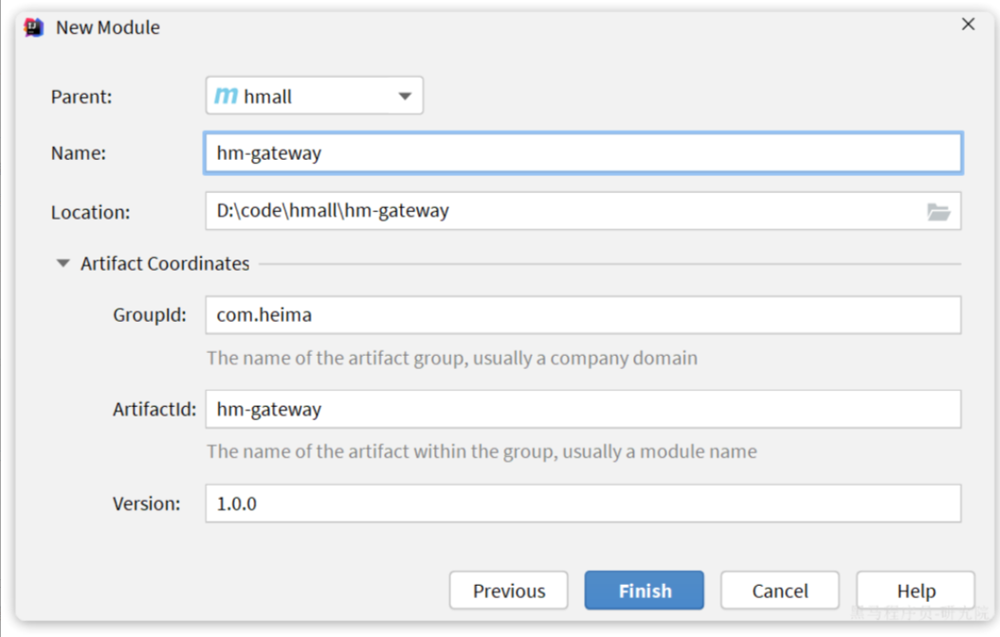

#### 1.2.2.引入依赖

在`hm-gateway`模块的`pom.xml`文件中引入依赖：

```XML
<?xml version="1.0" encoding="UTF-8"?>
<project xmlns="http://maven.apache.org/POM/4.0.0"
         xmlns:xsi="http://www.w3.org/2001/XMLSchema-instance"
         xsi:schemaLocation="http://maven.apache.org/POM/4.0.0 http://maven.apache.org/xsd/maven-4.0.0.xsd">
    <parent>
        <artifactId>hmall</artifactId>
        <groupId>com.heima</groupId>
        <version>1.0.0</version>
    </parent>
    <modelVersion>4.0.0</modelVersion>

    <artifactId>hm-gateway</artifactId>

    <properties>
        <maven.compiler.source>11</maven.compiler.source>
        <maven.compiler.target>11</maven.compiler.target>
    </properties>
    <dependencies>
        <!--common-->
        <dependency>
            <groupId>com.heima</groupId>
            <artifactId>hm-common</artifactId>
            <version>1.0.0</version>
        </dependency>
        <!--网关-->
        <dependency>
            <groupId>org.springframework.cloud</groupId>
            <artifactId>spring-cloud-starter-gateway</artifactId>
        </dependency>
        <!--nacos discovery-->
        <dependency>
            <groupId>com.alibaba.cloud</groupId>
            <artifactId>spring-cloud-starter-alibaba-nacos-discovery</artifactId>
        </dependency>
        <!--负载均衡-->
        <dependency>
            <groupId>org.springframework.cloud</groupId>
            <artifactId>spring-cloud-starter-loadbalancer</artifactId>
        </dependency>
    </dependencies>
    <build>
        <finalName>${project.artifactId}</finalName>
        <plugins>
            <plugin>
                <groupId>org.springframework.boot</groupId>
                <artifactId>spring-boot-maven-plugin</artifactId>
            </plugin>
        </plugins>
    </build>
</project>
```

#### 1.2.3.启动类

在`hm-gateway`模块的`com.hmall.gateway`包下新建一个启动类：

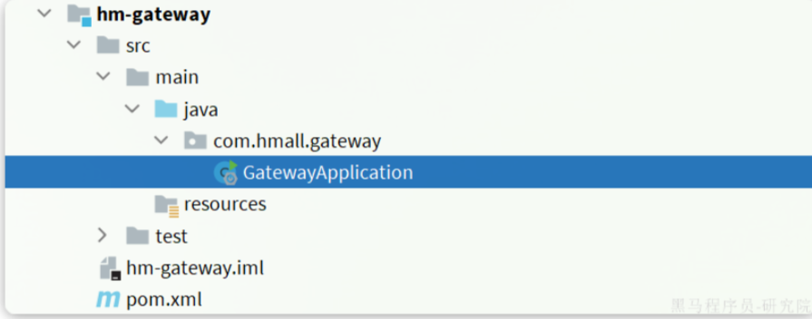

代码如下：

```Java
package com.hmall.gateway;

import org.springframework.boot.SpringApplication;
import org.springframework.boot.autoconfigure.SpringBootApplication;

@SpringBootApplication
public class GatewayApplication {
    public static void main(String[] args) {
        SpringApplication.run(GatewayApplication.class, args);
    }
}
```

#### 1.2.4.==配置路由==

接下来，在`hm-gateway`模块的`resources`目录新建一个`application.yaml`文件，内容如下：

```YAML
server:
  port: 8080
spring:
  application:
    name: hm-gateway
  cloud:
    nacos:
      server-addr: 192.168.88.133:8848
    gateway:
      routes:
        - id: item-service # 路由规则id，自定义，唯一
          uri: lb://item-service # 路由的目标服务，lb代表负载均衡，会从注册中心拉取服务列表
          predicates: # 路由断言，判断当前请求是否符合当前规则，符合则路由到目标服务
            - Path=/items/**,/search/** # 这里是以请求路径作为判断规则
        - id: cart-service
          uri: lb://cart-service
          predicates:
            - Path=/carts/**
        - id: user-service
          uri: lb://user-service
          predicates:
            - Path=/users/**,/addresses/**
        - id: trade-service
          uri: lb://trade-service
          predicates:
            - Path=/orders/**
        - id: pay-service
          uri: lb://pay-service
          predicates:
            - Path=/pay-orders/**
```

**==注意这里的id必须配置跟服务名一致：==**

在nacos后台中可以看到，注册中心的服务

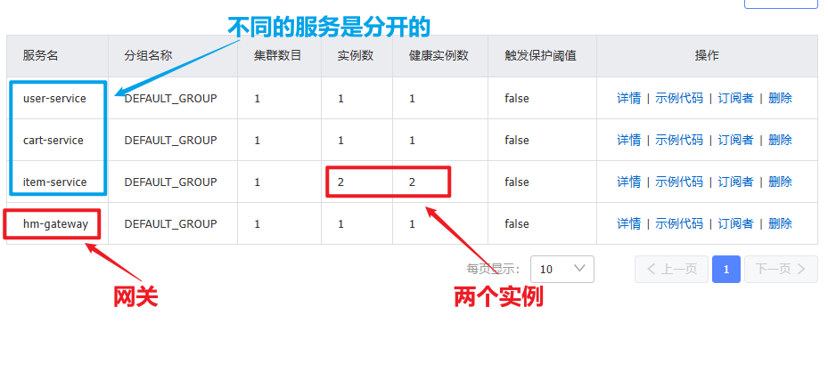

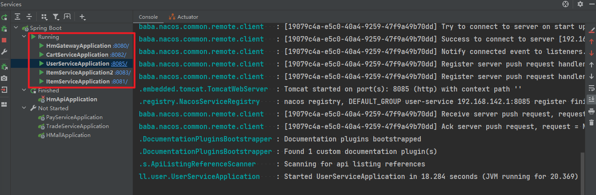

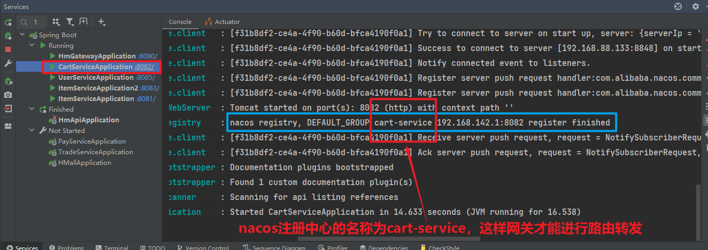


**==如果不一致：==**

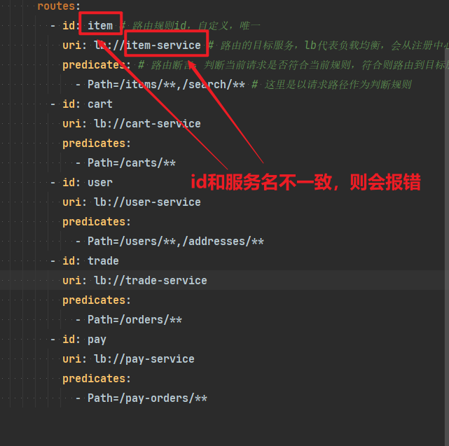

**在nacos实例管理界面中只有hm-gateway和hm-api（其他四个实例都在hm-api之中）**

RoundRobinLoadBalancer      : No servers available for service: user-service

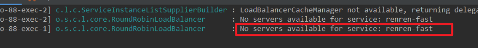

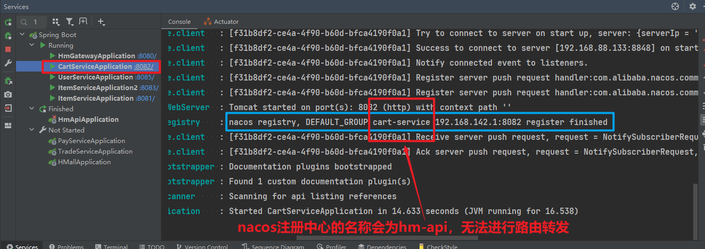


#### 1.2.5.测试

启动GatewayApplication，以 `http://localhost:8080` 拼接微服务接口路径来测试。例如：

`http://localhost:8080/items/page?pageNo=1&pageSize=1`

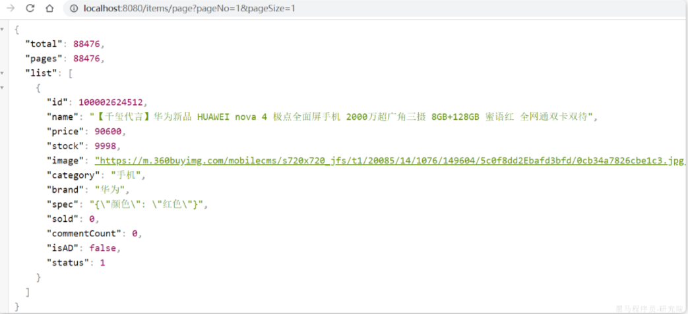

此时，启动UserApplication、CartApplication，然后打开前端页面，发现相关功能都可以正常访问了：

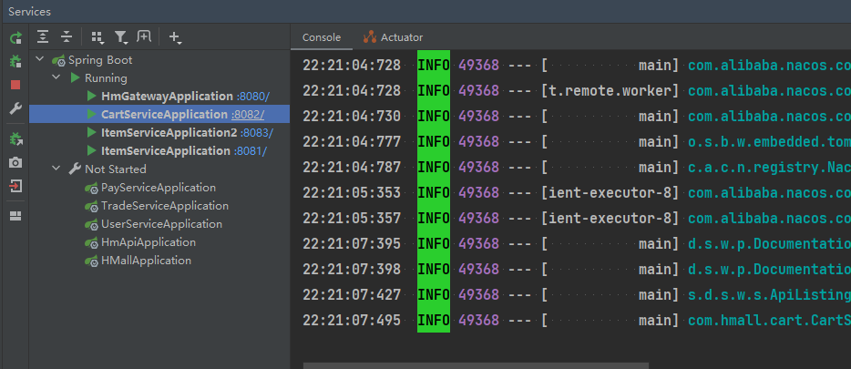


### 1.3.路由过滤

路由规则的定义语法如下：

```YAML
spring:
  cloud:
    gateway:
      routes:
        - id: item
          uri: lb://item-service
          predicates: //Path-请求路径必须符合指定规则
            - Path=/items/**,/search/**
```

其中routes对应的类型如下：

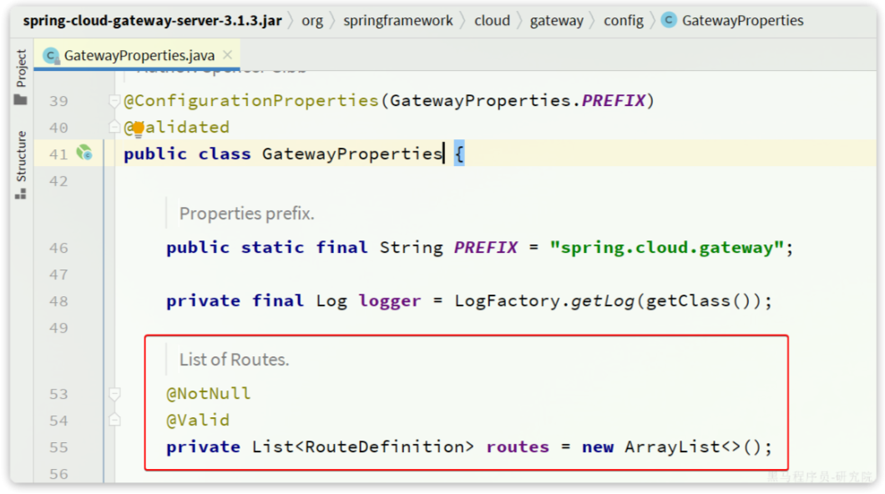

是一个集合，也就是说可以定义很多路由规则。集合中的`RouteDefinition`就是具体的路由规则定义，其中常见的属性如下：

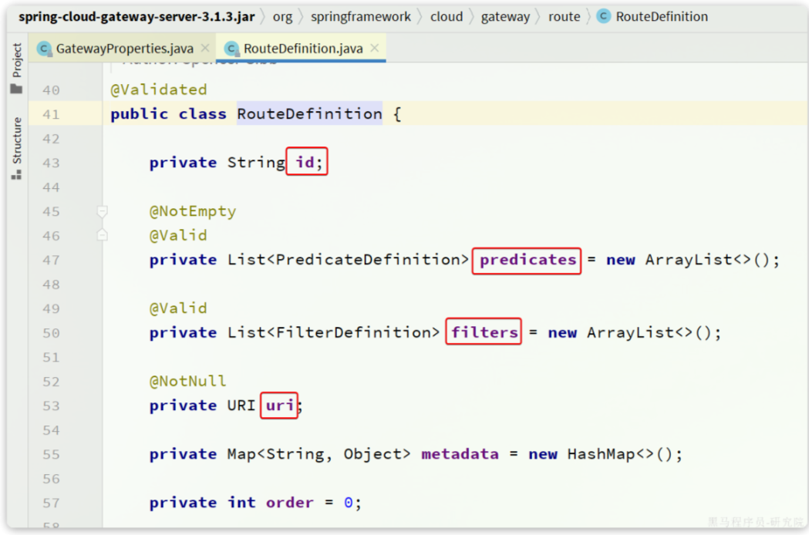

四个属性含义如下：

- `id`：路由的**唯一标示**
- `predicates`：**==路由断言==**，其实就是匹配条件
- `filters`：**==路由过滤条件==**，后面讲
- `uri`：路由目标地址，**`lb://`代表==负载均衡==**，**从注册中心获取目标微服务的实例列表**，并且负载均衡选择一个访问。

这里我们重点关注`predicates`，也就是**==路由断言==**。SpringCloudGateway中支持的断言类型有很多：

| **名称**   | **说明**                       | **示例**                                                     |
| :--------- | :----------------------------- | :----------------------------------------------------------- |
| After      | 是某个时间点后的请求           | - After=2037-01-20T17:42:47.789-07:00[America/Denver]        |
| Before     | 是某个时间点之前的请求         | - Before=2031-04-13T15:14:47.433+08:00[Asia/Shanghai]        |
| Between    | 是某两个时间点之前的请求       | - Between=2037-01-20T17:42:47.789-07:00[America/Denver], 2037-01-21T17:42:47.789-07:00[America/Denver] |
| Cookie     | 请求必须包含某些cookie         | - Cookie=chocolate, ch.p                                     |
| Header     | 请求必须包含某些header         | - Header=X-Request-Id, \d+                                   |
| Host       | 请求必须是访问某个host（域名） | - Host=**.somehost.org,**.anotherhost.org                    |
| Method     | 请求方式必须是指定方式         | - Method=GET,POST                                            |
| **Path**   | **请求路径必须符合指定规则**   | - Path=/red/{segment},/blue/**                               |
| Query      | 请求参数必须包含指定参数       | - Query=name, Jack或者- Query=name                           |
| RemoteAddr | 请求者的ip必须是指定范围       | - RemoteAddr=192.168.1.1/24                                  |
| weight     | 权重处理                       |                                                              |


## 2.网关登录校验

单体架构时我们只需要完成一次用户登录、身份校验，就可以在所有业务中获取到用户信息。而微服务拆分后，每个微服务都独立部署，不再共享数据。也就意味着每个微服务都需要做登录校验，这显然不可取。

### 2.1.鉴权思路分析

我们的登录是基于JWT来实现的，校验JWT的算法复杂，而且需要用到秘钥。如果每个微服务都去做登录校验，这就存在着两大问题：

- 每个微服务都需要知道JWT的秘钥，不安全
- 每个微服务重复编写登录校验代码、权限校验代码，麻烦

既然网关是所有微服务的入口，一切请求都需要先经过网关。我们完全可以把登录校验的工作放到网关去做，这样之前说的问题就解决了：

- 只需要在网关和用户服务保存秘钥
- 只需要在网关开发登录校验功能

此时，登录校验的流程如图：

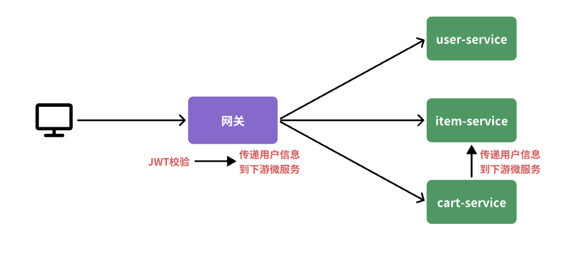

不过，这里存在几个**问题**：

- 网关路由是配置的，**请求转发**是Gateway内部代码，我们**如何在转发之前做登录校验**？
- 网关校验JWT之后，如何**将用户信息传递给微服务**？
- 微服务之间也会**相互调用**，这种调用不经过网关，又该如何**传递用户信息**？

这些问题将在接下来几节一一解决。

### 2.2.网关过滤器

登录校验必须在请求转发到微服务之前做，否则就失去了意义。而网关的请求转发是`Gateway`内部代码实现的，要想在请求转发之前做登录校验，就必须了解`Gateway`内部工作的基本原理。

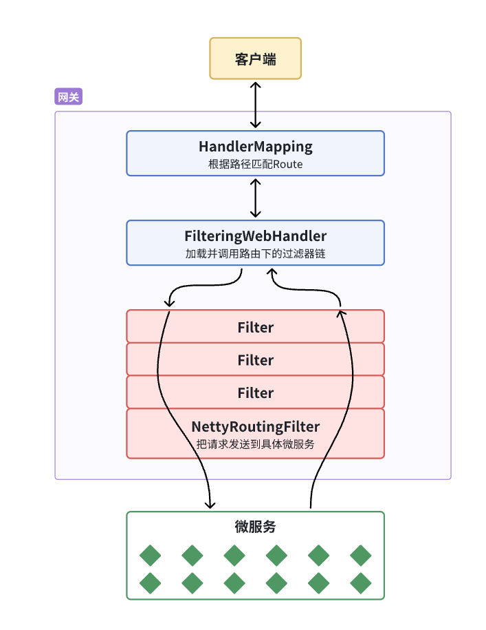

如图所示：

1. 客户端请求进入网关后由`HandlerMapping`对请求做判断，找到与当前请求匹配的路由规则（**`Route`**），然后将请求交给`WebHandler`去处理。
2. `WebHandler`则会加载当前路由下需要执行的**过滤器链（`Filter chain`**），然后按照顺序逐一执行过滤器（后面称为**`Filter`**）。
3. 图中`Filter`被虚线分为**左右两部分**，是因为`Filter`内部的逻辑分为`pre`和`post`两部分，分别会在请求路由到微服务**之前**和**之后**被执行。
4. 只有所有`Filter`的`pre`逻辑都依次顺序执行通过后，请求才会被路由到微服务。
5. 微服务返回结果后，再**==倒序执行==`Filter`的`post`逻辑**。
6. 最终把响应结果返回。

如图中所示，最终请求转发是有一个名为`NettyRoutingFilter`的过滤器来执行的，而且这个过滤器是整个过滤器链中顺序最靠后的一个。**如果我们能够定义一个过滤器，在其中实现登录校验逻辑，并且将过滤器执行顺序定义到**`NettyRoutingFilter`**之前**，这就符合我们的需求了！

那么，该如何实现一个网关过滤器呢？

网关过滤器链中的过滤器有两种：

- **`GatewayFilter`**：路由过滤器，作用范围比较灵活，可以是任意指定的路由`Route`. 

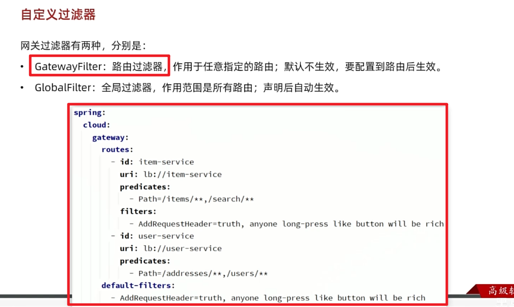

- **`GlobalFilter`**：全局过滤器，作用范围是所有路由，不可配置。

  

**注意**：过滤器链之外还有一种过滤器，HttpHeadersFilter，用来处理传递到下游微服务的请求头。例如org.springframework.cloud.gateway.filter.headers.XForwardedHeadersFilter可以**传递代理请求原本的host头到下游微服务**。

其实`GatewayFilter`和`GlobalFilter`这两种过滤器的方法签名完全一致：

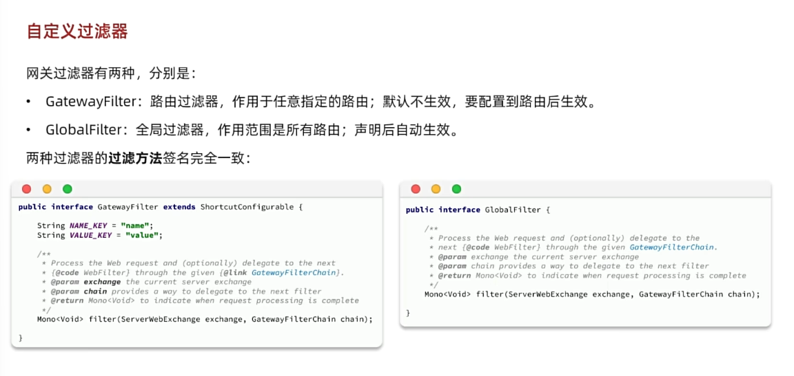

```Java
/**
 * 处理请求并将其传递给下一个过滤器
 * @param exchange 当前请求的上下文，其中包含request、response等各种数据
 * @param chain 过滤器链，基于它向下传递请求
 * @return 根据返回值标记当前请求是否被完成或拦截，使用chain.filter(exchange)放行，(将exchange上下文传递给下一个过滤器)。
 */
Mono<Void> filter(ServerWebExchange exchange, GatewayFilterChain chain);
```

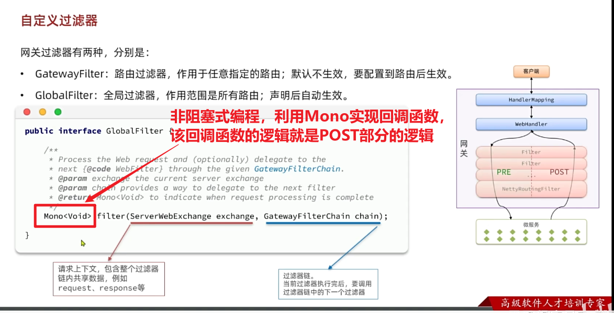

`FilteringWebHandler`在处理请求时，会将`GlobalFilter`装饰为`GatewayFilter`，然后放到同一个过滤器链中，排序以后依次执行。

`Gateway`中内置了很多的`GatewayFilter`，详情可以参考官方文档：

https://docs.spring.io/spring-cloud-gateway/docs/3.1.7/reference/html/#gatewayfilter-factories

`Gateway`内置的`GatewayFilter`过滤器使用起来非常简单，无需编码，只要在yaml文件中简单配置即可。而且其作用范围也很灵活，配置在哪个`Route`下，就作用于哪个`Route`.

例如，有一个过滤器叫做`AddRequestHeaderGatewayFilterFacotry`，顾明思议，就是**添加请求头的过滤器，可以给请求添加一个请求头并传递到下游微服务。**

使用的使用只需要在application.yaml中这样配置：

```YAML
spring:
  cloud:
    gateway:
      routes:
      - id: test_route
        uri: lb://test-service
        predicates:
          -Path=/test/**
        filters:
          - AddRequestHeader=key, value # 逗号之前是请求头的key，逗号之后是value
```

如果想要让过滤器**作用于所有的路由**，则可以这样配置：

```YAML
spring:
  cloud:
    gateway:
      default-filters: # default-filters下的过滤器可以作用于所有路由
        - AddRequestHeader=key, value
      routes:
      - id: test_route
        uri: lb://test-service
        predicates:
          -Path=/test/**
```

### 2.3.自定义过滤器

无论是`GatewayFilter`还是`GlobalFilter`都支持自定义，只不过**编码**方式、**使用**方式略有差别。

#### 2.3.1.自定义GatewayFilter

##### （1）不带参数

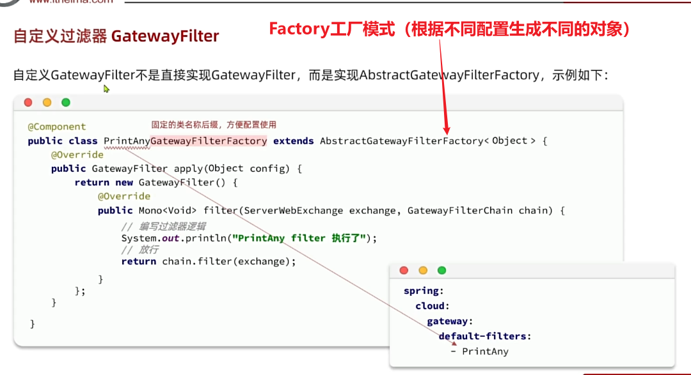

自定义`GatewayFilter`不是直接实现`GatewayFilter`，而是实现`AbstractGatewayFilterFactory`。最简单的方式是这样的：

```Java
@Component
public class PrintAnyGatewayFilterFactory extends AbstractGatewayFilterFactory<Object> {
    @Override
    public GatewayFilter apply(Object config) {
        return new GatewayFilter() {
            @Override
            public Mono<Void> filter(ServerWebExchange exchange, GatewayFilterChain chain) {
                // 获取请求
                ServerHttpRequest request = exchange.getRequest();
                // 编写过滤器逻辑
                System.out.println("过滤器执行了");
                // 放行
                return chain.filter(exchange);
            }
        };
    }
    
 //如果需要考虑不同自定义过滤器的优先级，需要使用GateWayFilter的装饰类OrderedGatewayFilter
        @Override
    public GatewayFilter apply(Config config) {
        // OrderedGatewayFilter是GatewayFilter的子类，包含两个参数：
        // - GatewayFilter：过滤器
        // - int order值：值越小，过滤器执行优先级越高
        return new OrderedGatewayFilter(new GatewayFilter() {
            @Override
            public Mono<Void> filter(ServerWebExchange exchange, GatewayFilterChain chain) {
                // 放行
                return chain.filter(exchange);
            }
        }, 100);
    }

```

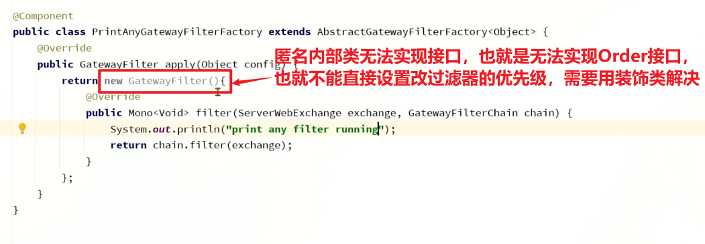

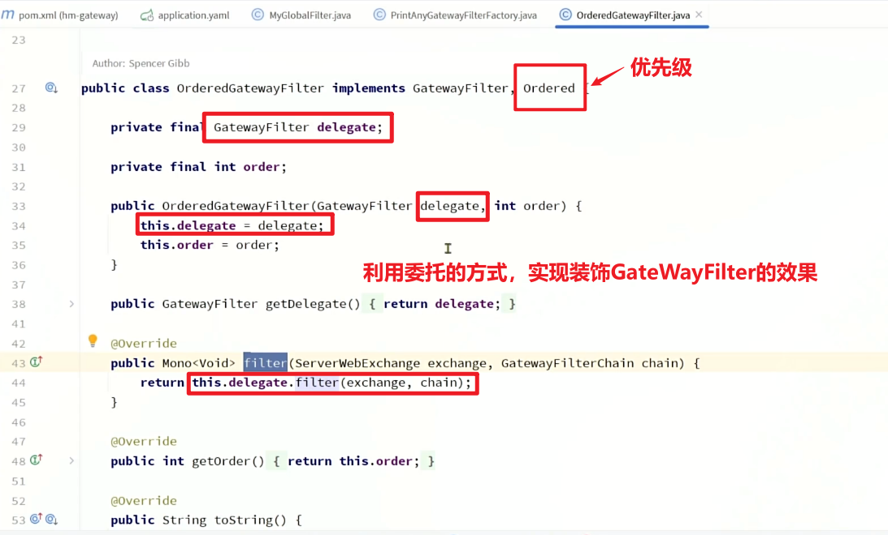

**注意**：**该类的名称**一定要以`GatewayFilterFactory`为**后缀**！

然后在yaml配置中这样使用：

```YAML
spring:
  cloud:
    gateway:
      default-filters:
            - PrintAny # 此处直接以自定义的GatewayFilterFactory类名称前缀类声明过滤器
```


##### （2）带参数

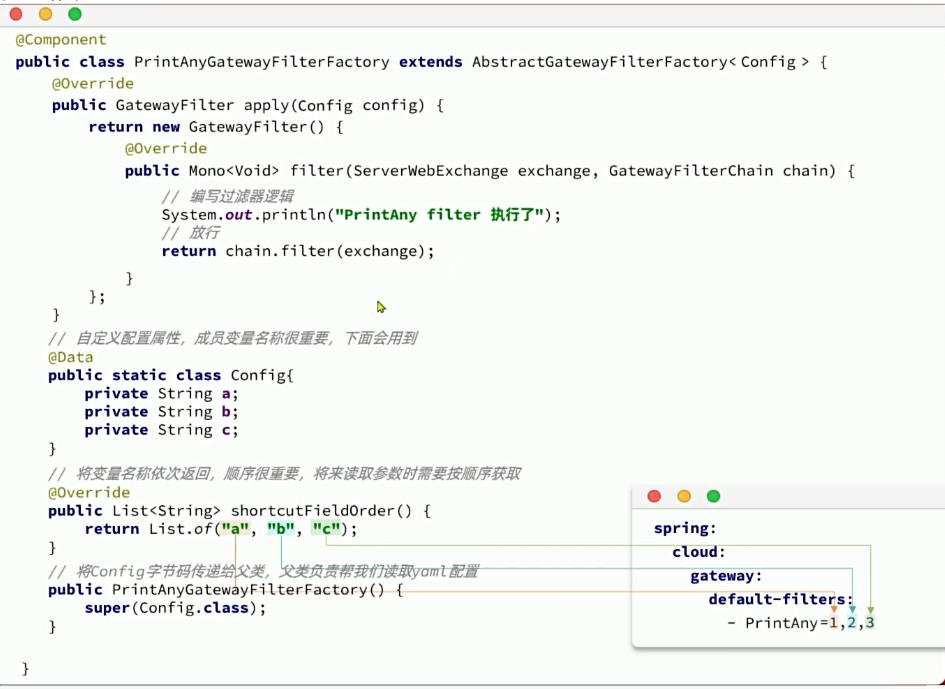

另外，这种过滤器还可以支持动态配置参数，不过实现起来比较复杂，示例：

```Java
@Component
public class PrintAnyGatewayFilterFactory // 父类泛型是内部类的Config类型
                extends AbstractGatewayFilterFactory<PrintAnyGatewayFilterFactory.Config> {

    @Override
    public GatewayFilter apply(Config config) {
        // OrderedGatewayFilter是GatewayFilter的子类，包含两个参数：
        // - GatewayFilter：过滤器
        // - int order值：值越小，过滤器执行优先级越高
        return new OrderedGatewayFilter(new GatewayFilter() {
            @Override
            public Mono<Void> filter(ServerWebExchange exchange, GatewayFilterChain chain) {
                // 获取config值
                String a = config.getA();
                String b = config.getB();
                String c = config.getC();
                // 编写过滤器逻辑
                System.out.println("a = " + a);
                System.out.println("b = " + b);
                System.out.println("c = " + c);
                // 放行
                return chain.filter(exchange);
            }
        }, 100);
    }

    // 自定义配置属性，成员变量名称很重要，下面会用到
    @Data
    static class Config{
        private String a;
        private String b;
        private String c;
    }
    // 将变量名称依次返回，顺序很重要，将来读取参数时需要按顺序获取
    @Override
    public List<String> shortcutFieldOrder() {
        return List.of("a", "b", "c");
    }
        // 返回当前配置类的类型，也就是内部的Config
    @Override
    public Class<Config> getConfigClass() {
        return Config.class;
    }

}
```

然后在yaml文件中使用：

```YAML
spring:
  cloud:
    gateway:
      default-filters:
            - PrintAny=1,2,3 # 注意，这里多个参数以","隔开，将来会按照shortcutFieldOrder()方法返回的参数顺序依次复制
```

上面这种配置方式参数必须严格按照shortcutFieldOrder()方法的返回参数名顺序来赋值。

还有一种用法，无需按照这个顺序，就是手动指定参数名：

```YAML
spring:
  cloud:
    gateway:
      default-filters:
            - name: PrintAny
              args: # 手动指定参数名，无需按照参数顺序
                a: 1
                b: 2
                c: 3
```

#### 2.3.2.自定义GlobalFilter

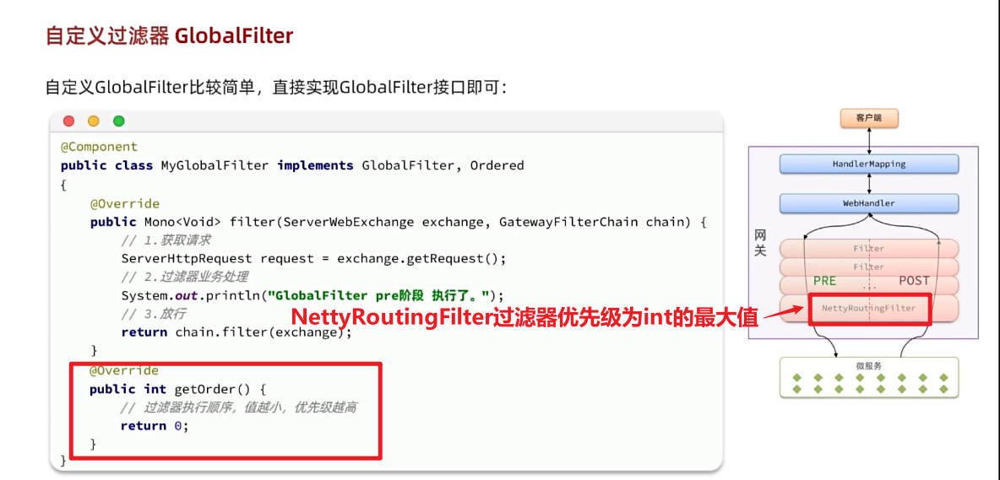

自定义GlobalFilter则简单很多，直接实现GlobalFilter即可，而且**也无法设置动态参数**：

```Java
@Component
public class PrintAnyGlobalFilter implements GlobalFilter, Ordered {
    @Override
    public Mono<Void> filter(ServerWebExchange exchange, GatewayFilterChain chain) {
        // 编写过滤器逻辑
        System.out.println("未登录，无法访问");
        // 放行
        // return chain.filter(exchange);

        // 拦截
        ServerHttpResponse response = exchange.getResponse();
        response.setRawStatusCode(401);
        return response.setComplete();
    }

    @Override
    public int getOrder() {
        // 过滤器执行顺序，值越小，优先级越高
        return 0;
    }
}

/**
 * @author xiaopeng
 * @version 1.0
 */
@Component
public class MyGlobalFilter implements GlobalFilter, Ordered {
    @Override
    public Mono<Void> filter(ServerWebExchange exchange, GatewayFilterChain chain) {
        //1.获取请求
        ServerHttpRequest request = exchange.getRequest();
        //2.过滤器业务处理
        System.out.println("GlobalFilter pre 阶段执行了！");
        //3.放行--继续执行过滤器链
        return chain.filter(exchange);
    }

    @Override
    public int getOrder() {
        // 过滤器执行顺序，值越小，优先级越高
        return 0;
    }
}
```


### 2.4.登录校验

接下来，我们就利用自定义`GlobalFilter`来完成登录校验。

##### 2.4.1.JWT工具

登录校验需要用到JWT，而且JWT的加密需要秘钥和加密工具。这些在`hm-service`中已经有了，我们直接拷贝过来：

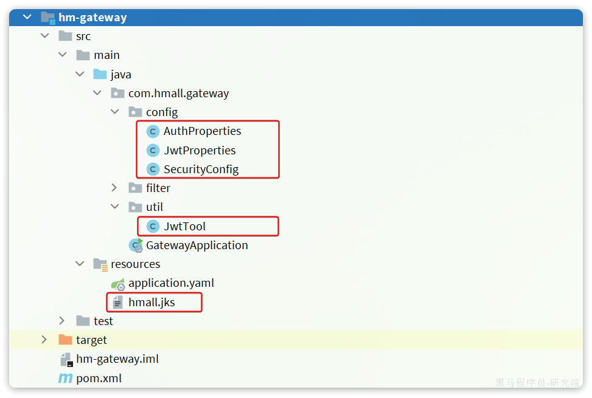

具体作用如下：

- `AuthProperties`：配置登录校验需要拦截的路径，因为不是所有的路径都需要登录才能访问
- `JwtProperties`：定义与JWT工具有关的属性，比如秘钥文件位置
- `SecurityConfig`：工具的自动装配
- `JwtTool`：JWT工具，其中包含了校验和解析`token`的功能
- `hmall.jks`：秘钥文件

其中`AuthProperties`和`JwtProperties`所需的属性要在`application.yaml`中配置：

```YAML
hm:
  #配置jwt密钥文件
  jwt:
    location: classpath:hmall.jks # 秘钥地址
    alias: hmall # 秘钥别名
    password: hmall123 # 秘钥文件密码
    tokenTTL: 30m # 登录有效期
  # 配置登录校验白名单
  auth:
    excludePaths: # 无需登录校验的路径
      - /search/**
      - /users/login
      - /items/**
```

##### 2.4.2.登录校验过滤器

接下来，我们定义一个登录校验的过滤器：


代码如下：

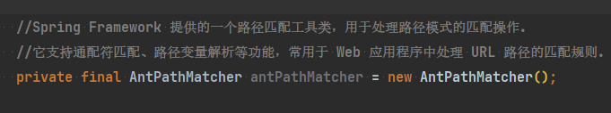

```Java
package com.hmall.gateway.filter;

import com.hmall.common.exception.UnauthorizedException;
import com.hmall.common.utils.CollUtils;
import com.hmall.gateway.config.AuthProperties;
import com.hmall.gateway.util.JwtTool;
import lombok.RequiredArgsConstructor;
import org.springframework.boot.context.properties.EnableConfigurationProperties;
import org.springframework.cloud.gateway.filter.GatewayFilterChain;
import org.springframework.cloud.gateway.filter.GlobalFilter;
import org.springframework.core.Ordered;
import org.springframework.http.server.reactive.ServerHttpRequest;
import org.springframework.http.server.reactive.ServerHttpResponse;
import org.springframework.stereotype.Component;
import org.springframework.util.AntPathMatcher;
import org.springframework.web.server.ServerWebExchange;
import reactor.core.publisher.Mono;

import java.util.List;

@Component
@RequiredArgsConstructor
@EnableConfigurationProperties(AuthProperties.class)
public class AuthGlobalFilter implements GlobalFilter, Ordered {

    private final JwtTool jwtTool;

    private final AuthProperties authProperties;

    private final AntPathMatcher antPathMatcher = new AntPathMatcher();

    @Override
    public Mono<Void> filter(ServerWebExchange exchange, GatewayFilterChain chain) {
        // 1.获取Request
        ServerHttpRequest request = exchange.getRequest();
        // 2.判断是否不需要拦截
        if(isExclude(request.getPath().toString())){
            // 无需拦截，直接放行
            return chain.filter(exchange);
        }
        // 3.获取请求头中的token
        String token = null;
        List<String> headers = request.getHeaders().get("authorization");
        if (!CollUtils.isEmpty(headers)) {
            token = headers.get(0);
        }
        // 4.校验并解析token
        Long userId = null;
        try {
            userId = jwtTool.parseToken(token);
        } catch (UnauthorizedException e) {
            // 如果无效，拦截
            ServerHttpResponse response = exchange.getResponse();
            response.setRawStatusCode(401);
            return response.setComplete();
        }

        // TODO 5.如果有效，传递用户信息
        System.out.println("userId = " + userId);
        // 6.放行
        return chain.filter(exchange);
    }

    private boolean isExclude(String antPath) {
        for (String pathPattern : authProperties.getExcludePaths()) {
            if(antPathMatcher.match(pathPattern, antPath)){
                return true;
            }
        }
        return false;
    }

    @Override
    public int getOrder() {
        return 0;
    }
}
```

重启测试，会发现访问/items开头的路径，未登录状态下不会被拦截：

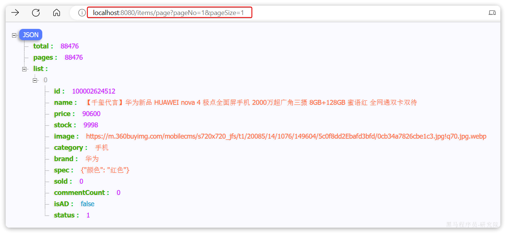

访问其他路径则，未登录状态下请求会被拦截，并且返回`401`状态码：


### 2.5.微服务获取用户

现在，网关已经可以完成登录校验并获取登录用户身份信息。但是**当网关将请求转发到微服务时，微服务又该如何获取用户身份呢？**

由于网关发送请求到微服务依然采用的是**`Http`请求**，因此我们可以将用户信息**以请求头的方式传递到下游微服务**。然后微服务可以从请求头中获取登录用户信息。考虑到**微服务内部可能很多地方都需要用到登录用户信息**，因此我们可以**利用SpringMVC的拦截器来实现登录用户信息获取，并存入ThreadLocal，方便后续使用。**

据图流程图如下：

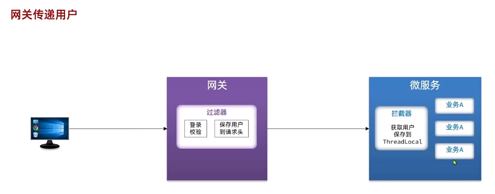

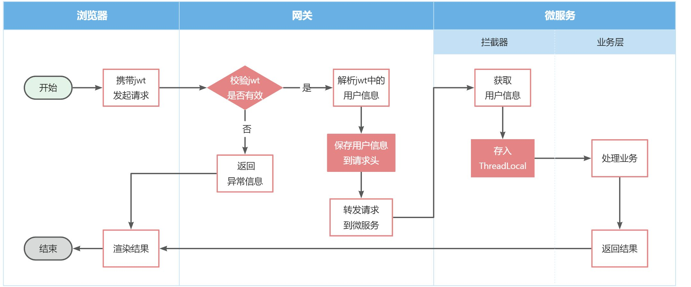

因此，接下来我们要做的事情有：

- 改造网关过滤器，在获取用户信息后保存到请求头，转发到下游微服务
- 编写微服务拦截器，拦截请求获取用户信息，保存到ThreadLocal后放行

#### 2.5.1.保存用户到请求头

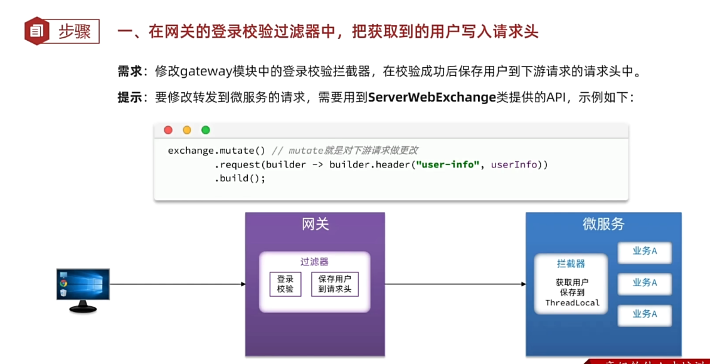

首先，我们修改登录校验拦截器的处理逻辑，保存用户信息到请求头中：

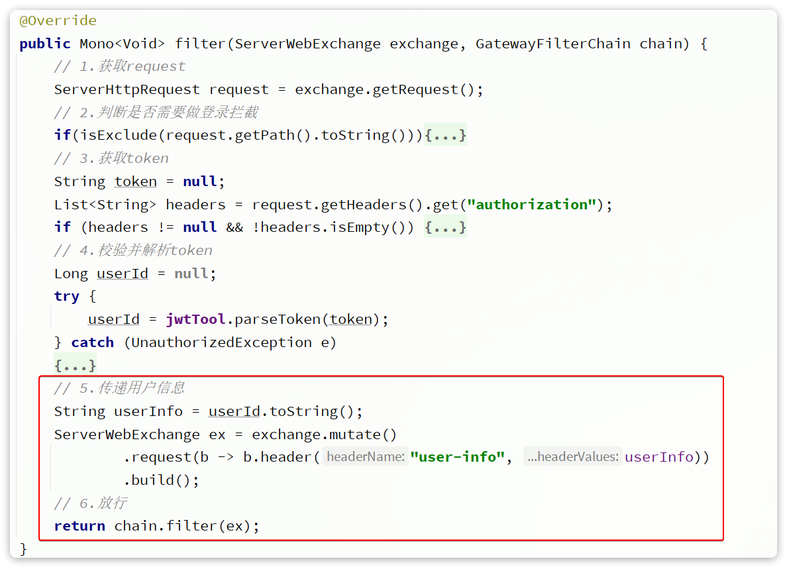

```java
/**
 * Jwt登录校验全局过滤器
 *
 * @author xiaopeng
 * @version 1.0
 */
@Component
@RequiredArgsConstructor
@EnableConfigurationProperties(AuthProperties.class)
public class AuthGlobalFilter implements GlobalFilter, Ordered {

    private final AuthProperties authProperties;

    private final JwtTool jwtTool;

    //Spring Framework 提供的一个路径匹配工具类，用于处理路径模式的匹配操作。
    //它支持通配符匹配、路径变量解析等功能，常用于 Web 应用程序中处理 URL 路径的匹配规则。
    private final AntPathMatcher antPathMatcher = new AntPathMatcher();

    @Override
    public Mono<Void> filter(ServerWebExchange exchange, GatewayFilterChain chain) {
        // 1.获取Request
        ServerHttpRequest request = exchange.getRequest();
        // 2.判断是否不需要拦截
        if (isExclude(request.getPath().toString())) {
            // 无需拦截，直接放行
            return chain.filter(exchange);
        }
        // 3.获取请求头中的token
        String token = null;
        List<String> authorization = request.getHeaders().get("authorization");
        if (!CollUtils.isEmpty(authorization)) {
            token = authorization.get(0);
        }
        // 4.校验并解析token
        Long userId;
        try {
            userId = jwtTool.parseToken(token);
        } catch (UnauthorizedException e) {
            //如果无效，拦截
            ServerHttpResponse response = exchange.getResponse();
            //设置401登录错误码
            response.setStatusCode(HttpStatus.UNAUTHORIZED);
            return response.setComplete();
        }

        // 5.如果有效，将在网关获取到的用户信息，通过请求头的方式传递给其他微服务
        String userInfo = userId.toString();
        ServerWebExchange ex = exchange.mutate()
                .request(builder -> builder.header("user-info", userInfo))
                .build();

        // 6.放行
        return chain.filter(ex);
    }

    /**
     * 使用路径匹配工具AntPathMatcher,判断是否包括白名单路径
     *
     * @param antPath
     * @return
     */
    private boolean isExclude(String antPath) {
        for (String pathPattern : authProperties.getExcludePaths()) {
            if (antPathMatcher.match(pathPattern, antPath)) {
                return true;
            }
        }
        return false;
    }


    @Override
    public int getOrder() {
        return 0;
    }
}

```


#### 2.5.2.拦截器获取用户

在hm-common中已经有一个用于保存登录用户的ThreadLocal工具：

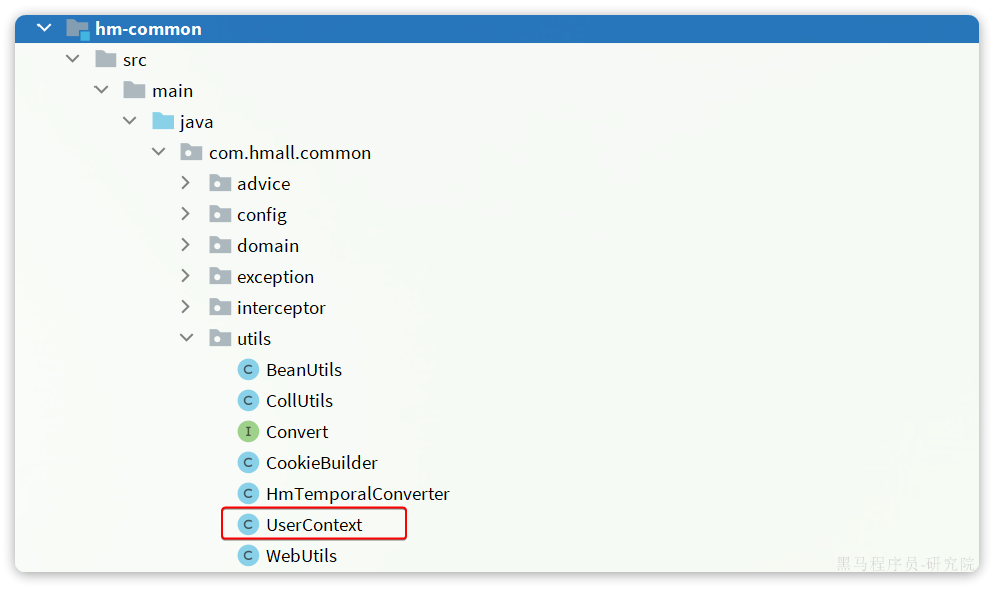

其中已经提供了保存和获取用户的方法：

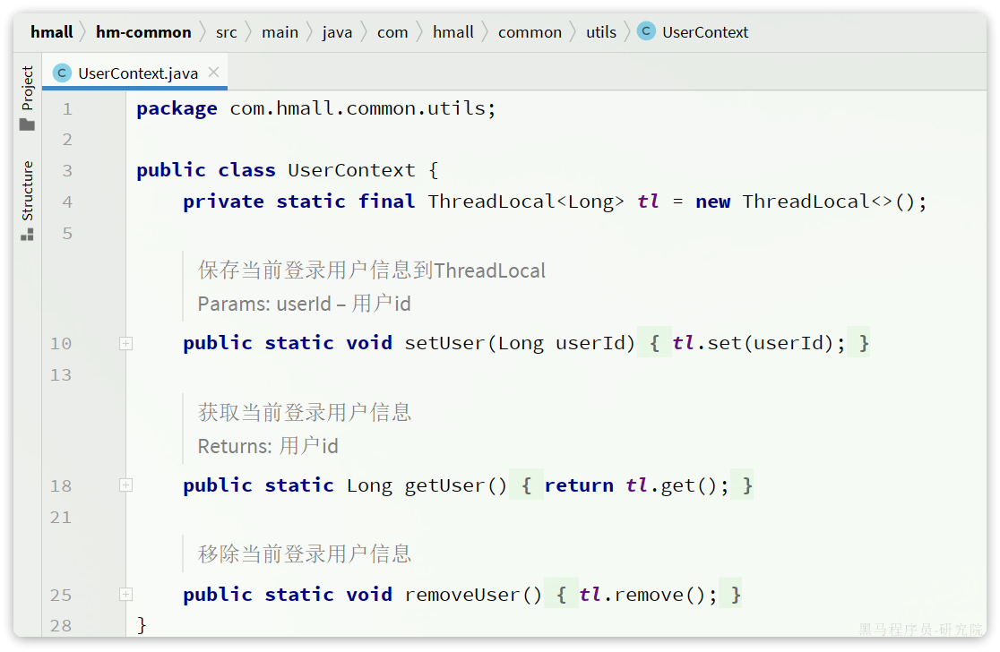

接下来，我们只需要编写拦截器，获取用户信息并保存到`UserContext`，然后放行即可。

由于每个微服务**都有获取登录用户的需求**，因此==**拦截器我们直接写在`hm-common`中**，**并写好自动装配。**==这样微服务只需要引入`hm-common`就**可以直接具备拦截器功能**，无需重复编写。

我们在`hm-common`模块下定义一个拦截器：

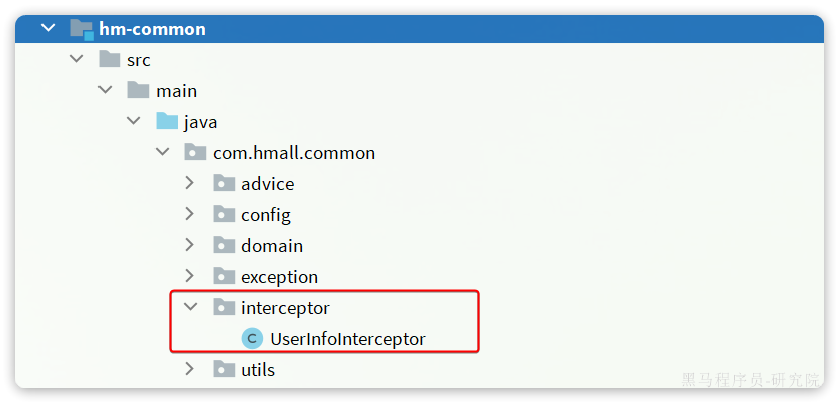

具体代码如下：

```Java
package com.hmall.common.interceptor;

import cn.hutool.core.util.StrUtil;
import com.hmall.common.utils.UserContext;
import org.springframework.web.servlet.HandlerInterceptor;

import javax.servlet.http.HttpServletRequest;
import javax.servlet.http.HttpServletResponse;

public class UserInfoInterceptor implements HandlerInterceptor {
    @Override
    public boolean preHandle(HttpServletRequest request, HttpServletResponse response, Object handler) throws Exception {
        // 1.获取请求头中的用户信息
        String userInfo = request.getHeader("user-info");
        // 2.判断是否为空
        if (StrUtil.isNotBlank(userInfo)) {
            // 不为空，保存到ThreadLocal
                UserContext.setUser(Long.valueOf(userInfo));
        }
        // 3.放行
        return true;
    }

    @Override
    public void afterCompletion(HttpServletRequest request, HttpServletResponse response, Object handler, Exception ex) throws Exception {
        // 移除用户
        UserContext.removeUser();
    }
}
```

接着在`hm-common`模块下编写`SpringMVC`的配置类，配置登录拦截器：


具体代码如下：

由于**网关服务hm-service中没有使用到Spring MVC**，但是该配置类是写在hm-cmomon模块中的，这是由于其他微服务和网关服务都需要依赖common模块中的类，所以网关模块也不得不依赖hm-common模块；但是**配置类中WebMvcConfigurer是属于Spring MVC的**，如果在网关服务中，仍然把该配置类中的Bean对象注入到Spring容器中，则会报错。所以需要使用**@ConditionalOnClass注解**来避免这个问题。

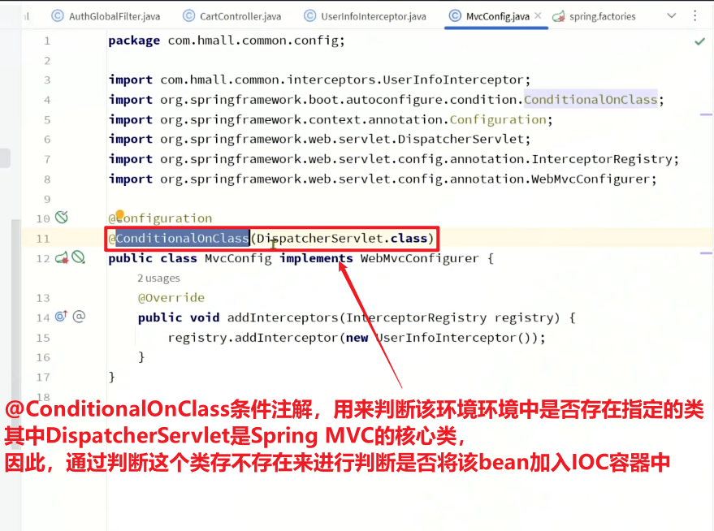

```Java
package com.hmall.common.config;

import com.hmall.common.interceptors.UserInfoInterceptor;
import org.springframework.boot.autoconfigure.condition.ConditionalOnClass;
import org.springframework.context.annotation.Configuration;
import org.springframework.web.servlet.DispatcherServlet;
import org.springframework.web.servlet.config.annotation.InterceptorRegistry;
import org.springframework.web.servlet.config.annotation.WebMvcConfigurer;

@Configuration
@ConditionalOnClass(DispatcherServlet.class)
public class MvcConfig implements WebMvcConfigurer {
    @Override
    public void addInterceptors(InterceptorRegistry registry) {
        registry.addInterceptor(new UserInfoInterceptor());
    }
}
```

不过，需要注意的是，**这个==配置类默认是不会生效的==**，**因为它所在的包是`com.hmall.common.config`，==与其它微服务的扫描包不一致==，无法被扫描到，因此无法生效。**

基于SpringBoot的自动装配原理，我们要将其添加到`resources`目录下的`META-INF/spring.factories`文件中：

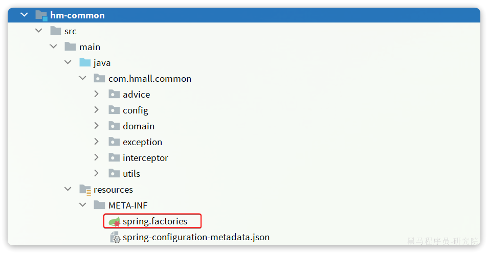

内容如下：

```Properties
org.springframework.boot.autoconfigure.EnableAutoConfiguration=\
  com.hmall.common.config.MyBatisConfig,\
  com.hmall.common.config.MvcConfig,\
  com.hmall.common.config.JsonConfig
```


#### 2.5.3.恢复购物车代码

之前我们无法获取登录用户，所以把购物车服务的登录用户写死了，现在需要恢复到原来的样子。

找到`cart-service`模块的`com.hmall.cart.service.impl.CartServiceImpl`：


修改其中的`queryMyCarts`方法：


### 2.6.OpenFeign==传递用户信息==

前端发起的请求都会经过网关再到微服务，由于我们之前编写的过滤器和拦截器功能，微服务可以轻松获取登录用户信息。

但有些业务是比较复杂的，请求到达微服务后还**需要调用其它多个微服务**。比如下单业务，流程如下：

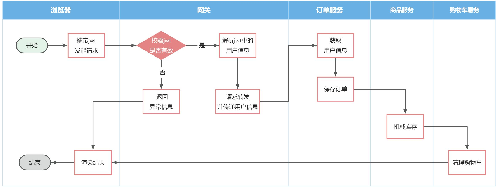

下单的过程中，需要调用商品服务扣减库存，调用购物车服务清理用户购物车。而清理购物车时必须知道当前登录的用户身份。但是，**订单服务调用购物车时并没有传递用户信息**，购物车服务无法知道当前用户是谁！

由于微服务获取用户信息是通过拦截器在请求头中读取，因此要想实现微服务之间的用户信息传递，就**必须在微服务发起调用时把用户信息存入请求头**。

微服务之间调用是基于OpenFeign来实现的，并不是我们自己发送的请求。我们如何才能让每一个由OpenFeign发起的请求自动携带登录用户信息呢？

这里要借助Feign中提供的一个**拦截器接口：`feign.RequestInterceptor`**

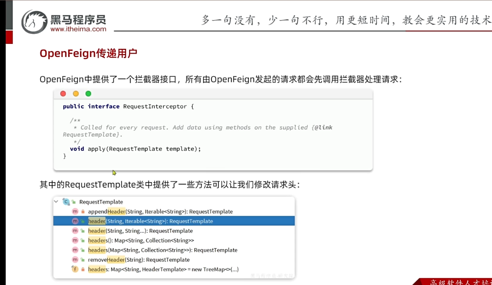

```Java
public interface RequestInterceptor {

  /**
   * Called for every request. 
   * Add data using methods on the supplied {@link RequestTemplate}.
   */
  void apply(RequestTemplate template);
}
```

我们只需要实现这个接口，然后实现apply方法，利用`RequestTemplate`类来添加请求头，将用户信息保存到请求头中。这样以来，每次OpenFeign发起请求的时候都会调用该方法，传递用户信息。

由于`FeignClient`全部都是在`hm-api`模块，因此我们**在`hm-api`模块**的`com.hmall.api.config.DefaultFeignConfig`中编写这个拦截器：

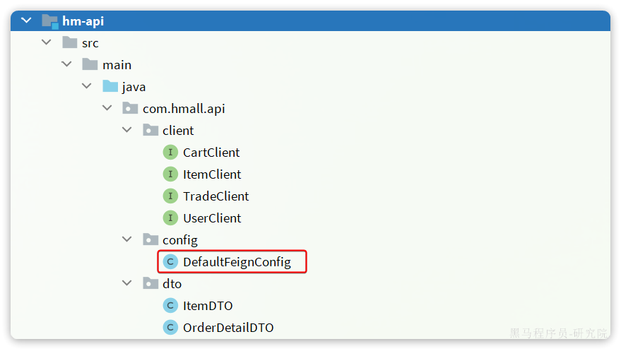

在`com.hmall.api.config.DefaultFeignConfig`中添加一个Bean：

```Java
/**
     * 用于微服务与微服务之间的相互调用，传递用户id
     * feign拦截器，将用户信息放入请求头中传递给下游微服务
     * @return
     */
    @Bean
    public RequestInterceptor userInfoRequestInterceptor(){
        return new RequestInterceptor() {
            @Override
            public void apply(RequestTemplate template) {
                // 获取登录用户
                Long userId = UserContext.getUser();
                if(userId == null) {
                    // 如果为空则直接跳过
                    return;
                }
                // 如果不为空则放入请求头中，传递给下游微服务
                template.header("user-info", userId.toString());
            }
        };
    }
```

好了，现在微服务之间通过OpenFeign调用时也会传递登录用户信息了。

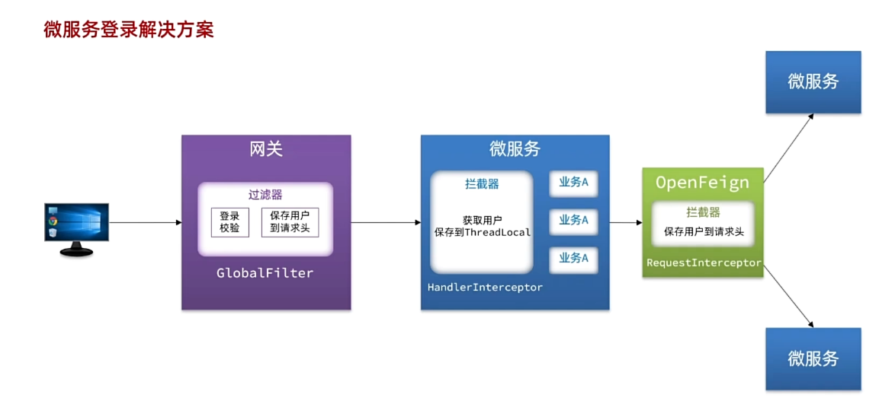


## 3.配置管理

到目前为止我们已经解决了微服务相关的几个问题：

- 微服务远程调用
- 微服务注册、发现
- 微服务请求路由、负载均衡
- 微服务登录用户信息传递

不过，现在依然还有几个问题需要解决：

- **网关路由**在配置文件中写死了，如果变更必须重启微服务
- 某些**业务配置**在配置文件中写死了，每次修改都要重启服务
- 每个微服务都有很多重复的配置，维护成本高

这些问题都可以通过统一的**配置管理器服务**解决。而Nacos不仅仅具备注册中心功能，也具备配置管理的功能：

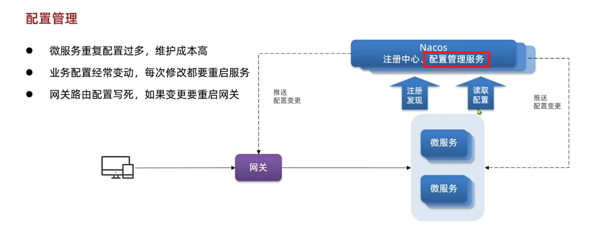

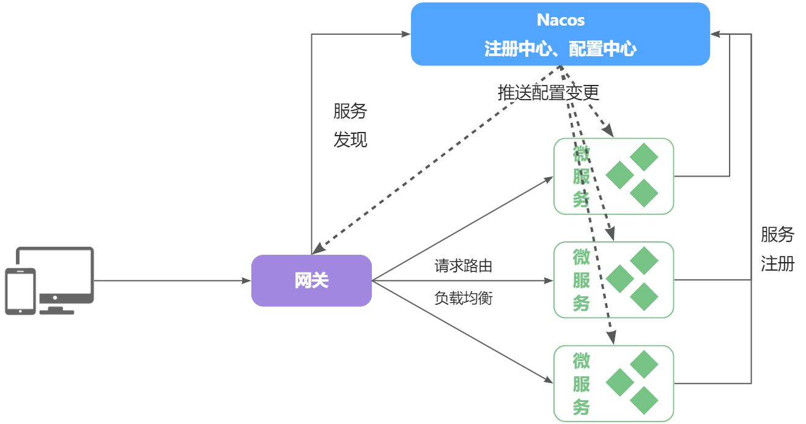

微服务共享的配置可以**统一交给Nacos保存和管理**，在Nacos控制台修改配置后，Nacos会将配置变更推送给相关的微服务，并且无需重启即可生效，实现**配置热更新**。

网关的路由同样是配置，因此同样可以基于这个功能实现**动态路由**功能，无需重启网关即可修改路由配置。

### 3.1.配置共享

我们可以把微服务共享的配置抽取到Nacos中统一管理，这样就不需要每个微服务都重复配置了。分为两步：

- 在Nacos中添加共享配置
- 微服务拉取配置

#### 3.1.1.添加共享配置

以cart-service为例，我们看看有哪些配置是重复的，可以抽取的：

首先是jdbc相关配置：


然后是日志配置：

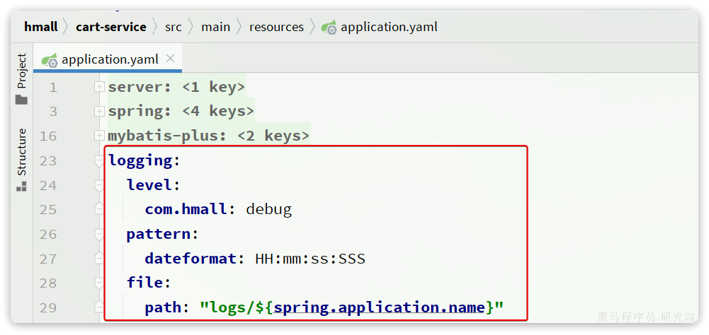

然后是swagger以及OpenFeign的配置：


我们在nacos控制台分别添加这些配置。

首先是jdbc相关配置，在`配置管理`->`配置列表`中点击`+`新建一个配置：


在弹出的表单中填写信息：

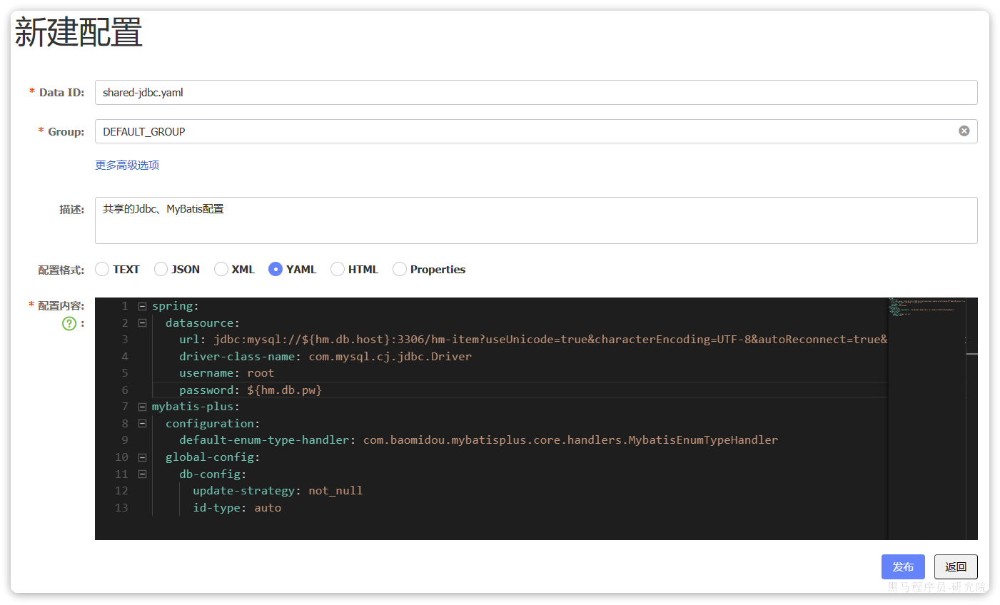

其中详细的配置如下：

```YAML
spring:
  datasource:
    url: jdbc:mysql://${hm.db.host:192.168.150.101}:${hm.db.port:3306}/${hm.db.database}?useUnicode=true&characterEncoding=UTF-8&autoReconnect=true&serverTimezone=Asia/Shanghai
    driver-class-name: com.mysql.cj.jdbc.Driver
    username: ${hm.db.un:root}
    password: ${hm.db.pw:123}
mybatis-plus:
  configuration:
    default-enum-type-handler: com.baomidou.mybatisplus.core.handlers.MybatisEnumTypeHandler
  global-config:
    db-config:
      update-strategy: not_null
      id-type: auto
```

注意这里的jdbc的相关参数并没有写死，例如：

- `数据库ip`：通过`${hm.db.host:192.168.150.101}`**配置了默认值**为`192.168.150.101`，同时允许通过`${hm.db.host}`来**覆盖默认值**
- `数据库端口`：通过`${hm.db.port:3306}`配置了默认值为`3306`，同时允许通过`${hm.db.port}`来覆盖默认值
- `数据库database`：可以通过`${hm.db.database}`来设定，无默认值

然后是统一的日志配置，命名为`shared-log.``yaml`，配置内容如下：

```YAML
logging:
  level:
    com.hmall: debug
  pattern:
    dateformat: HH:mm:ss:SSS
  file:
    path: "logs/${spring.application.name}"
```

然后是统一的swagger配置，命名为`shared-swagger.yaml`，配置内容如下：

```YAML
knife4j:
  enable: true
  openapi:
    title: ${hm.swagger.title:黑马商城接口文档}
    description: ${hm.swagger.description:黑马商城接口文档}
    email: ${hm.swagger.email:zhanghuyi@itcast.cn}
    concat: ${hm.swagger.concat:虎哥}
    url: https://www.itcast.cn
    version: v1.0.0
    group:
      default:
        group-name: default
        api-rule: package
        api-rule-resources:
          - ${hm.swagger.package}
```

注意，这里的swagger相关配置我们没有写死，例如：

- `title`：接口文档标题，我们用了`${hm.swagger.title}`来代替，将来可以有用户手动指定
- `email`：联系人邮箱，我们用了`${hm.swagger.email:``zhanghuyi@itcast.cn``}`，默认值是`zhanghuyi@itcast.cn`，同时允许用户利用`${hm.swagger.email}`来覆盖。

#### 3.1.2.拉取共享配置

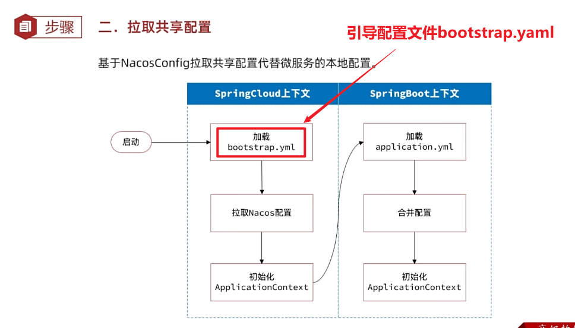

接下来，我们要在微服务**拉取共享配置**。将**拉取到的共享配置**与**本地**的`application.yaml`**配置合并**，**完成项目==上下文的初始化==。**

不过，需要注意的是，**读取Nacos配置**是SpringCloud上下文（`ApplicationContext`）初始化时处理的，发生在项目的**引导阶段**。然后才会初始化SpringBoot上下文，去读取`application.yaml`。

也就是说**引导阶段，`application.yaml`文件尚未读取，根本不知道==nacos 地址==，该如何去加载nacos中的配置文件呢**？

SpringCloud在初始化上下文的时候会先读取一个名为`bootstrap.yaml`(或者`bootstrap.properties`)的文件，如果我们**将nacos地址配置到`bootstrap.yaml`中**，那么在项目**引导阶段**就可以读取nacos中的配置了。


因此，微服务整合Nacos配置管理的步骤如下：

1）引入依赖：

在cart-service模块引入依赖：

```XML
  <!--nacos配置管理-->
  <dependency>
      <groupId>com.alibaba.cloud</groupId>
      <artifactId>spring-cloud-starter-alibaba-nacos-config</artifactId>
  </dependency>
  <!--读取bootstrap文件-->
  <dependency>
      <groupId>org.springframework.cloud</groupId>
      <artifactId>spring-cloud-starter-bootstrap</artifactId>
  </dependency>
```

2）新建bootstrap.yaml

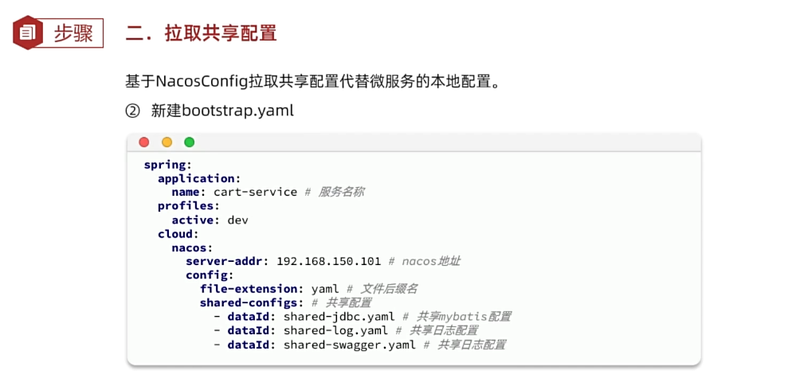

在cart-service中的resources目录新建一个bootstrap.yaml文件：

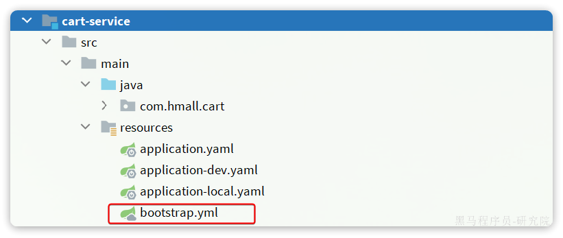

内容如下：

```YAML
#bootstrap.yaml引导配置文件：
#声明nacos地址和共享配置列表
spring:
  application:
    name: cart-service # 服务名称
  profiles:
    active: dev
  cloud:
    nacos:
      server-addr: 192.168.88.133 # nacos地址
      config:
        file-extension: yaml # 文件后缀名
        shared-configs: # 共享配置
          - dataId: shared-jdbc.yaml # 共享mybatis配置
          - dataId: shared-log.yaml # 共享日志配置
          - dataId: shared-swagger.yaml # 共享日志配置
```

3）修改application.yaml

由于一些配置挪到了bootstrap.yaml，因此application.yaml需要修改为：

```YAML
server:
  port: 8082

#开启feign 连接池OkHttp
feign:
  okhttp:
    enabled: true #开启OKHttp功能

hm:
  swagger:
    title: "黑马商城购物车管理接口文档"
    package: com.hmall.cart.controller
  db:
    database: hm-cart
```

重启服务，发现所有配置都生效了。

### 3.2.配置热更新

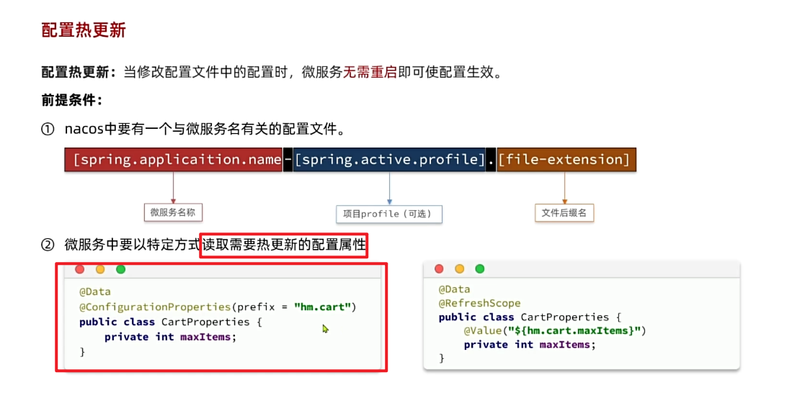

有很多的业务相关参数，将来可能会根据实际情况**临时调整**。例如购物车业务，购物车数量有一个上限，默认是10，对应代码如下：

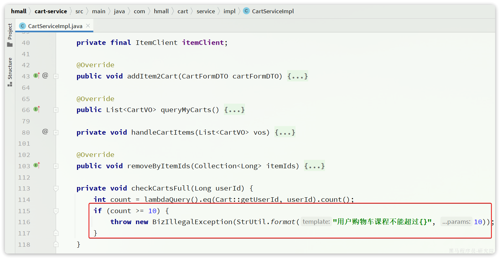

现在这里购物车是写死的固定值，我们应该将其配置在配置文件中，方便后期修改。

但现在的问题是，即便写在配置文件中，**==修改了配置还是需要重新打包、重启服务才能生效==**。能不能不用重启，直接生效呢？

这就要用到Nacos的配置热更新能力了，分为两步：

- 在Nacos中添加配置
- 在微服务读取配置

#### 3.2.1.添加配置到Nacos

首先，我们在nacos中添加一个配置文件，将购物车的上限数量添加到配置中：


注意文件的dataId格式：

```Plain
[服务名]-[spring.active.profile].[后缀名]
```

文件名称由三部分组成：

- **`服务名`**：我们是购物车服务，所以是`cart-service`
- **`spring.active.profile`**：就是spring boot中的`spring.active.profile`；可以省略，则所有profile共享该配置
- **`后缀名`**：例如yaml

这里我们直接使用`cart-service.yaml`这个名称，则不管是**dev还是local环境都可以共享该配置**。

配置内容如下：

```YAML
hm:
  cart:
    maxAmounts: 1 # 购物车商品数量上限
```

提交配置，在控制台能看到新添加的配置：

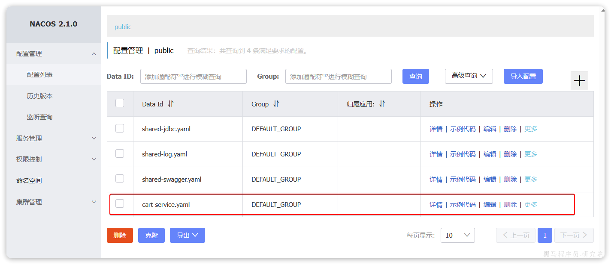

#### 3.2.2.配置热更新

接着，我们在微服务中读取配置，实现配置热更新。

在`cart-service`中新建一个属性读取类：

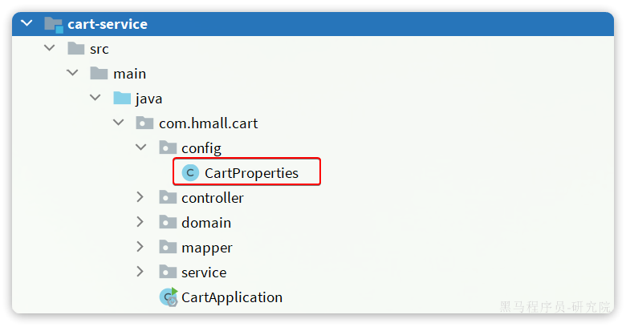

代码如下：

```Java
package com.hmall.cart.config;

import lombok.Data;
import org.springframework.boot.context.properties.ConfigurationProperties;
import org.springframework.stereotype.Component;

@Data
@Component
@ConfigurationProperties(prefix = "hm.cart")
public class CartProperties {
    private Integer maxAmounts;
}
```

接着，在业务中使用该属性加载类：

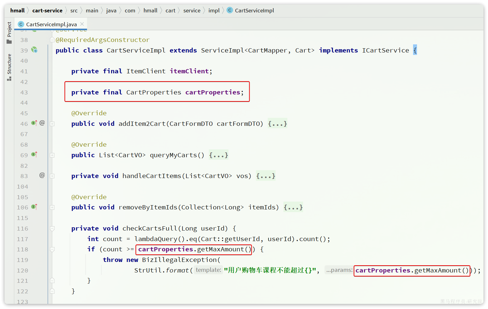

测试，向购物车中添加多个商品：


我们在nacos控制台，将购物车上限配置为5：


无需重启，再次测试购物车功能：


加入成功！

无需重启服务，配置热更新就生效了！

### 3.3.动态路由

网关的路由配置全部是在项目启动时由`org.springframework.cloud.gateway.route.CompositeRouteDefinitionLocator`在项目启动的时候加载，并且**一经加载就会缓存到内存中的路由表内（一个Map），不会改变**。也**不会监听路由变更**，所以，我们无法利用上节课学习的配置热更新来实现路由更新。

因此，我们必须**监听Nacos的配置变更，然后手动把最新的路由==更新到路由表==中。**这里有两个难点：

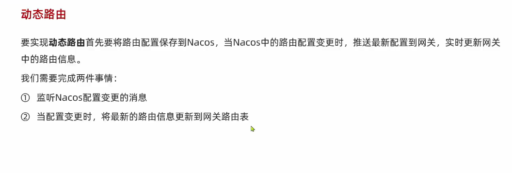

- 如何监听Nacos配置变更？
- 如何把路由信息更新到路由表？

#### 3.3.1.监听Nacos配置变更

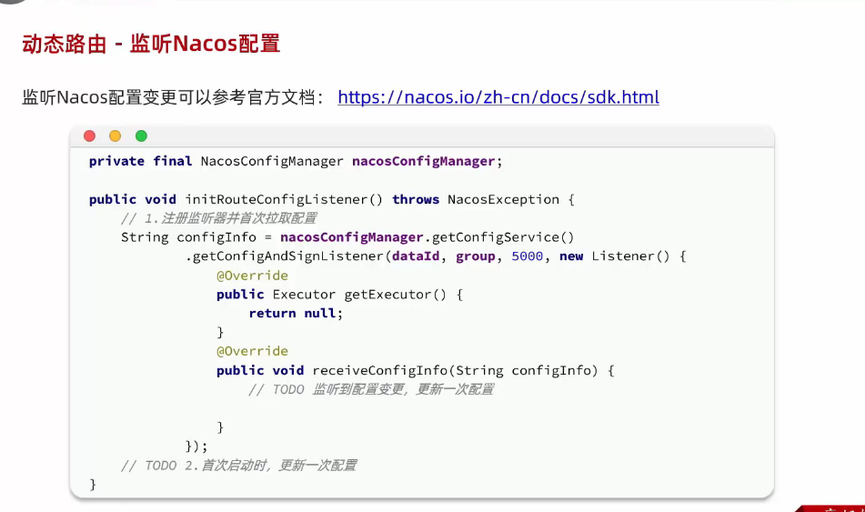

在Nacos官网中给出了手动监听Nacos配置变更的SDK：

https://nacos.io/zh-cn/docs/sdk.html

如果希望 Nacos 推送配置变更，可以使用 Nacos 动态监听配置接口来实现。

```Java
public void addListener(String dataId, String group, Listener listener)
```

请求参数说明：

| **参数名** | **参数类型** | **描述**                                                     |
| :--------- | :----------- | :----------------------------------------------------------- |
| dataId     | string       | 配置 ID，保证全局唯一性，只允许英文字符和 4 种特殊字符（"."、":"、"-"、"_"）。不超过 256 字节。 |
| group      | string       | 配置分组，一般是默认的DEFAULT_GROUP。                        |
| listener   | Listener     | 监听器，配置变更进入监听器的**回调函数**。                   |

示例代码：

```Java
String serverAddr = "{serverAddr}";
String dataId = "{dataId}";
String group = "{group}";
// 1.创建ConfigService，连接Nacos
Properties properties = new Properties();
properties.put("serverAddr", serverAddr);
ConfigService configService = NacosFactory.createConfigService(properties);
// 2.读取配置
String content = configService.getConfig(dataId, group, 5000);
// 3.添加配置监听器
configService.addListener(dataId, group, new Listener() {
        @Override
        public void receiveConfigInfo(String configInfo) {
        // 配置变更的通知处理
                System.out.println("recieve1:" + configInfo);
        }
        @Override
        public Executor getExecutor() {
                return null;
        }
});
```

这里核心的步骤有2步：

- 创建ConfigService，目的是连接到Nacos
- 添加配置监听器，编写配置变更的通知处理逻辑

由于我们采用了`spring-cloud-starter-alibaba-nacos-config`**自动装配**，因此`ConfigService`已经在`com.alibaba.cloud.nacos.NacosConfigAutoConfiguration`中自动创建好了：


**NacosConfigManager**中是负责管理Nacos的ConfigService的，具体代码如下：

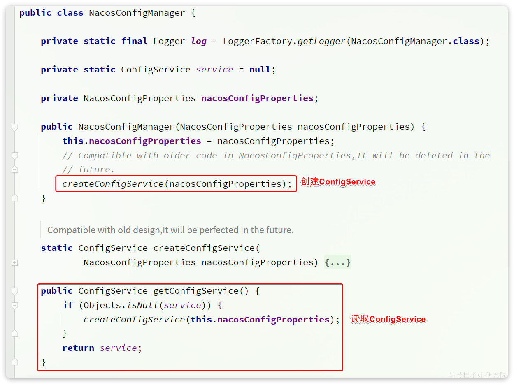

因此，只要我们拿到`NacosConfigManager`就等于拿到了`ConfigService`，第一步就实现了。

第二步，编写监听器。虽然官方提供的SDK是ConfigService中的addListener，不过**项目第一次启动时不仅仅需要添加监听器，也需要读取配置**，因此建议使用的API是这个：

```Java
String getConfigAndSignListener(
    String dataId, // 配置文件id
    String group, // 配置组，走默认
    long timeoutMs, // 读取配置的超时时间
    Listener listener // 监听器
) throws NacosException;
```

既可以配置监听器，并且会根据dataId和group读取配置并返回。我们就可以**在项目启动时先更新一次路由，后续随着配置变更通知到监听器，完成路由更新**。

#### 3.3.2.更新路由

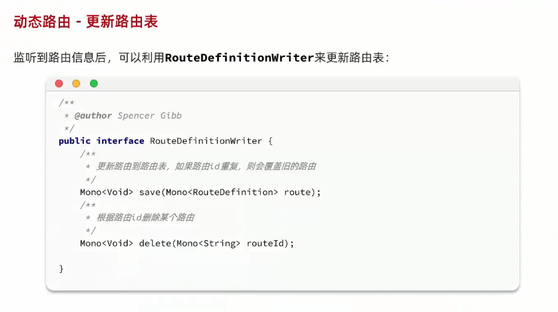

更新路由要用到`org.springframework.cloud.gateway.route.RouteDefinitionWriter`这个接口：

```Java
package org.springframework.cloud.gateway.route;

import reactor.core.publisher.Mono;

/**
 * @author Spencer Gibb
 */
public interface RouteDefinitionWriter {
        /**
     * 更新路由到路由表，如果路由id重复，则会覆盖旧的路由
     */
        Mono<Void> save(Mono<RouteDefinition> route);
        /**
     * 根据路由id删除某个路由
     */
        Mono<Void> delete(Mono<String> routeId);

}
```

这里更新的路由，也就是RouteDefinition，之前我们见过，包含下列常见字段：

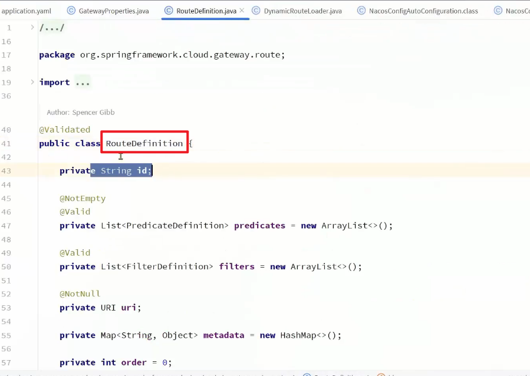

- id：路由id
- predicates：路由匹配规则
- filters：路由过滤器
- uri：路由目的地

将来我们保存到Nacos的配置也要符合这个对象结构，将来我们以**JSON来保存**，格式如下：

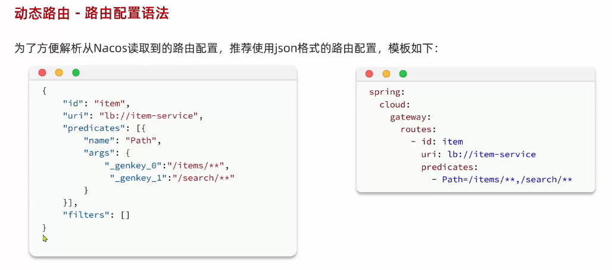

```JSON
{
  "id": "item",
  "predicates": [{
    "name": "Path",
    "args": {"_genkey_0":"/items/**", "_genkey_1":"/search/**"}
  }],
  "filters": [],
  "uri": "lb://item-service"
}
```

以上JSON配置就等同于：

```YAML
spring:
  cloud:
    gateway:
      routes:
        - id: item
          uri: lb://item-service
          predicates:
            - Path=/items/**,/search/**
```

OK，我们所需要用到的SDK已经齐全了。

#### 3.3.3.实现动态路由

首先， 我们在网关gateway引入依赖：

```XML
<!--统一配置管理-->
<dependency>
    <groupId>com.alibaba.cloud</groupId>
    <artifactId>spring-cloud-starter-alibaba-nacos-config</artifactId>
</dependency>
<!--加载bootstrap-->
<dependency>
    <groupId>org.springframework.cloud</groupId>
    <artifactId>spring-cloud-starter-bootstrap</artifactId>
</dependency>
```

然后在网关`gateway`的`resources`目录创建`bootstrap.yaml`文件，内容如下：

```YAML
spring:
  application:
    name: gateway
  cloud:
    nacos:
      server-addr: 192.168.150.101
      config:
        file-extension: yaml
        shared-configs:
          - dataId: shared-log.yaml # 共享日志配置
```

接着，修改`gateway`的`resources`目录下的`application.yml`，把之前的路由移除，最终内容如下：

```YAML
server:
  port: 8080 # 端口
hm:
  jwt:
    location: classpath:hmall.jks # 秘钥地址
    alias: hmall # 秘钥别名
    password: hmall123 # 秘钥文件密码
    tokenTTL: 30m # 登录有效期
  auth:
    excludePaths: # 无需登录校验的路径
      - /search/**
      - /users/login
      - /items/**
```

然后，在`gateway`中定义配置监听器：


其代码如下：

```Java
package com.hmall.gateway.route;

import cn.hutool.json.JSONUtil;
import com.alibaba.cloud.nacos.NacosConfigManager;
import com.alibaba.nacos.api.config.listener.Listener;
import com.alibaba.nacos.api.exception.NacosException;
import com.hmall.common.utils.CollUtils;
import lombok.RequiredArgsConstructor;
import lombok.extern.slf4j.Slf4j;
import org.springframework.cloud.gateway.route.RouteDefinition;
import org.springframework.cloud.gateway.route.RouteDefinitionWriter;
import org.springframework.stereotype.Component;
import reactor.core.publisher.Mono;

import javax.annotation.PostConstruct;
import java.util.HashSet;
import java.util.List;
import java.util.Set;
import java.util.concurrent.Executor;

@Slf4j
@Component
@RequiredArgsConstructor
public class DynamicRouteLoader {

    private final RouteDefinitionWriter writer;
    private final NacosConfigManager nacosConfigManager;

    // 路由配置文件的id和分组
    private final String dataId = "gateway-routes.json";
    private final String group = "DEFAULT_GROUP";
    // 保存更新过的路由id
    private final Set<String> routeIds = new HashSet<>();

    @PostConstruct //表示DynamicRouteLoader这个Bean初始化后再执行这个方法
    public void initRouteConfigListener() throws NacosException {
        // 1.注册监听器并首次拉取配置
        String configInfo = nacosConfigManager.getConfigService()
                .getConfigAndSignListener(dataId, group, 5000, new Listener() {
                    @Override
                    public Executor getExecutor() {
                        return null;
                    }

                    @Override
                    public void receiveConfigInfo(String configInfo) {
                        updateConfigInfo(configInfo);
                    }
                });
        // 2.首次启动时，更新一次配置
        updateConfigInfo(configInfo);
    }

    private void updateConfigInfo(String configInfo) {
        log.debug("监听到路由配置变更，{}", configInfo);
        // 1.反序列化
        List<RouteDefinition> routeDefinitions = JSONUtil.toList(configInfo, RouteDefinition.class);
        // 2.更新前先清空旧路由
        // 2.1.清除旧路由
        for (String routeId : routeIds) {
            writer.delete(Mono.just(routeId)).subscribe();
        }
        routeIds.clear();
        // 2.2.判断是否有新的路由要更新
        if (CollUtils.isEmpty(routeDefinitions)) {
            // 无新路由配置，直接结束
            return;
        }
        // 3.更新路由
        routeDefinitions.forEach(routeDefinition -> {
            // 3.1.更新路由
            writer.save(Mono.just(routeDefinition)).subscribe();
            // 3.2.记录路由id，方便将来删除
            routeIds.add(routeDefinition.getId());
        });
    }
}
```

重启网关，任意访问一个接口，比如 `http://localhost:8080/search/list?pageNo=1&pageSize=1`：

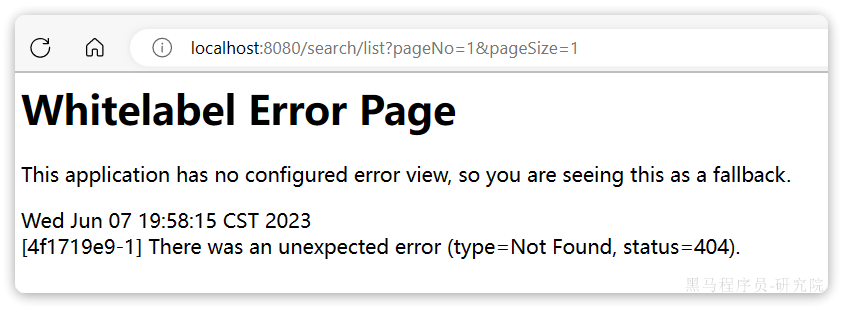

发现是404，无法访问。

接下来，我们直接在Nacos控制台添加路由，路由文件名为`gateway-routes.json`，类型为`json`：


配置内容如下：

```JSON
[
    {
        "id": "item",
        "predicates": [{
            "name": "Path",
            "args": {"_genkey_0":"/items/**", "_genkey_1":"/search/**"}
        }],
        "filters": [],
        "uri": "lb://item-service"
    },
    {
        "id": "cart",
        "predicates": [{
            "name": "Path",
            "args": {"_genkey_0":"/carts/**"}
        }],
        "filters": [],
        "uri": "lb://cart-service"
    },
    {
        "id": "user",
        "predicates": [{
            "name": "Path",
            "args": {"_genkey_0":"/users/**", "_genkey_1":"/addresses/**"}
        }],
        "filters": [],
        "uri": "lb://user-service"
    },
    {
        "id": "trade",
        "predicates": [{
            "name": "Path",
            "args": {"_genkey_0":"/orders/**"}
        }],
        "filters": [],
        "uri": "lb://trade-service"
    },
    {
        "id": "pay",
        "predicates": [{
            "name": "Path",
            "args": {"_genkey_0":"/pay-orders/**"}
        }],
        "filters": [],
        "uri": "lb://pay-service"
    }
]
```

无需重启网关，稍等几秒钟后，再次访问刚才的地址：


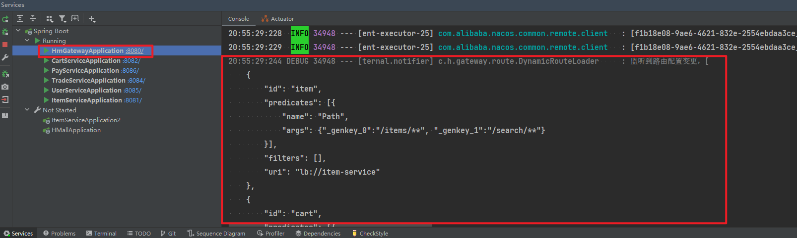

网关路由成功了！


#### 3.3.4 **`Mono` ==响应式编程==代码分析**

这段代码是基于响应式编程（Reactive Programming）模型的，通常使用像 **Project Reactor** 这样的响应式库。让我们逐一分析：

##### （1） **`Mono` 的作用**

- **`Mono`** 是 Reactor 中的核心数据类型之一，表示一种 **包含零或一个元素的异步数据流**。
- 在这个代码中，`Mono.just(routeId)` 表示创建了一个包含单个值（即 `routeId`）的 `Mono`，它将**在未来的某个时刻被发布。**

------

##### （2）`just` 的作用

- **`Mono.just(T data)`** 是一个静态方法，用于创建一个 `Mono` 实例，其中包含一个已经存在的值 `data`。
- 这个值会立即被包装成一个 `Mono`，并**在订阅时被发射**。

**示例**：

```java
Mono<String> mono = Mono.just("Hello");
mono.subscribe(System.out::println); // 输出: Hello
```

在你的代码中：

```java

Mono.just(routeId)
```

- 作用是将 `routeId` 包装成一个 `Mono`，以便在异步操作中使用。

------

##### （3） **`subscribe` 的作用**

- **`subscribe`** 方法是触发数据流的关键，它让 `Mono` 或 `Flux` 开始工作。

- **订阅（subscribe）后，数据流会开始传递值（发射数据）、处理数据，并最终完成或抛出错误**。

- 常见的 subscribe

   形式：

  1. 简单订阅：`mono.subscribe()`，只是触发流。
  2. 带回调的订阅：

  ```java
  mono.subscribe(
      value -> System.out.println("Received: " + value),   // 成功时的回调
      error -> System.err.println("Error: " + error),      // 错误时的回调
      () -> System.out.println("Completed!")              // 完成时的回调
  );
  ```

  

在你的代码中：

```java
routeDefinitionWriter.delete(Mono.just(routeId)).subscribe();
```

- 调用 `routeDefinitionWriter.delete(Mono.just(routeId))` 返回一个 `Mono`，表示一个异步删除操作。
- `subscribe()` 表示触发这个删除操作。

------

##### 代码分析的整体流程

1. **`Mono.just(routeId)`**：创建一个包含 `routeId` 的 `Mono`。
2. **`routeDefinitionWriter.delete(...)`**：调用删除方法，这通常是一个非阻塞的操作，返回一个 `Mono` 表示删除结果。
3. **`subscribe()`**：触发删除操作，让 `Mono` 开始执行。

------

##### 总结

- **`Mono`** 是一个数据流，表示异步的单值结果。
- **`just`** 用于将已有的值包装成一个 `Mono`。
- **`subscribe`** 用于触发 `Mono` 的执行，启动数据流。

这种写法常见于**非阻塞的应用程序**中，比如基于 Spring WebFlux 的响应式 API 开发。


## 4.作业

将项目一拆分为一个微服务项目，并完成下列需求：

- 基于OpenFeign实现服务间远程调用
- 定义网关，实现对微服务的请求路由
- 基于网关实现登录用户校验和用户信息传递

以苍穹外卖为例，项目可以拆分为：

- 业务服务：
  - 用户服务：用户、地址、登录等相关业务
  - 产品服务：店铺、分类、菜品、套餐等业务
  - 交易服务：订单、购物车业务
  - 数据服务：工作台、报表统计等业务
- 基础服务：
  - 支付服务：支付相关业务
  - 文件服务：文件上传功能


# 三、阻塞/非阻塞式和==响应式编程==

在 Java 编程中，**阻塞式编程**、**非阻塞式编程**和**响应式编程**是三种不同的编程模式，主要与任务执行、资源等待以及线程的使用方式有关。

------

## **1. 阻塞式编程**

### **概念**

阻塞式编程是指一个线程执行某个任务时，如果需要等待资源（如 I/O 操作完成、锁被释放），**线程会被挂起直到任务完成。期间，线程无法执行其他操作。**

### **特点**

- 简单、直观，代码流程与思维逻辑一致。
- 每个任务占用一个线程，效率较低，特别是在高并发场景下。
- 如果线程被阻塞，系统资源将被浪费。

### **示例**

以阻塞式读取文件为例：

```java
import java.io.*;

public class BlockingExample {
    public static void main(String[] args) throws IOException {
        BufferedReader reader = new BufferedReader(new FileReader("example.txt"));
        String line;
        while ((line = reader.readLine()) != null) { // 阻塞直到下一行读取完成
            System.out.println(line);
        }
        reader.close();
    }
}
```

在此例中，`readLine()` 是一个阻塞操作，当文件内容不可用时，线程会等待数据准备好。

------

## **2. 非阻塞式编程**

### **概念**

非阻塞式编程是指**线程不会被挂起，而是立即返回结果**。如果任务尚未完成，会**通过轮询或==回调机制获取结果。==**

### **特点**

- 更高效：线程不会因为等待而浪费资源。
- 较复杂：**需要处理回调或轮询逻辑**。
- 适合高并发场景。

### **示例**

以非阻塞方式模拟异步调用：

```java
import java.util.concurrent.CompletableFuture;

public class NonBlockingExample {
    public static void main(String[] args) {
        CompletableFuture.supplyAsync(() -> {
            // 模拟耗时操作
            try {
                Thread.sleep(2000); // 不阻塞主线程
            } catch (InterruptedException e) {
                e.printStackTrace();
            }
            return "Result from async task";
        }).thenAccept(result -> System.out.println(result)); // 回调处理结果

        System.out.println("Main thread continues...");
    }
}
```

**输出**：

```
Main thread continues...
Result from async task
```

主线程未阻塞，继续执行其他任务。

------

## **3.==响应式编程==**

### **概念**

响应式编程是基于**异步数据流和事件驱动模型的一种编程范式**。它使用非阻塞式的方式处理数据流，同时允许在数据流的各个阶段进行操作和组合。

### **特点**

- 基于事件驱动和数据流。
- 异步非阻塞，适合 I/O 密集型、高并发场景。
- 使用流式 API，代码更具声明性。

### **核心工具**

- **RxJava**：提供 `Observable` 和 `Observer` 模式。
- **Project Reactor**：提供 `Mono` 和 `Flux`，用于单值或多值流处理。
- **Spring WebFlux**：Spring 的响应式框架。

### Java 中的响应式编程工具

Java 中常用的响应式编程库包括：

1. RxJava：
   - RxJava 是 Java 上的响应式扩展（Reactive Extensions）实现。
   - 提供丰富的操作符（Operators）用于处理数据流，如过滤、变换、合并等。
   - 使用 `Observable` 和 `Observer` 模型。
2. Project Reactor：
   - Reactor 是 Spring 官方支持的响应式库，适用于**构建非阻塞的应用程序**。
   - 提供了两种核心类型：**`Mono` 和 `Flux`，分别表示单一数据流和多元素数据流。**
   - 与 Spring WebFlux 集成非常紧密。
3. Akka Streams：
   - 提供了一种基于 Actor 模型的响应式流处理方式，适合高性能和分布式场景。

### 核心思想

- **数据流**：数据被建模为流，可以随着时间异步地发出值。数据流可以是鼠标事件流、HTTP 请求流、数据库更新流等。
- **变化传播**：当数据流的源发生变化时，**订阅这些流的消费者会自动收到更新**，无需手动拉取数据。
- **异步和非阻塞**：响应式编程强调异步处理，避免阻塞线程以提高性能，尤其在处理高并发任务时。

### 响应式编程的关键概念

1. Publisher 和 Subscriber：
   - Publisher（发布者）负责产生数据流。
   - Subscriber（订阅者）负责消费数据流。
   - Java 提供了标准的响应式流接口：`java.util.concurrent.Flow`。
2. Backpressure（背压）：
   - 当消费者处理数据的速度跟不上生产者的速度时，响应式编程通过背压机制来避免溢出或资源枯竭。


### 应用场景

1. **Web 应用：非阻塞的 HTTP 请求处理（如 Spring WebFlux）**。
2. **数据流处理：实时数据分析、日志处理**。
3. **消息驱动系统：处理 Kafka 或 RabbitMQ 消息流**。
4. **高并发场景：如聊天室、股票交易系统**。


### **示例**

使用 Project Reactor 的响应式流：

```java
import reactor.core.publisher.Flux;

public class ReactiveExample {
    public static void main(String[] args) {
        Flux<String> flux = Flux.just("Apple", "Orange", "Banana") // 数据流
            .map(String::toUpperCase)                              // 转换为大写
            .filter(fruit -> fruit.startsWith("A"));              // 过滤条件

        flux.subscribe(
            fruit -> System.out.println("Received: " + fruit),    // 成功时处理
            error -> System.err.println("Error: " + error),       // 错误时处理
            () -> System.out.println("Completed!")                // 流完成时处理
        );
    }
}
```

**输出**：

```
Received: APPLE
Completed!
```

通过声明式的流操作，可以更方便地处理异步任务。

------

## ==**对比总结**==

| **特性**         | **阻塞式编程**              | **非阻塞式编程**     | **响应式编程**         |
| ---------------- | --------------------------- | -------------------- | ---------------------- |
| **线程状态**     | 被挂起直到任务完成          | 不挂起，立即返回结果 | 不挂起，基于数据流     |
| **资源使用效率** | 较低                        | 较高                 | 非常高                 |
| **复杂度**       | 低                          | 中等                 | 高                     |
| **适用场景**     | 简单、低并发任务            | 中等并发任务         | 高并发、I/O 密集型任务 |
| **工具支持**     | 常规同步 API，如 `readLine` | `CompletableFuture`  | `RxJava`, `Reactor`    |

响应式编程结合了非阻塞的优势和数据流的灵活性，是现代高并发、异步系统设计的首选。


# 四、服务保护和==分布式事务==

在微服务远程调用的过程中，还存在几个问题需要解决。

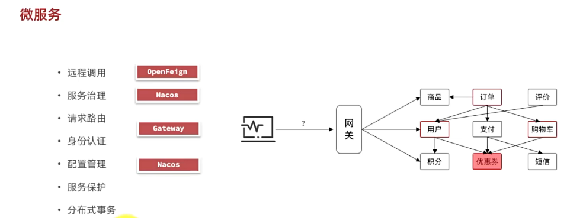

首先是**业务健壮性**问题：

例如在之前的查询购物车列表业务中，购物车服务需要查询最新的商品信息，与购物车数据做对比，提醒用户。大家设想一下，如果商品服务查询时发生故障，查询购物车列表在调用商品服 务时，是不是也会异常？从而导致购物车查询失败。但从业务角度来说，为了提升用户体验，即便是商品查询失败，购物车列表也应该正确展示出来，哪怕是不包含最新的商品信息。

还有**级联失败**问题：

还是查询购物车的业务，假如商品服务业务并发较高，占用过多**Tomcat连接**。可能会导致**商品服务的所有接口响应时间增加，延迟变高，甚至是长时间阻塞直至查询失败。**

此时查询购物车业务需要查询并等待商品查询结果，从而导致查询购物车列表业务的响应时间也变长，甚至也阻塞直至无法访问。而此时如果查询购物车的请求较多，可能导致购物车服务的Tomcat连接占用较多，所有接口的响应时间都会增加，整个服务性能很差， 甚至不可用。

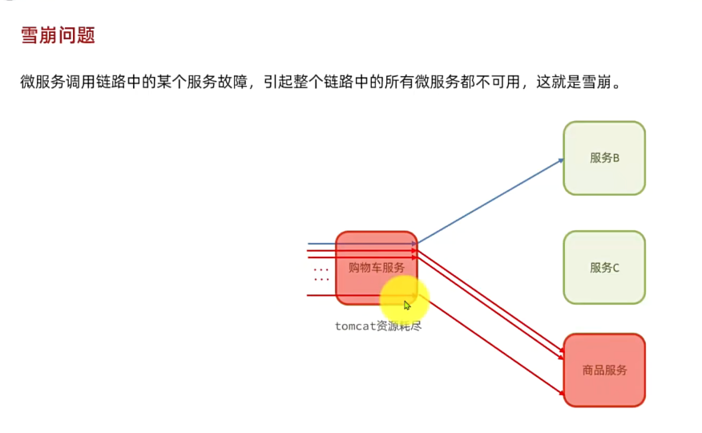

依次类推，整个微服务群中与购物车服务、商品服务等有调用关系的服务可能都会出现问题，最终导致整个集群不可用。

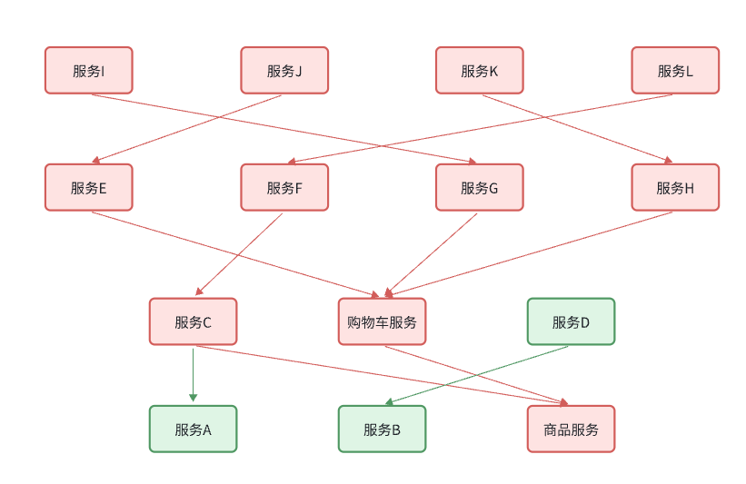

这就是**级联失败问题**，或者叫==**雪崩问题**==。

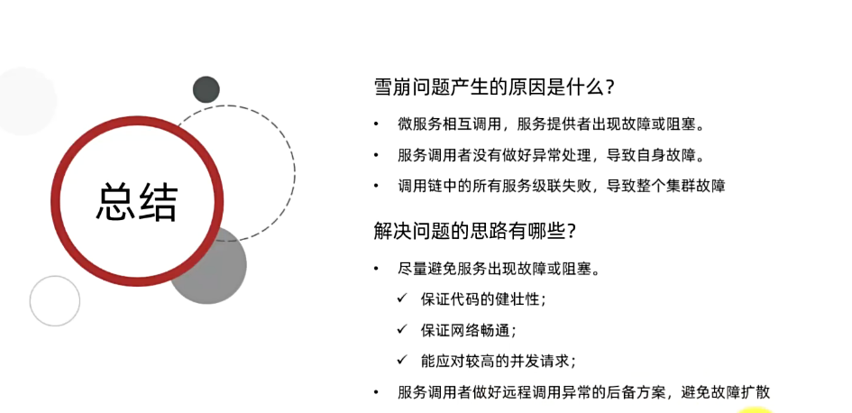

还有跨服务的事务问题：

比如昨天讲到过的下单业务，下单的过程中需要调用多个微服务：

- 商品服务：扣减库存
- 订单服务：保存订单
- 购物车服务：清理购物车

这些业务全部都是数据库的**写操作**，我们必须**确保所有操作的同时成功或失败**。但是这些操作在**不同微服务**，也就是**不同的Tomcat**，这样的情况如何**==确保事务特性==**呢？

这些问题都会在今天找到答案。

今天的内容会分成几部分：

- 微服务保护
  - 服务保护方案
  - 请求限流
  - 隔离和熔断
- 分布式事务
  - 初识分布式事务
  - Seata

通过今天的学习，你将能掌握下面的能力：

- 知道雪崩问题产生原因及常见解决方案
- 能使用Sentinel实现服务保护
- 理解分布式事务产生的原因
- 能使用Seata解决分布式事务问题
- 理解AT模式基本原理


## 1.微服务保护

**保证服务运行的健壮性，避免级联失败导致的雪崩问题，就属于微服务保护**。这章我们就一起来学习一下微服务保护的常见方案以及对应的技术。

### 1.1.服务保护方案

微服务保护的方案有很多，比如：

- 请求限流
- 线程隔离
- 服务熔断

这些方案或多或少都会导致服务的**体验上略有下降**，比**==请求限流==，降低了并发上限；==线程隔离==，降低了可用资源数量；==服务熔断==，降低了服务的完整度，部分服务变的不可用或弱可用。**因此这些方案都属于服务**降级**的方案。但通过这些方案，服务的健壮性得到了提升，

接下来，我们就逐一了解这些方案的原理。

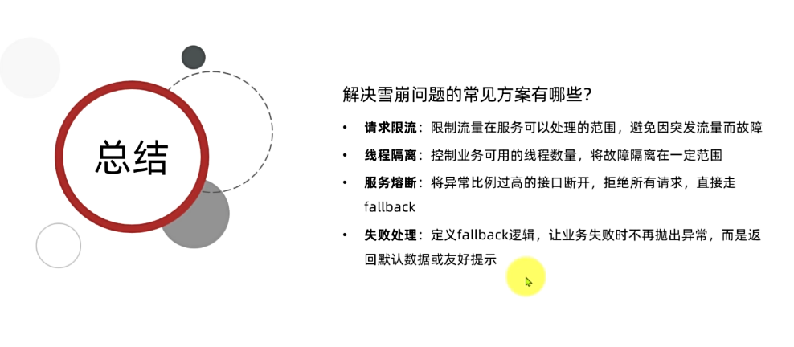

#### 1.1.1.请求限流

服务故障最重要原因，就是并发太高！解决了这个问题，就能避免大部分故障。当然，接口的并发不是一直很高，而是**突发的**。因此请求限流，就是**限制或控制**接口访问的并发流量，避免服务因流量激增而出现故障。

请求限流往往会有一个**限流器**，数量**高低起伏**的并发请求曲线，经过限流器就变的非常**平稳**。这就像是水电站的大坝，起到蓄水的作用，可以通过开关控制水流出的大小，让下游水流始终维持在一个平稳的量。

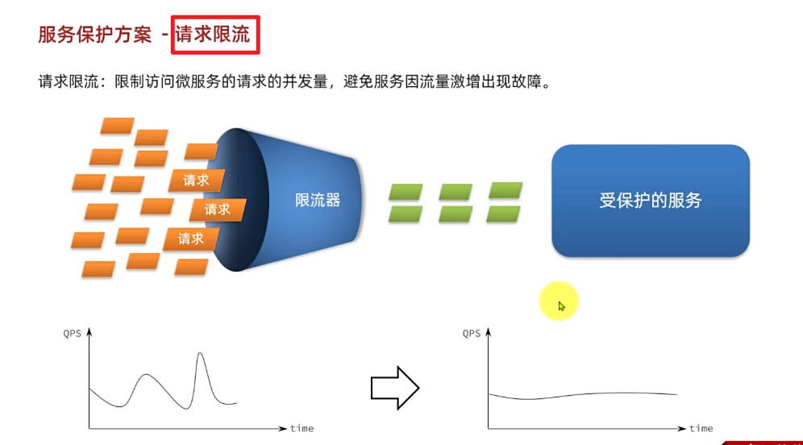


#### 1.1.2.线程隔离

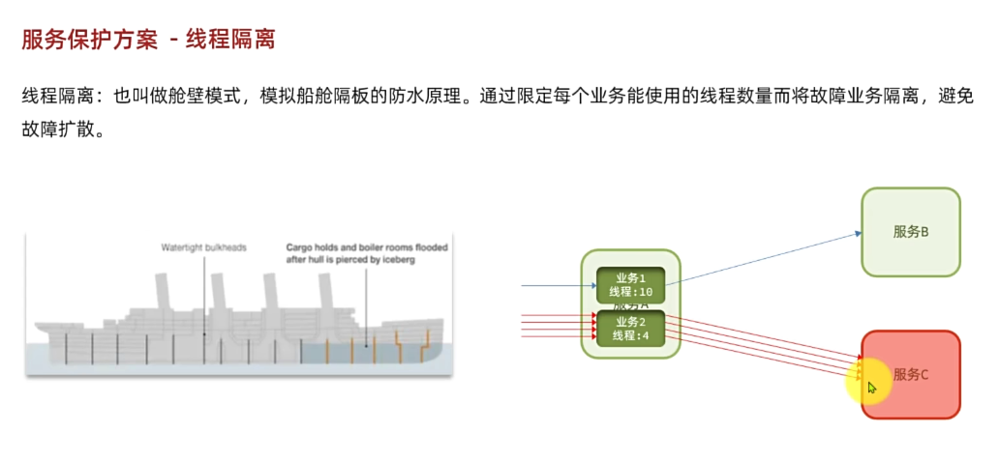

当一个业务接口响应时间长，而且**并发高时，就可能==耗尽服务器的线程资源==，导致==服务内的其它接口==受到影响**。所以我们必须把这种影响降低，或者**缩减影响的范围**。线程隔离正是解决这个问题的好办法。

线程隔离的思想来自轮船的舱壁模式：


轮船的船舱会被隔板分割为N个相互隔离的密闭舱，假如轮船触礁进水，只有损坏的部分密闭舱会进水，而其他舱由于相互隔离，并不会进水。这样就把进水控制在部分船体，避免了整个船舱进水而沉没。

为了避免某个接口故障或压力过大导致整个服务不可用，我们可以限定每个接口可以使用的资源范围，也就是将其“隔离”起来。

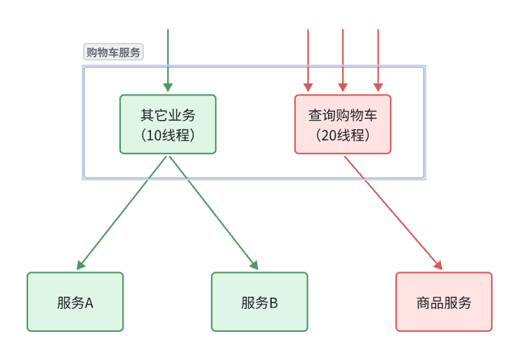

如图所示，我们给查询购物车业务限定可用线程数量上限为20，这样即便查询购物车的请求因为查询商品服务而出现故障，也不会导致服务器的线程资源被耗尽，不会影响到其它接口。


#### 1.1.3.服务熔断

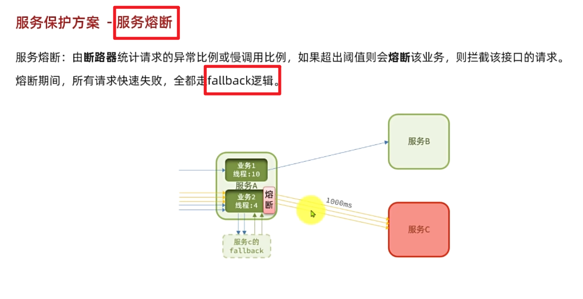

线程隔离虽然避免了雪崩问题，但**故障服务（商品服务）依然会拖慢购物车服务（服务调用方）的接口响应速度。**而且商品查询的故障依然会导致查询购物车功能出现故障，购物车业务也变的不可用了。

所以，我们要做两件事情：

- **编写服务降级逻辑**：就是服务调用失败后的处理逻辑，根据业务场景，可以抛出异常，也可以**返回友好提示或默认数据。**
- **异常统计和熔断**：**统计服务提供方的异常比例**，当比例过高表明该接口会影响到其它服务，应该拒绝调用该接口，而是直接**走降级逻辑**。

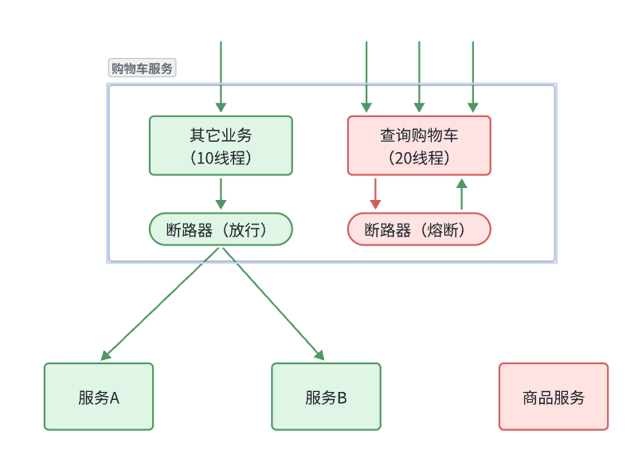


### 1.2.==Sentinel-哨兵==

微服务保护的技术有很多，但在目前国内使用较多的还是Sentinel，所以接下来我们学习Sentinel的使用。

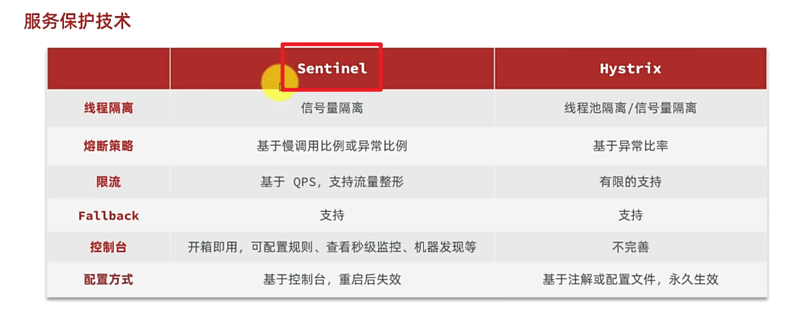

#### 1.2.1.介绍和安装

Sentinel是阿里巴巴开源的一款服务保护框架，目前已经加入SpringCloudAlibaba中。官方网站：

https://sentinelguard.io/zh-cn/

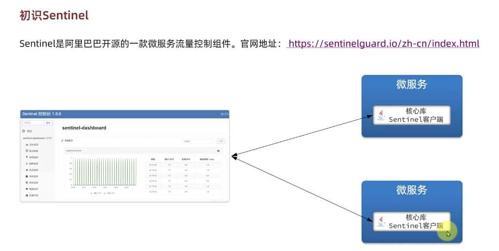

Sentinel 的使用可以分为两个部分:

- **核心库**（Jar包）：不依赖任何框架/库，能够运行于 Java 8 及以上的版本的运行时环境，同时对 Dubbo / Spring Cloud 等框架也有较好的支持。在项目中引入依赖即可实现服务限流、隔离、熔断等功能。
- **控制台**（Dashboard）：Dashboard 主要负责管理推送规则、监控、管理机器信息等。

为了方便监控微服务，我们先把Sentinel的控制台搭建出来。

1）下载jar包

下载地址：

https://github.com/alibaba/Sentinel/releases

也可以直接使用课前资料提供的版本：

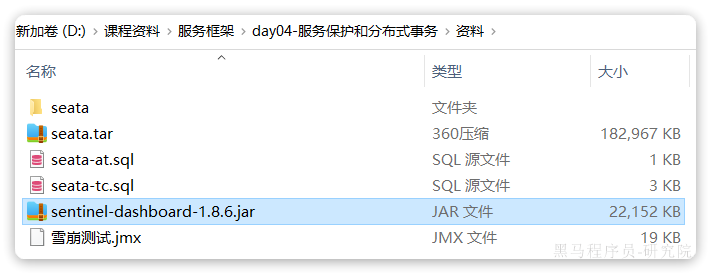

2）运行

将jar包放在任意非中文、不包含特殊字符的目录下，重命名为`sentinel-dashboard.jar`：


然后运行如下命令启动控制台：

`<h2 id="Sentinel-本机部署">`Sentinel-本机部署`</h2>`

```Shell
java -Dserver.port=8090 -Dcsp.sentinel.dashboard.server=localhost:8090 -Dproject.name=sentinel-dashboard -jar sentinel-dashboard.jar
```

其它启动时可配置参数可参考官方文档：

https://github.com/alibaba/Sentinel/wiki/%E5%90%AF%E5%8A%A8%E9%85%8D%E7%BD%AE%E9%A1%B9

3）访问

访问`[http://localhost:8090](http://localhost:8080)`页面，就可以看到sentinel的控制台了：


需要输入账号和密码，默认都是：sentinel

登录后，即可看到控制台，默认会监控sentinel-dashboard服务本身：

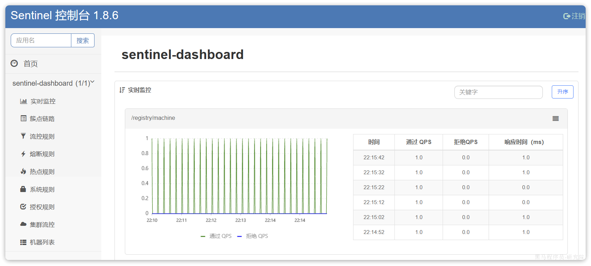

#### 1.2.2.微服务整合

我们在`cart-service`模块中整合sentinel，连接`sentinel-dashboard`控制台，步骤如下： 1）引入sentinel依赖

```XML
<!--阿里-sentinel-->
<dependency>
    <groupId>com.alibaba.cloud</groupId> 
    <artifactId>spring-cloud-starter-alibaba-sentinel</artifactId>
</dependency>
```

2）配置控制台

修改application.yaml文件，添加下面内容：

```YAML
spring:
  cloud:
    sentinel:
      transport:
        dashboard: localhost:8090 #sentinel 控制台地址
```

3）访问`cart-service`的任意端点

重启`cart-service`，然后访问查询购物车接口，sentinel的客户端就会将服务访问的信息提交到`sentinel-dashboard`控制台。并展示出统计信息：

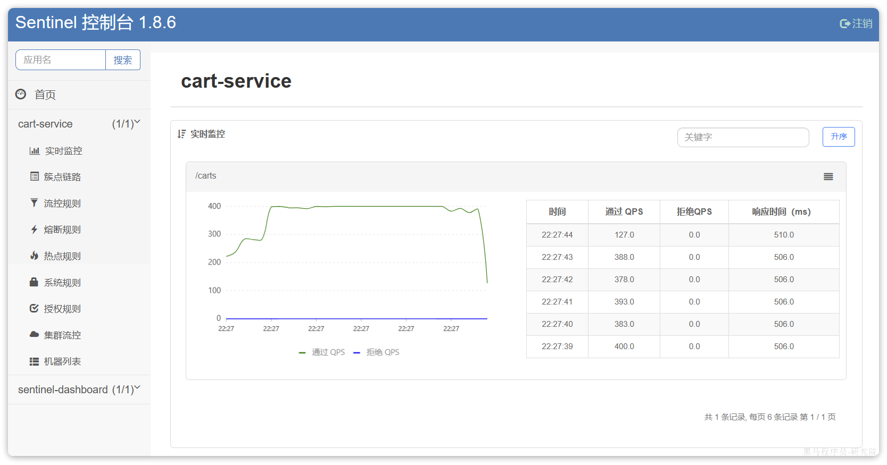

点击**簇点链路菜单**，会看到下面的页面：


所谓**==簇点链路==**，就是单机调用链路，是**一次请求进入服务后经过的每一个==被`Sentinel`监控的资源==**。默认情况下，`Sentinel`会监控`SpringMVC`的==每一个`Endpoint`（接口）==。

因此，我们看到**`/carts`这个接口路径**就是其中一个**簇点**，我们可以对其进行**限流、熔断、隔离**等保护措施。

不过，需要注意的是，我们的SpringMVC接口是按照Restful风格设计，因此购物车的查询、删除、修改等接口全部都是`/carts`路径：

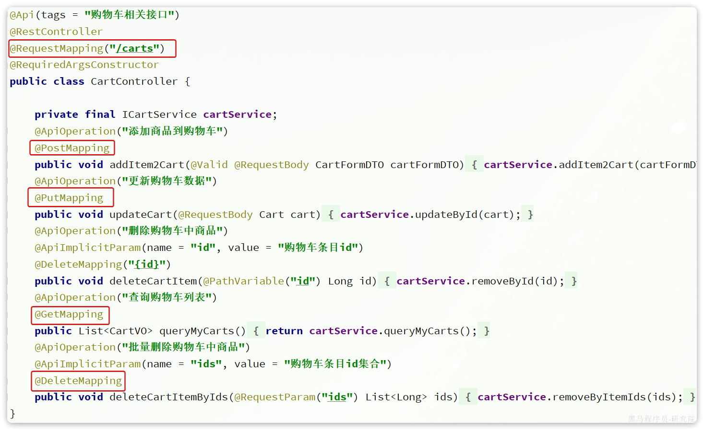

默认情况下Sentinel会把路径作为簇点资源的名称，**无法区分路径相同但请求方式不同的接口，查询、删除、修改等都被识别为一个簇点资源**，这显然是不合适的。

所以我们可以选择**==打开Sentinel的请求方式前缀==**，把`请求方式 + 请求路径`作为**簇点资源名**：

首先，在`cart-service`的`application.yml`中添加下面的配置：

```YAML
spring:
  cloud:
    sentinel:
      transport:
        dashboard: localhost:8090 #sentinel 控制台地址
      http-method-specify: true # 开启请求方式前缀，将请求方式作为资源名称
```

然后，重启服务，通过页面访问购物车的相关接口，可以看到sentinel控制台的簇点链路发生了变化：

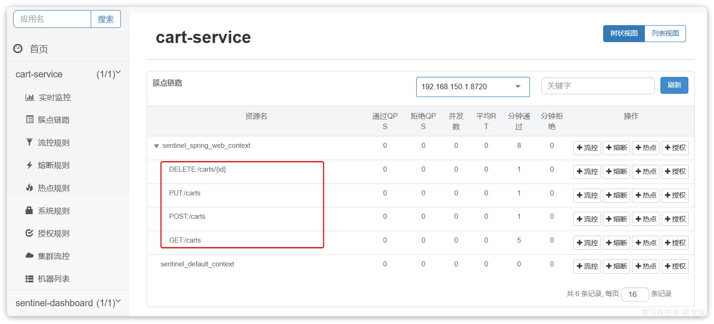

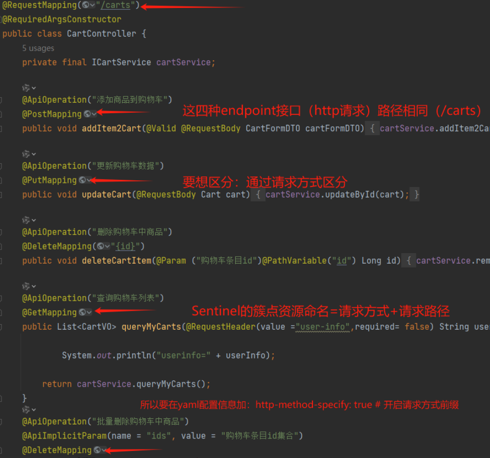

### 1.3.==请求限流==

在簇点链路后面点击流控按钮，即可对其做限流配置：


在弹出的菜单中这样填写：


这样就把查询购物车列表这个簇点资源的流量限制在了每秒6个，也就是最大QPS为6.

QPS（Queries Per Second，**每秒查询率**）是用来**衡量一个系统在单位时间内能够处理的==查询请求数量的指标==。**它通常用于评估服务器、数据库、搜索引擎或其他系统的性能和负载能力。

#### **QPS 的作用**

1. **衡量性能**：反映系统的处理能力，帮助识别系统是否能够满足业务需求。
2. **容量规划**：通过计算峰值和平均 QPS，可以决定服务器的数量、负载均衡策略等。
3. **优化基础**：QPS 较低时，可以考虑优化代码或架构以提高处理能力。
4. **监控健康状态**：监控 QPS 变化，发现异常（如突然的流量暴增或下降）并及时响应。

------

##### **计算公式**

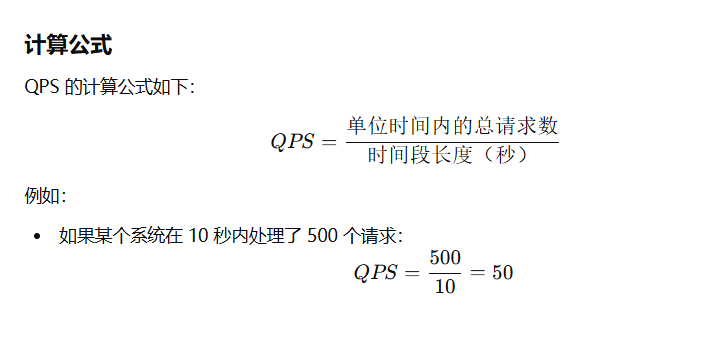

------

##### **常见场景**

1. **搜索引擎**：如 Google 或百度，衡量搜索请求的处理能力。
2. **API 服务**：例如电商网站的库存查询、支付接口请求等。
3. **数据库**：用来评估查询操作的吞吐量。
4. **Web 服务器**：衡量访问页面的能力。

------

##### **提高 QPS 的方法**

1. 优化代码：
   - 减少不必要的计算。
   - 提高算法效率。
2. 缓存机制：
   - 使用缓存（如 Redis）减少重复计算和数据库查询。
3. 负载均衡：
   - 使用 Nginx、HAProxy 等工具将流量分发到多个服务器。
4. 垂直扩展与水平扩展：
   - 垂直扩展：提升单机性能（如增加 CPU 和内存）。
   - 水平扩展：增加服务器数量。
5. 异步处理：
   - 将耗时操作放入后台任务队列中（如使用 RabbitMQ、Kafka）。
6. 数据库优化：
   - 使用索引。
   - 减少复杂查询。
   - 分库分表。

------


我们利用**Jemeter做限流测试**，我们每秒发出10个请求：

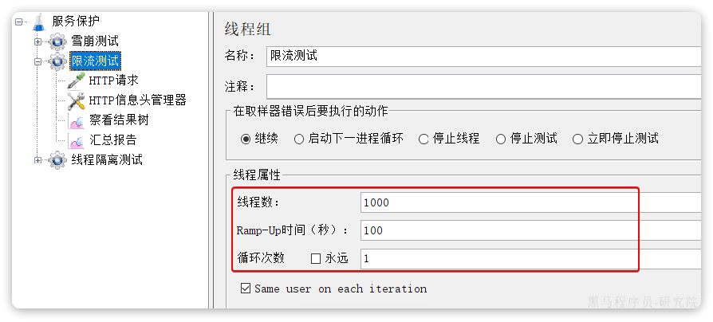

添加线程组即添加一堆的用户，**线程数代表用户数量**，**Ramp-up时间指的是用户访问时间**，100秒，表示1000个**用户100秒内完成**，那就是每秒10次，**==并发量就是每秒钟用户请求10个即QPS为10==**。循环次数意思就是每个用户只发一次请求。

最终监控结果如下：


可以看出`GET:/carts`这个接口的通过QPS稳定在6附近，而拒绝的QPS在4附近，符合我们的预期。

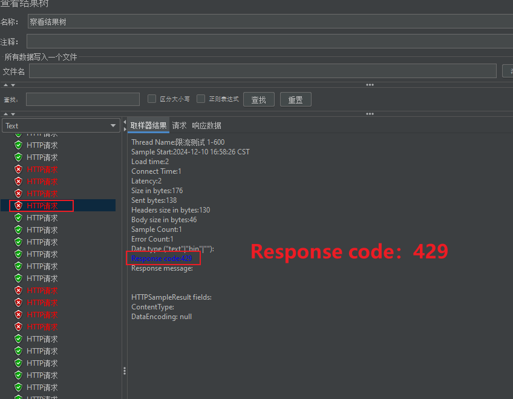

HTTP状态码429表示**客户端发送的请求过多，超出了服务器的处理能力或限制。**它是一种反应速率限制的状态码，用于告知客户端暂时无法处理请求。

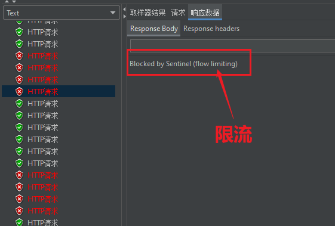


### 1.4.==线程隔离==

**限流可以降低服务器压力**，尽量减少**因并发流量引起的服务故障的概率**，但并不能完全避免服务故障。一旦某个服务出现故障，我们必须隔离对这个服务的调用，避免发生雪崩。

比如，查询购物车的时候需要查询商品，为了避免因商品服务出现故障导致购物车服务级联失败，我们可以把购物车业务中查询商品的部分隔离起来，限制可用的线程资源：

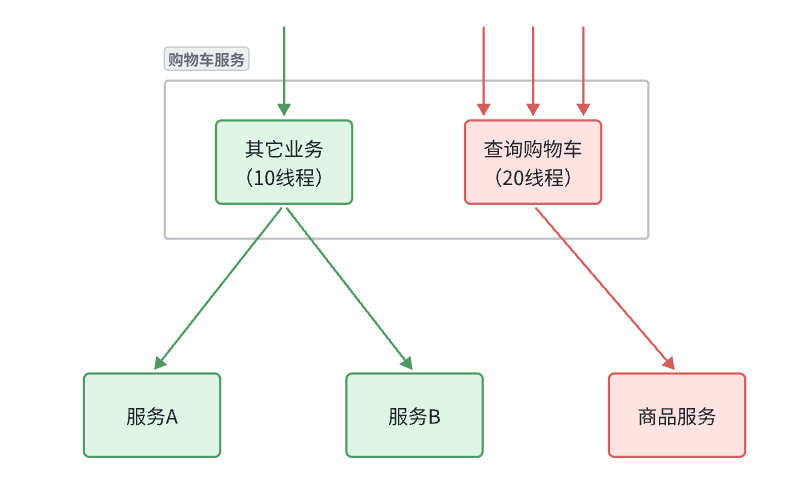

这样，**即便商品服务出现故障，最多导致==查询购物车业务故障==，并且可用的线程资源也被限定在一定范围**，==**不会导致整个购物车服务崩溃。**==

换句话说，**就是把服务==按不同“下游”业务进行线程隔离==，如果一方的“下游”故障，由于限制了每个“下游”业务的可用线程资源，可保证该服务的其他“下游”业务不会受其影响。**

所以，我们要对查询商品的FeignClient接口做线程隔离。

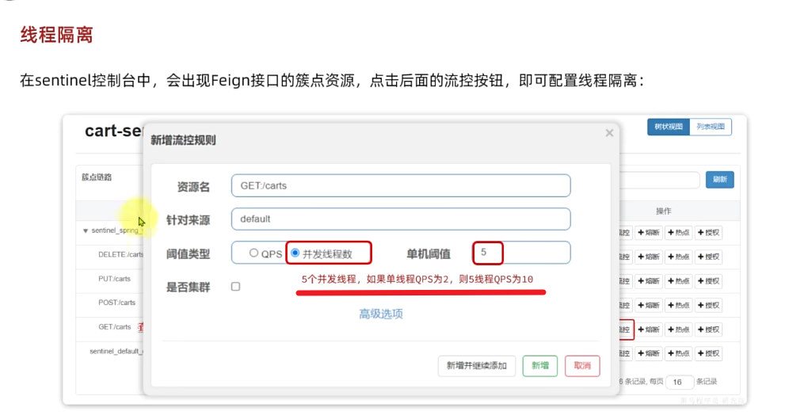

#### 1.4.1.模拟测试(不用线程隔离时)

**1、查询商品服务-模拟业务延迟**

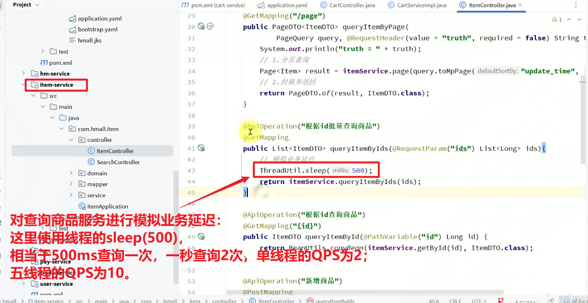

**2、使用JMeter对查询购物车接口进行压力测试**

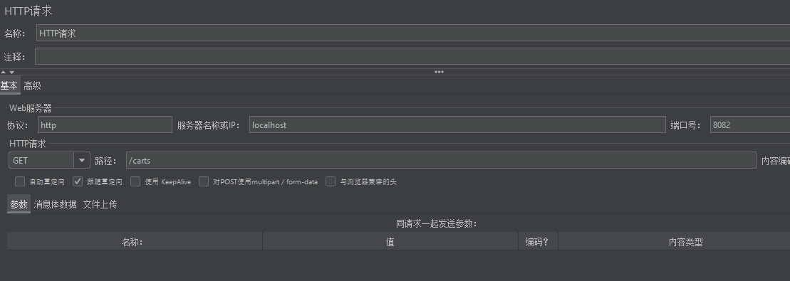

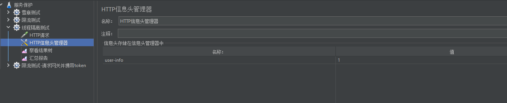

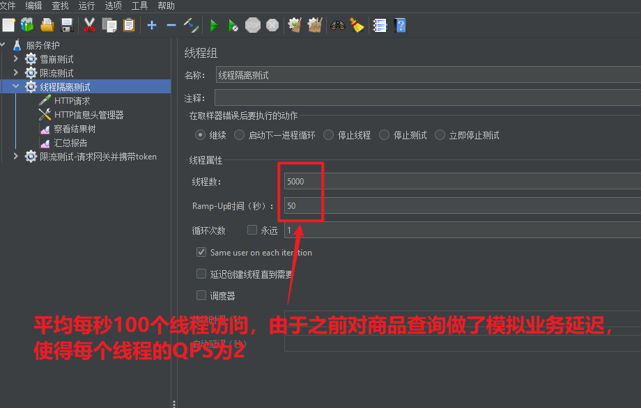

**3、购物车服务中其他业务受影响**

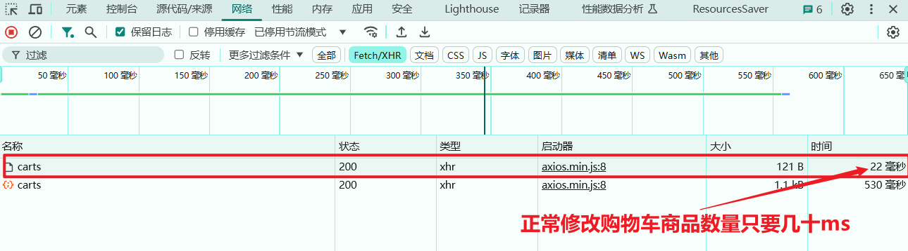

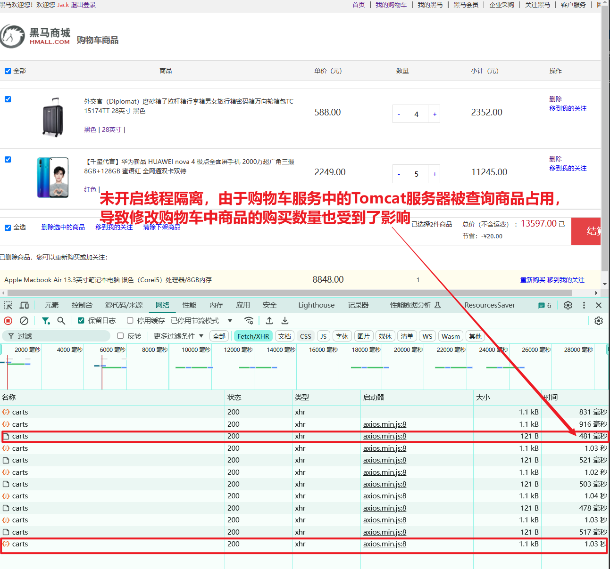


#### 1.4.2.==OpenFeign整合Sentinel==

修改cart-service模块的application.yml文件，**开启Feign的sentinel功能**：

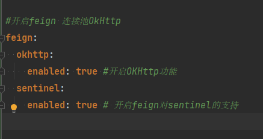

```YAML
#不是在spring级别下
feign:
  sentinel:
    enabled: true # 开启feign对sentinel的支持
```

需要注意的是，默认情况下SpringBoot项目的**tomcat最大线程数是200，允许的最大连接是8492，单机测试很难打满。**

所以我们需要配置一下cart-service模块的application.yml文件，**修改tomcat连接**：

```YAML
server:
  port: 8082
  tomcat:
    threads:
      max: 50 # 允许的最大线程数
    accept-count: 50 # 最大排队等待数量
    max-connections: 100 # 允许的最大连接
```

然后重启cart-service服务，可以看到**查询商品的FeignClient自动变成了一个簇点资源**：


#### 1.4.3.配置线程隔离

接下来，点击查询商品的FeignClient对应的簇点资源后面的流控按钮：


在弹出的表单中填写下面内容：


注意，这里勾选的是**==并发线程数限制==**，也就是说**这个查询功能最多使用5个线程，而不是5QPS**。**如果查询商品的接口每秒处理2个请求(==使用Thread.sleep(500)==)，则5个线程的==实际QPS在10左右==，而超出的请求自然会被拒绝。**

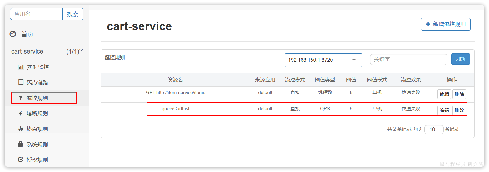

我们利用Jemeter测试，每秒发送100个请求：


最终测试结果如下：

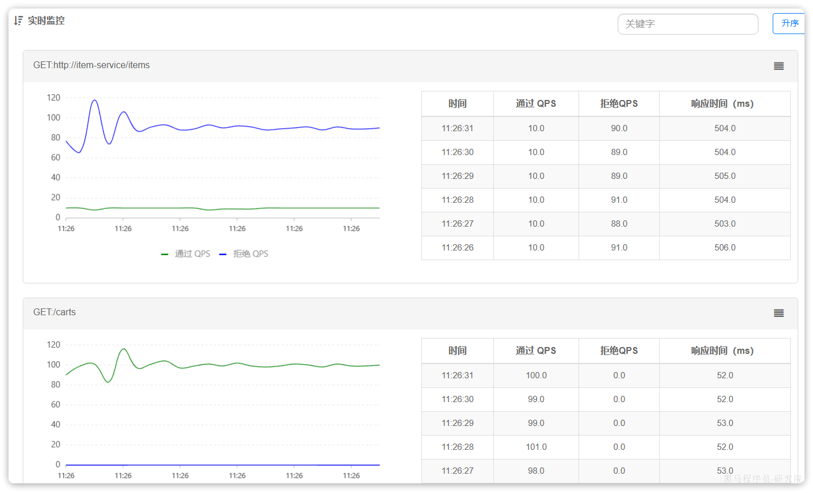

进入查询购物车的请求每秒大概在100，而在查询商品时却只剩下每秒10左右，符合我们的预期。

此时如果我们通过页面访问购物车的其它接口，例如添加购物车、修改购物车商品数量，发现不受影响：

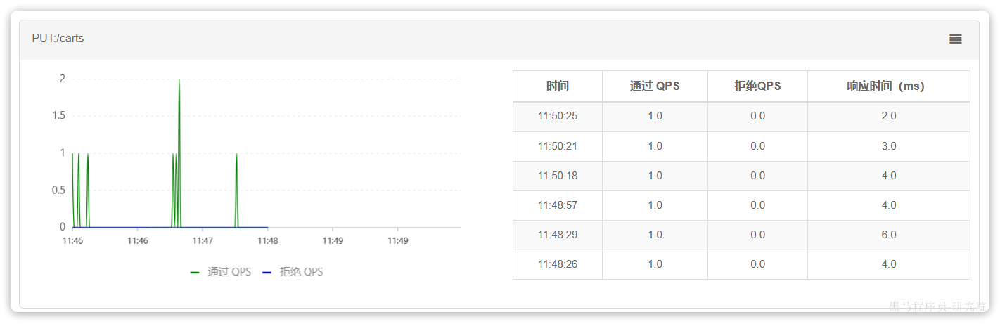

响应时间非常短，这就证明线程隔离起到了作用，尽管查询购物车这个接口并发很高，但是它能使用的线程资源被限制了，因此不会影响到其它接口。

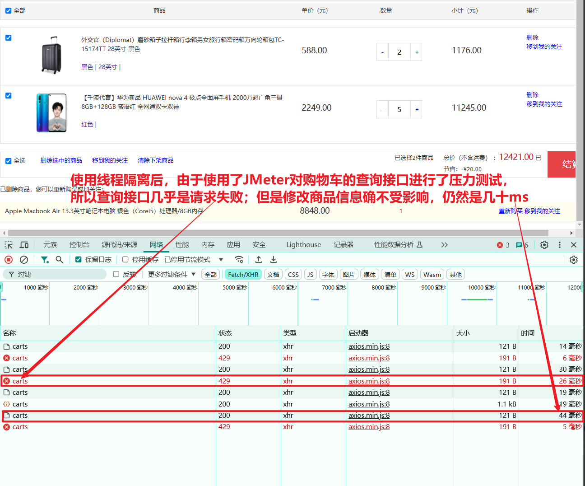


### 1.5.==服务熔断==

在上节课，我们利用线程隔离对查询购物车业务进行隔离，保护了购物车服务的其它接口。由于查询商品的功能耗时较高（我们模拟了500毫秒延时），再加上线程隔离限定了线程数为5，导致接口吞吐能力有限，最终QPS只有10左右。这就导致了几个问题：

第一，超出的QPS上限的请求就只能抛出异常，从而导致购物车的查询失败。但从业务角度来说，**即便没有查询到最新的商品信息，购物车也应该展示给用户，用户体验更好。**也就是给查询失败设置一个**==降级处理==**逻辑。

第二，由于查询商品的延迟较高（模拟的500ms），从而导致查询购物车的响应时间也变的很长。这样不仅拖慢了购物车服务，消耗了购物车服务的更多资源，而且用户体验也很差。对于商品服务这种不太健康的接口，我们应该**直接停止调用，直接走降级逻辑**，避免影响到当前服务。也就是将商品查询接口**熔断**。


#### 1.5.1.编写降级逻辑Fallback

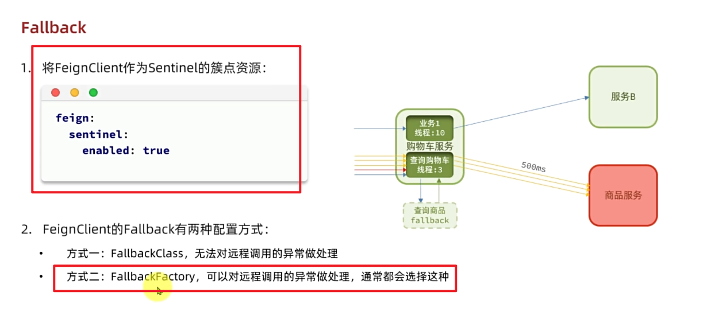

触发限流或熔断后的请求不一定要直接报错，也可以返回一些默认数据或者友好提示，用户体验会更好。

给FeignClient编写失败后的降级逻辑有两种方式：

- 方式一：FallbackClass，无法对远程调用的异常做处理
- 方式二：FallbackFactory，**可以对远程调用的异常做处理**，我们一般选择这种方式。

这里我们演示方式二的失败降级处理。

**案例：**

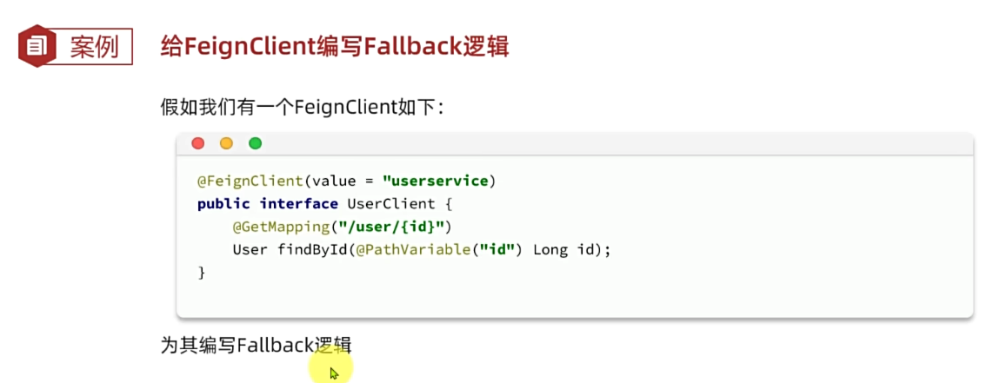


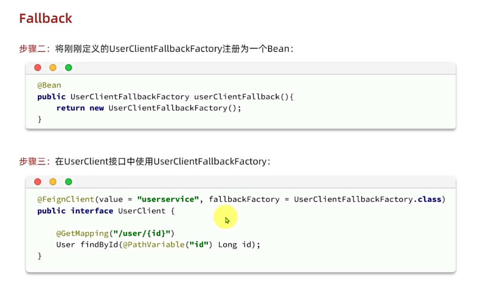


**步骤一**：在hm-api模块中给`ItemClient`定义降级处理类，实现`FallbackFactory`：


代码如下：

```Java
package com.hmall.api.client.fallback;

import com.hmall.api.client.ItemClient;
import com.hmall.api.dto.ItemDTO;
import com.hmall.api.dto.OrderDetailDTO;
import com.hmall.common.exception.BizIllegalException;
import com.hmall.common.utils.CollUtils;
import lombok.extern.slf4j.Slf4j;
import org.springframework.cloud.openfeign.FallbackFactory;

import java.util.Collection;
import java.util.List;

@Slf4j
public class ItemClientFallback implements FallbackFactory<ItemClient> {
    @Override
    public ItemClient create(Throwable cause) {
        return new ItemClient() {
            @Override
            public List<ItemDTO> queryItemByIds(Collection<Long> ids) {
                log.error("远程调用ItemClient#queryItemByIds方法出现异常，参数：{}", ids, cause);
                // 查询购物车允许失败，查询失败，返回空集合
                return CollUtils.emptyList();
            }

            @Override
            public void deductStock(List<OrderDetailDTO> items) {
                // 库存扣减业务需要触发事务回滚，查询失败，抛出异常
                throw new BizIllegalException(cause);
            }
        };
    }
}
```

**步骤二**：在`hm-api`模块中的`com.hmall.api.config.DefaultFeignConfig`类中将`ItemClientFallback`注册为一个`Bean`：

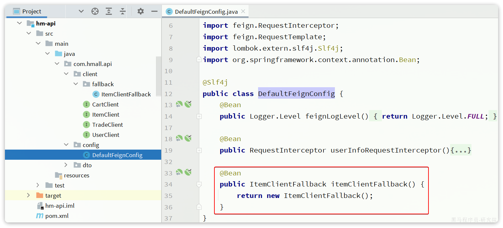

**步骤三**：在`hm-api`模块中的`ItemClient`接口中使用`ItemClientFallbackFactory`：


重启后，再次测试，发现被限流的请求不再报错，走了降级逻辑：


但是**未被限流的请求延时依然很高**：


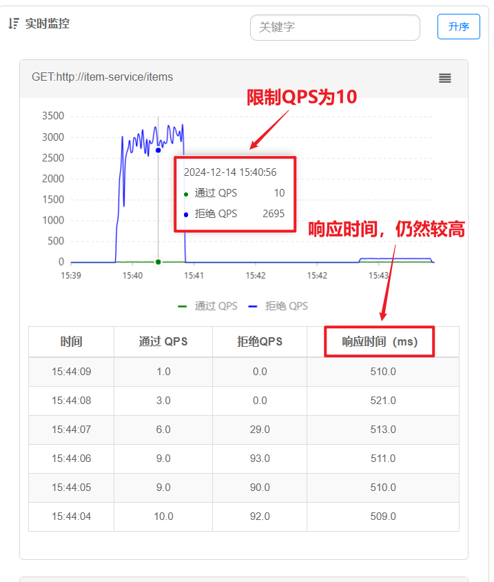

导致最终的平均响应时间较长。


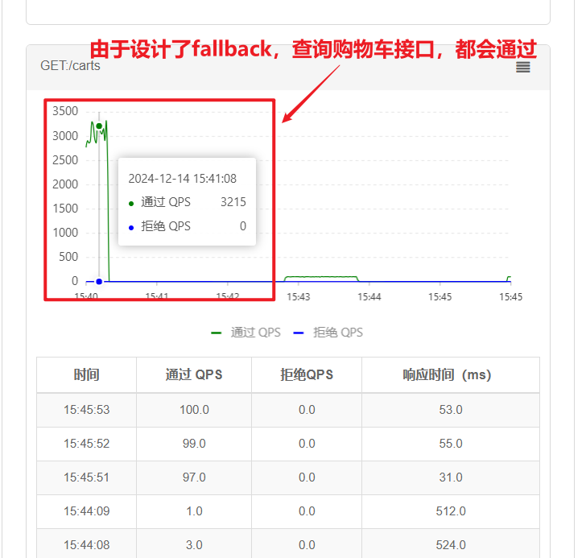

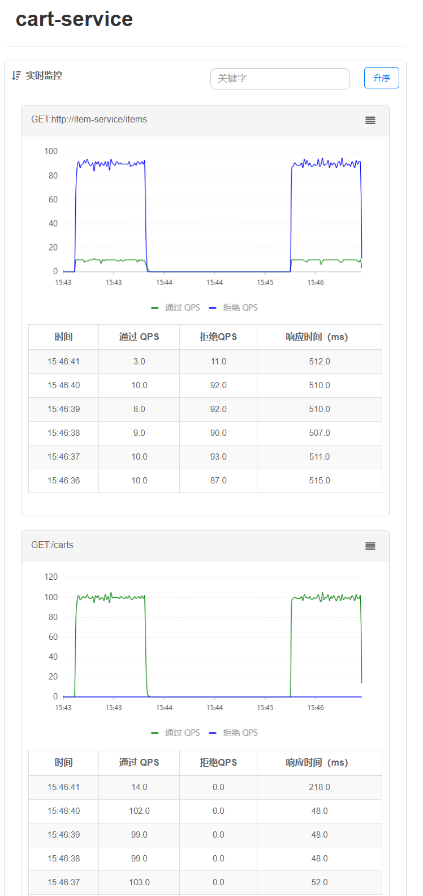


#### 1.5.2.服务熔断

查询商品的RT **（Response Time（响应时间））**较高（模拟的500ms），从而导致查询购物车的RT也变的很长。这样不仅拖慢了购物车服务，消耗了购物车服务的更多资源，而且用户体验也很差。

对于商品服务这种不太健康的接口，我们**应该停止调用，直接走降级逻辑，避免影响到当前服务**。也就是将商品查询接口**熔断**。当商品服务接口恢复正常后，再允许调用。这其实就是**断路器**的工作模式了。

Sentinel中的断路器不仅可以统计某个接口的**慢请求比例**，还可以统计**异常请求比例**。当这些比例超出阈值时，就会**熔断**该接口，**即==拦截==访问该接口的==一切请求==，==降级处理==；当该接口==恢复正常时==，再==放行==对于该接口的请求。**

**断路器**的工作状态切换有一个状态机来控制：

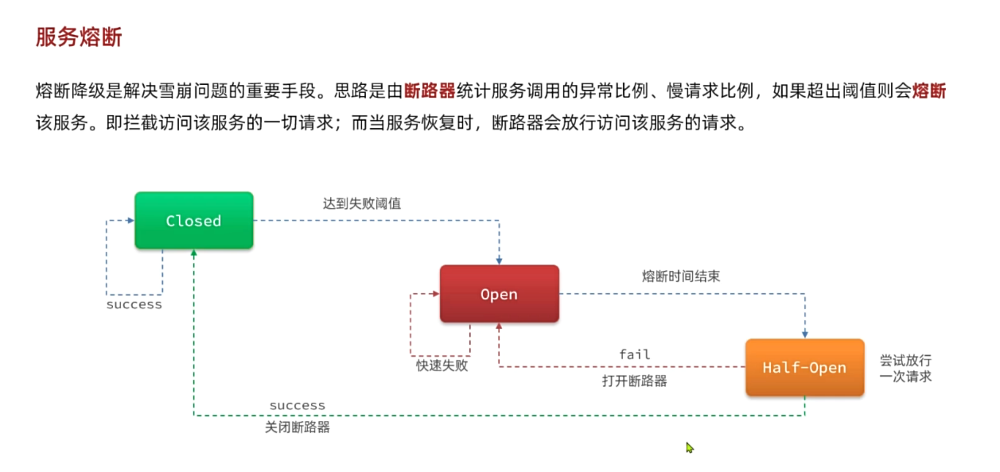

状态机包括三个状态：

- ==**closed**==：关闭状态，**断路器放行所有请求**，并开始统计异常比例、慢请求比例。**超过阈值则切换到open状态**
- ==**open**==：打开状态，服务调用被**熔断**，访问被熔断服务的请求会被拒绝，**快速失败，直接走降级逻辑**。Open状态**持续一段时间后会进入half-open状态**
- ==**half-open**==：**==半开状态，放行一次请求==**，根据执行结果来判断接下来的操作。 
  - 请求成功：则切换到closed状态
  - 请求失败：则切换到open状态

我们可以在控制台通过点击簇点后的**`熔断`**按钮来配置熔断策略：

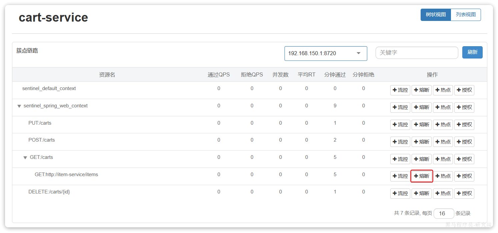

在弹出的表格中这样填写：


这种是按照慢调用比例来做熔断，上述配置的含义是：

- RT超过200毫秒的请求调用就是慢调用
- **统计最近1000ms内的最少5次请求，如果慢调用比例不低于0.5，则触发熔断**
- **熔断持续时长20s**，20s后再次尝试判断

配置完成后，再次利用Jemeter测试，可以发现：

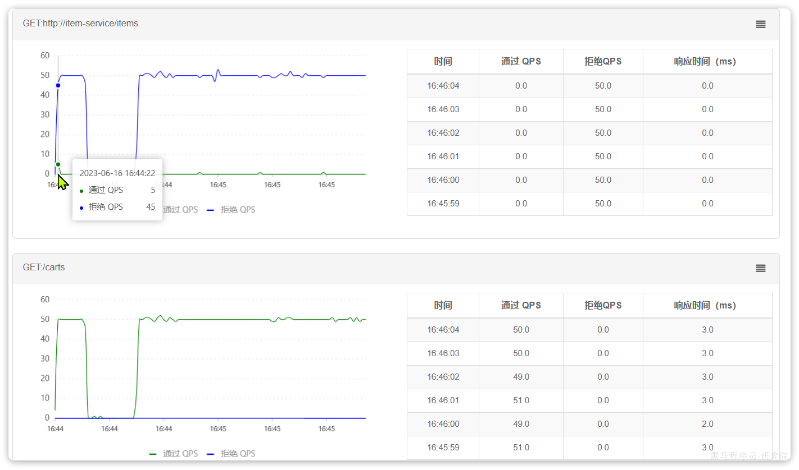

在一开始一段时间是允许访问的，后来触发熔断后，查询商品服务的接口通过QPS直接为0，所有请求都被熔断了。而查询购物车的本身并没有受到影响。

此时整个购物车查询服务的平均RT影响不大：

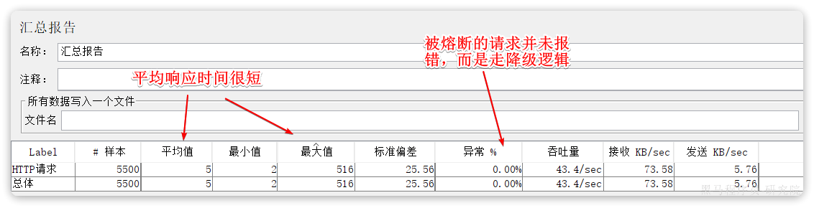


## 2.分布式事务

首先我们看看项目中的下单业务整体流程：

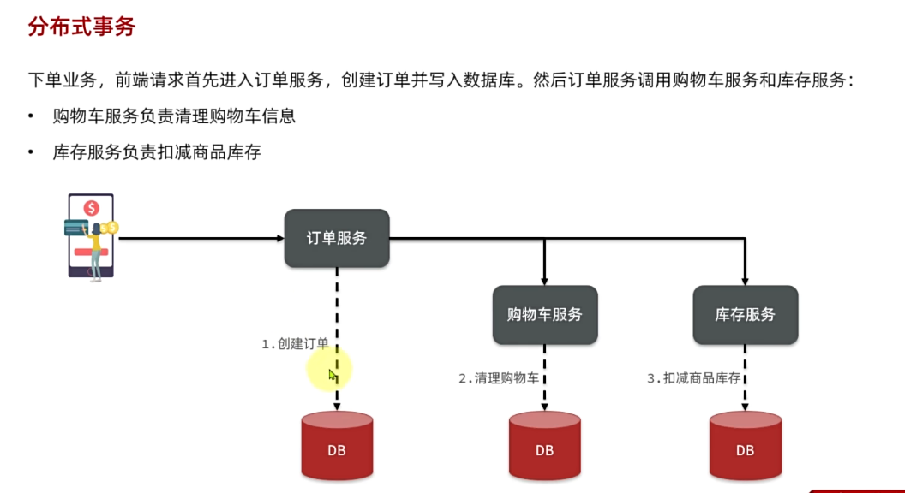

由于订单、购物车、商品分别在三个不同的微服务，而每个微服务都有自己独立的数据库，因此下单过程中就会跨多个数据库完成业务。而每个微服务都会执行自己的本地事务：

- 交易服务：下单事务
- 购物车服务：清理购物车事务
- 库存服务：扣减库存事务

整个业务中，各个本地事务是有关联的。因此每个微服务的本地事务，也可以称为**分支事务**。多个有关联的分支事务一起就组成了**全局事务**。我们必须保证整个全局事务同时成功或失败。

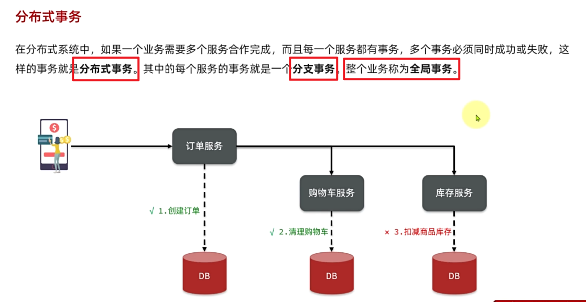

我们知道每一个分支事务就是传统的**单体事务**，都可以满足ACID特性，但全局事务跨越多个服务、多个数据库，是否还能满足呢？

我们来做一个测试，先进入购物车页面：

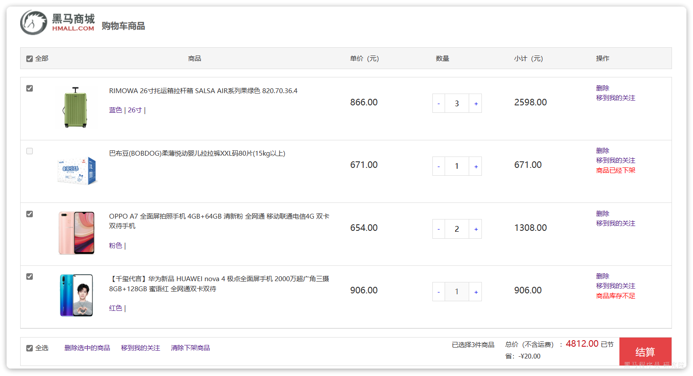

目前有4个购物车，然结算下单，进入订单结算页面：


然后将购物车中某个商品的库存修改为`0`：


然后，提交订单，最终因库存不足导致下单失败：


然后我们去查看购物车列表，发现购物车数据依然被清空了，并未回滚：


事务并未遵循ACID的原则，归其原因就是参与事务的多个子业务在不同的微服务，跨越了不同的数据库。虽然每个单独的业务都能在本地遵循ACID，但是它们**互相之间没有感知**，不知道有人失败了，无法保证最终结果的统一，也就无法遵循ACID的事务特性了。

这就是分布式事务问题，出现以下情况之一就可能产生分布式事务问题：

- **业务跨多个服务实现**
- **业务跨多个数据源实现**

接下来这一章我们就一起来研究下如何解决分布式事务问题。

### 2.1.认识Seata

解决分布式事务的方案有很多，但实现起来都比较复杂，因此我们一般会使用开源的框架来解决分布式事务问题。在众多的开源分布式事务框架中，功能最完善、使用最多的就是阿里巴巴在2019年开源的Seata了。

https://seata.io/zh-cn/docs/overview/what-is-seata.html

其实分布式事务产生的一个重要原因，就是**参与事务的多个分支事务互相无感知，不知道彼此的执行状态**。因此解决分布式事务的思想非常简单：

就是找一个==统一的**事务协调者**==，**与多个分支事务通信，检测每个分支事务的执行状态，保证全局事务下的每一个分支事务同时成功或失败即可**。大多数的分布式事务框架都是基于这个理论来实现的。

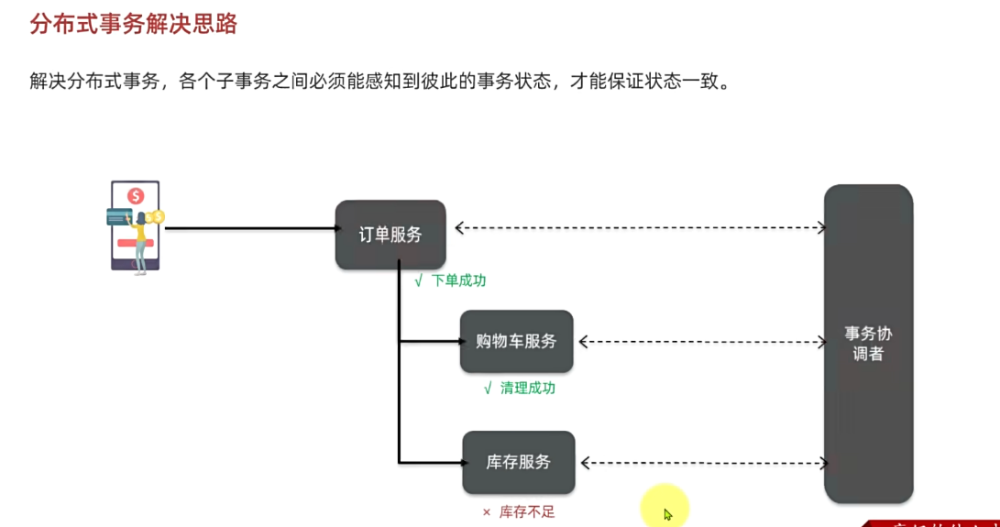


Seata也不例外，在Seata的事务管理中有三个重要的角色：

-  **TC** **(Transaction Coordinator) -** **事务协调者：**维护全局和分支事务的状态，**协调**全局事务**提交或回滚。** 
-  **TM (Transaction Manager) -** **事务管理器：**==定义**全局事务的范围**==（开始与结束）、**开始**全局事务、提交或回滚全局事务。 
-  **RM (Resource Manager) -** **资源管理器：**管理分支事务，与TC交谈以**注册分支事务和报告分支事务的状态**，并**驱动**分支事务提交或回滚。 

Seata的工作架构如图所示：

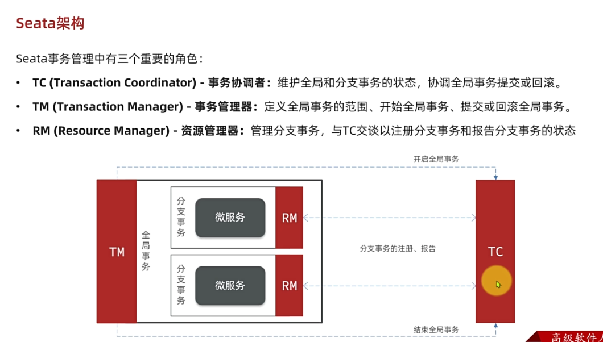

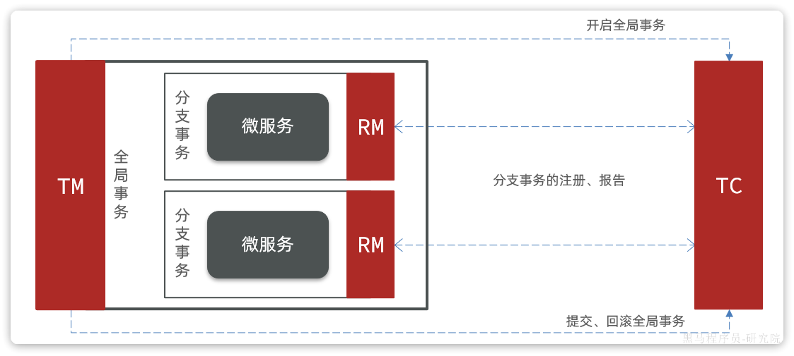

其中，**TM**和**RM**可以理解为Seata的客户端部分，引入到参与事务的微服务依赖中即可。将来**TM**和**RM**就会协助微服务，实现本地分支事务与**TC**之间交互，实现事务的提交或回滚。

而**TC**服务则是**事务协调中心，是一个==独立的微服务==，需要单独部署。**

### 2.2.==部署TC服务==

`<a id="部署Seata(TC服务)">``</a>`

#### 2.2.1.准备数据库表

Seata支持多种存储模式，但考虑到持久化的需要，我们一般选择基于数据库存储。执行课前资料提供的`《seata-tc.sql》`，导入数据库表：


#### 2.2.2.准备配置文件

课前资料准备了一个seata目录，其中包含了seata运行时所需要的配置文件：


其中包含中文注释，大家可以自行阅读。

我们将整个seata文件夹拷贝到虚拟机的`/root`目录：


#### 2.2.3.Docker部署

需要注意，要确保nacos、mysql都在hm-net网络中。如果某个容器不再hm-net网络，可以参考下面的命令将某容器加入指定网络：

```shell
docker network ls  查看所有网络

docker network inspect  查看网络详细信息

docker inspect [容器名] 查看该容器的详细信息（包括网络信息）

docker network connect [网络名] [容器名]
```


在虚拟机的`/root`目录执行下面的命令：

```Shell
docker run --name seata \
-p 8099:8099 \
-p 7099:7099 \
-e SEATA_IP=192.168.88.133 \
-v ./seata:/seata-server/resources \
--privileged=true \
--network hmall \
-d \
seataio/seata-server:1.5.2

docker run --name seata \
-p 8099:8099 \
-p 7099:7099 \
-e SEATA_IP=47.109.155.207 \
-v ./seata:/seata-server/resources \
--privileged=true \
-d \
seataio/seata-server:1.5.2
```

其中的SEATA_IP需要**换成自己的虚拟机ip**，network需要换成与nacos和mysql在同一网络中。


在 docker 中启动 seata TC 服务时，命令中 SEATA_IP 选项表示指定seata-server启动的IP, 该IP用于向注册中心注册时使用。如果在启动时将该参数设置为 -e SEATA_IP=`[localhost](http://localhost/)`，那么seata-server 向 nacos 注册中心报告的地址则是seata-server 在 docker 中运行的地址。

但是我们集成了 TM 和 RM 的微服务都部署在 docker 容器之外，此时这些微服务从 nacos 拿到的 seata-server 的 ip 地址(其实是在 docker 中的地址)，那么宿主机中的微服务无法通过这个“TC 服务在 docker 中的ip地址:端口” 的形式访问 seata-server（TC）服务。

要想解决这个问题，就需要在 docker 中启动 seata-server 时设置该服务向 nacos 报告的 ip 地址，因此应该将参数设置为  -e SEATA_IP=宿主机地址。那么，此时在宿主机中微服务拿到的就是宿主机地址，因为**宿主机和 docker 容器之间**实现了==**端口映射**==，所以宿主机可以通过“宿主机 ip 地址:端口”的形式访问到 TC 服务。


如果镜像下载困难，也可以把课前资料提供的镜像上传到虚拟机并加载：


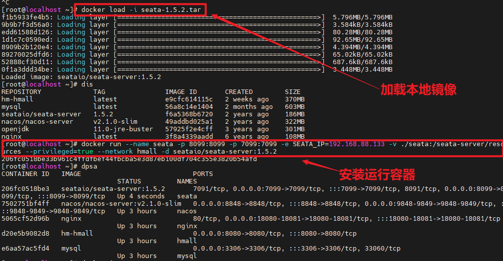

 

### 2.3.==微服务集成Seata==

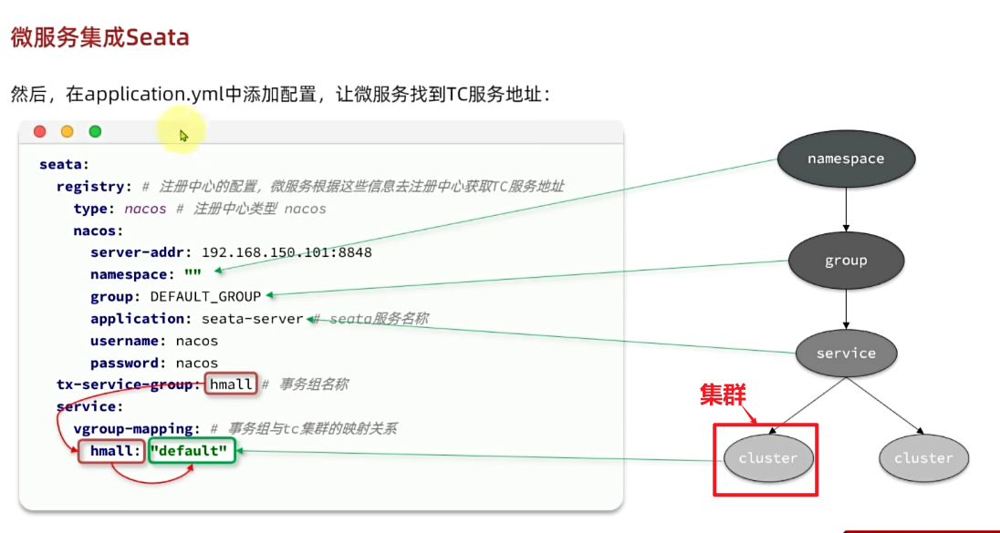

**参与分布式事务的每一个微服务都需要集成Seata**，我们以`trade-service`为例。


#### **2.3.0.详细流程**

内容如下：

```yaml
seata:
  registry: # TC服务注册中心的配置，微服务根据这些信息去注册中心获取tc服务地址
    type: nacos # 注册中心类型 nacos
    nacos:
      server-addr: 192.168.88.133:8848 # nacos地址
      namespace: "" # namespace，默认为空
      group: DEFAULT_GROUP # 分组，默认是DEFAULT_GROUP
      application: seata-server # seata服务名称
      username: nacos
      password: nacos
  tx-service-group: hmall # 事务组名称，标识当前微服务属于哪个事务组
  service:
    vgroup-mapping: # 事务组与tc集群的映射关系
      hmall: "default" 	#事务组 hmall 映射到 default TC 集群
```

当 **Seata 事务管理** 启动时-流程：

1. **微服务启动**，会读取 `tx-service-group: hmall` 。
2. **Seata 客户端** 通过 `service.vgroup-mapping`，把 `hmall` 映射到 `default`，然后去 Nacos 查询 `seata-server` 的地址。
3. **Seata 客户端** 通过 **Nacos 注册中心** (`seata.registry.nacos`) 发现 `seata-server` 。
4. Seata 事务处理：
   - 在全局事务开始时，微服务向 `seata-server` 注册事务信息。
   - 在事务提交或回滚时，微服务根据 `hmall -> default` 找到对应的 `seata-server` 进行处理。


#### 2.3.1.引入依赖

为了方便各个微服务集成seata，我们需要把seata配置共享到nacos，因此`trade-service`模块不仅仅要引入seata依赖，还要引入nacos依赖:

```XML
<!--统一配置管理-->
  <dependency>
      <groupId>com.alibaba.cloud</groupId>
      <artifactId>spring-cloud-starter-alibaba-nacos-config</artifactId>
  </dependency>
  <!--读取bootstrap引导文件-->
  <dependency>
      <groupId>org.springframework.cloud</groupId>
      <artifactId>spring-cloud-starter-bootstrap</artifactId>
  </dependency>
  <!--seata-->
  <dependency>
      <groupId>com.alibaba.cloud</groupId>
      <artifactId>spring-cloud-starter-alibaba-seata</artifactId>
  </dependency>
```

#### 2.3.2.改造配置

**Nacos中namespace、group、service、cluster的概念** - [跳转](#Nacos的概念-管理配置和服务)


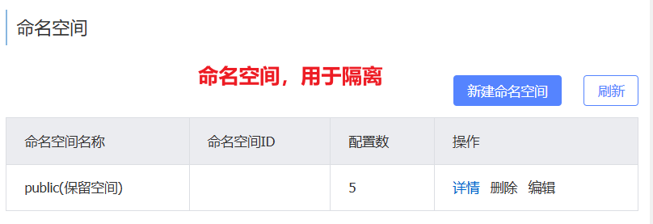

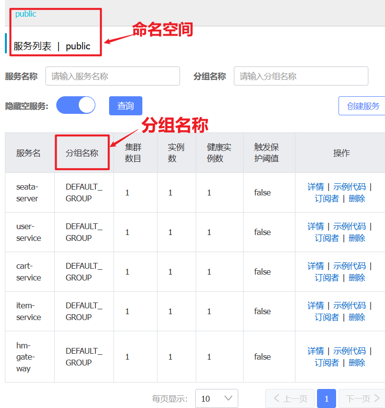

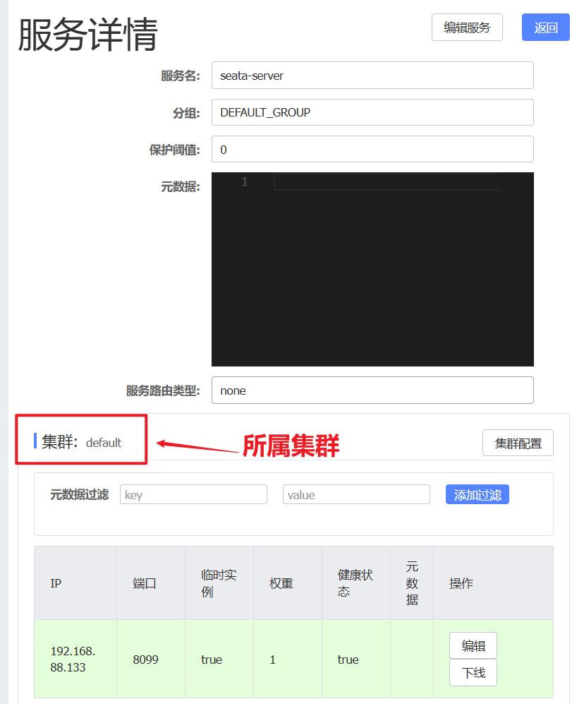


首先在nacos上添加一个==**共享的seata配置**==，命名为`shared-seata.yaml`：


内容如下：

```YAML
seata:
  registry: # TC服务注册中心的配置，微服务根据这些信息去注册中心获取tc服务地址
    type: nacos # 注册中心类型 nacos
    nacos:
      server-addr: 192.168.88.133:8848 # nacos地址
      namespace: "" # namespace，默认为空
      group: DEFAULT_GROUP # 分组，默认是DEFAULT_GROUP
      application: seata-server # seata服务名称
      username: nacos
      password: nacos
  tx-service-group: hmall # 事务组名称，标识当前微服务属于哪个事务组
  service:
    vgroup-mapping: # 事务组与tc集群的映射关系
      hmall: "default" 	#事务组 hmall 映射到 default TC 集群
```

然后，改造`trade-service`模块，添加`bootstrap.yaml`：


内容如下:

```YAML
spring:
  application:
    name: trade-service # 服务名称
  profiles:
    active: dev
  cloud:
    nacos:
      server-addr: 192.168.150.101 # nacos地址
      config:
        file-extension: yaml # 文件后缀名
        shared-configs: # 共享配置
          - dataId: shared-jdbc.yaml # 共享mybatis配置
          - dataId: shared-log.yaml # 共享日志配置
          - dataId: shared-swagger.yaml # 共享日志配置
          - dataId: shared-seata.yaml # 共享seata配置
```

可以看到这里加载了共享的seata配置。

然后改造application.yaml文件，内容如下：

```YAML
server:
  port: 8085
feign:
  okhttp:
    enabled: true # 开启OKHttp连接池支持
  sentinel:
    enabled: true # 开启Feign对Sentinel的整合
hm:
  swagger:
    title: 交易服务接口文档
    package: com.hmall.trade.controller
  db:
    database: hm-trade
```

参考上述办法分别改造`hm-cart`和`hm-item`两个微服务模块。

#### 2.3.3.添加数据库表

seata的客户端在解决分布式事务的时候需要**记录一些中间数据，保存在数据库中**。因此我们要先准备一个这样的表。

将课前资料的**seata-at**.sql分别文件导入hm-trade、hm-cart、hm-item**三个数据库**中：

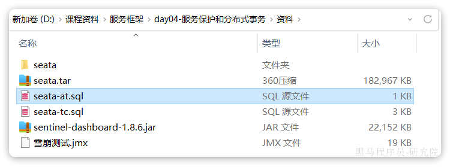

结果：


OK，至此为止，微服务整合的工作就完成了。可以参考上述方式对`hm-item`和`hm-cart`模块完成整合改造。

#### 2.3.4.测试

接下来就是测试的分布式事务的时候了。

我们找到`trade-service`模块下的`com.hmall.trade.service.impl.OrderServiceImpl`类中的`createOrder`方法，也就是下单业务方法。

将其上的`@Transactional`注解改为**Seata提供的==`@GlobalTransactional`==**：


**`@GlobalTransactional`注解**就是在**标记事务的起点**，将来TM就会基于这个方法**判断全局事务范围**，初始化全局事务。

我们重启`trade-service`、`item-service`、`cart-service`三个服务。再次测试，发现分布式事务的问题解决了！

**==注意：==**

item-service和cart-service服务对应的Service方法中**需要添加@Transaction注解**

要**==利用`@GlobalTransactional`标记分布式事务的入口方法==**：

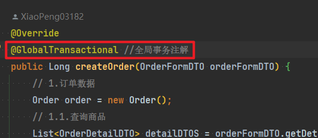

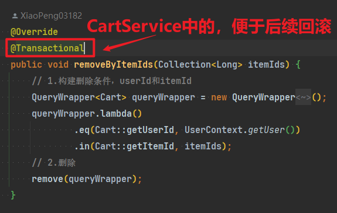

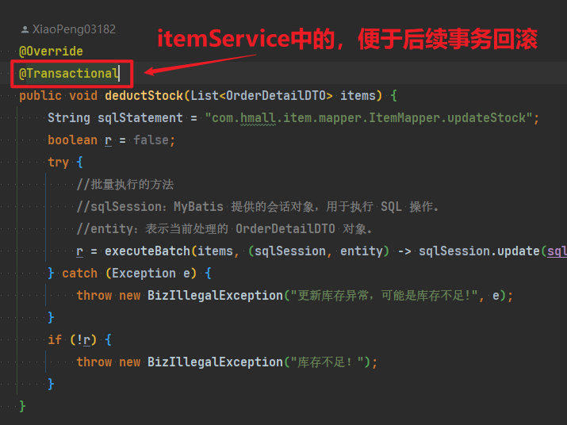

那么，Seata是如何解决分布式事务的呢？


### 2.4.==XA模式==

Seata支持四种不同的分布式事务解决方案：

- **XA**
- **TCC**
- **AT**
- **SAGA**

这里我们以`XA`模式和`AT`模式来给大家讲解其实现原理。

`XA` 规范 是` X/Open` 组织定义的**分布式事务处理（DTP，Distributed Transaction Processing）**标准，XA 规范 描述了全局的`TM`与局部的`RM`之间的接口，几乎所有主流的数据库都对 XA 规范 提供了支持。

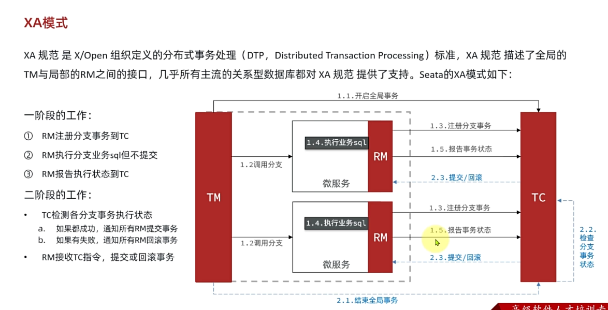

#### 2.4.1.两阶段提交

A是规范，目前主流数据库都实现了这种规范，实现的原理都是基于**两阶段提交**。

正常情况：

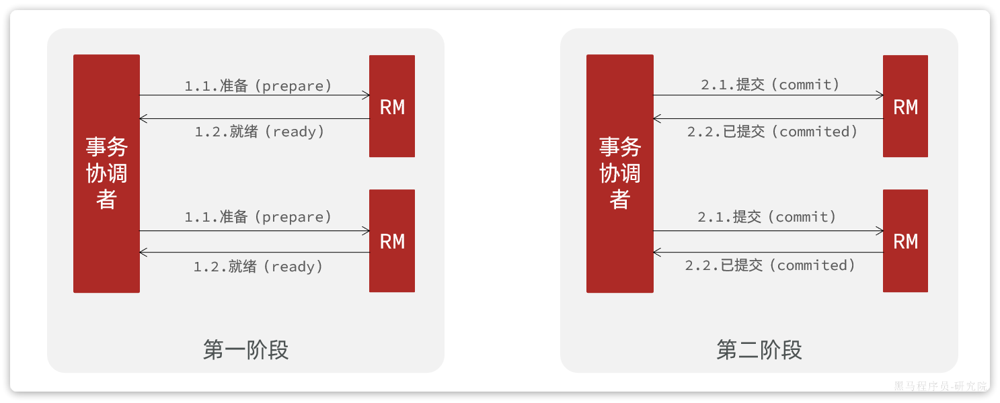

异常情况：


一阶段：

- 事务协调者通知每个事务参与者**执行本地事务**
- **本地事务执行完成后**报告事务执行状态给事务协调者，此时**事务不提交**，继续持有**数据库锁**：==**锁定数据库资源**==，（**其他事务此时无法访问**）


数据库锁的基本概念-[数据库锁的基本概念](#数据库锁的基本概念)


二阶段：

- 事务协调者基于一阶段的报告来判断下一步操作
- 如果一阶段**都成功**，则通知所有事务参与者，**提交事务**
- 如果一阶段**任意一个参与者失败**，则**通知所有事务参与者回滚事务**


#### 2.4.2.Seata的XA模型

Seata对原始的XA模式做了简单的封装和改造，以适应自己的事务模型，基本架构如图：

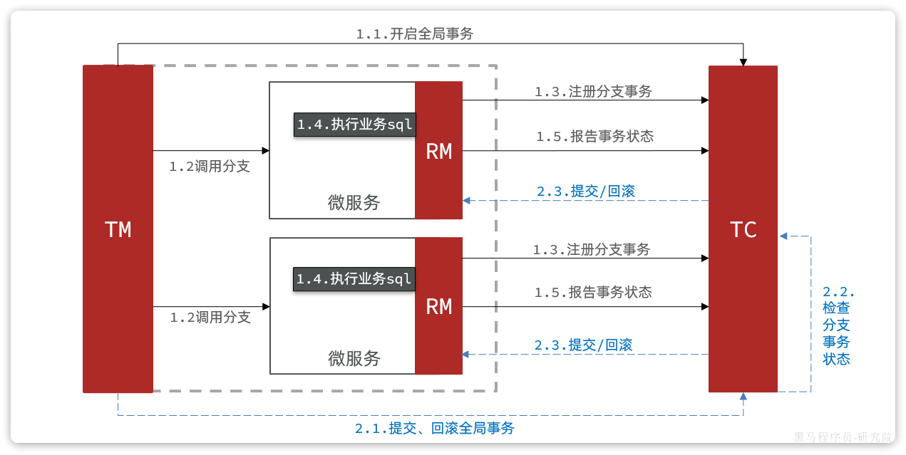

**`RM`一阶段**的工作：

1. 注册分支事务到`TC`
2. **执行分支业务sql但不提交**
3. 报告执行状态到`TC`

**`TC`二阶段**的工作：

1.  `TC`检测各分支事务执行状态
   1. 如果都成功，通知所有RM提交事务
   2. 如果有失败，通知所有RM回滚事务 

**`RM`二阶段**的工作：

- 接收`TC`指令，提交或回滚事务

#### 2.4.3.优缺点

`XA`模式的优点是什么？

- 事务的强一致性，满足ACID原则
- 常用数据库都支持，实现简单，并且没有代码侵入

`XA`模式的缺点是什么？

- 因为一阶段需要==**锁定数据库资源**==，（**其他事务此时无法访问**），**等待二阶段结束才释放，==性能较差==**
- 依赖关系型数据库实现事务

#### 2.4.4.==实现步骤==

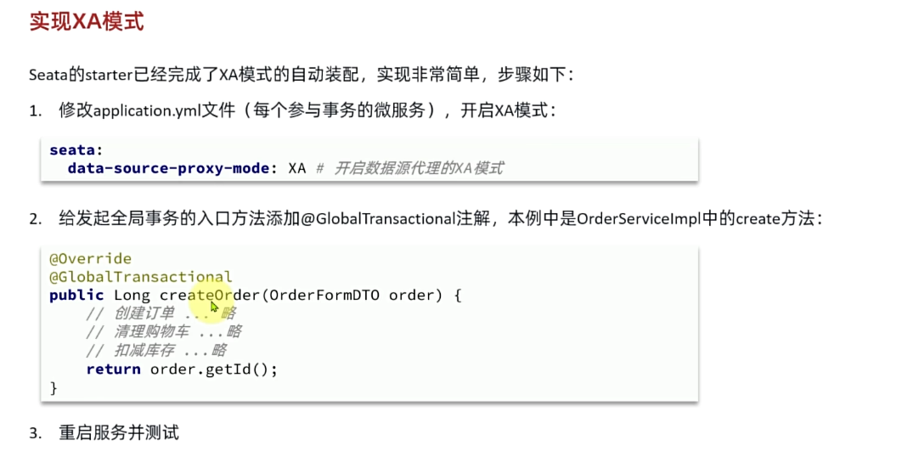

首先，我们要在配置文件中指定要采用的分布式事务模式。我们可以在Nacos中的共享shared-seata.yaml配置文件中设置：

```YAML
seata:
  data-source-proxy-mode: XA
```

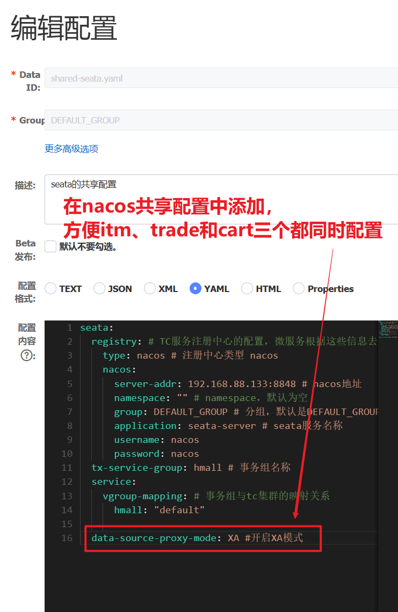

其次，我们要利用`@GlobalTransactional`标记分布式事务的入口方法：


#### 2.4.5.==测试==-提交订单

##### （1）不进行分布式事务处理时

**测试方法-动态修改商品库存量**

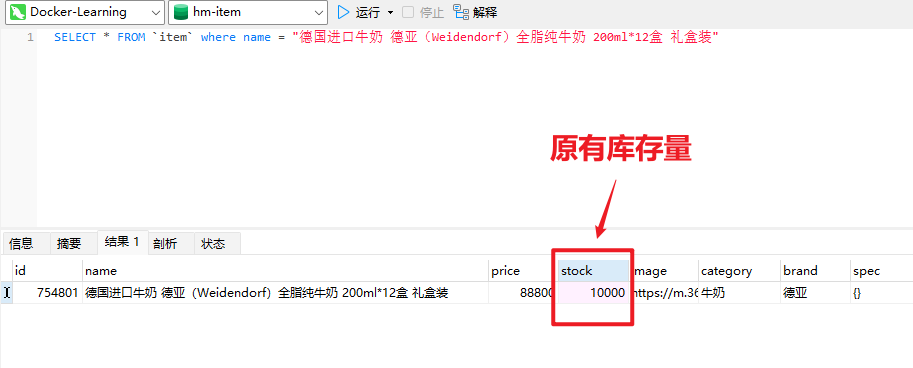

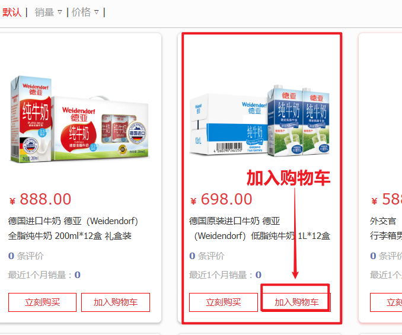

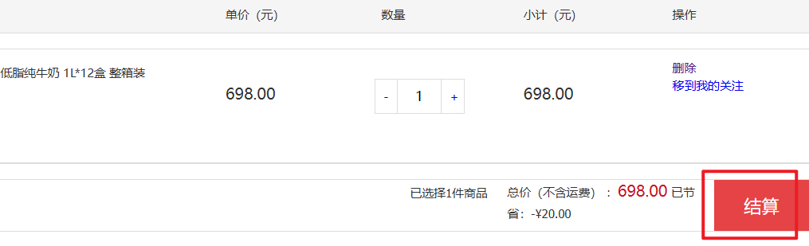

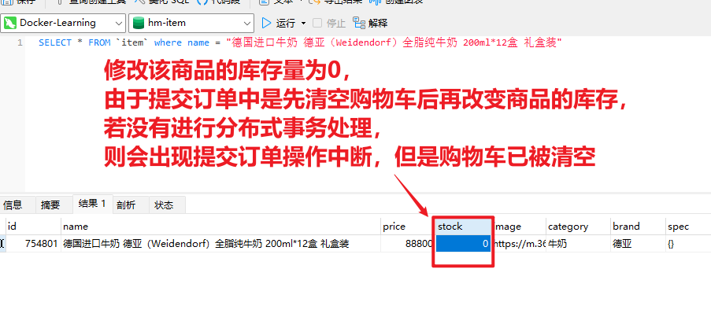

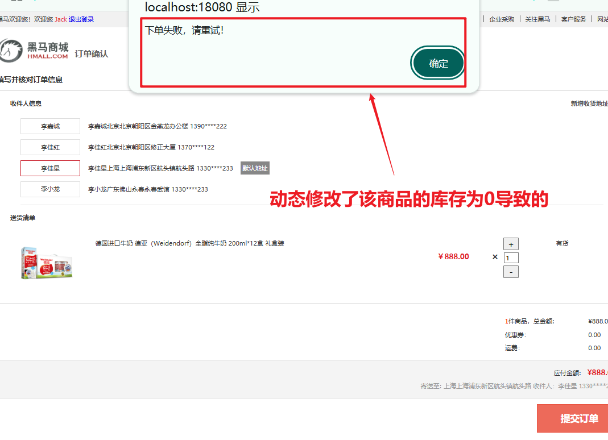

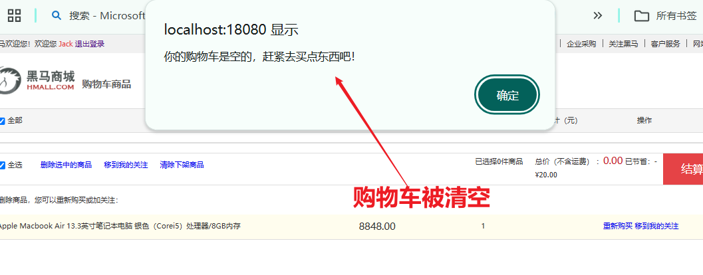


##### （2）使用XA模式进行分布式事务处理

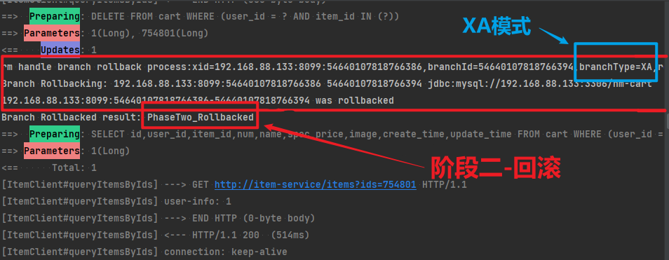


### 2.5.==AT模式==

`AT`模式同样是分阶段提交的事务模型，不过缺弥补了`XA`模型中**==资源锁定周期过长==的缺陷**。

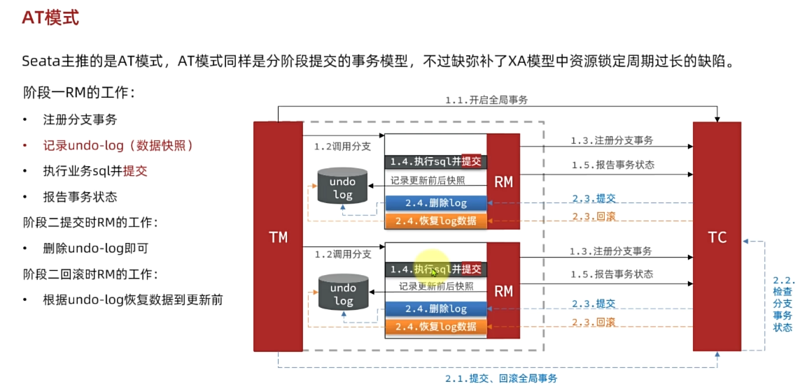

#### 2.5.1.Seata的AT模型

基本流程图：


阶段一`RM`的工作：

- 注册分支事务
- **记录undo-log（==数据快照==）**
- 执行业务sql并提交
- 报告事务状态

阶段二提交时`RM`的工作：

- 删除undo-log即可

阶段二回滚时`RM`的工作：

- **根据undo-log恢复数据到更新前**


#### 2.5.2.流程梳理

我们用一个真实的业务来梳理下AT模式的原理。

比如，现在有一个数据库表，记录用户余额：

| **id** | **money** |
| :----- | :-------- |
| 1      | 100       |

其中一个分支业务要执行的SQL为：

```SQL
 update tb_account set money = money - 10 where id = 1
```

AT模式下，当前分支事务执行流程如下：

**一阶段**：

1. `TM`发起并注册全局事务到`TC`
2. `TM`调用分支事务
3. 分支事务准备执行业务SQL
4. **`RM`拦截业务SQL，根据where条件查询原始数据，==形成快照==。**

```JSON
{
  "id": 1, "money": 100
}
```

1. `RM`执行业务SQL，**提交本地事务，释放数据库锁**。此时 money = 90
2. `RM`报告本地事务状态给`TC`

**二阶段**：

1. `TM`通知`TC`事务结束
2. **`TC`检查分支事务状态**
   1. 如果都成功，则立即删除快照
   2. 如果有分支事务失败，**需要回滚**。读取快照数据（{"id": 1, "money": 100}），将快照恢复到数据库。此时数据库再次恢复为100

流程图：

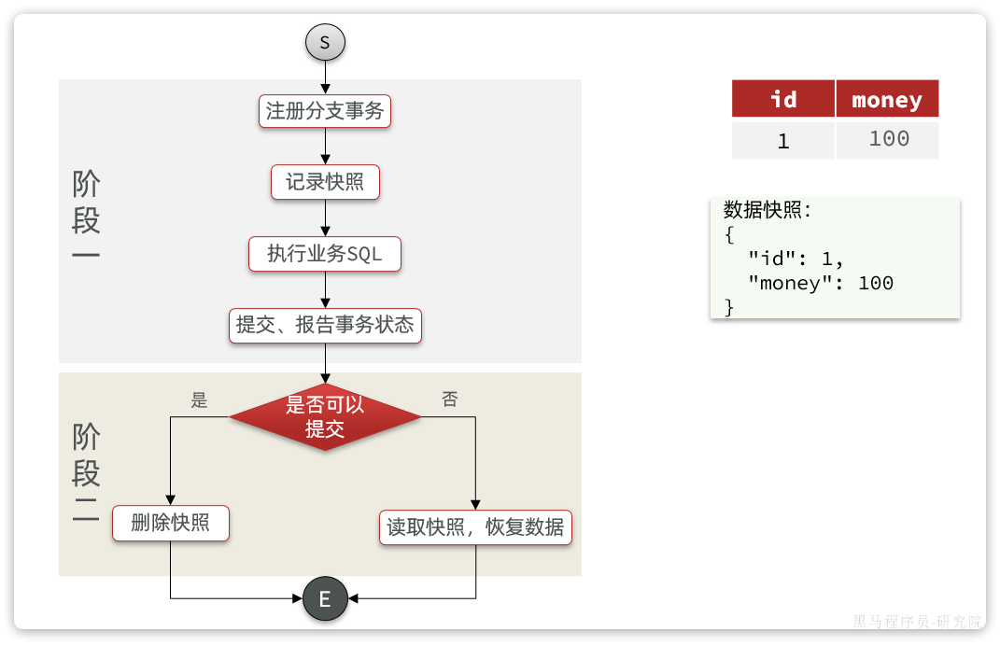

#### 2.5.3.AT与XA的区别

简述`AT`模式与`XA`模式最大的区别是什么？

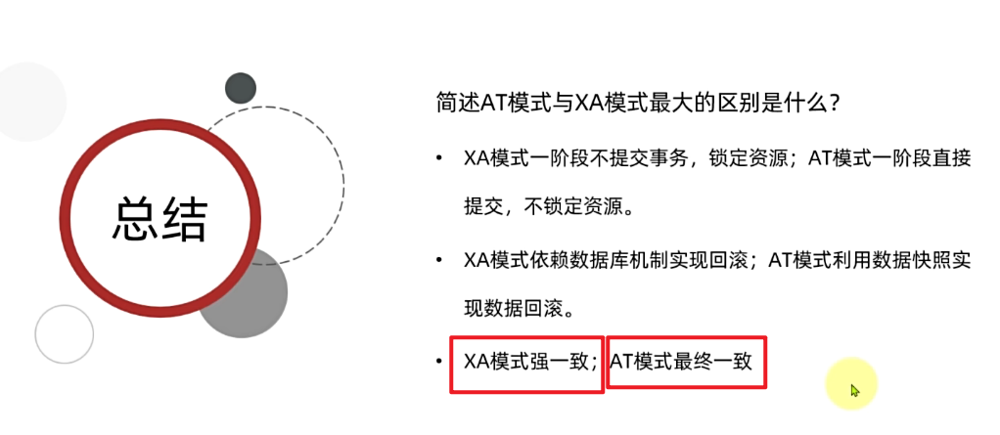

- `XA`模式**一阶段不提交事务，锁定资源**；`AT`模式**一阶段直接提交，不锁定资源**（**==会出现短暂数据不一致的问题==**）。
- `XA`模式依赖**数据库机制实现回滚**；`AT`模式利用**数据快照实现数据回滚**。
- `XA`模式**强一致**；`AT`模式**最终一致**

可见，AT模式使用起来更加简单，无业务侵入，性能更好。因此企业90%的分布式事务都可以用AT模式来解决。

#### 2.5.5.==实现AT模式==

##### （1）添加==快照==-数据库表

seata的客户端在解决分布式事务的时候需要**记录一些中间数据，保存在数据库中**。因此我们要先准备一个这样的表。

将课前资料的seata-at.sql分别文件导入hm-trade、hm-cart、hm-item三个数据库中：


结果：


```sql
-- for AT mode you must to init this sql for you business database. the seata server not need it.
CREATE TABLE IF NOT EXISTS `undo_log`
(
    `branch_id`     BIGINT       NOT NULL COMMENT 'branch transaction id',
    `xid`           VARCHAR(128) NOT NULL COMMENT 'global transaction id',
    `context`       VARCHAR(128) NOT NULL COMMENT 'undo_log context,such as serialization',
    `rollback_info` LONGBLOB     NOT NULL COMMENT 'rollback info',
    `log_status`    INT(11)      NOT NULL COMMENT '0:normal status,1:defense status',
    `log_created`   DATETIME(6)  NOT NULL COMMENT 'create datetime',
    `log_modified`  DATETIME(6)  NOT NULL COMMENT 'modify datetime',
    UNIQUE KEY `ux_undo_log` (`xid`, `branch_id`)
) ENGINE = InnoDB
  AUTO_INCREMENT = 1
  DEFAULT CHARSET = utf8mb4 COMMENT ='AT transaction mode undo table';

```

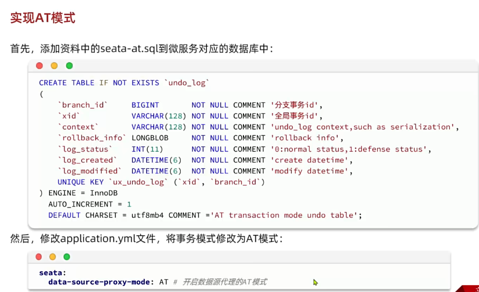

##### （2）将事务模式修改为AT模式

```yaml
seata:
  data-source-proxy-mode: AT
```

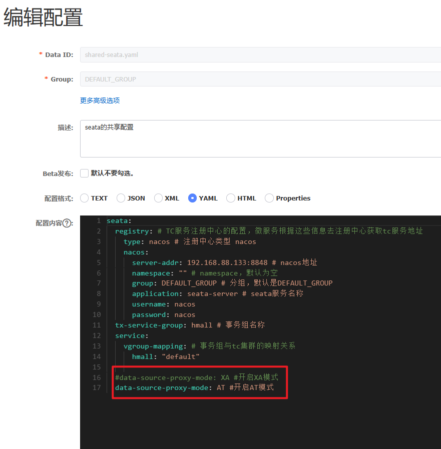


##### （3）添加全局事务注解

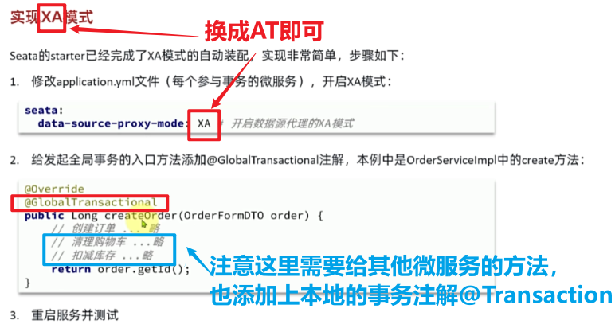

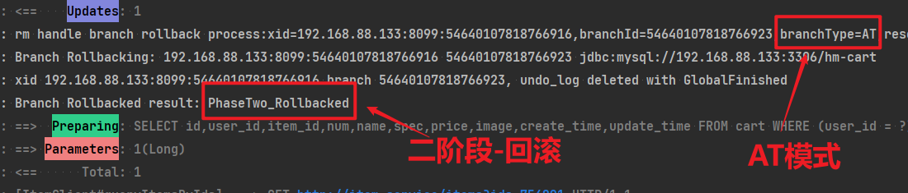


#### 2.5.6.==高并发场景==

是的，**Seata AT 模型在高并发下，可能会出现短暂的数据不一致**，但最终 Seata 会通过 **Undo Log 机制** 尝试回滚，保证最终一致性。然而，在某些极端情况下，比如 **并发更新、写入冲突、回滚失败**，确实可能导致数据被覆盖或部分回滚失败，导致数据不一致。

==**Seata AT 默认会使用 `FOR UPDATE` 进行行锁保护**==，但仍然需要业务逻辑来防止数据覆盖。

------

###### **1. 并发高会导致数据不一致的情况**

在 Seata AT 模型中，主要的风险是 **多个分支事务并发执行，部分提交后回滚导致数据不一致**。以下是几个可能的场景：

**情况 1：分支事务提交后，整体事务回滚**

**问题描述：**

- 事务 A 由多个分支事务 `T1`、`T2`、`T3` 组成。
- `T1` 先提交成功，数据库数据已修改。
- `T2`、`T3` 由于某种原因失败，导致整个全局事务需要回滚。
- Seata **通过 Undo Log 回滚 `T1`**，但 `T1` 的数据可能已经被其他事务修改了，导致数据不一致。

**可能导致的问题：**

- `T1` 提交的数据可能已经被其他事务读取或修改，回滚后可能影响其他事务的正确性。

**解决方案：**

- **乐观锁控制**：通过 **版本号（version）或时间戳** 确保数据不会被其他事务错误覆盖。
- **Seata 事务重试机制**：Seata **会持续重试回滚，直到成功**。
- **业务层补偿**：如果 Seata 发现数据被篡改，可能需要额外的业务补偿逻辑，比如 **人工审核、通知回滚失败等**。

------

**情况 2：并发更新导致 Undo Log 覆盖**

**问题描述：**

- 假设多个事务 `T1`、`T2` 并发更新同一条数据（`record_id=100`）。
- `T1` 修改数据并生成 **Undo Log**，然后提交。
- `T2` 也修改了相同数据，并生成 **自己的 Undo Log**，然后提交。
- 如果 `T2` 事务最终被回滚，Seata 会尝试使用 **Undo Log 回滚 `T2` 的数据**，但 `T1` 已经修改过数据，导致 `T2` 的回滚可能覆盖 `T1` 的数据。

**可能导致的问题：**

- `T2` 的回滚可能会覆盖 `T1` 已经提交的正确数据，导致数据不一致。

**解决方案：**

- **行锁（Row Locking）**：数据库层面加**行锁(For Update)**，避免多个事务同时修改同一行数据。
- **MVCC（多版本控制）**：数据库本身的 MVCC 机制可以避免事务回滚影响其他事务。
- **业务逻辑幂等**：如果发生并发修改，业务逻辑需要确保数据不会被错误覆盖。

------

###### **2. Seata AT 如何降低数据不一致风险？**

Seata AT 主要依赖以下机制减少数据不一致：

1. **Undo Log**：
   - 在 **第一阶段**（Try 阶段）记录原始数据，回滚时尝试恢复。
   - 但如果数据已被其他事务修改，Undo Log 可能无法正确回滚。
2. **全局事务协调（TC）**：
   - Seata 的 TC 事务协调器会不断重试未完成的回滚操作，确保最终一致性。
   - 但如果业务数据已被其他事务修改，Seata 可能无法正确恢复。
3. **写隔离机制**：
   - **使用 `FOR UPDATE` 语句**，让数据库加锁，避免并发更新导致数据覆盖。
   - **使用版本号（Versioning）** 机制，确保事务顺序执行，避免数据篡改。

------

###### **3. Seata AT 并发问题的优化方案**

**1. 业务级幂等控制**

- **增加唯一性约束**，确保事务重复执行不会影响最终数据。
- **时间戳或版本号控制**，避免数据被意外覆盖。

**2. 数据库层优化**

- **行锁（Row Locking）** 避免并发事务更新同一行数据。
- **乐观锁（Optimistic Locking）** 避免事务回滚时覆盖新的数据。

**3. 业务层事务补偿**

- 如果发现事务 **回滚失败** 或 **数据已被修改**，可以进行**人工审核** 或 **额外补偿逻辑**。

------

###### **4. 结论**

Seata AT 模型在 **高并发场景下** 可能会出现 **数据回滚失败、Undo Log 覆盖、数据被篡改等问题**，导致短暂数据不一致。但它最终会通过 **持续重试回滚** 保证数据的一致性。

如果业务对 **强一致性** 要求很高，可以考虑：

- **Seata TCC 模式**，手动控制事务补偿逻辑。
- **XA 事务**（但性能较低）。
- **基于消息队列（MQ）的事务方案**，确保跨服务事务的最终一致性。


##### 2.5.7.版本控制和行锁

在 **高并发场景** 下，为了避免 **Seata AT 模型** 出现数据覆盖或不一致的情况，可以使用 **版本号（Versioning）机制** 和 **行锁（Row Locking）** 进行优化。

------

###### **1. 版本号（Versioning）机制**

**原理**

- **在数据库表中增加 `version` 字段**，每次更新数据时，`version` 递增。
- **更新数据时带上 `version` 作为条件**，只有当 `version` **未被其他事务修改时**，更新才会成功。
- **如果 `version` 变更，说明有并发事务修改了数据，当前事务应当回滚或重试**。

**示例**

假设有一个订单表 `order_table`：

```sql
CREATE TABLE order_table (
    id BIGINT PRIMARY KEY,
    order_status VARCHAR(50),
    version INT NOT NULL
);
```

在事务更新数据时：

```sql
UPDATE order_table
SET order_status = 'PAID', version = version + 1
WHERE id = 1 AND version = 3;
```

> **如果 `version = 3` 但当前数据库中已经变为 `4`，说明别的事务已更新过数据，当前事务会失败，避免数据覆盖。**

**Seata 中的使用**

Seata 本身不会自动管理 `version`，但可以在业务逻辑中手动实现：

```java
@Modifying
@Query("UPDATE Order o SET o.orderStatus = :status, o.version = o.version + 1 WHERE o.id = :id AND o.version = :version")
int updateOrder(@Param("id") Long id, @Param("status") String status, @Param("version") Integer version);
```

如果 `updateOrder` 返回 `0`，说明 **版本号被其他事务修改，需要重试或处理冲突**。

------

###### **2. 行锁（Row Locking）**

**原理**

- **使用 `SELECT ... FOR UPDATE`** 语句，在事务中锁定行数据，防止其他事务同时修改。
- **适用于 Seata AT 模式**，因为 Seata **会自动在事务 SQL 语句上加 `FOR UPDATE`** 来获取 **全局锁**。

**示例**

```sql
BEGIN;
SELECT * FROM order_table WHERE id = 1 FOR UPDATE;
UPDATE order_table SET order_status = 'PAID' WHERE id = 1;
COMMIT;
```

> **在事务提交前，其他事务无法修改 `id = 1` 的数据。**

**Seata 中的使用**

Seata **默认会在 AT 模式的事务 SQL 里添加 `FOR UPDATE`**，例如：

```java
@Transactional
public void updateOrder(Long orderId) {
    Order order = orderRepository.findById(orderId).get();
    order.setOrderStatus("PAID");
    orderRepository.save(order);
}
```

> **Seata AT 代理时，会自动在 `SELECT` 语句后加 `FOR UPDATE`，锁住数据，避免并发问题。**

###### **行锁 vs 版本号**

| **方法**                 | **适用场景**                           | **优点**                 | **缺点**                       |
| ------------------------ | -------------------------------------- | ------------------------ | ------------------------------ |
| **行锁（Row Locking）**  | 适用于短事务，保证数据不被其他事务修改 | 数据一致性高，简单易用   | 会影响并发性能，可能导致锁等待 |
| **版本号（Versioning）** | 适用于高并发业务，允许部分事务失败重试 | 不影响并发性能，不会锁行 | 需要额外实现重试逻辑           |

------

###### **3. 综合方案**

- **低并发**：直接使用 **行锁（`FOR UPDATE`）**，确保事务完整性。
- **高并发**：使用 **版本号机制**，减少锁冲突，并结合 **自动重试** 处理事务失败。

------

###### **4. 结论**

- **如果并发量高，推荐使用版本号（Versioning）机制**，避免锁冲突。
- **如果数据一致性要求高，可以使用行锁（Row Locking）**，但会降低并发性能。
- ==**Seata AT 默认会使用 `FOR UPDATE` 进行行锁保护**==，但仍然需要业务逻辑来防止数据覆盖。


## 3.==练习==

### 3.1.编写降级逻辑

给黑马商城中现有的FeignClient都编写对应的降级逻辑，并且改造项目中每一个微服务，将OpenFeign与Sentinel整合。

#### 3.1.2.降级逻辑

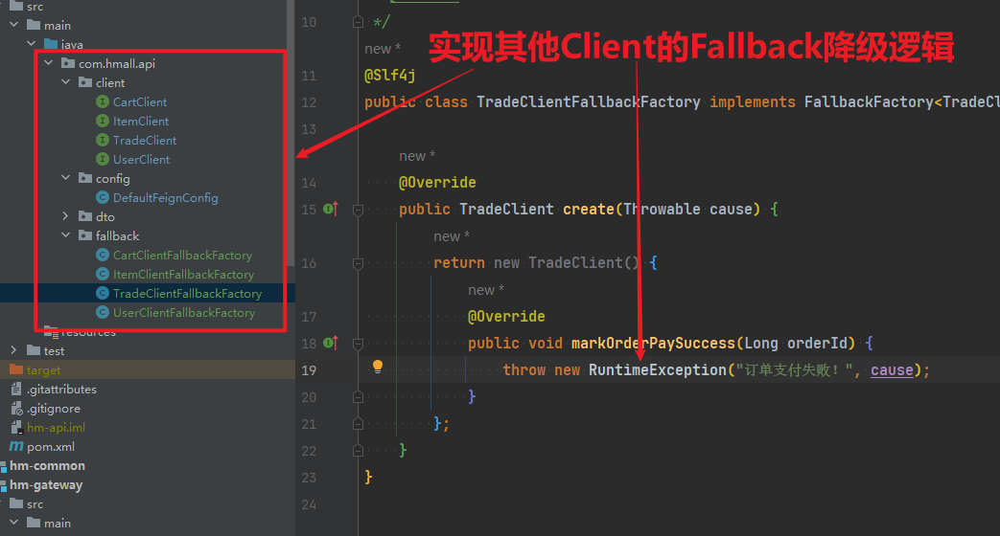


#### 3.1.2.简化其他微服务配置

```xml
<!--统一配置管理-->
<dependency>
    <groupId>com.alibaba.cloud</groupId>
    <artifactId>spring-cloud-starter-alibaba-nacos-config</artifactId>
</dependency>
<!--读取bootstrap文件-->
<dependency>
    <groupId>org.springframework.cloud</groupId>
    <artifactId>spring-cloud-starter-bootstrap</artifactId>
</dependency>
```

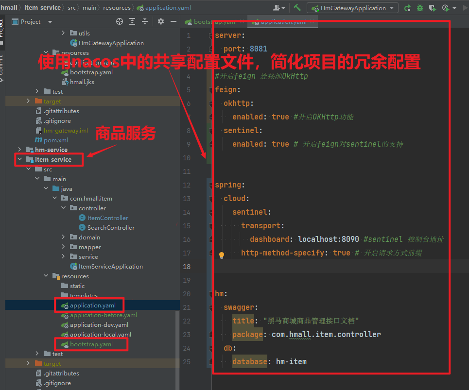

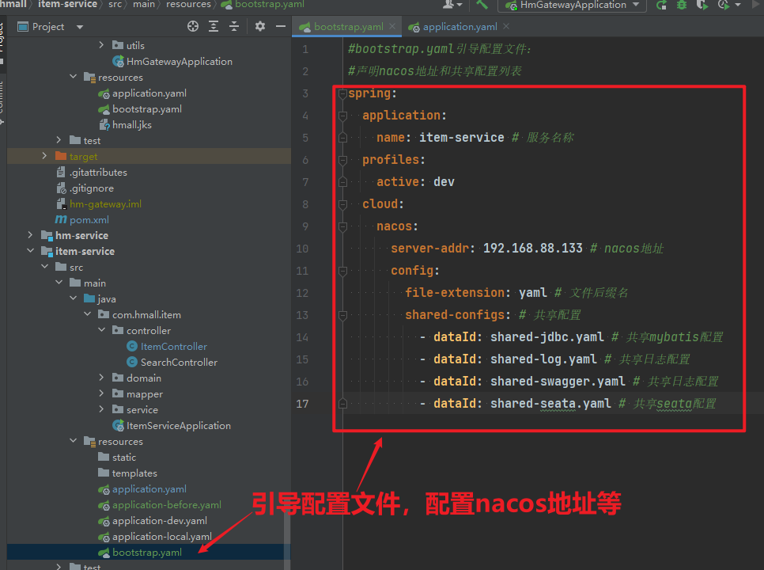


#### 3.1.3.将OpenFeign与Sentinel整合

```xml
<!--阿里-sentinel-->
<dependency>
    <groupId>com.alibaba.cloud</groupId>
    <artifactId>spring-cloud-starter-alibaba-sentinel</artifactId>
</dependency>
```

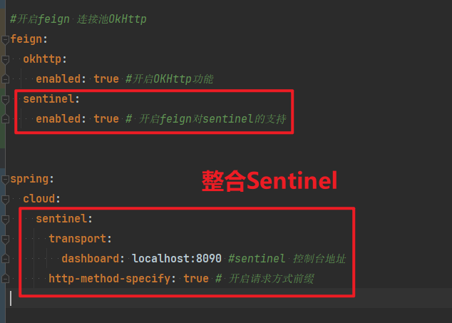


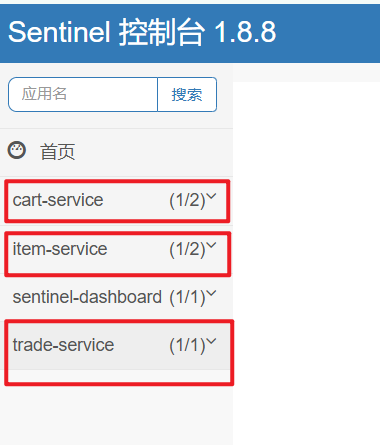


### 3.2.==解决分布式事务==

除了下单业务以外，用户如果选择余额支付，前端会将请求发送到pay-service模块。而这个模块要做三件事情：

- 直接从user-service模块调用接口，扣除余额付款
- 更新本地（pay-service）交易流水表状态
- 通知交易服务（trade-service）更新其中的业务订单状态

流程如图：

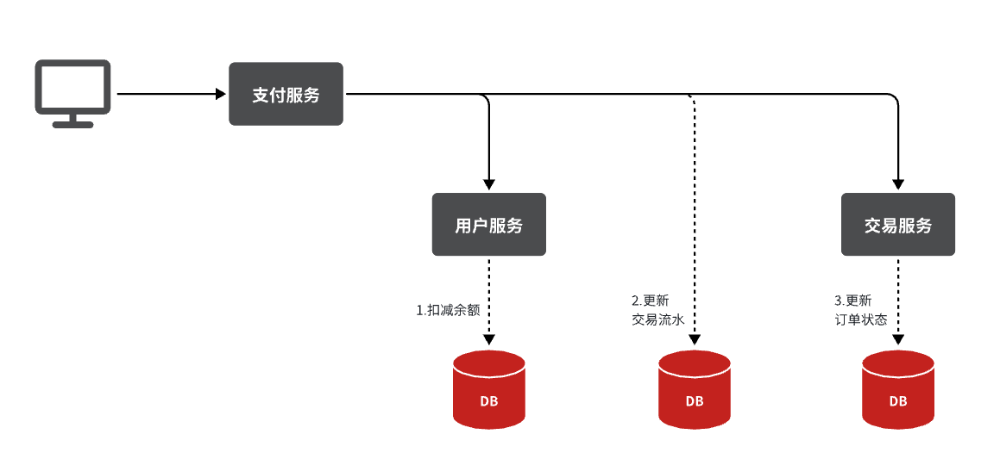

显然，这里也存在分布式事务问题。

对应的页面如下：

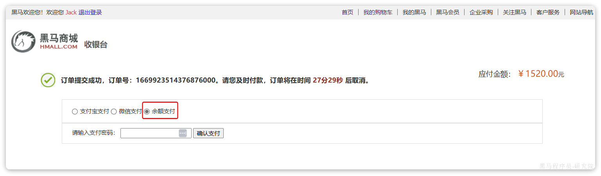

当我们提交订单成功后，进入支付页面，选择余额支付，输入密码后点击确认支付即可。

前端会提交支付请求，业务接口的入口在`com.hmall.pay.controller.PayController`类的`tryPayOrderByBalance`方法：


对应的service方法如下：

```Java
@Override
@Transactional
public void tryPayOrderByBalance(PayOrderDTO payOrderDTO) {
    // 1.查询支付单
    PayOrder po = getById(payOrderDTO.getId());
    // 2.判断状态
    if(!PayStatus.WAIT_BUYER_PAY.equalsValue(po.getStatus())){
        // 订单不是未支付，状态异常
        throw new BizIllegalException("交易已支付或关闭！");
    }
    // 3.尝试扣减余额
    userClient.deductMoney(payOrderDTO.getPw(), po.getAmount());
    // 4.修改支付单状态
    boolean success = markPayOrderSuccess(payOrderDTO.getId(), LocalDateTime.now());
    if (!success) {
        throw new BizIllegalException("交易已支付或关闭！");
    }
    // 5.修改订单状态
    tradeClient.markOrderPaySuccess(po.getBizOrderNo());
}
```

利用seata解决这里的分布式事务问题，并思考这个业务实现有没有什么值得改进的地方


#### 3.2.1.引入依赖

```xml
<!--统一配置管理-->
<dependency>
    <groupId>com.alibaba.cloud</groupId>
    <artifactId>spring-cloud-starter-alibaba-nacos-config</artifactId>
</dependency>
<!--读取bootstrap文件-->
<dependency>
    <groupId>org.springframework.cloud</groupId>
    <artifactId>spring-cloud-starter-bootstrap</artifactId>
</dependency>
<!--seata-->
<dependency>
    <groupId>com.alibaba.cloud</groupId>
    <artifactId>spring-cloud-starter-alibaba-seata</artifactId>
</dependency>

<!--阿里-sentinel-->
<dependency>
    <groupId>com.alibaba.cloud</groupId>
    <artifactId>spring-cloud-starter-alibaba-sentinel</artifactId>
</dependency>
```


#### 3.2.2.==修改yaml配置==

##### （1）*bootstrap.yaml*引导配置文件

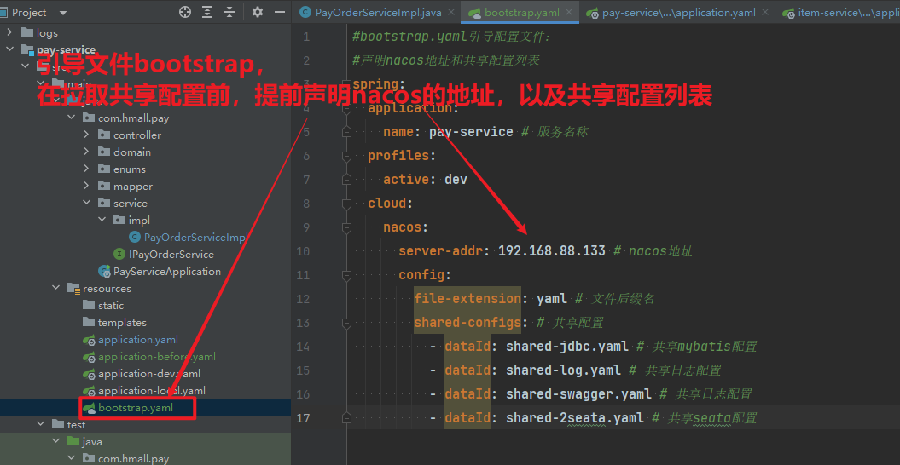

```yaml
#bootstrap.yaml引导配置文件：
#声明nacos地址和共享配置列表
spring:
  application:
    name: pay-service # 服务名称
  profiles:
    active: dev
  cloud:
    nacos:
      server-addr: 192.168.88.133 # nacos地址
      config:
        file-extension: yaml # 文件后缀名
        shared-configs: # 共享配置
          - dataId: shared-jdbc.yaml # 共享mybatis配置
          - dataId: shared-log.yaml # 共享日志配置
          - dataId: shared-swagger.yaml # 共享日志配置
          - dataId: shared-seata.yaml # 共享seata配置
```

##### （2）本地yaml文件

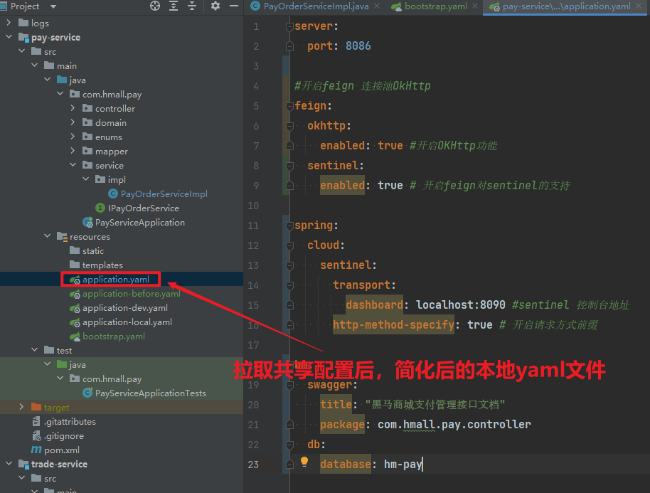

```yaml
server:
  port: 8086

#开启feign 连接池OkHttp
feign:
  okhttp:
    enabled: true #开启OKHttp功能
  sentinel:
    enabled: true # 开启feign对sentinel的支持

spring:
  cloud:
    sentinel:
      transport:
        dashboard: localhost:8090 #sentinel 控制台地址
      http-method-specify: true # 开启请求方式前缀

hm:
  swagger:
    title: "黑马商城支付管理接口文档"
    package: com.hmall.pay.controller
  db:
    database: hm-pay
```


#### 3.2.3.使用AT模式处理分布式事务

##### （1）添加==快照==-数据库表

seata的客户端在解决分布式事务的时候需要**记录一些中间数据，保存在数据库中**。因此我们要先准备一个这样的表。

将课前资料的seata-at.sql分别文件导入hm-trade、hm-cart、hm-item三个数据库中：


结果：

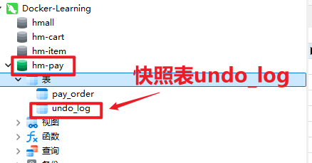

```sql
-- for AT mode you must to init this sql for you business database. the seata server not need it.
CREATE TABLE IF NOT EXISTS `undo_log`
(
    `branch_id`     BIGINT       NOT NULL COMMENT 'branch transaction id',
    `xid`           VARCHAR(128) NOT NULL COMMENT 'global transaction id',
    `context`       VARCHAR(128) NOT NULL COMMENT 'undo_log context,such as serialization',
    `rollback_info` LONGBLOB     NOT NULL COMMENT 'rollback info',
    `log_status`    INT(11)      NOT NULL COMMENT '0:normal status,1:defense status',
    `log_created`   DATETIME(6)  NOT NULL COMMENT 'create datetime',
    `log_modified`  DATETIME(6)  NOT NULL COMMENT 'modify datetime',
    UNIQUE KEY `ux_undo_log` (`xid`, `branch_id`)
) ENGINE = InnoDB
  AUTO_INCREMENT = 1
  DEFAULT CHARSET = utf8mb4 COMMENT ='AT transaction mode undo table';

```

##### （2）将事务模式修改为AT模式

**修改nacos上的共享配置文件shared-seata.yaml（注意该文件修改后，对应拉取的服务==需要重启==）**

```yaml
seata:
  data-source-proxy-mode: AT
```


##### （3）添加==全局/分支事务注解==

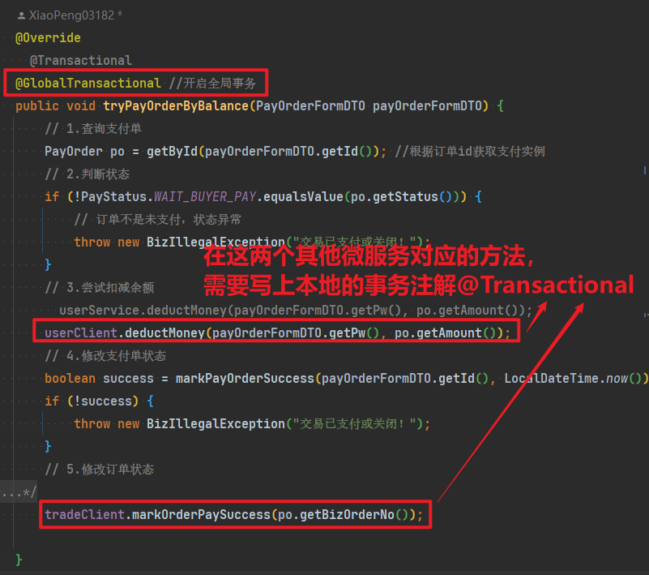


###### **① 使用 @GlobalTransactional 声明全局事务**

将该业务方法标记为 Seata 的全局事务起点，添加 `@GlobalTransactional` 注解。

```java
    @Override
    @GlobalTransactional //开启全局事务
    public void tryPayOrderByBalance(PayOrderFormDTO payOrderFormDTO) {
    }
```

**关键点：**

- `@GlobalTransactional` 表示事务的发起者，Seata 会在这个方法中**开启全局事**务，**协调后续所有的分支事务。**
- `rollbackFor` **明确回滚的异常范围**，确保异常情况下事务的一致性。

------

###### **② 确保==分支事务==参与 Seata**

参与事务的两个微服务（`userClient` 和 `tradeClient`）需要对其方法进行分布式事务支持。

**User Service (userClient)：**

1. 在 `deductMoney` 方法中添加 Seata 支持，确保扣减余额的操作能够被 Seata 管理。
2. 使用 `@Transactional` 管理本地事务。

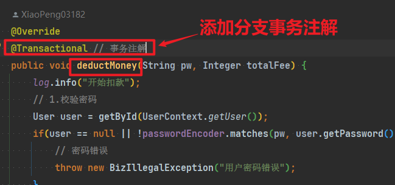

**Trade Service (tradeClient)：**

同样，在 `markOrderPaySuccess` 方法中加入 Seata 支持，确保订单状态更新操作受事务保护。

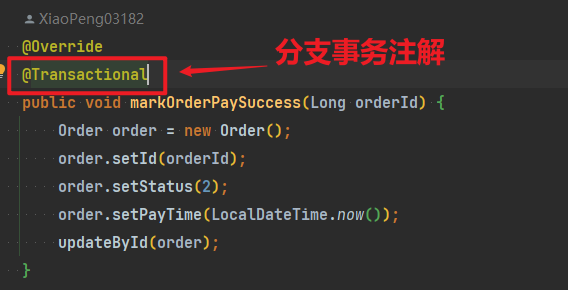

以上方法在执行时，Seata 会将它们**注册为分支事务**，**统一由全局事务管理**。


#### 3.2.4.业务实现的==改进点==

##### （1）**支付状态的==幂等性保证==**

- **问题**：当前代码中 `markPayOrderSuccess` 和 `tradeClient.markOrderPaySuccess` 都可能因为并发或重复调用导致状态不一致。
- **改进**：在这两个操作中**添加幂等性检查**，避免重复处理（如通过**==乐观锁机制==**或**==唯一流水号校验==**实现）。

###### **1. 什么是==幂等性==？**

**定义：** 幂等性是**指一个操作无论执行多少次，其产生的效果和结果都是一致的，不会因为多次调用而发生变化。**

**特点：**

- **幂等性操作**：多次调用不会产生副作用，比如查询操作（GET 请求）。
- **非幂等性操作**：重复调用可能产生额外影响，比如扣款、生成订单（POST 请求）。

**例子：**

- 幂等操作：`支付订单状态更新`，如果订单已经支付，再次调用时，状态依然保持为“已支付”，而不会重复扣款或更新。
- 非幂等操作：直接扣款。如果不处理幂等性，多次调用可能会导致用户账户被多次扣款。

**幂等性保证**：检查支付单的当前状态：

- 如果状态是“已支付”，直接返回；
- 如果状态是“未支付”，执行支付并更新状态。

###### **2. 什么是==乐观锁==？**

**定义：** 乐观锁是一种**控制并发操作的数据一致性机制**，假设不会发生冲突（“乐观”）。在操作数据时不直接加锁，而是通过**版本号**或**其他条件**来检测数据是否被修改。

**原理：**

- 在更新数据时，会带上一个版本号或时间戳。
- 数据更新时，检查版本号是否与数据库中的版本号一致：
  - **一致**：更新成功，并将版本号加 1。
  - **不一致**：说明数据已被其他操作修改，更新失败，返回错误或重试。

**实现步骤：**

1. 在数据库表中添加 `version` 字段，用来表示当前版本号。
2. 更新时通过 `WHERE` 条件将 `version` 作为更新依据。

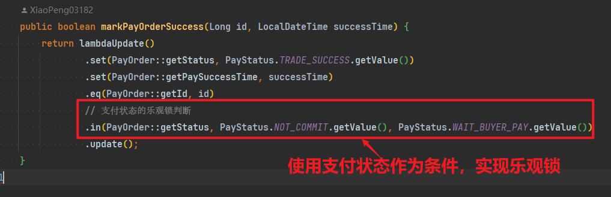

在这段代码中，乐观锁通过以下逻辑实现：

1. **指定状态范围：**

   - `in(PayOrder::getStatus, PayStatus.NOT_COMMIT.getValue(), PayStatus.WAIT_BUYER_PAY.getValue())`
   - 表示只有支付状态是 `NOT_COMMIT` 或 `WAIT_BUYER_PAY` 时，才能执行更新操作。

2. **更新操作：**

   - `set(PayOrder::getStatus, PayStatus.TRADE_SUCCESS.getValue())`
   - 更新支付状态为 `TRADE_SUCCESS`，并记录支付成功时间。

3. **失败保护：**

   - 如果支付状态在操作之前已经被其他流程更新为其他值（如 `TRADE_SUCCESS` 或 `CLOSED`），那么 `WHERE` 条件将不成立，更新操作不会执行，返回 `false`。

   

###### **3.乐观锁的==实现方式==**

乐观锁通常通过**==版本号（version）==或 ==条件判断==**来实现，本方法采用的是**条件判断机制**。原理是：

1. **通过条件限制更新范围：**
   - 更新操作仅在支付状态为 `NOT_COMMIT` 或 `WAIT_BUYER_PAY` 时执行。
   - 如果状态已经是 `TRADE_SUCCESS` 或其他状态，则更新操作会被跳过。
2. **操作的原子性：**
   - 数据库的 `UPDATE` 操作是一个原子操作，`WHERE` 条件中的检查和更新是同时完成的。
   - 如果 `WHERE` 条件不满足（即支付状态不在指定范围内），更新操作会失败，返回 `false`。

数据库的 `UPDATE` 语句如下：

```sql
UPDATE pay_order
SET status = 'TRADE_SUCCESS', pay_success_time = ?
WHERE id = ? 
  AND status IN ('NOT_COMMIT', 'WAIT_BUYER_PAY');
```

- **WHERE 条件：**

  - 只有当 `status` 为 `NOT_COMMIT` 或 `WAIT_BUYER_PAY`，且 `id` 匹配时，更新操作才会执行。
  - 如果 `status` 已被其他事务更新为 `TRADE_SUCCESS` 或 `CLOSED`，则更新操作不会执行。

- **原子性：**

  - SQL 的 

    ```
    UPDATE
    ```

     操作由数据库保证原子性：

    - 判断条件（`WHERE`）。
    - 满足条件则执行更新。
    - 整个过程是不可分割的。

###### **4.乐观锁的优点与缺点**

**优点：**

1. **无锁机制**：不用加数据库行锁，性能高，适合读多写少的场景。
2. **避免死锁**：因为没有实际锁定数据行，不存在死锁的风险。

**缺点：**

1. **高并发下可能频繁失败**：
   - 当多个请求同时修改同一行数据时，其中一个会成功，其他的会因条件不满足而失败，需要客户端进行重试。
2. 不适合写多场景：
   - **写操作频繁时**，频繁的失败和重试会**增加系统开销**。

------

**改进点**

当前代码已经通过支付状态实现了乐观锁，但可以进一步增强幂等性和可维护性：

1. **增加重试机制：**

   - 当更新失败时，可以捕获失败情况并尝试重试。

2. **引入==版本号机制==：**

   - 除了通过状态限制更新范围，还可以通过 

     ```
     version
     ```

      字段对并发修改进行精确控制：

     - 每次更新时校验 `version`，只有当 `version` 未发生变化时，才允许更新。
     - 更新成功后，将 `version` +1。

   - 数据库表需要新增 version字段，类似代码如下：

     ```java
     lambdaUpdate()
         .set(PayOrder::getStatus, PayStatus.TRADE_SUCCESS.getValue())
         .set(PayOrder::getPaySuccessTime, successTime)
         .set(PayOrder::getVersion, currentVersion + 1) // 更新版本号
         .eq(PayOrder::getId, id)
         .eq(PayOrder::getVersion, currentVersion) // 检查版本号
         .update();
     ```

3. **统一幂等性检查：**

   - 在更新状态前统一检查是否已经支付完成，减少无效更新尝试。


###### **5.什么是==唯一流水号==校验？**

**定义：** 唯一流水号校验是通过为每一次请求生成一个全局唯一的标识（流水号）来保证操作的幂等性。服务会记录每个流水号的处理状态，防止重复处理相同请求。

**适用场景：**

- 并发支付、下单、扣款等场景，需要通过唯一标识来确保请求只被执行一次。

**实现原理：**

1. **生成唯一流水号**：每次操作前，生成一个唯一流水号（如订单号、支付号等）。

2. 记录流水号状态

   ：系统在处理前检查该流水号是否已存在：

   - 如果不存在：执行操作，并记录流水号状态。
   - 如果已存在：直接返回之前的操作结果，避免重复执行。

**示例：**

- 用户请求支付：
  - 客户端生成支付流水号 `paymentId`，发送到服务端。
  - 服务端处理前检查数据库中是否存在该流水号。
  - 如果不存在，则执行扣款并记录流水号；如果已存在，则直接返回支付结果。

**代码示例：**

```java
public boolean processPayment(String paymentId, BigDecimal amount) {
    // 检查流水号是否已存在
    if (paymentRepository.existsByPaymentId(paymentId)) {
        return false; // 已处理，直接返回
    }
    // 扣款操作
    boolean deducted = accountService.deductBalance(amount);
    if (deducted) {
        // 保存流水号
        paymentRepository.save(new PaymentRecord(paymentId, amount, PaymentStatus.SUCCESS));
    }
    return deducted;
}
```

**对应 SQL：**

```sql
INSERT INTO payment_record (payment_id, amount, status)
VALUES (?, ?, ?)
ON DUPLICATE KEY UPDATE status = status;
```

**优点：**

- 全局唯一性，保证同一操作不会重复执行。
- 可以将流水号与业务逻辑关联，追踪操作状态。

**缺点：**

- 流水号的生成和存储需要额外的开发和数据库支持。
- 设计不当可能增加复杂性。


##### （2）扣款失败的详细异常信息

- **问题**：当扣减余额（`userClient.deductMoney`）失败时，没有捕获具体原因，用户可能无法知道失败原因。
- **改进**：通过封装自定义异常或者记录失败原因，提升用户体验。

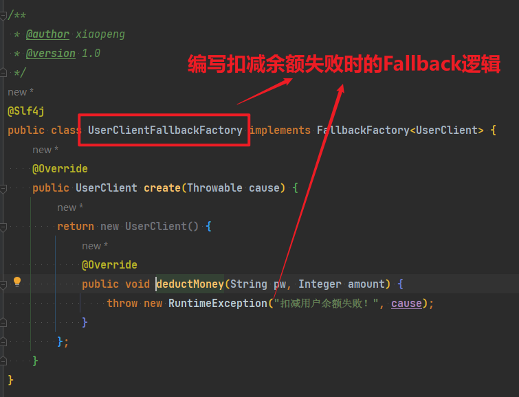

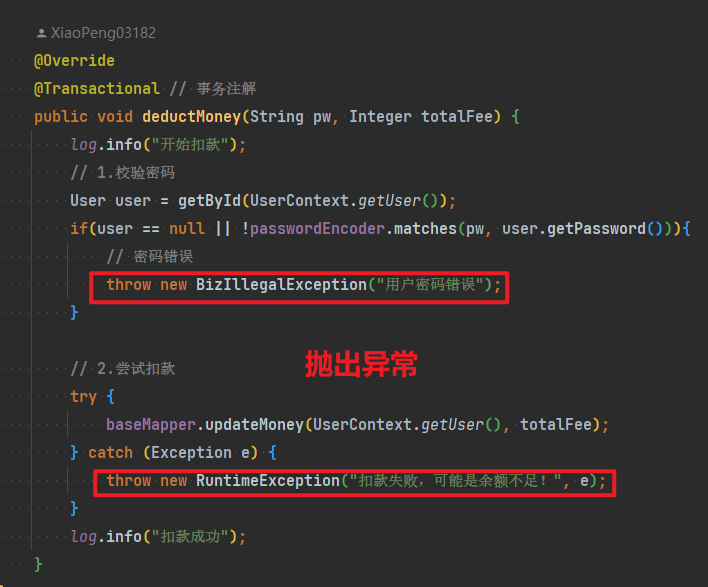


##### （3）**支付超时或异常情况下的恢复机制**

- **问题**：如果分布式事务失败（例如网络异常或服务宕机），需要额外的补偿机制。
- **改进**：通过 Seata 自带的==事务回滚机制==，确保**每个分支事务能正确回滚**。如果支付时间较长，可以在业务中设置支付超时检测和恢复逻辑（如异步检查任务）。

**问题：**
			如果支付超时或出现网络异常，可能需要补偿逻辑以恢复一致性。

**改进：**
			利用 Seata 自带的事务回滚机制处理异常。如果超时或异常问题可能无法及时恢复，可以设计异步任务定期检查支付状态并进行补偿。

- 增加支付超时字段，例如 `expired_time`，在支付单中保存支付超时时间。
- 设计定时任务，扫描超时未支付的支付单并自动关闭：

```java
@Scheduled(fixedRate = 60000) // 每分钟执行一次
public void closeExpiredPayOrders() {
    List<PayOrder> expiredOrders = payOrderMapper.findExpiredOrders(LocalDateTime.now());
    for (PayOrder order : expiredOrders) {
        if (PayStatus.WAIT_BUYER_PAY.equalsValue(order.getStatus())) {
            payOrderMapper.updateStatus(order.getId(), PayStatus.CLOSED.getValue());
            log.info("支付超时，关闭订单: {}", order.getId());
        }
    }
}
```


##### （4）**增强支付安全性**

- **问题**：支付密码的验证仅在客户端完成，可能存在一定的安全隐患。
- **改进**：密码验证逻辑应当在服务端实现，避免敏感信息的中间暴露，同时增加登录态验证等防护措施。

**问题：**
			支付密码验证存在安全隐患。

**改进：**
			将支付密码的验证迁移到服务端，避免敏感信息在客户端暴露。增加用户登录态验证以及请求签名机制。

- 支付密码加密存储，验证时进行解密。
- 在请求中引入签名验证，确保数据未被篡改。

在 `deductMoney` 方法中增加安全检查：

```java
private boolean validPassword(String inputPassword, Long userId) {
    String encryptedPassword = accountRepository.getPasswordByUserId(userId);
    return passwordEncoder.matches(inputPassword, encryptedPassword);
}
```


##### （5）**支付成功后的通知机制**

- **问题**：支付成功后**没有后续通知逻辑**，比如通知用户或通知商家发货。

- 改：在支付成功的最后一步添加通知机制，例如：

  - 给用户发送支付成功的短信或邮件。
- 给商家系统发送发货通知。

**问题：**
			支付成功后没有后续的通知逻辑，比如通知用户或商家。

**改进：**
			在支付成功后，**增加事件机制**或**消息队列**，**异步通知其他服务处理后续操作**，例如：

- 通知用户支付成功。
- 通知商家准备发货。
- 更新订单历史状态。

在 `tryPayOrderByBalance` 方法中加入事件发布逻辑：

```java
// 支付成功后发送通知
if (success) {
    eventPublisher.publishEvent(new PaymentSuccessEvent(this, po.getBizOrderNo(), po.getAmount()));
}
```

使用 Spring 的事件机制或**消息队列**处理后续通知逻辑：

```java
@Component
public class PaymentEventListener {

    @EventListener
    public void handlePaymentSuccess(PaymentSuccessEvent event) {
        // 通知商家系统发货
        notifyMerchant(event.getBizOrderNo());

        // 发送短信通知用户
        notifyUser(event.getBizOrderNo(), event.getAmount());
    }

    private void notifyMerchant(String orderNo) {
        // 调用商家系统接口
    }

    private void notifyUser(String orderNo, BigDecimal amount) {
        // 调用短信网关服务
    }
}
```


# 五、容器启动的流程

## 1.部署Mysql

通过docker-compose.yml文件一键部署mysql等容器

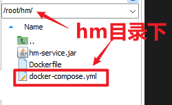

```yaml
version: "3.8"

services:
  mysql:
    image: mysql
    container_name: mysql
    ports:
      - "3306:3306"
    environment:
      TZ: Asia/Shanghai
      MYSQL_ROOT_PASSWORD: 123
    volumes:
      - "/root/mysql/conf:/etc/mysql/conf.d"
      - "/root/mysql/data:/var/lib/mysql"
      - "/root/mysql/init:/docker-entrypoint-initdb.d"
    networks:
      - hm-net
  hmall:
    build: 
      context: .
      dockerfile: Dockerfile
    container_name: hmall
    ports:
      - "8080:8080"
    networks:
      - hm-net
    depends_on: 
      - mysql
  nginx:
    image: nginx
    container_name: nginx
    ports:
      - "18080:18080"
      - "18081:18081"
    volumes:
      - "/root/nginx/nginx.conf:/etc/nginx/nginx.conf"
      - "/root/nginx/html:/usr/share/nginx/html"
    depends_on:
      - hmall
    networks: 
      - hm-net
      
networks: 
  hm-net:
    name: hmall
```

```shell
docker compose start #通过docker-compose.yml文件一键部署
docker compose stop #停止
```

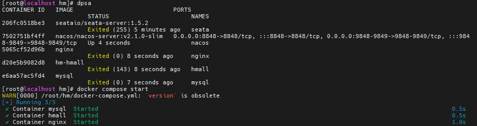


## 2.部署nacos、seata

### 2.1.==部署顺序问题==

- 由于nacos需要使用到mysql数据库保存相关信息，所以需要**先部署mysql，再部署nacos**；
- 同样的seata内部需要向nacos注册，所以也需要**先部署nacos在部署seata**

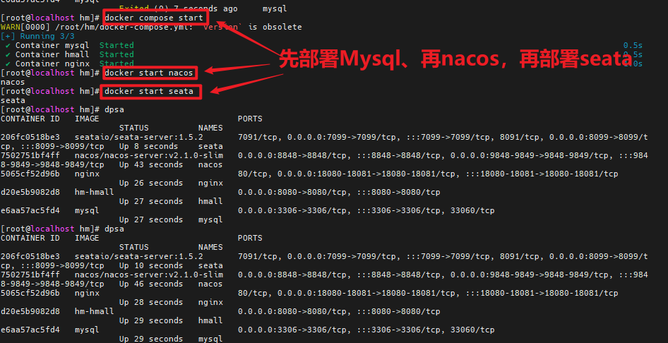

### 2.2.nacos-问题

```shell
docker logs -f nacos #查看nacos容器的日志信息
```

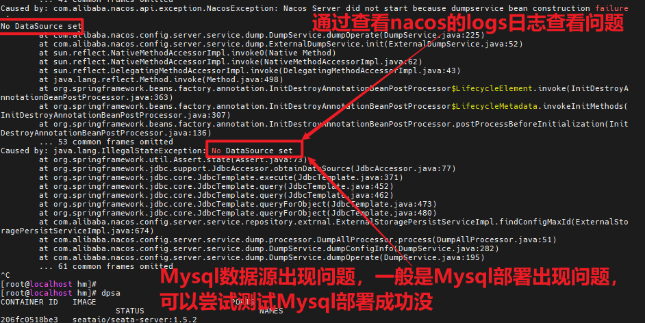


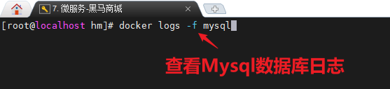

```shell
docker logs -f mysql
```

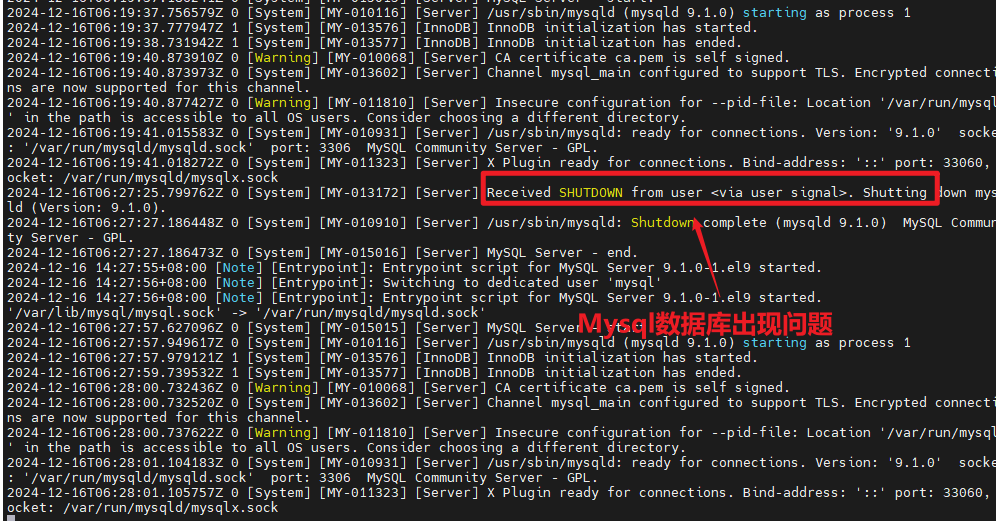

```shell
#重启docker服务
systemctl restart docker
```


### 2.3.部署seata(TC服务)

[部署Seata(TC服务)](#部署Seata(TC服务))

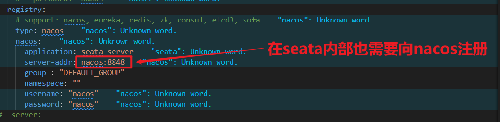

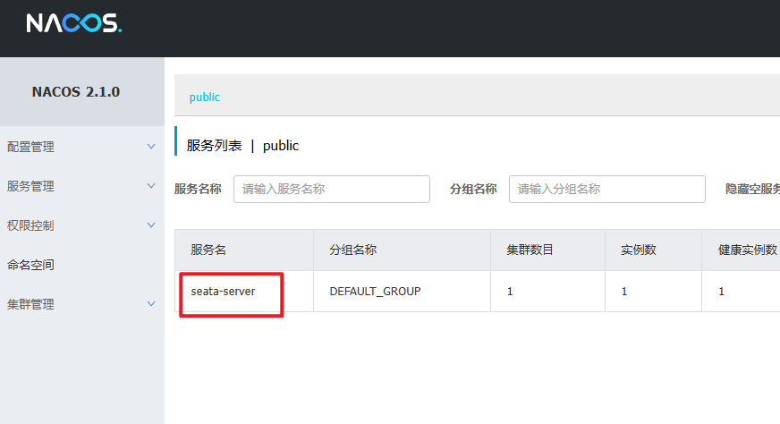


# 六、Nacos的概念-管理配置和服务

`<a id="Nacos的概念-管理配置和服务">``</a>`

在 Nacos 中，**Namespace**、**Group**、**Service** 和 **Cluster** 是用于**管理配置和服务的四个核心概念**，它们有助于组织和区分不同的环境、服务实例和配置内容。以下是每个概念的详细解释：

------

### **1. Namespace（命名空间）**

- **作用**：
   命名空间是 Nacos 中最顶层的逻辑隔离单位，主要用于**实现资源的隔离**。不同的命名空间之间的数据（包括服务和配置）是完全隔离的。
- **应用场景**：
  1. **多环境隔离**：如开发、测试、生产环境分别使用不同的命名空间。
  2. **多租户隔离**：多个项目或租户的数据相互独立。
- **默认值**：
   Nacos 自带一个默认的命名空间，`public`。
- **配置方法**：
   可以在 Nacos 控制台的 "命名空间管理" 中创建命名空间，并分配唯一的 `Namespace ID`。

------

### **2. Group（组）**

- **作用**：
   Group 是服务或配置的一个分类，用于对服务和配置文件进行逻辑分组管理。它是**命名空间内的子级划分**，并不提供物理隔离。
- **应用场景**：
  1. **服务的业务逻辑分组**：如按微服务所属的业务模块分组，`PAYMENT_GROUP`、`ORDER_GROUP` 等。
  2. **配置的环境分组**：如将配置按环境划分，`DEV_GROUP`（开发）、`TEST_GROUP`（测试）、`PROD_GROUP`（生产）。
- **默认值**：
   如果不设置，默认的 Group 是 `DEFAULT_GROUP`。
- **配置方法**：
   配置文件上传或服务注册时可以指定 `Group`，例如在 Spring 配置中通过 `spring.cloud.nacos.config.group` 指定。

------

### **3. Service（服务）**

- **作用**：
   Service 是 Nacos 中注册的微服务，它是一组具有相同功能的服务实例的集合，通常用来表示一个具体的业务服务。

- **应用场景**：

  1. **服务注册与发现**：服务实例通过 `Service` 注册到 Nacos，用于实现负载均衡和服务发现。
  2. **服务管理**：可以查看某个 `Service` 下所有实例的运行状态、IP、端口等信息。

- **配置方法**：
   在服务注册时，指定 `Service Name`，例如：

  ```java
  @NacosService(name = "order-service")
  ```

- **默认值**：
   如果没有指定服务名称，可能会以应用名称或 `spring.application.name` 注册为默认服务名称。

------

### **4. Cluster（集群）**

- **作用**：
   Cluster 是 Service 内部的逻辑分组，用于管理 Service 下的不同实例集群。
   一个 Service 可以划分为多个 Cluster，每个 Cluster 可以表示该服务的一个特定部署环境或节点集合。

- **应用场景**：

  1. **多机房部署**：同一个服务在不同机房（北京机房、上海机房）可以划分为不同的 Cluster。
  2. **负载均衡优化**：按照机房或物理节点划分 Cluster，客户端优先选择最近的集群。

- **默认值**：
   如果不指定，Nacos 默认使用 `DEFAULT` 集群。

- **配置方法**：
   服务注册时可以通过 `clusterName` 指定，例如：

  ```yaml
  spring:
    cloud:
      nacos:
        discovery:
          cluster-name: BEIJING_CLUSTER
  ```

------

### **关系与层级**

- Namespace：最顶层，用于数据的物理隔离。
  - Group：Namespace 内的逻辑分组。
    - Service：Group 内注册的具体服务。
      - **Cluster**：Service 的实例分组。

例如：

- Namespace: 

  ```
  production
  ```

  - Group: 

    ```
    PAYMENT_GROUP
    ```

    - Service: 

      ```
      payment-service
      ```

      - Cluster: `SHANGHAI_CLUSTER`
      - Cluster: `BEIJING_CLUSTER`

------

### **==总结对比表==**

| 概念      | 定义                             | 隔离方式                  | 典型场景                         |
| --------- | -------------------------------- | ------------------------- | -------------------------------- |
| Namespace | 顶层隔离单位，服务和配置完全隔离 | 物理隔离                  | 不同环境（开发、测试、生产）隔离 |
| Group     | 服务/配置的逻辑分组              | 逻辑隔离                  | 按业务模块或环境分组             |
| Service   | 一组功能相同的服务实例           | 无（属于 Group 的一部分） | 表示一个微服务                   |
| Cluster   | Service 的实例划分               | 逻辑隔离                  | 服务实例的物理位置或负载优化分组 |

------

### **实际使用建议**

1. **多环境隔离：使用 Namespace**
   - 生产环境、测试环境分别使用独立的命名空间，避免数据干扰。
2. **按业务分组：使用 Group**
   - 根据服务所属业务分为不同的组，例如订单相关的服务放在 `ORDER_GROUP`。
3. **注册服务：明确 Service 名称**
   - 为每个服务定义清晰的名称，例如 `order-service`、`payment-service`。
4. **多实例优化：配置 Cluster**
   - 按机房、节点划分集群，优化负载均衡。


# 七、数据库锁的基本概念

`<a id="数据库锁的基本概念">` `</a>`

数据库锁的基本概念可以用 **“共享单车租借”** 的例子来理解。

## **1、例子：共享单车租借**

假设你和你的朋友都想租同一辆共享单车。

1. 无锁情况下的问题：
   - 你和朋友同时在手机上看到这辆车是 **“可用”** 的。
   - 你点击 **“租车”**，你的朋友也点击 **“租车”**。
   - 如果系统没有锁机制，数据库可能会让两个人都成功租到同一辆车（**超卖问题**）。
2. 加锁解决问题：
   - 排他锁（Exclusive Lock，写锁）：
     - 当你点击 **“租车”** 时，系统会给这辆单车 **加上锁**，在你的操作完成之前，别人 **无法租借** 这辆车。
     - 你的租借操作完成后，锁被释放，单车状态更新为 **“已租”**，其他人就无法再租。
   - 共享锁（Shared Lock，读锁）：
     - 你和你的朋友都可以查询这辆车的状态（可用/不可用）。
     - 但如果有人加了 **写锁（租车）**，查询的人可能要等到操作完成才能获取最新状态。

**对应到数据库：**

- **读锁（共享锁，S 锁）**：多个查询可以同时执行，但不能修改数据。
- **写锁（排他锁，X 锁）**：当一个事务修改数据时，其他事务不能同时读或写该数据，直到事务完成。

**现实应用：**

如果你在电商系统中 **购买库存有限的商品**，数据库锁可以防止多个用户同时购买导致库存超卖。例如：

```
 -- 事务开始
 BEGIN;
 
 -- 查询库存（加共享锁，防止并发更新）
 SELECT stock FROM products WHERE id = 1 FOR UPDATE;
 
 -- 扣减库存
 UPDATE products SET stock = stock - 1 WHERE id = 1;
 
 -- 事务提交
 COMMIT;
```

其中 `FOR UPDATE` 相当于加了一个 **排他锁**，让其他人不能同时修改库存数据，避免超卖。

这样，你的购物车系统就不会因为高并发导致库存计算错误。


我们用**图书馆借阅**的例子来形象理解 **读锁（共享锁，S 锁）**。

## **2、场景：图书馆的书籍借阅**

假设你在图书馆，想要查看一本**参考书**，但这本书**不能被带走或修改**（只能在阅览室阅读）。

1. **多人同时查阅（读锁）**：
   - 这本书可以被 **多个人同时阅读**（查询）。
   - 只要大家 **都只是阅读，不修改书籍内容**，就不会有问题。
   - 这个就像 **数据库的共享锁（S 锁）**——多个查询（`SELECT` 语句）可以同时执行，但不能修改数据。
2. **禁止修改（写锁冲突）**：
   - 如果有一个人想 **修改** 这本书（比如在书上做标记、撕掉某一页），那么他**必须等所有读者都放下书**，才能开始修改。
   - 这相当于 **写锁（X 锁）**，需要独占资源，不能和读锁（S 锁）共存。
   - 反过来，当一本书正在被人修改时，其他人就**不能再阅读**，必须等修改完成后才能继续查看。

**数据库中的读锁（S 锁）**

对应到数据库，当你执行：

```
 SELECT * FROM books WHERE id = 1 LOCK IN SHARE MODE;
```

- 这相当于给查询的数据加了一个 **共享锁（S 锁）**。
- 其他查询（`SELECT`）可以继续读取这条数据，不会有影响。
- 但如果有人想 **更新或删除** 这条数据（`UPDATE` 或 `DELETE`），就必须等所有的读操作结束。

## **3、总结**

- **读锁（共享锁，S 锁）**：多个查询（读操作）可以同时进行，但不能修改数据。
- **写锁（排他锁，X 锁）**：修改数据时，需要独占资源，不能有任何读或写操作。

这样可以保证数据的一致性，避免在读取过程中数据被修改，导致不一致的情况。


# 八、==本地快速运行项目==

## 1、一键启动-后端项目、Mysql、前端

```bash
docker compose start
```

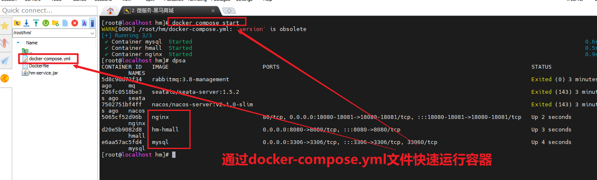


## 2、本地Nginx前端

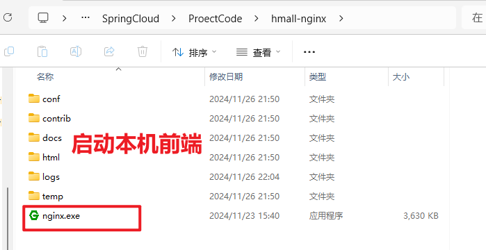


## 3、启动各容器、组件

### (1) Nacos-注册中心

```
docker start nacos
```

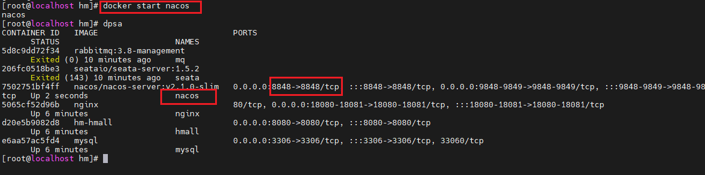

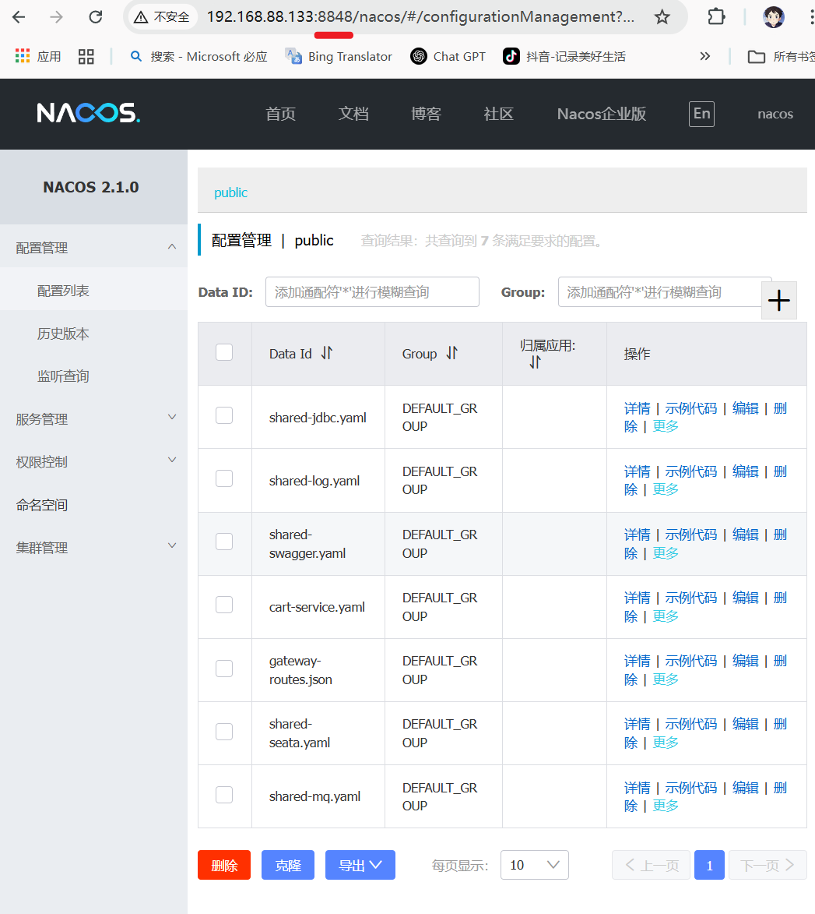


### (2) Seata-分布式事务

```bash
docker start seata
```

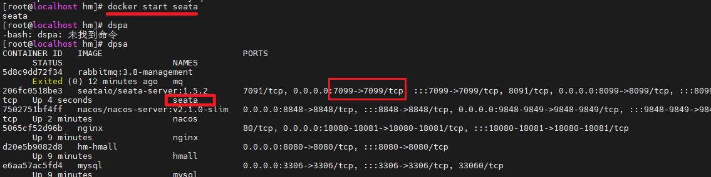

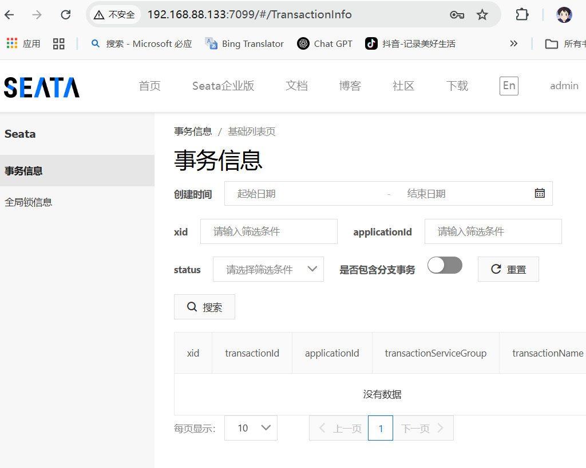


### (3) MQ-消息队列

```bash
docker start mq	
```

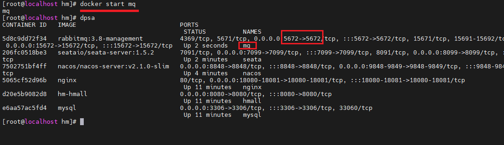

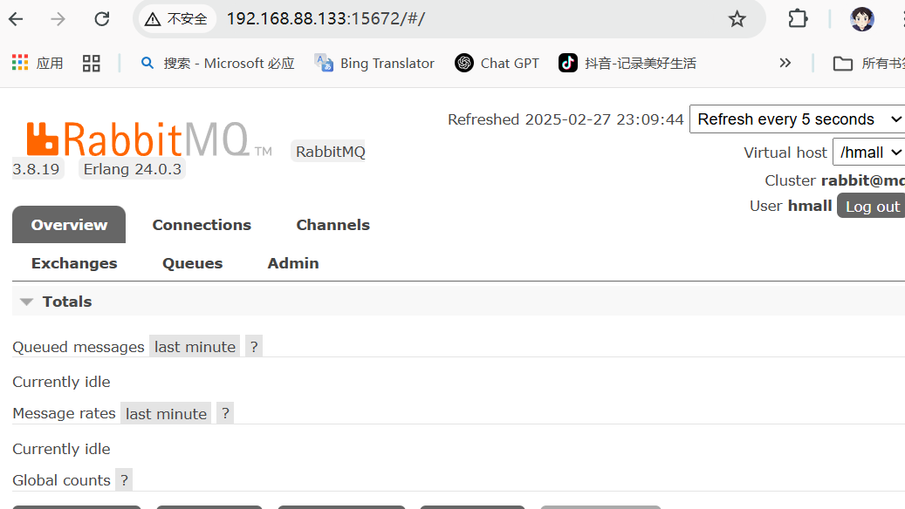


### (4) Sentinel哨兵-微服务保护

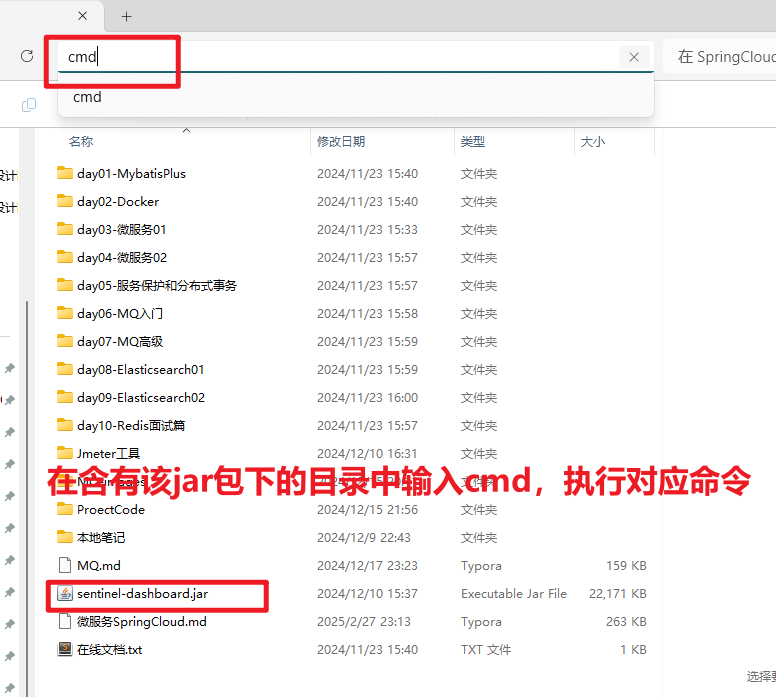

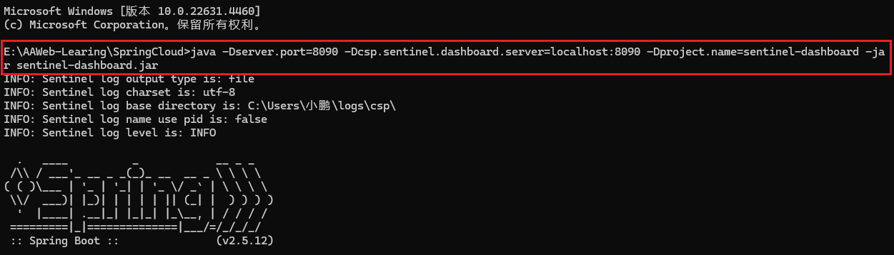

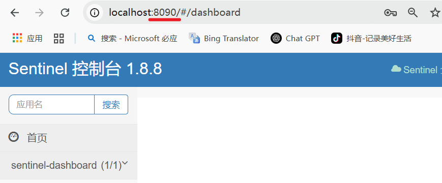


**1）运行**

将jar包放在任意非中文、不包含特殊字符的目录下，重命名为`sentinel-dashboard.jar`：


然后运行如下命令启动控制台：

```Shell
java -Dserver.port=8090 -Dcsp.sentinel.dashboard.server=localhost:8090 -Dproject.name=sentinel-dashboard -jar sentinel-dashboard.jar
```

其它启动时可配置参数可参考官方文档：

https://github.com/alibaba/Sentinel/wiki/%E5%90%AF%E5%8A%A8%E9%85%8D%E7%BD%AE%E9%A1%B9

**2）访问**

访问`[http://localhost:8090](http://localhost:8080)`页面，就可以看到**sentinel的控制台**了：


**需要输入账号和密码，默认都是：sentinel**

登录后，即可看到控制台，默认会监控sentinel-dashboard服务本身：


## 4、运行本地Java后端

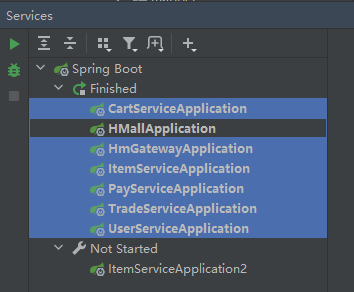


# 🚀🚀九、==Docker部署经历==

## 1、Nacos

### （1）法一：custom.env

[nacos-Docker部署](#nacos-Docker部署)

### （2）法二：拷贝数据卷

[nacos-Docker部署-2](#nacos-Docker部署-2)


------


## 2、Sentinel

### （1）Sentinel-本机部署

[Sentinel-本机部署](#Sentinel-本机部署)

### （2）Sentinel-Docker部署

https://blog.51cto.com/u_16099212/8046802


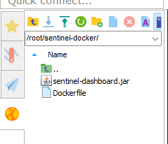

```Dockerfile
#Dockerfile文件
#java 版本
FROM java:8
##挂载的docker卷
VOLUME /root/sentinel-docker/sentinel-volume
#前者是要操作的jar包  后者自定义jar包名
ADD *.jar sentinel-dashboard.jar
#定义时区参数
ENV TZ=Asia/Shanghai
#设置时区
RUN ln -snf /usr/share/zoneinfo/$TZ /etc/localtime && echo '$TZ' > /etc/timezone
#配置启动命令,-D表示设置JVM参数
ENTRYPOINT ["java","-jar","-Dserver.port=8090","-Dcsp.sentinel.dashboard.server=8.137.17.126:8090","-Dproject.name=sentinel-dashboard","/sentinel-dashboard.jar"]
```

#### ①制作镜像

sentinel-dashboard就是一个SpringBoot项目，直接使用命令启动即可，所有自定义配置docker启动。

如果没有特殊需要可以直接下载jar，需要修改源码则下载源码包即可，下载地址： https://github.com/alibaba/Sentinel/releases，下载相应版本的jar包，比如sentinel-dashboard-1.8.1.jar

##### 1、创建工作目录：

```bash
mkdir /root/docker/sentinel -p
```

##### 2、拷贝文件：

将从官网下载的或者是自定义编译好的jar包，拷贝到/root/docker/sentinel目录下

##### 3、Dockerfile：

```java
vim /root/docker/sentinel/Dockerfile
```


**内容如下：**

```java
#java 版本
FROM java:8
##挂载的docker卷
VOLUME /tmp
#前者是要操作的jar包  后者自定义jar包名
ADD *.jar sentinel-dashboard.jar
#定义时区参数
ENV TZ=Asia/Shanghai
#设置时区
RUN ln -snf /usr/share/zoneinfo/$TZ /etc/localtime && echo '$TZ' > /etc/timezone
#配置启动命令,-D表示设置JVM参数
ENTRYPOINT ["java","-jar","-Dserver.port=8080","-Dcsp.sentinel.dashboard.server=162.14.118.19.175:8080","-Dproject.name=sentinel-dashboard","/sentinel-dashboard.jar"]
```


##### 4、制作镜像：

保证jar和Dockerfile在同一个目录下

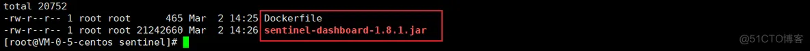

执行命令：

```bash
#sentinel-server表示镜像名称
docker build -t sentinel-server .
```

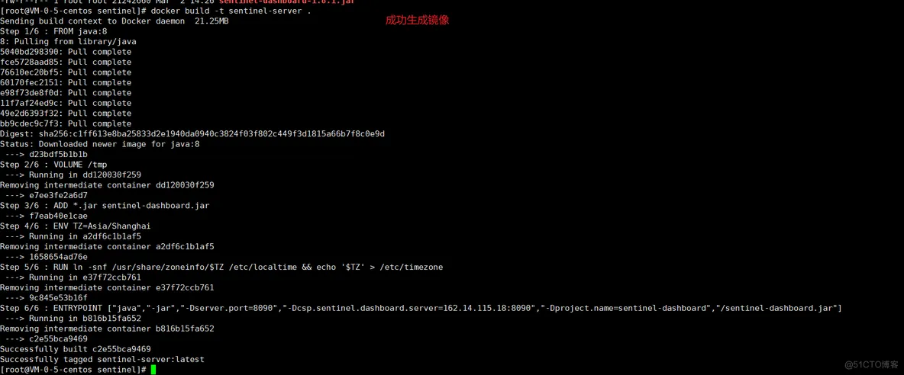


#### ②启动测试

```bash
docker run \
--name sentinel-server \
-p 8090:8090 \
--restart=always \
--privileged=true \
-d sentinel-server
```


------


## 3、部署mq

我们同样基于Docker来安装RabbitMQ，使用下面的命令即可：

```Shell
docker run \
 -e RABBITMQ_DEFAULT_USER=itheima \
 -e RABBITMQ_DEFAULT_PASS=123321 \
 -v mq-plugins:/plugins \
 --name mq \
 --hostname mq \
 -p 15672:15672 \
 -p 5672:5672 \
 --network hmall\
 -d \
 rabbitmq:3.8-management
```


其中**15672**端口**为RabbitMQ的控制台端口**，**5672**端口为**各个微服务访问RabbitMQ的端口**


如果拉取镜像困难的话，可以使用课前资料给大家准备的镜像，利用docker load -i mq.tar命令加载：

```shell
docker load -i mq.tar
```


可以看到在安装命令中有两个映射的端口：

- 15672：RabbitMQ提供的管理控制台的端口
- 5672：RabbitMQ的消息发送处理接口

安装完成后，我们访问 http://192.168.88.133:15672即可看到管理控制台。首次访问需要登录，默认的用户名和密码在配置文件中已经指定了。

登录后即可看到管理控制台总览页面：


------


## 4、部署Seata

[部署Seata(TC服务)](#部署Seata(TC服务))

Seata支持多种存储模式，但考虑到持久化的需要，我们一般选择基于数据库存储。执行课前资料提供的`《seata-tc.sql》`，导入数据库表：

### （1）创建seata数据库


### （2）准备==配置文件==

课前资料准备了一个seata目录，其中包含了seata运行时所需要的配置文件：


其中包含中文注释，大家可以自行阅读。

🚀🚀**==需要关注的是==，这里面mysql和nacos的ip地址，如果这三个都在一个服务器中并且都在一个网段下，直接使用对应的容器名即可。**

****

```yaml
server:
  port: 7099

spring:
  application:
    name: seata-server

logging:
  config: classpath:logback-spring.xml
  file:
    path: ${user.home}/logs/seata
  # extend:
  #   logstash-appender:
  #     destination: 127.0.0.1:4560
  #   kafka-appender:
  #     bootstrap-servers: 127.0.0.1:9092
  #     topic: logback_to_logstash

console:
  user:
    username: admin
    password: admin

seata:
  config:
    # support: nacos, consul, apollo, zk, etcd3
    type: file
    # nacos:
    #   server-addr: nacos:8848
    #   group : "DEFAULT_GROUP"
    #   namespace: ""
    #   dataId: "seataServer.properties"
    #   username: "nacos"
    #   password: "nacos"
  registry:
    # support: nacos, eureka, redis, zk, consul, etcd3, sofa
    type: nacos
    nacos:
      application: seata-server
      server-addr: 8.137.17.126:8848
      group : "DEFAULT_GROUP"
      namespace: ""
      username: "nacos"
      password: "nacos"
#  server:
#    service-port: 8091 #If not configured, the default is '${server.port} + 1000'
  security:
    secretKey: SeataSecretKey0c382ef121d778043159209298fd40bf3850a017
    tokenValidityInMilliseconds: 1800000
    ignore:
      urls: /,/**/*.css,/**/*.js,/**/*.html,/**/*.map,/**/*.svg,/**/*.png,/**/*.ico,/console-fe/public/**,/api/v1/auth/login
  server:
    # service-port: 8091 #If not configured, the default is '${server.port} + 1000'
    max-commit-retry-timeout: -1
    max-rollback-retry-timeout: -1
    rollback-retry-timeout-unlock-enable: false
    enable-check-auth: true
    enable-parallel-request-handle: true
    retry-dead-threshold: 130000
    xaer-nota-retry-timeout: 60000
    enableParallelRequestHandle: true
    recovery:
      committing-retry-period: 1000
      async-committing-retry-period: 1000
      rollbacking-retry-period: 1000
      timeout-retry-period: 1000
    undo:
      log-save-days: 7
      log-delete-period: 86400000
    session:
      branch-async-queue-size: 5000 #branch async remove queue size
      enable-branch-async-remove: false #enable to asynchronous remove branchSession
  store:
    # support: file 、 db 、 redis
    mode: db
    session:
      mode: db
    lock:
      mode: db
    db:
      datasource: druid
      db-type: mysql
      driver-class-name: com.mysql.cj.jdbc.Driver
      url: jdbc:mysql://mysql:3306/seata?rewriteBatchedStatements=true&serverTimezone=UTC
      user: root
      password: 123
      min-conn: 10
      max-conn: 100
      global-table: global_table
      branch-table: branch_table
      lock-table: lock_table
      distributed-lock-table: distributed_lock
      query-limit: 1000
      max-wait: 5000
    # redis:
    #   mode: single
    #   database: 0
    #   min-conn: 10
    #   max-conn: 100
    #   password:
    #   max-total: 100
    #   query-limit: 1000
    #   single:
    #     host: 192.168.150.101
    #     port: 6379
  metrics:
    enabled: false
    registry-type: compact
    exporter-list: prometheus
    exporter-prometheus-port: 9898
  transport:
    rpc-tc-request-timeout: 15000
    enable-tc-server-batch-send-response: false
    shutdown:
      wait: 3
    thread-factory:
      boss-thread-prefix: NettyBoss
      worker-thread-prefix: NettyServerNIOWorker
      boss-thread-size: 1
```


### （3）拷贝整个目录

我们==将整个seata文件夹拷贝到虚拟机的`/root`目录==：


### （4）Docker部署

需要注意，要确保nacos、mysql都在hm-net网络中。如果某个容器不再hm-net网络，可以参考下面的命令将某容器加入指定网络：

```shell
docker network ls  查看所有网络

docker network inspect  查看网络详细信息

docker inspect [容器名] 查看该容器的详细信息（包括网络信息）

docker network connect [网络名] [容器名]
```


在虚拟机的`/root`目录执行下面的命令：

```Shell
docker run --name seata \
-p 8099:8099 \
-p 7099:7099 \
-e SEATA_IP=192.168.88.133 \
-v ./seata:/seata-server/resources \
--privileged=true \
--network hmall \
-d \
seataio/seata-server:1.5.2

docker run --name seata \
-p 8099:8099 \
-p 7099:7099 \
-e SEATA_IP=47.109.155.207 \
-v ./seata:/seata-server/resources \
--privileged=true \
-d \
seataio/seata-server:1.5.2
```

其中的SEATA_IP需要**换成自己的虚拟机ip**，network需要换成与nacos和mysql在同一网络中。


## 5、部署redis

### （0）载入镜像


### （1）创建目录

```shell
mkdir -p redis/conf/redis.conf
```

### （2）redis.conf 配置文件

```shell
# 网络与安全
#示监听所有可用网络接口（包括本地回环和外部 IP）
bind 0.0.0.0
#是否启用保护模式
protected-mode yes
requirepass 123  # 替换为你的强密码

# 资源限制
maxmemory 2gb
#内存达到上限时的数据淘汰策略
maxmemory-policy allkeys-lru

# 持久化
appendonly yes
appendfsync everysec
save ""  # 禁用 RDB（如果只用 AOF）

# 性能优化
tcp-keepalive 300
timeout 300
```


### （3）运行容器

```shell
docker run -d \
  --name redis \
  -p 6379:6379 \
  --restart unless-stopped \
  -v /root/redis/data:/data \
  -v /root/redis/conf/redis.conf:/etc/redis/redis.conf \
  redis:bullseye \
  redis-server /etc/redis/redis.conf  
```

| 命令                                                 | 描述                                                         |
| ---------------------------------------------------- | ------------------------------------------------------------ |
| –name redis                                          | 启动容器的名字                                               |
| -d                                                   | 后台运行                                                     |
| -p 6379:6379                                         | 将容器的 6379(后面那个) 端口映射到主机的 6379(前面那个) 端口 |
| –restart unless-stopped                              | 容器重启策略                                                 |
| -v /root/redis/data:/data                            | 将Redis储存文件夹挂在到主机                                  |
| -v /root/redis/conf/redis.conf:/etc/redis/redis.conf | 将配置文件夹挂在到主机                                       |
| -d redis:bullseye                                    | 启动哪个版本的 Redis (本地镜像的版本)                        |
| redis-server /etc/redis/redis.conf                   | Redis 容器中设置 redis-server 每次启动读取 /etc/redis/redis.conf 这个配置为准 |
| --appendonly yes                                     | 在Redis容器启动redis-server服务器并打开Redis持久化配置       |
| \                                                    | shell 命令换行                                               |


### （4）spring项目引入redis

```xml
<!--Redis依赖-->
<dependency>
    <groupId>org.springframework.boot</groupId>
    <artifactId>spring-boot-starter-data-redis</artifactId>
</dependency>
```

配置文件

```yaml
spring:
  redis:
    host: ${ics.redis.host:8.137.17.126} #主机号
    port: ${ics.redis.port:6379}  #端口
    password: ${ics.redis.password:123} #密码
    database: ${ics.redis.database:0} #数据库
```


## 6、部署java项目

### （1）安装jdk

```shell
docker pull openjdk:11.0.2
```

#### ①配置启动jdk

```shell
docker run -d -t --name java-11 openjdk:11.0.2 
```

#### ②查看jdk的环境变量配置然后删除

```shell
docker run -it --rm openjdk:11.0.2 sh -c "echo \$JAVA_HOME && echo \$PATH && java -version"
```

文件目录结构示意图

```yaml
ics/
├── ics-agent/
│   ├── Dockerfile          # ics-agent 的 Dockerfile
│   ├── target/
│   │   └── ics-agent-1.0.0.jar  # 构建后的 JAR 包
│   └── ...                # 其他源码文件
├── ics-user/
│   ├── Dockerfile          # ics-user 的 Dockerfile
│   ├── target/
│   │   └── ics-user-1.0.0.jar   # 构建后的 JAR 包
│   └── ...                # 其他源码文件
└── docker-compose.yml      # 容器编排文件
```

### （2）DockerFile

```yaml
# 基础镜像
FROM openjdk:11.0.2
# 设定时区
ENV TZ=Asia/Shanghai
RUN ln -snf /usr/share/zoneinfo/$TZ /etc/localtime && echo $TZ > /etc/timezone
# 拷贝jar包
COPY target/ics-agent-1.0.0.jar /app.jar
# 入口
ENTRYPOINT ["java", "-jar", "/app.jar"]
```

### （3）docker compose

```yaml
version: "1.0"

services:
  ics-agent:
    build:
      context: ./ics-agent   # 指定 Dockerfile 所在目录
      dockerfile: Dockerfile
    image: ics-agent:latest  #镜像名称
    container_name: ics-agent
    ports:
      - "8081:8081"         # 宿主机端口:容器端口
    restart: unless-stopped # 容器意外退出时自动重启
    networks:
      - ics-network          # 自定义网络（可选）

  ics-user:
    build:
      context: ./ics-user    # 指定 Dockerfile 所在目录
      dockerfile: Dockerfile
    image: ics-user:latest
    container_name: ics-user
    ports:
      - "8086:8086"         # 宿主机端口:容器端口
    restart: unless-stopped
    networks:
      - ics-network
      
  ics-gateway:
    build:
      context: ./ics-gateway    # 指定 Dockerfile 所在目录
      dockerfile: Dockerfile
    image: ics-gateway:latest
    container_name: ics-gateway
    ports:
      - "8080:8080"         # 宿主机端口:容器端口
    restart: unless-stopped
    networks:
      - ics-network

# 自定义网络（确保容器间可通过服务名通信）
networks:
  ics-network:
    driver: bridge
```


进入到项目

```shell
# 进入项目根目录
cd ics

# 构建所有服务镜像
docker compose build  #重新构建镜像
docker compose up -d  #重建容器
docker compose down  #删除容器
```


# 

# 十、🚀微服务面试篇

微服务在面试时被问到的内容相对较少，常见的面试题如下：

- SpringCloud有哪些常用组件？分别是什么作用？
- 服务注册发现的基本流程是怎样的？
- Eureka和Nacos有哪些区别？
- Nacos的分级存储模型是什么意思？
- Ribbon和SpringCloudLoadBalancer有什么差异
- 什么是服务雪崩，常见的解决方案有哪些？
- Hystix和Sentinel有什么区别和联系？
- 限流的常见算法有哪些？
- 什么是CAP理论和BASE思想？
- 项目中碰到过分布式事务问题吗？怎么解决的？
- AT模式如何解决脏读和脏写问题的？
- TCC模式与AT模式对比，有哪些优缺点

可以发现，这些问题都是围绕着SpringCloud的相关组件的，其中有些问题我们在课堂上已经介绍过，这里不再赘述。我们重点讲解一些之前没有讲过的，与底层实现有关的部分。

讲解的思路还是基于SpringCloud的组件分类来讲的，主要包括：

- 分布式事务
- 注册中心
- 远程调用
- 服务保护

等几个方面


## 1、🚀==*分布式事务*==

**分布式**事务，就是指**不是在单个服务或单个数据库架构下，产生的事务**，例如：

- 跨数据源的分布式事务
- 跨服务的分布式事务
- 综合情况

我们之前解决分布式事务问题是直接使用**Seata框架的AT模式**，但是解决分布式事务问题的方案远不止这一种。


### （1）==CAP定理==

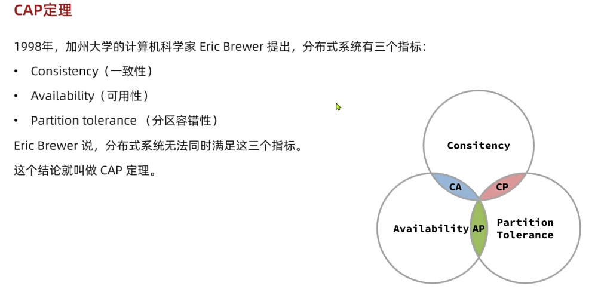

解决分布式事务问题，需要一些分布式系统的基础知识作为理论指导，首先就是CAP定理。

1998年，加州大学的计算机科学家 Eric Brewer 提出，分布式系统有三个指标：

- **C**onsistency（一致性）
- **A**vailability（可用性）
- **P**artition tolerance （分区容错性）

它们的第一个字母分别是 `C`、`A`、`P`。Eric Brewer认为任何分布式系统架构方案都不可能同时满足这3个目标，这个结论就叫做 CAP 定理。

为什么呢？

#### ①一致性

`Consistency`（一致性）：用户访问分布式系统中的任意节点，得到的数据必须一致。

比如现在包含两个节点，其中的初始数据是一致的：

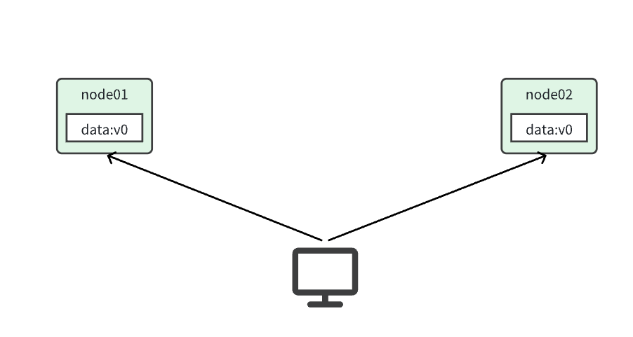

当我们修改其中一个节点的数据时，两者的数据产生了差异：

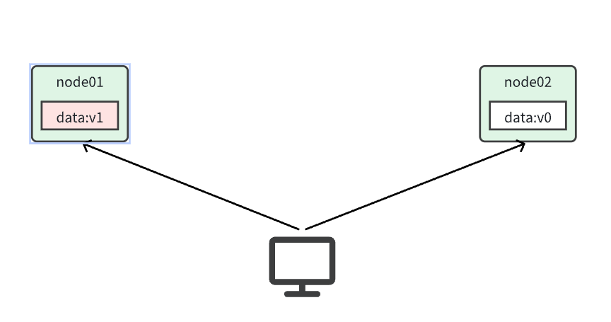

要想保住一致性，就必须实现node01 到 node02的数据 同步：

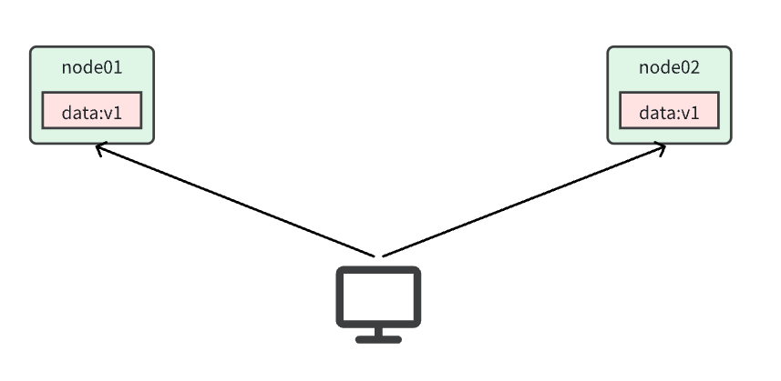

#### ②可用性

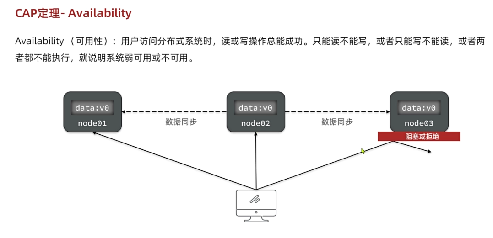

Availability （可用性）：**用户访问分布式系统时，读或写操作总能成功。**

只能读不能写，或者只能写不能读，或者两者都不能执行，就说明**系统弱可用或不可用**。


#### ③分区容错

**`Partition`，就是分区**，就是当分布式系统节点之间出现**网络故障导致节点之间无法通信**的情况：


如上图，node01和node02之间网关畅通，但是与node03之间网络断开。于是node03成为一个独立的网络分区；node01和node02在一个网络分区。

**`Tolerance`，就是容错**，**即便是系统出现网络分区，整个系统也要持续对外提供服务**。


#### ④==矛盾==

在分布式系统中，**网络不能100%保证畅通**，也就是说**网络分区的情况一定会存在**。而我们的系统必须要持续运行，对外提供服务。所以分区容错性（`P`）是硬性指标，所有分布式系统都要满足。而在设计分布式系统时**要取舍的就是一致性（`C`）和可用性（`A`）**了。

假如现在出现了网络分区，如图：

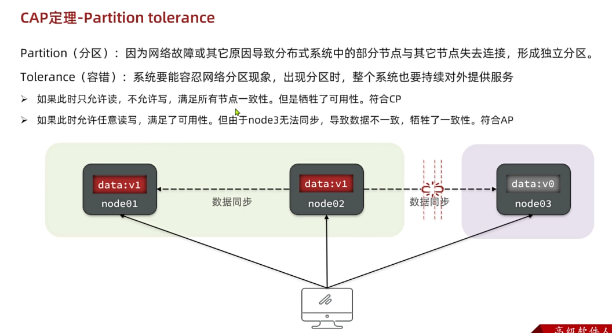

由于网络故障，当我们把数据写入node01时，可以与node02完成数据同步，但是无法同步给node03。现在有两种选择：

- **允许用户任意读写，保证可用性。**但由于node03无法完成同步，就**会出现数据不一致的情况**。满足AP
- **不允许用户写，可以读**，直到网络恢复，分区消失。这样就确保了一致性，**但牺牲了可用性**。满足CP

可见，在分布式系统中，`A`和`C`之间只能满足一个。


### （2）BASE理论

既然分布式系统要遵循CAP定理，那么问题来了，我到底是该牺牲一致性还是可用性呢？如果牺牲了一致性，出现数据不一致该怎么处理？

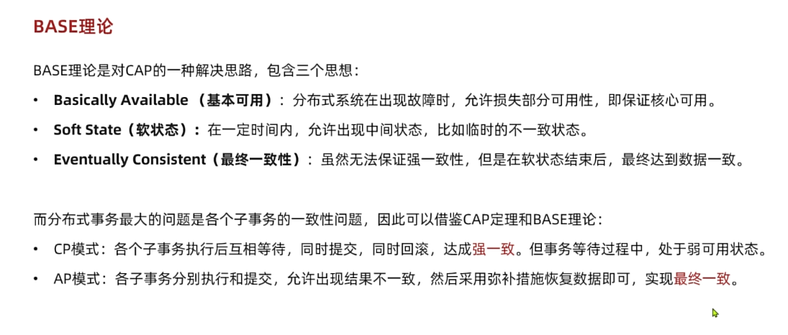

人们在总结系统设计经验时，最终得到了一些心得：

- **B**asically **A**vailable **（基本可用）**：分布式系统在出现故障时，允许损失部分可用性，即保证核心可用。
- **S**oft State**（软状态）：**在一定时间内，允许出现中间状态，比如临时的不一致状态。
- **Ev**entually Consistent**（最终一致性）**：虽然无法保证强一致性，但是在软状态结束后，最终达到数据一致。

以上就是BASE理论。

简单来说，BASE理论就是一种取舍的方案，不再追求完美，而是最终达成目标。因此解决分布式事务的思想也是这样，有两个方向：

- **AP思想**：**各个子事务分别执行和提交，无需锁定数据。允许出现结果不一致，**然后采用弥补措施恢复，实现最终一致即可。例如==**`AT`模式**==就是如此
- **CP思想**：**各个子事务执行后不要提交，而是等待彼此结果，然后同时提交或回滚。**在这个过程中锁定资源，不允许其它人访问，数据处于不可用状态，但能保证一致性。例如**==`XA`模式==**


### （3）AT模式的==脏写==问题

#### ①AT模式的流程

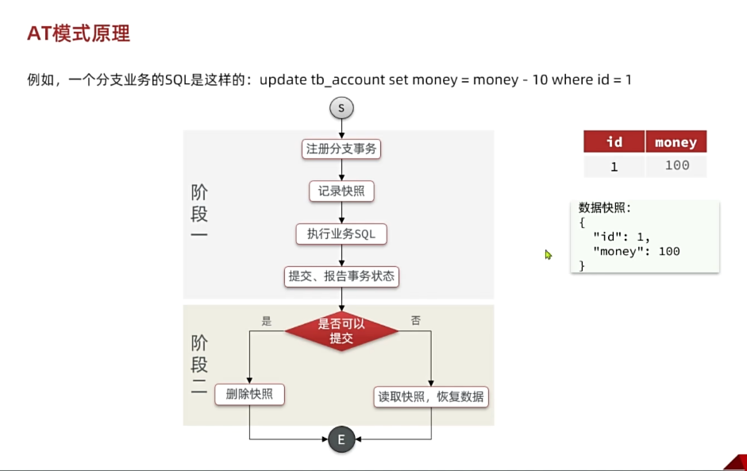

我们先回顾一下**AT模式的流程**，AT模式也分为两个阶段：

第一阶段是**记录数据快照，执行并提交事务**：

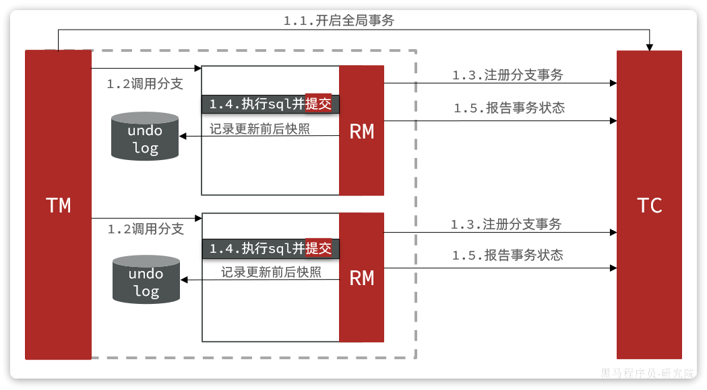

第二阶段根据阶段一的结果来判断：

- 如果**每一个分支事务都成功**，则事务已经结束（因为阶段一已经提交），因此**删除阶段一的快照**即可
- 如果**有任意分支事务失败**，**则需要根据快照恢复到更新前数据。然后删除快照**

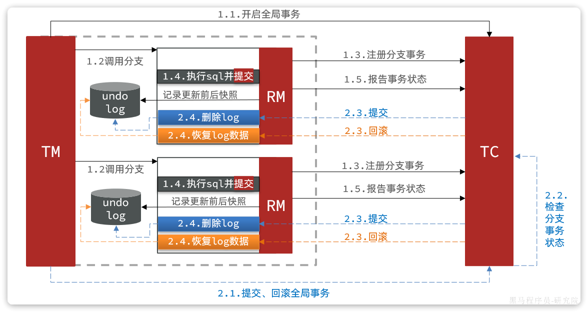

#### ②==脏写问题==

这种模式在大多数情况下（99%）并不会有什么问题，不过在极端情况下，特别是**多线程并发访问AT模式的分布式事务时，有可能出现==脏写问题==**，如图：


解决思路就是引入了**全局锁的概念**。在**释放DB锁之前，先拿到全局锁**。避免同一时刻有另外一个事务来操作当前数据。

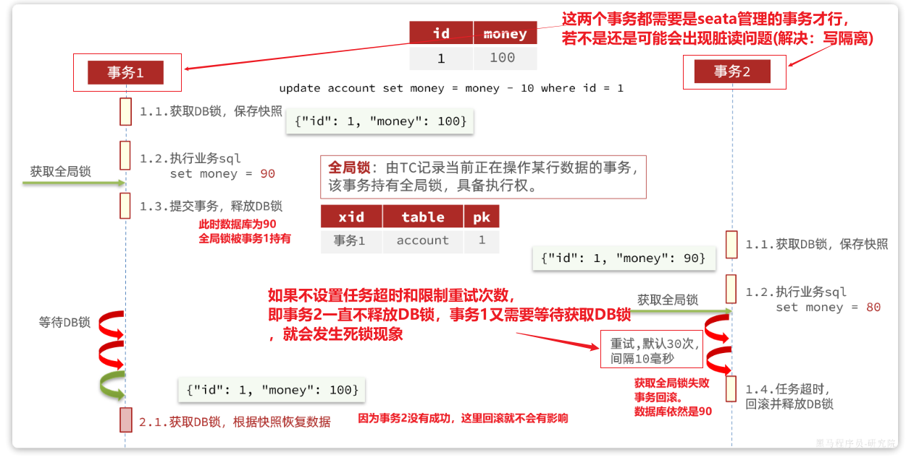

==**注意：**==

- 快照不会恢复所有字段，只会恢复你修改的（比如这里的money），**全局锁也是只持有某一个列的**，**精细度很高**

- 全局锁，记录了事务操作某张表的某行数据，该行数据只能由这个事务操作。全局锁如果未能获取成功，默认重试30次，每次等10毫秒，一共300毫秒。**而DB锁的等待往往比较长**。

- 和XA模式不就一样了？不都资源锁定了？   

  - 答：**全局锁是由TC管理，而DB锁是由数据库管理，锁的粒度是不一样的**。
    - DB锁锁住的行，其他事务不可以增删改查
    - 而全局锁，**其他没有被seata管理的事务，仍然可以进行增删改查**，如果对同一行的其他字段做处理，依然可以。这样的**性能比XA模式高**。

- **极端情况**：上述的隔离依然不是很彻底，**其他未被seata管理的事务如果也对同一行数据进行了修改**，也会丢失更新？

  - 解决办法-==**AT模式的写隔离**==
  - seata在保存快照时，**保存了两份**，**一份是更新前的数据用于恢复数据，一份是更新后的数据**，用于判断事务一在阶段1和阶段2这个过程中是否有其他事务操作过这个数据，**若经过对比发现与自己更新后的数据不同，则seata无法去回滚了**，记录异常，由人工介入。

  

#### ③AT模式的==写隔离==

如果是**==非seata管理的全局事务==对money修改** (其实**业务上就应该避免这类情况出现**)

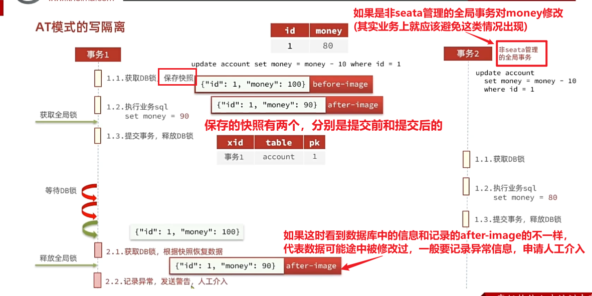


具体可以参考官方文档：

https://seata.io/zh-cn/docs/dev/mode/at-mode.html


### （4）==TCC模式==

TCC模式与AT模式非常相似，**每阶段都是独立事务**，不同的是TCC**通过人工编码来实现数据恢复**。需要实现三个方法：

-  `try`：**资源的检测和预留**； 
-  `confirm`：**完成资源操作业务**；要求 `try` 成功 `confirm` 一定要能成功。 
-  `cancel`：**预留资源释放**，可以理解为try的反向操作。  

#### ①流程分析

举例，一个扣减用户余额的业务。假设账户A原来余额是100，需要余额扣减30元。

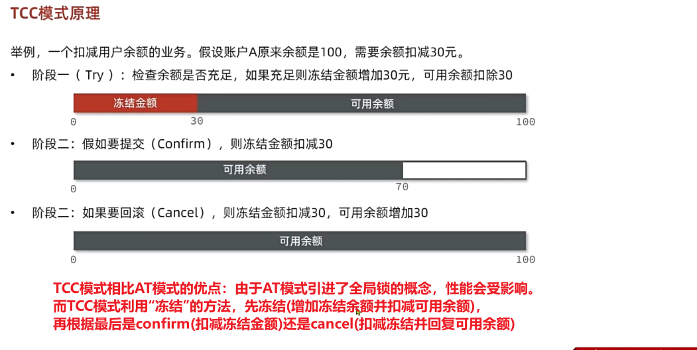

**阶段一（ Try ）**：检查余额是否充足，如果充足则冻结金额增加30元，可用余额扣除30

初始余额：


余额充足，可以冻结：


此时，总金额 = 冻结金额 + 可用金额，数量依然是100不变。事务直接提交无需等待其它事务。

**阶段二（Confirm)**：假如要提交（Confirm），之前可用金额已经扣减，并转移到冻结金额。因此可用金额不变，直接冻结金额扣减30即可：


此时，总金额 = 冻结金额 + 可用金额 = 0 + 70  = 70元

**阶段二(Canncel)**：如果要回滚（Cancel），则释放之前冻结的金额，也就是冻结金额扣减30，可用余额增加30


#### ②TCC的工作模型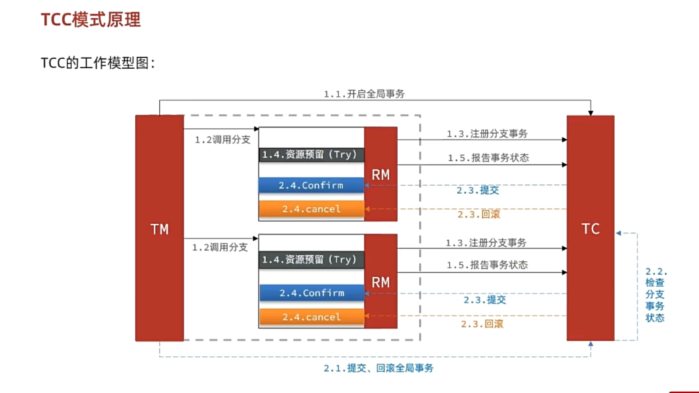

#### ③事务悬挂和空回滚

假如一个分布式事务中包含两个分支事务，try阶段，**一个分支成功执行**，另一个分支事务==**阻塞**==：

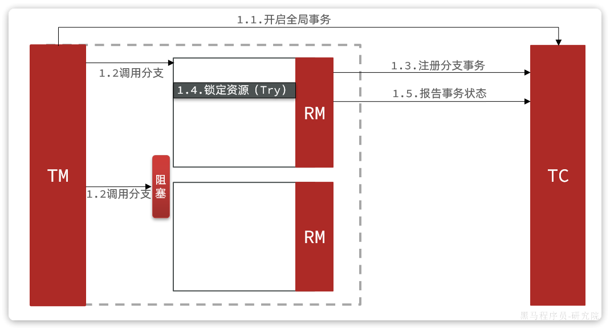

如果**阻塞时间太长**，可能导致**全局事务超时而触发二阶段的`cancel`操作**。**==两个分支事务都会执行cancel操作==**：

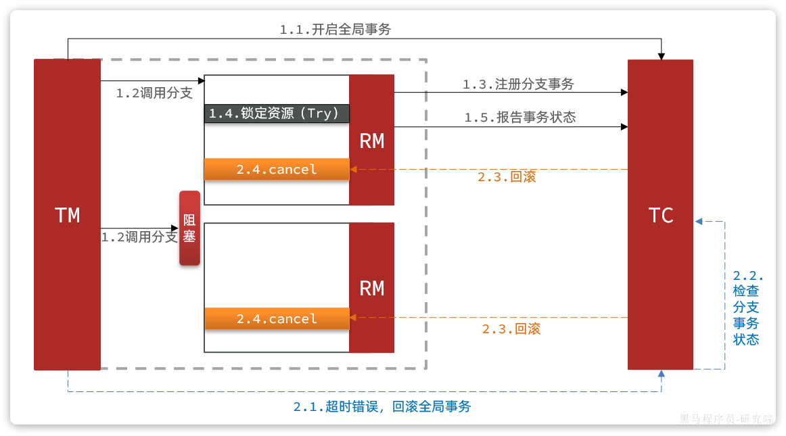

要知道，**其中一个分支是未执行`try`操作的，直接执行了`cancel`操作**，反而会导致数据错误。因此，这种情况下，**尽管`cancel`方法要执行，但其中不能做任何回滚操作**，这就是==**空回滚**==。

对于整个空回滚的分支事务，**将来try方法阻塞结束依然会执行**。但是整个全局事务其实已经结束了，因此永远不会再有confirm或cancel，也就是说这个事务执行了一半，处于==**悬挂状态**==，这就是**业务悬挂问题**。

以上问题都需要我们在**编写try、cancel方法时处理**。


#### ④分布式事务中的空回滚与业务悬挂问题分析

##### 问题本质

在分布式事务场景下（如Seata的SAGA或TCC模式），空回滚和业务悬挂是两个需要特别注意的问题：

##### 空回滚（Empty Rollback）
- **定义**：当分支事务的`try`操作未执行，但`cancel`操作却被触发执行的情况
- **产生原因**：全局事务超时或其它分支事务失败，触发全局回滚，而此时某些分支的`try`尚未执行

##### 业务悬挂（Business Hang）
- **定义**：`try`操作在全局事务结束后才被执行，导致事务"半途而废"的状态
- **产生原因**：`try`操作因网络延迟等原因被阻塞，在全局事务结束后才到达服务端

##### 代码示例与解决方案

###### 典型问题场景

```java
// 错误的实现方式 - 可能产生空回滚和业务悬挂问题
@Service
public class AccountService {
    
    @Transactional
    public boolean tryDeduct(String xid, String userId, BigDecimal amount) {
        // 扣减余额
        accountDao.deduct(userId, amount);
        // 记录事务日志
        txLogDao.add(xid, userId, amount);
    }
    
    public boolean cancelDeduct(String xid, String userId, BigDecimal amount) {
        // 直接回滚余额
        accountDao.add(userId, amount);
        // 删除事务日志
        txLogDao.delete(xid);
    }
}
```

###### 正确解决方案

```java
@Service
public class AccountService {
    
    @Transactional
    public boolean tryDeduct(String xid, String userId, BigDecimal amount) {
        // 1. 防止业务悬挂：检查cancel是否已执行
        if (txLogDao.existsCancelLog(xid)) {
            return false; // 不再执行try操作
        }
        
        // 2. 幂等性检查
        if (txLogDao.existsTryLog(xid)) {
            return true;
        }
        
        // 实际业务操作
        accountDao.deduct(userId, amount);
        txLogDao.addTryLog(xid, userId, amount);
        return true;
    }
    
    public boolean cancelDeduct(String xid, String userId, BigDecimal amount) {
        // 1. 空回滚处理：检查try是否已执行
        if (!txLogDao.existsTryLog(xid)) {
            // 记录空回滚日志，防止后续try执行
            txLogDao.addCancelLog(xid);
            return true;
        }
        
        // 2. 幂等性检查
        if (txLogDao.existsCancelLog(xid)) {
            return true;
        }
        
        // 实际回滚操作
        accountDao.add(userId, amount);
        txLogDao.addCancelLog(xid);
        return true;
    }
}
```

##### 关键解决措施

1. **空回滚防御**：
   
   - 在`cancel`方法中先检查`try`是否已执行
   - 如未执行，则记录空回滚标记，避免后续真正执行数据回滚
   
2. **业务悬挂预防**：
   - 在`try`方法中检查是否已有空回滚记录
   - 如已有空回滚记录，则不再执行业务操作

3. **幂等性保证**：
   - 两种方法都需要实现幂等性
   - 通过事务日志表记录各阶段状态

4. **事务日志表设计**：
   ```sql
   CREATE TABLE tx_log (
     xid VARCHAR(128) PRIMARY KEY,
     user_id VARCHAR(64),
     amount DECIMAL(10,2),
     try_status TINYINT,  -- 0未执行，1已执行
     cancel_status TINYINT, -- 0未执行，1已执行
     create_time DATETIME,
     update_time DATETIME
   );
   ```

通过以上措施，可以有效避免分布式事务中的空回滚和业务悬挂问题，保证数据的一致性。


#### ③总结

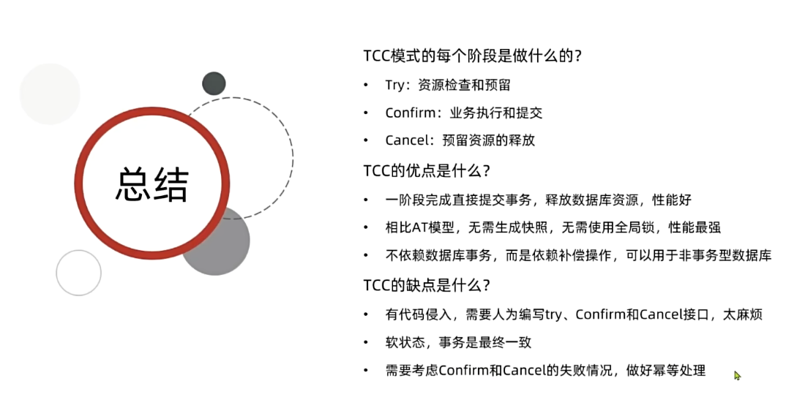

TCC模式的每个阶段是做什么的？

- Try：资源检查和预留
- Confirm：业务执行和提交
- Cancel：预留资源的释放

**==TCC的优点==**是什么？

- 一阶段完成直接提交事务，**释放数据库资源，性能好**
- 相比AT模型，**无需生成快照，无需使用全局锁，性能最强**
- **不依赖数据库事务，而是依赖补偿操作，可以用于非事务型数据库**

**TCC的缺点**是什么？

- **有代码侵入，需要人为编写try、Confirm和Cancel接口，太麻烦**
- **软状态**，事务是最终一致
- 需要考虑Confirm和Cancel的失败情况，**做好幂等处理、事务悬挂和空回滚处理**


### （5）最大努力通知

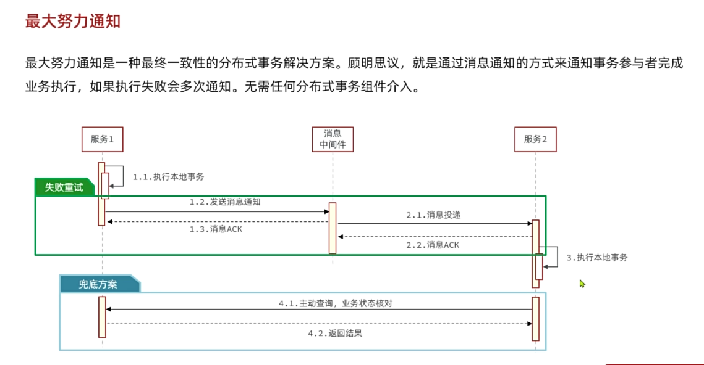

#### 最大努力通知型分布式事务详解

#### ①概念解析

**最大努力通知**（Best-Effort Delivery）是一种基于消息通知的最终一致性分布式事务解决方案，其核心思想是：

1. **通知机制**：通过消息通知的方式驱动各参与者完成业务操作
2. **多次尝试**：当执行失败时会进行多次重试通知
3. **无中心协调**：不需要专门的分布式事务协调组件（如Seata）
4. **最终一致**：不保证实时一致性，但通过重试机制最终达到一致状态

#### ②典型应用场景

- 支付结果通知
- 订单状态同步
- 跨系统数据同步
- 第三方服务回调

#### ③实现原理

##### 基本流程
1. 主业务系统完成本地事务
2. 将需要通知的消息写入消息表
3. 定时任务轮询消息表，发送待通知消息
4. 接收方处理成功后返回确认
5. 未成功则按照策略进行重试，直到达到最大重试次数

##### 关键设计要点
- **消息持久化**：所有待通知消息必须持久化存储
- **消息状态管理**：记录消息的发送状态和重试次数
- **幂等设计**：接收方必须实现幂等处理
- **最终补偿**：达到最大重试次数后进入人工处理流程

#### ④代码示例

##### 1. 消息表设计
```sql
CREATE TABLE transaction_message (
    id BIGINT PRIMARY KEY AUTO_INCREMENT,
    message_id VARCHAR(64) NOT NULL COMMENT '业务消息ID',
    business_type VARCHAR(32) NOT NULL COMMENT '业务类型',
    content TEXT NOT NULL COMMENT '消息内容',
    status TINYINT NOT NULL COMMENT '0-待处理,1-处理中,2-处理成功,3-处理失败',
    retry_count INT DEFAULT 0 COMMENT '重试次数',
    next_retry_time DATETIME COMMENT '下次重试时间',
    create_time DATETIME NOT NULL,
    update_time DATETIME NOT NULL,
    UNIQUE KEY uk_message_id (message_id)
);
```

##### 2. 主业务系统（订单服务）
```java
@Service
public class OrderService {
    
    @Autowired
    private OrderDao orderDao;
    
    @Autowired
    private TransactionMessageDao messageDao;
    
    @Transactional
    public void createOrder(OrderDTO orderDTO) {
        // 1. 创建订单（本地事务）
        Order order = convertToOrder(orderDTO);
        orderDao.insert(order);
        
        // 2. 准备通知消息（同一事务）
        TransactionMessage message = new TransactionMessage();
        message.setMessageId(generateMessageId());
        message.setBusinessType("ORDER_CREATED");
        message.setContent(buildOrderMessageContent(order));
        message.setStatus(0); // 待处理
        message.setCreateTime(new Date());
        message.setUpdateTime(new Date());
        messageDao.insert(message);
    }
}
```

#### 3. 消息发送服务
```java
@Service
@Slf4j
public class MessageSenderService {
    
    @Autowired
    private TransactionMessageDao messageDao;
    
    @Autowired
    private RestTemplate restTemplate;
    
    @Scheduled(fixedRate = 10000) // 每10秒执行一次
    public void sendPendingMessages() {
        // 查询待发送消息（包括需要重试的）
        List<TransactionMessage> messages = messageDao.selectPendingMessages();
        
        for (TransactionMessage message : messages) {
            try {
                // 发送HTTP通知（实际可能是MQ或其他方式）
                String url = getNotifyUrlByBusinessType(message.getBusinessType());
                ResponseEntity<String> response = restTemplate.postForEntity(
                    url, message.getContent(), String.class);
                
                if (response.getStatusCode().is2xxSuccessful()) {
                    // 标记为成功
                    messageDao.updateStatus(message.getMessageId(), 2);
                } else {
                    // 标记为失败，准备重试
                    handleFailedMessage(message);
                }
            } catch (Exception e) {
                log.error("消息发送失败: {}", message.getMessageId(), e);
                handleFailedMessage(message);
            }
        }
    }
    
    private void handleFailedMessage(TransactionMessage message) {
        int retryCount = message.getRetryCount() + 1;
        if (retryCount >= 5) { // 最大重试次数
            messageDao.updateStatus(message.getMessageId(), 3); // 最终失败
        } else {
            // 计算下次重试时间（指数退避）
            long nextRetryTime = System.currentTimeMillis() + 
                (long) (Math.pow(2, retryCount) * 10000);
            messageDao.updateForRetry(
                message.getMessageId(), 
                1, // 处理中
                retryCount,
                new Date(nextRetryTime));
        }
    }
}
```

#### 4. 接收方服务（库存服务）
```java
@RestController
@RequestMapping("/inventory")
public class InventoryController {
    
    @Autowired
    private InventoryService inventoryService;
    
    @PostMapping("/notify/order-created")
    public ResponseEntity<String> handleOrderCreated(@RequestBody String content) {
        try {
            OrderCreatedMessage message = parseMessage(content);
            
            // 幂等处理：检查是否已处理过该消息
            if (inventoryService.isMessageProcessed(message.getMessageId())) {
                return ResponseEntity.ok("already processed");
            }
            
            // 处理业务逻辑
            inventoryService.reduceStock(
                message.getProductId(), 
                message.getQuantity(),
                message.getMessageId());
            
            return ResponseEntity.ok("success");
        } catch (Exception e) {
            return ResponseEntity.status(500).body("error");
        }
    }
}
```

#### 方案优缺点

##### 优点
1. **简单轻量**：不需要引入复杂的分布式事务框架
2. **松耦合**：各系统间通过消息通知解耦
3. **高可用**：即使部分系统暂时不可用，也能通过重试最终成功
4. **性能较好**：不需要全局锁等影响性能的机制

##### 缺点
1. **实时性差**：只能保证最终一致性，不能实时一致
2. **依赖重试**：需要设计合理的重试策略
3. **需要人工介入**：达到最大重试次数后需要人工处理
4. **消息可能丢失**：极端情况下仍可能丢失消息（需要额外保障机制）

#### 最佳实践建议

1. **消息去重**：接收方必须实现幂等处理
2. **重试策略**：建议采用指数退避算法（Exponential Backoff）
3. **监控报警**：对长时间未处理成功的消息设置监控
4. **人工干预接口**：提供人工重试和修正的接口
5. **消息轨迹**：记录完整的消息处理轨迹便于排查问题

这种模式非常适合对实时性要求不高，但需要保证最终一致性的跨系统业务场景。


## 2、注册中心

本章主要学习Nacos中的一些特性和原理，以及与**Eureka**的功能对比。

### （1）==环境隔离==

企业实际开发中，往往会搭建多个运行环境，例如：

- 开发环境
- 测试环境
- 预发布环境
- 生产环境

这些**不同环境之间的服务和数据之间需要隔离**。

还有的企业中，会开发多个项目，**共享nacos集群**。此时，这些项目之间也需要把服务和数据隔离。

因此，Nacos提供了**基于`namespace`的环境隔离功能**。具体的隔离层次如图所示：


说明：

- Nacos中**可以配置多个`namespace`**，相互之间完全隔离。**默认的`namespace`名为`public`**
- `namespace`下还可以继续分组，也就是group ，相互隔离。 默认的group是`DEFAULT_GROUP`
- `group`之下就是服务和配置了

#### ①创建namespace

nacos提供了一个默认的`namespace`，叫做`public`：

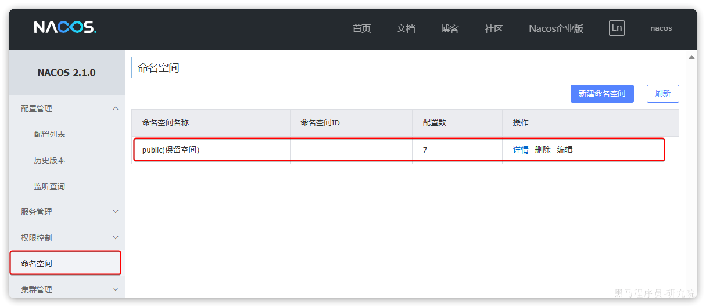

默认所有的服务和配置都属于这个`namespace`，当然我们也可以自己**创建新的`namespace`**：

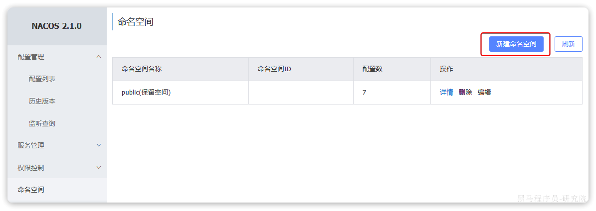

然后填写表单：


添加完成后，可以在页面看到我们新建的`namespace`，并且Nacos为我们自动生成了一个命名空间id：

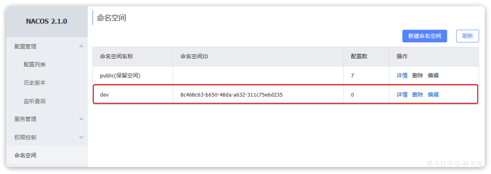

我们切换到**配置列表页**，你会发现**`dev`这个命名空间下没有任何配置**：

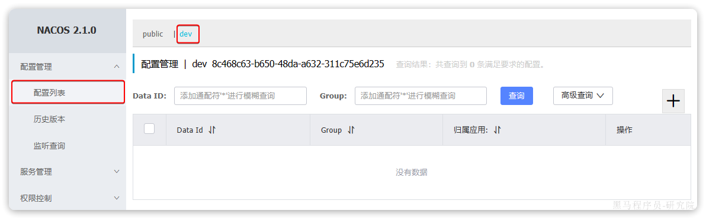

因为之前我们添加的所有配置都在`public`下：

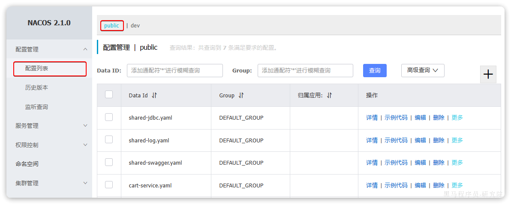

#### ②微服务配置namespace

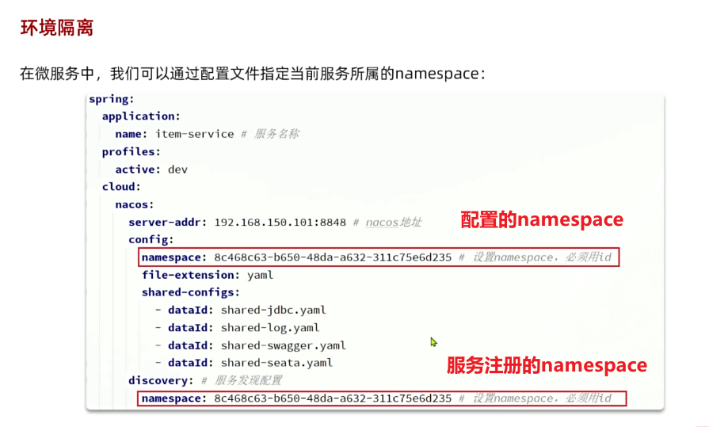

默认情况下，所有的微服务注册发现、配置管理都是走`public`这个命名空间。如果要指定命名空间则需要修改`application.yml`文件。

比如，我们修改`item-service`服务的**bootstrap.yml文件，添加服务发现配置，指定其`namespace`**：

```YAML
spring:
  application:
    name: item-service # 服务名称
  profiles:
    active: dev
  cloud:
    nacos:
      server-addr: 192.168.150.101 # nacos地址
      discovery: # 服务发现配置
        namespace: 8c468c63-b650-48da-a632-311c75e6d235 # 设置namespace，必须用id
      # 。。。略
```

启动`item-service`，查看服务列表，会发现`item-service`出现在`dev`下：

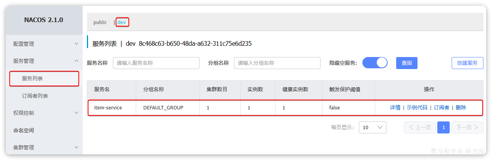

而其它服务则出现在`public`下：


此时访问`http://localhost:8082/doc.html`，基于`swagger`做测试：

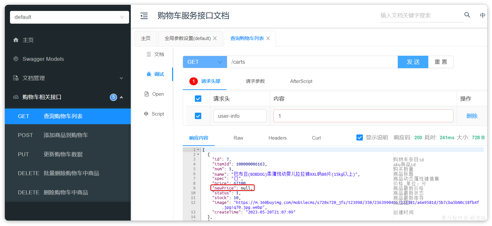

会发现查询结果中缺少商品的最新价格信息。

我们查看服务运行日志：

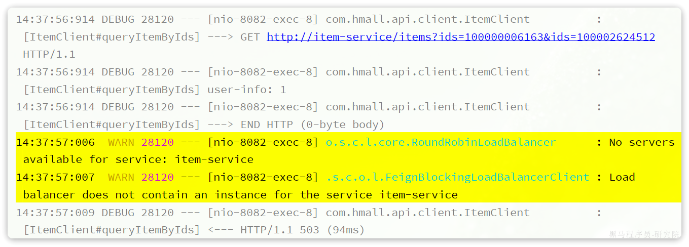

会发现`cart-service`服务在远程调用`item-service`时，并没有找到可用的实例。这**证明不同namespace之间确实是相互隔离的，不可访问。**

当我们把`namespace`切换回`public`，或者统一都是以`dev`时访问恢复正常。


### （2）分级模型

在一些大型应用中，**同一个服务可以部署很多实例**。而这些实例可能分布在全国各地的不同机房。由于存在地域差异，网络传输的速度会有很大不同，因此**在做服务治理时需要区分不同机房的实例**。

例如item-service，我们可以部署3个实例：

- 127.0.0.1:8081
- 127.0.0.1:8082
- 127.0.0.1:8083

假如这些实例分布在不同机房，例如：

- 127.0.0.1:8081，在上海机房
- 127.0.0.1:8082，在上海机房
- 127.0.0.1:8083，在杭州机房

Nacos中提供了**==集群（`cluster`）的概念==**，来对应不同机房。也就是说，**一个服务（`service`）下可以有很多集群（`cluster`），而一个集群（`cluster`）中下又可以包含很多实例（`instance`）**。

如图：


因此，结合我们上一节学习的`namespace`命名空间的知识，任何一个微服务的实例在注册到Nacos时，都会生成以下几个信息，**用来确认当前实例的身份**，从外到内依次是：

- namespace：命名空间
- group：分组
- service：服务名
- cluster：集群
- **instance：实例，包含ip和端口**

这就是nacos中的**服务分级模型**。

在Nacos内部会有一个**服务实例的注册表，是基于Map实现的**，其结构与分级模型的对应关系如下：

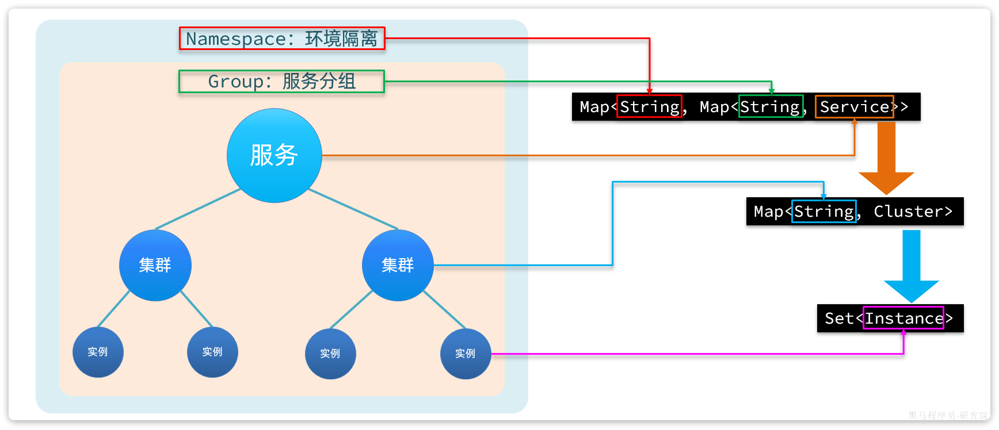

查看nacos控制台，会发现**默认情况下所有服务的集群都是==default==**：

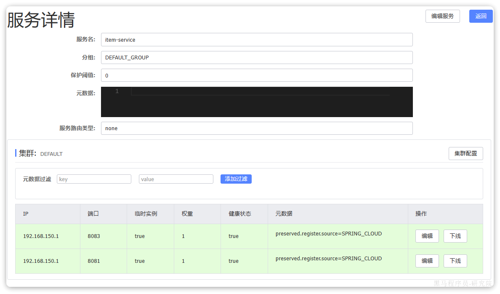

如果我们要**修改服务所在集群**，只需要修改`bootstrap.yml`即可：

```YAML
spring:
  cloud:
    nacos:
      discovery:
        cluster-name: BJ # 集群名称，自定义
```

我们修改`item-service`的`bootstrap.yml`，然后重新创建一个实例：

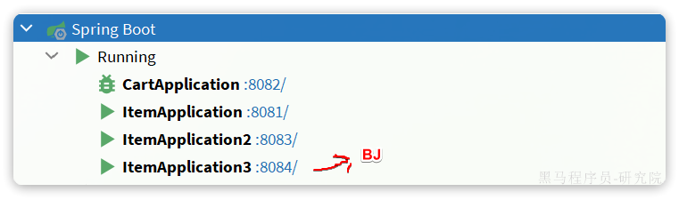

再次查看nacos：


发现8084这个新的实例确实属于`BJ`这个集群了。


### （3）nacos源码分析

[nacos源码分析](E:\AAWeb-Learing\SpringCloud\SpringCloud-MQ笔记\Nacos源码分析-Local.md)


### （4）Eureka

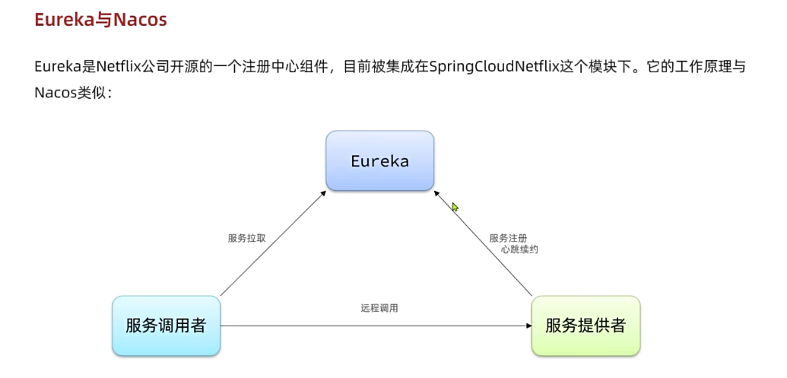

Eureka是Netflix公司开源的一个服务注册中心组件，早期版本的SpringCloud都是使用Eureka作为注册中心。由于Eureka和Nacos的starter中提供的功能都是基于SpringCloudCommon规范，因此两者使用起来差别不大。

课前资料中提供了一个Eureka的demo：


我们可以用idea打开查看一下：

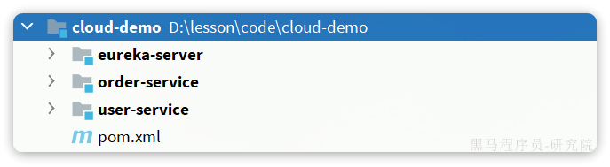

结构说明：

- `eureka-server`：**Eureka的服务端，也就是注册中心。没错，==Eureka服务端要自己创建项目==**
- `order-service`：订单服务，是一个服务调用者，查询订单的时候要查询用户
- `user-service`：用户服务，是一个服务提供者，对外暴露查询用户的接口

启动以后，访问`localhost:10086`即可查看到Eureka的控制台，相对于Nacos来说简陋了很多：

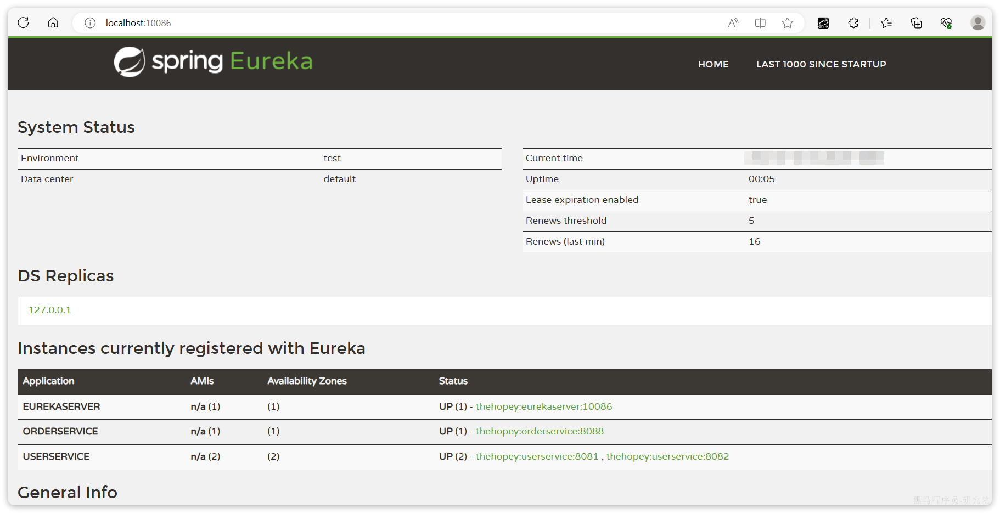

微服务引入Eureka的方式也极其简单，分三步：

- 启动Eureka服务

  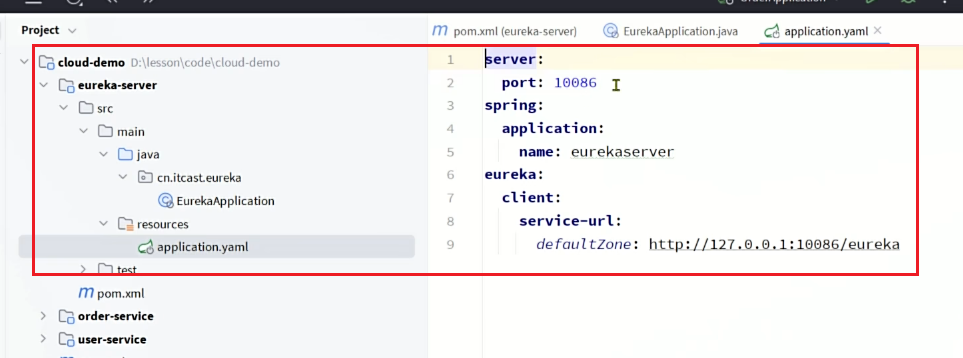

  ```xml
  <dependencies>
      <dependency>
          <groupId>org.springframework.cloud</groupId>
          <artifactId>spring-cloud-starter-netflix-eureka-server</artifactId>
      </dependency>
  </dependencies>
  ```

  

- 引入`eureka-client`依赖

  ```xml
  <!--eureka-client-->
  <dependency>
      <groupId>org.springframework.cloud</groupId>
      <artifactId>spring-cloud-starter-netflix-eureka-client</artifactId>
  </dependency>
  ```

  

- **配置`eureka`地址**

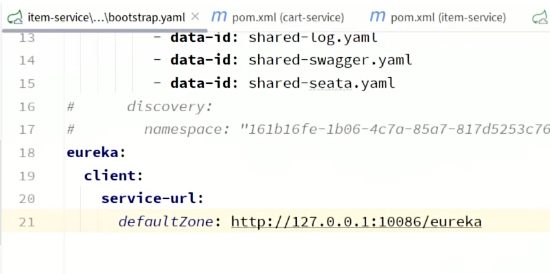

```yaml
eureka:
	client:
		service-url:
			defaultZone:http://127.0.0.1:10086/eureka
```

接下来就是编写OpenFeign的客户端了，怎么样？是不是跟Nacos用起来基本一致。


### （4）Eureka和Nacos==对比==

#### ①对比

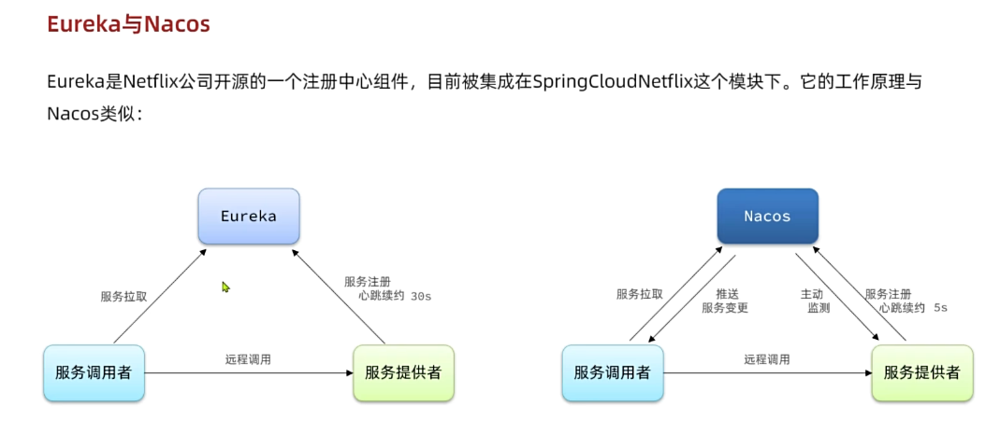

Eureka和Nacos都能起到注册中心的作用，用法基本类似。但还是有一些区别的，例如：

- **Nacos支持配置管理**，而Eureka则不支持。

而且服务注册发现上也有区别，我们来做一个实验：

我们**停止`user-service`服务**，然后观察Eureka控制台，你会发现很长一段时间过去后，**Eureka服务依然没有察觉`user-service`的异常状态**。

这与Eureka的**健康检测机制**有关。在Eureka中，健康检测的原理如下：

- 微服务启动时注册信息到Eureka，这点与Nacos一致。
- 微服务**每隔30秒向Eureka发送心跳请求**，报告自己的健康状态。**Nacos中默认是5秒一次**。
- Eureka如果**90秒**未收到心跳，则认为**服务疑似故障**，可能被剔除。Nacos中则是**15秒超时**，30秒剔除。
- Eureka如果发现超过85%比例的服务都心跳异常，会认为是自己的网络异常，暂停剔除服务的功能。
- Eureka**每隔60秒执行一次服务检测和清理任务**；**Nacos是每隔5秒执行一次。**

综上，你会发现Eureka是尽量不剔除服务，避免“误杀”，宁可放过一千，也不错杀一个。这就导致当服务真的出现故障时，迟迟不会被剔除，给服务的调用者带来困扰。

不仅如此，**当Eureka发现服务宕机并从服务列表中剔除以后，并不会将服务列表的变更消息推送给所有微服务。而是等待微服务自己来拉取时发现服务列表的变化。**而**微服务每隔30秒**才会去Eureka更新一次服务列表，**进一步推迟了服务宕机时被发现的时间**。

而Nacos中微服务除了自己==**定时去Nacos中拉取服务列表以外**==，**Nacos还会==在服务列表变更时主动推送最新的服务列表给所有的订阅者。==**


#### ②小结

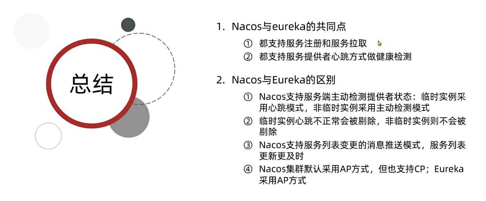

综上，Eureka和Nacos的相似点有：

- 都支持服务注册发现功能
- 都有基于心跳的健康监测功能
- 都支持集群，**集群间数据同步默认是==AP模式==(因为若需要满足一致性==C==，那么会导致数据同步时不能注册)，即最全高可用性**

Eureka和Nacos的区别有：

- Eureka的**心跳**是30秒一次，Nacos则是5秒一次
- Eureka如果90秒**未收到心跳**，则认为服务疑似故障，可能被剔除。Nacos中则是15秒超时，30秒剔除。
- Eureka每隔60秒执行一次**服务检测和清理任务**；Nacos是每隔5秒执行一次。
- Eureka只能**等微服务自己**每隔30秒更新一次服务列表；Nacos**==即有定时更新，也有在服务变更时的广播推送==**
- Eureka仅有注册中心功能，而**Nacos同时支持注册中心、配置管理**
- Eureka和Nacos都支持集群，而且默认都是**AP模式**


## 3、==远程调用==

我们知道微服务间远程调用都是有**OpenFeign**帮我们完成的，甚至帮我们实现了**服务列表之间的负载均衡**。但**具体负载均衡的规则**是什么呢？**何时做的负载均衡**呢？

接下来我们一起来分析一下。

### （1）负载均衡原理

在SpringCloud的早期版本中，负载均衡都是有Netflix公司开源的**Ribbon组件**来实现的，甚至Ribbon被直接集成到了Eureka-client和Nacos-Discovery中。

但是自SpringCloud2020版本开始，已经**弃用Ribbon**，改用Spring自己开源的Spring Cloud LoadBalancer了，我们使用的OpenFeign的也已经与其整合。

接下来我们就通过源码分析，来看看OpenFeign底层是如何实现负载均衡功能的。

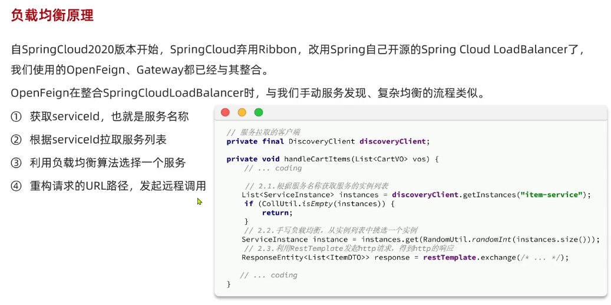

#### ①源码跟踪

要弄清楚OpenFeign的负载均衡原理，最佳的办法肯定是从FeignClient的请求流程入手。

首先，我们在`com.hmall.cart.service.impl.CartServiceImpl`中的`queryMyCarts`方法中打一个断点。然后在swagger页面请求购物车列表接口。

进入断点后，观察`ItemClient`这个接口：


你会发现ItemClient是一个**代理对象**，而代理的处理器则是`SentinelInvocationHandler`。这是因为我们项目中引入了`Sentinel`导致。

我们进入`SentinelInvocationHandler`类中的`invoke`方法看看：

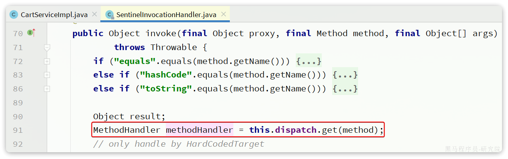

可以看到这里是先**获取被代理的方法的处理器`MethodHandler`**，接着，Sentinel就会开启对簇点资源的监控：


开启Sentinel的簇点资源监控后，就可以调用处理器了，我们尝试跟入，会发现有两种实现：

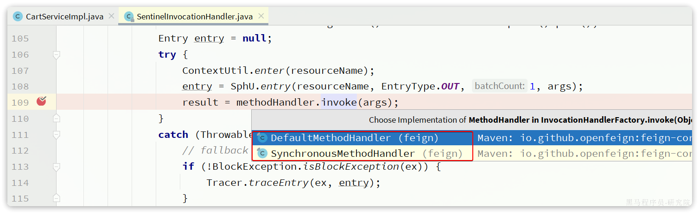

这其实就是OpenFeign远程调用的处理器了。继续跟入会进入`SynchronousMethodHandler`这个实现类：


在上述方法中，会循环尝试调用`executeAndDecode()`方法，直到成功或者是重试次数达到Retryer中配置的上限。

我们继续跟入`executeAndDecode()`方法：

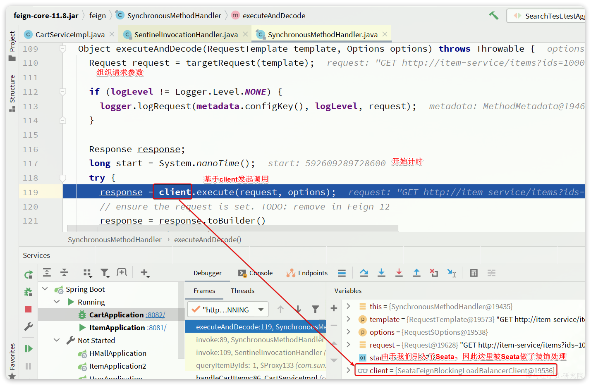

`executeAndDecode()`方法最终会利用`client`去调用`execute()`方法，发起远程调用。

这里的client的类型是`feign.Client`接口，其下有很多实现类：

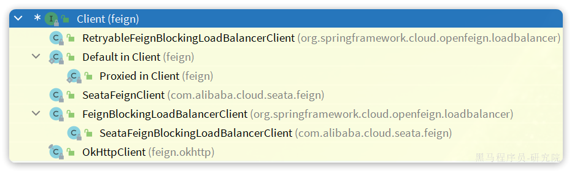

由于我们项目中整合了seata，所以这里client对象的类型是`SeataFeignBlockingLoadBalancerClient`，内部实现如下：

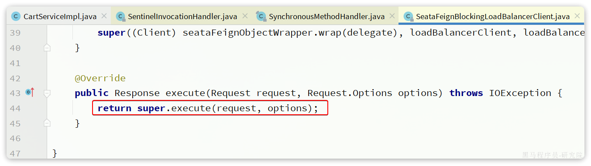

这里直接调用了其父类，也就是==`FeignBlockingLoadBalancerClient`的`execute`==方法，来看一下：

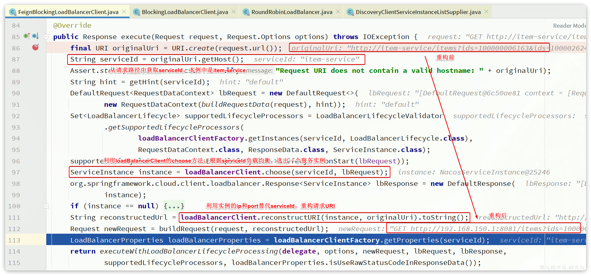

整段代码中核心的有4步：

- **从请求的`URI`中找出`serviceId`**
- **利用`loadBalancerClient`，根据`serviceId`做负载均衡，选出一个实例`ServiceInstance`**
- **用选中的`ServiceInstance`的`ip`和`port`替代`serviceId`，重构`URI`**
- **向真正的URI发送请求**

所以负载均衡的关键就是这里的**==loadBalancerClient==**，类型是`org.springframework.cloud.client.loadbalancer.LoadBalancerClient`，这是**`Spring-Cloud-Common`模块中定义的接口，只有一个实现类**：


而这里的`org.springframework.cloud.client.loadbalancer.BlockingLoadBalancerClient`正是`Spring-Cloud-LoadBalancer`模块下的一个类：

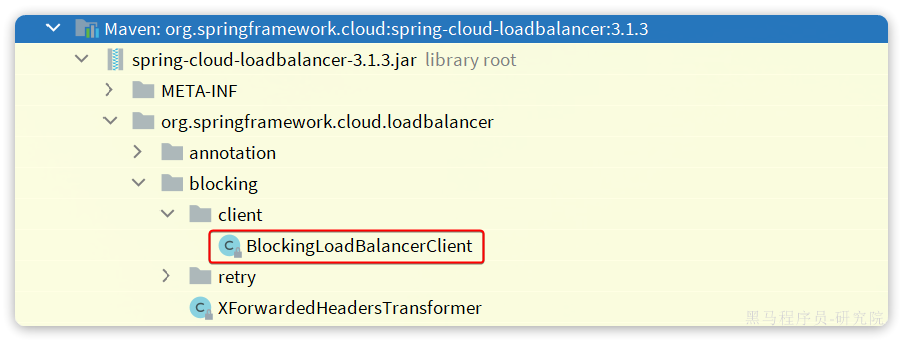

我们继续跟入其==`BlockingLoadBalancerClient#choose()`==方法：

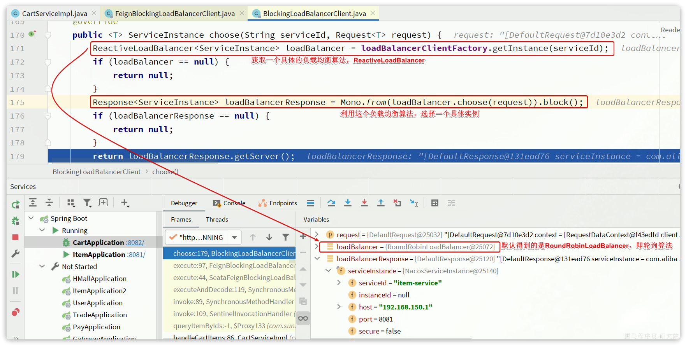

图中代码的核心逻辑如下：

- 根据serviceId找到这个服务采用的**负载均衡器（`ReactiveLoadBalancer`）**，也就是说我们可以给每个服务配不同的负载均衡算法。
- 利用负载均衡器（`ReactiveLoadBalancer`）中的负载均衡算法，选出一个服务实例

`ReactiveLoadBalancer`是`Spring-Cloud-Common`组件中定义的负载均衡器接口规范，而`Spring-Cloud-Loadbalancer`组件给出了两个实现：


默认的实现是`RoundRobinLoadBalancer`，即==**轮询**负载均衡器==。负载均衡器的核心逻辑如下：


核心流程就是两步：

- 利用`ServiceInstanceListSupplier#get()`方法拉取服务的实例列表，这一步是采用响应式编程
- 利用本类，也就是`RoundRobinLoadBalancer`的`getInstanceResponse()`方法挑选一个实例，这里采用了**轮询算法来挑选**。

这里的ServiceInstanceListSupplier有很多实现：

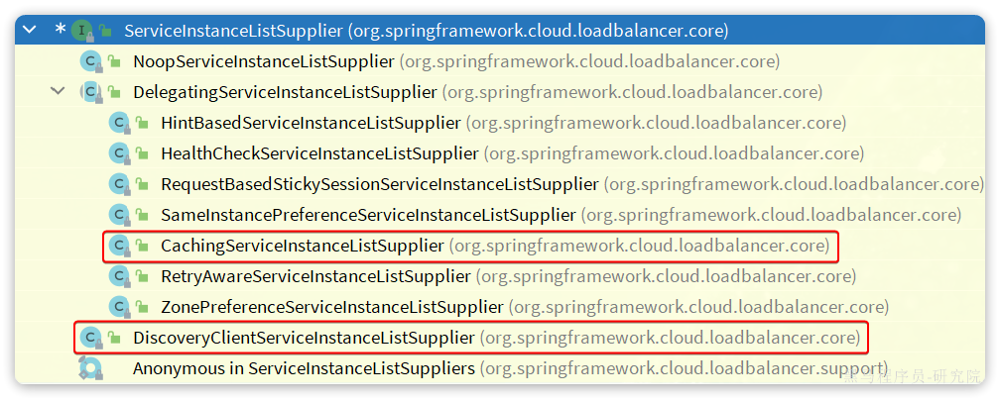

其中CachingServiceInstanceListSupplier采用了装饰模式，加了服务实例列表缓存，避免每次都要去注册中心拉取服务实例列表。而其内部是基于`DiscoveryClientServiceInstanceListSupplier`来实现的。

在这个类的构造函数中，就会异步的基于DiscoveryClient去拉取服务的实例列表：

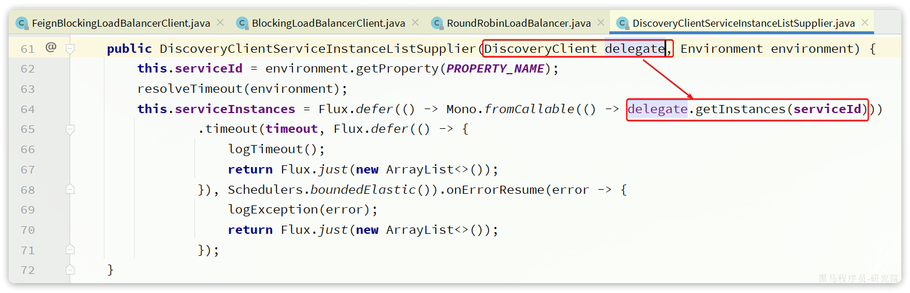

#### ②流程梳理

根据之前的分析，我们会发现Spring在整合OpenFeign的时候，实现了`org.springframework.cloud.openfeign.loadbalancer.FeignBlockingLoadBalancerClient`类，其中定义了OpenFeign发起远程调用的核心流程。也就是四步：

- 获取请求中的`serviceId`
- 根据`serviceId`负载均衡，找出一个可用的服务实例
- 利用服务实例的`ip`和`port`信息重构url
  - 负载均衡器内部会根据服务id，从注册中心拉去服务列表，并采**用配置的负载均衡算法（默认轮询）选出一个实例**，获取该实例的ip和端口，替换请求url中的服务明，变成真正可的url，发送请求。

- 向真正的url发起请求

而具体的负载均衡则是不是由`OpenFeign`组件负责。而是分成了**负载均衡的接口规范**，以及**负载均衡的具体实现**两部分。

负载均衡的接口规范是定义在**`Spring-Cloud-Common`模块中**，包含下面的接口：

- `LoadBalancerClient`：**负载均衡客户端**，职责是根据serviceId最终负载均衡，选出一个服务实例
- `ReactiveLoadBalancer`：**负载均衡器**，负责具体的**负载均衡算法**

OpenFeign的负载均衡是基于`Spring-Cloud-Common`模块中的负载均衡规则接口，并没有写死具体实现。这就意味着以后还可以拓展其它各种负载均衡的实现。

不过目前`SpringCloud`中只有`Spring-Cloud-Loadbalancer`这一种实现。

`Spring-Cloud-Loadbalancer`模块中，实现了`Spring-Cloud-Common`模块的相关接口，具体如下：

- `BlockingLoadBalancerClient`：实现了`LoadBalancerClient`，会根据serviceId选出负载均衡器并调用其算法实现负载均衡。
- `RoundRobinLoadBalancer`：基于轮询算法实现了`ReactiveLoadBalancer`
- `RandomLoadBalancer`：基于随机算法实现了`ReactiveLoadBalancer`，

这样一来，整体思路就非常清楚了，流程图如下：

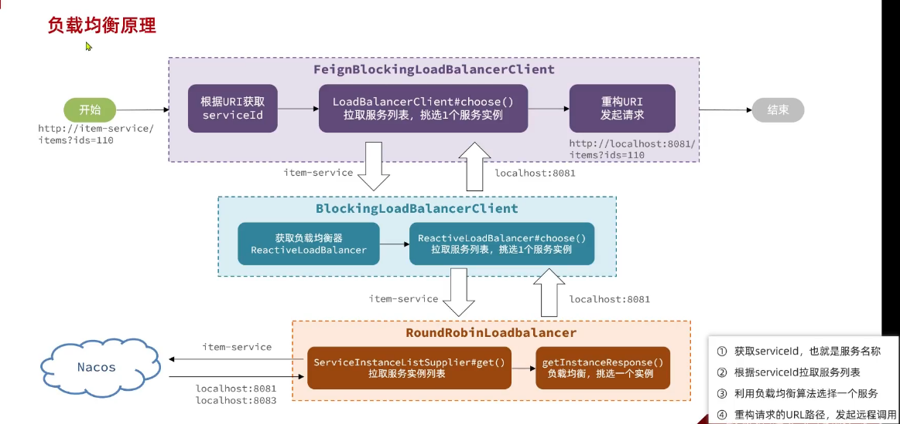

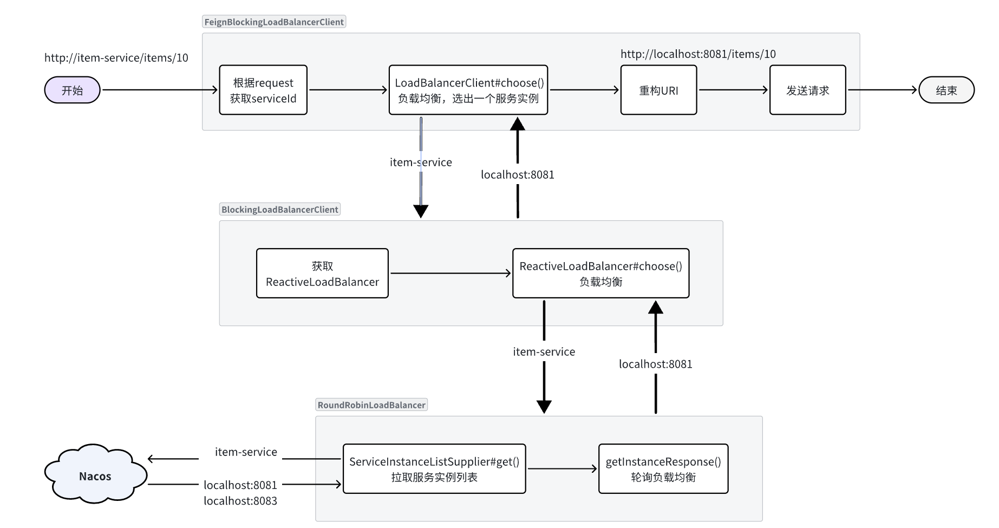


### （2）==NacosRule==-切换负载均衡策略

之前分析源码的时候我们发现负载均衡的算法是有`ReactiveLoadBalancer`来定义的，我们发现它的实现类有三个：


其中`RoundRobinLoadBalancer`和`RandomLoadBalancer`是由`Spring-Cloud-Loadbalancer`模块提供的，而`NacosLoadBalancer`则是由`Nacos-Discorvery`模块提供的。

默认采用的负载均衡策略是`RoundRobinLoadBalancer`，那如果我们要**切换负载均衡策略**该怎么办？

#### ①修改负载均衡策略

查看源码会发现，`Spring-Cloud-Loadbalancer`模块中**有一个==自动配置类==**：


其中**定义了默认的负载均衡器**：


这个Bean上添加了`@ConditionalOnMissingBean`注解，也就是说如果我们**自定义了这个类型的bean，则负载均衡的策略就会被改变。**

我们在`hm-cart`模块中的添加一个配置类：

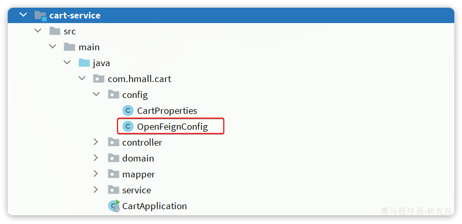

代码如下：

```Java
package com.hmall.cart.config;

import com.alibaba.cloud.nacos.NacosDiscoveryProperties;
import com.alibaba.cloud.nacos.loadbalancer.NacosLoadBalancer;
import org.springframework.cloud.client.ServiceInstance;
import org.springframework.cloud.loadbalancer.core.ReactorLoadBalancer;
import org.springframework.cloud.loadbalancer.core.ServiceInstanceListSupplier;
import org.springframework.cloud.loadbalancer.support.LoadBalancerClientFactory;
import org.springframework.context.annotation.Bean;
import org.springframework.core.env.Environment;

public class OpenFeignConfig {
    @Bean
    public ReactorLoadBalancer<ServiceInstance> reactorServiceInstanceLoadBalancer(
            Environment environment, NacosDiscoveryProperties properties,
            LoadBalancerClientFactory loadBalancerClientFactory) {
        String name = environment.getProperty(LoadBalancerClientFactory.PROPERTY_NAME);
        return new NacosLoadBalancer(
                loadBalancerClientFactory.getLazyProvider(name, ServiceInstanceListSupplier.class),
            name,
            properties);
    }

}
```

**注意**：

这个**配置类千万不要加`@Configuration`注解，也不要被SpringBootApplication扫描到。**

**由于这个OpenFeignConfig没有加`@Configuration`注解，也就没有被Spring加载**，因此是不会生效的。接下来，我们**要==在启动类上通过注解来声明这个配置==**。

有两种做法：

- **==全局==配置：对所有服务生效**

```Java
@LoadBalancerClients(defaultConfiguration = OpenFeignConfig.class)
```

- **==局部==配置：只对某个服务生效**

```Java
@LoadBalancerClients({
        @LoadBalancerClient(value = "item-service", configuration = OpenFeignConfig.class)
})
```

我们选择全局配置：

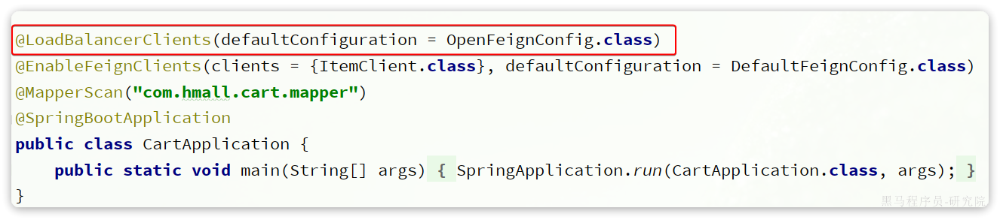

DEBUG重启后测试，会发现负载均衡器的类型确实切换成功：

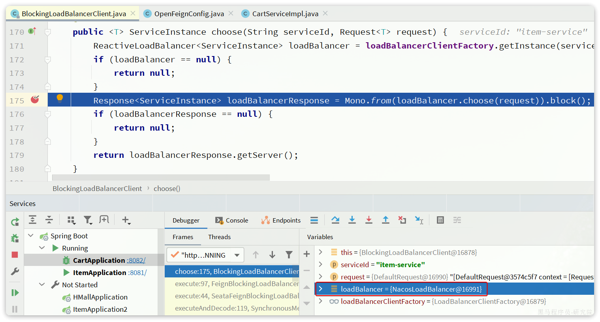


#### ②==集群优先==

`RoundRobinLoadBalancer`是轮询算法，`RandomLoadBalancer`是随机算法，那么`NacosLoadBalancer`是什么负载均衡算法呢？

我们通过源码来分析一下，先看第一部分：


这部分代码的大概流程如下：

- 通过`ServiceInstanceListSupplier`获取服务实例列表
- 获取`NacosDiscoveryProperties`中的`clusterName`，也就是yml文件中的配置，代表当前服务实例所在集群信息（参考`2.2`小节，分级模型）
- 然后利用stream的filter过滤找到被调用的服务实例中与当前服务实例`clusterName`一致的。简单来说就是**服务调用者与服务提供者要在一个集群**

为什么？

假如我现在有两个机房，都部署有`item-service`和`cart-service`服务：

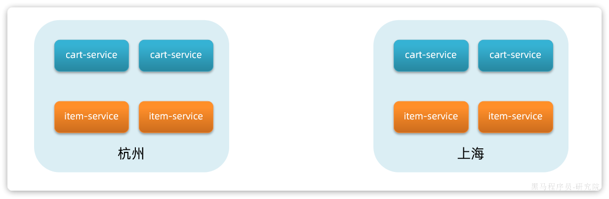

假如这些服务实例全部都注册到了同一个Nacos。现在，杭州机房的`cart-service`要调用`item-service`，会拉取到所有机房的item-service的实例。调用时会出现两种情况：

- 直接调用当前机房的`item-service`
- 调用其它机房的`item-service`

本机房调用几乎没有网络延迟，速度比较快。而跨机房调用，如果两个机房相距很远，会存在较大的网络延迟。因此，我们应该尽可能避免跨机房调用，优先本地集群调用：

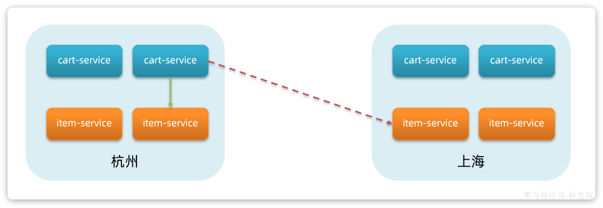

现在的情况是这样的：

- `cart-service`所在集群是`default`
- `item-service`的8081、8083所在集群的`default`
- `item-service`的8084所在集群是`BJ`

`cart-service`访问`item-service`时，应该优先访问8081和8082，我们重启`cart-service`，测试一下：

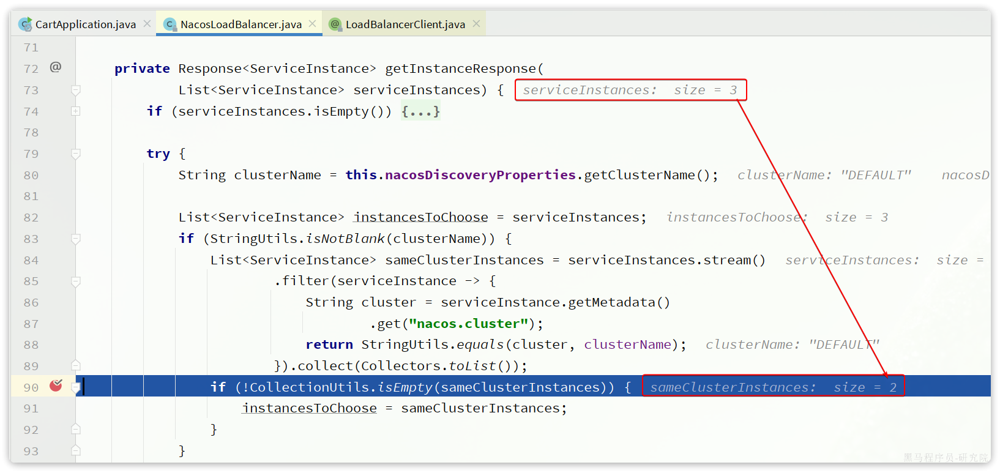

可以看到原本是3个实例，经过筛选后还剩下2个实例。

查看Debug控制台：

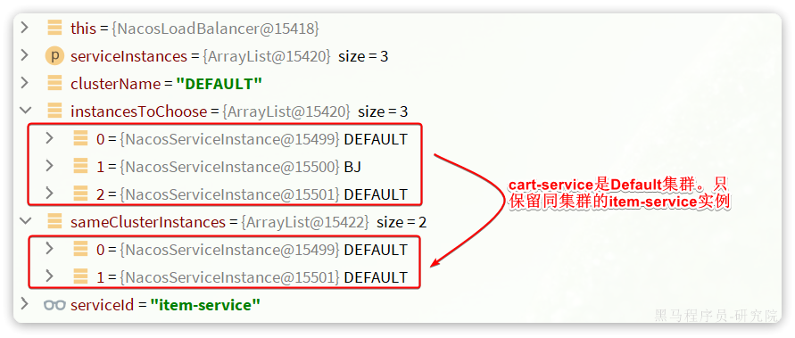

同集群的实例还剩下两个，接下来就需要做负载均衡了，具体用的是什么算法呢？

#### ③==权重配置==

我们继续跟踪`NacosLoadBalancer`源码：


那么问题来了， 这个权重是怎么配的呢？

我们打开nacos控制台，进入`item-service`的服务详情页，可以看到每个实例后面都有一个**编辑**按钮：


点击，可以看到一个编辑表单：

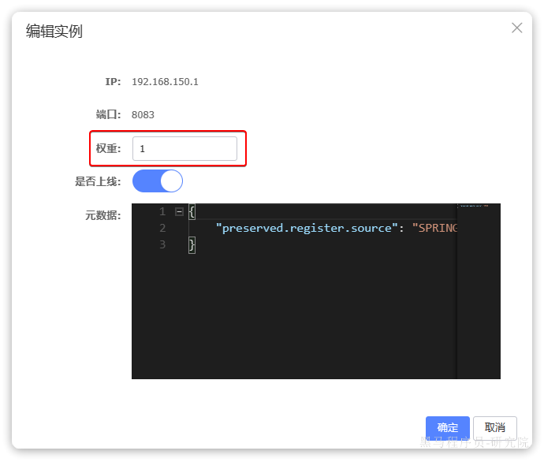

我们将这里的权重修改为5：

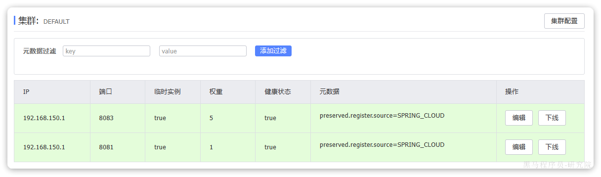

访问10次购物车接口，可以发现大多数请求都访问到了8083这个实例。


## 4、🚀==*服务保护*==

在SpringCloud的早期版本中采用的**服务保护技术叫做`Hystix`**，不过后来被淘汰，替换为`Spring Cloud Circuit Breaker`，其底层实现可以是`Spring Retry`和`Resilience4J`。

不过在国内使用较多还是**`SpringCloudAlibaba`中的`Sentinel`组件**。

接下来，我们就分析一下`Sentinel`组件的一些基本实现原理以及它与`Hystix`的差异。

### （1）线程隔离

首先我们来看下线程隔离功能，无论是Hystix还是Sentinel**都支持线程隔离**。不过其实现方式不同。

#### ①线程隔离的两种方式

线程隔离有两种方式实现：

- **线程池**隔离：**给每个服务调用业务分配一个==线程池==**，利用线程池本身实现隔离效果
- **信号量**隔离：不创建线程池，而是**==计数器模式==，记录业务使用的线程数量，达到信号量上限时，禁止新的请求**

如图：

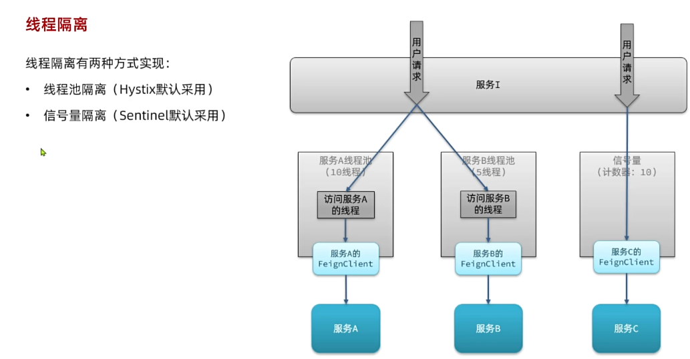

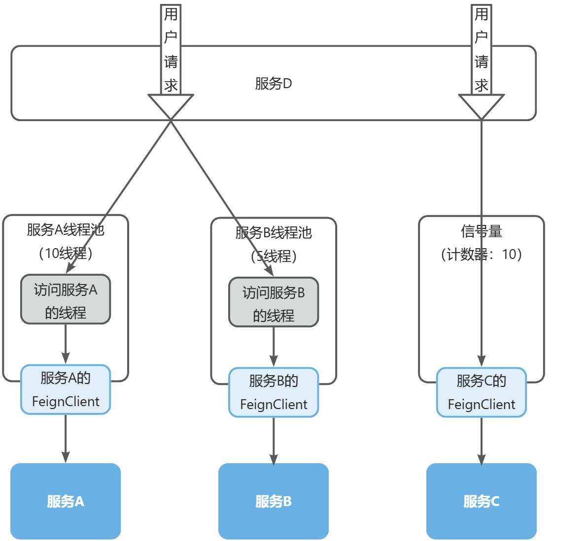

两者的优缺点如下：

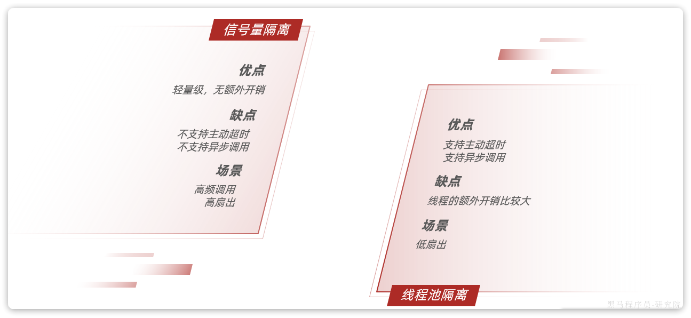

**Sentinel的线程隔离就是基于信号量隔离实现**的，而Hystix两种都支持，但默认是基于线程池隔离。


#### ②Sentinel和Hystix的区别

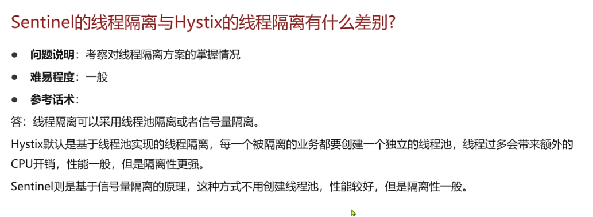


### （2）🚀==*滑动窗口算法*==

在熔断功能中，需要**统计异常请求或慢请求比例，也就是计数**。在限流的时候，要**统计每秒钟的QPS**，同样是计数。可见**计数算法**在熔断限流中的应用非常多。sentinel中采用的计数器算法就是**滑动窗口计数算法**。

#### ①==固定==窗口计数

要了解滑动窗口计数算法，我们必须先知道固定窗口计数算法，其基本原理如图：


说明：

- 将**时间划分为多个窗口**，窗口时间跨度称为==`Interval`==，本例中为1000ms；
- 每个窗口维护1个计数器，每有1次请求就将计数器`+1`。限流就是设置计数器阈值，本例为3，图中红线标记
- 如果**计数器超过了限流阈值，则超出阈值的请求都被丢弃**。

示例：

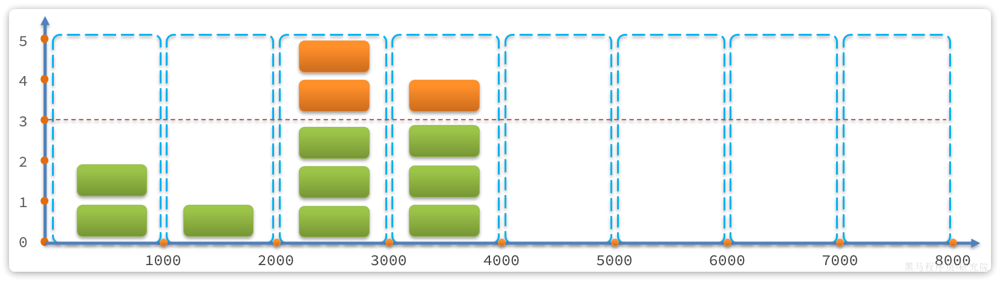

说明：

- 第1、2秒，请求数量都小于3，没问题
- 第3秒，请求数量为5，超过阈值，超出的请求被拒绝

但是我们考虑一种特殊场景，如图：

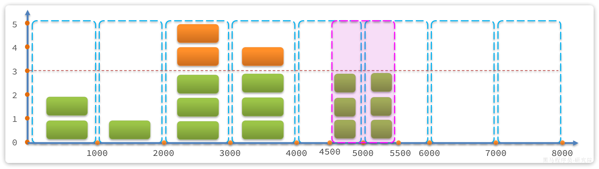

说明：

- **假如在第5、6秒，请求数量都为3，没有超过阈值，全部放行**
- 但是，如果第5秒的三次请求都是在4.5~5秒之间进来；第6秒的请求是在5~5.5之间进来。那么**从第4.5~5.之间就有6次请求！也就是说每秒的QPS达到了6，==远超阈值==**。

这就是固定窗口计数算法的问题，它只能统计当前某1个时间窗的请求数量是否到达阈值，**无法结合前后的时间窗的数据做综合统计**。

因此，我们就需要滑动时间窗口算法来解决。


#### ②==滑动==窗口计数

固定时间窗口算法中窗口有很多，其跨度和位置是与时间区间绑定，因此是很多固定不动的窗口。而滑动时间窗口算法中只包含1个固定跨度的窗口，**但窗口是可移动动的，与时间区间无关。**

具体规则如下：

- 窗口时间跨度`Interval`大小固定，例如1秒
- **==时间区间跨度==**为**`Interval / n` ，例如n=2**，则时间区间跨度为500ms
- 窗口会随着当前请求所在时间`currentTime`移动，窗口范围从`currentTime-Interval`时刻之后的第一个时区开始，到`currentTime`所在时区结束。

如图所示：


**限流阈值依然为3**，绿色小块就是请求，上面的数字是其`currentTime`值。

- 在第1300ms时接收到一个请求，其所在时区就是1000~1500
- 按照规则，currentTime-Interval值为300ms，300ms之后的第一个时区是500~1000，因此窗口范围包含两个时区：500~1000、1000~1500，也就是粉红色方框部分
- 统计窗口内的请求总数，发现是3，未达到上限。

若第1400ms又来一个请求，会落在1000~1500时区，虽然该时区请求总数是3，**但滑动窗口内总数已经达到4，因此该请求会被拒绝：**

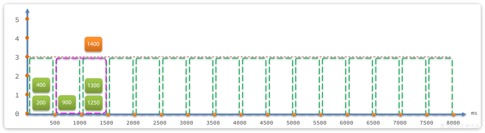

假如第1600ms又来的一个请求，处于1500~2000时区，根据算法，滑动窗口位置应该是1000~1500和1500~2000这两个时区，也就是向后移动：

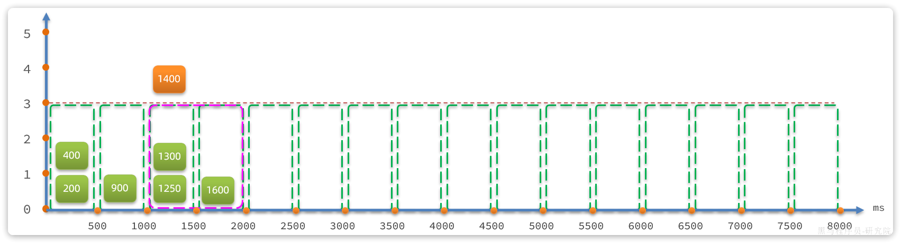

这就是滑动窗口计数的原理，解决了我们之前所说的问题。而且**==滑动窗口内划分的时区越多，这种统计就越准确。==**


### （3）令牌桶算法

限流的另一种常见算法是**令牌桶算法**。Sentinel中的**热点参数限流正是基于令牌桶算法**实现的。其基本思路如图：


说明：

- **以固定的速率生成令牌，存入令牌桶中，如果令牌桶满了以后，多余令牌丢弃**
- 请求进入后，必须**先尝试从桶中获取令牌，获取到令牌后才可以被处理**
- 如果令牌桶中没有令牌，则请求等待或丢弃

基于令牌桶算法，**每秒产生的令牌数量基本就是QPS上限**。

当然也有例外情况，例如：  

- **某一秒令牌桶中产生了很多令牌**，达到令牌桶上限N，**缓存在令牌桶中，==但是这一秒没有请求进入==**。
- 下一秒的**前半秒涌入了超过2N个请求**，之前缓存的令牌桶的令牌耗尽，**同时这一秒又生成了N个令牌**，于是总共放行了2N个请求。**超出了我们设定的QPS阈值**。

因此，在使用令牌桶算法时，尽量不要将令牌上限设定到服务能承受的QPS上限。而是**预留一定的波动空间**，这样我们才能应对突发流量。


### （4）漏桶算法-==队列==

漏桶算法与令牌桶相似，但在设计上更适合应对**==并发波动较大的场景==**，以解决令牌桶中的问题。

简单来说就是请求到达后不是直接处理，**而是先放入一个==队列==。而后以固定的速率从队列中取出并处理请求。之所以叫漏桶算法**，就是把请求看做水，队列看做是一个漏了的桶。

如图：


说明：

- 将每个请求视作"水滴"放入"漏桶"进行存储；
- "**漏桶"以固定速率向外"漏"出请求来执行，如果"漏桶"空了则停止"漏水”**；
- 如果"漏桶"满了则多余的"水滴"会被直接丢弃。

漏桶的优势就是**流量整型**，桶就像是一个大坝，请求就是水。并发量不断波动，就如图水流时大时小，但都会被大坝拦住。而后大坝按照固定的速度放水，避免下游被洪水淹没。

因此，不管并发量如何波动，经过漏桶处理后的请求一定是相对平滑的曲线：


sentinel中的限流中的排队等待功能正是基于漏桶算法实现的。

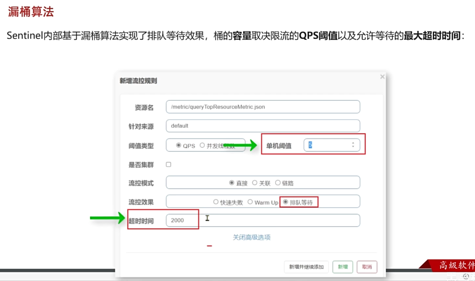


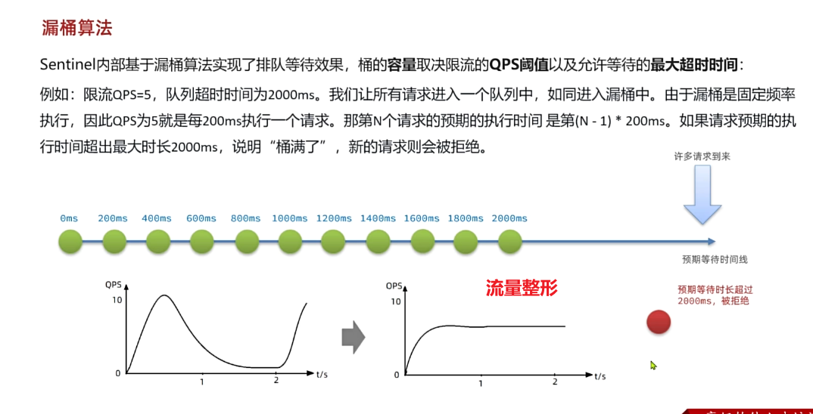


### （5）Sentinel和Gateway的限流区别

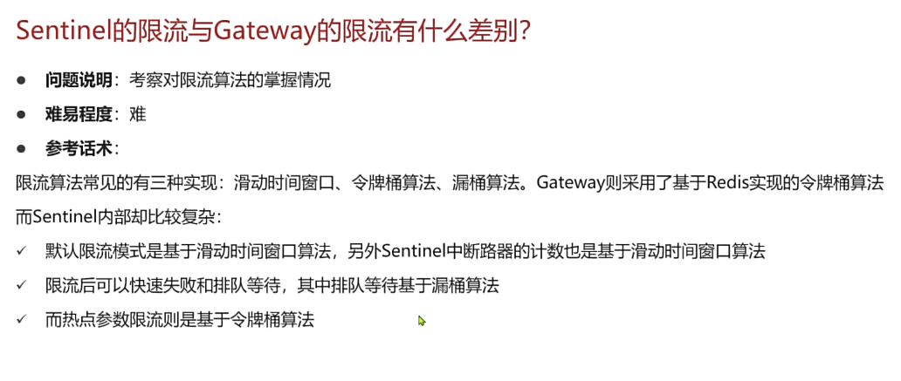


## 5、🚀==作业==

尝试用自己的语言回答下列面试题：

- SpringCloud有哪些常用组件？分别是什么作用？
- 服务注册发现的基本流程是怎样的？
- Eureka和Nacos有哪些区别？
- Nacos的分级存储模型是什么意思？
- OpenFeign是如何实现负载均衡的？
- 什么是服务雪崩，常见的解决方案有哪些？
- Hystix和Sentinel有什么区别和联系？
- 限流的常见算法有哪些？
- 什么是CAP理论和BASE思想？
- 项目中碰到过分布式事务问题吗？怎么解决的？
- AT模式如何解决脏读和脏写问题的？
- TCC模式与AT模式对比，有哪些优缺点
- RabbitMQ是如何确保消息的可靠性的？
- RabbitMQ是如何解决消息堆积问题的？


### SpringCloud面试题解答

---

#### 1. SpringCloud有哪些常用组件？分别是什么作用？
**官方概念**：  
- **Eureka**：服务注册与发现  
- **Ribbon**：客户端负载均衡  
- **Feign/OpenFeign**：声明式HTTP客户端（简化服务调用）  
- **Hystrix**：服务熔断与降级  
- **Zuul/Gateway**：API网关（路由、鉴权、限流）  
- **Config**：统一配置中心  
- **Nacos**：注册中心+配置中心（替代Eureka+Config）  
- **Sentinel**：流量控制与系统保护  

**通俗解释**： 
SpringCloud就像开餐馆的“全家桶套餐”：  

- **Eureka**是“电话簿”，记录所有分店的位置（服务注册）。  
- **Ribbon**是“智能点餐员”，自动选最近的厨房做菜（负载均衡）。  
- **Feign**是“外卖小哥”，帮你打电话叫餐（封装HTTP调用）。  
- **Hystrix**是“保险丝”，某个厨房着火立刻断电（熔断）。  
- **Gateway**是“前台保安”，检查每个客人健康码（路由鉴权）。  

---

#### 2. 服务注册发现的基本流程是怎样的？
**官方概念**：  
1. 服务启动时向注册中心注册自身信息（IP、端口）。  
2. 消费者从注册中心拉取服务列表并缓存。  
3. 通过负载均衡策略选择目标服务实例。  
4. 定时心跳检测，剔除失效节点。  

**通俗解释**： 
想象你去商场找奶茶店：  

1. 奶茶店开业时在商场服务台登记（注册）。  
2. 你到服务台问“哪有奶茶店？”（拉取服务列表）。  
3. 服务台推荐3楼那家不用排队的（负载均衡）。  
4. 如果奶茶店关门，服务台立刻划掉它的名字（心跳检测）。  

---

#### 3. Eureka和Nacos有哪些区别？  
**官方概念**：  
|          | Eureka           | Nacos                    |
| -------- | ---------------- | ------------------------ |
| 一致性   | AP模型（高可用） | AP + CP（可切换）        |
| 功能     | 仅服务注册发现   | 服务+配置中心+动态DNS    |
| 健康检查 | 客户端心跳       | TCP/HTTP/MYSQL多模式检查 |
| 易用性   | 需配合其他组件   | 开箱即用                 |

**通俗解释**：  
- **Eureka**像“功能机”：只能打电话发短信（服务注册）。  
- **Nacos**像“智能手机”：还能拍照、导航、叫外卖（服务+配置管理）。  

---

#### 4. Nacos的分级存储模型是什么意思？  
**官方概念**： 
将服务实例按地域、机房等划分为不同集群，优先访问同集群实例，降低跨网络延迟。  

**通俗解释**： 
就像快递分仓：  

- 你在北京买书，优先从“华北仓”发货（同集群）。  
- 华北仓没货了，才从“华南仓”调货（跨集群）。  

---

#### 5. OpenFeign是如何实现负载均衡的？  
**官方概念**： 
集成Ribbon，通过`@FeignClient`生成动态代理，调用时根据策略（如轮询、随机）选择服务实例。  

**通俗解释**： 
Feign像“智能外卖APP”：  

- 你点奶茶时，APP自动选评分最高且最近的店铺（负载均衡）。  
- 背后偷偷用了Ribbon的“选店算法”。  

---

#### 6. 什么是服务雪崩，常见的解决方案有哪些？  
**官方概念**： 
服务雪崩：一个服务故障引发连锁反应，导致整个系统崩溃。 
解决方案：  

1. **熔断**（Hystrix）：快速失败，避免积压请求。  
2. **降级**：返回兜底数据（如“稍后再试”）。  
3. **限流**（Sentinel）：控制并发请求量。  
4. **超时控制**：避免线程长期阻塞。  

**通俗解释**： 
雪崩就像“多米诺骨牌”：  

- **熔断**：及时砍断骨牌链（快速失败）。  
- **降级**：换成塑料骨牌（返回默认值）。  
- **限流**：一次只推一块骨牌（控制流量）。  

---

#### 7. Hystrix和Sentinel有什么区别和联系？  
**官方概念**：  
- **Hystrix**：Netflix开源，专注熔断降级，社区已停更。  
- **Sentinel**：阿里开源，支持流量控制、熔断、系统保护，可视化强。  

**通俗解释**：  
- **Hystrix**是“灭火器”：只能灭小火（熔断）。  
- **Sentinel**是“智能消防系统”：能预警、喷水、疏散人群（流量控制+熔断+监控）。  

---

#### 8. 限流的常见算法有哪些？  
**官方概念**：  
- **计数器算法**：固定窗口计数（如1秒内最多100次）。  
- **滑动窗口**：更平滑的时间窗口统计。  
- **漏桶算法**：恒定速率处理请求（桶满则拒绝）。  
- **令牌桶算法**：按速率生成令牌，突发流量可借用令牌。  

**通俗解释**：  
- **漏桶**：像水龙头，匀速滴水（固定速率处理）。  
- **令牌桶**：像游乐场门票，攒够票才能玩（允许突发流量）。  

---

#### 9. 什么是CAP理论和BASE思想？  
**官方概念**：  
- **CAP**：一致性（C）、可用性（A）、分区容错性（P），三者只能满足两个。  
- **BASE**：基本可用（Basically Available）、软状态（Soft State）、最终一致性（Eventually Consistent）。  

**通俗解释**：  
- **CAP**：找对象时，帅、有钱、专一，最多选两个。  
- **BASE**：暂时凑合过，最终会变好（最终一致性）。  

---

#### 10. 项目中碰到过分布式事务问题吗？怎么解决的？  
**官方概念**： 
使用Seata的AT模式：通过全局锁+反向SQL日志实现自动补偿。  

**通俗解释**： 
就像“网购付款”： 

- 如果扣款成功但库存没减，系统自动退款（AT模式自动回滚）。  

---

#### 11. AT模式如何解决脏读和脏写问题的？  
**官方概念**：  
- **脏读**：通过全局锁，其他事务读取数据前必须等待当前事务提交。  
- **脏写**：在事务提交时检查数据版本，若被修改则回滚。  

**通俗解释**： 
ATM取钱时，系统会锁住你的账户，防止别人同时操作（全局锁）。  

---

#### 12. TCC模式与AT模式对比，有哪些优缺点？  
**官方概念**：  
|        | TCC                            | AT                    |
| ------ | ------------------------------ | --------------------- |
| 侵入性 | 高（需实现try/confirm/cancel） | 低（自动生成回滚SQL） |
| 灵活性 | 高（可自定义补偿逻辑）         | 低（依赖数据库能力）  |
| 性能   | 较差（网络调用多）             | 较好（本地事务）      |

**通俗解释**：  
- **TCC**像“手动挡”：精准控制每个步骤，但操作复杂。  
- **AT**像“自动挡”：踩油门就走，但无法漂移（灵活性低）。  

---

#### 13. RabbitMQ如何确保消息的可靠性？  
**官方概念**：  
1. **生产者确认**（Confirm机制）。  
2. **消息持久化**（队列和消息存磁盘）。  
3. **消费者手动ACK**（处理完再确认）。  

**通俗解释**： 
就像发快递：  

- 顺丰小哥确认包裹收到（Confirm）。  
- 包裹放保险柜（持久化）。  
- 收件人必须签字（手动ACK）。  

---

#### 14. RabbitMQ如何解决消息堆积问题？  
**官方概念**：  
1. 增加消费者（水平扩展）。  
2. 设置队列最大长度（死信队列转移）。  
3. 批量消费（Prefetch调大）。  

**通俗解释**： 
堵车解决方案：  

- 多开几个收费站（加消费者）。  
- 把车分流到备用车道（死信队列）。  
- 一次放10辆车通过（批量消费）。  

---

以上答案既满足面试官的技术考察，又用生活化类比帮助记忆，灵活应对不同面试风格！


