# MySql-Learning


# 一ã€åŸºç¡€ç¯‡

# 1ã€Mysql概述

在这一章节，我们主è¦ä»‹ç»ä¸¤ä¸ªéƒ¨åˆ†ï¼Œæ•°æ®åº“相关概念åŠMySQLæ•°æ®åº“的介ç»ã€ä¸‹è½½ã€å®‰è£…ã€å¯åŠ¨åŠè¿æ¥ã€‚

## 1.1 **æ•°æ®åº“相关概念**

在这一部分，我们先æ¥è®²è§£ä¸‰ä¸ªæ¦‚念：数æ®åº“ã€æ•°æ®åº“管ç†ç³»ç»Ÿã€SQL。

| **å称**       | **全称**                                                     | **简称**                          |
| :------------- | :----------------------------------------------------------- | :-------------------------------- |
| æ•°æ®åº“         | 存储数æ®çš„仓库，数æ®æ˜¯æœ‰ç»„织的进行存储                       | DataBase（DB）                    |
| æ•°æ®åº“管ç†ç³»ç»Ÿ | æ“纵和管ç†æ•°æ®åº“的大å‹è½¯ä»¶                                   | DataBase Management System (DBMS) |
| SQL            | æ“作关系å‹æ•°æ®åº“的编程语言，定义了一套æ“作关系å‹æ•°æ®åº“统一**标准** | Structured Query Language (SQL)   |


而目å‰ä¸»æµçš„关系å‹æ•°æ®åº“管ç†ç³»ç»Ÿçš„市场å æœ‰ç‡æ’å如下：


- **Oracle**：大å‹çš„收费数æ®åº“，Oracleå…¬å¸äº§å“，价格昂贵。
- **MySQL**：开æºå…费的中å°å‹æ•°æ®åº“，åæ¥Sunå…¬å¸æ”¶è´­äº†MySQL，而Oracleåˆæ”¶è´­äº†Sunå…¬å¸ã€‚ç›®å‰Oracleæ¨å‡ºäº†æ”¶è´¹ç‰ˆæœ¬çš„MySQL，也æ供了å…费的社区版本。
-  **SQL Server**：Microsoft å…¬å¸æ¨å‡ºçš„收费的中å‹æ•°æ®åº“，C#ã€.net等语言常用。

-  **PostgreSQL**：开æºå…费的中å°å‹æ•°æ®åº“。  DB2：IBMå…¬å¸çš„大å‹æ”¶è´¹æ•°æ®åº“产å“。

-  SQLLite：嵌入å¼çš„å¾®å‹æ•°æ®åº“。Android内置的数æ®åº“采用的就是该数æ®åº“。

-  MariaDB：开æºå…费的中å°å‹æ•°æ®åº“。是MySQLæ•°æ®åº“çš„å¦å¤–一个分支ã€å¦å¤–一个è¡ç”Ÿäº§å“ï¼Œä¸ MySQLæ•°æ®åº“有很好的兼容性。


而ä¸è®ºæˆ‘们使用的是上é¢çš„哪一个关系å‹æ•°æ®åº“，最终在æ“作时，都是使用SQL语言æ¥è¿›è¡Œç»Ÿä¸€æ“作，因为我们å‰é¢è®²åˆ°SQL语言，是æ“作关系å‹æ•°æ®åº“çš„ **统一标准** 。所以å³ä½¿æˆ‘们ç°åœ¨å­¦ä¹ çš„是MySQL，å‡å¦‚我们以å到了公å¸ï¼Œä½¿ç”¨çš„是别的关系å‹æ•°æ®åº“，如：Oracleã€DB2ã€SQLServer，也完全ä¸ç”¨æ‹…心，因为æ“作的方å¼éƒ½æ˜¯ä¸€è‡´çš„。


## **1.2 MySQLæ•°æ®åº“**

### **（1）版本**


官方： [**https://www.mysql.com/**](https://www.mysql.com/)

MySQL官方æ供了两ç§ä¸åŒçš„版本：

- 社区版本（MySQL Community Server)å…费， MySQLä¸æ供任何技术支æŒ

- 商业版本（MySQL Enterprise Edition)收费，å¯ä»¥ä½¿ç”¨30天，官方æ供技术支æŒ


本课程采用的是MySQL最新的社区版-MySQL Community Server 8.0.26

### （2）**下载**

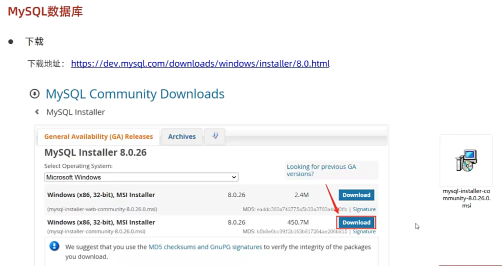

选择社区版本：https://dev.mysql.com/downloads/


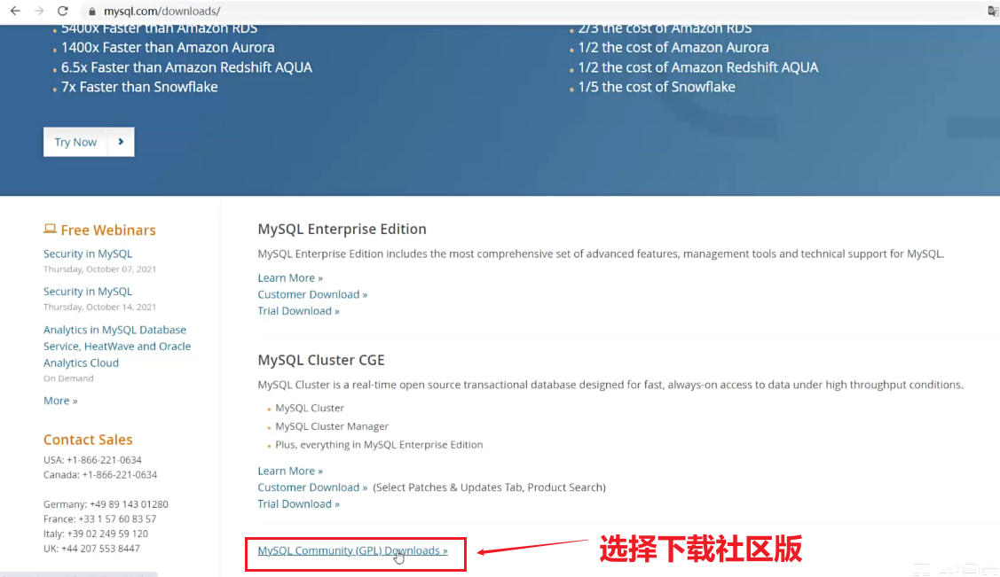


下载地å€ï¼š [**https://downloads.mysql.com/archives/installer/**](https://downloads.mysql.com/archives/installer/)

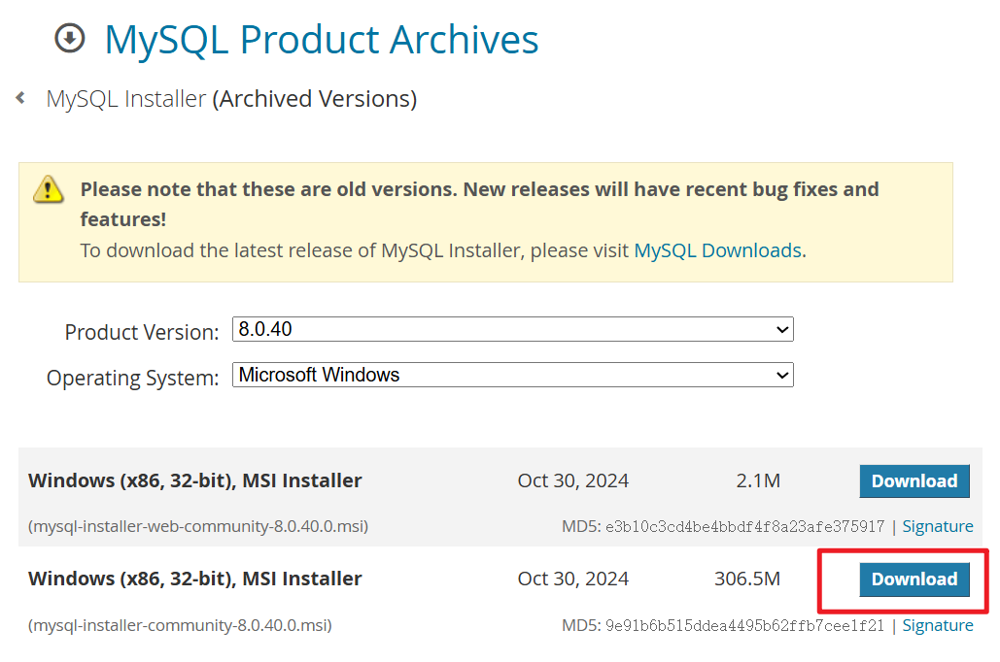


也å¯ä»¥ä½¿ç”¨è¯¾ç¨‹èµ„料中æ供的MySQL的安装包：


### （3）安装

**1). åŒå‡»å®˜æ–¹ä¸‹æ¥çš„安装包文件**

 


**2). æ ¹æ®å®‰è£…æ示进行安装**

 

 

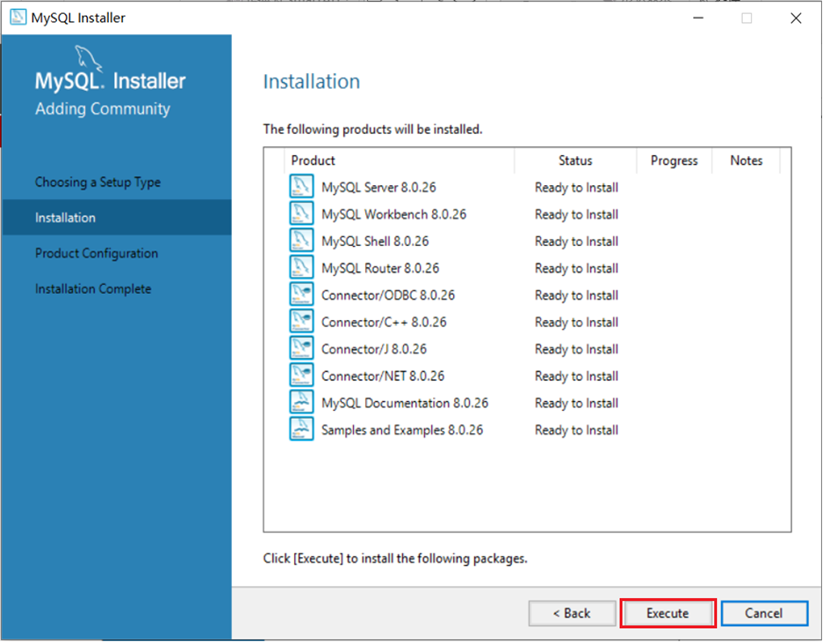 


安装MySQL的相关组件，这个过程å¯èƒ½éœ€è¦è€—时几分钟，è€å¿ƒç­‰å¾…。

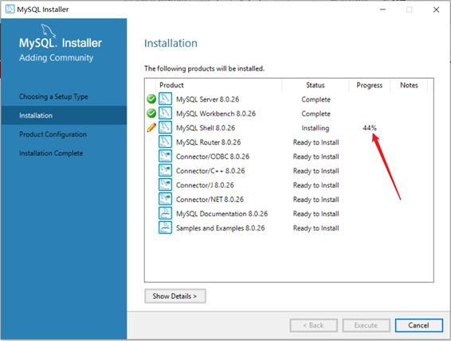 

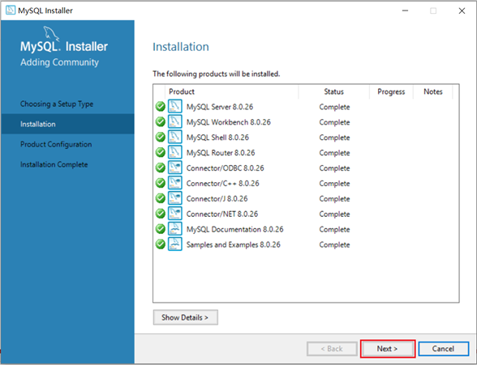 

 

 


==输入MySQL中root用户的密ç ,一定记得记ä½è¯¥å¯†ç ==

 

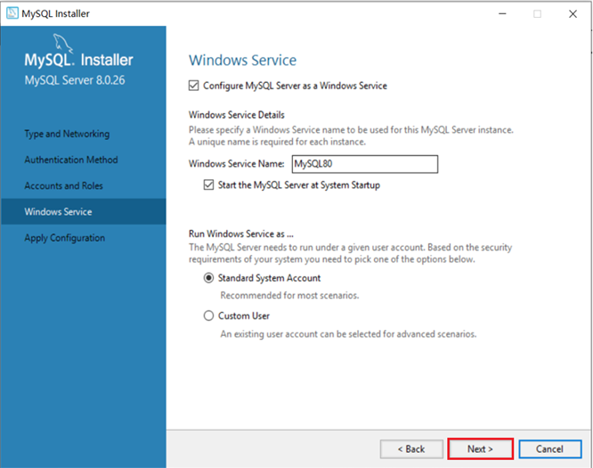 

 


### （4）==é…ç½®ç¯å¢ƒå˜é‡==

安装好MySQL之å，还需è¦é…ç½®ç¯å¢ƒå˜é‡ï¼Œè¿™æ ·æ‰**å¯ä»¥åœ¨ä»»ä½•ç›®å½•ä¸‹è¿æ¥MySQL**。

1). 在此电脑上，å³é”®é€‰æ‹©å±æ€§

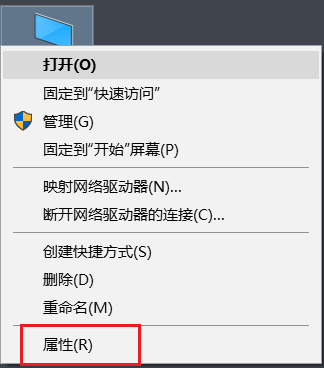 


2). 点击左侧的 "高级系统设置"，选择ç¯å¢ƒå˜é‡

 


3). 找到 Path 系统å˜é‡, 点击 "编辑"

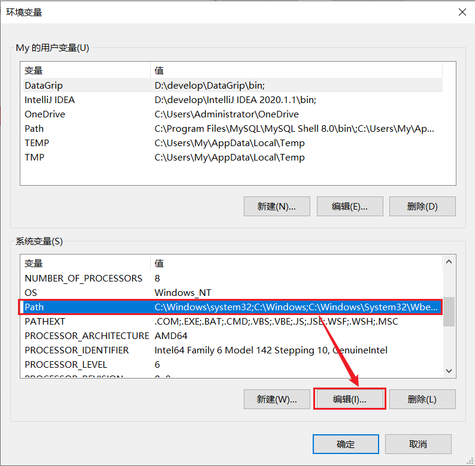 


4). 选择 "新建" , å°†MySQL Server的安装目录下的bin目录添加到ç¯å¢ƒå˜é‡

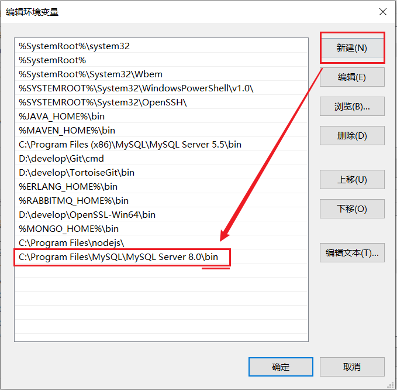 


### （5）MySQLå¸è½½æ–‡æ¡£-Windows版

##### 1. åœæ­¢MySQLæœåŠ¡

win+R 打开è¿è¡Œï¼Œè¾“å…¥ services.msc 点击 "确定" 调出系统æœåŠ¡ã€‚

 

 


##### 2. å¸è½½MySQL相关组件

打开æ§åˆ¶é¢æ¿ ---> å¸è½½ç¨‹åº ---> å¸è½½MySQL相关所有组件

 

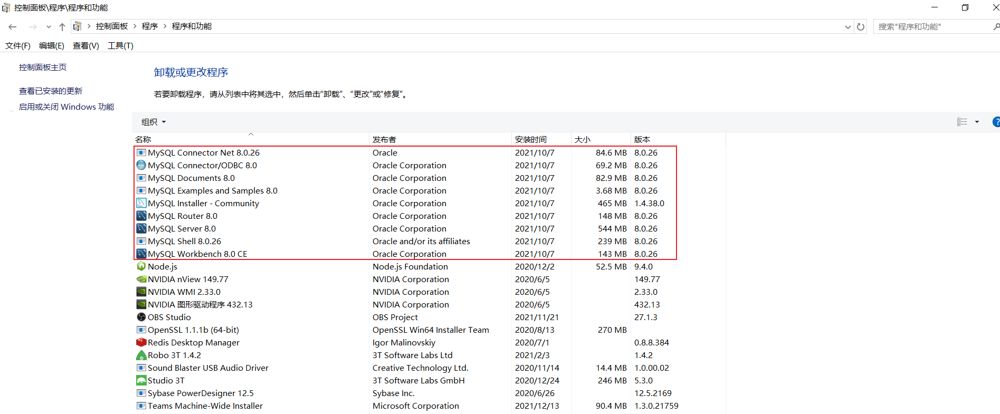 


##### 3. 删除MySQL安装目录

 


##### 4. 删除MySQLæ•°æ®ç›®å½•

æ•°æ®å­˜æ”¾ç›®å½•æ˜¯åœ¨ C:\ProgramData\MySQL，直æ¥å°†è¯¥æ–‡ä»¶å¤¹åˆ é™¤ã€‚

 


##### 5. å†æ¬¡æ‰“å¼€æœåŠ¡ï¼ŒæŸ¥çœ‹æ˜¯å¦æœ‰MySQLå¸è½½æ®‹ç•™

如æœå·²å°†MySQLå¸è½½ï¼Œä½†æ˜¯é€šè¿‡ä»»åŠ¡ç®¡ç†å™¨--->æœåŠ¡ï¼ŒæŸ¥çœ‹åˆ°MySQLæœåŠ¡ä»ç„¶æ®‹ç•™åœ¨ç³»ç»ŸæœåŠ¡é‡Œã€‚

解决åŠæ³•ï¼š

​	以管ç†å‘˜æ–¹å¼è¿è¡Œcmd命令行，输入以下命令：

​	sc delete æœåŠ¡å称（如MySQL80）

这样å¯ä»¥å®ç°åˆ é™¤æœåŠ¡ã€‚


### （6）MysqlæœåŠ¡çš„==å¯åœ==

MySQL安装完æˆä¹‹å，在系统å¯åŠ¨æ—¶ï¼Œä¼šè‡ªåŠ¨å¯åŠ¨MySQLæœåŠ¡ï¼Œæˆ‘们无需手动å¯åŠ¨äº†ã€‚

当然，也å¯ä»¥æ‰‹åŠ¨çš„通过指令å¯åŠ¨åœæ­¢ï¼Œä»¥ç®¡ç†å‘˜èº«ä»½è¿è¡Œcmd，进入命令行执行如下指令：

1. net start mysql80
2. net stop mysql80


```bash
net start mysql80

net stop mysql80
```


> æ³¨æ„ ï¼š 上述的 mysql80 是我们在安装MySQL时，默认指定的mysql的系统æœåŠ¡å，ä¸æ˜¯å›º
>
> 定的，如æœæœªæ”¹åŠ¨ï¼Œé»˜è®¤å°±æ˜¯mysql80。
>
> 


### （7）==客户端è¿æ¥==

#### â‘  æ–¹å¼ä¸€ï¼šä½¿ç”¨MySQLæ供的==客户端命令行工具==

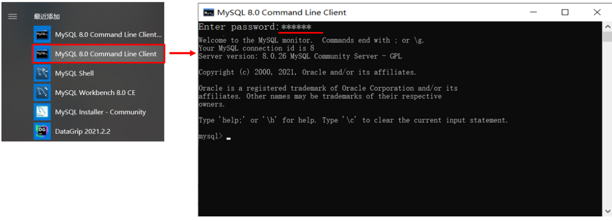


#### â‘¡ æ–¹å¼äºŒï¼šä½¿ç”¨==系统自带的命令行工具==执行指令


```bash
mysql [-h 127.0.0.1] [-P 3306] -u root -p
å‚数：
-h : MySQLæœåŠ¡æ‰€åœ¨çš„主机IP
-P : MySQLæœåŠ¡ç«¯å£å·ï¼Œ 默认3306
-u : MySQLæ•°æ®åº“用户å
-p ： MySQLæ•°æ®åº“用户å对应的密ç 
```

[]内为å¯é€‰å‚数，如æœéœ€è¦**è¿æ¥è¿œç¨‹çš„MySQL**，需è¦åŠ ä¸Šè¿™ä¸¤ä¸ªå‚æ•°æ¥æŒ‡å®š**远程主机IPã€ç«¯å£**，如æœ

è¿æ¥æœ¬åœ°çš„MySQL，则无需指定这两个å‚æ•°


> ==注æ„==： 使用这ç§æ–¹å¼è¿›è¡Œè¿æ¥æ—¶ï¼Œéœ€è¦å®‰è£…完毕å==é…ç½®PATHç¯å¢ƒå˜é‡==。


### （8）==æ•°æ®æ¨¡å‹==

#### ①关系å‹æ•°æ®åº“（RDBMS）

概念：**建立在关系模å‹åŸºç¡€ä¸Šï¼Œç”±å¤šå¼ ç›¸äº’è¿æ¥çš„二维表组æˆçš„æ•°æ®åº“。**

而所谓二维表，指的是由行和列组æˆçš„表，如下图（就类似äºExcel表格数æ®ï¼Œæœ‰è¡¨å¤´ã€æœ‰åˆ—ã€æœ‰è¡Œï¼Œè¿˜å¯ä»¥é€šè¿‡ä¸€åˆ—å…³è”å¦å¤–一个表格中的æŸä¸€åˆ—æ•°æ®ï¼‰ã€‚我们之å‰æ到的MySQLã€Oracleã€DB2ã€SQLServer这些都是å±äºå…³ç³»å‹æ•°æ®åº“，里é¢éƒ½æ˜¯åŸºäºäºŒç»´è¡¨å­˜å‚¨æ•°æ®çš„。简å•è¯´ï¼ŒåŸºäºäºŒç»´è¡¨å­˜å‚¨æ•°æ®çš„æ•°æ®åº“å°±æˆä¸ºå…³ç³»å‹æ•°æ®åº“，ä¸æ˜¯åŸºäºäºŒç»´è¡¨å­˜å‚¨æ•°æ®çš„æ•°æ®åº“，就是é关系å‹æ•°æ®åº“。


==特点==：

1. **使用表存储数æ®ï¼Œæ ¼å¼ç»Ÿä¸€ï¼Œä¾¿äºç»´æŠ¤**。

2. **使用SQL语言æ“作，标准统一，使用方便**。

   

#### â‘¡ æ•°æ®æ¨¡å‹

MySQL是关系å‹æ•°æ®åº“，是基äº**二维表进行数æ®å­˜å‚¨**的，具体的结æ„图下:

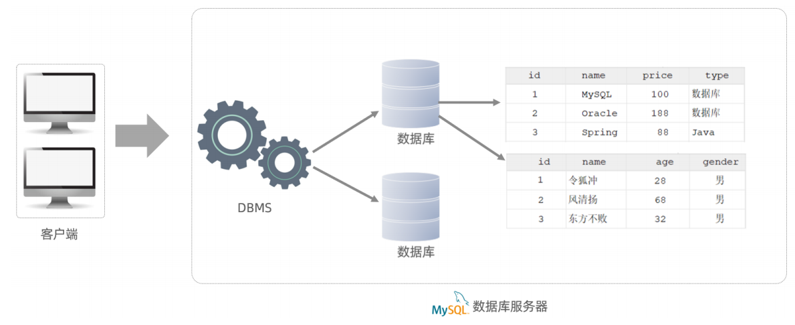

-    我们å¯ä»¥é€šè¿‡**MySQL客户端è¿æ¥æ•°æ®åº“管ç†ç³»ç»ŸDBMS**，然å**通过DBMSæ“作数æ®åº“**。
-    å¯ä»¥ä½¿ç”¨SQL语å¥ï¼Œé€šè¿‡æ•°æ®åº“管ç†ç³»ç»Ÿæ“作数æ®åº“，以åŠæ“作数æ®åº“中的表结æ„åŠæ•°æ®ã€‚
-    一个数æ®åº“æœåŠ¡å™¨ä¸­å¯ä»¥åˆ›å»ºå¤šä¸ªæ•°æ®åº“，一个数æ®åº“中也å¯ä»¥åŒ…å«å¤šå¼ è¡¨ï¼Œè€Œä¸€å¼ è¡¨ä¸­åˆå¯ä»¥åŒ…å«å¤šè¡Œè®°å½•ã€‚


### （9）å°ç»“

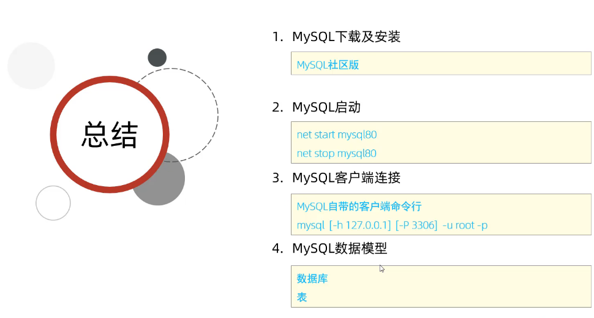

# 2ã€ğŸŒŸ ==SQL==


> 全称 ==Structured Query Language==，**结æ„化查询语言**。æ“作关系å‹æ•°æ®åº“的编程语言，定义了一套æ“作关系å‹æ•°æ®åº“统一**标准** 。

## 2.1 **SQL通用语法**

在学习具体的SQL语å¥ä¹‹å‰ï¼Œå…ˆæ¥äº†è§£ä¸€ä¸‹SQL语言的åŒäºè¯­æ³•ã€‚

1. SQL语å¥å¯ä»¥**å•è¡Œæˆ–多行书写，以==分å·ç»“å°¾==**。
2. SQL语å¥å¯ä»¥ä½¿ç”¨**空格/缩进**æ¥å¢å¼ºè¯­å¥çš„å¯è¯»æ€§ã€‚
3. MySQLæ•°æ®åº“çš„SQL语å¥ä¸åŒºåˆ†å¤§å°å†™ï¼Œ**关键字建议使用大写**。
4. **注释**：
   1. å•è¡Œæ³¨é‡Šï¼š-- 注释内容 或  # 注释内容  
   2. 多行注释：/* 注释内容 */


## 2.2 SQL==分类==

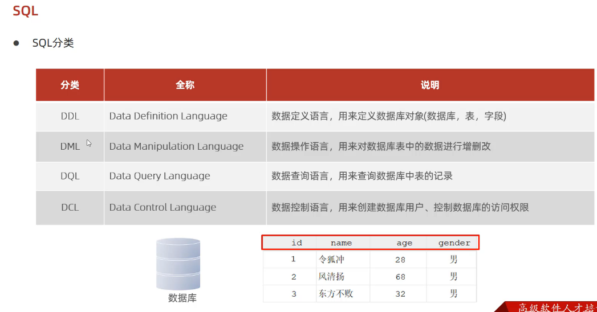

SQL语å¥ï¼Œæ ¹æ®å…¶åŠŸèƒ½ï¼Œä¸»è¦åˆ†ä¸ºå››ç±»ï¼šDDLã€DMLã€DQLã€DCL。

| **分类** | **全称**                       | **说æ˜**                                               |
| :------- | :----------------------------- | :----------------------------------------------------- |
| **DDL**  | **Data Definition Language**   | æ•°æ®å®šä¹‰è¯­è¨€ï¼Œç”¨æ¥å®šä¹‰æ•°æ®åº“对象(æ•°æ®åº“，表，字段)     |
| **DML**  | **Data Manipulation Language** | æ•°æ®æ“作语言，用æ¥å¯¹æ•°æ®åº“表中的数æ®è¿›è¡Œå¢åˆ æ”¹         |
| **DQL**  | **Data Query Language**        | æ•°æ®æŸ¥è¯¢è¯­è¨€ï¼Œç”¨æ¥æŸ¥è¯¢æ•°æ®åº“中表的记录                 |
| **DCL**  | **Data Control Language**      | æ•°æ®æ§åˆ¶è¯­è¨€ï¼Œç”¨æ¥åˆ›å»ºæ•°æ®åº“用户ã€æ§åˆ¶æ•°æ®åº“的访问æƒé™ |


## 2.3 🌟DDL-æ•°æ®å®šä¹‰

Data Definition Language，**æ•°æ®å®šä¹‰è¯­è¨€**，用æ¥å®šä¹‰æ•°æ®åº“对象(æ•°æ®åº“，表，字段) 。

### （1）数æ®åº“æ“作


#### â‘ **查询所有数æ®åº“**

```sql
show databases;
```


#### â‘¡==查询当å‰==æ•°æ®åº“

```sql
select database();
```


#### ③创建数æ®åº“

```sql
create database [ if not exists ] æ•°æ®åº“å [ default charset 字符集 ] [ collate æ’åº
规则 ] ;
```

###### 案例：

**第一步：**创建一个itcastæ•°æ®åº“, 使用数æ®åº“默认的字符集。

```sql
create database itcast;
```

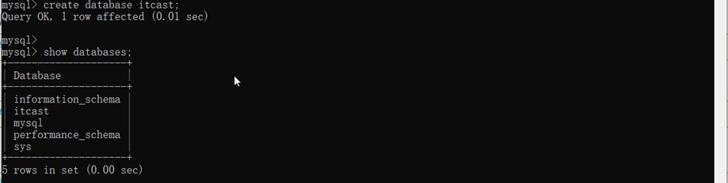


在åŒä¸€ä¸ªæ•°æ®åº“æœåŠ¡å™¨ä¸­ï¼Œ**ä¸èƒ½åˆ›å»ºä¸¤ä¸ªå称相åŒçš„æ•°æ®åº“，å¦åˆ™å°†ä¼šæŠ¥é”™**。


å¯ä»¥é€šè¿‡**if not exists** å‚æ•°æ¥è§£å†³è¿™ä¸ªé—®é¢˜ï¼Œæ•°æ®åº“ä¸å­˜åœ¨, 则创建该数æ®åº“，如æœå­˜åœ¨ï¼Œåˆ™ä¸åˆ›å»ºã€‚

```sql
create database if not extists itcast;
```

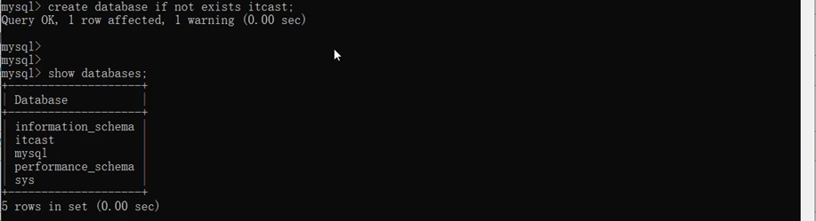


**第二步：**创建一个itheimaæ•°æ®åº“，并且指定字符集

```sql
create database itheima default charset utf8mb4;
```

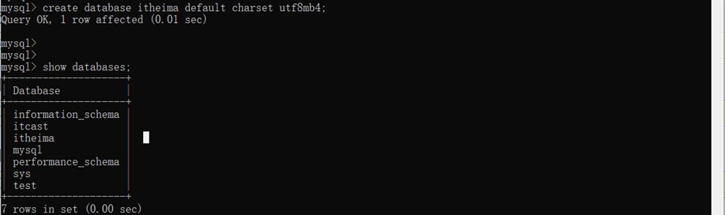


#### ④删除数æ®åº“

```sql
drop database [ if exists ] æ•°æ®åº“å ;
```

如æœåˆ é™¤ä¸€ä¸ªä¸å­˜åœ¨çš„æ•°æ®åº“，将会报错。此时，å¯ä»¥åŠ ä¸Šå‚æ•° if exists ，如æœæ•°æ®åº“存在，å†æ‰§è¡Œåˆ é™¤ï¼Œå¦åˆ™ä¸æ‰§è¡Œåˆ é™¤ã€‚

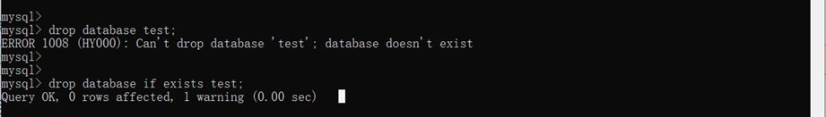


#### ⑥切æ¢æ•°æ®åº“

```sql
use æ•°æ®åº“å ;
```

我们è¦æ“作æŸä¸€ä¸ªæ•°æ®åº“下的表时，就需è¦é€šè¿‡è¯¥æŒ‡ä»¤ï¼Œåˆ‡æ¢åˆ°å¯¹åº”çš„æ•°æ®åº“下，å¦åˆ™æ˜¯ä¸èƒ½æ“作的。比如，切æ¢åˆ°itcastæ•°æ®ï¼Œæ‰§è¡Œå¦‚下SQL：

```sql
use itcast;
```


### （2）🌟 ==表æ“作==

#### ①表æ“作-==查询创建==

##### 1）**查询当å‰æ•°æ®åº“所有表**-show

```sql
show tables;
```

比如,我们å¯ä»¥åˆ‡æ¢åˆ°sys这个系统数æ®åº“,并查看系统数æ®åº“中的所有表结æ„。

```sql
use sys;

show tables;
```


##### 2）==查看指定表结æ„==-desc

```sql
desc 表å ;
```

通过这æ¡æŒ‡ä»¤ï¼Œæˆ‘们å¯ä»¥æŸ¥çœ‹åˆ°æŒ‡å®š**表的字段，字段的类å‹ã€æ˜¯å¦å¯ä»¥ä¸ºNULL，是å¦å­˜åœ¨é»˜è®¤å€¼**等信æ¯ã€‚

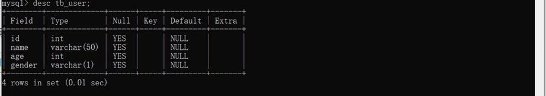

##### 3）查询指定表的==建表语å¥==-show create table

```sql
show create table 表å ;
```

通过这æ¡æŒ‡ä»¤ï¼Œä¸»è¦æ˜¯ç”¨æ¥**查看建表语å¥**的，而有部分å‚数我们在创建表的时候，并未指定也会查询到，因为这部分是**æ•°æ®åº“的默认值**，如：==存储引æ“ã€å­—符集==等。


##### 4）==创建表结æ„==-create table

```sql
CREATE TABLE 表å(
    字段1 字段1ç±»å‹ [ COMMENT 字段1注释 ],
    字段2 字段2ç±»å‹ [COMMENT 字段2注释 ],
    字段3 字段3ç±»å‹ [COMMENT 字段3注释 ],
    ......
    字段n 字段nç±»å‹ [COMMENT 字段n注释 ]
) [ COMMENT 表注释 ] ;
```


比如，我们创建一张表 tb_user ，对应的结æ„如下，那么建表语å¥ä¸ºï¼š


```sql
create table tb_user(
    id int comment 'ç¼–å·',
    name varchar(50) comment '姓å',
    age int comment '年龄',
    gender varchar(1) comment '性别'
) comment '用户表';
```

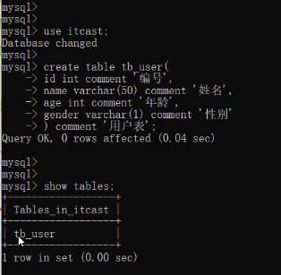


#### ②🌟表æ“作-==æ•°æ®ç±»å‹==

在上述的建表语å¥ä¸­ï¼Œæˆ‘们在指定字段的数æ®ç±»å‹æ—¶ï¼Œç”¨åˆ°äº†int ，varchar，那么在MySQL中除了以上的数æ®ç±»å‹ï¼Œè¿˜æœ‰å“ªäº›å¸¸è§çš„æ•°æ®ç±»å‹å‘¢ï¼Ÿ æ¥ä¸‹æ¥,我们就æ¥è¯¦ç»†ä»‹ç»ä¸€ä¸‹MySQLçš„æ•°æ®ç±»å‹ã€‚MySQL中的数æ®ç±»å‹æœ‰å¾ˆå¤šï¼Œä¸»è¦åˆ†ä¸ºä¸‰ç±»ï¼š**数值类å‹ã€å­—符串类å‹ã€æ—¥æœŸæ—¶é—´ç±»å‹**。

##### 1）数值类å‹


| ç±»å‹         | å¤§å°    | 有符å·(SIGNED)范围                                    | 无符å·(UNSIGNED)范围                                      | æè¿°               |
| ------------ | ------- | ----------------------------------------------------- | --------------------------------------------------------- | ------------------ |
| TINYINT      | 1 byte  | (-128，127)                                           | (0，255)                                                  | å°æ•´æ•°å€¼           |
| SMALLINT     | 2 bytes | (-32768，32767)                                       | (0，65535)                                                | 大整数值           |
| MEDIUMINT    | 3 bytes | (-8388608，8388607)                                   | (0，16777215)                                             | 大整数值           |
| INT或INTEGER | 4 bytes | (-2147483648，2147483647)                             | (0，4294967295)                                           | 大整数值           |
| BIGINT       | 8 bytes | (-2^63，2^63-1)                                       | (0，2^64-1)                                               | æ大整数值         |
| FLOAT        | 4 bytes | (-3.402823466 E+38，3.402823466351 E+38)              | 0 å’Œ (1.175494351 E-38，3.402823466 E+38)                 | å•ç²¾åº¦æµ®ç‚¹æ•°å€¼     |
| DOUBLE       | 8 bytes | (-1.7976931348623157 E+308，1.7976931348623157 E+308) | 0 å’Œ (2.2250738585072014 E-308，1.7976931348623157 E+308) | åŒç²¾åº¦æµ®ç‚¹æ•°å€¼     |
| DECIMAL      |         | ä¾èµ–äºM(精度)å’ŒD(标度)的值                            | ä¾èµ–äºM(精度)å’ŒD(标度)的值                                | å°æ•°å€¼(精确定点数) |

> 如:
>
> 1). 年龄字段 -- **ä¸ä¼šå‡ºç°è´Ÿæ•°, 而且人的年龄ä¸ä¼šå¤ªå¤§**
>
> ​	age tinyint ==unsigned==   年龄ä¸ä¼šå‡ºç°è´Ÿæ•°ï¼Œåˆ™ç”¨æ— ç¬¦å·tinyint
>
> 2). 分数 -- 总分100分, **最多出ç°ä¸€ä½å°æ•°**
>
> ​	score double(4,1)


##### 2）字符串类å‹


| ç±»å‹       | å¤§å°                  | æè¿°                            |
| ---------- | --------------------- | ------------------------------- |
| CHAR       | 0-255 bytes           | **定长字符串**                  |
| VARCHAR    | 0-65535 bytes         | **å˜é•¿å­—符串**                  |
| TINYBLOB   | 0-255 bytes           | ä¸è¶…过255个字符的**二进制数æ®** |
| TINYTEXT   | 0-255 bytes           | 短文本字符串                    |
| BLOB       | 0-65 535 bytes        | 二进制形å¼çš„é•¿æ–‡æœ¬æ•°æ®          |
| TEXT       | 0-65 535 bytes        | **长文本数æ®**                  |
| MEDIUMBLOB | 0-16 777 215 bytes    | 二进制形å¼çš„ä¸­ç­‰é•¿åº¦æ–‡æœ¬æ•°æ®    |
| MEDIUMTEXT | 0-16 777 215 bytes    | ä¸­ç­‰é•¿åº¦æ–‡æœ¬æ•°æ®                |
| LONGBLOB   | 0-4 294 967 295 bytes | 二进制形å¼çš„æå¤§æ–‡æœ¬æ•°æ®        |
| LONGTEXT   | 0-4 294 967 295 bytes | æå¤§æ–‡æœ¬æ•°æ®                    |

char ä¸ varchar 都å¯ä»¥æ述字符串，**char是定长字符串**，指定长度多长，就å ç”¨å¤šå°‘个字符，和字段值的长度无关 。而**varchar是å˜é•¿å­—符串**，指定的长度为最大å ç”¨é•¿åº¦ 。相对æ¥è¯´ï¼Œ**==char的性能会更高些。==**，åŸå› æ˜¯**varchar会根æ®å†…容的大å°è®¡ç®—需è¦çš„内存空间，消耗性能**。

> ​	如：
>
> -  用户å username ------> ==长度ä¸å®š, 最长ä¸ä¼šè¶…过50==
>   - username varchar(50)
> - 性别 gender ---------> **存储值, ä¸æ˜¯ç”·,就是女**
>   - gender char(1)
> - æ‰‹æœºå· phone --------> **固定长度为11**
>   - phone char(11)


##### 3）日期类å‹


| ç±»å‹      | å¤§å° | 范围                                       | æ ¼å¼                | æè¿°                     |
| --------- | ---- | ------------------------------------------ | ------------------- | ------------------------ |
| DATE      | 3    | 1000-01-01 至 9999-12-31                   | YYYY-MM-DD          | 日期值                   |
| TIME      | 3    | -838:59:59 至 838:59:59                    | HH:MM:SS            | 时间值或æŒç»­æ—¶é—´         |
| YEAR      | 1    | 1901 至 2155                               | YYYY                | 年份值                   |
| DATETIME  | 8    | 1000-01-01 00:00:00 至 9999-12-31 23:59:59 | YYYY-MM-DD HH:MM:SS | æ··åˆæ—¥æœŸå’Œæ—¶é—´å€¼         |
| TIMESTAMP | 4    | 1970-01-01 00:00:01 至 2038-01-19 03:14:07 | YYYY-MM-DD HH:MM:SS | æ··åˆæ—¥æœŸå’Œæ—¶é—´å€¼ï¼Œæ—¶é—´æˆ³ |

> - 生日字段 birthday -**DATE**
>   - birthday date
> - 创建时间 **createtime**
>   - createtime datetime

#### ③表æ“作-案例


对应的建表语å¥å¦‚下:


```sql
create table emp(
    id int comment 'ç¼–å·',
    workno varchar(10) comment 'å·¥å·',
    name varchar(10) comment '姓å',
    gender char(1) comment '性别',
    age tinyint unsigned comment '年龄',
    idcard char(18) comment '身份è¯å·',
    entrydate date comment 'å…¥èŒæ—¶é—´'
) comment '员工表';
```

SQL语å¥ç¼–写完毕之å，就å¯ä»¥åœ¨MySQL的命令行中执行SQL，然å也å¯ä»¥é€šè¿‡ **desc 指令查询表结æ„ä¿¡æ¯ï¼š**


表结æ„创建好了，里é¢çš„name字段是varcharç±»å‹ï¼Œæœ€å¤§é•¿åº¦ä¸º10，也就æ„味ç€å¦‚æœè¶…过10将会报错，如æœæˆ‘ä»¬æƒ³ä¿®æ”¹è¿™ä¸ªå­—æ®µçš„ç±»å‹ æˆ– 修改字段的长度该如何æ“作呢？æ¥ä¸‹æ¥å†æ¥è®²è§£**DDL语å¥**中，如何æ“作表字段。


#### ④表æ“作-==修改==-alter table

##### 1）添加字段-add


```sql
ALTER TABLE 表å ADD 字段å ç±»å‹ (长度) [ COMMENT 注释 ] [ çº¦æŸ ];
```

案例:

为emp表å¢åŠ ä¸€ä¸ªæ–°çš„字段â€æ˜µç§°â€ä¸ºnickname，类å‹ä¸ºvarchar(20)

```sql
ALTER TABLE emp ADD nickname varchar(20) COMMENT '昵称';
```


##### 2）修改数æ®ç±»å‹-modify


```sql
ALTER TABLE 表å MODIFY 字段å æ–°æ•°æ®ç±»å‹ (长度);
```


##### 3）修改字段å和字段类å‹-change

```sql
ALTER TABLE 表å CHANGE 旧字段å 新字段å ç±»å‹ (长度) [ COMMENT 注释 ] [ çº¦æŸ ];
```

案例:

å°†emp表的nickname字段修改为username，类å‹ä¸ºvarchar(30)

```sql
ALTER TABLE emp CHANGE nickname username varchar(30) COMMENT '昵称';
```


##### 4）删除字段-drop


```sql
ALTER TABLE 表å DROP 字段å;
```

案例:

将emp表的字段username删除

```sql
ALTER TABLE emp DROP username;
```


##### 5）修改表å-rename  to

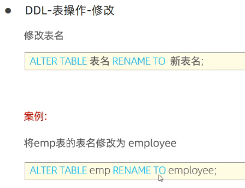

```sql
ALTER TABLE 表å RENAME TO 新表å;
```

案例:

å°†emp表的表å修改为 employee

```sql
ALTER TABLE emp RENAME TO employee;
```


#### ⑤表æ“作删除-drop table

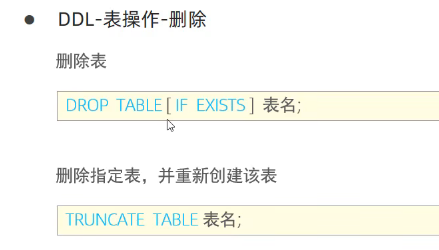

##### 1）删除表-drop

```sql
DROP TABLE [ IF EXISTS ] 表å;
```

å¯é€‰é¡¹ IF EXISTS 代表，åªæœ‰è¡¨å存在时æ‰ä¼šåˆ é™¤è¯¥è¡¨ï¼Œè¡¨åä¸å­˜åœ¨ï¼Œåˆ™ä¸æ‰§è¡Œåˆ é™¤æ“作(如æœä¸

加该å‚数项，删除一张ä¸å­˜åœ¨çš„表，执行将会报错)。

案例:

如æœtb_user表存在，则删除tb_user表

```sql
DROP TABLE IF EXISTS tb_user;
```


##### 2）删除指定表, 并é‡æ–°åˆ›å»ºè¡¨-druncate

**æ ¼å¼åŒ–表**

```sql
TRUNCATE TABLE 表å;
```

> 注æ„: 在删除表的时候，==表中的全部数æ®ä¹Ÿéƒ½ä¼šè¢«åˆ é™¤==。


### （3）å°ç»“

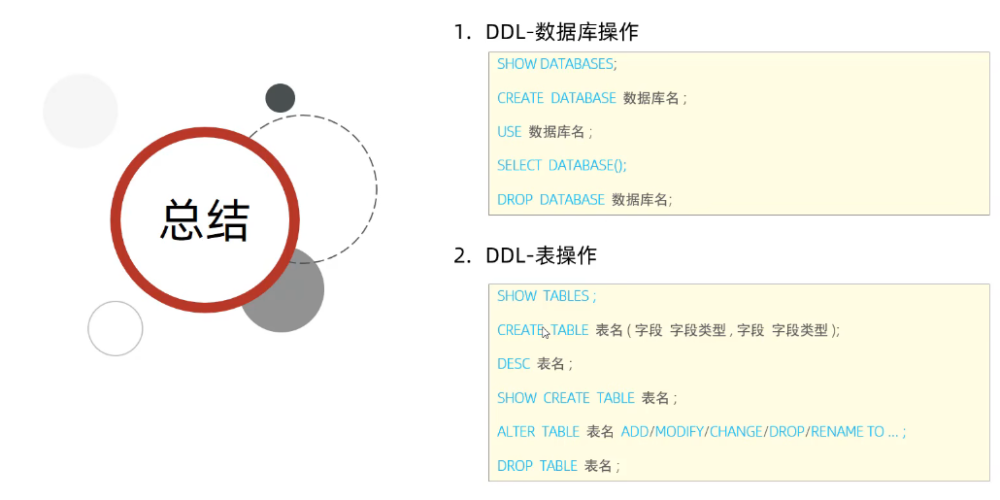


## 2.4 图形化界é¢å·¥å…·

上述，我们已ç»è®²è§£äº†é€šè¿‡DDL语å¥ï¼Œå¦‚何æ“作数æ®åº“ã€æ“作表ã€æ“作表中的字段，而通过DDL语å¥æ‰§

行在命令进行æ“作，主è¦å­˜åœ¨ä»¥ä¸‹ä¸¤ç‚¹é—®é¢˜ï¼š

​	1).会影å“å¼€å‘æ•ˆç‡ ;

​	2). 使用起æ¥ï¼Œå¹¶ä¸ç›´è§‚，并ä¸æ–¹ä¾¿ ï¼›

所以呢，我们在日常的开å‘中，会借助äºMySQL的图形化界é¢ï¼Œæ¥ç®€åŒ–å¼€å‘，æ高开å‘效ç‡ã€‚而目å‰

mysql主æµçš„图形化界é¢å·¥å…·ï¼Œæœ‰ä»¥ä¸‹å‡ ç§ï¼š


而本次课程中，选择最å一ç§DataGrip，这ç§å›¾å½¢åŒ–ç•Œé¢å·¥å…·ï¼ŒåŠŸèƒ½æ›´åŠ å¼ºå¤§ï¼Œç•Œé¢æ示更加å‹å¥½ï¼Œ

是我们使用MySQLçš„ä¸äºŒä¹‹é€‰ã€‚æ¥ä¸‹æ¥ï¼Œæˆ‘们æ¥ä»‹ç»ä¸€ä¸‹**DataGrip**该如何安装ã€ä½¿ç”¨ã€‚


### （1）安装

#### ①找到资料中准备好的安装包，åŒå‡»å¼€å§‹å®‰è£…


#### ②点击next，一步一步的完æˆå®‰è£…

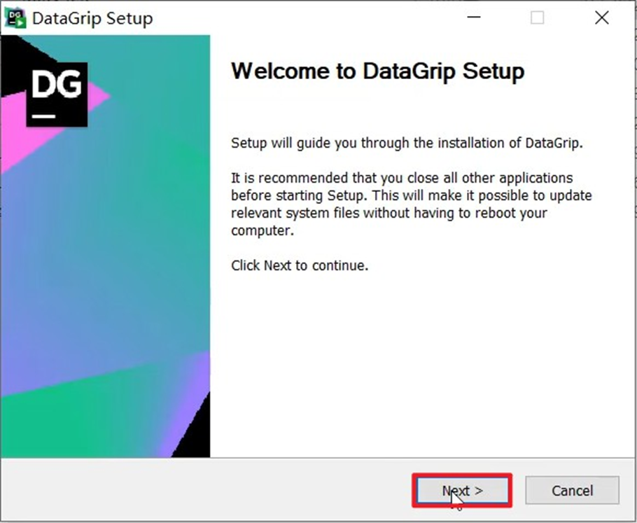

选择DataGrip的安装目录，然å选择下一步

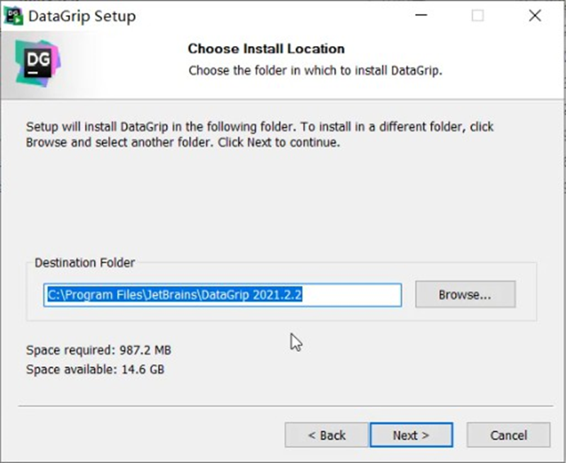


下一步，执行安装

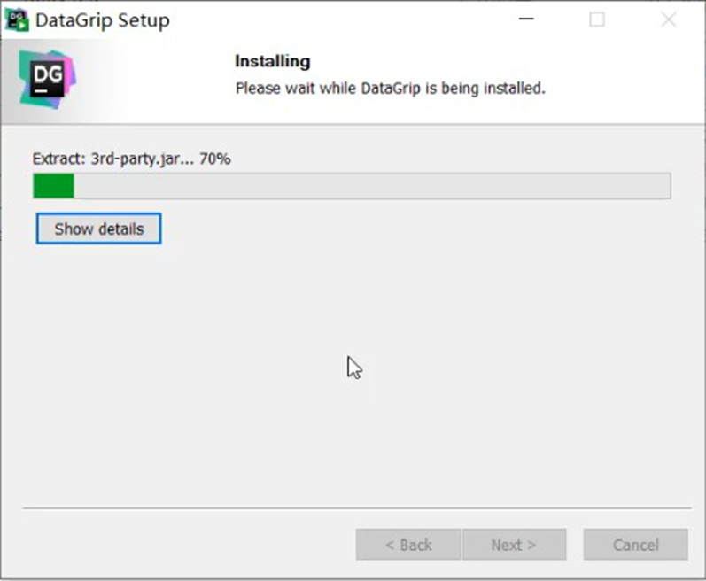


### （2）使用

#### ①添加数æ®æº

å‚考图示, 一步步æ“作å³å¯

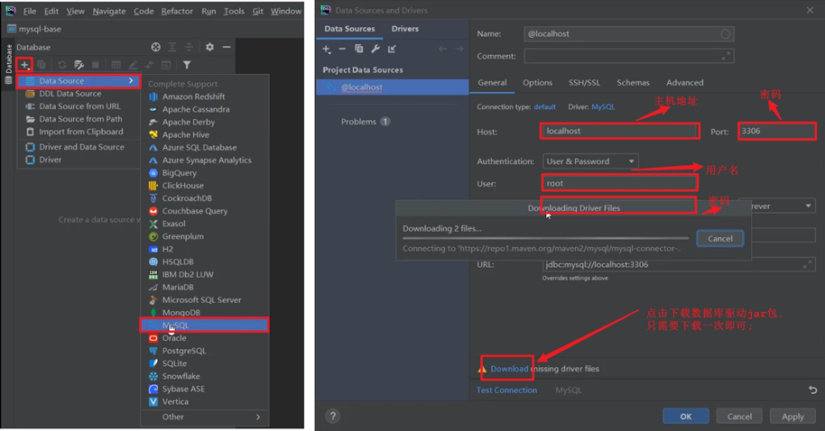

é…置以åŠé©±åŠ¨jar包下载完毕之å，就å¯ä»¥ç‚¹å‡» "Test Connection" å°±å¯ä»¥æµ‹è¯•ï¼Œæ˜¯å¦å¯ä»¥è¿æ¥MySQL，如æœå‡ºç° "Successed"，就表åè¿æ¥æˆåŠŸäº† 。

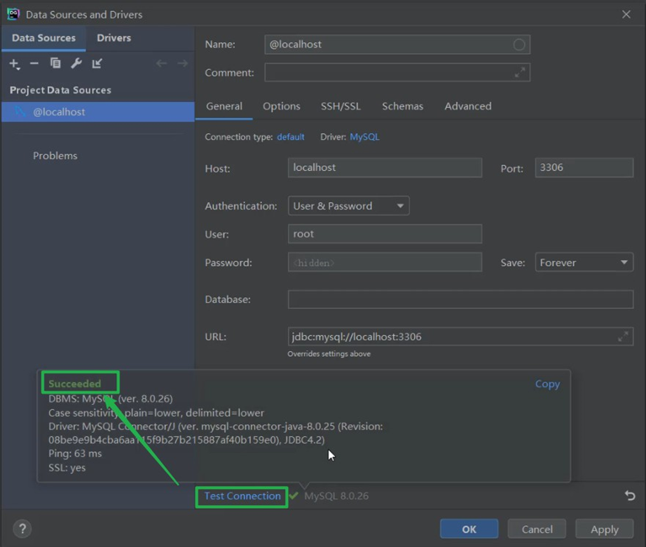


#### ②展示所有数æ®åº“

è¿æ¥ä¸Šäº†MySQLæœåŠ¡ä¹‹å，并未展示出所有的数æ®åº“，此时，我们需è¦è®¾ç½®ï¼Œå±•ç¤ºæ‰€æœ‰çš„æ•°æ®åº“，具体æ“作如下：

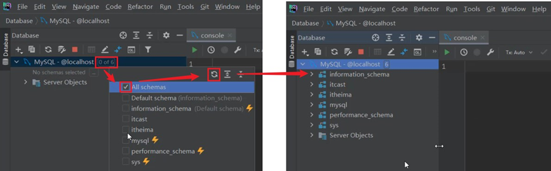


#### ③创建数æ®åº“

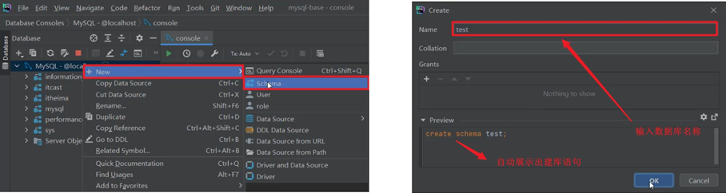


> 注æ„:
>
> 以下==两ç§æ–¹å¼éƒ½å¯ä»¥åˆ›å»ºæ•°æ®åº“==：
>
> ​	 A. create **database** db01;
>
>  	B. create **schema** db01;


#### ④创建表

在指定的数æ®åº“上é¢å³é”®ï¼Œé€‰æ‹©new --> Table


#### ⑤修改表结æ„

在需è¦ä¿®æ”¹çš„表上，å³é”®é€‰æ‹© "Modify Table..."


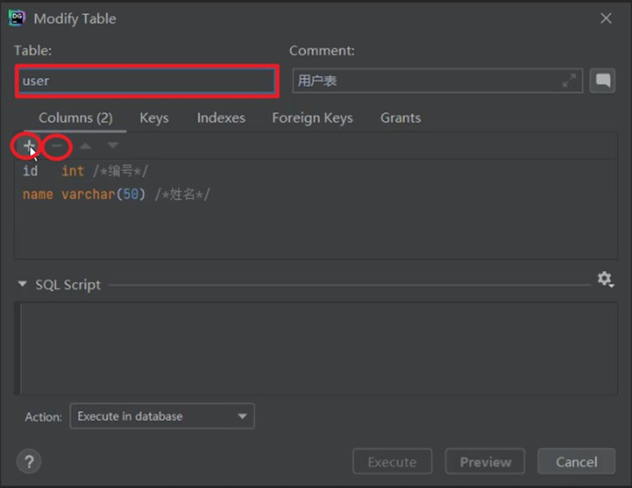

如æœæƒ³å¢åŠ å­—段，直æ¥ç‚¹å‡»+å·ï¼Œå½•å…¥å­—段信æ¯ï¼Œç„¶å点击Executeå³å¯ã€‚

如æœæƒ³åˆ é™¤å­—段，直æ¥ç‚¹å‡»-å·ï¼Œå°±å¯ä»¥åˆ é™¤å­—段，然å点击Executeå³å¯ã€‚

如æœæƒ³ä¿®æ”¹å­—段，åŒå‡»å¯¹åº”的字段，修改字段信æ¯ï¼Œç„¶å点击Executeå³å¯ã€‚

如æœè¦ä¿®æ”¹è¡¨å，或表的注释，直æ¥åœ¨è¾“入框修改，然å点击Executeå³å¯ã€‚


#### ⑥在DataGrip中执行SQL语å¥

在指定的数æ®åº“上，å³é”®ï¼Œé€‰æ‹© New --> Query Console


然åå°±å¯ä»¥åœ¨æ‰“开的Query Consoleæ§åˆ¶å°ï¼Œå¹¶åœ¨æ§åˆ¶å°ä¸­ç¼–写SQL，执行SQL。


## 2.5 🌟DML-æ•°æ®æ“作

DML英文全称是**Data Manipulation Language(==æ•°æ®æ“作语言==)**，用æ¥å¯¹æ•°æ®åº“中表的数æ®è®°å½•è¿›

è¡Œå¢ã€åˆ ã€æ”¹æ“作。

- 添加数æ®ï¼ˆINSERT）
- 修改数æ®ï¼ˆUPDATE）
- 删除数æ®ï¼ˆDELETE）

### （1）添加数æ®-insert

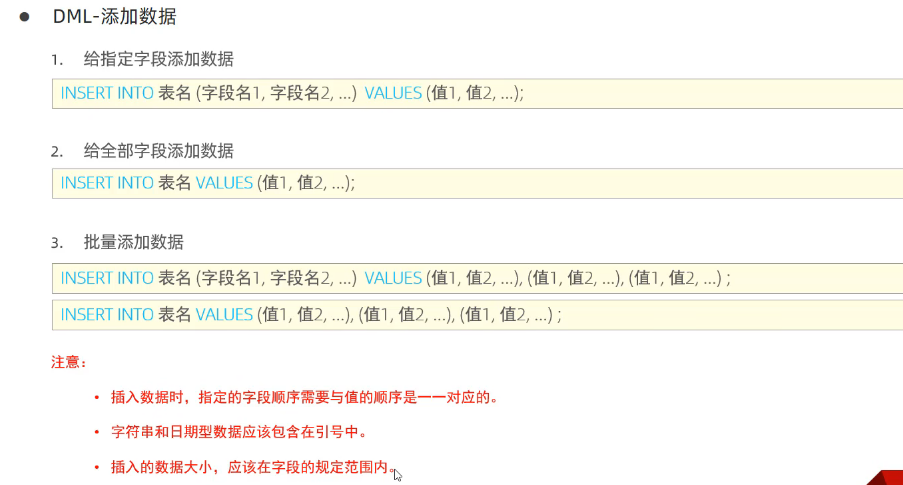

#### ①给指定字段添加数æ®

```sql
INSERT INTO 表å (字段å1, 字段å2, ...) VALUES (值1, 值2, ...);
```

**案例:**  ç»™employeeè¡¨æ‰€æœ‰çš„å­—æ®µæ·»åŠ æ•°æ® ï¼›

```sql
insert into employee(id,workno,name,gender,age,idcard,entrydate)

values(1,'1','Itcast','ç”·',10,'123456789012345678','2000-01-01');
```

æ’入数æ®å®Œæˆä¹‹å，我们有两ç§æ–¹å¼ï¼ŒæŸ¥è¯¢æ•°æ®åº“çš„æ•°æ®ï¼š

**A. æ–¹å¼ä¸€**

在左侧的表å上åŒå‡»ï¼Œå°±å¯ä»¥æŸ¥çœ‹è¿™å¼ è¡¨çš„æ•°æ®ã€‚

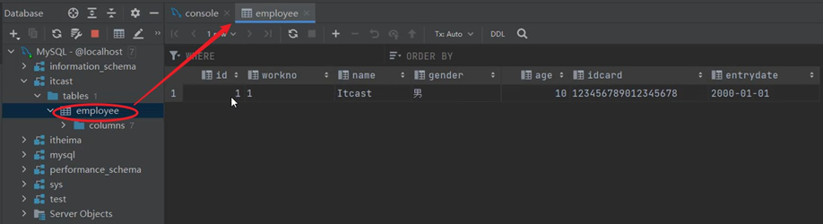

**B. æ–¹å¼äºŒ**

å¯ä»¥ç›´æ¥ä¸€æ¡æŸ¥è¯¢æ•°æ®çš„SQL语å¥, 语å¥å¦‚下:

```sql
select * from employee;
```

案例: ç»™employee表所有的字段添加数æ®

执行如下SQL，添加的年龄字段值为-1。

```sql
insert into employee(id,workno,name,gender,age,idcard,entrydate)
values(1,'1','Itcast','ç”·',-1,'123456789012345678','2000-01-01');
```

执行上述的SQL语å¥æ—¶ï¼ŒæŠ¥é”™äº†ï¼Œå…·ä½“的错误信æ¯å¦‚下：


因为 employee 表的**age字段类å‹ä¸º tinyint**，而且还是**无符å·çš„ unsigned** ，所以**å–值åªèƒ½åœ¨**

**0-255 之间**。


#### â‘¡ç»™==全部字段==添加数æ®

```sql
INSERT INTO 表å VALUES (值1, 值2, ...); 
```

案例：æ’入数æ®åˆ°employee表，具体的SQL如下：

```sql
insert into employee values(2,'2','张无忌','男',18,'123456789012345670','2005-01-
01');
```


#### â‘¢==批é‡æ·»åŠ ==æ•°æ®

```sql
INSERT INTO 表å (字段å1, 字段å2, ...) VALUES (值1, 值2, ...), (值1, 值2, ...), (值

1, 值2, ...) ;
```

```sql
INSERT INTO 表å VALUES (值1, 值2, ...), (值1, 值2, ...), (值1, 值2, ...) ; 
```

案例：批é‡æ’入数æ®åˆ°employee表，具体的SQL如下：

```sql
insert into employee values(3,'3','韦一笑','ç”·',38,'123456789012345670','2005-01-01'),(4,'4','èµµæ•','女',18,'123456789012345670','2005-01-01');
```


> ==注æ„事项==:
>
> - æ’入数æ®æ—¶ï¼ŒæŒ‡å®šçš„**字段顺åºéœ€è¦ä¸å€¼çš„顺åºæ˜¯ä¸€ä¸€å¯¹åº”çš„**。
> - 字符串和日期å‹æ•°æ®åº”该包å«**在引å·**中。
> - æ’入的数æ®å¤§å°ï¼Œåº”该在字段的规定范围内。


### （2）修改数æ®-update

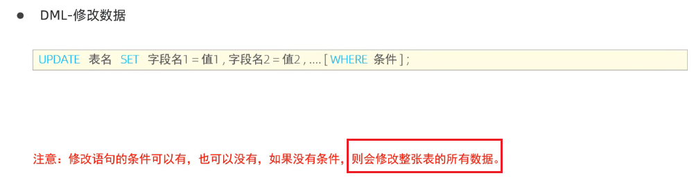

修改数æ®çš„具体语法为:

```sql
UPDATE 表å SET 字段å1 = 值1 , 字段å2 = 值2 , .... [ WHERE æ¡ä»¶ ] ;
```

案例:

A. 修改id为1çš„æ•°æ®ï¼Œå°†name修改为itheima

```sql
update employee set name = 'itheima' where id = 1; 
```

B. 修改id为1çš„æ•°æ®, å°†name修改为å°æ˜­, gender修改为 女

```sql
update employee set name = 'å°æ˜­' , gender = '女' where id = 1; 
```

C. 将所有的员工入èŒæ—¥æœŸä¿®æ”¹ä¸º 2008-01-01

```sql
update employee set entrydate = '2008-01-01';
```

> **注æ„事项:**
>
> 修改语å¥çš„æ¡ä»¶å¯ä»¥æœ‰ï¼Œä¹Ÿå¯ä»¥æ²¡æœ‰ï¼Œå¦‚æœ**没有æ¡ä»¶ï¼Œåˆ™ä¼šä¿®æ”¹æ•´å¼ è¡¨çš„所有数æ®**。


### （3）删除数æ®-delete

删除数æ®çš„具体语法为：

```sql
DELETE FROM 表å [ WHERE æ¡ä»¶ ] ;
```

案例:

A. 删除gender为女的员工

```sql
delete from employee where gender = '女';
```

B. 删除所有员工

```sql
delete from employee;
```


> 注æ„事项:
>
> - DELETE 语å¥çš„æ¡ä»¶å¯ä»¥æœ‰ï¼Œä¹Ÿå¯ä»¥æ²¡æœ‰ï¼Œå¦‚æœæ²¡æœ‰æ¡ä»¶ï¼Œåˆ™ä¼šåˆ é™¤æ•´å¼ è¡¨çš„所有数
>
>   æ®ã€‚
>
> - DELETE 语å¥ä¸èƒ½åˆ é™¤æŸä¸€ä¸ªå­—段的值(å¯ä»¥ä½¿ç”¨UPDATE，将该字段值置为NULLå³
>
>   å¯)。
>
> - 当进行删除全部数æ®æ“作时，datagrip会æ示我们，询问是å¦ç¡®è®¤åˆ é™¤ï¼Œæˆ‘们直æ¥ç‚¹å‡»
>
>   Executeå³å¯ã€‚
>
> 


### （4）å°ç»“


## 2.6 🌟DQL-æ•°æ®æŸ¥è¯¢

DQL英文全称是**Data Query Language(æ•°æ®æŸ¥è¯¢è¯­è¨€)**，数æ®æŸ¥è¯¢è¯­è¨€ï¼Œç”¨æ¥æŸ¥è¯¢æ•°æ®åº“中表的记

录。

查询关键字: SELECT

在一个正常的业务系统中，**查询æ“作的频次是è¦è¿œé«˜äºå¢åˆ æ”¹çš„**，当我们å»è®¿é—®ä¼ä¸šå®˜ç½‘ã€ç”µå•†ç½‘站，在这些网站中我们所看到的数æ®ï¼Œå®é™…都是需è¦ä»æ•°æ®åº“中查询并展示的。而且在查询的过程中，å¯èƒ½è¿˜ä¼šæ¶‰åŠåˆ°æ¡ä»¶ã€æ’åºã€åˆ†é¡µç­‰æ“作。


那么，本å°èŠ‚我们主è¦å­¦ä¹ çš„就是如何进行数æ®çš„查询æ“作。 我们先æ¥å®Œæˆå¦‚下数æ®å‡†å¤‡å·¥ä½œ:

```sql
drop table if exists employee;
create table emp(
    id int comment 'ç¼–å·',
    workno varchar(10) comment 'å·¥å·',
    name varchar(10) comment '姓å',
    gender char(1) comment '性别',
    age tinyint unsigned comment '年龄',
    idcard char(18) comment '身份è¯å·',
    workaddress varchar(50) comment '工作地å€',
    entrydate date comment 'å…¥èŒæ—¶é—´'
)comment '员工表';
INSERT INTO emp (id, workno, name, gender, age, idcard, workaddress, entrydate)
VALUES (1, '00001', '柳岩666', '女', 20, '123456789012345678', '北京', '2000-01-
        01');
INSERT INTO emp (id, workno, name, gender, age, idcard, workaddress, entrydate)
VALUES (2, '00002', '张无忌', '男', 18, '123456789012345670', '北京', '2005-09-
        01');
INSERT INTO emp (id, workno, name, gender, age, idcard, workaddress, entrydate)
VALUES (3, '00003', '韦一笑', '男', 38, '123456789712345670', '上海', '2005-08-
        01');
INSERT INTO emp (id, workno, name, gender, age, idcard, workaddress, entrydate)
VALUES (4, '00004', 'èµµæ•', '女', 18, '123456757123845670', '北京', '2009-12-01');
INSERT INTO emp (id, workno, name, gender, age, idcard, workaddress, entrydate)
VALUES (5, '00005', 'å°æ˜­', '女', 16, '123456769012345678', '上海', '2007-07-01');
INSERT INTO emp (id, workno, name, gender, age, idcard, workaddress, entrydate)
VALUES (6, '00006', 'æ¨é€', 'ç”·', 28, '12345678931234567X', '北京', '2006-01-01');
INSERT INTO emp (id, workno, name, gender, age, idcard, workaddress, entrydate)
VALUES (7, '00007', '范瑶', '男', 40, '123456789212345670', '北京', '2005-05-01');
INSERT INTO emp (id, workno, name, gender, age, idcard, workaddress, entrydate)
VALUES (8, '00008', '黛绮ä¸', '女', 38, '123456157123645670', '天津', '2015-05-
        01');
INSERT INTO emp (id, workno, name, gender, age, idcard, workaddress, entrydate)
VALUES (9, '00009', '范凉凉', '女', 45, '123156789012345678', '北京', '2010-04-
        01');
INSERT INTO emp (id, workno, name, gender, age, idcard, workaddress, entrydate)
VALUES (10, '00010', '陈å‹è°…', 'ç”·', 53, '123456789012345670', '上海', '2011-01-
        01');
INSERT INTO emp (id, workno, name, gender, age, idcard, workaddress, entrydate)
VALUES (11, '00011', '张士诚', 'ç”·', 55, '123567897123465670', '江è‹', '2015-05-
        01');
INSERT INTO emp (id, workno, name, gender, age, idcard, workaddress, entrydate)
VALUES (12, '00012', '常é‡æ˜¥', 'ç”·', 32, '123446757152345670', '北京', '2004-02-
        01');
INSERT INTO emp (id, workno, name, gender, age, idcard, workaddress, entrydate)
VALUES (13, '00013', '张三丰', 'ç”·', 88, '123656789012345678', '江è‹', '2020-11-
        01');
INSERT INTO emp (id, workno, name, gender, age, idcard, workaddress, entrydate)
VALUES (14, '00014', 'ç­ç»', '女', 65, '123456719012345670', '西安', '2019-05-
        01');
INSERT INTO emp (id, workno, name, gender, age, idcard, workaddress, entrydate)
VALUES (15, '00015', '胡é’牛', 'ç”·', 70, '12345674971234567X', '西安', '2018-04-
        01');
INSERT INTO emp (id, workno, name, gender, age, idcard, workaddress, entrydate)
VALUES (16, '00016', '周芷若', '女', 18, null, '北京', '2012-06-01');
```

准备完毕å，我们就å¯ä»¥çœ‹åˆ°emp表中准备的16æ¡æ•°æ®ã€‚æ¥ä¸‹æ¥ï¼Œæˆ‘们å†æ¥å®ŒæˆDQL语法的学习。


### （1）==基本语法==

DQL 查询语å¥ï¼Œè¯­æ³•ç»“æ„如下：


```sql
SELECT
字段列表
FROM
表å列表
WHERE
æ¡ä»¶åˆ—表
GROUP BY
分组字段列表
HAVING
分组åæ¡ä»¶åˆ—表
ORDER BY
æ’åºå­—段列表
LIMIT
分页å‚æ•°
```

我们在讲解这部分内容的时候，会将上é¢çš„完整语法进行拆分，分为以下几个部分：

- 基本查询（ä¸å¸¦ä»»ä½•æ¡ä»¶ï¼‰
- æ¡ä»¶æŸ¥è¯¢ï¼ˆWHERE）
- **èšåˆå‡½æ•°**（countã€maxã€minã€avgã€sum）
- 分组查询（**group by**）
- æ’åºæŸ¥è¯¢ï¼ˆorder by）
- 分页查询（limit）


### （2）基础查询


在基本查询的DQL语å¥ä¸­ï¼Œä¸å¸¦ä»»ä½•çš„查询æ¡ä»¶ï¼ŒæŸ¥è¯¢çš„语法如下：

#### ①查询多个字段

```sql
SELECT 字段1, 字段2, 字段3 ... FROM 表å ; 

SELECT * FROM 表å ; 
```

> æ³¨æ„ :  * å·ä»£è¡¨æŸ¥è¯¢æ‰€æœ‰å­—段，在å®é™…å¼€å‘中尽é‡å°‘用（ä¸ç›´è§‚ã€å½±å“效ç‡ï¼‰

#### ②字段设置别å

```sql
SELECT 字段1 [ AS 别å1 ] , 字段2 [ AS 别å2 ] ... FROM 表å; 

SELECT 字段1 [ 别å1 ] , 字段2 [ 别å2 ] ... FROM 表å; 
```


#### â‘¢å»é™¤é‡å¤è®°å½•

```sql
SELECT DISTINCT 字段列表 FROM 表å; 
```


#### ④案例

A. 查询指定字段 name, workno, age并返å›

```sql
select name,workno,age from emp; 
```

B. 查询返å›æ‰€æœ‰å­—段

```sql
select id ,workno,name,gender,age,idcard,workaddress,entrydate from emp; 

select *from emp; 
```

C. 查询所有员工的工作地å€,起别å

```sql
select workaddress as '工作地å€' from emp; 
-- aså¯ä»¥çœç•¥
select workaddress '工作地å€' from emp;
```

D. 查询公å¸å‘˜å·¥çš„上ç­åœ°å€æœ‰å“ªäº›(ä¸è¦é‡å¤)

```sql
select distinct workaddress '工作地å€' from emp;
```


### （3）==æ¡ä»¶æŸ¥è¯¢==-where

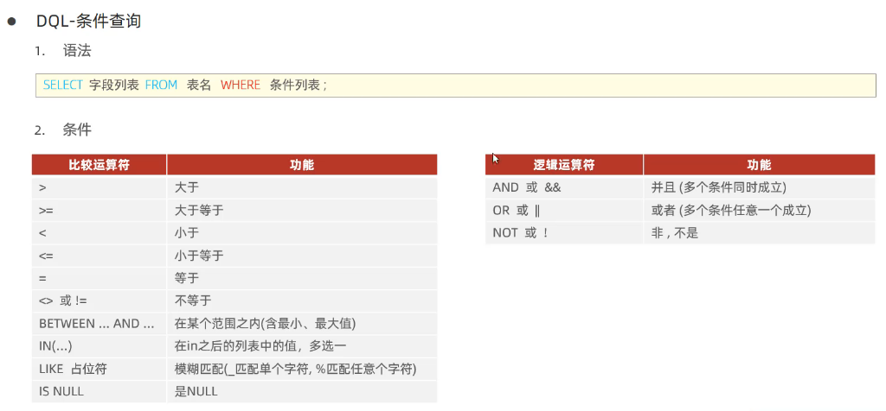

#### ①语法

```sql
SELECT 字段列表 FROM 表å WHERE æ¡ä»¶åˆ—表 ;
```

#### â‘¡æ¡ä»¶

常用的比较è¿ç®—符如下:


| **比较è¿ç®—符**      | **功能**                                 |
| :------------------ | :--------------------------------------- |
| >                   | å¤§äº                                     |
| >=                  | 大äºç­‰äº                                 |
| <                   | å°äº                                     |
| <=                  | å°äºç­‰äº                                 |
| =                   | ç­‰äº                                     |
| <> 或 !=            | ä¸ç­‰äº                                   |
| BETWEEN ... AND ... | 在æŸä¸ªèŒƒå›´ä¹‹å†…(å«æœ€å°ã€æœ€å¤§å€¼)           |
| IN(...)             | 在in之å的列表中的值，多选一             |
| LIKE å ä½ç¬¦         | 模糊匹é…(_匹é…å•ä¸ªå­—符, %匹é…ä»»æ„个字符) |
| IS NULL             | 是NULL                                   |

常用的逻辑è¿ç®—符如下:


| **逻辑è¿ç®—符** | **功能**                   |
| :------------- | :------------------------- |
| AND 或 &&      | 并且(多个æ¡ä»¶åŒæ—¶æˆç«‹)     |
| OR 或          | 或者(多个æ¡ä»¶ä»»æ„一个æˆç«‹) |
| NOT 或 !       | é ,ä¸æ˜¯                   |

#### ③案例

A. æŸ¥è¯¢å¹´é¾„ç­‰äº 88 的员工

```sql
select * from emp where age = 88;
```

B. 查询年龄å°äº 20 的员工信æ¯

```sql
select * from emp where age < 20;
```

C. 查询年龄å°äºç­‰äº 20 的员工信æ¯

```sql
select * from emp where age <= 20; 
```

D. 查询没有身份è¯å·çš„员工信æ¯

```sql
select * from emp where idcard is null; 
```

E. 查询有身份è¯å·çš„员工信æ¯

```sql
select * from emp where idcard is not null; 
```

F. 查询年龄ä¸ç­‰äº 88 的员工信æ¯

```sql
select * from emp where age != 88;

select * from emp where age <> 88;
```

G. 查询年龄在15å²(包å«) 到 20å²(包å«)之间的员工信æ¯

```sql
select * from emp where age >= 15 && age <= 20;

select * from emp where age >= 15 and age <= 20;

select * from emp where age between 15 and 20;
```

H. 查询性别为 女 且年龄å°äº 25å²çš„员工信æ¯

```sql
select * from emp where gender = '女' and age < 25; 
```

I. 查询年龄等äº18 或 20 或 40 的员工信æ¯

```sql
select * from emp where age = 18 or age = 20 or age =40;

select * from emp where age in(18,20,40);
```

J. 查询姓åä¸ºä¸¤ä¸ªå­—çš„å‘˜å·¥ä¿¡æ¯ _ %

```sql
select * from emp where name like '__'; 
```

K. 查询身份è¯å·æœ€å一ä½æ˜¯X的员工信æ¯

```sql
select * from emp where idcard like '%X';

select * from emp where idcard like '_________________X';
```


### （4）èšåˆæŸ¥è¯¢-count() ...

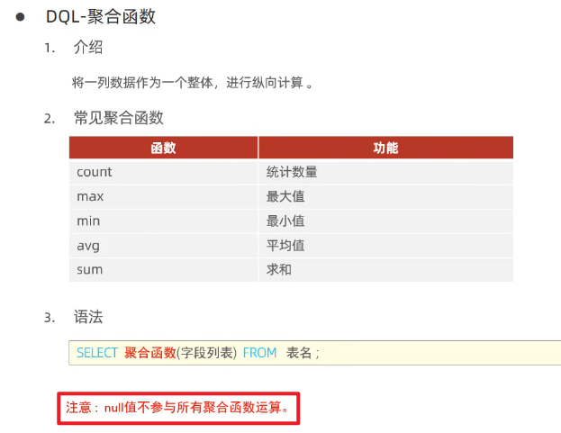

#### ①介ç»

==å°†**一列数æ®ä½œä¸ºä¸€ä¸ªæ•´ä½“**，进行**纵å‘计算**==。

#### ②常è§çš„èšåˆå‡½æ•°


| **函数** | **功能** |
| :------- | :------- |
| count    | ç»Ÿè®¡æ•°é‡ |
| max      | 最大值   |
| min      | 最å°å€¼   |
| avg      | å¹³å‡å€¼   |
| sum      | 求和     |

#### ③语法

```sql
SELECT èšåˆå‡½æ•°(字段列表) FROM 表å ;
```

> æ³¨æ„ : **NULL值**是==ä¸å‚ä¸æ‰€æœ‰èšåˆå‡½æ•°è¿ç®—==的。


#### ④案例

A. 统计该ä¼ä¸šå‘˜å·¥æ•°é‡

```sql
select count(*) from emp; -- 统计的是总记录数

select count(idcard) from emp; -- 统计的是idcard字段ä¸ä¸ºnull的记录数
```

对äºcountèšåˆå‡½æ•°ï¼Œ**统计符åˆæ¡ä»¶çš„总记录数**，还å¯ä»¥é€šè¿‡ count(æ•°å­—/字符串)çš„å½¢å¼è¿›è¡Œç»Ÿè®¡

查询，比如：

```sql
select count(1) from emp; 
```


> 对äºcount(*) ã€count(字段)〠count(1) çš„**具体åŸç†**，我们在进阶篇中**SQL优化部分**会详
>
> 细讲解，此处大家åªéœ€è¦çŸ¥é“如何使用å³å¯ã€‚

B. 统计该ä¼ä¸šå‘˜å·¥çš„å¹³å‡å¹´é¾„

```sql
select avg(age) from emp; 
```

C. 统计该ä¼ä¸šå‘˜å·¥çš„最大年龄

```sql
select max(age) from emp; 
```

D. 统计该ä¼ä¸šå‘˜å·¥çš„最å°å¹´é¾„

```sql
select min(age) from emp; 
```

E. 统计西安地区员工的年龄之和

```sql
select sum(age) from emp where workaddress = '西安'; 
```


### （5）分组查询-group by

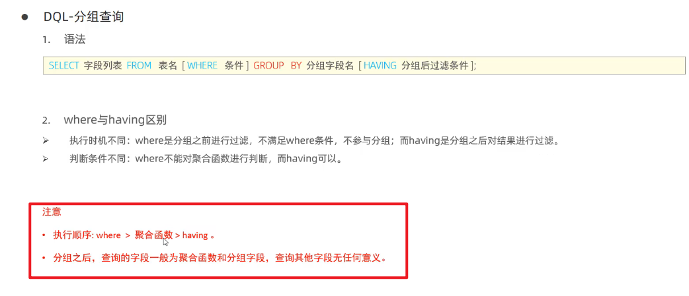

#### ①语法

```sql
SELECT 字段列表 FROM 表å [ WHERE æ¡ä»¶ ] GROUP BY 分组字段å [ HAVING 分组å过滤æ¡ä»¶ ];
```

#### ②🌟 ==whereä¸having区别==

- 执行时机ä¸åŒï¼šwhere是**分组之å‰è¿›è¡Œè¿‡æ»¤**，ä¸æ»¡è¶³whereæ¡ä»¶ï¼Œ**ä¸å‚ä¸åˆ†ç»„**；而**having是分组之å对结æœè¿›è¡Œè¿‡æ»¤ã€‚**
- 判断æ¡ä»¶ä¸åŒï¼š**whereä¸èƒ½å¯¹èšåˆå‡½æ•°è¿›è¡Œåˆ¤æ–­**，而havingå¯ä»¥ã€‚

> ==注æ„事项==:
>
> - **分组之å，查询的字段一般为==èšåˆå‡½æ•°å’Œåˆ†ç»„字段==**，查询**==其他字段无任何æ„义==**。
> - **执行顺åº: where > èšåˆå‡½æ•° > having** 。
> - 支æŒ**多字段分组,** 具体语法为 : group by columnA,columnB


#### ③案例

A. æ ¹æ®æ€§åˆ«åˆ†ç»„ , 统计男性员工 å’Œ 女性员工的数é‡

```sql
select gender, count(*) from emp group by gender ; 
```

B. æ ¹æ®æ€§åˆ«åˆ†ç»„ , 统计男性员工 å’Œ 女性员工的**å¹³å‡å¹´é¾„**

```sql
select gender, avg(age) from emp group by gender ;
```

C. 查询年龄å°äº45的员工 , 并根æ®å·¥ä½œåœ°å€åˆ†ç»„ , è·å–员工数é‡å¤§äºç­‰äº3的工作地å€

```sql
select workaddress, count(*) as address_count from emp where age < 45 group by workaddress having address_count >= 3;
```

D. 统计å„个工作地å€ä¸Šç­çš„男性åŠå¥³æ€§å‘˜å·¥çš„æ•°é‡

```sql
select workaddress, gender, count(*) as 'æ•°é‡' from emp group by gender,workaddress
```


### （6）æ’åºæŸ¥è¯¢-order by

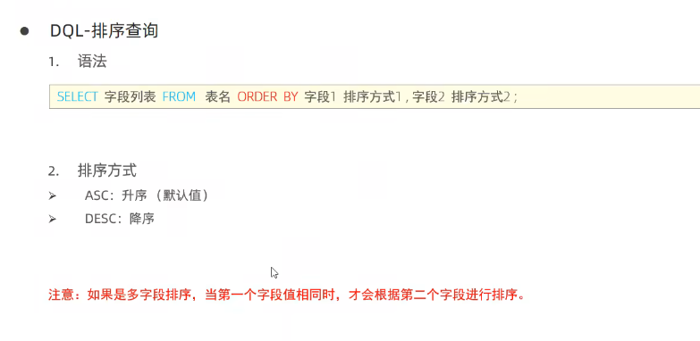

æ’åºåœ¨æ—¥å¸¸å¼€å‘中是é常常è§çš„一个æ“作，有å‡åºæ’åºï¼Œä¹Ÿæœ‰é™åºæ’åºã€‚

#### ①语法

```sql
SELECT 字段列表 FROM 表å ORDER BY 字段1 æ’åºæ–¹å¼1 , 字段2 æ’åºæ–¹å¼2 ; 
```


#### â‘¡æ’åºæ–¹å¼

- ASC : å‡åº(默认值)
- DESC: é™åº

> ==注æ„事项==：
>
> 如æœæ˜¯å‡åº, å¯ä»¥ä¸æŒ‡å®šæ’åºæ–¹å¼ASC，**默认å‡åº** ;
>
> 如æœæ˜¯**多字段æ’åº**，**当第一个字段值相åŒæ—¶ï¼Œæ‰ä¼šæ ¹æ®ç¬¬äºŒä¸ªå­—段进行æ’åº** ;


#### ③案例

A. æ ¹æ®å¹´é¾„对公å¸çš„员工进行å‡åºæ’åº

```sql
select * from emp order by age asc;

select * from emp order by age;
```

B. æ ¹æ®å…¥èŒæ—¶é—´, 对员工进行é™åºæ’åº

```sql
select * from emp order by entrydate desc; 
```

C. æ ¹æ®å¹´é¾„对公å¸çš„员工进行å‡åºæ’åº , å¹´é¾„ç›¸åŒ , å†æŒ‰ç…§å…¥èŒæ—¶é—´è¿›è¡Œé™åºæ’åº

```sql
select * from emp order by age asc , entrydate desc;
```


### （7）分页查询-limit

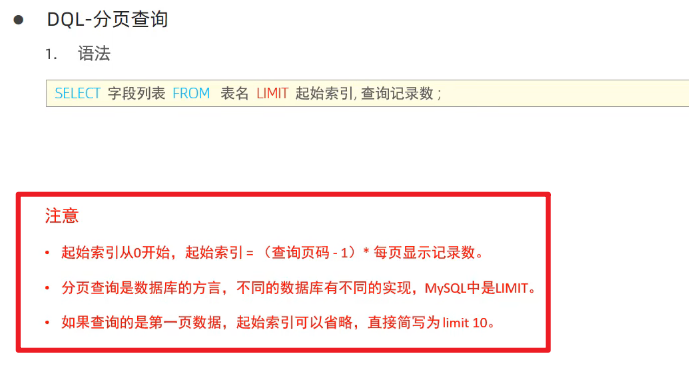

分页æ“作在业务系统开å‘时，也是é常常è§çš„一个功能，我们在网站中看到的å„ç§å„æ ·çš„**分页**æ¡ï¼Œåå°

都需è¦å€ŸåŠ©äºæ•°æ®åº“的分页æ“作。

#### ①语法

```sql
SELECT 字段列表 FROM 表å LIMIT 起始索引, 查询记录数 ; 
```

> 注æ„事项:
>
> - 起始索引ä»0开始，**起始索引  = ï¼ˆæŸ¥è¯¢é¡µç  - 1）*  æ¯é¡µæ˜¾ç¤ºè®°å½•æ•°**。
> - 分页查询是数æ®åº“çš„**方言**，ä¸åŒçš„æ•°æ®åº“有ä¸åŒçš„å®ç°ï¼Œ**MySQL中是LIMIT**。
> - 如æœæŸ¥è¯¢çš„是第一页数æ®ï¼Œ**起始索引å¯ä»¥çœç•¥**，直æ¥ç®€å†™ä¸º limit 10。

#### ②案例

A. 查询第1页员工数æ®, æ¯é¡µå±•ç¤º10æ¡è®°å½•

```sql
select * from emp limit 0,10;
select * from emp limit 10;
```

B. 查询第2页员工数æ®, æ¯é¡µå±•ç¤º10æ¡è®°å½• -------->  **(页ç -1)*页展示记录数**

```sql
select * from emp limit 10,10; 
```


### （8）案例


#### ①查询年龄为20,21,22,23å²çš„员工信æ¯ã€‚

```sql
select * from emp where gender = '女' and age in(20,21,22,23); 
```

#### ②查询性别为 ç”· ，并且年龄在 20-40 å²(å«)以内的姓å为三个字的员工。

```sql
select * from emp where gender = 'ç”·' and (age between 20 and 40) and name like
'___';
```

#### ③统计员工表中, 年龄å°äº60å²çš„ , 男性员工和女性员工的人数。

```sql
select gender, count(*) from emp where age < 60 group by gender; 
```

#### ④查询所有年龄å°äºç­‰äº35å²å‘˜å·¥çš„姓å和年龄，并对查询结æœæŒ‰å¹´é¾„å‡åºæ’åºï¼Œå¦‚æœå¹´é¾„相åŒæŒ‰å…¥èŒæ—¶é—´é™åºæ’åºã€‚

```sql
select name , age from emp where age <= 35 order by age asc , entrydate desc; 
```

#### ⑤查询性别为男，且年龄在20-40 å²(å«)以内的å‰5个员工信æ¯ï¼Œå¯¹æŸ¥è¯¢çš„结æœæŒ‰å¹´é¾„å‡åºæ’åºï¼Œå¹´é¾„相åŒæŒ‰å…¥èŒæ—¶é—´å‡åºæ’åºã€‚

```sql
select * from emp where gender = 'ç”·' and (age between 20 and 40) order by age asc ,
entrydate asc limit 5 ;
```


### （9）🌟 ==执行顺åº==

在讲解DQL语å¥çš„具体语法之å‰ï¼Œæˆ‘们已ç»è®²è§£äº†DQL语å¥çš„完整语法，åŠ**编写顺åº**，æ¥ä¸‹æ¥ï¼Œæˆ‘们è¦æ¥è¯´æ˜çš„是DQL语å¥åœ¨æ‰§è¡Œæ—¶çš„**执行顺åº**，也就是先执行那一部分，å执行那一部分。

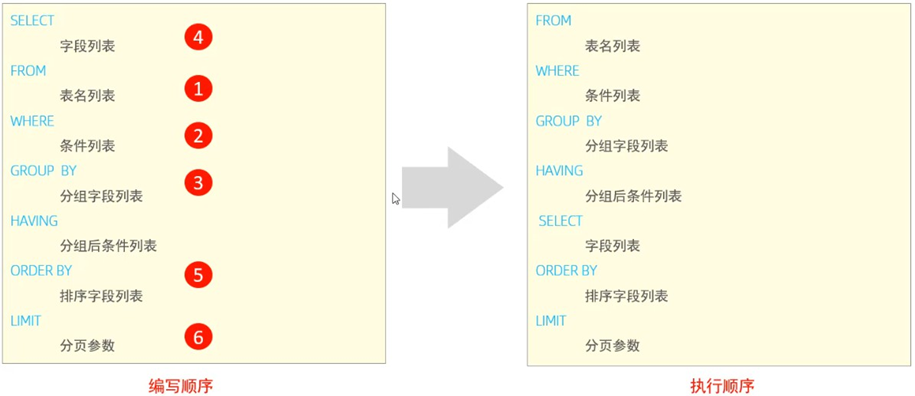

验è¯ï¼š

查询年龄大äº15的员工姓åã€å¹´é¾„，并根æ®å¹´é¾„进行å‡åºæ’åºã€‚

```sql
select name , age from emp where age > 15 order by age asc;
```

在查询时，我们给emp表起一个别å e，然å在select åŠ where中使用该别å。

```sql
select e.name , e.age from emp e where e.age > 15 order by age asc; 
```

执行上述SQL语å¥å，我们看到ä¾ç„¶å¯ä»¥æ­£å¸¸çš„查询到结æœï¼Œæ­¤æ—¶å°±è¯´æ˜ï¼š **from 先执行, 然å**

**where 和 select 执行。**那 where 和 select 到底哪个先执行呢?

此时，此时我们å¯ä»¥ç»™selectåé¢çš„字段起别å，然å在 where 中使用这个别å，然å看看是å¦å¯

以执行æˆåŠŸã€‚

```sql
select e.name ename , e.age eage from emp e where eage > 15 order by age asc; 
```

执行上述SQL报错了:


由此我们å¯ä»¥å¾—出结论: **from 先执行，然å执行 where ， å†æ‰§è¡Œselect** 。


æ¥ä¸‹æ¥ï¼Œæˆ‘们å†æ‰§è¡Œå¦‚下SQL语å¥ï¼ŒæŸ¥çœ‹æ‰§è¡Œæ•ˆæœï¼š

```sql
select e.name ename , e.age eage from emp e where e.age > 15 order by eage asc;
```

结æœæ‰§è¡ŒæˆåŠŸã€‚ 那么也就验è¯äº†: **order by 是在select 语å¥ä¹‹å执行的**。


综上所述，我们å¯ä»¥çœ‹åˆ°DQL语å¥çš„执行顺åºä¸ºï¼š **from ... where ... group by ...**

**having ... select ... order by ... limit ...**


### （10）总结


## 2.7 🌟DCL-æ•°æ®æ§åˆ¶

DCL英文全称是**Data Control Language**(æ•°æ®æ§åˆ¶è¯­è¨€)，用æ¥ç®¡ç†**æ•°æ®åº“用户ã€æ§åˆ¶æ•°æ®åº“的访问æƒé™ã€‚**

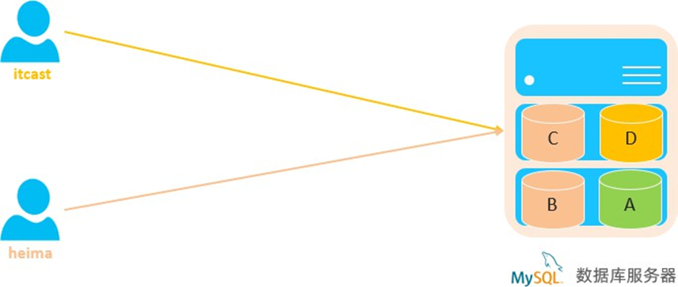

### （1）管ç†ç”¨æˆ·-user表


#### ①查询用户

```sql
select * from mysql.user;
```

查询的结æœå¦‚下:

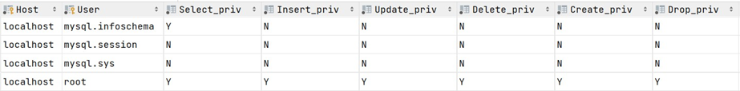

其中 Host代表**当å‰ç”¨æˆ·è®¿é—®çš„主机,** 如æœ**==为localhost, 仅代表åªèƒ½å¤Ÿåœ¨å½“å‰æœ¬æœºè®¿é—®==**，是ä¸å¯ä»¥è¿œç¨‹è®¿é—®çš„。 User代表的是**访问该数æ®åº“的用户å**。在MySQL中需è¦é€šè¿‡**Hostå’ŒUseræ¥å”¯ä¸€æ ‡è¯†ä¸€ä¸ªç”¨æˆ·**。

#### ②创建用户

```sql
CREATE USER '用户å'@'主机å' IDENTIFIED BY '密ç '; 
```

#### â‘¢ 修改用户密ç 

```sql
ALTER USER '用户å'@'主机å' IDENTIFIED WITH mysql_native_password BY '新密ç ' ; 
```

#### ④删除用户

```sql
DROP USER '用户å'@'主机å' ; 
```

注æ„事项:

- 在MySQL中需è¦é€šè¿‡ç”¨æˆ·å@主机åçš„æ–¹å¼ï¼Œæ¥å”¯ä¸€æ ‡è¯†ä¸€ä¸ªç”¨æˆ·ã€‚

- 主机åå¯ä»¥ä½¿ç”¨ % 通é…。
- 这类SQLå¼€å‘人员æ“作的比较少，主è¦æ˜¯DBA（ Database Administrator æ•°æ®åº“管ç†å‘˜ï¼‰ä½¿ç”¨ã€‚


#### ⑤案例

A. 创建用户itcast, åªèƒ½å¤Ÿåœ¨**当å‰ä¸»æœº**localhost访问, 密ç 123456;

```sql
create user 'itcast'@'localhost' identified by '123456'; 
```

B. 创建用户heima, å¯ä»¥åœ¨**ä»»æ„主机**访问该数æ®åº“, 密ç 123456;

```sql
create user 'heima'@'%' identified by '123456'; 
```

C. 修改用户heima的访问密ç ä¸º1234;

```sql
alter user 'heima'@'%' identified with mysql_native_password by '1234'; 
```

D. 删除 itcast@localhost 用户

```sql
drop user 'itcast'@'localhost';
```


### （2）æƒé™æ§åˆ¶

MySQL中定义了很多ç§æƒé™ï¼Œä½†æ˜¯å¸¸ç”¨çš„就以下几ç§ï¼š

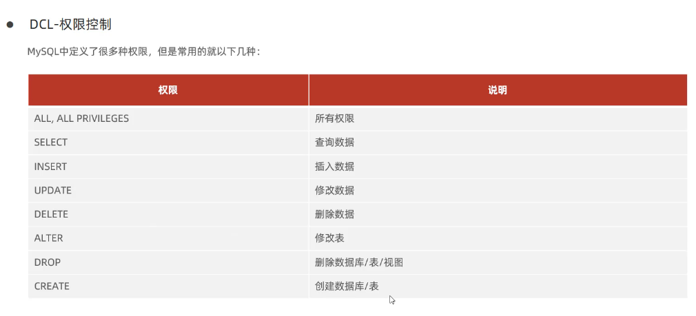

上述åªæ˜¯ç®€å•ç½—列了常è§çš„几ç§æƒé™æ述，其他æƒé™æè¿°åŠå«ä¹‰ï¼Œå¯ä»¥ç›´æ¥å‚考[**官方文档**](https://dev.mysql.com/doc/refman/8.0/en/privileges-provided.html)。


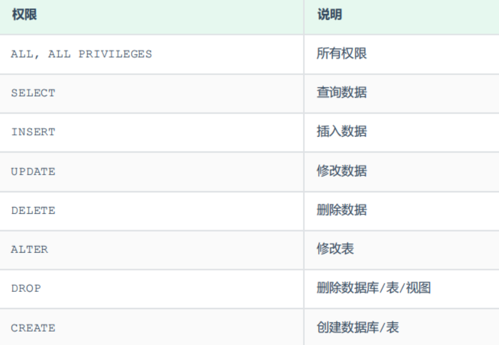


| **æƒé™**            | **说æ˜**           |
| :------------------ | :----------------- |
| ALL, ALL PRIVILEGES | 所有æƒé™           |
| SELECT              | æŸ¥è¯¢æ•°æ®           |
| INSERT              | æ’å…¥æ•°æ®           |
| UPDATE              | ä¿®æ”¹æ•°æ®           |
| DELETE              | åˆ é™¤æ•°æ®           |
| ALTER               | 修改表             |
| DROP                | 删除数æ®åº“/表/视图 |
| CREATE              | 创建数æ®åº“/表      |


#### â‘  查询æƒé™-show grants 

```sql
SHOW GRANTS FOR '用户å'@'主机å' ; 
```

#### â‘¡ æˆäºˆæƒé™-grant

```sql
GRANT æƒé™åˆ—表 ON æ•°æ®åº“å.表å TO '用户å'@'主机å'; 
```

#### ③撤销æƒé™-revoke

```sql
REVOKE æƒé™åˆ—表 ON æ•°æ®åº“å.表å FROM '用户å'@'主机å'; 
```

> 注æ„事项：
>
> - 多个æƒé™ä¹‹é—´ï¼Œä½¿ç”¨é€—å·åˆ†éš”
> - æˆæƒæ—¶ï¼Œ æ•°æ®åº“å和表åå¯ä»¥ä½¿ç”¨ * 进行通é…，代表所有。


#### ④案例

A. 查询 'heima'@'%' 用户的æƒé™

```sql
show grants for 'heima'@'%'; 
```


B. æˆäºˆ 'heima'@'%' 用户**itcastæ•°æ®åº“所有表的所有æ“作**æƒé™

```sql
grant all on itcast.* to 'heima'@'%'; 
```

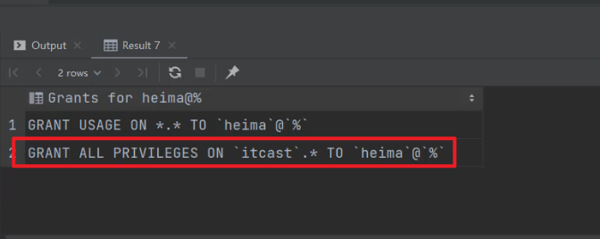

C. æˆäºˆ 'heima'@'%' 用户==所有数æ®åº“所有表的所有æ“作==æƒé™

```sql
grant all on *.* to 'heima'@'%'; 
```

D. 撤销 'heima'@'%' 用户的itcastæ•°æ®åº“的所有æƒé™

```sql
revoke all on itcast.* from 'heima'@'%';
```

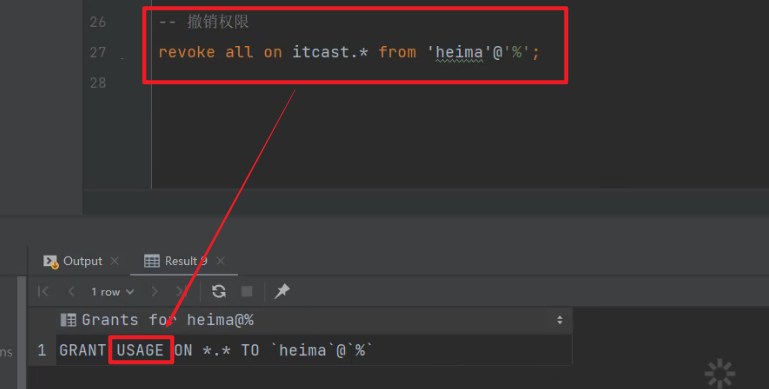


### （3）å°ç»“

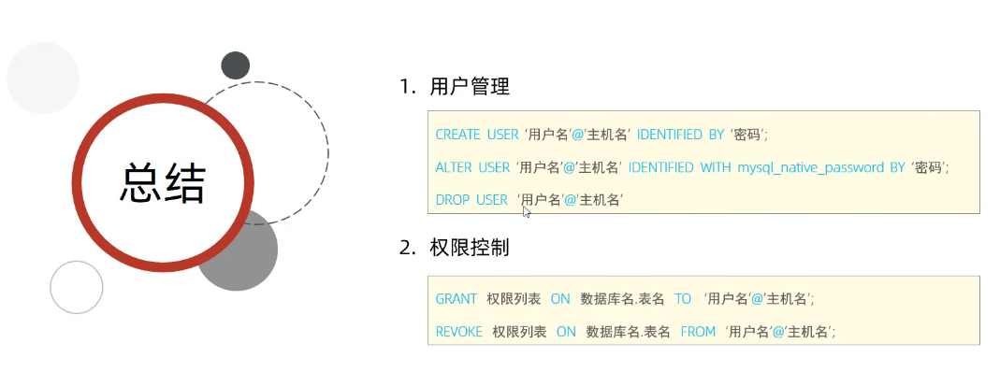


# 3ã€å‡½æ•°

函数 **是指一段å¯ä»¥ç›´æ¥è¢«å¦ä¸€æ®µç¨‹åºè°ƒç”¨çš„程åºæˆ–代ç **。 也就æ„味ç€ï¼Œè¿™ä¸€æ®µç¨‹åºæˆ–代ç åœ¨MySQL中已ç»ç»™æˆ‘们æ供了，我们è¦åšçš„就是在åˆé€‚的业务场景调用对应的函数完æˆå¯¹åº”的业务需求å³å¯ã€‚ 那么，函数到底在哪儿使用呢？

我们先æ¥çœ‹ä¸¤ä¸ªåœºæ™¯ï¼š


- 在ä¼ä¸šçš„OA或其他的人力系统中，ç»å¸¸ä¼šæ供的有这样一个功能，æ¯ä¸€ä¸ªå‘˜å·¥ç™»å½•ä¸Šæ¥ä¹‹å都能够看到当å‰å‘˜å·¥å…¥èŒçš„天数。 而在数æ®åº“中，存储的都是入èŒæ—¥æœŸï¼Œå¦‚ 2000-11-12，那如æœå¿«é€Ÿè®¡ç®—出天数呢？
- 在åšæŠ¥è¡¨è¿™ç±»çš„业务需求中,我们è¦å±•ç¤ºå‡ºå­¦å‘˜çš„分数等级分布。而在数æ®åº“中，存储的是学生的分数值，如98/75，如何快速判定分数的等级呢？


å…¶å®ï¼Œä¸Šè¿°çš„这一类的需求呢，我们通过MySQL中的函数都å¯ä»¥å¾ˆæ–¹ä¾¿çš„å®ç° 。

MySQL中的函数主è¦åˆ†ä¸ºä»¥ä¸‹å››ç±»ï¼š **字符串函数ã€æ•°å€¼å‡½æ•°ã€æ—¥æœŸå‡½æ•°ã€æµç¨‹å‡½æ•°ã€‚**


## 3.1 字符串函数

### （1）常用字符串函数

MySQL中内置了很多字符串函数，常用的几个如下：

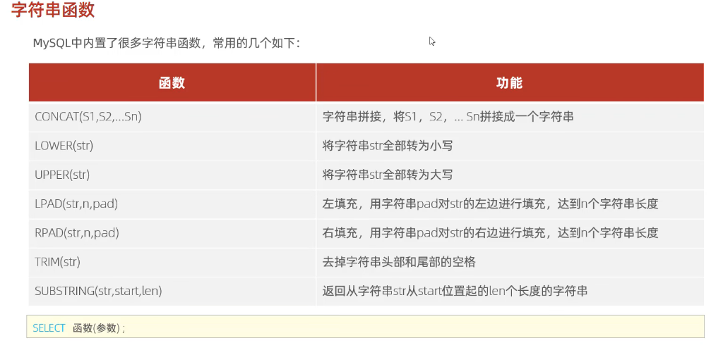


| **函数**                 | **功能**                                                  |
| :----------------------- | :-------------------------------------------------------- |
| CONCAT(S1,S2,...Sn)      | 字符串拼æ¥ï¼Œå°†S1，S2，... Sn拼æ¥æˆä¸€ä¸ªå­—符串              |
| LOWER(str)               | 将字符串str全部转为å°å†™                                   |
| UPPER(str)               | 将字符串str全部转为大写                                   |
| LPAD(str,n,pad)          | 左填充，用字符串pad对str的左边进行填充，达到n个字符串长度 |
| RPAD(str,n,pad)          | å³å¡«å……，用字符串pad对strçš„å³è¾¹è¿›è¡Œå¡«å……，达到n个字符串长度 |
| TRIM(str)                | å»æ‰å­—符串==头部==å’Œ==尾部==的空格                        |
| SUBSTRING(str,start,len) | è¿”å›ä»å­—符串strä»startä½ç½®èµ·çš„len个长度的字符串           |


### （2）演示如下

#### A. ==concat== : 字符串拼æ¥

```sql
select concat('Hello' , ' MySQL'); 
```

#### B. ==lower== : 全部转å°å†™

```sql
select lower('Hello'); 
```

#### C. ==upper== : 全部转大写

```sql
select upper('Hello'); 
```

#### D. ==lpad== : 左填充

```sql
select lpad('01', 5, '-'); 
```

#### E. ==rpad== : å³å¡«å……

```sql
select rpad('01', 5, '-'); 
```

#### F. ==trim== : å»é™¤ç©ºæ ¼

```sql
select trim(' Hello MySQL '); 
```

#### G. ==substring== : 截å–å­å­—符串

```sql
select substring('Hello MySQL',1,5);
```


### （3）案例

ç”±äºä¸šåŠ¡éœ€æ±‚å˜æ›´ï¼Œä¼ä¸šå‘˜å·¥çš„å·¥å·ï¼Œç»Ÿä¸€ä¸º5ä½æ•°ï¼Œç›®å‰ä¸è¶³5ä½æ•°çš„全部在å‰é¢è¡¥0。比如： 1å·å‘˜å·¥çš„å·¥å·åº”该为00001。

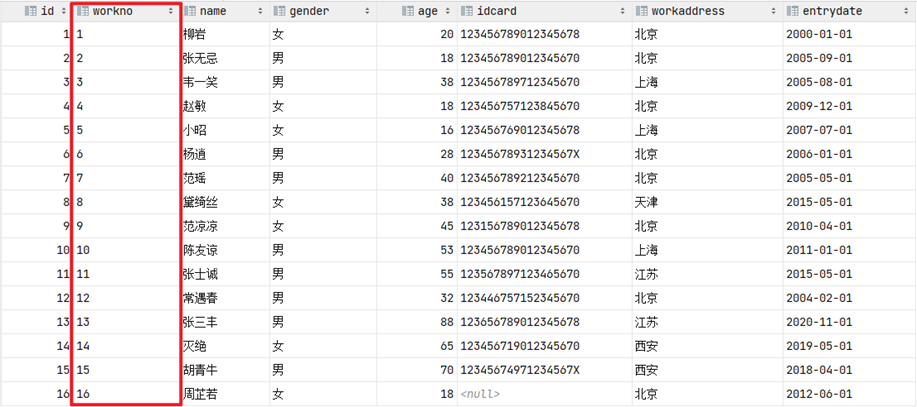

```sql
update emp set workno = lpad(workno, 5, '0');
```

处ç†å®Œæ¯•å, 具体的数æ®ä¸º:

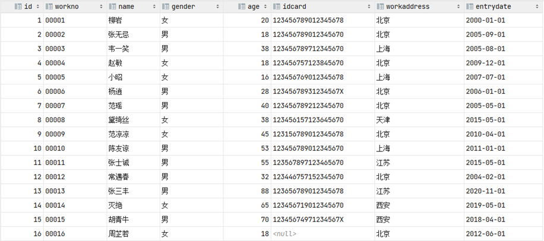


## 3.2 数值函数

### （1）常è§æ•°å€¼å‡½æ•°

常è§çš„数值函数如下：

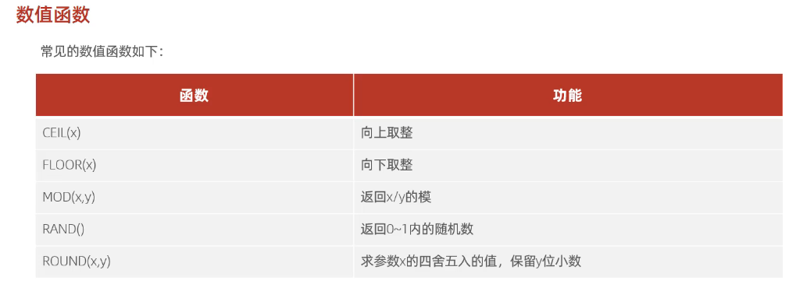


| **函数**   | **功能**                           |
| :--------- | :--------------------------------- |
| CEIL(x)    | å‘上å–æ•´                           |
| FLOOR(x)   | å‘下å–æ•´                           |
| MOD(x,y)   | è¿”å›x/y的模                        |
| RAND()     | è¿”å›0~1内的éšæœºæ•°                  |
| ROUND(x,y) | 求å‚æ•°xçš„å››èˆäº”入的值，ä¿ç•™yä½å°æ•° |

### （2）演示如下

#### A. ==ceil==：å‘上å–æ•´

```sql
select ceil(1.1); 
```

#### B. ==floor==：å‘下å–æ•´

```sql
select floor(1.9); 
```

#### C. ==mod==：å–模

```sql
select mod(7,4); 
```

#### D. ==rand==：è·å–éšæœºæ•°-0到1之间

```sql
select rand(); 
```

#### E. ==round==：四èˆäº”å…¥

```sql
select round(2.344,2);  #2.34
select round(2.345,2);  #2.35
```


### （3）案例

通过数æ®åº“的函数，**生æˆä¸€ä¸ªå…­ä½æ•°çš„éšæœºéªŒè¯ç **。

æ€è·¯ï¼š è·å–éšæœºæ•°å¯ä»¥é€šè¿‡**rand()函数**，但是è·å–出æ¥çš„éšæœºæ•°æ˜¯åœ¨0-1之间的，所以å¯ä»¥**在其基础上乘以1000000**，然å**èˆå¼ƒå°æ•°éƒ¨åˆ†**，如æœé•¿åº¦ä¸è¶³6ä½ï¼Œè¡¥0（左侧补0，所以使用lpad，å³ä¾§åˆ™ä½¿ç”¨rpad）

```sql
select lpad(round(rand()*1000000 , 0), 6, '0');
```


## 3.3 日期函数

### （1）常è§æ—¥æœŸå‡½æ•°

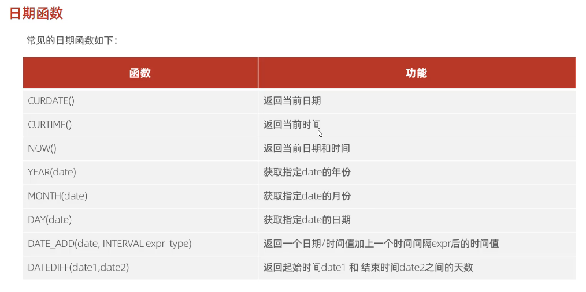

常è§çš„日期函数如下：

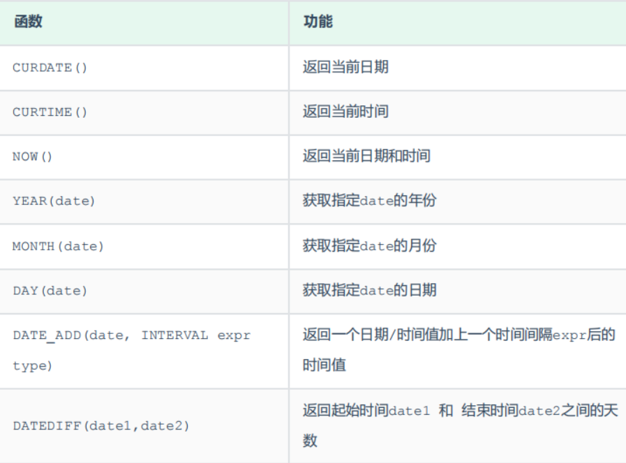

| **函数**                           | **功能**                                          |
| :--------------------------------- | :------------------------------------------------ |
| CURDATE()                          | è¿”å›å½“å‰æ—¥æœŸ                                      |
| CURTIME()                          | è¿”å›å½“å‰æ—¶é—´                                      |
| NOW()                              | è¿”å›å½“å‰æ—¥æœŸå’Œæ—¶é—´                                |
| YEAR(date)                         | è·å–指定date的年份                                |
| MONTH(date)                        | è·å–指定date的月份                                |
| DAY(date)                          | è·å–指定date的日期                                |
| DATE_ADD(date, INTERVAL expr type) | è¿”å›ä¸€ä¸ªæ—¥æœŸ/时间值加上一个时间间隔exprå的时间值 |
| DATEDIFF(date1,date2)              | è¿”å›èµ·å§‹æ—¶é—´date1 å’Œ 结æŸæ—¶é—´date2之间的天数      |

### （2）演示如下

#### A. ==curdate==：当å‰æ—¥æœŸ

```sql
select curdate(); 
```

#### B. ==curtime==：当å‰æ—¶é—´

```sql
select curtime(); 
```

#### C. ==now==：当å‰æ—¥æœŸå’Œæ—¶é—´

```sql
select now(); 
```

#### D. ==YEAR , MONTH , DAY==：**当å‰å¹´ã€æœˆã€æ—¥**

```sql
select YEAR(now());
select MONTH(now());
select DAY(now());
```

#### E. ==date_add==：å¢åŠ æŒ‡å®šçš„时间间隔-INTERVAL

```sql
select date_add(now(), INTERVAL 70 YEAR );
```

#### F. ==datediff==：è·å–两个日期相差的天数

```sql
select datediff('2021-10-01', '2021-12-01');  # -61
select datediff('2021-12-01', '2021-10-01');  # 61
```

### （3）案例

查询所有员工的入èŒå¤©æ•°ï¼Œå¹¶æ ¹æ®å…¥èŒå¤©æ•°å€’åºæ’åºã€‚

æ€è·¯ï¼š å…¥èŒå¤©æ•°ï¼Œå°±æ˜¯é€šè¿‡å½“å‰æ—¥æœŸ - å…¥èŒæ—¥æœŸï¼Œæ‰€ä»¥éœ€è¦ä½¿ç”¨**datediff函数**æ¥å®Œæˆã€‚

```sql
select name, datediff(curdate(), entrydate) as 'entrydays' from emp order by entrydays desc;
```


## 3.4 æµç¨‹å‡½æ•°

æµç¨‹å‡½æ•°ä¹Ÿæ˜¯å¾ˆå¸¸ç”¨çš„一类函数，å¯ä»¥åœ¨SQL语å¥ä¸­å®ç°æ¡ä»¶ç­›é€‰ï¼Œä»è€Œæ高语å¥çš„效ç‡ã€‚

### （1）常è§æµç¨‹å‡½æ•°

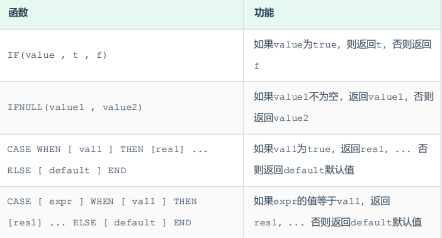

| **函数**                                                     | **功能**                                                     |
| :----------------------------------------------------------- | :----------------------------------------------------------- |
| IF(value , t , f)                                            | 如æœvalue为true，则返å›t，å¦åˆ™è¿”å›f                          |
| IFNULL(value1 , value2)                                      | 如æœvalue1ä¸ä¸ºç©ºï¼Œè¿”å›value1，å¦åˆ™è¿”å›value2                 |
| CASE WHEN [ val1 ] THEN [res1] ...ELSE [ default ] END       | **如æœval1==为true==**，返å›res1，... å¦åˆ™è¿”å›default默认值  |
| CASE [ expr ] WHEN [ val1 ] THEN[res1] ... ELSE [ default ] END | **如æœexprçš„==值等äº==val1**，返å›res1，... å¦åˆ™è¿”å›default默认值 |

### （2）演示如下

#### A. ==if==

```sql
select if(false, 'Ok', 'Error'); 
```

#### B. ==ifnull==

```sql
select ifnull('Ok','Default'); # OK

select ifnull('','Default'); # 输出 ''

select ifnull(null,'Default');  # 输出Default
```


#### C. ==case when then else end==

需求: 查询emp表的员工姓åå’Œå·¥ä½œåœ°å€ (北京/上海 ----> 一线åŸå¸‚ , 其他 ----> 二线åŸå¸‚)

```sql
select 
name,
(case workaddress when '北京' then '一线åŸå¸‚' when '上海' then '一线åŸå¸‚' else
 '二线åŸå¸‚' end ) as '工作地å€'
from emp;
```


### （3）案例

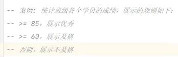

```sql
create table score(
    id int comment 'ID',
    name varchar(20) comment '姓å',
    math int comment 'æ•°å­¦',
    english int comment '英语',
    chinese int comment '语文'
) comment '学员æˆç»©è¡¨';
insert into score(id, name, math, english, chinese) VALUES (1, 'Tom', 67, 88, 95), (2, 'Rose' , 23, 66, 90),(3, 'Jack', 56, 98, 76);
```

具体的SQL语å¥å¦‚下:

```sql
select
id,
name,
(case when math >= 85 then '优秀' when math >=60 then 'åŠæ ¼' else 'ä¸åŠæ ¼' end )
'æ•°å­¦',
(case when english >= 85 then '优秀' when english >=60 then 'åŠæ ¼' else 'ä¸åŠæ ¼'
 end ) '英语',
(case when chinese >= 85 then '优秀' when chinese >=60 then 'åŠæ ¼' else 'ä¸åŠæ ¼'
 end ) '语文'
from score;
```


## 3.5 å°ç»“


> MySQL的常è§å‡½æ•°æˆ‘们学习完了，那æ¥ä¸‹æ¥ï¼Œæˆ‘们就æ¥åˆ†æ一下，在å‰é¢è®²åˆ°çš„两个函数的案例场景，
>
> æ€è€ƒä¸€ä¸‹éœ€è¦ç”¨åˆ°ä»€ä¹ˆæ ·çš„函数æ¥å®ç°?
>
> 
>
> - æ•°æ®åº“中，存储的是入èŒæ—¥æœŸï¼Œå¦‚ 2000-01-01，如何快速计算出入èŒå¤©æ•°å‘¢ï¼Ÿ -------->
>   - 答案: datediff
> - æ•°æ®åº“中，存储的是学生的分数值，如98ã€75，如何快速判定分数的等级呢？ ---------->
>   - 答案: case ... when ...


# 4ã€çº¦æŸ

> ==注æ„==：约æŸæ˜¯**作用äºè¡¨ä¸­å­—段上的**，å¯ä»¥åœ¨**创建表/修改表的时候添加约æŸ**。

## 4.1 概述


### （1）概念

约æŸæ˜¯ä½œç”¨äºè¡¨ä¸­å­—段上的规则，用äºé™åˆ¶å­˜å‚¨åœ¨è¡¨ä¸­çš„æ•°æ®ã€‚

### （2）目的

ä¿è¯æ•°æ®åº“中数æ®çš„正确ã€æœ‰æ•ˆæ€§å’Œå®Œæ•´æ€§ã€‚

### （3）分类


> ==注æ„==：约æŸæ˜¯**作用äºè¡¨ä¸­å­—段上的**，å¯ä»¥åœ¨**创建表/修改表的时候添加约æŸ**。


## 4.2 约æŸæ¼”示-案例

上é¢æˆ‘们介ç»äº†æ•°æ®åº“中常è§çš„约æŸï¼Œä»¥åŠçº¦æŸæ¶‰åŠåˆ°çš„关键字，那这些约æŸæˆ‘们到底如何在创建表ã€ä¿®æ”¹è¡¨çš„时候æ¥æŒ‡å®šå‘¢ï¼Œæ¥ä¸‹æ¥æˆ‘们就通过一个案例，æ¥æ¼”示一下。

案例需求： æ ¹æ®éœ€æ±‚，完æˆè¡¨ç»“æ„的创建。需求如下：


| **字段å**         | **字段å«ä¹‰** | **字段类å‹** | **约æŸæ¡ä»¶**              | **约æŸå…³é”®å­—**              |
| :----------------- | :----------- | :----------- | :------------------------ | :-------------------------- |
| id                 | ID唯一标识   | int          | 主键，并且自动å¢é•¿        | PRIMARY KEY, AUTO_INCREMENT |
| name               | å§“å         | varchar(10)  | ä¸ä¸ºç©ºï¼Œå¹¶ä¸”唯一          | NOT NULL , UNIQUE           |
| age                | 年龄         | int          | 大äº0，并且å°äºç­‰äº120    | CHECK                       |
| status             | çŠ¶æ€         | char(1)      | 如æœæ²¡æœ‰æŒ‡å®šè¯¥å€¼ï¼Œé»˜è®¤ä¸º1 | DEFAULT                     |
| gender             | 性别         | char(1)      | 无                        |                             |
| 对应的建表语å¥ä¸ºï¼š |              |              |                           |                             |

对应的建表语å¥ä¸ºï¼š

```sql
CREATE TABLE tb_user(
    id int AUTO_INCREMENT PRIMARY KEY COMMENT 'ID唯一标识',
    name varchar(10) NOT NULL UNIQUE COMMENT '姓å' ,
    age int check (age > 0 && age <= 120) COMMENT '年龄' ,
    status char(1) default '1' COMMENT '状æ€',
    gender char(1) COMMENT '性别'
);
```

在为字段添加约æŸæ—¶ï¼Œæˆ‘们åªéœ€è¦åœ¨**字段之å加上约æŸçš„关键字**å³å¯ï¼Œéœ€è¦å…³æ³¨å…¶è¯­æ³•ã€‚我们执行上é¢çš„SQL把表结æ„创建完æˆï¼Œç„¶åæ¥ä¸‹æ¥ï¼Œå°±å¯ä»¥é€šè¿‡ä¸€ç»„æ•°æ®è¿›è¡Œæµ‹è¯•ï¼Œä»è€ŒéªŒè¯ä¸€ä¸‹ï¼Œçº¦æŸæ˜¯å¦å¯ä»¥ç”Ÿæ•ˆã€‚

```sql
insert into tb_user(name,age,status,gender) values ('Tom1',19,'1','ç”·'),
('Tom2',25,'0','ç”·');

# éªŒè¯ name çš„ not null
insert into tb_user(name,age,status,gender) values ('Tom3',19,'1','ç”·');
insert into tb_user(name,age,status,gender) values (null,19,'1','ç”·');

# éªŒè¯ name çš„ Unique
insert into tb_user(name,age,status,gender) values ('Tom3',19,'1','ç”·');

# éªŒè¯ age
insert into tb_user(name,age,status,gender) values ('Tom4',80,'1','ç”·');
insert into tb_user(name,age,status,gender) values ('Tom5',-1,'1','ç”·');
insert into tb_user(name,age,status,gender) values ('Tom5',121,'1','ç”·');

# 验è¯statusçš„ Default
insert into tb_user(name,age,gender) values ('Tom5',120,'ç”·');
```

上é¢ï¼Œæˆ‘们是通过编写SQL语å¥çš„å½¢å¼æ¥å®Œæˆçº¦æŸçš„指定，那加入我们是**通过图形化界é¢**æ¥åˆ›å»ºè¡¨ç»“æ„时，åˆè¯¥å¦‚何æ¥æŒ‡å®šçº¦æŸå‘¢ï¼Ÿ åªéœ€è¦åœ¨åˆ›å»ºè¡¨çš„时候，根æ®æˆ‘们的需è¦é€‰æ‹©å¯¹åº”的约æŸå³å¯ã€‚

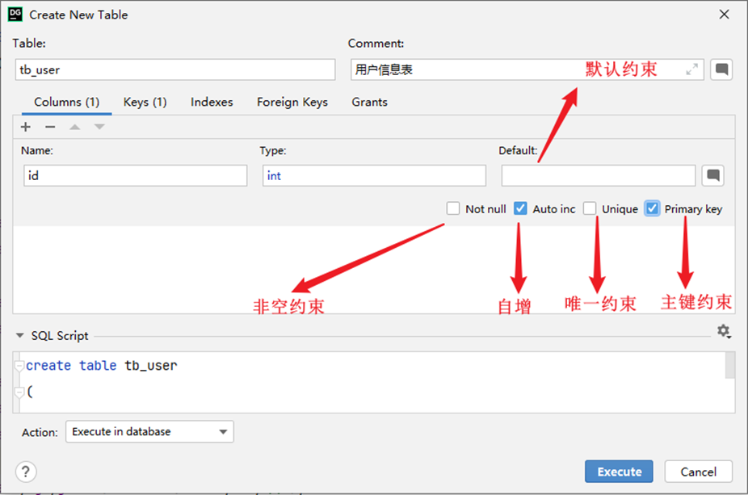


## 4.3 ==外键约æŸ==

### （1）介ç»

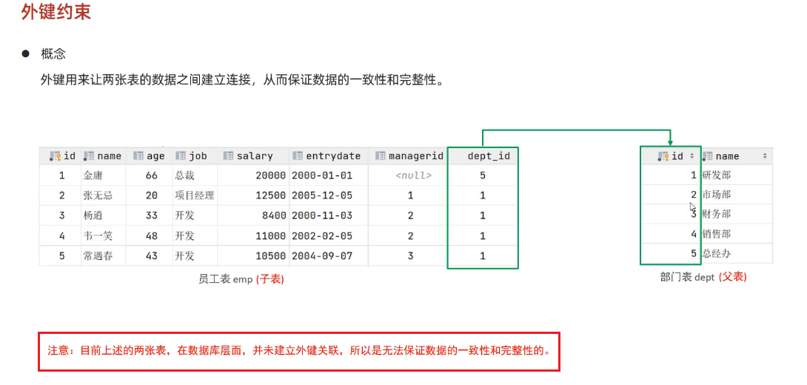

外键：用æ¥è®©ä¸¤å¼ è¡¨çš„**æ•°æ®ä¹‹é—´å»ºç«‹è¿æ¥**，ä»è€Œ**ä¿è¯æ•°æ®çš„一致性和完整性**。

我们æ¥çœ‹ä¸€ä¸ªä¾‹å­ï¼š

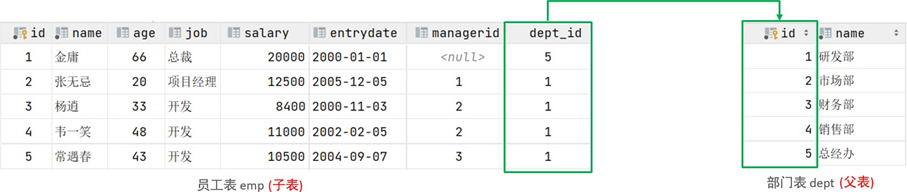

左侧的emp表是员工表，里é¢å­˜å‚¨å‘˜å·¥çš„基本信æ¯ï¼ŒåŒ…å«å‘˜å·¥çš„IDã€å§“åã€å¹´é¾„ã€èŒä½ã€è–ªèµ„ã€å…¥èŒæ—¥æœŸã€ä¸Šçº§ä¸»ç®¡IDã€éƒ¨é—¨ID，在员工的信æ¯ä¸­å­˜å‚¨çš„是部门的ID dept_id，而这个部门的ID是关è”的部门表dept的主键id，那emp表的dept_id就是外键,å…³è”的是å¦ä¸€å¼ è¡¨çš„主键。

> 注æ„：目å‰ä¸Šè¿°ä¸¤å¼ è¡¨ï¼Œåªæ˜¯åœ¨**逻辑上存在这样一层关系**ï¼›**在数æ®åº“层é¢ï¼Œå¹¶æœªå»ºç«‹å¤–键关è”**，所以	是无法ä¿è¯æ•°æ®çš„一致性和完整性的。


没有数æ®åº“外键关è”的情况下，能够ä¿è¯ä¸€è‡´æ€§å’Œå®Œæ•´æ€§å‘¢ï¼Œæˆ‘们æ¥æµ‹è¯•ä¸€ä¸‹ã€‚

**准备数æ®**

```sql
create table dept(
    id int auto_increment comment 'ID' primary key,
    name varchar(50) not null comment '部门å称'
)comment '部门表';

INSERT INTO dept (id, name) VALUES (1, 'ç ”å‘部'), (2, '市场部'),(3, '财务部'), (4,'销售部'), (5, '总ç»åŠ');

drop table if exists emp
create table emp(
    id int auto_increment comment 'ID' primary key,
    name varchar(50) not null comment '姓å',
    age int comment '年龄',
    job varchar(20) comment 'èŒä½',
    salary int comment '薪资',
    entrydate date comment 'å…¥èŒæ—¶é—´',
    managerid int comment 'ç›´å±é¢†å¯¼ID',
    dept_id int comment '部门ID'
)comment '员工表';

INSERT INTO emp (id, name, age, job,salary, entrydate, managerid, dept_id) VALUES
(1, '金庸', 66, '总è£',20000, '2000-01-01', null,5),
(2, 'å¼ æ— å¿Œ', 20,'项目ç»ç†',12500, '2005-12-05', 1,1),
(3, 'æ¨é€', 33, 'å¼€å‘', 8400,'2000-11-03', 2,1),
(4, '韦一笑', 48, 'å¼€å‘',11000, '2002-02-05', 2,1),
(5, '常é‡æ˜¥', 43, 'å¼€å‘',10500, '2004-09-07', 3,1),
(6, 'å°æ˜­', 19, '程åºå‘˜é¼“励师',6600, '2004-10-12', 2,1);
```


æ¥ä¸‹æ¥ï¼Œæˆ‘们å¯ä»¥åšä¸€ä¸ªæµ‹è¯•ï¼Œåˆ é™¤id为1的部门信æ¯ã€‚


结æœï¼Œæˆ‘们看到删除æˆåŠŸï¼Œè€Œåˆ é™¤æˆåŠŸä¹‹å，部门表ä¸å­˜åœ¨id为1的部门，而在emp表中还有很多的员工，关è”的为id为1的部门，此时就出ç°äº†æ•°æ®çš„ä¸å®Œæ•´æ€§ã€‚ 而è¦æƒ³è§£å†³è¿™ä¸ªé—®é¢˜å°±å¾—通过数æ®åº“的外键约æŸã€‚


### （2）语法


#### ①添加外键

```sql
CREATE TABLE 表å(
    字段å æ•°æ®ç±»å‹,
    ...
    [CONSTRAINT] [外键å称] FOREIGN KEY (外键字段å) REFERENCES 主表 (主表列å)
);

ALTER TABLE 表å ADD CONSTRAINT 外键å称 FOREIGN KEY (外键字段å)
REFERENCES 主表 (主表列å) ;
```

##### 1）案例

为emp表的dept_id字段添加外键约æŸ,å…³è”dept表的主键id。

```sql
alter table emp add constraint fk_emp_dept_id foreign key (dept_id) references dept(id);
```

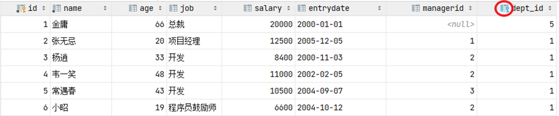

添加了外键约æŸä¹‹å，我们å†åˆ°dept表(父表)删除id为1的记录，然å看一下会å‘生什么ç°è±¡ã€‚ 此时将会报错，ä¸èƒ½åˆ é™¤æˆ–更新父表记录，因为存在外键约æŸã€‚

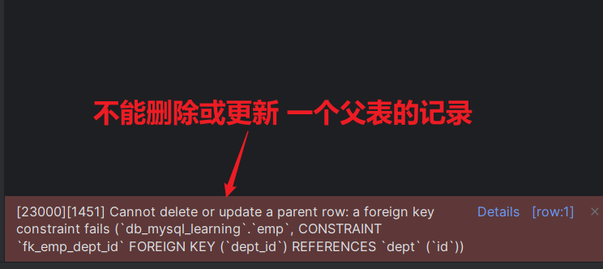


#### ② 删除外键

```sql
ALTER TABLE 表å DROP FOREIGN KEY 外键å称;
```

##### 1）案例

删除emp表的外键fk_emp_dept_id。

```sql
alter table emp drop foreign key fk_emp_dept_id; 
```


### （3）删除/更新行为

添加了外键之å，å†åˆ é™¤çˆ¶è¡¨æ•°æ®æ—¶äº§ç”Ÿçš„约æŸè¡Œä¸ºï¼Œæˆ‘们就称为删除/更新行为。具体的删除/更新行为有以下几ç§:


| **行为**    | **说æ˜**                                                     |
| :---------- | :----------------------------------------------------------- |
| NO ACTION   | 当在父表中删除/更新对应记录时，首先**检查该记录是å¦æœ‰å¯¹åº”外键，如æœæœ‰åˆ™ä¸å…许删除/æ›´æ–°**。 (ä¸ RESTRICT 一致) 默认行为 |
| RESTRICT    | 当在父表中删除/更新对应记录时，首先检查该记录是å¦æœ‰å¯¹åº”外键，如æœæœ‰åˆ™ä¸å…许删除/更新。 (ä¸ NO ACTION 一致) 默认行为 |
| CASCADE     | 当在父表中删除/更新对应记录时，首先检查该记录是å¦æœ‰å¯¹åº”外键，**如æœæœ‰ï¼Œåˆ™ä¹Ÿåˆ é™¤/更新外键在å­è¡¨ä¸­çš„记录。**==级è”删除== |
| SET NULL    | 当在父表中删除对应记录时，首先检查该记录是å¦æœ‰å¯¹åº”外键，**如æœæœ‰åˆ™è®¾ç½®å­è¡¨ä¸­è¯¥å¤–键值为null**（这就**è¦æ±‚该外键å…许å–null**）。 |
| SET DEFAULT | 父表有å˜æ›´æ—¶ï¼Œå­è¡¨å°†å¤–键列设置æˆä¸€ä¸ªé»˜è®¤çš„值 (**Innodbä¸æ”¯æŒ**) |

#### ①==具体语法==

```sql
ALTER TABLE 表å ADD CONSTRAINT 外键å称 FOREIGN KEY (外键字段) REFERENCES
主表å (主表字段å) ON UPDATE CASCADE ON DELETE CASCADE;
```

#### ②演示如下

ç”±äº**NO ACTION 是默认行为**，我们å‰é¢è¯­æ³•æ¼”示的时候，已ç»æµ‹è¯•è¿‡äº†ï¼Œå°±ä¸å†æ¼”示了，这里我们å†æ¼”示其他的两ç§è¡Œä¸ºï¼š**CASCADEã€SET NULL**。

##### 1）==CASCADE==-级è”模å¼

```sql
alter table emp add constraint fk_emp_dept_id foreign key (dept_id) references
dept(id) on update cascade on delete cascade ;
```

A. 修改父表id为1的记录，将id修改为6


我们å‘ç°ï¼ŒåŸæ¥åœ¨å­è¡¨ä¸­dept_id值为1的记录，ç°åœ¨ä¹Ÿå˜ä¸º6了，这就是**cascade级è”**的效æœã€‚

> 在一般的业务系统中，==ä¸ä¼šä¿®æ”¹ä¸€å¼ è¡¨çš„主键值==。


B. 删除父表id为6的记录


我们å‘ç°ï¼Œ**父表的数æ®åˆ é™¤æˆåŠŸ**了，但是**å­è¡¨**中关è”的记录**也被级è”删除**了。


##### 2）==SET NULL==-设为null

在进行测试之å‰ï¼Œæˆ‘们先需è¦åˆ é™¤ä¸Šé¢å»ºç«‹çš„外键 fk_emp_dept_id。然åå†é€šè¿‡æ•°æ®è„šæœ¬ï¼Œå°†empã€dept表的**æ•°æ®æ¢å¤**了。

```sql
alter table emp add constraint fk_emp_dept_id foreign key (dept_id) references
dept(id) on update cascade on delete cascade ;
```

æ¥ä¸‹æ¥ï¼Œæˆ‘们删除id为1çš„æ•°æ®ï¼Œçœ‹çœ‹ä¼šå‘生什么样的ç°è±¡ã€‚

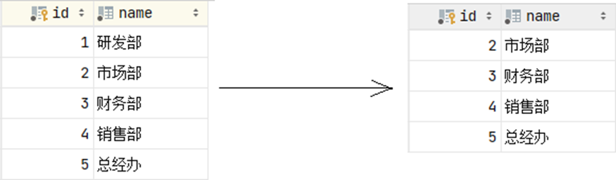

我们å‘ç°çˆ¶è¡¨çš„记录是å¯ä»¥æ­£å¸¸çš„删除的，父表的数æ®åˆ é™¤ä¹‹å，å†æ‰“å¼€å­è¡¨ emp，我们å‘ç°å­è¡¨empçš„dept_id字段，åŸæ¥dept_id为1çš„æ•°æ®ï¼Œç°åœ¨éƒ½è¢«ç½®ä¸ºNULL了。

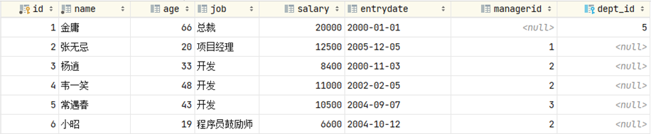

这就是SET NULLè¿™ç§åˆ é™¤/更新行为的效æœã€‚


## 4.4 å°ç»“


# 5ã€ğŸŒŸ 多表查询

我们之å‰åœ¨è®²è§£SQL语å¥çš„时候，讲解了DQL语å¥ï¼Œä¹Ÿå°±æ˜¯æ•°æ®æŸ¥è¯¢è¯­å¥ï¼Œä½†æ˜¯ä¹‹å‰è®²è§£çš„查询都是å•è¡¨æŸ¥è¯¢ï¼Œè€Œæœ¬ç« èŠ‚我们è¦å­¦ä¹ çš„则是多表查询æ“作，主è¦ä»ä»¥ä¸‹å‡ ä¸ªæ–¹é¢è¿›è¡Œè®²è§£ã€‚


## 5.1 🌟多表关系

项目开å‘中，在进行数æ®åº“表结æ„设计时，会根æ®ä¸šåŠ¡éœ€æ±‚åŠä¸šåŠ¡æ¨¡å—之间的关系，分æ并设计表结æ„，由äºä¸šåŠ¡ä¹‹é—´ç›¸äº’å…³è”，所以å„个表结æ„之间也存在ç€å„ç§è”系，基本上分为三ç§ï¼š

- **一对多(多对一)**
- 多对多
- 一对一

### （1）一对多(多对一)

- 案例: 部门 ä¸ å‘˜å·¥çš„å…³ç³»
- 关系: 一个部门对应多个员工，一个员工对应一个部门
- å®ç°: 在**多的一方建立外键**，指å‘一的一方的主键


### （2）多对多-==建立中间表==

- 案例: 学生 ä¸ è¯¾ç¨‹çš„å…³ç³»

- 关系: **一个学生å¯ä»¥é€‰ä¿®å¤šé—¨è¯¾ç¨‹ï¼Œä¸€é—¨è¯¾ç¨‹ä¹Ÿå¯ä»¥ä¾›å¤šä¸ªå­¦ç”Ÿé€‰æ‹©**

- å®ç°: **建立第三张中间表**，**==中间表至少包å«ä¸¤ä¸ªå¤–键，分别关è”两方主键==**

  

对应的SQL脚本:

```sql
create table student(
    id int auto_increment primary key comment '主键ID',
    name varchar(10) comment '姓å',
    no varchar(10) comment 'å­¦å·'
) comment '学生表';

insert into student values 
(null, '黛绮ä¸', '2000100101'),
(null, '谢逊','2000100102'),
(null, '殷天正', '2000100103'),
(null, '韦一笑', '2000100104');

create table course(
    id int auto_increment primary key comment '主键ID',
    name varchar(10) comment '课程å称'
) comment '课程表';

insert into course values 
(null, 'Java'),(null, 'PHP'), 
(null , 'MySQL'),(null, 'Hadoop');

create table student_course(
    id int auto_increment comment '主键' primary key,
    studentid int not null comment '学生ID',
    courseid int not null comment '课程ID',
    constraint fk_courseid foreign key (courseid) references course (id),
    constraint fk_studentid foreign key (studentid) references student (id)
)comment '学生课程中间表';

insert into student_course values 
(null,1,1),(null,1,2),
(null,1,3),(null,2,2),
(null,2,3),(null,3,4);
```


### （3）一对一-==å•è¡¨æ‹†åˆ†==

- 案例: 用户 ä¸ ç”¨æˆ·è¯¦æƒ…çš„å…³ç³»
- 关系: 一对一关系，**多用äº==å•è¡¨æ‹†åˆ†==，将一张表的基础字段放在一张表中，其他详情字段放在å¦ä¸€å¼ è¡¨ä¸­ï¼Œä»¥æå‡æ“作效ç‡**
- å®ç°: **在任æ„一方加入外键，关è”å¦å¤–一方的主键**，并且**==设置外键为唯一的(UNIQUE)==**


对应的SQL脚本:

```sql
create table tb_user(
    id int auto_increment primary key comment '主键ID',
    name varchar(10) comment '姓å',
    age int comment '年龄',
    gender char(1) comment '1: 男 , 2: 女',
    phone char(11) comment '手机å·'
) comment '用户基本信æ¯è¡¨';

create table tb_user_edu(
    id int auto_increment primary key comment '主键ID',
    degree varchar(20) comment 'å­¦å†',
    major varchar(50) comment '专业',
    primaryschool varchar(50) comment 'å°å­¦',
    middleschool varchar(50) comment '中学',
    university varchar(50) comment '大学',
    userid int unique comment '用户ID',
    constraint fk_userid foreign key (userid) references tb_user(id)
) comment '用户教育信æ¯è¡¨';

insert into tb_user(id, name, age, gender, phone) values
(null,'黄渤',45,'1','18800001111'),
(null,'冰冰',35,'2','18800002222'),
(null,'ç äº‘',55,'1','18800008888'),
(null,'æ彦å®',50,'1','18800009999');

insert into tb_user_edu(id, degree, major, primaryschool, middleschool,university, userid) values
(null,'本科','èˆè¹ˆ','é™å®‰åŒºç¬¬ä¸€å°å­¦','é™å®‰åŒºç¬¬ä¸€ä¸­å­¦','北京èˆè¹ˆå­¦é™¢',1),
(null,'硕士','表演','æœé˜³åŒºç¬¬ä¸€å°å­¦','æœé˜³åŒºç¬¬ä¸€ä¸­å­¦','北京电影学院',2),
(null,'本科','英语','æ­å·å¸‚第一å°å­¦','æ­å·å¸‚第一中学','æ­å·å¸ˆèŒƒå¤§å­¦',3),
(null,'本科','应用数学','阳泉第一å°å­¦','阳泉区第一中学','清å大学',4);
```


## 5.2 多表查询概述

### （1）数æ®å‡†å¤‡

1). åˆ é™¤ä¹‹å‰ emp, dept表的测试数æ®

2). 执行如下脚本，创建emp表ä¸dept表并æ’入测试数æ®

```sql
-- 创建dept表，并æ’入数æ®
create table dept(
    id int auto_increment comment 'ID' primary key,
    name varchar(50) not null comment '部门å称'
)comment '部门表';
INSERT INTO dept (id, name) VALUES 
(1, 'ç ”å‘部'), (2, '市场部'),(3, '财务部'),
(4,'销售部'), (5, '总ç»åŠ'), (6, '人事部');

-- 创建emp表，并æ’入数æ®
create table emp(
    id int auto_increment comment 'ID' primary key,
    name varchar(50) not null comment '姓å',
    age int comment '年龄',
    job varchar(20) comment 'èŒä½',
    salary int comment '薪资',
    entrydate date comment 'å…¥èŒæ—¶é—´',
    managerid int comment 'ç›´å±é¢†å¯¼ID',
    dept_id int comment '部门ID'
)comment '员工表';

-- 添加外键
alter table emp add constraint fk_emp_dept_id foreign key (dept_id) references
dept(id);

INSERT INTO emp (id, name, age, job,salary, entrydate, managerid, dept_id)
VALUES
(1, '金庸', 66, '总è£',20000, '2000-01-01', null,5),
(2, 'å¼ æ— å¿Œ', 20, '项目ç»ç†',12500, '2005-12-05', 1,1),
(3, 'æ¨é€', 33, 'å¼€å‘', 8400,'2000-11-03', 2,1),
(4, '韦一笑', 48, 'å¼€å‘',11000, '2002-02-05', 2,1),
(5, '常é‡æ˜¥', 43, 'å¼€å‘',10500, '2004-09-07', 3,1),
(6, 'å°æ˜­', 19, '程åºå‘˜é¼“励师',6600, '2004-10-12', 2,1),
(7, 'ç­ç»', 60, '财务总监',8500, '2002-09-12', 1,3),
(8, '周芷若', 19, '会计',48000, '2006-06-02', 7,3),
(9, 'ä¸æ•å›', 23, '出纳',5250, '2009-05-13', 7,3),
(10, 'èµµæ•', 20, '市场部总监',12500, '2004-10-12', 1,2),
(11, '鹿æ–客', 56, 'èŒå‘˜',3750, '2006-10-03', 10,2),
(12, '鹤笔ç¿', 19, 'èŒå‘˜',3750, '2007-05-09', 10,2),
(13, '方东白', 19, 'èŒå‘˜',5500, '2009-02-12', 10,2),
(14, '张三丰', 88, '销售总监',14000, '2004-10-12', 1,4),
(15, 'ä¿è²èˆŸ', 38, '销售',4600, '2004-10-12', 14,4),
(16, '宋远桥', 40, '销售',4600, '2004-10-12', 14,4),
(17, '陈å‹è°…', 42, null,2000, '2011-10-12', 1,null);
```

dept表共6æ¡è®°å½•ï¼Œemp表共17æ¡è®°å½•ã€‚


### （2）概述

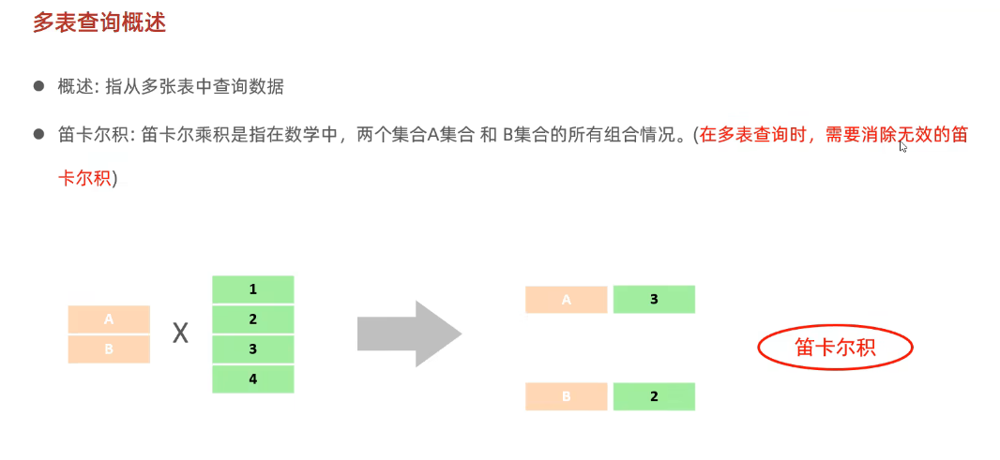

多表查询就是指ä»å¤šå¼ è¡¨ä¸­æŸ¥è¯¢æ•°æ®ã€‚

åŸæ¥**查询å•è¡¨æ•°æ®**，执行的SQLå½¢å¼ä¸ºï¼šselect * from emp;

那么我们è¦æ‰§è¡Œå¤šè¡¨æŸ¥è¯¢ï¼Œå°±åªéœ€è¦**使用逗å·åˆ†éš”多张表**å³å¯ï¼Œå¦‚： select * from emp , dept; 具体的执行结æœå¦‚下:

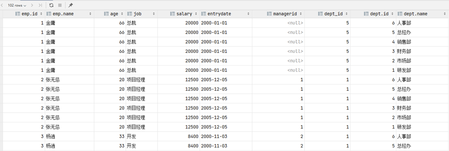

此时,我们看到查询结æœä¸­åŒ…å«äº†å¤§é‡çš„结æœé›†ï¼Œæ€»å…±102æ¡è®°å½•ï¼Œè€Œè¿™å…¶å®å°±æ˜¯å‘˜å·¥è¡¨emp所有的记录(17) ä¸ éƒ¨é—¨è¡¨dept所有记录(6) 的所有组åˆæƒ…况，这ç§ç°è±¡ç§°ä¹‹ä¸ºç¬›å¡å°”积。æ¥ä¸‹æ¥ï¼Œå°±æ¥ç®€å•

介ç»ä¸‹ç¬›å¡å°”积。

**==笛å¡å°”积==:** 笛å¡å°”乘积是指在数学中，**两个集åˆAé›†åˆ å’Œ B集åˆçš„所有组åˆæƒ…况**。


而在多表查询中，我们是**需è¦==消除无效的笛å¡å°”积==**的，**åªä¿ç•™ä¸¤å¼ è¡¨å…³è”部分的数æ®**。


在SQL语å¥ä¸­ï¼Œå¦‚何æ¥å»é™¤æ— æ•ˆçš„笛å¡å°”积呢？ 我们å¯ä»¥ç»™å¤šè¡¨æŸ¥è¯¢åŠ ä¸Šè¿æ¥æŸ¥è¯¢çš„æ¡ä»¶å³å¯ã€‚

select * from emp , dept **where** emp.dept_id = dept.id;


而由äºid为17的员工，没有dept_id字段值，所以在多表查询时，根æ®è¿æ¥æŸ¥è¯¢çš„æ¡ä»¶å¹¶æ²¡æœ‰æŸ¥è¯¢

到。


### （3）分类

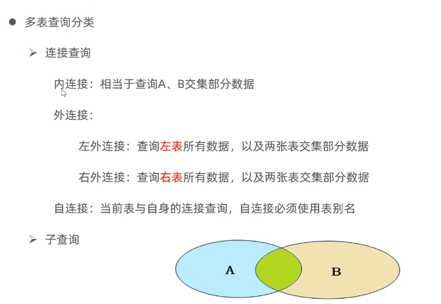

- è¿æ¥æŸ¥è¯¢
  - 内è¿æ¥ï¼šç›¸å½“äºæŸ¥è¯¢Aã€B**交集部分数æ®**
  - 外è¿æ¥ï¼š
    - 左外è¿æ¥ï¼šæŸ¥è¯¢**左表所有数æ®ï¼Œä»¥åŠä¸¤å¼ è¡¨äº¤é›†éƒ¨åˆ†æ•°æ®**
    - å³å¤–è¿æ¥ï¼šæŸ¥è¯¢**å³è¡¨æ‰€æœ‰æ•°æ®ï¼Œä»¥åŠä¸¤å¼ è¡¨äº¤é›†éƒ¨åˆ†æ•°æ®**
  - 自è¿æ¥ï¼šå½“å‰è¡¨ä¸è‡ªèº«çš„è¿æ¥æŸ¥è¯¢ï¼Œè‡ªè¿æ¥å¿…须使用表别å
- å­æŸ¥è¯¢


## 5.3 🌟内è¿æ¥


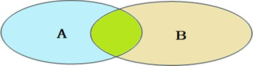

**内è¿æ¥æŸ¥è¯¢çš„是==两张表交集部分==çš„æ•°æ®ã€‚(也就是绿色部分的数æ®)**

内è¿æ¥çš„语法分为两ç§: **éšå¼å†…è¿æ¥ã€æ˜¾å¼å†…è¿æ¥**。先æ¥å­¦ä¹ ä¸€ä¸‹å…·ä½“的语法结æ„。


### （1）éšå¼å†…è¿æ¥

```sql
SELECT 字段列表 FROM 表1 , 表2 WHERE æ¡ä»¶ ... ;
```

### （2）显å¼å†…è¿æ¥-inner join ... on ...

```sql
SELECT 字段列表 FROM 表1 [ INNER ] JOIN 表2 ON è¿æ¥æ¡ä»¶ ... ;
```


### （3）案例

#### A. 查询æ¯ä¸€ä¸ªå‘˜å·¥çš„姓å , åŠå…³è”的部门的å称 (**éšå¼å†…è¿æ¥å®ç°**)

- 表结æ„: emp , dept
- è¿æ¥æ¡ä»¶: emp.dept_id = dept.id

```sql
select emp.name , dept.name from emp , dept where emp.dept_id = dept.id ;

-- 为æ¯ä¸€å¼ è¡¨èµ·åˆ«å,简化SQL编写
select e.name,d.name from emp e , dept d where e.dept_id = d.id;
```

#### B. 查询æ¯ä¸€ä¸ªå‘˜å·¥çš„姓å , åŠå…³è”的部门的å称 (**显å¼å†…è¿æ¥å®ç°**) --- INNER JOIN ...ON ...

- 表结æ„: emp , dept
- è¿æ¥æ¡ä»¶: emp.dept_id = dept.id

```sql
select e.name, d.name from emp e inner join dept d on e.dept_id = d.id;

-- 为æ¯ä¸€å¼ è¡¨èµ·åˆ«å,简化SQL编写
select e.name, d.name from emp e join dept d on e.dept_id = d.id;
```


> **==表的别å==**:
>
> â‘ . tablea as 别å1 , tableb as 别å2 ;
>
> â‘¡. tablea 别å1 , tableb 别å2 ;
>
> **注æ„事项:**
>
> ​	**一旦为表起了别å，就ä¸èƒ½å†ä½¿ç”¨è¡¨åæ¥æŒ‡å®šå¯¹åº”的字段了**，此时åªèƒ½å¤Ÿä½¿ç”¨åˆ«åæ¥æŒ‡å®šå­—
>
> 段。


## 5.4 🌟外è¿æ¥


外è¿æ¥åˆ†ä¸ºä¸¤ç§ï¼Œåˆ†åˆ«æ˜¯ï¼š**左外è¿æ¥ å’Œ å³å¤–è¿æ¥**。具体的语法结æ„为：

### （1）左外è¿æ¥-left [outer] join

左外è¿æ¥ç›¸å½“äº**查询表1(左表)的所有数æ®**，当然也**包å«è¡¨1和表2交集部分**çš„æ•°æ®ã€‚

```sql
SELECT 字段列表 FROM 表1 LEFT [ OUTER ] JOIN 表2 ON æ¡ä»¶ ... ; 
```


### （2）å³å¤–è¿æ¥-right [outer] join

å³å¤–è¿æ¥ç›¸å½“äº**查询表2(å³è¡¨)的所有数æ®**，当然也**包å«è¡¨1和表2交集部分**çš„æ•°æ®ã€‚

```sql
SELECT 字段列表 FROM 表1 RIGHT [ OUTER ] JOIN 表2 ON æ¡ä»¶ ... ; 
```


### （3）案例

#### A. 查询emp表的所有数æ®, 和对应的部门信æ¯

ç”±äºéœ€æ±‚中æ到，è¦**查询emp的所有数æ®**，所以是ä¸èƒ½å†…è¿æ¥æŸ¥è¯¢çš„，需è¦è€ƒè™‘**使用外è¿æ¥æŸ¥è¯¢**。

- 表结æ„: emp, dept
- è¿æ¥æ¡ä»¶: emp.dept_id = dept.id

```sql
select e.*, d.name from emp e left outer join dept d on e.dept_id = d.id;

select e.*, d.name from emp e left join dept d on e.dept_id = d.id;
```

#### B. 查询dept表的所有数æ®, 和对应的员工信æ¯(å³å¤–è¿æ¥)

ç”±äºéœ€æ±‚中æ到，è¦æŸ¥è¯¢**dept表的所有数æ®**，所以是ä¸èƒ½å†…è¿æ¥æŸ¥è¯¢çš„，需è¦è€ƒè™‘使用外è¿æ¥æŸ¥è¯¢ã€‚

- 表结æ„: emp, dept
- è¿æ¥æ¡ä»¶: emp.dept_id = dept.id

```sql
select d.*, e.* from emp e right outer join dept d on e.dept_id = d.id;

select d.*, e.* from dept d left outer join emp e on e.dept_id = d.id;
```


> ==**注æ„事项：**==
>
> 左外è¿æ¥å’Œå³å¤–è¿æ¥æ˜¯å¯ä»¥**==相互替æ¢==**的，åªéœ€è¦**调整**在è¿æ¥æŸ¥è¯¢æ—¶SQL中，表结æ„çš„å…ˆå顺
>
> åºå°±å¯ä»¥äº†ã€‚而我们在日常开å‘使用时，**æ›´åå‘äºå·¦å¤–è¿æ¥**。


## 5.5 自è¿æ¥

### （1）自è¿æ¥æŸ¥è¯¢

自è¿æ¥æŸ¥è¯¢ï¼Œé¡¾åæ€ä¹‰ï¼Œå°±æ˜¯è‡ªå·±è¿æ¥è‡ªå·±ï¼Œä¹Ÿå°±æ˜¯æŠŠ**一张表è¿æ¥æŸ¥è¯¢å¤šæ¬¡**。我们先æ¥å­¦ä¹ ä¸€ä¸‹è‡ªè¿æ¥çš„查询语法：

而对äºè‡ªè¿æ¥æŸ¥è¯¢ï¼Œ**==å¯ä»¥æ˜¯å†…è¿æ¥æŸ¥è¯¢ï¼Œä¹Ÿå¯ä»¥æ˜¯å¤–è¿æ¥æŸ¥è¯¢==**。

#### ①案例

**A. 查询员工 åŠå…¶ 所å±é¢†å¯¼çš„åå­—**

表结æ„: emp

```sql
select a.name , b.name from emp a , emp b where a.managerid = b.id;
```


**B. 查询所有员工 emp åŠå…¶é¢†å¯¼çš„åå­— emp , 如æœ==员工没有领导(Boss), 也需è¦æŸ¥è¯¢å‡ºæ¥==**

表结æ„: emp a , emp b

```sql
select a.name '员工', b.name '领导' from emp a left join emp b on a.managerid =
b.id;
```


> **注æ„事项:**
>
> 在自è¿æ¥æŸ¥è¯¢ä¸­ï¼Œ**==å¿…é¡»è¦ä¸ºè¡¨èµ·åˆ«å==**，è¦ä¸ç„¶æˆ‘们ä¸æ¸…楚所指定的æ¡ä»¶ã€è¿”å›çš„字段，到底
>
> 是哪一张表的字段。


### （2）è”åˆæŸ¥è¯¢-union/union all

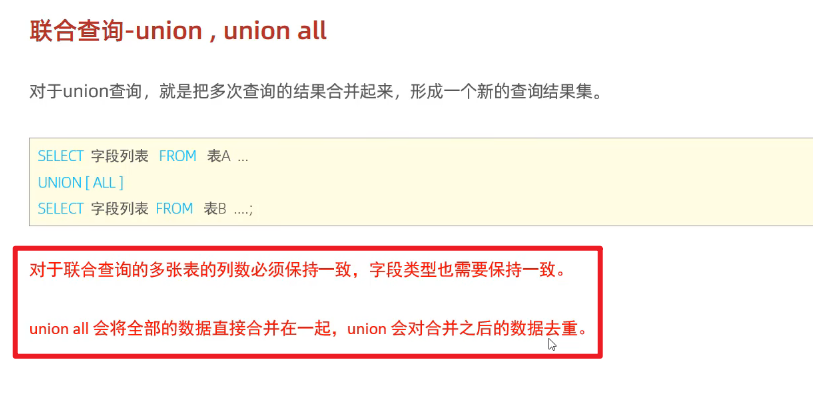

#### ①概念

对äºunion查询，就是把**多次查询的结æœåˆå¹¶èµ·æ¥ï¼Œå½¢æˆä¸€ä¸ªæ–°çš„查询结æœé›†**。

```sql
SELECT 字段列表 FROM 表A ...

UNION [ ALL ]

SELECT 字段列表 FROM 表B ....;
```

- 对äºè”åˆæŸ¥è¯¢çš„多张表的**==列数必须ä¿æŒä¸€è‡´==**，**==字段类å‹ä¹Ÿéœ€è¦ä¿æŒä¸€è‡´==。**
- **==union all== 会将全部的数æ®ç›´æ¥åˆå¹¶åœ¨ä¸€èµ·**，**union 会==对åˆå¹¶ä¹‹åçš„æ•°æ®å»é‡==**。

#### ②案例

A. 将薪资ä½äº 5000 的员工 , å’Œ å¹´é¾„å¤§äº 50 å²çš„员工全部查询出æ¥.

当å‰å¯¹äºè¿™ä¸ªéœ€æ±‚，我们å¯ä»¥ç›´æ¥ä½¿ç”¨å¤šæ¡ä»¶æŸ¥è¯¢ï¼Œä½¿ç”¨**逻辑è¿ç®—符 or è¿æ¥**å³å¯ã€‚ 那这里呢，我们也å¯ä»¥é€šè¿‡**union/union allæ¥è”åˆæŸ¥è¯¢**.

```sql
select * from emp where salary < 5000
union all
select * from emp where age > 50;
```


union all查询出æ¥çš„结æœï¼Œ**仅仅进行简å•çš„åˆå¹¶ï¼Œå¹¶æœªå»é‡**。


```sql
select * from emp where salary < 5000
union
select * from emp where age > 50;
```

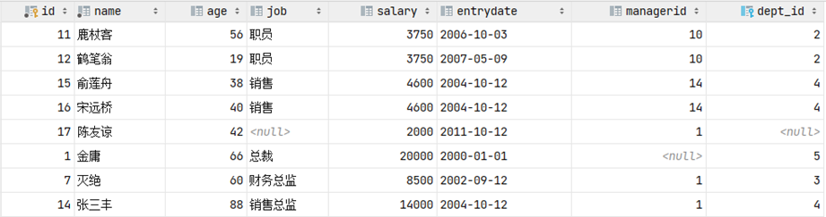

union è”åˆæŸ¥è¯¢ï¼Œ**会对查询出æ¥çš„结æœè¿›è¡Œå»é‡å¤„ç†**。


> **注æ„：**
>
> 如æœå¤šæ¡æŸ¥è¯¢è¯­å¥æŸ¥è¯¢å‡ºæ¥çš„结æœï¼Œ**字段数é‡ä¸ä¸€è‡´**，在进行union/union allè”åˆæŸ¥è¯¢æ—¶ï¼Œå°†ä¼šæŠ¥
>
> 错。如：
>
> 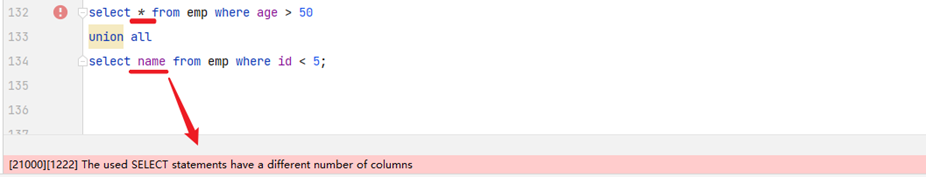


## 5.6 🌟å­æŸ¥è¯¢-嵌套Select语å¥

### （1）概述


#### ①概念

SQL语å¥ä¸­**==嵌套SELECT语å¥==，称为嵌套查询，åˆç§°å­æŸ¥è¯¢**。

```sql
SELECT * FROM t1 WHERE column1 = ( SELECT column1 FROM t2 ); 
```

**å­æŸ¥è¯¢å¤–部的语å¥å¯ä»¥æ˜¯INSERT / UPDATE / DELETE / SELECT 的任何一个**。

#### ②分类

æ ¹æ®**å­æŸ¥è¯¢ç»“æœä¸åŒ**，分为：

- A. æ ‡é‡å­æŸ¥è¯¢ï¼ˆ**å­æŸ¥è¯¢ç»“æœä¸ºå•ä¸ªå€¼**）
- B. 列å­æŸ¥è¯¢(å­æŸ¥è¯¢**结æœä¸ºä¸€åˆ—**)
- C. è¡Œå­æŸ¥è¯¢(å­æŸ¥è¯¢**结æœä¸ºä¸€è¡Œ**)
- D. 表å­æŸ¥è¯¢(å­æŸ¥è¯¢ç»“æœä¸º**多行多列**)


æ ¹æ®å­æŸ¥è¯¢ä½ç½®ï¼Œåˆ†ä¸ºï¼š

- A. WHERE之å
- B. FROM之å
- C. SELECT之å


### （2）标é‡å­æŸ¥è¯¢

#### ①概念

å­æŸ¥è¯¢è¿”å›çš„结æœæ˜¯**å•ä¸ªå€¼ï¼ˆæ•°å­—ã€å­—符串ã€æ—¥æœŸç­‰ï¼‰**，最简å•çš„å½¢å¼ï¼Œè¿™ç§å­æŸ¥è¯¢ç§°ä¸º**æ ‡é‡å­æŸ¥è¯¢**。

常用的æ“作符：= 	 <>	  > 	>= 	<	 <= 

#### ②案例

##### **A. 查询 "销售部" 的所有员工信æ¯**

完æˆè¿™ä¸ªéœ€æ±‚时，我们å¯ä»¥å°†éœ€æ±‚分解为两步：

①. 查询 "销售部" 部门ID

```sql
select id from dept where name = '销售部'; 
```

â‘¡. æ ¹æ® "销售部" 部门ID, 查询员工信æ¯

```sql
select * from emp where dept_id = (select id from dept where name = '销售部'); 
```


##### **B. 查询在 "方东白" å…¥èŒä¹‹å的员工信æ¯**

完æˆè¿™ä¸ªéœ€æ±‚时，我们å¯ä»¥å°†éœ€æ±‚分解为两步：

â‘ . 查询 方东白 çš„å…¥èŒæ—¥æœŸ

```sql
select entrydate from emp where name = '方东白'; 
```

â‘¡. 查询指定入èŒæ—¥æœŸä¹‹åå…¥èŒçš„员工信æ¯

```sql
select * from emp where entrydate > (select entrydate from emp where name = '方东白');
```


### （3）列å­æŸ¥è¯¢

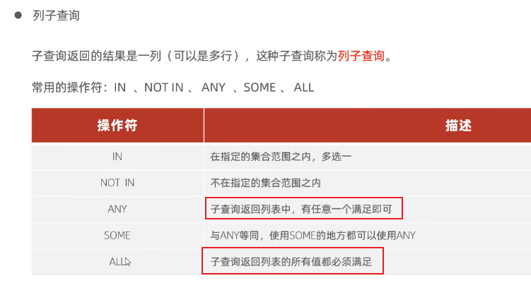

#### ①概念

å­æŸ¥è¯¢è¿”å›çš„结æœæ˜¯**一列（å¯ä»¥æ˜¯å¤šè¡Œï¼‰**，这ç§å­æŸ¥è¯¢ç§°ä¸º**列å­æŸ¥è¯¢**。

常用的æ“作符：**IN** ã€NOT IN 〠**ANY** ã€**SOME** 〠**ALL**


#### ②案例

##### A. 查询 "销售部" å’Œ "市场部" 的所有员工信æ¯

分解为以下两步:

①. 查询 "销售部" 和 "市场部" 的部门ID

```sql
select id from dept where name = '销售部' or name = '市场部';
```

â‘¡. æ ¹æ®éƒ¨é—¨ID, 查询员工信æ¯

```sql
select * from emp where dept_id in (select id from dept where name = '销售部' or
name = '市场部');
```


##### B. 查询比 财务部 ==所有人工资都高==的员工信æ¯

分解为以下两步:

①. 查询所有 财务部 人员工资

```sql
select id from dept where name = '财务部';
select salary from emp where dept_id = (select id from dept where name = '财务部');
```

â‘¡. 比 财务部 **所有人工资都高**的员工信æ¯

```sql
select * from emp where salary > all ( select salary from emp where dept_id =
(select id from dept where name = '财务部') );
```


##### C. 查询比研å‘部其中==ä»»æ„一人工资高==的员工信æ¯ï¼ˆä¹Ÿå°±æ˜¯==有比研å‘部中的高就行==，åªéœ€è¦æ»¡è¶³å…¶ä¸­ä»»æ„一个）

分解为以下两步:

â‘ . 查询研å‘部所有人工资

```sql
select salary from emp where dept_id = (select id from dept where name = 'ç ”å‘部'); 
```

â‘¡. 比研å‘部其中任æ„一人工资高的员工信æ¯

```sql
select * from emp where salary > any ( select salary from emp where dept_id =
(select id from dept where name = 'ç ”å‘部') );
```


### （4）行å­æŸ¥è¯¢

#### ①概念

å­æŸ¥è¯¢è¿”å›çš„结æœæ˜¯**一行（å¯ä»¥æ˜¯å¤šåˆ—）**，这ç§å­æŸ¥è¯¢ç§°ä¸º**è¡Œå­æŸ¥è¯¢**。

常用的æ“作符：= ã€<> ã€IN ã€NOT IN


#### ②案例

##### A. æŸ¥è¯¢ä¸ "å¼ æ— å¿Œ" 的薪资åŠç›´å±é¢†å¯¼ç›¸åŒçš„å‘˜å·¥ä¿¡æ¯ ;

这个需求åŒæ ·å¯ä»¥æ‹†è§£ä¸ºä¸¤æ­¥è¿›è¡Œ:

â‘ . 查询 "å¼ æ— å¿Œ" 的薪资åŠç›´å±é¢†å¯¼

```sql
select salary, managerid from emp where name = '张无忌';
```

â‘¡. æŸ¥è¯¢ä¸ "å¼ æ— å¿Œ" 的薪资åŠç›´å±é¢†å¯¼ç›¸åŒçš„å‘˜å·¥ä¿¡æ¯ ;

```sql
select * from emp where (salary,managerid) = (select salary, managerid from emp
where name = '张无忌');
```


### （5）表å­æŸ¥è¯¢

#### ①概念

å­æŸ¥è¯¢è¿”å›çš„结æœæ˜¯**多行多列**，这ç§å­æŸ¥è¯¢ç§°ä¸º**表å­æŸ¥è¯¢**。

常用的æ“作符：IN


#### ②案例

##### A. æŸ¥è¯¢ä¸ "鹿æ–客" , "宋远桥" çš„èŒä½å’Œè–ªèµ„相åŒçš„员工信æ¯

分解为两步执行:

â‘ . 查询 "鹿æ–客" , "宋远桥" çš„èŒä½å’Œè–ªèµ„

```sql
select job, salary from emp where name = '鹿æ–客' or name = '宋远桥'; 
```

â‘¡. æŸ¥è¯¢ä¸ "鹿æ–客" , "宋远桥" çš„èŒä½å’Œè–ªèµ„相åŒçš„员工信æ¯

```sql
select * from emp where (job,salary) in ( select job, salary from emp where name =
'鹿æ–客' or name = '宋远桥' );
```


##### B. 查询入èŒæ—¥æœŸæ˜¯ "2006-01-01" 之åçš„å‘˜å·¥ä¿¡æ¯ , åŠå…¶éƒ¨é—¨ä¿¡æ¯

分解为两步执行:

â‘ . å…¥èŒæ—¥æœŸæ˜¯ "2006-01-01" 之å的员工信æ¯

```sql
select * from emp where entrydate > '2006-01-01'; 
```

â‘¡. 查询这部分员工, 对应的部门信æ¯;

```sql
select e.*, d.* from (select * from emp where entrydate > '2006-01-01') e left
join dept d on e.dept_id = d.id ;
```


## 5.7 多表查询案例


**æ•°æ®ç¯å¢ƒå‡†å¤‡:**

```sql
create table salgrade(
    grade int,
    losal int,
    hisal int
) comment '薪资等级表';
insert into salgrade values (1,0,3000);
insert into salgrade values (2,3001,5000);
insert into salgrade values (3,5001,8000);
insert into salgrade values (4,8001,10000);
insert into salgrade values (5,10001,15000);
insert into salgrade values (6,15001,20000);
insert into salgrade values (7,20001,25000);
insert into salgrade values (8,25001,30000);
```

在这个案例中，我们主è¦è¿ç”¨ä¸Šé¢æ‰€è®²è§£çš„多表查询的语法，完æˆä»¥ä¸‹çš„12个需求å³å¯ï¼Œè€Œè¿™é‡Œä¸»è¦æ¶‰åŠåˆ°çš„表就三张：emp员工表ã€dept部门表ã€salgrade薪资等级表 。


### （1）查询员工的姓åã€å¹´é¾„ã€èŒä½ã€éƒ¨é—¨ä¿¡æ¯ （éšå¼å†…è¿æ¥ï¼‰

表: emp , dept

è¿æ¥æ¡ä»¶: emp.dept_id = dept.id

```sql
select e.name , e.age , e.job , d.name from emp e , dept d where e.dept_id = d.id; 
```


### （2）查询年龄å°äº30å²çš„员工的姓åã€å¹´é¾„ã€èŒä½ã€éƒ¨é—¨ä¿¡æ¯ï¼ˆæ˜¾å¼å†…è¿æ¥ï¼‰

表: emp , dept

è¿æ¥æ¡ä»¶: emp.dept_id = dept.id

```sql
select e.name , e.age , e.job , d.name from emp e inner join dept d on e.dept_id =
d.id where e.age < 30;
```


### （3）查询拥有员工的部门IDã€éƒ¨é—¨å称

表: emp , dept

è¿æ¥æ¡ä»¶: emp.dept_id = dept.id

```sql
select distinct d.id , d.name from emp e , dept d where e.dept_id = d.id; 
```


### （4） 查询所有年龄大äº40å²çš„员工, åŠå…¶å½’å±çš„部门å称; 如æœå‘˜å·¥æ²¡æœ‰åˆ†é…部门, 也需è¦å±•ç¤ºå‡ºæ¥(外è¿æ¥)

表: emp , dept

è¿æ¥æ¡ä»¶: emp.dept_id = dept.id

```sql
select e.*, d.name from emp e left join dept d on e.dept_id = d.id where e.age >
40 ;
```


### （5） 查询所有员工的工资等级

表: emp , salgrade

è¿æ¥æ¡ä»¶ : emp.salary >= salgrade.losal and emp.salary <= salgrade.hisal

```sql
-- æ–¹å¼ä¸€
select e.* , s.grade , s.losal, s.hisal from emp e , salgrade s where e.salary >=
s.losal and e.salary <= s.hisal;

-- æ–¹å¼äºŒ
select e.* , s.grade , s.losal, s.hisal from emp e , salgrade s where e.salary
between s.losal and s.hisal;
```


### （6） 查询 "ç ”å‘部" 所有员工的信æ¯åŠ 工资等级

表: emp , salgrade , dept

è¿æ¥æ¡ä»¶ : emp.salary between salgrade.losal and salgrade.hisal ,

emp.dept_id = dept.id

查询æ¡ä»¶ : dept.name = 'ç ”å‘部'

```sql
select e.* , s.grade from emp e , dept d , salgrade s where e.dept_id = d.id and (
e.salary between s.losal and s.hisal ) and d.name = 'ç ”å‘部';
```


### （7）查询 "ç ”å‘部" 员工的平å‡å·¥èµ„

表: emp , dept

è¿æ¥æ¡ä»¶ : emp.dept_id = dept.id

```sql
select avg(e.salary) from emp e, dept d where e.dept_id = d.id and d.name = 'ç ”å‘
部';
```


### （8）查询工资比 "ç­ç»" 高的员工信æ¯

â‘ . 查询 "ç­ç»" 的薪资

```sql
select salary from emp where name = 'ç­ç»'; 
```

â‘¡. 查询比她工资高的员工数æ®

```sql
select * from emp where salary > ( select salary from emp where name = 'ç­ç»' ); 
```


### （9）查询比平å‡è–ªèµ„高的员工信æ¯

â‘ . 查询员工的平å‡è–ªèµ„

```sql
select avg(salary) from emp; 
```

â‘¡. 查询比平å‡è–ªèµ„高的员工信æ¯

```sql
select * from emp where salary > ( select avg(salary) from emp ); 
```


### （10）==查询ä½äºæœ¬éƒ¨é—¨å¹³å‡å·¥èµ„的员工信æ¯==

â‘ . 查询指定部门平å‡è–ªèµ„

```sql
select avg(e1.salary) from emp e1 where e1.dept_id = 1;
select avg(e1.salary) from emp e1 where e1.dept_id = 2;
```

â‘¡. 查询ä½äºæœ¬éƒ¨é—¨å¹³å‡å·¥èµ„的员工信æ¯

```sql
select * from emp e2 where e2.salary < ( select avg(e1.salary) from emp e1 where
e1.dept_id = e2.dept_id );
```


### （11） 查询所有的部门信æ¯, 并统计部门的员工人数

```sql
select d.id, d.name , ( select count(*) from emp e where e.dept_id = d.id ) '人数'
from dept d;
```


### （12） 查询所有学生的选课情况, 展示出学生å称, å­¦å·, 课程å称

表: student , course , student_course

è¿æ¥æ¡ä»¶: student.id = student_course.studentid , course.id =

student_course.courseid

```sql
select s.name , s.no , c.name from student s , student_course sc , course c where
s.id = sc.studentid and sc.courseid = c.id ;
```


> 备注: 以上需求的å®ç°æ–¹å¼å¯èƒ½ä¼šå¾ˆå¤š, SQL写法也有很多，åªè¦èƒ½æ»¡è¶³æˆ‘们的需求，查询出符åˆæ¡ä»¶çš„记录å³å¯ã€‚


## 5.8 å°ç»“

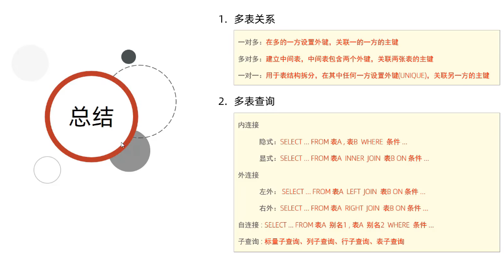


# 6ã€ğŸŒŸ  ==事务==

## **6.1** 事务简介

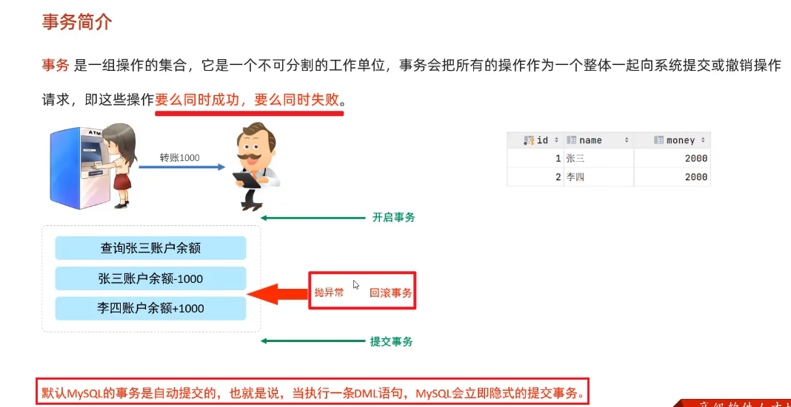


事务 **是一组æ“作的集åˆ**，它**是一个ä¸å¯åˆ†å‰²çš„工作å•ä½**，事务会把所有的æ“作作为一个整体一起å‘系统æ交或撤销æ“作请求，å³è¿™äº›æ“作**==è¦ä¹ˆåŒæ—¶æˆåŠŸï¼Œè¦ä¹ˆåŒæ—¶å¤±è´¥==**。

就比如: 张三给æ四转账1000å—钱，张三银行账户的钱å‡å°‘1000，而æ四银行账户的钱è¦å¢åŠ 1000。 这一组æ“作就必须在一个事务的范围内，è¦ä¹ˆéƒ½æˆåŠŸï¼Œè¦ä¹ˆéƒ½å¤±è´¥ã€‚


- **正常情况:** 转账这个æ“作, 需è¦åˆ†ä¸ºä»¥ä¸‹è¿™ä¹ˆä¸‰æ­¥æ¥å®Œæˆ , 三步完æˆä¹‹å, 张三å‡å°‘1000, 而æå››

  å¢åŠ 1000, 转账æˆåŠŸ :

- **异常情况:** 转账这个æ“作, 也是分为以下这么三步æ¥å®Œæˆ , 在执行第三步是报错了, 这样就导致张

  三å‡å°‘1000å—é’±, 而æ四的金é¢æ²¡å˜, 这样就造æˆäº†æ•°æ®çš„ä¸ä¸€è‡´, 就出ç°é—®é¢˜äº†ã€‚


为了解决上述的问题，就需è¦é€šè¿‡æ•°æ®çš„事务æ¥å®Œæˆï¼Œæˆ‘们åªéœ€è¦åœ¨ä¸šåŠ¡é€»è¾‘执行之å‰å¼€å¯äº‹åŠ¡ï¼Œæ‰§è¡Œå®Œæ¯•åæ交事务。**如æœæ‰§è¡Œè¿‡ç¨‹ä¸­æŠ¥é”™ï¼Œåˆ™å›æ»šäº‹åŠ¡ï¼ŒæŠŠæ•°æ®æ¢å¤åˆ°äº‹åŠ¡å¼€å§‹ä¹‹å‰çš„状æ€ã€‚**

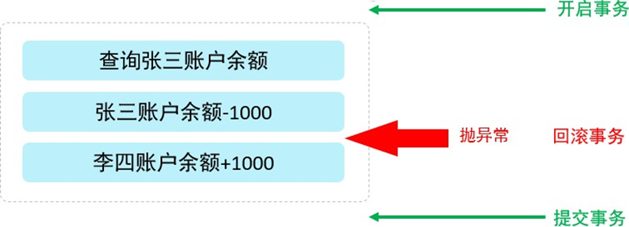

> **注æ„：**  ==默认MySQL的事务是自动æ交的==，也就是说，当执行完一æ¡DML语å¥æ—¶ï¼ŒMySQL会立å³éš
>
> å¼çš„æ交事务。


## 6.2 事务æ“作

**æ•°æ®å‡†å¤‡ï¼š**

```sql
drop table if exists account;
create table account(
    id int primary key AUTO_INCREMENT comment 'ID',
    name varchar(10) comment '姓å',
    money double(10,2) comment 'ä½™é¢'
) comment '账户表';
insert into account(name, money) VALUES ('张三',2000), ('æå››',2000);
```


### （1）未æ§åˆ¶äº‹åŠ¡

#### ①测试正常情况

```sql
-- 1. 查询张三余é¢
select * from account where name = '张三';
-- 2. 张三的余é¢å‡å°‘1000
update account set money = money - 1000 where name = '张三';
-- 3. æ四的余é¢å¢åŠ 1000
update account set money = money + 1000 where name = 'æå››';
```

测试完毕之å检查数æ®çš„状æ€, å¯ä»¥çœ‹åˆ°æ•°æ®æ“作å‰å是一致的。


#### ②测试异常情况

```sql
-- 1. 查询张三余é¢
select * from account where name = '张三';
-- 2. 张三的余é¢å‡å°‘1000
update account set money = money - 1000 where name = '张三';
出错了....
-- 3. æ四的余é¢å¢åŠ 1000
update account set money = money + 1000 where name = 'æå››';
```

我们把数æ®éƒ½æ¢å¤åˆ°2000， 然åå†æ¬¡ä¸€æ¬¡æ€§æ‰§è¡Œä¸Šè¿°çš„SQL语å¥(出错了.... è¿™å¥è¯ä¸ç¬¦åˆSQL语法,执行就会报错)，检查最终的数æ®æƒ…况, å‘ç°æ•°æ®åœ¨**æ“作å‰åä¸ä¸€è‡´**了。


### （2）æ§åˆ¶äº‹åŠ¡ä¸€

#### ①查看/设置事务æ交方å¼

```sql
SELECT @@autocommit ; # 为1自动æ交 ; 为0手动æ交

SET @@autocommit = 0  # 设置为手动æ交，之å的任何æ“作都需è¦æ‰‹åŠ¨æ交事务Commit
```

#### â‘¡æ交事务

```sql
COMMIT;
```

#### â‘¢å›æ»šäº‹åŠ¡

```sql
ROLLBACK;
```

> **==注æ„==：**上述的这ç§æ–¹å¼ï¼Œæˆ‘们是**修改了事务的自动æ交行为**, **把默认的自动æ交修改为了==手动æ交==**, 此时我们执行的DML语å¥éƒ½ä¸ä¼šæ交, 需è¦**手动的执行commit进行æ交**。


### （3）==æ§åˆ¶äº‹åŠ¡äºŒ==

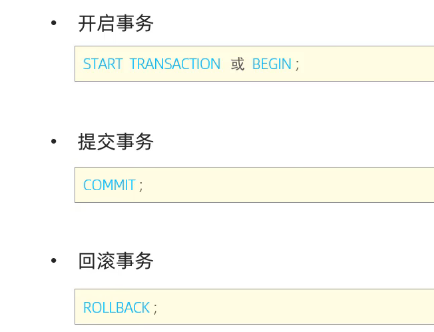

#### â‘ å¼€å¯äº‹åŠ¡

```sql
START TRANSACTION 或 BEGIN ;
```

#### â‘¡æ交事务

```sql
COMMIT;
```

#### â‘¢å›æ»šäº‹åŠ¡

```sql
ROLLBACK;
```

#### ④转账案例

```sql
-- å¼€å¯äº‹åŠ¡
start transaction
-- 1. 查询张三余é¢
select * from account where name = '张三';
-- 2. 张三的余é¢å‡å°‘1000
update account set money = money - 1000 where name = '张三';
-- 3. æ四的余é¢å¢åŠ 1000
update account set money = money + 1000 where name = 'æå››';
-- 如æœæ­£å¸¸æ‰§è¡Œå®Œæ¯•, 则æ交事务
commit;
-- 如æœæ‰§è¡Œè¿‡ç¨‹ä¸­æŠ¥é”™, 则å›æ»šäº‹åŠ¡
-- rollback;
```


## 6.3 🌟 ==事务四大特性==-ACID


- åŸå­æ€§ï¼ˆAtomicity）：事务是**ä¸å¯åˆ†å‰²çš„最å°æ“作å•å…ƒï¼Œè¦ä¹ˆå…¨éƒ¨æˆåŠŸï¼Œè¦ä¹ˆå…¨éƒ¨å¤±è´¥**。
- 一致性（Consistency）：事务完æˆæ—¶ï¼Œå¿…须使**所有的数æ®éƒ½ä¿æŒä¸€è‡´çŠ¶æ€**。
- 隔离性（Isolation）：数æ®åº“系统æ供的**隔离机制**，ä¿è¯**事务在ä¸å—外部并å‘æ“作影å“的独立ç¯å¢ƒä¸‹è¿è¡Œã€‚**
- æŒä¹…性（Durability）：**事务一旦æ交或å›æ»š**，它对数æ®åº“中的数æ®çš„**改å˜å°±æ˜¯æ°¸ä¹…çš„**。

上述就是事务的四大特性，简称ACID。


## 6.4 🌟 ==并å‘事务问题==


1. **è„读(Dirty Read)**：一个事务读å–了å¦ä¸€ä¸ªæœªæ交事务修改过的数æ®
2. **ä¸å¯é‡å¤è¯»(Non-repeatable Read)**：一个事务内多次读å–åŒä¸€æ•°æ®ï¼Œä½†ç”±äºå…¶ä»–事务的修改，导致å‰å读å–的结æœä¸ä¸€è‡´
3. **幻读(Phantom Read)**：一个事务内多次查询åŒä¸€èŒƒå›´çš„æ•°æ®ï¼Œä½†ç”±äºå…¶ä»–事务的æ’å…¥æ“作，导致å‰å查询结æœçš„行数ä¸ä¸€è‡´


### （1）*è„读*

**赃读：一个事务==读到==å¦å¤–一个事务==还没有æ交的数æ®==。**


比如B**读å–到了A未æ交的数æ®**。


#### ①比喻-便äºç†è§£

**è„读 - 读到"è„"æ•°æ®**

**比喻**：就åƒä½ å·çœ‹äº†åŒå­¦è¿˜æ²¡äº¤å·çš„答案，但åæ¥è€å¸ˆå‘ç°ä»–åšé”™äº†ï¼ŒæŠŠç­”案改了。你看到的是"è„"çš„ã€æœªç¡®è®¤çš„答案。

**例å­**：

- 事务A修改了æŸæ¡è®°å½•ä½†æœªæ交
- 事务B读å–了这æ¡è¢«ä¿®æ”¹ä½†æœªæ交的记录
- 事务Aå›æ»šäº†ä¿®æ”¹
- 事务B读到的就是无效的"è„"æ•°æ®


### （2）*ä¸å¯é‡å¤è¯»*

**ä¸å¯é‡å¤è¯»ï¼šä¸€ä¸ªäº‹åŠ¡==å…ˆå读å–åŒä¸€æ¡è®°å½•==，但==两次读å–çš„æ•°æ®ä¸åŒ==，称之为ä¸å¯é‡å¤è¯»ã€‚**

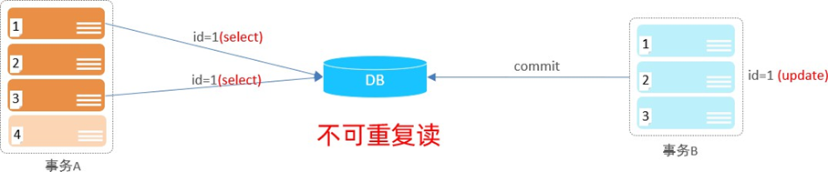

事务A两次读å–åŒä¸€æ¡è®°å½•ï¼Œä½†æ˜¯**读å–到的数æ®å´æ˜¯ä¸ä¸€æ ·**的。


#### ①比喻

**ä¸å¯é‡å¤è¯» - åŒä¸€æ¬¡è€ƒè¯•ä¸­ç­”案å˜äº†**

**比喻**：就åƒä½ è€ƒè¯•æ—¶æ£€æŸ¥åŒä¸€é“题，第一次选A，第二次看å˜æˆäº†B，因为è€å¸ˆåœ¨ä½ æ£€æŸ¥æ—¶æ”¹äº†æ­£ç¡®ç­”案。

**例å­**：

- 事务A第一次读å–æ•°æ®ï¼Œå€¼ä¸º100
- 事务B修改了该数æ®ä¸º200并æ交
- 事务Aå†æ¬¡è¯»å–åŒä¸€æ•°æ®ï¼Œå‘ç°å˜æˆäº†200
- åŒä¸€äº‹åŠ¡å†…两次读å–结æœä¸åŒ


### （3）*幻读*

**幻读：一个事务==按照æ¡ä»¶æŸ¥è¯¢æ•°æ®==时，==没有对应的数æ®è¡Œ==，但是==在æ’入数æ®æ—¶ï¼Œåˆå‘ç°è¿™è¡Œæ•°æ®å·²ç»å­˜åœ¨==，*好åƒå‡ºç°äº† "幻影"*。**

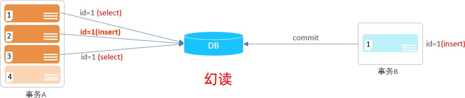


#### ①比喻

 **幻读 - 凭空多出æ¥çš„è¡Œ**

**比喻**：就åƒä½ æ•°æ•™å®¤é‡Œçš„人数，第一次数是10人，ä½å¤´è®°å½•åå†æŠ¬å¤´æ•°å˜æˆäº†11人，因为有个人在你ä½å¤´æ—¶æºœè¿›æ¥äº†ã€‚

**例å­**：

- 事务A查询年龄>30的员工，得到5æ¡è®°å½•
- 事务Bæ’入了一个年龄35的新员工并æ交
- 事务Aå†æ¬¡æŸ¥è¯¢å¹´é¾„>30的员工，得到6æ¡è®°å½•
- å°±åƒå‡ºç°äº†"幻影行"


### （4）总结

#### ①如何记忆

- **è„读**：读到别人"没洗手"(未æ交)çš„æ•°æ®
- **ä¸å¯é‡å¤è¯»**：åŒä¸€äº‹åŠ¡å†…"é‡å¤è¯»"结æœä¸åŒ
- **幻读**：åƒå¹»è§‰ä¸€æ ·å¤šå‡ºæˆ–少了几行数æ®

#### â‘¡æ•°æ®åº“隔离级别解决这些问题

1. **读未æ交(Read Uncommitted)**：什么都ä¸èƒ½é˜²æ­¢
2. **读已æ交(Read Committed)**：防止è„读
3. **å¯é‡å¤è¯»(Repeatable Read)**：防止è„读和ä¸å¯é‡å¤è¯»
4. **串行化(Serializable)**：防止所有问题(但性能最差)

MySQLçš„InnoDB在"å¯é‡å¤è¯»"级别下通过MVCC机制也能防止幻读。


## 6.5 🌟 ==事务隔离级别==

**注æ„**：==**事务隔离级别越高，数æ®è¶Šå®‰å…¨ï¼Œä½†æ˜¯æ€§èƒ½è¶Šä½**==。

### （1）事务隔离级别

**为了解决并å‘事务所引å‘的问题，在数æ®åº“中引入了事务隔离级别。主è¦æœ‰ä»¥ä¸‹å‡ ç§ï¼š**

1. **读未æ交(Read Uncommitted)**：什么都ä¸èƒ½é˜²æ­¢
2. **读已æ交(Read Committed)**：防止è„读
3. **å¯é‡å¤è¯»(Repeatable Read)**：**防止è„读和ä¸å¯é‡å¤è¯»**，==Mysql的默认隔离级别==
   1. MySQLçš„**InnoDB在"å¯é‡å¤è¯»"级别**下通过**==MVCC机制==**也能**==防止幻读==**。
4. **串行化(Serializable)**：防止所有问题(但性能最差)


### （2）查看事务隔离级别

```sql
SELECT @@TRANSACTION_ISOLATION;
```


### （3）设置事务隔离级别

```sql
SET [ SESSION | GLOBAL ] TRANSACTION ISOLATION LEVEL { READ UNCOMMITTED |
READ COMMITTED | REPEATABLE READ | SERIALIZABLE }
```


> **注æ„**：==**事务隔离级别越高，数æ®è¶Šå®‰å…¨ï¼Œä½†æ˜¯æ€§èƒ½è¶Šä½**==。


## 6.6 å°ç»“

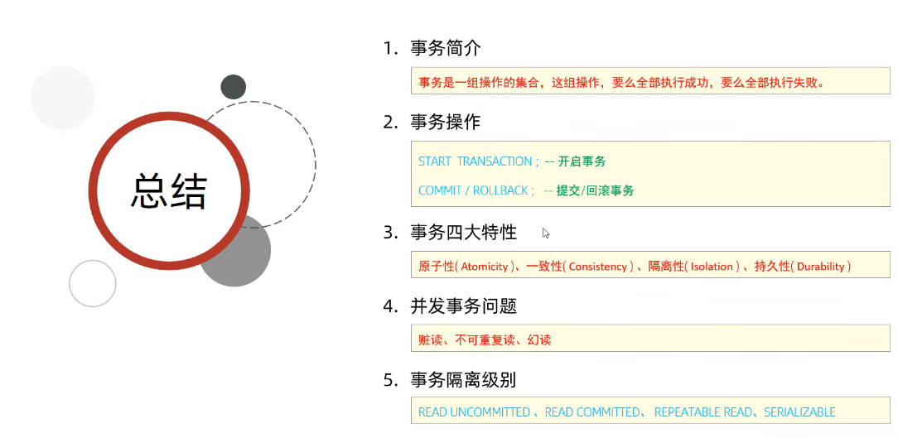


# ----------------------------


# 二ã€é«˜çº§ç¯‡

# 1ã€ğŸŒŸå­˜å‚¨å¼•æ“

## 1.1 MySQL体系结æ„

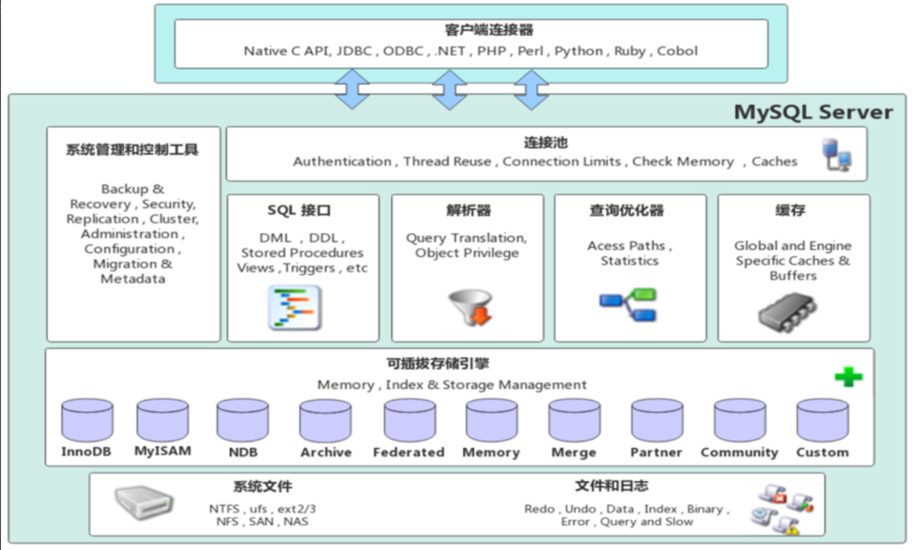


### （1）è¿æ¥å±‚

最上层是一些客户端和链æ¥æœåŠ¡ï¼ŒåŒ…å«**本地sock 通信**和大多数基äº**客户端/æœåŠ¡ç«¯å·¥å…·å®ç°çš„ç±»**ä¼¼äºTCP/IP的通信。主è¦å®Œæˆä¸€äº›ç±»ä¼¼äº**è¿æ¥å¤„ç†ã€æˆæƒè®¤è¯ã€åŠç›¸å…³çš„安全方案**。在该层上引入了**线程池**的概念，为通过认è¯å®‰å…¨æ¥å…¥çš„客户端æ供线程。åŒæ ·åœ¨è¯¥å±‚上å¯ä»¥å®ç°åŸºäºSSL的安全链æ¥ã€‚æœåŠ¡å™¨ä¹Ÿä¼šä¸ºå®‰å…¨æ¥å…¥çš„æ¯ä¸ªå®¢æˆ·ç«¯éªŒè¯å®ƒæ‰€å…·æœ‰çš„æ“作æƒé™ã€‚


### （2）==æœåŠ¡å±‚==

第二层æ¶æ„主è¦å®Œæˆå¤§å¤šæ•°çš„核心æœåŠ¡åŠŸèƒ½ï¼Œå¦‚**SQLæ¥å£ï¼Œå¹¶å®Œæˆç¼“存的查询，SQL的分æ和优化，部分内置函数的执行**。所有跨存储引æ“的功能也在这一层å®ç°ï¼Œå¦‚ 过程ã€å‡½æ•°ç­‰ã€‚在该层，æœåŠ¡å™¨ä¼šè§£æ查询并**创建相应的内部解ææ ‘**，并对其完æˆç›¸åº”的优化如确定表的查询的顺åºï¼Œæ˜¯å¦**利用索引**等，最å生æˆç›¸åº”的执行æ“作。如æœæ˜¯select语å¥ï¼ŒæœåŠ¡å™¨è¿˜ä¼šæŸ¥è¯¢å†…部的缓存，如æœç¼“存空间足够大，这样在解决大é‡è¯»æ“作的ç¯å¢ƒä¸­èƒ½å¤Ÿå¾ˆå¥½çš„æå‡ç³»ç»Ÿçš„性能。


### （3）引æ“层

存储引æ“层， 存储引æ“真正的**负责了MySQL中数æ®çš„存储和æå–**，**æœåŠ¡å™¨é€šè¿‡API和存储引æ“进行通信**。ä¸åŒçš„存储引æ“具有ä¸åŒçš„功能，这样我们å¯ä»¥æ ¹æ®è‡ªå·±çš„需è¦ï¼Œæ¥é€‰å–åˆé€‚的存储引æ“。**==æ•°æ®åº“中的索引是在存储引æ“层å®ç°çš„==**。


### （4）存储层

æ•°æ®å­˜å‚¨å±‚， 主è¦æ˜¯å°†**æ•°æ®(如: redologã€undologã€æ•°æ®ã€ç´¢å¼•ã€äºŒè¿›åˆ¶æ—¥å¿—ã€é”™è¯¯æ—¥å¿—ã€æŸ¥è¯¢æ—¥å¿—ã€æ…¢æŸ¥è¯¢æ—¥å¿—ç­‰)存储在文件系统之上**，并完æˆä¸å­˜å‚¨å¼•æ“的交互。


和其他数æ®åº“相比，MySQL有点ä¸ä¼—ä¸åŒï¼Œå®ƒçš„æ¶æ„å¯ä»¥åœ¨å¤šç§ä¸åŒåœºæ™¯ä¸­åº”用并å‘æŒ¥è‰¯å¥½ä½œç”¨ã€‚ä¸»è¦  体ç°åœ¨å­˜å‚¨å¼•æ“上，**æ’件å¼çš„存储引æ“æ¶æ„**，**将查询处ç†å’Œå…¶ä»–的系统任务以åŠæ•°æ®çš„存储æå–分离**。 è¿™ç§æ¶æ„å¯ä»¥æ ¹æ®ä¸šåŠ¡çš„需求和å®é™…需è¦**选择åˆé€‚的存储引æ“**。


## 1.2 ==存储引æ“==介ç»


### （1）概念


大家å¯èƒ½æ²¡æœ‰å¬è¯´è¿‡å­˜å‚¨å¼•æ“，但是一定å¬è¿‡å¼•æ“这个è¯ï¼Œå¼•æ“就是å‘动机，是一个机器的核心组件。比如，对äºèˆ°è½½æœºã€ç›´å‡æœºã€ç«ç®­æ¥è¯´ï¼Œä»–们都有å„自的引æ“，是他们最为核心的组件。而我们在选择引æ“的时候，需è¦åœ¨åˆé€‚的场景，选择åˆé€‚的存储引æ“，就åƒåœ¨ç›´å‡æœºä¸Šï¼Œæˆ‘们ä¸èƒ½é€‰æ‹©èˆ°è½½æœºçš„引æ“一样。

而对äºå­˜å‚¨å¼•æ“，也是一样，他是**mysqlæ•°æ®åº“的核心**，我们也需è¦åœ¨åˆé€‚的场景选择åˆé€‚的存储引æ“。æ¥ä¸‹æ¥å°±æ¥ä»‹ç»ä¸€ä¸‹å­˜å‚¨å¼•æ“。**存储引æ“就是存储数æ®ã€å»ºç«‹ç´¢å¼•ã€æ›´æ–°/查询数æ®ç­‰æŠ€æœ¯çš„å®ç°æ–¹å¼** 。**==存储引æ“是基äºè¡¨çš„，而ä¸æ˜¯åŸºäºåº“çš„==**，所以**==存储引æ“也å¯è¢«ç§°ä¸ºè¡¨ç±»å‹==**。我们å¯ä»¥åœ¨åˆ›å»ºè¡¨çš„时候，æ¥æŒ‡å®šé€‰æ‹©çš„存储引æ“，如æœ

**没有指定将自动选择默认的存储引æ“。**


### （2）建表时指定存储引æ“

```sql
CREATE TABLE 表å(
字段1 字段1ç±»å‹ [ COMMENT 字段1注释 ] ,
......
字段n 字段nç±»å‹ [COMMENT 字段n注释 ]
) ENGINE = INNODB [ COMMENT 表注释 ] ;
```

### （3）查询当å‰æ•°æ®åº“支æŒçš„存储引æ“

```sql
show engines;
```

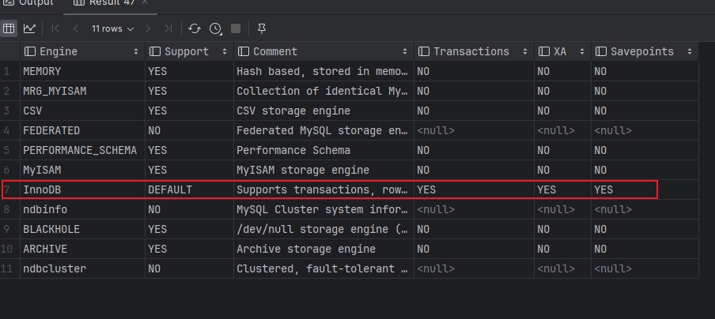

### （4）示例演示

#### A. æŸ¥è¯¢å»ºè¡¨è¯­å¥ --- 默认存储引æ“: InnoDB

```sql
show create table account; 
```

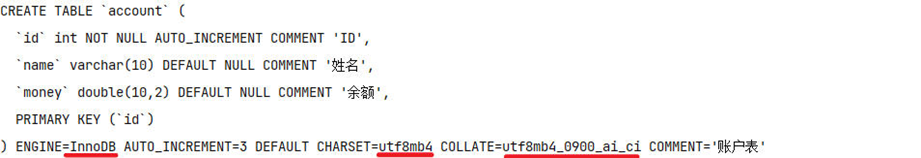

我们å¯ä»¥çœ‹åˆ°ï¼Œåˆ›å»ºè¡¨æ—¶ï¼Œå³ä½¿æˆ‘们没有指定存储疫情，数æ®åº“也会**自动选择默认的存储引æ“**。


#### B. 查询当å‰æ•°æ®åº“支æŒçš„存储引æ“

```sql
show engines ; 
```


#### C. 创建表 my_myisam , 并指定MyISAM存储引æ“

```sql
create table my_myisam(
    id int,
    name varchar(10)
) engine = MyISAM ;
```

#### D. 创建表 my_memory , 指定Memory存储引æ“

```sql
create table my_memory(
    id int,
    name varchar(10)
) engine = Memory ;
```


## 1.3 🌟 ==存储引æ“特点==

上é¢æˆ‘们介ç»äº†ä»€ä¹ˆæ˜¯å­˜å‚¨å¼•æ“，以åŠå¦‚何在建表时如何指定存储引æ“，æ¥ä¸‹æ¥æˆ‘们就æ¥ä»‹ç»ä¸‹æ¥ä¸Šé¢é‡ç‚¹æ到的**三ç§å­˜å‚¨å¼•æ“ InnoDBã€MyISAMã€Memory的特点**。

### （1）🌟 ==InnoDB==

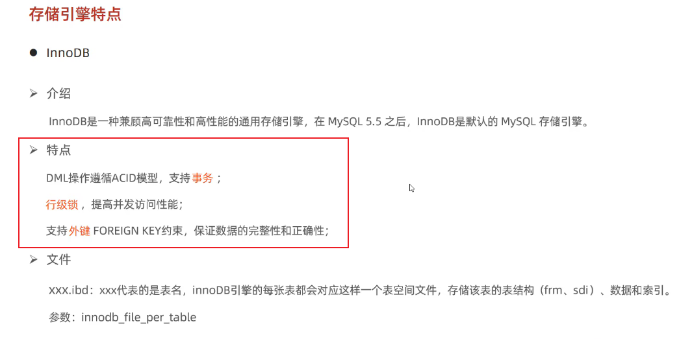

#### ①介ç»

**InnoDB是一ç§å…¼é¡¾é«˜å¯é æ€§å’Œé«˜æ€§èƒ½çš„通用存储引æ“**，在 MySQL 5.5 之å，InnoDB是默认的MySQL 存储引æ“。


#### ②特点

- DML(å¢åˆ æ”¹)æ“作éµå¾ªACID模å‹ï¼Œæ”¯æŒäº‹åŠ¡ï¼›
- **行级é”，æ高并å‘访问性能**ï¼›
- 支æŒå¤–é”®FOREIGN KEY约æŸï¼Œä¿è¯æ•°æ®çš„完整性和正确性；


#### ③文件

xxx.ibd：xxx代表的是表å，innoDB引æ“çš„æ¯å¼ è¡¨éƒ½ä¼šå¯¹åº”这样一个**==表空间文件==**，存储该表的表结æ„（**frm-早期的 ã€sdi-新版的**）ã€**æ•°æ®å’Œç´¢å¼•**。

å‚数：innodb_file_per_table

```sql
show variables like 'innodb_file_per_table';
```


如æœ**该å‚æ•°å¼€å¯**，代表对äºInnoDB引æ“的表，**æ¯ä¸€å¼ è¡¨éƒ½å¯¹åº”一个ibd文件**。 我们直æ¥æ‰“å¼€MySQLçš„æ•°æ®å­˜æ”¾ç›®å½•ï¼š C:\ProgramData\MySQL\MySQL Server 8.0\Data ， 这个目录下有很多文件夹，**ä¸åŒçš„文件夹代表ä¸åŒçš„æ•°æ®åº“**，我们直æ¥æ‰“å¼€itcast文件夹。

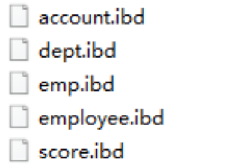

å¯ä»¥çœ‹åˆ°é‡Œé¢æœ‰å¾ˆå¤šçš„ibd文件，æ¯ä¸€ä¸ªibd文件就对应一张表，比如：我们有一张表 account，就有这样的一个account.ibd文件，而在这个ibd文件中ä¸ä»…存放表结æ„ã€æ•°æ®ï¼Œè¿˜ä¼šå­˜æ”¾è¯¥è¡¨å¯¹åº”的索引信æ¯ã€‚ 而该文件是基äºäºŒè¿›åˆ¶å­˜å‚¨çš„，ä¸èƒ½ç›´æ¥åŸºäºè®°äº‹æœ¬æ‰“开，我们å¯ä»¥ä½¿ç”¨**mysqlæ供的一个指令 ibd2sdi** ，通过该指令就å¯ä»¥ä»ibd文件中æå–sdiä¿¡æ¯ï¼Œè€Œsdiæ•°æ®å­—典信æ¯ä¸­å°±åŒ…å«è¯¥è¡¨çš„表结æ„。

```bash
idb2sdi account.ibd #è¿”å›ä¸€ä¸ªJSONæ•°æ®
```

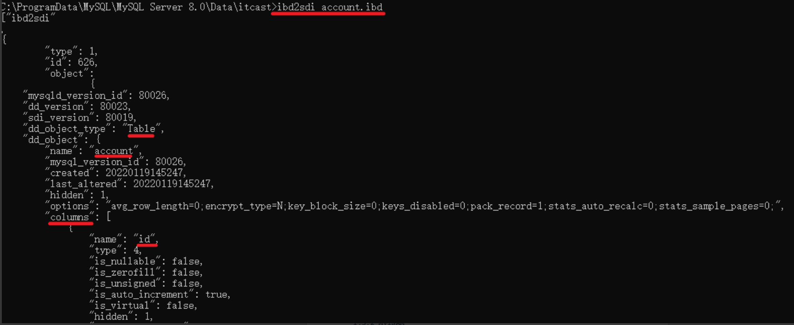


#### ④逻辑存储结æ„


- 表空间 : InnoDB存储引æ“逻辑结æ„的最高层，**ibd文件其å®å°±æ˜¯è¡¨ç©ºé—´æ–‡ä»¶**，在表空间中å¯ä»¥åŒ…å«**多个Segment段**。
- 段 : 表空间是由å„个段组æˆçš„， 常è§çš„段有**æ•°æ®æ®µã€ç´¢å¼•æ®µã€å›æ»šæ®µ**等。InnoDB中对äºæ®µçš„管ç†ï¼Œéƒ½æ˜¯å¼•æ“自身完æˆï¼Œä¸éœ€è¦äººä¸ºå¯¹å…¶æ§åˆ¶ï¼Œä¸€ä¸ªæ®µä¸­åŒ…å«å¤šä¸ªåŒºã€‚
- 区 : 区是表空间的å•å…ƒç»“æ„，**æ¯ä¸ªåŒºçš„大å°ä¸º1M**。 默认情况下， InnoDB**存储引æ“页大å°ä¸º16K**， **==å³ä¸€ä¸ªåŒºä¸­ä¸€å…±æœ‰64个è¿ç»­çš„页==**。
- 页 : **==页是组æˆåŒºçš„最å°å•å…ƒ==**，**页也是**InnoDB **存储引æ“ç£ç›˜ç®¡ç†çš„最å°å•å…ƒ**，æ¯ä¸ªé¡µçš„大å°é»˜è®¤ä¸º 16KB。为了ä¿è¯é¡µçš„è¿ç»­æ€§ï¼ŒInnoDB 存储引æ“**æ¯æ¬¡ä»ç£ç›˜ç”³è¯· 4-5 个区**。
- è¡Œ : **InnoDB 存储引æ“是é¢å‘行的**，也就是说数æ®æ˜¯æŒ‰è¡Œè¿›è¡Œå­˜æ”¾çš„，在æ¯ä¸€è¡Œä¸­é™¤äº†å®šä¹‰è¡¨æ—¶æ‰€æŒ‡å®šçš„字段以外，还包å«**两个éšè—字段**（åé¢ä¼šè¯¦ç»†ä»‹ç»ï¼‰
  - Trx id : 最å一次æ“作的事务Id 
  - Roll pointer ：指针


### （2）MyISAM


#### ①介ç»

MyISAM是MySQL早期的默认存储引æ“。

#### ②特点

- ä¸æ”¯æŒäº‹åŠ¡ï¼Œä¸æ”¯æŒå¤–é”®
- **支æŒè¡¨é”，ä¸æ”¯æŒè¡Œé”**
- 访问速度快

#### ③文件

- xxx.sdi：**存储表结æ„**ä¿¡æ¯
- xxx.MYD: 存储**æ•°æ®**
- xxx.MYI: 存储**索引**

 


### （3）Memory


#### ①介ç»

Memory引æ“的表数æ®æ—¶å­˜å‚¨åœ¨å†…存中的，由äºå—到硬件问题ã€æˆ–断电问题的影å“，åªèƒ½å°†è¿™äº›è¡¨ä½œä¸ºä¸´æ—¶è¡¨æˆ–缓存使用。

#### ②特点

- 内存存放
-  hash索引（默认）

#### ③文件

xxx.sdi：**存储表结æ„ä¿¡æ¯**


### （4）==区别åŠç‰¹ç‚¹==


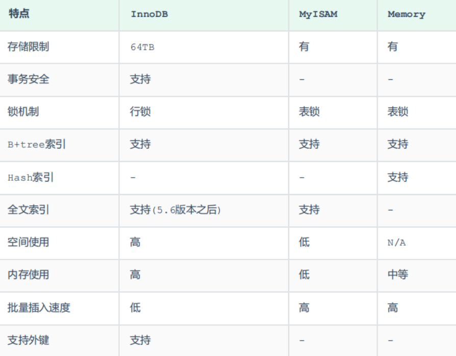


> **é¢è¯•é¢˜:**
>
> InnoDB引æ“ä¸MyISAM引æ“的区别 ?
>
> - â‘ InnoDB引æ“, **支æŒäº‹åŠ¡, 而MyISAMä¸æ”¯æŒ**。
> - â‘¡InnoDB引æ“, **支æŒè¡Œé”和表é”, 而MyISAM仅支æŒè¡¨é”, ä¸æ”¯æŒè¡Œé”**。
> - â‘¢InnoDB引æ“, **支æŒå¤–é”®, 而MyISAM是ä¸æ”¯æŒçš„**。
>
> 主è¦æ˜¯ä¸Šè¿°ä¸‰ç‚¹åŒºåˆ«ï¼Œå½“然也å¯ä»¥ä»ç´¢å¼•ç»“æ„ã€å­˜å‚¨é™åˆ¶ç­‰æ–¹é¢ï¼Œæ›´åŠ æ·±å…¥çš„å›ç­”，具体å‚
>
> 考如下官方文档：
>
> **https://dev.mysql.com/doc/refman/8.0/en/innodb-introduction.html**
>
> **https://dev.mysql.com/doc/refman/8.0/en/myisam-storage-engine.html**


## 1.4 存储引æ“选择


在选择存储引æ“时，应该根æ®åº”用系统的特点选择åˆé€‚的存储引æ“。对äºå¤æ‚的应用系统，还å¯ä»¥æ ¹æ®å®é™…情况选择多ç§å­˜å‚¨å¼•æ“进行组åˆã€‚

- InnoDB: 是Mysql的默认存储引æ“，**支æŒäº‹åŠ¡ã€å¤–é”®**。如æœ**应用对事务的完整性有比较高的è¦æ±‚**，**在并å‘æ¡ä»¶ä¸‹è¦æ±‚æ•°æ®çš„一致性，数æ®æ“作除了æ’入和查询之外，还包å«å¾ˆå¤šçš„æ›´æ–°ã€åˆ é™¤æ“作**，那么InnoDB存储引æ“是比较åˆé€‚的选择。
- MyISAM ： 如æœåº”用是**以读æ“作和æ’å…¥æ“作为主**，åªæœ‰å¾ˆå°‘的更新和删除æ“作，并且对事务的完整性ã€å¹¶å‘性è¦æ±‚ä¸æ˜¯å¾ˆé«˜ï¼Œé‚£ä¹ˆé€‰æ‹©è¿™ä¸ªå­˜å‚¨å¼•æ“是é常åˆé€‚的。**（该场景å¯ç”¨NoSQLæ•°æ®åº“，==MongoDB==）**
- MEMORY：**将所有数æ®ä¿å­˜åœ¨å†…存中**，**访问速度快，通常用äºä¸´æ—¶è¡¨åŠç¼“å­˜**。MEMORY的缺陷就是对表的大å°æœ‰é™åˆ¶ï¼Œå¤ªå¤§çš„表无法缓存在内存中，而且**无法ä¿éšœæ•°æ®çš„安全性**。**（该场景å¯ç”¨==Redis==替代）**


## 1.5 å°ç»“


