# MySql-Learning

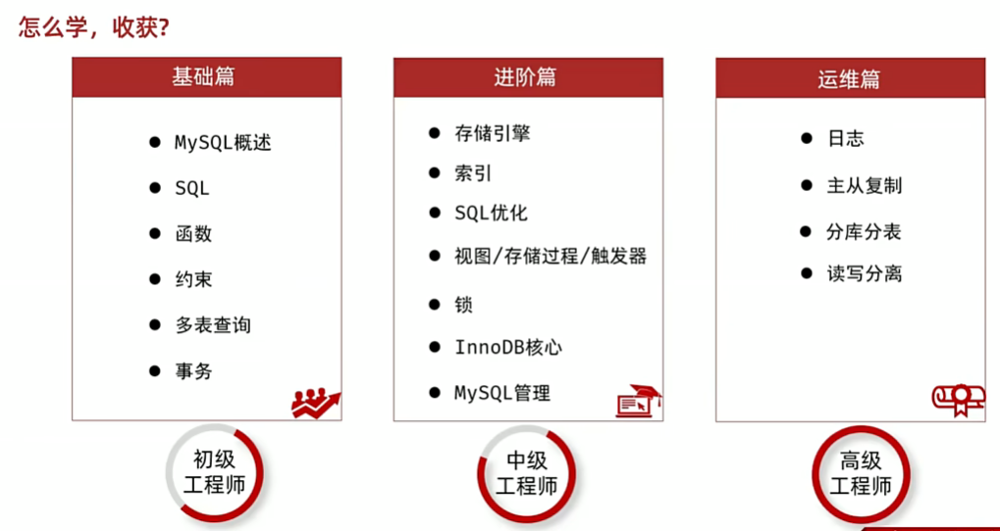


# 一ã€åŸºç¡€ç¯‡

# 1ã€Mysql概述

在这一章节，我们主è¦ä»‹ç»ä¸¤ä¸ªéƒ¨åˆ†ï¼Œæ•°æ®åº“相关概念åŠMySQLæ•°æ®åº“的介ç»ã€ä¸‹è½½ã€å®‰è£…ã€å¯åŠ¨åŠè¿æ¥ã€‚

## 1.1 **æ•°æ®åº“相关概念**

在这一部分，我们先æ¥è®²è§£ä¸‰ä¸ªæ¦‚念：数æ®åº“ã€æ•°æ®åº“管ç†ç³»ç»Ÿã€SQL。

| **å称**       | **全称**                                                     | **简称**                          |
| :------------- | :----------------------------------------------------------- | :-------------------------------- |
| æ•°æ®åº“         | 存储数æ®çš„仓库，数æ®æ˜¯æœ‰ç»„织的进行存储                       | DataBase（DB）                    |
| æ•°æ®åº“管ç†ç³»ç»Ÿ | æ“纵和管ç†æ•°æ®åº“的大å‹è½¯ä»¶                                   | DataBase Management System (DBMS) |
| SQL            | æ“作关系å‹æ•°æ®åº“的编程语言，定义了一套æ“作关系å‹æ•°æ®åº“统一**标准** | Structured Query Language (SQL)   |

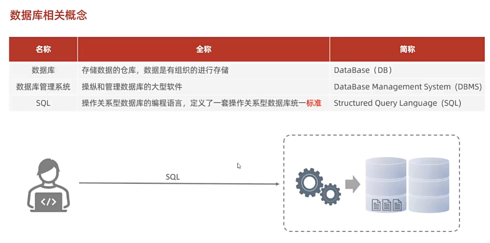

而目å‰ä¸»æµçš„关系å‹æ•°æ®åº“管ç†ç³»ç»Ÿçš„市场å æœ‰ç‡æ’å如下：

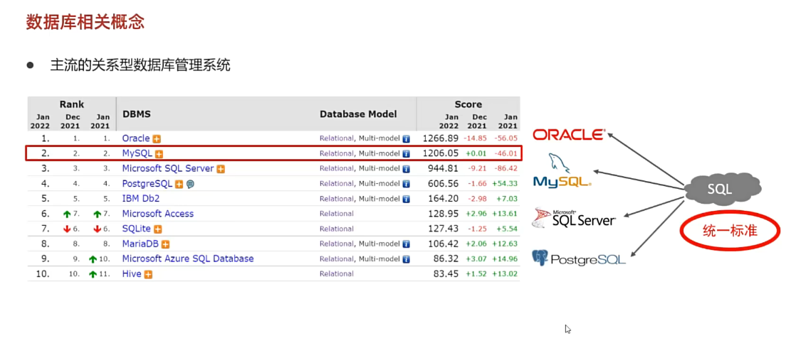

- **Oracle**：大å‹çš„收费数æ®åº“，Oracleå…¬å¸äº§å“，价格昂贵。
- **MySQL**：开æºå…费的中å°å‹æ•°æ®åº“，åæ¥Sunå…¬å¸æ”¶è´­äº†MySQL，而Oracleåˆæ”¶è´­äº†Sunå…¬å¸ã€‚ç›®å‰Oracleæ¨å‡ºäº†æ”¶è´¹ç‰ˆæœ¬çš„MySQL，也æ供了å…费的社区版本。
- **SQL Server**：Microsoft å…¬å¸æ¨å‡ºçš„收费的中å‹æ•°æ®åº“，C#ã€.net等语言常用。

- **PostgreSQL**：开æºå…费的中å°å‹æ•°æ®åº“。 
- DB2：IBMå…¬å¸çš„大å‹æ”¶è´¹æ•°æ®åº“产å“。

- SQLLite：嵌入å¼çš„å¾®å‹æ•°æ®åº“。Android内置的数æ®åº“采用的就是该数æ®åº“。

- MariaDB：开æºå…费的中å°å‹æ•°æ®åº“。是MySQLæ•°æ®åº“çš„å¦å¤–一个分支ã€å¦å¤–一个è¡ç”Ÿäº§å“ï¼Œä¸ MySQLæ•°æ®åº“有很好的兼容性。


而ä¸è®ºæˆ‘们使用的是上é¢çš„哪一个关系å‹æ•°æ®åº“，最终在æ“作时，都是使用SQL语言æ¥è¿›è¡Œç»Ÿä¸€æ“作，因为我们å‰é¢è®²åˆ°SQL语言，是æ“作关系å‹æ•°æ®åº“çš„ **统一标准** 。所以å³ä½¿æˆ‘们ç°åœ¨å­¦ä¹ çš„是MySQL，å‡å¦‚我们以å到了公å¸ï¼Œä½¿ç”¨çš„是别的关系å‹æ•°æ®åº“，如：Oracleã€DB2ã€SQLServer，也完全ä¸ç”¨æ‹…心，因为æ“作的方å¼éƒ½æ˜¯ä¸€è‡´çš„。


## **1.2 MySQLæ•°æ®åº“**

### **（1）版本**


官方： [**https://www.mysql.com/**](https://www.mysql.com/)

MySQL官方æ供了两ç§ä¸åŒçš„版本：

- 社区版本（MySQL Community Server)å…费， MySQLä¸æ供任何技术支æŒ

- 商业版本（MySQL Enterprise Edition)收费，å¯ä»¥ä½¿ç”¨30天，官方æ供技术支æŒ


本课程采用的是MySQL最新的社区版-MySQL Community Server 8.0.26

### （2）**下载**


选择社区版本：https://dev.mysql.com/downloads/

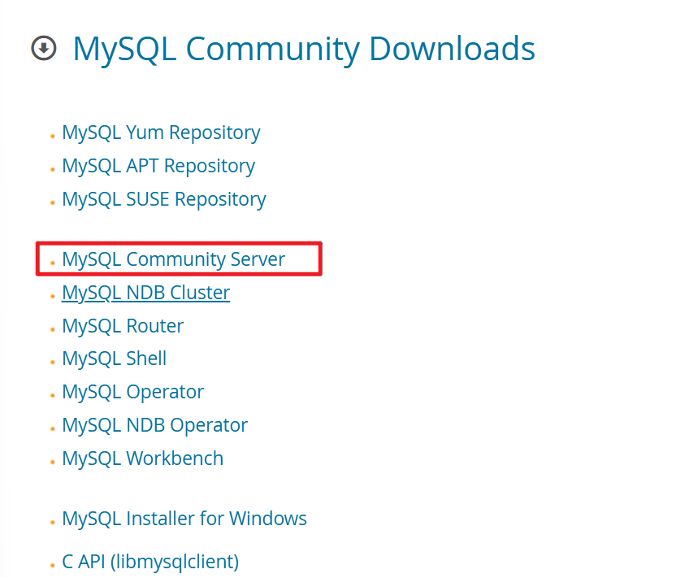


下载地å€ï¼š [**https://downloads.mysql.com/archives/installer/**](https://downloads.mysql.com/archives/installer/)


也å¯ä»¥ä½¿ç”¨è¯¾ç¨‹èµ„料中æ供的MySQL的安装包：


### （3）安装

**1) åŒå‡»å®˜æ–¹ä¸‹æ¥çš„安装包文件**

 


**2) æ ¹æ®å®‰è£…æ示进行安装**

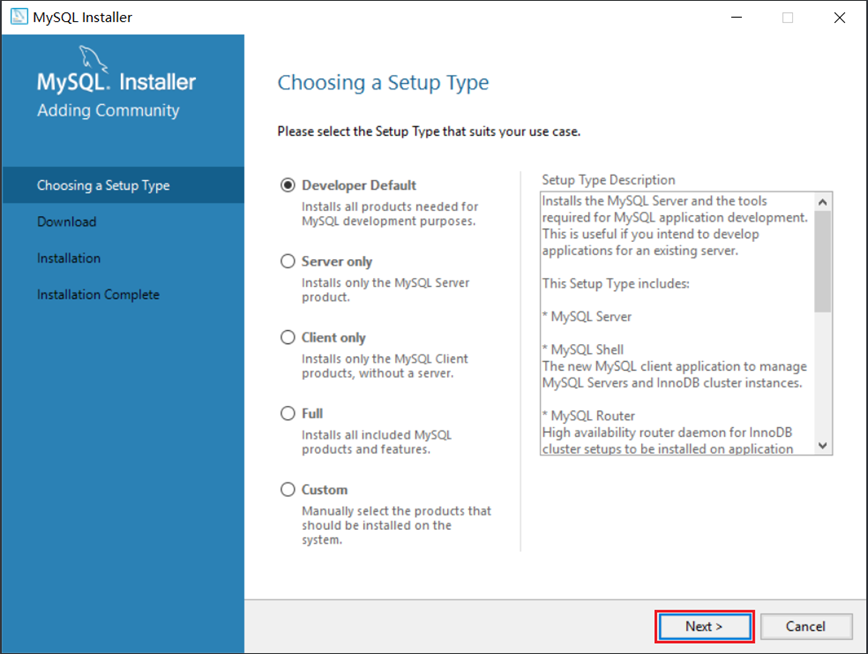 

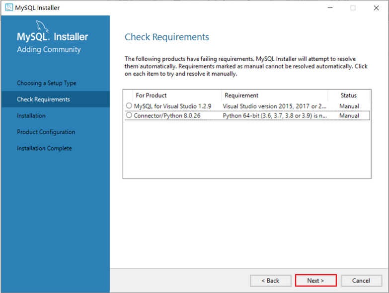 

 


安装MySQL的相关组件，这个过程å¯èƒ½éœ€è¦è€—时几分钟，è€å¿ƒç­‰å¾…。

 

 

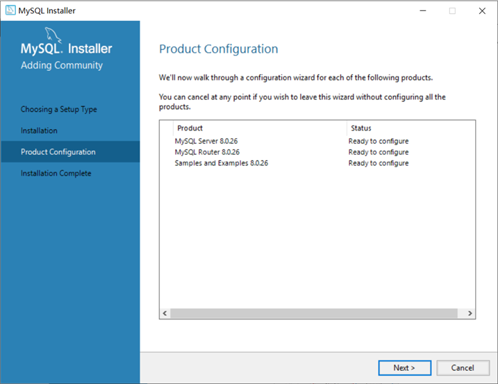 

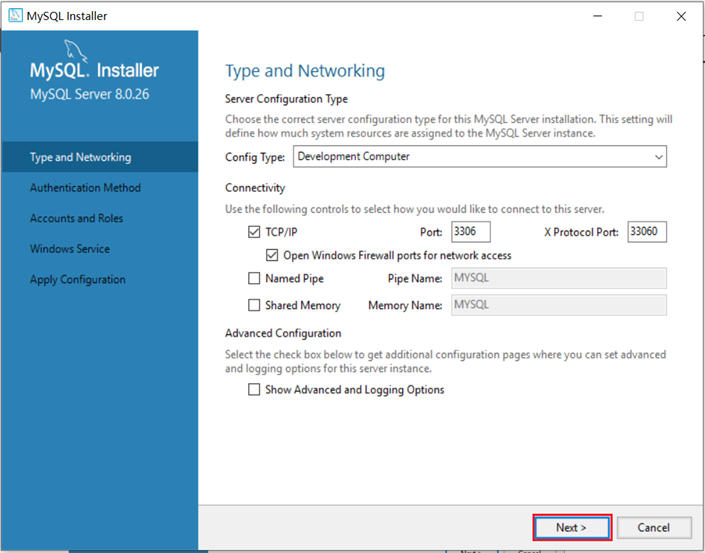 


==输入MySQL中root用户的密ç ,一定记得记ä½è¯¥å¯†ç ==

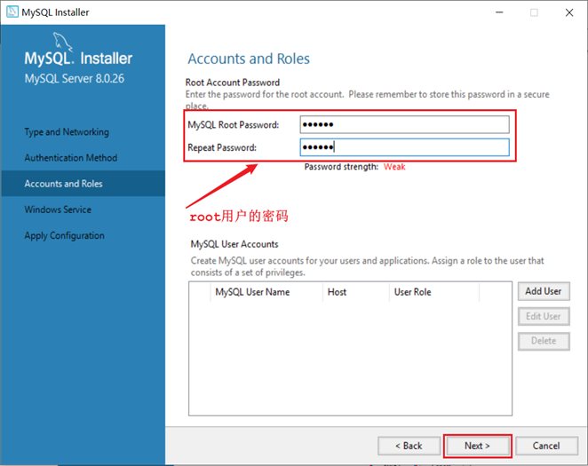 

 

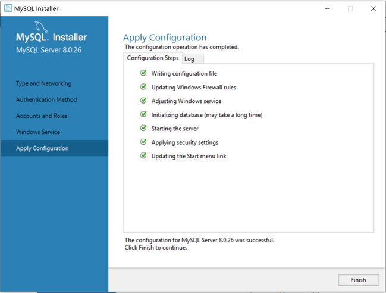 


### （4）==é…ç½®ç¯å¢ƒå˜é‡==

安装好MySQL之å，还需è¦é…ç½®ç¯å¢ƒå˜é‡ï¼Œè¿™æ ·æ‰**å¯ä»¥åœ¨ä»»ä½•ç›®å½•ä¸‹è¿æ¥MySQL**。

1). 在此电脑上，å³é”®é€‰æ‹©å±æ€§

 


2). 点击左侧的 "高级系统设置"，选择ç¯å¢ƒå˜é‡

 


3). 找到 Path 系统å˜é‡, 点击 "编辑"

 


4). 选择 "新建" , å°†MySQL Server的安装目录下的bin目录添加到ç¯å¢ƒå˜é‡

 


### （5）MySQLå¸è½½æ–‡æ¡£-Windows版

##### 1. åœæ­¢MySQLæœåŠ¡

win+R 打开è¿è¡Œï¼Œè¾“å…¥ services.msc 点击 "确定" 调出系统æœåŠ¡ã€‚

 

 


##### 2. å¸è½½MySQL相关组件

打开æ§åˆ¶é¢æ¿ ---> å¸è½½ç¨‹åº ---> å¸è½½MySQL相关所有组件

 

 


##### 3. 删除MySQL安装目录

 


##### 4. 删除MySQLæ•°æ®ç›®å½•

æ•°æ®å­˜æ”¾ç›®å½•æ˜¯åœ¨ C:\ProgramData\MySQL，直æ¥å°†è¯¥æ–‡ä»¶å¤¹åˆ é™¤ã€‚

 


##### 5. å†æ¬¡æ‰“å¼€æœåŠ¡ï¼ŒæŸ¥çœ‹æ˜¯å¦æœ‰MySQLå¸è½½æ®‹ç•™

如æœå·²å°†MySQLå¸è½½ï¼Œä½†æ˜¯é€šè¿‡ä»»åŠ¡ç®¡ç†å™¨--->æœåŠ¡ï¼ŒæŸ¥çœ‹åˆ°MySQLæœåŠ¡ä»ç„¶æ®‹ç•™åœ¨ç³»ç»ŸæœåŠ¡é‡Œã€‚

解决åŠæ³•ï¼š

​	以管ç†å‘˜æ–¹å¼è¿è¡Œcmd命令行，输入以下命令：

​	sc delete æœåŠ¡å称（如MySQL80）

这样å¯ä»¥å®ç°åˆ é™¤æœåŠ¡ã€‚


### （6）MysqlæœåŠ¡çš„==å¯åœ==

MySQL安装完æˆä¹‹å，在系统å¯åŠ¨æ—¶ï¼Œä¼šè‡ªåŠ¨å¯åŠ¨MySQLæœåŠ¡ï¼Œæˆ‘们无需手动å¯åŠ¨äº†ã€‚

当然，也å¯ä»¥æ‰‹åŠ¨çš„通过指令å¯åŠ¨åœæ­¢ï¼Œä»¥ç®¡ç†å‘˜èº«ä»½è¿è¡Œcmd，进入命令行执行如下指令：

1. net start mysql80
2. net stop mysql80

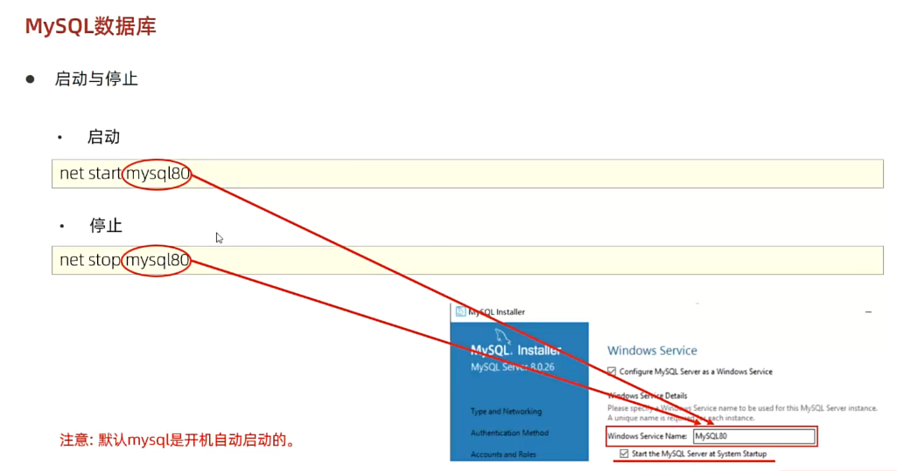

```bash
net start mysql80

net stop mysql80
```

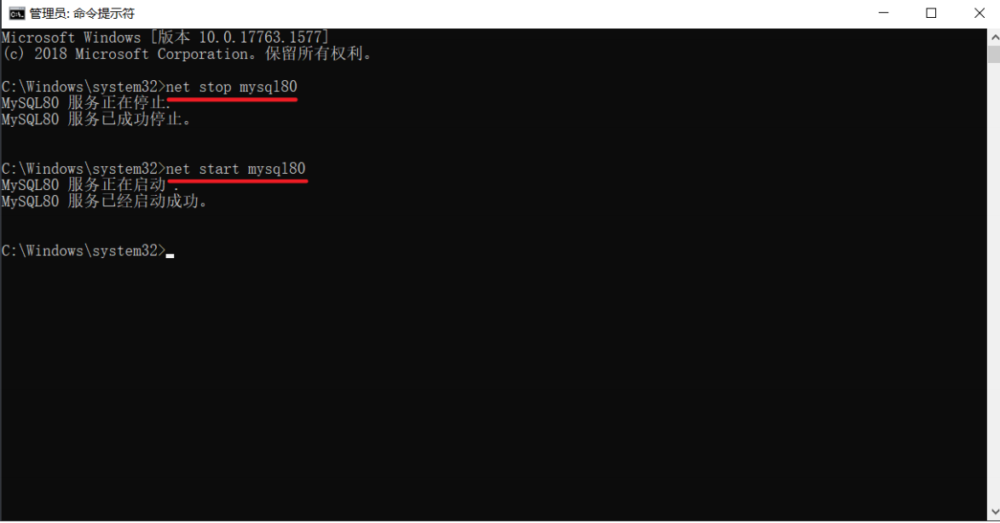

> æ³¨æ„ ï¼š 上述的 mysql80 是我们在安装MySQL时，默认指定的mysql的系统æœåŠ¡å，ä¸æ˜¯å›º
>
> 定的，如æœæœªæ”¹åŠ¨ï¼Œé»˜è®¤å°±æ˜¯mysql80。
>
> 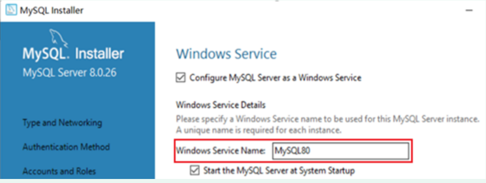


### （7）==客户端è¿æ¥==

#### â‘  æ–¹å¼ä¸€ï¼šä½¿ç”¨MySQLæ供的==客户端命令行工具==


#### â‘¡ æ–¹å¼äºŒï¼šä½¿ç”¨==系统自带的命令行工具==执行指令

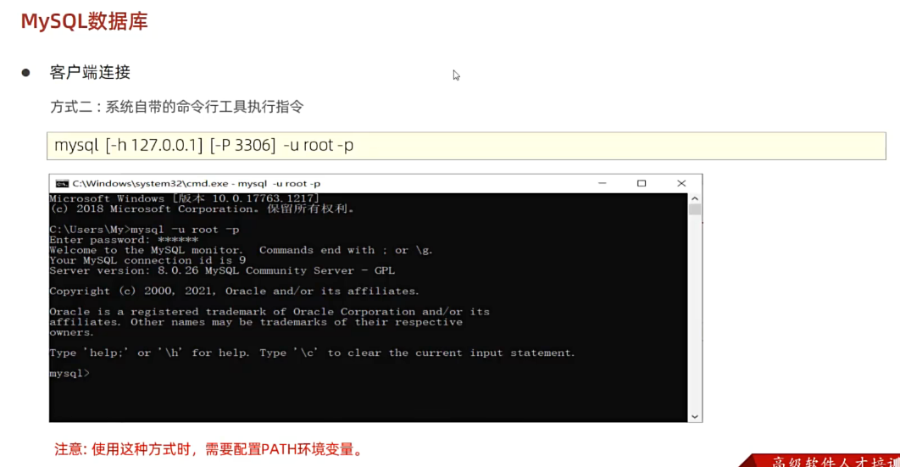

```bash
mysql [-h 127.0.0.1] [-P 3306] -u root -p
å‚数：
-h : MySQLæœåŠ¡æ‰€åœ¨çš„主机IP
-P : MySQLæœåŠ¡ç«¯å£å·ï¼Œ 默认3306
-u : MySQLæ•°æ®åº“用户å
-p ： MySQLæ•°æ®åº“用户å对应的密ç 
```

[]内为å¯é€‰å‚数，如æœéœ€è¦**è¿æ¥è¿œç¨‹çš„MySQL**，需è¦åŠ ä¸Šè¿™ä¸¤ä¸ªå‚æ•°æ¥æŒ‡å®š**远程主机IPã€ç«¯å£**，如æœ

è¿æ¥æœ¬åœ°çš„MySQL，则无需指定这两个å‚æ•°

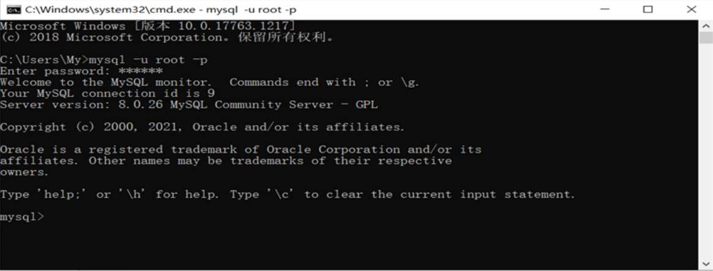

> ==注æ„==： 使用这ç§æ–¹å¼è¿›è¡Œè¿æ¥æ—¶ï¼Œéœ€è¦å®‰è£…完毕å==é…ç½®PATHç¯å¢ƒå˜é‡==。


### （8）==æ•°æ®æ¨¡å‹==

#### ①关系å‹æ•°æ®åº“（RDBMS）

概念：**建立在关系模å‹åŸºç¡€ä¸Šï¼Œç”±å¤šå¼ ç›¸äº’è¿æ¥çš„二维表组æˆçš„æ•°æ®åº“。**

而所谓二维表，指的是由行和列组æˆçš„表，如下图（就类似äºExcel表格数æ®ï¼Œæœ‰è¡¨å¤´ã€æœ‰åˆ—ã€æœ‰è¡Œï¼Œè¿˜å¯ä»¥é€šè¿‡ä¸€åˆ—å…³è”å¦å¤–一个表格中的æŸä¸€åˆ—æ•°æ®ï¼‰ã€‚我们之å‰æ到的MySQLã€Oracleã€DB2ã€SQLServer这些都是å±äºå…³ç³»å‹æ•°æ®åº“，里é¢éƒ½æ˜¯åŸºäºäºŒç»´è¡¨å­˜å‚¨æ•°æ®çš„。简å•è¯´ï¼ŒåŸºäºäºŒç»´è¡¨å­˜å‚¨æ•°æ®çš„æ•°æ®åº“å°±æˆä¸ºå…³ç³»å‹æ•°æ®åº“，ä¸æ˜¯åŸºäºäºŒç»´è¡¨å­˜å‚¨æ•°æ®çš„æ•°æ®åº“，就是é关系å‹æ•°æ®åº“。

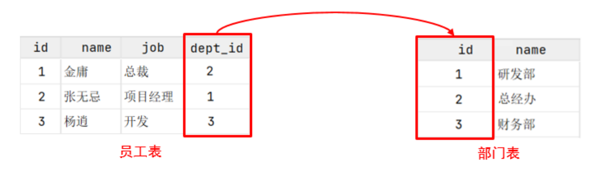

==特点==：

1. **使用表存储数æ®ï¼Œæ ¼å¼ç»Ÿä¸€ï¼Œä¾¿äºç»´æŠ¤**。

2. **使用SQL语言æ“作，标准统一，使用方便**。

   

#### â‘¡ æ•°æ®æ¨¡å‹

MySQL是关系å‹æ•°æ®åº“，是基äº**二维表进行数æ®å­˜å‚¨**的，具体的结æ„图下:


-    我们å¯ä»¥é€šè¿‡**MySQL客户端è¿æ¥æ•°æ®åº“管ç†ç³»ç»ŸDBMS**，然å**通过DBMSæ“作数æ®åº“**。
-    å¯ä»¥ä½¿ç”¨SQL语å¥ï¼Œé€šè¿‡æ•°æ®åº“管ç†ç³»ç»Ÿæ“作数æ®åº“，以åŠæ“作数æ®åº“中的表结æ„åŠæ•°æ®ã€‚
-    一个数æ®åº“æœåŠ¡å™¨ä¸­å¯ä»¥åˆ›å»ºå¤šä¸ªæ•°æ®åº“，一个数æ®åº“中也å¯ä»¥åŒ…å«å¤šå¼ è¡¨ï¼Œè€Œä¸€å¼ è¡¨ä¸­åˆå¯ä»¥åŒ…å«å¤šè¡Œè®°å½•ã€‚


### （9）å°ç»“


# 2ã€ğŸŒŸ ==SQL==

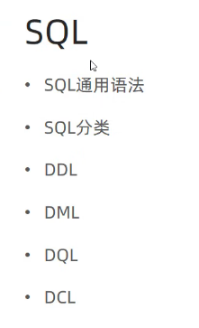

> 全称 ==Structured Query Language==，**结æ„化查询语言**。æ“作关系å‹æ•°æ®åº“的编程语言，定义了一套æ“作关系å‹æ•°æ®åº“统一**标准** 。

## 2.1 **SQL通用语法**

在学习具体的SQL语å¥ä¹‹å‰ï¼Œå…ˆæ¥äº†è§£ä¸€ä¸‹SQL语言的åŒäºè¯­æ³•ã€‚

1. SQL语å¥å¯ä»¥**å•è¡Œæˆ–多行书写，以==分å·ç»“å°¾==**。
2. SQL语å¥å¯ä»¥ä½¿ç”¨**空格/缩进**æ¥å¢å¼ºè¯­å¥çš„å¯è¯»æ€§ã€‚
3. MySQLæ•°æ®åº“çš„SQL语å¥ä¸åŒºåˆ†å¤§å°å†™ï¼Œ**关键字建议使用大写**。
4. **注释**：
   1. å•è¡Œæ³¨é‡Šï¼š-- 注释内容 或  # 注释内容  
   2. 多行注释：/* 注释内容 */


## 2.2 SQL==分类==


SQL语å¥ï¼Œæ ¹æ®å…¶åŠŸèƒ½ï¼Œä¸»è¦åˆ†ä¸ºå››ç±»ï¼šDDLã€DMLã€DQLã€DCL。

| **分类** | **全称**                       | **说æ˜**                                               |
| :------- | :----------------------------- | :----------------------------------------------------- |
| **DDL**  | **Data Definition Language**   | æ•°æ®å®šä¹‰è¯­è¨€ï¼Œç”¨æ¥å®šä¹‰æ•°æ®åº“对象(æ•°æ®åº“，表，字段)     |
| **DML**  | **Data Manipulation Language** | æ•°æ®æ“作语言，用æ¥å¯¹æ•°æ®åº“表中的数æ®è¿›è¡Œå¢åˆ æ”¹         |
| **DQL**  | **Data Query Language**        | æ•°æ®æŸ¥è¯¢è¯­è¨€ï¼Œç”¨æ¥æŸ¥è¯¢æ•°æ®åº“中表的记录                 |
| **DCL**  | **Data Control Language**      | æ•°æ®æ§åˆ¶è¯­è¨€ï¼Œç”¨æ¥åˆ›å»ºæ•°æ®åº“用户ã€æ§åˆ¶æ•°æ®åº“的访问æƒé™ |


## 2.3 🌟DDL-æ•°æ®å®šä¹‰

Data Definition Language，**æ•°æ®å®šä¹‰è¯­è¨€**，用æ¥å®šä¹‰æ•°æ®åº“对象(æ•°æ®åº“，表，字段) 。

### （1）数æ®åº“æ“作

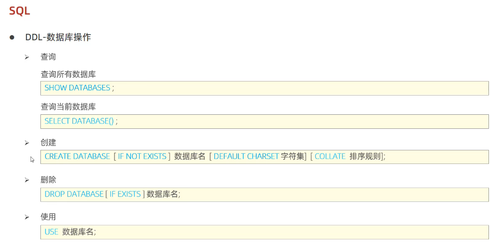

#### â‘ **查询所有数æ®åº“**

```sql
show databases;
```


#### â‘¡==查询当å‰==æ•°æ®åº“

```sql
select database();
```


#### ③创建数æ®åº“

```sql
create database [ if not exists ] æ•°æ®åº“å [ default charset 字符集 ] [ collate æ’åº
规则 ] ;
```

###### 案例：

**第一步：**创建一个itcastæ•°æ®åº“, 使用数æ®åº“默认的字符集。

```sql
create database itcast;
```


在åŒä¸€ä¸ªæ•°æ®åº“æœåŠ¡å™¨ä¸­ï¼Œ**ä¸èƒ½åˆ›å»ºä¸¤ä¸ªå称相åŒçš„æ•°æ®åº“，å¦åˆ™å°†ä¼šæŠ¥é”™**。

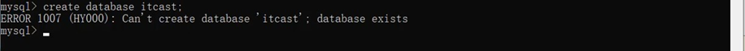

å¯ä»¥é€šè¿‡**if not exists** å‚æ•°æ¥è§£å†³è¿™ä¸ªé—®é¢˜ï¼Œæ•°æ®åº“ä¸å­˜åœ¨, 则创建该数æ®åº“，如æœå­˜åœ¨ï¼Œåˆ™ä¸åˆ›å»ºã€‚

```sql
create database if not extists itcast;
```


**第二步：**创建一个itheimaæ•°æ®åº“，并且指定字符集

```sql
create database itheima default charset utf8mb4;
```


#### ④删除数æ®åº“

```sql
drop database [ if exists ] æ•°æ®åº“å ;
```

如æœåˆ é™¤ä¸€ä¸ªä¸å­˜åœ¨çš„æ•°æ®åº“，将会报错。此时，å¯ä»¥åŠ ä¸Šå‚æ•° if exists ，如æœæ•°æ®åº“存在，å†æ‰§è¡Œåˆ é™¤ï¼Œå¦åˆ™ä¸æ‰§è¡Œåˆ é™¤ã€‚


#### ⑥切æ¢æ•°æ®åº“

```sql
use æ•°æ®åº“å ;
```

我们è¦æ“作æŸä¸€ä¸ªæ•°æ®åº“下的表时，就需è¦é€šè¿‡è¯¥æŒ‡ä»¤ï¼Œåˆ‡æ¢åˆ°å¯¹åº”çš„æ•°æ®åº“下，å¦åˆ™æ˜¯ä¸èƒ½æ“作的。比如，切æ¢åˆ°itcastæ•°æ®ï¼Œæ‰§è¡Œå¦‚下SQL：

```sql
use itcast;
```


### （2）🌟 ==表æ“作==

#### ①表æ“作-==查询创建==

##### 1）**查询当å‰æ•°æ®åº“所有表**-show

```sql
show tables;
```

比如,我们å¯ä»¥åˆ‡æ¢åˆ°sys这个系统数æ®åº“,并查看系统数æ®åº“中的所有表结æ„。

```sql
use sys;

show tables;
```

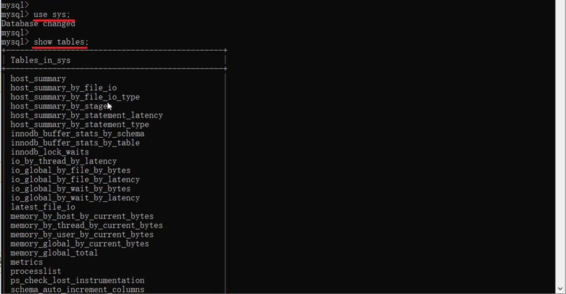

##### 2）==查看指定表结æ„==-desc

```sql
desc 表å ;
```

通过这æ¡æŒ‡ä»¤ï¼Œæˆ‘们å¯ä»¥æŸ¥çœ‹åˆ°æŒ‡å®š**表的字段，字段的类å‹ã€æ˜¯å¦å¯ä»¥ä¸ºNULL，是å¦å­˜åœ¨é»˜è®¤å€¼**等信æ¯ã€‚


##### 3）查询指定表的==建表语å¥==-show create table

```sql
show create table 表å ;
```

通过这æ¡æŒ‡ä»¤ï¼Œä¸»è¦æ˜¯ç”¨æ¥**查看建表语å¥**的，而有部分å‚数我们在创建表的时候，并未指定也会查询到，因为这部分是**æ•°æ®åº“的默认值**，如：==存储引æ“ã€å­—符集==等。

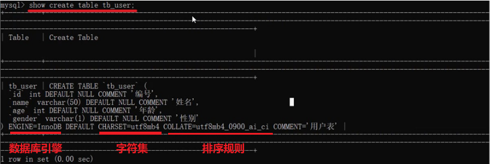

##### 4）==创建表结æ„==-create table

```sql
CREATE TABLE 表å(
    字段1 字段1ç±»å‹ [ COMMENT 字段1注释 ],
    字段2 字段2ç±»å‹ [COMMENT 字段2注释 ],
    字段3 字段3ç±»å‹ [COMMENT 字段3注释 ],
    ......
    字段n 字段nç±»å‹ [COMMENT 字段n注释 ]
) [ COMMENT 表注释 ] ;
```

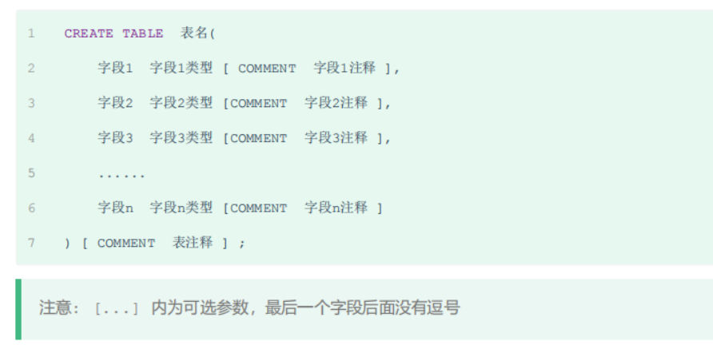

比如，我们创建一张表 tb_user ，对应的结æ„如下，那么建表语å¥ä¸ºï¼š

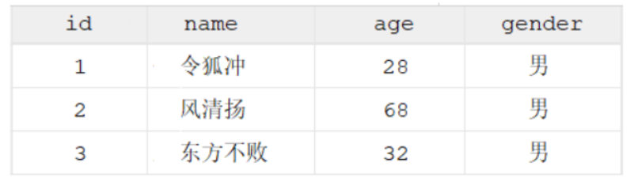

```sql
create table tb_user(
    id int comment 'ç¼–å·',
    name varchar(50) comment '姓å',
    age int comment '年龄',
    gender varchar(1) comment '性别'
) comment '用户表';
```


#### ②🌟表æ“作-==æ•°æ®ç±»å‹==

在上述的建表语å¥ä¸­ï¼Œæˆ‘们在指定字段的数æ®ç±»å‹æ—¶ï¼Œç”¨åˆ°äº†int ，varchar，那么在MySQL中除了以上的数æ®ç±»å‹ï¼Œè¿˜æœ‰å“ªäº›å¸¸è§çš„æ•°æ®ç±»å‹å‘¢ï¼Ÿ æ¥ä¸‹æ¥,我们就æ¥è¯¦ç»†ä»‹ç»ä¸€ä¸‹MySQLçš„æ•°æ®ç±»å‹ã€‚MySQL中的数æ®ç±»å‹æœ‰å¾ˆå¤šï¼Œä¸»è¦åˆ†ä¸ºä¸‰ç±»ï¼š**数值类å‹ã€å­—符串类å‹ã€æ—¥æœŸæ—¶é—´ç±»å‹**。

##### 1）数值类å‹


| ç±»å‹         | å¤§å°    | 有符å·(SIGNED)范围                                    | 无符å·(UNSIGNED)范围                                      | æè¿°               |
| ------------ | ------- | ----------------------------------------------------- | --------------------------------------------------------- | ------------------ |
| TINYINT      | 1 byte  | (-128，127)                                           | (0，255)                                                  | å°æ•´æ•°å€¼           |
| SMALLINT     | 2 bytes | (-32768，32767)                                       | (0，65535)                                                | 大整数值           |
| MEDIUMINT    | 3 bytes | (-8388608，8388607)                                   | (0，16777215)                                             | 大整数值           |
| INT或INTEGER | 4 bytes | (-2147483648，2147483647)                             | (0，4294967295)                                           | 大整数值           |
| BIGINT       | 8 bytes | (-2^63，2^63-1)                                       | (0，2^64-1)                                               | æ大整数值         |
| FLOAT        | 4 bytes | (-3.402823466 E+38，3.402823466351 E+38)              | 0 å’Œ (1.175494351 E-38，3.402823466 E+38)                 | å•ç²¾åº¦æµ®ç‚¹æ•°å€¼     |
| DOUBLE       | 8 bytes | (-1.7976931348623157 E+308，1.7976931348623157 E+308) | 0 å’Œ (2.2250738585072014 E-308，1.7976931348623157 E+308) | åŒç²¾åº¦æµ®ç‚¹æ•°å€¼     |
| DECIMAL      |         | ä¾èµ–äºM(精度)å’ŒD(标度)的值                            | ä¾èµ–äºM(精度)å’ŒD(标度)的值                                | å°æ•°å€¼(精确定点数) |

> 如:
>
> 1). 年龄字段 -- **ä¸ä¼šå‡ºç°è´Ÿæ•°, 而且人的年龄ä¸ä¼šå¤ªå¤§**
>
> ​	age tinyint ==unsigned==   年龄ä¸ä¼šå‡ºç°è´Ÿæ•°ï¼Œåˆ™ç”¨æ— ç¬¦å·tinyint
>
> 2). 分数 -- 总分100分, **最多出ç°ä¸€ä½å°æ•°**
>
> ​	score double(4,1)


##### 2）字符串类å‹

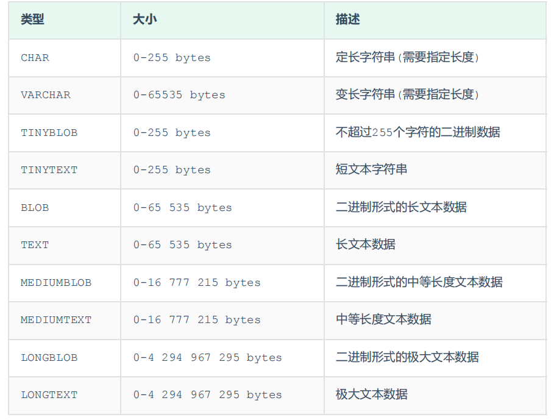

| ç±»å‹       | å¤§å°                  | æè¿°                            |
| ---------- | --------------------- | ------------------------------- |
| CHAR       | 0-255 bytes           | **定长字符串**                  |
| VARCHAR    | 0-65535 bytes         | **å˜é•¿å­—符串**                  |
| TINYBLOB   | 0-255 bytes           | ä¸è¶…过255个字符的**二进制数æ®** |
| TINYTEXT   | 0-255 bytes           | 短文本字符串                    |
| BLOB       | 0-65 535 bytes        | 二进制形å¼çš„é•¿æ–‡æœ¬æ•°æ®          |
| TEXT       | 0-65 535 bytes        | **长文本数æ®**                  |
| MEDIUMBLOB | 0-16 777 215 bytes    | 二进制形å¼çš„ä¸­ç­‰é•¿åº¦æ–‡æœ¬æ•°æ®    |
| MEDIUMTEXT | 0-16 777 215 bytes    | ä¸­ç­‰é•¿åº¦æ–‡æœ¬æ•°æ®                |
| LONGBLOB   | 0-4 294 967 295 bytes | 二进制形å¼çš„æå¤§æ–‡æœ¬æ•°æ®        |
| LONGTEXT   | 0-4 294 967 295 bytes | æå¤§æ–‡æœ¬æ•°æ®                    |

char ä¸ varchar 都å¯ä»¥æ述字符串，**char是定长字符串**，指定长度多长，就å ç”¨å¤šå°‘个字符，和字段值的长度无关 。而**varchar是å˜é•¿å­—符串**，指定的长度为最大å ç”¨é•¿åº¦ 。相对æ¥è¯´ï¼Œ**==char的性能会更高些。==**，åŸå› æ˜¯**varchar会根æ®å†…容的大å°è®¡ç®—需è¦çš„内存空间，消耗性能**。

> ​	如：
>
> -  用户å username ------> ==长度ä¸å®š, 最长ä¸ä¼šè¶…过50==
>    - username varchar(50)
> -  性别 gender ---------> **存储值, ä¸æ˜¯ç”·,就是女**
>    - gender char(1)
> -  æ‰‹æœºå· phone --------> **固定长度为11**
>    - phone char(11)


##### 3）日期类å‹

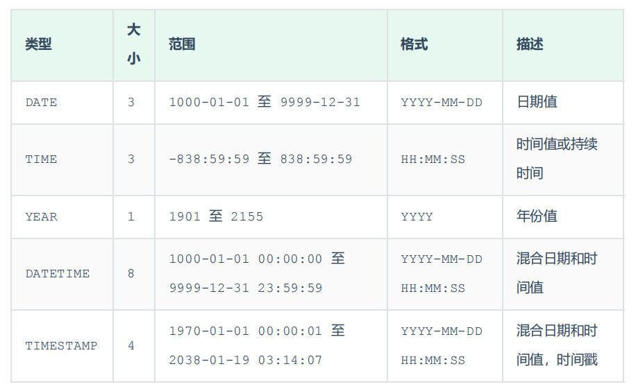

| ç±»å‹      | å¤§å° | 范围                                       | æ ¼å¼                | æè¿°                     |
| --------- | ---- | ------------------------------------------ | ------------------- | ------------------------ |
| DATE      | 3    | 1000-01-01 至 9999-12-31                   | YYYY-MM-DD          | 日期值                   |
| TIME      | 3    | -838:59:59 至 838:59:59                    | HH:MM:SS            | 时间值或æŒç»­æ—¶é—´         |
| YEAR      | 1    | 1901 至 2155                               | YYYY                | 年份值                   |
| DATETIME  | 8    | 1000-01-01 00:00:00 至 9999-12-31 23:59:59 | YYYY-MM-DD HH:MM:SS | æ··åˆæ—¥æœŸå’Œæ—¶é—´å€¼         |
| TIMESTAMP | 4    | 1970-01-01 00:00:01 至 2038-01-19 03:14:07 | YYYY-MM-DD HH:MM:SS | æ··åˆæ—¥æœŸå’Œæ—¶é—´å€¼ï¼Œæ—¶é—´æˆ³ |

> - 生日字段 birthday -**DATE**
>   - birthday date
> - 创建时间 **createtime**
>   - createtime datetime

#### ③表æ“作-案例


对应的建表语å¥å¦‚下:

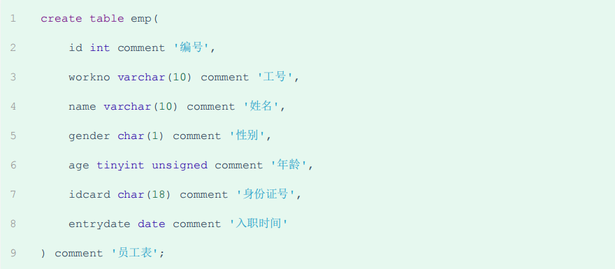

```sql
create table emp(
    id int comment 'ç¼–å·',
    workno varchar(10) comment 'å·¥å·',
    name varchar(10) comment '姓å',
    gender char(1) comment '性别',
    age tinyint unsigned comment '年龄',
    idcard char(18) comment '身份è¯å·',
    entrydate date comment 'å…¥èŒæ—¶é—´'
) comment '员工表';
```

SQL语å¥ç¼–写完毕之å，就å¯ä»¥åœ¨MySQL的命令行中执行SQL，然å也å¯ä»¥é€šè¿‡ **desc 指令查询表结æ„ä¿¡æ¯ï¼š**

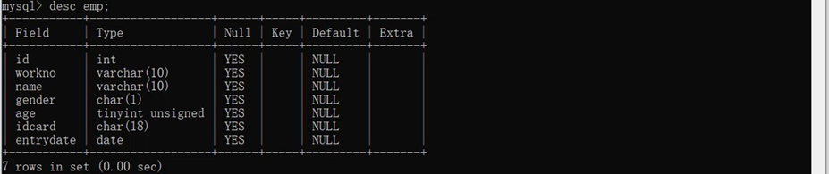

表结æ„创建好了，里é¢çš„name字段是varcharç±»å‹ï¼Œæœ€å¤§é•¿åº¦ä¸º10，也就æ„味ç€å¦‚æœè¶…过10将会报错，如æœæˆ‘ä»¬æƒ³ä¿®æ”¹è¿™ä¸ªå­—æ®µçš„ç±»å‹ æˆ– 修改字段的长度该如何æ“作呢？æ¥ä¸‹æ¥å†æ¥è®²è§£**DDL语å¥**中，如何æ“作表字段。


#### ④表æ“作-==修改==-alter table

##### 1）添加字段-add

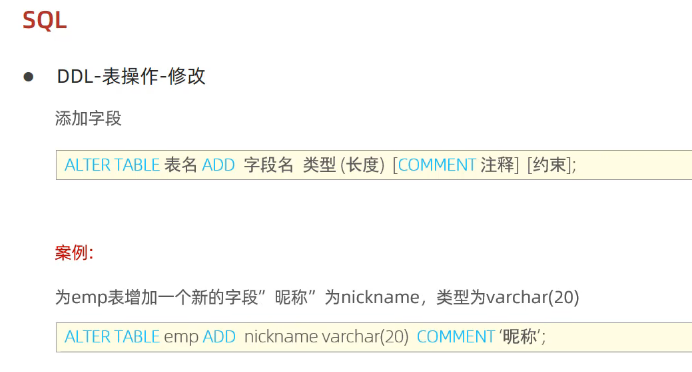

```sql
ALTER TABLE 表å ADD 字段å ç±»å‹ (长度) [ COMMENT 注释 ] [ çº¦æŸ ];
```

案例:

为emp表å¢åŠ ä¸€ä¸ªæ–°çš„字段â€æ˜µç§°â€ä¸ºnickname，类å‹ä¸ºvarchar(20)

```sql
ALTER TABLE emp ADD nickname varchar(20) COMMENT '昵称';
```


##### 2）修改数æ®ç±»å‹-modify

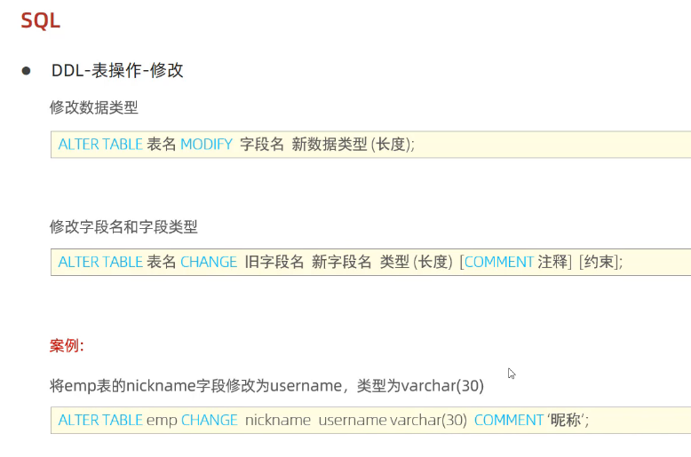

```sql
ALTER TABLE 表å MODIFY 字段å æ–°æ•°æ®ç±»å‹ (长度);
```


##### 3）修改字段å和字段类å‹-change

```sql
ALTER TABLE 表å CHANGE 旧字段å 新字段å ç±»å‹ (长度) [ COMMENT 注释 ] [ çº¦æŸ ];
```

案例:

å°†emp表的nickname字段修改为username，类å‹ä¸ºvarchar(30)

```sql
ALTER TABLE emp CHANGE nickname username varchar(30) COMMENT '昵称';
```


##### 4）删除字段-drop

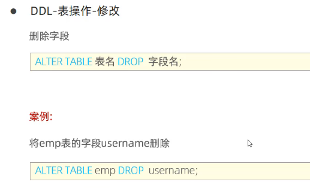

```sql
ALTER TABLE 表å DROP 字段å;
```

案例:

将emp表的字段username删除

```sql
ALTER TABLE emp DROP username;
```


##### 5）修改表å-rename  to


```sql
ALTER TABLE 表å RENAME TO 新表å;
```

案例:

å°†emp表的表å修改为 employee

```sql
ALTER TABLE emp RENAME TO employee;
```


#### ⑤表æ“作删除-drop table


##### 1）删除表-drop

```sql
DROP TABLE [ IF EXISTS ] 表å;
```

å¯é€‰é¡¹ IF EXISTS 代表，åªæœ‰è¡¨å存在时æ‰ä¼šåˆ é™¤è¯¥è¡¨ï¼Œè¡¨åä¸å­˜åœ¨ï¼Œåˆ™ä¸æ‰§è¡Œåˆ é™¤æ“作(如æœä¸

加该å‚数项，删除一张ä¸å­˜åœ¨çš„表，执行将会报错)。

案例:

如æœtb_user表存在，则删除tb_user表

```sql
DROP TABLE IF EXISTS tb_user;
```


##### 2）删除指定表, 并é‡æ–°åˆ›å»ºè¡¨-druncate

**æ ¼å¼åŒ–表**

```sql
TRUNCATE TABLE 表å;
```

> 注æ„: 在删除表的时候，==表中的全部数æ®ä¹Ÿéƒ½ä¼šè¢«åˆ é™¤==。


### （3）å°ç»“


## 2.4 图形化界é¢å·¥å…·

上述，我们已ç»è®²è§£äº†é€šè¿‡DDL语å¥ï¼Œå¦‚何æ“作数æ®åº“ã€æ“作表ã€æ“作表中的字段，而通过DDL语å¥æ‰§

行在命令进行æ“作，主è¦å­˜åœ¨ä»¥ä¸‹ä¸¤ç‚¹é—®é¢˜ï¼š

​	1).会影å“å¼€å‘æ•ˆç‡ ;

​	2). 使用起æ¥ï¼Œå¹¶ä¸ç›´è§‚，并ä¸æ–¹ä¾¿ ï¼›

所以呢，我们在日常的开å‘中，会借助äºMySQL的图形化界é¢ï¼Œæ¥ç®€åŒ–å¼€å‘，æ高开å‘效ç‡ã€‚而目å‰

mysql主æµçš„图形化界é¢å·¥å…·ï¼Œæœ‰ä»¥ä¸‹å‡ ç§ï¼š


而本次课程中，选择最å一ç§DataGrip，这ç§å›¾å½¢åŒ–ç•Œé¢å·¥å…·ï¼ŒåŠŸèƒ½æ›´åŠ å¼ºå¤§ï¼Œç•Œé¢æ示更加å‹å¥½ï¼Œ

是我们使用MySQLçš„ä¸äºŒä¹‹é€‰ã€‚æ¥ä¸‹æ¥ï¼Œæˆ‘们æ¥ä»‹ç»ä¸€ä¸‹**DataGrip**该如何安装ã€ä½¿ç”¨ã€‚


### （1）安装

#### ①找到资料中准备好的安装包，åŒå‡»å¼€å§‹å®‰è£…


#### ②点击next，一步一步的完æˆå®‰è£…


选择DataGrip的安装目录，然å选择下一步


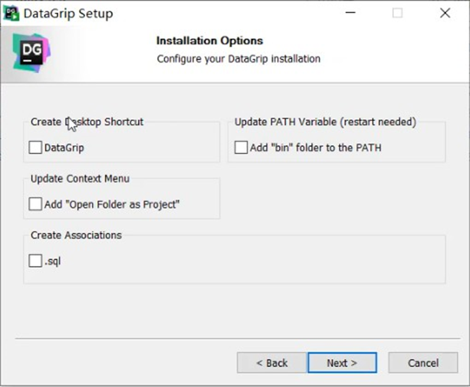

下一步，执行安装


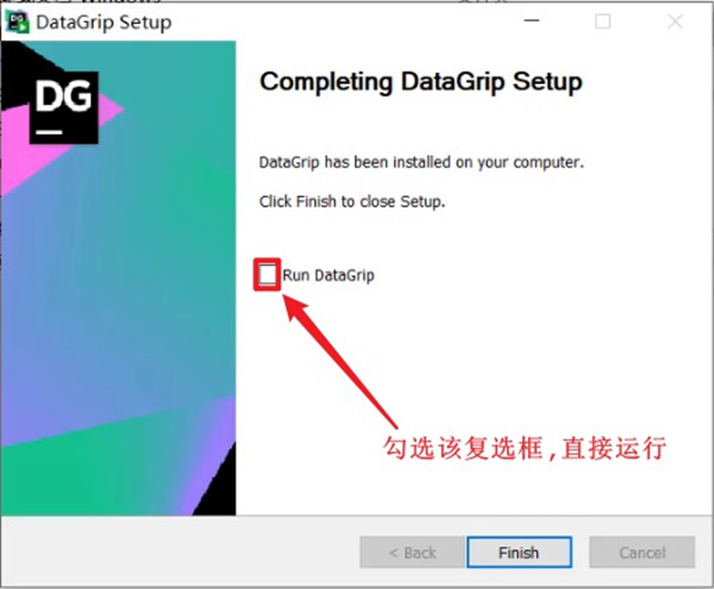

### （2）使用

#### ①添加数æ®æº

å‚考图示, 一步步æ“作å³å¯


é…置以åŠé©±åŠ¨jar包下载完毕之å，就å¯ä»¥ç‚¹å‡» "Test Connection" å°±å¯ä»¥æµ‹è¯•ï¼Œæ˜¯å¦å¯ä»¥è¿æ¥MySQL，如æœå‡ºç° "Successed"，就表åè¿æ¥æˆåŠŸäº† 。


#### ②展示所有数æ®åº“

è¿æ¥ä¸Šäº†MySQLæœåŠ¡ä¹‹å，并未展示出所有的数æ®åº“，此时，我们需è¦è®¾ç½®ï¼Œå±•ç¤ºæ‰€æœ‰çš„æ•°æ®åº“，具体æ“作如下：


#### ③创建数æ®åº“


> 注æ„:
>
> 以下==两ç§æ–¹å¼éƒ½å¯ä»¥åˆ›å»ºæ•°æ®åº“==：
>
> ​	 A. create **database** db01;
>
> 	B. create **schema** db01;


#### ④创建表

在指定的数æ®åº“上é¢å³é”®ï¼Œé€‰æ‹©new --> Table

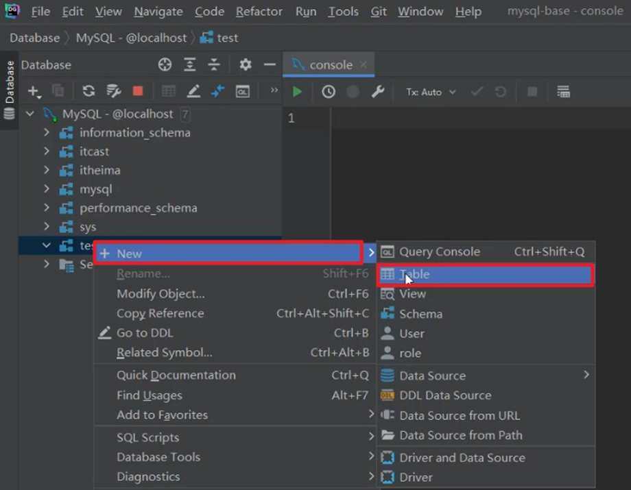

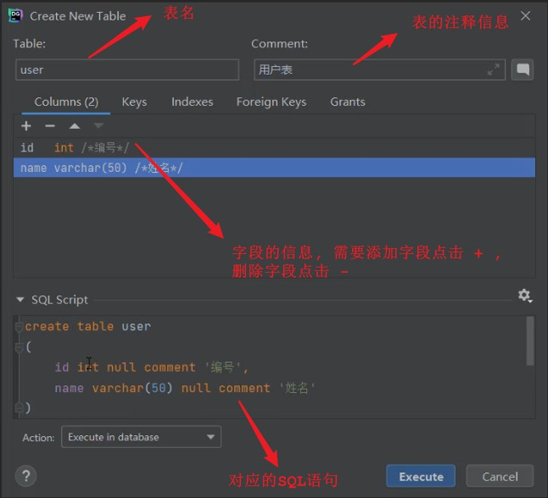

#### ⑤修改表结æ„

在需è¦ä¿®æ”¹çš„表上，å³é”®é€‰æ‹© "Modify Table..."

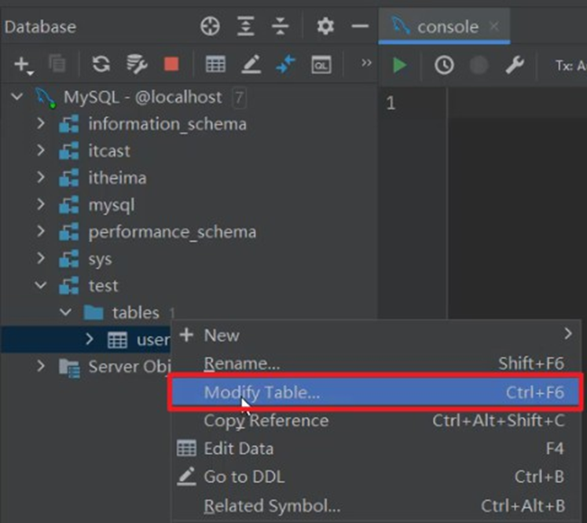


如æœæƒ³å¢åŠ å­—段，直æ¥ç‚¹å‡»+å·ï¼Œå½•å…¥å­—段信æ¯ï¼Œç„¶å点击Executeå³å¯ã€‚

如æœæƒ³åˆ é™¤å­—段，直æ¥ç‚¹å‡»-å·ï¼Œå°±å¯ä»¥åˆ é™¤å­—段，然å点击Executeå³å¯ã€‚

如æœæƒ³ä¿®æ”¹å­—段，åŒå‡»å¯¹åº”的字段，修改字段信æ¯ï¼Œç„¶å点击Executeå³å¯ã€‚

如æœè¦ä¿®æ”¹è¡¨å，或表的注释，直æ¥åœ¨è¾“入框修改，然å点击Executeå³å¯ã€‚


#### ⑥在DataGrip中执行SQL语å¥

在指定的数æ®åº“上，å³é”®ï¼Œé€‰æ‹© New --> Query Console

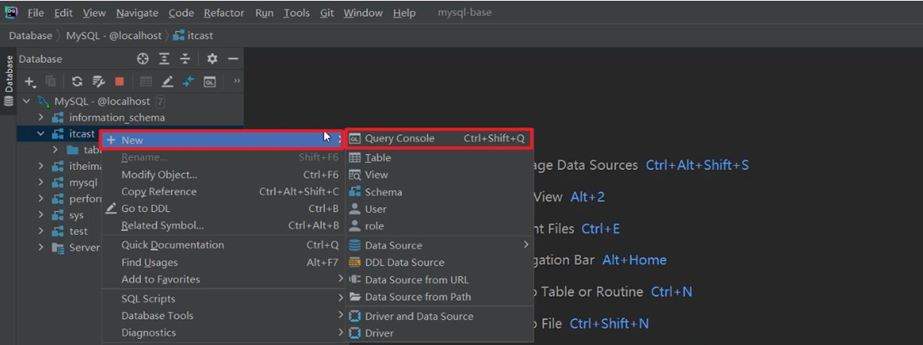

然åå°±å¯ä»¥åœ¨æ‰“开的Query Consoleæ§åˆ¶å°ï¼Œå¹¶åœ¨æ§åˆ¶å°ä¸­ç¼–写SQL，执行SQL。

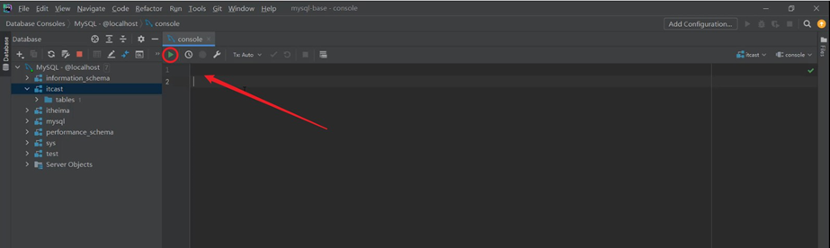


## 2.5 🌟DML-æ•°æ®æ“作

DML英文全称是**Data Manipulation Language(==æ•°æ®æ“作语言==)**，用æ¥å¯¹æ•°æ®åº“中表的数æ®è®°å½•è¿›

è¡Œå¢ã€åˆ ã€æ”¹æ“作。

- 添加数æ®ï¼ˆINSERT）
- 修改数æ®ï¼ˆUPDATE）
- 删除数æ®ï¼ˆDELETE）

### （1）添加数æ®-insert


#### ①给指定字段添加数æ®

```sql
INSERT INTO 表å (字段å1, 字段å2, ...) VALUES (值1, 值2, ...);
```

**案例:**  ç»™employeeè¡¨æ‰€æœ‰çš„å­—æ®µæ·»åŠ æ•°æ® ï¼›

```sql
insert into employee(id,workno,name,gender,age,idcard,entrydate)

values(1,'1','Itcast','ç”·',10,'123456789012345678','2000-01-01');
```

æ’入数æ®å®Œæˆä¹‹å，我们有两ç§æ–¹å¼ï¼ŒæŸ¥è¯¢æ•°æ®åº“çš„æ•°æ®ï¼š

**A. æ–¹å¼ä¸€**

在左侧的表å上åŒå‡»ï¼Œå°±å¯ä»¥æŸ¥çœ‹è¿™å¼ è¡¨çš„æ•°æ®ã€‚


**B. æ–¹å¼äºŒ**

å¯ä»¥ç›´æ¥ä¸€æ¡æŸ¥è¯¢æ•°æ®çš„SQL语å¥, 语å¥å¦‚下:

```sql
select * from employee;
```

案例: ç»™employee表所有的字段添加数æ®

执行如下SQL，添加的年龄字段值为-1。

```sql
insert into employee(id,workno,name,gender,age,idcard,entrydate)
values(1,'1','Itcast','ç”·',-1,'123456789012345678','2000-01-01');
```

执行上述的SQL语å¥æ—¶ï¼ŒæŠ¥é”™äº†ï¼Œå…·ä½“的错误信æ¯å¦‚下：


因为 employee 表的**age字段类å‹ä¸º tinyint**，而且还是**无符å·çš„ unsigned** ，所以**å–值åªèƒ½åœ¨**

**0-255 之间**。


#### â‘¡ç»™==全部字段==添加数æ®

```sql
INSERT INTO 表å VALUES (值1, 值2, ...); 
```

案例：æ’入数æ®åˆ°employee表，具体的SQL如下：

```sql
insert into employee values(2,'2','张无忌','男',18,'123456789012345670','2005-01-
01');
```


#### â‘¢==批é‡æ·»åŠ ==æ•°æ®

```sql
INSERT INTO 表å (字段å1, 字段å2, ...) VALUES (值1, 值2, ...), (值1, 值2, ...), (值

1, 值2, ...) ;
```

```sql
INSERT INTO 表å VALUES (值1, 值2, ...), (值1, 值2, ...), (值1, 值2, ...) ; 
```

案例：批é‡æ’入数æ®åˆ°employee表，具体的SQL如下：

```sql
insert into employee values(3,'3','韦一笑','ç”·',38,'123456789012345670','2005-01-01'),(4,'4','èµµæ•','女',18,'123456789012345670','2005-01-01');
```


> ==注æ„事项==:
>
> - æ’入数æ®æ—¶ï¼ŒæŒ‡å®šçš„**字段顺åºéœ€è¦ä¸å€¼çš„顺åºæ˜¯ä¸€ä¸€å¯¹åº”çš„**。
> - 字符串和日期å‹æ•°æ®åº”该包å«**在引å·**中。
> - æ’入的数æ®å¤§å°ï¼Œåº”该在字段的规定范围内。


### （2）修改数æ®-update


修改数æ®çš„具体语法为:

```sql
UPDATE 表å SET 字段å1 = 值1 , 字段å2 = 值2 , .... [ WHERE æ¡ä»¶ ] ;
```

案例:

A. 修改id为1çš„æ•°æ®ï¼Œå°†name修改为itheima

```sql
update employee set name = 'itheima' where id = 1; 
```

B. 修改id为1çš„æ•°æ®, å°†name修改为å°æ˜­, gender修改为 女

```sql
update employee set name = 'å°æ˜­' , gender = '女' where id = 1; 
```

C. 将所有的员工入èŒæ—¥æœŸä¿®æ”¹ä¸º 2008-01-01

```sql
update employee set entrydate = '2008-01-01';
```

> **注æ„事项:**
>
> 修改语å¥çš„æ¡ä»¶å¯ä»¥æœ‰ï¼Œä¹Ÿå¯ä»¥æ²¡æœ‰ï¼Œå¦‚æœ**没有æ¡ä»¶ï¼Œåˆ™ä¼šä¿®æ”¹æ•´å¼ è¡¨çš„所有数æ®**。


### （3）删除数æ®-delete

删除数æ®çš„具体语法为：

```sql
DELETE FROM 表å [ WHERE æ¡ä»¶ ] ;
```

案例:

A. 删除gender为女的员工

```sql
delete from employee where gender = '女';
```

B. 删除所有员工

```sql
delete from employee;
```


> 注æ„事项:
>
> - DELETE 语å¥çš„æ¡ä»¶å¯ä»¥æœ‰ï¼Œä¹Ÿå¯ä»¥æ²¡æœ‰ï¼Œå¦‚æœæ²¡æœ‰æ¡ä»¶ï¼Œåˆ™ä¼šåˆ é™¤æ•´å¼ è¡¨çš„所有数
>
>   æ®ã€‚
>
> - DELETE 语å¥ä¸èƒ½åˆ é™¤æŸä¸€ä¸ªå­—段的值(å¯ä»¥ä½¿ç”¨UPDATE，将该字段值置为NULLå³
>
>   å¯)。
>
> - 当进行删除全部数æ®æ“作时，datagrip会æ示我们，询问是å¦ç¡®è®¤åˆ é™¤ï¼Œæˆ‘们直æ¥ç‚¹å‡»
>
>   Executeå³å¯ã€‚
>
> 


### （4）å°ç»“

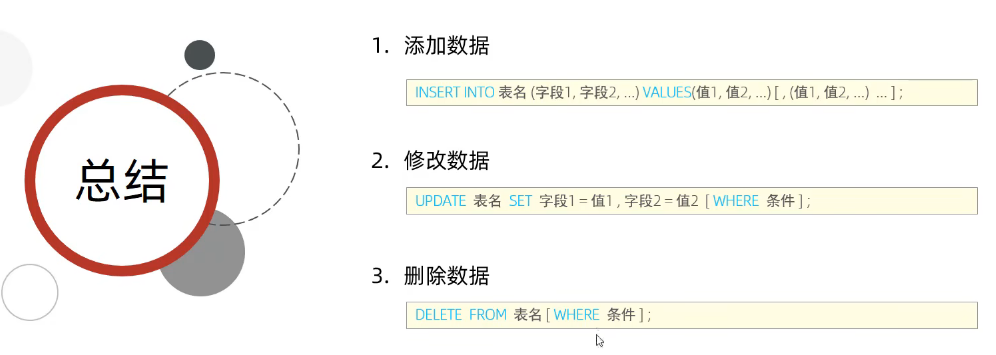


## 2.6 🌟DQL-æ•°æ®æŸ¥è¯¢

DQL英文全称是**Data Query Language(æ•°æ®æŸ¥è¯¢è¯­è¨€)**，数æ®æŸ¥è¯¢è¯­è¨€ï¼Œç”¨æ¥æŸ¥è¯¢æ•°æ®åº“中表的记

录。

查询关键字: SELECT

在一个正常的业务系统中，**查询æ“作的频次是è¦è¿œé«˜äºå¢åˆ æ”¹çš„**，当我们å»è®¿é—®ä¼ä¸šå®˜ç½‘ã€ç”µå•†ç½‘站，在这些网站中我们所看到的数æ®ï¼Œå®é™…都是需è¦ä»æ•°æ®åº“中查询并展示的。而且在查询的过程中，å¯èƒ½è¿˜ä¼šæ¶‰åŠåˆ°æ¡ä»¶ã€æ’åºã€åˆ†é¡µç­‰æ“作。


那么，本å°èŠ‚我们主è¦å­¦ä¹ çš„就是如何进行数æ®çš„查询æ“作。 我们先æ¥å®Œæˆå¦‚下数æ®å‡†å¤‡å·¥ä½œ:

```sql
drop table if exists employee;
create table emp(
    id int comment 'ç¼–å·',
    workno varchar(10) comment 'å·¥å·',
    name varchar(10) comment '姓å',
    gender char(1) comment '性别',
    age tinyint unsigned comment '年龄',
    idcard char(18) comment '身份è¯å·',
    workaddress varchar(50) comment '工作地å€',
    entrydate date comment 'å…¥èŒæ—¶é—´'
)comment '员工表';
INSERT INTO emp (id, workno, name, gender, age, idcard, workaddress, entrydate)
VALUES (1, '00001', '柳岩666', '女', 20, '123456789012345678', '北京', '2000-01-
        01');
INSERT INTO emp (id, workno, name, gender, age, idcard, workaddress, entrydate)
VALUES (2, '00002', '张无忌', '男', 18, '123456789012345670', '北京', '2005-09-
        01');
INSERT INTO emp (id, workno, name, gender, age, idcard, workaddress, entrydate)
VALUES (3, '00003', '韦一笑', '男', 38, '123456789712345670', '上海', '2005-08-
        01');
INSERT INTO emp (id, workno, name, gender, age, idcard, workaddress, entrydate)
VALUES (4, '00004', 'èµµæ•', '女', 18, '123456757123845670', '北京', '2009-12-01');
INSERT INTO emp (id, workno, name, gender, age, idcard, workaddress, entrydate)
VALUES (5, '00005', 'å°æ˜­', '女', 16, '123456769012345678', '上海', '2007-07-01');
INSERT INTO emp (id, workno, name, gender, age, idcard, workaddress, entrydate)
VALUES (6, '00006', 'æ¨é€', 'ç”·', 28, '12345678931234567X', '北京', '2006-01-01');
INSERT INTO emp (id, workno, name, gender, age, idcard, workaddress, entrydate)
VALUES (7, '00007', '范瑶', '男', 40, '123456789212345670', '北京', '2005-05-01');
INSERT INTO emp (id, workno, name, gender, age, idcard, workaddress, entrydate)
VALUES (8, '00008', '黛绮ä¸', '女', 38, '123456157123645670', '天津', '2015-05-
        01');
INSERT INTO emp (id, workno, name, gender, age, idcard, workaddress, entrydate)
VALUES (9, '00009', '范凉凉', '女', 45, '123156789012345678', '北京', '2010-04-
        01');
INSERT INTO emp (id, workno, name, gender, age, idcard, workaddress, entrydate)
VALUES (10, '00010', '陈å‹è°…', 'ç”·', 53, '123456789012345670', '上海', '2011-01-
        01');
INSERT INTO emp (id, workno, name, gender, age, idcard, workaddress, entrydate)
VALUES (11, '00011', '张士诚', 'ç”·', 55, '123567897123465670', '江è‹', '2015-05-
        01');
INSERT INTO emp (id, workno, name, gender, age, idcard, workaddress, entrydate)
VALUES (12, '00012', '常é‡æ˜¥', 'ç”·', 32, '123446757152345670', '北京', '2004-02-
        01');
INSERT INTO emp (id, workno, name, gender, age, idcard, workaddress, entrydate)
VALUES (13, '00013', '张三丰', 'ç”·', 88, '123656789012345678', '江è‹', '2020-11-
        01');
INSERT INTO emp (id, workno, name, gender, age, idcard, workaddress, entrydate)
VALUES (14, '00014', 'ç­ç»', '女', 65, '123456719012345670', '西安', '2019-05-
        01');
INSERT INTO emp (id, workno, name, gender, age, idcard, workaddress, entrydate)
VALUES (15, '00015', '胡é’牛', 'ç”·', 70, '12345674971234567X', '西安', '2018-04-
        01');
INSERT INTO emp (id, workno, name, gender, age, idcard, workaddress, entrydate)
VALUES (16, '00016', '周芷若', '女', 18, null, '北京', '2012-06-01');
```

准备完毕å，我们就å¯ä»¥çœ‹åˆ°emp表中准备的16æ¡æ•°æ®ã€‚æ¥ä¸‹æ¥ï¼Œæˆ‘们å†æ¥å®ŒæˆDQL语法的学习。


### （1）==基本语法==

DQL 查询语å¥ï¼Œè¯­æ³•ç»“æ„如下：

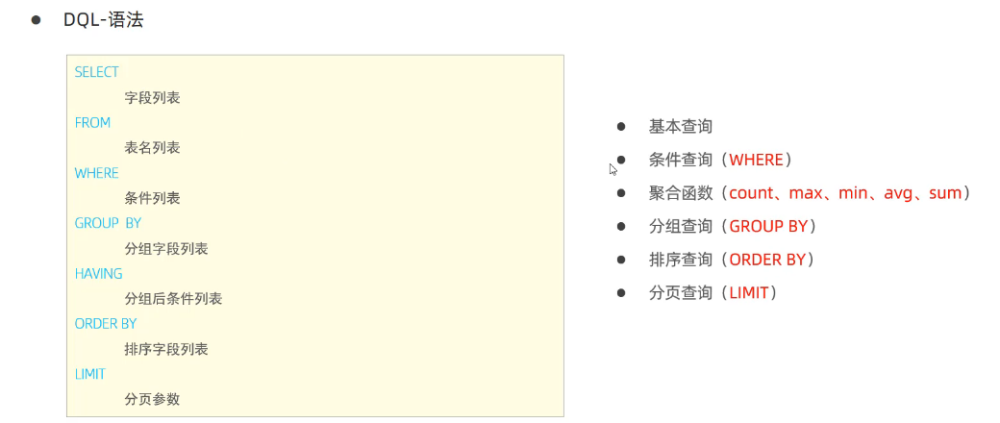

```sql
SELECT
字段列表
FROM
表å列表
WHERE
æ¡ä»¶åˆ—表
GROUP BY
分组字段列表
HAVING
分组åæ¡ä»¶åˆ—表
ORDER BY
æ’åºå­—段列表
LIMIT
分页å‚æ•°
```

我们在讲解这部分内容的时候，会将上é¢çš„完整语法进行拆分，分为以下几个部分：

- 基本查询（ä¸å¸¦ä»»ä½•æ¡ä»¶ï¼‰
- æ¡ä»¶æŸ¥è¯¢ï¼ˆWHERE）
- **èšåˆå‡½æ•°**（countã€maxã€minã€avgã€sum）
- 分组查询（**group by**）
- æ’åºæŸ¥è¯¢ï¼ˆorder by）
- 分页查询（limit）


### （2）基础查询

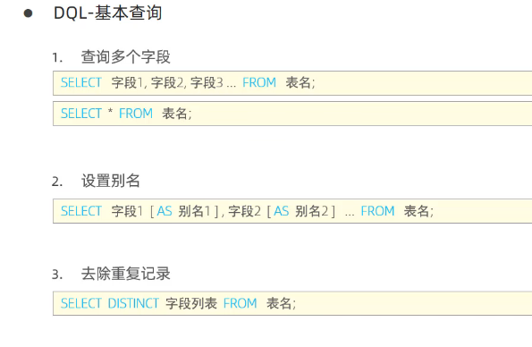

在基本查询的DQL语å¥ä¸­ï¼Œä¸å¸¦ä»»ä½•çš„查询æ¡ä»¶ï¼ŒæŸ¥è¯¢çš„语法如下：

#### ①查询多个字段

```sql
SELECT 字段1, 字段2, 字段3 ... FROM 表å ; 

SELECT * FROM 表å ; 
```

> æ³¨æ„ :  * å·ä»£è¡¨æŸ¥è¯¢æ‰€æœ‰å­—段，在å®é™…å¼€å‘中尽é‡å°‘用（ä¸ç›´è§‚ã€å½±å“效ç‡ï¼‰

#### ②字段设置别å

```sql
SELECT 字段1 [ AS 别å1 ] , 字段2 [ AS 别å2 ] ... FROM 表å; 

SELECT 字段1 [ 别å1 ] , 字段2 [ 别å2 ] ... FROM 表å; 
```


#### â‘¢å»é™¤é‡å¤è®°å½•

```sql
SELECT DISTINCT 字段列表 FROM 表å; 
```


#### ④案例

A. 查询指定字段 name, workno, age并返å›

```sql
select name,workno,age from emp; 
```

B. 查询返å›æ‰€æœ‰å­—段

```sql
select id ,workno,name,gender,age,idcard,workaddress,entrydate from emp; 

select *from emp; 
```

C. 查询所有员工的工作地å€,起别å

```sql
select workaddress as '工作地å€' from emp; 
-- aså¯ä»¥çœç•¥
select workaddress '工作地å€' from emp;
```

D. 查询公å¸å‘˜å·¥çš„上ç­åœ°å€æœ‰å“ªäº›(ä¸è¦é‡å¤)

```sql
select distinct workaddress '工作地å€' from emp;
```


### （3）==æ¡ä»¶æŸ¥è¯¢==-where


#### ①语法

```sql
SELECT 字段列表 FROM 表å WHERE æ¡ä»¶åˆ—表 ;
```

#### â‘¡æ¡ä»¶

常用的比较è¿ç®—符如下:

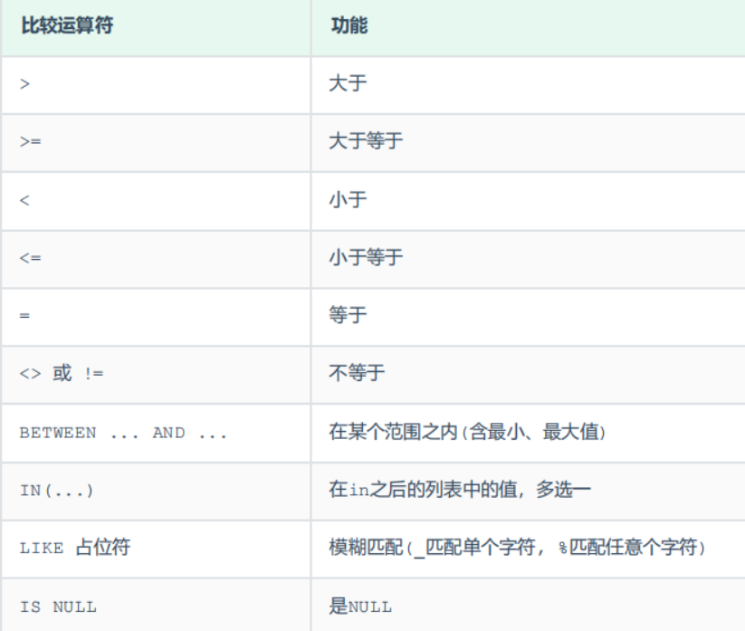

| **比较è¿ç®—符**      | **功能**                                 |
| :------------------ | :--------------------------------------- |
| >                   | å¤§äº                                     |
| >=                  | 大äºç­‰äº                                 |
| <                   | å°äº                                     |
| <=                  | å°äºç­‰äº                                 |
| =                   | ç­‰äº                                     |
| <> 或 !=            | ä¸ç­‰äº                                   |
| BETWEEN ... AND ... | 在æŸä¸ªèŒƒå›´ä¹‹å†…(å«æœ€å°ã€æœ€å¤§å€¼)           |
| IN(...)             | 在in之å的列表中的值，多选一             |
| LIKE å ä½ç¬¦         | 模糊匹é…(_匹é…å•ä¸ªå­—符, %匹é…ä»»æ„个字符) |
| IS NULL             | 是NULL                                   |

常用的逻辑è¿ç®—符如下:


| **逻辑è¿ç®—符** | **功能**                   |
| :------------- | :------------------------- |
| AND 或 &&      | 并且(多个æ¡ä»¶åŒæ—¶æˆç«‹)     |
| OR 或          | 或者(多个æ¡ä»¶ä»»æ„一个æˆç«‹) |
| NOT 或 !       | é ,ä¸æ˜¯                   |

#### ③案例

A. æŸ¥è¯¢å¹´é¾„ç­‰äº 88 的员工

```sql
select * from emp where age = 88;
```

B. 查询年龄å°äº 20 的员工信æ¯

```sql
select * from emp where age < 20;
```

C. 查询年龄å°äºç­‰äº 20 的员工信æ¯

```sql
select * from emp where age <= 20; 
```

D. 查询没有身份è¯å·çš„员工信æ¯

```sql
select * from emp where idcard is null; 
```

E. 查询有身份è¯å·çš„员工信æ¯

```sql
select * from emp where idcard is not null; 
```

F. 查询年龄ä¸ç­‰äº 88 的员工信æ¯

```sql
select * from emp where age != 88;

select * from emp where age <> 88;
```

G. 查询年龄在15å²(包å«) 到 20å²(包å«)之间的员工信æ¯

```sql
select * from emp where age >= 15 && age <= 20;

select * from emp where age >= 15 and age <= 20;

select * from emp where age between 15 and 20;
```

H. 查询性别为 女 且年龄å°äº 25å²çš„员工信æ¯

```sql
select * from emp where gender = '女' and age < 25; 
```

I. 查询年龄等äº18 或 20 或 40 的员工信æ¯

```sql
select * from emp where age = 18 or age = 20 or age =40;

select * from emp where age in(18,20,40);
```

J. 查询姓åä¸ºä¸¤ä¸ªå­—çš„å‘˜å·¥ä¿¡æ¯ _ %

```sql
select * from emp where name like '__'; 
```

K. 查询身份è¯å·æœ€å一ä½æ˜¯X的员工信æ¯

```sql
select * from emp where idcard like '%X';

select * from emp where idcard like '_________________X';
```


### （4）èšåˆæŸ¥è¯¢-count() ...


#### ①介ç»

==å°†**一列数æ®ä½œä¸ºä¸€ä¸ªæ•´ä½“**，进行**纵å‘计算**==。

#### ②常è§çš„èšåˆå‡½æ•°

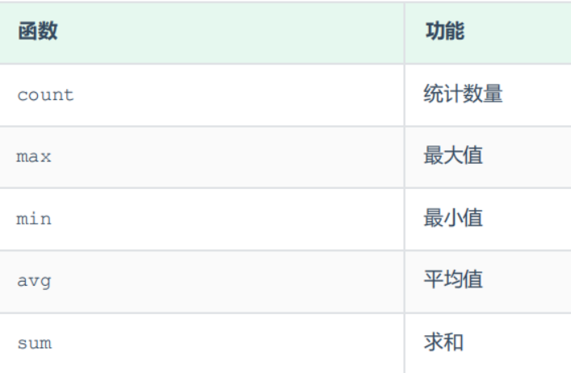

| **函数** | **功能** |
| :------- | :------- |
| count    | ç»Ÿè®¡æ•°é‡ |
| max      | 最大值   |
| min      | 最å°å€¼   |
| avg      | å¹³å‡å€¼   |
| sum      | 求和     |

#### ③语法

```sql
SELECT èšåˆå‡½æ•°(字段列表) FROM 表å ;
```

> æ³¨æ„ : **NULL值**是==ä¸å‚ä¸æ‰€æœ‰èšåˆå‡½æ•°è¿ç®—==的。


#### ④案例

A. 统计该ä¼ä¸šå‘˜å·¥æ•°é‡

```sql
select count(*) from emp; -- 统计的是总记录数

select count(idcard) from emp; -- 统计的是idcard字段ä¸ä¸ºnull的记录数
```

对äºcountèšåˆå‡½æ•°ï¼Œ**统计符åˆæ¡ä»¶çš„总记录数**，还å¯ä»¥é€šè¿‡ count(æ•°å­—/字符串)çš„å½¢å¼è¿›è¡Œç»Ÿè®¡

查询，比如：

```sql
select count(1) from emp; 
```


> 对äºcount(*) ã€count(字段)〠count(1) çš„**具体åŸç†**，我们在进阶篇中**SQL优化部分**会详
>
> 细讲解，此处大家åªéœ€è¦çŸ¥é“如何使用å³å¯ã€‚

B. 统计该ä¼ä¸šå‘˜å·¥çš„å¹³å‡å¹´é¾„

```sql
select avg(age) from emp; 
```

C. 统计该ä¼ä¸šå‘˜å·¥çš„最大年龄

```sql
select max(age) from emp; 
```

D. 统计该ä¼ä¸šå‘˜å·¥çš„最å°å¹´é¾„

```sql
select min(age) from emp; 
```

E. 统计西安地区员工的年龄之和

```sql
select sum(age) from emp where workaddress = '西安'; 
```


### （5）分组查询-group by


#### ①语法

```sql
SELECT 字段列表 FROM 表å [ WHERE æ¡ä»¶ ] GROUP BY 分组字段å [ HAVING 分组å过滤æ¡ä»¶ ];
```

#### ②🌟 ==whereä¸having区别==

- 执行时机ä¸åŒï¼šwhere是**分组之å‰è¿›è¡Œè¿‡æ»¤**，ä¸æ»¡è¶³whereæ¡ä»¶ï¼Œ**ä¸å‚ä¸åˆ†ç»„**；而**having是分组之å对结æœè¿›è¡Œè¿‡æ»¤ã€‚**
- 判断æ¡ä»¶ä¸åŒï¼š**whereä¸èƒ½å¯¹èšåˆå‡½æ•°è¿›è¡Œåˆ¤æ–­**，而havingå¯ä»¥ã€‚

> ==注æ„事项==:
>
> - **分组之å，查询的字段一般为==èšåˆå‡½æ•°å’Œåˆ†ç»„字段==**，查询**==其他字段无任何æ„义==**。
> - **执行顺åº: where > èšåˆå‡½æ•° > having** 。
> - 支æŒ**多字段分组,** 具体语法为 : group by columnA,columnB


#### ③案例

A. æ ¹æ®æ€§åˆ«åˆ†ç»„ , 统计男性员工 å’Œ 女性员工的数é‡

```sql
select gender, count(*) from emp group by gender ; 
```

B. æ ¹æ®æ€§åˆ«åˆ†ç»„ , 统计男性员工 å’Œ 女性员工的**å¹³å‡å¹´é¾„**

```sql
select gender, avg(age) from emp group by gender ;
```

C. 查询年龄å°äº45的员工 , 并根æ®å·¥ä½œåœ°å€åˆ†ç»„ , è·å–员工数é‡å¤§äºç­‰äº3的工作地å€

```sql
select workaddress, count(*) as address_count from emp where age < 45 group by workaddress having address_count >= 3;
```

D. 统计å„个工作地å€ä¸Šç­çš„男性åŠå¥³æ€§å‘˜å·¥çš„æ•°é‡

```sql
select workaddress, gender, count(*) as 'æ•°é‡' from emp group by gender,workaddress
```


### （6）æ’åºæŸ¥è¯¢-order by


æ’åºåœ¨æ—¥å¸¸å¼€å‘中是é常常è§çš„一个æ“作，有å‡åºæ’åºï¼Œä¹Ÿæœ‰é™åºæ’åºã€‚

#### ①语法

```sql
SELECT 字段列表 FROM 表å ORDER BY 字段1 æ’åºæ–¹å¼1 , 字段2 æ’åºæ–¹å¼2 ; 
```


#### â‘¡æ’åºæ–¹å¼

- ASC : å‡åº(默认值)
- DESC: é™åº

> ==注æ„事项==：
>
> 如æœæ˜¯å‡åº, å¯ä»¥ä¸æŒ‡å®šæ’åºæ–¹å¼ASC，**默认å‡åº** ;
>
> 如æœæ˜¯**多字段æ’åº**，**当第一个字段值相åŒæ—¶ï¼Œæ‰ä¼šæ ¹æ®ç¬¬äºŒä¸ªå­—段进行æ’åº** ;


#### ③案例

A. æ ¹æ®å¹´é¾„对公å¸çš„员工进行å‡åºæ’åº

```sql
select * from emp order by age asc;

select * from emp order by age;
```

B. æ ¹æ®å…¥èŒæ—¶é—´, 对员工进行é™åºæ’åº

```sql
select * from emp order by entrydate desc; 
```

C. æ ¹æ®å¹´é¾„对公å¸çš„员工进行å‡åºæ’åº , å¹´é¾„ç›¸åŒ , å†æŒ‰ç…§å…¥èŒæ—¶é—´è¿›è¡Œé™åºæ’åº

```sql
select * from emp order by age asc , entrydate desc;
```


### （7）分页查询-limit


分页æ“作在业务系统开å‘时，也是é常常è§çš„一个功能，我们在网站中看到的å„ç§å„æ ·çš„**分页**æ¡ï¼Œåå°

都需è¦å€ŸåŠ©äºæ•°æ®åº“的分页æ“作。

#### ①语法

```sql
SELECT 字段列表 FROM 表å LIMIT 起始索引, 查询记录数 ; 
```

> 注æ„事项:
>
> - 起始索引ä»0开始，**起始索引  = ï¼ˆæŸ¥è¯¢é¡µç  - 1）*  æ¯é¡µæ˜¾ç¤ºè®°å½•æ•°**。
> - 分页查询是数æ®åº“çš„**方言**，ä¸åŒçš„æ•°æ®åº“有ä¸åŒçš„å®ç°ï¼Œ**MySQL中是LIMIT**。
> - 如æœæŸ¥è¯¢çš„是第一页数æ®ï¼Œ**起始索引å¯ä»¥çœç•¥**，直æ¥ç®€å†™ä¸º limit 10。

#### ②案例

A. 查询第1页员工数æ®, æ¯é¡µå±•ç¤º10æ¡è®°å½•

```sql
select * from emp limit 0,10;
select * from emp limit 10;
```

B. 查询第2页员工数æ®, æ¯é¡µå±•ç¤º10æ¡è®°å½• -------->  **(页ç -1)*页展示记录数**

```sql
select * from emp limit 10,10; 
```


### （8）案例


#### ①查询年龄为20,21,22,23å²çš„员工信æ¯ã€‚

```sql
select * from emp where gender = '女' and age in(20,21,22,23); 
```

#### ②查询性别为 ç”· ，并且年龄在 20-40 å²(å«)以内的姓å为三个字的员工。

```sql
select * from emp where gender = 'ç”·' and (age between 20 and 40) and name like
'___';
```

#### ③统计员工表中, 年龄å°äº60å²çš„ , 男性员工和女性员工的人数。

```sql
select gender, count(*) from emp where age < 60 group by gender; 
```

#### ④查询所有年龄å°äºç­‰äº35å²å‘˜å·¥çš„姓å和年龄，并对查询结æœæŒ‰å¹´é¾„å‡åºæ’åºï¼Œå¦‚æœå¹´é¾„相åŒæŒ‰å…¥èŒæ—¶é—´é™åºæ’åºã€‚

```sql
select name , age from emp where age <= 35 order by age asc , entrydate desc; 
```

#### ⑤查询性别为男，且年龄在20-40 å²(å«)以内的å‰5个员工信æ¯ï¼Œå¯¹æŸ¥è¯¢çš„结æœæŒ‰å¹´é¾„å‡åºæ’åºï¼Œå¹´é¾„相åŒæŒ‰å…¥èŒæ—¶é—´å‡åºæ’åºã€‚

```sql
select * from emp where gender = 'ç”·' and (age between 20 and 40) order by age asc ,
entrydate asc limit 5 ;
```


### （9）🌟 ==执行顺åº==

在讲解DQL语å¥çš„具体语法之å‰ï¼Œæˆ‘们已ç»è®²è§£äº†DQL语å¥çš„完整语法，åŠ**编写顺åº**，æ¥ä¸‹æ¥ï¼Œæˆ‘们è¦æ¥è¯´æ˜çš„是DQL语å¥åœ¨æ‰§è¡Œæ—¶çš„**执行顺åº**，也就是先执行那一部分，å执行那一部分。


验è¯ï¼š

查询年龄大äº15的员工姓åã€å¹´é¾„，并根æ®å¹´é¾„进行å‡åºæ’åºã€‚

```sql
select name , age from emp where age > 15 order by age asc;
```

在查询时，我们给emp表起一个别å e，然å在select åŠ where中使用该别å。

```sql
select e.name , e.age from emp e where e.age > 15 order by age asc; 
```

执行上述SQL语å¥å，我们看到ä¾ç„¶å¯ä»¥æ­£å¸¸çš„查询到结æœï¼Œæ­¤æ—¶å°±è¯´æ˜ï¼š **from 先执行, 然å**

**where 和 select 执行。**那 where 和 select 到底哪个先执行呢?

此时，此时我们å¯ä»¥ç»™selectåé¢çš„字段起别å，然å在 where 中使用这个别å，然å看看是å¦å¯

以执行æˆåŠŸã€‚

```sql
select e.name ename , e.age eage from emp e where eage > 15 order by age asc; 
```

执行上述SQL报错了:

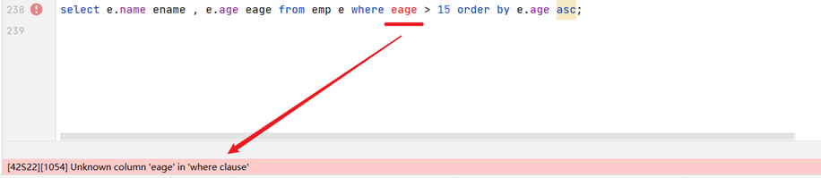

由此我们å¯ä»¥å¾—出结论: **from 先执行，然å执行 where ， å†æ‰§è¡Œselect** 。


æ¥ä¸‹æ¥ï¼Œæˆ‘们å†æ‰§è¡Œå¦‚下SQL语å¥ï¼ŒæŸ¥çœ‹æ‰§è¡Œæ•ˆæœï¼š

```sql
select e.name ename , e.age eage from emp e where e.age > 15 order by eage asc;
```

结æœæ‰§è¡ŒæˆåŠŸã€‚ 那么也就验è¯äº†: **order by 是在select 语å¥ä¹‹å执行的**。


综上所述，我们å¯ä»¥çœ‹åˆ°DQL语å¥çš„执行顺åºä¸ºï¼š **from ... where ... group by ...**

**having ... select ... order by ... limit ...**


### （10）总结

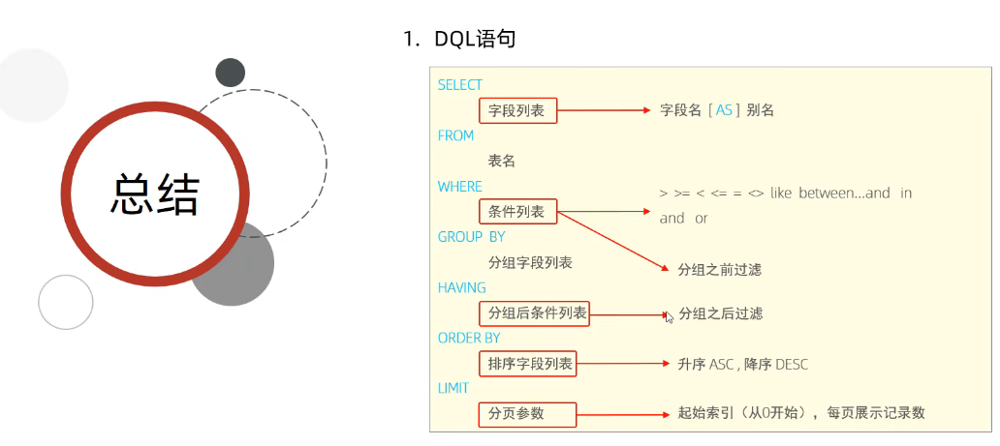


## 2.7 🌟DCL-æ•°æ®æ§åˆ¶

DCL英文全称是**Data Control Language**(æ•°æ®æ§åˆ¶è¯­è¨€)，用æ¥ç®¡ç†**æ•°æ®åº“用户ã€æ§åˆ¶æ•°æ®åº“的访问æƒé™ã€‚**


### （1）管ç†ç”¨æˆ·-user表

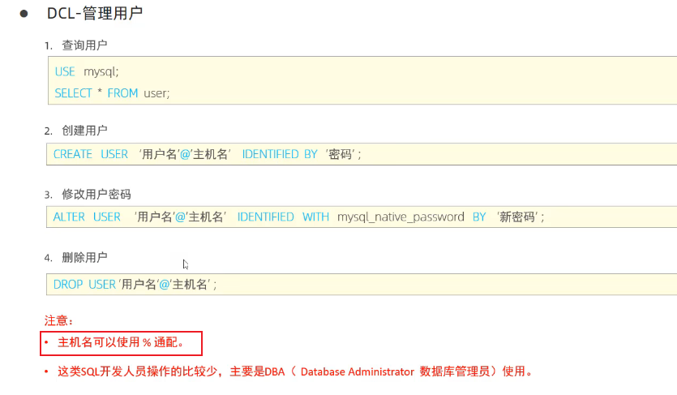

#### ①查询用户

```sql
select * from mysql.user;
```

查询的结æœå¦‚下:


其中 Host代表**当å‰ç”¨æˆ·è®¿é—®çš„主机,** 如æœ**==为localhost, 仅代表åªèƒ½å¤Ÿåœ¨å½“å‰æœ¬æœºè®¿é—®==**，是ä¸å¯ä»¥è¿œç¨‹è®¿é—®çš„。 User代表的是**访问该数æ®åº“的用户å**。在MySQL中需è¦é€šè¿‡**Hostå’ŒUseræ¥å”¯ä¸€æ ‡è¯†ä¸€ä¸ªç”¨æˆ·**。

#### ②创建用户

```sql
CREATE USER '用户å'@'主机å' IDENTIFIED BY '密ç '; 
```

#### â‘¢ 修改用户密ç 

```sql
ALTER USER '用户å'@'主机å' IDENTIFIED WITH mysql_native_password BY '新密ç ' ; 
```

#### ④删除用户

```sql
DROP USER '用户å'@'主机å' ; 
```

注æ„事项:

- 在MySQL中需è¦é€šè¿‡ç”¨æˆ·å@主机åçš„æ–¹å¼ï¼Œæ¥å”¯ä¸€æ ‡è¯†ä¸€ä¸ªç”¨æˆ·ã€‚

- 主机åå¯ä»¥ä½¿ç”¨ % 通é…。
- 这类SQLå¼€å‘人员æ“作的比较少，主è¦æ˜¯DBA（ Database Administrator æ•°æ®åº“管ç†å‘˜ï¼‰ä½¿ç”¨ã€‚


#### ⑤案例

A. 创建用户itcast, åªèƒ½å¤Ÿåœ¨**当å‰ä¸»æœº**localhost访问, 密ç 123456;

```sql
create user 'itcast'@'localhost' identified by '123456'; 
```

B. 创建用户heima, å¯ä»¥åœ¨**ä»»æ„主机**访问该数æ®åº“, 密ç 123456;

```sql
create user 'heima'@'%' identified by '123456'; 
```

C. 修改用户heima的访问密ç ä¸º1234;

```sql
alter user 'heima'@'%' identified with mysql_native_password by '1234'; 
```

D. 删除 itcast@localhost 用户

```sql
drop user 'itcast'@'localhost';
```


### （2）æƒé™æ§åˆ¶

MySQL中定义了很多ç§æƒé™ï¼Œä½†æ˜¯å¸¸ç”¨çš„就以下几ç§ï¼š


上述åªæ˜¯ç®€å•ç½—列了常è§çš„几ç§æƒé™æ述，其他æƒé™æè¿°åŠå«ä¹‰ï¼Œå¯ä»¥ç›´æ¥å‚考[**官方文档**](https://dev.mysql.com/doc/refman/8.0/en/privileges-provided.html)。


| **æƒé™**            | **说æ˜**           |
| :------------------ | :----------------- |
| ALL, ALL PRIVILEGES | 所有æƒé™           |
| SELECT              | æŸ¥è¯¢æ•°æ®           |
| INSERT              | æ’å…¥æ•°æ®           |
| UPDATE              | ä¿®æ”¹æ•°æ®           |
| DELETE              | åˆ é™¤æ•°æ®           |
| ALTER               | 修改表             |
| DROP                | 删除数æ®åº“/表/视图 |
| CREATE              | 创建数æ®åº“/表      |


#### â‘  查询æƒé™-show grants 

```sql
SHOW GRANTS FOR '用户å'@'主机å' ; 
```

#### â‘¡ æˆäºˆæƒé™-grant

```sql
GRANT æƒé™åˆ—表 ON æ•°æ®åº“å.表å TO '用户å'@'主机å'; 
```

#### ③撤销æƒé™-revoke

```sql
REVOKE æƒé™åˆ—表 ON æ•°æ®åº“å.表å FROM '用户å'@'主机å'; 
```

> 注æ„事项：
>
> - 多个æƒé™ä¹‹é—´ï¼Œä½¿ç”¨é€—å·åˆ†éš”
> - æˆæƒæ—¶ï¼Œ æ•°æ®åº“å和表åå¯ä»¥ä½¿ç”¨ * 进行通é…，代表所有。


#### ④案例

A. 查询 'heima'@'%' 用户的æƒé™

```sql
show grants for 'heima'@'%'; 
```

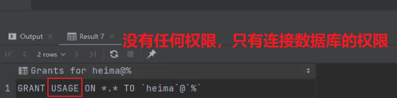

B. æˆäºˆ 'heima'@'%' 用户**itcastæ•°æ®åº“所有表的所有æ“作**æƒé™

```sql
grant all on itcast.* to 'heima'@'%'; 
```


C. æˆäºˆ 'heima'@'%' 用户==所有数æ®åº“所有表的所有æ“作==æƒé™

```sql
grant all on *.* to 'heima'@'%'; 
```

D. 撤销 'heima'@'%' 用户的itcastæ•°æ®åº“的所有æƒé™

```sql
revoke all on itcast.* from 'heima'@'%';
```


### （3）å°ç»“


# 3ã€å‡½æ•°

函数 **是指一段å¯ä»¥ç›´æ¥è¢«å¦ä¸€æ®µç¨‹åºè°ƒç”¨çš„程åºæˆ–代ç **。 也就æ„味ç€ï¼Œè¿™ä¸€æ®µç¨‹åºæˆ–代ç åœ¨MySQL中已ç»ç»™æˆ‘们æ供了，我们è¦åšçš„就是在åˆé€‚的业务场景调用对应的函数完æˆå¯¹åº”的业务需求å³å¯ã€‚ 那么，函数到底在哪儿使用呢？

我们先æ¥çœ‹ä¸¤ä¸ªåœºæ™¯ï¼š

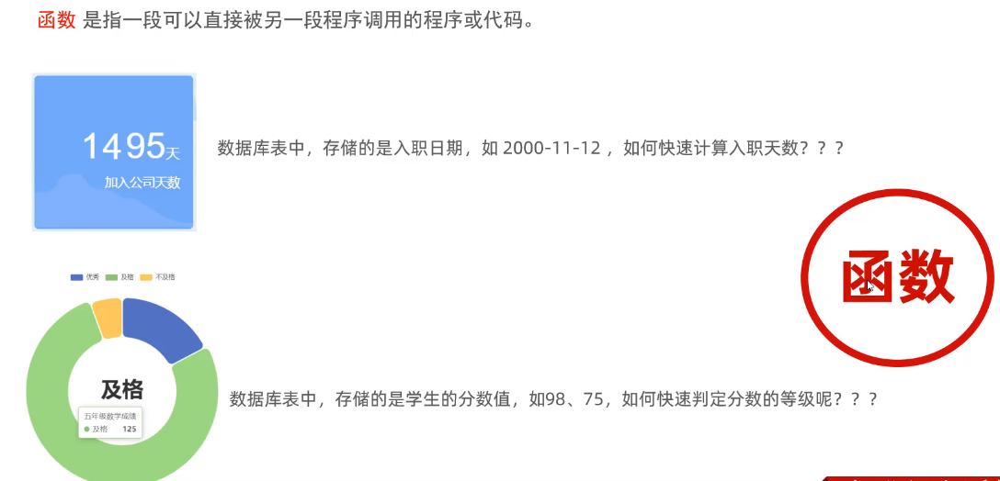


- 在ä¼ä¸šçš„OA或其他的人力系统中，ç»å¸¸ä¼šæ供的有这样一个功能，æ¯ä¸€ä¸ªå‘˜å·¥ç™»å½•ä¸Šæ¥ä¹‹å都能够看到当å‰å‘˜å·¥å…¥èŒçš„天数。 而在数æ®åº“中，存储的都是入èŒæ—¥æœŸï¼Œå¦‚ 2000-11-12，那如æœå¿«é€Ÿè®¡ç®—出天数呢？
- 在åšæŠ¥è¡¨è¿™ç±»çš„业务需求中,我们è¦å±•ç¤ºå‡ºå­¦å‘˜çš„分数等级分布。而在数æ®åº“中，存储的是学生的分数值，如98/75，如何快速判定分数的等级呢？


å…¶å®ï¼Œä¸Šè¿°çš„这一类的需求呢，我们通过MySQL中的函数都å¯ä»¥å¾ˆæ–¹ä¾¿çš„å®ç° 。

MySQL中的函数主è¦åˆ†ä¸ºä»¥ä¸‹å››ç±»ï¼š **字符串函数ã€æ•°å€¼å‡½æ•°ã€æ—¥æœŸå‡½æ•°ã€æµç¨‹å‡½æ•°ã€‚**


## 3.1 字符串函数

### （1）常用字符串函数

MySQL中内置了很多字符串函数，常用的几个如下：


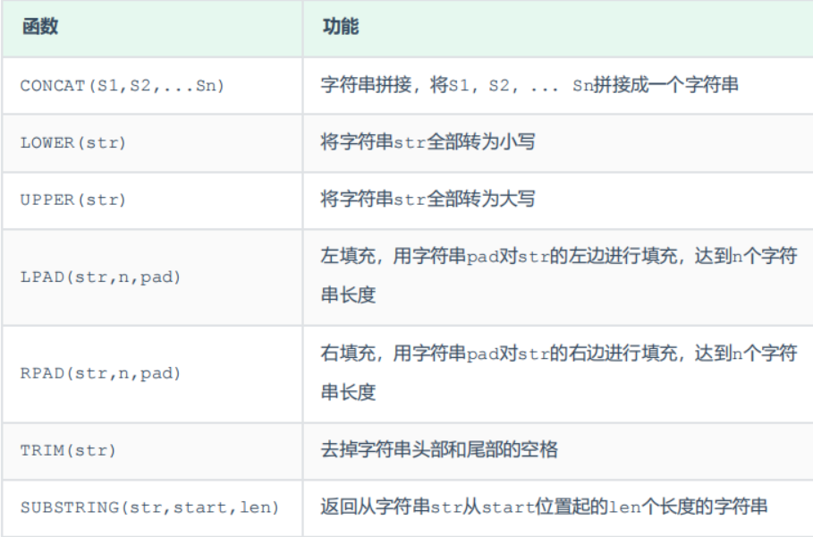

| **函数**                 | **功能**                                                  |
| :----------------------- | :-------------------------------------------------------- |
| CONCAT(S1,S2,...Sn)      | 字符串拼æ¥ï¼Œå°†S1，S2，... Sn拼æ¥æˆä¸€ä¸ªå­—符串              |
| LOWER(str)               | 将字符串str全部转为å°å†™                                   |
| UPPER(str)               | 将字符串str全部转为大写                                   |
| LPAD(str,n,pad)          | 左填充，用字符串pad对str的左边进行填充，达到n个字符串长度 |
| RPAD(str,n,pad)          | å³å¡«å……，用字符串pad对strçš„å³è¾¹è¿›è¡Œå¡«å……，达到n个字符串长度 |
| TRIM(str)                | å»æ‰å­—符串==头部==å’Œ==尾部==的空格                        |
| SUBSTRING(str,start,len) | è¿”å›ä»å­—符串strä»startä½ç½®èµ·çš„len个长度的字符串           |


### （2）演示如下

#### A. ==concat== : 字符串拼æ¥

```sql
select concat('Hello' , ' MySQL'); 
```

#### B. ==lower== : 全部转å°å†™

```sql
select lower('Hello'); 
```

#### C. ==upper== : 全部转大写

```sql
select upper('Hello'); 
```

#### D. ==lpad== : 左填充

```sql
select lpad('01', 5, '-'); 
```

#### E. ==rpad== : å³å¡«å……

```sql
select rpad('01', 5, '-'); 
```

#### F. ==trim== : å»é™¤ç©ºæ ¼

```sql
select trim(' Hello MySQL '); 
```

#### G. ==substring== : 截å–å­å­—符串

```sql
select substring('Hello MySQL',1,5);
```


### （3）案例

ç”±äºä¸šåŠ¡éœ€æ±‚å˜æ›´ï¼Œä¼ä¸šå‘˜å·¥çš„å·¥å·ï¼Œç»Ÿä¸€ä¸º5ä½æ•°ï¼Œç›®å‰ä¸è¶³5ä½æ•°çš„全部在å‰é¢è¡¥0。比如： 1å·å‘˜å·¥çš„å·¥å·åº”该为00001。


```sql
update emp set workno = lpad(workno, 5, '0');
```

处ç†å®Œæ¯•å, 具体的数æ®ä¸º:


## 3.2 数值函数

### （1）常è§æ•°å€¼å‡½æ•°

常è§çš„数值函数如下：


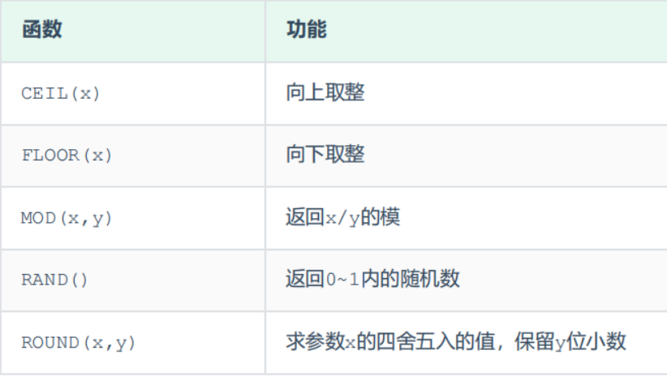

| **函数**   | **功能**                           |
| :--------- | :--------------------------------- |
| CEIL(x)    | å‘上å–æ•´                           |
| FLOOR(x)   | å‘下å–æ•´                           |
| MOD(x,y)   | è¿”å›x/y的模                        |
| RAND()     | è¿”å›0~1内的éšæœºæ•°                  |
| ROUND(x,y) | 求å‚æ•°xçš„å››èˆäº”入的值，ä¿ç•™yä½å°æ•° |

### （2）演示如下

#### A. ==ceil==：å‘上å–æ•´

```sql
select ceil(1.1); 
```

#### B. ==floor==：å‘下å–æ•´

```sql
select floor(1.9); 
```

#### C. ==mod==：å–模

```sql
select mod(7,4); 
```

#### D. ==rand==：è·å–éšæœºæ•°-0到1之间

```sql
select rand(); 
```

#### E. ==round==：四èˆäº”å…¥

```sql
select round(2.344,2);  #2.34
select round(2.345,2);  #2.35
```


### （3）案例

通过数æ®åº“的函数，**生æˆä¸€ä¸ªå…­ä½æ•°çš„éšæœºéªŒè¯ç **。

æ€è·¯ï¼š è·å–éšæœºæ•°å¯ä»¥é€šè¿‡**rand()函数**，但是è·å–出æ¥çš„éšæœºæ•°æ˜¯åœ¨0-1之间的，所以å¯ä»¥**在其基础上乘以1000000**，然å**èˆå¼ƒå°æ•°éƒ¨åˆ†**，如æœé•¿åº¦ä¸è¶³6ä½ï¼Œè¡¥0（左侧补0，所以使用lpad，å³ä¾§åˆ™ä½¿ç”¨rpad）

```sql
select lpad(round(rand()*1000000 , 0), 6, '0');
```


## 3.3 日期函数

### （1）常è§æ—¥æœŸå‡½æ•°


常è§çš„日期函数如下：


| **函数**                           | **功能**                                          |
| :--------------------------------- | :------------------------------------------------ |
| CURDATE()                          | è¿”å›å½“å‰æ—¥æœŸ                                      |
| CURTIME()                          | è¿”å›å½“å‰æ—¶é—´                                      |
| NOW()                              | è¿”å›å½“å‰æ—¥æœŸå’Œæ—¶é—´                                |
| YEAR(date)                         | è·å–指定date的年份                                |
| MONTH(date)                        | è·å–指定date的月份                                |
| DAY(date)                          | è·å–指定date的日期                                |
| DATE_ADD(date, INTERVAL expr type) | è¿”å›ä¸€ä¸ªæ—¥æœŸ/时间值加上一个时间间隔exprå的时间值 |
| DATEDIFF(date1,date2)              | è¿”å›èµ·å§‹æ—¶é—´date1 å’Œ 结æŸæ—¶é—´date2之间的天数      |

### （2）演示如下

#### A. ==curdate==：当å‰æ—¥æœŸ

```sql
select curdate(); 
```

#### B. ==curtime==：当å‰æ—¶é—´

```sql
select curtime(); 
```

#### C. ==now==：当å‰æ—¥æœŸå’Œæ—¶é—´

```sql
select now(); 
```

#### D. ==YEAR , MONTH , DAY==：**当å‰å¹´ã€æœˆã€æ—¥**

```sql
select YEAR(now());
select MONTH(now());
select DAY(now());
```

#### E. ==date_add==：å¢åŠ æŒ‡å®šçš„时间间隔-INTERVAL

```sql
select date_add(now(), INTERVAL 70 YEAR );
```

#### F. ==datediff==：è·å–两个日期相差的天数

```sql
select datediff('2021-10-01', '2021-12-01');  # -61
select datediff('2021-12-01', '2021-10-01');  # 61
```

### （3）案例

查询所有员工的入èŒå¤©æ•°ï¼Œå¹¶æ ¹æ®å…¥èŒå¤©æ•°å€’åºæ’åºã€‚

æ€è·¯ï¼š å…¥èŒå¤©æ•°ï¼Œå°±æ˜¯é€šè¿‡å½“å‰æ—¥æœŸ - å…¥èŒæ—¥æœŸï¼Œæ‰€ä»¥éœ€è¦ä½¿ç”¨**datediff函数**æ¥å®Œæˆã€‚

```sql
select name, datediff(curdate(), entrydate) as 'entrydays' from emp order by entrydays desc;
```


## 3.4 æµç¨‹å‡½æ•°

æµç¨‹å‡½æ•°ä¹Ÿæ˜¯å¾ˆå¸¸ç”¨çš„一类函数，å¯ä»¥åœ¨SQL语å¥ä¸­å®ç°æ¡ä»¶ç­›é€‰ï¼Œä»è€Œæ高语å¥çš„效ç‡ã€‚

### （1）常è§æµç¨‹å‡½æ•°


| **函数**                                                     | **功能**                                                     |
| :----------------------------------------------------------- | :----------------------------------------------------------- |
| IF(value , t , f)                                            | 如æœvalue为true，则返å›t，å¦åˆ™è¿”å›f                          |
| IFNULL(value1 , value2)                                      | 如æœvalue1ä¸ä¸ºç©ºï¼Œè¿”å›value1，å¦åˆ™è¿”å›value2                 |
| CASE WHEN [ val1 ] THEN [res1] ...ELSE [ default ] END       | **如æœval1==为true==**，返å›res1，... å¦åˆ™è¿”å›default默认值  |
| CASE [ expr ] WHEN [ val1 ] THEN[res1] ... ELSE [ default ] END | **如æœexprçš„==值等äº==val1**，返å›res1，... å¦åˆ™è¿”å›default默认值 |

### （2）演示如下

#### A. ==if==

```sql
select if(false, 'Ok', 'Error'); 
```

#### B. ==ifnull==

```sql
select ifnull('Ok','Default'); # OK

select ifnull('','Default'); # 输出 ''

select ifnull(null,'Default');  # 输出Default
```


#### C. ==case when then else end==

需求: 查询emp表的员工姓åå’Œå·¥ä½œåœ°å€ (北京/上海 ----> 一线åŸå¸‚ , 其他 ----> 二线åŸå¸‚)

```sql
select 
name,
(case workaddress when '北京' then '一线åŸå¸‚' when '上海' then '一线åŸå¸‚' else
 '二线åŸå¸‚' end ) as '工作地å€'
from emp;
```


### （3）案例


```sql
create table score(
    id int comment 'ID',
    name varchar(20) comment '姓å',
    math int comment 'æ•°å­¦',
    english int comment '英语',
    chinese int comment '语文'
) comment '学员æˆç»©è¡¨';
insert into score(id, name, math, english, chinese) VALUES (1, 'Tom', 67, 88, 95), (2, 'Rose' , 23, 66, 90),(3, 'Jack', 56, 98, 76);
```

具体的SQL语å¥å¦‚下:

```sql
select
id,
name,
(case when math >= 85 then '优秀' when math >=60 then 'åŠæ ¼' else 'ä¸åŠæ ¼' end )
'æ•°å­¦',
(case when english >= 85 then '优秀' when english >=60 then 'åŠæ ¼' else 'ä¸åŠæ ¼'
 end ) '英语',
(case when chinese >= 85 then '优秀' when chinese >=60 then 'åŠæ ¼' else 'ä¸åŠæ ¼'
 end ) '语文'
from score;
```


## 3.5 å°ç»“

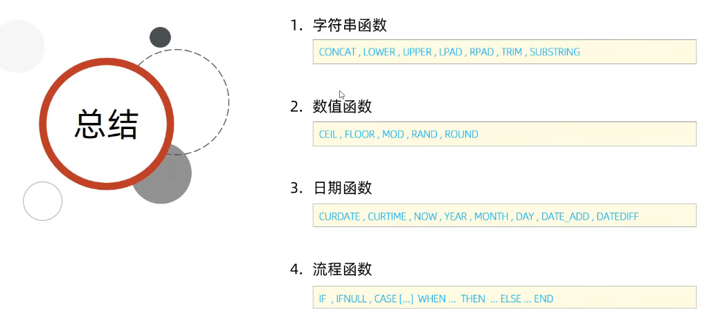


> MySQL的常è§å‡½æ•°æˆ‘们学习完了，那æ¥ä¸‹æ¥ï¼Œæˆ‘们就æ¥åˆ†æ一下，在å‰é¢è®²åˆ°çš„两个函数的案例场景，
>
> æ€è€ƒä¸€ä¸‹éœ€è¦ç”¨åˆ°ä»€ä¹ˆæ ·çš„函数æ¥å®ç°?
>
> 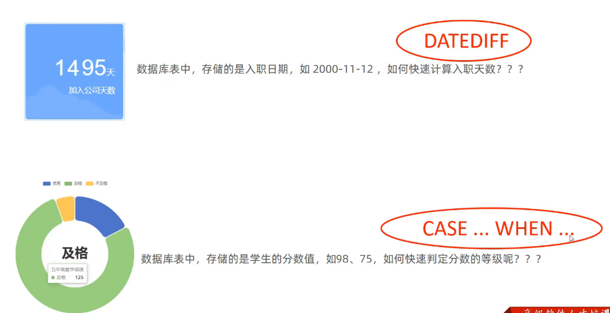
>
> - æ•°æ®åº“中，存储的是入èŒæ—¥æœŸï¼Œå¦‚ 2000-01-01，如何快速计算出入èŒå¤©æ•°å‘¢ï¼Ÿ -------->
>   - 答案: datediff
> - æ•°æ®åº“中，存储的是学生的分数值，如98ã€75，如何快速判定分数的等级呢？ ---------->
>   - 答案: case ... when ...


# 4ã€çº¦æŸ

> ==注æ„==：约æŸæ˜¯**作用äºè¡¨ä¸­å­—段上的**，å¯ä»¥åœ¨**创建表/修改表的时候添加约æŸ**。

## 4.1 概述

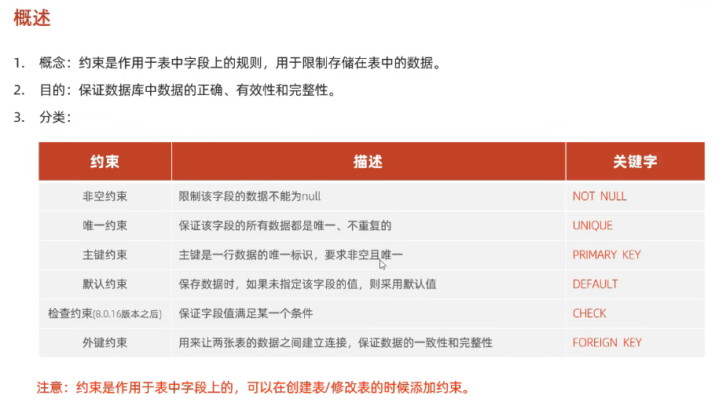

### （1）概念

约æŸæ˜¯ä½œç”¨äºè¡¨ä¸­å­—段上的规则，用äºé™åˆ¶å­˜å‚¨åœ¨è¡¨ä¸­çš„æ•°æ®ã€‚

### （2）目的

ä¿è¯æ•°æ®åº“中数æ®çš„正确ã€æœ‰æ•ˆæ€§å’Œå®Œæ•´æ€§ã€‚

### （3）分类

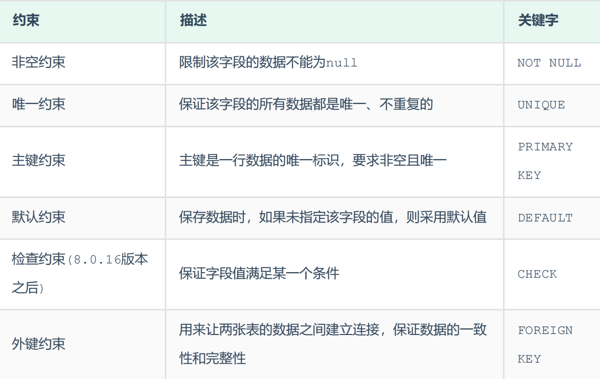

> ==注æ„==：约æŸæ˜¯**作用äºè¡¨ä¸­å­—段上的**，å¯ä»¥åœ¨**创建表/修改表的时候添加约æŸ**。


## 4.2 约æŸæ¼”示-案例

上é¢æˆ‘们介ç»äº†æ•°æ®åº“中常è§çš„约æŸï¼Œä»¥åŠçº¦æŸæ¶‰åŠåˆ°çš„关键字，那这些约æŸæˆ‘们到底如何在创建表ã€ä¿®æ”¹è¡¨çš„时候æ¥æŒ‡å®šå‘¢ï¼Œæ¥ä¸‹æ¥æˆ‘们就通过一个案例，æ¥æ¼”示一下。

案例需求： æ ¹æ®éœ€æ±‚，完æˆè¡¨ç»“æ„的创建。需求如下：

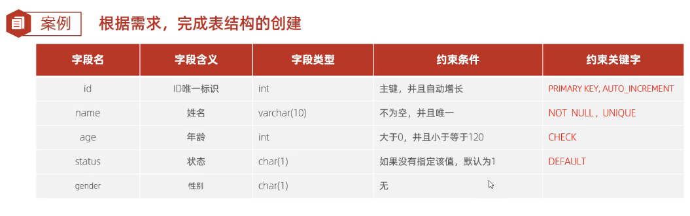

| **字段å**         | **字段å«ä¹‰** | **字段类å‹** | **约æŸæ¡ä»¶**              | **约æŸå…³é”®å­—**              |
| :----------------- | :----------- | :----------- | :------------------------ | :-------------------------- |
| id                 | ID唯一标识   | int          | 主键，并且自动å¢é•¿        | PRIMARY KEY, AUTO_INCREMENT |
| name               | å§“å         | varchar(10)  | ä¸ä¸ºç©ºï¼Œå¹¶ä¸”唯一          | NOT NULL , UNIQUE           |
| age                | 年龄         | int          | 大äº0，并且å°äºç­‰äº120    | CHECK                       |
| status             | çŠ¶æ€         | char(1)      | 如æœæ²¡æœ‰æŒ‡å®šè¯¥å€¼ï¼Œé»˜è®¤ä¸º1 | DEFAULT                     |
| gender             | 性别         | char(1)      | 无                        |                             |
| 对应的建表语å¥ä¸ºï¼š |              |              |                           |                             |

对应的建表语å¥ä¸ºï¼š

```sql
CREATE TABLE tb_user(
    id int AUTO_INCREMENT PRIMARY KEY COMMENT 'ID唯一标识',
    name varchar(10) NOT NULL UNIQUE COMMENT '姓å' ,
    age int check (age > 0 && age <= 120) COMMENT '年龄' ,
    status char(1) default '1' COMMENT '状æ€',
    gender char(1) COMMENT '性别'
);
```

在为字段添加约æŸæ—¶ï¼Œæˆ‘们åªéœ€è¦åœ¨**字段之å加上约æŸçš„关键字**å³å¯ï¼Œéœ€è¦å…³æ³¨å…¶è¯­æ³•ã€‚我们执行上é¢çš„SQL把表结æ„创建完æˆï¼Œç„¶åæ¥ä¸‹æ¥ï¼Œå°±å¯ä»¥é€šè¿‡ä¸€ç»„æ•°æ®è¿›è¡Œæµ‹è¯•ï¼Œä»è€ŒéªŒè¯ä¸€ä¸‹ï¼Œçº¦æŸæ˜¯å¦å¯ä»¥ç”Ÿæ•ˆã€‚

```sql
insert into tb_user(name,age,status,gender) values ('Tom1',19,'1','ç”·'),
('Tom2',25,'0','ç”·');

# éªŒè¯ name çš„ not null
insert into tb_user(name,age,status,gender) values ('Tom3',19,'1','ç”·');
insert into tb_user(name,age,status,gender) values (null,19,'1','ç”·');

# éªŒè¯ name çš„ Unique
insert into tb_user(name,age,status,gender) values ('Tom3',19,'1','ç”·');

# éªŒè¯ age
insert into tb_user(name,age,status,gender) values ('Tom4',80,'1','ç”·');
insert into tb_user(name,age,status,gender) values ('Tom5',-1,'1','ç”·');
insert into tb_user(name,age,status,gender) values ('Tom5',121,'1','ç”·');

# 验è¯statusçš„ Default
insert into tb_user(name,age,gender) values ('Tom5',120,'ç”·');
```

上é¢ï¼Œæˆ‘们是通过编写SQL语å¥çš„å½¢å¼æ¥å®Œæˆçº¦æŸçš„指定，那加入我们是**通过图形化界é¢**æ¥åˆ›å»ºè¡¨ç»“æ„时，åˆè¯¥å¦‚何æ¥æŒ‡å®šçº¦æŸå‘¢ï¼Ÿ åªéœ€è¦åœ¨åˆ›å»ºè¡¨çš„时候，根æ®æˆ‘们的需è¦é€‰æ‹©å¯¹åº”的约æŸå³å¯ã€‚


## 4.3 ==外键约æŸ==

### （1）介ç»


外键：用æ¥è®©ä¸¤å¼ è¡¨çš„**æ•°æ®ä¹‹é—´å»ºç«‹è¿æ¥**，ä»è€Œ**ä¿è¯æ•°æ®çš„一致性和完整性**。

我们æ¥çœ‹ä¸€ä¸ªä¾‹å­ï¼š


左侧的emp表是员工表，里é¢å­˜å‚¨å‘˜å·¥çš„基本信æ¯ï¼ŒåŒ…å«å‘˜å·¥çš„IDã€å§“åã€å¹´é¾„ã€èŒä½ã€è–ªèµ„ã€å…¥èŒæ—¥æœŸã€ä¸Šçº§ä¸»ç®¡IDã€éƒ¨é—¨ID，在员工的信æ¯ä¸­å­˜å‚¨çš„是部门的ID dept_id，而这个部门的ID是关è”的部门表dept的主键id，那emp表的dept_id就是外键,å…³è”的是å¦ä¸€å¼ è¡¨çš„主键。

> 注æ„：目å‰ä¸Šè¿°ä¸¤å¼ è¡¨ï¼Œåªæ˜¯åœ¨**逻辑上存在这样一层关系**ï¼›**在数æ®åº“层é¢ï¼Œå¹¶æœªå»ºç«‹å¤–键关è”**，所以	是无法ä¿è¯æ•°æ®çš„一致性和完整性的。


没有数æ®åº“外键关è”的情况下，能够ä¿è¯ä¸€è‡´æ€§å’Œå®Œæ•´æ€§å‘¢ï¼Œæˆ‘们æ¥æµ‹è¯•ä¸€ä¸‹ã€‚

**准备数æ®**

```sql
create table dept(
    id int auto_increment comment 'ID' primary key,
    name varchar(50) not null comment '部门å称'
)comment '部门表';

INSERT INTO dept (id, name) VALUES (1, 'ç ”å‘部'), (2, '市场部'),(3, '财务部'), (4,'销售部'), (5, '总ç»åŠ');

drop table if exists emp
create table emp(
    id int auto_increment comment 'ID' primary key,
    name varchar(50) not null comment '姓å',
    age int comment '年龄',
    job varchar(20) comment 'èŒä½',
    salary int comment '薪资',
    entrydate date comment 'å…¥èŒæ—¶é—´',
    managerid int comment 'ç›´å±é¢†å¯¼ID',
    dept_id int comment '部门ID'
)comment '员工表';

INSERT INTO emp (id, name, age, job,salary, entrydate, managerid, dept_id) VALUES
(1, '金庸', 66, '总è£',20000, '2000-01-01', null,5),
(2, 'å¼ æ— å¿Œ', 20,'项目ç»ç†',12500, '2005-12-05', 1,1),
(3, 'æ¨é€', 33, 'å¼€å‘', 8400,'2000-11-03', 2,1),
(4, '韦一笑', 48, 'å¼€å‘',11000, '2002-02-05', 2,1),
(5, '常é‡æ˜¥', 43, 'å¼€å‘',10500, '2004-09-07', 3,1),
(6, 'å°æ˜­', 19, '程åºå‘˜é¼“励师',6600, '2004-10-12', 2,1);
```

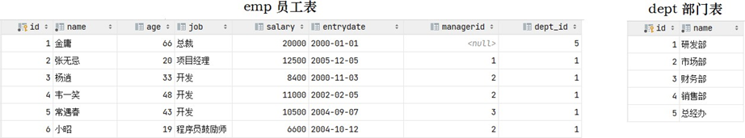

æ¥ä¸‹æ¥ï¼Œæˆ‘们å¯ä»¥åšä¸€ä¸ªæµ‹è¯•ï¼Œåˆ é™¤id为1的部门信æ¯ã€‚

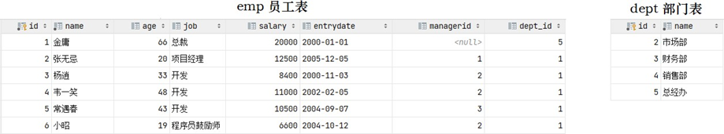

结æœï¼Œæˆ‘们看到删除æˆåŠŸï¼Œè€Œåˆ é™¤æˆåŠŸä¹‹å，部门表ä¸å­˜åœ¨id为1的部门，而在emp表中还有很多的员工，关è”的为id为1的部门，此时就出ç°äº†æ•°æ®çš„ä¸å®Œæ•´æ€§ã€‚ 而è¦æƒ³è§£å†³è¿™ä¸ªé—®é¢˜å°±å¾—通过数æ®åº“的外键约æŸã€‚


### （2）语法


#### ①添加外键

```sql
CREATE TABLE 表å(
    字段å æ•°æ®ç±»å‹,
    ...
    [CONSTRAINT] [外键å称] FOREIGN KEY (外键字段å) REFERENCES 主表 (主表列å)
);

ALTER TABLE 表å ADD CONSTRAINT 外键å称 FOREIGN KEY (外键字段å)
REFERENCES 主表 (主表列å) ;
```

##### 1）案例

为emp表的dept_id字段添加外键约æŸ,å…³è”dept表的主键id。

```sql
alter table emp add constraint fk_emp_dept_id foreign key (dept_id) references dept(id);
```


添加了外键约æŸä¹‹å，我们å†åˆ°dept表(父表)删除id为1的记录，然å看一下会å‘生什么ç°è±¡ã€‚ 此时将会报错，ä¸èƒ½åˆ é™¤æˆ–更新父表记录，因为存在外键约æŸã€‚


#### ② 删除外键

```sql
ALTER TABLE 表å DROP FOREIGN KEY 外键å称;
```

##### 1）案例

删除emp表的外键fk_emp_dept_id。

```sql
alter table emp drop foreign key fk_emp_dept_id; 
```


### （3）删除/更新行为

添加了外键之å，å†åˆ é™¤çˆ¶è¡¨æ•°æ®æ—¶äº§ç”Ÿçš„约æŸè¡Œä¸ºï¼Œæˆ‘们就称为删除/更新行为。具体的删除/更新行为有以下几ç§:

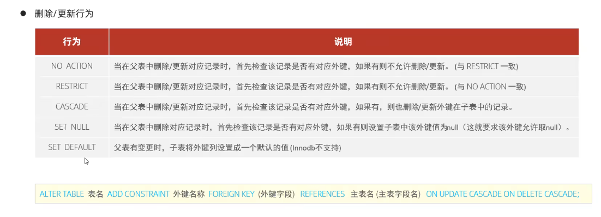

| **行为**    | **说æ˜**                                                     |
| :---------- | :----------------------------------------------------------- |
| NO ACTION   | 当在父表中删除/更新对应记录时，首先**检查该记录是å¦æœ‰å¯¹åº”外键，如æœæœ‰åˆ™ä¸å…许删除/æ›´æ–°**。 (ä¸ RESTRICT 一致) 默认行为 |
| RESTRICT    | 当在父表中删除/更新对应记录时，首先检查该记录是å¦æœ‰å¯¹åº”外键，如æœæœ‰åˆ™ä¸å…许删除/更新。 (ä¸ NO ACTION 一致) 默认行为 |
| CASCADE     | 当在父表中删除/更新对应记录时，首先检查该记录是å¦æœ‰å¯¹åº”外键，**如æœæœ‰ï¼Œåˆ™ä¹Ÿåˆ é™¤/更新外键在å­è¡¨ä¸­çš„记录。**==级è”删除== |
| SET NULL    | 当在父表中删除对应记录时，首先检查该记录是å¦æœ‰å¯¹åº”外键，**如æœæœ‰åˆ™è®¾ç½®å­è¡¨ä¸­è¯¥å¤–键值为null**（这就**è¦æ±‚该外键å…许å–null**）。 |
| SET DEFAULT | 父表有å˜æ›´æ—¶ï¼Œå­è¡¨å°†å¤–键列设置æˆä¸€ä¸ªé»˜è®¤çš„值 (**Innodbä¸æ”¯æŒ**) |

#### ①==具体语法==

```sql
ALTER TABLE 表å ADD CONSTRAINT 外键å称 FOREIGN KEY (外键字段) REFERENCES
主表å (主表字段å) ON UPDATE CASCADE ON DELETE CASCADE;
```

#### ②演示如下

ç”±äº**NO ACTION 是默认行为**，我们å‰é¢è¯­æ³•æ¼”示的时候，已ç»æµ‹è¯•è¿‡äº†ï¼Œå°±ä¸å†æ¼”示了，这里我们å†æ¼”示其他的两ç§è¡Œä¸ºï¼š**CASCADEã€SET NULL**。

##### 1）==CASCADE==-级è”模å¼

```sql
alter table emp add constraint fk_emp_dept_id foreign key (dept_id) references
dept(id) on update cascade on delete cascade ;
```

A. 修改父表id为1的记录，将id修改为6

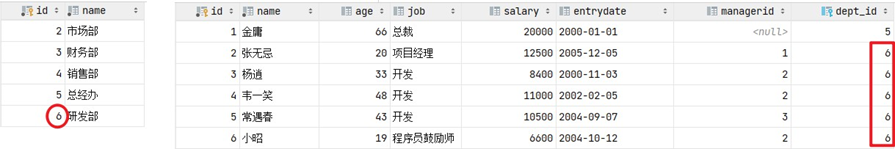

我们å‘ç°ï¼ŒåŸæ¥åœ¨å­è¡¨ä¸­dept_id值为1的记录，ç°åœ¨ä¹Ÿå˜ä¸º6了，这就是**cascade级è”**的效æœã€‚

> 在一般的业务系统中，==ä¸ä¼šä¿®æ”¹ä¸€å¼ è¡¨çš„主键值==。


B. 删除父表id为6的记录

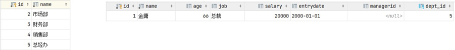

我们å‘ç°ï¼Œ**父表的数æ®åˆ é™¤æˆåŠŸ**了，但是**å­è¡¨**中关è”的记录**也被级è”删除**了。


##### 2）==SET NULL==-设为null

在进行测试之å‰ï¼Œæˆ‘们先需è¦åˆ é™¤ä¸Šé¢å»ºç«‹çš„外键 fk_emp_dept_id。然åå†é€šè¿‡æ•°æ®è„šæœ¬ï¼Œå°†empã€dept表的**æ•°æ®æ¢å¤**了。

```sql
alter table emp add constraint fk_emp_dept_id foreign key (dept_id) references
dept(id) on update cascade on delete cascade ;
```

æ¥ä¸‹æ¥ï¼Œæˆ‘们删除id为1çš„æ•°æ®ï¼Œçœ‹çœ‹ä¼šå‘生什么样的ç°è±¡ã€‚


我们å‘ç°çˆ¶è¡¨çš„记录是å¯ä»¥æ­£å¸¸çš„删除的，父表的数æ®åˆ é™¤ä¹‹å，å†æ‰“å¼€å­è¡¨ emp，我们å‘ç°å­è¡¨empçš„dept_id字段，åŸæ¥dept_id为1çš„æ•°æ®ï¼Œç°åœ¨éƒ½è¢«ç½®ä¸ºNULL了。


这就是SET NULLè¿™ç§åˆ é™¤/更新行为的效æœã€‚


## 4.4 å°ç»“


# 5ã€ğŸŒŸ 多表查询

我们之å‰åœ¨è®²è§£SQL语å¥çš„时候，讲解了DQL语å¥ï¼Œä¹Ÿå°±æ˜¯æ•°æ®æŸ¥è¯¢è¯­å¥ï¼Œä½†æ˜¯ä¹‹å‰è®²è§£çš„查询都是å•è¡¨æŸ¥è¯¢ï¼Œè€Œæœ¬ç« èŠ‚我们è¦å­¦ä¹ çš„则是多表查询æ“作，主è¦ä»ä»¥ä¸‹å‡ ä¸ªæ–¹é¢è¿›è¡Œè®²è§£ã€‚


## 5.1 🌟多表关系

项目开å‘中，在进行数æ®åº“表结æ„设计时，会根æ®ä¸šåŠ¡éœ€æ±‚åŠä¸šåŠ¡æ¨¡å—之间的关系，分æ并设计表结æ„，由äºä¸šåŠ¡ä¹‹é—´ç›¸äº’å…³è”，所以å„个表结æ„之间也存在ç€å„ç§è”系，基本上分为三ç§ï¼š

- **一对多(多对一)**
- 多对多
- 一对一

### （1）一对多(多对一)

- 案例: 部门 ä¸ å‘˜å·¥çš„å…³ç³»
- 关系: 一个部门对应多个员工，一个员工对应一个部门
- å®ç°: 在**多的一方建立外键**，指å‘一的一方的主键

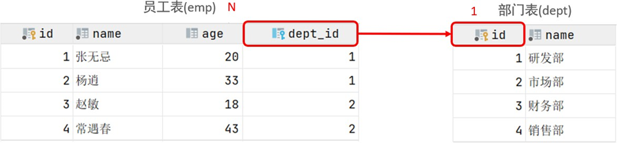


### （2）多对多-==建立中间表==

- 案例: 学生 ä¸ è¯¾ç¨‹çš„å…³ç³»

- 关系: **一个学生å¯ä»¥é€‰ä¿®å¤šé—¨è¯¾ç¨‹ï¼Œä¸€é—¨è¯¾ç¨‹ä¹Ÿå¯ä»¥ä¾›å¤šä¸ªå­¦ç”Ÿé€‰æ‹©**

- å®ç°: **建立第三张中间表**，**==中间表至少包å«ä¸¤ä¸ªå¤–键，分别关è”两方主键==**

  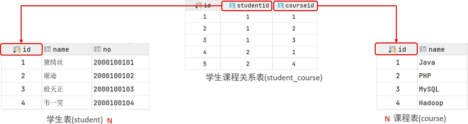

对应的SQL脚本:

```sql
create table student(
    id int auto_increment primary key comment '主键ID',
    name varchar(10) comment '姓å',
    no varchar(10) comment 'å­¦å·'
) comment '学生表';

insert into student values 
(null, '黛绮ä¸', '2000100101'),
(null, '谢逊','2000100102'),
(null, '殷天正', '2000100103'),
(null, '韦一笑', '2000100104');

create table course(
    id int auto_increment primary key comment '主键ID',
    name varchar(10) comment '课程å称'
) comment '课程表';

insert into course values 
(null, 'Java'),(null, 'PHP'), 
(null , 'MySQL'),(null, 'Hadoop');

create table student_course(
    id int auto_increment comment '主键' primary key,
    studentid int not null comment '学生ID',
    courseid int not null comment '课程ID',
    constraint fk_courseid foreign key (courseid) references course (id),
    constraint fk_studentid foreign key (studentid) references student (id)
)comment '学生课程中间表';

insert into student_course values 
(null,1,1),(null,1,2),
(null,1,3),(null,2,2),
(null,2,3),(null,3,4);
```


### （3）一对一-==å•è¡¨æ‹†åˆ†==

- 案例: 用户 ä¸ ç”¨æˆ·è¯¦æƒ…çš„å…³ç³»
- 关系: 一对一关系，**多用äº==å•è¡¨æ‹†åˆ†==，将一张表的基础字段放在一张表中，其他详情字段放在å¦ä¸€å¼ è¡¨ä¸­ï¼Œä»¥æå‡æ“作效ç‡**
- å®ç°: **在任æ„一方加入外键，关è”å¦å¤–一方的主键**，并且**==设置外键为唯一的(UNIQUE)==**

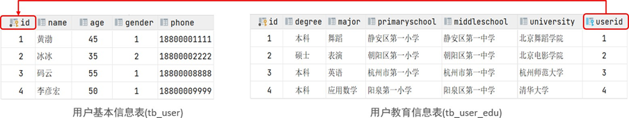

对应的SQL脚本:

```sql
create table tb_user(
    id int auto_increment primary key comment '主键ID',
    name varchar(10) comment '姓å',
    age int comment '年龄',
    gender char(1) comment '1: 男 , 2: 女',
    phone char(11) comment '手机å·'
) comment '用户基本信æ¯è¡¨';

create table tb_user_edu(
    id int auto_increment primary key comment '主键ID',
    degree varchar(20) comment 'å­¦å†',
    major varchar(50) comment '专业',
    primaryschool varchar(50) comment 'å°å­¦',
    middleschool varchar(50) comment '中学',
    university varchar(50) comment '大学',
    userid int unique comment '用户ID',
    constraint fk_userid foreign key (userid) references tb_user(id)
) comment '用户教育信æ¯è¡¨';

insert into tb_user(id, name, age, gender, phone) values
(null,'黄渤',45,'1','18800001111'),
(null,'冰冰',35,'2','18800002222'),
(null,'ç äº‘',55,'1','18800008888'),
(null,'æ彦å®',50,'1','18800009999');

insert into tb_user_edu(id, degree, major, primaryschool, middleschool,university, userid) values
(null,'本科','èˆè¹ˆ','é™å®‰åŒºç¬¬ä¸€å°å­¦','é™å®‰åŒºç¬¬ä¸€ä¸­å­¦','北京èˆè¹ˆå­¦é™¢',1),
(null,'硕士','表演','æœé˜³åŒºç¬¬ä¸€å°å­¦','æœé˜³åŒºç¬¬ä¸€ä¸­å­¦','北京电影学院',2),
(null,'本科','英语','æ­å·å¸‚第一å°å­¦','æ­å·å¸‚第一中学','æ­å·å¸ˆèŒƒå¤§å­¦',3),
(null,'本科','应用数学','阳泉第一å°å­¦','阳泉区第一中学','清å大学',4);
```


## 5.2 多表查询概述

### （1）数æ®å‡†å¤‡

1). åˆ é™¤ä¹‹å‰ emp, dept表的测试数æ®

2). 执行如下脚本，创建emp表ä¸dept表并æ’入测试数æ®

```sql
-- 创建dept表，并æ’入数æ®
create table dept(
    id int auto_increment comment 'ID' primary key,
    name varchar(50) not null comment '部门å称'
)comment '部门表';
INSERT INTO dept (id, name) VALUES 
(1, 'ç ”å‘部'), (2, '市场部'),(3, '财务部'),
(4,'销售部'), (5, '总ç»åŠ'), (6, '人事部');

-- 创建emp表，并æ’入数æ®
create table emp(
    id int auto_increment comment 'ID' primary key,
    name varchar(50) not null comment '姓å',
    age int comment '年龄',
    job varchar(20) comment 'èŒä½',
    salary int comment '薪资',
    entrydate date comment 'å…¥èŒæ—¶é—´',
    managerid int comment 'ç›´å±é¢†å¯¼ID',
    dept_id int comment '部门ID'
)comment '员工表';

-- 添加外键
alter table emp add constraint fk_emp_dept_id foreign key (dept_id) references
dept(id);

INSERT INTO emp (id, name, age, job,salary, entrydate, managerid, dept_id)
VALUES
(1, '金庸', 66, '总è£',20000, '2000-01-01', null,5),
(2, 'å¼ æ— å¿Œ', 20, '项目ç»ç†',12500, '2005-12-05', 1,1),
(3, 'æ¨é€', 33, 'å¼€å‘', 8400,'2000-11-03', 2,1),
(4, '韦一笑', 48, 'å¼€å‘',11000, '2002-02-05', 2,1),
(5, '常é‡æ˜¥', 43, 'å¼€å‘',10500, '2004-09-07', 3,1),
(6, 'å°æ˜­', 19, '程åºå‘˜é¼“励师',6600, '2004-10-12', 2,1),
(7, 'ç­ç»', 60, '财务总监',8500, '2002-09-12', 1,3),
(8, '周芷若', 19, '会计',48000, '2006-06-02', 7,3),
(9, 'ä¸æ•å›', 23, '出纳',5250, '2009-05-13', 7,3),
(10, 'èµµæ•', 20, '市场部总监',12500, '2004-10-12', 1,2),
(11, '鹿æ–客', 56, 'èŒå‘˜',3750, '2006-10-03', 10,2),
(12, '鹤笔ç¿', 19, 'èŒå‘˜',3750, '2007-05-09', 10,2),
(13, '方东白', 19, 'èŒå‘˜',5500, '2009-02-12', 10,2),
(14, '张三丰', 88, '销售总监',14000, '2004-10-12', 1,4),
(15, 'ä¿è²èˆŸ', 38, '销售',4600, '2004-10-12', 14,4),
(16, '宋远桥', 40, '销售',4600, '2004-10-12', 14,4),
(17, '陈å‹è°…', 42, null,2000, '2011-10-12', 1,null);
```

dept表共6æ¡è®°å½•ï¼Œemp表共17æ¡è®°å½•ã€‚


### （2）概述


多表查询就是指ä»å¤šå¼ è¡¨ä¸­æŸ¥è¯¢æ•°æ®ã€‚

åŸæ¥**查询å•è¡¨æ•°æ®**，执行的SQLå½¢å¼ä¸ºï¼šselect * from emp;

那么我们è¦æ‰§è¡Œå¤šè¡¨æŸ¥è¯¢ï¼Œå°±åªéœ€è¦**使用逗å·åˆ†éš”多张表**å³å¯ï¼Œå¦‚： select * from emp , dept; 具体的执行结æœå¦‚下:


此时,我们看到查询结æœä¸­åŒ…å«äº†å¤§é‡çš„结æœé›†ï¼Œæ€»å…±102æ¡è®°å½•ï¼Œè€Œè¿™å…¶å®å°±æ˜¯å‘˜å·¥è¡¨emp所有的记录(17) ä¸ éƒ¨é—¨è¡¨dept所有记录(6) 的所有组åˆæƒ…况，这ç§ç°è±¡ç§°ä¹‹ä¸ºç¬›å¡å°”积。æ¥ä¸‹æ¥ï¼Œå°±æ¥ç®€å•

介ç»ä¸‹ç¬›å¡å°”积。

**==笛å¡å°”积==:** 笛å¡å°”乘积是指在数学中，**两个集åˆAé›†åˆ å’Œ B集åˆçš„所有组åˆæƒ…况**。

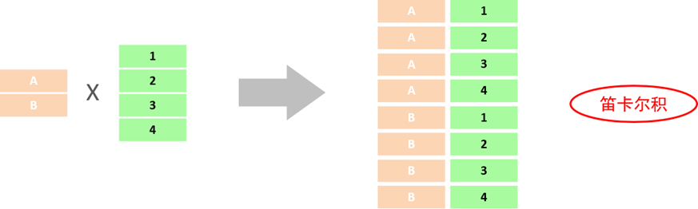

而在多表查询中，我们是**需è¦==消除无效的笛å¡å°”积==**的，**åªä¿ç•™ä¸¤å¼ è¡¨å…³è”部分的数æ®**。

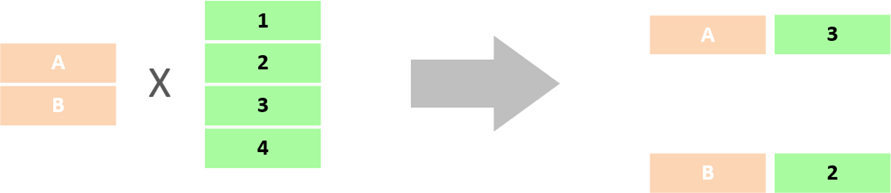

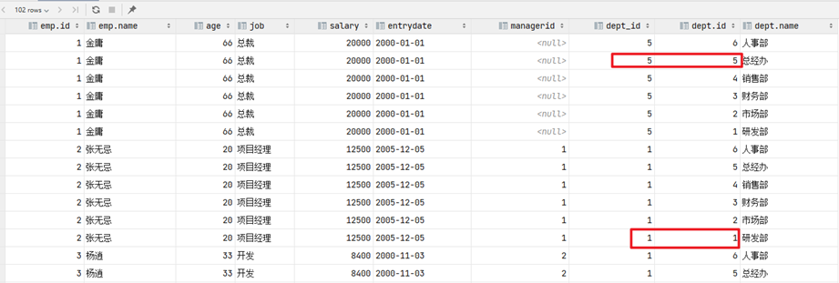

在SQL语å¥ä¸­ï¼Œå¦‚何æ¥å»é™¤æ— æ•ˆçš„笛å¡å°”积呢？ 我们å¯ä»¥ç»™å¤šè¡¨æŸ¥è¯¢åŠ ä¸Šè¿æ¥æŸ¥è¯¢çš„æ¡ä»¶å³å¯ã€‚

select * from emp , dept **where** emp.dept_id = dept.id;

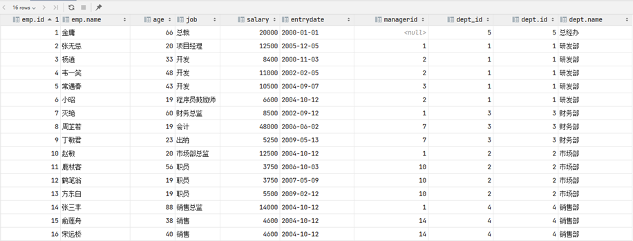

而由äºid为17的员工，没有dept_id字段值，所以在多表查询时，根æ®è¿æ¥æŸ¥è¯¢çš„æ¡ä»¶å¹¶æ²¡æœ‰æŸ¥è¯¢

到。


### （3）分类


- è¿æ¥æŸ¥è¯¢
  - 内è¿æ¥ï¼šç›¸å½“äºæŸ¥è¯¢Aã€B**交集部分数æ®**
  - 外è¿æ¥ï¼š
    - 左外è¿æ¥ï¼šæŸ¥è¯¢**左表所有数æ®ï¼Œä»¥åŠä¸¤å¼ è¡¨äº¤é›†éƒ¨åˆ†æ•°æ®**
    - å³å¤–è¿æ¥ï¼šæŸ¥è¯¢**å³è¡¨æ‰€æœ‰æ•°æ®ï¼Œä»¥åŠä¸¤å¼ è¡¨äº¤é›†éƒ¨åˆ†æ•°æ®**
  - 自è¿æ¥ï¼šå½“å‰è¡¨ä¸è‡ªèº«çš„è¿æ¥æŸ¥è¯¢ï¼Œè‡ªè¿æ¥å¿…须使用表别å
- å­æŸ¥è¯¢


## 5.3 🌟内è¿æ¥


**内è¿æ¥æŸ¥è¯¢çš„是==两张表交集部分==çš„æ•°æ®ã€‚(也就是绿色部分的数æ®)**

内è¿æ¥çš„语法分为两ç§: **éšå¼å†…è¿æ¥ã€æ˜¾å¼å†…è¿æ¥**。先æ¥å­¦ä¹ ä¸€ä¸‹å…·ä½“的语法结æ„。


### （1）éšå¼å†…è¿æ¥

```sql
SELECT 字段列表 FROM 表1 , 表2 WHERE æ¡ä»¶ ... ;
```

### （2）显å¼å†…è¿æ¥-inner join ... on ...

```sql
SELECT 字段列表 FROM 表1 [ INNER ] JOIN 表2 ON è¿æ¥æ¡ä»¶ ... ;
```


### （3）案例

#### A. 查询æ¯ä¸€ä¸ªå‘˜å·¥çš„姓å , åŠå…³è”的部门的å称 (**éšå¼å†…è¿æ¥å®ç°**)

- 表结æ„: emp , dept
- è¿æ¥æ¡ä»¶: emp.dept_id = dept.id

```sql
select emp.name , dept.name from emp , dept where emp.dept_id = dept.id ;

-- 为æ¯ä¸€å¼ è¡¨èµ·åˆ«å,简化SQL编写
select e.name,d.name from emp e , dept d where e.dept_id = d.id;
```

#### B. 查询æ¯ä¸€ä¸ªå‘˜å·¥çš„姓å , åŠå…³è”的部门的å称 (**显å¼å†…è¿æ¥å®ç°**) --- INNER JOIN ...ON ...

- 表结æ„: emp , dept
- è¿æ¥æ¡ä»¶: emp.dept_id = dept.id

```sql
select e.name, d.name from emp e inner join dept d on e.dept_id = d.id;

-- 为æ¯ä¸€å¼ è¡¨èµ·åˆ«å,简化SQL编写
select e.name, d.name from emp e join dept d on e.dept_id = d.id;
```


> **==表的别å==**:
>
> â‘ . tablea as 别å1 , tableb as 别å2 ;
>
> â‘¡. tablea 别å1 , tableb 别å2 ;
>
> **注æ„事项:**
>
> ​	**一旦为表起了别å，就ä¸èƒ½å†ä½¿ç”¨è¡¨åæ¥æŒ‡å®šå¯¹åº”的字段了**，此时åªèƒ½å¤Ÿä½¿ç”¨åˆ«åæ¥æŒ‡å®šå­—
>
> 段。


## 5.4 🌟外è¿æ¥


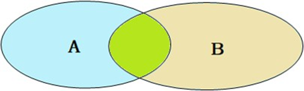

外è¿æ¥åˆ†ä¸ºä¸¤ç§ï¼Œåˆ†åˆ«æ˜¯ï¼š**左外è¿æ¥ å’Œ å³å¤–è¿æ¥**。具体的语法结æ„为：

### （1）左外è¿æ¥-left [outer] join

左外è¿æ¥ç›¸å½“äº**查询表1(左表)的所有数æ®**，当然也**包å«è¡¨1和表2交集部分**çš„æ•°æ®ã€‚

```sql
SELECT 字段列表 FROM 表1 LEFT [ OUTER ] JOIN 表2 ON æ¡ä»¶ ... ; 
```


### （2）å³å¤–è¿æ¥-right [outer] join

å³å¤–è¿æ¥ç›¸å½“äº**查询表2(å³è¡¨)的所有数æ®**，当然也**包å«è¡¨1和表2交集部分**çš„æ•°æ®ã€‚

```sql
SELECT 字段列表 FROM 表1 RIGHT [ OUTER ] JOIN 表2 ON æ¡ä»¶ ... ; 
```


### （3）案例

#### A. 查询emp表的所有数æ®, 和对应的部门信æ¯

ç”±äºéœ€æ±‚中æ到，è¦**查询emp的所有数æ®**，所以是ä¸èƒ½å†…è¿æ¥æŸ¥è¯¢çš„，需è¦è€ƒè™‘**使用外è¿æ¥æŸ¥è¯¢**。

- 表结æ„: emp, dept
- è¿æ¥æ¡ä»¶: emp.dept_id = dept.id

```sql
select e.*, d.name from emp e left outer join dept d on e.dept_id = d.id;

select e.*, d.name from emp e left join dept d on e.dept_id = d.id;
```

#### B. 查询dept表的所有数æ®, 和对应的员工信æ¯(å³å¤–è¿æ¥)

ç”±äºéœ€æ±‚中æ到，è¦æŸ¥è¯¢**dept表的所有数æ®**，所以是ä¸èƒ½å†…è¿æ¥æŸ¥è¯¢çš„，需è¦è€ƒè™‘使用外è¿æ¥æŸ¥è¯¢ã€‚

- 表结æ„: emp, dept
- è¿æ¥æ¡ä»¶: emp.dept_id = dept.id

```sql
select d.*, e.* from emp e right outer join dept d on e.dept_id = d.id;

select d.*, e.* from dept d left outer join emp e on e.dept_id = d.id;
```


> ==**注æ„事项：**==
>
> 左外è¿æ¥å’Œå³å¤–è¿æ¥æ˜¯å¯ä»¥**==相互替æ¢==**的，åªéœ€è¦**调整**在è¿æ¥æŸ¥è¯¢æ—¶SQL中，表结æ„çš„å…ˆå顺
>
> åºå°±å¯ä»¥äº†ã€‚而我们在日常开å‘使用时，**æ›´åå‘äºå·¦å¤–è¿æ¥**。


## 5.5 自è¿æ¥

### （1）自è¿æ¥æŸ¥è¯¢

自è¿æ¥æŸ¥è¯¢ï¼Œé¡¾åæ€ä¹‰ï¼Œå°±æ˜¯è‡ªå·±è¿æ¥è‡ªå·±ï¼Œä¹Ÿå°±æ˜¯æŠŠ**一张表è¿æ¥æŸ¥è¯¢å¤šæ¬¡**。我们先æ¥å­¦ä¹ ä¸€ä¸‹è‡ªè¿æ¥çš„查询语法：

而对äºè‡ªè¿æ¥æŸ¥è¯¢ï¼Œ**==å¯ä»¥æ˜¯å†…è¿æ¥æŸ¥è¯¢ï¼Œä¹Ÿå¯ä»¥æ˜¯å¤–è¿æ¥æŸ¥è¯¢==**。

#### ①案例

**A. 查询员工 åŠå…¶ 所å±é¢†å¯¼çš„åå­—**

表结æ„: emp

```sql
select a.name , b.name from emp a , emp b where a.managerid = b.id;
```


**B. 查询所有员工 emp åŠå…¶é¢†å¯¼çš„åå­— emp , 如æœ==员工没有领导(Boss), 也需è¦æŸ¥è¯¢å‡ºæ¥==**

表结æ„: emp a , emp b

```sql
select a.name '员工', b.name '领导' from emp a left join emp b on a.managerid =
b.id;
```


> **注æ„事项:**
>
> 在自è¿æ¥æŸ¥è¯¢ä¸­ï¼Œ**==å¿…é¡»è¦ä¸ºè¡¨èµ·åˆ«å==**，è¦ä¸ç„¶æˆ‘们ä¸æ¸…楚所指定的æ¡ä»¶ã€è¿”å›çš„字段，到底
>
> 是哪一张表的字段。


### （2）è”åˆæŸ¥è¯¢-union/union all


#### ①概念

对äºunion查询，就是把**多次查询的结æœåˆå¹¶èµ·æ¥ï¼Œå½¢æˆä¸€ä¸ªæ–°çš„查询结æœé›†**。

```sql
SELECT 字段列表 FROM 表A ...

UNION [ ALL ]

SELECT 字段列表 FROM 表B ....;
```

- 对äºè”åˆæŸ¥è¯¢çš„多张表的**==列数必须ä¿æŒä¸€è‡´==**，**==字段类å‹ä¹Ÿéœ€è¦ä¿æŒä¸€è‡´==。**
- **==union all== 会将全部的数æ®ç›´æ¥åˆå¹¶åœ¨ä¸€èµ·**，**union 会==对åˆå¹¶ä¹‹åçš„æ•°æ®å»é‡==**。

#### ②案例

A. 将薪资ä½äº 5000 的员工 , å’Œ å¹´é¾„å¤§äº 50 å²çš„员工全部查询出æ¥.

当å‰å¯¹äºè¿™ä¸ªéœ€æ±‚，我们å¯ä»¥ç›´æ¥ä½¿ç”¨å¤šæ¡ä»¶æŸ¥è¯¢ï¼Œä½¿ç”¨**逻辑è¿ç®—符 or è¿æ¥**å³å¯ã€‚ 那这里呢，我们也å¯ä»¥é€šè¿‡**union/union allæ¥è”åˆæŸ¥è¯¢**.

```sql
select * from emp where salary < 5000
union all
select * from emp where age > 50;
```

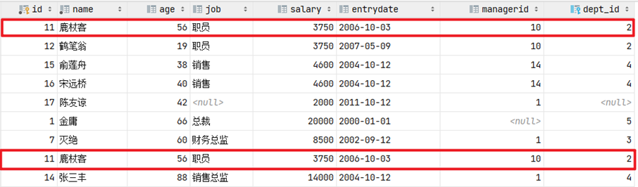

union all查询出æ¥çš„结æœï¼Œ**仅仅进行简å•çš„åˆå¹¶ï¼Œå¹¶æœªå»é‡**。


```sql
select * from emp where salary < 5000
union
select * from emp where age > 50;
```


union è”åˆæŸ¥è¯¢ï¼Œ**会对查询出æ¥çš„结æœè¿›è¡Œå»é‡å¤„ç†**。


> **注æ„：**
>
> 如æœå¤šæ¡æŸ¥è¯¢è¯­å¥æŸ¥è¯¢å‡ºæ¥çš„结æœï¼Œ**字段数é‡ä¸ä¸€è‡´**，在进行union/union allè”åˆæŸ¥è¯¢æ—¶ï¼Œå°†ä¼šæŠ¥
>
> 错。如：
>
> 


## 5.6 🌟å­æŸ¥è¯¢-嵌套Select语å¥

### （1）概述


#### ①概念

SQL语å¥ä¸­**==嵌套SELECT语å¥==，称为嵌套查询，åˆç§°å­æŸ¥è¯¢**。

```sql
SELECT * FROM t1 WHERE column1 = ( SELECT column1 FROM t2 ); 
```

**å­æŸ¥è¯¢å¤–部的语å¥å¯ä»¥æ˜¯INSERT / UPDATE / DELETE / SELECT 的任何一个**。

#### ②分类

æ ¹æ®**å­æŸ¥è¯¢ç»“æœä¸åŒ**，分为：

- A. æ ‡é‡å­æŸ¥è¯¢ï¼ˆ**å­æŸ¥è¯¢ç»“æœä¸ºå•ä¸ªå€¼**）
- B. 列å­æŸ¥è¯¢(å­æŸ¥è¯¢**结æœä¸ºä¸€åˆ—**)
- C. è¡Œå­æŸ¥è¯¢(å­æŸ¥è¯¢**结æœä¸ºä¸€è¡Œ**)
- D. 表å­æŸ¥è¯¢(å­æŸ¥è¯¢ç»“æœä¸º**多行多列**)


æ ¹æ®å­æŸ¥è¯¢ä½ç½®ï¼Œåˆ†ä¸ºï¼š

- A. WHERE之å
- B. FROM之å
- C. SELECT之å


### （2）标é‡å­æŸ¥è¯¢

#### ①概念

å­æŸ¥è¯¢è¿”å›çš„结æœæ˜¯**å•ä¸ªå€¼ï¼ˆæ•°å­—ã€å­—符串ã€æ—¥æœŸç­‰ï¼‰**，最简å•çš„å½¢å¼ï¼Œè¿™ç§å­æŸ¥è¯¢ç§°ä¸º**æ ‡é‡å­æŸ¥è¯¢**。

常用的æ“作符：= 	 <>	  > 	>= 	<	 <= 

#### ②案例

##### **A. 查询 "销售部" 的所有员工信æ¯**

完æˆè¿™ä¸ªéœ€æ±‚时，我们å¯ä»¥å°†éœ€æ±‚分解为两步：

①. 查询 "销售部" 部门ID

```sql
select id from dept where name = '销售部'; 
```

â‘¡. æ ¹æ® "销售部" 部门ID, 查询员工信æ¯

```sql
select * from emp where dept_id = (select id from dept where name = '销售部'); 
```


##### **B. 查询在 "方东白" å…¥èŒä¹‹å的员工信æ¯**

完æˆè¿™ä¸ªéœ€æ±‚时，我们å¯ä»¥å°†éœ€æ±‚分解为两步：

â‘ . 查询 方东白 çš„å…¥èŒæ—¥æœŸ

```sql
select entrydate from emp where name = '方东白'; 
```

â‘¡. 查询指定入èŒæ—¥æœŸä¹‹åå…¥èŒçš„员工信æ¯

```sql
select * from emp where entrydate > (select entrydate from emp where name = '方东白');
```


### （3）列å­æŸ¥è¯¢


#### ①概念

å­æŸ¥è¯¢è¿”å›çš„结æœæ˜¯**一列（å¯ä»¥æ˜¯å¤šè¡Œï¼‰**，这ç§å­æŸ¥è¯¢ç§°ä¸º**列å­æŸ¥è¯¢**。

常用的æ“作符：**IN** ã€NOT IN 〠**ANY** ã€**SOME** 〠**ALL**


#### ②案例

##### A. 查询 "销售部" å’Œ "市场部" 的所有员工信æ¯

分解为以下两步:

①. 查询 "销售部" 和 "市场部" 的部门ID

```sql
select id from dept where name = '销售部' or name = '市场部';
```

â‘¡. æ ¹æ®éƒ¨é—¨ID, 查询员工信æ¯

```sql
select * from emp where dept_id in (select id from dept where name = '销售部' or
name = '市场部');
```


##### B. 查询比 财务部 ==所有人工资都高==的员工信æ¯

分解为以下两步:

①. 查询所有 财务部 人员工资

```sql
select id from dept where name = '财务部';
select salary from emp where dept_id = (select id from dept where name = '财务部');
```

â‘¡. 比 财务部 **所有人工资都高**的员工信æ¯

```sql
select * from emp where salary > all ( select salary from emp where dept_id =
(select id from dept where name = '财务部') );
```


##### C. 查询比研å‘部其中==ä»»æ„一人工资高==的员工信æ¯ï¼ˆä¹Ÿå°±æ˜¯==有比研å‘部中的高就行==，åªéœ€è¦æ»¡è¶³å…¶ä¸­ä»»æ„一个）

分解为以下两步:

â‘ . 查询研å‘部所有人工资

```sql
select salary from emp where dept_id = (select id from dept where name = 'ç ”å‘部'); 
```

â‘¡. 比研å‘部其中任æ„一人工资高的员工信æ¯

```sql
select * from emp where salary > any ( select salary from emp where dept_id =
(select id from dept where name = 'ç ”å‘部') );
```


### （4）行å­æŸ¥è¯¢

#### ①概念

å­æŸ¥è¯¢è¿”å›çš„结æœæ˜¯**一行（å¯ä»¥æ˜¯å¤šåˆ—）**，这ç§å­æŸ¥è¯¢ç§°ä¸º**è¡Œå­æŸ¥è¯¢**。

常用的æ“作符：= ã€<> ã€IN ã€NOT IN


#### ②案例

##### A. æŸ¥è¯¢ä¸ "å¼ æ— å¿Œ" 的薪资åŠç›´å±é¢†å¯¼ç›¸åŒçš„å‘˜å·¥ä¿¡æ¯ ;

这个需求åŒæ ·å¯ä»¥æ‹†è§£ä¸ºä¸¤æ­¥è¿›è¡Œ:

â‘ . 查询 "å¼ æ— å¿Œ" 的薪资åŠç›´å±é¢†å¯¼

```sql
select salary, managerid from emp where name = '张无忌';
```

â‘¡. æŸ¥è¯¢ä¸ "å¼ æ— å¿Œ" 的薪资åŠç›´å±é¢†å¯¼ç›¸åŒçš„å‘˜å·¥ä¿¡æ¯ ;

```sql
select * from emp where (salary,managerid) = (select salary, managerid from emp
where name = '张无忌');
```


### （5）表å­æŸ¥è¯¢

#### ①概念

å­æŸ¥è¯¢è¿”å›çš„结æœæ˜¯**多行多列**，这ç§å­æŸ¥è¯¢ç§°ä¸º**表å­æŸ¥è¯¢**。

常用的æ“作符：IN


#### ②案例

##### A. æŸ¥è¯¢ä¸ "鹿æ–客" , "宋远桥" çš„èŒä½å’Œè–ªèµ„相åŒçš„员工信æ¯

分解为两步执行:

â‘ . 查询 "鹿æ–客" , "宋远桥" çš„èŒä½å’Œè–ªèµ„

```sql
select job, salary from emp where name = '鹿æ–客' or name = '宋远桥'; 
```

â‘¡. æŸ¥è¯¢ä¸ "鹿æ–客" , "宋远桥" çš„èŒä½å’Œè–ªèµ„相åŒçš„员工信æ¯

```sql
select * from emp where (job,salary) in ( select job, salary from emp where name =
'鹿æ–客' or name = '宋远桥' );
```


##### B. 查询入èŒæ—¥æœŸæ˜¯ "2006-01-01" 之åçš„å‘˜å·¥ä¿¡æ¯ , åŠå…¶éƒ¨é—¨ä¿¡æ¯

分解为两步执行:

â‘ . å…¥èŒæ—¥æœŸæ˜¯ "2006-01-01" 之å的员工信æ¯

```sql
select * from emp where entrydate > '2006-01-01'; 
```

â‘¡. 查询这部分员工, 对应的部门信æ¯;

```sql
select e.*, d.* from (select * from emp where entrydate > '2006-01-01') e left
join dept d on e.dept_id = d.id ;
```


## 5.7 多表查询案例

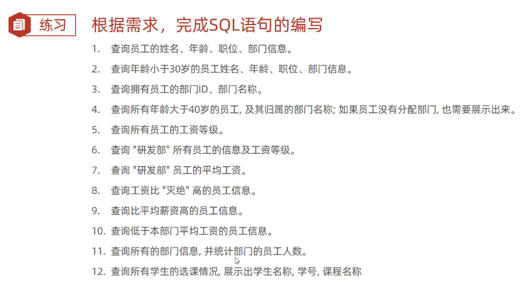

**æ•°æ®ç¯å¢ƒå‡†å¤‡:**

```sql
create table salgrade(
    grade int,
    losal int,
    hisal int
) comment '薪资等级表';
insert into salgrade values (1,0,3000);
insert into salgrade values (2,3001,5000);
insert into salgrade values (3,5001,8000);
insert into salgrade values (4,8001,10000);
insert into salgrade values (5,10001,15000);
insert into salgrade values (6,15001,20000);
insert into salgrade values (7,20001,25000);
insert into salgrade values (8,25001,30000);
```

在这个案例中，我们主è¦è¿ç”¨ä¸Šé¢æ‰€è®²è§£çš„多表查询的语法，完æˆä»¥ä¸‹çš„12个需求å³å¯ï¼Œè€Œè¿™é‡Œä¸»è¦æ¶‰åŠåˆ°çš„表就三张：emp员工表ã€dept部门表ã€salgrade薪资等级表 。


### （1）查询员工的姓åã€å¹´é¾„ã€èŒä½ã€éƒ¨é—¨ä¿¡æ¯ （éšå¼å†…è¿æ¥ï¼‰

表: emp , dept

è¿æ¥æ¡ä»¶: emp.dept_id = dept.id

```sql
select e.name , e.age , e.job , d.name from emp e , dept d where e.dept_id = d.id; 
```


### （2）查询年龄å°äº30å²çš„员工的姓åã€å¹´é¾„ã€èŒä½ã€éƒ¨é—¨ä¿¡æ¯ï¼ˆæ˜¾å¼å†…è¿æ¥ï¼‰

表: emp , dept

è¿æ¥æ¡ä»¶: emp.dept_id = dept.id

```sql
select e.name , e.age , e.job , d.name from emp e inner join dept d on e.dept_id =
d.id where e.age < 30;
```


### （3）查询拥有员工的部门IDã€éƒ¨é—¨å称

表: emp , dept

è¿æ¥æ¡ä»¶: emp.dept_id = dept.id

```sql
select distinct d.id , d.name from emp e , dept d where e.dept_id = d.id; 
```


### （4） 查询所有年龄大äº40å²çš„员工, åŠå…¶å½’å±çš„部门å称; 如æœå‘˜å·¥æ²¡æœ‰åˆ†é…部门, 也需è¦å±•ç¤ºå‡ºæ¥(外è¿æ¥)

表: emp , dept

è¿æ¥æ¡ä»¶: emp.dept_id = dept.id

```sql
select e.*, d.name from emp e left join dept d on e.dept_id = d.id where e.age >
40 ;
```


### （5） 查询所有员工的工资等级

表: emp , salgrade

è¿æ¥æ¡ä»¶ : emp.salary >= salgrade.losal and emp.salary <= salgrade.hisal

```sql
-- æ–¹å¼ä¸€
select e.* , s.grade , s.losal, s.hisal from emp e , salgrade s where e.salary >=
s.losal and e.salary <= s.hisal;

-- æ–¹å¼äºŒ
select e.* , s.grade , s.losal, s.hisal from emp e , salgrade s where e.salary
between s.losal and s.hisal;
```


### （6） 查询 "ç ”å‘部" 所有员工的信æ¯åŠ 工资等级

表: emp , salgrade , dept

è¿æ¥æ¡ä»¶ : emp.salary between salgrade.losal and salgrade.hisal ,

emp.dept_id = dept.id

查询æ¡ä»¶ : dept.name = 'ç ”å‘部'

```sql
select e.* , s.grade from emp e , dept d , salgrade s where e.dept_id = d.id and (
e.salary between s.losal and s.hisal ) and d.name = 'ç ”å‘部';
```


### （7）查询 "ç ”å‘部" 员工的平å‡å·¥èµ„

表: emp , dept

è¿æ¥æ¡ä»¶ : emp.dept_id = dept.id

```sql
select avg(e.salary) from emp e, dept d where e.dept_id = d.id and d.name = 'ç ”å‘
部';
```


### （8）查询工资比 "ç­ç»" 高的员工信æ¯

â‘ . 查询 "ç­ç»" 的薪资

```sql
select salary from emp where name = 'ç­ç»'; 
```

â‘¡. 查询比她工资高的员工数æ®

```sql
select * from emp where salary > ( select salary from emp where name = 'ç­ç»' ); 
```


### （9）查询比平å‡è–ªèµ„高的员工信æ¯

â‘ . 查询员工的平å‡è–ªèµ„

```sql
select avg(salary) from emp; 
```

â‘¡. 查询比平å‡è–ªèµ„高的员工信æ¯

```sql
select * from emp where salary > ( select avg(salary) from emp ); 
```


### （10）==查询ä½äºæœ¬éƒ¨é—¨å¹³å‡å·¥èµ„的员工信æ¯==

â‘ . 查询指定部门平å‡è–ªèµ„

```sql
select avg(e1.salary) from emp e1 where e1.dept_id = 1;
select avg(e1.salary) from emp e1 where e1.dept_id = 2;
```

â‘¡. 查询ä½äºæœ¬éƒ¨é—¨å¹³å‡å·¥èµ„的员工信æ¯

```sql
select * from emp e2 where e2.salary < ( select avg(e1.salary) from emp e1 where
e1.dept_id = e2.dept_id );
```


### （11） 查询所有的部门信æ¯, 并统计部门的员工人数

```sql
select d.id, d.name , ( select count(*) from emp e where e.dept_id = d.id ) '人数'
from dept d;
```


### （12） 查询所有学生的选课情况, 展示出学生å称, å­¦å·, 课程å称

表: student , course , student_course

è¿æ¥æ¡ä»¶: student.id = student_course.studentid , course.id =

student_course.courseid

```sql
select s.name , s.no , c.name from student s , student_course sc , course c where
s.id = sc.studentid and sc.courseid = c.id ;
```


> 备注: 以上需求的å®ç°æ–¹å¼å¯èƒ½ä¼šå¾ˆå¤š, SQL写法也有很多，åªè¦èƒ½æ»¡è¶³æˆ‘们的需求，查询出符åˆæ¡ä»¶çš„记录å³å¯ã€‚


## 5.8 å°ç»“


# 6ã€ğŸŒŸ  ==事务==

## **6.1** 事务简介


事务 **是一组æ“作的集åˆ**，它**是一个ä¸å¯åˆ†å‰²çš„工作å•ä½**，事务会把所有的æ“作作为一个整体一起å‘系统æ交或撤销æ“作请求，å³è¿™äº›æ“作**==è¦ä¹ˆåŒæ—¶æˆåŠŸï¼Œè¦ä¹ˆåŒæ—¶å¤±è´¥==**。

就比如: 张三给æ四转账1000å—钱，张三银行账户的钱å‡å°‘1000，而æ四银行账户的钱è¦å¢åŠ 1000。 这一组æ“作就必须在一个事务的范围内，è¦ä¹ˆéƒ½æˆåŠŸï¼Œè¦ä¹ˆéƒ½å¤±è´¥ã€‚


- **正常情况:** 转账这个æ“作, 需è¦åˆ†ä¸ºä»¥ä¸‹è¿™ä¹ˆä¸‰æ­¥æ¥å®Œæˆ , 三步完æˆä¹‹å, 张三å‡å°‘1000, 而æå››

  å¢åŠ 1000, 转账æˆåŠŸ :

- **异常情况:** 转账这个æ“作, 也是分为以下这么三步æ¥å®Œæˆ , 在执行第三步是报错了, 这样就导致张

  三å‡å°‘1000å—é’±, 而æ四的金é¢æ²¡å˜, 这样就造æˆäº†æ•°æ®çš„ä¸ä¸€è‡´, 就出ç°é—®é¢˜äº†ã€‚


为了解决上述的问题，就需è¦é€šè¿‡æ•°æ®çš„事务æ¥å®Œæˆï¼Œæˆ‘们åªéœ€è¦åœ¨ä¸šåŠ¡é€»è¾‘执行之å‰å¼€å¯äº‹åŠ¡ï¼Œæ‰§è¡Œå®Œæ¯•åæ交事务。**如æœæ‰§è¡Œè¿‡ç¨‹ä¸­æŠ¥é”™ï¼Œåˆ™å›æ»šäº‹åŠ¡ï¼ŒæŠŠæ•°æ®æ¢å¤åˆ°äº‹åŠ¡å¼€å§‹ä¹‹å‰çš„状æ€ã€‚**


> **注æ„：**  ==默认MySQL的事务是自动æ交的==，也就是说，当执行完一æ¡DML语å¥æ—¶ï¼ŒMySQL会立å³éš
>
> å¼çš„æ交事务。


## 6.2 事务æ“作

**æ•°æ®å‡†å¤‡ï¼š**

```sql
drop table if exists account;
create table account(
    id int primary key AUTO_INCREMENT comment 'ID',
    name varchar(10) comment '姓å',
    money double(10,2) comment 'ä½™é¢'
) comment '账户表';
insert into account(name, money) VALUES ('张三',2000), ('æå››',2000);
```


### （1）未æ§åˆ¶äº‹åŠ¡

#### ①测试正常情况

```sql
-- 1. 查询张三余é¢
select * from account where name = '张三';
-- 2. 张三的余é¢å‡å°‘1000
update account set money = money - 1000 where name = '张三';
-- 3. æ四的余é¢å¢åŠ 1000
update account set money = money + 1000 where name = 'æå››';
```

测试完毕之å检查数æ®çš„状æ€, å¯ä»¥çœ‹åˆ°æ•°æ®æ“作å‰å是一致的。

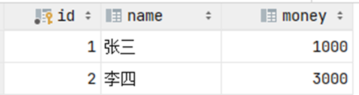

#### ②测试异常情况

```sql
-- 1. 查询张三余é¢
select * from account where name = '张三';
-- 2. 张三的余é¢å‡å°‘1000
update account set money = money - 1000 where name = '张三';
出错了....
-- 3. æ四的余é¢å¢åŠ 1000
update account set money = money + 1000 where name = 'æå››';
```

我们把数æ®éƒ½æ¢å¤åˆ°2000， 然åå†æ¬¡ä¸€æ¬¡æ€§æ‰§è¡Œä¸Šè¿°çš„SQL语å¥(出错了.... è¿™å¥è¯ä¸ç¬¦åˆSQL语法,执行就会报错)，检查最终的数æ®æƒ…况, å‘ç°æ•°æ®åœ¨**æ“作å‰åä¸ä¸€è‡´**了。

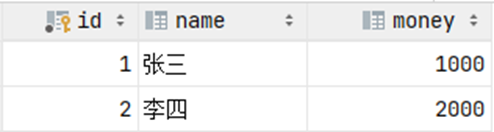

### （2）æ§åˆ¶äº‹åŠ¡ä¸€

#### ①查看/设置事务æ交方å¼

```sql
SELECT @@autocommit ; # 为1自动æ交 ; 为0手动æ交

SET @@autocommit = 0  # 设置为手动æ交，之å的任何æ“作都需è¦æ‰‹åŠ¨æ交事务Commit
```

#### â‘¡æ交事务

```sql
COMMIT;
```

#### â‘¢å›æ»šäº‹åŠ¡

```sql
ROLLBACK;
```

> **==注æ„==：**上述的这ç§æ–¹å¼ï¼Œæˆ‘们是**修改了事务的自动æ交行为**, **把默认的自动æ交修改为了==手动æ交==**, 此时我们执行的DML语å¥éƒ½ä¸ä¼šæ交, 需è¦**手动的执行commit进行æ交**。


### （3）==æ§åˆ¶äº‹åŠ¡äºŒ==


#### â‘ å¼€å¯äº‹åŠ¡

```sql
START TRANSACTION 或 BEGIN ;
```

#### â‘¡æ交事务

```sql
COMMIT;
```

#### â‘¢å›æ»šäº‹åŠ¡

```sql
ROLLBACK;
```

#### ④转账案例

```sql
-- å¼€å¯äº‹åŠ¡
start transaction
-- 1. 查询张三余é¢
select * from account where name = '张三';
-- 2. 张三的余é¢å‡å°‘1000
update account set money = money - 1000 where name = '张三';
-- 3. æ四的余é¢å¢åŠ 1000
update account set money = money + 1000 where name = 'æå››';
-- 如æœæ­£å¸¸æ‰§è¡Œå®Œæ¯•, 则æ交事务
commit;
-- 如æœæ‰§è¡Œè¿‡ç¨‹ä¸­æŠ¥é”™, 则å›æ»šäº‹åŠ¡
-- rollback;
```


## 6.3 🌟 ==事务四大特性==-ACID

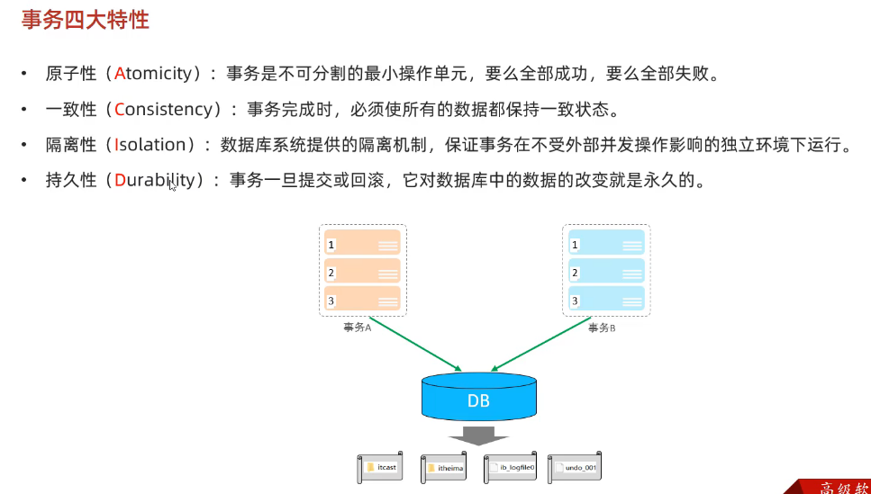

- åŸå­æ€§ï¼ˆAtomicity）：事务是**ä¸å¯åˆ†å‰²çš„最å°æ“作å•å…ƒï¼Œè¦ä¹ˆå…¨éƒ¨æˆåŠŸï¼Œè¦ä¹ˆå…¨éƒ¨å¤±è´¥**。
- 一致性（Consistency）：事务完æˆæ—¶ï¼Œå¿…须使**所有的数æ®éƒ½ä¿æŒä¸€è‡´çŠ¶æ€**。
- 隔离性（Isolation）：数æ®åº“系统æ供的**隔离机制**，ä¿è¯**事务在ä¸å—外部并å‘æ“作影å“的独立ç¯å¢ƒä¸‹è¿è¡Œã€‚**
- æŒä¹…性（Durability）：**事务一旦æ交或å›æ»š**，它对数æ®åº“中的数æ®çš„**改å˜å°±æ˜¯æ°¸ä¹…çš„**。

上述就是事务的四大特性，简称ACID。

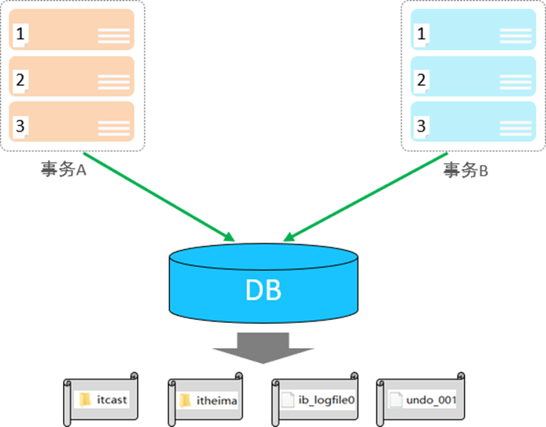


## 6.4 🌟 ==并å‘事务问题==


1. **è„读(Dirty Read)**：一个事务读å–了å¦ä¸€ä¸ªæœªæ交事务修改过的数æ®
2. **ä¸å¯é‡å¤è¯»(Non-repeatable Read)**：一个事务内多次读å–åŒä¸€æ•°æ®ï¼Œä½†ç”±äºå…¶ä»–事务的修改，导致å‰å读å–的结æœä¸ä¸€è‡´
3. **幻读(Phantom Read)**：一个事务内多次查询åŒä¸€èŒƒå›´çš„æ•°æ®ï¼Œä½†ç”±äºå…¶ä»–事务的æ’å…¥æ“作，导致å‰å查询结æœçš„行数ä¸ä¸€è‡´


### （1）*è„读*

**赃读：一个事务==读到==å¦å¤–一个事务==还没有æ交的数æ®==。**

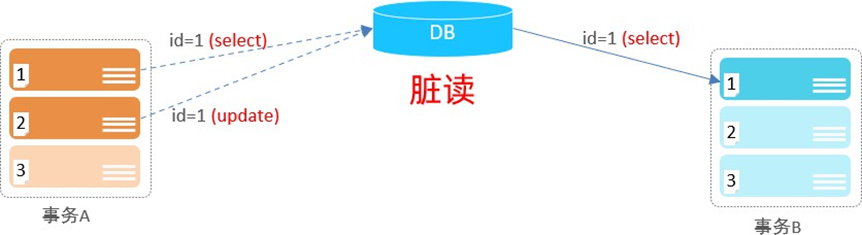

比如B**读å–到了A未æ交的数æ®**。


#### ①比喻-便äºç†è§£

**è„读 - 读到"è„"æ•°æ®**

**比喻**：就åƒä½ å·çœ‹äº†åŒå­¦è¿˜æ²¡äº¤å·çš„答案，但åæ¥è€å¸ˆå‘ç°ä»–åšé”™äº†ï¼ŒæŠŠç­”案改了。你看到的是"è„"çš„ã€æœªç¡®è®¤çš„答案。

**例å­**：

- 事务A修改了æŸæ¡è®°å½•ä½†æœªæ交
- 事务B读å–了这æ¡è¢«ä¿®æ”¹ä½†æœªæ交的记录
- 事务Aå›æ»šäº†ä¿®æ”¹
- 事务B读到的就是无效的"è„"æ•°æ®


### （2）*ä¸å¯é‡å¤è¯»*

**ä¸å¯é‡å¤è¯»ï¼šä¸€ä¸ªäº‹åŠ¡==å…ˆå读å–åŒä¸€æ¡è®°å½•==，但==两次读å–çš„æ•°æ®ä¸åŒ==，称之为ä¸å¯é‡å¤è¯»ã€‚**


事务A两次读å–åŒä¸€æ¡è®°å½•ï¼Œä½†æ˜¯**读å–到的数æ®å´æ˜¯ä¸ä¸€æ ·**的。


#### ①比喻

**ä¸å¯é‡å¤è¯» - åŒä¸€æ¬¡è€ƒè¯•ä¸­ç­”案å˜äº†**

**比喻**：就åƒä½ è€ƒè¯•æ—¶æ£€æŸ¥åŒä¸€é“题，第一次选A，第二次看å˜æˆäº†B，因为è€å¸ˆåœ¨ä½ æ£€æŸ¥æ—¶æ”¹äº†æ­£ç¡®ç­”案。

**例å­**：

- 事务A第一次读å–æ•°æ®ï¼Œå€¼ä¸º100
- 事务B修改了该数æ®ä¸º200并æ交
- 事务Aå†æ¬¡è¯»å–åŒä¸€æ•°æ®ï¼Œå‘ç°å˜æˆäº†200
- åŒä¸€äº‹åŠ¡å†…两次读å–结æœä¸åŒ


### （3）*幻读*

**幻读：一个事务==按照æ¡ä»¶æŸ¥è¯¢æ•°æ®==时，==没有对应的数æ®è¡Œ==，但是==在æ’入数æ®æ—¶ï¼Œåˆå‘ç°è¿™è¡Œæ•°æ®å·²ç»å­˜åœ¨==，*好åƒå‡ºç°äº† "幻影"*。**


#### ①比喻

 **幻读 - 凭空多出æ¥çš„è¡Œ**

**比喻**：就åƒä½ æ•°æ•™å®¤é‡Œçš„人数，第一次数是10人，ä½å¤´è®°å½•åå†æŠ¬å¤´æ•°å˜æˆäº†11人，因为有个人在你ä½å¤´æ—¶æºœè¿›æ¥äº†ã€‚

**例å­**：

- 事务A查询年龄>30的员工，得到5æ¡è®°å½•
- 事务Bæ’入了一个年龄35的新员工并æ交
- 事务Aå†æ¬¡æŸ¥è¯¢å¹´é¾„>30的员工，得到6æ¡è®°å½•
- å°±åƒå‡ºç°äº†"幻影行"


### （4）总结

#### ①如何记忆

- **è„读**：读到别人"没洗手"(未æ交)çš„æ•°æ®
- **ä¸å¯é‡å¤è¯»**：åŒä¸€äº‹åŠ¡å†…"é‡å¤è¯»"结æœä¸åŒ
- **幻读**：åƒå¹»è§‰ä¸€æ ·å¤šå‡ºæˆ–少了几行数æ®

#### â‘¡æ•°æ®åº“隔离级别解决这些问题

1. **读未æ交(Read Uncommitted)**：什么都ä¸èƒ½é˜²æ­¢
2. **读已æ交(Read Committed)**：防止è„读
3. **å¯é‡å¤è¯»(Repeatable Read)**：防止è„读和ä¸å¯é‡å¤è¯»
4. **串行化(Serializable)**：防止所有问题(但性能最差)

MySQLçš„InnoDB在"å¯é‡å¤è¯»"级别下通过MVCC机制也能防止幻读。


## 6.5 🌟 ==事务隔离级别==

**注æ„**：==**事务隔离级别越高，数æ®è¶Šå®‰å…¨ï¼Œä½†æ˜¯æ€§èƒ½è¶Šä½**==。

### （1）事务隔离级别

**为了解决并å‘事务所引å‘的问题，在数æ®åº“中引入了事务隔离级别。主è¦æœ‰ä»¥ä¸‹å‡ ç§ï¼š**

1. **读未æ交(Read Uncommitted)**：什么都ä¸èƒ½é˜²æ­¢
2. **读已æ交(Read Committed)**：防止è„读
3. **å¯é‡å¤è¯»(Repeatable Read)**：**防止è„读和ä¸å¯é‡å¤è¯»**，==Mysql的默认隔离级别==
   1. MySQLçš„**InnoDB在"å¯é‡å¤è¯»"级别**下通过**==MVCC机制==**也能**==防止幻读==**。
4. **串行化(Serializable)**：防止所有问题(但性能最差)

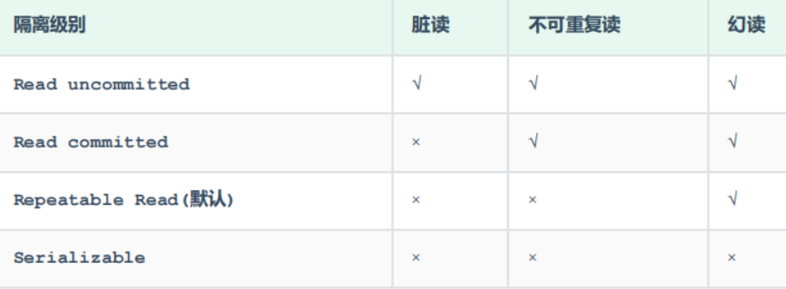


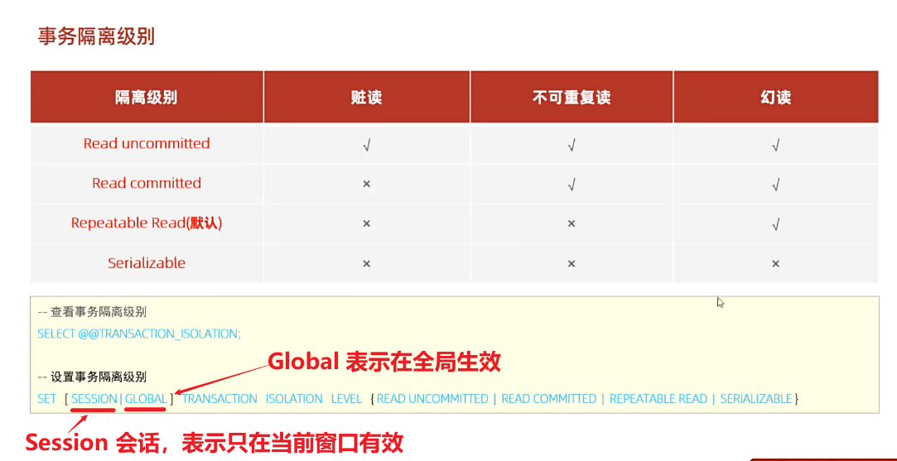

### （2）查看事务隔离级别

```sql
SELECT @@TRANSACTION_ISOLATION;
```


### （3）设置事务隔离级别

```sql
SET [ SESSION | GLOBAL ] TRANSACTION ISOLATION LEVEL { READ UNCOMMITTED |
READ COMMITTED | REPEATABLE READ | SERIALIZABLE }
```


> **注æ„**：==**事务隔离级别越高，数æ®è¶Šå®‰å…¨ï¼Œä½†æ˜¯æ€§èƒ½è¶Šä½**==。


## 6.6 å°ç»“


# ----------------------------


# 二ã€é«˜çº§ç¯‡

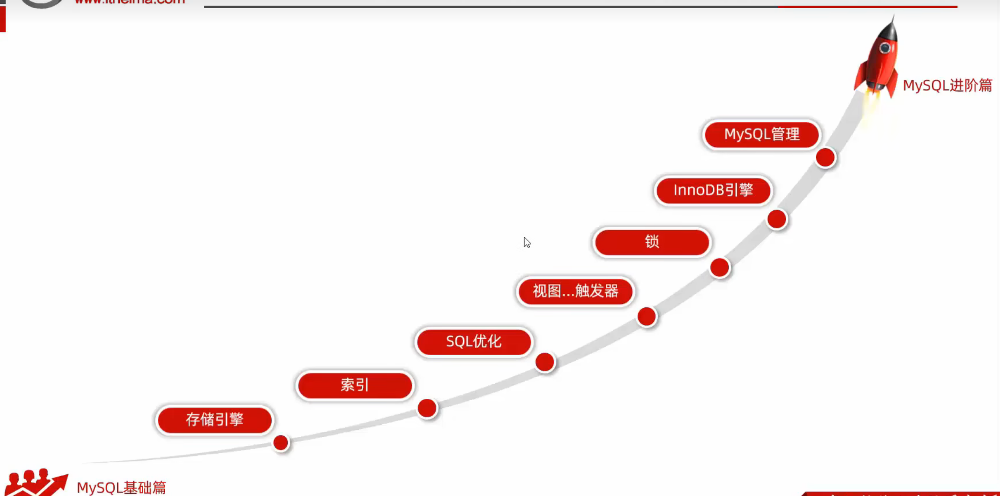

# 1ã€ğŸŒŸå­˜å‚¨å¼•æ“

## 1.1 MySQL体系结æ„


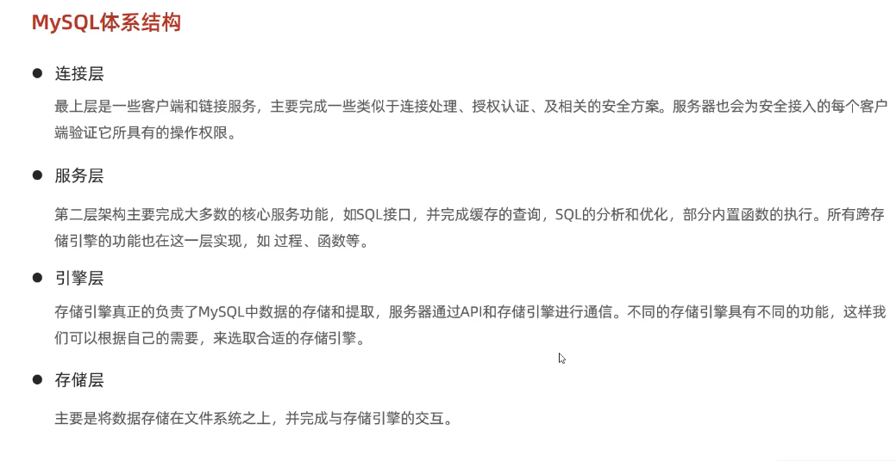

### （1）è¿æ¥å±‚

最上层是一些客户端和链æ¥æœåŠ¡ï¼ŒåŒ…å«**本地sock 通信**和大多数基äº**客户端/æœåŠ¡ç«¯å·¥å…·å®ç°çš„ç±»**ä¼¼äºTCP/IP的通信。主è¦å®Œæˆä¸€äº›ç±»ä¼¼äº**è¿æ¥å¤„ç†ã€æˆæƒè®¤è¯ã€åŠç›¸å…³çš„安全方案**。在该层上引入了**线程池**的概念，为通过认è¯å®‰å…¨æ¥å…¥çš„客户端æ供线程。åŒæ ·åœ¨è¯¥å±‚上å¯ä»¥å®ç°åŸºäºSSL的安全链æ¥ã€‚æœåŠ¡å™¨ä¹Ÿä¼šä¸ºå®‰å…¨æ¥å…¥çš„æ¯ä¸ªå®¢æˆ·ç«¯éªŒè¯å®ƒæ‰€å…·æœ‰çš„æ“作æƒé™ã€‚


### （2）==æœåŠ¡å±‚==

第二层æ¶æ„主è¦å®Œæˆå¤§å¤šæ•°çš„核心æœåŠ¡åŠŸèƒ½ï¼Œå¦‚**SQLæ¥å£ï¼Œå¹¶å®Œæˆç¼“存的查询，SQL的分æ和优化，部分内置函数的执行**。所有跨存储引æ“的功能也在这一层å®ç°ï¼Œå¦‚ 过程ã€å‡½æ•°ç­‰ã€‚在该层，æœåŠ¡å™¨ä¼šè§£æ查询并**创建相应的内部解ææ ‘**，并对其完æˆç›¸åº”的优化如确定表的查询的顺åºï¼Œæ˜¯å¦**利用索引**等，最å生æˆç›¸åº”的执行æ“作。如æœæ˜¯select语å¥ï¼ŒæœåŠ¡å™¨è¿˜ä¼šæŸ¥è¯¢å†…部的缓存，如æœç¼“存空间足够大，这样在解决大é‡è¯»æ“作的ç¯å¢ƒä¸­èƒ½å¤Ÿå¾ˆå¥½çš„æå‡ç³»ç»Ÿçš„性能。


### （3）引æ“层

存储引æ“层， 存储引æ“真正的**负责了MySQL中数æ®çš„存储和æå–**，**æœåŠ¡å™¨é€šè¿‡API和存储引æ“进行通信**。ä¸åŒçš„存储引æ“具有ä¸åŒçš„功能，这样我们å¯ä»¥æ ¹æ®è‡ªå·±çš„需è¦ï¼Œæ¥é€‰å–åˆé€‚的存储引æ“。**==æ•°æ®åº“中的索引是在存储引æ“层å®ç°çš„==**。


### （4）存储层

æ•°æ®å­˜å‚¨å±‚， 主è¦æ˜¯å°†**æ•°æ®(如: redologã€undologã€æ•°æ®ã€ç´¢å¼•ã€äºŒè¿›åˆ¶æ—¥å¿—ã€é”™è¯¯æ—¥å¿—ã€æŸ¥è¯¢æ—¥å¿—ã€æ…¢æŸ¥è¯¢æ—¥å¿—ç­‰)存储在文件系统之上**，并完æˆä¸å­˜å‚¨å¼•æ“的交互。


> 和其他数æ®åº“相比，MySQL有点ä¸ä¼—ä¸åŒï¼Œå®ƒçš„æ¶æ„å¯ä»¥åœ¨å¤šç§ä¸åŒåœºæ™¯ä¸­åº”用并å‘æŒ¥è‰¯å¥½ä½œç”¨ã€‚ä¸»è¦  体ç°åœ¨å­˜å‚¨å¼•æ“上，**==æ’件å¼çš„存储引æ“æ¶æ„==**，**将查询处ç†å’Œå…¶ä»–的系统任务以åŠæ•°æ®çš„存储æå–分离**。 è¿™ç§æ¶æ„å¯ä»¥æ ¹æ®ä¸šåŠ¡çš„需求和å®é™…需è¦**选择åˆé€‚的存储引æ“**。


## 1.2 ==存储引æ“==介ç»

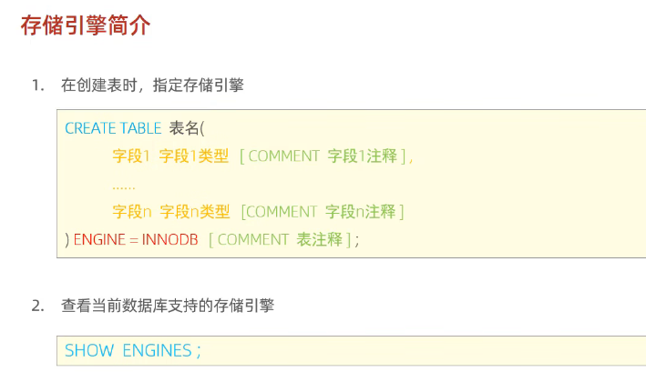

### （1）概念


大家å¯èƒ½æ²¡æœ‰å¬è¯´è¿‡å­˜å‚¨å¼•æ“，但是一定å¬è¿‡å¼•æ“这个è¯ï¼Œå¼•æ“就是å‘动机，是一个机器的核心组件。比如，对äºèˆ°è½½æœºã€ç›´å‡æœºã€ç«ç®­æ¥è¯´ï¼Œä»–们都有å„自的引æ“，是他们最为核心的组件。而我们在选择引æ“的时候，需è¦åœ¨åˆé€‚的场景，选择åˆé€‚的存储引æ“，就åƒåœ¨ç›´å‡æœºä¸Šï¼Œæˆ‘们ä¸èƒ½é€‰æ‹©èˆ°è½½æœºçš„引æ“一样。

而对äºå­˜å‚¨å¼•æ“，也是一样，他是**mysqlæ•°æ®åº“的核心**，我们也需è¦åœ¨åˆé€‚的场景选择åˆé€‚的存储引æ“。æ¥ä¸‹æ¥å°±æ¥ä»‹ç»ä¸€ä¸‹å­˜å‚¨å¼•æ“。**存储引æ“就是存储数æ®ã€å»ºç«‹ç´¢å¼•ã€æ›´æ–°/查询数æ®ç­‰æŠ€æœ¯çš„å®ç°æ–¹å¼** 。**==存储引æ“是基äºè¡¨çš„，而ä¸æ˜¯åŸºäºåº“çš„==**，所以**==存储引æ“也å¯è¢«ç§°ä¸ºè¡¨ç±»å‹==**。我们å¯ä»¥åœ¨åˆ›å»ºè¡¨çš„时候，æ¥æŒ‡å®šé€‰æ‹©çš„存储引æ“，如æœ

**没有指定将自动选择默认的存储引æ“。**


### （2）建表时指定存储引æ“

```sql
CREATE TABLE 表å(
字段1 字段1ç±»å‹ [ COMMENT 字段1注释 ] ,
......
字段n 字段nç±»å‹ [COMMENT 字段n注释 ]
) ENGINE = INNODB [ COMMENT 表注释 ] ;
```

### （3）查询当å‰æ•°æ®åº“支æŒçš„存储引æ“

```sql
show engines;
```


### （4）示例演示

#### A. æŸ¥è¯¢å»ºè¡¨è¯­å¥ --- 默认存储引æ“: InnoDB

```sql
show create table account; 
```


我们å¯ä»¥çœ‹åˆ°ï¼Œåˆ›å»ºè¡¨æ—¶ï¼Œå³ä½¿æˆ‘们没有指定存储引æ“，数æ®åº“也会**自动选择默认的存储引æ“**。


#### B. 查询当å‰æ•°æ®åº“支æŒçš„存储引æ“

```sql
show engines ; 
```


#### C. 创建表 my_myisam , 并指定MyISAM存储引æ“

```sql
create table my_myisam(
    id int,
    name varchar(10)
) engine = MyISAM ;
```

#### D. 创建表 my_memory , 指定Memory存储引æ“

```sql
create table my_memory(
    id int,
    name varchar(10)
) engine = Memory ;
```


## 1.3 🌟 ==存储引æ“特点==

上é¢æˆ‘们介ç»äº†ä»€ä¹ˆæ˜¯å­˜å‚¨å¼•æ“，以åŠå¦‚何在建表时如何指定存储引æ“，æ¥ä¸‹æ¥æˆ‘们就æ¥ä»‹ç»ä¸‹æ¥ä¸Šé¢é‡ç‚¹æ到的**三ç§å­˜å‚¨å¼•æ“ InnoDBã€MyISAMã€Memory的特点**。

### （1）🌟 ==InnoDB==


#### ①介ç»

**InnoDB是一ç§å…¼é¡¾é«˜å¯é æ€§å’Œé«˜æ€§èƒ½çš„通用存储引æ“**，在 MySQL 5.5 之å，InnoDB是默认的MySQL 存储引æ“。


#### ②特点

- DML(å¢åˆ æ”¹)æ“作éµå¾ªACID模å‹ï¼Œæ”¯æŒäº‹åŠ¡ï¼›
- **行级é”，æ高并å‘访问性能**ï¼›
- 支æŒå¤–é”®FOREIGN KEY约æŸï¼Œä¿è¯æ•°æ®çš„完整性和正确性；


#### ③文件

xxx.ibd：xxx代表的是表å，innoDB引æ“çš„æ¯å¼ è¡¨éƒ½ä¼šå¯¹åº”这样一个**==表空间文件==**，存储该表的**表结æ„**（**frm-早期的 ã€sdi-新版的**）ã€**æ•°æ®å’Œç´¢å¼•**。

å‚数：innodb_file_per_table

```sql
show variables like 'innodb_file_per_table';
```


如æœ**该å‚æ•°å¼€å¯**，代表对äºInnoDB引æ“的表，**æ¯ä¸€å¼ è¡¨éƒ½å¯¹åº”一个ibd文件**。 我们直æ¥æ‰“å¼€MySQLçš„æ•°æ®å­˜æ”¾ç›®å½•ï¼š C:\ProgramData\MySQL\MySQL Server 8.0\Data ， 这个目录下有很多文件夹，**ä¸åŒçš„文件夹代表ä¸åŒçš„æ•°æ®åº“**，我们直æ¥æ‰“å¼€itcast文件夹。


å¯ä»¥çœ‹åˆ°é‡Œé¢æœ‰å¾ˆå¤šçš„ibd文件，æ¯ä¸€ä¸ªibd文件就对应一张表，比如：我们有一张表 account，就有这样的一个account.ibd文件，而在这个ibd文件中ä¸ä»…存放表结æ„ã€æ•°æ®ï¼Œè¿˜ä¼šå­˜æ”¾è¯¥è¡¨å¯¹åº”的索引信æ¯ã€‚ 而该文件是基äºäºŒè¿›åˆ¶å­˜å‚¨çš„，ä¸èƒ½ç›´æ¥åŸºäºè®°äº‹æœ¬æ‰“开，我们å¯ä»¥ä½¿ç”¨**mysqlæ供的一个指令 ibd2sdi** ，通过该指令就å¯ä»¥**ä»ibd文件中æå–sdiä¿¡æ¯**，而**sdiæ•°æ®å­—典信æ¯ä¸­å°±åŒ…å«è¯¥è¡¨çš„表结æ„**。

```bash
idb2sdi account.ibd #è¿”å›ä¸€ä¸ªJSONæ•°æ®
```


#### ④逻辑存储结æ„

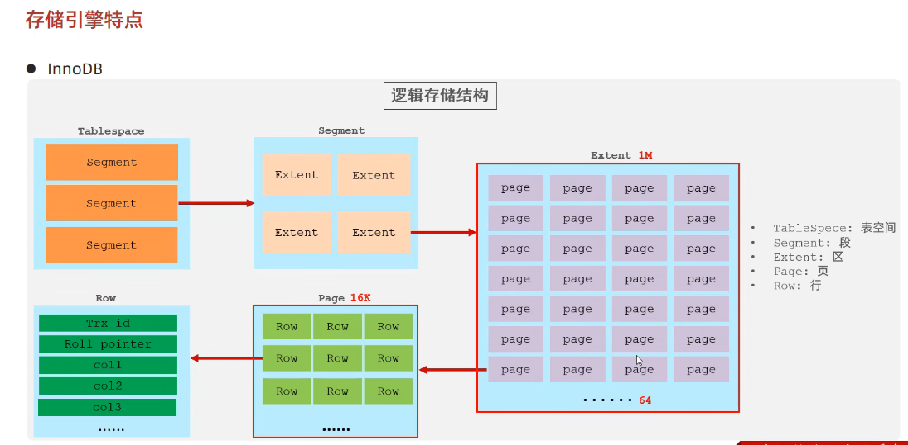


- 表空间 : InnoDB存储引æ“逻辑结æ„的最高层，**ibd文件其å®å°±æ˜¯è¡¨ç©ºé—´æ–‡ä»¶**，在表空间中å¯ä»¥åŒ…å«**多个Segment段**。
- 段 : 表空间是由å„个段组æˆçš„， 常è§çš„段有**æ•°æ®æ®µã€ç´¢å¼•æ®µã€å›æ»šæ®µ**等。InnoDB中对äºæ®µçš„管ç†ï¼Œéƒ½æ˜¯å¼•æ“自身完æˆï¼Œä¸éœ€è¦äººä¸ºå¯¹å…¶æ§åˆ¶ï¼Œä¸€ä¸ªæ®µä¸­åŒ…å«å¤šä¸ªåŒºã€‚
- 区 : 区是表空间的å•å…ƒç»“æ„，**æ¯ä¸ªåŒºçš„大å°ä¸º1M**。 默认情况下， InnoDB**存储引æ“页大å°ä¸º16K**， **==å³ä¸€ä¸ªåŒºä¸­ä¸€å…±æœ‰64个è¿ç»­çš„页==**。
- 页 : **==页是组æˆåŒºçš„最å°å•å…ƒ==**，**页也是**InnoDB **存储引æ“ç£ç›˜ç®¡ç†çš„最å°å•å…ƒ**，æ¯ä¸ªé¡µçš„大å°é»˜è®¤ä¸º 16KB。为了ä¿è¯é¡µçš„è¿ç»­æ€§ï¼ŒInnoDB 存储引æ“**æ¯æ¬¡ä»ç£ç›˜ç”³è¯· 4-5 个区**。
- è¡Œ : **InnoDB 存储引æ“是é¢å‘行的**，也就是说**æ•°æ®æ˜¯æŒ‰è¡Œè¿›è¡Œå­˜æ”¾**的，在æ¯ä¸€è¡Œä¸­é™¤äº†å®šä¹‰è¡¨æ—¶æ‰€æŒ‡å®šçš„字段以外，还包å«**两个éšè—字段**（åé¢ä¼šè¯¦ç»†ä»‹ç»ï¼‰
  - Trx id : 最å一次æ“作的事务Id 
  - Roll pointer ：指针


### （2）MyISAM

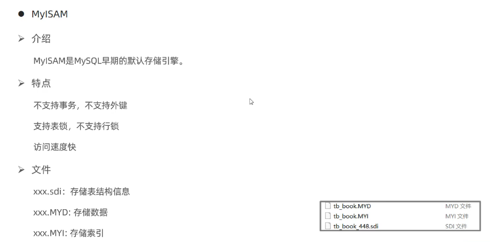

#### ①介ç»

MyISAM是MySQL早期的默认存储引æ“。

#### ②特点

- ä¸æ”¯æŒäº‹åŠ¡ï¼Œä¸æ”¯æŒå¤–é”®
- **支æŒè¡¨é”，ä¸æ”¯æŒè¡Œé”**
- 访问速度快

#### ③文件

- xxx.sdi：**存储表结æ„**ä¿¡æ¯
- xxx.MYD: 存储**æ•°æ®**
- xxx.MYI: 存储**索引**

 


### （3）Memory

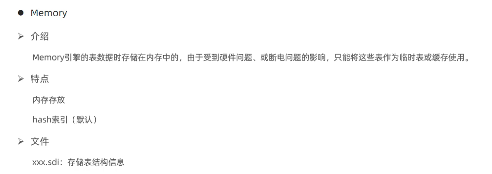

#### ①介ç»

Memory引æ“的表数æ®æ—¶**存储在内存中的**，由äºå—到硬件问题ã€æˆ–断电问题的影å“，åªèƒ½å°†è¿™äº›è¡¨ä½œä¸º**临时表或缓存使用**。

#### ②特点

- 内存存放
- hash索引（默认）

#### ③文件

xxx.sdi：**存储表结æ„ä¿¡æ¯**


### （4）==区别åŠç‰¹ç‚¹==

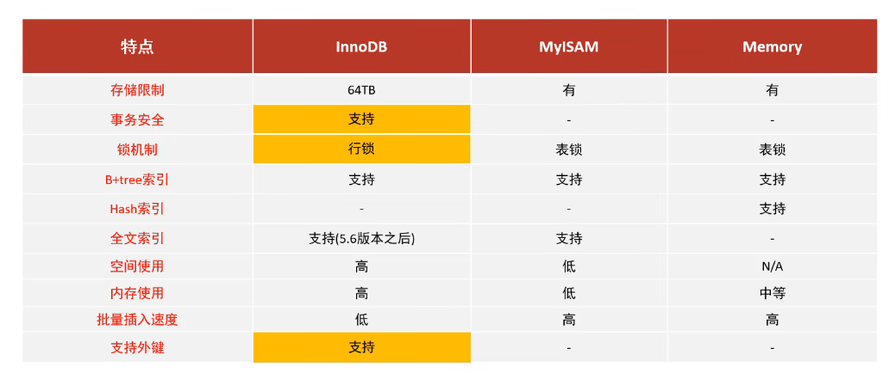


> **é¢è¯•é¢˜:**
>
> InnoDB引æ“ä¸MyISAM引æ“的区别 ?
>
> - â‘ InnoDB引æ“, **支æŒäº‹åŠ¡, 而MyISAMä¸æ”¯æŒ**。
> - â‘¡InnoDB引æ“, **支æŒè¡Œé”和表é”, 而MyISAM仅支æŒè¡¨é”, ä¸æ”¯æŒè¡Œé”**。
> - â‘¢InnoDB引æ“, **支æŒå¤–é”®, 而MyISAM是ä¸æ”¯æŒçš„**。
>
> 主è¦æ˜¯ä¸Šè¿°ä¸‰ç‚¹åŒºåˆ«ï¼Œå½“然也å¯ä»¥ä»ç´¢å¼•ç»“æ„ã€å­˜å‚¨é™åˆ¶ç­‰æ–¹é¢ï¼Œæ›´åŠ æ·±å…¥çš„å›ç­”，具体å‚
>
> 考如下官方文档：
>
> **https://dev.mysql.com/doc/refman/8.0/en/innodb-introduction.html**
>
> **https://dev.mysql.com/doc/refman/8.0/en/myisam-storage-engine.html**


## 1.4 存储引æ“选择

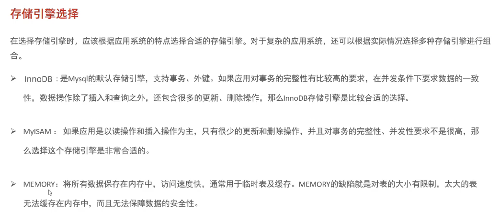

在选择存储引æ“时，应该根æ®åº”用系统的特点选择åˆé€‚的存储引æ“。对äºå¤æ‚的应用系统，还å¯ä»¥æ ¹æ®å®é™…情况选择多ç§å­˜å‚¨å¼•æ“进行组åˆã€‚

- InnoDB: 是Mysql的默认存储引æ“，**支æŒäº‹åŠ¡ã€å¤–é”®**。如æœ**应用对事务的完整性有比较高的è¦æ±‚**，**在并å‘æ¡ä»¶ä¸‹è¦æ±‚æ•°æ®çš„一致性，数æ®æ“作除了æ’入和查询之外，还包å«å¾ˆå¤šçš„æ›´æ–°ã€åˆ é™¤æ“作**，那么InnoDB存储引æ“是比较åˆé€‚的选择。
- MyISAM ： 如æœåº”用是**以读æ“作和æ’å…¥æ“作为主**，åªæœ‰å¾ˆå°‘的更新和删除æ“作，并且对事务的完整性ã€å¹¶å‘性è¦æ±‚ä¸æ˜¯å¾ˆé«˜ï¼Œé‚£ä¹ˆé€‰æ‹©è¿™ä¸ªå­˜å‚¨å¼•æ“是é常åˆé€‚的。**（该场景å¯ç”¨NoSQLæ•°æ®åº“，==MongoDB==）**
- MEMORY：**将所有数æ®ä¿å­˜åœ¨å†…存中**，**访问速度快，通常用äºä¸´æ—¶è¡¨åŠç¼“å­˜**。MEMORY的缺陷就是对表的大å°æœ‰é™åˆ¶ï¼Œå¤ªå¤§çš„表无法缓存在内存中，而且**无法ä¿éšœæ•°æ®çš„安全性**。**（该场景å¯ç”¨==Redis==替代）**


## 1.5 å°ç»“

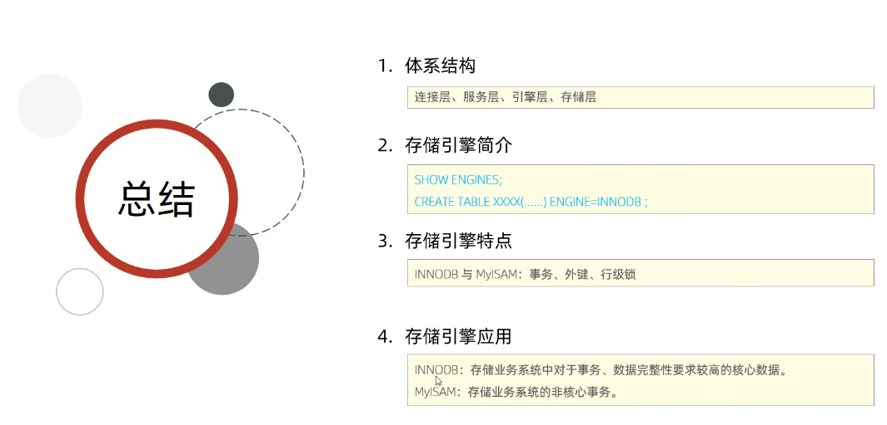

# 2ã€ğŸš€ ==索引==

## 2.1 索引概述

### （1）介ç»

索引（index）是帮助**MySQL==高效è·å–æ•°æ®çš„æ•°æ®ç»“æ„(有åº)==**。在数æ®ä¹‹å¤–，数æ®åº“系统还维护ç€æ»¡è¶³ç‰¹å®šæŸ¥æ‰¾ç®—法的数æ®ç»“æ„，这些数æ®ç»“æ„以æŸç§æ–¹å¼**引用（指å‘）数æ®**， 这样就å¯ä»¥åœ¨è¿™äº›æ•°æ®ç»“æ„上å®ç°é«˜çº§æŸ¥æ‰¾ç®—法，这ç§æ•°æ®ç»“æ„就是索引。

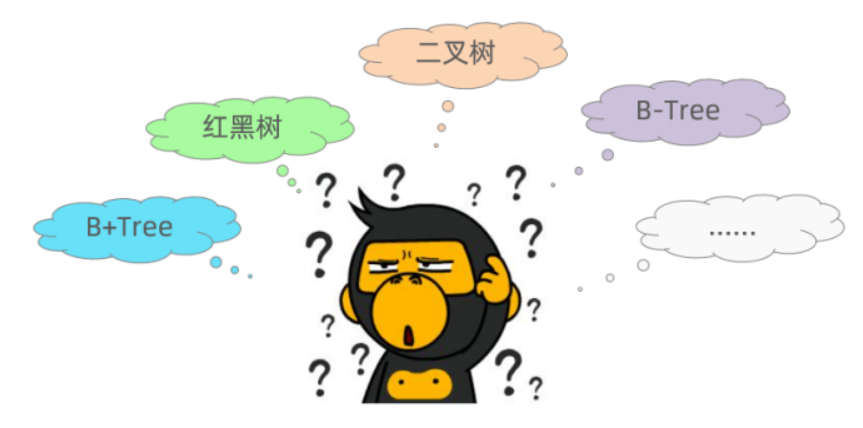

一æ到数æ®ç»“æ„，大家都会有所担心，担心自己ä¸èƒ½ç†è§£ï¼Œè·Ÿä¸ä¸ŠèŠ‚å¥ã€‚ä¸è¿‡åœ¨è¿™é‡Œå¤§å®¶å®Œå…¨ä¸ç”¨æ‹…心，我们åé¢åœ¨è®²è§£æ—¶ï¼Œä¼šè¯¦ç»†ä»‹ç»ã€‚


### （2）演示

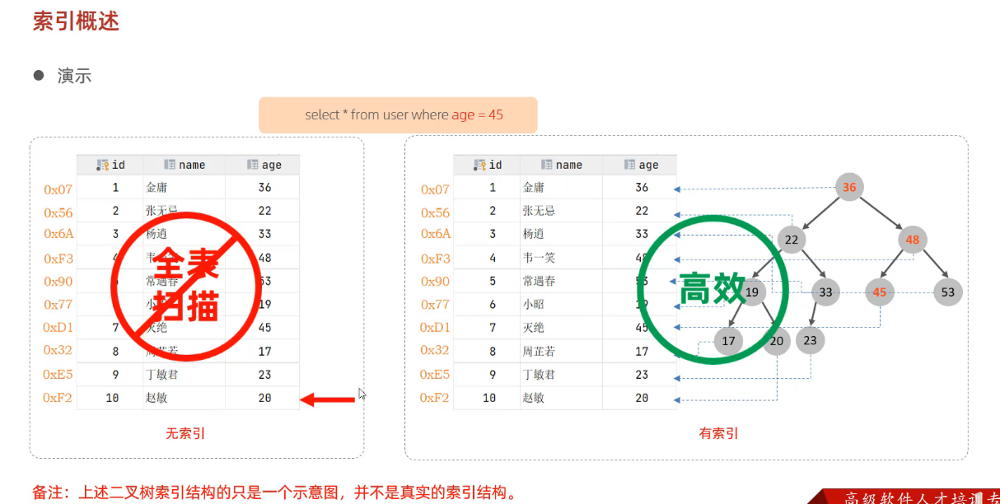

表结æ„åŠå…¶æ•°æ®å¦‚下：

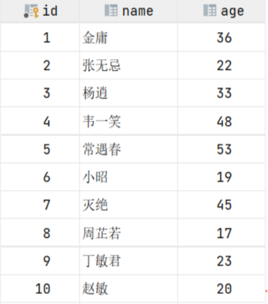

å‡å¦‚我们è¦æ‰§è¡Œçš„SQL语å¥ä¸º ： select * from user where age = 45;

#### ①无索引情况

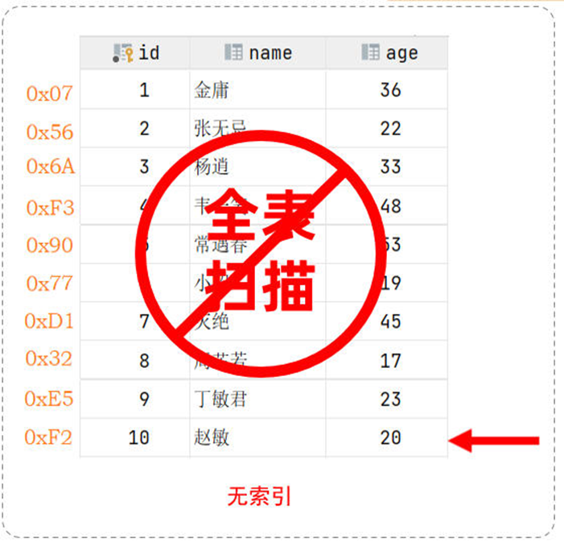

在无索引情况下，就需è¦ä»**第一行开始扫æ，一直扫æ到最å一行（ä¸ä¸€å®šä¿è¯è¡¨é‡Œé¢åªæœ‰ä¸€ä¸ªage=45**），我们称之为 **全表扫æ**，性能很ä½ã€‚


#### ②有索引情况

如æœæˆ‘们针对äºè¿™å¼ è¡¨å»ºç«‹äº†ç´¢å¼•ï¼Œå‡è®¾**索引结æ„就是二å‰æ ‘**，那么也就æ„味ç€ï¼Œä¼šå¯¹age这个字段建立一个二å‰æ ‘的索引结æ„。

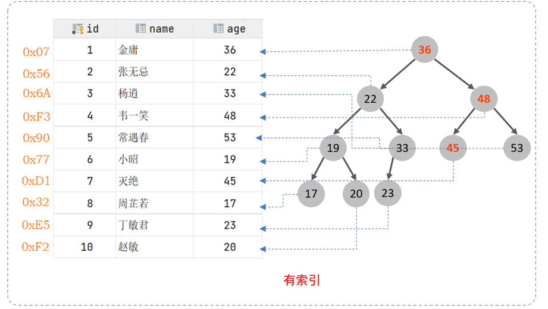

此时我们在进行查询时，åªéœ€è¦**扫æ三次**å°±å¯ä»¥æ‰¾åˆ°æ•°æ®äº†ï¼Œæ大的æ高的查询的效ç‡ã€‚


> **备注：** 这里我们åªæ˜¯å‡è®¾ç´¢å¼•çš„结æ„是二å‰æ ‘，介ç»ä¸€ä¸‹ç´¢å¼•çš„大概åŸç†ï¼Œåªæ˜¯ä¸€ä¸ª**示æ„图**，并
>
> **ä¸æ˜¯ç´¢å¼•çš„真å®ç»“æ„**，索引的真å®ç»“æ„，åé¢ä¼šè¯¦ç»†ä»‹ç»ã€‚


### （3）优缺点

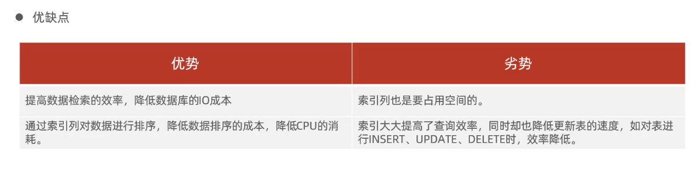

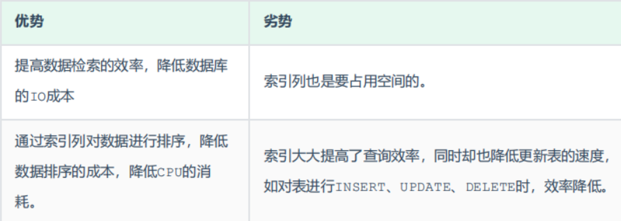


## 2.2 🌟 索引结æ„

### （1）概述

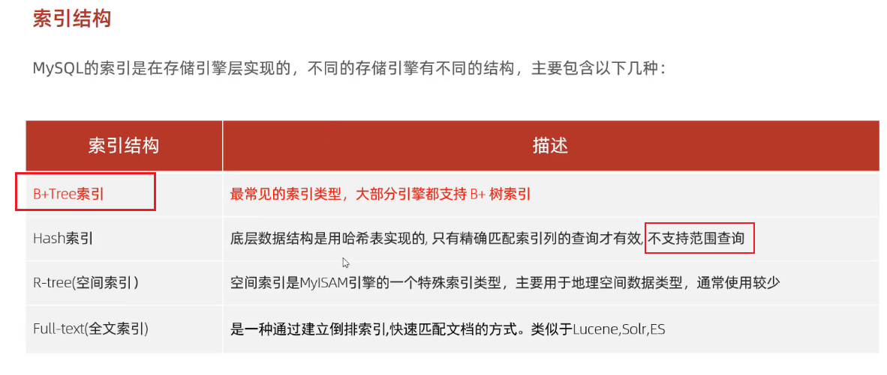

MySQL的索引是在**==存储引æ“层==**å®ç°çš„，ä¸åŒçš„存储引æ“有ä¸åŒçš„索引结æ„，主è¦åŒ…å«ä»¥ä¸‹å‡ ç§ï¼š

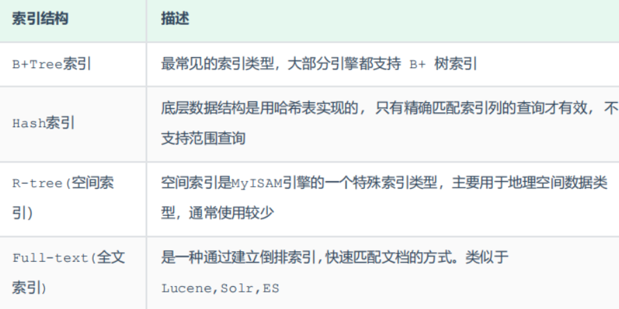

上述是MySQL中所支æŒçš„所有的索引结æ„，æ¥ä¸‹æ¥ï¼Œæˆ‘们å†æ¥çœ‹çœ‹**ä¸åŒçš„存储引æ“**对äºç´¢å¼•ç»“æ„的支æŒæƒ…况。

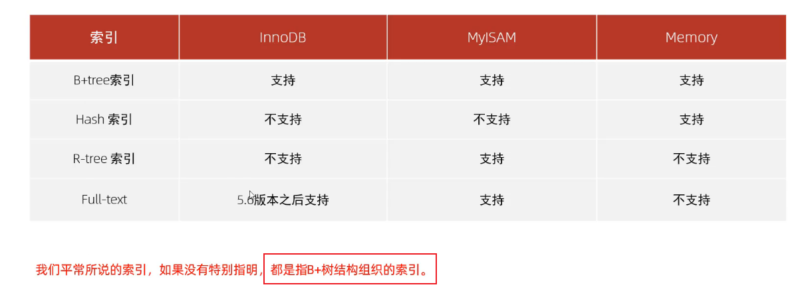

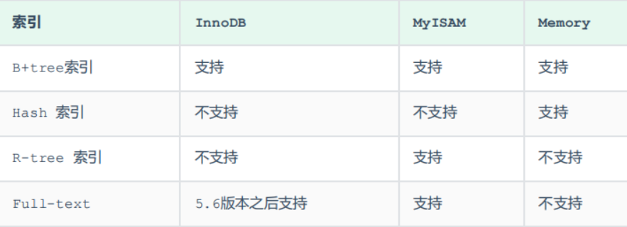


> 注æ„： 我们平常所说的索引，如æœæ²¡æœ‰ç‰¹åˆ«æŒ‡æ˜ï¼Œéƒ½æ˜¯**指B+树结æ„组织的索引**。


### （2）二å‰æ ‘

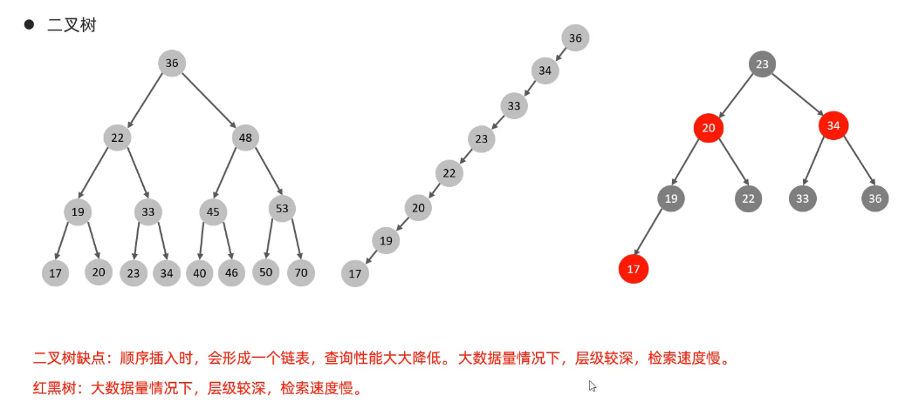

#### ①二å‰æ ‘

å‡å¦‚说MySQL的索引结æ„采用二å‰æ ‘çš„æ•°æ®ç»“æ„，比较ç†æƒ³çš„结æ„如下：

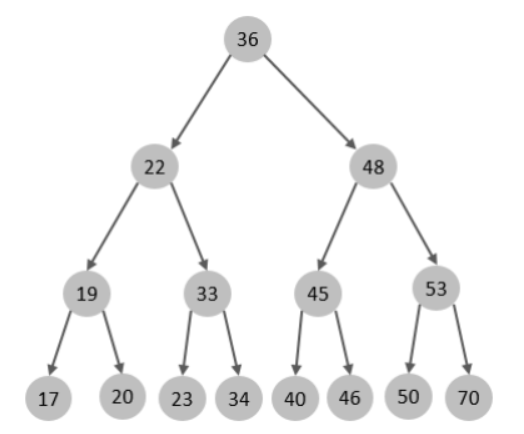

如æœ**主键是顺åºæ’å…¥**的，则**会形æˆä¸€ä¸ªå•å‘链表**，结æ„如下：

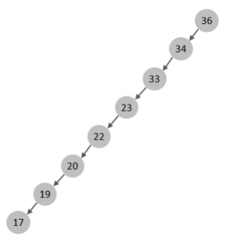

所以，如æœé€‰æ‹©äºŒå‰æ ‘作为索引结æ„，会存在以下**缺点**：

- 顺åºæ’入时，会形æˆä¸€ä¸ªé“¾è¡¨ï¼Œ**查询性能大大é™ä½**。
- 大数æ®é‡æƒ…况下，**层级较深，检索速度慢**。


#### ②红黑树

此时大家å¯èƒ½ä¼šæƒ³åˆ°ï¼Œæˆ‘们å¯ä»¥é€‰æ‹©çº¢é»‘树，**红黑树是一颗自平衡二å‰æ ‘**，那这样å³ä½¿æ˜¯é¡ºåºæ’入数æ®ï¼Œæœ€ç»ˆå½¢æˆçš„æ•°æ®ç»“æ„也是一颗**平衡的二å‰æ ‘**,结æ„如下:

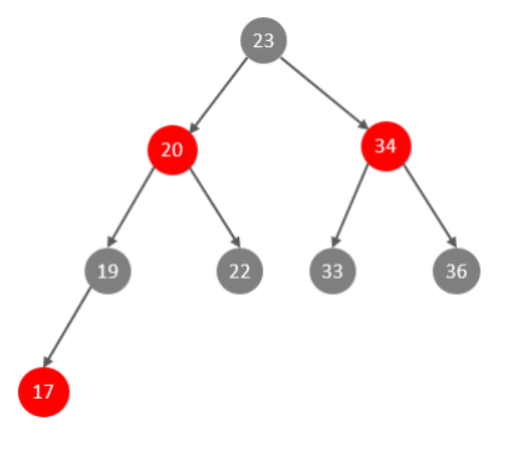

但是，å³ä½¿å¦‚此，由äº**红黑树也是一颗二å‰æ ‘**，所以也会存在一个**缺点**：

- 大数æ®é‡æƒ…况下，**层级较深，检索速度慢**。

所以，在MySQL的索引结æ„中，并没有选择二å‰æ ‘或者红黑树，而选择的是**B+Tre**e，那么什么是B+Tree呢？在详解B+Tree之å‰ï¼Œå…ˆæ¥ä»‹ç»ä¸€ä¸ªB-Tree。


### （3）🌟 ==B-Tree==

#### ①概念

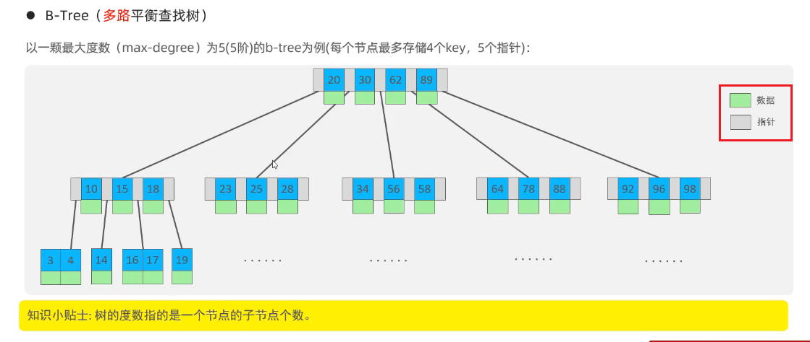

B-Tree，B树是一ç§**多å‰è·¯è¡¡æŸ¥æ‰¾æ ‘**，相对äºäºŒå‰æ ‘，Bæ ‘**æ¯ä¸ªèŠ‚点å¯ä»¥æœ‰å¤šä¸ªåˆ†æ”¯ï¼Œå³å¤šå‰**。以一颗最大度数（max-degree）为5(5阶)çš„b-tree为例，那这个Bæ ‘**æ¯ä¸ªèŠ‚点最多存储4个key，5个指针**

- **指针会比key多一个**，åŸå› æ˜¯å¦‚下图的20 30 62 89 对应四个key，而这四个keyå¯ä»¥å°†èŒƒå›´åˆ’分æˆäº”份，比如<20, 	20-30 ,	30-62,	 62-89,	 >89 ，所以4个key对应5个指针。

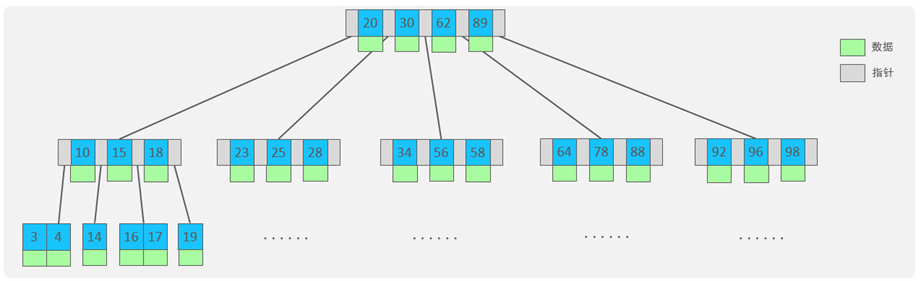


> 知识å°è´´å£«: æ ‘çš„**度数**指的是**一个节点的å­èŠ‚点个数**。


我们å¯ä»¥é€šè¿‡ä¸€ä¸ª**æ•°æ®ç»“æ„å¯è§†åŒ–的网站**æ¥ç®€å•æ¼”示一下。 

**https://www.cs.usfca.edu/~galles/visualization/BTree.html**


æ’入一组数æ®ï¼š 100 65 169 368 900 556 780 35 215 1200 234 888 158 90 1000 88 120 268 250 。然å观察一些数æ®æ’入过程中，节点的å˜åŒ–情况。

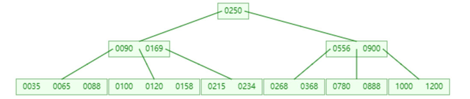

#### ②特点

- 5阶的B树，**æ¯ä¸€ä¸ªèŠ‚点最多存储4个key，对应5个指针**。

- 一旦节点存储的**keyæ•°é‡åˆ°è¾¾5**，就会**==裂å˜==，==中间元素å‘上分裂==**。

  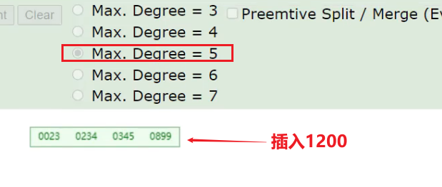

  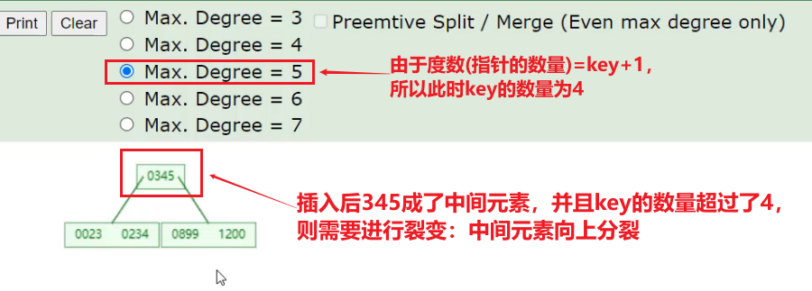

  

- 在B树中，**==éå¶å­èŠ‚点和å¶å­èŠ‚点都会存放数æ®==**。


#### ③过程演示


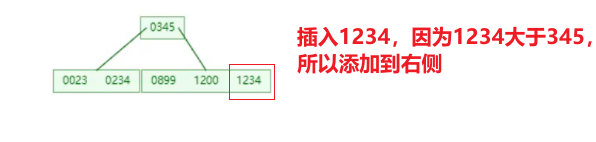


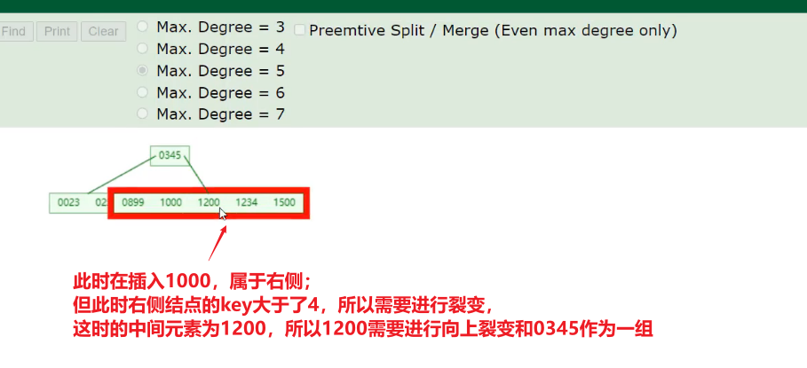

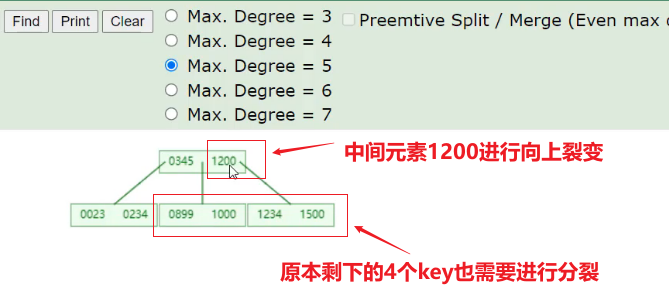

**剩下的以此类æ¨**：

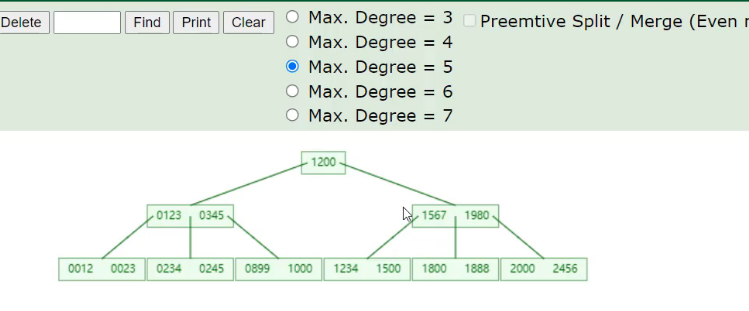


### （4）🌟B+Tree

#### ①概念åŠç‰¹ç‚¹

B+Tree是B-Treeçš„å˜ç§ï¼Œæˆ‘们以一颗最大度数（max-degree）为4（**4阶**）的b+tree为例（**==4阶 b+ tree 对应 3个key，4个指针==**），æ¥çœ‹ä¸€ 下其结æ„示æ„图：

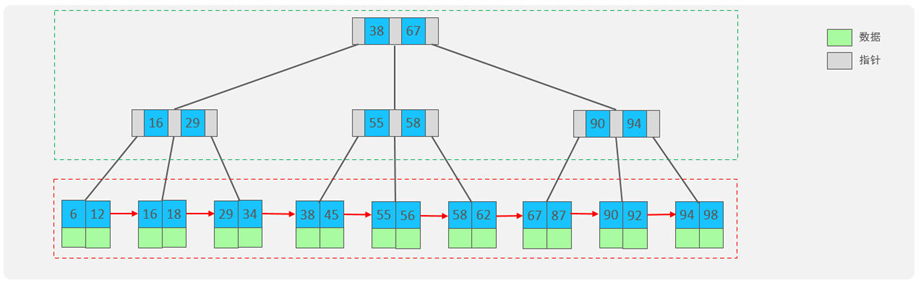

我们å¯ä»¥çœ‹åˆ°ï¼Œä¸¤éƒ¨åˆ†ï¼š

- 绿色框框起æ¥çš„部分，是**==索引部分，仅仅起到索引数æ®çš„作用==**，**ä¸å­˜å‚¨æ•°æ®**。
- 红色框框起æ¥çš„部分，是**æ•°æ®å­˜å‚¨éƒ¨åˆ†**，在**==å…¶å¶å­èŠ‚点中è¦å­˜å‚¨å…·ä½“çš„æ•°æ®==**。
- **==å¶å­èŠ‚点形æˆä¸€ä¸ªå•å‘链表==**。
- **==所有元素都会出ç°åœ¨å¶å­èŠ‚点==，包括==裂å˜æ—¶å‘上分裂的中间元素==**-也需è¦ä¿ç•™


我们å¯ä»¥é€šè¿‡ä¸€ä¸ªæ•°æ®ç»“æ„å¯è§†åŒ–的网站æ¥ç®€å•æ¼”示一下。 https://www.cs.usfca.edu/~galles/visualization/BPlusTree.html


æ’入一组数æ®ï¼š 100 65 169 368 900 556 780 35 215 1200 234 888 158 90 1000 88 120 268 250 。然å观察一些数æ®æ’入过程中，节点的å˜åŒ–情况。

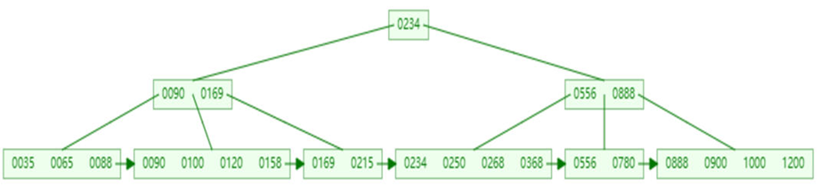

最终我们看到，B+Treeä¸ B-Tree相比，主è¦æœ‰ä»¥ä¸‹**三点区别**：

-  所有的数æ®éƒ½ä¼šå‡ºç°åœ¨**å¶å­èŠ‚点**。
-  **å¶å­èŠ‚点形æˆä¸€ä¸ªå•å‘链表**。
-  **éå¶å­èŠ‚点**仅仅起到**索引数æ®ä½œç”¨**，**具体的数æ®**都是在**å¶å­èŠ‚点存放**的。


#### â‘¡Mysql中的B+Tree-==循ç¯åŒå‘链表==


上述我们所看到的结æ„是**标准**çš„B+Treeçš„æ•°æ®ç»“æ„，æ¥ä¸‹æ¥ï¼Œæˆ‘们å†æ¥çœ‹çœ‹**MySQL中优化之åçš„ B+Tree**。

MySQL索引数æ®ç»“æ„对ç»å…¸çš„B+Tree进行了优化。在åŸB+Tree的基础上，**==å¢åŠ ä¸€ä¸ªæŒ‡å‘相邻å¶å­èŠ‚点链表指针==**，就形æˆäº†**==带有顺åºæŒ‡é’ˆçš„B+Tree==**，**æ高区间访问的性能，利äºæ’åº**。

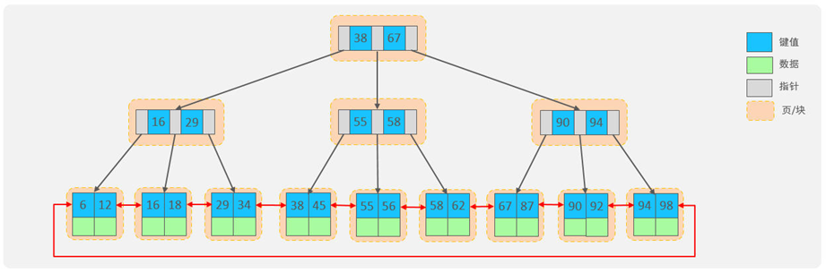


### （5）Hash

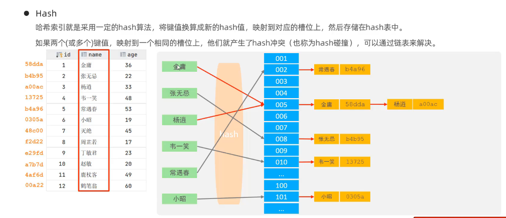

MySQL中除了支æŒB+Tree索引，还支æŒä¸€ç§ç´¢å¼•ç±»å‹---**Hash索引**。 

#### ①结æ„

哈希索引就是采用一定的hash算法，**将键值æ¢ç®—æˆæ–°çš„hash值**，映射到对应的槽ä½ä¸Šï¼Œç„¶å存储在
hash表中。

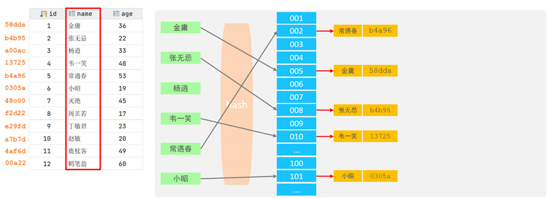

如æœ**两个(或多个)键值，映射到一个相åŒçš„槽ä½ä¸Š**，他们就产生了**hash冲çª**（也称为hash碰æ’），å¯ä»¥**通过链表æ¥è§£å†³**。

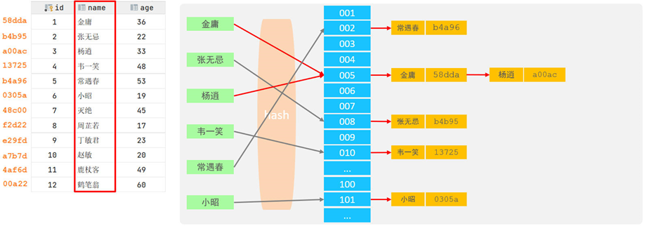


#### ②特点

- A. Hash索引åªèƒ½ç”¨äº**对等比较**(=，in)，**ä¸æ”¯æŒèŒƒå›´æŸ¥è¯¢**（between，>，< ，...）
- B. **无法利用索引完æˆ==æ’åºæ“作==**
- C. 查询效ç‡é«˜ï¼Œé€šå¸¸==(**ä¸å­˜åœ¨hash冲çªçš„情况**)**åªéœ€è¦ä¸€æ¬¡æ£€ç´¢**==å°±å¯ä»¥äº†ï¼Œæ•ˆç‡é€šå¸¸è¦é«˜äºB+tree索引


#### ③存储引æ“支æŒ

在MySQL中，支æŒhash索引的是**Memory存储引æ“**。 而**InnoDB中具有自适应hash功能**，hash索引是InnoDB存储引æ“**æ ¹æ®B+Tree索引在指定æ¡ä»¶ä¸‹è‡ªåŠ¨æ„建的**。


> æ€è€ƒé¢˜ï¼š 为什么InnoDB存储引æ“选择使用**B+tree索引结æ„**?
>
> - A. 相对äºäºŒå‰æ ‘，层级更少，æœç´¢æ•ˆç‡é«˜ï¼›
>
> - B. 对äºB-tree，无论是å¶å­èŠ‚点还是éå¶å­èŠ‚点，都会ä¿å­˜æ•°æ®ï¼Œè¿™æ ·å¯¼è‡´**==一页中存储的键值å‡å°‘，指针跟ç€å‡å°‘==**，**è¦åŒæ ·ä¿å­˜å¤§é‡æ•°æ®ï¼Œåªèƒ½==å¢åŠ æ ‘的高度(层级å˜æ·±)==，导致性能é™ä½**ï¼›
>
> - C. **相对Hash索引**，B+tree支æŒ**==范围匹é…åŠæ’åºæ“作==**ï¼›
>
>   


## 2.3 🌟 ==索引分类==

### （1）索引分类

在MySQLæ•°æ®åº“，将索引的具体类å‹ä¸»è¦åˆ†ä¸ºä»¥ä¸‹å‡ ç±»ï¼š**主键索引ã€å”¯ä¸€ç´¢å¼•ã€å¸¸è§„索引ã€å…¨æ–‡ç´¢å¼•**。

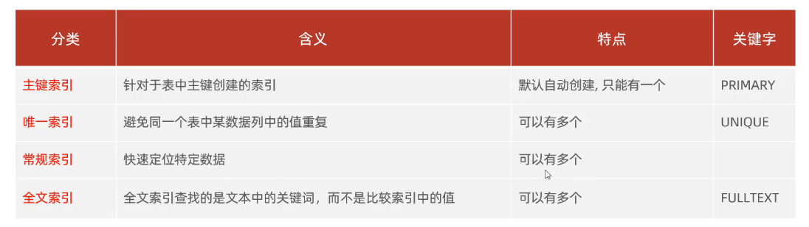

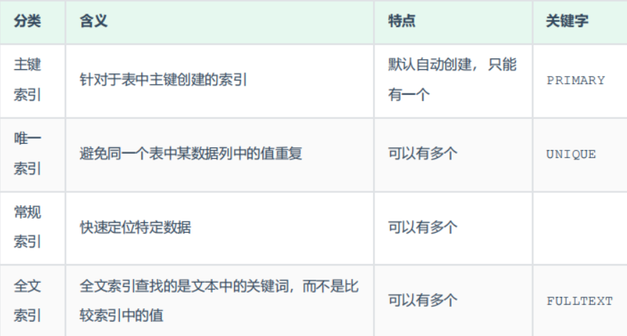


### （2）🌟èšé›†ç´¢å¼•&二级索引

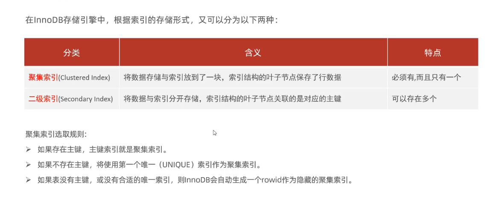

而在在InnoDB存储引æ“中，根æ®ç´¢å¼•çš„存储形å¼ï¼Œåˆå¯ä»¥åˆ†ä¸ºä»¥ä¸‹ä¸¤ç§ï¼š

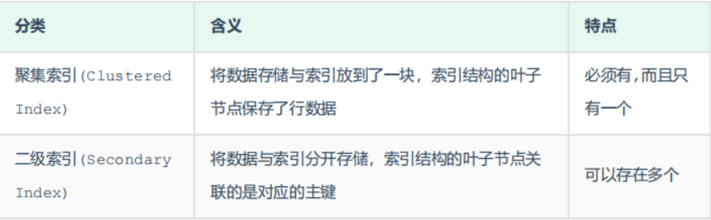


#### â‘ èšé›†ç´¢å¼•==选å–规则==

- 如æœå­˜åœ¨ä¸»é”®ï¼Œä¸»é”®ç´¢å¼•å°±æ˜¯èšé›†ç´¢å¼•ã€‚
- 如æœ**ä¸å­˜åœ¨ä¸»é”®**，将使用**==第一个唯一（UNIQUE）索引==**作为èšé›†ç´¢å¼•ã€‚
- 如æœè¡¨æ²¡æœ‰ä¸»é”®ï¼Œæˆ–没有åˆé€‚的唯一索引，则InnoDB会**自动生æˆä¸€ä¸ªrowid作为éšè—çš„èšé›†ç´¢å¼•**。


#### â‘¡èšé›†ç´¢å¼•å’ŒäºŒçº§ç´¢å¼•çš„==具体结æ„==

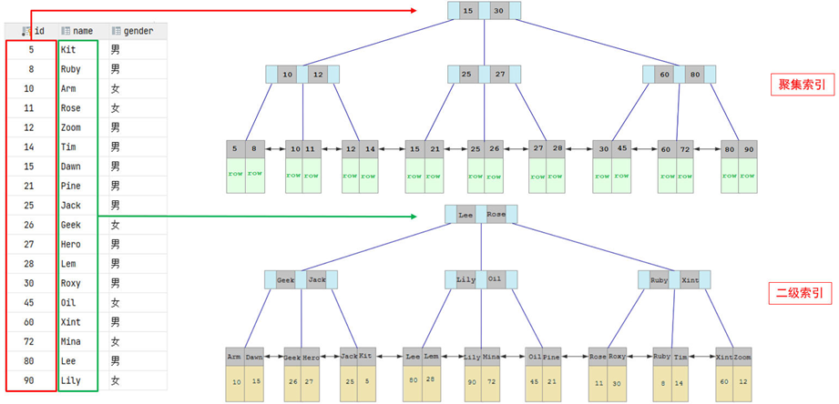


- èšé›†ç´¢å¼•çš„å¶å­èŠ‚点下挂的是**这一行的数æ®** 。
- **二级索引的å¶å­èŠ‚点**下挂的是**该字段值==对应的主键值==**。


#### ③🌟SQL语å¥æ‰§è¡Œè¿‡ç¨‹åˆ†æ-==å›è¡¨æŸ¥è¯¢==


> **å›è¡¨æŸ¥è¯¢**： 
>
> è¿™ç§å…ˆåˆ°**二级索引中查找数æ®ï¼Œæ‰¾åˆ°ä¸»é”®å€¼**，
>
> 然åå†åˆ°**èšé›†ç´¢å¼•ä¸­æ ¹æ®ä¸»é”®å€¼ï¼Œè·å–æ•°æ®çš„æ–¹å¼**，就称之为==å›è¡¨æŸ¥è¯¢==。


æ¥ä¸‹æ¥ï¼Œæˆ‘们æ¥åˆ†æ一下，当我们执行如下的SQL语å¥æ—¶ï¼Œå…·ä½“的查找过程是什么样å­çš„。

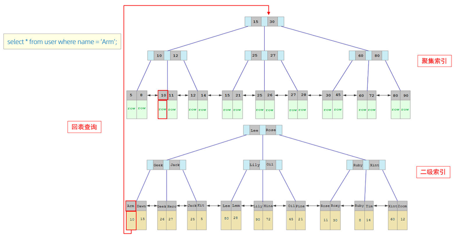

**具体过程如下:**

- â‘  ç”±äºæ˜¯æ ¹æ®name字段进行查询，所以先根æ®name='Arm'到name字段的**二级索引中进行匹é…查找**。但是在二级索引中åªèƒ½æŸ¥æ‰¾åˆ° **Arm对应的主键值10**。

- â‘¡ ç”±äºæŸ¥è¯¢è¿”å›çš„æ•°æ®æ˜¯*，所以此时，**还需è¦==æ ¹æ®ä¸»é”®å€¼10==，到==èšé›†ç´¢å¼•ä¸­æŸ¥æ‰¾10对应的记录==**，最终找到10对应的行**row**。
- â‘¢ **最终拿到这一行的数æ®**，直æ¥è¿”å›å³å¯ã€‚


#### ④🌟==æ€è€ƒé¢˜==

> æ€è€ƒé¢˜ï¼š
>
> 以下两æ¡SQL语å¥ï¼Œé‚£ä¸ªæ‰§è¡Œæ•ˆç‡é«˜? 为什么?
>
> - A. select * from user where id = 10 ;
> - B. select * from user where name = 'Arm' ;
>
> 备注: **id为主键**，**name字段创建的有索引**；
>
> 
>
> 解答：
>
> ​	A 语å¥çš„执行性能è¦é«˜äºB 语å¥ã€‚
>
> - 因为A语å¥**ç›´æ¥èµ°èšé›†ç´¢å¼•**，直æ¥è¿”å›æ•°æ®ã€‚
> - 而B语å¥éœ€è¦**先查询**name字段的**二级索引**，然å**å†æŸ¥è¯¢èšé›†ç´¢å¼•**，也就是**==需è¦è¿›è¡Œå›è¡¨æŸ¥è¯¢==**。


> **æ€è€ƒé¢˜**：
>
> 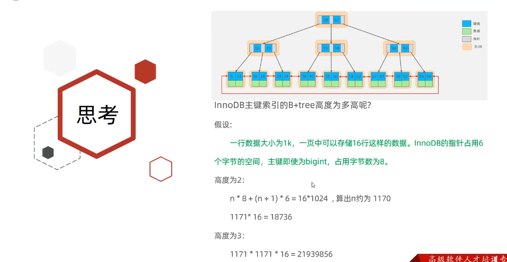
>
> **InnoDB==主键索引的B+tree高度为多高==呢**?
>
> 
>
> å‡è®¾:
>
> ​	一行数æ®å¤§å°ä¸º**1k**，**一页（16K）中å¯ä»¥å­˜å‚¨16è¡Œ**这样的数æ®ã€‚InnoDBçš„**指针å ç”¨6个字节的空间**，**主键类å‹**å³ä½¿ä¸º**bigint，å ç”¨å­—节数为8**。
>
> 高度为2：( 设æ¯ä¸ªèŠ‚点(页)中的key的个数为n )
>
> - `n*8`：设主键类å‹ä¸ºbigint**å ç”¨8字节**，**æ¯ä¸ªèŠ‚点的key个数为n**，则一个页中因为键值keyå ç”¨`n*8`字节
> - `(n+1)*6`：InnoDB的指针**å ç”¨6个字节**，**指针数é‡=key+1=度数**，则一页中指针共å ç”¨`(n+1)*6`个字节。
> - `16*1024`：一页的大å°ä¸º16K，å‡è®¾ä¸€è¡Œ-**rowçš„æ•°æ®å¤§å°ä¸º1K**,则一页共å¯ä»¥**存储16è¡Œ**。
>
> 计算：
>
> ​		n * 8 + (n + 1) * 6 = 16*1024 , 算出n约为 1170,则æ¯é¡µä¸­å…±æœ‰1170个key
>
> ​		æ¯é¡µä¸­å¯¹åº”的指针的个数为：`key+1`  ,å³1171，**æ¯ä¸ªæŒ‡é’ˆåˆä¼šæŒ‡å‘新的一页**，æ¯é¡µä¸­åˆæœ‰16行数æ®ï¼Œé‚£ä¹ˆ1171* 16 = 18736
>
> 也就是说，如æœæ ‘的高度为2，则å¯ä»¥å­˜å‚¨ 18000 多æ¡è®°å½•ã€‚
>
> ------
>
> 高度为3：
>
> ​		1171 * 1171 * 16 = 21939856
>
> 也就是说，如æœ**树的高度为3**，则å¯ä»¥å­˜å‚¨ **2200w å·¦å³çš„记录**。


## 2.4 索引语法

### （0）Mysql索引的类别

MySQL 支æŒå¤šç§ç´¢å¼•ç±»å‹ï¼Œæ¯ç§ç±»å‹æœ‰ä¸åŒçš„用途和特性。以下是主è¦çš„索引类别：

#### 1. ==普通索引 (INDEX)==

- **特点**：

  - 最基本的索引类å‹ï¼Œä»…加速查询
  - å…许é‡å¤å€¼å’ŒNULL值

- **创建方å¼**：

  ```sql
  CREATE INDEX idx_name ON table_name(column_name);
  -- 或
  ALTER TABLE table_name ADD INDEX idx_name(column_name);
  ```

#### 2. ==唯一索引 (UNIQUE INDEX)==

- **特点**：

  - 索引列的值必须唯一，但å…许NULL值（NULLå¯ä»¥é‡å¤ï¼‰
  - 自动创建约æŸï¼Œé˜²æ­¢é‡å¤å€¼

- **创建方å¼**：

  ```sql
  CREATE UNIQUE INDEX idx_name ON table_name(column_name);
  -- 或
  ALTER TABLE table_name ADD UNIQUE idx_name(column_name);
  ```

#### 3. ==主键索引 (PRIMARY KEY)==

- **特点**：

  - 特殊的唯一索引，ä¸å…许NULL值
  - æ¯ä¸ªè¡¨åªèƒ½æœ‰ä¸€ä¸ªä¸»é”®
  - 自动创建èšé›†ç´¢å¼•ï¼ˆInnoDB引æ“）

- **创建方å¼**：

  ```sql
  ALTER TABLE table_name ADD PRIMARY KEY(column_name);
  -- 或建表时指定
  CREATE TABLE table_name (
    id INT NOT NULL,
    PRIMARY KEY (id)
  );
  ```

#### 4. 全文索引 (FULLTEXT INDEX)

- **特点**：

  - 专门用äºå…¨æ–‡æœç´¢
  - 仅适用äºMyISAMå’ŒInnoDB引æ“（MySQL 5.6+）
  - 支æŒMATCH AGAINSTæ“作

- **创建方å¼**：

  ```sql
  CREATE FULLTEXT INDEX idx_name ON table_name(column_name);
  ```

#### 5. ==组åˆç´¢å¼• (å¤åˆç´¢å¼•)==

- **特点**：

  - **在多个列上建立的索引**
  - éµå¾ª"**最左å‰ç¼€åŸåˆ™**"

- **创建方å¼**：

  ```sql
  CREATE INDEX idx_name ON table_name(col1, col2, col3);
  ```

#### 6. 空间索引 (SPATIAL INDEX)

- **特点**：

  - 用äºåœ°ç†ç©ºé—´æ•°æ®ç±»å‹ï¼ˆGEOMETRY, POINT, LINESTRING等）
  - ä»…MyISAM引æ“支æŒï¼ˆMySQL 5.7+çš„InnoDB也支æŒï¼‰

- **创建方å¼**：

  ```sql
  CREATE SPATIAL INDEX idx_name ON table_name(column_name);
  ```

#### 索引选择建议

1. 主键列自动创建主键索引
2. 频ç¹ä½œä¸ºæŸ¥è¯¢æ¡ä»¶çš„列应建立索引
3. 外键列通常需è¦ç´¢å¼•
4. 高选择性列（唯一值比例高）更适åˆç´¢å¼•
5. é¿å…对频ç¹æ›´æ–°çš„列建过多索引

#### 查看索引信æ¯

```sql
SHOW INDEX FROM table_name;
```

æ¯ç§ç´¢å¼•ç±»å‹éƒ½æœ‰å…¶é€‚用场景，åˆç†ä½¿ç”¨å¯ä»¥æ˜¾è‘—æ高查询性能，但过多索引会影å“写入性能并å¢åŠ å­˜å‚¨ç©ºé—´ã€‚


### （1）创建索引

```sql
CREATE [ UNIQUE | FULLTEXT ] INDEX index_name ON table_name (
index_col_name,... ) ;
```

### （2）查看索引

```sql
SHOW INDEX FROM table_name ;
```

### （3）删除索引

```sql
DROP INDEX index_name ON table_name ;
```

### （4）案例演示

#### â‘ æ•°æ®å‡†å¤‡

å…ˆæ¥åˆ›å»ºä¸€å¼ è¡¨ tb_user，并且**查询测试数æ®**。

```sql
create table tb_user
(
    id         int primary key auto_increment comment '主键',
    name       varchar(50) not null comment '用户å',
    phone      varchar(11) not null comment '手机å·',
    email      varchar(100) comment '邮箱',
    profession varchar(11) comment '专业',
    age        tinyint unsigned comment '年龄',
    gender     char(1) comment '性别 , 1: 男, 2: 女',
    status     char(1) comment '状æ€',
    createtime datetime comment '创建时间'
) comment '系统用户表';
INSERT INTO tb_user (name, phone, email, profession, age, gender, status, createtime)
VALUES ('å•å¸ƒ', '17799990000', 'lvbu666@163.com', '软件工程', 23, '1', '6', '2001-02-02 00:00:00');
INSERT INTO tb_user (name, phone, email, profession, age, gender, status, createtime)
VALUES ('曹æ“', '17799990001', 'caocao666@qq.com', '通讯工程', 33, '1', '0', '2001-03-05 00:00:00');
INSERT INTO tb_user (name, phone, email, profession, age, gender, status, createtime)
VALUES ('赵云', '17799990002', '17799990@139.com', '英语', 34, '1', '2', '2002-03-02 00:00:00');
INSERT INTO tb_user (name, phone, email, profession, age, gender, status, createtime)
VALUES ('孙悟空', '17799990003', '17799990@sina.com', '工程造价', 54, '1', '0', '2001-07-02 00:00:00');
INSERT INTO tb_user (name, phone, email, profession, age, gender, status, createtime)
VALUES ('花木兰', '17799990004', '19980729@sina.com', '软件工程', 23, '2', '1', '2001-04-22 00:00:00');
INSERT INTO tb_user (name, phone, email, profession, age, gender, status, createtime)
VALUES ('大乔', '17799990005', 'daqiao666@sina.com', 'èˆè¹ˆ', 22, '2', '0', '2001-02-07 00:00:00');
INSERT INTO tb_user (name, phone, email, profession, age, gender, status, createtime)
VALUES ('露娜', '17799990006', 'luna_love@sina.com', '应用数学', 24, '2', '0', '2001-02-08 00:00:00');
INSERT INTO tb_user (name, phone, email, profession, age, gender, status, createtime)
VALUES ('程咬金', '17799990007', 'chengyaojin@163.com', '化工', 38, '1', '5', '2001-05-23 00:00:00');
INSERT INTO tb_user (name, phone, email, profession, age, gender, status, createtime)
VALUES ('项羽', '17799990008', 'xiaoyu666@qq.com', '金å±ææ–™', 43, '1', '0', '2001-09-18 00:00:00');
INSERT INTO tb_user (name, phone, email, profession, age, gender, status, createtime)
VALUES ('白起', '17799990009', 'baiqi666@sina.com', '机械工程åŠå…¶è‡ªåŠ¨åŒ–', 27, '1', '2', '2001-08-16 00:00:00');
INSERT INTO tb_user (name, phone, email, profession, age, gender, status, createtime)
VALUES ('韩信', '17799990010', 'hanxin520@163.com', '无机é金å±æ料工程', 27, '1', '0', '2001-06-12 00:00:00');
INSERT INTO tb_user (name, phone, email, profession, age, gender, status, createtime)
VALUES ('è†è½²', '17799990011', 'jingke123@163.com', '会计', 29, '1', '0', '2001-05-11 00:00:00');
INSERT INTO tb_user (name, phone, email, profession, age, gender, status, createtime)
VALUES ('兰陵ç‹', '17799990012', 'lanlinwang666@126.com', '工程造价', 44, '1', '1', '2001-04-09 00:00:00');
INSERT INTO tb_user (name, phone, email, profession, age, gender, status, createtime)
VALUES ('ç‹‚é“', '17799990013', 'kuangtie@sina.com', '应用数学', 43, '1', '2', '2001-04-10 00:00:00');
INSERT INTO tb_user (name, phone, email, profession, age, gender, status, createtime)
VALUES ('貂è‰', '17799990014', '84958948374@qq.com', '软件工程', 40, '2', '3', '2001-02-12 00:00:00');
INSERT INTO tb_user (name, phone, email, profession, age, gender, status, createtime)
VALUES ('妲己', '17799990015', '2783238293@qq.com', '软件工程', 31, '2', '0', '2001-01-30 00:00:00');
INSERT INTO tb_user (name, phone, email, profession, age, gender, status, createtime)
VALUES ('芈月', '17799990016', 'xiaomin2001@sina.com', '工业ç»æµ', 35, '2', '0', '2000-05-03 00:00:00');
INSERT INTO tb_user (name, phone, email, profession, age, gender, status, createtime)
VALUES ('嬴政', '17799990017', '8839434342@qq.com', '化工', 38, '1', '1', '2001-08-08 00:00:00');
INSERT INTO tb_user (name, phone, email, profession, age, gender, status, createtime)
VALUES ('ç‹„ä»æ°', '17799990018', 'jujiamlm8166@163.com', '国际贸易', 30, '1', '0', '2007-03-12 00:00:00');
INSERT INTO tb_user (name, phone, email, profession, age, gender, status, createtime)
VALUES ('安çªæ‹‰', '17799990019', 'jdodm1h@126.com', 'åŸå¸‚规划', 51, '2', '0', '2001-08-15 00:00:00');
INSERT INTO tb_user (name, phone, email, profession, age, gender, status, createtime)
VALUES ('典韦', '17799990020', 'ycaunanjian@163.com', 'åŸå¸‚规划', 52, '1', '2', '2000-04-12 00:00:00');
INSERT INTO tb_user (name, phone, email, profession, age, gender, status, createtime)
VALUES ('廉颇', '17799990021', 'lianpo321@126.com', '土木工程', 19, '1', '3', '2002-07-18 00:00:00');
INSERT INTO tb_user (name, phone, email, profession, age, gender, status, createtime)
VALUES ('å羿', '17799990022', 'altycj2000@139.com', 'åŸå¸‚å›­æ—', 20, '1', '0', '2002-03-10 00:00:00');
INSERT INTO tb_user (name, phone, email, profession, age, gender, status, createtime)
VALUES ('姜å­ç‰™', '17799990023', '37483844@qq.com', '工程造价', 29, '1', '4', '2003-05-26 00:00:00');
```

表结æ„中æ’入的数æ®å¦‚下：

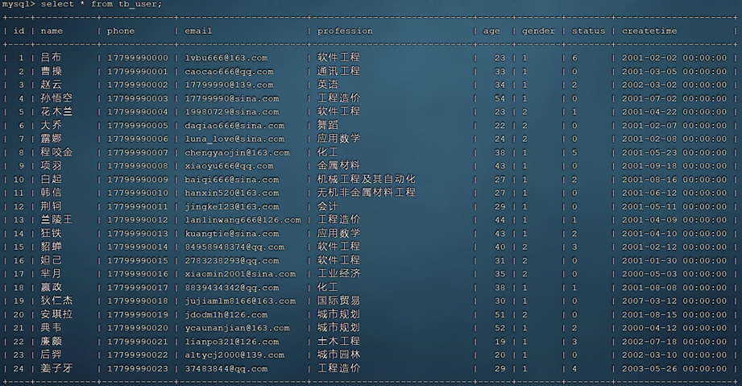

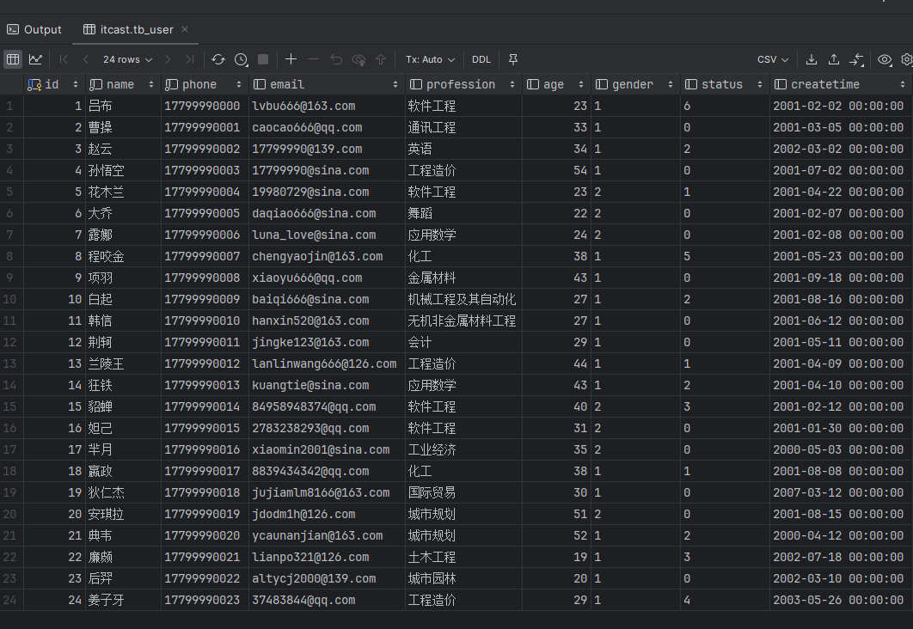

```sql
show index from tb_user;
show index from tb_user\G; #ç¾åŒ–输出
```

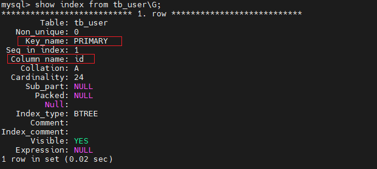


#### ②完æˆéœ€æ±‚


æ•°æ®å‡†å¤‡å¥½äº†ä¹‹å，æ¥ä¸‹æ¥ï¼Œæˆ‘们就æ¥å®Œæˆå¦‚下需求：

##### A. name字段为姓å字段，该字段的值å¯èƒ½ä¼šé‡å¤ï¼Œä¸ºè¯¥å­—段创建索引（普通索引）。

```sql
CREATE INDEX idx_user_name ON tb_user(name); 
```

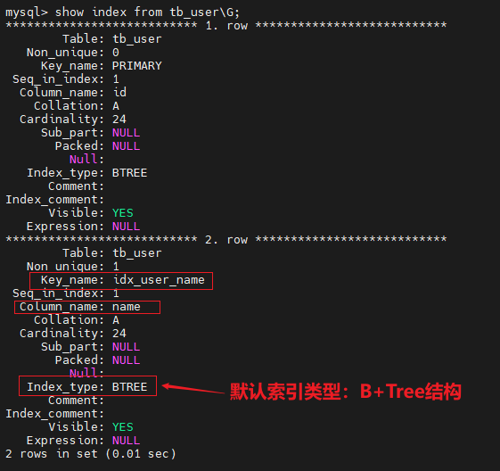

##### B. phone手机å·å­—段的值，是é空，且唯一的，为该字段创建==唯一索引==。

```sql
CREATE UNIQUE INDEX idx_user_phone ON tb_user(phone); 
```

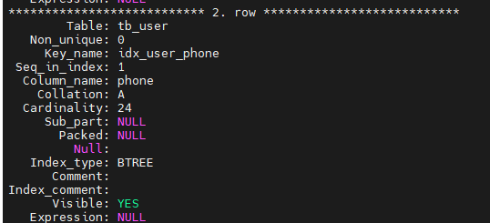

##### C. 为professionã€ageã€status==创建è”åˆç´¢å¼•==。

```sql
CREATE INDEX idx_user_pro_age_sta ON tb_user(profession,age,status); 
```

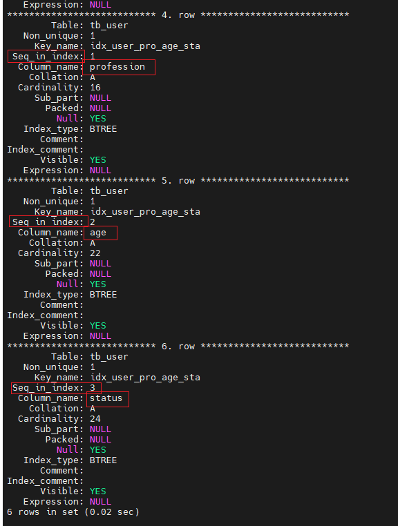

##### D. 为email建立åˆé€‚的索引（普通索引）æ¥æå‡æŸ¥è¯¢æ•ˆç‡ã€‚

```sql
CREATE INDEX idx_email ON tb_user(email); 
```

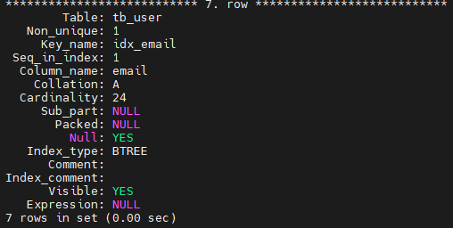

##### 完æˆä¸Šè¿°çš„需求之å，我们å†æŸ¥çœ‹tb_user表的所有的索引数æ®ã€‚

```sql
show index from tb_user;
```

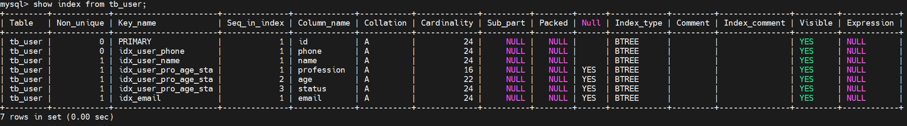

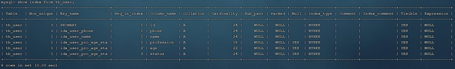


## 2.5 🌟 ==SQL性能分æ==

### （1）SQL执行频ç‡

MySQL 客户端è¿æ¥æˆåŠŸå，通过 **show [session|global] status 命令**å¯ä»¥**æä¾›æœåŠ¡å™¨çŠ¶æ€ä¿¡æ¯**。通过如下指令，å¯ä»¥æŸ¥çœ‹å½“å‰æ•°æ®åº“çš„INSERTã€UPDATEã€DELETEã€SELECT的访问频次：

```sql
-- session 是查看当å‰ä¼šè¯ ;
-- global æ˜¯æŸ¥è¯¢å…¨å±€æ•°æ® ;
SHOW GLOBAL STATUS LIKE 'Com_______';

SHOW SESSION STATUS LIKE 'Com_______';
```


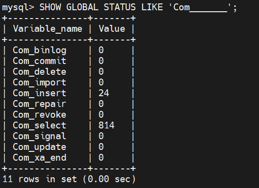

- Com_delete: 删除次数
- Com_insert: æ’入次数
- Com_select: 查询次数
- Com_update: 更新次数

我们å¯ä»¥åœ¨å½“å‰æ•°æ®åº“å†æ‰§è¡Œå‡ æ¬¡æŸ¥è¯¢æ“作，然åå†æ¬¡æŸ¥çœ‹æ‰§è¡Œé¢‘次，看看 Com_select å‚数会ä¸ä¼šå˜åŒ–。

> 通过上述指令，我们å¯ä»¥æŸ¥çœ‹åˆ°å½“å‰æ•°æ®åº“到底是**以查询为主**，还是以å¢åˆ æ”¹ä¸ºä¸»ï¼Œä»è€Œä¸ºæ•°æ®åº“优化æä¾›å‚考ä¾æ®ã€‚ 如æœæ˜¯ä»¥å¢åˆ æ”¹ä¸ºä¸»ï¼Œæˆ‘们å¯ä»¥è€ƒè™‘ä¸å¯¹å…¶è¿›è¡Œç´¢å¼•çš„优化。 如æœæ˜¯ä»¥æŸ¥è¯¢ä¸ºä¸»ï¼Œé‚£ä¹ˆå°±**è¦è€ƒè™‘对数æ®åº“的索引进行优化了**。

那么通过查询SQL的执行频次，我们就能够知é“当å‰æ•°æ®åº“到底是å¢åˆ æ”¹ä¸ºä¸»ï¼Œè¿˜æ˜¯æŸ¥è¯¢ä¸ºä¸»ã€‚ é‚£**å‡å¦‚说是以查询为主**，我们åˆè¯¥**如何定ä½é’ˆå¯¹äºé‚£äº›æŸ¥è¯¢è¯­å¥è¿›è¡Œä¼˜åŒ–**呢？ **次数我们å¯ä»¥å€ŸåŠ©äº==慢查询日志==**。

æ¥ä¸‹æ¥ï¼Œæˆ‘们就æ¥ä»‹ç»ä¸€ä¸‹MySQL中的慢查询日志。


### （2）🌟 ==慢查询日志==

#### ①概念

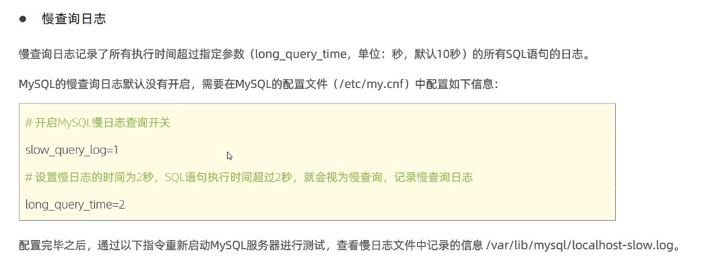

慢查询日志记录了**所有执行时间超过指定å‚æ•°**（**==long_query_time==**，å•ä½ï¼šç§’，默认10秒）的**所有SQL语å¥çš„日志。**

MySQLçš„**慢查询日志默认没有开å¯**，我们å¯ä»¥æŸ¥çœ‹ä¸€ä¸‹ç³»ç»Ÿå˜é‡ 。

**查询慢查询日志是å¦å¼€å¯**

```sql
show variables like 'slow_query_log';
```

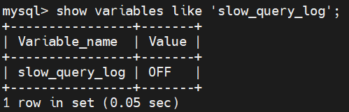


如æœè¦å¼€å¯æ…¢æŸ¥è¯¢æ—¥å¿—，需è¦åœ¨**MySQLçš„==é…置文件（/etc/my.cnf）==**中é…置如下信æ¯ï¼š

```bash
vi /etc/my.cnf
```

在该é…置文件的**最å添加**：

```bash
# å¼€å¯MySQL慢日志查询开关
slow_query_log=1
# 设置慢日志的时间为2秒，SQL语å¥æ‰§è¡Œæ—¶é—´è¶…过2秒，就会视为慢查询，记录慢查询日志
long_query_time=2
```


é…置完毕之å，通过以下指令**é‡æ–°å¯åŠ¨MySQLæœåŠ¡å™¨**进行测试，查看慢日志文件中**记录的信æ¯**

**/var/lib/mysql/localhost-slow.log**

```sql
systemctl restart mysqld
```

然å，å†æ¬¡æŸ¥çœ‹å¼€å…³æƒ…况，慢查询日志就已ç»æ‰“开了。

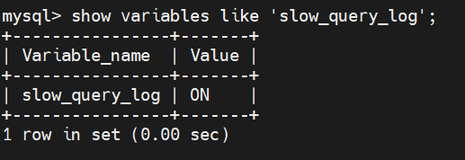


查看慢日志文件中**记录的信æ¯**，**/var/lib/mysql/localhost-slow.log**

```bash
cat /var/lib/mysql/localhost-slow.log
tail -f /var/lib/mysql/localhost-slow.log #追加模å¼æŸ¥çœ‹æ—¥å¿—ä¿¡æ¯
```


#### ②测试

##### 1）数æ®å‡†å¤‡

```sql
CREATE TABLE `tb_sku` (
    `id` int(11) NOT NULL AUTO_INCREMENT COMMENT '商å“id',
    `sn` varchar(100) NOT NULL COMMENT '商å“æ¡ç ',
    `name` varchar(200) NOT NULL COMMENT 'SKUå称',
    `price` int(20) NOT NULL COMMENT '价格（分）',
    `num` int(10) NOT NULL COMMENT '库存数é‡',
    `alert_num` int(11) DEFAULT NULL COMMENT '库存预警数é‡',
    `image` varchar(200) DEFAULT NULL COMMENT '商å“图片',
    `images` varchar(2000) DEFAULT NULL COMMENT '商å“图片列表',
    `weight` int(11) DEFAULT NULL COMMENT 'é‡é‡ï¼ˆå…‹ï¼‰',
    `create_time` datetime DEFAULT NULL COMMENT '创建时间',
    `update_time` datetime DEFAULT NULL COMMENT '更新时间',
    `category_name` varchar(200) DEFAULT NULL COMMENT '类目å称',
    `brand_name` varchar(100) DEFAULT NULL COMMENT 'å“牌å称',
    `spec` varchar(200) DEFAULT NULL COMMENT '规格',
    `sale_num` int(11) DEFAULT '0' COMMENT '销é‡',
    `comment_num` int(11) DEFAULT '0' COMMENT '评论数',
    `status` char(1) DEFAULT '1' COMMENT '商å“çŠ¶æ€ 1-正常，2-下æ¶ï¼Œ3-删除',
    PRIMARY KEY (`id`) USING BTREE
) ENGINE=InnoDB DEFAULT CHARSET=utf8mb4 COMMENT='商å“表';

```

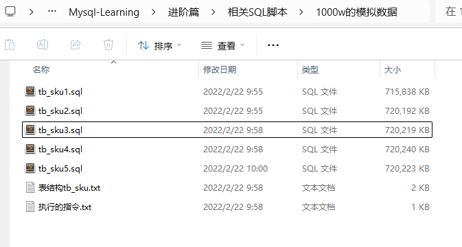

```bash
load data local infile '/root/sql/tb_sku1.sql' into table `tb_sku` fields terminated by ',' lines terminated by '\n';


æ³¨æ„ : 
	在mysql命令行中执行load指令，
	ç”±äº1000wçš„æ•°æ®é‡è¾ƒå¤§ , 如æœç›´æ¥åŠ è½½1000w , 会é常耗费CPUåŠå†…å­˜ ; 
	
	å·²ç»æ‹†åˆ†ä¸º5个部分 , æ¯ä¸€ä¸ªéƒ¨åˆ†ä¸º200wæ•°æ® , load 5次å³å¯ ;
```

###### ç¡®ä¿æ‰€æœ‰å¿…è¦çš„设置已å¯ç”¨

**在客户端è¿æ¥æ—¶å¯ç”¨local_infile并指定å…许加载的文件：**

```bash
mysql --local-infile=1 --enable-local-infile -u username -p
```

**在MySQL客户端中执行：**

```sql
SET GLOBAL local_infile = 1;
```

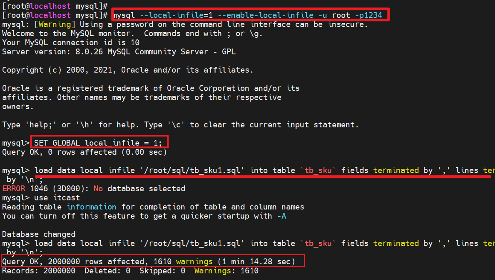


##### 2）执行测试

###### A. 执行如下SQLè¯­å¥ ï¼š

```sql
select * from tb_user; -- è¿™æ¡SQL执行效ç‡æ¯”较高, 执行耗时 0.00sec
select count(*) from tb_sku; -- ç”±äºtb_sku表中, 预先存入了1000w的记录, count一次,耗时13.35sec
```


###### B. 检查慢查询日志 ：

最终我们å‘ç°ï¼Œåœ¨æ…¢æŸ¥è¯¢æ—¥å¿—中，åªä¼šè®°å½•æ‰§è¡Œæ—¶é—´è¶…过我们预设时间（2s）的SQL，**执行较快的SQL**是ä¸ä¼šè®°å½•çš„。

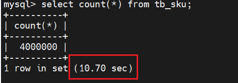

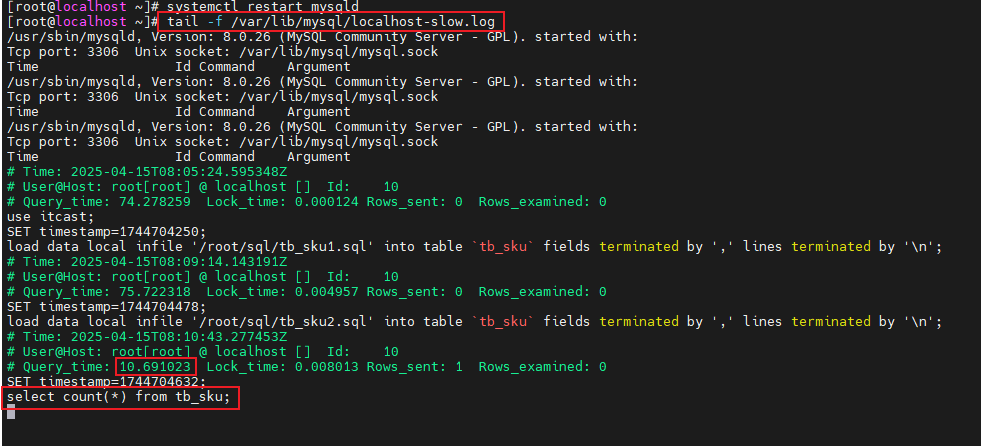

那这样，通过慢查询日志，就å¯ä»¥**定ä½å‡ºæ‰§è¡Œæ•ˆç‡æ¯”较ä½çš„SQL**，ä»è€Œæœ‰é’ˆå¯¹æ€§çš„进行优化。


### （3）profile详情

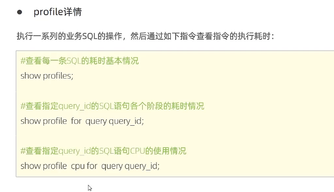

show profiles 能够在åšSQL优化时帮助我们**了解==时间都耗费到哪里å»==**了。通过**have_profilingå‚æ•°**，能够看到当å‰MySQL是å¦æ”¯æŒprofileæ“作：

```sql
SELECT @@have_profiling ;
```

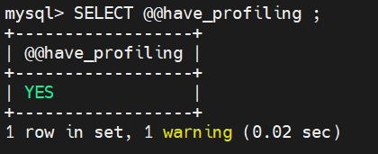

å¯ä»¥çœ‹åˆ°ï¼Œå½“å‰MySQLæ˜¯æ”¯æŒ profileæ“作的，但是开关是关闭的。å¯ä»¥é€šè¿‡**set语å¥åœ¨session/global级别开å¯profiling**：

```sql
SET profiling = 1;
```

开关已ç»æ‰“开了，æ¥ä¸‹æ¥ï¼Œæˆ‘们所执行的SQL语å¥ï¼Œéƒ½ä¼šè¢«MySQL记录，并记录执行时间消耗到哪儿å»äº†ã€‚ 我们直æ¥æ‰§è¡Œå¦‚下的SQL语å¥ï¼š

```sql
select * from tb_user;
select * from tb_user where id = 1;
select * from tb_user where name = '白起';
select count(*) from tb_sku;
```


执行一系列的业务SQLçš„æ“作，然å通过如下指令查看指令的执行耗时：

```sql
-- 查看æ¯ä¸€æ¡SQL的耗时基本情况
show profiles;

-- 查看指定query_idçš„SQL语å¥å„个阶段的耗时情况
show profile for query query_id;

-- 查看指定query_idçš„SQL语å¥CPU的使用情况
show profile cpu for query query_id;
```

查看æ¯ä¸€æ¡SQL的耗时情况:

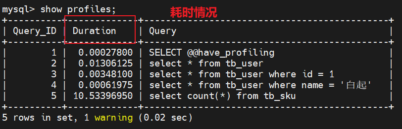

查看指定SQLå„个阶段的耗时情况 :

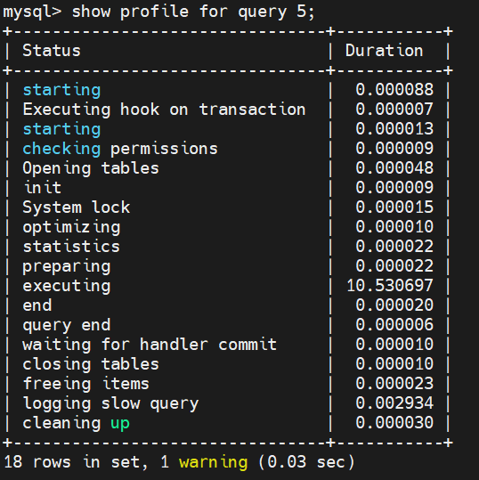

**查看指定SQL-CPU的耗时情况**

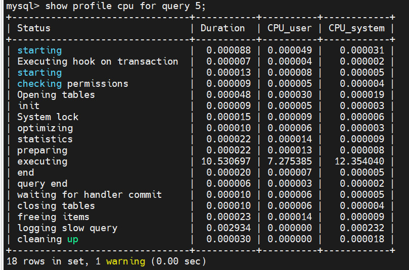


### （4）🌟 ==explain==

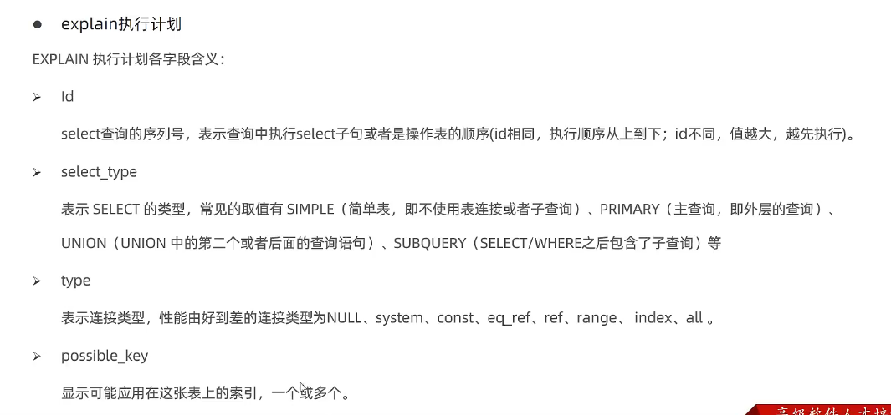

**EXPLAIN 或者 DESC命令**è·å– MySQL **==如何执行 SELECT 语å¥çš„ä¿¡æ¯==**，包括在 SELECT 语å¥æ‰§è¡Œè¿‡ç¨‹ä¸­**表如何è¿æ¥å’Œè¿æ¥çš„顺åº**。

#### ①语法

```sql
-- ç›´æ¥åœ¨select语å¥ä¹‹å‰åŠ ä¸Šå…³é”®å­— explain / desc
EXPLAIN SELECT 字段列表 FROM 表å WHERE æ¡ä»¶ ;
```


#### â‘¡Explain 执行计划中å„个字段的==å«ä¹‰==


#### ③案例SC表

```sql
create table student(
    id   int auto_increment comment '主键ID' primary key,
    name varchar(10) null comment '姓å',
    no   varchar(10) null comment 'å­¦å·'
)comment '学生表';
INSERT INTO student (name, no) VALUES ('黛绮ä¸', '2000100101');
INSERT INTO student (name, no) VALUES ('谢逊', '2000100102');
INSERT INTO student (name, no) VALUES ('殷天正', '2000100103');
INSERT INTO student (name, no) VALUES ('韦一笑', '2000100104');

create table course(
    id int auto_increment comment '主键ID' primary key,
    name varchar(10) null comment '课程å称'
)comment '课程表';
INSERT INTO course (name) VALUES ('Java');
INSERT INTO course (name) VALUES ('PHP');
INSERT INTO course (name) VALUES ('MySQL');
INSERT INTO course (name) VALUES ('Hadoop');

create table student_course(
    id int auto_increment comment '主键' primary key,
    studentid int not null comment '学生ID',
    courseid  int not null comment '课程ID',
    constraint fk_courseid foreign key (courseid) references course (id),
    constraint fk_studentid foreign key (studentid) references student (id)
)comment '学生课程中间表';
INSERT INTO student_course (studentid, courseid) VALUES (1, 1);
INSERT INTO student_course (studentid, courseid) VALUES (1, 2);
INSERT INTO student_course (studentid, courseid) VALUES (1, 3);
INSERT INTO student_course (studentid, courseid) VALUES (2, 2);
INSERT INTO student_course (studentid, courseid) VALUES (2, 3);
INSERT INTO student_course (studentid, courseid) VALUES (3, 4);
```

##### 1）查询所有学生的选课情况

```sql
Select * from student s , course c, student_course sc where s.id = sc.studentid and c.id = sc.courseid;
```

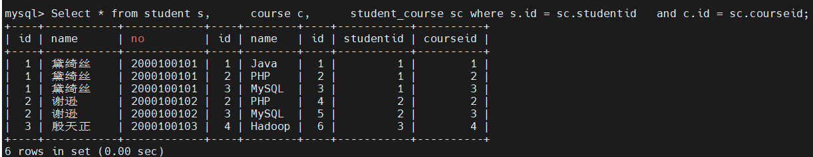

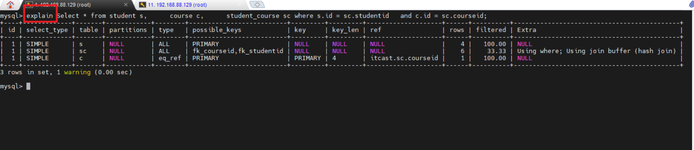

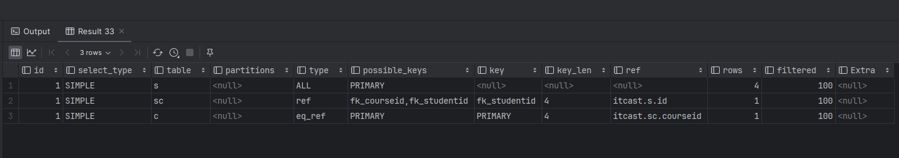


##### 2）查询选修了 MySQL 课程的学生 (å­æŸ¥è¯¢)

**通过å­æŸ¥è¯¢è§‚察explain结æœä¸­id的顺åº**

```sql
#查询MySQL对应的课程id
select c.id from course c where c.name = 'MySQL');

#查询选修了mysql课程id 的学生id
select sc.studentid from student_course sc where sc.courseid in (1,2,3);

#查询选修了 MySQL 课程的学生 (å­æŸ¥è¯¢)
Select s.*
from student s
where s.id in
      (select sc.studentid from student_course sc where sc.courseid in (select c.id from course c where c.name = 'MySQL'));
```


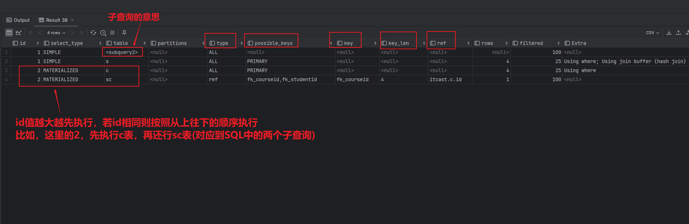


### （5）==explain 输出列详解==

当你使用 `EXPLAIN` 分æ SELECT 语å¥æ—¶ï¼ŒMySQL 会返å›ä¸€ä¸ªåŒ…å«å¤šåˆ—的结æœé›†ï¼Œæ¯åˆ—都æ供了查询执行计划的é‡è¦ä¿¡æ¯ã€‚以下是å„列的详细解释：


#### 核心列说æ˜

#### 1. **id** (查询标识符)

- 表示 SELECT 查询的åºåˆ—å·

- ç›¸åŒ id 表示åŒä¸€æŸ¥è¯¢å±‚级，执行顺åºä»ä¸Šè‡³ä¸‹

- 数字越大执行优先级越高

- id 为 NULL **表示是结æœé›†**（如 UNION 结æœï¼‰

  

#### 2. **select_type** (查询类å‹)

| ç±»å‹               | è¯´æ˜                             |
| ------------------ | -------------------------------- |
| SIMPLE             | 简å•æŸ¥è¯¢ï¼ˆä¸åŒ…å«å­æŸ¥è¯¢æˆ– UNION） |
| PRIMARY            | 最外层查询                       |
| SUBQUERY           | å­æŸ¥è¯¢ä¸­çš„**第一个 SELECT**      |
| DERIVED            | 派生表（FROM å­å¥ä¸­çš„å­æŸ¥è¯¢ï¼‰    |
| UNION              | UNION 中的第二个或å续查询       |
| UNION RESULT       | UNION 的结æœé›†                   |
| DEPENDENT SUBQUERY | ä¾èµ–外部查询的å­æŸ¥è¯¢             |
| MATERIALIZED       | 物化å­æŸ¥è¯¢                       |

#### 3. **table** (访问的表)

- 显示查询涉åŠçš„表å
- å¯èƒ½æ˜¯**å®é™…表åã€åˆ«å或临时表å**
- `<derivedN>` 表示派生表（N 对应 id）
- `<unionM,N>` 表示 UNION 结æœï¼ˆM,N 对应 id）


#### 4. **partitions** (匹é…的分区)

- 查询匹é…的分区（仅**分区表有效**）
- NULL 表示未分区表


#### 5. ==type== (访问类å‹ï¼Œé‡è¦ï¼)

##### ①性能分æ

表示 MySQL 如何查找表中的行，**==ä»ä¼˜åˆ°åŠ£==æ’åº**：

| ç±»å‹            | è¯´æ˜                           | 性能     |
| --------------- | ------------------------------ | -------- |
| system          | 表åªæœ‰ä¸€è¡Œï¼ˆç³»ç»Ÿè¡¨ï¼‰           | 最佳     |
| const           | 通过主键或唯一索引一次查询     | 优       |
| eq_ref          | å…³è”查询中主键/å”¯ä¸€ç´¢å¼•åŒ¹é…    | 优       |
| ref             | é唯一索引查找（**è”åˆç´¢å¼•**） | 良       |
| fulltext        | 全文索引查找                   | 特殊     |
| ref_or_null     | 类似 refï¼Œä½†åŒ…å« NULL 值       | 良       |
| index_merge     | 索引åˆå¹¶ä¼˜åŒ–                   | 良       |
| unique_subquery | å­æŸ¥è¯¢ä½¿ç”¨å”¯ä¸€ç´¢å¼•             | 良       |
| index_subquery  | å­æŸ¥è¯¢ä½¿ç”¨æ™®é€šç´¢å¼•             | 中       |
| range           | ç´¢å¼•èŒƒå›´æ‰«æ                   | 中       |
| index           | å…¨ç´¢å¼•æ‰«æ                     | å·®       |
| ==ALL==         | **全表扫æ**                   | **最差** |

**业务SQL**几ä¹ä¸å¯èƒ½å‡ºç°**type=null**的情况，除éç›´æ¥æ‰§è¡Œ`select 'A'`。

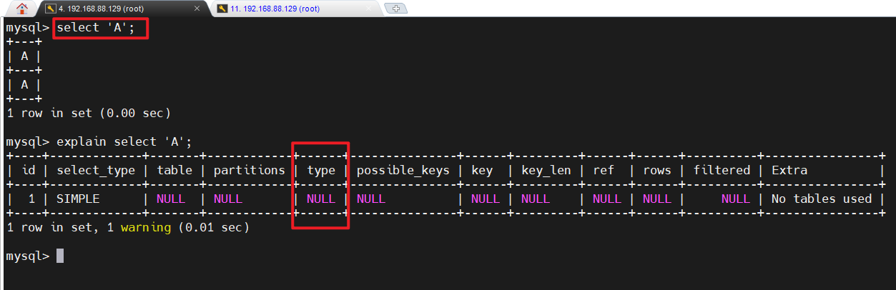


#### 6. **possible_keys** (å¯èƒ½ä½¿ç”¨çš„索引)

- 查询å¯èƒ½ä½¿ç”¨çš„索引列表
- NULL 表示没有相关索引


#### 7. **key** (å®é™…使用的索引)

- MySQL å®é™…决定使用的索引
- NULL 表示未使用索引
- å¯èƒ½ä¸åœ¨ possible_keys 中（优化器选择）


#### 8. **key_len** (使用的索引长度)

- 表示索引中使用的字节数，该值为索引字段最大å¯èƒ½é•¿åº¦ï¼Œå¹¶éå®é™…使用长
  度，在ä¸æŸå¤±ç²¾ç¡®æ€§çš„å‰æ下，长度越短越好。
- å¯åˆ¤æ–­æ˜¯å¦ä½¿ç”¨äº†ç´¢å¼•çš„全部部分
- 计算公å¼ï¼šåˆ—定义长度 + NULL(1) + å˜é•¿(2)


#### 9. **ref** (索引引用)

- 显示索引的**哪一列被使用**了
- å¯èƒ½æ˜¯ï¼šconstã€funcã€åˆ—åç­‰


#### 10. **rows** (预估检查行数)

- MySQL 估计è¦æ£€æŸ¥çš„行数（ä¸æ˜¯ç²¾ç¡®å€¼ï¼‰
- é‡è¦ä¼˜åŒ–指标
- MySQL**认为必须è¦æ‰§è¡ŒæŸ¥è¯¢çš„行数**，在innodb引æ“的表中，是一个估计值，
  å¯èƒ½å¹¶ä¸æ€»æ˜¯å‡†ç¡®çš„。


#### 11. **filtered** (过滤百分比)

- 表示存储引æ“è¿”å›çš„æ•°æ®åœ¨æœåŠ¡å™¨å±‚**过滤å剩余百分比**
- **100 表示没有过滤**
- 表示返å›ç»“æœçš„行数å éœ€è¯»å–行数的百分比，**filtered的值越大越好**。


#### 12. ==Extra== (é¢å¤–ä¿¡æ¯ï¼Œé‡è¦ï¼)

åŒ…å« MySQL 解决查询的é¢å¤–ä¿¡æ¯ï¼š

| ä¿¡æ¯                         | è¯´æ˜                       |
| ---------------------------- | -------------------------- |
| Using index                  | 使用覆盖索引（åªéœ€ç´¢å¼•ï¼‰   |
| Using where                  | æœåŠ¡å™¨å±‚进行过滤           |
| Using temporary              | 使用临时表                 |
| Using filesort               | **使用文件æ’åºï¼ˆéœ€ä¼˜åŒ–）** |
| Using join buffer            | 使用è¿æ¥ç¼“冲               |
| Impossible WHERE             | WHERE æ¡ä»¶æ°¸è¿œä¸æˆç«‹       |
| Select tables optimized away | 优化器已优化æ‰è¡¨è®¿é—®       |

#### 优化建议

1. 关注 `type` 列，**é¿å…å‡ºç° `ALL`（全表扫æ）**
2. ç¡®ä¿ `key` 列使用了适当的索引
3. 当 `Extra` å‡ºç° `Using filesort` 或 `Using temporary` 时需特别注æ„
4. 比较 `rows` ä¸å®é™…æ•°æ®é‡ï¼Œ**评估索引效ç‡**
5. 对äºå¤æ‚查询，å°è¯• `EXPLAIN FORMAT=JSON` è·å–更详细信æ¯

通过ç†è§£è¿™äº›åˆ—çš„å«ä¹‰ï¼Œä½ å¯ä»¥æœ‰æ•ˆåˆ†æ查询性能瓶颈并进行针对性优化。


## 2.6 🌟索引使用

### （1）验è¯ç´¢å¼•é¢‘ç‡

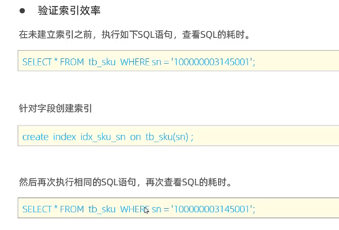

在讲解索引的使用åŸåˆ™ä¹‹å‰ï¼Œå…ˆé€šè¿‡ä¸€ä¸ªç®€å•çš„案例，æ¥éªŒè¯ä¸€ä¸‹ç´¢å¼•ï¼Œçœ‹çœ‹æ˜¯å¦èƒ½å¤Ÿé€šè¿‡ç´¢å¼•æ¥æå‡æ•°æ®æŸ¥è¯¢æ€§èƒ½ã€‚在演示的时候，我们还是使用之å‰å‡†å¤‡çš„一张表 tb_sku , 在这张表中准备了1000w的记录。

**为了方便åªæ·»åŠ äº†400W**

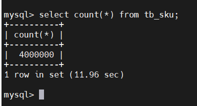

这张表中id为主键，有主键索引，而其他字段是没有建立索引的。 我们先æ¥æŸ¥è¯¢å…¶ä¸­çš„一æ¡è®°å½•ï¼Œçœ‹çœ‹é‡Œé¢çš„字段情况，执行如下SQL：

```sql
select * from tb_sku where id = 1\G; # \G 表示 æ ¼å¼åŒ–输出
```

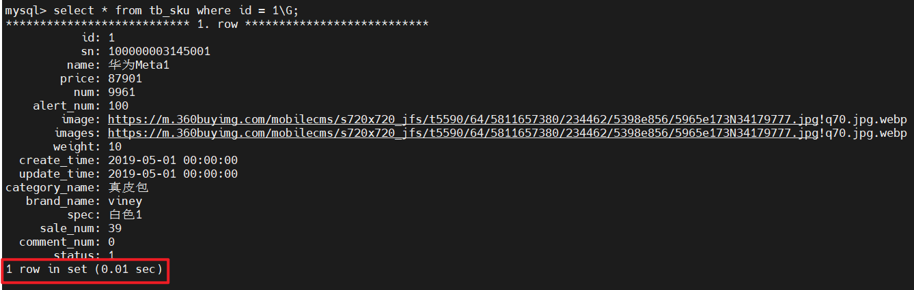

å¯ä»¥çœ‹åˆ°å³ä½¿æœ‰1000wçš„æ•°æ®,æ ¹æ®id进行数æ®æŸ¥è¯¢,**性能ä¾ç„¶å¾ˆå¿«**，因为主键id是有索引的。 那么æ¥ä¸‹æ¥ï¼Œæˆ‘们å†æ¥æ ¹æ® sn 字段进行查询，执行如下SQL：

```sql
SELECT * FROM tb_sku WHERE sn = '100000003145001';
```

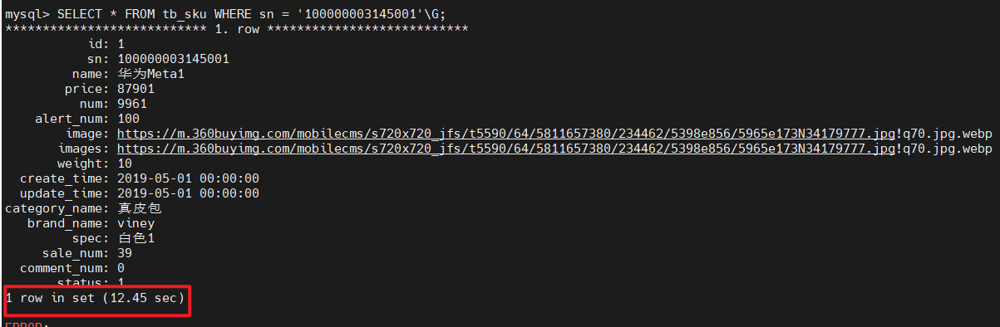

我们å¯ä»¥çœ‹åˆ°æ ¹æ®sn字段进行查询，查询返å›äº†ä¸€æ¡æ•°æ®ï¼Œç»“æœè€—æ—¶ 20.78sec，就是**因为sn没有索引，而造æˆæŸ¥è¯¢æ•ˆç‡å¾ˆä½**。

那么我们å¯ä»¥é’ˆå¯¹äºsn字段，建立一个索引，建立了索引之å，我们å†æ¬¡æ ¹æ®sn进行查询，å†æ¥çœ‹ä¸€ä¸‹æŸ¥è¯¢è€—时情况。

**创建索引：**

```sql
create index idx_sku_sn on tb_sku(sn) ;
```

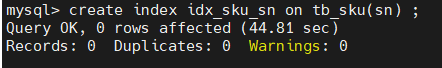

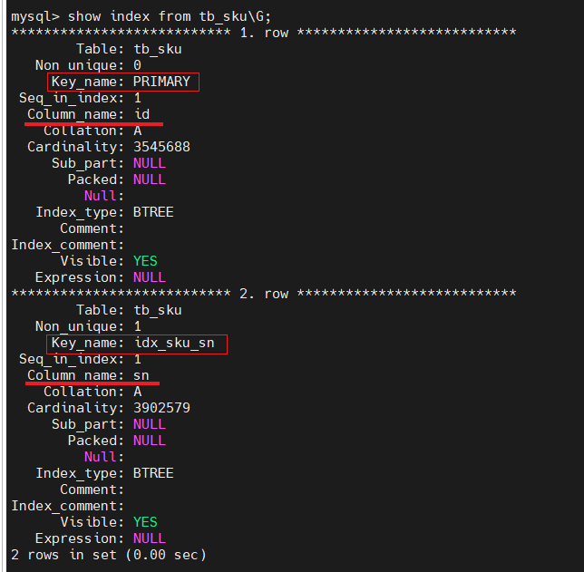

然åå†æ¬¡æ‰§è¡Œç›¸åŒçš„SQL语å¥ï¼Œå†æ¬¡æŸ¥çœ‹SQL的耗时。

```sql
SELECT * FROM tb_sku WHERE sn = '100000003145001';
```

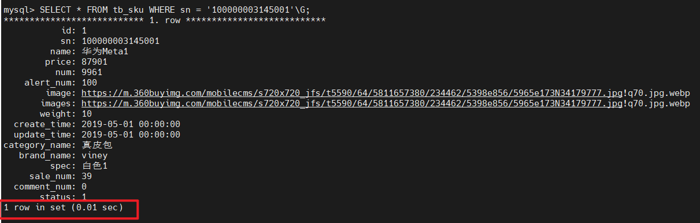

我们æ˜æ˜¾ä¼šçœ‹åˆ°ï¼Œsn字段建立了索引之å，查询性能大大æå‡ã€‚建立索引å‰å，查询耗时都ä¸æ˜¯ä¸€ä¸ªæ•°é‡çº§çš„。

**explain分æ：**

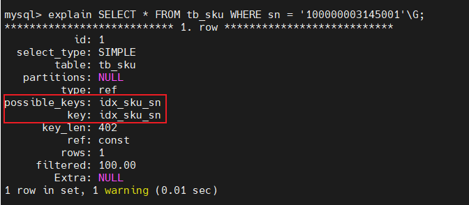

```
explain SELECT * FROM tb_sku WHERE sn = '100000003145001'\G;
```


### （2）🌟 ==最左å‰ç¼€æ³•åˆ™==

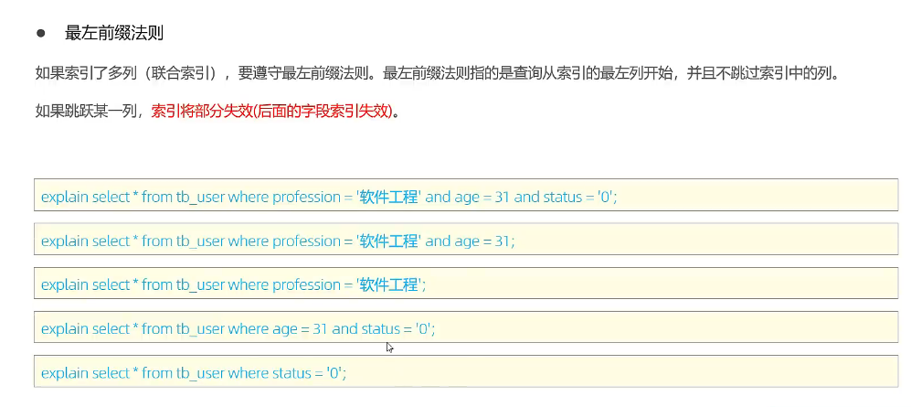

如æœç´¢å¼•äº†å¤šåˆ—（**è”åˆç´¢å¼•**），è¦**éµå®ˆæœ€å·¦å‰ç¼€æ³•åˆ™**。最左å‰ç¼€æ³•åˆ™æŒ‡çš„是**查询ä»ç´¢å¼•çš„最左列开始，并且ä¸è·³è¿‡ç´¢å¼•ä¸­çš„列。 ** **如æœè·³è·ƒæŸä¸€åˆ—，索引将会==部分失效(åé¢çš„字段索引失效)==**。以 tb_user 表为例，我们先æ¥æŸ¥çœ‹ä¸€ä¸‹ä¹‹å‰ tb_user 表所创建的索引。

以 tb_user 表为例，我们先æ¥æŸ¥çœ‹ä¸€ä¸‹ä¹‹å‰ tb_user 表所创建的索引。

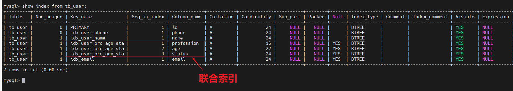

在 tb_user 表中，有一个è”åˆç´¢å¼•ï¼Œè¿™ä¸ªè”åˆç´¢å¼•æ¶‰åŠåˆ°ä¸‰ä¸ªå­—段，顺åºåˆ†åˆ«ä¸ºï¼šprofession，age，status。

对äº==最左å‰ç¼€æ³•åˆ™==指的是，查询时，**==最左边的列==，也就是profession==必须存在==**，**==å¦åˆ™ç´¢å¼•å…¨éƒ¨å¤±æ•ˆ==**。而且**中间ä¸èƒ½è·³è¿‡æŸä¸€åˆ—，å¦åˆ™==该列åé¢çš„字段索引将失效==**。 æ¥ä¸‹æ¥ï¼Œæˆ‘们æ¥æ¼”示几组案例，看一下具体的执行计划：

```sql
explain select * from tb_user where profession = '软件工程' and age = 31 and status = '0';
```

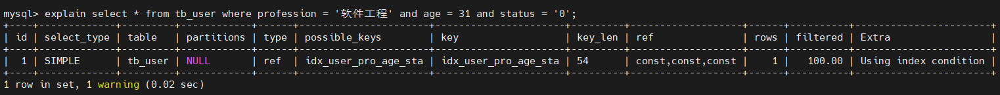


```sql
explain select * from tb_user where profession = '软件工程' and age = 31;
```

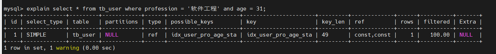


```sql
explain select * from tb_user where profession = '软件工程';
```

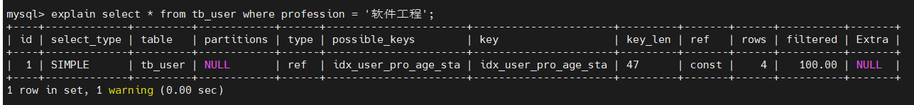

以上的这三组测试中，我们å‘ç°åªè¦è”åˆç´¢å¼•**最左边的字段 profession存在**，索引就会生效，åªä¸è¿‡ç´¢å¼•çš„长度ä¸åŒã€‚ 而且由以上三组测试，我们也å¯ä»¥**==æ¨æµ‹å‡ºprofession字段索引长度为47ã€age字段索引长度为2ã€status字段索引长度为5==**。


```sql
explain select * from tb_user where age = 31 and status = '0';
```

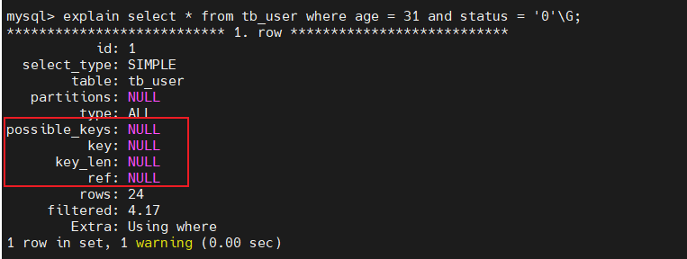


```sql
explain select * from tb_user where status = '0';
```

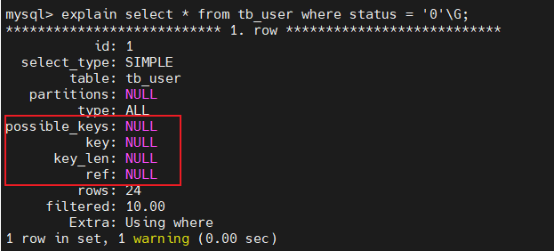


而通过上é¢çš„这两组测试，我们也å¯ä»¥çœ‹åˆ°**索引并未生效，åŸå› æ˜¯å› ä¸ºä¸æ»¡è¶³æœ€å·¦å‰ç¼€æ³•åˆ™**，è”åˆç´¢å¼•æœ€å·¦è¾¹çš„列professionä¸å­˜åœ¨ã€‚

```sql
explain select * from tb_user where profession = '软件工程' and status = '0';
```

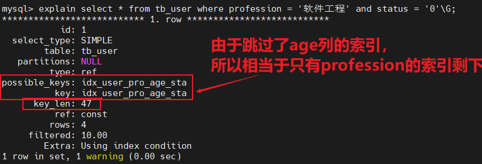

上述的SQL查询时，存在profession字段，最左边的列是存在的，索引满足最左å‰ç¼€æ³•åˆ™çš„基本æ¡ä»¶ã€‚但是查询时，**跳过了age这个列**，所以åé¢çš„列索引是ä¸ä¼šä½¿ç”¨çš„，也就是**索引部分生效**，所以**索引的长度就是47**（**相当äºåªæœ‰profession字段的索引**）


> **æ€è€ƒé¢˜ï¼š**
>
> 
>
> 当执行SQL语å¥: explain select * from tb_user where age = 31 and status = '0' and profession = '软件工程'ï¼› 时，**是å¦æ»¡è¶³æœ€å·¦å‰ç¼€æ³•åˆ™**，走ä¸èµ°ä¸Šè¿°çš„è”åˆç´¢å¼•ï¼Œç´¢å¼•é•¿åº¦ï¼Ÿ
>
> 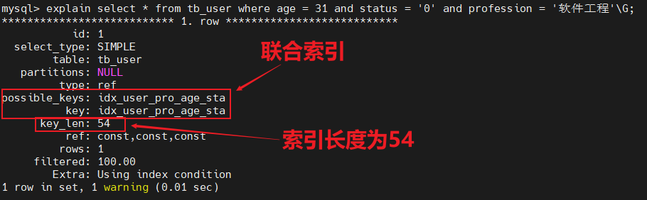
>
> å¯ä»¥çœ‹åˆ°ï¼Œæ˜¯å®Œå…¨æ»¡è¶³æœ€å·¦å‰ç¼€æ³•åˆ™çš„，索引长度54，**è”åˆç´¢å¼•æ˜¯ç”Ÿæ•ˆçš„**。
>
> 
>
> **==注æ„== ：** 最左å‰ç¼€æ³•åˆ™ä¸­æŒ‡çš„**最左边的列**，是指在查询时，è”åˆç´¢å¼•çš„最左边的字段(**å³æ˜¯ç¬¬ä¸€ä¸ªå­—段)==必须存在==**，ä¸æˆ‘们编写SQL时，**æ¡ä»¶ç¼–写的先å顺åºæ— å…³**。


### （3）范围查询

è”åˆç´¢å¼•ä¸­ï¼Œå‡ºç°**范围查询(> , <)**，**范围查询å³ä¾§çš„列索引失效**。

```sql
explain select * from tb_user where profession = '软件工程' and age > 30 and status = '0';
```

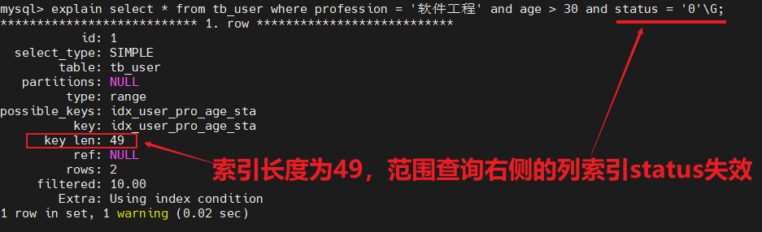

当范围查询使用> 或 < 时，走è”åˆç´¢å¼•äº†ï¼Œä½†æ˜¯ç´¢å¼•çš„长度为49，就说æ˜**范围查询å³è¾¹çš„status字段**是没有走索引的。


```sql
explain select * from tb_user where profession = '软件工程' and age >= 30 and status = '0';
```

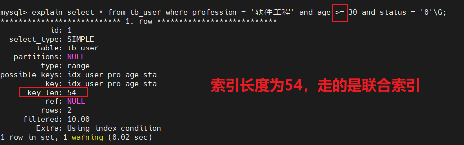

当范围查询使用>= 或 <= 时，**èµ°è”åˆç´¢å¼•äº†ï¼Œä½†æ˜¯ç´¢å¼•çš„长度为54，就说æ˜æ‰€æœ‰çš„字段都是走索引的。**

所以，**在业务å…许的情况下**，==å°½å¯èƒ½çš„ä½¿ç”¨ç±»ä¼¼äº **>= 或 <=** 这类的范围查询==，而**é¿å…使用 > 或 <**。


### （4）🌟 ==索引失效情况==

#### ①索引==列è¿ç®—==

ä¸è¦åœ¨ç´¢å¼•åˆ—上进行**è¿ç®—æ“作**， 索引将失效。

在tb_user表中，除了å‰é¢ä»‹ç»çš„è”åˆç´¢å¼•ä¹‹å¤–，还有一个索引，是**phone字段的å•åˆ—索引**。

```sql
show index from tb_user\G;
```

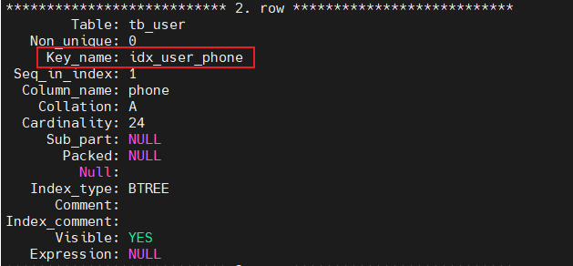

##### A. 当根æ®phone字段进行==等值匹é…查询==æ—¶, 索引生效。

```sql
explain select * from tb_user where phone = '17799990015'; 
```

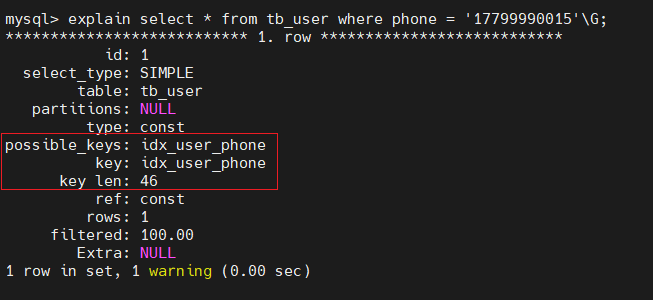

##### B. 当根æ®phone字段进行==函数è¿ç®—æ“作==之å，索引失效。

```sql
explain select * from tb_user where substring(phone,10,2) = '15';
```


#### ②字符串==ä¸åŠ å¼•å·==-''

字符串类å‹å­—段使用时，**ä¸åŠ å¼•å·ï¼Œç´¢å¼•å°†å¤±æ•ˆ**。（**该没加引å·çš„索引失效**，并å‚照最左å‰ç¼€æ³•åˆ™ï¼‰

**==æ•°æ®åº“存在éšå¼ç±»å‹è½¬æ¢==，索引将失效。**

æ¥ä¸‹æ¥ï¼Œæˆ‘们通过两组示例，æ¥çœ‹çœ‹å¯¹äºå­—符串类å‹çš„字段，加å•å¼•å·ä¸ä¸åŠ å•å¼•å·çš„区别：

```sql
explain select * from tb_user where profession = '软件工程' and age = 31 and status = '0';
explain select * from tb_user where profession = '软件工程' and age = 31 and status = 0;
```

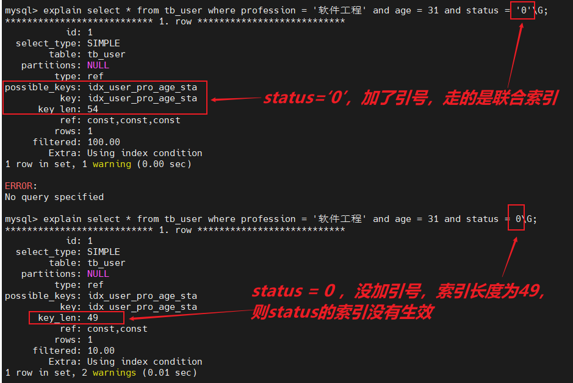


```sql
explain select * from tb_user where phone = '17799990015';
explain select * from tb_user where phone = 17799990015;
```

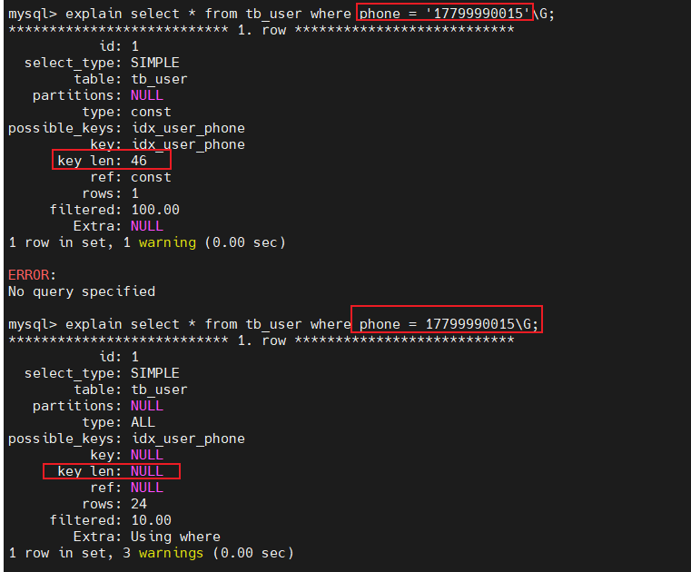

ç»è¿‡ä¸Šé¢ä¸¤ç»„示例，我们会æ˜æ˜¾çš„å‘ç°ï¼Œ**如æœå­—符串ä¸åŠ å•å¼•å·ï¼Œå¯¹äºæŸ¥è¯¢ç»“æœï¼Œæ²¡ä»€ä¹ˆå½±å“，但是==æ•°æ®åº“存在éšå¼ç±»å‹è½¬æ¢==，索引将失效。**


#### ③==模糊查询==-%

如æœä»…仅是**==尾部模糊匹é…，索引ä¸ä¼šå¤±æ•ˆ==**。如æœæ˜¯==**头部模糊匹é…，索引失效**==。走的是**全表扫æ**。


æ¥ä¸‹æ¥ï¼Œæˆ‘们æ¥çœ‹ä¸€ä¸‹è¿™ä¸‰æ¡SQL语å¥çš„执行效æœï¼ŒæŸ¥çœ‹ä¸€ä¸‹å…¶æ‰§è¡Œè®¡åˆ’：

ç”±äºä¸‹é¢æŸ¥è¯¢è¯­å¥ä¸­ï¼Œéƒ½æ˜¯**æ ¹æ®profession字段查询，符åˆæœ€å·¦å‰ç¼€æ³•åˆ™ï¼Œè”åˆç´¢å¼•æ˜¯å¯ä»¥ç”Ÿæ•ˆçš„**，

我们主è¦çœ‹ä¸€ä¸‹ï¼Œæ¨¡ç³ŠæŸ¥è¯¢æ—¶ï¼Œ**%加在关键字之å‰**，和**加在关键字之å**çš„å½±å“。

```sql
explain select * from tb_user where profession like '软件%';
explain select * from tb_user where profession like '%工程';
explain select * from tb_user where profession like '%å·¥%';
```

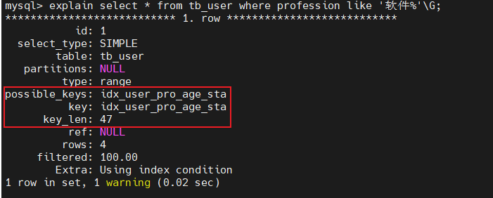

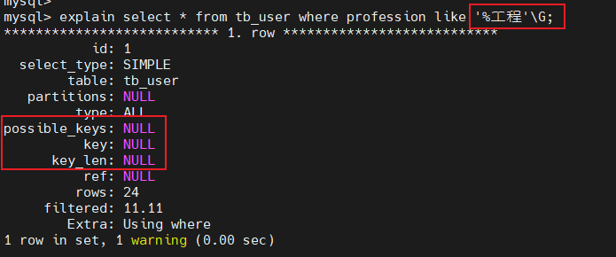

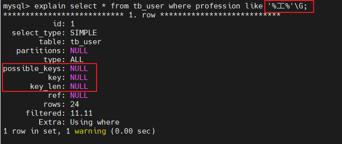


ç»è¿‡ä¸Šè¿°çš„测试，我们å‘ç°ï¼Œåœ¨**like模糊查询中，在关键字åé¢åŠ %**，**索引å¯ä»¥ç”Ÿæ•ˆ**。而如æœ**在关键字å‰é¢åŠ äº†%，索引将会失效**。


#### â‘£==or==è¿æ¥æ¡ä»¶-or

用or分割开的æ¡ä»¶ï¼Œ 如æœ**orå‰çš„æ¡ä»¶ä¸­çš„列有索引，而åé¢çš„列中没有索引**，那么**涉åŠçš„索引都ä¸ä¼šè¢«ç”¨åˆ°**。å³or两侧，一侧有索引ã€ä¸€ä¾§æ²¡ç´¢å¼•çš„时候，所以都会失效。

```sql
explain select * from tb_user where id = 10 or age = 23;
explain select * from tb_user where phone = '17799990017' or age = 23;
```


ç”±äº**age没有索引**，所以å³ä½¿idã€phone有索引，**索引也会失效**。所以需è¦é’ˆå¯¹äº**age也è¦å»ºç«‹ç´¢å¼•**。

然å，我们å¯ä»¥å¯¹age字段建立索引。

```sql
create index idx_user_age on tb_user(age);
```


建立了索引之å，我们å†æ¬¡æ‰§è¡Œä¸Šè¿°çš„SQL语å¥ï¼Œçœ‹çœ‹å‰å执行计划的å˜åŒ–。

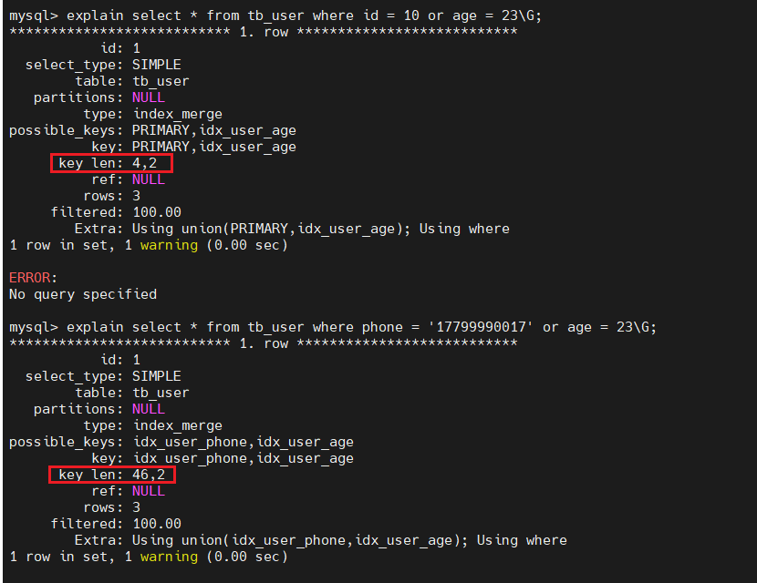

最终，我们å‘ç°ï¼Œå½“orè¿æ¥çš„æ¡ä»¶ï¼Œå·¦å³ä¸¤ä¾§å­—段都有索引时，索引æ‰ä¼šç”Ÿæ•ˆã€‚


#### ⑤==æ•°æ®åˆ†å¸ƒå½±å“==

如æœMySQL**==评估使用索引比全表更慢==，则ä¸ä½¿ç”¨ç´¢å¼•**。

```sql
explain select * from tb_user where phone >= '17799990005';
explain select * from tb_user where phone >= '17799990015';
```

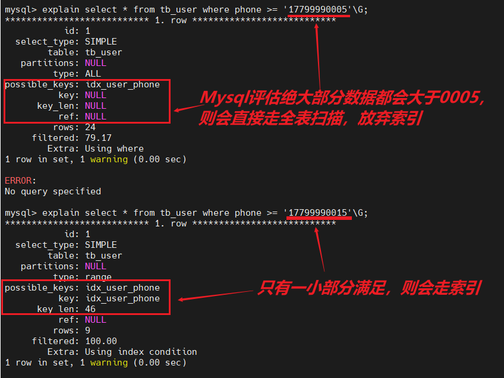

ç»è¿‡æµ‹è¯•æˆ‘们å‘ç°ï¼Œç›¸åŒçš„SQL语å¥ï¼Œ**åªæ˜¯ä¼ å…¥çš„字段值ä¸åŒ**，最终的执行计划也完全ä¸ä¸€æ ·ï¼Œè¿™æ˜¯ä¸ºä»€ä¹ˆå‘¢ï¼Ÿ

就是因为MySQL在查询时，**会评估使用索引的效ç‡ä¸èµ°å…¨è¡¨æ‰«æ的效ç‡**，如æœ**走全表扫æ更快，则放弃索引，走全表扫æ**。 因为索引是用æ¥**索引少é‡æ•°æ®çš„**，如æœ**==通过索引查询返å›å¤§æ‰¹é‡çš„æ•°æ®==**，则**==还ä¸å¦‚走全表扫ææ¥çš„快，此时索引就会失效==。**

æ¥ä¸‹æ¥ï¼Œæˆ‘们å†æ¥çœ‹çœ‹ **is null ä¸ is not null æ“作是å¦èµ°ç´¢å¼•**。

执行如下两æ¡è¯­å¥ ：

```sql
explain select * from tb_user where profession is null;
explain select * from tb_user where profession is not null;
```

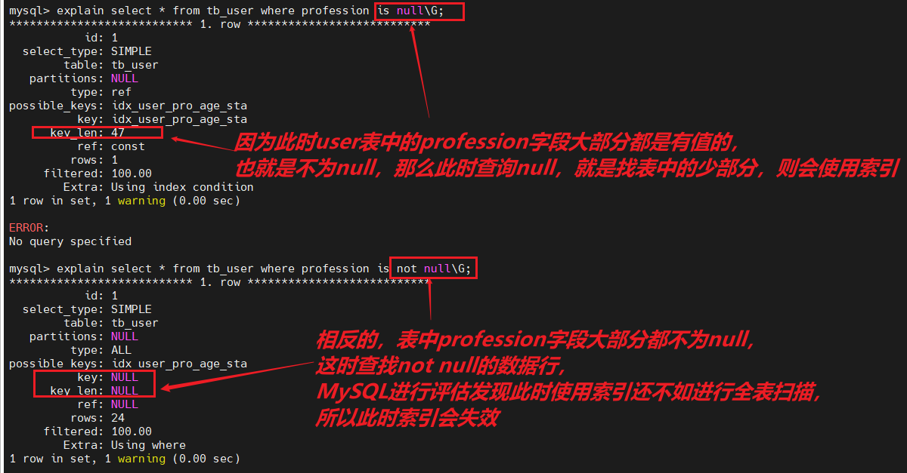

æ¥ä¸‹æ¥ï¼Œæˆ‘们åšä¸€ä¸ªæ“作**å°†profession字段值全部更新为null**

```sql
update tb_user set profession = null;
```

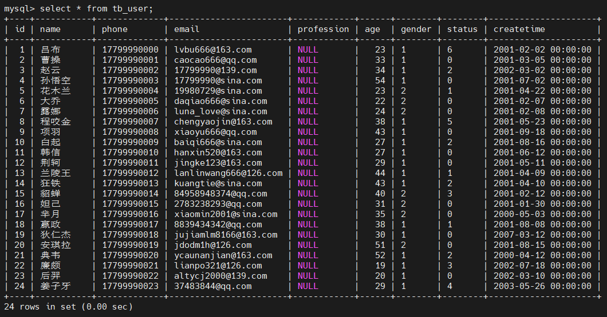

然å，å†æ¬¡æ‰§è¡Œä¸Šè¿°çš„两æ¡SQL，查看SQL语å¥çš„执行计划。

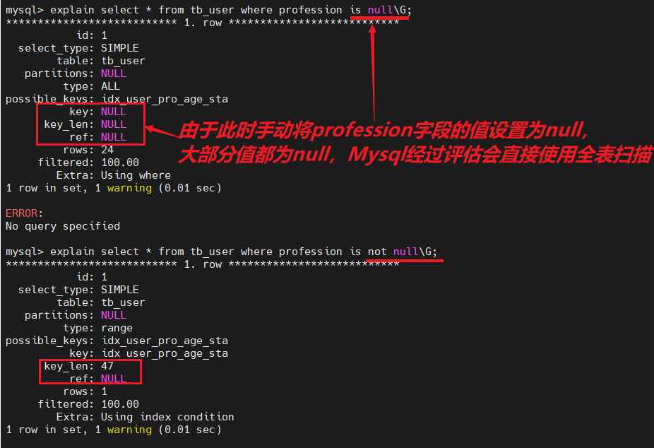

最终我们看到，一模一样的SQL语å¥ï¼Œå…ˆå执行了两次，结æœæŸ¥è¯¢è®¡åˆ’是ä¸ä¸€æ ·çš„，为什么会出ç°è¿™ç§ç°è±¡ï¼Œè¿™æ˜¯å’Œ**æ•°æ®åº“çš„æ•°æ®åˆ†å¸ƒæœ‰å…³ç³»**。查询时**MySQL会评估，走索引快，还是全表扫æå¿«**，如æœå…¨è¡¨æ‰«æ更快，则放弃索引走全表扫æ。 因此，is null ã€is not null是å¦èµ°ç´¢å¼•ï¼Œ**得具体情况具体分æ**，并ä¸æ˜¯å›ºå®šçš„。


**==总结==：Mysql评估时，会判断查询时是索引快，还是全表扫æ快，==如æœæŸ¥è¯¢çš„æ¡ä»¶å¯¹äºè¡¨ä¸­å¤§éƒ¨åˆ†çš„字段值都满足==，则会直æ¥èµ°==全表扫æ==，放弃走索引，å之，åŒç†ã€‚** **==相当äºç´¢å¼•åªå¯¹å°‘部分数æ®ç”Ÿæ•ˆã€‚==**


### （5）SQLæ示

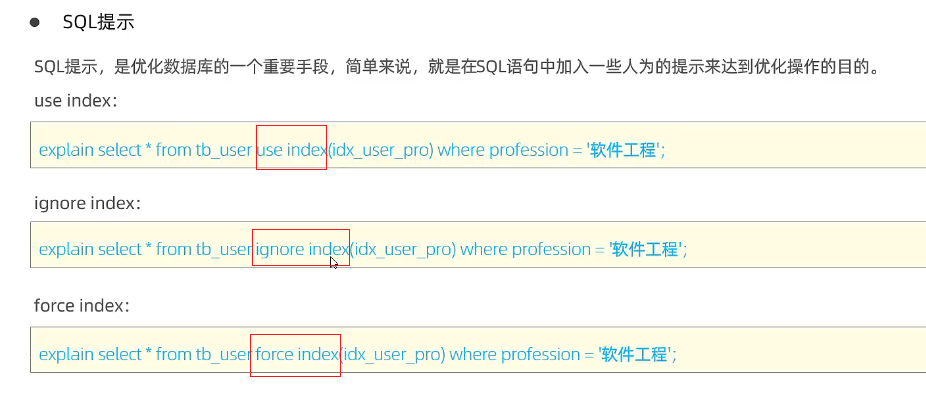

#### 场景引入

ç›®å‰tb_user表的数æ®æƒ…况如下:

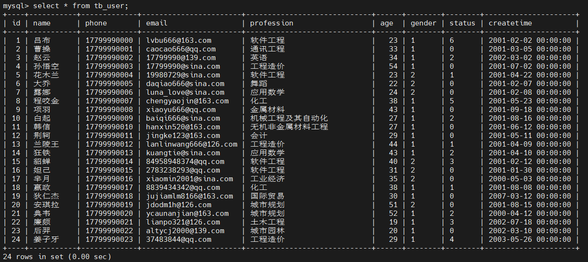


索引情况如下:

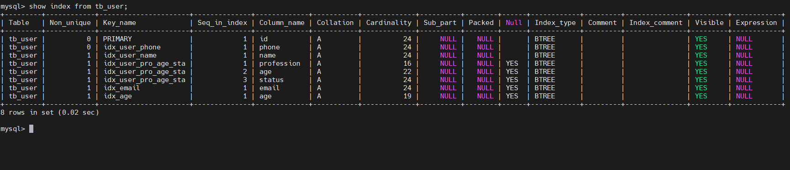

把上述的 idx_user_age, idx_email 这两个之å‰æµ‹è¯•ä½¿ç”¨è¿‡çš„索引**ç›´æ¥åˆ é™¤**。

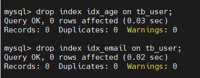

```sql
drop index idx_user_age on tb_user;
drop index idx_email on tb_user;
```


**A. 执行SQL : explain select * from tb_user where profession = '软件工程';**

```sql
explain select * from tb_user where profession = '软件工程';
```

查询走了è”åˆç´¢å¼•ã€‚

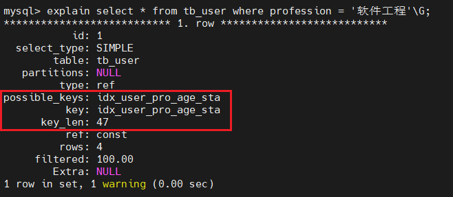


**B. 执行SQL，创建professionçš„==å•åˆ—索引==：create index idx_user_pro on tb_user(profession);**

```sql
create index idx_user_pro on tb_user(profession);
```


**C. 创建å•åˆ—索引å，å†æ¬¡æ‰§è¡ŒA中的SQL语å¥ï¼ŒæŸ¥çœ‹æ‰§è¡Œè®¡åˆ’，看看到底走哪个索引。**

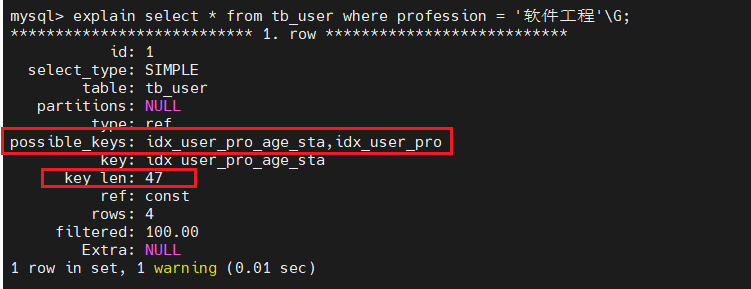

测试结æœï¼Œæˆ‘们å¯ä»¥çœ‹åˆ°ï¼Œpossible_keys中 idx_user_pro_age_sta,idx_user_pro **这两个索引都å¯èƒ½ç”¨åˆ°**，最终**MySQL选择了idx_user_pro_age_sta索引**。这是**MySQL自动选择的结æœ**。

那么，我们能ä¸èƒ½åœ¨æŸ¥è¯¢çš„时候，**自己æ¥æŒ‡å®šä½¿ç”¨å“ªä¸ªç´¢å¼•**呢？ 答案是肯定的，此时就å¯ä»¥å€ŸåŠ©äºMySQLçš„**SQLæ示æ¥å®Œæˆ**。 æ¥ä¸‹æ¥ï¼Œä»‹ç»ä¸€ä¸‹SQLæ示。

**SQLæ示**，是优化数æ®åº“的一个é‡è¦æ‰‹æ®µï¼Œç®€å•æ¥è¯´ï¼Œå°±æ˜¯åœ¨SQL语å¥ä¸­åŠ å…¥ä¸€äº›äººä¸ºçš„æ示æ¥è¾¾åˆ°**优化æ“作的目的。**


#### ①use index -建议

建议MySQL使用哪一个索引完æˆæ­¤æ¬¡æŸ¥è¯¢ï¼ˆä»…仅是**建议，mysql内部还会å†æ¬¡è¿›è¡Œè¯„ä¼°**）。

```sql
explain select * from tb_user use index(idx_user_pro) where profession = '软件工程';
```

#### ②ignore index 忽略指定的索引

```sql
explain select * from tb_user ignore index(idx_user_pro) where profession = '软件工程';
```

#### ③force index 强制使用索引

```sql
explain select * from tb_user force index(idx_user_pro) where profession = '软件工程';
```


#### ④示例演示

A. use index

```sql
explain select * from tb_user use index(idx_user_pro) where profession = '软件工程';
```

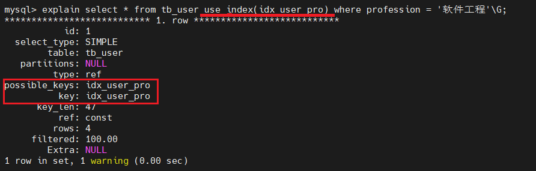

B. ignore index

```sql
explain select * from tb_user ignore index(idx_user_pro) where profession = '软件工程';
```

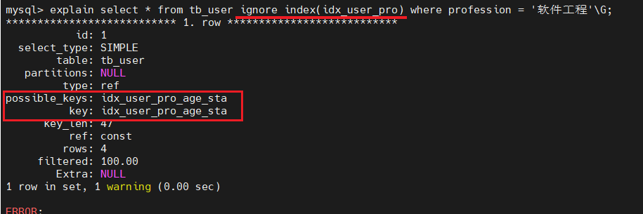

C. force index

```sql
explain select * from tb_user force index(idx_user_pro_age_sta) where profession = '软件工程';
```

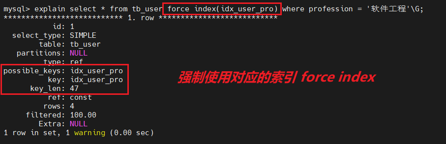


### （6）🌟 覆盖索引

å°½é‡**使用覆盖索引，å‡å°‘select ***。 那么什么是覆盖索引呢？ 覆盖索引是指 **查询使用了索引**，**并且==需è¦è¿”å›çš„列==，==在该索引中已ç»å…¨éƒ¨èƒ½å¤Ÿæ‰¾åˆ°==** 。


æ¥ä¸‹æ¥ï¼Œæˆ‘们æ¥çœ‹ä¸€ç»„SQL的执行计划，看看执行计划的差别，然åå†æ¥å…·ä½“åšä¸€ä¸ªè§£æ。

```sql
explain select id, profession from tb_user where profession = '软件工程' and age = 31 and status = '0' ;

explain select id,profession,age, status from tb_user where profession = '软件工程' and age = 31 and status = '0' ;

explain select id,profession,age, status, name from tb_user where profession = '软件工程' and age = 31 and status = '0' ;

explain select * from tb_user where profession = '软件工程' and age = 31 and status = '0';
```

上述这几æ¡SQL的执行结æœä¸º:

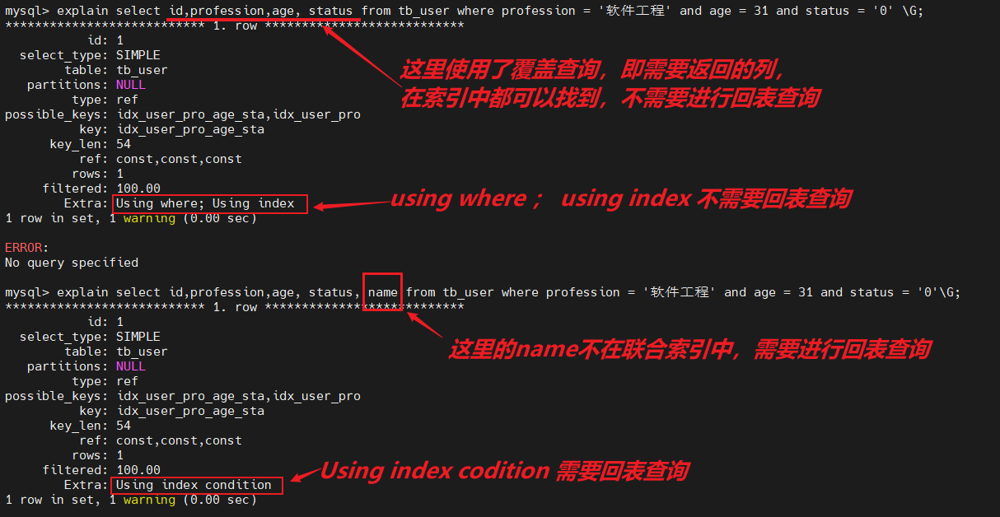

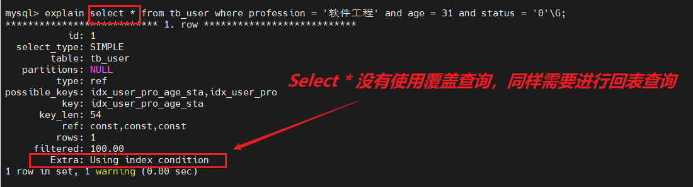


ä»ä¸Šè¿°çš„执行计划我们å¯ä»¥çœ‹åˆ°ï¼Œè¿™å››æ¡SQL语å¥çš„执行计划å‰é¢æ‰€æœ‰çš„指标都是一样的，看ä¸å‡ºæ¥å·®å¼‚。但是此时，我们主è¦å…³æ³¨çš„是åé¢çš„**==Extra==**，å‰é¢ä¸¤æ¡SQL的结æœä¸º **Using where; UsingIndex** ; 而åé¢ä¸¤æ¡SQL的结æœä¸º: **Using index condition** 。

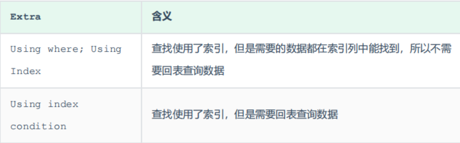


因为，在tb_user表中有一个**è”åˆç´¢å¼• idx_user_pro_age_sta**，该索引**å…³è”了三个字段professionã€ageã€status**，而这个索引也是一个==二级索引==，所以å¶å­èŠ‚点下é¢æŒ‚的是**这一行的主键id**。 所以当我们**查询返å›çš„æ•°æ®åœ¨ idã€professionã€ageã€status 之中**，则**==ç›´æ¥èµ°äºŒçº§ç´¢å¼•ç›´æ¥è¿”å›æ•°æ®==**了。 如æœè¶…出这个范围，就**需è¦æ‹¿åˆ°ä¸»é”®id**，**å†==å»æ‰«æèšé›†ç´¢å¼•==**，**å†è·å–é¢å¤–çš„æ•°æ®äº†ï¼Œè¿™ä¸ªè¿‡ç¨‹å°±æ˜¯==å›è¡¨==**。 而我们如æœä¸€ç›´ä½¿ç”¨select * 查询返å›æ‰€æœ‰å­—段值，**很容易就会造æˆå›è¡¨æŸ¥è¯¢**（**==除é是根æ®ä¸»é”®æŸ¥è¯¢ï¼Œæ­¤æ—¶åªä¼šæ‰«æèšé›†ç´¢å¼•==**）。

为了大家更清楚的ç†è§£ï¼Œä»€ä¹ˆæ˜¯è¦†ç›–索引，什么是å›è¡¨æŸ¥è¯¢ï¼Œæˆ‘们一起å†æ¥çœ‹ä¸‹é¢çš„这组SQL的执行过程。


**A. 表结æ„åŠç´¢å¼•ç¤ºæ„图:**

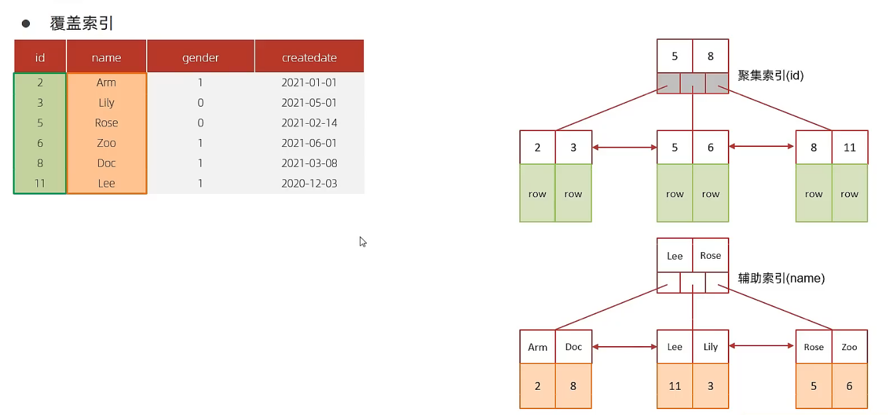

id是主键，是一个**èšé›†ç´¢å¼•**。 **name字段建立了普通索引**，是一个**二级索引（辅助索引）**。


**B. 执行SQL : select * from tb_user where id = 2;**

æ ¹æ®id查询，直æ¥èµ°èšé›†ç´¢å¼•æŸ¥è¯¢ï¼Œä¸€æ¬¡ç´¢å¼•æ‰«æ，直æ¥è¿”å›æ•°æ®ï¼Œæ€§èƒ½é«˜ã€‚


**C. 执行SQL：selet id,name from tb_user where name = 'Arm';**

虽然是根æ®name字段查询，**查询二级索引**，但是由äºæŸ¥è¯¢è¿”å›åœ¨å­—段为 id，name，**在name的二级索引中，这两个值都是å¯ä»¥ç›´æ¥è·å–到的**，因为覆盖索引，所以**ä¸éœ€è¦å›è¡¨æŸ¥è¯¢**，性能高。

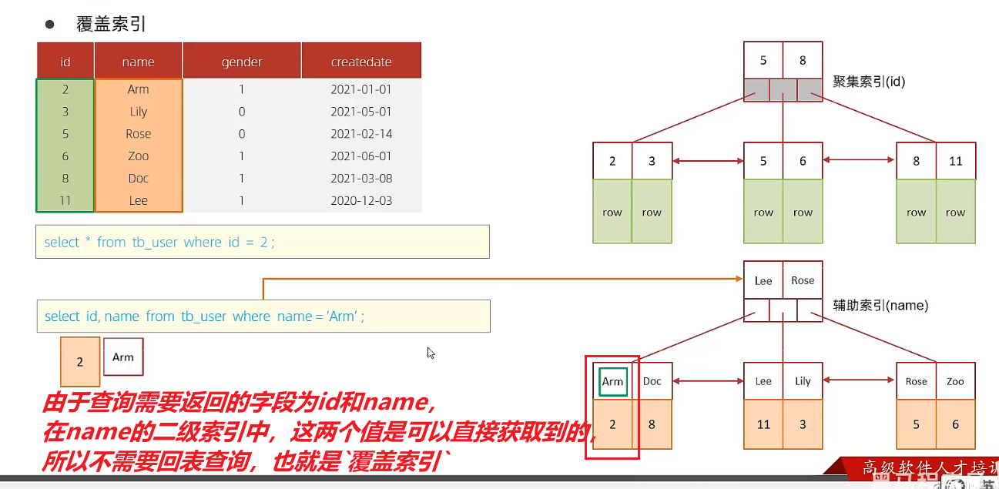


**D. 执行SQL：selet id,name,==gender== from tb_user where name = 'Arm';**

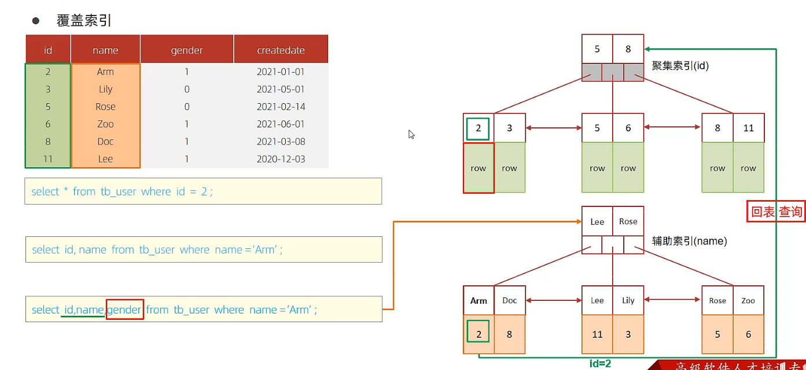


ç”±äº**在name的二级索引中，==ä¸åŒ…å«gender==**，所以，**需è¦ä¸¤æ¬¡ç´¢å¼•æ‰«æ，也就是需è¦==å›è¡¨æŸ¥è¯¢==**，性能相对较差一点。


> **==æ€è€ƒé¢˜==：**
>
> 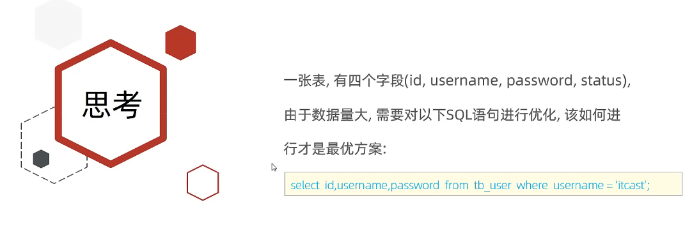
>
> 一张表, 有四个字段(id, username, password, status), ç”±äºæ•°æ®é‡å¤§, 需è¦å¯¹ä»¥ä¸‹SQL语å¥è¿›è¡Œä¼˜åŒ–, 该如何进行æ‰æ˜¯æœ€ä¼˜æ–¹æ¡ˆ:
>
> ​	select id,username,password from tb_user where username = 'itcast';
>
> 
>
> 答案: é’ˆå¯¹äº **==username, password建立è”åˆç´¢å¼•==**, sql为: 
>
> ```sql
> create index idx_user_name_pass on tb_user(username,password);
> ```
>
> 这样å¯ä»¥**é¿å…**上述的SQL语å¥ï¼Œåœ¨æŸ¥è¯¢çš„过程中，**出ç°å›è¡¨æŸ¥è¯¢**。


### （7）==å‰ç¼€ç´¢å¼•==

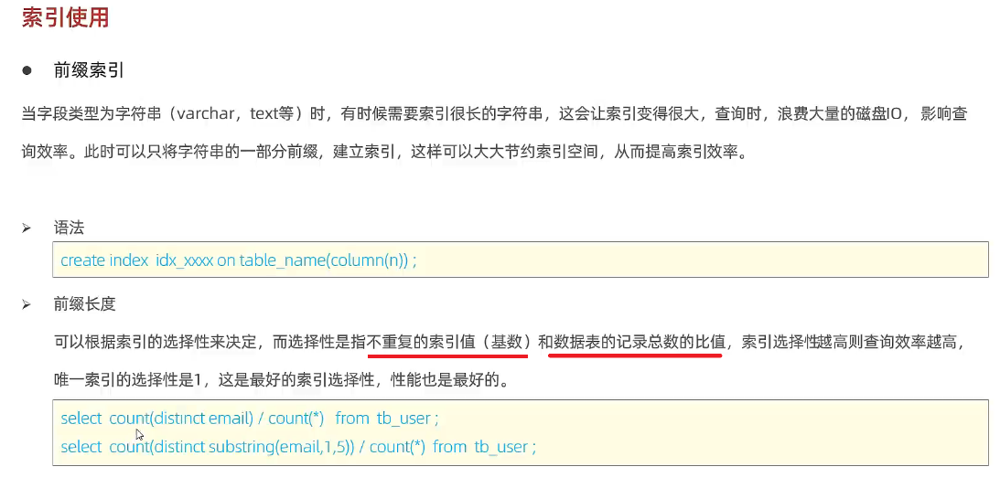

当字段类å‹ä¸ºå­—符串（**varchar，text，longtext**等）时，有时候需è¦**索引很长的字符串**，这会让索引å˜å¾—很大，查询时，浪费大é‡çš„ç£ç›˜IO， å½±å“查询效ç‡ã€‚此时å¯ä»¥**åªå°†å­—符串的一部分å‰ç¼€ï¼Œå»ºç«‹ç´¢å¼•**，这样å¯ä»¥**大大==节约索引空间==，ä»è€Œæ高索引效ç‡**。

#### ①语法-==column(lens)==

```sql
create index idx_xxxx on table_name(column(n)) ;
```


##### 1）示例

为tb_user表的email字段，建立长度为5çš„å‰ç¼€ç´¢å¼•ã€‚

```sql
create index idx_email_5 on tb_user(email(5));
```

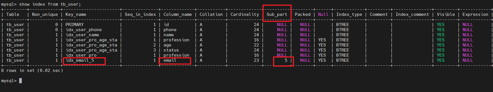


#### â‘¡å‰ç¼€é•¿åº¦-==计算选择性==

å¯ä»¥æ ¹æ®ç´¢å¼•çš„选择性æ¥å†³å®šï¼Œè€Œ**选择性**是**指==ä¸é‡å¤çš„索引值（基数）==和数æ®è¡¨çš„==记录总数==çš„==比值==**，

索引选择性越高则查询效ç‡è¶Šé«˜ï¼Œ **唯一索引的选择性是1**，这是最好的索引选择性，**性能也是最好的**。

```sql
select count(distinct email) / count(*) from tb_user ;
select count(distinct substring(email,1,5)) / count(*) from tb_user ;
```

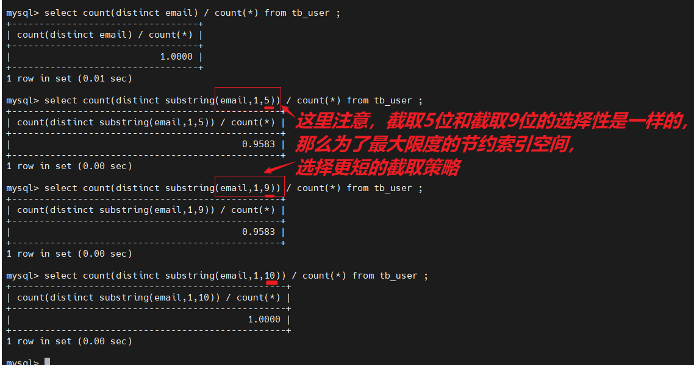


#### â‘¢å‰ç¼€ç´¢å¼•çš„查询æµç¨‹

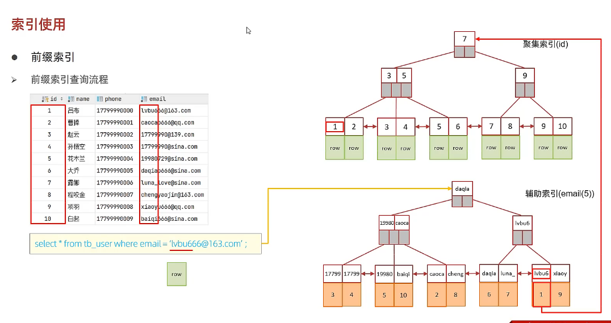


### （8）å•åˆ—索引ä¸è”åˆç´¢å¼•

> **==注æ„：== 创建è”åˆç´¢å¼•æ—¶ï¼Œéœ€è¦==考虑è”åˆç´¢å¼•ä¸­çš„顺åºé—®é¢˜==，需è¦è€ƒè™‘==索引的最左å‰ç¼€æ³•åˆ™==**


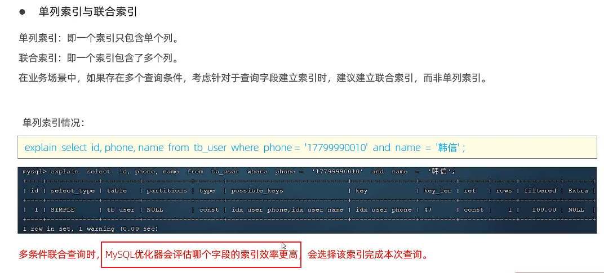


- å•åˆ—索引：å³ä¸€ä¸ªç´¢å¼•**åªåŒ…å«å•ä¸ªåˆ—**。
- è”åˆç´¢å¼•ï¼šå³ä¸€ä¸ªç´¢å¼•**包å«äº†å¤šä¸ªåˆ—**。


我们先æ¥çœ‹çœ‹ tb_user 表中目å‰çš„索引情况:

```sql
show index from tb_user;
```

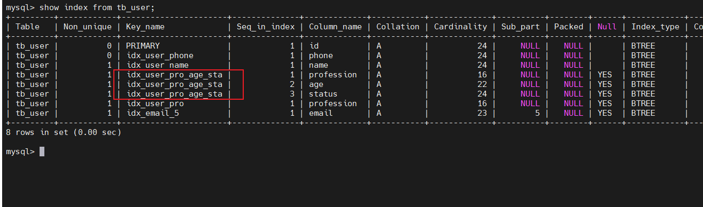

在查询出æ¥çš„索引中，既有**å•åˆ—索引，åˆæœ‰è”åˆç´¢å¼•**。


æ¥ä¸‹æ¥ï¼Œæˆ‘们æ¥æ‰§è¡Œä¸€æ¡SQL语å¥ï¼Œçœ‹çœ‹å…¶æ‰§è¡Œè®¡åˆ’：

```sql
explain select id,phone,name from tb_user where phone = '17799990010' and name = '韩信';
```

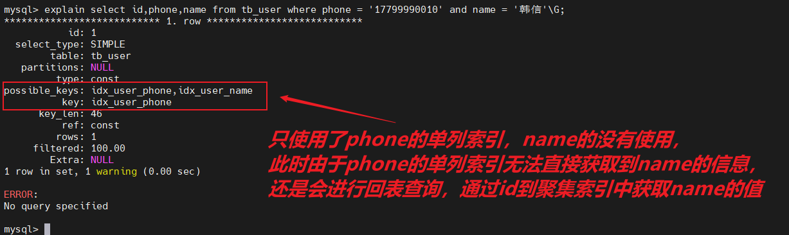

通过上述执行计划我们å¯ä»¥çœ‹å‡ºæ¥ï¼Œåœ¨**andè¿æ¥çš„两个字段 phoneã€name上都是有å•åˆ—索引的**，但是最终**mysql==åªä¼šé€‰æ‹©ä¸€ä¸ªç´¢å¼•==**，也就是说，åªèƒ½èµ°ä¸€ä¸ªå­—段的索引，此时是会**==å›è¡¨æŸ¥è¯¢==çš„**。


ç´§æ¥ç€ï¼Œæˆ‘们å†æ¥åˆ›å»ºä¸€ä¸ªphoneå’Œname字段的è”åˆç´¢å¼•æ¥æŸ¥è¯¢ä¸€ä¸‹æ‰§è¡Œè®¡åˆ’。

```sql
create unique index idx_user_phone_name on tb_user(phone,name);
```


此时，查询时，就走了è”åˆç´¢å¼•ï¼Œè€Œåœ¨**è”åˆç´¢å¼•ä¸­åŒ…å« phoneã€name**çš„ä¿¡æ¯ï¼Œåœ¨å¶å­èŠ‚点下挂的是对应的主键id，所以**查询是无需å›è¡¨æŸ¥è¯¢çš„**。

```sql
#使用SQLæ示，让Mysql用我创建的è”åˆç´¢å¼•
explain select id,phone,name from tb_user use index(idx_user_phone_name) where phone = '17799990010' and name = '韩信';
```

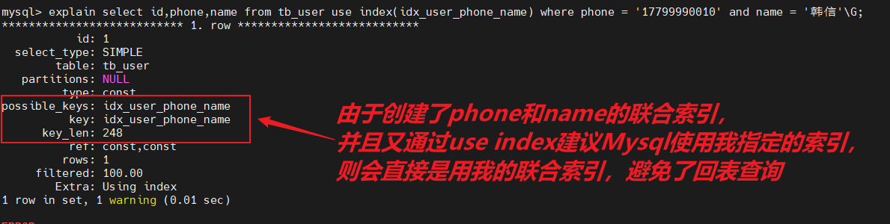


> 在业务场景中，**如æœå­˜åœ¨å¤šä¸ªæŸ¥è¯¢æ¡ä»¶**，考虑针对äºæŸ¥è¯¢å­—段建立索引时，**建议建立è”åˆç´¢å¼•**，而éå•åˆ—索引。


如æœæŸ¥è¯¢ä½¿ç”¨çš„是**è”åˆç´¢å¼•**，具体的**结æ„示æ„图**如下：


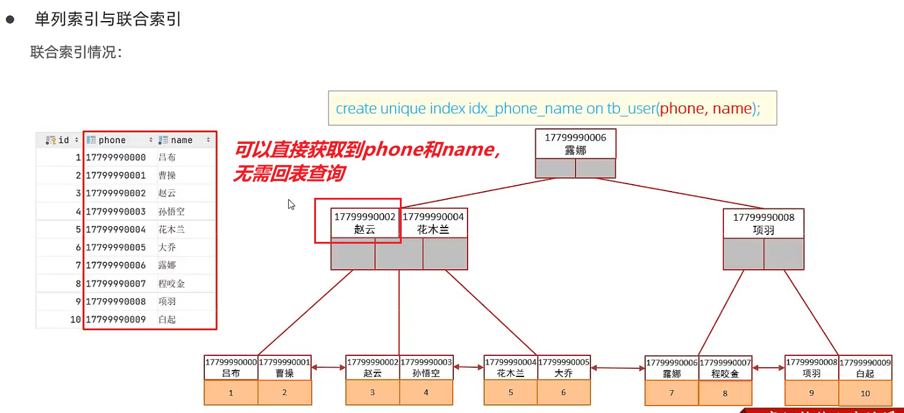


## 2.7 索引设计åŸåˆ™

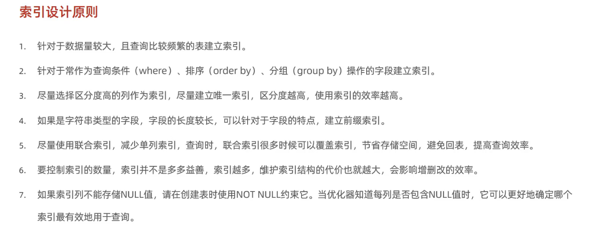

- 1). 针对äºæ•°æ®é‡è¾ƒå¤§ï¼ˆ**>100W**），且**查询比较频ç¹**的表建立索引。
- 2). 针对äº**常作为查询æ¡ä»¶**（where）ã€æ’åºï¼ˆorder by）ã€åˆ†ç»„（group by）**æ“作的字段建立索引**。
- 3). å°½é‡é€‰æ‹©åŒº**分度高的列作为索引**，尽é‡å»ºç«‹å”¯ä¸€ç´¢å¼•ï¼Œ**区分度越高，使用索引的效ç‡è¶Šé«˜**。
- 4). 如æœæ˜¯å­—符串类å‹çš„字段，字段的**长度较长**，å¯ä»¥é’ˆå¯¹äºå­—段的特点，**建立å‰ç¼€ç´¢å¼•**。
- 5). **å°½é‡ä½¿ç”¨è”åˆç´¢å¼•**，å‡å°‘å•åˆ—索引，查询时，è”åˆç´¢å¼•å¾ˆå¤šæ—¶å€™å¯ä»¥è¦†ç›–索引，节çœå­˜å‚¨ç©ºé—´ï¼Œ**é¿å…å›è¡¨**，æ高查询效ç‡ã€‚
- 6). è¦æ§åˆ¶ç´¢å¼•çš„æ•°é‡ï¼Œç´¢å¼•å¹¶ä¸æ˜¯å¤šå¤šç›Šå–„，**索引越多，维护索引结æ„的代价也就越大**，**会影å“å¢åˆ æ”¹çš„效ç‡ã€‚**
- 7). **如æœç´¢å¼•åˆ—ä¸èƒ½å­˜å‚¨NULL值**，请在**创建表时使用NOT NULL约æŸå®ƒ**。当优化器知é“æ¯åˆ—是å¦åŒ…å«NULL值时，它å¯ä»¥æ›´å¥½åœ°ç¡®å®šå“ªä¸ªç´¢å¼•æœ€æœ‰æ•ˆåœ°ç”¨äºæŸ¥è¯¢ã€‚


## 2.8 å°ç»“

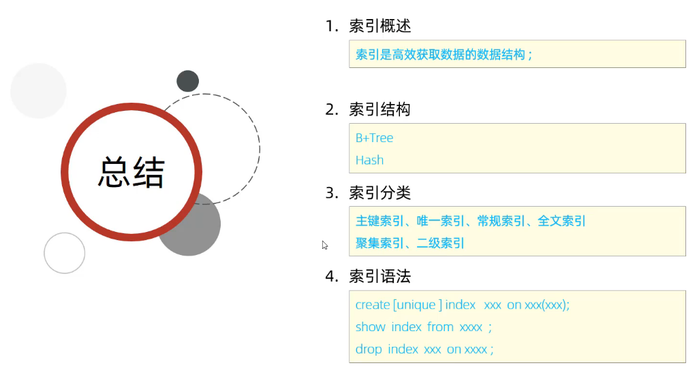


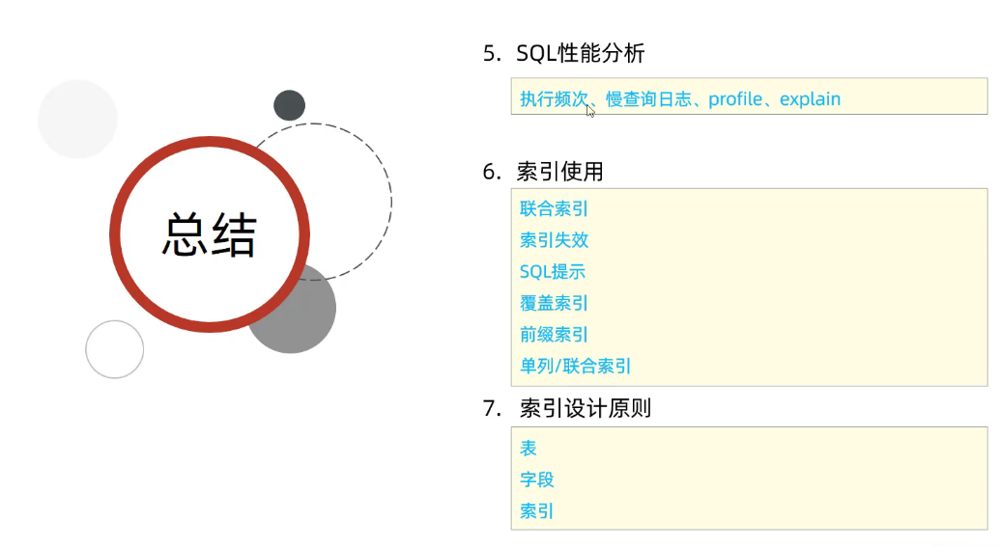


# 3ã€ğŸŒŸ SQL优化

## 3.1 æ’入数æ®

### （1）insert

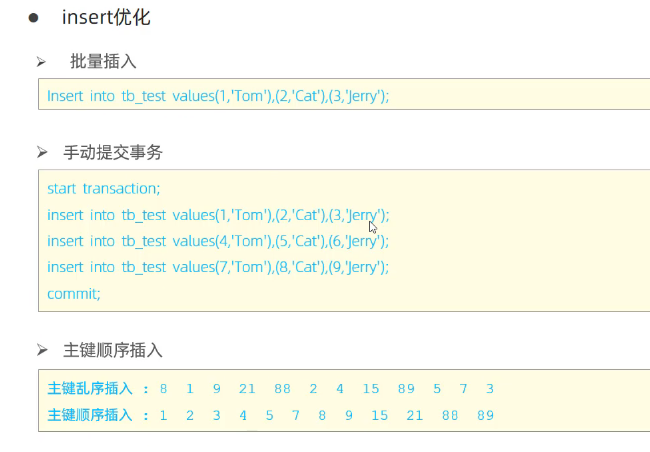

如æœæˆ‘们需è¦ä¸€æ¬¡æ€§å¾€æ•°æ®åº“表中æ’入多æ¡è®°å½•ï¼Œå¯ä»¥ä»ä»¥ä¸‹ä¸‰ä¸ªæ–¹é¢è¿›è¡Œä¼˜åŒ–。

```sql
insert into tb_test values(1,'tom');
insert into tb_test values(2,'cat');
insert into tb_test values(3,'jerry');
.....
```

#### ①优化方案一-批é‡æ’入数æ®

**æ¨è批é‡æ’入数é‡åœ¨  500 - 1000æ¡**

```sql
Insert into tb_test values(1,'Tom'),(2,'Cat'),(3,'Jerry');
```


#### ②优化方案二-==手动æ§åˆ¶äº‹åŠ¡==

ç”±äºæ•°æ®åº“执行一æ¡insert语å¥å°±ä¼šå¼€å¯å’Œå…³é—­äº‹åŠ¡ï¼Œå¯ä»¥**手动æ§åˆ¶äº‹åŠ¡**，进而**é¿å…频ç¹å¼€å§‹å…³é—­äº‹åŠ¡**

```sql
start transaction;
insert into tb_test values(1,'Tom'),(2,'Cat'),(3,'Jerry');
insert into tb_test values(4,'Tom'),(5,'Cat'),(6,'Jerry');
insert into tb_test values(7,'Tom'),(8,'Cat'),(9,'Jerry');
commit;
```


#### ③优化方案三-顺åºæ’å…¥

主键顺åºæ’入，性能è¦é«˜äºä¹±åºæ’入。

```sql
主键乱åºæ’å…¥ : 8 1 9 21 88 2 4 15 89 5 7 3
主键顺åºæ’å…¥ : 1 2 3 4 5 7 8 9 15 21 88 89
```


### （2）大批é‡æ’入数æ®-==load指令==

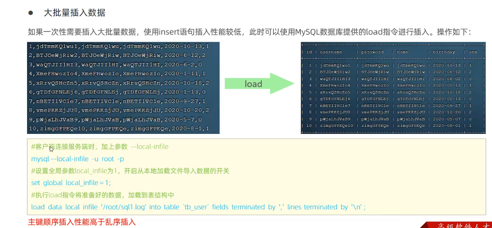

#### â‘ load指令æ’å…¥

如æœä¸€æ¬¡æ€§éœ€è¦æ’入大批é‡æ•°æ®(比如: 几百万的记录)，使用insert语å¥æ’入性能较ä½ï¼Œæ­¤æ—¶å¯ä»¥**使用MySQLæ•°æ®åº“æ供的==load指令==进行æ’å…¥**。æ“作如下：


å¯ä»¥æ‰§è¡Œå¦‚下指令，将**æ•°æ®è„šæœ¬æ–‡ä»¶ä¸­çš„æ•°æ®åŠ è½½åˆ°è¡¨ç»“æ„**中：

```sql
-- 客户端è¿æ¥æœåŠ¡ç«¯æ—¶ï¼ŒåŠ ä¸Šå‚æ•° -–local-infile
mysql –-local-infile -u root -p

#若失败则使用：
mysql --local-infile=1 --enable-local-infile -u root -p

-- 设置全局å‚æ•°local_infile为1，开å¯ä»æœ¬åœ°åŠ è½½æ–‡ä»¶å¯¼å…¥æ•°æ®çš„开关
set global local_infile = 1;

-- 执行load指令将准备好的数æ®ï¼ŒåŠ è½½åˆ°è¡¨ç»“æ„中
load data local infile '/root/sql1.log' into table tb_user fields terminated by ',' lines terminated by '\n' ;

#这里的 , 表示æ¯ä¸ªå­—段按照,分隔;
	   \n 表示一行按照\n分隔
	  
```


> 主键==顺åºæ’入性能==高äº**ä¹±åºæ’å…¥**


#### ②示例演示

**A. 创建表结æ„**

```sql
CREATE TABLE `tb_user` (
    `id` INT(11) NOT NULL AUTO_INCREMENT,
    `username` VARCHAR(50) NOT NULL,
    `password` VARCHAR(50) NOT NULL,
    `name` VARCHAR(20) NOT NULL,
    `birthday` DATE DEFAULT NULL,
    `sex` CHAR(1) DEFAULT NULL,
    PRIMARY KEY (`id`),
    UNIQUE KEY `unique_user_username` (`username`)
) ENGINE=INNODB DEFAULT CHARSET=utf8 ;
```

**B. 设置å‚æ•°**

```sql
-- 客户端è¿æ¥æœåŠ¡ç«¯æ—¶ï¼ŒåŠ ä¸Šå‚æ•° -–local-infile
mysql –-local-infile -u root -p

#若失败则使用：
mysql --local-infile=1 --enable-local-infile -u username -p

# 查看local_infile 的值 
Select @@local_infile;

-- 设置全局å‚æ•°local_infile为1，开å¯ä»æœ¬åœ°åŠ è½½æ–‡ä»¶å¯¼å…¥æ•°æ®çš„开关
set global local_infile = 1;
```

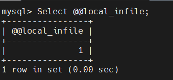


**C. load加载数æ®**

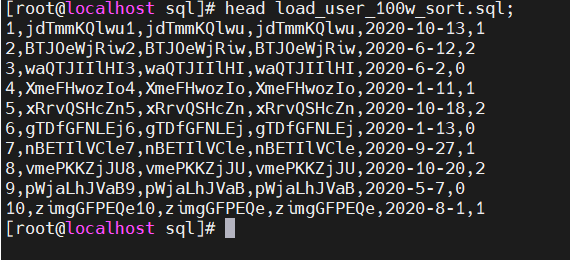

```sql
# 上传sql脚本到LinuxæœåŠ¡å™¨

# 查看sql脚本的å‰10æ¡æ•°æ®
head load_user_100w_sort.sql;

# load加载数æ®
load data local infile '/root/load_user_100w_sort.sql' into table tb_user fields terminated by ',' lines terminated by '\n' ;
```

我们看到，æ’å…¥100w的记录，17s就完æˆäº†ï¼Œæ€§èƒ½å¾ˆå¥½ã€‚

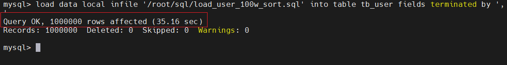


> 在load时，**==主键顺åºæ’入性能高äºä¹±åºæ’å…¥==**


## 3.2 🌟主键优化

在上一å°èŠ‚，我们æ到，主键顺åºæ’入的性能是è¦é«˜äºä¹±åºæ’入的。 这一å°èŠ‚，就æ¥ä»‹ç»ä¸€ä¸‹å…·ä½“çš„åŸå› ï¼Œç„¶åå†åˆ†æ一下主键åˆè¯¥å¦‚何设计。

###  （1）数æ®ç»„织方å¼

在InnoDB存储引æ“中，表数æ®éƒ½æ˜¯æ ¹æ®**==主键顺åºç»„织存放==**的，这ç§å­˜å‚¨æ–¹å¼çš„表称为**索引组织表**(index organized table **IOT**)。

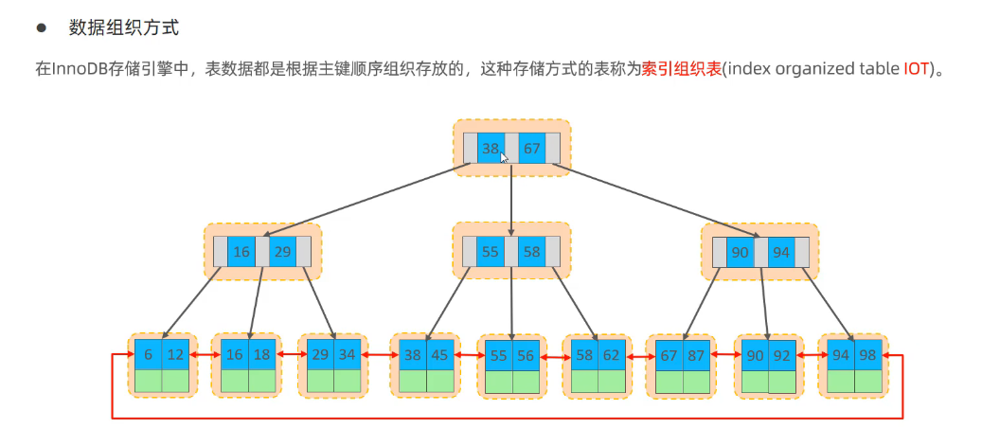


**行数æ®**，都是存储**在==èšé›†ç´¢å¼•çš„å¶å­èŠ‚点上==çš„**。**éå¶å­èŠ‚点，存储的åªæ˜¯==起到索引数æ®çš„作用==**，而我们之å‰ä¹Ÿè®²è§£è¿‡InnoDBçš„**逻辑结æ„图**：

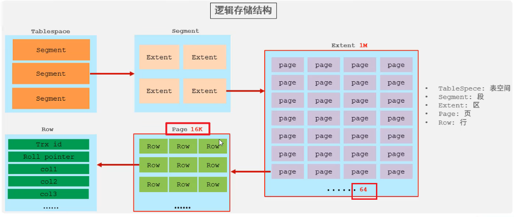


在InnoDB引æ“中，数æ®è¡Œæ˜¯è®°å½•åœ¨**é€»è¾‘ç»“æ„ page 页**中的，而æ¯ä¸€ä¸ªé¡µçš„大å°æ˜¯å›ºå®šçš„，**默认16K**。那也就æ„味ç€ï¼Œ **一个页中所存储的行也是有é™çš„**，如æœæ’入的数æ®è¡Œrow在该页存储ä¸äº†ï¼Œ**将会存储到下一个页中**，**页ä¸é¡µä¹‹é—´ä¼š==通过指针è¿æ¥==**。


### （2）==页分裂==

**页å¯ä»¥ä¸ºç©º**，也å¯ä»¥å¡«å……一åŠï¼Œä¹Ÿå¯ä»¥å¡«å……100%。**æ¯ä¸ªé¡µåŒ…å«äº†2-N行数æ®**(**如æœä¸€è¡Œæ•°æ®è¿‡å¤§ï¼Œä¼šè¡Œæº¢å‡º**)，根æ®ä¸»é”®æ’列。

##### **A. 主键==顺åºæ’å…¥==效æœ**

**â‘ . ä»ç£ç›˜ä¸­==申请页==， 主键顺åºæ’å…¥**

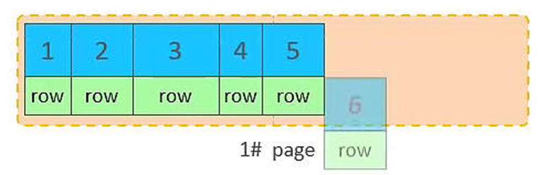

**â‘¡. 第一个页没有满，继续往第一页æ’å…¥**

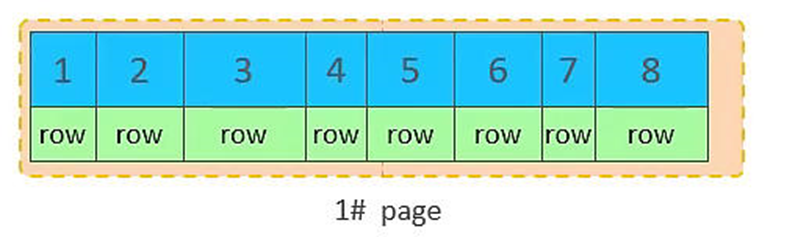

**â‘¢. 当第一个也写满之å，å†å†™å…¥ç¬¬äºŒä¸ªé¡µï¼Œé¡µä¸é¡µä¹‹é—´ä¼šé€šè¿‡æŒ‡é’ˆè¿æ¥**

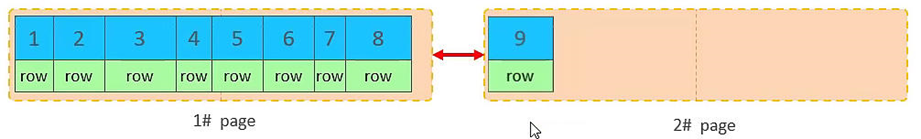

**â‘£. 当第二页写满了，å†å¾€ç¬¬ä¸‰é¡µå†™å…¥**

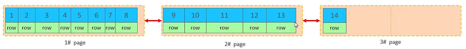


##### **B. 主键==ä¹±åºæ’å…¥==效æœ**

**â‘ . 加入1#,2#页都已ç»å†™æ»¡äº†ï¼Œå­˜æ”¾äº†å¦‚图所示的数æ®**

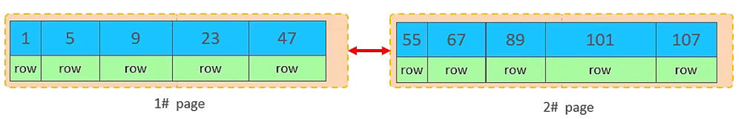


**â‘¡. 此时å†æ’å…¥id为50的记录，我们æ¥çœ‹çœ‹ä¼šå‘生什么ç°è±¡**

会å†æ¬¡å¼€å¯ä¸€ä¸ªé¡µï¼Œå†™å…¥æ–°çš„页中å—？

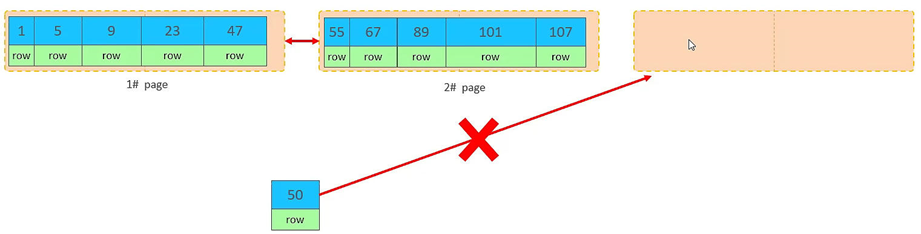


ä¸ä¼šã€‚因为，**==索引结æ„çš„å¶å­èŠ‚点是有顺åºçš„==**。按照**顺åº**，应该**存储在47之å**。

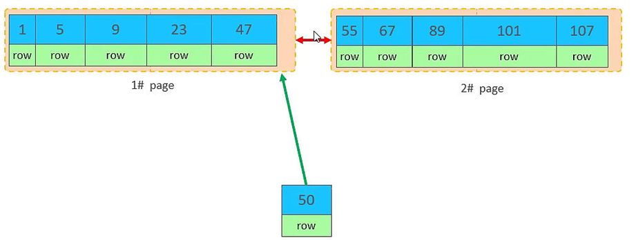

但是47所在的**1#页，已ç»å†™æ»¡äº†**，存储ä¸äº†50对应的数æ®äº†ã€‚ 那么此时会**开辟一个新的页 3#。**

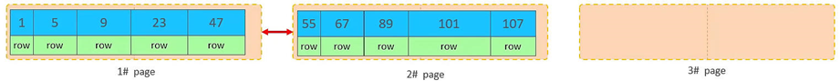

但是**并ä¸ä¼šç›´æ¥å°†50存入3#页**，而是**会将1#页å一åŠçš„æ•°æ®ï¼Œç§»åŠ¨åˆ°3#页**，然å**==在3#页，æ’å…¥50==**。

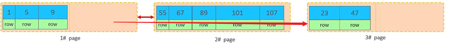

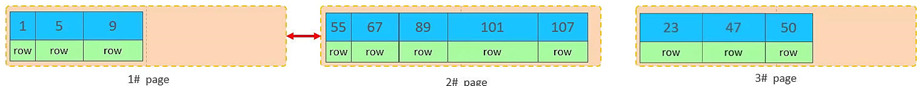

移动数æ®ï¼Œå¹¶æ’å…¥id为50çš„æ•°æ®ä¹‹å，那么此时，这三个页之间的**æ•°æ®é¡ºåº**是有问题的。 1#的下一个页，应该是3#， 3#的下一个页是2#。 所以，此时，**需è¦é‡æ–°è®¾ç½®é“¾è¡¨æŒ‡é’ˆ**。

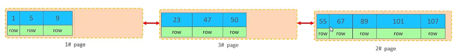

上述的这ç§ç°è±¡ï¼Œç§°ä¹‹ä¸º "页分裂"，是**==比较耗费性能的æ“作==**。


### （3）页åˆå¹¶

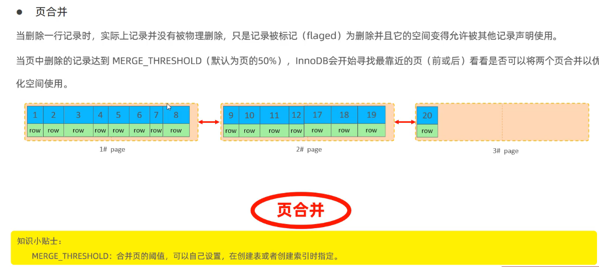

ç›®å‰è¡¨ä¸­å·²æœ‰æ•°æ®çš„索引结æ„(å¶å­èŠ‚点)如下：

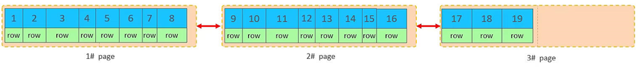

当我们**对已有数æ®è¿›è¡Œåˆ é™¤**时，具体的效æœå¦‚下:

当删除一行记录时，**å®é™…上记录并没有被物ç†åˆ é™¤**，åªæ˜¯**记录==被标记（flaged）为删除==**并且**它的空间å˜å¾—å…许被其他记录声æ˜ä½¿ç”¨**。

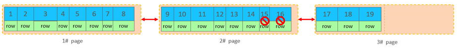

当我们继续删除2#çš„æ•°æ®è®°å½•

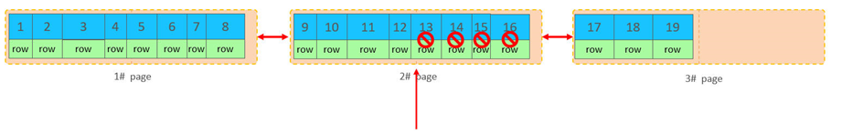

当页中删除的记录**达到 MERGE_THRESHOLD（默认为==页的50%==）**，InnoDB会开始**寻找最é è¿‘的页（å‰æˆ–å**）看看**是å¦å¯ä»¥å°†ä¸¤ä¸ªé¡µ==åˆå¹¶ä»¥ä¼˜åŒ–空间使用==**。

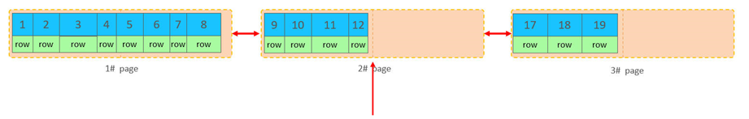


删除数æ®ï¼Œå¹¶å°†é¡µåˆå¹¶ä¹‹å，**å†æ¬¡æ’入新的数æ®21**，则直æ¥æ’å…¥3#页

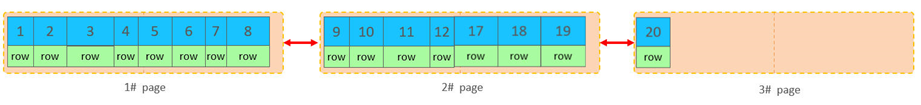


这个里é¢æ‰€å‘生的åˆå¹¶é¡µçš„这个ç°è±¡ï¼Œå°±ç§°ä¹‹ä¸º **"页åˆå¹¶"**。


> **知识å°è´´å£«ï¼š**
>
> MERGE_THRESHOLD：**åˆå¹¶é¡µçš„阈值，å¯ä»¥è‡ªå·±è®¾ç½®ï¼Œåœ¨==创建表或者创建索引==时指定。**


### （4）主键设计åŸåˆ™

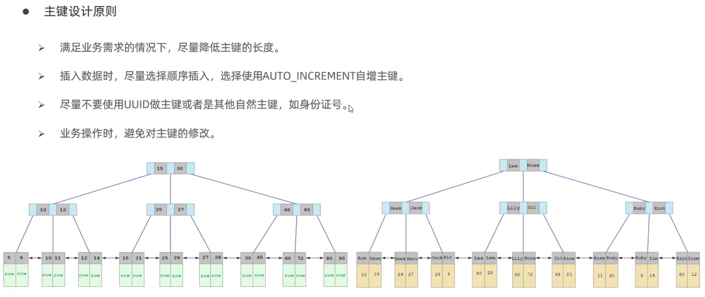

- 满足业务需求的情况下，尽é‡**==é™ä½ä¸»é”®çš„长度==**。
  - ç”±äº**二级索引ä¿å­˜æ•°æ®çš„是主键的id**，如æœä¸»é”®é•¿åº¦è¿‡å¤§ä¼šå¯¼è‡´ï¼Œ**å ç”¨å¤§é‡çš„ç£ç›˜ç©ºé—´ã€‚**

- æ’入数æ®æ—¶ï¼Œ**å°½é‡é€‰æ‹©==顺åºæ’å…¥==**，选择使用**AUTO_INCREMENT自å¢ä¸»é”®**。
  - é¿å…出ç°é¡µåˆ†è£‚ç°è±¡
  - 如æœæ’入是自å¢ä¸»é”®ï¼Œä¼š**ä¾æ¬¡æ’入对应到页中**(如æœå½“å‰é¡µæ»¡äº†åˆ™åˆ›å»ºæ–°çš„页å³å¯)，**无需调整页的顺åº**，æ高了性能。
  - 如æœæ˜¯ä¹±åºæ’入，会因为需è¦**ä¿æŒå¶å­èŠ‚点中的数æ®æ˜¯æœ‰åºçš„这一åŸåˆ™**，而需è¦**ä¸æ–­åœ°è°ƒæ•´ä¹Ÿä¸­æ•°æ®çš„ä½ç½®ä»¥åŠé¡µçš„ä½ç½®**，进而导致å¢åŠ æ’入时的性能æŸå¤±ã€‚

- å°½é‡**ä¸è¦ä½¿ç”¨UUIDåšä¸»é”®**或者是其他自然主键，如身份è¯å·ã€‚
  - UUID是无åºçš„
  - UUID的长度有些长，会让主键的长度åé•¿

- 业务æ“作时，**==é¿å…对主键的修改==**。
  - 因为**在二级索引的索引结æ„中ä¿å­˜çš„æ•°æ®æ˜¯ä¸»é”®çš„id**，如æœç›´æ¥å¯¹ä¸»é”®è¿›è¡Œä¿®æ”¹ï¼ŒåŒæ—¶éœ€è¦ä¿®æ”¹å¯¹åº”二级索引中的主键id，这样修改的代价过大


## 3.3 order by优化

### （1）æ’åºæ–¹å¼

#### â‘ Using filesort

#### â‘¡Using index

MySQLçš„æ’åºï¼Œæœ‰ä¸¤ç§æ–¹å¼ï¼š

- **Using filesort** : 通过**表的索引或全表扫æ**，读å–满足æ¡ä»¶çš„æ•°æ®è¡Œï¼Œç„¶å**在æ’åºç¼“冲区sort buffer中完æˆæ’åºæ“作**，**所有==ä¸æ˜¯é€šè¿‡ç´¢å¼•ç›´æ¥è¿”å›æ’åºç»“æœ==çš„æ’åºéƒ½å« FileSort æ’åºã€‚**
- **Using index** : **通过==有åºç´¢å¼•é¡ºåºæ‰«æç›´æ¥è¿”å›æœ‰åºæ•°æ®==**，这ç§æƒ…况å³ä¸º using index，ä¸éœ€è¦é¢å¤–æ’åºï¼Œ**æ“作效ç‡é«˜**。

对äºä»¥ä¸Šçš„两ç§æ’åºæ–¹å¼ï¼Œ**Using index的性能高**，而Using filesort的性能ä½ï¼Œæˆ‘们在优化æ’åºæ“作时，尽é‡è¦ä¼˜åŒ–为 Using index。


### （2）测试

æ¥ä¸‹æ¥ï¼Œæˆ‘们æ¥åšä¸€ä¸ªæµ‹è¯•ï¼š

#### **A. æ•°æ®å‡†å¤‡**

把之å‰æµ‹è¯•æ—¶ï¼Œä¸ºtb_user表所建立的部分索引直æ¥åˆ é™¤æ‰

```sql
show index from tb_user;

drop index idx_user_phone on tb_user;

drop index idx_user_phone_name on tb_user;

drop index idx_user_name on tb_user;
```

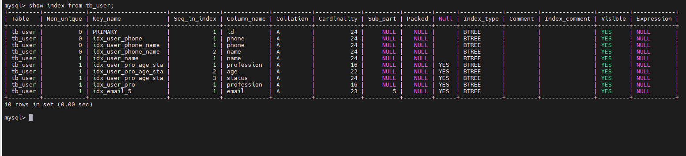

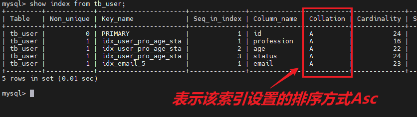


#### **B. 执行æ’åºSQL**

```sql
explain select id,age,phone from tb_user order by age ; 
```


```sql
explain select id,age,phone from tb_user order by age, phone ; 
```

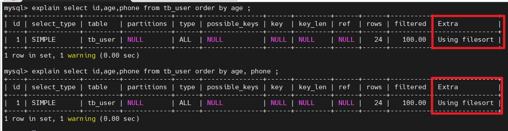

ç”±äº **age, phone 都没有索引**，所以此时å†æ’åºæ—¶ï¼Œå‡ºç°**Using filesort， æ’åºæ€§èƒ½è¾ƒä½**。


#### **C. 创建索引**

```sql
-- 创建索引
create index idx_user_age_phone_aa on tb_user(age,phone);
# 这里索引å字命å中的 _aa 表示的是ageå’Œphone都是按照 å‡åºæ’åº åˆ›å»ºçš„ç´¢å¼•
```

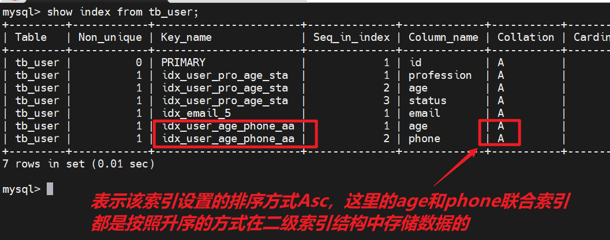


#### **D. 创建索引å，根æ®age, phone进行å‡åºæ’åº**

```sql
explain select id,age,phone from tb_user order by age; 
```

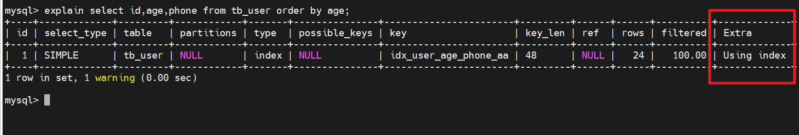

```sql
explain select id,age,phone from tb_user order by age , phone; 
```

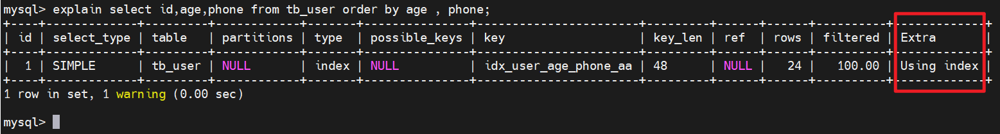

建立索引之å，å†æ¬¡è¿›è¡Œæ’åºæŸ¥è¯¢ï¼Œå°±ç”±**åŸæ¥çš„Using filesort， å˜ä¸ºäº† Using index**，性能就是比较高的了。

**如æœåªå¯¹phone进行å‡åºæ’åº**

```sql
 explain select id , phone from tb_user order by phone;
```

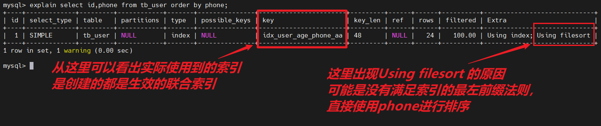


#### **E. 创建索引å，根æ®age, phone进行==é™åºæ’åº==**

```sql
explain select id,age,phone from tb_user order by age desc , phone desc; 
```

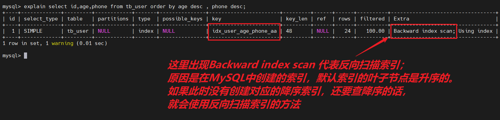

ä¹Ÿå‡ºç° Using index， 但是此时Extra中出ç°äº† **Backward index scan**，这个**代表åå‘扫æ索引**，

因为在MySQL中我们创建的索引，**==默认索引的å¶å­èŠ‚点是ä»å°åˆ°å¤§æ’åºçš„==**，而此时我们查询æ’åºæ—¶ï¼Œæ˜¯ä»å¤§åˆ°å°ï¼ˆdesc é™åºæ’列）

所以，在扫æ时，就是**åå‘扫æ**ï¼Œå°±ä¼šå‡ºç° **Backward index scan**。 在MySQL8版本中，支æŒé™åºç´¢å¼•ï¼Œæˆ‘们也å¯ä»¥**创建é™åºç´¢å¼•**。


#### **F. æ ¹æ®phone，age进行å‡åºæ’åºï¼Œ==phone在å‰ï¼Œage在å==。**

```sql
explain select id,age,phone from tb_user order by phone , age; 
```

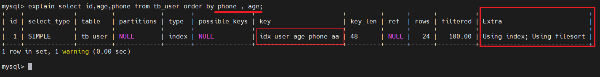

æ’åºæ—¶,也需è¦**满足==最左å‰ç¼€æ³•åˆ™==,å¦åˆ™ä¹Ÿä¼šå‡ºç° filesort**。

因为在**创建索引**的时候， age是第一个字段，phone是第二个字段，所以æ’åºæ—¶ï¼Œä¹Ÿå°±è¯¥**按照这个顺åºæ¥**，å¦åˆ™**å°±ä¼šå‡ºç° Usingfilesort**。


#### **G. æ ¹æ®age, phone进行é™åºä¸€ä¸ªå‡åºï¼Œä¸€ä¸ªé™åº**

```sql
explain select id,age,phone from tb_user order by age asc , phone desc ; 
```

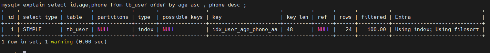

因为创建索引时，**如æœ==未指定顺åº==，默认都是按照å‡åºæ’åºçš„**，而查询时，**一个å‡åºï¼Œä¸€ä¸ªé™åºï¼Œæ­¤æ—¶å°±ä¼šå‡ºç°Using filesort**。


为了解决上述的问题，我们å¯ä»¥åˆ›å»ºä¸€ä¸ªç´¢å¼•ï¼Œè¿™ä¸ªè”åˆç´¢å¼•ä¸­ **age å‡åºæ’åºï¼Œphone 倒åº**æ’åºã€‚


#### **H. 创建è”åˆç´¢å¼•(age å‡åºæ’åºï¼Œphone 倒åºæ’åº)**

```sql
create index idx_user_age_phone_ad on tb_user(age asc ,phone desc); 
# 这里索引å字命å中的 _ad 表示的是 age å‡åºæ’åºï¼Œphone 倒åºæ’åº åˆ›å»ºçš„ç´¢å¼•
```

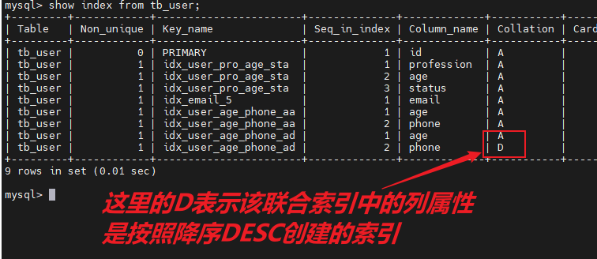


#### **I. 然åå†æ¬¡æ‰§è¡Œå¦‚下SQL**

```sql
explain select id,age,phone from tb_user order by age asc , phone desc ; 
```

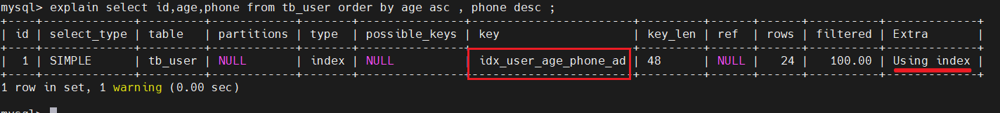


å‡åº/é™åº**è”åˆç´¢å¼•ç»“æ„图示**:

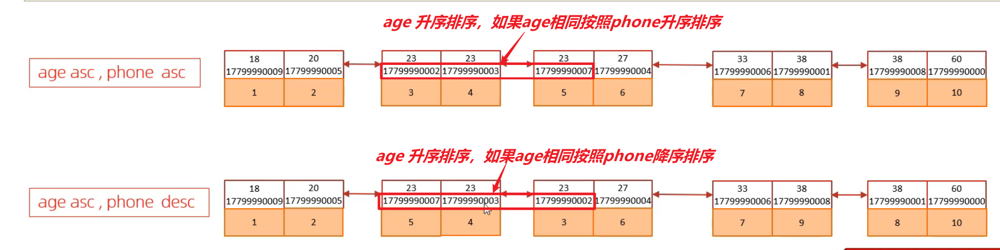


### （3）==优化åŸåˆ™==

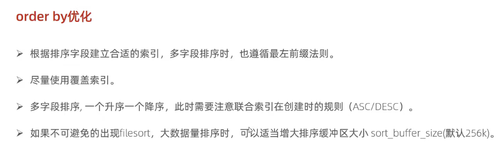

由上述的测试,我们得出**order by优化åŸåˆ™**:

- A. æ ¹æ®æ’åºå­—段建立åˆé€‚的索引，**多字段æ’åº**时，也**éµå¾ªæœ€å·¦å‰ç¼€æ³•åˆ™**。

- B. **å°½é‡ä½¿ç”¨==覆盖索引==**。

  - 如æœ**ä¸ä½¿ç”¨è¦†ç›–索引**（如Select * from）的è¯ï¼Œè¿˜æ˜¯ä¼šä½¿ç”¨Using filesortæ–¹å¼è¿›è¡Œæ’åº

  - ```sql
    explain select * from tb_user order by age asc , phone desc ; 
    ```

  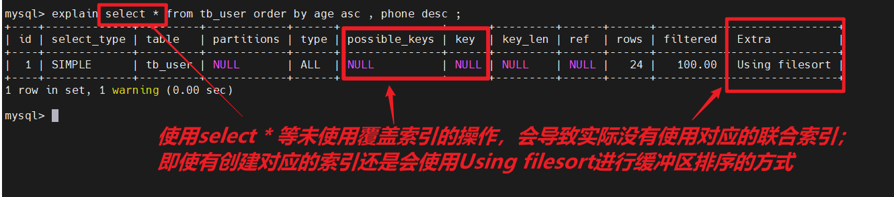

  

- C. 多字段æ’åº, 一个å‡åºä¸€ä¸ªé™åºï¼Œæ­¤æ—¶éœ€è¦**注æ„è”åˆç´¢å¼•åœ¨åˆ›å»ºæ—¶çš„规则**（ASC/DESC）。

- D. 如æœ**ä¸å¯é¿å…**的出ç°filesort，大数æ®é‡æ’åºæ—¶ï¼Œå¯ä»¥**适当å¢å¤§æ’åºç¼“冲区大å°sort_buffer_size(默认256k)**,如æœè¶…过了设置的æ’åºç¼“存区的大å°ï¼Œä¼šåœ¨ç£ç›˜æ–‡ä»¶ä¸­è¿›è¡Œæ’åºï¼Œç›¸å¯¹çš„ç£ç›˜ä¸­è¿›è¡Œæ’åºä¼šæ…¢å¾—多。

  - ```sql
    show variables like 'sort_buffer_size';
    ```

    


## 3.4 group by优化

分组æ“作，我们主è¦æ¥çœ‹çœ‹**索引对äºåˆ†ç»„æ“作**çš„å½±å“。

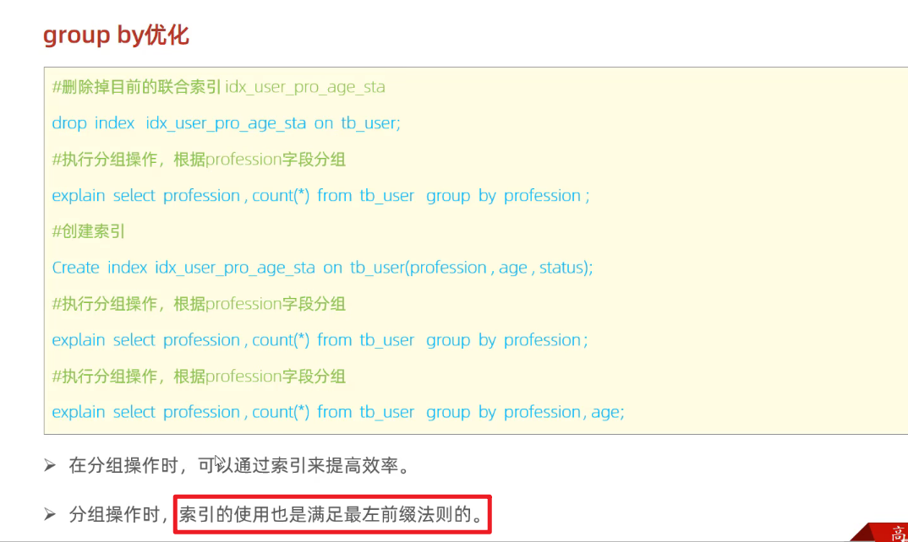


首先我们先将 tb_user è¡¨çš„ç´¢å¼•å…¨éƒ¨åˆ é™¤æ‰ ã€‚

```sql
drop index idx_user_pro_age_sta on tb_user;

drop index idx_email_5 on tb_user;

drop index idx_user_age_phone_aa on tb_user;

drop index idx_user_age_phone_ad on tb_user;

show index from tb_user;
```

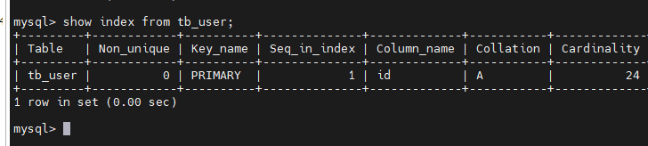


æ¥ä¸‹æ¥ï¼Œåœ¨æ²¡æœ‰ç´¢å¼•çš„情况下，执行如下SQL，查询执行计划：

```sql
explain select profession , count(*) from tb_user group by profession ; 
```

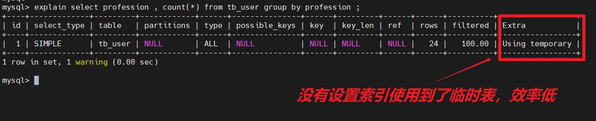

**Using temporary，表示使用到了==临时表==**


然åï¼Œæˆ‘ä»¬åœ¨é’ˆå¯¹äº profession ， age， status 创建一个è”åˆç´¢å¼•ã€‚

```sql
create index idx_user_pro_age_sta on tb_user(profession , age , status);
```

ç´§æ¥ç€ï¼Œå†æ‰§è¡Œå‰é¢ç›¸åŒçš„SQL查看执行计划。

```sql
explain select profession , count(*) from tb_user group by profession ;
```

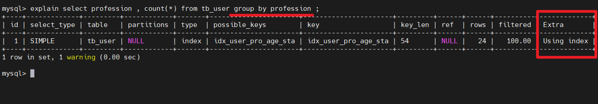

å†æ‰§è¡Œå¦‚下的分组查询SQL，查看执行计划：

```sql
explain select age ,count(*) from tb_user group by age;
```

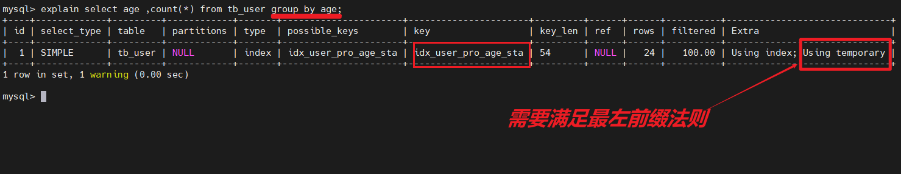

我们å‘ç°ï¼Œå¦‚æœ**ä»…ä»…æ ¹æ®ageåˆ†ç»„ï¼Œå°±ä¼šå‡ºç° Using temporary** ；而如æœæ˜¯ **æ ¹æ®profession,age两个字段==åŒæ—¶åˆ†ç»„==**，则ä¸ä¼šå‡ºç° Using temporary。åŸå› æ˜¯å› ä¸ºå¯¹äºåˆ†ç»„æ“作，在è”åˆç´¢å¼•ä¸­ï¼Œ**也是==符åˆæœ€å·¦å‰ç¼€æ³•åˆ™çš„==**。

**==注æ„==，下列情况也满足最左å‰ç¼€æ³•åˆ™**

```sql
explain select age ,count(*) from tb_user where profession = '软件工程' group by age;
```

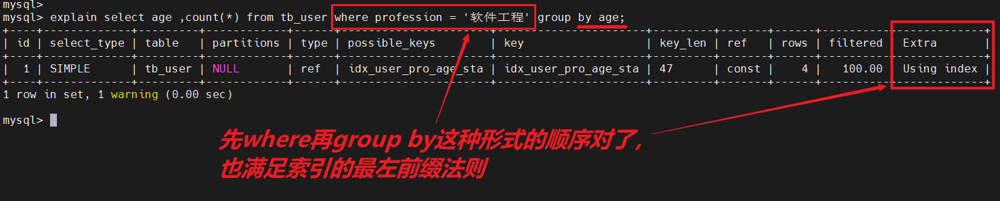


所以，在分组æ“作中，我们需è¦é€šè¿‡ä»¥ä¸‹ä¸¤ç‚¹è¿›è¡Œä¼˜åŒ–，以æå‡æ€§èƒ½ï¼š

- A. 在分组æ“作时，å¯ä»¥**通过索引æ¥æ高效ç‡**。
- B. 分组æ“作时，索引的使用也是**满足最左å‰ç¼€æ³•åˆ™çš„。**


## 3.5 limit优化

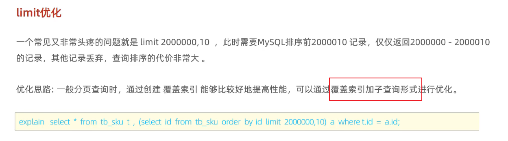

在数æ®é‡æ¯”较大时，如æœè¿›è¡Œlimit分页查询，**在查询时，越往å，分页查询效ç‡è¶Šä½**。

```sql
select * from tb_sku limit 0,10;
select * from tb_sku limit 100000,10;
select * from tb_sku limit 1000000,10;
```

我们一起æ¥çœ‹çœ‹æ‰§è¡Œlimit分页查询耗时对比：

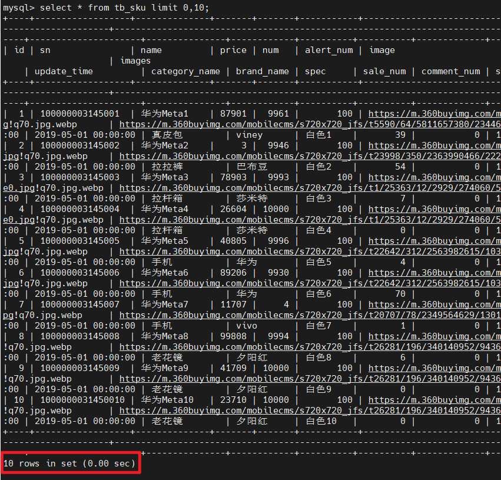

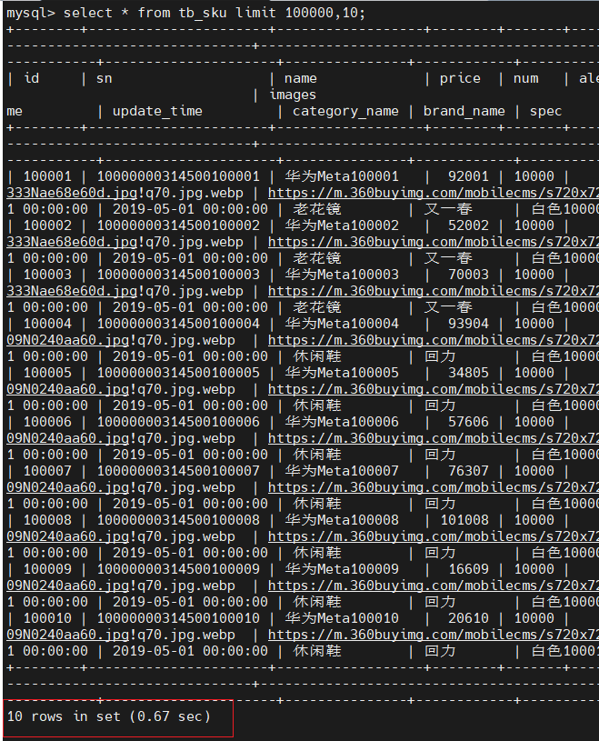

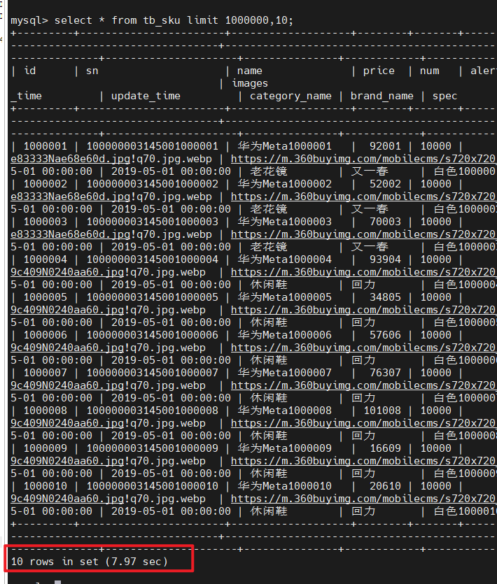


通过测试我们会看到，**越往å，分页查询效ç‡è¶Šä½**，这就是分页查询的问题所在。

因为，当在进行分页查询时，如æœæ‰§è¡Œ **limit 2000000,10** ，此时需è¦MySQLæ’åºå‰2000010 记录，**ä»…ä»…è¿”å› 2000000 - 2000010 的记录**，**其他记录丢弃，查询æ’åºçš„代价é常大** 。

**优化æ€è·¯:** 一般分页查询时，通过创建 **覆盖索引** 能够比较好地æ高性能，å¯ä»¥é€šè¿‡**==覆盖索引加å­æŸ¥è¯¢==å½¢å¼è¿›è¡Œä¼˜åŒ–**。

```sql
# 使用èšé›†ç´¢å¼•ï¼Œä¹Ÿå°±æ˜¯è¿™é‡Œçš„id进行查询，也å¯ä»¥æ˜¯ä½¿ç”¨è¦†ç›–索引进行先一步查询
select id from tb_sku order by id limit 2000000,10;
```

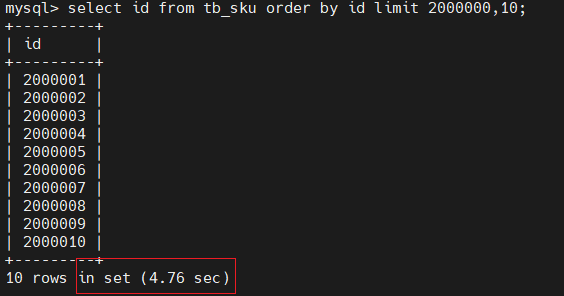


**==注æ„==-这里ä¸èƒ½ç›´æ¥ä½¿ç”¨inçš„æ–¹å¼**

```sql
select * from tb_sku t where t.id in (select id from tb_sku order by id limit 2000000,10);
```

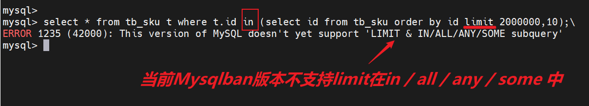


```sql
# 通过将利用覆盖索引(这里的èšé›†ç´¢å¼•id)查询到的idä¿¡æ¯å½“åšä¸€å¼ è¡¨å’Œtb_sku进行è¿æ¥ã€‚进而优化查询效ç‡
explain select * from tb_sku t , (select id from tb_sku order by id limit 2000000,10) a where t.id = a.id;
```

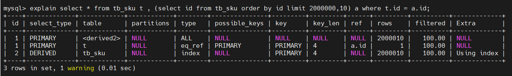

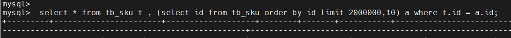

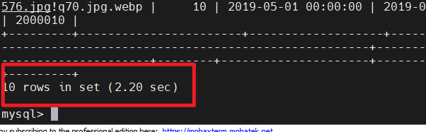


## 3.6 count优化

### （1）概述

```sql
select count(*) from tb_user ; 
```

在之å‰çš„测试中，我们å‘ç°ï¼Œå¦‚æœ**æ•°æ®é‡å¾ˆå¤§ï¼Œåœ¨æ‰§è¡Œcountæ“作时，是é常耗时的**。


- MyISAM 引æ“把**一个表的总行数存在了ç£ç›˜**上，因此执行 count(*) 的时候会直æ¥è¿”å›è¿™ä¸ªæ•°ï¼Œ**效ç‡å¾ˆé«˜**ï¼› 但是如æœæ˜¯å¸¦**æ¡ä»¶çš„count**，MyISAM也慢。
- **InnoDB 引æ“**就麻烦了，它执行 count(*) 的时候，需è¦æŠŠæ•°æ®ä¸€è¡Œä¸€è¡Œåœ°ä»å¼•æ“里é¢è¯»å‡ºæ¥ï¼Œç„¶å**累积计数**。


如æœè¯´è¦**大幅度æå‡**InnoDB表的count效ç‡ï¼Œä¸»è¦çš„优化æ€è·¯ï¼š

**自己计数**

- å¯ä»¥**借助äºredis这样的数æ®åº“进行**,如æœå¢åŠ æ•°æ®è¡Œæ•°é‡+1，删除-1，自己å»ç»´æŠ¤æ€»æ•°
- 但是如æœæ˜¯å¸¦æ¡ä»¶çš„countåˆæ¯”较麻烦了


### （2）count用法

count() 是一个èšåˆå‡½æ•°ï¼Œå¯¹äºè¿”å›çš„结æœé›†ï¼Œä¸€è¡Œè¡Œåœ°åˆ¤æ–­ï¼Œå¦‚æœ **count 函数的==å‚æ•°ä¸æ˜¯NULL==**，**累计值就加 1，å¦åˆ™ä¸åŠ **，**最åè¿”å›ç´¯è®¡å€¼**。

用法：count（*）ã€count（主键）ã€count（字段）ã€count（数字）

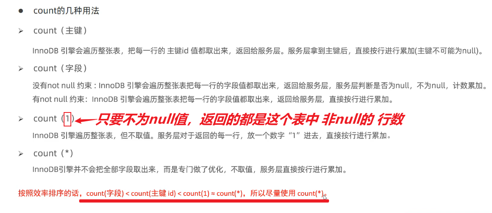

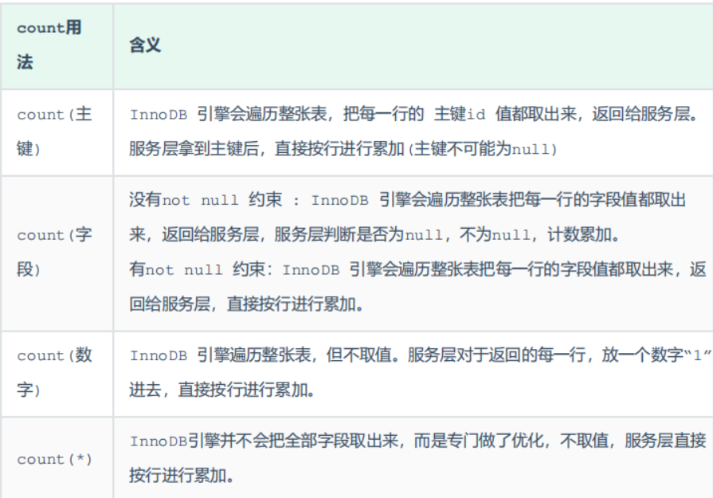


> **按照效ç‡æ’åºçš„è¯**，count(字段) < count(主键 id) < count(1) ≈ `count(*)`，所以尽é‡ä½¿ç”¨ `count(*)`。


## 3.7  🌟update优化

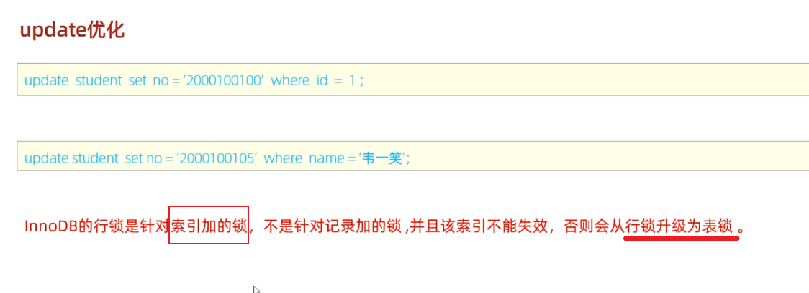

我们主è¦éœ€è¦æ³¨æ„一下update语å¥æ‰§è¡Œæ—¶çš„注æ„事项。

```sql
begin;
update course set name = 'javaEE' where id = 1 ;
commit;
```

当我们在执行删除的SQL语å¥æ—¶ï¼Œä¼šé”定id（**id为主键-èšé›†ç´¢å¼•**）为1这一行的数æ®ï¼Œ**然å事务æ交之å，行é”释放。**


但是当我们在执行如下SQL时。

```sql
begin;
update course set name = 'SpringBoot' where name = 'PHP' ; 
commit;
```

当我们开å¯å¤šä¸ªäº‹åŠ¡ï¼Œåœ¨æ‰§è¡Œä¸Šè¿°çš„SQL时，我们å‘ç°**è¡Œé”å‡çº§ä¸ºäº†è¡¨é”**。 导致该update语å¥çš„**性能大大é™ä½**。

**åŸå› ï¼š** InnoDBçš„**==è¡Œé”是针对索引加的é”==**

 在进行update语å¥çš„时候如æœåé¢çš„**whereæ¡ä»¶æ¶‰åŠçš„字段是索引**çš„è¯ï¼Œåˆ™ä¼šå¯¹æ­¤æ—¶ä¿®æ”¹çš„记录**==加行é”==**，**在当å‰ä¿®æ”¹äº‹åŠ¡æœªæ交å‰ï¼Œå…¶ä»–事务å¯ä»¥ä¿®æ”¹è¡¨ä¸­çš„其他行**。

但如æœ**whereå的字段ä¸æ˜¯ç´¢å¼•**çš„è¯ï¼ŒInnoDB会**==ä»è¡Œé”å‡çº§ä¸ºè¡¨é”==**，此时其他事务就ä¸èƒ½è®¿é—®è¯¥è¡¨ä¸­çš„其他字段了。


> InnoDBçš„**==è¡Œé”是针对索引加的é”，ä¸æ˜¯é’ˆå¯¹è®°å½•åŠ çš„é”==** ,并且该索引ä¸èƒ½å¤±æ•ˆï¼Œå¦åˆ™ä¼šä»è¡Œé”å‡çº§ä¸ºè¡¨é” 。进而导致表的并å‘性能。


## 3.8 å°ç»“

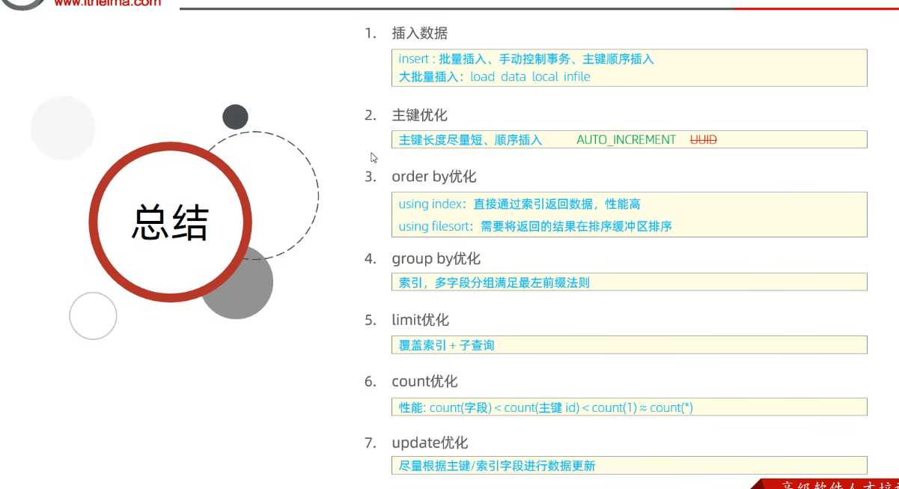


# 4ã€è§†å›¾/存储过程/触å‘器

## 4.1 视图

### （1）介ç»

视图（View）是一ç§**虚拟存在的表**。视图中的**æ•°æ®å¹¶ä¸åœ¨æ•°æ®åº“中å®é™…存在**，行和列数æ®æ¥è‡ªå®šä¹‰è§†å›¾çš„查询中使用的表，并且是在**使用视图时动æ€ç”Ÿæˆ**的。

通俗的讲，视图**åªä¿å­˜äº†æŸ¥è¯¢çš„SQL逻辑**，**ä¸ä¿å­˜æŸ¥è¯¢ç»“æœ**。所以我们在创建视图的时候，主è¦çš„工作就è½åœ¨åˆ›å»ºè¿™æ¡SQL查询语å¥ä¸Šã€‚


### （2）语法

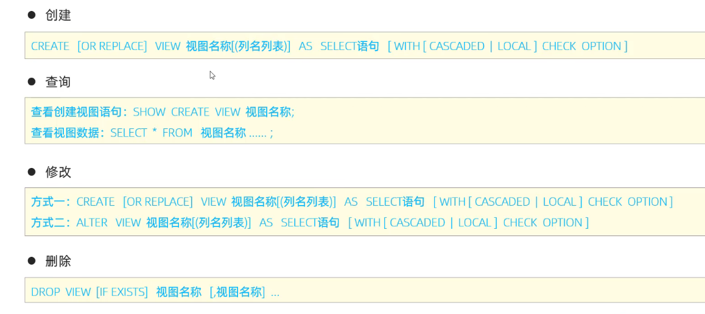

#### ①创建

create or replace : **创建或者替æ¢**一个视图

```sql
CREATE [OR REPLACE] VIEW 视图å称[(列å列表)] AS SELECTè¯­å¥ [ WITH [CASCADED | LOCAL ] CHECK OPTION ]
```


#### ②查询

```sql
查看创建视图语å¥ï¼šSHOW CREATE VIEW 视图å称;

查看视图数æ®ï¼šSELECT * FROM 视图å称 ...... ;
```


#### ③修改

```sql
æ–¹å¼ä¸€ï¼šCREATE [OR REPLACE] VIEW 视图å称[(列å列表)] AS SELECTè¯­å¥ [ WITH [ CASCADED | LOCAL ] CHECK OPTION ]

æ–¹å¼äºŒï¼šALTER VIEW 视图å称[(列å列表)] AS SELECTè¯­å¥ [ WITH [ CASCADED | LOCAL ] CHECK OPTION ]
```


#### ④删除

```sql
DROP VIEW [IF EXISTS] 视图å称 [,视图å称] ... 
```


#### ⑤演示示例

```sql
-- 创建视图
create or replace view stu_v_1 as select id,name from student where id <= 10;

-- 查询视图
show create view stu_v_1;

select * from stu_v_1;
select * from stu_v_1 where id < 3;

-- 修改视图
create or replace view stu_v_1 as select id,name,no from student where id <= 10;

alter view stu_v_1 as select id,name from student where id <= 10;

-- 删除视图
drop view if exists stu_v_1;
```

上述我们演示了，视图应该如何创建ã€æŸ¥è¯¢ã€ä¿®æ”¹ã€åˆ é™¤ï¼Œé‚£ä¹ˆæˆ‘们能ä¸èƒ½é€šè¿‡è§†å›¾æ¥æ’å…¥ã€æ›´æ–°æ•°æ®å‘¢ï¼Ÿ æ¥ä¸‹æ¥ï¼Œåšä¸€ä¸ªæµ‹è¯•ã€‚

```sql
create or replace view stu_v_1 as select id,name from student where id <= 10 ;

select * from stu_v_1;
insert into stu_v_1 values(6,'Tom');
insert into stu_v_1 values(17,'Tom22');
```

执行上述的SQL，我们会å‘ç°ï¼Œid为6å’Œ17çš„æ•°æ®**都是å¯ä»¥æˆåŠŸæ’入的**。 但是我们执行查询，查询出æ¥çš„æ•°æ®ï¼Œ**å´æ²¡æœ‰id为17的记录**。

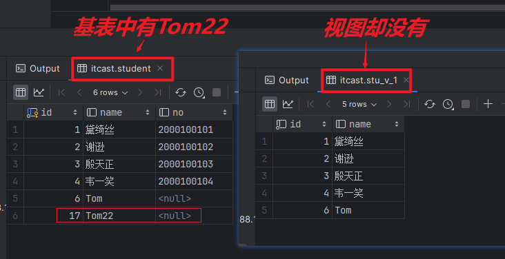


因为我们在创建视图的时候，**==指定的æ¡ä»¶ä¸º id<=10==**, id为**17çš„æ•°æ®ï¼Œæ˜¯ä¸ç¬¦åˆæ¡ä»¶çš„**，所以没有查询出æ¥ï¼Œä½†æ˜¯**è¿™æ¡æ•°æ®==ç¡®å®æ˜¯å·²ç»æˆåŠŸçš„æ’入到了基表中==**。 

如æœæˆ‘们定义视图时，如æœæŒ‡å®šäº†æ¡ä»¶ï¼Œç„¶å我们在æ’å…¥ã€ä¿®æ”¹ã€åˆ é™¤æ•°æ®æ—¶ï¼Œæ˜¯å¦å¯ä»¥**åšåˆ°å¿…须满足æ¡ä»¶æ‰èƒ½æ“作，å¦åˆ™ä¸èƒ½å¤Ÿæ“作**呢？ 答案是å¯ä»¥çš„，这就需è¦å€ŸåŠ©äº**视图的检查选项**了。


### （3）==检查选项==

当使用**==WITH CHECK OPTION==å­å¥**创建视图时，MySQL会**通过视图检查正在更改的æ¯ä¸ªè¡Œ**，例如 æ’入，更新，删除，以使其**==符åˆè§†å›¾çš„定义==**。 MySQLå…许**基äºå¦ä¸€ä¸ªè§†å›¾åˆ›å»ºè§†å›¾**，它还会**检查ä¾èµ–视图中的规则以ä¿æŒä¸€è‡´æ€§**。为了**确定检查的范围**，mysqlæ供了两个选项： **CASCADED å’Œ LOCAL**，默认值为 CASCADED 。

```sql
create or replace view stu_v_1 
as select id,name 
from student 
where id <= 10 
with [cascaded | local] check option;
```


#### â‘ CASCADED级è”

比如，**v2视图是基äºv1视图的**，如æœåœ¨v2视图创建的时候**指定了检查选项为 cascaded**，**但是v1视图创建时==未指定检查选项==**。 则在执行检查时，**==ä¸ä»…会检查v2，还会级è”检查v2çš„å…³è”视图v1==**。

cascaded级è”，会对加上了**该 检查选项 的视图v** 检查正在更改的æ“作是å¦ç¬¦åˆè§†å›¾çš„定义，并且**如æœè¯¥è§†å›¾v还有ä¾èµ–其他视图，则还会级è”检查该视图vä¾èµ–的所有视图**。

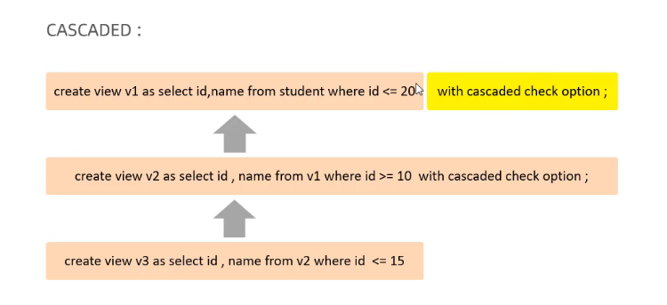

```sql
create or replace view stu_v_1 
as select id, name, no 
from student 
where id <= 20;

insert into stu_v_1 values (5, 'Tom'); 
insert into stu_v_1 values (25, 'Tom22');
# ç”±äºæ²¡æœ‰åŠ ä¸Šæ£€æŸ¥é€‰é¡¹ï¼Œèƒ½å¤Ÿæ·»åŠ è¿›åŸºè¡¨student中，ä¸ä¼šæ·»åŠ åˆ°v1中，并且也ä¸ä¼šæŠ¥é”™ã€‚


create or replace view stu_v_2 
as select id, name 
from stu_v_1 
where id >= 10 
with cascaded check option;

insert into stu_v_2 values (7, 'Tom'); #报错，ä¸æ»¡è¶³v2的定义 >=10
insert into stu_v_2 values (26, 'Tom'); 
# ç”±äºè§†å›¾v2在创建时使用了cascaded级è”，虽然满足v2的定义，但是ä¸æ»¡è¶³v2ä¾èµ–çš„v1的定义

insert into stu_v_2 values (15, 'Tom');

create or replace view stu_v_3 
as select id, name 
from stu_v_2 
where id <= 15;

insert into stu_v_3 values (11, 'Tom'); insert into stu_v_3 values (17, 'Tom'); 
#ä¸æ»¡è¶³v3的定义,但是能够执行æˆåŠŸï¼Œå› ä¸ºæ²¡æœ‰ç»™v3加上检查选项，虽然v3中ä¸èƒ½æ·»åŠ åˆ°ï¼Œåªèƒ½æ·»åŠ åˆ°åŸºè¡¨student中，但是也ä¸ä¼šæŠ¥é”™

insert into stu_v_3 values (28, 'Tom'); 
#报错，虽然ä¸ä¼šå»æ£€æŸ¥v3但是v2添加了检查选项会进行cascaded级è”检查，ä¸ç¬¦åˆv1的定义
```


#### ②LOCAL本地

比如，**v2视图是基äºv1视图的**，如æœåœ¨v2视图创建的时候**==指定了检查选项为 local==** ，但是**v1**视图创建时**未指定检查选项**。 则在执行检查时，**==åªä¼šæ£€æŸ¥v2==**，ä¸ä¼šæ£€æŸ¥v2çš„å…³è”视图v1。

使用localå，如æœ**当å‰åŠ äº† local检查选项 的视图v**，并且该视图还ä¾èµ–了其他视图v' ，它会å»æ£€æŸ¥å®ƒæ‰€ä¾èµ–的视图v' 是å¦åœ¨åˆ›å»ºè§†å›¾æ—¶æ·»åŠ äº†æ£€æŸ¥é€‰é¡¹ï¼Œ**如æœæ·»åŠ äº†å°±ä¸€èµ·åˆ¤æ–­**，**如==没有添加则åªä¼šåˆ¤æ–­è§†å›¾v所定义的æ¡ä»¶==**

 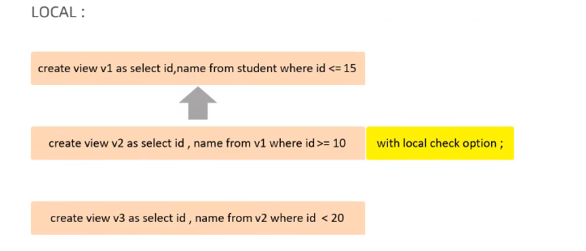


### （4）视图的更新

#### ①概念

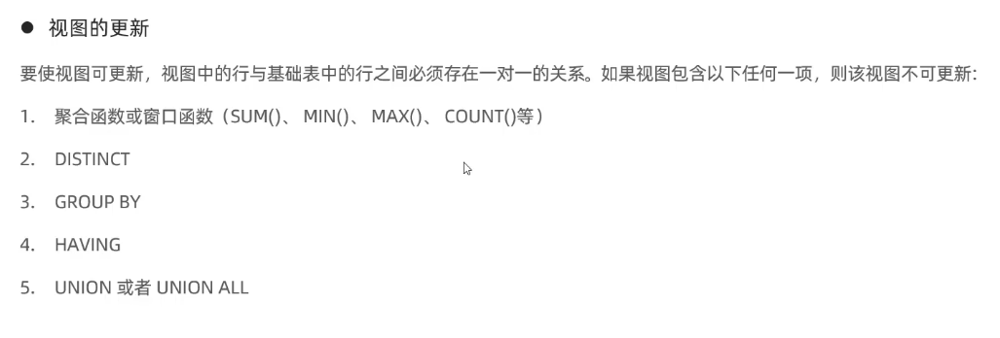

è¦ä½¿è§†å›¾å¯æ›´æ–°ï¼Œ**视图中的行ä¸==基础表中的行==之间必须存在==一对一==的关系**。如æœè§†å›¾åŒ…å«ä»¥ä¸‹ä»»ä½•ä¸€é¡¹ï¼Œåˆ™**该视图ä¸å¯æ›´æ–°**：

A. èšåˆå‡½æ•°æˆ–窗å£å‡½æ•°ï¼ˆSUM()〠MIN()〠MAX()〠COUNT()等）

B. DISTINCT

C. GROUP BY

D. HAVING

E. UNION 或者 UNION ALL


#### ②示例演示

```sql
create view stu_v_count as select count(*) from student; 
```

上述的视图中，就**åªæœ‰ä¸€ä¸ªå•è¡Œå•åˆ—çš„æ•°æ®**，如æœæˆ‘们**对这个视图进行更新或æ’å…¥**的，将**会报错**。

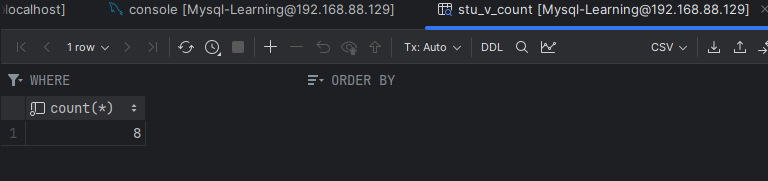

```sql
insert into stu_v_count values(10); 
```

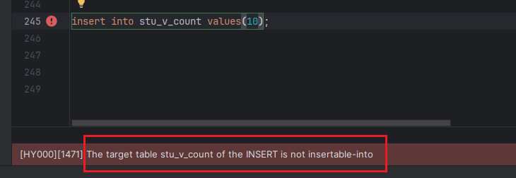


### （5）视图的作用

#### ①简å•

视图ä¸ä»…å¯ä»¥**简化用户对数æ®çš„ç†è§£**，也å¯ä»¥ç®€åŒ–他们的æ“作。那些被ç»å¸¸ä½¿ç”¨çš„查询å¯ä»¥è¢«å®šä¹‰ä¸ºè§†å›¾ï¼Œä»è€Œä½¿å¾—用户ä¸å¿…为以åçš„æ“作æ¯æ¬¡æŒ‡å®šå…¨éƒ¨çš„æ¡ä»¶ã€‚

#### ②安全

æ•°æ®åº“å¯ä»¥æˆæƒï¼Œ**但ä¸èƒ½æˆæƒåˆ°æ•°æ®åº“特定行和特定的列上**。通过**视图用户==åªèƒ½æŸ¥è¯¢å’Œä¿®æ”¹ä»–们所能è§åˆ°çš„æ•°æ®==**


#### ③数æ®ç‹¬ç«‹

视图å¯**帮助用户å±è”½çœŸå®è¡¨ç»“æ„å˜åŒ–带æ¥çš„å½±å“**。

​	比如，student表中的name字段å‘生å˜åŒ–，ä»name -》stuName，此时åªéœ€æ”¹å˜è§†å›¾çš„映射关系å³å¯ï¼Œæ— éœ€æ”¹å˜ä¸šåŠ¡ä»£ç ã€‚

```sql
# åŸæœ¬çš„视图
create or replace view stu_v_1 
as select id, name, no 
from student where id <= 10;

# 需求å˜æ›´ï¼Œå°†åŸºè¡¨studentçš„name字段改å˜ï¼Œä»name -》stuName

# 改å˜è§†å›¾çš„映射关系å³å¯ï¼Œä¸å½±å“业务代ç 
create or replace view stu_v_1 
as select id, stuName, no 
from student where id <= 10;
```


### （6）案例

1). 为了ä¿è¯æ•°æ®åº“表的安全性，开å‘人员在æ“作tb_user表时，åªèƒ½çœ‹åˆ°çš„**用户的基本字段**，**å±è”½æ‰‹æœºå·å’Œé‚®ç®±ä¸¤ä¸ªå­—段**。

```sql
create view tb_user_view 
as select id,name,profession,age,gender,status,createtime 
from tb_user;

select * from tb_user_view;
```


2). 查询**æ¯ä¸ªå­¦ç”Ÿæ‰€é€‰ä¿®çš„课程（三张表è”查）**，这个功能在很多的业务中都有使用到，为了简化æ“作，定义一个视图。

```sql
create view tb_stu_course_view 
    as select s.name student_name , s.no student_no , c.name course_name 
    from student s, student_course sc , course c
    where s.id = sc.studentid and sc.courseid = c.id;

select * from tb_stu_course_view;
```


## 4.2 存储过程

### （1）介ç»å’Œç‰¹ç‚¹

存储过程是**事先ç»è¿‡ç¼–译并存储在数æ®åº“中的一段 SQL 语å¥çš„集åˆ**，调用存储过程å¯ä»¥ç®€åŒ–应用开å‘人员的很多工作，**å‡å°‘æ•°æ®åœ¨æ•°æ®åº“和应用æœåŠ¡å™¨ä¹‹é—´çš„传输**（主è¦æ˜¯ç½‘络传输），对äº**æ高数æ®å¤„ç†çš„效ç‡**是有好处的。

存储过程æ€æƒ³ä¸Šå¾ˆç®€å•ï¼Œå°±æ˜¯æ•°æ®åº“ SQL 语言层é¢çš„**代ç å°è£…ä¸é‡ç”¨**。

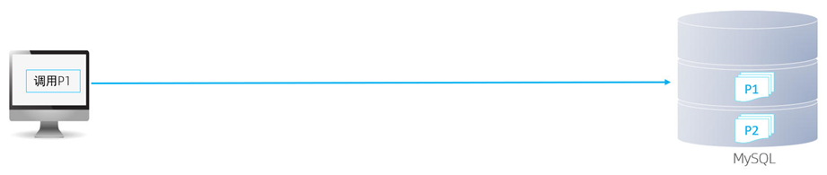

#### **特点**

- **å°è£…，å¤ç”¨** 
  - å¯ä»¥æŠŠæŸä¸€ä¸šåŠ¡SQLå°è£…在存储过程中，需è¦ç”¨åˆ°çš„时候直æ¥è°ƒç”¨å³å¯ã€‚

- **å¯ä»¥æ¥æ”¶å‚数，也å¯ä»¥è¿”å›æ•°æ®** 
  - å†å­˜å‚¨è¿‡ç¨‹ä¸­ï¼Œå¯ä»¥ä¼ é€’å‚数，也å¯ä»¥æ¥æ”¶è¿”å›å€¼ã€‚

- **==å‡å°‘网络交互，效ç‡æå‡==**
  - 如æœæ¶‰åŠåˆ°å¤šæ¡SQL，æ¯æ‰§è¡Œä¸€æ¬¡éƒ½æ˜¯ä¸€æ¬¡ç½‘络传输。 而如æœå°è£…在存储过程中，我们åªéœ€è¦ç½‘络交互一次å¯èƒ½å°±å¯ä»¥äº†ã€‚


### （2）基本用法

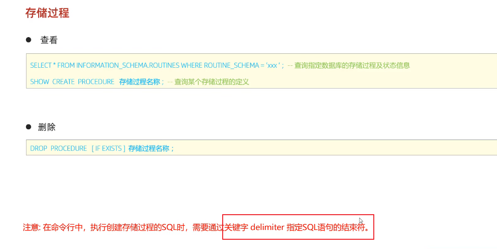

#### ① 创建

```sql
CREATE PROCEDURE 存储过程å称 ([ å‚数列表 ])

BEGIN

-- SQL语å¥

END ;
```

#### ② 调用

```
CALL å称 ([ å‚æ•° ]);
```

#### ③ 查看

```sql
SELECT * FROM INFORMATION_SCHEMA.ROUTINES WHERE ROUTINE_SCHEMA = 'xxx'; -- 查询指定数æ®åº“的存储过程åŠçŠ¶æ€ä¿¡æ¯
SHOW CREATE PROCEDURE 存储过程å称 ; -- 查询æŸä¸ªå­˜å‚¨è¿‡ç¨‹çš„定义
```


#### ④ 删除

```sql
DROP PROCEDURE [ IF EXISTS ] 存储过程å称 ï¼›
```


> ==**注æ„:**==
>
> 在**命令行中**，执行创建存储过程的SQL时，需è¦é€šè¿‡**关键字 ==delimiter 指定SQL语å¥çš„结æŸç¬¦==**。
>
> - 这个是因为在存储过程中的内部å¯èƒ½ä¼šæœ‰`;` 的作为结æŸçš„语å¥ï¼Œæ­¤æ—¶åœ¨å‘½ä»¤è¡Œä¸­ï¼Œå°±è®¤ä¸ºè¯¥`;`是该语å¥çš„结æŸç¬¦ï¼Œè¯¥å­˜å‚¨è¿‡ç¨‹çš„åç»­ä¸èƒ½å°±å¾—ä¸åˆ°æ‰§è¡Œï¼š
>
>   ```sql
>   create procedure p1()
>   begin
>   	select count(*) from student;
>   end;
>   ```
>
>   这里的`end;`就得ä¸åˆ°æ‰§è¡Œï¼Œæ­¤æ—¶å¯ä»¥é€šè¿‡delimiter指令修改mysql命令行中的结æŸç¬¦ä¸º`$$`等其他ä¸ä¼šå¼•èµ·å†²çªçš„符å·ã€‚
>
>   ```sql
>   delimiter $$;
>   ```


#### ⑤演示示例

```sql
-- 存储过程基本语法
-- 创建
create procedure p1()
begin

select count(*) from student;

end;

-- 调用
call p1();

-- 查看
select * from information_schema.ROUTINES where ROUTINE_SCHEMA = 'itcast';

show create procedure p1;

-- 删除
drop procedure if exists p1;
```


### （3）==å˜é‡==

在MySQL中å˜é‡åˆ†ä¸ºä¸‰ç§ç±»å‹: **系统å˜é‡ã€ç”¨æˆ·å®šä¹‰å˜é‡ã€å±€éƒ¨å˜é‡**。

#### ①系统å˜é‡

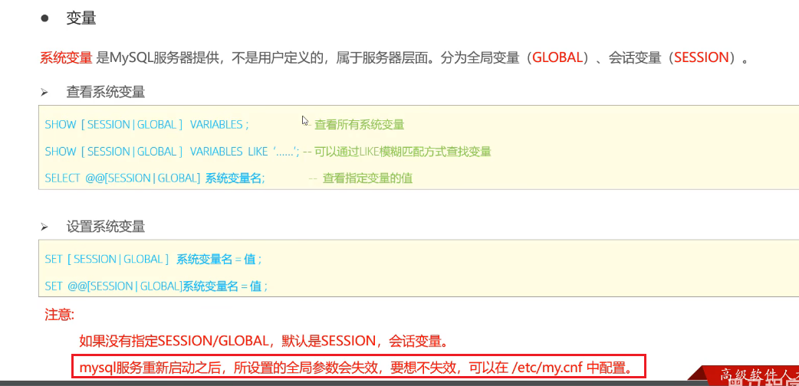

系统å˜é‡ 是MySQLæœåŠ¡å™¨æ供，ä¸æ˜¯ç”¨æˆ·å®šä¹‰çš„，å±äºæœåŠ¡å™¨å±‚é¢ã€‚分为**全局å˜é‡ï¼ˆGLOBAL）**ã€**会è¯å˜é‡ï¼ˆSESSION）**。**默认**查询的是session会è¯å˜é‡ã€‚

##### 1). 查看系统å˜é‡

```sql
SHOW [ SESSION | GLOBAL ] VARIABLES ; -- 查看所有系统å˜é‡
SHOW [ SESSION | GLOBAL ] VARIABLES LIKE '......'; -- å¯ä»¥é€šè¿‡LIKE模糊匹é…æ–¹å¼æŸ¥æ‰¾å˜é‡
SELECT @@[SESSION | GLOBAL] 系统å˜é‡å; -- 查看指定å˜é‡çš„值
```


##### 2). 设置系统å˜é‡

```sql
SET [ SESSION | GLOBAL ] 系统å˜é‡å = 值 ;
SET @@[SESSION | GLOBAL]系统å˜é‡å = 值 ;
```


> **注æ„：**
>
> 如æœæ²¡æœ‰æŒ‡å®šSESSION/GLOBAL，默认是SESSION，会è¯å˜é‡ã€‚
>
> mysqlæœåŠ¡é‡æ–°å¯åŠ¨ä¹‹å，所设置的全局å‚数会失效，è¦æƒ³ä¸å¤±æ•ˆï¼Œå¯ä»¥åœ¨ /etc/my.cnf 中é…置。 
>
> - A. 全局å˜é‡(GLOBAL): 全局å˜é‡é’ˆå¯¹äºæ‰€æœ‰çš„会è¯ã€‚
> - B. 会è¯å˜é‡(SESSION): 会è¯å˜é‡é’ˆå¯¹äºå•ä¸ªä¼šè¯ï¼Œåœ¨å¦å¤–一个会è¯çª—å£å°±ä¸ç”Ÿæ•ˆäº†ã€‚


**演示示例:**

```sql
-- 查看系统å˜é‡
show session variables ;

show session variables like 'auto%';
show global variables like 'auto%';

select @@global.autocommit;  -- 查看指定global级别下该å˜é‡çš„值
select @@session.autocommit; -- 查看指定session级别下该å˜é‡çš„值

-- 设置系统å˜é‡
set session autocommit = 1; -- 改å˜çš„åªæ˜¯å½“å‰ä¼šè¯

insert into course(id, name) VALUES (6, 'ES');

set global autocommit = 0;

select @@global.autocommit;
```


#### ②用户定义å˜é‡

用户定义å˜é‡ 是用户根æ®éœ€è¦è‡ªå·±å®šä¹‰çš„å˜é‡ï¼Œ**用户å˜é‡ä¸ç”¨æå‰å£°æ˜**，在用的时候**ç›´æ¥ç”¨ "@å˜é‡å"** 使用就å¯ä»¥ã€‚å…¶**作用域为当å‰è¿æ¥**（åªåœ¨å½“å‰ä¼šè¯æœ‰æ•ˆï¼‰ã€‚

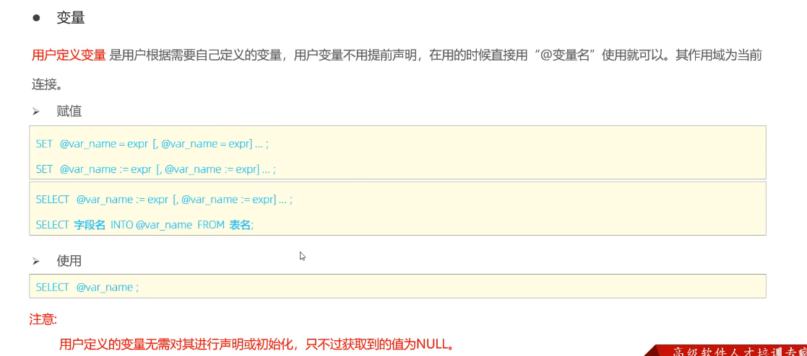

##### 1). 赋值

**æ–¹å¼ä¸€:**

```sql
SET @var_name = expr [, @var_name = expr] ... ;

SET @var_name := expr [, @var_name := expr] ... ;
```

赋值时，å¯ä»¥ä½¿ç”¨ = ，也å¯ä»¥ä½¿ç”¨ := 。

**æ–¹å¼äºŒ:**

```sql
SELECT @var_name := expr [, @var_name := expr] ... ;

SELECT 字段å INTO @var_name FROM 表å;
```


##### 2). 使用

```sql
SELECT @var_name ;
```

> 注æ„: 用户定义的å˜é‡**无需对其进行声æ˜æˆ–åˆå§‹åŒ–**，**åªä¸è¿‡==è·å–到的值为NULL==**。

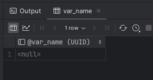


##### 演示示例

```sql
-- 赋值
set @myname = 'itcast';
set @myage := 10;
set @mygender := 'ç”·',@myhobby := 'java';

select @mycolor := 'red';
select count(*) into @mycount from tb_user;

-- 使用
select @myname,@myage,@mygender,@myhobby;

select @mycolor , @mycount;

select @abc;
```


#### ③局部å˜é‡

局部å˜é‡ 是根æ®éœ€è¦å®šä¹‰çš„在局部生效的å˜é‡ï¼Œè®¿é—®ä¹‹å‰ï¼Œ==需è¦**DECLARE声æ˜**==。å¯ç”¨ä½œå­˜å‚¨è¿‡ç¨‹å†…的局部å˜é‡å’Œè¾“å…¥å‚数，**局部å˜é‡çš„==范围==是在其内声æ˜çš„==BEGIN ... ENDå—==**。

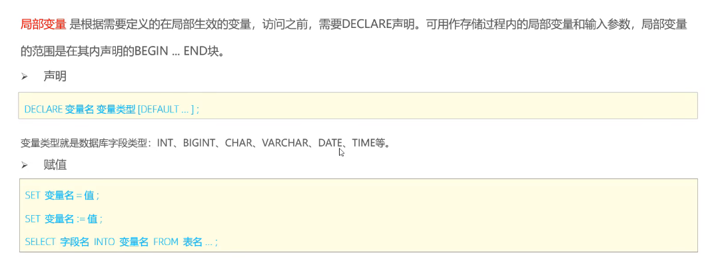

##### 1). 声æ˜

```sql
DECLARE å˜é‡å å˜é‡ç±»å‹ [DEFAULT ... ] ; 
```

å˜é‡ç±»å‹å°±æ˜¯æ•°æ®åº“字段类å‹ï¼š**INTã€BIGINTã€CHARã€VARCHARã€DATEã€TIME**等。

##### 2). 赋值

```sql
SET å˜é‡å = 值 ;

SET å˜é‡å := 值 ;

SELECT 字段å INTO å˜é‡å FROM 表å ... ;
```


##### 演示示例

```sql
-- 声æ˜å±€éƒ¨å˜é‡ - declare
-- 赋值

create procedure p2()

begin

	declare stu_count int default 0;
	select count(*) into stu_count from student;
	select stu_count;

end;

call p2();
```


### （4）if

#### â‘  介ç»

if 用äºåšæ¡ä»¶åˆ¤æ–­ï¼Œå…·ä½“的语法结æ„为：


```sql
IF æ¡ä»¶1 THEN
	.....

ELSEIF æ¡ä»¶2 THEN -- å¯é€‰
	.....

ELSE -- å¯é€‰
	.....

END IF; -- 结æŸ
```

在ifæ¡ä»¶åˆ¤æ–­çš„结æ„中，ELSE IF 结æ„å¯ä»¥æœ‰å¤šä¸ªï¼Œä¹Ÿ**å¯ä»¥æ²¡æœ‰**。 ELSE结æ„å¯ä»¥æœ‰ï¼Œä¹Ÿ**å¯ä»¥æ²¡æœ‰**。


#### ②案例

æ ¹æ®å®šä¹‰çš„分数scoreå˜é‡ï¼Œåˆ¤å®šå½“å‰åˆ†æ•°å¯¹åº”的分数等级。

- score >= 85分，等级为优秀。
- score >= 60分 且 score < 85分，等级为åŠæ ¼ã€‚
- score < 60分，等级为ä¸åŠæ ¼ã€‚

```sql
create procedure p3()

begin
    declare score int default 58;
    declare result varchar(10);

    if score >= 85 then
   	 	set result := '优秀';

    elseif score >= 60 then
    	set result := 'åŠæ ¼';

    else
   	 	set result := 'ä¸åŠæ ¼';

    end if;
    
    select result;
end;

call p3();
```


上述的需求我们虽然已ç»å®ç°äº†ï¼Œä½†æ˜¯ä¹Ÿå­˜åœ¨ä¸€äº›é—®é¢˜ï¼Œæ¯”如：score 分数我们是在**存储过程中定义死的**，而且最终计算出æ¥çš„分数等级，我们也仅仅是最终查询展示出æ¥è€Œå·²ã€‚

那么我们能ä¸èƒ½ï¼ŒæŠŠscore分数动æ€çš„传递进æ¥ï¼Œè®¡ç®—出æ¥çš„分数等级是å¦å¯ä»¥ä½œä¸ºè¿”å›å€¼è¿”å›å‘¢ï¼Ÿç­”案是肯定的，我们å¯ä»¥é€šè¿‡æ¥ä¸‹æ¥æ‰€è®²è§£çš„ **å‚æ•°** æ¥è§£å†³ä¸Šè¿°çš„问题。


### （5）å‚æ•°

#### ①介ç»

å‚æ•°çš„ç±»å‹ï¼Œä¸»è¦åˆ†ä¸ºä»¥ä¸‹ä¸‰ç§ï¼šINã€OUTã€INOUT。 具体的å«ä¹‰å¦‚下：

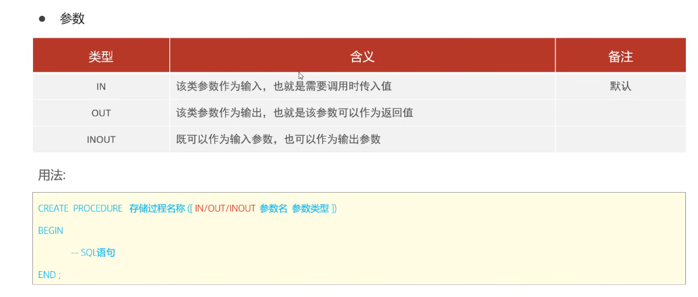

用法：

```sql
CREATE PROCEDURE 存储过程å称 ([ IN/OUT/INOUT å‚æ•°å å‚æ•°ç±»å‹ ])

BEGIN
	-- SQL语å¥
END ;
```


#### ②案例一in&out

æ ¹æ®ä¼ å…¥å‚æ•°score，判定当å‰åˆ†æ•°å¯¹åº”的分数等级，并返å›ã€‚

- score >= 85分，等级为优秀。
- score >= 60分 且 score < 85分，等级为åŠæ ¼ã€‚
- score < 60分，等级为ä¸åŠæ ¼ã€‚

```sql
create procedure p4(in score int, out result varchar(10)) -- 定义 输入输出 å‚æ•°

begin
    if score >= 85 then
    	set result := '优秀';

    elseif score >= 60 then
    	set result := 'åŠæ ¼';

    else
    	set result := 'ä¸åŠæ ¼';

    end if;
end;

-- 定义用户å˜é‡ @resultæ¥æ¥æ”¶è¿”å›çš„æ•°æ®, 用户å˜é‡å¯ä»¥ä¸ç”¨å£°æ˜
call p4(18, @result);

select @result;
```


#### ③案例二-inout

å°†**ä¼ å…¥**çš„200分制的分数，进行æ¢ç®—，**æ¢ç®—æˆç™¾åˆ†åˆ¶**，然å**è¿”å›**。

```sql
create procedure p5(inout score double)

begin
	set score := score * 0.5;
end;

set @score = 198; -- 用户å˜é‡ï¼Œä¸ç”¨å£°æ˜ï¼Œå¯ä»¥ç›´æ¥è®¾ç½®set
call p5(@score);

select @score;
```


### （6）case

#### ①介ç»

case结æ„åŠä½œç”¨ï¼Œå’Œæˆ‘们在基础篇中所讲解的æµç¨‹æ§åˆ¶å‡½æ•°å¾ˆç±»ä¼¼ã€‚有两ç§è¯­æ³•æ ¼å¼ï¼š

**语法1：**

```sql
-- å«ä¹‰ï¼š 当case_valueçš„ 值为 when_value1 时，执行statement_list1，当值为 when_value2时，执行statement_list2， å¦åˆ™å°±æ‰§è¡Œ statement_list

CASE case_value
	WHEN when_value1 THEN statement_list1
	[ WHEN when_value2 THEN statement_list2] ...	
	[ ELSE statement_list ]
END CASE;
```

**语法2：**

```sql
-- å«ä¹‰ï¼š 当 æ¡ä»¶search_condition1æˆç«‹ 时，执行statement_list1，当æ¡ä»¶search_condition2æˆç«‹æ—¶ï¼Œæ‰§è¡Œstatement_list2， å¦åˆ™å°±æ‰§è¡Œ statement_list

CASE
    WHEN search_condition1 THEN statement_list1
    [WHEN search_condition2 THEN statement_list2] ...
    [ELSE statement_list]
END CASE;
```


#### ②案例

æ ¹æ®ä¼ å…¥çš„月份，判定月份所å±çš„季节（è¦æ±‚采用case结æ„）。

- 1-3月份，为第一季度
- 4-6月份，为第二季度
- 7-9月份，为第三季度
- 10-12月份，为第四季度

```sql
create procedure p6(in month int)

begin

    declare result varchar(10);

    case
        when month >= 1 and month <= 3 then
       	 	set result := '第一季度';

        when month >= 4 and month <= 6 then
        	set result := '第二季度';

        when month >= 7 and month <= 9 then
        	set result := '第三季度';

        when month >= 10 and month <= 12 then
        	set result := '第四季度';

        else
        	set result := 'é法å‚æ•°';
    end case ;

    select concat('您输入的月份为: ',month, ', 所å±çš„季度为: ',result);

end;

call p6(4);
call p6(16);
```


> 注æ„：如æœåˆ¤å®šæ¡ä»¶æœ‰å¤šä¸ªï¼Œå¤šä¸ªæ¡ä»¶ä¹‹é—´ï¼Œå¯ä»¥ä½¿ç”¨ **and 或 or 进行è¿æ¥**。
>
> **concat()函数，用äºå­—符串拼æ¥ã€‚**


### （7）while

#### ①介ç»

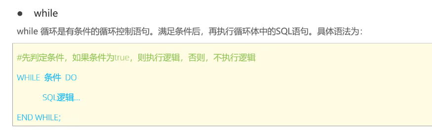

while 循ç¯æ˜¯**有æ¡ä»¶çš„循ç¯æ§åˆ¶è¯­å¥**。满足æ¡ä»¶å，å†æ‰§è¡Œå¾ªç¯ä½“中的SQL语å¥ã€‚具体语法为：

```sql
-- 先判定æ¡ä»¶ï¼Œå¦‚æœæ¡ä»¶ä¸ºtrue，则执行逻辑，å¦åˆ™ï¼Œä¸æ‰§è¡Œé€»è¾‘
WHILE æ¡ä»¶ DO
	-- SQL逻辑...
END WHILE;
```


#### ②案例

计算ä»1累加到n的值，**n为传入的å‚数值**。

```sql
-- A. 定义局部å˜é‡, 记录累加之å的值;
-- B. æ¯å¾ªç¯ä¸€æ¬¡, 就会对n进行å‡1 , 如æœnå‡åˆ°0, 则退出循ç¯
create procedure p7(in n int)

begin
	declare total int default 0;
	
	while n>0 do
		set total := total + n;
		set n := n - 1;
	end while;
	
	select total;
end;

call p7(100);
```


### （8）repeat

#### â‘  介ç»

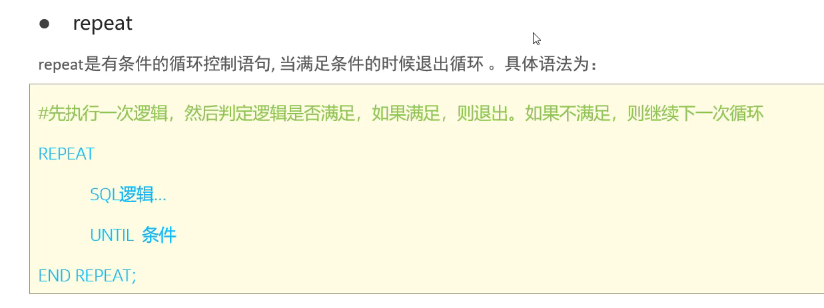

repeat是有æ¡ä»¶çš„循ç¯æ§åˆ¶è¯­å¥, **当满足until声æ˜çš„æ¡ä»¶çš„时候，则==退出循ç¯==** 。具体语法为：

```sql
-- 先执行一次逻辑，然å判定UNTILæ¡ä»¶æ˜¯å¦æ»¡è¶³ï¼Œå¦‚æœæ»¡è¶³ï¼Œåˆ™é€€å‡ºã€‚如æœä¸æ»¡è¶³ï¼Œåˆ™ç»§ç»­ä¸‹ä¸€æ¬¡å¾ªç¯

REPEAT
    -- SQL逻辑...
    UNTIL æ¡ä»¶
END REPEAT;
```


#### ②案例

计算ä»1累加到n的值，n为传入的å‚数值。(使用repeatå®ç°)

```sql
-- A. 定义局部å˜é‡, 记录累加之å的值;
-- B. æ¯å¾ªç¯ä¸€æ¬¡, 就会对n进行-1 , 如æœnå‡åˆ°0, 则退出循ç¯

create procedure p8(in n int)

begin

    declare total int default 0;

    repeat
        set total := total + n;
        set n := n - 1;
    until n <= 0
    end repeat;

    select total;

end;

call p8(10);
call p8(100);
```


### （9）loop

#### ①介ç»

LOOP å®ç°ç®€å•çš„循ç¯ï¼Œå¦‚æœ**ä¸åœ¨SQL逻辑中å¢åŠ é€€å‡ºå¾ªç¯**çš„æ¡ä»¶ï¼Œå¯ä»¥ç”¨å…¶æ¥å®ç°**简å•çš„死循ç¯**。LOOPå¯ä»¥é…åˆä¸€ä¸‹ä¸¤ä¸ªè¯­å¥ä½¿ç”¨ï¼š

- **LEAVE** ：**é…åˆå¾ªç¯ä½¿ç”¨ï¼Œé€€å‡ºå¾ªç¯**。（相当äºjava中的break）
- **ITERATE**：必须用在循ç¯ä¸­ï¼Œä½œç”¨æ˜¯**==跳过当å‰å¾ªç¯å‰©ä¸‹çš„语å¥ï¼Œç›´æ¥è¿›å…¥ä¸‹ä¸€æ¬¡å¾ªç¯==**。（相当äºjava中的continue）

```sql
[begin_label:] LOOP

	-- SQL逻辑...

END LOOP [end_label];
```


```sql
LEAVE label; -- 退出指定标记的循ç¯ä½“，这里的label就是创建loop中指定的标识

ITERATE label; -- ç›´æ¥è¿›å…¥ä¸‹ä¸€æ¬¡å¾ªç¯
```

上述语法中出ç°çš„ begin_label，end_label，label 指的都是我们所自定义的标记。


#### ②案例一-leave

计算ä»1累加到n的值，n为传入的å‚数值。

```sql
-- A. 定义局部å˜é‡, 记录累加之å的值;

-- B. æ¯å¾ªç¯ä¸€æ¬¡, 就会对n进行-1 , 如æœnå‡åˆ°0, åˆ™é€€å‡ºå¾ªç¯ ----> leave xx

create procedure p9(in n int)
begin
	declare total int default 0;

    sum:loop
        if n<=0 then
            leave sum;
        end if;

        set total := total + n;
        set n := n - 1;

    end loop sum;

	select total;

end;

call p9(100);
```


#### ③案例二-iterate

计算ä»1到n之间的**å¶æ•°ç´¯åŠ **的值，n为传入的å‚数值。

```sql
-- A. 定义局部å˜é‡, 记录累加之å的值;
-- B. æ¯å¾ªç¯ä¸€æ¬¡, 就会对n进行-1 , 如æœnå‡åˆ°0, åˆ™é€€å‡ºå¾ªç¯ ----> leave xx
-- C. 如æœå½“次累加的数æ®æ˜¯å¥‡æ•°, 则直æ¥è¿›å…¥ä¸‹ä¸€æ¬¡å¾ªç¯. --------> iterate xx

create procedure p10(in n int)

begin
    declare total int default 0;

    sum:loop

    if n<=0 then
        leave sum;
    end if;

    if n%2 = 1 then
    	set n := n - 1;
    	iterate sum;
    end if;

    set total := total + n;
    set n := n - 1;

    end loop sum;
    select total;

end;

call p10(100);
```


### （10）游标

#### ①介ç»

**游标（CURSOR）**是用æ¥**==存储查询结æœé›†çš„æ•°æ®ç±»å‹==** , 在存储过程和函数中å¯ä»¥ä½¿ç”¨æ¸¸æ ‡**对结æœé›†è¿›è¡Œå¾ªç¯çš„处ç†ã€‚ **游标的使用包括**游标的声æ˜ã€OPENã€FETCH å’Œ CLOSE**，其语法分别如下。

##### A. 声æ˜æ¸¸æ ‡-declare

```sql
DECLARE 游标å称 CURSOR FOR æŸ¥è¯¢è¯­å¥ ; 
```

##### B. 打开游标-open

```sql
OPEN 游标å称 ; 
```

##### C. è·å–游标记录-fetch

```sql
FETCH 游标å称 INTO å˜é‡ [, å˜é‡ ] ; 
```

##### D. 关闭游标-close

```sql
CLOSE 游标å称 ; 
```


#### ② 案例

æ ¹æ®ä¼ å…¥çš„å‚æ•°uage，æ¥æŸ¥è¯¢ç”¨æˆ·è¡¨tb_user中，所有的用户年龄å°äºç­‰äºuageçš„ 用户姓å（name）和专业（profession），并将用户的姓å和专业**æ’入到所创建的一张新表(id,name,profession)中**。

```sql
-- 逻辑:
-- A. 声æ˜æ¸¸æ ‡, 存储查询结æœé›†
-- B. 准备: 创建表结æ„
-- C. å¼€å¯æ¸¸æ ‡
-- D. è·å–游标中的记录
-- E. æ’入数æ®åˆ°æ–°è¡¨ä¸­
-- F. 关闭游标

create procedure p11(in uage int)

begin

    declare uname varchar(100);
    declare upro varchar(100);
    -- 游标的声æ˜éœ€è¦åœ¨æ™®é€šå˜é‡ä¹‹å
    declare u_cursor cursor for select name,profession from tb_user where age <= uage;

    drop table if exists tb_user_pro;

    create table if not exists tb_user_pro(
        id int primary key auto_increment,
        name varchar(100),
        profession varchar(100)
    );


    open u_cursor;
    while true do
        fetch u_cursor into uname,upro;
        insert into tb_user_pro values (null, uname, upro);
    end while;

    close u_cursor;

end;

call p11(30);
```

上述的存储过程，最终我们在调用的过程中，会报错，之所以报错是因为**上é¢çš„while循ç¯ä¸­ï¼Œå¹¶æ²¡æœ‰é€€å‡ºæ¡ä»¶ã€‚**当游标的数æ®é›†**è·å–完毕之å，å†æ¬¡è·å–æ•°æ®ï¼Œå°±ä¼šæŠ¥é”™ï¼Œ**ä»è€Œç»ˆæ­¢äº†ç¨‹åºçš„执行。

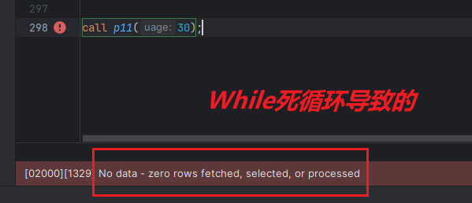

但是此时，tb_user_pro表结æ„åŠ**其数æ®éƒ½å·²ç»æ’å…¥æˆåŠŸäº†**，我们å¯ä»¥ç›´æ¥åˆ·æ–°è¡¨ç»“æ„，检查表结æ„中的数æ®ã€‚

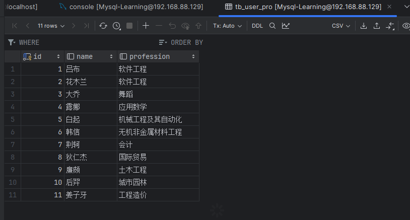

上述的功能，虽然我们å®ç°äº†ï¼Œä½†æ˜¯é€»è¾‘并ä¸å®Œå–„，而且程åºæ‰§è¡Œå®Œæ¯•ï¼Œè·å–ä¸åˆ°æ•°æ®ï¼Œæ•°æ®åº“还报错。 æ¥ä¸‹æ¥ï¼Œæˆ‘们就需è¦æ¥å®Œæˆè¿™ä¸ªå­˜å‚¨è¿‡ç¨‹ï¼Œå¹¶ä¸”解决这个问题。

è¦æƒ³è§£å†³è¿™ä¸ªé—®é¢˜ï¼Œå°±éœ€è¦é€šè¿‡MySQL中æ供的 **æ¡ä»¶å¤„ç†ç¨‹åº Handler** æ¥è§£å†³ã€‚


### （11）æ¡ä»¶å¤„ç†ç¨‹åº-Handler

#### â‘  介ç»

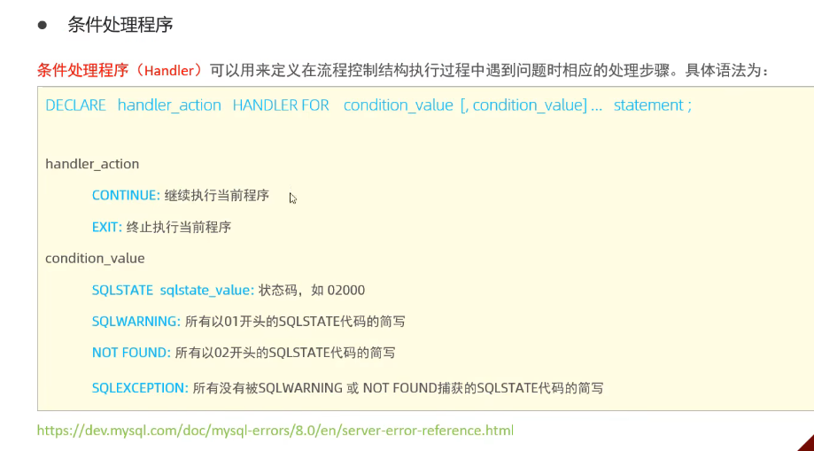

æ¡ä»¶å¤„ç†ç¨‹åºï¼ˆHandler）å¯ä»¥ç”¨æ¥å®šä¹‰**在æµç¨‹æ§åˆ¶ç»“æ„执行过程中é‡åˆ°é—®é¢˜æ—¶ç›¸åº”的处ç†æ­¥éª¤**。具体语法为：

```sql
DECLARE handler_action HANDLER FOR condition_value [, condition_value]... statement ;

handler_action çš„å–值：
    CONTINUE: 继续执行当å‰ç¨‹åº
    EXIT: 终止执行当å‰ç¨‹åº

condition_value çš„å–值：
    SQLSTATE sqlstate_value: 状æ€ç ï¼Œå¦‚ 02000

    SQLWARNING: 所有以01开头的SQLSTATE代ç çš„简写
    NOT FOUND: 所有以02开头的SQLSTATE代ç çš„简写
    SQLEXCEPTION: 所有没有被SQLWARNING 或 NOT FOUNDæ•è·çš„SQLSTATE代ç çš„简写
```


#### ②案例

我们继续æ¥å®Œæˆåœ¨ä¸Šä¸€å°èŠ‚æ出的这个需求，并解决其中的问题。

æ ¹æ®ä¼ å…¥çš„å‚æ•°uage，æ¥æŸ¥è¯¢ç”¨æˆ·è¡¨tb_user中，所有的用户年龄å°äºç­‰äºuage的用户姓å（name）和专业（profession），并将用户的姓å和专业æ’入到所创建的一张新表(id,name,profession)中。

**A. 通过SQLSTATE指定具体的状æ€ç **

```sql
-- 逻辑:
-- A. 声æ˜æ¸¸æ ‡, 存储查询结æœé›†
-- B. 准备: 创建表结æ„
-- C. å¼€å¯æ¸¸æ ‡
-- D. è·å–游标中的记录
-- E. æ’入数æ®åˆ°æ–°è¡¨ä¸­
-- F. 关闭游标

create procedure p11(in uage int)

begin
    declare uname varchar(100);
    declare upro varchar(100);
    declare u_cursor cursor for select name,profession from tb_user where age <=uage;
    -- 声æ˜æ¡ä»¶å¤„ç†ç¨‹åº ： 当SQL语å¥æ‰§è¡ŒæŠ›å‡ºçš„状æ€ç ä¸º02000时，将关闭游标u_cursor，并退出
    declare exit handler for SQLSTATE '02000' close u_cursor;

    drop table if exists tb_user_pro;
    create table if not exists tb_user_pro(
        id int primary key auto_increment,
        name varchar(100),
        profession varchar(100)
    );

    open u_cursor;
    
    while true do
        fetch u_cursor into uname,upro;
        insert into tb_user_pro values (null, uname, upro);
    end while;

    close u_cursor;

end;

call p11(30);
```


**B. 通过SQLSTATE的代ç ç®€å†™æ–¹å¼ ==NOT FOUND==**

​	**02 开头的状æ€ç ï¼Œä»£ç ç®€å†™ä¸º NOT FOUND**

```sql
create procedure p12(in uage int)

begin

    declare uname varchar(100);
    declare upro varchar(100);
    declare u_cursor cursor for select name,profession from tb_user where age <=uage;

    -- 声æ˜æ¡ä»¶å¤„ç†ç¨‹åº ： 当SQL语å¥æ‰§è¡ŒæŠ›å‡ºçš„状æ€ç ä¸º02开头时，将关闭游标u_cursor，并退出
    declare exit handler for not found close u_cursor;

    drop table if exists tb_user_pro;
    create table if not exists tb_user_pro(
        id int primary key auto_increment,
        name varchar(100),
        profession varchar(100)
    );

    open u_cursor;

    while true do
        fetch u_cursor into uname,upro;
        insert into tb_user_pro values (null, uname, upro);
    end while;

    close u_cursor;

end;

call p12(30);
```


**具体的错误状æ€ç **，å¯ä»¥å‚考官方文档：

**https://dev.mysql.com/doc/refman/8.0/en/declare-handler.html**

**https://dev.mysql.com/doc/mysql-errors/8.0/en/server-error-reference.html**


## 4.3 存储函数

#### （1）介ç»

存储函数是**==有返å›å€¼çš„存储过程==**，存储函数的==å‚æ•°**åªèƒ½æ˜¯INç±»å‹çš„**==。具体语法如下：

```sql
CREATE FUNCTION 存储函数å称 ([ å‚数列表 ])
RETURNS type [characteristic ...]

BEGIN
    -- SQL语å¥
    RETURN ...; -- è¿”å›ç»“æœ
END ;
```

**characteristic说æ˜ï¼š**

- DETERMINISTIC：**==相åŒçš„输入å‚数总是产生相åŒçš„结æœ==**
- NO SQL ：ä¸åŒ…å« SQL 语å¥ã€‚
- READS SQL DATA：**包å«è¯»å–æ•°æ®çš„语å¥ï¼Œä½†ä¸åŒ…å«å†™å…¥æ•°æ®çš„语å¥**。


#### （2）案例

计算ä»1累加到n的值，n为传入的å‚数值。

```sql
create function fun1(n int)
returns int deterministic -- 相åŒçš„输入å‚数总是产生相åŒçš„结æœ
begin
    declare total int default 0;
    
    while n>0 do
    	set total := total + n;
   	 	set n := n - 1;
    end while;
    
    return total;
end;

select fun1(50);
```

在mysql8.0版本中**binlog（二进制日志）默认是开å¯çš„**，**一旦开å¯äº†**，mysqlå°±è¦æ±‚在定义存储过程时，==**需è¦æŒ‡å®šcharacteristic特性**==，**å¦åˆ™å°±ä¼šæŠ¥å¦‚下错误**：

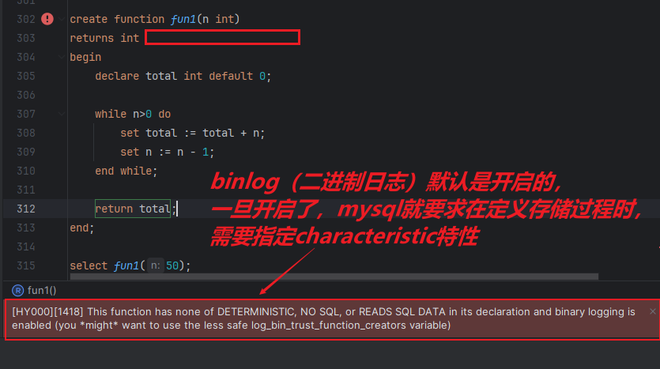


## 4.4 触å‘器

### （1）介ç»

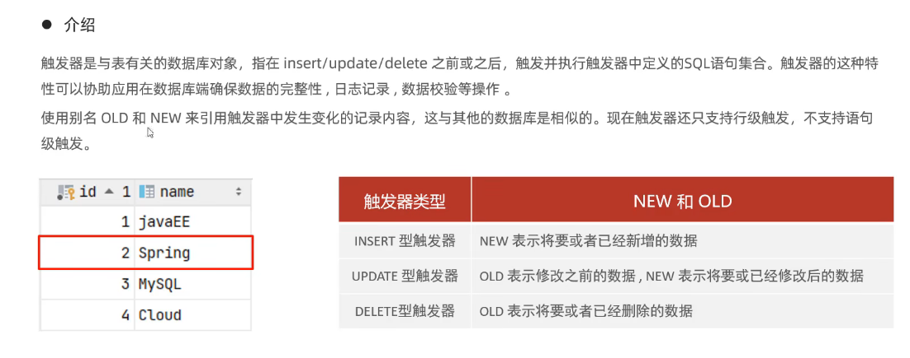

触å‘器是ä¸è¡¨æœ‰å…³çš„æ•°æ®åº“对象，指在**insert/update/delete==之å‰(BEFORE)或之å(AFTER)==**，触å‘并**执行触å‘器中定义的SQL语å¥é›†åˆ**。触å‘器的这ç§ç‰¹æ€§å¯ä»¥å助应用在数æ®åº“端确ä¿æ•°æ®çš„**完整性, 日志记录 , æ•°æ®æ ¡éªŒç­‰æ“作 。**

使用别åOLDå’ŒNEWæ¥å¼•ç”¨è§¦å‘器中å‘生å˜åŒ–的记录内容，这ä¸å…¶ä»–çš„æ•°æ®åº“是相似的。**==ç°åœ¨è§¦å‘器还åªæ”¯æŒè¡Œçº§è§¦å‘，ä¸æ”¯æŒè¯­å¥çº§è§¦å‘。==**

- **行级触å‘**
  - 比如执行update语å¥ï¼Œå½±å“了5行，触å‘器会执行5次
- **语å¥çº§è§¦å‘**
  - 比如执行update语å¥ï¼Œå½±å“了5行，**触å‘器åªä¼šæ‰§è¡Œ1次**

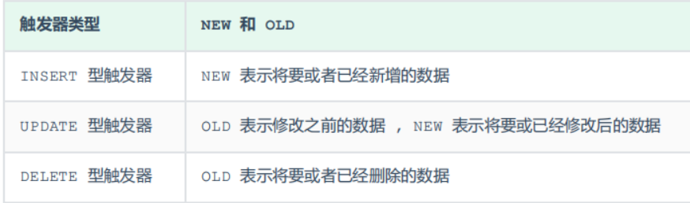


### （2）语法

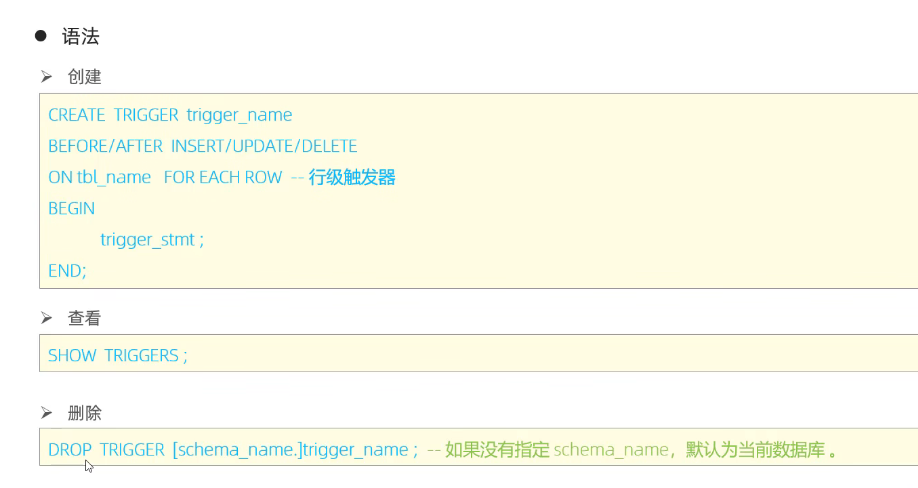

#### ①创建

```sql
CREATE TRIGGER trigger_name

BEFORE/AFTER INSERT/UPDATE/DELETE

ON tbl_name FOR EACH ROW -- 行级触å‘器，目å‰Mysql8.0 åªæ”¯æŒè¡Œçº§è§¦å‘器

BEGIN

	trigger_stmt ;

END;
```

#### ② 查看

```sql
SHOW TRIGGERS ; 
```

#### ③删除

```sql
DROP TRIGGER [schema_name.]trigger_name ; -- 删除(指定数æ®åº“çš„)触å‘器
-- 如æœæ²¡æœ‰æŒ‡å®š schema_name，默认为当å‰æ•°æ®åº“ 。
```


### （3）案例-记录数æ®å˜æ›´æ—¥å¿—

通过触å‘器记录 tb_user 表的数æ®å˜æ›´æ—¥å¿—，将å˜æ›´æ—¥å¿—æ’入到日志表user_logs中, 包å«å¢åŠ ,修改 , 删除 ;

**表结æ„准备:**

```sql
-- 准备工作 : 日志表 user_logs
create table user_logs(
    id int(11) not null auto_increment,
    operation varchar(20) not null comment 'æ“作类å‹, insert/update/delete',
    operate_time datetime not null comment 'æ“作时间',
    operate_id int(11) not null comment 'æ“作的ID',
    operate_params varchar(500) comment 'æ“作å‚æ•°',
    primary key(`id`)
)engine=innodb default charset=utf8;
```

#### A. æ’入数æ®è§¦å‘器

```sql
create trigger tb_user_insert_trigger
	after insert 
	on tb_user for each row

begin
	insert into user_logs(id, operation, operate_time, operate_id, operate_params)
    VALUES
        (null, 'insert', now(), new.id, 
         concat('æ’入的数æ®å†…容为: id=',new.id,',name=',new.name, ', phone=', NEW.phone, ', email=', NEW.email, ', profession=', NEW.profession));

end;
```

**测试:**

```sql
-- 查看
show triggers ;

-- 删除指定的触å‘器
drop trigger tb_user_insert_trigger;

-- æ’入数æ®åˆ°tb_user
insert into tb_user(id, name, phone, email, profession, age, gender, status, createtime) 
VALUES (26,'三皇å­','18809091212','erhuangzi@163.com','软件工程',23,'1','1',now());
```

测试完毕之å，检查日志表中的数æ®æ˜¯å¦å¯ä»¥æ­£å¸¸æ’入，以åŠæ’入数æ®çš„正确性。


#### B. 修改数æ®è§¦å‘器

```sql
create trigger tb_user_update_trigger
	after update on tb_user for each row

begin
    insert into user_logs(id, operation, operate_time, operate_id, operate_params)
    VALUES
        (null, 'update', now(), new.id, 
         concat('更新之å‰çš„æ•°æ®: id=',old.id,',name=',old.name, ', phone=',old.phone, ', email=', old.email, ', profession=', old.profession,
         ' | 更新之åçš„æ•°æ®: id=',new.id,',name=',new.name, ', phone=', NEW.phone, ', email=', NEW.email, ', profession=', NEW.profession));

end;
```

**测试**

```sql
-- 查看
show triggers ;

-- æ›´æ–°
update tb_user set profession = '会计' where id = 23;

update tb_user set profession = '会计' where id <= 5; -- 因为使用的each row 行级触å‘器，执行update更新了5行，对应的触å‘器也会执行5次
```

测试完毕之å，检查日志表中的数æ®æ˜¯å¦å¯ä»¥æ­£å¸¸æ’入，以åŠæ’入数æ®çš„正确性。


#### C. 删除数æ®è§¦å‘器

```sql
create trigger tb_user_delete_trigger
after delete on tb_user for each row

begin
    insert into user_logs(id, operation, operate_time, operate_id, operate_params)
    VALUES
        (null, 'delete', now(), old.id,
        concat('删除之å‰çš„æ•°æ®: id=',old.id,',name=',old.name, ', phone=',
        old.phone, ', email=', old.email, ', profession=', old.profession));

end;
```

**测试**

```sql
-- 查看
show triggers ;

-- 删除数æ®
delete from tb_user where id = 26;
```

测试完毕之å，检查日志表中的数æ®æ˜¯å¦å¯ä»¥æ­£å¸¸æ’入，以åŠæ’入数æ®çš„正确性。


## 4.5 å°ç»“


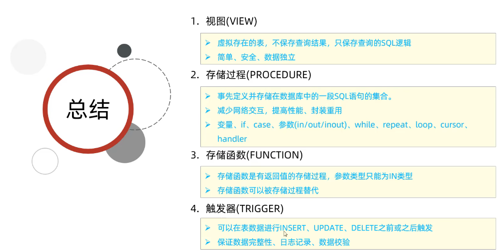


# 5ã€ğŸš€ ==é”==

## 5.1 概述

é”是计算机**==å调多个进程或线程并å‘访问æŸä¸€èµ„æºçš„机制==**。在数æ®åº“中，除传统的计算资æºï¼ˆCPUã€RAMã€I/O）的争用以外，数æ®ä¹Ÿæ˜¯ä¸€ç§ä¾›è®¸å¤šç”¨æˆ·å…±äº«çš„资æºã€‚如何**ä¿è¯æ•°æ®å¹¶å‘访问的一致性ã€æœ‰æ•ˆæ€§**是所有数æ®åº“必须解决的一个问题，é”冲çªä¹Ÿæ˜¯å½±å“æ•°æ®åº“并å‘访问性能的一个é‡è¦å› ç´ ã€‚ä»è¿™ä¸ªè§’度æ¥è¯´ï¼Œé”对数æ®åº“而言显得尤其é‡è¦ï¼Œä¹Ÿæ›´åŠ å¤æ‚。

MySQL中的é”，按照**é”的粒度分**，分为以下三类：

- **全局é”**：é”定数æ®åº“中的**所有表**。
- **表级é”**：æ¯æ¬¡**æ“作é”ä½æ•´å¼ è¡¨**。
- **行级é”**：æ¯æ¬¡æ“作**é”ä½å¯¹åº”的行数æ®**。


## 5.2 🌟 全局é”

### （1）介ç»

全局é”就是对整个数æ®åº“å®ä¾‹åŠ é”，**加é”å==整个å®ä¾‹å°±å¤„äºåªè¯»çŠ¶æ€==**，åç»­çš„DML的写语å¥ï¼ŒDDL语å¥ï¼Œå·²ç»æ›´æ–°æ“作的**事务æ交语å¥éƒ½å°†==被阻å¡==**。


### （2）🌟 使用场景

其典å‹çš„**使用场景是åšå…¨åº“的逻辑备份**，对所有的表进行é”定，ä»è€Œ**è·å–一致性视图，ä¿è¯æ•°æ®çš„完整性**。


为什么全库逻辑备份，就需è¦åŠ å…¨å°±é”呢？

##### **A. 我们一起先æ¥åˆ†æ一下ä¸åŠ å…¨å±€é”，å¯èƒ½å­˜åœ¨çš„问题。**

å‡è®¾åœ¨æ•°æ®åº“中存在这样三张表: tb_stock 库存表，tb_order 订å•è¡¨ï¼Œtb_orderlog 订å•æ—¥å¿—表。

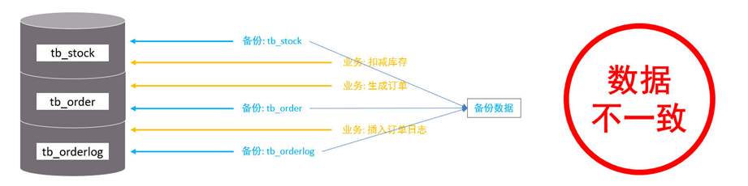

- 在进行数æ®å¤‡ä»½æ—¶ï¼Œ**先备份了tb_stock库存表**。
- 然åæ¥ä¸‹æ¥ï¼Œåœ¨ä¸šåŠ¡ç³»ç»Ÿä¸­ï¼Œ**执行了下å•æ“作**，扣å‡åº“存，生æˆè®¢å•ï¼ˆæ›´æ–°tb_stock表，æ’å…¥tb_order表）。
- 然å**å†æ‰§è¡Œå¤‡ä»½ tb_order表的逻辑**。
- 业务中执行æ’入订å•æ—¥å¿—æ“作。
- 最å，åˆå¤‡ä»½äº†tb_orderlog表。


此时备份出æ¥çš„æ•°æ®ï¼Œæ˜¯å­˜åœ¨é—®é¢˜çš„。因为备份出æ¥çš„æ•°æ®ï¼Œtb_stock表ä¸tb_order表的**æ•°æ®ä¸ä¸€è‡´(有最新æ“作的订å•ä¿¡æ¯,但是库存数没å‡)**。

那如何æ¥è§„é¿è¿™ç§é—®é¢˜å‘¢? 此时就å¯ä»¥å€ŸåŠ©äº**MySQL的全局é”æ¥è§£å†³**。


##### **B. å†æ¥åˆ†æ一下加了全局é”å的情况**

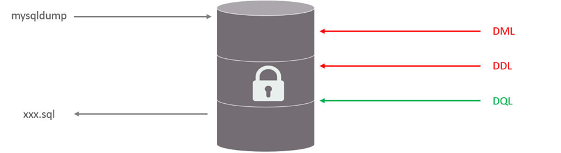

对数æ®åº“进行进行逻辑备份之å‰ï¼Œå…ˆ**对整个数æ®åº“加上全局é”**，一旦加了全局é”之å，其他的DDLã€DML全部都**处äºé˜»å¡çŠ¶æ€**，但是**å¯ä»¥æ‰§è¡ŒDQL语å¥ï¼Œä¹Ÿå°±æ˜¯==处äºåªè¯»çŠ¶æ€==**，而**æ•°æ®å¤‡ä»½å°±æ˜¯æŸ¥è¯¢æ“作**。那么数æ®åœ¨è¿›è¡Œé€»è¾‘备份的过程中，数æ®åº“中的数æ®å°±æ˜¯ä¸ä¼šå‘生å˜åŒ–的，这样就**ä¿è¯äº†æ•°æ®çš„一致性和完整性**。


### （3）语法

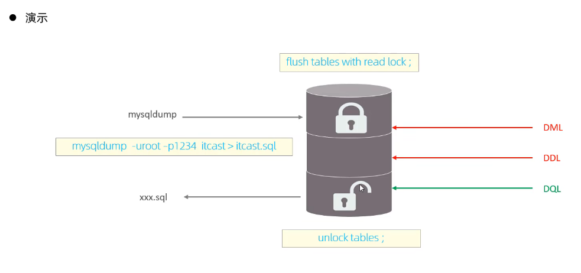

#### ①加全局é”

```sql
flush tables with read lock ; 
```

#### â‘¡æ•°æ®å¤‡ä»½

```sql
mysqldump [-h 192.168.200.202] -uroot –p1234 itcast > ./itcast.sql 
```

æ•°æ®å¤‡ä»½çš„相关指令, 在åé¢**MySQL管ç†ç« èŠ‚**, 还会详细讲解.

#### ③释放é”

```sql
unlock tables ; 
```


### （4）🌟 ==特点==

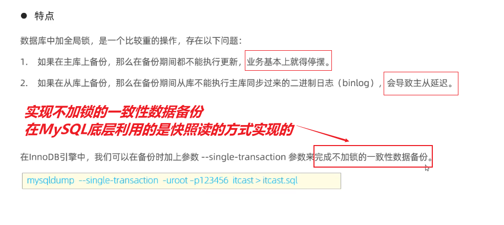

æ•°æ®åº“中加全局é”，是一个比较é‡çš„æ“作，存在以下问题：

- 如æœåœ¨**主库上备份**，那么在**备份期间都ä¸èƒ½æ‰§è¡Œæ›´æ–°ï¼Œä¸šåŠ¡åŸºæœ¬ä¸Šå°±å¾—åœæ‘†**。
- 如æœåœ¨**ä»åº“上备份**，那么在备份期间**ä»åº“ä¸èƒ½æ‰§è¡Œä¸»åº“åŒæ­¥è¿‡æ¥çš„二进制日志（binlog）**，**==会导致主ä»å»¶è¿Ÿã€‚==**


在InnoDB引æ“中，我们å¯ä»¥åœ¨å¤‡ä»½æ—¶**加上å‚æ•° --single-transaction å‚æ•°**æ¥å®Œæˆ**==ä¸åŠ é”的一致性数æ®å¤‡ä»½==**。

```sql
mysqldump --single-transaction [-h 192.168.200.202] -uroot –p123456 itcast > itcast.sql 
-- MySQL的底层利用的是快照读的方å¼å®ç°çš„
```

**MySQL的底层==利用的是快照读的方å¼==å®ç°çš„**


## 5.3 🌟 表级é”

### （1）介ç»

表级é”，**æ¯æ¬¡æ“作é”ä½æ•´å¼ è¡¨**。é”定粒度大，å‘生**é”冲çªçš„概ç‡æœ€é«˜ï¼Œå¹¶å‘度最ä½**。应用在MyISAMã€InnoDBã€BDB等存储引æ“中。

对äºè¡¨çº§é”，主è¦åˆ†ä¸ºä»¥ä¸‹ä¸‰ç±»ï¼š

- **表é”**
- **元数æ®é”**（meta data lock，MDL）
- **æ„å‘é”**


### （2）🌟 ==表é”==


#### ①==分类==

##### 表共享读é”

##### 表独å å†™é”

对äºè¡¨é”，分为两类：

- **==表共享读é”==（read lock**） - 简称为读é”
- **==表独å å†™é”==（write lock）**- 简称为写é”
  - 这里的**独å **æ„æ€æ˜¯ï¼Œå…¶ä»–客户端的`读和写`æ“作都会被阻å¡ï¼Œ
  - 而**==当å‰å®¢æˆ·ç«¯çš„读和写ä¸ä¼šè¢«é˜»å¡==**


#### ②语法

- **加é”**：lock tables 表å... read/write。

```sql
lock tables 表å... read/write
```


- **释放é”**：unlock tables 或者 客户端断开è¿æ¥ 。

```sql
unlock tables 
或者 将当å‰å®¢æˆ·ç«¯æ–­å¼€è¿æ¥
```


#### ③==特点==

##### A. 读é”

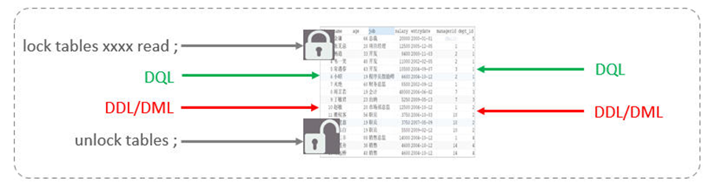

​	左侧为客户端一，对指定表加了读é”，**ä¸ä¼šå½±å“å³ä¾§å®¢æˆ·ç«¯äºŒçš„读**，但是会**阻å¡å³ä¾§å®¢æˆ·ç«¯çš„写**。

**测试:**

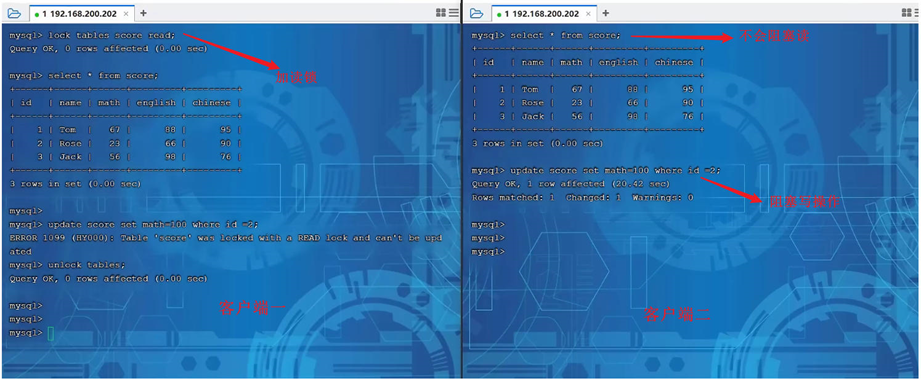


##### B. 写é”

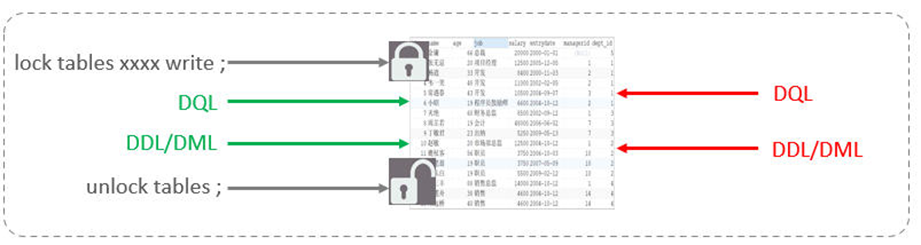

​	左侧为客户端一，对指定表加了写é”，**会阻å¡å³ä¾§å®¢æˆ·ç«¯çš„读和写**。


**测试:**

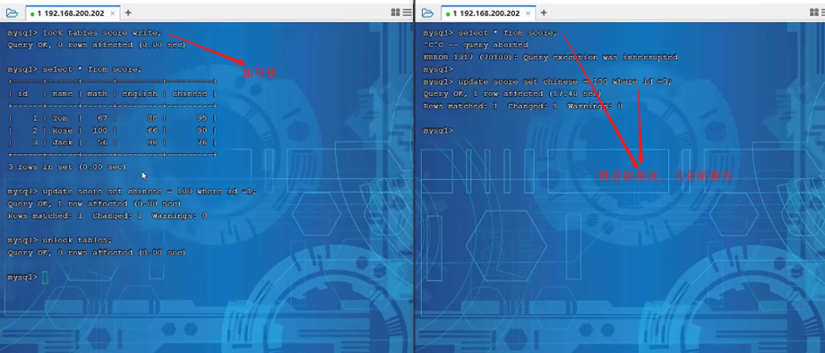


#### ④🌟 ==结论==


> **结论:** 
>
> - 读é”**ä¸ä¼šé˜»å¡å…¶ä»–客户端的读，但是会阻å¡å†™**。
>
>   - 当å‰å®¢æˆ·ç«¯å’Œå…¶ä»–客户端**都å¯ä»¥è¯»**
>   - 当å‰å®¢æˆ·ç«¯å’Œå…¶ä»–客户端**都ä¸å¯ä»¥å†™**
>
>   
>
> - 写é”**既会阻å¡==其他客户端==的读，åˆä¼šé˜»å¡==其他客户端==的写**。
>
>   - æ³¨æ„ è¿™é‡Œé˜»å¡çš„`读和写`都指的是**其他客户端**
>   - **==当å‰å®¢æˆ·ç«¯çš„读和写ä¸ä¼šè¢«é˜»å¡==**
>
> 


### （3）🌟 ==元数æ®é”-MDL==

#### ①概述

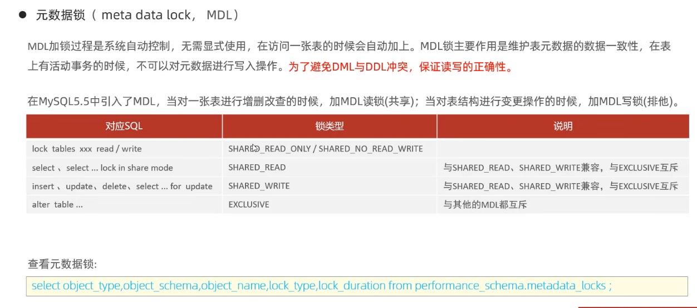

meta data lock , 元数æ®é”，简写MDL。

**MDL加é”过程是系统自动æ§åˆ¶**，无需显å¼ä½¿ç”¨ï¼Œåœ¨**访问一张表的时候会自动加上**。

MDLé”主è¦ä½œç”¨æ˜¯**维护表元数æ®çš„æ•°æ®ä¸€è‡´æ€§**，在表上有活动事务的时候，ä¸å¯ä»¥å¯¹å…ƒæ•°æ®è¿›è¡Œå†™å…¥æ“作。**==为了é¿å…DMLä¸DDL冲çªï¼Œä¿è¯è¯»å†™çš„正确性。==**


这里的元数æ®ï¼Œå¤§å®¶å¯ä»¥ç®€å•ç†è§£ä¸ºå°±æ˜¯**一张表的表结æ„**。 也就是说，**==æŸä¸€å¼ è¡¨æ¶‰åŠåˆ°æœªæ交的事务时，是ä¸èƒ½å¤Ÿä¿®æ”¹è¿™å¼ è¡¨çš„表结æ„的。==**


在MySQL5.5中引入了MDL：

- 当对一张表进行å¢åˆ æ”¹æŸ¥çš„时候，**加MDL读é”(共享)**ï¼›
- 当**对表结æ„进行å˜æ›´æ“作**的时候，**==加MDL写é”(æ’ä»–)==**。


常è§çš„SQLæ“作时，所添加的元数æ®é”：

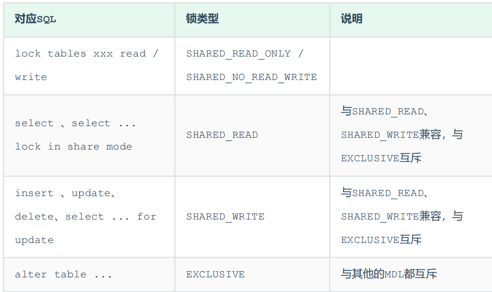


#### ②🌟 ==演示==

> 我们å¯ä»¥é€šè¿‡ä¸‹é¢çš„SQL，æ¥**==查看数æ®åº“中的元数æ®é”==**的情况：
>
> ```sql
> select object_type,object_schema,object_name,lock_type,lock_duration from performance_schema.metadata_locks ;
> ```
>
> 我们在æ“作过程中，å¯ä»¥é€šè¿‡ä¸Šè¿°çš„SQL语å¥ï¼Œæ¥**查看元数æ®é”的加é”情况**。


##### 1）元数æ®å…±äº«é”-==相互兼容==

当执行**SELECT** =》 shared_read

**INSERTã€UPDATEã€DELETE**ã€**==Select ... for update==**等语å¥æ—¶ => shared_write

添加的是**==元数æ®å…±äº«é”==**（SHARED_READ /SHARED_WRITE），这**==两者之间是兼容==**的。

**对äºå®¢æˆ·ç«¯ä¸€ï¼š**

```sql
begin;

	select * from tb_user where id = 1;

commit; -- 为了查看效æœï¼Œäº‹åŠ¡çš„æ交å¯ä»¥å»¶å执行
```

**对äºå®¢æˆ·ç«¯äºŒï¼š**

```sql
begin;

	update tb_user set name = 'å°é¹' where id = 1;
	
commit;
```

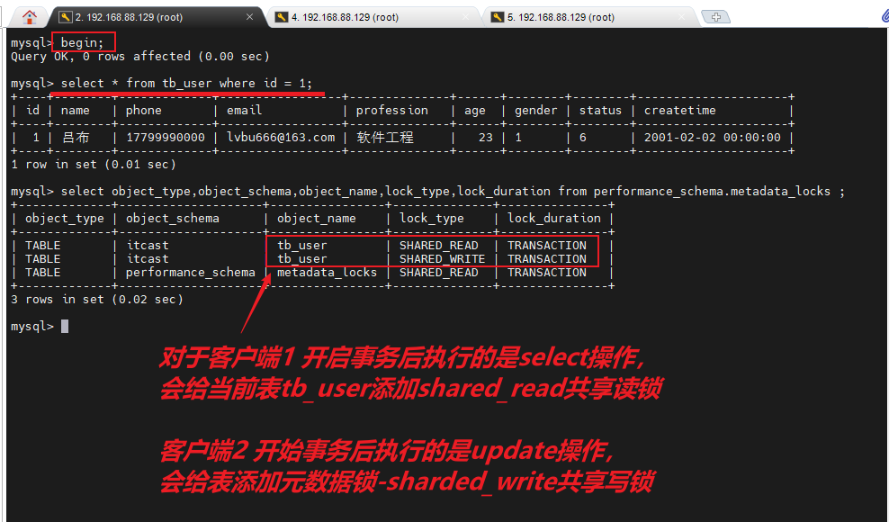


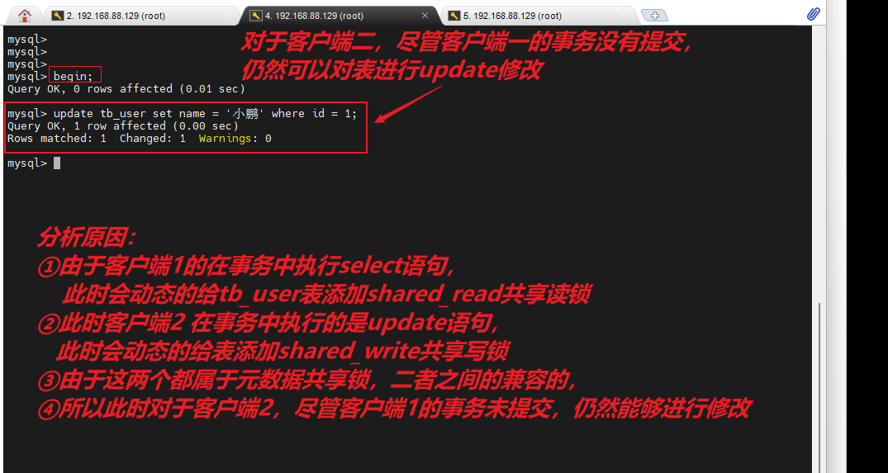


**注æ„：==当事务æ交å，之å‰ç»™è¡¨æ·»åŠ çš„元数æ®é”都会消失==，也就是说，元数æ®é”的添加和消失，是==动æ€çš„==**

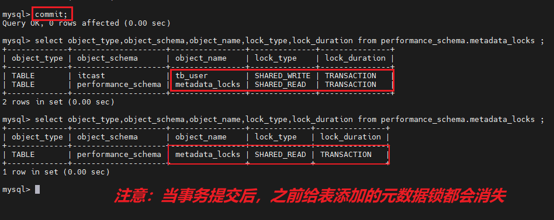


##### 2）æ’ä»–é”和其他共享é”==互斥==

当执行SELECT语å¥æ—¶ï¼Œæ·»åŠ çš„是元数æ®å…±äº«é”（SHARED_READ），会==阻å¡**元数æ®æ’ä»–é”**==（**EXCLUSIVE**），他们二者之间是**互斥的**。

例如，使用alter table.. 修改表结æ„，这时会**给表加上exclusive元数æ®æ’它é”**

**对äºå®¢æˆ·ç«¯ä¸€ï¼š**

```sql
begin;

	select * from tb_user where id = 1;

commit; -- 为了查看效æœï¼Œäº‹åŠ¡çš„æ交å¯ä»¥å»¶å执行
```

**对äºå®¢æˆ·ç«¯äºŒï¼š**执行了alter table 改å˜äº†è¡¨ç»“æ„，会给æ“作的表**==添加元数æ®æ’ä»–é”==**

```sql
begin;

	alter table tb_user add column test_col varchar(10);
	
commit;
```

**客户端一，执行selectæ“作，添加元数æ®å…±äº«é”**

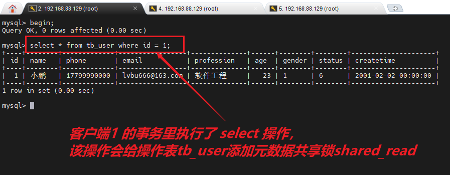


**客户端二，被阻å¡**

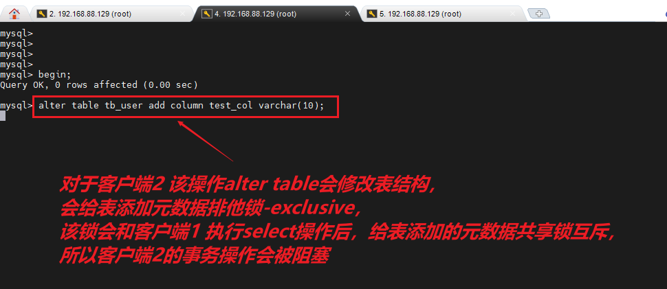

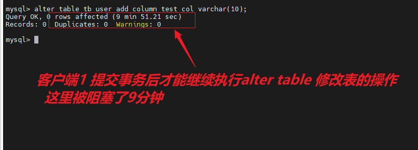


**tb_user表，执行å‰åçš„==元数æ®é”çš„ä¿¡æ¯==**

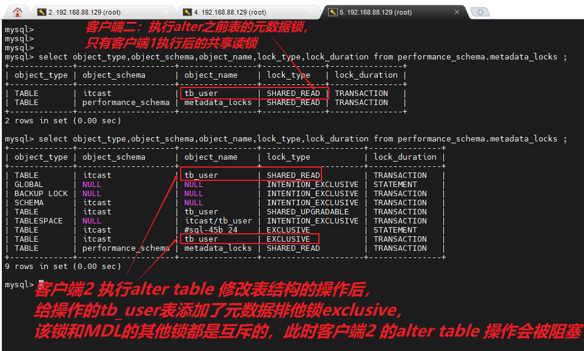


### （4）🌟 ==æ„å‘é”==

#### ①介ç»

为了**é¿å…DML在执行时**，**加的行é”ä¸è¡¨é”的冲çª**，在InnoDB中引入了æ„å‘é”，**使得表é”ä¸ç”¨æ£€æŸ¥æ¯è¡Œæ•°æ®æ˜¯å¦åŠ é”**，**使用æ„å‘é”æ¥å‡å°‘表é”的检查**。

##### 1）==没有æ„å‘é”==æ—¶

å‡å¦‚没有æ„å‘é”，客户端一对表加了行é”å，客户端二如何给表加表é”呢，æ¥é€šè¿‡ç¤ºæ„图简å•åˆ†æ一下：

首先客户端一，开å¯ä¸€ä¸ªäº‹åŠ¡ï¼Œç„¶å执行DMLæ“作，在**执行DML语å¥**时，**会==对涉åŠåˆ°çš„行加行é”==**。

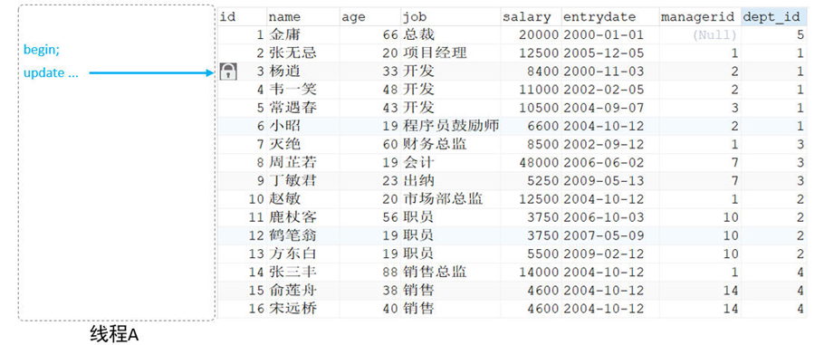

当客户端二，**想对这张表加表é”æ—¶**，**会检查当å‰è¡¨æ˜¯å¦æœ‰å¯¹åº”çš„è¡Œé”**，如æœæ²¡æœ‰ï¼Œåˆ™æ·»åŠ è¡¨é”，**此时就会ä»ç¬¬ä¸€è¡Œæ•°æ®ï¼Œæ£€æŸ¥åˆ°æœ€å一行数æ®ï¼Œ==效ç‡è¾ƒä½==**。

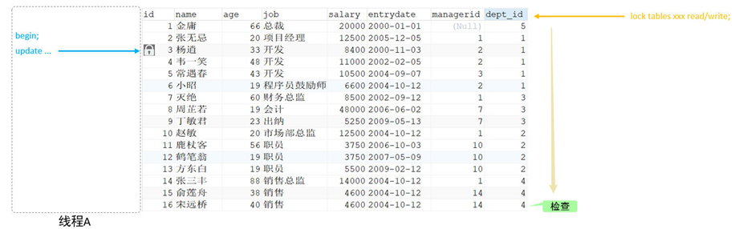


##### 2）有了æ„å‘é”==之å==

客户端一，在执行DMLæ“作时，会对涉åŠçš„è¡Œ**加行é”**，åŒæ—¶ä¹Ÿä¼š==**对该表加上æ„å‘é”**==。


而其他客户端，在对这张表加表é”的时候，会根æ®è¯¥è¡¨ä¸Š**所加的æ„å‘é”æ¥åˆ¤å®šæ˜¯å¦å¯ä»¥æˆåŠŸåŠ è¡¨é”**，(==判断当å‰æ‰€åŠ çš„æ„å‘é”和将è¦æ·»åŠ çš„表é”是å¦æ˜¯å…¼å®¹çš„==)，而ä¸ç”¨é€è¡Œåˆ¤æ–­è¡Œé”情况了。


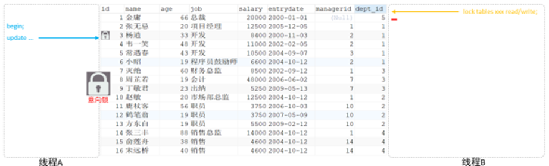


#### ②==分类==

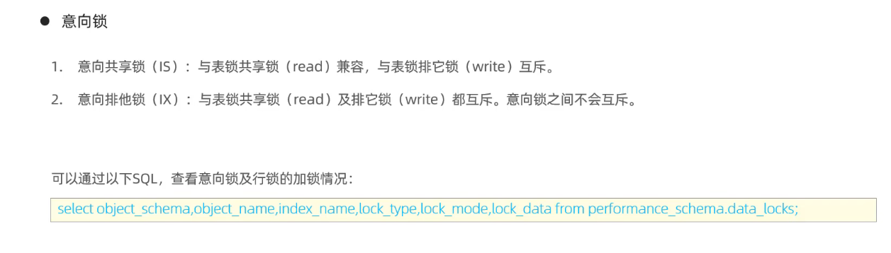

- **æ„å‘共享é”(IS)**: 由语å¥select ... **lock in share mode**添加 。 ==ä¸ è¡¨é”共享é”(read)兼容，ä¸è¡¨é”æ’ä»–é”(write)互斥==。
- **æ„å‘æ’ä»–é”(IX)**: ç”±insertã€updateã€deleteã€**==select...for update==**添加 。==ä¸è¡¨é”共享é”(read)åŠæ’ä»–é”(write)**都互斥**==，**æ„å‘é”之间ä¸ä¼šäº’æ–¥**。


> **一旦事务æ交了，æ„å‘共享é”ã€æ„å‘æ’ä»–é”，都==会自动释放==**。


å¯ä»¥é€šä»¥ä¸‹SQL，**==查看æ„å‘é”åŠè¡Œé”的加é”==情况**：

```sql
select object_schema,object_name,index_name,lock_type,lock_mode,lock_data from
performance_schema.data_locks;
```


#### ③🌟演示

**A. ==æ„å‘共享é”ä¸è¡¨è¯»é”是兼容的==**

**客户端一：**

```sql
begin;

select * from tb_user where id = 1 lock in share mode;
-- lock in share mode 表示 会给这一行添加 共享行é”
-- åŒæ—¶ï¼Œä¼šç»™è¯¥score表添加 æ„å‘共享é”

commit;
```

 **客户端二：**

```sql
begin;

-- 添加表é”共享é”read 或 表é”æ’ä»–é”write
	lock tables tb_user read; -- 表é”共享é”read
	
-- 释放é”
unlock tables;
	
	lock tables tb_user write; -- 表é”æ’ä»–é”write
	
commit;
```


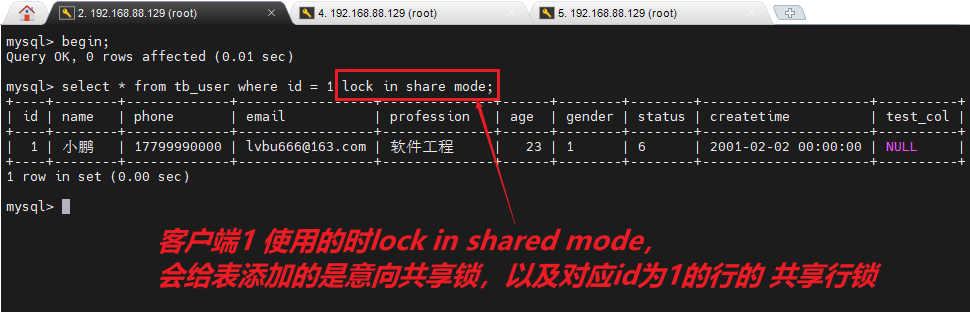


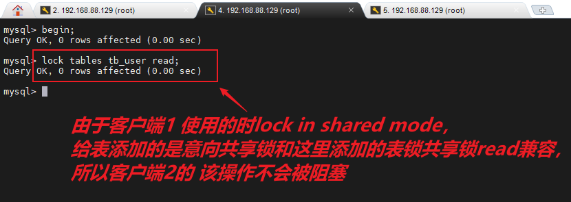


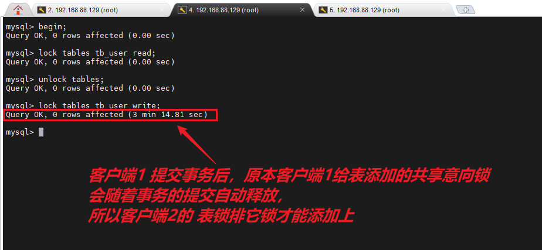

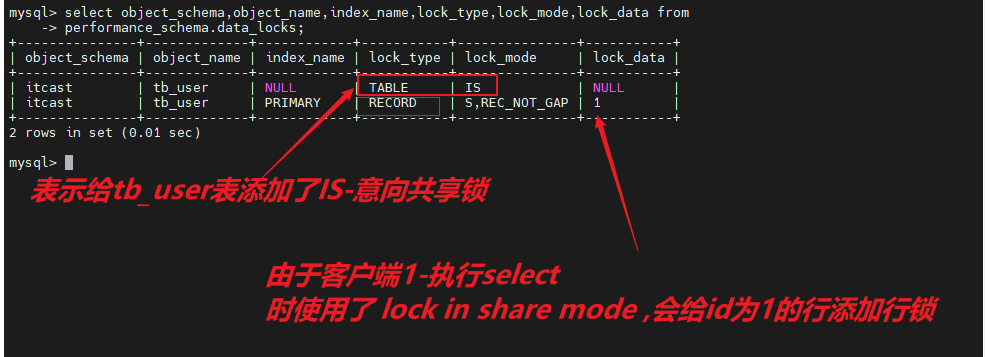


**B. æ„å‘æ’ä»–é”ä¸è¡¨è¯»é”ã€å†™é”==都是互斥的==**

**客户端一：**

```sql
begin;

	update tb_user set name = 'å°å°é¹' where id = 1;
	
commit;
```

 **客户端二：**

```sql
begin;

-- 添加表é”共享é”read 或 表é”æ’ä»–é”write
	lock tables tb_user read; -- 表é”共享é”read
	
-- 释放é”
unlock tables;
	
	lock tables tb_user write; -- 表é”æ’ä»–é”write
	
commit;
```

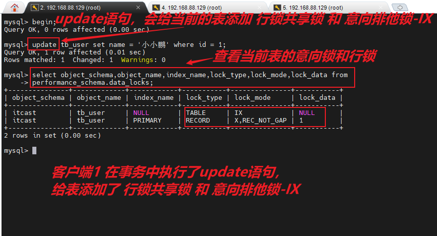

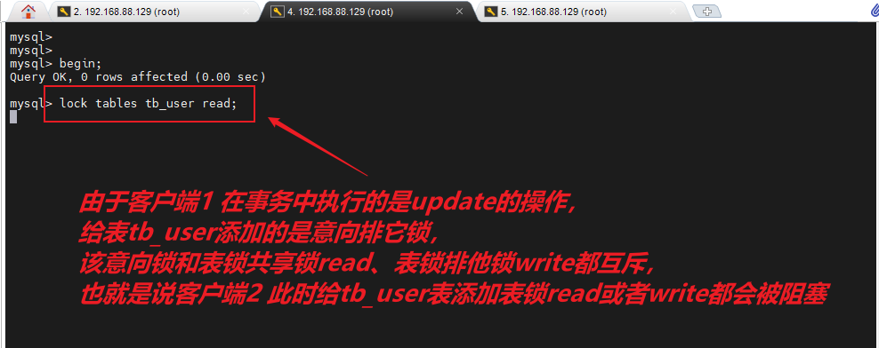

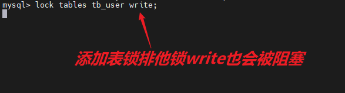


## 5.4 🌟 行级é”

### （1）🌟 介ç»

行级é”，æ¯æ¬¡æ“作**é”ä½å¯¹åº”的行数æ®**。**é”定粒度最å°**，å‘生é”冲çªçš„概ç‡æœ€ä½ï¼Œå¹¶å‘度最高。应用在InnoDB存储引æ“中。

InnoDBçš„**æ•°æ®æ˜¯åŸºäºç´¢å¼•ï¼ˆèšé›†ç´¢å¼•å’ŒäºŒçº§ç´¢å¼•ï¼‰ç»„织的**，行é”是**==通过对索引上的索引项加é”æ¥å®ç°çš„，而ä¸æ˜¯å¯¹è®°å½•åŠ çš„é”==**。对äºè¡Œçº§é”，主è¦åˆ†ä¸ºä»¥ä¸‹ä¸‰ç±»ï¼š

- **è¡Œé”（Record Lock）**：**é”定å•ä¸ªè¡Œè®°å½•çš„é”**，防止其他事务对此行进行**updateå’Œdelete**。在**RC（read commit 读已æ交）ã€RR（repeat read å¯é‡å¤è¯»ï¼‰éš”离级**别下都支æŒã€‚

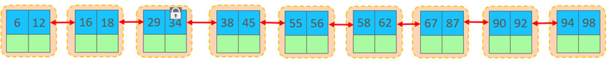

- **é—´éš™é”（Gap Lock）**：é”定**索引记录间隙（ä¸å«è¯¥è®°å½•ï¼‰**，**==ç¡®ä¿ç´¢å¼•è®°å½•é—´éš™ä¸å˜==，防止其他事务在这个间隙进行insert**，==产生幻读==。在**RR隔离级别下都支æŒ**。

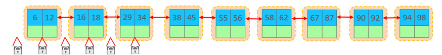

- **临键é”（Next-Key Lock）**：**è¡Œé”和间隙é”组åˆ**，åŒæ—¶é”ä½æ•°æ®ï¼Œå¹¶**é”ä½==æ•°æ®å‰é¢çš„é—´éš™Gap==**。在RR隔离级别下支æŒã€‚

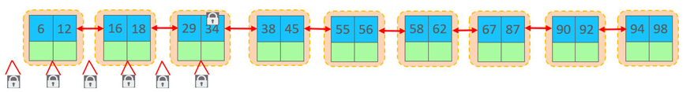


> ##### **🌟==é—´éš™é”和临键é”的基本概念（é‡ç‚¹ï¼‰==**
>
> - é—´éš™é”：é”定索引记录间隙（**ä¸åŒ…å«è¯¥è®°å½•**），
>   - 比如此时的索引是id时，并且lock_data 显示的是8，表示的是**==é”定8å‰é¢ä¸€ä¸ªçš„一个间隙==**，å‡è®¾ç°åœ¨8å‰é¢ä¸€ä½çš„id为3，那么此时该间隙é”，é”定的就是3-8之间的间隙，也就是(3,8);
> - 临键é”：行é”和间隙é”的组åˆï¼Œä¼š**é”ä½æ•°æ®**，åŒæ—¶**é”ä½==æ•°æ®å‰é¢çš„一个间隙Gap==**
>   - 如æœæœ‰è®°å½•8,9,10,20,30
>   - 对20加临键é”，会**é”定(10,20]这个区间**
>   - ä¸ä¼šé”定(8,20]这个区间


### （2）🌟 è¡Œé”

#### ①🌟 介ç»

InnoDBå®ç°äº†ä»¥ä¸‹ä¸¤ç§ç±»å‹çš„è¡Œé”：

**共享é”（S）**：å…许一个事务å»è¯»ä¸€è¡Œï¼Œ**==阻止其他事务è·å¾—相åŒæ•°æ®é›†çš„æ’它é”==**。

**æ’ä»–é”（X）**：å…许**è·å–æ’ä»–é”的事务更新数æ®**，**è·å–æ’它é”å**，会**阻止**其他事务**==è·å¾—相åŒæ•°æ®é›†çš„共享é”å’Œæ’ä»–é”。==**

> **==注æ„==：**
>
> ​	这里的兼容和冲çªåˆ¤æ–­çš„å‰æ，是在**对åŒä¸€ä¸ªæ•°æ®é›†è€Œè¨€çš„**，比如æ“作的都是id为1çš„æ•°æ®è¡Œ

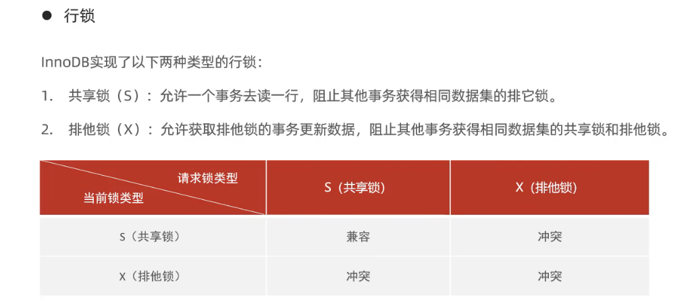


两ç§**è¡Œé”的兼容情况**如下:


常è§çš„SQL语å¥ï¼Œåœ¨æ‰§è¡Œæ—¶ï¼Œæ‰€åŠ çš„è¡Œé”如下：

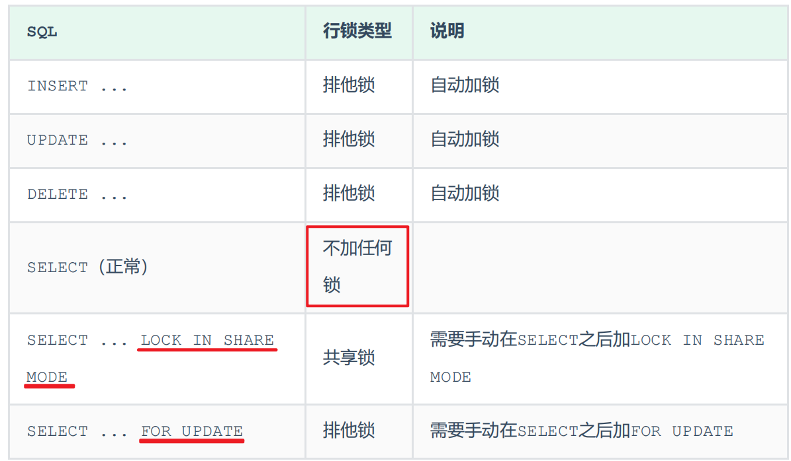


#### ②🌟 演示

默认情况下，InnoDB在**RR-å¯é‡å¤è¯»**=》- **REPEATABLE READ事务隔离级别**è¿è¡Œï¼ŒInnoDB**使用 next-key é”进行æœç´¢å’Œç´¢å¼•æ‰«æ，==以防止幻读==。**

- 针对**唯一索引进行检索**时，**==对已存在的记录进行等值匹é…==æ—¶**，将**会==自动优化为行é”==**。
- InnoDBçš„**è¡Œé”是针对äº==索引加的é”==**，如æœ**==ä¸é€šè¿‡ç´¢å¼•æ¡ä»¶æ£€ç´¢æ•°æ®==**，那么InnoDB**将对表中的所有记录加é”**，此时 就会**å‡çº§ä¸º==表é”==**。


å¯ä»¥é€šè¿‡ä»¥ä¸‹SQL，查看**æ„å‘é”åŠè¡Œé”的加é”情况**：

```sql
select object_schema,object_name,index_name,lock_type,lock_mode,lock_data from performance_schema.data_locks;
```


#### ③示例演示-è¡Œé”

**æ•°æ®å‡†å¤‡:**

```sql
CREATE TABLE `stu` (
    `id` int NOT NULL PRIMARY KEY AUTO_INCREMENT,
    `name` varchar(255) DEFAULT NULL,
    `age` int NOT NULL
) ENGINE = InnoDB CHARACTER SET = utf8mb4;

INSERT INTO `stu` VALUES (1, 'tom', 1);
INSERT INTO `stu` VALUES (3, 'cat', 3);
INSERT INTO `stu` VALUES (8, 'rose', 8);
INSERT INTO `stu` VALUES (11, 'jetty', 11);
INSERT INTO `stu` VALUES (19, 'lily', 19);
INSERT INTO `stu` VALUES (25, 'luci', 25);

select * from stu;
```

演示行é”的时候，我们就通过上é¢è¿™å¼ è¡¨æ¥æ¼”示一下。


##### 1）普通的select语å¥-ä¸åŠ é”

**A. 普通的select语å¥ï¼Œæ‰§è¡Œæ—¶ï¼Œä¸ä¼šåŠ é”。**

**对äºå®¢æˆ·ç«¯ä¸€ï¼Œæ‰§è¡Œæ™®é€šçš„select语å¥**

```sql
begin;

	select * from stu where id = 1;
	
commit;

-- æ„å‘é”åŠè¡Œé”的加é”情况
select object_schema,object_name,index_name,lock_type,lock_mode,lock_data from performance_schema.data_locks;
```

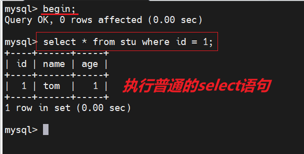

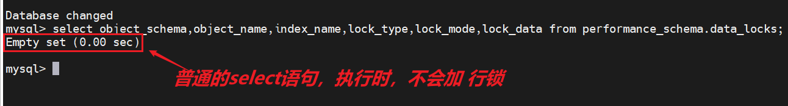


##### 2）共享é”和共享é”之间==兼容==

**B. select...lock in share mode，加共享é”，共享é”ä¸å…±äº«é”之间兼容。**

**对äºå®¢æˆ·ç«¯ä¸€å’ŒäºŒï¼Œ==都å°è¯•ç»™æ•°æ®è¡Œæ·»åŠ å…±äº«é”==**

```sql
begin;

	select * from stu where id = 1 lock in share mode; -- ç»™stu表中id为1çš„æ•°æ®è¡Œæ·»åŠ å…±äº«é”
	
commit;
```

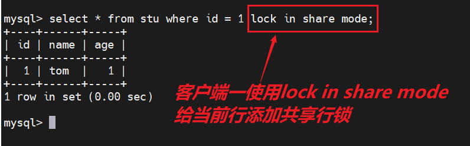


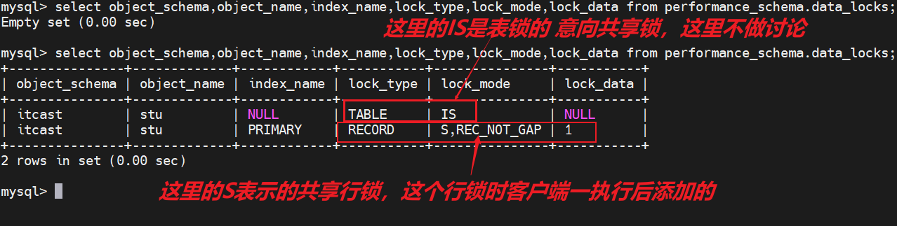

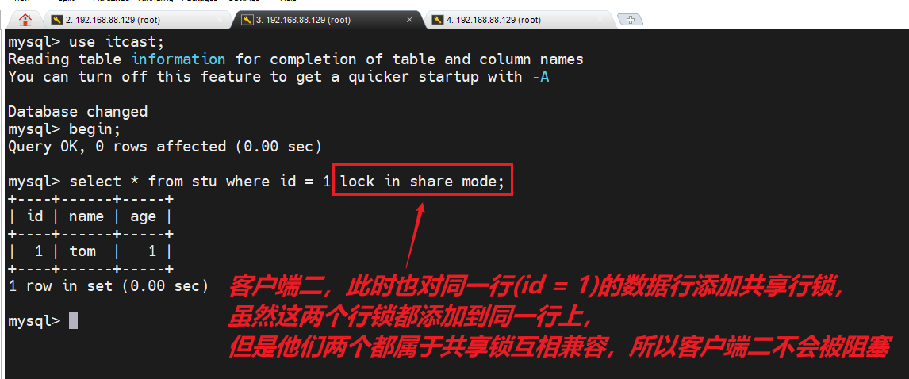


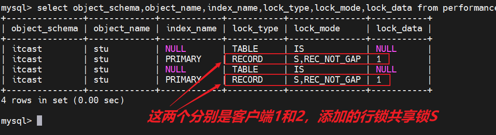


> **==注æ„==：**   åŒæ ·çš„**当事务commitæ交å**，**在事务中添加的行é”等其他é”都会自动释放**


##### 3）共享é”ä¸æ’ä»–é”之间==互斥==

**对äºå®¢æˆ·ç«¯ä¸€ï¼Œæ‰§è¡Œçš„还是添加共享行é”æ“作**

```sql
begin;
	select * from stu where id = 1 lock in share mode; -- ç»™stu表中id为1çš„æ•°æ®è¡Œæ·»åŠ å…±äº«é”
commit;
```

**对äºå®¢æˆ·ç«¯äºŒï¼Œå°è¯•ç»™æ•°æ®è¡Œæ·»åŠ æ’ä»–é”，比如updateæ“作...**

```sql
begin;

	update stu set name = 'Java-3' where id = 3; -- ç»™stu表中id为3çš„æ•°æ®è¡Œæ·»åŠ æ’ä»–é”
	
	update stu set name = 'Java-1' where id = 1; -- ç»™stu表中id为1çš„æ•°æ®è¡Œæ·»åŠ æ’ä»–é”
	
commit;
```


客户端一**è·å–的是id为1这行的共享é”**

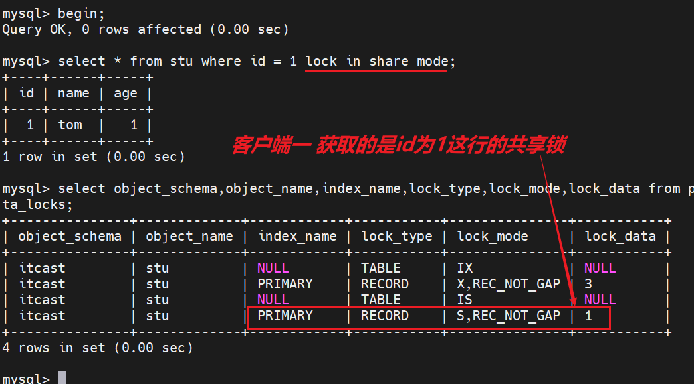


客户端二是å¯ä»¥è·å–id为3这行的æ’它é”的，**因为ä¸æ˜¯åŒä¸€è¡Œæ•°æ®**，所以客户端二执行id=3的语å¥æ—¶ï¼Œä¸ä¼šè¢«é˜»å¡ã€‚


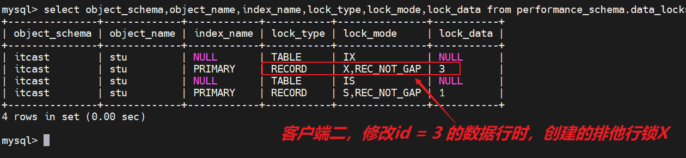


 而如æœå®¢æˆ·ç«¯äºŒæƒ³è·å–id为1这行的æ’ä»–é”，会处äºé˜»å¡çŠ¶æ€ï¼Œå› ä¸º**共享é”ä¸æ’ä»–é”之间互斥**。

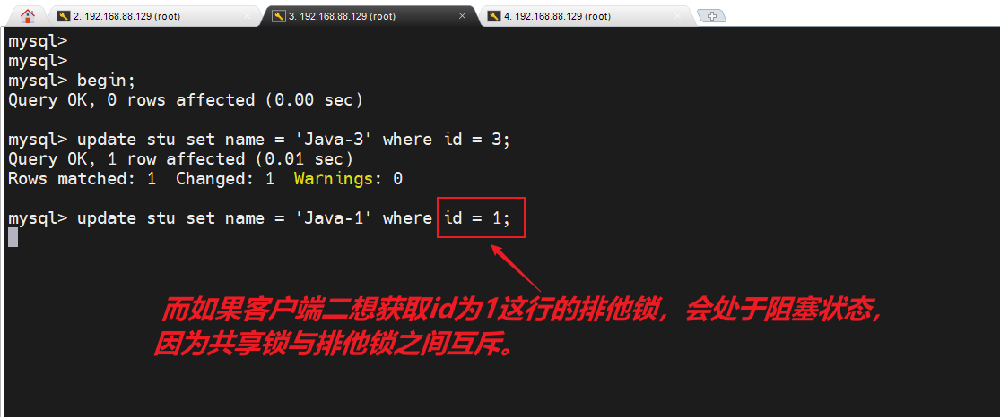


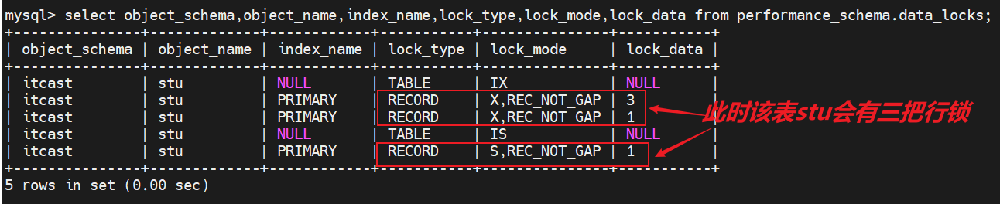


##### 3） æ’ä»–é”ä¸æ’ä»–é”之间==互斥==

**C. æ’ä»–é”ä¸æ’ä»–é”之间互斥**

当客户端一，执行update语å¥ï¼Œä¼šä¸ºid为1的记录加æ’ä»–é”ï¼› 客户端二，如æœä¹Ÿæ‰§è¡Œupdate语å¥æ›´æ–°id为1çš„æ•°æ®ï¼Œä¹Ÿè¦ä¸ºid为1çš„æ•°æ®åŠ æ’ä»–é”，但是**客户端二会处äºé˜»å¡çŠ¶æ€ï¼Œå› ä¸ºæ’ä»–é”之间是互斥的**。 **直到客户端一，把事务æ交了，æ‰ä¼šæŠŠè¿™ä¸€è¡Œçš„è¡Œé”释放，此时客户端二æ‰èƒ½è·å–到这一行的æ’ä»–é”，解除阻å¡ã€‚**

**对äºå®¢æˆ·ç«¯ä¸€ï¼Œæ‰§è¡Œupdate语å¥ï¼ŒåŠ æ’它é”**

```sql
begin;
	update stu set name = 'Java-10' where id = 1; -- ç»™stu表中id为1çš„æ•°æ®è¡Œæ·»åŠ æ’ä»–é”
end;
```

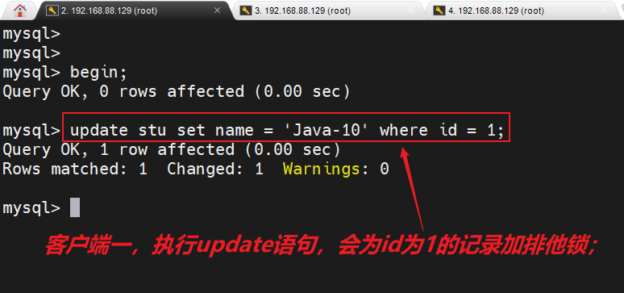

**对äºå®¢æˆ·ç«¯äºŒï¼Œ**如æœä¹Ÿæ‰§è¡Œupdate语å¥æ›´æ–°id为1çš„æ•°æ®ï¼Œä¹Ÿè¦ä¸ºid为1çš„æ•°æ®åŠ æ’ä»–é”

```sql
begin;
	update stu set name = 'Java-20' where id = 1; -- ç»™stu表中id为1çš„æ•°æ®è¡Œæ·»åŠ æ’ä»–é” 
end;
```

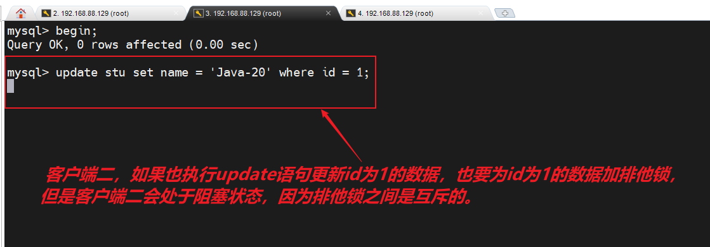

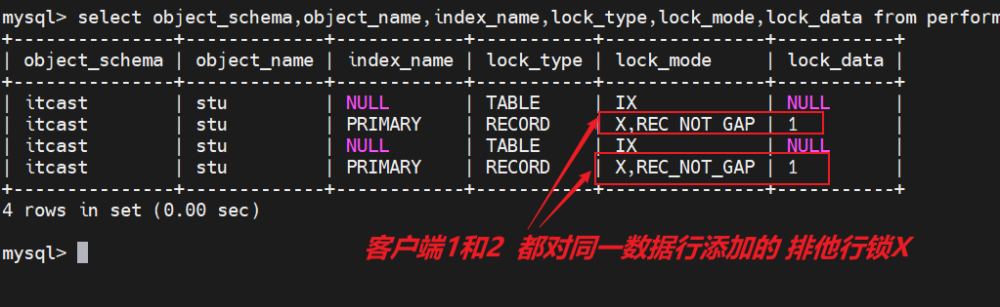


##### 4） ==无索引行é”å‡çº§ä¸ºè¡¨é”==

**D. 无索引行é”å‡çº§ä¸ºè¡¨é”**

**stu表中数æ®å¦‚下:**

```sql
select * from stu;
```


**我们在两个客户端中执行如下æ“作:**

在客户端一中，开å¯äº‹åŠ¡ï¼Œå¹¶æ‰§è¡Œupdate语å¥ï¼Œ**æ›´æ–°name为Lilyçš„æ•°æ®**，也就是id为19的记录 。然å在客户端二中更新id为3的记录，å´ä¸èƒ½ç›´æ¥æ‰§è¡Œï¼Œä¼šå¤„äºé˜»å¡çŠ¶æ€ï¼Œä¸ºä»€ä¹ˆå‘¢ï¼Ÿ= 》**添加了表é”**

åŸå› å°±æ˜¯å› ä¸ºæ­¤æ—¶ï¼Œå®¢æˆ·ç«¯ä¸€ï¼Œ**æ ¹æ®name字段进行更新时，name字段是没有索引的**，**如æœæ²¡æœ‰ç´¢å¼•ï¼Œæ­¤æ—¶è¡Œé”会å‡çº§ä¸ºè¡¨é”**(==因为行é”是对索引项加的é”，而name没有索引==)。


**对äºå®¢æˆ·ç«¯1，根æ®name(é索引字段)进行æ¡ä»¶æŸ¥è¯¢ï¼Œä¼šè®©==è¡Œé”å‡çº§ä¸ºè¡¨é”==**

```sql
begin;
	update stu set name = 'Spring-1' where name = 'lily';
end;
```

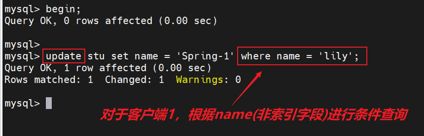

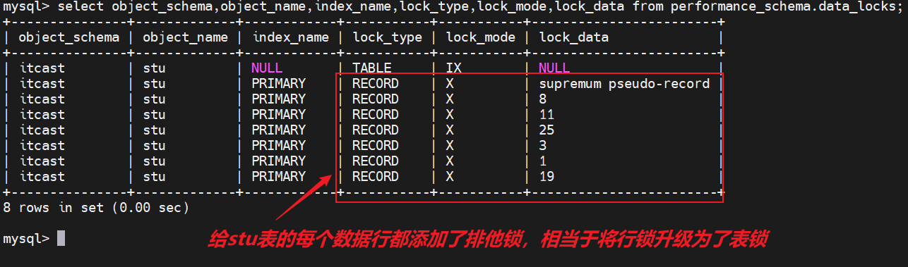


**此时在客户端2中，更新id=3çš„æ•°æ®æ—¶ï¼Œä¼šè¢«é˜»å¡**

```sql
begin;
	update stu set name = 'Spring-2' where id = 3;
end;
```

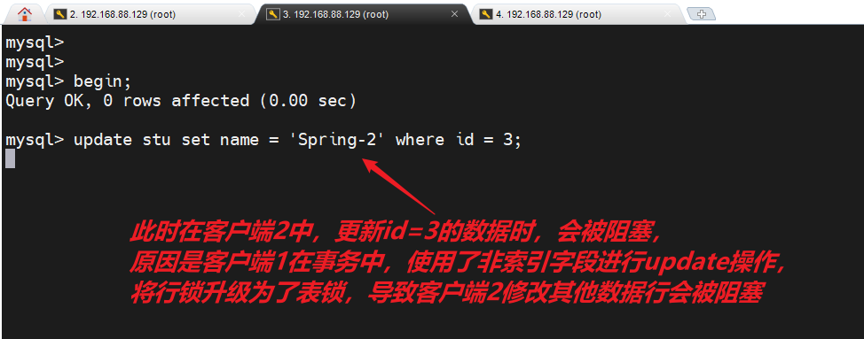


æ¥ä¸‹æ¥ï¼Œæˆ‘们å†**针对name字段建立索引**，索引建立之å，å†æ¬¡åšä¸€ä¸ªæµ‹è¯•ï¼š

```sql
create index idx_stu_name on stu(name);
```

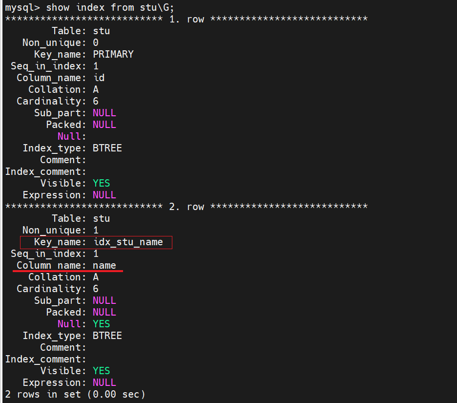


此时我们å¯ä»¥çœ‹åˆ°ï¼Œå®¢æˆ·ç«¯ä¸€ï¼Œå¼€å¯äº‹åŠ¡ï¼Œç„¶åä¾ç„¶æ˜¯æ ¹æ®name进行更新。而客户端二，在更新id为3çš„æ•°æ®æ—¶ï¼Œ**==æ›´æ–°æˆåŠŸï¼Œå¹¶æœªè¿›å…¥é˜»å¡çŠ¶æ€==。** 这样就说æ˜ï¼Œæˆ‘们**==æ ¹æ®ç´¢å¼•å­—段进行更新æ“作==，就å¯ä»¥é¿å…è¡Œé”å‡çº§ä¸ºè¡¨é”的情况。**

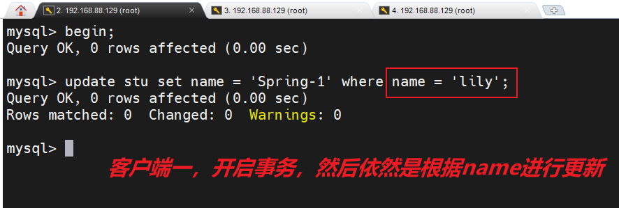

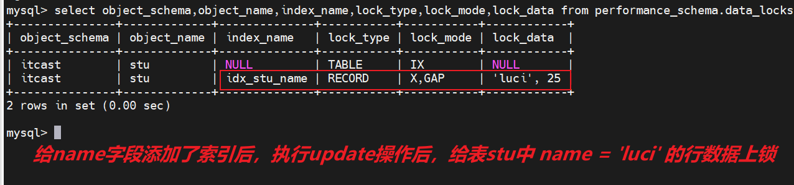

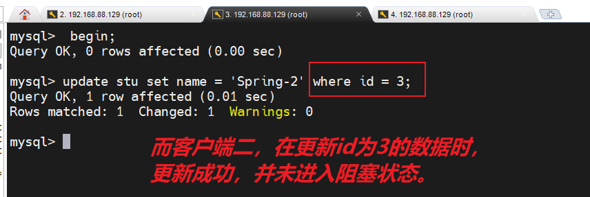


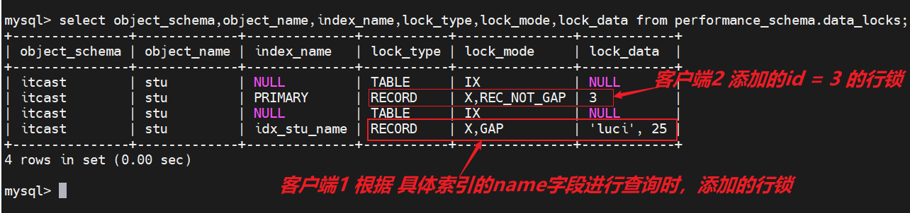


### （3）==é—´éš™é”&临键é”==

**默认情况**下，InnoDB在 REPEATABLE READ事务隔离级别è¿è¡Œï¼ŒInnoDB**使用 next-key é”进行æœç´¢å’Œç´¢å¼•æ‰«æ，==以防止幻读==。**

- 索引上的**等值查询(唯一索引)**，**ç»™ä¸å­˜åœ¨çš„记录加é”æ—¶, ==优化为间隙é”==** 。
- 索引上的**等值查询(é唯一普通索引)**，**==å‘å³éå†æ—¶==最å一个值ä¸æ»¡è¶³æŸ¥è¯¢éœ€æ±‚时，==next-keylock 退化为间隙é”。==**
- 索引上的**范围查询(唯一索引)**--**会访问到ä¸æ»¡è¶³æ¡ä»¶çš„第一个值为止**。


> **注æ„：**
>
> é—´éš™é”唯一目的是**==防止其他事务æ’入间隙==。间隙é”å¯ä»¥å…±å­˜ï¼Œ==一个事务采用的间隙é”ä¸ä¼šé˜»æ­¢å¦ä¸€ä¸ªäº‹åŠ¡åœ¨åŒä¸€é—´éš™ä¸Šé‡‡ç”¨é—´éš™é”==。**


**🌟==é—´éš™é”和临键é”的基本概念（é‡ç‚¹ï¼‰==**

- é—´éš™é”：é”定索引记录间隙（**ä¸åŒ…å«è¯¥è®°å½•**），
  - 比如此时的索引是id时，并且lock_data 显示的是8，表示的是**==é”定8å‰é¢ä¸€ä¸ªçš„一个间隙==**，å‡è®¾ç°åœ¨8å‰é¢ä¸€ä½çš„id为3，那么此时该间隙é”，é”定的就是3-8之间的间隙，也就是(3,8);
- 临键é”：行é”和间隙é”的组åˆï¼Œä¼š**é”ä½æ•°æ®**，åŒæ—¶**é”ä½==æ•°æ®å‰é¢çš„一个间隙Gap==**
  - 如æœæœ‰è®°å½•8,9,10,20,30
  - 对20加临键é”，会**é”定(10,20]这个区间**
  - ä¸ä¼šé”定(8,20]这个区间


### （4）🚀间隙é”/临键é”-演示

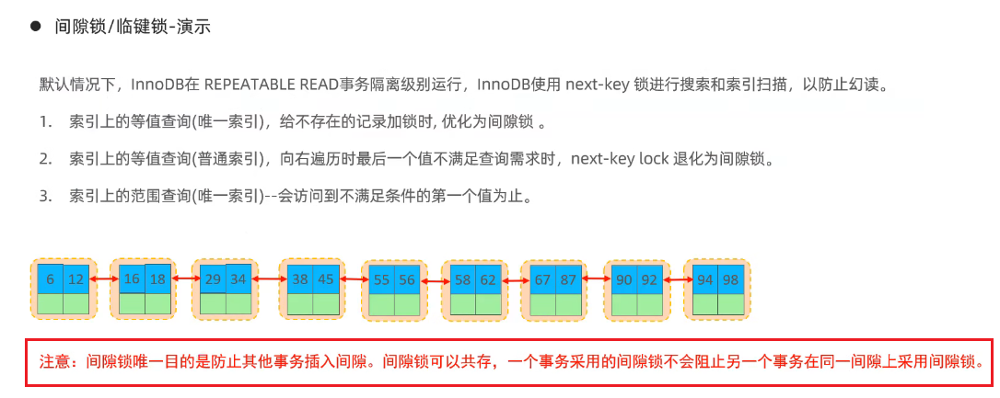

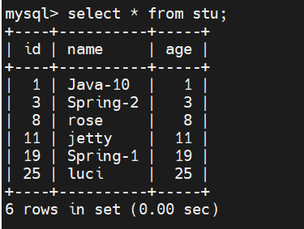

#### ①等值查询-==唯一索引==

**A. 索引上的等值查询(唯一索引)，给==ä¸å­˜åœ¨çš„记录加é”==æ—¶, 优化为==é—´éš™é”-GAP== 。**

- ä»æœ€å表stuçš„é—´éš™é”的具体信æ¯å¯ä»¥çœ‹å‡ºï¼Œå¦‚æœä¸å­˜åœ¨çš„记录是id = 5 的记录行，那么这个时候会看id = 5ç†è®ºä¸Šè¦åœ¨çš„ä½ç½®ï¼ˆ**索引结æ„最åä¿å­˜çš„æ•°æ®æ˜¯æœ‰åºçš„**），也就是id = 3å’Œ8之间。

  也就是给这里id = 8çš„ä½ç½®**添加间隙é”Gap**。

**客户端一**

```sql
begin;
	update stu set age = 10 where id = 5; -- stu表中ä¸å­˜åœ¨id = 5 的记录
end;
```

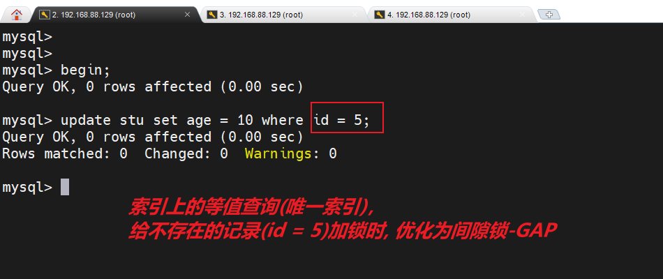

**客户端二**

```sql
begin;
	insert into stu values(7,'Ruby',7);
end;
```

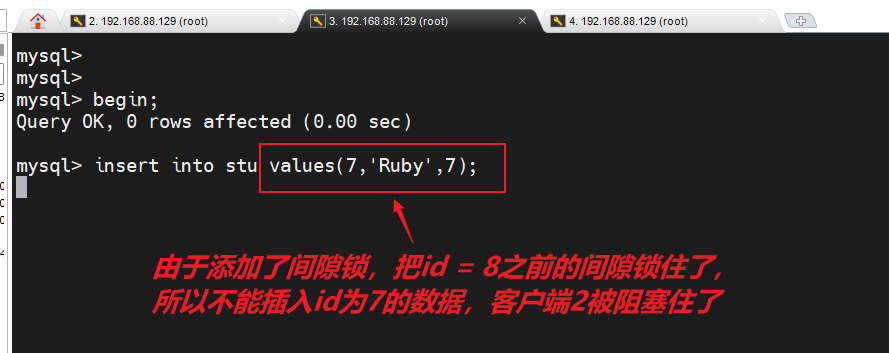


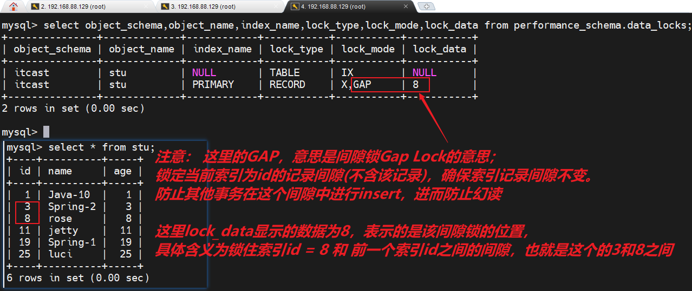


> ==**注æ„：**==
>
> 这里的GAP，æ„æ€æ˜¯é—´éš™é”Gap Lockçš„æ„æ€ï¼›é”定当å‰ç´¢å¼•ä¸ºid的记录间隙(ä¸å«è¯¥è®°å½•)，确ä¿ç´¢å¼•è®°å½•é—´éš™ä¸å˜ã€‚**防止其他事务在这个间隙中进行insert，进而防止幻读**。
>
> 这里**lock_data显示的数æ®ä¸º8**，表示的是该间隙é”çš„ä½ç½®ï¼›
>
> **具体å«ä¹‰ä¸ºé”ä½ç´¢å¼•id = 8 å’Œ å‰ä¸€ä¸ªç´¢å¼•id之间的间隙，也就是这个的==3å’Œ8之间==**
>
> - （3,8）


#### ②等值查询-==é唯一普通索引==

**B. 索引上的等值查询(é唯一普通索引)，==å‘å³éå†æ—¶æœ€å一个值ä¸æ»¡è¶³æŸ¥è¯¢éœ€æ±‚时，next-keylock 退化为间隙é”。==** 

具体分æ一下：

我们知é“InnoDBçš„B+树索引，**å¶å­èŠ‚点是有åºçš„åŒå‘链表**。 å‡å¦‚，我们è¦æ ¹æ®è¿™ä¸ª**二级索引**查询值为18çš„æ•°æ®ï¼Œå¹¶åŠ ä¸Šå…±äº«é”，我们是åªé”定18这一行就å¯ä»¥äº†å—？

 并ä¸æ˜¯ï¼Œå› ä¸ºæ˜¯**==é唯一索引==，这个结æ„中å¯èƒ½æœ‰==多个18的存在==**，所以，在加é”æ—¶**会继续往å找，找到一个ä¸æ»¡è¶³æ¡ä»¶çš„值**（当å‰æ¡ˆä¾‹ä¸­ä¹Ÿå°±æ˜¯**21**）。

此时**会对18加临键é”，并对21之å‰çš„间隙（这个间隙这是==对å‰ä¸€ä¸ªé—´éš™è€Œè¨€==）加é”（此时这个`21çš„GAPé—´éš™é”`就是next-keylock退化而æ¥çš„）**。


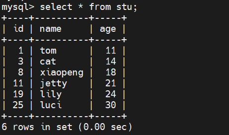


##### **🌟==é—´éš™é”和临键é”的基本概念（é‡ç‚¹ï¼‰==**

- é—´éš™é”：é”定索引记录间隙（**ä¸åŒ…å«è¯¥è®°å½•**），
  - 比如此时的索引是id时，并且lock_data 显示的是8，表示的是**==é”定8å‰é¢ä¸€ä¸ªçš„一个间隙==**，å‡è®¾ç°åœ¨8å‰é¢ä¸€ä½çš„id为3，那么此时该间隙é”，é”定的就是3-8之间的间隙，也就是(3,8);
- 临键é”：行é”和间隙é”的组åˆï¼Œä¼š**é”ä½æ•°æ®**，åŒæ—¶**é”ä½==æ•°æ®å‰é¢çš„一个间隙Gap==**
  - 如æœæœ‰è®°å½•8,9,10,20,30
  - 对20加临键é”，会**é”定(10,20]这个区间**
  - ä¸ä¼šé”定(8,20]这个区间


**客户端一，创建ageçš„ é唯一普通索引**

```sql
create index idx_syu_age on stu(age);
```

**æ ¹æ®é唯一普通索引进行查询，并添加共享行é”**

```sql
select * from stu where age = 18 lock in share mode;
```


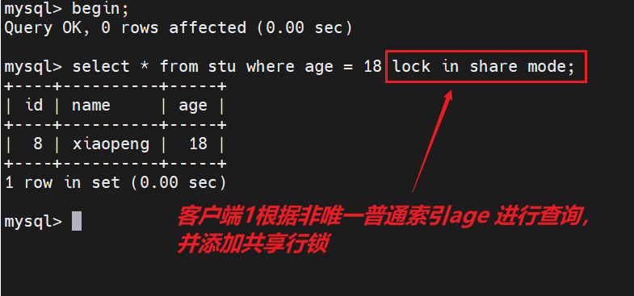

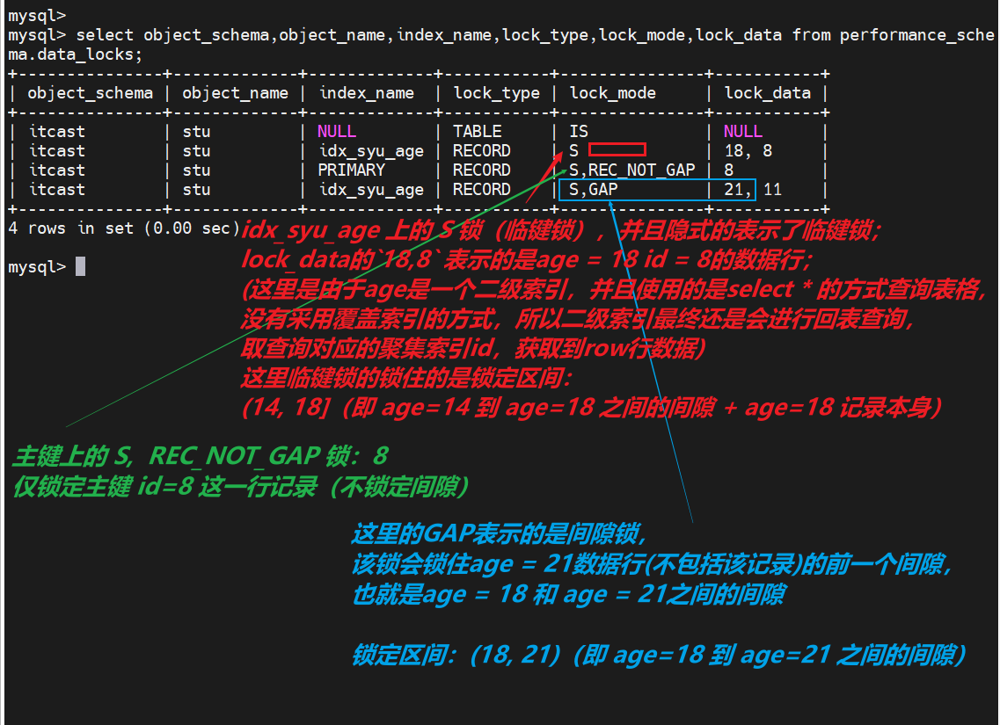


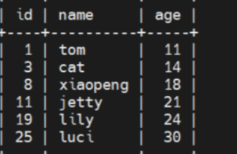

é”ä¿¡æ¯è§£è¯»

1. **`idx_syu_age` 上的 S é”（临键é”）**：`18, 8`
   - é”定区间：(14, 18]ï¼ˆå³ age=14 到 age=18 之间的间隙 + age=18 记录本身）
2. **主键上的 S,REC_NOT_GAP é”**：`8`
   - ä»…é”定主键 id=8 这一行记录（ä¸é”定间隙）
3. **`idx_syu_age` 上的 S,GAP é”**：`21, 11`
   - é”定区间：(18, 21)ï¼ˆå³ age=18 到 age=21 之间的间隙）

**==最终é”定范围==（开闭区间表示）**

1. **记录é”**：
   - [18, 8]（age=18 且 id=8 的记录）
2. **é—´éš™é”**：
   - (14, 18)（age=14 和 age=18 之间的间隙）
   - (18, 21)（age=18 和 age=21 之间的间隙）
3. **组åˆèµ·æ¥ç›¸å½“äº**：
   - (14, 21)ï¼ˆå³ age=14 到 age=21 之间的所有间隙，但ä¸åŒ…括 age=14 å’Œ age=21 的记录）


#### ③🚀==特殊情况==-é唯一普通索引

##### **1）==特殊情况==概述**

**基äºç´¢å¼•idx_syu_age，最åçš„è¡Œé”çš„é”定范围 应该是：(14,18] , (18,21）**

​	当客户端一，已ç»æ‰§è¡Œäº†select * from stu where age = 18 lock in share mode;添加了共享行é”，此时**客户端二进行下列æ“作时**，会出ç°ä¸€ä¸‹ç‰¹æ®Šæƒ…况：

- 但是**在==insertæ“作==æ—¶**，对äº**边界情况age = 14 å’Œage = 21时会出ç°è¢«é˜»å¡çš„情况**。
- 在**==updateæ“作==æ—¶**，**除了当å‰è¡Œage =18 被é”ä½**，**其他的age都å¯ä»¥æ‰§è¡Œé€šè¿‡ï¼Œä¸ä¼šè¢«é˜»å¡**

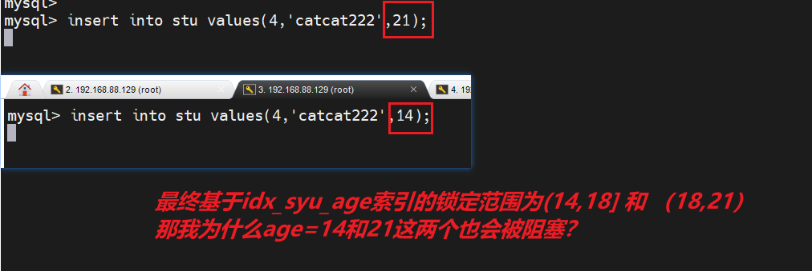

```sql
-- 客户端二 进行下列æ“作时出ç°çš„特殊情况
begin;
	-- 基äºç´¢å¼•idx_syu_age，最åçš„è¡Œé”çš„é”定范围 应该是：(14,18] , (18,21)
    -- 这些æ“作会被阻å¡ï¼š
    INSERT INTO stu VALUES (null, 'test1', 15);  -- è½å…¥ (14,18)
    INSERT INTO stu VALUES (null, 'test2', 20);  -- è½å…¥ (18,21)

    -- 这些æ“作ä¸ä¼šè¢«é˜»å¡ï¼š
    INSERT INTO stu VALUES (null, 'test3', 10);  -- å°äº14
    INSERT INTO stu VALUES (null, 'test4', 22);  -- 大äº21
    UPDATE stu SET name='test' WHERE age=14;     -- age=14 本身未被é”定
    UPDATE stu SET name='test' WHERE age=21;     -- age=21 本身未被é”定
    
    
    -- 特殊例å­-被阻å¡
    insert into stu values(4,'catcat222',14); -- insert语å¥çš„age=14，虽然ä¸åœ¨é”定的范围内，还是会被阻å¡
    insert into stu values(4,'catcat222',21); -- åŒç†ä¹Ÿä¼šè¢«é˜»å¡
    
    -- 对äºupdate语å¥
    UPDATE stu SET name='test' WHERE age= 18 ;
    UPDATE stu SET name='test' WHERE age= xx ; -- åªæœ‰å½“age = 18æ—¶æ‰ä¼šè¢«é˜»å¡ï¼Œå…¶ä»–都ä¸è¢«é˜»å¡
    
commit;
```


##### 2）é”èŒƒå›´æ€»ç»“ï¼ˆåŸºäº `idx_syu_age` 索引）

1. **ä¸´é”®é” (Next-Key Lock)**：`(14, 18]`  
   
   - é”定区间：`age > 14 且 age ≤ 18`  
   - 包å«ï¼šé—´éš™ `(14, 18)` + 记录 `age=18`  
   - 目的：防止其他事务æ’å…¥ `age ∈ (14, 18]` 的新记录（幻读）。
   
2. **é—´éš™é” (Gap Lock)**：`(18, 21)`  
   - é”定区间：`age > 18 且 age < 21`  
   - 目的：防止其他事务æ’å…¥ `age ∈ (18, 21)` 的新记录。

3. **ä¸»é”®è®°å½•é” (Record Lock)**：`id=8`（对应 `age=18`）  
   - ä»…é”定主键为 `8` 的行，防止修改或删除。
   
   **组åˆèµ·æ¥ç›¸å½“äº**：
   
   - (14, 21)ï¼ˆå³ age=14 到 age=21 之间的所有间隙，但ä¸åŒ…括 age=14 å’Œ age=21 的记录）


##### 3）为什么æŸäº›æ“作会被阻å¡ï¼Ÿ

###### 1. **INSERT 语å¥çš„阻å¡é€»è¾‘**
InnoDB 在执行 `INSERT` 时，会==先检查**æ’å…¥æ„å‘é”（Insert Intention Lock）**是å¦ä¸ç°æœ‰é”冲çª==：
- **æ’å…¥æ„å‘é”**是一ç§ç‰¹æ®Šçš„é—´éš™é”，表示“准备在æŸä¸ªé—´éš™æ’入数æ®â€ã€‚
- 如æœæ’入的值è½åœ¨è¢«é”定的间隙内（或边界），则会被阻å¡ã€‚

**你的测试案例：**
- `INSERT INTO stu VALUES (null, 'test1', 15);`  
  - æ’å…¥ `age=15`，è½åœ¨ `(14, 18)` 间隙内 → **被临键é”阻å¡**。
  
- `INSERT INTO stu VALUES (null, 'test2', 20);`  
  - æ’å…¥ `age=20`，è½åœ¨ `(18, 21)` 间隙内 → **被间隙é”阻å¡**。

- `INSERT INTO stu VALUES (4, 'catcat222', 14);`  
  - æ’å…¥ `age=14`，**虽然 `age=14` 本身未被é”定**，但æ’å…¥æ“作**需è¦è·å– `(11, 14]` 或 `(14, 18)` çš„æ’å…¥æ„å‘é”。**  
  - ==ç”±äº `(14, 18)` 被临键é”é”定，æ’å…¥æ„å‘é”ä¸ä¹‹å†²çª → **被阻å¡**。==  
  - **关键点**：å³ä½¿æ’入的值是已有值（`age=14`），InnoDB ä»ä¼šä¿å®ˆåœ°æ£€æŸ¥é—´éš™é”。

- `INSERT INTO stu VALUES (4, 'catcat222', 21);`  
  - æ’å…¥ `age=21`，虽然 `age=21` 本身未被é”定，但æ’å…¥æ“作需è¦æ£€æŸ¥ `(18, 21)` 间隙。  
  - ç”±äº `(18, 21)` 被间隙é”é”定 → **被阻å¡**。  

###### 2. **UPDATE 语å¥çš„阻å¡é€»è¾‘**
- `UPDATE stu SET name='test' WHERE age=18;`  
  - 命中 `age=18` 的记录，该记录被临键é”é”定（`S` é”）→ **被阻å¡**（其他事务ä¸èƒ½ä¿®æ”¹ï¼‰ã€‚  
- `UPDATE stu SET name='test' WHERE age=14;` 或 `age=21;`  
  - `age=14` å’Œ `age=21` çš„**记录未被é”定（åªæœ‰é—´éš™é”）**→ **ä¸ä¼šè¢«é˜»å¡**。  
- 为什么 **==UPDATE ä¸å­˜åœ¨çš„记录ä¸ä¼šè¢«é˜»å¡==**？
  - 当执行 `UPDATE` 时，InnoDB 会：
    1. **先查找记录**：
       - 如æœè®°å½•**存在**，则å°è¯•åŠ é”（行é”或临键é”）。
       - ==如æœè®°å½•**ä¸å­˜åœ¨**，则ä¸ä¼šåŠ ä»»ä½•é”（包括间隙é”）==。
    2. **é”的范围å–å†³äº WHERE æ¡ä»¶**：
       - å¦‚æœ `WHERE age = 15`（精确匹é…），而 `age=15` ä¸å­˜åœ¨ï¼ŒInnoDB **ä¸ä¼šé”定任何记录或间隙**，因此ä¸ä¼šé˜»å¡ã€‚
       - å¦‚æœ `WHERE age BETWEEN 15 AND 17`（**范围查询**），**å³ä½¿è®°å½•ä¸å­˜åœ¨ï¼ŒInnoDB 也会é”定符åˆæ¡ä»¶çš„间隙（防止幻读）**。


##### 4）验è¯é”行为的正确姿势

###### 1. **æ’入测试**
| æ“作                | 是å¦è¢«é˜»å¡ | åŸå›                             |
| ------------------- | ---------- | ------------------------------- |
| `INSERT ... age=10` | ⌠ä¸é˜»å¡   | `age=10 < 14`，ä¸åœ¨ä»»ä½•é”定区间 |
| `INSERT ... age=15` | ✅ é˜»å¡     | `age=15 ∈ (14, 18)`             |
| `INSERT ... age=18` | ✅ é˜»å¡     | `age=18` 被临键é”é”定           |
| `INSERT ... age=20` | ✅ é˜»å¡     | `age=20 ∈ (18, 21)`             |
| `INSERT ... age=21` | ✅ é˜»å¡     | æ’入需è¦æ£€æŸ¥ `(18, 21)` é—´éš™é”  |
| `INSERT ... age=22` | ⌠ä¸é˜»å¡   | `age=22 > 21`，ä¸åœ¨ä»»ä½•é”定区间 |

###### 2. **更新测试**
| æ“作                         | 是å¦è¢«é˜»å¡   | åŸå›                              |
| ---------------------------- | ------------ | -------------------------------- |
| `UPDATE ... age=14`          | ⌠ä¸é˜»å¡     | åªæœ‰é—´éš™é”，ä¸é”定记录本身       |
| `UPDATE ... age=18`          | ✅ é˜»å¡       | `age=18` 被临键é”é”定            |
| `UPDATE ... age=21`          | ⌠ä¸é˜»å¡     | åªæœ‰é—´éš™é”，ä¸é”定记录本身       |
| `UPDATE ... WHERE age = 15;` | ⌠**ä¸é˜»å¡** | `age=15` ä¸å­˜åœ¨ï¼ŒInnoDB ä¸ä¼šåŠ é” |
| `UPDATE ... WHERE age = 17;` | ⌠**ä¸é˜»å¡** | `age=17` ä¸å­˜åœ¨ï¼ŒInnoDB ä¸ä¼šåŠ é” |


##### 5）总结

1. **INSERT 的阻å¡èŒƒå›´æ¯”想象中更广**：  
   - å³ä½¿æ’入的值是已有值（如 `age=14` 或 `age=21`），也**会因为æ’å…¥æ„å‘é”ä¸é—´éš™é”冲çªè€Œè¢«é˜»å¡ã€‚**  
   - 这是 **==InnoDB 防止幻读的ä¿å®ˆç­–ç•¥==**。
2. **UPDATE åªé”定具体记录**：  
   - åªæœ‰è¢«é”定的记录（如 `age=18`）会被阻å¡æ›´æ–°ï¼Œå…¶ä»–记录（如 `age=14` 或 `age=21`，`age=15ã€17这些ä¸å­˜åœ¨è®°å½•`）å¯ä»¥æ­£å¸¸ä¿®æ”¹ã€‚
3. **é”的边界行为**：  
   - ä¸´é”®é” `(14, 18]` 包å«å³è¾¹ç•Œï¼ˆ`age=18`），但ä¸åŒ…å«å·¦è¾¹ç•Œï¼ˆ`age=14`）。  
   - é—´éš™é” `(18, 21)` ä¸åŒ…å«ä»»ä½•è¾¹ç•Œã€‚  


#### ④==范围查询==-唯一索引

**C. 索引上的范围查询(唯一索引)--会访问到ä¸æ»¡è¶³æ¡ä»¶çš„第一个值为止。**

**对äºå®¢æˆ·ç«¯ä¸€è€Œè¨€,执行==对äºå”¯ä¸€ç´¢å¼•id的范围查询==sql语å¥**

```sql
select * from stu where id >=19 lock in share mode;
```

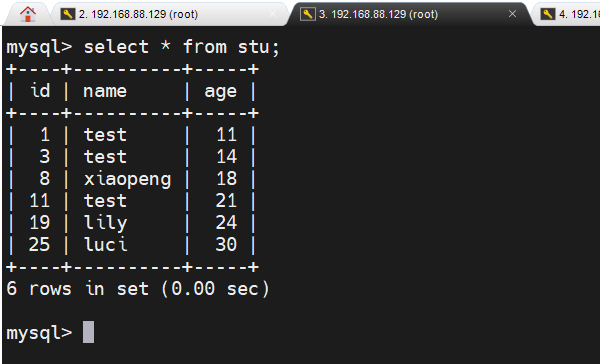

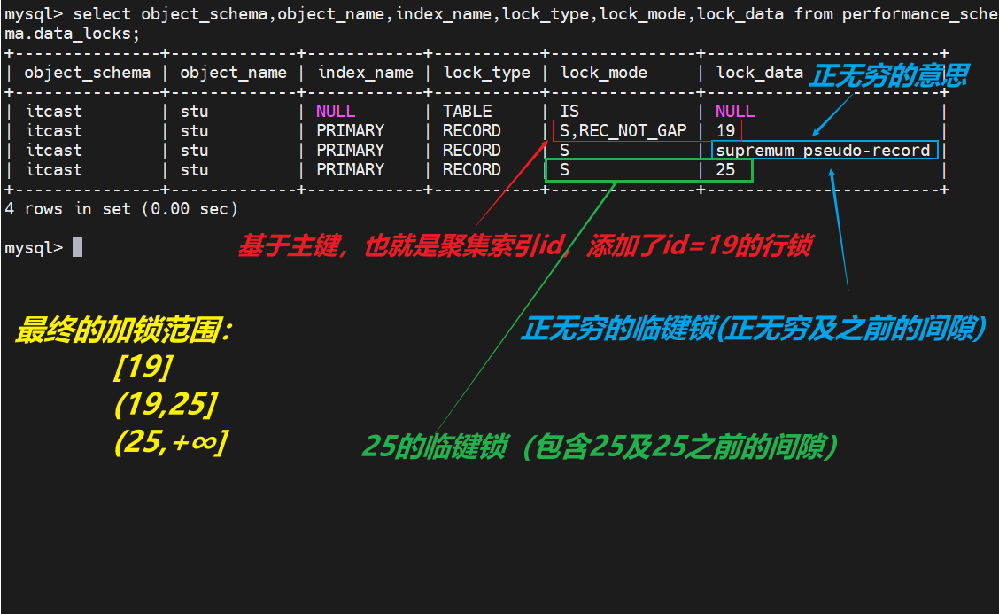

查询的æ¡ä»¶ä¸ºid>=19，并添加共享é”。 此时我们å¯ä»¥æ ¹æ®æ•°æ®åº“表中ç°æœ‰çš„æ•°æ®ï¼Œå°†æ•°æ®åˆ†ä¸ºä¸‰ä¸ªéƒ¨åˆ†ï¼š

[19]

(19,25]

(25,+âˆ]

所以**æ•°æ®åº“æ•°æ®åœ¨åŠ é”**是，

- å°†19åŠ äº†è¡Œé” => [19]
- **25的临键é”**（包å«25åŠ25之å‰çš„间隙）=> (19,25]
- **正无穷的临键é”**(正无穷åŠä¹‹å‰çš„é—´éš™)  => (25,+âˆ]


## 5.5 å°ç»“

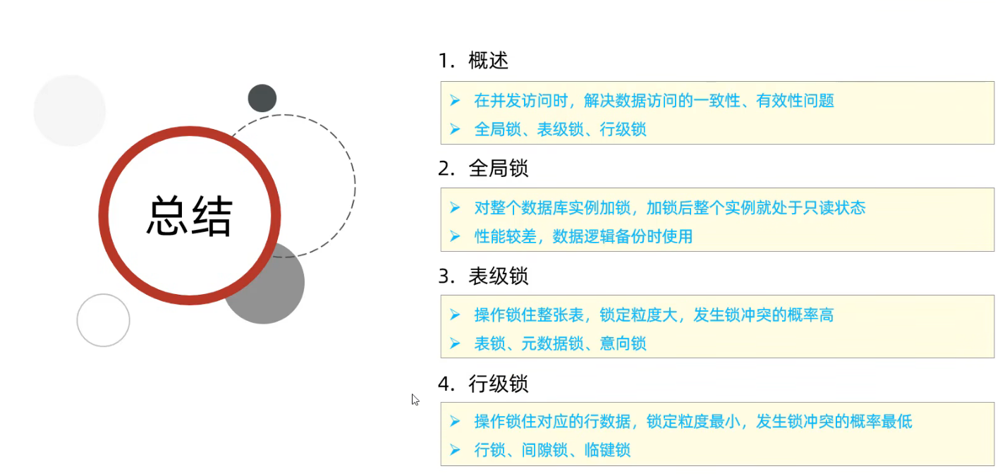


# 6ã€ğŸš€ InnoDB引æ“

## 6.1 ==逻辑存储结æ„==

InnoDB的逻辑存储结æ„如下图所示:

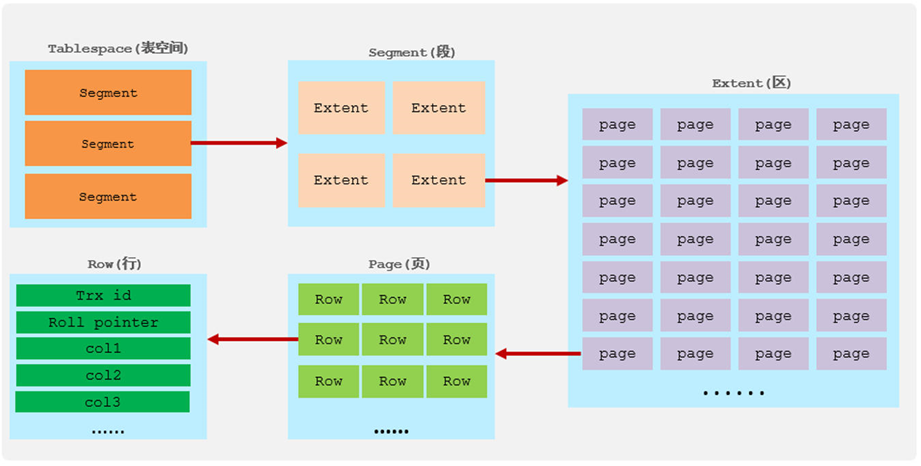

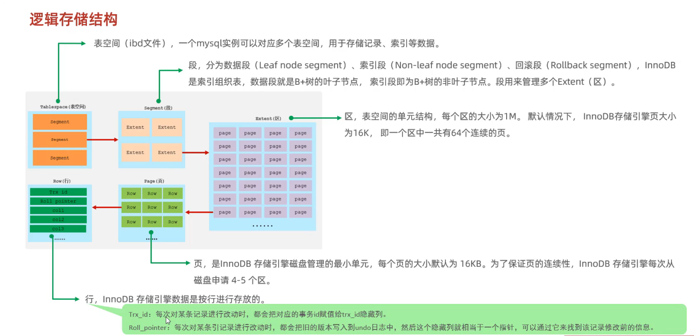

#### ① 表空间-Tablespace

表空间是InnoDB存储引æ“逻辑结æ„的最高层， 如æœç”¨æˆ·å¯ç”¨äº†å‚æ•° innodb_file_per_table(在8.0版本中默认开å¯) ，则æ¯å¼ è¡¨éƒ½ä¼šæœ‰ä¸€ä¸ªè¡¨ç©ºé—´ï¼ˆxxx.ibd），一个mysqlå®ä¾‹å¯ä»¥å¯¹åº”多个表空间，**用äºå­˜å‚¨è®°å½•ã€ç´¢å¼•ç­‰æ•°æ®ã€‚**

#### ② 段-Segment

段，分为数æ®æ®µï¼ˆLeaf node segment）ã€ç´¢å¼•æ®µï¼ˆNon-leaf node segment）ã€å›æ»šæ®µï¼ˆRollback segment），InnoDB是索引组织表，**æ•°æ®æ®µå°±æ˜¯B+æ ‘çš„å¶å­èŠ‚点， 索引段å³ä¸ºB+æ ‘çš„éå¶å­èŠ‚点。**段用æ¥ç®¡ç†å¤šä¸ªExtent（区）。


#### ③ 区-Extent

区，**表空间的å•å…ƒç»“æ„**，**æ¯ä¸ªåŒºçš„大å°ä¸º1M**。 

默认情况下， InnoDB存储引æ“**页大å°ä¸º16K**， å³ä¸€ä¸ªåŒºä¸­ä¸€**共有64个è¿ç»­çš„页**。


#### ④ 页-page

页，是InnoDB 存储引æ“**ç£ç›˜ç®¡ç†çš„最å°å•å…ƒ**，æ¯ä¸ªé¡µçš„大å°é»˜è®¤ä¸º 16KB。

为了ä¿è¯é¡µçš„è¿ç»­æ€§ï¼ŒInnoDB 存储引æ“æ¯æ¬¡ä»ç£ç›˜ç”³è¯· 4-5 个区。


#### ⑤ 行-Row

行，InnoDB 存储引æ“æ•°æ®æ˜¯**按行进行存放的**。

在行中，默认有==两个éšè—字段==：

- **Trx_id**：æ¯æ¬¡å¯¹æŸæ¡è®°å½•è¿›è¡Œæ”¹åŠ¨æ—¶ï¼Œéƒ½ä¼š**把对应的事务id赋值给trx_idéšè—列**。
- **Roll_pointer**：æ¯æ¬¡å¯¹æŸæ¡å¼•è®°å½•è¿›è¡Œæ”¹åŠ¨æ—¶ï¼Œéƒ½ä¼š**把旧的版本写入到undo日志中**，然å这个éšè—列就**相当äºä¸€ä¸ªæŒ‡é’ˆ**，å¯ä»¥é€šè¿‡å®ƒæ¥**找到该记录修改å‰çš„ä¿¡æ¯**。


## 6.2 æ¶æ„

### （1）概述

MySQL5.5 版本开始，默认使用InnoDB存储引æ“，它擅长**事务处ç†ï¼Œå…·æœ‰å´©æºƒæ¢å¤ç‰¹æ€§**，在日常开å‘

中使用é常广泛。下é¢æ˜¯InnoDBæ¶æ„图，**左侧为内存结æ„，å³ä¾§ä¸ºç£ç›˜ç»“æ„**。

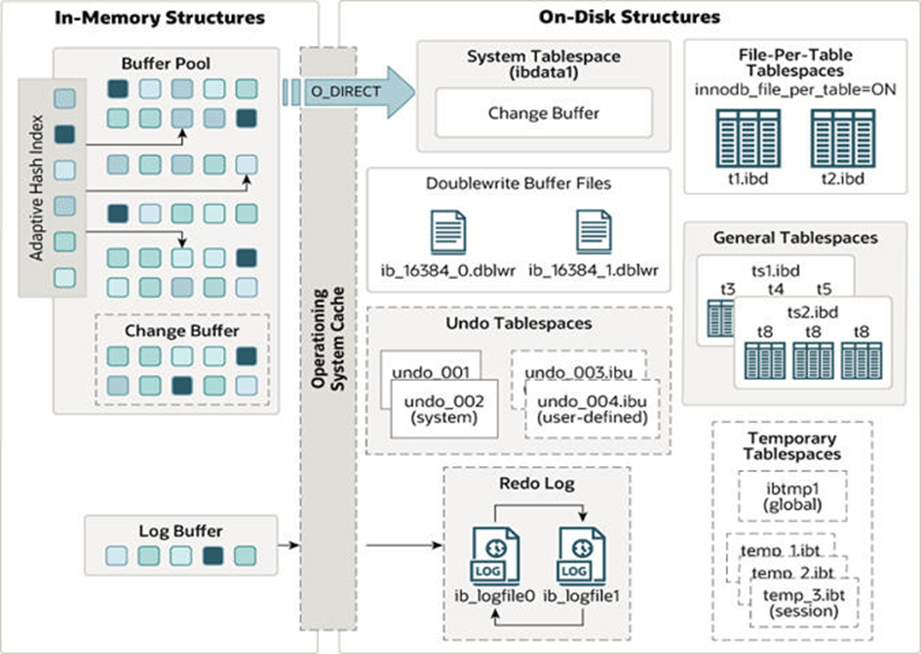


### （2）==内存结æ„==

在左侧的内存结æ„中，主è¦åˆ†ä¸ºè¿™ä¹ˆå››å¤§å—儿： 

Buffer Poolã€Change Bufferã€Adaptive Hash Indexã€Log Buffer。 æ¥ä¸‹æ¥ä»‹ç»ä¸€ä¸‹è¿™å››ä¸ªéƒ¨åˆ†ã€‚

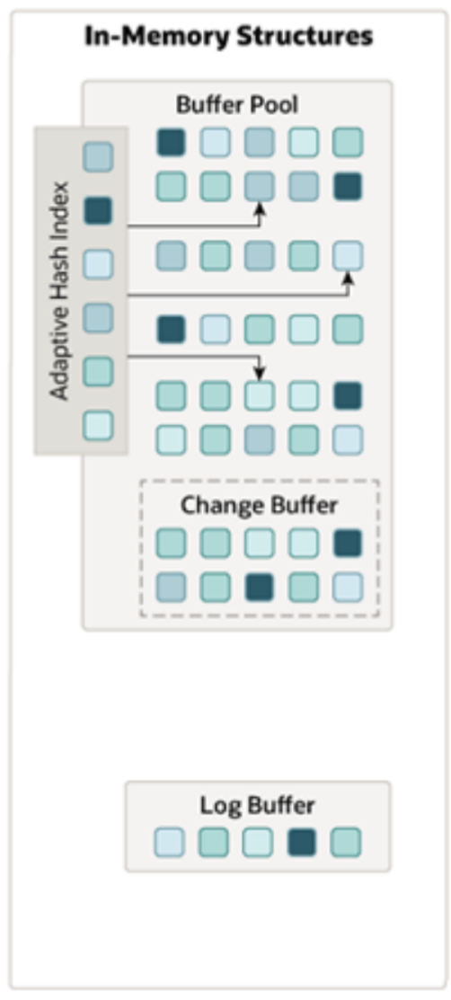


#### ①Buffer Pool-==缓冲池==

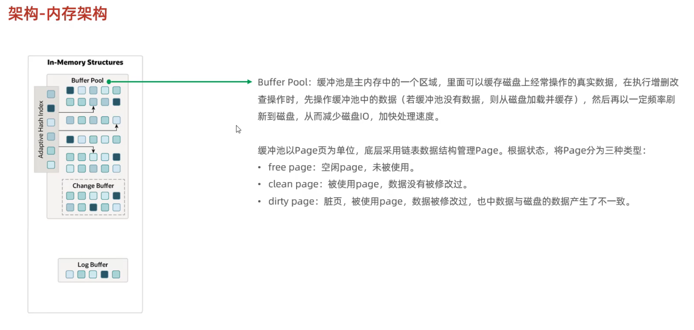

InnoDB存储引æ“基äº==ç£ç›˜æ–‡ä»¶å­˜å‚¨==，访问**物ç†ç¡¬ç›˜å’Œåœ¨å†…存中**进行访问，速度相差很大，为了尽å¯èƒ½å¼¥è¡¥è¿™ä¸¤è€…之间的I/O效ç‡çš„差值，就需è¦**把ç»å¸¸ä½¿ç”¨çš„æ•°æ®åŠ è½½åˆ°ç¼“冲池中，é¿å…æ¯æ¬¡è®¿é—®éƒ½è¿›è¡Œç£ç›˜I/O**。

在InnoDB的缓冲池中**ä¸ä»…缓存了索引页和数æ®é¡µ**，还包å«äº†**undo页ã€æ’入缓存ã€è‡ªé€‚应哈希索引以åŠInnoDBçš„é”ä¿¡æ¯**等等。

缓冲池 Buffer Pool，是主内存中的一个区域，里é¢å¯ä»¥**缓存ç£ç›˜ä¸Šç»å¸¸æ“作的真å®æ•°æ®**，在执行å¢åˆ æ”¹æŸ¥æ“作时，先æ“作缓冲池中的数æ®ï¼ˆè‹¥ç¼“冲池没有数æ®ï¼Œåˆ™ä»ç£ç›˜åŠ è½½å¹¶ç¼“存），然åå†ä»¥ä¸€å®šé¢‘ç‡åˆ·æ–°åˆ°ç£ç›˜ï¼Œ**ä»è€Œå‡å°‘ç£ç›˜IO，加快处ç†é€Ÿåº¦ã€‚** =》**å»äº†è§£==`éšæœºç£ç›˜io`å’Œ`顺åºç£ç›˜io`==的概念**


缓冲池**以Page页为å•ä½ï¼Œåº•å±‚采用链表数æ®ç»“æ„管ç†Page**。根æ®çŠ¶æ€ï¼Œå°†Page分为三ç§ç±»å‹ï¼š

- **free page**：空闲page，未被使用。

- **clean page**：被使用page，数æ®æ²¡æœ‰è¢«ä¿®æ”¹è¿‡ã€‚

- **dirty page**：è„页，被使用page，数æ®è¢«ä¿®æ”¹è¿‡ï¼Œä¹Ÿä¸­**æ•°æ®ä¸ç£ç›˜çš„æ•°æ®äº§ç”Ÿäº†ä¸ä¸€è‡´**。

  

<span id = 'Buffer Pool缓存池' > </span>

在专用æœåŠ¡å™¨ä¸Šï¼Œ**通常将多达80％的物ç†å†…存分é…给缓冲池** 。å‚数设置： 

```sql
-- 查看缓存池的大å°
show variables like 'innodb_buffer_pool_size';
```

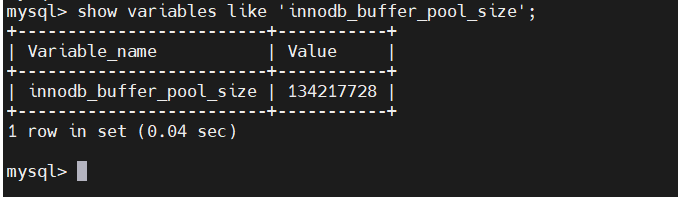


#### ②Change Buffer-更改缓冲区

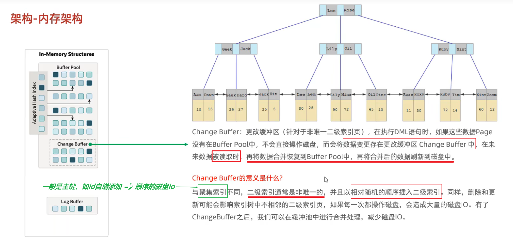

Change Buffer，**更改缓冲区**（针对äº==é唯一二级索引页==），在执行DML语å¥æ—¶ï¼Œå¦‚æœè¿™äº›æ•°æ®Page没有在Buffer Pool中，ä¸ä¼šç›´æ¥æ“作ç£ç›˜ï¼Œè€Œä¼š**将数æ®å˜æ›´å…ˆå­˜å‚¨åœ¨æ›´æ”¹ç¼“冲区 Change Buffer**中，==在未æ¥æ•°æ®è¢«è¯»å–时，å†**将数æ®åˆå¹¶æ¢å¤åˆ°Buffer Pool中**==，**å†å°†åˆå¹¶åçš„æ•°æ®åˆ·æ–°åˆ°ç£ç›˜ä¸­**。


Change Bufferçš„æ„义是什么呢?

å…ˆæ¥çœ‹ä¸€å¹…图，这个是二级索引的结æ„图：

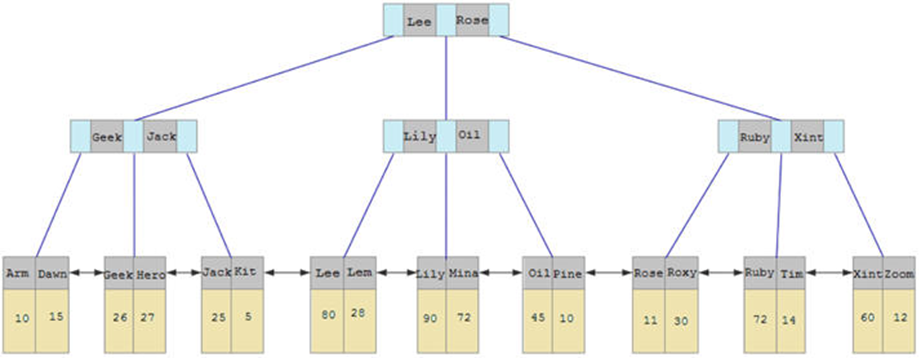

ä¸èšé›†ç´¢å¼•ä¸åŒï¼ŒäºŒçº§ç´¢å¼•é€šå¸¸æ˜¯é唯一的，并且以**相对éšæœºçš„顺åºæ’入二级索引**。åŒæ ·ï¼Œåˆ é™¤å’Œæ›´æ–°å¯èƒ½ä¼šå½±å“索引树中ä¸ç›¸é‚»çš„二级索引页，如æœæ¯ä¸€æ¬¡éƒ½æ“作ç£ç›˜ï¼Œä¼šé€ æˆå¤§é‡çš„ç£ç›˜IO。有了ChangeBuffer之å，我们å¯ä»¥åœ¨ç¼“冲池中进行åˆå¹¶å¤„ç†ï¼Œå‡å°‘ç£ç›˜IO。


#### ③Adaptive Hash Index-==自适应hash索引==

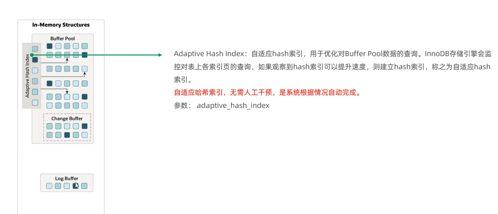

自适应hash索引，用äº**优化对Buffer Poolæ•°æ®çš„查询**。MySQLçš„innoDB引æ“中虽然**没有直æ¥æ”¯æŒhash索引**，但是给我们æ供了一个功能就是这个自适应hash索引。因为å‰é¢æˆ‘们讲到过，hash索引在进行等值匹é…时，一般性能是è¦é«˜äºB+树的，**因为hash索引一般åªéœ€è¦ä¸€æ¬¡IOå³å¯ï¼ˆåœ¨ä¸å‘生hash冲çªçš„å‰æ下）**，而B+树，å¯èƒ½éœ€è¦å‡ æ¬¡åŒ¹é…，所以hash索引的效ç‡è¦é«˜ï¼Œ**但是hash索引åˆä¸é€‚åˆåšèŒƒå›´æŸ¥è¯¢ã€æ¨¡ç³ŠåŒ¹é…ç­‰**，==åªé€‚åˆç­‰å€¼åŒ¹é…==。

InnoDB存储引æ“会监æ§å¯¹è¡¨ä¸Šå„索引页的查询，如æœè§‚察到在特定的æ¡ä»¶ä¸‹hash索引å¯ä»¥æå‡é€Ÿåº¦ï¼Œåˆ™å»ºç«‹hash索引，称之为自适应hash索引。

**自适应哈希索引，无需人工干预，是系统根æ®æƒ…况自动完æˆã€‚**

å‚数： adaptive_hash_index

```sql
-- 查看InnoDB的自适应hash索引 是å¦å¯ç”¨
show variables like '%hash_index%';
```

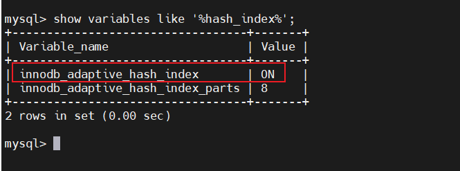


#### ④Log Buffer-日志缓冲区

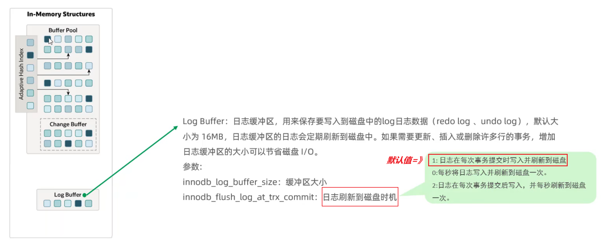

Log Buffer：日志缓冲区，用æ¥ä¿å­˜**è¦å†™å…¥åˆ°ç£ç›˜ä¸­çš„log日志数æ®ï¼ˆredo log ã€undo log）**，默认大å°ä¸º 16MB，日志缓冲区的**日志会定期刷新到ç£ç›˜ä¸­**。如æœéœ€è¦æ›´æ–°ã€æ’入或删除许多行的事务，**å¢åŠ æ—¥å¿—缓冲区的大å°å¯ä»¥èŠ‚çœç£ç›˜ I/O**。

å‚æ•°:

**innodb_log_buffer_size**：缓冲区大å°

```sql
-- 查询日志缓冲区的大å°
show variables like '%log_buffer_size%';
```

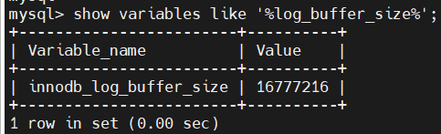


innodb_flush_log_at_trx_commit：**日志刷新到ç£ç›˜æ—¶æœº**，å–值主è¦åŒ…å«ä»¥ä¸‹ä¸‰ä¸ªï¼š

```sql
-- 日志刷新到ç£ç›˜æ—¶æœº
show variables like '%flush_log%';
```

- 1: 日志在**æ¯æ¬¡äº‹åŠ¡æ交时写入并刷新到ç£ç›˜**，默认值。
- 0: **æ¯ç§’**将日志写入并刷新到ç£ç›˜ä¸€æ¬¡ã€‚
- 2: 日志在**æ¯æ¬¡äº‹åŠ¡æ交å写入，并æ¯ç§’**刷新到ç£ç›˜ä¸€æ¬¡ã€‚


### （3）==ç£ç›˜ç»“æ„==

æ¥ä¸‹æ¥ï¼Œå†æ¥çœ‹çœ‹InnoDB体系结æ„çš„å³è¾¹éƒ¨åˆ†ï¼Œä¹Ÿå°±æ˜¯ç£ç›˜ç»“æ„：

#### ①System Tablespace-系统表空间

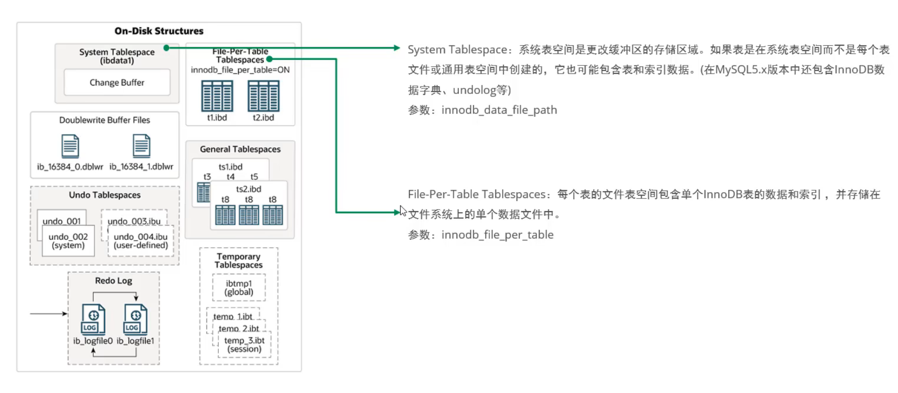

系统表空间**==是更改缓冲区的存储区域==**。如æœè¡¨æ˜¯åœ¨ç³»ç»Ÿè¡¨ç©ºé—´è€Œä¸æ˜¯æ¯ä¸ªè¡¨æ–‡ä»¶æˆ–通用表空间中创建的，它也å¯èƒ½åŒ…å«è¡¨å’Œç´¢å¼•æ•°æ®ã€‚(在MySQL5.x版本中还包å«InnoDBæ•°æ®å­—å…¸ã€undologç­‰)

å‚数：innodb_data_file_path

**系统表空间，默认的文件åå« ibdata1**。

```sql
show variables like '%data_file_path%';
```

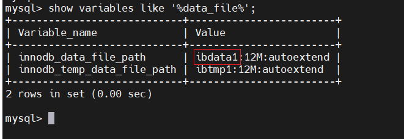

```bash
cd /var/lib/mysql
```

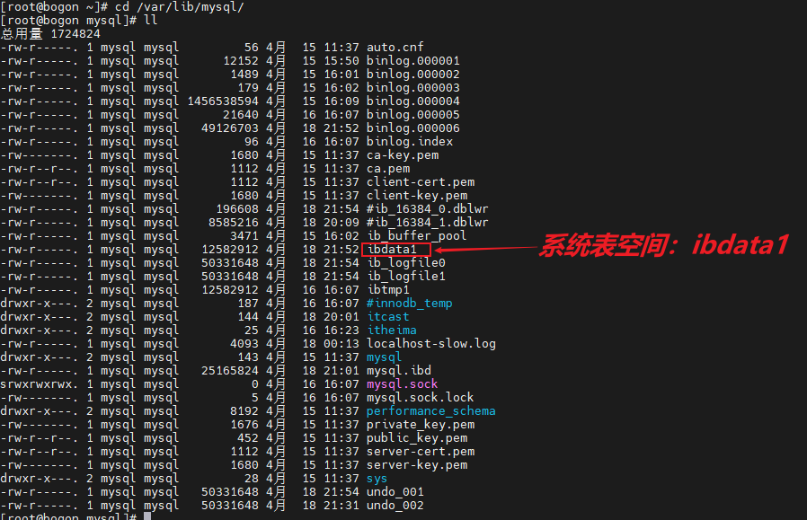


#### ②File-Per-Table Tablespaces-文件表空间


如æœå¼€å¯äº†innodb_file_per_table开关 ，则**æ¯ä¸ªè¡¨çš„==文件表空间==包å«å•ä¸ªInnoDB表的数æ®å’Œç´¢å¼•** ，并存储在文件系统上的å•ä¸ªæ•°æ®æ–‡ä»¶ä¸­ã€‚该**文件表空间** =》**==包å«è¯¥è¡¨çš„æ•°æ®ã€ç´¢å¼•ã€ç»“æ„==**

**å¼€å¯å，==æ¯ä¸€å¼ è¡¨éƒ½ä¼šç”Ÿæˆå¯¹åº”的文件表空间==，而ä¸æ˜¯ç³»ç»Ÿè¡¨ç©ºé—´**

开关å‚数：innodb_file_per_table ，该**å‚数默认开å¯**。

```sql
show variables like '%file_per_table%';
```

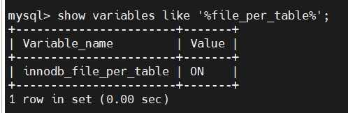

那也就是说，我们**æ¯åˆ›å»ºä¸€ä¸ªè¡¨ï¼Œéƒ½ä¼šäº§ç”Ÿä¸€ä¸ªå¯¹åº”的表空间文件**，如图：

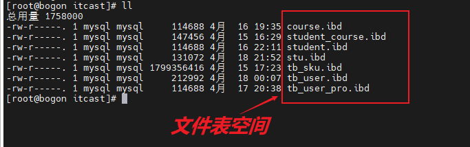


#### ③General Tablespaces-通用表空间

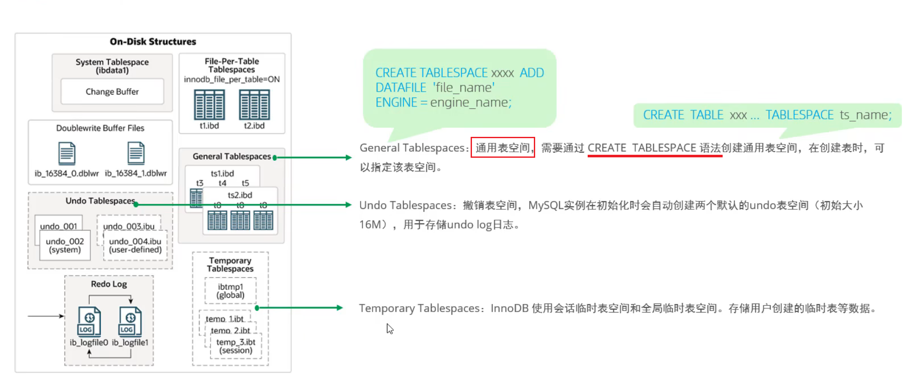

通用表空间，**需è¦æ‰‹åŠ¨**通过 **CREATE TABLESPACE 语法创建通用表空间**，在**创建表时，å¯ä»¥æŒ‡å®šè¯¥è¡¨ç©ºé—´**。

##### A. 创建表空间

```sql
CREATE TABLESPACE ts_name ADD DATAFILE 'file_name' ENGINE = engine_name; 
-- 这里的file_name 指的是这个表空间关è”çš„ç£ç›˜ç£ç›˜æ–‡ä»¶
-- 这里的engine_name 指的是对应的存储引æ“

create tablespace ts_itheima add datafile 'myitheima.idb' engine = innodb;
```

##### B. 创建表时指定表空间

```sql
CREATE TABLE xxx ... TABLESPACE ts_name; 

create table test_a(
	id int primary key auto_increment,
    name varchar(10)
) engine = InnoDB tablespace ts_itheima;
```


#### ④Undo Tablespaces-撤销表空间

撤销表空间，MySQLå®ä¾‹åœ¨åˆå§‹åŒ–时会**自动创建两个默认的undo表空间**（åˆå§‹å¤§å°16M），

用äº**存储undo log日志**。

- **undo_001和 undo_002**

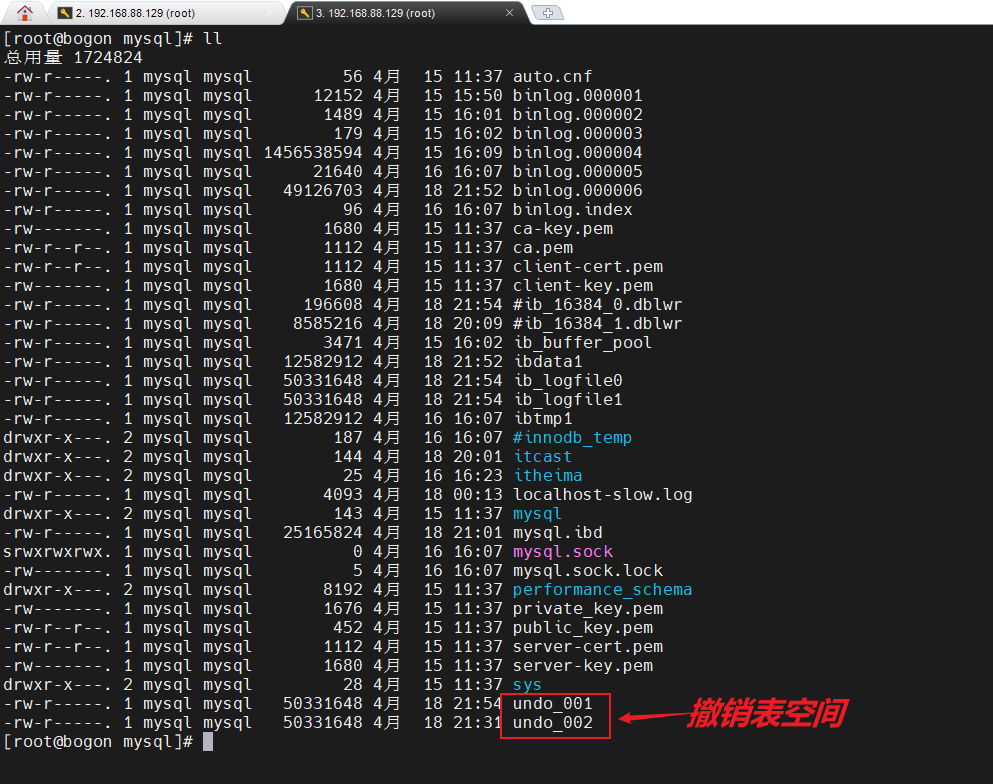


#### ⑤Temporary Tablespaces-临时表空间

InnoDB 使用会è¯ä¸´æ—¶è¡¨ç©ºé—´å’Œå…¨å±€ä¸´æ—¶è¡¨ç©ºé—´ã€‚**存储用户创建的临时表等数æ®**。


#### â‘¥Doublewrite Buffer Files-==åŒå†™ç¼“冲区==

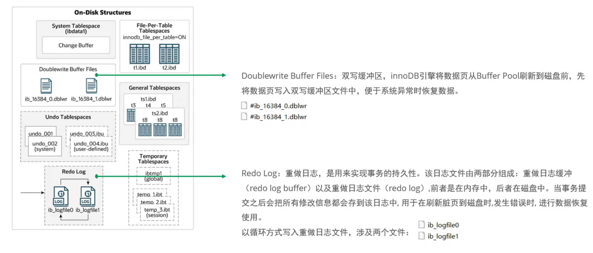

åŒå†™ç¼“冲区，innoDB引æ“**将数æ®é¡µä»Buffer Pool刷新到ç£ç›˜==å‰==**，**先将数æ®é¡µå†™å…¥åŒå†™ç¼“冲区文件中，便äºç³»ç»Ÿå¼‚常时æ¢å¤æ•°æ®ã€‚**

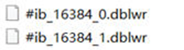


#### ⑦ Redo Log-==é‡åšæ—¥å¿—==

é‡åšæ—¥å¿—，是**用æ¥==å®ç°äº‹åŠ¡çš„æŒä¹…性==**。该日志文件由两部分组æˆï¼š

**é‡åšæ—¥å¿—缓冲（redo logbuffer）以åŠé‡åšæ—¥å¿—文件（redo log）**,**å‰è€…是在内存中，å者在ç£ç›˜ä¸­**。

当事务æ交之å会把所有修改信æ¯éƒ½ä¼šå­˜åˆ°è¯¥æ—¥å¿—中, **==用äºåœ¨åˆ·æ–°è„页到ç£ç›˜æ—¶,å‘生错误时, 进行数æ®æ¢å¤ä½¿ç”¨==**，进而ä¿è¯äº‹åŠ¡çš„æŒä¹…性。

以**循ç¯æ–¹å¼å†™å…¥é‡åšæ—¥å¿—文件**，涉åŠä¸¤ä¸ªæ–‡ä»¶ï¼š


å‰é¢æˆ‘们介ç»äº†InnoDB的内存结æ„，以åŠç£ç›˜ç»“æ„，那么**内存中我们所更新的数æ®ï¼Œåˆæ˜¯å¦‚何到ç£ç›˜ä¸­çš„呢？** 此时，就涉åŠåˆ°ä¸€ç»„åå°çº¿ç¨‹ï¼Œæ¥ä¸‹æ¥ï¼Œå°±æ¥ä»‹ç»ä¸€äº›InnoDB中涉åŠåˆ°çš„åå°çº¿ç¨‹ã€‚


### （4）åå°çº¿ç¨‹

在InnoDBçš„åå°çº¿ç¨‹ä¸­ï¼Œåˆ†ä¸º4类，

分别是：Master Thread ã€IO Threadã€Purge Threadã€Page Cleaner Thread。

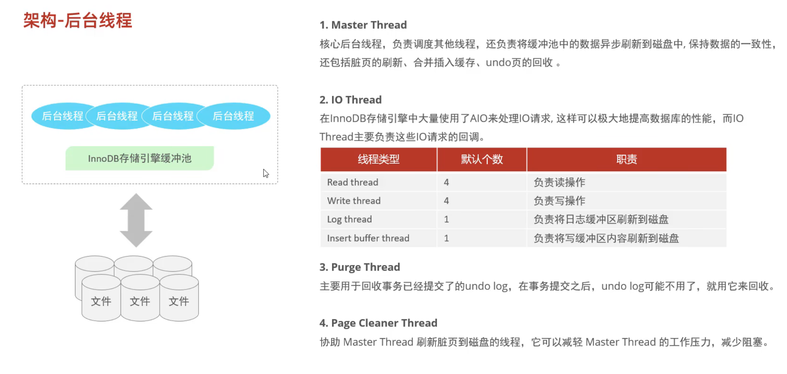

#### â‘ Master Thread

**核心åå°çº¿ç¨‹**，负责调度其他线程，还负责将缓冲池中的数æ®å¼‚步刷新到ç£ç›˜ä¸­, ä¿æŒæ•°æ®çš„一致性，还包括è„页的刷新ã€åˆå¹¶æ’入缓存ã€undo页的å›æ”¶ 。

  

#### â‘¡IO Thread

在InnoDB存储引æ“中大é‡ä½¿ç”¨äº†**AIO（异步é阻å¡IO）**æ¥å¤„ç†IO请求, 这样å¯ä»¥æ大地**æ高数æ®åº“的性能**，而IOThread主è¦è´Ÿè´£è¿™äº›IO请求的å›è°ƒã€‚

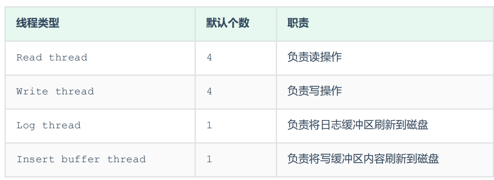

我们å¯ä»¥é€šè¿‡ä»¥ä¸‹çš„è¿™æ¡æŒ‡ä»¤ï¼ŒæŸ¥çœ‹åˆ°InnoDB的状æ€ä¿¡æ¯ï¼Œå…¶ä¸­å°±åŒ…å«IO Threadä¿¡æ¯ã€‚

```sql
show engine innodb status \G;
```

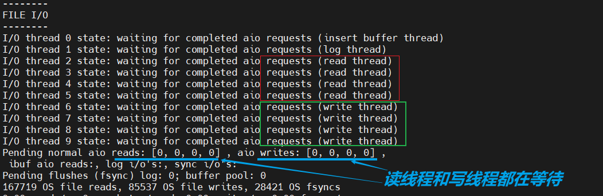


#### â‘¢Purge Thread

主è¦ç”¨äºå›æ”¶äº‹åŠ¡å·²ç»æ交了的**undo log（撤销日志）**，在事务æ交之å，undo logå¯èƒ½ä¸ç”¨äº†ï¼Œå°±ç”¨Purge Threadæ¥å›æ”¶ã€‚


#### â‘£Page Cleaner Thread

**å助 Master Thread 刷新è„页到ç£ç›˜çš„线程**，它å¯ä»¥å‡è½» Master Thread 的工作å‹åŠ›ï¼Œ**å‡å°‘阻å¡**。


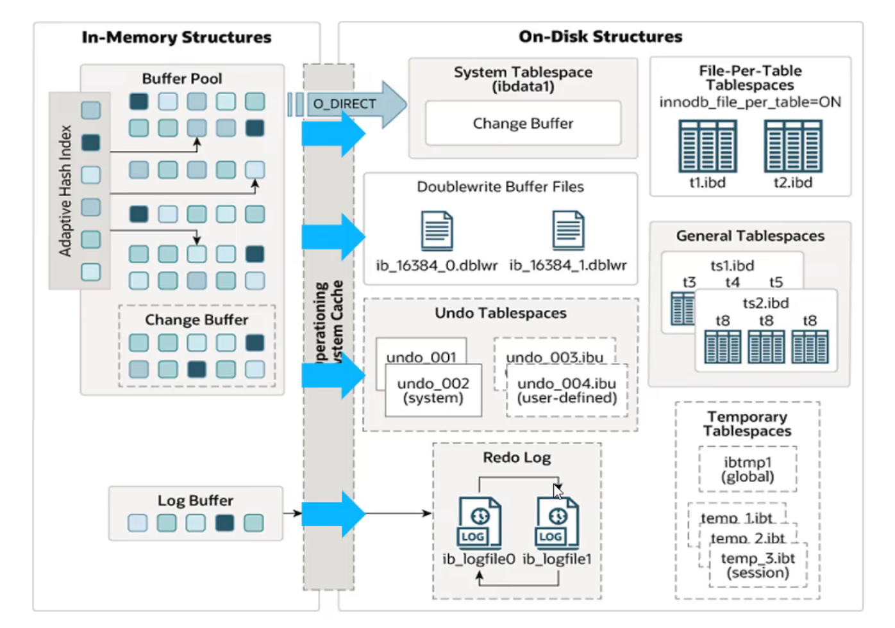


## 6.3 🚀 ==事务管ç†==

### （1）事务基础

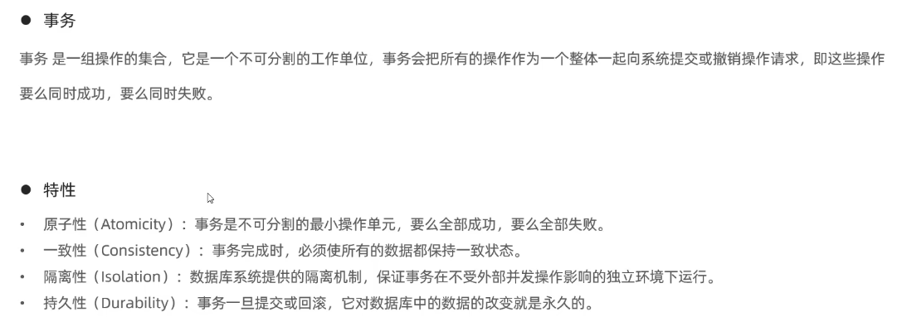

#### ①事务

事务 是**一组æ“作的集åˆï¼Œå®ƒæ˜¯ä¸€ä¸ªä¸å¯åˆ†å‰²çš„工作å•ä½**。

事务会把所有的æ“作作为一个整体一起å‘系统æ交或撤销æ“作请求，å³è¿™äº›æ“作**è¦ä¹ˆåŒæ—¶æˆåŠŸï¼Œè¦ä¹ˆåŒæ—¶å¤±è´¥**。


#### ②特性


- åŸå­æ€§ï¼ˆAtomicity）：事务是ä¸å¯åˆ†å‰²çš„最å°æ“作å•å…ƒï¼Œ**è¦ä¹ˆå…¨éƒ¨æˆåŠŸï¼Œè¦ä¹ˆå…¨éƒ¨å¤±è´¥**。
- 一致性（Consistency）：事务完æˆæ—¶ï¼Œå¿…须使**所有的数æ®éƒ½ä¿æŒä¸€è‡´çŠ¶æ€**。
- 隔离性（Isolation）：数æ®åº“系统æ供的隔离机制，**ä¿è¯äº‹åŠ¡åœ¨ä¸å—外部并å‘æ“作影å“的独立ç¯å¢ƒä¸‹è¿è¡Œã€‚** = 》对应**å››ç§éš”离级别：读未æ交，读已æ交，å¯é‡å¤è¯»(默认)，串行化**
- æŒä¹…性（Durability）：事务一旦æ交或å›æ»šï¼Œå®ƒå¯¹æ•°æ®åº“中的数æ®çš„**改å˜å°±æ˜¯æ°¸ä¹…çš„**。


é‚£å®é™…上，我们研究事务的åŸç†ï¼Œå°±æ˜¯ç ”究MySQLçš„InnoDB引æ“是**如何ä¿è¯äº‹åŠ¡çš„这四大特性的**。


而对äºè¿™å››å¤§ç‰¹æ€§ï¼Œå®é™…上分为两个部分。

-  其中的**åŸå­æ€§ã€ä¸€è‡´æ€§ã€æŒä¹…化**，å®é™…上是由InnoDB中的两份日志æ¥ä¿è¯çš„，
  - 一份是**redo log日志，一份是undo log日志**。 
-  而**æŒä¹…性是通过数æ®åº“çš„==é”==，加上==MVCC==æ¥ä¿è¯çš„**。

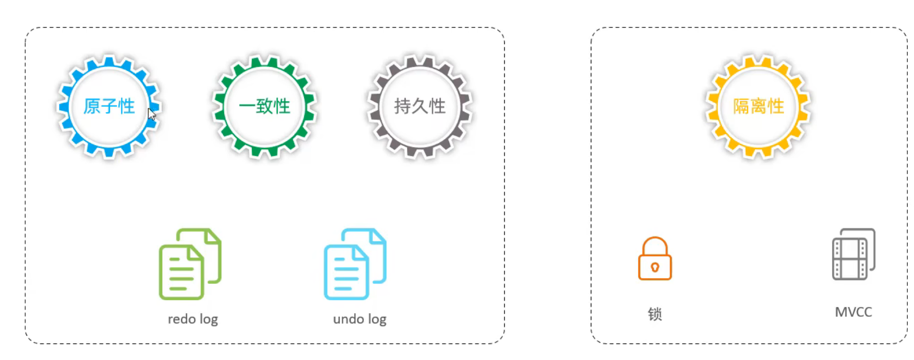


我们在讲解事务åŸç†çš„时候，主è¦å°±æ˜¯æ¥ç ”究一下redolog，undolog以åŠMVCC。


### （2）🚀 redo log

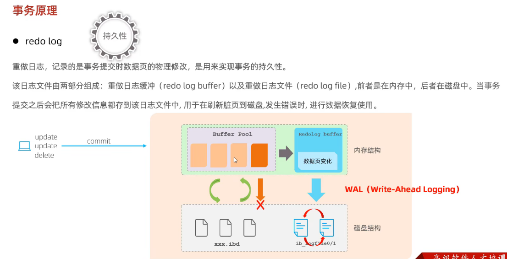

#### ①概念

**é‡åšæ—¥å¿—，记录的是事务æ交时数æ®é¡µçš„物ç†ä¿®æ”¹**，是用æ¥å®ç°**事务的æŒä¹…性**。

该日志文件由两部分组æˆï¼š

é‡åšæ—¥å¿—缓冲（redo log buffer）以åŠé‡åšæ—¥å¿—文件（redo logfile）,å‰è€…是在内存中，å者在ç£ç›˜ä¸­ã€‚

当**事务æ交之å会把所有修改信æ¯éƒ½å­˜åˆ°è¯¥æ—¥å¿—文件（redo logfile）中**,

- **==用äºåœ¨åˆ·æ–°è„页到ç£ç›˜,å‘生错误时, 进行数æ®æ¢å¤ä½¿ç”¨==**，相当äº==在ç£ç›˜ä¸­å¤šæ·»åŠ äº†ä¸€ä¸ªå‰¯æœ¬==。


#### ②未使用redo log时

**如æœæ²¡æœ‰redolog**，å¯èƒ½ä¼šå­˜åœ¨ä»€ä¹ˆé—®é¢˜çš„？ 我们一起æ¥åˆ†æ一下。

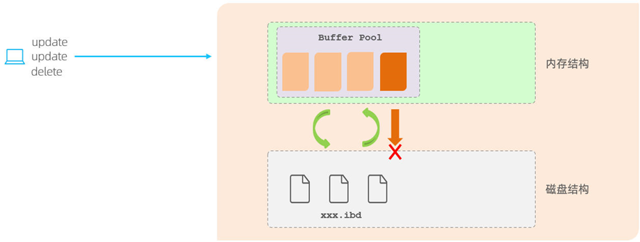

我们知é“，在InnoDB引æ“中的内存结æ„中，主è¦çš„**内存区域就是缓冲池**，在缓冲池中缓存了很多的数æ®é¡µã€‚ 当我们在一个事务中，执行多个å¢åˆ æ”¹çš„æ“作时，InnoDB引æ“会先æ“作缓冲池中的数æ®ï¼Œå¦‚æœç¼“冲区没有对应的数æ®ï¼Œä¼šé€šè¿‡åå°çº¿ç¨‹å°†ç£ç›˜ä¸­çš„æ•°æ®åŠ è½½å‡ºæ¥ï¼Œå­˜æ”¾åœ¨ç¼“冲区中，然å将缓冲池中的数æ®ä¿®æ”¹ï¼Œä¿®æ”¹åçš„æ•°æ®é¡µæˆ‘们称为è„页。 **而è„页则会在一定的时机，通过åå°çº¿ç¨‹åˆ·æ–°åˆ°ç£ç›˜ä¸­**，ä»è€Œä¿è¯ç¼“冲区ä¸ç£ç›˜çš„æ•°æ®ä¸€è‡´ã€‚ 而缓冲区的**è„页数æ®å¹¶ä¸æ˜¯å®æ—¶åˆ·æ–°çš„**，而是一段时间之å将缓冲区的数æ®åˆ·æ–°åˆ°ç£ç›˜ä¸­ï¼Œ**==å‡å¦‚刷新到ç£ç›˜çš„过程出错了==**，而**æ示给用户事务æ交æˆåŠŸï¼Œè€Œæ•°æ®å´æ²¡æœ‰æŒä¹…化下æ¥**，这就出ç°é—®é¢˜äº†ï¼Œ**没有ä¿è¯äº‹åŠ¡çš„æŒä¹…性。**


#### ③使用redo log

那么，如何解决上述的问题呢？ 在InnoDB中æ供了一份**日志 redo log**，æ¥ä¸‹æ¥æˆ‘们å†æ¥åˆ†æ一下，通过redolog如何解决这个问题。

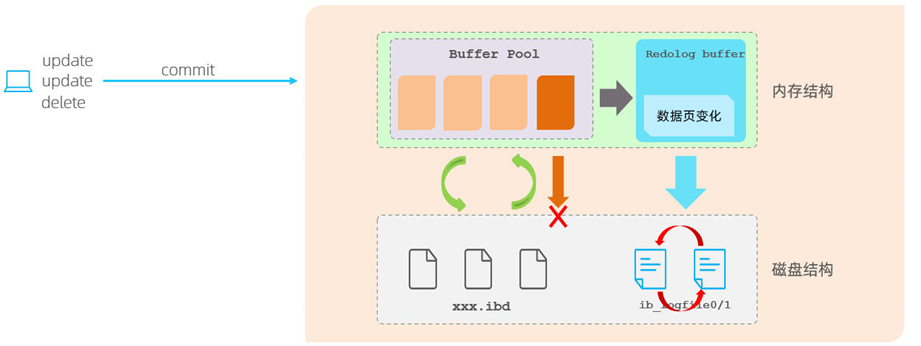

有了redolog之å，当对缓冲区的数æ®è¿›è¡Œå¢åˆ æ”¹ä¹‹å，**会首先==å°†æ“作的数æ®é¡µçš„å˜åŒ–，记录在redolog buffer中==。**在事务æ交时，**会将redo log buffer中的数æ®åˆ·æ–°åˆ°redo logç£ç›˜æ–‡ä»¶ä¸­**。过一段时间之å，如æœåˆ·æ–°ç¼“冲区的**è„页到ç£ç›˜æ—¶ï¼Œå‘生错误**，此时就å¯ä»¥**借助äºredo log进行数æ®æ¢å¤ï¼Œè¿™æ ·å°±ä¿è¯äº†äº‹åŠ¡çš„æŒä¹…性**。 而**如æœè„页æˆåŠŸåˆ·æ–°åˆ°ç£ç›˜** 或 或者涉åŠåˆ°çš„æ•°æ®å·²ç»è½ç›˜ï¼Œæ­¤æ—¶**redolog就没有作用了，就å¯ä»¥åˆ é™¤äº†**，所以存在的两个redolog文件是**循ç¯å†™çš„**，ä¸ä¼šæ°¸ä¹…çš„ä¿å­˜ã€‚


> 那为什么**æ¯ä¸€æ¬¡æ交事务，è¦åˆ·æ–°redo log 到ç£ç›˜ä¸­**呢，而**ä¸æ˜¯ç›´æ¥å°†**buffer pool中的==è„页刷新到ç£ç›˜å‘¢==?
>
> 因为在业务æ“作中，我们**æ“作数æ®å¯èƒ½æœ‰å¤šæ¡ï¼Œå¹¶ä¸”一般都是éšæœºè¯»å†™ç£ç›˜çš„**，而ä¸æ˜¯é¡ºåºè¯»å†™ç£ç›˜ã€‚ 而redo log在往ç£ç›˜æ–‡ä»¶ä¸­å†™å…¥æ•°æ®ï¼Œ**==ç”±äºæ˜¯æ—¥å¿—文件，以追加的方å¼è¿›è¡Œæ·»åŠ ï¼Œæ‰€ä»¥éƒ½æ˜¯é¡ºåºå†™çš„==**。**顺åºå†™çš„效ç‡ï¼Œè¦è¿œå¤§äºéšæœºå†™**。 è¿™ç§å…ˆå†™æ—¥å¿—çš„æ–¹å¼ï¼Œç§°ä¹‹ä¸º **WAL（Write-Ahead Logging）**。


### （3）🚀 undo log

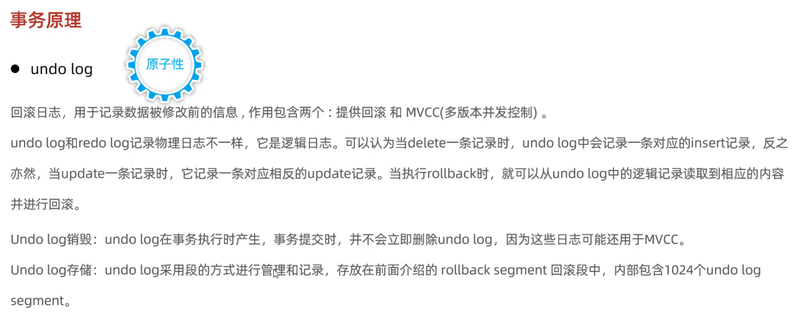

å›æ»šæ—¥å¿—，用äº**==记录数æ®è¢«ä¿®æ”¹å‰çš„ä¿¡æ¯==** , 作用包å«ä¸¤ä¸ª : 

**æä¾›å›æ»š(ä¿è¯äº‹åŠ¡çš„åŸå­æ€§) å’ŒMVCC(多版本并å‘æ§åˆ¶) **


undo logå’Œredo log记录物ç†æ—¥å¿—ä¸ä¸€æ ·ï¼Œ**它是==逻辑日志==**。

å¯ä»¥è®¤ä¸ºå½“**delete一æ¡è®°å½•**时，undolog中会**记录一æ¡å¯¹åº”çš„insert记录**，

å之亦然，当update一æ¡è®°å½•æ—¶ï¼Œå®ƒ**==记录一æ¡å¯¹åº”相åçš„==update记录**。

**当执行rollback时，就å¯ä»¥ä»undo log中的逻辑记录读å–到相应的内容并进行å›æ»šã€‚**


- Undo log销æ¯ï¼šundo log在事务执行时产生，**事务æ交时，并ä¸ä¼šç«‹å³åˆ é™¤undo log，因为这些日志å¯èƒ½è¿˜ç”¨äº==MVCC==。**

- Undo log存储：undo log采用**段的方å¼è¿›è¡Œç®¡ç†å’Œè®°å½•**，**存放在å‰é¢ä»‹ç»çš„ rollback segmentå›æ»šæ®µ**中，内部包å«1024个undo log segment。


## 6.4 🚀 ==MVCC==

### （1）🚀 ==基本概念==

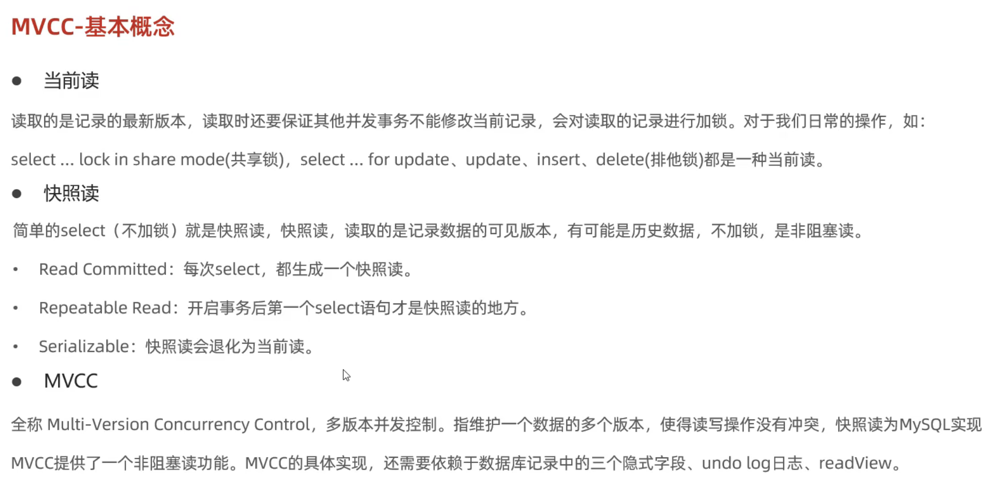


#### â‘ ==当å‰è¯»==

**读å–的是记录的最新版本**，读å–时还è¦**ä¿è¯å…¶ä»–并å‘事务ä¸èƒ½ä¿®æ”¹å½“å‰è®°å½•ï¼Œä¼š==对读å–的记录进行加é”==**。对äºæˆ‘们日常的æ“作，如：

- select ... lock in share mode(共享é”)
- select ...for update（æ’ä»–é”）
- updateã€insertã€delete（æ’ä»–é”）都是一ç§å½“å‰è¯»ã€‚


##### 测试

**客户端一**

```sql
begin;
	select * from stu;
	
-- 当å‰è¯» ，å³ä½¿åœ¨å½“å‰äº‹åŠ¡å†…，未æ交的情况下，也å¯ä»¥è·å–åˆ°æœ€æ–°æ•°æ® (å‰æ是客户端二的事务需è¦å…ˆcommit)
	select * from stu lock in share mode;
commit;
```

**客户端二，也开å¯äº‹åŠ¡ï¼Œä¿®æ”¹stu表中的内容**，按照Mysql的隔离级别-å¯é‡å¤è¯»RR，客户端一 ç›´æ¥æŸ¥è¯¢æ˜¯çœ‹ä¸åˆ°æœ€æ–°çš„æ•°æ®çš„(客户端二刚修改的)，因为需è¦æ»¡è¶³å¯é‡å¤çš„的隔离级别，但是通过在查询语å¥åé¢åŠ ä¸Šäº† **lock in share mode 共享é”** (å‰æ是客户端二的事务**需è¦å…ˆcommit**)，此时是当å‰è¯»æ“作，就å¯ä»¥è¯»å–最新的修改åçš„æ•°æ®ã€‚

```sql
-- 客户端二
begin;
	update stu set name = 'JSP' where id = 1;
commit;
```

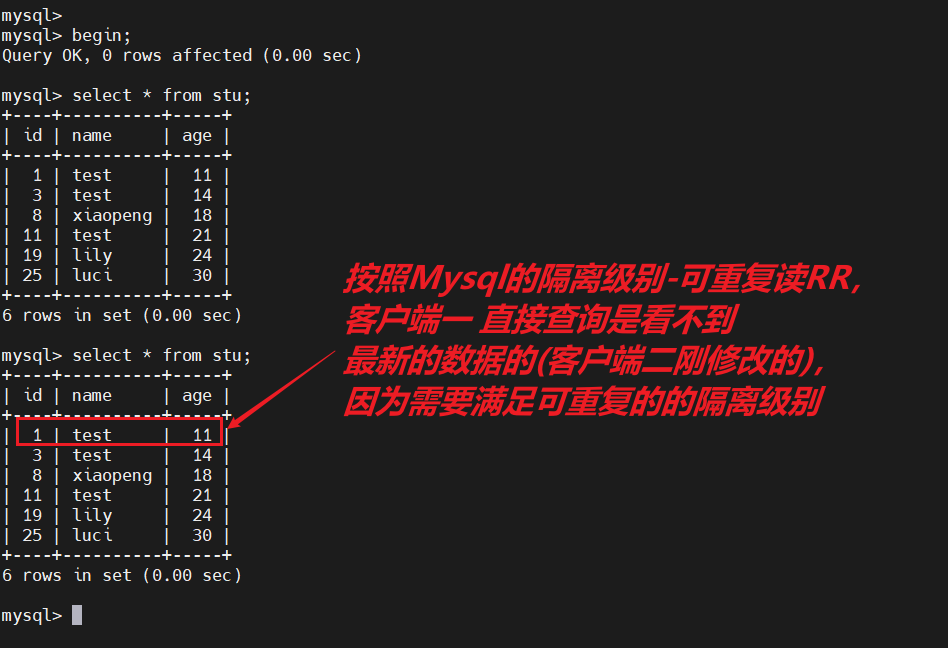

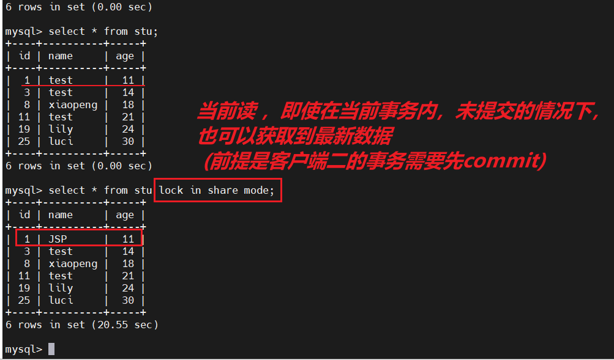


在测试中我们å¯ä»¥çœ‹åˆ°ï¼Œ**å³ä½¿æ˜¯åœ¨é»˜è®¤çš„RR隔离级别（å¯é‡å¤è¯»ï¼‰ä¸‹**，**事务A中ä¾ç„¶å¯ä»¥è¯»å–到事务B最新æ交的内容**，因为在查询语å¥åé¢åŠ ä¸Šäº† **lock in share mode 共享é”**，此时是当å‰è¯»æ“作。当然，当我们加æ’ä»–é”的时候，也是**==当å‰è¯»æ“作==**。


#### ②==快照读==

**简å•çš„select（==ä¸åŠ é”==）就是快照读**，快照读，**读å–的是记录数æ®çš„å¯è§ç‰ˆæœ¬**，**有å¯èƒ½æ˜¯å†å²æ•°æ®ï¼Œä¸åŠ é”，是é阻å¡è¯»ã€‚**

快照读解决了ä¸å¯é‡å¤è¯»çš„问题，**å³ä½¿æ•°æ®ä¿®æ”¹äº†ï¼Œé€šè¿‡å¿«ç…§è¯»ä¸¤æ¬¡è¯»å–结æœä¸€è‡´**，**但是出ç°äº†å¹»è¯»**


**三ç§==ä¸åŒéš”离级别==下的快照读**

- Read Committed：æ¯æ¬¡select，都生æˆä¸€ä¸ªå¿«ç…§è¯»ã€‚
- **Repeatable Read**：开å¯äº‹åŠ¡å**第一个select语å¥æ‰æ˜¯å¿«ç…§è¯»çš„地方**。
  - åé¢æ‰§è¡Œç›¸åŒçš„select语å¥éƒ½æ˜¯**ä»å¿«ç…§ä¸­è·å–æ•°æ®ï¼Œå¯èƒ½ä¸æ˜¯å½“å‰çš„最新数æ®**，这样也就==ä¿è¯äº†å¯é‡å¤è¯»==

- Serializable：**快照读会退化为当å‰è¯»**。


测试：

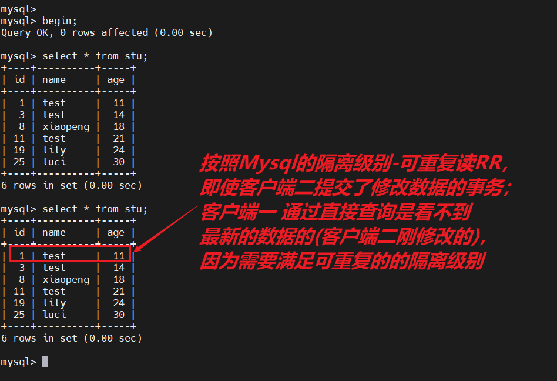

在测试中,我们看到å³ä½¿**事务Bæ交了数æ®,事务A中也查询ä¸åˆ°**。 åŸå› å°±æ˜¯å› ä¸º**普通的select是快照读**，而在当å‰é»˜è®¤çš„RR隔离级别下，开å¯äº‹åŠ¡å第一个select语å¥æ‰æ˜¯å¿«ç…§è¯»çš„地方，**åé¢æ‰§è¡Œç›¸åŒçš„select语å¥éƒ½æ˜¯ä»å¿«ç…§ä¸­è·å–æ•°æ®ï¼Œå¯èƒ½ä¸æ˜¯å½“å‰çš„最新数æ®ï¼Œè¿™æ ·ä¹Ÿå°±ä¿è¯äº†å¯é‡å¤è¯»**。


#### â‘¢MVCC

全称 **Multi-Version Concurrency Control**，==多版本并å‘æ§åˆ¶==。

**指维护一个数æ®çš„多个版本**，使得读写æ“作没有冲çªï¼Œ**快照读**为MySQLå®ç°MVCCæ供了一个**é阻å¡è¯»åŠŸèƒ½**。

MVCC的具体å®ç°ï¼Œè¿˜éœ€è¦ä¾èµ–äº**æ•°æ®åº“记录中的三个éšå¼å­—段ã€undo log日志ã€readView**。


æ¥ä¸‹æ¥ï¼Œæˆ‘们å†æ¥ä»‹ç»ä¸€ä¸‹InnoDB引æ“的表中涉åŠåˆ°çš„éšè—字段 ã€undolog ä»¥åŠ readview，ä»è€Œæ¥ä»‹ç»ä¸€ä¸‹MVCCçš„åŸç†ã€‚


### （2）éšè—字段

#### ①介ç»

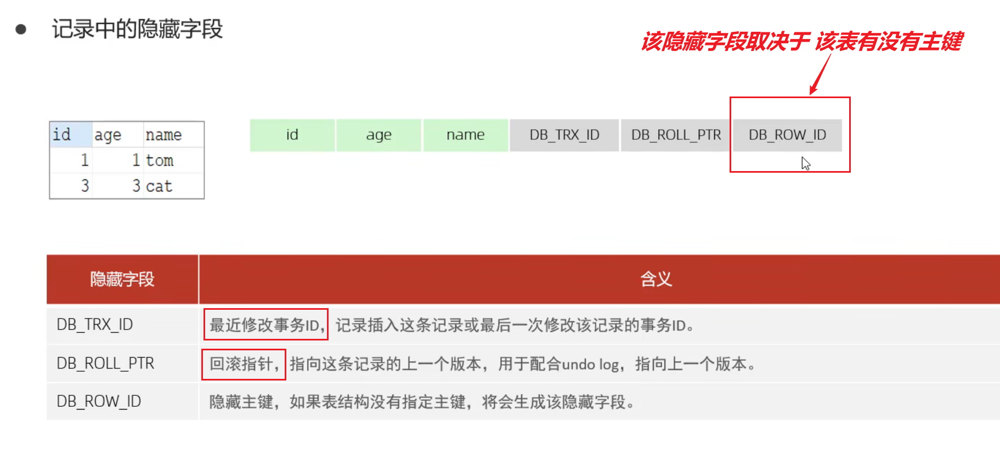

当我们创建了上é¢çš„这张表，我们在查看表结æ„的时候，就å¯ä»¥æ˜¾å¼çš„看到这三个字段。 å®é™…上除了这三个字段以外，InnoDB还会自动的给我们添加三个éšè—字段åŠå…¶å«ä¹‰åˆ†åˆ«æ˜¯ï¼š

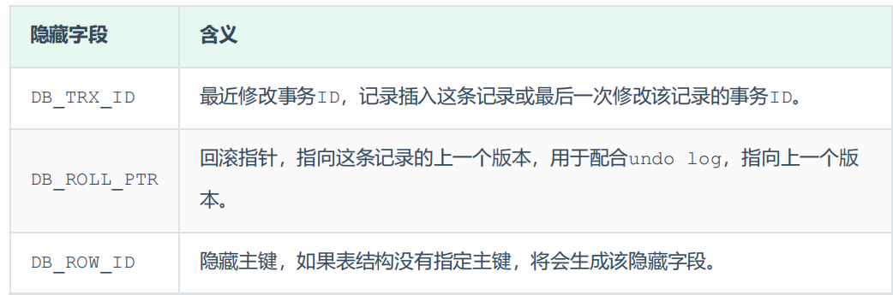

而上述的å‰ä¸¤ä¸ªå­—段是肯定会添加的， 是å¦æ·»åŠ æœ€å一个字段**DB_ROW_ID，得看当å‰è¡¨æœ‰æ²¡æœ‰ä¸»é”®ï¼Œå¦‚æœæœ‰ä¸»é”®ï¼Œåˆ™ä¸ä¼šæ·»åŠ è¯¥éšè—字段。**


#### ②测试

##### 1). 查看有主键的表 stu

进入æœåŠ¡å™¨ä¸­çš„ /var/lib/mysql/itcast/ , 查看stu的表结æ„ä¿¡æ¯, 通过如下指令:

```bash
# 使用idb2sdi 命令查看表空间文件信æ¯
ibd2sdi stu.ibd
```

查看到的表结æ„ä¿¡æ¯ä¸­ï¼Œ**æœ‰ä¸€æ  columns**，在其中我们会看到处ç†æˆ‘们建表时指定的字段以外，还有é¢å¤–的两个字段 分别是：DB_TRX_ID 〠DB_ROLL_PTR ，**因为该表有主键，所以没有DB_ROW_IDéšè—字段**。

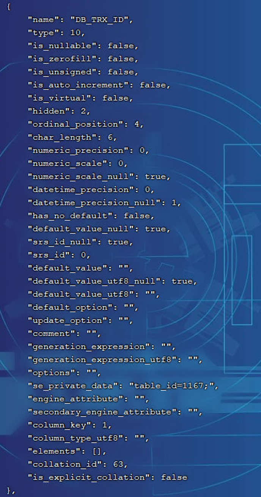

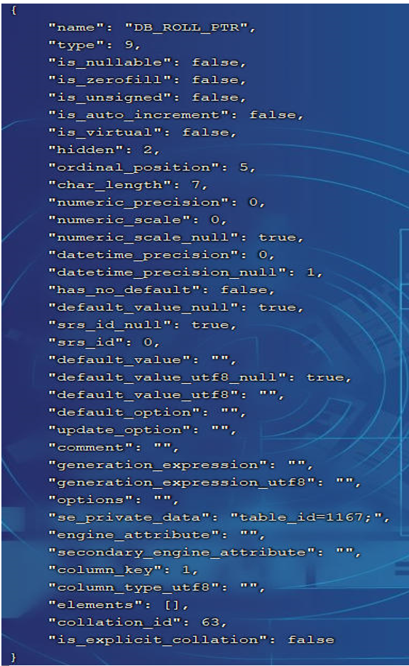


##### 2). 查看没有主键的表 employee

建表语å¥ï¼š

```sql
create table employee (id int , name varchar(10)); 
```

此时，我们å†é€šè¿‡ä»¥ä¸‹æŒ‡ä»¤æ¥æŸ¥çœ‹è¡¨ç»“æ„åŠå…¶å…¶ä¸­çš„字段信æ¯ï¼š

```sql
ibd2sdi employee.ibd 
```

查看到的表结æ„ä¿¡æ¯ä¸­ï¼Œæœ‰ä¸€æ  columns，在其中我们会看到处ç†æˆ‘们建表时指定的字段以外，还有é¢å¤–的三个字段 分别是：DB_TRX_ID 〠DB_ROLL_PTR ã€DB_ROW_ID，**因为employee表是没有指定主键的**。

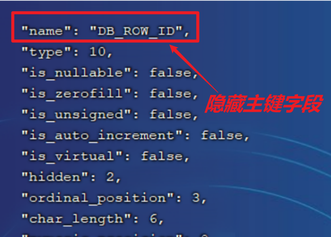


### （3）🚀 ==undo log==

#### ①介ç»

å›æ»šæ—¥å¿—，在insertã€updateã€delete的时候产生的便äºæ•°æ®å›æ»šçš„日志。

- **当insert**的时候，产生的undo log日志**åªåœ¨å›æ»šæ—¶éœ€è¦ï¼Œåœ¨äº‹åŠ¡æ交å，å¯è¢«ç«‹å³åˆ é™¤**。
- 而**updateã€delete**的时候，产生的undo log日志**==ä¸ä»…在å›æ»šæ—¶éœ€è¦==**，**==在快照读时也需è¦==，ä¸ä¼šç«‹å³è¢«åˆ é™¤ã€‚**


#### ②🚀版本链

有一张表**åŸå§‹æ•°æ®**为：

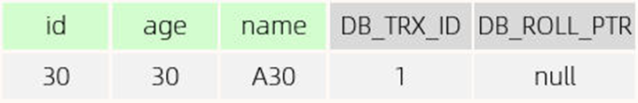


> DB_TRX_ID : 代表**最近修改事务ID**，记录æ’入这æ¡è®°å½•æˆ–最å一次修改该记录的事务ID，是自å¢çš„。
>
> DB_ROLL_PTR ： 表示**å›æ»šæŒ‡é’ˆ**，由äº**è¿™æ¡æ•°æ®æ˜¯æ‰æ’入的，没有被更新过，所以该字段值为null**。


然å，有**四个并å‘事务åŒæ—¶åœ¨è®¿é—®è¿™å¼ è¡¨**。

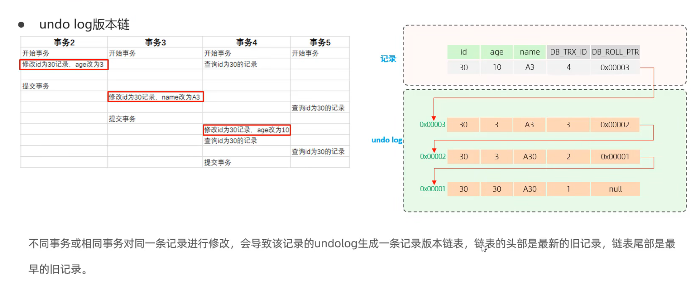

##### A. 第一步


当**事务2执行第一æ¡ä¿®æ”¹è¯­å¥æ—¶ï¼Œä¼šè®°å½•undo log日志**，记录数æ®å˜æ›´ä¹‹å‰çš„æ ·å­; 然å更新记录，并且记录本次æ“作的事务ID，å›æ»šæŒ‡é’ˆï¼Œå›æ»šæŒ‡é’ˆç”¨æ¥æŒ‡å®šå¦‚æœå‘生å›æ»šï¼Œå›æ»šåˆ°å“ªä¸€ä¸ªç‰ˆæœ¬ã€‚

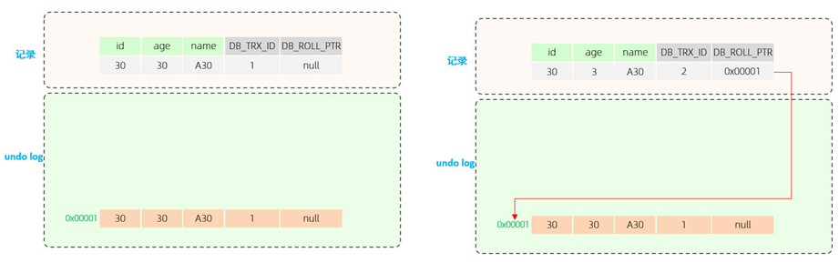


##### B.第二步

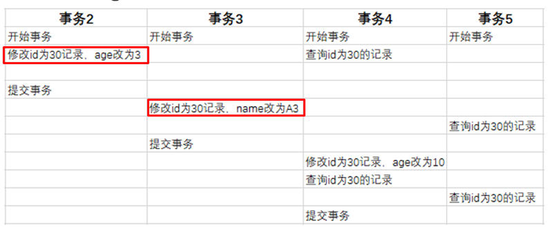

当事务3执行第一æ¡ä¿®æ”¹è¯­å¥æ—¶ï¼Œä¹Ÿä¼šè®°å½•undo log日志，记录数æ®å˜æ›´ä¹‹å‰çš„æ ·å­; 然å更新记录，并且记录本次æ“作的事务ID，å›æ»šæŒ‡é’ˆï¼Œå›æ»šæŒ‡é’ˆç”¨æ¥æŒ‡å®šå¦‚æœå‘生å›æ»šï¼Œå›æ»šåˆ°å“ªä¸€ä¸ªç‰ˆæœ¬ã€‚

**==注æ„==，这里事务3执行修改æ“作å就直æ¥æ交了事务，但是此时==undo logä¸ä¼šç«‹é©¬åˆ é™¤==，因为此时真正在有活动事务在使用undo log，所以å³ä½¿æ交了事务也ä¸ä¼šåˆ é™¤undo log日志**

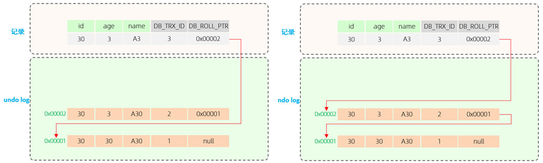


##### C. 第三步

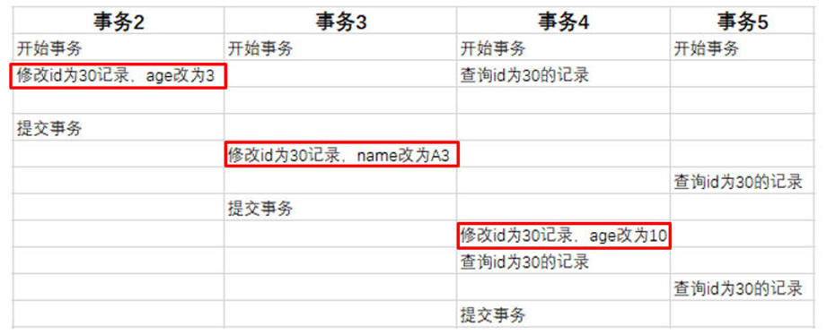

当事务4执行第一æ¡ä¿®æ”¹è¯­å¥æ—¶ï¼Œä¹Ÿä¼šè®°å½•undo log日志，记录数æ®å˜æ›´ä¹‹å‰çš„æ ·å­; 然å更新记录，并且记录本次æ“作的事务ID，å›æ»šæŒ‡é’ˆï¼Œå›æ»šæŒ‡é’ˆç”¨æ¥æŒ‡å®šå¦‚æœå‘生å›æ»šï¼Œå›æ»šåˆ°å“ªä¸€ä¸ªç‰ˆæœ¬ã€‚

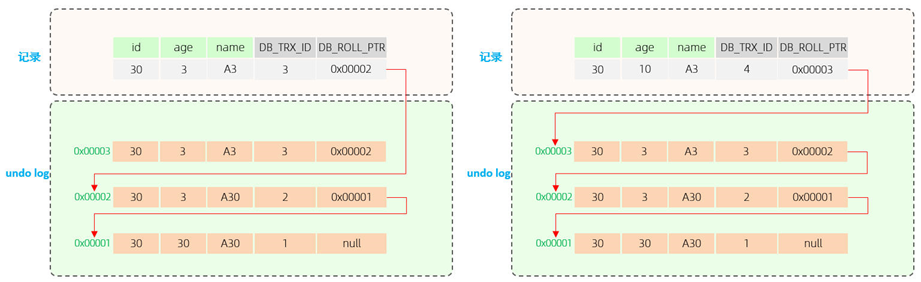


> 最终我们å‘ç°ï¼Œ**ä¸åŒäº‹åŠ¡æˆ–相åŒäº‹åŠ¡==对åŒä¸€æ¡è®°å½•è¿›è¡Œä¿®æ”¹==**，会导致该记录的undolog**生æˆä¸€æ¡è®°å½•ç‰ˆæœ¬é“¾è¡¨ï¼Œé“¾è¡¨çš„==头部是最新的旧记录，链表尾部是最早的旧记录==**。


### （4）🚀 ==readview==

#### ①概念

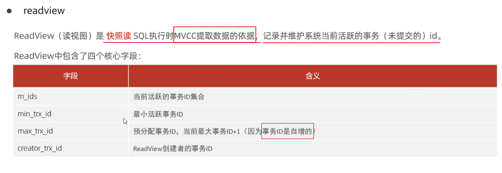

**ReadView（读视图）**

- **快照读 SQL执行时==MVCCæå–æ•°æ®çš„ä¾æ®==**，
- 记录并维护系统**当å‰æ´»è·ƒçš„事务（==未æ交的==）id。**

 

ReadView中包å«äº†å››ä¸ªæ ¸å¿ƒå­—段：

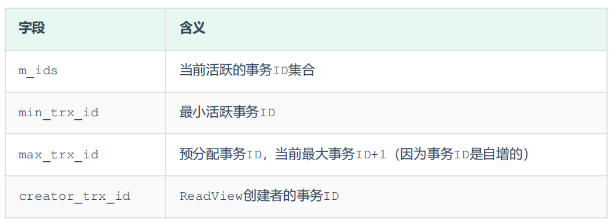


#### ②版本链数æ®çš„==访问规则==

而在readview中就规定了**版本链数æ®çš„访问规则**：

==trx_id==代表**当å‰==undolog版本链对应事务ID==**。

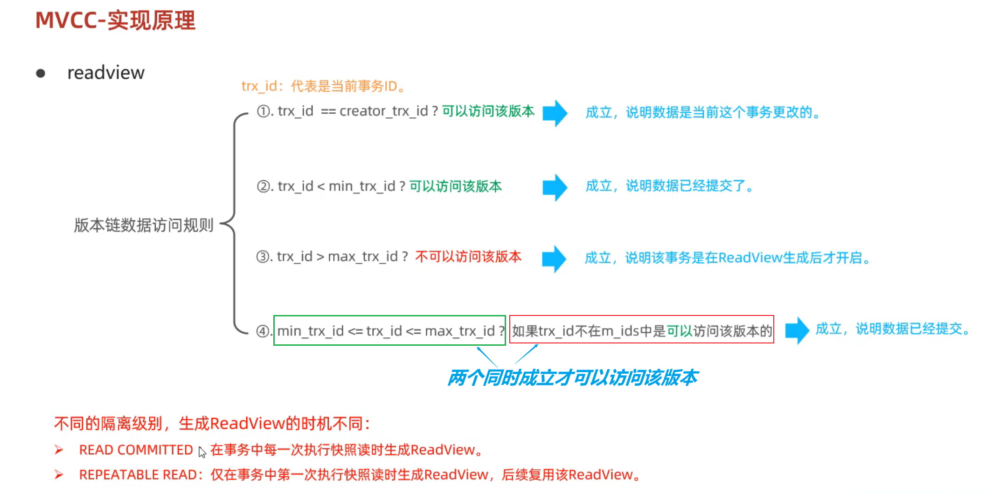

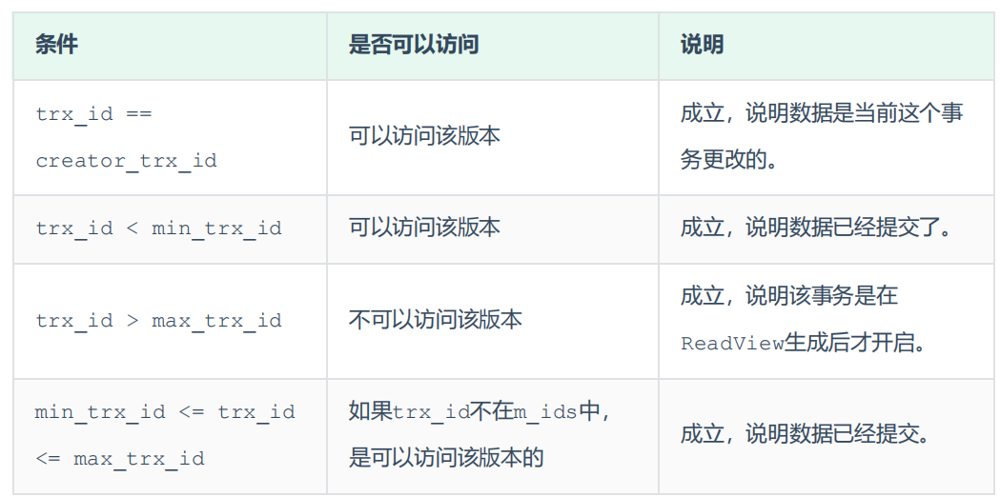

ä¸åŒçš„隔离级别，生æˆReadView的时机ä¸åŒï¼š

- READ COMMITTED （RC隔离级别）：**在事务中æ¯ä¸€æ¬¡æ‰§è¡Œå¿«ç…§è¯»æ—¶ç”ŸæˆReadView**。
- REPEATABLE READ（RR隔离级别）：**仅在事务中第一次执行快照读时生æˆReadView，==åç»­å¤ç”¨è¯¥ReadView==**。


### （5）🚀 ==åŸç†åˆ†æ==

#### ①RC隔离级别

RC隔离级别下，在事务中**æ¯ä¸€æ¬¡æ‰§è¡Œå¿«ç…§è¯»æ—¶ç”ŸæˆReadView**。

我们就æ¥åˆ†æ事务5中，两次快照读读å–æ•°æ®ï¼Œæ˜¯å¦‚何è·å–æ•°æ®çš„?

在事务5中，查询了两次id为30的记录，由äºéš”离级别为Read Committed，所以æ¯ä¸€æ¬¡è¿›è¡Œå¿«ç…§è¯»éƒ½ä¼šç”Ÿæˆä¸€ä¸ªReadView，那么两次生æˆçš„ReadView如下。

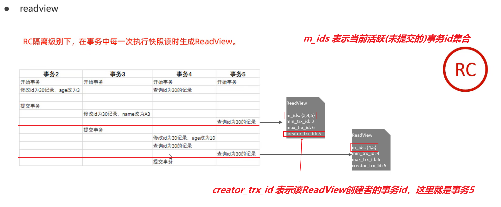


> 那么这两次快照读在è·å–æ•°æ®æ—¶ï¼Œå°±éœ€è¦**æ ¹æ®æ‰€ç”Ÿæˆçš„==ReadView以åŠReadView的版本链访问规则==，到undo log版本链中匹é…æ•°æ®ï¼Œæœ€ç»ˆå†³å®šæ­¤æ¬¡å¿«ç…§è¯»è¿”å›çš„æ•°æ®ã€‚**


#### ②🚀RC级别=> ==快照读的具体过程==

##### A. å…ˆæ¥çœ‹==第一次快照读== 具体的读å–过程

第一次快照读时，对应的**undo log 的版本链的信æ¯ï¼Œcreator_trx_id等信æ¯ï¼š**


在进行匹é…时，会**ä»undo log的版本链，ä»ä¸Šåˆ°ä¸‹è¿›è¡ŒæŒ¨ä¸ªåŒ¹é…**：

###### å…ˆåŒ¹é… è¿™æ¡è®°å½•


è¿™æ¡è®°å½•å¯¹åº”çš„**trx_id为4**，也就是将4带入å³ä¾§çš„匹é…规则中。

 â‘ ä¸æ»¡è¶³ â‘¡ä¸æ»¡è¶³ â‘¢ä¸æ»¡è¶³ ④也ä¸æ»¡è¶³ ，**都ä¸æ»¡è¶³**，则**继续匹é…undo log版本链的下一æ¡**。


###### å†åŒ¹é…ç¬¬äºŒæ¡ 


è¿™æ¡è®°å½•å¯¹åº”çš„**trx_id为3**，也就是将3带入å³ä¾§çš„匹é…规则中。

â‘ ä¸æ»¡è¶³ â‘¡ä¸æ»¡è¶³ â‘¢ä¸æ»¡è¶³ ④也ä¸æ»¡è¶³ ，**都ä¸æ»¡è¶³ï¼Œåˆ™ç»§ç»­åŒ¹é…undo log版本链的下一æ¡**。


###### å†åŒ¹é…ç¬¬ä¸‰æ¡ 


è¿™æ¡è®°å½•å¯¹åº”çš„**trx_id为2**，也就是将2带入å³ä¾§çš„匹é…规则中。

â‘ ä¸æ»¡è¶³ **②满足 终止匹é…**，此次快照读，**è¿”å›çš„æ•°æ®å°±æ˜¯ç‰ˆæœ¬é“¾ä¸­è®°å½•çš„è¿™æ¡æ•°æ®**。


##### B. å†æ¥çœ‹==第二次快照==读具体的读å–过程

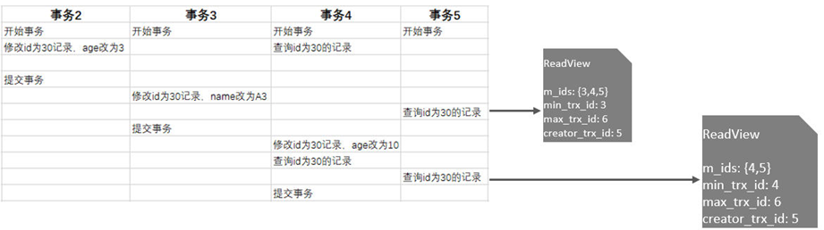


在进行匹é…时，会**ä»undo log的版本链，ä»ä¸Šåˆ°ä¸‹è¿›è¡ŒæŒ¨ä¸ªåŒ¹é…**：

###### å…ˆåŒ¹é… 

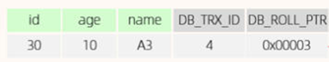

è¿™æ¡è®°å½•ï¼Œè¿™æ¡è®°å½•å¯¹åº”çš„**trx_id为4**，也就是将4带入å³ä¾§çš„匹é…规则中。

 â‘ ä¸æ»¡è¶³ â‘¡ä¸æ»¡è¶³ â‘¢ä¸æ»¡è¶³ ④也ä¸æ»¡è¶³ ，**都ä¸æ»¡è¶³ï¼Œåˆ™ç»§ç»­åŒ¹é…undo log版本链的下一æ¡**。


###### å†åŒ¹é…ç¬¬äºŒæ¡ 


è¿™æ¡è®°å½•å¯¹åº”çš„**trx_id为3**，也就是将3带入å³ä¾§çš„匹é…规则中。

â‘ ä¸æ»¡è¶³ **②满足 。终止匹é…**，此次快照读，返å›çš„æ•°æ®å°±æ˜¯ç‰ˆæœ¬é“¾ä¸­è®°å½•çš„è¿™æ¡æ•°æ®ã€‚


#### ③RR隔离级别

RR隔离级别下，**仅在事务中第一次执行快照读时生æˆReadView，==åç»­å¤ç”¨è¯¥ReadView==**，**进而ä¿è¯RR隔离级别å¯é‡å¤è¯»**。 而RR 是å¯é‡å¤è¯»ï¼Œåœ¨ä¸€ä¸ªäº‹åŠ¡ä¸­ï¼Œ**执行两次相åŒçš„select语å¥ï¼ŒæŸ¥è¯¢åˆ°çš„结æœæ˜¯ä¸€æ ·çš„**。

é‚£MySQL是如何åšåˆ°å¯é‡å¤è¯»çš„å‘¢? 我们简å•åˆ†æ一下就知é“了

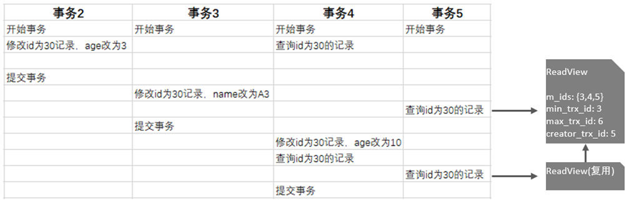

我们看到，在RR隔离级别下，åªæ˜¯åœ¨äº‹åŠ¡ä¸­ç¬¬ä¸€æ¬¡å¿«ç…§è¯»æ—¶ç”ŸæˆReadView，**å续都是å¤ç”¨è¯¥ReadView**，那么既然ReadView都一样， ReadView的版本链匹é…规则也一样， 那么**最终快照读返å›çš„结æœä¹Ÿæ˜¯ä¸€æ ·çš„**，==进而ä¿è¯RR隔离级别å¯é‡å¤è¯»==。


> 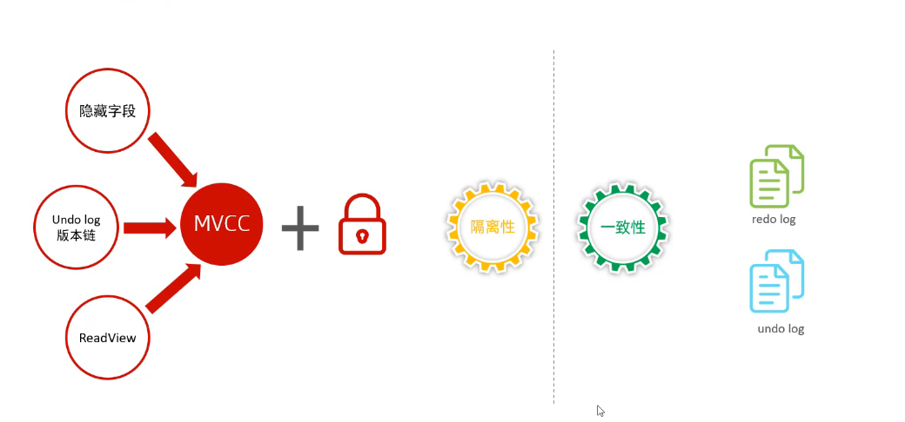
>
> 所以呢：
>
> MVCCçš„å®ç°åŸç†å°±æ˜¯é€šè¿‡ **InnoDB表的éšè—字段ã€UndoLog 版本链ã€ReadView**æ¥å®ç°çš„。
>
> 而==MVCC + é”==，则**å®ç°äº†äº‹åŠ¡çš„隔离性**。 
>
> 而**一致性则是由redo log ä¸ undo log**ä¿è¯ï¼Œä¿è¯æ•°æ®æ‰§è¡Œå‰å一致。


## 6.5 å°ç»“

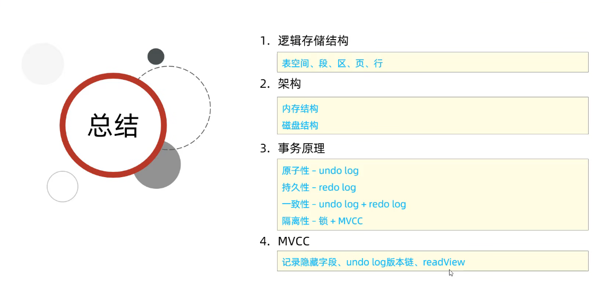


# 7ã€MySQL管ç†

## 7.1 系统数æ®åº“

Mysqlæ•°æ®åº“安装完æˆå，自带了一下四个数æ®åº“，具体作用如下：

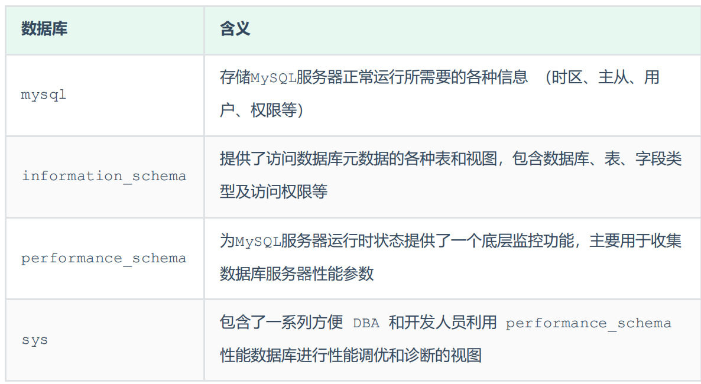


## 7.2 常用工具

### （1）mysql-客户端工具

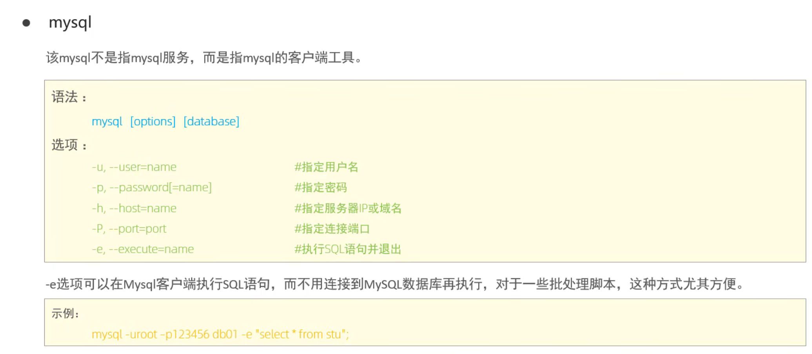

**该mysqlä¸æ˜¯æŒ‡mysqlæœåŠ¡**，而是指mysqlçš„**客户端工具**。

```sql
-- 语法 ：
    mysql [options] [database]

-- 选项 ：
    -u, --user=name 	#指定用户å
    -p, --password[=name] 	#指定密ç 
    -h, --host=name 	#指定æœåŠ¡å™¨IP或域å
    -P, --port=port	 	#大写字æ¯P =》指定è¿æ¥ç«¯å£
    -e, --execute=name 	#执行SQL语å¥å¹¶é€€å‡º
```

**-e选项å¯ä»¥åœ¨Mysql客户端执行SQL语å¥**，而ä¸ç”¨è¿æ¥åˆ°MySQLæ•°æ®åº“å†æ‰§è¡Œï¼Œå¯¹äºä¸€äº›**批处ç†è„šæœ¬**，这ç§æ–¹å¼å°¤å…¶æ–¹ä¾¿ã€‚

示例：

```sql
mysql -h192.168.88.129 -P3306 -uroot -p1234 itcast -e "select * from stu"; 

mysql -h192.168.88.129 -P3306 -uroot -p1234 itcast -e "show databases;"; 
```

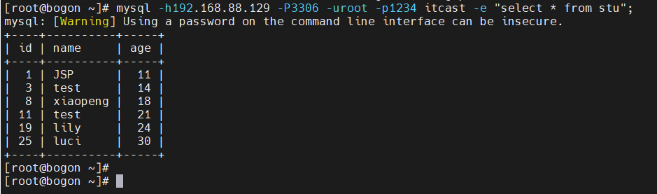


### （2）mysqladmin-执行管ç†æ“作

mysqladmin 是一个**执行管ç†æ“作的客户端程åº**。å¯ä»¥ç”¨å®ƒæ¥**检查æœåŠ¡å™¨çš„é…置和当å‰çŠ¶æ€ã€åˆ›å»ºå¹¶åˆ é™¤æ•°æ®åº“等。**

```sql
-- 通过帮助文档查看选项：
	mysqladmin --help
```

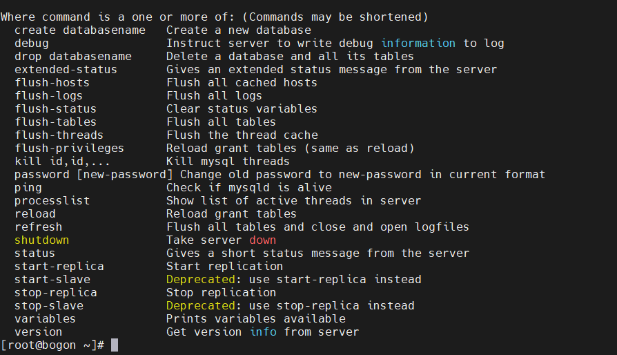

```sql
-- 语法:
	mysqladmin [options] command ...

-- 选项:
    -u, --user=name #指定用户å
    -p, --password[=name] #指定密ç 
    -h, --host=name #指定æœåŠ¡å™¨IP或域å
    -P, --port=port #指定è¿æ¥ç«¯å£
```

示例：

```sql
mysqladmin -uroot -p1234 create 'test01'; -- 创建指定数æ®åº“
mysqladmin -uroot -p1234 drop 'test01'; -- 删除指定数æ®åº“
mysqladmin -uroot -p1234 version; -- 查看当å‰æ•°æ®åº“的版本
```

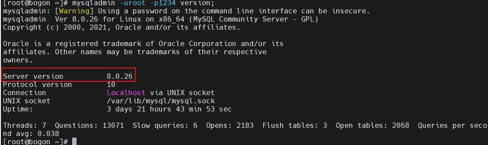


### （3）mysqlbinlog-二进制日志文件

ç”±äºæœåŠ¡å™¨ç”Ÿæˆçš„**二进制日志文件**以二进制格å¼ä¿å­˜ï¼Œæ‰€ä»¥å¦‚æœæƒ³è¦æ£€æŸ¥è¿™äº›æ–‡æœ¬çš„文本格å¼ï¼Œå°±ä¼šä½¿ç”¨åˆ°**mysqlbinlog 日志管ç†å·¥å…·**。

```sql
-- 语法 ：
	mysqlbinlog [options] log-files1 log-files2 ...

-- 选项 ：
    -d, --database=name 	-- 指定数æ®åº“å称，åªåˆ—出指定的数æ®åº“相关æ“作。
    -o, --offset=#   	-- 忽略æ‰æ—¥å¿—中的å‰n行命令。
    -r,--result-file=name 	-- 将输出的文本格å¼æ—¥å¿—输出到指定文件。
    -s, --short-form 	-- 显示简å•æ ¼å¼ï¼Œ çœç•¥æ‰ä¸€äº›ä¿¡æ¯ã€‚
    --start-datatime=date1 --stop-datetime=date2 	-- 指定日期间隔内的所有日志。
    --start-position=pos1 --stop-position=pos2 		-- 指定ä½ç½®é—´éš”内的所有日志。
```

示例:

A. 查看 binlog.000006这个二进制文件中的数æ®ä¿¡æ¯

```sql
cd /var/lib/mysql -- 查看Mysql的目录文件
```

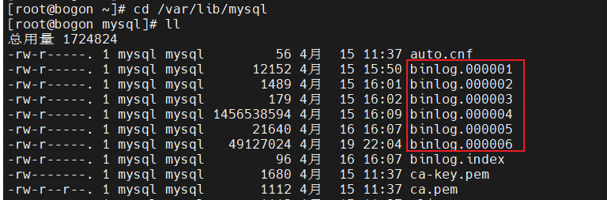


上述查看到的二进制日志文件数æ®ä¿¡æ¯é‡å¤ªå¤šäº†ï¼Œä¸æ–¹ä¾¿æŸ¥è¯¢ã€‚ 我们å¯ä»¥åŠ ä¸Šä¸€ä¸ªå‚æ•° -s æ¥æ˜¾ç¤ºç®€å•æ ¼å¼ã€‚

```sql
mysqlbinlog binlog.000006
mysqlbinlog -s binlog.000006 -- 精简查询åçš„ä¿¡æ¯
```


### （4）mysqlshow-对象查找

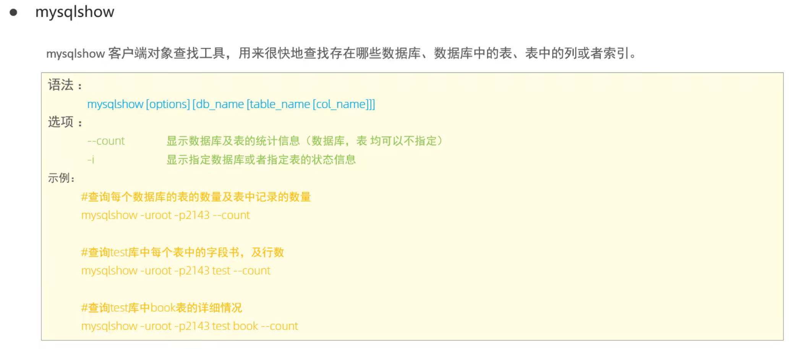

mysqlshow **客户端对象查找工具**，用æ¥å¾ˆå¿«åœ°**查找存在哪些数æ®åº“ã€æ•°æ®åº“中的表ã€è¡¨ä¸­çš„列或者索引**。

```sql
-- 语法 ：
    mysqlshow [options] [db_name [table_name [col_name]]]

-- 选项 ：
    --count 	-- 显示数æ®åº“åŠè¡¨çš„统计信æ¯ï¼ˆæ•°æ®åº“，表 å‡å¯ä»¥ä¸æŒ‡å®šï¼‰
    -i 		-- 显示指定数æ®åº“或者指定表的状æ€ä¿¡æ¯

-- 示例：
    #查询itcast库中æ¯ä¸ªè¡¨ä¸­çš„统计信æ¯ï¼šå­—段书，åŠè¡Œæ•°
    mysqlshow -uroot -p1234 itcast --count
    #查询itcast库中book表的详细情况
    mysqlshow -uroot -p1234 itcast stu --count
```

**`-i`查看指定数æ®åº“或者指定表/字段的状æ€ä¿¡æ¯**

```sql
mysqlshow -uroot -p1234 itcast stu -i
mysqlshow -uroot -p1234 itcast stu id -i
```


示例：

**A. 查询æ¯ä¸ªæ•°æ®åº“的表的数é‡åŠè¡¨ä¸­è®°å½•çš„æ•°é‡**

```sql
mysqlshow -uroot -p1234 --count
```

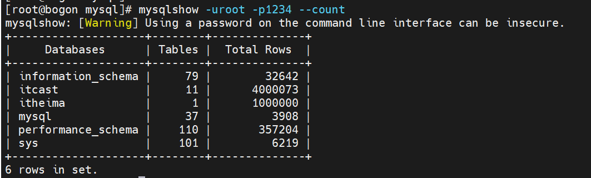

**B. 查看数æ®åº“itcast的统计信æ¯**

```sql
mysqlshow -uroot -p1234 itcast --count
```

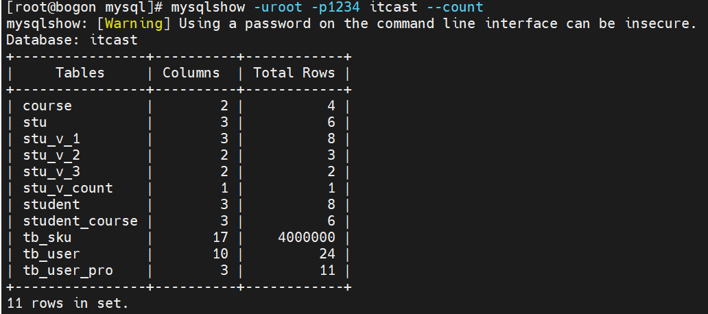

**C. 查看数æ®åº“itcast中的stu表的信æ¯**

```sql
mysqlshow -uroot -p1234 itcast stu --count
```


**D. 查看数æ®åº“itcast中的course表的id字段的信æ¯**

```sql
mysqlshow -uroot -p1234 itcast stu id --count
```

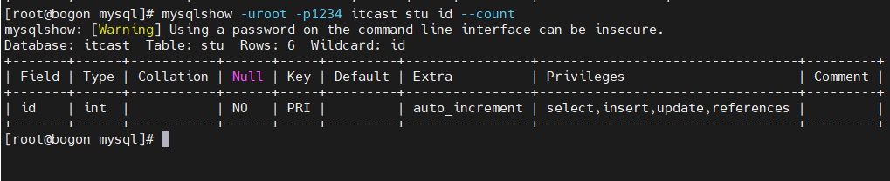

**E.`-i`查看指定数æ®åº“或者指定表/字段的状æ€ä¿¡æ¯**

```sql
mysqlshow -uroot -p1234 itcast stu -i
mysqlshow -uroot -p1234 itcast stu id -i
```

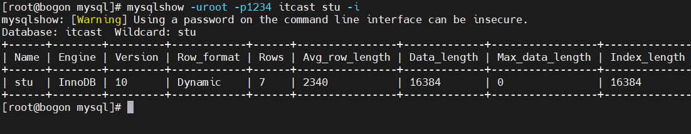

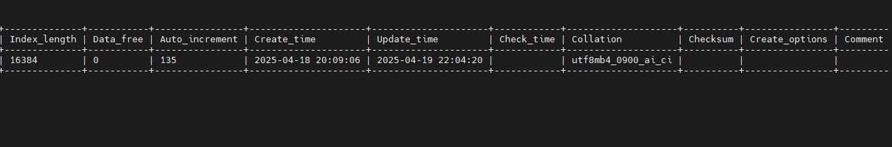


### （5）mysqldump-æ•°æ®å¤‡ä»½å’Œè¿ç§»

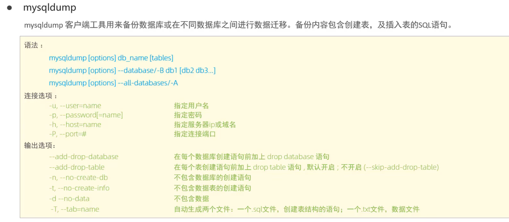

mysqldump 客户端工具用æ¥**备份数æ®åº“或在ä¸åŒæ•°æ®åº“之间进行数æ®è¿ç§»**。备份内容**包å«åˆ›å»ºè¡¨ï¼ŒåŠæ’入表的SQL语å¥ã€‚**

```sql
-- 语法 ：
	mysqldump --help -- 查看更多的指令选项
    mysqldump [options] db_name [tables]
    mysqldump [options] --database/-B db1 [db2 db3...]
    mysqldump [options] --all-databases/-A

-- è¿æ¥é€‰é¡¹ ：
    -u, --user=name -- 指定用户å
    -p, --password[=name] -- 指定密ç 
    -h, --host=name -- 指定æœåŠ¡å™¨ip或域å
    -P, --port=#   	-- 指定è¿æ¥ç«¯å£

-- 输出选项：
    --add-drop-database 	-- 在æ¯ä¸ªæ•°æ®åº“创建语å¥å‰åŠ ä¸Š drop database 语å¥
    --add-drop-table 	-- 在æ¯ä¸ªè¡¨åˆ›å»ºè¯­å¥å‰åŠ ä¸Š drop table è¯­å¥ , é»˜è®¤å¼€å¯ ;
        				-- ä¸å¼€å¯ (--skip-add-drop-table)
	-R, --routines -- 转存存储例程（函数和程åºï¼‰ã€‚

    -n, --no-create-db 		-- ä¸åŒ…å«æ•°æ®åº“的创建语å¥
    -t, --no-create-info 	-- ä¸åŒ…å«æ•°æ®è¡¨çš„创建语å¥
    -d --no-data 	-- ä¸åŒ…å«æ•°æ®
    -T, --tab=name -- 自动生æˆä¸¤ä¸ªæ–‡ä»¶ï¼šä¸€ä¸ª.sql文件，创建表结æ„的语å¥ï¼›ä¸€ä¸ª.txt文件，数æ®æ–‡ä»¶
```

  

示例:

A. **备份itcastæ•°æ®åº“**

```sql
mysqldump -uroot -p1234 itcast > itcast.sql
```

å¯ä»¥ç›´æ¥æ‰“å¼€itcast.sql，æ¥æŸ¥çœ‹å¤‡ä»½å‡ºæ¥çš„æ•°æ®åˆ°åº•ä»€ä¹ˆæ ·ã€‚

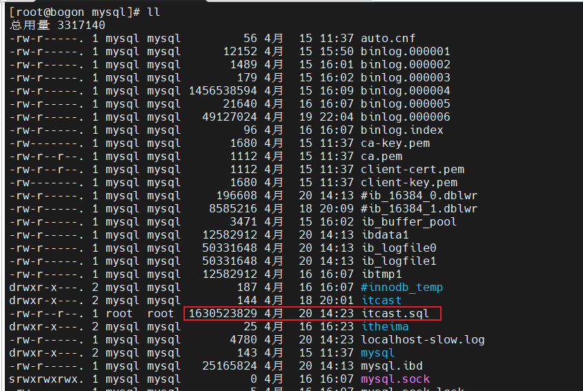

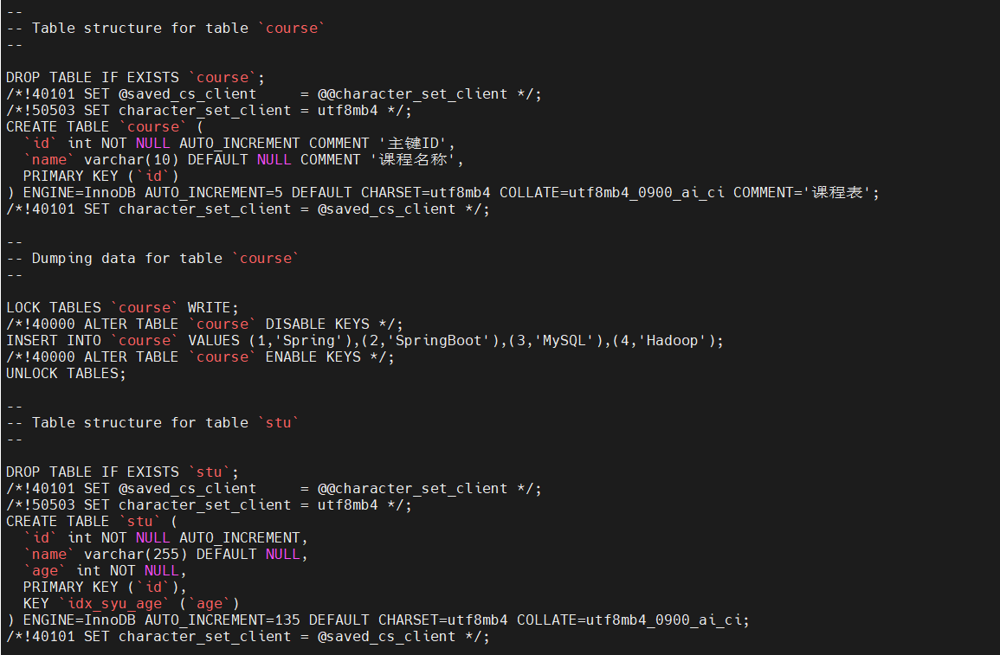


备份出æ¥çš„æ•°æ®åŒ…å«ï¼š

- **删除表的语å¥**
- **创建表的语å¥**
- **æ•°æ®æ’入语å¥**


如æœæˆ‘们在数æ®å¤‡ä»½æ—¶ï¼Œä¸éœ€è¦åˆ›å»ºè¡¨ï¼Œæˆ–者ä¸éœ€è¦å¤‡ä»½æ•°æ®ï¼Œ**åªéœ€è¦å¤‡ä»½è¡¨ç»“æ„**，都å¯ä»¥é€šè¿‡å¯¹åº”çš„å‚æ•°æ¥å®ç°ã€‚

B. 备份db01æ•°æ®åº“中的表数æ®ï¼Œ**==ä¸å¤‡ä»½è¡¨ç»“æ„(-t)==**

```sql
mysqldump -uroot -p1234 -t itcast > itcast2.sql
```

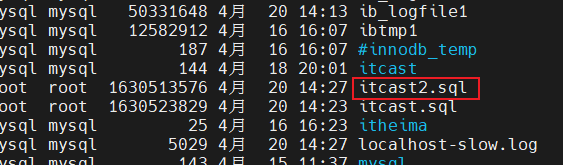


打开 itcast2.sql ，æ¥æŸ¥çœ‹å¤‡ä»½çš„æ•°æ®ï¼Œ**åªæœ‰insert语å¥ï¼Œæ²¡æœ‰å¤‡ä»½è¡¨ç»“æ„**。


**C. å°†itcastæ•°æ®åº“的表stu的表结æ„ä¸æ•°æ®åˆ†å¼€å¤‡ä»½(-T)**

```bash
mysqldump -uroot -p1234 -T /root itcast stu
```

执行上述指令，会出错，数æ®ä¸èƒ½å®Œæˆå¤‡ä»½ï¼ŒåŸå› æ˜¯å› ä¸ºæˆ‘们所**指定的数æ®å­˜æ”¾ç›®å½•/root**，**MySQL认为是ä¸å®‰å…¨çš„，需è¦å­˜å‚¨åœ¨MySQL信任的目录下**。那么，哪个目录æ‰æ˜¯MySQL信任的目录呢，å¯ä»¥**查看一下系统å˜é‡ secure_file_priv** 。执行结æœå¦‚下：

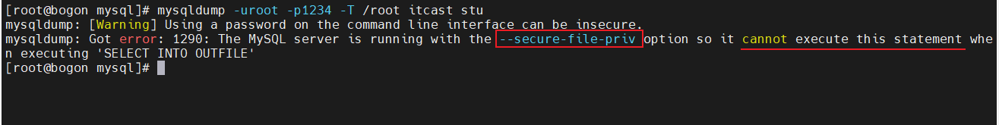

```sql
show variables like '%secure_file_priv%';
```

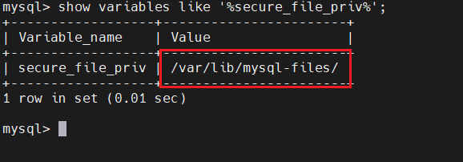

```bash
mysqldump -uroot -p1234 -T /var/lib/mysql-files/ itcast stu
```

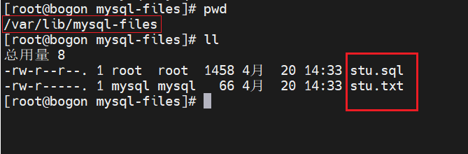

上述的两个文件 stu.sql 中记录的就是**表结æ„文件**，而 stu.txt 就是**表数æ®æ–‡ä»¶**，但是需è¦æ³¨æ„表数æ®æ–‡ä»¶ï¼Œå¹¶**ä¸æ˜¯è®°å½•ä¸€æ¡æ¡çš„insert语å¥**，而是**按照一定的格å¼è®°å½•è¡¨ç»“æ„中的数æ®**。如下：

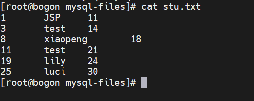


### （6）mysqlimport/source-导入数æ®

#### â‘ mysqlimport

mysqlimport 是客户端**æ•°æ®å¯¼å…¥å·¥å…·**，用æ¥**导入mysqldump 加 -T å‚æ•°å导出的文本文件**。

```sql
-- 语法 ：
	mysqlimport [options] db_name textfile1 [textfile2...]

-- 示例 ：
	mysqlimport -uroot -p1234 itcast /tmp/itcast.txt
```

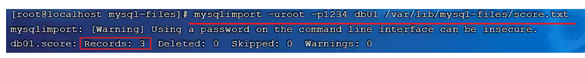

#### â‘¡source

如æœéœ€è¦**导入sql文件**,å¯ä»¥ä½¿ç”¨mysql中的source 指令 :

```sql
-- 语法 ：
source /root/xxxxx.sql -- 执行sql脚本-insert语å¥ï¼Œåœ¨mysql命令行中执行
```

 

## 7.3 å°ç»“

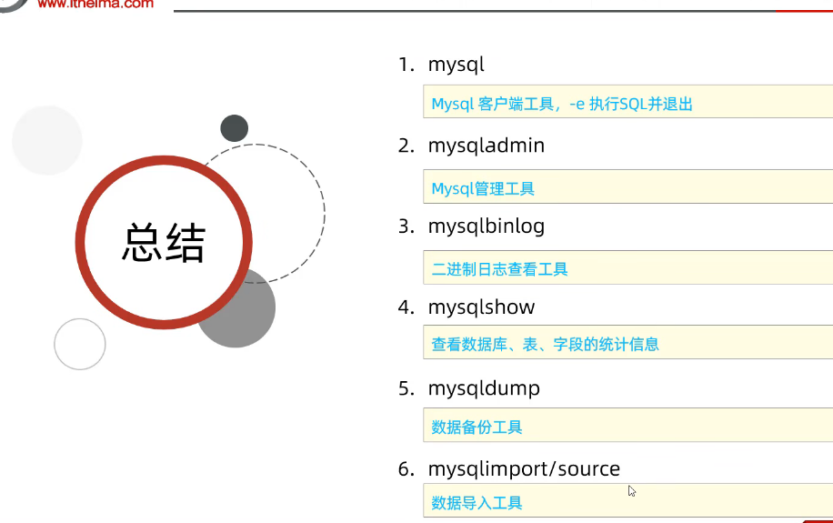


# ----------------------------

------


# 三ã€è¿ç»´ç¯‡

# 1ã€ğŸŒŸ ==日志==

## 1.1 错误日志

错误日志是 MySQL 中最é‡è¦çš„日志之一，它记录了**当 mysqld å¯åŠ¨å’Œåœæ­¢æ—¶ï¼Œä»¥åŠæœåŠ¡å™¨åœ¨è¿è¡Œè¿‡ç¨‹ä¸­å‘生任何严é‡é”™è¯¯æ—¶çš„相关信æ¯**。当数æ®åº“出ç°ä»»ä½•æ•…障导致无法正常使用时，建议首先查看此日志。

该日志是**默认开å¯**的，**默认存放目录 /var/log/**，默认的日志文件å为 **mysqld.log** 。查看日志ä½ç½®ï¼š

```SQL
-- 查看日志文件所在ä½ç½®
show variables like '%log_error%'; 
```

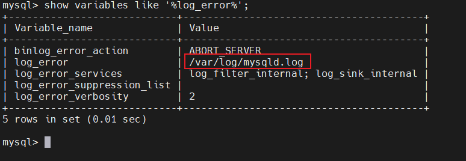


```bash
tail -50 /var/log/mysqld.log #查看错误日志文件最å50行的信æ¯
tail -f /var/log/mysqld.log #å®æ—¶æŸ¥çœ‹æ—¥å¿—ä¿¡æ¯
```


## 1.2 🌟 ==二进制日志==

### （1）介ç»

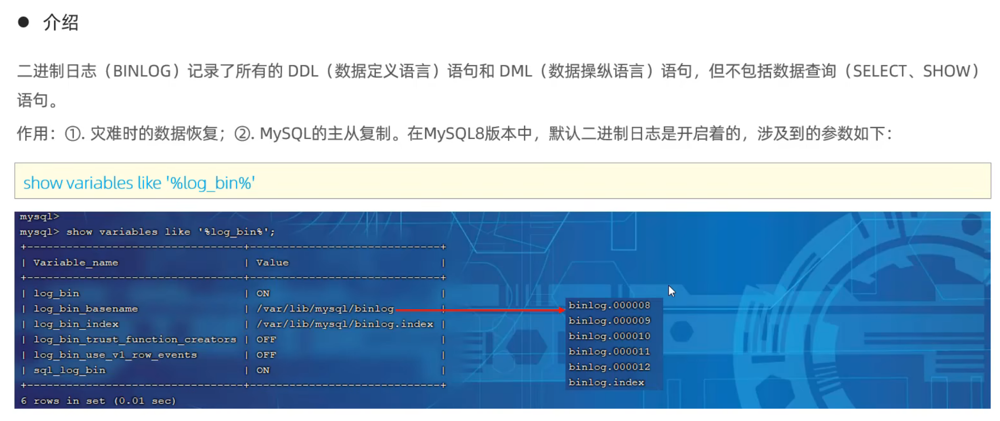

二进制日志（BINLOG）记录了所有的 **DDL（数æ®å®šä¹‰è¯­è¨€ï¼‰**语å¥å’Œ **DML（数æ®æ“纵语言）**语å¥ï¼Œä½†**ä¸åŒ…括数æ®æŸ¥è¯¢ï¼ˆSELECTã€SHOW）语å¥**。

作用：

- â‘  ç¾éš¾æ—¶çš„**==æ•°æ®æ¢å¤==**ï¼›
- â‘¡ MySQLçš„**==主ä»å¤åˆ¶==**，主ä»å¤åˆ¶çš„底层åŸç†å°±æ˜¯åŸºäºbinlog的。

在MySQL8版本中，默认**二进制日志是==å¼€å¯==ç€çš„**，涉åŠåˆ°çš„å‚数如下：

```sql
show variables like '%log_bin%'; 
```

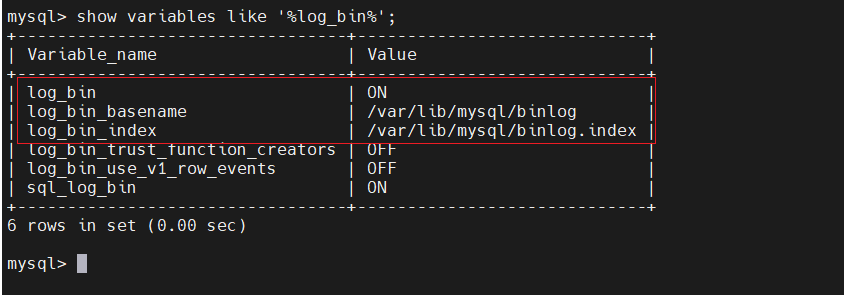

**å‚数说æ˜ï¼š**

- loh_bin = on ,表示二进制日志是开å¯çš„。
- log_bin_basename：当å‰æ•°æ®åº“æœåŠ¡å™¨çš„**binlog日志的基础å称(å‰ç¼€)**，具体的binlog文件å需è¦å†è¯¥basename的基础上**加上编å·(ç¼–å·ä»000001开始)**。
- log_bin_index：binlogçš„**索引文件**，里é¢è®°å½•äº†å½“å‰æœåŠ¡å™¨å…³è”çš„binlog文件有哪些。

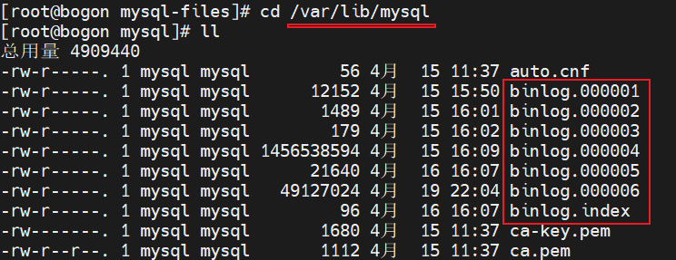

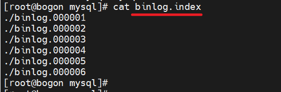


### （2）格å¼

MySQLæœåŠ¡å™¨ä¸­æ供了**多ç§æ ¼å¼æ¥è®°å½•äºŒè¿›åˆ¶æ—¥å¿—**，具体格å¼åŠç‰¹ç‚¹å¦‚下：

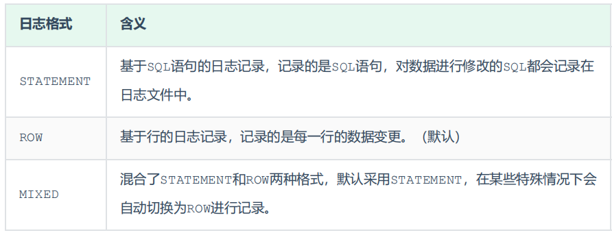

**==注æ„==**

- 查询是ä¸ä¼šè®°å½•åœ¨äºŒè¿›åˆ¶æ–‡ä»¶ä¸­çš„，åªä¼šè®°å½•äº†æ‰€æœ‰çš„ **DDL（数æ®å®šä¹‰è¯­è¨€ï¼‰**语å¥å’Œ **DML（数æ®æ“纵语言）**语å¥ï¼Œä½†**ä¸åŒ…括数æ®æŸ¥è¯¢ï¼ˆSELECTã€SHOW）语å¥**。
- STATEMENT的日志格å¼ï¼Œé€šè¿‡mysqlbinlog binlog.00003æ—¶ä¸éœ€è¦æ·»åŠ -v选项，因为该日志格å¼**ä¿å­˜çš„就是sql语å¥**。
- 对äºROW的日志格å¼ï¼Œéœ€è¦é€šè¿‡mysqlbinlog **-v** binlog.00003指令，**将行事件(æ•°æ®å˜æ›´)é‡æ„为SQL语å¥**


```sql
show variables like '%binlog_format%';  -- 查看当å‰Mysql的记录日志的格å¼
```

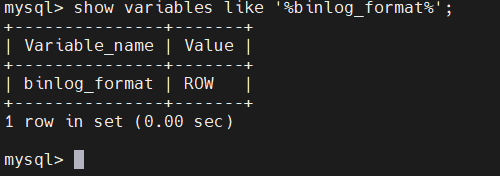

如æœæˆ‘们需è¦é…置二进制日志的格å¼ï¼Œåªéœ€è¦**在 /etc/my.cnf 中é…ç½® binlog_format å‚æ•°**å³å¯ã€‚

```bash
vim  /etc/my.cnf

#在该文件的最å添加
binlog_format = STATEMENT

# é‡æ–°å¯åŠ¨MySQLæœåŠ¡
systemctl restart mysqld
```


### （3）查看

ç”±äºæ—¥å¿—是以二进制方å¼å­˜å‚¨çš„，ä¸èƒ½ç›´æ¥è¯»å–，需è¦é€šè¿‡**二进制日志查询工具 mysqlbinlog æ¥æŸ¥çœ‹**，具体语法：

```sql
	mysqlbinlog [ å‚数选项 ] logfilename

-- å‚数选项：
    -d -- 指定数æ®åº“å称，åªåˆ—出指定的数æ®åº“相关æ“作。
    -o -- 忽略æ‰æ—¥å¿—中的å‰n行命令。
    -v -- 将行事件(æ•°æ®å˜æ›´)é‡æ„为SQL语å¥
    -vv -- 将行事件(æ•°æ®å˜æ›´)é‡æ„为SQL语å¥ï¼Œå¹¶è¾“出注释信æ¯ï¼Œæ³¨æ„这里是两个v
```


### （4）删除

对äºæ¯”较ç¹å¿™çš„业务系统，æ¯å¤©ç”Ÿæˆçš„binlogæ•°æ®å·¨å¤§ï¼Œ**如æœé•¿æ—¶é—´ä¸æ¸…除，将会å ç”¨å¤§é‡ç£ç›˜ç©ºé—´**。å¯ä»¥é€šè¿‡ä»¥ä¸‹å‡ ç§æ–¹å¼æ¸…ç†æ—¥å¿—：

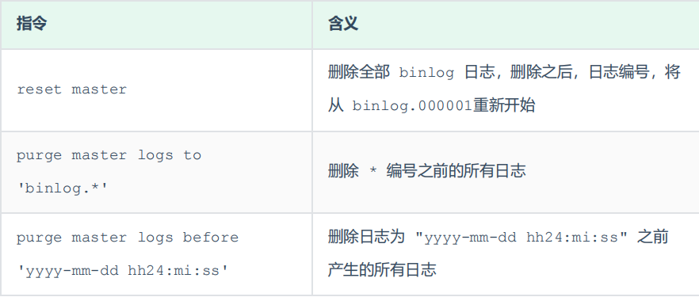

#### ①日志过期时间

也å¯ä»¥åœ¨mysqlçš„**é…置文件中é…置二进制日志的过期时间**，设置了之å，**二进制日志过期会自动删除**。

```sql
-- 查看二进制日志文件的过期时间
show variables like '%binlog_expire_logs_seconds%'; -- 默认为30天
```

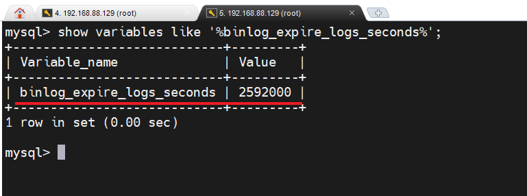


#### **②删除指定编ç ä¹‹å‰çš„所有日志**

```sql
purge master logs to 'binlog.000002';
```

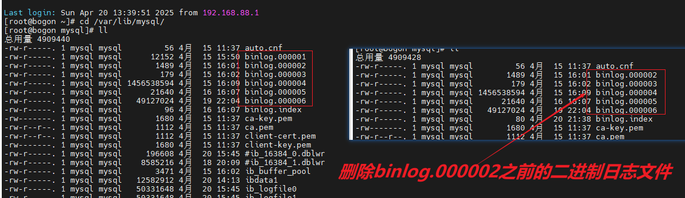


#### ③删除全部binlog日志

**删除全部binlog日志，删除之å，日志编å·ï¼Œå°†ä» binlog.000001é‡æ–°å¼€å§‹**

```sql
reset master;
```


#### ④删除指定日期之å‰çš„日志

```sql
purge master logs before '2025-04-20 21:42:00';
```


## 1.3 查询日志

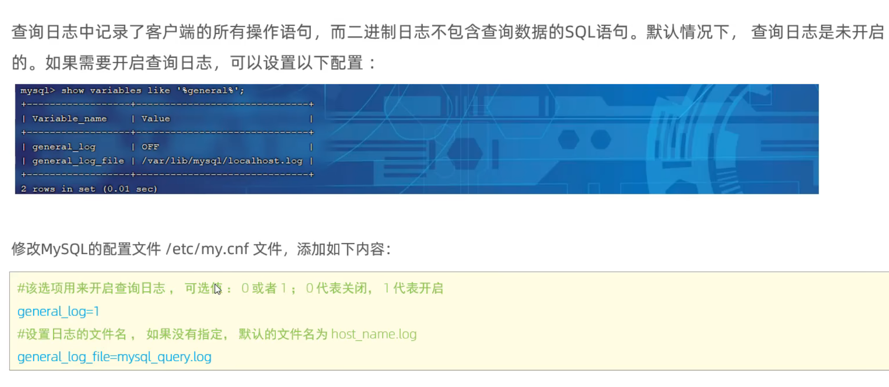

查询日志中**记录了客户端的==所有æ“作语å¥==**，而**二进制日志ä¸åŒ…å«æŸ¥è¯¢æ•°æ®çš„SQL语å¥**。

**默认**情况下，**查询日志是==未开å¯==çš„**。

```sql
show variables like '%general%'; -- 查询日志的开关状æ€å’ŒæŸ¥è¯¢æ—¥å¿—所在文件目录
```

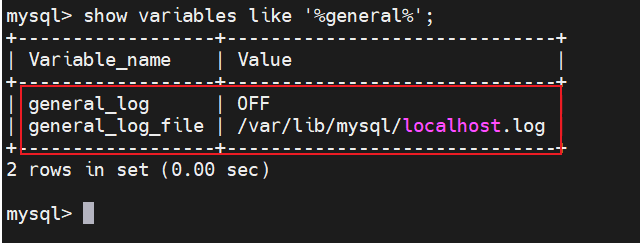


如æœ**需è¦å¼€å¯æŸ¥è¯¢æ—¥å¿—**，å¯ä»¥**修改MySQLçš„é…置文件 /etc/my.cnf 文件**，添加如下内容：

```bash
#该选项用æ¥å¼€å¯æŸ¥è¯¢æ—¥å¿— ， å¯é€‰å€¼ ： 0 或者 1 ï¼› 0 代表关闭， 1 代表开å¯
general_log=1
#设置日志的文件å，如æœæ²¡æœ‰æŒ‡å®šï¼Œ 默认的文件å为 host_name.log
general_log_file=mysql_query.log
```

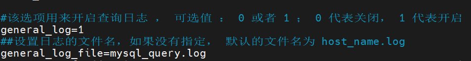


```sql
-- é…置完æˆå，é‡å¯mysqlæœåŠ¡
systemctl restart mysqld
```

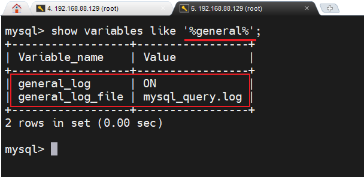

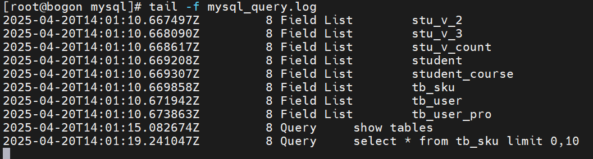

å¼€å¯äº†æŸ¥è¯¢æ—¥å¿—之å，在**MySQLçš„æ•°æ®å­˜æ”¾ç›®å½•**，也就是 **/var/lib/mysql/ 目录下就会出ç°mysql_query.log 文件**。之å**所有的客户端的å¢åˆ æ”¹æŸ¥æ“作都会记录在该日志文件之中**，长时间è¿è¡Œå，该日志文件将会é常大。如æœä¸éœ€è¦ç”¨åˆ°è¿™ä¸ªæ–‡ä»¶å¯ä»¥`关闭查询日志`。


## 1.4 🌟 ==慢查询日志==

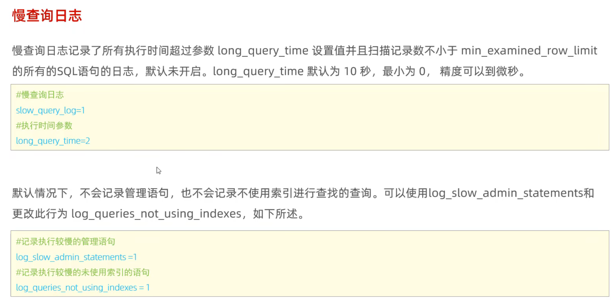

慢查询日志记录了所有**执行时间超过å‚æ•° long_query_time 设置值**并且**扫æ记录数ä¸å°äºmin_examined_row_limit** 的所有的SQL语å¥çš„日志，**默认未开å¯**。long_query_time **默认为10 秒**，最å°ä¸º 0， **精度å¯ä»¥åˆ°å¾®ç§’**。

**默认文件å为**：localhost-slow.log ，所在文件目录：/var/lib/mysql


如æœéœ€è¦å¼€å¯æ…¢æŸ¥è¯¢æ—¥å¿—，需è¦**在MySQLçš„é…置文件 /etc/my.cnf 中é…ç½®**如下å‚数：

```bash
#慢查询日志
slow_query_log=1  # 1表示开å¯æ…¢æŸ¥è¯¢æ—¥å¿—
#执行时间å‚æ•°
long_query_time=2  # 设置慢查询时间标准线为 2s
```

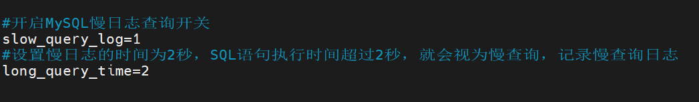


**测试：**

```sql
select * from tb_sku limit 0,10;  -- 用时0.01s
select * from tb_sku limit 2000000,10; -- 执行时间较长 => 4.79s
```

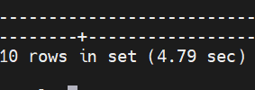

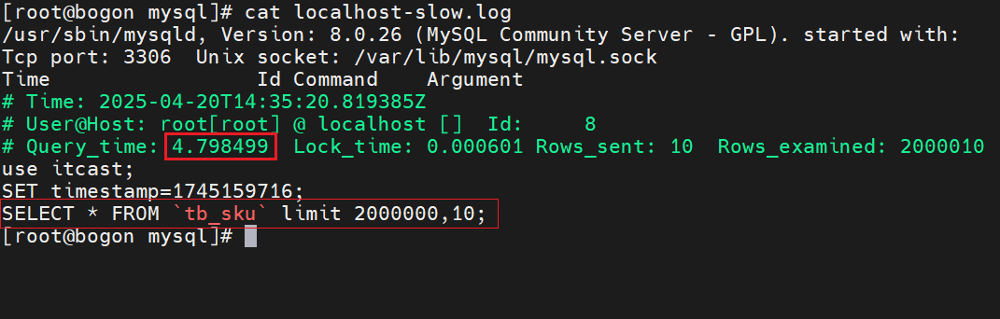

```sql
-- 使用 EXPLAIN ANALYZE（MySQL 8.0+）
-- è¿™ä¼šè¿”å› å®é™…执行计划+时间统计，比慢查询日志更精确。
EXPLAIN ANALYZE SELECT * FROM `tb_sku` limit 2000000,10;
```

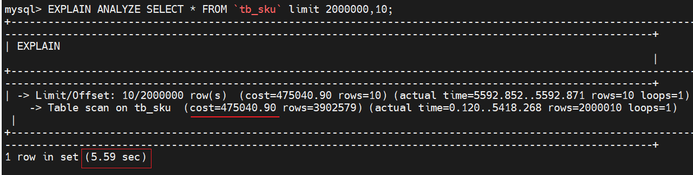


```sql
select count(*) from tb_sku;
```

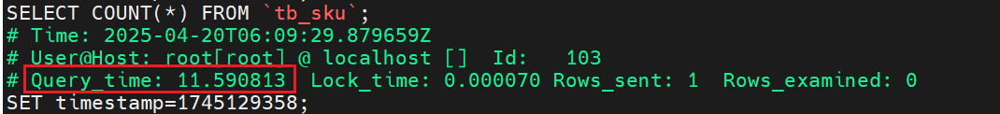


默认情况下，**ä¸ä¼šè®°å½•ç®¡ç†è¯­å¥ï¼Œä¹Ÿä¸ä¼šè®°å½•ä¸ä½¿ç”¨ç´¢å¼•è¿›è¡ŒæŸ¥æ‰¾çš„查询**。å¯ä»¥ä½¿ç”¨log_slow_admin_statementså’Œ 更改此行为 log_queries_not_using_indexes，如下所述。

```bash
#记录执行较慢的管ç†è¯­å¥
log_slow_admin_statements = 1

#记录执行较慢的未使用索引的语å¥
log_queries_not_using_indexes = 1
```


> 上述所有的å‚æ•°é…置完æˆä¹‹å，都需è¦**é‡æ–°å¯åŠ¨MySQLæœåŠ¡å™¨**æ‰å¯ä»¥ç”Ÿæ•ˆã€‚
>
> ```bash
> -- é…置完æˆå，é‡å¯mysqlæœåŠ¡
> systemctl restart mysqld
> ```


------


# 2ã€==主ä»å¤åˆ¶==

## 2.1 概述

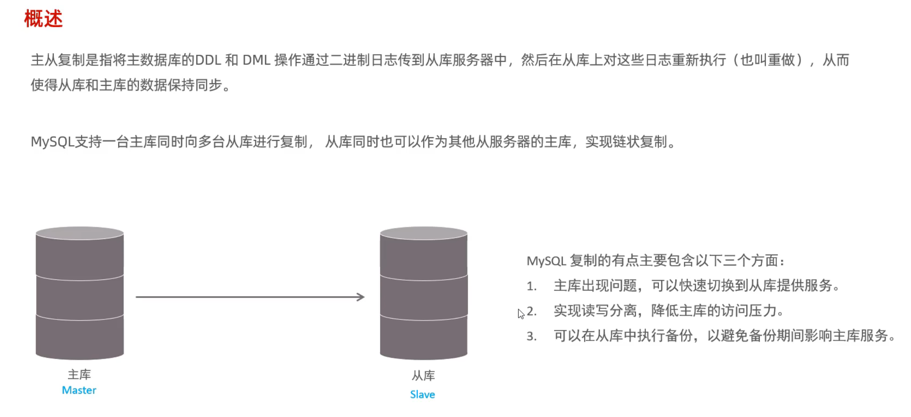

主ä»å¤åˆ¶æ˜¯æŒ‡**将主数æ®åº“çš„ DDL å’Œ DML æ“作==通过二进制日志传到ä»åº“æœåŠ¡å™¨==中**，然å在ä»åº“上对这些日志é‡æ–°æ‰§è¡Œï¼ˆä¹Ÿå«é‡åšï¼‰ï¼Œä»è€Œä½¿å¾—**ä»åº“和主库的数æ®ä¿æŒåŒæ­¥**。

MySQL支æŒä¸€å°ä¸»åº“åŒæ—¶å‘多å°ä»åº“进行å¤åˆ¶ï¼Œ ä»åº“åŒæ—¶ä¹Ÿå¯ä»¥ä½œä¸ºå…¶ä»–ä»æœåŠ¡å™¨çš„主库，**å®ç°==链状å¤åˆ¶==**。


MySQL å¤åˆ¶çš„**优点**主è¦åŒ…å«ä»¥ä¸‹ä¸‰ä¸ªæ–¹é¢ï¼š

- 主库出ç°é—®é¢˜ï¼Œå¯ä»¥**快速切æ¢åˆ°ä»åº“æä¾›æœåŠ¡**。
- å®ç°**==读写分离==，é™ä½ä¸»åº“的访问å‹åŠ›**。
- å¯ä»¥åœ¨**==ä»åº“中执行备份==，以é¿å…备份期间影å“主库æœåŠ¡**。
  - （因为备份需è¦**添加全局é”**，会影å“业务æ“作）


## 2.2 ==åŸç†==

MySQL主ä»å¤åˆ¶çš„核心就是 **==二进制日志==**，具体的过程如下：

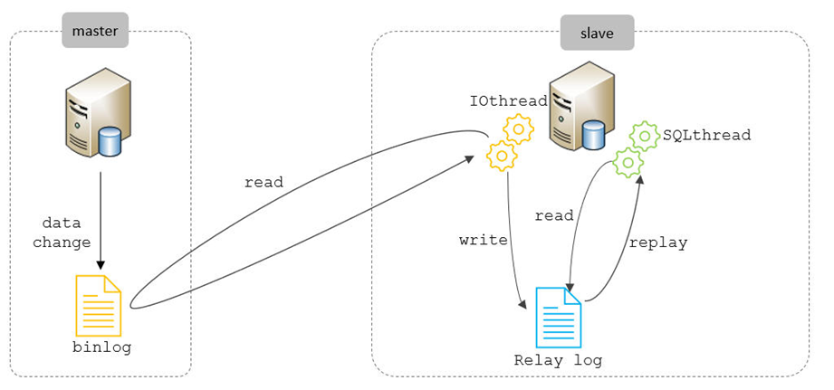


ä»ä¸Šå›¾æ¥çœ‹ï¼Œ**å¤åˆ¶åˆ†æˆä¸‰æ­¥**：

1. Master 主库在**事务æ交**时，会**把数æ®å˜æ›´è®°å½•åœ¨äºŒè¿›åˆ¶æ—¥å¿—文件 Binlog 中**。

2. ä»åº“读å–主库的二进制日志文件 Binlog ，写入到ä»åº“çš„**中继日志 Relay Log** 。 =》 IOthread

3. slave**é‡åš**中继日志中的事件，将改å˜å映它自己的数æ®ã€‚ =》 SQLthread


**MySQLå¤åˆ¶è¯¦ç»†è¿‡ç¨‹åˆ†æˆä¸‰æ­¥ï¼š**

- **master将改å˜è®°å½•åˆ°==二进制日志（binarylog)==**
- **slaveå°†masterçš„binarylogæ‹·è´åˆ°å®ƒçš„==中继日志（relaylog）==**
  1. **通过开å¯I/O thread 线程ä»master主库中读å–binlog，在写入slaveä»åº“的中继日志relaylog。**
  2. **在ä»åº“中在通过SQL thread线程解æ日志，执行和主库一样的sqlæ“作**
- **slaveé‡åšä¸­ç»§æ—¥å¿—中的事件，将改å˜åº”用到自己的数æ®åº“中**


## 2.3 æ­å»º

<span id = '主ä»å¤åˆ¶çš„æ­å»º' > </span>

### （1）准备

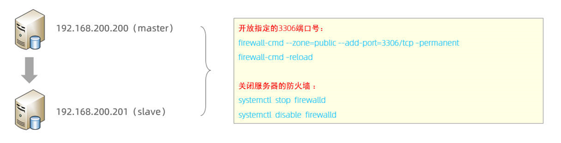

准备好两å°æœåŠ¡å™¨ä¹‹å，在上述的两å°æœåŠ¡å™¨ä¸­åˆ†åˆ«å®‰è£…好MySQL，并完æˆåŸºç¡€çš„åˆå§‹åŒ–准备(安装ã€å¯†ç é…置等æ“作)工作。 其中：

192.168.200.200 作为主æœåŠ¡å™¨master = 》 	192.168.88.130 （自己的æœåŠ¡å™¨ip）

192.168.200.201 作为ä»æœåŠ¡å™¨slave  =》 		192.168.88.131

```bash
# 开放指定端å£
firewall-cmd --zone=public --add-port=3306/tcp --permanent

# ç«‹å³ç”Ÿæ•ˆ
firewall-cmd --reload

#查看开放的端å£
firewall-cmd --zone=public --list-ports
```


### （2）主库é…ç½®

#### ①修改é…置文件 /etc/my.cnf

**å‰ç½®æ¡ä»¶**

```bash
#查找my.conf文件
find / -name "my.cnf"
```

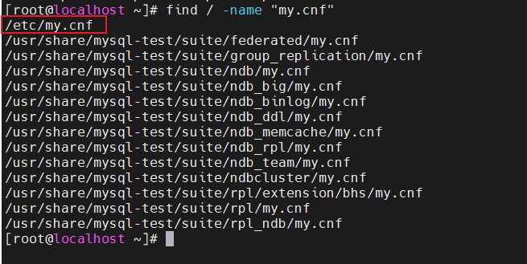


```bash
log_bin = binlog # å¯ç”¨äºŒè¿›åˆ¶æ—¥å¿—（Binary Log）并指定日志文件的基础å称
#mysql æœåŠ¡ID，ä¿è¯æ•´ä¸ªé›†ç¾¤ç¯å¢ƒä¸­å”¯ä¸€ï¼Œå–值范围：1 – (2çš„32次方-1)， 默认为1
server-id=1  #[å¿…é¡»]æœåŠ¡å™¨å”¯ä¸€ID

#是å¦åªè¯»,1 代表åªè¯», 0 代表读写
read-only=0    #主库设置为0，表示å¯ä»¥è¯»å†™
#设置read-only = 1çš„ åªè¯» åªé’ˆå¯¹æ™®é€šç”¨æˆ·ï¼Œè‹¥æƒ³è®¾ç½®è¶…级管ç†å‘˜çš„æƒé™å› ä¸ºåªè¯»ï¼š
#super-read-only=1

#忽略的数æ®, 指ä¸éœ€è¦åŒæ­¥çš„æ•°æ®åº“
#binlog-ignore-db=mysql

#指定åŒæ­¥çš„æ•°æ®åº“
#binlog-do-db=db01
```

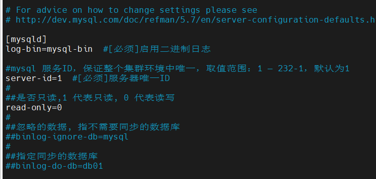


#### â‘¡é‡å¯MySQLæœåŠ¡å™¨

```bash
systemctl restart mysqld 
```


#### ③登录mysql，创建远程è¿æ¥çš„è´¦å·ï¼Œå¹¶æˆäºˆä¸»ä»å¤åˆ¶æƒé™

**登录Mysql客户端**

```bash
mysql -uroot -proot
```

****

```sql
#创建itcast用户，并设置密ç ï¼Œè¯¥ç”¨æˆ·å¯åœ¨ä»»æ„主机è¿æ¥è¯¥MySQLæœåŠ¡
CREATE USER 'itcast'@'%' IDENTIFIED WITH mysql_native_password BY 'Root@123456';
-- 这里的%表示itcast用户å¯ä»¥åœ¨ä»»æ„主机上进行访问该数æ®åº“ 
-- Root@123456 表示该用户的密ç 

#为 'itcast'@'%' 用户分é…主ä»å¤åˆ¶æƒé™
GRANT REPLICATION SLAVE ON *.* TO 'itcast'@'%';
```


#### ④通过指令，查看二进制日志åæ ‡

```sql
show master status ; 
-- 8.40版本的使用新的指令SHOW BINARY LOG STATUS.
```

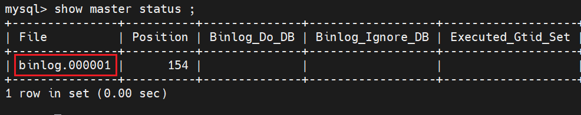

字段å«ä¹‰è¯´æ˜ï¼š

-  file : **ä»å“ªä¸ªæ—¥å¿—文件==开始æ¨é€æ—¥å¿—文件==**，注æ„这里的**文件åå‰ç¼€**，åç»­ä»åº“和主库进行关è”时会使用到
   -  文件åå‰ç¼€ï¼Œé€šè¿‡log_bin = binlog 设置：**å¯ç”¨äºŒè¿›åˆ¶æ—¥å¿—（Binary Log）并指定日志文件的基础å称**

-  position ： **ä»å“ªä¸ªä½ç½®å¼€å§‹æ¨é€æ—¥å¿—**
-  binlog_ignore_db : 指定ä¸éœ€è¦åŒæ­¥çš„æ•°æ®åº“


> **==注æ„==：**
>
> ç”±äºä¸»ä»å¤åˆ¶æ˜¯é€šè¿‡äºŒè¿›åˆ¶æ—¥å¿—文件进行åŒæ­¥çš„，但是åªèƒ½é€‰æ‹©ä»æŸä¸ªæ—¥å¿—文件的æŸä¸ªä½ç½®å¼€å§‹è¿›è¡Œæ¨é€å¹¶åŒæ­¥ã€‚
>
> 如æœæ­¤æ—¶ä¸»åº“在`该æ¨é€æ—¥å¿—文件`å·²ç»æœ‰äº†æ•°æ®ï¼Œç›´æ¥é€šè¿‡ä¸»ä»å¤åˆ¶æ˜¯ä¸èƒ½åŒæ­¥è¿™äº›`日志文件`之å‰çš„æ•°æ®ï¼Œå¯ä»¥é‡‡ç”¨æ ¹æ®ä¸»åº“的结æ„和数æ®ï¼Œç”Ÿæˆsql语å¥ï¼Œ**先在ä»åº“中执行该生æˆçš„sqlå，ä¿è¯ä¸»ä»çš„åˆå§‹æ•°æ®ä¸€è‡´ï¼Œå†æ¥è¿›è¡Œä¸»ä»å¤åˆ¶çš„é…ç½®**。


**如æœé‡åˆ°è¿”å›çš„是空集åˆï¼š**

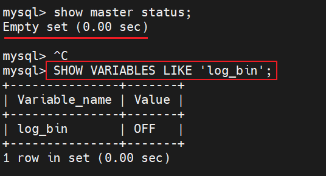


```sql
SHOW VARIABLES LIKE 'log_bin';  -- 如æœè¿”å› OFF，说æ˜äºŒè¿›åˆ¶æ—¥å¿—未å¯ç”¨ã€‚
```

修改 MySQL é…置文件（`my.cnf` 或 `my.ini`）：

```bash
[mysqld]
log_bin = binlog # å¯ç”¨äºŒè¿›åˆ¶æ—¥å¿—（Binary Log）并指定日志文件的基础å称
server_id = 1  # 主ä»å¤åˆ¶å¿…须设置 server_id（唯一值）
```

é‡å¯ MySQL：

```bash
sudo systemctl restart mysqld  # 或 mysql（å–决äºç³»ç»Ÿï¼‰
```


### （3）ä»åº“é…ç½®

#### ①修改é…置文件 /etc/my.cnf

```bash
#mysql æœåŠ¡ID，ä¿è¯æ•´ä¸ªé›†ç¾¤ç¯å¢ƒä¸­å”¯ä¸€ï¼Œå–值范围：1 到 2^32-1，和主库ä¸ä¸€æ ·å³å¯
server-id=2  #和主库ä¸ä¸€æ ·å³å¯

#是å¦åªè¯»,1 代表åªè¯», 0 代表读写
read-only=1  # åªé’ˆå¯¹æ™®é€šç®¡ç†å‘˜æœ‰æ•ˆ
#设置read-only = 1çš„ åªè¯» åªé’ˆå¯¹æ™®é€šç”¨æˆ·ï¼Œè‹¥æƒ³è®¾ç½®è¶…级管ç†å‘˜çš„æƒé™å› ä¸ºåªè¯»ï¼š
#super-read-only=1
```


#### â‘¡é‡æ–°å¯åŠ¨MySQLæœåŠ¡

```bash
systemctl restart mysqld
```


#### ③登录mysql，设置主库é…ç½®

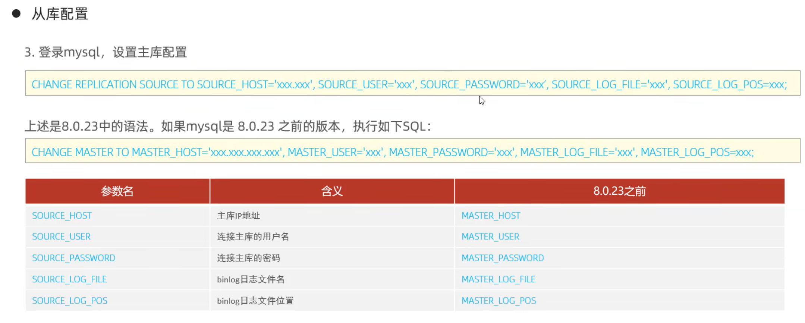

##### 1）通过指令，查看二进制日志åæ ‡

```sql
show master status ; 
-- 8.40版本的使用新的指令SHOW BINARY LOG STATUS.
```


字段å«ä¹‰è¯´æ˜ï¼š

-  file : **ä»å“ªä¸ªæ—¥å¿—文件==开始æ¨é€æ—¥å¿—文件==**
-  position ： **ä»å“ªä¸ªä½ç½®å¼€å§‹æ¨é€æ—¥å¿—**
-  binlog_ignore_db : 指定ä¸éœ€è¦åŒæ­¥çš„æ•°æ®åº“


##### 2）ä»åº“å…³è”主库

```sql
-- 登录Mysql
mysql -uroot -proot

CHANGE REPLICATION SOURCE TO SOURCE_HOST='192.168.88.130',SOURCE_USER='itcast',SOURCE_PASSWORD='Root@123456', SOURCE_LOG_FILE='binlog.000001',SOURCE_LOG_POS=154;
```

上述是8.0.23中的语法。如æœ**mysql是 8.0.23 之å‰çš„版本**，执行如下SQL：

```sql
CHANGE MASTER TO MASTER_HOST='192.168.88.130', MASTER_USER='itcast',
MASTER_PASSWORD='Root@123456', MASTER_LOG_FILE='binlog.000001',
MASTER_LOG_POS=154;
```


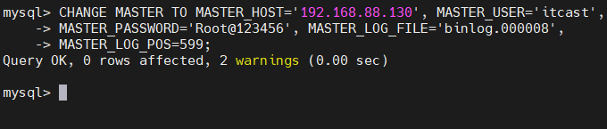

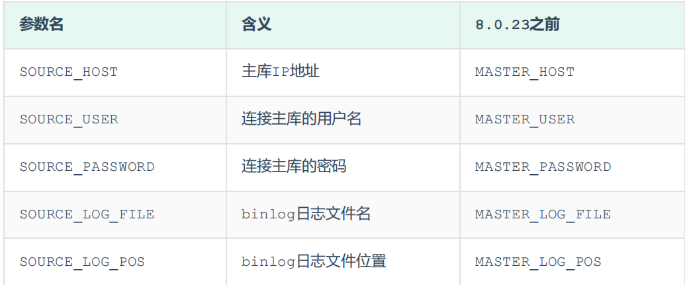


#### ④开å¯åŒæ­¥æ“作

```sql
start replica ; #8.0.22之å

start slave ; #8.0.22之å‰
```


#### ⑤查看主ä»åŒæ­¥çŠ¶æ€

```sql
show replica status ; #8.0.22之å

show slave status\G; #8.0.22之å‰
```

**当IO_Runningå’ŒSQL_Running都显示为yes时，说æ˜é…ç½®æˆåŠŸ**

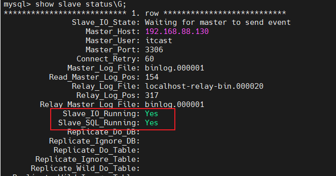


### （4）测试

#### ①主库

在**主库** 192.168.88.130 上**创建数æ®åº“ã€è¡¨ï¼Œå¹¶æ’入数æ®**

```sql
create database db01;

use db01;

create table tb_user(
    id int(11) primary key not null auto_increment,
    name varchar(50) not null,
    sex varchar(1)
)engine=innodb default charset=utf8mb4;

insert into tb_user(id,name,sex) 
    values
    (null,'Tom', '1'),
    (null,'Trigger','0'),
    (null,'Dawn','1');
```


#### â‘¡ä»åº“

在**ä»åº“** 192.168.88.131 中**查询数æ®ï¼ŒéªŒè¯ä¸»ä»æ˜¯å¦åŒæ­¥**


## 2.4 å°ç»“

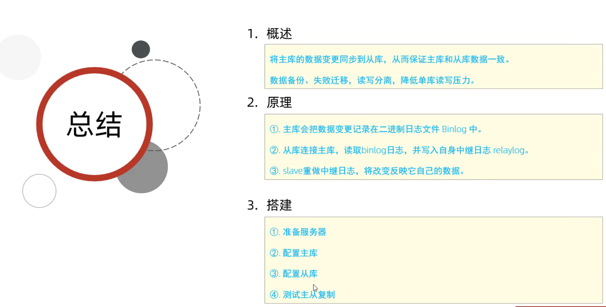


------


# 3ã€ğŸš€ ==分库分表==

## 3.1 介ç»

### （1）问题分æ

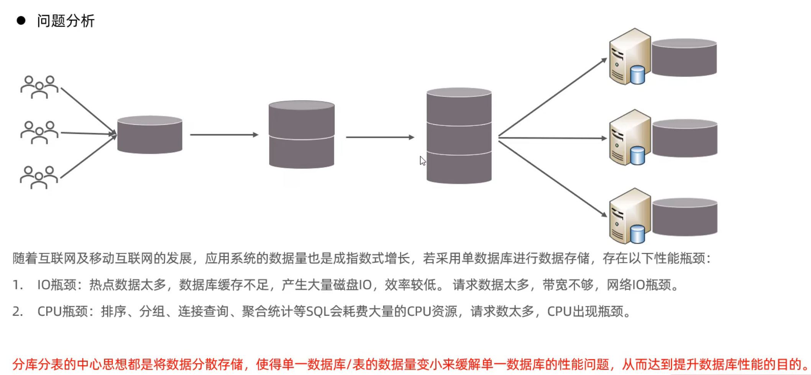

éšç€äº’è”网åŠç§»åŠ¨äº’è”网的å‘展，应用系统的数æ®é‡ä¹Ÿæ˜¯æˆæŒ‡æ•°å¼å¢é•¿ï¼Œè‹¥é‡‡ç”¨å•æ•°æ®åº“进行数æ®å­˜å‚¨ï¼Œå­˜åœ¨ä»¥ä¸‹æ€§èƒ½ç“¶é¢ˆï¼š

1. **IO瓶颈**：热点数æ®å¤ªå¤šï¼Œæ•°æ®åº“缓存ä¸è¶³ï¼ˆæ•°æ®åº“缓存需è¦å ç”¨å†…存），**产生大é‡ç£ç›˜IO**，效ç‡è¾ƒä½ã€‚ 请求数æ®å¤ªå¤šï¼Œ**带宽ä¸å¤Ÿï¼Œç½‘络IO瓶颈**。
   1. 结åˆInnoDB的存储结æ„æ¥é˜è¿°ï¼šåœ¨InnoDB存储引æ“当中，有很大一部分的存储内存都分é…给了数æ®åº“的缓存区，如æœçƒ­ç‚¹æ•°æ®è¿‡å¤šï¼Œä¼šå¯¼è‡´æœåŠ¡å™¨çš„内存ä¸è¶³ï¼Œè¿›è€Œå¯¼è‡´æ•°æ®åº“分é…到的缓冲区也ä¸è¶³=》**缓冲区内缓存的数æ®çš„能力é™ä½ï¼Œè¿›è€Œä¼šå¯¼è‡´äº§ç”Ÿå¤§é‡çš„ç£ç›˜IO**。
   2. [跳转到 =》Buffer Pool缓存池](#Buffer Pool缓存池)

2. **CPU瓶颈**：æ’åºã€åˆ†ç»„ã€è¿æ¥æŸ¥è¯¢ã€èšåˆç»Ÿè®¡ç­‰**SQL会耗费大é‡çš„CPU资æº**，请求数太多，CPU出ç°ç“¶é¢ˆã€‚


为了解决上述问题，我们需è¦å¯¹æ•°æ®åº“进行**分库分表处ç†**。


> 分库分表的中心æ€æƒ³éƒ½æ˜¯**将数æ®åˆ†æ•£å­˜å‚¨**，使得å•ä¸€æ•°æ®åº“/表的数æ®é‡å˜å°æ¥ç¼“解å•ä¸€æ•°æ®åº“的性能问题，ä»è€Œè¾¾åˆ°æå‡æ•°æ®åº“性能的目的。


### （2）拆分策略

分库分表的形å¼ï¼Œä¸»è¦æ˜¯ä¸¤ç§ï¼šå‚直拆分和水平拆分。

- 按照拆分的**力度ä¸åŒ**å¯åˆ†ä¸ºï¼š**分库和分表**
- 按照拆分的**维度ä¸åŒ**å¯åˆ†ä¸ºï¼š**å‚直拆分和水平拆分**

而**==拆分的粒度==**，一般åˆåˆ†ä¸º**分库和分表**，所以组æˆçš„拆分策略最终如下：

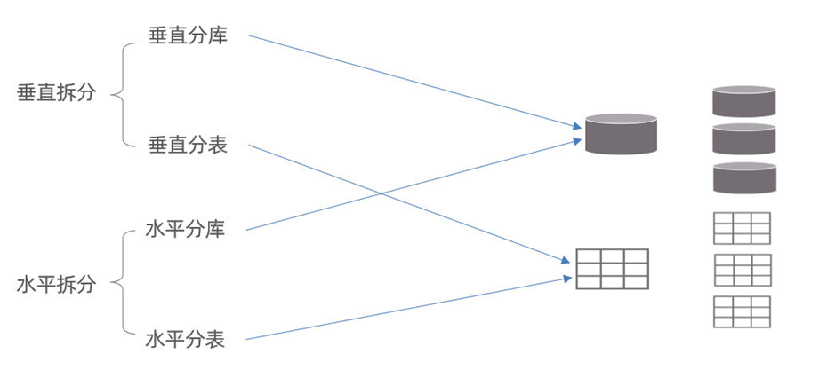


### （3）==å‚直拆分==

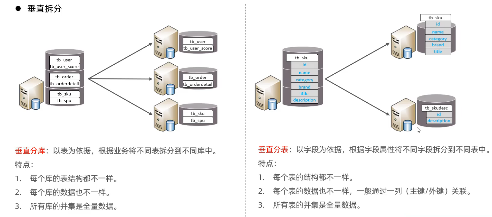

#### â‘ å‚直分库

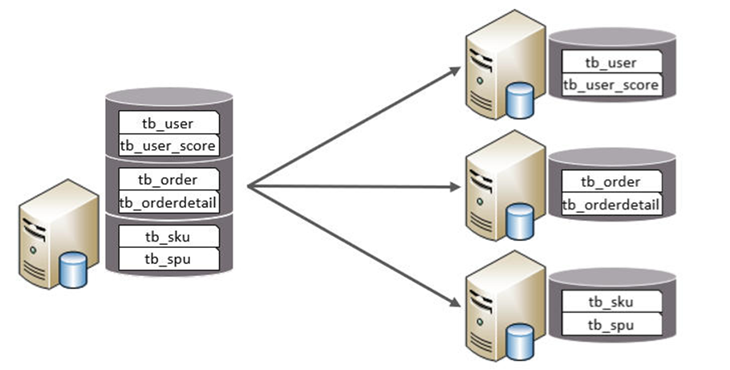

å‚直分库：**以==表==为ä¾æ®ï¼Œæ ¹æ®==业务将ä¸åŒè¡¨æ‹†åˆ†åˆ°ä¸åŒåº“中==**。


**特点：**

- æ¯ä¸ªåº“的表结æ„都ä¸ä¸€æ ·ã€‚
- æ¯ä¸ªåº“çš„æ•°æ®ä¹Ÿä¸ä¸€æ ·ã€‚
- **所有库的并集是全é‡æ•°æ®**。


#### â‘¡å‚直分表

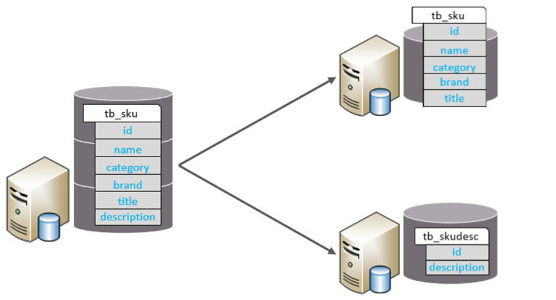

å‚直分表：**以==字段==为ä¾æ®**，根æ®**字段å±æ€§å°†==ä¸åŒå­—段拆分到ä¸åŒè¡¨==中**。

​	拆分ä¾æ®  =》å¯ä»¥æŒ‰ç…§**冷热数æ®åˆ†ç¦»**çš„æ€æƒ³å»æ‹†åˆ†


**特点：**

- æ¯ä¸ªè¡¨çš„结æ„都ä¸ä¸€æ ·ã€‚
- æ¯ä¸ªè¡¨çš„æ•°æ®ä¹Ÿä¸ä¸€æ ·ï¼Œä¸€èˆ¬**通过一列（主键/外键）关è”**。
- **所有表的并集是全é‡æ•°æ®**。


### （4）==水平拆分==

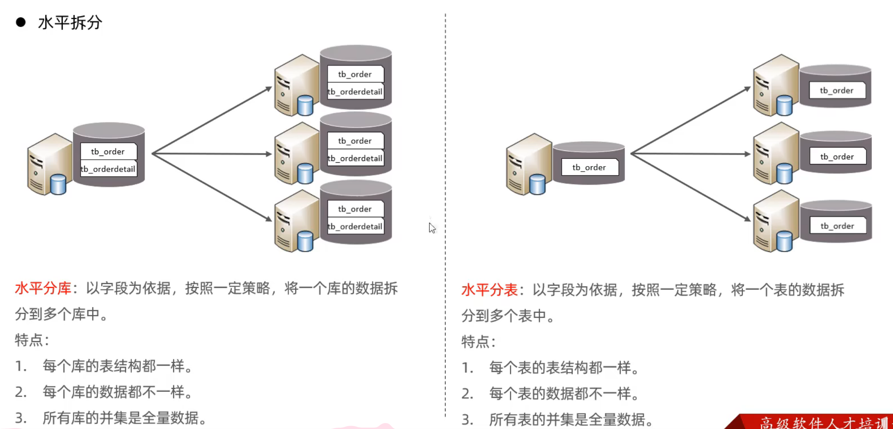

#### ①水平分库

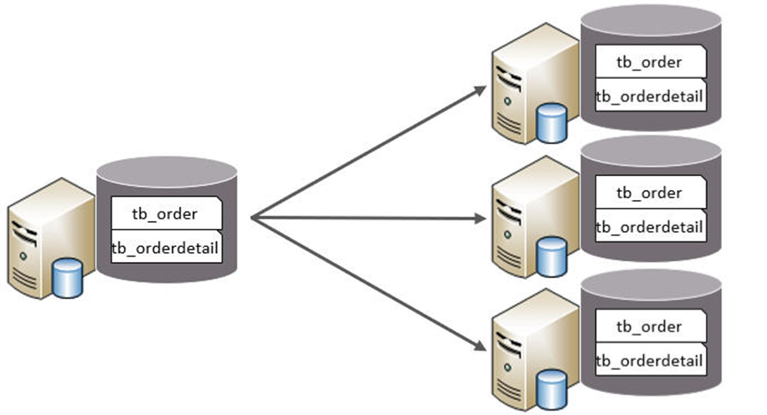

水平分库：**以字段为ä¾æ®**，按照一定策略，**å°†==一个库的数æ®==拆分到多个库中**。= 》 ç±»ä¼¼äº `分页的æ€æƒ³`


特点：

- æ¯ä¸ªåº“çš„**表结æ„都一样**。

- æ¯ä¸ª**库**çš„**æ•°æ®éƒ½ä¸ä¸€æ ·**。
- 所有库的并集是全é‡æ•°æ®ã€‚


####  ②水平分表

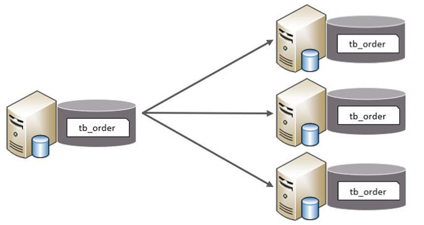

水平分表：以字段为ä¾æ®ï¼ŒæŒ‰ç…§ä¸€å®šç­–略，**å°†==一个表的数æ®==拆分到多个表中**。

特点：

- æ¯ä¸ªè¡¨çš„表结æ„都一样。
- **æ¯ä¸ªè¡¨çš„æ•°æ®éƒ½ä¸ä¸€æ ·**。
- 所有表的并集是全é‡æ•°æ®ã€‚


> 在业务系统中，为了缓解ç£ç›˜IOåŠCPU的性能瓶颈，到底是å‚直拆分，还是水平拆分；具体是分库，还是分表，都需è¦**æ ¹æ®å…·ä½“的业务需求**具体分æ。


### （5）å®ç°æŠ€æœ¯

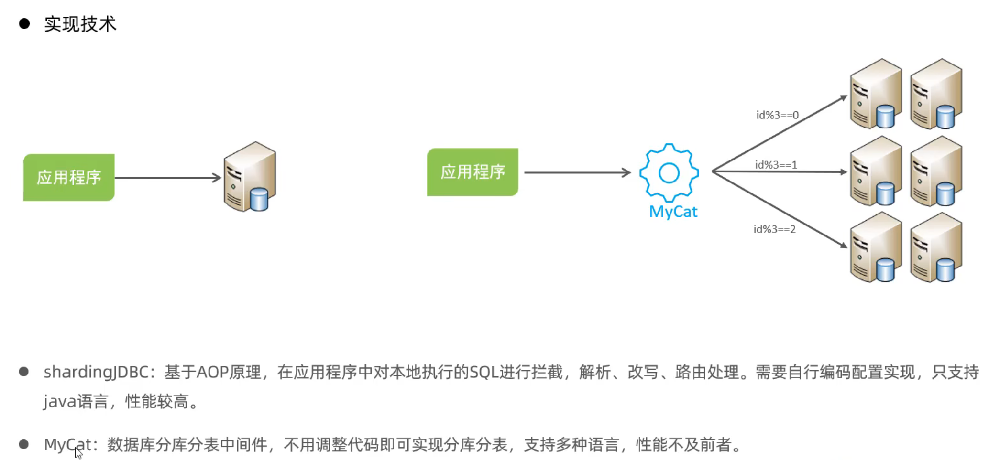


- shardingJDBC：**基äº==AOPåŸç†==**，在应用程åºä¸­å¯¹æœ¬åœ°æ‰§è¡Œçš„SQL进行拦截，解æã€æ”¹å†™ã€è·¯ç”±å¤„ç†ã€‚需è¦è‡ªè¡Œç¼–ç é…ç½®å®ç°ï¼Œåªæ”¯æŒjava语言，**性能较高**。
- MyCat：数æ®åº“**分库分表中间件**，**ä¸ç”¨è°ƒæ•´ä»£ç å³å¯å®ç°åˆ†åº“分表**，支æŒå¤šç§è¯­è¨€ï¼Œæ€§èƒ½ä¸åŠå‰è€…。
  - ä¸éœ€è¦å¯¹åº”用程åºåšä»»ä½•çš„é…置和导入任何的ä¾èµ–


本次课程，我们选择了是**MyCatæ•°æ®åº“中间件**，通过MyCat中间件æ¥å®Œæˆåˆ†åº“分表æ“作。


## 3.2 MyCat概述

### （1）介ç»

Mycat是开æºçš„ã€æ´»è·ƒçš„ã€**基äºJava语言编写的MySQLæ•°æ®åº“中间件**。å¯ä»¥åƒä½¿ç”¨mysql一样æ¥ä½¿ç”¨mycat，对äºå¼€å‘人员æ¥è¯´æ ¹æœ¬æ„Ÿè§‰ä¸åˆ°mycat的存在。= 》 MyCat 进行了 "伪装åè®®"

å¼€å‘人员**åªéœ€è¦è¿æ¥MyCatå³å¯**，而具体底层用到几å°æ•°æ®åº“，æ¯ä¸€å°æ•°æ®åº“æœåŠ¡å™¨é‡Œé¢å­˜å‚¨äº†ä»€ä¹ˆæ•°æ®ï¼Œéƒ½æ— éœ€å…³å¿ƒã€‚ 具体的分库分表的策略，åªéœ€è¦**在MyCat中é…ç½®**å³å¯ã€‚

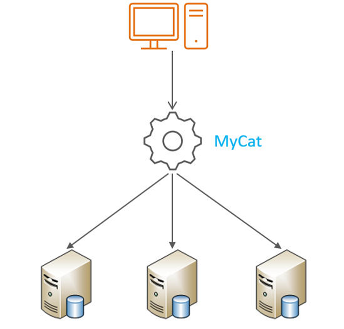

优势：

- 性能å¯é ç¨³å®š
- 强大的技术团队
- 体系完善
- 社区活跃


### （2）下载

下载地å€ï¼š**http://mycat.org.cn/**

**本次课，使用1.6.7.3-release版本**

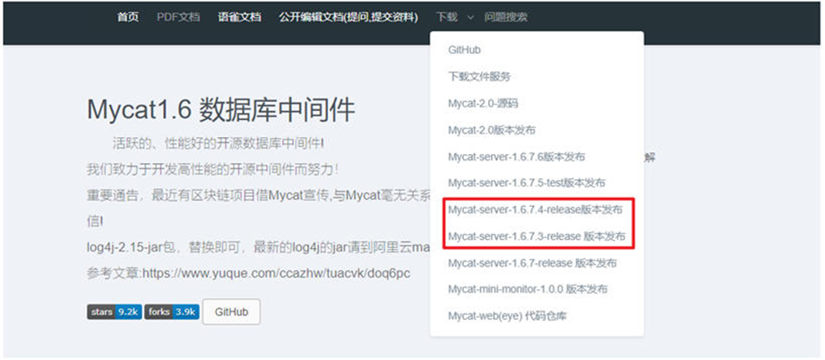


### （3）安装

Mycat是采用**java语言开å‘**çš„å¼€æºçš„æ•°æ®åº“中间件，**支æŒWindowså’ŒLinuxè¿è¡Œç¯å¢ƒ**，下é¢ä»‹ç»MyCatçš„Linux中的ç¯å¢ƒæ­å»ºã€‚我们需è¦åœ¨å‡†å¤‡å¥½çš„æœåŠ¡å™¨ä¸­å®‰è£…如下软件。

- **MySQL**
- **JDK**
- **Mycat**

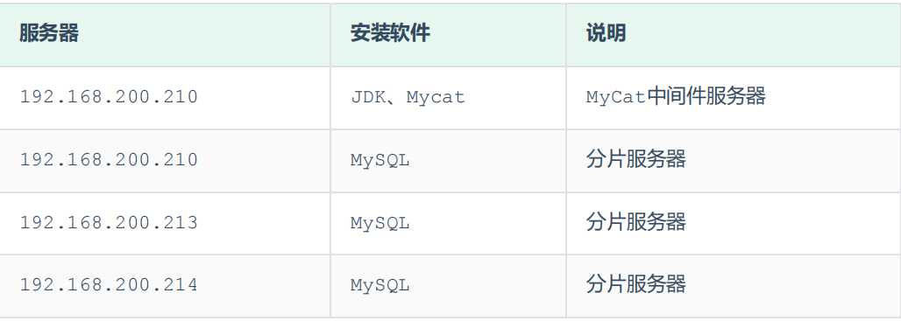

**我的æœåŠ¡å™¨åˆ†é…方案：**

- 192.168.88.130 =》JDKã€MyCat
- 192.168.88.130 =》 Mysql 分片æœåŠ¡å™¨ä¸€ , åŒæ—¶ä¹Ÿæ˜¯ä¹‹å‰å­¦ä¹ çš„主库
- 192.168.88.131 =》 Mysql 分片æœåŠ¡å™¨äºŒï¼ŒåŒæ—¶ä¹Ÿæ˜¯ä¹‹å‰å­¦ä¹ çš„ä»åº“
- 192.168.88.129 =》 Mysql 分片æœåŠ¡å™¨ä¸‰


具体的安装步骤： å‚考资料中æ供的 《MyCat安装文档》å³å¯ï¼Œé‡Œé¢æœ‰è¯¦ç»†çš„安装åŠé…置步骤。


#### â‘ JDK安装并é…ç½®ç¯å¢ƒå˜é‡

JDK具体安装步骤如下： 

##### 1. 上传安装包

使用FinalShell自带的上传工具将jdk的二进制å‘布包上传到Linux 

ç”±äºä¸Šè¿°åœ¨è¿›è¡Œæ–‡ä»¶ä¸Šä¼ æ—¶ï¼Œé€‰æ‹©çš„上传目录为根目录 /，上传完毕å，我们执行指令 cd / 切æ¢åˆ°æ ¹ç›®å½•ä¸‹ï¼ŒæŸ¥çœ‹ä¸Šä¼ çš„安装包。

 


##### 2. 解å‹å®‰è£…包

执行如下指令，将上传上æ¥çš„å‹ç¼©åŒ…进行解å‹ï¼Œå¹¶é€šè¿‡-Cå‚数指定解å‹æ–‡ä»¶å­˜æ”¾ç›®å½•ä¸º /usr/local。

```
tar -zxvf jdk-8u171-linux-x64.tar.gz -C /usr/local
```

 


##### 3. é…ç½®ç¯å¢ƒå˜é‡

使用vim命令修改/etc/profile文件，在文件末尾加入如下é…ç½®

```
JAVA_HOME=/usr/local/jdk1.8.0_171
PATH=$JAVA_HOME/bin:$PATH
```

具体æ“作指令如下: 

```
1). 编辑/etc/profile文件，进入命令模å¼
	vim /etc/profile

2). 在命令模å¼ä¸­ï¼Œè¾“入指令 G ， 切æ¢åˆ°æ–‡ä»¶æœ€å
	G

3). 在命令模å¼ä¸­è¾“å…¥ i/a/o 进入æ’入模å¼ï¼Œç„¶å切æ¢åˆ°æ–‡ä»¶æœ€å一行
	i

4). 将上述的é…置拷è´åˆ°æ–‡ä»¶ä¸­
	export JAVA_HOME=/usr/local/jdk1.8.0_171
	export PATH=$JAVA_HOME/bin:$PATH
	
5). ä»æ’入模å¼ï¼Œåˆ‡æ¢åˆ°æŒ‡ä»¤æ¨¡å¼
	ESC
	
6). 按:进入底行模å¼ï¼Œç„¶å输入wq，å›è½¦ä¿å­˜
	:wq
```


##### 4. é‡æ–°åŠ è½½profile文件

为了使更改的é…置立å³ç”Ÿæ•ˆï¼Œéœ€è¦é‡æ–°åŠ è½½profile文件，执行命令:

```
source /etc/profile
```


##### 5. 检查安装是å¦æˆåŠŸ

```
java -version
```

 


#### ②MyCat安装

##### 1. 上传Mycatå‹ç¼©åŒ…到æœåŠ¡å™¨

Mycat-server-1.6.7.3-release-20210913163959-linux.tar.gz 


##### 2. 解å‹MyCatçš„å‹ç¼©åŒ…

```bash
tar -zxvf Mycat-server-1.6.7.3-release-20210913163959-linux.tar.gz -C /usr/local/
```

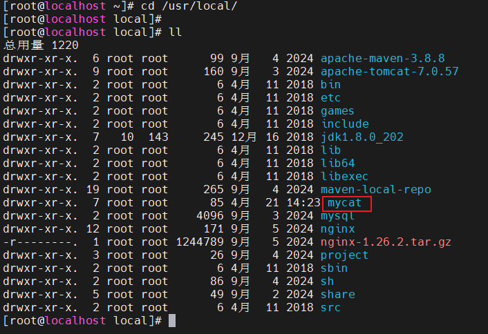


### （4）目录结æ„

- bin : 存放å¯æ‰§è¡Œæ–‡ä»¶ï¼Œç”¨äºå¯åŠ¨åœæ­¢mycat
- conf：存放mycatçš„é…置文件
- lib：存放mycat的项目ä¾èµ–包（jar）
- logs：存放mycat的日志文件

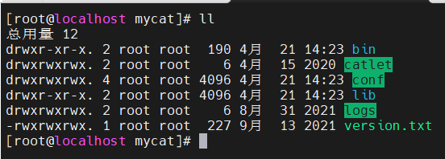

```bash
cd lib/ # 查看mycat的项目ä¾èµ–包
```

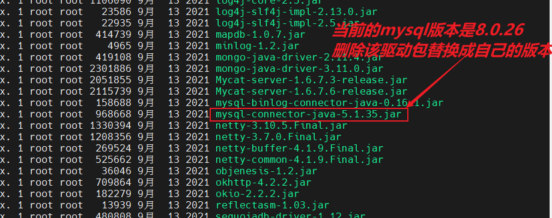

```bash
rm -rf mysql-connector-java-5.1.35.jar

chmod 777 mysql-connector-java-8.0.22.jar
```

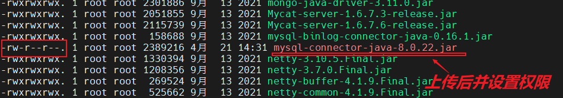

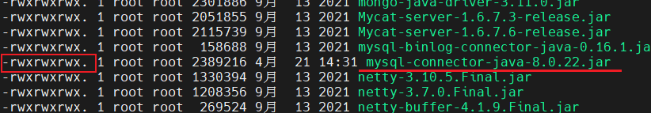


### （5）概念介ç»

在MyCat的整体结æ„中，分为两个部分：上é¢çš„**逻辑结æ„**ã€ä¸‹é¢çš„**物ç†ç»“æ„**。

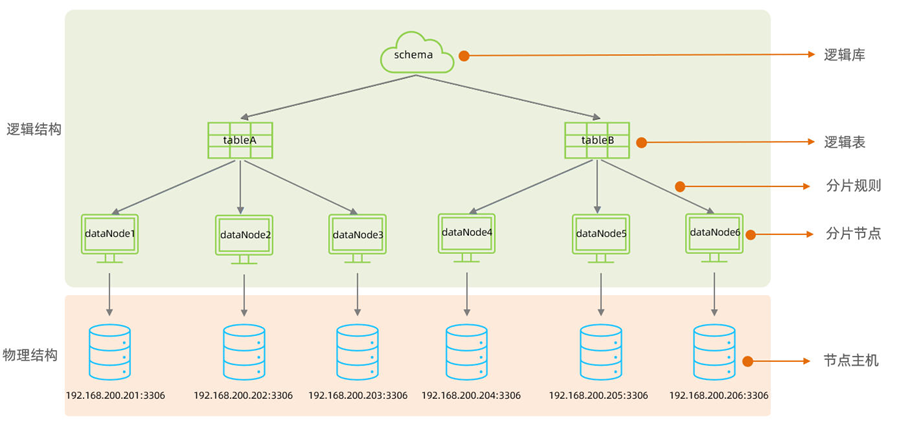

在MyCat的逻辑结æ„主è¦è´Ÿè´£**逻辑库ã€é€»è¾‘表ã€åˆ†ç‰‡è§„则ã€åˆ†ç‰‡èŠ‚点等逻辑结æ„的处ç†**，而具体的数æ®å­˜å‚¨è¿˜æ˜¯åœ¨ç‰©ç†ç»“æ„，也就是数æ®åº“æœåŠ¡å™¨ä¸­å­˜å‚¨çš„。

在åé¢è®²è§£MyCat入门以åŠMyCat分片时，还会讲到上é¢æ‰€æ到的概念。


## 3.3 ==MyCat入门==

### （1）需求

ç”±äº tb_order 表中数æ®é‡å¾ˆå¤§ï¼Œç£ç›˜IOåŠå®¹é‡éƒ½åˆ°è¾¾äº†ç“¶é¢ˆï¼Œç°åœ¨éœ€è¦å¯¹ tb_order 表进行数æ®åˆ†ç‰‡ï¼Œ**分为三个数æ®èŠ‚点**，æ¯ä¸€ä¸ªèŠ‚点主机ä½äºä¸åŒçš„æœåŠ¡å™¨ä¸Š, 具体的结æ„，å‚考下图：


**对应水平拆分中的：水平分表**

特点：

- æ¯ä¸ªè¡¨çš„表结æ„都一样。
- **æ¯ä¸ªè¡¨çš„æ•°æ®éƒ½ä¸ä¸€æ ·**。
- 所有表的并集是全é‡æ•°æ®ã€‚


### （2）ç¯å¢ƒé…ç½®

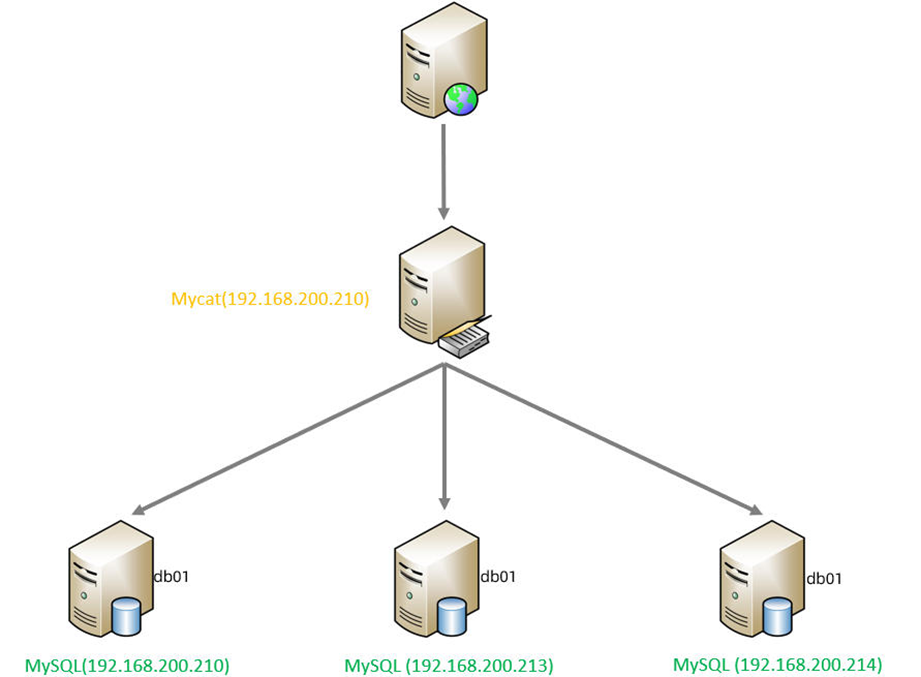

准备3å°æœåŠ¡å™¨ï¼š

- 192.168.200.210：MyCat中间件æœåŠ¡å™¨ï¼ŒåŒæ—¶ä¹Ÿæ˜¯**第一个分片æœåŠ¡å™¨**。

- 192.168.200.213：**第二个分片æœåŠ¡å™¨**。

- 192.168.200.214：**第三个分片æœåŠ¡å™¨**。并且在上述3å°æ•°æ®åº“中创建数æ®åº“ db01 。

  

**我的æœåŠ¡å™¨åˆ†é…方案：**

- 192.168.88.130 =》JDKã€MyCat
- 192.168.88.130 =》 Mysql 分片æœåŠ¡å™¨ä¸€ , åŒæ—¶ä¹Ÿæ˜¯ä¹‹å‰å­¦ä¹ çš„主库
- 192.168.88.131 =》 Mysql 分片æœåŠ¡å™¨äºŒï¼ŒåŒæ—¶ä¹Ÿæ˜¯ä¹‹å‰å­¦ä¹ çš„ä»åº“
- 192.168.88.129 =》 Mysql 分片æœåŠ¡å™¨ä¸‰


并且在上述3å°æ•°æ®åº“中**创建数æ®åº“ db01** 。


### （3）==é…ç½®==

```bash
cd /usr/local/mycat/conf
```

#### â‘ schema.xml

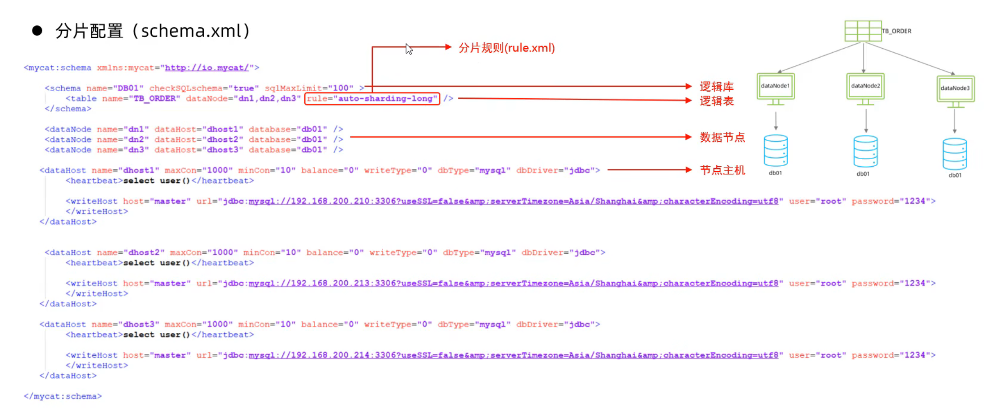

在schema.xml中é…ç½®**逻辑库ã€åˆ†ç‰‡è§„则ã€é€»è¾‘表ã€æ•°æ®èŠ‚点ã€èŠ‚点主机**等相关信æ¯ã€‚具体的é…置如下：

```xml
<?xml version="1.0"?>
<!DOCTYPE mycat:schema SYSTEM "schema.dtd">
<mycat:schema xmlns:mycat="http://io.mycat/">
    <schema name="DB01" checkSQLschema="true" sqlMaxLimit="100">
        <table name="TB_ORDER" dataNode="dn1,dn2,dn3" rule="auto-sharding-long"
               />
    </schema>
    <dataNode name="dn1" dataHost="dhost1" database="db01" />
    <dataNode name="dn2" dataHost="dhost2" database="db01" />
    <dataNode name="dn3" dataHost="dhost3" database="db01" />
    <dataHost name="dhost1" maxCon="1000" minCon="10" balance="0"
              writeType="0" dbType="mysql" dbDriver="jdbc" switchType="1"
              slaveThreshold="100">
        <heartbeat>select user()</heartbeat>
        <writeHost host="master" url="jdbc:mysql://192.168.88.130:3306?useSSL=false&amp;serverTimezone=Asia/Shanghai&amp;characterEncoding=utf8"
                   user="root" password="root" />
    </dataHost>
    <dataHost name="dhost2" maxCon="1000" minCon="10" balance="0"
              writeType="0" dbType="mysql" dbDriver="jdbc" switchType="1"
              slaveThreshold="100">
        <heartbeat>select user()</heartbeat>
        <writeHost host="master" url="jdbc:mysql://192.168.88.131:3306?useSSL=false&amp;serverTimezone=Asia/Shanghai&amp;characterEncoding=utf8"
                   user="root" password="root" />
    </dataHost>
    <dataHost name="dhost3" maxCon="1000" minCon="10" balance="0"
              writeType="0" dbType="mysql" dbDriver="jdbc" switchType="1"
              slaveThreshold="100">
        <heartbeat>select user()</heartbeat>
        <writeHost host="master" url="jdbc:mysql://192.168.88.129:3306?useSSL=false&amp;serverTimezone=Asia/Shanghai&amp;characterEncoding=utf8"
                   user="root" password="1234" />
    </dataHost>
</mycat:schema>
```


#### â‘¡server.xml

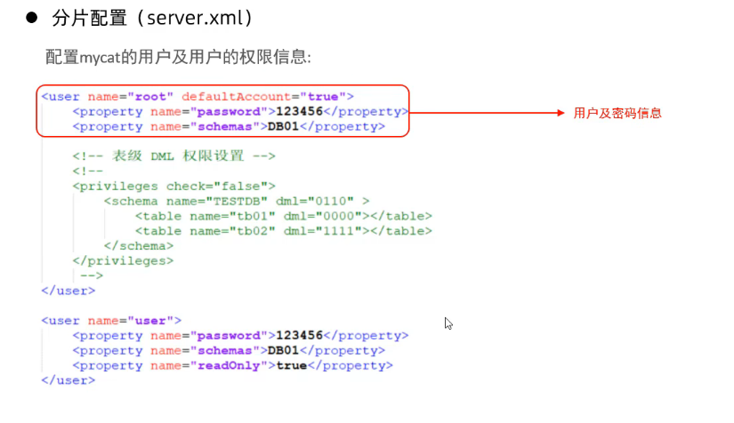

需è¦åœ¨server.xml中é…置用户åã€å¯†ç ï¼Œä»¥åŠç”¨æˆ·çš„访问æƒé™ä¿¡æ¯ï¼Œå…·ä½“çš„é…置如下：

```xml
<user name="root" defaultAccount="true">
    <property name="password">123456</property>
    <property name="schemas">DB01</property>
    <!-- 表级 DML æƒé™è®¾ç½® -->
    <!--
<privileges check="true">
<schema name="DB01" dml="0110" >
<table name="TB_ORDER" dml="1110"></table>
</schema>
</privileges>
-->
</user>
<user name="user">
    <property name="password">123456</property>
    <property name="schemas">DB01</property>
    <property name="readOnly">true</property>
</user>
```

上述的é…置表示，定义了**两个用户 root å’Œ user** ，这两个用户都å¯ä»¥è®¿é—® **DB01 这个逻辑库**，访问密ç éƒ½æ˜¯123456，但是root用户访问DB01逻辑库，既å¯ä»¥è¯»ï¼Œåˆå¯ä»¥å†™ï¼Œä½†æ˜¯ user用户访问DB01逻辑库是åªè¯»çš„。


### （4）==测试==

#### â‘ å¯åŠ¨

é…置完毕å，先å¯åŠ¨æ¶‰åŠåˆ°çš„3å°åˆ†ç‰‡æœåŠ¡å™¨ï¼Œç„¶åå¯åŠ¨MyCatæœåŠ¡å™¨ã€‚切æ¢åˆ°Mycat的安装目录，执行如下指令，å¯åŠ¨Mycat：

```bash
#å¯åŠ¨
bin/mycat start

#åœæ­¢
bin/mycat stop
```

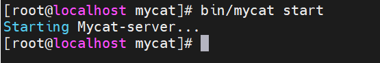

Mycatå¯åŠ¨ä¹‹å，**å ç”¨ç«¯å£å· 8066。**

å¯åŠ¨å®Œæ¯•ä¹‹å，å¯ä»¥**查看logs目录下的å¯åŠ¨æ—¥å¿—**，查看Mycat是å¦å¯åŠ¨å®Œæˆã€‚

```bash
tail -f logs/wrapper.log
```

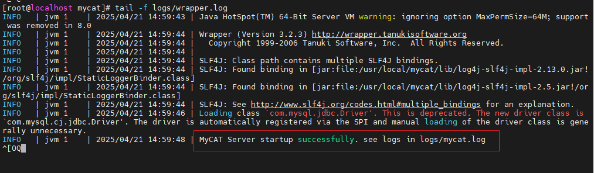


#### ②测试

#### â‘ è¿æ¥MyCat

通过如下指令，就å¯ä»¥è¿æ¥å¹¶ç™»é™†MyCat。

```bash
mysql -h 192.168.200.210 -P 8066 -uroot -p123456

mysql -h 192.168.88.130 -P 8066 -uroot -p123456
```

我们看到我们是通过MySQL的指令æ¥è¿æ¥çš„MyCat，因为MyCat在底层å®é™…上是模拟了MySQLçš„å议。

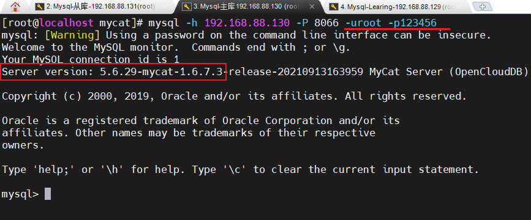

 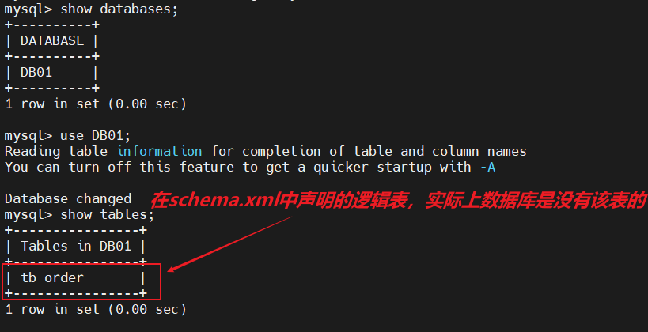


#### â‘¡æ•°æ®æµ‹è¯•

然åå°±å¯ä»¥åœ¨MyCat中æ¥åˆ›å»ºè¡¨ï¼Œå¹¶**往表结æ„中æ’入数æ®**，查看数æ®åœ¨MySQL中的分布情况。

在Mycat中创建了tb_order表，**==å…³è”的三个数æ®èŠ‚点会自动åŒæ­¥åˆ›å»º==**

```sql
CREATE TABLE TB_ORDER (
    id BIGINT(20) NOT NULL,
    title VARCHAR(100) NOT NULL ,
    PRIMARY KEY (id)
) ENGINE=INNODB DEFAULT CHARSET=utf8 ;

INSERT INTO TB_ORDER(id,title) VALUES(1,'goods1');
INSERT INTO TB_ORDER(id,title) VALUES(2,'goods2');
INSERT INTO TB_ORDER(id,title) VALUES(3,'goods3');
INSERT INTO TB_ORDER(id,title) VALUES(1,'goods1');
INSERT INTO TB_ORDER(id,title) VALUES(2,'goods2');
INSERT INTO TB_ORDER(id,title) VALUES(3,'goods3');
INSERT INTO TB_ORDER(id,title) VALUES(5000000,'goods5000000');
INSERT INTO TB_ORDER(id,title) VALUES(10000000,'goods10000000');
INSERT INTO TB_ORDER(id,title) VALUES(10000001,'goods10000001');
INSERT INTO TB_ORDER(id,title) VALUES(15000000,'goods15000000');
INSERT INTO TB_ORDER(id,title) VALUES(15000001,'goods15000001');
```


ç»è¿‡æµ‹è¯•ï¼Œæˆ‘们å‘ç°ï¼Œåœ¨å¾€ TB_ORDER 表中æ’入数æ®æ—¶ï¼š

- 如æœ**id的值在1-500w之间**，数æ®å°†ä¼šå­˜å‚¨åœ¨**第一个分片数æ®åº“**中。
- 如æœid的值在**500w-1000w之间**，数æ®å°†ä¼šå­˜å‚¨åœ¨**第二个分片数æ®åº“**中。
- 如æœid的值在**1000w-1500w之间**，数æ®å°†ä¼šå­˜å‚¨åœ¨**第三个分片数æ®åº“**中。
- 如æœid的值超出1500w，在æ’入数æ®æ—¶ï¼Œå°†ä¼šæŠ¥é”™ã€‚

[对应-范围分片规则](#范围分片规则)

为什么会出ç°è¿™ç§ç°è±¡ï¼Œæ•°æ®åˆ°åº•è½åœ¨å“ªä¸€ä¸ªåˆ†ç‰‡æœåŠ¡å™¨åˆ°åº•æ˜¯å¦‚何决定的呢？ 这是由逻辑表é…置时的一个å‚æ•° rule 决定的，而这个**å‚æ•°é…置的就是分片规则**，关äºåˆ†ç‰‡è§„则的é…置，在åé¢çš„课程中会详细讲解。


## 3.4 ==MyCaté…ç½®==

### （1）schema.xml

schema.xml 作为MyCat中最é‡è¦çš„é…置文件之一 , 涵盖了MyCatçš„**逻辑库 〠逻辑表 〠分片规则ã€åˆ†ç‰‡èŠ‚点åŠæ•°æ®æºçš„é…ç½®**。

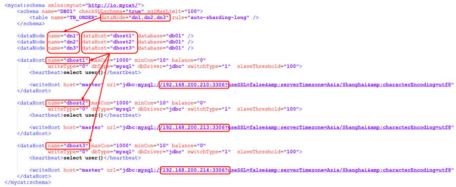

主è¦åŒ…å«ä»¥ä¸‹ä¸‰ç»„标签：

- schema标签
- datanode标签
- datahost标签


#### ①schema标签

##### 1). schema 定义==逻辑库==

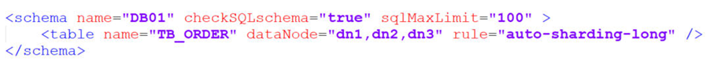

schema 标签用äºå®šä¹‰ MyCatå®ä¾‹ä¸­çš„逻辑库 , **一个MyCatå®ä¾‹ä¸­, å¯ä»¥æœ‰å¤šä¸ªé€»è¾‘库** , å¯ä»¥é€šè¿‡ schema 标签æ¥åˆ’分ä¸åŒçš„逻辑库。MyCat中的逻辑库的概念，**ç­‰åŒäºMySQL中的database概念**, 需è¦æ“作æŸä¸ªé€»è¾‘库下的表时, 也需è¦**切æ¢é€»è¾‘库(use xxx)**。


核心å±æ€§ï¼š

- name：指定自定义的**逻辑库库å** ，注æ„大å°å†™é—®é¢˜
- checkSQLschema：在SQL语å¥æ“作时指定了数æ®åº“å称，执行时是å¦è‡ªåŠ¨å»é™¤ï¼›true：自动å»é™¤ï¼Œfalse：ä¸è‡ªåŠ¨å»é™¤
  - è‹¥checkSQLschema = true，表示å¯ä»¥ç›´æ¥é€šè¿‡select * from **DB01.TB_ORDER**进行查询，ä¸ç”¨å…ˆä½¿ç”¨use xx，进行切æ¢ï¼Œå†è¿›è¡ŒæŸ¥è¯¢

- sqlMaxLimit：如æœæœªæŒ‡å®šlimit进行查询，列表查询模å¼**最多查询多少æ¡è®°å½•**


##### 2). schema 中的table定义==逻辑表==

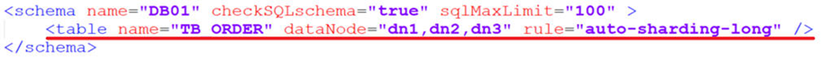

table 标签定义了MyCat中逻辑库schema下的逻辑表 , **所有需è¦æ‹†åˆ†çš„表都需è¦åœ¨table标签中定义** 。

核心å±æ€§ï¼š

- name：定义逻辑表表å，在该逻辑库下唯一
- dataNode：定义逻辑表所å±çš„dataNode，**该å±æ€§éœ€è¦ä¸dataNode标签中name对应**；多个dataNode逗å·åˆ†éš”
- rule：分片规则的å字，**分片规则å字是在rule.xml中定义的**
- primaryKey：逻辑表对应真å®è¡¨çš„主键
- type：逻辑表的类å‹ï¼Œç›®å‰é€»è¾‘表åªæœ‰å…¨å±€è¡¨å’Œæ™®é€šè¡¨ï¼Œ**如æœæœªé…置，就是普通表**；全局表，é…置为 global


#### ②datanode标签

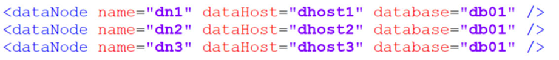

核心å±æ€§ï¼š

- name：定义数æ®èŠ‚点å称
- dataHost：**æ•°æ®åº“å®ä¾‹ä¸»æœºå称**，引用自 dataHost 标签中nameå±æ€§
- database：定义分片**所å±æ•°æ®åº“**


#### ③datahost标签

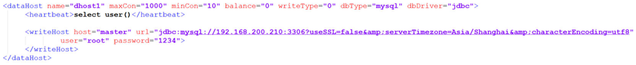

该标签在MyCat逻辑库中作为**底层标签存在**, ç›´æ¥å®šä¹‰äº†**具体的数æ®åº“å®ä¾‹ã€è¯»å†™åˆ†ç¦»ã€å¿ƒè·³è¯­å¥**。

核心å±æ€§ï¼š

- name：唯一标识，供上层标签使用
- maxCon/minCon：最大è¿æ¥æ•°/最å°è¿æ¥æ•°
- balance：**è´Ÿè½½å‡è¡¡ç­–ç•¥**，å–值 0,1,2,3
- writeType：**写æ“作分å‘æ–¹å¼**
  - 0：写æ“作转å‘到第一个writeHost，第一个挂了，切æ¢åˆ°ç¬¬äºŒä¸ªï¼›
  - 1：写æ“作éšæœºåˆ†å‘到é…置的writeHost

- dbDriver：**æ•°æ®åº“驱动**ï¼Œæ”¯æŒ nativeã€jdbc


### （2）rule.xml

rule.xml中**定义所有拆分表的规则**, 在使用过程中å¯ä»¥çµæ´»çš„使用分片算法, 或者对åŒä¸€ä¸ªåˆ†ç‰‡ç®—法使用ä¸åŒçš„å‚æ•°, 它**让分片过程å¯é…置化**。主è¦åŒ…å«ä¸¤ç±»æ ‡ç­¾ï¼š**tableRuleã€Function**。

 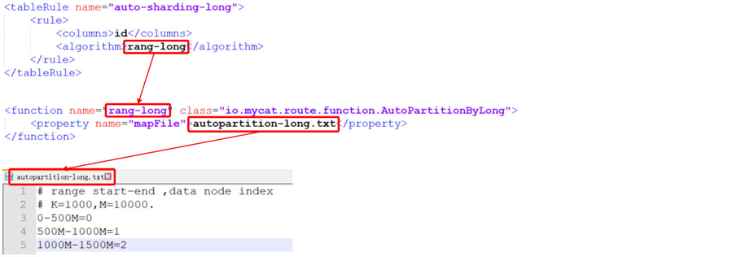


### （3）server.xml

server.xmlé…置文件包å«äº†**MyCat的系统é…置信æ¯**，主è¦æœ‰ä¸¤ä¸ªé‡è¦çš„标签：**systemã€user**。

#### ① system标签

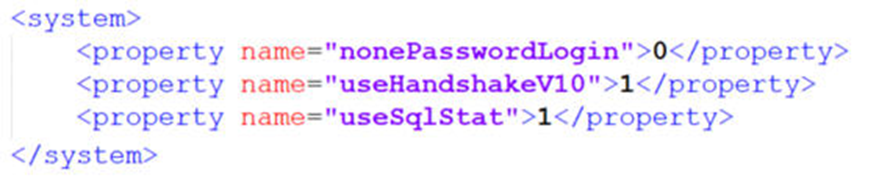

主è¦é…ç½®MyCat中的系统é…置信æ¯ï¼Œå¯¹åº”的系统é…置项åŠå…¶å«ä¹‰ï¼Œå¦‚下：

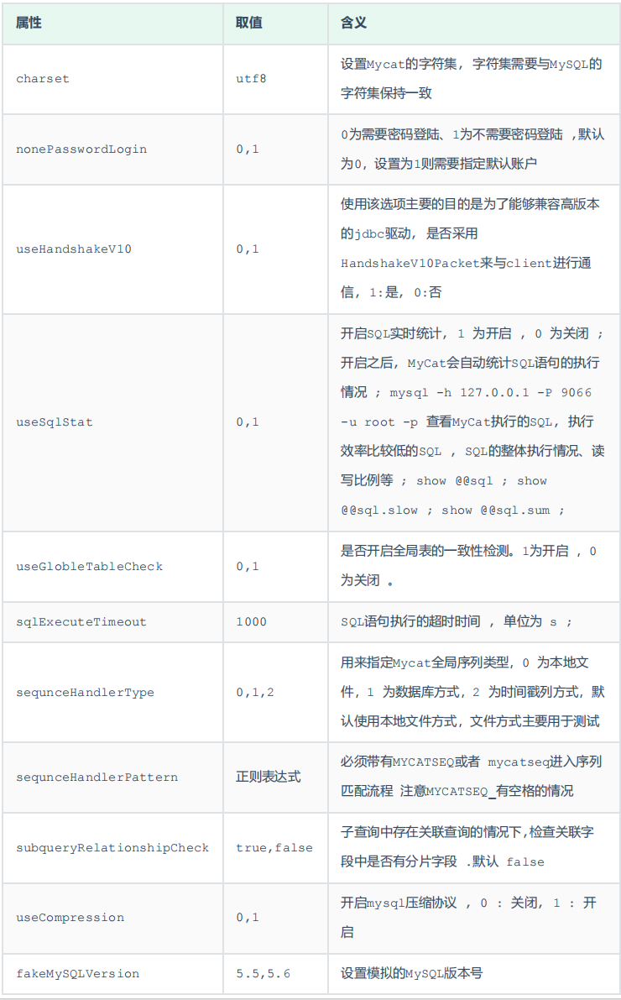


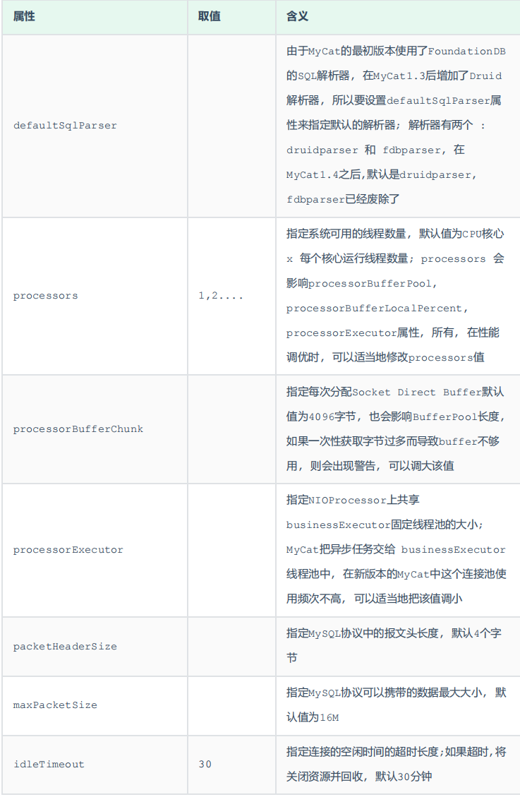


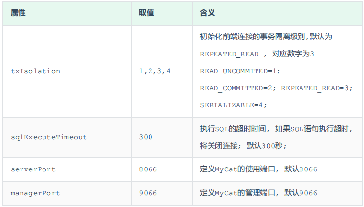


#### ② user标签

é…ç½®MyCat中的用户ã€è®¿é—®å¯†ç ï¼Œä»¥åŠç”¨æˆ·é’ˆå¯¹äºé€»è¾‘库ã€é€»è¾‘表的**æƒé™ä¿¡æ¯**，具体的æƒé™æè¿°æ–¹å¼åŠé…置说æ˜å¦‚下：

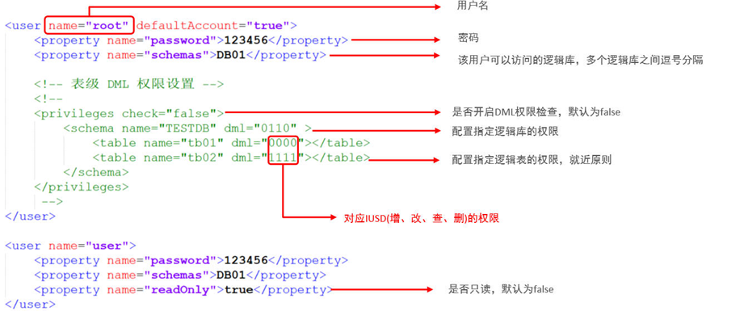

在测试æƒé™æ“作时，我们åªéœ€è¦å°† privileges 标签的注释放开。

1.  在 privileges 下的**schema标签**中**é…置的dmlå±æ€§é…置的是逻辑库的æƒé™**。
2.  在privilegesçš„schema下的**table标签**çš„dmlå±æ€§ä¸­**é…置逻辑表的æƒé™**。
3.  dml => 对应4ä½äºŒè¿›åˆ¶æ•°ï¼Œåˆ†åˆ«**对应IUSD（å¢ã€æ”¹ã€æŸ¥ã€åˆ ï¼‰çš„æƒé™**。


## 3.5 🚀 ==MyCat分片==-分库/分表

这里的分片指的就是分库分表

### （1）å‚直拆分

#### ①场景

在业务系统中, 涉åŠä»¥ä¸‹è¡¨ç»“æ„ ,但是由äºç”¨æˆ·ä¸è®¢å•æ¯å¤©éƒ½ä¼šäº§ç”Ÿå¤§é‡çš„æ•°æ®, å•å°æœåŠ¡å™¨çš„æ•°æ®å­˜å‚¨åŠå¤„ç†èƒ½åŠ›æ˜¯æœ‰é™çš„, å¯ä»¥å¯¹**æ•°æ®åº“表进行拆分**, åŸæœ‰çš„æ•°æ®åº“表如下。

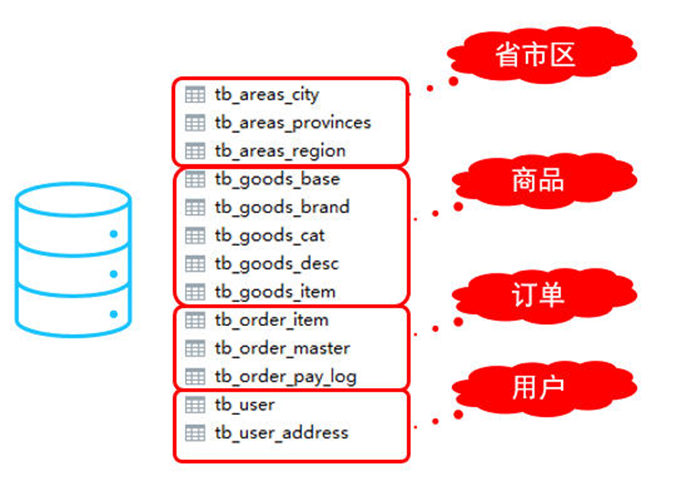

ç°åœ¨è€ƒè™‘将其进行**å‚直分库æ“作**，将商å“相关的表拆分到一个数æ®åº“æœåŠ¡å™¨ï¼Œè®¢å•è¡¨æ‹†åˆ†çš„一个数æ®åº“æœåŠ¡å™¨ï¼Œç”¨æˆ·åŠçœå¸‚区表拆分到一个æœåŠ¡å™¨ã€‚最终结æ„如下：

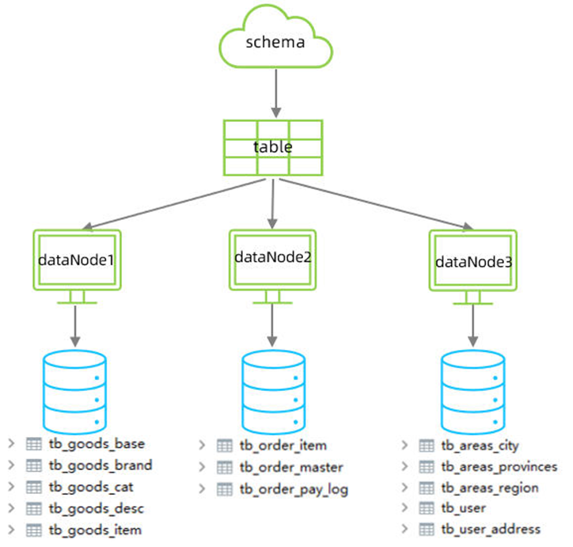


#### ②准备

准备三å°æœåŠ¡å™¨ï¼ŒIP地å€å¦‚图所示：

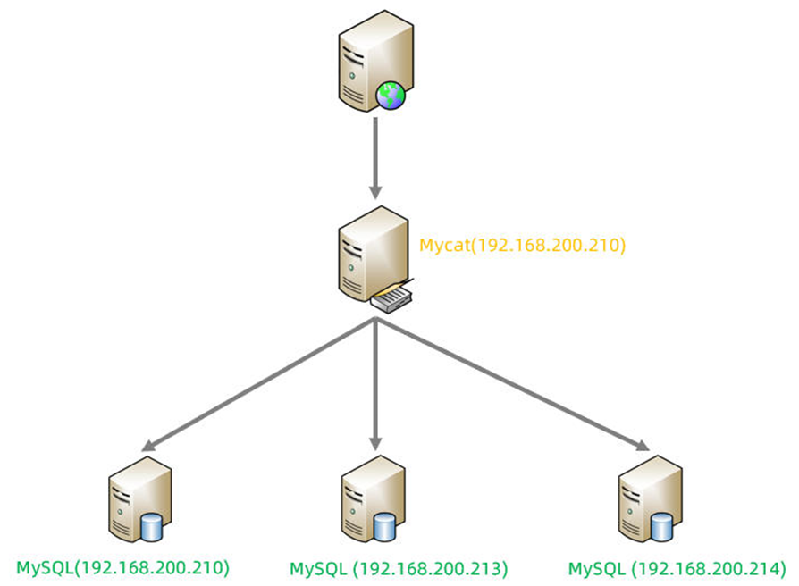

并且在192.168.200.210，192.168.200.213, 192.168.200.214上é¢**手动先创建数æ®åº“shopping**。

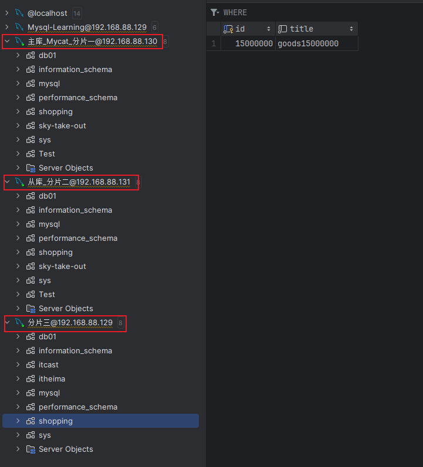


#### â‘¢é…ç½®

##### 1). schema.xml

```bash
cd /usr/local/mycat/conf
```

```xml
<?xml version="1.0"?>
<!DOCTYPE mycat:schema SYSTEM "schema.dtd">
<mycat:schema xmlns:mycat="http://io.mycat/">
    <schema name="SHOPPING" checkSQLschema="true" sqlMaxLimit="100">
        <table name="tb_goods_base" dataNode="dn1" primaryKey="id" />
        <table name="tb_goods_brand" dataNode="dn1" primaryKey="id" />
        <table name="tb_goods_cat" dataNode="dn1" primaryKey="id" />
        <table name="tb_goods_desc" dataNode="dn1" primaryKey="goods_id" />
        <table name="tb_goods_item" dataNode="dn1" primaryKey="id" />

        <table name="tb_order_item" dataNode="dn2" primaryKey="id" />
        <table name="tb_order_master" dataNode="dn2" primaryKey="order_id" />
        <table name="tb_order_pay_log" dataNode="dn2" primaryKey="out_trade_no" />

        <table name="tb_user" dataNode="dn3" primaryKey="id" />
        <table name="tb_user_address" dataNode="dn3" primaryKey="id" />
        <table name="tb_areas_provinces" dataNode="dn3" primaryKey="id"/>
        <table name="tb_areas_city" dataNode="dn3" primaryKey="id"/>
        <table name="tb_areas_region" dataNode="dn3" primaryKey="id"/>
    </schema>

    <dataNode name="dn1" dataHost="dhost1" database="shopping" />
    <dataNode name="dn2" dataHost="dhost2" database="shopping" />
    <dataNode name="dn3" dataHost="dhost3" database="shopping" />

    <dataHost name="dhost1" maxCon="1000" minCon="10" balance="0"
              writeType="0" dbType="mysql" dbDriver="jdbc" switchType="1"
              slaveThreshold="100">
        <heartbeat>select user()</heartbeat>
        <writeHost host="master" url="jdbc:mysql://192.168.88.130:3306?useSSL=false&amp;serverTimezone=Asia/Shanghai&amp;characterEncoding=utf8"
                   user="root" password="root" />
    </dataHost>

    <dataHost name="dhost2" maxCon="1000" minCon="10" balance="0"
              writeType="0" dbType="mysql" dbDriver="jdbc" switchType="1"
              slaveThreshold="100">
        <heartbeat>select user()</heartbeat>
        <writeHost host="master" url="jdbc:mysql://192.168.88.131:3306?useSSL=false&amp;serverTimezone=Asia/Shanghai&amp;characterEncoding=utf8"
                   user="root" password="root" />
    </dataHost>

    <dataHost name="dhost3" maxCon="1000" minCon="10" balance="0"
              writeType="0" dbType="mysql" dbDriver="jdbc" switchType="1"
              slaveThreshold="100">
        <heartbeat>select user()</heartbeat>
        <writeHost host="master" url="jdbc:mysql://192.168.88.129:3306?useSSL=false&amp;serverTimezone=Asia/Shanghai&amp;characterEncoding=utf8"
                   user="root" password="1234" />
    </dataHost>
</mycat:schema>
```


##### 2). server.xml

```xml
<user name="root" defaultAccount="true">
    <property name="password">123456</property>
    <property name="schemas">SHOPPING</property>
    <!-- 表级 DML æƒé™è®¾ç½® -->
    <!--
<privileges check="true">
<schema name="DB01" dml="0110" >
<table name="TB_ORDER" dml="1110"></table>
</schema>
</privileges>
-->
</user>
<user name="user">
    <property name="password">123456</property>
    <property name="schemas">SHOPPING</property>
    <property name="readOnly">true</property>
</user>
```


é…置完毕å，**é‡æ–°å¯åŠ¨MyCat**。

```bash
#å¯åŠ¨
bin/mycat start

#åœæ­¢
bin/mycat stop
```


#### ④测试

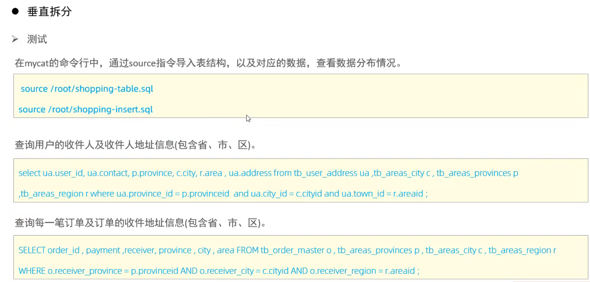

##### 1). 上传测试SQL脚本到æœåŠ¡å™¨çš„/root目录


**登录Mycat**

```bash
mysql -h 192.168.200.210 -P 8066 -uroot -p123456
```


**具体的脚本å¯åœ¨`è¿ç»´ç¯‡çš„SQL脚本的å‚直拆分`中找到**

```sql
source /root/shopping-table.sql;
source /root/shopping-insert.sql;
```


##### 2). 执行指令导入测试数æ®

é‡æ–°å¯åŠ¨MyCatå，在mycat的命令行中，**通过source指令导入表结æ„，以åŠå¯¹åº”çš„æ•°æ®**，查看数æ®åˆ†å¸ƒæƒ…况。

```sql
source /root/shopping-table.sql

source /root/shopping-insert.sql
```

将表结æ„åŠå¯¹åº”的测试数æ®å¯¼å…¥ä¹‹å，å¯ä»¥æ£€æŸ¥ä¸€ä¸‹**å„个数æ®åº“æœåŠ¡å™¨ä¸­çš„表结æ„分布情况**。 检查是å¦å’Œæˆ‘们准备工作中规划的æœåŠ¡å™¨ä¸€è‡´ã€‚


##### 3). 查询用户的收件人åŠæ”¶ä»¶äººåœ°å€ä¿¡æ¯(包å«çœã€å¸‚ã€åŒº)。

在**MyCat的命令行**中，当我们**执行以下==多表è”查==çš„SQL语å¥**时，å¯ä»¥æ­£å¸¸æŸ¥è¯¢å‡ºæ•°æ®ã€‚

```sql
select ua.user_id, ua.contact, p.province, c.city, r.area , ua.address 
from
tb_user_address ua ,tb_areas_city c , tb_areas_provinces p ,tb_areas_region r
where ua.province_id = p.provinceid and ua.city_id = c.cityid and ua.town_id =
r.areaid ;
```

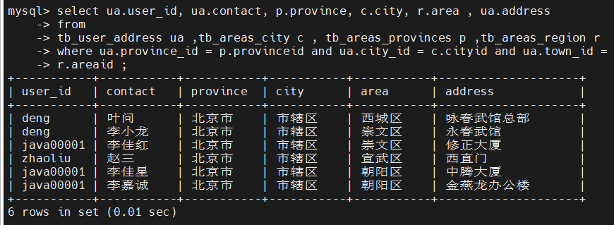


##### 4). 查询æ¯ä¸€ç¬”订å•åŠè®¢å•çš„收件地å€ä¿¡æ¯(包å«çœã€å¸‚ã€åŒº)。

å®ç°è¯¥éœ€æ±‚对应的SQL语å¥å¦‚下：

```sql
SELECT order_id , payment ,receiver, province , city , area 
FROM tb_order_master o
, tb_areas_provinces p , tb_areas_city c , tb_areas_region r 
WHERE o.receiver_province = p.provinceid AND o.receiver_city = c.cityid AND
o.receiver_region = r.areaid;
```

但是ç°åœ¨å­˜åœ¨ä¸€ä¸ªé—®é¢˜ï¼Œè®¢å•ç›¸å…³çš„表结æ„是在 192.168.200.213 æ•°æ®åº“æœåŠ¡å™¨ä¸­ï¼Œè€Œçœå¸‚区的数æ®åº“表是在 192.168.200.214 æ•°æ®åº“æœåŠ¡å™¨ä¸­ã€‚那么在MyCat中执行是å¦å¯ä»¥æˆåŠŸå‘¢ï¼Ÿ


ç»è¿‡æµ‹è¯•ï¼Œæˆ‘们看到，SQL语å¥æ‰§è¡ŒæŠ¥é”™ã€‚åŸå› å°±æ˜¯å› ä¸ºMyCat在执行该SQL语å¥æ—¶ï¼Œéœ€è¦å¾€å…·ä½“çš„æ•°æ®åº“æœåŠ¡å™¨ä¸­è·¯ç”±ï¼Œè€Œå½“å‰æ²¡æœ‰ä¸€ä¸ªæ•°æ®åº“æœåŠ¡å™¨å®Œå…¨åŒ…å«äº†è®¢å•ä»¥åŠçœå¸‚区的表结æ„，**造æˆSQL语å¥å¤±è´¥ï¼ŒæŠ¥é”™**。


对äºä¸Šè¿°çš„è¿™ç§ç°è±¡ï¼Œæˆ‘们如何æ¥è§£å†³å‘¢ï¼Ÿ 下é¢æˆ‘们介ç»çš„**全局表**，就å¯ä»¥è½»æ¾è§£å†³è¿™ä¸ªé—®é¢˜ã€‚


#### ⑤==全局表==

对äºçœã€å¸‚ã€åŒº/å¿è¡¨tb_areas_provinces , tb_areas_city , tb_areas_region，是å±äºæ•°æ®å­—典表，在多个业务模å—中都å¯èƒ½ä¼šé‡åˆ°ï¼Œå¯ä»¥**将其设置为全局表，利äºä¸šåŠ¡æ“作**。

修改schema.xml中的逻辑表的é…置，修改 tb_areas_provincesã€tb_areas_cityã€tb_areas_region 三个逻辑表，**==添加关è”çš„dataNode，并å¢åŠ  type å±æ€§ï¼Œé…置为global==**，就代表该表是全局表，就会在所涉åŠåˆ°çš„dataNode中创建该表。对äºå½“å‰é…ç½®æ¥è¯´ï¼Œä¹Ÿå°±æ„味ç€**所有的节点中都有该表**了。

```xml
<table name="tb_areas_provinces" dataNode="dn1,dn2,dn3" primaryKey="id" type="global"/>
<table name="tb_areas_city" dataNode="dn1,dn2,dn3" primaryKey="id" type="global"/>
<table name="tb_areas_region" dataNode="dn1,dn2,dn3" primaryKey="id" type="global"/>
```

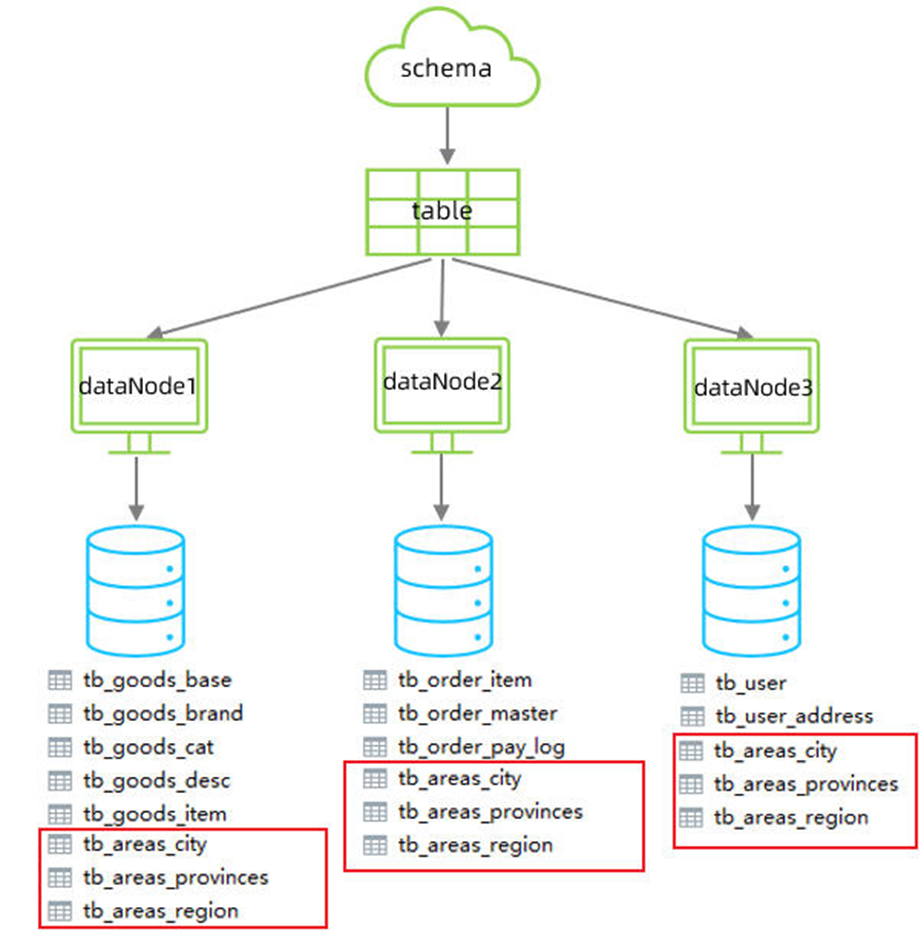

é…置完毕å，**é‡æ–°å¯åŠ¨MyCat**。

```bash
#å¯åŠ¨
bin/mycat start

#åœæ­¢
bin/mycat stop
```


**1). 删除åŸæ¥æ¯ä¸€ä¸ªæ•°æ®åº“æœåŠ¡å™¨ä¸­çš„所有表结æ„**

**2). 通过source指令，导入表åŠæ•°æ®**

```sql
source /root/shopping-table.sql

source /root/shopping-insert.sql
```

**3). 检查æ¯ä¸€ä¸ªæ•°æ®åº“æœåŠ¡å™¨ä¸­çš„表åŠæ•°æ®åˆ†å¸ƒï¼Œçœ‹åˆ°ä¸‰ä¸ªèŠ‚点中都有这三张全局表**

**4). 然åå†æ¬¡æ‰§è¡Œä¸Šé¢çš„多表è”查的SQL语å¥**

```sql
SELECT order_id , payment ,receiver, province , city , area FROM tb_order_master o
, tb_areas_provinces p , tb_areas_city c , tb_areas_region r WHERE
o.receiver_province = p.provinceid AND o.receiver_city = c.cityid AND
o.receiver_region = r.areaid ;
```

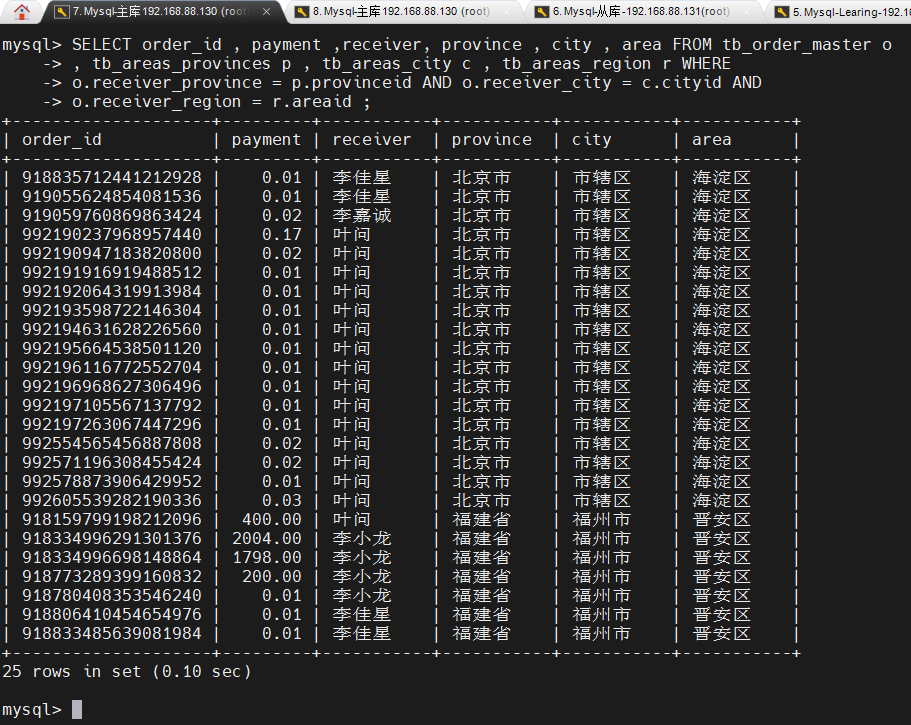

是å¯ä»¥æ­£å¸¸æ‰§è¡ŒæˆåŠŸçš„。

**5). 当在MyCat中更新全局表的时候，我们å¯ä»¥çœ‹åˆ°ï¼Œæ‰€æœ‰åˆ†ç‰‡èŠ‚点中的数æ®éƒ½å‘生了å˜åŒ–，æ¯ä¸ªèŠ‚点的全局表数æ®æ—¶åˆ»ä¿æŒä¸€è‡´ã€‚**


### （2）水平拆分

#### ①场景

在业务系统中, 有一张表(日志表), 业务系统æ¯å¤©éƒ½ä¼šäº§ç”Ÿå¤§é‡çš„**日志数æ®** , å•å°æœåŠ¡å™¨çš„æ•°æ®å­˜å‚¨åŠå¤„ç†èƒ½åŠ›æ˜¯æœ‰é™çš„, å¯ä»¥å¯¹**æ•°æ®åº“表进行拆分**。

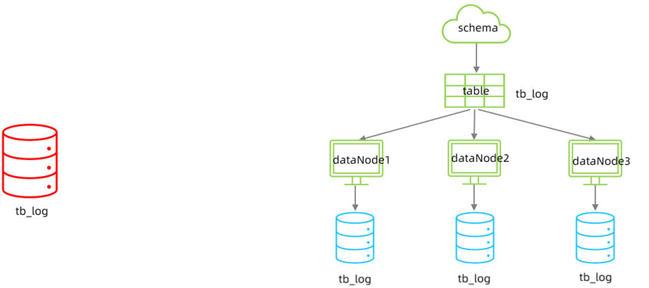

#### ②准备

准备三å°æœåŠ¡å™¨ï¼Œå…·ä½“的结æ„如下：

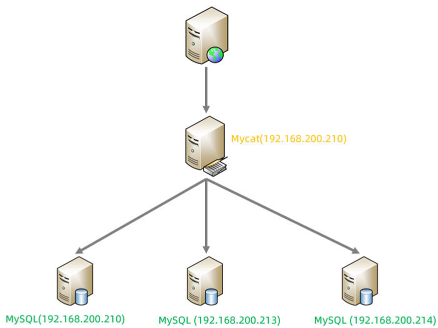

并且，在三å°æ•°æ®åº“æœåŠ¡å™¨ä¸­**分别创建一个数æ®åº“itcast**。


#### â‘¢é…ç½®

##### 1). schema.xml

```xml
<schema name="ITCAST" checkSQLschema="true" sqlMaxLimit="100">
    <table name="tb_log" dataNode="dn4,dn5,dn6" primaryKey="id" rule="mod-long" />
</schema>

<dataNode name="dn4" dataHost="dhost1" database="itcast" />
<dataNode name="dn5" dataHost="dhost2" database="itcast" />
<dataNode name="dn6" dataHost="dhost3" database="itcast" />
```

tb_log表最终è½åœ¨3个节点中，分别是 dn4ã€dn5ã€dn6 ，而具体的数æ®åˆ†åˆ«å­˜å‚¨åœ¨ dhost1ã€dhost2ã€dhost3çš„itcastæ•°æ®åº“中。

**分片规则为：mod-long**，å–模分片，默认mod 3


##### 2). server.xml

é…ç½®root用户既å¯ä»¥è®¿é—® SHOPPING 逻辑库，åˆå¯ä»¥è®¿é—®ITCAST逻辑库。

```xml
<user name="root" defaultAccount="true">
    <property name="password">123456</property>
    <property name="schemas">SHOPPING,ITCAST</property>
    <!-- 表级 DML æƒé™è®¾ç½® -->
    <!--
		<privileges check="true">
		<schema name="DB01" dml="0110" >
		<table name="TB_ORDER" dml="1110"></table>
		</schema>
		</privileges>
	-->
</user>
```


#### ④测试

é…置完毕å，é‡æ–°å¯åŠ¨MyCat，然å在mycat的命令行中，执行如下SQL创建表ã€å¹¶æ’入数æ®ï¼ŒæŸ¥çœ‹æ•°æ®åˆ†å¸ƒæƒ…况。

```sql
CREATE TABLE tb_log (
    id bigint(20) NOT NULL COMMENT 'ID',
    model_name varchar(200) DEFAULT NULL COMMENT '模å—å',
    model_value varchar(200) DEFAULT NULL COMMENT '模å—值',
    return_value varchar(200) DEFAULT NULL COMMENT 'è¿”å›å€¼',
    return_class varchar(200) DEFAULT NULL COMMENT 'è¿”å›å€¼ç±»å‹',
    operate_user varchar(20) DEFAULT NULL COMMENT 'æ“作用户',
    operate_time varchar(20) DEFAULT NULL COMMENT 'æ“作时间',
    param_and_value varchar(500) DEFAULT NULL COMMENT '请求å‚æ•°ååŠå‚数值',
    operate_class varchar(200) DEFAULT NULL COMMENT 'æ“作类',
    operate_method varchar(200) DEFAULT NULL COMMENT 'æ“作方法',
    cost_time bigint(20) DEFAULT NULL COMMENT '执行方法耗时, å•ä½ ms',
    source int(1) DEFAULT NULL COMMENT 'æ¥æº : 1 PC , 2 Android , 3 IOS',
    PRIMARY KEY (id)
) ENGINE=InnoDB DEFAULT CHARSET=utf8mb4;
```

**Insert语å¥**

```sql
    INSERT INTO tb_log (id, model_name, model_value, return_value, return_class, operate_user, operate_time, param_and_value, operate_class, operate_method, cost_time，source) VALUES('1','user','insert','success','java.lang.String','10001','2022-01-06 18:12:28','{\"age\":\"20\",\"name\":\"Tom\",\"gender\":\"1\"}','cn.itcast.controller.UserController','insert','10',1);
    INSERT INTO tb_log (id, model_name, model_value, return_value, return_class, operate_user, operate_time, param_and_value, operate_class, operate_method, cost_time，source) VALUES('2','user','insert','success','java.lang.String','10001','2022-01-06 18:12:27','{\"age\":\"20\",\"name\":\"Tom\",\"gender\":\"1\"}','cn.itcast.controller.UserController','insert','23',1);
    INSERT INTO tb_log (id, model_name, model_value, return_value, return_class, operate_user, operate_time, param_and_value, operate_class, operate_method, cost_time，source) VALUES('3','user','update','success','java.lang.String','10001','2022-01-06 18:16:45','{\"age\":\"20\",\"name\":\"Tom\",\"gender\":\"1\"}','cn.itcast.controller.UserController','update','34',1);
    INSERT INTO tb_log (id, model_name, model_value, return_value, return_class, operate_user, operate_time, param_and_value, operate_class, operate_method, cost_time，source) VALUES('4','user','update','success','java.lang.String','10001','2022-01-06 18:16:45','{\"age\":\"20\",\"name\":\"Tom\",\"gender\":\"1\"}','cn.itcast.controller.UserController','update','13',2);
    INSERT INTO tb_log (id, model_name, model_value, return_value, return_class, operate_user, operate_time, param_and_value, operate_class, operate_method, cost_time，source) VALUES('5','user','insert','success','java.lang.String','10001','2022-01-06 18:30:31','{\"age\":\"200\",\"name\":\"TomCat\",\"gender\":\"0\"}','cn.itcast.controller.UserController','insert','29',3);
    INSERT INTO tb_log (id, model_name, model_value, return_value, return_class, operate_user, operate_time, param_and_value, operate_class, operate_method, cost_time，source) VALUES('6','user','find','success','java.lang.String','10001','2022-01-06 18:30:31','{\"age\":\"200\",\"name\":\"TomCat\",\"gender\":\"0\"}','cn.itcast.controller.UserController','find','29',2);
```


### （3）==分片规则==

#### ①范围分片

<span id = "范围分片规则" > </span>

##### 1). 介ç»

æ ¹æ®**指定的字段åŠå…¶é…置的范围**ä¸æ•°æ®èŠ‚点的对应情况， æ¥å†³å®šè¯¥æ•°æ®å±äºå“ªä¸€ä¸ªåˆ†ç‰‡ã€‚

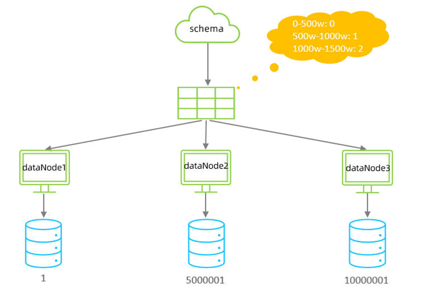

##### 2). é…ç½®

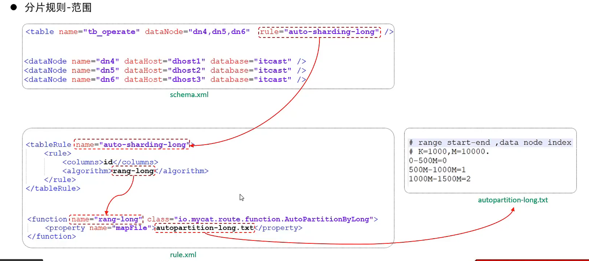

schema.xml逻辑表é…置：

```xml
<table name="TB_ORDER" dataNode="dn1,dn2,dn3" rule="auto-sharding-long" />
```

schema.xmlæ•°æ®èŠ‚点é…置：

```xml
<dataNode name="dn1" dataHost="dhost1" database="db01" />
<dataNode name="dn2" dataHost="dhost2" database="db01" />
<dataNode name="dn3" dataHost="dhost3" database="db01" />
```

rule.xml分片规则é…置：

```xml
<tableRule name="auto-sharding-long">
    <rule>
        <columns>id</columns>
        <algorithm>rang-long</algorithm>
    </rule>
</tableRule>

<function name="rang-long" class="io.mycat.route.function.AutoPartitionByLong">
    <property name="mapFile">autopartition-long.txt</property>
    <property name="defaultNode">0</property>
</function>
```

分片规则é…ç½®å±æ€§å«ä¹‰ï¼š

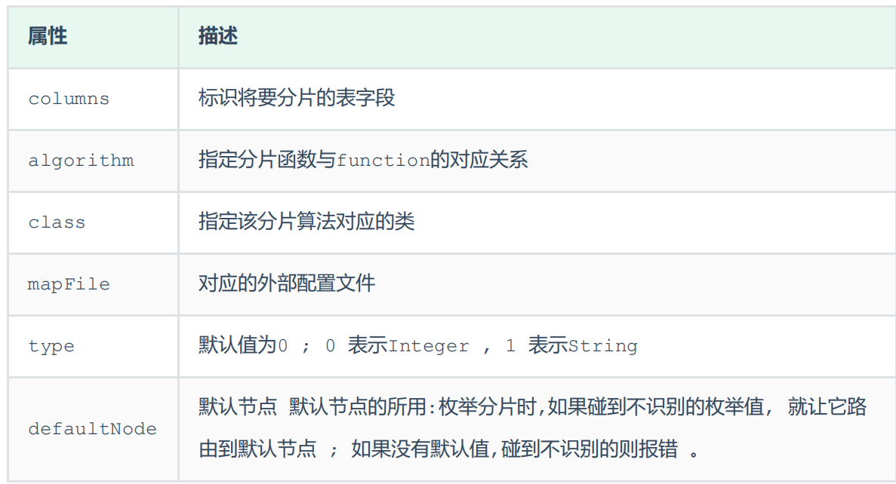

在rule.xml中é…置分片规则时，关è”了一个映射é…置文件 autopartition-long.txt，该é…置文件的é…置如下：

```bash
# range start-end ,data node index
# K=1000,M=10000.
0-500M=0
500M-1000M=1
1000M-1500M=2
```

å«ä¹‰ï¼š0-500万之间的值，存储在0å·æ•°æ®èŠ‚点(æ•°æ®èŠ‚点的索引ä»0开始) ï¼› 500万-1000万之间的数æ®å­˜å‚¨åœ¨1å·æ•°æ®èŠ‚点 ï¼› 1000万-1500万的数æ®èŠ‚点存储在2å·èŠ‚点 ï¼›

如æœ**超出了1500w**，比如1500w 01，则会报错，需è¦æ·»åŠ æ–°çš„æ•°æ®èŠ‚点

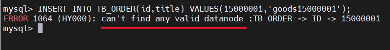


该分片规则，主è¦æ˜¯é’ˆå¯¹äºæ•°å­—ç±»å‹çš„字段适用。 在MyCat的入门程åºä¸­ï¼Œæˆ‘们使用的就是该分片规则。


#### â‘¡å–模分片

##### 1). 介ç»

æ ¹æ®**指定的字段值ä¸==节点数é‡è¿›è¡Œæ±‚模==è¿ç®—**，根æ®è¿ç®—结æœï¼Œ æ¥å†³å®šè¯¥æ•°æ®å±äºå“ªä¸€ä¸ªåˆ†ç‰‡ã€‚


##### 2). é…ç½®

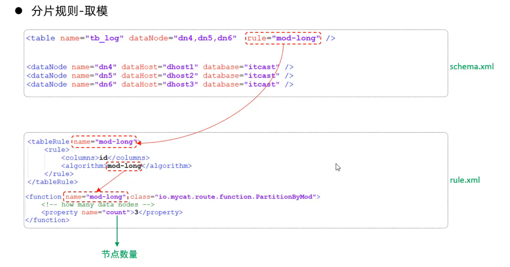

schema.xml逻辑表é…置：

```xml
<!-- å–模分片 -->
<table name="tb_log" dataNode="dn4,dn5,dn6" primaryKey="id" rule="mod-long" />
```

schema.xmlæ•°æ®èŠ‚点é…置：

```xml
<dataNode name="dn4" dataHost="dhost1" database="itcast" />
<dataNode name="dn5" dataHost="dhost2" database="itcast" />
<dataNode name="dn6" dataHost="dhost3" database="itcast" />
```

rule.xml分片规则é…置：

```xml
<tableRule name="mod-long">
    <rule>
        <columns>id</columns>
        <algorithm>mod-long</algorithm>
    </rule>
</tableRule>
<function name="mod-long" class="io.mycat.route.function.PartitionByMod">
    <property name="count">3</property>
</function>
```

分片规则å±æ€§è¯´æ˜å¦‚下：

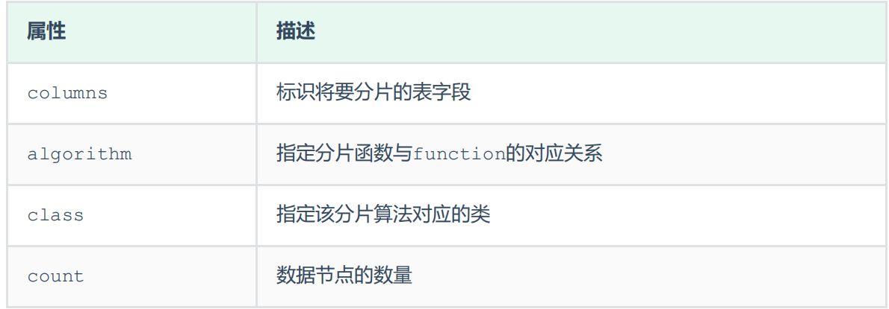

该分片规则，主è¦æ˜¯é’ˆå¯¹äºæ•°å­—ç±»å‹çš„字段适用。 在å‰é¢æ°´å¹³æ‹†åˆ†çš„演示中，我们选择的就是å–模分片。


##### 3). 测试

é…置完毕å，é‡æ–°å¯åŠ¨MyCat，然å在mycat的命令行中，执行如下SQL创建表ã€å¹¶æ’入数æ®ï¼ŒæŸ¥çœ‹æ•°æ®åˆ†å¸ƒæƒ…况。


#### ③一致性hash分片

##### 1). 介ç»

所谓一致性哈希，**==相åŒçš„哈希因å­è®¡ç®—值==总是被划分到相åŒçš„分区表中**，ä¸ä¼šå› ä¸ºåˆ†åŒºèŠ‚点的å¢åŠ è€Œæ”¹å˜åŸæ¥æ•°æ®çš„分区ä½ç½®ï¼Œæœ‰æ•ˆçš„解决了分布å¼æ•°æ®çš„拓容问题。

- 一致hash说的是**节点å¢åŠ ä¸å½±å“hash算法值**

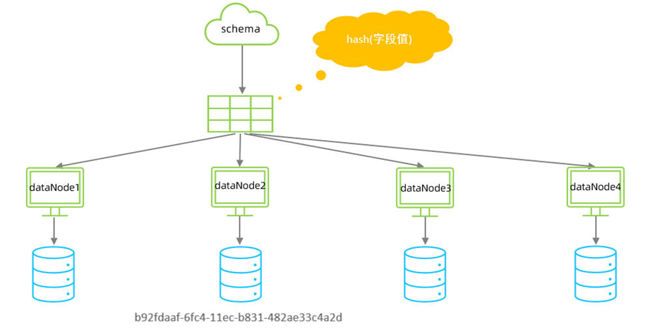


##### 2). é…ç½®

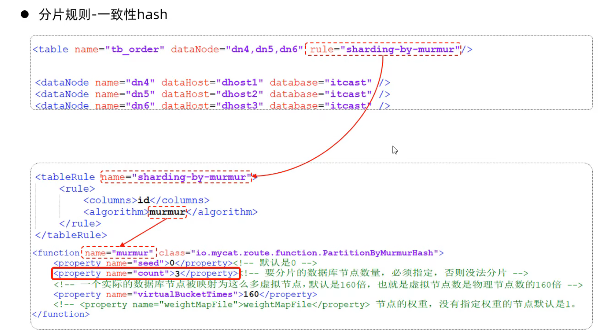

schema.xml中逻辑表é…置：

```xml
<!-- 一致性hash -->
<table name="tb_order" dataNode="dn4,dn5,dn6" rule="sharding-by-murmur" />
```

schema.xml中数æ®èŠ‚点é…置：

```xml
<dataNode name="dn4" dataHost="dhost1" database="itcast" />
<dataNode name="dn5" dataHost="dhost2" database="itcast" />
<dataNode name="dn6" dataHost="dhost3" database="itcast" />
```

rule.xml中分片规则é…置：

```xml
<tableRule name="sharding-by-murmur">
    <rule>
        <columns>id</columns>
        <algorithm>murmur</algorithm>
    </rule>
</tableRule>
<function name="murmur" class="io.mycat.route.function.PartitionByMurmurHash">
    <property name="seed">0</property><!-- 默认是0 -->
    <property name="count">3</property>
    <property name="virtualBucketTimes">160</property>
</function>
```

分片规则å±æ€§å«ä¹‰ï¼š

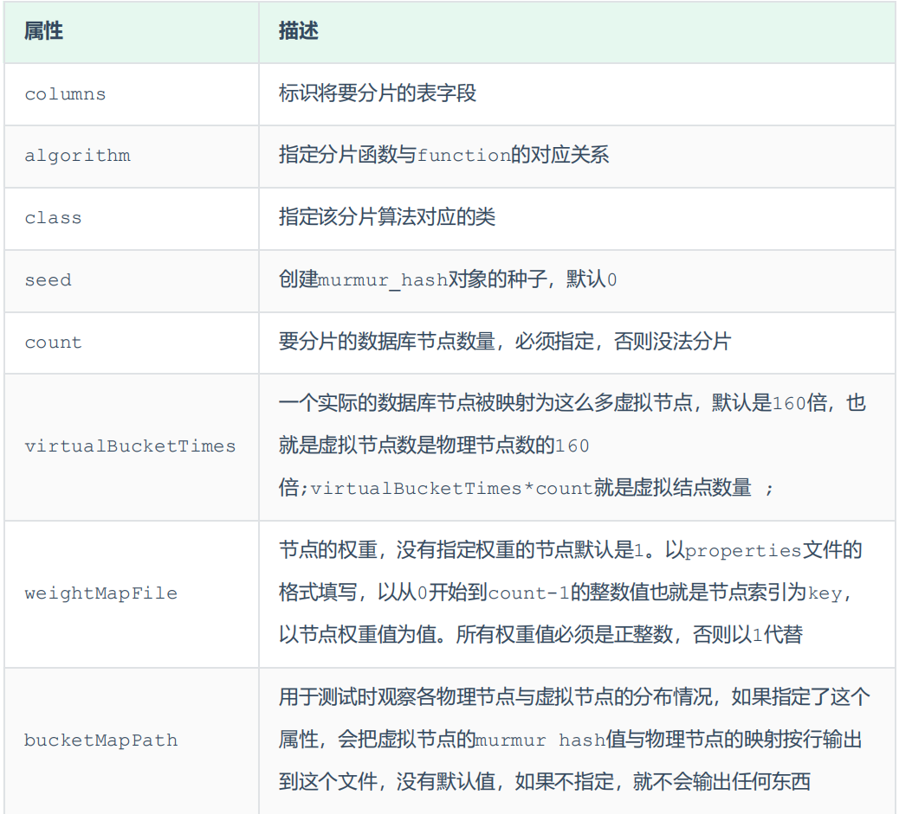


##### 3). 测试

é…置完毕å，é‡æ–°å¯åŠ¨MyCat，然å在mycat的命令行中，执行如下SQL创建表ã€å¹¶æ’入数æ®ï¼ŒæŸ¥çœ‹æ•°æ®åˆ†å¸ƒæƒ…况。

```sql
create table tb_order(
    id  varchar(100) not null primary key,
    money   int null,
    content varchar(200) null
);

INSERT INTO tb_order (id, money, content) VALUES ('b92fdaaf-6fc4-11ec-b831-482ae33c4a2d', 10, 'b92fdaf8-6fc4-11ec-b831-482ae33c4a2d');
INSERT INTO tb_order (id, money, content) VALUES ('b93482b6-6fc4-11ec-b831-482ae33c4a2d', 20, 'b93482d5-6fc4-11ec-b831-482ae33c4a2d');
INSERT INTO tb_order (id, money, content) VALUES ('b937e246-6fc4-11ec-b831-482ae33c4a2d', 50, 'b937e25d-6fc4-11ec-b831-482ae33c4a2d');
INSERT INTO tb_order (id, money, content) VALUES ('b93be2dd-6fc4-11ec-b831-482ae33c4a2d', 100, 'b93be2f9-6fc4-11ec-b831-482ae33c4a2d');
INSERT INTO tb_order (id, money, content) VALUES ('b93f2d68-6fc4-11ec-b831-482ae33c4a2d', 130, 'b93f2d7d-6fc4-11ec-b831-482ae33c4a2d');
INSERT INTO tb_order (id, money, content) VALUES ('b9451b98-6fc4-11ec-b831-482ae33c4a2d', 30, 'b9451bcc-6fc4-11ec-b831-482ae33c4a2d');
INSERT INTO tb_order (id, money, content) VALUES ('b9488ec1-6fc4-11ec-b831-482ae33c4a2d', 560, 'b9488edb-6fc4-11ec-b831-482ae33c4a2d');
INSERT INTO tb_order (id, money, content) VALUES ('b94be6e6-6fc4-11ec-b831-482ae33c4a2d', 10, 'b94be6ff-6fc4-11ec-b831-482ae33c4a2d');
INSERT INTO tb_order (id, money, content) VALUES ('b94ee10d-6fc4-11ec-b831-482ae33c4a2d', 123, 'b94ee12c-6fc4-11ec-b831-482ae33c4a2d');
INSERT INTO tb_order (id, money, content) VALUES ('b952492a-6fc4-11ec-b831-482ae33c4a2d', 145, 'b9524945-6fc4-11ec-b831-482ae33c4a2d');
INSERT INTO tb_order (id, money, content) VALUES ('b95553ac-6fc4-11ec-b831-482ae33c4a2d', 543, 'b95553c8-6fc4-11ec-b831-482ae33c4a2d');
INSERT INTO tb_order (id, money, content) VALUES ('b9581cdd-6fc4-11ec-b831-482ae33c4a2d', 17, 'b9581cfa-6fc4-11ec-b831-482ae33c4a2d');
INSERT INTO tb_order (id, money, content) VALUES ('b95afc0f-6fc4-11ec-b831-482ae33c4a2d', 18, 'b95afc2a-6fc4-11ec-b831-482ae33c4a2d');
INSERT INTO tb_order (id, money, content) VALUES ('b95daa99-6fc4-11ec-b831-482ae33c4a2d', 134, 'b95daab2-6fc4-11ec-b831-482ae33c4a2d');
INSERT INTO tb_order (id, money, content) VALUES ('b9667e3c-6fc4-11ec-b831-482ae33c4a2d', 156, 'b9667e60-6fc4-11ec-b831-482ae33c4a2d');
INSERT INTO tb_order (id, money, content) VALUES ('b96ab489-6fc4-11ec-b831-482ae33c4a2d', 175, 'b96ab4a5-6fc4-11ec-b831-482ae33c4a2d');
INSERT INTO tb_order (id, money, content) VALUES ('b96e2942-6fc4-11ec-b831-482ae33c4a2d', 180, 'b96e295b-6fc4-11ec-b831-482ae33c4a2d');
INSERT INTO tb_order (id, money, content) VALUES ('b97092ec-6fc4-11ec-b831-482ae33c4a2d', 123, 'b9709306-6fc4-11ec-b831-482ae33c4a2d');
INSERT INTO tb_order (id, money, content) VALUES ('b973727a-6fc4-11ec-b831-482ae33c4a2d', 230, 'b9737293-6fc4-11ec-b831-482ae33c4a2d');
INSERT INTO tb_order (id, money, content) VALUES ('b978840f-6fc4-11ec-b831-482ae33c4a2d', 560, 'b978843c-6fc4-11ec-b831-482ae33c4a2d');
```


#### â‘£æšä¸¾åˆ†ç‰‡

##### 1). 介ç»

通过在é…置文件中**é…ç½®å¯èƒ½çš„æšä¸¾å€¼**, 指定数æ®åˆ†å¸ƒåˆ°ä¸åŒæ•°æ®èŠ‚点上, 本规则适用äº**按照çœä»½ã€æ€§åˆ«ã€çŠ¶æ€æ‹†åˆ†æ•°æ®**等业务 。

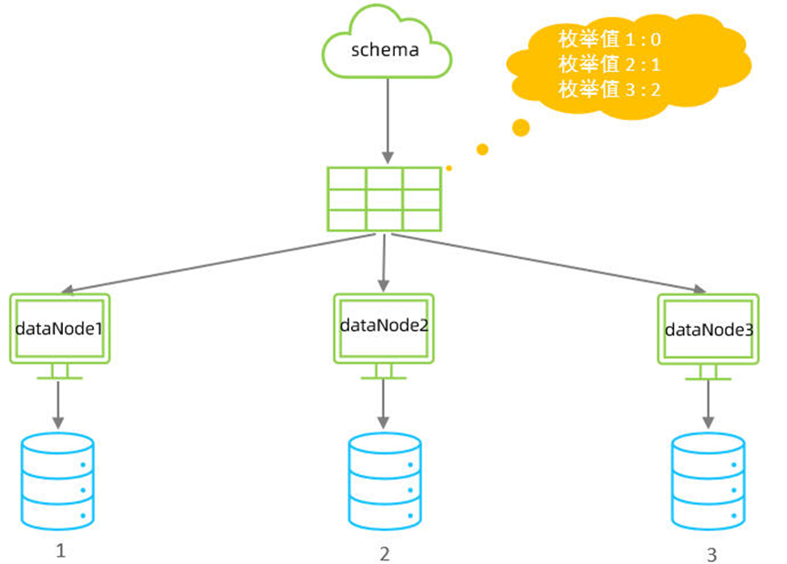

##### 2). é…ç½®

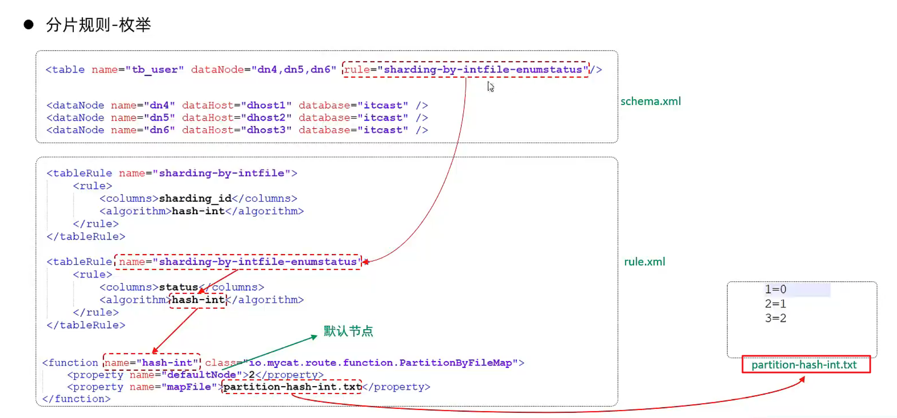

**这里按照tb_user表的 status字段 进行æšä¸¾åˆ†ç‰‡ï¼Œè¯¥status对应三个状æ€1,2,3**

schema.xml中逻辑表é…置：

```xml
<!-- æšä¸¾ -->
        <table name="tb_user" dataNode="dn4,dn5,dn6" rule="sharding-by-intfile-enumstatus"/>
        <!-- 自己å¢åŠ  tableRule: "sharding-by-intfile-enumstatus" -->
```

schema.xml中数æ®èŠ‚点é…置：

```xml
<dataNode name="dn4" dataHost="dhost1" database="itcast" />
<dataNode name="dn5" dataHost="dhost2" database="itcast" />
<dataNode name="dn6" dataHost="dhost3" database="itcast" />
```

rule.xml中分片规则é…置：

```xml
<tableRule name="sharding-by-intfile">
    <rule>
        <columns>sharding_id</columns>
        <algorithm>hash-int</algorithm>
    </rule>
</tableRule>
<!-- 自己å¢åŠ  tableRule -->
<tableRule name="sharding-by-intfile-enumstatus">
    <rule>
        <columns>status</columns>
        <algorithm>hash-int</algorithm>
    </rule>
</tableRule>

<function name="hash-int" class="io.mycat.route.function.PartitionByFileMap">
    <!-- defaultNode表示，若没有找到对应匹é…çš„æšä¸¾ï¼Œåˆ™ä½¿ç”¨é»˜è®¤é…置的数æ®èŠ‚点 -->
    <property name="defaultNode">2</property>
    <property name="mapFile">partition-hash-int.txt</property>
</function>
```

partition-hash-int.txt ，内容如下 :

```bash
1=0
2=1
3=2
```

分片规则å±æ€§å«ä¹‰ï¼š

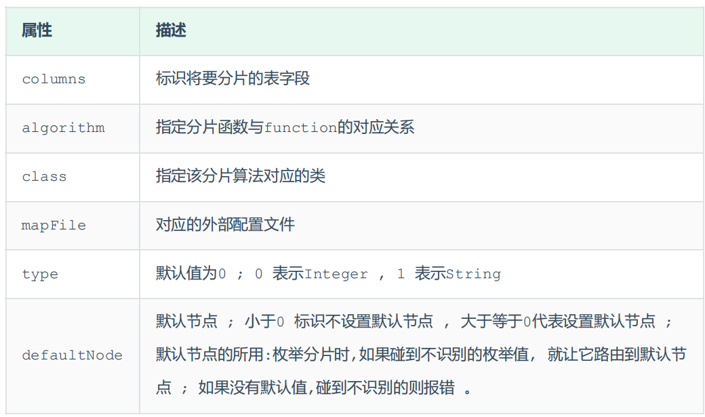

##### 3). 测试

é…置完毕å，é‡æ–°å¯åŠ¨MyCat，然å在mycat的命令行中，执行如下SQL创建表ã€å¹¶æ’入数æ®ï¼Œ**查看数æ®åˆ†å¸ƒæƒ…况。**

```sql
CREATE TABLE tb_user (
    id bigint(20) NOT NULL COMMENT 'ID',
    username varchar(200) DEFAULT NULL COMMENT '姓å',
    status int(2) DEFAULT '1' COMMENT '1: 未å¯ç”¨, 2: å·²å¯ç”¨, 3: 已关闭',
    PRIMARY KEY (`id`)
) ENGINE=InnoDB DEFAULT CHARSET=utf8mb4;

insert into tb_user (id,username ,status) values(1,'Tom',1);
insert into tb_user (id,username ,status) values(2,'Cat',2);
insert into tb_user (id,username ,status) values(3,'Rose',3);
insert into tb_user (id,username ,status) values(4,'Coco',2);
insert into tb_user (id,username ,status) values(5,'Lily',1);
insert into tb_user (id,username ,status) values(6,'Tom',1);
insert into tb_user (id,username ,status) values(7,'Cat',2);
insert into tb_user (id,username ,status) values(8,'Rose',3);
insert into tb_user (id,username ,status) values(9,'Coco',2);
insert into tb_user (id,username ,status) values(10,'Lily',1);
```


#### ⑤应用指定算法

##### 1). 介ç»

è¿è¡Œé˜¶æ®µç”±åº”用自主决定路由到那个分片 , **ç›´æ¥æ ¹æ®å­—符å­ä¸²ï¼ˆå¿…须是数字）计算分片å·**。

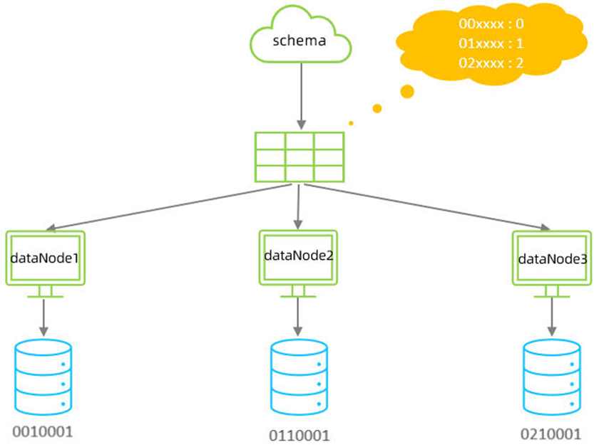

##### 2). é…ç½®

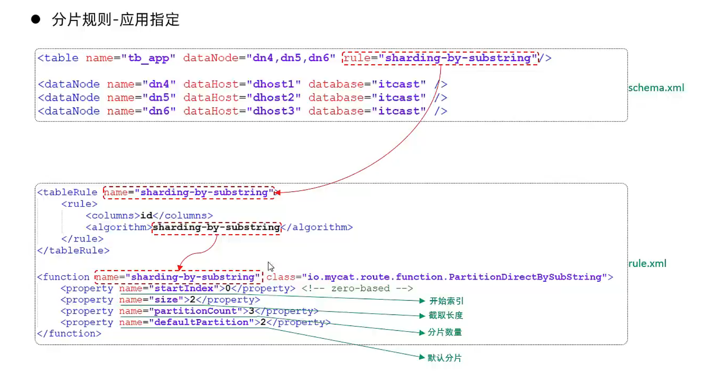

schema.xml中逻辑表é…置：

```xml
<!-- 应用指定算法 -->
<table name="tb_app" dataNode="dn4,dn5,dn6" rule="sharding-by-substring" />
```

schema.xml中数æ®èŠ‚点é…置：

```xml
<dataNode name="dn4" dataHost="dhost1" database="itcast" />
<dataNode name="dn5" dataHost="dhost2" database="itcast" />
<dataNode name="dn6" dataHost="dhost3" database="itcast" />
```

rule.xml中分片规则é…置：

```xml
<tableRule name="sharding-by-substring">
    <rule>
        <columns>id</columns>
        <algorithm>sharding-by-substring</algorithm>
    </rule>
</tableRule>

<function name="sharding-by-substring"
          class="io.mycat.route.function.PartitionDirectBySubString">
    <property name="startIndex">0</property> <!-- zero-based -->
    <property name="size">2</property>
    <property name="partitionCount">3</property>
    <property name="defaultPartition">0</property>
</function>
```

分片规则å±æ€§å«ä¹‰ï¼š

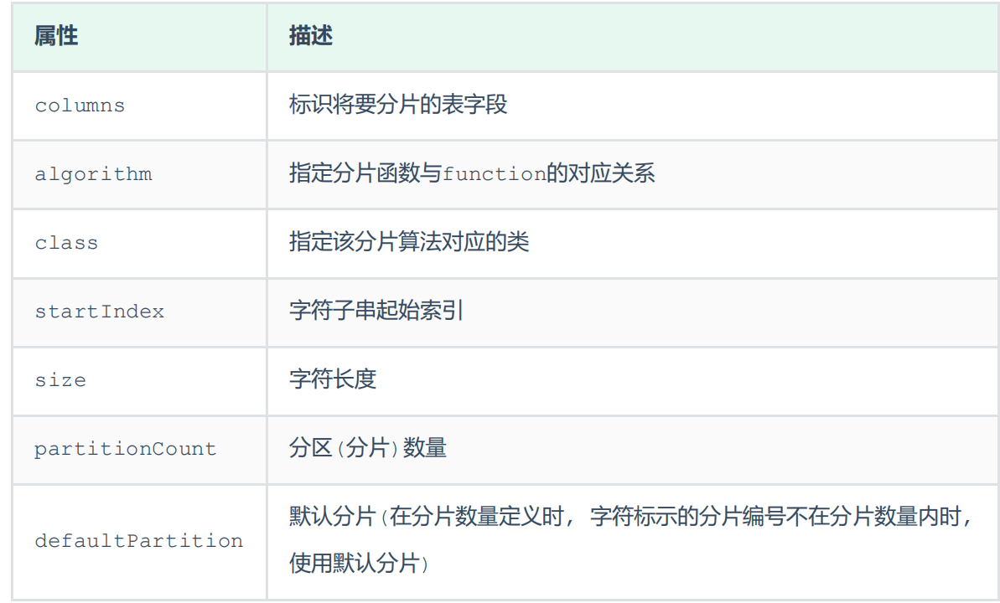

ç¤ºä¾‹è¯´æ˜ :

id=05-100000002 , 在此é…置中代表根æ®idä¸­ä» startIndex=0，开始，截å–siz=2ä½æ•°å­—å³05，05就是è·å–的分区，**如æœæ²¡æ‰¾åˆ°å¯¹åº”的分片则默认分é…到defaultPartition** 。


##### 3). 测试

é…置完毕å，é‡æ–°å¯åŠ¨MyCat，然å在mycat的命令行中，执行如下SQL创建表ã€å¹¶æ’入数æ®ï¼ŒæŸ¥çœ‹æ•°æ®åˆ†å¸ƒæƒ…况。

```sql
CREATE TABLE tb_app (
    id varchar(10) NOT NULL COMMENT 'ID',
    name varchar(200) DEFAULT NULL COMMENT 'å称',
    PRIMARY KEY (`id`)
) ENGINE=InnoDB DEFAULT CHARSET=utf8mb4;

insert into tb_app (id,name) values('0000001','Testx00001');
insert into tb_app (id,name) values('0100001','Test100001');
insert into tb_app (id,name) values('0100002','Test200001');
insert into tb_app (id,name) values('0200001','Test300001');
insert into tb_app (id,name) values('0200002','TesT400001');
```


#### ⑥固定分片hash算法

##### 1). 介ç»

该算法类似äºå进制的求模è¿ç®—，但是为二进制的æ“作。

例如，**å– id çš„äºŒè¿›åˆ¶ä½ 10 ä½ ä¸1111111111 è¿›è¡Œä½ & è¿ç®—**

- ä½ä¸è¿ç®—最å°å€¼ä¸º 0000000000，最大值为1111111111，转æ¢ä¸ºå进制，也就是ä½äº**0-1023之间**。

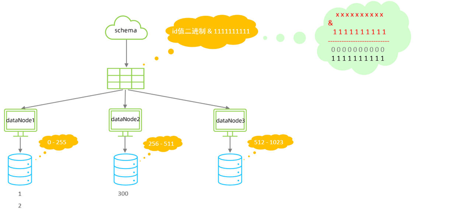

特点：

- 如æœæ˜¯æ±‚模，è¿ç»­çš„值，分别分é…到å„个ä¸åŒçš„分片；但是此算法**==会将è¿ç»­çš„值å¯èƒ½åˆ†é…到相åŒçš„分片，é™ä½äº‹åŠ¡å¤„ç†çš„难度==。**
- å¯ä»¥å‡åŒ€åˆ†é…，也å¯ä»¥éå‡åŒ€åˆ†é…。
- **分片字段必须为数字类å‹**。


##### 2). é…ç½®

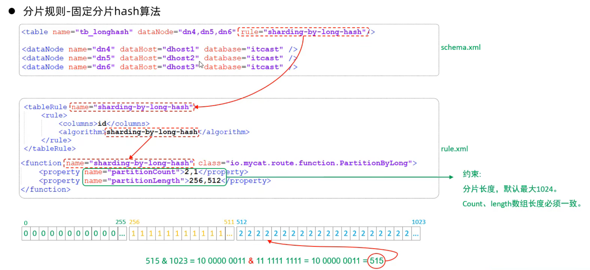

schema.xml中逻辑表é…置：

```xml
<!-- 固定分片hash算法 -->
<table name="tb_longhash" dataNode="dn4,dn5,dn6" rule="sharding-by-long-hash" />
```

schema.xml中数æ®èŠ‚点é…置：

```xml
<dataNode name="dn4" dataHost="dhost1" database="itcast" />
<dataNode name="dn5" dataHost="dhost2" database="itcast" />
<dataNode name="dn6" dataHost="dhost3" database="itcast" />
```

rule.xml中分片规则é…置：

```xml
<tableRule name="sharding-by-long-hash">
    <rule>
        <columns>id</columns>
        <algorithm>sharding-by-long-hash</algorithm>
    </rule>
</tableRule>

<!-- 分片总长度为1024，countä¸length数组长度必须一致； -->
<function name="sharding-by-long-hash"
          class="io.mycat.route.function.PartitionByLong">
    <property name="partitionCount">2,1</property>
    <property name="partitionLength">256,512</property>
</function>
```

分片规则å±æ€§å«ä¹‰ï¼š

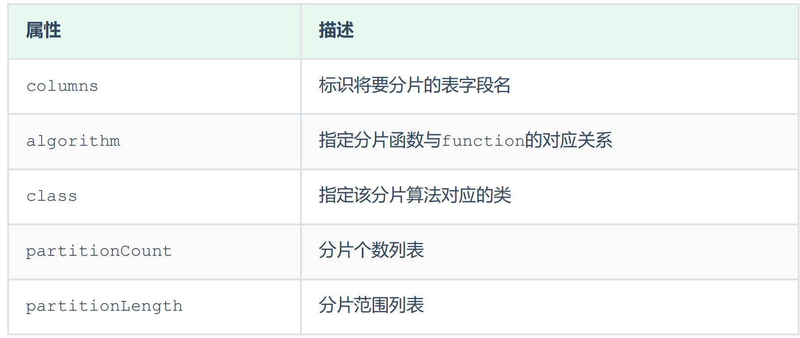

çº¦æŸ :

- 1). 分片长度 : 默认最大2^10 , 为 1024 ;
- 2). count, length的数组长度必须是一致的 ;

以上**分为三个分区:0-255,256-511,512-1023**


ç¤ºä¾‹è¯´æ˜ :

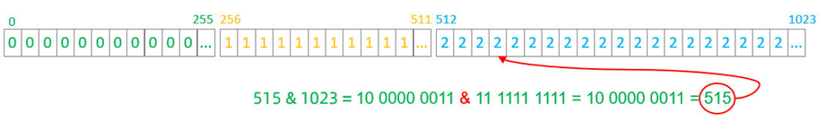


##### 3). 测试

é…置完毕å，é‡æ–°å¯åŠ¨MyCat，然å在mycat的命令行中，执行如下SQL创建表ã€å¹¶æ’入数æ®ï¼ŒæŸ¥çœ‹æ•°æ®åˆ†å¸ƒæƒ…况。

```sql
CREATE TABLE tb_longhash (
    id int(11) NOT NULL COMMENT 'ID',
    name varchar(200) DEFAULT NULL COMMENT 'å称',
    firstChar char(1) COMMENT '首字æ¯',
    PRIMARY KEY (`id`)
) ENGINE=InnoDB DEFAULT CHARSET=utf8mb4;

insert into tb_longhash (id,name,firstChar) values(1,'七匹狼','Q');
insert into tb_longhash (id,name,firstChar) values(2,'八匹狼','B');
insert into tb_longhash (id,name,firstChar) values(3,'ä¹åŒ¹ç‹¼','J');
insert into tb_longhash (id,name,firstChar) values(4,'å匹狼','S');
insert into tb_longhash (id,name,firstChar) values(5,'六匹狼','L');
insert into tb_longhash (id,name,firstChar) values(6,'五匹狼','W');
insert into tb_longhash (id,name,firstChar) values(7,'四匹狼','S');
insert into tb_longhash (id,name,firstChar) values(8,'三匹狼','S');
insert into tb_longhash (id,name,firstChar) values(9,'两匹狼','L');
```


#### ⑦字符串hash解æ算法

##### 1). 介ç»

**截å–字符串中的指定ä½ç½®çš„å­å­—符串, 进行hash算法**， 算出分片。


##### 2). é…ç½®

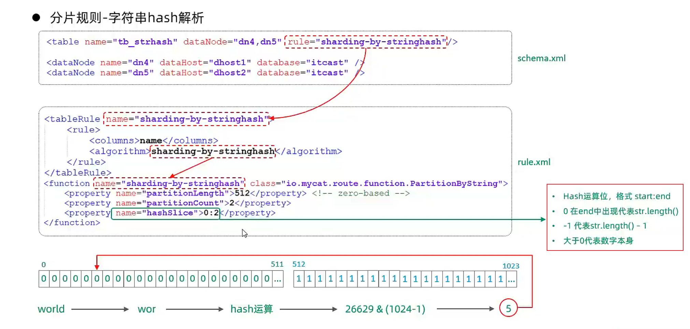

schema.xml中逻辑表é…置：

```xml
<!-- 字符串hash解æ算法 -->
<table name="tb_strhash" dataNode="dn4,dn5" rule="sharding-by-stringhash" />
```

schema.xml中数æ®èŠ‚点é…置：

```xml
<dataNode name="dn4" dataHost="dhost1" database="itcast" />
<dataNode name="dn5" dataHost="dhost2" database="itcast" />
```

rule.xml中分片规则é…置：

```xml
<tableRule name="sharding-by-stringhash">
    <rule>
        <columns>name</columns>
        <algorithm>sharding-by-stringhash</algorithm>
    </rule>
</tableRule>

<function name="sharding-by-stringhash"
          class="io.mycat.route.function.PartitionByString">
    <property name="partitionLength">512</property> <!-- zero-based -->
    <property name="partitionCount">2</property>
    <property name="hashSlice">0:2</property>
</function>
```

分片规则å±æ€§å«ä¹‰ï¼š

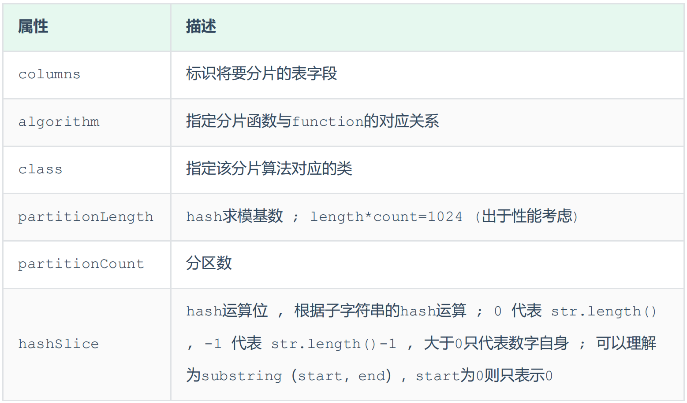

示例说æ˜ï¼š

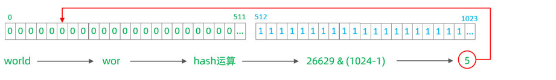

##### 3). 测试

é…置完毕å，é‡æ–°å¯åŠ¨MyCat，然å在mycat的命令行中，执行如下SQL创建表ã€å¹¶æ’入数æ®ï¼ŒæŸ¥çœ‹æ•°æ®åˆ†å¸ƒæƒ…况。

```sql
create table tb_strhash(
    name varchar(20) primary key,
    content varchar(100)
)engine=InnoDB DEFAULT CHARSET=utf8mb4;

INSERT INTO tb_strhash (name,content) VALUES('T1001', UUID());
INSERT INTO tb_strhash (name,content) VALUES('ROSE', UUID());
INSERT INTO tb_strhash (name,content) VALUES('JERRY', UUID());
INSERT INTO tb_strhash (name,content) VALUES('CRISTINA', UUID());
INSERT INTO tb_strhash (name,content) VALUES('TOMCAT', UUID());
```


#### ⑧按天分片算法

##### 1). 介ç»

按照**日期åŠå¯¹åº”的时间周期**æ¥åˆ†ç‰‡ã€‚

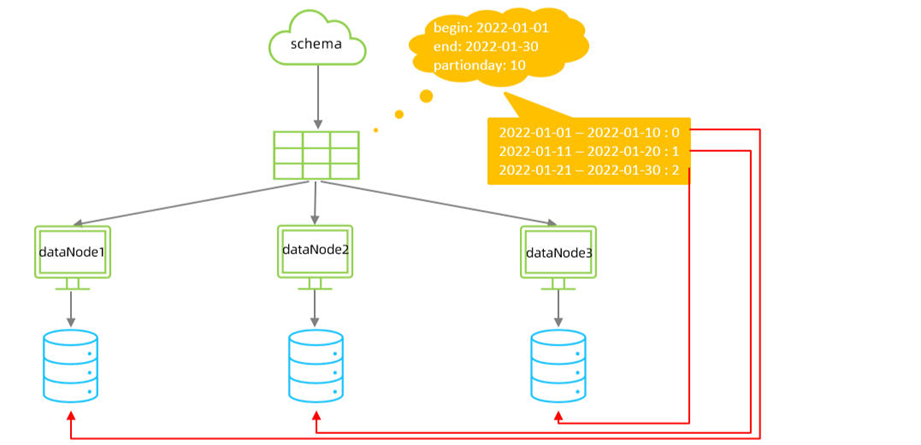

##### 2). é…ç½®

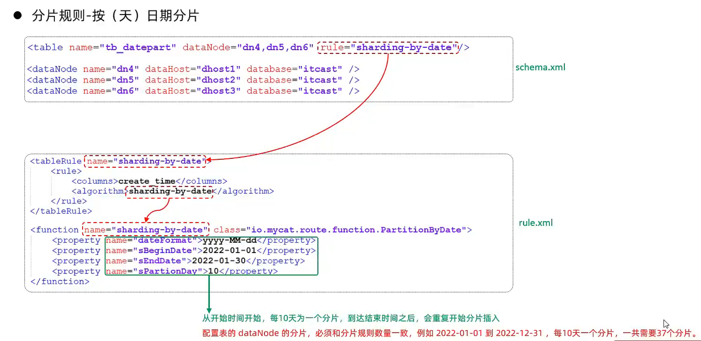

schema.xml中逻辑表é…置：

```xml
<!-- 按天分片 -->
<table name="tb_datepart" dataNode="dn4,dn5,dn6" rule="sharding-by-date" />
```

schema.xml中数æ®èŠ‚点é…置：

```xml
<dataNode name="dn4" dataHost="dhost1" database="itcast" />
<dataNode name="dn5" dataHost="dhost2" database="itcast" />
<dataNode name="dn6" dataHost="dhost3" database="itcast" /
```

rule.xml中分片规则é…置：

```xml
<tableRule name="sharding-by-date">
    <rule>
        <columns>create_time</columns>
        <algorithm>sharding-by-date</algorithm>
    </rule>
</tableRule>

<function name="sharding-by-date"
          class="io.mycat.route.function.PartitionByDate">
    <property name="dateFormat">yyyy-MM-dd</property>
    <property name="sBeginDate">2022-01-01</property>
    <property name="sEndDate">2022-01-30</property>
    <property name="sPartionDay">10</property>
</function>
	<!--
		ä»å¼€å§‹æ—¶é—´å¼€å§‹ï¼Œæ¯10天为一个分片，到达结æŸæ—¶é—´ä¹‹å，会é‡å¤å¼€å§‹åˆ†ç‰‡æ’入。
		é…置表的 dataNode 的分片，必须和分片规则数é‡ä¸€è‡´ï¼Œ
		例如 2022-01-01 到 2022-12-31 ，æ¯10天一个分片，一共需è¦37个分片。
	-->
```

分片规则å±æ€§å«ä¹‰ï¼š

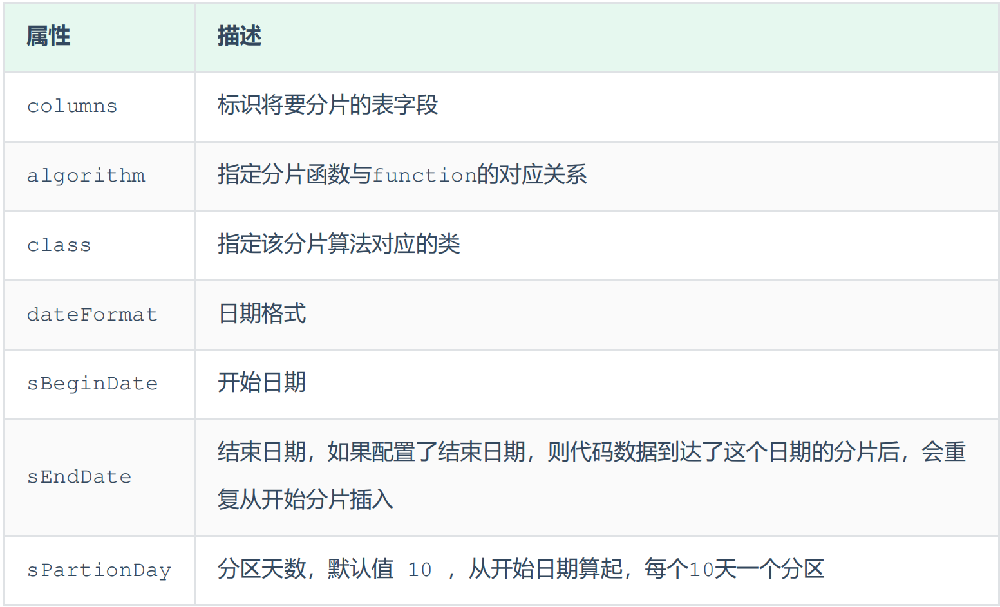


##### 3). 测试

é…置完毕å，é‡æ–°å¯åŠ¨MyCat，然å在mycat的命令行中，执行如下SQL创建表ã€å¹¶æ’入数æ®ï¼ŒæŸ¥çœ‹æ•°æ®åˆ†å¸ƒæƒ…况。

```sql
create table tb_datepart(
    id bigint not null comment 'ID' primary key,
    name varchar(100) null comment '姓å',
    create_time date null
)engine=InnoDB DEFAULT CHARSET=utf8mb4;

insert into tb_datepart(id,name ,create_time) values(1,'Tom','2022-01-01');
insert into tb_datepart(id,name ,create_time) values(2,'Cat','2022-01-10');
insert into tb_datepart(id,name ,create_time) values(3,'Rose','2022-01-11');
insert into tb_datepart(id,name ,create_time) values(4,'Coco','2022-01-20');
insert into tb_datepart(id,name ,create_time) values(5,'Rose2','2022-01-21');
insert into tb_datepart(id,name ,create_time) values(6,'Coco2','2022-01-30');
insert into tb_datepart(id,name ,create_time) values(7,'Coco3','2022-01-31');
```


#### ⑨自然月分片

##### 1). 介ç»

使用场景为**按照月份æ¥åˆ†ç‰‡**, æ¯ä¸ªè‡ªç„¶æœˆä¸ºä¸€ä¸ªåˆ†ç‰‡ã€‚

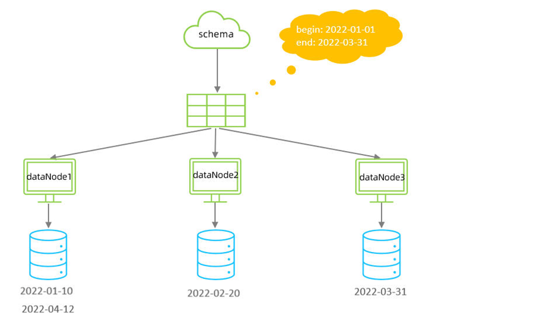

##### 2). é…ç½®

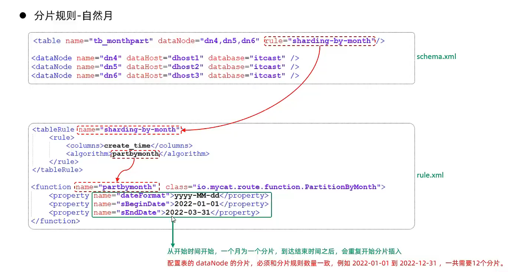

schema.xml中逻辑表é…置：

```xml
<!-- 按自然月分片 -->
<table name="tb_monthpart" dataNode="dn4,dn5,dn6" rule="sharding-by-month" />
```

schema.xml中数æ®èŠ‚点é…置：

```xml
<dataNode name="dn4" dataHost="dhost1" database="itcast" />
<dataNode name="dn5" dataHost="dhost2" database="itcast" />
<dataNode name="dn6" dataHost="dhost3" database="itcast" />
```

rule.xml中分片规则é…置：

```xml
<tableRule name="sharding-by-month">
    <rule>
        <columns>create_time</columns>
        <algorithm>partbymonth</algorithm>
    </rule>
</tableRule>

<function name="partbymonth" class="io.mycat.route.function.PartitionByMonth">
    <property name="dateFormat">yyyy-MM-dd</property>
    <property name="sBeginDate">2022-01-01</property>
    <property name="sEndDate">2022-03-31</property>
</function>
	<!--
		ä»å¼€å§‹æ—¶é—´å¼€å§‹ï¼Œä¸€ä¸ªæœˆä¸ºä¸€ä¸ªåˆ†ç‰‡ï¼Œåˆ°è¾¾ç»“æŸæ—¶é—´ä¹‹å，会é‡å¤å¼€å§‹åˆ†ç‰‡æ’å…¥
		é…置表的 dataNode 的分片，必须和分片规则数é‡ä¸€è‡´ï¼Œä¾‹å¦‚ 2022-01-01 到 2022-12-31 ，一
		共需è¦12个分片。

		这里就是说分片的段数一定ä¸èƒ½å°‘äºæ—¶é—´çš„间隔，但是时间的间隔å¯ä»¥å¤§äºåˆ†ç‰‡çš„长度
	-->
```

分片规则å±æ€§å«ä¹‰ï¼š

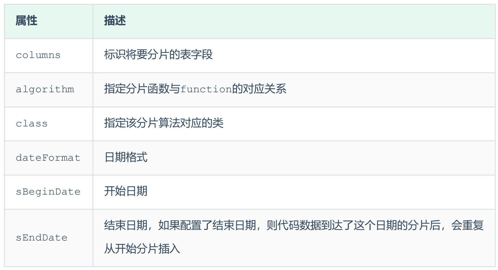


##### 3). 测试

é…置完毕å，é‡æ–°å¯åŠ¨MyCat，然å在mycat的命令行中，执行如下SQL创建表ã€å¹¶æ’入数æ®ï¼ŒæŸ¥çœ‹æ•°æ®åˆ†å¸ƒæƒ…况。

```sql
create table tb_monthpart(
    id bigint not null comment 'ID' primary key,
    name varchar(100) null comment '姓å',
    create_time date null
)engine=InnoDB DEFAULT CHARSET=utf8mb4;

insert into tb_monthpart(id,name ,create_time) values(1,'Tom','2022-01-01');
insert into tb_monthpart(id,name ,create_time) values(2,'Cat','2022-01-10');
insert into tb_monthpart(id,name ,create_time) values(3,'Rose','2022-01-31');
insert into tb_monthpart(id,name ,create_time) values(4,'Coco','2022-02-20');
insert into tb_monthpart(id,name ,create_time) values(5,'Rose2','2022-02-25');
insert into tb_monthpart(id,name ,create_time) values(6,'Coco2','2022-03-10');
insert into tb_monthpart(id,name ,create_time) values(7,'Coco3','2022-03-31');
insert into tb_monthpart(id,name ,create_time) values(8,'Coco4','2022-04-10');
insert into tb_monthpart(id,name ,create_time) values(9,'Coco5','2022-04-30');
```


### （4）最终é…置文件案例

#### â‘ schema.xml

```xml
<?xml version="1.0"?>
<!DOCTYPE mycat:schema SYSTEM "schema.dtd">
<mycat:schema xmlns:mycat="http://io.mycat/">
    <schema name="SHOPPING" checkSQLschema="true" sqlMaxLimit="100">
        <table name="tb_goods_base" dataNode="dn1" primaryKey="id" />
        <table name="tb_goods_brand" dataNode="dn1" primaryKey="id" />
        <table name="tb_goods_cat" dataNode="dn1" primaryKey="id" />
        <table name="tb_goods_desc" dataNode="dn1" primaryKey="goods_id" />
        <table name="tb_goods_item" dataNode="dn1" primaryKey="id" />
        
        <table name="tb_order_item" dataNode="dn2" primaryKey="id" />
        <table name="tb_order_master" dataNode="dn2" primaryKey="order_id" />
        <table name="tb_order_pay_log" dataNode="dn2" primaryKey="out_trade_no" />
        
        <table name="tb_user" dataNode="dn3" primaryKey="id" />
        <table name="tb_user_address" dataNode="dn3" primaryKey="id" />
     
        <table name="tb_areas_provinces" dataNode="dn1,dn2,dn3" primaryKey="id" type="global"/>
        <table name="tb_areas_city" dataNode="dn1,dn2,dn3" primaryKey="id" type="global"/>
        <table name="tb_areas_region" dataNode="dn1,dn2,dn3" primaryKey="id" type="global"/>
    </schema>

    <schema name="ITCAST" checkSQLschema="true" sqlMaxLimit="100">
        <!-- å–模分片 -->
        <table name="tb_log" dataNode="dn4,dn5,dn6" primaryKey="id" rule="mod-long" />
        <!-- 一致性hash -->
        <table name="tb_order" dataNode="dn4,dn5,dn6" rule="sharding-by-murmur" />

        <!-- æšä¸¾ -->
        <table name="tb_user" dataNode="dn4,dn5,dn6" rule="sharding-by-intfile-enumstatus"/>
        <!-- 自己å¢åŠ  tableRule: "sharding-by-intfile-enumstatus" -->

        <!-- 应用指定算法 -->
        <table name="tb_app" dataNode="dn4,dn5,dn6" rule="sharding-by-substring" />

        <!-- 固定分片hash算法 -->
        <table name="tb_longhash" dataNode="dn4,dn5,dn6" rule="sharding-by-long-hash" />

        <!-- 字符串hash解æ算法 -->
        <table name="tb_strhash" dataNode="dn4,dn5" rule="sharding-by-stringhash" />

        <!-- 按天分片 -->
        <table name="tb_datepart" dataNode="dn4,dn5,dn6" rule="sharding-by-date" />


        <!-- 按自然月分片 -->
        <table name="tb_monthpart" dataNode="dn4,dn5,dn6" rule="sharding-by-month" />
        
    </schema>

    <dataNode name="dn1" dataHost="dhost1" database="shopping" />
    <dataNode name="dn2" dataHost="dhost2" database="shopping" />
    <dataNode name="dn3" dataHost="dhost3" database="shopping" />

    <dataNode name="dn4" dataHost="dhost1" database="itcast" />
    <dataNode name="dn5" dataHost="dhost2" database="itcast" />
    <dataNode name="dn6" dataHost="dhost3" database="itcast" />
    
    <dataHost name="dhost1" maxCon="1000" minCon="10" balance="0"
              writeType="0" dbType="mysql" dbDriver="jdbc" switchType="1"
              slaveThreshold="100">
        <heartbeat>select user()</heartbeat>
        <writeHost host="master" url="jdbc:mysql://192.168.88.130:3306?useSSL=false&amp;serverTimezone=Asia/Shanghai&amp;characterEncoding=utf8"
                   user="root" password="root" />
    </dataHost>
    
    <dataHost name="dhost2" maxCon="1000" minCon="10" balance="0"
              writeType="0" dbType="mysql" dbDriver="jdbc" switchType="1"
              slaveThreshold="100">
        <heartbeat>select user()</heartbeat>
        <writeHost host="master" url="jdbc:mysql://192.168.88.131:3306?useSSL=false&amp;serverTimezone=Asia/Shanghai&amp;characterEncoding=utf8"
                   user="root" password="root" />
    </dataHost>
    
    <dataHost name="dhost3" maxCon="1000" minCon="10" balance="0"
              writeType="0" dbType="mysql" dbDriver="jdbc" switchType="1"
              slaveThreshold="100">
        <heartbeat>select user()</heartbeat>
        <writeHost host="master" url="jdbc:mysql://192.168.88.129:3306?useSSL=false&amp;serverTimezone=Asia/Shanghai&amp;characterEncoding=utf8"
                   user="root" password="1234" />
    </dataHost>
</mycat:schema>
```


#### â‘¡rule.xml

```xml
<?xml version="1.0" encoding="UTF-8"?>
<!-- - - Licensed under the Apache License, Version 2.0 (the "License"); 
	- you may not use this file except in compliance with the License. - You 
	may obtain a copy of the License at - - http://www.apache.org/licenses/LICENSE-2.0 
	- - Unless required by applicable law or agreed to in writing, software - 
	distributed under the License is distributed on an "AS IS" BASIS, - WITHOUT 
	WARRANTIES OR CONDITIONS OF ANY KIND, either express or implied. - See the 
	License for the specific language governing permissions and - limitations 
	under the License. -->
<!DOCTYPE mycat:rule SYSTEM "rule.dtd">
<mycat:rule xmlns:mycat="http://io.mycat/">
	<tableRule name="rule1">
		<rule>
			<columns>id</columns>
			<algorithm>func1</algorithm>
		</rule>
	</tableRule>

	<tableRule name="rule2">
		<rule>
			<columns>user_id</columns>
			<algorithm>func1</algorithm>
		</rule>
	</tableRule>

	<tableRule name="sharding-by-intfile">
		<rule>
			<columns>sharding_id</columns>
			<algorithm>hash-int</algorithm>
		</rule>
	</tableRule>

	<!-- 自己å¢åŠ  tableRule -->
	<tableRule name="sharding-by-intfile-enumstatus">
		<rule>
			<columns>status</columns>
			<algorithm>hash-int</algorithm>
		</rule>
	</tableRule>

	<tableRule name="auto-sharding-long">
		<rule>
			<columns>id</columns>
			<algorithm>rang-long</algorithm>
		</rule>
	</tableRule>
	<tableRule name="mod-long">
		<rule>
			<columns>id</columns>
			<algorithm>mod-long</algorithm>
		</rule>
	</tableRule>
	<tableRule name="sharding-by-murmur">
		<rule>
			<columns>id</columns>
			<algorithm>murmur</algorithm>
		</rule>
	</tableRule>
	<tableRule name="crc32slot">
		<rule>
			<columns>id</columns>
			<algorithm>crc32slot</algorithm>
		</rule>
	</tableRule>

	<tableRule name="sharding-by-month">
		<rule>
			<columns>create_time</columns>
			<algorithm>partbymonth</algorithm>
		</rule>
	</tableRule>

	<tableRule name="latest-month-calldate">
		<rule>
			<columns>calldate</columns>
			<algorithm>latestMonth</algorithm>
		</rule>
	</tableRule>
	
	<tableRule name="auto-sharding-rang-mod">
		<rule>
			<columns>id</columns>
			<algorithm>rang-mod</algorithm>
		</rule>
	</tableRule>
	
	<tableRule name="jch">
		<rule>
			<columns>id</columns>
			<algorithm>jump-consistent-hash</algorithm>
		</rule>
	</tableRule>


	<tableRule name="sharding-by-substring">
		<rule>
			<columns>id</columns>
			<algorithm>sharding-by-substring</algorithm>
		</rule>
	</tableRule>

	<tableRule name="sharding-by-long-hash">
		<rule>
			<columns>id</columns>
			<algorithm>sharding-by-long-hash</algorithm>
		</rule>
	</tableRule>

	<tableRule name="sharding-by-stringhash">
		<rule>
			<columns>name</columns>
			<algorithm>sharding-by-stringhash</algorithm>
		</rule>
	</tableRule>

	<tableRule name="sharding-by-date">
		<rule>
			<columns>create_time</columns>
			<algorithm>sharding-by-date</algorithm>
		</rule>
	</tableRule>

	<function name="murmur"
		class="io.mycat.route.function.PartitionByMurmurHash">
		<property name="seed">0</property><!-- 默认是0 -->
		<property name="count">2</property><!-- è¦åˆ†ç‰‡çš„æ•°æ®åº“节点数é‡ï¼Œå¿…须指定，å¦åˆ™æ²¡æ³•åˆ†ç‰‡ -->
		<property name="virtualBucketTimes">160</property><!-- 一个å®é™…çš„æ•°æ®åº“节点被映射为这么多虚拟节点，默认是160å€ï¼Œä¹Ÿå°±æ˜¯è™šæ‹ŸèŠ‚点数是物ç†èŠ‚点数的160å€ -->
		<!-- <property name="weightMapFile">weightMapFile</property> 节点的æƒé‡ï¼Œæ²¡æœ‰æŒ‡å®šæƒé‡çš„节点默认是1。以properties文件的格å¼å¡«å†™ï¼Œä»¥ä»0开始到count-1的整数值也就是节点索引为key，以节点æƒé‡å€¼ä¸ºå€¼ã€‚所有æƒé‡å€¼å¿…须是正整数，å¦åˆ™ä»¥1代替 -->
		<!-- <property name="bucketMapPath">/etc/mycat/bucketMapPath</property> 
			用äºæµ‹è¯•æ—¶è§‚察å„物ç†èŠ‚点ä¸è™šæ‹ŸèŠ‚点的分布情况，如æœæŒ‡å®šäº†è¿™ä¸ªå±æ€§ï¼Œä¼šæŠŠè™šæ‹ŸèŠ‚点的murmur hash值ä¸ç‰©ç†èŠ‚点的映射按行输出到这个文件，没有默认值，如æœä¸æŒ‡å®šï¼Œå°±ä¸ä¼šè¾“出任何东西 -->
	</function>

	<function name="crc32slot"
			  class="io.mycat.route.function.PartitionByCRC32PreSlot">
	</function>

	<function name="hash-int" class="io.mycat.route.function.PartitionByFileMap">
		<!-- defaultNode表示，若没有找到对应匹é…çš„æšä¸¾ï¼Œåˆ™ä½¿ç”¨é»˜è®¤é…置的数æ®èŠ‚点 -->
		<property name="defaultNode">2</property>
		<property name="mapFile">partition-hash-int.txt</property>
	</function>

	<function name="rang-long"
		class="io.mycat.route.function.AutoPartitionByLong">
		<property name="mapFile">autopartition-long.txt</property>
	</function>
	<function name="mod-long" class="io.mycat.route.function.PartitionByMod">
		<!-- how many data nodes -->
		<property name="count">3</property>
	</function>

	<function name="func1" class="io.mycat.route.function.PartitionByLong">
		<property name="partitionCount">8</property>
		<property name="partitionLength">128</property>
	</function>
	<function name="latestMonth"
		class="io.mycat.route.function.LatestMonthPartion">
		<property name="splitOneDay">24</property>
	</function>

	
	<function name="rang-mod" class="io.mycat.route.function.PartitionByRangeMod">
        	<property name="mapFile">partition-range-mod.txt</property>
	</function>
	
	<function name="jump-consistent-hash" class="io.mycat.route.function.PartitionByJumpConsistentHash">
		<property name="totalBuckets">3</property>
	</function>


	<function name="sharding-by-substring" class="io.mycat.route.function.PartitionDirectBySubString">
		<property name="startIndex">0</property> <!-- zero-based -->
		<property name="size">2</property>
		<property name="partitionCount">3</property>
		<property name="defaultPartition">0</property>
	</function>
	
	<!-- 分片总长度为1024，countä¸length数组长度必须一致； -->
	<function name="sharding-by-long-hash" class="io.mycat.route.function.PartitionByLong">
		<property name="partitionCount">2,1</property>
		<property name="partitionLength">256,512</property>
	</function>

	<function name="sharding-by-stringhash" class="io.mycat.route.function.PartitionByString">
    	<property name="partitionLength">512</property> <!-- zero-based -->
   	 	<property name="partitionCount">2</property>
    	<property name="hashSlice">0:2</property>
	</function>


	<function name="sharding-by-date" class="io.mycat.route.function.PartitionByDate">
		<property name="dateFormat">yyyy-MM-dd</property>
		<property name="sBeginDate">2022-01-01</property>
		<property name="sEndDate">2022-01-30</property>
		<property name="sPartionDay">10</property>
	</function>
		<!--
			ä»å¼€å§‹æ—¶é—´å¼€å§‹ï¼Œæ¯10天为一个分片，到达结æŸæ—¶é—´ä¹‹å，会é‡å¤å¼€å§‹åˆ†ç‰‡æ’入。
			é…置表的 dataNode 的分片，必须和分片规则数é‡ä¸€è‡´ï¼Œ
			例如 2022-01-01 到 2022-12-31 ，æ¯10天一个分片，一共需è¦37个分片。
		-->


	<function name="partbymonth" class="io.mycat.route.function.PartitionByMonth">
		<property name="dateFormat">yyyy-MM-dd</property>
		<property name="sBeginDate">2022-01-01</property>
		<property name="sEndDate">2022-03-31</property>
	</function>
		<!--
			ä»å¼€å§‹æ—¶é—´å¼€å§‹ï¼Œä¸€ä¸ªæœˆä¸ºä¸€ä¸ªåˆ†ç‰‡ï¼Œåˆ°è¾¾ç»“æŸæ—¶é—´ä¹‹å，会é‡å¤å¼€å§‹åˆ†ç‰‡æ’å…¥
			é…置表的 dataNode 的分片，必须和分片规则数é‡ä¸€è‡´ï¼Œä¾‹å¦‚ 2022-01-01 到 2022-12-31 ，一
			共需è¦12个分片。
	
			这里就是说分片的段数一定ä¸èƒ½å°‘äºæ—¶é—´çš„间隔，但是时间的间隔å¯ä»¥å¤§äºåˆ†ç‰‡çš„长度
		-->

</mycat:rule>
```


#### â‘¢server.xml

```xml
<?xml version="1.0" encoding="UTF-8"?>
<!-- - - Licensed under the Apache License, Version 2.0 (the "License"); 
	- you may not use this file except in compliance with the License. - You 
	may obtain a copy of the License at - - http://www.apache.org/licenses/LICENSE-2.0 
	- - Unless required by applicable law or agreed to in writing, software - 
	distributed under the License is distributed on an "AS IS" BASIS, - WITHOUT 
	WARRANTIES OR CONDITIONS OF ANY KIND, either express or implied. - See the 
	License for the specific language governing permissions and - limitations 
	under the License. -->
<!DOCTYPE mycat:server SYSTEM "server.dtd">
<mycat:server xmlns:mycat="http://io.mycat/">
	<system>
	<property name="nonePasswordLogin">0</property> <!-- 0为需è¦å¯†ç ç™»é™†ã€1为ä¸éœ€è¦å¯†ç ç™»é™† ,默认为0，设置为1则需è¦æŒ‡å®šé»˜è®¤è´¦æˆ·-->
	<property name="useHandshakeV10">1</property>
	<property name="useSqlStat">1</property>  <!-- 1为开å¯å®æ—¶ç»Ÿè®¡ã€0为关闭 -->
	<property name="useGlobleTableCheck">0</property>  <!-- 1为开å¯å…¨åŠ ç­ä¸€è‡´æ€§æ£€æµ‹ã€0为关闭 -->
		<property name="sqlExecuteTimeout">300</property>  <!-- SQL 执行超时 å•ä½:秒-->
		<property name="sequnceHandlerType">2</property>
		<!--<property name="sequnceHandlerPattern">(?:(\s*next\s+value\s+for\s*MYCATSEQ_(\w+))(,|\)|\s)*)+</property>-->
		<!--必须带有MYCATSEQ_或者 mycatseq_进入åºåˆ—匹é…æµç¨‹ 注æ„MYCATSEQ_有空格的情况-->
		<property name="sequnceHandlerPattern">(?:(\s*next\s+value\s+for\s*MYCATSEQ_(\w+))(,|\)|\s)*)+</property>
	<property name="subqueryRelationshipCheck">false</property> <!-- å­æŸ¥è¯¢ä¸­å­˜åœ¨å…³è”查询的情况下,检查关è”字段中是å¦æœ‰åˆ†ç‰‡å­—段 .默认 false -->
      <!--  <property name="useCompression">1</property>--> <!--1为开å¯mysqlå‹ç¼©åè®®-->
        <!--  <property name="fakeMySQLVersion">5.6.20</property>--> <!--设置模拟的MySQL版本å·-->
	<!-- <property name="processorBufferChunk">40960</property> -->
	<!-- 
	<property name="processors">1</property> 
	<property name="processorExecutor">32</property> 
	 -->
        <!--默认为type 0: DirectByteBufferPool | type 1 ByteBufferArena | type 2 NettyBufferPool -->
		<property name="processorBufferPoolType">0</property>
		<!--默认是65535 64K 用äºsql解æ时最大文本长度 -->
		<!--<property name="maxStringLiteralLength">65535</property>-->
		<!--<property name="sequnceHandlerType">0</property>-->
		<!--<property name="backSocketNoDelay">1</property>-->
		<!--<property name="frontSocketNoDelay">1</property>-->
		<!--<property name="processorExecutor">16</property>-->
		<!--
			<property name="serverPort">8066</property> <property name="managerPort">9066</property> 
			<property name="idleTimeout">300000</property> <property name="bindIp">0.0.0.0</property>
			<property name="dataNodeIdleCheckPeriod">300000</property> 5 * 60 * 1000L; //è¿æ¥ç©ºé—²æ£€æŸ¥
			<property name="frontWriteQueueSize">4096</property> <property name="processors">32</property> -->
		<!--分布å¼äº‹åŠ¡å¼€å…³ï¼Œ0为ä¸è¿‡æ»¤åˆ†å¸ƒå¼äº‹åŠ¡ï¼Œ1为过滤分布å¼äº‹åŠ¡ï¼ˆå¦‚æœåˆ†å¸ƒå¼äº‹åŠ¡å†…åªæ¶‰åŠå…¨å±€è¡¨ï¼Œåˆ™ä¸è¿‡æ»¤ï¼‰ï¼Œ2为ä¸è¿‡æ»¤åˆ†å¸ƒå¼äº‹åŠ¡,但是记录分布å¼äº‹åŠ¡æ—¥å¿—-->
		<property name="handleDistributedTransactions">0</property>
		
			<!--
			off heap for merge/order/group/limit      1å¼€å¯   0关闭
		-->
		<property name="useOffHeapForMerge">0</property>

		<!--
			å•ä½ä¸ºm
		-->
        <property name="memoryPageSize">64k</property>

		<!--
			å•ä½ä¸ºk
		-->
		<property name="spillsFileBufferSize">1k</property>

		<property name="useStreamOutput">0</property>

		<!--
			å•ä½ä¸ºm
		-->
		<property name="systemReserveMemorySize">384m</property>


		<!--是å¦é‡‡ç”¨zookeeperåè°ƒåˆ‡æ¢  -->
		<property name="useZKSwitch">false</property>

		<!-- XA Recovery Log日志路径 -->
		<!--<property name="XARecoveryLogBaseDir">./</property>-->

		<!-- XA Recovery Log日志å称 -->
		<!--<property name="XARecoveryLogBaseName">tmlog</property>-->
		<!--如æœä¸º trueçš„è¯ ä¸¥æ ¼éµå®ˆéš”离级别,ä¸ä¼šåœ¨ä»…ä»…åªæœ‰select语å¥çš„时候在事务中切æ¢è¿æ¥-->
		<property name="strictTxIsolation">false</property>
		
		<property name="useZKSwitch">true</property>
		

	</system>
	
	<!-- 全局SQL防ç«å¢™è®¾ç½® -->
	<!--白åå•å¯ä»¥ä½¿ç”¨é€šé…符%或ç€*-->
	<!--例如<host host="127.0.0.*" user="root"/>-->
	<!--例如<host host="127.0.*" user="root"/>-->
	<!--例如<host host="127.*" user="root"/>-->
	<!--例如<host host="1*7.*" user="root"/>-->
	<!--这些é…置情况下对äº127.0.0.1都能以root账户登录-->
	<!--
	<firewall>
	   <whitehost>
	      <host host="1*7.0.0.*" user="root"/>
	   </whitehost>
       <blacklist check="false">
       </blacklist>
	</firewall>
	-->

	<user name="root" defaultAccount="true">
		<property name="password">123456</property>
		<property name="schemas">SHOPPING,ITCAST</property>
		<!-- 表级 DML æƒé™è®¾ç½® -->
		<!--
	<privileges check="true">
	<schema name="DB01" dml="0110" >
	<table name="TB_ORDER" dml="1110"></table>
	</schema>
	</privileges>
	-->
	</user>
	<user name="user">
		<property name="password">123456</property>
		<property name="schemas">SHOPPING</property>
		<property name="readOnly">true</property>
	</user>

</mycat:server>
```


## 3.6 MyCat管ç†åŠç›‘æ§

### （1）MyCatåŸç†

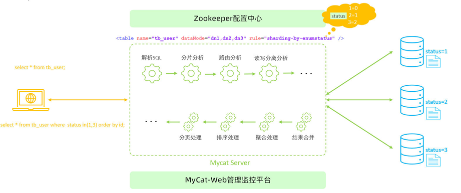

在MyCat中，当执行一æ¡SQL语å¥æ—¶ï¼ŒMyCat需è¦è¿›è¡Œ**SQL解æã€åˆ†ç‰‡åˆ†æã€è·¯ç”±åˆ†æã€è¯»å†™åˆ†ç¦»åˆ†æ**ç­‰æ“作，最终ç»è¿‡ä¸€ç³»åˆ—的分æ决定将当å‰çš„SQL语å¥åˆ°åº•è·¯ç”±åˆ°é‚£å‡ ä¸ª(或哪一个)节点数æ®åº“，数æ®åº“将数æ®æ‰§è¡Œå®Œæ¯•å，如æœæœ‰è¿”å›çš„结æœï¼Œåˆ™å°†ç»“æœè¿”å›ç»™MyCat，最终还需è¦åœ¨MyCat中进行**结æœåˆå¹¶ã€èšåˆå¤„ç†ã€æ’åºå¤„ç†ã€åˆ†é¡µå¤„ç†ç­‰æ“作**，最终å†å°†ç»“æœè¿”å›ç»™å®¢æˆ·ç«¯ã€‚

而在MyCat的使用过程中，MyCat官方也æ供了一个**管ç†ç›‘æ§å¹³å°MyCat-Web（MyCat-eye）**。Mycat-web 是 Mycat å¯è§†åŒ–è¿ç»´çš„管ç†å’Œç›‘æ§å¹³å°ï¼Œå¼¥è¡¥äº† Mycat 在监æ§ä¸Šçš„空白。帮 Mycat分担统计任务和é…置管ç†ä»»åŠ¡ã€‚Mycat-web 引入了 **==ZooKeeper 作为é…置中心==，å¯ä»¥ç®¡ç†å¤šä¸ªèŠ‚点**。

Mycat-web 主è¦ç®¡ç†å’Œç›‘æ§ Mycat çš„æµé‡ã€è¿æ¥ã€æ´»åŠ¨çº¿ç¨‹å’Œå†…存等，具备 IP 白åå•ã€é‚®ä»¶å‘Šè­¦ç­‰æ¨¡å—，还å¯ä»¥**统计 SQL 并分ææ…¢ SQL 和高频 SQL** 等。为优化 SQL æä¾›ä¾æ®ã€‚


### （2）MyCat管ç†

Mycat默认开通2个端å£ï¼Œå¯ä»¥åœ¨server.xml中进行修改。

- **8066 æ•°æ®è®¿é—®ç«¯å£**，å³è¿›è¡Œ DML å’Œ DDL æ“作。
- **9066 æ•°æ®åº“管ç†ç«¯å£**ï¼Œå³ mycat æœåŠ¡ç®¡ç†æ§åˆ¶åŠŸèƒ½ï¼Œç”¨äºç®¡ç†mycat的整个集群状æ€

è¿æ¥MyCat的管ç†æ§åˆ¶å°ï¼š

```bash
mysql -h 192.168.200.210 -p 9066 -uroot -p123456 

mysql -h 192.168.88.130 -p 9066 -uroot -p123456 
```

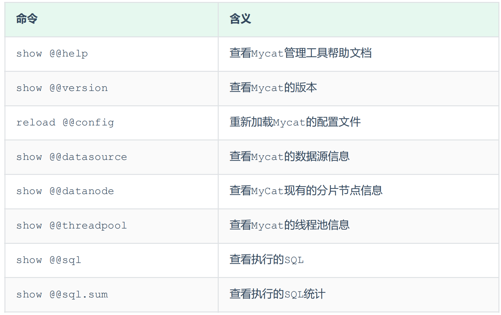


### （3）==MyCat-eye==

#### ①介ç»

Mycat-web(Mycat-eye)是对mycat-server**æ供监æ§æœåŠ¡**，功能ä¸å±€é™äºå¯¹mycat-server使用。他通过JDBCè¿æ¥å¯¹Mycatã€Mysql监æ§ï¼Œç›‘æ§è¿œç¨‹æœåŠ¡å™¨(ç›®å‰ä»…é™äºlinux系统)çš„cpuã€å†…å­˜ã€ç½‘络ã€ç£ç›˜ã€‚

Mycat-eyeè¿è¡Œè¿‡ç¨‹ä¸­**需è¦ä¾èµ–zookeeper**，因此需è¦å…ˆå®‰è£…zookeeper。


#### ②安装

##### 1). zookeeper安装

**A. 上传安装包** 

```bash
zookeeper-3.4.6.tar.gz
```

​	

 **B. 解å‹**

```bash
tar -zxvf zookeeper-3.4.6.tar.gz -C /usr/local/
```


**C. 创建数æ®å­˜æ”¾ç›®å½•**

```bash
cd /usr/local/zookeeper-3.4.6/
mkdir data

cd data
pwd #å¤åˆ¶data的文件夹路径
```

​	

**D. 修改é…置文件å称并é…ç½®**

```bash
cd conf
mv zoo_sample.cfg zoo.cfg  # é‡å‘½å
```

​	

**E. é…置数æ®å­˜æ”¾ç›®å½•**

```bash
vim zoo.cfg
dataDir=/usr/local/zookeeper-3.4.6/data
```


​	**F. å¯åŠ¨Zookeeper**

```bash
bin/zkServer.sh start
bin/zkServer.sh status
```


##### 2). Mycat-web安装

**A. 上传安装包** 

- ​	Mycat-web.tar.gz

​	

**B. 解å‹**

```bash
tar -zxvf Mycat-web.tar.gz -C /usr/local/
```

​	

**C. 目录介ç»**

- ​    etc         ----> jettyé…置文件
- ​    lib         ----> ä¾èµ–jar包
- ​    mycat-web   ----> mycat-web项目
- ​    readme.txt
- ​    start.jar   ----> å¯åŠ¨jar
- ​    start.sh    ----> linuxå¯åŠ¨è„šæœ¬

​	

**D. å¯åŠ¨**

```bash
cd /usr/local/mycat-web
sh start.sh
```

​	**开放端å£ï¼š**

- **==开放指定==端å£(firewall-cmd --zone=public --add-port=8080/tcp --permanent)**
- **关闭指定端å£(firewall-cmd --zone=public --remove-port=8080/tcp --permanent)**

- **==ç«‹å³ç”Ÿæ•ˆ==(firewall-cmd --reload)，==开放或者关闭端å£å==需è¦æ‰§è¡Œç«‹å³ç”Ÿæ•ˆå‘½ä»¤**
- **查看开放的端å£(firewall-cmd --zone=public --list-ports)**


**E. 访问**
	

```bash
# 开放8082端å£
firewall-cmd --zone=public --add-port=8082/tcp --permanent
firewall-cmd --reload
```

​	

> 备注: 
>
> ​	如æœZookeeperä¸Mycat-webä¸åœ¨åŒä¸€å°æœåŠ¡å™¨ä¸Š , **需è¦è®¾ç½®Zookeeper的地å€** ; 在/usr/local/mycat-web/mycat-web/WEB-INF/classes/mycat.properties文件中é…ç½® : 
>
> ​	

具体的安装步骤，请å‚考资料中æ供的《MyCat-Web安装文档》


#### ③访问

**http://192.168.88.130:8082/mycat**


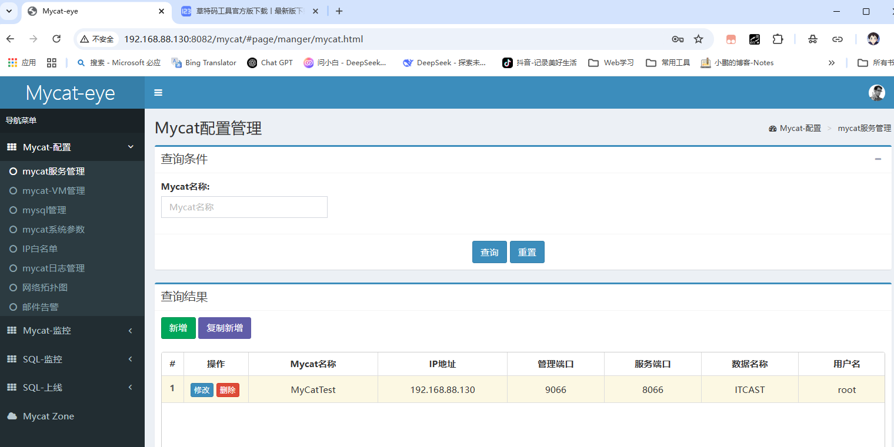


#### â‘£é…ç½®

##### 1). å¼€å¯MyCatçš„å®æ—¶ç»Ÿè®¡åŠŸèƒ½(server.xml)

```xml
<property name="useSqlStat">1</property> <!-- 1为开å¯å®æ—¶ç»Ÿè®¡ã€0为关闭 -->
```


##### 2). 在Mycat监æ§ç•Œé¢é…ç½®æœåŠ¡åœ°å€

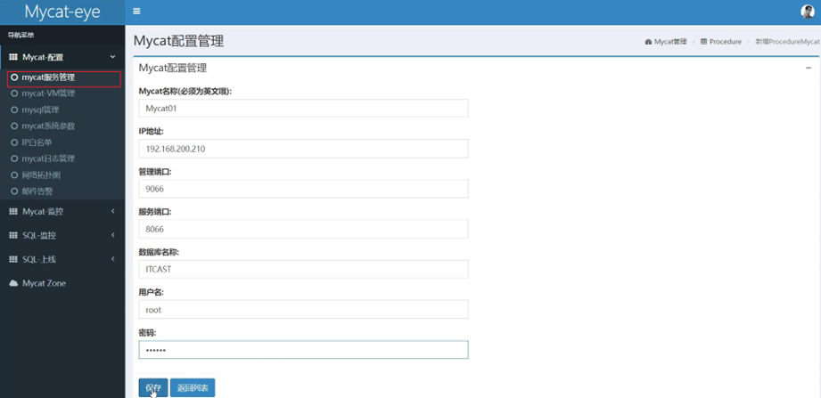

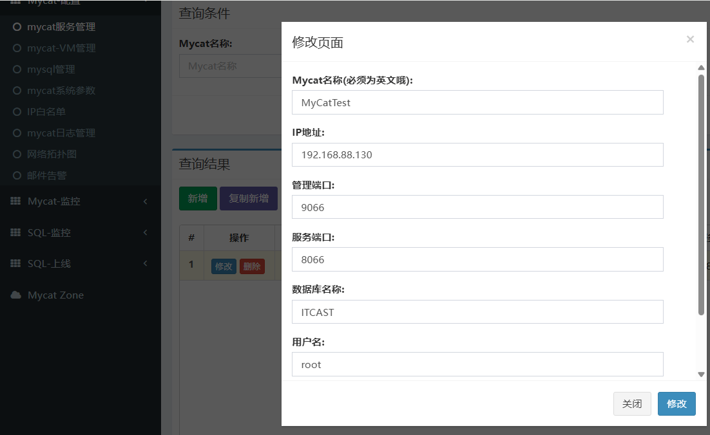


#### ⑤测试

é…置好了之å，我们å¯ä»¥é€šè¿‡MyCat执行一系列的å¢åˆ æ”¹æŸ¥çš„测试，然å过一段时间之å，打开mycat-eye的管ç†ç•Œé¢ï¼ŒæŸ¥çœ‹mycat-eye监æ§åˆ°çš„æ•°æ®ä¿¡æ¯ã€‚

##### A. 性能监æ§

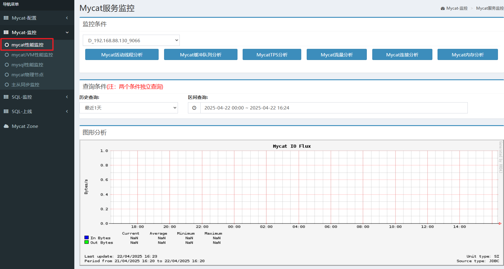

##### B. 物ç†èŠ‚点

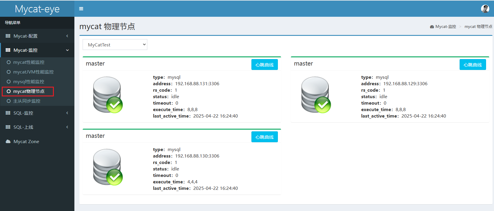

##### C. SQL统计

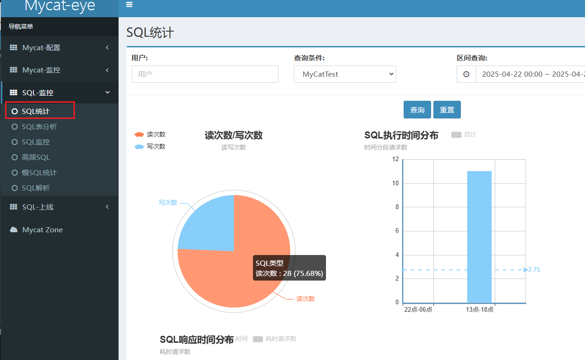

##### D. SQL表分æ

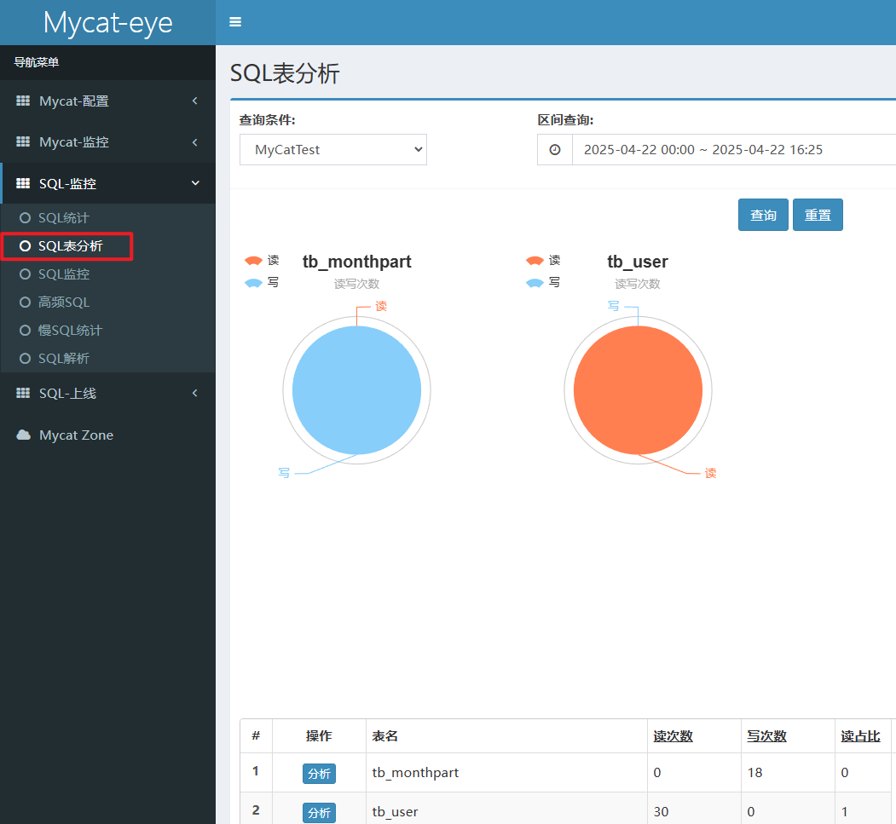

##### E. SQL监æ§

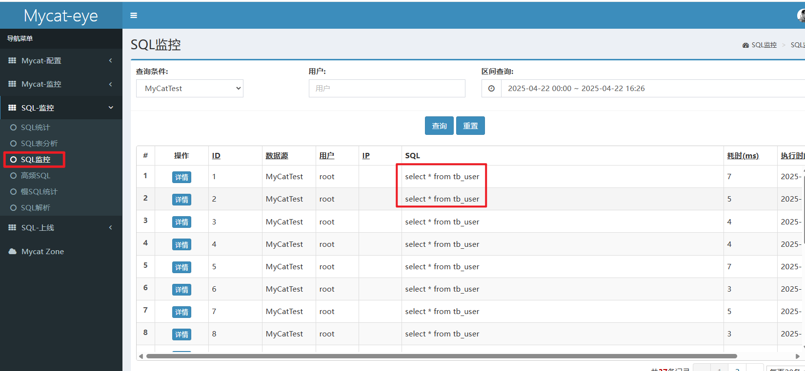

##### F. 高频SQL

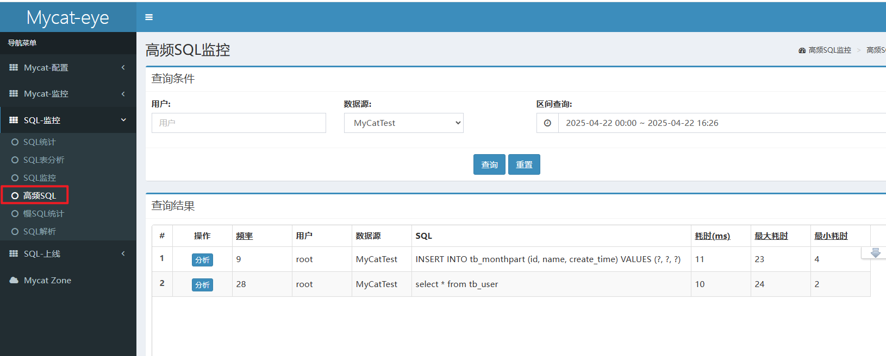

**G.SQL解æ**

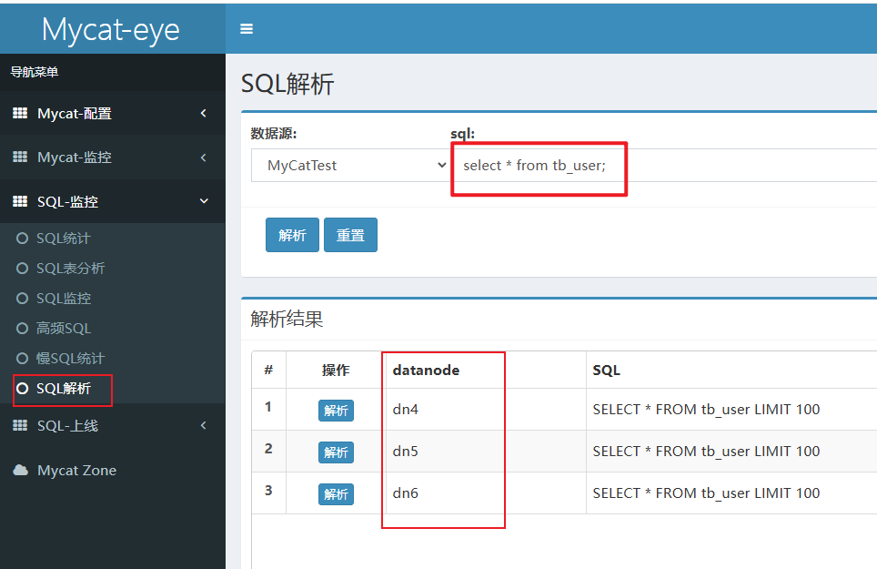

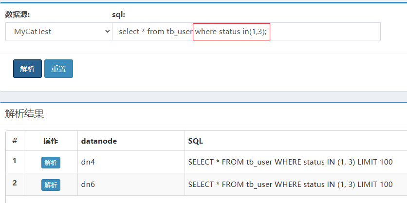

------


## 3.7 å°ç»“

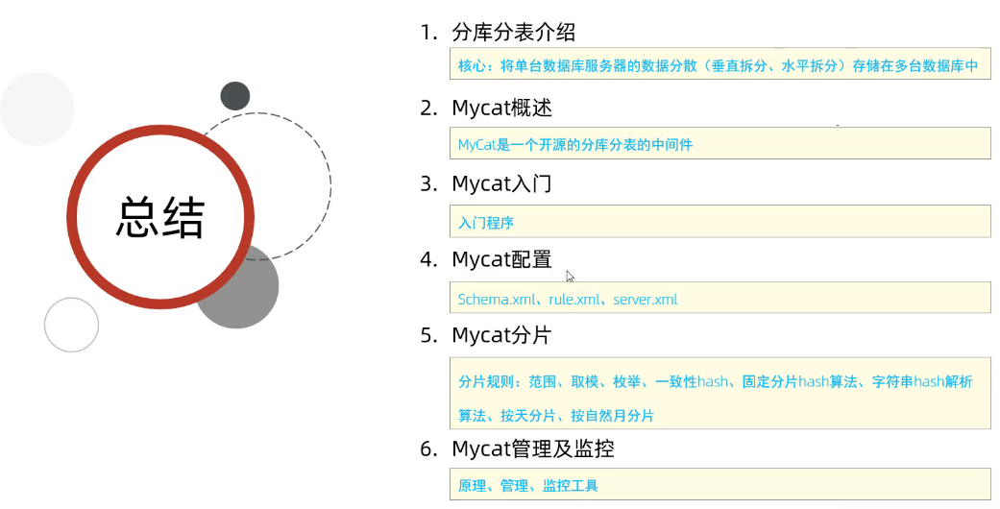


# 4ã€è¯»å†™åˆ†ç¦»

## 4.1 介ç»

读写分离,简å•åœ°è¯´æ˜¯æŠŠå¯¹æ•°æ®åº“的读和写æ“作分开,以对应ä¸åŒçš„æ•°æ®åº“æœåŠ¡å™¨ã€‚主数æ®åº“æ供写æ“作，ä»æ•°æ®åº“æ供读æ“作，这样能有效地å‡è½»å•å°æ•°æ®åº“çš„å‹åŠ›ã€‚

通过MyCatå³å¯è½»æ˜“å®ç°ä¸Šè¿°åŠŸèƒ½ï¼Œä¸ä»…**å¯ä»¥æ”¯æŒMySQL，也å¯ä»¥æ”¯æŒOracleå’ŒSQL Server**。

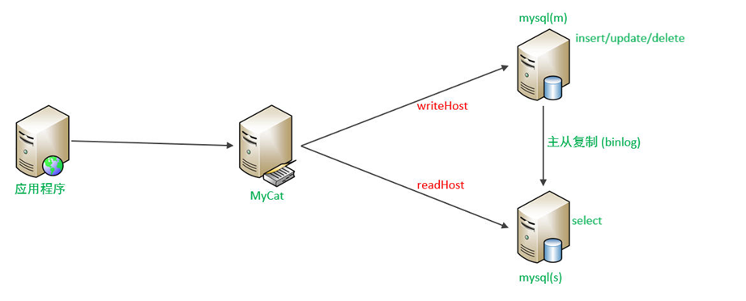

## 4.2 一主一ä»

### （1）åŸç†

MySQLçš„**主ä»å¤åˆ¶ï¼Œæ˜¯åŸºäº==二进制日志（binlog）==å®ç°çš„**。


### （2）准备

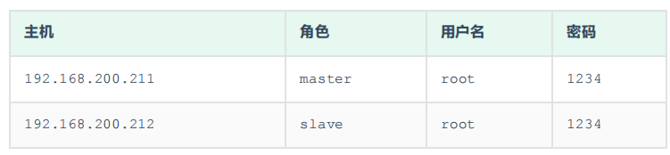

> 备注：**主ä»å¤åˆ¶çš„æ­å»º**，å¯ä»¥å‚考å‰é¢è¯¾ç¨‹ä¸­ **主ä»å¤åˆ¶** 章节讲解的步骤æ“作。

**[主ä»å¤åˆ¶çš„æ­å»º](#主ä»å¤åˆ¶çš„æ­å»º)**


## 4.3 一主一ä»è¯»å†™åˆ†ç¦»

MyCatæ§åˆ¶åå°æ•°æ®åº“的读写分离和负载å‡è¡¡ç”±schema.xml文件datahost标签的balanceå±æ€§æ§åˆ¶ã€‚

### （1）schema.xmlé…ç½®

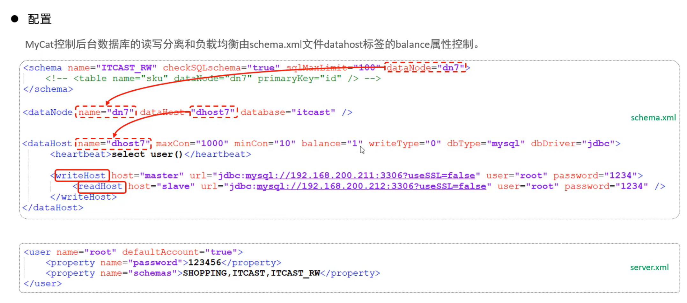

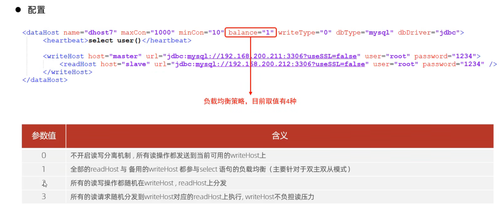

```xml
<!-- é…置逻辑库 -->
<schema name="ITCAST_RW" checkSQLschema="true" sqlMaxLimit="100" dataNode="dn7">
	<!-- 会自动加载对应数æ®èŠ‚点的数æ®åº“，然åå†è‡ªåŠ¨ç”Ÿæˆé€»è¾‘表 -->
</schema>

<dataNode name="dn7" dataHost="dhost7" database="itcast" />

<dataHost name="dhost7" maxCon="1000" minCon="10" balance="1" writeType="0" dbType="mysql" dbDriver="jdbc" switchType="1" slaveThreshold="100">
    <heartbeat>select user()</heartbeat>
    <writeHost host="master1" url="jdbc:mysql://192.168.200.211:3306?useSSL=false&amp;serverTimezone=Asia/Shanghai&amp;characterEncoding=utf8" user="root" password="1234" >
        <readHost host="slave1" url="jdbc:mysql://192.168.200.212:3306? useSSL=false&amp;serverTimezone=Asia/Shanghai&amp;characterEncoding=utf8" user="root" password="1234" />
    </writeHost>
</dataHost>
```

上述é…置的具体关è”对应情况如下：


**writeHost代表的是写æ“作对应的数æ®åº“，readHost代表的是读æ“作对应的数æ®åº“。**

 所以我们è¦æƒ³å®ç°è¯»å†™åˆ†ç¦»ï¼Œå°±å¾—é…ç½®writeHostå…³è”的是主库，readHostå…³è”的是ä»åº“。而仅仅é…置好了writeHost以åŠreadHost还ä¸èƒ½å®Œæˆè¯»å†™åˆ†ç¦»ï¼Œè¿˜éœ€è¦é…置一个é常é‡è¦çš„**==è´Ÿè´£å‡è¡¡çš„å‚æ•° balance==**，å–值有4ç§ï¼Œå…·ä½“å«ä¹‰å¦‚下：

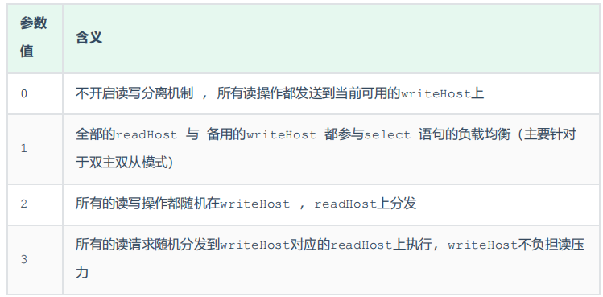

所以，在一主一ä»æ¨¡å¼çš„读写分离中，**balanceé…ç½®1或3都是å¯ä»¥å®Œæˆè¯»å†™åˆ†ç¦»çš„**。


### （2）server.xmlé…ç½®

**é…ç½®root用户å¯ä»¥è®¿é—®**SHOPPINGã€ITCAST ä»¥åŠ **ITCAST_RW逻辑库**。

```xml
<user name="root" defaultAccount="true">
    <property name="password">123456</property>
    <property name="schemas">SHOPPING,ITCAST,ITCAST_RW</property>
    <!-- 表级 DML æƒé™è®¾ç½® -->
    <!--
    <privileges check="true">
    <schema name="DB01" dml="0110" >
    <table name="TB_ORDER" dml="1110"></table>
    </schema>
    </privileges>
	-->
</user>
```


### （3）测试

é…置完毕MyCatå，é‡æ–°å¯åŠ¨MyCat。

```bash
bin/mycat stop

bin/mycat start
```

然å观察，在执行å¢åˆ æ”¹æ“作时，对应的主库åŠä»åº“çš„æ•°æ®å˜åŒ–。 在执行查询æ“作时，检查主库åŠä»åº“对应的数æ®å˜åŒ–。

在测试中，我们å¯ä»¥å‘ç°**当主节点Master宕机之å，业务系统就åªèƒ½å¤Ÿè¯»ï¼Œè€Œä¸èƒ½å†™å…¥æ•°æ®äº†**。

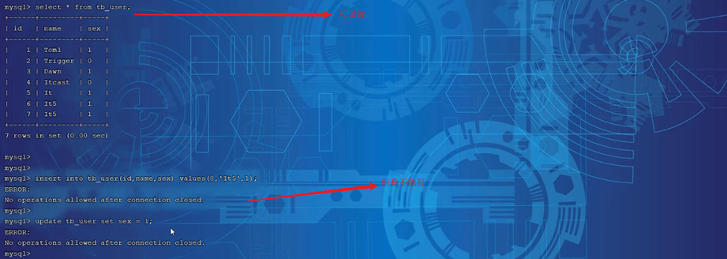

那如何解决这个问题呢？这个时候我们就得通过å¦å¤–一ç§ä¸»ä»å¤åˆ¶ç»“æ„æ¥è§£å†³äº†ï¼Œä¹Ÿå°±æ˜¯æˆ‘们æ¥ä¸‹æ¥è®²è§£çš„**åŒä¸»åŒä»**。


## 4.4 ==åŒä¸»åŒä»==

### （1）介ç»

一个主机 Master1 用äºå¤„ç†æ‰€æœ‰å†™è¯·æ±‚，它的ä»æœº Slave1 å’Œå¦ä¸€å°ä¸»æœº Master2 还有它的ä»æœº Slave2 负责所有读请求。**当 Master1 主机宕机å，Master2 主机负责写请求**，Master1 ã€Master2 **互为备机**。æ¶æ„图如下:

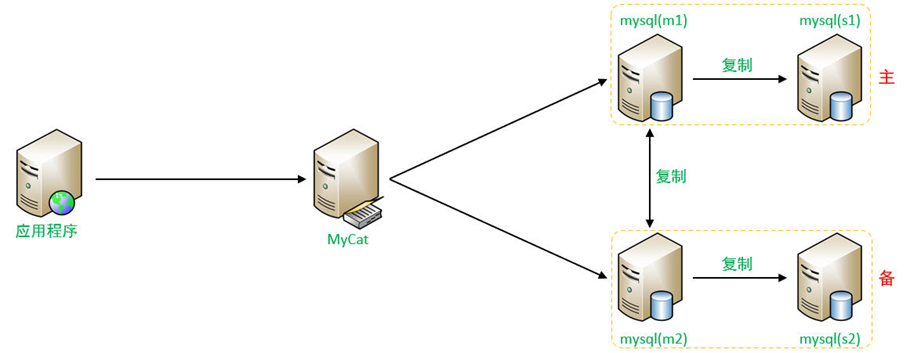

### （2）准备

我们需è¦å‡†å¤‡5å°æœåŠ¡å™¨ï¼Œå…·ä½“çš„æœåŠ¡å™¨åŠè½¯ä»¶å®‰è£…情况如下：

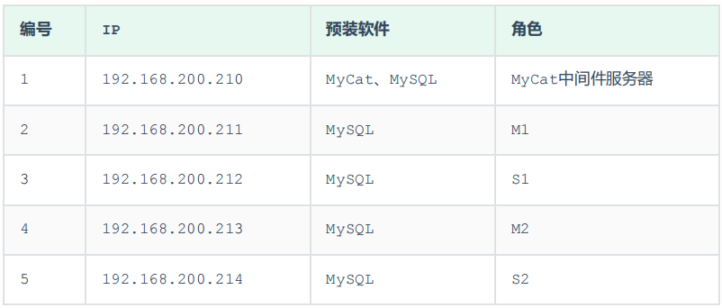


> **关闭以上所有æœåŠ¡å™¨çš„防ç«å¢™**或者**开放3306的端å£**：
>
> - systemctl stop firewalld
>
> - systemctl disable firewalld


### （3）æ­å»º

#### ①主库é…ç½®

##### 1). Master1(192.168.200.211)

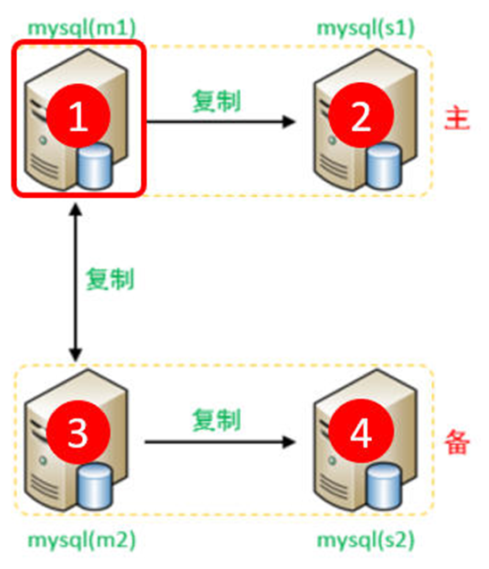

A. 修改é…置文件 /etc/my.cnf

```bash
#mysql æœåŠ¡ID，ä¿è¯æ•´ä¸ªé›†ç¾¤ç¯å¢ƒä¸­å”¯ä¸€ï¼Œå–值范围：1 – 2^32-1，默认为1
server-id=1
#åªåŒæ­¥æŒ‡å®šçš„æ•°æ®åº“
binlog-do-db=db01
binlog-do-db=db02
binlog-do-db=db03
# 在作为ä»æ•°æ®åº“的时候，有写入æ“作也è¦æ›´æ–°äºŒè¿›åˆ¶æ—¥å¿—文件
log-slave-updates
```

B. é‡å¯MySQLæœåŠ¡å™¨

```bash
systemctl restart mysqld
```

C. 创建账户并æˆæƒ

```sql
#创建itcast用户，并设置密ç ï¼Œè¯¥ç”¨æˆ·å¯åœ¨ä»»æ„主机è¿æ¥è¯¥MySQLæœåŠ¡
CREATE USER 'itcast'@'%' IDENTIFIED WITH mysql_native_password BY 'Root@123456';

#为 'itcast'@'%' 用户分é…主ä»å¤åˆ¶æƒé™
GRANT REPLICATION SLAVE ON *.* TO 'itcast'@'%';
```

通过指令，查看两å°ä¸»åº“的二进制日志åæ ‡

```sql
show master status ;
```


##### **2). Master2(192.168.200.213)**

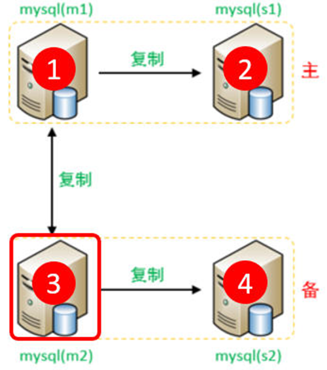

A. 修改é…置文件 /etc/my.cnf

```bash
#mysql æœåŠ¡ID，ä¿è¯æ•´ä¸ªé›†ç¾¤ç¯å¢ƒä¸­å”¯ä¸€ï¼Œå–值范围：1 – 2^32-1，默认为1
server-id=3
#指定åŒæ­¥çš„æ•°æ®åº“
binlog-do-db=db01
binlog-do-db=db02
binlog-do-db=db03
# 在作为ä»æ•°æ®åº“的时候，有写入æ“作也è¦æ›´æ–°äºŒè¿›åˆ¶æ—¥å¿—文件
log-slave-updates
```

B. é‡å¯MySQLæœåŠ¡å™¨

```bash
systemctl restart mysqld
```

C. 创建账户并æˆæƒ

```sql
#创建itcast用户，并设置密ç ï¼Œè¯¥ç”¨æˆ·å¯åœ¨ä»»æ„主机è¿æ¥è¯¥MySQLæœåŠ¡
CREATE USER 'itcast'@'%' IDENTIFIED WITH mysql_native_password BY 'Root@123456';
#为 'itcast'@'%' 用户分é…主ä»å¤åˆ¶æƒé™
GRANT REPLICATION SLAVE ON *.* TO 'itcast'@'%';
```

通过指令，查看两å°ä¸»åº“的二进制日志åæ ‡

```sql
show master status ;
```


#### â‘¡ä»åº“é…ç½®

##### **1). Slave1(192.168.200.212)**

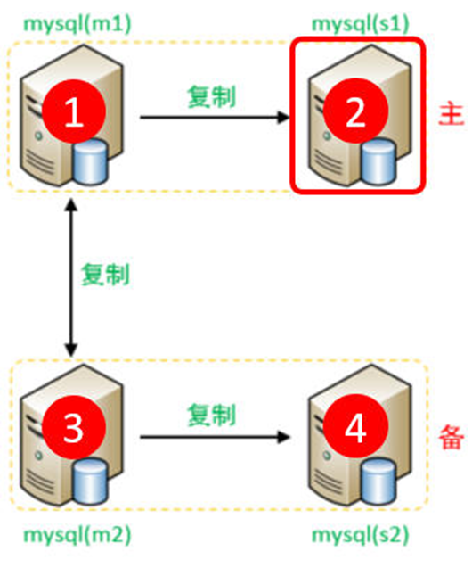

A. 修改é…置文件 /etc/my.cnf

```bash
#mysql æœåŠ¡ID，ä¿è¯æ•´ä¸ªé›†ç¾¤ç¯å¢ƒä¸­å”¯ä¸€ï¼Œå–值范围：1 – 232-1，默认为1
server-id=2
```

B. é‡æ–°å¯åŠ¨MySQLæœåŠ¡å™¨

```bash
systemctl restart mysqld
```


##### **2). Slave2(192.168.200.214)**

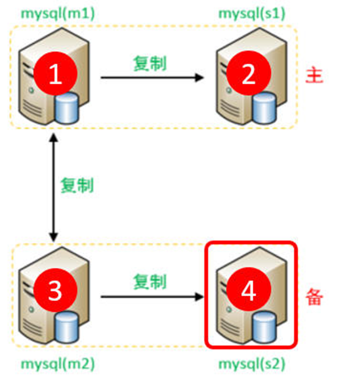

A. 修改é…置文件 /etc/my.cnf

```bash
#mysql æœåŠ¡ID，ä¿è¯æ•´ä¸ªé›†ç¾¤ç¯å¢ƒä¸­å”¯ä¸€ï¼Œå–值范围：1 – 232-1，默认为1
server-id=4
```

B. é‡æ–°å¯åŠ¨MySQLæœåŠ¡å™¨

```bash
systemctl restart mysqld
```


#### â‘¢ä»åº“å…³è”主库

##### 1). 两å°ä»åº“é…置关è”的主库

> 需è¦æ³¨æ„**slave1对应的是master1**，**slave2对应的是master2**。

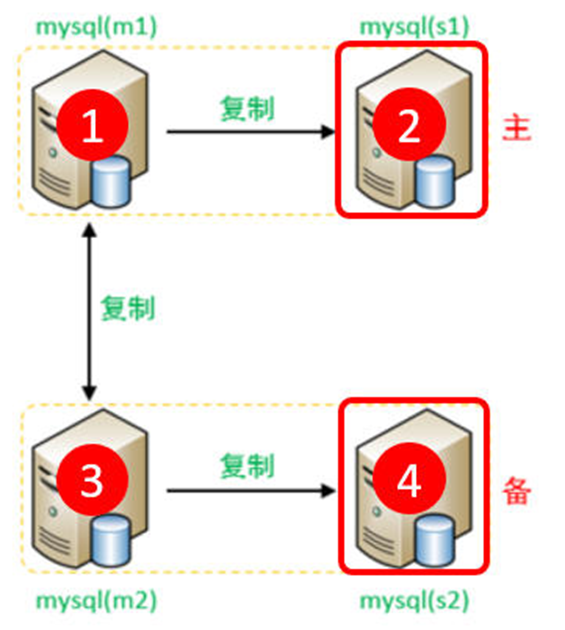

A. 在 slave1(192.168.200.212)上执行

```sql
CHANGE MASTER TO MASTER_HOST='192.168.200.211', MASTER_USER='itcast',
MASTER_PASSWORD='Root@123456', MASTER_LOG_FILE='binlog.000002',
MASTER_LOG_POS=663;
```

B. 在 slave2(192.168.200.214)上执行

```sql
CHANGE MASTER TO MASTER_HOST='192.168.200.213', MASTER_USER='itcast',
MASTER_PASSWORD='Root@123456', MASTER_LOG_FILE='binlog.000002',
MASTER_LOG_POS=663;
```

C. å¯åŠ¨ä¸¤å°ä»åº“主ä»å¤åˆ¶ï¼ŒæŸ¥çœ‹ä»åº“状æ€

```sql
start slave;
show slave status \G;
```

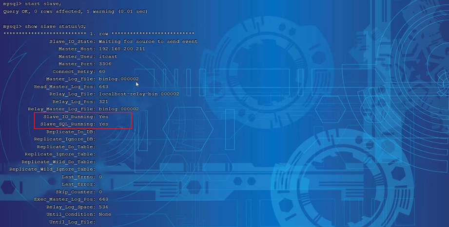


##### 2). ==两å°ä¸»åº“相互å¤åˆ¶==

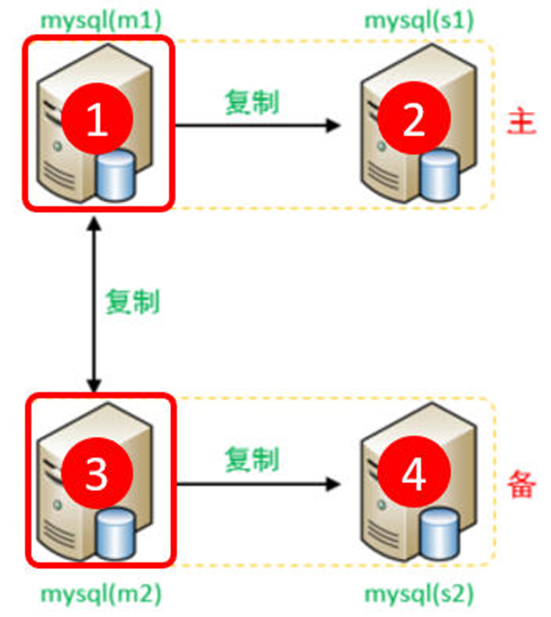

```txt
Master2 å¤åˆ¶ Master1，Master1 å¤åˆ¶ Master2。 
```

A. 在 Master1(192.168.200.211)上执行

```sql
CHANGE MASTER TO MASTER_HOST='192.168.200.213', MASTER_USER='itcast',
MASTER_PASSWORD='Root@123456', MASTER_LOG_FILE='binlog.000002',
MASTER_LOG_POS=663;
```

B. 在 Master2(192.168.200.213)上执行

```sql
CHANGE MASTER TO MASTER_HOST='192.168.200.211', MASTER_USER='itcast',
MASTER_PASSWORD='Root@123456', MASTER_LOG_FILE='binlog.000002',
MASTER_LOG_POS=663;
```

C. å¯åŠ¨ä¸¤å°ä»åº“主ä»å¤åˆ¶ï¼ŒæŸ¥çœ‹ä»åº“状æ€

```sql
start slave;
show slave status \G;
```


ç»è¿‡ä¸Šè¿°çš„三步é…置之å，åŒä¸»åŒä»çš„å¤åˆ¶ç»“æ„就已ç»æ­å»ºå®Œæˆäº†ã€‚ æ¥ä¸‹æ¥ï¼Œæˆ‘们å¯ä»¥æ¥æµ‹è¯•éªŒè¯ä¸€ä¸‹ã€‚


### （4）测试

分别在两å°ä¸»åº“Master1ã€Master2上执行DDLã€DML语å¥ï¼ŒæŸ¥çœ‹æ¶‰åŠåˆ°çš„æ•°æ®åº“æœåŠ¡å™¨çš„æ•°æ®åŒæ­¥æƒ…况。

```sql
create database db01;
use db01;
create table tb_user(
    id int(11) not null primary key ,
    name varchar(50) not null,
    sex varchar(1)
)engine=innodb default charset=utf8mb4;
insert into tb_user(id,name,sex) values(1,'Tom','1');
insert into tb_user(id,name,sex) values(2,'Trigger','0');
insert into tb_user(id,name,sex) values(3,'Dawn','1');
insert into tb_user(id,name,sex) values(4,'Jack Ma','1');
insert into tb_user(id,name,sex) values(5,'Coco','0');
insert into tb_user(id,name,sex) values(6,'Jerry','1');
```

- 在Master1中执行DMLã€DDLæ“作，看看数æ®æ˜¯å¦å¯ä»¥åŒæ­¥åˆ°å¦å¤–的三å°æ•°æ®åº“中。
- 在Master2中执行DMLã€DDLæ“作，看看数æ®æ˜¯å¦å¯ä»¥åŒæ­¥åˆ°å¦å¤–的三å°æ•°æ®åº“中。

完æˆäº†ä¸Šè¿°åŒä¸»åŒä»çš„结æ„æ­å»ºä¹‹å，æ¥ä¸‹æ¥ï¼Œæˆ‘们å†æ¥çœ‹çœ‹å¦‚何完æˆè¿™ç§**åŒä¸»åŒä»çš„读写分离**。


## 4.5 åŒä¸»åŒä»==读写分离==

### （1）é…ç½®

MyCatæ§åˆ¶åå°æ•°æ®åº“的读写分离和负载å‡è¡¡ç”±schema.xml文件datahost标签的balanceå±æ€§æ§åˆ¶ï¼Œé€šè¿‡writeTypeåŠswitchTypeæ¥å®Œæˆå¤±è´¥è‡ªåŠ¨åˆ‡æ¢çš„。

#### â‘ schema.xml

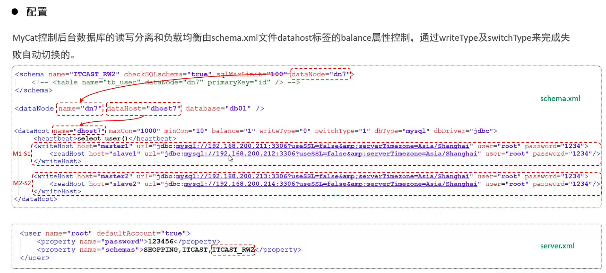

é…置逻辑库：

```xml
<schema name="ITCAST_RW2" checkSQLschema="true" sqlMaxLimit="100" dataNode="dn7">
</schema>
```

é…置数æ®èŠ‚点：

```xml
<dataNode name="dn7" dataHost="dhost7" database="db01" />
```

é…置节点主机：

```xml
<dataHost name="dhost7" maxCon="1000" minCon="10" balance="1" writeType="0"
          dbType="mysql" dbDriver="jdbc" switchType="1" slaveThreshold="100">
    <heartbeat>select user()</heartbeat>
    <writeHost host="master1" url="jdbc:mysql://192.168.200.211:3306?  useSSL=false&amp;serverTimezone=Asia/Shanghai&amp;characterEncoding=utf8"
               user="root" password="1234" >
        <readHost host="slave1" url="jdbc:mysql://192.168.200.212:3306?useSSL=false&amp;serverTimezone=Asia/Shanghai&amp;characterEncoding=utf8"
                  user="root" password="1234" />
    </writeHost>
    <writeHost host="master2" url="jdbc:mysql://192.168.200.213:3306?useSSL=false&amp;serverTimezone=Asia/Shanghai&amp;characterEncoding=utf8"
               user="root" password="1234" >
        <readHost host="slave2" url="jdbc:mysql://192.168.200.214:3306?useSSL=false&amp;serverTimezone=Asia/Shanghai&amp;characterEncoding=utf8"
                  user="root" password="1234" />
    </writeHost>
</dataHost>
```

具体的对应情况如下：

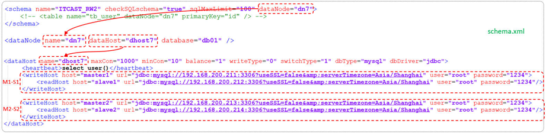

å±æ€§è¯´æ˜ï¼š

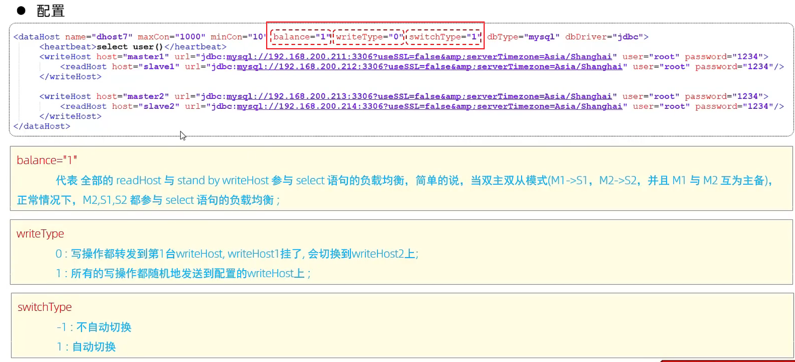

> **balance="1"**
>
> 代表全部的 readHost ä¸ stand by writeHost å‚ä¸ select 语å¥çš„è´Ÿè½½å‡è¡¡ï¼Œç®€å•çš„说，**当åŒä¸»åŒä»æ¨¡å¼(M1->S1，M2->S2，并且 M1 ä¸ M2 互为主备)，正常情况下，M2,S1,S2 都å‚ä¸ select 语å¥çš„è´Ÿè½½å‡è¡¡** 	
>
> **writeType**
>
> ​	0 : 写æ“作都转å‘到第1å°writeHost, writeHost1挂了, 会切æ¢åˆ°writeHost2上;
>
> ​	1 : 所有的写æ“作都éšæœºåœ°å‘é€åˆ°é…置的writeHost上 ;
>
> **switchType**
>
> ​	-1 : ä¸è‡ªåŠ¨åˆ‡æ¢
>
> ​	1 : 自动切æ¢ï¼Œå½“第1å°writeHost宕机å，会ä¸ä¼šè‡ªåŠ¨åˆ‡æ¢åˆ°writeHost2上


#### â‘¡server.xml

é…ç½®root用户也å¯ä»¥è®¿é—®åˆ°**逻辑库 ITCAST_RW2**。

```xml
<user name="root" defaultAccount="true">
    <property name="password">123456</property>
    <property name="schemas">SHOPPING,ITCAST,ITCAST_RW2</property>
    <!-- 表级 DML æƒé™è®¾ç½® -->
    <!--
		<privileges check="true">
		<schema name="DB01" dml="0110" >
		<table name="TB_ORDER" dml="1110"></table>
		</schema>
		</privileges>
	-->
</user>
```


### （2）测试

登录MyCat，测试查询åŠæ›´æ–°æ“作，判定是å¦èƒ½å¤Ÿè¿›è¡Œè¯»å†™åˆ†ç¦»ï¼Œä»¥åŠè¯»å†™åˆ†ç¦»çš„策略是å¦æ­£ç¡®ã€‚

**当主库挂æ‰ä¸€ä¸ªä¹‹å，是å¦èƒ½å¤Ÿè‡ªåŠ¨åˆ‡æ¢**。


## 4.6 å°ç»“

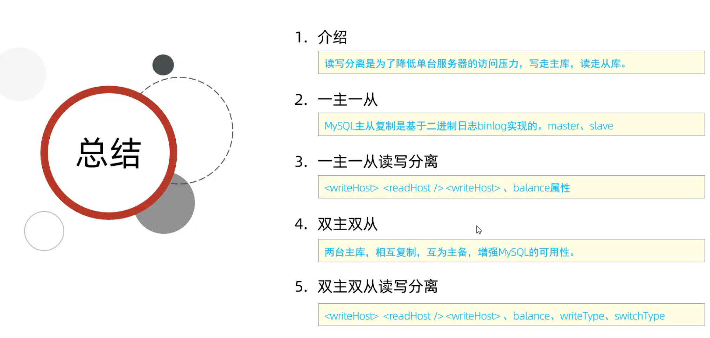

