# MySql-Learning


------


# 三、运维篇

# 1、🌟 ==日志==

## 1.1 错误日志

错误日志是 MySQL 中最重要的日志之一，它记录了**当 mysqld 启动和停止时，以及服务器在运行过程中发生任何严重错误时的相关信息**。当数据库出现任何故障导致无法正常使用时，建议首先查看此日志。

该日志是**默认开启**的，**默认存放目录 /var/log/**，默认的日志文件名为 **mysqld.log** 。查看日志位置：

```SQL
-- 查看日志文件所在位置
show variables like '%log_error%'; 
```

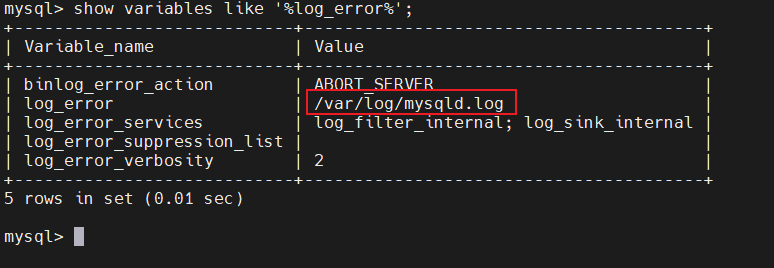


```bash
tail -50 /var/log/mysqld.log #查看错误日志文件最后50行的信息
tail -f /var/log/mysqld.log #实时查看日志信息
```


## 1.2 🌟 ==二进制日志==

### （1）介绍

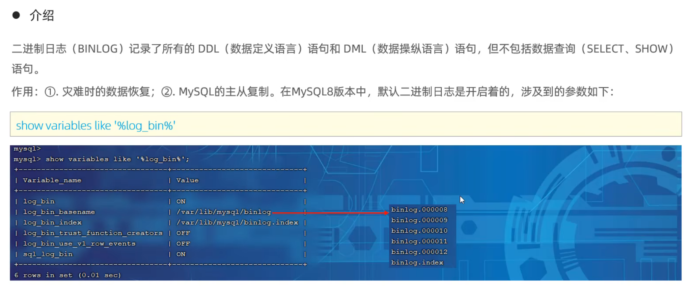

二进制日志（BINLOG）记录了所有的 **DDL（数据定义语言）**语句和 **DML（数据操纵语言）**语句，但**不包括数据查询（SELECT、SHOW）语句**。

作用：

- ① 灾难时的**==数据恢复==**；
- ② MySQL的**==主从复制==**，主从复制的底层原理就是基于binlog的。

在MySQL8版本中，默认**二进制日志是==开启==着的**，涉及到的参数如下：

```sql
show variables like '%log_bin%'; 
```

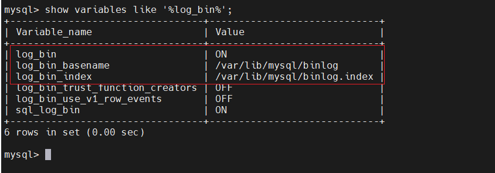

**参数说明：**

- loh_bin = on ,表示二进制日志是开启的。
- log_bin_basename：当前数据库服务器的**binlog日志的基础名称(前缀)**，具体的binlog文件名需要再该basename的基础上**加上编号(编号从000001开始)**。
- log_bin_index：binlog的**索引文件**，里面记录了当前服务器关联的binlog文件有哪些。

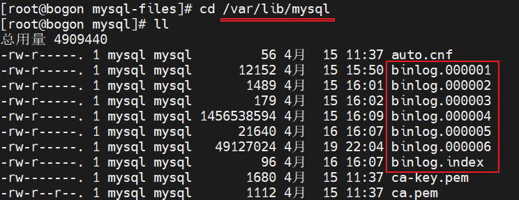

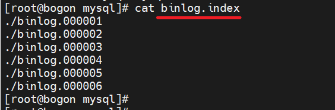


### （2）格式

MySQL服务器中提供了**多种格式来记录二进制日志**，具体格式及特点如下：

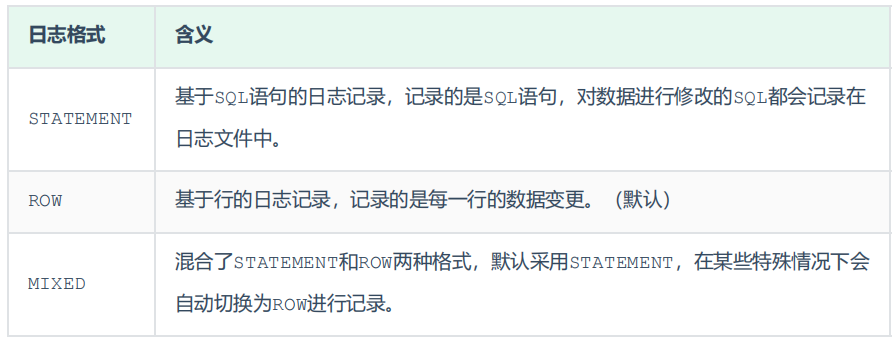

**==注意==**

- 查询是不会记录在二进制文件中的，只会记录了所有的 **DDL（数据定义语言）**语句和 **DML（数据操纵语言）**语句，但**不包括数据查询（SELECT、SHOW）语句**。
- STATEMENT的日志格式，通过mysqlbinlog binlog.00003时不需要添加-v选项，因为该日志格式**保存的就是sql语句**。
- 对于ROW的日志格式，需要通过mysqlbinlog **-v** binlog.00003指令，**将行事件(数据变更)重构为SQL语句**


```sql
show variables like '%binlog_format%';  -- 查看当前Mysql的记录日志的格式
```

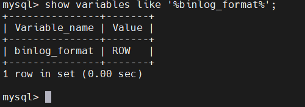

如果我们需要配置二进制日志的格式，只需要**在 /etc/my.cnf 中配置 binlog_format 参数**即可。

```bash
vim  /etc/my.cnf

#在该文件的最后添加
binlog_format = STATEMENT

# 重新启动MySQL服务
systemctl restart mysqld
```


### （3）查看

由于日志是以二进制方式存储的，不能直接读取，需要通过**二进制日志查询工具 mysqlbinlog 来查看**，具体语法：

```sql
	mysqlbinlog [ 参数选项 ] logfilename

-- 参数选项：
    -d -- 指定数据库名称，只列出指定的数据库相关操作。
    -o -- 忽略掉日志中的前n行命令。
    -v -- 将行事件(数据变更)重构为SQL语句
    -vv -- 将行事件(数据变更)重构为SQL语句，并输出注释信息，注意这里是两个v
```


### （4）删除

对于比较繁忙的业务系统，每天生成的binlog数据巨大，**如果长时间不清除，将会占用大量磁盘空间**。可以通过以下几种方式清理日志：

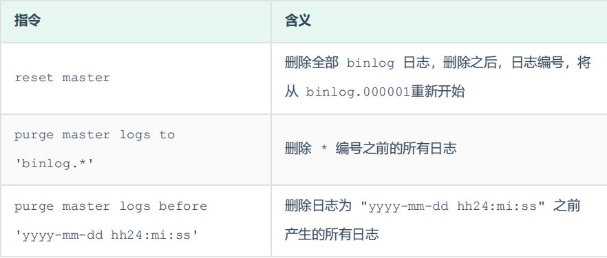

#### ①日志过期时间

也可以在mysql的**配置文件中配置二进制日志的过期时间**，设置了之后，**二进制日志过期会自动删除**。

```sql
-- 查看二进制日志文件的过期时间
show variables like '%binlog_expire_logs_seconds%'; -- 默认为30天
```

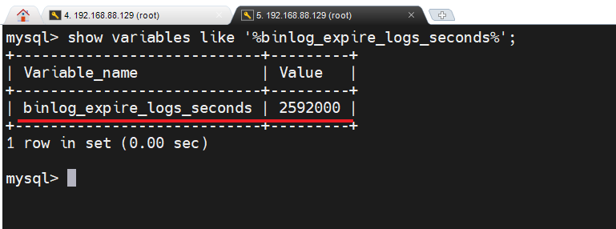


#### **②删除指定编码之前的所有日志**

```sql
purge master logs to 'binlog.000002';
```

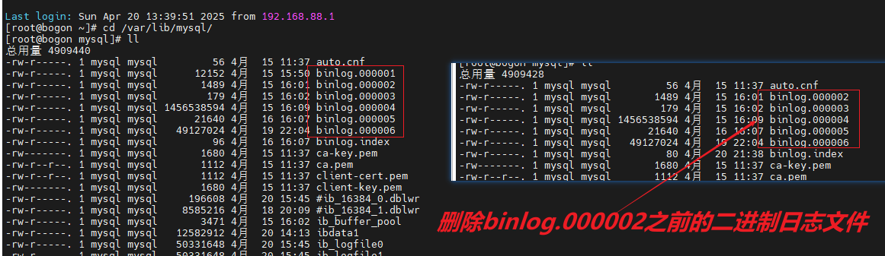


#### ③删除全部binlog日志

**删除全部binlog日志，删除之后，日志编号，将从 binlog.000001重新开始**

```sql
reset master;
```


#### ④删除指定日期之前的日志

```sql
purge master logs before '2025-04-20 21:42:00';
```


## 1.3 查询日志

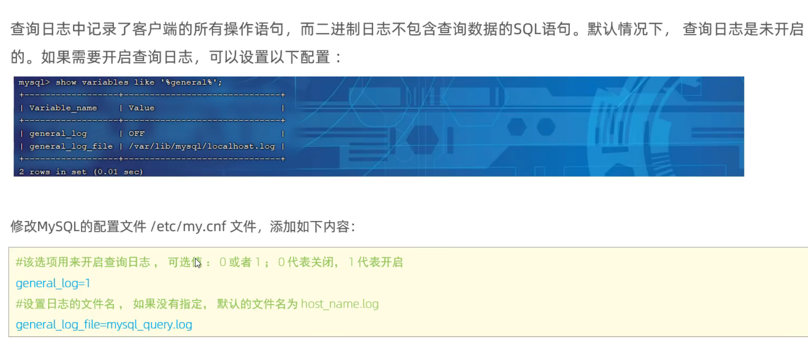

查询日志中**记录了客户端的==所有操作语句==**，而**二进制日志不包含查询数据的SQL语句**。

**默认**情况下，**查询日志是==未开启==的**。

```sql
show variables like '%general%'; -- 查询日志的开关状态和查询日志所在文件目录
```

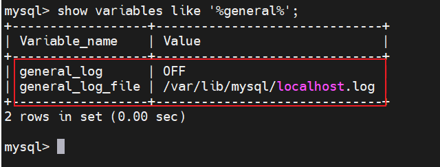


如果**需要开启查询日志**，可以**修改MySQL的配置文件 /etc/my.cnf 文件**，添加如下内容：

```bash
#该选项用来开启查询日志 ， 可选值 ： 0 或者 1 ； 0 代表关闭， 1 代表开启
general_log=1
#设置日志的文件名，如果没有指定， 默认的文件名为 host_name.log
general_log_file=mysql_query.log
```

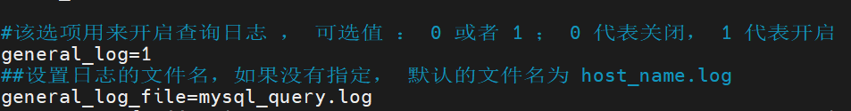


```sql
-- 配置完成后，重启mysql服务
systemctl restart mysqld
```

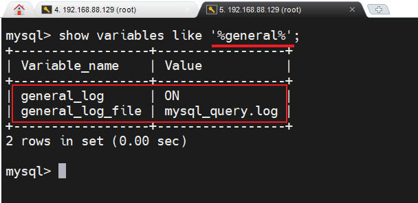

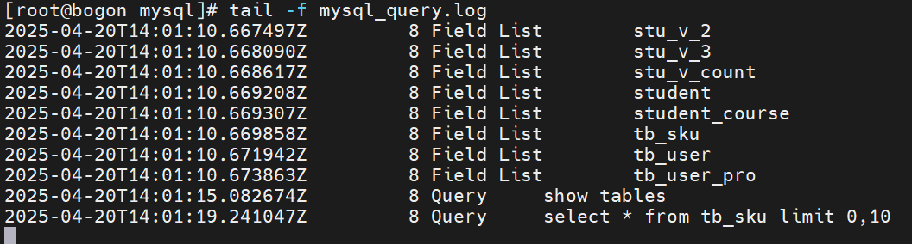

开启了查询日志之后，在**MySQL的数据存放目录**，也就是 **/var/lib/mysql/ 目录下就会出现mysql_query.log 文件**。之后**所有的客户端的增删改查操作都会记录在该日志文件之中**，长时间运行后，该日志文件将会非常大。如果不需要用到这个文件可以`关闭查询日志`。


## 1.4 🌟 ==慢查询日志==

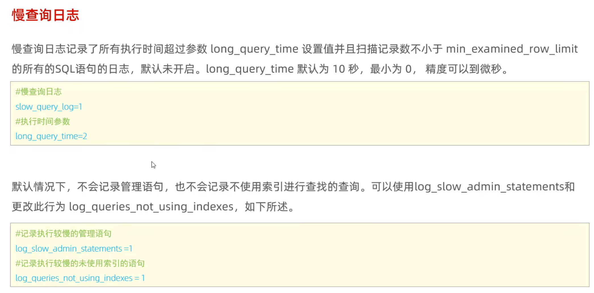

慢查询日志记录了所有**执行时间超过参数 long_query_time 设置值**并且**扫描记录数不小于min_examined_row_limit** 的所有的SQL语句的日志，**默认未开启**。long_query_time **默认为10 秒**，最小为 0， **精度可以到微秒**。

**默认文件名为**：localhost-slow.log ，所在文件目录：/var/lib/mysql


如果需要开启慢查询日志，需要**在MySQL的配置文件 /etc/my.cnf 中配置**如下参数：

```bash
#慢查询日志
slow_query_log=1  # 1表示开启慢查询日志
#执行时间参数
long_query_time=2  # 设置慢查询时间标准线为 2s
```

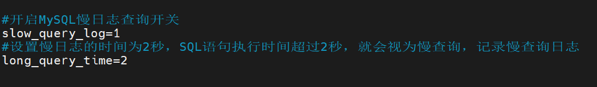


**测试：**

```sql
select * from tb_sku limit 0,10;  -- 用时0.01s
select * from tb_sku limit 2000000,10; -- 执行时间较长 => 4.79s
```

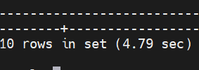

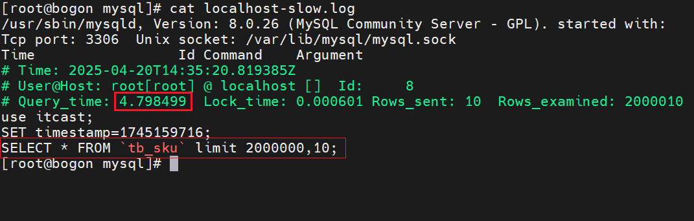

```sql
-- 使用 EXPLAIN ANALYZE（MySQL 8.0+）
-- 这会返回 实际执行计划+时间统计，比慢查询日志更精确。
EXPLAIN ANALYZE SELECT * FROM `tb_sku` limit 2000000,10;
```

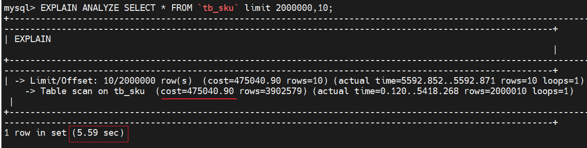


```sql
select count(*) from tb_sku;
```

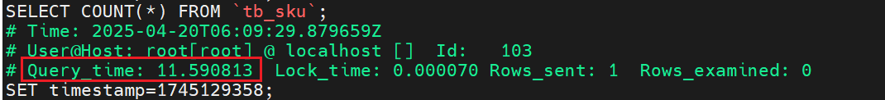


默认情况下，**不会记录管理语句，也不会记录不使用索引进行查找的查询**。可以使用log_slow_admin_statements和 更改此行为 log_queries_not_using_indexes，如下所述。

```bash
#记录执行较慢的管理语句
log_slow_admin_statements = 1

#记录执行较慢的未使用索引的语句
log_queries_not_using_indexes = 1
```


> 上述所有的参数配置完成之后，都需要**重新启动MySQL服务器**才可以生效。
>
> ```bash
> -- 配置完成后，重启mysql服务
> systemctl restart mysqld
> ```


------


# 2、==主从复制==

## 2.1 概述

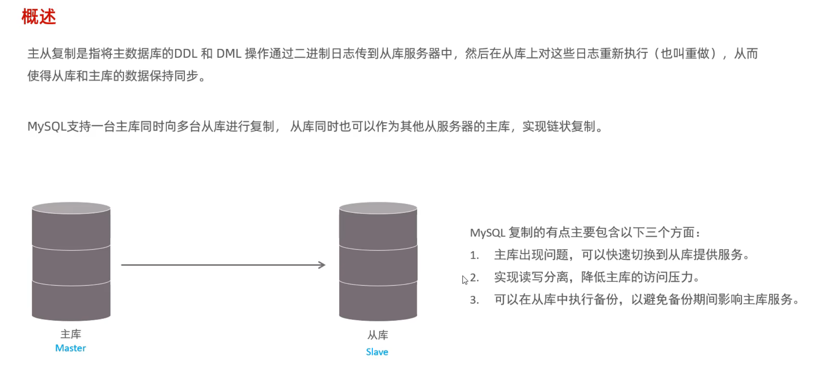

主从复制是指**将主数据库的 DDL 和 DML 操作==通过二进制日志传到从库服务器==中**，然后在从库上对这些日志重新执行（也叫重做），从而使得**从库和主库的数据保持同步**。

MySQL支持一台主库同时向多台从库进行复制， 从库同时也可以作为其他从服务器的主库，**实现==链状复制==**。


MySQL 复制的**优点**主要包含以下三个方面：

- 主库出现问题，可以**快速切换到从库提供服务**。
- 实现**==读写分离==，降低主库的访问压力**。
- 可以在**==从库中执行备份==，以避免备份期间影响主库服务**。
  - （因为备份需要**添加全局锁**，会影响业务操作）


## 2.2 ==原理==

MySQL主从复制的核心就是 **==二进制日志==**，具体的过程如下：

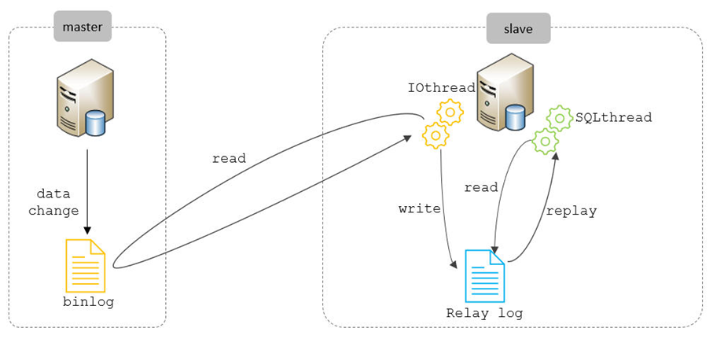


从上图来看，**复制分成三步**：

1. Master 主库在**事务提交**时，会**把数据变更记录在二进制日志文件 Binlog 中**。

2. 从库读取主库的二进制日志文件 Binlog ，写入到从库的**中继日志 Relay Log** 。 =》 IOthread

3. slave**重做**中继日志中的事件，将改变反映它自己的数据。 =》 SQLthread


**MySQL复制详细过程分成三步：**

- **master将改变记录到==二进制日志（binarylog)==**
- **slave将master的binarylog拷贝到它的==中继日志（relaylog）==**
  1. **通过开启I/O thread 线程从master主库中读取binlog，在写入slave从库的中继日志relaylog。**
  2. **在从库中在通过SQL thread线程解析日志，执行和主库一样的sql操作**
- **slave重做中继日志中的事件，将改变应用到自己的数据库中**


## 2.3 搭建

`<span id = '主从复制的搭建' >` `</span>`

### （1）准备

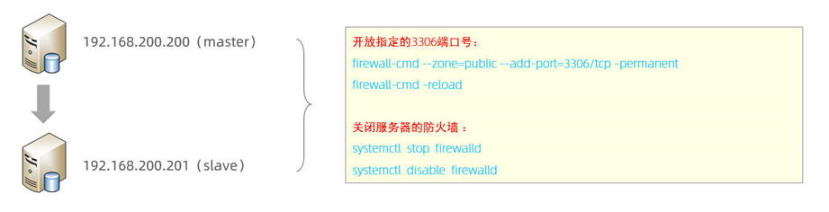

准备好两台服务器之后，在上述的两台服务器中分别安装好MySQL，并完成基础的初始化准备(安装、密码配置等操作)工作。 其中：

192.168.200.200 作为主服务器master = 》 	192.168.88.130 （自己的服务器ip）

192.168.200.201 作为从服务器slave  =》 		192.168.88.131

```bash
# 开放指定端口
firewall-cmd --zone=public --add-port=3306/tcp --permanent

# 立即生效
firewall-cmd --reload

#查看开放的端口
firewall-cmd --zone=public --list-ports
```


### （2）主库配置

#### ①修改配置文件 /etc/my.cnf

**前置条件**

```bash
#查找my.conf文件
find / -name "my.cnf"
```

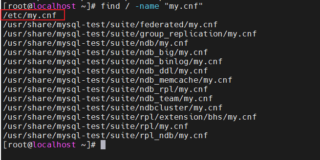


```bash
log_bin = binlog # 启用二进制日志（Binary Log）并指定日志文件的基础名称
#mysql 服务ID，保证整个集群环境中唯一，取值范围：1 – (2的32次方-1)， 默认为1
server-id=1  #[必须]服务器唯一ID

#是否只读,1 代表只读, 0 代表读写
read-only=0    #主库设置为0，表示可以读写
#设置read-only = 1的 只读 只针对普通用户，若想设置超级管理员的权限因为只读：
#super-read-only=1

#忽略的数据, 指不需要同步的数据库
#binlog-ignore-db=mysql

#指定同步的数据库
#binlog-do-db=db01
```

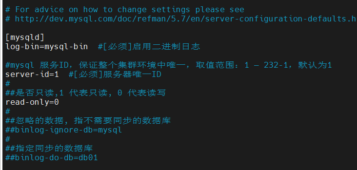


#### ②重启MySQL服务器

```bash
systemctl restart mysqld 
```


#### ③登录mysql，创建远程连接的账号，并授予主从复制权限

**登录Mysql客户端**

```bash
mysql -uroot -proot
```

****

```sql
#创建itcast用户，并设置密码，该用户可在任意主机连接该MySQL服务
CREATE USER 'itcast'@'%' IDENTIFIED WITH mysql_native_password BY 'Root@123456';
-- 这里的%表示itcast用户可以在任意主机上进行访问该数据库 
-- Root@123456 表示该用户的密码

#为 'itcast'@'%' 用户分配主从复制权限
GRANT REPLICATION SLAVE ON *.* TO 'itcast'@'%';
```


#### ④通过指令，查看二进制日志坐标

```sql
show master status ; 
-- 8.40版本的使用新的指令SHOW BINARY LOG STATUS.
```


字段含义说明：

-  file : **从哪个日志文件==开始推送日志文件==**，注意这里的**文件名前缀**，后续从库和主库进行关联时会使用到
   -  文件名前缀，通过log_bin = binlog 设置：**启用二进制日志（Binary Log）并指定日志文件的基础名称**

-  position ： **从哪个位置开始推送日志**
-  binlog_ignore_db : 指定不需要同步的数据库


> **==注意==：**
>
> 由于主从复制是通过二进制日志文件进行同步的，但是只能选择从某个日志文件的某个位置开始进行推送并同步。
>
> 如果此时主库在`该推送日志文件`已经有了数据，直接通过主从复制是不能同步这些`日志文件`之前的数据，可以采用根据主库的结构和数据，生成sql语句，**先在从库中执行该生成的sql后，保证主从的初始数据一致，再来进行主从复制的配置**。


**如果遇到返回的是空集合：**

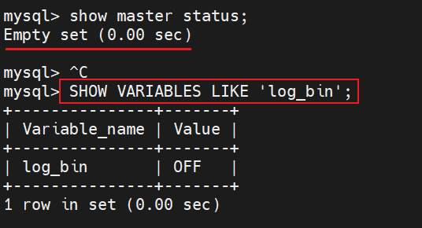


```sql
SHOW VARIABLES LIKE 'log_bin';  -- 如果返回 OFF，说明二进制日志未启用。
```

修改 MySQL 配置文件（`my.cnf` 或 `my.ini`）：

```bash
[mysqld]
log_bin = binlog # 启用二进制日志（Binary Log）并指定日志文件的基础名称
server_id = 1  # 主从复制必须设置 server_id（唯一值）
```

重启 MySQL：

```bash
sudo systemctl restart mysqld  # 或 mysql（取决于系统）
```


### （3）从库配置

#### ①修改配置文件 /etc/my.cnf

```bash
#mysql 服务ID，保证整个集群环境中唯一，取值范围：1 到 2^32-1，和主库不一样即可
server-id=2  #和主库不一样即可

#是否只读,1 代表只读, 0 代表读写
read-only=1  # 只针对普通管理员有效
#设置read-only = 1的 只读 只针对普通用户，若想设置超级管理员的权限因为只读：
#super-read-only=1
```


#### ②重新启动MySQL服务

```bash
systemctl restart mysqld
```


#### ③登录mysql，设置主库配置

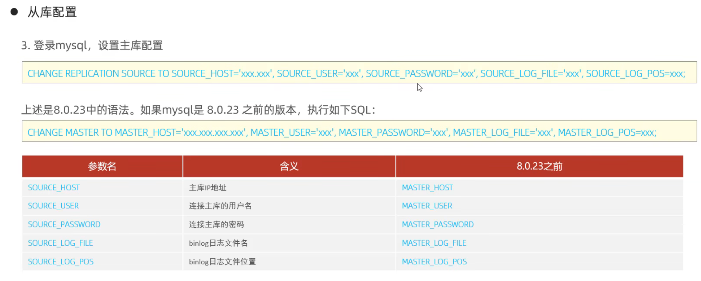

##### 1）通过指令，查看二进制日志坐标

```sql
show master status ; 
-- 8.40版本的使用新的指令SHOW BINARY LOG STATUS.
```

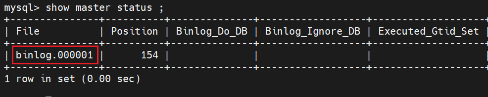

字段含义说明：

-  file : **从哪个日志文件==开始推送日志文件==**
-  position ： **从哪个位置开始推送日志**
-  binlog_ignore_db : 指定不需要同步的数据库


##### 2）从库关联主库

```sql
-- 登录Mysql
mysql -uroot -proot

CHANGE REPLICATION SOURCE TO SOURCE_HOST='192.168.88.130',SOURCE_USER='itcast',SOURCE_PASSWORD='Root@123456', SOURCE_LOG_FILE='binlog.000001',SOURCE_LOG_POS=154;
```

上述是8.0.23中的语法。如果**mysql是 8.0.23 之前的版本**，执行如下SQL：

```sql
CHANGE MASTER TO MASTER_HOST='192.168.88.130', MASTER_USER='itcast',
MASTER_PASSWORD='Root@123456', MASTER_LOG_FILE='binlog.000001',
MASTER_LOG_POS=154;
```

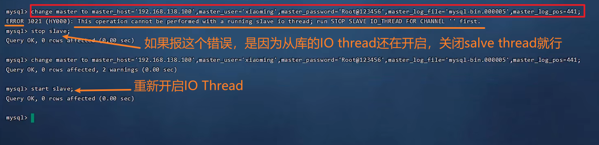

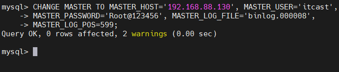

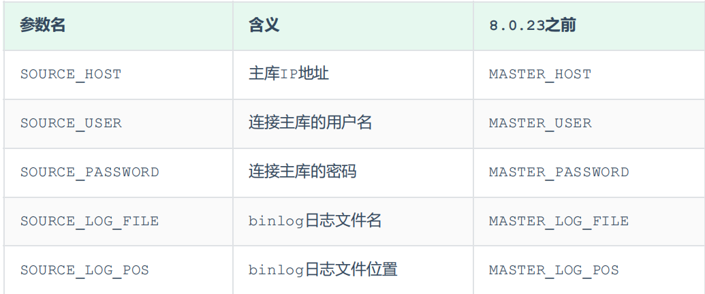


#### ④开启同步操作

```sql
start replica ; #8.0.22之后

start slave ; #8.0.22之前
```


#### ⑤查看主从同步状态

```sql
show replica status ; #8.0.22之后

show slave status\G; #8.0.22之前
```

**当IO_Running和SQL_Running都显示为yes时，说明配置成功**

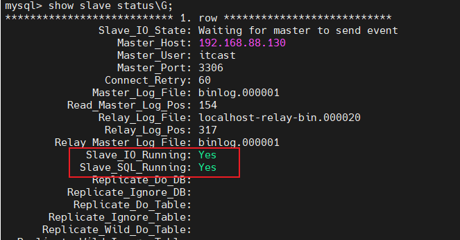


### （4）测试

#### ①主库

在**主库** 192.168.88.130 上**创建数据库、表，并插入数据**

```sql
create database db01;

use db01;

create table tb_user(
    id int(11) primary key not null auto_increment,
    name varchar(50) not null,
    sex varchar(1)
)engine=innodb default charset=utf8mb4;

insert into tb_user(id,name,sex) 
    values
    (null,'Tom', '1'),
    (null,'Trigger','0'),
    (null,'Dawn','1');
```


#### ②从库

在**从库** 192.168.88.131 中**查询数据，验证主从是否同步**


## 2.4 小结

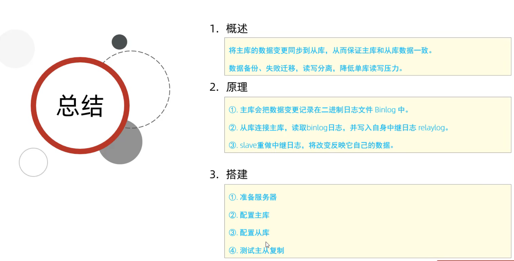


------


# 3、🚀 ==分库分表==

## 3.1 介绍

### （1）问题分析

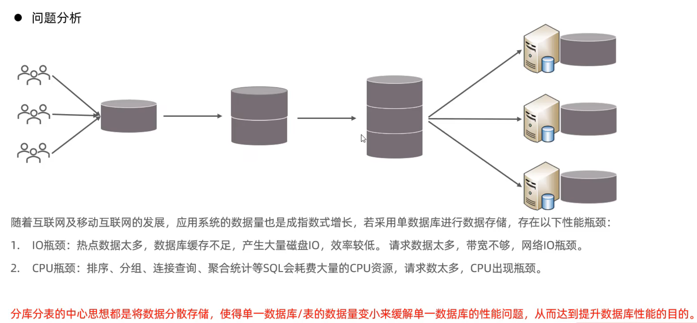

随着互联网及移动互联网的发展，应用系统的数据量也是成指数式增长，若采用单数据库进行数据存储，存在以下性能瓶颈：

1. **IO瓶颈**：热点数据太多，数据库缓存不足（数据库缓存需要占用内存），**产生大量磁盘IO**，效率较低。 请求数据太多，**带宽不够，网络IO瓶颈**。
   1. 结合InnoDB的存储结构来阐述：在InnoDB存储引擎当中，有很大一部分的存储内存都分配给了数据库的缓存区，如果热点数据过多，会导致服务器的内存不足，进而导致数据库分配到的缓冲区也不足=》**缓冲区内缓存的数据的能力降低，进而会导致产生大量的磁盘IO**。
   2. [跳转到 =》Buffer Pool缓存池](#Buffer Pool缓存池)

2. **CPU瓶颈**：排序、分组、连接查询、聚合统计等**SQL会耗费大量的CPU资源**，请求数太多，CPU出现瓶颈。


为了解决上述问题，我们需要对数据库进行**分库分表处理**。


> 分库分表的中心思想都是**将数据分散存储**，使得单一数据库/表的数据量变小来缓解单一数据库的性能问题，从而达到提升数据库性能的目的。


### （2）拆分策略

分库分表的形式，主要是两种：垂直拆分和水平拆分。

- 按照拆分的**力度不同**可分为：**分库和分表**
- 按照拆分的**维度不同**可分为：**垂直拆分和水平拆分**

而**==拆分的粒度==**，一般又分为**分库和分表**，所以组成的拆分策略最终如下：

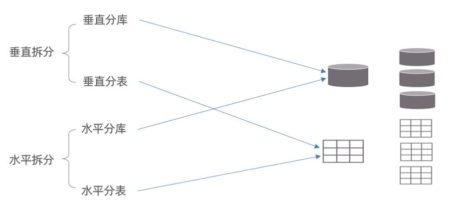


### （3）==垂直拆分==

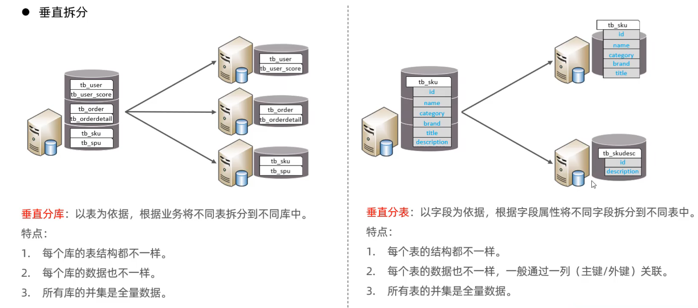

#### ①垂直分库

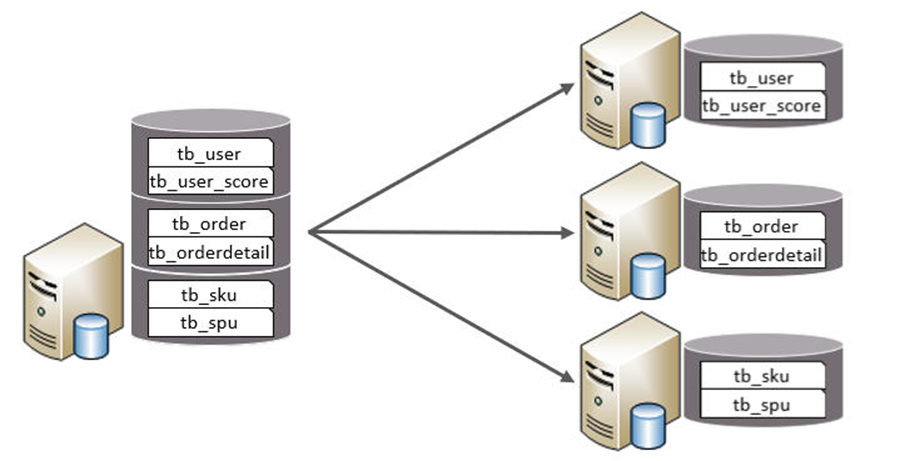

垂直分库：**以==表==为依据，根据==业务将不同表拆分到不同库中==**。


**特点：**

- 每个库的表结构都不一样。
- 每个库的数据也不一样。
- **所有库的并集是全量数据**。


#### ②垂直分表

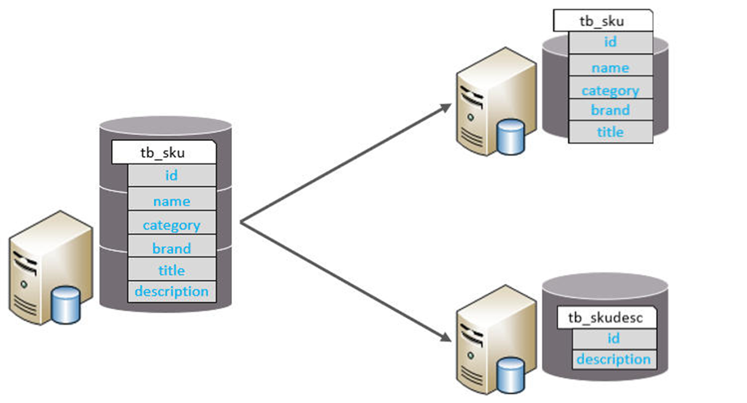

垂直分表：**以==字段==为依据**，根据**字段属性将==不同字段拆分到不同表==中**。

​	拆分依据  =》可以按照**冷热数据分离**的思想去拆分


**特点：**

- 每个表的结构都不一样。
- 每个表的数据也不一样，一般**通过一列（主键/外键）关联**。
- **所有表的并集是全量数据**。


### （4）==水平拆分==

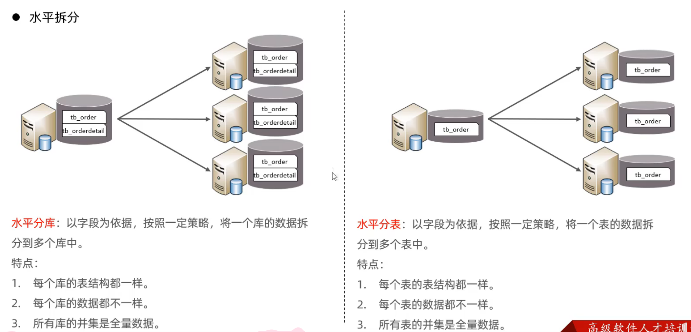

#### ①水平分库

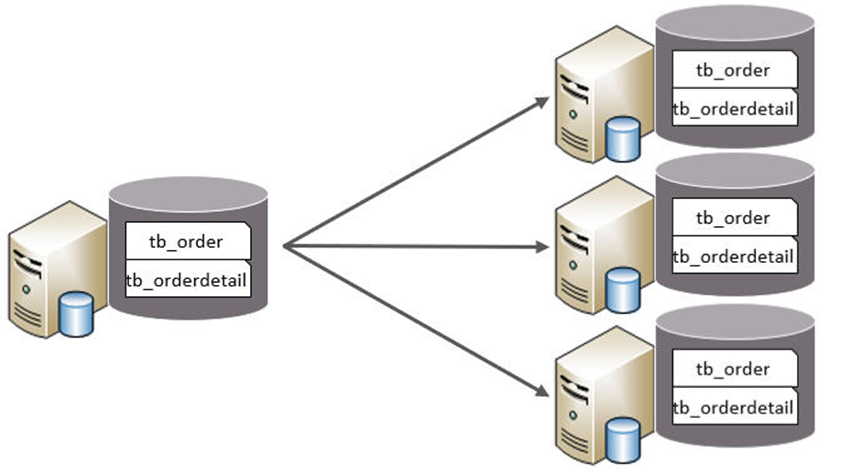

水平分库：**以字段为依据**，按照一定策略，**将==一个库的数据==拆分到多个库中**。= 》 类似于 `分页的思想`


特点：

- 每个库的**表结构都一样**。

- 每个**库**的**数据都不一样**。
- 所有库的并集是全量数据。


####  ②水平分表

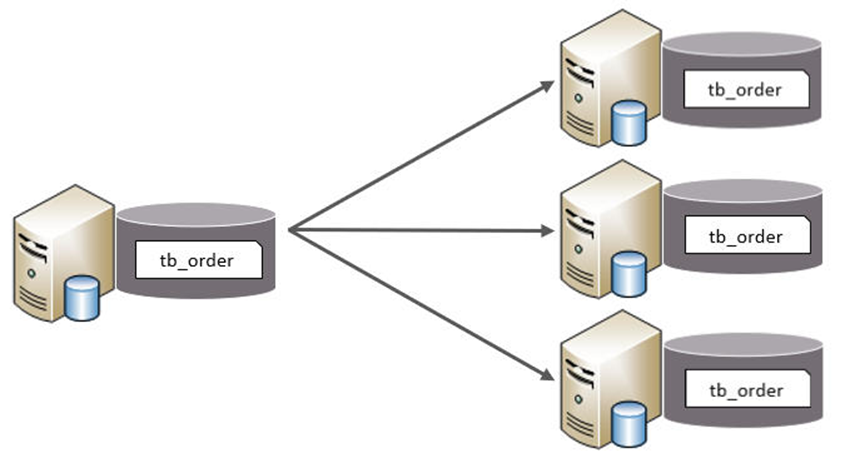

水平分表：以字段为依据，按照一定策略，**将==一个表的数据==拆分到多个表中**。

特点：

- 每个表的表结构都一样。
- **每个表的数据都不一样**。
- 所有表的并集是全量数据。


> 在业务系统中，为了缓解磁盘IO及CPU的性能瓶颈，到底是垂直拆分，还是水平拆分；具体是分库，还是分表，都需要**根据具体的业务需求**具体分析。


### （5）实现技术

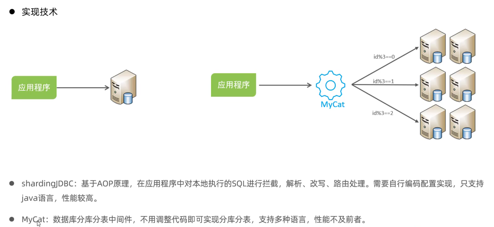


- shardingJDBC：**基于==AOP原理==**，在应用程序中对本地执行的SQL进行拦截，解析、改写、路由处理。需要自行编码配置实现，只支持java语言，**性能较高**。
- MyCat：数据库**分库分表中间件**，**不用调整代码即可实现分库分表**，支持多种语言，性能不及前者。
  - 不需要对应用程序做任何的配置和导入任何的依赖


本次课程，我们选择了是**MyCat数据库中间件**，通过MyCat中间件来完成分库分表操作。


## 3.2 MyCat概述

### （1）介绍

Mycat是开源的、活跃的、**基于Java语言编写的MySQL数据库中间件**。可以像使用mysql一样来使用mycat，对于开发人员来说根本感觉不到mycat的存在。= 》 MyCat 进行了 "伪装协议"

开发人员**只需要连接MyCat即可**，而具体底层用到几台数据库，每一台数据库服务器里面存储了什么数据，都无需关心。 具体的分库分表的策略，只需要**在MyCat中配置**即可。

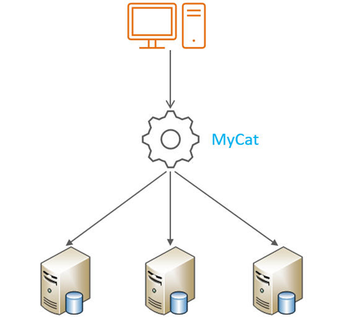

优势：

- 性能可靠稳定
- 强大的技术团队
- 体系完善
- 社区活跃


### （2）下载

下载地址：**http://mycat.org.cn/**

**本次课，使用1.6.7.3-release版本**

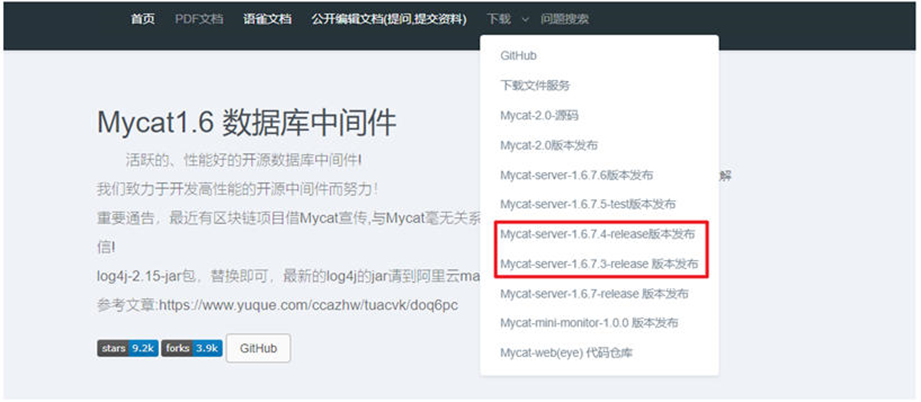


### （3）安装

Mycat是采用**java语言开发**的开源的数据库中间件，**支持Windows和Linux运行环境**，下面介绍MyCat的Linux中的环境搭建。我们需要在准备好的服务器中安装如下软件。

- **MySQL**
- **JDK**
- **Mycat**

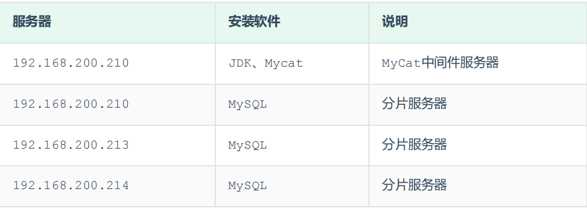

**我的服务器分配方案：**

- 192.168.88.130 =》JDK、MyCat
- 192.168.88.130 =》 Mysql 分片服务器一 , 同时也是之前学习的主库
- 192.168.88.131 =》 Mysql 分片服务器二，同时也是之前学习的从库
- 192.168.88.129 =》 Mysql 分片服务器三


具体的安装步骤： 参考资料中提供的 《MyCat安装文档》即可，里面有详细的安装及配置步骤。


#### ①JDK安装并配置环境变量

JDK具体安装步骤如下： 

##### 1. 上传安装包

使用FinalShell自带的上传工具将jdk的二进制发布包上传到Linux 

由于上述在进行文件上传时，选择的上传目录为根目录 /，上传完毕后，我们执行指令 cd / 切换到根目录下，查看上传的安装包。

 


##### 2. 解压安装包

执行如下指令，将上传上来的压缩包进行解压，并通过-C参数指定解压文件存放目录为 /usr/local。

```
tar -zxvf jdk-8u171-linux-x64.tar.gz -C /usr/local
```

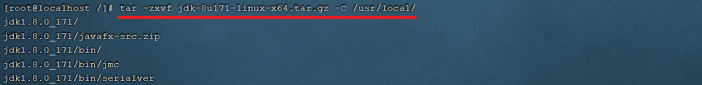 


##### 3. 配置环境变量

使用vim命令修改/etc/profile文件，在文件末尾加入如下配置

```
JAVA_HOME=/usr/local/jdk1.8.0_171
PATH=$JAVA_HOME/bin:$PATH
```

具体操作指令如下: 

```
1). 编辑/etc/profile文件，进入命令模式
	vim /etc/profile

2). 在命令模式中，输入指令 G ， 切换到文件最后
	G

3). 在命令模式中输入 i/a/o 进入插入模式，然后切换到文件最后一行
	i

4). 将上述的配置拷贝到文件中
	export JAVA_HOME=/usr/local/jdk1.8.0_171
	export PATH=$JAVA_HOME/bin:$PATH
	
5). 从插入模式，切换到指令模式
	ESC
	
6). 按:进入底行模式，然后输入wq，回车保存
	:wq
```


##### 4. 重新加载profile文件

为了使更改的配置立即生效，需要重新加载profile文件，执行命令:

```
source /etc/profile
```


##### 5. 检查安装是否成功

```
java -version
```

 


#### ②MyCat安装

##### 1. 上传Mycat压缩包到服务器

Mycat-server-1.6.7.3-release-20210913163959-linux.tar.gz 


##### 2. 解压MyCat的压缩包

```bash
tar -zxvf Mycat-server-1.6.7.3-release-20210913163959-linux.tar.gz -C /usr/local/
```

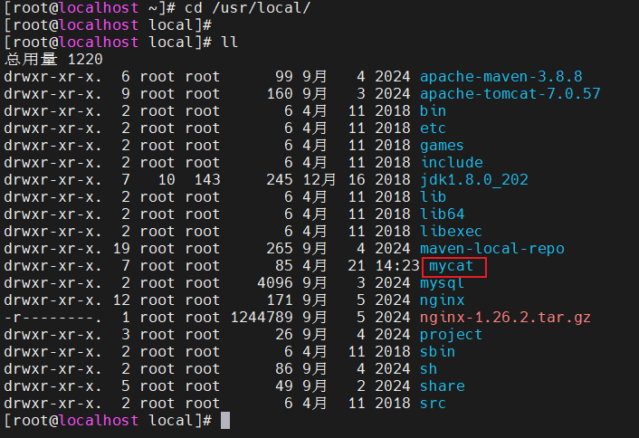


### （4）目录结构

- bin : 存放可执行文件，用于启动停止mycat
- conf：存放mycat的配置文件
- lib：存放mycat的项目依赖包（jar）
- logs：存放mycat的日志文件

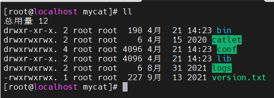

```bash
cd lib/ # 查看mycat的项目依赖包
```

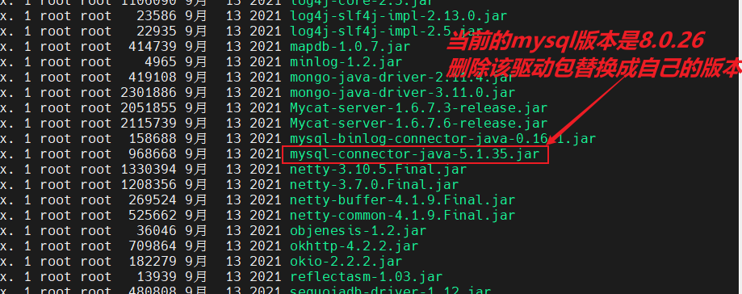

```bash
rm -rf mysql-connector-java-5.1.35.jar

chmod 777 mysql-connector-java-8.0.22.jar
```

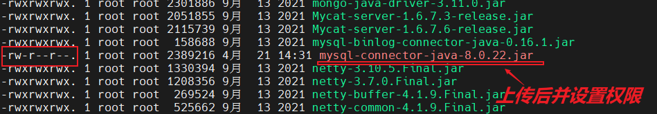

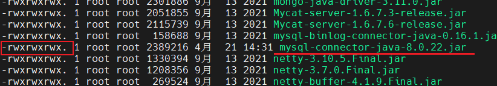


### （5）概念介绍

在MyCat的整体结构中，分为两个部分：上面的**逻辑结构**、下面的**物理结构**。

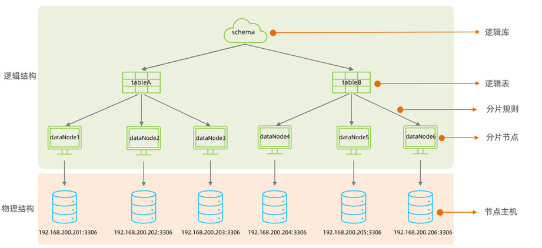

在MyCat的逻辑结构主要负责**逻辑库、逻辑表、分片规则、分片节点等逻辑结构的处理**，而具体的数据存储还是在物理结构，也就是数据库服务器中存储的。

在后面讲解MyCat入门以及MyCat分片时，还会讲到上面所提到的概念。


## 3.3 ==MyCat入门==

### （1）需求

由于 tb_order 表中数据量很大，磁盘IO及容量都到达了瓶颈，现在需要对 tb_order 表进行数据分片，**分为三个数据节点**，每一个节点主机位于不同的服务器上, 具体的结构，参考下图：

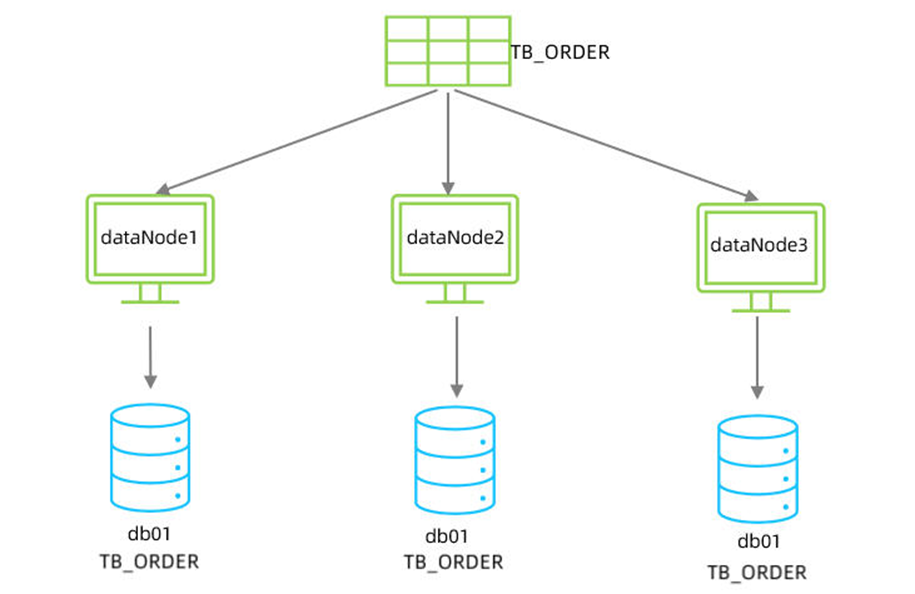

**对应水平拆分中的：水平分表**

特点：

- 每个表的表结构都一样。
- **每个表的数据都不一样**。
- 所有表的并集是全量数据。


### （2）环境配置

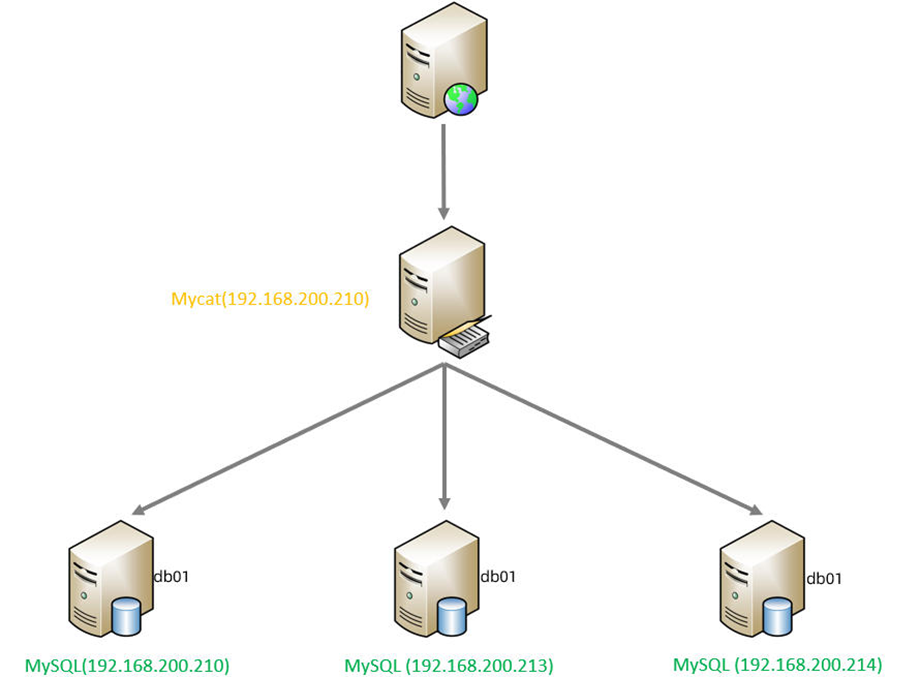

准备3台服务器：

- 192.168.200.210：MyCat中间件服务器，同时也是**第一个分片服务器**。

- 192.168.200.213：**第二个分片服务器**。

- 192.168.200.214：**第三个分片服务器**。并且在上述3台数据库中创建数据库 db01 。

  

**我的服务器分配方案：**

- 192.168.88.130 =》JDK、MyCat
- 192.168.88.130 =》 Mysql 分片服务器一 , 同时也是之前学习的主库
- 192.168.88.131 =》 Mysql 分片服务器二，同时也是之前学习的从库
- 192.168.88.129 =》 Mysql 分片服务器三


并且在上述3台数据库中**创建数据库 db01** 。


### （3）==配置==

```bash
cd /usr/local/mycat/conf
```

#### ①schema.xml

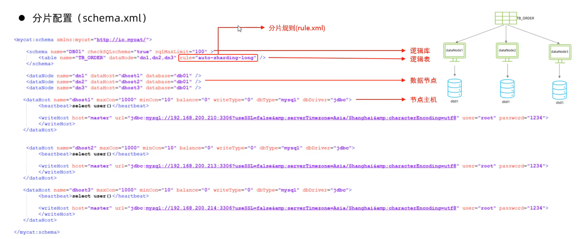

在schema.xml中配置**逻辑库、分片规则、逻辑表、数据节点、节点主机**等相关信息。具体的配置如下：

```xml
<?xml version="1.0"?>
<!DOCTYPE mycat:schema SYSTEM "schema.dtd">
<mycat:schema xmlns:mycat="http://io.mycat/">
    <schema name="DB01" checkSQLschema="true" sqlMaxLimit="100">
        <table name="TB_ORDER" dataNode="dn1,dn2,dn3" rule="auto-sharding-long"
               />
    </schema>
    <dataNode name="dn1" dataHost="dhost1" database="db01" />
    <dataNode name="dn2" dataHost="dhost2" database="db01" />
    <dataNode name="dn3" dataHost="dhost3" database="db01" />
    <dataHost name="dhost1" maxCon="1000" minCon="10" balance="0"
              writeType="0" dbType="mysql" dbDriver="jdbc" switchType="1"
              slaveThreshold="100">
        <heartbeat>select user()</heartbeat>
        <writeHost host="master" url="jdbc:mysql://192.168.88.130:3306?useSSL=false&amp;serverTimezone=Asia/Shanghai&amp;characterEncoding=utf8"
                   user="root" password="root" />
    </dataHost>
    <dataHost name="dhost2" maxCon="1000" minCon="10" balance="0"
              writeType="0" dbType="mysql" dbDriver="jdbc" switchType="1"
              slaveThreshold="100">
        <heartbeat>select user()</heartbeat>
        <writeHost host="master" url="jdbc:mysql://192.168.88.131:3306?useSSL=false&amp;serverTimezone=Asia/Shanghai&amp;characterEncoding=utf8"
                   user="root" password="root" />
    </dataHost>
    <dataHost name="dhost3" maxCon="1000" minCon="10" balance="0"
              writeType="0" dbType="mysql" dbDriver="jdbc" switchType="1"
              slaveThreshold="100">
        <heartbeat>select user()</heartbeat>
        <writeHost host="master" url="jdbc:mysql://192.168.88.129:3306?useSSL=false&amp;serverTimezone=Asia/Shanghai&amp;characterEncoding=utf8"
                   user="root" password="1234" />
    </dataHost>
</mycat:schema>
```


#### ②server.xml

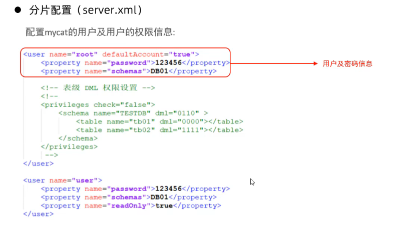

需要在server.xml中配置用户名、密码，以及用户的访问权限信息，具体的配置如下：

```xml
<user name="root" defaultAccount="true">
    <property name="password">123456</property>
    <property name="schemas">DB01</property>
    <!-- 表级 DML 权限设置 -->
    <!--
<privileges check="true">
<schema name="DB01" dml="0110" >
<table name="TB_ORDER" dml="1110"></table>
</schema>
</privileges>
-->
</user>
<user name="user">
    <property name="password">123456</property>
    <property name="schemas">DB01</property>
    <property name="readOnly">true</property>
</user>
```

上述的配置表示，定义了**两个用户 root 和 user** ，这两个用户都可以访问 **DB01 这个逻辑库**，访问密码都是123456，但是root用户访问DB01逻辑库，既可以读，又可以写，但是 user用户访问DB01逻辑库是只读的。


### （4）==测试==

#### ①启动

配置完毕后，先启动涉及到的3台分片服务器，然后启动MyCat服务器。切换到Mycat的安装目录，执行如下指令，启动Mycat：

```bash
#启动
bin/mycat start

#停止
bin/mycat stop
```

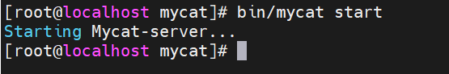

Mycat启动之后，**占用端口号 8066。**

启动完毕之后，可以**查看logs目录下的启动日志**，查看Mycat是否启动完成。

```bash
tail -f logs/wrapper.log
```

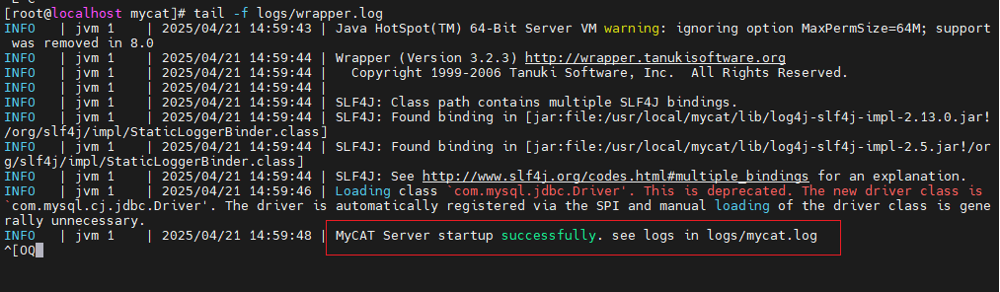


#### ②测试

#### ①连接MyCat

通过如下指令，就可以连接并登陆MyCat。

```bash
mysql -h 192.168.200.210 -P 8066 -uroot -p123456

mysql -h 192.168.88.130 -P 8066 -uroot -p123456
```

我们看到我们是通过MySQL的指令来连接的MyCat，因为MyCat在底层实际上是模拟了MySQL的协议。

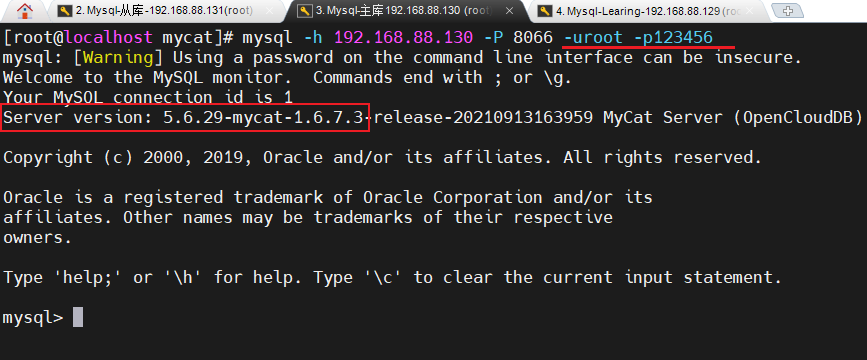

 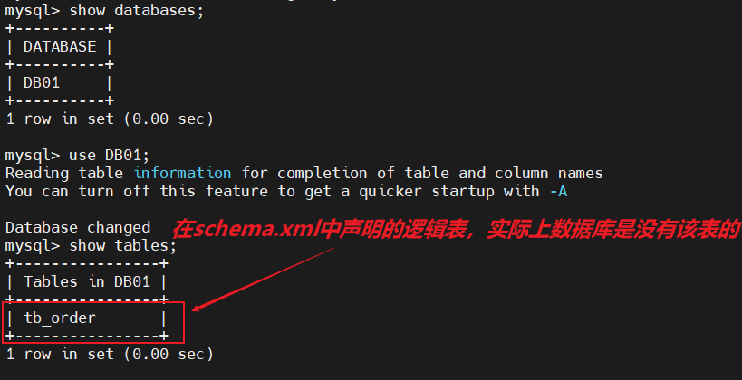


#### ②数据测试

然后就可以在MyCat中来创建表，并**往表结构中插入数据**，查看数据在MySQL中的分布情况。

在Mycat中创建了tb_order表，**==关联的三个数据节点会自动同步创建==**

```sql
CREATE TABLE TB_ORDER (
    id BIGINT(20) NOT NULL,
    title VARCHAR(100) NOT NULL ,
    PRIMARY KEY (id)
) ENGINE=INNODB DEFAULT CHARSET=utf8 ;

INSERT INTO TB_ORDER(id,title) VALUES(1,'goods1');
INSERT INTO TB_ORDER(id,title) VALUES(2,'goods2');
INSERT INTO TB_ORDER(id,title) VALUES(3,'goods3');
INSERT INTO TB_ORDER(id,title) VALUES(1,'goods1');
INSERT INTO TB_ORDER(id,title) VALUES(2,'goods2');
INSERT INTO TB_ORDER(id,title) VALUES(3,'goods3');
INSERT INTO TB_ORDER(id,title) VALUES(5000000,'goods5000000');
INSERT INTO TB_ORDER(id,title) VALUES(10000000,'goods10000000');
INSERT INTO TB_ORDER(id,title) VALUES(10000001,'goods10000001');
INSERT INTO TB_ORDER(id,title) VALUES(15000000,'goods15000000');
INSERT INTO TB_ORDER(id,title) VALUES(15000001,'goods15000001');
```


经过测试，我们发现，在往 TB_ORDER 表中插入数据时：

- 如果**id的值在1-500w之间**，数据将会存储在**第一个分片数据库**中。
- 如果id的值在**500w-1000w之间**，数据将会存储在**第二个分片数据库**中。
- 如果id的值在**1000w-1500w之间**，数据将会存储在**第三个分片数据库**中。
- 如果id的值超出1500w，在插入数据时，将会报错。

[对应-范围分片规则](#范围分片规则)

为什么会出现这种现象，数据到底落在哪一个分片服务器到底是如何决定的呢？ 这是由逻辑表配置时的一个参数 rule 决定的，而这个**参数配置的就是分片规则**，关于分片规则的配置，在后面的课程中会详细讲解。


## 3.4 ==MyCat配置==

### （1）schema.xml

schema.xml 作为MyCat中最重要的配置文件之一 , 涵盖了MyCat的**逻辑库 、 逻辑表 、 分片规则、分片节点及数据源的配置**。

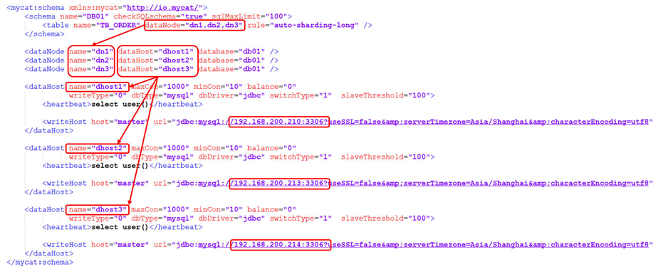

主要包含以下三组标签：

- schema标签
- datanode标签
- datahost标签


#### ①schema标签

##### 1). schema 定义==逻辑库==

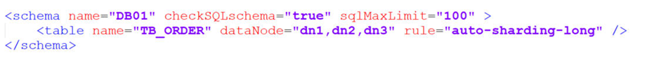

schema 标签用于定义 MyCat实例中的逻辑库 , **一个MyCat实例中, 可以有多个逻辑库** , 可以通过 schema 标签来划分不同的逻辑库。MyCat中的逻辑库的概念，**等同于MySQL中的database概念**, 需要操作某个逻辑库下的表时, 也需要**切换逻辑库(use xxx)**。


核心属性：

- name：指定自定义的**逻辑库库名** ，注意大小写问题
- checkSQLschema：在SQL语句操作时指定了数据库名称，执行时是否自动去除；true：自动去除，false：不自动去除
  - 若checkSQLschema = true，表示可以直接通过select * from **DB01.TB_ORDER**进行查询，不用先使用use xx，进行切换，再进行查询

- sqlMaxLimit：如果未指定limit进行查询，列表查询模式**最多查询多少条记录**


##### 2). schema 中的table定义==逻辑表==

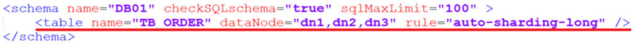

table 标签定义了MyCat中逻辑库schema下的逻辑表 , **所有需要拆分的表都需要在table标签中定义** 。

核心属性：

- name：定义逻辑表表名，在该逻辑库下唯一
- dataNode：定义逻辑表所属的dataNode，**该属性需要与dataNode标签中name对应**；多个dataNode逗号分隔
- rule：分片规则的名字，**分片规则名字是在rule.xml中定义的**
- primaryKey：逻辑表对应真实表的主键
- type：逻辑表的类型，目前逻辑表只有全局表和普通表，**如果未配置，就是普通表**；全局表，配置为 global


#### ②datanode标签

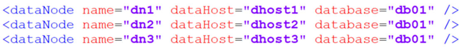

核心属性：

- name：定义数据节点名称
- dataHost：**数据库实例主机名称**，引用自 dataHost 标签中name属性
- database：定义分片**所属数据库**


#### ③datahost标签

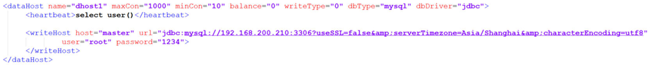

该标签在MyCat逻辑库中作为**底层标签存在**, 直接定义了**具体的数据库实例、读写分离、心跳语句**。

核心属性：

- name：唯一标识，供上层标签使用
- maxCon/minCon：最大连接数/最小连接数
- balance：**负载均衡策略**，取值 0,1,2,3
- writeType：**写操作分发方式**
  - 0：写操作转发到第一个writeHost，第一个挂了，切换到第二个；
  - 1：写操作随机分发到配置的writeHost

- dbDriver：**数据库驱动**，支持 native、jdbc


### （2）rule.xml

rule.xml中**定义所有拆分表的规则**, 在使用过程中可以灵活的使用分片算法, 或者对同一个分片算法使用不同的参数, 它**让分片过程可配置化**。主要包含两类标签：**tableRule、Function**。

 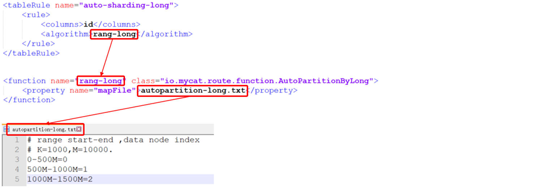


### （3）server.xml

server.xml配置文件包含了**MyCat的系统配置信息**，主要有两个重要的标签：**system、user**。

#### ① system标签

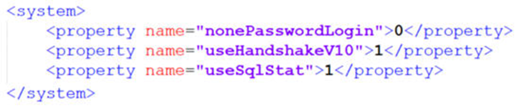

主要配置MyCat中的系统配置信息，对应的系统配置项及其含义，如下：

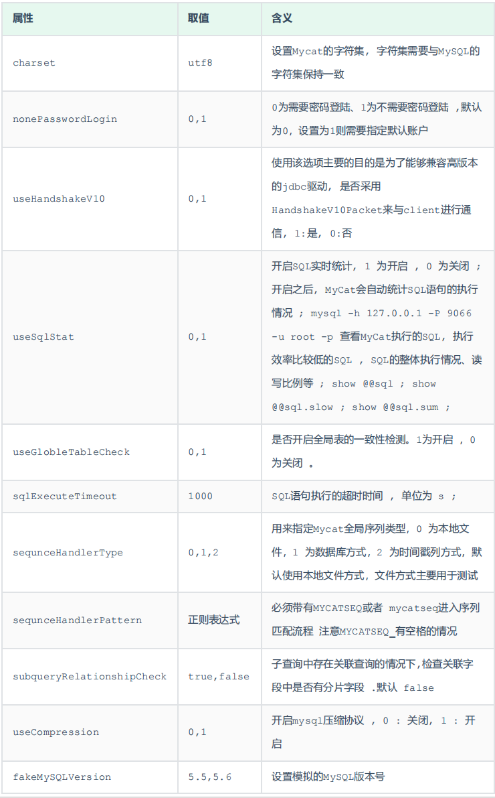


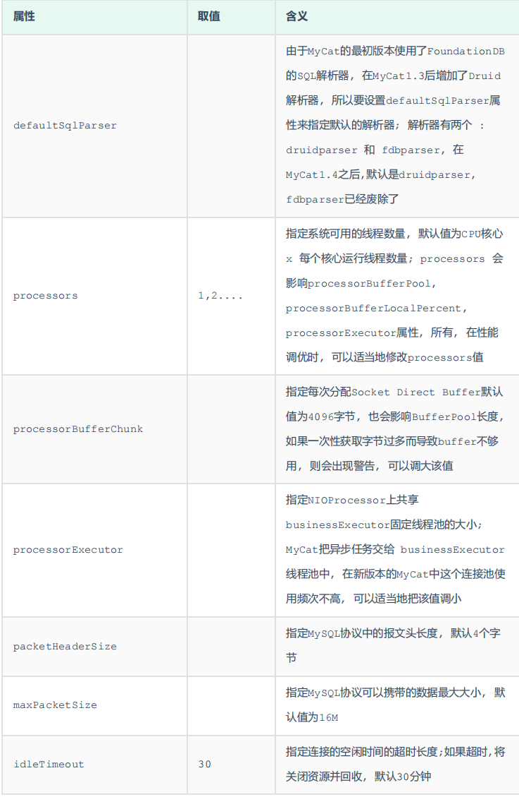


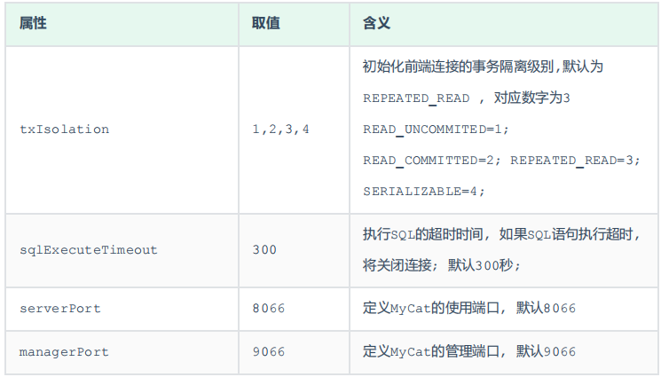


#### ② user标签

配置MyCat中的用户、访问密码，以及用户针对于逻辑库、逻辑表的**权限信息**，具体的权限描述方式及配置说明如下：

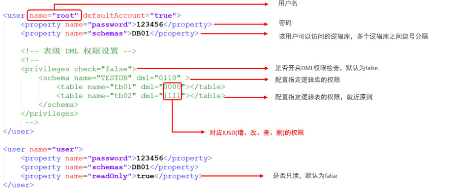

在测试权限操作时，我们只需要将 privileges 标签的注释放开。

1.  在 privileges 下的**schema标签**中**配置的dml属性配置的是逻辑库的权限**。
2.  在privileges的schema下的**table标签**的dml属性中**配置逻辑表的权限**。
3.  dml => 对应4位二进制数，分别**对应IUSD（增、改、查、删）的权限**。


## 3.5 🚀 ==MyCat分片==-分库/分表

这里的分片指的就是分库分表

### （1）垂直拆分

#### ①场景

在业务系统中, 涉及以下表结构 ,但是由于用户与订单每天都会产生大量的数据, 单台服务器的数据存储及处理能力是有限的, 可以对**数据库表进行拆分**, 原有的数据库表如下。

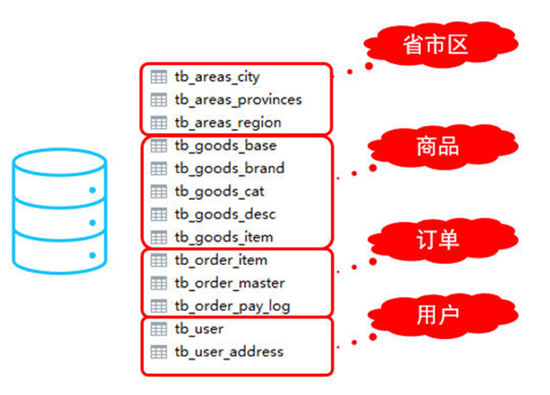

现在考虑将其进行**垂直分库操作**，将商品相关的表拆分到一个数据库服务器，订单表拆分的一个数据库服务器，用户及省市区表拆分到一个服务器。最终结构如下：

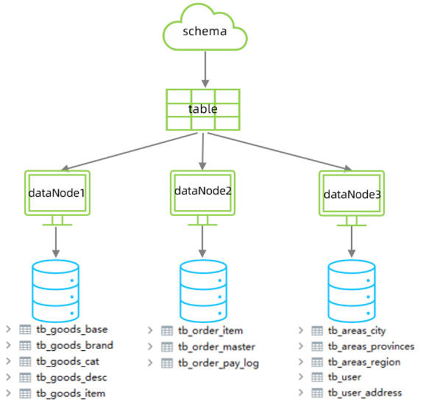


#### ②准备

准备三台服务器，IP地址如图所示：

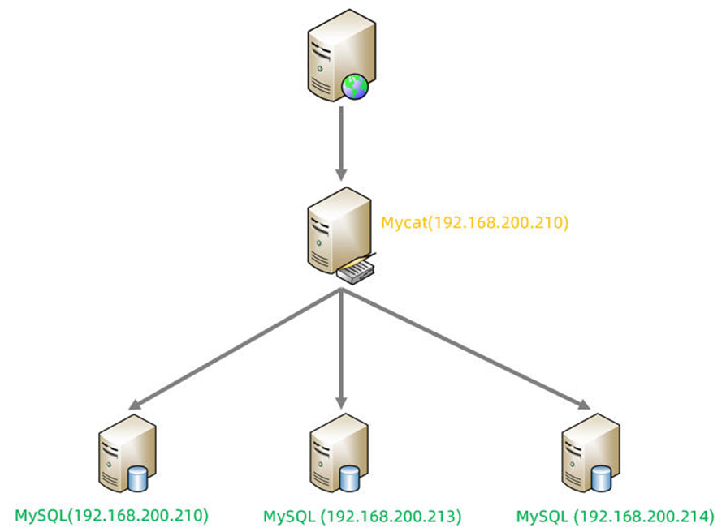

并且在192.168.200.210，192.168.200.213, 192.168.200.214上面**手动先创建数据库shopping**。

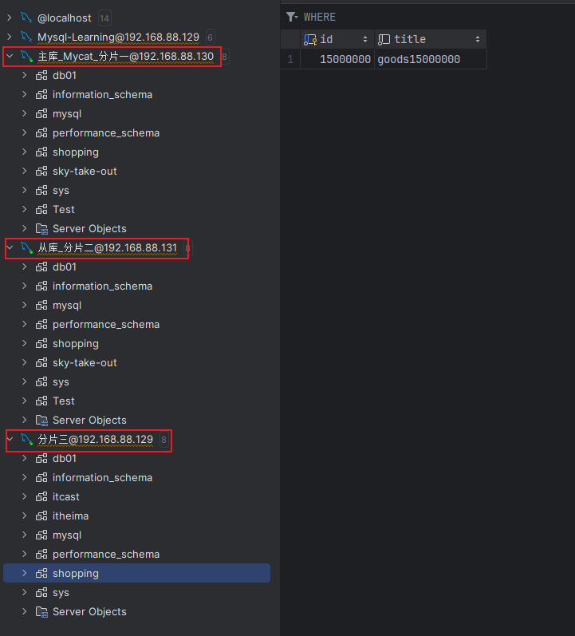


#### ③配置

##### 1). schema.xml

```bash
cd /usr/local/mycat/conf
```

```xml
<?xml version="1.0"?>
<!DOCTYPE mycat:schema SYSTEM "schema.dtd">
<mycat:schema xmlns:mycat="http://io.mycat/">
    <schema name="SHOPPING" checkSQLschema="true" sqlMaxLimit="100">
        <table name="tb_goods_base" dataNode="dn1" primaryKey="id" />
        <table name="tb_goods_brand" dataNode="dn1" primaryKey="id" />
        <table name="tb_goods_cat" dataNode="dn1" primaryKey="id" />
        <table name="tb_goods_desc" dataNode="dn1" primaryKey="goods_id" />
        <table name="tb_goods_item" dataNode="dn1" primaryKey="id" />

        <table name="tb_order_item" dataNode="dn2" primaryKey="id" />
        <table name="tb_order_master" dataNode="dn2" primaryKey="order_id" />
        <table name="tb_order_pay_log" dataNode="dn2" primaryKey="out_trade_no" />

        <table name="tb_user" dataNode="dn3" primaryKey="id" />
        <table name="tb_user_address" dataNode="dn3" primaryKey="id" />
        <table name="tb_areas_provinces" dataNode="dn3" primaryKey="id"/>
        <table name="tb_areas_city" dataNode="dn3" primaryKey="id"/>
        <table name="tb_areas_region" dataNode="dn3" primaryKey="id"/>
    </schema>

    <dataNode name="dn1" dataHost="dhost1" database="shopping" />
    <dataNode name="dn2" dataHost="dhost2" database="shopping" />
    <dataNode name="dn3" dataHost="dhost3" database="shopping" />

    <dataHost name="dhost1" maxCon="1000" minCon="10" balance="0"
              writeType="0" dbType="mysql" dbDriver="jdbc" switchType="1"
              slaveThreshold="100">
        <heartbeat>select user()</heartbeat>
        <writeHost host="master" url="jdbc:mysql://192.168.88.130:3306?useSSL=false&amp;serverTimezone=Asia/Shanghai&amp;characterEncoding=utf8"
                   user="root" password="root" />
    </dataHost>

    <dataHost name="dhost2" maxCon="1000" minCon="10" balance="0"
              writeType="0" dbType="mysql" dbDriver="jdbc" switchType="1"
              slaveThreshold="100">
        <heartbeat>select user()</heartbeat>
        <writeHost host="master" url="jdbc:mysql://192.168.88.131:3306?useSSL=false&amp;serverTimezone=Asia/Shanghai&amp;characterEncoding=utf8"
                   user="root" password="root" />
    </dataHost>

    <dataHost name="dhost3" maxCon="1000" minCon="10" balance="0"
              writeType="0" dbType="mysql" dbDriver="jdbc" switchType="1"
              slaveThreshold="100">
        <heartbeat>select user()</heartbeat>
        <writeHost host="master" url="jdbc:mysql://192.168.88.129:3306?useSSL=false&amp;serverTimezone=Asia/Shanghai&amp;characterEncoding=utf8"
                   user="root" password="1234" />
    </dataHost>
</mycat:schema>
```


##### 2). server.xml

```xml
<user name="root" defaultAccount="true">
    <property name="password">123456</property>
    <property name="schemas">SHOPPING</property>
    <!-- 表级 DML 权限设置 -->
    <!--
<privileges check="true">
<schema name="DB01" dml="0110" >
<table name="TB_ORDER" dml="1110"></table>
</schema>
</privileges>
-->
</user>
<user name="user">
    <property name="password">123456</property>
    <property name="schemas">SHOPPING</property>
    <property name="readOnly">true</property>
</user>
```


配置完毕后，**重新启动MyCat**。

```bash
#启动
bin/mycat start

#停止
bin/mycat stop
```


#### ④测试

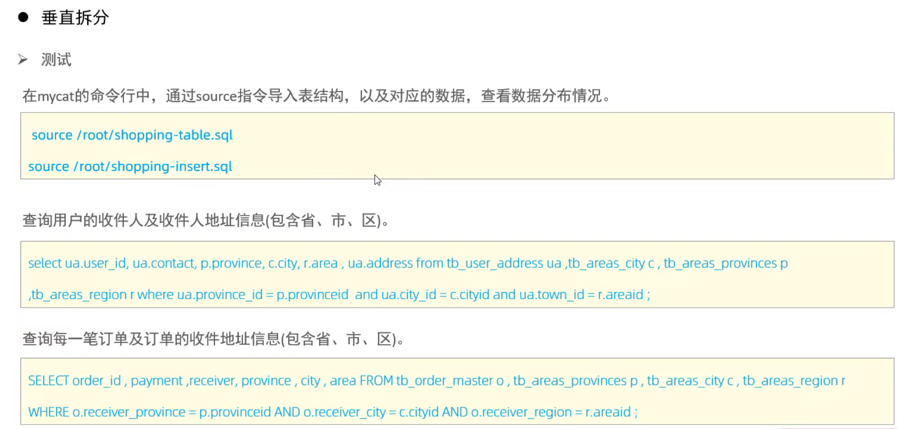

##### 1). 上传测试SQL脚本到服务器的/root目录


**登录Mycat**

```bash
mysql -h 192.168.200.210 -P 8066 -uroot -p123456
```


**具体的脚本可在`运维篇的SQL脚本的垂直拆分`中找到**

```sql
source /root/shopping-table.sql;
source /root/shopping-insert.sql;
```


##### 2). 执行指令导入测试数据

重新启动MyCat后，在mycat的命令行中，**通过source指令导入表结构，以及对应的数据**，查看数据分布情况。

```sql
source /root/shopping-table.sql

source /root/shopping-insert.sql
```

将表结构及对应的测试数据导入之后，可以检查一下**各个数据库服务器中的表结构分布情况**。 检查是否和我们准备工作中规划的服务器一致。

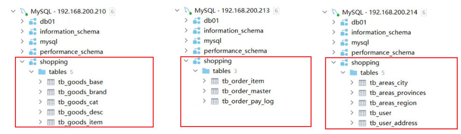


##### 3). 查询用户的收件人及收件人地址信息(包含省、市、区)。

在**MyCat的命令行**中，当我们**执行以下==多表联查==的SQL语句**时，可以正常查询出数据。

```sql
select ua.user_id, ua.contact, p.province, c.city, r.area , ua.address 
from
tb_user_address ua ,tb_areas_city c , tb_areas_provinces p ,tb_areas_region r
where ua.province_id = p.provinceid and ua.city_id = c.cityid and ua.town_id =
r.areaid ;
```

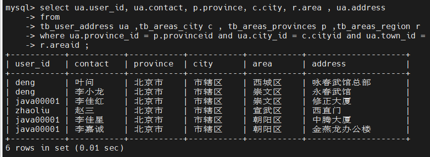


##### 4). 查询每一笔订单及订单的收件地址信息(包含省、市、区)。

实现该需求对应的SQL语句如下：

```sql
SELECT order_id , payment ,receiver, province , city , area 
FROM tb_order_master o
, tb_areas_provinces p , tb_areas_city c , tb_areas_region r 
WHERE o.receiver_province = p.provinceid AND o.receiver_city = c.cityid AND
o.receiver_region = r.areaid;
```

但是现在存在一个问题，订单相关的表结构是在 192.168.200.213 数据库服务器中，而省市区的数据库表是在 192.168.200.214 数据库服务器中。那么在MyCat中执行是否可以成功呢？


经过测试，我们看到，SQL语句执行报错。原因就是因为MyCat在执行该SQL语句时，需要往具体的数据库服务器中路由，而当前没有一个数据库服务器完全包含了订单以及省市区的表结构，**造成SQL语句失败，报错**。


对于上述的这种现象，我们如何来解决呢？ 下面我们介绍的**全局表**，就可以轻松解决这个问题。


#### ⑤==全局表==

对于省、市、区/县表tb_areas_provinces , tb_areas_city , tb_areas_region，是属于数据字典表，在多个业务模块中都可能会遇到，可以**将其设置为全局表，利于业务操作**。

修改schema.xml中的逻辑表的配置，修改 tb_areas_provinces、tb_areas_city、tb_areas_region 三个逻辑表，**==添加关联的dataNode，并增加 type 属性，配置为global==**，就代表该表是全局表，就会在所涉及到的dataNode中创建该表。对于当前配置来说，也就意味着**所有的节点中都有该表**了。

```xml
<table name="tb_areas_provinces" dataNode="dn1,dn2,dn3" primaryKey="id" type="global"/>
<table name="tb_areas_city" dataNode="dn1,dn2,dn3" primaryKey="id" type="global"/>
<table name="tb_areas_region" dataNode="dn1,dn2,dn3" primaryKey="id" type="global"/>
```

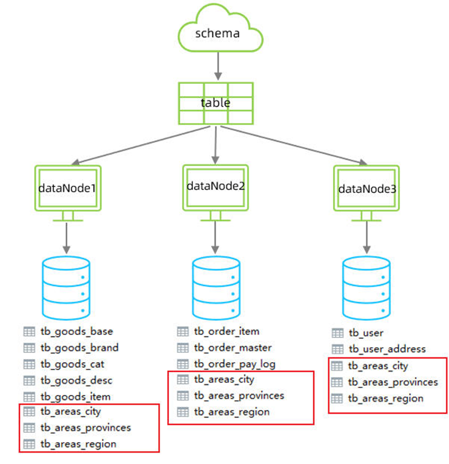

配置完毕后，**重新启动MyCat**。

```bash
#启动
bin/mycat start

#停止
bin/mycat stop
```


**1). 删除原来每一个数据库服务器中的所有表结构**

**2). 通过source指令，导入表及数据**

```sql
source /root/shopping-table.sql

source /root/shopping-insert.sql
```

**3). 检查每一个数据库服务器中的表及数据分布，看到三个节点中都有这三张全局表**

**4). 然后再次执行上面的多表联查的SQL语句**

```sql
SELECT order_id , payment ,receiver, province , city , area FROM tb_order_master o
, tb_areas_provinces p , tb_areas_city c , tb_areas_region r WHERE
o.receiver_province = p.provinceid AND o.receiver_city = c.cityid AND
o.receiver_region = r.areaid ;
```

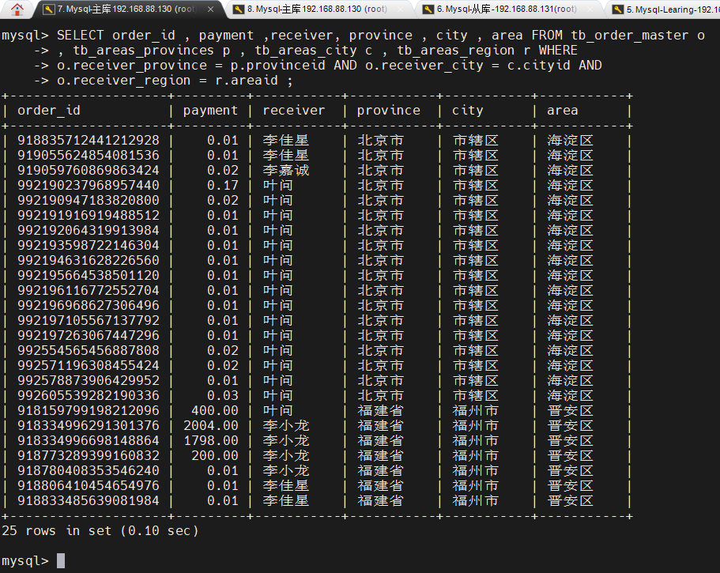

是可以正常执行成功的。

**5). 当在MyCat中更新全局表的时候，我们可以看到，所有分片节点中的数据都发生了变化，每个节点的全局表数据时刻保持一致。**


### （2）水平拆分

#### ①场景

在业务系统中, 有一张表(日志表), 业务系统每天都会产生大量的**日志数据** , 单台服务器的数据存储及处理能力是有限的, 可以对**数据库表进行拆分**。

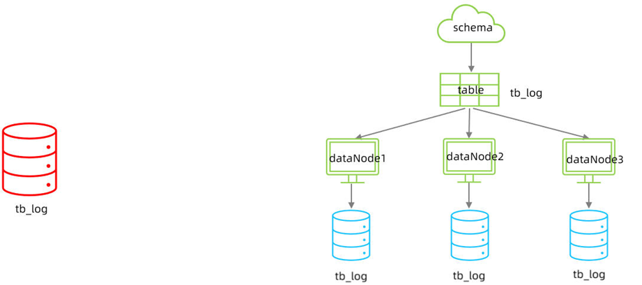

#### ②准备

准备三台服务器，具体的结构如下：

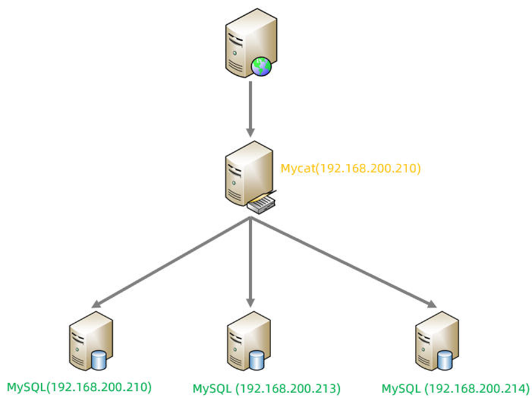

并且，在三台数据库服务器中**分别创建一个数据库itcast**。


#### ③配置

##### 1). schema.xml

```xml
<schema name="ITCAST" checkSQLschema="true" sqlMaxLimit="100">
    <table name="tb_log" dataNode="dn4,dn5,dn6" primaryKey="id" rule="mod-long" />
</schema>

<dataNode name="dn4" dataHost="dhost1" database="itcast" />
<dataNode name="dn5" dataHost="dhost2" database="itcast" />
<dataNode name="dn6" dataHost="dhost3" database="itcast" />
```

tb_log表最终落在3个节点中，分别是 dn4、dn5、dn6 ，而具体的数据分别存储在 dhost1、dhost2、dhost3的itcast数据库中。

**分片规则为：mod-long**，取模分片，默认mod 3


##### 2). server.xml

配置root用户既可以访问 SHOPPING 逻辑库，又可以访问ITCAST逻辑库。

```xml
<user name="root" defaultAccount="true">
    <property name="password">123456</property>
    <property name="schemas">SHOPPING,ITCAST</property>
    <!-- 表级 DML 权限设置 -->
    <!--
		<privileges check="true">
		<schema name="DB01" dml="0110" >
		<table name="TB_ORDER" dml="1110"></table>
		</schema>
		</privileges>
	-->
</user>
```


#### ④测试

配置完毕后，重新启动MyCat，然后在mycat的命令行中，执行如下SQL创建表、并插入数据，查看数据分布情况。

```sql
CREATE TABLE tb_log (
    id bigint(20) NOT NULL COMMENT 'ID',
    model_name varchar(200) DEFAULT NULL COMMENT '模块名',
    model_value varchar(200) DEFAULT NULL COMMENT '模块值',
    return_value varchar(200) DEFAULT NULL COMMENT '返回值',
    return_class varchar(200) DEFAULT NULL COMMENT '返回值类型',
    operate_user varchar(20) DEFAULT NULL COMMENT '操作用户',
    operate_time varchar(20) DEFAULT NULL COMMENT '操作时间',
    param_and_value varchar(500) DEFAULT NULL COMMENT '请求参数名及参数值',
    operate_class varchar(200) DEFAULT NULL COMMENT '操作类',
    operate_method varchar(200) DEFAULT NULL COMMENT '操作方法',
    cost_time bigint(20) DEFAULT NULL COMMENT '执行方法耗时, 单位 ms',
    source int(1) DEFAULT NULL COMMENT '来源 : 1 PC , 2 Android , 3 IOS',
    PRIMARY KEY (id)
) ENGINE=InnoDB DEFAULT CHARSET=utf8mb4;
```

**Insert语句**

```sql
    INSERT INTO tb_log (id, model_name, model_value, return_value, return_class, operate_user, operate_time, param_and_value, operate_class, operate_method, cost_time，source) VALUES('1','user','insert','success','java.lang.String','10001','2022-01-06 18:12:28','{\"age\":\"20\",\"name\":\"Tom\",\"gender\":\"1\"}','cn.itcast.controller.UserController','insert','10',1);
    INSERT INTO tb_log (id, model_name, model_value, return_value, return_class, operate_user, operate_time, param_and_value, operate_class, operate_method, cost_time，source) VALUES('2','user','insert','success','java.lang.String','10001','2022-01-06 18:12:27','{\"age\":\"20\",\"name\":\"Tom\",\"gender\":\"1\"}','cn.itcast.controller.UserController','insert','23',1);
    INSERT INTO tb_log (id, model_name, model_value, return_value, return_class, operate_user, operate_time, param_and_value, operate_class, operate_method, cost_time，source) VALUES('3','user','update','success','java.lang.String','10001','2022-01-06 18:16:45','{\"age\":\"20\",\"name\":\"Tom\",\"gender\":\"1\"}','cn.itcast.controller.UserController','update','34',1);
    INSERT INTO tb_log (id, model_name, model_value, return_value, return_class, operate_user, operate_time, param_and_value, operate_class, operate_method, cost_time，source) VALUES('4','user','update','success','java.lang.String','10001','2022-01-06 18:16:45','{\"age\":\"20\",\"name\":\"Tom\",\"gender\":\"1\"}','cn.itcast.controller.UserController','update','13',2);
    INSERT INTO tb_log (id, model_name, model_value, return_value, return_class, operate_user, operate_time, param_and_value, operate_class, operate_method, cost_time，source) VALUES('5','user','insert','success','java.lang.String','10001','2022-01-06 18:30:31','{\"age\":\"200\",\"name\":\"TomCat\",\"gender\":\"0\"}','cn.itcast.controller.UserController','insert','29',3);
    INSERT INTO tb_log (id, model_name, model_value, return_value, return_class, operate_user, operate_time, param_and_value, operate_class, operate_method, cost_time，source) VALUES('6','user','find','success','java.lang.String','10001','2022-01-06 18:30:31','{\"age\":\"200\",\"name\":\"TomCat\",\"gender\":\"0\"}','cn.itcast.controller.UserController','find','29',2);
```


### （3）==分片规则==

#### ①范围分片

`<span id = "范围分片规则" >` `</span>`

##### 1). 介绍

根据**指定的字段及其配置的范围**与数据节点的对应情况， 来决定该数据属于哪一个分片。

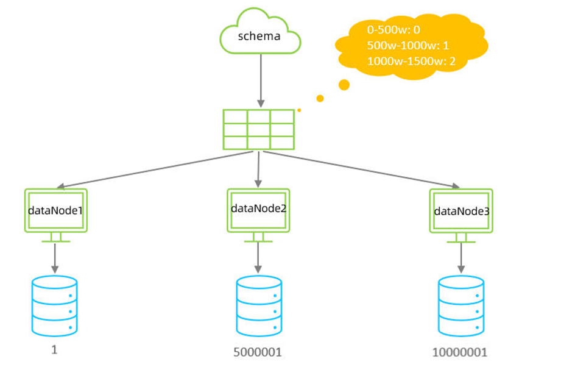

##### 2). 配置

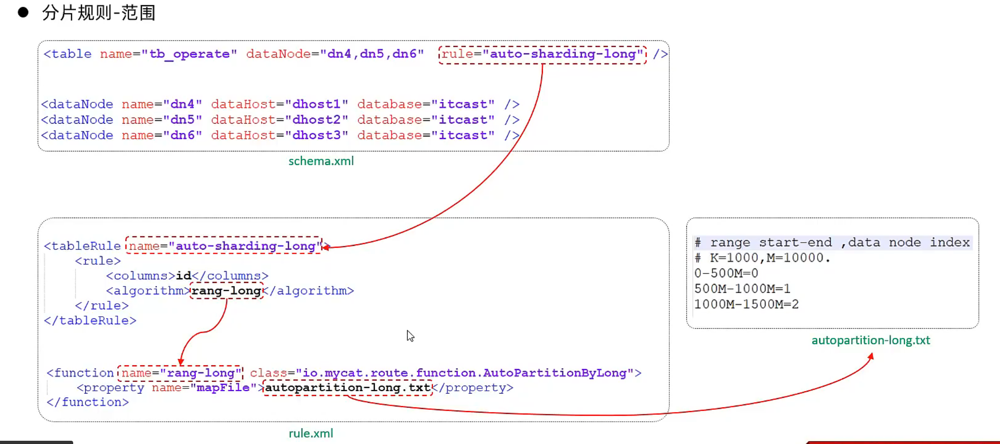

schema.xml逻辑表配置：

```xml
<table name="TB_ORDER" dataNode="dn1,dn2,dn3" rule="auto-sharding-long" />
```

schema.xml数据节点配置：

```xml
<dataNode name="dn1" dataHost="dhost1" database="db01" />
<dataNode name="dn2" dataHost="dhost2" database="db01" />
<dataNode name="dn3" dataHost="dhost3" database="db01" />
```

rule.xml分片规则配置：

```xml
<tableRule name="auto-sharding-long">
    <rule>
        <columns>id</columns>
        <algorithm>rang-long</algorithm>
    </rule>
</tableRule>

<function name="rang-long" class="io.mycat.route.function.AutoPartitionByLong">
    <property name="mapFile">autopartition-long.txt</property>
    <property name="defaultNode">0</property>
</function>
```

分片规则配置属性含义：

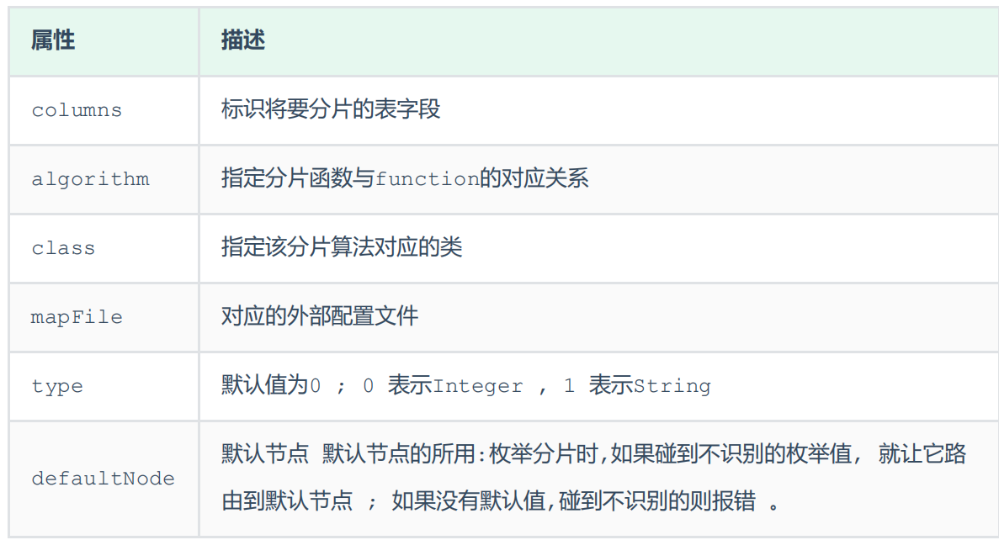

在rule.xml中配置分片规则时，关联了一个映射配置文件 autopartition-long.txt，该配置文件的配置如下：

```bash
# range start-end ,data node index
# K=1000,M=10000.
0-500M=0
500M-1000M=1
1000M-1500M=2
```

含义：0-500万之间的值，存储在0号数据节点(数据节点的索引从0开始) ； 500万-1000万之间的数据存储在1号数据节点 ； 1000万-1500万的数据节点存储在2号节点 ；

如果**超出了1500w**，比如1500w 01，则会报错，需要添加新的数据节点

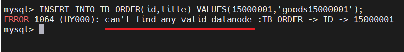


该分片规则，主要是针对于数字类型的字段适用。 在MyCat的入门程序中，我们使用的就是该分片规则。


#### ②取模分片

##### 1). 介绍

根据**指定的字段值与==节点数量进行求模==运算**，根据运算结果， 来决定该数据属于哪一个分片。

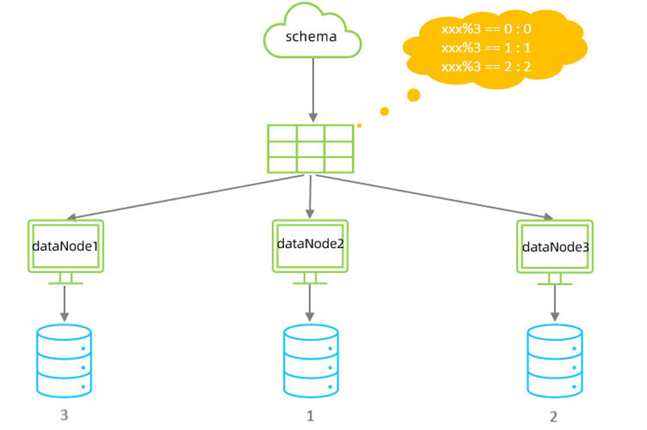

##### 2). 配置

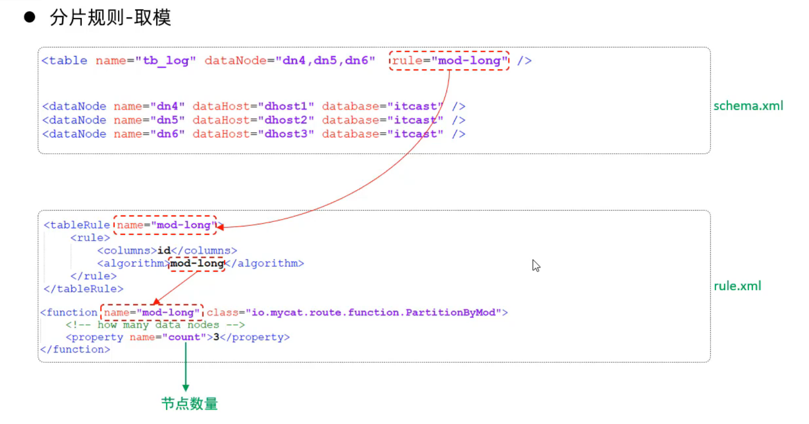

schema.xml逻辑表配置：

```xml
<!-- 取模分片 -->
<table name="tb_log" dataNode="dn4,dn5,dn6" primaryKey="id" rule="mod-long" />
```

schema.xml数据节点配置：

```xml
<dataNode name="dn4" dataHost="dhost1" database="itcast" />
<dataNode name="dn5" dataHost="dhost2" database="itcast" />
<dataNode name="dn6" dataHost="dhost3" database="itcast" />
```

rule.xml分片规则配置：

```xml
<tableRule name="mod-long">
    <rule>
        <columns>id</columns>
        <algorithm>mod-long</algorithm>
    </rule>
</tableRule>
<function name="mod-long" class="io.mycat.route.function.PartitionByMod">
    <property name="count">3</property>
</function>
```

分片规则属性说明如下：

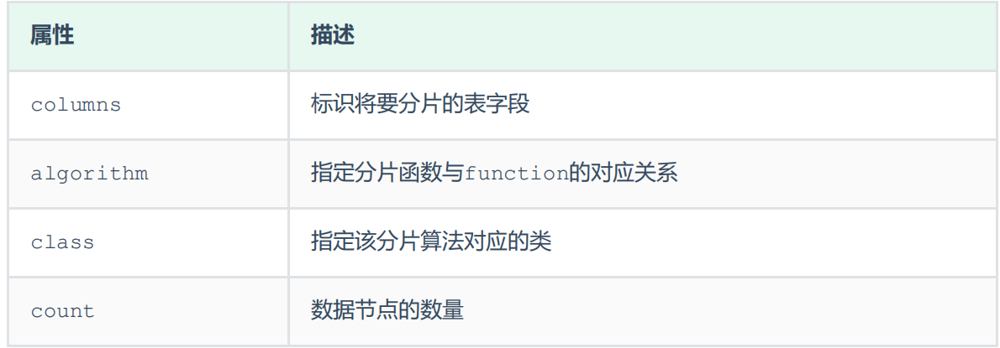

该分片规则，主要是针对于数字类型的字段适用。 在前面水平拆分的演示中，我们选择的就是取模分片。


##### 3). 测试

配置完毕后，重新启动MyCat，然后在mycat的命令行中，执行如下SQL创建表、并插入数据，查看数据分布情况。


#### ③一致性hash分片

##### 1). 介绍

所谓一致性哈希，**==相同的哈希因子计算值==总是被划分到相同的分区表中**，不会因为分区节点的增加而改变原来数据的分区位置，有效的解决了分布式数据的拓容问题。

- 一致hash说的是**节点增加不影响hash算法值**

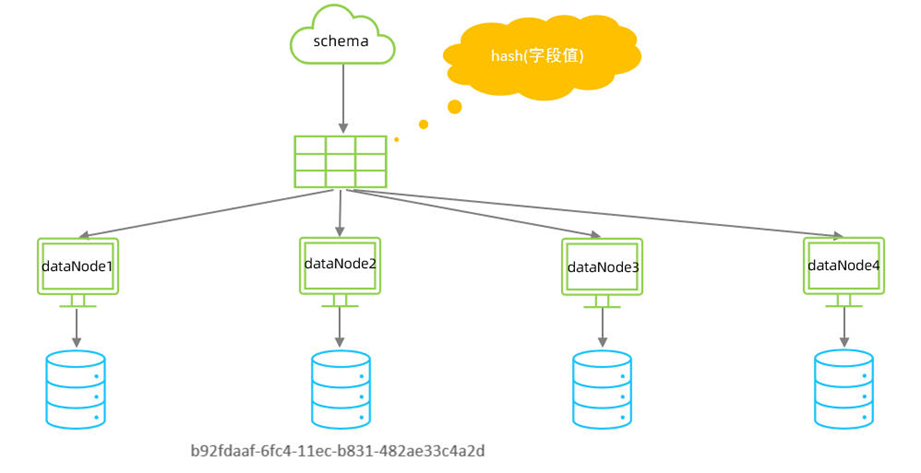


##### 2). 配置

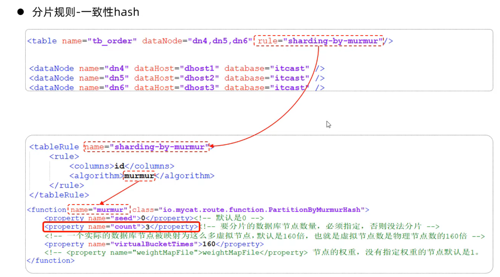

schema.xml中逻辑表配置：

```xml
<!-- 一致性hash -->
<table name="tb_order" dataNode="dn4,dn5,dn6" rule="sharding-by-murmur" />
```

schema.xml中数据节点配置：

```xml
<dataNode name="dn4" dataHost="dhost1" database="itcast" />
<dataNode name="dn5" dataHost="dhost2" database="itcast" />
<dataNode name="dn6" dataHost="dhost3" database="itcast" />
```

rule.xml中分片规则配置：

```xml
<tableRule name="sharding-by-murmur">
    <rule>
        <columns>id</columns>
        <algorithm>murmur</algorithm>
    </rule>
</tableRule>
<function name="murmur" class="io.mycat.route.function.PartitionByMurmurHash">
    <property name="seed">0</property><!-- 默认是0 -->
    <property name="count">3</property>
    <property name="virtualBucketTimes">160</property>
</function>
```

分片规则属性含义：

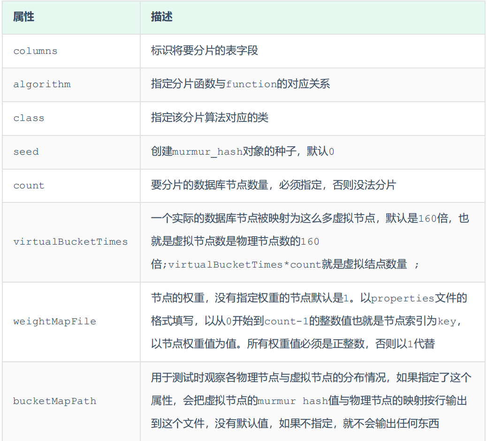


##### 3). 测试

配置完毕后，重新启动MyCat，然后在mycat的命令行中，执行如下SQL创建表、并插入数据，查看数据分布情况。

```sql
create table tb_order(
    id  varchar(100) not null primary key,
    money   int null,
    content varchar(200) null
);

INSERT INTO tb_order (id, money, content) VALUES ('b92fdaaf-6fc4-11ec-b831-482ae33c4a2d', 10, 'b92fdaf8-6fc4-11ec-b831-482ae33c4a2d');
INSERT INTO tb_order (id, money, content) VALUES ('b93482b6-6fc4-11ec-b831-482ae33c4a2d', 20, 'b93482d5-6fc4-11ec-b831-482ae33c4a2d');
INSERT INTO tb_order (id, money, content) VALUES ('b937e246-6fc4-11ec-b831-482ae33c4a2d', 50, 'b937e25d-6fc4-11ec-b831-482ae33c4a2d');
INSERT INTO tb_order (id, money, content) VALUES ('b93be2dd-6fc4-11ec-b831-482ae33c4a2d', 100, 'b93be2f9-6fc4-11ec-b831-482ae33c4a2d');
INSERT INTO tb_order (id, money, content) VALUES ('b93f2d68-6fc4-11ec-b831-482ae33c4a2d', 130, 'b93f2d7d-6fc4-11ec-b831-482ae33c4a2d');
INSERT INTO tb_order (id, money, content) VALUES ('b9451b98-6fc4-11ec-b831-482ae33c4a2d', 30, 'b9451bcc-6fc4-11ec-b831-482ae33c4a2d');
INSERT INTO tb_order (id, money, content) VALUES ('b9488ec1-6fc4-11ec-b831-482ae33c4a2d', 560, 'b9488edb-6fc4-11ec-b831-482ae33c4a2d');
INSERT INTO tb_order (id, money, content) VALUES ('b94be6e6-6fc4-11ec-b831-482ae33c4a2d', 10, 'b94be6ff-6fc4-11ec-b831-482ae33c4a2d');
INSERT INTO tb_order (id, money, content) VALUES ('b94ee10d-6fc4-11ec-b831-482ae33c4a2d', 123, 'b94ee12c-6fc4-11ec-b831-482ae33c4a2d');
INSERT INTO tb_order (id, money, content) VALUES ('b952492a-6fc4-11ec-b831-482ae33c4a2d', 145, 'b9524945-6fc4-11ec-b831-482ae33c4a2d');
INSERT INTO tb_order (id, money, content) VALUES ('b95553ac-6fc4-11ec-b831-482ae33c4a2d', 543, 'b95553c8-6fc4-11ec-b831-482ae33c4a2d');
INSERT INTO tb_order (id, money, content) VALUES ('b9581cdd-6fc4-11ec-b831-482ae33c4a2d', 17, 'b9581cfa-6fc4-11ec-b831-482ae33c4a2d');
INSERT INTO tb_order (id, money, content) VALUES ('b95afc0f-6fc4-11ec-b831-482ae33c4a2d', 18, 'b95afc2a-6fc4-11ec-b831-482ae33c4a2d');
INSERT INTO tb_order (id, money, content) VALUES ('b95daa99-6fc4-11ec-b831-482ae33c4a2d', 134, 'b95daab2-6fc4-11ec-b831-482ae33c4a2d');
INSERT INTO tb_order (id, money, content) VALUES ('b9667e3c-6fc4-11ec-b831-482ae33c4a2d', 156, 'b9667e60-6fc4-11ec-b831-482ae33c4a2d');
INSERT INTO tb_order (id, money, content) VALUES ('b96ab489-6fc4-11ec-b831-482ae33c4a2d', 175, 'b96ab4a5-6fc4-11ec-b831-482ae33c4a2d');
INSERT INTO tb_order (id, money, content) VALUES ('b96e2942-6fc4-11ec-b831-482ae33c4a2d', 180, 'b96e295b-6fc4-11ec-b831-482ae33c4a2d');
INSERT INTO tb_order (id, money, content) VALUES ('b97092ec-6fc4-11ec-b831-482ae33c4a2d', 123, 'b9709306-6fc4-11ec-b831-482ae33c4a2d');
INSERT INTO tb_order (id, money, content) VALUES ('b973727a-6fc4-11ec-b831-482ae33c4a2d', 230, 'b9737293-6fc4-11ec-b831-482ae33c4a2d');
INSERT INTO tb_order (id, money, content) VALUES ('b978840f-6fc4-11ec-b831-482ae33c4a2d', 560, 'b978843c-6fc4-11ec-b831-482ae33c4a2d');
```


#### ④枚举分片

##### 1). 介绍

通过在配置文件中**配置可能的枚举值**, 指定数据分布到不同数据节点上, 本规则适用于**按照省份、性别、状态拆分数据**等业务 。

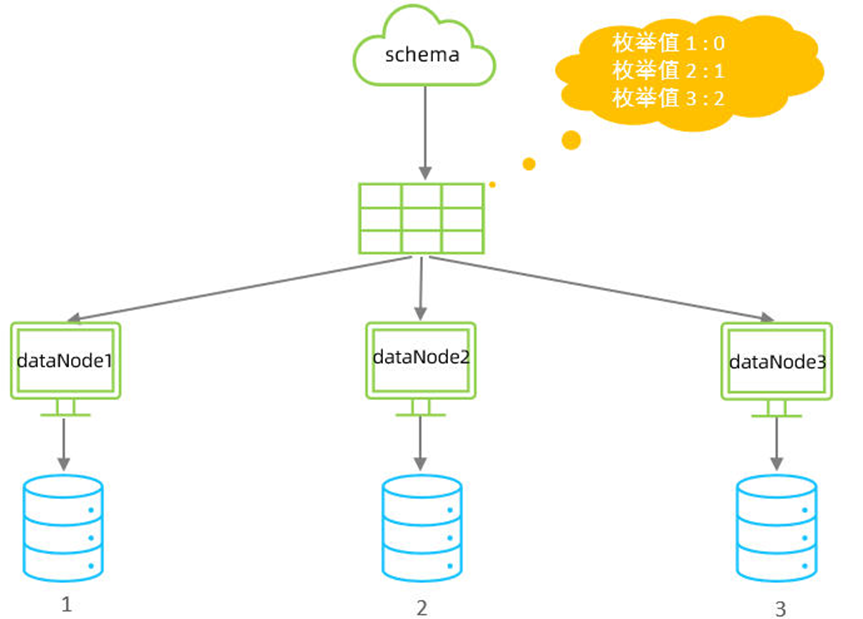

##### 2). 配置

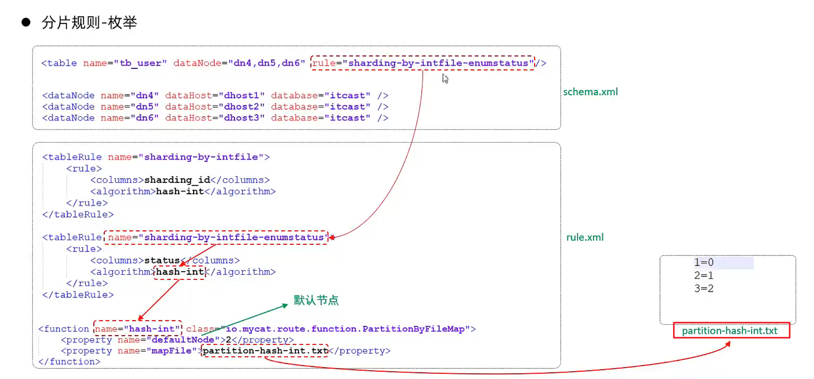

**这里按照tb_user表的 status字段 进行枚举分片，该status对应三个状态1,2,3**

schema.xml中逻辑表配置：

```xml
<!-- 枚举 -->
        <table name="tb_user" dataNode="dn4,dn5,dn6" rule="sharding-by-intfile-enumstatus"/>
        <!-- 自己增加 tableRule: "sharding-by-intfile-enumstatus" -->
```

schema.xml中数据节点配置：

```xml
<dataNode name="dn4" dataHost="dhost1" database="itcast" />
<dataNode name="dn5" dataHost="dhost2" database="itcast" />
<dataNode name="dn6" dataHost="dhost3" database="itcast" />
```

rule.xml中分片规则配置：

```xml
<tableRule name="sharding-by-intfile">
    <rule>
        <columns>sharding_id</columns>
        <algorithm>hash-int</algorithm>
    </rule>
</tableRule>
<!-- 自己增加 tableRule -->
<tableRule name="sharding-by-intfile-enumstatus">
    <rule>
        <columns>status</columns>
        <algorithm>hash-int</algorithm>
    </rule>
</tableRule>

<function name="hash-int" class="io.mycat.route.function.PartitionByFileMap">
    <!-- defaultNode表示，若没有找到对应匹配的枚举，则使用默认配置的数据节点 -->
    <property name="defaultNode">2</property>
    <property name="mapFile">partition-hash-int.txt</property>
</function>
```

partition-hash-int.txt ，内容如下 :

```bash
1=0
2=1
3=2
```

分片规则属性含义：

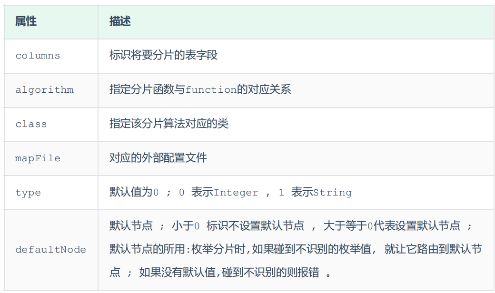

##### 3). 测试

配置完毕后，重新启动MyCat，然后在mycat的命令行中，执行如下SQL创建表、并插入数据，**查看数据分布情况。**

```sql
CREATE TABLE tb_user (
    id bigint(20) NOT NULL COMMENT 'ID',
    username varchar(200) DEFAULT NULL COMMENT '姓名',
    status int(2) DEFAULT '1' COMMENT '1: 未启用, 2: 已启用, 3: 已关闭',
    PRIMARY KEY (`id`)
) ENGINE=InnoDB DEFAULT CHARSET=utf8mb4;

insert into tb_user (id,username ,status) values(1,'Tom',1);
insert into tb_user (id,username ,status) values(2,'Cat',2);
insert into tb_user (id,username ,status) values(3,'Rose',3);
insert into tb_user (id,username ,status) values(4,'Coco',2);
insert into tb_user (id,username ,status) values(5,'Lily',1);
insert into tb_user (id,username ,status) values(6,'Tom',1);
insert into tb_user (id,username ,status) values(7,'Cat',2);
insert into tb_user (id,username ,status) values(8,'Rose',3);
insert into tb_user (id,username ,status) values(9,'Coco',2);
insert into tb_user (id,username ,status) values(10,'Lily',1);
```


#### ⑤应用指定算法

##### 1). 介绍

运行阶段由应用自主决定路由到那个分片 , **直接根据字符子串（必须是数字）计算分片号**。

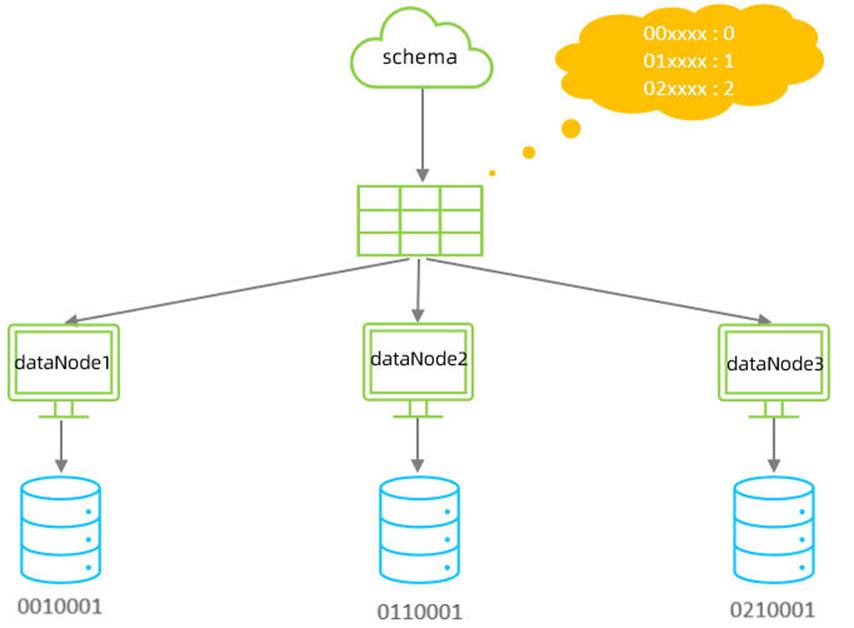

##### 2). 配置

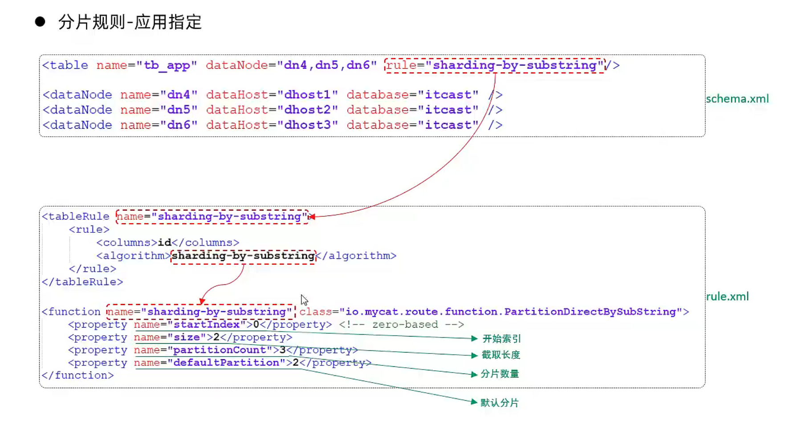

schema.xml中逻辑表配置：

```xml
<!-- 应用指定算法 -->
<table name="tb_app" dataNode="dn4,dn5,dn6" rule="sharding-by-substring" />
```

schema.xml中数据节点配置：

```xml
<dataNode name="dn4" dataHost="dhost1" database="itcast" />
<dataNode name="dn5" dataHost="dhost2" database="itcast" />
<dataNode name="dn6" dataHost="dhost3" database="itcast" />
```

rule.xml中分片规则配置：

```xml
<tableRule name="sharding-by-substring">
    <rule>
        <columns>id</columns>
        <algorithm>sharding-by-substring</algorithm>
    </rule>
</tableRule>

<function name="sharding-by-substring"
          class="io.mycat.route.function.PartitionDirectBySubString">
    <property name="startIndex">0</property> <!-- zero-based -->
    <property name="size">2</property>
    <property name="partitionCount">3</property>
    <property name="defaultPartition">0</property>
</function>
```

分片规则属性含义：

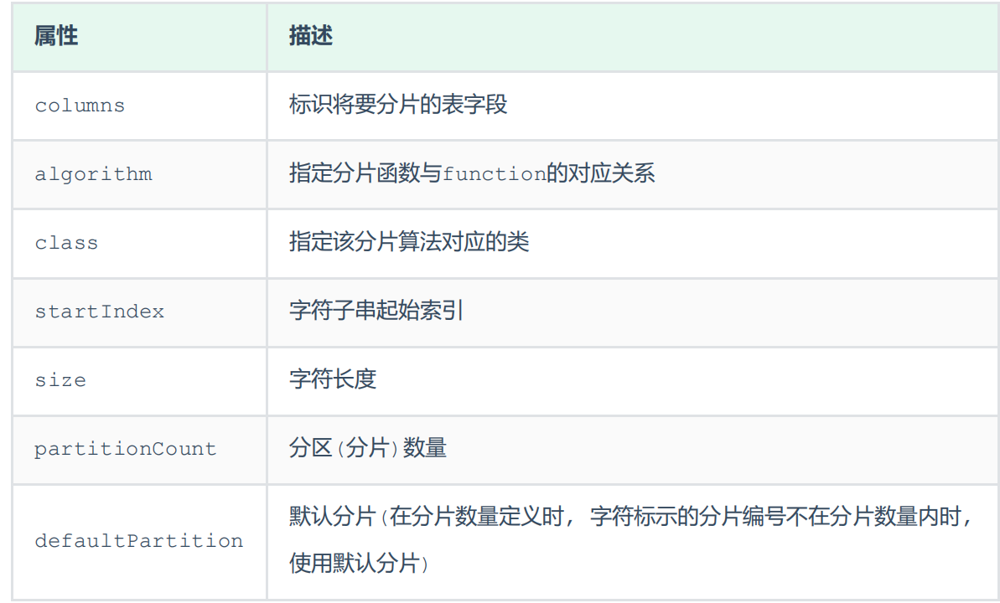

示例说明 :

id=05-100000002 , 在此配置中代表根据id中从 startIndex=0，开始，截取siz=2位数字即05，05就是获取的分区，**如果没找到对应的分片则默认分配到defaultPartition** 。


##### 3). 测试

配置完毕后，重新启动MyCat，然后在mycat的命令行中，执行如下SQL创建表、并插入数据，查看数据分布情况。

```sql
CREATE TABLE tb_app (
    id varchar(10) NOT NULL COMMENT 'ID',
    name varchar(200) DEFAULT NULL COMMENT '名称',
    PRIMARY KEY (`id`)
) ENGINE=InnoDB DEFAULT CHARSET=utf8mb4;

insert into tb_app (id,name) values('0000001','Testx00001');
insert into tb_app (id,name) values('0100001','Test100001');
insert into tb_app (id,name) values('0100002','Test200001');
insert into tb_app (id,name) values('0200001','Test300001');
insert into tb_app (id,name) values('0200002','TesT400001');
```


#### ⑥固定分片hash算法

##### 1). 介绍

该算法类似于十进制的求模运算，但是为二进制的操作。

例如，**取 id 的二进制低 10 位 与1111111111 进行位 & 运算**

- 位与运算最小值为 0000000000，最大值为1111111111，转换为十进制，也就是位于**0-1023之间**。

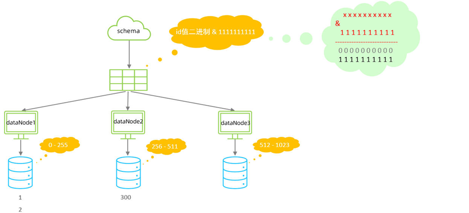

特点：

- 如果是求模，连续的值，分别分配到各个不同的分片；但是此算法**==会将连续的值可能分配到相同的分片，降低事务处理的难度==。**
- 可以均匀分配，也可以非均匀分配。
- **分片字段必须为数字类型**。


##### 2). 配置

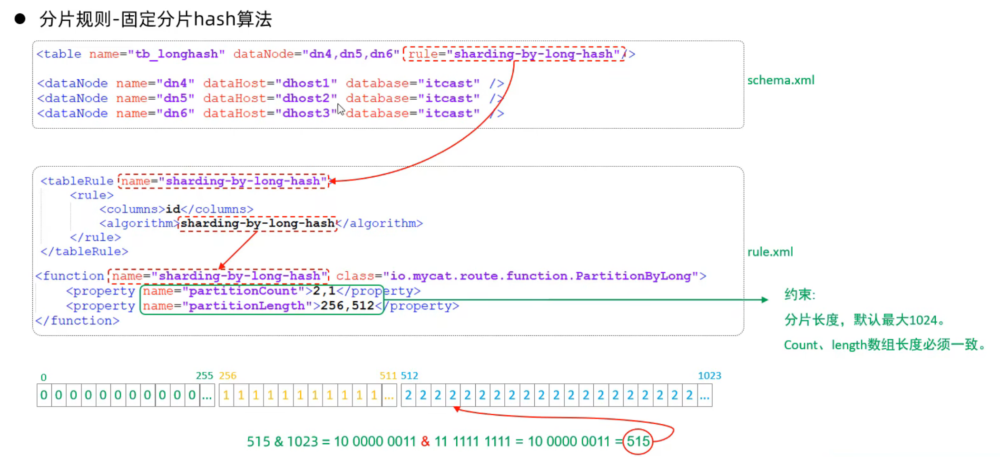

schema.xml中逻辑表配置：

```xml
<!-- 固定分片hash算法 -->
<table name="tb_longhash" dataNode="dn4,dn5,dn6" rule="sharding-by-long-hash" />
```

schema.xml中数据节点配置：

```xml
<dataNode name="dn4" dataHost="dhost1" database="itcast" />
<dataNode name="dn5" dataHost="dhost2" database="itcast" />
<dataNode name="dn6" dataHost="dhost3" database="itcast" />
```

rule.xml中分片规则配置：

```xml
<tableRule name="sharding-by-long-hash">
    <rule>
        <columns>id</columns>
        <algorithm>sharding-by-long-hash</algorithm>
    </rule>
</tableRule>

<!-- 分片总长度为1024，count与length数组长度必须一致； -->
<function name="sharding-by-long-hash"
          class="io.mycat.route.function.PartitionByLong">
    <property name="partitionCount">2,1</property>
    <property name="partitionLength">256,512</property>
</function>
```

分片规则属性含义：

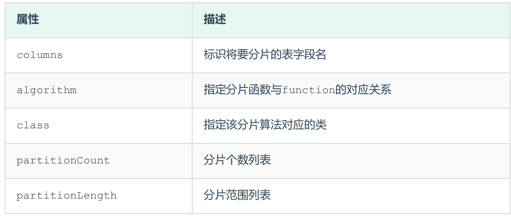

约束 :

- 1). 分片长度 : 默认最大2^10 , 为 1024 ;
- 2). count, length的数组长度必须是一致的 ;

以上**分为三个分区:0-255,256-511,512-1023**


示例说明 :

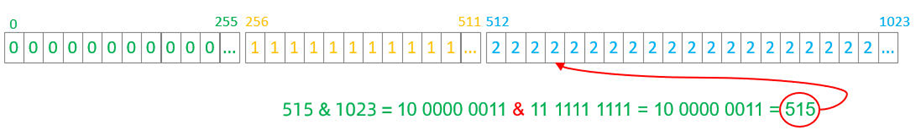


##### 3). 测试

配置完毕后，重新启动MyCat，然后在mycat的命令行中，执行如下SQL创建表、并插入数据，查看数据分布情况。

```sql
CREATE TABLE tb_longhash (
    id int(11) NOT NULL COMMENT 'ID',
    name varchar(200) DEFAULT NULL COMMENT '名称',
    firstChar char(1) COMMENT '首字母',
    PRIMARY KEY (`id`)
) ENGINE=InnoDB DEFAULT CHARSET=utf8mb4;

insert into tb_longhash (id,name,firstChar) values(1,'七匹狼','Q');
insert into tb_longhash (id,name,firstChar) values(2,'八匹狼','B');
insert into tb_longhash (id,name,firstChar) values(3,'九匹狼','J');
insert into tb_longhash (id,name,firstChar) values(4,'十匹狼','S');
insert into tb_longhash (id,name,firstChar) values(5,'六匹狼','L');
insert into tb_longhash (id,name,firstChar) values(6,'五匹狼','W');
insert into tb_longhash (id,name,firstChar) values(7,'四匹狼','S');
insert into tb_longhash (id,name,firstChar) values(8,'三匹狼','S');
insert into tb_longhash (id,name,firstChar) values(9,'两匹狼','L');
```


#### ⑦字符串hash解析算法

##### 1). 介绍

**截取字符串中的指定位置的子字符串, 进行hash算法**， 算出分片。

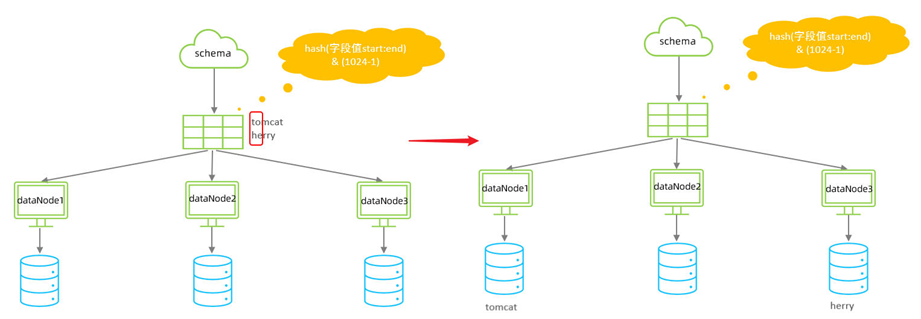

##### 2). 配置

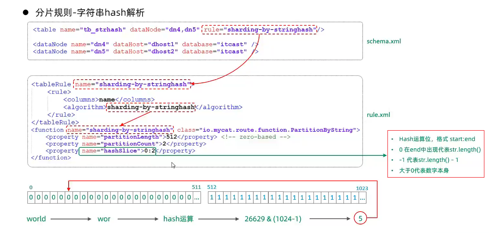

schema.xml中逻辑表配置：

```xml
<!-- 字符串hash解析算法 -->
<table name="tb_strhash" dataNode="dn4,dn5" rule="sharding-by-stringhash" />
```

schema.xml中数据节点配置：

```xml
<dataNode name="dn4" dataHost="dhost1" database="itcast" />
<dataNode name="dn5" dataHost="dhost2" database="itcast" />
```

rule.xml中分片规则配置：

```xml
<tableRule name="sharding-by-stringhash">
    <rule>
        <columns>name</columns>
        <algorithm>sharding-by-stringhash</algorithm>
    </rule>
</tableRule>

<function name="sharding-by-stringhash"
          class="io.mycat.route.function.PartitionByString">
    <property name="partitionLength">512</property> <!-- zero-based -->
    <property name="partitionCount">2</property>
    <property name="hashSlice">0:2</property>
</function>
```

分片规则属性含义：

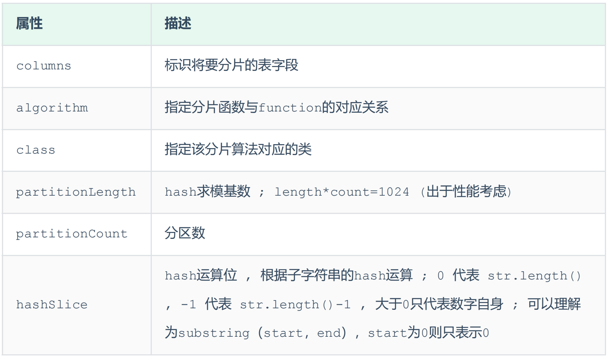

示例说明：

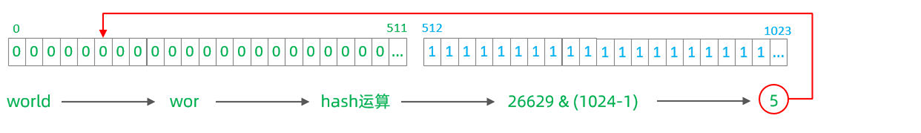

##### 3). 测试

配置完毕后，重新启动MyCat，然后在mycat的命令行中，执行如下SQL创建表、并插入数据，查看数据分布情况。

```sql
create table tb_strhash(
    name varchar(20) primary key,
    content varchar(100)
)engine=InnoDB DEFAULT CHARSET=utf8mb4;

INSERT INTO tb_strhash (name,content) VALUES('T1001', UUID());
INSERT INTO tb_strhash (name,content) VALUES('ROSE', UUID());
INSERT INTO tb_strhash (name,content) VALUES('JERRY', UUID());
INSERT INTO tb_strhash (name,content) VALUES('CRISTINA', UUID());
INSERT INTO tb_strhash (name,content) VALUES('TOMCAT', UUID());
```


#### ⑧按天分片算法

##### 1). 介绍

按照**日期及对应的时间周期**来分片。

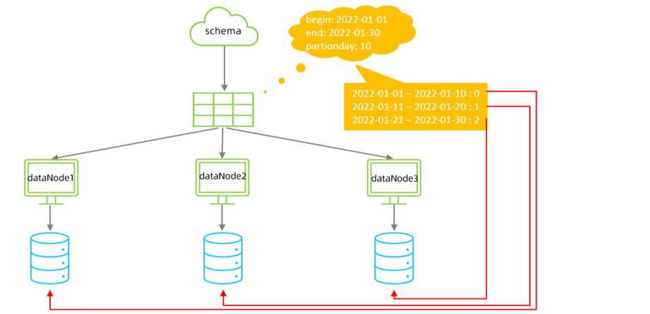

##### 2). 配置

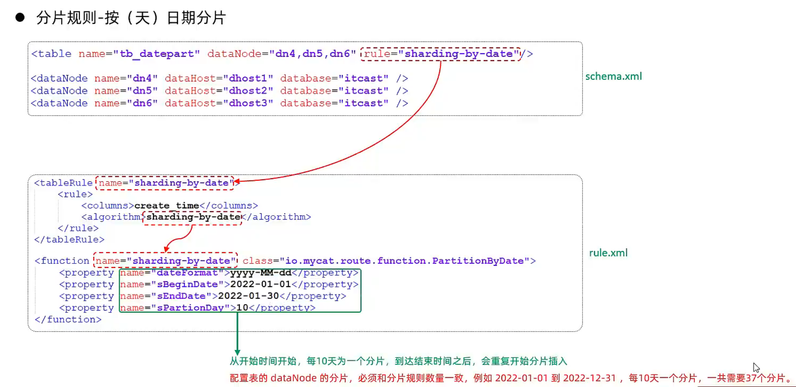

schema.xml中逻辑表配置：

```xml
<!-- 按天分片 -->
<table name="tb_datepart" dataNode="dn4,dn5,dn6" rule="sharding-by-date" />
```

schema.xml中数据节点配置：

```xml
<dataNode name="dn4" dataHost="dhost1" database="itcast" />
<dataNode name="dn5" dataHost="dhost2" database="itcast" />
<dataNode name="dn6" dataHost="dhost3" database="itcast" /
```

rule.xml中分片规则配置：

```xml
<tableRule name="sharding-by-date">
    <rule>
        <columns>create_time</columns>
        <algorithm>sharding-by-date</algorithm>
    </rule>
</tableRule>

<function name="sharding-by-date"
          class="io.mycat.route.function.PartitionByDate">
    <property name="dateFormat">yyyy-MM-dd</property>
    <property name="sBeginDate">2022-01-01</property>
    <property name="sEndDate">2022-01-30</property>
    <property name="sPartionDay">10</property>
</function>
	<!--
		从开始时间开始，每10天为一个分片，到达结束时间之后，会重复开始分片插入。
		配置表的 dataNode 的分片，必须和分片规则数量一致，
		例如 2022-01-01 到 2022-12-31 ，每10天一个分片，一共需要37个分片。
	-->
```

分片规则属性含义：

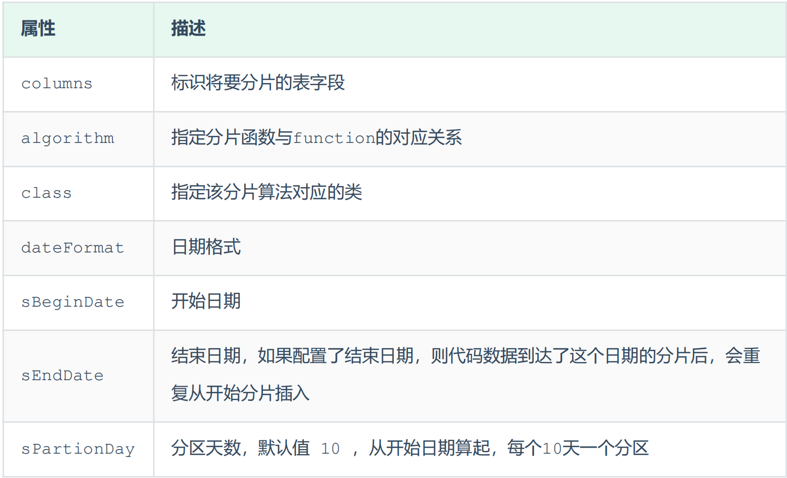


##### 3). 测试

配置完毕后，重新启动MyCat，然后在mycat的命令行中，执行如下SQL创建表、并插入数据，查看数据分布情况。

```sql
create table tb_datepart(
    id bigint not null comment 'ID' primary key,
    name varchar(100) null comment '姓名',
    create_time date null
)engine=InnoDB DEFAULT CHARSET=utf8mb4;

insert into tb_datepart(id,name ,create_time) values(1,'Tom','2022-01-01');
insert into tb_datepart(id,name ,create_time) values(2,'Cat','2022-01-10');
insert into tb_datepart(id,name ,create_time) values(3,'Rose','2022-01-11');
insert into tb_datepart(id,name ,create_time) values(4,'Coco','2022-01-20');
insert into tb_datepart(id,name ,create_time) values(5,'Rose2','2022-01-21');
insert into tb_datepart(id,name ,create_time) values(6,'Coco2','2022-01-30');
insert into tb_datepart(id,name ,create_time) values(7,'Coco3','2022-01-31');
```


#### ⑨自然月分片

##### 1). 介绍

使用场景为**按照月份来分片**, 每个自然月为一个分片。

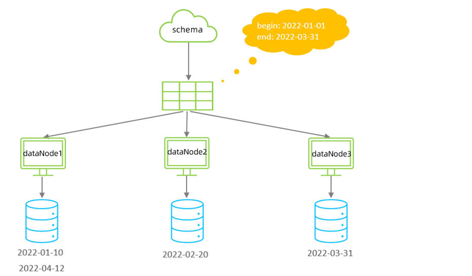

##### 2). 配置

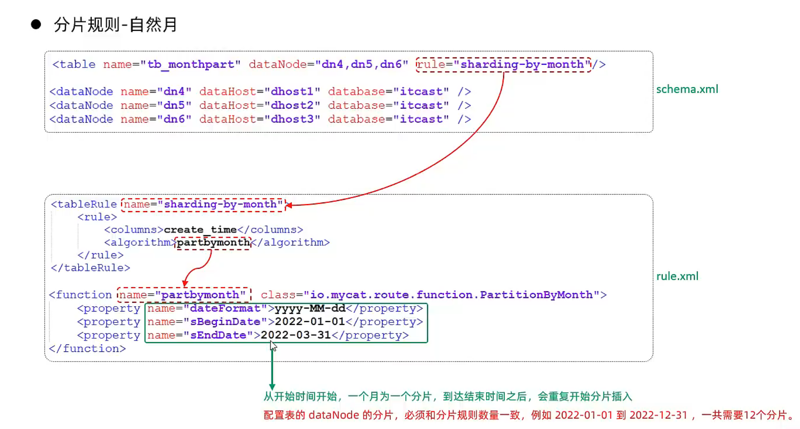

schema.xml中逻辑表配置：

```xml
<!-- 按自然月分片 -->
<table name="tb_monthpart" dataNode="dn4,dn5,dn6" rule="sharding-by-month" />
```

schema.xml中数据节点配置：

```xml
<dataNode name="dn4" dataHost="dhost1" database="itcast" />
<dataNode name="dn5" dataHost="dhost2" database="itcast" />
<dataNode name="dn6" dataHost="dhost3" database="itcast" />
```

rule.xml中分片规则配置：

```xml
<tableRule name="sharding-by-month">
    <rule>
        <columns>create_time</columns>
        <algorithm>partbymonth</algorithm>
    </rule>
</tableRule>

<function name="partbymonth" class="io.mycat.route.function.PartitionByMonth">
    <property name="dateFormat">yyyy-MM-dd</property>
    <property name="sBeginDate">2022-01-01</property>
    <property name="sEndDate">2022-03-31</property>
</function>
	<!--
		从开始时间开始，一个月为一个分片，到达结束时间之后，会重复开始分片插入
		配置表的 dataNode 的分片，必须和分片规则数量一致，例如 2022-01-01 到 2022-12-31 ，一
		共需要12个分片。

		这里就是说分片的段数一定不能少于时间的间隔，但是时间的间隔可以大于分片的长度
	-->
```

分片规则属性含义：

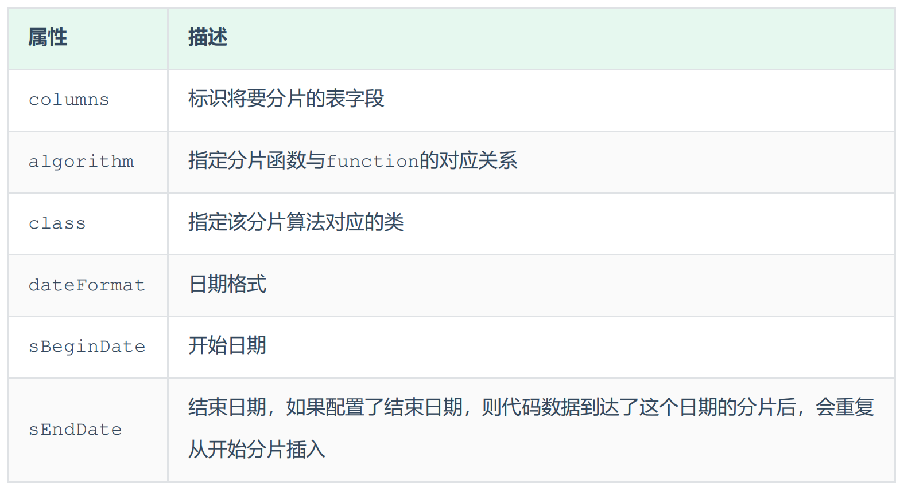


##### 3). 测试

配置完毕后，重新启动MyCat，然后在mycat的命令行中，执行如下SQL创建表、并插入数据，查看数据分布情况。

```sql
create table tb_monthpart(
    id bigint not null comment 'ID' primary key,
    name varchar(100) null comment '姓名',
    create_time date null
)engine=InnoDB DEFAULT CHARSET=utf8mb4;

insert into tb_monthpart(id,name ,create_time) values(1,'Tom','2022-01-01');
insert into tb_monthpart(id,name ,create_time) values(2,'Cat','2022-01-10');
insert into tb_monthpart(id,name ,create_time) values(3,'Rose','2022-01-31');
insert into tb_monthpart(id,name ,create_time) values(4,'Coco','2022-02-20');
insert into tb_monthpart(id,name ,create_time) values(5,'Rose2','2022-02-25');
insert into tb_monthpart(id,name ,create_time) values(6,'Coco2','2022-03-10');
insert into tb_monthpart(id,name ,create_time) values(7,'Coco3','2022-03-31');
insert into tb_monthpart(id,name ,create_time) values(8,'Coco4','2022-04-10');
insert into tb_monthpart(id,name ,create_time) values(9,'Coco5','2022-04-30');
```


### （4）最终配置文件案例

#### ①schema.xml

```xml
<?xml version="1.0"?>
<!DOCTYPE mycat:schema SYSTEM "schema.dtd">
<mycat:schema xmlns:mycat="http://io.mycat/">
    <schema name="SHOPPING" checkSQLschema="true" sqlMaxLimit="100">
        <table name="tb_goods_base" dataNode="dn1" primaryKey="id" />
        <table name="tb_goods_brand" dataNode="dn1" primaryKey="id" />
        <table name="tb_goods_cat" dataNode="dn1" primaryKey="id" />
        <table name="tb_goods_desc" dataNode="dn1" primaryKey="goods_id" />
        <table name="tb_goods_item" dataNode="dn1" primaryKey="id" />
        
        <table name="tb_order_item" dataNode="dn2" primaryKey="id" />
        <table name="tb_order_master" dataNode="dn2" primaryKey="order_id" />
        <table name="tb_order_pay_log" dataNode="dn2" primaryKey="out_trade_no" />
        
        <table name="tb_user" dataNode="dn3" primaryKey="id" />
        <table name="tb_user_address" dataNode="dn3" primaryKey="id" />
     
        <table name="tb_areas_provinces" dataNode="dn1,dn2,dn3" primaryKey="id" type="global"/>
        <table name="tb_areas_city" dataNode="dn1,dn2,dn3" primaryKey="id" type="global"/>
        <table name="tb_areas_region" dataNode="dn1,dn2,dn3" primaryKey="id" type="global"/>
    </schema>

    <schema name="ITCAST" checkSQLschema="true" sqlMaxLimit="100">
        <!-- 取模分片 -->
        <table name="tb_log" dataNode="dn4,dn5,dn6" primaryKey="id" rule="mod-long" />
        <!-- 一致性hash -->
        <table name="tb_order" dataNode="dn4,dn5,dn6" rule="sharding-by-murmur" />

        <!-- 枚举 -->
        <table name="tb_user" dataNode="dn4,dn5,dn6" rule="sharding-by-intfile-enumstatus"/>
        <!-- 自己增加 tableRule: "sharding-by-intfile-enumstatus" -->

        <!-- 应用指定算法 -->
        <table name="tb_app" dataNode="dn4,dn5,dn6" rule="sharding-by-substring" />

        <!-- 固定分片hash算法 -->
        <table name="tb_longhash" dataNode="dn4,dn5,dn6" rule="sharding-by-long-hash" />

        <!-- 字符串hash解析算法 -->
        <table name="tb_strhash" dataNode="dn4,dn5" rule="sharding-by-stringhash" />

        <!-- 按天分片 -->
        <table name="tb_datepart" dataNode="dn4,dn5,dn6" rule="sharding-by-date" />


        <!-- 按自然月分片 -->
        <table name="tb_monthpart" dataNode="dn4,dn5,dn6" rule="sharding-by-month" />
        
    </schema>

    <dataNode name="dn1" dataHost="dhost1" database="shopping" />
    <dataNode name="dn2" dataHost="dhost2" database="shopping" />
    <dataNode name="dn3" dataHost="dhost3" database="shopping" />

    <dataNode name="dn4" dataHost="dhost1" database="itcast" />
    <dataNode name="dn5" dataHost="dhost2" database="itcast" />
    <dataNode name="dn6" dataHost="dhost3" database="itcast" />
    
    <dataHost name="dhost1" maxCon="1000" minCon="10" balance="0"
              writeType="0" dbType="mysql" dbDriver="jdbc" switchType="1"
              slaveThreshold="100">
        <heartbeat>select user()</heartbeat>
        <writeHost host="master" url="jdbc:mysql://192.168.88.130:3306?useSSL=false&amp;serverTimezone=Asia/Shanghai&amp;characterEncoding=utf8"
                   user="root" password="root" />
    </dataHost>
    
    <dataHost name="dhost2" maxCon="1000" minCon="10" balance="0"
              writeType="0" dbType="mysql" dbDriver="jdbc" switchType="1"
              slaveThreshold="100">
        <heartbeat>select user()</heartbeat>
        <writeHost host="master" url="jdbc:mysql://192.168.88.131:3306?useSSL=false&amp;serverTimezone=Asia/Shanghai&amp;characterEncoding=utf8"
                   user="root" password="root" />
    </dataHost>
    
    <dataHost name="dhost3" maxCon="1000" minCon="10" balance="0"
              writeType="0" dbType="mysql" dbDriver="jdbc" switchType="1"
              slaveThreshold="100">
        <heartbeat>select user()</heartbeat>
        <writeHost host="master" url="jdbc:mysql://192.168.88.129:3306?useSSL=false&amp;serverTimezone=Asia/Shanghai&amp;characterEncoding=utf8"
                   user="root" password="1234" />
    </dataHost>
</mycat:schema>
```


#### ②rule.xml

```xml
<?xml version="1.0" encoding="UTF-8"?>
<!-- - - Licensed under the Apache License, Version 2.0 (the "License"); 
	- you may not use this file except in compliance with the License. - You 
	may obtain a copy of the License at - - http://www.apache.org/licenses/LICENSE-2.0 
	- - Unless required by applicable law or agreed to in writing, software - 
	distributed under the License is distributed on an "AS IS" BASIS, - WITHOUT 
	WARRANTIES OR CONDITIONS OF ANY KIND, either express or implied. - See the 
	License for the specific language governing permissions and - limitations 
	under the License. -->
<!DOCTYPE mycat:rule SYSTEM "rule.dtd">
<mycat:rule xmlns:mycat="http://io.mycat/">
	<tableRule name="rule1">
		<rule>
			<columns>id</columns>
			<algorithm>func1</algorithm>
		</rule>
	</tableRule>

	<tableRule name="rule2">
		<rule>
			<columns>user_id</columns>
			<algorithm>func1</algorithm>
		</rule>
	</tableRule>

	<tableRule name="sharding-by-intfile">
		<rule>
			<columns>sharding_id</columns>
			<algorithm>hash-int</algorithm>
		</rule>
	</tableRule>

	<!-- 自己增加 tableRule -->
	<tableRule name="sharding-by-intfile-enumstatus">
		<rule>
			<columns>status</columns>
			<algorithm>hash-int</algorithm>
		</rule>
	</tableRule>

	<tableRule name="auto-sharding-long">
		<rule>
			<columns>id</columns>
			<algorithm>rang-long</algorithm>
		</rule>
	</tableRule>
	<tableRule name="mod-long">
		<rule>
			<columns>id</columns>
			<algorithm>mod-long</algorithm>
		</rule>
	</tableRule>
	<tableRule name="sharding-by-murmur">
		<rule>
			<columns>id</columns>
			<algorithm>murmur</algorithm>
		</rule>
	</tableRule>
	<tableRule name="crc32slot">
		<rule>
			<columns>id</columns>
			<algorithm>crc32slot</algorithm>
		</rule>
	</tableRule>

	<tableRule name="sharding-by-month">
		<rule>
			<columns>create_time</columns>
			<algorithm>partbymonth</algorithm>
		</rule>
	</tableRule>

	<tableRule name="latest-month-calldate">
		<rule>
			<columns>calldate</columns>
			<algorithm>latestMonth</algorithm>
		</rule>
	</tableRule>
	
	<tableRule name="auto-sharding-rang-mod">
		<rule>
			<columns>id</columns>
			<algorithm>rang-mod</algorithm>
		</rule>
	</tableRule>
	
	<tableRule name="jch">
		<rule>
			<columns>id</columns>
			<algorithm>jump-consistent-hash</algorithm>
		</rule>
	</tableRule>


	<tableRule name="sharding-by-substring">
		<rule>
			<columns>id</columns>
			<algorithm>sharding-by-substring</algorithm>
		</rule>
	</tableRule>

	<tableRule name="sharding-by-long-hash">
		<rule>
			<columns>id</columns>
			<algorithm>sharding-by-long-hash</algorithm>
		</rule>
	</tableRule>

	<tableRule name="sharding-by-stringhash">
		<rule>
			<columns>name</columns>
			<algorithm>sharding-by-stringhash</algorithm>
		</rule>
	</tableRule>

	<tableRule name="sharding-by-date">
		<rule>
			<columns>create_time</columns>
			<algorithm>sharding-by-date</algorithm>
		</rule>
	</tableRule>

	<function name="murmur"
		class="io.mycat.route.function.PartitionByMurmurHash">
		<property name="seed">0</property><!-- 默认是0 -->
		<property name="count">2</property><!-- 要分片的数据库节点数量，必须指定，否则没法分片 -->
		<property name="virtualBucketTimes">160</property><!-- 一个实际的数据库节点被映射为这么多虚拟节点，默认是160倍，也就是虚拟节点数是物理节点数的160倍 -->
		<!-- <property name="weightMapFile">weightMapFile</property> 节点的权重，没有指定权重的节点默认是1。以properties文件的格式填写，以从0开始到count-1的整数值也就是节点索引为key，以节点权重值为值。所有权重值必须是正整数，否则以1代替 -->
		<!-- <property name="bucketMapPath">/etc/mycat/bucketMapPath</property> 
			用于测试时观察各物理节点与虚拟节点的分布情况，如果指定了这个属性，会把虚拟节点的murmur hash值与物理节点的映射按行输出到这个文件，没有默认值，如果不指定，就不会输出任何东西 -->
	</function>

	<function name="crc32slot"
			  class="io.mycat.route.function.PartitionByCRC32PreSlot">
	</function>

	<function name="hash-int" class="io.mycat.route.function.PartitionByFileMap">
		<!-- defaultNode表示，若没有找到对应匹配的枚举，则使用默认配置的数据节点 -->
		<property name="defaultNode">2</property>
		<property name="mapFile">partition-hash-int.txt</property>
	</function>

	<function name="rang-long"
		class="io.mycat.route.function.AutoPartitionByLong">
		<property name="mapFile">autopartition-long.txt</property>
	</function>
	<function name="mod-long" class="io.mycat.route.function.PartitionByMod">
		<!-- how many data nodes -->
		<property name="count">3</property>
	</function>

	<function name="func1" class="io.mycat.route.function.PartitionByLong">
		<property name="partitionCount">8</property>
		<property name="partitionLength">128</property>
	</function>
	<function name="latestMonth"
		class="io.mycat.route.function.LatestMonthPartion">
		<property name="splitOneDay">24</property>
	</function>

	
	<function name="rang-mod" class="io.mycat.route.function.PartitionByRangeMod">
        	<property name="mapFile">partition-range-mod.txt</property>
	</function>
	
	<function name="jump-consistent-hash" class="io.mycat.route.function.PartitionByJumpConsistentHash">
		<property name="totalBuckets">3</property>
	</function>


	<function name="sharding-by-substring" class="io.mycat.route.function.PartitionDirectBySubString">
		<property name="startIndex">0</property> <!-- zero-based -->
		<property name="size">2</property>
		<property name="partitionCount">3</property>
		<property name="defaultPartition">0</property>
	</function>
	
	<!-- 分片总长度为1024，count与length数组长度必须一致； -->
	<function name="sharding-by-long-hash" class="io.mycat.route.function.PartitionByLong">
		<property name="partitionCount">2,1</property>
		<property name="partitionLength">256,512</property>
	</function>

	<function name="sharding-by-stringhash" class="io.mycat.route.function.PartitionByString">
    	<property name="partitionLength">512</property> <!-- zero-based -->
   	 	<property name="partitionCount">2</property>
    	<property name="hashSlice">0:2</property>
	</function>


	<function name="sharding-by-date" class="io.mycat.route.function.PartitionByDate">
		<property name="dateFormat">yyyy-MM-dd</property>
		<property name="sBeginDate">2022-01-01</property>
		<property name="sEndDate">2022-01-30</property>
		<property name="sPartionDay">10</property>
	</function>
		<!--
			从开始时间开始，每10天为一个分片，到达结束时间之后，会重复开始分片插入。
			配置表的 dataNode 的分片，必须和分片规则数量一致，
			例如 2022-01-01 到 2022-12-31 ，每10天一个分片，一共需要37个分片。
		-->


	<function name="partbymonth" class="io.mycat.route.function.PartitionByMonth">
		<property name="dateFormat">yyyy-MM-dd</property>
		<property name="sBeginDate">2022-01-01</property>
		<property name="sEndDate">2022-03-31</property>
	</function>
		<!--
			从开始时间开始，一个月为一个分片，到达结束时间之后，会重复开始分片插入
			配置表的 dataNode 的分片，必须和分片规则数量一致，例如 2022-01-01 到 2022-12-31 ，一
			共需要12个分片。
	
			这里就是说分片的段数一定不能少于时间的间隔，但是时间的间隔可以大于分片的长度
		-->

</mycat:rule>
```


#### ③server.xml

```xml
<?xml version="1.0" encoding="UTF-8"?>
<!-- - - Licensed under the Apache License, Version 2.0 (the "License"); 
	- you may not use this file except in compliance with the License. - You 
	may obtain a copy of the License at - - http://www.apache.org/licenses/LICENSE-2.0 
	- - Unless required by applicable law or agreed to in writing, software - 
	distributed under the License is distributed on an "AS IS" BASIS, - WITHOUT 
	WARRANTIES OR CONDITIONS OF ANY KIND, either express or implied. - See the 
	License for the specific language governing permissions and - limitations 
	under the License. -->
<!DOCTYPE mycat:server SYSTEM "server.dtd">
<mycat:server xmlns:mycat="http://io.mycat/">
	<system>
	<property name="nonePasswordLogin">0</property> <!-- 0为需要密码登陆、1为不需要密码登陆 ,默认为0，设置为1则需要指定默认账户-->
	<property name="useHandshakeV10">1</property>
	<property name="useSqlStat">1</property>  <!-- 1为开启实时统计、0为关闭 -->
	<property name="useGlobleTableCheck">0</property>  <!-- 1为开启全加班一致性检测、0为关闭 -->
		<property name="sqlExecuteTimeout">300</property>  <!-- SQL 执行超时 单位:秒-->
		<property name="sequnceHandlerType">2</property>
		<!--<property name="sequnceHandlerPattern">(?:(\s*next\s+value\s+for\s*MYCATSEQ_(\w+))(,|\)|\s)*)+</property>-->
		<!--必须带有MYCATSEQ_或者 mycatseq_进入序列匹配流程 注意MYCATSEQ_有空格的情况-->
		<property name="sequnceHandlerPattern">(?:(\s*next\s+value\s+for\s*MYCATSEQ_(\w+))(,|\)|\s)*)+</property>
	<property name="subqueryRelationshipCheck">false</property> <!-- 子查询中存在关联查询的情况下,检查关联字段中是否有分片字段 .默认 false -->
      <!--  <property name="useCompression">1</property>--> <!--1为开启mysql压缩协议-->
        <!--  <property name="fakeMySQLVersion">5.6.20</property>--> <!--设置模拟的MySQL版本号-->
	<!-- <property name="processorBufferChunk">40960</property> -->
	<!-- 
	<property name="processors">1</property> 
	<property name="processorExecutor">32</property> 
	 -->
        <!--默认为type 0: DirectByteBufferPool | type 1 ByteBufferArena | type 2 NettyBufferPool -->
		<property name="processorBufferPoolType">0</property>
		<!--默认是65535 64K 用于sql解析时最大文本长度 -->
		<!--<property name="maxStringLiteralLength">65535</property>-->
		<!--<property name="sequnceHandlerType">0</property>-->
		<!--<property name="backSocketNoDelay">1</property>-->
		<!--<property name="frontSocketNoDelay">1</property>-->
		<!--<property name="processorExecutor">16</property>-->
		<!--
			<property name="serverPort">8066</property> <property name="managerPort">9066</property> 
			<property name="idleTimeout">300000</property> <property name="bindIp">0.0.0.0</property>
			<property name="dataNodeIdleCheckPeriod">300000</property> 5 * 60 * 1000L; //连接空闲检查
			<property name="frontWriteQueueSize">4096</property> <property name="processors">32</property> -->
		<!--分布式事务开关，0为不过滤分布式事务，1为过滤分布式事务（如果分布式事务内只涉及全局表，则不过滤），2为不过滤分布式事务,但是记录分布式事务日志-->
		<property name="handleDistributedTransactions">0</property>
		
			<!--
			off heap for merge/order/group/limit      1开启   0关闭
		-->
		<property name="useOffHeapForMerge">0</property>

		<!--
			单位为m
		-->
        <property name="memoryPageSize">64k</property>

		<!--
			单位为k
		-->
		<property name="spillsFileBufferSize">1k</property>

		<property name="useStreamOutput">0</property>

		<!--
			单位为m
		-->
		<property name="systemReserveMemorySize">384m</property>


		<!--是否采用zookeeper协调切换  -->
		<property name="useZKSwitch">false</property>

		<!-- XA Recovery Log日志路径 -->
		<!--<property name="XARecoveryLogBaseDir">./</property>-->

		<!-- XA Recovery Log日志名称 -->
		<!--<property name="XARecoveryLogBaseName">tmlog</property>-->
		<!--如果为 true的话 严格遵守隔离级别,不会在仅仅只有select语句的时候在事务中切换连接-->
		<property name="strictTxIsolation">false</property>
		
		<property name="useZKSwitch">true</property>
		

	</system>
	
	<!-- 全局SQL防火墙设置 -->
	<!--白名单可以使用通配符%或着*-->
	<!--例如<host host="127.0.0.*" user="root"/>-->
	<!--例如<host host="127.0.*" user="root"/>-->
	<!--例如<host host="127.*" user="root"/>-->
	<!--例如<host host="1*7.*" user="root"/>-->
	<!--这些配置情况下对于127.0.0.1都能以root账户登录-->
	<!--
	<firewall>
	   <whitehost>
	      <host host="1*7.0.0.*" user="root"/>
	   </whitehost>
       <blacklist check="false">
       </blacklist>
	</firewall>
	-->

	<user name="root" defaultAccount="true">
		<property name="password">123456</property>
		<property name="schemas">SHOPPING,ITCAST</property>
		<!-- 表级 DML 权限设置 -->
		<!--
	<privileges check="true">
	<schema name="DB01" dml="0110" >
	<table name="TB_ORDER" dml="1110"></table>
	</schema>
	</privileges>
	-->
	</user>
	<user name="user">
		<property name="password">123456</property>
		<property name="schemas">SHOPPING</property>
		<property name="readOnly">true</property>
	</user>

</mycat:server>
```


## 3.6 MyCat管理及监控

### （1）MyCat原理

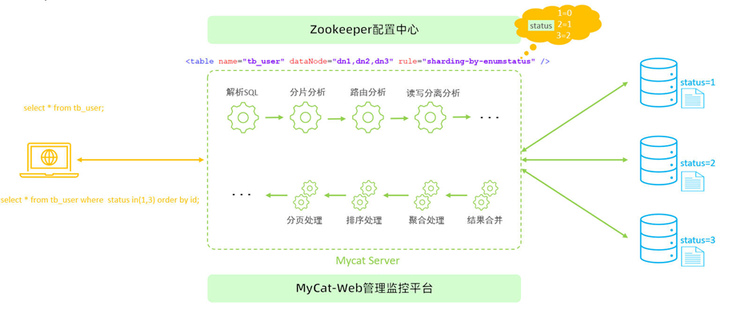

在MyCat中，当执行一条SQL语句时，MyCat需要进行**SQL解析、分片分析、路由分析、读写分离分析**等操作，最终经过一系列的分析决定将当前的SQL语句到底路由到那几个(或哪一个)节点数据库，数据库将数据执行完毕后，如果有返回的结果，则将结果返回给MyCat，最终还需要在MyCat中进行**结果合并、聚合处理、排序处理、分页处理等操作**，最终再将结果返回给客户端。

而在MyCat的使用过程中，MyCat官方也提供了一个**管理监控平台MyCat-Web（MyCat-eye）**。Mycat-web 是 Mycat 可视化运维的管理和监控平台，弥补了 Mycat 在监控上的空白。帮 Mycat分担统计任务和配置管理任务。Mycat-web 引入了 **==ZooKeeper 作为配置中心==，可以管理多个节点**。

Mycat-web 主要管理和监控 Mycat 的流量、连接、活动线程和内存等，具备 IP 白名单、邮件告警等模块，还可以**统计 SQL 并分析慢 SQL 和高频 SQL** 等。为优化 SQL 提供依据。


### （2）MyCat管理

Mycat默认开通2个端口，可以在server.xml中进行修改。

- **8066 数据访问端口**，即进行 DML 和 DDL 操作。
- **9066 数据库管理端口**，即 mycat 服务管理控制功能，用于管理mycat的整个集群状态

连接MyCat的管理控制台：

```bash
mysql -h 192.168.200.210 -p 9066 -uroot -p123456 

mysql -h 192.168.88.130 -p 9066 -uroot -p123456 
```

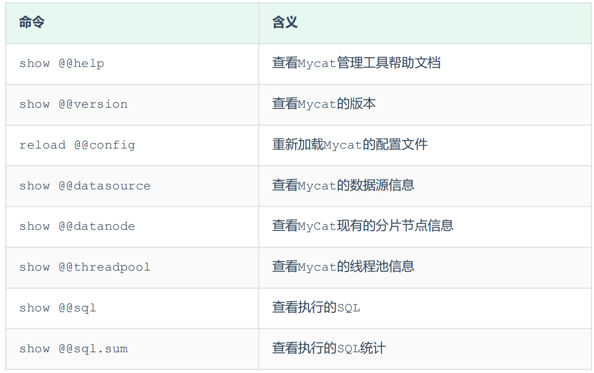


### （3）==MyCat-eye==

#### ①介绍

Mycat-web(Mycat-eye)是对mycat-server**提供监控服务**，功能不局限于对mycat-server使用。他通过JDBC连接对Mycat、Mysql监控，监控远程服务器(目前仅限于linux系统)的cpu、内存、网络、磁盘。

Mycat-eye运行过程中**需要依赖zookeeper**，因此需要先安装zookeeper。


#### ②安装

##### 1). zookeeper安装

**A. 上传安装包** 

```bash
zookeeper-3.4.6.tar.gz
```

​	

 **B. 解压**

```bash
tar -zxvf zookeeper-3.4.6.tar.gz -C /usr/local/
```


**C. 创建数据存放目录**

```bash
cd /usr/local/zookeeper-3.4.6/
mkdir data

cd data
pwd #复制data的文件夹路径
```

​	

**D. 修改配置文件名称并配置**

```bash
cd conf
mv zoo_sample.cfg zoo.cfg  # 重命名
```

​	

**E. 配置数据存放目录**

```bash
vim zoo.cfg
dataDir=/usr/local/zookeeper-3.4.6/data
```


​	**F. 启动Zookeeper**

```bash
bin/zkServer.sh start
bin/zkServer.sh status
```


##### 2). Mycat-web安装

**A. 上传安装包** 

- ​	Mycat-web.tar.gz

​	

**B. 解压**

```bash
tar -zxvf Mycat-web.tar.gz -C /usr/local/
```

​	

**C. 目录介绍**

- ​    etc         ----> jetty配置文件
- ​    lib         ----> 依赖jar包
- ​    mycat-web   ----> mycat-web项目
- ​    readme.txt
- ​    start.jar   ----> 启动jar
- ​    start.sh    ----> linux启动脚本

​	

**D. 启动**

```bash
cd /usr/local/mycat-web
sh start.sh
```

​	**开放端口：**

- **==开放指定==端口(firewall-cmd --zone=public --add-port=8080/tcp --permanent)**
- **关闭指定端口(firewall-cmd --zone=public --remove-port=8080/tcp --permanent)**

- **==立即生效==(firewall-cmd --reload)，==开放或者关闭端口后==需要执行立即生效命令**
- **查看开放的端口(firewall-cmd --zone=public --list-ports)**


**E. 访问**
	

```bash
# 开放8082端口
firewall-cmd --zone=public --add-port=8082/tcp --permanent
firewall-cmd --reload
```

​	

> 备注: 
>
> ​	如果Zookeeper与Mycat-web不在同一台服务器上 , **需要设置Zookeeper的地址** ; 在/usr/local/mycat-web/mycat-web/WEB-INF/classes/mycat.properties文件中配置 : 
>
> ​	

具体的安装步骤，请参考资料中提供的《MyCat-Web安装文档》


#### ③访问

**http://192.168.88.130:8082/mycat**


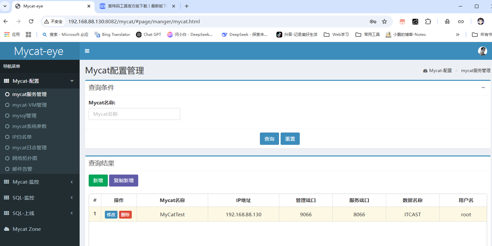


#### ④配置

##### 1). 开启MyCat的实时统计功能(server.xml)

```xml
<property name="useSqlStat">1</property> <!-- 1为开启实时统计、0为关闭 -->
```


##### 2). 在Mycat监控界面配置服务地址

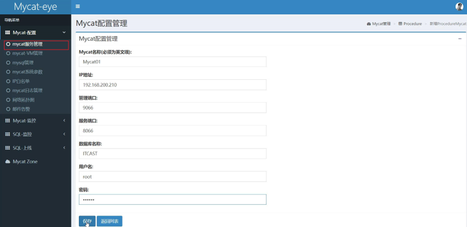

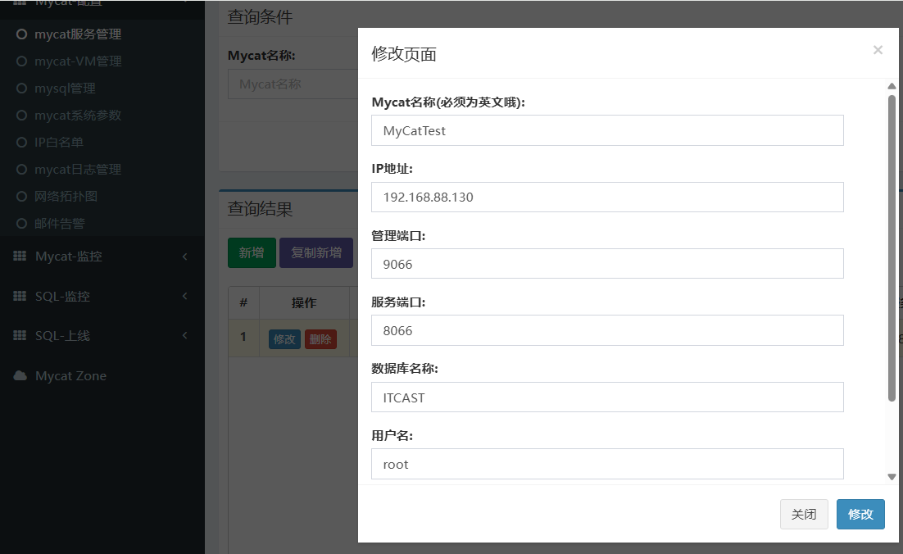


#### ⑤测试

配置好了之后，我们可以通过MyCat执行一系列的增删改查的测试，然后过一段时间之后，打开mycat-eye的管理界面，查看mycat-eye监控到的数据信息。

##### A. 性能监控

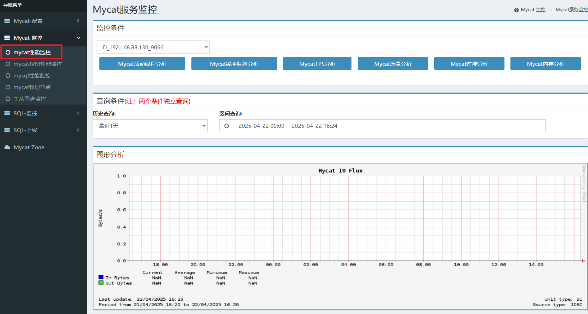

##### B. 物理节点

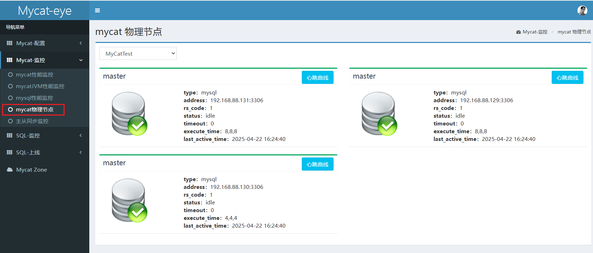

##### C. SQL统计

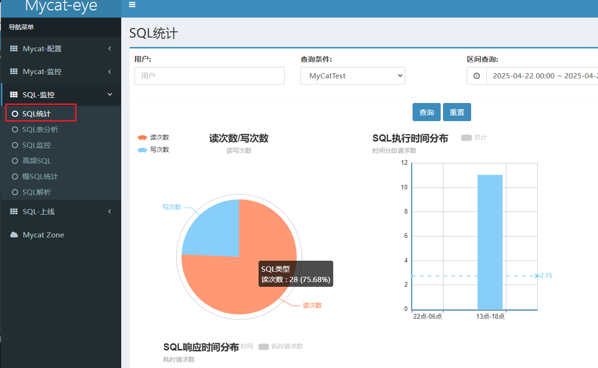

##### D. SQL表分析

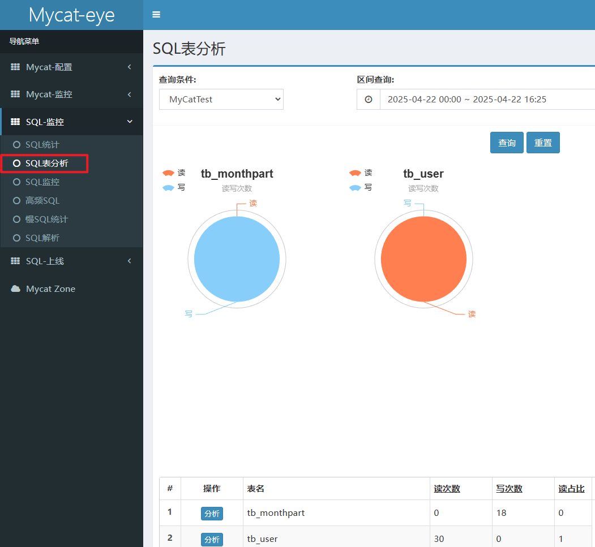

##### E. SQL监控

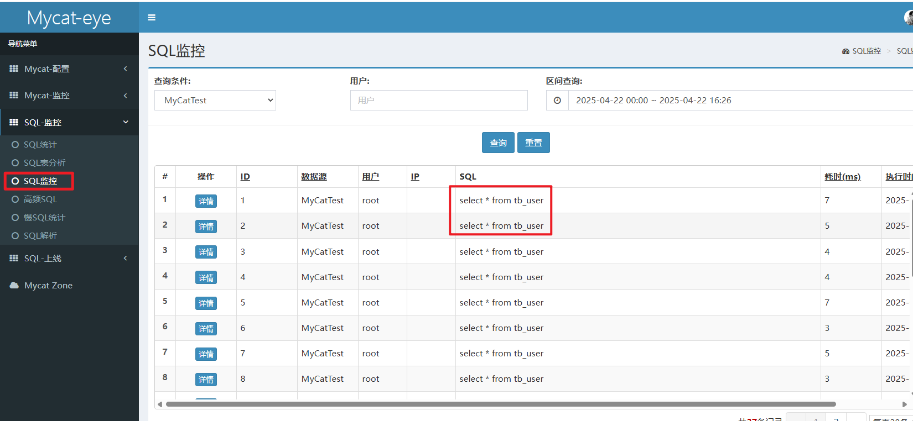

##### F. 高频SQL

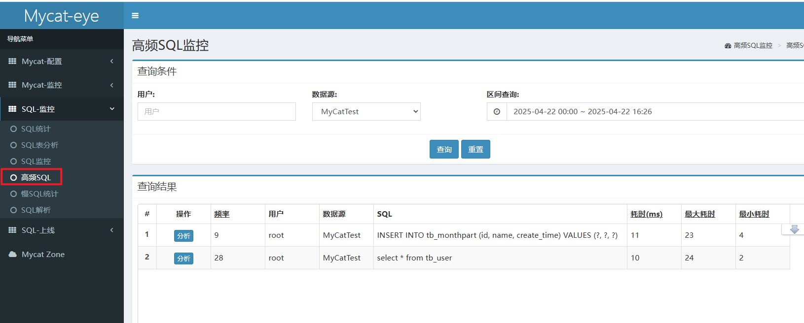

**G.SQL解析**

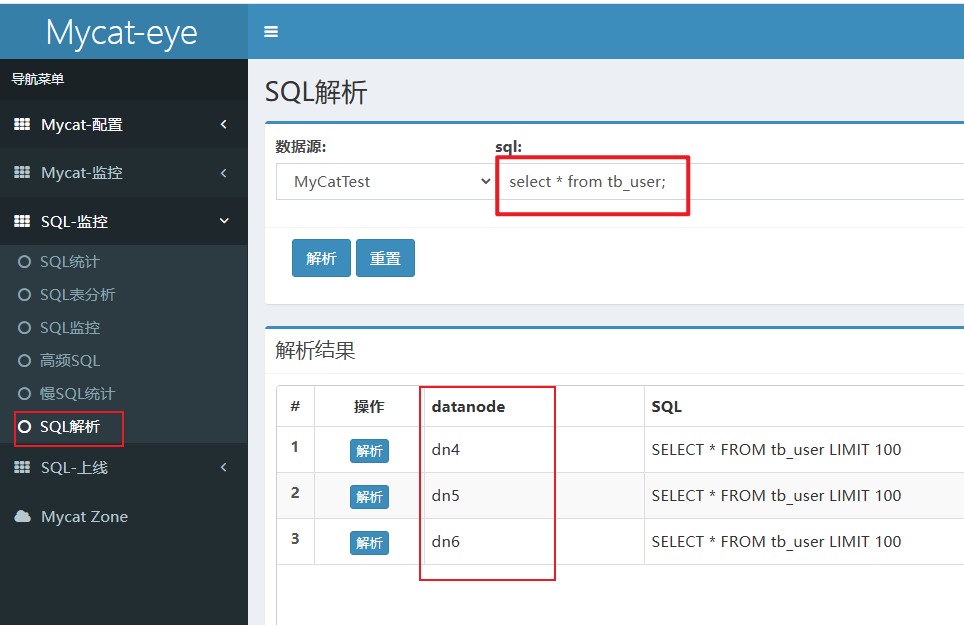

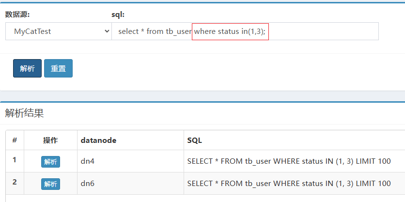

------


## 3.7 小结

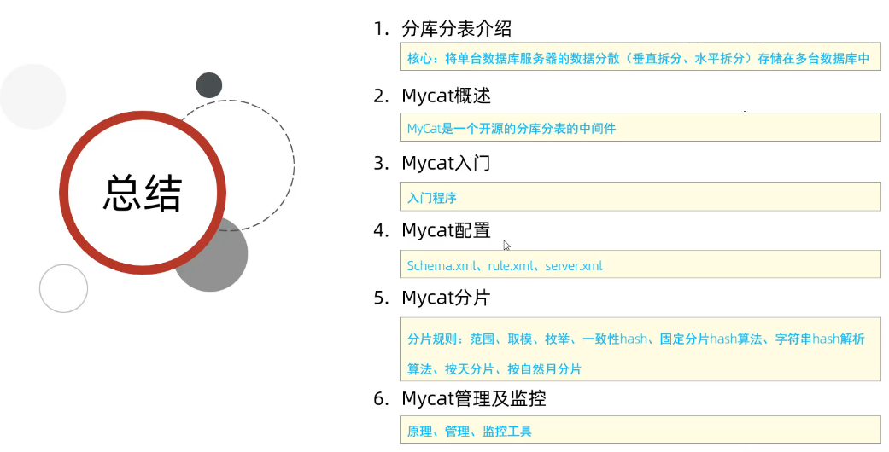


# 4、读写分离

## 4.1 介绍

读写分离,简单地说是把对数据库的读和写操作分开,以对应不同的数据库服务器。主数据库提供写操作，从数据库提供读操作，这样能有效地减轻单台数据库的压力。

通过MyCat即可轻易实现上述功能，不仅**可以支持MySQL，也可以支持Oracle和SQL Server**。

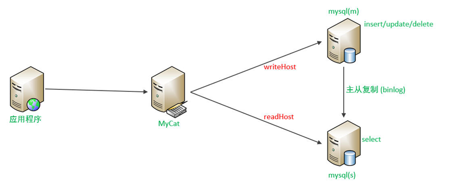

## 4.2 一主一从

### （1）原理

MySQL的**主从复制，是基于==二进制日志（binlog）==实现的**。

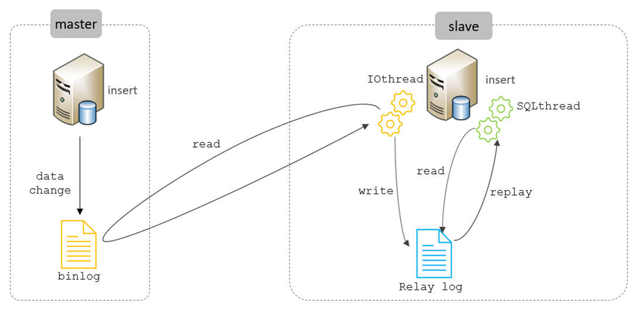

### （2）准备

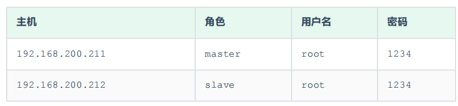

> 备注：**主从复制的搭建**，可以参考前面课程中 **主从复制** 章节讲解的步骤操作。

**[主从复制的搭建](#主从复制的搭建)**


## 4.3 一主一从读写分离

MyCat控制后台数据库的读写分离和负载均衡由schema.xml文件datahost标签的balance属性控制。

### （1）schema.xml配置

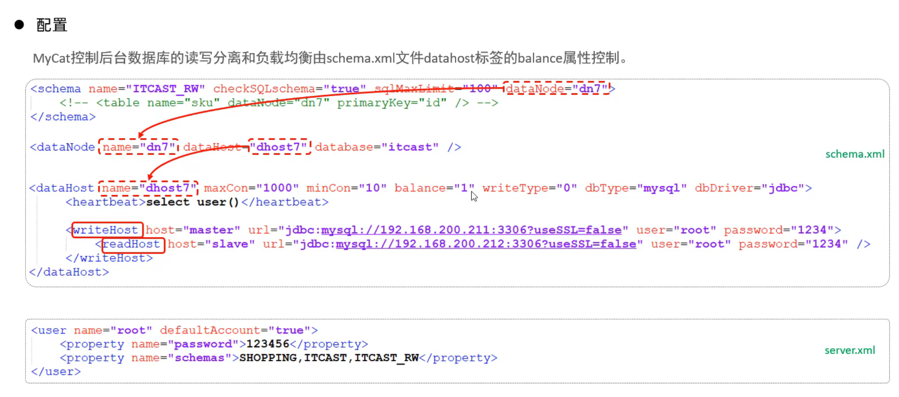

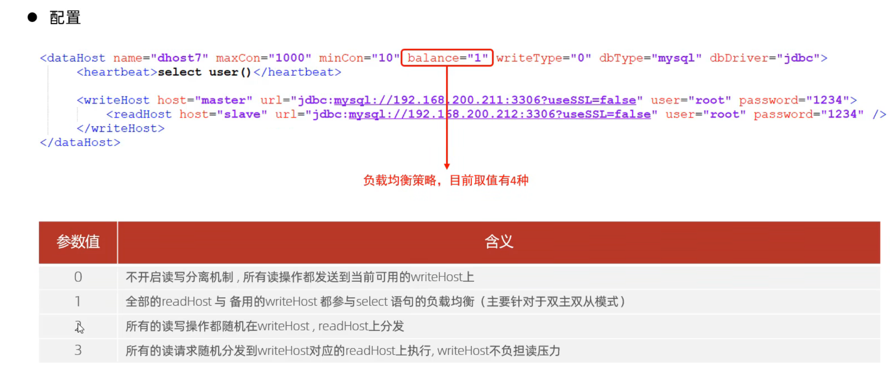

```xml
<!-- 配置逻辑库 -->
<schema name="ITCAST_RW" checkSQLschema="true" sqlMaxLimit="100" dataNode="dn7">
	<!-- 会自动加载对应数据节点的数据库，然后再自动生成逻辑表 -->
</schema>

<dataNode name="dn7" dataHost="dhost7" database="itcast" />

<dataHost name="dhost7" maxCon="1000" minCon="10" balance="1" writeType="0" dbType="mysql" dbDriver="jdbc" switchType="1" slaveThreshold="100">
    <heartbeat>select user()</heartbeat>
    <writeHost host="master1" url="jdbc:mysql://192.168.200.211:3306?useSSL=false&amp;serverTimezone=Asia/Shanghai&amp;characterEncoding=utf8" user="root" password="1234" >
        <readHost host="slave1" url="jdbc:mysql://192.168.200.212:3306? useSSL=false&amp;serverTimezone=Asia/Shanghai&amp;characterEncoding=utf8" user="root" password="1234" />
    </writeHost>
</dataHost>
```

上述配置的具体关联对应情况如下：


**writeHost代表的是写操作对应的数据库，readHost代表的是读操作对应的数据库。**

 所以我们要想实现读写分离，就得配置writeHost关联的是主库，readHost关联的是从库。而仅仅配置好了writeHost以及readHost还不能完成读写分离，还需要配置一个非常重要的**==负责均衡的参数 balance==**，取值有4种，具体含义如下：

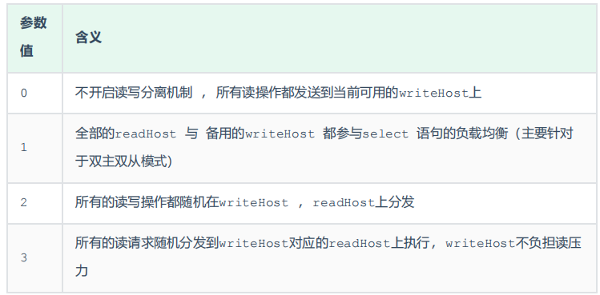

所以，在一主一从模式的读写分离中，**balance配置1或3都是可以完成读写分离的**。


### （2）server.xml配置

**配置root用户可以访问**SHOPPING、ITCAST 以及 **ITCAST_RW逻辑库**。

```xml
<user name="root" defaultAccount="true">
    <property name="password">123456</property>
    <property name="schemas">SHOPPING,ITCAST,ITCAST_RW</property>
    <!-- 表级 DML 权限设置 -->
    <!--
    <privileges check="true">
    <schema name="DB01" dml="0110" >
    <table name="TB_ORDER" dml="1110"></table>
    </schema>
    </privileges>
	-->
</user>
```


### （3）测试

配置完毕MyCat后，重新启动MyCat。

```bash
bin/mycat stop

bin/mycat start
```

然后观察，在执行增删改操作时，对应的主库及从库的数据变化。 在执行查询操作时，检查主库及从库对应的数据变化。

在测试中，我们可以发现**当主节点Master宕机之后，业务系统就只能够读，而不能写入数据了**。

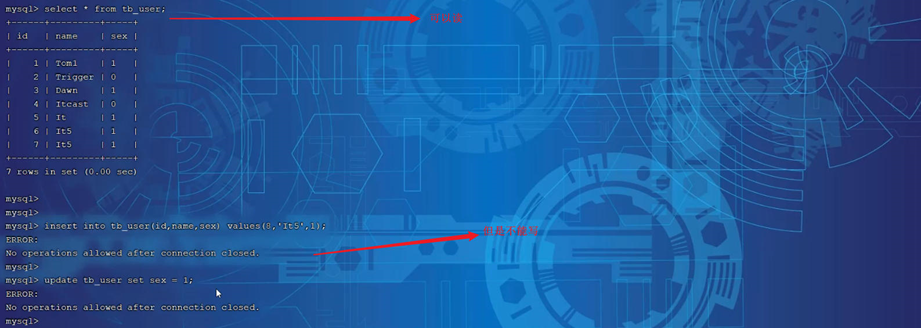

那如何解决这个问题呢？这个时候我们就得通过另外一种主从复制结构来解决了，也就是我们接下来讲解的**双主双从**。


## 4.4 ==双主双从==

### （1）介绍

一个主机 Master1 用于处理所有写请求，它的从机 Slave1 和另一台主机 Master2 还有它的从机 Slave2 负责所有读请求。**当 Master1 主机宕机后，Master2 主机负责写请求**，Master1 、Master2 **互为备机**。架构图如下:

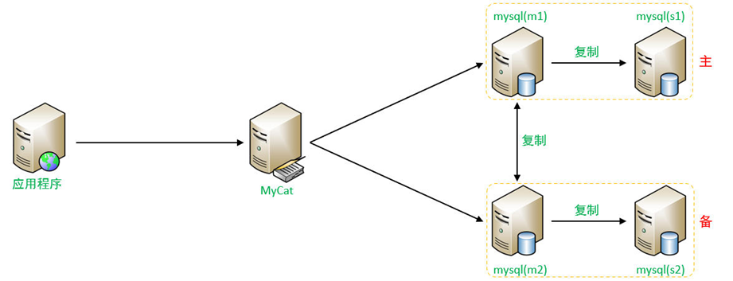

### （2）准备

我们需要准备5台服务器，具体的服务器及软件安装情况如下：

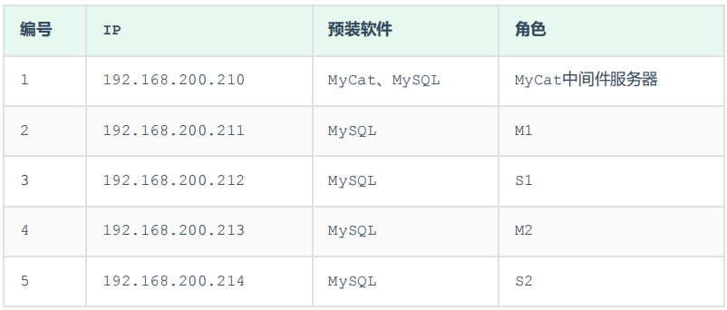


> **关闭以上所有服务器的防火墙**或者**开放3306的端口**：
>
> - systemctl stop firewalld
>
> - systemctl disable firewalld


### （3）搭建

#### ①主库配置

##### 1). Master1(192.168.200.211)

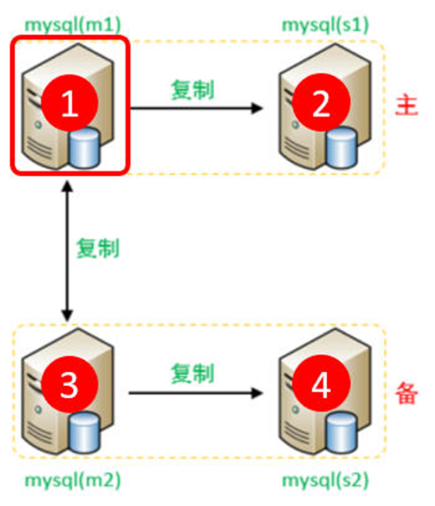

A. 修改配置文件 /etc/my.cnf

```bash
#mysql 服务ID，保证整个集群环境中唯一，取值范围：1 – 2^32-1，默认为1
server-id=1
#只同步指定的数据库
binlog-do-db=db01
binlog-do-db=db02
binlog-do-db=db03
# 在作为从数据库的时候，有写入操作也要更新二进制日志文件
log-slave-updates
```

B. 重启MySQL服务器

```bash
systemctl restart mysqld
```

C. 创建账户并授权

```sql
#创建itcast用户，并设置密码，该用户可在任意主机连接该MySQL服务
CREATE USER 'itcast'@'%' IDENTIFIED WITH mysql_native_password BY 'Root@123456';

#为 'itcast'@'%' 用户分配主从复制权限
GRANT REPLICATION SLAVE ON *.* TO 'itcast'@'%';
```

通过指令，查看两台主库的二进制日志坐标

```sql
show master status ;
```


##### **2). Master2(192.168.200.213)**

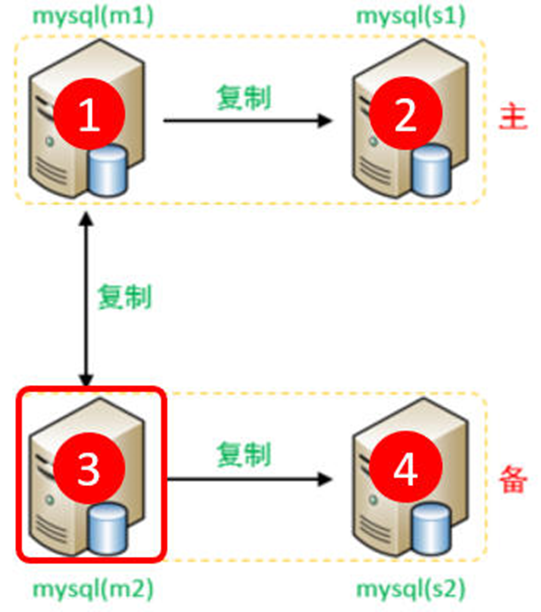

A. 修改配置文件 /etc/my.cnf

```bash
#mysql 服务ID，保证整个集群环境中唯一，取值范围：1 – 2^32-1，默认为1
server-id=3
#指定同步的数据库
binlog-do-db=db01
binlog-do-db=db02
binlog-do-db=db03
# 在作为从数据库的时候，有写入操作也要更新二进制日志文件
log-slave-updates
```

B. 重启MySQL服务器

```bash
systemctl restart mysqld
```

C. 创建账户并授权

```sql
#创建itcast用户，并设置密码，该用户可在任意主机连接该MySQL服务
CREATE USER 'itcast'@'%' IDENTIFIED WITH mysql_native_password BY 'Root@123456';
#为 'itcast'@'%' 用户分配主从复制权限
GRANT REPLICATION SLAVE ON *.* TO 'itcast'@'%';
```

通过指令，查看两台主库的二进制日志坐标

```sql
show master status ;
```


#### ②从库配置

##### **1). Slave1(192.168.200.212)**

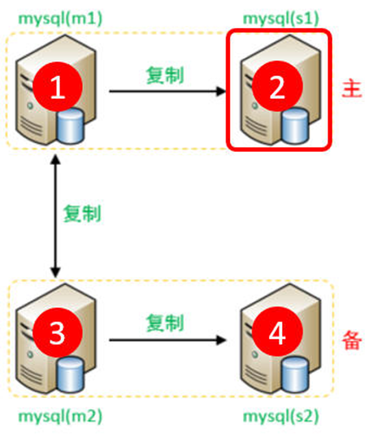

A. 修改配置文件 /etc/my.cnf

```bash
#mysql 服务ID，保证整个集群环境中唯一，取值范围：1 – 232-1，默认为1
server-id=2
```

B. 重新启动MySQL服务器

```bash
systemctl restart mysqld
```


##### **2). Slave2(192.168.200.214)**

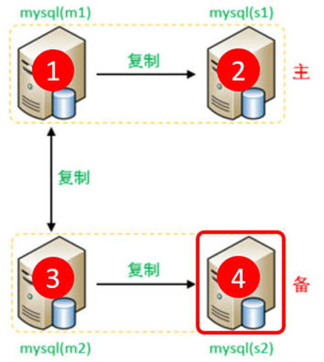

A. 修改配置文件 /etc/my.cnf

```bash
#mysql 服务ID，保证整个集群环境中唯一，取值范围：1 – 232-1，默认为1
server-id=4
```

B. 重新启动MySQL服务器

```bash
systemctl restart mysqld
```


#### ③从库关联主库

##### 1). 两台从库配置关联的主库

> 需要注意**slave1对应的是master1**，**slave2对应的是master2**。

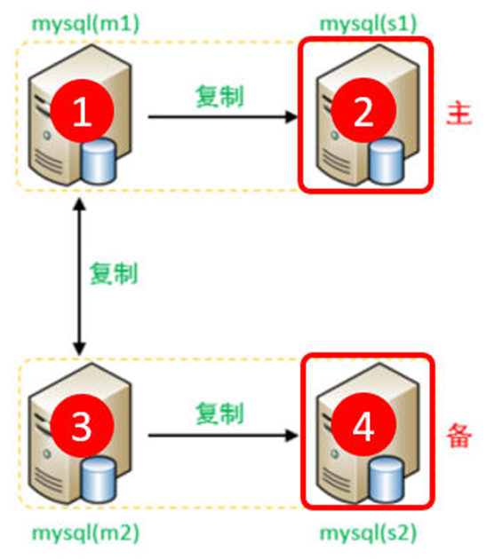

A. 在 slave1(192.168.200.212)上执行

```sql
CHANGE MASTER TO MASTER_HOST='192.168.200.211', MASTER_USER='itcast',
MASTER_PASSWORD='Root@123456', MASTER_LOG_FILE='binlog.000002',
MASTER_LOG_POS=663;
```

B. 在 slave2(192.168.200.214)上执行

```sql
CHANGE MASTER TO MASTER_HOST='192.168.200.213', MASTER_USER='itcast',
MASTER_PASSWORD='Root@123456', MASTER_LOG_FILE='binlog.000002',
MASTER_LOG_POS=663;
```

C. 启动两台从库主从复制，查看从库状态

```sql
start slave;
show slave status \G;
```


##### 2). ==两台主库相互复制==

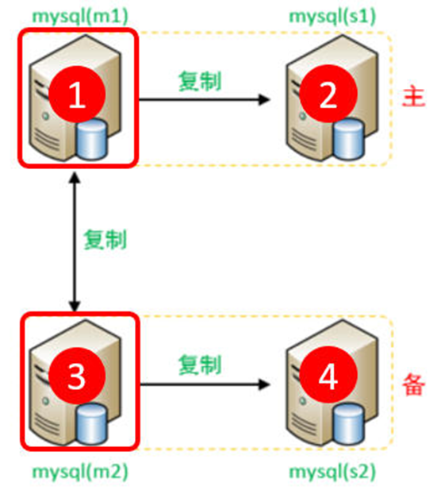

```txt
Master2 复制 Master1，Master1 复制 Master2。 
```

A. 在 Master1(192.168.200.211)上执行

```sql
CHANGE MASTER TO MASTER_HOST='192.168.200.213', MASTER_USER='itcast',
MASTER_PASSWORD='Root@123456', MASTER_LOG_FILE='binlog.000002',
MASTER_LOG_POS=663;
```

B. 在 Master2(192.168.200.213)上执行

```sql
CHANGE MASTER TO MASTER_HOST='192.168.200.211', MASTER_USER='itcast',
MASTER_PASSWORD='Root@123456', MASTER_LOG_FILE='binlog.000002',
MASTER_LOG_POS=663;
```

C. 启动两台从库主从复制，查看从库状态

```sql
start slave;
show slave status \G;
```


经过上述的三步配置之后，双主双从的复制结构就已经搭建完成了。 接下来，我们可以来测试验证一下。


### （4）测试

分别在两台主库Master1、Master2上执行DDL、DML语句，查看涉及到的数据库服务器的数据同步情况。

```sql
create database db01;
use db01;
create table tb_user(
    id int(11) not null primary key ,
    name varchar(50) not null,
    sex varchar(1)
)engine=innodb default charset=utf8mb4;
insert into tb_user(id,name,sex) values(1,'Tom','1');
insert into tb_user(id,name,sex) values(2,'Trigger','0');
insert into tb_user(id,name,sex) values(3,'Dawn','1');
insert into tb_user(id,name,sex) values(4,'Jack Ma','1');
insert into tb_user(id,name,sex) values(5,'Coco','0');
insert into tb_user(id,name,sex) values(6,'Jerry','1');
```

- 在Master1中执行DML、DDL操作，看看数据是否可以同步到另外的三台数据库中。
- 在Master2中执行DML、DDL操作，看看数据是否可以同步到另外的三台数据库中。

完成了上述双主双从的结构搭建之后，接下来，我们再来看看如何完成这种**双主双从的读写分离**。


## 4.5 双主双从==读写分离==

### （1）配置

MyCat控制后台数据库的读写分离和负载均衡由schema.xml文件datahost标签的balance属性控制，通过writeType及switchType来完成失败自动切换的。

#### ①schema.xml

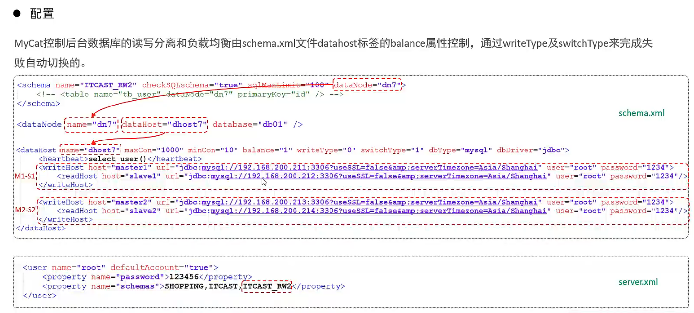

配置逻辑库：

```xml
<schema name="ITCAST_RW2" checkSQLschema="true" sqlMaxLimit="100" dataNode="dn7">
</schema>
```

配置数据节点：

```xml
<dataNode name="dn7" dataHost="dhost7" database="db01" />
```

配置节点主机：

```xml
<dataHost name="dhost7" maxCon="1000" minCon="10" balance="1" writeType="0"
          dbType="mysql" dbDriver="jdbc" switchType="1" slaveThreshold="100">
    <heartbeat>select user()</heartbeat>
    <writeHost host="master1" url="jdbc:mysql://192.168.200.211:3306?  useSSL=false&amp;serverTimezone=Asia/Shanghai&amp;characterEncoding=utf8"
               user="root" password="1234" >
        <readHost host="slave1" url="jdbc:mysql://192.168.200.212:3306?useSSL=false&amp;serverTimezone=Asia/Shanghai&amp;characterEncoding=utf8"
                  user="root" password="1234" />
    </writeHost>
    <writeHost host="master2" url="jdbc:mysql://192.168.200.213:3306?useSSL=false&amp;serverTimezone=Asia/Shanghai&amp;characterEncoding=utf8"
               user="root" password="1234" >
        <readHost host="slave2" url="jdbc:mysql://192.168.200.214:3306?useSSL=false&amp;serverTimezone=Asia/Shanghai&amp;characterEncoding=utf8"
                  user="root" password="1234" />
    </writeHost>
</dataHost>
```

具体的对应情况如下：

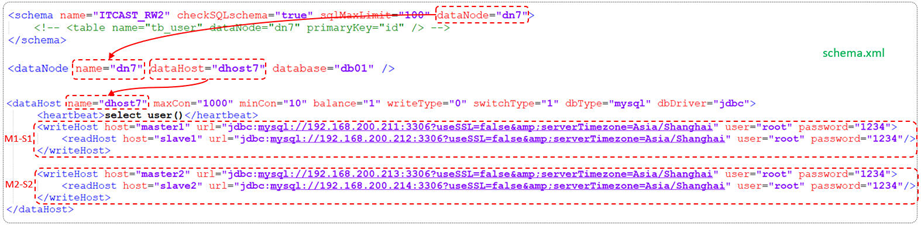

属性说明：

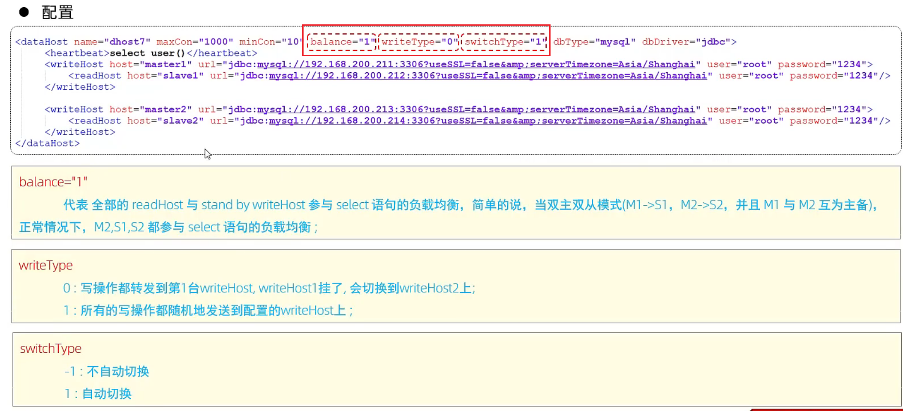

> **balance="1"**
>
> 代表全部的 readHost 与 stand by writeHost 参与 select 语句的负载均衡，简单的说，**当双主双从模式(M1->S1，M2->S2，并且 M1 与 M2 互为主备)，正常情况下，M2,S1,S2 都参与 select 语句的负载均衡** 	
>
> **writeType**
>
> ​	0 : 写操作都转发到第1台writeHost, writeHost1挂了, 会切换到writeHost2上;
>
> ​	1 : 所有的写操作都随机地发送到配置的writeHost上 ;
>
> **switchType**
>
> ​	-1 : 不自动切换
>
> ​	1 : 自动切换，当第1台writeHost宕机后，会不会自动切换到writeHost2上


#### ②server.xml

配置root用户也可以访问到**逻辑库 ITCAST_RW2**。

```xml
<user name="root" defaultAccount="true">
    <property name="password">123456</property>
    <property name="schemas">SHOPPING,ITCAST,ITCAST_RW2</property>
    <!-- 表级 DML 权限设置 -->
    <!--
		<privileges check="true">
		<schema name="DB01" dml="0110" >
		<table name="TB_ORDER" dml="1110"></table>
		</schema>
		</privileges>
	-->
</user>
```


### （2）测试

登录MyCat，测试查询及更新操作，判定是否能够进行读写分离，以及读写分离的策略是否正确。

**当主库挂掉一个之后，是否能够自动切换**。


## 4.6 小结

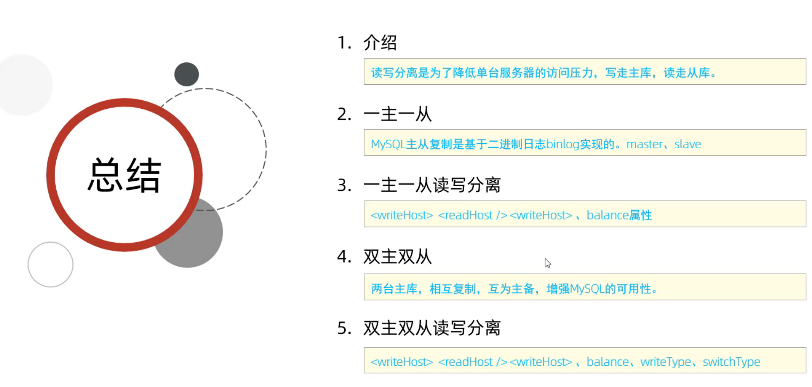

# 5、==Sharding-JDBC==

## 5.1 实现简单的==读写分离==

### （1）背景

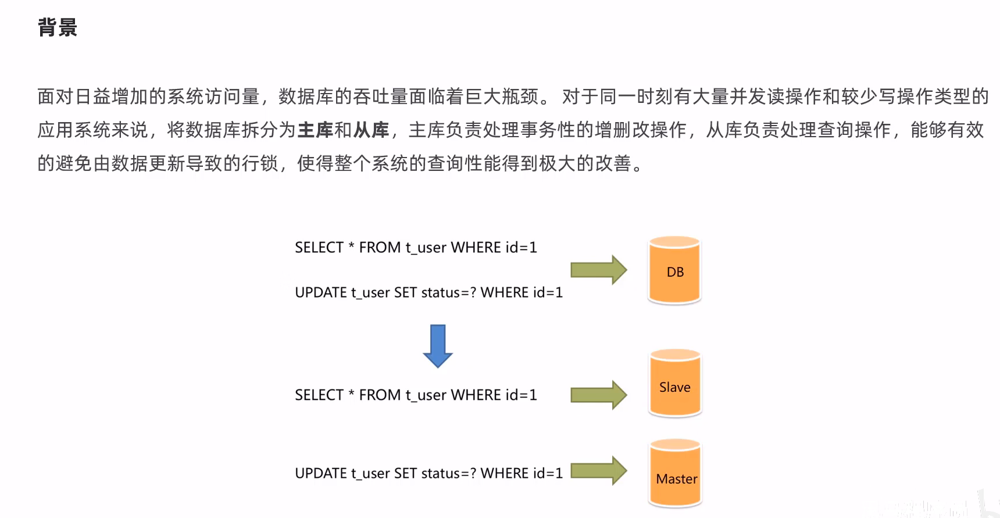

### （2）==Sharding-JDBC==框架

#### ①介绍

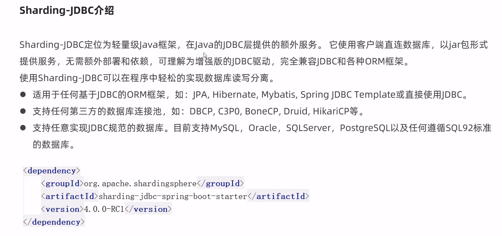

#### ②依赖

```xml
<dependency>
    <groupId>org.apache.shardingsphere</groupId>
    <artifactId>sharding-jdbc-spring-boot-starter</artifactId>
    <version>4.0.0-RC1</version>
</dependency>
```


### （3）实现读写分离步骤

#### ①导入Maven坐标

```xml
<dependency>
    <groupId>org.apache.shardingsphere</groupId>
    <artifactId>sharding-jdbc-spring-boot-starter</artifactId>
    <version>4.0.0-RC1</version>
</dependency>

<!--引入阿里巴巴的 Druid 数据库连接池。Druid 是一个高性能的数据库连接池-->
<dependency>
    <groupId>com.alibaba</groupId>
    <artifactId>druid-spring-boot-starter</artifactId>
</dependency>
```

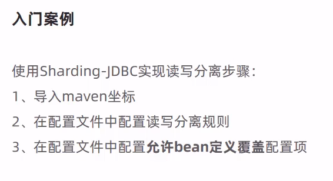

#### ②配置读写分离规则(==application.yaml==)

```yaml
spring:
  #使用sharding-jdbc框架实现读写分离
  shardingsphere:
    datasource:
      names:
        master,slave
      #主数据库(主库)
      master:
        type: com.alibaba.druid.pool.DruidDataSource
        driver-class-name: com.mysql.cj.jdbc.Driver
        url: jdbc:mysql://192.168.88.130:3306/sky-take-out?serverTimezone=Asia/Shanghai&useUnicode=true&characterEncoding=utf-8&zeroDateTimeBehavior=convertToNull&useSSL=false&allowPublicKeyRetrieval=true
        username: root
        password: root
      #从数据库(从库)
      slave:
        type: com.alibaba.druid.pool.DruidDataSource
        driver-class-name: com.mysql.cj.jdbc.Driver
        url: jdbc:mysql://192.168.88.131:3306/sky-take-out?serverTimezone=Asia/Shanghai&useUnicode=true&characterEncoding=utf-8&
        username: root
        password: root
    #读写分离规则
    masterslave:
      #读写分离配置
      load-balance-algorithm-type: round_robin #轮询方式，多个从库依次轮询
      #最终的数据源名称
      name: dataSource
      #主库数据源名称
      master-data-source-name: master
      #从库数据源名称列表，多个逗号分隔
      slave-data-source-names: slave
    props:
      sql:
        show: true #开启SQL显示，默认false，控制台可以输出sql语句
    main:
    allow-bean-definition-overriding: true #允许bean数据源覆盖
```


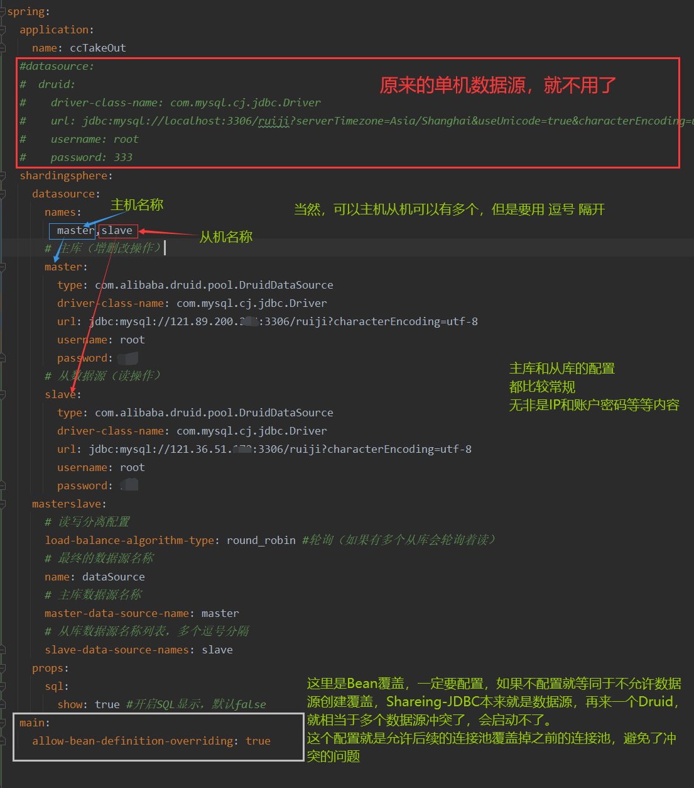


#### ③ 设置允许==bean定义覆盖==

- **由于==sharding-jdbc==和阿里云的==Druid==的数据源==都会==在IOC容器中==创建数据源Bean对象==**

- **在application.yaml中配置==运行Bean对象的覆盖==**

  

```yaml
spring:
	  main:
    	allow-bean-definition-overriding: true   #运行Bean对象覆盖
```


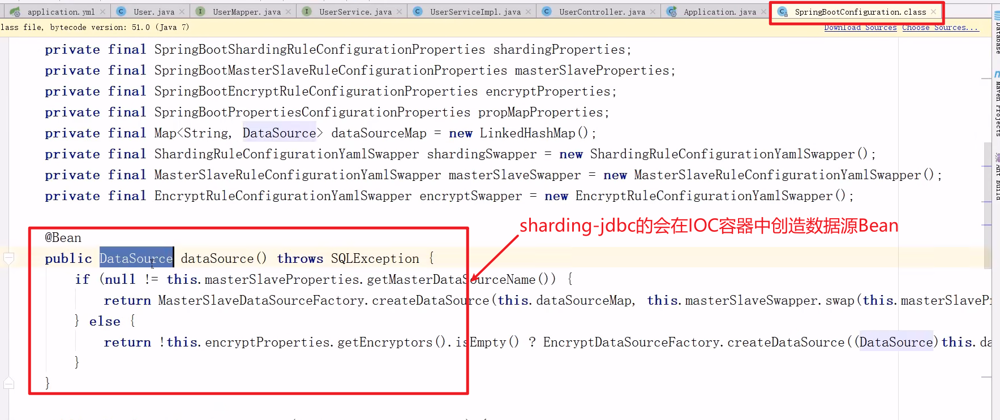

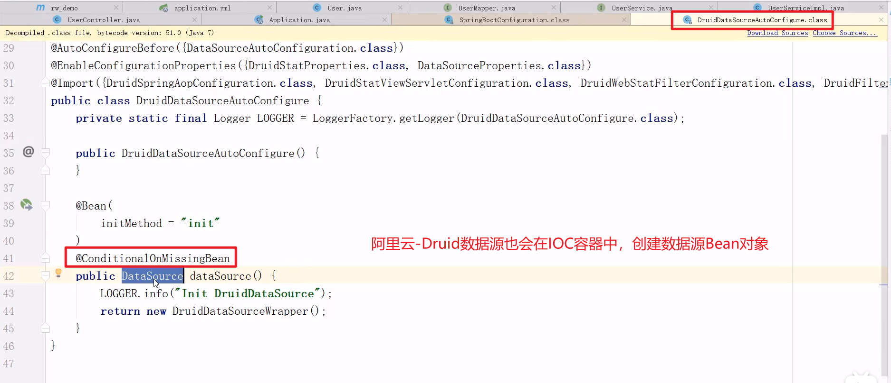

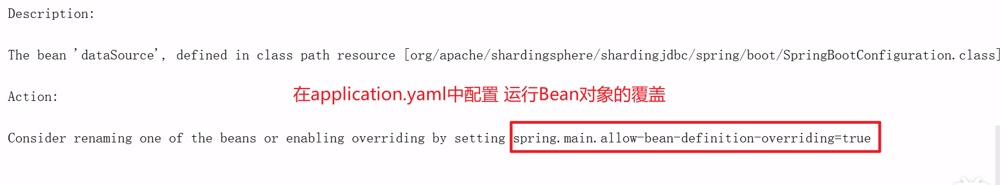


