# MySql-Learning

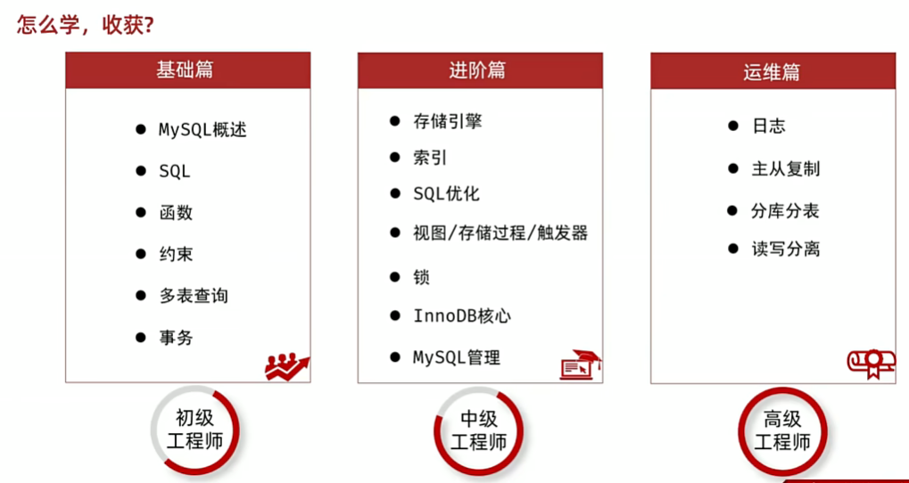


# 二、高级篇

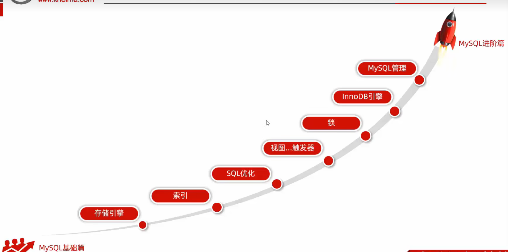

# 1、🌟存储引擎

## 1.1 MySQL体系结构

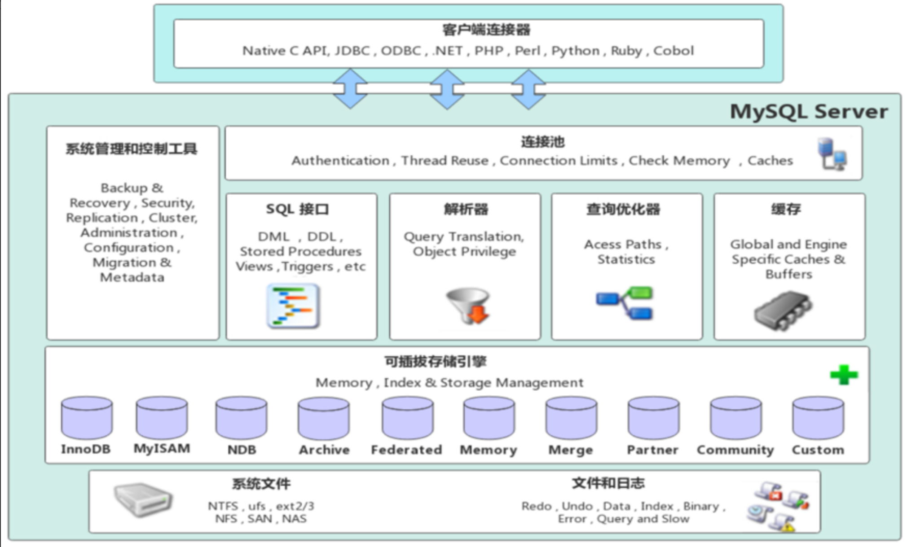

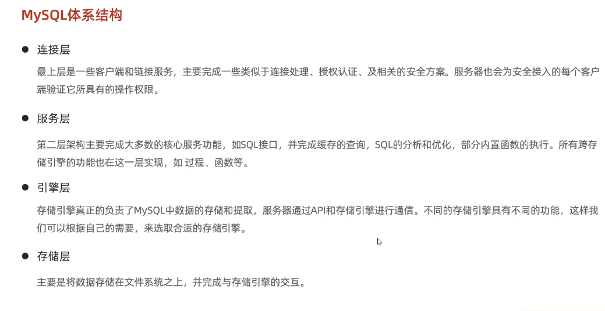

### （1）连接层

最上层是一些客户端和链接服务，包含**本地sock 通信**和大多数基于**客户端/服务端工具实现的类**似于TCP/IP的通信。主要完成一些类似于**连接处理、授权认证、及相关的安全方案**。在该层上引入了**线程池**的概念，为通过认证安全接入的客户端提供线程。同样在该层上可以实现基于SSL的安全链接。服务器也会为安全接入的每个客户端验证它所具有的操作权限。


### （2）==服务层==

第二层架构主要完成大多数的核心服务功能，如**SQL接口，并完成缓存的查询，SQL的分析和优化，部分内置函数的执行**。所有跨存储引擎的功能也在这一层实现，如 过程、函数等。在该层，服务器会解析查询并**创建相应的内部解析树**，并对其完成相应的优化如确定表的查询的顺序，是否**利用索引**等，最后生成相应的执行操作。如果是select语句，服务器还会查询内部的缓存，如果缓存空间足够大，这样在解决大量读操作的环境中能够很好的提升系统的性能。


### （3）引擎层

存储引擎层， 存储引擎真正的**负责了MySQL中数据的存储和提取**，**服务器通过API和存储引擎进行通信**。不同的存储引擎具有不同的功能，这样我们可以根据自己的需要，来选取合适的存储引擎。**==数据库中的索引是在存储引擎层实现的==**。


### （4）存储层

数据存储层， 主要是将**数据(如: redolog、undolog、数据、索引、二进制日志、错误日志、查询日志、慢查询日志等)存储在文件系统之上**，并完成与存储引擎的交互。


> 和其他数据库相比，MySQL有点与众不同，它的架构可以在多种不同场景中应用并发挥良好作用。主要  体现在存储引擎上，**==插件式的存储引擎架构==**，**将查询处理和其他的系统任务以及数据的存储提取分离**。 这种架构可以根据业务的需求和实际需要**选择合适的存储引擎**。


## 1.2 ==存储引擎==介绍

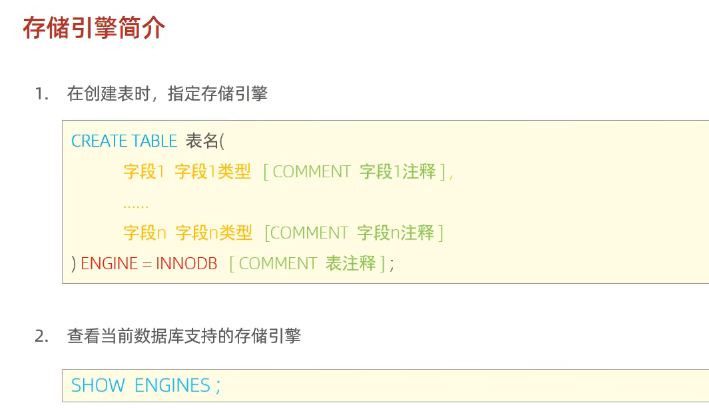

### （1）概念


大家可能没有听说过存储引擎，但是一定听过引擎这个词，引擎就是发动机，是一个机器的核心组件。比如，对于舰载机、直升机、火箭来说，他们都有各自的引擎，是他们最为核心的组件。而我们在选择引擎的时候，需要在合适的场景，选择合适的存储引擎，就像在直升机上，我们不能选择舰载机的引擎一样。

而对于存储引擎，也是一样，他是**mysql数据库的核心**，我们也需要在合适的场景选择合适的存储引擎。接下来就来介绍一下存储引擎。**存储引擎就是存储数据、建立索引、更新/查询数据等技术的实现方式** 。**==存储引擎是基于表的，而不是基于库的==**，所以**==存储引擎也可被称为表类型==**。我们可以在创建表的时候，来指定选择的存储引擎，如果

**没有指定将自动选择默认的存储引擎。**


### （2）建表时指定存储引擎

```sql
CREATE TABLE 表名(
字段1 字段1类型 [ COMMENT 字段1注释 ] ,
......
字段n 字段n类型 [COMMENT 字段n注释 ]
) ENGINE = INNODB [ COMMENT 表注释 ] ;
```

### （3）查询当前数据库支持的存储引擎

```sql
show engines;
```

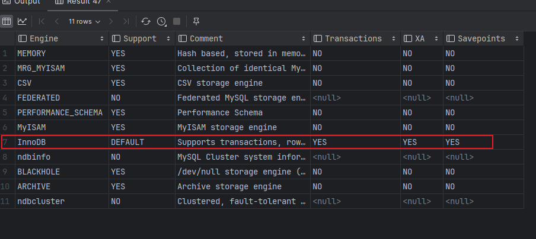

### （4）示例演示

#### A. 查询建表语句 --- 默认存储引擎: InnoDB

```sql
show create table account; 
```

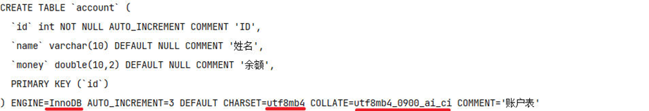

我们可以看到，创建表时，即使我们没有指定存储引擎，数据库也会**自动选择默认的存储引擎**。


#### B. 查询当前数据库支持的存储引擎

```sql
show engines ; 
```


#### C. 创建表 my_myisam , 并指定MyISAM存储引擎

```sql
create table my_myisam(
    id int,
    name varchar(10)
) engine = MyISAM ;
```

#### D. 创建表 my_memory , 指定Memory存储引擎

```sql
create table my_memory(
    id int,
    name varchar(10)
) engine = Memory ;
```


## 1.3 🌟 ==存储引擎特点==

上面我们介绍了什么是存储引擎，以及如何在建表时如何指定存储引擎，接下来我们就来介绍下来上面重点提到的**三种存储引擎 InnoDB、MyISAM、Memory的特点**。

### （1）🌟 ==InnoDB==

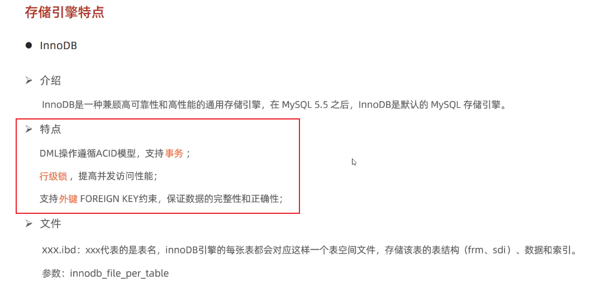

#### ①介绍

**InnoDB是一种兼顾高可靠性和高性能的通用存储引擎**，在 MySQL 5.5 之后，InnoDB是默认的MySQL 存储引擎。


#### ②特点

- DML(增删改)操作遵循ACID模型，支持事务；
- **行级锁，提高并发访问性能**；
- 支持外键FOREIGN KEY约束，保证数据的完整性和正确性；


#### ③文件

xxx.ibd：xxx代表的是表名，innoDB引擎的每张表都会对应这样一个**==表空间文件==**，存储该表的**表结构**（**frm-早期的 、sdi-新版的**）、**数据和索引**。

参数：innodb_file_per_table

```sql
show variables like 'innodb_file_per_table';
```

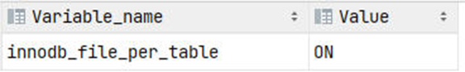

如果**该参数开启**，代表对于InnoDB引擎的表，**每一张表都对应一个ibd文件**。 我们直接打开MySQL的数据存放目录： C:\ProgramData\MySQL\MySQL Server 8.0\Data ， 这个目录下有很多文件夹，**不同的文件夹代表不同的数据库**，我们直接打开itcast文件夹。

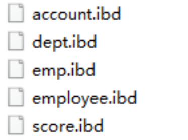

可以看到里面有很多的ibd文件，每一个ibd文件就对应一张表，比如：我们有一张表 account，就有这样的一个account.ibd文件，而在这个ibd文件中不仅存放表结构、数据，还会存放该表对应的索引信息。 而该文件是基于二进制存储的，不能直接基于记事本打开，我们可以使用**mysql提供的一个指令 ibd2sdi** ，通过该指令就可以**从ibd文件中提取sdi信息**，而**sdi数据字典信息中就包含该表的表结构**。

```bash
idb2sdi account.ibd #返回一个JSON数据
```

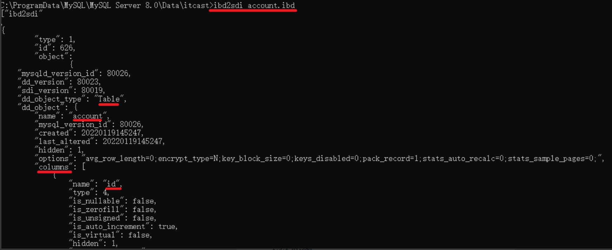


#### ④逻辑存储结构

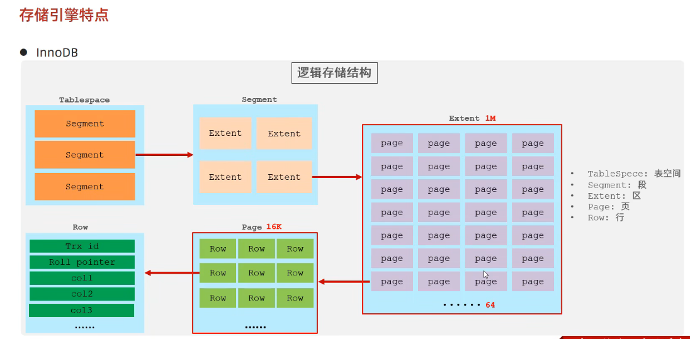


- 表空间 : InnoDB存储引擎逻辑结构的最高层，**ibd文件其实就是表空间文件**，在表空间中可以包含**多个Segment段**。
- 段 : 表空间是由各个段组成的， 常见的段有**数据段、索引段、回滚段**等。InnoDB中对于段的管理，都是引擎自身完成，不需要人为对其控制，一个段中包含多个区。
- 区 : 区是表空间的单元结构，**每个区的大小为1M**。 默认情况下， InnoDB**存储引擎页大小为16K**， **==即一个区中一共有64个连续的页==**。
- 页 : **==页是组成区的最小单元==**，**页也是**InnoDB **存储引擎磁盘管理的最小单元**，每个页的大小默认为 16KB。为了保证页的连续性，InnoDB 存储引擎**每次从磁盘申请 4-5 个区**。
- 行 : **InnoDB 存储引擎是面向行的**，也就是说**数据是按行进行存放**的，在每一行中除了定义表时所指定的字段以外，还包含**两个隐藏字段**（后面会详细介绍）
  - Trx id : 最后一次操作的事务Id 
  - Roll pointer ：指针


### （2）MyISAM

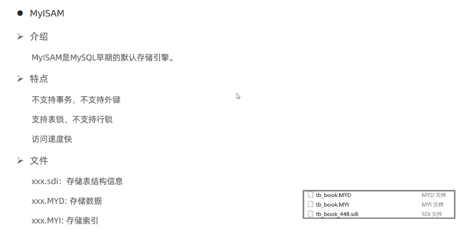

#### ①介绍

MyISAM是MySQL早期的默认存储引擎。

#### ②特点

- 不支持事务，不支持外键
- **支持表锁，不支持行锁**
- 访问速度快

#### ③文件

- xxx.sdi：**存储表结构**信息
- xxx.MYD: 存储**数据**
- xxx.MYI: 存储**索引**

 


### （3）Memory

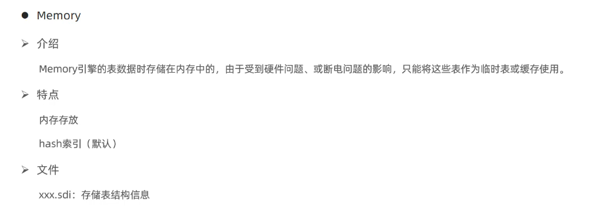

#### ①介绍

Memory引擎的表数据时**存储在内存中的**，由于受到硬件问题、或断电问题的影响，只能将这些表作为**临时表或缓存使用**。

#### ②特点

- 内存存放
- hash索引（默认）

#### ③文件

xxx.sdi：**存储表结构信息**


### （4）==区别及特点==

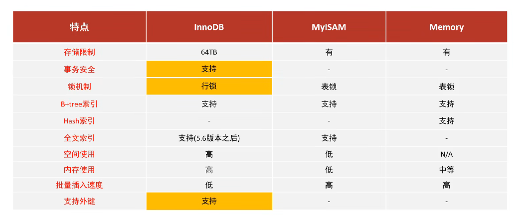

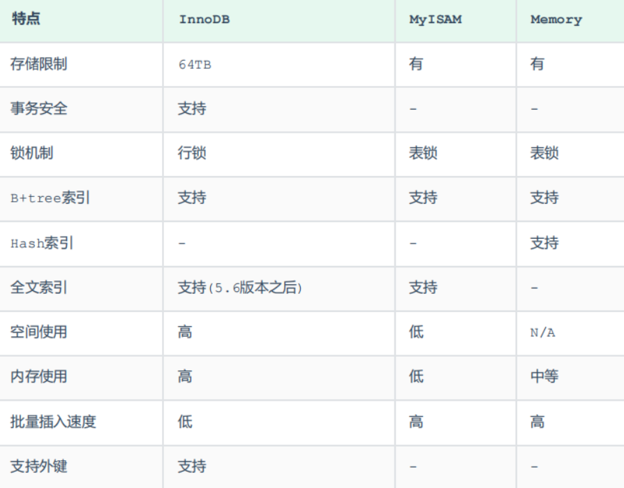


> **面试题:**
>
> InnoDB引擎与MyISAM引擎的区别 ?
>
> - ①InnoDB引擎, **支持事务, 而MyISAM不支持**。
> - ②InnoDB引擎, **支持行锁和表锁, 而MyISAM仅支持表锁, 不支持行锁**。
> - ③InnoDB引擎, **支持外键, 而MyISAM是不支持的**。
>
> 主要是上述三点区别，当然也可以从索引结构、存储限制等方面，更加深入的回答，具体参
>
> 考如下官方文档：
>
> **https://dev.mysql.com/doc/refman/8.0/en/innodb-introduction.html**
>
> **https://dev.mysql.com/doc/refman/8.0/en/myisam-storage-engine.html**


## 1.4 存储引擎选择


在选择存储引擎时，应该根据应用系统的特点选择合适的存储引擎。对于复杂的应用系统，还可以根据实际情况选择多种存储引擎进行组合。

- InnoDB: 是Mysql的默认存储引擎，**支持事务、外键**。如果**应用对事务的完整性有比较高的要求**，**在并发条件下要求数据的一致性，数据操作除了插入和查询之外，还包含很多的更新、删除操作**，那么InnoDB存储引擎是比较合适的选择。
- MyISAM ： 如果应用是**以读操作和插入操作为主**，只有很少的更新和删除操作，并且对事务的完整性、并发性要求不是很高，那么选择这个存储引擎是非常合适的。**（该场景可用NoSQL数据库，==MongoDB==）**
- MEMORY：**将所有数据保存在内存中**，**访问速度快，通常用于临时表及缓存**。MEMORY的缺陷就是对表的大小有限制，太大的表无法缓存在内存中，而且**无法保障数据的安全性**。**（该场景可用==Redis==替代）**


## 1.5 小结

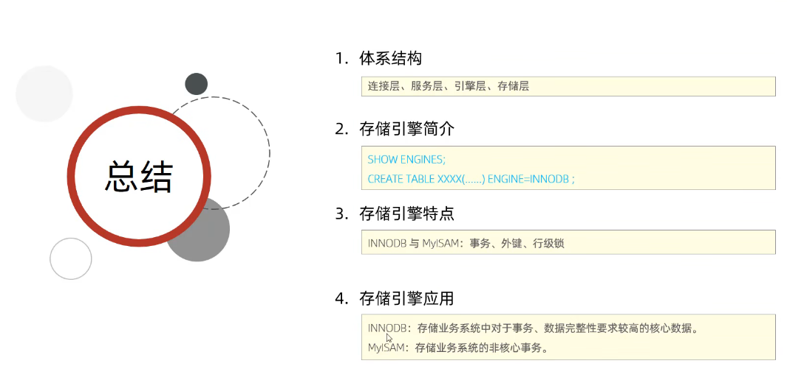

# 2、🚀 ==索引==

## 2.1 索引概述

### （1）介绍

索引（index）是帮助**MySQL==高效获取数据的数据结构(有序)==**。在数据之外，数据库系统还维护着满足特定查找算法的数据结构，这些数据结构以某种方式**引用（指向）数据**， 这样就可以在这些数据结构上实现高级查找算法，这种数据结构就是索引。


一提到数据结构，大家都会有所担心，担心自己不能理解，跟不上节奏。不过在这里大家完全不用担心，我们后面在讲解时，会详细介绍。


### （2）演示

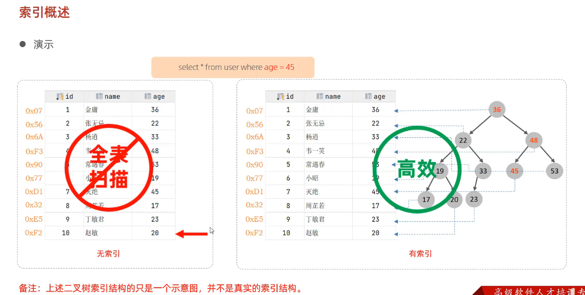

表结构及其数据如下：

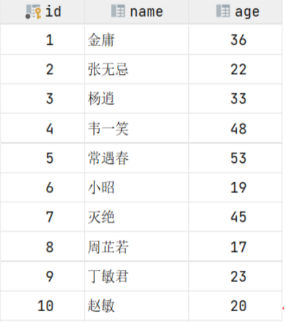

假如我们要执行的SQL语句为 ： select * from user where age = 45;

#### ①无索引情况

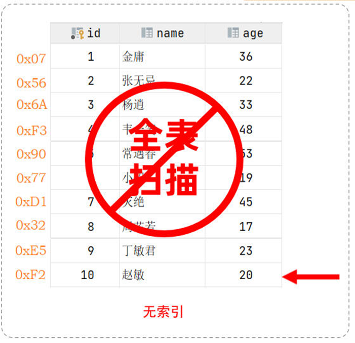

在无索引情况下，就需要从**第一行开始扫描，一直扫描到最后一行（不一定保证表里面只有一个age=45**），我们称之为 **全表扫描**，性能很低。


#### ②有索引情况

如果我们针对于这张表建立了索引，假设**索引结构就是二叉树**，那么也就意味着，会对age这个字段建立一个二叉树的索引结构。

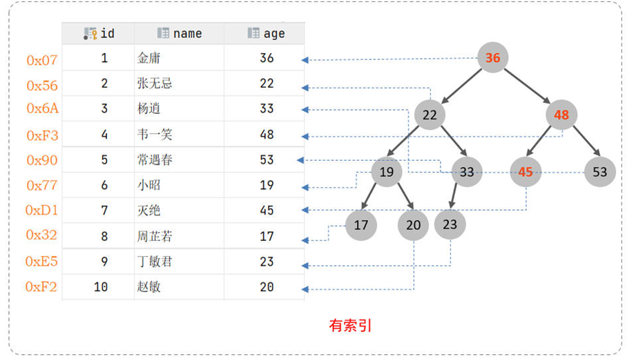

此时我们在进行查询时，只需要**扫描三次**就可以找到数据了，极大的提高的查询的效率。


> **备注：** 这里我们只是假设索引的结构是二叉树，介绍一下索引的大概原理，只是一个**示意图**，并
>
> **不是索引的真实结构**，索引的真实结构，后面会详细介绍。


### （3）优缺点


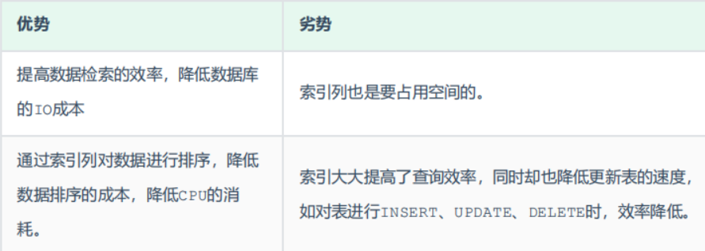


## 2.2 🌟 索引结构

### （1）概述

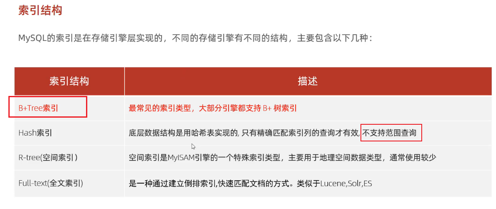

MySQL的索引是在**==存储引擎层==**实现的，不同的存储引擎有不同的索引结构，主要包含以下几种：

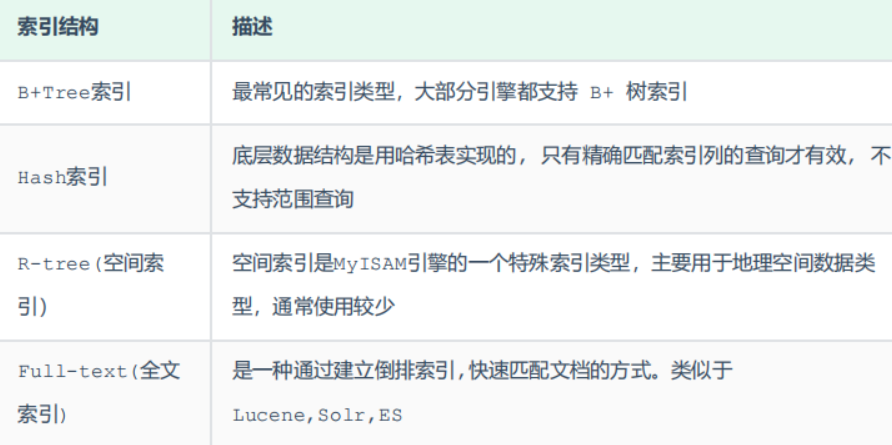

上述是MySQL中所支持的所有的索引结构，接下来，我们再来看看**不同的存储引擎**对于索引结构的支持情况。

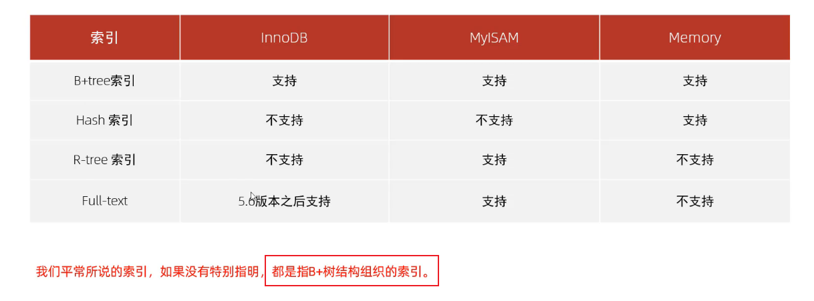

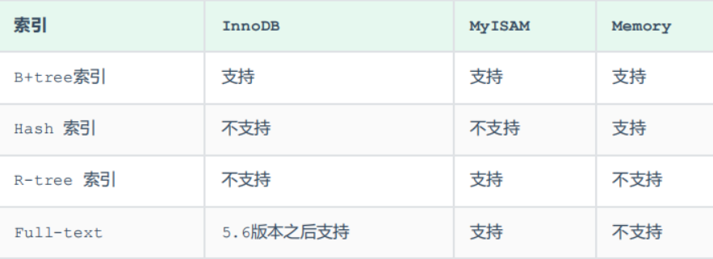


> 注意： 我们平常所说的索引，如果没有特别指明，都是**指B+树结构组织的索引**。


### （2）二叉树

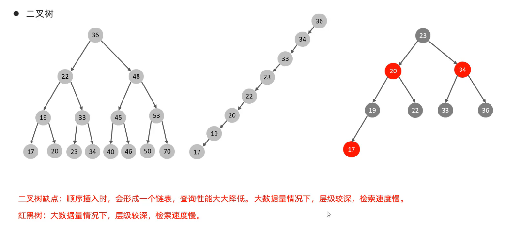

#### ①二叉树

假如说MySQL的索引结构采用二叉树的数据结构，比较理想的结构如下：

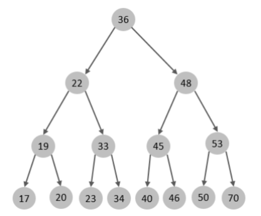

如果**主键是顺序插入**的，则**会形成一个单向链表**，结构如下：

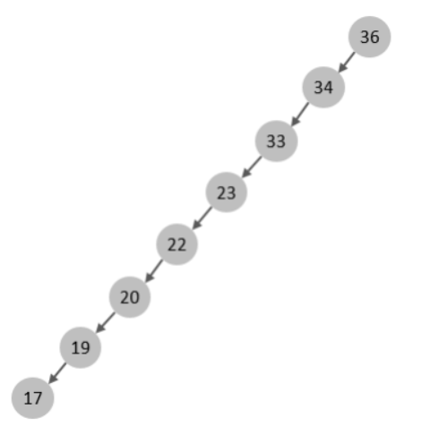

所以，如果选择二叉树作为索引结构，会存在以下**缺点**：

- 顺序插入时，会形成一个链表，**查询性能大大降低**。
- 大数据量情况下，**层级较深，检索速度慢**。


#### ②红黑树

此时大家可能会想到，我们可以选择红黑树，**红黑树是一颗自平衡二叉树**，那这样即使是顺序插入数据，最终形成的数据结构也是一颗**平衡的二叉树**,结构如下:

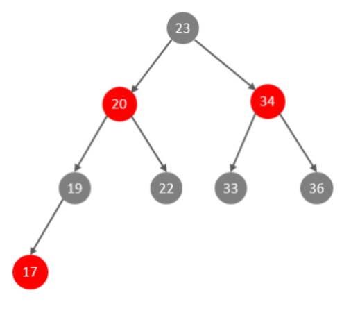

但是，即使如此，由于**红黑树也是一颗二叉树**，所以也会存在一个**缺点**：

- 大数据量情况下，**层级较深，检索速度慢**。

所以，在MySQL的索引结构中，并没有选择二叉树或者红黑树，而选择的是**B+Tre**e，那么什么是B+Tree呢？在详解B+Tree之前，先来介绍一个B-Tree。


### （3）🌟 ==B-Tree==

#### ①概念

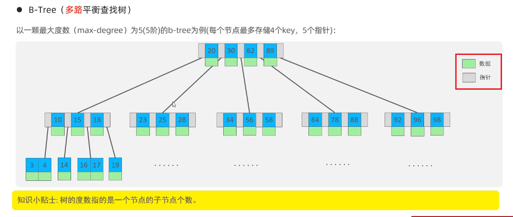

B-Tree，B树是一种**多叉路衡查找树**，相对于二叉树，B树**每个节点可以有多个分支，即多叉**。以一颗最大度数（max-degree）为5(5阶)的b-tree为例，那这个B树**每个节点最多存储4个key，5个指针**

- **指针会比key多一个**，原因是如下图的20 30 62 89 对应四个key，而这四个key可以将范围划分成五份，比如<20, 	20-30 ,	30-62,	 62-89,	 >89 ，所以4个key对应5个指针。

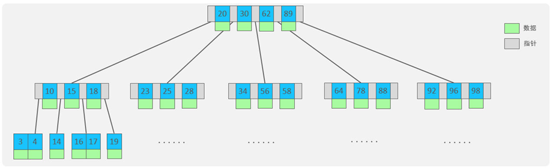


> 知识小贴士: 树的**度数**指的是**一个节点的子节点个数**。


我们可以通过一个**数据结构可视化的网站**来简单演示一下。 

**https://www.cs.usfca.edu/~galles/visualization/BTree.html**


插入一组数据： 100 65 169 368 900 556 780 35 215 1200 234 888 158 90 1000 88 120 268 250 。然后观察一些数据插入过程中，节点的变化情况。

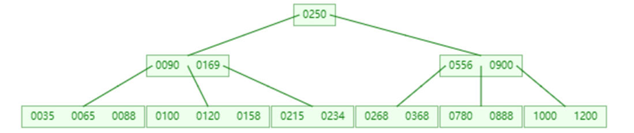

#### ②特点

- 5阶的B树，**每一个节点最多存储4个key，对应5个指针**。

- 一旦节点存储的**key数量到达5**，就会**==裂变==，==中间元素向上分裂==**。

  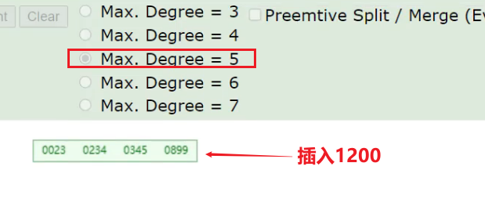

  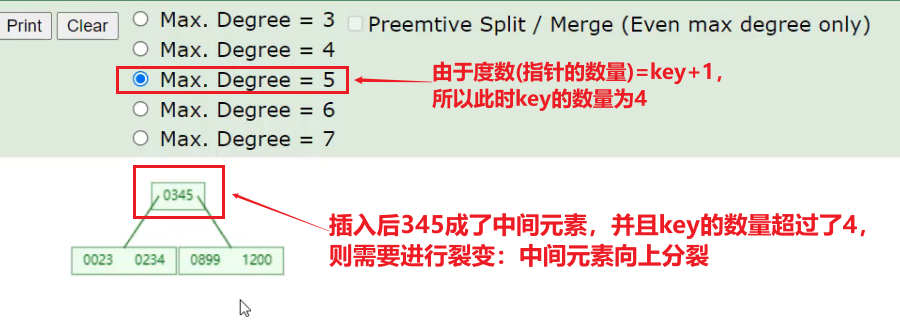

  

- 在B树中，**==非叶子节点和叶子节点都会存放数据==**。


#### ③过程演示


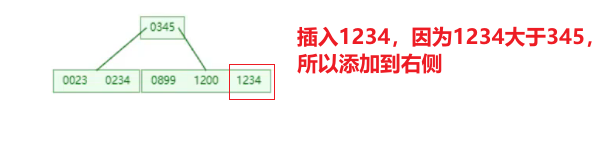


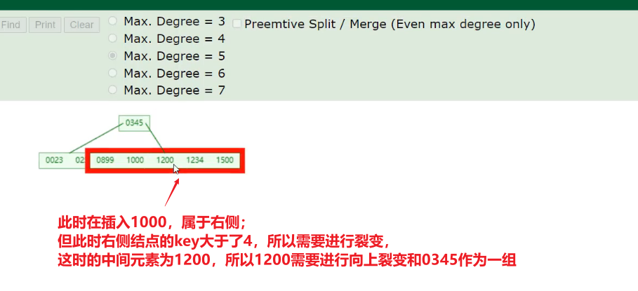

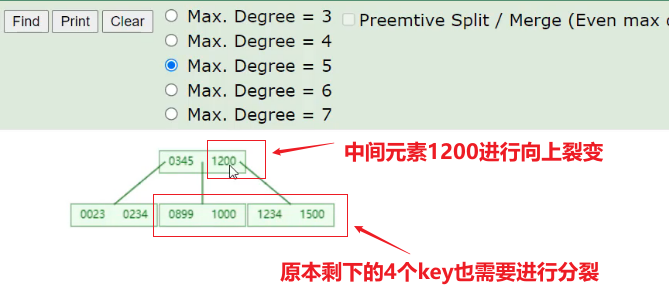

**剩下的以此类推**：

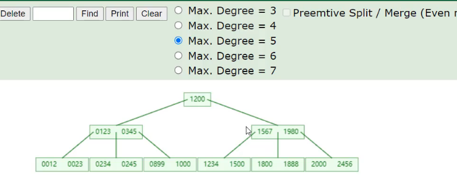


### （4）🌟B+Tree

#### ①概念及特点

B+Tree是B-Tree的变种，我们以一颗最大度数（max-degree）为4（**4阶**）的b+tree为例（**==4阶 b+ tree 对应 3个key，4个指针==**），来看一 下其结构示意图：

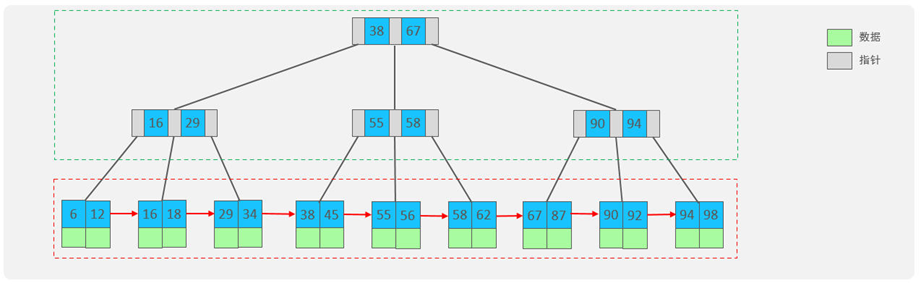

我们可以看到，两部分：

- 绿色框框起来的部分，是**==索引部分，仅仅起到索引数据的作用==**，**不存储数据**。
- 红色框框起来的部分，是**数据存储部分**，在**==其叶子节点中要存储具体的数据==**。
- **==叶子节点形成一个单向链表==**。
- **==所有元素都会出现在叶子节点==，包括==裂变时向上分裂的中间元素==**-也需要保留


我们可以通过一个数据结构可视化的网站来简单演示一下。 https://www.cs.usfca.edu/~galles/visualization/BPlusTree.html


插入一组数据： 100 65 169 368 900 556 780 35 215 1200 234 888 158 90 1000 88 120 268 250 。然后观察一些数据插入过程中，节点的变化情况。

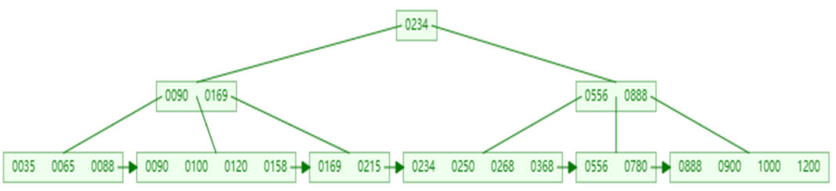

最终我们看到，B+Tree与 B-Tree相比，主要有以下**三点区别**：

-  所有的数据都会出现在**叶子节点**。
-  **叶子节点形成一个单向链表**。
-  **非叶子节点**仅仅起到**索引数据作用**，**具体的数据**都是在**叶子节点存放**的。


#### ②Mysql中的B+Tree-==循环双向链表==


上述我们所看到的结构是**标准**的B+Tree的数据结构，接下来，我们再来看看**MySQL中优化之后的 B+Tree**。

MySQL索引数据结构对经典的B+Tree进行了优化。在原B+Tree的基础上，**==增加一个指向相邻叶子节点链表指针==**，就形成了**==带有顺序指针的B+Tree==**，**提高区间访问的性能，利于排序**。

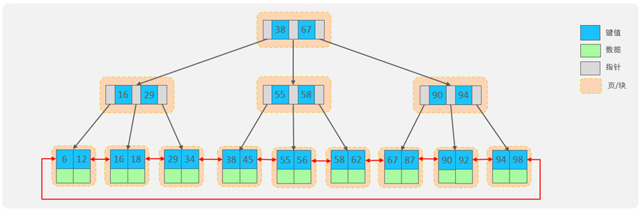


### （5）Hash

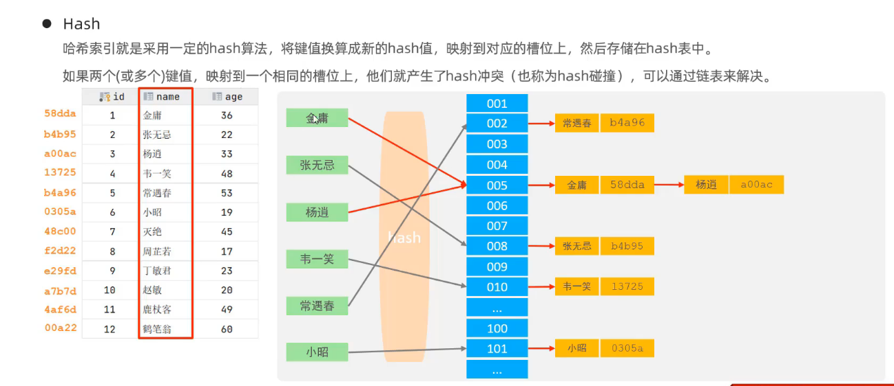

MySQL中除了支持B+Tree索引，还支持一种索引类型---**Hash索引**。 

#### ①结构

哈希索引就是采用一定的hash算法，**将键值换算成新的hash值**，映射到对应的槽位上，然后存储在
hash表中。

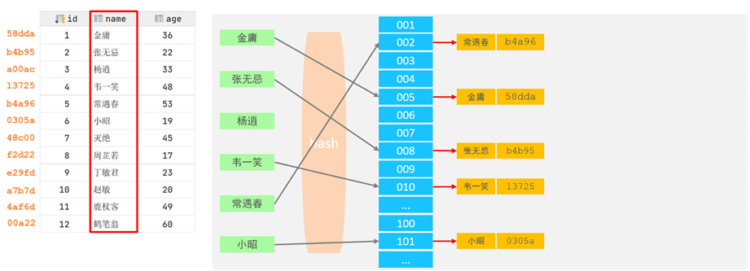

如果**两个(或多个)键值，映射到一个相同的槽位上**，他们就产生了**hash冲突**（也称为hash碰撞），可以**通过链表来解决**。

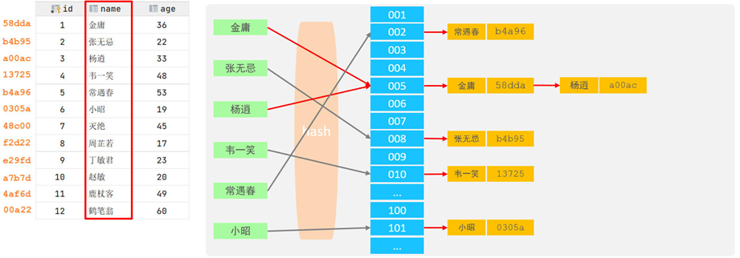


#### ②特点

- A. Hash索引只能用于**对等比较**(=，in)，**不支持范围查询**（between，>，< ，...）
- B. **无法利用索引完成==排序操作==**
- C. 查询效率高，通常==(**不存在hash冲突的情况**)**只需要一次检索**==就可以了，效率通常要高于B+tree索引


#### ③存储引擎支持

在MySQL中，支持hash索引的是**Memory存储引擎**。 而**InnoDB中具有自适应hash功能**，hash索引是InnoDB存储引擎**根据B+Tree索引在指定条件下自动构建的**。


> 思考题： 为什么InnoDB存储引擎选择使用**B+tree索引结构**?
>
> - A. 相对于二叉树，层级更少，搜索效率高；
>
> - B. 对于B-tree，无论是叶子节点还是非叶子节点，都会保存数据，这样导致**==一页中存储的键值减少，指针跟着减少==**，**要同样保存大量数据，只能==增加树的高度(层级变深)==，导致性能降低**；
>
> - C. **相对Hash索引**，B+tree支持**==范围匹配及排序操作==**；
>
>   


## 2.3 🌟 ==索引分类==

### （1）索引分类

在MySQL数据库，将索引的具体类型主要分为以下几类：**主键索引、唯一索引、常规索引、全文索引**。

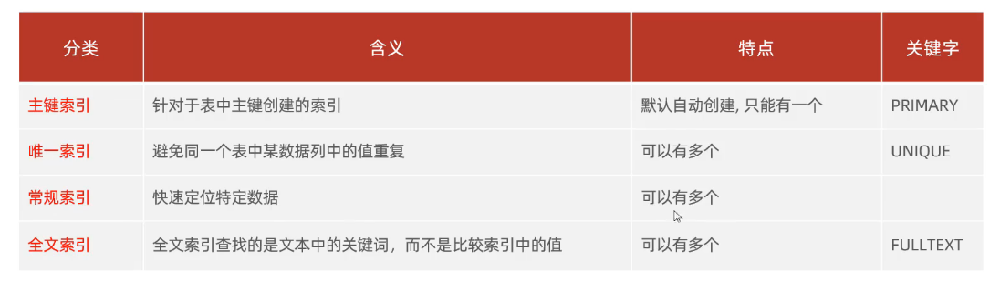

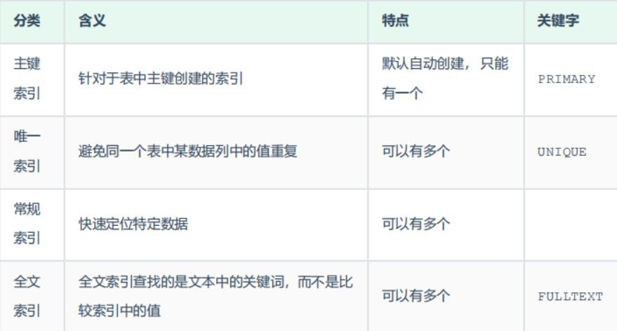


### （2）🌟聚集索引&二级索引

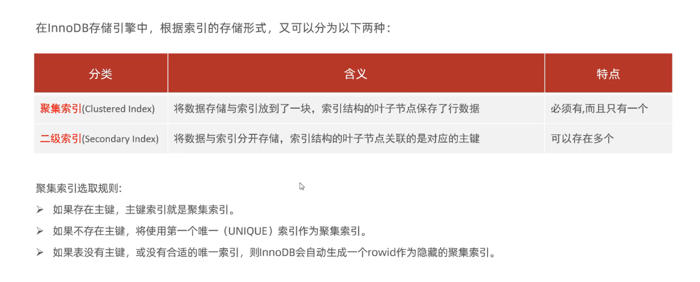

而在在InnoDB存储引擎中，根据索引的存储形式，又可以分为以下两种：

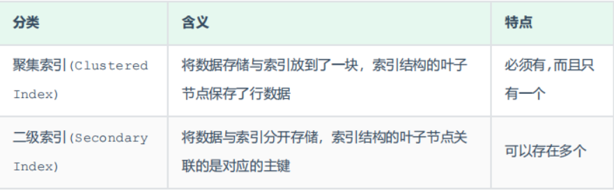


#### ①聚集索引==选取规则==

- 如果存在主键，主键索引就是聚集索引。
- 如果**不存在主键**，将使用**==第一个唯一（UNIQUE）索引==**作为聚集索引。
- 如果表没有主键，或没有合适的唯一索引，则InnoDB会**自动生成一个rowid作为隐藏的聚集索引**。


#### ②聚集索引和二级索引的==具体结构==

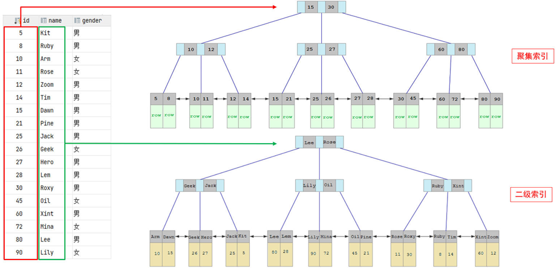


- 聚集索引的叶子节点下挂的是**这一行的数据** 。
- **二级索引的叶子节点**下挂的是**该字段值==对应的主键值==**。


#### ③🌟SQL语句执行过程分析-==回表查询==


> **回表查询**： 
>
> 这种先到**二级索引中查找数据，找到主键值**，
>
> 然后再到**聚集索引中根据主键值，获取数据的方式**，就称之为==回表查询==。


接下来，我们来分析一下，当我们执行如下的SQL语句时，具体的查找过程是什么样子的。

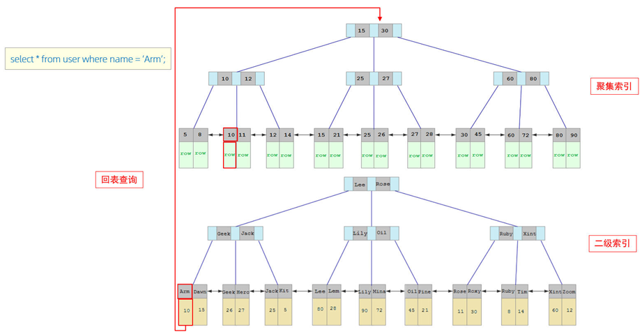

**具体过程如下:**

- ① 由于是根据name字段进行查询，所以先根据name='Arm'到name字段的**二级索引中进行匹配查找**。但是在二级索引中只能查找到 **Arm对应的主键值10**。

- ② 由于查询返回的数据是*，所以此时，**还需要==根据主键值10==，到==聚集索引中查找10对应的记录==**，最终找到10对应的行**row**。
- ③ **最终拿到这一行的数据**，直接返回即可。


#### ④🌟==思考题==

> 思考题：
>
> 以下两条SQL语句，那个执行效率高? 为什么?
>
> - A. select * from user where id = 10 ;
> - B. select * from user where name = 'Arm' ;
>
> 备注: **id为主键**，**name字段创建的有索引**；
>
> 
>
> 解答：
>
> ​	A 语句的执行性能要高于B 语句。
>
> - 因为A语句**直接走聚集索引**，直接返回数据。
> - 而B语句需要**先查询**name字段的**二级索引**，然后**再查询聚集索引**，也就是**==需要进行回表查询==**。


> **思考题**：
>
> 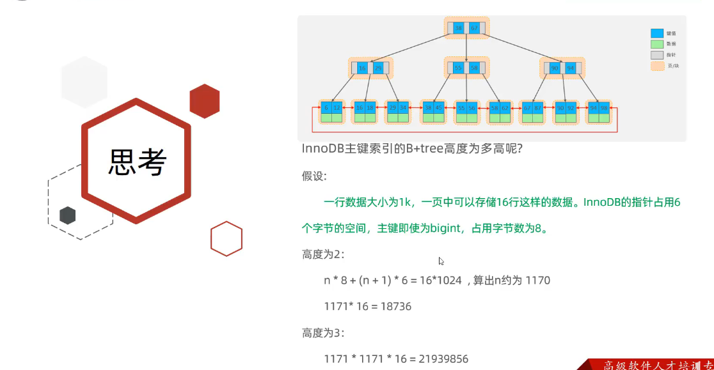
>
> **InnoDB==主键索引的B+tree高度为多高==呢**?
>
> 
>
> 假设:
>
> ​	一行数据大小为**1k**，**一页（16K）中可以存储16行**这样的数据。InnoDB的**指针占用6个字节的空间**，**主键类型**即使为**bigint，占用字节数为8**。
>
> 高度为2：( 设每个节点(页)中的key的个数为n )
>
> - `n*8`：设主键类型为bigint**占用8字节**，**每个节点的key个数为n**，则一个页中因为键值key占用`n*8`字节
> - `(n+1)*6`：InnoDB的指针**占用6个字节**，**指针数量=key+1=度数**，则一页中指针共占用`(n+1)*6`个字节。
> - `16*1024`：一页的大小为16K，假设一行-**row的数据大小为1K**,则一页共可以**存储16行**。
>
> 计算：
>
> ​		n * 8 + (n + 1) * 6 = 16*1024 , 算出n约为 1170,则每页中共有1170个key
>
> ​		每页中对应的指针的个数为：`key+1`  ,即1171，**每个指针又会指向新的一页**，每页中又有16行数据，那么1171* 16 = 18736
>
> 也就是说，如果树的高度为2，则可以存储 18000 多条记录。
>
> ------
>
> 高度为3：
>
> ​		1171 * 1171 * 16 = 21939856
>
> 也就是说，如果**树的高度为3**，则可以存储 **2200w 左右的记录**。


## 2.4 索引语法

### （0）Mysql索引的类别

MySQL 支持多种索引类型，每种类型有不同的用途和特性。以下是主要的索引类别：

#### 1. ==普通索引 (INDEX)==

- **特点**：

  - 最基本的索引类型，仅加速查询
  - 允许重复值和NULL值

- **创建方式**：

  ```sql
  CREATE INDEX idx_name ON table_name(column_name);
  -- 或
  ALTER TABLE table_name ADD INDEX idx_name(column_name);
  ```

#### 2. ==唯一索引 (UNIQUE INDEX)==

- **特点**：

  - 索引列的值必须唯一，但允许NULL值（NULL可以重复）
  - 自动创建约束，防止重复值

- **创建方式**：

  ```sql
  CREATE UNIQUE INDEX idx_name ON table_name(column_name);
  -- 或
  ALTER TABLE table_name ADD UNIQUE idx_name(column_name);
  ```

#### 3. ==主键索引 (PRIMARY KEY)==

- **特点**：

  - 特殊的唯一索引，不允许NULL值
  - 每个表只能有一个主键
  - 自动创建聚集索引（InnoDB引擎）

- **创建方式**：

  ```sql
  ALTER TABLE table_name ADD PRIMARY KEY(column_name);
  -- 或建表时指定
  CREATE TABLE table_name (
    id INT NOT NULL,
    PRIMARY KEY (id)
  );
  ```

#### 4. 全文索引 (FULLTEXT INDEX)

- **特点**：

  - 专门用于全文搜索
  - 仅适用于MyISAM和InnoDB引擎（MySQL 5.6+）
  - 支持MATCH AGAINST操作

- **创建方式**：

  ```sql
  CREATE FULLTEXT INDEX idx_name ON table_name(column_name);
  ```

#### 5. ==组合索引 (复合索引)==

- **特点**：

  - **在多个列上建立的索引**
  - 遵循"**最左前缀原则**"

- **创建方式**：

  ```sql
  CREATE INDEX idx_name ON table_name(col1, col2, col3);
  ```

#### 6. 空间索引 (SPATIAL INDEX)

- **特点**：

  - 用于地理空间数据类型（GEOMETRY, POINT, LINESTRING等）
  - 仅MyISAM引擎支持（MySQL 5.7+的InnoDB也支持）

- **创建方式**：

  ```sql
  CREATE SPATIAL INDEX idx_name ON table_name(column_name);
  ```

#### 索引选择建议

1. 主键列自动创建主键索引
2. 频繁作为查询条件的列应建立索引
3. 外键列通常需要索引
4. 高选择性列（唯一值比例高）更适合索引
5. 避免对频繁更新的列建过多索引

#### 查看索引信息

```sql
SHOW INDEX FROM table_name;
```

每种索引类型都有其适用场景，合理使用可以显著提高查询性能，但过多索引会影响写入性能并增加存储空间。


### （1）创建索引

```sql
CREATE [ UNIQUE | FULLTEXT ] INDEX index_name ON table_name (
index_col_name,... ) ;
```

### （2）查看索引

```sql
SHOW INDEX FROM table_name ;
```

### （3）删除索引

```sql
DROP INDEX index_name ON table_name ;
```

### （4）案例演示

#### ①数据准备

先来创建一张表 tb_user，并且**查询测试数据**。

```sql
create table tb_user
(
    id         int primary key auto_increment comment '主键',
    name       varchar(50) not null comment '用户名',
    phone      varchar(11) not null comment '手机号',
    email      varchar(100) comment '邮箱',
    profession varchar(11) comment '专业',
    age        tinyint unsigned comment '年龄',
    gender     char(1) comment '性别 , 1: 男, 2: 女',
    status     char(1) comment '状态',
    createtime datetime comment '创建时间'
) comment '系统用户表';
INSERT INTO tb_user (name, phone, email, profession, age, gender, status, createtime)
VALUES ('吕布', '17799990000', 'lvbu666@163.com', '软件工程', 23, '1', '6', '2001-02-02 00:00:00');
INSERT INTO tb_user (name, phone, email, profession, age, gender, status, createtime)
VALUES ('曹操', '17799990001', 'caocao666@qq.com', '通讯工程', 33, '1', '0', '2001-03-05 00:00:00');
INSERT INTO tb_user (name, phone, email, profession, age, gender, status, createtime)
VALUES ('赵云', '17799990002', '17799990@139.com', '英语', 34, '1', '2', '2002-03-02 00:00:00');
INSERT INTO tb_user (name, phone, email, profession, age, gender, status, createtime)
VALUES ('孙悟空', '17799990003', '17799990@sina.com', '工程造价', 54, '1', '0', '2001-07-02 00:00:00');
INSERT INTO tb_user (name, phone, email, profession, age, gender, status, createtime)
VALUES ('花木兰', '17799990004', '19980729@sina.com', '软件工程', 23, '2', '1', '2001-04-22 00:00:00');
INSERT INTO tb_user (name, phone, email, profession, age, gender, status, createtime)
VALUES ('大乔', '17799990005', 'daqiao666@sina.com', '舞蹈', 22, '2', '0', '2001-02-07 00:00:00');
INSERT INTO tb_user (name, phone, email, profession, age, gender, status, createtime)
VALUES ('露娜', '17799990006', 'luna_love@sina.com', '应用数学', 24, '2', '0', '2001-02-08 00:00:00');
INSERT INTO tb_user (name, phone, email, profession, age, gender, status, createtime)
VALUES ('程咬金', '17799990007', 'chengyaojin@163.com', '化工', 38, '1', '5', '2001-05-23 00:00:00');
INSERT INTO tb_user (name, phone, email, profession, age, gender, status, createtime)
VALUES ('项羽', '17799990008', 'xiaoyu666@qq.com', '金属材料', 43, '1', '0', '2001-09-18 00:00:00');
INSERT INTO tb_user (name, phone, email, profession, age, gender, status, createtime)
VALUES ('白起', '17799990009', 'baiqi666@sina.com', '机械工程及其自动化', 27, '1', '2', '2001-08-16 00:00:00');
INSERT INTO tb_user (name, phone, email, profession, age, gender, status, createtime)
VALUES ('韩信', '17799990010', 'hanxin520@163.com', '无机非金属材料工程', 27, '1', '0', '2001-06-12 00:00:00');
INSERT INTO tb_user (name, phone, email, profession, age, gender, status, createtime)
VALUES ('荆轲', '17799990011', 'jingke123@163.com', '会计', 29, '1', '0', '2001-05-11 00:00:00');
INSERT INTO tb_user (name, phone, email, profession, age, gender, status, createtime)
VALUES ('兰陵王', '17799990012', 'lanlinwang666@126.com', '工程造价', 44, '1', '1', '2001-04-09 00:00:00');
INSERT INTO tb_user (name, phone, email, profession, age, gender, status, createtime)
VALUES ('狂铁', '17799990013', 'kuangtie@sina.com', '应用数学', 43, '1', '2', '2001-04-10 00:00:00');
INSERT INTO tb_user (name, phone, email, profession, age, gender, status, createtime)
VALUES ('貂蝉', '17799990014', '84958948374@qq.com', '软件工程', 40, '2', '3', '2001-02-12 00:00:00');
INSERT INTO tb_user (name, phone, email, profession, age, gender, status, createtime)
VALUES ('妲己', '17799990015', '2783238293@qq.com', '软件工程', 31, '2', '0', '2001-01-30 00:00:00');
INSERT INTO tb_user (name, phone, email, profession, age, gender, status, createtime)
VALUES ('芈月', '17799990016', 'xiaomin2001@sina.com', '工业经济', 35, '2', '0', '2000-05-03 00:00:00');
INSERT INTO tb_user (name, phone, email, profession, age, gender, status, createtime)
VALUES ('嬴政', '17799990017', '8839434342@qq.com', '化工', 38, '1', '1', '2001-08-08 00:00:00');
INSERT INTO tb_user (name, phone, email, profession, age, gender, status, createtime)
VALUES ('狄仁杰', '17799990018', 'jujiamlm8166@163.com', '国际贸易', 30, '1', '0', '2007-03-12 00:00:00');
INSERT INTO tb_user (name, phone, email, profession, age, gender, status, createtime)
VALUES ('安琪拉', '17799990019', 'jdodm1h@126.com', '城市规划', 51, '2', '0', '2001-08-15 00:00:00');
INSERT INTO tb_user (name, phone, email, profession, age, gender, status, createtime)
VALUES ('典韦', '17799990020', 'ycaunanjian@163.com', '城市规划', 52, '1', '2', '2000-04-12 00:00:00');
INSERT INTO tb_user (name, phone, email, profession, age, gender, status, createtime)
VALUES ('廉颇', '17799990021', 'lianpo321@126.com', '土木工程', 19, '1', '3', '2002-07-18 00:00:00');
INSERT INTO tb_user (name, phone, email, profession, age, gender, status, createtime)
VALUES ('后羿', '17799990022', 'altycj2000@139.com', '城市园林', 20, '1', '0', '2002-03-10 00:00:00');
INSERT INTO tb_user (name, phone, email, profession, age, gender, status, createtime)
VALUES ('姜子牙', '17799990023', '37483844@qq.com', '工程造价', 29, '1', '4', '2003-05-26 00:00:00');
```

表结构中插入的数据如下：

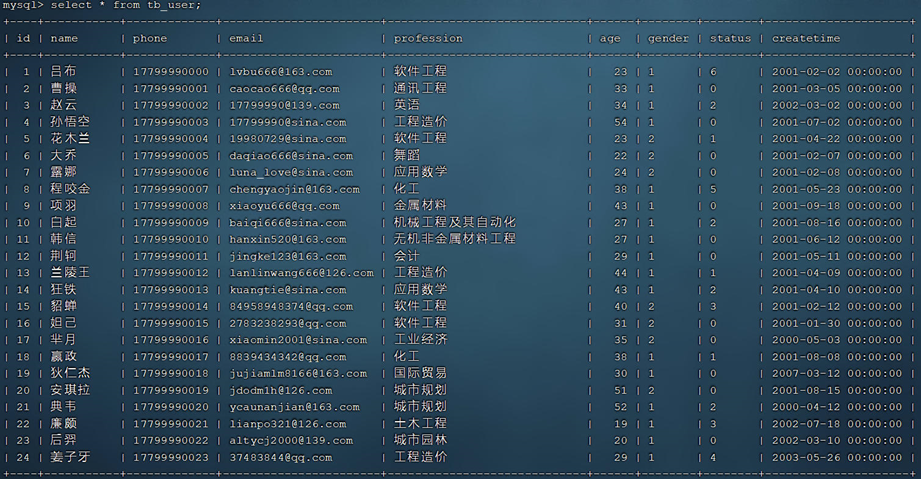

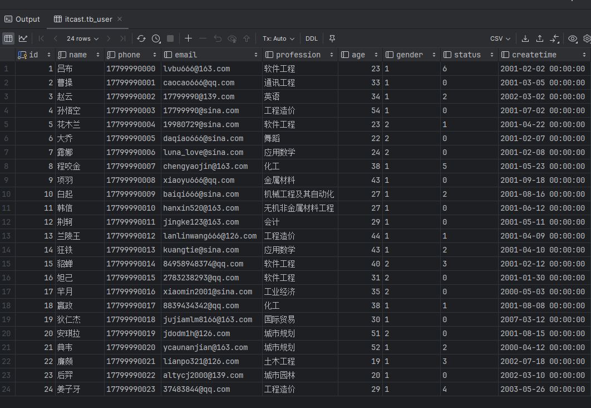

```sql
show index from tb_user;
show index from tb_user\G; #美化输出
```

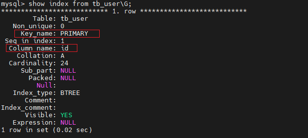


#### ②完成需求


数据准备好了之后，接下来，我们就来完成如下需求：

##### A. name字段为姓名字段，该字段的值可能会重复，为该字段创建索引（普通索引）。

```sql
CREATE INDEX idx_user_name ON tb_user(name); 
```

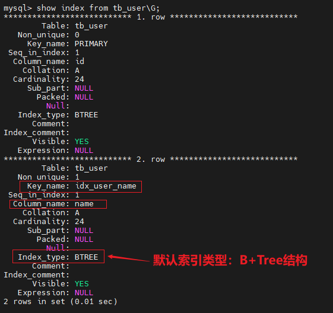

##### B. phone手机号字段的值，是非空，且唯一的，为该字段创建==唯一索引==。

```sql
CREATE UNIQUE INDEX idx_user_phone ON tb_user(phone); 
```

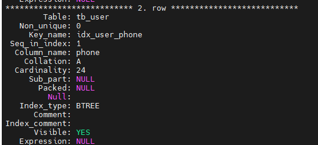

##### C. 为profession、age、status==创建联合索引==。

```sql
CREATE INDEX idx_user_pro_age_sta ON tb_user(profession,age,status); 
```

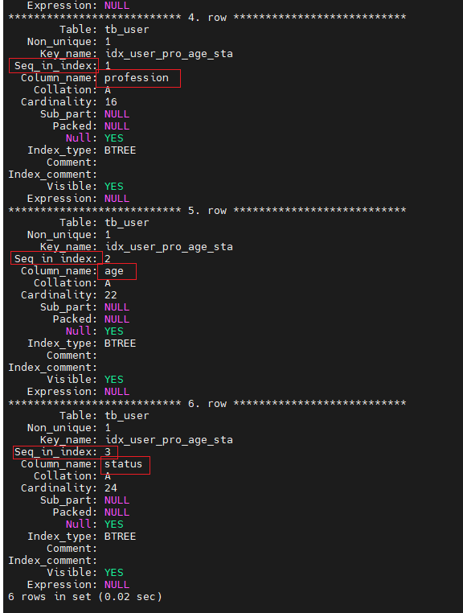

##### D. 为email建立合适的索引（普通索引）来提升查询效率。

```sql
CREATE INDEX idx_email ON tb_user(email); 
```

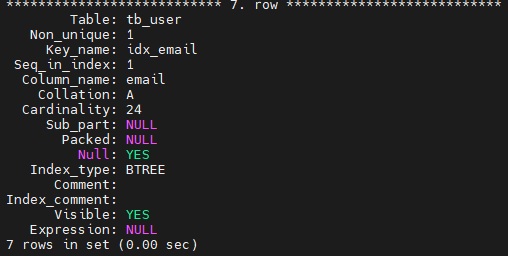

##### 完成上述的需求之后，我们再查看tb_user表的所有的索引数据。

```sql
show index from tb_user;
```

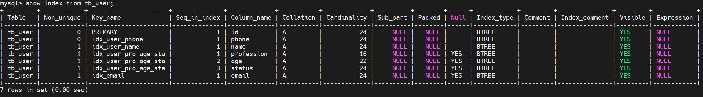

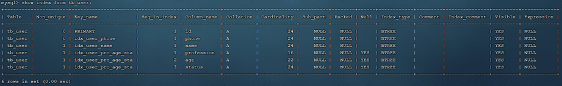


## 2.5 🌟 ==SQL性能分析==

### （1）SQL执行频率

MySQL 客户端连接成功后，通过 **show [session|global] status 命令**可以**提供服务器状态信息**。通过如下指令，可以查看当前数据库的INSERT、UPDATE、DELETE、SELECT的访问频次：

```sql
-- session 是查看当前会话 ;
-- global 是查询全局数据 ;
SHOW GLOBAL STATUS LIKE 'Com_______';

SHOW SESSION STATUS LIKE 'Com_______';
```


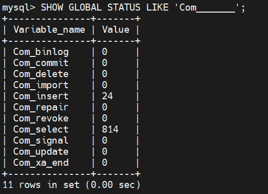

- Com_delete: 删除次数
- Com_insert: 插入次数
- Com_select: 查询次数
- Com_update: 更新次数

我们可以在当前数据库再执行几次查询操作，然后再次查看执行频次，看看 Com_select 参数会不会变化。

> 通过上述指令，我们可以查看到当前数据库到底是**以查询为主**，还是以增删改为主，从而为数据库优化提供参考依据。 如果是以增删改为主，我们可以考虑不对其进行索引的优化。 如果是以查询为主，那么就**要考虑对数据库的索引进行优化了**。

那么通过查询SQL的执行频次，我们就能够知道当前数据库到底是增删改为主，还是查询为主。 那**假如说是以查询为主**，我们又该**如何定位针对于那些查询语句进行优化**呢？ **次数我们可以借助于==慢查询日志==**。

接下来，我们就来介绍一下MySQL中的慢查询日志。


### （2）🌟 ==慢查询日志==

#### ①概念

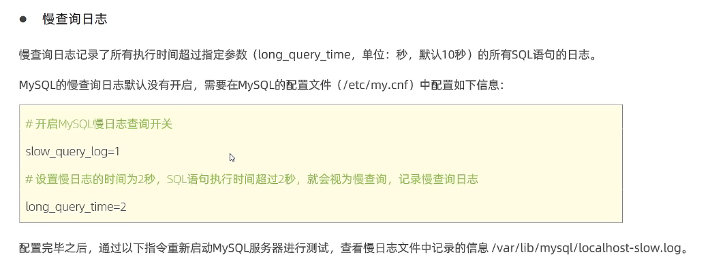

慢查询日志记录了**所有执行时间超过指定参数**（**==long_query_time==**，单位：秒，默认10秒）的**所有SQL语句的日志。**

MySQL的**慢查询日志默认没有开启**，我们可以查看一下系统变量 。

**查询慢查询日志是否开启**

```sql
show variables like 'slow_query_log';
```

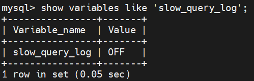


如果要开启慢查询日志，需要在**MySQL的==配置文件（/etc/my.cnf）==**中配置如下信息：

```bash
vi /etc/my.cnf
```

在该配置文件的**最后添加**：

```bash
# 开启MySQL慢日志查询开关
slow_query_log=1
# 设置慢日志的时间为2秒，SQL语句执行时间超过2秒，就会视为慢查询，记录慢查询日志
long_query_time=2
```


配置完毕之后，通过以下指令**重新启动MySQL服务器**进行测试，查看慢日志文件中**记录的信息**

**/var/lib/mysql/localhost-slow.log**

```sql
systemctl restart mysqld
```

然后，再次查看开关情况，慢查询日志就已经打开了。

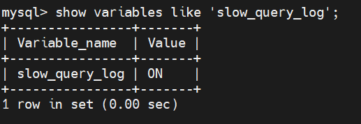


查看慢日志文件中**记录的信息**，**/var/lib/mysql/localhost-slow.log**

```bash
cat /var/lib/mysql/localhost-slow.log
tail -f /var/lib/mysql/localhost-slow.log #追加模式查看日志信息
```


#### ②测试

##### 1）数据准备

```sql
CREATE TABLE `tb_sku` (
    `id` int(11) NOT NULL AUTO_INCREMENT COMMENT '商品id',
    `sn` varchar(100) NOT NULL COMMENT '商品条码',
    `name` varchar(200) NOT NULL COMMENT 'SKU名称',
    `price` int(20) NOT NULL COMMENT '价格（分）',
    `num` int(10) NOT NULL COMMENT '库存数量',
    `alert_num` int(11) DEFAULT NULL COMMENT '库存预警数量',
    `image` varchar(200) DEFAULT NULL COMMENT '商品图片',
    `images` varchar(2000) DEFAULT NULL COMMENT '商品图片列表',
    `weight` int(11) DEFAULT NULL COMMENT '重量（克）',
    `create_time` datetime DEFAULT NULL COMMENT '创建时间',
    `update_time` datetime DEFAULT NULL COMMENT '更新时间',
    `category_name` varchar(200) DEFAULT NULL COMMENT '类目名称',
    `brand_name` varchar(100) DEFAULT NULL COMMENT '品牌名称',
    `spec` varchar(200) DEFAULT NULL COMMENT '规格',
    `sale_num` int(11) DEFAULT '0' COMMENT '销量',
    `comment_num` int(11) DEFAULT '0' COMMENT '评论数',
    `status` char(1) DEFAULT '1' COMMENT '商品状态 1-正常，2-下架，3-删除',
    PRIMARY KEY (`id`) USING BTREE
) ENGINE=InnoDB DEFAULT CHARSET=utf8mb4 COMMENT='商品表';

```

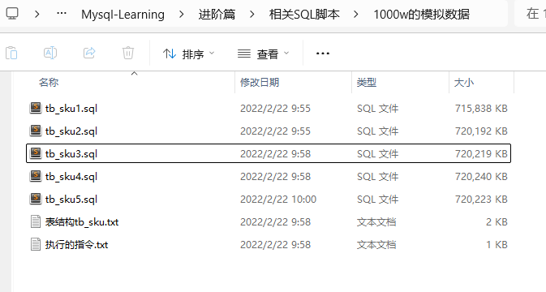

```bash
load data local infile '/root/sql/tb_sku1.sql' into table `tb_sku` fields terminated by ',' lines terminated by '\n';


注意 : 
	在mysql命令行中执行load指令，
	由于1000w的数据量较大 , 如果直接加载1000w , 会非常耗费CPU及内存 ; 
	
	已经拆分为5个部分 , 每一个部分为200w数据 , load 5次即可 ;
```

###### 确保所有必要的设置已启用

**在客户端连接时启用local_infile并指定允许加载的文件：**

```bash
mysql --local-infile=1 --enable-local-infile -u username -p
```

**在MySQL客户端中执行：**

```sql
SET GLOBAL local_infile = 1;
```


##### 2）执行测试

###### A. 执行如下SQL语句 ：

```sql
select * from tb_user; -- 这条SQL执行效率比较高, 执行耗时 0.00sec
select count(*) from tb_sku; -- 由于tb_sku表中, 预先存入了1000w的记录, count一次,耗时13.35sec
```

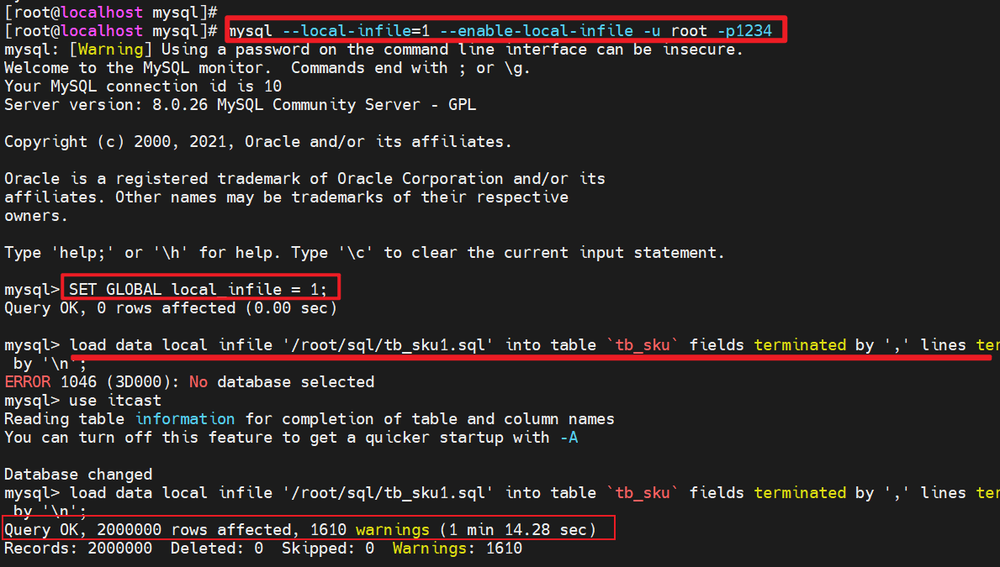

###### B. 检查慢查询日志 ：

最终我们发现，在慢查询日志中，只会记录执行时间超过我们预设时间（2s）的SQL，**执行较快的SQL**是不会记录的。

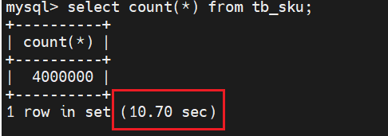

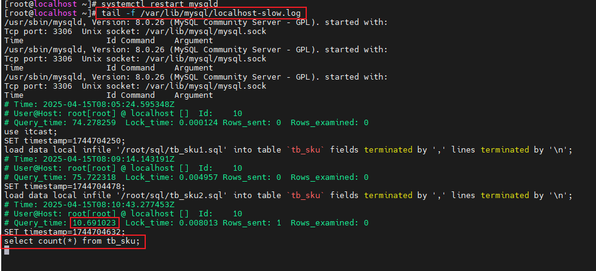

那这样，通过慢查询日志，就可以**定位出执行效率比较低的SQL**，从而有针对性的进行优化。


### （3）profile详情

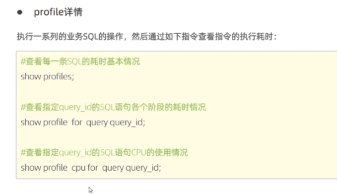

show profiles 能够在做SQL优化时帮助我们**了解==时间都耗费到哪里去==**了。通过**have_profiling参数**，能够看到当前MySQL是否支持profile操作：

```sql
SELECT @@have_profiling ;
```

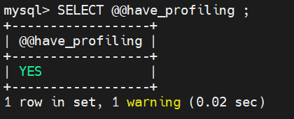

可以看到，当前MySQL是支持 profile操作的，但是开关是关闭的。可以通过**set语句在session/global级别开启profiling**：

```sql
SET profiling = 1;
```

开关已经打开了，接下来，我们所执行的SQL语句，都会被MySQL记录，并记录执行时间消耗到哪儿去了。 我们直接执行如下的SQL语句：

```sql
select * from tb_user;
select * from tb_user where id = 1;
select * from tb_user where name = '白起';
select count(*) from tb_sku;
```


执行一系列的业务SQL的操作，然后通过如下指令查看指令的执行耗时：

```sql
-- 查看每一条SQL的耗时基本情况
show profiles;

-- 查看指定query_id的SQL语句各个阶段的耗时情况
show profile for query query_id;

-- 查看指定query_id的SQL语句CPU的使用情况
show profile cpu for query query_id;
```

查看每一条SQL的耗时情况:

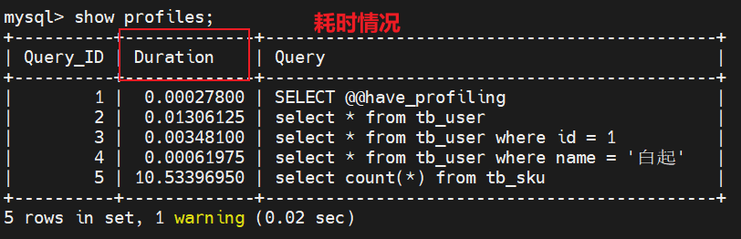

查看指定SQL各个阶段的耗时情况 :

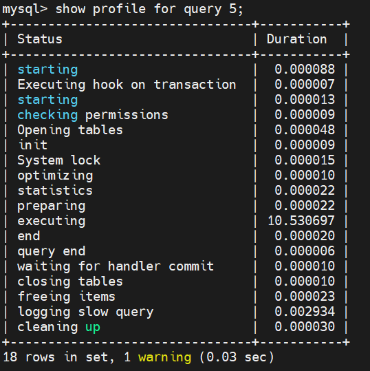

**查看指定SQL-CPU的耗时情况**

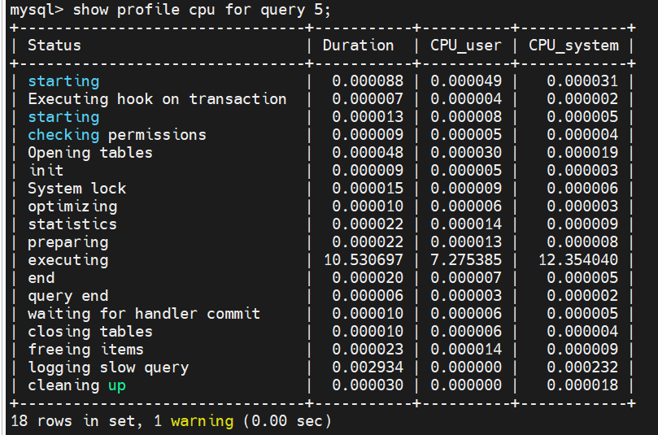


### （4）🌟 ==explain==

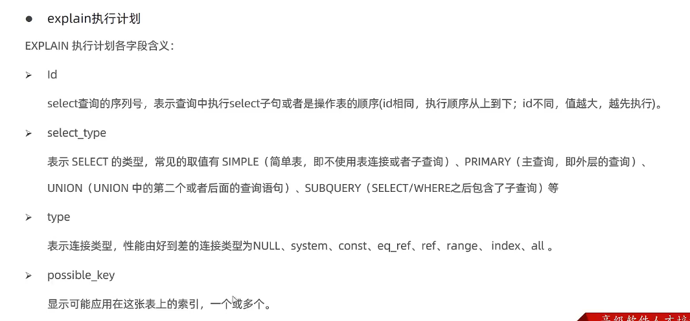

**EXPLAIN 或者 DESC命令**获取 MySQL **==如何执行 SELECT 语句的信息==**，包括在 SELECT 语句执行过程中**表如何连接和连接的顺序**。

#### ①语法

```sql
-- 直接在select语句之前加上关键字 explain / desc
EXPLAIN SELECT 字段列表 FROM 表名 WHERE 条件 ;
```


#### ②Explain 执行计划中各个字段的==含义==

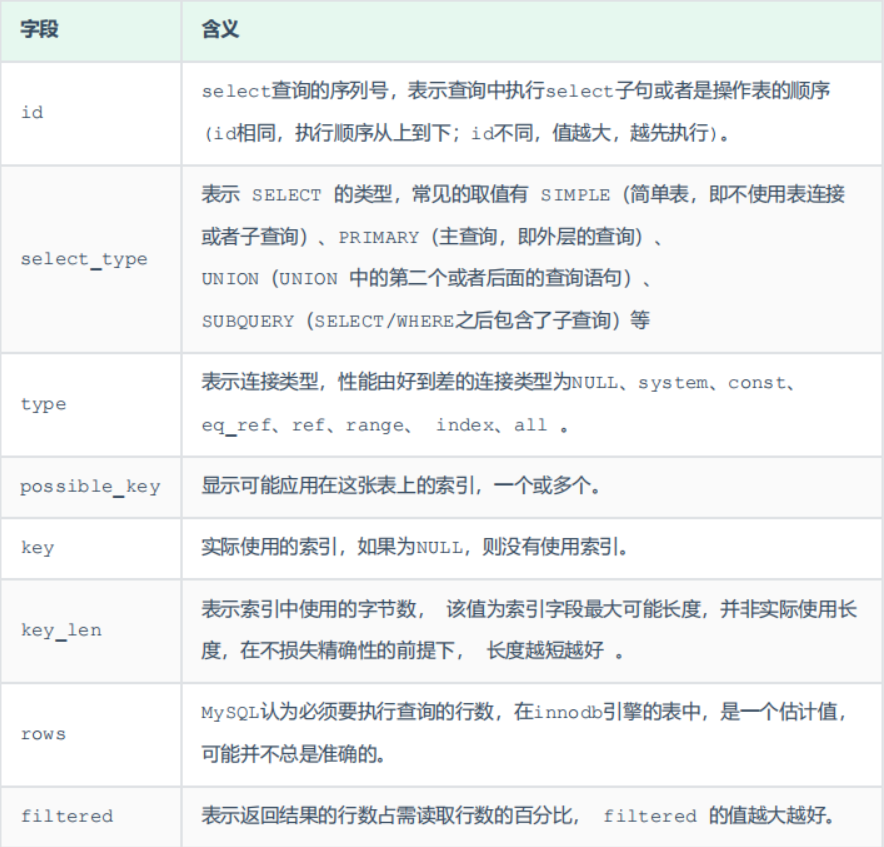


#### ③案例SC表

```sql
create table student(
    id   int auto_increment comment '主键ID' primary key,
    name varchar(10) null comment '姓名',
    no   varchar(10) null comment '学号'
)comment '学生表';
INSERT INTO student (name, no) VALUES ('黛绮丝', '2000100101');
INSERT INTO student (name, no) VALUES ('谢逊', '2000100102');
INSERT INTO student (name, no) VALUES ('殷天正', '2000100103');
INSERT INTO student (name, no) VALUES ('韦一笑', '2000100104');

create table course(
    id int auto_increment comment '主键ID' primary key,
    name varchar(10) null comment '课程名称'
)comment '课程表';
INSERT INTO course (name) VALUES ('Java');
INSERT INTO course (name) VALUES ('PHP');
INSERT INTO course (name) VALUES ('MySQL');
INSERT INTO course (name) VALUES ('Hadoop');

create table student_course(
    id int auto_increment comment '主键' primary key,
    studentid int not null comment '学生ID',
    courseid  int not null comment '课程ID',
    constraint fk_courseid foreign key (courseid) references course (id),
    constraint fk_studentid foreign key (studentid) references student (id)
)comment '学生课程中间表';
INSERT INTO student_course (studentid, courseid) VALUES (1, 1);
INSERT INTO student_course (studentid, courseid) VALUES (1, 2);
INSERT INTO student_course (studentid, courseid) VALUES (1, 3);
INSERT INTO student_course (studentid, courseid) VALUES (2, 2);
INSERT INTO student_course (studentid, courseid) VALUES (2, 3);
INSERT INTO student_course (studentid, courseid) VALUES (3, 4);
```

##### 1）查询所有学生的选课情况

```sql
Select * from student s , course c, student_course sc where s.id = sc.studentid and c.id = sc.courseid;
```

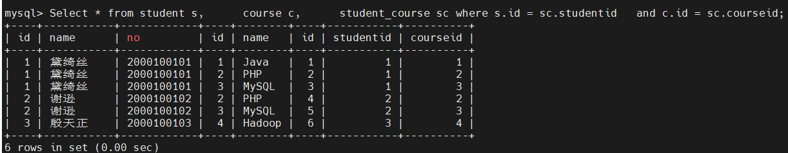

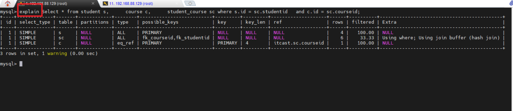

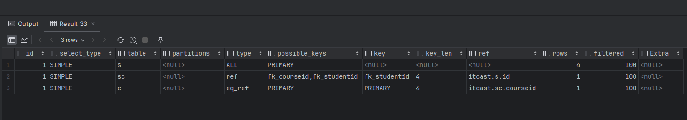


##### 2）查询选修了 MySQL 课程的学生 (子查询)

**通过子查询观察explain结果中id的顺序**

```sql
#查询MySQL对应的课程id
select c.id from course c where c.name = 'MySQL');

#查询选修了mysql课程id 的学生id
select sc.studentid from student_course sc where sc.courseid in (1,2,3);

#查询选修了 MySQL 课程的学生 (子查询)
Select s.*
from student s
where s.id in
      (select sc.studentid from student_course sc where sc.courseid in (select c.id from course c where c.name = 'MySQL'));
```


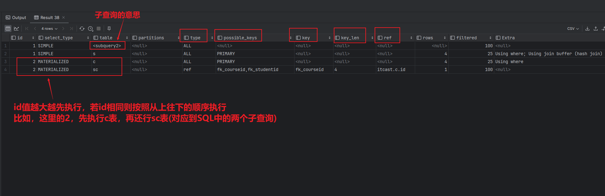


### （5）==explain 输出列详解==

当你使用 `EXPLAIN` 分析 SELECT 语句时，MySQL 会返回一个包含多列的结果集，每列都提供了查询执行计划的重要信息。以下是各列的详细解释：


#### 核心列说明

#### 1. **id** (查询标识符)

- 表示 SELECT 查询的序列号

- 相同 id 表示同一查询层级，执行顺序从上至下

- 数字越大执行优先级越高

- id 为 NULL **表示是结果集**（如 UNION 结果）

  

#### 2. **select_type** (查询类型)

| 类型               | 说明                             |
| ------------------ | -------------------------------- |
| SIMPLE             | 简单查询（不包含子查询或 UNION） |
| PRIMARY            | 最外层查询                       |
| SUBQUERY           | 子查询中的**第一个 SELECT**      |
| DERIVED            | 派生表（FROM 子句中的子查询）    |
| UNION              | UNION 中的第二个或后续查询       |
| UNION RESULT       | UNION 的结果集                   |
| DEPENDENT SUBQUERY | 依赖外部查询的子查询             |
| MATERIALIZED       | 物化子查询                       |

#### 3. **table** (访问的表)

- 显示查询涉及的表名
- 可能是**实际表名、别名或临时表名**
- `<derivedN>` 表示派生表（N 对应 id）
- `<unionM,N>` 表示 UNION 结果（M,N 对应 id）


#### 4. **partitions** (匹配的分区)

- 查询匹配的分区（仅**分区表有效**）
- NULL 表示未分区表


#### 5. ==type== (访问类型，重要！)

##### ①性能分析

表示 MySQL 如何查找表中的行，**==从优到劣==排序**：

| 类型            | 说明                           | 性能     |
| --------------- | ------------------------------ | -------- |
| system          | 表只有一行（系统表）           | 最佳     |
| const           | 通过主键或唯一索引一次查询     | 优       |
| eq_ref          | 关联查询中主键/唯一索引匹配    | 优       |
| ref             | 非唯一索引查找（**联合索引**） | 良       |
| fulltext        | 全文索引查找                   | 特殊     |
| ref_or_null     | 类似 ref，但包含 NULL 值       | 良       |
| index_merge     | 索引合并优化                   | 良       |
| unique_subquery | 子查询使用唯一索引             | 良       |
| index_subquery  | 子查询使用普通索引             | 中       |
| range           | 索引范围扫描                   | 中       |
| index           | 全索引扫描                     | 差       |
| ==ALL==         | **全表扫描**                   | **最差** |

**业务SQL**几乎不可能出现**type=null**的情况，除非直接执行`select 'A'`。

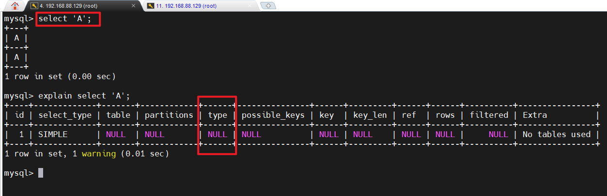


#### 6. **possible_keys** (可能使用的索引)

- 查询可能使用的索引列表
- NULL 表示没有相关索引


#### 7. **key** (实际使用的索引)

- MySQL 实际决定使用的索引
- NULL 表示未使用索引
- 可能不在 possible_keys 中（优化器选择）


#### 8. **key_len** (使用的索引长度)

- 表示索引中使用的字节数，该值为索引字段最大可能长度，并非实际使用长
  度，在不损失精确性的前提下，长度越短越好。
- 可判断是否使用了索引的全部部分
- 计算公式：列定义长度 + NULL(1) + 变长(2)


#### 9. **ref** (索引引用)

- 显示索引的**哪一列被使用**了
- 可能是：const、func、列名等


#### 10. **rows** (预估检查行数)

- MySQL 估计要检查的行数（不是精确值）
- 重要优化指标
- MySQL**认为必须要执行查询的行数**，在innodb引擎的表中，是一个估计值，
  可能并不总是准确的。


#### 11. **filtered** (过滤百分比)

- 表示存储引擎返回的数据在服务器层**过滤后剩余百分比**
- **100 表示没有过滤**
- 表示返回结果的行数占需读取行数的百分比，**filtered的值越大越好**。


#### 12. ==Extra== (额外信息，重要！)

包含 MySQL 解决查询的额外信息：

| 信息                         | 说明                       |
| ---------------------------- | -------------------------- |
| Using index                  | 使用覆盖索引（只需索引）   |
| Using where                  | 服务器层进行过滤           |
| Using temporary              | 使用临时表                 |
| Using filesort               | **使用文件排序（需优化）** |
| Using join buffer            | 使用连接缓冲               |
| Impossible WHERE             | WHERE 条件永远不成立       |
| Select tables optimized away | 优化器已优化掉表访问       |

#### 优化建议

1. 关注 `type` 列，**避免出现 `ALL`（全表扫描）**
2. 确保 `key` 列使用了适当的索引
3. 当 `Extra` 出现 `Using filesort` 或 `Using temporary` 时需特别注意
4. 比较 `rows` 与实际数据量，**评估索引效率**
5. 对于复杂查询，尝试 `EXPLAIN FORMAT=JSON` 获取更详细信息

通过理解这些列的含义，你可以有效分析查询性能瓶颈并进行针对性优化。


## 2.6 🌟索引使用

### （1）验证索引频率

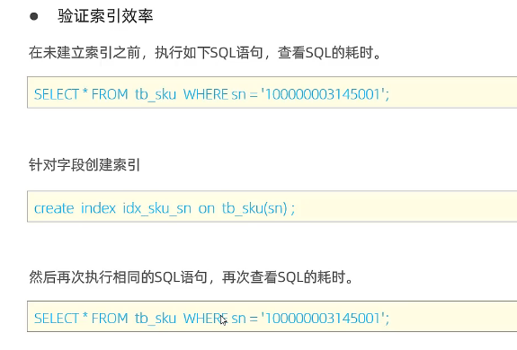

在讲解索引的使用原则之前，先通过一个简单的案例，来验证一下索引，看看是否能够通过索引来提升数据查询性能。在演示的时候，我们还是使用之前准备的一张表 tb_sku , 在这张表中准备了1000w的记录。

**为了方便只添加了400W**

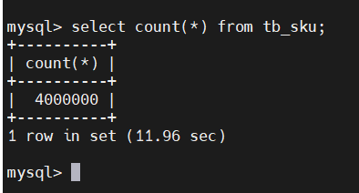

这张表中id为主键，有主键索引，而其他字段是没有建立索引的。 我们先来查询其中的一条记录，看看里面的字段情况，执行如下SQL：

```sql
select * from tb_sku where id = 1\G; # \G 表示 格式化输出
```

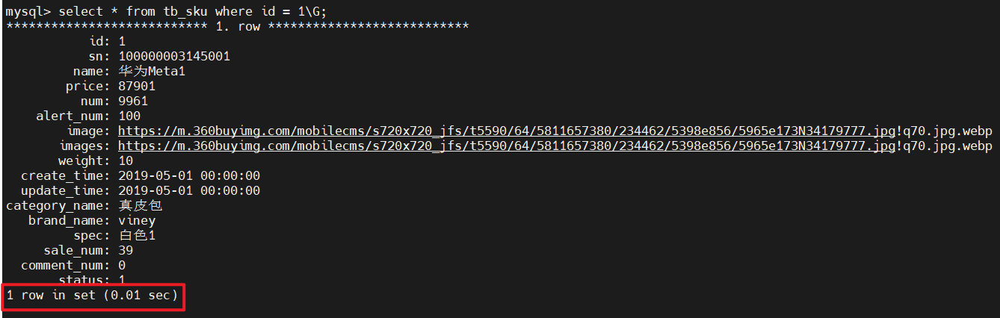

可以看到即使有1000w的数据,根据id进行数据查询,**性能依然很快**，因为主键id是有索引的。 那么接下来，我们再来根据 sn 字段进行查询，执行如下SQL：

```sql
SELECT * FROM tb_sku WHERE sn = '100000003145001';
```

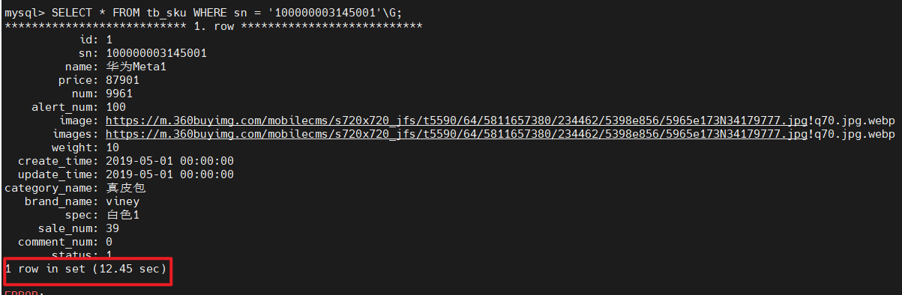

我们可以看到根据sn字段进行查询，查询返回了一条数据，结果耗时 20.78sec，就是**因为sn没有索引，而造成查询效率很低**。

那么我们可以针对于sn字段，建立一个索引，建立了索引之后，我们再次根据sn进行查询，再来看一下查询耗时情况。

**创建索引：**

```sql
create index idx_sku_sn on tb_sku(sn) ;
```

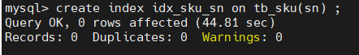

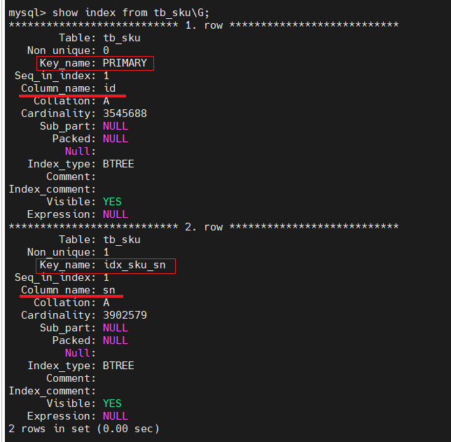

然后再次执行相同的SQL语句，再次查看SQL的耗时。

```sql
SELECT * FROM tb_sku WHERE sn = '100000003145001';
```

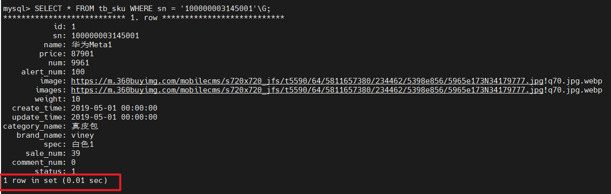

我们明显会看到，sn字段建立了索引之后，查询性能大大提升。建立索引前后，查询耗时都不是一个数量级的。

**explain分析：**

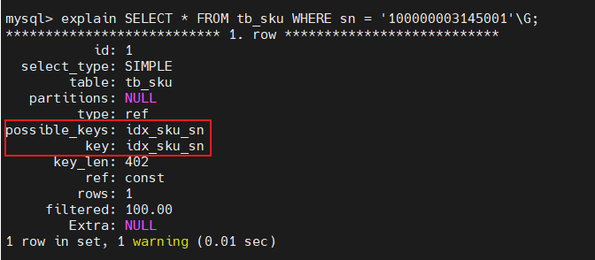

```
explain SELECT * FROM tb_sku WHERE sn = '100000003145001'\G;
```


### （2）🌟 ==最左前缀法则==

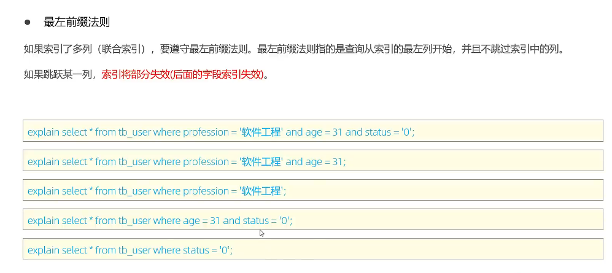

如果索引了多列（**联合索引**），要**遵守最左前缀法则**。最左前缀法则指的是**查询从索引的最左列开始，并且不跳过索引中的列。 ** **如果跳跃某一列，索引将会==部分失效(后面的字段索引失效)==**。以 tb_user 表为例，我们先来查看一下之前 tb_user 表所创建的索引。

以 tb_user 表为例，我们先来查看一下之前 tb_user 表所创建的索引。

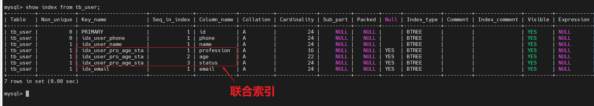

在 tb_user 表中，有一个联合索引，这个联合索引涉及到三个字段，顺序分别为：profession，age，status。

对于==最左前缀法则==指的是，查询时，**==最左边的列==，也就是profession==必须存在==**，**==否则索引全部失效==**。而且**中间不能跳过某一列，否则==该列后面的字段索引将失效==**。 接下来，我们来演示几组案例，看一下具体的执行计划：

```sql
explain select * from tb_user where profession = '软件工程' and age = 31 and status = '0';
```

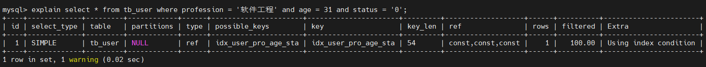


```sql
explain select * from tb_user where profession = '软件工程' and age = 31;
```

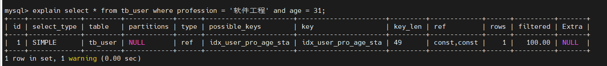


```sql
explain select * from tb_user where profession = '软件工程';
```

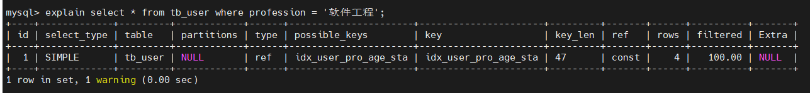

以上的这三组测试中，我们发现只要联合索引**最左边的字段 profession存在**，索引就会生效，只不过索引的长度不同。 而且由以上三组测试，我们也可以**==推测出profession字段索引长度为47、age字段索引长度为2、status字段索引长度为5==**。


```sql
explain select * from tb_user where age = 31 and status = '0';
```

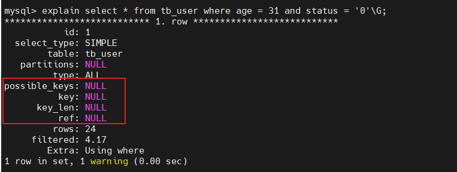


```sql
explain select * from tb_user where status = '0';
```

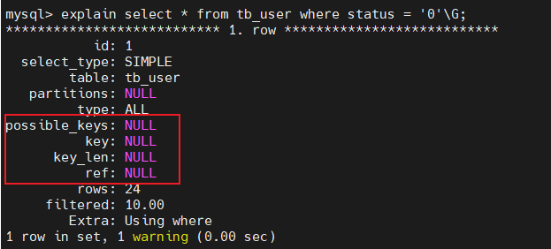


而通过上面的这两组测试，我们也可以看到**索引并未生效，原因是因为不满足最左前缀法则**，联合索引最左边的列profession不存在。

```sql
explain select * from tb_user where profession = '软件工程' and status = '0';
```

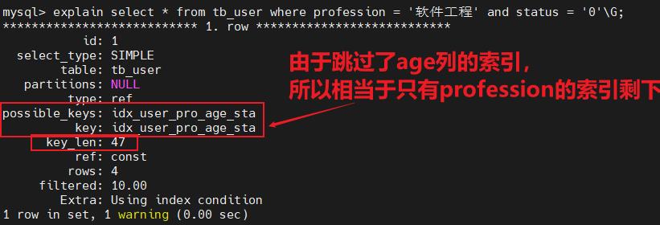

上述的SQL查询时，存在profession字段，最左边的列是存在的，索引满足最左前缀法则的基本条件。但是查询时，**跳过了age这个列**，所以后面的列索引是不会使用的，也就是**索引部分生效**，所以**索引的长度就是47**（**相当于只有profession字段的索引**）


> **思考题：**
>
> 
>
> 当执行SQL语句: explain select * from tb_user where age = 31 and status = '0' and profession = '软件工程'； 时，**是否满足最左前缀法则**，走不走上述的联合索引，索引长度？
>
> 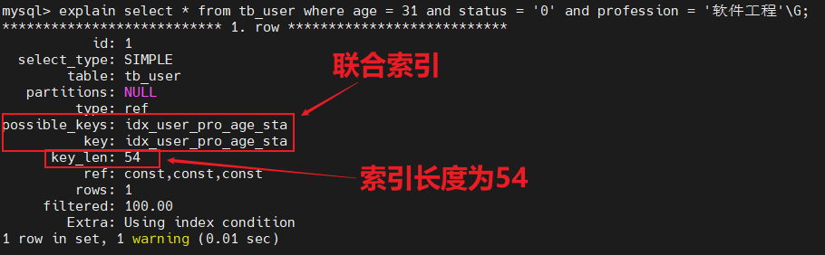
>
> 可以看到，是完全满足最左前缀法则的，索引长度54，**联合索引是生效的**。
>
> 
>
> **==注意== ：** 最左前缀法则中指的**最左边的列**，是指在查询时，联合索引的最左边的字段(**即是第一个字段)==必须存在==**，与我们编写SQL时，**条件编写的先后顺序无关**。


### （3）范围查询

联合索引中，出现**范围查询(> , <)**，**范围查询右侧的列索引失效**。

```sql
explain select * from tb_user where profession = '软件工程' and age > 30 and status = '0';
```

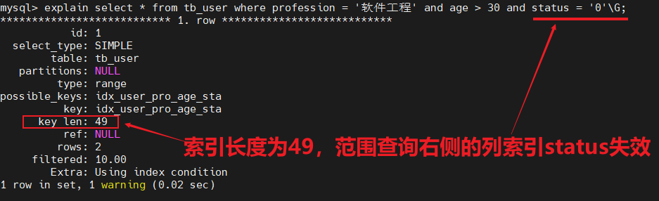

当范围查询使用> 或 < 时，走联合索引了，但是索引的长度为49，就说明**范围查询右边的status字段**是没有走索引的。


```sql
explain select * from tb_user where profession = '软件工程' and age >= 30 and status = '0';
```

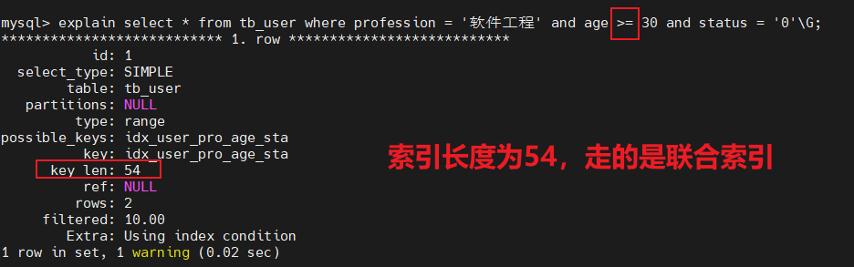

当范围查询使用>= 或 <= 时，**走联合索引了，但是索引的长度为54，就说明所有的字段都是走索引的。**

所以，**在业务允许的情况下**，==尽可能的使用类似于 **>= 或 <=** 这类的范围查询==，而**避免使用 > 或 <**。


### （4）🌟 ==索引失效情况==

#### ①索引==列运算==

不要在索引列上进行**运算操作**， 索引将失效。

在tb_user表中，除了前面介绍的联合索引之外，还有一个索引，是**phone字段的单列索引**。

```sql
show index from tb_user\G;
```

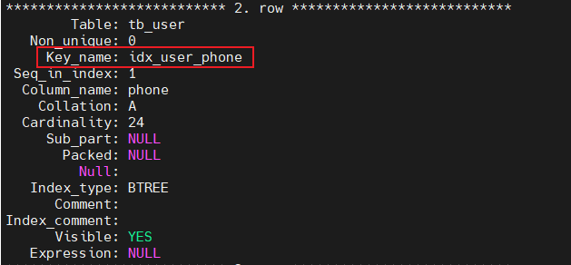

##### A. 当根据phone字段进行==等值匹配查询==时, 索引生效。

```sql
explain select * from tb_user where phone = '17799990015'; 
```

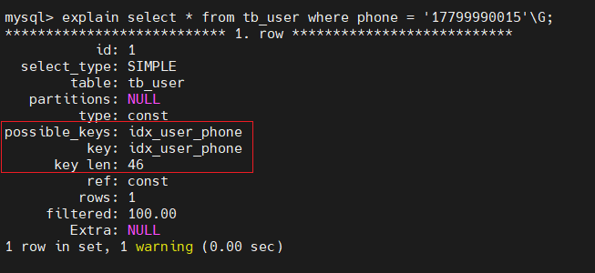

##### B. 当根据phone字段进行==函数运算操作==之后，索引失效。

```sql
explain select * from tb_user where substring(phone,10,2) = '15';
```

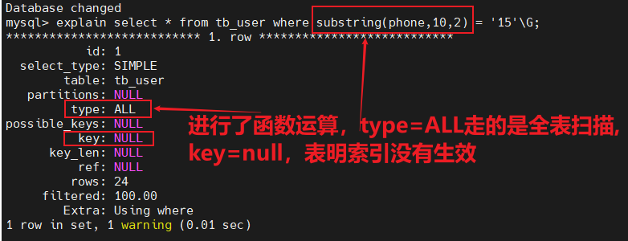


#### ②字符串==不加引号==-''

字符串类型字段使用时，**不加引号，索引将失效**。（**该没加引号的索引失效**，并参照最左前缀法则）

**==数据库存在隐式类型转换==，索引将失效。**

接下来，我们通过两组示例，来看看对于字符串类型的字段，加单引号与不加单引号的区别：

```sql
explain select * from tb_user where profession = '软件工程' and age = 31 and status = '0';
explain select * from tb_user where profession = '软件工程' and age = 31 and status = 0;
```

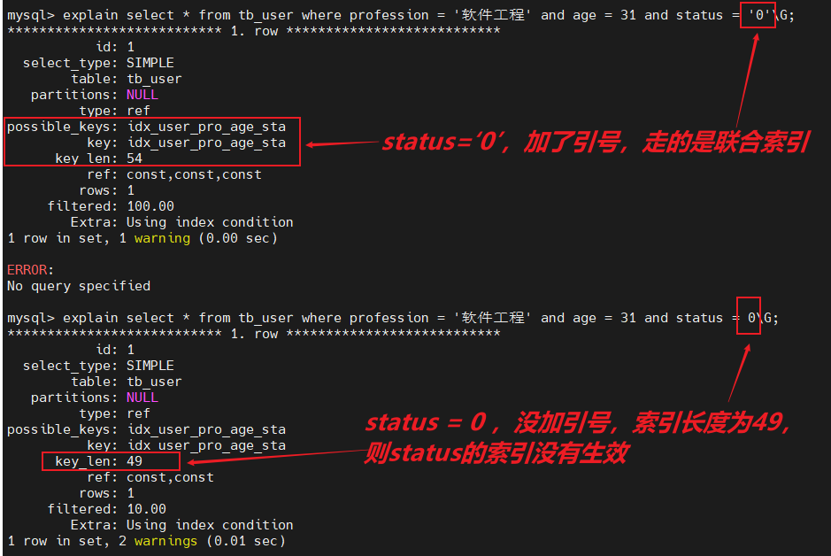


```sql
explain select * from tb_user where phone = '17799990015';
explain select * from tb_user where phone = 17799990015;
```

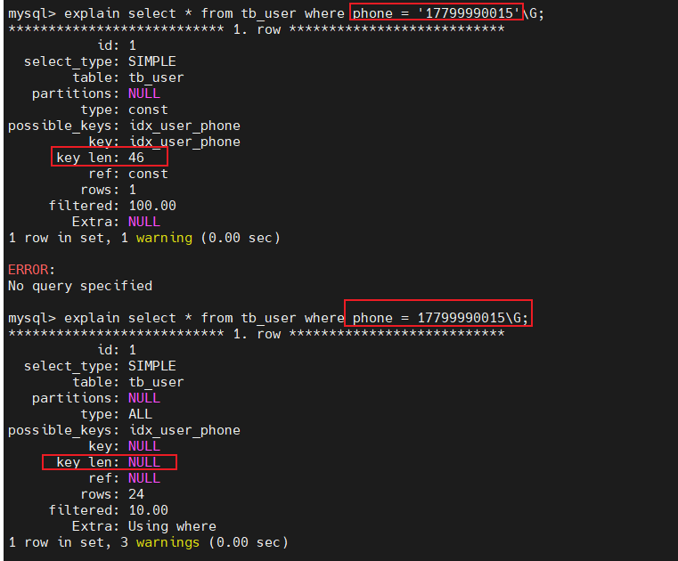

经过上面两组示例，我们会明显的发现，**如果字符串不加单引号，对于查询结果，没什么影响，但是==数据库存在隐式类型转换==，索引将失效。**


#### ③==模糊查询==-%

如果仅仅是**==尾部模糊匹配，索引不会失效==**。如果是==**头部模糊匹配，索引失效**==。走的是**全表扫描**。


接下来，我们来看一下这三条SQL语句的执行效果，查看一下其执行计划：

由于下面查询语句中，都是**根据profession字段查询，符合最左前缀法则，联合索引是可以生效的**，

我们主要看一下，模糊查询时，**%加在关键字之前**，和**加在关键字之后**的影响。

```sql
explain select * from tb_user where profession like '软件%';
explain select * from tb_user where profession like '%工程';
explain select * from tb_user where profession like '%工%';
```

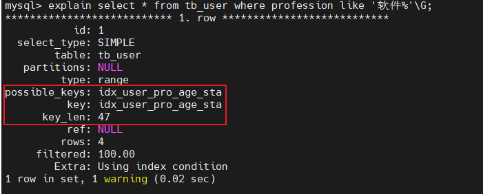

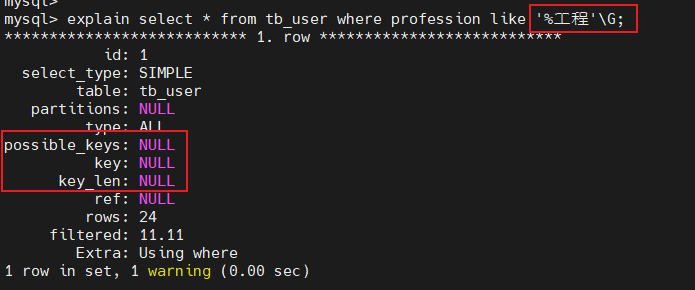

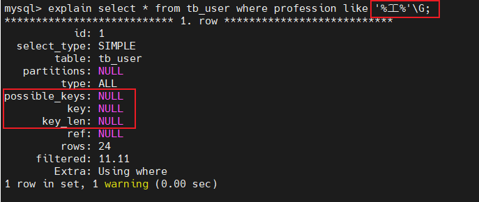


经过上述的测试，我们发现，在**like模糊查询中，在关键字后面加%**，**索引可以生效**。而如果**在关键字前面加了%，索引将会失效**。


#### ④==or==连接条件-or

用or分割开的条件， 如果**or前的条件中的列有索引，而后面的列中没有索引**，那么**涉及的索引都不会被用到**。即or两侧，一侧有索引、一侧没索引的时候，所以都会失效。

```sql
explain select * from tb_user where id = 10 or age = 23;
explain select * from tb_user where phone = '17799990017' or age = 23;
```

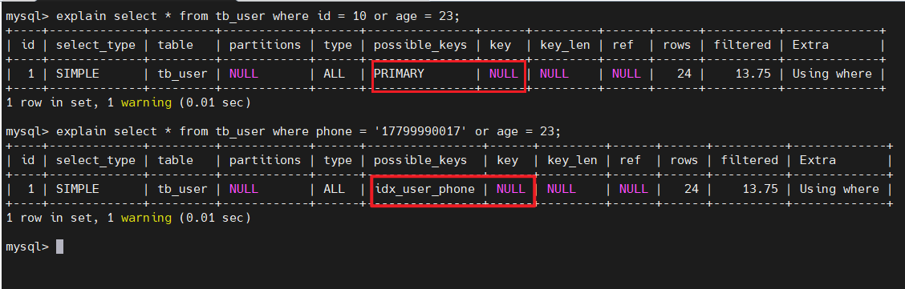

由于**age没有索引**，所以即使id、phone有索引，**索引也会失效**。所以需要针对于**age也要建立索引**。

然后，我们可以对age字段建立索引。

```sql
create index idx_user_age on tb_user(age);
```

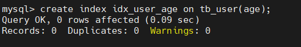

建立了索引之后，我们再次执行上述的SQL语句，看看前后执行计划的变化。

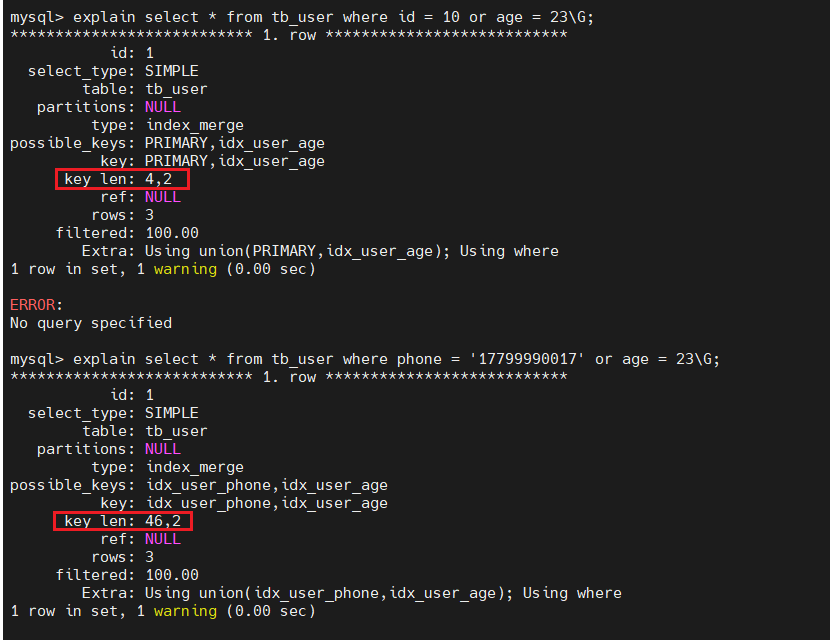

最终，我们发现，当or连接的条件，左右两侧字段都有索引时，索引才会生效。


#### ⑤==数据分布影响==

如果MySQL**==评估使用索引比全表更慢==，则不使用索引**。

```sql
explain select * from tb_user where phone >= '17799990005';
explain select * from tb_user where phone >= '17799990015';
```

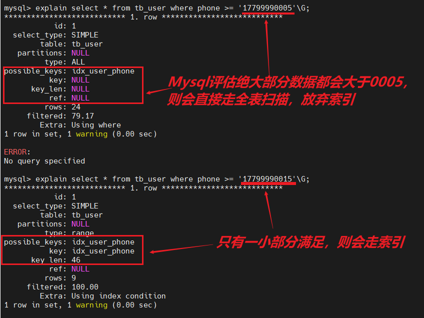

经过测试我们发现，相同的SQL语句，**只是传入的字段值不同**，最终的执行计划也完全不一样，这是为什么呢？

就是因为MySQL在查询时，**会评估使用索引的效率与走全表扫描的效率**，如果**走全表扫描更快，则放弃索引，走全表扫描**。 因为索引是用来**索引少量数据的**，如果**==通过索引查询返回大批量的数据==**，则**==还不如走全表扫描来的快，此时索引就会失效==。**

接下来，我们再来看看 **is null 与 is not null 操作是否走索引**。

执行如下两条语句 ：

```sql
explain select * from tb_user where profession is null;
explain select * from tb_user where profession is not null;
```

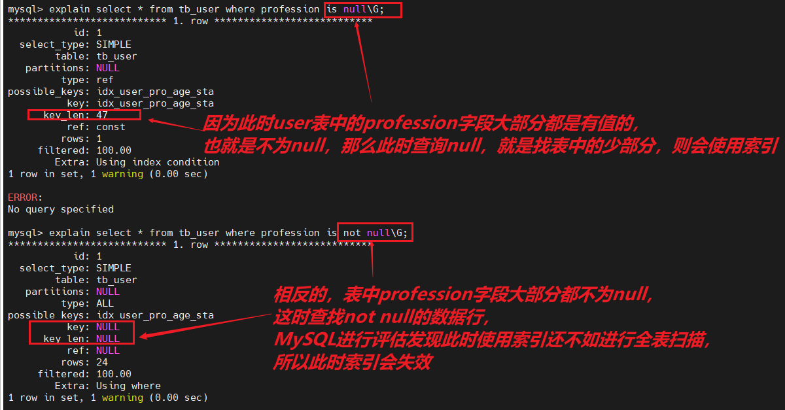

接下来，我们做一个操作**将profession字段值全部更新为null**

```sql
update tb_user set profession = null;
```

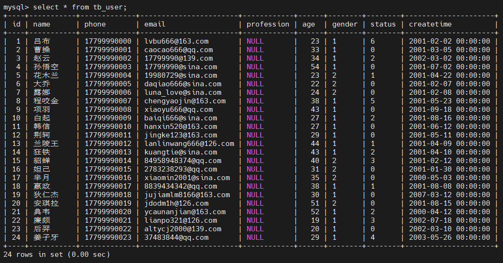

然后，再次执行上述的两条SQL，查看SQL语句的执行计划。

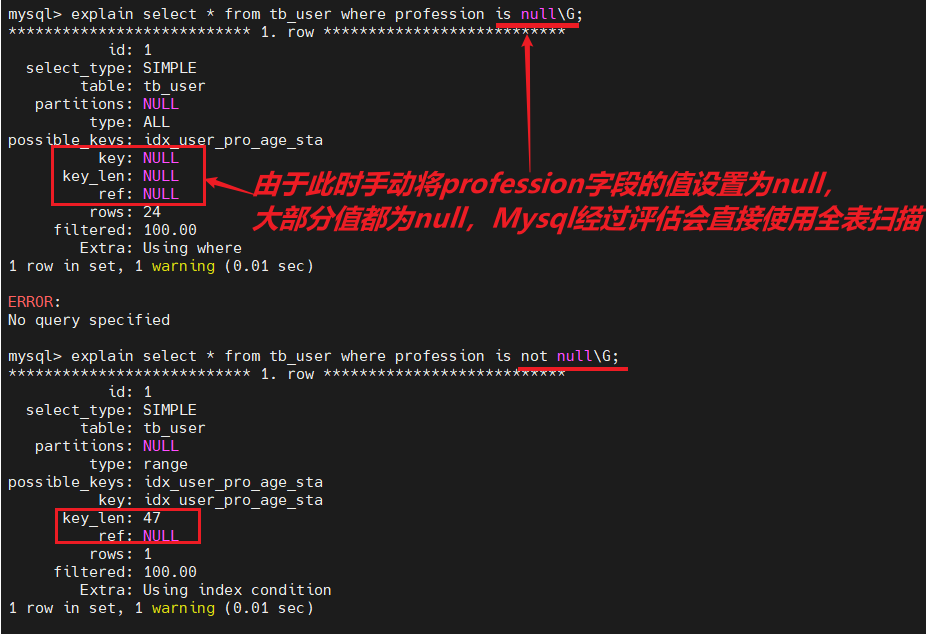

最终我们看到，一模一样的SQL语句，先后执行了两次，结果查询计划是不一样的，为什么会出现这种现象，这是和**数据库的数据分布有关系**。查询时**MySQL会评估，走索引快，还是全表扫描快**，如果全表扫描更快，则放弃索引走全表扫描。 因此，is null 、is not null是否走索引，**得具体情况具体分析**，并不是固定的。


**==总结==：Mysql评估时，会判断查询时是索引快，还是全表扫描快，==如果查询的条件对于表中大部分的字段值都满足==，则会直接走==全表扫描==，放弃走索引，反之，同理。** **==相当于索引只对少部分数据生效。==**


### （5）SQL提示

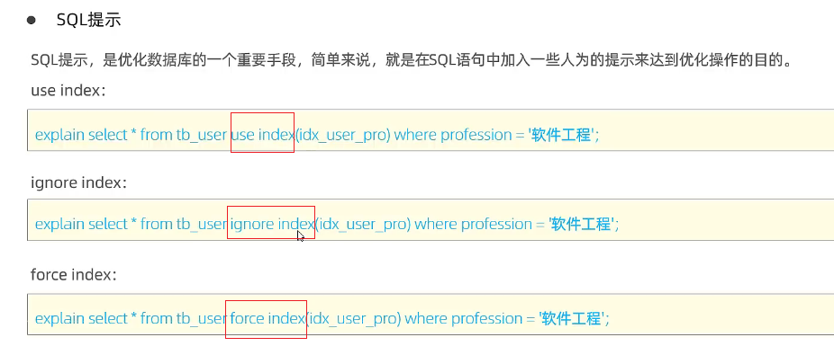

#### 场景引入

目前tb_user表的数据情况如下:

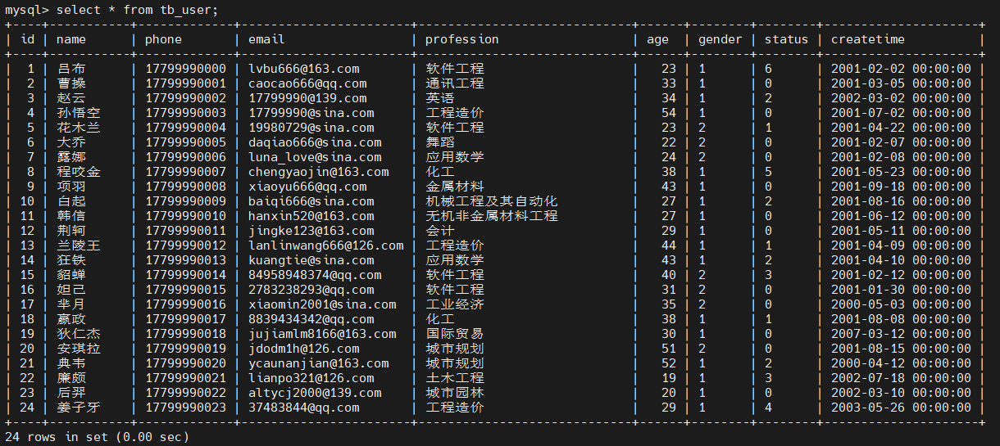


索引情况如下:

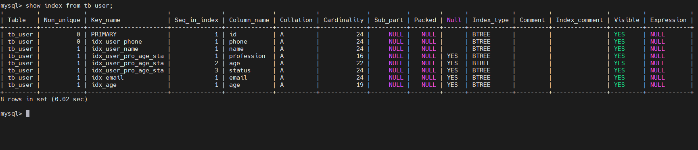

把上述的 idx_user_age, idx_email 这两个之前测试使用过的索引**直接删除**。

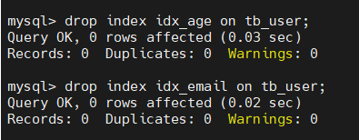

```sql
drop index idx_user_age on tb_user;
drop index idx_email on tb_user;
```


**A. 执行SQL : explain select * from tb_user where profession = '软件工程';**

```sql
explain select * from tb_user where profession = '软件工程';
```

查询走了联合索引。

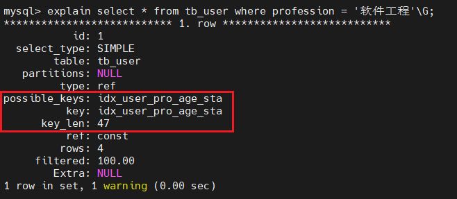


**B. 执行SQL，创建profession的==单列索引==：create index idx_user_pro on tb_user(profession);**

```sql
create index idx_user_pro on tb_user(profession);
```


**C. 创建单列索引后，再次执行A中的SQL语句，查看执行计划，看看到底走哪个索引。**

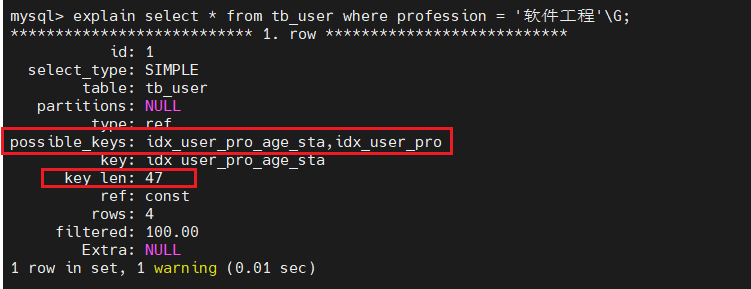

测试结果，我们可以看到，possible_keys中 idx_user_pro_age_sta,idx_user_pro **这两个索引都可能用到**，最终**MySQL选择了idx_user_pro_age_sta索引**。这是**MySQL自动选择的结果**。

那么，我们能不能在查询的时候，**自己来指定使用哪个索引**呢？ 答案是肯定的，此时就可以借助于MySQL的**SQL提示来完成**。 接下来，介绍一下SQL提示。

**SQL提示**，是优化数据库的一个重要手段，简单来说，就是在SQL语句中加入一些人为的提示来达到**优化操作的目的。**


#### ①use index -建议

建议MySQL使用哪一个索引完成此次查询（仅仅是**建议，mysql内部还会再次进行评估**）。

```sql
explain select * from tb_user use index(idx_user_pro) where profession = '软件工程';
```

#### ②ignore index 忽略指定的索引

```sql
explain select * from tb_user ignore index(idx_user_pro) where profession = '软件工程';
```

#### ③force index 强制使用索引

```sql
explain select * from tb_user force index(idx_user_pro) where profession = '软件工程';
```


#### ④示例演示

A. use index

```sql
explain select * from tb_user use index(idx_user_pro) where profession = '软件工程';
```

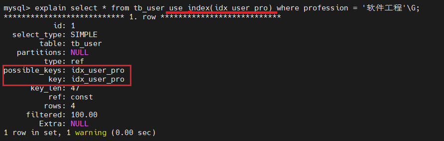

B. ignore index

```sql
explain select * from tb_user ignore index(idx_user_pro) where profession = '软件工程';
```

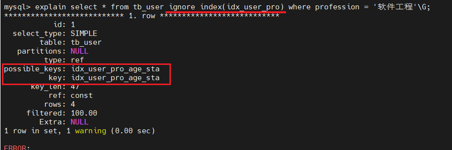

C. force index

```sql
explain select * from tb_user force index(idx_user_pro_age_sta) where profession = '软件工程';
```

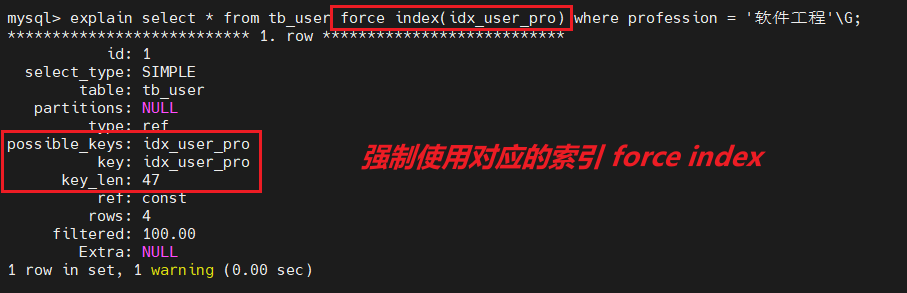


### （6）🌟 覆盖索引

尽量**使用覆盖索引，减少select ***。 那么什么是覆盖索引呢？ 覆盖索引是指 **查询使用了索引**，**并且==需要返回的列==，==在该索引中已经全部能够找到==** 。


接下来，我们来看一组SQL的执行计划，看看执行计划的差别，然后再来具体做一个解析。

```sql
explain select id, profession from tb_user where profession = '软件工程' and age = 31 and status = '0' ;

explain select id,profession,age, status from tb_user where profession = '软件工程' and age = 31 and status = '0' ;

explain select id,profession,age, status, name from tb_user where profession = '软件工程' and age = 31 and status = '0' ;

explain select * from tb_user where profession = '软件工程' and age = 31 and status = '0';
```

上述这几条SQL的执行结果为:

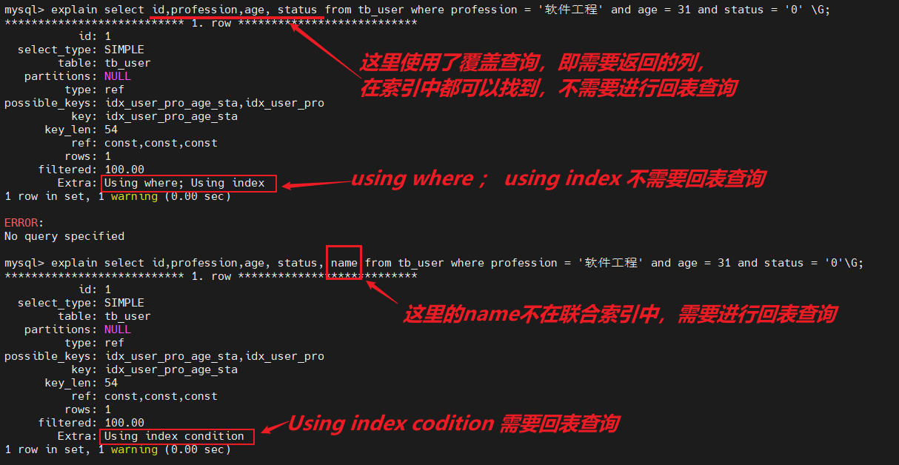

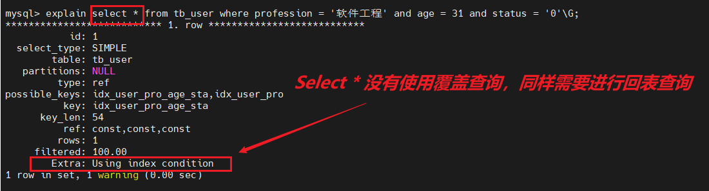


从上述的执行计划我们可以看到，这四条SQL语句的执行计划前面所有的指标都是一样的，看不出来差异。但是此时，我们主要关注的是后面的**==Extra==**，前面两条SQL的结果为 **Using where; UsingIndex** ; 而后面两条SQL的结果为: **Using index condition** 。

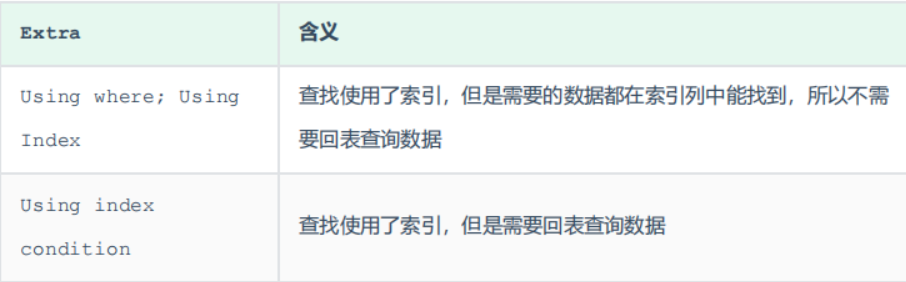


因为，在tb_user表中有一个**联合索引 idx_user_pro_age_sta**，该索引**关联了三个字段profession、age、status**，而这个索引也是一个==二级索引==，所以叶子节点下面挂的是**这一行的主键id**。 所以当我们**查询返回的数据在 id、profession、age、status 之中**，则**==直接走二级索引直接返回数据==**了。 如果超出这个范围，就**需要拿到主键id**，**再==去扫描聚集索引==**，**再获取额外的数据了，这个过程就是==回表==**。 而我们如果一直使用select * 查询返回所有字段值，**很容易就会造成回表查询**（**==除非是根据主键查询，此时只会扫描聚集索引==**）。

为了大家更清楚的理解，什么是覆盖索引，什么是回表查询，我们一起再来看下面的这组SQL的执行过程。


**A. 表结构及索引示意图:**

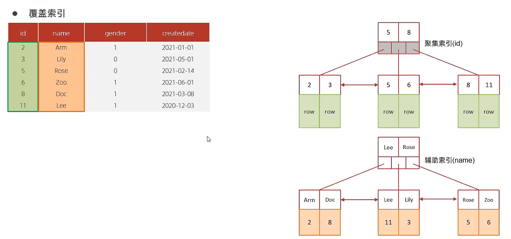

id是主键，是一个**聚集索引**。 **name字段建立了普通索引**，是一个**二级索引（辅助索引）**。


**B. 执行SQL : select * from tb_user where id = 2;**

根据id查询，直接走聚集索引查询，一次索引扫描，直接返回数据，性能高。

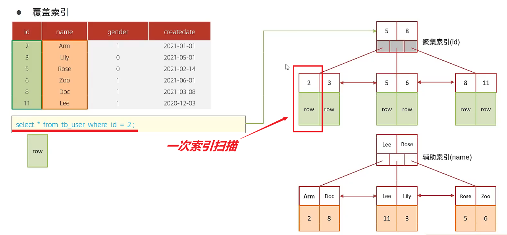


**C. 执行SQL：selet id,name from tb_user where name = 'Arm';**

虽然是根据name字段查询，**查询二级索引**，但是由于查询返回在字段为 id，name，**在name的二级索引中，这两个值都是可以直接获取到的**，因为覆盖索引，所以**不需要回表查询**，性能高。

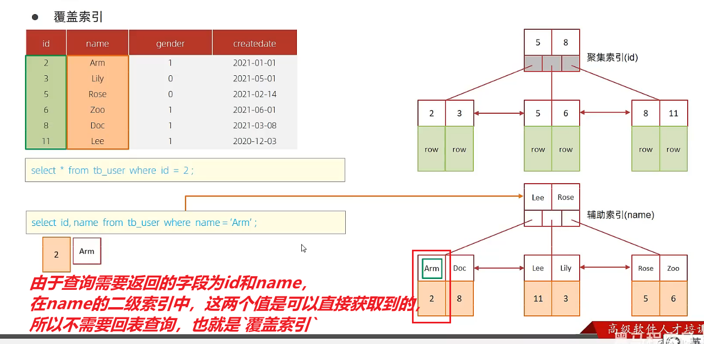


**D. 执行SQL：selet id,name,==gender== from tb_user where name = 'Arm';**

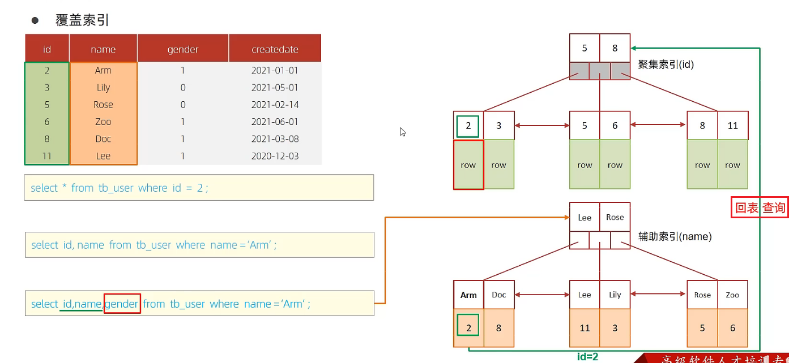


由于**在name的二级索引中，==不包含gender==**，所以，**需要两次索引扫描，也就是需要==回表查询==**，性能相对较差一点。


> **==思考题==：**
>
> 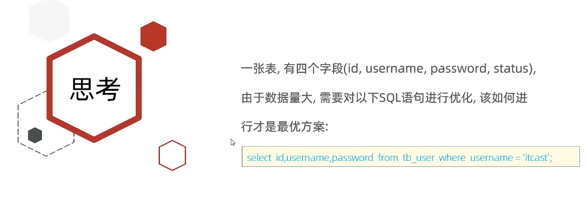
>
> 一张表, 有四个字段(id, username, password, status), 由于数据量大, 需要对以下SQL语句进行优化, 该如何进行才是最优方案:
>
> ​	select id,username,password from tb_user where username = 'itcast';
>
> 
>
> 答案: 针对于 **==username, password建立联合索引==**, sql为: 
>
> ```sql
> create index idx_user_name_pass on tb_user(username,password);
> ```
>
> 这样可以**避免**上述的SQL语句，在查询的过程中，**出现回表查询**。


### （7）==前缀索引==

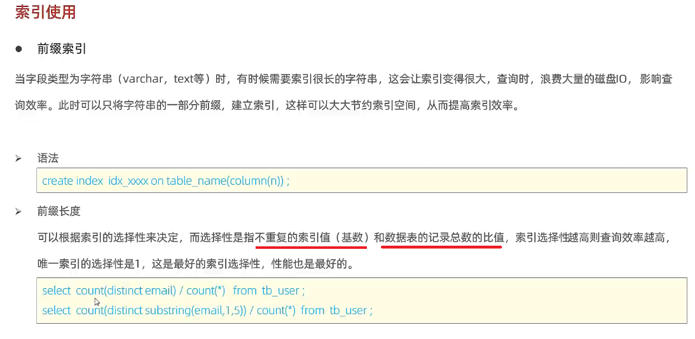

当字段类型为字符串（**varchar，text，longtext**等）时，有时候需要**索引很长的字符串**，这会让索引变得很大，查询时，浪费大量的磁盘IO， 影响查询效率。此时可以**只将字符串的一部分前缀，建立索引**，这样可以**大大==节约索引空间==，从而提高索引效率**。

#### ①语法-==column(lens)==

```sql
create index idx_xxxx on table_name(column(n)) ;
```


##### 1）示例

为tb_user表的email字段，建立长度为5的前缀索引。

```sql
create index idx_email_5 on tb_user(email(5));
```

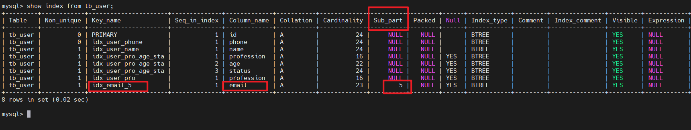


#### ②前缀长度-==计算选择性==

可以根据索引的选择性来决定，而**选择性**是**指==不重复的索引值（基数）==和数据表的==记录总数==的==比值==**，

索引选择性越高则查询效率越高， **唯一索引的选择性是1**，这是最好的索引选择性，**性能也是最好的**。

```sql
select count(distinct email) / count(*) from tb_user ;
select count(distinct substring(email,1,5)) / count(*) from tb_user ;
```

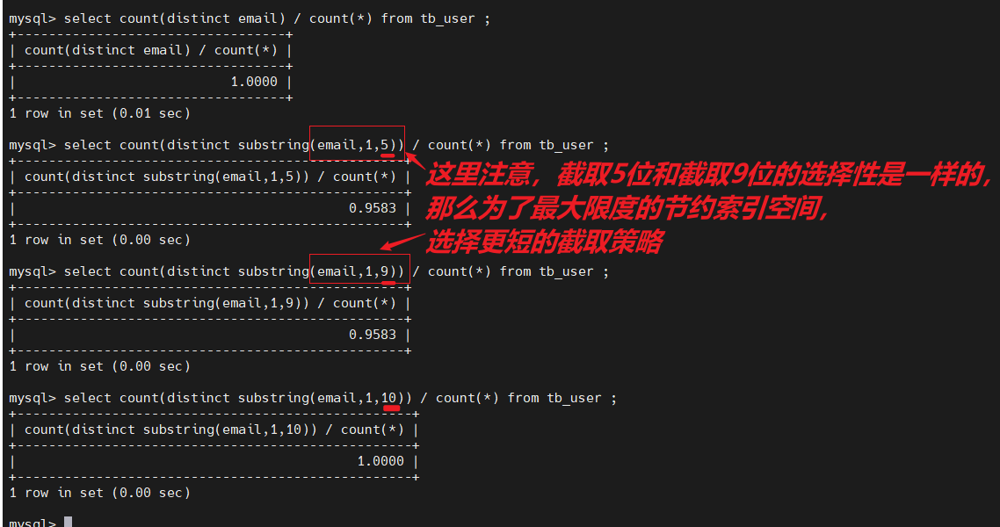


#### ③前缀索引的查询流程

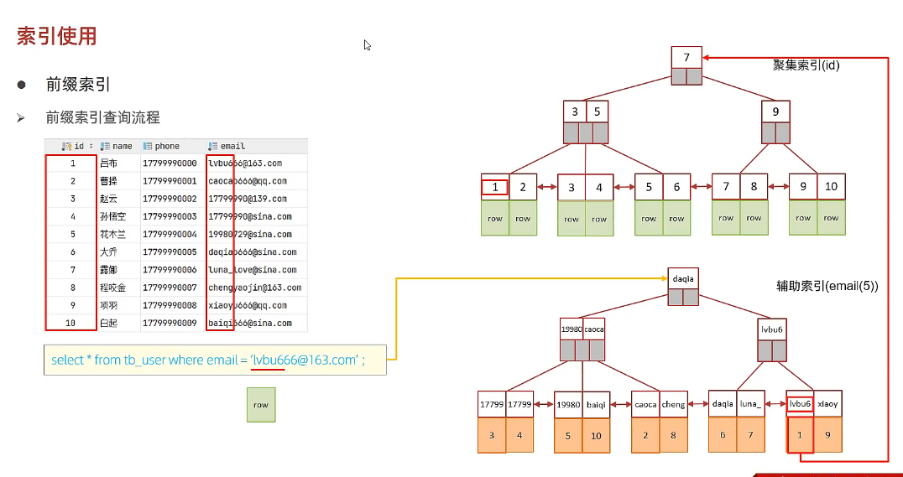


### （8）单列索引与联合索引

> **==注意：== 创建联合索引时，需要==考虑联合索引中的顺序问题==，需要考虑==索引的最左前缀法则==**


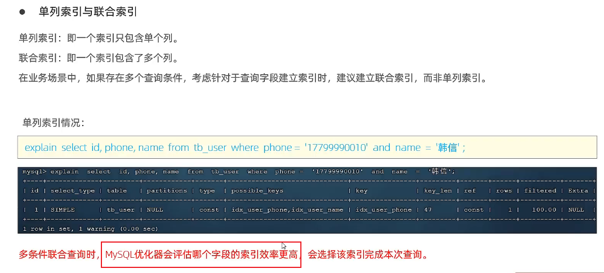


- 单列索引：即一个索引**只包含单个列**。
- 联合索引：即一个索引**包含了多个列**。


我们先来看看 tb_user 表中目前的索引情况:

```sql
show index from tb_user;
```

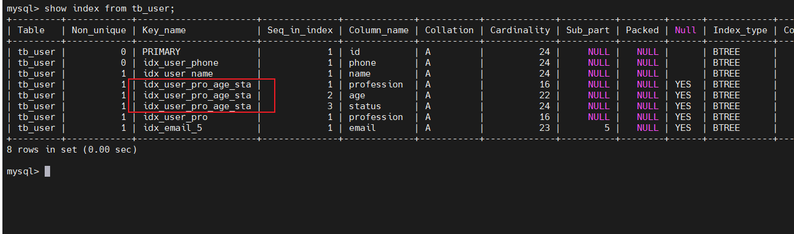

在查询出来的索引中，既有**单列索引，又有联合索引**。


接下来，我们来执行一条SQL语句，看看其执行计划：

```sql
explain select id,phone,name from tb_user where phone = '17799990010' and name = '韩信';
```

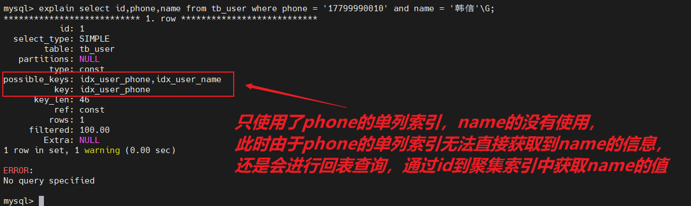

通过上述执行计划我们可以看出来，在**and连接的两个字段 phone、name上都是有单列索引的**，但是最终**mysql==只会选择一个索引==**，也就是说，只能走一个字段的索引，此时是会**==回表查询==的**。


紧接着，我们再来创建一个phone和name字段的联合索引来查询一下执行计划。

```sql
create unique index idx_user_phone_name on tb_user(phone,name);
```


此时，查询时，就走了联合索引，而在**联合索引中包含 phone、name**的信息，在叶子节点下挂的是对应的主键id，所以**查询是无需回表查询的**。

```sql
#使用SQL提示，让Mysql用我创建的联合索引
explain select id,phone,name from tb_user use index(idx_user_phone_name) where phone = '17799990010' and name = '韩信';
```

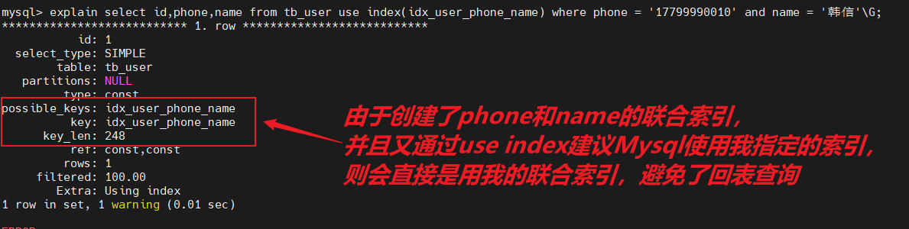


> 在业务场景中，**如果存在多个查询条件**，考虑针对于查询字段建立索引时，**建议建立联合索引**，而非单列索引。


如果查询使用的是**联合索引**，具体的**结构示意图**如下：


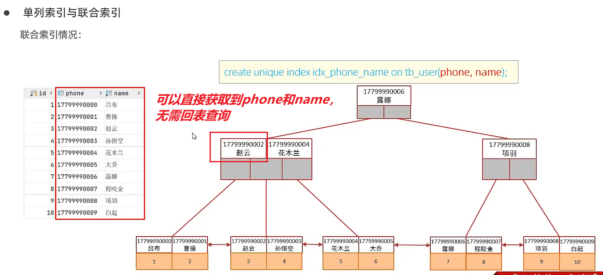


## 2.7 索引设计原则

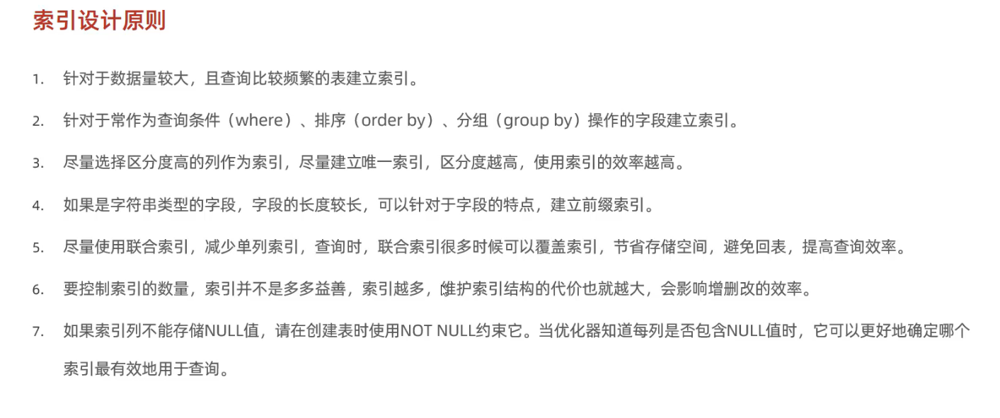

- 1). 针对于数据量较大（**>100W**），且**查询比较频繁**的表建立索引。
- 2). 针对于**常作为查询条件**（where）、排序（order by）、分组（group by）**操作的字段建立索引**。
- 3). 尽量选择区**分度高的列作为索引**，尽量建立唯一索引，**区分度越高，使用索引的效率越高**。
- 4). 如果是字符串类型的字段，字段的**长度较长**，可以针对于字段的特点，**建立前缀索引**。
- 5). **尽量使用联合索引**，减少单列索引，查询时，联合索引很多时候可以覆盖索引，节省存储空间，**避免回表**，提高查询效率。
- 6). 要控制索引的数量，索引并不是多多益善，**索引越多，维护索引结构的代价也就越大**，**会影响增删改的效率。**
- 7). **如果索引列不能存储NULL值**，请在**创建表时使用NOT NULL约束它**。当优化器知道每列是否包含NULL值时，它可以更好地确定哪个索引最有效地用于查询。


## 2.8 小结

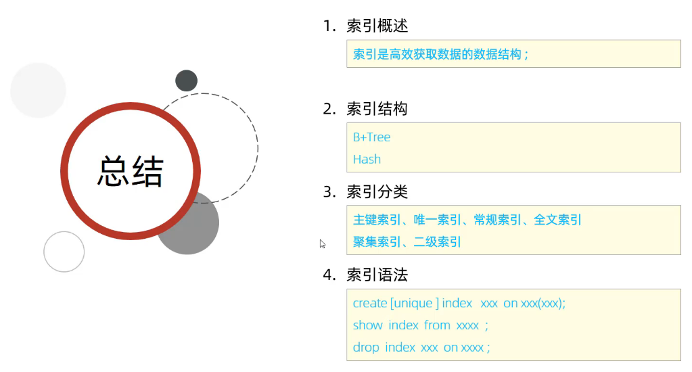


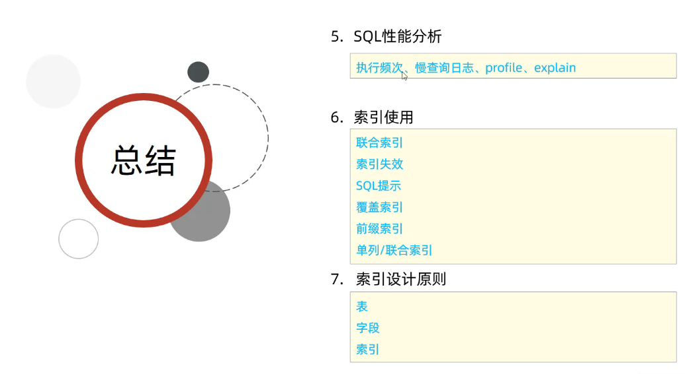


# 3、🌟 SQL优化

## 3.1 插入数据

### （1）insert

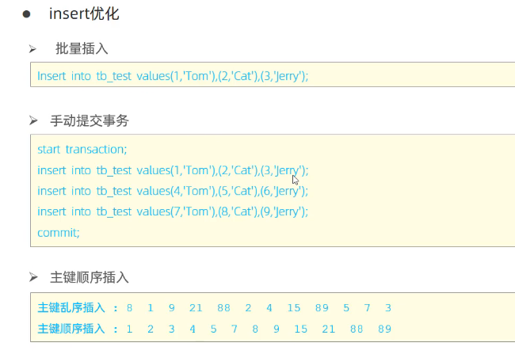

如果我们需要一次性往数据库表中插入多条记录，可以从以下三个方面进行优化。

```sql
insert into tb_test values(1,'tom');
insert into tb_test values(2,'cat');
insert into tb_test values(3,'jerry');
.....
```

#### ①优化方案一-批量插入数据

**推荐批量插入数量在  500 - 1000条**

```sql
Insert into tb_test values(1,'Tom'),(2,'Cat'),(3,'Jerry');
```


#### ②优化方案二-==手动控制事务==

由于数据库执行一条insert语句就会开启和关闭事务，可以**手动控制事务**，进而**避免频繁开始关闭事务**

```sql
start transaction;
insert into tb_test values(1,'Tom'),(2,'Cat'),(3,'Jerry');
insert into tb_test values(4,'Tom'),(5,'Cat'),(6,'Jerry');
insert into tb_test values(7,'Tom'),(8,'Cat'),(9,'Jerry');
commit;
```


#### ③优化方案三-顺序插入

主键顺序插入，性能要高于乱序插入。

```sql
主键乱序插入 : 8 1 9 21 88 2 4 15 89 5 7 3
主键顺序插入 : 1 2 3 4 5 7 8 9 15 21 88 89
```


### （2）大批量插入数据-==load指令==

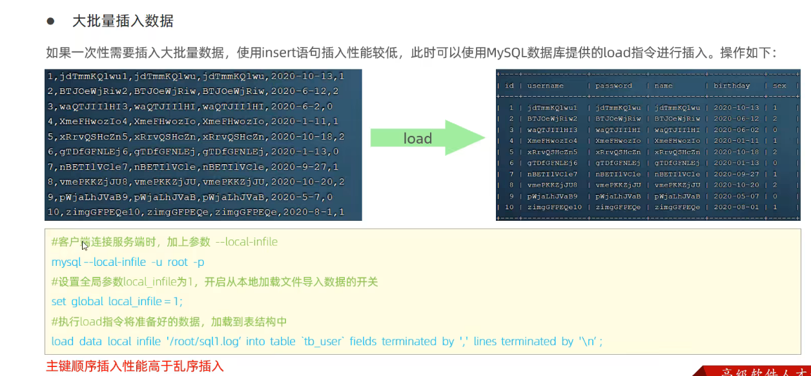

#### ①load指令插入

如果一次性需要插入大批量数据(比如: 几百万的记录)，使用insert语句插入性能较低，此时可以**使用MySQL数据库提供的==load指令==进行插入**。操作如下：


可以执行如下指令，将**数据脚本文件中的数据加载到表结构**中：

```sql
-- 客户端连接服务端时，加上参数 -–local-infile
mysql –-local-infile -u root -p

#若失败则使用：
mysql --local-infile=1 --enable-local-infile -u root -p

-- 设置全局参数local_infile为1，开启从本地加载文件导入数据的开关
set global local_infile = 1;

-- 执行load指令将准备好的数据，加载到表结构中
load data local infile '/root/sql1.log' into table tb_user fields terminated by ',' lines terminated by '\n' ;

#这里的 , 表示每个字段按照,分隔;
	   \n 表示一行按照\n分隔
	  
```


> 主键==顺序插入性能==高于**乱序插入**


#### ②示例演示

**A. 创建表结构**

```sql
CREATE TABLE `tb_user` (
    `id` INT(11) NOT NULL AUTO_INCREMENT,
    `username` VARCHAR(50) NOT NULL,
    `password` VARCHAR(50) NOT NULL,
    `name` VARCHAR(20) NOT NULL,
    `birthday` DATE DEFAULT NULL,
    `sex` CHAR(1) DEFAULT NULL,
    PRIMARY KEY (`id`),
    UNIQUE KEY `unique_user_username` (`username`)
) ENGINE=INNODB DEFAULT CHARSET=utf8 ;
```

**B. 设置参数**

```sql
-- 客户端连接服务端时，加上参数 -–local-infile
mysql –-local-infile -u root -p

#若失败则使用：
mysql --local-infile=1 --enable-local-infile -u username -p

# 查看local_infile 的值 
Select @@local_infile;

-- 设置全局参数local_infile为1，开启从本地加载文件导入数据的开关
set global local_infile = 1;
```

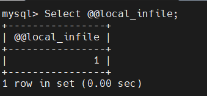


**C. load加载数据**

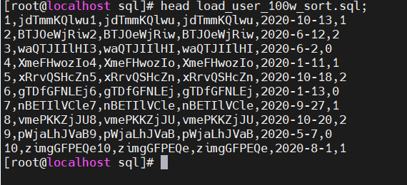

```sql
# 上传sql脚本到Linux服务器

# 查看sql脚本的前10条数据
head load_user_100w_sort.sql;

# load加载数据
load data local infile '/root/load_user_100w_sort.sql' into table tb_user fields terminated by ',' lines terminated by '\n' ;
```

我们看到，插入100w的记录，17s就完成了，性能很好。

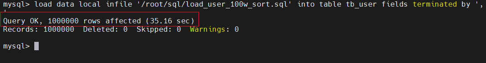


> 在load时，**==主键顺序插入性能高于乱序插入==**


## 3.2 🌟主键优化

在上一小节，我们提到，主键顺序插入的性能是要高于乱序插入的。 这一小节，就来介绍一下具体的原因，然后再分析一下主键又该如何设计。

###  （1）数据组织方式

在InnoDB存储引擎中，表数据都是根据**==主键顺序组织存放==**的，这种存储方式的表称为**索引组织表**(index organized table **IOT**)。

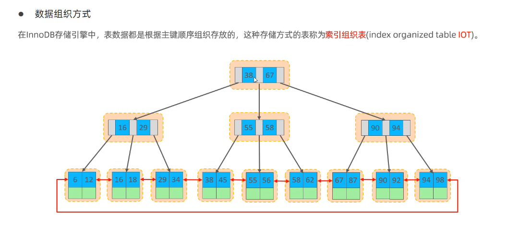


**行数据**，都是存储**在==聚集索引的叶子节点上==的**。**非叶子节点，存储的只是==起到索引数据的作用==**，而我们之前也讲解过InnoDB的**逻辑结构图**：

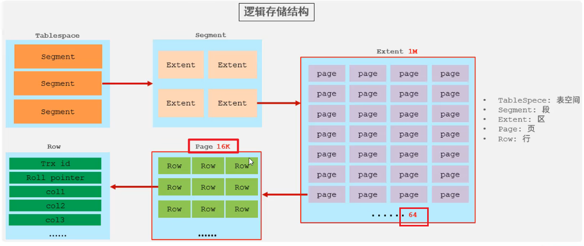


在InnoDB引擎中，数据行是记录在**逻辑结构 page 页**中的，而每一个页的大小是固定的，**默认16K**。那也就意味着， **一个页中所存储的行也是有限的**，如果插入的数据行row在该页存储不了，**将会存储到下一个页中**，**页与页之间会==通过指针连接==**。


### （2）==页分裂==

**页可以为空**，也可以填充一半，也可以填充100%。**每个页包含了2-N行数据**(**如果一行数据过大，会行溢出**)，根据主键排列。

##### **A. 主键==顺序插入==效果**

**①. 从磁盘中==申请页==， 主键顺序插入**

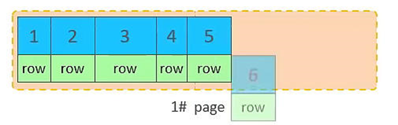

**②. 第一个页没有满，继续往第一页插入**

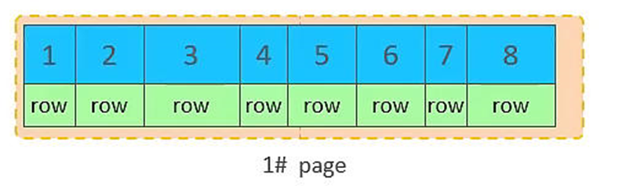

**③. 当第一个也写满之后，再写入第二个页，页与页之间会通过指针连接**

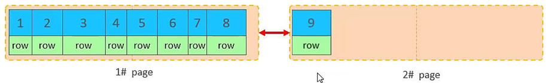

**④. 当第二页写满了，再往第三页写入**


##### **B. 主键==乱序插入==效果**

**①. 加入1#,2#页都已经写满了，存放了如图所示的数据**

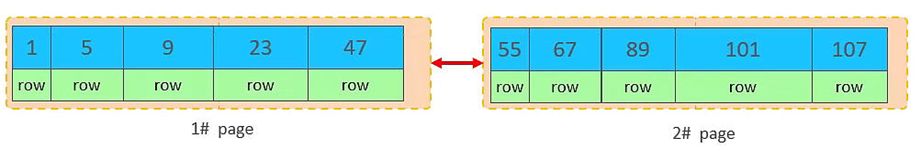


**②. 此时再插入id为50的记录，我们来看看会发生什么现象**

会再次开启一个页，写入新的页中吗？

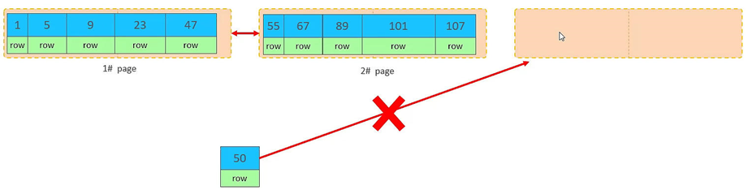


不会。因为，**==索引结构的叶子节点是有顺序的==**。按照**顺序**，应该**存储在47之后**。

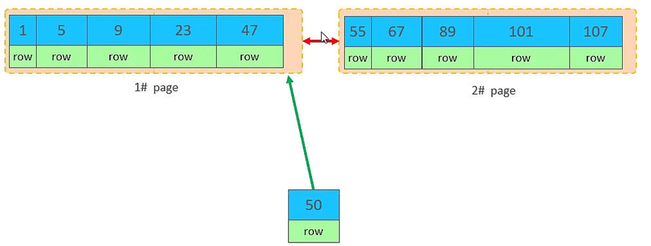

但是47所在的**1#页，已经写满了**，存储不了50对应的数据了。 那么此时会**开辟一个新的页 3#。**


但是**并不会直接将50存入3#页**，而是**会将1#页后一半的数据，移动到3#页**，然后**==在3#页，插入50==**。

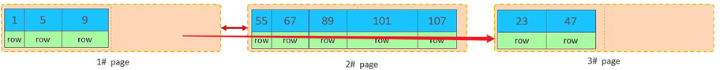


移动数据，并插入id为50的数据之后，那么此时，这三个页之间的**数据顺序**是有问题的。 1#的下一个页，应该是3#， 3#的下一个页是2#。 所以，此时，**需要重新设置链表指针**。

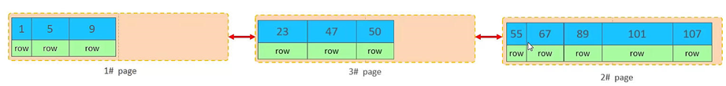

上述的这种现象，称之为 "页分裂"，是**==比较耗费性能的操作==**。


### （3）页合并

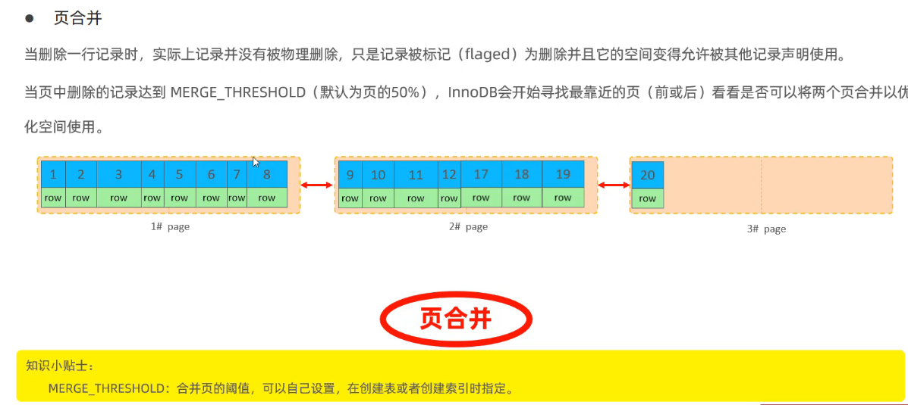

目前表中已有数据的索引结构(叶子节点)如下：

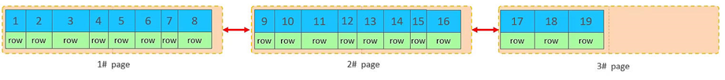

当我们**对已有数据进行删除**时，具体的效果如下:

当删除一行记录时，**实际上记录并没有被物理删除**，只是**记录==被标记（flaged）为删除==**并且**它的空间变得允许被其他记录声明使用**。

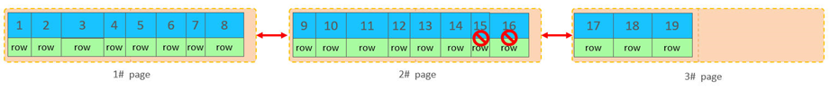

当我们继续删除2#的数据记录

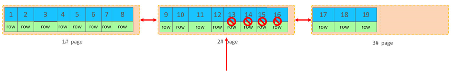

当页中删除的记录**达到 MERGE_THRESHOLD（默认为==页的50%==）**，InnoDB会开始**寻找最靠近的页（前或后**）看看**是否可以将两个页==合并以优化空间使用==**。

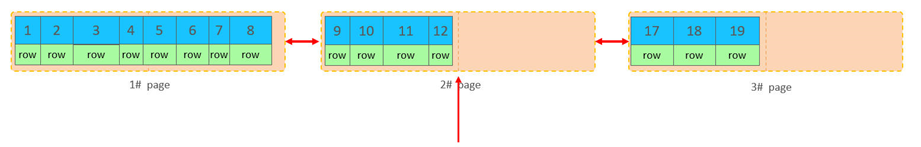

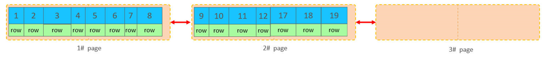

删除数据，并将页合并之后，**再次插入新的数据21**，则直接插入3#页


这个里面所发生的合并页的这个现象，就称之为 **"页合并"**。


> **知识小贴士：**
>
> MERGE_THRESHOLD：**合并页的阈值，可以自己设置，在==创建表或者创建索引==时指定。**


### （4）主键设计原则

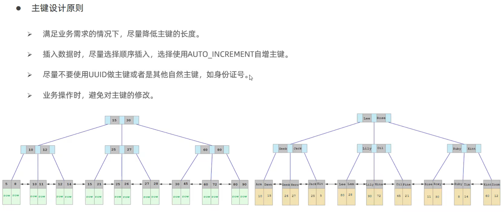

- 满足业务需求的情况下，尽量**==降低主键的长度==**。
  - 由于**二级索引保存数据的是主键的id**，如果主键长度过大会导致，**占用大量的磁盘空间。**

- 插入数据时，**尽量选择==顺序插入==**，选择使用**AUTO_INCREMENT自增主键**。
  - 避免出现页分裂现象
  - 如果插入是自增主键，会**依次插入对应到页中**(如果当前页满了则创建新的页即可)，**无需调整页的顺序**，提高了性能。
  - 如果是乱序插入，会因为需要**保持叶子节点中的数据是有序的这一原则**，而需要**不断地调整也中数据的位置以及页的位置**，进而导致增加插入时的性能损失。

- 尽量**不要使用UUID做主键**或者是其他自然主键，如身份证号。
  - UUID是无序的
  - UUID的长度有些长，会让主键的长度偏长

- 业务操作时，**==避免对主键的修改==**。
  - 因为**在二级索引的索引结构中保存的数据是主键的id**，如果直接对主键进行修改，同时需要修改对应二级索引中的主键id，这样修改的代价过大


## 3.3 order by优化

### （1）排序方式

#### ①Using filesort

#### ②Using index

MySQL的排序，有两种方式：

- **Using filesort** : 通过**表的索引或全表扫描**，读取满足条件的数据行，然后**在排序缓冲区sort buffer中完成排序操作**，**所有==不是通过索引直接返回排序结果==的排序都叫 FileSort 排序。**
- **Using index** : **通过==有序索引顺序扫描直接返回有序数据==**，这种情况即为 using index，不需要额外排序，**操作效率高**。

对于以上的两种排序方式，**Using index的性能高**，而Using filesort的性能低，我们在优化排序操作时，尽量要优化为 Using index。


### （2）测试

接下来，我们来做一个测试：

#### **A. 数据准备**

把之前测试时，为tb_user表所建立的部分索引直接删除掉

```sql
show index from tb_user;

drop index idx_user_phone on tb_user;

drop index idx_user_phone_name on tb_user;

drop index idx_user_name on tb_user;
```

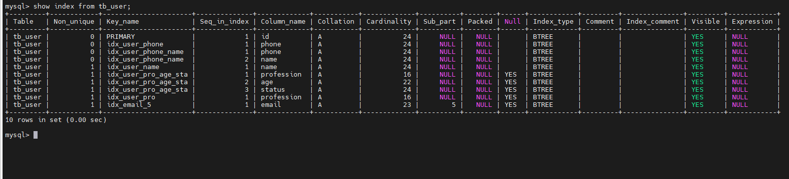

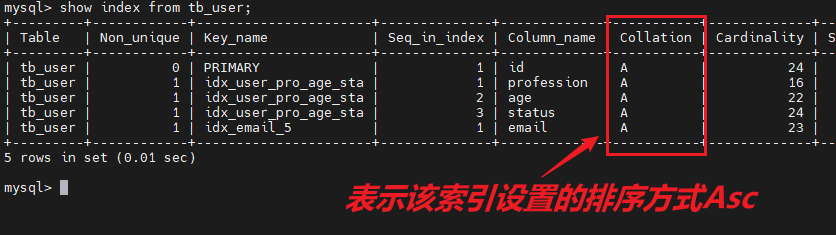


#### **B. 执行排序SQL**

```sql
explain select id,age,phone from tb_user order by age ; 
```


```sql
explain select id,age,phone from tb_user order by age, phone ; 
```

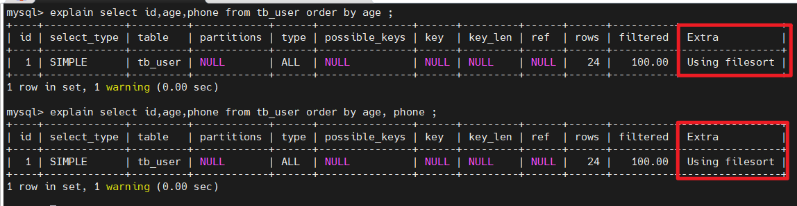

由于 **age, phone 都没有索引**，所以此时再排序时，出现**Using filesort， 排序性能较低**。


#### **C. 创建索引**

```sql
-- 创建索引
create index idx_user_age_phone_aa on tb_user(age,phone);
# 这里索引名字命名中的 _aa 表示的是age和phone都是按照 升序排序 创建的索引
```

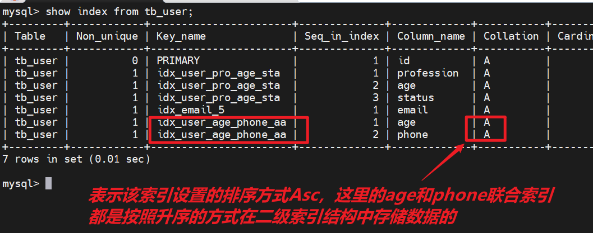


#### **D. 创建索引后，根据age, phone进行升序排序**

```sql
explain select id,age,phone from tb_user order by age; 
```

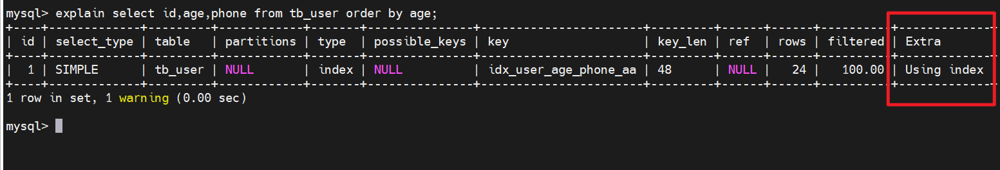

```sql
explain select id,age,phone from tb_user order by age , phone; 
```

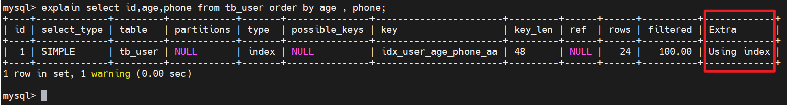

建立索引之后，再次进行排序查询，就由**原来的Using filesort， 变为了 Using index**，性能就是比较高的了。

**如果只对phone进行升序排序**

```sql
 explain select id , phone from tb_user order by phone;
```

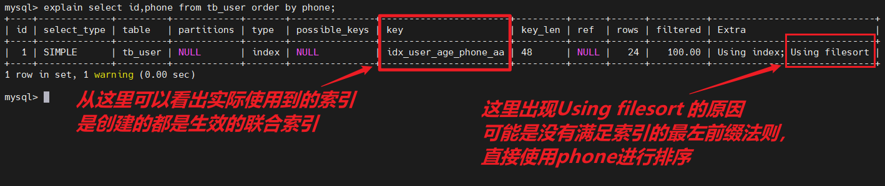


#### **E. 创建索引后，根据age, phone进行==降序排序==**

```sql
explain select id,age,phone from tb_user order by age desc , phone desc; 
```

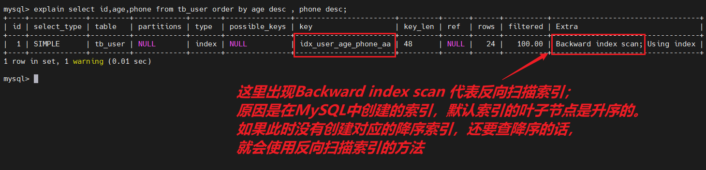

也出现 Using index， 但是此时Extra中出现了 **Backward index scan**，这个**代表反向扫描索引**，

因为在MySQL中我们创建的索引，**==默认索引的叶子节点是从小到大排序的==**，而此时我们查询排序时，是从大到小（desc 降序排列）

所以，在扫描时，就是**反向扫描**，就会出现 **Backward index scan**。 在MySQL8版本中，支持降序索引，我们也可以**创建降序索引**。


#### **F. 根据phone，age进行升序排序，==phone在前，age在后==。**

```sql
explain select id,age,phone from tb_user order by phone , age; 
```

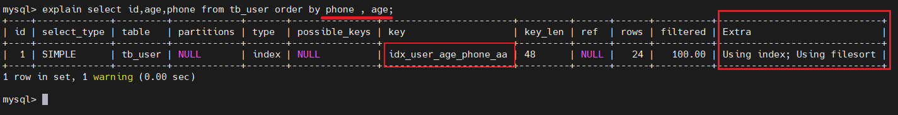

排序时,也需要**满足==最左前缀法则==,否则也会出现 filesort**。

因为在**创建索引**的时候， age是第一个字段，phone是第二个字段，所以排序时，也就该**按照这个顺序来**，否则**就会出现 Usingfilesort**。


#### **G. 根据age, phone进行降序一个升序，一个降序**

```sql
explain select id,age,phone from tb_user order by age asc , phone desc ; 
```

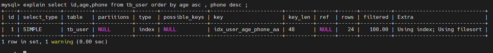

因为创建索引时，**如果==未指定顺序==，默认都是按照升序排序的**，而查询时，**一个升序，一个降序，此时就会出现Using filesort**。


为了解决上述的问题，我们可以创建一个索引，这个联合索引中 **age 升序排序，phone 倒序**排序。


#### **H. 创建联合索引(age 升序排序，phone 倒序排序)**

```sql
create index idx_user_age_phone_ad on tb_user(age asc ,phone desc); 
# 这里索引名字命名中的 _ad 表示的是 age 升序排序，phone 倒序排序 创建的索引
```

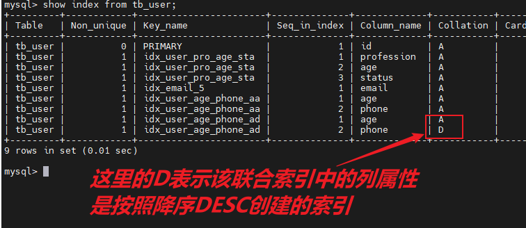


#### **I. 然后再次执行如下SQL**

```sql
explain select id,age,phone from tb_user order by age asc , phone desc ; 
```

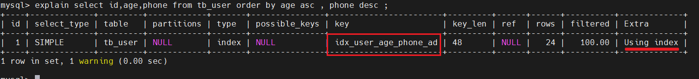


升序/降序**联合索引结构图示**:

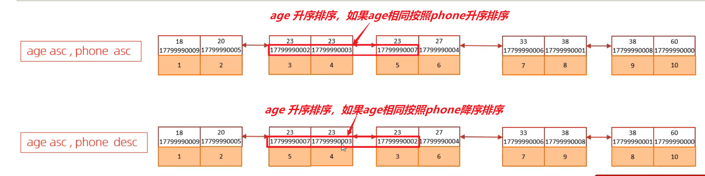


### （3）==优化原则==

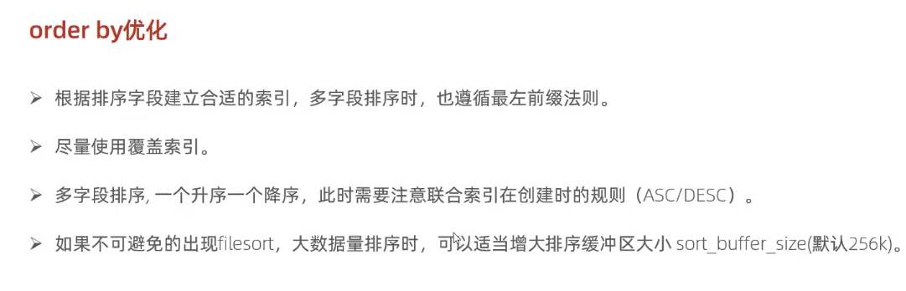

由上述的测试,我们得出**order by优化原则**:

- A. 根据排序字段建立合适的索引，**多字段排序**时，也**遵循最左前缀法则**。

- B. **尽量使用==覆盖索引==**。

  - 如果**不使用覆盖索引**（如Select * from）的话，还是会使用Using filesort方式进行排序

  - ```sql
    explain select * from tb_user order by age asc , phone desc ; 
    ```

  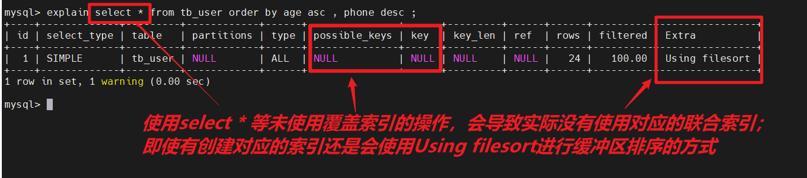

  

- C. 多字段排序, 一个升序一个降序，此时需要**注意联合索引在创建时的规则**（ASC/DESC）。

- D. 如果**不可避免**的出现filesort，大数据量排序时，可以**适当增大排序缓冲区大小sort_buffer_size(默认256k)**,如果超过了设置的排序缓存区的大小，会在磁盘文件中进行排序，相对的磁盘中进行排序会慢得多。

  - ```sql
    show variables like 'sort_buffer_size';
    ```

    


## 3.4 group by优化

分组操作，我们主要来看看**索引对于分组操作**的影响。

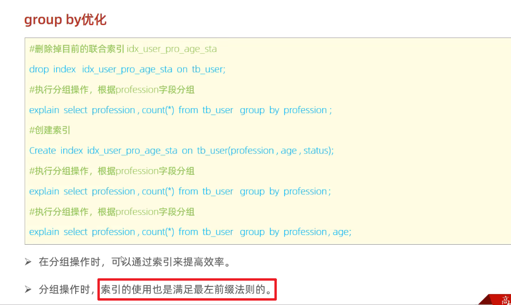


首先我们先将 tb_user 表的索引全部删除掉 。

```sql
drop index idx_user_pro_age_sta on tb_user;

drop index idx_email_5 on tb_user;

drop index idx_user_age_phone_aa on tb_user;

drop index idx_user_age_phone_ad on tb_user;

show index from tb_user;
```

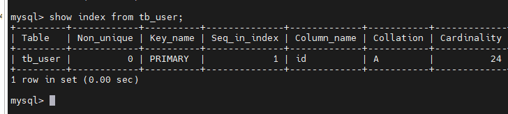


接下来，在没有索引的情况下，执行如下SQL，查询执行计划：

```sql
explain select profession , count(*) from tb_user group by profession ; 
```

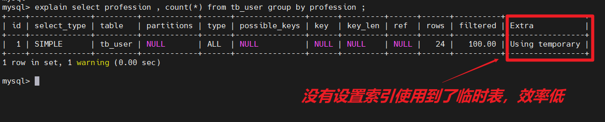

**Using temporary，表示使用到了==临时表==**


然后，我们在针对于 profession ， age， status 创建一个联合索引。

```sql
create index idx_user_pro_age_sta on tb_user(profession , age , status);
```

紧接着，再执行前面相同的SQL查看执行计划。

```sql
explain select profession , count(*) from tb_user group by profession ;
```

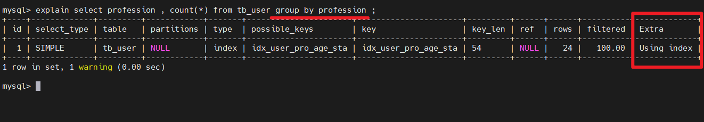

再执行如下的分组查询SQL，查看执行计划：

```sql
explain select age ,count(*) from tb_user group by age;
```

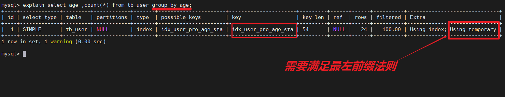

我们发现，如果**仅仅根据age分组，就会出现 Using temporary** ；而如果是 **根据profession,age两个字段==同时分组==**，则不会出现 Using temporary。原因是因为对于分组操作，在联合索引中，**也是==符合最左前缀法则的==**。

**==注意==，下列情况也满足最左前缀法则**

```sql
explain select age ,count(*) from tb_user where profession = '软件工程' group by age;
```

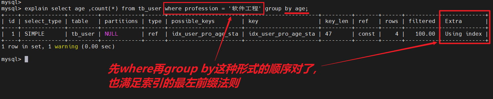


所以，在分组操作中，我们需要通过以下两点进行优化，以提升性能：

- A. 在分组操作时，可以**通过索引来提高效率**。
- B. 分组操作时，索引的使用也是**满足最左前缀法则的。**


## 3.5 limit优化

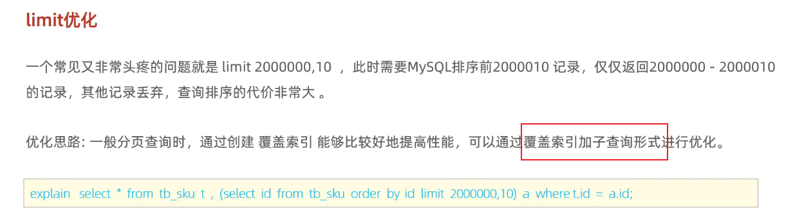

在数据量比较大时，如果进行limit分页查询，**在查询时，越往后，分页查询效率越低**。

```sql
select * from tb_sku limit 0,10;
select * from tb_sku limit 100000,10;
select * from tb_sku limit 1000000,10;
```

我们一起来看看执行limit分页查询耗时对比：

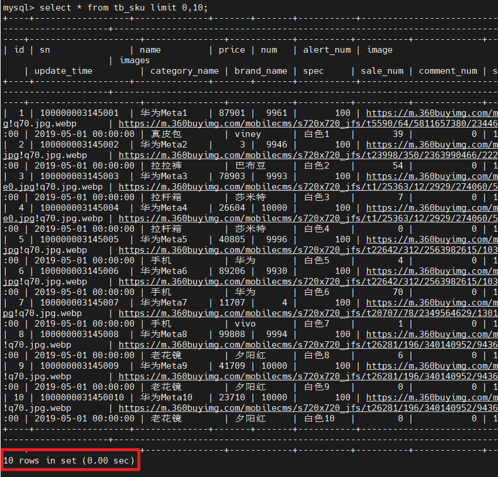

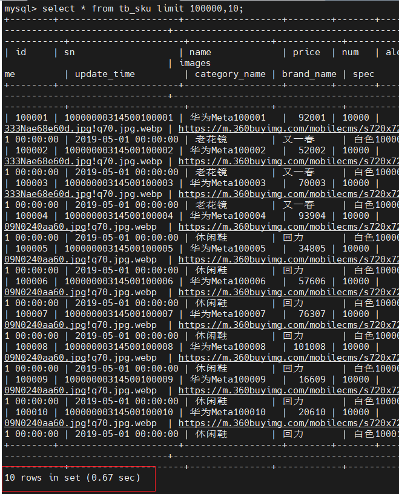

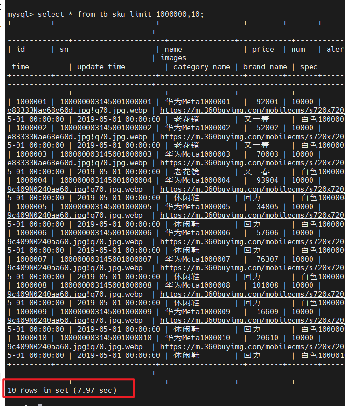


通过测试我们会看到，**越往后，分页查询效率越低**，这就是分页查询的问题所在。

因为，当在进行分页查询时，如果执行 **limit 2000000,10** ，此时需要MySQL排序前2000010 记录，**仅仅返回 2000000 - 2000010 的记录**，**其他记录丢弃，查询排序的代价非常大** 。

**优化思路:** 一般分页查询时，通过创建 **覆盖索引** 能够比较好地提高性能，可以通过**==覆盖索引加子查询==形式进行优化**。

```sql
# 使用聚集索引，也就是这里的id进行查询，也可以是使用覆盖索引进行先一步查询
select id from tb_sku order by id limit 2000000,10;
```

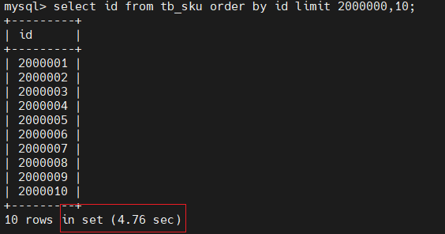


**==注意==-这里不能直接使用in的方式**

```sql
select * from tb_sku t where t.id in (select id from tb_sku order by id limit 2000000,10);
```

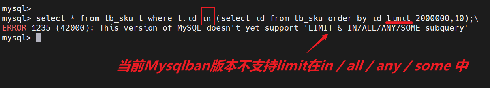


```sql
# 通过将利用覆盖索引(这里的聚集索引id)查询到的id信息当做一张表和tb_sku进行连接。进而优化查询效率
explain select * from tb_sku t , (select id from tb_sku order by id limit 2000000,10) a where t.id = a.id;
```

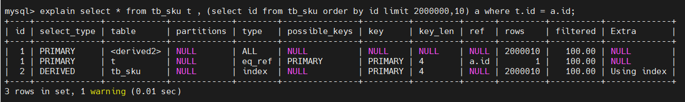

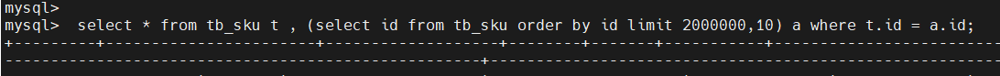

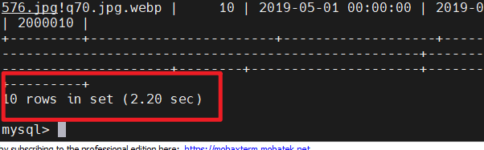


## 3.6 count优化

### （1）概述

```sql
select count(*) from tb_user ; 
```

在之前的测试中，我们发现，如果**数据量很大，在执行count操作时，是非常耗时的**。


- MyISAM 引擎把**一个表的总行数存在了磁盘**上，因此执行 count(*) 的时候会直接返回这个数，**效率很高**； 但是如果是带**条件的count**，MyISAM也慢。
- **InnoDB 引擎**就麻烦了，它执行 count(*) 的时候，需要把数据一行一行地从引擎里面读出来，然后**累积计数**。


如果说要**大幅度提升**InnoDB表的count效率，主要的优化思路：

**自己计数**

- 可以**借助于redis这样的数据库进行**,如果增加数据行数量+1，删除-1，自己去维护总数
- 但是如果是带条件的count又比较麻烦了


### （2）count用法

count() 是一个聚合函数，对于返回的结果集，一行行地判断，如果 **count 函数的==参数不是NULL==**，**累计值就加 1，否则不加**，**最后返回累计值**。

用法：count（*）、count（主键）、count（字段）、count（数字）

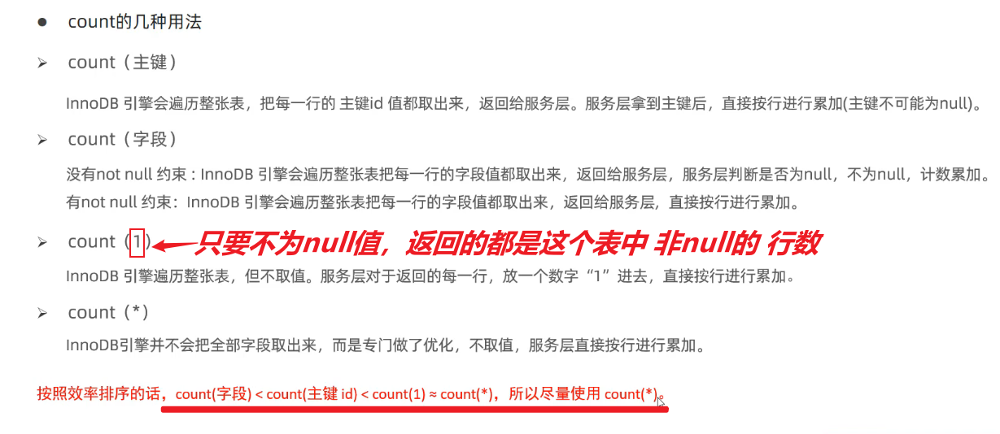

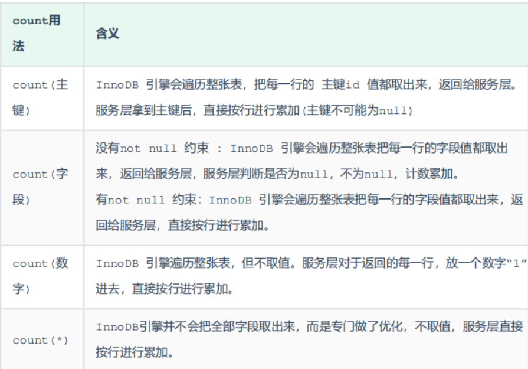


> **按照效率排序的话**，count(字段) < count(主键 id) < count(1) ≈ `count(*)`，所以尽量使用 `count(*)`。


## 3.7  🌟update优化

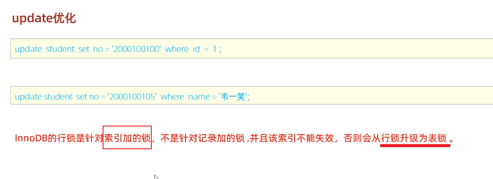

我们主要需要注意一下update语句执行时的注意事项。

```sql
begin;
update course set name = 'javaEE' where id = 1 ;
commit;
```

当我们在执行删除的SQL语句时，会锁定id（**id为主键-聚集索引**）为1这一行的数据，**然后事务提交之后，行锁释放。**


但是当我们在执行如下SQL时。

```sql
begin;
update course set name = 'SpringBoot' where name = 'PHP' ; 
commit;
```

当我们开启多个事务，在执行上述的SQL时，我们发现**行锁升级为了表锁**。 导致该update语句的**性能大大降低**。

**原因：** InnoDB的**==行锁是针对索引加的锁==**

 在进行update语句的时候如果后面的**where条件涉及的字段是索引**的话，则会对此时修改的记录**==加行锁==**，**在当前修改事务未提交前，其他事务可以修改表中的其他行**。

但如果**where后的字段不是索引**的话，InnoDB会**==从行锁升级为表锁==**，此时其他事务就不能访问该表中的其他字段了。


> InnoDB的**==行锁是针对索引加的锁，不是针对记录加的锁==** ,并且该索引不能失效，否则会从行锁升级为表锁 。进而导致表的并发性能。


## 3.8 小结

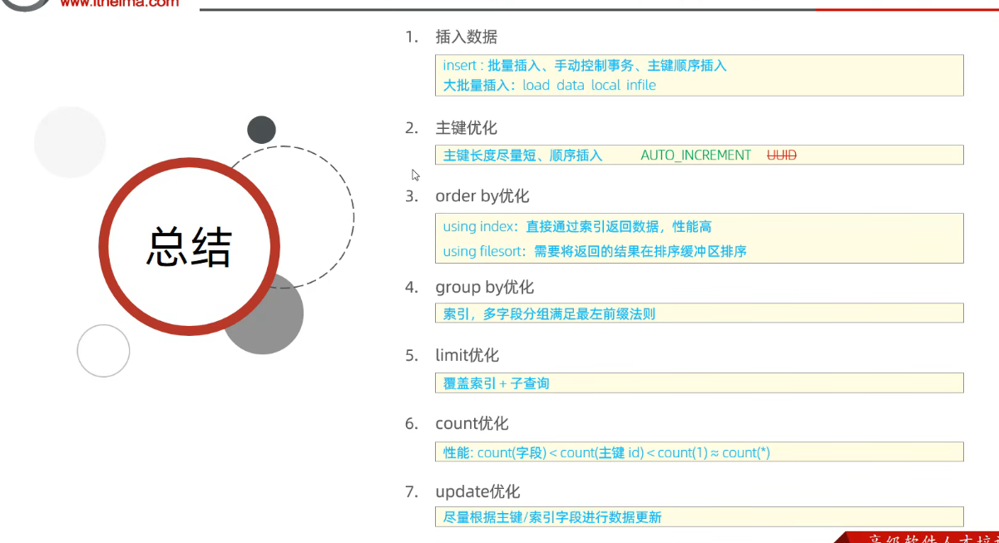


# 4、视图/存储过程/触发器

## 4.1 视图

### （1）介绍

视图（View）是一种**虚拟存在的表**。视图中的**数据并不在数据库中实际存在**，行和列数据来自定义视图的查询中使用的表，并且是在**使用视图时动态生成**的。

通俗的讲，视图**只保存了查询的SQL逻辑**，**不保存查询结果**。所以我们在创建视图的时候，主要的工作就落在创建这条SQL查询语句上。


### （2）语法

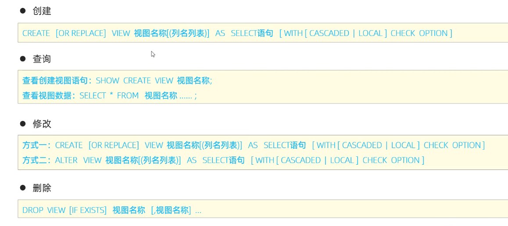

#### ①创建

create or replace : **创建或者替换**一个视图

```sql
CREATE [OR REPLACE] VIEW 视图名称[(列名列表)] AS SELECT语句 [ WITH [CASCADED | LOCAL ] CHECK OPTION ]
```


#### ②查询

```sql
查看创建视图语句：SHOW CREATE VIEW 视图名称;

查看视图数据：SELECT * FROM 视图名称 ...... ;
```


#### ③修改

```sql
方式一：CREATE [OR REPLACE] VIEW 视图名称[(列名列表)] AS SELECT语句 [ WITH [ CASCADED | LOCAL ] CHECK OPTION ]

方式二：ALTER VIEW 视图名称[(列名列表)] AS SELECT语句 [ WITH [ CASCADED | LOCAL ] CHECK OPTION ]
```


#### ④删除

```sql
DROP VIEW [IF EXISTS] 视图名称 [,视图名称] ... 
```


#### ⑤演示示例

```sql
-- 创建视图
create or replace view stu_v_1 as select id,name from student where id <= 10;

-- 查询视图
show create view stu_v_1;

select * from stu_v_1;
select * from stu_v_1 where id < 3;

-- 修改视图
create or replace view stu_v_1 as select id,name,no from student where id <= 10;

alter view stu_v_1 as select id,name from student where id <= 10;

-- 删除视图
drop view if exists stu_v_1;
```

上述我们演示了，视图应该如何创建、查询、修改、删除，那么我们能不能通过视图来插入、更新数据呢？ 接下来，做一个测试。

```sql
create or replace view stu_v_1 as select id,name from student where id <= 10 ;

select * from stu_v_1;
insert into stu_v_1 values(6,'Tom');
insert into stu_v_1 values(17,'Tom22');
```

执行上述的SQL，我们会发现，id为6和17的数据**都是可以成功插入的**。 但是我们执行查询，查询出来的数据，**却没有id为17的记录**。

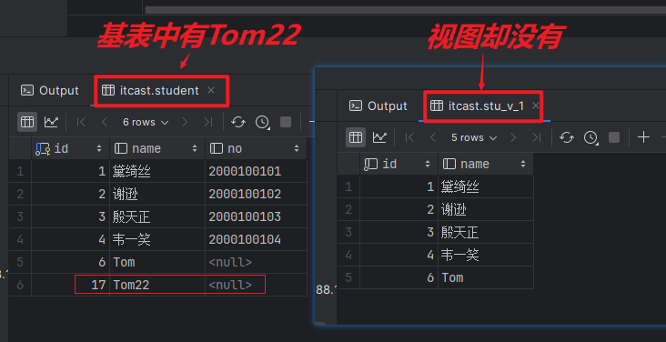


因为我们在创建视图的时候，**==指定的条件为 id<=10==**, id为**17的数据，是不符合条件的**，所以没有查询出来，但是**这条数据==确实是已经成功的插入到了基表中==**。 

如果我们定义视图时，如果指定了条件，然后我们在插入、修改、删除数据时，是否可以**做到必须满足条件才能操作，否则不能够操作**呢？ 答案是可以的，这就需要借助于**视图的检查选项**了。


### （3）==检查选项==

当使用**==WITH CHECK OPTION==子句**创建视图时，MySQL会**通过视图检查正在更改的每个行**，例如 插入，更新，删除，以使其**==符合视图的定义==**。 MySQL允许**基于另一个视图创建视图**，它还会**检查依赖视图中的规则以保持一致性**。为了**确定检查的范围**，mysql提供了两个选项： **CASCADED 和 LOCAL**，默认值为 CASCADED 。

```sql
create or replace view stu_v_1 
as select id,name 
from student 
where id <= 10 
with [cascaded | local] check option;
```


#### ①CASCADED级联

比如，**v2视图是基于v1视图的**，如果在v2视图创建的时候**指定了检查选项为 cascaded**，**但是v1视图创建时==未指定检查选项==**。 则在执行检查时，**==不仅会检查v2，还会级联检查v2的关联视图v1==**。

cascaded级联，会对加上了**该 检查选项 的视图v** 检查正在更改的操作是否符合视图的定义，并且**如果该视图v还有依赖其他视图，则还会级联检查该视图v依赖的所有视图**。

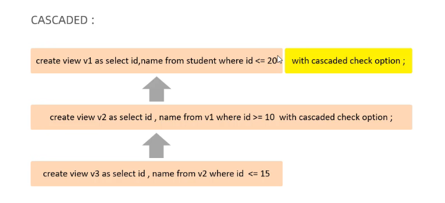

```sql
create or replace view stu_v_1 
as select id, name, no 
from student 
where id <= 20;

insert into stu_v_1 values (5, 'Tom'); 
insert into stu_v_1 values (25, 'Tom22');
# 由于没有加上检查选项，能够添加进基表student中，不会添加到v1中，并且也不会报错。


create or replace view stu_v_2 
as select id, name 
from stu_v_1 
where id >= 10 
with cascaded check option;

insert into stu_v_2 values (7, 'Tom'); #报错，不满足v2的定义 >=10
insert into stu_v_2 values (26, 'Tom'); 
# 由于视图v2在创建时使用了cascaded级联，虽然满足v2的定义，但是不满足v2依赖的v1的定义

insert into stu_v_2 values (15, 'Tom');

create or replace view stu_v_3 
as select id, name 
from stu_v_2 
where id <= 15;

insert into stu_v_3 values (11, 'Tom'); insert into stu_v_3 values (17, 'Tom'); 
#不满足v3的定义,但是能够执行成功，因为没有给v3加上检查选项，虽然v3中不能添加到，只能添加到基表student中，但是也不会报错

insert into stu_v_3 values (28, 'Tom'); 
#报错，虽然不会去检查v3但是v2添加了检查选项会进行cascaded级联检查，不符合v1的定义
```


#### ②LOCAL本地

比如，**v2视图是基于v1视图的**，如果在v2视图创建的时候**==指定了检查选项为 local==** ，但是**v1**视图创建时**未指定检查选项**。 则在执行检查时，**==只会检查v2==**，不会检查v2的关联视图v1。

使用local后，如果**当前加了 local检查选项 的视图v**，并且该视图还依赖了其他视图v' ，它会去检查它所依赖的视图v' 是否在创建视图时添加了检查选项，**如果添加了就一起判断**，**如==没有添加则只会判断视图v所定义的条件==**

 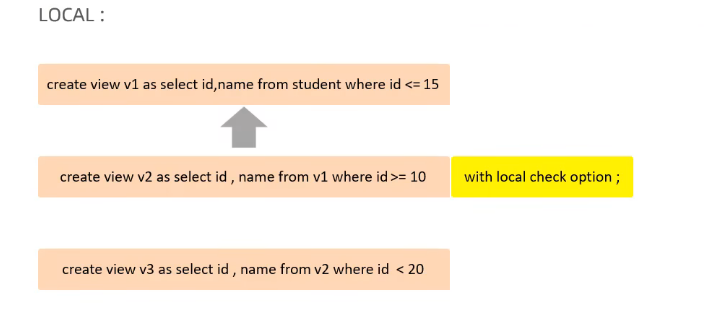


### （4）视图的更新

#### ①概念

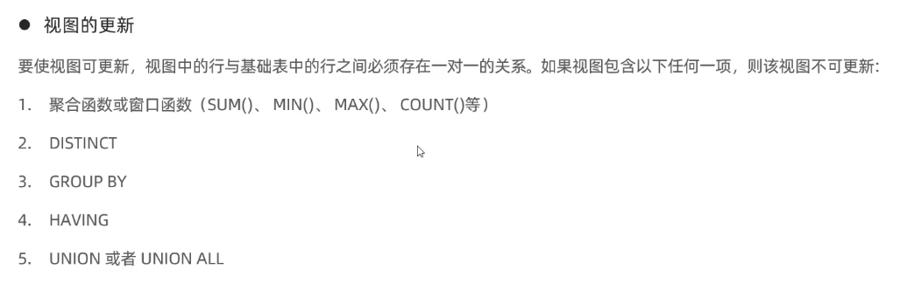

要使视图可更新，**视图中的行与==基础表中的行==之间必须存在==一对一==的关系**。如果视图包含以下任何一项，则**该视图不可更新**：

A. 聚合函数或窗口函数（SUM()、 MIN()、 MAX()、 COUNT()等）

B. DISTINCT

C. GROUP BY

D. HAVING

E. UNION 或者 UNION ALL


#### ②示例演示

```sql
create view stu_v_count as select count(*) from student; 
```

上述的视图中，就**只有一个单行单列的数据**，如果我们**对这个视图进行更新或插入**的，将**会报错**。

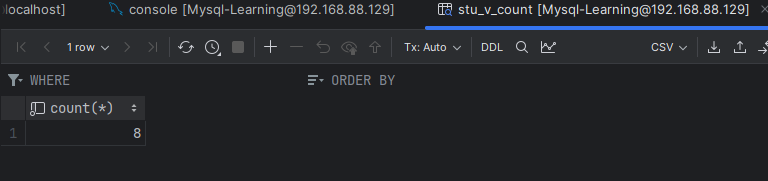

```sql
insert into stu_v_count values(10); 
```

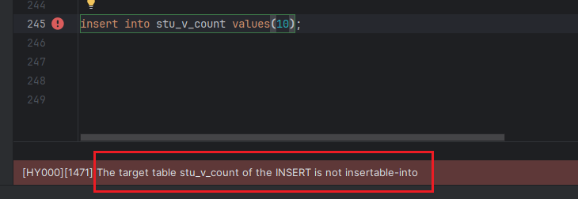


### （5）视图的作用

#### ①简单

视图不仅可以**简化用户对数据的理解**，也可以简化他们的操作。那些被经常使用的查询可以被定义为视图，从而使得用户不必为以后的操作每次指定全部的条件。

#### ②安全

数据库可以授权，**但不能授权到数据库特定行和特定的列上**。通过**视图用户==只能查询和修改他们所能见到的数据==**


#### ③数据独立

视图可**帮助用户屏蔽真实表结构变化带来的影响**。

​	比如，student表中的name字段发生变化，从name -》stuName，此时只需改变视图的映射关系即可，无需改变业务代码。

```sql
# 原本的视图
create or replace view stu_v_1 
as select id, name, no 
from student where id <= 10;

# 需求变更，将基表student的name字段改变，从name -》stuName

# 改变视图的映射关系即可，不影响业务代码
create or replace view stu_v_1 
as select id, stuName, no 
from student where id <= 10;
```


### （6）案例

1). 为了保证数据库表的安全性，开发人员在操作tb_user表时，只能看到的**用户的基本字段**，**屏蔽手机号和邮箱两个字段**。

```sql
create view tb_user_view 
as select id,name,profession,age,gender,status,createtime 
from tb_user;

select * from tb_user_view;
```


2). 查询**每个学生所选修的课程（三张表联查）**，这个功能在很多的业务中都有使用到，为了简化操作，定义一个视图。

```sql
create view tb_stu_course_view 
    as select s.name student_name , s.no student_no , c.name course_name 
    from student s, student_course sc , course c
    where s.id = sc.studentid and sc.courseid = c.id;

select * from tb_stu_course_view;
```


## 4.2 存储过程

### （1）介绍和特点

存储过程是**事先经过编译并存储在数据库中的一段 SQL 语句的集合**，调用存储过程可以简化应用开发人员的很多工作，**减少数据在数据库和应用服务器之间的传输**（主要是网络传输），对于**提高数据处理的效率**是有好处的。

存储过程思想上很简单，就是数据库 SQL 语言层面的**代码封装与重用**。

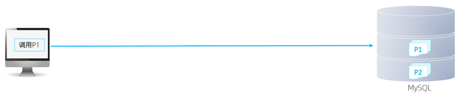

#### **特点**

- **封装，复用** 
  - 可以把某一业务SQL封装在存储过程中，需要用到的时候直接调用即可。

- **可以接收参数，也可以返回数据** 
  - 再存储过程中，可以传递参数，也可以接收返回值。

- **==减少网络交互，效率提升==**
  - 如果涉及到多条SQL，每执行一次都是一次网络传输。 而如果封装在存储过程中，我们只需要网络交互一次可能就可以了。


### （2）基本用法

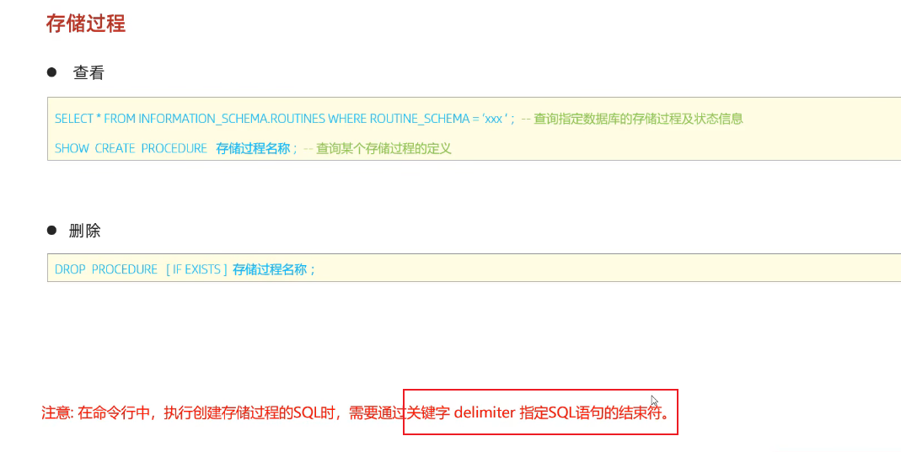

#### ① 创建

```sql
CREATE PROCEDURE 存储过程名称 ([ 参数列表 ])

BEGIN

-- SQL语句

END ;
```

#### ② 调用

```
CALL 名称 ([ 参数 ]);
```

#### ③ 查看

```sql
SELECT * FROM INFORMATION_SCHEMA.ROUTINES WHERE ROUTINE_SCHEMA = 'xxx'; -- 查询指定数据库的存储过程及状态信息
SHOW CREATE PROCEDURE 存储过程名称 ; -- 查询某个存储过程的定义
```


#### ④ 删除

```sql
DROP PROCEDURE [ IF EXISTS ] 存储过程名称 ；
```


> ==**注意:**==
>
> 在**命令行中**，执行创建存储过程的SQL时，需要通过**关键字 ==delimiter 指定SQL语句的结束符==**。
>
> - 这个是因为在存储过程中的内部可能会有`;` 的作为结束的语句，此时在命令行中，就认为该`;`是该语句的结束符，该存储过程的后续不能就得不到执行：
>
>   ```sql
>   create procedure p1()
>   begin
>   	select count(*) from student;
>   end;
>   ```
>
>   这里的`end;`就得不到执行，此时可以通过delimiter指令修改mysql命令行中的结束符为`$$`等其他不会引起冲突的符号。
>
>   ```sql
>   delimiter $$;
>   ```


#### ⑤演示示例

```sql
-- 存储过程基本语法
-- 创建
create procedure p1()
begin

select count(*) from student;

end;

-- 调用
call p1();

-- 查看
select * from information_schema.ROUTINES where ROUTINE_SCHEMA = 'itcast';

show create procedure p1;

-- 删除
drop procedure if exists p1;
```


### （3）==变量==

在MySQL中变量分为三种类型: **系统变量、用户定义变量、局部变量**。

#### ①系统变量

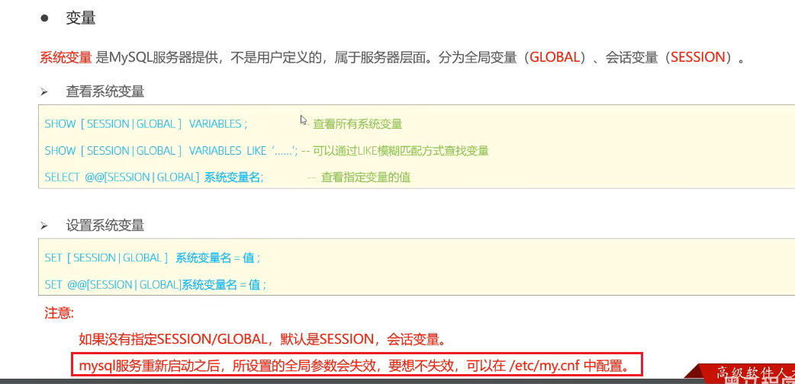

系统变量 是MySQL服务器提供，不是用户定义的，属于服务器层面。分为**全局变量（GLOBAL）**、**会话变量（SESSION）**。**默认**查询的是session会话变量。

##### 1). 查看系统变量

```sql
SHOW [ SESSION | GLOBAL ] VARIABLES ; -- 查看所有系统变量
SHOW [ SESSION | GLOBAL ] VARIABLES LIKE '......'; -- 可以通过LIKE模糊匹配方式查找变量
SELECT @@[SESSION | GLOBAL] 系统变量名; -- 查看指定变量的值
```


##### 2). 设置系统变量

```sql
SET [ SESSION | GLOBAL ] 系统变量名 = 值 ;
SET @@[SESSION | GLOBAL]系统变量名 = 值 ;
```


> **注意：**
>
> 如果没有指定SESSION/GLOBAL，默认是SESSION，会话变量。
>
> mysql服务重新启动之后，所设置的全局参数会失效，要想不失效，可以在 /etc/my.cnf 中配置。 
>
> - A. 全局变量(GLOBAL): 全局变量针对于所有的会话。
> - B. 会话变量(SESSION): 会话变量针对于单个会话，在另外一个会话窗口就不生效了。


**演示示例:**

```sql
-- 查看系统变量
show session variables ;

show session variables like 'auto%';
show global variables like 'auto%';

select @@global.autocommit;  -- 查看指定global级别下该变量的值
select @@session.autocommit; -- 查看指定session级别下该变量的值

-- 设置系统变量
set session autocommit = 1; -- 改变的只是当前会话

insert into course(id, name) VALUES (6, 'ES');

set global autocommit = 0;

select @@global.autocommit;
```


#### ②用户定义变量

用户定义变量 是用户根据需要自己定义的变量，**用户变量不用提前声明**，在用的时候**直接用 "@变量名"** 使用就可以。其**作用域为当前连接**（只在当前会话有效）。

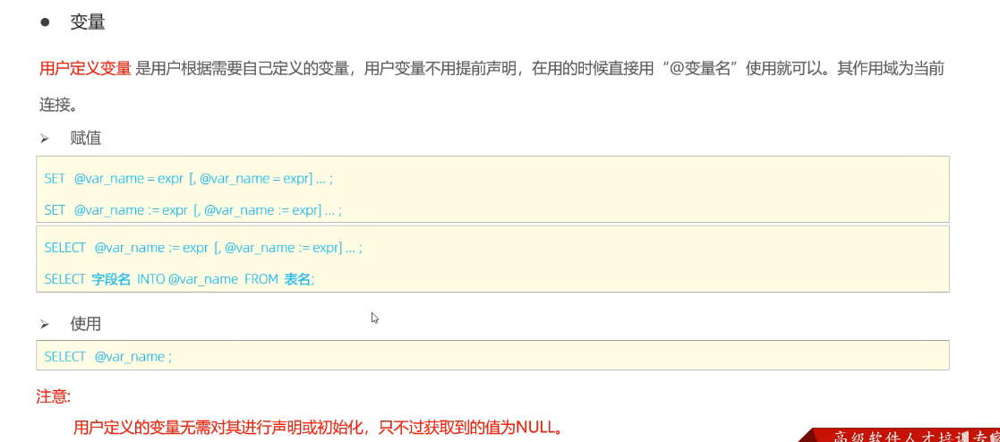

##### 1). 赋值

**方式一:**

```sql
SET @var_name = expr [, @var_name = expr] ... ;

SET @var_name := expr [, @var_name := expr] ... ;
```

赋值时，可以使用 = ，也可以使用 := 。

**方式二:**

```sql
SELECT @var_name := expr [, @var_name := expr] ... ;

SELECT 字段名 INTO @var_name FROM 表名;
```


##### 2). 使用

```sql
SELECT @var_name ;
```

> 注意: 用户定义的变量**无需对其进行声明或初始化**，**只不过==获取到的值为NULL==**。

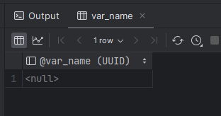


##### 演示示例

```sql
-- 赋值
set @myname = 'itcast';
set @myage := 10;
set @mygender := '男',@myhobby := 'java';

select @mycolor := 'red';
select count(*) into @mycount from tb_user;

-- 使用
select @myname,@myage,@mygender,@myhobby;

select @mycolor , @mycount;

select @abc;
```


#### ③局部变量

局部变量 是根据需要定义的在局部生效的变量，访问之前，==需要**DECLARE声明**==。可用作存储过程内的局部变量和输入参数，**局部变量的==范围==是在其内声明的==BEGIN ... END块==**。

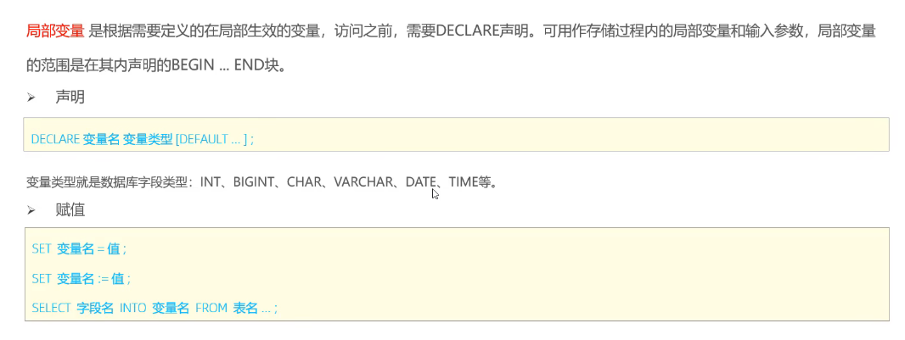

##### 1). 声明

```sql
DECLARE 变量名 变量类型 [DEFAULT ... ] ; 
```

变量类型就是数据库字段类型：**INT、BIGINT、CHAR、VARCHAR、DATE、TIME**等。

##### 2). 赋值

```sql
SET 变量名 = 值 ;

SET 变量名 := 值 ;

SELECT 字段名 INTO 变量名 FROM 表名 ... ;
```


##### 演示示例

```sql
-- 声明局部变量 - declare
-- 赋值

create procedure p2()

begin

	declare stu_count int default 0;
	select count(*) into stu_count from student;
	select stu_count;

end;

call p2();
```


### （4）if

#### ① 介绍

if 用于做条件判断，具体的语法结构为：


```sql
IF 条件1 THEN
	.....

ELSEIF 条件2 THEN -- 可选
	.....

ELSE -- 可选
	.....

END IF; -- 结束
```

在if条件判断的结构中，ELSE IF 结构可以有多个，也**可以没有**。 ELSE结构可以有，也**可以没有**。


#### ②案例

根据定义的分数score变量，判定当前分数对应的分数等级。

- score >= 85分，等级为优秀。
- score >= 60分 且 score < 85分，等级为及格。
- score < 60分，等级为不及格。

```sql
create procedure p3()

begin
    declare score int default 58;
    declare result varchar(10);

    if score >= 85 then
   	 	set result := '优秀';

    elseif score >= 60 then
    	set result := '及格';

    else
   	 	set result := '不及格';

    end if;
    
    select result;
end;

call p3();
```


上述的需求我们虽然已经实现了，但是也存在一些问题，比如：score 分数我们是在**存储过程中定义死的**，而且最终计算出来的分数等级，我们也仅仅是最终查询展示出来而已。

那么我们能不能，把score分数动态的传递进来，计算出来的分数等级是否可以作为返回值返回呢？答案是肯定的，我们可以通过接下来所讲解的 **参数** 来解决上述的问题。


### （5）参数

#### ①介绍

参数的类型，主要分为以下三种：IN、OUT、INOUT。 具体的含义如下：

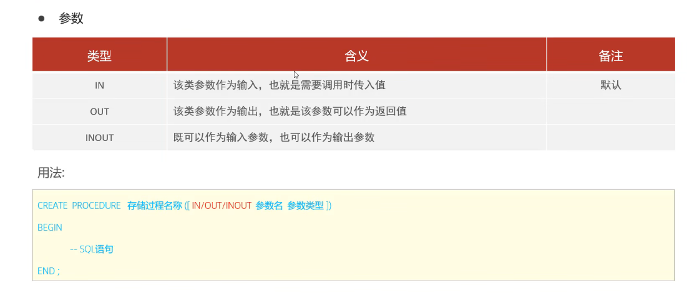

用法：

```sql
CREATE PROCEDURE 存储过程名称 ([ IN/OUT/INOUT 参数名 参数类型 ])

BEGIN
	-- SQL语句
END ;
```


#### ②案例一in&out

根据传入参数score，判定当前分数对应的分数等级，并返回。

- score >= 85分，等级为优秀。
- score >= 60分 且 score < 85分，等级为及格。
- score < 60分，等级为不及格。

```sql
create procedure p4(in score int, out result varchar(10)) -- 定义 输入输出 参数

begin
    if score >= 85 then
    	set result := '优秀';

    elseif score >= 60 then
    	set result := '及格';

    else
    	set result := '不及格';

    end if;
end;

-- 定义用户变量 @result来接收返回的数据, 用户变量可以不用声明
call p4(18, @result);

select @result;
```


#### ③案例二-inout

将**传入**的200分制的分数，进行换算，**换算成百分制**，然后**返回**。

```sql
create procedure p5(inout score double)

begin
	set score := score * 0.5;
end;

set @score = 198; -- 用户变量，不用声明，可以直接设置set
call p5(@score);

select @score;
```


### （6）case

#### ①介绍

case结构及作用，和我们在基础篇中所讲解的流程控制函数很类似。有两种语法格式：

**语法1：**

```sql
-- 含义： 当case_value的 值为 when_value1 时，执行statement_list1，当值为 when_value2时，执行statement_list2， 否则就执行 statement_list

CASE case_value
	WHEN when_value1 THEN statement_list1
	[ WHEN when_value2 THEN statement_list2] ...	
	[ ELSE statement_list ]
END CASE;
```

**语法2：**

```sql
-- 含义： 当 条件search_condition1成立 时，执行statement_list1，当条件search_condition2成立时，执行statement_list2， 否则就执行 statement_list

CASE
    WHEN search_condition1 THEN statement_list1
    [WHEN search_condition2 THEN statement_list2] ...
    [ELSE statement_list]
END CASE;
```


#### ②案例

根据传入的月份，判定月份所属的季节（要求采用case结构）。

- 1-3月份，为第一季度
- 4-6月份，为第二季度
- 7-9月份，为第三季度
- 10-12月份，为第四季度

```sql
create procedure p6(in month int)

begin

    declare result varchar(10);

    case
        when month >= 1 and month <= 3 then
       	 	set result := '第一季度';

        when month >= 4 and month <= 6 then
        	set result := '第二季度';

        when month >= 7 and month <= 9 then
        	set result := '第三季度';

        when month >= 10 and month <= 12 then
        	set result := '第四季度';

        else
        	set result := '非法参数';
    end case ;

    select concat('您输入的月份为: ',month, ', 所属的季度为: ',result);

end;

call p6(4);
call p6(16);
```


> 注意：如果判定条件有多个，多个条件之间，可以使用 **and 或 or 进行连接**。
>
> **concat()函数，用于字符串拼接。**


### （7）while

#### ①介绍

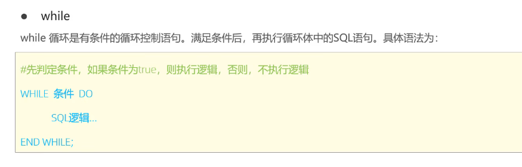

while 循环是**有条件的循环控制语句**。满足条件后，再执行循环体中的SQL语句。具体语法为：

```sql
-- 先判定条件，如果条件为true，则执行逻辑，否则，不执行逻辑
WHILE 条件 DO
	-- SQL逻辑...
END WHILE;
```


#### ②案例

计算从1累加到n的值，**n为传入的参数值**。

```sql
-- A. 定义局部变量, 记录累加之后的值;
-- B. 每循环一次, 就会对n进行减1 , 如果n减到0, 则退出循环
create procedure p7(in n int)

begin
	declare total int default 0;
	
	while n>0 do
		set total := total + n;
		set n := n - 1;
	end while;
	
	select total;
end;

call p7(100);
```


### （8）repeat

#### ① 介绍

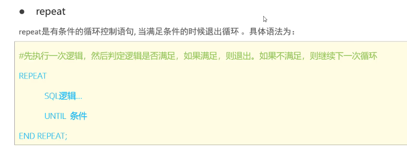

repeat是有条件的循环控制语句, **当满足until声明的条件的时候，则==退出循环==** 。具体语法为：

```sql
-- 先执行一次逻辑，然后判定UNTIL条件是否满足，如果满足，则退出。如果不满足，则继续下一次循环

REPEAT
    -- SQL逻辑...
    UNTIL 条件
END REPEAT;
```


#### ②案例

计算从1累加到n的值，n为传入的参数值。(使用repeat实现)

```sql
-- A. 定义局部变量, 记录累加之后的值;
-- B. 每循环一次, 就会对n进行-1 , 如果n减到0, 则退出循环

create procedure p8(in n int)

begin

    declare total int default 0;

    repeat
        set total := total + n;
        set n := n - 1;
    until n <= 0
    end repeat;

    select total;

end;

call p8(10);
call p8(100);
```


### （9）loop

#### ①介绍

LOOP 实现简单的循环，如果**不在SQL逻辑中增加退出循环**的条件，可以用其来实现**简单的死循环**。LOOP可以配合一下两个语句使用：

- **LEAVE** ：**配合循环使用，退出循环**。（相当于java中的break）
- **ITERATE**：必须用在循环中，作用是**==跳过当前循环剩下的语句，直接进入下一次循环==**。（相当于java中的continue）

```sql
[begin_label:] LOOP

	-- SQL逻辑...

END LOOP [end_label];
```


```sql
LEAVE label; -- 退出指定标记的循环体，这里的label就是创建loop中指定的标识

ITERATE label; -- 直接进入下一次循环
```

上述语法中出现的 begin_label，end_label，label 指的都是我们所自定义的标记。


#### ②案例一-leave

计算从1累加到n的值，n为传入的参数值。

```sql
-- A. 定义局部变量, 记录累加之后的值;

-- B. 每循环一次, 就会对n进行-1 , 如果n减到0, 则退出循环 ----> leave xx

create procedure p9(in n int)
begin
	declare total int default 0;

    sum:loop
        if n<=0 then
            leave sum;
        end if;

        set total := total + n;
        set n := n - 1;

    end loop sum;

	select total;

end;

call p9(100);
```


#### ③案例二-iterate

计算从1到n之间的**偶数累加**的值，n为传入的参数值。

```sql
-- A. 定义局部变量, 记录累加之后的值;
-- B. 每循环一次, 就会对n进行-1 , 如果n减到0, 则退出循环 ----> leave xx
-- C. 如果当次累加的数据是奇数, 则直接进入下一次循环. --------> iterate xx

create procedure p10(in n int)

begin
    declare total int default 0;

    sum:loop

    if n<=0 then
        leave sum;
    end if;

    if n%2 = 1 then
    	set n := n - 1;
    	iterate sum;
    end if;

    set total := total + n;
    set n := n - 1;

    end loop sum;
    select total;

end;

call p10(100);
```


### （10）游标

#### ①介绍

**游标（CURSOR）**是用来**==存储查询结果集的数据类型==** , 在存储过程和函数中可以使用游标**对结果集进行循环的处理。 **游标的使用包括**游标的声明、OPEN、FETCH 和 CLOSE**，其语法分别如下。

##### A. 声明游标-declare

```sql
DECLARE 游标名称 CURSOR FOR 查询语句 ; 
```

##### B. 打开游标-open

```sql
OPEN 游标名称 ; 
```

##### C. 获取游标记录-fetch

```sql
FETCH 游标名称 INTO 变量 [, 变量 ] ; 
```

##### D. 关闭游标-close

```sql
CLOSE 游标名称 ; 
```


#### ② 案例

根据传入的参数uage，来查询用户表tb_user中，所有的用户年龄小于等于uage的 用户姓名（name）和专业（profession），并将用户的姓名和专业**插入到所创建的一张新表(id,name,profession)中**。

```sql
-- 逻辑:
-- A. 声明游标, 存储查询结果集
-- B. 准备: 创建表结构
-- C. 开启游标
-- D. 获取游标中的记录
-- E. 插入数据到新表中
-- F. 关闭游标

create procedure p11(in uage int)

begin

    declare uname varchar(100);
    declare upro varchar(100);
    -- 游标的声明需要在普通变量之后
    declare u_cursor cursor for select name,profession from tb_user where age <= uage;

    drop table if exists tb_user_pro;

    create table if not exists tb_user_pro(
        id int primary key auto_increment,
        name varchar(100),
        profession varchar(100)
    );


    open u_cursor;
    while true do
        fetch u_cursor into uname,upro;
        insert into tb_user_pro values (null, uname, upro);
    end while;

    close u_cursor;

end;

call p11(30);
```

上述的存储过程，最终我们在调用的过程中，会报错，之所以报错是因为**上面的while循环中，并没有退出条件。**当游标的数据集**获取完毕之后，再次获取数据，就会报错，**从而终止了程序的执行。

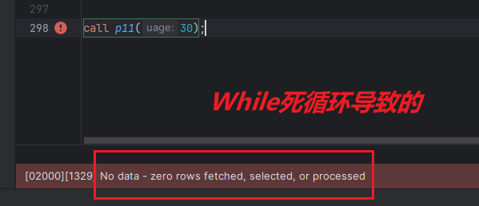

但是此时，tb_user_pro表结构及**其数据都已经插入成功了**，我们可以直接刷新表结构，检查表结构中的数据。

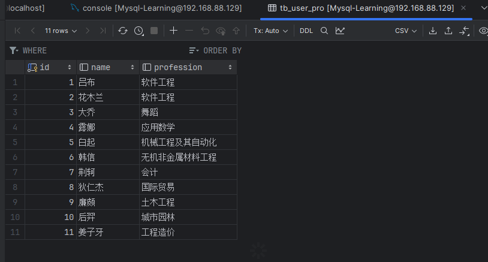

上述的功能，虽然我们实现了，但是逻辑并不完善，而且程序执行完毕，获取不到数据，数据库还报错。 接下来，我们就需要来完成这个存储过程，并且解决这个问题。

要想解决这个问题，就需要通过MySQL中提供的 **条件处理程序 Handler** 来解决。


### （11）条件处理程序-Handler

#### ① 介绍

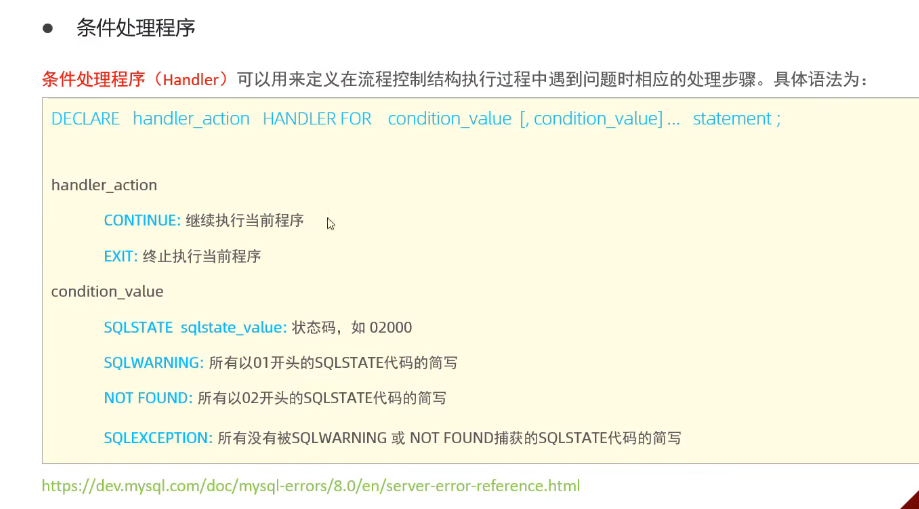

条件处理程序（Handler）可以用来定义**在流程控制结构执行过程中遇到问题时相应的处理步骤**。具体语法为：

```sql
DECLARE handler_action HANDLER FOR condition_value [, condition_value]... statement ;

handler_action 的取值：
    CONTINUE: 继续执行当前程序
    EXIT: 终止执行当前程序

condition_value 的取值：
    SQLSTATE sqlstate_value: 状态码，如 02000

    SQLWARNING: 所有以01开头的SQLSTATE代码的简写
    NOT FOUND: 所有以02开头的SQLSTATE代码的简写
    SQLEXCEPTION: 所有没有被SQLWARNING 或 NOT FOUND捕获的SQLSTATE代码的简写
```


#### ②案例

我们继续来完成在上一小节提出的这个需求，并解决其中的问题。

根据传入的参数uage，来查询用户表tb_user中，所有的用户年龄小于等于uage的用户姓名（name）和专业（profession），并将用户的姓名和专业插入到所创建的一张新表(id,name,profession)中。

**A. 通过SQLSTATE指定具体的状态码**

```sql
-- 逻辑:
-- A. 声明游标, 存储查询结果集
-- B. 准备: 创建表结构
-- C. 开启游标
-- D. 获取游标中的记录
-- E. 插入数据到新表中
-- F. 关闭游标

create procedure p11(in uage int)

begin
    declare uname varchar(100);
    declare upro varchar(100);
    declare u_cursor cursor for select name,profession from tb_user where age <=uage;
    -- 声明条件处理程序 ： 当SQL语句执行抛出的状态码为02000时，将关闭游标u_cursor，并退出
    declare exit handler for SQLSTATE '02000' close u_cursor;

    drop table if exists tb_user_pro;
    create table if not exists tb_user_pro(
        id int primary key auto_increment,
        name varchar(100),
        profession varchar(100)
    );

    open u_cursor;
    
    while true do
        fetch u_cursor into uname,upro;
        insert into tb_user_pro values (null, uname, upro);
    end while;

    close u_cursor;

end;

call p11(30);
```


**B. 通过SQLSTATE的代码简写方式 ==NOT FOUND==**

​	**02 开头的状态码，代码简写为 NOT FOUND**

```sql
create procedure p12(in uage int)

begin

    declare uname varchar(100);
    declare upro varchar(100);
    declare u_cursor cursor for select name,profession from tb_user where age <=uage;

    -- 声明条件处理程序 ： 当SQL语句执行抛出的状态码为02开头时，将关闭游标u_cursor，并退出
    declare exit handler for not found close u_cursor;

    drop table if exists tb_user_pro;
    create table if not exists tb_user_pro(
        id int primary key auto_increment,
        name varchar(100),
        profession varchar(100)
    );

    open u_cursor;

    while true do
        fetch u_cursor into uname,upro;
        insert into tb_user_pro values (null, uname, upro);
    end while;

    close u_cursor;

end;

call p12(30);
```


**具体的错误状态码**，可以参考官方文档：

**https://dev.mysql.com/doc/refman/8.0/en/declare-handler.html**

**https://dev.mysql.com/doc/mysql-errors/8.0/en/server-error-reference.html**


## 4.3 存储函数

#### （1）介绍

存储函数是**==有返回值的存储过程==**，存储函数的==参数**只能是IN类型的**==。具体语法如下：

```sql
CREATE FUNCTION 存储函数名称 ([ 参数列表 ])
RETURNS type [characteristic ...]

BEGIN
    -- SQL语句
    RETURN ...; -- 返回结果
END ;
```

**characteristic说明：**

- DETERMINISTIC：**==相同的输入参数总是产生相同的结果==**
- NO SQL ：不包含 SQL 语句。
- READS SQL DATA：**包含读取数据的语句，但不包含写入数据的语句**。


#### （2）案例

计算从1累加到n的值，n为传入的参数值。

```sql
create function fun1(n int)
returns int deterministic -- 相同的输入参数总是产生相同的结果
begin
    declare total int default 0;
    
    while n>0 do
    	set total := total + n;
   	 	set n := n - 1;
    end while;
    
    return total;
end;

select fun1(50);
```

在mysql8.0版本中**binlog（二进制日志）默认是开启的**，**一旦开启了**，mysql就要求在定义存储过程时，==**需要指定characteristic特性**==，**否则就会报如下错误**：

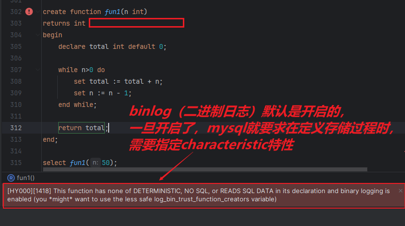

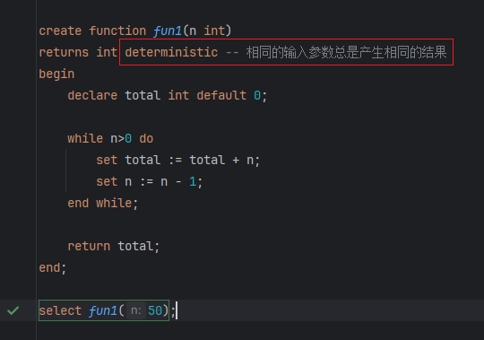


## 4.4 触发器

### （1）介绍

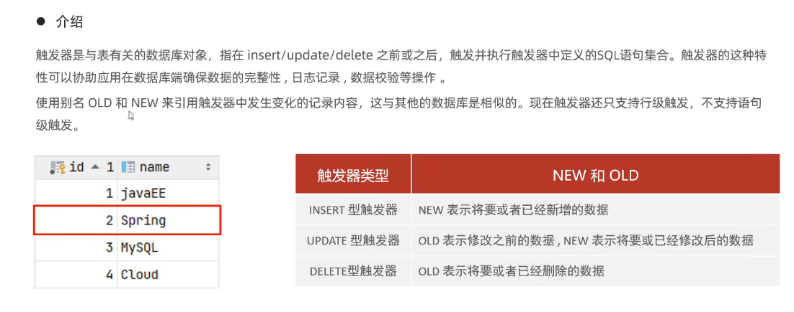

触发器是与表有关的数据库对象，指在**insert/update/delete==之前(BEFORE)或之后(AFTER)==**，触发并**执行触发器中定义的SQL语句集合**。触发器的这种特性可以协助应用在数据库端确保数据的**完整性, 日志记录 , 数据校验等操作 。**

使用别名OLD和NEW来引用触发器中发生变化的记录内容，这与其他的数据库是相似的。**==现在触发器还只支持行级触发，不支持语句级触发。==**

- **行级触发**
  - 比如执行update语句，影响了5行，触发器会执行5次
- **语句级触发**
  - 比如执行update语句，影响了5行，**触发器只会执行1次**


### （2）语法

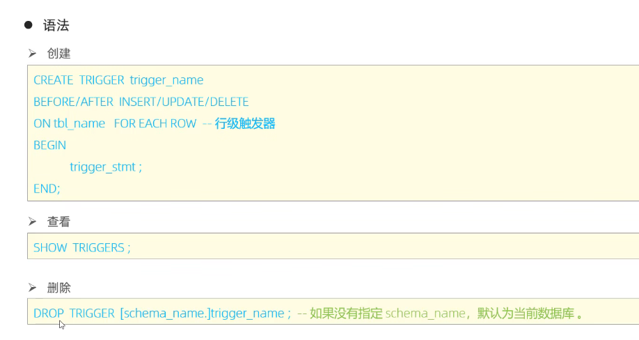

#### ①创建

```sql
CREATE TRIGGER trigger_name

BEFORE/AFTER INSERT/UPDATE/DELETE

ON tbl_name FOR EACH ROW -- 行级触发器，目前Mysql8.0 只支持行级触发器

BEGIN

	trigger_stmt ;

END;
```

#### ② 查看

```sql
SHOW TRIGGERS ; 
```

#### ③删除

```sql
DROP TRIGGER [schema_name.]trigger_name ; -- 删除(指定数据库的)触发器
-- 如果没有指定 schema_name，默认为当前数据库 。
```


### （3）案例-记录数据变更日志

通过触发器记录 tb_user 表的数据变更日志，将变更日志插入到日志表user_logs中, 包含增加,修改 , 删除 ;

**表结构准备:**

```sql
-- 准备工作 : 日志表 user_logs
create table user_logs(
    id int(11) not null auto_increment,
    operation varchar(20) not null comment '操作类型, insert/update/delete',
    operate_time datetime not null comment '操作时间',
    operate_id int(11) not null comment '操作的ID',
    operate_params varchar(500) comment '操作参数',
    primary key(`id`)
)engine=innodb default charset=utf8;
```

#### A. 插入数据触发器

```sql
create trigger tb_user_insert_trigger
	after insert 
	on tb_user for each row

begin
	insert into user_logs(id, operation, operate_time, operate_id, operate_params)
    VALUES
        (null, 'insert', now(), new.id, 
         concat('插入的数据内容为: id=',new.id,',name=',new.name, ', phone=', NEW.phone, ', email=', NEW.email, ', profession=', NEW.profession));

end;
```

**测试:**

```sql
-- 查看
show triggers ;

-- 删除指定的触发器
drop trigger tb_user_insert_trigger;

-- 插入数据到tb_user
insert into tb_user(id, name, phone, email, profession, age, gender, status, createtime) 
VALUES (26,'三皇子','18809091212','erhuangzi@163.com','软件工程',23,'1','1',now());
```

测试完毕之后，检查日志表中的数据是否可以正常插入，以及插入数据的正确性。


#### B. 修改数据触发器

```sql
create trigger tb_user_update_trigger
	after update on tb_user for each row

begin
    insert into user_logs(id, operation, operate_time, operate_id, operate_params)
    VALUES
        (null, 'update', now(), new.id, 
         concat('更新之前的数据: id=',old.id,',name=',old.name, ', phone=',old.phone, ', email=', old.email, ', profession=', old.profession,
         ' | 更新之后的数据: id=',new.id,',name=',new.name, ', phone=', NEW.phone, ', email=', NEW.email, ', profession=', NEW.profession));

end;
```

**测试**

```sql
-- 查看
show triggers ;

-- 更新
update tb_user set profession = '会计' where id = 23;

update tb_user set profession = '会计' where id <= 5; -- 因为使用的each row 行级触发器，执行update更新了5行，对应的触发器也会执行5次
```

测试完毕之后，检查日志表中的数据是否可以正常插入，以及插入数据的正确性。


#### C. 删除数据触发器

```sql
create trigger tb_user_delete_trigger
after delete on tb_user for each row

begin
    insert into user_logs(id, operation, operate_time, operate_id, operate_params)
    VALUES
        (null, 'delete', now(), old.id,
        concat('删除之前的数据: id=',old.id,',name=',old.name, ', phone=',
        old.phone, ', email=', old.email, ', profession=', old.profession));

end;
```

**测试**

```sql
-- 查看
show triggers ;

-- 删除数据
delete from tb_user where id = 26;
```

测试完毕之后，检查日志表中的数据是否可以正常插入，以及插入数据的正确性。


## 4.5 小结


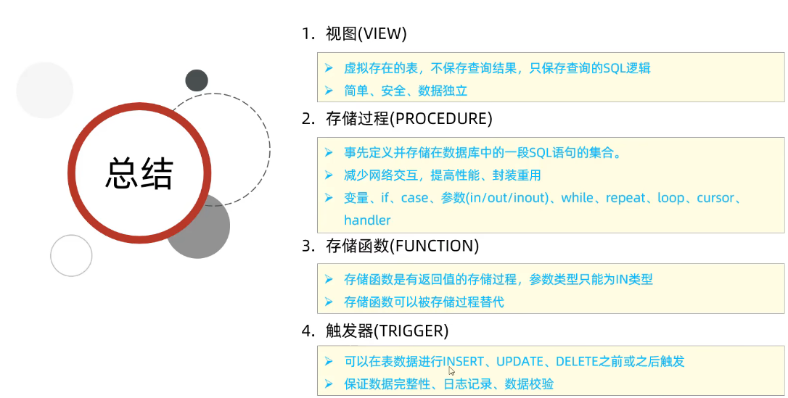


# 5、🚀 ==锁==

## 5.1 概述

锁是计算机**==协调多个进程或线程并发访问某一资源的机制==**。在数据库中，除传统的计算资源（CPU、RAM、I/O）的争用以外，数据也是一种供许多用户共享的资源。如何**保证数据并发访问的一致性、有效性**是所有数据库必须解决的一个问题，锁冲突也是影响数据库并发访问性能的一个重要因素。从这个角度来说，锁对数据库而言显得尤其重要，也更加复杂。

MySQL中的锁，按照**锁的粒度分**，分为以下三类：

- **全局锁**：锁定数据库中的**所有表**。
- **表级锁**：每次**操作锁住整张表**。
- **行级锁**：每次操作**锁住对应的行数据**。


## 5.2 🌟 全局锁

### （1）介绍

全局锁就是对整个数据库实例加锁，**加锁后==整个实例就处于只读状态==**，后续的DML的写语句，DDL语句，已经更新操作的**事务提交语句都将==被阻塞==**。


### （2）🌟 使用场景

其典型的**使用场景是做全库的逻辑备份**，对所有的表进行锁定，从而**获取一致性视图，保证数据的完整性**。


为什么全库逻辑备份，就需要加全就锁呢？

##### **A. 我们一起先来分析一下不加全局锁，可能存在的问题。**

假设在数据库中存在这样三张表: tb_stock 库存表，tb_order 订单表，tb_orderlog 订单日志表。

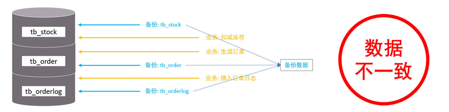

- 在进行数据备份时，**先备份了tb_stock库存表**。
- 然后接下来，在业务系统中，**执行了下单操作**，扣减库存，生成订单（更新tb_stock表，插入tb_order表）。
- 然后**再执行备份 tb_order表的逻辑**。
- 业务中执行插入订单日志操作。
- 最后，又备份了tb_orderlog表。


此时备份出来的数据，是存在问题的。因为备份出来的数据，tb_stock表与tb_order表的**数据不一致(有最新操作的订单信息,但是库存数没减)**。

那如何来规避这种问题呢? 此时就可以借助于**MySQL的全局锁来解决**。


##### **B. 再来分析一下加了全局锁后的情况**

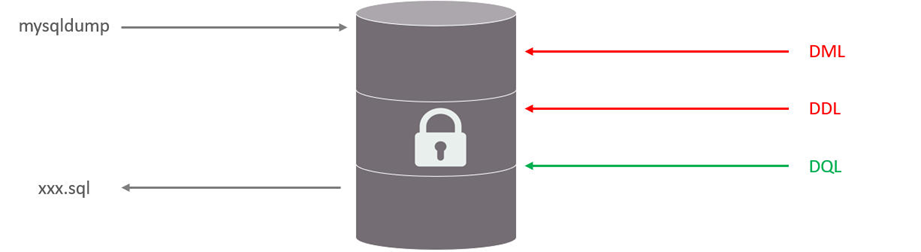

对数据库进行进行逻辑备份之前，先**对整个数据库加上全局锁**，一旦加了全局锁之后，其他的DDL、DML全部都**处于阻塞状态**，但是**可以执行DQL语句，也就是==处于只读状态==**，而**数据备份就是查询操作**。那么数据在进行逻辑备份的过程中，数据库中的数据就是不会发生变化的，这样就**保证了数据的一致性和完整性**。


### （3）语法

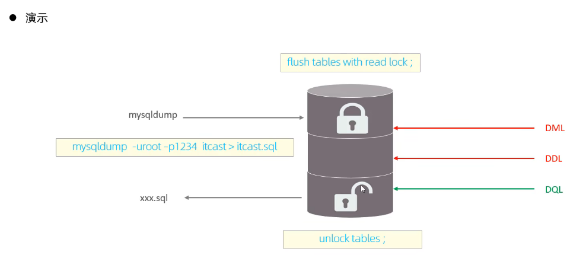

#### ①加全局锁

```sql
flush tables with read lock ; 
```

#### ②数据备份

```sql
mysqldump [-h 192.168.200.202] -uroot –p1234 itcast > ./itcast.sql 
```

数据备份的相关指令, 在后面**MySQL管理章节**, 还会详细讲解.

#### ③释放锁

```sql
unlock tables ; 
```


### （4）🌟 ==特点==

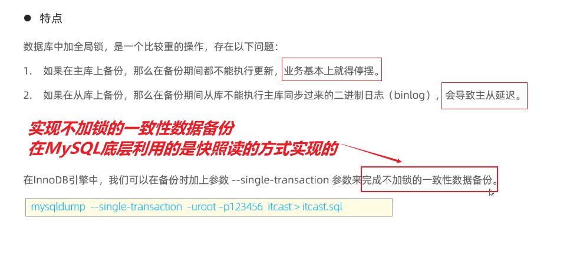

数据库中加全局锁，是一个比较重的操作，存在以下问题：

- 如果在**主库上备份**，那么在**备份期间都不能执行更新，业务基本上就得停摆**。
- 如果在**从库上备份**，那么在备份期间**从库不能执行主库同步过来的二进制日志（binlog）**，**==会导致主从延迟。==**


在InnoDB引擎中，我们可以在备份时**加上参数 --single-transaction 参数**来完成**==不加锁的一致性数据备份==**。

```sql
mysqldump --single-transaction [-h 192.168.200.202] -uroot –p123456 itcast > itcast.sql 
-- MySQL的底层利用的是快照读的方式实现的
```

**MySQL的底层==利用的是快照读的方式==实现的**


## 5.3 🌟 表级锁

### （1）介绍

表级锁，**每次操作锁住整张表**。锁定粒度大，发生**锁冲突的概率最高，并发度最低**。应用在MyISAM、InnoDB、BDB等存储引擎中。

对于表级锁，主要分为以下三类：

- **表锁**
- **元数据锁**（meta data lock，MDL）
- **意向锁**


### （2）🌟 ==表锁==

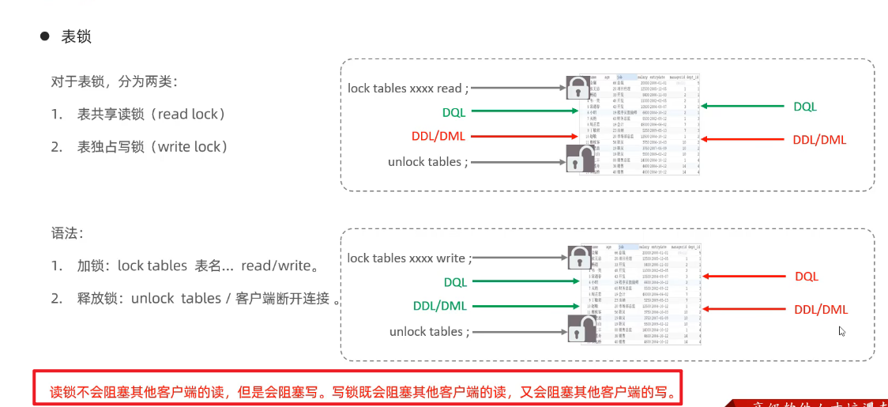

#### ①==分类==

##### 表共享读锁

##### 表独占写锁

对于表锁，分为两类：

- **==表共享读锁==（read lock**） - 简称为读锁
- **==表独占写锁==（write lock）**- 简称为写锁
  - 这里的**独占**意思是，其他客户端的`读和写`操作都会被阻塞，
  - 而**==当前客户端的读和写不会被阻塞==**


#### ②语法

- **加锁**：lock tables 表名... read/write。

```sql
lock tables 表名... read/write
```


- **释放锁**：unlock tables 或者 客户端断开连接 。

```sql
unlock tables 
或者 将当前客户端断开连接
```


#### ③==特点==

##### A. 读锁

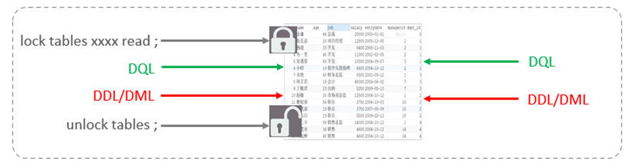

​	左侧为客户端一，对指定表加了读锁，**不会影响右侧客户端二的读**，但是会**阻塞右侧客户端的写**。

**测试:**

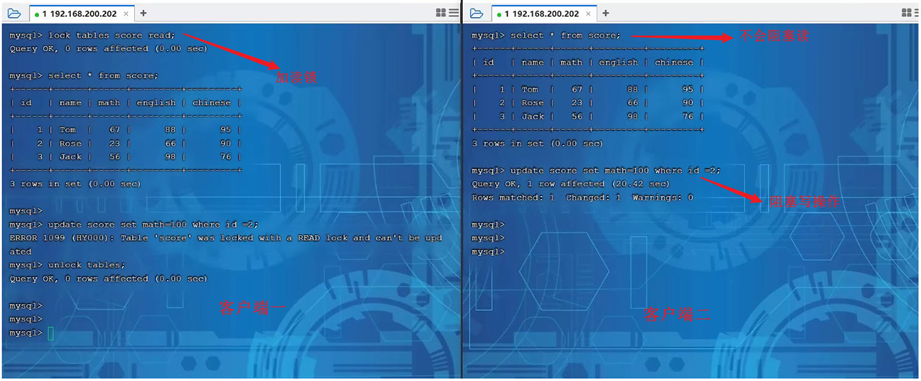


##### B. 写锁

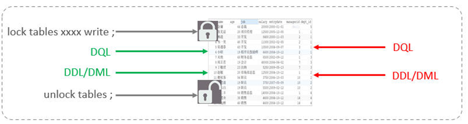

​	左侧为客户端一，对指定表加了写锁，**会阻塞右侧客户端的读和写**。


**测试:**

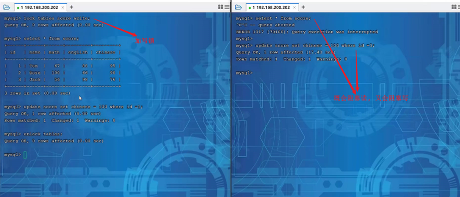


#### ④🌟 ==结论==


> **结论:** 
>
> - 读锁**不会阻塞其他客户端的读，但是会阻塞写**。
>
>   - 当前客户端和其他客户端**都可以读**
>   - 当前客户端和其他客户端**都不可以写**
>
>   
>
> - 写锁**既会阻塞==其他客户端==的读，又会阻塞==其他客户端==的写**。
>
>   - 注意 这里阻塞的`读和写`都指的是**其他客户端**
>   - **==当前客户端的读和写不会被阻塞==**
>
> 


### （3）🌟 ==元数据锁-MDL==

#### ①概述

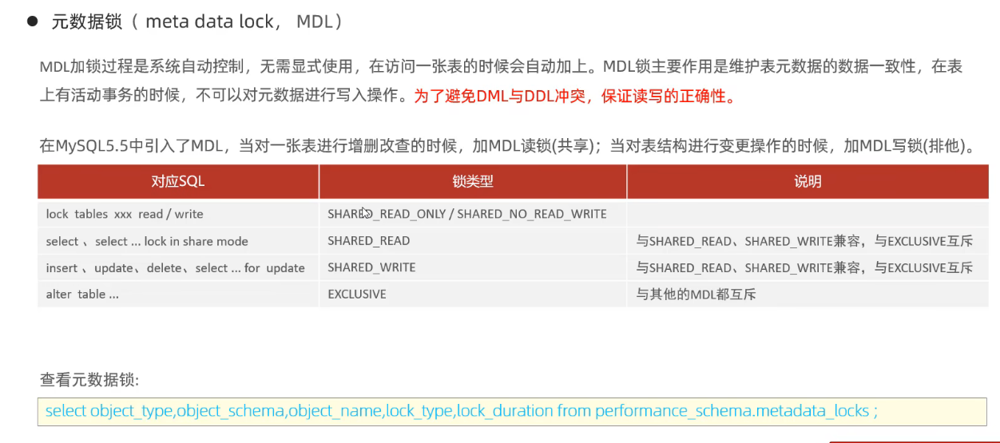

meta data lock , 元数据锁，简写MDL。

**MDL加锁过程是系统自动控制**，无需显式使用，在**访问一张表的时候会自动加上**。

MDL锁主要作用是**维护表元数据的数据一致性**，在表上有活动事务的时候，不可以对元数据进行写入操作。**==为了避免DML与DDL冲突，保证读写的正确性。==**


这里的元数据，大家可以简单理解为就是**一张表的表结构**。 也就是说，**==某一张表涉及到未提交的事务时，是不能够修改这张表的表结构的。==**


在MySQL5.5中引入了MDL：

- 当对一张表进行增删改查的时候，**加MDL读锁(共享)**；
- 当**对表结构进行变更操作**的时候，**==加MDL写锁(排他)==**。


常见的SQL操作时，所添加的元数据锁：

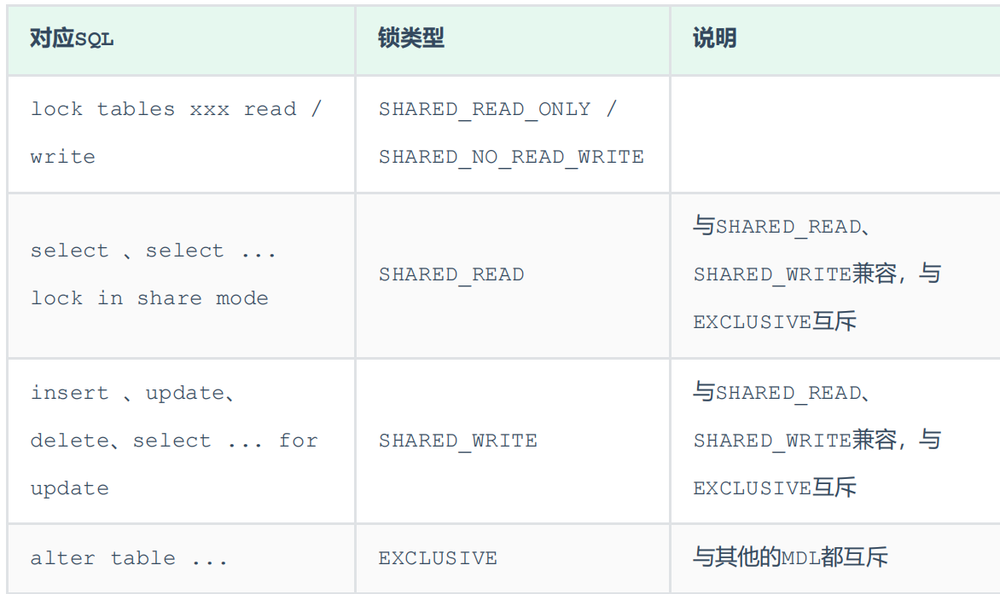


#### ②🌟 ==演示==

> 我们可以通过下面的SQL，来**==查看数据库中的元数据锁==**的情况：
>
> ```sql
> select object_type,object_schema,object_name,lock_type,lock_duration from performance_schema.metadata_locks ;
> ```
>
> 我们在操作过程中，可以通过上述的SQL语句，来**查看元数据锁的加锁情况**。


##### 1）元数据共享锁-==相互兼容==

当执行**SELECT** =》 shared_read

**INSERT、UPDATE、DELETE**、**==Select ... for update==**等语句时 => shared_write

添加的是**==元数据共享锁==**（SHARED_READ /SHARED_WRITE），这**==两者之间是兼容==**的。

**对于客户端一：**

```sql
begin;

	select * from tb_user where id = 1;

commit; -- 为了查看效果，事务的提交可以延后执行
```

**对于客户端二：**

```sql
begin;

	update tb_user set name = '小鹏' where id = 1;
	
commit;
```

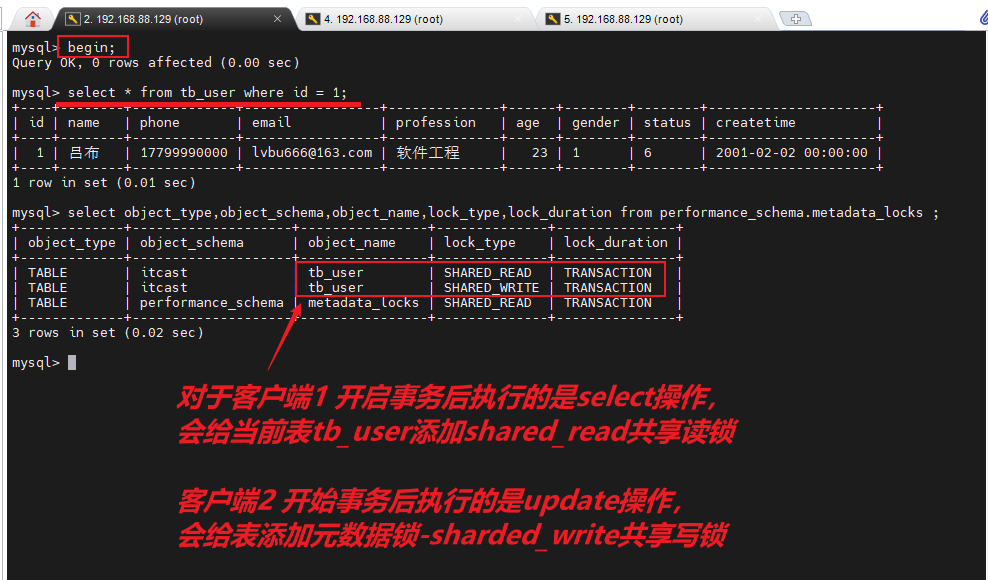


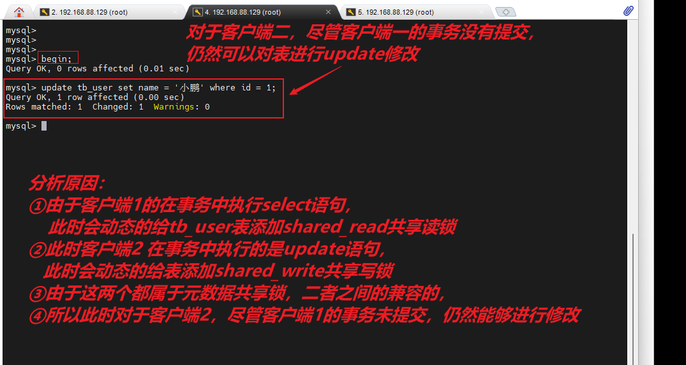


**注意：==当事务提交后，之前给表添加的元数据锁都会消失==，也就是说，元数据锁的添加和消失，是==动态的==**

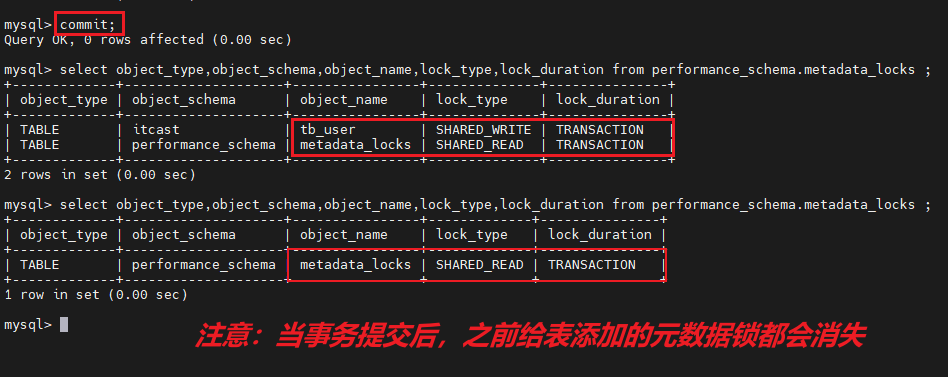


##### 2）排他锁和其他共享锁==互斥==

当执行SELECT语句时，添加的是元数据共享锁（SHARED_READ），会==阻塞**元数据排他锁**==（**EXCLUSIVE**），他们二者之间是**互斥的**。

例如，使用alter table.. 修改表结构，这时会**给表加上exclusive元数据排它锁**

**对于客户端一：**

```sql
begin;

	select * from tb_user where id = 1;

commit; -- 为了查看效果，事务的提交可以延后执行
```

**对于客户端二：**执行了alter table 改变了表结构，会给操作的表**==添加元数据排他锁==**

```sql
begin;

	alter table tb_user add column test_col varchar(10);
	
commit;
```

**客户端一，执行select操作，添加元数据共享锁**

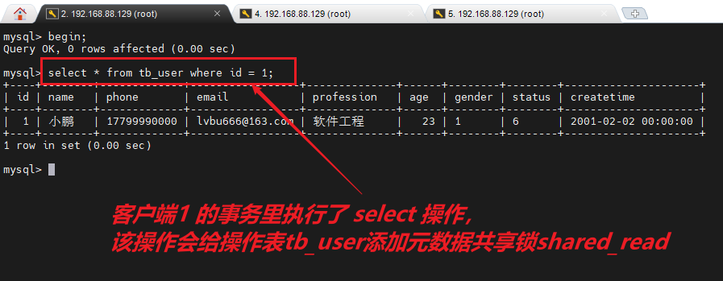


**客户端二，被阻塞**

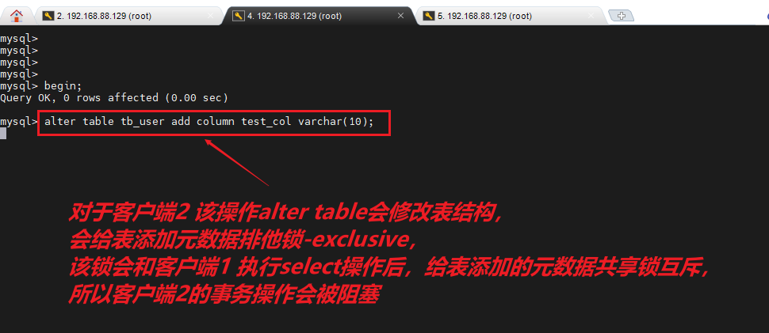

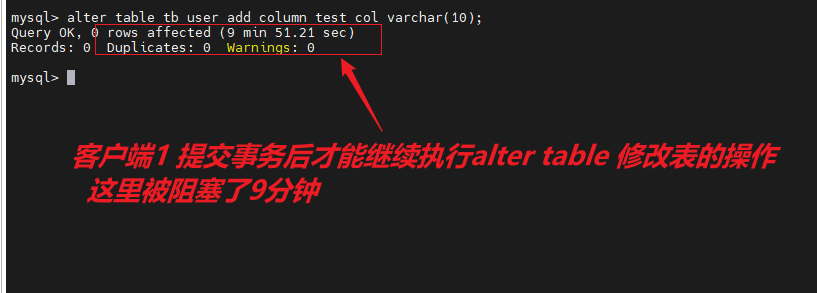


**tb_user表，执行前后的==元数据锁的信息==**

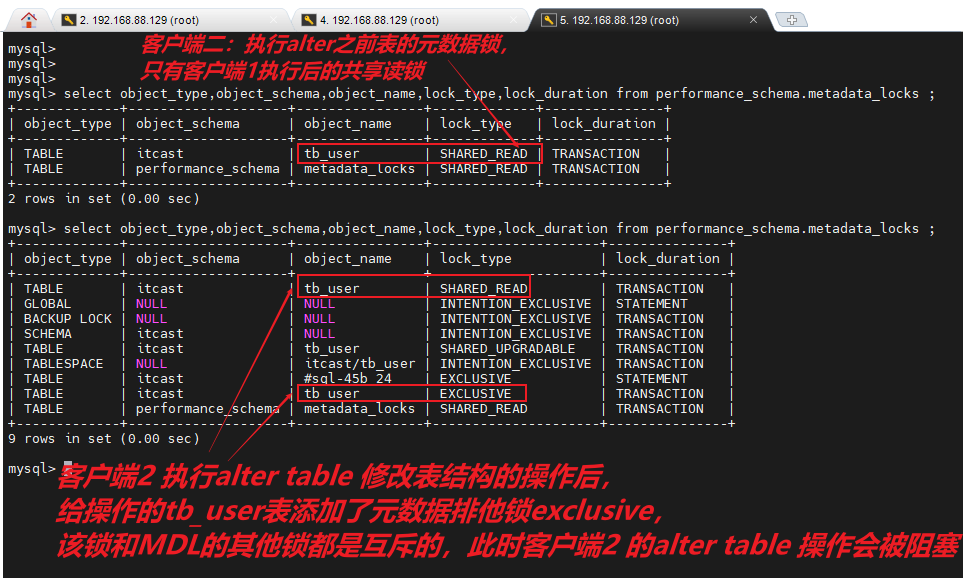


### （4）🌟 ==意向锁==

#### ①介绍

为了**避免DML在执行时**，**加的行锁与表锁的冲突**，在InnoDB中引入了意向锁，**使得表锁不用检查每行数据是否加锁**，**使用意向锁来减少表锁的检查**。

##### 1）==没有意向锁==时

假如没有意向锁，客户端一对表加了行锁后，客户端二如何给表加表锁呢，来通过示意图简单分析一下：

首先客户端一，开启一个事务，然后执行DML操作，在**执行DML语句**时，**会==对涉及到的行加行锁==**。

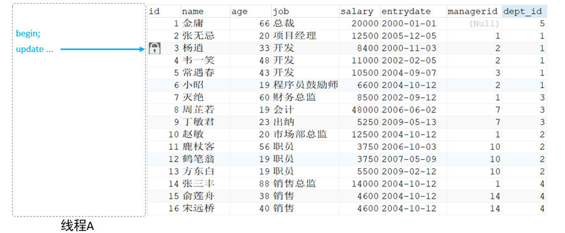

当客户端二，**想对这张表加表锁时**，**会检查当前表是否有对应的行锁**，如果没有，则添加表锁，**此时就会从第一行数据，检查到最后一行数据，==效率较低==**。

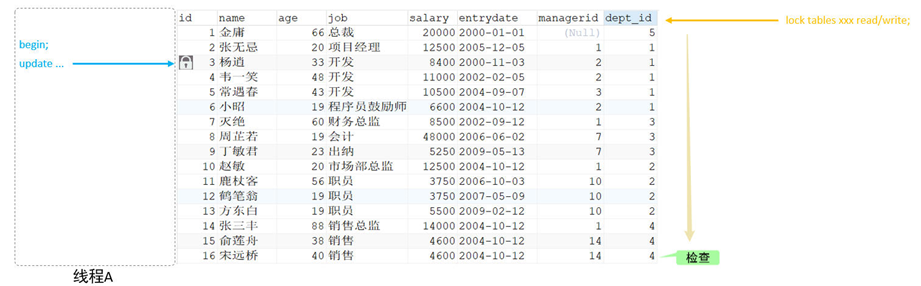


##### 2）有了意向锁==之后==

客户端一，在执行DML操作时，会对涉及的行**加行锁**，同时也会==**对该表加上意向锁**==。

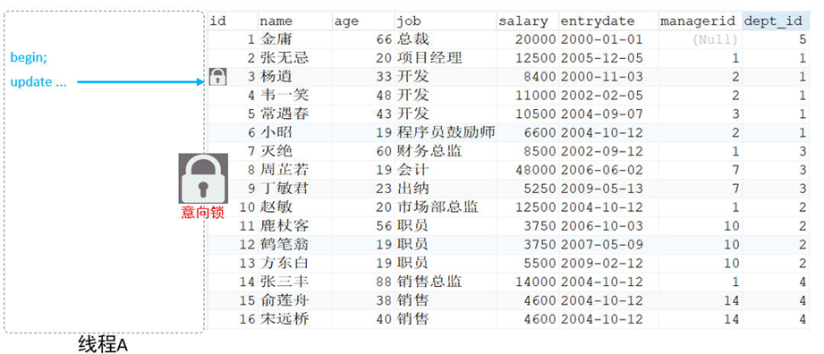

而其他客户端，在对这张表加表锁的时候，会根据该表上**所加的意向锁来判定是否可以成功加表锁**，(==判断当前所加的意向锁和将要添加的表锁是否是兼容的==)，而不用逐行判断行锁情况了。


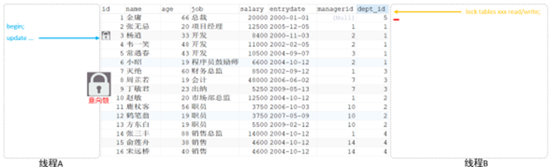


#### ②==分类==

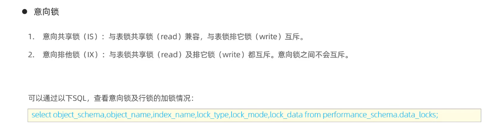

- **意向共享锁(IS)**: 由语句select ... **lock in share mode**添加 。 ==与 表锁共享锁(read)兼容，与表锁排他锁(write)互斥==。
- **意向排他锁(IX)**: 由insert、update、delete、**==select...for update==**添加 。==与表锁共享锁(read)及排他锁(write)**都互斥**==，**意向锁之间不会互斥**。


> **一旦事务提交了，意向共享锁、意向排他锁，都==会自动释放==**。


可以通以下SQL，**==查看意向锁及行锁的加锁==情况**：

```sql
select object_schema,object_name,index_name,lock_type,lock_mode,lock_data from
performance_schema.data_locks;
```


#### ③🌟演示

**A. ==意向共享锁与表读锁是兼容的==**

**客户端一：**

```sql
begin;

select * from tb_user where id = 1 lock in share mode;
-- lock in share mode 表示 会给这一行添加 共享行锁
-- 同时，会给该score表添加 意向共享锁

commit;
```

 **客户端二：**

```sql
begin;

-- 添加表锁共享锁read 或 表锁排他锁write
	lock tables tb_user read; -- 表锁共享锁read
	
-- 释放锁
unlock tables;
	
	lock tables tb_user write; -- 表锁排他锁write
	
commit;
```


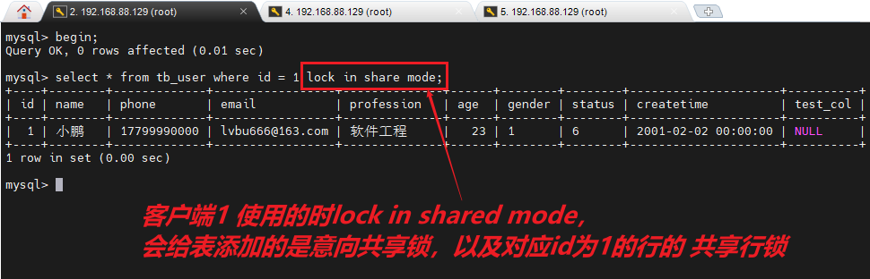


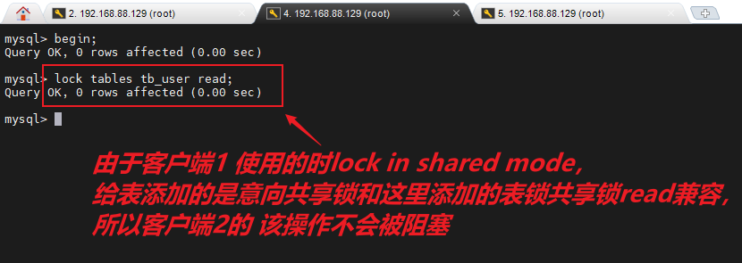

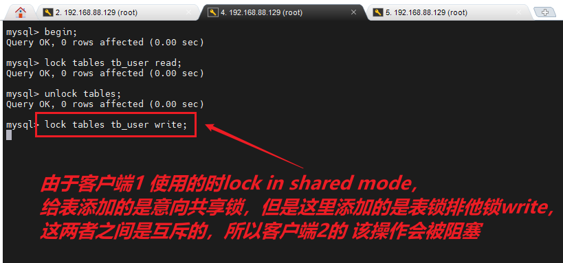

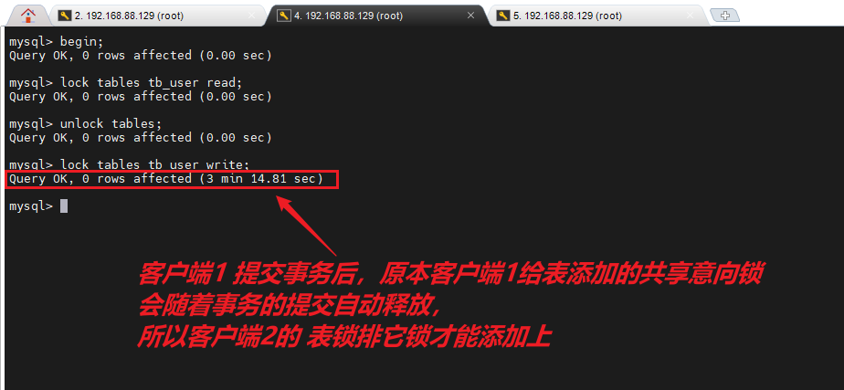

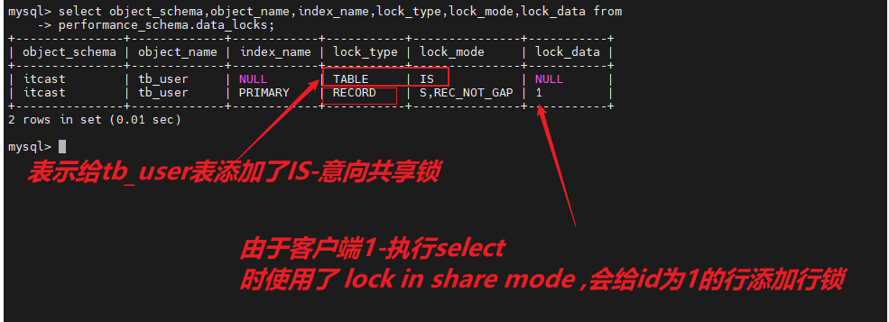


**B. 意向排他锁与表读锁、写锁==都是互斥的==**

**客户端一：**

```sql
begin;

	update tb_user set name = '小小鹏' where id = 1;
	
commit;
```

 **客户端二：**

```sql
begin;

-- 添加表锁共享锁read 或 表锁排他锁write
	lock tables tb_user read; -- 表锁共享锁read
	
-- 释放锁
unlock tables;
	
	lock tables tb_user write; -- 表锁排他锁write
	
commit;
```

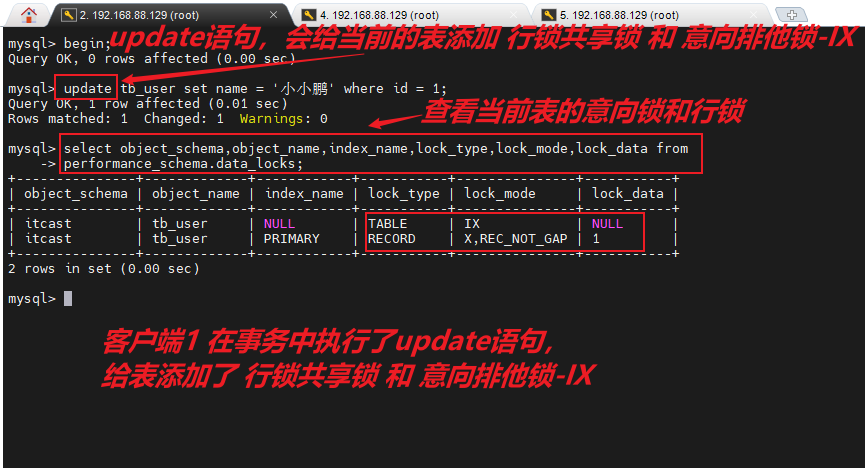

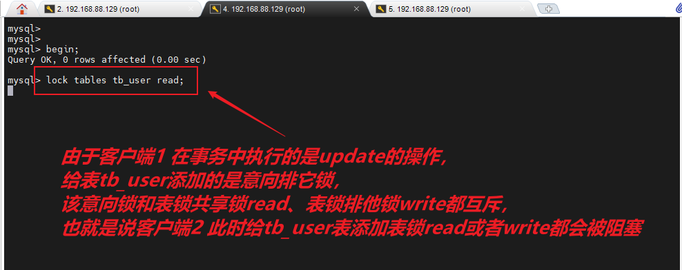

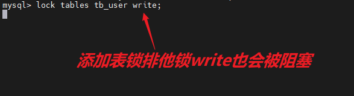


## 5.4 🌟 行级锁

### （1）🌟 介绍

行级锁，每次操作**锁住对应的行数据**。**锁定粒度最小**，发生锁冲突的概率最低，并发度最高。应用在InnoDB存储引擎中。

InnoDB的**数据是基于索引（聚集索引和二级索引）组织的**，行锁是**==通过对索引上的索引项加锁来实现的，而不是对记录加的锁==**。对于行级锁，主要分为以下三类：

- **行锁（Record Lock）**：**锁定单个行记录的锁**，防止其他事务对此行进行**update和delete**。在**RC（read commit 读已提交）、RR（repeat read 可重复读）隔离级**别下都支持。

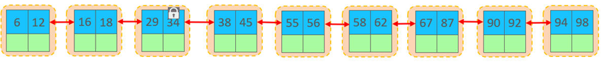

- **间隙锁（Gap Lock）**：锁定**索引记录间隙（不含该记录）**，**==确保索引记录间隙不变==，防止其他事务在这个间隙进行insert**，==产生幻读==。在**RR隔离级别下都支持**。

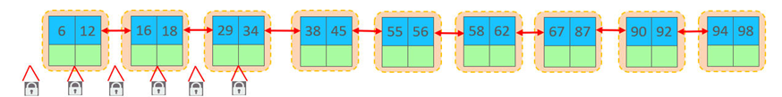

- **临键锁（Next-Key Lock）**：**行锁和间隙锁组合**，同时锁住数据，并**锁住==数据前面的间隙Gap==**。在RR隔离级别下支持。

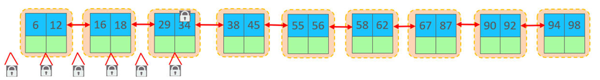


> ##### **🌟==间隙锁和临键锁的基本概念（重点）==**
>
> - 间隙锁：锁定索引记录间隙（**不包含该记录**），
>   - 比如此时的索引是id时，并且lock_data 显示的是8，表示的是**==锁定8前面一个的一个间隙==**，假设现在8前面一位的id为3，那么此时该间隙锁，锁定的就是3-8之间的间隙，也就是(3,8);
> - 临键锁：行锁和间隙锁的组合，会**锁住数据**，同时**锁住==数据前面的一个间隙Gap==**
>   - 如果有记录8,9,10,20,30
>   - 对20加临键锁，会**锁定(10,20]这个区间**
>   - 不会锁定(8,20]这个区间


### （2）🌟 行锁

#### ①🌟 介绍

InnoDB实现了以下两种类型的行锁：

**共享锁（S）**：允许一个事务去读一行，**==阻止其他事务获得相同数据集的排它锁==**。

**排他锁（X）**：允许**获取排他锁的事务更新数据**，**获取排它锁后**，会**阻止**其他事务**==获得相同数据集的共享锁和排他锁。==**

> **==注意==：**
>
> ​	这里的兼容和冲突判断的前提，是在**对同一个数据集而言的**，比如操作的都是id为1的数据行

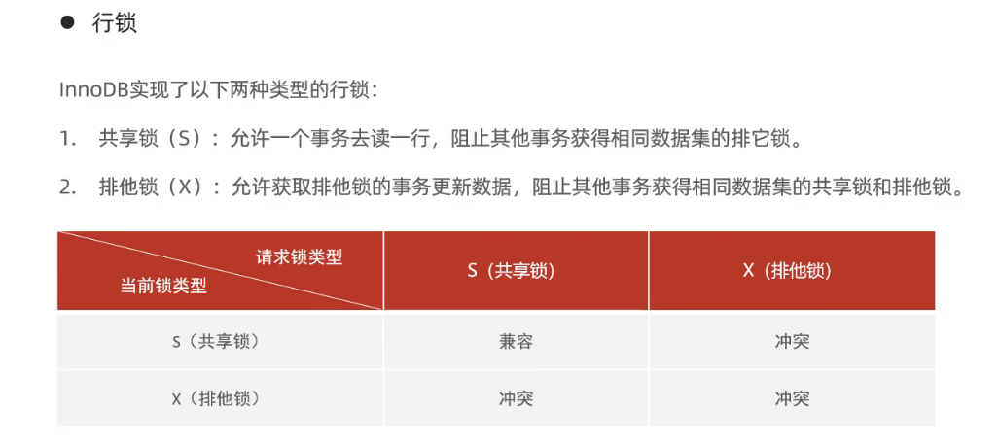


两种**行锁的兼容情况**如下:


常见的SQL语句，在执行时，所加的行锁如下：

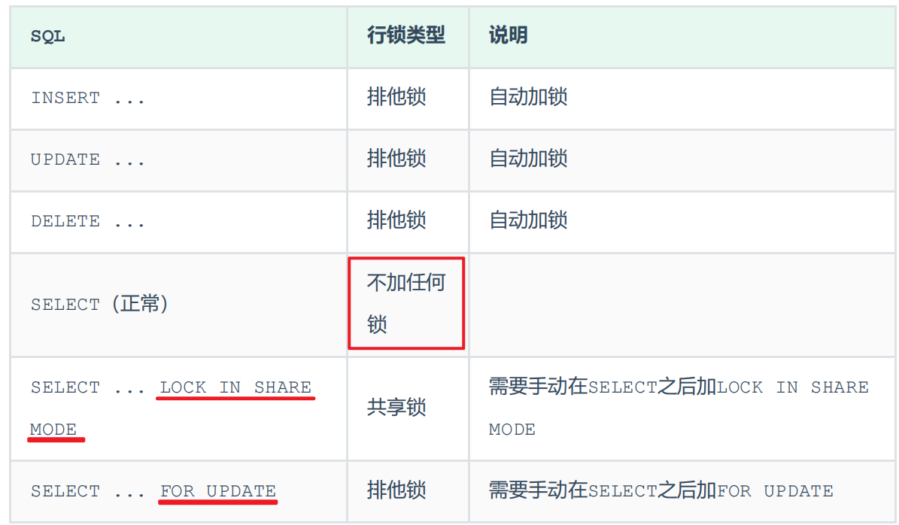


#### ②🌟 演示

默认情况下，InnoDB在**RR-可重复读**=》- **REPEATABLE READ事务隔离级别**运行，InnoDB**使用 next-key 锁进行搜索和索引扫描，==以防止幻读==。**

- 针对**唯一索引进行检索**时，**==对已存在的记录进行等值匹配==时**，将**会==自动优化为行锁==**。
- InnoDB的**行锁是针对于==索引加的锁==**，如果**==不通过索引条件检索数据==**，那么InnoDB**将对表中的所有记录加锁**，此时 就会**升级为==表锁==**。


可以通过以下SQL，查看**意向锁及行锁的加锁情况**：

```sql
select object_schema,object_name,index_name,lock_type,lock_mode,lock_data from performance_schema.data_locks;
```


#### ③示例演示-行锁

**数据准备:**

```sql
CREATE TABLE `stu` (
    `id` int NOT NULL PRIMARY KEY AUTO_INCREMENT,
    `name` varchar(255) DEFAULT NULL,
    `age` int NOT NULL
) ENGINE = InnoDB CHARACTER SET = utf8mb4;

INSERT INTO `stu` VALUES (1, 'tom', 1);
INSERT INTO `stu` VALUES (3, 'cat', 3);
INSERT INTO `stu` VALUES (8, 'rose', 8);
INSERT INTO `stu` VALUES (11, 'jetty', 11);
INSERT INTO `stu` VALUES (19, 'lily', 19);
INSERT INTO `stu` VALUES (25, 'luci', 25);

select * from stu;
```

演示行锁的时候，我们就通过上面这张表来演示一下。

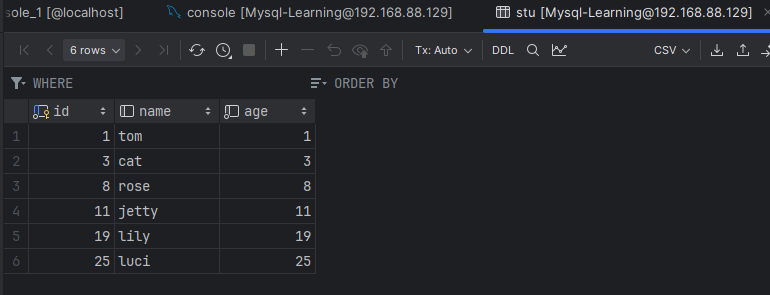


##### 1）普通的select语句-不加锁

**A. 普通的select语句，执行时，不会加锁。**

**对于客户端一，执行普通的select语句**

```sql
begin;

	select * from stu where id = 1;
	
commit;

-- 意向锁及行锁的加锁情况
select object_schema,object_name,index_name,lock_type,lock_mode,lock_data from performance_schema.data_locks;
```

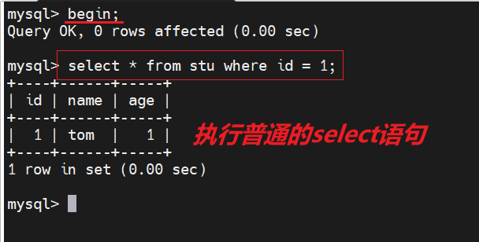

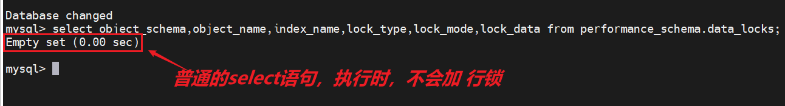


##### 2）共享锁和共享锁之间==兼容==

**B. select...lock in share mode，加共享锁，共享锁与共享锁之间兼容。**

**对于客户端一和二，==都尝试给数据行添加共享锁==**

```sql
begin;

	select * from stu where id = 1 lock in share mode; -- 给stu表中id为1的数据行添加共享锁
	
commit;
```

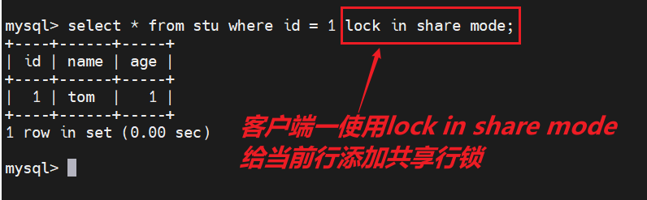


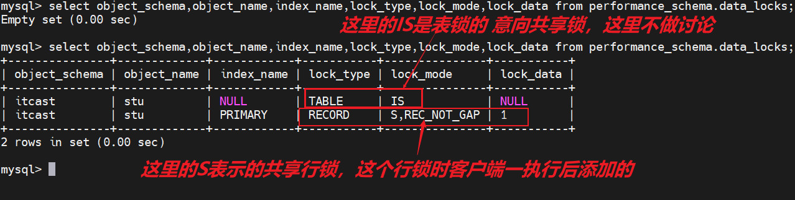

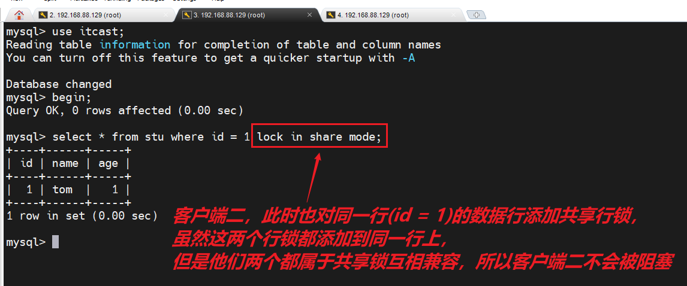


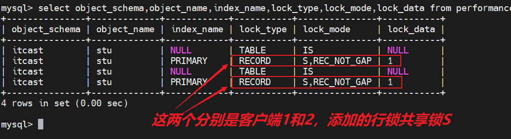


> **==注意==：**   同样的**当事务commit提交后**，**在事务中添加的行锁等其他锁都会自动释放**


##### 3）共享锁与排他锁之间==互斥==

**对于客户端一，执行的还是添加共享行锁操作**

```sql
begin;
	select * from stu where id = 1 lock in share mode; -- 给stu表中id为1的数据行添加共享锁
commit;
```

**对于客户端二，尝试给数据行添加排他锁，比如update操作...**

```sql
begin;

	update stu set name = 'Java-3' where id = 3; -- 给stu表中id为3的数据行添加排他锁
	
	update stu set name = 'Java-1' where id = 1; -- 给stu表中id为1的数据行添加排他锁
	
commit;
```


客户端一**获取的是id为1这行的共享锁**

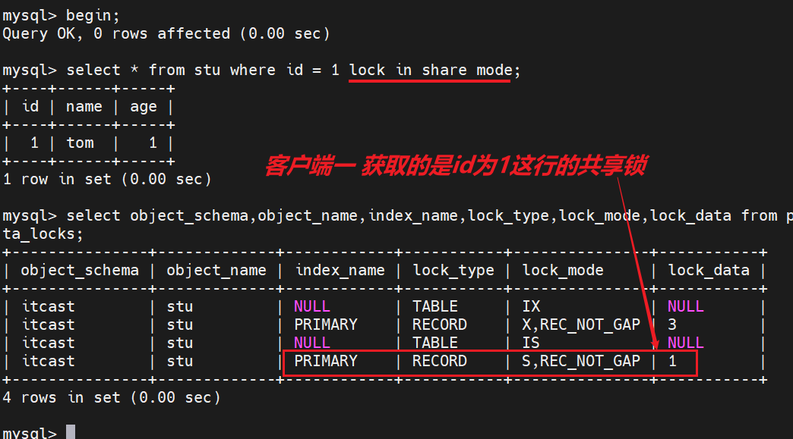


客户端二是可以获取id为3这行的排它锁的，**因为不是同一行数据**，所以客户端二执行id=3的语句时，不会被阻塞。

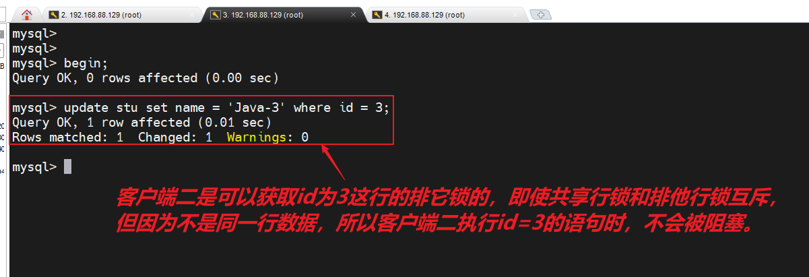

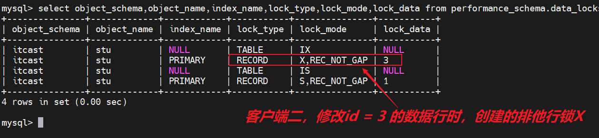


 而如果客户端二想获取id为1这行的排他锁，会处于阻塞状态，因为**共享锁与排他锁之间互斥**。

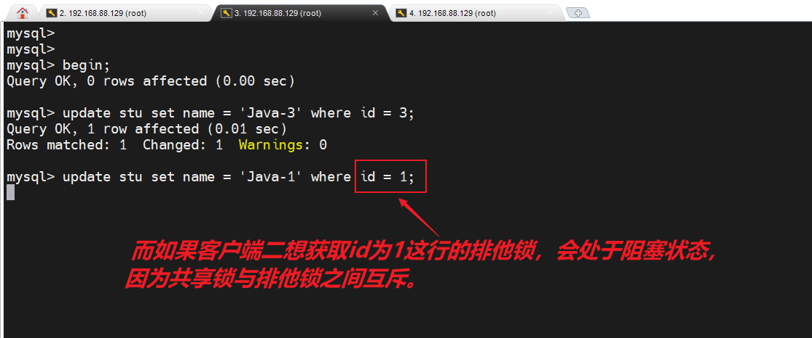


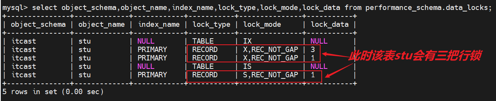


##### 3） 排他锁与排他锁之间==互斥==

**C. 排他锁与排他锁之间互斥**

当客户端一，执行update语句，会为id为1的记录加排他锁； 客户端二，如果也执行update语句更新id为1的数据，也要为id为1的数据加排他锁，但是**客户端二会处于阻塞状态，因为排他锁之间是互斥的**。 **直到客户端一，把事务提交了，才会把这一行的行锁释放，此时客户端二才能获取到这一行的排他锁，解除阻塞。**

**对于客户端一，执行update语句，加排它锁**

```sql
begin;
	update stu set name = 'Java-10' where id = 1; -- 给stu表中id为1的数据行添加排他锁
end;
```

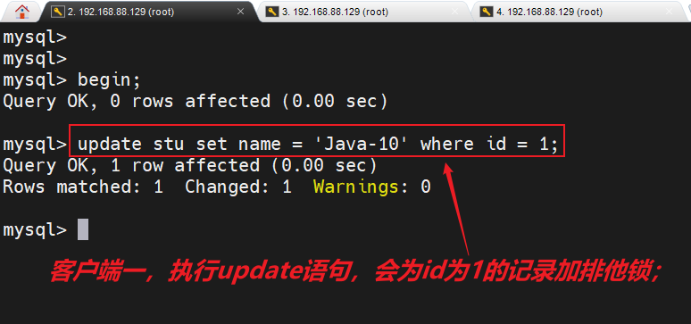

**对于客户端二，**如果也执行update语句更新id为1的数据，也要为id为1的数据加排他锁

```sql
begin;
	update stu set name = 'Java-20' where id = 1; -- 给stu表中id为1的数据行添加排他锁 
end;
```

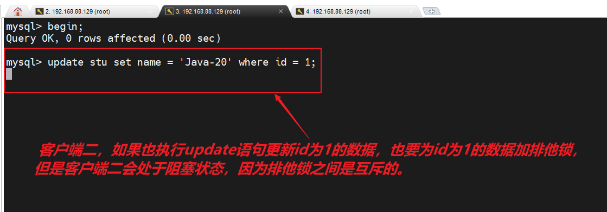

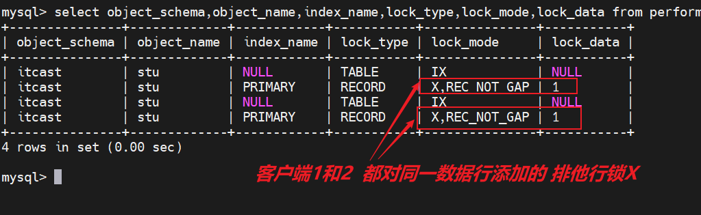


##### 4） ==无索引行锁升级为表锁==

**D. 无索引行锁升级为表锁**

**stu表中数据如下:**

```sql
select * from stu;
```

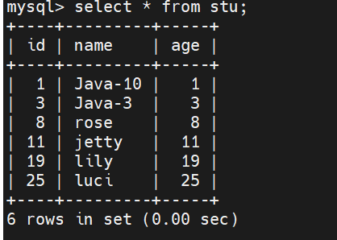

**我们在两个客户端中执行如下操作:**

在客户端一中，开启事务，并执行update语句，**更新name为Lily的数据**，也就是id为19的记录 。然后在客户端二中更新id为3的记录，却不能直接执行，会处于阻塞状态，为什么呢？= 》**添加了表锁**

原因就是因为此时，客户端一，**根据name字段进行更新时，name字段是没有索引的**，**如果没有索引，此时行锁会升级为表锁**(==因为行锁是对索引项加的锁，而name没有索引==)。


**对于客户端1，根据name(非索引字段)进行条件查询，会让==行锁升级为表锁==**

```sql
begin;
	update stu set name = 'Spring-1' where name = 'lily';
end;
```

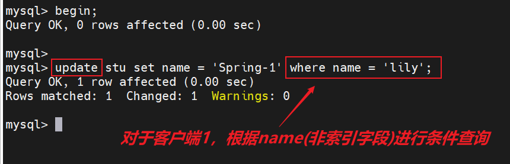

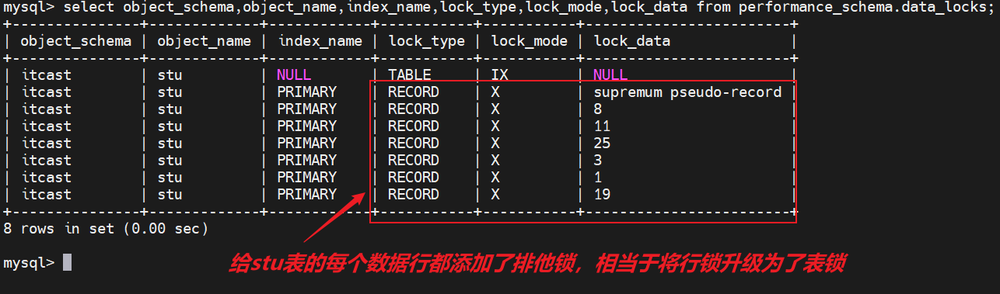


**此时在客户端2中，更新id=3的数据时，会被阻塞**

```sql
begin;
	update stu set name = 'Spring-2' where id = 3;
end;
```

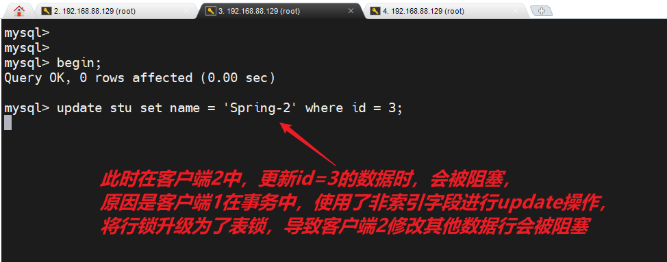


接下来，我们再**针对name字段建立索引**，索引建立之后，再次做一个测试：

```sql
create index idx_stu_name on stu(name);
```

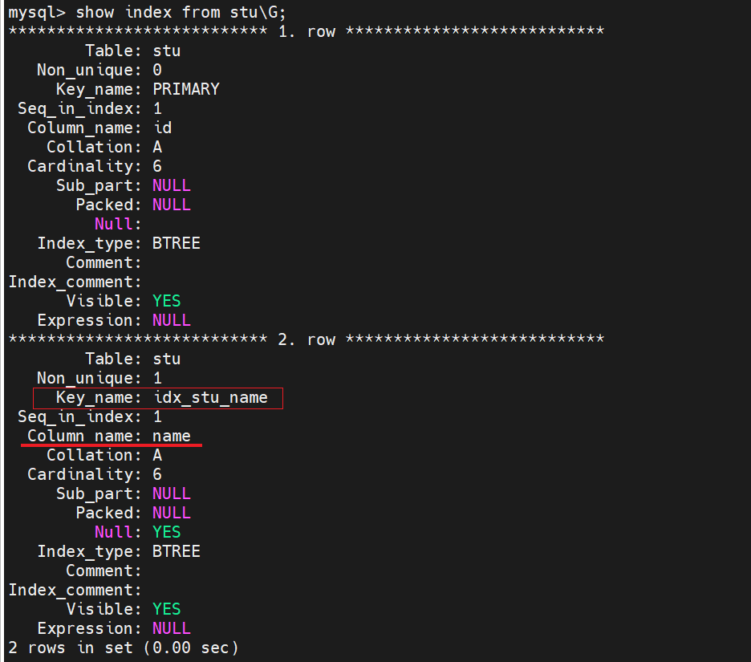


此时我们可以看到，客户端一，开启事务，然后依然是根据name进行更新。而客户端二，在更新id为3的数据时，**==更新成功，并未进入阻塞状态==。** 这样就说明，我们**==根据索引字段进行更新操作==，就可以避免行锁升级为表锁的情况。**

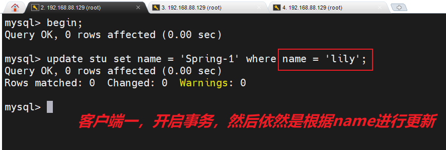

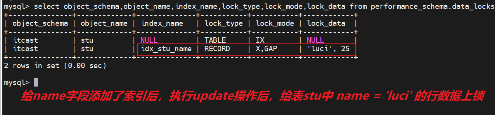

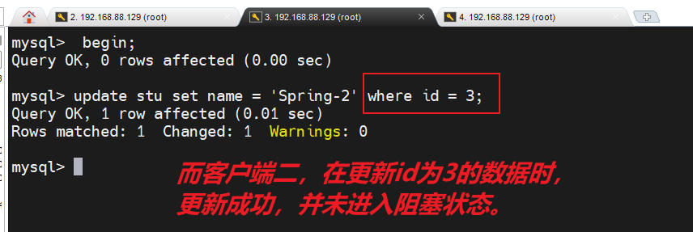


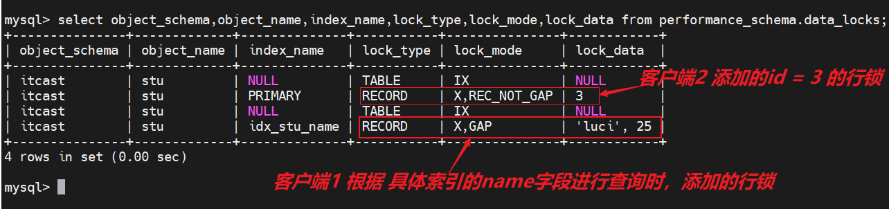


### （3）==间隙锁&临键锁==

**默认情况**下，InnoDB在 REPEATABLE READ事务隔离级别运行，InnoDB**使用 next-key 锁进行搜索和索引扫描，==以防止幻读==。**

- 索引上的**等值查询(唯一索引)**，**给不存在的记录加锁时, ==优化为间隙锁==** 。
- 索引上的**等值查询(非唯一普通索引)**，**==向右遍历时==最后一个值不满足查询需求时，==next-keylock 退化为间隙锁。==**
- 索引上的**范围查询(唯一索引)**--**会访问到不满足条件的第一个值为止**。


> **注意：**
>
> 间隙锁唯一目的是**==防止其他事务插入间隙==。间隙锁可以共存，==一个事务采用的间隙锁不会阻止另一个事务在同一间隙上采用间隙锁==。**


**🌟==间隙锁和临键锁的基本概念（重点）==**

- 间隙锁：锁定索引记录间隙（**不包含该记录**），
  - 比如此时的索引是id时，并且lock_data 显示的是8，表示的是**==锁定8前面一个的一个间隙==**，假设现在8前面一位的id为3，那么此时该间隙锁，锁定的就是3-8之间的间隙，也就是(3,8);
- 临键锁：行锁和间隙锁的组合，会**锁住数据**，同时**锁住==数据前面的一个间隙Gap==**
  - 如果有记录8,9,10,20,30
  - 对20加临键锁，会**锁定(10,20]这个区间**
  - 不会锁定(8,20]这个区间


### （4）🚀间隙锁/临键锁-演示

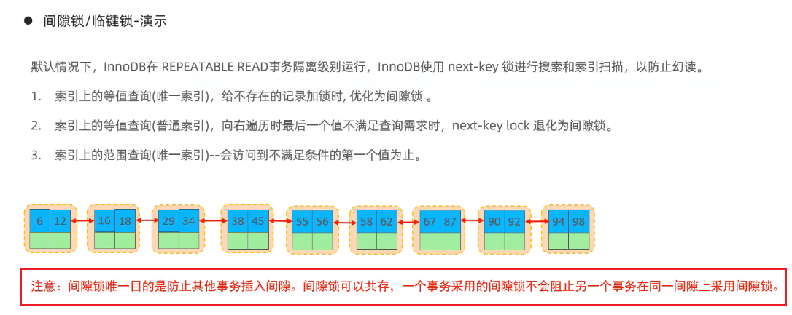

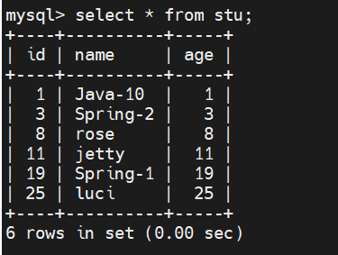

#### ①等值查询-==唯一索引==

**A. 索引上的等值查询(唯一索引)，给==不存在的记录加锁==时, 优化为==间隙锁-GAP== 。**

- 从最后表stu的间隙锁的具体信息可以看出，如果不存在的记录是id = 5 的记录行，那么这个时候会看id = 5理论上要在的位置（**索引结构最后保存的数据是有序的**），也就是id = 3和8之间。

  也就是给这里id = 8的位置**添加间隙锁Gap**。

**客户端一**

```sql
begin;
	update stu set age = 10 where id = 5; -- stu表中不存在id = 5 的记录
end;
```

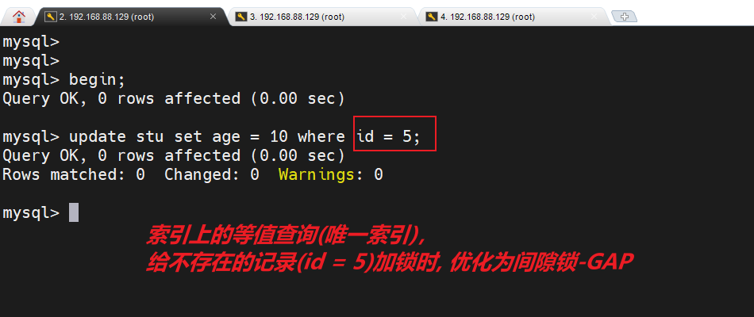

**客户端二**

```sql
begin;
	insert into stu values(7,'Ruby',7);
end;
```

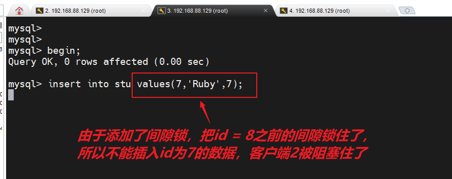


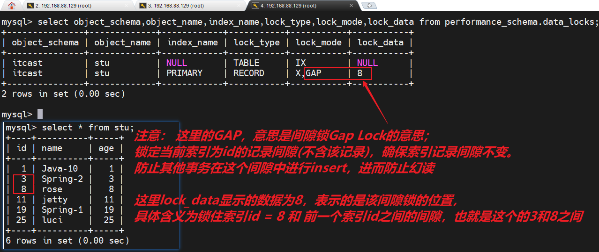


> ==**注意：**==
>
> 这里的GAP，意思是间隙锁Gap Lock的意思；锁定当前索引为id的记录间隙(不含该记录)，确保索引记录间隙不变。**防止其他事务在这个间隙中进行insert，进而防止幻读**。
>
> 这里**lock_data显示的数据为8**，表示的是该间隙锁的位置；
>
> **具体含义为锁住索引id = 8 和 前一个索引id之间的间隙，也就是这个的==3和8之间==**
>
> - （3,8）


#### ②等值查询-==非唯一普通索引==

**B. 索引上的等值查询(非唯一普通索引)，==向右遍历时最后一个值不满足查询需求时，next-keylock 退化为间隙锁。==** 

具体分析一下：

我们知道InnoDB的B+树索引，**叶子节点是有序的双向链表**。 假如，我们要根据这个**二级索引**查询值为18的数据，并加上共享锁，我们是只锁定18这一行就可以了吗？

 并不是，因为是**==非唯一索引==，这个结构中可能有==多个18的存在==**，所以，在加锁时**会继续往后找，找到一个不满足条件的值**（当前案例中也就是**21**）。

此时**会对18加临键锁，并对21之前的间隙（这个间隙这是==对前一个间隙而言==）加锁（此时这个`21的GAP间隙锁`就是next-keylock退化而来的）**。


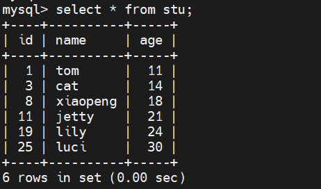


##### **🌟==间隙锁和临键锁的基本概念（重点）==**

- 间隙锁：锁定索引记录间隙（**不包含该记录**），
  - 比如此时的索引是id时，并且lock_data 显示的是8，表示的是**==锁定8前面一个的一个间隙==**，假设现在8前面一位的id为3，那么此时该间隙锁，锁定的就是3-8之间的间隙，也就是(3,8);
- 临键锁：行锁和间隙锁的组合，会**锁住数据**，同时**锁住==数据前面的一个间隙Gap==**
  - 如果有记录8,9,10,20,30
  - 对20加临键锁，会**锁定(10,20]这个区间**
  - 不会锁定(8,20]这个区间


**客户端一，创建age的 非唯一普通索引**

```sql
create index idx_syu_age on stu(age);
```

**根据非唯一普通索引进行查询，并添加共享行锁**

```sql
select * from stu where age = 18 lock in share mode;
```


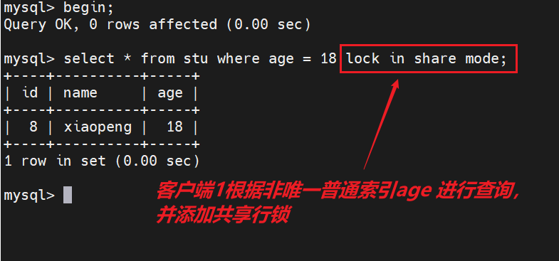

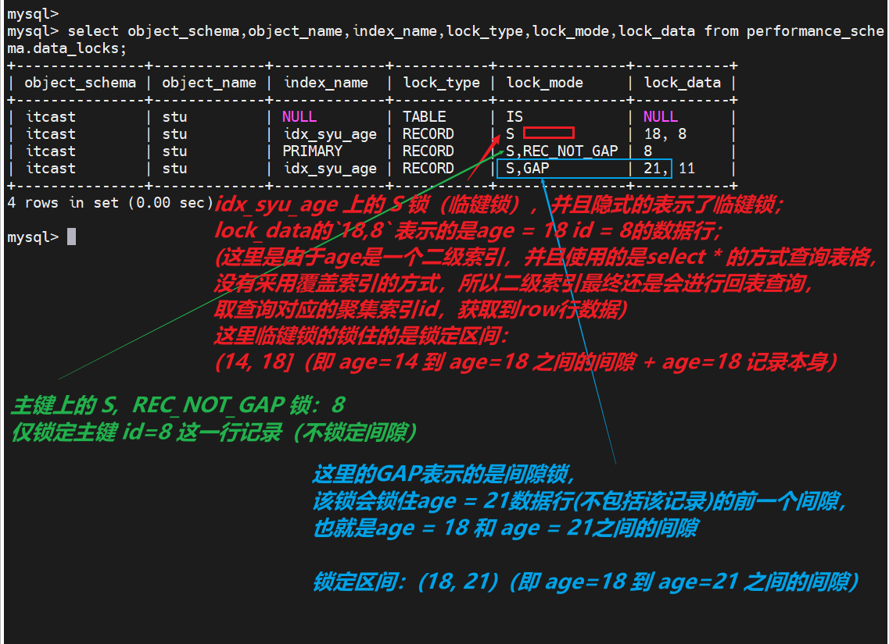


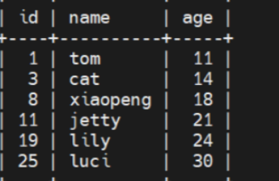

锁信息解读

1. **`idx_syu_age` 上的 S 锁（临键锁）**：`18, 8`
   - 锁定区间：(14, 18]（即 age=14 到 age=18 之间的间隙 + age=18 记录本身）
2. **主键上的 S,REC_NOT_GAP 锁**：`8`
   - 仅锁定主键 id=8 这一行记录（不锁定间隙）
3. **`idx_syu_age` 上的 S,GAP 锁**：`21, 11`
   - 锁定区间：(18, 21)（即 age=18 到 age=21 之间的间隙）

**==最终锁定范围==（开闭区间表示）**

1. **记录锁**：
   - [18, 8]（age=18 且 id=8 的记录）
2. **间隙锁**：
   - (14, 18)（age=14 和 age=18 之间的间隙）
   - (18, 21)（age=18 和 age=21 之间的间隙）
3. **组合起来相当于**：
   - (14, 21)（即 age=14 到 age=21 之间的所有间隙，但不包括 age=14 和 age=21 的记录）


#### ③🚀==特殊情况==-非唯一普通索引

##### **1）==特殊情况==概述**

**基于索引idx_syu_age，最后的行锁的锁定范围 应该是：(14,18] , (18,21）**

​	当客户端一，已经执行了select * from stu where age = 18 lock in share mode;添加了共享行锁，此时**客户端二进行下列操作时**，会出现一下特殊情况：

- 但是**在==insert操作==时**，对于**边界情况age = 14 和age = 21时会出现被阻塞的情况**。
- 在**==update操作==时**，**除了当前行age =18 被锁住**，**其他的age都可以执行通过，不会被阻塞**

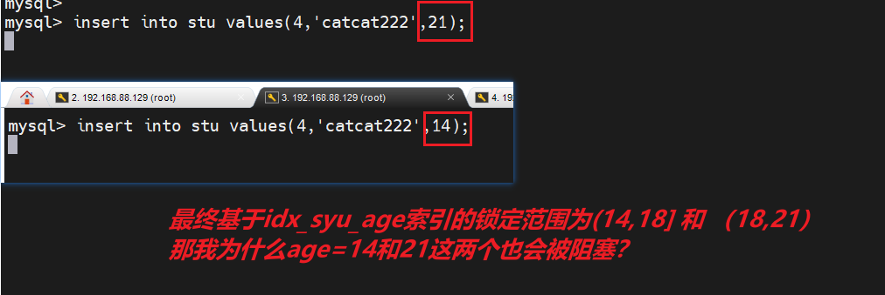

```sql
-- 客户端二 进行下列操作时出现的特殊情况
begin;
	-- 基于索引idx_syu_age，最后的行锁的锁定范围 应该是：(14,18] , (18,21)
    -- 这些操作会被阻塞：
    INSERT INTO stu VALUES (null, 'test1', 15);  -- 落入 (14,18)
    INSERT INTO stu VALUES (null, 'test2', 20);  -- 落入 (18,21)

    -- 这些操作不会被阻塞：
    INSERT INTO stu VALUES (null, 'test3', 10);  -- 小于14
    INSERT INTO stu VALUES (null, 'test4', 22);  -- 大于21
    UPDATE stu SET name='test' WHERE age=14;     -- age=14 本身未被锁定
    UPDATE stu SET name='test' WHERE age=21;     -- age=21 本身未被锁定
    
    
    -- 特殊例子-被阻塞
    insert into stu values(4,'catcat222',14); -- insert语句的age=14，虽然不在锁定的范围内，还是会被阻塞
    insert into stu values(4,'catcat222',21); -- 同理也会被阻塞
    
    -- 对于update语句
    UPDATE stu SET name='test' WHERE age= 18 ;
    UPDATE stu SET name='test' WHERE age= xx ; -- 只有当age = 18时才会被阻塞，其他都不被阻塞
    
commit;
```


##### 2）锁范围总结（基于 `idx_syu_age` 索引）

1. **临键锁 (Next-Key Lock)**：`(14, 18]`  
   
   - 锁定区间：`age > 14 且 age ≤ 18`  
   - 包含：间隙 `(14, 18)` + 记录 `age=18`  
   - 目的：防止其他事务插入 `age ∈ (14, 18]` 的新记录（幻读）。
   
2. **间隙锁 (Gap Lock)**：`(18, 21)`  
   - 锁定区间：`age > 18 且 age < 21`  
   - 目的：防止其他事务插入 `age ∈ (18, 21)` 的新记录。

3. **主键记录锁 (Record Lock)**：`id=8`（对应 `age=18`）  
   - 仅锁定主键为 `8` 的行，防止修改或删除。
   
   **组合起来相当于**：
   
   - (14, 21)（即 age=14 到 age=21 之间的所有间隙，但不包括 age=14 和 age=21 的记录）


##### 3）为什么某些操作会被阻塞？

###### 1. **INSERT 语句的阻塞逻辑**
InnoDB 在执行 `INSERT` 时，会==先检查**插入意向锁（Insert Intention Lock）**是否与现有锁冲突==：
- **插入意向锁**是一种特殊的间隙锁，表示“准备在某个间隙插入数据”。
- 如果插入的值落在被锁定的间隙内（或边界），则会被阻塞。

**你的测试案例：**
- `INSERT INTO stu VALUES (null, 'test1', 15);`  
  - 插入 `age=15`，落在 `(14, 18)` 间隙内 → **被临键锁阻塞**。
  
- `INSERT INTO stu VALUES (null, 'test2', 20);`  
  - 插入 `age=20`，落在 `(18, 21)` 间隙内 → **被间隙锁阻塞**。

- `INSERT INTO stu VALUES (4, 'catcat222', 14);`  
  - 插入 `age=14`，**虽然 `age=14` 本身未被锁定**，但插入操作**需要获取 `(11, 14]` 或 `(14, 18)` 的插入意向锁。**  
  - ==由于 `(14, 18)` 被临键锁锁定，插入意向锁与之冲突 → **被阻塞**。==  
  - **关键点**：即使插入的值是已有值（`age=14`），InnoDB 仍会保守地检查间隙锁。

- `INSERT INTO stu VALUES (4, 'catcat222', 21);`  
  - 插入 `age=21`，虽然 `age=21` 本身未被锁定，但插入操作需要检查 `(18, 21)` 间隙。  
  - 由于 `(18, 21)` 被间隙锁锁定 → **被阻塞**。  

###### 2. **UPDATE 语句的阻塞逻辑**
- `UPDATE stu SET name='test' WHERE age=18;`  
  - 命中 `age=18` 的记录，该记录被临键锁锁定（`S` 锁）→ **被阻塞**（其他事务不能修改）。  
- `UPDATE stu SET name='test' WHERE age=14;` 或 `age=21;`  
  - `age=14` 和 `age=21` 的**记录未被锁定（只有间隙锁）**→ **不会被阻塞**。  
- 为什么 **==UPDATE 不存在的记录不会被阻塞==**？
  - 当执行 `UPDATE` 时，InnoDB 会：
    1. **先查找记录**：
       - 如果记录**存在**，则尝试加锁（行锁或临键锁）。
       - ==如果记录**不存在**，则不会加任何锁（包括间隙锁）==。
    2. **锁的范围取决于 WHERE 条件**：
       - 如果 `WHERE age = 15`（精确匹配），而 `age=15` 不存在，InnoDB **不会锁定任何记录或间隙**，因此不会阻塞。
       - 如果 `WHERE age BETWEEN 15 AND 17`（**范围查询**），**即使记录不存在，InnoDB 也会锁定符合条件的间隙（防止幻读）**。


##### 4）验证锁行为的正确姿势

###### 1. **插入测试**
| 操作                | 是否被阻塞 | 原因                            |
| ------------------- | ---------- | ------------------------------- |
| `INSERT ... age=10` | ❌ 不阻塞   | `age=10 < 14`，不在任何锁定区间 |
| `INSERT ... age=15` | ✅ 阻塞     | `age=15 ∈ (14, 18)`             |
| `INSERT ... age=18` | ✅ 阻塞     | `age=18` 被临键锁锁定           |
| `INSERT ... age=20` | ✅ 阻塞     | `age=20 ∈ (18, 21)`             |
| `INSERT ... age=21` | ✅ 阻塞     | 插入需要检查 `(18, 21)` 间隙锁  |
| `INSERT ... age=22` | ❌ 不阻塞   | `age=22 > 21`，不在任何锁定区间 |

###### 2. **更新测试**
| 操作                         | 是否被阻塞   | 原因                             |
| ---------------------------- | ------------ | -------------------------------- |
| `UPDATE ... age=14`          | ❌ 不阻塞     | 只有间隙锁，不锁定记录本身       |
| `UPDATE ... age=18`          | ✅ 阻塞       | `age=18` 被临键锁锁定            |
| `UPDATE ... age=21`          | ❌ 不阻塞     | 只有间隙锁，不锁定记录本身       |
| `UPDATE ... WHERE age = 15;` | ❌ **不阻塞** | `age=15` 不存在，InnoDB 不会加锁 |
| `UPDATE ... WHERE age = 17;` | ❌ **不阻塞** | `age=17` 不存在，InnoDB 不会加锁 |


##### 5）总结

1. **INSERT 的阻塞范围比想象中更广**：  
   - 即使插入的值是已有值（如 `age=14` 或 `age=21`），也**会因为插入意向锁与间隙锁冲突而被阻塞。**  
   - 这是 **==InnoDB 防止幻读的保守策略==**。
2. **UPDATE 只锁定具体记录**：  
   - 只有被锁定的记录（如 `age=18`）会被阻塞更新，其他记录（如 `age=14` 或 `age=21`，`age=15、17这些不存在记录`）可以正常修改。
3. **锁的边界行为**：  
   - 临键锁 `(14, 18]` 包含右边界（`age=18`），但不包含左边界（`age=14`）。  
   - 间隙锁 `(18, 21)` 不包含任何边界。  


#### ④==范围查询==-唯一索引

**C. 索引上的范围查询(唯一索引)--会访问到不满足条件的第一个值为止。**

**对于客户端一而言,执行==对于唯一索引id的范围查询==sql语句**

```sql
select * from stu where id >=19 lock in share mode;
```

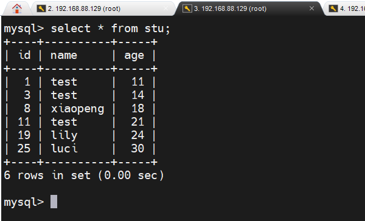

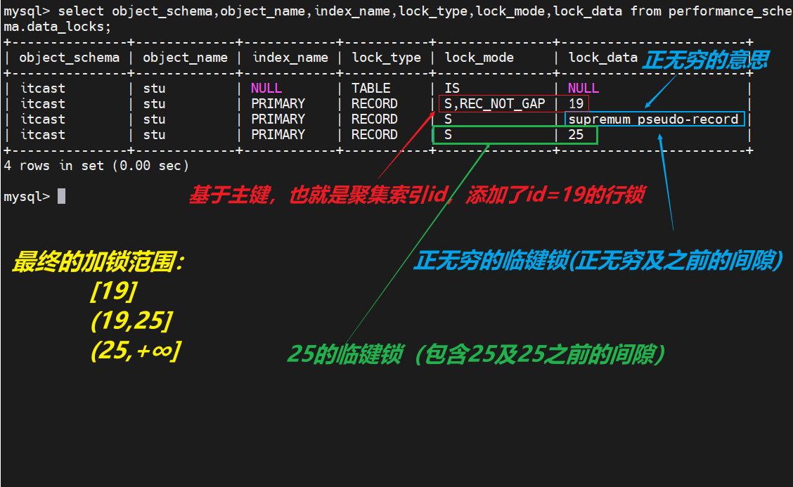

查询的条件为id>=19，并添加共享锁。 此时我们可以根据数据库表中现有的数据，将数据分为三个部分：

[19]

(19,25]

(25,+∞]

所以**数据库数据在加锁**是，

- 将19加了行锁 => [19]
- **25的临键锁**（包含25及25之前的间隙）=> (19,25]
- **正无穷的临键锁**(正无穷及之前的间隙)  => (25,+∞]


## 5.5 小结

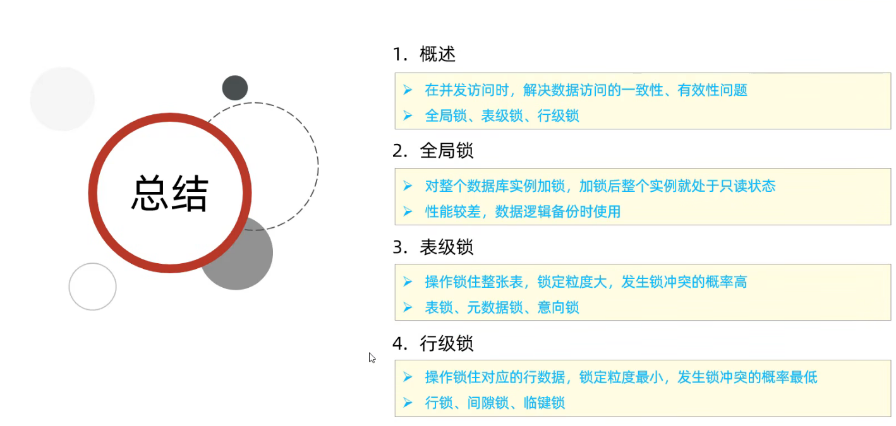


# 6、🚀 InnoDB引擎

## 6.1 ==逻辑存储结构==

InnoDB的逻辑存储结构如下图所示:

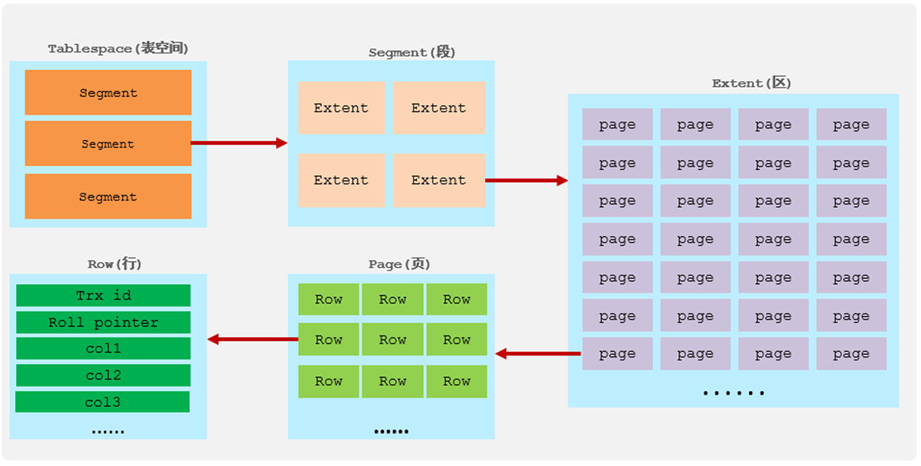

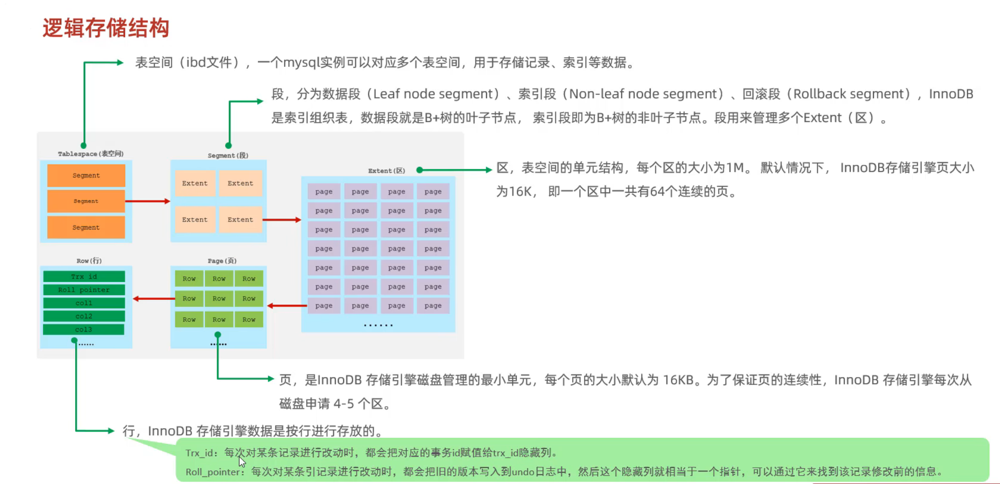

#### ① 表空间-Tablespace

表空间是InnoDB存储引擎逻辑结构的最高层， 如果用户启用了参数 innodb_file_per_table(在8.0版本中默认开启) ，则每张表都会有一个表空间（xxx.ibd），一个mysql实例可以对应多个表空间，**用于存储记录、索引等数据。**

#### ② 段-Segment

段，分为数据段（Leaf node segment）、索引段（Non-leaf node segment）、回滚段（Rollback segment），InnoDB是索引组织表，**数据段就是B+树的叶子节点， 索引段即为B+树的非叶子节点。**段用来管理多个Extent（区）。


#### ③ 区-Extent

区，**表空间的单元结构**，**每个区的大小为1M**。 

默认情况下， InnoDB存储引擎**页大小为16K**， 即一个区中一**共有64个连续的页**。


#### ④ 页-page

页，是InnoDB 存储引擎**磁盘管理的最小单元**，每个页的大小默认为 16KB。

为了保证页的连续性，InnoDB 存储引擎每次从磁盘申请 4-5 个区。


#### ⑤ 行-Row

行，InnoDB 存储引擎数据是**按行进行存放的**。

在行中，默认有==两个隐藏字段==：

- **Trx_id**：每次对某条记录进行改动时，都会**把对应的事务id赋值给trx_id隐藏列**。
- **Roll_pointer**：每次对某条引记录进行改动时，都会**把旧的版本写入到undo日志中**，然后这个隐藏列就**相当于一个指针**，可以通过它来**找到该记录修改前的信息**。


## 6.2 架构

### （1）概述

MySQL5.5 版本开始，默认使用InnoDB存储引擎，它擅长**事务处理，具有崩溃恢复特性**，在日常开发

中使用非常广泛。下面是InnoDB架构图，**左侧为内存结构，右侧为磁盘结构**。

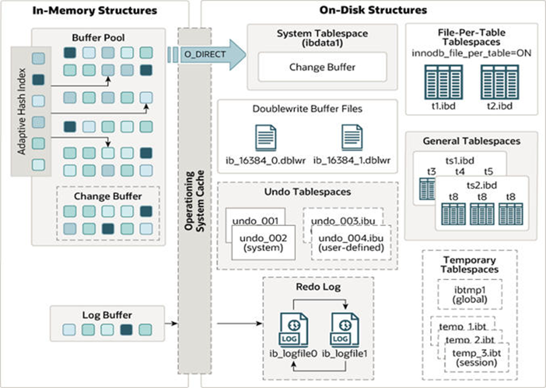


### （2）==内存结构==

在左侧的内存结构中，主要分为这么四大块儿： 

Buffer Pool、Change Buffer、Adaptive Hash Index、Log Buffer。 接下来介绍一下这四个部分。

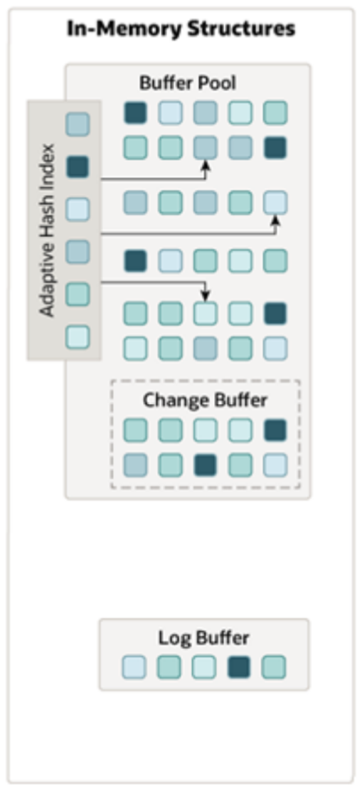


#### ①Buffer Pool-==缓冲池==

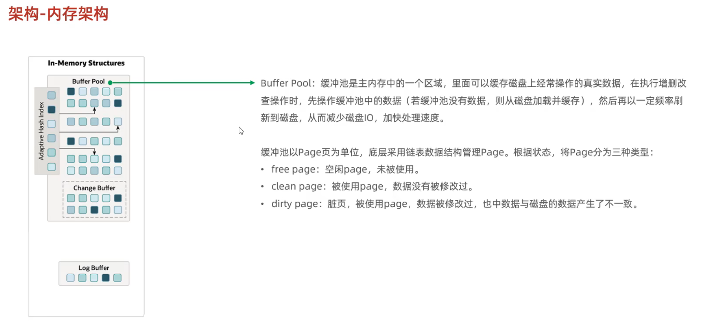

InnoDB存储引擎基于==磁盘文件存储==，访问**物理硬盘和在内存中**进行访问，速度相差很大，为了尽可能弥补这两者之间的I/O效率的差值，就需要**把经常使用的数据加载到缓冲池中，避免每次访问都进行磁盘I/O**。

在InnoDB的缓冲池中**不仅缓存了索引页和数据页**，还包含了**undo页、插入缓存、自适应哈希索引以及InnoDB的锁信息**等等。

缓冲池 Buffer Pool，是主内存中的一个区域，里面可以**缓存磁盘上经常操作的真实数据**，在执行增删改查操作时，先操作缓冲池中的数据（若缓冲池没有数据，则从磁盘加载并缓存），然后再以一定频率刷新到磁盘，**从而减少磁盘IO，加快处理速度。** =》**去了解==`随机磁盘io`和`顺序磁盘io`==的概念**


缓冲池**以Page页为单位，底层采用链表数据结构管理Page**。根据状态，将Page分为三种类型：

- **free page**：空闲page，未被使用。

- **clean page**：被使用page，数据没有被修改过。

- **dirty page**：脏页，被使用page，数据被修改过，也中**数据与磁盘的数据产生了不一致**。

  

<span id = 'Buffer Pool缓存池' > </span>

在专用服务器上，**通常将多达80％的物理内存分配给缓冲池** 。参数设置： 

```sql
-- 查看缓存池的大小
show variables like 'innodb_buffer_pool_size';
```

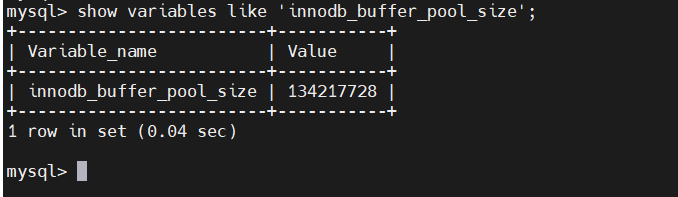


#### ②Change Buffer-更改缓冲区

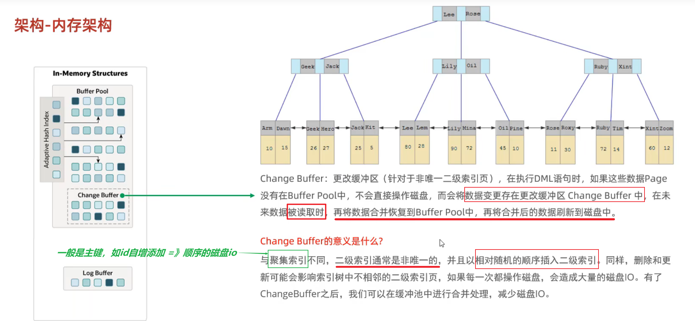

Change Buffer，**更改缓冲区**（针对于==非唯一二级索引页==），在执行DML语句时，如果这些数据Page没有在Buffer Pool中，不会直接操作磁盘，而会**将数据变更先存储在更改缓冲区 Change Buffer**中，==在未来数据被读取时，再**将数据合并恢复到Buffer Pool中**==，**再将合并后的数据刷新到磁盘中**。


Change Buffer的意义是什么呢?

先来看一幅图，这个是二级索引的结构图：

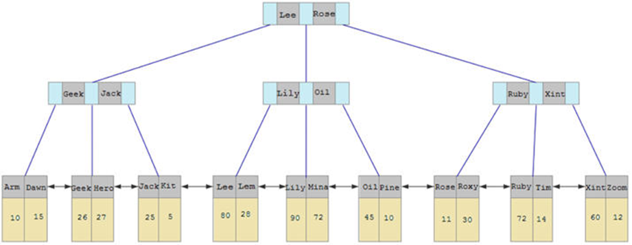

与聚集索引不同，二级索引通常是非唯一的，并且以**相对随机的顺序插入二级索引**。同样，删除和更新可能会影响索引树中不相邻的二级索引页，如果每一次都操作磁盘，会造成大量的磁盘IO。有了ChangeBuffer之后，我们可以在缓冲池中进行合并处理，减少磁盘IO。


#### ③Adaptive Hash Index-==自适应hash索引==

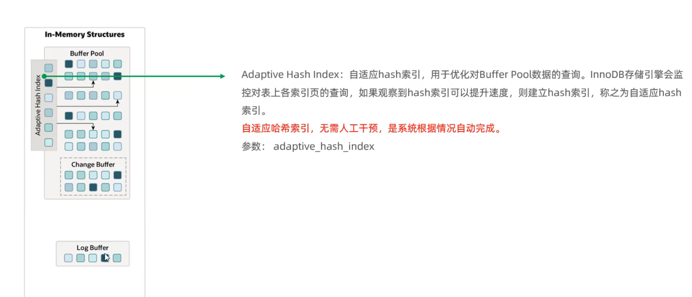

自适应hash索引，用于**优化对Buffer Pool数据的查询**。MySQL的innoDB引擎中虽然**没有直接支持hash索引**，但是给我们提供了一个功能就是这个自适应hash索引。因为前面我们讲到过，hash索引在进行等值匹配时，一般性能是要高于B+树的，**因为hash索引一般只需要一次IO即可（在不发生hash冲突的前提下）**，而B+树，可能需要几次匹配，所以hash索引的效率要高，**但是hash索引又不适合做范围查询、模糊匹配等**，==只适合等值匹配==。

InnoDB存储引擎会监控对表上各索引页的查询，如果观察到在特定的条件下hash索引可以提升速度，则建立hash索引，称之为自适应hash索引。

**自适应哈希索引，无需人工干预，是系统根据情况自动完成。**

参数： adaptive_hash_index

```sql
-- 查看InnoDB的自适应hash索引 是否启用
show variables like '%hash_index%';
```

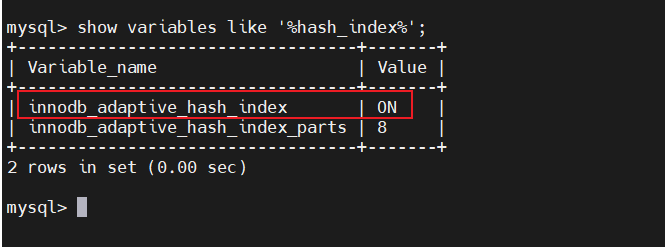


#### ④Log Buffer-日志缓冲区

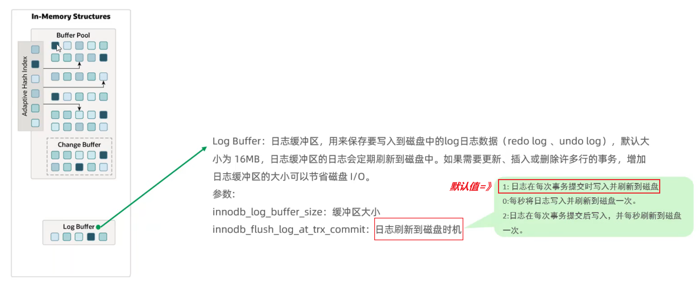

Log Buffer：日志缓冲区，用来保存**要写入到磁盘中的log日志数据（redo log 、undo log）**，默认大小为 16MB，日志缓冲区的**日志会定期刷新到磁盘中**。如果需要更新、插入或删除许多行的事务，**增加日志缓冲区的大小可以节省磁盘 I/O**。

参数:

**innodb_log_buffer_size**：缓冲区大小

```sql
-- 查询日志缓冲区的大小
show variables like '%log_buffer_size%';
```

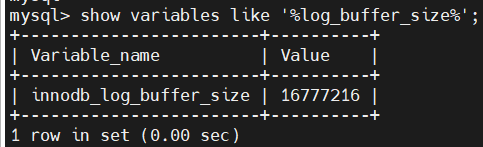


innodb_flush_log_at_trx_commit：**日志刷新到磁盘时机**，取值主要包含以下三个：

```sql
-- 日志刷新到磁盘时机
show variables like '%flush_log%';
```

- 1: 日志在**每次事务提交时写入并刷新到磁盘**，默认值。
- 0: **每秒**将日志写入并刷新到磁盘一次。
- 2: 日志在**每次事务提交后写入，并每秒**刷新到磁盘一次。


### （3）==磁盘结构==

接下来，再来看看InnoDB体系结构的右边部分，也就是磁盘结构：

#### ①System Tablespace-系统表空间

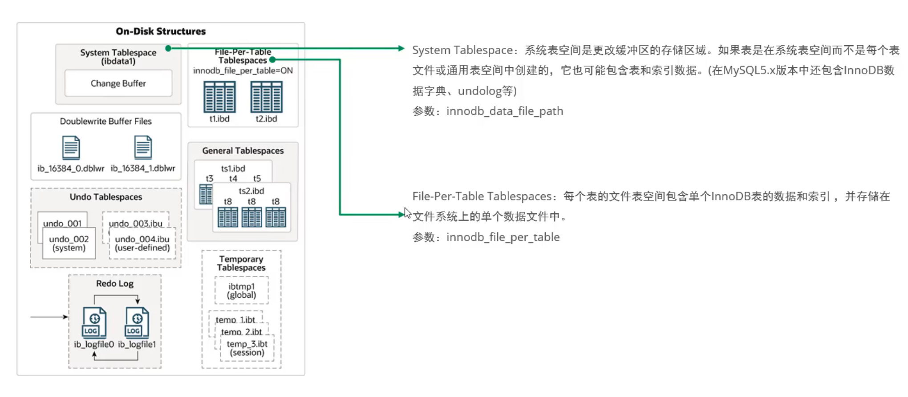

系统表空间**==是更改缓冲区的存储区域==**。如果表是在系统表空间而不是每个表文件或通用表空间中创建的，它也可能包含表和索引数据。(在MySQL5.x版本中还包含InnoDB数据字典、undolog等)

参数：innodb_data_file_path

**系统表空间，默认的文件名叫 ibdata1**。

```sql
show variables like '%data_file_path%';
```

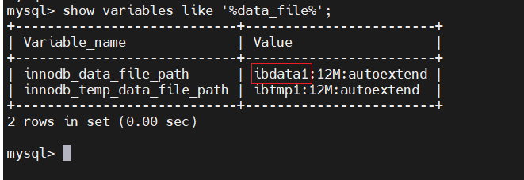

```bash
cd /var/lib/mysql
```

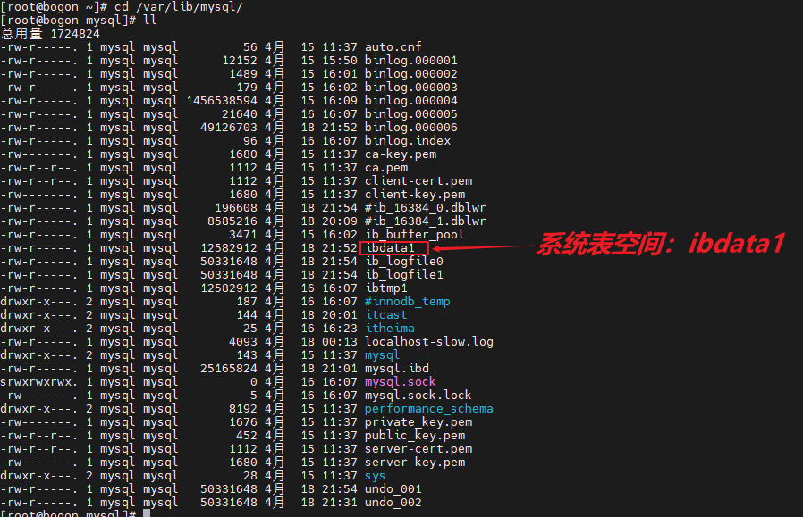


#### ②File-Per-Table Tablespaces-文件表空间


如果开启了innodb_file_per_table开关 ，则**每个表的==文件表空间==包含单个InnoDB表的数据和索引** ，并存储在文件系统上的单个数据文件中。该**文件表空间** =》**==包含该表的数据、索引、结构==**

**开启后，==每一张表都会生成对应的文件表空间==，而不是系统表空间**

开关参数：innodb_file_per_table ，该**参数默认开启**。

```sql
show variables like '%file_per_table%';
```

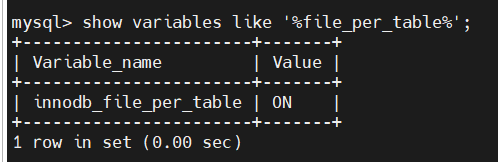

那也就是说，我们**每创建一个表，都会产生一个对应的表空间文件**，如图：

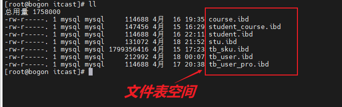


#### ③General Tablespaces-通用表空间

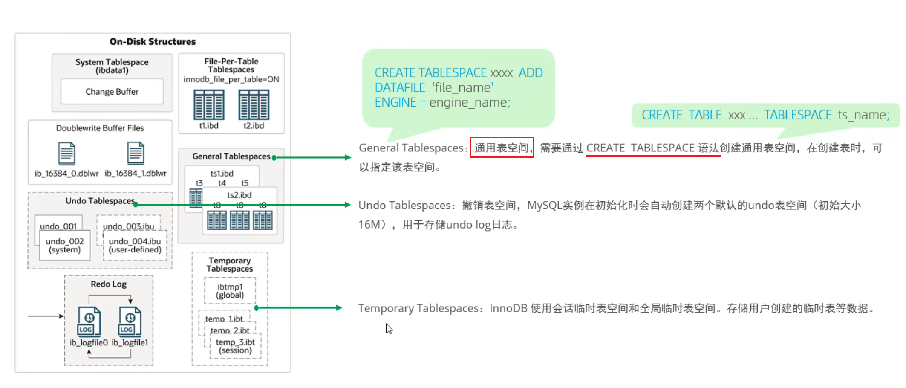

通用表空间，**需要手动**通过 **CREATE TABLESPACE 语法创建通用表空间**，在**创建表时，可以指定该表空间**。

##### A. 创建表空间

```sql
CREATE TABLESPACE ts_name ADD DATAFILE 'file_name' ENGINE = engine_name; 
-- 这里的file_name 指的是这个表空间关联的磁盘磁盘文件
-- 这里的engine_name 指的是对应的存储引擎

create tablespace ts_itheima add datafile 'myitheima.idb' engine = innodb;
```

##### B. 创建表时指定表空间

```sql
CREATE TABLE xxx ... TABLESPACE ts_name; 

create table test_a(
	id int primary key auto_increment,
    name varchar(10)
) engine = InnoDB tablespace ts_itheima;
```


#### ④Undo Tablespaces-撤销表空间

撤销表空间，MySQL实例在初始化时会**自动创建两个默认的undo表空间**（初始大小16M），

用于**存储undo log日志**。

- **undo_001和 undo_002**

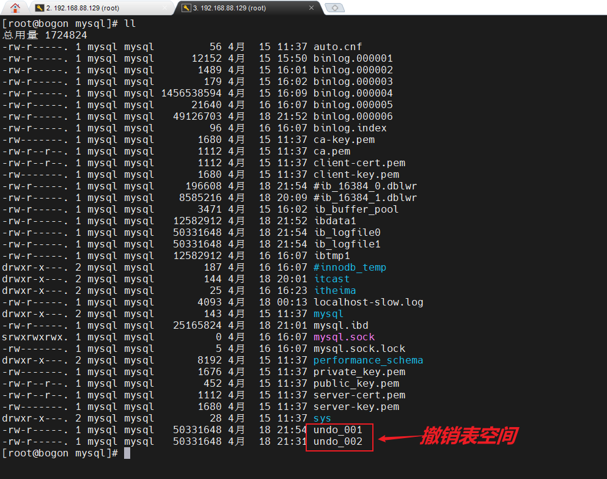


#### ⑤Temporary Tablespaces-临时表空间

InnoDB 使用会话临时表空间和全局临时表空间。**存储用户创建的临时表等数据**。


#### ⑥Doublewrite Buffer Files-==双写缓冲区==

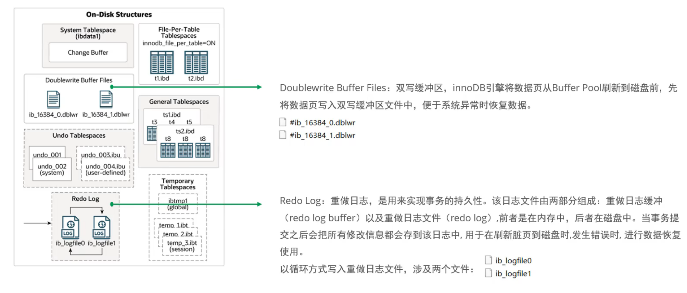

双写缓冲区，innoDB引擎**将数据页从Buffer Pool刷新到磁盘==前==**，**先将数据页写入双写缓冲区文件中，便于系统异常时恢复数据。**

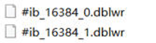


#### ⑦ Redo Log-==重做日志==

重做日志，是**用来==实现事务的持久性==**。该日志文件由两部分组成：

**重做日志缓冲（redo logbuffer）以及重做日志文件（redo log）**,**前者是在内存中，后者在磁盘中**。

当事务提交之后会把所有修改信息都会存到该日志中, **==用于在刷新脏页到磁盘时,发生错误时, 进行数据恢复使用==**，进而保证事务的持久性。

以**循环方式写入重做日志文件**，涉及两个文件：


前面我们介绍了InnoDB的内存结构，以及磁盘结构，那么**内存中我们所更新的数据，又是如何到磁盘中的呢？** 此时，就涉及到一组后台线程，接下来，就来介绍一些InnoDB中涉及到的后台线程。

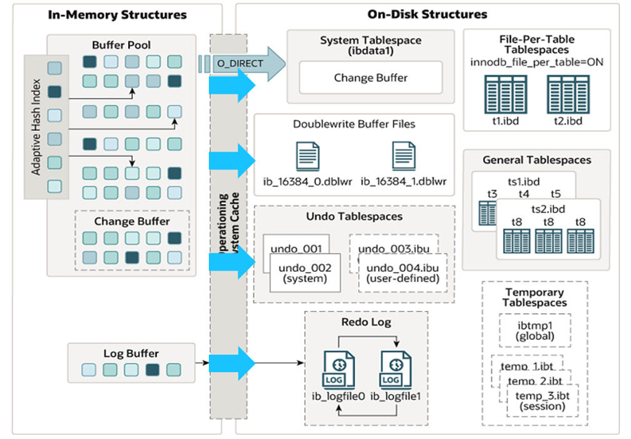


### （4）后台线程

在InnoDB的后台线程中，分为4类，

分别是：Master Thread 、IO Thread、Purge Thread、Page Cleaner Thread。

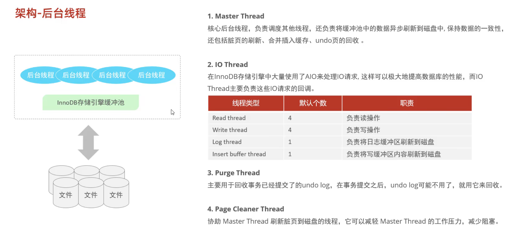

#### ①Master Thread

**核心后台线程**，负责调度其他线程，还负责将缓冲池中的数据异步刷新到磁盘中, 保持数据的一致性，还包括脏页的刷新、合并插入缓存、undo页的回收 。

  

#### ②IO Thread

在InnoDB存储引擎中大量使用了**AIO（异步非阻塞IO）**来处理IO请求, 这样可以极大地**提高数据库的性能**，而IOThread主要负责这些IO请求的回调。

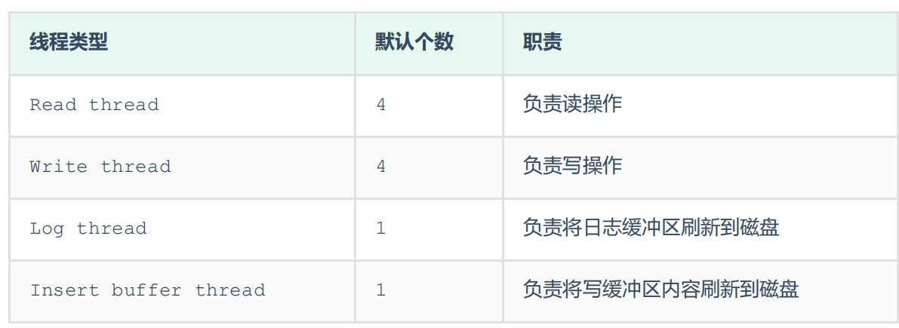

我们可以通过以下的这条指令，查看到InnoDB的状态信息，其中就包含IO Thread信息。

```sql
show engine innodb status \G;
```

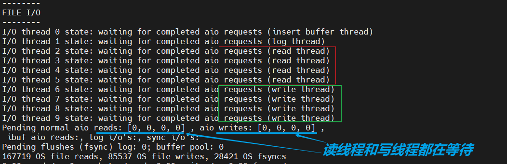


#### ③Purge Thread

主要用于回收事务已经提交了的**undo log（撤销日志）**，在事务提交之后，undo log可能不用了，就用Purge Thread来回收。


#### ④Page Cleaner Thread

**协助 Master Thread 刷新脏页到磁盘的线程**，它可以减轻 Master Thread 的工作压力，**减少阻塞**。


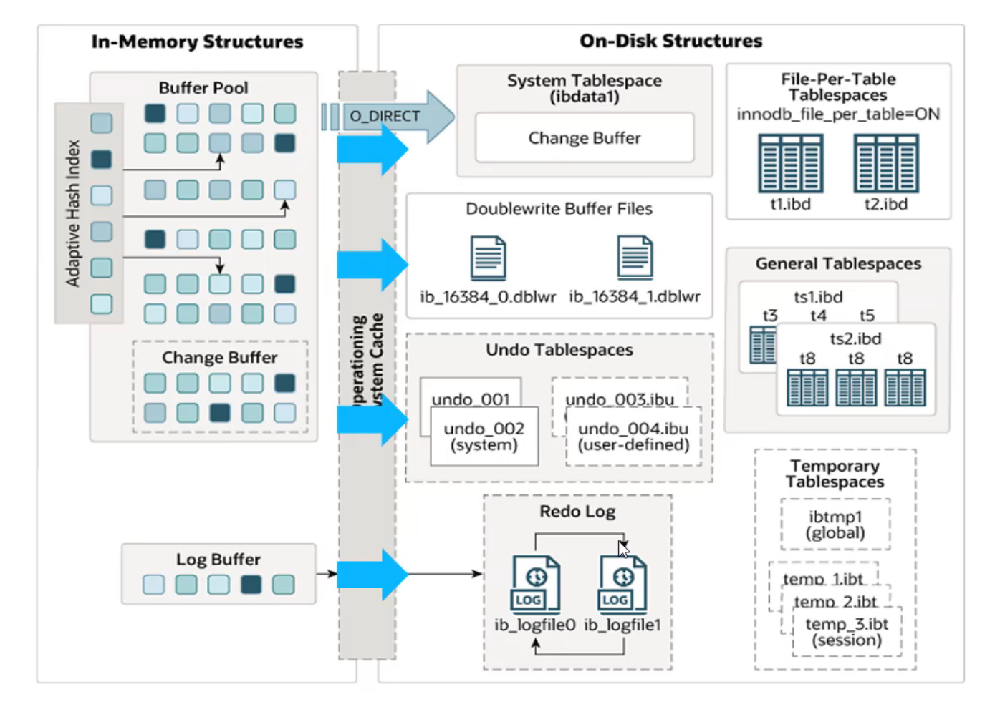


## 6.3 🚀 ==事务管理==

### （1）事务基础

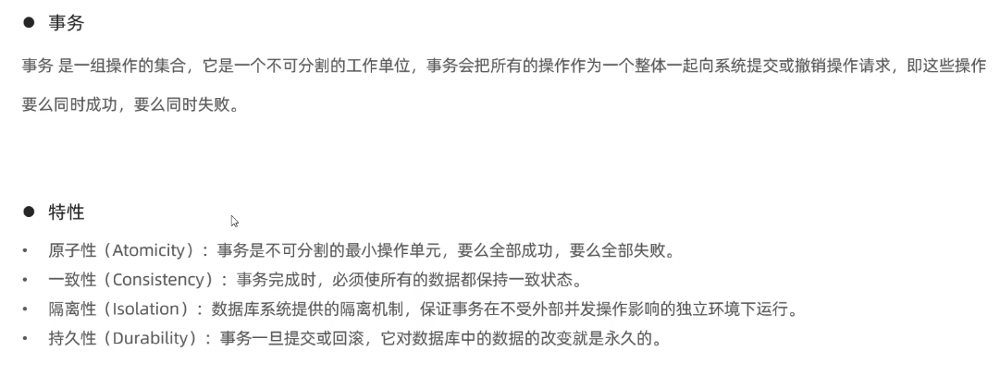

#### ①事务

事务 是**一组操作的集合，它是一个不可分割的工作单位**。

事务会把所有的操作作为一个整体一起向系统提交或撤销操作请求，即这些操作**要么同时成功，要么同时失败**。


#### ②特性


- 原子性（Atomicity）：事务是不可分割的最小操作单元，**要么全部成功，要么全部失败**。
- 一致性（Consistency）：事务完成时，必须使**所有的数据都保持一致状态**。
- 隔离性（Isolation）：数据库系统提供的隔离机制，**保证事务在不受外部并发操作影响的独立环境下运行。** = 》对应**四种隔离级别：读未提交，读已提交，可重复读(默认)，串行化**
- 持久性（Durability）：事务一旦提交或回滚，它对数据库中的数据的**改变就是永久的**。


那实际上，我们研究事务的原理，就是研究MySQL的InnoDB引擎是**如何保证事务的这四大特性的**。


而对于这四大特性，实际上分为两个部分。

-  其中的**原子性、一致性、持久化**，实际上是由InnoDB中的两份日志来保证的，
  - 一份是**redo log日志，一份是undo log日志**。 
-  而**持久性是通过数据库的==锁==，加上==MVCC==来保证的**。


我们在讲解事务原理的时候，主要就是来研究一下redolog，undolog以及MVCC。


### （2）🚀 redo log

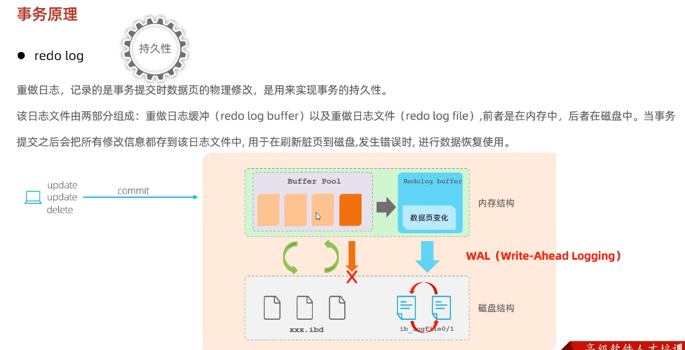

#### ①概念

**重做日志，记录的是事务提交时数据页的物理修改**，是用来实现**事务的持久性**。

该日志文件由两部分组成：

重做日志缓冲（redo log buffer）以及重做日志文件（redo logfile）,前者是在内存中，后者在磁盘中。

当**事务提交之后会把所有修改信息都存到该日志文件（redo logfile）中**,

- **==用于在刷新脏页到磁盘,发生错误时, 进行数据恢复使用==**，相当于==在磁盘中多添加了一个副本==。


#### ②未使用redo log时

**如果没有redolog**，可能会存在什么问题的？ 我们一起来分析一下。

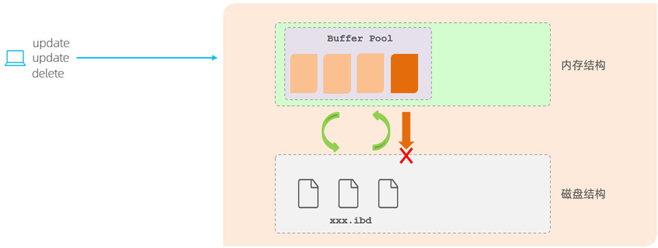

我们知道，在InnoDB引擎中的内存结构中，主要的**内存区域就是缓冲池**，在缓冲池中缓存了很多的数据页。 当我们在一个事务中，执行多个增删改的操作时，InnoDB引擎会先操作缓冲池中的数据，如果缓冲区没有对应的数据，会通过后台线程将磁盘中的数据加载出来，存放在缓冲区中，然后将缓冲池中的数据修改，修改后的数据页我们称为脏页。 **而脏页则会在一定的时机，通过后台线程刷新到磁盘中**，从而保证缓冲区与磁盘的数据一致。 而缓冲区的**脏页数据并不是实时刷新的**，而是一段时间之后将缓冲区的数据刷新到磁盘中，**==假如刷新到磁盘的过程出错了==**，而**提示给用户事务提交成功，而数据却没有持久化下来**，这就出现问题了，**没有保证事务的持久性。**


#### ③使用redo log

那么，如何解决上述的问题呢？ 在InnoDB中提供了一份**日志 redo log**，接下来我们再来分析一下，通过redolog如何解决这个问题。

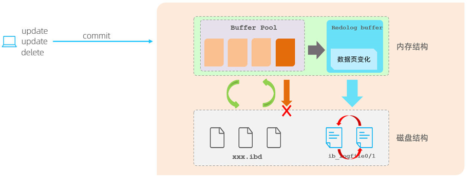

有了redolog之后，当对缓冲区的数据进行增删改之后，**会首先==将操作的数据页的变化，记录在redolog buffer中==。**在事务提交时，**会将redo log buffer中的数据刷新到redo log磁盘文件中**。过一段时间之后，如果刷新缓冲区的**脏页到磁盘时，发生错误**，此时就可以**借助于redo log进行数据恢复，这样就保证了事务的持久性**。 而**如果脏页成功刷新到磁盘** 或 或者涉及到的数据已经落盘，此时**redolog就没有作用了，就可以删除了**，所以存在的两个redolog文件是**循环写的**，不会永久的保存。


> 那为什么**每一次提交事务，要刷新redo log 到磁盘中**呢，而**不是直接将**buffer pool中的==脏页刷新到磁盘呢==?
>
> 因为在业务操作中，我们**操作数据可能有多条，并且一般都是随机读写磁盘的**，而不是顺序读写磁盘。 而redo log在往磁盘文件中写入数据，**==由于是日志文件，以追加的方式进行添加，所以都是顺序写的==**。**顺序写的效率，要远大于随机写**。 这种先写日志的方式，称之为 **WAL（Write-Ahead Logging）**。


### （3）🚀 undo log

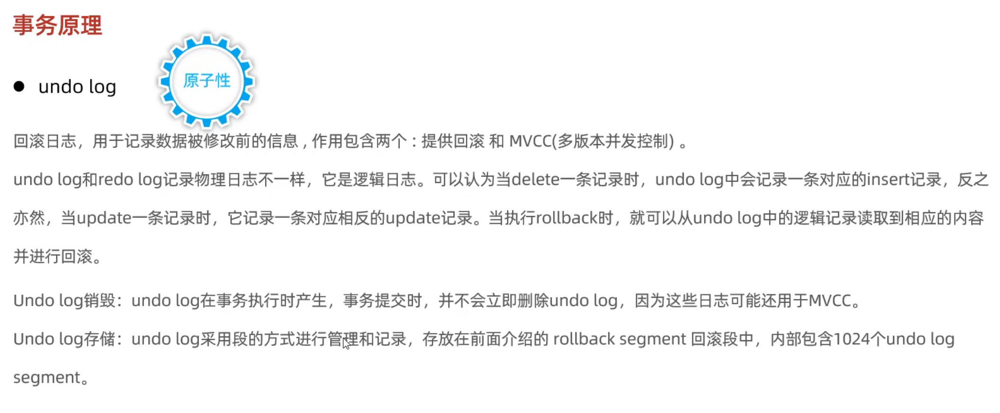

回滚日志，用于**==记录数据被修改前的信息==** , 作用包含两个 : 

**提供回滚(保证事务的原子性) 和MVCC(多版本并发控制) **


undo log和redo log记录物理日志不一样，**它是==逻辑日志==**。

可以认为当**delete一条记录**时，undolog中会**记录一条对应的insert记录**，

反之亦然，当update一条记录时，它**==记录一条对应相反的==update记录**。

**当执行rollback时，就可以从undo log中的逻辑记录读取到相应的内容并进行回滚。**


- Undo log销毁：undo log在事务执行时产生，**事务提交时，并不会立即删除undo log，因为这些日志可能还用于==MVCC==。**

- Undo log存储：undo log采用**段的方式进行管理和记录**，**存放在前面介绍的 rollback segment回滚段**中，内部包含1024个undo log segment。


## 6.4 🚀 ==MVCC==

### （1）🚀 ==基本概念==

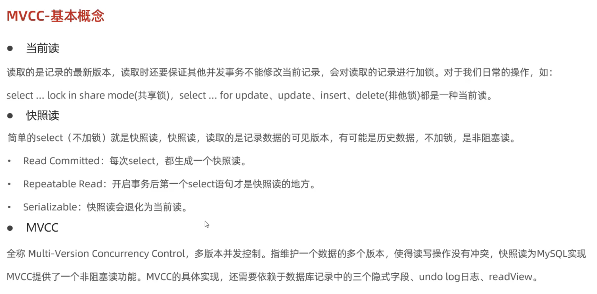


#### ①==当前读==

**读取的是记录的最新版本**，读取时还要**保证其他并发事务不能修改当前记录，会==对读取的记录进行加锁==**。对于我们日常的操作，如：

- select ... lock in share mode(共享锁)
- select ...for update（排他锁）
- update、insert、delete（排他锁）都是一种当前读。


##### 测试

**客户端一**

```sql
begin;
	select * from stu;
	
-- 当前读 ，即使在当前事务内，未提交的情况下，也可以获取到最新数据 (前提是客户端二的事务需要先commit)
	select * from stu lock in share mode;
commit;
```

**客户端二，也开启事务，修改stu表中的内容**，按照Mysql的隔离级别-可重复读RR，客户端一 直接查询是看不到最新的数据的(客户端二刚修改的)，因为需要满足可重复的的隔离级别，但是通过在查询语句后面加上了 **lock in share mode 共享锁** (前提是客户端二的事务**需要先commit**)，此时是当前读操作，就可以读取最新的修改后的数据。

```sql
-- 客户端二
begin;
	update stu set name = 'JSP' where id = 1;
commit;
```

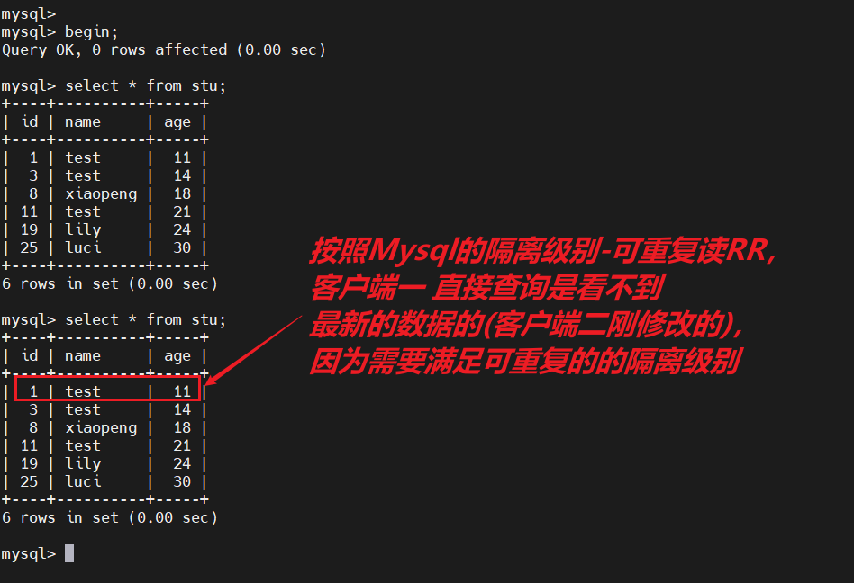

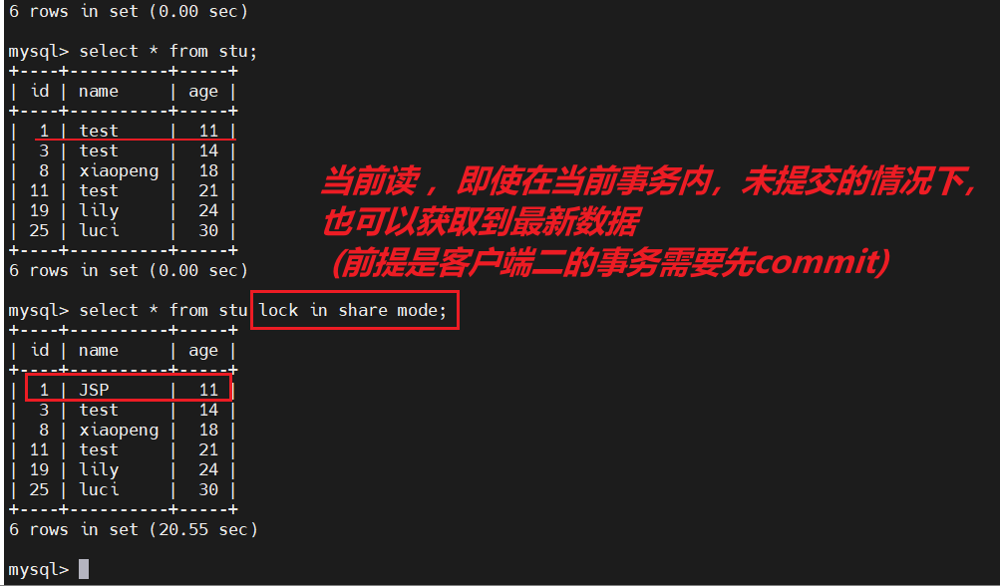


在测试中我们可以看到，**即使是在默认的RR隔离级别（可重复读）下**，**事务A中依然可以读取到事务B最新提交的内容**，因为在查询语句后面加上了 **lock in share mode 共享锁**，此时是当前读操作。当然，当我们加排他锁的时候，也是**==当前读操作==**。


#### ②==快照读==

**简单的select（==不加锁==）就是快照读**，快照读，**读取的是记录数据的可见版本**，**有可能是历史数据，不加锁，是非阻塞读。**

快照读解决了不可重复读的问题，**即使数据修改了，通过快照读两次读取结果一致**，**但是出现了幻读**


**三种==不同隔离级别==下的快照读**

- Read Committed：每次select，都生成一个快照读。
- **Repeatable Read**：开启事务后**第一个select语句才是快照读的地方**。
  - 后面执行相同的select语句都是**从快照中获取数据，可能不是当前的最新数据**，这样也就==保证了可重复读==

- Serializable：**快照读会退化为当前读**。


测试：

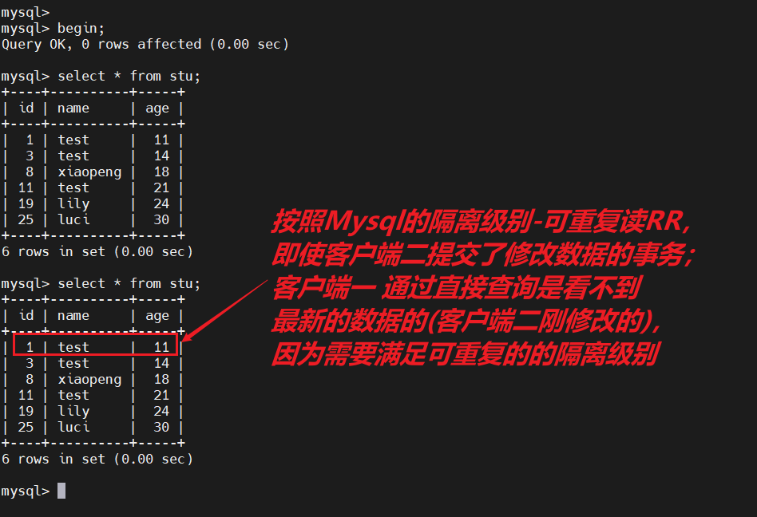

在测试中,我们看到即使**事务B提交了数据,事务A中也查询不到**。 原因就是因为**普通的select是快照读**，而在当前默认的RR隔离级别下，开启事务后第一个select语句才是快照读的地方，**后面执行相同的select语句都是从快照中获取数据，可能不是当前的最新数据，这样也就保证了可重复读**。


#### ③MVCC

全称 **Multi-Version Concurrency Control**，==多版本并发控制==。

**指维护一个数据的多个版本**，使得读写操作没有冲突，**快照读**为MySQL实现MVCC提供了一个**非阻塞读功能**。

MVCC的具体实现，还需要依赖于**数据库记录中的三个隐式字段、undo log日志、readView**。


接下来，我们再来介绍一下InnoDB引擎的表中涉及到的隐藏字段 、undolog 以及 readview，从而来介绍一下MVCC的原理。


### （2）隐藏字段

#### ①介绍

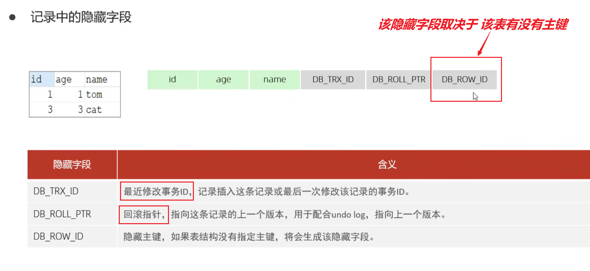

当我们创建了上面的这张表，我们在查看表结构的时候，就可以显式的看到这三个字段。 实际上除了这三个字段以外，InnoDB还会自动的给我们添加三个隐藏字段及其含义分别是：

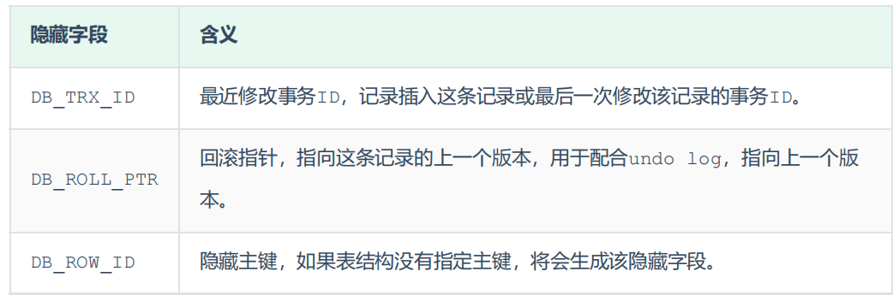

而上述的前两个字段是肯定会添加的， 是否添加最后一个字段**DB_ROW_ID，得看当前表有没有主键，如果有主键，则不会添加该隐藏字段。**


#### ②测试

##### 1). 查看有主键的表 stu

进入服务器中的 /var/lib/mysql/itcast/ , 查看stu的表结构信息, 通过如下指令:

```bash
# 使用idb2sdi 命令查看表空间文件信息
ibd2sdi stu.ibd
```

查看到的表结构信息中，**有一栏 columns**，在其中我们会看到处理我们建表时指定的字段以外，还有额外的两个字段 分别是：DB_TRX_ID 、 DB_ROLL_PTR ，**因为该表有主键，所以没有DB_ROW_ID隐藏字段**。

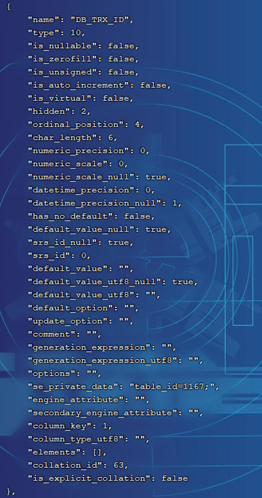

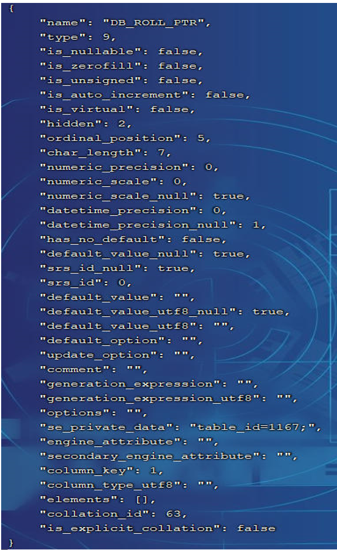


##### 2). 查看没有主键的表 employee

建表语句：

```sql
create table employee (id int , name varchar(10)); 
```

此时，我们再通过以下指令来查看表结构及其其中的字段信息：

```sql
ibd2sdi employee.ibd 
```

查看到的表结构信息中，有一栏 columns，在其中我们会看到处理我们建表时指定的字段以外，还有额外的三个字段 分别是：DB_TRX_ID 、 DB_ROLL_PTR 、DB_ROW_ID，**因为employee表是没有指定主键的**。

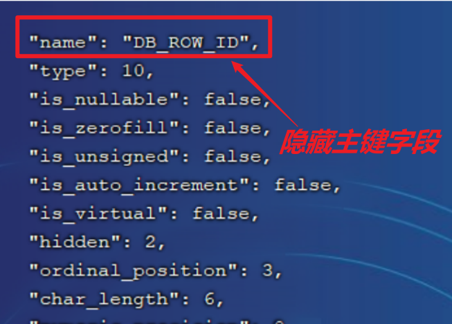


### （3）🚀 ==undo log==

#### ①介绍

回滚日志，在insert、update、delete的时候产生的便于数据回滚的日志。

- **当insert**的时候，产生的undo log日志**只在回滚时需要，在事务提交后，可被立即删除**。
- 而**update、delete**的时候，产生的undo log日志**==不仅在回滚时需要==**，**==在快照读时也需要==，不会立即被删除。**


#### ②🚀版本链

有一张表**原始数据**为：

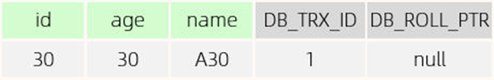


> DB_TRX_ID : 代表**最近修改事务ID**，记录插入这条记录或最后一次修改该记录的事务ID，是自增的。
>
> DB_ROLL_PTR ： 表示**回滚指针**，由于**这条数据是才插入的，没有被更新过，所以该字段值为null**。


然后，有**四个并发事务同时在访问这张表**。

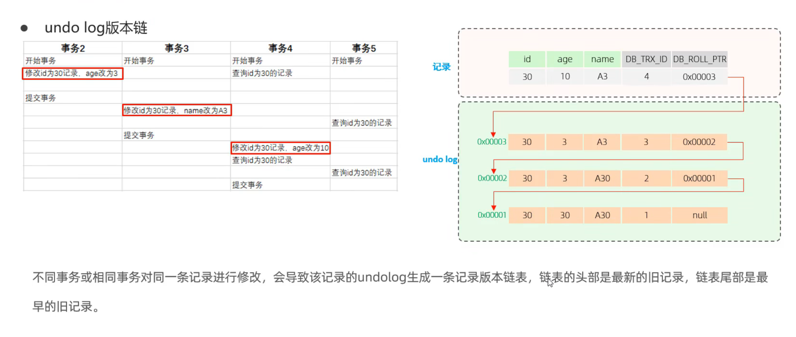

##### A. 第一步


当**事务2执行第一条修改语句时，会记录undo log日志**，记录数据变更之前的样子; 然后更新记录，并且记录本次操作的事务ID，回滚指针，回滚指针用来指定如果发生回滚，回滚到哪一个版本。

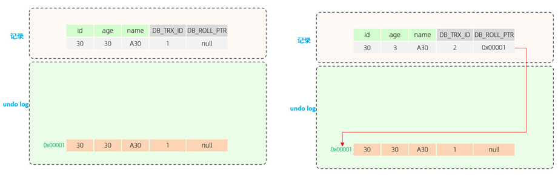


##### B.第二步


当事务3执行第一条修改语句时，也会记录undo log日志，记录数据变更之前的样子; 然后更新记录，并且记录本次操作的事务ID，回滚指针，回滚指针用来指定如果发生回滚，回滚到哪一个版本。

**==注意==，这里事务3执行修改操作后就直接提交了事务，但是此时==undo log不会立马删除==，因为此时真正在有活动事务在使用undo log，所以即使提交了事务也不会删除undo log日志**

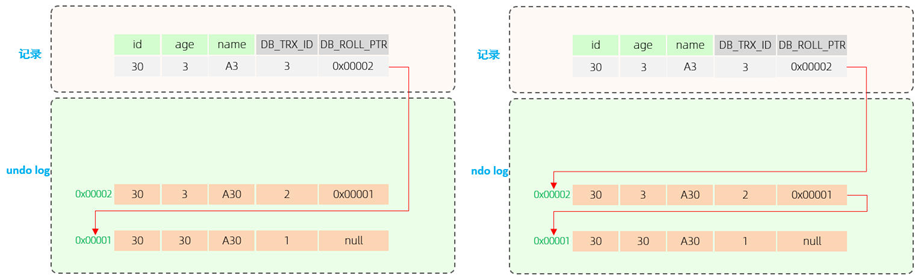


##### C. 第三步

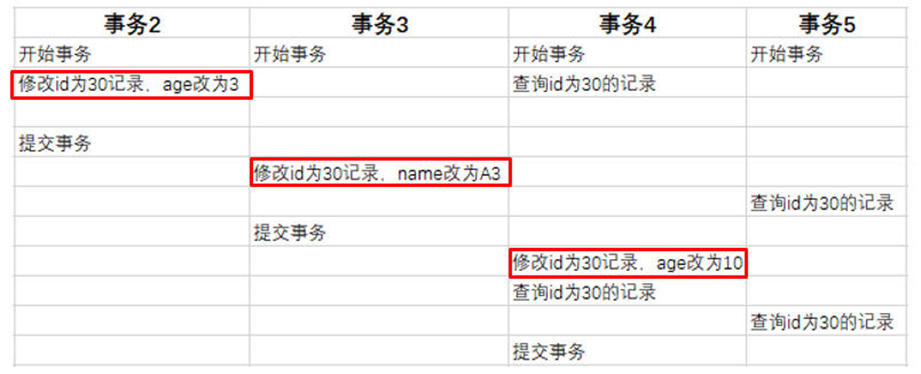

当事务4执行第一条修改语句时，也会记录undo log日志，记录数据变更之前的样子; 然后更新记录，并且记录本次操作的事务ID，回滚指针，回滚指针用来指定如果发生回滚，回滚到哪一个版本。

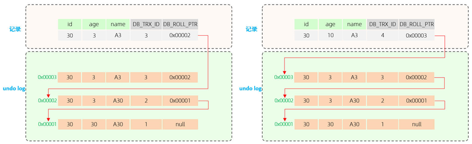


> 最终我们发现，**不同事务或相同事务==对同一条记录进行修改==**，会导致该记录的undolog**生成一条记录版本链表，链表的==头部是最新的旧记录，链表尾部是最早的旧记录==**。


### （4）🚀 ==readview==

#### ①概念

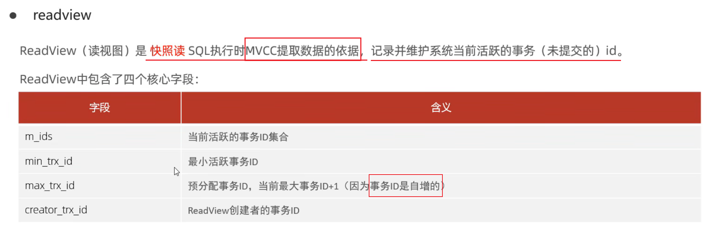

**ReadView（读视图）**

- **快照读 SQL执行时==MVCC提取数据的依据==**，
- 记录并维护系统**当前活跃的事务（==未提交的==）id。**

 

ReadView中包含了四个核心字段：

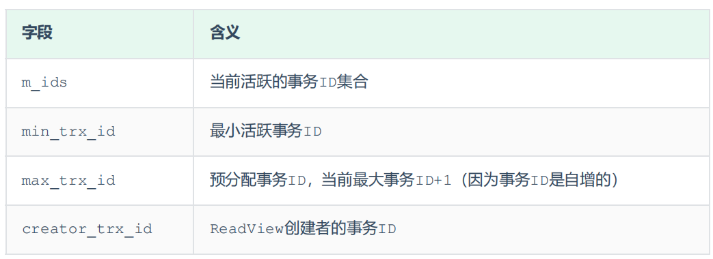


#### ②版本链数据的==访问规则==

而在readview中就规定了**版本链数据的访问规则**：

==trx_id==代表**当前==undolog版本链对应事务ID==**。

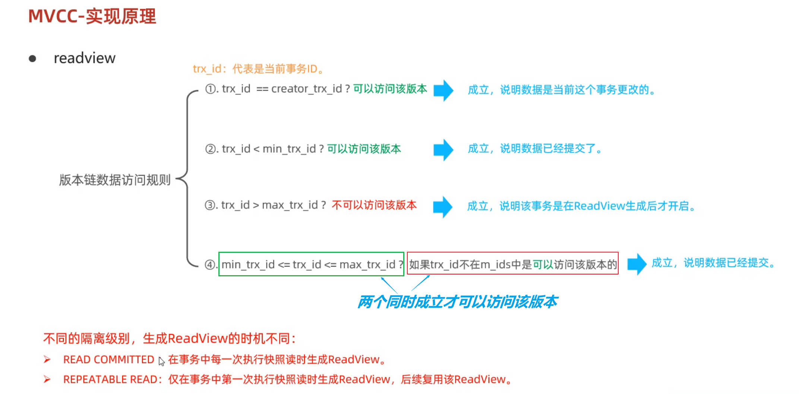

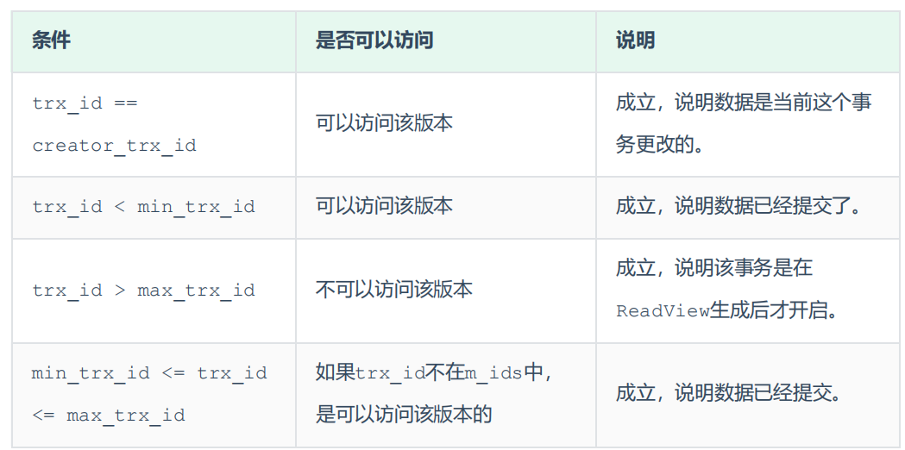

不同的隔离级别，生成ReadView的时机不同：

- READ COMMITTED （RC隔离级别）：**在事务中每一次执行快照读时生成ReadView**。
- REPEATABLE READ（RR隔离级别）：**仅在事务中第一次执行快照读时生成ReadView，==后续复用该ReadView==**。


### （5）🚀 ==原理分析==

#### ①RC隔离级别

RC隔离级别下，在事务中**每一次执行快照读时生成ReadView**。

我们就来分析事务5中，两次快照读读取数据，是如何获取数据的?

在事务5中，查询了两次id为30的记录，由于隔离级别为Read Committed，所以每一次进行快照读都会生成一个ReadView，那么两次生成的ReadView如下。

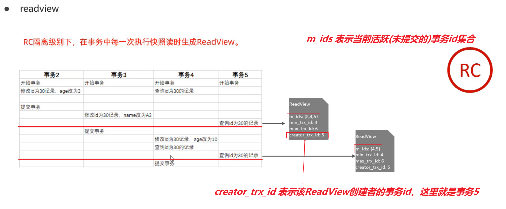


> 那么这两次快照读在获取数据时，就需要**根据所生成的==ReadView以及ReadView的版本链访问规则==，到undo log版本链中匹配数据，最终决定此次快照读返回的数据。**


#### ②🚀RC级别=> ==快照读的具体过程==

##### A. 先来看==第一次快照读== 具体的读取过程

第一次快照读时，对应的**undo log 的版本链的信息，creator_trx_id等信息：**

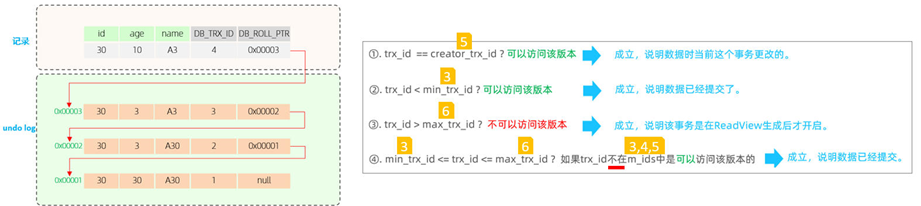

在进行匹配时，会**从undo log的版本链，从上到下进行挨个匹配**：

###### 先匹配 这条记录

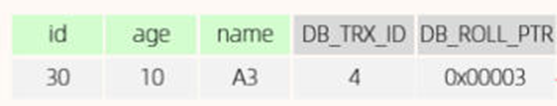


这条记录对应的**trx_id为4**，也就是将4带入右侧的匹配规则中。

 ①不满足 ②不满足 ③不满足 ④也不满足 ，**都不满足**，则**继续匹配undo log版本链的下一条**。


###### 再匹配第二条 


这条记录对应的**trx_id为3**，也就是将3带入右侧的匹配规则中。

①不满足 ②不满足 ③不满足 ④也不满足 ，**都不满足，则继续匹配undo log版本链的下一条**。


###### 再匹配第三条 


这条记录对应的**trx_id为2**，也就是将2带入右侧的匹配规则中。

①不满足 **②满足 终止匹配**，此次快照读，**返回的数据就是版本链中记录的这条数据**。


##### B. 再来看==第二次快照==读具体的读取过程

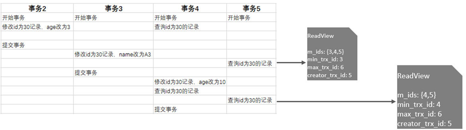

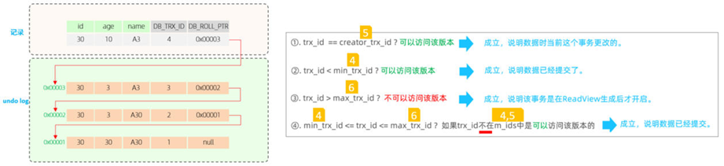

在进行匹配时，会**从undo log的版本链，从上到下进行挨个匹配**：

###### 先匹配 


这条记录，这条记录对应的**trx_id为4**，也就是将4带入右侧的匹配规则中。

 ①不满足 ②不满足 ③不满足 ④也不满足 ，**都不满足，则继续匹配undo log版本链的下一条**。


###### 再匹配第二条 


这条记录对应的**trx_id为3**，也就是将3带入右侧的匹配规则中。

①不满足 **②满足 。终止匹配**，此次快照读，返回的数据就是版本链中记录的这条数据。


#### ③RR隔离级别

RR隔离级别下，**仅在事务中第一次执行快照读时生成ReadView，==后续复用该ReadView==**，**进而保证RR隔离级别可重复读**。 而RR 是可重复读，在一个事务中，**执行两次相同的select语句，查询到的结果是一样的**。

那MySQL是如何做到可重复读的呢? 我们简单分析一下就知道了

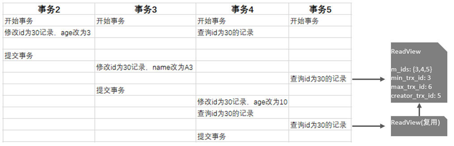

我们看到，在RR隔离级别下，只是在事务中第一次快照读时生成ReadView，**后续都是复用该ReadView**，那么既然ReadView都一样， ReadView的版本链匹配规则也一样， 那么**最终快照读返回的结果也是一样的**，==进而保证RR隔离级别可重复读==。


> 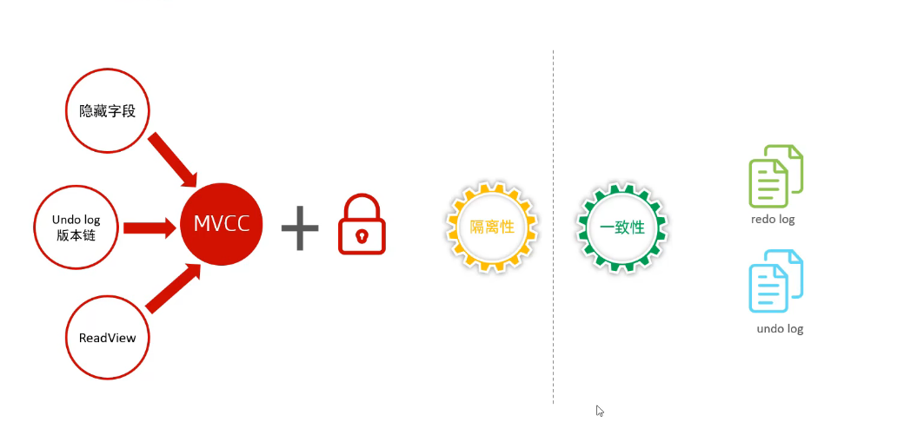
>
> 所以呢：
>
> MVCC的实现原理就是通过 **InnoDB表的隐藏字段、UndoLog 版本链、ReadView**来实现的。
>
> 而==MVCC + 锁==，则**实现了事务的隔离性**。 
>
> 而**一致性则是由redo log 与 undo log**保证，保证数据执行前后一致。


## 6.5 小结

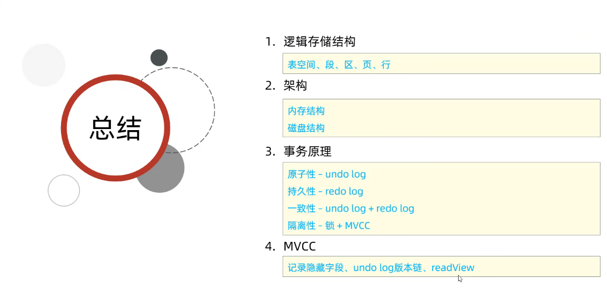


# 7、MySQL管理

## 7.1 系统数据库

Mysql数据库安装完成后，自带了一下四个数据库，具体作用如下：

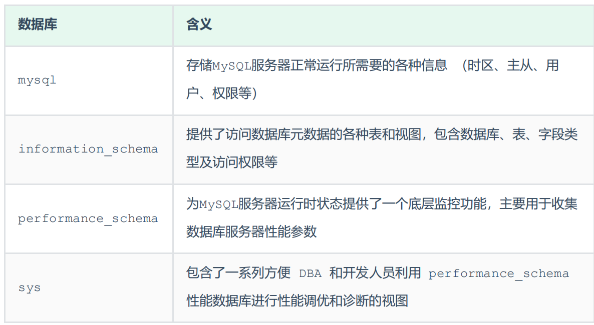


## 7.2 常用工具

### （1）mysql-客户端工具

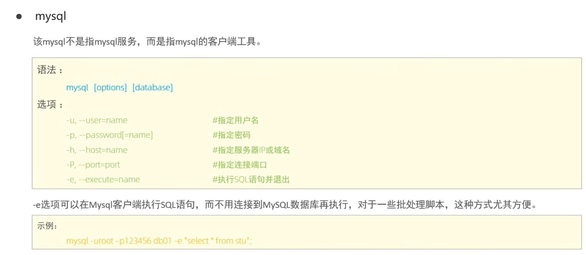

**该mysql不是指mysql服务**，而是指mysql的**客户端工具**。

```sql
-- 语法 ：
    mysql [options] [database]

-- 选项 ：
    -u, --user=name 	#指定用户名
    -p, --password[=name] 	#指定密码
    -h, --host=name 	#指定服务器IP或域名
    -P, --port=port	 	#大写字母P =》指定连接端口
    -e, --execute=name 	#执行SQL语句并退出
```

**-e选项可以在Mysql客户端执行SQL语句**，而不用连接到MySQL数据库再执行，对于一些**批处理脚本**，这种方式尤其方便。

示例：

```sql
mysql -h192.168.88.129 -P3306 -uroot -p1234 itcast -e "select * from stu"; 

mysql -h192.168.88.129 -P3306 -uroot -p1234 itcast -e "show databases;"; 
```

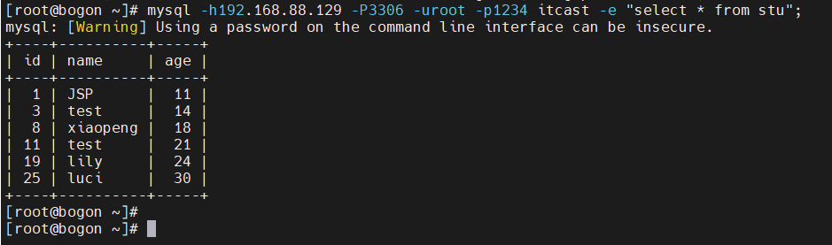


### （2）mysqladmin-执行管理操作

mysqladmin 是一个**执行管理操作的客户端程序**。可以用它来**检查服务器的配置和当前状态、创建并删除数据库等。**

```sql
-- 通过帮助文档查看选项：
	mysqladmin --help
```

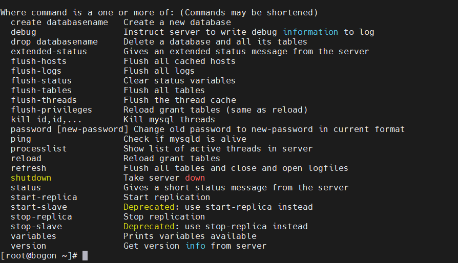

```sql
-- 语法:
	mysqladmin [options] command ...

-- 选项:
    -u, --user=name #指定用户名
    -p, --password[=name] #指定密码
    -h, --host=name #指定服务器IP或域名
    -P, --port=port #指定连接端口
```

示例：

```sql
mysqladmin -uroot -p1234 create 'test01'; -- 创建指定数据库
mysqladmin -uroot -p1234 drop 'test01'; -- 删除指定数据库
mysqladmin -uroot -p1234 version; -- 查看当前数据库的版本
```

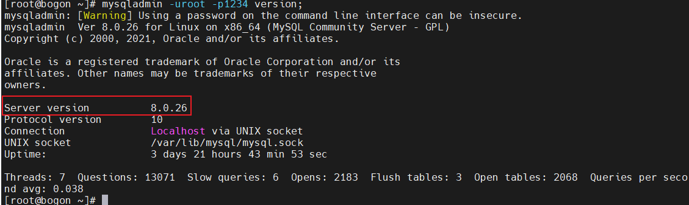


### （3）mysqlbinlog-二进制日志文件

由于服务器生成的**二进制日志文件**以二进制格式保存，所以如果想要检查这些文本的文本格式，就会使用到**mysqlbinlog 日志管理工具**。

```sql
-- 语法 ：
	mysqlbinlog [options] log-files1 log-files2 ...

-- 选项 ：
    -d, --database=name 	-- 指定数据库名称，只列出指定的数据库相关操作。
    -o, --offset=#   	-- 忽略掉日志中的前n行命令。
    -r,--result-file=name 	-- 将输出的文本格式日志输出到指定文件。
    -s, --short-form 	-- 显示简单格式， 省略掉一些信息。
    --start-datatime=date1 --stop-datetime=date2 	-- 指定日期间隔内的所有日志。
    --start-position=pos1 --stop-position=pos2 		-- 指定位置间隔内的所有日志。
```

示例:

A. 查看 binlog.000006这个二进制文件中的数据信息

```sql
cd /var/lib/mysql -- 查看Mysql的目录文件
```

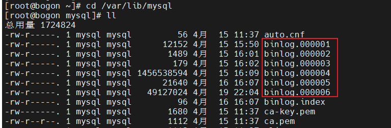


上述查看到的二进制日志文件数据信息量太多了，不方便查询。 我们可以加上一个参数 -s 来显示简单格式。

```sql
mysqlbinlog binlog.000006
mysqlbinlog -s binlog.000006 -- 精简查询后的信息
```


### （4）mysqlshow-对象查找

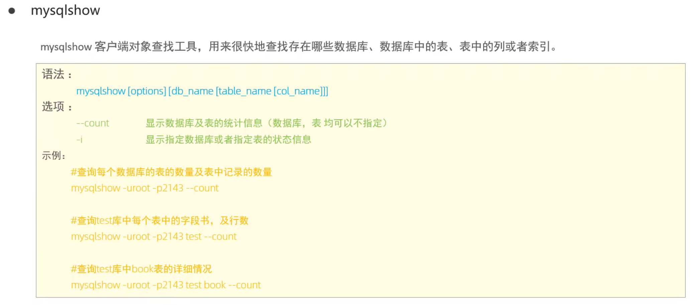

mysqlshow **客户端对象查找工具**，用来很快地**查找存在哪些数据库、数据库中的表、表中的列或者索引**。

```sql
-- 语法 ：
    mysqlshow [options] [db_name [table_name [col_name]]]

-- 选项 ：
    --count 	-- 显示数据库及表的统计信息（数据库，表 均可以不指定）
    -i 		-- 显示指定数据库或者指定表的状态信息

-- 示例：
    #查询itcast库中每个表中的统计信息：字段书，及行数
    mysqlshow -uroot -p1234 itcast --count
    #查询itcast库中book表的详细情况
    mysqlshow -uroot -p1234 itcast stu --count
```

**`-i`查看指定数据库或者指定表/字段的状态信息**

```sql
mysqlshow -uroot -p1234 itcast stu -i
mysqlshow -uroot -p1234 itcast stu id -i
```


示例：

**A. 查询每个数据库的表的数量及表中记录的数量**

```sql
mysqlshow -uroot -p1234 --count
```

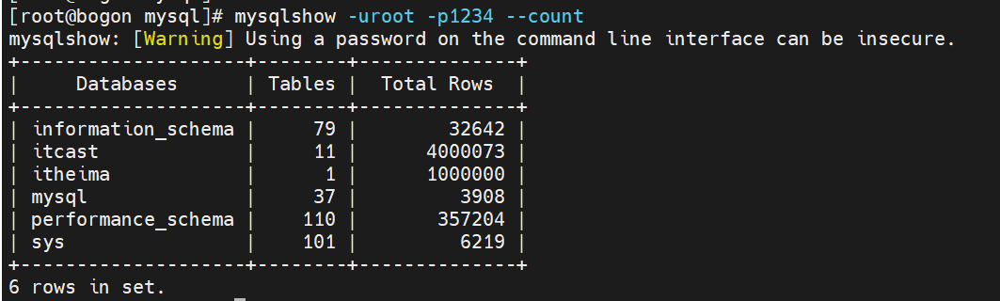

**B. 查看数据库itcast的统计信息**

```sql
mysqlshow -uroot -p1234 itcast --count
```

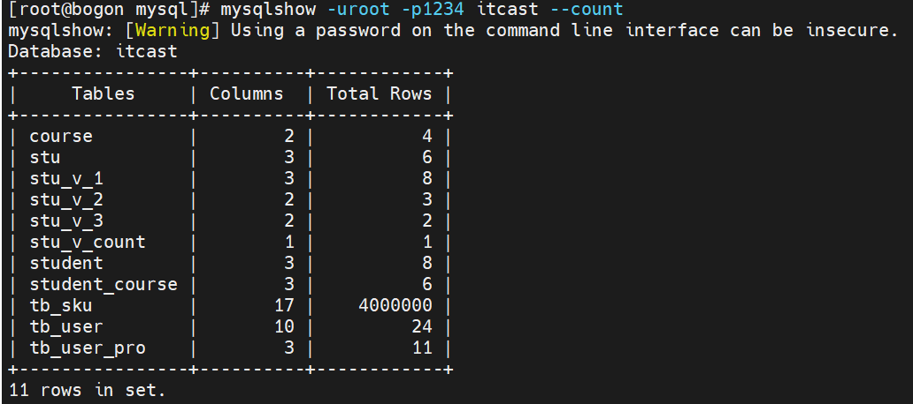

**C. 查看数据库itcast中的stu表的信息**

```sql
mysqlshow -uroot -p1234 itcast stu --count
```

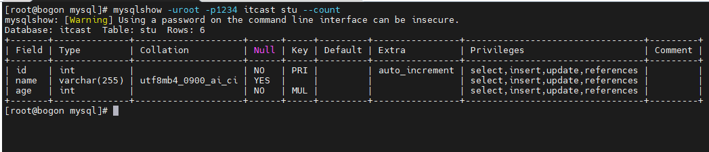

**D. 查看数据库itcast中的course表的id字段的信息**

```sql
mysqlshow -uroot -p1234 itcast stu id --count
```

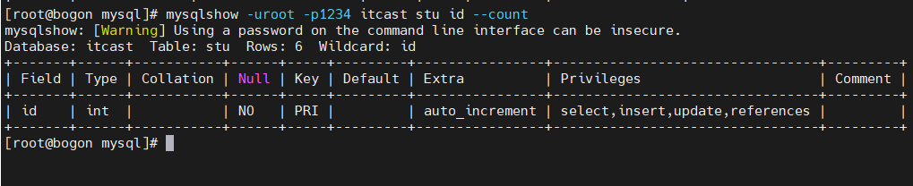

**E.`-i`查看指定数据库或者指定表/字段的状态信息**

```sql
mysqlshow -uroot -p1234 itcast stu -i
mysqlshow -uroot -p1234 itcast stu id -i
```

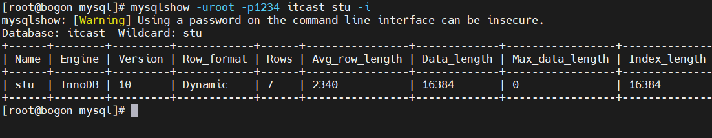

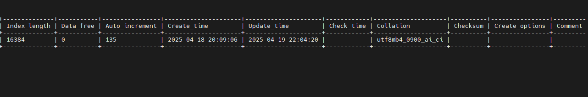


### （5）mysqldump-数据备份和迁移

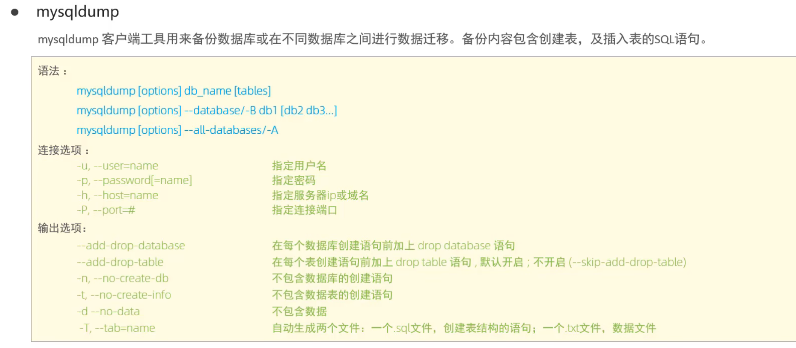

mysqldump 客户端工具用来**备份数据库或在不同数据库之间进行数据迁移**。备份内容**包含创建表，及插入表的SQL语句。**

```sql
-- 语法 ：
	mysqldump --help -- 查看更多的指令选项
    mysqldump [options] db_name [tables]
    mysqldump [options] --database/-B db1 [db2 db3...]
    mysqldump [options] --all-databases/-A

-- 连接选项 ：
    -u, --user=name -- 指定用户名
    -p, --password[=name] -- 指定密码
    -h, --host=name -- 指定服务器ip或域名
    -P, --port=#   	-- 指定连接端口

-- 输出选项：
    --add-drop-database 	-- 在每个数据库创建语句前加上 drop database 语句
    --add-drop-table 	-- 在每个表创建语句前加上 drop table 语句 , 默认开启 ;
        				-- 不开启 (--skip-add-drop-table)
	-R, --routines -- 转存存储例程（函数和程序）。

    -n, --no-create-db 		-- 不包含数据库的创建语句
    -t, --no-create-info 	-- 不包含数据表的创建语句
    -d --no-data 	-- 不包含数据
    -T, --tab=name -- 自动生成两个文件：一个.sql文件，创建表结构的语句；一个.txt文件，数据文件
```

  

示例:

A. **备份itcast数据库**

```sql
mysqldump -uroot -p1234 itcast > itcast.sql
```

可以直接打开itcast.sql，来查看备份出来的数据到底什么样。

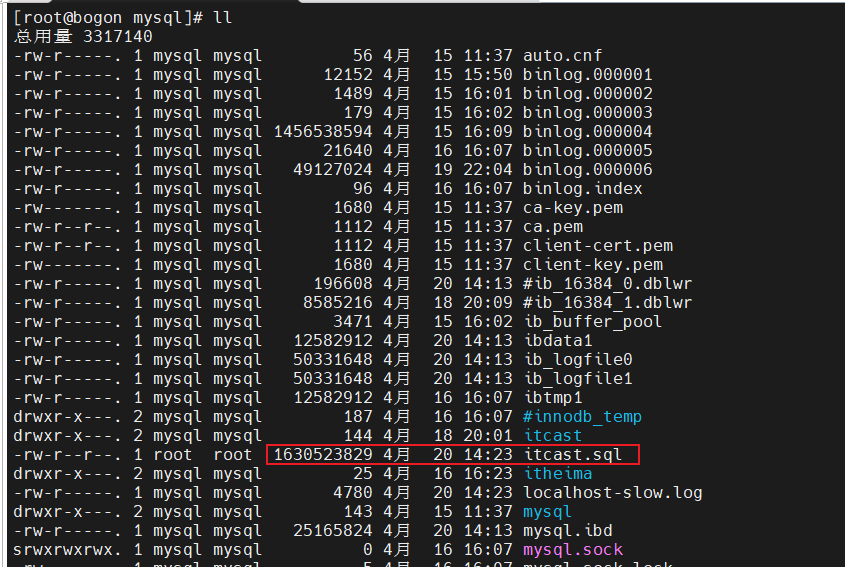

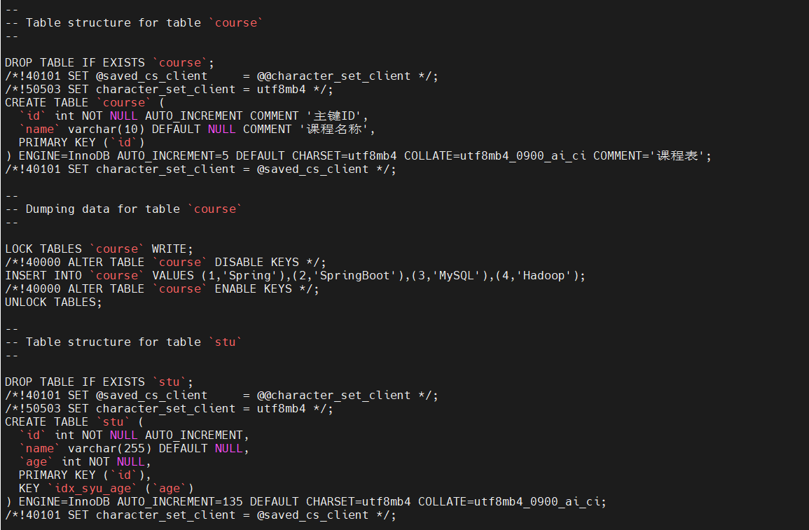


备份出来的数据包含：

- **删除表的语句**
- **创建表的语句**
- **数据插入语句**


如果我们在数据备份时，不需要创建表，或者不需要备份数据，**只需要备份表结构**，都可以通过对应的参数来实现。

B. 备份db01数据库中的表数据，**==不备份表结构(-t)==**

```sql
mysqldump -uroot -p1234 -t itcast > itcast2.sql
```

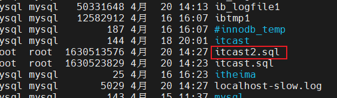


打开 itcast2.sql ，来查看备份的数据，**只有insert语句，没有备份表结构**。


**C. 将itcast数据库的表stu的表结构与数据分开备份(-T)**

```bash
mysqldump -uroot -p1234 -T /root itcast stu
```

执行上述指令，会出错，数据不能完成备份，原因是因为我们所**指定的数据存放目录/root**，**MySQL认为是不安全的，需要存储在MySQL信任的目录下**。那么，哪个目录才是MySQL信任的目录呢，可以**查看一下系统变量 secure_file_priv** 。执行结果如下：

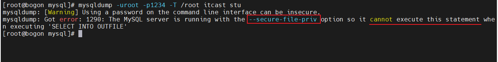

```sql
show variables like '%secure_file_priv%';
```

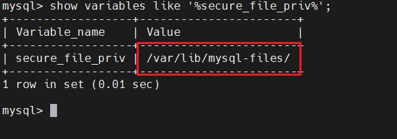

```bash
mysqldump -uroot -p1234 -T /var/lib/mysql-files/ itcast stu
```

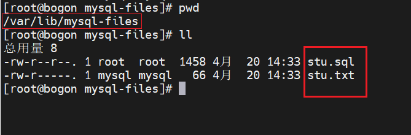

上述的两个文件 stu.sql 中记录的就是**表结构文件**，而 stu.txt 就是**表数据文件**，但是需要注意表数据文件，并**不是记录一条条的insert语句**，而是**按照一定的格式记录表结构中的数据**。如下：

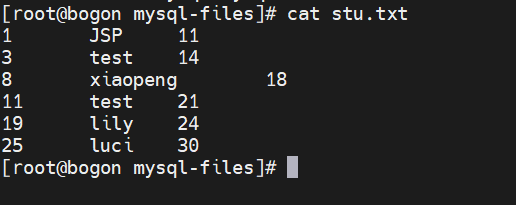


### （6）mysqlimport/source-导入数据

#### ①mysqlimport

mysqlimport 是客户端**数据导入工具**，用来**导入mysqldump 加 -T 参数后导出的文本文件**。

```sql
-- 语法 ：
	mysqlimport [options] db_name textfile1 [textfile2...]

-- 示例 ：
	mysqlimport -uroot -p1234 itcast /tmp/itcast.txt
```

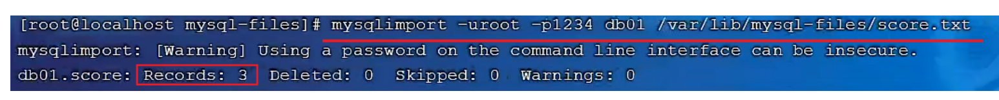

#### ②source

如果需要**导入sql文件**,可以使用mysql中的source 指令 :

```sql
-- 语法 ：
source /root/xxxxx.sql -- 执行sql脚本-insert语句，在mysql命令行中执行
```

 

## 7.3 小结

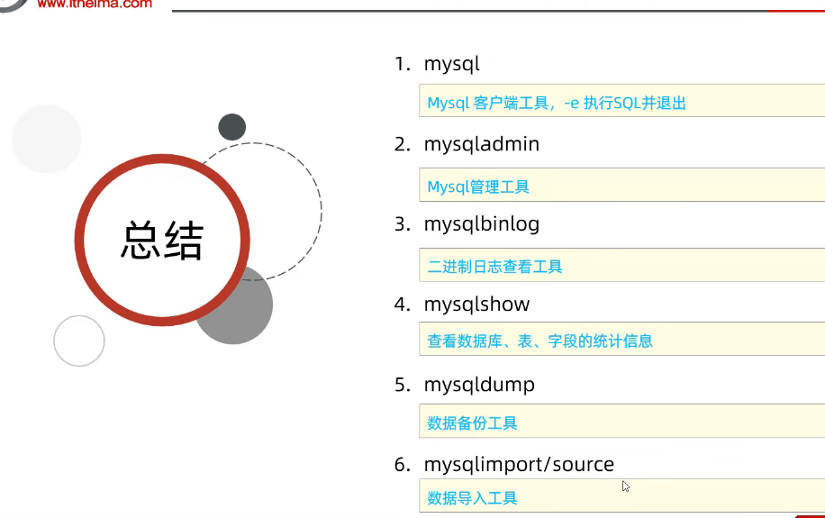


